مصرف ليبيا المركزي

# تطور أهم البيانات والمؤشرات
# المالية للمصارف التجارية
# للربع الثالث 2019

## إدارة البحوث والإحصاء

1
---
ملخص لتطور أهم البيانات المالية للمصارف التجارية
نهاية الربع الثالث 2019

شهدت البيانات المالية للمصارف التجارية في نهاية الربع الثالث 2019 بعض التغيرات مقارنة عما كانت
عليه في نهاية الربع الثالث 2018 وذلك على النحو التالي :

- إنخفض إجمالي أصول المصارف التجارية ( باستثناء الحسابات النظامية ) من 127.5 مليار دينار في
نهاية الربع الثالث 2018 إلى نحو 117.6 مليار دينار في نهاية الربع الثالث 2019 ، أي بمعدل إنخفاض
قدره 7.8%، وقـد شكلت الأصـــول الســائلة البالغة نحو 83.2 مليار دينار من إجمالي الأصول ما نسبته
70.7%، مقارنة بما نسبته 75.0% عن ما كانت عليه في الربع الثالث 2018.

| إجمالي أصول المصارف التجارية |
| (2012 - الربع الثالث 2019) |
| --- |
| 140 |
| 120 |
| 100 |
| 80 |
| 60 |
| 40 |
| 20 |
| 0 |
| 2012 | 2013 | 2014 | 2015 | 2016 | 2017 | 2018 | الربع الثالث 2019 |

- إنخفض إجمالي ودائع المصارف التجارية ( تحت الطلب وشهادات الإيداع ) لدى المصرف المركزي
بما فيها الاحتياطي الإلزامي من نحو 90.0 مليار دينار في نهاية الربع الثالث 2018 إلى نحو 72.2 مليار
دينار في نهاية الربع الثالث 2019، أي بمعدل إنخفاض 19.7%.

- إرتفع إجمالي الإئتمان الممنوح من المصارف التجارية من 16.5 مليار دينار في نهاية الربع الثالث
2018 إلى 16.7 مليار دينار في نهاية الربع الثالث 2019، أي بمعدل نمو طفيف بلغ 1.1%، وقد شكلت
القروض والتسهيلات الائتمانية الممنوحة إلى اجمالي الخصوم الإيداعية ما نسبته 18.3%، كما شكلت من
اجمالي الأصول ما نسبته 14.2% ، وبلغ رصيد القروض الممنوحة للقطاع الخاص في نهاية الربع الثالث
2019 ما قيمته 10.9 مليار دينار، وما نسبته 65.3% من إجمالي القروض والتسهيلات الائتمانية، فيما
شكل رصيد القروض الممنوحة للقطاع العام النسبة الباقية 34.7% والتي بلغت قيمتها 5.8 مليار دينار.

2
---

إجمالي رصيد القروض الممنوحة من المصارف التجارية
(2012 - الربع الثالث 2019)

| السنة | القيمة (مليار دينار) |
|-------|---------------------|
| 2012  | 15.0                |
| 2013  | 18.0                |
| 2014  | 20.0                |
| 2015  | 20.0                |
| 2016  | 19.0                |
| 2017  | 17.5                |
| 2018  | 16.0                |
| الربع الثالث 2019 | 16.0    |

- بلغت نسبة تغطية مخصص الديون المشكوك فيها لإجمالي الائتمان الممنوح نسبة 20.7% في نهاية الربع الثالث 2019 مقابل نسبة 18.9% في نهاية الربع الثالث 2018.

- انخفضت ودائع العملاء لدى المصارف التجارية من 106.4 مليار دينار في نهاية الربع الثالث 2018 إلى 91.4 مليار دينار في نهاية الربع الثالث 2019، أي بمعدل إنخفاض 14.1%، وقد شكلت الودائع تحت الطلب ما نسبته 87.0% من إجمالي الودائع، في حين شكلت الودائع لأجل ما نسبته 12.5% من إجمالي الودائع، وشكلت ودائع الادخار ما نسبته 0.5% فقط من إجمالي الودائع.

وفيما يتعلق بتوزيع إجمالي الودائع حسب القطاعات فقد بلغت ودائع القطاع الخاص في نهاية الربع الثالث 2019 ما قيمته 50.2 مليار دينار، وما نسبته 55.0% من إجمالي الودائع، فيما شكل رصيد ودائع القطاع العام والحكومي النسبة الباقية وقدرها 45.0% أي ما قيمته 41.2 مليار دينار من إجمالي الودائع، منها 30.4 مليار دينار ودائع لشركات ومؤسسات القطاع العام ونحو 10.8 مليار دينار ودائع حكومية.

إجمالي ودائع العملاء لدى المصارف التجارية
(2012 - الربع الثالث 2019)

| السنة | ودائع تحت الطلب | ودائع زمنية | ودائع إدخارية | إجمالي الودائع |
|-------|-----------------|-------------|----------------|-----------------|
| 2012  | 55              | 15          | 5              | 75              |
| 2013  | 60              | 20          | 5              | 85              |
| 2014  | 55              | 20          | 5              | 80              |
| 2015  | 60              | 10          | 2              | 72              |
| 2016  | 70              | 10          | 2              | 82              |
| 2017  | 80              | 10          | 2              | 92              |
| 2018  | 80              | 12          | 2              | 94              |
| الربع الثالث 2019 | 75  | 10          | 2              | 87              |


---
- ارتفع إجمالي حقوق الملكية لدى المصارف التجارية من 5.3 مليار دينار في نهاية الربع الثالث 2018 إلى 6.4 مليار دينار في نهاية الربع الثالث 2019، وبمعدل نمو بلغ 21.8%.

- انخفضت أرباح المصارف التجارية قبل خصم المخصصات والضرائب خلال الربع الثالث 2019 بمعدل 25.2% لتصل إلى 618.5 مليون دينار، مقارنة عما كانت عليه خلال الربع الثالث 2018 والبالغة نحو 827.2 مليون دينار.

| أرباح الفترة قبل خصم المخصصات والضرائب |           |
|----------------------------------------|-----------|
| الربع الثالث 2018                       | 827.2     |
| الربع الثالث 2019                       | 618.5     |

| أرباح المصارف التجارية قبل خصم المخصصات والضرائب (2012 - 2018) |
|------------------------------------------------------------------|
| 2012 | 2013 | 2014 | 2015 | 2016 | 2017 | 2018                   |
|------|------|------|------|------|------|------------------------|
| ~550 | ~450 | ~300 | ~250 | ~300 | ~500 | ~1250                  |

*Note: The values in the second table are approximate based on the chart provided.*
---
تفرع المصارف التجارية :-

بلغ عدد المصارف التجارية العاملة في ليبيا 18 مصرفاً (بما في ذلك وحدة الدينار الليبي التابعة للمصرف الليبي الخارجي) حتى نهاية الربع الثالث 2019، وتزاول هذه المصارف نشاطها من خلال 529 فرعاً ووكالة مصرفية.

## تطور عدد الفروع والوكالات المصرفية والعاملين بها

| السنة | عدد الفروع والوكالات | عدد العاملين بالقطاع المصرفي |
|-------|----------------------|------------------------------|
| 2012  | 498                  | 17,575                       |
| 2013  | 515                  | 18,878                       |
| 2014  | 516                  | 19,183                       |
| 2015  | 516                  | 19,214                       |
| 2016  | 521                  | 19,255                       |
| 2017  | 522                  | 19,324                       |
| 2018  | 527                  | 19,263                       |
| الربع الثالث 2019 | 529      | 19,368                       |

### عدد الفروع والوكالات المصرفية
(2012 - الربع الثالث 2019)

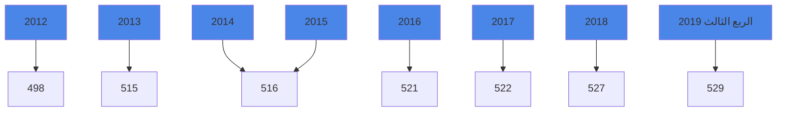
---
# التركز المصرفي:

درجة التركز المصرفي تعني أن عدداً قليلا من المصارف التجارية يستأثر بالنسبة الأكبر من النشاط المصرفي سواءً من حيث الأصول أو الودائع أوالائتمان أو من حيث حجم حقوق المساهمين، وفيما يخص الحصة السوقية للمصارف التجارية في ليبيا، فقد شكلت أصول المصارف الأربعة الكبرى (الجمهورية، التجاري الوطني ، الوحدة والصحارى) من أصل 18 مصرفاً مانسبته 78.2% من إجمالي أصول القطاع المصرفي في نهاية الربع الثالث 2019، وشكل مصرف الجمهورية وحده ما نسبته 32.6% من إجمالي أصول القطاع المصرفي ككل.

وشكلت ودائع وقروض المصارف الأربعة الكبرى مانسبته 78.3 % و 88.7 % على التوالي من إجمالي ودائع وقروض القطاع المصرفي نهاية الربع الثالث 2019.

## التركز المصرفي
### ( 2012 – الربع الثالث 2019 )

#### التركز حسب الأصول :

| المصارف | 2012 | 2013 | 2014 | 2015 | 2016 | 2017 | 2018 | الربع الثالث 2019 |
|----------|------|------|------|------|------|------|------|-------------------|
| أكبر مصرف | % 37.9 | % 33.0 | % 33.1 | % 34.9 | % 33.8 | % 33.6 | % 32.7 | % 32.6 |
| أكبر ثلاثة مصارف | % 71.0 | % 63.7 | % 62.1 | % 67.6 | % 67.9 | % 66.9 | % 65.8 | % 65.8 |
| أكبر خمسة مصارف | % 89.0 | % 81.3 | % 79.2 | % 87.1 | % 86.7 | % 85.0 | % 84.3 | % 84.4 |
---
# التركز حسب الإئتمان :

| المصارف | 2012 | 2013 | 2014 | 2015 | 2016 | 2017 | 2018 | الربع الثالث 2019 |
|---------|------|------|------|------|------|------|------|------------------|
| أكبر مصرف | %41.9 | %44.8 | %43.5 | %44.8 | %44.3 | %44.5 | %43.6 | %41.8 |
| أكبر ثلاثة مصارف | %77.0 | %76.7 | %79.1 | %79.4 | %78.5 | %77.7 | %77.7 | %75.8 |
| أكبر خمسة مصارف | %91.0 | %90.2 | %91.1 | %91.4 | %91.3 | %91.2 | %91.5 | %92.5 |

# التركز حسب ودائع العملاء :

| المصارف | 2012 | 2013 | 2014 | 2015 | 2016 | 2017 | 2018 | الربع الثالث 2019 |
|---------|------|------|------|------|------|------|------|------------------|
| أكبر مصرف | %40.9 | %33.8 | %33.1 | %34.8 | %34.0 | %33.6 | %31.9 | %32.5 |
| أكبر ثلاثة مصارف | %71.5 | %62.7 | %61.3 | %66.5 | %67.2 | %66.5 | %65.2 | %66.1 |
| أكبر خمسة مصارف | %90.1 | %80.9 | %78.6 | %87.8 | %87.5 | %85.7 | %85.4 | %85.8 |

## التركز المصرفي نهاية الربع الثالث 2019

### تركز الأصول

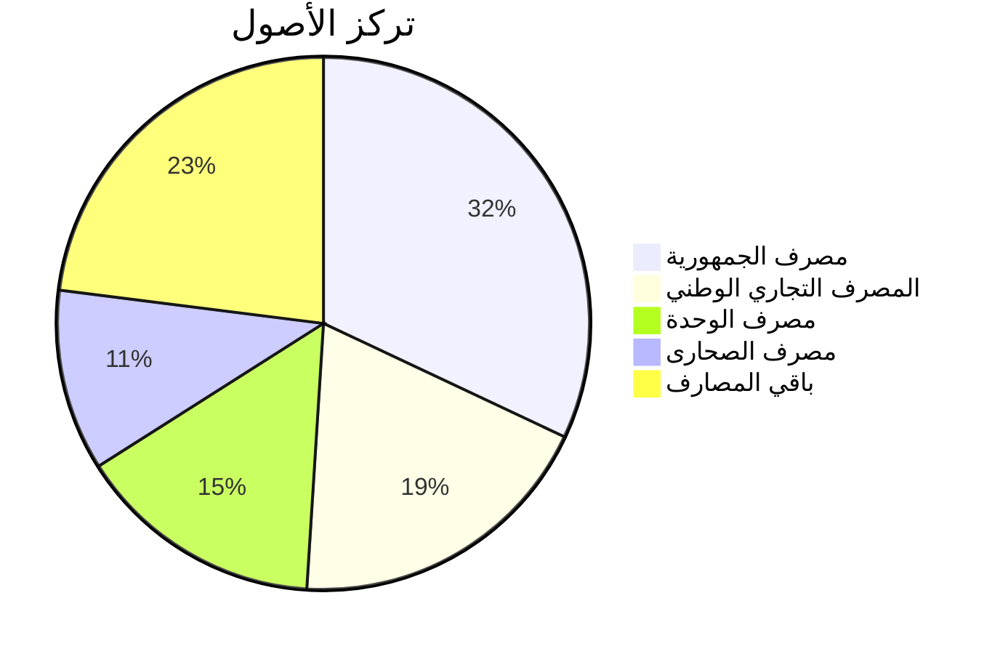
---
# تركز الائتمان

| البنك | النسبة |
|-------|--------|
| مصرف الجمهورية | 42% |
| المصرف التجاري الوطني | 20% |
| مصرف الوحدة | 14% |
| مصرف الصحارى | 12% |
| باقي المصارف | 12% |

# تركز ودائع العملاء

| البنك | النسبة |
|-------|--------|
| مصرف الجمهورية | 32% |
| باقي المصارف | 22% |
| المصرف التجاري الوطني | 18% |
| مصرف الوحدة | 16% |
| مصرف الصحارى | 12% |
---
# المصارف التجارية

شهدت الميزانية المُجمَعة للمصارف التجارية نهاية الربع الثالث 2019، تطورات في مُجمل بنودها على جانبي الأصول والخصوم ليصل إجمالي الأصول داخل الميزانية المُجمَعة إلى 117,605.2 مليون دينار، مقابل 127,524.6 مليون دينار في نهاية الربع الثالث 2018، بإنخفاض قدره 9,919.4 مليون دينار، أي بمعدل 7.8%، وفيما يلي جدول يلخص البنود الرئيسية للميزانية المُجمَعة للمصارف التجارية:

## البنود الرئيسية للميزانية المُجمَعة للمصارف التجارية

### جانب الأصول:

| البند | الربع الثالث 2018 | الربع الثالث 2019 | مقدار التغير | معدل التغير |
|-------|-------------------|-------------------|---------------|-------------|
| نقدية بالخزائن | 572.7 | 2,874.2 | 2,301.5 | 401.9% |
| حسابات المقاصة | 6,381.5 | 8,240.6 | 1,859.1 | 29.1% |
| أرصدة لدى المصارف | 95,038.7 | 80,311.5 | -14,727.2 | -15.5% |
| الإستثمارات | 1,369.3 | 1,114.1 | -255.2 | -18.6% |
| القروض والتسهيلات | 16,503.9 | 16,689.5 | 185.6 | 1.1% |
| الأصول الثابتة | 1,532.6 | 1,706.6 | 174.0 | 11.4% |
| الأصول الأخرى | 6,126.0 | 6,082.6 | -43.4 | -0.7% |
| إجمالي الأصول | 127,524.6 | 117,605.2 | -9,919.4 | -7.8% |
| الحسابات النظامية | 45,717.7 | 42,844.1 | -2,873.6 | -6.3% |
| إجمالي الميزانية | 173,242.3 | 160,449.3 | -12,793.0 | -7.4% |

*جميع الأرقام بالمليون دينار
---
جانب الخصوم:

مليون دينار

| البند | الربع الثالث 2018 | الربع الثالث 2019 | مقدار التغير | معدل التغير |
|-------|-------------------|-------------------|--------------|-------------|
| ودائع العملاء | 106,408.6 | 91,421.8 | -14,220.1 | -14.1% |
| منها : التأمينات النقدية | 10,271.8 | 9,249.9 | -954.4 | -9.9% |
| حقوق الملكية | 5,278.5 | 7,049.7 | 1,002.1 | 33.6% |
| المخصصات | 4,560.1 | 5,371.3 | 810.6 | 17.8% |
| الخصوم الأخرى | 11,277.4 | 13,762.4 | 1,894.5 | 22.0% |
| إجمالي الخصوم | 127,524.6 | 117,605.2 | -10,512.9 | -7.8% |
| الحسابات النظامية | 45,717.7 | 42,844.1 | -2,777.8 | -6.3% |
| إجمالي الميزانية | 173,242.3 | 160,449.3 | -13,290.7 | -7.4% |
---
# الأهمية النسبية للبنود المُكونة للأصول

| الربع الثالث 2019 | النسبة | الربع الثالث 2018 | النسبة |
|-------------------|--------|-------------------|--------|
| نقدية بالخزائن | 3% | نقدية بالخزائن | 5% |
| حسابات المقاصة | 7% | حسابات المقاصة | 5% |
| أرصدة لدى المصارف | 69% | أرصدة لدى المصارف | 75% |
| الإستثمارات | 1% | الإستثمارات | 1% |
| القروض والتسهيلات | 14% | القروض والتسهيلات | 13% |
| الأصول الثابتة | 1% | الأصول الثابتة | 1% |
| الأصول الأخرى | 3% | الأصول الأخرى | 0% |

# الأهمية النسبية للبنود المُكونة للخصوم

| الربع الثالث 2019 | النسبة | الربع الثالث 2018 | النسبة |
|-------------------|--------|-------------------|--------|
| ودائع العملاء | 79% | ودائع العملاء | 83% |
| حقوق الملكية | 5% | حقوق الملكية | 4% |
| المخصصات | 5% | المخصصات | 4% |
| الخصوم الأخرى | 11% | الخصوم الأخرى | 9% |
---
وفيما يلي تطور الميزانية المُجمَعة للمصارف التجارية خلال الفترة (2012 – الربع الثالث 2019):

مليون دينار

| جانب الأصول | 2012 | 2013 | 2014 | 2015 | 2016 | 2017 | 2018 | الربع الثالث 2019 |
|-------------|------|------|------|------|------|------|------|-------------------|
| نقدية بالخزائن | 1,545.9 | 1,712.3 | 1,642.8 | 752.8 | 606.4 | 547.2 | 1,582.1 | 2,874.2 |
| حسابات المقاصة | 2,024.6 | 7,310.3 | 8,125.4 | 11,444.4 | 12,886.4 | 10,625.8 | 4,671.0 | 8,240.6 |
| أرصدة لدى المصارف | 56,787.6 | 68,094.6 | 62,244.0 | 53,540.0 | 62,306.5 | 84,262.6 | 85,349.3 | 80,311.5 |
| الإستثمارات | 954.9 | 746.7 | 777.5 | 1,787.8 | 1,789.2 | 1,311.5 | 1,456.5 | 1,114.1 |
| القروض والتسهيلات | 15,899.5 | 18,232.3 | 19,959.9 | 20,212.8 | 18,770.3 | 17,446.6 | 16,448.3 | 16,689.5 |
| الأصول الثابتة | 1,038.4 | 1,121.6 | 1,211.6 | 1,365.4 | 1,409.1 | 1,463.2 | 1,608.3 | 1,706.6 |
| الأصول الأخرى | 6,169.5 | 1,157.8 | 1,243.0 | 1,130.2 | 5,687.2 | 5,066.0 | 5,947.1 | 6,082.6 |
| إجمالي الأصول | 84,420.4 | 98,375.6 | 95,204.2 | 90,233.4 | 103,455.1 | 116,477.0 | 117,062.4 | 117,605.2 |
| الحسابات النظامية | 70,747.7 | 71,550.9 | 51,845.0 | 48,299.2 | 46,800.0 | 46,534.9 | 48,160.2 | 42,844.1 |
| إجمالي الميزانية | 155,168.1 | 169,926.5 | 147,049.2 | 138,532.6 | 150,255.1 | 163,011.9 | 165,222.6 | 160,449.3 |

| جانب الخصوم | 2012 | 2013 | 2014 | 2015 | 2016 | 2017 | 2018 | الربع الثالث 2019 |
|--------------|------|------|------|------|------|------|------|-------------------|
| ودائع العملاء | 68,346.2 | 83,562.7 | 78,910.4 | 71,257.1 | 83,407.6 | 95,938.5 | 93,657.5 | 91,421.8 |
| منها : التأمينات النقدية | 6,823.3 | 6,609.0 | 8,080.7 | 9,738.7 | 8,939.7 | 8,845.6 | 11,533.7 | 9,249.9 |
| حقوق الملكية | 4,653.2 | 4,743.7 | 4,886.4 | 5,087.5 | 5,366.5 | 5,561.4 | 6,472.6 | 7,049.7 |
| المخصصات | 3,317.4 | 3,597.2 | 3,765.3 | 3,941.8 | 4,144.9 | 4,473.0 | 4,627.6 | 5,371.3 |
| الخصوم الأخرى | 8,103.6 | 6,472.0 | 7,642.1 | 9,946.9 | 10,536.1 | 10,504.2 | 12,304.7 | 13,762.4 |
| إجمالي الخصوم | 84,420.4 | 98,375.6 | 95,204.2 | 90,233.4 | 103,455.1 | 116,477.0 | 117,062.4 | 117,605.2 |
| الحسابات النظامية | 70,747.7 | 71,550.9 | 51,845.0 | 48,299.2 | 46,800.0 | 46,534.9 | 48,160.2 | 42,844.1 |
| إجمالي الميزانية | 155,168.1 | 169,926.5 | 147,049.2 | 138,532.6 | 150,255.1 | 163,011.9 | 165,222.6 | 160,449.3 |
---
أولاً: جانب الأصول

1- النقدية :

أ- النقدية بالخزائن و حسابات المقاصة :

ارتفع رصيد النقدية بالخزائن وحسابات المقاصة بمقدار 4,160.7 مليون دينار وبمعدل نمو 59.8%،
لتصل إلى 11,114.8 مليون دينار في نهاية الربع الثالث 2019، مقابل 6,954.1 مليون دينار في نهاية
الربع الثالث 2018، حيث تركز هذا الارتفاع في النقدية بخزائن المصارف والتي ارتفعت
بمقدار 2,301.5 مليون دينار، وسجلت حسابات المقاصة إرتفاعاً بمقدار 1,859.1 مليون دينار في نهاية
الربع الثالث 2019 مقارنة بالربع الثالث من عام 2018 .

| مليون دينار |  |  |  |  |
|---|---|---|---|---|
| البيان | الربع الثالث 2018 | الربع الثالث 2019 | مقدار التغير | معدل التغير |
| النقدية بالخزائن : | 572.7 | 2,874.2 | 2,301.5 | 401.9% |
| عملة محلية | 559.6 | 2,862.1 | 2,302.5 | 411.5% |
| عملة أجنبية | 13.1 | 12.2 | -0.9 | -6.9% |
| إجمالي حسابات المقاصة | 6,381.5 | 8,240.6 | 1,859.1 | 29.1% |
| المقاصة بين المصارف | 3,414.6 | 4,136.9 | 722.3 | 21.2% |
| المقاصة بين الفروع | 2,966.9 | 4,103.7 | 1,136.8 | 38.3% |
| الإجمالي | 6,954.1 | 11,114.8 | 4,160.7 | 59.8% |

إجمالي حسابات المقاصة:

```mermaid
bar chart
    title إجمالي حسابات المقاصة
    x-axis [الربع الثالث 2018, الربع الثالث 2019]
    y-axis "مليون دينار" 0 --> 9000
    bar [6381.5, 8240.6]
```

نقدية بخزائن المصارف التجارية:

```mermaid
bar chart
    title نقدية بخزائن المصارف التجارية
    x-axis [الربع الثالث 2018, الربع الثالث 2019]
    y-axis "مليون دينار" 0 --> 3500
    bar [572.7, 2874.2]
```
---
وفيما يلي تطور بند النقدية في المصارف التجارية خلال الفترة (2012 – الربع الثالث 2019) :

مليون دينار

| البيان | 2012 | 2013 | 2014 | 2015 | 2016 | 2017 | 2018 | الربع الثالث 2019 |
|--------|------|------|------|------|------|------|------|------------------|
| النقدية بالخزائن : | 1,545.9 | 1,712.3 | 1,642.8 | 752.8 | 606.4 | 547.2 | 1,582.1 | 2,874.2 |
| عملة محلية | 1,433.3 | 1,622.6 | 1,619.9 | 743.6 | 594.7 | 537.8 | 1,573.6 | 2,862.1 |
| عملة أجنبية | 112.6 | 89.7 | 22.9 | 9.2 | 11.7 | 9.4 | 8.4 | 12.2 |
| إجمالي حسابات المقاصة | 2,024.6 | 7,310.3 | 8,125.4 | 11,444.4 | 12,886.4 | 6,379.9 | 4,671.0 | 8,240.6 |
| المقاصة بين المصارف | 1,410.4 | 4,004.6 | 4,836.7 | 7,072.2 | 8,488.9 | 4,245.9 | 2,191.1 | 4,136.9 |
| المقاصة بين الفروع | 614.2 | 3,305.7 | 3,288.7 | 4,372.2 | 4,397.5 | 2,134.0 | 2,479.9 | 4,103.7 |
| الإجمالي | 2,956.3 | 5,716.9 | 6,479.5 | 7,825.0 | 13,492.7 | 6,927.1 | 6,253.0 | 11,114.8 |

نقدية بخزائن المصارف التجارية
( 2012 - الربع الثالث 2019)


إجمالي حسابات المقاصة
( 2012 - الربع الثالث 2019 )

```mermaid
graph LR
    2012[2012] --> 2013[2013]
    2013 --> 2014[2014]
    2014 --> 2015[2015]
    2015 --> 2016[2016]
    2016 --> 2017[2017]
    2017 --> 2018[2018]
    2018 --> 2019[الربع الثالث 2019]

    2012 -- 2024.6 --> 2013
    2013 -- 7310.3 --> 2014
    2014 -- 8125.4 --> 2015
    2015 -- 11444.4 --> 2016
    2016 -- 12886.4 --> 2017
    2017 -- 6379.9 --> 2018
    2018 -- 4671.0 --> 2019
    2019 -- 8240.6 --> End
```

14
---
ب- الأرصدة والودائع لدى المصرف المركزي والمصارف الأخرى:

بلغ رصيد ودائع المصارف فيما بينها ولدى الغير 80,311.5 مليون دينار في نهاية الربع الثالث 2019، مقابل 95,038.7 مليون دينار في نهاية الربع الثالث 2018، أي بمعدل إنخفاض قدره 15.5%، وتركز هذا الإنخفاض في رصيد الودائع لدى المصرف المركزي (شهادات الإيداع، الودائع تحت الطلب) بمقدار 10,720.5 مليون دينار، 7,042.5 مليون دينار على التوالي في نهاية الربع الثالث 2019 مقارنة بالربع الثالث من عام 2018.

| البيان | الربع الثالث 2018 | الربع الثالث 2019 | مقدار التغير | معدل التغير |
|--------|-------------------|-------------------|---------------|-------------|
| ودائع تحت الطلب لدى : | 65,685.8 | 61,482.1 | -4,203.7 | -6.4% |
| - المصرف المركزي | 61,437.7 | 54,395.2 | -7,042.5 | -11.5% |
| - المصارف المحلية | 869.4 | 2,425.1 | 1,555.7 | 178.9% |
| - المصرف الليبي الخارجي | 1,060.3 | 637.1 | -423.2 | -39.9% |
| - المصارف بالخارج | 2,318.4 | 4,024.6 | 1,706.2 | 73.6% |
| ودائع زمنية : | 29,353.0 | 18,829.4 | -10,523.6 | -35.9% |
| - شهادات الإيداع | 28,533.5 | 17,813.0 | -10,720.5 | -37.6% |
| - المصارف المحلية | 0.0 | 0.0 | 0.0 | - |
| - المصرف الليبي الخارجي | 0.0 | 0.0 | 0.0 | - |
| - المصارف بالخارج | 819.5 | 1,016.4 | 196.9 | 24.0% |
| الإجمالي | 95,038.7 | 80,311.5 | -14,727.2 | -15.5% |

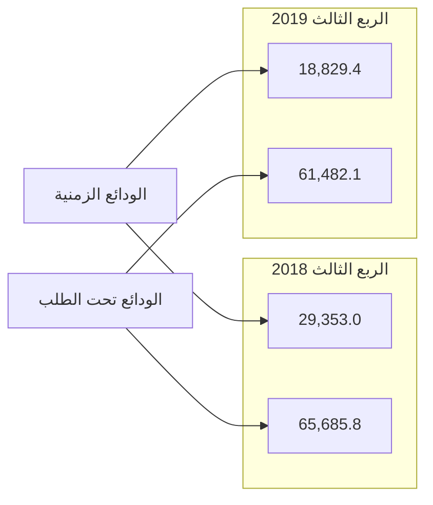
---
والجدول التالي يبين تطور بند الأرصدة والودائع للمصارف التجارية لدى الغير وفيما بينها خلال الفترة
(2012 – الربع الثالث 2019 ):

| البيان | 2012 | 2013 | 2014 | 2015 | 2016 | 2017 | 2018 | الربع الثالث 2019 |
|--------|------|------|------|------|------|------|------|------------------|
| ودائع تحت الطلب لدى : | 19,352.7 | 22,342.6 | 24,360.7 | 27,870.7 | 38,306.1 | 56,945.4 | 59,454.9 | 61,482.1 |
| - المصرف المركزي | 17,203.4 | 19,364.6 | 19,317.8 | 20,863.2 | 30,627.6 | 53,136.0 | 52,385.4 | 54,395.2 |
| - المصارف المحلية | 329.0 | 347.6 | 408.2 | 1,717.6 | 1,742.4 | 1,012.5 | 1,030.0 | 2,425.1 |
| - المصرف الليبي الخارجي | 664.7 | 848.1 | 1,850.0 | 2,216.8 | 2,396.1 | 874.2 | 1,762.1 | 637.1 |
| - المصارف بالخارج | 1,155.6 | 1,782.3 | 2,784.7 | 3,073.1 | 3,540.0 | 1,922.7 | 4,277.3 | 4,024.6 |
| ودائع زمنية : | 37,434.9 | 45,751.9 | 37,883.3 | 25,669.2 | 24,000.4 | 27,317.8 | 25,894.4 | 18,829.4 |
| - شهادات الإيداع | 35,737.8 | 44,307.3 | 37,074.6 | 24,259.7 | 23,187.1 | 26,415.7 | 24,716.9 | 17,813.0 |
| - المصارف المحلية | 0.0 | 30.0 | 0.0 | 0.0 | 0.0 | 0.0 | 0.0 | 0.0 |
| - المصرف الليبي الخارجي | 58.4 | 37.6 | 206.1 | 107.1 | 224.7 | 0.0 | 459.4 | 0.0 |
| - المصارف بالخارج | 1,638.7 | 1,377.0 | 602.6 | 1,302.4 | 588.6 | 902.1 | 718.1 | 1,016.4 |
| الإجمالي | 56,787.6 | 68,094.6 | 62,244.0 | 53,539.9 | 62,306.5 | 84,263.2 | 85,349.3 | 80,311.5 |

ودائع المصارف التجارية لدى المصرف المركزي والمصارف الأخرى
( 2012 - الربع الثالث 2019 )

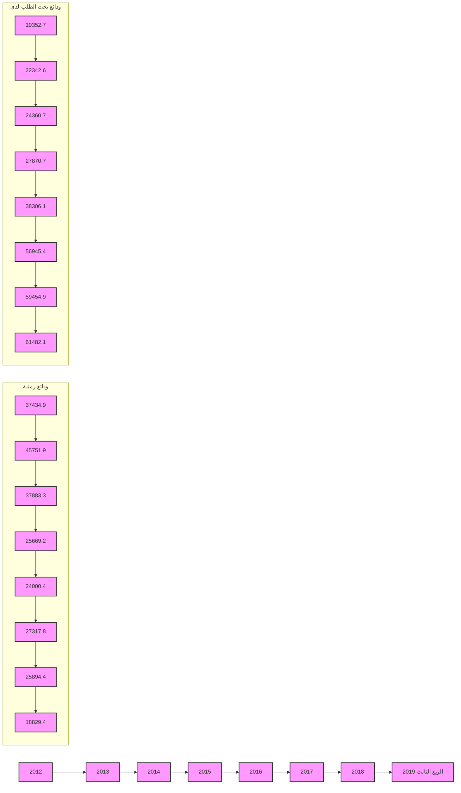
---
## 2- الإستثمارات

سجل إجمالي بند رصيد الإستثمارات في المصارف التجارية نهاية الربع الثالث 2019 نحو 1,114.1 مليون دينار، مقابل 1,369.3 مليون دينار في نهاية الربع الثالث 2018، وتجدر الإشارة إلى قيام مصرفي الوحدة والتجارة والتنمية بالإستثمار في سندات وأذونات الخزانة في العام 2015 والجدول التالي يوضح تفاصيل هذا البند:

| إجمالي الإستثمارات |           |
|-------------------|-----------|
| الربع الثالث 2018 | 1,369.3   |
| الربع الثالث 2019 | 1,114.1   |

والجدول التالي يبين تطور بند الإستثمارات خلال الفترة (2012 – الربع الثالث 2019):

| البيان                | 2012  | 2013  | 2014  | 2015    | 2016    | 2017    | 2018    | الربع الثالث 2019 |
|-----------------------|-------|-------|-------|---------|---------|---------|---------|-------------------|
| إجمالي رصيد الإستثمارات | 954.9 | 746.7 | 777.5 | 1,787.8 | 1,789.2 | 1,311.5 | 1,456.5 | 1,114.1           |


17
---
# 3- القروض والتسهيلات الائتمانية

إرتفع اجمالي الإئتمان الممنوح من المصارف التجارية من 16,503.9 مليون دينار في نهاية الربع الثالث 2018 إلى 16,689.5 مليون دينار في نهاية الربع الثالث 2019 ، أي بمعدل نمو 1.1%، وقد شكلت القروض والتسهيلات الائتمانية الممنوحة إلى اجمالي الخصوم الإيداعية ما نسبته 18.3%، كما شكلت من اجمالي الأصول ما نسبته 14.2% ، وبلغ رصيد القروض الممنوحة للقطاع الخاص في نهاية الربع الثالث 2019 ما قيمته 10,896.7 مليون دينار، وما نسبته 65.3% من إجمالي القروض والتسهيلات الإئتمانية، فيما شكل رصيد القروض الممنوحة للقطاع العام النسبة الباقية 34.7% والتي بلغت قيمتها 5,792.8 مليون دينار.

وبلغت نسبة تغطية مخصص الديون المشكوك فيها لإجمالي الإئتمان الممنوح نسبة 20.9% في نهاية الربع الثالث 2019 مقابل نسبة 18.9% في نهاية الربع الثالث 2018.

وفيما يلي بيان تفصيلي لرصيد القروض والتسهيلات الممنوحة من المصارف التجارية :

| البيان | الربع الثالث 2018 | الربع الثالث 2019 | مقدار التغير | معدل التغير |
|--------|-------------------|-------------------|---------------|-------------|
| سلفيات والسحب على المكشوف | 4,610.5 | 5,124.4 | 513.9 | 11.1% |
| السلف الإجتماعية * | 4,082.7 | 3,282.7 | -800.0 | -19.6% |
| القروض الأخرى | 7,810.7 | 8,282.4 | 471.7 | 6.0% |
| إجمالي القروض والتسهيلات | 16,503.9 | 16,689.5 | 185.6 | 1.1% |
| مخصص الديون | 3,126.3 | 3,459.5 | 333.2 | 10.7% |
| صافي القروض والتسهيلات | 13,377.6 | 13,127.4 | -250.2 | -1.9% |

*تشمل رصيد قروض المرابحة للأفراد.
---

## السلفيات والسحب على المكشوف (Advances and Overdrafts)

| الربع الثالث 2018 | الربع الثالث 2019 |
|-------------------|-------------------|
| 4,610.5           | 5,124.4           |

*Values in million dinars*

## السلف الاجتماعية (Social Loans)

| الربع الثالث 2018 | الربع الثالث 2019 |
|-------------------|-------------------|
| 4,082.7           | 3,282.7           |

*Values in million dinars*

## Financial Data Table

| البيان | الربع الثالث 2018 | الربع الثالث 2019 | مقدار التغير | معدل التغير |
|--------|-------------------|-------------------|---------------|-------------|
| القروض الممنوحة للقطاع العام | 4,775.4 | 5,792.8 | 1,017.4 | 21.3% |
| القروض الممنوحة للقطاع الخاص | 11,728.5 | 10,896.7 | -831.8 | -7.1% |
| الإجمالي | 16,503.9 | 16,689.5 | 185.6 | 1.1% |

*Values in million dinars*

## رصيد القروض الممنوحة للقطاع الخاص (Balance of Loans Granted to the Private Sector)

| الربع الثالث 2018 | الربع الثالث 2019 |
|-------------------|-------------------|
| 11,728.5          | 10,896.7          |

*Values in million dinars*

## رصيد القروض الممنوحة للقطاع العام (Balance of Loans Granted to the Public Sector)

| الربع الثالث 2018 | الربع الثالث 2019 |
|-------------------|-------------------|
| 4,775.4           | 5,792.8           |

*Values in million dinars*

19
---
وفيما يلي القروض الممنوحة للقطاع العام والقطاع الخاص خلال الفترة (2012 – الربع الثالث 2019):

مليون دينار

| البيان | 2012 | 2013 | 2014 | 2015 | 2016 | 2017 | 2018 | الربع الثالث 2019 |
|--------|------|------|------|------|------|------|------|------------------|
| القروض الممنوحة للقطاع العام | 5,291.2 | 5,327.1 | 6,195.9 | 5,982.8 | 5,915.9 | 5,578.9 | 5,100.9 | 5,792.8 |
| القروض الممنوحة للقطاع الخاص | 10,608.3 | 12,905.5 | 13,764.0 | 14,230.1 | 12,854.3 | 11,867.7 | 11,347.4 | 10,896.7 |
| الإجمالي | 15,899.5 | 18,232.3 | 19,959.9 | 20,212.8 | 18,770.3 | 17,446.6 | 16,448.3 | 16,689.5 |

رصيد القروض الممنوحة للقطاعين (الخاص والعام)
(2012 - الربع الثالث 2019)

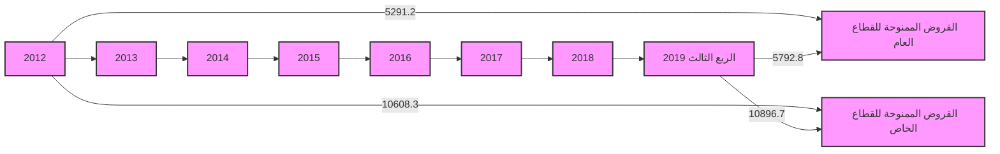

| السنة | القروض الممنوحة للقطاع العام | القروض الممنوحة للقطاع الخاص |
|-------|------------------------------|------------------------------|
| 2012 | 5291.2 | 10608.3 |
| 2013 | 5327.1 | 12905.5 |
| 2014 | 6195.9 | 13764.0 |
| 2015 | 5982.8 | 14230.1 |
| 2016 | 5915.9 | 12854.3 |
| 2017 | 5578.9 | 11867.7 |
| 2018 | 5100.9 | 11347.4 |
| الربع الثالث 2019 | 5792.8 | 10896.7 |
---
وفيما يلي رصيد السلف الاجتماعية والسحب على المكشوف خلال الفترة (2012 – الربع الثالث 2019):

مليون دينار

| البيان | 2012 | 2013 | 2014 | 2015 | 2016 | 2017 | 2018 | الربع الثالث 2019 |
|--------|------|------|------|------|------|------|------|------------------|
| سلفيات والسحب على المكشوف | 5,522.3 | 4,146.5 | 4,452.1 | 5,440.1 | 4,827.9 | 4,514.5 | 4,354.0 | 5,124.4 |
| السلف الإجتماعية * | 4,973.5 | 6,726.0 | 7,157.9 | 6,608.6 | 5,901.1 | 4,912.5 | 3,988.7 | 3,282.7 |
| القروض الأخرى | 5,403.7 | 3,759.8 | 8,348.9 | 8,164.2 | 8,041.3 | 8,019.6 | 8,105.6 | 8,282.4 |
| إجمالي القروض والتسهيلات | 15,899.5 | 18,232.3 | 19,959.9 | 20,212.8 | 18,770.3 | 17,446.6 | 16,448.3 | 16,689.5 |
| مخصص الديون | 2,348.9 | 2,497.9 | 2,688.1 | 2,779.7 | 2,910.0 | 3,040.8 | 3,126.4 | 3,459.5 |
| صافي القروض والتسهيلات | 13,550.6 | 15,734.4 | 17,271.8 | 17,433.1 | 15,860.3 | 14,405.8 | 13,321.9 | 13,127.4 |

*تشمل رصيد قروض المرابحة للأفراد


| السنة | السلف الإجتماعية | سلفيات والسحب على المكشوف |
|-------|------------------|---------------------------|
| 2012 | 4973.5 | 5522.3 |
| 2013 | 6726.0 | 4146.5 |
| 2014 | 7157.9 | 4452.1 |
| 2015 | 6608.6 | 5440.1 |
| 2016 | 5901.1 | 4827.9 |
| 2017 | 4912.5 | 4514.5 |
| 2018 | 3988.7 | 4354.0 |
| الربع الثالث 2019 | 3282.7 | 5124.4 |

## 4 – الأصول الثابتة والأصول الأخرى

بلغ رصيد الأصول الثابتة نحو 1,706.6 مليون دينار في نهاية الربع الثالث 2019، مقابل 1,532.6 مليون دينار في نهاية الربع الثالث 2018، فيما بلغ رصيد الأصول الأخرى نحو 6,082.6 مليون دينار في نهاية الربع الثالث 2019، مقابل 6,126.0 مليون دينار في نهاية الربع الثالث 2018.

21
---
ثانياً : جانب الخصوم

1- ودائع العملاء :

إنخفضت أرصدة ودائع العملاء لدى المصارف التجارية من 106,408.6 مليون دينار في نهاية الربع الثالث 2018 إلى 91,421.8 مليون دينار في نهاية الربع الثالث 2019، أي بمعدل إنخفاض 14.1%، وقد تركز الإنخفاض في أرصدة الودائع تحت الطلب بمقدار 14,419.9 مليون دينار وبنسبة إنخفاض 15.3% ، وانخفضت كذلك الودائع لأجل والودائع الإدخارية بنسب 3.7% و 21.8% على التوالي.

وتجدر الإشارة إلى أن الودائع تحت الطلب شكلت ما نسبته 87.0% من حجم الودائع، في حين شكلت الودائع لأجل ما نسبته 12.5% من حجم الودائع، وشكلت ودائع الادخار ما نسبته 0.5% فقط من حجم الودائع.

| البيان | الربع الثالث 2018 | الربع الثالث 2019 | مقدار التغير | معدل التغير |
|--------|-------------------|-------------------|---------------|-------------|
| الودائع تحت الطلب | 93,964.3 | 79,544.4 | -14,419.9 | -15.3% |
| الودائع لأجل | 11,854.1 | 11,415.5 | -438.6 | -3.7% |
| الودائع الإدخارية | 590.4 | 461.9 | -128.5 | -21.8% |
| الإجمالي | 106,408.6 | 91,421.8 | -14,986.8 | -14.1% |

تصنيف الودائع لدى المصارف التجارية

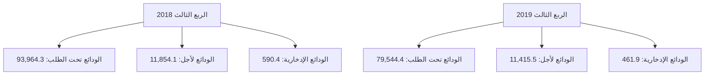
---
# تصنيف الودائع حسب نوع الوديعة لدى المصارف التجارية
## خــلال الفترة (2012 – الربع الثالث 2019)

مليون دينار

| البيان | 2012 | 2013 | 2014 | 2015 | 2016 | 2017 | 2018 | الربع الثالث 2019 |
|--------|------|------|------|------|------|------|------|-------------------|
| الودائع تحت الطلب | 54,728.8 | 61,834.9 | 56,641.4 | 58,725.9 | 72,192.7 | 84,827.6 | 80,038.6 | 79,544.4 |
| الودائع زمنية | 12,912.1 | 21,064.9 | 21,669.3 | 11,956.7 | 10,644.7 | 10,519.2 | 13,115.5 | 11,415.5 |
| الودائع الإدخارية | 705.3 | 662.9 | 599.8 | 574.5 | 570.2 | 591.7 | 503.4 | 461.9 |
| الإجمالي | 68,346.2 | 83,562.7 | 78,910.4 | 71,257.1 | 83,407.6 | 95,938.5 | 93,657.5 | 91,421.8 |

## إجمالي ودائع العملاء لدى المصارف التجارية
### (2012 - الربع الثالث 2019)

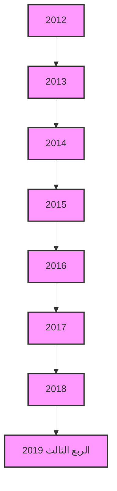

وفيما يتعلق بتوزيع إجمالي الودائع حسب القطاعات ( خاص ، حكومة، عام ) فقد إنخفضت ودائع القطاع الخاص بمقدار 12,246.9 مليون دينار وبنسبة 19.6% في نهاية الربع الثالث 2019، لتسجل في نهاية الربع الثالث 2019 نحو 50,248.5 مليون دينار، مقارنة بنحو 62,495.4 مليون دينار في نهاية الربع الثالث من عام 2018 ، حيث تركز الإنخفاض في ودائع الأفراد والتي إنخفضت بشكل ملحوظ.

كما إنخفض أيضاً رصيد ودائع القطاع العام والقطاع الحكومي في نهاية الربع الثالث 2019 بمقدار 2,740.0 مليون دينار لتصل إلى 41,173.3 مليون دينار، منها 10,776.1 مليون دينار كودائع حكومية والتي تتكون من ودائع الوزارات والهيئات والمؤسسات الحكومية وودائع كل من: صندوق الضمان

23
---
الاجتماعي، صندوق الإنماء الاقتصادي وودائع الصندوق الليبي للتنمية والاستثمار، مقابل 43,913.3 مليون دينار كودائع للقطاع العام والقطاع الحكومي في نهاية الربع الثالث 2018، والجدول التالي يوضح ذلك:

مليون دينار

| البيان | الربع الثالث 2018 | الربع الثالث 2019 | مقدار التغير | معدل التغير |
|--------|-------------------|-------------------|--------------|-------------|
| ودائع الحكومة والقطاع العام | 43,913.3 | 41,173.3 | -2,740.0 | -6.2% |
| - ودائع حكومية | 10,688.3 | 10,776.1 | 87.8 | 0.8% |
| - ودائع القطاع العام | 33,225.0 | 30,397.2 | -2,827.8 | -8.5% |
| ودائع القطاع الخاص | 62,495.4 | 50,248.5 | -12,246.9 | -19.6% |
| - الأفراد | 41,662.3 | 30,687.9 | -10,974.4 | -26.3% |
| - أخرى | 20,833.1 | 19,560.6 | -1,272.5 | -6.1% |
| الإجمالي | 106,408.6 | 91,421.8 | -14,986.8 | -14.1% |

ودائع القطاع الخاص:

```mermaid
bar chart
    title ودائع القطاع الخاص
    x-axis [الربع الثالث 2018, الربع الثالث 2019]
    y-axis "مليون دينار" 0 --> 70,000
    bar [41662.3, 30687.9]
    bar [62495.4, 50248.5]
    legend "ودائع الأفراد"
    legend "إجمالي ودائع القطاع الخاص"
```

ودائع القطاع العام والحكومي:

```mermaid
bar chart
    title ودائع القطاع العام والحكومي
    x-axis [الربع الثالث 2018, الربع الثالث 2019]
    y-axis "مليون دينار" 0 --> 35,000
    bar [10688.3, 10776.1]
    bar [33225.0, 30397.2]
    legend "ودائع حكومية"
    legend "ودائع القطاع العام"
```
---
وفيما يلي توزيع الودائع لدى المصارف التجارية خلال الفترة (2012 – الربع الثالث 2019) :

مليون دينار

| البيان | 2012 | 2013 | 2014 | 2015 | 2016 | 2017 | 2018 | الربع الثالث 2019 |
|--------|------|------|------|------|------|------|------|------------------|
| ودائع الحكومة والقطاع العام | 35,469.8 | 52,638.7 | 46,339.9 | 35,139.7 | 39,197.7 | 40,710.8 | 39,747.8 | 41,173.3 |
| - ودائع حكومية | 13,983.3 | 24,285.4 | 21,987.0 | 9,800.6 | 9,100.7 | 9,234.8 | 10,048.5 | 10,776.1 |
| - ودائع القطاع العام | 21,486.5 | 28,353.3 | 24,352.9 | 25,339.1 | 30,097.0 | 31,476.0 | 29,699.3 | 30,397.2 |
| ودائع القطاع الخاص | 32,876.4 | 30,924.0 | 32,570.5 | 36,117.4 | 44,209.9 | 55,227.7 | 53,909.7 | 50,248.5 |
| - الأفراد | 21,026.1 | 19,569.5 | 19,799.0 | 20,477.2 | 27,605.5 | 36,295.4 | 33,717.5 | 30,687.9 |
| - أخرى | 11,850.3 | 11,345.5 | 12,771.5 | 15,640.2 | 16,604.4 | 18,932.3 | 20,192.2 | 19,560.6 |
| الإجمالي | 68,346.2 | 83,562.7 | 78,910.4 | 71,257.1 | 83,407.6 | 95,938.5 | 93,657.5 | 91,421.8 |

ودائع القطاع العام والقطاع الحكومي لدى المصارف التجارية
( 2012 - الربع الثالث 2019 )

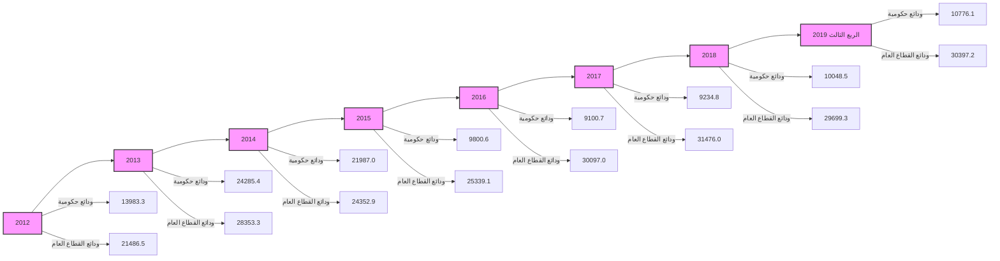

ودائع القطاع الخاص لدى المصارف التجارية
( 2012 - الربع الثالث 2019 )

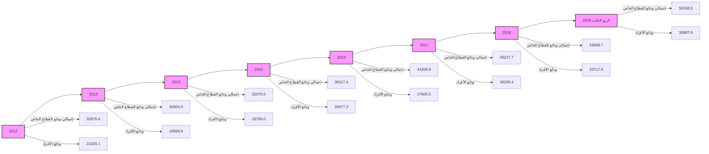
---
## 2- الحسابات المكشوفة لدى المراسلين بالخارج:

بلغ رصيد الحسابات المكشوفة لدى المراسلين بالخارج 354.8 مليون دينار في نهاية الربع الثالث 2019، مقابل 339.5 مليون دينار في نهاية الربع الثالث 2018، وهي في معظمها ناتجة عن تأخر تسوية الحسابات لبعض المصارف مع المصارف المراسلة بالخارج.

| مليون دينار |  |  |  |  |
|---|---|---|---|---|
| البيان | الربع الثالث 2018 | الربع الثالث 2019 | مقدار التغير | معدل التغير |
| الحسابات المكشوفة لدى المراسلين بالخارج | 339.5 | 354.8 | 15.3 | 4.5% |

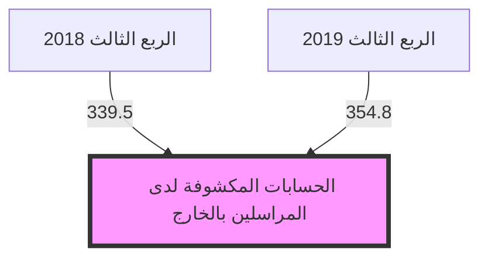

وفيما يلي توزيع رصيد الحسابات المكشوفة خلال الفترة (2012 – الربع الثالث 2019):

| مليون دينار |  |  |  |  |  |  |  |  |
|---|---|---|---|---|---|---|---|---|
| البيان | 2012 | 2013 | 2014 | 2015 | 2016 | 2017 | 2018 | الربع الثالث 2019 |
| الحسابات المكشوفة لدى المراسلين بالخارج | 139.6 | 74.9 | 432.0 | 955.6 | 429.9 | 368.5 | 503.4 | 354.8 |

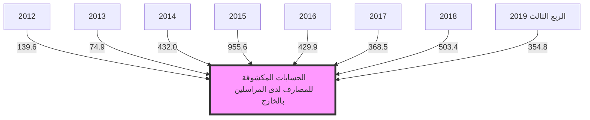
---
### 3- حقوق الملكية والأرباح:

- رأس المال المدفوع: إرتفع رأس المال المدفوع من 3,728.4 مليون دينار في نهاية الربع الثالث 2018 إلى 4,263.3 مليون دينار في نهاية الربع الثالث 2019 ، نتيجة لقيام بعض المصارف بزيادة رأس المال المدفوع ( التجارة والتنمية ، الأمان ، السراي ) .

- الإحتياطيات والأرباح: إرتفع رصيد الإحتياطيات والأرباح المرحلة والقابلة للتوزيع من 2,377.4 مليون دينار في نهاية الربع الثالث 2018، ليصل إلى 2,786.2 مليون دينار في نهاية الربع الثالث 2019، في حين إنخفضت أرباح المصارف التجارية قبل خصم المخصصات والضرائب خلال الربع الثالث 2019 بمعدل 25.2% لتصل إلى 618.5 مليون دينار، مقارنة عما كانت عليه خالل الربع الثالث 2018 والبالغة نحو 827.2 مليون دينار.

وتجدر الإشارة إلى أن المصارف التجارية خلال العام 2018 سجلت أرباحاً قياسية بنحو 1,122.2 مليون دينار، مقارنة عما كانت عليه في السابق، هذه الزيادة في الأرباح نتيجة لتحقيق المصارف التجارية لإيرادات هامة من عمولات بيع وتحويل العملة الأجنبية وكذلك من رفع أسعار الخدمات المصرفية.

| البيان | الربع الثالث 2018 | الربع الثالث 2019 | مقدار التغير | معدل التغير |
|--------|-------------------|-------------------|---------------|-------------|
| رأس المال المدفوع | 3,728.4 | 4,263.3 | 534.9 | 14.3% |
| الإحتياطي القانوني | 346.9 | 513.0 | 166.1 | 47.9% |
| إحتياطيات غير مخصصة | 31.9 | 33.1 | 1.2 | 3.8% |
| أرباح العام | 827.2 | 618.5 | -208.7 | -25.2% |
| الأرباح المرحّلة والأرباح القابلة للتوزيع | 1,171.4 | 1,621.9 | 450.5 | 38.5% |
| الإجمالي | 6,105.7 | 7,049.8 | 944.1 | 15.5% |

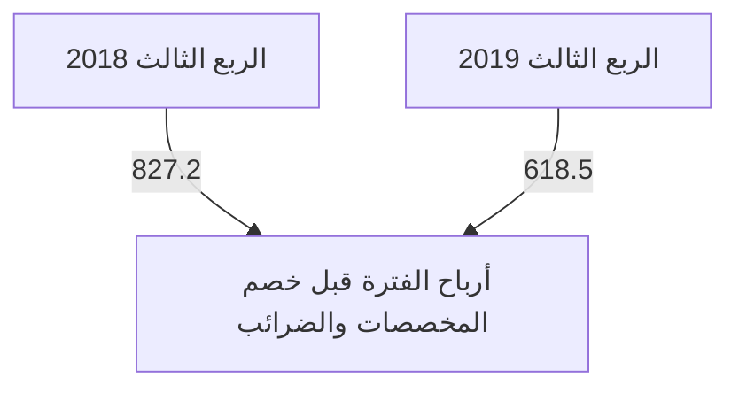
---
# أرباح المصارف التجارية قبل خصم المخصصات والضرائب
## (2012 - 2018)

```mermaid
graph LR
    2012[2012] --> 2013[2013]
    2013 --> 2014[2014]
    2014 --> 2015[2015]
    2015 --> 2016[2016]
    2016 --> 2017[2017]
    2017 --> 2018[2018]
    
    style 2012 fill:#f9f,stroke:#333,stroke-width:2px
    style 2013 fill:#fcc,stroke:#333,stroke-width:2px
    style 2014 fill:#cfc,stroke:#333,stroke-width:2px
    style 2015 fill:#ccf,stroke:#333,stroke-width:2px
    style 2016 fill:#ffc,stroke:#333,stroke-width:2px
    style 2017 fill:#cff,stroke:#333,stroke-width:2px
    style 2018 fill:#fcf,stroke:#333,stroke-width:2px
```

وفيما يلي حسابات رأس المال والإحتياطيات في المصارف خلال الفترة (2012 – الربع الثالث 2019):

| البيان | 2012 | 2013 | 2014 | 2015 | 2016 | 2017 | 2018 | الربع الثالث 2019 |
|--------|------|------|------|------|------|------|------|-------------------|
| رأس المال المدفوع | 3,495.2 | 3,550.2 | 3,566.8 | 3,609.5 | 3,791.4 | 3,806.4 | 3,904.4 | 4,263.3 |
| الإحتياطي القانوني | 181.9 | 323.5 | 335.8 | 335.8 | 342.8 | 346.1 | 352.9 | 513.0 |
| إحتياطيات غير مخصصة | 26.6 | 29.7 | 29.7 | 29.7 | 30.0 | 31.9 | 32.0 | 33.1 |
| أرباح العام | 527.1 | 451.1 | 265.4 | 213.0 | 247.1 | 464.6 | 1,122.2 | 618.5 |
| الأرباح المرحّلة والأرباح القابلة للتوزيع | 422.4 | 389.2 | 688.7 | 899.6 | 955.0 | 912.4 | 1,061.1 | 1,621.9 |
| الإجمالي | 4,653.2 | 4,743.7 | 4,886.4 | 5,087.6 | 5,366.3 | 5,561.4 | 6,472.6 | 7,049.8 |

## إجمالي حقوق الملكية في المصارف التجارية
### (2012 - الربع الثالث 2019)

```mermaid
graph LR
    2012[2012] --> 2013[2013]
    2013 --> 2014[2014]
    2014 --> 2015[2015]
    2015 --> 2016[2016]
    2016 --> 2017[2017]
    2017 --> 2018[2018]
    2018 --> 2019[الربع الثالث 2019]
    
    style 2012 fill:#f9f,stroke:#333,stroke-width:2px
    style 2013 fill:#fcc,stroke:#333,stroke-width:2px
    style 2014 fill:#cfc,stroke:#333,stroke-width:2px
    style 2015 fill:#ccf,stroke:#333,stroke-width:2px
    style 2016 fill:#ffc,stroke:#333,stroke-width:2px
    style 2017 fill:#cff,stroke:#333,stroke-width:2px
    style 2018 fill:#fcf,stroke:#333,stroke-width:2px
    style 2019 fill:#9cf,stroke:#333,stroke-width:2px
```

رأس المال
الإحتياطيات
إجمالي حقوق الملكية
---
## 4- المخصصات :

سجل رصيد المخصصات إرتفاعاً بمقدار 811.4 مليون دينار خلال الفترة ليصل في نهاية الربع الثالث 2019 إلى 5,371.5 مليون دينار، مقابل 4,560.1 مليون دينار في نهاية الربع الثالث 2018، وتركزت الزيادة في بندي مخصص الديون المشكوك في تحصيلها و المخصصات العامة كما هو موضح بالجدول التالي :

مليون دينار

| البيان | الربع الثالث 2018 | الربع الثالث 2019 | مقدار التغير | معدل التغير |
|------|-----------------|-----------------|-------------|------------|
| مخصص الديون المشكوك في تحصيلها | 3,126.3 | 3,459.5 | 333.2 | 10.7% |
| مخصص إستهلاك الأصول الثابتة | 723.4 | 775.2 | 51.8 | 7.2% |
| مخصصات عامة | 707.0 | 1,134.6 | 427.6 | 60.5% |
| مخصص تقييم أسعار الصرف | 3.5 | 2.2 | -1.3 | -37.1% |
| الإجمالي | 4,560.1 | 5,371.5 | 811.4 | 17.8% |

إجمالي المخصصات

```mermaid
bar chart
    title إجمالي المخصصات
    x-axis [الربع الثالث 2018, الربع الثالث 2019]
    y-axis "مليون دينار" 0 --> 4000
    bar [3126.3, 3459.5] "مخصص الديون المشكوك في تحصيلها"
    bar [723.4, 775.2] "مخصص إستهلاك الأصول الثابتة"
    bar [707.0, 1134.6] "مخصصات عامة"
```
---
وفيما يلي رصيد المخصصات خلال الفترة (2012 - الربع الثالث 2019):

| مليون دينار |  |  |  |  |  |  |  |  |
|--------------|-------|-------|-------|-------|-------|-------|-------|-------|
| الربع الثالث 2019 | 2018 | 2017 | 2016 | 2015 | 2014 | 2013 | 2012 | البيان |
| 3,459.5 | 3,126.4 | 3,040.8 | 2,910.0 | 2,779.7 | 2,688.1 | 2,497.5 | 2,348.9 | مخصص الديون المشكوك في تحصيلها |
| 775.2 | 745.2 | 687.3 | 634.0 | 592.5 | 539.3 | 473.1 | 424.1 | مخصص إستهلاك الأصول الثابتة |
| 1,134.6 | 753.2 | 738.2 | 594.3 | 556.9 | 532.8 | 614.6 | 539.3 | مخصصات عامة |
| 2.2 | 2.8 | 6.7 | 6.5 | 12.7 | 5.1 | 11.6 | 5.2 | مخصص تقييم أسعار الصرف |
| 5,371.5 | 4,627.6 | 4,473.0 | 4,144.8 | 3,941.8 | 3,765.3 | 3,597.2 | 3,317.5 | الإجمالي |

رصيد بند المخصصات
(2012 - الربع الثالث 2019)

| السنة | مخصص الديون المشكوك في تحصيلها | مخصص إستهلاك الأصول الثابتة | مخصصات عامة |
|-------|--------------------------------|------------------------------|--------------|
| 2012 | 2348.9 | 424.1 | 539.3 |
| 2013 | 2497.5 | 473.1 | 614.6 |
| 2014 | 2688.1 | 539.3 | 532.8 |
| 2015 | 2779.7 | 592.5 | 556.9 |
| 2016 | 2910.0 | 634.0 | 594.3 |
| 2017 | 3040.8 | 687.3 | 738.2 |
| 2018 | 3126.4 | 745.2 | 753.2 |
| الربع الثالث 2019 | 3459.5 | 775.2 | 1134.6 |

5- متنوعات وخصوم أخرى:
بلغ رصيد متنوعات وخصوم أخرى 13,762.4 مليون دينار في نهاية الربع الثالث 2019 مقابل 11,277.4 مليون دينار في نهاية الربع الثالث 2018.

30
---
# مؤشرات أداء المصارف التجارية

## مؤشرات السيولة:
يتمتع القطاع المصرفي الليبي بسيولة عالية ، إذ بلغت نسبة النقد والأرصدة لدى المصارف التجارية إلى إجمالي الأصول 70.7% في نهاية الربع الثالث 2019، والتي معظمها تمثل ودائع لدى المصرف المركزي ( تحت الطلب بما فيها الإحتياطي الإلزامي وكذلك شهادات الإيداع ).

وبلغ حجم القروض إلى إجمالي الودائع بالقطاع المصرفي نسبة 18.3% في نهاية الربع الثالث 2019، وهى نسبة ضئيلة للغاية، حيث لم تتعدى هذه النسبة 28.4% خلال الفترة موضوع التقرير.

وتجدر الإشارة إلى أن نسبة السيولة القانونية المطلوب من المصارف التجارية الإحتفاظ بها هى 25.0% من إجمالي الخصوم الإيداعية.

| نسب مئوية |  |  |  |  |  |  |  |  |
|-----------|---------|------|------|------|------|------|------|------|
| مؤشرات السيولة | الربع الثالث 2019 | 2018 | 2017 | 2016 | 2015 | 2014 | 2013 | 2012 |
| الأصول السائلة / الأصول | 70.7 | 74.3 | 72.8 | 60.8 | 60.2 | 67.8 | 71.0 | 68.6 |
| القروض / الودائع | 18.3 | 17.6 | 18.2 | 22.5 | 28.4 | 25.2 | 21.8 | 23.6 |
| الودائع / الأصول | 77.7 | 80.0 | 82.4 | 80.6 | 79.0 | 83.1 | 84.9 | 80.8 |

## مؤشرات السيولة (2012 - الربع الثالث 2019)

```mermaid
graph TD
    style A fill:#f9f,stroke:#333,stroke-width:4px
    A[مؤشرات السيولة]
    B[الأصول السائلة / الأصول]
    C[الودائع / الأصول]
    D[القروض / الودائع]
    
    A --> B
    A --> C
    A --> D
    
    B --> |2012| 68.6
    B --> |2013| 71.0
    B --> |2014| 67.8
    B --> |2015| 60.2
    B --> |2016| 60.8
    B --> |2017| 72.8
    B --> |2018| 74.3
    B --> |الربع الثالث 2019| 70.7
    
    C --> |2012| 80.8
    C --> |2013| 84.9
    C --> |2014| 83.1
    C --> |2015| 79.0
    C --> |2016| 80.6
    C --> |2017| 82.4
    C --> |2018| 80.0
    C --> |الربع الثالث 2019| 77.7
    
    D --> |2012| 23.6
    D --> |2013| 21.8
    D --> |2014| 25.2
    D --> |2015| 28.4
    D --> |2016| 22.5
    D --> |2017| 18.2
    D --> |2018| 17.6
    D --> |الربع الثالث 2019| 18.3
```
---
■ جودة الأصول: أظهرت البيانات المتوفرة عن نسبة الديون المتعثرة وهي بيانات تقديرية قد لا تعكس
الواقع أن نسبة الديون المتعثرة إلى إجمالي القروض بلغت في نهاية الربع الثالث 2019 نحو 21.0%،
ويدل ارتفاع هذه النسبة على انخفاض كفاءة إدارة الائتمان، وينبغي أن لا تتجاوز هذه النسبة وفقاً
للمعايير الدولية 5%. وقد سجلت نسبة تغطية مخصص الديون إلى الديون المتعثرة في نهاية الربع الثالث
2019 نحو 99.3%.

نسب مئوية

| جودة الأصول | 2012 | 2013 | 2014 | 2015 | 2016 | 2017 | 2018 | الربع الثالث 2019 |
|-------------|------|------|------|------|------|------|------|-------------------|
| القروض المتعثرة / الأصول(*) | 4.0 | 3.9 | 4.4 | 4.7 | 3.8 | 3.1 | 2.9 | 3.0 |
| القروض المتعثرة / القروض(*) | 21.0 | 21.0 | 21.0 | 21.0 | 21.0 | 21.0 | 21.0 | 21.0 |
| مخصص الديون / القروض المتعثرة(*) | 70.9 | 65.2 | 64.0 | 65.5 | 73.8 | 83.0 | 90.4 | 99.3 |
| مخصص الديون / القروض | 14.9 | 13.7 | 13.4 | 13.8 | 15.5 | 17.4 | 19.0 | 20.9 |

(*) بيانات القروض المتعثرة تقديرية منذ 2011

مؤشرات جودة الأصول
(2012 - الربع الثالث 2019)

```mermaid
graph TD
    A[2012] --> B[2013] --> C[2014] --> D[2015] --> E[2016] --> F[2017] --> G[2018] --> H[الربع الثالث 2019]
    
    style A fill:#f9f,stroke:#333,stroke-width:2px
    style B fill:#f9f,stroke:#333,stroke-width:2px
    style C fill:#f9f,stroke:#333,stroke-width:2px
    style D fill:#f9f,stroke:#333,stroke-width:2px
    style E fill:#f9f,stroke:#333,stroke-width:2px
    style F fill:#f9f,stroke:#333,stroke-width:2px
    style G fill:#f9f,stroke:#333,stroke-width:2px
    style H fill:#f9f,stroke:#333,stroke-width:2px
    
    A --> |مخصص الديون / القروض المتعثرة| I[70.9]
    B --> |مخصص الديون / القروض المتعثرة| J[65.2]
    C --> |مخصص الديون / القروض المتعثرة| K[64.0]
    D --> |مخصص الديون / القروض المتعثرة| L[65.5]
    E --> |مخصص الديون / القروض المتعثرة| M[73.8]
    F --> |مخصص الديون / القروض المتعثرة| N[83.0]
    G --> |مخصص الديون / القروض المتعثرة| O[90.4]
    H --> |مخصص الديون / القروض المتعثرة| P[99.3]
    
    A --> |القروض المتعثرة / القروض| Q[21.0]
    B --> |القروض المتعثرة / القروض| R[21.0]
    C --> |القروض المتعثرة / القروض| S[21.0]
    D --> |القروض المتعثرة / القروض| T[21.0]
    E --> |القروض المتعثرة / القروض| U[21.0]
    F --> |القروض المتعثرة / القروض| V[21.0]
    G --> |القروض المتعثرة / القروض| W[21.0]
    H --> |القروض المتعثرة / القروض| X[21.0]
    
    A --> |مخصص الديون / القروض| Y[14.9]
    B --> |مخصص الديون / القروض| Z[13.7]
    C --> |مخصص الديون / القروض| AA[13.4]
    D --> |مخصص الديون / القروض| AB[13.8]
    E --> |مخصص الديون / القروض| AC[15.5]
    F --> |مخصص الديون / القروض| AD[17.4]
    G --> |مخصص الديون / القروض| AE[19.0]
    H --> |مخصص الديون / القروض| AF[20.9]
```

32
---
## الربحية:

شهد معدل العائد على الأصول لدى القطاع المصرفي في ليبيا انخفاضاً ملحوظاً خلال السنوات (2014 - 2016)، حيث بلغ نحو 0.2% في عام 2016، ويعزى سبب الانخفاض إلى عدة أسباب منها الوضع الغير ملائم الذي تعمل فيه المصارف التجارية في السنوات الأخيرة وكذلك تطبيق قانون إلغاء الفوائد الربوية.

إلا أنه خلال العام 2018 تحسن معدل الربحية بشكل كبير، حيث بلغ العائد على إجمالي الأصول نحو 1.0%، وبلغ معدل العائد على حقوق الملكية 20.9%.

وفي الربع الثالث 2019 بلغ معدل العائد على إجمالي الأصول نحو 0.7% وبلغ معدل العائد على حقوق الملكية 12.8%.

هذه الزيادة في الأرباح خاصة من العام 2018 جاءت نتيجة لتحقيق المصارف التجارية لإيرادات هامة من عمولات بيع وتحويل العملة الأجنبية، وكذلك من رفع أسعار الخدمات المصرفية عموماً.

### نسب مئوية

| الربحية | 2012 | 2013 | 2014 | 2015 | 2016 | 2017 | 2018 | الربع الثالث 2019 |
|----------|------|------|------|------|------|------|------|-------------------|
| العائد / حقوق الملكية | 13.7 | 12.0 | 5.4 | 4.4 | 4.8 | 9.1 | 20.9 | 12.8 |
| العائد / الأصول | 0.7 | 0.5 | 0.3 | 0.2 | 0.2 | 0.4 | 1.0 | 0.7 |

### العائد / الأصول (2012 - الربع الثالث 2019)

```mermaid
graph LR
    2012[2012] --> 2013[2013]
    2013 --> 2014[2014]
    2014 --> 2015[2015]
    2015 --> 2016[2016]
    2016 --> 2017[2017]
    2017 --> 2018[2018]
    2018 --> 2019[الربع الثالث 2019]

    style 2012 fill:#f9f,stroke:#333,stroke-width:2px
    style 2013 fill:#f9f,stroke:#333,stroke-width:2px
    style 2014 fill:#f9f,stroke:#333,stroke-width:2px
    style 2015 fill:#f9f,stroke:#333,stroke-width:2px
    style 2016 fill:#f9f,stroke:#333,stroke-width:2px
    style 2017 fill:#f9f,stroke:#333,stroke-width:2px
    style 2018 fill:#f9f,stroke:#333,stroke-width:2px
    style 2019 fill:#f9f,stroke:#333,stroke-width:2px
```

### العائد / حقوق الملكية (2012 - الربع الثالث 2019)

```mermaid
graph LR
    2012[2012] --> 2013[2013]
    2013 --> 2014[2014]
    2014 --> 2015[2015]
    2015 --> 2016[2016]
    2016 --> 2017[2017]
    2017 --> 2018[2018]
    2018 --> 2019[الربع الثالث 2019]

    style 2012 fill:#f9f,stroke:#333,stroke-width:2px
    style 2013 fill:#f9f,stroke:#333,stroke-width:2px
    style 2014 fill:#f9f,stroke:#333,stroke-width:2px
    style 2015 fill:#f9f,stroke:#333,stroke-width:2px
    style 2016 fill:#f9f,stroke:#333,stroke-width:2px
    style 2017 fill:#f9f,stroke:#333,stroke-width:2px
    style 2018 fill:#f9f,stroke:#333,stroke-width:2px
    style 2019 fill:#f9f,stroke:#333,stroke-width:2px
```
---
## كفاية رأس المال

يتمتع القطاع المصرفي الليبي بكفاية رأسمال مرتفعة، كافية لمواجهة أية مخاطر قد تحدث، حيث تراوحت نسبتها مابين 10.7% و 18.4% خلال الفترة (2012 - الربع الثالث 2019)، وهي بشكل عام أعلى وبهامش مريح من النسبة المحددة من قبل لجنة بازل والبالغة 8.0%، مما يعزز من الإستقرار المالي.

### نسب مئوية

| نسب رأس المال | 2012 | 2013 | 2014 | 2015 | 2016 | 2017 | 2018 | الربع الثالث 2019 |
|---------------|------|------|------|------|------|------|------|-------------------|
| كفاية رأس المال الكلي | 10.7 | 12.4 | 13.9 | 14.3 | 14.6 | 16.7 | 17.8 | 18.4 |
| كفاية رأس المال الأساسي | 9.5 | 11.0 | 12.6 | 13.1 | 13.4 | 15.4 | 16.5 | 17.2 |
| رأس المال المدفوع / الأصول | 4.2 | 3.6 | 3.7 | 4.0 | 3.7 | 3.3 | 3.3 | 3.6 |
| حقوق الملكية / الأصول | 5.1 | 4.4 | 5.1 | 5.4 | 4.9 | 4.8 | 4.6 | 5.5 |
| حقوق الملكية / الودائع | 6.3 | 5.1 | 6.2 | 7.1 | 6.1 | 5.3 | 5.7 | 7.0 |

### كفاية رأس المال الكلي (2012 - الربع الثالث 2019)

```mermaid
graph LR
    2012[2012] --> 2013[2013]
    2013 --> 2014[2014]
    2014 --> 2015[2015]
    2015 --> 2016[2016]
    2016 --> 2017[2017]
    2017 --> 2018[2018]
    2018 --> 2019[الربع الثالث 2019]
    
    style 2012 fill:#f9f,stroke:#333,stroke-width:2px
    style 2013 fill:#f9f,stroke:#333,stroke-width:2px
    style 2014 fill:#f9f,stroke:#333,stroke-width:2px
    style 2015 fill:#f9f,stroke:#333,stroke-width:2px
    style 2016 fill:#f9f,stroke:#333,stroke-width:2px
    style 2017 fill:#f9f,stroke:#333,stroke-width:2px
    style 2018 fill:#f9f,stroke:#333,stroke-width:2px
    style 2019 fill:#f9f,stroke:#333,stroke-width:2px
```

| السنة | النسبة |
|-------|--------|
| 2012 | 10.7% |
| 2013 | 12.4% |
| 2014 | 13.9% |
| 2015 | 14.3% |
| 2016 | 14.6% |
| 2017 | 16.7% |
| 2018 | 17.8% |
| الربع الثالث 2019 | 18.4% |

### مؤشرات رأس المال (2012 - الربع الثالث 2019)

```mermaid
graph LR
    2012[2012] --> 2013[2013]
    2013 --> 2014[2014]
    2014 --> 2015[2015]
    2015 --> 2016[2016]
    2016 --> 2017[2017]
    2017 --> 2018[2018]
    2018 --> 2019[الربع الثالث 2019]
    
    style 2012 fill:#f9f,stroke:#333,stroke-width:2px
    style 2013 fill:#f9f,stroke:#333,stroke-width:2px
    style 2014 fill:#f9f,stroke:#333,stroke-width:2px
    style 2015 fill:#f9f,stroke:#333,stroke-width:2px
    style 2016 fill:#f9f,stroke:#333,stroke-width:2px
    style 2017 fill:#f9f,stroke:#333,stroke-width:2px
    style 2018 fill:#f9f,stroke:#333,stroke-width:2px
    style 2019 fill:#f9f,stroke:#333,stroke-width:2px
```

| السنة | رأس المال المدفوع / الأصول | حقوق الملكية / الأصول | حقوق الملكية / الودائع |
|-------|---------------------------|------------------------|-------------------------|
| 2012 | 4.2% | 5.1% | 6.3% |
| 2013 | 3.6% | 4.4% | 5.1% |
| 2014 | 3.7% | 5.1% | 6.2% |
| 2015 | 4.0% | 5.4% | 7.1% |
| 2016 | 3.7% | 4.9% | 6.1% |
| 2017 | 3.3% | 4.8% | 5.3% |
| 2018 | 3.3% | 4.6% | 5.7% |
| الربع الثالث 2019 | 3.6% | 5.5% | 7.0% |
---
# البيانات المالية الأساسية للمصارف التجارية

(مليون دينار)

| البيان / الفترة | 2018/9 | 2018/12 | 2019/9 | معدل التغير % |  |
|-----------------|--------|---------|--------|---------------|--|
|                 |        |         |        | 2019/9 2018/9 | 2019/9 2018/12 |
| إجمالي الميزانية (الأصول + الحسابات النظامية) | 173,242.3 | 165,222.6 | 160,449.3 | -7.4 | -2.9 |
| إجمالي الأصول | 127,524.6 | 117,062.4 | 117,605.2 | -7.8 | 0.46 |
| إجمالي النقدية بخزائن المصارف | 572.7 | 1,582.1 | 2,874.3 | 401.9 | 81.7 |
| إجمالي الودائع لدى المصرف المركزي | 89,971.2 | 77,102.3 | 72,208.2 | -19.7 | -6.3 |
| إجمالي الودائع لدى المصارف | 869.4 | 1,030.0 | 2,425.1 | 178.9 | 135.4 |
| إجمالي الودائع لدى المصرف الليبي الخارجي | 1,060.3 | 2,221.5 | 637.1 | -39.9 | -71.3 |
| إجمالي الودائع لدى المراسلين بالخارج | 3,137.9 | 4,995.4 | 5,041.1 | 60.7 | 0.9 |
| إجمالي حسابات المقاصة | 6,381.5 | 4,671.0 | 8,240.6 | 29.1 | 76.4 |
| إجمالي القروض والسلفيات والتسهيلات | 16,503.9 | 16,448.3 | 16,689.5 | 1.1 | 1.5 |
| إجمالي الاستثمارات | 1,369.3 | 1,456.5 | 1,114.1 | -18.6 | -23.5 |
| إجمالي ودائع العملاء | 106,408.6 | 93,657.5 | 91,421.8 | -14.1 | -2.4 |
| إجمالي الحسابات المكشوفة لدى المراسلين | 339.5 | 503.4 | 354.8 | 4.5 | -29.5 |
| إجمالي حقوق الملكية | 5,278.5 | 5,350.4 | 6,431.1 | 21.8 | 20.2 |
| إجمالي المخصصات | 4,560.1 | 4,627.6 | 5,371.3 | 17.8 | 16.1 |
| أرباح العام | 827.2 | 1,122.2 | 618.5 | -25.2 | -44.9 |
| عدد الفروع والوكالات | 521 | 527 | 529 | 1.5 | 0.4 |
| عدد العاملين | 19,158 | 19,263 | 19,368 | 1.1 | 0.5 |
| الأصول السائلة / إجمالي الأصول % | 75.0 | 74.3 | 70.7 | - | - |
| إجمالي القروض / إجمالي الأصول % | 12.9 | 14.1 | 14.2 | - | - |
| حقوق الملكية / إجمالي الأصول % | 4.1 | 4.6 | 5.5 | - | - |
| إجمالي الأصول / عدد الفروع (مليون دينار) | 244.8 | 222.1 | 222.3 | - | - |
| إجمالي الأصول / عدد العاملين (مليون دينار) | 6.7 | 6.1 | 6.1 | - | - |
| إجمالي القروض / إجمالي الودائع % | 15.5 | 17.6 | 18.3 | - | - |
| إجمالي الربح / الأصول % (*) | 0.6 | 1.0 | 0.7 | - | - |
| إجمالي الربح / حقوق الملكية % (*) | 15.7 | 21.0 | 12.8 | - | - |

(*) إجمالي الربح قبل خصم المخصصات والضرائب.
---
# مؤشرات الودائع لدى المصارف التجارية
(مليون دينار)

| البيان / الفترة | 2018/9 | 2018/12 | 2019/9 | معدل التغير % |  |
|-----------------|--------|---------|--------|---------------|--|
|                 |        |         |        | 2019/9 2018/9 | 2019/9 2018/12 |
| 1- ودائع الحكومة والقطاع العام | 43,913.3 | 39,747.9 | 41,173.3 | -6.2 | 3.6 |
| ــ ودائع الحكومة (الوزارات والهيئات الممولة من الميزانية العامة) | 10,688.3 | 9,911.0 | 10,776.1 | 0.8 | 8.7 |
| ــ ودائع القطاع العام | 33,225.0 | 29,836.9 | 30,397.2 | -8.5 | 1.9 |
| 2-ودائع القطاع الخاص | 62,495.4 | 53,909.7 | 50,248.5 | -19.6 | -6.8 |
| ــ ودائع الأفراد | 41,662.3 | 33,717.5 | 30,687.9 | -26.3 | -9.0 |
| ــ ودائع الشركات والجهات الأخرى | 20,833.1 | 20,192.2 | 19,560.6 | -6.1 | -3.1 |
| إجمالي الودائع | 106,408.6 | 93,657.5 | 91,421.8 | -14.1 | -2.4 |
| الودائع تحت الطلب | 93,964.3 | 80,038.6 | 79,544.4 | -15.3 | -0.6 |
| الودائع لأجل | 11,854.1 | 13,115.5 | 11,415.5 | -3.7 | -13.0 |
| ودائع الادخار | 590.4 | 503.4 | 461.9 | -21.8 | -8.2 |
| الودائع تحت الطلب / إجمالي الودائع % | 88.3 | 85.5 | 87.0 | - | - |
| الودائع لأجل / إجمالي الودائع % | 11.1 | 14.0 | 12.5 | - | - |
| ودائع الادخار / إجمالي الودائع % | 0.6 | 0.5 | 0.5 | - | - |
| إجمالي الودائع / إجمالي الخصوم % | 83.4 | 80.0 | 77.7 | - | - |
---
# مؤشرات الائتمان لدى المصارف التجارية
(مليون دينار)

| البيان / الفترة | 2018/9 | 2018/12 | 2019/9 | معدل التغير % |  |
|-----------------|--------|---------|--------|---------------|--|
|                 |        |         |        | 2019/9 2018/9 | 2019/9 2018/12 |
| 1- الائتمان الممنوح للقطاع العام | 4,775.4 | 5,100.8 | 5,792.8 | 21.3 | 13.6 |
| 2- الائتمان الممنوح للقطاع الخاص | 11,728.5 | 11,347.5 | 10,896.7 | -7.1 | -4.0 |
| إجمالي الائتمان | 16,503.9 | 16,448.3 | 16,689.5 | 1.1 | 1.5 |
| السلفيات والسحب على المكشوف | 4,610.5 | 4,606.4 | 5,124.4 | 11.1 | 11.2 |
| السلف الاجتماعية (*) | 4,082.7 | 3,988.6 | 3,282.7 | -19.6 | -17.7 |
| السلفيات والسحب على المكشوف والسلف الاجتماعية | 8,693.2 | 8,595.0 | 8,407.1 | -3.3 | -2.2 |
| القروض الممنوحة للأنشطة الاقتصادية الأخرى | 7,810.7 | 7,853.3 | 8,282.4 | 6.0 | 5.5 |
| السلف الاجتماعية (*) / إجمالي الائتمان % | 24.7 | 24.2 | 19.7 | -20.5 | -18.9 |
| السلفيات والسحب على المكشوف / إجمالي الائتمان % | 27.9 | 28.0 | 30.7 | - | - |
| القروض الممنوحة للأنشطة الاقتصادية الأخرى/إجمالي الائتمان% | 47.3 | 47.7 | 49.6 | - | - |
| إجمالي الائتمان / إجمالي الأصول % | 12.9 | 14.1 | 14.2 | - | - |
| إجمالي الائتمان / إجمالي الودائع % | 15.5 | 17.6 | 18.3 | - | - |

(*) تشمل قروض المرابحة الإسلامية للأفراد ابتداءً من العام 2013.
---
# مؤشرات السلامة المالية للمصارف التجارية
## (2012 - الربع الثالث 2019)

نسب مئوية (%)

| المؤشر | 2012 | 2013 | 2014 | 2015 | 2016 | 2017 | 2018 | الربع الثالث 2019 |
|--------|------|------|------|------|------|------|------|------------------|
| **مؤشرات رأس المال:** |
| معدل كفاية رأس المال الكلي % | 10.7 | 12.4 | 13.9 | 14.3 | 14.6 | 16.7 | 17.8 | 18.4 |
| معدل كفاية رأس المال الأساسي % | 9.5 | 11.0 | 12.6 | 13.1 | 13.4 | 15.4 | 16.5 | 17.2 |
| رأس المال المدفوع / إجمالي الأصول% | 4.2 | 3.6 | 3.7 | 4.0 | 3.7 | 3.3 | 3.3 | 3.6 |
| حقوق الملكية / إجمالي الأصول% | 5.1 | 4.4 | 5.1 | 5.6 | 4.9 | 4.8 | 4.6 | 5.5 |
| حقوق الملكية / إجمالي الودائع% | 6.3 | 5.1 | 6.2 | 7.1 | 6.1 | 5.3 | 5.7 | 7.0 |
| **مؤشرات جودة الأصول:** |
| القروض المتعثرة (*) / إجمالي الأصول% | 4.0 | 3.9 | 4.4 | 4.7 | 3.8 | 3.1 | 2.9 | 3.0 |
| القروض المتعثرة (*) / إجمالي القروض% | 21.0 | 21.0 | 21.0 | 21.0 | 21.0 | 21.0 | 21.0 | 21.0 |
| مخصص الديون / إجمالي القروض المتعثرة (*)% | 70.9 | 65.2 | 64.0 | 65.5 | 73.8 | 83.0 | 90.4 | 99.3 |
| مخصص الديون / إجمالي القروض % | 14.9 | 13.7 | 13.4 | 13.8 | 15.5 | 17.4 | 19.0 | 20.9 |
| **مؤشرات كفاءة الإدارة:** |
| إجمالي القروض / إجمالي الأصول% | 19.1 | 18.3 | 21.0 | 22.4 | 18.1 | 15.0 | 14.1 | 14.2 |
| المصروفات / الإيرادات% | 57.2 | 62.8 | - | 65.4 | 70.3 | - | - | - |
| إجمالي الأصول / عدد العاملين(مليون دينار) | 4.7 | 5.2 | 5.0 | 4.7 | 5.4 | 5.8 | 6.1 | 6.0 |
| الإيرادات / عدد العاملين (ألف دينار) | 76.2 | 73.0 | - | 62.4 | 58.2 | - | - | - |
| إجمالي الأصول / عدد الفروع (مليون دينار) | 167.9 | 189.2 | 182.7 | 173.2 | 198.6 | 223.1 | 222.6 | 222.3 |
| **مؤشرات الربحية:** |
| العائد / الأصول% | 0.7 | 0.5 | 0.3 | 0.2 | 0.2 | 0.4 | 1.0 | 0.7 |
| العائد / حقوق الملكية% | 13.7 | 12.0 | 5.4 | 4.4 | 4.8 | 8.5 | 20.9 | 12.8 |
| العائد / الودائع% | 0.7 | 0.6 | 0.3 | 0.3 | 0.3 | 0.5 | 1.3 | 0.9 |
| **مؤشرات السيولة:** |
| الأصول السائلة / إجمالي الأصول% | 68.6 | 71.0 | 67.8 | 60.2 | 60.8 | 72.8 | 74.3 | 70.7 |
| إجمالي القروض / اجمالي الودائع% | 23.6 | 21.8 | 25.2 | 28.4 | 22.5 | 18.2 | 17.6 | 18.3 |
| إجمالي الودائع / إجمالي الأصول% | 80.8 | 84.9 | 83.1 | 79.0 | 80.6 | 82.4 | 80.0 | 77.7 |

* بيانات تقديرية