مصرف ليبيا المركزي

إدارة البحوث والإحصاء

تطور أهم البيانات والمؤشرات
المالية للمصارف التجارية
( لعام 2020 )

[An image of financial charts and graphs is shown, including a pie chart and bar graph on a grid background with an upward trending green arrow.]

1
---
# ملخص تطور أهم البيانات المالية للمصارف التجارية
# (لعام 2020)

شهدت البيانات المالية للمصارف التجارية لعام 2020 بعض التغيرات مقارنة عما كانت عليه في نهاية
عام 2019 وذلك على النحو التالي:

- إرتفع إجمالي أصول المصارف التجارية (بإستثناء الحسابات النظامية) من 112.6 مليار دينار في عام
2019 إلى نحو 126.1 مليار دينار في نهاية عام 2020، أي بمعدل نمو قدره 12.0%، وقد شكلت
الأصول السائلة (البالغة 91.0 مليار دينار) من إجمالي الأصول ما نسبته 72.1%، مقارنة بما نسبته
70.8% عن ما كانت عليه في نهاية عام 2019.

| إجمالي الأصول داخل الميزانية للمصارف التجارية |
| (2012 - 2020) |
|:---:|
| Chart showing total assets of commercial banks from 2012 to 2020 |

| السنة | القيمة (مليار دينار) |
|------:|---------------------:|
|  2012 |                 84.4 |
|  2013 |                 98.4 |
|  2014 |                 95.2 |
|  2015 |                 90.2 |
|  2016 |                103.5 |
|  2017 |                116.5 |
|  2018 |                117.2 |
|  2019 |                111.8 |
|  2020 |                126.1 |

- إرتفع إجمالي ودائع المصارف التجارية (تحت الطلب وشهادات الإيداع) لدى المصرف المركزي بما فيها
الإحتياطي الإلزامي من نحو 69.5 مليار دينار في نهاية عام 2019 إلى نحو 85.4 مليار دينار في نهاية عام
2020، أي بمعدل بلغ 22.9%، والتي يشكل منها الإحتياطي الإلزامي نحو 20.4 مليار دينار.

- إرتفع اجمالي رصيد الإئتمان الممنوح من المصارف التجارية من 16.9 مليار دينار في عام 2019
إلى 17.0 مليار دينار في نهاية عام 2020، أي بمعدل نمو 0.5%، وقد شكلت القروض والتسهيلات
الائتمانية الممنوحة إلى اجمالي الخصوم الإيداعية ما نسبته 16.6%، كما شكلت من اجمالي الأصول ما
نسبته 13.5%، وبلغ رصيد القروض الممنوحة للقطاع الخاص في نهاية عام 2020 ما قيمته 11.1
مليار دينار، وما نسبته 65.2% من إجمالي القروض والتسهيلات الإئتمانية الممنوحة، فيما شكل رصيد
القروض الممنوحة للقطاع العام النسبة الباقية 34.8% والتي بلغت قيمتها 5.9 مليار دينار.
---

## إجمالي رصيد القروض الممنوحة من المصارف التجارية
### (2012 - 2020)

| السنة | 2012 | 2013 | 2014 | 2015 | 2016 | 2017 | 2018 | 2019 | 2020 |
|-------|------|------|------|------|------|------|------|------|------|
| مليار دينار | 15.9 | 18.2 | 20.0 | 20.2 | 18.8 | 17.5 | 16.4 | 16.9 | 17.0 |

- بلغت نسبة تغطية مخصص الديون المشكوك فيها لإجمالي الائتمان الممنوح نسبة 20.9% في نهاية عام 2020 مقابل نسبة 20.7% في نهاية عام 2019.

- إرتفعت ودائع العملاء لدى المصارف التجارية من 89.0 مليار دينار في نهاية عام 2019، إلى 102.2 مليار دينار في نهاية عام 2020، أي بمعدل 14.9%، وقد شكلت الودائع تحت الطلب ما نسبته 90.5% من إجمالي الودائع، في حين شكلت الودائع لأجل نسبة 9.1% من إجمالي الودائع، بينما شكلت ودائع الادخار ما نسبته 0.4% فقط من إجمالي الودائع.

وفيما يتعلق بتوزيع هذه الودائع فقد بلغت ودائع القطاع الخاص في نهاية عام 2020 ما قيمته 60.6 مليار دينار، وما نسبته 59.3% من إجمالي الودائع، فيما شكل رصيد ودائع القطاع العام والحكومي النسبة الباقية وقدرها 40.7% أي ما قيمته 41.6 مليار دينار، منها 29.5 مليار دينار ودائع لشركات ومؤسسات القطاع العام ونحو 12.1 مليار دينار ودائع حكومية.

## إجمالي ودائع العملاء لدى المصارف التجارية
### (2012 - 2020)

| السنة | 2012 | 2013 | 2014 | 2015 | 2016 | 2017 | 2018 | 2019 | 2020 |
|-------|------|------|------|------|------|------|------|------|------|
| ودائع تحت الطلب | 57.5 | 65.5 | 60.5 | 62.0 | 74.0 | 87.0 | 85.0 | 80.0 | 92.5 |
| ودائع زمنية | 10.0 | 17.0 | 17.5 | 8.5 | 8.5 | 8.0 | 8.0 | 8.0 | 9.0 |
| ودائع إدخارية | 0.8 | 1.1 | 1.1 | 0.8 | 0.9 | 0.9 | 0.7 | 0.6 | 0.6 |
| إجمالي الودائع | 68.3 | 83.6 | 79.1 | 71.3 | 83.4 | 95.9 | 93.7 | 88.6 | 102.1 |
---
- ارتفع إجمالي حقوق الملكية في المصارف التجارية من 6.1 مليار دينار في نهاية عام 2019 إلى 6.2 مليار دينار في نهاية عام 2020، وبمعدل 2.1%.

- تراجعت أرباح المصارف التجارية (قبل خصم المخصصات والضرائب) خلال عام 2020 بمعدل 29.8% لتصل إلى 608.7 مليون دينار، مقارنة عما كانت عليه خلال عام 2019 والبالغة نحو 867.6 مليون دينار.

## أرباح الفترة قبل خصم المخصصات والضرائب

| السنة | مليون دينار |
|-------|-------------|
| 2019  | 867.6       |
| 2020  | 608.7       |

## أرباح المصارف التجارية قبل خصم المخصصات والضرائب (2012 - 2020)

| السنة | مليون دينار |
|-------|-------------|
| 2012  | 527.1       |
| 2013  | 451.1       |
| 2014  | 265.4       |
| 2015  | 213.0       |
| 2016  | 247.1       |
| 2017  | 464.6       |
| 2018  | 1222.2      |
| 2019  | 867.7       |
| 2020  | 608.7       |
---
تفرع المصارف التجارية :-

بلغ عدد المصارف المشتملة بياناتها في هذا التقرير 18 مصرفاً (بما في ذلك وحدة الدينار الليبي التابعة للمصرف الليبي الخارجي) حتى نهاية عام 2020، وتزاول هذه المصارف نشاطها من خلال 550 فرعاً ووكالة مصرفية مقارنة بنحو 535 فرعاً ووكالة مصرفية في نهاية عام 2019، والزيادة في عدد الفروع والوكالات المصرفية تركزت في (المصرف التجاري الوطني والمصرف الليبي الإسلامي).

## تطور عدد الفروع والوكالات المصرفية والعاملين بها

| السنة | عدد الفروع والوكالات | عدد العاملين بالقطاع المصرفي |
|-------|----------------------|------------------------------|
| 2012  | 498                  | 17,575                       |
| 2013  | 515                  | 18,878                       |
| 2014  | 516                  | 19,183                       |
| 2015  | 516                  | 19,214                       |
| 2016  | 521                  | 19,255                       |
| 2017  | 522                  | 19,324                       |
| 2018  | 527                  | 19,263                       |
| 2019  | 543                  | 19,387                       |
| 2020  | 550                  | 19,565                       |

## عدد الفروع والوكالات المصرفية (2012 - 2020)

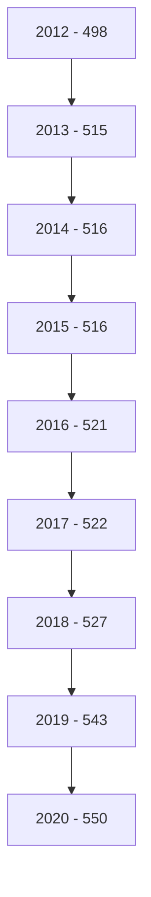
---
# الكثافة المصرفية

" بالألف نسمة "

| لكل فرع ووكالة | لكل مصرف | السنة |
|-----------------|-----------|-------|
| 12.1            | 389.0     | 2012  |
| 12.2            | 397.0     | 2013  |
| 12.2            | 397.0     | 2014  |
| 12.2            | 393.8     | 2015  |
| 12.5            | 382.4     | 2016  |
| 12.8            | 394.1     | 2017  |
| 13.1            | 383.3     | 2018  |
| 12.9            | 368.4     | 2019  |
| 12.9            | 368.4     | 2020  |

## التركز المصرفي:

درجة التركز المصرفي تعني أن عدداً قليلا من المصارف التجارية يستأثر بالنسبة الأكبر من النشاط
المصرفي سواءً من حيث الأصول أو الودائع أوالائتمان أو من حيث حجم حقوق الملكية، وفيما يخص
الحصة السوقية للمصارف التجارية في ليبيا، فقد شكلت أصول المصارف الأربعة الكبرى (الجمهورية،
التجاري الوطني ، الوحدة والصحاري) من أصل 18 مصرفاً مانسبته 72.8% من إجمالي أصول القطاع
المصرفي في نهاية عام 2020، وشكل مصرف الجمهورية وحده ما نسبته 31.2% من إجمالي أصول
القطاع المصرفي.

وشكلت ودائع وقروض المصارف الأربعة الكبرى مانسبته 73.0% و 88.0% على التوالي من إجمالي
ودائع وقروض القطاع المصرفي في نهاية عام 2020 .

وهذه النسب المرتفعة توضح أن السوق المصرفي الليبي يعاني من تركز مرتفع يحول دون تحقيق المنافسة
العادلة بين المصارف المتواجدة به ، وذلك بسبب إستحواذ أحد المصارف أو عدد قليل جدا منها بحصة
كبيرة في السوق، في حين أن حصة معظم المصارف الأخرى متدنية للغاية.

إن التركز المصرفي يؤثرعلى المنافسة في سلوك المصارف وأدائها بطرق غير ملائمة، وينتج عنها
خسارة اجتماعية مقترنة بسوء التسعير، ناتجة عن ممارسات المصارف لقوتها السوقية على الأسعار،
الأمر الذي يخشى معه أنه كلما أرتفعت درجة الأحتكار في السوق كلما أرتفعت معها أسعار الخدمات
المصرفية وتدني مستوى أو جودة الخدمة.
---
ونتيجة لهذا تزداد الحاجة إلى وضع القوانين والتشريعات التي تساهم في تعزيز ورفع مستويات المنافسة
فيما بين المصارف وكذلك الإصلاح المالي، وإنشاء المزيد من المصارف لرفع مستويات المنافسة
والكفاءة، ودخول مصارف جديدة سيزيد من المنافسة ويخفض مستويات التركز المصرفي.

## التركز المصرفي
(2012 - 2020)

### حسب الأصول :

| المصارف | 2012 | 2013 | 2014 | 2015 | 2016 | 2017 | 2018 | 2019 | 2020 |
|----------|------|------|------|------|------|------|------|------|------|
| أكبر مصرف | 37.9 | 33.0 | 33.1 | 34.9 | 33.8 | 33.6 | 32.7 | 31.9 | 31.2 |
| أكبر ثلاثة مصارف | 71.0 | 63.7 | 62.1 | 67.6 | 67.9 | 66.9 | 65.8 | 64.6 | 63.1 |
| أكبر خمسة مصارف | 89.0 | 81.3 | 79.2 | 87.1 | 86.7 | 85.0 | 84.3 | 84.2 | 82.7 |

### حسب الإئتمان :

| المصارف | 2012 | 2013 | 2014 | 2015 | 2016 | 2017 | 2018 | 2019 | 2020 |
|----------|------|------|------|------|------|------|------|------|------|
| أكبر مصرف | 41.9 | 44.8 | 43.5 | 44.8 | 44.3 | 44.5 | 43.6 | 40.7 | 42.6 |
| أكبر ثلاثة مصارف | 77.0 | 76.7 | 79.1 | 79.4 | 78.5 | 77.7 | 77.7 | 75.8 | 78.3 |
| أكبر خمسة مصارف | 91.0 | 90.2 | 91.1 | 91.4 | 91.3 | 91.2 | 91.5 | 91.4 | 91.4 |

### حسب ودائع العملاء :

| المصارف | 2012 | 2013 | 2014 | 2015 | 2016 | 2017 | 2018 | 2019 | 2020 |
|----------|------|------|------|------|------|------|------|------|------|
| أكبر مصرف | 40.9 | 33.8 | 33.1 | 34.8 | 34.0 | 33.6 | 31.9 | 32.3 | 31.8 |
| أكبر ثلاثة مصارف | 71.5 | 62.7 | 61.3 | 66.5 | 67.2 | 66.5 | 65.2 | 64.4 | 62.9 |
| أكبر خمسة مصارف | 90.1 | 80.9 | 78.6 | 87.8 | 87.5 | 85.7 | 85.4 | 85.6 | 83.7 |

7
---
# تركز الأصول

| البنك | النسبة |
|-------|--------|
| مصرف الجمهورية | 31% |
| المصرف التجاري الوطني | 17% |
| مصرف الوحدة | 15% |
| مصرف الصحاري | 9.9% |
| باقي المصارف | 27% |

# تركز الائتمان

| البنك | النسبة |
|-------|--------|
| مصرف الجمهورية | 42% |
| المصرف التجاري الوطني | 18% |
| مصرف الوحدة | 17% |
| مصرف الصحاري | 10% |
| باقي المصارف | 13% |

# تركز ودائع العملاء

| البنك | النسبة |
|-------|--------|
| مصرف الجمهورية | 31% |
| المصرف التجاري الوطني | 17% |
| مصرف الوحدة | 13% |
| مصرف الصحاري | 10% |
| باقي المصارف | 26% |
---
# الميزانية المُجمَعة للمصارف التجارية

شهدت الميزانية المُجمَعة للمصارف التجارية نهاية عام 2020، تطورات في مُجمل بنودها على جانبي الأصول والخصوم، ليبلغ إجمالي الأصول داخل الميزانية المُجمَعة نحو 126,107.9 مليون دينار، مقابل 112,625.3 مليون دينار في نهاية عام 2019، بإرتفاع قدره 13,482.6 مليون دينار، أي بمعدل 12.0%، وفيما يلي جدول يلخص البنود الرئيسية للميزانية المُجمَعة للمصارف التجارية:

## البنود الرئيسية للميزانية المجمَعة للمصارف التجارية

مليون دينار

| جانب الأصول :           | 2019      | 2020      | مقدار التغير | معدل التغير % |
|-------------------------|-----------|-----------|--------------|---------------|
| نقدية بالخزائن          | 2,367.4   | 1,146.8   | -1,220.6     | -51.6         |
| حسابات المقاصة          | 6,304.6   | 5,584.8   | -719.8       | -11.4         |
| أرصدة لدى المصارف       | 77,424.9  | 89,836.6  | 12,411.7     | 16.0          |
| الإستثمارات             | 1,957.5   | 4,256.6   | 2,299.1      | 117.5         |
| القروض والتسهيلات       | 16,912.7  | 16,996.9  | 84.2         | 0.5           |
| الأصول الثابتة          | 1,786.7   | 1,986.8   | 200.1        | 11.2          |
| الأصول الأخرى           | 5,871.5   | 6,299.4   | 427.9        | 7.3           |
| إجمالي الأصول           | 112,625.3 | 126,107.9 | 13,482.6     | 12.0          |
| الحسابات النظامية       | 34,091.2  | 28,611.1  | -5,480.1     | -16.1         |
| إجمالي الميزانية        | 146,716.6 | 154,719.0 | 8,002.4      | 5.5           |

| جانب الخصـــوم:         | 2019      | 2020      | مقدار التغير | معدل التغير % |
|-------------------------|-----------|-----------|--------------|---------------|
| ودائع العملاء           | 88,954.0  | 102,194.2 | 13,240.2     | 14.9          |
| منها : التأمينات النقدية | 8,427.6   | 7,091.6   | -1,336.0     | -15.9         |
| حقوق الملكية            | 6,109.2   | 6,237.6   | 128.4        | 2.1           |
| المخصصات               | 5,527.2   | 5,587.2   | 60.0         | 1.1           |
| الخصوم الأخرى           | 12,035.0  | 12,088.9  | 53.9         | 0.4           |
| إجمالي الخصوم           | 112,625.3 | 126,107.9 | 13,482.6     | 12.0          |
| الحسابات النظامية       | 34,091.2  | 28,611.1  | -5,480.1     | -16.1         |
| إجمالي الميزانية        | 146,716.6 | 154,719.0 | 8,002.4      | 5.5           |
---
# الأهمية النسبية للبنود المكونة للأصول

## 2020

| البند | النسبة |
|-------|--------|
| نقدية بالخزائن | 4% |
| حسابات المقاصة | 1% |
| أرصدة لدى المصارف | 5% |
| الإستثمارات | 3% |
| القروض والتسهيلات | 71% |
| الأصول الثابتة | 2% |
| الأصول الأخرى | 14% |

## 2019

| البند | النسبة |
|-------|--------|
| نقدية بالخزائن | 2% |
| حسابات المقاصة | 6% |
| أرصدة لدى المصارف | 5% |
| الإستثمارات | 2% |
| القروض والتسهيلات | 69% |
| الأصول الثابتة | 1% |
| الأصول الأخرى | 15% |

# الأهمية النسبية للبنود المكونة للخصوم

## 2020

| البند | النسبة |
|-------|--------|
| ودائع العملاء | 81% |
| حقوق الملكية | 5% |
| المخصصات | 4% |
| الخصوم الأخرى | 10% |

## 2019

| البند | النسبة |
|-------|--------|
| ودائع العملاء | 79% |
| حقوق الملكية | 5% |
| المخصصات | 5% |
| الخصوم الأخرى | 11% |
---
وفيما يلي تطور الميزانية المُجمَعة للمصارف التجارية خلال الفترة (2012 - 2020):

| جانب الأصول | 2012 | 2013 | 2014 | 2015 | 2016 | 2017 | 2018 | 2019 | 2020 |
|-------------|------|------|------|------|------|------|------|------|------|
| نقدية بالخزائن | 1,545.9 | 1,712.3 | 1,642.8 | 752.8 | 606.4 | 547.2 | 1,582.1 | 2,367.4 | 1,146.8 |
| حسابات المقاصة | 2,024.6 | 7,310.3 | 8,125.4 | 11,444.4 | 12,886.4 | 10,625.8 | 4,671.0 | 6,304.6 | 5,584.8 |
| أرصدة لدى المصارف | 56,787.6 | 68,094.6 | 62,244.0 | 53,540.0 | 62,306.5 | 84,262.6 | 85,349.3 | 77,424.9 | 89,836.6 |
| الإستثمارات | 954.9 | 746.7 | 777.5 | 1,787.8 | 1,789.2 | 1,311.5 | 1,456.5 | 1,957.5 | 4,256.6 |
| القروض والتسهيلات | 15,899.5 | 18,232.3 | 19,959.9 | 20,212.8 | 18,770.3 | 17,446.6 | 16,448.3 | 16,912.7 | 16,996.9 |
| الأصول الثابتة | 1,038.4 | 1,121.6 | 1,211.6 | 1,365.4 | 1,409.1 | 1,463.2 | 1,608.3 | 1,786.7 | 1,986.8 |
| الأصول الأخرى | 6,169.5 | 1,157.8 | 1,243.0 | 1,130.2 | 5,687.2 | 5,066.0 | 5,947.1 | 5,871.5 | 6,299.4 |
| إجمالي الأصول | 84,420.4 | 98,375.6 | 95,204.2 | 90,233.4 | 103,455.1 | 116,477.0 | 117,062.4 | 112,625.3 | 126,107.9 |
| الحسابات النظامية | 70,747.7 | 71,550.9 | 51,845.0 | 48,299.2 | 46,800.0 | 46,534.9 | 48,160.2 | 34,091.2 | 28,611.1 |
| إجمالي الميزانية | 155,168.1 | 169,926.5 | 147,049.2 | 138,532.6 | 150,255.1 | 163,011.9 | 165,222.6 | 146,716.6 | 154,719.0 |

| جانب الخصوم | 2012 | 2013 | 2014 | 2015 | 2016 | 2017 | 2018 | 2019 | 2020 |
|-------------|------|------|------|------|------|------|------|------|------|
| ودائع العملاء | 68,346.2 | 83,562.7 | 78,910.4 | 71,257.1 | 83,407.6 | 95,938.5 | 93,657.5 | 88,954.0 | 102,194.2 |
| منها: التأمينات النقدية | 6,823.3 | 6,609.0 | 8,080.7 | 9,738.7 | 8,939.7 | 8,845.6 | 11,533.7 | 8,427.6 | 7,091.6 |
| حقوق الملكية | 4,653.2 | 4,743.7 | 4,886.4 | 5,087.5 | 5,366.5 | 5,561.4 | 6,472.6 | 6,109.2 | 6,237.6 |
| المخصصات | 3,317.4 | 3,597.2 | 3,765.3 | 3,941.8 | 4,144.9 | 4,473.0 | 4,627.6 | 5,527.2 | 5,587.2 |
| الخصوم الأخرى | 8,103.6 | 6,472.0 | 7,642.1 | 9,946.9 | 10,536.1 | 10,504.2 | 12,304.7 | 12,035.0 | 12,088.9 |
| إجمالي الخصوم | 84,420.4 | 98,375.6 | 95,204.2 | 90,233.4 | 103,455.1 | 116,477.0 | 117,062.4 | 112,625.3 | 126,107.9 |
| الحسابات النظامية | 70,747.7 | 71,550.9 | 51,845.0 | 48,299.2 | 46,800.0 | 46,534.9 | 48,160.2 | 34,091.2 | 28,611.1 |
| إجمالي الميزانية | 155,168.1 | 169,926.5 | 147,049.2 | 138,532.6 | 150,255.1 | 163,011.9 | 165,222.6 | 146,716.6 | 154,719.0 |

11
---
تحليل البنود المكونة للميزانية المجمَعة للمصارف التجارية

أولاً : جانب الأصـــول
1- النقدية :
أ- النقدية بالخزائن و حسابات المقاصة :

إنخفض رصيد النقدية بالخزائن وحسابات المقاصة بمقدار 1,940.4 مليون دينار أي بمعدل 51.6%،
لتصل إلى 6,731.6 مليون دينار في نهاية عام 2020، مقابل 8,672.0 مليون دينار في نهاية عام
2019، حيث إنخفضت النقدية بالخزائن بمقدار 1,220.6 مليون دينار، وبند حسابات المقاصة بمقدار
719.8 مليون دينار في نهاية عام 2020 مقارنة بما كانت عليه في عام 2019، والجدول التالي يوضح
ذلك :

| البيان | 2019 | 2020 | مقدار التغير | معدل التغير% |
|--------|------|------|--------------|---------------|
| النقدية بالخزائن : | 2,367.4 | 1,146.8 | -1,220.6 | -51.6 |
| عملة محلية | 2,355.1 | 1,128.9 | -1,226.2 | -52.1 |
| عملة أجنبية | 12.3 | 17.9 | 5.6 | 45.5 |
| إجمالي حسابات المقاصة | 6,304.6 | 5,584.8 | -719.8 | -11.4 |
| المقاصة بين المصارف | 3,162.2 | 2,392.8 | -769.4 | -24.3 |
| المقاصة بين الفروع | 3,142.4 | 3,192.0 | 49.6 | 1.6 |
| الإجمالي | 8,672.0 | 6,731.6 | -1,940.4 | -22.4 |

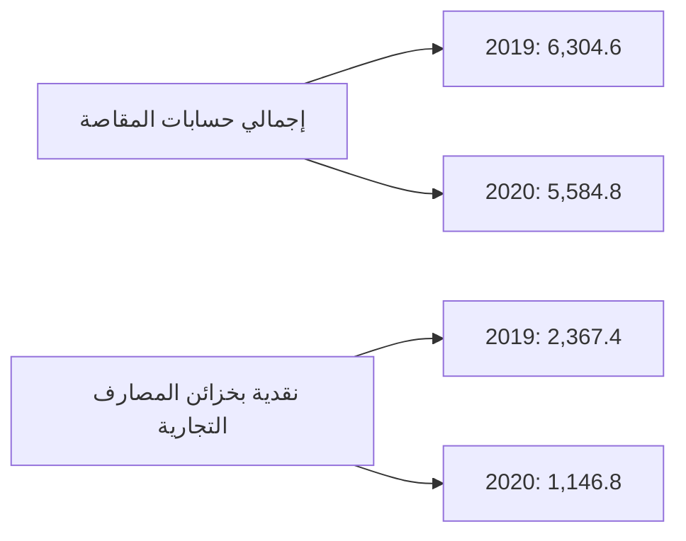
---
وفيما يلي تطور بند النقدية في المصارف التجارية خلال الفترة (2012 - 2020):

*مليون دينار*

| البيان | 2012 | 2013 | 2014 | 2015 | 2016 | 2017 | 2018 | 2019 | 2020 |
|---------|------|------|------|------|------|------|------|------|------|
| النقدية بالخزائن : | 1,545.9 | 1,712.3 | 1,642.8 | 752.8 | 606.4 | 547.2 | 1,582.1 | 2,367.4 | 1,146.8 |
| عملة محلية | 1,433.3 | 1,622.6 | 1,619.9 | 743.6 | 594.7 | 537.8 | 1,573.6 | 2,355.1 | 1,128.9 |
| عملة أجنبية | 112.6 | 89.7 | 22.9 | 9.2 | 11.7 | 9.4 | 8.4 | 12.3 | 17.9 |
| إجمالي حسابات المقاصة : | 2,024.6 | 7,310.3 | 8,125.4 | 11,444.4 | 12,886.4 | 6,379.9 | 4,671.0 | 6,304.6 | 5,584.8 |
| المقاصة بين المصارف | 1,410.4 | 4,004.6 | 4,836.7 | 7,072.2 | 8,488.9 | 4,245.9 | 2,191.1 | 3,162.2 | 2,392.8 |
| المقاصة بين الفروع | 614.2 | 3,305.7 | 3,288.7 | 4,372.2 | 4,397.5 | 2,134.0 | 2,479.9 | 3,142.4 | 3,192.0 |
| الإجمالي | 2,956.3 | 5,716.9 | 6,479.5 | 7,825.0 | 13,492.7 | 6,927.1 | 6,253.0 | 8,672.0 | 6,731.6 |

نقدية بخزائن المصارف التجارية
( 2012 - 2020 )

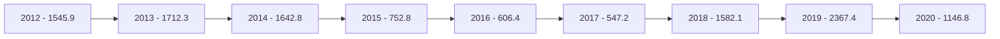

إجمالي حسابات المقاصة
( 2012 - 2020 )


---
ب- الأرصدة والودائع لدى المصرف المركزي والمصارف الأخرى:

بلغ رصيد ودائع المصارف التجارية لدى المصرف المركزي والمصارف الأخرى وفيما بينها نحو 89,836.6 مليون دينار في نهاية عام 2020، مقابل 77,424.9 مليون دينار في نهاية عام 2019، أي بمعدل إرتفاع قدره 16.0%، وتركز هذا الإرتفاع في رصيد الودائع لدى المصرف المركزي.

| البيان | 2019 | 2020 | مقدار التغير | معدل التغير % |
|--------|------|------|--------------|---------------|
| ودائع تحت الطلب لدى : | 60,184.6 | 72,269.0 | 12,084.4 | 20.1 |
| - المصرف المركزي | 53,629.1 | 68,245.0 | 14,615.9 | 27.3 |
| - المصارف المحلية | 1,750.0 | 1,245.1 | -504.9 | -28.9 |
| - المصرف الليبي الخارجي | 821.4 | 523.4 | -298.0 | -36.3 |
| - لدى المراسلين بالخارج | 3,984.1 | 2,255.6 | -1,728.5 | -43.4 |
| ودائع زمنية : | 17,240.3 | 17,567.6 | 327.3 | 1.9 |
| - المصرف المركزي (شهادات الإيداع) | 15,846.8 | 17,118.2 | 1,271.4 | 8.0 |
| - المصارف المحلية | 0.0 | 17.4 | 17.4 | - |
| - المصرف الليبي الخارجي | 0.0 | 0.0 | 0.0 | - |
| - لدى المراسلين بالخارج | 1,393.5 | 432.0 | -961.5 | -69.0 |
| الإجمالي | 77,424.9 | 89,836.6 | 12,411.7 | 16.0 |

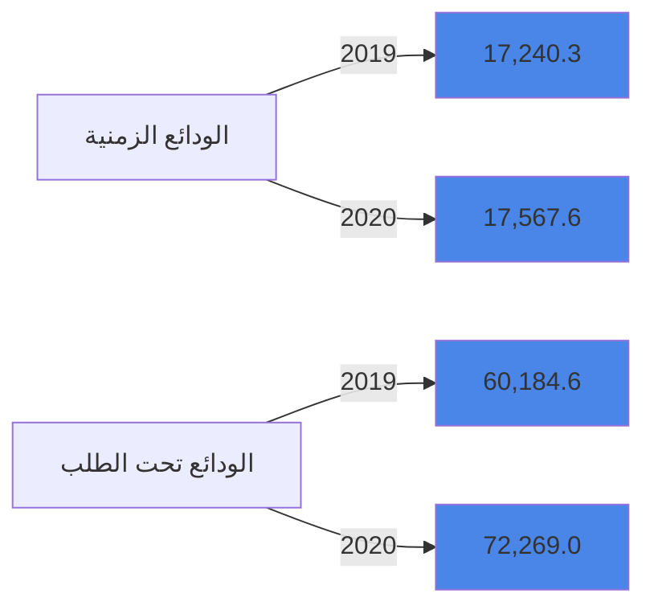
---
والجدول التالي يبين تطور أرصدة وودائع المصارف لدى المصرف المركزي والمصارف الأخرى وفيما بينها خلال
الفترة (2012 - 2020 ):

*مليون دينار*

| البيان | 2012 | 2013 | 2014 | 2015 | 2016 | 2017 | 2018 | 2019 | 2020 |
|--------|------|------|------|------|------|------|------|------|------|
| ودائع تحت الطلب لدى : | 19,352.7 | 22,342.6 | 24,360.7 | 27,870.7 | 38,306.1 | 56,945.4 | 59,454.9 | 60,184.6 | 72,269.0 |
| - المصرف المركزي | 17,203.4 | 19,364.6 | 19,317.8 | 20,863.2 | 30,627.6 | 53,136.0 | 52,385.4 | 53,629.1 | 68,245.0 |
| - المصارف المحلية | 329.0 | 347.6 | 408.2 | 1,717.6 | 1,742.4 | 1,012.5 | 1,030.0 | 1,750.0 | 1,245.1 |
| - المصرف الليبي الخارجي | 664.7 | 848.1 | 1,850.0 | 2,216.8 | 2,396.1 | 874.2 | 1,762.1 | 821.4 | 523.4 |
| - المصارف بالخارج | 1,155.6 | 1,782.3 | 2,784.7 | 3,073.1 | 3,540.0 | 1,922.7 | 4,277.3 | 3,984.1 | 2,255.6 |
| ودائع زمنية : | 37,434.9 | 45,751.9 | 37,883.3 | 25,669.2 | 24,000.4 | 27,317.8 | 25,894.4 | 17,240.3 | 17,567.6 |
| - شهادات الإيداع | 35,737.8 | 44,307.3 | 37,074.6 | 24,259.7 | 23,187.1 | 26,415.7 | 24,716.9 | 15,846.8 | 17,118.2 |
| - المصارف المحلية | 0.0 | 30.0 | 0.0 | 0.0 | 0.0 | 0.0 | 0.0 | 0.0 | 17.4 |
| - المصرف الليبي الخارجي | 58.4 | 37.6 | 206.1 | 107.1 | 224.7 | 0.0 | 459.4 | 0.0 | 0.0 |
| - المصارف بالخارج | 1,638.7 | 1,377.0 | 602.6 | 1,302.4 | 588.6 | 902.1 | 718.1 | 1,393.5 | 432.0 |
| الإجمالي | 56,787.6 | 68,094.6 | 62,244.0 | 53,539.9 | 62,306.5 | 84,263.2 | 85,349.3 | 77,424.9 | 89,836.6 |

ودائع المصارف التجارية لدى المصرف المركزي والمصارف الأخرى
( 2012 - 2020 )

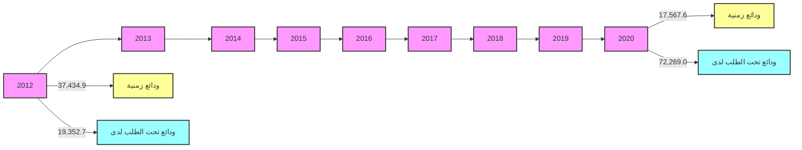

15
---
## 2- الإستثمارات :

سجل إجمالي بند رصيد الإستثمارات في المصارف التجارية نهاية عام 2020 نحو 4,256.6 مليون دينار، مقابل 1,957.5 مليون دينار في نهاية عام 2019، بمعدل نمو 117.5% هذا الإرتفاع جاء نتيجة زيادة للإستثمار في سندات وأذونات الخزانة بمبلغ 2.3 مليار دينار، والجدول التالي يوضح تفاصيل هذا البند:

| البيان | 2019 | 2020 | مقدار التغير | معدل التغير % |
|--------|------|------|--------------|---------------|
| سندات وأذونات الخزانة | 700.0 | 3,000.0 | 2,300.0 | 328.6 |
| إستثمارات في الشركات العامة | 562.4 | 562.3 | -0.1 | 0.0 |
| إستثمارات في الشركات الخاصة المساهمة | 640.2 | 599.5 | -40.7 | -6.4 |
| إستثمارات أخرى | 54.9 | 94.9 | 40.0 | 72.9 |
| الإجمالي | 1,957.5 | 4,256.6 | 2,299.1 | 117.5 |

إجمالي الإستثمارات

```mermaid
bar chart
    title إجمالي الإستثمارات
    x-axis [2019, 2020]
    y-axis "مليون دينار" 0 --> 4500
    bar [1957.5, 4256.6]
```
---
والجدول التالي يبين تطور رصيد بند الإستثمارات للمصارف التجارية خلال الفترة (2012 - 2020):

" مليون دينار "

| البيان | 2012 | 2013 | 2014 | 2015 | 2016 | 2017 | 2018 | 2019 | 2020 |
|--------|------|------|------|------|------|------|------|------|------|
| سندات وأذونات الخزانة | 0.0 | 0.0 | 0.0 | 1,000.0 | 1,000.0 | 500.0 | 500.0 | 700.0 | 3,000.0 |
| إستثمارات أخرى | 954.9 | 746.7 | 777.5 | 787.8 | 789.2 | 811.5 | 956.5 | 1,257.5 | 1,256.6 |
| الإجمالي | 954.9 | 746.7 | 777.5 | 1,787.8 | 1,789.2 | 1,311.5 | 1,456.5 | 1,957.5 | 4,256.6 |

إجمالي الاستثمارات في المصارف التجارية
( 2012 - 2020 )

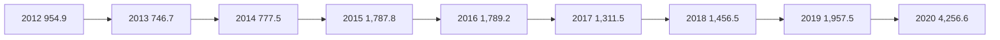

3- القروض والتسهيلات الائتمانية :

إرتفع اجمالي رصيد الإئتمان الممنوح من المصارف التجارية من 16,689.5 مليون دينار في نهاية عام 2019 إلى 16,761.2 مليون دينار في نهاية عام 2020، أي بمعدل نمو 0.4%، حيث بلغ رصيد القروض الممنوحة للقطاع الخاص في نهاية الربع الثالث 2019 ما قيمته 10,617.9 مليون دينار، وما نسبته 63.4% من إجمالي القروض والتسهيلات الإئتمانية، فيما شكل رصيد القروض الممنوحة للقطاع العام النسبة الباقية 36.6% والتي بلغت قيمتها 6,143.3 مليون دينار.

وقد شكلت القروض والتسهيلات الائتمانية الممنوحة إلى إجمالي الخصوم الإيداعية ما نسبته 16.8%، كما شكلت من اجمالي الأصول ما نسبته 13.4%

وبلغـت نسبة تغطية مخصـص الديون المشكـوك فيها لإجمـالي القروض والتسهيلات الائتمانية والممنوحة نسبة 21.4% في نهاية عام 2020 مقابل نسبة 20.7% في نهاية عام 2019.

17
---
وفيما يلي بيان تفصيلي لرصيد القروض والتسهيلات الممنوحة من المصارف التجارية :

| مليون دينار |  |  |  |  |
|---|---|---|---|---|
| معدل التغير % | مقدار التغير | 2020 | 2019 | البيان |
| -147.8 | -779.7 | 4,495.7 | 5,275.4 | سلفيات والسحب على المكشوف |
| -28.5 | -89.0 | 3,036.5 | 3,125.5 | السلف الإجتماعية * |
| 112.0 | 952.9 | 9,464.7 | 8,511.8 | القروض الأخرى |
| 5.0 | 84.2 | 16,996.9 | 16,912.7 | إجمالي القروض والتسهيلات |
| 13.0 | 45.7 | 3,549.3 | 3,503.6 | مخصص الديون |
| 2.9 | 38.5 | 13,447.6 | 13,409.1 | صافي القروض والتسهيلات |

*تشمل رصيد قروض المرابحة للأفراد.

| السلفيات والسحب على المكشوف | السلف الاجتماعية |
|---|---|
| 5,400.0 | 3,140.0 |
| 5,200.0 | 3,120.0 |
| 5,000.0 | 3,100.0 |
| 4,800.0 | 3,080.0 |
| 4,600.0 | 3,060.0 |
| 4,400.0 | 3,040.0 |
| 4,200.0 | 3,020.0 |
| 4,000.0 | 3,000.0 |
| 2019: 5,275.4 | 2019: 3,125.5 |
| 2020: 4,495.7 | 2020: 3,036.5 |

| مليون دينار |  |  |  |  |
|---|---|---|---|---|
| معدل التغير % | مقدار التغير | 2020 | 2019 | البيان |
| -2.3 | -138.8 | 5,918.2 | 6,057.0 | القروض الممنوحة للقطاع العام |
| 2.1 | 222.9 | 11,078.7 | 10,855.8 | القروض الممنوحة للقطاع الخاص |
| 0.5 | 84.2 | 16,996.9 | 16,912.7 | الإجمالي |
---

| رصيد القروض الممنوحة للقطاع الخاص | رصيد القروض الممنوحة للقطاع العام |
|-----------------------------------|-----------------------------------|
| 11,100.0                          | 6,100.0                           |
| 11,050.0                          | 6,057.0                           |
| 11,000.0                          | 6,050.0                           |
| 10,950.0                          | 6,000.0                           |
| 10,900.0                          | 5,950.0                           |
| 10,855.8                          | 5,918.2                           |
| 10,850.0 مليون دينار              | 5,900.0 مليون دينار               |
| 10,800.0                          | 5,850.0                           |
| 10,750.0                          |                                   |
| 10,700.0                          | 5,800.0                           |
| 2019 2020                         | 2019 2020                         |

وفيما يلي رصيد القروض والتسهيلات الممنوحة للقطاعين العام والخاص خلال الفترة (2012 -2020):

مليون دينار

| البيان | 2012 | 2013 | 2014 | 2015 | 2016 | 2017 | 2018 | 2019 | 2020 |
|--------|------|------|------|------|------|------|------|------|------|
| القروض الممنوحة للقطاع العام | 5,291.2 | 5,327.1 | 6,195.9 | 5,982.8 | 5,915.9 | 5,578.9 | 5,100.9 | 6,057.0 | 5,918.2 |
| القروض الممنوحة للقطاع الخاص | 10,608.3 | 12,905.5 | 13,764.0 | 14,230.1 | 12,854.3 | 11,867.7 | 11,347.4 | 10,855.8 | 11,078.7 |
| الإجمالي | 15,899.5 | 18,232.3 | 19,959.9 | 20,212.8 | 18,770.3 | 17,446.6 | 16,448.3 | 16,912.7 | 16,996.9 |

| رصيد القروض الممنوحة للقطاعين ( الخاص والعام ) |
|-----------------------------------------------|
| ( 2012 - 2020 )                               |
| 16,000.0                                      |
| 14,000.0                                      |
| 12,000.0                                      |
| 10,000.0                                      |
| 8,000.0                                       |
| 6,000.0                                       |
| 4,000.0                                       |
| 2,000.0                                       |
| 0.0                                           |
| 2012 2013 2014 2015 2016 2017 2018 2019 2020  |
| القروض الممنوحة للقطاع العام                  |
| القروض الممنوحة للقطاع الخاص                  |

19
---
وفيما يلي رصيد السلف الاجتماعية والسحب على المكشوف خلال الفترة (2012 -2020):

"مليون دينار"

| البيان | 2012 | 2013 | 2014 | 2015 | 2016 | 2017 | 2018 | 2019 | 2020 |
|--------|------|------|------|------|------|------|------|------|------|
| سلفيات والسحب على المكشوف | 5,522.3 | 4,146.5 | 4,452.1 | 5,440.1 | 4,827.9 | 4,514.5 | 4,354.0 | 5,275.4 | 4,495.7 |
| السلف الإجتماعية * | 4,973.5 | 6,726.0 | 7,157.9 | 6,608.6 | 5,901.1 | 4,912.5 | 3,988.7 | 3,125.5 | 3,036.5 |
| القروض الأخرى | 5,403.7 | 3,759.8 | 8,348.9 | 8,164.2 | 8,041.3 | 8,019.6 | 8,105.6 | 8,511.8 | 9,464.7 |
| إجمالي القروض والتسهيلات | 15,899.5 | 18,232.3 | 19,959.9 | 20,212.8 | 18,770.3 | 17,446.6 | 16,448.3 | 16,912.7 | 16,996.9 |
| مخصص الديون | 2,348.9 | 2,497.9 | 2,688.1 | 2,779.7 | 2,910.0 | 3,040.8 | 3,126.4 | 3,503.6 | 3,549.3 |
| صافي القروض والتسهيلات | 13,550.6 | 15,734.4 | 17,271.8 | 17,433.1 | 15,860.3 | 14,405.8 | 13,321.9 | 13,409.1 | 13,447.6 |

*تشمل رصيد قروض المرابحة للأفراد


| السنة | السلف الإجتماعية | سلفيات والسحب على المكشوف |
|-------|------------------|---------------------------|
| 2012 | 4,973.5 | 5,522.3 |
| 2013 | 6,726.0 | 4,146.5 |
| 2014 | 7,157.9 | 4,452.1 |
| 2015 | 6,608.6 | 5,440.1 |
| 2016 | 5,901.1 | 4,827.9 |
| 2017 | 4,912.5 | 4,514.5 |
| 2018 | 3,988.7 | 4,354.0 |
| 2019 | 3,125.5 | 5,275.4 |
| 2020 | 3,036.5 | 4,495.7 |

## 4 - الأصول الثابتة والأصول الأخرى :

بلغ رصيد الأصول الثابتة نحو 1,986.8 مليون دينار في نهاية عام 2020، مقابل 1,786.7 مليون دينار في نهاية عام 2019، فيما بلغ رصيد الأصول الأخرى نحو 6,299.4 مليون دينار في نهاية عام 2020، مقابل 5,871.5 مليون دينار في نهاية عام 2019.

20
---
ثانياً : جانب الخصــوم

1- ودائع العملاء لدى المصارف التجارية:

إرتفع إجمالي رصيد ودائع العملاء لدى المصارف التجارية من 88,954.0 مليون دينار في نهاية عام 2019 إلى 102,194.2 مليون دينار في نهاية عام 2020، أي بمعدل 9.3%، وقد تركز الإرتفاع في أرصدة الودائع تحت الطلب بمقدار 14,611.0 مليون دينار، بنسبة 18.8%، وسجل رصيد الودائع لأجل إنخفاض مقداره 1,356.3 مليون دينار وبنسبة 12.8% عما كانت عليه في عام 2019 ، كذلك إنخفضت الودائع الإدخارية بمقدار 14.7 مليون دينار وبنسبة 3.2%.

وفيما يتعلق بتوزيع الودائع لدى المصارف التجارية حسب نوع الوديعة فقد شكلت الودائع تحت الطلب ما نسبته 90.5% من إجمالي الودائع، في حين شكلت الودائع لأجل ما نسبته 9.1% من إجمالي الودائع، وشكلت ودائع الادخار ما نسبته 0.4% فقط من إجمالي الودائع.

| البيان | 2019 | 2020 | مقدار التغير | معدل التغير % |
|--------|------|------|---------------|---------------|
| الودائع تحت الطلب | 77,919.6 | 92,530.6 | 14,611.0 | 18.8 |
| الودائع لأجل | 10,582.2 | 9,225.9 | -1,356.3 | -12.8 |
| الودائع الإدخارية | 452.3 | 437.6 | -14.7 | -3.2 |
| الإجمالي | 88,954.0 | 102,194.2 | 13,240.2 | 9.3 |

رصيد ودائع العملاء لدى المصارف التجارية حسب نوع الوديعة

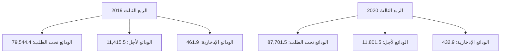

21
---
# أرصدة الودائع حسب نوع الوديعة لدى المصارف التجارية خلال الفترة (2012 – 2020)

"مليون دينار"

| البيان | 2012 | 2013 | 2014 | 2015 | 2016 | 2017 | 2018 | 2019 | 2020 |
|--------|------|------|------|------|------|------|------|------|------|
| الودائع تحت الطلب | 54,728.8 | 61,834.9 | 56,641.4 | 58,725.9 | 72,192.7 | 84,827.6 | 80,038.6 | 77,919.6 | 92,530.6 |
| الودائع زمنية | 12,912.1 | 21,064.9 | 21,669.3 | 11,956.7 | 10,644.7 | 10,519.2 | 13,115.5 | 10,582.2 | 9,225.9 |
| الودائع الإدخارية | 705.3 | 662.9 | 599.8 | 574.5 | 570.2 | 591.7 | 503.4 | 452.3 | 437.6 |
| الإجمالي | 68,346.2 | 83,562.7 | 78,910.4 | 71,257.1 | 83,407.6 | 95,938.5 | 93,657.5 | 88,954.0 | 102,194.2 |

## إجمالي ودائع العملاء لدى المصارف التجارية (2012 - 2020)

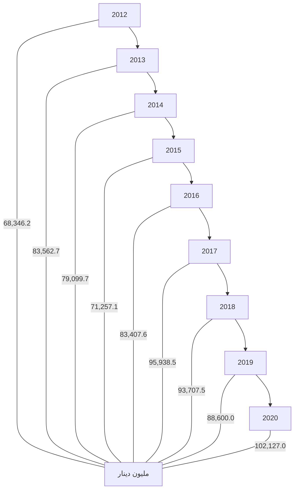

وفيما يتعلق بتوزيع إجمالي ودائع العملاء لدى المصارف التجارية ( خاص ، حكومة، عام ) فقد إرتفعت ودائع القطاع الخاص بمقدار 13,962.5 مليون دينار وبنسبة 30.0% في نهاية عام 2020، لتسجل نحو 60,573.5 مليون دينار، مقارنة بنحو 46,611.0 مليون دينار في نهاية عام 2019 ، حيث سجل الإرتفاع في ودائع الأفراد بنحو 11,505.9 مليون دينار.

فيما إنخفض رصيد ودائع القطاع العام والقطاع الحكومي في نهاية عام 2020 بمقدار 722.3 مليون دينار لتصل إلى 41,620.7 مليون دينار، منها 12,092.5 مليون دينار كودائع حكومية والتي تتكون من ودائع الوزارات والهيئات والمؤسسات الحكومية وودائع كل من: صندوق الضمان الإجتماعي، صندوق الإنماء الإقتصادي والإجتماعي وودائع الصندوق الليبي للتنمية والإستثمار، مقابل 42,343.0 مليون دينار كودائع للقطاع العام والقطاع الحكومي في نهاية عام 2019.

22
---
والجدول التالي يوضح تطور أرصدة الودائع لدى المصارف التجارية :

"مليون دينار"

| البيان | 2019 | 2020 | مقدار التغير | معدل التغير % |
|--------|------|------|--------------|---------------|
| ودائع الحكومة والقطاع العام | 42,343.0 | 41,620.7 | -722.3 | -1.7 |
| - ودائع حكومية | 11,694.6 | 12,093.5 | 398.9 | 3.4 |
| - ودائع القطاع العام | 30,648.5 | 29,527.2 | -1,121.3 | -3.7 |
| ودائع القطاع الخاص | 46,611.0 | 60,573.5 | 13,962.5 | 30.0 |
| - الأفراد | 27,402.6 | 38,908.5 | 11,505.9 | 42.0 |
| - الشركات والمؤسسات | 19,208.4 | 21,665.0 | 2,456.6 | 12.8 |
| الإجمالي | 88,954.0 | 102,194.2 | 13,240.2 | 14.9 |

ودائع القطاع الخاص:

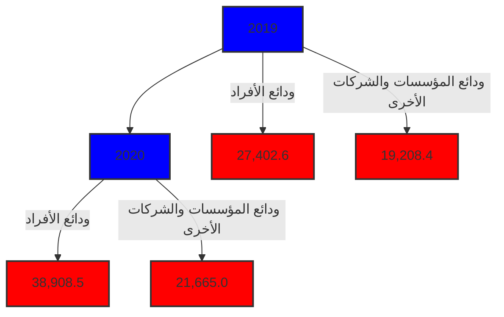

ودائع القطاع الحكومي والقطاع العام:

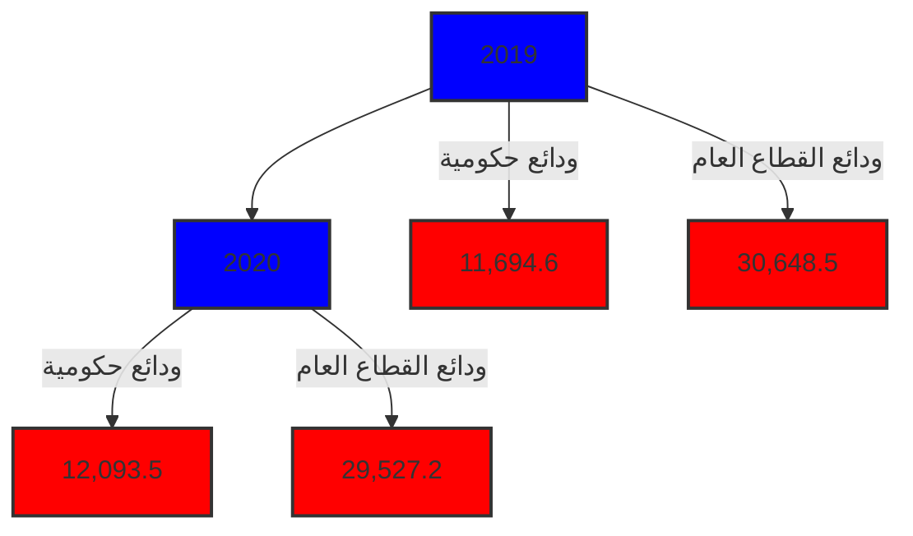
---
وفيما يلي توزيع ودائع العملاء لدى المصارف التجارية خلال الفترة (2012 - 2020):

"مليون دينار"

| البيان | 2012 | 2013 | 2014 | 2015 | 2016 | 2017 | 2018 | 2019 | 2020 |
|--------|------|------|------|------|------|------|------|------|------|
| ودائع الحكومة والقطاع العام | 35,469.8 | 52,638.7 | 46,339.9 | 35,139.7 | 39,197.7 | 40,710.8 | 39,747.8 | 42,343.0 | 41,620.7 |
| - ودائع حكومية | 13,983.3 | 24,285.4 | 21,987.0 | 9,800.6 | 9,100.7 | 9,234.8 | 10,048.5 | 11,694.6 | 12,093.5 |
| - ودائع القطاع العام | 21,486.5 | 28,353.3 | 24,352.9 | 25,339.1 | 30,097.0 | 31,476.0 | 29,699.3 | 30,648.5 | 29,527.2 |
| ودائع القطاع الخاص | 32,876.4 | 30,924.0 | 32,570.5 | 36,117.4 | 44,209.9 | 55,227.7 | 53,909.7 | 46,611.0 | 60,573.5 |
| - الأفراد | 21,026.1 | 19,569.5 | 19,799.0 | 20,477.2 | 27,605.5 | 36,295.4 | 33,717.5 | 27,402.6 | 38,908.5 |
| - الشركات والمؤسسات | 11,850.3 | 11,345.5 | 12,771.5 | 15,640.2 | 16,604.4 | 18,932.3 | 20,192.2 | 19,208.4 | 21,665.0 |
| الإجمالي | 68,346.2 | 83,562.7 | 78,910.4 | 71,257.1 | 83,407.6 | 95,938.5 | 93,657.5 | 88,954.0 | 102,194.2 |

ودائع القطاع العام والقطاع الحكومي لدى المصارف التجارية
(2012 - 2020)

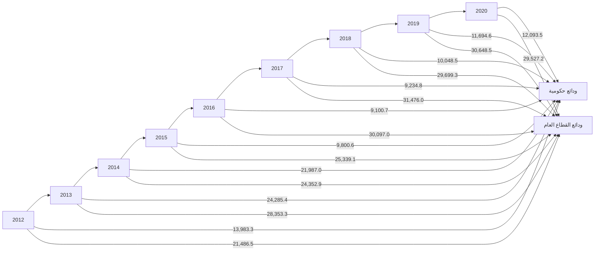

ودائع الأفراد لدى المصارف التجارية
(2012 - 2020)

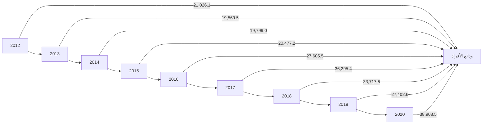
---
## 2- الحسابات المكشوفة لدى المراسلين بالخارج:

بلغ رصيد الحسابات المكشوفة لدى المراسلين بالخارج 224.1 مليون دينار في نهاية عام 2020، وهي
في معظمها ناتجة عن تأخر تسوية الحسابات لبعض المصارف مع المصارف المراسلة بالخارج، مقابل
354.8 مليون دينار في عام 2019.

| البيان | 2019 | 2020 | مقدار التغير | معدل التغير % |
|--------|------|------|--------------|---------------|
| الحسابات المكشوفة لدى المراسلين بالخارج | 113.1 | 220.4 | 107.3 | 94.9 |

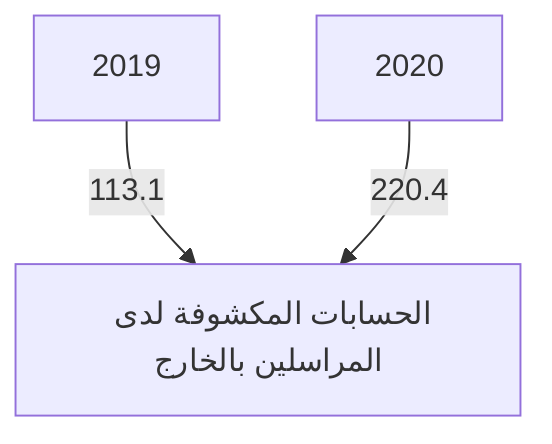

وفيما يلي أرصدة الحسابات المكشوفة خلال الفترة (2012 - 2020):

| البيان | 2012 | 2013 | 2014 | 2015 | 2016 | 2017 | 2018 | 2019 | 2020 |
|--------|------|------|------|------|------|------|------|------|------|
| الحسابات المكشوفة لدى المراسلين بالخارج | 139.6 | 74.9 | 432.0 | 955.6 | 429.9 | 368.5 | 503.4 | 113.1 | 220.4 |

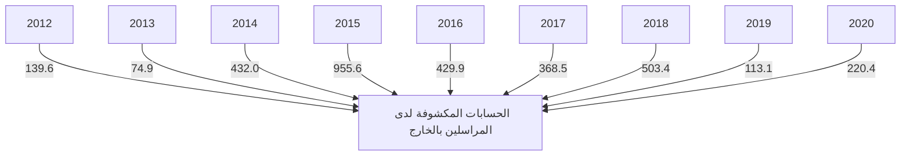
---
## 3- حقوق الملكية والأرباح:

- رأس المال المدفوع: إرتفع رأس المال المدفوع من 4,263.3 مليون دينار في نهاية عام 2019 إلى 4,295.9 مليون دينار في عام 2020، نتيجة لقيام بعض المصارف بزيادة رأس مالها المدفوع.

- الإحتياطيات والأرباح: إرتفع رصيد الإحتياطيات والأرباح المرحلة والقابلة للتوزيع من 2,167.9 مليون دينار في نهاية عام 2019، ليصل إلى 2,303.5 مليون دينار في نهاية عام 2020، في حين تراجعت أرباح المصارف التجارية قبل خصم المخصصات والضرائب خلال عام 2020 بمعدل 39.7% لتسجل إلى 405.7 مليون دينار، مقارنة عما كانت عليه خلال عام 2019 والبالغة نحو 672.8 مليون دينار.

| البيان | 2019 | 2020 | مقدار التغير | معدل التغير % |
|--------|------|------|---------------|---------------|
| رأس المال المدفوع | 4,283.1 | 4,295.9 | 12.8 | 0.3 |
| الإحتياطي القانوني | 527.7 | 663.5 | 135.8 | 25.7 |
| إحتياطيات غير مخصصة | 53.1 | 50.3 | -2.8 | -5.3 |
| أرباح العام | 867.6 | 608.7 | -258.9 | -29.8 |
| الأرباح المرحلة والأرباح القابلة للتوزيع | 1,245.3 | 1,227.9 | -17.4 | -1.4 |
| الإجمالي | 6,976.8 | 6,846.3 | -130.5 | -1.9 |

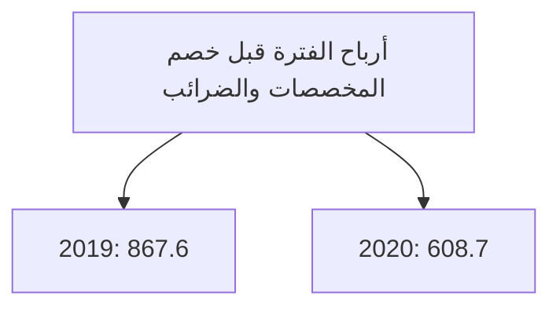
---
# أرباح المصارف التجارية قبل خصم المخصصات والضرائب (2012 - 2020)

| السنة | 2012 | 2013 | 2014 | 2015 | 2016 | 2017 | 2018 | 2019 | 2020 |
|-------|------|------|------|------|------|------|------|------|------|
| مليون دينار | 527.1 | 451.1 | 265.4 | 213.0 | 247.1 | 464.6 | 1222.2 | 867.7 | 608.7 |

## وفيما يلي حسابات رأس المال والإحتياطيات في المصارف خلال الفترة (2012 – 2020):

"مليون دينار"

| البيان | 2012 | 2013 | 2014 | 2015 | 2016 | 2017 | 2018 | 2019 | 2020 |
|--------|------|------|------|------|------|------|------|------|------|
| رأس المال المدفوع | 3,495.2 | 3,550.2 | 3,566.8 | 3,609.5 | 3,791.4 | 3,806.4 | 3,904.4 | 4,283.1 | 4,295.9 |
| الإحتياطي القانوني | 181.9 | 323.5 | 335.8 | 335.8 | 342.8 | 346.1 | 352.9 | 527.7 | 663.5 |
| إحتياطيات غير مخصصة | 26.6 | 29.7 | 29.7 | 29.7 | 30.0 | 31.9 | 32.0 | 53.1 | 50.3 |
| أرباح العام | 527.1 | 451.1 | 265.4 | 213.0 | 247.1 | 464.6 | 1,122.2 | 867.6 | 608.7 |
| الأرباح المرحّلة والأرباح القابلة للتوزيع | 422.4 | 389.2 | 688.7 | 899.6 | 955.0 | 912.4 | 1,061.1 | 1,245.3 | 1,227.9 |
| الإجمالي | 4,653.2 | 4,743.7 | 4,886.4 | 5,087.6 | 5,366.3 | 5,561.4 | 6,472.6 | 6,976.8 | 6,846.3 |

# إجمالي حقوق الملكية في المصارف التجارية (2012 - 2020)

| السنة | 2012 | 2013 | 2014 | 2015 | 2016 | 2017 | 2018 | 2019 | 2020 |
|-------|------|------|------|------|------|------|------|------|------|
| رأس المال | 3495.2 | 3550.2 | 3566.8 | 3609.5 | 3791.4 | 3806.4 | 3904.4 | 4283.1 | 4295.9 |
| الإحتياطيات | 1158.1 | 1193.5 | 1390.1 | 1478.0 | 1574.9 | 1755.0 | 2568.2 | 2693.7 | 2550.4 |
| إجمالي حقوق الملكية | 4653.3 | 4743.7 | 4957.9 | 5087.5 | 5366.4 | 5561.5 | 6469.5 | 6109.2 | 6237.6 |

27
---
## 4- المخصصات :

سجل رصيد المخصصات إرتفاعاً بمقدار 60 مليون دينار في نهاية عام 2020 ليصل إلى 5,587.2 مليون دينار، مقابل 5,527.2 مليون دينار في نهاية عام 2019، وتركزت الزيادة في بند مخصص إستهلاك الأصول الثابتة وكذلك مخصص الديون المشكوك في تحصيلها كما هو موضح بالجدول التالي :

"مليون دينار"

| البيان | 2019 | 2020 | مقدار التغير | معدل التغير % |
|--------|------|------|--------------|---------------|
| مخصص الديون المشكوك في تحصيلها | 3,503.6 | 3,549.3 | 45.7 | 1.3 |
| مخصص إستهلاك الأصول الثابتة | 795.3 | 862.3 | 67.0 | 8.4 |
| مخصصات عامة | 1,225.5 | 1,171.2 | -54.3 | -4.4 |
| مخصص تقييم أسعار الصرف | 2.8 | 4.4 | 1.6 | 57.1 |
| الإجمالي | 5,527.2 | 5,587.2 | 60.0 | 1.1 |

### بند المخصصات

| نوع المخصص | 2019 | 2020 |
|------------|------|------|
| مخصص الديون المشكوك في تحصيلها | 3503.6 | 3549.3 |
| مخصص إستهلاك الأصول الثابتة | 795.3 | 862.3 |
| مخصصات عامة | 1225.5 | 1171.2 |

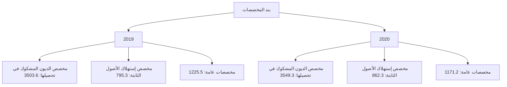
---
وفيما يلي رصيد المخصصات خلال الفترة (2012 - 2020):

"مليون دينار"

| البيان | 2012 | 2013 | 2014 | 2015 | 2016 | 2017 | 2018 | 2019 | 2020 |
|--------|------|------|------|------|------|------|------|------|------|
| مخصص الديون المشكوك في تحصيلها | 2,348.9 | 2,497.5 | 2,688.1 | 2,779.7 | 2,910.0 | 3,040.8 | 3,126.4 | 3,503.6 | 3,549.3 |
| مخصص استهلاك الأصول الثابتة | 424.1 | 473.1 | 539.3 | 592.5 | 634.0 | 687.3 | 745.2 | 795.3 | 862.3 |
| مخصصات عامة | 539.3 | 614.6 | 532.8 | 556.9 | 594.3 | 738.2 | 753.2 | 1,225.5 | 1,171.2 |
| مخصص تقييم أسعار الصرف | 5.2 | 11.6 | 5.1 | 12.7 | 6.5 | 6.7 | 2.8 | 2.8 | 4.4 |
| الإجمالي | 3,317.5 | 3,597.2 | 3,765.3 | 3,941.8 | 4,144.8 | 4,473.0 | 4,627.6 | 5,527.2 | 5,587.2 |

رصيد مخصص الديون المشكوك في تحصيلها
( 2012 - 2020 )

| السنة | القيمة (مليون دينار) |
|-------|---------------------|
| 2012 | 2,348.9 |
| 2013 | 2,497.5 |
| 2014 | 2,688.1 |
| 2015 | 2,779.7 |
| 2016 | 2,910.0 |
| 2017 | 3,040.8 |
| 2018 | 3,126.4 |
| 2019 | 3,503.6 |
| 2020 | 3,549.3 |

5- متنوعات وخصوم أخرى :

بلغ رصيد متنوعات وخصوم أخرى 12,088.9 مليون دينار في نهاية عام 2020 مقابل 12,035.0 مليون دينار في نهاية عام 2019.

29
---
# مؤشرات السلامة المالية للمصارف التجارية
## (2012 - 2020)

### مؤشرات السيولة:
- بلغت نسبة الأصول السائلة لدى المصارف التجارية إلى إجمالي الأصول 71.2% في نهاية عام 2020، والتي معظمها تمثل ودائع لدى المصرف المركزي (تحت الطلب بما فيها الاحتياطي الإلزامي وكذلك شهادات الإيداع).

- وبلغ حجم القروض إلى إجمالي الودائع بالقطاع المصرفي نسبة 16.6% في نهاية عام 2020، وهي نسبة ضئيلة للغاية، حيث لم تتعدى هذه النسبة 28.4% خلال الفترة (2012 - 2020).

- وتجدر الإشارة إلى أن نسبة السيولة القانونية المطلوب من المصارف التجارية الإحتفاظ بها هي 25.0% من إجمالي الخصوم الإيداعية.

| "نسب مئوية" | 2012 | 2013 | 2014 | 2015 | 2016 | 2017 | 2018 | 2019 | 2020 |
|-------------|------|------|------|------|------|------|------|------|------|
| الأصول السائلة / الأصول | 68.6 | 71.0 | 67.8 | 60.2 | 60.8 | 72.8 | 74.3 | 71.9 | 72.1 |
| القروض / الودائع | 23.6 | 21.8 | 25.2 | 28.4 | 22.5 | 18.2 | 17.6 | 19.0 | 16.6 |
| الودائع / الأصول | 80.8 | 84.9 | 83.1 | 79.0 | 80.6 | 82.4 | 80.0 | 79.3 | 81.0 |

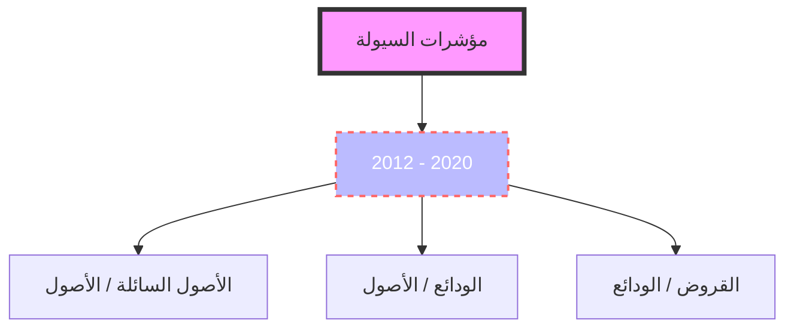

### جودة الأصول:
- أظهرت البيانات المتوفرة عن نسبة الديون المتعثرة وهي بيانات تقديرية قد لا تعكس الواقع أن نسبة الديون المتعثرة إلى إجمالي القروض بلغت في نهاية عام 2020 نحو 21.0%، ويدل إرتفاع هذه النسبة على إنخفاض كفاءة إدارة الائتمان، وينبغي أن لا تتجاوز هذه النسبة وفقاً للمعايير الدولية 5%.

- وقد سجلت نسبة تغطية مخصص الديون إلى الديون المتعثرة في نهاية عام 2020 نحو 99.4%.

نسب مئوية

30
---
| 2020 | 2019 | 2018 | 2017 | 2016 | 2015 | 2014 | 2013 | 2012 | جودة الأصول |
|------|------|------|------|------|------|------|------|------|-------------|
| 2.8 | 3.2 | 2.9 | 3.1 | 3.8 | 4.7 | 4.4 | 3.9 | 4.0 | القروض المتعثرة / الأصول |
| 21.0 | 21.0 | 21.0 | 21.0 | 21.0 | 21.0 | 21.0 | 21.0 | 21.0 | القروض المتعثرة/القروض |
| 99.4 | 98.6 | 90.4 | 83.0 | 73.8 | 65.5 | 64.0 | 65.2 | 70.9 | مخصص الديون / القروض المتعثرة |
| 20.9 | 20.9 | 19.0 | 17.4 | 15.5 | 13.8 | 13.4 | 13.7 | 14.9 | مخصص الديون / القروض |

- بيانات القروض المتعثرة تقديرية منذ 2011

```mermaid
graph LR
    A[مؤشرات جودة الأصول]
    B[2012 - 2020]
    C[120.0]
    D[100.0]
    E[80.0]
    F[60.0]
    G[40.0]
    H[20.0]
    I[0.0]
    J[2012]
    K[2013]
    L[2014]
    M[2015]
    N[2016]
    O[2017]
    P[2018]
    Q[2019]
    R[2020]
    S[مخصص الديون / القروض المتعثرة]
    T[مخصص الديون / القروض]
    
    A --> B
    B --> C
    C --> D
    D --> E
    E --> F
    F --> G
    G --> H
    H --> I
    I --> J
    J --> K
    K --> L
    L --> M
    M --> N
    N --> O
    O --> P
    P --> Q
    Q --> R
    S --> J
    S --> K
    S --> L
    S --> M
    S --> N
    S --> O
    S --> P
    S --> Q
    S --> R
    T --> J
    T --> K
    T --> L
    T --> M
    T --> N
    T --> O
    T --> P
    T --> Q
    T --> R
```

❖ الربحية : شهد معدل العائد على الأصول لدى القطاع المصرفي في ليبيا إنخفاضاً ملحوظاً خلال السنوات (2014 - 2016)، حيث بلغ نحو 0.2% في عام 2016، ويعزى سبب الإنخفاض إلى عدة أسباب منها الوضع الغير ملائم الذي تعمل فيه المصارف التجارية في السنوات الأخيرة وكذلك تطبيق قانون إلغاء الفوائد الربوية.

إلا أنه خلال العام 2018 تحسن معدل الربحية بشكل كبير، حيث بلغ العائد على إجمالي الأصول نحو 1.0%، وبلغ معدل العائد على حقوق الملكية 20.9%.

وفي عام 2019 بلغ معدل العائد على إجمالي الأصول نحو 0.7% وبلغ معدل العائد على حقوق الملكية 12.3%.

وفي عام 2020 إنخفضت مؤشرات الربحية ليبلغ معدل العائد إلى إجمالي الأصول نحو 0.5% وبلغ معدل العائد إلى حقوق الملكية نحو 9.8%.

الزيادة في الأرباح في عامي 2018 و2019 جاءت نتيجة لتحقيق المصارف التجارية لإيرادات هامة من عمولات بيع وتحويل العملة الأجنبية ، وكذلك من رفع أسعار الخدمات المصرفية عموماً.

31
---
| نسب مئوية |
|-----------|---------|---------|---------|---------|---------|---------|---------|---------|---------|
| 2020 | 2019 | 2018 | 2017 | 2016 | 2015 | 2014 | 2013 | 2012 | الربحية |
| 9.8 | 12.3 | 20.9 | 9.1 | 4.8 | 4.4 | 5.4 | 12.0 | 13.7 | العائد / حقوق الملكية |
| 0.5 | 0.7 | 1.0 | 0.4 | 0.2 | 0.2 | 0.3 | 0.5 | 0.7 | العائد / الأصول |

### العائد / الأصول (2012 - 2020)

| 2012 | 2013 | 2014 | 2015 | 2016 | 2017 | 2018 | 2019 | 2020 |
|------|------|------|------|------|------|------|------|------|
| 0.7  | 0.5  | 0.3  | 0.2  | 0.2  | 0.4  | 1.0  | 0.7  | 0.5  |

### العائد / حقوق الملكية (2012 - 2020)

| 2012 | 2013 | 2014 | 2015 | 2016 | 2017 | 2018 | 2019 | 2020 |
|------|------|------|------|------|------|------|------|------|
| 13.7 | 12.0 | 5.4  | 4.4  | 4.8  | 9.1  | 20.9 | 12.3 | 9.8  |

❖ كفاية رأس المال : يتمتع القطاع المصرفي الليبي بكفاية رأس مال مرتفعة، كافية لمواجهة أية مخاطر قد تحدث، حيث تراوحت نسبتها مابين 10.7% و 18.8% خلال الفترة (2012 - 2020)، وهي بشكل عام أعلى وبهامش مريح من النسبة المحددة من قبل لجنة بازل (1) والبالغة 8.0%، مما يعزز من الإستقرار المالي.

32
---
نسب مئوية

| نسب رأس المال | 2012 | 2013 | 2014 | 2015 | 2016 | 2017 | 2018 | 2019 | 2020 |
|---------------|------|------|------|------|------|------|------|------|------|
| كفاية رأس المال الكلي | 10.7 | 12.4 | 13.9 | 14.3 | 14.6 | 16.7 | 17.8 | 18.4 | 19.2 |
| كفاية رأس المال الأساسي | 9.5 | 11.0 | 12.6 | 13.1 | 13.4 | 15.4 | 16.5 | 17.2 | 17.9 |
| رأس المال المدفوع / الأصول | 4.2 | 3.6 | 3.7 | 4.0 | 3.7 | 3.3 | 3.3 | 3.8 | 3.6 |
| حقوق الملكية / الأصول | 5.1 | 4.4 | 5.1 | 5.4 | 4.9 | 4.8 | 4.6 | 5.5 | 4.9 |
| حقوق الملكية / الودائع | 6.3 | 5.1 | 6.2 | 7.1 | 6.1 | 5.3 | 5.7 | 6.9 | 6.1 |

كفاية رأس المال الكلي
(2012 - 2020)

```mermaid
graph LR
    2012[2012 10.7] --> 2013[2013 12.4]
    2013 --> 2014[2014 13.9]
    2014 --> 2015[2015 14.3]
    2015 --> 2016[2016 14.6]
    2016 --> 2017[2017 16.7]
    2017 --> 2018[2018 17.8]
    2018 --> 2019[2019 18.4]
    2019 --> 2020[2020 19.2]
```

مؤشرات رأس المال
(2012 - 2020)

```mermaid
graph LR
    2012[2012] --> 2013[2013]
    2013 --> 2014[2014]
    2014 --> 2015[2015]
    2015 --> 2016[2016]
    2016 --> 2017[2017]
    2017 --> 2018[2018]
    2018 --> 2019[2019]
    2019 --> 2020[2020]

    subgraph راس المال المدفوع / الأصول
    2012_1[4.2] --> 2013_1[3.6]
    2013_1 --> 2014_1[3.7]
    2014_1 --> 2015_1[4.0]
    2015_1 --> 2016_1[3.7]
    2016_1 --> 2017_1[3.3]
    2017_1 --> 2018_1[3.3]
    2018_1 --> 2019_1[3.8]
    2019_1 --> 2020_1[3.6]
    end

    subgraph حقوق الملكية / الأصول
    2012_2[5.1] --> 2013_2[4.4]
    2013_2 --> 2014_2[5.1]
    2014_2 --> 2015_2[5.4]
    2015_2 --> 2016_2[4.9]
    2016_2 --> 2017_2[4.8]
    2017_2 --> 2018_2[4.6]
    2018_2 --> 2019_2[5.5]
    2019_2 --> 2020_2[4.9]
    end
```

33
---
الملحق

❖ البيانات والمؤشرات المالية للمصارف التجارية لعام 2020 مقارنة بعام 2019.

❖ جدول مؤشرات السلامة المالية خلال الفترة ( 2012 - 2020 ) .

34
---
# الجدول (1)
## البيانات المالية الأساسية للمصارف التجارية

(مليون دينار)

| البيان / الفترة | 2019 | 2020 | معدل التغير % |
|-----------------|------|------|---------------|
| إجمالي الميزانية ( الأصول + الحسابات النظامية ) | 146,716.6 | 154,719.0 | 5.5 |
| إجمالي الأصول | 112,625.3 | 126,107.9 | 12.0 |
| إجمالي النقدية بخزائن المصارف | 2,367.4 | 1,146.8 | -51.6 |
| إجمالي الودائع لدى المصرف المركزي | 69,475.9 | 85,363.2 | 22.9 |
| إجمالي الودائع لدى المصارف | 1,750.0 | 1,262.5 | -27.9 |
| إجمالي الودائع لدى المصرف الليبي الخارجي | 821.4 | 523.4 | -36.3 |
| إجمالي الودائع لدى المراسلين بالخارج | 5,377.6 | 2,687.6 | -50.0 |
| إجمالي حسابات المقاصة | 6,304.6 | 5,584.8 | -11.4 |
| إجمالي القروض والسلفيات والتسهيلات | 16,912.7 | 16,996.9 | 0.5 |
| إجمالي الاستثمارات | 1,957.5 | 4,256.6 | 117.5 |
| إجمالي ودائع العملاء | 88,954.0 | 102,194.2 | 14.9 |
| إجمالي الحسابات المكشوفة لدى المراسلين | 113.1 | 220.4 | 94.9 |
| إجمالي حقوق الملكية | 6,109.2 | 6,237.6 | 2.1 |
| إجمالي المخصصات | 5,527.2 | 5,587.2 | 1.1 |
| أرباح العام | 867.6 | 608.7 | -29.8 |
| عدد الفروع والوكالات | 535 | 550 | 2.8 |
| عدد العاملين | 19,463 | 19,565 | 0.5 |
| الأصول السائلة / إجمالي الأصول % | 70.8 | 72.1 | - |
| إجمالي القروض / إجمالي الأصول % | 15.0 | 13.5 | - |
| حقوق الملكية / إجمالي الأصول % | 5.4 | 4.9 | - |
| إجمالي الأصول / عدد الفروع ( مليون دينار ) | 210.5 | 229.3 | - |
| إجمالي الأصول / عدد العاملين ( مليون دينار ) | 5.8 | 6.4 | - |
| إجمالي القروض / إجمالي الودائع % | 19.0 | 16.6 | - |
| إجمالي الربح / الأصول % (*) | 0.8 | 0.5 | - |
| إجمالي الربح / حقوق الملكية % (*) | 14.2 | 9.8 | - |

(*) إجمالي الربح قبل خصم المخصصات والضرائب.
---
# الجدول (2)
## مؤشرات الودائع لدى المصارف التجارية
(مليون دينار)

| البيان / الفترة | 2019 | 2020 | معدل التغير % |
|-----------------|------|------|---------------|
| 1- ودائع الحكومة والقطاع العام | 42,343.0 | 41,620.7 | -1.7 |
| ــ ودائع الحكومة (الوزارات والهيئات الممولة من الميزانية العامة) | 11,694.6 | 12,093.5 | 3.4 |
| ــ ودائع القطاع العام | 30,648.5 | 29,527.2 | -3.7 |
| 2- ودائع القطاع الخاص | 46,611.0 | 60,573.5 | 30.0 |
| ــ ودائع الأفراد | 27,402.6 | 38,908.5 | 42.0 |
| ــ ودائع الشركات والجهات الأخرى | 19,208.4 | 21,665.0 | 12.8 |
| إجمالي الودائع | 88,954.0 | 102,194.2 | 14.9 |
| الودائع تحت الطلب | 77,919.6 | 92,530.6 | 18.8 |
| الودائع لأجل | 10,582.2 | 9,225.9 | -12.8 |
| ودائع الادخار | 452.3 | 437.6 | -3.2 |
| الودائع تحت الطلب / إجمالي الودائع % | 87.6 | 90.5 | - |
| الودائع لأجل / إجمالي الودائع % | 11.9 | 9.0 | - |
| ودائع الادخار / إجمالي الودائع % | 0.5 | 0.4 | - |
| إجمالي الودائع / إجمالي الخصوم % | 79.0 | 81.0 | - |
---
# الجدول (3)
## مؤشرات الائتمان لدى المصارف التجارية
(مليون دينار)

| البيان / الفترة | 2019 | 2020 | معدل التغير % |
|-----------------|------|------|---------------|
| 1- الائتمان الممنوح للقطاع العام | 6,057.0 | 5,918.2 | -2.3 |
| 2- الائتمان الممنوح للقطاع الخاص | 10,855.8 | 11,078.7 | 2.1 |
| إجمالي الائتمان | 16,912.7 | 16,996.9 | 0.5 |
| السلفيات والسحب على المكشوف | 5,275.4 | 4,495.7 | -14.8 |
| السلف الاجتماعية (*) | 3,125.5 | 3,036.5 | -2.8 |
| السلفيات والسحب على المكشوف والسلف الاجتماعية | 8,400.9 | 7,532.2 | -10.3 |
| القروض الممنوحة للأنشطة الاقتصادية الأخرى | 8,511.8 | 9,464.7 | 11.2 |
| السلف الاجتماعية (*) / إجمالي الائتمان % | 18.5 | 17.9 | - |
| السلفيات والسحب على المكشوف / إجمالي الائتمان % | 31.2 | 26.5 | - |
| القروض الممنوحة للأنشطة الاقتصادية الأخرى/إجمالي الائتمان% | 50.3 | 55.7 | - |
| إجمالي الائتمان / إجمالي الأصول % | 15.0 | 13.5 | - |
| إجمالي الائتمان / إجمالي الودائع % | 19.0 | 16.6 | - |

(*) تشمل قروض المرابحة الإسلامية للأفراد ابتداءً من العام 2013.
---
# مؤشرات السلامة المالية للمصارف التجارية
## (2012 - 2020)
نسب مئوية (%)

| المؤشر | 2012 | 2013 | 2014 | 2015 | 2016 | 2017 | 2018 | 2019 | 2020 |
|--------|------|------|------|------|------|------|------|------|------|
| **مؤشرات رأس المال:** |
| معدل كفاية رأس المال الكلي % | 10.7 | 12.4 | 13.9 | 14.3 | 14.6 | 16.7 | 17.8 | 18.4 | 19.2 |
| معدل كفاية رأس المال الأساسي % | 9.5 | 11.0 | 12.6 | 13.1 | 13.4 | 15.4 | 16.5 | 17.2 | 17.9 |
| رأس المال المدفوع / إجمالي الأصول% | 4.2 | 3.6 | 3.7 | 4.0 | 3.7 | 3.3 | 3.3 | 3.8 | 3.6 |
| حقوق الملكية / إجمالي الأصول% | 5.1 | 4.4 | 5.1 | 5.6 | 4.9 | 4.8 | 4.6 | 5.5 | 4.9 |
| حقوق الملكية / إجمالي الودائع% | 6.3 | 5.1 | 6.2 | 7.1 | 6.1 | 5.3 | 5.7 | 6.9 | 6.1 |
| **مؤشرات جودة الأصول:** |
| القروض المتعثرة (*) / إجمالي الأصول% | 4.0 | 3.9 | 4.4 | 4.7 | 3.8 | 3.1 | 2.9 | 3.2 | 2.8 |
| القروض المتعثرة (*) / إجمالي القروض% | 21.0 | 21.0 | 21.0 | 21.0 | 21.0 | 21.0 | 21.0 | 21.0 | 21.0 |
| مخصص الديون / إجمالي القروض المتعثرة (*)% | 70.9 | 65.2 | 64.0 | 65.5 | 73.8 | 83.0 | 90.4 | 98.6 | 99.4 |
| مخصص الديون / إجمالي القروض % | 14.9 | 13.7 | 13.4 | 13.8 | 15.5 | 17.4 | 19.0 | 20.9 | 20.9 |
| **مؤشرات كفاءة الإدارة:** |
| إجمالي القروض / إجمالي الأصول% | 19.1 | 18.3 | 21.0 | 22.4 | 18.1 | 15.0 | 14.1 | 15.1 | 13.5 |
| المصروفات / الإيرادات% | 57.2 | 62.8 | - | 65.4 | 70.3 | - | - | - | - |
| إجمالي الأصول / عدد العاملين (مليون دينار) | 4.7 | 5.2 | 5.0 | 4.7 | 5.4 | 5.8 | 6.1 | 5.8 | 6.4 |
| الإيرادات / عدد العاملين (ألف دينار) | 76.2 | 73.0 | - | 62.4 | 58.2 | - | - | - | - |
| إجمالي الأصول / عدد الفروع (مليون دينار) | 167.9 | 189.2 | 182.7 | 173.2 | 198.6 | 223.1 | 222.6 | 206.4 | 229.3 |
| **مؤشرات الربحية:** |
| العائد / الأصول% | 0.7 | 0.5 | 0.3 | 0.2 | 0.2 | 0.4 | 1.0 | 0.7 | 0.5 |
| العائد / حقوق الملكية% | 13.7 | 12.0 | 5.4 | 4.4 | 4.8 | 8.5 | 20.9 | 12.3 | 9.8 |
| العائد / الودائع% | 0.7 | 0.6 | 0.3 | 0.3 | 0.3 | 0.5 | 1.3 | 0.8 | 0.6 |
| **مؤشرات السيولة:** |
| الأصول السائلة / إجمالي الأصول% | 68.6 | 71.0 | 67.8 | 60.2 | 60.8 | 72.8 | 74.3 | 71.9 | 72.1 |
| إجمالي القروض / إجمالي الودائع % | 23.6 | 21.8 | 25.2 | 28.4 | 22.5 | 18.2 | 17.6 | 19.0 | 16.6 |
| إجمالي الودائع / إجمالي الأصول% | 80.8 | 84.9 | 83.1 | 79.0 | 80.6 | 82.4 | 80.0 | 79.3 | 81.0 |

* تقديرية ابتداء من 2011.