مصرف ليبيا المركزي

إدارة البحوث والإحصاء

تطور أهم البيانات والمؤشرات
المالية للمصارف التجارية
" لعام 2021 "

[An image showing various financial charts and graphs, including a pie chart, bar graph, and an upward trending arrow. The image is colorful, with elements in red, green, blue, and yellow, sitting on what appears to be a financial report or spreadsheet.]
---
# ملخص تطور أهم البيانات المالية للمصارف التجارية
## (لعام 2021)

شهدت البيانات المالية للمصارف التجارية في نهاية عام 2021 بعض التغيرات مقارنة عما كانت عليه
في نهاية عام 2020 وذلك على النحو التالي:

- إرتفع إجمالي أصول المصارف التجارية (بإستثناء الحسابات النظامية) من 126.1 مليار دينار في نهاية
عام 2020 إلى نحو 136.0 مليار دينار في نهاية عام 2021، أي بمعدل نمو قدره 7.8%، وقد شكلت
الأصول السائلة (البالغة 93.0 مليار دينار) من إجمالي الأصول ما نسبته 68.4%.

| إجمالي أصول المصارف التجارية |
| (2012 - 2021) |
|:---:|
| 160.0 | | | | | | | | | 136.0 |
| 140.0 | | | | | | | | 126.1 | |
| 120.0 | | | | | 116.5 | 117.2 | 111.8 | | |
| 100.0 | 84.4 | 98.4 | 95.2 | 90.2 | 103.5 | | | | | |
| 80.0 | | | | | | | | | | |
| 60.0 | | | | | | | | | | |
| 40.0 | | | | | | | | | | |
| 20.0 | | | | | | | | | | |
| 0.0 | | | | | | | | | | |
| | 2012 | 2013 | 2014 | 2015 | 2016 | 2017 | 2018 | 2019 | 2020 | 2021 |

- إنخفض إجمالي ودائع المصارف التجارية (تحت الطلب وشهادات الإيداع) لدى المصرف المركزي بما فيها
الإحتياطي الإلزامي من نحو 85.4 مليار دينار في نهاية عام 2020 إلى نحو 78.6 مليار دينار في نهاية
عام 2021، أي بمعدل بلغ 7.9%، والتي يشكل منها الإحتياطي الإلزامي نحو 18.4 مليار دينار.

- إرتفع اجمالي رصيد الإئتمان الممنوح من المصارف التجارية من 17.0 مليار دينار في نهاية عام
2020 إلى 19.6 مليار دينار في نهاية عام 2021، أي بمعدل نمو 15.5%، وقد شكلت القروض
والتسهيلات الائتمانية الممنوحة إلى اجمالي الخصوم الإيداعية ما نسبته 21.3%، كما شكلت من اجمالي
الأصول ما نسبته 14.4%، وبلغ رصيد القروض الممنوحة للقطاع الخاص في نهاية عام 2021 ما قيمته
13.2 مليار دينار، وما نسبته 67.0% من إجمالي القروض والتسهيلات الإئتمانية الممنوحة، فيما شكل
رصيد القروض الممنوحة للقطاع العام النسبة الباقية 33.0% والتي بلغت قيمتها نحو 6.5 مليار دينار.

صفحة 2 من 42
---
# إجمالي رصيد القروض الممنوحة من المصارف التجارية
## (2012 - 2021)

| السنة | 2012 | 2013 | 2014 | 2015 | 2016 | 2017 | 2018 | 2019 | 2020 | 2021 |
|-------|------|------|------|------|------|------|------|------|------|------|
| مليار دينار | 15.9 | 18.2 | 20.0 | 20.2 | 18.8 | 17.5 | 16.4 | 16.9 | 17.0 | 19.6 |

- بلغت نسبة تغطية مخصص الديون المشكوك فيها لإجمالي القروض والتسهيلات الممنوحة نسبة 18.7% في عام 2021 مقابل نسبة 20.9% في عام 2020.

- إنخفضت ودائع العملاء لدى المصارف التجارية من 102.2 مليار دينار في نهاية عام 2020، إلى 92.1 مليار دينار في نهاية عام 2021، أي بمعدل 9.9%، وقد شكلت الودائع تحت الطلب ما نسبته 79.4% من إجمالي الودائع، في حين شكلت الودائع لأجل نسبة 20.3% من إجمالي الودائع، بينما شكلت ودائع الادخار نسبة 0.3% فقط من إجمالي الودائع.

وفيما يتعلق بتوزيع هذه الودائع فقد بلغت ودائع القطاع الخاص في نهاية عام 2021 ما قيمته 55.3 مليار دينار، وما نسبته 60.0% من إجمالي الودائع، فيما شكل رصيد ودائع القطاع العام والحكومي النسبة الباقية وقدرها 40.0% أي ما قيمته 36.8 مليار دينار، منها 25.3 مليار دينار ودائع لشركات ومؤسسات القطاع العام ونحو 11.5 مليار دينار ودائع حكومية.

# إجمالي ودائع العملاء لدى المصارف التجارية
## (2012 - 2021)

| السنة | 2012 | 2013 | 2014 | 2015 | 2016 | 2017 | 2018 | 2019 | 2020 | 2021 |
|-------|------|------|------|------|------|------|------|------|------|------|
| ودائع تحت الطلب | 51.5 | 62.4 | 55.7 | 58.5 | 70.9 | 80.8 | 79.0 | 74.2 | 86.3 | 73.1 |
| ودائع زمنية | 13.5 | 17.7 | 19.9 | 9.5 | 9.3 | 11.5 | 11.3 | 11.1 | 12.5 | 18.7 |
| ودائع إدخارية | 3.3 | 3.5 | 3.5 | 3.3 | 3.2 | 3.6 | 3.4 | 3.3 | 3.4 | 0.3 |
| إجمالي الودائع | 68.3 | 83.6 | 79.1 | 71.3 | 83.4 | 95.9 | 93.7 | 88.6 | 102.2 | 92.1 |

صفحة 3 من 42
---
- ارتفع إجمالي حقوق الملكية في المصارف التجارية من 6.2 مليار دينار في نهاية عام 2020 إلى
6.3 مليار دينار في نهاية عام 2021، وبمعدل 1.8%.

- إرتفعت أرباح المصارف التجارية (قبل خصم المخصصات والضرائب) خلال عام 2021 بمعدل 93.3%
لتصل إلى 1,176.9 مليون دينار، مقارنة عما كانت عليه خلال عام 2020 والتي سجلت نحو 608.7
مليون دينار.

| أرباح الفترة قبل خصم المخصصات والضرائب |       |
|----------------------------------------|-------|
| 1,400.0                                |       |
| 1,200.0                                |       |
| 1,000.0                                |       |
| 800.0                                  |       |
| 600.0   مليون دينار                    | 608.7 |
| 400.0                                  |       |
| 200.0                                  |       |
| 0.0                                    |       |
| 2020                                   | 2021  |

| أرباح المصارف التجارية قبل خصم المخصصات والضرائب |          |
|------------------------------------------------|----------|
| (2012 - 2021)                                  |          |
| 1,400.0                                        | 1,222.2  |
| 1,200.0                                        |          |
| 1,000.0                                        | 867.7    |
| 800.0    مليون دينار                           |          |
| 600.0    527.1 451.1                           |          |
| 400.0                     265.4 213.0 247.1    | 464.6    |
| 200.0                                          |          |
| 0.0                                            |          |
| 2012   2013   2014   2015   2016   2017   2018 | 2019 2020 2021 |

صفحة 4 من 42
---
تفرع المصارف التجارية :-

بلغ عدد المصارف المشتملة بياناتها في هذا التقرير 18 مصرفاً (بما في ذلك وحدة الدينار الليبي التابعة للمصرف الليبي الخارجي) حتى عام 2021، وتزاول هذه المصارف نشاطها من خلال 555 فرعاً ووكالة مصرفية مقارنة بنحو 553 فرعاً ووكالة مصرفية في نهاية عام 2020، والزيادة في عدد الفروع والوكالات المصرفية تركزت في (المصرف التجاري الوطني والمصرف الليبي الإسلامي).

## تطور عدد الفروع والوكالات المصرفية والعاملين بها

| السنة | عدد الفروع والوكالات | عدد العاملين بالقطاع المصرفي |
|-------|----------------------|------------------------------|
| 2012  | 498                  | 17,575                       |
| 2013  | 515                  | 18,878                       |
| 2014  | 516                  | 19,183                       |
| 2015  | 516                  | 19,214                       |
| 2016  | 521                  | 19,255                       |
| 2017  | 522                  | 19,324                       |
| 2018  | 527                  | 19,263                       |
| 2019  | 543                  | 19,387                       |
| 2020  | 553                  | 19,565                       |
| 2021  | 555                  | 19,588                       |

## عدد الفروع والوكالات المصرفية (2012 - 2021)

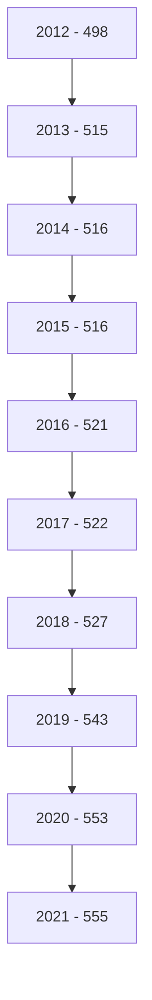

صفحة 5 من 42
---
# الكثافة المصرفية

"بالألف نسمة"

| لكل فرع ووكالة | لكل مصرف | السنة |
|----------------|-----------|-------|
| 12.1           | 389.0     | 2012  |
| 12.2           | 397.0     | 2013  |
| 12.2           | 397.0     | 2014  |
| 12.2           | 393.8     | 2015  |
| 12.5           | 382.4     | 2016  |
| 12.8           | 394.1     | 2017  |
| 13.1           | 383.3     | 2018  |
| 12.9           | 368.4     | 2019  |
| 12.8           | 368.3     | 2020  |
| 12.6           | 388.9     | 2021  |

## التركز المصرفي:

درجة التركز المصرفي تعني أن عدداً قليلا من المصارف التجارية يستأثر بالنسبة الأكبر من النشاط
المصرفي سواء من حيث الأصول أو الودائع أوالائتمان أو من حيث حجم حقوق الملكية، وفيما يخص
الحصة السوقية للمصارف التجارية في ليبيا، فقد شكلت أصول المصارف الأربعة الكبرى (الجمهورية،
التجاري الوطني، الوحدة والصحاري) من أصل 18 مصرفاً مانسبته 72.4% من إجمالي أصول القطاع
المصرفي في نهاية عام 2021، وشكل مصرف الجمهورية وحده ما نسبته 28.0% من إجمالي أصول
القطاع المصرفي.

وشكلت ودائع وقروض المصارف الأربعة الكبرى مانسبته 72.7% و 84.6% على التوالي من إجمالي
ودائع وقروض القطاع المصرفي نهاية عام 2021 .

صفحة 6 من 42
---
# التركز المصرفي
## (2012 - 2021)

### حسب الأصول :

| المصارف | 2012 | 2013 | 2014 | 2015 | 2016 | 2017 | 2018 | 2019 | 2020 | 2021 |
|---------|------|------|------|------|------|------|------|------|------|------|
| أكبر مصرف | 37.9 | 33.0 | 33.1 | 34.9 | 33.8 | 33.6 | 32.7 | 31.9 | 31.2 | 28.0 |
| أكبر ثلاثة مصارف | 71.0 | 63.7 | 62.1 | 67.6 | 67.9 | 66.9 | 65.8 | 64.6 | 63.1 | 62.0 |
| أكبر خمسة مصارف | 89.0 | 81.3 | 79.2 | 87.1 | 86.7 | 85.0 | 84.3 | 84.2 | 82.7 | 79.7 |

### حسب الإئتمان :

| المصارف | 2012 | 2013 | 2014 | 2015 | 2016 | 2017 | 2018 | 2019 | 2020 | 2021 |
|---------|------|------|------|------|------|------|------|------|------|------|
| أكبر مصرف | 41.9 | 44.8 | 43.5 | 44.8 | 44.3 | 44.5 | 43.6 | 40.7 | 42.6 | 40.7 |
| أكبر ثلاثة مصارف | 77.0 | 76.7 | 79.1 | 79.4 | 78.5 | 77.7 | 77.7 | 75.8 | 78.3 | 76.2 |
| أكبر خمسة مصارف | 91.0 | 90.2 | 91.1 | 91.4 | 91.3 | 91.2 | 91.5 | 91.4 | 91.4 | 87.6 |

### حسب ودائع العملاء :

| المصارف | 2012 | 2013 | 2014 | 2015 | 2016 | 2017 | 2018 | 2019 | 2020 | 2021 |
|---------|------|------|------|------|------|------|------|------|------|------|
| أكبر مصرف | 40.9 | 33.8 | 33.1 | 34.8 | 34.0 | 33.6 | 31.9 | 32.3 | 31.8 | 33.8 |
| أكبر ثلاثة مصارف | 71.5 | 62.7 | 61.3 | 66.5 | 67.2 | 66.5 | 65.2 | 64.4 | 62.9 | 62.0 |
| أكبر خمسة مصارف | 90.1 | 80.9 | 78.6 | 87.8 | 87.5 | 85.7 | 85.4 | 85.6 | 83.7 | 79.5 |

صفحة 7 من 42
---
# تركز الأصول

| المصرف | النسبة |
|--------|--------|
| مصرف الجمهورية | 28% |
| باقي المصارف | 28% |
| المصرف التجاري الوطني | 18% |
| مصرف الوحدة | 16% |
| مصرف الصحارى | 10% |

# تركز الائتمان

| المصرف | النسبة |
|--------|--------|
| مصرف الجمهورية | 41% |
| المصرف التجاري الوطني | 18% |
| مصرف الوحدة | 18% |
| باقي المصارف | 15% |
| مصرف الصحارى | 8% |

# تركز ودائع العملاء

| المصرف | النسبة |
|--------|--------|
| مصرف الجمهورية | 34% |
| باقي المصارف | 27% |
| المصرف التجاري الوطني | 15% |
| مصرف الوحدة | 13% |
| مصرف الصحارى | 11% |

صفحة 8 من 42
---
# الميزانية المُجمَعة للمصارف التجارية

شهدت الميزانية المُجمَعة للمصارف التجارية نهاية عام 2021، تطورات في مُجمل بنودها على جانبي الأصول والخصوم، ليبلغ إجمالي الأصول داخل الميزانية المُجمَعة نحو 135,977.2 مليون دينار، مقابل 126,107.9 مليون دينار في نهاية عام 2020، بإرتفاع قدره 9,869.3 مليون دينار، أي بمعدل 7.8%، وفيما يلي جدول يلخص البنود الرئيسية للميزانية المُجمَعة للمصارف التجارية:

## البنود الرئيسية للميزانية المُجمَعة للمصارف التجارية

مليون دينار

| جانب الأصول : | 2020 | 2021 | مقدار التغير | معدل التغير % |
|---------------|------|------|--------------|---------------|
| نقدية بالخزائن | 1,146.8 | 2,871.5 | 1,724.7 | 150.4 |
| حسابات المقاصة | 5,584.8 | 6,041.0 | 456.2 | 8.2 |
| أرصدة لدى المصارف | 89,836.6 | 89,916.8 | 80.2 | 0.1 |
| الإستثمارات | 4,256.6 | 4,445.1 | 188.5 | 4.4 |
| القروض والتسهيلات | 16,996.9 | 19,637.5 | 2,640.6 | 15.5 |
| الأصول الثابتة | 1,986.8 | 2,287.4 | 300.6 | 15.1 |
| الأصول الأخرى | 6,299.4 | 10,778.0 | 4,478.6 | 71.1 |
| إجمالي الأصول | 126,107.9 | 135,977.2 | 9,869.3 | 7.8 |
| الحسابات النظامية | 28,611.1 | 45,635.7 | 17,024.6 | 59.5 |
| إجمالي الميزانية | 154,719.0 | 181,612.8 | 26,893.8 | 17.4 |

| جانب الخصوم: | 2020 | 2021 | مقدار التغير | معدل التغير % |
|--------------|------|------|--------------|---------------|
| ودائع العملاء | 102,194.2 | 92,113.7 | -10,080.5 | -9.9 |
| منها : التأمينات النقدية | 7,091.6 | 16,515 | 9,423.4 | 132.9 |
| حقوق الملكية | 6,237.6 | 6,349.8 | 112.2 | 1.8 |
| المخصصات | 5,587.2 | 7,386.6 | 1,799.4 | 32.2 |
| الخصوم الأخرى | 12,088.9 | 30,127.1 | 18,038.2 | 149.2 |
| إجمالي الخصوم | 126,107.9 | 135,977.2 | 9,869.3 | 7.8 |
| الحسابات النظامية | 28,611.1 | 45,635.7 | 17,024.6 | 59.5 |
| إجمالي الميزانية | 154,719.0 | 181,612.8 | 26,893.8 | 17.4 |

صفحة 9 من 42
---
# الأهمية النسبية للبنود المكونة للأصول

| البند | 2021 | 2020 |
|-------|------|------|
| نقدية بالخزائن | 5% | 4% |
| حسابات المقاصة | 2% | 1% |
| أرصدة لدى المصارف | 8% | 5% |
| الإستثمارات | 2% | 2% |
| القروض والتسهيلات | 66% | 71% |
| الأصول الثابتة | 14% | 14% |
| الأصول الأخرى | 3% | 3% |

# الأهمية النسبية للبنود المكونة للخصوم

| البند | 2021 | 2020 |
|-------|------|------|
| ودائع العملاء | 68% | 81% |
| حقوق الملكية | 5% | 5% |
| المخصصات | 5% | 4% |
| الخصوم الأخرى | 22% | 10% |

صفحة 10 من 42
---
وفيما يلي تطور الميزانية المُجمَعة للمصارف التجارية خلال الفترة (2012 - 2021):

"مليون دينار"

| جانب الأصول | 2012 | 2013 | 2014 | 2015 | 2016 | 2017 | 2018 | 2019 | 2020 | 2021 |
|-------------|------|------|------|------|------|------|------|------|------|------|
| نقدية بالخزائن | 1,545.9 | 1,712.3 | 1,642.8 | 752.8 | 606.4 | 547.2 | 1,582.1 | 2,367.4 | 1,146.8 | 2,871.5 |
| حسابات المقاصة | 2,024.6 | 7,310.3 | 8,125.4 | 11,444.4 | 12,886.4 | 10,625.8 | 4,671.0 | 6,304.6 | 5,584.8 | 6,041.0 |
| أرصدة لدى مصارف | 56,787.6 | 68,094.6 | 62,244.0 | 53,540.0 | 62,306.5 | 84,262.6 | 85,349.3 | 77,424.9 | 89,836.6 | 89,916.8 |
| الإستثمارات | 954.9 | 746.7 | 777.5 | 1,787.8 | 1,789.2 | 1,311.5 | 1,456.5 | 1,957.5 | 4,256.6 | 4,445.1 |
| القروض والتسهيلات | 15,899.5 | 18,232.3 | 19,959.9 | 20,212.8 | 18,770.3 | 17,446.6 | 16,448.3 | 16,912.7 | 16,996.9 | 19,637.5 |
| الأصول الثابتة | 1,038.4 | 1,121.6 | 1,211.6 | 1,365.4 | 1,409.1 | 1,463.2 | 1,608.3 | 1,786.7 | 1,986.8 | 2,287.4 |
| الأصول الأخرى | 6,169.5 | 1,157.8 | 1,243.0 | 1,130.2 | 5,687.2 | 5,066.0 | 5,947.1 | 5,871.5 | 6,299.4 | 10,778.0 |
| إجمالي الأصول | 84,420.4 | 98,375.6 | 95,204.2 | 90,233.4 | 103,455.1 | 116,477.0 | 117,062.4 | 112,625.3 | 126,107.9 | 135,977.2 |
| الحسابات النظامية | 70,747.7 | 71,550.9 | 51,845.0 | 48,299.2 | 46,800.0 | 46,534.9 | 48,160.2 | 34,091.2 | 28,611.1 | 45,635.7 |
| إجمالي الميزانية | 155,168.1 | 169,926.5 | 147,049.2 | 138,532.6 | 150,255.1 | 163,011.9 | 165,222.6 | 146,716.6 | 154,719.0 | 181,612.8 |

صفحة 11 من 42
---
"مليون دينار"

| جانب الخصوم | 2012 | 2013 | 2014 | 2015 | 2016 | 2017 | 2018 | 2019 | 2020 | 2021 |
|-------------|-------|-------|-------|-------|-------|-------|-------|-------|---------|---------|
| ودائع العملاء | 68,346.2 | 83,562.7 | 78,910.4 | 71,257.1 | 83,407.6 | 95,938.5 | 93,657.5 | 88,954.0 | 102,194.2 | 92,113.7 |
| منها : التأمينات النقدية | 6,823.3 | 6,609.0 | 8,080.7 | 9,738.7 | 8,939.7 | 8,845.6 | 11,533.7 | 8,427.6 | 7,091.6 | 16,515 |
| حقوق الملكية | 4,653.2 | 4,743.7 | 4,886.4 | 5,087.5 | 5,366.5 | 5,561.4 | 6,472.6 | 6,109.2 | 6,237.6 | 6,349.8 |
| المخصصات | 3,317.4 | 3,597.2 | 3,765.3 | 3,941.8 | 4,144.9 | 4,473.0 | 4,627.6 | 5,527.2 | 5,587.2 | 7,386.6 |
| الخصوم الأخرى | 8,103.6 | 6,472.0 | 7,642.1 | 9,946.9 | 10,536.1 | 10,504.2 | 12,304.7 | 12,035.0 | 12,088.9 | 30,127.1 |
| إجمالي الخصوم | 84,420.4 | 98,375.6 | 95,204.2 | 90,233.4 | 103,455.1 | 116,477.0 | 117,062.4 | 112,625.3 | 126,107.9 | 135,977.2 |
| الحسابات النظامية | 70,747.7 | 71,550.9 | 51,845.0 | 48,299.2 | 46,800.0 | 46,534.9 | 48,160.2 | 34,091.2 | 28,611.1 | 45,635.7 |
| إجمالي الميزانية | 155,168.1 | 169,926.5 | 147,049.2 | 138,532.6 | 150,255.1 | 163,011.9 | 165,222.6 | 146,716.6 | 154,719.0 | 181,612.8 |

صفحة 12 من 42
---
تحليل البنود المكونة للميزانية المجمعة للمصارف التجارية

أولاً : جانب الأصول
1- النقدية :
أ- النقدية بالخزائن و حسابات المقاصة :

إرتفع رصيد النقدية بالخزائن وحسابات المقاصة بمقدار 2,180.9 مليون دينار أي بمعدل 32.4%، لتصل
إلى 8,912.5 مليون دينار في نهاية عام 2021، مقابل 6,731.6 مليون دينار في نهاية عام 2020،
بسبب إرتفاع النقد بخزائن المصارف بمقدار 1,724.7 مليون دينار، فيما إرتفع بند حسابات المقاصة
بمقدار 456.2 مليون دينار في نهاية عام 2021 مقارنة بما كانت عليه في نفس الفترة من عام 2020،
والجدول التالي يوضح ذلك :

"مليون دينار"

| البيان | 2020 | 2021 | مقدار التغير | معدل التغير% |
|---------|------|------|--------------|--------------|
| النقدية بالخزائن : | 1,146.8 | 2,871.5 | 1,724.7 | 150.4 |
| عملة محلية | 1,128.9 | 2,775.1 | 1,646.2 | 145.8 |
| عملة أجنبية | 17.9 | 96.4 | 78.5 | 438.5 |
| إجمالي حسابات المقاصة | 5,584.8 | 6,041.0 | 456.2 | 8.2 |
| المقاصة بين المصارف | 2,392.8 | 2,432.9 | 40.1 | 1.7 |
| المقاصة بين الفروع | 3,192.0 | 3,608.1 | 416.1 | 13.0 |
| الإجمالي | 6,731.6 | 8,912.5 | 2,180.9 | 32.4 |

إجمالي حسابات المقاصة | نقدية بخزائن المصارف التجارية
:-------------------------:|:-------------------------:
إجمالي حسابات المقاصة | نقدية بخزائن المصارف التجارية
6,200.0 | 3,500.0
6,000.0 | 3,000.0
5,800.0 | 2,500.0
مليون دينار 5,600.0 | مليون دينار 2,000.0
5,584.8 | 1,500.0 1,146.8
5,400.0 | 1,000.0
5,200.0 | 500.0
2020 2021 | 2020 2021

صفحة 13 من 42
---
وفيما يلي تطور بند النقدية في المصارف التجارية خلال الفترة (2012 -2021):

*مليون دينار*

| البيان | 2012 | 2013 | 2014 | 2015 | 2016 | 2017 | 2018 | 2019 | 2020 | 2021 |
|---------|------|------|------|------|------|------|------|------|------|------|
| النقدية بالخزائن: | 1,545.9 | 1,712.3 | 1,642.8 | 752.8 | 606.4 | 547.2 | 1,582.1 | 2,367.4 | 1,146.8 | 2,871.5 |
| عملة محلية | 1,433.3 | 1,622.6 | 1,619.9 | 743.6 | 594.7 | 537.8 | 1,573.6 | 2,355.1 | 1,128.9 | 2,775.1 |
| عملة أجنبية | 112.6 | 89.7 | 22.9 | 9.2 | 11.7 | 9.4 | 8.4 | 12.3 | 17.9 | 96.4 |
| إجمالي حسابات المقاصة: | 2,024.6 | 7,310.3 | 8,125.4 | 11,444.4 | 12,886.4 | 6,379.9 | 4,671.0 | 6,304.6 | 5,584.8 | 6,041.0 |
| المقاصة بين المصارف | 1,410.4 | 4,004.6 | 4,836.7 | 7,072.2 | 8,488.9 | 4,245.9 | 2,191.1 | 3,162.2 | 2,392.8 | 2,432.9 |
| المقاصة بين الفروع | 614.2 | 3,305.7 | 3,288.7 | 4,372.2 | 4,397.5 | 2,134.0 | 2,479.9 | 3,142.4 | 3,192.0 | 3,608.1 |
| الإجمالي | 2,956.3 | 5,716.9 | 6,479.5 | 7,825.0 | 13,492.7 | 6,927.1 | 6,253.0 | 8,672.0 | 6,731.6 | 8,912.5 |

صفحة 14 من 42
---

## نقدية بخزائن المصارف التجارية
### (2012 - 2021)

| السنة | مليون دينار |
|-------|-------------|
| 2012  | 1,545.9     |
| 2013  | 1,712.3     |
| 2014  | 1,642.8     |
| 2015  | 752.8       |
| 2016  | 606.4       |
| 2017  | 547.2       |
| 2018  | 1,582.1     |
| 2019  | 2,367.4     |
| 2020  | 1,146.8     |
| 2021  | 2,871.5     |

## إجمالي حسابات المقاصة
### (2012 - 2021)

| السنة | مليون دينار |
|-------|-------------|
| 2012  | 2,024.6     |
| 2013  | 7,310.3     |
| 2014  | 8,125.4     |
| 2015  | 11,444.4    |
| 2016  | 12,886.4    |
| 2017  | 6,379.9     |
| 2018  | 4,671.0     |
| 2019  | 6,304.6     |
| 2020  | 5,584.8     |
| 2021  | 6,041.0     |

صفحة 15 من 42
---
ب- الأرصدة والودائع لدى المصرف المركزي والمصارف الأخرى:

بلغ رصيد ودائع المصارف التجارية لدى المصرف المركزي والمصارف الأخرى وفيما بينها نحو 89,916.8 مليون دينار في نهاية عام 2021، مقابل 89,836.6 مليون دينار في نهاية عام 2020، بمعدل إرتفاع طفيف قدره 0.1%، نتيجة لإرتفاع رصيد ودائعها لدى المراسلين بالخارج وكذلك لدى المصرف الليبي الخارجي بنحو 1,210.7 مليون دينار و 6,103.4 مليون دينار على التوالي. جزء هام من هذه الزيادة كان نتيجة لإعادة التقييم بعد تعديل سعر الصرف في بداية العام 2021.

على الرغم من إنخفاض رصيد الودائع تحت الطلب لدى المصرف المركزي بمقدار 3,789.4 مليون دينار وكذلك إنخفاض رصيد شهادات الإيداع بمقدار 2,948.6 مليون دينار، والجدول التالي يوضح تفاصيل هذا البند:

| البيان | 2020 | 2021 | مقدار التغير | معدل التغير % |
|---------|------|------|---------------|---------------|
| ودائع تحت الطلب لدى : | 72,269.0 | 74,216.6 | 1,947.6 | 2.7 |
| المصرف المركزي | 68,245.0 | 64,455.6 | -3,789.4 | -5.6 |
| المصارف المحلية | 1,245.1 | 766.6 | -478.5 | -38.4 |
| المصرف الليبي الخارجي | 523.4 | 1,734.1 | 1,210.7 | 231.3 |
| لدى المراسلين بالخارج | 2,255.6 | 7,260.4 | 5,004.8 | 221.9 |
| ودائع زمنية : | 17,567.6 | 15,700.2 | -1,867.4 | -10.6 |
| المصرف المركزي (شهادات الإيداع) | 17,118.2 | 14,169.6 | -2,948.6 | -17.2 |
| المصارف المحلية | 17.4 | 0.0 | -17.4 | - |
| المصرف الليبي الخارجي | 0.0 | 0.0 | - | - |
| لدى المراسلين بالخارج | 432.0 | 1,530.6 | 1,098.6 | 254.3 |
| الإجمالي | 89,836.6 | 89,916.8 | 80.2 | 0.1 |

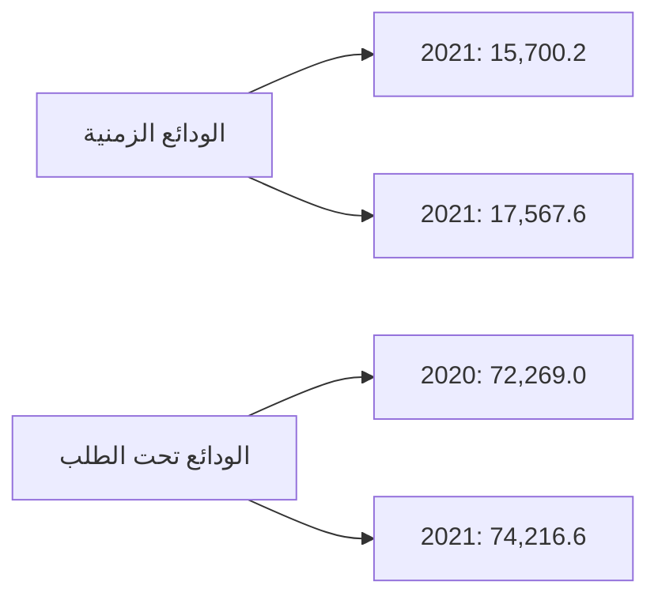
---
والجدول التالي يبين تطور أرصدة وودائع المصارف لدى المصرف المركزي والمصارف الأخرى وفيما بينها خلال الفترة (2012 -2021):

"مليون دينار"

| البيان | 2012 | 2013 | 2014 | 2015 | 2016 | 2017 | 2018 | 2019 | 2020 | 2021 |
|---|---|---|---|---|---|---|---|---|---|---|
| ودائع تحت الطلب لدى : | 19,352.7 | 22,342.6 | 24,360.7 | 27,870.7 | 38,306.1 | 56,945.4 | 59,454.9 | 60,184.6 | 72,269.0 | 74,216.6 |
| - المصرف المركزي | 17,203.4 | 19,364.6 | 19,317.8 | 20,863.2 | 30,627.6 | 53,136.0 | 52,385.4 | 53,629.1 | 68,245.0 | 64,455.6 |
| - المصارف المحلية | 329.0 | 347.6 | 408.2 | 1,717.6 | 1,742.4 | 1,012.5 | 1,030.0 | 1,750.0 | 1,245.1 | 766.6 |
| - المصرف الليبي الخارجي | 664.7 | 848.1 | 1,850.0 | 2,216.8 | 2,396.1 | 874.2 | 1,762.1 | 821.4 | 523.4 | 1,734.1 |
| - المصارف بالخارج | 1,155.6 | 1,782.3 | 2,784.7 | 3,073.1 | 3,540.0 | 1,922.7 | 4,277.3 | 3,984.1 | 2,255.6 | 7,260.4 |
| ودائع زمنية : | 37,434.9 | 45,751.9 | 37,883.3 | 25,669.2 | 24,000.4 | 27,317.8 | 25,894.4 | 17,240.3 | 17,567.6 | 15,700.2 |
| - شهادات الإيداع | 35,737.8 | 44,307.3 | 37,074.6 | 24,259.7 | 23,187.1 | 26,415.7 | 24,716.9 | 15,846.8 | 17,118.2 | 14,169.6 |
| - المصارف المحلية | 0.0 | 30.0 | 0.0 | 0.0 | 0.0 | 0.0 | 0.0 | 0.0 | 17.4 | 0.0 |
| - المصرف الليبي الخارجي | 58.4 | 37.6 | 206.1 | 107.1 | 224.7 | 0.0 | 459.4 | 0.0 | 0.0 | 0.0 |
| - المصارف بالخارج | 1,638.7 | 1,377.0 | 602.6 | 1,302.4 | 588.6 | 902.1 | 718.1 | 1,393.5 | 432.0 | 1,530.6 |
| الإجمالي | 56,787.6 | 68,094.6 | 62,244.0 | 53,539.9 | 62,306.5 | 84,263.2 | 85,349.3 | 77,424.9 | 89,836.6 | 89,916.8 |

صفحة 17 من 42
---
# ودائع المصارف التجارية لدى المصرف المركزي والمصارف الأخرى
# (2012 - 2021)

| السنة | ودائع زمنية | ودائع تحت الطلب لدى |
|-------|-------------|---------------------|
| 2012  | 37434.9     | 19352.7             |
| 2013  | 45751.9     | 22342.6             |
| 2014  | 37883.3     | 24360.7             |
| 2015  | 27870.7     | 25669.2             |
| 2016  | 24000.4     | 38306.1             |
| 2017  | 27317.8     | 56945.4             |
| 2018  | 25894.4     | 59454.9             |
| 2019  | 17240.3     | 60184.6             |
| 2020  | 17567.6     | 72269.0             |
| 2021  | 15700.2     | 74216.6             |

*ملاحظة: القيم بالمليون دينار*

الرسم البياني يوضح تطور ودائع المصارف التجارية لدى المصرف المركزي والمصارف الأخرى من عام 2012 إلى 2021. يظهر خطان:
- الخط الأحمر يمثل الودائع الزمنية
- الخط الأزرق يمثل الودائع تحت الطلب

يلاحظ ارتفاع مستمر في الودائع تحت الطلب، بينما تظهر الودائع الزمنية انخفاضاً عاماً خلال الفترة المذكورة.

صفحة 18 من 42
---
## 2- الإستثمارات :

سجل إجمالي بند رصيد الإستثمارات في المصارف التجارية نهاية عام 2021 نحو 4,445.1 مليون دينار، مقابل 4,256.6 مليون دينار في نهاية عام 2020، بمعدل نمو 4.4% هذا الإرتفاع جاء نتيجة زيادة الإستثمار في الشركات الخاصة المساهمة ، والجدول التالي يوضح تفاصيل هذا البند:

مليون دينار

| البيان | 2020 | 2021 | مقدار التغير | معدل التغير % |
|--------|------|------|--------------|---------------|
| سندات وأذونات الخزانة | 3,000.0 | 3,000.0 | 0.0 | 0.0 |
| إستثمارات في الشركات العامة | 562.3 | 564.7 | 2.4 | 0.4 |
| إستثمارات في الشركات الخاصة المساهمة | 599.5 | 783.5 | 184.0 | 30.7 |
| إستثمارات أخرى | 94.9 | 96.9 | 2.0 | 2.1 |
| الإجمالي | 4,256.6 | 4,445.1 | 188.5 | 4.4 |

إجمالي الإستثمارات

```mermaid
bar chart
    title إجمالي الإستثمارات
    x-axis [2021, 2021]
    y-axis "مليون دينار" 4150 --> 4500
    bar [4256.6, 4445.1]
```

صفحة 19 من 42
---
والجدول التالي يبين تطور رصيد بند الإستثمارات بالمصارف التجارية خلال الفترة (2012 –2021):

" مليون دينار "

| البيان | 2012 | 2013 | 2014 | 2015 | 2016 | 2017 | 2018 | 2019 | 2020 | 2021 |
|--------|------|------|------|------|------|------|------|------|------|------|
| سندات وأذونات الخزانة | 0.0 | 0.0 | 0.0 | 1,000.0 | 1,000.0 | 500.0 | 500.0 | 700.0 | 3,000.0 | 3,000.0 |
| إستثمارات أخرى | 954.9 | 746.7 | 777.5 | 787.8 | 789.2 | 811.5 | 956.5 | 1,257.5 | 1,256.6 | 1,445.1 |
| الإجمالي | 954.9 | 746.7 | 777.5 | 1,787.8 | 1,789.2 | 1,311.5 | 1,456.5 | 1,957.5 | 4,256.6 | 4,445.1 |

إجمالي الإستثمارات في المصارف التجارية
( 2012 - 2021 )

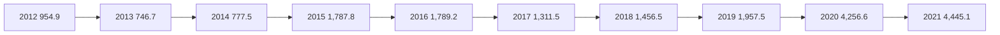

3- القروض والتسهيلات الائتمانية :

إرتفع اجمالي رصيد الإئتمان الممنوح من المصارف التجارية من 16,996.9 مليون دينار في نهاية عام 2020 إلى 19,637.5 مليون دينار في نهاية عام 2021، أي بمعدل نمو 15.5%، حيث بلغ رصيد القروض الممنوحة للقطاع الخاص في نهاية عام 2021 ما قيمته 13,165.8 مليون دينار، وما نسبته 67.0% من إجمالي القروض والتسهيلات الإئتمانية، فيما شكل رصيد القروض الممنوحة للقطاع العام النسبة الباقية 33.0% والتي بلغت قيمتها 6,471.7 مليون دينار.

وقد شكلت القروض والتسهيلات الائتمانية الممنوحة إلى إجمالي الخصوم الإيداعية ما نسبته 21.3%، كما شكلت من اجمالي الأصول ما نسبته 14.4%

وبلغـت نسبة تغطية مخصـص الديون المشكـوك فيها لإجمـالي القروض والتسهيلات الائتمانية الممنوحة نسبة 18.7% في نهاية عام 2021 مقابل نسبة 20.9% في نهاية عام 2020.

صفحة 20 من 42
---
وفيما يلي بيان تفصيلي لرصيد القروض والتسهيلات الممنوحة من المصارف التجارية :

مليون دينار

| البيان | 2020 | 2021 | مقدار التغير | معدل التغير % |
|---|---|---|---|---|
| سلفيات والسحب على المكشوف | 4,495.7 | 4,618.6 | 122.9 | 2.7 |
| السلف الإجتماعية * | 3,036.5 | 4,819.3 | 1,782.8 | 58.7 |
| القروض الأخرى | 9,464.7 | 10,199.6 | 734.9 | 7.8 |
| إجمالي القروض والتسهيلات | 16,996.9 | 19,637.5 | 2,640.6 | 15.5 |
| مخصص الديون المشكوك في تحصيلها | 3,549.3 | 3,680.3 | 131.0 | 3.7 |
| صافي القروض والتسهيلات | 13,447.6 | 15,957.2 | 2,509.6 | 18.7 |

*تشمل رصيد قروض المرابحة للأفراد.

| السلفيات والسحب على المكشوف |
|---|
| مليون دينار |
| 4,640.0 |
| 4,620.0 |
| 4,600.0 |
| 4,580.0 |
| 4,560.0 |
| 4,540.0 |
| 4,520.0 |
| 4,500.0 | 4,495.7 | 4,618.6 |
| 4,480.0 |
| 4,460.0 |
| 4,440.0 |
| 4,420.0 |
| | 2021 | 2021 |

| السلف الاجتماعية |
|---|
| مليون دينار |
| 6,000.0 |
| 5,000.0 | | 4,819.3 |
| 4,000.0 |
| 3,000.0 | 3,036.5 |
| 2,000.0 |
| 1,000.0 |
| 0.0 |
| | 2021 | 2021 |

صفحة 21 من 42
---
مليون دينار

| البيان | 2020 | 2021 | مقدار التغير | معدل التغير % |
|--------|------|------|--------------|---------------|
| القروض الممنوحة للقطاع العام | 5,918.2 | 6,471.7 | 553.5 | 9.4 |
| القروض الممنوحة للقطاع الخاص | 11,078.7 | 13,165.8 | 2,087.1 | 18.8 |
| الإجمالي | 16,996.9 | 19,637.5 | 2,640.6 | 15.5 |

رصيد القروض الممنوحة للقطاع الخاص:

| 2021 | 2021 |
|------|------|
| 11,078.7 | 13,165.8 |

مليون دينار

13,500.0
13,000.0
12,500.0
12,000.0
11,500.0
11,000.0
10,500.0
10,000.0

رصيد القروض الممنوحة للقطاع العام:

| 2021 | 2021 |
|------|------|
| 5,918.2 | 6,471.7 |

مليون دينار

6,600.0
6,500.0
6,400.0
6,300.0
6,200.0
6,100.0
6,000.0
5,900.0
5,800.0
5,700.0
5,600.0

صفحة 22 من 42
---
وفيما يلي رصيد القروض والتسهيلات الممنوحة للقطاعين العام والخاص خلال الفترة (2012 - 2021):

"مليون دينار"

| البيان | 2012 | 2013 | 2014 | 2015 | 2016 | 2017 | 2018 | 2019 | 2020 | 2021 |
|--------|------|------|------|------|------|------|------|------|------|------|
| القروض الممنوحة للقطاع العام | 5,291.2 | 5,327.1 | 6,195.9 | 5,982.8 | 5,915.9 | 5,578.9 | 5,100.9 | 6,057.0 | 5,918.2 | 6,471.7 |
| القروض الممنوحة للقطاع الخاص | 10,608.3 | 12,905.5 | 13,764.0 | 14,230.1 | 12,854.3 | 11,867.7 | 11,347.4 | 10,855.8 | 11,078.7 | 13,165.8 |
| الإجمالي | 15,899.5 | 18,232.3 | 19,959.9 | 20,212.8 | 18,770.3 | 17,446.6 | 16,448.3 | 16,912.7 | 16,996.9 | 19,637.5 |

رصيد القروض الممنوحة للقطاعين ( الخاص والعام )
( 2012 - 2021 )

```
16,000.0                   14,230.1
            12,905.513,764.0      12,854.3                            13,165.8
14,000.0                              11,867.711,347.410,855.811,078.7
12,000.0   10,608.3
10,000.0
 8,000.0    5,291.25,327.16,195.95,982.85,915.95,578.95,100.96,057.05,918.26,471.7
 6,000.0
 4,000.0
 2,000.0
     0.0
            2012   2013   2014   2015   2016   2017   2018   2019   2020   2021

        القروض الممنوحة للقطاع العام        القروض الممنوحة للقطاع الخاص
```

صفحة 23 من 42
---
وفيما يلي رصيد السلف الاجتماعية والسحب على المكشوف خلال الفترة (2012 -2021):

"مليون دينار"

| البيان | 2012 | 2013 | 2014 | 2015 | 2016 | 2017 | 2018 | 2019 | 2020 | 2021 |
|---|---|---|---|---|---|---|---|---|---|---|
| سلفيات والسحب على المكشوف | 5,522.3 | 4,146.5 | 4,452.1 | 5,440.1 | 4,827.9 | 4,514.5 | 4,354.0 | 5,275.4 | 4,495.7 | 4,618.6 |
| السلف الإجتماعية * | 4,973.5 | 6,726.0 | 7,157.9 | 6,608.6 | 5,901.1 | 4,912.5 | 3,988.7 | 3,125.5 | 3,036.5 | 4,819.3 |
| القروض الأخرى | 5,403.7 | 3,759.8 | 8,348.9 | 8,164.2 | 8,041.3 | 8,019.6 | 8,105.6 | 8,511.8 | 9,464.7 | 10,199.6 |
| إجمالي القروض والتسهيلات | 15,899.5 | 18,232.3 | 19,959.9 | 20,212.8 | 18,770.3 | 17,446.6 | 16,448.3 | 16,912.7 | 16,996.9 | 19,637.5 |
| مخصص الديون | 2,348.9 | 2,497.9 | 2,688.1 | 2,779.7 | 2,910.0 | 3,040.8 | 3,126.4 | 3,503.6 | 3,549.3 | 3,680.3 |
| صافي القروض والتسهيلات | 13,550.6 | 15,734.4 | 17,271.8 | 17,433.1 | 15,860.3 | 14,405.8 | 13,321.9 | 13,409.1 | 13,447.6 | 15,957.2 |

*تشمل رصيد قروض المرابحة للأفراد.


| السنة | السلف الإجتماعية | سلفيات والسحب على المكشوف |
|---|---|---|
| 2012 | 4,973.5 | 5,522.3 |
| 2013 | 6,726.0 | 4,146.5 |
| 2014 | 7,157.9 | 4,452.1 |
| 2015 | 6,608.6 | 5,440.1 |
| 2016 | 5,901.1 | 4,827.9 |
| 2017 | 4,912.5 | 4,514.5 |
| 2018 | 3,988.7 | 4,354.0 |
| 2019 | 3,125.5 | 5,275.4 |
| 2020 | 3,036.5 | 4,495.7 |
| 2021 | 4,819.3 | 4,618.6 |

صفحة 24 من 42
---
## 4 - الأصول الثابتة والأصول الأخرى:

بلغ رصيد الأصول الثابتة نحو 2,287.4 مليون دينار في نهاية عام 2021، مقابل 1,986.8 مليون دينار في نهاية عام 2020، فيما بلغ رصيد الأصول الأخرى نحو 10,778.0 مليون دينار في نهاية عام 2021، مقابل 6,299.4 مليون دينار في نهاية عام 2020.

## ثانياً: جانب الخصوم

### 1-ودائع العملاء لدى المصارف التجارية:

إنخفض إجمالي رصيد ودائع العملاء لدى المصارف التجارية من 102,194.2 مليون دينار في نهاية عام 2020 إلى 92,113.7 مليون دينار في نهاية عام 2021، أي بمعدل 9.9%، وقد تركز الإنخفاض في أرصدة الودائع تحت الطلب بمقدار 19,427.6 مليون دينار بنسبة 21.0% عما كانت عليه في نهاية عام 2020، في حين سجل رصيد الودائع الآجلة إرتفاعاً بمقدار 9,469.7 مليون في بند التأمينات النقدية، أما فيما يخص الودائع الإدخارية فقد إنخفضت بمقدار 122.5 مليون دينار وبنسبة 28.0%.

أما فيما يتعلق بتوزيع الودائع لدى المصارف التجارية حسب نوع الوديعة فقد شكلت الودائع تحت الطلب ما نسبته 79.4% من إجمالي الودائع، في حين شكلت الودائع لأجل ما نسبته 20.3% من إجمالي الودائع، وشكلت ودائع الادخار ما نسبته 0.3% فقط من إجمالي الودائع.

| البيان | 2020 | 2021 | مقدار التغير | معدل التغير % |
|--------|------|------|---------------|---------------|
| الودائع تحت الطلب | 92,530.6 | 73,103.0 | -19,427.6 | -21.0 |
| الودائع لأجل | 9,225.9 | 18,695.6 | 9,469.7 | 102.6 |
| الودائع الإدخارية | 437.6 | 315.1 | -122.5 | -28.0 |
| الإجمالي | 102,194.2 | 92,113.7 | -10,080.5 | -9.9 |

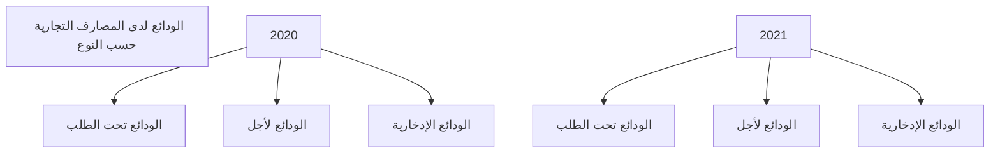

صفحة 25 من 42
---
أرصدة الودائع حسب نوع الوديعة لدى المصارف التجارية خلال الفترة (2012 -2021)

"مليون دينار"

| البيان | 2012 | 2013 | 2014 | 2015 | 2016 | 2017 | 2018 | 2019 | 2020 | 2021 |
|--------|------|------|------|------|------|------|------|------|------|------|
| الودائع تحت الطلب | 54,728.8 | 61,834.9 | 56,641.4 | 58,725.9 | 72,192.7 | 84,827.6 | 80,038.6 | 77,919.6 | 92,530.6 | 73,103.0 |
| الودائع زمنية | 12,912.1 | 21,064.9 | 21,669.3 | 11,956.7 | 10,644.7 | 10,519.2 | 13,115.5 | 10,582.2 | 9,225.9 | 18,695.6 |
| الودائع الإدخارية | 705.3 | 662.9 | 599.8 | 574.5 | 570.2 | 591.7 | 503.4 | 452.3 | 437.6 | 315.1 |
| الإجمالي | 68,346.2 | 83,562.7 | 78,910.4 | 71,257.1 | 83,407.6 | 95,938.5 | 93,657.5 | 88,954.0 | 102,194.2 | 92,113.7 |

إجمالي ودائع العملاء لدى المصارف التجارية
(2012 - 2021)

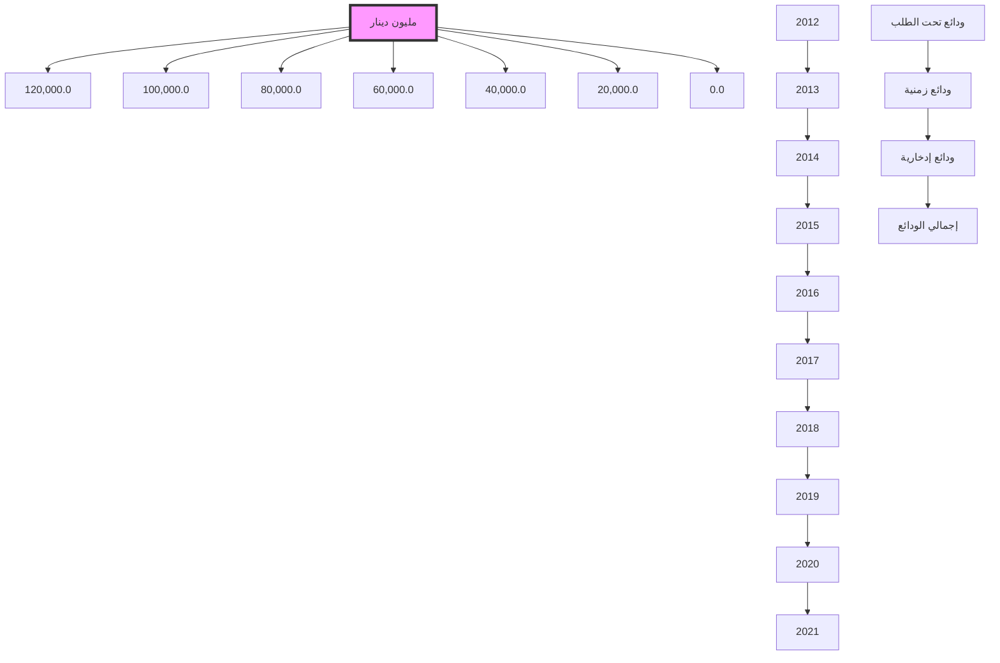

صفحة 26 من 42
---
وفيما يتعلق بتوزيع إجمالي ودائع العملاء لدى المصارف التجارية (خاص، حكومة، عام) فقد انخفضت
ودائع القطاع الخاص بمقدار 5,271.5 مليون دينار وبنسبة 8.7% في نهاية نهاية عام 2021، لتسجل
نحو 55,302.0 مليون دينار، مقارنة بنحو 60,573.5 مليون دينار في نهاية نهاية عام 2020. وفيما
إنخفض رصيد القطاع الحكومي والقطاع العام في نهاية عام 2021 بمقدار 4,809.1 مليون دينار لتصل
إلى 36,811.6 مليون دينار، منها 11,533.8 مليون دينار كودائع حكومية والتي تتكون من ودائع
الوزارات والهيئات والمؤسسات الحكومية وودائع كل من: صندوق الضمان الإجتماعي، صندوق الإنماء
الإقتصادي والإجتماعي وودائع الصندوق الليبي للتنمية والإستثمار، مقابل 41,620.7 مليون دينار كودائع
للقطاع العام والقطاع الحكومي في نهاية عام 2020.

والجدول التالي يوضح تطور أرصدة الودائع لدى المصارف التجارية:

| البيان | 2020 | 2021 | مقدار التغير | معدل التغير % |
|--------|------|------|--------------|---------------|
| ودائع الحكومة والقطاع العام | 41,620.7 | 36,811.6 | -4,809.1 | -11.6 |
| - ودائع حكومية | 12,093.5 | 11,533.8 | -559.7 | -4.6 |
| - ودائع القطاع العام | 29,527.2 | 25,277.9 | -4,249.3 | -14.4 |
| ودائع القطاع الخاص | 60,573.5 | 55,302.0 | -5,271.5 | -8.7 |
| - الأفراد | 38,908.5 | 29,161.3 | -9,747.2 | -25.1 |
| - الشركات والمؤسسات | 21,665.0 | 26,140.7 | 4,475.7 | 20.7 |
| الإجمالي | 102,194.2 | 92,113.7 | -10,080.5 | -9.9 |

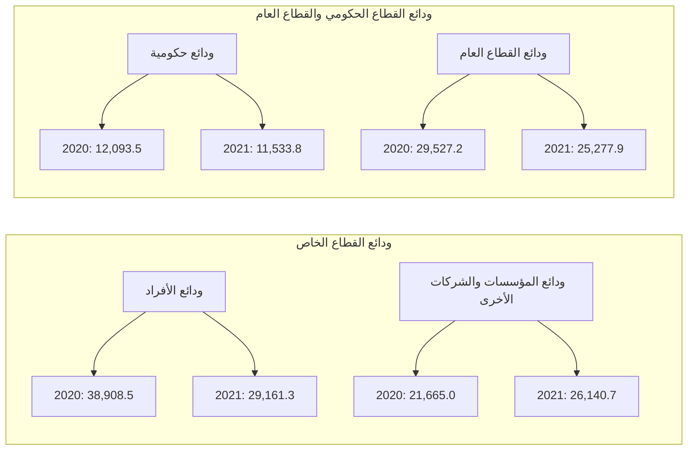

صفحة 27 من 42
---
وفيما يلي توزيع ودائع العملاء لدى المصارف التجارية خلال الفترة (2012 -2021):

"مليون دينار"

| البيان | 2012 | 2013 | 2014 | 2015 | 2016 | 2017 | 2018 | 2019 | 2020 | 2021 |
|---|---|---|---|---|---|---|---|---|---|---|
| ودائع الحكومة والقطاع العام | 35,469.8 | 52,638.7 | 46,339.9 | 35,139.7 | 39,197.7 | 40,710.8 | 39,747.8 | 42,343.0 | 41,620.7 | 36,811.6 |
| - ودائع حكومية | 13,983.3 | 24,285.4 | 21,987.0 | 9,800.6 | 9,100.7 | 9,234.8 | 10,048.5 | 11,694.6 | 12,093.5 | 11,533.8 |
| - ودائع القطاع العام | 21,486.5 | 28,353.3 | 24,352.9 | 25,339.1 | 30,097.0 | 31,476.0 | 29,699.3 | 30,648.5 | 29,527.2 | 25,277.9 |
| ودائع القطاع الخاص | 32,876.4 | 30,924.0 | 32,570.5 | 36,117.4 | 44,209.9 | 55,227.7 | 53,909.7 | 46,611.0 | 60,573.5 | 55,302.0 |
| - الأفراد | 21,026.1 | 19,569.5 | 19,799.0 | 20,477.2 | 27,605.5 | 36,295.4 | 33,717.5 | 27,402.6 | 38,908.5 | 29,161.3 |
| - الشركات والمؤسسات | 11,850.3 | 11,345.5 | 12,771.5 | 15,640.2 | 16,604.4 | 18,932.3 | 20,192.2 | 19,208.4 | 21,665.0 | 26,140.7 |
| الإجمالي | 68,346.2 | 83,562.7 | 78,910.4 | 71,257.1 | 83,407.6 | 95,938.5 | 93,657.5 | 88,954.0 | 102,194.2 | 92,113.7 |

صفحة 28 من 42
---
# ودائع القطاع العام والقطاع الحكومي لدى المصارف التجارية
## (2012 - 2021)

| السنة | ودائع حكومية | ودائع القطاع العام |
|-------|--------------|---------------------|
| 2012  | 13,983.3     | 21,486.5            |
| 2013  | 24,285.4     | 28,353.3            |
| 2014  | 21,987.0     | 24,352.9            |
| 2015  | 9,800.6      | 25,339.1            |
| 2016  | 9,100.7      | 30,097.0            |
| 2017  | 9,234.8      | 31,476.0            |
| 2018  | 10,048.5     | 29,699.3            |
| 2019  | 11,694.6     | 30,648.5            |
| 2020  | 12,093.5     | 29,527.2            |
| 2021  | 11,533.8     | 25,277.9            |

*القيم بالمليون دينار*

# ودائع القطاع الخاص لدى المصارف التجارية
## (2012 - 2021)

| السنة | ودائع القطاع الخاص |
|-------|---------------------|
| 2012  | 21,026.1            |
| 2013  | 19,569.5            |
| 2014  | 19,799.0            |
| 2015  | 20,477.2            |
| 2016  | 27,605.5            |
| 2017  | 36,295.4            |
| 2018  | 33,717.5            |
| 2019  | 27,402.6            |
| 2020  | 38,908.5            |
| 2021  | 29,161.3            |

*القيم بالمليون دينار*

صفحة 29 من 42
---
## 2- الحسابات المكشوفة لدى المراسلين بالخارج:

بلغ رصيد الحسابات المكشوفة لدى المراسلين بالخارج 144.7 مليون دينار في نهاية عام 2021، وهي في معظمها ناتجة عن تأخر تسوية الحسابات لبعض المصارف مع المصارف المراسلة بالخارج، مقابل 220.4 مليون دينار في نهاية عام 2020.

"مليون دينار"

| البيان | 2020 | 2021 | مقدار التغير | معدل التغير % |
|--------|------|------|--------------|---------------|
| الحسابات المكشوفة لدى المراسلين بالخارج | 220.4 | 144.7 | -75.7 | -34.3 |

### الحسابات المكشوفة لدى المراسلين بالخارج

| 2020 | 2021 |
|------|------|
| 220.4 | 144.7 |

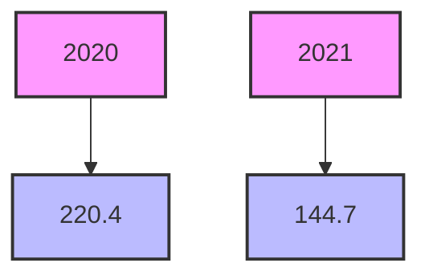

صفحة 30 من 42
---
وفيما يلي أرصدة الحسابات المكشوفة خلال الفترة (2012 -2021):

"مليون دينار"

| البيان | 2012 | 2013 | 2014 | 2015 | 2016 | 2017 | 2018 | 2019 | 2020 | عام 2021 |
|--------|------|------|------|------|------|------|------|------|------|----------|
| الحسابات المكشوفة لدى المراسلين بالخارج | 139.6 | 74.9 | 432.0 | 955.6 | 429.9 | 368.5 | 503.4 | 113.1 | 220.4 | 144.7 |

الحسابات المكشوفة لدى المراسلين بالخارج
( 2012 - 2021 )

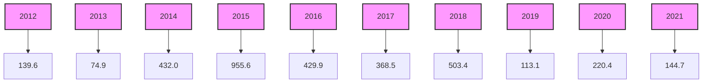

صفحة 31 من 42
---
### 3- الإقتراض من المصرف المركزي:

بمبادرة من مصرف ليبيا المركزي تم منح بعض المصارف التجارية قروض حسنة، وذلك نظراً لتدني أرصدتها لدى المصرف المركزي بطرابلس والغرض من منح هذه القروض هي تخفيف المعاناة عن المواطنين فيما يتعلق بصكوك المقاصة العالقة ومعالجة مشكلة المقاصة مابين المصارف، وكذلك توفير السيولة النقدية لكافة المدن، وأيضاً لتغطية الاعتمادات وعمليات النقد الأجنبي، حيث بلغ رصيد القروض والحسابات تحت التسوية حتى نهاية عام 2021 نحو 19,850.7 مليون دينار موزعة كمايلي:-

| المصرف | القيمة بالمليون دينار |
|------------------------|----------------------:|
| مصرف الجمهورية حسن | 7,573.5 |
| مصرف التجاري الوطني | 3,647.7 |
| مصرف الوحدة | 4,457.9 |
| مصرف شمال افريقيا | 575.8 |
| مصرف السراي | 184.1 |
| مصرف التجارة والتنمية | 2,756.1 |
| مصرف الاسلامي الليبي | 189.4 |
| مصرف المتوسط | 186.0 |
| مصرف الصحاري | 119.3 |
| مصرف الواحة | 160.9 |
| الإجمالي | 19,850.7 |

*تمثل قروض وحسابات تحت التسوية لدعم أرصدة المصارف.

صفحة 32 من 42
---
## 4- حقوق الملكية والأرباح :

- رأس المال المدفوع: إرتفع رأس المال المدفوع من 4,295.9 مليون دينار في نهاية عام 2020 إلى 4,696.6 مليون دينار في نهاية عام 2021، نتيجة لقيام بعض المصارف بزيادة رأس مالها المدفوع.

- الإحتياطيات والأرباح: إنخفض رصيد الإحتياطيات والأرباح المرحلة والقابلة للتوزيع من 1,941.7 مليون دينار في نهاية عام 2020، ليصل إلى 1,653.3 مليون دينار في نهاية عام 2021، في حين سجلت أرباح المصارف التجارية قبل خصم المخصصات والضرائب خلال عام 2021 إرتفاعاً ملحوظاً بمعدل 93.9% لتسجل إلى 1,176.9 مليون دينار، مقارنة عما كانت عليه خلال نفس الفترة من عام 2020 والبالغة نحو 608.7 مليون دينار.

| البيان | 2020 | 2021 | مقدار التغير | معدل التغير % |
|--------|------|------|--------------|---------------|
| رأس المال المدفوع | 4,295.9 | 4,696.6 | 400.7 | 9.3 |
| الإحتياطي القانوني | 663.5 | 799.8 | 136.3 | 20.5 |
| إحتياطيات غير مخصصة | 50.3 | 61.4 | 11.1 | 22.1 |
| أرباح العام | 608.7 | 1,176.9 | 568.2 | 93.3 |
| الأرباح المرحّلة والأرباح القابلة للتوزيع | 1,227.9 | 792.1 | -435.8 | -35.5 |
| الإجمالي | 6,846.3 | 7,526.7 | 680.4 | 9.9 |

### أرباح المصارف التجارية قبل خصم المخصصات والضرائب (2012 - 2021)

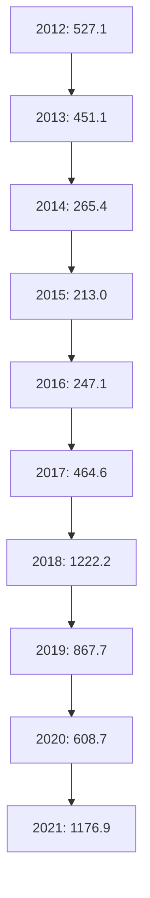

صفحة 33 من 42
---
فيما يلي حسابات رأس المال والإحتياطيات في المصارف خلال الفترة (2012 -2021):

"مليون دينار"

| البيان | 2012 | 2013 | 2014 | 2015 | 2016 | 2017 | 2018 | 2019 | 2020 | 2021 |
|--------|------|------|------|------|------|------|------|------|------|------|
| رأس المال المدفوع | 3,495.2 | 3,550.2 | 3,566.8 | 3,609.5 | 3,791.4 | 3,806.4 | 3,904.4 | 4,282.9 | 4,295.9 | 4,696.6 |
| الإحتياطي القانوني | 181.9 | 323.5 | 335.8 | 335.8 | 342.8 | 346.1 | 352.9 | 527.7 | 663.5 | 799.8 |
| إحتياطيات غير مخصصة | 26.6 | 29.7 | 29.7 | 29.7 | 30.0 | 31.9 | 32.0 | 53.1 | 50.3 | 61.4 |
| أرباح العام | 527.1 | 451.1 | 265.4 | 213.0 | 247.1 | 464.6 | 1,122.2 | 867.6 | 608.7 | 1,176.9 |
| الأرباح المرحّلة والأرباح القابلة للتوزيع | 422.4 | 389.2 | 688.7 | 899.6 | 955.0 | 912.4 | 1,061.1 | 1,245.5 | 1,227.9 | 792.1 |
| الإجمالي | 4,653.2 | 4,743.7 | 4,886.4 | 5,087.6 | 5,366.3 | 5,561.4 | 6,472.6 | 6,976.8 | 6,846.3 | 7,526.7 |

إجمالي حقوق الملكية في المصارف التجارية
( 2012 - 2021 )

| السنة | رأس المال | الإحتياطيات | إجمالي حقوق الملكية |
|-------|-----------|-------------|---------------------|
| 2012 | 3495.2 | 1158.1 | 4,653.3 |
| 2013 | 3550.2 | 1193.5 | 4,743.7 |
| 2014 | 3566.8 | 1391.1 | 4,957.9 |
| 2015 | 3609.5 | 1478.0 | 5,087.5 |
| 2016 | 3791.4 | 1575.0 | 5,366.4 |
| 2017 | 3806.4 | 1755.1 | 5,561.5 |
| 2018 | 3904.4 | 2565.1 | 6,469.5 |
| 2019 | 4282.9 | 2693.9 | 6,976.8 |
| 2020 | 4295.9 | 2550.4 | 6,846.3 |
| 2021 | 4696.6 | 2830.1 | 7,526.7 |

صفحة 34 من 42
---
٥- المخصصات:

سجل رصيد المخصصات إرتفاعاً بمقدار 1,799.4 مليون دينار في نهاية عام 2021 ليصل إلى
7,386.6 مليون دينار، مقابل 5,587.2 مليون دينار في نهاية عام 2020، وتركزت الزيادة في بند
مخصص تقييم أسعار الصرف كما هو موضح بالجدول التالي:

"مليون دينار"

| البيان | 2020 | 2021 | مقدار التغير | معدل التغير % |
|---|---|---|---|---|
| مخصص الديون المشكوك في تحصيلها | 3,549.3 | 3,680.3 | 131.0 | 3.7 |
| مخصص إستهلاك الأصول الثابتة | 862.3 | 916.4 | 54.1 | 6.3 |
| مخصصات عامة | 1,171.2 | 1,261.3 | 90.1 | 7.7 |
| مخصص تقييم أسعار الصرف | 4.4 | 1,528.6 | 1,524.2 | 34,640.9 |
| الإجمالي | 5,587.2 | 7,386.6 | 1,799.4 | 32.2 |

بند المخصصات

```
4,000.0  3,549.3        3,680.3
3,500.0
3,000.0
2,500.0                                 ■ مخصص الديون المشكوك في تحصيلها
2,000.0                                 ■ مخصص إستهلاك الأصول الثابتة
1,500.0        1,171.2   1,261.3 1,528.6
         862.3        916.4              ■ مخصصات عامة
1,000.0                                 ■ مخصص تقييم أسعار الصرف
  500.0             4.4
    0.0
           2020           2021
```

صفحة 35 من 42
---
وفيما يلي رصيد المخصصات خلال الفترة (2012 -2021):

"مليون دينار"

| البيان | 2012 | 2013 | 2014 | 2015 | 2016 | 2017 | 2018 | 2019 | 2020 | 2021 |
|---------|------|------|------|------|------|------|------|------|------|------|
| مخصص الديون المشكوك في تحصيلها | 2,348.9 | 2,497.5 | 2,688.1 | 2,779.7 | 2,910.0 | 3,040.8 | 3,126.4 | 3,503.6 | 3,549.3 | 3,680.3 |
| مخصص إستهلاك الأصول الثابتة | 424.1 | 473.1 | 539.3 | 592.5 | 634.0 | 687.3 | 745.2 | 795.3 | 862.3 | 916.4 |
| مخصصات عامة | 539.3 | 614.6 | 532.8 | 556.9 | 594.3 | 738.2 | 753.2 | 1,225.5 | 1,171.2 | 1,261.3 |
| مخصص تقييم أسعار الصرف | 5.2 | 11.6 | 5.1 | 12.7 | 6.5 | 6.7 | 2.8 | 2.8 | 4.4 | 1,528.6 |
| الإجمالي | 3,317.5 | 3,597.2 | 3,765.3 | 3,941.8 | 4,144.8 | 4,473.0 | 4,627.6 | 5,527.2 | 5,587.2 | 7,386.6 |

رصيد بند المخصصات
(2012 - 2021)

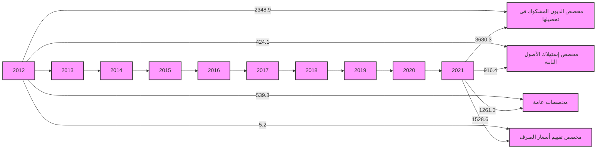

صفحة 36 من 42
---
# مؤشرات السلامة المالية للمصارف التجارية
## (2012 - 2021)

❖ مؤشرات السيولة : بلغت نسبة الأصول السائلة لدى المصارف التجارية إلى إجمالي الأصول 68.4%
في نهاية عام 2021، والتي معظمها تمثل ودائع لدى المصرف المركزي (تحت الطلب بما فيها الاحتياطي
الإلزامي وكذلك شهادات الإيداع ).

وبلغ حجم القروض إلى إجمالي الودائع بالقطاع المصرفي نسبة 21.3% في نهاية عام 2021، وهي نسبة
ضئيلة للغاية، حيث لم تتعدى هذه النسبة 28.4% خلال الفترة.

وتجدر الإشارة إلى أن نسبة السيولة القانونية المطلوب من المصارف التجارية الإحتفاظ بها هي 25.0%
من إجمالي الخصوم الإيداعية.

" نسب مئوية "

| مؤشرات السيولة | 2012 | 2013 | 2014 | 2015 | 2016 | 2017 | 2018 | 2019 | 2020 | 2021 |
|-----------------|------|------|------|------|------|------|------|------|------|------|
| الأصول السائلة / الأصول | 68.6 | 71.0 | 67.8 | 60.2 | 60.8 | 72.8 | 74.3 | 71.9 | 71.4 | 68.4 |
| القروض / الودائع | 23.6 | 21.8 | 25.2 | 28.4 | 22.5 | 18.2 | 17.6 | 19.0 | 16.8 | 21.3 |
| الودائع / الأصول | 80.8 | 84.9 | 83.1 | 79.0 | 80.6 | 82.4 | 80.0 | 79.3 | 80.1 | 67.7 |

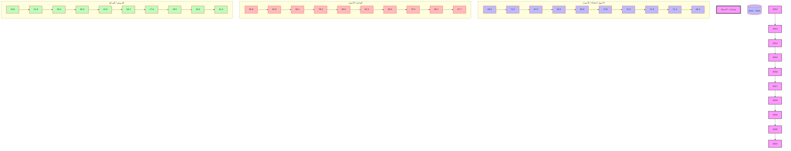

صفحة 37 من 42
---
❖ جودة الأصول: أظهرت البيانات المتوفرة عن نسبة الديون المتعثرة وهي بيانات تقديرية قد لا تعكس الواقع
أن نسبة الديون المتعثرة إلى إجمالي القروض بلغت في نهاية عام 2021 نحو 21.0%، ويدل إرتفاع
هذه النسبة على إنخفاض كفاءة إدارة الائتمان، وينبغي أن لا تتجاوز هذه النسبة وفقاً للمعايير الدولية
5%. وقد سجلت نسبة تغطية مخصص الديون إلى الديون المتعثرة في نهاية عام 2021 نحو 89.2%.

نسب مئوية

| جودة الأصول | 2012 | 2013 | 2014 | 2015 | 2016 | 2017 | 2018 | 2019 | 2020 | 2021 |
|-------------|------|------|------|------|------|------|------|------|------|------|
| القروض المتعثرة / الأصول | 4.0 | 3.9 | 4.4 | 4.7 | 3.8 | 3.1 | 2.9 | 3.2 | 2.8 | 3.0 |
| القروض المتعثرة / القروض | 21.0 | 21.0 | 21.0 | 21.0 | 21.0 | 21.0 | 21.0 | 21.0 | 21.0 | 21.0 |
| مخصص الديون / القروض المتعثرة | 70.9 | 65.2 | 64.0 | 65.5 | 73.8 | 83.0 | 90.4 | 98.6 | 101.9 | 89.2 |
| مخصص الديون / القروض | 14.9 | 13.7 | 13.4 | 13.8 | 15.5 | 17.4 | 19.0 | 20.9 | 21.4 | 18.7 |

بيانات القروض المتعثرة تقديرية منذ 2011.

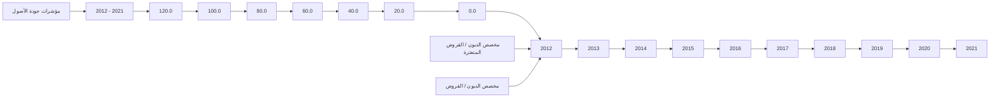

❖ الربحية: شهد معدل العائد على الأصول لدى القطاع المصرفي في ليبيا إنخفاضاً ملحوظاً خلال السنوات
(2014 - 2016)، حيث بلغ نحو 0.2% في عام 2016، ويعزى سبب الإنخفاض إلى عدة أسباب منها
الوضع الغير ملائم الذي تعمل فيه المصارف التجارية في السنوات الأخيرة وكذلك تطبيق قانون إلغاء
الفوائد الربوية.

إلا أنه خلال العام 2018 تحسن معدل الربحية بشكل كبير، حيث بلغ العائد على إجمالي الأصول نحو
1.0%، وبلغ معدل العائد على حقوق الملكية 20.9%.

صفحة 38 من 42
---
وفي عام 2019 بلغ معدل العائد على إجمالي الأصول نحو 0.7% وبلغ معدل العائد على حقوق الملكية 12.3%.

وفي عام 2020 بلغ معدل العائد على إجمالي الأصول نحو 0.3% وبلغ معدل العائد على حقوق الملكية 4.9%.

وخلال عام 2021 إرتفعت مؤشرات الربحية ليبلغ معدل العائد إلى إجمالي الأصول نحو 0.9% وبلغ معدل العائد إلى حقوق الملكية نحو 18.5%.

الزيادة في الأرباح في عامي 2018 و2019 جاءت نتيجة لتحقيق المصارف التجارية لإيرادات هامة من عمولات بيع وتحويل العملة الأجنبية ، وكذلك من إيرادات الخدمات المصرفية.

نسب مئوية

| الربحية | 2012 | 2013 | 2014 | 2015 | 2016 | 2017 | 2018 | 2019 | 2020 | 2021 |
|---------|------|------|------|------|------|------|------|------|------|------|
| العائد / حقوق الملكية | 13.7 | 12.0 | 5.4 | 4.4 | 4.8 | 9.1 | 20.9 | 12.3 | 4.9 | 18.5 |
| العائد / الاصول | 0.7 | 0.5 | 0.3 | 0.2 | 0.2 | 0.4 | 1.0 | 0.7 | 0.3 | 0.9 |

```mermaid
graph LR
    subgraph العائد / حقوق الملكية (2012 - 2021)
        A[25.0] --> B[20.9]
        B --> C[18.5]
        D[15.0] --> E[13.7]
        E --> F[12.0]
        F --> G[12.3]
        G --> H[9.1]
        H --> I[5.4]
        I --> J[4.4]
        J --> K[4.8]
        K --> L[6.2]
    end
```

```mermaid
graph LR
    subgraph العائد / الأصول (2012 - 2021)
        A[1.2] --> B[1.0]
        B --> C[0.9]
        D[0.8] --> E[0.7]
        E --> F[0.7]
        G[0.6] --> H[0.5]
        H --> I[0.4]
        I --> J[0.3]
        J --> K[0.2]
        K --> L[0.2]
        L --> M[0.3]
    end
```

صفحة 39 من 42
---
❖ كفاية رأس المال : يتمتع القطاع المصرفي الليبي بكفاية رأس مال مرتفعة، كافية لمواجهة أية مخاطر قد تحدث، حيث تراوحت نسبتها مابين 10.7% و 19.2%
خلال الفترة ( 2012- 2021)، وهي بشكل عام أعلى وبهامش مريح من النسبة المحددة من قبل لجنة بازل (1) والبالغة 8.0%، مما يعزز من الإستقرار المالي.

نسب مئوية

| نسب رأس المال | 2012 | 2013 | 2014 | 2015 | 2016 | 2017 | 2018 | 2019 | 2020 | 2021 |
|---------------|------|------|------|------|------|------|------|------|------|------|
| كفاية رأس المال الكلي | 10.7 | 12.4 | 13.9 | 14.3 | 14.6 | 16.7 | 17.8 | 18.4 | 19.2 | 16.6 |
| كفاية رأس المال الأساسي | 9.5 | 11.0 | 12.6 | 13.1 | 13.4 | 15.4 | 16.5 | 17.2 | 17.9 | 15.3 |
| رأس المال المدفوع / الأصول | 4.2 | 3.6 | 3.7 | 4.0 | 3.7 | 3.3 | 3.3 | 3.8 | 3.6 | 3.5 |
| حقوق الملكية / الأصول | 5.1 | 4.4 | 5.1 | 5.4 | 4.9 | 4.8 | 4.6 | 5.5 | 4.9 | 4.7 |
| حقوق الملكية / الودائع | 6.3 | 5.1 | 6.2 | 7.1 | 6.1 | 5.3 | 5.7 | 6.9 | 6.1 | 6.9 |

صفحة 40 من 42
---
# كفاية رأس المال الكلي
## (2012 - 2021)

| السنة | النسبة (%) |
|-------|-----------|
| 2012  | 10.7      |
| 2013  | 12.4      |
| 2014  | 13.9      |
| 2015  | 14.3      |
| 2016  | 14.6      |
| 2017  | 16.7      |
| 2018  | 17.8      |
| 2019  | 18.4      |
| 2020  | 19.2      |
| 2021  | 16.6      |

# مؤشرات رأس المال
## (2012 - 2021)

| السنة | رأس المال المدفوع / الأصول (%) | حقوق الملكية / الأصول (%) |
|-------|--------------------------------|---------------------------|
| 2012  | 4.2                            | 5.1                       |
| 2013  | 3.6                            | 4.4                       |
| 2014  | 3.7                            | 5.1                       |
| 2015  | 4.0                            | 5.4                       |
| 2016  | 3.7                            | 4.9                       |
| 2017  | 3.3                            | 4.8                       |
| 2018  | 3.3                            | 4.6                       |
| 2019  | 3.8                            | 5.5                       |
| 2020  | 3.6                            | 4.9                       |
| 2021  | 3.5                            | 4.7                       |

صفحة 41 من 42
---
# الملاحق

❖ البيانات والمؤشرات المالية الأساسية للمصارف التجارية نهاية عام 2021.

❖ مؤشرات السلامة المالية للمصارف التجارية ( 2012 -2021).

صفحة 42 من 42
---
# الجدول (1)
## البيانات المالية الأساسية للمصارف التجارية
(مليون دينار)

| البيان / الفترة | 2020 | 2021 | معدل التغير % |
|-----------------|------|------|---------------|
| إجمالي الميزانية (الأصول + الحسابات النظامية) | 154,719.0 | 181,612.8 | 17.4 |
| إجمالي الأصول | 126,107.9 | 135,977.2 | 7.8 |
| إجمالي النقدية بخزائن المصارف | 1,146.8 | 2,871.5 | 150.4 |
| إجمالي الودائع لدى المصرف المركزي | 85,363.2 | 78,625.2 | -7.9 |
| إجمالي الودائع لدى المصارف | 1,262.5 | 766.6 | -39.3 |
| إجمالي الودائع لدى المصرف الليبي الخارجي | 523.4 | 1,734.1 | 231.3 |
| إجمالي الودائع لدى المراسلين بالخارج | 2,687.6 | 8,972.7 | 233.9 |
| إجمالي حسابات المقاصة | 5,584.8 | 6,041.0 | 8.2 |
| إجمالي القروض والسلفيات والتسهيلات | 16,996.9 | 19,637.5 | 15.5 |
| إجمالي الاستثمارات | 4,256.6 | 4,445.1 | 4.4 |
| إجمالي ودائع العملاء | 102,194.2 | 92,113.7 | -9.9 |
| إجمالي الحسابات المكشوفة لدى المراسلين | 220.4 | 144.7 | -34.3 |
| إجمالي حقوق الملكية | 6,237.6 | 6,349.8 | 1.8 |
| إجمالي المخصصات | 5,587.2 | 7,386.6 | 32.2 |
| أرباح العام | 608.7 | 1,176.9 | 93.3 |
| عدد الفروع والوكالات | 535 | 555 | 3.7 |
| عدد العاملين | 19,463 | 19,565 | 0.5 |
| الأصول السائلة / إجمالي الأصول % | 72.1 | 68.4 | - |
| إجمالي القروض / إجمالي الأصول % | 13.5 | 14.4 | - |
| حقوق الملكية / إجمالي الأصول % | 4.9 | 4.7 | - |
| إجمالي الأصول / عدد الفروع (مليون دينار) | 235.7 | 245.0 | - |
| إجمالي الأصول / عدد العاملين (مليون دينار) | 6.5 | 7.0 | - |
| إجمالي القروض / إجمالي الودائع % | 16.6 | 21.3 | - |
| إجمالي الربح / الأصول % (*) | 0.5 | 0.9 | - |
| إجمالي الربح / حقوق الملكية % (*) | 9.8 | 18.5 | - |

(*) إجمالي الربح قبل خصم المخصصات والضرائب.
---
# الجدول (2)
## مؤشرات الودائع لدى المصارف التجارية
(مليون دينار)

| البيان / الفترة | 2020 | 2021 | معدل التغير % |
|-----------------|------|------|---------------|
| 1- ودائع الحكومة والقطاع العام | 41,620.7 | 36,811.6 | -11.6 |
| ــ ودائع الحكومة (الوزارات والهيئات الممولة من الميزانية العامة) | 12,093.5 | 11,533.8 | -4.6 |
| ــ ودائع القطاع العام | 29,527.2 | 25,277.9 | -14.4 |
| 2- ودائع القطاع الخاص | 60,573.5 | 55,302.0 | -8.7 |
| ــ ودائع الأفراد | 38,908.5 | 29,161.3 | -25.1 |
| ــ ودائع الشركات والجهات الأخرى | 21,665.0 | 26,140.7 | 20.7 |
| إجمالي الودائع | 102,194.2 | 92,113.7 | -9.9 |
| الودائع تحت الطلب | 92,530.6 | 73,103.0 | -21.0 |
| الودائع لأجل | 9,225.9 | 18,695.6 | 102.6 |
| ودائع الادخار | 437.6 | 315.1 | -28.0 |
| الودائع تحت الطلب / إجمالي الودائع % | 90.5 | 79.4 | - |
| الودائع لأجل / إجمالي الودائع % | 9.0 | 20.3 | - |
| ودائع الادخار / إجمالي الودائع % | 0.4 | 0.3 | - |
| إجمالي الودائع / إجمالي الخصوم % | 81.0 | 67.7 | - |
---
# الجدول (3)
## مؤشرات الائتمان لدى المصارف التجارية
(مليون دينار)

| البيان / الفترة | 2020 | 2021 | معدل التغير % |
|-----------------|------|------|---------------|
| 1- الائتمان الممنوح للقطاع العام | 5,918.2 | 6,471.7 | 9.4 |
| 2- الائتمان الممنوح للقطاع الخاص | 11,078.7 | 13,165.8 | 18.8 |
| إجمالي الائتمان | 16,996.9 | 19,637.5 | 15.5 |
| السلفيات والسحب على المكشوف | 4,495.7 | 4,618.6 | 2.7 |
| السلف الاجتماعية (*) | 3,036.5 | 4,819.3 | 58.7 |
| السلفيات والسحب على المكشوف والسلف الاجتماعية | 7,532.2 | 9,437.9 | 25.3 |
| القروض الممنوحة للأنشطة الاقتصادية الأخرى | 9,464.7 | 10,199.6 | 7.8 |
| السلف الاجتماعية (*) / إجمالي الائتمان % | 17.9 | 24.5 | - |
| السلفيات والسحب على المكشوف / إجمالي الائتمان % | 26.5 | 23.5 | - |
| القروض الممنوحة للأنشطة الاقتصادية الأخرى/إجمالي الائتمان% | 55.7 | 51.9 | - |
| إجمالي الائتمان / إجمالي الأصول % | 13.5 | 14.4 | - |
| إجمالي الائتمان / إجمالي الودائع % | 16.6 | 21.3 | - |

(*) تشمل قروض المرابحة الإسلامية للأفراد ابتداءً من العام 2013.
---
# مؤشرات السلامة المالية للمصارف التجارية
## (2012 - 2021)

نسب مئوية (%)

| المؤشر | 2012 | 2013 | 2014 | 2015 | 2016 | 2017 | 2018 | 2019 | 2020 | 2021 |
|---------|------|------|------|------|------|------|------|------|------|------|
| **مؤشرات رأس المال:** |
| معدل كفاية رأس المال الكلي % | 10.7 | 12.4 | 13.9 | 14.3 | 14.6 | 16.7 | 17.8 | 18.4 | 19.2 | 16.6 |
| معدل كفاية رأس المال الأساسي % | 9.5 | 11.0 | 12.6 | 13.1 | 13.4 | 15.4 | 16.5 | 17.2 | 17.9 | 15.3 |
| رأس المال المدفوع / إجمالي الأصول% | 4.2 | 3.6 | 3.7 | 4.0 | 3.7 | 3.3 | 3.3 | 3.8 | 3.6 | 3.5 |
| حقوق الملكية / إجمالي الأصول% | 5.1 | 4.4 | 5.1 | 5.6 | 4.9 | 4.8 | 4.6 | 5.5 | 4.9 | 4.7 |
| حقوق الملكية / إجمالي الودائع% | 6.3 | 5.1 | 6.2 | 7.1 | 6.1 | 5.3 | 5.7 | 6.9 | 6.1 | 6.9 |
| **مؤشرات جودة الأصول:** |
| القروض المتعثرة (*) / إجمالي الأصول% | 4.0 | 3.9 | 4.4 | 4.7 | 3.8 | 3.1 | 2.9 | 3.2 | 2.8 | 3.0 |
| القروض المتعثرة (*) / إجمالي القروض% | 21.0 | 21.0 | 21.0 | 21.0 | 21.0 | 21.0 | 21.0 | 21.0 | 21.0 | 21.0 |
| مخصص الديون / إجمالي القروض المتعثرة (*)% | 70.9 | 65.2 | 64.0 | 65.5 | 73.8 | 83.0 | 90.4 | 98.6 | 99.4 | 89.2 |
| مخصص الديون / إجمالي القروض % | 14.9 | 13.7 | 13.4 | 13.8 | 15.5 | 17.4 | 19.0 | 20.9 | 20.9 | 18.7 |
| **مؤشرات كفاءة الإدارة:** |
| إجمالي القروض / إجمالي الأصول% | 19.1 | 18.3 | 21.0 | 22.4 | 18.1 | 15.0 | 14.1 | 15.1 | 13.5 | 14.4 |
| المصروفات / الإيرادات% | 57.2 | 62.8 | - | 65.4 | 70.3 | - | - | - | - | - |
| إجمالي الأصول / عدد العاملين (مليون دينار) | 4.7 | 5.2 | 5.0 | 4.7 | 5.4 | 5.8 | 6.1 | 5.8 | 6.4 | 7.0 |
| الإيرادات / عدد العاملين ( ألف دينار) | 76.2 | 73.0 | - | 62.4 | 58.2 | - | - | - | - | - |
| إجمالي الأصول / عدد الفروع (مليون دينار) | 167.9 | 189.2 | 182.7 | 173.2 | 198.6 | 223.1 | 222.6 | 206.4 | 229.3 | 245.0 |
| **مؤشرات الربحية:** |
| العائد / الأصول% | 0.7 | 0.5 | 0.3 | 0.2 | 0.2 | 0.4 | 1.0 | 0.7 | 0.5 | 0.9 |
| العائد / حقوق الملكية% | 13.7 | 12.0 | 5.4 | 4.4 | 4.8 | 8.5 | 20.9 | 12.3 | 9.8 | 18.5 |
| العائد / الودائع% | 0.7 | 0.6 | 0.3 | 0.3 | 0.3 | 0.5 | 1.3 | 0.8 | 0.6 | 1.3 |
| **مؤشرات السيولة:** |
| الأصول السائلة / إجمالي الأصول% | 68.6 | 71.0 | 67.8 | 60.2 | 60.8 | 72.8 | 74.3 | 71.9 | 72.1 | 68.4 |
| إجمالي القروض / إجمالي الودائع % | 23.6 | 21.8 | 25.2 | 28.4 | 22.5 | 18.2 | 17.6 | 19.0 | 16.6 | 21.3 |
| إجمالي الودائع / إجمالي الأصول% | 80.8 | 84.9 | 83.1 | 79.0 | 80.6 | 82.4 | 80.0 | 79.3 | 81.0 | 67.7 |

* تقديرية ابتداء من 2011.