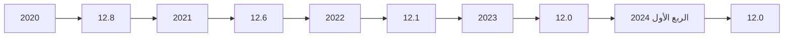
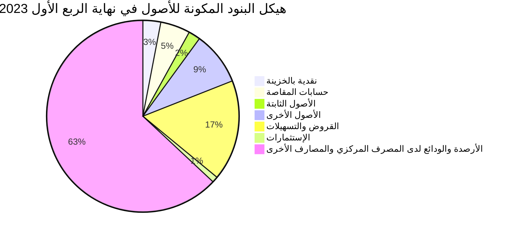
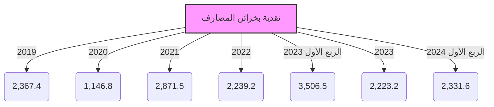
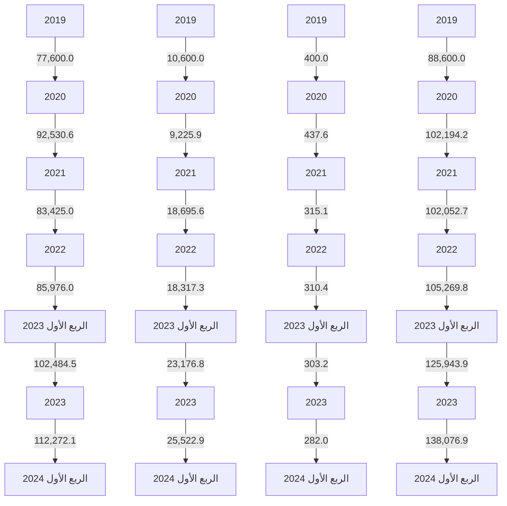
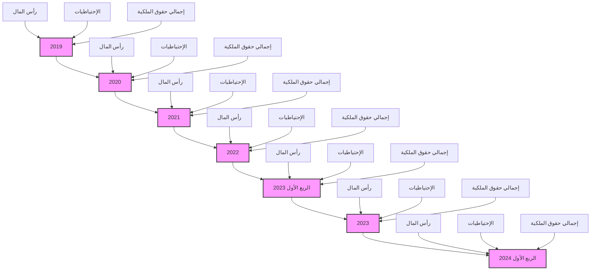

# CENTRAL BANK OF LIBYA

## تقرير
## أهم البيانات والمؤشرات المالية للمصارف
## الربع الأول 2024

[The image shows a graphical representation of financial data with colorful bar charts and a line graph trending upwards, symbolizing growth and progress in financial indicators.]

### إدارة البحوث والإحصاء
---
إدارة البحوث والإحصاء

| الصفحة | المحتويات |
|---------|------------|
| 3 | ملخص لأداء المصارف – الربع الأول 2024 |
| 8 | تفرع المصارف |
| 8 | الكثافة المصرفية |
| 9 | التركز المصرفي |
| 11 | المركز المالي المُجمّع للمصارف |
| 13 | هيكل البنود المكونة للأصول |
| 14 | هيكل البنود المكونة للخصوم |
| 16 | تحليل البنود المكونة للمركز المالي المُجمّع للمصارف |
| 16 | - النقدية بالخزائن وحسابات المقاصة |
| 17 | - الأرصدة والودائع لدى المصرف المركزي والمصارف الأخرى |
| 18 | - الإستثمارات |
| 19 | - القروض والتسهيلات الائتمانية |
| 21 | - ودائع العملاء لدى المصارف |
| 24 | - الحسابات المكشوفة لدى المراسلين بالخارج |
| 25 | - حقوق الملكية |
| 26 | - المخصصات |
| 27 | مؤشرات السلامة المالية للمصارف |
| 27 | - مؤشرات كفاية رأس المال |
| 28 | - مؤشرات جودة الأصول |
| 30 | - مؤشرات الربحية |
| 32 | - مؤشرات السيولة |

صفحة 2 من 33
تقرير أهم البيانات والمؤشرات المالية للمصارف - الربع الأول 2024
---
إدارة البحوث والإحصاء

# تقرير أهم البيانات والمؤشرات المالية للمصارف – الربع الأول 2024

## ملخص لأداء المصارف نهاية الربع الأول 2024.

شهدت البيانات المالية المجمعة للمصارف في نهاية الربع الأول 2024 بعض التغيرات مقارنة عما كانت عليه في نهاية الربع الأول 2023 وذلك على النحو التالي:

▪ إرتفع إجمالي أصول المصارف (بإستثناء الحسابات النظامية) من 140.6 مليار دينار في نهاية الربع الأول 2023 إلى نحو 177.7 مليار دينار في نهاية الربع الأول 2024، بمقدار 37.1 مليار دينار أي بمعدل نمو قدره 26.4%، وقد شكلت الأصول السائلة (البالغة 118.8 مليار دينار) من إجمالي الأصول ما نسبته 66.9%.

▪ إرتفعت أرصدة وودائع المصارف (تحت الطلب وشهادات الإيداع) لدى المصرف المركزي بما فيها الإحتياطي الإلزامي من نحو 75.7 مليار دينار في نهاية الربع الأول 2023 إلى نحو 102.4 مليار دينار في نهاية الربع الأول 2024، بمقدار 26.7 مليار دينار أي بمعدل بلغ 35.3%، وتجدر الإشارة إلى أن الإحتياطي النقدي الإلزامي المطلوب من المصارف الإحتفاظ به لدى المصرف المركزي شكل نحو 27.6 مليار دينار.

▪ إرتفع اجمالي رصيد الإئتمان الممنوح من المصارف من نحو 23.5 مليار دينار في نهاية الربع الأول 2023 إلى نحو 29.5 مليار دينار في نهاية الربع الأول 2024، بمقدار 6.0 مليار دينار أي بمعدل نمو 25.3%، هذا الإرتفاع جاء نتيجة توسع المصارف الكبرى (الجمهورية، الوحدة، التجاري الوطني، الصحارى و مصرف شمال أفريقيا) في منح القروض بصيغ المرابحة المختلفة.

▪ شكلت القروض والتسهيلات الائتمانية الممنوحة إلى اجمالي الأصول ما نسبته 16.6%، كما شكلت من اجمالي الخصوم الإيداعية ما نسبته 21.4%، وبلغ رصيد القروض الممنوحة للقطاع الخاص في نهاية الربع الأول 2024 ما قيمته 22.1 مليار دينار، وما نسبته 74.9% من إجمالي القروض والتسهيلات الائتمانية الممنوحة، فيما شكل رصيد القروض الممنوحة للقطاع العام النسبة الباقية 25.1% والتي بلغت قيمتها نحو 7.4 مليار دينار.

صفحة 3 من 33
تقرير أهم البيانات والمؤشرات المالية للمصارف - الربع الأول 2024
---
إدارة البحوث والإحصاء

- أظهرت البيانات الأولية عن الديون المتعثرة في المصارف أن نسبة الديون المتعثرة إلى إجمالي القروض والتسهيلات الائتمانية بلغت في نهاية الربع الأول 2024 نحو 21.9%، مسجلة إنخفاضاً عن ماكانت عليه في نهاية عام 2023 والبالغة 22.2%.

- بلغت نسبة تغطية مخصص الديون المشكوك فيها لإجمالي القروض المتعثرة نسبة 59.0% في نهاية الربع الأول 2024.

إرتفعت الخصوم الإيداعية (ودائع العملاء) لدى المصارف بشكل كبير بمقدار 32.8 مليار دينار من 105.3 مليار دينار في نهاية الربع الأول 2023، إلى 138.1 مليار دينار في نهاية الربع الأول 2024، أي بمعدل نمو بلغ 31.2%، وقد شكلت الودائع تحت الطلب وأوامر الدفع ما نسبته 81.3% من إجمالي الودائع، في حين شكلت الودائع لأجل والتأمينات النقدية نسبة 18.5% من إجمالي الودائع، بينما شكلت ودائع الادخار نسبة 0.2% فقط من إجمالي الودائع. وفيما يتعلق بتوزيع هذه الودائع حسب القطاعين العام والخاص، فقد إرتفعت ودائع القطاع العام والحكومي في نهاية الربع الأول 2024 بمقدار 10.8 مليار دينار لتصل إلى 55.3 مليار دينار، منها 13.8 مليار دينار كودائع حكومية والتي تتكون من ودائع الوزارات والهيئات والمؤسسات الحكومية وودائع كل من: صندوق الضمان الإجتماعي، صندوق الإنماء الإقتصادي والإجتماعي وودائع الصندوق الليبي للتنمية والإستثمار، مقابل 45.3 مليار دينار كودائع للقطاع العام والحكومي في نهاية الربع الأول 2023. وتجدر الإشارة إلى أن نحو 70% من الخصوم الإيداعية لدى المصارف متركزة في المصارف الأربعة الكبرى (الجمهورية، التجاري الوطني، الوحدة والصحاري).

- إرتفع إجمالي حقوق الملكية في المصارف من 8.6 مليار دينار في نهاية الربع الأول 2023 إلى 12.0 مليار دينار في نهاية الربع الأول 2024، وبمعدل 39.2%. نتيجة الزيادة في رأس المال المدفوع لبعض المصارف.

- إرتفعت أرباح المصارف خلال الربع الأول 2024 بمعدل 165.3% لتصل إلى 625.0 مليون دينار، مقارنة عما كانت عليه خلال الربع الأول 2023 والتي سجلت نحو 228.0 مليون دينار.

- بلغت نسبة المصروفات إلى إجمالي الإيرادات نحو 61.3% في عام 2023 مقابل نسبة 63.4% في عام 2022.

صفحة 4 من 33
تقرير أهم البيانات والمؤشرات المالية للمصارف - الربع الأول 2024
---
إدارة البحوث والإحصاء

بلغ عدد المصارف والمشتملة بياناتها في هذا التقرير 20 مصرفاً (بما في ذلك وحدة الدينار الليبي التابعة للمصرف الليبي الخارجي) في نهاية الربع الأول 2024، وتزاول هذه المصارف نشاطها من خلال 650 فرعاً ووكالة.

إدارة البحوث والإحصـــــــــاء

صفحة 5 من 33
تقرير أهم البيانات والمؤشرات المالية للمصارف - الربع الأول 2024
---
إدارة البحوث والإحصاء

# البيانات المالية الأساسية للمصارف

"مليون دينار"

| البند | الربع الأول 2023 | الربع الأول 2024 | معدل التغير% |
|------|-----------------|-----------------|-------------|
| إجمالي الميزانية (الأصول + الحسابات النظامية) | 183,466.2 | 223,743.9 | 22.0 |
| إجمالي الأصول | 140,593.4 | 177,689.1 | 26.4 |
| إجمالي النقدية بخزائن المصارف | 3,506.5 | 2,331.6 | -33.5 |
| إجمالي الودائع لدى المصرف المركزي | 75,655.4 | 102,391.9 | 35.3 |
| إجمالي الودائع لدى المصارف فيما بينها | 629.5 | 692.0 | 9.9 |
| إجمالي الودائع لدى المصرف الليبي الخارجي | 1,629.8 | 635.5 | -61.0 |
| إجمالي الودائع لدى المراسلين بالخارج | 10,651.4 | 12,749.4 | 19.7 |
| إجمالي حسابات المقاصة | 7,063.8 | 7,556.1 | 7.0 |
| إجمالي القروض والسلفيات والتسهيلات | 23,519.6 | 29,479.8 | 25.3 |
| إجمالي الاستثمارات | 1,763.5 | 2,832.4 | 60.6 |
| إجمالي ودائع العملاء | 105,269.8 | 138,076.9 | 31.2 |
| إجمالي الحسابات المكشوفة لدى المراسلين | 119.8 | 900.1 | 651.3 |
| إجمالي حقوق الملكية | 8,613.0 | 11,992.3 | 39.2 |
| إجمالي المخصصات | 9,466.5 | 9,694.5 | 2.4 |
| أرباح العام | 228.0 | 625.0 | 165.3 |
| عدد الفروع والوكالات | 642 | 650 | 1.2 |
| عدد العاملين | 19,463 | 19,815 | 1.8 |

## المؤشرات المالية:

| المؤشر | الربع الأول 2023 | الربع الأول 2024 |
|--------|-----------------|-----------------|
| الأصول السائلة / إجمالي الأصول % | 66.7 | 66.9 |
| إجمالي القروض / إجمالي الأصول % | 15.5 | 16.6 |
| حقوق الملكية / إجمالي الخصوم % | 6.1 | 6.7 |
| إجمالي الأصول / عدد الفروع (مليون دينار) | 257.0 | 273.4 |
| إجمالي الأصول / عدد العاملين (مليون دينار) | 7.6 | 9.0 |
| إجمالي القروض / إجمالي الودائع % | 22.5 | 21.4 |
| إجمالي الربح / الأصول % | 0.6 | 0.4 |
| إجمالي الربح / حقوق الملكية % | 2.7 | 5.2 |

صفحة 6 من 33
تقرير أهم البيانات والمؤشرات المالية للمصارف - الربع الأول 2024
---
إدارة البحوث والإحصاء

## مؤشرات الودائع لدى المصارف
"مليون دينار"

| البند | الربع الأول 2023 | الربع الأول 2024 | معدل التغير% |
|-------|-----------------|-----------------|-------------|
| 1- ودائع الحكومة والقطاع العام | 45,342.7 | 55,308.0 | 22.0 |
| ـ ودائع الحكومة (الوزارات والهيئات الممولة من الميزانية العامة) | 12,858.7 | 13,766.0 | 7.1 |
| ـ ودائع القطاع العام | 32,484.1 | 41,541.9 | 27.9 |
| 2- ودائع القطاع الخاص | 59,927.1 | 82,768.9 | 38.1 |
| ـ ودائع الأفراد | 32,906.6 | 45,054.0 | 36.9 |
| ـ ودائع الشركات والجهات الأخرى | 27,020.5 | 37,715.0 | 39.6 |
| إجمالي الودائع | 105,269.8 | 138,076.9 | 31.2 |
| الودائع تحت الطلب | 85,976.0 | 112,272.1 | 30.6 |
| الودائع لأجل | 18,990.6 | 25,522.9 | 34.4 |
| ودائع الادخار | 303.2 | 282.0 | -7.0 |
| الودائع تحت الطلب / إجمالي الودائع % | 81.7 | 81.4 | - |
| الودائع لأجل / إجمالي الودائع % | 18.0 | 18.4 | - |
| ودائع الادخار / إجمالي الودائع % | 0.3 | 0.2 | - |
| إجمالي الودائع / إجمالي الخصوم % | 74.9 | 79.4 | - |

## مؤشرات الإئتمان الممنوح من المصارف
"مليون دينار"

| البند | الربع الأول 2023 | الربع الأول 2024 | معدل التغير% |
|-------|-----------------|-----------------|-------------|
| 1- الائتمان الممنوح للقطاع العام | 7,682.4 | 7,403.3 | -3.6 |
| 2- الائتمان الممنوح للقطاع الخاص | 15,837.2 | 22,076.5 | 39.4 |
| إجمالي الائتمان | 23,519.6 | 29,479.8 | 25.3 |
| السلفيات والسحب على المكشوف | 4,151.6 | 3,991.9 | -3.8 |
| قروض المرابحة (تشمل رصيد السلف الاجتماعية) | 6,983.4 | 13,924.1 | 99.4 |
| القروض الممنوحة للأنشطة الاقتصادية الأخرى | 12,384.6 | 17,916.0 | 44.7 |
| قروض المرابحة / إجمالي الائتمان % | 29.7 | 47.2 | - |
| السلفيات والسحب على المكشوف / إجمالي الائتمان % | 17.7 | 13.5 | - |
| القروض الممنوحة للأنشطة الأخرى/اجمالي الائتمان% | 52.7 | 60.8 | - |
| إجمالي الائتمان / إجمالي الأصول % | 16.7 | 16.6 | - |
| إجمالي الائتمان / إجمالي الودائع % | 22.3 | 21.4 | - |

صفحة 2 من 33
تقرير أهم البيانات والمؤشرات المالية للمصارف - الربع الأول 2024
---
إدارة البحوث والإحصاء

## تفرع المصارف:

بلغ عدد المصارف العاملة في ليبيا والمشتملة بياناتها في هذا التقرير 20 مصرفاً (بما في ذلك وحدة الدينار الليبي
التابعة للمصرف الليبي الخارجي) حتى نهاية الربع الأول 2024، وتزاول هذه المصارف نشاطها من خلال 650 فرعاً
ووكالة مصرفية.

## الكثافة المصرفية:

بلغت الكثافة المصرفية خلال الربع الأول 2024 نحو 12.0 ألف نسمة لكل فرع أو وكالة.

### الكثافة المصرفية
"بالألف نسمة"

| لكل فرع ووكالة | لكل مصرف | نهاية |
|----------------|-----------|-------|
| 12.9 | 368.4 | 2019 |
| 12.8 | 368.3 | 2020 |
| 12.6 | 388.9 | 2021 |
| 12.1 | 350.0 | 2022 |
| 12.0 | 350.0 | 2023 |
| 12.0 | 350.0 | الربع الأول 2024 |

### الكثافة المصرفية



صفحة 8 من 33
تقرير أهم البيانات والمؤشرات المالية للمصارف - الربع الأول 2024
---
إدارة البحوث والإحصاء

# التركز المصرفي:

درجة التركز المصرفي تعني أن عدداً قليلاً من المصارف يستأثر بالنسبة الأكبر من النشاط المصرفي سواءً من حيث الأصول أو الودائع أوالائتمان أو من حيث حجم حقوق الملكية، وفيما يخص الحصة السوقية للمصارف في ليبيا، فقد شكلت أصول المصارف الأربعة الكبرى (الجمهورية، التجاري الوطني، الوحدة والصحاري) من أصل 20 مصرفاً مانسبته 67.6% من إجمالي أصول القطاع المصرفي في نهاية الربع الأول 2024، وشكل مصرف الجمهورية وحده ما نسبته 26.7% من إجمالي أصول القطاع المصرفي.

وشكلت الخصوم الإيداعية للمصارف الأربعة الكبرى مانسبته 69.4% من إجمالي الخصوم الإيداعية للقطاع المصرفي وفيما شكلت القروض الممنوحة منهم نحو 86.1% من إجمالي القروض الممنوحة من القطاع المصرفي في نهاية الربع الأول 2024.

## تركز الأصول
"نسب مئوية"

| نهاية | 2020 | 2021 | 2022 | 2023 | الربع الأول 2024 |
|-------|------|------|------|------|------------------|
| أكبر مصرف | 31.2 | 28.0 | 27.5 | 26.7 | 26.7 |
| أكبر ثلاثة مصارف | 63.1 | 62.0 | 61.7 | 59.4 | 57.5 |
| أكبر خمسة مصارف | 82.7 | 79.7 | 78.6 | 76.5 | 75.8 |

## تركز الائتمان
"نسب مئوية"

| نهاية | 2020 | 2021 | 2022 | 2023 | الربع الأول 2024 |
|-------|------|------|------|------|------------------|
| أكبر مصرف | 42.6 | 40.7 | 38.6 | 38.9 | 39.5 |
| أكبر ثلاثة مصارف | 78.3 | 76.2 | 74.6 | 76.9 | 77.9 |
| أكبر خمسة مصارف | 91.4 | 87.6 | 85.2 | 89.8 | 90.0 |

## تركز الخصوم الإيداعية
"نسب مئوية"

| نهاية | 2020 | 2021 | 2022 | 2023 | الربع الأول 2024 |
|-------|------|------|------|------|------------------|
| أكبر مصرف | 31.8 | 33.8 | 32.1 | 27.9 | 27.9 |
| أكبر ثلاثة مصارف | 62.9 | 62.0 | 60.5 | 59.6 | 58.6 |
| أكبر خمسة مصارف | 83.7 | 79.5 | 79.2 | 77.7 | 78.1 |

صفحة 9 من 33
تقرير أهم البيانات والمؤشرات المالية للمصارف - الربع الأول 2024
---
إدارة البحوث والإحصاء

## تركز الأصول

| السنة | أكبر مصرف | أكبر ثلاثة مصارف | أكبر خمسة مصارف |
|-------|-----------|------------------|------------------|
| 2020 | 31.2 | 63.1 | 82.7 |
| 2021 | 28.0 | 62.0 | 79.7 |
| 2022 | 27.5 | 61.7 | 78.6 |
| 2023 | 26.7 | 59.4 | 76.5 |
| الربع الأول 2024 | 26.7 | 57.5 | 75.8 |

## تركز الائتمان

| السنة | أكبر مصرف | أكبر ثلاثة مصارف | أكبر خمسة مصارف |
|-------|-----------|------------------|------------------|
| 2020 | 42.6 | 78.3 | 91.4 |
| 2021 | 40.7 | 76.2 | 87.6 |
| 2022 | 38.6 | 74.6 | 85.2 |
| 2023 | 38.9 | 74.6 | 89.8 |
| الربع الأول 2024 | 39.5 | 77.9 | 90.0 |

## تركز الخصوم الإيداعية

| السنة | أكبر مصرف | أكبر ثلاثة مصارف | أكبر خمسة مصارف |
|-------|-----------|------------------|------------------|
| 2020 | 31.8 | 62.9 | 83.7 |
| 2021 | 33.8 | 62.0 | 79.5 |
| 2022 | 32.1 | 60.5 | 79.2 |
| 2023 | 27.9 | 59.6 | 77.7 |
| الربع الأول 2024 | 27.9 | 58.6 | 78.1 |

ومن خلال بيانات التركز يلاحظ أن هناك تحسن ملحوظ في نسب تركز الأصول والخصوم الإيداعية، فيما ارتفعت درجة التركز في الائتمان كما هو موضح بالجداول والرسومات البيانية أعلاه.

صفحة 12 من 33
تقرير أهم البيانات والمؤشرات المالية للمصارف - الربع الأول 2024
---
# إدارة البحوث والإحصاء

## المركز المالي المُجمّع للمصارف

شهد المركز المالي المُجمّع للمصارف نهاية الربع الأول 2024، تطورات في مُجمل بنوده على جانبي الأصول والخصوم، ليبلغ إجمالي أصول المصارف مجتمعة (بإستثناء الحسابات النظامية) نحو 177,689.1 مليون دينار، مقابل 140,593.4 مليون دينار في نهاية الربع الأول 2023، بإرتفاع قدره 37,095.7 مليون دينار، أي بمعدل 26.4%،

وفيما يلي جدول يلخص البنود الرئيسية للمركز المالي المُجمّع للمصارف:

### مُلخص المركز المالي المُجمّع للمصارف

"مليون دينار"

| البند | الربع الأول 2023 | الربع الأول 2024 | مقدار التغير | معدل التغير% |
|-------|------------------|------------------|---------------|--------------|
| **الأصول:** |
| 1- نقدية بالخزائن | 3,506.5 | 2,331.6 | -1,174.9 | -33.5 |
| - عملة محلية | 3,263.1 | 2,059.4 | -1,203.7 | -36.9 |
| - عملة أجنبية | 243.5 | 272.2 | 28.7 | 11.8 |
| 2- حسابات المقاصة | 7,063.8 | 7,556.1 | 492.3 | 7.0 |
| - المقاصة بين المصارف | 3,284.9 | 5,116.3 | 1,831.4 | 55.8 |
| - المقاصة بين الفروع | 3,779.0 | 2,439.8 | -1,339.2 | -35.4 |
| 3- الودائع لدى المصارف الأخرى | 88,566.2 | 116,468.7 | 27,902.5 | 31.5 |
| أ- الودائع لدى المصرف المركزي | 75,655.4 | 102,391.9 | 26,736.5 | 35.3 |
| - ودائع تحت الطلب | 72,162.8 | 99,991.9 | 27,829.1 | 38.6 |
| - شهادات الإيداع | 3,492.6 | 2,400.0 | -1,092.6 | -31.3 |
| ب- الودائع لدى المصارف المحلية الأخرى | 629.5 | 692.0 | 62.5 | 9.9 |
| - ودائع تحت الطلب | 629.5 | 692.0 | 62.5 | 9.9 |
| - ودائع زمنية | 0.0 | 0.0 | 0.0 | - |
| ج- الودائع لدى المصرف الليبي الخارجي | 1,629.8 | 635.5 | -994.3 | -61.0 |
| - ودائع تحت الطلب | 1,151.7 | 262.5 | -889.2 | -77.2 |
| - ودائع زمنية | 478.1 | 373.0 | -105.1 | -22.0 |
| د- الودائع لدى المصارف بالخارج | 10,651.4 | 12,749.4 | 2,098.0 | 19.7 |
| - ودائع تحت الطلب | 8,337.0 | 8,071.0 | -266.0 | -3.2 |
| - ودائع زمنية | 2,314.4 | 4,678.4 | 2,364.0 | 102.1 |
| 4- الإستثمارات | 1,763.5 | 2,832.4 | 1,068.9 | 60.6 |
| 5- القروض والتسهيلات | 23,519.6 | 29,479.8 | 5,960.2 | 25.3 |
| - السلفيات والسحب على المكشوف | 4,151.6 | 3,991.9 | -159.7 | -3.8 |
| - قروض المرابحة للأفراد (تشمل رصيد السلف الاجتماعية) | 6,983.4 | 13,924.1 | 6,940.7 | 99.4 |
| - قروض الأنشطة الإقتصادية الأخرى | 12,384.6 | 11,563.8 | -820.8 | -6.6 |
| 6- الأصول الثابتة | 2,874.7 | 3,267.1 | 392.4 | 13.6 |
| 7- الأصول الأخرى | 13,299.1 | 15,753.3 | 2,454.2 | 18.5 |
| **إجمالي الأصول** | 140,593.4 | 177,689.1 | 37,095.7 | 26.4 |
| الحسابات المقابلة | 42,872.8 | 46,054.8 | 3,182.0 | 7.4 |
| **الإجمالي الكلي للأصول** | 183,466.2 | 223,743.9 | 40,277.7 | 22.0 |

صفحة 11 من 33

تقرير أهم البيانات والمؤشرات المالية للمصارف - الربع الأول 2024
---
إدارة البحوث والإحصاء

| البند | الربع الأول 2023 | الربع الأول 2024 | مقدار التغير | معدل التغير% |
|-------|-----------------|-----------------|-------------|-------------|
| الخصوم |
| 1- ودائع الغير لدى المصارف | 105,269.8 | 138,076.9 | 32,807.1 | 31.2 |
| - الودائع تحت الطلب | 81,751.3 | 108,470.4 | 26,719.1 | 32.7 |
| - الودائع الزمنية | 2,124.1 | 1,610.2 | -513.9 | -24.2 |
| - الودائع الإدخارية | 303.2 | 282.0 | -21.2 | -7.0 |
| - أوامر الدفع | 4,219.2 | 3,801.7 | -417.5 | -9.9 |
| - التأمينات النقدية | 16,872.0 | 23,912.7 | 7,040.7 | 41.7 |
| 2- الإقتراض من المصارف والجهات الأخرى | 32.0 | 30.7 | -1.3 | -4.1 |
| 3- الحسابات المكشوفة لدى المراسلين | 119.8 | 900.1 | 780.3 | 651.3 |
| 4- حقوق الملكية | 8,612.7 | 11,992.3 | 3,379.3 | 39.2 |
| - رأس المال المدفوع | 5,397.9 | 8,836.3 | 3,438.4 | 63.7 |
| - الإحتياطي القانوني | 988.7 | 1,137.4 | 148.7 | 15.0 |
| - إحتياطيات غير مخصصة | 344.4 | 227.1 | -117.3 | -34.1 |
| - أرباح العام | 235.3 | 625.0 | 389.4 | 165.3 |
| - الأرباح المرحّلة والقابلة للتوزيع | 1,646.4 | 1,166.6 | -479.8 | -29.1 |
| 5- المخصصات | 9,466.5 | 9,694.5 | 228.0 | 2.4 |
| 6- المتنوعات والخصوم الأخرى | 17,092.3 | 16,994.5 | -97.8 | -0.6 |
| إجمالي الخصوم | 140,593.4 | 177,689.1 | 37,095.7 | 26.4 |
| الحسابات المقابلة | 42,872.8 | 46,054.8 | 3,182.0 | 7.4 |
| الإجمالي الكلي للخصوم | 183,471.6 | 223,743.9 | 40,272.3 | 22.0 |

صفحة 13 من 33
تقرير أهم البيانات والمؤشرات المالية للمصارف - الربع الأول 2024
---
إدارة البحوث والإحصاء

- هيكل البنود المكونة للأصول في المركز المالي المُجمّع للمصارف:

إستمرت ودائع وأرصدة المصارف لدى المصرف المركزي بما فيها الإحتياطي الإلزامي هو المكون الرئيسي لأصول القطاع المصرفي، حيث تغطي نحو 57.6% من إجمالي الأصول في نهاية الربع الأول 2024، في حين سجلت حصة بند القروض والتسهيلات الإئتمانية في هيكل الموجودات لتسجل نحو 16.6% من الإجمالي مقارنة بـ 16.7% في نهاية الربع الأول 2023 ، بينما بلغت نسبة الأستثمارات فقط 1.6% مما يشير إلى أن الأصول المولدة للدخل متدنية جداً ولم تصل حتى إلى 20.0% من إجمالي قاعدة الأصول للقطاع المصرفي وهى مازالت نسب ضئيلة تعكس ضعف توظيف المصارف لأموالها.

جدول هيكل البنود المكونة للأصول

| البند | الربع الأول 2023 | الربع الأول 2024 |
|------|-----------------|-----------------|
| الأصول: |  |  |
| 1- نقدية بالخزائن | 2.5% | 1.3% |
| 2- حسابات المقاصة | 5.0% | 4.3% |
| 3- الودائع لدى المصرف المركزي | 53.8% | 57.6% |
| 4- الودائع لدى المصارف المحلية الأخرى | 0.4% | 0.4% |
| 5- الودائع لدى المصرف الليبي الخارجي | 1.2% | 0.4% |
| 6- الودائع لدى المصارف بالخارج | 7.6% | 7.2% |
| 7- الإستثمارات | 1.3% | 1.6% |
| 8- القروض والتسهيلات | 16.7% | 16.6% |
| 9- الأصول الثابتة | 2.0% | 1.8% |
| 10- الأصول الأخرى | 9.5% | 8.9% |

هيكل البنود المكونة للأصول في نهاية الربع الأول 2023



صفحة 13 من 33
تقرير أهم البيانات والمؤشرات المالية للمصارف - الربع الأول 2024
---
إدارة البحوث والإحصاء

| هيكل البنود المكونة للأصول في نهاية الربع الأول 2024 | حسابات المقاصة |
|---------------------------------------------------|-----------------|
| نقدية بالخزينة 1%                                   | 4%              |

| الأصول الثابتة | الأصول الأخرى |
|---------------|---------------|
| 2%            | 9%            |

| القروض والتسهيلات |
|-------------------|
| 17%               |

| الإستثمارات |
|-------------|
| 2%          |

| الأرصدة والودائع لدى المصرف المركزي والمصارف الأخرى |
|---------------------------------------------------|
| 65%                                                |

- هيكل البنود المكونة للخصوم في المركز المالي المُجمّع للمصارف:

بتحليل هيكل البنود المكونة للخصوم بالمركز المالي المُجمّع للمصارف في نهاية الربع الأول 2024، فإن الخصوم الايداعية لدى المصارف (ودائع العملاء) مازالت تمثل المصدر الرئيسي للتمويل مشكلة مانسبته 77.7% من إجمالي مصادر أموال المصارف ، مقارنة بنحو 74.9% في نهاية الربع الأول 2023، فيما شكلت حقوق الملكية نحو 6.7% من إجمالي مصادر أموال المصارف.

جدول هيكل البنود المكونة للخصوم

| البند                                | الربع الأول 2023 | الربع الأول 2024 |
|-------------------------------------|------------------|------------------|
| الخصوم                               |                  |                  |
| 1- ودائع الغير لدى المصارف            | 74.9%            | 77.7%            |
| 2- الإقتراض من المصارف                | 0.0%             | 0.0%             |
| 3- الحسابات المكشوفة لدى المراسلين     | 0.1%             | 0.5%             |
| 4- حقوق الملكية                       | 6.1%             | 6.7%             |
| 5- المخصصات                           | 6.7%             | 5.5%             |
| 6- المتنوعات والخصوم الأخرى            | 12.2%            | 9.6%             |

صفحة 14 من 33
تقرير أهم البيانات والمؤشرات المالية للمصارف - الربع الأول 2024
---
إدارة البحوث والإحصاء

## هيكل البنود المكونة للخصوم في نهاية الربع الأول 2023

| البند | النسبة |
|-------|--------|
| ودائع الغير لدى المصارف | 75% |
| المتنوعات والخصوم الأخرى | 12% |
| المخصصات | 7% |
| حقوق الملكية | 6% |
| الحسابات المكشوفة لدى المراسلين | 0% |
| الإقتراض من المصارف | 0% |

## هيكل البنود المكونة للخصوم في نهاية الربع الأول 2024

| البند | النسبة |
|-------|--------|
| ودائع الغير لدى المصارف | 78% |
| المتنوعات والخصوم الأخرى | 11% |
| المخصصات | 5% |
| حقوق الملكية | 5% |
| الحسابات المكشوفة لدى المراسلين | 1% |
| الإقتراض من المصارف | 0% |

صفحة 15 من 33
تقرير أهم البيانات والمؤشرات المالية للمصارف - الربع الأول 2024
---
إدارة البحوث والإحصاء

# تحليل لأهم البنود المكونة للمركز المالي المُجمّع للمصارف

## أولاً: جانب الأصـــول

### 1- النقدية :

#### أ- النقدية بالخزائن وحسابات المقاصة :

إنخفض رصيد النقدية بخزائن المصارف وحسابات المقاصة بمقدار 682.6 مليون دينار أي بمعدل 6.5%،
ليصل إلى 9,887.7 مليون دينار في نهاية الربع الأول 2024، مقابل 10,570.3 مليون دينار في نهاية الربع الأول
2023، بسبب إنخفاض النقدية بالعملة المحلية بخزائن المصارف بمقدار 1,203.7 مليون دينار، فيما أرتفعت
حسابات المقاصة بمقدار 492.3 مليون دينار، والجدول التالي يوضح التغيرات في بند النقدية بخزائن المصارف
وحسابات المقاصة :

| البيان | الربع الأول 2023 | الربع الأول 2024 | مقدارالتغير | معدل التغير% |
|---|---|---|---|---|
| النقدية بالخزائن : | 3,506.5 | 2,331.6 | -1,174.9 | -33.5 |
| عملة محلية | 3,263.1 | 2,059.4 | -1,203.7 | -36.9 |
| عملة أجنبية | 243.5 | 272.2 | 28.7 | 11.8 |
| إجمالي حسابات المقاصة | 7,063.8 | 7,556.1 | 492.3 | 7.0 |
| المقاصة بين المصارف | 3,284.9 | 5,116.3 | 1,831.4 | 55.8 |
| المقاصة بين الفروع | 3,779.0 | 2,439.8 | -1,339.2 | -35.4 |
| الإجمالي | 10,570.3 | 9,887.7 | -682.6 | -6.5 |



صفحة 16 من 33
تقرير أهم البيانات والمؤشرات المالية للمصارف - الربع الأول 2024
---
إدارة البحوث والإحصاء

## إجمالي حسابات المقاصة

| السنة | القيمة (مليون دينار) |
|-------|----------------------|
| 2019 | 6,304.6 |
| 2020 | 5,584.8 |
| 2021 | 6,041.0 |
| 2022 | 7,034.7 |
| الربع الأول 2023 | 7,063.8 |
| 2023 | 7,337.1 |
| الربع الأول 2024 | 7,556.1 |

## ب- الأرصدة والودائع لدى المصرف المركزي والمصارف الأخرى:

بلغ رصيد ودائع المصارف لدى المصرف المركزي والمصارف المحلية الأخرى ولدى المصارف الخارجية نحو 116,468.7 مليون دينار في نهاية الربع الأول 2024، مقابل 88,566.2 مليون دينار في نهاية الربع الأول 2023، مرتفعة بشكل كبير وبقيمة 27,902.5 مليون دينار وبمعدل 31.5%، هذا الإرتفاع جاء نتيجة إرتفاع الأرصدة والودائع تحت الطلب لدى المصرف المركزي بمقدار 27,829.1 مليون دينار، فيما إنخفضت ودائع المصارف لدى المصرف الليبي الخارجي وكذلك لدى المراسلين بالخارج كما موضح بالجدول التالي:

### الأرصدة والودائع لدى المصرف المركزي والمصارف الأخرى

"مليون دينار"

| البند | الربع الأول 2023 | الربع الأول 2024 | مقدار التغير | معدل التغير% |
|-------|------------------|------------------|---------------|---------------|
| ودائع تحت الطلب لدى : | 82,281.1 | 109,017.3 | 26,736.2 | 32.5 |
| المصرف المركزي | 72,162.8 | 99,991.9 | 27,829.1 | 38.6 |
| المصارف المحلية | 629.5 | 692.0 | 62.5 | 9.9 |
| المصرف الليبي الخارجي | 1,151.7 | 262.5 | -889.2 | -77.2 |
| لدى المراسلين بالخارج | 8,337.0 | 8,071.0 | -266.0 | -3.2 |
| ودائع زمنية : | 6,285.1 | 7,451.4 | 1,166.3 | 18.6 |
| المصرف المركزي (شهادات الإيداع) | 3,492.6 | 2,400.0 | -1,092.6 | -31.3 |
| المصارف المحلية | 0.0 | 0.0 | 0.0 | - |
| المصرف الليبي الخارجي | 478.1 | 373.0 | -105.1 | -22.0 |
| لدى المراسلين بالخارج | 2,314.4 | 4,678.4 | 2,364.0 | 102.1 |
| الإجمالي | 88,566.2 | 116,468.7 | 27,902.5 | 31.5 |

صفحة 12 من 33
تقرير أهم البيانات والمؤشرات المالية للمصارف - الربع الأول 2024
---
إدارة البحوث والإحصاء

## ودائع المصارف التجارية لدى المصرف المركزي والمصارف الأخرى

| السنة | الودائع تحت الطلب | الودائع الزمنية | الإجمالي |
|-------|-------------------|-----------------|----------|
| 2019 | 60,184.6 | 17,240.3 | 77,424.9 |
| 2020 | 72,269.0 | 17,567.6 | 89,836.6 |
| 2021 | 74,216.6 | 15,700.2 | 89,916.8 |
| 2022 | 90,839.6 | 6,054.7 | 96,894.4 |
| الربع الأول 2023 | 82,281.1 | 6,285.1 | 88,566.2 |
| 2023 | 97,057.6 | 6,957.9 | 104,015.5 |
| الربع الأول 2024 | 109,017.3 | 7,451.4 | 116,468.7 |

## 2- الإستثمارات :

سجل إجمالي رصيد إستثمارات المصارف في الشركات العامة والخاصة المساهمة والإستثمارات الأخرى نهاية
الربع الأول 2024 نحو 2,832.4 مليون دينار، مقابل 1,763.5 مليون دينار في نهاية الربع الأول 2023،
مرتفعة بمقدار 1,068.9 مليون دينار هذا الإرتفاع جاء نتيجة للزيادة في بند الإستثمارات في الشركات
الخاصة المساهمة وكذلك الإستثمارات الأخرى، والجدول التالي يوضح تفاصيل هذا البند:

### بند الاستثمارات

| البيان | الربع الأول 2023 | الربع الأول 2024 | مقدار التغير | معدل التغير% |
|--------|------------------|------------------|---------------|---------------|
| سندات وأذونات الخزانة | 0.0 | 0.0 | 0.0 | - |
| إستثمارات في الشركات العامة | 564.2 | 568.6 | 4.4 | 0.8 |
| إستثمارات في الشركات الخاصة المساهمة | 805.2 | 1,345.1 | 539.9 | 67.0 |
| إستثمارات أخرى | 394.1 | 918.8 | 524.7 | 133.1 |
| الإجمالي | 1,763.5 | 2,832.4 | 1,068.9 | 60.6 |

صفحة 18 من 33
تقرير أهم البيانات والمؤشرات المالية للمصارف - الربع الأول 2024
---
إدارة البحوث والإحصاء

| إجمالي بند الإستثمارات |
|------------------------|
| 6,000.0 |
| 5,000.0 | 4,256.6 4,445.1 |
| 4,000.0 | 2,832.4 |
| 3,000.0 | 1,957.5 2,386.1 |
| 2,000.0 | 1,695.8 1,763.5 |
| 1,000.0 |
| 0.0 |
| 2019 2020 2021 2022 الربع الأول 2023 2023 الربع الأول 2024 |

### 3- القروض والتسهيلات الائتمانية:

إرتفع اجمالي رصيد القروض والتسهيلات الإئتمانية الممنوحة من المصارف من 23,519.6 مليون دينار في نهاية
الربع الأول 2023 إلى 29,479.8 مليون دينار في نهاية الربع الأول 2024 بمقدار 5,960.2 مليون دينار أي بمعدل
نمو 25.3%، وقد شكلت القروض والتسهيلات الائتمانية الممنوحة إلى اجمالي الخصوم الإيداعية ما نسبته
21.4%، كما شكلت من إجمالي الأصول ما نسبته 16.6%، وبلغ رصيد القروض الممنوحة للقطاع الخاص في
نهاية الربع الأول 2024 ما قيمته 22,076.5 مليون دينار، وما نسبته 74.9% من إجمالي القروض والتسهيلات
الائتمانية الممنوحة، فيما شكل رصيد القروض الممنوحة للقطاع العام النسبة الباقية 25.1% والتي بلغت
قيمتها نحو 7,403.3 مليون دينار. وبتحليل مكونات المحفظة الائتمانية فقد كان الإرتفاع في اجمالي رصيد
الإئتمان الممنوح من المصارف بسبب الزيادة الملحوظة في بند قروض المرابحة للأفراد الذي سجل ارتفاع بمقدار
6,940.7 مليون دينار مقارنة بما كان عليه في نهاية الربع الأول 2023.

رصيد القروض والتسهيلات الائتمانية الممنوحة من المصارف
" مليون دينار "

| البند | الربع الأول 2023 | الربع الأول 2024 | مقدار التغير | معدل التغير% |
|-------|------------------|------------------|---------------|---------------|
| سلفيات والسحب على المكشوف | 4,151.6 | 3,991.9 | -159.7 | -3.8 |
| قروض المرابحة للأفراد* | 6,983.4 | 13,924.1 | 6,940.7 | 99.4 |
| القروض الأخرى | 12,384.6 | 11,563.8 | -820.8 | -6.6 |
| إجمالي القروض والتسهيلات | 23,519.6 | 29,479.8 | 5,960.2 | 25.3 |
| مخصص الديون المشكوك في تحصيلها | 3,834.6 | 4,166.1 | 331.5 | 8.6 |
| صافي القروض والتسهيلات | 19,685.0 | 25,313.7 | 5,628.7 | 28.6 |

(*) يشمل رصيد السلف الإجتماعية .

صفحة 19 من 33
تقرير أهم البيانات والمؤشرات المالية للمصارف - الربع الأول 2024
---
إدارة البحوث والإحصاء

## رصيد بند المرابحة والسلف الإجتماعية

| السنة | القيمة (مليون دينار) |
|-------|----------------------|
| 2019 | 3,125.5 |
| 2020 | 3,036.5 |
| 2021 | 4,819.3 |
| 2022 | 7,015.4 |
| الربع الأول 2023 | 6,983.4 |
| 2023 | 12,700.2 |
| الربع الأول 2024 | 13,924.1 |

## السلفيات والسحب على المكشوف

| السنة | القيمة (مليون دينار) |
|-------|----------------------|
| 2019 | 5,275.4 |
| 2020 | 4,495.7 |
| 2021 | 4,618.6 |
| 2022 | 4,166.2 |
| الربع الأول 2023 | 4,151.6 |
| 2023 | 4,023.7 |
| الربع الأول 2024 | 3,991.9 |

## توزيع القروض الممنوحة من المصارف حسب القطاع (خاص وعام)

"مليون دينار"

| البند | الربع الأول 2023 | الربع الأول 2024 | مقدار التغير | معدل التغير % |
|-------|------------------|------------------|---------------|---------------|
| القروض الممنوحة للقطاع العام | 7,682.4 | 7,403.3 | -279.1 | -3.6 |
| القروض الممنوحة للقطاع الخاص | 15,837.2 | 22,076.5 | 6,239.3 | 39.4 |
| الإجمالي | 23,519.6 | 29,479.8 | 5,960.2 | 25.3 |

صفحة 20 من 33
تقرير أهم البيانات والمؤشرات المالية للمصارف - الربع الأول 2024
---
إدارة البحوث والإحصاء

## رصيد القروض الممنوحة للقطاع العام

| السنة | القيمة (مليون دينار) |
|-------|----------------------|
| 2019 | 6,057.0 |
| 2020 | 5,918.2 |
| 2021 | 6,471.7 |
| 2022 | 6,243.8 |
| الربع الأول 2023 | 7,682.40 |
| 2023 | 7,498.5 |
| الربع الأول 2024 | 7,403.30 |

## رصيد القروض الممنوحة للقطاع الخاص

| السنة | القيمة (مليون دينار) |
|-------|----------------------|
| 2019 | 10,855.8 |
| 2020 | 11,078.7 |
| 2021 | 13,165.8 |
| 2022 | 16,727.2 |
| الربع الأول 2023 | 15,837.20 |
| 2023 | 21,011.8 |
| الربع الأول 2024 | 22,076.50 |

## ثانياً: جانب الخصــوم

### 1- ودائع العملاء لدى المصــارف :

إرتفعت الخصوم الإيداعية (ودائع العملاء) لدى المصارف بشكل كبير بمقدار 32,807.1 مليون دينار من 105,269.8 مليون دينار في نهاية الربع الأول 2023 ، إلى 138,076.9 مليون دينار في نهاية الربع الأول 2024 ، أي بمعدل نمو بلغ 31.2%، وقد شكلت الودائع تحت الطلب وأوامر الدفع ما نسبته 81.3% من إجمالي الودائع، في حين شكلت الودائع لأجل والتأمينات النقدية نسبة 18.5% من إجمالي الودائع، بينما شكلت ودائع الادخار نسبة 0.2% فقط من إجمالي الودائع.

صفحة 21 من 33
تقرير أهم البيانات والمؤشرات المالية للمصارف - الربع الأول 2024
---
إدارة البحوث والإحصاء

جدول الخصوم الإيداعية (ودائع العملاء)

"مليون دينار"

| البند | الربع الأول 2023 | الربع الأول 2024 | مقدار التغير | معدل التغير% |
|------|-----------------|-----------------|-------------|-------------|
| الودائع تحت الطلب | 81,751.3 | 108,470.4 | 26,719.1 | 32.7 |
| الودائع لأجل | 2,124.1 | 1,610.2 | -513.9 | -24.2 |
| الودائع الإدخارية | 303.2 | 282.0 | -21.2 | -7.0 |
| أوامر الدفع | 4,219.2 | 3,801.7 | -417.5 | -9.9 |
| التأمينات النقدية | 16,872.0 | 23,912.7 | 7,040.7 | 41.7 |
| الإجمالي | 105,269.8 | 138,076.9 | 32,807.1 | 31.2 |

- الودائع تحت الطلب وأوامر الدفع: إرتفعت الودائع تحت الطلب بشكل كبير في نهاية الربع الأول 2024 بمقدار 26,719.1 مليون دينار لتسجل 108,470.4 مليون دينار مقارنة بـ 81,751.3 مليون دينار في نهاية الربع الأول 2023، فيما إنخفضت أوامر الدفع بمقدار 417.5 مليون دينار.

- الودائع لأجل والتأمينات النقدية: إرتفع بند الودائع لأجل والتأمينات النقدية في نهاية الربع الأول 2024 بمقدار 6,526.8 مليون دينار لتسجل 25,522.9 مليون دينار مقابل 18,996.1 مليون دينار في نهاية الربع الأول 2023. وتجدر الإشارة إلى أن معظم التأمينات النقدية هى مقابل الإعتمادات المستندية.

- الودائع الإدخارية: إنخفض رصيد الودائع الإدخارية في نهاية الربع الأول 2024 بمقدار 21.2 مليون دينار لتسجل 282.0 مليون دينار مقابل 303.2 مليون دينار في نهاية الربع الأول 2023.

إجمالي ودائع العملاء لدى المصارف



صفحة 22 من 33
تقرير أهم البيانات والمؤشرات المالية للمصارف - الربع الأول 2024
---
إدارة البحوث والإحصاء

وفيما يتعلق بتوزيع ودائع العملاء لدى المصارف حسب القطاع (حكومي، عام، خاص):

فقد إرتفعت ودائع القطاع العام والحكومي في نهاية الربع الأول 2024 بمقدار 9,965.3 مليون دينار لتصل إلى 55,308.0 مليون دينار، منها 13,766.0 مليون دينار كودائع حكومية والتي تتكون من ودائع الوزارات والهيئات والمؤسسات الحكومية وودائع كل من: صندوق الضمان الإجتماعي، صندوق الإنماء الإقتصادي والإجتماعي وودائع الصندوق الليبي للتنمية والإستثمار، مقابل 45,342.7 مليون دينار كودائع للقطاع العام والحكومي في نهاية الربع الأول 2023.

أما فيما يتعلق بودائع القطاع الخاص لدى المصارف فقد أرتفعت بشكل أكبر في نهاية الربع الأول 2024 بمقدار 22,841.8 مليون دينار وبنسبة 38.1% لتسجل نحو 82,768.9 مليون دينار مقارنة بنحو 59,927.1 مليون دينار عما كانت عليه في نهاية الربع الأول 2023.

جدول توزيع ودائع العملاء لدى المصارف حسب القطاع (حكومي، عام، خاص)

"مليون دينار"

| البند | الربع الأول 2023 | الربع الأول 2024 | مقدار التغير | معدل التغير% |
|---|---|---|---|---|
| ودائع الحكومة والقطاع العام | 45,342.7 | 55,308.0 | 9,965.3 | 22.0 |
| - ودائع حكومية | 12,858.7 | 13,766.0 | 907.3 | 7.1 |
| - ودائع القطاع العام | 32,484.1 | 41,541.9 | 9,057.8 | 27.9 |
| ودائع القطاع الخاص | 59,927.1 | 82,768.9 | 22,841.8 | 38.1 |
| - الأفراد | 32,906.6 | 45,054.0 | 12,147.4 | 36.9 |
| - الشركات والمؤسسات | 27,020.5 | 37,715.0 | 10,694.5 | 39.6 |
| الإجمالي | 105,269.8 | 138,076.9 | 32,807.1 | 31.2 |

ودائع القطاع الحكومي والقطاع العام

```
45,000.0                                                                42,367.1   41,541.9
40,000.0
35,000.0   30,648.5    29,527.2                   31,094.8   32,484.1
30,000.0                           25,277.9
25,000.0
20,000.0
15,000.0   11,694.6    12,093.5    11,533.8    12,182.2    12,858.7    11,702.8   13,766.0
10,000.0
5,000.0
0.0
           2019        2020        2021        2022    2023 الربع الأول  2023   2024 الربع الأول

           ودائع حكومية                        ودائع القطاع العام
```

صفحة 23 من 33
تقرير أهم البيانات والمؤشرات المالية للمصارف - الربع الأول 2024
---
إدارة البحوث والإحصاء

## ودائع القطاع الخاص

| السنة | الأفراد | الشركات والمؤسسات |
|-------|--------|-------------------|
| 2019 | 27,402.6 | 19,208.4 |
| 2020 | 38,908.5 | 21,665.0 |
| 2021 | 29,161.3 | 26,140.7 |
| 2022 | 32,922.4 | 25,853.4 |
| الربع الأول 2023 | 32,906.6 | 27,020.5 |
| 2023 | 39,275.7 | 32,598.4 |
| الربع الأول 2024 | 45,054.0 | 37,715.0 |

## الحسابات المكشوفة لدى المراسلين بالخارج:

بلغ رصيد الحسابات المكشوفة لدى المراسلين بالخارج 900.1 مليون دينار في نهاية الربع الأول 2024، مرتفعة عما كانت عليه في نهاية الربع الأول 2023، وهذه الحسابات المكشوفة لدى المصارف بالخارج ناتجة فقط عن تأخر بعض المصارف في تسوية حساباتها مع المصارف المراسلة.

### جدول الحسابات المكشوفة لدى المراسلين بالخارج

| البيان | الربع الأول 2023 | الربع الأول 2024 | مقدار التغير | معدل التغير% |
|--------|------------------|------------------|---------------|--------------|
| الحسابات المكشوفة لدى المراسلين بالخارج | 119.8 | 900.1 | 780.3 | 651.3 |

### الحسابات المكشوفة لدى المراسلين بالخارج

| السنة | القيمة (مليون دينار) |
|-------|----------------------|
| 2019 | 113.1 |
| 2020 | 220.4 |
| 2021 | 144.7 |
| 2022 | 102.9 |
| الربع الأول 2023 | 119.8 |
| 2023 | 30.3 |
| الربع الأول 2024 | 900.1 |

صفحة 24 من 33
تقرير أهم البيانات والمؤشرات المالية للمصارف - الربع الأول 2024
---
إدارة البحوث والإحصاء

### -3 حقوق الملكية :

ارتفع رصيد حقوق الملكية في المصارف من 8,613.0 مليون دينار في نهاية الربع الأول 2023، ليصل إلى
11,992.3 مليون دينار في نهاية الربع الأول 2024 ، نتيجة الزيادة في رأس المال المدفوع لبعض المصارف
وكذلك الاحتياطيات القانونية، فيما سجلت أرباح المصــــــارف خلال الربع الأول 2024 إرتفاعاً بمعدل
165.3% لتسجل نحو 625.0 مليون دينار، مقارنة عما كانت عليه خلال الربع الأول من عام 2023 والبالغة
نحو 235.6 مليون دينار. هذا الإرتفاع في الأرباح جاء نتيجة ارتفاع الإيرادات التي حققتها المصارف بنسبة
أعلى من إرتفاع مصروفاتها.

#### حسابات رأس المال
"مليون دينار"

| البيان | الربع الأول 2023 | الربع الأول 2024 | مقدارالتغير | معدل التغير% |
|--------|------------------|------------------|-------------|--------------|
| رأس المال المدفوع | 5,397.9 | 8,836.3 | 3,438.4 | 63.7 |
| الإحتياطي القانوني | 988.7 | 1,137.4 | 148.7 | 15.0 |
| إحتياطيات غير مخصصة | 344.4 | 227.1 | -117.3 | -34.1 |
| أرباح العام | 235.6 | 625.0 | 389.4 | 165.3 |
| الأرباح المرحّلة والأرباح القابلة للتوزيع | 1,646.4 | 1,166.6 | -479.8 | -29.1 |
| الإجمالي | 8,613.0 | 11,992.3 | 3,379.3 | 39.2 |

#### إجمالي حقوق الملكية في المصارف



| السنة | رأس المال | الإحتياطيات | إجمالي حقوق الملكية |
|-------|-----------|-------------|---------------------|
| 2019 | 4,282.9 | 2,693.9 | 6,976.8 |
| 2020 | 4,295.9 | 2,550.4 | 6,846.3 |
| 2021 | 4,696.6 | 2,830.1 | 7,526.7 |
| 2022 | 5,295.2 | 3,343.5 | 8,638.7 |
| الربع الأول 2023 | 5,397.9 | 3,215.1 | 8,613.0 |
| 2023 | 5,778.7 | 3,158.3 | 8,937.0 |
| الربع الأول 2024 | 8,836.3 | 3,156.0 | 11,992.3 |

صفحة 25 من 33
تقريرأهم البيانات والمؤشرات المالية للمصارف - الربع الأول 2024
---
إدارة البحوث والإحصاء

## أرباح المصارف

| السنة | القيمة (مليون دينار) |
|-------|----------------------|
| 2019  | 867.7                |
| 2020  | 608.7                |
| 2021  | 1176.9               |
| 2022  | 830.4                |
| 2023  | 1048.1               |

### المخصصات:

سجل رصيد المخصصات إرتفاعاً بمقدار 228.0 مليون دينار في نهاية الربع الأول 2024 ليصل إلى 9,694.5 مليون دينار، مقابل 9,466.5 مليون دينار في نهاية الربع الأول 2023، وتركزت الزيادة في بندي مخصص تقييم أسعار الصرف ومخصص الديون المشكوك في تحصيلها، فيما إنخفض بند المخصصات عامة كما هو موضح بالجدول التالي:

#### جدول المخصصات
"مليون دينار"

| البند | الربع الأول 2023 | الربع الأول 2024 | مقدار التغير | معدل التغير% |
|-------|------------------|------------------|---------------|--------------|
| مخصص الديون المشكوك في تحصيلها | 3,834.6 | 4,166.1 | 331.5 | 8.6 |
| مخصص إستهلاك الأصول الثابتة | 1,046.4 | 1,163.4 | 117.0 | 11.2 |
| مخصصات عامة | 2,379.1 | 1,533.2 | -845.9 | -35.6 |
| مخصص تقييم أسعار الصرف | 2,206.4 | 2,831.9 | 625.5 | 28.3 |
| الإجمالي | 9,466.5 | 9,694.5 | 228.0 | 2.4 |

#### بند المخصصات

| البند | الربع الأول 2023 | الربع الأول 2024 |
|-------|------------------|------------------|
| مخصص الديون المشكوك في تحصيلها | 3834.60 | 4166.10 |
| مخصص إستهلاك الأصول الثابتة | 1046.40 | 1163.40 |
| مخصصات عامة | 2379.10 | 1533.20 |
| مخصص تقييم أسعار الصرف | 2206.40 | 2831.90 |

صفحة 26 من 33
تقرير أهم البيانات والمؤشرات المالية للمصارف - الربع الأول 2024
---
إدارة البحوث والإحصاء

# مؤشـــــــرات السلامة المالية للمصـــارف

تعتبر مؤشرات السلامة المالية مقياس لصحة القطاع المالي ووحداته المؤسسية بصفة عامة وللقطاع المصرفي بصفة خاصة ، وهي إحدى المدخلات المهمة في تحليل وتقييم السلامة الإحترازية الكلية ، حيث يتناول هذا الفصل تحليل مؤشرات السلامة المالية للقطاع المصرفي خلال الربع الأول 2024

## 1- مؤشرات رأس المال :

### جدول مؤشرات رأس المال

| المؤشر | 2020 | 2021 | 2022 | 2023 | الربع الأول 2024 |
|---|---|---|---|---|---|
| معدل كفاية رأس المال الكلي% | 19.2 | 16.6 | 15.7 | 15.3 | 17.5 |
| معدل كفاية رأس المال الأساسي% | 17.9 | 15.3 | 14.3 | 13.6 | 16.2 |
| رأس المال المدفوع / إجمالي الأصول% | 3.6 | 3.5 | 3.5 | 3.9 | 4.1 |
| حقوق الملكية / إجمالي الأصول% | 4.9 | 4.7 | 5.2 | 6.1 | 5.5 |
| حقوق الملكية / إجمالي الودائع% | 6.1 | 6.9 | 7.6 | 7.0 | 7.1 |

### - كفاية رأس المال :

تراوحت نسبة كفاية رأس المال مابين 15.3% و 19.2% خلال الفترة (2019- الربع الأول 2024) وهي بشكل عام أعلى من النسبة التي كانت معمول بها والمحددة من قبل المصرف المركزي والمتوافقة مع متطلبات لجنة بازل (1) والبالغة 8.0%.

وتجدر الإشارة إلى أن إدارة الرقابة على المصارف والنقد قد أعتمدت في الأونة الأخيرة تطبيق أفضل الممارسات الدولية الخاصة بالمتطلبات الصادرة عن لجنة بازل (2) للرقابة المصرفية، وقد أصدر عدة مناشير بهذا الخصوص منها المنشورين رقمي (11و13) 2022 بشأن تعليمات إحتساب ملاءة رأس المال.

ونظراً لعدم قيام معظم المصارف برفع رؤوس أموالها منذ فترة طويلة خاصة وأن هناك مصارف لديها أصول مرجحة بالمخاطر كبيرة ،وبالتالي أصبح رؤوس أموالها، لا يتناسب وحجم أعمالها المصرفية، وخاصة عمليات التمويل المباشرة، وغير المباشرة. وعليه فإن عدة مصارف خاصة المصارف الكبرى ستواجه صعوبة في الوصول الى نسب الملاءة المطلوبة وفقاً لمنشور إدارة الرقابة على المصارف رقم (11) لسنة 2022، بشأن إحتساب رأس المال وفقاً لتعليمات لجنة بازل.

صفحة 27 من 33
تقرير أهم البيانات والمؤشرات المالية للمصارف - الربع الأول 2024
---
إدارة البحوث والإحصاء

## كفاية رأس المال

| السنة | 2019 | 2020 | 2021 | 2022 | 2023 | الربع الأول 2024 |
|-------|------|------|------|------|------|-----------------|
| النسبة | 18.4 | 19.2 | 16.6 | 15.7 | 15.3 | 17.5 |

- رأس المال إلى إجمالي الأصول:

نسبة رأس المال إلى إجمالي الأصول وهى أحدى المؤشرات الأساسية للسلامة المالية والتي تقيس الرفع المالي (أي نسبة تمويل الأصول بموارد غير مواردها الذاتية)، ووفقاً لمتطلبات لجنة بازل يجب أن لاتقل هذه النسبة عن 3%، وبشكل عام فقد سجلت المصارف نسب للرفع المالي أعلى من النسبة المشار إليها وفقاً لمتطلبات بازل، حيث سجلت نسب 3.8، 3.6، 3.5، 3.5، 3.9، 4.1 على التوالي خلال الفترة (2019-الربع الأول 2024).

## رأس المال / الأصول

| السنة | 2019 | 2020 | 2021 | 2022 | 2023 | الربع الأول 2024 |
|-------|------|------|------|------|------|-----------------|
| النسبة | 3.8  | 3.6  | 3.5  | 3.5  | 3.9  | 4.1 |

## 2- مؤشرات جودة الأصول:

بتحليل هيكل البنود المكونة للأصول في نهاية الربع الأول 2024، يلاحظ إستمرار تدني نسبة القروض والتسهيلات إلى إجمالي الأصول والتي شكلت نحو 16.6%، بينما بلغت نسبة الأستثمارات فقط 1.6% مما يشير إلى أن الأصول المولدة للدخل متدنية جداً ولم تصل حتى إلى 20.0% من إجمالي قاعدة الأصول للقطاع المصرفي، في المقابل شكلت النقدية بخزائن المصارف والأرصدة لدى المصرف المركزي نحو 58.9% من إجمالي قاعدة الأصول للقطاع المصرفي مما يعكس ضعف توظيف المصارف لأموالها، وفيما يلي أهم مؤشرات جودة الأصول:

صفحة 28 من 33
تقرير أهم البيانات والمؤشرات المالية للمصارف - الربع الأول 2024
---
إدارة البحوث والإحصاء

- القروض المتعثرة إلى إجمالي القروض:

أظهرت البيانات الأولية عن الديون المتعثرة في المصارف أن نسبة الديون المتعثرة إلى إجمالي القروض والتسهيلات الائتمانية بلغت في نهاية الربع الأول 2024 نحو 21.9%، وقد سجلت هذه النسبة إنخفاضاً عما كانت عليه في نهاية عام 2023 والبالغة 22.2%.

ووفقاً للمعايير الدولية ينبغي أن لا تتجاوز نسبة القروض المتعثرة إلى إجمالي القروض نسبة 5%.

- نسبة تغطية مخصص الديون إلى القروض المتعثرة:

فيما يخص نسبة تغطية مخصص الديون إلى القروض المتعثرة فقد سجلت في نهاية الربع الأول 2024 نحو 59.0%، وخلال السنوات (2020-2023) فقد سجلت مخصصات التغطية نسب في حدود 60% على مستوى القطاع، أما بتحليل هذه النسب وفق المصارف فقد سجلت بعض المصارف الهامة نسب متدنية، وعليها بإتخاذ إجراءات إحترازية من خلال زيادة مخصصات الديون المتعثرة للوصول إلى نسب ملائمة لمواجهة أي خسائر متوقعة.

جدول مؤشرات جودة الأصول

| المؤشر | 2020 | 2021 | 2022 | 2023 | الربع الأول 2024 (*) |
|---------|------|------|------|------|----------------------|
| القروض المتعثرة / إجمالي الأصول% | 4.6 | 4.3 | 3.8 | 3.9 | 3.6 |
| القروض المتعثرة/ إجمالي القروض% | 34.1 | 29.6 | 24.1 | 22.2 | 21.9 |
| مخصص الديون / إجمالي القروض المتعثرة% | 61.3 | 63.3 | 60.6 | 59.0 | 59.0 |
| مخصص الديون / إجمالي القروض% | 20.9 | 18.7 | 16.8 | 13.9 | 13.9 |

(*) بيانات أولية.

صفحة 29 من 33
تقرير أهم البيانات والمؤشرات المالية للمصارف - الربع الأول 2024
---
إدارة البحوث والإحصاء

## مؤشرات جودة الأصول

| السنة | مخصص الديون / إجمالي القروض المتعثرة % | القروض المتعثرة / إجمالي القروض % | مخصص الديون / إجمالي القروض % |
|-------|----------------------------------------|----------------------------------|------------------------------|
| 2019  | 60.5                                   | 34.2                             | 20.7                         |
| 2020  | 61.3                                   | 34.1                             | 20.9                         |
| 2021  | 63.3                                   | 29.6                             | 18.7                         |
| 2022  | 60.6                                   | 24.1                             | 16.8                         |
| 2023  | 59.0                                   | 22.2                             | 13.9                         |
| 2024  | 59.0                                   | 21.9                             | 13.9                         |

## -3 مؤشرات الربحية :

### جدول مؤشرات الربحية

| المؤشر                                      | 2020 | 2021 | 2022 | 2023 | الربع الأول 2024 |
|---------------------------------------------|------|------|------|------|------------------|
| العائد / الأصول %                           | 0.5  | 0.9  | 0.6  | 0.7  | 1.3              |
| العائد / حقوق الملكية %                     | 9.8  | 18.5 | 10.7 | 12.4 | 26.0             |
| العائد / الودائع %                          | 0.6  | 1.3  | 0.8  | 0.9  | 1.8              |
| نسبة هامش الفائدة إلى إجمالي الدخل %         | 17.8 | 12.1 | 12.3 | 15.9 | 10.1             |
| نسبة المصروفات بخلاف الفوائد إلى إجمالي الدخل % | 68.9 | 55.8 | 63.4 | 61.3 | 42.0             |

### - العائد إلى الأصــــــول :

مؤشر العائد إلى إجمالي الأصول من المؤشرات الهامة وذات القيمة التحليلية الكبيرة لقياس كفاءة إستخدام
المصارف لأصولها ، حيث سجل معدل العائد إلى إجمالي الأصول في نهاية الربع الأول 2024 نحو 1.3% مرتفعاً
عما كان عليه في نهاية العام 2023.

صفحة 30 من 33
تقرير أهم البيانات والمؤشرات المالية للمصارف - الربع الأول 2024
---
إدارة البحوث والإحصاء

| العائد على الأصول |       |      |      |      |      |      |
|-------------------|-------|------|------|------|------|------|
| 1.4               |       |      |      |      |      | 1.3  |
| 1.2               |       |      | 0.9  |      |      |      |
| 1.0               |       |      |      |      | 0.7  |      |
| 0.8               | 0.7   |      |      | 0.6  |      |      |
| 0.6               |       | 0.5  |      |      |      |      |
| 0.4               |       |      |      |      |      |      |
| 0.2               |       |      |      |      |      |      |
| 0.0               |       |      |      |      |      |      |
|                   | 2019  | 2020 | 2021 | 2022 | 2023 | الربع الأول 2024 |

- العائد إلى حقوق الملكية:

ارتفع معدل العائد على حقوق الملكية خلال الربع الأول 2024 ليسجل نحو 26.0% مقارنة بـ 12.4% في نهاية عام 2023 ويعتبر هذا المؤشر مقياس لمدى كفاءة المصارف في استخدام رأسمالها.

| العائد على حقوق الملكية |       |      |      |      |      |      |
|--------------------------|-------|------|------|------|------|------|
| 30.0                     |       |      |      |      |      | 26.0 |
| 25.0                     |       |      |      |      |      |      |
| 20.0                     |       |      | 18.5 |      |      |      |
| 15.0                     | 12.3  |      |      |      | 12.4 |      |
| 10.0                     |       | 9.8  |      | 10.7 |      |      |
| 5.0                      |       |      |      |      |      |      |
| 0.0                      |       |      |      |      |      |      |
|                          | 2019  | 2020 | 2021 | 2022 | 2023 | الربع الأول 2024 |

- نسبة المصروفات بخلاف الفوائد إلى إجمالي الدخل:

هذا المؤشر مهم لقياس نسبة حجم المصروفات الإدارية إلى إجمالي الدخل والتي تشمل جميع المصروفات عدا مصروفات الفائدة مثل مرتبات وتكاليف العاملين ومصروفات التدريب والتأمين والصيانة وغيرها ، والتي يؤثر ارتفاعها بشكل سلبي على تحقيق الأرباح ، وخلال الربع الأول 2024 بلغت نسبة المصروفات بخلاف الفوائد إلى إجمالي الدخل نحو 42.0% مقابل نسبة 61.3% في عام 2023.

صفحة 31 من 33
تقرير أهم البيانات والمؤشرات المالية للمصارف - الربع الأول 2024
---
إدارة البحوث والإحصاء

نسبة المصروفات بخلاف الفوائد إلى إجمالي الدخل

| السنة | النسبة (%) |
|-------|------------|
| 2019  | 63.7       |
| 2020  | 68.9       |
| 2021  | 55.8       |
| 2022  | 63.4       |
| 2023  | 61.3       |
| الربع الأول 2024 | 42.0 |

## 4- مؤشرات السيولة :

مؤشرات السيولة من المؤشرات الهامة والتي تعكس مدى قدرة المصارف على الوفاء بالطلبات المتوقعة وغير المتوقعة على النقدية وكذلك قدرة المصارف على الوفاء بإلتزاماتها دون التعرض إلى عسر في السيولة ، ومؤشرات السيولة في القطاع المصرفي الليبي مازالت تشهد نسب سيولة عالية نتيجة ضعف توظيف المصارف لأموالها وعدم التوسع في توظيف المصارف لأموالها الفائضة وكذلك ضعف الأستثمار، مقابل نمو أكبر في الخصوم الإيداعية،ومن أهم هذه المؤشرات :

جدول مؤشرات السيولة

| المؤشر | 2020 | 2021 | 2022 | 2023 | الربع الأول 2024 |
|--------|------|------|------|------|------------------|
| الأصول السائلة / إجمالي الأصول (%) | 72.1 | 68.2 | 66.7 | 66.9 | 66.9 |
| الأصول عالية السيولة/الخصوم قصيرة الأجل (%) | 73.9 | 75.8 | 83.2 | 70.8 | 75.2 |
| إجمالي القروض / اجمالي الودائع (%) | 16.6 | 21.3 | 22.5 | 22.6 | 21.4 |

- الأصول السائلة إلى إجمالي الأصول :

بلغت نسبة الأصول السائلة لدى المصارف إلى إجمالي الأصول 66.9% في نهاية الربع الأول 2024، والتي معظمها تمثل ودائع لدى المصرف المركزي ( تحت الطلب بما فيها الإحتياطي الإلزامي)، وهي بشكل عام لاتزال تشكل نسب مرتفعة من إجمالي الأصول. حيث تجدر الإشارة إلى أن حجم القروض والتسهيلات الإئتمانية إلى إجمالي الخصوم الإيداعية بالقطاع المصرفي سجل نسبة 21.4% في نهاية الربع الأول 2024.

صفحة 32 من 33
تقرير أهم البيانات والمؤشرات المالية للمصارف - الربع الأول 2024
---
إدارة البحوث والإحصاء

## الأصول السائلة إلى إجمالي الأصول

| السنة | النسبة |
|-------|--------|
| 2019 | 70.8% |
| 2020 | 72.1% |
| 2021 | 68.2% |
| 2022 | 66.7% |
| 2023 | 66.9% |
| الربع الأول 2024 | 66.9% |

- الأصول السائلة إلى الخصوم قصيرة الأجل:

هذا المؤشر لقياس تباين السيولة بين الأصول والخصوم، ويقدم دلالة على قدرة المصارف على الوفاء بطلبات
سحب الأموال قصيرة الأجل، دون الوقوع في أزمات سيولة. وقد سجل هذا المؤشر نسبة 75.2% في نهاية الربع
الأول 2024، مقارنة بنسب 71.5%، 73.9%، 75.8%، 83.2% و 70.8% للأعوام 2019 - 2023 على التوالي.

## الأصول السائلة إلى إجمالي الخصوم قصيرة الأجل

| السنة | النسبة |
|-------|--------|
| 2019 | 71.5% |
| 2020 | 73.9% |
| 2021 | 75.8% |
| 2022 | 83.2% |
| 2023 | 70.8% |
| الربع الأول 2024 | 75.2% |

انتهى التقرير،،،

صفحة 33 من 33
تقرير أهم البيانات والمؤشرات المالية للمصارف - الربع الأول 2024