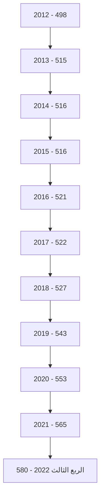
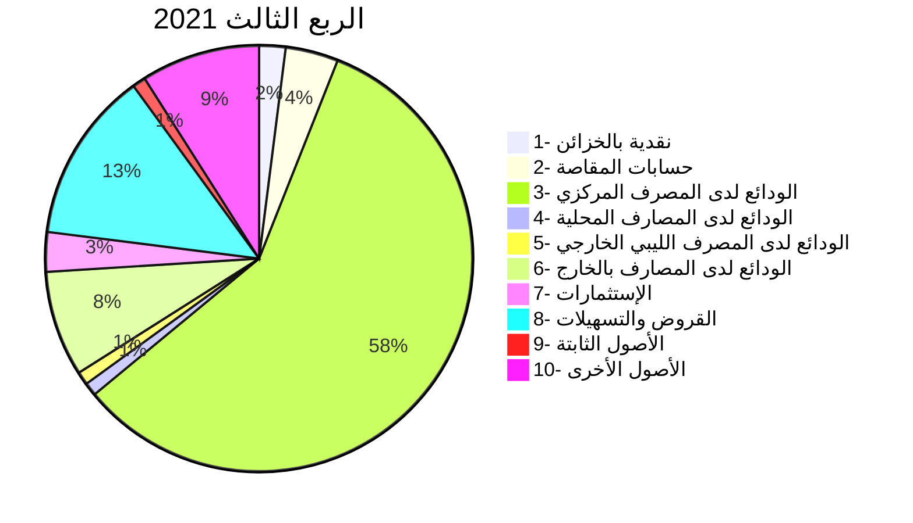
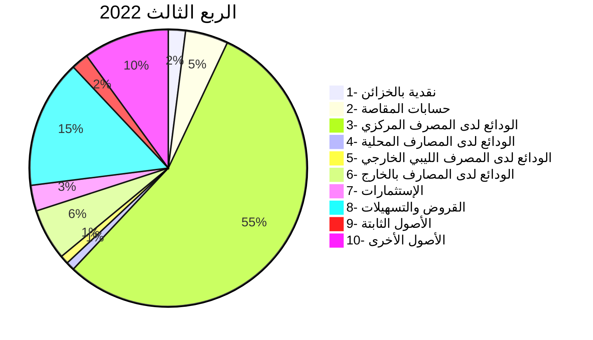
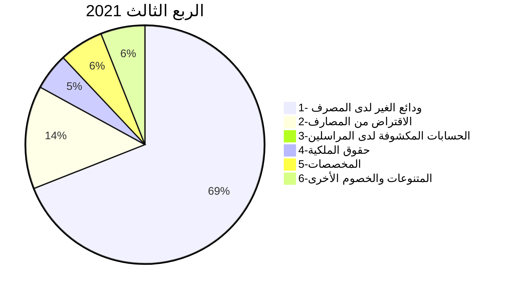
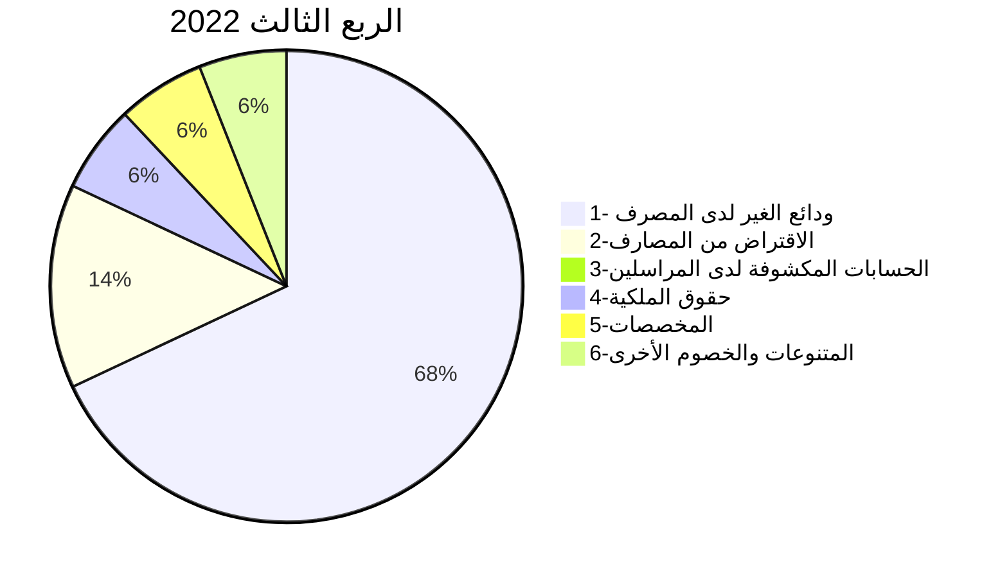
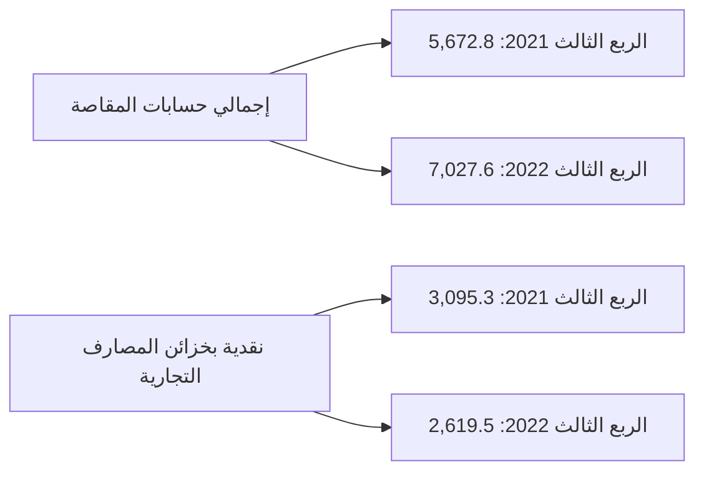
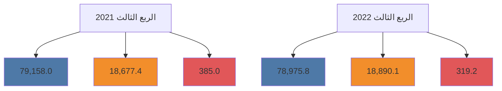
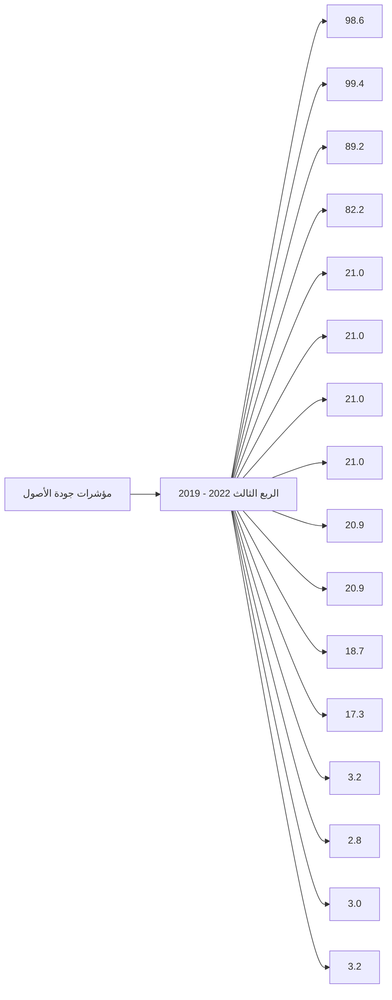
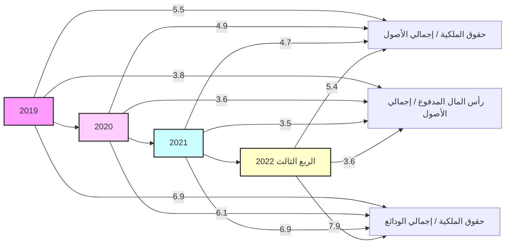
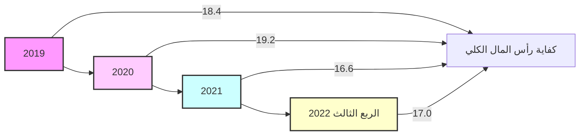

مصرف ليبيا المركزي
CENTRAL BANK OF LIBYA

# تقرير

## أهم البيانات والمؤشرات المالية للمصارف التجارية

### للربع الثالث 2022

[The image shows a colorful bar graph with an upward trending line graph overlaid. The bars are in various colors including blue, yellow, orange, green, and red. The line graph shows an overall upward trend with some fluctuations. There's also a rolled-up paper or chart visible at the bottom right of the graph.]

إدارة البُحوث والإحصـــــــاء
---
تقارير صادرة عن إدارة البحوث والإحصاء، (2022)

| الصفحة | المحتويات |
|---------|------------|
| 3 | ملخص لأهم البيانات المالية للمصارف التجارية للربع الثالث 2022 |
| 8 | تفرع المصارف التجارية |
| 9 | الكثافة المصرفية |
| 9 | التركز المصرفي |
| 12 | المركز المالي المُجمَع للمصارف التجارية |
| 14 | الأهمية النسبية للبنود المكونة للأصول |
| 15 | الأهمية النسبية للبنود المكونة للخصوم |
| 16 | تحليل البنود المكونة للمركز المالي المُجمَع للمصارف التجارية |
| 16 | - النقدية بالخزائن وحسابات المقاصة: |
| 18 | - الأرصدة والودائع لدى المصرف المركزي والمصارف الأخرى |
| 20 | - الإستثمارات |
| 21 | - القروض والتسهيلات الائتمانية |
| 23 | - الأصول الثابتة والأصول الأخرى |
| 24 | - ودائع العملاء لدى المصارف التجارية |
| 28 | - الحسابات المكشوفة لدى المراسلين بالخارج |
| 29 | - حقوق الملكية |
| 30 | - المخصصات |
| 31 | - المتنوعات والخصوم الأخرى: |
| 31 | الحسابات النظامية |
| 32 | مؤشرات أداء المصارف التجارية |
| 32 | - مؤشرات السيولة |
| 33 | - مؤشرات جودة الأصول |
| 34 | - مؤشرات الربحية |
| 34 | - مؤشرات رأس المال |
| 36 | جدول مؤشرات أداء المصارف التجارية 2019 – الربع الثالث 2022 |

صفحة 2 من 36
تقرير أهم البيانات والمؤشرات المالية للمصارف التجارية (الربع الثالث 2022)
---
تقارير صادرة عن إدارة البحوث والإحصاء، (2022)

# مُلخص لأهم البيانات المالية للمصارف التجارية
## (للربع الثالث 2022)

شَهدت البيانات المالية للمصارف التجارية في نهاية الربع الثالث 2022 بعض التغيرات مقارنة عما كانت عليه
في نهاية الربع الثالث 2021 وذلك على النحو التالي:

- إرتفع إجمالي أصول المصارف التجارية (بإستثناء الحسابات النظامية) من 142.4 مليار دينار في نهاية الربع الثالث
2021 إلى نحو 144.0 مليار دينار في نهاية الربع الثالث 2022، أي بمعدل نمو قدره 1.1%، وقد شكلت الأصول
السائلة (البالغة 93.4 مليار دينار) من إجمالي الأصول ما نسبته 64.8%.

| إجمالي أصول المصارف التجارية |
| (2012- الربع الثالث 2022) |

| السنة | القيمة (مليار دينار) |
|-------|----------------------|
| 2012 | 84.4 |
| 2013 | 98.4 |
| 2014 | 95.2 |
| 2015 | 90.2 |
| 2016 | 103.5 |
| 2017 | 116.5 |
| 2018 | 117.2 |
| 2019 | 111.8 |
| 2020 | 126.1 |
| 2021 | 136.0 |
| الربع الأول 2022 | 142.7 |
| الربع الثاني 2022 | 142.6 |
| الربع الثالث 2022 | 144.0 |

- إنخفض إجمالي ودائع المصارف التجارية (تحت الطلب وشهادات الإيداع) لدى المصرف المركزي بما فيها
الإحتياطي الإلزامي من نحو 83.2 مليار دينار في نهاية الربع الثالث 2021 إلى نحو 79.9 مليار دينار في نهاية الربع
الثالث 2022، أي بمعدل بلغ 4.0%.

- إرتفع اجمالي رصيد القروض والتسهيلات الممنوحة من المصارف التجارية من 18.2 مليار دينار في نهاية الربع
الثالث 2021 إلى 21.6 مليار دينار في نهاية الربع الثالث 2022، أي بمعدل نمو قدره 18.8%، وقد شكلت
القروض والتسهيلات الائتمانية الممنوحة إلى اجمالي الخصوم الإيداعية ما نسبته 22.0%، كما شكلت من
اجمالي الأصول ما نسبته 15.0%، وقد بلغ رصيد القروض الممنوحة للقطاع الخاص في نهاية الربع الثالث 2022

صفحة 1 من 36
تقرير أهم البيانات والمؤشرات المالية للمصارف التجارية (الربع الثالث 2022)
---
تقارير صادرة عن إدارة البحوث والإحصاء، (2022)

ما قيمته 14.1 مليار دينار، وما نسبته 65.3% من إجمالي القروض والتسهيلات الإئتمانية الممنوحة، فيما شكل رصيد القروض الممنوحة للقطاع العام النسبة الباقية 34.7% والتي بلغت قيمتها نحو 7.5 مليار دينار.

| إجمالي رصيد القروض الممنوحة من المصارف التجارية |
| ------------------------------------------------ |
| (2012 - الربع الثالث 2022)                       |

```
35.0
25.0   15.9   18.2   20.0   20.2   18.8   17.5   16.4   16.9   17.0   19.6   21.5   21.2   21.6
15.0
مليار دينار
5.0
-5.0   2012   2013   2014   2015   2016   2017   2018   2019   2020   2021   الربع   الربع   الربع
                                                                          الأول   الثاني  الثالث
                                                                          2022   2022   2022
```

- بلغت نسبة تغطية مخصص الديون المشكوك فيها لإجمالي القروض والتسهيلات الممنوحة نسبة 17.3% في الربع الثالث 2022 مقابل نسبة 20.0% في الربع الثالث 2021.

- إنخفضت ودائع العملاء (الخصوم الإيداعية) لدى المصارف التجارية بشكل طفيف من 98.22 مليار دينار في نهاية الربع الثالث 2021، إلى 98.19 مليار دينار في نهاية الربع الثالث 2022، أي بمعدل 0.04%، وقد شكلت الودائع تحت الطلب ما نسبته 80.4% من إجمالي الودائع، في حين شكلت الودائع لأجل بما فيها التأمينات النقدية نسبة 19.3% من إجمالي الودائع، بينما شكلت ودائع الإدخار نسبة 0.3% فقط من إجمالي الودائع.

وفيما يتعلق بتوزيع هذه الودائع فقد بلغت ودائع القطاع الخاص في نهاية الربع الثالث 2022 ما قيمته 56.5 مليار دينار، وما نسبته 57.6% من إجمالي الودائع، فيما شكل رصيد ودائع القطاع العام والحكومي النسبة الباقية وقدرها 42.4% أي ما قيمته 41.7 مليار دينار، منها 28.9 مليار دينار ودائع لشركات ومؤسسات القطاع العام ونحو 12.8 مليار دينار ودائع حكومية.

صفحة 1 من 36
تقرير أهم البيانات والمؤشرات المالية للمصارف التجارية (الربع الثالث 2022)
---
تقارير صادرة عن إدارة البحوث والإحصاء، (2022)

## إجمالي ودائع العملاء لدى المصارف التجارية
### (2012 - الربع الثالث 2022)

| السنة | 2012 | 2013 | 2014 | 2015 | 2016 | 2017 | 2018 | 2019 | 2020 | 2021 | الربع الأول 2022 | الربع الثاني 2022 | الربع الثالث 2022 |
|-------|------|------|------|------|------|------|------|------|------|------|------------------|-------------------|-------------------|
| إجمالي الودائع | 68.3 | 83.6 | 79.1 | 71.3 | 83.4 | 95.9 | 93.7 | 88.6 | 102.2 | 92.1 | 97.5 | 97.1 | 98.2 |
| ودائع تحت الطلب | 51.8 | 62.0 | 55.5 | 53.5 | 67.0 | 80.5 | 79.0 | 74.5 | 87.5 | 74.0 | 78.5 | 78.0 | 79.0 |
| ودائع زمنية | 14.5 | 19.5 | 21.5 | 16.0 | 14.5 | 13.5 | 13.0 | 12.5 | 13.0 | 16.5 | 17.5 | 17.5 | 17.5 |
| ودائع إدخارية | 2.0 | 2.1 | 2.1 | 1.8 | 1.9 | 1.9 | 1.7 | 1.6 | 1.7 | 1.6 | 1.5 | 1.6 | 1.7 |

*القيم بالمليار دينار*

- إرتفع إجمالي حقوق الملكية في المصارف التجارية من 7.3 مليار دينار في نهاية الربع الثالث 2021 إلى 8.7 مليار دينار في نهاية الربع الثالث 2022، وبمعدل 19.1%.

- إنخفضت أرباح المصارف التجارية (قبل خصم المخصصات والضرائب) خلال التسعة أشهر الأولى من العام الحالي 2022 بمقدار 28.8 مليون دينار أي بمعدل 3.0% لتصل إلى 940.1 مليون دينار، مقارنة عما كانت عليه خلال نفس الفترة من العام الماضي 2021 والتي سجلت نحو 968.8 مليون دينار.

## أرباح الفترة قبل خصم المخصصات والضرائب

| الفترة | القيمة (مليون دينار) |
|--------|----------------------|
| حتى الربع الثالث 2021 | 968.8 |
| حتى الربع الثالث 2022 | 940.1 |

صفحة 5 من 36

تقرير أهم البيانات والمؤشرات المالية للمصارف التجارية (الربع الثالث 2022)
---
تقارير صادرة عن إدارة البحوث والإحصاء، (2022)

# البيانات المالية الأساسية للمصارف التجارية

"مليون دينار"

| البند | الربع الثالث 2021 | الربع الثالث 2022 | معدل التغير % |
|------|-----------------|-----------------|-------------|
| إجمالي الميزانية ( الأصول + الحسابات النظامية ) | 191,700.3 | 186,061.7 | -2.9 |
| إجمالي الأصول | 142,441.4 | 144,020.3 | 1.1 |
| إجمالي النقدية بخزائن المصارف | 3,095.3 | 2,619.5 | -15.4 |
| إجمالي الودائع لدى المصرف المركزي | 83,238.8 | 79,925.1 | -4.0 |
| إجمالي الودائع لدى المصارف | 846.6 | 1,123.7 | 32.7 |
| إجمالي الودائع لدى المصرف الليبي الخارجي | 1,407.5 | 1,286.8 | -8.6 |
| إجمالي الودائع لدى المراسلين بالخارج | 10,889.3 | 8,407.5 | -22.8 |
| إجمالي حسابات المقاصة | 5,672.8 | 7,027.6 | 23.9 |
| إجمالي القروض والسلفيات والتسهيلات | 18,203.7 | 21,618.1 | 18.8 |
| إجمالي الاستثمارات | 4,460.7 | 5,253.6 | 17.8 |
| إجمالي ودائع العملاء | 98,220.4 | 98,185.0 | -0.04 |
| إجمالي الحسابات المكشوفة لدى المراسلين | 82.3 | 80.1 | -2.7 |
| إجمالي حقوق الملكية | 7,341.4 | 8,743.4 | 19.1 |
| إجمالي المخصصات | 7,764.4 | 8,436.1 | 8.7 |
| أرباح الفترة | 968.8 | 940.1 | -3.0 |
| عدد الفروع والوكالات | 565 | 580 | 2.7 |
| عدد العاملين | 19,463 | 19,815 | 1.8 |

المؤشرات المالية :

| المؤشر | 2021 | 2022 |
|--------|------|------|
| الأصول السائلة / إجمالي الأصول | 69.8% | 64.8% |
| إجمالي القروض / إجمالي الأصول | 12.8% | 15.0% |
| حقوق الملكية / إجمالي الأصول | 4.4% | 5.4% |
| إجمالي الأصول / عدد الفروع ( مليون دينار ) | 253.5 | 250.5 |
| إجمالي الأصول / عدد العاملين ( مليون دينار ) | 7.3 | 7.3 |
| إجمالي القروض / إجمالي الودائع | 18.5% | 22.0% |
| إجمالي الربح / الأصول % | 0.7% | 0.7% |
| إجمالي الربح / حقوق الملكية % | 15.4% | 12.2% |

صفحة 3 من 36
تقرير أهم البيانات والمؤشرات المالية للمصارف التجارية (الربع الثالث 2022)
---
تقارير صادرة عن إدارة البحوث والإحصاء، (2022)

# مؤشرات الودائع لدى المصارف التجارية
"مليون دينار"

| البند | الربع الثالث 2021 | الربع الثالث 2022 | معدل التغير % |
|------|------------------|------------------|---------------|
| 1- ودائع الحكومة والقطاع العام | 40,396.8 | 41,675.0 | 3.2 |
| ـودائع الحكومة ( الوزارات والهيئات الممولة من الميزانية العامة ) | 14,322.9 | 12,803.5 | -10.6 |
| ـودائع القطاع العام | 26,074.0 | 28,871.5 | 10.7 |
| 2- ودائع القطاع الخاص | 57,823.6 | 56,510.1 | -2.3 |
| ـودائع الأفراد | 31,159.4 | 30,357.3 | -2.6 |
| ـودائع الشركات والجهات الأخرى | 26,664.2 | 26,152.8 | -1.9 |
| إجمالي الودائع | 98,220.4 | 98,185.0 | -0.04 |
| الودائع تحت الطلب | 79,158.0 | 78,975.8 | -0.2 |
| الودائع لأجل | 18,677.4 | 18,890.1 | 1.1 |
| ودائع الادخار | 385.0 | 319.2 | -17.1 |
| الودائع تحت الطلب / إجمالي الودائع % | %80.6 | %80.4 | - |
| الودائع لأجل / إجمالي الودائع % | %19.0 | % 19.2 | - |
| ودائع الادخار / إجمالي الودائع % | % 0.4 | % 0.3 | - |
| إجمالي الودائع / إجمالي الخصوم % | % 69.0 | % 68.2 | - |

# مؤشرات الإئتمان الممنوح من المصارف التجارية
"مليون دينار"

| البند | الربع الثالث 2021 | الربع الثالث 2022 | معدل التغير % |
|------|------------------|------------------|---------------|
| 1- الائتمان الممنوح للقطاع العام | 6,357.8 | 7,498.1 | 17.9 |
| 2-الائتمان الممنوح للقطاع الخاص | 11,845.8 | 14,120.0 | 19.2 |
| إجمالي الائتمان | 18,203.7 | 21,618.1 | 18.8 |
| السلفيات والسحب على المكشوف | 4,583.4 | 4,450.7 | -2.9 |
| قروض المرابحة (تشمل رصيد السلف الإجتماعية) | 4,356.9 | 5,975.2 | 37.1 |
| القروض الممنوحة للأنشطة الاقتصادية الأخرى | 9,263.3 | 11,192.2 | 20.8 |
| قروض المرابحة / إجمالي الائتمان % | % 23.9 | % 27.6 | - |
| السلفيات والسحب على المكشوف / إجمالي الائتمان % | % 25.2 | % 20.6 | - |
| القروض الممنوحة للأنشطة الأخرى/اجمالي الائتمان% | % 50.9 | % 51.8 | - |
| إجمالي الائتمان / إجمالي الأصول % | % 12.8 | % 15.0 | - |
| إجمالي الائتمان / إجمالي الودائع % | % 18.5 | % 22.0 | - |
| إجمالي الائتمان / إجمالي الودائع % | % 18.5 | % 22.0 | - |

صفحة 7 من 36
تقريرأهم البيانات والمؤشرات المالية للمصارف التجارية (الربع الثالث 2022)
---
تقارير صادرة عن إدارة البحوث والإحصاء، (2022)

## تفرع المصارف التجارية :-

بلغ عدد المصارف العاملة في ليبيا والمشتملة بياناتها في هذا التقرير 20 مصرفاً (بما في ذلك وحدة الدينار الليبي
التابعة للمصرف الليبي الخارجي) حتى نهاية الربع الثالث 2022، وتزاول هذه المصارف نشاطها من خلال 580
فرعاً ووكالة مصرفية .

### تطور عدد الفروع والوكالات المصرفية والعاملين بها

| السنة | عدد الفروع والوكالات | عدد العاملين بالقطاع المصرفي |
|-------|----------------------|---------------------------|
| 2012  | 498                  | 17,575                    |
| 2013  | 515                  | 18,878                    |
| 2014  | 516                  | 19,183                    |
| 2015  | 516                  | 19,214                    |
| 2016  | 521                  | 19,255                    |
| 2017  | 522                  | 19,324                    |
| 2018  | 527                  | 19,263                    |
| 2019  | 543                  | 19,387                    |
| 2020  | 553                  | 19,565                    |
| 2021  | 565                  | 19,588                    |
| الربع الثالث 2022 | 580      | 19,815                    |

### تطور عدد الفروع والوكالات المصرفية



صفحة 8 من 36

تقرير أهم البيانات والمؤشرات المالية للمصارف التجارية (الربع الثالث 2022)
---
تقارير صادرة عن إدارة البحوث والإحصاء، (2022)

# الكثافة المصرفية
"بالألف نسمة"

| لكل فرع ووكالة | لكل مصرف | السنة |
|---------------:|----------:|------:|
| 12.1 | 389.0 | 2012 |
| 12.2 | 397.0 | 2013 |
| 12.2 | 397.0 | 2014 |
| 12.2 | 393.8 | 2015 |
| 12.5 | 382.4 | 2016 |
| 12.8 | 394.1 | 2017 |
| 13.1 | 383.3 | 2018 |
| 12.9 | 368.4 | 2019 |
| 12.8 | 368.3 | 2020 |
| 12.6 | 388.9 | 2021 |
| 12.3 | 350.0 | الربع الثالث 2022 |

## التركز المصرفي:

درجة التركز المصرفي تعني أن عدداً قليلاً من المصارف التجارية يستأثر بالنسبة الأكبر من النشاط المصرفي
سواءً من حيث الأصول أو الودائع أوالائتمان أو من حيث حجم حقوق الملكية، وفيما يخص الحصة السوقية
للمصارف التجارية في ليبيا، فقد شكلت أصول المصارف الخمسة الكبرى (الجمهورية، التجاري الوطني،
الوحدة، الصحارى والتجارة والتنمية) من أصل 20 مصرفاً مانسبته 71.4% من إجمالي أصول القطاع
المصرفي في نهاية الربع الثالث 2022، وشكل مصرف الجمهورية وحده ما نسبته 26.9% من إجمالي أصول
القطاع المصرفي.

وشكلت الخصوم الإيداعية والقروض والتسهيلات الائتمانية للمصارف الخمسة الكبرى (الجمهورية،
التجاري الوطني، الوحدة، الصحارى والتجارة والتنمية) مانسبته 77.9% و 84.8% على التوالي من إجمالي
الخصوم الإيداعية والقروض والتسهيلات الائتمانية للقطاع المصرفي نهاية الربع الثالث 2022.

صفحة 9 من 36
تقرير أهم البيانات والمؤشرات المالية للمصارف التجارية (الربع الثالث 2022)
---
تقارير صادرة عن إدارة البحوث والإحصاء

# التركز المصرفي حسب ( الأصول ، الائتمان ، الخصوم الإيداعية)

## حسب الأصول

| الربع الثالث 2022 | 2021 | 2020 | 2019 | 2018 | 2017 | 2016 | 2015 | 2014 | 2013 | 2012 | حسب الأصول |
|-------------------|------|------|------|------|------|------|------|------|------|------|-------------|
| 26.9 | 28.0 | 31.2 | 31.9 | 32.7 | 33.6 | 33.8 | 34.9 | 33.1 | 33.0 | 37.9 | أكبر مصرف |
| 62.3 | 62.0 | 63.1 | 64.6 | 65.8 | 66.9 | 67.9 | 67.6 | 62.1 | 63.7 | 71.0 | أكبر ثلاثة مصارف |
| 78.6 | 79.7 | 82.7 | 84.2 | 84.3 | 85.0 | 86.7 | 87.1 | 79.2 | 81.3 | 89.0 | أكبر خمسة مصارف |

## حسب الائتمان

| الربع الثالث 2022 | 2021 | 2020 | 2019 | 2018 | 2017 | 2016 | 2015 | 2014 | 2013 | 2012 | حسب الائتمان |
|-------------------|------|------|------|------|------|------|------|------|------|------|--------------|
| 38.7 | 40.7 | 42.6 | 40.7 | 43.6 | 44.5 | 44.3 | 44.8 | 43.5 | 44.8 | 41.9 | أكبر مصرف |
| 74.1 | 76.2 | 78.3 | 75.8 | 77.7 | 77.7 | 78.5 | 79.4 | 79.1 | 76.7 | 77.0 | أكبر ثلاثة مصارف |
| 84.8 | 87.6 | 91.4 | 91.4 | 91.5 | 91.2 | 91.3 | 91.4 | 91.1 | 90.2 | 91.0 | أكبر خمسة مصارف |

## حسب الخصوم الإيداعية

| الربع الثالث 2022 | 2021 | 2020 | 2019 | 2018 | 2017 | 2016 | 2015 | 2014 | 2013 | 2012 | حسب الخصوم الإيداعية |
|-------------------|------|------|------|------|------|------|------|------|------|------|------------------------|
| 31.1 | 33.8 | 31.8 | 32.3 | 31.9 | 33.6 | 34.0 | 34.8 | 33.1 | 33.8 | 40.9 | أكبر مصرف |
| 60.5 | 62.0 | 62.9 | 64.4 | 65.2 | 66.5 | 67.2 | 66.5 | 61.3 | 62.7 | 71.5 | أكبر ثلاثة مصارف |
| 77.9 | 79.5 | 83.7 | 85.6 | 85.4 | 85.7 | 87.5 | 87.8 | 78.6 | 80.9 | 90.1 | أكبر خمسة مصارف |

صفحة 10 من 36

تقرير أهم البيانات والمؤشرات المالية للمصارف التجارية (الربع الثالث 2022)
---
تقارير صادرة عن إدارة البحوث والإحصاء، (2022)

## تركز الأصول

| المصرف | النسبة |
|--------|--------|
| مصرف الجمهورية | 27% |
| المصرف التجاري الوطني | 19% |
| مصرف الوحدة | 17% |
| مصرف الصحاري | 9% |
| باقي المصارف | 28% |

## تركز الائتمان

| المصرف | النسبة |
|--------|--------|
| مصرف الجمهورية | 39% |
| مصرف الوحدة | 21% |
| المصرف التجاري الوطني | 14% |
| مصرف الصحاري | 8% |
| باقي المصارف | 18% |

## تركز الخصوم الإيداعية

| المصرف | النسبة |
|--------|--------|
| مصرف الجمهورية | 31% |
| المصرف التجاري الوطني | 16% |
| مصرف الوحدة | 14% |
| مصرف الصحاري | 10% |
| باقي المصارف | 29% |

صفحة 11 من 63

تقرير أهم البيانات والمؤشرات المالية للمصارف التجارية (الربع الثالث 2022)
---
تقارير صادرة عن إدارة البحوث والإحصاء، (2022)

# المركز المالي المُجمَع للمصارف التجارية

شَهد المركز المالي المُجمَع للمصارف التجارية نهاية الربع الثالث 2022، تطورات في مُجمل بنوده على جانبي الأصول والخصوم، ليبلغ إجمالي الأصول داخل الميزانية المُجمَعة نحو 144,020.3 مليون دينار، مقابل 142,441.4 مليون دينار في نهاية الربع الثالث 2021، بإرتفاع قدره 1,578.9 مليون دينار، أي بمعدل 1.1%،

وفيما يلي جدول يلخص البنود الرئيسية للمركز المالي المُجمَع للمصارف التجارية:

## مُلخص المركز المالي المُجمَع للمصارف التجارية

"مليون دينار"

| البند | الربع الثالث 2021 | الربع الثالث 2022 | مقدار التغير | معدل التغير % |
|------|------------------|------------------|--------------|---------------|
| **الأصول:** |
| 1- نقدية بالخزائن | 3,095.3 | 2,619.5 | -475.8 | -15.4 |
| - عملة محلية | 3,005.4 | 2,393.2 | -612.2 | -20.4 |
| - عملة أجنبية | 89.9 | 226.3 | 136.4 | 151.7 |
| 2- حسابات المقاصة | 5,672.8 | 7,027.6 | 1,354.8 | 23.9 |
| - المقاصة بين المصارف | 2,296.9 | 3,261.4 | 964.5 | 42.0 |
| - المقاصة بين الفروع | 3,375.9 | 3,766.3 | 390.4 | 11.6 |
| 3- الودائع لدى المصارف الأخرى | 96,382.3 | 90,743.0 | -5,639.3 | -5.9 |
| أ- الودائع لدى المصرف المركزي | 83,238.8 | 79,925.1 | -3,313.7 | -4.0 |
| - ودائع تحت الطلب | 69,006.4 | 72,407.7 | 3,401.3 | 4.9 |
| - شهادات الإيداع | 14,232.4 | 7,517.3 | -6,715.1 | -47.2 |
| ب- الودائع لدى المصارف المحلية الأخرى | 846.6 | 1,123.7 | 277.1 | 32.7 |
| - ودائع تحت الطلب | 846.6 | 1,123.7 | 277.1 | 32.7 |
| - ودائع زمنية | 0.0 | 0.0 | 0.0 | - |
| ج- الودائع لدى المصرف الليبي الخارجي | 1,407.5 | 1,286.8 | -120.7 | -8.6 |
| - ودائع تحت الطلب | 1,407.5 | 1,286.8 | -120.7 | -8.6 |
| - ودائع زمنية | 0.0 | 0.0 | 0.0 | - |
| د- الودائع لدى المصارف بالخارج | 10,889.3 | 8,407.5 | -2,481.8 | -22.8 |
| - ودائع تحت الطلب | 9,140.1 | 5,908.9 | -3,231.2 | -35.4 |
| - ودائع زمنية | 1,749.2 | 2,498.5 | 749.3 | 42.8 |
| 4- الإستثمارات | 4,460.7 | 5,253.6 | 792.9 | 17.8 |
| 5- القروض والتسهيلات | 18,203.7 | 21,618.1 | 3,414.4 | 18.8 |
| - السلفيات والسحب على المكشوف | 4,583.4 | 4,450.7 | -132.7 | -2.9 |
| - السلف الإجتماعية (تشمل قروض المرابحة للأفراد) | 4,356.9 | 5,975.2 | 1,618.3 | 37.1 |
| - قروض الأنشطة الإقتصادية الأخرى | 9,263.3 | 11,192.2 | 1,928.9 | 20.8 |
| 6- الأصول الثابتة | 2,184.9 | 2,507.4 | 322.5 | 14.8 |
| 7- الأصول الأخرى | 12,441.6 | 14,250.9 | 1,809.3 | 14.5 |
| **إجمالي الأصول** | 142,441.4 | 144,020.3 | 1,578.9 | 1.1 |
| الحسابات المقابلة | 49,258.9 | 42,041.5 | -7,217.4 | -14.7 |
| **الإجمالي الكلي للأصول** | 191,700.3 | 186,061.7 | -5,638.6 | -2.9 |

صفحة 12 من 36
تقرير أهم البيانات والمؤشرات المالية للمصارف التجارية (الربع الثالث 2022)
---
تقارير صادرة عن إدارة البحوث والإحصاء، (2022)

"مليون دينار"

| معدل التغير % | مقدار التغير | الربع الثالث 2022 | الربع الثالث 2021 | البند |
|---------------|--------------|-------------------|-------------------|------|
| | | | | **الخصوم** |
| -0.04 | -35.4 | 98,185.0 | 98,220.4 | 1- ودائع الغير لدى المصارف |
| -1.5 | -1,103.4 | 73,765.0 | 74,868.4 | - الودائع تحت الطلب |
| -14.5 | -326.6 | 1,924.7 | 2,251.3 | - الودائع الزمنية |
| -17.1 | -65.8 | 319.2 | 385.0 | - الودائع الإدخارية |
| 21.5 | 921.2 | 5,210.8 | 4,289.6 | - أوامر الدفع |
| 3.3 | 539.3 | 16,965.4 | 16,426.1 | - التأمينات النقدية |
| - | 0.0 | 19,850.7 | 19,850.7 | 2- الإقتراض من المصرف المركزي |
| -2.7 | -2.2 | 80.1 | 82.3 | 3- الحسابات المكشوفة لدى المراسلين |
| 19.1 | 1,402.0 | 8,743.4 | 7,341.4 | 4- حقوق الملكية |
| 11.8 | 552.9 | 5,249.5 | 4,696.6 | - رأس المال المدفوع |
| 6.3 | 50.6 | 852.7 | 802.1 | - الإحتياطي القانوني |
| 450.0 | 276.3 | 337.7 | 61.4 | - احتياطيات غير مخصصة |
| -3.0 | -28.7 | 940.1 | 968.8 | - أرباح الفترة |
| 67.8 | 550.9 | 1,363.4 | 812.5 | - الأرباح المرحّلة والقابلة للتوزيع |
| 8.7 | 671.7 | 8,436.1 | 7,764.4 | 5- المخصصات |
| -5.0 | -457.2 | 8,724.9 | 9,182.1 | 6- المتنوعات والخصوم الأخرى |
| 1.1 | 1,578.9 | 144,020.3 | 142,441.4 | إجمالي الخصوم |
| -14.7 | -7,217.4 | 42,041.5 | 49,258.9 | الحسابات المقابلة |
| -2.9 | -5,638.6 | 186,061.7 | 191,700.3 | الإجمالي الكلي للخصوم |

صفحة 13 من 36
تقرير أهم البيانات والمؤشرات المالية للمصارف التجارية (الربع الثالث 2022)
---
تقارير صادرة عن إدارة البحوث والإحصاء، (2022)

# الأهمية النسبية للبنود المكونة للأصول بالمركز المالي المُجمع للمصارف التجارية

| البند | الربع الثالث 2021 | الربع الثالث 2022 |
|-------|-------------------|-------------------|
| الأصول: |                   |                   |
| 1- نقدية بالخزينة | 2.2% | 1.8% |
| 2- حسابات المقاصة | 4.0% | 4.9% |
| 3- الودائع لدى المصرف المركزي | 58.4% | 55.5% |
| 4- الودائع لدى المصارف المحلية الأخرى | 0.6% | 0.8% |
| 5- الودائع لدى المصرف الليبي الخارجي | 1.0% | 0.9% |
| 6- الودائع لدى المصارف بالخارج | 7.6% | 5.8% |
| 7- الإستثمارات | 3.1% | 3.6% |
| 8- القروض والتسهيلات | 12.8% | 15.0% |
| 9- الأصول الثابتة | 1.5% | 1.7% |
| 10- الأصول الأخرى | 8.7% | 9.9% |
| إجمالي الأصول | 100.0% | 100.0% |

## الربع الثالث 2021



## الربع الثالث 2022



صفحة 14 من 36
تقرير أهم البيانات والمؤشرات المالية للمصارف التجارية (الربع الثالث 2022)
---
تقارير صادرة عن إدارة البحوث والإحصاء، (2022)

# الأهمية النسبية للبنود المكونة للخصوم بالمركز المالي المُجمع للمصارف التجارية

| البند | الربع الثالث 2021 | الربع الثالث 2022 |
|-------|-------------------|-------------------|
| **الخصوم** |
| 1- ودائع الغير لدى المصرف | 69.0% | 68.2% |
| 2-الاقتراض من المصارف | 13.9% | 13.8% |
| 3-الحسابات المكشوفة لدى المراسلين | 0.1% | 0.1% |
| 4-حقوق الملكية | 5.2% | 6.1% |
| 5-المخصصات | 5.5% | 5.9% |
| 6-المتنوعات والخصوم الأخرى | 6.4% | 6.1% |
| إجمالي الخصوم | 100.0% | 100.0% |

## الربع الثالث 2021



## الربع الثالث 2022



صفحة 15 من 36
تقرير أهم البيانات والمؤشرات المالية للمصارف التجارية (الربع الثالث 2022)
---
تقارير صادرة عن إدارة البحوث والإحصاء، (2022)

# تحليل البنود المكونة للمركز المالي المُجمَع للمصارف التجارية

## أولاً: جانب الأصـــول

### 1- النقدية :

#### أ- النقدية بالخزائن وحسابات المقاصة :

ارتفع رصيد النقدية بخزائن المصارف وحسابات المقاصة بمقدار 879.1 مليون دينار أي بمعدل 10.0%، لتصل إلى 9,647.2 مليون دينار في نهاية الربع الثالث 2022، مقابل 8,768.1 مليون دينار في نهاية الربع الثالث 2021، حيث إنخفض رصيد النقد بخزائن المصارف بمقدار 475.8 مليون دينار، في حين إرتفع بند حسابات المقاصة بمقدار 1,354.8 مليون دينار في نهاية الربع الثالث 2022 مقارنة بما كانت عليه في نفس الفترة من الربع الثالث 2021، والجدول التالي يوضح ذلك :

| البيان | الربع الثالث 2021 | الربع الثالث 2022 | مقدار التغير | معدل التغير% |
|--------|-------------------|-------------------|---------------|---------------|
| النقدية بالخزائن : | 3,095.3 | 2,619.5 | -475.8 | -15.4 |
| عملة محلية | 3,005.4 | 2,393.2 | -612.2 | -20.4 |
| عملة أجنبية | 89.9 | 226.3 | 136.4 | 151.7 |
| إجمالي حسابات المقاصة | 5,672.8 | 7,027.6 | 1,354.8 | 23.9 |
| المقاصة بين المصارف | 2,296.9 | 3,261.4 | 964.5 | 42.0 |
| المقاصة بين الفروع | 3,375.9 | 3,766.3 | 390.4 | 11.6 |
| الإجمالي | 8,768.1 | 9,647.2 | 879.1 | 10.0 |



صفحة 13 من 36
تقرير أهم البيانات والمؤشرات المالية للمصارف التجارية (الربع الثالث 2022)
---
تقارير صادرة عن إدارة البحوث والإحصاء

وفيما يلي تطور بند النقدية في المصارف التجارية خلال الفترة (2012 - الربع الثالث 2022):

## نقدية بخزائن المصارف التجارية
### (2012 - الربع الثالث 2022)

| السنة | القيمة (مليون دينار) |
|-------|----------------------|
| 2012 | 1,545.9 |
| 2013 | 1,712.3 |
| 2014 | 1,642.8 |
| 2015 | 752.8 |
| 2016 | 606.4 |
| 2017 | 547.2 |
| 2018 | 1,582.1 |
| 2019 | 2,367.4 |
| 2020 | 1,146.8 |
| 2021 | 2,871.5 |
| الربع الثالث 2022 | 2,619.5 |

## إجمالي حسابات المقاصة
### (2012 - الربع الثالث 2022)

| السنة | القيمة (مليون دينار) |
|-------|----------------------|
| 2012 | 2,024.6 |
| 2013 | 7,310.3 |
| 2014 | 8,125.4 |
| 2015 | 11,444.4 |
| 2016 | 12,886.4 |
| 2017 | 6,379.9 |
| 2018 | 4,671.0 |
| 2019 | 6,304.6 |
| 2020 | 5,584.8 |
| 2021 | 6,041.0 |
| الربع الثالث 2022 | 7,027.6 |

صفحة 17 من 36

تقرير أهم البيانات والمؤشرات المالية للمصارف التجارية (الربع الثالث 2022)
---
تقارير صادرة عن إدارة البحوث والإحصاء، (2022)

ب- الأرصدة والودائع لدى المصرف المركزي والمصارف الأخرى:

بلغ رصيد الأرصدة وودائع المصارف التجارية لدى المصرف المركزي والمصارف الأخرى وفيما بينها نحو 90,743.0 مليون دينار في نهاية الربع الثالث 2022، مقابل 96,382.3 مليون دينار في نهاية الربع الثالث 2021، منخفضة بقيمة 5,639.3 مليون دينار، نتيجة لإنخفاض ودائعها لدى المصرف المركزي (شهادات الإيداع) بنحو 6,715.1 مليون دينار وكذلك ودائعها تحت الطلب لدى المراسلين بالخارج بنحو 3,231.2 مليون دينار، بالإضافة إلى إنخفاض ودائعها لدى المصرف الليبي الخارجي، والجدول التالي يوضح تفاصيل هذا البند:

| البند | الربع الثالث 2021 | الربع الثالث 2022 | مقدار التغير | معدل التغير% |
|-------|-------------------|-------------------|---------------|---------------|
| ودائع تحت الطلب لدى : | 80,400.7 | 80,727.1 | 326.4 | 0.4 |
| المصرف المركزي | 69,006.4 | 72,407.7 | 3,401.3 | 4.9 |
| المصارف المحلية | 846.6 | 1,123.7 | 277.1 | 32.7 |
| المصرف الليبي الخارجي | 1,407.5 | 1,286.8 | -120.7 | -8.6 |
| لدى المراسلين بالخارج | 9,140.1 | 5,908.9 | -3,231.2 | -35.4 |
| ودائع زمنية : | 15,981.7 | 10,015.9 | -5,965.8 | -37.3 |
| المصرف المركزي (شهادات الإيداع) | 14,232.4 | 7,517.3 | -6,715.1 | -47.2 |
| المصارف المحلية | 0.0 | 0.0 | 0.0 | - |
| المصرف الليبي الخارجي | 0.0 | 0.0 | 0.0 | - |
| لدى المراسلين بالخارج | 1,749.2 | 2,498.5 | 749.3 | 42.8 |
| الإجمالي | 96,382.3 | 90,743.0 | -5,639.3 | -5.9 |

```mermaid
bar chart
    title الودائع تحت الطلب
    x-axis [الربع الثالث 2021, الربع الثالث 2022]
    y-axis 0 -> 90000.0
    bar [80400.7, 80727.1]
```

صفحة 18 من 36
تقرير أهم البيانات والمؤشرات المالية للمصارف التجارية (الربع الثالث 2022)
---
تقارير صادرة عن إدارة البحوث والإحصاء، (2022)

## الودائع الزمنية

| الربع الثالث 2022 | الربع الثالث 2021 |
|-------------------|-------------------|
| 10,015.9          | 15,981.7          |

*القيم بالمليون دينار*

والشكل التالي يبين تطور أرصدة وودائع المصارف التجارية لدى المصرف المركزي والمصارف الأخرى وفيما بينها
خلال الفترة (2012 – الربع الثالث 2022):

## ودائع المصارف التجارية لدى المصرف المركزي والمصارف الأخرى
(2012 - الربع الثالث 2022)

| السنة | والودائع تحت الطلب | والودائع الزمنية |
|-------|---------------------|-------------------|
| 2012  | 19,352.7            | 37,434.9          |
| 2013  | 22,342.6            | 45,751.9          |
| 2014  | 24,360.7            | 37,883.3          |
| 2015  | 27,870.7            | 25,669.2          |
| 2016  | 24,000.4            | 38,306.1          |
| 2017  | 56,945.4            | 27,317.8          |
| 2018  | 59,454.9            | 25,894.4          |
| 2019  | 60,184.6            | 17,240.3          |
| 2020  | 72,269.0            | 17,567.6          |
| 2021  | 74,216.6            | 15,700.2          |
| الربع الثالث 2022 | 80,727.1 | 10,015.9 |

*القيم بالمليون دينار*

صفحة 19 من 36
تقرير أهم البيانات والمؤشرات المالية للمصارف التجارية (الربع الثالث 2022)
---
## 2- الإستثمارات :

بلغ إجمالي بند رصيد الإستثمارات نهاية الربع الثالث 2022 نحو 5,253.6 مليون دينار، مقابل 4,460.7 مليون دينار في نهاية الربع الثالث 2021، بمعدل نمو 17.8% هذا الإرتفاع جاء نتيجة زيادة الإستثمارات الأخرى بمقدار 665.5 مليون دينار، والجدول التالي يوضح تفاصيل هذا البند:

مليون دينار

| البيان | الربع الثالث 2021 | الربع الثالث 2022 | مقدار التغير | معدل التغير% |
|---------|-------------------|-------------------|---------------|---------------|
| سندات وأذونات الخزانة | 3,000.0 | 3,000.0 | 0.0 | - |
| إستثمارات في الشركات العامة | 560.9 | 564.7 | 3.8 | 0.7 |
| إستثمارات في الشركات الخاصة المساهمة | 803.9 | 927.6 | 123.7 | 15.4 |
| إستثمارات أخرى | 95.9 | 761.3 | 665.5 | 694.3 |
| الإجمالي | 4,460.7 | 5,253.6 | 793.0 | 17.8 |

### إجمالي الإستثمارات

```mermaid
bar chart
    title إجمالي الإستثمارات
    x-axis [الربع الثالث 2021, الربع الثالث 2022]
    y-axis "مليون دينار" 0 --> 5500
    bar [4460.7, 5253.6]
```

### إجمالي الإستثمارات للمصارف التجارية (2012 - الربع الثالث 2022)

```mermaid
line chart
    title إجمالي الإستثمارات للمصارف التجارية
    x-axis [2012, 2013, 2014, 2015, 2016, 2017, 2018, 2019, 2020, 2021, الربع الثالث 2022]
    y-axis "مليون دينار" 0 --> 6000
    line [954.9, 746.7, 777.5, 1787.8, 1789.2, 1311.5, 1456.5, 1957.5, 4256.6, 4445.1, 5253.6]
```

صفحة 22 من 36
تقرير أهم البيانات والمؤشرات المالية للمصارف التجارية (الربع الثالث 2022)
---
تقارير صادرة عن إدارة البحوث والإحصاء، (2022)

## 3- القروض والتسهيلات الائتمانية:

ارتفع إجمالي رصيد القروض والتسهيلات الإئتمانية الممنوحة من المصارف التجارية من 18,203.7 مليون دينار في نهاية الربع الثالث 2021 إلى 21,618.1 مليون دينار في نهاية الربع الثالث 2022، أي بمعدل نمو 18.8%، وقد شكلت القروض والتسهيلات الائتمانية الممنوحة إلى اجمالي الخصوم الإيداعية ما نسبته 22.0%، كما شكلت من إجمالي الأصول ما نسبته 15.0%، وبلغ رصيد القروض الممنوحة للقطاع الخاص في نهاية الربع الثالث 2022 ما قيمته 14,120.0 مليون دينار، وما نسبته 65.3% من إجمالي القروض والتسهيلات الائتمانية الممنوحة، فيما شكل رصيد القروض الممنوحة للقطاع العام النسبة الباقية 34.7% والتي بلغت قيمتها نحو 7,498.1 مليون دينار.

وبتحليل مكونات المحفظة الائتمانية فقد كان الارتفاع في اجمالي رصيد الإئتمان الممنوح من المصارف التجارية بسبب الزيادة في بندي قروض المرابحة للأفراد (السلف الإجتماعية) و القروض الأخرى.

| البيان | الربع الثالث 2021 | الربع الثالث 2022 | مقدار التغير | معدل التغير% |
|--------|-------------------|-------------------|---------------|---------------|
| سلفيات والسحب على المكشوف | 4,583.4 | 4,450.7 | -132.7 | -2.9 |
| قروض المرابحة للأفراد* | 4,356.9 | 5,975.2 | 1,618.3 | 37.1 |
| القروض الأخرى | 9,263.3 | 11,192.2 | 1,928.9 | 20.8 |
| إجمالي القروض والتسهيلات | 18,203.7 | 21,618.1 | 3,414.5 | 18.8 |
| مخصص الديون المشكوك في تحصيلها | 3,646.7 | 3,731.1 | 84.4 | 2.3 |
| صافي القروض والتسهيلات | 14,557.0 | 17,887.0 | 3,330.0 | 22.9 |

(*) يشمل رصيد السلف الإجتماعية.

### السلفيات والسحب على المكشوف
```
4,600.0 | 4,583.4
4,550.0 |
4,500.0 |          4,450.7
4,450.0 |
4,400.0 |
4,350.0 |
        الربع الثالث 2021   الربع الثالث 2022
```

### السلف الاجتماعية
```
8,000.0 |
         |                   5,975.2
6,000.0 |
         |   4,356.9
4,000.0 |
2,000.0 |
    0.0 |
        الربع الثالث 2021   الربع الثالث 2022
```

صفحة 21 من 36
تقرير أهم البيانات والمؤشرات المالية للمصارف التجارية (الربع الثالث 2022)
---
تقارير صادرة عن إدارة البحوث والإحصاء، (2022)

والجدول التالي يوضح توزيع القروض الممنوحة من المصارف التجارية حسب القطاع (خاص وعام):

"مليون دينار"

| البيان | الربع الثالث 2021 | الربع الثالث 2022 | مقدار التغير | معدل التغير% |
|--------|-------------------|-------------------|--------------|---------------|
| القروض الممنوحة للقطاع العام | 6,357.8 | 7,498.1 | 1,140.3 | 17.9 |
| القروض الممنوحة للقطاع الخاص | 11,845.8 | 14,120.0 | 2,274.2 | 19.2 |
| الإجمالي | 18,203.7 | 21,618.1 | 3,414.5 | 18.8 |

رصيد القروض الممنوحة للقطاع الخاص:

```
15,000.0                   14,120.0
14,000.0
13,000.0
12,000.0   11,845.8
مليون دينار
11,000.0
10,000.0
           الربع الثالث 2021   الربع الثالث 2022
```

رصيد القروض الممنوحة للقطاع العام:

```
8,000.0                    7,498.1
7,500.0
7,000.0
6,500.0    6,357.8
مليون دينار
6,000.0
5,500.0
           الربع الثالث 2021   الربع الثالث 2022
```

رصيد القروض الممنوحة للقطاعين (الخاص والعام)
(2012 - الربع الثالث 2022)

```
16,000.0
14,000.0   10,608.3  12,905.5 13,764.0 14,230.1 12,854.3 11,867.7 11,347.4 10,855.8 11,078.7 13,165.8 14,120.0
12,000.0
10,000.0                           6,195.9  5,982.8  5,915.9  5,578.9  5,100.9  6,057.0  5,918.2  6,471.7  7,498.1
 8,000.0    5,291.2   5,327.1
مليون دينار
 6,000.0
 4,000.0
 2,000.0
     0.0
             2012      2013      2014      2015      2016      2017      2018      2019      2020      2021    الربع
                                                                                                              الثالث
                                                                                                               2022
           القروض الممنوحة للقطاع العام                    القروض الممنوحة للقطاع الخاص
```

صفحة 22 من 36
تقرير أهم البيانات والمؤشرات المالية للمصارف التجارية (الربع الثالث 2022)
---
تقارير صادرة عن إدارة البحوث والإحصاء، (2022)

## رصيد المرابحة والسحب على المكشوف
### (2012 - الربع الثالث 2022)

| السنة | سلفيات والسحب على المكشوف | المرابحة والسلف الاجتماعية |
|-------|---------------------------|---------------------------|
| 2012  | 5522.3                    | 4973.5                    |
| 2013  | 5440.1                    | 6726.0                    |
| 2014  | 5901.1                    | 7157.9                    |
| 2015  | 6608.6                    | 4452.1                    |
| 2016  | 4827.9                    | 4146.5                    |
| 2017  | 4514.5                    | 4912.5                    |
| 2018  | 4354.0                    | 4495.7                    |
| 2019  | 5275.4                    | 3988.7                    |
| 2020  | 4819.3                    | 3125.5                    |
| 2021  | 5975.2                    | 3036.5                    |
| الربع الثالث 2022 | 4450.7        | 4618.6                    |

## الأصول الثابتة والأصول الأخرى:

بلغ رصيد الأصول الثابتة نحو 2,507.7 مليون دينار في نهاية 2022، مقابل 2,184.9 مليون دينار في نهاية الربع الثالث 2021، فيما بلغ رصيد الأصول الأخرى نحو 14,250.9 مليون دينار في نهاية الربع الثالث 2022، مقابل 12,441.6 مليون دينار في نهاية الربع الثالث 2021.

| البيان | الربع الثالث 2021 | الربع الثالث 2022 | مقدار التغير | معدل التغير% |
|--------|-------------------|-------------------|---------------|--------------|
| الأصول الثابتة | 2,184.9 | 2,507.4 | 322.5 | 14.8 |
| الأصول الأخرى | 12,441.6 | 14,250.9 | 1,809.3 | 14.5 |

### إجمالي الأصول الثابتة

| الفترة | القيمة (مليون دينار) |
|--------|----------------------|
| الربع الثالث 2021 | 2,184.9 |
| الربع الثالث 2022 | 2,507.4 |

صفحة 26 من 36
تقرير أهم البيانات والمؤشرات المالية للمصارف التجارية (الربع الثالث 2022)
---
تقارير صادرة عن إدارة البحوث والإحصاء، (2022)

## ثانياً: جانب الخصوم

### 1- ودائع العملاء لدى المصارف التجارية:

إنخفضت ودائع العملاء (الخصوم الإيداعية) لدى المصارف التجارية بشكل طفيف من 98,220.4 مليار دينار في نهاية الربع الثالث 2021، إلى 98,185.0 مليار دينار في نهاية الربع الثالث 2022، أي بمعدل 0.04%، وقد شكلت الودائع تحت الطلب وأوامر الدفع ما نسبته 80.4% من إجمالي الودائع، في حين شكلت الودائع لأجل والتأمينات النقدية نسبة 19.3% من إجمالي الودائع، بينما شكلت ودائع الادخار نسبة 0.3% فقط من إجمالي الودائع.

| البيان | الربع الثالث 2021 | الربع الثالث 2022 | مقدار التغير | معدل التغير% |
|--------|-------------------|-------------------|---------------|---------------|
| الودائع تحت الطلب وأوامر الدفع | 79,158.0 | 78,975.8 | -182.2 | -0.2 |
| الودائع لأجل والتأمينات النقدية | 18,677.4 | 18,890.1 | 212.7 | 1.1 |
| الودائع الإدخارية | 385.0 | 319.2 | -65.9 | -17.1 |
| الإجمالي | 98,220.4 | 98,185.0 | -35.4 | -0.04 |

الودائع لدى المصارف التجارية حسب النوع



- الودائع تحت الطلب وأوامر الدفع: إنخفضت الودائع تحت الطلب وأوامر الدفع في نهاية الربع الثالث بمقدار 182.2 مليون دينار لتسجل 78,975.8 مليون دينار مقابل 79,158.0 مليون دينار في نهاية الربع الثالث 2021.

صفحة 24 من 36
تقرير أهم البيانات والمؤشرات المالية للمصارف التجارية (الربع الثالث 2022)
---
تقارير صادرة عن إدارة البحوث والإحصاء، (2022)

- الودائع لأجل والتأمينات النقدية : إرتفع بند الودائع لأجل والتأمينات النقدية في نهاية الربع الثالث
بمقدار 212.7 مليون دينار لتسجل 18,890.1 مليون دينار مقابل 18,677.4 مليون دينار في نهاية الربع
الثالث 2021. وتجدر الإشارة إلى أن بند التأمينات النقدية سجلت إرتفاعاً ملحوظ منذ بداية العام
2021 ، هذه الزيادة نتيجة تعديل وتوحيد سعر الصرف وكذلك الزيادة في فتح الإعتمادات المستندية.

- الودائع الإدخارية : إنخفض رصيد الودائع الإدخارية في نهاية الربع الثالث 2022 بمقدار 65.9 مليون
دينار لتسجل 319.2 مليون دينار مقابل 385.0 مليون دينار في نهاية الربع الثالث 2021.

الودائع حسب نوع الوديعة لدى المصارف التجارية خلال الفترة (2012 – الربع الثالث 2022):

| إجمالي ودائع العملاء لدى المصارف التجارية |
| --- |
| (2012 - الربع الثالث 2022) |

```
120,000.0                                                102,194.2
                                         95,938.5 93,707.5                   92,113.7 98,185.0
100,000.0        83,562.7 79,099.7      83,407.6         88,600.0
 80,000.0   68,346.2              71,257.1
مليون دينار
 60,000.0
 40,000.0
 20,000.0
     0.0
         2012    2013    2014    2015    2016    2017    2018    2019    2020    2021 الربع الثالث2022

         ودائع تحت الطلب        ودائع زمنية        ودائع إدخارية        إجمالي الودائع
```

وفيما يتعلق بتوزيع ودائع العملاء لدى المصارف التجارية حسب القطاع ( خاص، عام وحكومي )
فقد إنخفضت ودائع القطاع الخاص بمقدار 1,313.5 مليون دينار وبنسبة 2.3% في نهاية نهاية الربع الثالث
2022، لتسجل نحو 56,510.1 مليون دينار، مقارنة بنحو 57,823.6 مليون دينار في نهاية الربع الثالث 2021.

وفيما إرتفع رصيد القطاع العام والحكومي في نهاية الربع الثالث 2022 بمقدار 1,278.1 مليون دينار لتصل إلى
41,675.0 مليون دينار، منها 12,803.5 مليون دينار كودائع حكومية والتي تتكون من ودائع الوزارات والهيئات
والمؤسسات الحكومية وودائع كل من: صندوق الضمان الإجتماعي، صندوق الإنماء الإقتصادي والإجتماعي
وودائع الصندوق الليبي للتنمية والإستثمار، مقابل 40,396.8 مليون دينار كودائع للقطاع العام والقطاع
الحكومي في نهاية الربع الثالث 2021.

صفحة 25 من 36
تقرير أهم البيانات والمؤشرات المالية للمصارف التجارية (الربع الثالث 2022)
---
تقارير صادرة عن إدارة البحوث والإحصاء، (2022)

"مليون دينار"

| البيان | الربع الثالث 2021 | الربع الثالث 2022 | مقدار التغير | معدل التغير% |
|--------|-------------------|-------------------|---------------|---------------|
| ودائع الحكومة والقطاع العام | 40,396.8 | 41,675.0 | 1,278.1 | 3.2 |
| - ودائع حكومية | 14,322.9 | 12,803.5 | -1,519.3 | -10.6 |
| - ودائع القطاع العام | 26,074.0 | 28,871.5 | 2,797.5 | 10.7 |
| ودائع القطاع الخاص | 57,823.6 | 56,510.1 | -1,313.5 | -2.3 |
| - الأفراد | 31,159.4 | 30,357.3 | -802.1 | -2.6 |
| - الشركات والمؤسسات | 26,664.2 | 26,152.8 | -511.4 | -1.9 |
| الإجمالي | 98,220.4 | 98,185.0 | -35.4 | -0.04 |

ودائع القطاع الحكومي والقطاع العام

```mermaid
bar chart
    title ودائع القطاع الحكومي والقطاع العام
    x-axis [الربع الثالث 2021, الربع الثالث 2022]
    y-axis "مليون دينار" 0 --> 35000.0
    bar [14322.9, 12803.5]
    bar [26074.0, 28871.5]
    legend "ودائع حكومية"
    legend "ودائع القطاع العام"
```

ودائع القطاع الخاص

```mermaid
bar chart
    title ودائع القطاع الخاص
    x-axis [الربع الثالث 2021, الربع الثالث 2022]
    y-axis "مليون دينار" 23000.0 --> 32000.0
    bar [31159.4, 30357.3]
    bar [26664.2, 26152.8]
    legend "الأفراد"
    legend "الشركات والمؤسسات"
```

صفحة 23 من 36
تقرير أهم البيانات والمؤشرات المالية للمصارف التجارية (الربع الثالث 2022)
---
تقارير صادرة عن إدارة البحوث والإحصاء، (2022)

وفيما يلي شكلان يوضحان توزيع ودائع العملاء حسب القطاع لدى المصارف التجارية خلال الفترة (2012-الربع الثالث 2022):

## ودائع القطاع العام والقطاع الحكومي لدى المصارف التجارية
### (2012 - الربع الثالث 2022)

| السنة | ودائع حكومية | ودائع القطاع العام |
|-------|--------------|---------------------|
| 2012 | 13,983.3 | 21,486.5 |
| 2013 | 24,285.4 | 24,352.9 |
| 2014 | 21,987.0 | 25,339.1 |
| 2015 | 9,800.6 | 28,353.3 |
| 2016 | 9,100.7 | 30,097.0 |
| 2017 | 9,234.8 | 31,476.0 |
| 2018 | 10,048.5 | 29,699.3 |
| 2019 | 11,694.6 | 30,648.5 |
| 2020 | 12,093.5 | 29,527.2 |
| 2021 | 11,533.8 | 25,277.9 |
| الربع الثالث 2022 | 12,803.5 | 28,871.5 |

## ودائع القطاع الخاص لدى المصارف التجارية
### (2012 - الربع الثالث 2022)

| السنة | ودائع القطاع الخاص |
|-------|---------------------|
| 2012 | 21,026.1 |
| 2013 | 19,569.5 |
| 2014 | 19,799.0 |
| 2015 | 20,477.2 |
| 2016 | 27,605.5 |
| 2017 | 36,295.4 |
| 2018 | 33,717.5 |
| 2019 | 27,402.6 |
| 2020 | 38,908.5 |
| 2021 | 29,161.3 |
| الربع الثالث 2022 | 30,357.3 |

صفحة 27 من 36
تقرير أهم البيانات والمؤشرات المالية للمصارف التجارية (الربع الثالث 2022)
---
## 2- الحسابات المكشوفة لدى المراسلين بالخارج:

بلغ رصيد الحسابات المكشوفة لدى المراسلين بالخارج 80.1 مليون دينار في نهاية الربع الثالث 2022، منخفضة عما كانت عليه في نهاية الربع المقابل من العام الماضي، وهذه الحسابات المكشوفة ناتجة فقط عن تأخر بعض المصارف المراسلة بالخارج في تسوية حساباتها مع المصارف المحلية.

| "مليون دينار" |  |  |  |  |
|---|---|---|---|---|
| البيان | الربع الثالث 2021 | الربع الثالث 2022 | مقدار التغير | معدل التغير % |
| الحسابات المكشوفة لدى المراسلين بالخارج | 82.3 | 80.1 | -2.2 | -2.7 |

### الحسابات المكشوفة لدى المراسلين بالخارج

| الربع الثالث 2021 | الربع الثالث 2022 |
|---|---|
| 82.3 | 80.1 |

### الحسابات المكشوفة لدى المراسلين بالخارج (2012 - الربع الثالث 2022)

| السنة | القيمة (مليون دينار) |
|---|---|
| 2012 | 139.6 |
| 2013 | 74.9 |
| 2014 | 432.0 |
| 2015 | 955.6 |
| 2016 | 429.9 |
| 2017 | 368.5 |
| 2018 | 503.4 |
| 2019 | 113.1 |
| 2020 | 220.4 |
| 2021 | 144.7 |
| الربع الثالث 2022 | 80.1 |

صفحة 28 من 63
تقرير أهم البيانات والمؤشرات المالية للمصارف التجارية (الربع الثالث 2022)
---
تقارير صادرة عن إدارة البحوث والإحصاء، (2022)

## -3 حقوق الملكية :

ارتفع رصيد حقوق الملكية في المصارف التجارية من 7,341.4 مليون دينار في نهاية الربع الثالث 2021، ليصل
إلى 8,743.4 مليون دينار في نهاية الربع الثالث 2022، حيث سجلت أرباح المصارف التجارية قبل خصم
المخصصات والضرائب خلال التسعة أشهر الأولى من العام الحالي 2022 إنخفاضاً بمعدل 3.0% لتسجل
940.1 مليون دينار، مقارنة عما كانت عليه خلال نفس الفترة من العام الماضي والبالغة نحو 968.8 مليون
دينار.

| البيان | الربع الثالث 2021 | الربع الثالث 2022 | مقدار التغير | معدل التغير% |
|--------|-------------------|-------------------|---------------|---------------|
| رأس المال المدفوع | 4,696.6 | 5,249.5 | 552.9 | 11.8 |
| الإحتياطي القانوني | 802.1 | 852.7 | 50.6 | 6.3 |
| إحتياطيات غير مخصصة | 61.4 | 337.7 | 276.3 | 450.0 |
| أرباح الفترة | 968.8 | 940.1 | -28.7 | -3.0 |
| الأرباح المرحّلة والأرباح القابلة للتوزيع | 812.5 | 1,363.4 | 550.9 | 67.8 |
| الإجمالي | 7,341.4 | 8,743.4 | 1,402.0 | 19.1 |

### الأرباح قبل خصم المخصصات والضرائب

```mermaid
bar chart
    title الأرباح قبل خصم المخصصات والضرائب
    x-axis [الربع الثالث 2021, الربع الثالث 2022]
    y-axis "مليون دينار" 0 --> 1200
    bar [968.8, 940.1]
```

### أرباح المصارف التجارية قبل خصم المخصصات والضرائب (2012-2021)

```mermaid
line chart
    title أرباح المصارف التجارية قبل خصم المخصصات والضرائب (2012-2021)
    x-axis [2012, 2013, 2014, 2015, 2016, 2017, 2018, 2019, 2020, 2021]
    y-axis "مليون دينار" 0 --> 1500
    line [527.1, 451.1, 265.4, 213.0, 247.1, 464.6, 1222.2, 867.7, 608.7, 1176.9]
```

صفحة 29 من 36
تقرير أهم البيانات والمؤشرات المالية للمصارف التجارية (الربع الثالث 2022)
---
تقارير صادرة عن إدارة البحوث والإحصاء، (2022)

## إجمالي حقوق الملكية في المصارف التجارية
### (2012 - الربع الثالث 2022)

| السنة | رأس المال | الاحتياطيات | إجمالي حقوق الملكية |
|-------|-----------|-------------|---------------------|
| 2012  | 3653.3    | 1000.0      | 4653.3              |
| 2013  | 3743.7    | 1000.0      | 4743.7              |
| 2014  | 3957.9    | 1000.0      | 4957.9              |
| 2015  | 4087.5    | 1000.0      | 5087.5              |
| 2016  | 4366.4    | 1000.0      | 5366.4              |
| 2017  | 4561.5    | 1000.0      | 5561.5              |
| 2018  | 4469.5    | 2000.0      | 6469.5              |
| 2019  | 4976.8    | 2000.0      | 6976.8              |
| 2020  | 4846.3    | 2000.0      | 6846.3              |
| 2021  | 5026.7    | 2500.0      | 7526.7              |
| الربع الثالث 2022 | 5243.4 | 3500.0 | 8743.4 |

## 4- المخصصات:

سجل رصيد المخصصات إرتفاعاً بمقدار 671.7 مليون دينار في نهاية الربع الثالث 2022 ليصل إلى 8,436.1 مليون دينار، مقابل 7,764.4 مليون دينار في نهاية الربع الثالث 2021، وتركزت الزيادة في بند المخصصات العامة كما هو موضح بالجدول التالي:

| البيان | الربع الثالث 2021 | الربع الثالث 2022 | مقدار التغير | معدل التغير% |
|--------|-------------------|-------------------|---------------|--------------|
| مخصص الديون المشكوك في تحصيلها | 3,646.7 | 3,731.1 | 84.4 | 2.3 |
| مخصص إستهلاك الأصول الثابتة | 921.7 | 992.9 | 71.2 | 7.7 |
| مخصصات عامة | 1,218.0 | 2,455.0 | 1,237.1 | 101.6 |
| مخصص تقييم أسعار الصرف | 1,978.0 | 1,257.0 | -721.0 | -36.5 |
| الإجمالي | 7,764.4 | 8,436.1 | 671.7 | 8.7 |

### بند المخصصات

| نوع المخصص | الربع الثالث 2021 | الربع الثالث 2022 |
|-------------|-------------------|-------------------|
| مخصص الديون المشكوك في تحصيلها | 3,646.7 | 3,731.1 |
| مخصص إستهلاك الأصول الثابتة | 921.7 | 992.9 |
| مخصصات عامة | 1,218.0 | 2,455.0 |
| مخصص تقييم أسعار الصرف | 1,978.0 | 1,257.0 |

صفحة 36 من 63
تقرير أهم البيانات والمؤشرات المالية للمصارف التجارية (الربع الثالث 2022)
---
تقارير صادرة عن إدارة البحوث والإحصاء، (2022)

## رصيد بند المخصصات
(2012 - الربع الثالث 2022)

| السنة | مخصص الديون المشكوك في تحصيلها | مخصص إستهلاك الأصول الثابتة | مخصصات عامة | مخصص تقييم أسعار الصرف |
|-------|--------------------------------|----------------------------|--------------|--------------------------|
| 2012 | 2348.9 | 424.1 | 539.3 | 5.2 |
| 2013 | 2497.5 | 473.1 | 614.6 | 11.6 |
| 2014 | 2688.1 | 539.3 | 532.8 | 5.1 |
| 2015 | 2779.7 | 592.5 | 556.9 | 12.7 |
| 2016 | 2910.0 | 634.0 | 594.3 | 6.5 |
| 2017 | 3040.8 | 687.3 | 738.2 | 6.7 |
| 2018 | 3126.4 | 745.2 | 753.2 | 2.8 |
| 2019 | 3503.6 | 795.3 | 1225.5 | 2.8 |
| 2020 | 3549.3 | 862.3 | 1171.2 | 4.4 |
| 2021 | 3680.3 | 916.4 | 1261.3 | - |
| الربع الثالث 2022 | 3731.1 | 992.9 | 1528.6 | 1257.0 |

## 5- المتنوعات والخصوم الأخرى:

بلغ رصيد بند المتنوعات والخصوم الأخرى نحو 8,724.9 مليون دينار في نهاية الربع الثالث 2022، مقابل
9,182.1 مليون دينار في نهاية الربع الثالث 2021 بإنخفاض مقداره 457.2 مليون دينار.

"مليون دينار"

| البيان | الربع الثالث 2021 | الربع الثالث 2022 | مقدار التغير | معدل التغير% |
|--------|-------------------|-------------------|---------------|---------------|
| دائنون مختلفون | 575.5 | 466.7 | -108.8 | -18.9 |
| فوائد مجنبة | 761.9 | 795.9 | 34.0 | 4.5 |
| معلقات وحسابات تحت التسوية | 3,113.2 | 3,471.4 | 358.2 | 11.5 |
| أخرى | 4,731.5 | 3,990.8 | -740.7 | -15.7 |
| الإجمالي | 9,182.1 | 8,724.9 | -457.2 | -5.0 |

## (الحسابات النظامية)

بلغ رصيد الحسابات النظامية (الإلتزامات العرضية) نحو 42,041.5 مليون دينار في نهاية الربع الثالث 2022،
مقابل 49,258.9 مليون دينار في نهاية الربع الثالث 2021. معظم الإلتزامات العرضية كانت مقابل الإعتمادات
المستندية وخطابات الضمان كما هو موضح بالجدول التالي:

"مليون دينار"

| البيان | الربع الثالث 2021 | الربع الثالث 2022 | مقدار التغير | معدل التغير% |
|--------|-------------------|-------------------|---------------|---------------|
| مقابل الأعتمادات المستندية | 22,097.5 | 19,144.5 | -2,953.0 | -13.4 |
| مقابل خطابات الضمان | 21,764.9 | 21,051.6 | -713.3 | -3.3 |
| كمبيالات للتحصيل | 1,211.4 | 656.2 | -555.2 | -45.8 |
| أخرى | 4,185.2 | 1,189.2 | -2,995.9 | -71.6 |
| الإجمالي | 49,258.9 | 42,041.5 | -7,217.4 | -14.7 |

صفحة 31 من 36
تقرير أهم البيانات والمؤشرات المالية للمصارف التجارية (الربع الثالث 2022)
---
تقارير صادرة عن إدارة البحوث والإحصاء، (2022)

# مؤشـــــــرات أداء المصارف التجارية
## (2019 – الربع الثالث 2022)

### 1- مؤشرات السيولة:

بلغت نسبة الأصول السائلة لدى المصارف التجارية إلى إجمالي الأصول 64.8% في نهاية الربع الثالث 2022، والتي معظمها تمثل ودائع لدى المصرف المركزي ( تحت الطلب بما فيها الاحتياطي الإلزامي وكذلك شهادات الإيداع ).

وبلغ حجم القروض إلى إجمالي الودائع بالقطاع المصرفي نسبة 22.0% في نهاية الربع الثالث 2022، وهى نسبة ضئيلة للغاية، فيما بلغت نسبة الودائع لدى المصارف إلى إجمالي الخصوم 68.2%.

وتجدر الإشارة إلى أن نسبة السيولة القانونية المطلوب من المصارف التجارية الاحتفاظ بها هى 25.0% من إجمالي الخصوم الإيداعية.

| مؤشرات السيولة | 2019 | 2020 | 2021 | الربع الثالث 2022 |
|-----------------|------|------|------|-------------------|
| الأصول السائلة / إجمالي الأصول (%) | 71.9 | 72.1 | 68.4 | 64.8 |
| إجمالي القروض / اجمالي الودائع (%) | 19.0 | 16.6 | 21.3 | 22.0 |
| إجمالي الودائع / إجمالي الخصوم (%) | 79.3 | 81.0 | 67.7 | 68.2 |

مؤشرات السيولة
(2019- الربع الثالث 2022)

```mermaid
graph LR
    A[2019] --> B[2020] --> C[2021] --> D[الربع الثالث 2022]
    
    style A fill:#f9f,stroke:#333,stroke-width:2px
    style B fill:#fcf,stroke:#333,stroke-width:2px
    style C fill:#cff,stroke:#333,stroke-width:2px
    style D fill:#ccf,stroke:#333,stroke-width:2px
    
    A -->|79.3| E[إجمالي الودائع / إجمالي الخصوم (%)]
    B -->|81.0| E
    C -->|67.7| E
    D -->|68.2| E
    
    A -->|71.9| F[الأصول السائلة / إجمالي الأصول (%)]
    B -->|72.1| F
    C -->|68.4| F
    D -->|64.8| F
    
    A -->|19.0| G[إجمالي القروض / اجمالي الودائع (%)]
    B -->|16.6| G
    C -->|21.3| G
    D -->|22.0| G
```

صفحة 62 من 63
تقرير أهم البيانات والمؤشرات المالية للمصارف التجارية (الربع الثالث 2022)
---
تقارير صادرة عن إدارة البحوث والإحصاء، (2022)

## -2 مؤشرات جودة الأصول:

أظهرت البيانات المتوفرة عن نسبة الديون المتعثرة وهي بيانات تقديرية قد لا تعكس الواقع أن نسبة الديون المتعثرة إلى إجمالي القروض بلغت في نهاية الربع الثالث 2022 نحو 21.0%. ويدل إرتفاع هذه النسبة على إنخفاض كفاءة إدارة الائتمان، وينبغي أن لا تتجاوز هذه النسبة وفقاً للمعايير الدولية 5%. وقد سجلت نسبة تغطية مخصص الديون إلى الديون المتعثرة في نهاية الربع الثالث 2022 نحو 82.2%.

| مؤشرات جودة الأصول | 2019 | 2020 | 2021 | الربع الثالث 2022 |
|-------------------|------|------|------|-------------------|
| القروض المتعثرة (*)/ إجمالي الأصول% | 3.2 | 2.8 | 3.0 | 3.2 |
| القروض المتعثرة(*)/ إجمالي القروض% | 21.0 | 21.0 | 21.0 | 21.0 |
| مخصص الديون / إجمالي القروض المتعثرة(*)% | 98.6 | 99.4 | 89.2 | 82.2 |
| مخصص الديون / إجمالي القروض% | 20.9 | 20.9 | 18.7 | 17.3 |

(*) بيانات تقديرية.



صفحة 33 من 36
تقرير أهم البيانات والمؤشرات المالية للمصارف التجارية (الربع الثالث 2022)
---
تقارير صادرة عن إدارة البحوث والإحصاء، (2022)

### 3- مؤشرات الربحية :

بلغ معدل العائد إلى إجمالي الأصول خلال التسعة أشهر الأولى من العام الجاري 2022 نحو 0.9%، فيما سجل معدل العائد على حقوق الملكية 16.2%.

وفي عام 2021 بلغ معدل العائد على إجمالي الأصول نحو 0.9% وبلغ معدل العائد على حقوق الملكية 18.5%.

| مؤشرات الربحية | 2019 | 2020 | 2021 | الربع الثالث 2022 |
|----------------|------|------|------|-------------------|
| العائد / الأصول% | 0.7 | 0.5 | 0.9 | 0.9 |
| العائد / حقوق الملكية% | 12.3 | 9.8 | 18.5 | 16.2 |
| العائد/ الودائع% | 0.8 | 0.6 | 1.3 | 1.3 |

العائد على حقوق الملكية | العائد على الأصول
:-------------------------:|:-------------------------:
العائد على حقوق الملكية | العائد على الأصول

### 4- مؤشرات رأس المال :

يتمتع القطاع المصرفي بكفاية رأس مال مرتفعة، كافية لمواجهة أية مخاطر قد تحدث، حيث تراوحت نسبتها مابين 16.6% و 19.2% خلال الفترة (2019- الربع الثالث 2022) وهى بشكل عام أعلى وبهامش مريح من النسبة المحددة من قبل لجنة بازل (1) والبالغة 8.0%، مما يعزز من الإستقرار المالي.

صفحة 34 من 36
تقرير أهم البيانات والمؤشرات المالية للمصارف التجارية (الربع الثالث 2022)
---
تقارير صادرة عن إدارة البحوث والإحصاء، (2022)

| مؤشرات رأس المال | 2019 | 2020 | 2021 | الربع الثالث 2022 |
|-----------------|------|------|------|------------------|
| معدل كفاية رأس المال الكلي% | 18.4 | 19.2 | 16.6 | 17.0 |
| معدل كفاية رأس المال الأساسي% | 17.2 | 17.9 | 15.3 | 15.7 |
| رأس المال المدفوع / إجمالي الأصول% | 3.8 | 3.6 | 3.5 | 3.6 |
| حقوق الملكية / إجمالي الأصول% | 5.5 | 4.9 | 4.7 | 5.4 |
| حقوق الملكية / إجمالي الودائع% | 6.9 | 6.1 | 6.9 | 7.9 |





صفحة 35 من 36
تقرير أهم البيانات والمؤشرات المالية للمصارف التجارية (الربع الثالث 2022)
---
تقارير صادرة عن إدارة البحوث والإحصاء، (2022)

# مؤشرات أداء المصارف التجارية
## (2019- الربع الثالث 2022)

| المؤشر | 2019 | 2020 | 2021 | الربع الثالث 2022 |
|--------|------|------|------|------------------|
| **مؤشرات رأس المال:** |
| معدل كفاية رأس المال الكلي% | 18.4 | 19.2 | 16.6 | 17.0 |
| معدل كفاية رأس المال الأساسي% | 17.2 | 17.9 | 15.3 | 15.7 |
| راس المال المدفوع / إجمالي الأصول% | 3.8 | 3.6 | 3.5 | 3.6 |
| حقوق الملكية / إجمالي الأصول% | 5.5 | 4.9 | 4.7 | 5.4 |
| حقوق الملكية / إجمالي الودائع% | 6.9 | 6.1 | 6.9 | 7.9 |
| **مؤشرات جودة الأصول:** |
| القروض المتعثرة (*) / إجمالي الأصول% | 3.2 | 2.8 | 3.0 | 3.2 |
| القروض المتعثرة(*) / إجمالي القروض% | 21.0 | 21.0 | 21.0 | 21.0 |
| مخصص الديون / إجمالي القروض المتعثرة(*)% | 98.6 | 99.4 | 89.2 | 82.2 |
| مخصص الديون / إجمالي القروض% | 20.9 | 20.9 | 18.7 | 17.3 |
| **مؤشرات كفاءة الإدارة:** |
| إجمالي القروض / إجمالي الأصول% | 15.1 | 13.5 | 14.4 | 15.0 |
| المصروفات / الإيرادات% | - | - | - | - |
| إجمالي الأصول / عدد العاملين (مليون دينار) | 5.8 | 6.4 | 7.0 | 7.3 |
| الإيرادات / عدد العاملين (ألف دينار) | - | - | - | - |
| إجمالي الأصول / عدد الفروع (مليون دينار) | 206.4 | 229.3 | 245.0 | 250.5 |
| **مؤشرات الربحية:** |
| العائد / الأصول% | 0.7 | 0.5 | 0.9 | 0.9 |
| العائد / حقوق الملكية% | 12.3 | 9.8 | 18.5 | 16.2 |
| العائد / الودائع% | 0.8 | 0.6 | 1.3 | 1.3 |
| **مؤشرات السيولة:** |
| الأصول السائلة / إجمالي الأصول% | 71.9 | 72.1 | 68.4 | 64.8 |
| إجمالي القروض / اجمالي الودائع% | 19.0 | 16.6 | 21.3 | 22.0 |
| إجمالي الودائع / إجمالي الأصول% | 79.3 | 81.0 | 67.7 | 68.2 |

*بيانات تقديرية.

صفحة 36 من 36
تقرير أهم البيانات والمؤشرات المالية للمصارف التجارية (الربع الثالث 2022)