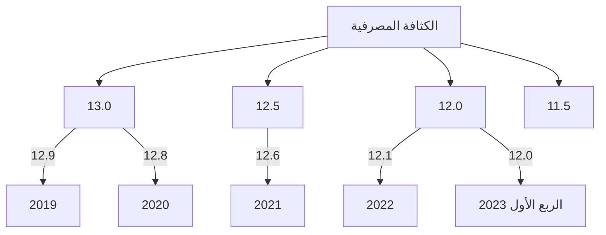
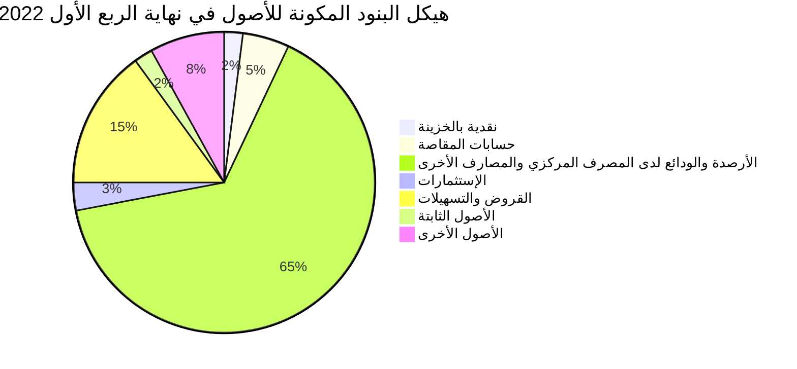
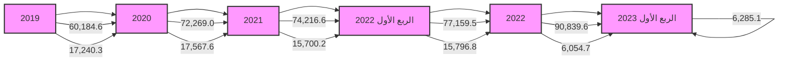
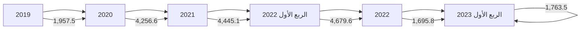
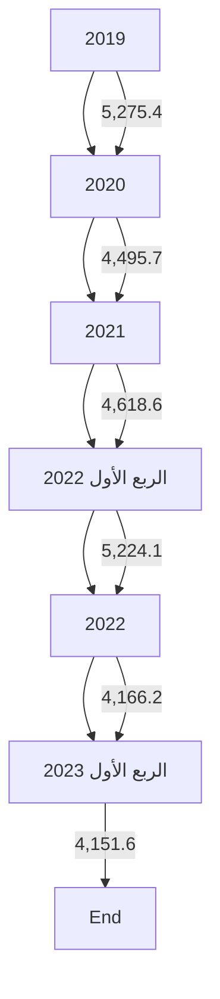
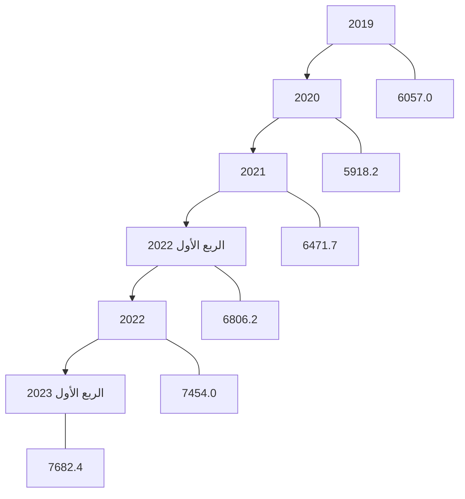
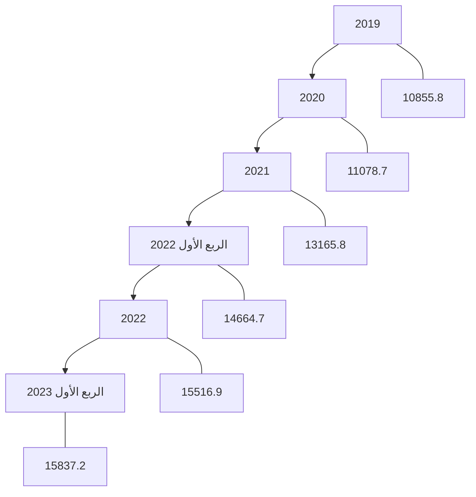
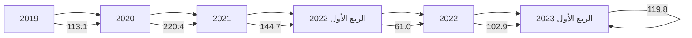

# CENTRAL BANK OF LIBYA

تقرير

## أهم البيانات والمؤشرات المالية للمصارف

### الربع الأول 2023

[An image of a colorful bar graph and line chart is shown, representing financial data. The graph is on a curling sheet that resembles a financial report or spreadsheet, with an upward trending arrow indicating growth or positive performance.]

إدارة البحوث والإحصاء
---
إدارة البحوث والإحصاء

| الصفحة | المحتويات |
|---------|------------|
| 3 | مُلخص لأداء المصارف خلال الربع الأول 2023 |
| 7 | تفرع المصارف |
| 7 | الكثافة المصرفية |
| 8 | التركز المصرفي |
| 11 | الميزانية المُجمعة للمصارف |
| 13 | هيكل البنود المكونة للأصول |
| 14 | هيكل البنود المكونة للخصوم |
| 16 | تحليل البنود المكونة للميزانية المُجمعة للمصارف |
| 16 | - النقدية بالخزائن وحسابات المقاصة : |
| 17 | - الأرصدة والودائع لدى المصرف المركزي والمصارف الأخرى |
| 18 | - الإستثمارات |
| 19 | القروض والتسهيلات الائتمانية |
| 22 | - ودائع العملاء لدى المصارف |
| 25 | - الحسابات المكشوفة لدى المراسلين بالخارج |
| 25 | - حقوق الملكية |
| 26 | - المخصصات |
| 28 | مؤشرات السلامة المالية للمصارف |
| 28 | - مؤشرات كفاية رأس المال |
| 30 | - مؤشرات جودة الأصول |
| 31 | - مؤشرات الربحية |
| 31 | - مؤشرات السيولة |

صفحة 2 من 35
تقرير أهم البيانات والمؤشرات المالية للمصارف للربع الأول 2023
---
إدارة البحوث والإحصاء

# تقرير أهم البيانات والمؤشرات المالية للمصارف للربع الأول 2023

## مُلخص لأداء المصـــارف نهاية الربع الأول 2023.

شهدت البيانات المالية المُجمعة للمصارف في نهاية الربع الأول 2023 بعض التغيرات مُقارنة عمّا كانت عليه في نهاية الربع الأول من عام 2022، وذلك على النحو التالي:

- إنخفض إجمالي أصول المصــــــارف (بإستثناء الحسابات النظامية) من 142.7 مليار دينار في نهاية الربع الأول 2022 إلى نحو 140.6 مليار دينار في نهاية الربع الأول 2023، أي بمعدل إنخفاض قدره 1.5%، وقد شكلت الأصـــول الســائلة (البالغة 92.1 مليار دينار) من إجمالي الأصول ما نسبته 65.7%.

- إنخفضت ودائع المصارف ( تحت الطلب، وشهادات الإيداع ) لدى المصرف المركزي بما فيها الإحتياطي الإلزامي من نحو 81.6 مليار دينار في نهاية الربع الأول 2022 إلى نحو 75.7 مليار دينار في نهاية الربع الأول 2023، أي بمُعدل بلغ 7.3%، والتي يشكل منها الإحتياطي النقدي الإلزامي نحو 21.0 مليار دينار.

- إرتفع اجمالي رصيد الإئتمان الممنوح من المصارف من 21.5 مليار دينار في نهاية الربع الأول 2022 إلى نحو 23.5 مليار دينار في نهاية الربع الأول 2023، أي بمعدل نمو 9.5%، وقد شكلت القروض والتسهيلات الائتمانية الممنوحة إلى اجمالي الخصوم الإيداعية ما نسبته 22.3%، كما شكلت من اجمالي الأصول ما نسبته 16.7%، وبلغ رصيد القروض الممنوحة للقطاع الخاص في نهاية عام 2022 ما قيمته 15.8 مليار دينار، وما نسبته 67.3% من إجمالي القروض والتسهيلات الإئتمانية الممنوحة، فيما شكل رصيد القروض الممنوحة للقطاع العام النسبة الباقية 32.7% والتي بلغت قيمتها نحو 7.7 مليار دينار.

وبتحليل مُكونات المحفظة الائتمانية للمصارف يلاحظ أن الإرتفاع في رصيد الإئتمان الممنوح من المصارف كان في القطاع الخاص، حيث أرتفع بمقدار 1.2 مليار دينار في نهاية الربع الأول 2023 مقارنة بنفس من العام 2022 ، حيث تركز هذا الأرتفاع في بند (مرابحة الأفراد).

صفحة 3 من 35
تقرير أهم البيانات والمؤشرات المالية للمصارف للربع الأول 2023
---
إدارة البحوث والإحصاء

- بلغت نسبة تغطية مخصص الديون المشكوك فيها لإجمالي القروض والتسهيلات الممنوحة نسبة 16.3% في نهاية الربع الأول 2023 مقابل نسبة 17.2% في نهاية الربع الأول 2022.

- إرتفعت ودائع العملاء (الخصوم الإيداعية) لدى المصارف من 97.5 مليار دينار في نهاية الربع الأول 2022، إلى 105.3 مليار دينار في نهاية الربع الأول 2023، أي بمعدل 8.0%، وقد شكلت الودائع تحت الطلب ما نسبته 81.7% من إجمالي الودائع، في حين شكلت الودائع لأجل نسبة 18.0% من إجمالي الودائع، بينما شكلت ودائع الادخار نسبة 0.3% فقط من إجمالي الودائع.
  وفيما يتعلق بتوزيع هذه الودائع فقد بلغت ودائع القطاع الخاص في نهاية الربع الأول 2023 ما قيمته 59.9 مليار دينار، وما نسبته 56.9% من إجمالي الودائع، فيما شكل رصيد ودائع القطاع العام والحكومي النسبة الباقية وقدرها 43.1% أي ما قيمته 45.3 مليار دينار، منها 32.4 مليار دينار ودائع لشركات ومؤسسات القطاع العام ونحو 12.9 مليار دينار ودائع حكومية.

- إرتفع إجمالي حقوق الملكية في المصارف من 8.2 مليار دينار في نهاية الربع الأول 2022 إلى 8.7 مليار دينار في نهاية الربع الأول 2023، وبمعدل 5.0% نتيجة الزيادة في رأس المال المدفوع لبعض المصارف وكذلك في الإحتياطيات.

- إنخفضت أرباح المصارف خلال الربع الأول 2023 بمعدل 35.4% لتصل إلى 228.0 مليون دينار، مقارنة عما كانت عليه خلال نفس الفترة من العام 2022 والتي سجلت نحو 352.8 مليون دينار.

- سجل معدل كفاية رأس المال الكلي للمصارف مجتمعة نحو 15.6% في نهاية الربع الأول 2023 منخفضة بشكل طفيف عما كانت عليه في نهاية العام 2022 والتي سجلت نحو 15.7%.

- بلغ عدد المصارف والمشتملة بياناتها في هذا التقرير 20 مصرفاً (بما في ذلك وحدة الدينار الليبي التابعة للمصرف الليبي الخارجي) في نهاية الربع الأول 2023، وتزاول هذه المصارف نشاطها من خلال 610 فرعاً ووكالة.

صفحة 4 من 35
تقرير أهم البيانات والمؤشرات المالية للمصارف للربع الأول 2023
---
إدارة البحوث والإحصاء

# البيانات المالية الأساسية للمصارف

"مليون دينار"

| البند | الربع الأول 2022 | الربع الأول 2023 | معدل التغير% |
|------|-----------------|-----------------|-------------|
| إجمالي الميزانية ( الأصول + الحسابات النظامية ) | 194,795.6 | 183,466.2 | -5.8 |
| إجمالي الأصول | 142,731.9 | 140,593.4 | -1.5 |
| إجمالي النقدية بخزائن المصارف | 2,818.3 | 3,506.5 | 24.4 |
| إجمالي الودائع لدى المصرف المركزي | 81,641.5 | 75,655.4 | -7.3 |
| إجمالي الودائع لدى المصارف | 837.5 | 629.5 | -24.8 |
| إجمالي الودائع لدى المصرف الليبي الخارجي | 1,660.3 | 1,629.8 | -1.8 |
| إجمالي الودائع لدى المراسلين بالخارج | 8,817.0 | 10,651.4 | 20.8 |
| إجمالي حسابات المقاصة | 6,517.3 | 7,063.8 | 8.4 |
| إجمالي القروض والسلفيات والتسهيلات | 21,471.0 | 23,519.6 | 9.5 |
| إجمالي الاستثمارات | 4,679.6 | 1,763.5 | -62.3 |
| إجمالي ودائع العملاء | 97,511.3 | 105,269.8 | 8.0 |
| إجمالي الحسابات المكشوفة لدى المراسلين | 61.0 | 119.8 | 96.3 |
| إجمالي حقوق الملكية | 8,248.7 | 8,664.7 | 5.0 |
| إجمالي المخصصات | 8,228.9 | 9,466.5 | 15.0 |
| أرباح الفترة | 352.8 | 228.0 | -35.4 |
| عدد الفروع والوكالات | 562.0 | 575.0 | 2.3 |
| عدد العاملين | 19,463.0 | 19,815.0 | 1.8 |

المؤشرات المالية :

| المؤشر | الربع الأول 2022 | الربع الأول 2023 |
|--------|-----------------|-----------------|
| الأصول السائلة / إجمالي الأصول % | 67.1 | 65.5 |
| إجمالي القروض / إجمالي الأصول % | 15.0 | 16.7 |
| حقوق الملكية / إجمالي الخصوم % | 5.8 | 6.2 |
| إجمالي الأصول / عدد الفروع ( مليون دينار ) | 254.0 | 244.5 |
| إجمالي الأصول / عدد العاملين ( مليون دينار ) | 7.3 | 7.1 |
| إجمالي القروض / إجمالي الودائع % | 22.0 | 22.3 |
| إجمالي الربح / الأصول % | 0.2 | 0.2 |
| إجمالي الربح / حقوق الملكية % | 4.3 | 2.7 |

صفحة 5 من 35
تقرير أهم البيانات والمؤشرات المالية للمصارف للربع الأول 2023
---
إدارة البحوث والإحصاء

## مؤشرات الودائع لدى المصارف
"مليون دينار"

| البند | الربع الأول 2022 | الربع الأول 2023 | معدل التغير% |
|------|-----------------|-----------------|-------------|
| 1- ودائع الحكومة والقطاع العام | 38,291.4 | 45,342.7 | 18.4 |
| ـ ودائع الحكومة (الوزارات والهيئات الممولة من الميزانية العامة) | 12,375.5 | 12,858.7 | 3.9 |
| ـ ودائع القطاع العام | 25,916.0 | 32,484.1 | 25.3 |
| 2- ودائع القطاع الخاص | 59,219.9 | 59,927.1 | 1.2 |
| ـ ودائع الأفراد | 32,296.9 | 32,906.6 | 1.9 |
| ـ ودائع الشركات والجهات الأخرى | 26,923.0 | 27,020.5 | 0.4 |
| إجمالي الودائع | 97,511.3 | 105,269.8 | 8.0 |
| الودائع تحت الطلب | 77,693.8 | 85,976.0 | 10.7 |
| الودائع لأجل | 19,463.3 | 18,990.6 | -2.4 |
| ودائع الادخار | 354.3 | 303.2 | -14.4 |
| الودائع تحت الطلب / إجمالي الودائع % | 79.7 | 81.7 | - |
| الودائع لأجل / إجمالي الودائع % | 20.0 | 18.0 | - |
| ودائع الادخار / إجمالي الودائع % | 0.4 | 0.3 | - |
| إجمالي الودائع / إجمالي الخصوم % | 68.3 | 74.9 | - |

## مؤشرات الإئتمان الممنوح من المصارف
"مليون دينار"

| البند | الربع الأول 2022 | الربع الأول 2023 | معدل التغير% |
|------|-----------------|-----------------|-------------|
| 1- الائتمان الممنوح للقطاع العام | 6,806.2 | 7,682.4 | 12.9 |
| 2- الائتمان الممنوح للقطاع الخاص | 14,664.7 | 15,837.2 | 8.0 |
| إجمالي الائتمان | 21,471.0 | 23,519.6 | 9.5 |
| السلفيات والسحب على المكشوف | 5,224.1 | 4,151.6 | -20.5 |
| قروض المرابحة (تشمل رصيد السلف الاجتماعية) | 5,266.3 | 6,983.4 | 32.6 |
| القروض الممنوحة للأنشطة الاقتصادية الأخرى | 10,980.6 | 12,384.6 | 12.8 |
| قروض المرابحة / إجمالي الائتمان % | 24.5 | 29.7 | - |
| السلفيات والسحب على المكشوف / إجمالي الائتمان % | 24.3 | 17.7 | - |
| القروض الممنوحة للأنشطة الأخرى/اجمالي الائتمان% | 51.1 | 52.7 | - |
| إجمالي الائتمان / إجمالي الأصول % | 15.0 | 16.7 | - |
| إجمالي الائتمان / إجمالي الودائع % | 22.0 | 22.3 | - |

صفحة 6 من 35
تقرير أهم البيانات والمؤشرات المالية للمصارف للربع الأول 2023
---
إدارة البحوث والإحصاء

## تفرع المصارف:

بلغ عدد المصارف العاملة في ليبيا والمشتملة بياناتها في هذا التقرير 20 مصرفاً (بما في ذلك وحدة الدينار الليبي
التابعة للمصرف الليبي الخارجي) حتى نهاية الربع الأول 2023، وتزاول هذه المصارف نشاطها من خلال 610
فرعاً ووكالة مصرفية.

## الكثافة المصرفية:

بلغت الكثافة المصرفية خلال الربع الأول 2023 نحو 12.0 ألف نسمة لكل فرع أو وكالة مقارنة بنحو 12.1 ألف
نسمة لكل فرع أو وكالة في عام 2022.

### الكثافة المصرفية

"بالألف نسمة"

| نهاية | لكل مصرف | لكل فرع ووكالة |
|-------|-----------|-----------------|
| 2019  | 368.4     | 12.9            |
| 2020  | 368.3     | 12.8            |
| 2021  | 388.9     | 12.6            |
| 2022  | 350.0     | 12.1            |
| الربع الأول 2023 | 350.0 | 12.0    |



صفحة 7 من 35
تقرير أهم البيانات والمؤشرات المالية للمصارف للربع الأول 2023
---
إدارة البحوث والإحصاء

# التركز المصرفي:

درجة التركز المصرفي تعني أن عدداً قليلاً من المصارف يستأثر بالنسبة الأكبر من النشاط المصرفي سواءً من حيث الأصول أو الودائع أوالائتمان أو من حيث حجم حقوق الملكية، وفيما يخص الحصة السوقية للمصارف في ليبيا، فقد شكلت أصول المصارف الأربعة الكبرى (الجمهورية، التجاري الوطني، الوحدة والصحاري) من أصل 20 مصرفاً مانسبته 71.5% من إجمالي أصول القطاع المصرفي في نهاية الربع الأول 2023، وشكل مصرف الجمهورية وحده ما نسبته 28.5% من إجمالي أصول القطاع المصرفي.

وشكلت ودائع وقروض المصارف الأربعة الكبرى مانسبته 71.9% و 83.5% على التوالي من إجمالي ودائع وقروض القطاع المصرفي نهاية الربع الأول 2023.

## تركز الأصول

"نسب مئوية"

| نهاية | 2019 | 2020 | 2021 | 2022 | الربع الأول 2023 |
|-------|------|------|------|------|------------------|
| أكبر مصرف | 31.9 | 31.2 | 28.0 | 27.5 | 28.5 |
| أكبر ثلاثة مصارف | 64.6 | 63.1 | 62.0 | 61.7 | 61.7 |
| أكبر خمسة مصارف | 84.2 | 82.7 | 79.7 | 78.6 | 77.9 |

## تركز الإئتمان

"نسب مئوية"

| نهاية | 2019 | 2020 | 2021 | 2022 | الربع الأول 2023 |
|-------|------|------|------|------|------------------|
| أكبر مصرف | 40.7 | 42.6 | 40.7 | 38.6 | 37.7 |
| أكبر ثلاثة مصارف | 75.8 | 78.3 | 76.2 | 74.6 | 75.4 |
| أكبر خمسة مصارف | 91.4 | 91.4 | 87.6 | 85.2 | 86.1 |

صفحة 8 من 35
تقرير أهم البيانات والمؤشرات المالية للمصارف للربع الأول 2023
---
إدارة البحوث والإحصاء

## تركز الخصوم الإيداعية
"نسب مئوية"

| نهاية | 2019 | 2020 | 2021 | 2022 | الربع الأول 2023 |
|-------|------|------|------|------|-----------------|
| أكبر مصرف | 32.3 | 31.8 | 33.8 | 32.1 | 30.1 |
| أكبر ثلاثة مصارف | 64.4 | 62.9 | 62.0 | 60.5 | 60.9 |
| أكبر خمسة مصارف | 85.6 | 83.7 | 79.5 | 79.2 | 79.0 |

## تركز الأصول

| السنة | أكبر مصرف | أكبر ثلاثة مصارف | أكبر خمسة مصارف |
|-------|-----------|------------------|-------------------|
| 2019 | 31.9 | 64.6 | 84.2 |
| 2020 | 31.2 | 63.1 | 82.7 |
| 2021 | 28.0 | 62.0 | 79.7 |
| 2022 | 27.5 | 61.7 | 78.6 |
| الربع الأول 2023 | 28.5 | 61.7 | 77.9 |

## تركز الائتمان

| السنة | أكبر مصرف | أكبر ثلاثة مصارف | أكبر خمسة مصارف |
|-------|-----------|------------------|-------------------|
| 2019 | 40.7 | 75.8 | 91.4 |
| 2020 | 42.6 | 78.3 | 91.4 |
| 2021 | 40.7 | 76.2 | 87.6 |
| 2022 | 38.6 | 74.6 | 85.2 |
| الربع الأول 2023 | 37.7 | 75.4 | 86.1 |

صفحة 9 من 35
تقرير أهم البيانات والمؤشرات المالية للمصارف للربع الأول 2023
---
# إدارة البحوث والإحصاء

## تركز الخصوم الإيداعية

| السنة | أكبر مصرف | أكبر ثلاثة مصارف | أكبر خمسة مصارف |
|-------|-----------|------------------|-------------------|
| 2019 | 32.3 | 64.4 | 85.6 |
| 2020 | 31.8 | 62.9 | 83.7 |
| 2021 | 33.8 | 62.0 | 79.5 |
| 2022 | 32.1 | 60.5 | 79.2 |
| الربع الأول 2023 | 30.1 | 60.9 | 79.0 |

ومن خلال بيانات التركز في الأصول والائتمان والخصوم الإيداعية، يُلاحظ أن هناك تحسُّن
ملحوظ في نسب التركُّز في القطاع المصرفي كما هو موضح بالجداول والرسومات البيانية أعلاه.

صفحة 10 من 35
تقرير أهم البيانات والمؤشرات المالية للمصارف للربع الأول 2023
---
# الميزانية المُجمعة للمصارف

شهد المركز المالي المُجمع للمصارف نهاية الربع الأول 2023، تطورات في مُجمل بنوده على جانبي الأصول والخصوم، ليبلغ إجمالي الأصول داخل الميزانية المُجمعة نحو 140,593.4 مليون دينار، مقابل 142,731.9 مليون دينار في نهاية الربع الأول 2022، بإنخفاض قدره 2,138.5 مليون دينار، أي بمعدل 1.5%، وفيما يلي جدول يلخص البنود الرئيسية للمركز المالي المُجمع للمصارف:

## مُلخص المركز المالي المُجمع للمصارف

"مليون دينار"

| البند | الربع الأول 2022 | الربع الأول 2023 | مقدار التغير | مُعدل التغير% |
|-------|------------------|------------------|---------------|---------------|
| **الأصول:** |
| 1- نقدية بالخزائن | 2,818.3 | 3,506.5 | 688.2 | 24.4 |
| - عملة محلية | 2,655.1 | 3,263.1 | 608.0 | 22.9 |
| - عملة أجنبية | 163.2 | 243.5 | 80.3 | 49.2 |
| 2- حسابات المقاصة | 6,517.3 | 7,063.8 | 546.5 | 8.4 |
| - المقاصة بين المصارف | 2,311.8 | 3,284.9 | 973.0 | 42.1 |
| - المقاصة بين الفروع | 4,205.5 | 3,779.0 | -426.5 | -10.1 |
| 3- الودائع لدى المصارف الأخرى | 92,956.3 | 88,566.2 | -4,390.1 | -4.7 |
| أ- الودائع لدى المصرف المركزي | 81,641.5 | 75,655.4 | -5,986.1 | -7.3 |
| - ودائع تحت الطلب | 67,471.9 | 72,162.8 | 4,690.9 | 7.0 |
| - شهادات الإيداع | 14,169.6 | 3,492.6 | -10,677.0 | -75.4 |
| ب- الودائع لدى المصارف المحلية الأخرى | 837.5 | 629.5 | -208.0 | -24.8 |
| - ودائع تحت الطلب | 837.5 | 629.5 | -208.0 | -24.8 |
| - ودائع زمنية | 0.0 | 0.0 | 0.0 | - |
| ج- الودائع لدى المصرف الليبي الخارجي | 1,660.3 | 1,629.8 | -30.5 | -1.8 |
| - ودائع تحت الطلب | 1,660.3 | 1,151.7 | -508.6 | -30.6 |
| - ودائع زمنية | 0.0 | 478.1 | 478.1 | - |
| د- الودائع لدى المصارف بالخارج | 8,817.0 | 10,651.4 | 1,834.4 | 20.8 |
| - ودائع تحت الطلب | 7,189.8 | 8,337.0 | 1,147.2 | 16.0 |
| - ودائع زمنية | 1,627.2 | 2,314.4 | 687.2 | 42.2 |
| 4- الإستثمارات | 4,679.6 | 1,763.5 | -2,916.2 | -62.3 |
| 5- القروض والتسهيلات | 21,471.0 | 23,519.6 | 2,048.6 | 9.5 |
| - السلفيات والسحب على المكشوف | 5,224.1 | 4,151.6 | -1,072.5 | -20.5 |
| - السلف الإجتماعية (تشمل قروض المرابحة للأفراد) | 5,266.3 | 6,983.4 | 1,717.1 | 32.6 |
| - قروض الأنشطة الإقتصادية الأخرى | 10,980.6 | 12,384.6 | 1,404.0 | 12.8 |
| 6- الأصول الثابتة | 2,397.3 | 2,874.7 | 477.4 | 19.9 |
| 7- الأصول الأخرى | 11,892.0 | 13,299.1 | 1,407.1 | 11.8 |
| **إجمالي الأصول** | 142,731.9 | 140,593.4 | -2,138.5 | -1.5 |
| الحسابات المقابلة | 52,063.8 | 42,872.8 | -9,191.0 | -17.7 |
| **الإجمالي الكلي للأصول** | 194,795.6 | 183,466.2 | -11,329.4 | -5.8 |

صفحة 11 من 35
تقرير أهم البيانات والمؤشرات المالية للمصارف للربع الأول 2023
---
| البند | الربع الأول 2022 | الربع الأول 2023 | مقدار التغير | معدل التغير% |
|------|-----------------|-----------------|--------------|---------------|
| **الخصوم** |
| 1- ودائع الغير لدى المصارف | 97,511.3 | 105,269.8 | 7,758.5 | 8.0 |
| - الودائع تحت الطلب | 74,105.0 | 81,751.3 | 7,646.3 | 10.3 |
| - الودائع الزمنية | 2,004.0 | 2,124.1 | 120.1 | 6.0 |
| - الودائع الإدخارية | 354.3 | 303.2 | -51.1 | -14.4 |
| - أوامر الدفع | 3,588.8 | 4,219.2 | 630.4 | 17.6 |
| - التأمينات النقدية | 17,459.2 | 16,872.0 | -587.2 | -3.4 |
| 2- الإقتراض من المصارف والجهات الأخرى | 33.3 | 32.0 | -1.3 | -3.9 |
| 3- الحسابات المكشوفة لدى المراسلين | 61.0 | 119.8 | 58.8 | 96.3 |
| 4- حقوق الملكية | 8,248.7 | 8,612.7 | 364.0 | 4.4 |
| - رأس المال المدفوع | 5,166.7 | 5,397.9 | 231.2 | 4.5 |
| - الإحتياطي القانوني | 806.5 | 988.7 | 182.2 | 22.6 |
| - إحتياطيات غير مخصصة | 330.2 | 344.4 | 14.2 | 4.3 |
| - أرباح الفترة | 352.8 | 235.3 | -117.5 | -33.3 |
| - الأرباح المرحلة والقابلة للتوزيع | 1,592.5 | 1,646.4 | 53.9 | 3.4 |
| 5- المخصصات | 8,228.9 | 9,466.5 | 1,237.6 | 15.0 |
| 6- المتنوعات والخصوم الأخرى | 28,648.6 | 17,098.1 | -11,550.6 | -40.3 |
| إجمالي الخصوم | 142,731.9 | 140,598.8 | -2,133.0 | -1.5 |
| الحسابات المقابلة | 52,063.8 | 42,872.8 | -9,191.0 | -17.7 |
| الإجمالي الكلي للخصوم | 194,795.6 | 183,471.6 | -11,324.0 | -5.8 |

صفحة 12 من 35
تقرير أهم البيانات والمؤشرات المالية للمصارف للربع الأول 2023
---
إدارة البحوث والإحصاء

- هيكل البنود المكونة للأصول في الميزانية المُجمعة للمصارف:

إستمرت ودائع وأرصدة المصارف لدى المصرف المركزي بما فيه الإحتياطي الإلزامي المطلوب هو المكون الرئيسي لإصول القطاع المصرفي، حيث تغطي نحو 53.8% من إجمالي الأصول في نهاية الربع الأول 2023،
في حين إرتفعت حصة بند القروض والتسهيلات الإئتمانية في هيكل الموجودات لتسجل نحو 16.7% من الإجمالي مقارنة بـ 15.0% في نهاية الربع الأول 2022 ، وهى مازالت نسب ضئيلة تعكس ضعف توظيف المصارف لأموالها.

جدول هيكل البنود المكونة للأصول

| البند | الربع الأول 2022 | الربع الأول 2023 |
|-------|------------------|------------------|
| الأصول : |  |  |
| 1-نقدية بالخزائن | 2.0% | 2.5% |
| 2-حسابات المقاصة | 4.6% | 5.0% |
| 3-الودائع لدى المصرف المركزي | 57.2% | 53.8% |
| 4-الودائع لدى المصارف المحلية الأخرى | 0.6% | 0.4% |
| 5-الودائع لدى المصرف الليبي الخارجي | 1.2% | 1.2% |
| 6-الودائع لدى المصارف بالخارج | 6.2% | 7.6% |
| 7-الإستثمارات | 3.3% | 1.3% |
| 8-القروض والتسهيلات | 15.0% | 16.7% |
| 9-الأصول الثابتة | 1.7% | 2.0% |
| 10-الأصول الأخرى | 8.3% | 9.5% |

هيكل البنود المكونة للأصول في نهاية الربع الأول 2022



صفحة 13 من 35
تقرير أهم البيانات والمؤشرات المالية للمصارف للربع الأول 2023
---
إدارة البحوث والإحصاء

## هيكل البنود المكونة للأصول في نهاية الربع الأول 2023

| البند | النسبة |
|-------|--------|
| الأرصدة والودائع لدى المصرف المركزي والمصارف الأخرى | 63% |
| القروض والتسهيلات | 17% |
| الأصول الأخرى | 9% |
| حسابات المقاصة | 5% |
| نقدية بالخزينة | 3% |
| الأصول الثابتة | 2% |
| الإستثمارات | 1% |

## هيكل البنود المكونة للخصوم في الميزانية المُجمعة للمصارف:

بتحليل هيكل البنود المكونة للخصوم بالمركز المالي المُجمع للمصارف في نهاية الربع الأول 2023، فإن ودائع الغير لدى المصارف (ودائع العملاء) تمثل المصدر الرئيسي للتمويل مشكلة مانسبته 74.9% من إجمالي مصادر أموال المصارف، مقارنة بنحو 68.3% في نهاية الربع الأول 2022، فيما شكلت حقوق الملكية نحو 6.1% من إجمالي مصادر أموال المصارف، مقابل نسبة 5.8%.

### جدول هيكل البنود المكونة للخصوم

| البند | الربع الأول 2022 | الربع الأول 2023 |
|-------|------------------|------------------|
| الخصوم |                  |                  |
| 1- ودائع الغير لدى المصارف | 68.3% | 74.9% |
| 2- الإقتراض من المصارف | 0.0% | 0.0% |
| 3- الحسابات المكشوفة لدى المراسلين | 0.0% | 0.1% |
| 4- حقوق الملكية | 5.8% | 6.1% |
| 5- المخصصات | 5.8% | 6.7% |
| 6- المتنوعات والخصوم الأخرى | 20.1% | 12.2% |

صفحة 14 من 35
تقرير أهم البيانات والمؤشرات المالية للمصارف للربع الأول 2023
---
إدارة البحوث والإحصاء

## هيكل البنود المكونة للخصــوم في نهاية الربع الأول 2022

| البند | النسبة |
|-------|--------|
| ودائع الغير لدى المصارف | 68% |
| الإقتراض من المصارف | 0% |
| الحسابات المكشوفة لدى المراسلين | 6% |
| حقوق الملكية | 6% |
| المخصصات | 0% |
| المتنوعات والخصوم الأخرى | 20% |

## هيكل البنود المكونة للخصــوم في نهاية الربع الأول 2023

| البند | النسبة |
|-------|--------|
| ودائع الغير لدى المصارف | 75% |
| الإقتراض من المصارف | 0% |
| الحسابات المكشوفة لدى المراسلين | 6% |
| حقوق الملكية | 6% |
| المخصصات | 7% |
| المتنوعات والخصوم الأخرى | 12% |

صفحة 15 من 35
تقرير أهم البيانات والمؤشرات المالية للمصارف للربع الأول 2023
---
إدارة البحوث والإحصاء

# تحليل لأهم البنود المكونة للميزانية المُجمعة للمصارف

## أولاً: جانب الأصول:

### 1- النقدية:

#### أ- النقدية بالخزائن وحسابات المقاصة:

ارتفع رصيد النقدية بخزائن المصارف وحسابات المقاصة بمقدار 1,234.8 مليون دينار أي بمعدل 13.2%،

لتصل إلى 10,570.3 مليون دينار في نهاية الربع الأول 2023، مقابل 9,335.6 مليون دينار في نهاية الربع الأول

2022، بسبب إرتفاع بندي النقدية بالخزائن وكذلك حسابات المقاصة بين المصارف، حيث إرتفعت النقدية

بالخزائن بمقدار 688.2 مليون دينار، وأرتفعت حسابات المقاصة بمقدار 546.5 مليون دينار في نهاية الربع

الأول 2023 مقارنة بالفترة نفسها من العام 2022، والجدول التالي يوضح ذلك:

| البيان | الربع الأول 2022 | الربع الأول 2023 | مقدار التغير | معدل التغير% |
|--------|------------------|------------------|---------------|---------------|
| النقدية بالخزائن : | 2,818.3 | 3,506.5 | 688.2 | 24.4 |
| عملة محلية | 2,655.1 | 3,263.1 | 608.0 | 22.9 |
| عملة أجنبية | 163.2 | 243.5 | 80.3 | 49.2 |
| إجمالي حسابات المقاصة | 6,517.3 | 7,063.8 | 546.5 | 8.4 |
| المقاصة بين المصارف | 2,311.8 | 3,284.9 | 973.0 | 42.1 |
| المقاصة بين الفروع | 4,205.5 | 3,779.0 | -426.5 | -10.1 |
| الإجمالي | 9,335.6 | 10,570.3 | 1,234.8 | 13.2 |

صفحة 16 من 35
تقرير أهم البيانات والمؤشرات المالية للمصارف للربع الأول 2023
---
إدارة البحوث والإحصاء

## نقدية بخزائن المصارف

| السنة | القيمة (مليون دينار) |
|-------|---------------------|
| 2019 | 2,367.4 |
| 2020 | 1,146.8 |
| 2021 | 2,871.5 |
| الربع الأول 2022 | 2,818.3 |
| 2022 | 2,239.2 |
| الربع الأول 2023 | 3,506.5 |

## إجمالي حسابات المقاصة

| السنة | القيمة (مليون دينار) |
|-------|---------------------|
| 2019 | 6,304.6 |
| 2020 | 5,584.8 |
| 2021 | 6,041.0 |
| الربع الأول 2022 | 6,517.3 |
| 2022 | 7,034.7 |
| الربع الأول 2023 | 7,063.8 |

## ب-الأرصدة والودائع لدى المصرف المركزي والمصارف الأخرى:

بلغ رصيد أرصدة وودائع المصارف لدى المصرف المركزي والمصارف الأخرى ولدى المصارف الخارجية نحو 88,566.2 مليون دينار في نهاية الربع الأول 2023، مقابل 92,956.3 مليون دينار في نهاية الربع الأول 2022، منخفضة بقيمة 4,390.1 مليون دينار وبمعدل 4.7%، نتيجة لإنخفاض الأرصدة والودائع لدى المصرف المركزي بنحو 5,986.1 مليون دينار كمحصلة لإنخفاض رصيد شهادات الإيداع لدى المصرف المركزي بنحو 10,677.0 مليون دينار ، والذي كان أعلى من الإرتفاع في رصيد الودائع تحت الطلب لدى المركزي الذي إرتفع بنحو 4,690.9 مليون دينار، والجدول التالي يوضح تفاصيل هذا البند:

صفحة 17 من 35
تقرير أهم البيانات والمؤشرات المالية للمصارف للربع الأول 2023
---
إدارة البحوث والإحصاء

الأرصدة والودائع لدى المصرف المركزي والمصارف الأخرى
"مليون دينار"

| البند | الربع الأول 2022 | الربع الأول 2023 | مقدار التغير | معدل التغير% |
|------|-----------------|-----------------|--------------|--------------|
| ودائع تحت الطلب لدى : | 77,159.5 | 82,281.1 | 5,121.6 | 6.6 |
| المصرف المركزي | 67,471.9 | 72,162.8 | 4,690.9 | 7.0 |
| المصارف المحلية | 837.5 | 629.5 | -208.0 | -24.8 |
| المصرف الليبي الخارجي | 1,660.3 | 1,151.7 | -508.6 | -30.6 |
| لدى المراسلين بالخارج | 7,189.8 | 8,337.0 | 1,147.2 | 16.0 |
| ودائع زمنية : | 15,796.8 | 6,285.1 | -9,511.7 | -60.2 |
| المصرف المركزي (شهادات الإيداع) | 14,169.6 | 3,492.6 | -10,677.0 | -75.4 |
| المصارف المحلية | 0.0 | 0.0 | 0.0 | - |
| المصرف الليبي الخارجي | 0.0 | 478.1 | 478.1 | - |
| لدى المراسلين بالخارج | 1,627.2 | 2,314.4 | 687.2 | 42.2 |
| الإجمالي | 92,956.3 | 88,566.2 | -4,390.1 | -4.7 |

ودائع المصارف التجارية لدى المصرف المركزي والمصارف الأخرى



2- الإستثمارات:

سجل إجمالي رصيد الإستثمارات نهاية الربع الأول 2023 نحو 1,763.5 مليون دينار، مقابل 4,679.6 مليون
دينار في نهاية الربع الأول 2022، منخفض بمقدار 2,916.2 مليون دينار هذا الإنخفاض جاء نتيجة لحلول

صفحة 18 من 35
تقرير أهم البيانات والمؤشرات المالية للمصارف للربع الأول 2023
---
إدارة البحوث والإحصاء

أجل إستحقاق مصرف التجارة والتنمية لأصل الدين (3 مليار دينار) المستثمر بها في سندات الخزانة،
والجدول التالي يوضح تفاصيل هذا البند:

بند الاستثمارات

" مليون دينار"

| البيان | الربع الأول 2022 | الربع الأول 2023 | مقدارالتغير | معدل التغير% |
|--------|------------------|------------------|-------------|---------------|
| سندات وأذونات الخزانة | 3,000.0 | 0.0 | -3,000.0 | -100.0 |
| إستثمارات في الشركات العامة | 564.7 | 564.2 | -0.5 | -0.1 |
| إستثمارات في الشركات الخاصة المساهمة | 903.7 | 805.2 | -98.5 | -10.9 |
| إستثمارات أخرى | 211.2 | 394.1 | 182.9 | 86.6 |
| الإجمالي | 4,679.6 | 1,763.5 | -2,916.2 | -62.3 |

إجمالي بند الإستثمارات



3- القروض والتسهيلات الائتمانية:

إرتفع اجمالي رصيد القروض والتسهيلات الإئتمانية الممنوحة من المصارف من 21,471.0 مليون دينار في نهاية
الربع الأول 2022 إلى 23,519.6 مليون دينار في نهاية الربع الأول 2023 ، أي بمعدل نمو 9.5%، وقد شكلت
القروض والتسهيلات الائتمانية الممنوحة إلى اجمالي الخصوم الإيداعية ما نسبته 22.3%، كما شكلت من
إجمالي الأصول ما نسبته 16.7%، وبلغ رصيد القروض الممنوحة للقطاع الخاص في نهاية الربع الأول 2023
ما قيمته 15,837.2 مليون دينار، وما نسبته 67.3% من إجمالي القروض والتسهيلات الإئتمانية الممنوحة، فيما
شكل رصيد القروض الممنوحة للقطاع العام النسبة الباقية 32.7% والتي بلغت قيمتها نحو 7,682.4 مليون

صفحة 19 من 35
تقرير أهم البيانات والمؤشرات المالية للمصارف للربع الأول 2023
---
إدارة البحوث والإحصاء

دينار. وبتحليل مكونات المحفظة الائتمانية فقد كان الإرتفاع في إجمالي رصيد الإئتمان الممنوح من المصارف
بسبب الزيادة في بندي قروض المرابحة للأفراد والقروض الأخرى.

رصيد القروض والتسهيلات الإئتمانية الممنوحة من المصارف
"مليون دينار"

| البند | الربع الأول 2022 | الربع الأول 2023 | مقدار التغير | معدل التغير% |
|------|-----------------|-----------------|-------------|-------------|
| سلفيات والسحب على المكشوف | 5,224.1 | 4,151.6 | -1,072.5 | -20.5 |
| قروض المرابحة للأفراد* | 5,266.3 | 6,983.4 | 1,717.1 | 32.6 |
| القروض الأخرى | 10,980.6 | 12,384.6 | 1,404.0 | 12.8 |
| إجمالي القروض والتسهيلات | 21,471.0 | 23,519.6 | 2,048.6 | 9.5 |
| مخصص الديون المشكوك في تحصيلها | 3,688.4 | 3,834.6 | 146.2 | 4.0 |
| صافي القروض والتسهيلات | 17,782.5 | 19,685.0 | 1,902.5 | 10.7 |

(*) يشمل رصيد السلف الإجتماعية.

رصيد بند المرابحة والسلف الإجتماعية


السلفيات والسحب على المكشوف



صفحة 20 من 35
تقرير أهم البيانات والمؤشرات المالية للمصارف للربع الأول 2023
---
إدارة البحوث والإحصاء

توزيع القروض الممنوحة من المصارف حسب القطاع (خاص وعام)
"مليون دينار"

| البند | الربع الأول 2022 | الربع الأول 2023 | مقدار التغير | معدل التغير% |
|------|-----------------|-----------------|-------------|-------------|
| القروض الممنوحة للقطاع العام | 6,806.2 | 7,682.4 | 876.2 | 12.9 |
| القروض الممنوحة للقطاع الخاص | 14,664.7 | 15,837.2 | 1,172.5 | 8.0 |
| الإجمالي | 21,471.0 | 23,519.6 | 2,048.6 | 9.5 |

رصيد القروض الممنوحة للقطاع العام



رصيد القروض الممنوحة للقطاع الخاص



صفحة 21 من 35
تقرير أهم البيانات والمؤشرات المالية للمصارف للربع الأول 2023
---
إدارة البحوث والإحصاء

ثانياً: جانب الخصوم:

1- ودائع العملاء لدى المصارف:

إرتفعت ودائع العملاء (الخصوم الإيداعية) لدى المصارف بشكل كبير بمقدار 7,651.8 مليون دينار من 97,511.3 مليون دينار في نهاية الربع الأول 2022، إلى 105,269.9 مليون دينار في نهاية الربع الأول 2023، أي بمعدل نمو بلغ 8.0%، وقد شكلت الودائع تحت الطلب وأوامر الدفع ما نسبته 81.7% من إجمالي الودائع، في حين شكلت الودائع لأجل والتأمينات النقدية نسبة 18.0% من إجمالي الودائع، بينما شكلت ودائع الادخار نسبة 0.3% فقط من إجمالي الودائع.

جدول ودائع العملاء (الخصوم الإيداعية)
" مليون دينار"

| البند | الربع الأول 2022 | الربع الأول 2023 | مقدار التغير | معدل التغير% |
|---|---|---|---|---|
| الودائع تحت الطلب | 74,105.0 | 81,756.8 | 7,651.8 | 10.3 |
| الودائع لأجل | 2,004.0 | 2,118.7 | 114.7 | 5.7 |
| الودائع الإدخارية | 354.3 | 303.2 | -51.1 | -14.4 |
| أوامر الدفع | 3,588.8 | 4,219.2 | 630.4 | 17.6 |
| التأمينات النقدية | 17,459.2 | 16,872.0 | -587.2 | -3.4 |
| الإجمالي | 97,511.3 | 105,269.9 | 7,758.5 | 8.0 |

- الودائع تحت الطلب وأوامر الدفع: إرتفعت الودائع تحت الطلب وأوامر الدفع بشكل كبير في نهاية الربع الأول 2023 بمقدار 8,282.2 مليون دينار لتسجل 85,976.0 مليون دينار مقارنة بـ 77,693.8 مليون دينار في نهاية الربع الأول 2022.

- الودائع لأجل والتأمينات النقدية: إنخفض بند الودائع لأجل والتأمينات النقدية في نهاية الربع الأول 2023 بمقدار 472.6 مليون دينار لتسجل 18,990.7 مليون دينار مقابل 19,463.3 مليون دينار في نهاية الربع الأول 2022. وتجدر الإشارة إلى أن معظم التأمينات النقدية هي مقابل الإعتمادات المستندية.

- الودائع الإدخارية: إنخفض رصيد الودائع الإدخارية في نهاية الربع الأول 2023 بمقدار 51.1 مليون دينار لتسجل 303.2 مليون دينار مقابل 354.3 مليون دينار في نهاية الربع الأول 2022.

صفحة 22 من 35
تقرير أهم البيانات والمؤشرات المالية للمصارف للربع الأول 2023
---
إدارة البحوث والإحصاء

## إجمالي ودائع العملاء لدى المصارف

| السنة | ودائع تحت الطلب | ودائع زمنية | ودائع إدخارية | إجمالي الودائع |
|-------|-----------------|-------------|---------------|----------------|
| 2019 | 77,600.0 | 400.0 | 10,600.0 | 88,600.0 |
| 2020 | 92,530.6 | 437.6 | 9,225.9 | 102,194.2 |
| 2021 | 73,103.0 | 315.1 | 18,695.6 | 92,113.7 |
| الربع الأول 2022 | 77,693.8 | 303.2 | 19,463.3 | 97,460.2 |
| 2022 | 83,425.0 | 310.4 | 18,317.3 | 102,052.7 |
| الربع الأول 2023 | 85,976.0 | 303.2 | 18,990.7 | 105,269.9 |

وفيما يتعلق بتوزيع ودائع العملاء لدى المصارف حسب القطاع (خاص، عام وحكومة):

فقد إرتفعت ودائع القطاع العام والحكومي في نهاية الربع الأول 2023 بمقدار 7,051.3 مليون دينار لتصل إلى 45,342.7 مليون دينار، منها 12,858.7 مليون دينار كودائع حكومية والتي تتكون من ودائع الوزارات والهيئات والمؤسسات الحكومية وودائع كل من: صندوق الضمان الإجتماعي، صندوق الإنماء الإقتصادي والإجتماعي وودائع الصندوق الليبي للتنمية والإستثمار، مقابل 38,291.4 مليون دينار كودائع للقطاع العام والحكومي في نهاية الربع الأول 2022.

أما فيما يتعلق بودائع القطاع الخاص لدى المصارف فقد أرتفعت أيضاً في نهاية الربع الأول 2023 بمقدار 707.2 مليون دينار وبنسبة 1.2% لتسجل نحو 59,927.1 مليون دينار مقارنة بنحو 59,219.9 مليون دينار عما كانت عليه في نهاية الربع الأول 2022.

### جدول توزيع ودائع العملاء لدى المصارف حسب القطاع (خاص، عام وحكومة)
"مليون دينار"

| البند | الربع الأول 2022 | الربع الأول 2023 | مقدار التغير | معدل التغير% |
|-------|------------------|------------------|---------------|---------------|
| ودائع الحكومة والقطاع العام | 38,291.4 | 45,342.7 | 7,051.3 | 18.4 |
| - ودائع حكومية | 12,375.5 | 12,858.7 | 483.2 | 3.9 |
| - ودائع القطاع العام | 25,916.0 | 32,484.1 | 6,568.1 | 25.3 |
| ودائع القطاع الخاص | 59,219.9 | 59,927.1 | 707.2 | 1.2 |
| - الأفراد | 32,296.9 | 32,906.6 | 609.7 | 1.9 |
| - الشركات والمؤسسات | 26,923.0 | 27,020.5 | 97.4 | 0.4 |
| الإجمالي | 97,511.3 | 105,269.8 | 7,758.5 | 8.0 |

صفحة 23 من 35
تقرير أهم البيانات والمؤشرات المالية للمصارف للربع الأول 2023
---
إدارة البحوث والإحصاء

## ودائع القطاع الحكومي والقطاع العام

| السنة | ودائع حكومية | ودائع القطاع العام |
|-------|--------------|---------------------|
| 2019 | 11,694.6 | 30,648.5 |
| 2020 | 12,093.5 | 29,527.2 |
| 2021 | 11,533.8 | 25,277.9 |
| الربع الأول 2022 | 12,375.5 | 25,916.0 |
| 2022 | 12,182.2 | 31,094.8 |
| الربع الأول 2023 | 12,858.7 | 32,484.1 |

*القيم بالمليون دينار*

## ودائع القطاع الخاص

| السنة | الأفراد | الشركات والمؤسسات |
|-------|--------|---------------------|
| 2019 | 27,402.6 | 19,208.4 |
| 2020 | 38,908.5 | 21,665.0 |
| 2021 | 29,161.3 | 26,140.7 |
| الربع الأول 2022 | 32,296.9 | 26,923.0 |
| 2022 | 32,922.4 | 25,853.4 |
| الربع الأول 2023 | 32,906.6 | 27,020.5 |

*القيم بالمليون دينار*

صفحة 24 من 35
تقرير أهم البيانات والمؤشرات المالية للمصارف للربع الأول 2023
---
إدارة البحوث والإحصاء

## -2 الحسابات المكشوفة لدى المراسلين بالخارج:

بلغ رصيد الحسابات المكشوفة لدى المراسلين بالخارج 119.8 مليون دينار في نهاية الربع الأول 2023، مرتفعة
عما كانت عليه في نهاية الربع الأول 2022 ، وهذه الحسابات المكشوفة لدى المصارف بالخارج ناتجة فقط عن
تأخر بعض المصارف في تسوية حساباتها مع المصارف المراسلة.

"مليون دينار"

| البيان | الربع الأول 2022 | الربع الأول 2023 | مقدار التغير | معدل التغير% |
|--------|------------------|------------------|---------------|---------------|
| الحسابات المكشوفة لدى المراسلين بالخارج | 61.0 | 119.8 | 58.8 | 96.3 |

الحسابات المكشوفة لدى المراسلين بالخارج



## -3 حقوق الملكية:

ارتفع رصيد حقوق الملكية في المصارف من 8,248.7 مليون دينار في نهاية الربع الأول 2022 ، ليصل إلى 8,664.7
مليون دينار في نهاية الربع الأول 2023، نتيجة الزيادة في رأس المال المدفوع لبعض المصارف وكذلك الاحتياطيات
القانونية والغير مخصصة ، فيما سجلت أرباح المصارف خلال الربع الأول 2023 إنخفاضاً بمعدل 35.4%
لتسجل إلى 228.0 مليون دينار، مقارنة عما كانت عليه خلال نفس الفترة من عام 2022 والبالغة نحو 352.8
مليون دينار.

صفحة 25 من 35
تقرير أهم البيانات والمؤشرات المالية للمصارف للربع الأول 2023
---
إدارة البحوث والإحصاء

## حسابات رأس المال

"مليون دينار"

| البيان | الربع الأول 2022 | الربع الأول 2023 | مقدارالتغير | معدل التغير% |
|--------|------------------|------------------|-------------|--------------|
| رأس المال المدفوع | 5,166.7 | 5,397.9 | 231.2 | 4.5 |
| الإحتياطي القانوني | 806.5 | 988.7 | 182.2 | 22.6 |
| إحتياطيات غير مخصصة | 330.2 | 344.4 | 14.2 | 4.3 |
| أرباح الفترة | 352.8 | 228.0 | -124.8 | -35.4 |
| الأرباح المرحلة والأرباح القابلة للتوزيع | 1,592.5 | 1,705.7 | 113.2 | 7.1 |
| الإجمالي | 8,248.7 | 8,664.7 | 416.0 | 5.0 |

### إجمالي حقوق الملكية في المصارف

```
10,000.0                                8,248.7   8,638.7   8,664.7
 8,000.0   6,976.8   6,846.3   7,526.7
 6,000.0
 4,000.0
 2,000.0
    0.0
           2019      2020      2021    الربع الأول 2022   2022   الربع الأول 2023
                رأس المال        الإحتياطيات        إجمالي حقوق الملكية
```

## -4 المخصصات:

سجل رصيد المخصصات إرتفاعاً بمقدار 1,237.6 مليون دينار في نهاية الربع الأول 2023 ليصل إلى 9,466.5 مليون دينار، مقابل 8,228.9 مليون دينار في نهاية الربع الأول 2022، وتركزت الزيادة في بند مخصص تقييم أسعار الصرف كما هو موضح بالجدول التالي:

### جدول المخصصات

"مليون دينار"

| البند | الربع الأول 2022 | الربع الأول 2023 | مقدارالتغير | معدل التغير% |
|-------|------------------|------------------|-------------|--------------|
| مخصص الديون المشكوك في تحصيلها | 3,688.4 | 3,834.6 | 146.2 | 4.0 |
| مخصص إستهلاك الأصول الثابتة | 937.4 | 1,046.4 | 109.0 | 11.6 |
| مخصصات عامة | 2,341.6 | 2,379.1 | 37.5 | 1.6 |
| مخصص تقييم أسعار الصرف | 1,261.6 | 2,206.4 | 944.8 | 74.9 |
| الإجمالي | 8,228.9 | 9,466.5 | 1,237.6 | 15.0 |

صفحة 26 من 35
تقرير أهم البيانات والمؤشرات المالية للمصارف للربع الأول 2023
---
إدارة البحوث والإحصاء

# بند المخصصات

| نوع المخصص | الربع الأول 2022 | الربع الأول 2023 |
|------------|-----------------|-----------------|
| مخصص الديون المشكوك في تحصيلها | 3,688.4 | 3,834.6 |
| مخصص استهلاك الأصول الثابتة | 937.4 | 1,046.4 |
| مخصصات عامة | 2,341.6 | 2,379.1 |
| مخصص تقييم أسعار الصرف | 1,261.6 | 2,206.4 |

*القيم بالمليون دينار*

صفحة 27 من 35
تقرير أهم البيانات والمؤشرات المالية للمصارف للربع الأول 2023
---
إدارة البحوث والإحصاء

# مؤشـــــــرات السلامة المالية للمصـــارف
## (2019 – الربع الأول 2023)

تُعتبر مؤشرات السلامة المالية مقياس لصحة القطاع المالي ووحداته المؤسسية بصفة عامة وللقطاع المصرفي بصفة خاصة، وهى إحدى المدخلات المهمة في تحليل وتقييم السلامة الإحترازية الكلية، حيث يتناول هذا الفصل تحليل مؤشرات السلامة المالية للقطاع المصرفي خلال الفترة (2019 – الربع الأول 2023).

### 1- مؤشرات رأس المال:

#### جدول مؤشرات رأس المال

| المؤشر | 2019 | 2020 | 2021 | 2022 | الربع الأول 2023 |
|--------|------|------|------|------|------------------|
| معدل كفاية رأس المال الكلي % | 18.4 | 19.2 | 16.6 | 15.7 | 15.6 |
| معدل كفاية رأس المال الأساسي % | 17.2 | 17.9 | 15.3 | 14.3 | 14.2 |
| رأس المال المدفوع / إجمالي الأصول % | 3.8 | 3.6 | 3.5 | 3.5 | 3.8 |
| حقوق الملكية / إجمالي الأصول % | 5.5 | 4.9 | 4.7 | 5.2 | 6.0 |
| حقوق الملكية / إجمالي الودائع % | 6.9 | 6.1 | 6.9 | 7.6 | 8.0 |

#### - كفاية رأس المال:

مازال القطاع المصرفي يتمتع بكفاية رأس مال جيدة، حيث تراوحت نسبتها مابين 15.6% و19.2% خلال الفترة (2019- الربع الأول 2023) وهى بشكل عام أعلى من النسبة المحددة من قبل المصرف المركزي والمتوافقة مع متطلبات لجنة بازل (1) والبالغة 8.0%، ويلاحظ في نهاية الربع الأول 2023 إنخفاض معدل كفاية رأس المال للمصارف بشكل طفيف إلى 15.6% مقارنة بنسبة 15.7% في نهاية عام 2022.

وتجدر الإشارة إلى أن المصارف تحتفظ بنوعية جيدة من رأس المال، حيث تشكل الشريحة الأولى (رأس المال الأساسي) أكثر من 90% من إجمالي قاعدة رأس المال في نهاية الربع الأول 2023. وتراوحت نسبة كفاية رأس المال الأساسي مابين 14.2% و17.9% خلال الفترة (2019- الربع الأول 2023).

صفحة 28 من 35
تقرير أهم البيانات والمؤشرات المالية للمصارف للربع الأول 2023
---
إدارة البحوث والإحصاء

## كفاية رأس المال

| السنة | معدل كفاية رأس المال الأساسي | معدل كفاية رأس المال الكلي |
|-------|---------------------------|--------------------------|
| 2019 | 17.2 | 18.4 |
| 2020 | 17.9 | 19.2 |
| 2021 | 15.3 | 16.6 |
| 2022 | 14.3 | 15.7 |
| الربع الأول 2023 | 14.2 | 15.6 |

### رأس المال إلى إجمالي الأصول:

نسبة رأس المال إلى إجمالي الأصول وهي أحدى المؤشرات الأساسية للسلامة المالية والتي تقيس الرفع المالي (أي نسبة تمويل الأصول بموارد غير مواردها الذاتية). ووفقاً لمتطلبات لجنة بازل يجب أن لاتقل هذه النسبة عن 3%، وبشكل عام فقد سجلت المصارف نسب للرفع المالي أعلى من النسبة المشار إليها وفقاً لمتطلبات بازل، حيث سجلت نسب 5.5، 4.9، 4.7، 5.2، 6.0 على التوالي خلال الفترة (2019- الربع الأول 2023).

## مؤشرات رأس المال

| السنة | حقوق الملكية/إجمالي الأصول | رأس المال المدفوع/إجمالي الأصول | حقوق الملكية/إجمالي الودائع |
|-------|---------------------------|--------------------------------|---------------------------|
| 2019 | 5.5 | 3.8 | 6.9 |
| 2020 | 4.9 | 3.6 | 6.1 |
| 2021 | 4.7 | 3.5 | 6.9 |
| 2022 | 5.2 | 3.5 | 7.6 |
| الربع الأول 2023 | 6.0 | 3.8 | 8.0 |

صفحة 29 من 35
تقرير أهم البيانات والمؤشرات المالية للمصارف للربع الأول 2023
---
## -2 مؤشرات جودة الأصول:

بتحليل هيكل البنود المكونة للأصول خلال الربع الأول 2023 ، يلاحظ إستمرار تدني نسبة القروض والتسهيلات إلى إجمالي الأصول والتي شكلت نحو 16.7%، بينما بلغت نسبة الأستثمارات فقط 1.3% مما يشير إلى أن الأصول المولدة للدخل متدنية جداً ولم تصل حتى إلى 20% من إجمالي قاعدة الأصول للقطاع المصرفي، في المقابل شكلت النقدية بخزائن المصارف والأرصدة لدى المصرف المركزي نحو 56.3% من إجمالي قاعدة الأصول للقطاع المصرفي مما يعكس ضعف توظيف المصارف لأموالها.

### - القروض المتعثرة إلى إجمالي القروض:

أظهرت البيانات المتوفرة عن الديون المتعثرة وهى مازالت بيانات أولية أن نسبة الديون المتعثرة إلى إجمالي القروض والتسهيلات الإئتمانية بلغت في نهاية الربع الأول 2023 نحو 21.0%، ويدل إرتفاع هذه النسبة على إنخفاض كفاءة بعض المصارف خاصة الكبرى في إدارة الائتمان، حيث ينبغي أن لا تتجاوز هذه النسبة وفقاً للمعايير الدولية 5%.

### - نسبة تغطية مخصص الديون إلى القروض المتعثرة:

فيما يخص نسبة تغطية مخصص الديون إلى القروض المتعثرة فقد سجلت في نهاية عام 2022 نحو 79.8%. وخلال السنوات السابقة سجلت مخصصات التغطية نسب مرتفعة تفوق 80% على مستوى القطاع، أما بتحليل هذه النسب وفق المصارف فقد سجلت بعض المصارف الهامة نسب متدنية، وعليها بإتخاذ إجراءات إحترازية من خلال زيادة مخصصات الديون المتعثرة للوصول إلى نسب ملائمة لمواجهة أية خسائر متوقعة.

### جدول مؤشرات جودة الأصول

| المؤشر | 2019 | 2020 | 2021 | 2022 | الربع الأول 2023 |
|--------|------|------|------|------|------------------|
| القروض المتعثرة (*)/ إجمالي الأصول% | 3.2 | 2.8 | 3.0 | 3.2 | 3.5 |
| القروض المتعثرة(*)/ إجمالي القروض % | 21.0 | 21.0 | 21.0 | 21.0 | 21.0 |
| مخصص الديون / إجمالي القروض المتعثرة(*)% | 98.6 | 99.4 | 89.2 | 79.8 | 77.6 |
| مخصص الديون / إجمالي القروض% | 20.9 | 20.9 | 18.7 | 16.8 | 16.3 |

* بيانات تقديرية .

صفحة 30 من 35
تقرير أهم البيانات والمؤشرات المالية للمصارف للربع الأول 2023
---
إدارة البحوث والإحصاء

## مؤشرات جودة الأصول

| السنة | مخصص الديون / إجمالي القروض المتعثرة% | القروض المتعثرة / إجمالي القروض% | القروض المتعثرة / إجمالي الأصول% | مخصص الديون / إجمالي القروض% |
|-------|--------------------------------------|----------------------------------|----------------------------------|------------------------------|
| 2019 | 98.6 | 3.2 | 20.9 | 21.0 |
| 2020 | 99.4 | 2.8 | 20.9 | 21.0 |
| 2021 | 89.2 | 3.0 | 18.7 | 21.0 |
| 2022 | 79.8 | 3.2 | 16.8 | 21.0 |
| الربع الأول 2023 | 77.6 | 3.5 | 16.3 | 21.0 |

## -3 مؤشرات الربحية:

### جدول مؤشرات الربحية

| المؤشر | 2019 | 2020 | 2021 | 2022 | الربع الأول 2023 |
|--------|------|------|------|------|------------------|
| العائد / الأصول% | 0.7 | 0.5 | 0.9 | 0.6 | 0.7 |
| العائد / حقوق الملكية% | 12.3 | 9.8 | 18.5 | 9.9 | 11.2 |
| العائد/ الودائع% | 0.8 | 0.6 | 1.3 | 0.8 | 0.9 |

### - العائد إلى الأصول:

مؤشر العائد إلى إجمالي الأصول من المؤشرات الهامة وذات القيمة التحليلية الكبيرة لقياس كفاءة إستخدام المصارف لأصولها، حيث إرتفع معدل العائد إلى إجمالي الأصول خلال الربع الأول 2023 ليسجل 0.7%، مقارنة بنحو 0.6% في نهاية عام 2022.

### - العائد إلى حقوق الملكية:

إرتفع معدل العائد على حقوق الملكية خلال الربع الأول 2023 ليسجل نحو 11.2% مقارنة بـ 9.9% في عام 2022 ويعتبر هذا المؤشر مقياس لمدى كفاءة المصارف في استخدام رأسمالها.

صفحة 31 من 35
تقرير أهم البيانات والمؤشرات المالية للمصارف للربع الأول 2023
---
إدارة البحوث والإحصاء

| العائد على الأصول |      |      |      |      |      |
|-------------------|------|------|------|------|------|
| 1                 |      |      | 0.9  |      |      |
| 0.9               |      |      |      |      |      |
| 0.8               | 0.7  |      |      |      | 0.7  |
| 0.7               |      |      |      | 0.6  |      |
| 0.6               |      | 0.5  |      |      |      |
| % 0.5             |      |      |      |      |      |
| 0.4               |      |      |      |      |      |
| 0.3               |      |      |      |      |      |
| 0.2               |      |      |      |      |      |
| 0.1               |      |      |      |      |      |
| 0                 |      |      |      |      |      |
|                   | 2019 | 2020 | 2021 | 2022 | الربع الأول 2023 |

| العائد على حقوق الملكية |      |      |      |      |      |
|-------------------------|------|------|------|------|------|
| 20                      |      |      | 18.5 |      |      |
| 18                      |      |      |      |      |      |
| 16                      |      |      |      |      |      |
| 14                      | 12.3 |      |      |      | 11.2 |
| 12                      |      | 9.8  |      | 9.9  |      |
| % 10                    |      |      |      |      |      |
| 8                       |      |      |      |      |      |
| 6                       |      |      |      |      |      |
| 4                       |      |      |      |      |      |
| 2                       |      |      |      |      |      |
| 0                       |      |      |      |      |      |
|                         | 2019 | 2020 | 2021 | 2022 | الربع الأول 2023 |

صفحة 32 من 35
تقرير أهم البيانات والمؤشرات المالية للمصارف للربع الأول 2023
---
إدارة البحوث والإحصاء

## 4- مؤشرات السيولة:

مؤشرات السيولة من المؤشرات الهامة والتي تعكس مدى قدرة المصارف على الوفاء بالطلبات المتوقعة وغير المتوقعة على النقدية وكذلك قدرة المصارف على الوفاء بالتزاماتها دون التعرض إلى عسر في السيولة، ومؤشرات السيولة في القطاع المصرفي الليبي مازالت تشهد نسب سيولة عالية نتيجة ضعف توظيف المصارف لأموالها وعدم التوسع في منح القروض والتسهيلات الائتمانية وكذلك ضعف الاستثمار، مقابل نمو أكبر في الخصوم الإيداعية، ومن أهم هذه المؤشرات:

### جدول مؤشرات السيولة

| المؤشر | 2019 | 2020 | 2021 | 2022 | الربع الأول 2023 |
|--------|------|------|------|------|------------------|
| الأصول السائلة / إجمالي الأصول (%) | 70.8 | 72.1 | 68.2 | 66.7 | 65.7 |
| الأصول السائلة / الخصوم قصيرة الأجل (%) | 83.7 | 86.4 | 91.2 | 86.2 | 94.7 |
| إجمالي القروض / اجمالي الودائع (%) | 19.0 | 16.6 | 21.3 | 22.5 | 22.3 |

### - الأصول السائلة إلى إجمالي الأصول:

بلغت نسبة الأصول السائلة لدى المصارف إلى إجمالي الأصول 65.7% في نهاية الربع الأول 2023، والتي معظمها تمثل ودائع لدى المصرف المركزي (تحت الطلب بما فيها الاحتياطي الإلزامي) مقابل نسبة 66.7% في نهاية عام 2022. بشكل عام لاتزال الأصول السائلة لدى المصارف تشكل نسب مرتفعة من إجمالي الأصول. حيث تجدر الإشارة إلى أن حجم القروض والتسهيلات الائتمانية إلى إجمالي الخصوم الإيداعية بالقطاع المصرفي سجل نسبة 22.3% في نهاية الربع الأول 2023.

صفحة 33 من 35
تقرير أهم البيانات والمؤشرات المالية للمصارف للربع الأول 2023
---
إدارة البحوث والإحصاء

## الأصول السائلة إلى إجمالي الأصول

| السنة       | النسبة (%) |
|-------------|------------|
| 2019        | 70.8       |
| 2020        | 72.1       |
| 2021        | 68.2       |
| 2022        | 66.7       |
| الربع الأول 2023 | 65.7       |

## الأصول السائلة إلى الخصوم قصيرة الأجل:

هذا المؤشر لقياس تباين السيولة بين الأصول والخصوم. ويقدم دلالة على قدرة المصارف على الوفاء بطلبات
سحب الأموال قصيرة الأجل، دون الوقوع في أزمات سيولة، وقد سجل هذا المؤشر نسبة 94.7% في نهاية الربع
الأول 2023، مقارنة بنسب 83.7%، 86.4%، 91.2% و86.2% للأعوام 2019 - 2022 على التوالي.

## الأصول السائلة إلى إجمالي الخصوم قصيرة الأجل

| السنة       | النسبة (%) |
|-------------|------------|
| 2019        | 83.7       |
| 2020        | 86.4       |
| 2021        | 91.2       |
| 2022        | 86.2       |
| الربع الأول 2023 | 94.7       |

صفحة 34 من 35
تقرير أهم البيانات والمؤشرات المالية للمصارف للربع الأول 2023
---
إدارة البحوث والإحصاء

# مؤشرات أداء المصارف
## (2019-الربع الأول 2023)

| المؤشر | 2019 | 2020 | 2021 | 2022 | الربع الأول 2023 |
|---------|------|------|------|------|-----------------|
| **مؤشرات رأس المال:** |
| معدل كفاية رأس المال الكلي% | 18.4 | 19.2 | 16.6 | 15.7 | 15.6 |
| معدل كفاية رأس المال الأساسي% | 17.2 | 17.9 | 15.3 | 14.3 | 14.2 |
| راس المال المدفوع / إجمالي الأصول% | 3.8 | 3.6 | 3.5 | 3.5 | 3.8 |
| حقوق الملكية / إجمالي الأصول % | 5.5 | 4.9 | 4.7 | 5.2 | 6.0 |
| حقوق الملكية / إجمالي الودائع% | 6.9 | 6.1 | 6.9 | 7.6 | 8.0 |
| **مؤشرات جودة الأصول:** |
| القروض المتعثرة (*) / إجمالي الأصول% | 3.2 | 2.8 | 3.0 | 3.2 | 3.5 |
| القروض المتعثرة(*) / إجمالي القروض% | 21.0 | 21.0 | 21.0 | 21.0 | 21.0 |
| مخصص الديون / إجمالي القروض المتعثرة(*)% | 98.6 | 99.4 | 89.2 | 79.8 | 77.6 |
| مخصص الديون / إجمالي القروض% | 20.9 | 20.9 | 18.7 | 16.8 | 16.3 |
| **مؤشرات كفاءة الإدارة:** |
| إجمالي القروض / إجمالي الأصول% | 15.1 | 13.5 | 14.4 | 15.5 | 16.7 |
| إجمالي الأصول / عدد العاملين (مليون دينار) | 5.8 | 6.4 | 7.0 | 7.5 | 7.1 |
| إجمالي الأصول / عدد الفروع (مليون دينار) | 206.4 | 229.3 | 245.0 | 258.3 | 244.5 |
| **مؤشرات الربحية:** |
| العائد / الأصول% | 0.7 | 0.5 | 0.9 | 0.6 | 0.7 |
| العائد / حقوق الملكية% | 12.3 | 9.8 | 18.5 | 9.9 | 11.2 |
| العائد/ الودائع% | 0.8 | 0.6 | 1.3 | 0.8 | 0.9 |
| **مؤشرات السيولة:** |
| الأصول السائلة / إجمالي الأصول% | 71.9 | 72.1 | 68.4 | 66.7 | 65.7 |
| إجمالي القروض / اجمالي الودائع% | 19.0 | 16.6 | 21.3 | 22.5 | 22.3 |
| إجمالي الودائع / إجمالي الخصوم % | 79.3 | 81.0 | 67.7 | 68.7 | 74.9 |

*بيانات تقديرية.

انتهى ...

صفحة 35 من 35
تقرير أهم البيانات والمؤشرات المالية للمصارف للربع الأول 2023