مصرف ليبيا المركزي

إدارة البحوث والإحصاء

تطور أهم البيانات والمؤشرات
المالية للمصارف التجارية
( الربع الثاني 2020)

[An image of financial charts and graphs is shown, including a pie chart, bar graph, and an upward trending arrow, all on a grid background.]

تطور أهم البيانات والمؤشرات المالية للمصارف التجارية - الربع الثاني 2020 | 1
---
# ملخص لتطور أهم البيانات المالية للمصارف التجارية
## ( الربع الثاني 2020 )

شهدت البيانات المالية للمصارف التجارية خلال نهاية الربع الثاني لعام 2020 بعض التغيرات مقارنة عما كانت عليه في نهاية الربع الثاني من عام 2019 وذلك على النحو التالي:

- إرتفع إجمالي أصول المصارف التجارية (بإستثناء الحسابات النظامية) من 118.7 مليار دينار في نهاية الربع الثاني 2019 إلى نحو 119.9 مليار دينار في نهاية الربع الثاني 2020، أي بمعدل نمو قدره 1.0%، وقد شكلت الأصول السائلة (البالغة نحو 81.0 مليار دينار) من إجمالي الأصول ما نسبته 67.6%، مقارنة بما نسبته 74.3% عما كانت عليه في نهاية الربع الثاني 2019.

| إجمالي الأصول / الخصوم للمصارف التجارية |
| ---------------------------------------- |
| (2012 - الربع الثاني 2020)               |

| السنة | القيمة (مليار دينار) |
|-------|----------------------|
| 2012  | 84.4                 |
| 2013  | 98.4                 |
| 2014  | 95.2                 |
| 2015  | 90.2                 |
| 2016  | 103.5                |
| 2017  | 116.5                |
| 2018  | 117.2                |
| 2019  | 111.8                |
| الربع الثاني 2020 | 119.9    |

- إنخفض إجمالي ودائع المصارف التجارية ( تحت الطلب وشهادات الإيداع ) لدى المصرف المركزي بما فيها الإحتياطي الإلزامي من نحو 78.2 مليار دينار في نهاية الربع الثاني 2019 إلى نحو 72.5 مليار دينار في نهاية الربع الثاني 2020، أي بمعدل إنخفاض بلغ 7.3% ، والتي يشكل منها الإحتياطي الإلزامي نحو 14.5 مليار دينار.

- إرتفع اجمالي رصيد الإئتمان الممنوح من المصارف التجارية من 16.2 مليار دينار في نهاية الربع الثاني 2019 إلى 16.7 مليار دينار في نهاية الربع الثاني 2020، أي بمعدل نمو 2.7%، وقد شكلت القروض والتسهيلات الائتمانية الممنوحة إلى اجمالي الخصوم الإيداعية ما نسبته 17.8%، كما شكلت من اجمالي الأصول ما نسبته 13.9%، وبلغ رصيد القروض الممنوحة للقطاع الخاص في نهاية الربع الثاني 2020 ما قيمته 10.7 مليار دينار، وما نسبته 63.3% من إجمالي القروض والتسهيلات الإئتمانية الممنوحة، فيما شكل رصيد القروض الممنوحة للقطاع العام النسبة الباقية 36.7% والتي بلغت قيمتها 6.1 مليار دينار.

تطور أهم البيانات والمؤشرات المالية للمصارف التجارية - الربع الثاني 2020 | 2
---
# إجمالي رصيد القروض الممنوحة من المصارف التجارية
## (2012 - الربع الثاني 2020)

| السنة | القيمة (مليار دينار) |
|-------|---------------------|
| 2012  | 15.9                |
| 2013  | 18.2                |
| 2014  | 20.0                |
| 2015  | 20.2                |
| 2016  | 18.8                |
| 2017  | 17.5                |
| 2018  | 16.4                |
| 2019  | 16.9                |
| الربع الثاني 2020 | 16.7    |

- بلغت نسبة تغطية مخصص الديون المشكوك فيها لإجمالي الائتمان الممنوح نسبة 21.5% في نهاية الربع الثاني 2020 مقابل نسبة 21.6% في نهاية الربع الثاني 2019.

- إرتفعت ودائع العملاء لدى المصارف التجارية من 92.5 مليار دينار في نهاية الربع الثاني 2019، إلى 93.6 مليار دينار في نهاية الربع الثاني 2020، أي بمعدل 1.2%، وقد شكلت الودائع تحت الطلب ما نسبته 86.3% من إجمالي الودائع، في حين شكلت الودائع لأجل نسبة 13.3% من إجمالي الودائع، بينما شكلت ودائع الادخار ما نسبته 0.5% فقط من إجمالي الودائع.

- وفيما يتعلق بتوزيع هذه الودائع فقد بلغت ودائع القطاع الخاص في نهاية الربع الثاني 2020 ما قيمته 49.3 مليار دينار، وما نسبته 52.7% من إجمالي الودائع، فيما شكل رصيد ودائع القطاع العام والحكومي النسبة الباقية وقدرها 47.3% أي ما قيمته 44.3 مليار دينار، منها 33.2 مليار دينار ودائع لشركات ومؤسسات القطاع العام ونحو 11.1 مليار دينار ودائع حكومية.

# إجمالي ودائع العملاء لدى المصارف التجارية
## (2012 - الربع الثاني 2020)

| السنة | ودائع تحت الطلب | ودائع زمنية | ودائع إدخارية | إجمالي الودائع |
|-------|-----------------|-------------|----------------|-----------------|
| 2012  | ~52             | ~15         | ~1             | 68.3            |
| 2013  | ~62             | ~20         | ~1.6           | 83.6            |
| 2014  | ~58             | ~20         | ~1             | 79.1            |
| 2015  | ~52             | ~18         | ~1.3           | 71.3            |
| 2016  | ~65             | ~17         | ~1.4           | 83.4            |
| 2017  | ~78             | ~16         | ~1.9           | 95.9            |
| 2018  | ~76             | ~16         | ~1.7           | 93.7            |
| 2019  | ~70             | ~17         | ~1.6           | 88.6            |
| الربع الثاني 2020 | ~75 | ~17         | ~1.6           | 93.6            |

تطور أهم البيانات والمؤشرات المالية للمصارف التجارية - الربع الثاني 2020
---
- ارتفع إجمالي حقوق الملكية في المصارف التجارية من 6.1 مليار دينار في نهاية الربع الثاني 2019 إلى 6.6 مليار دينار في نهاية الربع الثاني 2020، وبمعدل 8.5%.

- تراجعت أرباح المصارف التجارية قبل خصم المخصصات والضرائب خلال الربع الثاني 2020 بمعدل 56.2% لتصل إلى 208.6 مليون دينار، مقارنة عمّا كانت عليه خلال الربع الثاني 2019 والبالغة نحو 476.6 مليون دينار.

| أرباح الفترة قبل خصم المخصصات والضرائب |           |
|----------------------------------------|-----------|
| الربع الثاني 2019                       | 476.6     |
| الربع الثاني 2020                       | 208.6     |

*القيم بالمليون دينار*

| أرباح المصارف التجارية قبل خصم المخصصات والضرائب خلال الفترة ( 2012 - 2019 ) |         |
|-----------------------------------------------------------------------------|---------|
| 2012   | 527.1   |
| 2013   | 451.1   |
| 2014   | 265.4   |
| 2015   | 213.0   |
| 2016   | 247.1   |
| 2017   | 464.6   |
| 2018   | 1,222.2 |
| 2019   | 867.7   |

*القيم بالمليون دينار*

تطور أهم البيانات والمؤشرات المالية للمصارف التجارية - الربع الثاني 2020    4
---
تفرع المصارف التجارية :-

بلغ عدد المصارف العاملة في ليبيا 19 مصرفاً (بما في ذلك وحدة الدينار الليبي التابعة للمصرف الليبي الخارجي) حتى نهاية الربع الثاني 2020، وتزاول هذه المصارف نشاطها من خلال 545 فرعاً ووكالة مصرفية مقارنة بنحو 531 فرعاً ووكالة مصرفية في نهاية الربع الثاني 2019، والزيادة في عدد الفروع والوكالات المصرفية تركزت في ( المصرف التجاري الوطني بزيادة 7 فروع، المصرف الليبي الإسلامي 6 فروع، مصرف السراي 3 فروع ومصرف النوران فرع واحد).

## تطور عدد الفروع والوكالات المصرفية والعاملين بها

| السنة | عدد الفروع والوكالات | عدد العاملين بالقطاع المصرفي |
|-------|----------------------|------------------------------|
| 2012  | 498                  | 17,575                       |
| 2013  | 515                  | 18,878                       |
| 2014  | 516                  | 19,183                       |
| 2015  | 516                  | 19,214                       |
| 2016  | 521                  | 19,255                       |
| 2017  | 522                  | 19,324                       |
| 2018  | 527                  | 19,263                       |
| 2019  | 543                  | 19,387                       |
| الربع الثاني 2020 | 545      | 19,565                       |

## عدد الفروع والوكالات المصرفية
### ( 2012 - الربع الثاني 2020 )


تطور أهم البيانات والمؤشرات المالية للمصارف التجارية - الربع الثاني 2020
---
# التركز المصرفي:

درجة التركز المصرفي تعني أن عدداً قليلاً من المصارف التجارية يستأثر بالنسبة الأكبر من النشاط المصرفي سواء من حيث الأصول أو الودائع أوالائتمان أو من حيث حجم حقوق الملكية، وفيما يخص الحصة السوقية للمصارف التجارية في ليبيا، فقد شكلت أصول المصارف الأربعة الكبرى (الجمهورية، التجاري الوطني، الوحدة والصحاري) من أصل 18 مصرفاً مانسبته 73.6% من إجمالي أصول القطاع المصرفي في نهاية الربع الثاني 2020، وشكل مصرف الجمهورية وحده ما نسبته 30.7% من إجمالي أصول القطاع المصرفي.

وشكلت ودائع وقروض المصارف الأربعة الكبرى مانسبته 73.3 % و 87.7 % على التوالي من إجمالي ودائع وقروض القطاع المصرفي نهاية الربع الثاني 2020.

وهذه النسب المرتفعة توضح أن السوق المصرفي الليبي يعاني من تركز مرتفع يحول دون تحقيق المنافسة العادلة بين المصارف المتواجدة به، وذلك بسبب إستحواذ أحد المصارف أو عدد قليل جداً منها بحصة كبيرة في السوق، في حين أن حصة معظم المصارف الأخرى متدنية للغاية.

إن التركز المصرفي يؤثر على المنافسة في سلوك المصارف وأدائها بطرق غير ملائمة، وينتج عنها خسارة اجتماعية مقترنة بسوء التسعير، ناتجة عن ممارسات المصارف لقوتها السوقية على الأسعار، الأمر الذي يخشى معه أنه كلما أرتفعت درجة الأحتكار في السوق كلما أرتفعت معها أسعار الخدمات المصرفية وتدني مستوى أو جودة الخدمة.

ونتيجة لذلك، تزداد الحاجة إلى وضع القوانين والتشريعات التي تساهم في تعزيز ورفع مستويات المنافسة فيما بين المصارف وكذلك الإصلاح المالي، وإنشاء المزيد من المصارف لرفع مستويات المنافسة والكفاءة، ودخول مصارف جديدة سيزيد من المنافسة ويخفض مستويات التركز المصرفي.

تطور أهم البيانات والمؤشرات المالية للمصارف التجارية - الربع الثاني 2020 | 6
---
# التركز المصرفي

(2012 - الربع الثاني 2020)

## حسب الأصول:

| المصارف | 2012 | 2013 | 2014 | 2015 | 2016 | 2017 | 2018 | 2019 | الربع الثاني 2020 |
|---------|------|------|------|------|------|------|------|------|------------------|
| أكبر مصرف | 37.9 | 33.0 | 33.1 | 34.9 | 33.8 | 33.6 | 32.7 | 31.9 | 30.7 |
| أكبر ثلاثة مصارف | 71.0 | 63.7 | 62.1 | 67.6 | 67.9 | 66.9 | 65.8 | 64.6 | 62.3 |
| أكبر خمسة مصارف | 89.0 | 81.3 | 79.2 | 87.1 | 86.7 | 85.0 | 84.3 | 84.2 | 84.0 |

## حسب الإئتمان:

| المصارف | 2012 | 2013 | 2014 | 2015 | 2016 | 2017 | 2018 | 2019 | الربع الثاني 2020 |
|---------|------|------|------|------|------|------|------|------|------------------|
| أكبر مصرف | 41.9 | 44.8 | 43.5 | 44.8 | 44.3 | 44.5 | 43.6 | 40.7 | 41.9 |
| أكبر ثلاثة مصارف | 77.0 | 76.7 | 79.1 | 79.4 | 78.5 | 77.7 | 77.7 | 75.8 | 77.3 |
| أكبر خمسة مصارف | 91.0 | 90.2 | 91.1 | 91.4 | 91.3 | 91.2 | 91.5 | 91.4 | 91.2 |

## حسب ودائع العملاء:

| المصارف | 2012 | 2013 | 2014 | 2015 | 2016 | 2017 | 2018 | 2019 | الربع الثاني 2020 |
|---------|------|------|------|------|------|------|------|------|------------------|
| أكبر مصرف | 40.9 | 33.8 | 33.1 | 34.8 | 34.0 | 33.6 | 31.9 | 32.3 | 30.8 |
| أكبر ثلاثة مصارف | 71.5 | 62.7 | 61.3 | 66.5 | 67.2 | 66.5 | 65.2 | 64.4 | 62.4 |
| أكبر خمسة مصارف | 90.1 | 80.9 | 78.6 | 87.8 | 87.5 | 85.7 | 85.4 | 85.6 | 85.1 |

تطور أهم البيانات والمؤشرات المالية للمصارف التجارية - الربع الثاني 2020
---
# تركز الأصول

| المصرف | النسبة |
|--------|--------|
| مصرف الجمهورية | 31% |
| المصرف التجاري الوطني | 17% |
| مصرف الوحدة | 15% |
| مصرف الصحاري | 11% |
| باقي المصارف | 26% |

# تركز الائتمان

| المصرف | النسبة |
|--------|--------|
| مصرف الجمهورية | 42% |
| المصرف التجاري الوطني | 19% |
| مصرف الوحدة | 16% |
| مصرف الصحاري | 11% |
| باقي المصارف | 12% |

# تركز ودائع العملاء

| المصرف | النسبة |
|--------|--------|
| مصرف الجمهورية | 31% |
| المصرف التجاري الوطني | 17% |
| مصرف الوحدة | 14% |
| مصرف الصحاري | 11% |
| باقي المصارف | 27% |

تطور أهم البيانات والمؤشرات المالية للمصارف التجارية - الربع الثاني 2020
---
# الميزانية المُجمعة للمصارف التجارية

شهدت الميزانية المُجمعة للمصارف التجارية نهاية الربع الثاني 2020، تطورات في مجمل بنودها على جانبي الأصول والخصوم ليبلغ إجمالي الأصول داخل الميزانية المُجمعة نحو 119,881.2 مليون دينار، مقابل 118747.7 مليون دينار في نهاية الربع الثاني 2019، بإرتفاع قدره 1,133.5 مليون دينار، أي بمعدل 1.0%، وفيما يلي جدول يلخص البنود الرئيسية للميزانية المُجمعة للمصارف التجارية:

## البنود الرئيسية للميزانية المُجمعة للمصارف التجارية

مليون دينار

| جانب الأصول: | الربع الثاني 2019 | الربع الثاني 2020 | مقدار التغير | معدل التغير % |
|--------------|-------------------|-------------------|---------------|---------------|
| نقدية بالخزائن | 1,668.1 | 2,351.5 | 683.4 | 41.0 |
| حسابات المقاصة | 3,836.6 | 5,795.5 | 1,958.9 | 51.1 |
| أرصدة لدى المصارف | 86,616.0 | 78,681.9 | -7,934.1 | -9.2 |
| الإستثمارات | 1,106.4 | 4,216.7 | 3,110.3 | 281.1 |
| القروض والتسهيلات | 16,214.6 | 16,650.9 | 436.3 | 2.7 |
| الأصول الثابتة | 1,666.5 | 1,865.7 | 199.2 | 12.0 |
| الأصول الأخرى | 7,639.6 | 10,319.0 | 2,679.4 | 35.1 |
| إجمالي الأصول | 118,747.7 | 119,881.2 | 1,133.5 | 1.0 |
| الحسابات النظامية | 43,505.2 | 40,983.2 | -2,522.0 | -5.8 |
| إجمالي الميزانية | 162,252.9 | 160,864.4 | -1,388.5 | -0.9 |

| جانب الخصوم: | الربع الثاني 2019 | الربع الثاني 2020 | مقدار التغير | معدل التغير % |
|---------------|-------------------|-------------------|---------------|---------------|
| ودائع العملاء | 92,485.6 | 93,630.3 | 1,144.7 | 1.2 |
| منها : التأمينات النقدية | 9,690.4 | 10,402.1 | 711.7 | 7.3 |
| حقوق الملكية | 6,094.1 | 6,610.4 | 516.3 | 8.5 |
| المخصصات | 5,350.1 | 5,560.1 | 210.0 | 3.9 |
| الخصوم الأخرى | 14,817.8 | 14,080.4 | -737.4 | -5.0 |
| إجمالي الخصوم | 118,747.7 | 119,881.2 | 1,133.5 | 1.0 |
| الحسابات النظامية | 43,505.2 | 40,983.2 | -2,522.0 | -5.8 |
| إجمالي الميزانية | 162,252.9 | 160,864.4 | -1,388.5 | -0.9 |

تطور أهم البيانات والمؤشرات المالية للمصارف التجارية - الربع الثاني 2020
---
# الأهمية النسبية للبنود المُكونة للأصول

## الربع الثاني 2020

| البند | النسبة |
|-------|--------|
| أرصدة لدى المصارف | 66% |
| القروض والتسهيلات | 14% |
| حسابات المقاصة | 9% |
| نقدية بالخزائن | 5% |
| الأصول الأخرى | 3% |
| الإستثمارات | 2% |
| الأصول الثابتة | 1% |

## الربع الثاني 2019

| البند | النسبة |
|-------|--------|
| أرصدة لدى المصارف | 73% |
| القروض والتسهيلات | 14% |
| حسابات المقاصة | 7% |
| نقدية بالخزائن | 3% |
| الإستثمارات | 1% |
| الأصول الثابتة | 1% |
| الأصول الأخرى | 1% |

# الأهمية النسبية للبنود المُكونة للخصوم

## الربع الثاني 2020

| البند | النسبة |
|-------|--------|
| ودائع العملاء | 78% |
| الخصوم الأخرى | 12% |
| حقوق الملكية | 5% |
| المخصصات | 5% |

## الربع الثاني 2019

| البند | النسبة |
|-------|--------|
| ودائع العملاء | 78% |
| الخصوم الأخرى | 12% |
| حقوق الملكية | 5% |
| المخصصات | 5% |

تطور أهم البيانات والمؤشرات المالية للمصارف التجارية - الربع الثاني 2020
---
وفيما يلي تطور الميزانية المُجمعة للمصارف التجارية خلال الفترة (2012 - 2019):

| جانب الأصول | 2012 | 2013 | 2014 | 2015 | 2016 | 2017 | 2018 | 2019 |
|-------------|-------|-------|-------|-------|-------|-------|--------|--------|
| نقدية بالخزائن | 1,545.9 | 1,712.3 | 1,642.8 | 752.8 | 606.4 | 547.2 | 1,582.1 | 2,367.4 |
| حسابات المقاصة | 2,024.6 | 7,310.3 | 8,125.4 | 11,444.4 | 12,886.4 | 10,625.8 | 4,671.0 | 6,304.6 |
| أرصدة لدى المصارف | 56,787.6 | 68,094.6 | 62,244.0 | 53,540.0 | 62,306.5 | 84,262.6 | 85,349.3 | 77,424.9 |
| الإستثمارات | 954.9 | 746.7 | 777.5 | 1,787.8 | 1,789.2 | 1,311.5 | 1,456.5 | 1,957.5 |
| القروض والتسهيلات | 15,899.5 | 18,232.3 | 19,959.9 | 20,212.8 | 18,770.3 | 17,446.6 | 16,448.3 | 16,912.7 |
| الأصول الثابتة | 1,038.4 | 1,121.6 | 1,211.6 | 1,365.4 | 1,409.1 | 1,463.2 | 1,608.3 | 1,786.7 |
| الأصول الأخرى | 6,169.5 | 1,157.8 | 1,243.0 | 1,130.2 | 5,687.2 | 5,066.0 | 5,947.1 | 5,871.5 |
| إجمالي الأصول | 84,420.4 | 98,375.6 | 95,204.2 | 90,233.4 | 103,455.1 | 116,477.0 | 117,062.4 | 112,625.3 |
| الحسابات النظامية | 70,747.7 | 71,550.9 | 51,845.0 | 48,299.2 | 46,800.0 | 46,534.9 | 48,160.2 | 34,091.2 |
| إجمالي الميزانية | 155,168.1 | 169,926.5 | 147,049.2 | 138,532.6 | 150,255.1 | 163,011.9 | 165,222.6 | 146,716.6 |

| جانب الخصوم | 2012 | 2013 | 2014 | 2015 | 2016 | 2017 | 2018 | 2019 |
|-------------|-------|-------|-------|-------|-------|-------|--------|--------|
| ودائع العملاء | 68,346.2 | 83,562.7 | 78,910.4 | 71,257.1 | 83,407.6 | 95,938.5 | 93,657.5 | 88,954.0 |
| منها : التأمينات النقدية | 6,823.3 | 6,609.0 | 8,080.7 | 9,738.7 | 8,939.7 | 8,845.6 | 11,533.7 | 8,427.6 |
| حقوق الملكية | 4,653.2 | 4,743.7 | 4,886.4 | 5,087.5 | 5,366.5 | 5,561.4 | 6,472.6 | 6,109.2 |
| المخصصات | 3,317.4 | 3,597.2 | 3,765.3 | 3,941.8 | 4,144.9 | 4,473.0 | 4,627.6 | 5,527.2 |
| الخصوم الأخرى | 8,103.6 | 6,472.0 | 7,642.1 | 9,946.9 | 10,536.1 | 10,504.2 | 12,304.7 | 12,035.0 |
| إجمالي الخصوم | 84,420.4 | 98,375.6 | 95,204.2 | 90,233.4 | 103,455.1 | 116,477.0 | 117,062.4 | 112,625.3 |
| الحسابات النظامية | 70,747.7 | 71,550.9 | 51,845.0 | 48,299.2 | 46,800.0 | 46,534.9 | 48,160.2 | 34,091.2 |
| إجمالي الميزانية | 155,168.1 | 169,926.5 | 147,049.2 | 138,532.6 | 150,255.1 | 163,011.9 | 165,222.6 | 146,716.6 |

تطور أهم البيانات والمؤشرات المالية للمصارف التجارية - الربع الثاني 2020
---
تحليل البنود المكونة للميزانية المُجمعة للمصارف التجارية

أولاً : جانب الأصـــول
1- النقدية:
أ- النقدية بالخزائن و حسابات المقاصة:

ارتفع رصيد النقدية بالخزائن وحسابات المقاصة بمقدار 2,642.3 مليون دينار وبمعدل نمو 48.0%،
لتصل إلى 8,147.0 مليون دينار في نهاية الربع الثاني 2020، مقابل 5,504.7 مليون دينار في نهاية
الربع الثاني 2019، حيث تركز هذا الارتفاع في حسابات المقاصة التي ارتفعت بمقدار 1,958.9 مليون
دينار، وسجل بند النقدية بالخزائن إرتفاعاً بمقدار 683.4 مليون دينار في نهاية الربع الثاني 2020،
والجدول التالي يوضح ذلك:

| البيان | الربع الثاني 2019 | الربع الثاني 2020 | مقدار التغير | معدل التغير% |
|--------|-------------------|-------------------|---------------|---------------|
| النقدية بالخزائن : | 1,668.1 | 2,351.5 | 683.4 | 41.0 |
| عملة محلية | 1,640.9 | 2,330.0 | 689.1 | 42.0 |
| عملة أجنبية | 27.2 | 21.5 | -5.7 | -21.0 |
| إجمالي حسابات المقاصة | 3,836.6 | 5,795.5 | 1,958.9 | 51.1 |
| المقاصة بين المصارف | 2,340.9 | 2,619.8 | 278.9 | 11.9 |
| المقاصة بين الفروع | 1,495.7 | 3,175.7 | 1,680.0 | 112.3 |
| الإجمالي | 5,504.7 | 8,147.0 | 2,642.3 | 48.0 |

نقدية بخزائن المصارف التجارية:

```mermaid
bar chart
    title نقدية بخزائن المصارف التجارية
    x-axis [الربع الثاني 2019, الربع الثاني 2020]
    y-axis "مليون دينار" 0 --> 2500
    bar [1668.1, 2351.5]
```

حسابات المقاصة:

```mermaid
bar chart
    title حسابات المقاصة
    x-axis [الربع الثاني 2019, الربع الثاني 2020]
    y-axis "مليون دينار" 0 --> 7000
    bar [3836.6, 5795.5]
```

تطور أهم البيانات والمؤشرات المالية للمصارف التجارية - الربع الثاني 2020
---
وفيما يلي تطور بند النقدية في المصارف التجارية خلال الفترة (2012 - 2019):

*مليون دينار*

| البيان | 2012 | 2013 | 2014 | 2015 | 2016 | 2017 | 2018 | 2019 |
|--------|------|------|------|------|------|------|------|------|
| النقدية بالخزائن: | 1,545.9 | 1,712.3 | 1,642.8 | 752.8 | 606.4 | 547.2 | 1,582.1 | 2,367.4 |
| عملة محلية | 1,433.3 | 1,622.6 | 1,619.9 | 743.6 | 594.7 | 537.8 | 1,573.6 | 2,355.1 |
| عملة أجنبية | 112.6 | 89.7 | 22.9 | 9.2 | 11.7 | 9.4 | 8.4 | 12.3 |
| إجمالي حسابات المقاصة: | 2,024.6 | 7,310.3 | 8,125.4 | 11,444.4 | 12,886.4 | 6,379.9 | 4,671.0 | 6,304.6 |
| المقاصة بين المصارف | 1,410.4 | 4,004.6 | 4,836.7 | 7,072.2 | 8,488.9 | 4,245.9 | 2,191.1 | 3,162.2 |
| المقاصة بين الفروع | 614.2 | 3,305.7 | 3,288.7 | 4,372.2 | 4,397.5 | 2,134.0 | 2,479.9 | 3,142.4 |
| الإجمالي | 2,956.3 | 5,716.9 | 6,479.5 | 7,825.0 | 13,492.7 | 6,927.1 | 6,253.0 | 8,672.0 |

نقدية بخزائن المصارف التجارية
( 2012 - 2019 )

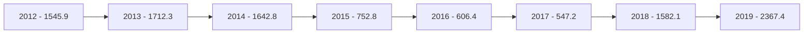

إجمالي حسابات المقاصة
( 2012 - 2019 )

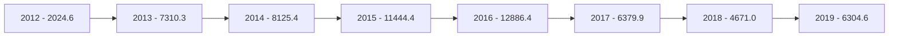

تطور أهم البيانات والمؤشرات المالية للمصارف التجارية - الربع الثاني 2020
---
ب- الأرصدة والودائع لدى المصرف المركزي والمصارف الأخرى:

بلغ رصيد ودائع المصارف التجارية لدى المصرف المركزي والمصارف الأخرى وفيما بينها نحو 78,681.9 مليون دينار في نهاية الربع الثاني 2020، مقابل 86,616.0 مليون دينار في نهاية الربع الثاني 2019، أي بمعدل إنخفاض قدره 9.2%، وتركز هذا الإنخفاض في رصيد الودائع لدى المصرف المركزي (شهادات الإيداع) بمقدار 8,883.3 مليون دينار.

| البيان | الربع الثاني 2019 | الربع الثاني 2020 | مقدار التغير | معدل التغير % |
|---|---|---|---|---|
| ودائع تحت الطلب لدى: | 64,653.4 | 65,967.4 | 1,314.0 | 2.0 |
| - المصرف المركزي | 57,562.5 | 60,755.7 | 3,193.2 | 5.5 |
| - المصارف المحلية | 1,676.1 | 1,765.8 | 89.7 | 5.4 |
| - المصرف الليبي الخارجي | 700.9 | 513.0 | -187.9 | -26.8 |
| - لدى المراسلين بالخارج | 4,713.9 | 2,932.9 | -1,781.0 | -37.8 |
| ودائع زمنية: | 21,962.6 | 12,714.6 | -9,248.0 | -42.1 |
| - المصرف المركزي (شهادات الإيداع) | 20,657.4 | 11,774.1 | -8,883.3 | -43.0 |
| - المصارف المحلية | 0.0 | 0.0 | 0.0 | 0.0 |
| - المصرف الليبي الخارجي | 41.7 | 0.0 | -41.7 | -100.0 |
| - لدى المراسلين بالخارج | 1,263.5 | 940.4 | -323.1 | -25.6 |
| الإجمالي | 86,616.0 | 78,681.9 | -7,934.1 | -9.2 |

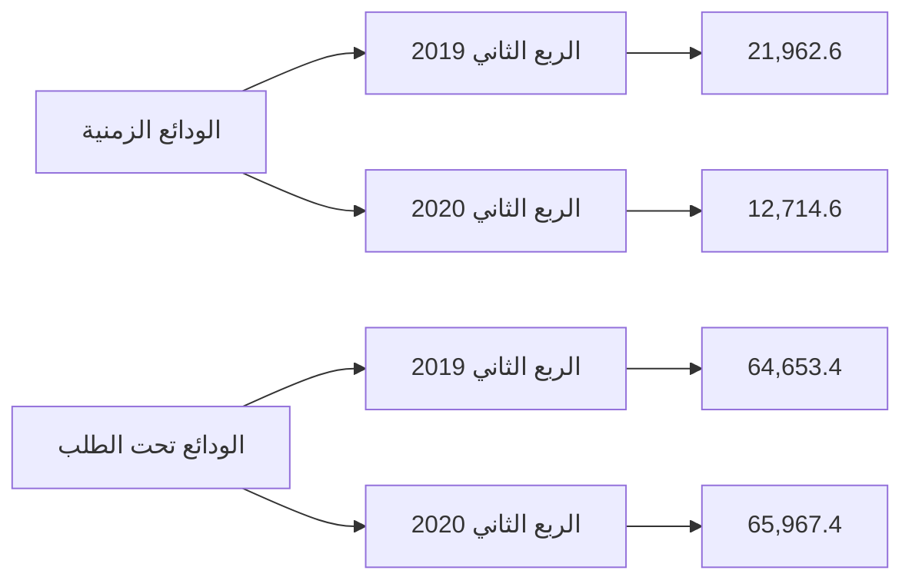

تطور أهم البيانات والمؤشرات المالية للمصارف التجارية - الربع الثاني 2020
---
والجدول التالي يبين تطور أرصدة وودائع للمصارف لدى المصرف المركزي والمصارف الأخرى وفيما بينها خلال
الفترة (2012 - 2019):

"مليون دينار"

| البيان | 2012 | 2013 | 2014 | 2015 | 2016 | 2017 | 2018 | 2019 |
|--------|------|------|------|------|------|------|------|------|
| ودائع تحت الطلب لدى: | 19,352.7 | 22,342.6 | 24,360.7 | 27,870.7 | 38,306.1 | 56,945.4 | 59,454.9 | 60,184.6 |
| - المصرف المركزي | 17,203.4 | 19,364.6 | 19,317.8 | 20,863.2 | 30,627.6 | 53,136.0 | 52,385.4 | 53,629.1 |
| - المصارف المحلية | 329.0 | 347.6 | 408.2 | 1,717.6 | 1,742.4 | 1,012.5 | 1,030.0 | 1,750.0 |
| - المصرف الليبي الخارجي | 664.7 | 848.1 | 1,850.0 | 2,216.8 | 2,396.1 | 874.2 | 1,762.1 | 821.4 |
| - المصارف بالخارج | 1,155.6 | 1,782.3 | 2,784.7 | 3,073.1 | 3,540.0 | 1,922.7 | 4,277.3 | 3,984.1 |
| ودائع زمنية: | 37,434.9 | 45,751.9 | 37,883.3 | 25,669.2 | 24,000.4 | 27,317.8 | 25,894.4 | 17,240.3 |
| - شهادات الإيداع | 35,737.8 | 44,307.3 | 37,074.6 | 24,259.7 | 23,187.1 | 26,415.7 | 24,716.9 | 15,846.8 |
| - المصارف المحلية | 0.0 | 30.0 | 0.0 | 0.0 | 0.0 | 0.0 | 0.0 | 0.0 |
| - المصرف الليبي الخارجي | 58.4 | 37.6 | 206.1 | 107.1 | 224.7 | 0.0 | 459.4 | 0.0 |
| - المصارف بالخارج | 1,638.7 | 1,377.0 | 602.6 | 1,302.4 | 588.6 | 902.1 | 718.1 | 1,393.5 |
| الإجمالي | 56,787.6 | 68,094.6 | 62,244.0 | 53,539.9 | 62,306.5 | 84,263.2 | 85,349.3 | 77,424.9 |

ودائع المصارف التجارية لدى المصرف المركزي والمصارف الأخرى
( 2012 - 2019 )

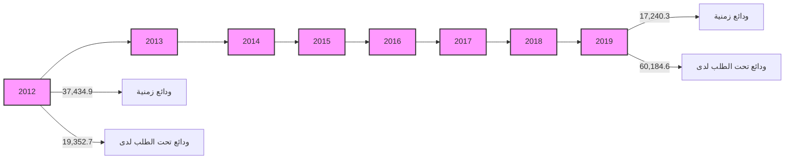

تطور أهم البيانات والمؤشرات المالية للمصارف التجارية - الربع الثاني 2020
---
## 2- الإستثمارات:

سجل إجمالي بند رصيد الإستثمارات في المصارف التجارية نهاية الربع الثاني 2020 نحو 4,216.7 مليون دينار، مقابل 1,106.4 مليون دينار في نهاية الربع الثاني 2019، بمعدل نمو 281.1% هذا الإرتفاع جاء نتيجة للإستثمار في سندات وأذونات الخزانة بمبلغ 3.0 مليار دينار، والجدول التالي يوضح تفاصيل هذا البند:

| البيان | الربع الثاني 2019 | الربع الثاني 2020 | مقدار التغير | معدل التغير % |
|--------|-------------------|-------------------|---------------|---------------|
| سندات وأذونات الخزانة | 0.0 | 3,000.0 | 3,000.0 | - |
| إستثمارات في الشركات العامة | 562.4 | 562.4 | 0.0 | 0.0 |
| إستثمارات في الشركات الخاصة المساهمة | 491.1 | 599.4 | 108.3 | 22.1 |
| إستثمارات أخرى | 52.8 | 54.9 | 2.1 | 4.0 |
| الإجمالي | 1,106.4 | 4,216.7 | 3,110.3 | 281.1 |

إجمالي رصيد بند الإستثمارات

```mermaid
bar chart
    title إجمالي رصيد بند الإستثمارات
    x-axis [الربع الثاني 2019, الربع الثاني 2020]
    y-axis "مليون دينار" 0 --> 4500
    bar [1106.4, 4216.7]
```
---
والجدول التالي يبين تطور رصيد بند الإستثمارات للمصارف التجارية خلال الفترة (2012 - 2019):

" مليون دينار "

| البيان | 2012 | 2013 | 2014 | 2015 | 2016 | 2017 | 2018 | 2019 |
|--------|------|------|------|------|------|------|------|------|
| سندات وأذونات الخزانة | 0.0 | 0.0 | 0.0 | 1,000.0 | 1,000.0 | 500.0 | 500.0 | 700.0 |
| إستثمارات أخرى | 954.9 | 746.7 | 777.5 | 787.8 | 789.2 | 811.5 | 956.5 | 1,257.5 |
| الإجمالي | 954.9 | 746.7 | 777.5 | 1,787.8 | 1,789.2 | 1,311.5 | 1,456.5 | 1,957.5 |

إجمالي الإستثمارات في المصارف التجارية
(2012 - 2019)

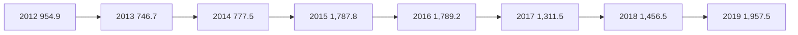

3- القروض والتسهيلات الائتمانية:

إرتفع اجمالي رصيد الإئتمان الممنوح من المصارف التجارية من 16,214.6 مليون دينار في نهاية الربع الثاني 2019 إلى 16,650.9 مليون دينار في نهاية الربع الثاني 2020، أي بمعدل نمو 2.7%، حيث بلغ رصيد القروض الممنوحة للقطاع الخاص في نهاية عام 2019 ما قيمته 10,541.4 مليون دينار، وما نسبته 63.3% من إجمالي القروض والتسهيلات الإئتمانية، فيما شكل رصيد القروض الممنوحة للقطاع العام النسبة الباقية 36.7% والتي بلغت قيمتها 6,109.5 مليون دينار.

وقد شكلت القروض والتسهيلات الائتمانية الممنوحة إلى اجمالي الخصوم الإيداعية ما نسبته 17.8%، كما شكلت من اجمالي الأصول ما نسبته 13.9%

وبلغت نسبة تغطية مخصص الديون المشكوك فيها لإجمالي القروض والتسهيلات الائتمانية والممنوحة نسبة 21.5% في نهاية الربع الثاني 2020 مقابل نسبة 21.6% في نهاية الربع الثاني 2019.
---
وفيما يلي بيان تفصيلي لرصيد القروض والتسهيلات الممنوحة من المصارف التجارية:

| مليون دينار |  |  |  |  |  |
|---|---|---|---|---|---|
| معدل التغير % | مقدار التغير | الربع الثاني 2020 | الربع الثاني 2019 | البيان |
| 4.0 | 199.5 | 5,231.8 | 5,032.3 | سلفيات والسحب على المكشوف |
| 10.6 | 328.1 | 3,436.4 | 3,108.3 | السلف الإجتماعية * |
| -1.1 | -91.4 | 7,982.7 | 8,074.1 | القروض الأخرى |
| 2.7 | 436.3 | 16,650.9 | 16,214.6 | إجمالي القروض والتسهيلات |
| 2.4 | 83.0 | 3,580.6 | 3,497.6 | مخصص الديون |
| 2.8 | 353.3 | 13,070.3 | 12,717.0 | صافي القروض والتسهيلات |

*تشمل رصيد قروض المرابحة للأفراد.

| السلفيات والسحب على المكشوف | السلف الاجتماعية |
|---|---|
| 5,250.0 | 3,500.0 |
| 5,200.0 | 3,400.0 |
| 5,150.0 | 3,300.0 |
| 5,100.0 | 3,200.0 |
| 5,050.0 | 3,100.0 |
| 5,000.0 | 3,000.0 |
| 4,950.0 | 2,900.0 |
| 4,900.0 |  |

| مليون دينار |  |  |  |  |
|---|---|---|---|---|
| معدل التغير % | مقدار التغير | الربع الثاني 2020 | الربع الثاني 2019 | البيان |
| 6.1 | 353.1 | 6,109.5 | 5,756.4 | القروض الممنوحة للقطاع العام |
| 0.8 | 83.2 | 10,541.4 | 10,458.2 | القروض الممنوحة للقطاع الخاص |
| 2.7 | 436.3 | 16,650.9 | 16,214.6 | الإجمالي |

تطور أهم البيانات والمؤشرات المالية للمصارف التجارية - الربع الثاني 2020 | 18
---

## رصيد القروض الممنوحة للقطاع الخاص (Balance of Loans Granted to the Private Sector)

| الربع الثاني 2019 | الربع الثاني 2020 |
|-------------------|-------------------|
| 10,458.2          | 10,541.4          |

*Values in million dinars*

## رصيد القروض الممنوحة للقطاع العام (Balance of Loans Granted to the Public Sector)

| الربع الثاني 2019 | الربع الثاني 2020 |
|-------------------|-------------------|
| 5,756.4           | 6,109.5           |

*Values in million dinars*

وفيما يلي رصيد القروض والتسهيلات الممنوحة للقطاعين العام والخاص خلال الفترة (2012 -2019):

(The following shows the balance of loans and facilities granted to the public and private sectors during the period (2012-2019):)

| البيان | 2012 | 2013 | 2014 | 2015 | 2016 | 2017 | 2018 | 2019 |
|--------|------|------|------|------|------|------|------|------|
| القروض الممنوحة للقطاع العام | 5,291.2 | 5,327.1 | 6,195.9 | 5,982.8 | 5,915.9 | 5,578.9 | 5,100.9 | 6,057.0 |
| القروض الممنوحة للقطاع الخاص | 10,608.3 | 12,905.5 | 13,764.0 | 14,230.1 | 12,854.3 | 11,867.7 | 11,347.4 | 10,855.8 |
| الإجمالي | 15,899.5 | 18,232.3 | 19,959.9 | 20,212.8 | 18,770.3 | 17,446.6 | 16,448.3 | 16,912.7 |

*Values in million dinars*

## رصيد القروض الممنوحة للقطاعين (العام والخاص) (Balance of Loans Granted to Both Sectors (Public and Private))
### (2012 - 2019)

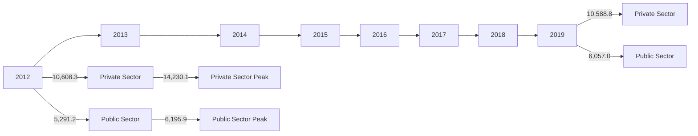

*Values in million dinars*

تطور أهم البيانات والمؤشرات المالية للمصارف التجارية - الربع الثاني 2020

(Development of the most important financial data and indicators for commercial banks - Second quarter 2020)
---
وفيما يلي رصيد السلف الاجتماعية والسحب على المكشوف خلال الفترة (2012 -2019):

"مليون دينار"

| البيان | 2012 | 2013 | 2014 | 2015 | 2016 | 2017 | 2018 | 2019 |
|--------|------|------|------|------|------|------|------|------|
| سلفيات والسحب على المكشوف | 5,522.3 | 4,146.5 | 4,452.1 | 5,440.1 | 4,827.9 | 4,514.5 | 4,354.0 | 5,275.4 |
| السلف الإجتماعية * | 4,973.5 | 6,726.0 | 7,157.9 | 6,608.6 | 5,901.1 | 4,912.5 | 3,988.7 | 3,125.5 |
| القروض الأخرى | 5,403.7 | 3,759.8 | 8,348.9 | 8,164.2 | 8,041.3 | 8,019.6 | 8,105.6 | 8,511.8 |
| إجمالي القروض والتسهيلات | 15,899.5 | 18,232.3 | 19,959.9 | 20,212.8 | 18,770.3 | 17,446.6 | 16,448.3 | 16,912.7 |
| مخصص الديون | 2,348.9 | 2,497.9 | 2,688.1 | 2,779.7 | 2,910.0 | 3,040.8 | 3,126.4 | 3,503.6 |
| صافي القروض والتسهيلات | 13,550.6 | 15,734.4 | 17,271.8 | 17,433.1 | 15,860.3 | 14,405.8 | 13,321.9 | 13,409.1 |

*تشمل رصيد قروض المرابحة للأفراد


| السنة | السلف الإجتماعية | سلفيات والسحب على المكشوف |
|-------|------------------|---------------------------|
| 2012 | 4,973.5 | 5,522.3 |
| 2013 | 6,726.0 | 4,146.5 |
| 2014 | 7,157.9 | 4,452.1 |
| 2015 | 6,608.6 | 5,440.1 |
| 2016 | 5,901.1 | 4,827.9 |
| 2017 | 4,912.5 | 4,514.5 |
| 2018 | 3,988.7 | 4,354.0 |
| 2019 | 3,125.5 | 5,275.4 |

## 4 - الأصول الثابتة والأصول الأخرى:

بلغ رصيد الأصول الثابتة نحو 1,865.7 مليون دينار في نهاية الربع الثاني 2020، مقابل 1,666.5 مليون دينار في نهاية الربع الثاني 2019، فيما بلغ رصيد الأصول الأخرى نحو 10,319.0 مليون دينار في نهاية الربع الثاني 2020، مقابل 7,639.6 مليون دينار في نهاية الربع الثاني 2019.

تطور أهم البيانات والمؤشرات المالية للمصارف التجارية - الربع الثاني 2020 | 20
---
ثانياً : جانب الخصوم

1- ودائع العملاء لدى المصارف التجارية:

إرتفعت أرصدة ودائع العملاء لدى المصارف التجارية من 92,485.6 مليون دينار في نهاية الربع الثاني 2019 إلى 93,630.3 مليون دينار في نهاية الربع الثاني 2020، أي بمعدل 1.2%، وقد تركز الإرتفاع في أرصدة الودائع لأجل بمقدار 1,182.1 مليون دينار، بنسبة 10.5%، في حين إنخفضت الودائع الإدخارية بمقدار 55.7 مليون دينار وبنسبة 11.4%.

وفيما يتعلق بتوزيع الودائع لدى المصارف التجارية حسب نوع الوديعة فقد شكلت الودائع تحت الطلب ما نسبته 86.3% من إجمالي الودائع، في حين شكلت الودائع لأجل ما نسبته 13.3% من إجمالي الودائع، وشكلت ودائع الادخار ما نسبته 0.5% فقط من إجمالي الودائع.

| البيان | الربع الثاني 2019 | الربع الثاني 2020 | مقدار التغير | معدل التغير % |
|---------|-------------------|-------------------|---------------|---------------|
| الودائع تحت الطلب | 80,742.6 | 80,760.9 | 18.3 | 0.02 |
| الودائع لأجل | 11,256.0 | 12,438.1 | 1,182.1 | 10.5 |
| الودائع الإدخارية | 487.0 | 431.3 | -55.7 | -11.4 |
| الإجمالي | 92,485.6 | 93,630.3 | 1,144.7 | 1.2 |

رصيد ودائع العملاء لدى المصارف حسب نوع الوديعة

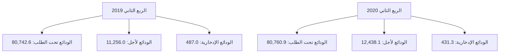

تطور أهم البيانات والمؤشرات المالية للمصارف التجارية - الربع الثاني 2020
---
أرصدة الودائع حسب نوع الوديعة لدى المصارف التجارية خلال الفترة (2012 – 2019)

"مليون دينار"

| البيان | 2012 | 2013 | 2014 | 2015 | 2016 | 2017 | 2018 | 2019 |
|--------|------|------|------|------|------|------|------|------|
| الودائع تحت الطلب | 54,728.8 | 61,834.9 | 56,641.4 | 58,725.9 | 72,192.7 | 84,827.6 | 80,038.6 | 77,919.6 |
| الودائع زمنية | 12,912.1 | 21,064.9 | 21,669.3 | 11,956.7 | 10,644.7 | 10,519.2 | 13,115.5 | 10,582.2 |
| الودائع الإدخارية | 705.3 | 662.9 | 599.8 | 574.5 | 570.2 | 591.7 | 503.4 | 452.3 |
| الإجمالي | 68,346.2 | 83,562.7 | 78,910.4 | 71,257.1 | 83,407.6 | 95,938.5 | 93,657.5 | 88,954.0 |

إجمالي أرصدة ودائع العملاء لدى المصارف التجارية
( 2012 - 2019 )

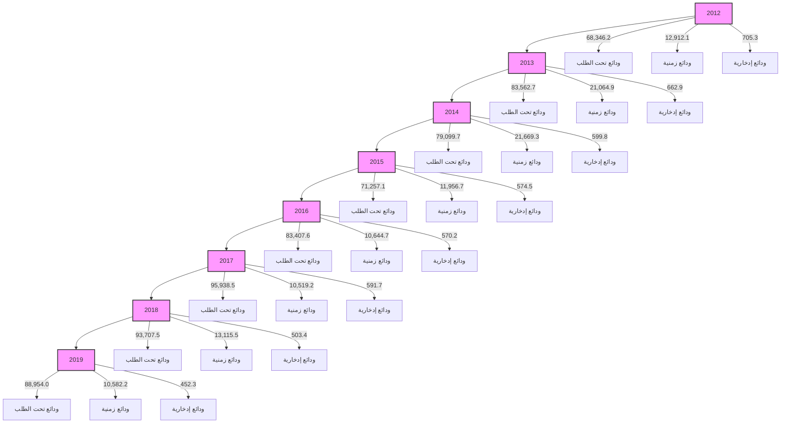

وفيما يتعلق بتوزيع إجمالي ودائع العملاء لدى المصارف التجارية ( خاص، حكومة، عام ) فقد إنخفضت ودائع القطاع الخاص بمقدار 3,036.6 مليون دينار وبنسبة 5.8% في نهاية الربع الثاني 2020، لتسجل نحو 49,298.9 مليون دينار، مقارنة بنحو 52,335.5 مليون دينار في نهاية الربع الثاني عام 2019، حيث تركز الإنخفاض في ودائع الأفراد.

فيما إرتفع رصيد ودائع القطاع العام والقطاع الحكومي في نهاية الربع الثاني 2020 بمقدار 4,181.3 مليون دينار لتصل إلى 44,331.4 مليون دينار، منها 11,140.4 مليون دينار كودائع حكومية والتي تتكون من ودائع الوزارات والهيئات والمؤسسات الحكومية وودائع كل من: صندوق الضمان الإجتماعي، صندوق الإنماء الإقتصادي والإجتماعي وودائع الصندوق الليبي للتنمية والإستثمار، مقابل 40,150.1 مليون دينار كودائع للقطاع العام والقطاع الحكومي في نهاية الربع الثاني 2019.
---
والجدول التالي يوضح تطور أرصدة الودائع لدى المصارف التجارية:

"مليون دينار"

| البيان | الربع الثاني 2019 | الربع الثاني 2020 | مقدار التغير | معدل التغير % |
|------|-----------------|-----------------|------------|-------------|
| ودائع الحكومة والقطاع العام | 40,150.1 | 44,331.4 | 4,181.3 | 10.4 |
| - ودائع حكومية | 10,546.9 | 11,140.4 | 593.5 | 5.6 |
| - ودائع القطاع العام | 29,603.2 | 33,190.9 | 3,587.7 | 12.1 |
| ودائع القطاع الخاص | 52,335.5 | 49,298.9 | -3,036.6 | -5.8 |
| - الأفراد | 31,607.0 | 29,253.7 | -2,353.3 | -7.4 |
| - الشركات والمؤسسات | 20,728.5 | 20,045.2 | -683.3 | -3.3 |
| الإجمالي | 92,485.6 | 93,630.3 | 1,144.7 | 1.2 |

ودائع القطاع الخاص لدى المصارف التجارية:

| الربع الثاني 2019 | الربع الثاني 2020 |
|-----------------|-----------------|
| 52,335.5 | 49,298.9 |
| 31,607.0 | 29,253.7 |

ودائع القطاع العام والحكومي لدى المصارف التجارية:

| الربع الثاني 2019 | الربع الثاني 2020 |
|-----------------|-----------------|
| 29,603.2 | 33,190.9 |
| 10,546.9 | 11,140.4 |

في الرسم البياني الأول (ودائع القطاع الخاص):
- الأعمدة الزرقاء تمثل ودائع الأفراد
- الأعمدة الحمراء تمثل إجمالي ودائع القطاع الخاص

في الرسم البياني الثاني (ودائع القطاع العام والحكومي):
- الأعمدة الزرقاء تمثل ودائع حكومية
- الأعمدة الحمراء تمثل ودائع القطاع العام

تطور أهم البيانات والمؤشرات المالية للمصارف التجارية - الربع الثاني 2020
---
وفيما يلي توزيع ودائع العملاء لدى المصارف التجارية خلال الفترة (2012 - 2019):

"مليون دينار"

| البيان | 2012 | 2013 | 2014 | 2015 | 2016 | 2017 | 2018 | 2019 |
|--------|------|------|------|------|------|------|------|------|
| ودائع الحكومة والقطاع العام | 35,469.8 | 52,638.7 | 46,339.9 | 35,139.7 | 39,197.7 | 40,710.8 | 39,747.8 | 42,343.0 |
| - ودائع حكومية | 13,983.3 | 24,285.4 | 21,987.0 | 9,800.6 | 9,100.7 | 9,234.8 | 10,048.5 | 11,694.6 |
| - ودائع القطاع العام | 21,486.5 | 28,353.3 | 24,352.9 | 25,339.1 | 30,097.0 | 31,476.0 | 29,699.3 | 30,648.5 |
| ودائع القطاع الخاص | 32,876.4 | 30,924.0 | 32,570.5 | 36,117.4 | 44,209.9 | 55,227.7 | 53,909.7 | 46,611.0 |
| - الأفراد | 21,026.1 | 19,569.5 | 19,799.0 | 20,477.2 | 27,605.5 | 36,295.4 | 33,717.5 | 27,402.6 |
| - الشركات والمؤسسات | 11,850.3 | 11,345.5 | 12,771.5 | 15,640.2 | 16,604.4 | 18,932.3 | 20,192.2 | 19,208.4 |
| الإجمالي | 68,346.2 | 83,562.7 | 78,910.4 | 71,257.1 | 83,407.6 | 95,938.5 | 93,657.5 | 88,954.0 |


| السنة | ودائع حكومية | ودائع القطاع العام |
|-------|--------------|-------------------|
| 2012 | 13,983.3 | 21,486.5 |
| 2013 | 24,285.4 | 28,353.3 |
| 2014 | 21,987.0 | 24,352.9 |
| 2015 | 9,800.6 | 25,339.1 |
| 2016 | 9,100.7 | 30,097.0 |
| 2017 | 9,234.8 | 31,476.0 |
| 2018 | 10,048.5 | 29,699.3 |
| 2019 | 11,694.6 | 30,648.5 |


| السنة | ودائع الشركات والمؤسسات | ودائع الأفراد |
|-------|-------------------------|---------------|
| 2012 | 11,850.3 | 21,026.1 |
| 2013 | 11,345.5 | 19,569.5 |
| 2014 | 12,771.5 | 19,799.0 |
| 2015 | 15,640.2 | 20,477.2 |
| 2016 | 16,604.4 | 27,605.5 |
| 2017 | 18,932.3 | 36,295.4 |
| 2018 | 20,192.2 | 33,717.5 |
| 2019 | 19,208.4 | 27,402.6 |

تطور أهم البيانات والمؤشرات المالية للمصارف التجارية - الربع الثاني 2020
---
2- الحسابات المكشوفة لدى المراسلين بالخارج:

بلغ رصيد الحسابات المكشوفة لدى المراسلين بالخارج 163.5 مليون دينار في نهاية الربع الثاني 2020،
وهي في معظمها ناتجة عن تأخر تسوية الحسابات لبعض المصارف مع المصارف المراسلة بالخارج،
مقابل 472.2 مليون دينار في نهاية نفس الفترة من عام 2019.

| البيان | الربع الثاني 2019 | الربع الثاني 2020 | مقدار التغير | معدل التغير % |
|--------|-------------------|-------------------|---------------|---------------|
| الحسابات المكشوفة لدى المراسلين بالخارج | 612.2 | 271.2 | -341.0 | -55.7 |

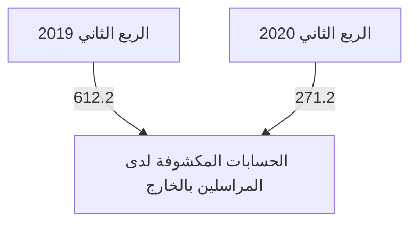

وفيما يلي أرصدة الحسابات المكشوفة خلال الفترة (2012 – 2019):

| البيان | 2012 | 2013 | 2014 | 2015 | 2016 | 2017 | 2018 | 2019 |
|--------|------|------|------|------|------|------|------|------|
| الحسابات المكشوفة لدى المراسلين بالخارج | 139.6 | 74.9 | 432.0 | 955.6 | 429.9 | 368.5 | 503.4 | 113.1 |

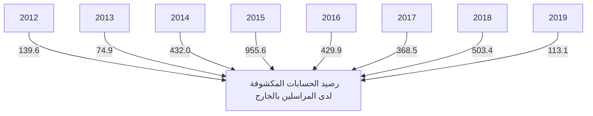

تطور أهم البيانات والمؤشرات المالية للمصارف التجارية - الربع الثاني 2020
---
### 3- حقوق الملكية والأرباح:

- رأس المال المدفوع: إرتفع رأس المال المدفوع من 4,095.9 مليون دينار في نهاية الربع الثاني 2019 إلى 4,295.9 مليون دينار في الربع الثاني 2020، نتيجة لقيام بعض المصارف بزيادة رأس مالها المدفوع.

- الإحتياطيات والأرباح: إنخفض رصيد الإحتياطيات والأرباح المرحلة والقابلة للتوزيع من 2,022.8 مليون دينار في نهاية الربع الثاني 2019، ليصل إلى 2,314.5 مليون دينار في نهاية الربع الثاني 2020، في حين تراجعت أرباح المصارف التجارية قبل خصم المخصصات والضرائب خلال الربع الثاني 2020 بمعدل 56.2% لتسجل إلى 208.6 مليون دينار، مقارنة عما كانت عليه خلال نفس الفترة من العام 2019 والبالغة نحو 476.6 مليون دينار.

| البيان | الربع الثاني 2019 | الربع الثاني 2020 | مقدار التغير | معدل التغير % |
|--------|-------------------|-------------------|---------------|---------------|
| رأس المال المدفوع | 4,095.9 | 4,295.9 | 200.0 | 4.9 |
| الإحتياطي القانوني | 509.9 | 542.7 | 32.8 | 6.4 |
| إحتياطيات غير مخصصة | 33.1 | 34.3 | 1.2 | 3.6 |
| أرباح العام | 476.6 | 208.6 | -268.0 | -56.2 |
| الأرباح المرحلة والأرباح القابلة للتوزيع | 1,479.8 | 1,737.5 | 257.7 | 17.4 |
| الإجمالي | 6,595.3 | 6,819.1 | 223.8 | 3.4 |

```mermaid
bar chart
    title أرباح الفترة قبل خصم المخصصات والضرائب
    x-axis [الربع الثاني 2019, الربع الثاني 2020]
    y-axis 0 --> 600 مليون دينار
    bar [476.6, 208.6]
```

تطور أهم البيانات والمؤشرات المالية للمصارف التجارية - الربع الثاني 2020                                                                                   26
---
# أرباح المصارف التجارية قبل خصم المخصصات والضرائب
## (2012 - 2019)

```
| السنة | القيمة (مليون دينار) |
|-------|---------------------|
| 2012  | 527.1               |
| 2013  | 451.1               |
| 2014  | 265.4               |
| 2015  | 213.0               |
| 2016  | 247.1               |
| 2017  | 464.6               |
| 2018  | 1222.2              |
| 2019  | 867.6               |
```

## وفيما يلي حسابات رأس المال والإحتياطيات في المصارف خلال الفترة (2012 - 2019):

"مليون دينار"

| البيان                           | 2012    | 2013    | 2014    | 2015    | 2016    | 2017    | 2018    | 2019    |
|----------------------------------|---------|---------|---------|---------|---------|---------|---------|---------|
| رأس المال المدفوع                | 3,495.2 | 3,550.2 | 3,566.8 | 3,609.5 | 3,791.4 | 3,806.4 | 3,904.4 | 4,282.9 |
| الإحتياطي القانوني               | 181.9   | 323.5   | 335.8   | 335.8   | 342.8   | 346.1   | 352.9   | 527.7   |
| إحتياطيات غير مخصصة              | 26.6    | 29.7    | 29.7    | 29.7    | 30.0    | 31.9    | 32.0    | 53.1    |
| أرباح العام                      | 527.1   | 451.1   | 265.4   | 213.0   | 247.1   | 464.6   | 1,122.2 | 867.6   |
| الأرباح المرحلة والأرباح القابلة للتوزيع | 422.4   | 389.2   | 688.7   | 899.6   | 955.0   | 912.4   | 1,061.1 | 1,245.5 |
| الإجمالي                         | 4,653.2 | 4,743.7 | 4,886.4 | 5,087.6 | 5,366.3 | 5,561.4 | 6,472.6 | 6,976.8 |

# إجمالي حقوق الملكية في المصارف التجارية
## (2012 - 2019)

```
| السنة | رأس المال | الإحتياطيات | إجمالي حقوق الملكية |
|-------|-----------|-------------|---------------------|
| 2012  | 3495.2    | 1158.1      | 4653.3              |
| 2013  | 3550.2    | 1193.5      | 4743.7              |
| 2014  | 3566.8    | 1391.1      | 4957.9              |
| 2015  | 3609.5    | 1478.0      | 5087.5              |
| 2016  | 3791.4    | 1575.0      | 5366.4              |
| 2017  | 3806.4    | 1755.1      | 5561.5              |
| 2018  | 3904.4    | 2565.1      | 6469.5              |
| 2019  | 4282.9    | 2580.9      | 6863.8              |
```

تطور أهم البيانات والمؤشرات المالية للمصارف التجارية - الربع الثاني 2020
---
## 4- المخصصات:

سجل رصيد المخصصات إرتفاعاً بمقدار 648.3 مليون دينار في نهاية الربع الثاني 2020 ليصل إلى
5,482.1 مليون دينار، مقابل 4,833.8 مليون دينار في نهاية الربع الثاني 2019، وتركزت الزيادة في
بندي مخصص الديون المشكوك في تحصيلها و المخصصات العامة كما هو موضح بالجدول التالي:

"مليون دينار"

| البيان | الربع الثاني 2019 | الربع الثاني 2020 | مقدار التغير | معدل التغير % |
|------|-----------------|-----------------|-------------|--------------|
| مخصص الديون المشكوك في تحصيلها | 3,497.6 | 3,580.6 | 83.0 | 2.4 |
| مخصص إستهلاك الأصول الثابتة | 761.9 | 822.9 | 61.0 | 8.0 |
| مخصصات عامة | 1,088.6 | 1,155.9 | 67.3 | 6.2 |
| مخصص تقييم أسعار الصرف | 2.0 | 0.8 | -1.2 | -60.0 |
| الإجمالي | 5,350.1 | 5,560.1 | 210.0 | 3.9 |

### إجمالي المخصصات

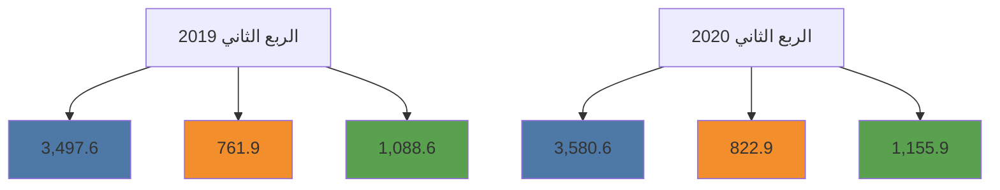

وفيما يلي رصيد المخصصات خلال الفترة (2012 – 2019):

"مليون دينار"

| البيان | 2012 | 2013 | 2014 | 2015 | 2016 | 2017 | 2018 | 2019 |
|------|------|------|------|------|------|------|------|------|
| مخصص الديون المشكوك في تحصيلها | 2,348.9 | 2,497.5 | 2,688.1 | 2,779.7 | 2,910.0 | 3,040.8 | 3,126.4 | 3,503.6 |
| مخصص إستهلاك الأصول الثابتة | 424.1 | 473.1 | 539.3 | 592.5 | 634.0 | 687.3 | 745.2 | 795.3 |
| مخصصات عامة | 539.3 | 614.6 | 532.8 | 556.9 | 594.3 | 738.2 | 753.2 | 1,225.5 |
| مخصص تقييم أسعار الصرف | 5.2 | 11.6 | 5.1 | 12.7 | 6.5 | 6.7 | 2.8 | 2.8 |
| الإجمالي | 3,317.5 | 3,597.2 | 3,765.3 | 3,941.8 | 4,144.8 | 4,473.0 | 4,627.6 | 5,527.2 |

تطور أهم البيانات والمؤشرات المالية للمصارف التجارية - الربع الثاني 2020 | 28
---
# رصيد مخصص الديون المشكوك في تحصيلها
## (2012 - 2019)

| السنة | القيمة (مليون دينار) |
|-------|---------------------|
| 2012  | 2,348.9             |
| 2013  | 2,497.5             |
| 2014  | 2,688.1             |
| 2015  | 2,779.7             |
| 2016  | 2,910.0             |
| 2017  | 3,040.8             |
| 2018  | 3,126.4             |
| 2019  | 3,503.6             |

## 5- متنوعات وخصوم أخرى:

بلغ رصيد متنوعات وخصوم أخرى 14,817.8 مليون دينار في نهاية الربع الثاني 2020 مقابل 14,080.4 مليون دينار في نهاية الربع الثاني 2019.

تطور أهم البيانات والمؤشرات المالية للمصارف التجارية - الربع الثاني 2020 | 29
---
# مؤشرات السلامة المالية للمصارف التجارية

▪ مؤشرات السيولة: بلغت نسبة الأصول السائلة لدى المصارف التجارية إلى إجمالي الأصول 67.6% في نهاية الربع الثاني 2020، والتي معظمها تمثل ودائع لدى المصرف المركزي (تحت الطلب بما فيها الاحتياطي الإلزامي وكذلك شهادات الإيداع).

كما بلغ حجم القروض إلى إجمالي الودائع بالقطاع المصرفي نسبة 17.8% في نهاية الربع الثاني 2020، وهي نسبة ضئيلة للغاية، حيث لم تتعدى هذه النسبة 28.4% خلال الفترة (2012 - الربع الثاني 2020).

وتجدر الإشارة إلى أن نسبة السيولة القانونية المطلوب من المصارف التجارية الإحتفاظ بها هي 25.0% من إجمالي الخصوم الإيداعية.

| نسب مئوية |  |  |  |  |  |  |  |  |  |  |
|-----------|-----------|------|------|------|------|------|------|------|------|------------------|
| مؤشرات السيولة | 2012 | 2013 | 2014 | 2015 | 2016 | 2017 | 2018 | 2019 | الربع الثاني 2020 |
| الأصول السائلة / الأصول | 68.6 | 71.0 | 67.8 | 60.2 | 60.8 | 72.8 | 74.3 | 71.9 | 67.6 |
| القروض / الودائع | 23.6 | 21.8 | 25.2 | 28.4 | 22.5 | 18.2 | 17.6 | 19.0 | 17.8 |
| الودائع / الأصول | 80.8 | 84.9 | 83.1 | 79.0 | 80.6 | 82.4 | 80.0 | 79.3 | 78.1 |

```mermaid
graph TD
    title[مؤشرات السيولة]
    subgraph chart[( 2012 - الربع الثاني 2020 )]
        style chart fill:#f9f9f9,stroke:#333,stroke-width:2px
        A[2012]
        B[2013]
        C[2014]
        D[2015]
        E[2016]
        F[2017]
        G[2018]
        H[2019]
        I[الربع الثاني 2020]
    end
    
    classDef default fill:#f9f9f9,stroke:#333,stroke-width:1px;
    class A,B,C,D,E,F,G,H,I default;
    
    A --> B --> C --> D --> E --> F --> G --> H --> I
    
    style title fill:#f9f9f9,stroke:#333,stroke-width:2px
```

| الأصول السائلة / الأصول | الودائع / الأصول | القروض / الودائع |
|-------------------------|-------------------|-------------------|
| 68.6 | 80.8 | 23.6 |
| 71.0 | 84.9 | 21.8 |
| 67.8 | 83.1 | 25.2 |
| 60.2 | 79.0 | 28.4 |
| 60.8 | 80.6 | 22.5 |
| 72.8 | 82.4 | 18.2 |
| 74.3 | 80.0 | 17.6 |
| 71.9 | 79.3 | 19.0 |
| 67.6 | 78.1 | 17.8 |

تطور أهم البيانات والمؤشرات المالية للمصارف التجارية - الربع الثاني 2020
---
## جودة الأصول:

أظهرت البيانات المتوفرة عن نسبة الديون المتعثرة وهي بيانات تقديرية قد لا تعكس الواقع أن نسبة الديون المتعثرة إلى إجمالي القروض بلغت في نهاية الربع الثاني 2020 نحو 21.0%، ويدل إرتفاع هذه النسبة على إنخفاض كفاءة إدارة الائتمان، وينبغي أن لا تتجاوز هذه النسبة وفقاً للمعايير الدولية 5%. وقد سجلت نسبة تغطية مخصص الديون إلى الديون المتعثرة في نهاية الربع الثاني 2020 نحو 102.4%.

| نسب مئوية |  |  |  |  |  |  |  |  |  |
|-----------|-----------|------|------|------|------|------|------|------|------|
| جودة الأصول | 2012 | 2013 | 2014 | 2015 | 2016 | 2017 | 2018 | 2019 | الربع الثاني 2020 |
| القروض المتعثرة / الأصول | 4.0 | 3.9 | 4.4 | 4.7 | 3.8 | 3.1 | 2.9 | 3.2 | 2.9 |
| القروض المتعثرة/ القروض | 21.0 | 21.0 | 21.0 | 21.0 | 21.0 | 21.0 | 21.0 | 21.0 | 21.0 |
| مخصص الديون / القروض المتعثرة | 70.9 | 65.2 | 64.0 | 65.5 | 73.8 | 83.0 | 90.4 | 98.6 | 102.4 |
| مخصص الديون / القروض | 14.9 | 13.7 | 13.4 | 13.8 | 15.5 | 17.4 | 19.0 | 20.9 | 21.5 |

- بيانات القروض المتعثرة تقديرية منذ 2011

```mermaid
graph LR
    A[مؤشرات جودة الأصول]
    B[( 2012 - الربع الثاني 2020 )]
    C[120]
    D[100]
    E[80]
    F[60]
    G[40]
    H[20]
    I[0]
    J[2012]
    K[2013]
    L[2014]
    M[2015]
    N[2016]
    O[2017]
    P[2018]
    Q[2019]
    R[الربع الثاني 2020]
    S[مخصص الديون / القروض المتعثرة]
    T[مخصص الديون / القروض]
```

## الربحية:

شهد معدل العائد على الأصول لدى القطاع المصرفي في ليبيا إنخفاضاً ملحوظاً خلال السنوات (2014 - 2016)، حيث بلغ نحو 0.2% في عام 2016، ويعزى سبب الإنخفاض إلى عدة أسباب منها الوضع الغير ملائم الذي تعمل فيه المصارف التجارية في السنوات الأخيرة وكذلك تطبيق قانون إلغاء الفوائد الربوية.

إلا أنه خلال العام 2018 تحسن معدل الربحية بشكل كبير، حيث بلغ العائد على إجمالي الأصول نحو 1.0%، وبلغ معدل العائد على حقوق الملكية 20.9%.
---
وفي عام 2019 بلغ معدل العائد على إجمالي الأصول نحو 0.7% وبلغ معدل العائد على حقوق الملكية 12.3%.

وفي الربع الثاني 2020 إنخفضت مؤشرات الربحية ليبلغ معدل العائد إلى إجمالي الأصول نحو 0.4% وبلغ معدل العائد إلى حقوق الملكية نحو 6.4%.

الزيادة في الأرباح في عامي 2018 و2019 جاءت نتيجة لتحقيق المصارف التجارية لإيرادات هامة من عَمولات بيع وتحويل العملة الأجنبية، وكذلك من رفع أسعار الخدمات المصرفية عموماً.

| نسب مئوية | 2012 | 2013 | 2014 | 2015 | 2016 | 2017 | 2018 | 2019 | الربع الثاني 2020 |
|-----------|------|------|------|------|------|------|------|------|-------------------|
| العائد / حقوق الملكية | 13.7 | 12.0 | 5.4 | 4.4 | 4.8 | 9.1 | 20.9 | 12.3 | 6.4 |
| العائد / الاصول | 0.7 | 0.5 | 0.3 | 0.2 | 0.2 | 0.4 | 1.0 | 0.7 | 0.4 |

```mermaid
graph LR
    title[العائد / الأصول (2012 - الربع الثاني 2020)]
    style title fill:#f9f,stroke:#333,stroke-width:4px
    2012[2012] --> 2013[2013]
    2013 --> 2014[2014]
    2014 --> 2015[2015]
    2015 --> 2016[2016]
    2016 --> 2017[2017]
    2017 --> 2018[2018]
    2018 --> 2019[2019]
    2019 --> 2020[الربع الثاني 2020]
    
    2012 --0.7%--> 2013
    2013 --0.5%--> 2014
    2014 --0.3%--> 2015
    2015 --0.2%--> 2016
    2016 --0.2%--> 2017
    2017 --0.4%--> 2018
    2018 --1.0%--> 2019
    2019 --0.7%--> 2020
    2020 --0.4%-->
```

```mermaid
graph LR
    title[العائد / حقوق الملكية (2012 - الربع الثاني 2020)]
    style title fill:#f9f,stroke:#333,stroke-width:4px
    2012[2012] --> 2013[2013]
    2013 --> 2014[2014]
    2014 --> 2015[2015]
    2015 --> 2016[2016]
    2016 --> 2017[2017]
    2017 --> 2018[2018]
    2018 --> 2019[2019]
    2019 --> 2020[الربع الثاني 2020]
    
    2012 --13.7%-->2013
    2013 --12.0%-->2014
    2014 --5.4%-->2015
    2015 --4.4%-->2016
    2016 --4.8%-->2017
    2017 --9.1%-->2018
    2018 --20.9%-->2019
    2019 --12.3%-->2020
    2020 --6.4%-->
```

تطور أهم البيانات والمؤشرات المالية للمصارف التجارية - الربع الثاني 2020
---
# كفاية رأس المال:

يتمتع القطاع المصرفي الليبي بكفاية رأس مال مرتفعة، كافية لمواجهة أية مخاطر قد تحدث، حيث تراوحت نسبتها مابين 10.7% و 18.4% خلال الفترة (2012 - الربع الثاني 2020)، وهي بشكل عام أعلى وبهامش مريح من النسبة المحددة من قبل لجنة بازل (1) والبالغة 8.0%، مما يعزز من الإستقرار المالي.

نسب مئوية

| نسب رأس المال | 2012 | 2013 | 2014 | 2015 | 2016 | 2017 | 2018 | 2019 | الربع الثاني 2020 |
|---------------|------|------|------|------|------|------|------|------|-------------------|
| كفاية رأس المال الكلي | 10.7 | 12.4 | 13.9 | 14.3 | 14.6 | 16.7 | 17.8 | 18.4 | 18.2 |
| كفاية رأس المال الأساسي | 9.5 | 11.0 | 12.6 | 13.1 | 13.4 | 15.4 | 16.5 | 17.2 | 16.9 |
| رأس المال المدفوع / الأصول | 4.2 | 3.6 | 3.7 | 4.0 | 3.7 | 3.3 | 3.3 | 3.8 | 3.6 |
| حقوق الملكية / الأصول | 5.1 | 4.4 | 5.1 | 5.4 | 4.9 | 4.8 | 4.6 | 5.5 | 5.5 |
| حقوق الملكية / الودائع | 6.3 | 5.1 | 6.2 | 7.1 | 6.1 | 5.3 | 5.7 | 6.9 | 7.1 |

## كفاية رأس المال الكلي (2012 - الربع الثاني 2020)

```mermaid
graph LR
    2012[2012 - 10.7] --> 2013[2013 - 12.4]
    2013 --> 2014[2014 - 13.9]
    2014 --> 2015[2015 - 14.3]
    2015 --> 2016[2016 - 14.6]
    2016 --> 2017[2017 - 16.7]
    2017 --> 2018[2018 - 17.8]
    2018 --> 2019[2019 - 18.4]
    2019 --> 2020[الربع الثاني 2020 - 18.2]
```

## مؤشرات رأس المال (2012 - الربع الثاني 2020)

```mermaid
graph LR
    2012[2012] --> |رأس المال المدفوع / الأصول: 4.2<br>حقوق الملكية / الأصول: 5.1| 2013[2013]
    2013 --> |رأس المال المدفوع / الأصول: 3.6<br>حقوق الملكية / الأصول: 4.4| 2014[2014]
    2014 --> |رأس المال المدفوع / الأصول: 3.7<br>حقوق الملكية / الأصول: 5.1| 2015[2015]
    2015 --> |رأس المال المدفوع / الأصول: 4.0<br>حقوق الملكية / الأصول: 5.4| 2016[2016]
    2016 --> |رأس المال المدفوع / الأصول: 3.7<br>حقوق الملكية / الأصول: 4.9| 2017[2017]
    2017 --> |رأس المال المدفوع / الأصول: 3.3<br>حقوق الملكية / الأصول: 4.8| 2018[2018]
    2018 --> |رأس المال المدفوع / الأصول: 3.3<br>حقوق الملكية / الأصول: 4.6| 2019[2019]
    2019 --> |رأس المال المدفوع / الأصول: 3.8<br>حقوق الملكية / الأصول: 5.5| 2020[الربع الثاني 2020]
    2020 --> |رأس المال المدفوع / الأصول: 3.6<br>حقوق الملكية / الأصول: 5.5| End[End]
```

تطور أهم البيانات والمؤشرات المالية للمصارف التجارية - الربع الثاني 2020
---
# الملاحق

- البيانات المالية الأساسية للمصارف التجارية للربع الثاني 2020 مقارنة بالربع الثاني 2019.

- جدول مؤشرات السلامة المالية خلال الفترة ( 2012 - الربع الثاني 2020 ).

تطور أهم البيانات والمؤشرات المالية للمصارف التجارية - الربع الثاني 2020 | 34
---
# الجدول (1)
## البيانات المالية الأساسية للمصارف التجارية

(مليون دينار)

| البيان / الفترة | يونيو 2019 | يونيو 2020 | معدل التغير % |
|-----------------|------------|------------|---------------|
| إجمالي الميزانية (الأصول + الحسابات النظامية) | 162,252.9 | 160,864.4 | -0.9 |
| إجمالي الأصول | 118,747.7 | 119,881.2 | 1.0 |
| إجمالي النقدية بخزائن المصارف | 1,668.1 | 2,351.5 | 41.0 |
| إجمالي الودائع لدى المصرف المركزي | 78,219.9 | 72,529.9 | -7.3 |
| إجمالي الودائع لدى المصارف | 1,676.1 | 1,765.8 | 5.4 |
| إجمالي الودائع لدى المصرف الليبي الخارجي | 742.6 | 513.0 | -30.9 |
| إجمالي الودائع لدى المراسلين بالخارج | 5,977.4 | 3,873.3 | -35.2 |
| إجمالي حسابات المقاصة | 3,836.6 | 5,795.5 | 51.1 |
| إجمالي القروض والسلفيات والتسهيلات | 16,214.6 | 16,650.9 | 2.7 |
| إجمالي الاستثمارات | 1,106.4 | 4,216.7 | 281.1 |
| إجمالي ودائع العملاء | 92,485.6 | 93,630.3 | 1.2 |
| إجمالي الحسابات المكشوفة لدى المراسلين | 612.2 | 271.2 | -55.7 |
| إجمالي حقوق الملكية | 6,094.1 | 6,610.4 | 8.5 |
| إجمالي المخصصات | 5,350.1 | 5,560.1 | 3.9 |
| أرباح العام | 476.6 | 208.6 | -56.2 |
| عدد الفروع والوكالات | 531 | 545 | 2.6 |
| عدد العاملين | 19,463 | 19,565 | 0.5 |
| الأصول السائلة / إجمالي الأصول % | 74.3 | 67.6 | - |
| إجمالي القروض / إجمالي الأصول % | 13.7 | 13.9 | - |
| حقوق الملكية / إجمالي الأصول % | 5.1 | 5.5 | - |
| إجمالي الأصول / عدد الفروع (مليون دينار) | 223.6 | 220.0 | - |
| إجمالي الأصول / عدد العاملين (مليون دينار) | 6.1 | 6.1 | - |
| إجمالي القروض / إجمالي الودائع % | 17.5 | 17.8 | - |
| إجمالي الربح / الأصول % (*) | 0.4 | 0.2 | - |
| إجمالي الربح / حقوق الملكية % (*) | 7.8 | 3.2 | - |

(*) إجمالي الربح قبل خصم المخصصات والضرائب.
---
# الجدول (2)
## مؤشرات الودائع لدى المصارف التجارية
(مليون دينار)

| البيان / الفترة | يونيو 2019 | يونيو 2020 | معدل التغير % |
|-----------------|------------|------------|---------------|
| 1- ودائع الحكومة والقطاع العام | 40,150.1 | 44,331.4 | 10.4 |
| ــ ودائع الحكومة (الوزارات والهيئات الممولة من الميزانية العامة) | 10,546.9 | 11,140.4 | 5.6 |
| ــ ودائع القطاع العام | 29,603.2 | 33,190.9 | 12.1 |
| 2- ودائع القطاع الخاص | 52,335.5 | 49,298.9 | -5.8 |
| ــ ودائع الأفراد | 31,607.0 | 29,253.7 | -7.4 |
| ــ ودائع الشركات والجهات الأخرى | 20,728.5 | 20,045.2 | -3.3 |
| إجمالي الودائع | 92,485.6 | 93,630.3 | 1.2 |
| الودائع تحت الطلب | 80,742.6 | 80,760.9 | 0.02 |
| الودائع لأجل | 11,256.0 | 12,438.1 | 10.5 |
| ودائع الادخار | 487.0 | 431.3 | -11.4 |
| الودائع تحت الطلب / إجمالي الودائع % | 87.3 | 86.3 | - |
| الودائع لأجل / إجمالي الودائع % | 12.2 | 13.3 | - |
| ودائع الادخار / إجمالي الودائع % | 0.5 | 0.5 | - |
| إجمالي الودائع / إجمالي الخصوم % | 77.9 | 78.1 | - |
---
# الجدول (3)
## مؤشرات الائتمان لدى المصارف التجارية
(مليون دينار)

| البيان / الفترة | يونيو 2019 | يونيو 2020 | معدل التغير % |
|-----------------|------------|------------|---------------|
| 1- الائتمان الممنوح للقطاع العام | 5,756.4 | 6,109.5 | 6.1 |
| 2- الائتمان الممنوح للقطاع الخاص | 10,458.2 | 10,541.4 | 0.8 |
| إجمالي الائتمان | 16,214.6 | 16,650.9 | 2.7 |
| السلفيات والسحب على المكشوف | 5,032.3 | 5,231.8 | 4.0 |
| السلف الاجتماعية (*) | 3,108.3 | 3,436.4 | 10.6 |
| السلفيات والسحب على المكشوف والسلف الاجتماعية | 8,140.6 | 8,668.3 | 6.5 |
| القروض الممنوحة للأنشطة الاقتصادية الأخرى | 8,074.1 | 7,982.7 | -1.1 |
| السلف الاجتماعية (*) / إجمالي الائتمان % | 19.2 | 20.6 | 7.7 |
| السلفيات والسحب على المكشوف / إجمالي الائتمان % | 31.0 | 31.4 | 1.2 |
| القروض الممنوحة للأنشطة الاقتصادية الأخرى/إجمالي الائتمان% | 49.8 | 47.9 | -3.7 |
| إجمالي الائتمان / إجمالي الأصول % | 13.7 | 13.9 | 1.7 |
| إجمالي الائتمان / إجمالي الودائع % | 17.5 | 17.8 | 1.4 |

(*) تشمل قروض المرابحة الإسلامية للأفراد ابتداءً من العام 2013.
---
# مؤشرات السلامة المالية للمصارف التجارية
## (2012 - الربع الثاني 2020)

نسب مئوية (%)

| المؤشر | 2012 | 2013 | 2014 | 2015 | 2016 | 2017 | 2018 | 2019 | الربع الثاني 2020 |
|---------|------|------|------|------|------|------|------|------|-------------------|
| **مؤشرات رأس المال:** |
| معدل كفاية رأس المال الكلي % | 10.7 | 12.4 | 13.9 | 14.3 | 14.6 | 16.7 | 17.8 | 18.4 | 18.2 |
| معدل كفاية رأس المال الأساسي % | 9.5 | 11.0 | 12.6 | 13.1 | 13.4 | 15.4 | 16.5 | 17.2 | 16.9 |
| رأس المال المدفوع / إجمالي الأصول% | 4.2 | 3.6 | 3.7 | 4.0 | 3.7 | 3.3 | 3.3 | 3.8 | 3.6 |
| حقوق الملكية / إجمالي الأصول% | 5.1 | 4.4 | 5.1 | 5.6 | 4.9 | 4.8 | 4.6 | 5.5 | 5.5 |
| حقوق الملكية / إجمالي الودائع% | 6.3 | 5.1 | 6.2 | 7.1 | 6.1 | 5.3 | 5.7 | 6.9 | 7.1 |
| **مؤشرات جودة الأصول:** |
| القروض المتعثرة (*) / إجمالي الأصول% | 4.0 | 3.9 | 4.4 | 4.7 | 3.8 | 3.1 | 2.9 | 3.2 | 2.9 |
| القروض المتعثرة (*) / إجمالي القروض% | 21.0 | 21.0 | 21.0 | 21.0 | 21.0 | 21.0 | 21.0 | 21.0 | 21.0 |
| مخصص الديون / إجمالي القروض المتعثرة (*)% | 70.9 | 65.2 | 64.0 | 65.5 | 73.8 | 83.0 | 90.4 | 98.6 | 102.4 |
| مخصص الديون / إجمالي القروض % | 14.9 | 13.7 | 13.4 | 13.8 | 15.5 | 17.4 | 19.0 | 20.9 | 21.5 |
| **مؤشرات كفاءة الإدارة:** |
| إجمالي القروض / إجمالي الأصول% | 19.1 | 18.3 | 21.0 | 22.4 | 18.1 | 15.0 | 14.1 | 15.1 | 13.9 |
| المصروفات / الإيرادات% | 57.2 | 62.8 | - | 65.4 | 70.3 | - | - | - | - |
| إجمالي الأصول / عدد العاملين (مليون دينار) | 4.7 | 5.2 | 5.0 | 4.7 | 5.4 | 5.8 | 6.1 | 5.8 | 6.1 |
| الإيرادات / عدد العاملين (ألف دينار) | 76.2 | 73.0 | - | 62.4 | 58.2 | - | - | - | - |
| إجمالي الأصول / عدد الفروع (مليون دينار) | 167.9 | 189.2 | 182.7 | 173.2 | 198.6 | 223.1 | 222.6 | 206.4 | 220.0 |
| **مؤشرات الربحية:** |
| العائد / الأصول% | 0.7 | 0.5 | 0.3 | 0.2 | 0.2 | 0.4 | 1.0 | 0.7 | 0.4 |
| العائد / حقوق الملكية% | 13.7 | 12.0 | 5.4 | 4.4 | 4.8 | 8.5 | 20.9 | 12.3 | 6.4 |
| العائد / الودائع% | 0.7 | 0.6 | 0.3 | 0.3 | 0.3 | 0.5 | 1.3 | 0.8 | 0.5 |
| **مؤشرات السيولة:** |
| الأصول السائلة / إجمالي الأصول% | 68.6 | 71.0 | 67.8 | 60.2 | 60.8 | 72.8 | 74.3 | 71.9 | 67.6 |
| إجمالي القروض / إجمالي الودائع% | 23.6 | 21.8 | 25.2 | 28.4 | 22.5 | 18.2 | 17.6 | 19.0 | 17.8 |
| إجمالي الودائع / إجمالي الأصول% | 80.8 | 84.9 | 83.1 | 79.0 | 80.6 | 82.4 | 80.0 | 79.3 | 78.1 |

* تقديرية ابتداء من 2011.