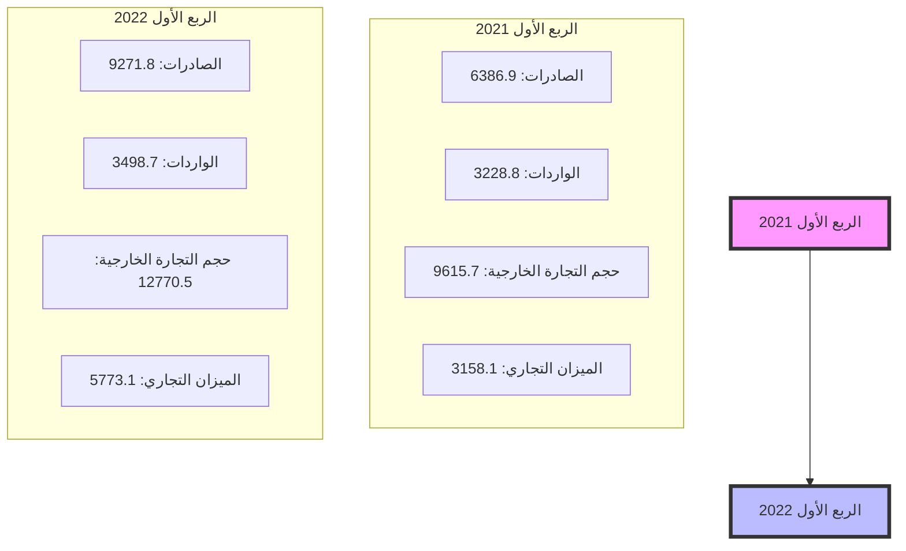

# مصرف ليبيا المركزي

## إدارة البحوث والإحصاء

### إحصاءات التجارة الخارجية

#### الربع الأول 2022

[The image shows a large container ship from Maersk Line docked at a port. The ship is heavily loaded with colorful shipping containers stacked high. In the foreground are large blue gantry cranes used for loading and unloading containers. The sky is cloudy, giving the scene an industrial and busy atmosphere typical of a major shipping port.]
---
# التجارة الخارجية خلال الربع الأول 2022

عالمياً ارتفعت قيمة التجارة العالمية إلى مستوى قياسي بلغ 7.7 تريليون دولار في الربع الأول من عام 2022، بزيادة قدرها حوالي 1 تريليون دولار مقارنة بالربع الأول من عام 2021، حيث ظلت معدلات نمو التجارة العالمية في الربع الأول من عام 2022 عالية في جميع المناطق الجغرافية، على الرغم من انخفاضها إلى حد ما في مناطق شرق آسيا والمحيط الهادئ ، وكانت الحرب في أوكرانيا قد أثرت على التجارة الدولية، إلى حد كبير من خلال الزيادات في الأسعار السلع الغذائية وأسعار الطاقة ، وكانت قيمة الصادرات السلعية من البلدان النامية أعلى بنحو 25% في الربع الأول من عام 2022 عنها في الربع الأول من عام 2021. وبالمقارنة فإن هذا الرقم يرتفع بحوالي 14% بالنسبة للبلدان المتقدمة ، كما نمت تجارة البضائع بين البلدان النامية بشكل كبير خلال الربع الأول من عام 2022.

إلا أن تطور التجارة العالمية للفترة المتبقية من عام 2022 من المرجح أن يتأثر بنمو اقتصادي أبطأ من المتوقع بسبب ارتفاع أسعار الفائدة والضغوط التضخمية والمخاوف بشأن القدرة على تحمل الديون في العديد من الاقتصادات.

## تحليل لأهم مؤشرات التجارة الخارجية في الاقتصاد الليبي خلال الربع الأول 2022:

### أولاً: حجم التبادل التجاري:

بلغت التجارة السلعية الإجمالية الليبية خلال الربع الأول من عام 2022 ما قيمته 12.8 مليار دولار مقارنة مع 9.6 مليار دولار خلال نفس الفترة من عام 2021 محققة نسبة إرتفاع قدره 32.8%، وذلك نظراً لإرتفاع قيمة الصادرات السلعية الإجمالية إلى 9.3 مليار دولار خلال الربع الأول من عام 2022 مقارنة مع 6.4 مليار دولار خلال نفس الفترة من عام 2021 أي بنسبة إرتفاع بلغت حوالي 45.2%. أما أداء الواردات السلعية الإجمالية، فقد شهدت ارتفاعاً خلال الربع الأول من عام 2022 لتسجل ماقيمته 3.5 مليار دولار مقارنة مع نحو 3.2 مليار دولار خلال نفس الفترة من عام 2021.
---
# حجم التجارة الخارجية خلال الربع الأول 2022

" بالمليون دولار "

| البند | الربع الأول 2021 | الربع الأول 2022 | مقدار التغير | معدل التغير % |
|-------|------------------|------------------|--------------|---------------|
| الصادرات | 6,386.9 | 9,271.8 | 2,884.9 | 45.2 |
| الواردات | 3,228.8 | 3,498.7 | 269.9 | 8.4 |
| حجم التجارة الخارجية | 9,615.7 | 12,770.5 | 3,154.8 | 32.8 |
| الميزان التجاري | 3,158.1 | 5,773.1 | 2,615.0 | 82.8 |

*المصدر: الإحصاءات التجارية لتنمية الاعمال الدولية (Trade Map)

## حجم التجارة الخارجية

## أولاً: الصادرات

يعتمد الإقتصاد الليبي بشكل كبير على مورد طبيعي ناضب وهو النفط كمصدر أساسي للدخل
والذي بدوره يتأثر بظروف الأسواق العالمية للنفط حيث تشكل الصادرات النفطية أكثر من 96.0%
من إجمالي الصادرات، مما قد يعرض الإقتصاد الوطني إلى صدمات قوية نتيجة التغيرات الكبيرة
والمفاجئة في أسواق النفط الدولية.
---
# التوزيع الجغرافي للصادرات:

بالنسبة لإتجاهات التجارة السلعية خلال الربع الأول من عام 2022 لم تظهر البيانات أي تغير في حصص الشركاء التجاريين، حيث استحوذت الصادرات لمجموعة دول الإتحاد الأوروبي على نحو 68.8% من إجمالي الصادرات الليبية لتحقق بذلك النسبة الأكبر بين الشركاء التجاريين ويعود سبب إرتفاع الأهمية النسبية للصادرات الوطنية لدول الإتحاد الأوروبي (منطقة اليورو)، إلى خصائص اقتصادات هذه البلدان على إعتبارها بلدان صناعية تعتمد بدرجة كبيرة على النفط الخام، في حين استقبلت الدول الآسيوية نسبة 18.3% من إجمالي الصادرات، فيما سجلت الصادرات إلى دول شمال ووسط وجنوب أمريكا تحسن ملحوظا لتصل إلى 6.5% من إجمالي الصادرات، في حين بلغت حصة باقي دول العالم نحو 6.4% من اجمالي الصادرات.

## توزيع الصادرات الليبية حسب مجموعات البلدان خلال الربع الأول 2022

"مليون دولار"

| مجموعات البلدان | الربع الأول 2021 | الربع الأول 2022 | مقدار التغير | معدل التغير % |
|-----------------|------------------|------------------|---------------|---------------|
| مجموعة دول الإتحاد الأوروبي | 4,325.2 | 6,436.3 | 2,111.2 | 48.8 |
| أقطار جامعة الدول العربية | 15.6 | - | -15.6 | - |
| الدول الآسيوية | 1,442.4 | 1,693.2 | 250.8 | 17.4 |
| دول أوربية أخرى | 225.2 | 407.6 | 182.4 | 81.0 |
| البلدان الأفريقية | 0.3 | - | -0.3 | - |
| دول شمال ووسط وجنوب أمريكا | 232.3 | 614.5 | 382.2 | 164.5 |
| أستراليا ونيوزيلاندا | 145.9 | 120.2 | -25.7 | -17.6 |
| الإجمالي | 6,386.8 | 9,271.8 | 2,885.0 | 45.2 |

*المصدر: الإحصاءات التجارية لتنمية الاعمال الدولية (Trade Map).
---
# الأهمية النسبية لتوزيع الصادرات الليبية
## حسب مجموعات البلدان

### الربع الأول 2021

| المجموعة | النسبة |
|----------|--------|
| مجموعة دول الإتحاد الأوروبي | 68% |
| الدول الآسيوية | 23% |
| دول أوروبية أخرى | 3% |
| دول شمال ووسط وجنوب أمريكا | 4% |
| أستراليا ونيوزيلاندا | 2% |
| البلدان الأفريقية | 0% |
| أقطار جامعة الدول العربية | 0% |

### الربع الأول 2022

| المجموعة | النسبة |
|----------|--------|
| مجموعة دول الإتحاد الأوروبي | 70% |
| الدول الآسيوية | 18% |
| دول شمال ووسط وجنوب أمريكا | 7% |
| دول أوروبية أخرى | 4% |
| أستراليا ونيوزيلاندا | 1% |
| البلدان الأفريقية | 0% |
| أقطار جامعة الدول العربية | 0% |
---
# قيمة الصادرات حسب أهم البلدان المصدر إليها

## خلال الربع الأول 2022

" مليون دولار "

| البلدان المصدر إليها | الربع الأول 2021 | الربع الأول 2022 | مقدار التغير | معدل التغير % |
|----------------------|------------------|------------------|---------------|---------------|
| إيطاليا | 1,151.2 | 2,319.6 | 1,168.4 | 101.5 |
| المانيا | 699.1 | 1,094.6 | 395.5 | 56.6 |
| أسبانيا | 743.8 | 1,037.0 | 293.2 | 39.4 |
| الصين الشعبية | 836.8 | 844.6 | 7.8 | 0.9 |
| الولايات المتحدة الأمريكية | 232.2 | 614.7 | 382.5 | 164.7 |
| تايلاند | 264.9 | 581.9 | 317.0 | 119.7 |
| فرنسا | 466.0 | 536.7 | 70.7 | 15.2 |
| اليونان | 146.5 | 467.9 | 321.4 | 219.4 |
| هولندا | 643.9 | 426.1 | -217.8 | -33.8 |
| المملكة المتحدة | 174.1 | 391.5 | 217.4 | 124.9 |
| النمسا | 271.7 | 290.6 | 18.9 | 7.0 |
| تركيا | 151.7 | 232.3 | 80.6 | 53.1 |
| استراليا | 145.9 | 120.0 | -25.9 | -17.8 |
| سنغافورة | 121.5 | 28.4 | -93.1 | -76.6 |
| بلدان أخرى | 337.6 | 285.9 | -51.7 | -15.3 |
| الإجمالي | 6,386.9 | 9,271.8 | 2,884.9 | 45.2 |

*المصدر: الإحصاءات التجارية لتنمية الاعمال الدولية (Trade Map)

من خلال الإطلاع على الجدول أعلاه لقيمة الصادرات حسب أهم البلدان المصدرة إليها يتضح أن إيطاليا كانت أهم مستورد حيث بلغ نسب ما صدر إليها وحدها 25% خلال الربع الأول 2022 من إجمالي قيمة الصادرات الليبية، حيث بلغ ما صدر اليها خلال الربع الأول من العام 2022 نحو 2.3 مليار دولار مقابل 1.2 مليار دولار خلال نفس الفترة من عام 2021، ثم تأتي دول ألمانيا وأسبانيا والصين الشعبية والولايات المتحدة وتايلاند من حيث الأهمية النسبية. حيث بلغ ما صدر إليهم على التوالي 1.1 مليار دولار، 1.0 مليار دولار، 844.6 مليون دولار، 614.7 مليون دولار، 581.9 مليون دولار.
---
# الأهمية النسبية للصادرات حسب أهم البلدان المصدر إليها
## خلال الربع الأول 2022
"نسب مئوية"

| البلدان المصدر إليها | الربع الأول 2021 | الربع الأول 2022 |
|----------------------|------------------|------------------|
| إيطاليا              | 18.0%            | 25.0%            |
| المانيا              | 11.0%            | 11.8%            |
| أسبانيا              | 11.7%            | 11.2%            |
| الصين الشعبية        | 13.1%            | 9.1%             |
| الولايات المتحدة الأمريكية | 3.6%      | 6.6%             |
| تايلاند              | 4.2%             | 6.3%             |
| فرنسا                | 7.3%             | 5.8%             |
| اليونان              | 2.3%             | 5.1%             |
| هولندا               | 10.1%            | 4.6%             |
| المملكة المتحدة      | 2.7%             | 4.2%             |
| النمسا               | 4.3%             | 3.1%             |
| تركيا                | 2.4%             | 2.5%             |
| استراليا             | 2.3%             | 1.3%             |
| سنغافورة             | 1.9%             | 0.3%             |
| بلدان أخرى           | 5.3%             | 3.1%             |

*المصدر: الإحصاءات التجارية لتنمية الاعمال الدولية (Trade Map)

## التركيب السلعي للصادرات:

أظهرت البيانات المتعلقة بالتركيب السلعي للصادرات الوطنية الواردة بالجدول أدناه مدى استحواذ
صادرات الوقود المعدنية والمحروقات والمواد المتصلة بها على النصيب الأوفر من إجمالي
الصادرات خلال الربع الأول من عام 2022، مشكلة بذلك ما نسبته نحو 96.8% من اجمالي
الصادرات، الأمر الذي يبين عدم تنوع الصادرات الوطنية، نتيجة ضعف هيكل الإنتاج المحلي
وهو ما يجعل الإقتصاد الوطني عرضة لتقلبات أسعار النفط في الأسواق الدولية.
---
# قيمة الصادرات مصنفة حسب أقسام السلع
## خلال الربع الأول 2022
### "مليون دولار"

| معدل التغير % | مقدار التغير | الربع الأول 2022 | الربع الأول 2021 | أقسام السلع |
|---------------|--------------|------------------|------------------|-------------|
| 0 | 0 | 0 | 0 | حيوانات حية - منتجات حيوانية |
| 0 | 0 | 0 | 0 | منتوجات المملكة النباتية |
| 0 | 0 | 0 | 0 | شحوم ودهون وزيوت حيوانية ونباتية والمنتوجات المشتقة منها |
| 0 | 0 | 0 | 0 | مواد غذائية محضرة، مشروبات، خل، التبغ |
| 44.9 | 2772.9 | 8954.3 | 6181.4 | المنتوجات المعدنية |
| 277.4 | 36.9 | 50.2 | 13.3 | منتوجات الصناعات الكيماوية وما يتصل بها |
| 100 | 0.2 | 0.4 | 0.2 | لدائن ومصنوعاتها، مطاط ومصنوعاته |
| -12.5 | -0.1 | 0.7 | 0.8 | جلود حيوانات خام وجلود مدبوغة |
| 0 | 0 | 0 | 0 | الخشب ومصنوعاته، الفحم الخشبي، الفلين ومصنوعاته، مصنوعات القش |
| 40 | 0.2 | 0.7 | 0.5 | عجائن الخشب، عجائن سلولوزية، ورق مقوى وفضلات الورق |
| -76.9 | -1 | 0.3 | 1.3 | منتوجات ومواد نسيجية |
| 0 | 0 | 0 | 0 | الأحذية، أغطية الرأس، المظلات، مظلات الشمس، عصي المشي، سياط الفروسية |
| 0 | 0 | 0 | 0 | مصنوعات من الحجر والجص والاسمنت والميكا ومنتوجات الخزف والزجاج |
| -38.4 | -25.1 | 40.3 | 65.4 | لؤلؤ طبيعي أو مستنبت وأحجار كريمة أو شبه كريمة ومعادن ثمينة ومصنوعاتها |
| 98.1 | 110.1 | 222.3 | 112.2 | المعادن العادية ومصنوعاتها |
| -95.9 | -7 | 0.3 | 7.3 | الآلات والأجهزة والمعدات الكهربائية وأجهزة التسجيل والإذاعة والصوت |
| 0.0 | 0 | 0 | 0 | معدات النقل |
| -66.7 | -0.2 | 0.1 | 0.3 | الأجهزة البصرية والفوتوغرافية والسينمائية وأجهزة قياس الضغط والمعدات الطبية |
| 0.0 | 0 | 0 | 0 | الأسلحة والذخائر، أجزاؤها ولوازمها |
| 2100.0 | 2.1 | 2.2 | 0.1 | سلع ومنتوجات متنوعة |
| 45.3 | 2,889.00 | 9,271.80 | 6,382.80 | الإجمالي |

*المصدر: الإحصاءات التجارية لتنمية الأعمال الدولية (Trade Map)
---
# الأهمية النسبية للصادرات الليبية حسب أقسام السلع

## الربع الأول 2021

| القسم | النسبة |
|-------|--------|
| المنتوجات المعدنية | 97% |
| منتوجات الصناعات الكيماوية وما يتصل بها | 2% |
| لؤلؤ طبيعي او مستنبت واحجار كريمة او شبه كريمة ومعادن ثمينة ومصنوعاتها | 1% |
| المعادن العادية ومصنوعاتها | 0% |
| الآلات والأجهزة والمعدات الكهربية وأجهزة التسجيل والإذاعة والصوت | 0% |
| أخرى | 0% |

## الربع الأول 2022

| القسم | النسبة |
|-------|--------|
| المنتوجات المعدنية | 97% |
| منتوجات الصناعات الكيماوية وما يتصل بها | 2% |
| لؤلؤ طبيعي او مستنبت واحجار كريمة او شبه كريمة ومعادن ثمينة ومصنوعاتها | 1% |
| المعادن العادية ومصنوعاتها | 0% |
| الآلات والأجهزة والمعدات الكهربية وأجهزة التسجيل والإذاعة والصوت | 0% |
| أخرى | 0% |
---
ثانياً: الواردات

يعتمد السوق المحلي في تلبية احتياجات كافة القطاعات والأفراد من السلع الإستهلاكية والرأسمالية
كالآلات والمعدات والمواد الخام والسلع الوسيطة اللازمة للعملية الإنتاجية، على الأسواق الخارجية.

التوزيع الجغرافي للواردات:

تعد بلدان الإتحاد الأوربي المصدر الرئيسي لواردات ليبيا حيث بلغت أهميتها النسبية خلال الربع
الأول 2022 نحو 51.4% من إجمالي الواردات، ويعود ذلك الى الجوار الجغرافي الذي يلعب
دوراً رئيسياً في زيادة حجم المبادلات التجارية بين ليبيا ودول منطقة اليورو، فيما شكلت الدول
الآسيوية ما نسبته 42.9% من اجمالي الواردات في حين شكلت دول شمال ووسط وجنوب أمريكا
والدول الأوروبية الأخرى النسبة الباقية. وتشير البيانات إلى ضعف المبادلات التجارية بين ليبيا
والدول الإفريقية وأستراليا ونيوزيلندا.

توزيع الواردات الليبية حسب مجموعات البلدان
خلال الربع الأول 2022

" مليون دولار "

| مجموعات البلدان | الربع الأول 2021 | الربع الأول 2022 | مقدار التغير | معدل التغير % |
|-----------------|------------------|------------------|---------------|----------------|
| مجموعة دول الاتحاد الأوروبي | 1,335.7 | 1,677.9 | 342.2 | 25.6 |
| أقطار جامعة الدول العربية | 205.0 | 36.9 | -168.1 | -82.0 |
| الدول الآسيوية | 1,270.3 | 1,534.2 | 263.9 | 20.8 |
| دول أوربية أخرى | 156.3 | 53.2 | -103.1 | -66.0 |
| البلدان الأفريقية | 2.6 | 1.4 | -1.2 | -46.2 |
| دول شمال ووسط وجنوب أمريكا | 230.5 | 168.8 | -61.9 | -26.9 |
| أستراليا ونيوزيلاندا | 28.4 | 26.5 | -1.9 | -6.7 |
| الإجمالي | 3,228.8 | 3,498.8 | 270.0 | 8.4 |

*المصدر: الإحصاءات التجارية لتنمية الاعمال الدولية (Trade Map).
---
# الأهمية النسبية لتوزيع الواردات الليبية
## حسب مجموعات البلدان

### الربع الأول 2021

| المجموعة | النسبة |
|----------|--------|
| مجموعة دول الاتحاد الأوروبي | 42% |
| الدول الآسيوية | 39% |
| أقطار جامعة الدول العربية | 6% |
| دول أوروبية أخرى | 5% |
| دول شمال ووسط وجنوب أمريكا | 7% |
| أستراليا ونيوزيلاندا | 1% |
| البلدان الأفريقية | 0% |

### الربع الأول 2022

| المجموعة | النسبة |
|----------|--------|
| مجموعة دول الاتحاد الأوروبي | 48% |
| الدول الآسيوية | 44% |
| أقطار جامعة الدول العربية | 1% |
| دول أوروبية أخرى | 1% |
| دول شمال ووسط وجنوب أمريكا | 5% |
| أستراليا ونيوزيلاندا | 1% |
| البلدان الأفريقية | 0% |
---
# قيمة الواردات حسب أهم البلدان المستورد منها
## خلال الربع الأول 2022
"مليون دولار"

| البلدان المستورد منها | الربع الأول 2021 | الربع الأول 2022 | مقدار التغير | معدل التغير % |
|------------------------|------------------|------------------|---------------|---------------|
| تركيا                  | 640.8            | 855.9            | 215.1         | 33.6          |
| الصين الشعبية          | 394.2            | 460.2            | 66.0          | 16.7          |
| إيطاليا                | 292.0            | 415.5            | 123.5         | 42.3          |
| اليونان                | 281.3            | 321.1            | 39.8          | 14.1          |
| بلجيكا                 | 79.2             | 269.4            | 190.2         | 240.2         |
| أسبانيا                | 61.3             | 229.2            | 167.9         | 273.9         |
| هولندا                 | 149.2            | 124.8            | -24.4         | -16.4         |
| المانيا                | 122.0            | 124.8            | 2.8           | 2.3           |
| كوريا الجنوبية         | 98.3             | 122.3            | 24.0          | 24.4          |
| الولايات المتحدة الأمريكية | 46.9        | 79.2             | 32.3          | 68.9          |
| تايلند                 | 54.1             | 61.2             | 7.1           | 13.1          |
| فرنسا                  | 46.2             | 43.2             | -3.0          | -6.5          |
| المملكة المتحدة        | 32.1             | 25.8             | -6.3          | -19.6         |
| الارجنتين              | 60.4             | 24.5             | -35.9         | -59.4         |
| قبرص                   | 18.4             | 18.2             | -0.2          | -1.1          |
| مالطا                  | 12.9             | 8.7              | -4.2          | -32.6         |
| بلدان أخرى             | 839.5            | 314.8            | -524.7        | -62.5         |
| الإجمالي               | 3,228.8          | 3,498.8          | 270.0         | 8.4           |

*المصدر: الإحصاءات التجارية لتنمية الاعمال الدولية (Trade Map)

من خلال الاطلاع على الجدول أعلاه لقيمة الواردات حسب أهم البلدان المستورد منها يتضح أن
دول تركيا والصين وإيطاليا واليونان تتصدر قائمة أهم البلدان المستورد منها خلال الربع الأول
2022، حيث بلغت نسبة ما أستورد منها حوالي 58.7% من إجمالي قيمة الواردات الليبية.
---
# الأهمية النسبية للواردات حسب أهم البلدان المستورد منها
## خلال الربع الأول 2022
"نسب مئوية"

| البلدان المستورد منها | الربع الأول 2021 | الربع الأول 2022 |
|------------------------|------------------|------------------|
| تركيا                  | 19.8%            | 24.5%            |
| الصين الشعبية          | 12.2%            | 13.2%            |
| إيطاليا                | 9.0%             | 11.9%            |
| اليونان                | 8.7%             | 9.2%             |
| بلجيكا                 | 2.5%             | 7.7%             |
| أسبانيا                | 1.9%             | 6.6%             |
| هولندا                 | 4.6%             | 3.6%             |
| المانيا                | 3.8%             | 3.6%             |
| كوريا الجنوبية         | 3.0%             | 3.5%             |
| الولايات المتحدة الأمريكية | 1.5%        | 2.3%             |
| تايلند                 | 1.7%             | 1.7%             |
| فرنسا                  | 1.4%             | 1.2%             |
| المملكة المتحدة        | 1.0%             | 0.7%             |
| الأرجنتين              | 1.9%             | 0.7%             |
| قبرص                   | 0.6%             | 0.5%             |
| مالطا                  | 0.4%             | 0.2%             |
| بلدان أخرى             | 26.0%            | 9.0%             |

*المصدر: الإحصاءات التجارية لتنمية الاعمال الدولية (Trade Map)

## التركيب السلعي للواردات:

احتلت واردات المنتجات المعدنية وكذلك واردات الآلات ومعدات النقل والمواد الغذائية المرتبة الأولى من اجمالي الواردات خلال الربع الأول من عام 2022، حيث شكلت 62.6% من اجمالي الواردات، وهذا يدل على مدى ضعف الإنتاج المحلي وعجز السوق المحلي في توفير العديد من السلع والخدمات التي يحتاجها الأفراد مما يؤدي ذلك إلى زيادة الطلب على النقد الأجنبي.

فيما احتلت واردات المواد النسيجية المرتبة الثانية من حيث الأهمية النسبية لتشكل 6.6%، فيما شكلت واردات الحيوانات الحية، المعادن العادية، المنتجات الكيمياوية، نسب 5.4%، 4.7%، 4.4 على التوالي، أما واردات باقي أقسام السلع فقد شكلت النسبة الباقية والبالغة حوالي 16.3% من إجمالي الواردات السلعية.
---
# قيمة الواردات مصنفة حسب أقسام السلع
## خلال الربع الأول 2022
"مليون دولار"

| معدل التغير % | مقدار التغير | الربع الأول 2022 | الربع الأول 2021 | أقسام السلع |
|---------------|--------------|------------------|------------------|-------------|
| 7.3 | 12.8 | 189.3 | 176.5 | حيوانات حية - منتوجات حيوانية |
| -60.3 | -175 | 115 | 290 | منتوجات المملكة النباتية |
| 1.3 | 0.6 | 46.6 | 46 | شحوم ودهون وزيوت حيوانية ونباتية والمنتوجات المشتقة منها |
| 8.2 | 18.9 | 248.3 | 229.4 | مواد غذائية محضرة، مشروبات، خل، التبغ |
| 30.5 | 239.4 | 1024.2 | 784.8 | المنتوجات المعدنية |
| 5.9 | 8.6 | 153.6 | 145 | منتوجات الصناعات الكيماوية وما يتصل بها |
| 28.9 | 32 | 142.6 | 110.6 | لدائن ومصنوعاتها، مطاط ومصنوعاته |
| -2.4 | -0.2 | 8.2 | 8.4 | جلود حيوانات خام وجلود مدبوغة |
| 28.3 | 7.7 | 34.9 | 27.2 | الخشب ومصنوعاته، الفحم الخشبي، الفلين ومصنوعاته، مصنوعات القش |
| 50.6 | 16.2 | 48.2 | 32 | عجائن الخشب، عجائن سلولوزية، ورق وفضلات الورق |
| 17.0 | 33.7 | 231.7 | 198 | منتوجات ومواد نسيجية |
| 27.2 | 7.9 | 36.9 | 29 | الأحذية، أغطية الرأس، المظلات، مظلات الشمس، عصي المشي، سياط الفروسية |
| -18.4 | -13 | 57.6 | 70.6 | مصنوعات من الحجر والجص والاسمنت والميكا ومنتوجات الخزف والزجاج |
| 0.0 | 0 | 95.8 | 95.8 | لؤلؤ طبيعي أو مستنبت وأحجار كريمة أو شبه كريمة ومعادن ثمينة ومصنوعاتها |
| 54.7 | 58.2 | 164.6 | 106.4 | المعادن العادية ومصنوعاتها |
| 13.8 | 55 | 453.5 | 398.5 | آلات والأجهزة والمعدات الكهربية وأجهزة التسجيل والإذاعة والصوت |
| 5.5 | 12 | 231.8 | 219.8 | معدات النقل |
| -7.1 | -3.9 | 51.3 | 55.2 | الأجهزة البصرية والفوتوغرافية والسينمائية وأجهزة قياس الضغط والمعدات الطبية |
| - | 0 | 0 | 0 | الأسلحة والذخائر، أجزاؤها ولوازمها |
| -19.8 | -40.8 | 164.8 | 205.6 | سلع ومنتوجات متنوعة |
| 8.4 | 270.1 | 3498.9 | 3228.8 | الإجمالي |

*المصدر: الإحصاءات التجارية لتنمية الأعمال الدولية (Trade Map)
---
# الأهمية النسبية لتوزيع الواردات الليبية حسب أقسام السلع

## الربع الأول 2021

| القسم | النسبة |
|-------|--------|
| المنتوجات المعدنية | 24% |
| سلع ومنتوجات متنوعة والأخرى | 13% |
| الآلات والأجهزة والمعدات الكهربائية وأجهزة التسجيل والإذاعة والصوت | 12% |
| منتوجات المملكة النباتية | 9% |
| معدات النقل | 7% |
| مواد غذائية محضرة، مشروبات، خل، التبغ | 7% |
| حيوانات حية - منتوجات حيوانية | 6% |
| منتوجات ومواد نسيجية | 6% |
| منتوجات الصناعات الكيماوية وما يتصل بها | 5% |
| المعادن العادية ومصنوعاتها | 3% |
| لؤلؤ طبيعي او مستنبت واحجار كريمة او شبه كريمة ومعادن ثمينة ومصنوعاتها | 3% |
| لدائن ومصنوعاتها، مطاط ومصنوعاته | 3% |
| مصنوعات من الحجر والجص والاسمنت والميكا ومنتوجات الخزف والزجاج | 2% |

## الربع الأول 2022

| القسم | النسبة |
|-------|--------|
| المنتوجات المعدنية | 29% |
| الآلات والأجهزة والمعدات الكهربائية وأجهزة التسجيل والإذاعة والصوت | 13% |
| سلع ومنتوجات متنوعة والأخرى | 11% |
| معدات النقل | 7% |
| منتوجات ومواد نسيجية | 7% |
| مواد غذائية محضرة، مشروبات، خل، التبغ | 7% |
| المعادن العادية ومصنوعاتها | 5% |
| حيوانات حية - منتوجات حيوانية | 5% |
| لدائن ومصنوعاتها، مطاط ومصنوعاته | 4% |
| منتوجات الصناعات الكيماوية وما يتصل بها | 4% |
| منتوجات المملكة النباتية | 3% |
| لؤلؤ طبيعي او مستنبت واحجار كريمة او شبه كريمة ومعادن ثمينة ومصنوعاتها | 3% |
| مصنوعات من الحجر والجص والاسمنت والميكا ومنتوجات الخزف والزجاج | 2% |
---
# الملاحق

جداول التجارة الخارجية لليبيا خلال الفترة (2018 - 2021)
---
# Distribution of Libyan Exports according to country groups(2018-2021)

التوزيع الجغرافي للصادرات الليبية للفترة (2018-2021)

in thousand of USA dollars القيمة الف دوالر

| Country groups | 2018 | 2019 | 2020 | 2021 | المنطقة |
|----------------|------|------|------|------|--------|
| European Union Group | 19,866,186 | 18,052,199 | 4,579,404 | 20,420,435 | مجموعة دول الاتحاد الأوربي |
| Countries of the Arab League | 1,063,153 | 1,945,336 | 1,108,719 | 655,801 | أقطار جامعة الدول العربية |
| Asian countries | 7,456,150 | 6,719,700 | 3,116,120 | 5,497,601 | دول اسيوية |
| Other European countries | 430,559 | 307,742 | 228,687 | 2,005,492 | دول اوربية أخرى |
| African countries | 20,686 | 1,160 | 580 | 688 | بلدان إفريقيا |
| North, Central and South America | 1,533,573 | 1,818,305 | 250,011 | 2,249,176 | دول شمال ووسط أمريكا |
| Australia and New Zealand | 461,757 | 626,140 | 160,773 | 288,437 | أستراليا ونيوزيلندا |
| TOTAL | 30,832,064 | 29,470,582 | 9,444,294 | 31,117,630 | المجموع |

*Source: Trade Statistics for International Business Development (Map Trade)
---
# Distribution of Libyan Imports according to country groups(2018-2021)

التوزيع الجغرافي للواردات الليبية للفترة (2018-2021)

in thousand of USA dollars القيمة الف دوالر

| Country groups | 2018 | 2019 | 2020 | 2021 | المنطقة |
|----------------|------|------|------|------|--------|
| European Union Group | 5,304,609 | 5,150,928 | 4,438,363 | 6,129,886 | مجموعة دول الاتحاد الأوربي |
| Countries of the Arab League | 2,865,794 | 2,977,884 | 2,233,712 | 3,140,028 | أقطار جامعة الدول العربية |
| Asian countries | 3,765,065 | 5,823,160 | 4,342,855 | 5,671,465 | دول اسيوية |
| Other European countries | 738,952 | 626,064 | 615,227 | 1,151,113 | دول اوربية أخرى |
| African countries | 8,929 | 7,432 | 8,224 | 10,894 | بلدان إفريقيا |
| North, Central and South America | 608,362 | 837,623 | 571,747 | 867,801 | دول شمال ووسط أمريكا |
| Australia and New Zealand | 60,881 | 90,170 | 103,088 | 68,905 | أستراليا ونيوزيلندا |
| TOTAL | 13,352,592 | 15,513,261 | 12,313,216 | 17,040,092 | المجموع |

*Source: Trade Statistics for International Business Development (Map Trade)
---
| European Union Group in 2018-2021 (Exports) |
| دول الاتحاد الأوربي خلال الفترة 2018-2021 (الصادرات) |

in thousand of USA dollars القيمة الف دولار

| Country | 2018 | 2019 | 2020 | 2021 | الدولة |
|---------|------|------|------|------|-------|
| Italy | 4,950,440 | 5,278,294 | 1,968,724 | 6,591,814 | إيطاليا |
| Germany | 4,069,908 | 4,386,707 | 849,480 | 3,602,756 | المانيا |
| Spain | 4,029,679 | 4,274,405 | 705,180 | 3,427,177 | اسبانيا |
| France | 2,697,978 | 1,595,339 | 529,215 | 2,159,187 | فرنسا |
| Austria | 1,058,945 | 930,728 | 138,501 | 893,308 | النمسا |
| Netherlands | 387,094 | 197,618 | 121,072 | 1,751,021 | هولندا |
| Greece | 961,899 | 671,896 | 58,317 | 1,032,848 | اليونان |
| Denmark | 44,751 | 107 | 46,252 | 220,541 | الدنمارك |
| Bulgaria | 3,102 | 1 | 25,726 | 63,120 | بلغاريا |
| Sweden | 536,886 | 157,491 | 27,269 | 321,491 | السويد |
| Malta | 15,112 | 10,225 | 9,042 | 15,888 | مالطا |
| Romania | 2,470 | 39,097 | 5,712 | 15,450 | رومانيا |
| Belgium | 32,853 | 49,042 | 4,158 | 53,595 | بلجيكا |
| Slovakia | 10,025 | 0 | 846 | 0 | سلوفاكيا |
| Poland | 6 | 223 | 715 | 31 | بولندا |
| Croatia | 83,520 | 156,093 | 229 | 116,878 | كرواتيا |
| Hungary | 81,596 | 84 | 107 | 17,214 | المجر |
| Ireland | 3 | 56 | 1 | 16 | ايرلندا |
| Czech Republic | 42,838 | 41,554 | 2 | 89,147 | التشيك |
| Cyprus | 19,898 | 1,036 | 2 | 3,828 | قبرص |
| Lithuania | 1 | 2 | 1 | 0 | لتوانيا |
| Portugal | 3,489 | 8,464 | 1 | 13,670 | برتغال |
| Finland | 1 | 0 | 0 | 0 | فنلندا |
| Latvia | 0 | 0 | 0 | 0 | لاتفيا |
| Luxembourg | 18 | 124 | 0 | 0 | لوكسمبورج |
| United Kingdom | 833,525 | 253,506 | 88,852 | 0 | المملكة المتحدة |
| Estonia | 0 | 0 | 0 | 31,455 | استونيا |
| Slovenia | 149 | 107 | 0 | 0 | سلوفينيا |
| total | 19,866,186 | 18,052,199 | 4,579,404 | 20,420,435 | المجموع |
---
# European Union Group in 2018-2021 (imports)
دول الاتحاد الأوروبي خلال الفترة 2018-2021 (الواردات)

in thousand of USA dollars القيمة الف دولار

| Country | 2018 | 2019 | 2020 | 2021 | الدولة |
|---------|------|------|------|------|-------|
| Italy | 1,426,139 | 1,390,859 | 999,800 | 1,421,948 | إيطاليا |
| Greece | 506,180 | 451,368 | 719,366 | 1,190,313 | اليونان |
| Netherlands | 391,261 | 595,311 | 576,854 | 532,885 | هولندا |
| Germany | 382,551 | 484,379 | 400,816 | 683,504 | المانيا |
| Spain | 713,123 | 468,723 | 346,849 | 366,732 | اسبانيا |
| Belgium | 229,483 | 291,119 | 255,697 | 794,726 | بلجيكا |
| France | 233,077 | 210,048 | 171,319 | 208,178 | فرنسا |
| Cyprus | 456,657 | 353,195 | 185,635 | 213,722 | قبرص |
| Bulgaria | 65,572 | 72,500 | 131,168 | 139,502 | بلغاريا |
| Romania | 205,334 | 127,772 | 100,460 | 98,943 | رومانيا |
| Malta | 98,979 | 67,513 | 69,612 | 48,450 | مالطا |
| Ireland | 71,029 | 65,711 | 25,524 | 31,950 | ايرلندا |
| Austria | 49,260 | 74,353 | 59,609 | 60,514 | النمسا |
| Poland | 51,647 | 71,470 | 54,745 | 70,331 | بولندا |
| Sweden | 61,555 | 37,440 | 37,547 | 43,551 | السويد |
| Portugal | 32,770 | 31,652 | 33,875 | 41,721 | برتغال |
| Denmark | 36,532 | 30,400 | 30,886 | 31,774 | دنمارك |
| Lithuania | 45,903 | 72,785 | 29,965 | 62,504 | لتوانيا |
| Czech Republic | 5,942 | 13,357 | 14,061 | 17,305 | تشيك |
| Slovenia | 36,144 | 17,649 | 10,078 | 25,124 | سلوفينيا |
| Hungary | 8,647 | 8,070 | 9,728 | 12,706 | المجر |
| Latvia | 9,805 | 2,273 | 11,169 | 1,983 | لاتفيا |
| Croatia | 9,872 | 6,413 | 10,112 | 21,182 | كرواتيا |
| Slovakia | 2,106 | 2,531 | 3,420 | 6,019 | سلوفاكيا |
| Estonia | 4,422 | 1,481 | 1,238 | 1,053 | استونيا |
| Finland | 816 | 508 | 615 | 1,731 | فنلندا |
| Luxembourg | 458 | 602 | 514 | 1,535 | لوكسمبورج |
| United Kingdom | 169,345 | 201,446 | 147,701 | 0 | المملكة المتحدة |
| total | 5,304,609 | 5,150,928 | 4,438,363 | 6,129,886 | المجموع |
---
# Countries of the Arab League in 2018-2021 (Exports)

أقطار جامعة الدول العربية خلال الفترة 2018-2021 (الصادرات)

in thousand of USA dollars القيمة ألف دولار

| Country | 2018 | 2019 | 2020 | 2021 | الدولة |
|---------|------|------|------|------|--------|
| Algeria | 0 | 0 | 0 | 0 | الجزائر |
| Bahrain | 7 | 1 | 6 | 0 | البحرين |
| Comoros | 0 | 0 | 0 | 0 | جزر القمر |
| Egypt | 66,553 | 155,263 | 35,591 | 63,740 | مصر |
| Jordan | 12 | 212 | 5,169 | 0 | الأردن |
| Kuwait | 69 | 6 | 227 | 0 | الكويت |
| Lebanon | 193,197 | 108,755 | 32,417 | 0 | لبنان |
| Mauritania | 340 | 615 | 239 | 387 | موريتانيا |
| Morocco | 55,464 | 20,227 | 13,703 | 36,434 | المغرب |
| Oman | 0 | 0 | 0 | 0 | عمان |
| Qatar | 183 | 2,948 | 0 | 0 | قطر |
| Saudi Arabia | 7,427 | 17,397 | 8,778 | 92 | السعودية |
| Sudan | 2,805 | 0 | 0 | 0 | السودان |
| Tunisia | 52,780 | 69,523 | 57,413 | 77,560 | تونس |
| United Arab Emirates | 684,316 | 1,570,389 | 955,176 | 477,588 | الأمارات العربية المتحدة |
| total | 1,063,153 | 1,945,336 | 1,108,719 | 655,801 | 58,073 |
---
# Countries of the Arab League (Imports) in (2018-2021)

أقطار جامعة الدول العربية (الواردات) خلال الفترة 2018-2021

in thousand of USA dollars القيمة ألف دولار

| Country | 2018 | 2019 | 2020 | 2021 | الدولة |
|---------|------|------|------|------|--------|
| Algeria | 0 | 0 | 0 | 0 | الجزائر |
| Bahrain | 3,880 | 32,145 | 1,294 | 0 | البحرين |
| Comoros | 7 | 0 | 0 | 0 | جزر القمر |
| Egypt | 640,549 | 830,735 | 572,846 | 796,170 | مصر |
| Kuwait | 2,140 | 1,537 | 1,017 | 0 | الكويت |
| Lebanon | 49,359 | 16,719 | 14,540 | 0 | لبنان |
| Mauritania | 780 | 101 | 47 | 72 | موريتانيا |
| Morocco | 85,784 | 88,066 | 67,964 | 76,750 | المغرب |
| Oman | 17,430 | 0 | 0 | 0 | عمان |
| Qatar | 3,770 | 6,288 | 5,497 | 0 | قطر |
| Saudi Arabia | 119,208 | 107,077 | 117,577 | 119,480 | السعودية |
| Sudan | 450 | 0 | 0 | 0 | السودان |
| Tunisia | 497,326 | 540,378 | 449,564 | 642,507 | تونس |
| United Arab Emirates | 1,445,111 | 1,354,838 | 1,003,366 | 1,505,049 | الامارات العربية المتحدة |
| total | 2,865,794 | 2,977,884 | 2,233,712 | 3,140,028 | المجموع |
---
# Asian countries in 2018-2021 (Exports)
الدول الآسيوية خلال الفترة 2018-2021 ( الصادرات )

in thousand of USA dollars القيمة الف دولار

| Country | 2018 | 2019 | 2020 | 2021 | الدولة |
|---------|------|------|------|------|-------|
| Turkey | 367,010 | 483,502 | 1,674,297 | 821,796 | تركيا |
| China | 4,742,280 | 4,765,665 | 812,042 | 2,888,398 | الصين |
| Thailand | 393,971 | 483,882 | 326,818 | 1,155,874 | تايلند |
| Singapore | 665,300 | 379,203 | 197,969 | 171,237 | سنغافورة |
| Japan | 13,670 | 1,288 | 66,063 | 33,981 | اليابان |
| Korea, Republic of | 329,539 | 225,672 | 19,679 | 12,523 | كوريا |
| India | 173,641 | 81,159 | 12,646 | 368,518 | الهند |
| Pakistan | 4,132 | 4,763 | 4,961 | 4,132 | باكستان |
| Indonesia | 165,349 | 173 | 710 | 10,483 | اندونيسيا |
| Malaysia | 512,466 | 293,163 | 640 | 30,336 | ماليزيا |
| Taipei, Chinese | 88,783 | 1,065 | 268 | 259 | تايبيه ، الصينية |
| Hong Kong, China | 9 | 158 | 27 | 64 | هونغ كونغ |
| Azerbaijan | 0 | 0 | 0 | 0 | اذربيجان |
| Brunei Darussalam | 0 | 0 | 0 | 0 | بروناي |
| Philippines | 0 | 7 | 0 | 0 | فلبين |
| Viet Nam | 0 | 0 | 0 | 0 | فيتنام |
| Sri Lanka | 0 | 0 | 0 | 0 | سريلانكا |
| total | 7,456,150 | 6,719,700 | 3,116,120 | 5,497,601 | المجموع |
---
| Country | 2018 | 2019 | 2020 | 2021 |
|---------|------|------|------|------|
| China | 1,433,045 | 2,453,887 | 1,880,557 | 1,918,662 |
| Turkey | 1,498,326 | 2,069,669 | 1,653,078 | 2,769,426 |
| Korea, Republic of | 425,119 | 632,102 | 337,967 | 428,530 |
| Thailand | 134,943 | 216,049 | 176,716 | 188,595 |
| India | 134,903 | 199,395 | 142,325 | 207,897 |
| Singapore | 21,618 | 22,364 | 21,530 | 16,563 |
| Indonesia | 21,739 | 28,975 | 17,584 | 17,488 |
| Japan | 32,037 | 32,949 | 16,055 | 34,251 |
| Hong Kong, China | 20,815 | 21,855 | 15,925 | 16,853 |
| Taipei, Chinese | 15,677 | 25,917 | 15,619 | 13,786 |
| Malaysia | 20,123 | 17,484 | 14,426 | 19,181 |
| Pakistan | 2,944 | 5,395 | 8,802 | 11,711 |
| Azerbaijan | 0 | 43,807 | 7,454 | 27,879 |
| Cambodia | 270 | 217 | 364 | 112 |
| Uzbekistan | 0 | 0 | 163 | 380 |
| Philippines | 1 | 748 | 67 | 151 |
| Kazakhstan | 23 | 58 | 1 | 0 |
| Brunei Darussalam | 11 | 0 | 0 | 0 |
| Myanmar | 0 | 227 | 0 | 0 |
| Lao People's Democratic Republic | 0 | 0 | 0 | 0 |
| Viet Nam | 0 | 0 | 0 | 0 |
| Iran, Islamic Republic of | 3,471 | 5,952 | 3,952 | 0 |
| Sri Lanka | 0 | 46,110 | 30,270 | 0 |
| total | 3,765,065 | 5,823,160 | 4,342,855 | 5,671,465 |

Asian countries in 2018-2021 (Imports)
الدول الاسيوية خلال الفترة 2018-2021 ( الواردات )
in thousand of USA dollars
القيمة الف دولار
---
# Other European countries in 2018-2021 (Exports)

دول اوربية أخرى خلال الفترة 2018-2021 ( الصادرات )

in thousand of USA dollars                                                                القيمة الف دولار

| Country | 2018 | 2019 | 2020 | 2021 | الدولة |
|---------|------|------|------|------|--------|
| Switzerland | 394,763 | 291,628 | 144,721 | 302,068 | سويسرا |
| United Kingdom | 0 | 0 | 0 | 1,548,301 | المملكة المتحدة |
| Ukraine | 106 | 3,116 | 41,973 | 147,067 | أكرانيا |
| Macedonia, North | 1,480 | 935 | 1,092 | 0 | مقدونيا الشمالية |
| Bosnia and Herzegovina | 93 | 9 | 351 | 0 | البوسنة والهرسك |
| Serbia | 1 | 0 | 304 | 7,457 | صربيا |
| Moldova, Republic of | 0 | 0 | 194 | 580 | جمهورية مولدوفا |
| Norway | 11,508 | 1 | 3 | 19 | النرويج |
| Montenegro | 19 | 0 | 0 | 0 | الجبل الأسود |
| Iceland | 0 | 2 | 0 | 0 | أيسلندا |
| Russian Federation | 15 | 6 | 0 | 0 | الاتحاد الروسي |
| Belarus | 0 | 0 |  | 0 | بيلاروسيا |
| Albania | 22,574 | 12,045 | 40,049 | 0 | ألبانيا |
| Total | 430,559 | 307,742 | 228,687 | 2,005,492 | المجموع |
---
# Other European countries IN 2018-2012 (imports)
دول اوربية أخرى خلال الفترة 2018-2021 ( الواردات )

in thousand of USA dollars
القيمة الف دولار

| Country | 2018 | 2019 | 2020 | 2021 | الدولة |
|---------|------|------|------|------|-------|
| Ukraine | 325,667 | 316,891 | 327,835 | 425,007 | أوكرانيا |
| United Kingdom | 0 | 0 | 0 | 141,134 | المملكة المتحدة |
| Switzerland | 161,905 | 121,134 | 127,140 | 216,675 | سويسرا |
| Russian Federation | 227,091 | 156,338 | 121,248 | 331,969 | الاتحاد الروسي |
| Serbia | 8,853 | 16,000 | 26,082 | 22,911 | صربيا |
| Macedonia, North | 2,055 | 2,479 | 3,112 | 0 | مقدونيا الشمالية |
| Montenegro | 74 | 1,053 | 1,504 | 3,033 | الجبل الأسود |
| Bosnia and Herzegovina | 5,644 | 1,876 | 1,717 | 5,202 | البوسنة والهرسك |
| Norway | 641 | 1,182 | 1,494 | 830 | النرويج |
| Moldova, Republic of | 127 | 460 | 29 | 2,147 | جمهورية مولدوفا |
| Belarus | 5,096 | 6,348 | 1,556 | 2,205 | بيلاروسيا |
| Albania | 1,799 | 2,303 | 3,510 | 0 | ألبانيا |
| Total | 738,952 | 626,064 | 615,227 | 1,151,113 | المجموع |
---
# African countries in 2018-2021 (Exports)
بلدان افريقيا خلال الفترة 2018-2021 (الصادرات)

in thousand of USA dollars
القيمة الف دولار

| Country | 2018 | 2019 | 2020 | 2021 | الدولة |
|---------|------|------|------|------|--------|
| Ethiopia | 680 | 0 | 12 | 0 | أثيوبيا |
| Nigeria | 60 | 39 | 5 | 181 | نيجيريا |
| Senegal | 4,999 | 34 | 5 | 321 | السنغال |
| Congo, Democratic Republic of the | 0 | 0 | 0 | 0 | جمهورية الكونغو الديمقراطية |
| South Africa | 2 | 0 | 0 | 17 | جنوب أفريقيا |
| Botswana | 0 | 0 | 0 | 0 | بوتسوانا |
| Gambia | 0 | 14 | 0 | 0 | غامبيا |
| Madagascar | 0 | 0 | 0 | 0 | مدغشقر |
| Mozambique | 0 | 0 | 0 | 0 | موزمبيق |
| Namibia | 0 | 0 | 0 | 0 | ناميبيا |
| Zimbabwe | 23 | 0 | 0 | 0 | زيمبابوي |
| Uganda | 0 | 0 | 0 | 0 | أوغندا |
| Angola | 5 | 0 | 0 | 0 | أنغولا |
| Cabo Verde | 7 | 0 | 0 | 0 | كابو فيردي |
| Congo | 0 | 0 | 0 | 111 | الكونغو |
| Benin | 21 | 32 | 42 | 45 | بنين |
| Ghana | 4,102 | 223 | 0 | 0 | غانا |
| Côte d'Ivoire | 6,109 | 45 | 0 | 0 | كوت ديفوار |
| Mali | 352 | 444 | 0 | 0 | مالي |
| Niger | 191 | 305 | 400 | 0 | نيجر |
| Rwanda | 0 | 0 | 0 | 0 | رواندا |
| Togo | 0 | 4 | 5 | 13 | توغو |
| Burkina Faso | 2,444 | 20 | 111 | 0 | بوركينا فاسو |
| Guinea-Bissau | 0 | 0 | 0 | 0 | غينيا بيساو |
| Cameroon | 1,691 | 0 | 0 | 0 | كاميرون |
| Tanzania, United Republic of | 0 | 0 | 0 | 0 | جمهورية تنزانيا المتحدة |
| total | 20,686 | 1,160 | 580 | 688 | المجموع |
---
# African countries IN 2018-2021 (imports)
بلدان افريقيا خلال الفترة 2018-2021 (الواردات)

in thousand of USA dollars | القيمة الف دولار

| Country | 2018 | 2019 | 2020 | 2021 | الدولة |
|---------|------|------|------|------|-------|
| South Africa | 401 | 3,997 | 3,484 | 2,145 | جنوب افريقيا |
| Ethiopia | 884 | 521 | 3,134 | 5,001 | اثيوبيا |
| Nigeria | 725 | 44 | 286 | 916 | نيجيريا |
| Uganda | 289 | 168 | 231 | 0 | اوغندا |
| Botswana | 24 | 2 | 48 | 0 | بوتسوانا |
| Zimbabwe | 0 | 0 | 46 | 0 | زيمبابوي |
| Madagascar | 12 | 99 | 15 | 68 | مدغشقر |
| Namibia | 0 | 341 | 12 | 0 | ناميبيا |
| Senegal | 7 | 62 | 5 | 0 | السنغال |
| Mozambique | 0 | 0 | 0 | 41 | موزمبيق |
| Angola | 42 | 15 | 0 | 0 | أنغولا |
| Congo | 196 | 0 | 0 | 0 | الكونغو |
| Benin | 8 | 53 | 69 | 162 | بنين |
| Ghana | 16 | 0 | 0 | 0 | غانا |
| Côte d'Ivoire | 6 | 100 | 32 | 0 | كوت ديفوار |
| Kenya | 301 | 1,217 | 528 | 2,041 | كينيا |
| Mali | 800 | 0 | 0 | 0 | مالي |
| Niger | 4,952 | 470 | 163 | 0 | نيجر |
| Rwanda | 15 | 0 | 0 | 0 | رواندا |
| Togo | 4 | 0 | 126 | 39 | توغو |
| Burkina Faso | 3 | 71 | 0 | 5 | بوركينا فاسو |
| Cameroon | 0 | 0 | 0 | 0 | الكاميرون |
| Tanzania | 244 | 272 | 45 | 476 | جمهورية تنزانيا المتحدة |
| Liberia | 0 | 0 | 0 | 0 | ليبيريا |
| total | 8,929 | 7,432 | 8,224 | 10,894 | المجموع |
---
# North, Central and South America IN 2018-2021 ( Exports )
دول شمال ووسط أمريكا خلال الفترة 2018-2021 ( الصادرات )

in thousand of USA dollars
القيمة الف دولار

| Country | 2018 | 2019 | 2020 | 2021 | الدولة |
|---------|------|------|------|------|-------|
| United States of America | 1,447,572 | 1,572,465 | 224,895 | 2,220,062 | الولايات المتحدة الأمريكية |
| Brazil | 20,744 | 166,738 | 24,311 | 21,055 | البرازيل |
| Argentina | 0 | 12,183 | 726 | 0 | الأرجنتين |
| Canada | 59,870 | 66,836 | 46 | 177 | كندا |
| Barbados | 2 | 0 | 0 | 0 | بربادوس |
| Bolivia | 0 | 0 | 0 | 0 | بوليفيا |
| Chile | 75 | 67 | 0 | 0 | تشيلي |
| Colombia | 0 | 9 | 0 | 0 | كولومبيا |
| Costa Rica | 0 | 0 | 0 | 0 | كوستا ريكا |
| Guatemala | 0 | 0 | 0 | 0 | غواتيمالا |
| Mexico | 41 | 0 | 33 | 7,876 | المكسيك |
| Uruguay | 90 | 0 | 0 | 0 | أوروغواي |
| Dominican Republic | 6 | 7 | 0 | 6 | جمهورية الدومينيكان |
| Ecuador | 0 | 0 | 0 | 0 | الاكوادور |
| Cuba | 5,173 | 0 | 0 | 0 | كوبا |
| total | 1,533,573 | 1,818,305 | 250,011 | 2,249,176 | المجموع |
---
# North, Central and South America IN 2018-2021 (ixports)
دول شمال ووسط أمريكا خلال الفترة 2018-2021 (الواردات)

in thousand of USA dollars القيمة الف دولار

| Country | 2018 | 2019 | 2020 | 2021 | الدولة |
|---------|------|------|------|------|-------|
| United States of America | 243,859 | 412,009 | 289,956 | 295,866 | الولايات المتحدة الأمريكية |
| Brazil | 228,129 | 279,360 | 166,445 | 313,404 | البرازيل |
| Canada | 33,214 | 67,221 | 38,466 | 58,374 | كندا |
| Colombia | 997 | 2,150 | 5,489 | 14,098 | كولومبيا |
| Paraguay | 0 | 56 | 5,335 | 6,921 | باراغواي |
| Costa Rica | 1,741 | 1,613 | 4,282 | 0 | كوستا ريكا |
| Argentina | 63,976 | 61,975 | 39,538 | 128,876 | الأرجنتين |
| Chile | 2,081 | 3,027 | 2,591 | 2,710 | تشيلي |
| Peru | 11,138 | 220 | 1,281 | 1,142 | بيرو |
| Uruguay | 150 | 397 | 595 | 0 | أوروغواي |
| Guatemala | 10,670 | 1,587 | 227 | 24,350 | غواتيمالا |
| Bolivia | 95 | 107 | 127 | 0 | بوليفيا |
| Barbados | 0 | 0 | 0 | 0 | بربادوس |
| Guyana | 0 | 0 | 0 | 0 | غويانا |
| Mexico | 9,170 | 408 | 8,002 | 0 | المكسيك |
| Dominican Republic | 7 | 0 | 1,037 | 823 | جمهورية الدومينيكان |
| Ecuador | 2,990 | 7,491 | 8,376 | 21,237 | الاكوادور |
| Panama | 145 | 2 | 0 | 0 | بنما |
| total | 608,362 | 837,623 | 571,747 | 867,801 | المجموع |
---
# Distribution of Libyan Exports according to country groups(2018-2021)

التوزيع الجغرافي للصادرات الليبية للفترة (2018-2021)

Unit : US Dollar thousand                                                 القيمة مليون دولار

| EXPORTS | 2018 | 2019 | 2020 | 2021 | الصادرات |
|---------|------|------|------|------|----------|
| Total | 30,832,064 | 29,470,582 | 9,444,293 | 31,117,630 | المجموع |
| Albania | 22,574 | 12,045 | 40,049 | 0 | البانيا |
| Algeria | 0 | 0 | 0 | 0 | الجزائر |
| Angola | 5 | 0 | 0 | 0 | أنجولا |
| Argentina | 0 | 12,183 | 726 | 0 | الارجنتين |
| Armenia | 0 | 0 | 0 | 0 | أرمينيا |
| Australia | 461,553 | 626,137 | 160,726 | 288,414 | استراليا |
| Austria | 1,058,945 | 930,728 | 138,501 | 893,308 | النمسا |
| Azerbaijan | 0 | 0 | 0 | 0 | ادربيجان |
| Bahrain | 7 | 1 | 6 | 0 | البحرين |
| Barbados | 2 | 0 | 0 | 0 | برباروس |
| Belarus | 0 | 0 | 0 | 0 | بيلاروس |
| Belgium | 32,853 | 49,042 | 4,158 | 53,595 | بلجيكا |
| Benin | 19 | 32 | 42 | 45 | بنين |
| Bolivia, Plurinational State of | 0 | 0 | 0 | 0 | بوليفيا |
| Bosnia and Herzegovina | 93 | 9 | 351 | 0 | البوسنة والهرسك |
| Botswana | 1 | 0 | 0 | 0 | بوتسوانا |
| Brazil | 20,744 | 166,738 | 24,311 | 21,055 | البرازيل |
| Brunei Darussalam | 0 | 0 | 0 | 0 | بروناي |
| Bulgaria | 3,102 | 1 | 25,726 | 63,120 | بلغاريا |
---
| Country | Column 1 | Column 2 | Column 3 | Column 4 | Arabic Name |
|---------|----------|----------|----------|----------|-------------|
| Burkina Faso | 2,444 | 20 | 111 | 0 | بوركينا فاسو |
| Cabo Verde | 7 | 0 | 0 | 0 | الرأس الأخضر |
| Cameroon | 1,691 | 0 | 0 | 0 | الكاميرون |
| Canada | 59,870 | 66,836 | 46 | 177 | كندا |
| Chile | 75 | 67 | 0 | 0 | تشيلي |
| China | 4,742,280 | 4,765,665 | 812,042 | 2,888,398 | الصين |
| Colombia | 0 | 9 | 0 | 1 | كولومبيا |
| Congo | 1 | 0 | 0 | 111 | الكونغو |
| Congo, Democratic Republic of the | 0 | 0 | 0 | 0 | الكونغو الديمقراطية |
| Costa Rica | 0 | 0 | 0 | 0 | كوستاريكا |
| Côte d'Ivoire | 6,109 | 45 | 1 | 0 | ساحل العاج |
| Croatia | 83,520 | 156,093 | 229 | 116,878 | كرواتيا |
| Cuba | 5,173 | 0 | 0 | 0 | كوبا |
| Cyprus | 19,898 | 1,036 | 2 | 3,828 | قبرص |
| Czech Republic | 42,838 | 41,554 | 2 | 89,147 | جمهورية التشيك |
| Denmark | 44,751 | 107 | 46,252 | 220,541 | الدنمارك |
| Dominican Republic | 6 | 7 | 0 | 6 | جمهورية الدومينيك |
| Ecuador | 0 | 0 | 0 | 0 | الإكوادور |
| Egypt | 66,553 | 155,263 | 35,591 | 63,740 | مصر |
| Estonia | 0 | 0 | 0 | 31,455 | استونيا |
| Ethiopia | 680 | 0 | 12 | 0 | اثيوبيا |
| Finland | 1 | 0 | 0 | 0 | فنلندا |
| France | 2,697,979 | 1,595,339 | 529,215 | 2,159,187 | فرنسا |
| French Polynesia | 201 | 3 | 1 | 0 | بولينيزيا الفرنسية |
| Gambia | 0 | 14 | 0 | 0 | غامبيا |
| Georgia | 1 | 0 | 0 | 0 | جورجيا |
| Germany | 4,069,908 | 4,386,707 | 849,480 | 3,602,756 | المانيا |
---
| Country | Column 1 | Column 2 | Column 3 | Column 4 | Arabic Name |
|---------|----------|----------|----------|----------|-------------|
| Ghana | 4102 | 223 | 0 | 0 | غانا |
| Greece | 961,899 | 671,896 | 58,317 | 1,032,848 | اليونان |
| Guatemala | 0 | 0 | 0 | 0 | غواتيمالا |
| Guinea-Bissau | 0 | 0 | 0 | 0 | غينيا بيساو |
| Hong Kong, China | 9 | 158 | 27 | 64 | هونغ كونغ |
| Hungary | 81,596 | 84 | 107 | 17,214 | المجر |
| Iceland | 0 | 2 | 0 | 0 | ايسلندا |
| India | 173,641 | 81,159 | 12,646 | 368,518 | الهند |
| Indonesia | 165,349 | 173 | 710 | 10,483 | اندونيسيا |
| Ireland | 3 | 56 | 1 | 16 | ايرلندا |
| Italy | 4,950,440 | 5,278,294 | 1,968,724 | 6,591,814 | إيطاليا |
| Japan | 13,670 | 1,288 | 66,063 | 33,981 | اليابان |
| Jordan | 12 | 212 | 5169 | 0 | الأردن |
| Kenya | 0 | 0 | 1 | 0 | كينيا |
| Korea, Republic of | 329,539 | 225,672 | 19,679 | 12,523 | كوريا |
| Kuwait | 69 | 6 | 227 | 0 | الكويت |
| Kyrgyzstan | 0 | 0 | 1 | 0 | كازخستان |
| Latvia | 0 | 0 | 0 | 0 | لاتفيا |
| Lebanon | 193,197 | 108,755 | 32,417 | 0 | لبنان |
| Lithuania | 1 | 2 | 1 | 0 | لتوانيا |
| Luxembourg | 18 | 124 | 0 | 0 | لوكسمبورغ |
| Macedonia, North | 1,480 | 935 | 1,092 | 0 | مقدونيا ، الشمال |
| Madagascar | 0 | 0 | 0 | 0 | مدغشقر |
| Malaysia | 512,466 | 293,163 | 640 | 30,336 | ماليزيا |
| Mali | 352 | 444 | 0 | 0 | مالي |
| Malta | 15,112 | 10,225 | 9,042 | 15,889 | مالطا |
| Mauritania | 340 | 615 | 239 | 387 | موريتانيا |
| Mexico | 41 | 0 | 33 | 7876 | المكسيك |
| Moldova, Republic of | 0 | 0 | 194 | 580 | جمهورية مولدوفا |
---
| Country | Column 1 | Column 2 | Column 3 | Column 4 | Arabic Name |
|---------|----------|----------|----------|----------|-------------|
| Montenegro | 19 | 0 | 0 | 0 | الجبل الأسود |
| Morocco | 20,227 | 20,227 | 13,703 | 36,434 | المغرب |
| Mozambique | 0 | 0 | 0 | 0 | موزمبيق |
| Namibia | 0 | 0 | 0 | 0 | ناميبيا |
| Netherlands | 387,094 | 197,618 | 121,072 | 1,751,021 | هولندا |
| New Zealand | 1 | 0 | 43 | 20 | نيوزيلاندا |
| Nicaragua | 0 | 0 | 0 | 0 | نيكاراغوا |
| Niger | 191 | 305 | 400 | | النيجر |
| Nigeria | 60 | 39 | 5 | 181 | نيجيريا |
| Norway | 11,508 | 1 | 3 | 19 | النرويج |
| Oman | 0 | 0 | 0 | 0 | سلطنة عمان |
| Pakistan | 4,132 | 4,763 | 4,961 | 4,132 | باكستان |
| Peru | 0 | 0 | 0 | 0 | بيرو |
| Philippines | 0 | 7 | 0 | 0 | فلبين |
| Poland | 6 | 223 | 715 | 31 | بولندا |
| Portugal | 3,489 | 8,464 | 1 | 13,670 | البرتغال |
| Qatar | 183 | 2,948 | 0 | 0 | دولة قطر |
| Romania | 2,470 | 39,097 | 5,712 | 15,450 | رومانيا |
| Russian Federation | 15 | 6 | 0 | 1 | روسيا |
| Rwanda | 0 | 0 | 0 | 0 | رواندا |
| Saudi Arabia | 7,427 | 17,397 | 8,778 | 92 | السعودية |
| Senegal | 4999 | 34 | 5 | 321 | السنغال |
| Serbia | 1 | 0 | 304 | 7,457 | صربيا |
| Singapore | 665,300 | 379,203 | 197,969 | 171,237 | سنغافورة |
| Slovakia | 10025 | 0 | 846 | 0 | سلوفاكيا |
| Slovenia | 149 | 107 | 0 | 0 | سلوفينيا |
| South Africa | 2 | 1 | 1 | 17 | جنوب أفريقيا |
| Spain | 4,064,916 | 4,274,405 | 705,180 | 3,427,177 | إسبانيا |
| Sri Lanka | | 0 | 0 | 0 | سريلانكا |
---
| Country | Column 1 | Column 2 | Column 3 | Column 4 | Arabic Name |
|---------|----------|----------|----------|----------|-------------|
| Sudan | 2805 | 0 | 0 | 0 | السودان |
| Sweden | 536,886 | 157,491 | 27,269 | 321,491 | السويد |
| Switzerland | 394,763 | 291,628 | 144,721 | 302,068 | سويسرا |
| Taipei, Chinese | 88,783 | 1065 | 268 | 259 | تايبيه ، الصينية |
| Tanzania, United Republic of | 0 | 0 | 0 | 0 | جمهورية تنزانيا المتحدة |
| Thailand | 393,971 | 483,882 | 326,818 | 1,155,874 | تايلاند |
| Togo | 0 | 3 | 3 | 13 | توجو |
| Trinidad and Tobago | 0 | 0 | 0 | 0 | ترينداد وتوباغو |
| Tunisia | 52,780 | 69,523 | 57,413 | 77,560 | تونس |
| Turkey | 367,010 | 483,502 | 1,674,297 | 821,796 | تركيا |
| Uganda | 0 | 0 | 0 | 0 | أوغندا |
| Ukraine | 106 | 3,116 | 41,973 | 147,067 | أوكرانيا |
| United Arab Emirates | 684,316 | 1,570,389 | 955,176 | 477,588 | الإمارات العربية المتحدة |
| United Kingdom | 833,525 | 253,506 | 88,852 | 1,548,301 | المملكة المتحدة |
| United States of America | 1,447,572 | 1,572,465 | 224,895 | 2,220,062 | الولايات المتحدة الأمريكية |
| Uruguay | 90 | 0 | 0 | 0 | أوروغواي |
| Viet Nam | 0 | 0 | 0 | 0 | فيتنام |
| Zimbabwe | 23 | 0 | 0 | 0 | زيمبابوي |
---
Distribution of Libyan Imports according to country groups(2018-2021)
التوزيع الجغرافي للواردات الليبية للفترة (2018-2021)

Unit : US Dollar thousand
القيمة مليون دولار

| IMPORTS | 2018 | 2019 | 2020 | 2021 | الواردات |
|---------|------|------|------|------|----------|
| Total | 13,352,592 | 15,513,261 | 12,313,216 | 17,040,092 | المجموع |
| Albania | 1,799 | 2,303 | 3,510 | 0 | البانيا |
| Algeria | 0 | 0 | 0 | 0 | الجزائر |
| Angola | 42 | 15 | 1 | 0 | أنغولا |
| Argentina | 63,976 | 61,975 | 39,538 | 128,876 | الأرجنتين |
| Armenia | 1041 | 910 | 0 | 160 | أرمينيا |
| Australia | 1,221 | 2,370 | 583 | 2,127 | استراليا |
| Austria | 49,260 | 74,353 | 59,609 | 60,514 | النمسا |
| Azerbaijan | 0 | 43,807 | 7,454 | 27,879 | أذربيجان |
| Bahrain | 3,880 | 32,145 | 1,294 | 0 | البحرين |
| Belarus | 5,096 | 6,348 | 1,556 | 2,205 | بيلاروس |
| Belgium | 229,483 | 291,119 | 255,697 | 794,726 | بلجيكا |
| Benin | 8 | 53 | 69 | 162 | بنين |
| Bolivia, Plurinational State of | 95 | 107 | 127 | 0 | بوليفيا |
| Bosnia and Herzegovina | 5,644 | 1,876 | 1,717 | 5,202 | البوسنة والهرسك |
| Botswana | 24 | 2 | 48 | 0 | بوتسوانا |
| Brazil | 228,129 | 279,360 | 166,445 | 313,404 | البرازيل |
| Brunei Darussalam | 11 | 0 | 0 | 0 | بروناي |
| Bulgaria | 65,572 | 72,500 | 131,168 | 139,502 | بلغاريا |
| Burkina Faso | 3 | 69 | 1 | 5 | بوركينا فاسو |
| Cambodia | 270 | 217 | 364 | 112 | كمبوديا |
| Cameroon | 0 | 0 | 0 | 0 | الكاميرون |
---
| Country | Column 2 | Column 3 | Column 4 | Column 5 | Arabic Name |
|---------|----------|----------|----------|----------|-------------|
| Canada | 33,214 | 67,221 | 38,466 | 58,374 | كندا |
| Chile | 2,081 | 3,027 | 2,591 | 2,710 | تشيلي |
| China | 1,433,045 | 2,453,887 | 1,880,557 | 1,918,662 | الصين |
| Colombia | 997 | 2,150 | 5,489 | 14,098 | كولومبيا |
| Comoros | 7 | 0 | 0 | 0 | جزر القمر |
| Congo | 196 | 0 | 0 | 1 | الكونغو |
| Costa Rica | 1,741 | 1,613 | 4,282 | 0 | كوستاريكا |
| Côte d'Ivoire | 5 | 100 | 32 | 0 | ساحل العاج |
| Croatia | 9,872 | 6,413 | 10,112 | 21,182 | كرواتيا |
| Cyprus | 456,657 | 353,195 | 185,635 | 213,722 | قبرص |
| Czech Republic | 5,942 | 13,357 | 14,061 | 17,305 | جمهورية التشيك |
| Denmark | 36,526 | 30,400 | 30,886 | 31,774 | الدنمارك |
| Dominican Republic | 7 | 0 | 1,037 | 823 | الدومينيك |
| Ecuador | 2,990 | 7,491 | 8,376 | 21,237 | الإكوادور |
| Egypt | 640,549 | 830,735 | 572,846 | 796,170 | مصر |
| Estonia | 4,422 | 1,481 | 1,238 | 1,053 | استونيا |
| Ethiopia | 884 | 521 | 3,134 | 5,001 | اثيوبيا |
| Finland | 816 | 508 | 615 | 1731 | فنلندا |
| France | 233,077 | 210,048 | 171,319 | 208,178 | فرنسا |
| Georgia | 339 | 269 | 221 | 2620 | جورجيا |
| Germany | 382,551 | 484,379 | 400,816 | 683,504 | المانيا |
| Ghana | 16 | 1 | 0 | 0 | غانا |
| Greece | 506,180 | 451,368 | 719,366 | 1,190,313 | اليونان |
| Guatemala | 10,670 | 1,587 | 227 | 24,350 | غواتيمالا |
| Guyana | 0 | 0 | 0 | 0 | غيانا |
| Hong Kong, China | 20,815 | 21,855 | 15,925 | 16,853 | هونغ كونغ |
| Hungary | 8,647 | 8,070 | 9,728 | 12,706 | المجر |
| India | 134,903 | 199,395 | 142,325 | 207,897 | الهند |
| Indonesia | 21,739 | 28,975 | 17,584 | 17,488 | اندونيسيا |
| Iran, Islamic Republic of | 3,471 | 5,952 | 3,952 | 0 | ايران |
| Ireland | 71,029 | 65,711 | 25,524 | 31,950 | ايرلندا |
---
| Country | Column 1 | Column 2 | Column 3 | Column 4 | Arabic Name |
|---------|----------|----------|----------|----------|-------------|
| Italy | 1,426,139 | 1,390,859 | 999,800 | 1,421,948 | إيطاليا |
| Japan | 32,037 | 32,949 | 16,055 | 34,251 | اليابان |
| Jordan | 38,837 | 43,499 | 41,475 | 0 | الأردن |
| Kazakhstan | 23 | 58 | 1 | 0 | كازخستان |
| Kenya | 301 | 1217 | 528 | 2041 | كينيا |
| Korea, Republic of | 425,119 | 632,102 | 337,967 | 428,530 | كوريا |
| Kuwait | 2,140 | 1,537 | 1,017 | 0 | الكويت |
| Lao People's Democratic Republic | 0 | 0 | 0 | 0 | جمهورية لاو الديمقراطية الشعبية |
| Latvia | 9,805 | 2,273 | 11,169 | 1,983 | لاتفيا |
| Lebanon | 49,359 | 16,719 | 14,540 | 0 | لبنان |
| Liberia | | | | 0 | ليبيريا |
| Lithuania | 45,903 | 72,785 | 29,965 | 62,504 | ليتوانيا |
| Luxembourg | 458 | 602 | 514 | 1535 | لوكسمبورغ |
| Macedonia, North | 2,055 | 2,479 | 3,112 | 0 | مقدونيا ، الشمال |
| Madagascar | 12 | 99 | 15 | 68 | مدغشقر |
| Malaysia | 20,123 | 17,484 | 14,426 | 19,181 | ماليزيا |
| Maldives | 0 | 0 | 0 | 269 | جزر المالديف |
| Mali | 800 | 0 | | | مالي |
| Malta | 98,979 | 67,513 | 69,612 | 48,450 | مالطا |
| Mauritania | 780 | 101 | 47 | 72 | موريتانيا |
| Mexico | 9,170 | 408 | 8,002 | 0 | المكسيك |
| Moldova, Republic of | 127 | 460 | 29 | 2147 | جمهورية مولدوفا |
| Montenegro | 74 | 1,053 | 1,504 | 3,033 | الجبل الأسود |
| Morocco | 85,784 | 88,066 | 67,964 | 76,750 | المغرب |
| Mozambique | 0 | 1 | 0 | 41 | موزمبيق |
| Myanmar | 0 | 227 | 0 | 0 | ميانمار |
| Namibia | 1 | 341 | 12 | 0 | ناميبيا |
---
| Country | Column 1 | Column 2 | Column 3 | Column 4 | Arabic Name |
|---------|----------|----------|----------|----------|-------------|
| Netherlands | 391,261 | 595,311 | 576,854 | 532,885 | هولندا |
| New Zealand | 19,439 | 43,122 | 60,804 | 62,935 | نيوزيلاندا |
| Nicaragua | 0 | 0 | 0 | 218 | نيكاراغوا |
| Niger | 4,952 | 470 | 163 | 0 | النيجر |
| Nigeria | 725 | 44 | 286 | 916 | نيجيريا |
| Norway | 641 | 1,182 | 1,494 | 830 | النرويج |
| Oman | 17,430 | 0 | 0 | 0 | سلطنة عمان |
| Pakistan | 2,944 | 5,395 | 8,806 | 11,711 | باكستان |
| Palestine, State of | 0 | 0 | 0 | 0 | فلسطين دولة |
| Panama | 145 | 2 | 0 | 0 | بنما |
| Paraguay | 0 | 56 | 5,335 | 6,921 | باراغواي |
| Peru | 11,138 | 220 | 1,281 | 1,142 | بيرو |
| Philippines | 1 | 748 | 67 | 151 | الفلبين |
| Poland | 51,647 | 71,470 | 54,745 | 70,331 | بولندا |
| Portugal | 32,770 | 31,652 | 33,875 | 41,721 | البرتغال |
| Qatar | 3,770 | 6,288 | 5,497 | 0 | قطر |
| Romania | 205,334 | 127,772 | 100,460 | 98,943 | رومانيا |
| Russian Federation | 227,091 | 156,338 | 121,248 | 331,969 | روسيا |
| Rwanda | 15 | 0 | 0 | 0 | رواندا |
| Saudi Arabia | 119,208 | 107,077 | 117,577 | 119,480 | المملكة العربية السعودية |
| Senegal | 7 | 62 | 5 | 0 | السنغال |
| Serbia | 8,853 | 16,000 | 26,082 | 22,911 | صربيا |
| Singapore | 21,618 | 22,364 | 21,530 | 16,563 | سنغافورة |
| Slovakia | 2,106 | 2,531 | 3,420 | 6,019 | سلوفاكيا |
| Slovenia | 36,144 | 17,649 | 10,078 | 25,124 | سلوفينيا |
| South Africa | 401 | 3,997 | 3,484 | 2,145 | جنوب أفريقيا |
| Spain | 713,123 | 468,723 | 346,849 | 366,732 | إسبانيا |
| Sri Lanka | 0 | 46,110 | 30,270 | 0 | سريلانكا |
| Sudan | 450 | 0 | 0 | 0 | السودان |
| Sweden | 61,555 | 37,440 | 37,547 | 43,551 | السويد |
---
| Country | Column 1 | Column 2 | Column 3 | Column 4 | Arabic Name |
|---------|----------|----------|----------|----------|-------------|
| Switzerland | 161,905 | 121,134 | 127,140 | 216,675 | سويسرا |
| Taipei, Chinese | 15,677 | 25,917 | 15,619 | 13,786 | تايبيه ، الصينية |
| Tanzania, United Republic of | 244 | 272 | 44 | 476 | جمهورية تنزانيا المتحدة |
| Thailand | 134,943 | 216,049 | 176,716 | 188,595 | تايلاند |
| Togo | 4 | 0 | 126 | 39 | توجو |
| Trinidad and Tobago | 10 | 0 | 0 | | ترينداد وتوباغو |
| Tunisia | 497,326 | 540,378 | 449,564 | 642,507 | تونس |
| Turkey | 1,498,326 | 2,069,669 | 1,653,078 | 2,769,426 | تركيا |
| Uganda | 289 | 168 | 231 | | أوغندا |
| Ukraine | 325,667 | 316,891 | 327,835 | 425,007 | أوكرانيا |
| United Arab Emirates | 1,445,111 | 1,354,838 | 1,003,366 | 1,505,049 | الإمارات العربية المتحدة |
| United Kingdom | 169,345 | 201,446 | 147,701 | 141,134 | المملكة المتحدة |
| United States of America | 243,859 | 412,009 | 289,956 | 295,866 | الولايات المتحدة الأمريكية |
| Uruguay | 150 | 397 | 595 | 0 | أوروغواي |
| Uzbekistan | 0 | 0 | 163 | 380 | أوزبكستان |
| Viet Nam | 0 | 0 | 0 | 0 | فييتنام |
| Zambia | 0 | 0 | 0 | 575 | زامبيا |
| Zimbabwe | 0 | 0 | 46 | 0 | زيمبابوي |
---
قيمة الصادرات حسب أقسام السلع وفصول السلع للفترة (2018-2021)

| البند | أقسام السلع | 2018 | 2019 | 2020 | 2021 |
|-------|-------------|------|------|------|------|
| القسم والفصل | المجموع الكلي | 30,832,064 | 29,470,582 | 9,444,294.0 | 31,117,630.0 |
| 1 | حيوانات حية - منتوجات حيوانية | 37,838 | 21,113 | 16,156 | 26,236 |
| '01 | حيوانات حية | 5 | 25 | 0 | 1 |
| '02 | لحوم وأحشاء وأطراف صالحة | 0 | 0 | 0 | 77 |
| '03 | أسماك وقشريات ورخويات وغيرها | 37,435 | 20,712 | 15,843 | 25,903 |
| '04 | ألبان ومنتجات صناعة الألبان ، بيض ، عسل طبيعي ، منتوجات من أصل حيواني | 330 | 245 | 183 | 89 |
| '05 | منتوجات أخرى من أصل حيواني | 68 | 131 | 130 | 166 |
| 2 | منتوجات المملكة النباتية | 6,773 | 6,264 | 8,239 | 3,308 |
| '06 | أشجار ونباتات حية ، بصلات وبصيلات وجذور وما شابهها ، أزهار مقطوفة ، أغصان مورقة للزينة | 0 | 0 | 0 | 0 |
| '07 | خضر ونباتات وجذور ودرنات صالحة للأكل | 398 | 213 | 2 | 111 |
| '08 | فواكه وثمار قشرية صالحة للأكل ، وقشور حمضيات وقشور بطيخ أو شمام | 5,786 | 2,728 | 7,975 | 3,141 |
| '09 | بن وشاي ومته وبهارات وتوابل | 0 | 0 | 0 | 56 |
| '10 | الحبوب | 560 | 3,240 | 222 | 0 |
| '11 | منتوجات المطاحن ، شعير ناشط ، نشاء حبوب أو جذور درنات ، دابوق القمح | 29 | 0 | 0 | 0 |
| '12 | بذور وثمار زيتية ، حبوب وبذور وأثمار متنوعة ، نباتات للصناعة أو الطب ، قش وعلف | 0 | 0 | 0 | 0 |
| '13 | صمغ وصموغ وراتنجات وغيرها من عصارات وخلاصات نباتية | 0 | 58 | 40 | 0 |
| '14 | مواد ضفر نباتية ، منتوجات أخرى من أصل نباتي غير مذكورة في مكان آخر | 0 | 25 | 0 | 0 |
| 3 | شحوم ودهون وزيوت حيوانية ونباتية والمنتوجات المشتقة منها | 130 | 423 | 341 | 391 |
| '15 | شحوم ودهون وزيوت حيوانية ونباتية والمنتوجات المشتقة منها | 130 | 423 | 341 | 391 |
| 4 | مواد غذائية محضرة ، مشروبات ، خل ، التبغ | 1,150 | 1,723 | 1,402 | 1,398 |
| '16 | محضرات لحوم ومحضرات أسماك أوقشريات أو رخويات أو غيرها | 0 | 599 | 0 | 0 |
| '17 | السكر ومصنوعاته | 37 | 190 | 443 | 60 |
| '18 | الكاكاو ومحضراته | 0 | 38 | 0 | 0 |
| '19 | محضرات أساسها الحبوب أو الدقيق أو النشاء أو الحليب، فطائر | 220 | 25 | 22 | 273 |
| '20 | محضرات خضر ومحضرات أثمار قشرية أو فواكه ، محضرات من أجزاء أخر من النباتات | 84 | 480 | 219 | 529 |
| '21 | محضرات غذائية متنوعة | 155 | 105 | 12 | 527 |
| '22 | مشروبات ، سوائل كحولية ، خل | 38 | 47 | 8 | 9 |
| '23 | بقايا ونفايات صناعات الأغذائية ، أغذية محضرة للحيوانات | 300 | 114 | 0 | 0 |
| '24 | تبغ وأبدال تبغ مصنعة | 316 | 125 | 698 | 0 |
| 5 | المنتوجات المعدنية | 29,449,914 | 27,860,707 | 7,251,040 | 29,761,182 |

الف دولار
---
| 708 | 16,085 | 5,912 | 18,453 | ملح ، كبريت ، أتربة وأحجار ، مواد جبس ، كلس (جير) وأسمنت | '25 |
| 0 | 160 | 140 | 13,113 | خامات المعادن ، خبث ورماد | '26 |
| 29,449,206 | 27,844,462 | 7,244,988 | 29,729,616 | وقود معدني (نفط) ومنتوجات تقطيرها ، مواد قارية ، شموع | '27 |
| 111,218 | 46,132 | 14,844 | 189,683 | منتوجات الصناعات الكيماوية وما يتصل بها. | 6 |
| | | | | منتوجات كيماوية غير عضوية ، مركبات عضوية أو غير عضوية من معادن ثمينة أو من معادن أترية نادرة من | |
| 35,555 | 4,039 | 3,311 | 67,694 | عناصر مشعة | '28 |
| 4,729 | 33,896 | 7,083 | 38,796 | منتوجات كيماوية عضوية | '29 |
| 0 | 5 | 48 | 22 | منتوجات الصيدلة | '30 |
| 69,628 | 7,315 | 4,112 | 79,356 | أسمدة | '31 |
| 19 | 1 | 0 | 15 | خلاصات الدباغة والصباغة ومواد الدباغة ومشتقاتها ، أصباغ ، ألوان سطحية ومواد ملونة أخرى | '32 |
| 0 | 38 | 86 | 20 | زيوت عطرية ومحضرات العطور أو التجميل | '33 |
| 14 | 4 | 114 | 488 | الصابون ، غواسل عضوية ، محضرات التشحيم ، شموع اصطناعية ، شموع إضاءة ، محضرات صقل وتلميع | '34 |
| 0 | 0 | 0 | 0 | مواد زلالية ، منتوجات أساسها النشاء المعدل ، غراء انزيمات | '35 |
| 0 | 0 | 0 | 0 | بارود ومتفجرات ، منتوجات نارية فنية ، أعواد الثقاب ، خلائط معدنية لإحداث الاشتعال | '36 |
| 0 | 0 | 0 | 0 | منتوجات التصوير الفوتوغرافي أو السنمائي | '37 |
| 1,273 | 834 | 90 | 3,292 | منتوجات كيماوية أخرى | '38 |
| 1,534 | 968 | 785 | 1,523 | لدائن ومصنوعاتها ، مطاط ومصنوعاته | 7 |
| 1,275 | 933 | 574 | 1,467 | لدائن ومصنوعاتها | '39 |
| 259 | 35 | 211 | 56 | مطاط ومصنوعاته | '40 |
| 5,662 | 4,233 | 3,209 | 2,864 | جلود حيوانات خام وجلود مدبوغة ، جلود بفراء ومصنوعاتها ، أصناف عدة الحيوانات والسراجة ولوازم السفر | 8 |
| 5,661 | 4,233 | 3,206 | 2,862 | جلود خام (عدا الجلود بفراء) | '41 |
| 1 | 0 | 3 | 2 | مصنوعات من الجلد ، أصناف عدة الحيوانات والسراجة ، لوازم سفر ، حقائب يد ، مصنوعات من مصارين الحيوانات | '42 |
| 0 | 0 | 0 | 0 | جلود بفراء طبيعية وفراء مقلدة ( صناعية ) . | '43 |
| 226 | 22 | 9 | 166 | الخشب ومصنوعاته ، الفحم الخشبي ، الفلين ومصنوعاته ، مصنوعات القش . | 9 |
| 226 | 22 | 9 | 166 | خشب ومصنوعاته، فحم خشبي | '44 |
| 0 | 0 | 0 | 0 | الفلين ومصنوعاته | '45 |
| 0 | 0 | 0 | 0 | مصنوعات من القش أو الحلفاء ، أو غيرها من مواد الضفر وأصناف صناعتي الحصر والسلال | '46 |
| 5,754 | 5,039 | 2,663 | 8,146 | عجائن الخشب ، عجائن سليلوزية ، ورق مقوى وفضلات الورق | 10 |
| 5,661 | 4,871 | 2,193 | 7,870 | عجائن الخشب ، عجائن سليلوزية ، ورق مقوى وفضلات الورق | '47 |
| 93 | 111 | 460 | 264 | ورق مقوى مصنوع من عجائن السليلوز | '48 |
| 0 | 57 | 10 | 12 | كتب ، صحف ، صور ، وغيرها من منتوجات الطباعة والنشر ، والمخطوطات اليدوية والمطبوعة والرسومات الهندسية | '49 |
| 4,063 | 2,635 | 1,666 | 1,219 | منتوجات ومواد نسيجية | 11 |
| 0 | 0 | 0 | 0 | الحرير | '50 |
---
| 981 | 1,243 | 1,570 | 3,597 | الصوف ، وبر حيواني ناعم او خشن ، نسيج من شعر الخيل | '51 |
| 0 | 0 | 0 | 0 | القطن | '52 |
| 5 | 0 | 287 | 0 | خيوط وانسجة من ورق واقمشة منسوجة منها | '53 |
| 1 | 0 | 20 | 7 | شعيرات تركيبية او صناعية | '54 |
| 21 | 9 | 5 | 100 | الياف تركيبية او صناعية | '55 |
| 0 | 5 | 0 | 17 | حشو ، لباد واقمشة غير منسوجة ، خيوط غزل خاصة ، خيوط حزم ، أصناف صناعة الحبال | '56 |
| 46 | 2 | 619 | 303 | سجاد واغطية ارضيات من مواد نسجية | '57 |
| 0 | 0 | 0 | 2 | اقمشة منسوجة | '58 |
| 0 | 6 | 3 | 0 | نسج مشربة او مطلية ، أصناف فنية من مواد نسيجية | '59 |
| 16 | 0 | 0 | 0 | اقمشة مصنرة او كروشية | '60 |
| 71 | 4 | 6 | 0 | البسة و توابع البسة من مصنرات او كروشية | '61 |
| 7 | 377 | 32 | 0 | البسة و توابع البسة من غير مصنرات او كروشية | '62 |
| 71 | 20 | 93 | 37 | أصناف أخرى جاهزة من مواد نسجية | '63 |
| 7 | 29 | 8 | 0 | الأحذية ، اغطية الراس ، المظلات ، مظلات الشمس ، عصي المشي ، سياط الفروسية | 12 |
| 3 | 29 | 7 | 0 | احذية ، واجزاؤها | '64 |
| 4 | 0 | 1 | 0 | اغطية الراس واجزاؤها | '65 |
| 0 | 0 | 0 | 0 | مظلات مطر وشمس ، عصي ، عصي بمقاعد ، سياط الفروسية | '66 |
| 0 | 0 | 0 | 0 | ريش وزغب ، ازهار صناعية ، مصنوعات من شعر بشري | '67 |
| 151 | 19 | 56 | 191 | مصنوعات من الحجر والجص والاسمنت والميكا ومنتوجات الخزف والزجاج | 13 |
| 9 | 11 | 9 | 159 | مصنوعات من حجر او جص او اسمنت او حرير صخري او ميكا او من مواد مماثلة | '68 |
| 71 | 0 | 9 | 5 | منتوجات الخزف | '69 |
| 71 | 8 | 38 | 27 | الزجاج ومصنوعاته | '70 |
| 270,535 | 1,659,155 | 1,197,982 | 811,222 | لؤلؤ طبيعي او مستنبت واحجار كريمة او شبه كريمة ومعادن ثمينة ومصنوعاتها | 14 |
| 270,535 | 1,659,155 | 1,197,982 | 811,222 | لؤلؤ طبيعي او مستنبت واحجار كريمة او شبه كريمة ومعادن ثمينة ومصنوعاتها | '71 |
| 826,096 | 439,536 | 301,100 | 340,056 | المعادن العادية ومصنوعاتها | 15 |
| 589,910 | 292,099 | 206,841 | 183,062 | حديد صب ( ظهر ) ، حديد صلب ( فولاذ ) | '72 |
| 380 | 2,324 | 264 | 5,856 | مصنوعات من حديد ( ظهر ) او حديد صلب | '73 |
| 143,605 | 101,951 | 62,068 | 99,231 | النحاس ومصنوعاته | '74 |
| 72 | 16 | 477 | 103 | النيكل ومصنوعاته | '75 |
| 82,188 | 40,251 | 29,482 | 43,839 | الألومنيوم ومصنوعاته | '76 |
| 9,458 | 2,637 | 1,782 | 6,291 | الرصاص ومصنوعاته | '78 |
| 436 | 137 | 138 | 488 | الزنك ومصنوعاته | '79 |
| 35 | 0 | 0 | 0 | القصدير ومصنوعاته | '80 |
| 0 | 106 | 24 | 447 | معادن أخرى | '81 |
| 12 | 13 | 24 | 725 | أدوات مائدة من معادن عادية | '82 |
| 0 | 2 | 0 | 14 | أصناف متنوعة من معادن عادية | '83 |
| 16,003 | 27,663 | 18,144 | 27,001 | الآت والأجهزة والمعدات الكهربائية وأجهزة التسجيل والاذاعة والصوت | 16 |
---
| 5,153 | 7,277 | 4,562 | 8,576 | مفاعلات نووية ، مراجل ، الات وأجهزة وأدوات الية واجزاؤها | '84 |
|-------|-------|-------|-------|------------------------------------------------------------------|-----|
| 10,850 | 20,386 | 13,582 | 18,425 | الات وأجهزة ومعدات كهربية ، أجهزة تسجيل ، اذاعة الصوت ، أجهزة تسجيل واذاعة الصوت والصورة | '85 |
| 4,288 | 15,605 | 1,414 | 1,813 | معدات النقل | 17 |
| 2 | 9 | 11 | 112 | قاطرات وعربات ومعدات للسكك الحديدية ، أجهزة إشارة الية او كهرو الية لطرق المواصلات | '86 |
| 536 | 360 | 1,221 | 1,701 | عربات ، سيارات ، جرارات ودرجات ومركبات وعربات أخرى | '87 |
| 3,750 | 115 | 182 | 0 | طائرات وسفن فضائية واجزاؤها | '88 |
| 0 | 15,121 | 0 | 0 | سفن وقوارب ومنشأت عائمة | '89 |
| 3,031 | 951 | 1,524 | 4,126 | الأجهزة البصرية والفوتوغرافية والسينمائية وأجهزة قياس الضغط والمعدات الطبية | 18 |
| 3,031 | 951 | 1,524 | 4,126 | أدوات وأجهزة للبصريات او التصوير الفوتوغرافي او السينمائي للطب والجراحة او للقياس او للفحص وأدوات وأجهزة دقيقة | '90 |
| 0 | 0 | 0 | 0 | صناعة الساعات واجزاؤها | '91 |
| 0 | 0 | 0 | 0 | أدوات موسيقية واجزاؤها ولوازمها | '92 |
| 0 | 0 | 0 | 0 | الأسلحة والذخائر ، اجزاؤها ولوازمها | 19 |
| 0 | 0 | 0 | 0 | الأسلحة والذخائر ، اجزاؤها ولوازمها | '93 |
| 1,403 | 982 | 1,095 | 23,393 | سلع ومنتوجات متنوعة | 20 |
| 103 | 167 | 12 | 23 | اثاث ، أصناف أسرة (حشايا ، حوامل حشايا ، وسائد، أصناف محشوة مماثلة) أجهزة انارة غير مذكورة ولا داخلة في مكان اخر | '94 |
| 14 | 0 | 0 | 0 | لعب أطفال ، أصناف للتسلية او الرياضة ، اجزاؤها ولوازمها | '95 |
| 2 | 1 | 0 | 0 | مصنوعات متنوعة | '96 |
| 601 | 119 | 215 | 0 | الاعمال الفنية والتحف | '97 |
| 683 | 695 | 868 | 23,370 | السلع الغير محددة في مكان اخر | '99 |
---
# قيمة الواردات حسب اقسام السلع وفصول السلع للفترة (2018-2021)

الف دولار

| البند | اقسام السلع | 2018 | 2019 | 2020 | 2021 |
|-------|-------------|------|------|------|------|
| القسم والفصل | اجمالي الواردات | 13,352,592.0 | 15,513,261.0 | 12,313,216.0 | 17,040,092.0 |
| 1 | حيوانات حية - منتوجات حيوانية | 905,346 | 739,118 | 725,858 | 857,725 |
| '01 | حيوانات حية | 316,952 | 252,549 | 184,163 | 101,201 |
| '02 | لحوم واحشاء واطراف صالحة | 182,878 | 133,049 | 165,258 | 267,860 |
| '03 | اسماك وقشريات ورخويات وغيرها | 19,726 | 17,833 | 14,263 | 18,770 |
| '04 | البان ومنتجات صناعة الالبان ، بيض ، عسل طبيعي ، منتوجات من اصل حيواني | 385,630 | 335,337 | 361,891 | 469,658 |
| '05 | منتوجات أخرى من اصل حيواني | 160 | 350 | 283 | 236 |
| 2 | منتوجات المملكة النباتية | 923,839 | 924,177 | 833,766 | 1,158,145 |
| '06 | أشجار ونباتات حية ، بصلات وبصيلات وجذور وما شابهها ، ازهار مقطوفة ، اغصان مورقة للزينة | 704 | 1,136 | 2,196 | 2,353 |
| '07 | خضر ونباتات وجذور ودرنات صالحة للاكل | 82,172 | 37,727 | 37,815 | 52,676 |
| '08 | فواكه وثمار قشرية صالحة للاكل ، وقشور حمضيات وقشور بطيخ او شمام | 68,929 | 116,086 | 97,183 | 176,567 |
| '09 | بن وشاي ومته وبهارات وتوابل | 79,730 | 117,170 | 95,676 | 86,938 |
| '10 | الحبوب | 623,300 | 595,027 | 552,844 | 786,411 |
| '11 | منتوجات المطاحن ، شعير ناشط ، نشاء حبوب او جذور درنات ، دابوق القمح | 44,597 | 24,509 | 13,780 | 17,105 |
| '12 | بذور وثمار زيتية ، حبوب وبذور واثمار متنوعة ، نباتات للصناعة او الطب ، قش وعلف | 22,763 | 29,571 | 31,882 | 32,745 |
| '13 | صمغ وصموغ وراتنجات وغيرها من عصارات وخلاصات نباتية | 1,052 | 2,153 | 2,020 | 2,551 |
| '14 | مواد ضفر نباتية ، منتوجات أخرى من اصل نباتي غير مذكورة في مكان اخر | 592 | 798 | 370 | 799 |
| 3 | شحوم ودهون وزيوت حيوانية ونباتية والمنتوجات المشتقة منها | 203,399 | 135,943 | 162,885 | 255,739 |
| '15 | شحوم ودهون وزيوت حيوانية ونباتية والمنتوجات المشتقة منها | 203,399 | 135,943 | 162,885 | 255,739 |
| 4 | مواد غذائية محضرة ، مشروبات ، خل ، التبغ | 1,522,217 | 1,569,791 | 1,640,836 | 1,850,650 |
| '16 | محضرات لحوم ومحضرات اسماك اوقشريات او رخويات او غيرها | 175,747 | 196,601 | 150,491 | 108,816 |
| '17 | السكر ومصنوعاته | 172,076 | 54,662 | 105,175 | 117,183 |
| '18 | الكاكاو ومحضراته | 64,174 | 122,430 | 84,939 | 120,030 |
| '19 | محضرات أساسها الحبوب او الدقيق او النشاء او الحليب، فطائر | 237,823 | 258,114 | 226,486 | 266,353 |
| '20 | محضرات خضر ومحضرات اثمار قشرية او فواكه ، محضرات من أجزاء اخر من النباتات | 187,777 | 201,321 | 179,655 | 192,216 |
| '21 | محضرات غذائية متنوعة | 92,264 | 80,402 | 148,170 | 170,923 |
| '22 | مشروبات ، سوائل كحولية ، خل | 74,785 | 98,670 | 84,595 | 85,835 |
| '23 | بقايا ونفايات صناعات الاغذائية ، اغذية محضرة للحيوانات | 162,325 | 106,115 | 125,103 | 171,049 |
| '24 | تبغ وابدال تبغ مصنعة | 355,246 | 451,476 | 536,222 | 618,245 |
---
| 3,188,540 | 1,897,954 | 2,386,601 | 2,250,081 | المنتوجات المعدانية | 5 |
|-----------|-----------|-----------|-----------|-------------------|---|
| 164,851 | 112,499 | 141,864 | 56,580 | ملح ، كبريت ، أتربة وأحجار ، مواد جبس ، كلس ( جير ) وأسمنت | '25 |
| 103,749 | 28,803 | 204,246 | 126,451 | خامات المعادن ، خبث ورماد | '26 |
| 2,919,940 | 1,756,652 | 2,040,491 | 2,067,050 | وقود معدني ( نفط ) ومنتوجات تقطيرها ، مواد قارية ، شموع | '27 |
| 1,233,602 | 922,272 | 1,011,020 | 1,026,330 | منتوجات الصناعات الكيماوية وما يتصل بها | 6 |
| 20,700 | 18,043 | 18,756 | 15,892 | منتوجات كيماوية غير عضوية ، مركبات عضوية أو غير عضوية من معادن ثمينة أو من معادن أتربة نادرة من عناصر مشعة | '28 |
| 62,623 | 27,021 | 54,074 | 69,487 | منتوجات كيماوية عضوية | '29 |
| 472,755 | 415,634 | 391,169 | 542,718 | منتوجات الصيدلة | '30 |
| 26,432 | 28,923 | 26,423 | 24,677 | أسمدة | '31 |
| 79,628 | 60,168 | 76,109 | 42,658 | خلاصات الدباغة والصباغة ومواد الدباغة ومشتقاتها ، أصباغ ، ألوان سطحية ومواد ملونة أخرى | '32 |
| 313,804 | 142,705 | 221,931 | 183,520 | زيوت عطرية ومحضرات العطور أو التجميل | '33 |
| 117,227 | 113,161 | 122,213 | 63,072 | الصابون ، غواسل عضوية ، محضرات التشحيم ، شموع اصطناعية ، شموع إضاءة ، محضرات صقل وتلميع | '34 |
| 16,848 | 10,600 | 13,115 | 9,291 | مواد زلالية ، منتوجات أساسها النشاء المعدل ، غراء إنزيمات | '35 |
| 2,115 | 3,103 | 1,754 | 2,605 | بارود ومتفجرات ، منتوجات نارية فنية ، أعواد الثقاب ، خلائط معدنية لإحداث الاشتعال | '36 |
| 3,361 | 2,021 | 2,355 | 9,507 | منتوجات التصوير الفوتوغرافي أو السينمائي | '37 |
| 118,109 | 100,893 | 83,121 | 62,903 | منتوجات كيماوية أخرى | '38 |
| 719,267 | 493,732 | 648,160 | 479,169 | لدائن ومصنوعاتها ، مطاط ومصنوعاته | 7 |
| 538,557 | 393,993 | 457,908 | 326,266 | لدائن ومصنوعاتها | '39 |
| 180,710 | 99,739 | 190,252 | 152,903 | مطاط ومصنوعاته | '40 |
| 26,167 | 23,454 | 49,378 | 28,273 | جلود حيوانات خام وجلود مدبوغة ، جلود بفراء ومصنوعاتها ، أصناف عدة الحيوانات والسراجة ولوازم السفر | 8 |
| 20 | 498 | 43 | 82 | جلود خام ( عدا الجلود بفراء ) | '41 |
| 26,103 | 22,952 | 49,228 | 28,190 | مصنوعات من الجلد ، أصناف عدة الحيوانات والسراجة ، لوازم سفر ، حقائب يد ، مصنوعات من مصارين الحيوانات | '42 |
| 44 | 4 | 107 | 1 | جلود بفراء طبيعية وفراء مقلدة ( صناعية ) | '43 |
| 126,168 | 69,054 | 101,383 | 57,698 | الخشب ومصنوعاته ، الفحم الخشبي ، الفلين ومصنوعاته ، مصنوعات القش | 9 |
| 125,672 | 68,543 | 101,007 | 56,700 | خشب ومصنوعاته، فحم خشبي | '44 |
| 128 | 166 | 89 | 693 | الفلين ومصنوعاته | '45 |
| 368 | 345 | 287 | 305 | مصنوعات من القش أو الحلفاء ، أو غيرها من مواد الضفر وأصناف صناعتي الحصر والسلال | '46 |
| 216,191 | 227,197 | 245,027 | 316,600 | عجائن الخشب ، عجائن سليلوزية ، ورق مقوى وفضلات الورق | 10 |
| 1,070 | 732 | 1,108 | 2,677 | عجائن الخشب ، عجائن سليلوزية ، ورق مقوى وفضلات الورق | '47 |
| 192,170 | 180,130 | 169,919 | 253,112 | ورق مقوى مصنوع من عجائن السليولوز | '48 |
| 22,951 | 46,335 | 74,000 | 60,811 | كتب ، صحف ، صور ، وغيرها من منتوجات الطباعة والنشر ، والمخطوطات اليدوية والمطبوعة والرسومات الهندسية | '49 |
| 803,750 | 741,097 | 981,522 | 679,759 | منتوجات ومواد نسيجية | 11 |
| 243 | 1 | 433 | 318 | الحرير | '50 |
| 260 | 34 | 446 | 165 | الصوف ، وبر حيواني ناعم أو خشن ، نسيج من شعر الخيل | '51 |
| 1,201 | 2,010 | 1,330 | 2,140 | القطن | '52 |
| 1,822 | 395 | 1,255 | 434 | خيوط وأنسجة من ورق وأقمشة منسوجة منها | '53 |
---
| 41,787 | 24,971 | 40,806 | 33,074 | شعيرات تركيبية او صناعية | '54 |
| 9,597 | 7,736 | 12,071 | 6,789 | الياف تركيبية او صناعية | '55 |
| 11,074 | 8,697 | 11,735 | 11,479 | حشو ، لباد واقمشة غير منسوجة ، خيوط غزل خاصة ، خيوط حزم ، أصناف صناعة الحبال | '56 |
| 114,525 | 74,988 | 136,118 | 64,590 | سجاد واغطية ارضيات من مواد نسجية | '57 |
| 6,052 | 5,385 | 10,791 | 5,348 | اقمشة منسوجة | '58 |
| 4,917 | 4,212 | 5,530 | 3,316 | نسج مشربة او مطلية ، أصناف فنية من مواد نسيجية | '59 |
| 23,851 | 18,285 | 34,674 | 17,013 | اقمشة مصنرة اوكروشية | '60 |
| 280,257 | 264,855 | 353,387 | 246,212 | البسة و توابع البسة من مصنرات اوكروشية | '61 |
| 198,306 | 219,876 | 277,425 | 222,619 | البسة و توابع البسة من غير مصنرات اوكروشية | '62 |
| 109,858 | 109,652 | 95,521 | 66,262 | أصناف أخرى جاهزة من مواد نسجية | '63 |
| 103,767 | 85,461 | 146,145 | 106,259 | الأحذية ، اغطية الراس ، المظلات ، مظلات الشمس ، عصي المشي ، سياط الفروسية | 12 |
| 97,110 | 78,714 | 137,292 | 102,275 | احذية ، واجزاؤها | '64 |
| 2,604 | 2,874 | 4,062 | 2,082 | اغطية الراس واجزاؤها | '65 |
| 853 | 1,340 | 1,825 | 645 | مظلات مطر وشمس ، عصي ، عصي بمقاعد ، سياط الفروسية | '66 |
| 3,200 | 2,533 | 2,966 | 1,257 | ريش وزغب ، ازهار صناعية ، مصنوعات من شعر بشري | '67 |
| 468,714 | 321,248 | 481,038 | 280,295 | مصنوعات من الحجر والجص والاسمنت والميكا ومنتوجات الخزف والزجاج | 13 |
| 141,966 | 98,171 | 126,089 | 88,108 | مصنوعات من حجر او جص او اسمنت او حرير صخري او ميكا او من مواد مماثلة | '68 |
| 253,640 | 165,041 | 274,337 | 147,202 | منتوجات الخزف | '69 |
| 73,108 | 58,036 | 80,612 | 44,985 | الزجاج ومصنوعاته | '70 |
| 423,746 | 124,390 | 297,712 | 173,211 | لؤلؤ طبيعي او مستنبت واحجاركريمة او شبه كريمة ومعادن ثمينةومصنوعاتها | 14 |
| 423,746 | 124,390 | 297,712 | 173,211 | لؤلؤ طبيعي او مستنبت واحجاركريمة او شبه كريمة ومعادن ثمينةومصنوعاتها | '71 |
| 803,282 | 551,287 | 762,954 | 613,843 | المعادن العادية ومصنوعاتها | 15 |
| 249,760 | 114,413 | 198,720 | 230,435 | حديد صب ( ظهر ) ، حديد صلب ( فولاذ ) | '72 |
| 308,927 | 250,517 | 323,883 | 214,475 | مصنوعات من حديد ( ظهر ) او حديد صلب | '73 |
| 8,660 | 6,423 | 9,360 | 4,140 | النحاس ومصنوعاته | '74 |
| 679 | 587 | 681 | 2,258 | النيكل ومصنوعاته | '75 |
| 109,330 | 85,705 | 94,420 | 87,250 | الألومنيوم ومصنوعاته | '76 |
| 170 | 234 | 395 | 75 | الرصاص ومصنوعاته | '78 |
| 3,342 | 1,703 | 4,080 | 9,291 | الزنك ومصنوعاته | '79 |
| 290 | 251 | 458 | 417 | القصدير ومصنوعاته | '80 |
| 259 | 202 | 239 | 77 | معادن أخرى | '81 |
| 53,497 | 41,483 | 57,176 | 28,902 | أدوات مائدة من معادن عادية | '82 |
| 68,368 | 49,769 | 73,542 | 36,523 | أصناف متنوعة من معادن عادية | '83 |
| 2,784,588 | 1,771,158 | 2,584,356 | 2,330,757 | الآلات والأجهزة والمعدات الكهربائية وأجهزة التسجيل والاذاعة والصوت | 16 |
| 1,377,751 | 898,441 | 1,076,809 | 769,793 | مفاعلات نووية ، مراجل ، الات وأجهزة وأدوات الية واجزاؤها | '84 |
| 1,406,837 | 872,717 | 1,507,547 | 1,560,964 | الات وأجهزة ومعدات كهربائية ، أجهزة تسجيل ، اذاعة الصوت ، أجهزة تسجيل واذاعة الصوت والصورة | '85 |
| 1,167,364 | 854,689 | 1,466,635 | 813,574 | معدات النقل | 17 |
| 1,209 | 988 | 1,577 | 803 | قاطرات وعربات ومعدات للسكك الحديدية ، أجهزة إشارة الية اوكهرو الية لطرق المواصلات | '86 |
---
| 1,134,333 | 788,494 | 1,450,985 | 792,877 | عربات ، سيارات ، جرارات ودرجات ومركبات وعربات أخرى | '87 |
|-----------|---------|-----------|---------|--------------------------------------------------|-----|
| 17,762 | 20,640 | 7,748 | 8,520 | طائرات وسفن فضائية وأجزاؤها | '88 |
| 14,060 | 44,567 | 6,325 | 11,374 | سفن وقوارب ومنشآت عائمة | '89 |
| 247,260 | 332,361 | 311,935 | 257,406 | الأجهزة البصرية والفوتوغرافية والسينمائية وأجهزة قياس الضغط والمعدات الطبية | 18 |
| 235,009 | 325,331 | 300,987 | 251,923 | أدوات وأجهزة للبصريات أو التصوير الفوتوغرافي أو السينمائي أو للقياس أو للفحص وأدوات وأجهزة دقيقة للطب والجراحة | '90 |
| 11,890 | 6,786 | 10,624 | 5,366 | صناعة الساعات وأجزاؤها | '91 |
| 361 | 244 | 324 | 117 | أدوات موسيقية وأجزاؤها ولوازمها | '92 |
| 726 | 1,013 | 675 | 0 | الأسلحة والذخائر ، أجزاؤها ولوازمها | 19 |
| 726 | 1,013 | 675 | 0 | الأسلحة والذخائر ، أجزاؤها ولوازمها | '93 |
| 604,701 | 533,504 | 669,691 | 384,536 | سلع ومنتوجات متنوعة | 20 |