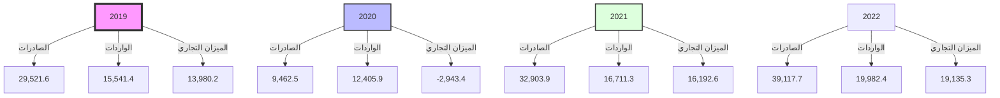
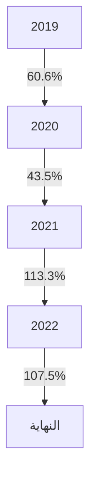
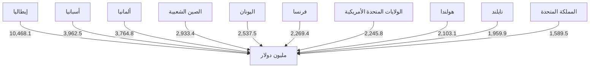

# مصرف ليبيا المركزي
# CENTRAL BANK OF LIBYA

إدارة البحوث والإحصاء

## تقرير التجارة الخارجية لليبيا
## (2019-2022)

[The image shows a large container ship docked at a port. The ship is loaded with numerous colorful shipping containers. Large blue cranes for loading and unloading containers can be seen in the background. The sky is cloudy, giving the scene an industrial and busy atmosphere typical of a major shipping port.]
---
# ملخص موجز عن التجارة الخارجية
## خلال الفترة (2019-2022)

يعتبر قطاع التجارة الخارجية ذو أهمية بالغة بالنسبة للاقتصادات المتقدمة والنامية على حد سواء، حيث يعد خير وسيلة لاستغلال الموارد الاقتصادية المتاحة وتوفير مستلزمات التشغيل اللازمة للعملية الانتاجية، وتدفقات رؤوس الأموال.

لقد شهد قطاع التجارة الخارجية في ليبيا خلال الفترة (2019-2022) تقلبات بسبب الظروف السياسية وحالة الانقسام السياسي، والإيقاف المتكرر لإنتاج وتصدير النفط الخام، وبسبب الظروف التي مر بها الاقتصاد العالمي نتيجة جائحة كورونا وآثارها السلبية على إمدادات وأسعار السلع، كان لها الأثر المباشر على حجم التبادل التجاري لليبيا مع دول العالم.

وفيما يلي تحليل لأهم مؤشرات التجارة الخارجية للاقتصاد الليبي خلال الفترة 2019-2022:

### أولاً: حجم التبادل التجاري:

سجل حجم التبادل التجاري (صادرات + واردات) بين ليبيا والعالم الخارجي خلال الفترة (2019-2022) إرتفاعاً بلغت نسبته في المتوسط نحو 24.1%، ويعود هذا الإرتفاع في حجم التجارة الخارجية إلى نمو حجم الصادرات والتي بلغت في المتوسط نسبة 48.6%، حيث سجل حجم التبادل التجاري لعام 2022 إرتفاعاً بلغ 19.1% مقارنة بالعام 2021، وذلك بسبب إرتفاع الصادرات النفطية نتيجة إستقرار إنتاج وتصدير النفط الخام.

وللوقوف على مدى أهمية التجارة الخارجية في الاقتصاد المحلي، أظهر مؤشر نسبة حجم التجارة الخارجية (الصادرات + الواردات) إلى الناتج المحلي الإجمالي (درجة الانكشاف الخارجي) إلى إستمرار إنكشاف الاقتصاد الوطني على العالم الخارجي، حيث سجلت إرتفاعاً في عام 2019 بلغت نسبته 60.6%، في حين إنخفضت درجة الانكشاف في عام 2020 إلى 43.5%، ثم إرتفعت إلى 113.3% في عام 2021، ثم إنخفضت إلى 107.5% في عام 2022 مما يدل هذا على إن الاقتصاد الوطني يتأثر بدرجة كبيرة بالتغيرات والظروف الخارجية.
---
# حجم التجارة الخارجية خلال الفترة (2019-2022)

"بالمليون دولار"

| البند | 2019 | 2020 | 2021 | 2022 |
|-------|------|------|------|------|
| الصادرات | 29,521.6 | 9,462.5 | 32,903.9 | 39,117.7 |
| الواردات | 15,541.4 | 12,405.9 | 16,711.3 | 19,982.4 |
| الميزان التجاري | 13,980.2 | -2,943.4 | 16,192.6 | 19,135.3 |
| حجم التجارة الخارجية | 45,063.0 | 21,868.4 | 49,615.2 | 59,100.1 |
| الناتج المحلي الاجمالي | 74,415.0 | 50,310.0 | 43,800.0 | 55,000.0 |
| درجة الانكشاف (%) | 60.6 | 43.5 | 113.3 | 107.5 |

*المصدر: الاحصاءات التجارية لتنمية الاعمال الدولية (Trade Map).

## التجارة الخارجية



## درجة الانكشاف


---
أولاً: الصادرات:

يعتمد الاقتصاد الليبي بشكل كبير على مورد طبيعي ناضب وهو النفط كمصدر أساسي للدخل،
والذي بدوره يتأثر بظروف الأسواق العالمية للنفط، حيث تشكل الصادرات النفطية أكثر من
90.0% من إجمالي الصادرات، مما جعل الاقتصاد الوطني عرضة بشكل مستمر إلى صدمات قوية
نتيجة التغيرات الكبيرة والمفاجئة في قطاع النفط سواء على المستوى المحلي أو الدولي.

التوزيع الجغرافي للصادرات:

أظهرت البيانات المتعلقة بالتوزيع الجغرافي للصادرات الليبية الواردة بالجدول أدناه، الأهمية
النسبية العالية التي تحظى بها الصادرات الليبية لدول الاتحاد الأوروبي، إذ بلغت خلال الفترة في
المتوسط نحو 64.6% من إجمالي الصادرات، ويعود سبب إرتفاع الأهمية النسبية للصادرات
الوطنية لدول الاتحاد الأوروبي (منطقة اليورو)، إلى خصائص اقتصادات هذه البلدان على
اعتبارها بلدان صناعية تعتمد بدرجة كبيرة على النفط الخام، وتأتي الصادرات الليبية للدول
الآسيوية في المرتبة الثانية إذ بلغت خلال الفترة في المتوسط نحو 23.6% من إجمالي الصادرات
الليبية للخارج.

توزيع الصادرات الليبية حسب مجموعات البلدان
خلال الفترة (2019 - 2022)
"مليون دولار"

| مجموعات البلدان | 2019 | 2020 | 2021 | 2022 |
|-----------------|-------|-------|-------|-------|
| مجموعة دول الاتحاد الأوروبي | 17,799.7 | 4,492.2 | 21,207.9 | 26,848.1 |
| أقطار جامعة الدول العربية | 1,944.6 | 1,109.1 | 1,250.5 | 1,210.0 |
| الدول الآسيوية | 6,770.5 | 3,131.1 | 5,880.8 | 6,433.8 |
| دول أوربية أخرى | 561.3 | 317.3 | 2,006.3 | 1,975.8 |
| البلدان الأفريقية | 1.2 | 1.9 | 1.2 | 16.5 |
| دول شمال ووسط وجنوب أمريكا | 1,818.3 | 250.0 | 2,268.8 | 2,245.9 |
| أستراليا ونيوزيلاندا | 626.1 | 160.8 | 288.4 | 387.6 |
| الإجمالي | 29,521.6 | 9,462.5 | 32,903.9 | 31,117.6 |

*المصدر: الإحصاءات التجارية لتنمية الاعمال الدولية (Trade Map).
---
الأهمية النسبية لتوزيع الصادرات الليبية حسب مجموعات البلدان
(2019 - 2022)

| المجموعة | النسبة |
|----------|--------|
| مجموعة دول الاتحاد الأوروبي | 63% |
| الدول الآسيوية | 20% |
| دول أوروبية أخرى | 5% |
| أقطار جامعة الدول العربية | 5% |
| دول شمال ووسط وجنوب أمريكا | 6% |
| البلدان الأفريقية | 1% |
| أستراليا ونيوزيلاندا | 0% |

الصادرات حسب أهم البلدان المصدر إليها:

من خلال الاطلاع على الجداول أدناه لقيم الصادرات حسب أهم البلدان المصدر إليها، يتضح أن إيطاليا كانت أهم مستورد حيث بلغت نسبة ما صُدر إليها وحدها في المتوسط 22.1% خلال الفترة (2019-2022) على التوالي من إجمالي قيمة الصادرات الليبية، إذ بلغت قيمة ما صُدر إليها خلال عام 2022 نحو 10,468.1 مليون دولار، فيما جاءت دول أسبانيا وألمانيا والصين الشعبية واليونان وفرنسا من ضمن أهم الدول المستوردة من ليبيا، وتجدر الإشارة إلى أن معظم الصادرات الليبية لتلك الدول هي صادرات نفطية، والجدول أدناه يوضح ذلك:
---
# قيمة الصادرات حسب أهم البلدان المصدر إليها
## خلال الفترة (2019-2022)
"مليون دولار"

| البلدان المصدر إليها | 2019 | 2020 | 2021 | 2022 |
|----------------------|------|------|------|------|
| إيطاليا | 5,278.3 | 1,970.3 | 7,470.1 | 10,468.1 |
| أسبانيا | 4,274.4 | 705.2 | 3,427.2 | 3,962.5 |
| ألمانيا | 4,386.7 | 849.5 | 3,659.9 | 3,764.8 |
| الصين الشعبية | 4,816.5 | 827.1 | 3,271.5 | 2,933.4 |
| اليونان | 671.9 | 58.3 | 1,023.2 | 2,537.5 |
| فرنسا | 1,595.3 | 529.2 | 2,175.8 | 2,269.4 |
| الولايات المتحدة الأمريكية | 1,572.5 | 224.9 | 2,239.7 | 2,245.8 |
| هولندا | 197.6 | 121.0 | 1,692.7 | 2,103.1 |
| تايلند | 483.9 | 326.8 | 1,155.9 | 1,959.9 |
| المملكة المتحدة | 253.5 | 88.9 | 1,548.3 | 1,589.5 |
| الإمارات | 1,570.4 | 955.2 | 956.2 | 900.0 |
| تركيا | 483.5 | 1,674.3 | 821.8 | 767.0 |
| سنغافورة | 379.2 | 198.0 | 171.2 | 200.0 |
| سويسرا | 291.6 | 144.7 | 302.1 | 117.1 |
| كوريا الجنوبية | 225.7 | 19.7 | 12.5 | 90.9 |
| ماليزيا | 293.2 | 0.6 | 30.3 | 36.7 |
| أندونيسيا | 0.2 | 0.7 | 10.5 | 0.8 |
| بلدان أخرى | 2,747.2 | 768.1 | 2,935.0 | 3,171.2 |
| الإجمالي | 29,521.6 | 9,462.5 | 32,903.9 | 39,117.7 |

*المصدر: الإحصاءات التجارية لتنمية الأعمال الدولية (Trade Map).*

## أهم عشرة بلدان مصدر إليها خلال عام 2022


---
# الأهمية النسبية للصادرات الليبية حسب أهم البلدان المصدر إليها
## خلال الفترة (2019-2022)
"نسب مئوية %"

| البلدان المصدر إليها | 2019 | 2020 | 2021 | 2022 |
|----------------------|------|------|------|------|
| إيطاليا              | 17.9 | 20.8 | 22.7 | 26.8 |
| اسبانيا              | 14.5 | 7.5  | 10.4 | 10.1 |
| ألمانيا              | 14.9 | 9.0  | 11.1 | 9.6  |
| الصين الشعبية        | 16.3 | 8.7  | 9.9  | 7.5  |
| اليونان              | 2.3  | 0.6  | 3.1  | 6.5  |
| فرنسا                | 5.4  | 5.6  | 6.6  | 5.8  |
| الولايات المتحدة الأمريكية | 2.5  | 2.4  | 6.8  | 5.7  |
| هولندا               | 0.7  | 1.3  | 5.1  | 5.4  |
| تايلند               | 1.6  | 3.5  | 3.5  | 5.0  |
| المملكة المتحدة      | 0.9  | 0.9  | 4.7  | 4.1  |
| الإمارات             | 5.3  | 10.1 | 2.9  | 2.3  |
| تركيا                | 1.6  | 17.7 | 2.5  | 2.0  |
| سنغافورة             | 1.3  | 2.1  | 0.5  | 0.5  |
| سويسرا               | 0.1  | 1.5  | 0.9  | 0.3  |
| كوريا الجنوبية       | 0.8  | 0.2  | 0.0  | 0.2  |
| ماليزيا              | 1.0  | 0.0  | 0.1  | 0.1  |
| اندونيسيا            | 0.0  | 0.0  | 0.0  | 0.0  |
| بلدان أخرى           | 9.3  | 8.1  | 8.9  | 8.1  |

*المصدر: الإحصاءات التجارية لتنمية الأعمال الدولية (Trade Map).*

## التركيب السلعي للصادرات:

أظهرت البيانات المتعلقة بالتركيب السلعي للصادرات الوطنية الواردة بالجدول أدناه مدى استحواذ صادرات الوقود المعدنية والمحروقات والمواد المتصلة بها على النصيب الأوفر من إجمالي الصادرات خلال الفترة (2019 – 2022)، مشكّلة بذلك ما نسبته 90.0% من إجمالي الصادرات، الأمر الذي يبين عدم تنوع الصادرات الوطنية، نتيجة ضعف هيكل الإنتاج المحلي، وهو ما يجعل الاقتصاد عرضة لتقلبات إنتاج النفط وأسعاره في الأسواق الدولية، فيما سجلت الصادرات الأخرى نسبة 10.0% من إجمالي الصادرات والتي في معظمها صادرات المعادن الثمينة ومصنوعاتها (الذهب) والمعادن العادية (الخردة).
---
# قيمة الصادرات مصنفة حسب أقسام السلع
## خلال الفترة (2019 - 2022)

"مليون دولار"

| أقسام السلع | 2019 | 2020 | 2021 | 2022 |
|-------------|------|------|------|------|
| المنتوجات المعدنية أهمها النفط الخام | 27,661.4 | 7,267.5 | 31,551.6 | 37,657.7 |
| المعادن العادية ومصنوعاتها | 298.9 | 440.7 | 835.1 | 812.8 |
| لؤلؤ طبيعي او مستنبت واحجار كريمة او شبه كريمة ومعادن ثمينة ومصنوعاتها | 1,198.0 | 1,659.2 | 237.8 | 274.8 |
| منتوجات الصناعات الكيماوية وما يتصل بها | 45.7 | 14.8 | 207.2 | 226.6 |
| معدات النقل | 1.8 | 15.6 | 4.5 | 61.6 |
| حيوانات حية – منتوجات حيوانية | 21.7 | 16.2 | 26.3 | 42.7 |
| الآلات والأجهزة والمعدات الكهربائية وأجهزة التسجيل والإذاعة والصوت | 23.2 | 27.9 | 16.7 | 12.8 |
| عجائن الخشب، عجائن سلولوزية، ورق مقوى وفضلات الورق | 5.0 | 2.7 | 8.3 | 8.9 |
| سلع ومنتوجات متنوعة | 13.1 | 1.1 | 1.6 | 4.5 |
| منتوجات المملكة النباتية | 6.3 | 8.3 | 3.7 | 3.9 |
| الأجهزة البصرية والفوتوغرافية والسينمائية وأجهزة قياس الضغط والمعدات الطبية | 4.1 | 1.5 | 1.0 | 3.0 |
| جلود حيوانات خام وجلود مدبوغة | 4.2 | 3.2 | 2.9 | 2.5 |
| مواد غذائية محضرة، مشروبات، خل، التبغ | 1.7 | 1.4 | 1.6 | 2.2 |
| منتوجات ومواد نسيجية | 2.6 | 1.7 | 1.2 | 1.6 |
| لدائن ومصنوعاتها، مطاط ومصنوعاته | 1.0 | 0.8 | 1.6 | 1.6 |
| شحوم ودهون وزيوت حيوانية ونباتية والمنتوجات المشتقة منها | 0.4 | 0.3 | 0.4 | 0.9 |
| الخشب ومصنوعاته، الفحم الخشبي، الفلين ومصنوعاته، مصنوعات القش | 0.0 | 0.0 | 0.2 | 0.3 |
| مصنوعات من الحجر والجص والاسمنت والميكا ومنتوجات الخزف والزجاج | 0.0 | 0.0 | 0.1 | 0.1 |
| الأحذية، أغطية الرأس، المظلات، مظلات الشمس، عصي المشي، سياط الفروسية | 0.0 | 0.0 | 0.1 | 0.1 |
| الأسلحة والذخائر، أجزاؤها ولوازمها | 0.0 | 0.0 | 0.0 | 0.0 |
| الإجمالي | 29,285.9 | 9,462.5 | 32,903.9 | 39,117.7 |

*المصدر: الإحصاءات التجارية لتنمية الأعمال الدولية (Trade Map).
---
# تصنيف الصادرات الليبية (نفطية ، صادرات أخرى)
## خلال الفترة (2019-2022)

"مليون دولار"

| السنوات | الصادرات النفطية | الصادرات الأخرى* | إجمالي الصادرات |
|---------|------------------|------------------|-----------------|
| 2019    | 27,661.4         | 1,624.50         | 29,285.9        |
| 2020    | 7,267.5          | 2,195.00         | 9,462.5         |
| 2021    | 31,551.6         | 1,352.30         | 32,903.9        |
| 2022    | 37,657.7         | 1,460.00         | 39,117.7        |

(*) الصادرات الأخرى في معظمها معادن ثمينة ومعادن عادية.

## تصنيف الصادرات الليبية ( نفطية ، صادرات أخرى)


| السنة | الصادرات النفطية | الصادرات الأخرى | إجمالي الصادرات |
|-------|------------------|-----------------|-----------------|
| 2019  | 27,661.4         | 1,624.5         | 29,285.9        |
| 2020  | 7,267.5          | 2,195.0         | 9,462.5         |
| 2021  | 31,551.6         | 1,352.3         | 32,903.9        |
| 2022  | 37,657.7         | 1,460.0         | 39,117.7        |

## الصادرات مصنفة حسب أقسام السلع خلال عام 2022

| القسم | النسبة المئوية |
|-------|----------------|
| المنتوجات المعدنية أهمها النفط الخام | 96% |
| المعادن العادية ومصنوعاتها | 2% |
| لؤلؤ طبيعي أو مستنبت وأحجار كريمة أو شبه كريمة ومعادن ثمينة ومصنوعاتها | 1% |
| منتوجات الصناعات الكيماوية وما يتصل بها | 1% |
| أخرى | 0% |
---
# أهم الشركاء التجاريين للصادرات الأخرى

أظهرت بيانات الصادرات الأخرى أن دولتي تركيا والإمارات العربية المتحدة هما أهم الدول
المستوردة من ليبيا، والتي تركزت معظم مستورداتها من المعادن الثمينة والمعادن العادية.

## الصادرات - دولة تركيا

"مليون دولار"

| السنوات | المعادن الثمينة | الحديد | النحاس | الألومنيوم | أخرى | الإجمالي |
|----------|-----------------|--------|--------|------------|------|----------|
| 2019     | 221.2           | 106.7  | 57.2   | 21.3       | 77.1 | 483.5    |
| 2020     | 1,319.8         | 179.2  | 99.8   | 35.6       | 39.9 | 1,674.3  |
| 2021     | 101.0           | 408.7  | 141.8  | 60.4       | 109.9| 821.8    |
| 2022     | 138.0           | 286.7  | 150.7  | 71.0       | 120.6| 767.0    |

## الصادرات - دولة الإمارات العربية المتحدة

"مليون دولار"

| السنوات        | المعادن الثمينة ومصنوعاتها (الذهب) | أخرى* | الإجمالي |
|----------------|-------------------------------------|-------|----------|
| 2019           | 971.6                               | 598.8 | 1,570.4  |
| 2020           | 338.7                               | 616.5 | 955.2    |
| 2021           | 136.6                               | 819.6 | 956.2    |
| 2022 (بيانات أولية) | 128.6                               | 771.4 | 900.0    |

*معظمها صادرات نفطية.
---
ثانياً: الواردات:

يعتمد السوق المحلي بنسبة تتجاوز 85.0% في تلبية إحتياجات كافة القطاعات والأفراد من السلع الإستهلاكية والرأسمالية كالآلات والمعدات والمواد الخام والسلع الوسيطة اللازمة للعملية الإنتاجية، على الأسواق الخارجية.

التوزيع الجغرافي للواردات:

تعد بلدان الاتحاد الأوروبي المصدر الرئيسي لواردات ليبيا حيث بلغت أهميتها النسبية في المتوسط نحو 34.4% من اجمالي الواردات خلال الفترة (2019-2022) حيث سجلت قيمة واردات ليبيا من دول الاتحاد الأوروبي نحو 4.9 و4.3 و5.1 و8.0 مليار دولار على التوالي خلال الفترة، ويعود ذلك الى الجوار الجغرافي الذي يلعب دوراً رئيسياً في زيادة حجم المبادلات التجارية بين ليبيا ودول منطقة اليورو، فيما شكلت الدول الآسيوية وأقطار جامعة الدول العربية و الدول الأوروبية الأخرى النسب الباقية، وتشير البيانات الى ضعف المبادلات التجارية بين ليبيا والدول الأفريقية وأستراليا ونيوزيلندا.

توزيع الواردات الليبية حسب مجموعات البلدان
خلال الفترة (2019-2022)
"مليون دولار"

| مجموعات البلدان | 2019 | 2020 | 2021 | 2022 |
|-----------------|------|------|------|------|
| مجموعة دول الاتحاد الأوروبي | 4,946.8 | 4,319.4 | 5,135.9 | 8,041.2 |
| أقطار جامعة الدول العربية | 3,049.6 | 2,328.9 | 3,516.3 | 3,556.0 |
| الدول الآسيوية | 5,820.9 | 4342.7 | 5,940.8 | 6,266.3 |
| دول أوربية أخرى | 828.7 | 763.1 | 1,154.8 | 1,124.2 |
| البلدان الأفريقية | 12.3 | 18.6 | 19.0 | 4.5 |
| دول شمال ووسط وجنوب أمريكا | 837.6 | 571.7 | 879.3 | 901.9 |
| أستراليا ونيوزيلاندا | 45.5 | 61.5 | 65.2 | 88.3 |
| الإجمالي | 15,541.4 | 12,405.9 | 16,711.3 | 19,982.4 |

*المصدر: الإحصاءات التجارية لتنمية الاعمال الدولية (Trade Map).
---
# الأهمية النسبية لتوزيع الواردات الليبية حسب مجموعات البلدان (2019 - 2022)

| المجموعة | النسبة |
|----------|--------|
| مجموعة دول الاتحاد الأوروبي | 35% |
| أقطار جامعة الدول العربية | 19% |
| الدول الآسيوية | 35% |
| دول أوربية أخرى | 6% |
| البلدان الأفريقية | 5% |
| دول شمال ووسط وجنوب أمريكا | 0% |
| أستراليا ونيوزيلاندا | 0% |

## الواردات حسب أهم البلدان المستورد منها:

من خلال الاطلاع على الجدول أدناه لقيمة الواردات حسب أهم البلدان المستورد منها يتضح أن دول تركيا والصين وإيطاليا واليونان والإمارات لازالت تتصدر قائمة أهم البلدان المستورد منها، حيث بلغت نسبة ما أستورد منها في المتوسط حوالي 52.4% خلال الفترة (2019-2022) من إجمالي قيمة الواردات الليبية.

وتعتبر دولة تركيا أهم دولة مستورد منها، وبلغت قيمة ما ورد منها خلال العام 2022 نحو 2.8 مليار دولار ومشكلة ما نسبته 14.2% من الإجمالي، فيما أحتلت الصين الشعبية المرتبة الثانية بقيمة 2.4 مليار دولار، وجاءت إيطاليا في المرتبة الثالثة بنحو 2.3 مليار دينار.

والجدول التالي يوضح أهم البلدان المستورد منها خلال الفترة (2019-2022):
---
# قيمة الواردات حسب أهم البلدان المستورد منها
## خلال الفترة (2019-2022)

"مليون دولار"

| البلدان المستورد منها | 2019 | 2020 | 2021 | 2022 |
|------------------------|------|------|------|------|
| تركيا | 2,069.7 | 1,653.1 | 2,769.4 | 2,841.1 |
| الصين الشعبية | 2,451.6 | 1,880.4 | 2,129.0 | 2,373.3 |
| إيطاليا | 1,390.9 | 1,000.6 | 1,434.2 | 2,269.3 |
| اليونان | 451.4 | 719.4 | 1,189.8 | 1,922.7 |
| الإمارات | 1,354.8 | 1,003.4 | 1,706.5 | 1,800.0 |
| مصر | 838.9 | 572.8 | 796.2 | 700.0 |
| المانيا | 484.4 | 400.8 | 683.5 | 559.5 |
| أوكرانيا | 316.9 | 327.8 | 425.0 | 500.0 |
| أسبانيا | 468.7 | 346.8 | 366.7 | 440.0 |
| هولندا | 595.3 | 576.9 | 535.8 | 371.3 |
| كوريا الجنوبية | 632.1 | 338.0 | 428.5 | 366.9 |
| البرازيل | 279.4 | 166.4 | 313.4 | 320.0 |
| الولايات المتحدة الامريكية | 412.0 | 290.0 | 295.3 | 291.0 |
| فرنسا | 210.0 | 171.3 | 208.2 | 229.6 |
| سويسرا | 121.1 | 127.1 | 216.7 | 153.7 |
| المملكة المتحدة | 201.4 | 147.7 | 141.1 | 144.6 |
| بلدان أخرى | 3,262.8 | 2,683.4 | 4,072.0 | 4,699.4 |
| الإجمالي | 15,541.4 | 12,405.9 | 17,711.3 | 19,982.4 |

*المصدر: الإحصاءات التجارية لتنمية الاعمال الدولية (Trade Map).*

## أهم عشرة بلدان مستورد منها خلال عام 2022

| البلد | القيمة (مليون دولار) |
|-------|----------------------|
| تركيا | 2,841.1 |
| الصين الشعبية | 2,373.3 |
| إيطاليا | 2,269.3 |
| اليونان | 1,922.7 |
| الإمارات | 1,800.0 |
| مصر | 700.0 |
| المانيا | 559.5 |
| أوكرانيا | 500.0 |
| أسبانيا | 440.0 |
| هولندا | 371.3 |

```mermaid
bar chart
    title أهم عشرة بلدان مستورد منها خلال عام 2022
    x-axis [تركيا, الصين الشعبية, إيطاليا, اليونان, الإمارات, مصر, المانيا, أوكرانيا, أسبانيا, هولندا]
    y-axis القيمة (مليون دولار)
    bar [2841.1, 2373.3, 2269.3, 1922.7, 1800.0, 700.0, 559.5, 500.0, 440.0, 371.3]
```
---
الأهمية النسبية للواردات حسب أهم البلدان المستورد منها
خلال الفترة (2019-2022)

"نسب مئوية %"

| البلدان المستورد منها | 2019 | 2020 | 2021 | 2022 |
|----------------------|------|------|------|------|
| تركيا                | 13.3 | 13.3 | 15.6 | 14.2 |
| الصين الشعبية        | 15.8 | 15.2 | 12.0 | 11.9 |
| إيطاليا              | 8.9  | 8.1  | 8.1  | 11.4 |
| اليونان              | 2.9  | 5.8  | 6.7  | 9.6  |
| الإمارات             | 8.7  | 8.1  | 9.6  | 9.0  |
| مصر                  | 5.4  | 4.6  | 4.5  | 3.5  |
| المانيا              | 3.1  | 3.2  | 3.9  | 2.8  |
| أوكرانيا             | 2.0  | 2.6  | 2.4  | 2.5  |
| اسبانيا              | 3.0  | 2.8  | 2.1  | 2.2  |
| هولندا               | 3.8  | 4.7  | 3.0  | 1.9  |
| كوريا الجنوبية       | 4.1  | 2.7  | 2.4  | 1.8  |
| البرازيل             | 1.8  | 1.3  | 1.8  | 1.6  |
| الولايات المتحدة الأمريكية | 2.7 | 2.3 | 1.7 | 1.5 |
| فرنسا                | 1.4  | 1.4  | 1.2  | 1.1  |
| سويسرا               | 0.8  | 1.0  | 1.2  | 0.8  |
| المملكة المتحدة      | 1.3  | 1.2  | 0.8  | 0.7  |
| بلدان أخرى           | 21.0 | 21.6 | 23.0 | 23.5 |

المصدر: الإحصاءات التجارية لتنمية الأعمال الدولية (Trade Map).
---
# التركيب السلعي للواردات:

احتلت واردات أقسام (المنتجات المعدنية، الآلات والأجهزة والمعدات الكهربية وأجهزة التسجيل والإذاعة والصوت، مواد غذائية محضرة، مشروبات، خل، التبغ) المرتبة الأولى من اجمالي الواردات السلعية

خلال الفترة (2019 – 2022)، حيث شكلت 45.6% من اجمالي الواردات السلعية، فيما احتلت

واردات أقسام (منتوجات المملكة النباتية، منتوجات الصناعات الكيماوية وما يتصل بها، معدات النقل)

المرتبة الثانية من حيث الأهمية النسبية لتشكل 20.4% من اجمالي الواردات السلعية، فيما شكلت
واردات منتجات الأقسام الأخرى الباقية والتي تمثل 34.0% من إجمالي الواردات السلعية.

وهذا يعكس مدى ضعف وعجز السوق المحلي في توفير العديد من السلع التي يحتاجها الأفراد مما
يؤدي ذلك إلى زيادة درجة الانكشاف الخارجي و زيادة الطلب على النقد الأجنبي.

والجدول التالي يوضح الواردات مصنفة حسب أقسام السلع خلال الفترة (2019 – 2022) :
---
# قيمة الواردات مصنفة حسب أقسام السلع
## خلال الفترة (2019-2022)

"مليون دولار"

| أقسام السلع | 2019 | 2020 | 2021 | 2022 |
|-------------|------|------|------|------|
| المنتوجات المعدنية | 2,404.5 | 1,898.7 | 3,246.7 | 5,555.9 |
| الآلات والأجهزة والمعدات الكهربائية وأجهزة التسجيل والإذاعة والصوت | 2,609.8 | 1,771.5 | 3,029.8 | 2,828.6 |
| مواد غذائية محضرة، مشروبات، خل، التبغ | 1,591.4 | 1,642.9 | 1,825.0 | 1,841.7 |
| منتوجات المملكة النباتية | 918.3 | 833.0 | 1,231.0 | 1,276.1 |
| منتوجات الصناعات الكيماوية وما يتصل بها | 1,012.9 | 957.0 | 1,353.8 | 1,205.7 |
| معدات النقل | 1,485.7 | 875.5 | 1,094.1 | 1,023.9 |
| المعادن العادية ومصنوعاتها | 776.9 | 551.8 | 849.2 | 858.6 |
| منتوجات ومواد نسيجية | 981.0 | 741.1 | 828.1 | 858.3 |
| لدائن ومصنوعاتها، مطاط ومصنوعاته | 651.5 | 515.3 | 763.6 | 816.9 |
| حيوانات حية - منتوجات حيوانية | 739.1 | 734.2 | 865.0 | 801.8 |
| سلع ومنتوجات متنوعة | 574.6 | 533.4 | 676.6 | 797.2 |
| مصنوعات من الحجر والجص والاسمنت والميكا ومنتوجات الخزف والزجاج | 482.8 | 321.4 | 486.2 | 484.5 |
| لؤلؤ طبيعي أو مستنبت وأحجار كريمة أو شبه كريمة ومعادن ثمينة ومصنوعاتها | 297.9 | 124.4 | 466.3 | 449.6 |
| شحوم ودهون وزيوت حيوانية ونباتية والمنتوجات المشتقة منها | 152.1 | 162.9 | 255.7 | 347.4 |
| عجائن الخشب، عجائن سلولوزية، ورق مقوى وفضلات الورق | 245.1 | 227.2 | 222.2 | 261.9 |
| الأجهزة البصرية والفوتوغرافية والسينمائية وأجهزة قياس الضغط والمعدات الطبية | 320.1 | 332.4 | 238.4 | 240.2 |
| الخشب ومصنوعاته، الفحم الخشبي، الفلين ومصنوعاته، مصنوعات القش | 101.5 | 73.2 | 133.2 | 156.0 |
| الأحذية، أغطية الرأس، المظلات، مظلات الشمس، عصي المشي، سياط الفروسية | 146.8 | 85.5 | 115.8 | 130.0 |
| جلود حيوانات خام وجلود مدبوغة | 49.4 | 23.5 | 29.8 | 46.2 |
| الأسلحة والذخائر، أجزاؤها ولوازمها | 0.0 | 1.0 | 0.8 | 1.9 |
| الإجمالي | 15,541.4 | 12,405.9 | 17,711.3 | 19,982.4 |

*المصدر: الإحصاءات التجارية لتنمية الأعمال الدولية (Trade Map).
---
# الواردات مصنفة حسب أقسام السلع خلال عام 2022

| القسم | النسبة |
|-------|--------|
| المنتوجات المعدنية | 28% |
| الالات والاجهزة والمعدات الكهربية واجهزة التسجيل والاذاعة والصوت | 14% |
| مواد غذائية محضرة، مشروبات، خل، التبغ | 9% |
| منتوجات المملكة النباتية | 7% |
| منتوجات الصناعات الكيماوية وما يتصل بها | 6% |
| معدات النقل | 5% |
| أخرى | 31% |
---
# الملاحق

1. التجارة الخارجية خلال الفترة (2019 - 2022).

2. قيمة الصادرات حسب أقسام وفصول السلع خلال الفترة (2019 – 2022).

3. قيمة الواردات حسب أقسام وفصول السلع خلال الفترة (2019 – 2022).

4. التوزيع النسبي للتجارة البينية مع التجمعات الدولية التي تتضمن ليبيا خلال الفترة (2019-2022).

5. التوزيع النسبي للتجارة البينية مع التجمعات الدولية التي لا تتضمن ليبيا خلال الفترة(2019-2022)