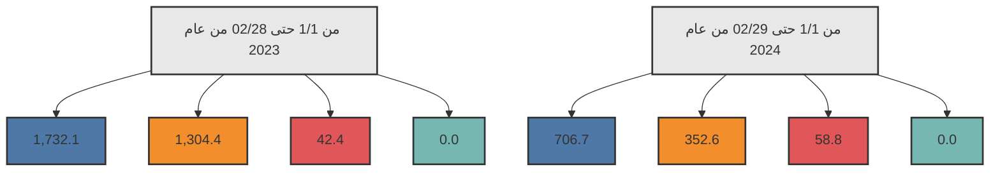

# مصرف ليبيا المركزي

## إستخدامات المصـــارف للنقد الأجنبي

### خلال الفترة: (1/1 - 29/02/2024)

Central Bank of Libya logo and financial data visualization

إدارة البحوث والأحصـاء - إدارة الرقابة على المصارف والنقد
---
إدارة البحوث والإحصاء - إدارة الرقابة على المصارف والنقد

## تحليل حركة إستخدامات المصارف الفعلية من النقد الأجنبي
### خلال الفترة (1/1 - حتى 2024/02/29)

بلغ إجمالي إستخدامات المصارف من النقد الأجنبي خلال الفترة (1/1 - حتى 2024/02/29) نحو 1,118,121,545 دولار، مُقابل 3,078,886,837 دولار خلال نفس الفترة من العام الماضي 2023، بإنخفاض قدره نحو 1,960,765,292 دولار. أي بمعدل بلغ 63.7%.

حيث شكلت الإعتمادات المستندية ما نسبته 63.2% من إجمالي إستخدامات المصارف من النقد الأجنبي، فيما شكلت الأغراض الشخصية نسبة 31.5% من الإجمالي، في حين شكلت الحوالات مانسبته 5.3% من إجمالي الإستخدامات.

### إستخدامات المصارف الفعلية من النقد الأجنبي لكافة الأغراض
"المبالغ بالدولار الأمريكي"

| البند | من 1/1 حتى 02/28 من عام 2023 | من 1/1 حتى 02/29 من عام 2024 | مقدار التغير | نسبة التغير |
|-------|-------------------------------|-------------------------------|---------------|-------------|
| الإعتمادات المستندية | 1,732,107,206 | 706,650,828 | -1,025,456,378 | -59.2 |
| الحوالات | 42,387,668 | 58,837,817 | 16,450,149 | 38.8 |
| الأغراض الشخصية | 1,304,391,963 | 352,632,900 | -951,759,063 | -73.0 |
| بطاقات التجار | - | 0 | - | - |
| الإجمالي | 3,078,886,837 | 1,118,121,545 | -1,960,765,292 | -63.7 |

### إستخدامات المصارف للنقد الأجنبي لكافة الأغراض

الإعتمادات المستندية
الأغراض الشخصية
الحوالات
بطاقة التجار

صفحة 2 من 41
---
إدارة البحوث والإحصاء - إدارة الرقابة على المصارف والنقد

# المبالغ المُباعة للمصارف من النقد الأجنبي لكافة الأغراض:

ومن خلال الإطلاع على الجدول أدناه للقيم المباعة من النقد الأجنبي حسب المصارف، يتضح أن المصرف التجاري الوطني أحتل الترتيب الأول كأكثر المصارف إستخداماً للنقد الأجنبي خلال الفترة (1/1 – حتى 2024/02/29) مسجلاً حصة سوقية بلغت 15.9%، حيث بلغ إجمالي المبالغ نحو 177,664,517 دولار، فيما جاء مصرف الجمهورية في المرتبة الثانية بقيمة بلغت 150,617,301 دولار،

ثم المصرف التجاري الوطني في المرتبة الثالثة بقيمة 145,441,239 دولار، ثم مصرف الأمان للتجارة والاستثمار في المرتبة الرابعة بقيمة 93,337,400 دولار، ثم تأتي من حيث الأهمية النسبية المصارف التالية حسب الترتيب: مصرف الأندلس، مصرف الوحدة، المصرف المتحد، المصرف الإسلامي الليبي، ومصرف الصحاري، إلى آخره من المصارف كما موضح بالجدول أدناه والذي يحتوي أيضاً على الترتيب الذي كانت عليه المصارف خلال نفس الفترة من العام الماضي 2023.

صفحة 3 من 41
---
إدارة البحوث والإحصاء - إدارة الرقابة على المصارف والنقد

## ترتيب المصارف حسب إجمالي المبالغ المُباعة من النقد الأجنبي

| المصرف | من 1/1 حتى 02/28 من عام 2023 |  |  | من 1/1 حتى 02/29 من عام 2024 |  |  |
|---------|---------------------------|------|------|---------------------------|------|------|
|         | الترتيب | القيمة بالدولار | الحصة السوقية | الترتيب | القيمة بالدولار | الحصة السوقية |
| مصرف الجمهورية | 4 | 370,523,114 | 12.0% | 1 | 177,664,517 | 15.9% |
| مصرف النوران | 6 | 253,054,535 | 8.2% | 2 | 150,617,301 | 13.5% |
| المصرف التجاري الوطني | 1 | 452,717,358 | 14.7% | 3 | 145,441,239 | 13.0% |
| مصرف الامان للتجارة والإستثمار | 3 | 381,211,064 | 12.4% | 4 | 93,337,400 | 8.3% |
| مصرف الأندلس | 14 | 44,349,118 | 1.4% | 5 | 85,208,027 | 7.6% |
| مصرف الوحدة | 5 | 271,830,640 | 8.8% | 6 | 83,944,242 | 7.5% |
| المصرف المتحد للتجارة والإستثمار | 8 | 198,024,036 | 6.4% | 7 | 76,910,292 | 6.9% |
| المصرف الإسلامي الليبي | 7 | 219,277,419 | 7.1% | 8 | 59,718,469 | 5.3% |
| مصرف الصحارى | 9 | 142,825,509 | 4.6% | 9 | 55,659,429 | 5.0% |
| مصرف شمال أفريقيا | 13 | 59,622,838 | 1.9% | 10 | 55,589,869 | 5.0% |
| مصرف الخليج الأول الليبي | 10 | 93,607,172 | 3.0% | 11 | 53,352,117 | 4.8% |
| مصرف التجارة والتنمية | 19 | 486,800 | 0.0% | 12 | 25,765,472 | 2.3% |
| مصرف السراي للتجارة والإستثمار | 12 | 64,785,157 | 2.1% | 13 | 25,598,528 | 2.3% |
| مصرف الواحة | 16 | 8,765,953 | 0.3% | 14 | 11,507,142 | 1.0% |
| المصرف الليبي الخارجي | 18 | 1,558,992 | 0.1% | 15 | 7,879,195 | 0.7% |
| مصرف المتوسط | 17 | 6,989,598 | 0.2% | 16 | 4,245,208 | 0.4% |
| مصرف الوفاء | 11 | 77,253,398 | 2.5% | 17 | 3,160,936 | 0.3% |
| مصرف التضامن | 15 | 38,450,857 | 1.2% | 18 | 2,539,767 | 0.2% |
| مصرف الإجماع العربي | 20 | 0 | 0.0% | 19 | 0 | 0.0% |
| مصرف اليقين | 2 | 393,553,280 | 12.8% | 20 | -17,606 | 0.0% |
| الإجمالي | - | 3,078,886,837 | 100.0% | - | 1,118,121,545 | 100.0% |

صفحة 4 من 41
---
إدارة البحوث والإحصاء - إدارة الرقابة على المصارف والنقد

المبالغ المباعة للمصارف من النقد الأجنبي (حسب الغرض)

"القيم بالدولار الأمريكي"

| ت | المصرف | الاعتمادات المستندية |  | الحوالات المتنوعة |  | الأغراض الشخصية |  | بطاقة التجار(100 ألف) |  |
|---|---------|----------------------|------------------|-------------------|------------------|---------------------|------------------|------------------------|------------------|
|   |         | من 1/1 حتى 02/29 من عام 2023 | من 1/1 حتى 02/29 عام 2024 | من 1/1 حتى 02/29 عام 2023 | من 1/1 حتى 02/29 من عام 2024 | من 1/1 حتى 02/29 عام 2023 | من 1/1 حتى 02/29 من عام 2024 | من 1/1 حتى 02/28 من عام 2023 | من 1/1 حتى 02/29 من عام 2024 |
| -1 | الجمهورية | 172,436,018 | 134,524,899 | 175,596 | 715,618 | 197,911,500 | 42,424,000 | - | 0 |
| -2 | الصحاري | 188,751,725 | 113,539,078 | 1,198,303 | 7,245,423 | 63,104,507 | 29,832,800 | - | 0 |
| -3 | التجاري الوطني | 167,880,705 | 99,612,739 | 4,202,801 | 0 | 280,633,852 | 45,828,500 | - | 0 |
| -4 | الأمان | 99,748,801 | 63,434,800 | 0 | 842,200 | 281,462,263 | 29,060,400 | - | 0 |
| -5 | الأندلس | 42,676,044 | 61,746,683 | 1,673,074 | 10,947,844 | 0 | 12,513,500 | - | 0 |
| -6 | الوحدة | 218,246,158 | 43,694,642 | 613,412 | 0 | 52,971,069 | 40,249,600 | - | 0 |
| -7 | المتحد | 56,596,147 | 42,264,292 | 3,193,939 | 0 | 138,233,950 | 34,646,000 | - | 0 |
| -8 | الإسلامي الليبي | 175,624,969 | 28,406,053 | 10,697,733 | 2,289,417 | 32,954,717 | 29,023,000 | - | 0 |
| -9 | الصحاري | 42,592,371 | 30,522,492 | 2,418,812 | 1,791,337 | 97,814,327 | 23,345,600 | - | 0 |
| -10 | شمال أفريقيا | 44,795,988 | 20,875,752 | 8,914,085 | 5,877,017 | 5,912,765 | 28,837,100 | - | 0 |
| -11 | الخليج الأول الليبي | 89,363,450 | 47,376,333 | 4,180,722 | 5,325,184 | 63,000 | 650,600 | - | 0 |
| -12 | التجارة والتنمية | 0 | 0 | 0 | 15,423,772 | 486,800 | 10,341,700 | - | 0 |
| -13 | السراي | 63,616,563 | 13,764,828 | 0 | 0 | 1,168,594 | 11,833,700 | - | 0 |
| -14 | الواحة | 1,317,838 | 848,121 | 0 | 1,955,821 | 7,448,115 | 8,703,200 | - | 0 |
| -15 | الليبي الخارجي | 994,147 | 960,711 | 469,615 | 6,424,184 | 95,230 | 494,300 | - | 0 |
| -16 | المتوسط | 6,587,203 | 2,122,908 | 0 | 0 | 402,395 | 2,122,300 | - | 0 |
| -17 | الوفاء | 76,697,633 | 1,846,036 | 0 | 0 | 555,765 | 1,314,900 | - | 0 |
| -18 | الضمان | 38,450,857 | 1,128,067 | 0 | 0 | 0 | 1,411,700 | - | 0 |
| -19 | الإجماع العربي | 0 | 0 | 0 | 0 | 0 | 0 | - | 0 |
| -20 | اليقين | 245,730,590 | -17,606 | 4,649,577 | 0 | 143,173,114 | 0 | - | 0 |
| - | الإجمالي الكلي | 1,732,107,206 | 706,650,828 | 42,387,668 | 58,837,817 | 1,304,391,963 | 352,632,900 | - | 0 |

صفحة 5 من 41
---
إدارة البحوث والإحصاء - إدارة الرقابة على المصارف والنقد

## الأهمية النسبية حسب المصرف لاستخدامات النقد الأجنبي
### خلال الفترة من 1/1 حتى 02/28 من عام 2023

| المصرف | النسبة |
|---------|--------|
| المصرف التجاري الوطني | 15% |
| مصرف اليقين | 13% |
| مصرف الجمهورية | 12% |
| مصرف الأمان للتجارة والاستثمار | 12% |
| باقي المصارف | 10% |
| مصرف الوحدة | 9% |
| مصرف النوران | 8% |
| المصرف الإسلامي الليبي | 7% |
| المصرف المتحد للتجارة والاستثمار | 6% |
| مصرف الصحاري | 5% |
| مصرف الخليج الأول الليبي | 3% |

## الأهمية النسبية حسب المصرف لاستخدامات النقد الأجنبي
### خلال الفترة من 1/1 حتى 02/29 من عام 2024

| المصرف | النسبة |
|---------|--------|
| مصرف الجمهورية | 18% |
| مصرف النوران | 15% |
| المصرف التجاري الوطني | 15% |
| مصرف الأمان للتجارة والاستثمار | 9% |
| مصرف الأندلس | 9% |
| مصرف الوحدة | 8% |
| المصرف المتحد للتجارة والاستثمار | 8% |
| المصرف الإسلامي الليبي | 6% |
| مصرف الصحاري | 6% |
| مصرف شمال أفريقيا | 6% |

صفحة 6 من 41
---
إدارة البحوث والإحصاء - إدارة الرقابة على المصارف والنقد

طلبات المصارف المقبولة لتغطية الإعتمادات المستندية والحوالات المتنوعة عدا الأغراض الشخصية خلال الفترة (1/1 - حتى 29/02/2024):

بلغ عدد الشركات والمصانع والجهات العامة والجهات الأخرى المستفيدة (375) والتي تمت الموافقة على طلباتهم خلال الفترة (1/1 - حتى 29/02/2024) للحصول على النقد الأجنبي، بعدد طلبات بلغ نحو 973 طلب، معظم هذه الطلبات لتغطية الاعتمادات المستندية والتي سجلت 705 طلب بنسبة 72.5% من الطلبات، إجمالي كما هو موضح بالجداول التالية:-

عدد الطلبات المقبولة لشراء النقد الأجنبي - حسب القطاعات

| القطاع | عدد الشركات أو المصانع أو الجهات |
|--------|----------------------------------|
| القطاع الخاص | 343 |
| القطاع العام | 16 |
| جهات متنوعة | 16 |
| الإجمالي | 375 |

عدد الطلبات المقبولة لشراء النقد الأجنبي حسب نوع التحويل

| نوع التحويل | عدد الطلبات |||||
|-------------|-------------|-------------|-------------|-------------|-------------|
| | القطاع الخاص | القطاع العام | جهات متنوعة | الإجمالي | الأهمية النسبية |
| اعتماد مستندي | 689 | 16 | 0 | 705 | 72.5% |
| حوالة طيران | 122 | 8 | 3 | 133 | 13.7% |
| حوالة تجارية | 0 | 58 | 0 | 58 | 6.0% |
| تحويلات أخرى | 14 | 31 | 4 | 49 | 5.0% |
| حوالة تأمين | 7 | 7 | 0 | 14 | 1.4% |
| حوالة مرتبات | 0 | 0 | 14 | 14 | 1.4% |
| حوالة صناعية | 0 | 0 | 0 | 0 | 0.0% |
| حوالة استيراد الذهب | 0 | 0 | 0 | 0 | 0.0% |
| الإجمالي | 832 | 120 | 21 | 973 | 100.0% |

صفحة 7 من 41
---
إدارة البحوث والإحصاء - إدارة الرقابة على المصارف والنقد

## 1- القطاع الخاص:

بلغ عدد شركات ومصانع القطاع الخاص (375) التي تمت الموافقة على طلباتها للحصول على النقد الأجنبي من المصارف لتغطية الإعتمادات المستندية والحوالات الأخرى خلال الفترة (1/1 – حتى 29/02/2024) حيث احتلت طلبات شراء النقد الأجنبي من قبل القطاع الخاص لإستيراد السلع الغذائية المتنوعة المرتبة الأولى من إجمالي طلبات الشراء خلال الفترة، حيث شكلت مانسبته 38.3% من إجمالي طلبات شراء النقد الأجنبي.

وبالنسبة لشركات القطاع الخاص فقد إحتلت شركة المعمورة للصناعات الغذائية والمطاحن والاعلاف الترتيب الأول ، والجداول التالية توضح طلبات شراء أهم خمسون سلعة أو خدمة وكذلك طلبات الشراء حسب أهم مائة شركة خلال الفترة (1/1 – حتى 29/02/2024).

### طلبات شراء السلع أو الخدمات - قطاع خاص
### خلال الفترة (1/1 – حتى 29/02/2024)

"مرتبة تنازلياً"

| ت | تصنيف السلع | القيمة بالدولار | الأهمية النسبية % |
|---|-------------|-----------------|-------------------|
| 1- | سلع غذائية متنوعة | 291,654,563 | 38.3% |
| 2- | مستلزمات انتاج وتشغيل | 108,044,173 | 14.2% |
| 3- | اللحوم الحية والمجمدة | 75,227,081 | 9.9% |
| 4- | مستلزمات انتاج سلع أساسية | 58,442,175 | 7.7% |
| 5- | أعلاف | 53,608,296 | 7.0% |
| 6- | المعدات والمواد الزراعية | 26,784,916 | 3.5% |
| 7- | حليب وحفاظات وأغذية أطفال | 21,230,594 | 2.8% |
| 8- | حوالات شركات خطوط الطيران | 19,520,456 | 2.6% |
| 9- | أجبان | 17,939,966 | 2.4% |
| 10- | وسائل النقل واطارات وضفائر وقطع الغيار | 12,959,971 | 1.7% |
| 11- | حليب | 12,480,994 | 1.6% |
| 12- | الشركة الليبية السريعة للنقل الجوي | 10,874,195 | 1.4% |

صفحة 8 من 41
---
إدارة البحوث والإحصاء - إدارة الرقابة على المصارف والنقد

| النسبة | القيمة | البند | الرقم |
|--------|--------|------|-------|
| %1.2 | 9,241,197 | مواد البناء ومستلزمات التشييد | -13 |
| %1.0 | 7,528,546 | الآلات والمعدات | -14 |
| %0.7 | 5,587,542 | طلبات خاصة بشركة الأجنحة الليبية | -15 |
| %0.7 | 5,141,585 | فواكه وخضروات | -16 |
| %0.5 | 4,014,497 | منزلية وكهرومنزلية | -17 |
| %0.4 | 3,194,944 | أجهزة إلكترونية | -18 |
| %0.4 | 2,850,519 | أدوية بشرية | -19 |
| %0.3 | 2,470,907 | خدمات إنتاج وتشغيل | -20 |
| %0.3 | 2,346,663 | أسماك وأحياء بحرية | -21 |
| %0.2 | 1,644,549 | الملابس والأحذية | -22 |
| %0.2 | 1,468,342 | شركة أويا للطيران | -23 |
| %0.2 | 1,222,596 | خدمات ملاحية متنوعة | -24 |
| %0.1 | 727,400 | مواد صحية | -25 |
| %0.1 | 682,042 | حوالات شركات التأمين | -26 |
| %0.1 | 650,000 | خدمات اتصالات وتقنية معلومات | -27 |
| %0.1 | 568,222 | سلع اخرى | -28 |
| %0.1 | 567,651 | قرطاسية | -29 |
| %0.1 | 498,285 | شركة غدامس للطيران | -30 |
| %0.0 | 374,168 | مواد التنظيف | -31 |
| %0.0 | 361,078 | طلبات بريفيق للطيران | -32 |
| %0.0 | 336,017 | الأثاث | -33 |
| %0.0 | 266,962 | سلع خاصة بالخدمات العامة | -34 |

صفحة 9 من 41
---
إدارة البحوث والإحصاء - إدارة الرقابة على المصارف والنقد

طلبات الشراء حسب أهم مائة شركة - قطاع خاص
خلال الفترة (1/1 - حتى 2024/02/29)
"مرتبة تنازلياً"

"دولار أمريكي"

| ت | الشركة أو المصنع | القيمة |
|---|-------------------|--------|
| 1 | شركة المعمورة للصناعات الغذائية والمطاحن والأعلاف | 45,233,137 |
| 2 | شركة وادي الكوف للمطاحن والأعلاف ومضارب الأرز | 41,790,908 |
| 3 | شركة الجيد لاستيراد المواد الغذائية | 35,380,706 |
| 4 | الشركة الليبية المتحدة لتعبئة المشروبات | 21,152,837 |
| 5 | شركة النسيم للصناعات الغذائية | 19,585,702 |
| 6 | شركة بريق للطيران | 15,420,672 |
| 7 | شركة بستان ليبيا لاستيراد المواد الغذائية و المواشي واللحوم | 15,054,620 |
| 8 | شركة المعمورة لاستيراد وتوزيع المواد الغذائية | 14,567,026 |
| 9 | شركة سما الليبية لاستيراد المواد الغذائية والمواشي واللحوم | 14,298,000 |
| 10 | شركة المعمورة للاستثمار الزراعي والحيواني | 14,118,000 |
| 11 | شركة السرايا الراقية لاستيراد المواد الغذائية و الخضروات و الفواكه الطازجة و المواشي واللحوم | 13,751,991 |
| 12 | الشركة الليبية الكبرى لصناعة السميد والدقيق | 13,375,000 |
| 13 | شركة بصمة الجودة لاستيراد المواد الغذائية والمواشي واللحوم والفواكه | 13,352,723 |
| 14 | شركة مجموعة الامتياز للمطاحن ومضارب الأرز وتعبئة الزيوت النباتية | 12,905,500 |
| 15 | الشركة الليبية السريعة للطيران المدني والمناولة والشحن الجوي | 11,742,507 |
| 16 | مصنع بيتا بوليمر لصناعة المواد الخام للصناعات الكيماوية | 10,698,600 |
| 17 | شركة جودي للصناعات الغذائية | 8,372,951 |
| 18 | شركة الجودة العالية الأولى لصناعة الاعلاف ومطاحن الدقيق والصناعات الغذائية | 7,197,950 |
| 19 | مصنع الجوف لصناعة الطلاء و المعاجين | 7,165,500 |
| 20 | شركة كنوز ليبيا للمطاحن والأعلاف ومضارب الأرز | 6,990,384 |
| 21 | شركة الشرق الليبي للمطاحن والأعلاف ومضارب الأرز | 6,923,500 |
| 22 | شركة أفريقيا لتعبئة المشروبات | 6,736,219 |
| 23 | شركة بانوراما ليبيا لصناعة الأعلاف | 6,691,750 |

صفحة 10 من 41
---
إدارة البحوث والإحصاء - إدارة الرقابة على المصارف والنقد

| الرقم | اسم الشركة | القيمة |
|-------|------------|--------|
| 24 | شركة فرح لصناعة المواد الغذائية | 6,625,000 |
| 25 | شركة السد للمطاحن وصناعة الأعلاف | 6,615,000 |
| 26 | شركة الرابية الخضراء لاستيراد المواد الغذائية | 6,564,311 |
| 27 | شركة الارتقاء المميز للصناعات الغذائية والمطاحن ومضارب الأرز | 6,443,370 |
| 28 | شركة المراعي الخصبة للمطاحن و الاعلاف ومضارب الأرز | 6,380,000 |
| 29 | شركة البروكة للصناعات الغذائية | 6,210,300 |
| 30 | شركة الأجنحة الليبية للطيران المساهمة | 6,172,542 |
| 31 | مصنع الربيع لصناعة الاعلاف | 5,870,000 |
| 32 | شركة مجموعة المواشي الحية لاستيراد المواد الغذائية والمواشي واللحوم | 5,724,500 |
| 33 | شركة الفضاء الذهبي لاستيراد المواد الغذائية | 5,601,857 |
| 34 | شركة الوسام الذهبي لصناعة الدقيق ومضارب الأرز | 5,492,900 |
| 35 | شركة النورس لصناعة الاعلاف والمطاحن ومضارب الأرز | 5,430,000 |
| 36 | شركة الفخامة الذهبية لمطاحن الدقيق وصناعة الاعلاف | 5,015,000 |
| 37 | شركة طرابلس الكبرى لصناعة وتعبئة الطماطم والمواد الغذائية | 5,015,000 |
| 38 | شركة النجع الكبير لاستيراد المواد الغذائية والمواشي واللحوم | 4,985,631 |
| 39 | شركة القبطان لاستيراد المواد الغذائية | 4,812,900 |
| 40 | شركة الثمرات الليبية لاستيراد المواد الغذائية | 4,765,005 |
| 41 | شركة نوارات ليبيا لاستيراد المواد الغذائية | 4,496,607 |
| 42 | شركة أضواء أفريقيا لاستيراد المواد الغذائية والمواشي واللحوم | 4,392,000 |
| 43 | شركة الزهرة الليبية للصناعات الغذائية | 3,997,750 |
| 44 | شركة النخوة الليبية لاستيراد المواد الغذائية | 3,923,000 |
| 45 | شركة سما المراعي للمطاحن وصناعة الاعلاف ومضارب الأرز | 3,874,375 |
| 46 | شركة جلوبال لصناعة مواد البناء والطلاء والمعاجين والبلاستيك والمواد الخام | 3,849,120 |
| 47 | شركة السواحل الذهبية لاستيراد المواد الغذائية | 3,809,752 |
| 48 | شركة المجد للصناعات الغذائية | 3,783,973 |
| 49 | شركة بوليزان لصناعة الطلاء و المعاجين والمواد الكيماوية | 3,754,800 |
| 50 | شركة الجودة الرائدة لاستيراد المواد الغذائية | 3,717,840 |
| 51 | شركة القلعة الحديثة صناعة مواد البناء وصناعة البلاستيك والمواد الخام | 3,687,600 |
| 52 | شركة القلعة المتألقة صناعة مواد البناء والطلاء وصناعة البلاستيك والمواد الخام | 3,616,500 |

صفحة 11 من 41
---
إدارة البحوث والإحصاء - إدارة الرقابة على المصارف والنقد

| الرقم | اسم الشركة | القيمة |
|-------|------------|--------|
| 53 | شركة الابداع لصناعة المنظفات والصابون ومستلزماتها | 3,510,000 |
| 54 | شركة اضواء الفردوس لمطاحن الدقيق | 3,410,625 |
| 55 | شركة السد الحديثة للمطاحن وصناعة الاعلاف | 3,300,000 |
| 56 | شركة جسر الخليج لاستيراد المواشي و اللحوم | 3,262,000 |
| 57 | شركة طريق القارة لاستيراد المواد الغذائية | 3,210,314 |
| 58 | شركة سماء المتوسط للطيران | 3,143,299 |
| 59 | شركة الساحل لاستيراد المواشي واللحوم | 3,035,203 |
| 60 | شركة الرباط الوثيق لإستيراد المواد الغذائية و المواشي و اللحوم | 3,015,130 |
| 61 | شركة أعالي المتوسط لاستيراد المواد الغذائية والمواشي واللحوم | 2,996,000 |
| 62 | شركة الأمانة لإستيراد مستلزمات الأم والطفل | 2,975,231 |
| 63 | شركة الزاهرة لإستيراد المواد الغذائية | 2,940,645 |
| 64 | شركة المرونة لاستيراد مواد الخام | 2,938,848 |
| 65 | شركة الشروق الليبية للمطاحن والاعلاف | 2,905,699 |
| 66 | شركة العلامة الدولية لاستيراد المواشي واللحوم ذات المسئولية المحدودة | 2,904,687 |
| 67 | شركة الاحلام لصناعة الاسفنج والمراتب تابعة لشركة ناتكو القابضة | 2,904,488 |
| 68 | شركة أويا الدولية للطيران | 2,894,398 |
| 69 | شركة المزرعة الليبية الاولى لاستيراد المواد الغذائية والمواشي واللحوم | 2,879,850 |
| 70 | شركة تويوتا ليبيا تجارة السيارات وقطع الغيار واستيراد والتصدير | 2,868,600 |
| 71 | شركة افرست لصناعات الغذائية | 2,775,206 |
| 72 | شركة الطرق الحديثة لصناعة الاسفلت والمواد العازل | 2,750,000 |
| 73 | شركة السفر لاستيراد الالات والمستلزمات الزراعية وقطع غيارها | 2,703,250 |
| 74 | شركة التلال الليبية لاستيراد المواد الغذائية | 2,693,754 |
| 75 | شركة الجودة لصناعة الاعلاف وتربية الدواجن | 2,635,300 |
| 76 | شركة المنصور لصناعة الاسفلت والمشتقات النفطية | 2,550,000 |
| 77 | مصنع التعاون لصناعة الاعلاف | 2,550,000 |
| 78 | شركة البرق لإستيراد الادوية والمستحضرات الطبية ومستلزمات الام والطفل | 2,463,542 |
| 79 | شركة السهل المتقدم لإستيراد المواد الغذائية | 2,420,516 |
| 80 | شركة الهرم لضرب الأرز والدقيق ومشتقاته | 2,410,000 |
| 81 | شركة حدائق النسيم للصناعات الغذائية | 2,378,583 |
| 82 | شركة تواصل ليبيا لاستيراد الالكترونيات المساهمة | 2,349,120 |

صفحة 12 من 41
---
إدارة البحوث والإحصاء - إدارة الرقابة على المصارف والنقد

| الرقم | اسم الشركة | القيمة |
|-------|------------|--------|
| 83 | شركة الطليعة الجديدة لصناعة الأعلاف ذات المسؤولية المحدودة | 2,337,500 |
| 84 | شركة سوق الخميس لصناعة الاعلاف | 2,325,000 |
| 85 | شركة العلمية لإستيراد الادوية والمستحضرات الطبية ومستلزمات الأم والطفل | 2,269,717 |
| 86 | شركة جنوب المتوسط للتنمية الغذائية | 2,265,710 |
| 87 | شركة البركة الصافية لاستيراد الادوية والمستحضرات الطبية ومستلزمات الأم والطفل | 2,242,429 |
| 88 | شركة مراعي دوفان لاستيراد المواد الغذائية والمواشي واللحوم | 2,147,073 |
| 89 | شركة الفتح للمطاحن والاعلاف | 2,100,000 |
| 90 | شركة المشرقة لاستيراد الحيوانات والطيور | 2,005,705 |
| 91 | شركة آفاق المجرة لاستيراد المواشي واللحوم | 1,997,063 |
| 92 | شركة الجدار الليبية لاستيراد وسائل النقل وملحقاتها ذات المسؤولية المحدودة | 1,995,128 |
| 93 | شركة مجموعة الثقة الدائمة لاستيراد المواد الغذائية والمواشي واللحوم | 1,992,855 |
| 94 | شركة التراب الليبي لاستيراد المواد الغذائية والمواشي | 1,950,309 |
| 95 | شركة الجزيرة العالمية لاستيراد المواد الغذائية و المواشي و اللحوم | 1,899,210 |
| 96 | شركة العماد لتربية الدواجن والتفريخ | 1,805,937 |
| 97 | شركة الميثاق الحديث لصناعة البي في سي | 1,756,619 |
| 98 | شركة الغيداء لاستيراد المواد الغذائية | 1,751,250 |
| 99 | شركة الثقة الدائمة لاستيراد المواد الغذائية | 1,722,808 |
| 100 | شركة الشوف لاستيراد المواد الغذائيه | 1,701,993 |

صفحة 13 من 41
---
إدارة البحوث والإحصاء - إدارة الرقابة على المصارف والنقد

## 2- القطاع العام

بلغ عدد جهات القطاع العام التي تمت الموافقة على طلباتها للحصول على النقد الأجنبي لتغطية
الإعتمادات المستندية والحوالات الأخرى 16 جهة خلال الفترة (1/1 - حتى 2024/02/29)، حيث
احتلت مستلزمات تشغيل مصنع الحديد والصلب المرتبة الأولى من إجمالي طلبات الشراء خلال
الفترة، حيث شكلت مانسبته 61.3% من إجمالي طلبات شراء النقد الأجنبي، فيما احتلت الطلبات
خدمات الاتصالات وتقنية المعلومات المرتبة الثانية من حيث الأهمية النسبية لتشكل نحو 11.0%
، وبالتالي فقد احتلت الشركة الليبية للحديد والصلب الترتيب الأول ، حيث سجلت طلباتها المقبولة
لشراء النقد الأجنبي نحو 52.6 مليون دولار خلال تليها شركة هاتف ليبيا بإجمالي طلبات مقبولة
بلغ 7.0 مليون دولار ،والجداول التالية توضح طلبات شراء السلع أو الخدمات وكذلك طلبات
الشراء حسب الجهات العامة خلال الفترة (1/1 - حتى 2024/02/29).

### طلبات شراء حسب السلعة أو الخدمات - قطاع عام

خلال الفترة (1/1 - حتى 2024/02/29)

"مرتبة تنازلياً"

| ت | تصنيف السلع | القيمة بالدولار | الأهمية النسبية % |
|---|-------------|-----------------|-------------------|
| 1 | مستلزمات تشغيل مصنع الحديد والصلب | 52,565,468 | 61.3% |
| 2 | خدمات اتصالات وتقنية معلومات | 9,457,502 | 11.0% |
| 3 | مستلزمات انتاج وتشغيل | 6,907,716 | 8.1% |
| 4 | متطلبات تشغيل وصيانة الموانئ | 3,129,210 | 3.6% |
| 5 | الخطوط الجوية الأفريقية | 3,121,811 | 3.6% |
| 6 | حوالات شركات خطوط الطيران | 2,800,901 | 3.3% |
| 7 | متطلبات شركة ليبيانا للهاتف المحمول | 2,063,037 | 2.4% |
| 8 | متنوعة | 1,945,321 | 2.3% |
| 9 | حوالات شركات التأمين | 1,370,786 | 1.6% |
| 10 | الالات والمعدات | 958,282 | 1.1% |
| 11 | منزلية وكهرومنزلية | 509,188 | 0.6% |
| 12 | طلبات الخطوط الجوية الليبية | 497,514 | 0.6% |
| 13 | حوالات دورة تدريبية | 482,480 | 0.6% |

صفحة 14 من 41
---
إدارة البحوث والإحصاء - إدارة الرقابة على المصارف والنقد

## طلبات الشراء حسب الجهات - قطاع عام

خلال الفترة (1/1 - حتى 2024/02/29)

"مرتبة تنازلياً"

| ت | الجهة | القيمة بالدولار |
|---|-------|-----------------|
| 1 | الشركة الليبية للحديد والصلب | 52,565,468 |
| 2 | شركة هاتف ليبيا | 7,038,353 |
| 3 | الشركة الاهلية للاسمنت | 6,543,369 |
| 4 | شركة الخطوط الجوية الافريقية | 5,616,823 |
| 5 | المنطقة الحرة مصراتة | 3,682,888 |
| 6 | شركة ليبيانا للهاتف المحمول | 3,391,285 |
| 7 | شركة المناهج للطباعة والنشر | 1,945,321 |
| 8 | شركة ليبيا للتأمين | 1,192,424 |
| 9 | شركة الاتصالات الدولية الليبية | 1,090,901 |
| 10 | شركة الخطوط الجوية الليبية | 803,403 |
| 11 | مركز الوطني للأرصاد الجوية | 768,951 |
| 12 | شركة الانماء للاستثمارات الكهربائية | 509,188 |
| 13 | شركة الأكاديمية الليبية للاتصالات والمعلوماتية | 467,980 |
| 14 | الاتحاد الليبي لشركات التأمين | 178,362 |
| 15 | هيئة الاشراف على التأمين | 10,500 |
| 16 | شركة معاملات للخدمات المالية | 4,000 |

صفحة 15 من 41
---
إدارة البحوث والإحصاء - إدارة الرقابة على المصارف والنقد

### -3 جهات متنوعة:

طلبات التغطية المقبولة
جهات متنوعة وحوالات مرتبات للأجانب
خلال الفترة (1/1- 29 / 02 / 2024)
"مرتبة تنازلياً"

| القيمة بالدولار الأمريكي | أسم الجهة | الترتيب |
|--------------------------|-----------|---------|
| 6,067,266 | حوالة طيران - فرع شركة الخطوط الجوية التونسية | 1 |
| 365,018 | عدد (14) حوالة أفراد - مرتبات أجانب | 2 |
| 431,769 | النادي الأهلي الرياضي | 3 |

حسب بلد المستفيد - جهات متنوعة وحوالات أجانب (مرتبات)
"مرتبة تنازلياً"

| القيمة بالدولار الأمريكي | بلد المستفيد | الترتيب |
|--------------------------|--------------|---------|
| 5,529,623 | تونس | 1 |
| 211,430 | الهند | 2 |
| 72,625 | مالي | 3 |
| 70,200 | المغرب | 4 |
| 51,720 | بولندا | 5 |
| 40,000 | بلجيكا | 6 |
| 29,000 | بلغاريا | 7 |
| 26,530 | تركيا | 8 |
| 11,138 | إسبانيا | 9 |
| 10,200 | الأردن | 10 |
| 8,300 | مصر | 11 |
| 6,500 | الفلبين | 12 |

صفحة 16 من 41
---
إدارة البحوث والإحصاء - إدارة الرقابة على المصارف والنقد

# الملحق

طلبات التغطية المقبولة لكافة القطاعات خلال الفترة (1/1 – حتى 29/02/2024):

- قوائم بكافة الجهات والشركات والمصانع المستفيدة.

- طلبات الشراء حسب تصنيف السلع أو الخدمات.

- طلبات الشراء حسب بلدان منشأ السلع أو الخدمات والبلدان المستفيدة.

صفحة 17 من 41
---
# طلبات التغطية المقبولة
## قائمة بكافة الشركات والمصانع - قطاع خاص
### خلال الفترة (1/1 - 29/02/2024)
"مرتبة تنازلياً"

| الترتيب | اسم الشركة أو المصنع | القيمة بالدولار الأمريكي |
|---------|----------------------|--------------------------|
| 1 | شركة المعمورة للصناعات الغذائية والمطاحن والاعلاف | 45,233,137 |
| 2 | شركة وادي الكوف للمطاحن والاعلاف ومضارب الأرز | 41,790,908 |
| 3 | شركة الجيد لاستيراد المواد الغذائية | 35,380,706 |
| 4 | شركة الليبية المتحدة لتعبئة المشروبات | 21,152,837 |
| 5 | شركة النسيم للصناعات الغذائية | 19,585,702 |
| 6 | شركة برنيق للطيران | 15,420,672 |
| 7 | شركة بستان ليبيا لاستيراد المواد الغذائية و المواشي واللحوم | 15,054,620 |
| 8 | شركة المعمورة لاستيراد وتوزيع المواد الغذائية | 14,567,026 |
| 9 | شركة سما الليبية لاستيراد المواد الغذائية والمواشي واللحوم | 14,298,000 |
| 10 | شركة المعمورة للاستثمار الزراعي والحيواني | 14,118,000 |
| 11 | شركة السرايا الراقية لاستيراد المواد الغذائية و الخضروات و الفواكه الطازجة و المواشي واللحوم | 13,751,991 |
| 12 | شركة الليبية الكبرى لصناعة السميد والدقيق | 13,375,000 |
| 13 | شركة بصمة الجودة لاستيراد المواد الغذائية والمواشي واللحوم والفواكه | 13,352,723 |
| 14 | شركة مجموعة الامتياز للمطاحن ومضارب الأرز وتعبئة الزيوت النباتية | 12,905,500 |
| 15 | شركة الليبية السريعة للطيران المدني والمناولة والشحن الجوي | 11,742,507 |
| 16 | مصنع بيتا بوليمر لصناعة المواد الخام للصناعات الكيماوية | 10,698,600 |
| 17 | شركة جودي للصناعات الغذائية | 8,372,951 |
| 18 | شركة الجودة العالمية الأولى لصناعة الاعلاف ومطاحن الدقيق والصناعات الغذائية | 7,197,950 |
| 19 | مصنع الجوف لصناعة الطلاء و المعاجين | 7,165,500 |
| 20 | شركة كنوز ليبيا للمطاحن والاعلاف ومضارب الارز | 6,990,384 |
| 21 | شركة الشرق الليبي للمطاحن والاعلاف ومضارب الارز | 6,923,500 |
| 22 | شركة افريقيا لتعبئة المشروبات | 6,736,219 |
| 23 | شركة بانوراما ليبيا لصناعة الاعلاف | 6,691,750 |
| 24 | شركة فرح لصناعة المواد الغذائية | 6,625,000 |
| 25 | شركة السد للمطاحن وصناعة الاعلاف | 6,615,000 |
| 26 | شركة الرابية الخضراء لاستيراد المواد الغذائية | 6,564,311 |
| 27 | شركة الارتقاء المميز للصناعات الغذائية والمطاحن ومضارب الارز | 6,443,370 |
---
| Amount | Company Name | No. |
|---------|---------------|-----|
| 6,380,000 | شركة المراعي الخصبة للمطاحن و الاعلاف ومضارب الارز | 28 |
| 6,210,300 | شركة المبروكة للصناعات الغذائية | 29 |
| 6,172,542 | شركة الاجنحة الليبية للطيران المساهمة | 30 |
| 5,870,000 | مصنع الربيع لصناعة الاعلاف | 31 |
| 5,724,500 | شركة مجموعة المواشي الحية لاستيراد المواد الغذائية والمواشي واللحوم | 32 |
| 5,601,857 | شركة الفضاء الذهبي لاستيراد المواد الغذائية | 33 |
| 5,492,900 | شركة الوسام الذهبي لصناعة الدقيق ومضارب الارز | 34 |
| 5,430,000 | شركة النورس لصناعة الاعلاف والمطاحن ومضارب الارز | 35 |
| 5,015,000 | شركة الفخامة الذهبية لمطاحن الدقيق وصناعة الاعلاف | 36 |
| 5,015,000 | شركة طرابلس الكبرى لصناعة وتعبئة الطماطم والمواد الغذائية | 37 |
| 4,985,631 | شركة النجع الكبير لاستيراد المواد الغذائية والمواشي واللحوم | 38 |
| 4,812,900 | شركة القبطان لاستيراد المواد الغذائية | 39 |
| 4,765,005 | شركة الثمرات الليبية لاستيراد المواد الغذائية | 40 |
| 4,496,607 | شركة نوارات ليبيا لاستيراد المواد الغذائية | 41 |
| 4,392,000 | شركة اضواء افريقيا لاستيراد المواد الغذائية والمواشي واللحوم | 42 |
| 3,997,750 | شركة الزهرة الليبية للصناعات الغذائية | 43 |
| 3,923,000 | شركة النخوة الليبية لاستيراد المواد الغذائية | 44 |
| 3,874,375 | شركة سما المراعى للمطاحن وصناعة الاعلاف ومضارب الارز | 45 |
| 3,849,120 | شركة جلوبال لصناعة مواد البناء والطلاء والمعاجين والبلاستيك والمواد الخام | 46 |
| 3,809,752 | شركة السواحل الذهبية لاستيراد المواد الغذائية | 47 |
| 3,783,973 | شركة الجيد للصناعات الغذائية | 48 |
| 3,754,800 | شركة بوليزان لصناعة الطلاء و المعاجين والمواد الكيماوية | 49 |
| 3,717,840 | شركة الجودة الرائدة لاستيراد المواد الغذائية | 50 |
| 3,687,600 | شركة القلعة الحديثة صناعة مواد البناء وصناعة البلاستيك والمواد الخام | 51 |
| 3,616,500 | شركة القلعة المتألقة صناعة مواد البناء والطلاء وصناعة البلاستيك والمواد الخام | 52 |
| 3,510,000 | شركة الابداع لصناعة المنظفات والصابون ومستلزماتها | 53 |
| 3,410,625 | شركة اضواء القره بوللي لمطاحن الدقيق | 54 |
| 3,300,000 | شركة السد الحديثة للمطاحن وصناعة الاعلاف | 55 |
| 3,262,000 | شركة جسر الخليج لاستيراد المواشي و اللحوم | 56 |
| 3,210,314 | شركة طريق القارة لاستيراد المواد الغذائية | 57 |
| 3,143,299 | شركة سماء المتوسط للطيران | 58 |
| 3,035,203 | شركة الساحل لاستيراد المواشي واللحوم | 59 |
| 3,015,130 | شركة الرباط الوثيق لاستيراد المواد الغذائية و المواشي و اللحوم | 60 |
| 2,996,000 | شركة أعالي المتوسط لاستيراد المواد الغذائية والمواشي واللحوم | 61 |
---
| Amount | Company Name | No. |
|---------|---------------|-----|
| 2,975,231 | شركة الأمانة لإستيراد مستلزمات الأم والطفل | 62 |
| 2,940,645 | شركة الزاهرة لإستيراد المواد الغذائية | 63 |
| 2,938,848 | شركة المرونة لاستيراد مواد الخام | 64 |
| 2,905,699 | شركة الشروق الليبية للمطاحن والأعلاف | 65 |
| 2,904,687 | شركة العلامة الدولية لاستيراد المواشي واللحوم ذات المسئولية المحدودة | 66 |
| 2,904,488 | شركة الأحلام لصناعة الإسفنج والمراتب تابعة لشركة ناتكو القابضة | 67 |
| 2,894,398 | شركة أويا الدولية للطيران | 68 |
| 2,879,850 | شركة المزرعة الليبية الأولى لاستيراد المواد الغذائية والمواشي واللحوم | 69 |
| 2,868,600 | شركة تويوتا ليبيا تجارة السيارات وقطع الغيار واستيراد والتصدير | 70 |
| 2,775,206 | شركة إفرست لصناعات الغذائية | 71 |
| 2,750,000 | شركة الطرق الحديثة لصناعة الاسفلت والمواد العازل | 72 |
| 2,703,250 | شركة السفر لاستيراد الالات والمستلزمات الزراعية وقطع غيارها | 73 |
| 2,693,754 | شركة التلال الليبية لاستيراد المواد الغذائية | 74 |
| 2,635,300 | شركة الجودة لصناعة الأعلاف وتربية الدواجن | 75 |
| 2,550,000 | شركة المنصور لصناعة الاسفلت والمشتقات النفطية | 76 |
| 2,550,000 | مصنع التعاون لصناعة الاعلاف | 77 |
| 2,463,542 | شركة النبق لإستيراد الادوية والمستحضرات الطبية ومستلزمات الام والطفل | 78 |
| 2,420,516 | شركة السهل المتقدم لاستيراد المواد الغذائية | 79 |
| 2,410,000 | شركة الهدف لمضارب الأرز والدقيق ومشتقاته | 80 |
| 2,378,583 | شركة حدائق النسيم للصناعات الغذائية | 81 |
| 2,349,120 | شركة تواصل ليبيا لاستيراد الالكترونيات المساهمة | 82 |
| 2,337,500 | شركة الطليعة الجديدة لصناعة الأعلاف ذات المسؤولية المحدودة | 83 |
| 2,325,000 | شركة سوق الخميس لصناعة الاعلاف | 84 |
| 2,269,717 | شركة العلمية لإستيراد الادوية والمستحضرات الطبية ومستلزمات الام والطفل | 85 |
| 2,265,710 | شركة جنوب المتوسط للتنمية الغذائية | 86 |
| 2,242,429 | شركة البركة الصافية لاستيراد الادوية والمستحضرات الطبية ومستلزمات الام والطفل | 87 |
| 2,147,073 | شركة مراعي دوفان لاستيراد المواد الغذائية والمواشي واللحوم | 88 |
| 2,100,000 | شركة الفتح للمطاحن والاعلاف | 89 |
| 2,005,705 | شركة المشرقة لاستيراد الحيوانات والطيور | 90 |
| 1,997,063 | شركة افاق المجرة لاستيراد المواشي واللحوم | 91 |
| 1,995,128 | شركة الجدار الليبية لاستيراد وسائل النقل وملحقاتها ذات المسؤولية المحدودة | 92 |
| 1,992,855 | شركة مجموعة الثقة الدائمة لاستيراد المواد الغذائية والمواشي واللحوم | 93 |
| 1,950,309 | شركة التراب الليبي الاستيراد المواد الغذائية والمواشي | 94 |
| 1,899,210 | شركة الجيرة العالمية لاستيراد المواد الغذائية و المواشي و اللحوم | 95 |
---
| Amount | Company Name | No. |
|---------|---------------|-----|
| 1,805,937 | شركة التماد لتربية الدواجن والتفريخ | 96 |
| 1,756,619 | شركة الميثاق الحديث لصناعة البي في سي | 97 |
| 1,751,250 | شركة الغيداء لاستيراد المواد الغذائية | 98 |
| 1,722,808 | شركة الثقة الدائمة لاستيراد المواد الغذائية | 99 |
| 1,701,993 | شركة الشوف لاستيراد المواد الغذائيه | 100 |
| 1,701,843 | شركة تنافس الزراعي لإستيراد الآلات الزراعية ومستلزماتها وقطع غيارها | 101 |
| 1,700,576 | شركة ديزاين الحديثة لاستيراد المواد الغذائية المواشي واللحوم | 102 |
| 1,700,324 | شركة الساقية لإستيراد المواد الغذائية والمواشي واللحوم | 103 |
| 1,695,000 | شركة البوادي الخضراء لصناعة الاعلاف وطحن الحبوب | 104 |
| 1,680,000 | شركة أعمال ليبيا لطحن الحبوب | 105 |
| 1,673,880 | شركة المشارق الجديدة لاستيراد المواد الغذائية و المواشي و اللحوم المجمدة | 106 |
| 1,652,609 | شركة الرجاس الزراعي لإستيراد الآلات الزراعية ومستلزماتها وقطع غيارها | 107 |
| 1,628,197 | شركة سهول ليبيا لاستيراد المواد الغذائية والمواشي واللحوم | 108 |
| 1,608,461 | شركة إدران لاستيراد المواد الغذائية والمواشي واللحوم | 109 |
| 1,606,718 | شركة حقول الوطن لاستيراد الالات الزراعية وقطع غيارها | 110 |
| 1,589,533 | شركة الحلول المتكاملة لاستيراد الأدوية والمعدات الطبية | 111 |
| 1,549,152 | شركة الصدارة الجديدة لإستيرادالمواد الغذائية والفواكه الطازجة | 112 |
| 1,537,329 | شركة الوهاج لاستيراد المواد الغذائية والمواشي واللحوم | 113 |
| 1,503,350 | شركة سناو الدولية لاستيراد المواد الغذائية | 114 |
| 1,502,200 | شركة عروس البيضاء لاستيراد المواشي واللحوم التابعه لشركة أكاكوس القابضه | 115 |
| 1,472,838 | شركة الربيع الجديد لإستيراد المواد الغذائية | 116 |
| 1,379,114 | شركة النرجس الدولية لاستيراد مستلزمات الام والطفل | 117 |
| 1,375,000 | شركة كهوف الجبال لصناعة مواد البناء | 118 |
| 1,351,500 | شركة الغذاء الليبي لاستيراد المواد الغذائية والمواشي واللحوم | 119 |
| 1,347,755 | شركة الاطايب لاستيراد المواد الغذائية والمواشي واللحوم | 120 |
| 1,325,000 | شركة الاندلس لتكرير وتعبئة الزيوت النباتية | 121 |
| 1,275,400 | شركة مجموعة الخليج الزاهر لاستيراد المواد الغذائية | 122 |
| 1,262,096 | شركة علم الامان لاستيراد المواد الغذائية | 123 |
| 1,255,754 | شركة نيبال لاستيراد وسائل النقل وملحقاتها | 124 |
| 1,223,074 | شركة هتون لاستيراد المواد الغذائية | 125 |
| 1,218,064 | شركة تمر هند لاستيراد السيارات وقطع غيارها | 126 |
| 1,216,350 | شركة روان الامل لاستيراد المواد الغذائية والمواشي واللحوم | 127 |
| 1,201,197 | شركة الطموح العربي لاستيراد المواد الغذائية والفواكه الطازجة | 128 |
| 1,178,505 | شركة التنمية الحديثة للصناعات الحديدية | 129 |
---
| Amount | Company Name | No. |
|---------|---------------|-----|
| 1,166,078 | شركة السنبلة لصناعة المواد الغذائية | 130 |
| 1,159,065 | شركة الريشة الذهبية لاستيراد المواد الغذائية ذات مسؤولية محدودة | 131 |
| 1,158,840 | شركة حقول الغذاء لإستيراد المواشي واللحوم | 132 |
| 1,148,116 | شركة اتمار المتحدة لاستيراد المواد الغذائية | 133 |
| 1,145,664 | شركة الساحل الحديث لاستيراد المواشي واللحوم | 134 |
| 1,137,766 | شركة السادة المتميزون للصناعات الغذائية | 135 |
| 1,137,545 | شركة ارواد لاستيراد الزيوت وشحوم السيارات | 136 |
| 1,136,134 | شركة الساند للصناعات الخشبية | 137 |
| 1,132,043 | شركة قمم الساحل لاستيراد المواد الكهربائية والغير كهربائية وقطع غيارها | 138 |
| 1,125,095 | شركة هادريان لاستيراد المواد الغذائية المحدودة | 139 |
| 1,120,000 | شركة مجموعة المرج لاستيراد المواد الغذائية والمواشي واللحوم | 140 |
| 1,106,850 | شركة سلطان البركة لاستيراد المواد الغذائية | 141 |
| 1,093,163 | شركة الحصن المتين للصناعات الحديدية | 142 |
| 1,089,896 | شركة الواحات المتجددة لاستيراد المواد الغذائية | 143 |
| 1,069,049 | شركة أضواء النيزك لاستيراد الأجهزة الألكترونية وملحقاتها وقطع غيارها | 144 |
| 1,049,000 | شركة الدار العربية لاستيراد المواد الغذائية والمواشي واللحوم | 145 |
| 1,043,535 | شركة التقدم الدولية لاستيراد الاجهزة والمواد الكهربائية وغير الكهربائية وقطع الغيار | 146 |
| 1,042,875 | شركة الماسة لاستيراد المواد الغذائية | 147 |
| 1,023,750 | شركة الرائدة المتميزة لاستيراد المواد الغذائية و المواشي و اللحوم | 148 |
| 1,018,512 | شركة افضل اختيار لاستيراد مستلزمات الام والطفل | 149 |
| 1,000,800 | شركة الرائدة الاولى لاستيراد المواد الغذائية و المواشي و اللحوم | 150 |
| 996,012 | شركة المنتج الاول لاستيراد المواشي واللحوم | 151 |
| 964,867 | شركة الغوط لاستيراد الملابس والمنسوجات والمصنوعات الجلدية | 152 |
| 946,917 | شركة العوافي لإستيراد المواد الغذائية المساهمة | 153 |
| 940,618 | شركة نسيم الدولية لاستيراد المواد الغذائية | 154 |
| 843,072 | مصنع المربي لصناعة الاعلاف | 155 |
| 839,983 | شركة تاج للطيران | 156 |
| 837,766 | شركة ابوشنب لاستيراد المواد الغذائية | 157 |
| 826,299 | شركة الريحان لصناعة المواد الغذائية | 158 |
| 824,400 | شركة العافية لاستيراد الادوية والمعدات الطبية | 159 |
| 814,157 | شركة الطازج لاستيراد المواد الغذائية والمواشي واللحوم | 160 |
| 799,800 | شركة العاصمة الاولى لاستيراد المواشي واللحوم | 161 |
| 784,290 | مصنع النجاح لصناعة الصفائح الشبكية | 162 |
| 780,625 | شركة المائدة الراقية لاستيراد المواد الغذائية | 163 |
---
| Amount | Company Name | Number |
|--------|--------------|--------|
| 762,118 | شركة الزين الدولية الجديدة لاستيراد المستلزمات والمعدات الطبية | 164 |
| 743,400 | شركة رؤيا المستقبل لاستيراد المواد الغذائية | 165 |
| 737,715 | شركة ارزاق المتوسط لاستيراد المواد الغذائية والمواشي واللحوم | 166 |
| 727,400 | شركة التعاون الساطع لاستيراد مواد البناء و المواد الصحية وملحقاتها | 167 |
| 726,540 | شركة مفازا للصناعات البتروكيماوية | 168 |
| 719,500 | شركة الدانوب لاستيراد المواد الغذائية | 169 |
| 710,474 | شركة مرحبا لاستيراد المواد الغذائية | 170 |
| 709,516 | شركة إطار الامان لاستيراد وسائل النقل وملحقاتها | 171 |
| 707,050 | شركة الابهار الفنى لاستيراد المواد الغذائية والمواشي واللحوم | 172 |
| 702,000 | شركة الرفاق الجدد لاستيراد المواشي واللحوم | 173 |
| 695,943 | شركة الزين الدولية لاستيراد المواد الغذائية | 174 |
| 682,042 | الشركة المتحدة للتأمين المساهمة | 175 |
| 677,142 | شركة الغذاء الصحي لاستيراد المواد الغذائية | 176 |
| 650,000 | شركة براعة لتقنية المعلومات | 177 |
| 622,045 | شركة جنوب ليبيا لاستيراد الفواكه والخضروات والمواد الغذائية والمواشي واللحوم | 178 |
| 618,960 | شركة عطور الوادي لاستيراد المعدات الطبية والمستحضرات الطبية ومستلزمات الام والطفل | 179 |
| 600,000 | شركة ايلاف الدولية الاولي لاستيراد الملابس والمنسوجات والمصنوعات الجلديه | 180 |
| 600,000 | شركة النجاح لاستيراد مواد البناء والمواد الصحية وملحقاتها | 181 |
| 595,416 | شركة سديم الدولية لاستيراد المواد الغذائية والمواشي واللحوم | 182 |
| 594,152 | مجمع البيباص للصناعات البلاستيكية | 183 |
| 591,300 | شركة مرجان البحر لاستيراد الاسماك المجمدة والمواشي و اللحوم | 184 |
| 591,008 | شركة رحبة البركة لإستيراد المواد الغذائية | 185 |
| 586,111 | شركة انوار مصراته لاستيراد الاجهزة والمواد الكهربائية وغير الكهربائية وقطع غيارها | 186 |
| 556,402 | شركة امان الغد لاستيراد المواد الغذائية والمواشى واللحوم | 187 |
| 552,381 | شركة سلطان للتعهدات و التموين | 188 |
| 547,862 | شركة شموع الانشاءات و الصناعات لمعدنية | 189 |
| 545,653 | شركة النجاح الرائدة للصناعات الهندسية | 190 |
| 534,856 | مصنع التواصل للصناعات الخشبية | 191 |
| 525,161 | شركة الفضيل لاستيراد الاطارات | 192 |
| 515,754 | شركة المصدر العالمية لاستيراد المواد الغذائية | 193 |
| 506,291 | شركة الكوف لاستيراد المواد الغذائية | 194 |
| 500,500 | شركة الرسالة لاستيراد المواد الغذائية | 195 |
| 500,000 | شركة المهري السريع لنقل البضائع المحدودة | 196 |
| 498,563 | شركة الريف لاستيراد المواد الغذائية | 197 |
---
| القيمة | اسم الشركة | الرقم |
|--------|------------|------|
| 498,285 | شركة غدامس للنقل الجوي المساهمة | 198 |
| 497,400 | شركة تالية لاستيراد المواد الغذائية | 199 |
| 493,500 | شركة قصر الحمراية لاستيراد المواد الغذائية والمواشي واللحوم | 200 |
| 483,866 | شركة تزويد ليبيا لإستيراد المواد الغذائية | 201 |
| 471,700 | شركة الفاخرة لاستيراد المواد الغذائية والفواكه | 202 |
| 462,678 | شركة العين الساهرة لاستيراد المواد الغذائية | 203 |
| 453,776 | شركة النبراس لاستيراد المواد الغذائية والمواشي واللحوم | 204 |
| 443,150 | شركة الاجتهاد لاستيراد الأجهزة الكهربائية وغير الكهربائية وقطع غيارها | 205 |
| 443,052 | شركة المسار الليبي لاستيراد المواد الغذائية والمواشي واللحوم | 206 |
| 436,180 | شركة الإيثار الدائم لاستيراد المواد الغذائية والمواشي واللحوم | 207 |
| 435,531 | شركة المستقبل الواضح لاستيراد مستلزمات الأم والطفل | 208 |
| 432,150 | شركة الوعد المتميز لاستيراد المواد الالكترونية والكهرومنزلية | 209 |
| 422,107 | شركة الطائف لإستيراد المواد الغذائية | 210 |
| 418,470 | شركة الرمال لاستيراد المواد الغذائية والمواشي واللحوم | 211 |
| 413,749 | شركة الذرة لاستيراد المواد والمستلزمات الزراعية وقطع غيرها | 212 |
| 413,000 | شركة الرؤية الرقمية لاستيراد المواد الغذائية و المواشي و اللحوم | 213 |
| 411,714 | شركة كنوز الساحل لاستيراد المواد الغذائية والمواشي واللحوم | 214 |
| 409,991 | شركة الرحبة الحديثة لاستيراد الاجهزة و المواد الكهربائية وغير الكهربائية وقطع غيارها | 215 |
| 408,901 | شركة قطيس لاستيراد الأجهزة والمواد الكهربائية وغير الكهربائية وقطع غيارها والأجهزة الالكترونية | 216 |
| 407,700 | شركة اليم لاستيراد المواد الغذائية | 217 |
| 406,426 | شركة الوادي لاستيراد مواد البناء والمواد الصحية | 218 |
| 395,220 | شركة المراعي الاولى لاستيراد المواد الغذائية والمواشي واللحوم | 219 |
| 395,111 | شركة الأمل لاستيراد وسائل النقل وملحقاتها | 220 |
| 393,363 | شركة أرياف بلادي لاستيراد المواد الغذائية | 221 |
| 385,796 | شركة خليج السدرة لاستيراد وسائل النقل وملحقاتها | 222 |
| 377,199 | شركة دروب ليبيا لاستيراد وسائل النقل وملحقاتها | 223 |
| 368,576 | شركة البندقية لاستيراد المواد الغذائية | 224 |
| 368,500 | شركة كونا لاستيراد المواد الغذائية | 225 |
| 365,075 | شركة العربان لإستيراد مستلزمات الأم والطفل | 226 |
| 356,086 | شركة التواصل الجديد لصناعة الابواب والنوافذ والديكورات من الألمونيوم والبي في سي والخشب | 227 |
| 342,874 | مصنع بلادي لصناعة الطلاء | 228 |
| 341,376 | شركة المجموعة المتحدة لاستيراد المواد الغذائية | 229 |
| 340,000 | شركة سلطان الخير لاستيراد المواد الغذائية | 230 |
| 336,017 | شركة الاتحاد الرائدة لاستيراد الاثاث | 231 |
---
| Amount | Company Name | Number |
|--------|--------------|--------|
| 321,500 | شركة فيرونا لاستيراد المواد الغذائية والمواشي واللحوم | 232 |
| 320,156 | مصنع الرفيع لصناعة الابواب والنوافذ من الالمنيوم والبي في سي | 233 |
| 319,251 | شركة طيور الجنة لاستيراد الكتب والقرطاسية | 234 |
| 318,359 | شركة المحيط لاستيراد الاجهزة و المواد الكهربائية و الغير كهربائية و قطع غيارها | 235 |
| 315,999 | شركة المجال الزاخر لاستيراد الاجهزة والمواد الكهربائية وغيرالكهربائية وقطع غيارها والاجهزة الالكترون | 236 |
| 315,780 | شركة الزيتونة الاصيلة لاستيراد المواد الغذائية | 237 |
| 310,255 | شركة قرطاج العالمية لاستيراد المواد الغذائية | 238 |
| 307,248 | شركة الشوفان لاستيراد الالات والمستلزمات الزراعية وقطع غيارها | 239 |
| 304,617 | شركة الدقة الالية لاستيراد المواد الغذائية المواشي و اللحوم | 240 |
| 304,000 | شركة مائدة الرحمن لاستيراد المواد الغذائية | 241 |
| 300,165 | شركة سنابل الاندلس لاستيراد المواد الغذائية | 242 |
| 290,392 | شركة بيادر النعمة للصناعات الغذائية | 243 |
| 283,317 | مصنع المجدوب لقص وتشكيل الرخام | 244 |
| 279,270 | شركة المقداد لاستيراد المواد الغدائية | 245 |
| 276,834 | شركة الصداقة الدولية لاستيراد وسائل النقل المختلفة و قطع غيارها | 246 |
| 271,740 | مصنع الرفيع للصناعات الخشبية | 247 |
| 269,770 | شركة الظفرة لاستيراد المواد الغدائية والمواشي واللحوم | 248 |
| 268,572 | شركة الملكة الدهبية لاستيراد مستلزمات الأم و الطفل | 249 |
| 266,962 | شركة الشاطئ لنظم المعلومات | 250 |
| 266,748 | شركة الزهراء لصناعة المواد الغذائية | 251 |
| 266,000 | شركة الترابط المتين للصناعات الحديدية | 252 |
| 265,100 | شركة عالم التقنية لصناعة الاكواب الورقية والبلاستيكية | 253 |
| 263,958 | شركة الهلال الدولي لاستيراد المواشي و اللحوم | 254 |
| 254,989 | شركة بحيرة السرايا لاستيراد الاجهزة والمواد الكهربائية وغير الكهربائية وقطع غيارها | 255 |
| 250,290 | شركة المثمرة لاستيراد المواد الغذائية | 256 |
| 248,400 | شركة الفنون لاستيراد الكتب والقرطاسية | 257 |
| 248,258 | شركة الاتحاد الفلاحي لاستيراد المواد الكهربائية وقطع غيارها | 258 |
| 245,344 | شركة الروافد العربية لاستيراد معدات الورش والمصانع ووسائل النقل المختلفة وقطع غيرها ومواد خام | 259 |
| 245,200 | شركة واحات العاصمة لإستيراد المواد الغذائية | 260 |
| 244,600 | شركة الشركة الليبية العالمية الاولى للمقاولات العامة والاستثمار العقاري | 261 |
| 240,000 | شركة افريقيا الجديدة لاستيراد المواد الغذائية | 262 |
| 239,279 | شركة ألفا للصناعات الغذائية و المطاحن و الاعلاف ذات المسؤولية المحدودة | 263 |
| 237,872 | شركة المرفأ لاستيراد وسائل النقل وملحقاتها | 264 |
| 230,996 | شركة المتوسطية الليبية لاستيراد الأدوية والمستحضرات الطبية | 265 |
---
| Amount | Company Name | Number |
|--------|--------------|--------|
| 230,040 | شركة التالل لاستيراد الآلات والمستلزمات الزراعية وقطع غيارها | 266 |
| 223,793 | مصنع الرونق للصناعات الخشبية | 267 |
| 220,500 | شركة السلطان للصناعات البلاستيكية | 268 |
| 217,963 | شركة عطور الوادي لاستيراد المواد الغذائية و المواشي و اللحوم | 269 |
| 217,553 | شركة الفارس الدولي لاستيراد المواد الغذائية والمواشي واللحوم | 270 |
| 206,850 | شركة سفينة الغذاء لإستيراد المواد الغذائية | 271 |
| 206,676 | شركة نور التقدم لاستيراد المواد الغذائية | 272 |
| 203,918 | شركة التوافق الدائم لاستيراد المواد الغذائية | 273 |
| 200,400 | شركة الشاهد المميز لاستيراد المواد الغذائية | 274 |
| 198,677 | شركة الاطار لاستيراد وسائل النقل وملحقاتها | 275 |
| 197,432 | شركة ليبيا الوطنية لصناعة مواد البناء والاثاث | 276 |
| 196,338 | شركة الصمود لاستيراد المواد المنزلية | 277 |
| 192,845 | شركة المزارع الاول لاستيراد المواشي واللحوم | 278 |
| 192,625 | شركة سوفانا لاستيراد المواد الغذائية والمواشي واللحوم | 279 |
| 190,080 | شركة سكرة العالمية لاستيراد المواد الغذائية | 280 |
| 189,489 | شركة الصداقة الراقية لاستيراد مواد البناء والمواد الصحية وملحقاتها | 281 |
| 189,000 | شركة علامة الشرق لاستيراد المواد الغذائية والمواشي واللحوم | 282 |
| 187,771 | شركة أيار للأعمال الكهروميكانيكية | 283 |
| 186,540 | شركة المتين لاستيراد المواد الغذائية | 284 |
| 180,161 | شركة اليقين المميز لاستيراد المواد الغذائية والمواشي واللحوم | 285 |
| 177,782 | شركة التقدم الدولية لصناعة مواد التنظيف | 286 |
| 173,654 | شركة واحة النخيل العريقة لاستيراد المواد الغذائية | 287 |
| 170,368 | شركة الرطيل وشركاؤه لصناعة مواد البناء والمواسير البلاستيكية | 288 |
| 168,996 | شركة قراجي لاستيراد وسائل النقل وملحقاتها | 289 |
| 166,100 | شركة قلب المحيط لاستيراد المواد الغذائية والفواكه والمواشي واللحوم | 290 |
| 164,679 | مصنع القندوز لصناعة حصيرة الألمنيوم | 291 |
| 159,522 | شركة ليبيا العطاء لاستيراد المواد الغذائية | 292 |
| 157,350 | شركة اريج الغذاء لاستيراد المواد الغذائية | 293 |
| 156,832 | شركة الإسراء الحديثة لاستيراد المواد الغذائية والمواشي واللحوم | 294 |
| 154,587 | شركة كراكاس لاستيراد المواد الغذائية | 295 |
| 152,792 | شركة دار الوفاء لاستيراد المواد الغذائية | 296 |
| 150,000 | شركة مجمع الفردوس لاستيراد الاجهزة الالكترونية والكهربائية وقطع غيارها | 297 |
| 147,711 | شركة البحيرة لاستيراد مواد التنظيف | 298 |
| 147,680 | شركة زاد الاصيل لاستيراد المواد الغذائية | 299 |
---
| Amount | Company Name | Number |
|--------|--------------|--------|
| 146,196 | شركة لمسة الحياة لاستيراد المعدات الطبية والادوية والمستحضرات الطبية ومستلزمات الام والطفل | 300 |
| 145,849 | شركة روافد المستقبل لإستيراد مواد الغذائية | 301 |
| 142,880 | شركة المدينة مصراتة لصناعة الطلاء والمعاجين وكيماويات البناء التابعة لشركة المدينة مصراتة القابضة | 302 |
| 140,728 | شركة شجرة طيبة لاستيراد المواد الغذائية | 303 |
| 134,540 | شركة ربوة الغرب لاستيراد المواد الغذائية | 304 |
| 133,267 | شركة ميديكا لاستيراد الادوية والمستحضرات الطبية ومستلزمات الام والطفل | 305 |
| 128,760 | شركة بيوت الرحمة لاستيراد مواد البناء ذ.م.م | 306 |
| 128,310 | شركة الخليج لصناعة الألواح العازلة | 307 |
| 126,996 | شركة الجرف لاستيراد المواد الغذائية | 308 |
| 122,400 | شركة خط الاحلام لاستيراد المواد الغذائية | 309 |
| 118,282 | شركة ميناء الدولية لإستيراد المواد الغذائية | 310 |
| 114,657 | شركة الاتحاد العربي لاستيراد المعدات والمستلزمات الطبية | 311 |
| 113,038 | شركة تماسي العالمية للصناعات الغذائية | 312 |
| 110,800 | شركة عالم زين للصناعات الغذائية | 313 |
| 108,625 | شركة انوار المدينة لاستيراد الأجهزة والمواد الكهربائية وغير الكهربائية | 314 |
| 100,235 | شركة أطلس لاستيراد الاجهزة الاكترونية والكهربائية والمنزلية | 315 |
| 96,248 | شركة الضيافة الليبية لاستيراد المواد الغذائية | 316 |
| 96,248 | شركة الفكرة الحديثة لاستيراد المواد الغذائية | 317 |
| 94,279 | شركة الايثار الجديد لاستيراد المواد الغذائية والمواشي واللحوم | 318 |
| 93,938 | شركة الفهد الاسطوري لاستيراد المواد الغذائية والمواشي واللحوم | 319 |
| 93,840 | شركة المثالي الحديث لاستيراد الاجهزة والمواد الكهربائية وغير الكهربائية وقطع غيارها | 320 |
| 89,349 | شركة سما التقدم لصناعة الابواب والنوافذ والديكورات من الالمونيوم والبي في سي والخشب والجبس بورد | 321 |
| 86,799 | شركة الضياء الراقي للصناعات الحديدية | 322 |
| 79,682 | شركة الحائس لاستيراد الملابس والمنسوجات والمصنوعات الجلدية | 323 |
| 78,618 | شركة كازا ليبيا لاستيراد المواد الغذائية | 324 |
| 69,925 | مصنع راس الماجن لصناعة الابواب والنوافذ والاشكال الهندسية من الالمنيوم والبي في سي | 325 |
| 67,997 | شركة الموعد الجديد لاستيراد المواد الغذائية | 326 |
| 62,659 | شركة الاطار لاستيراد مواد البناء | 327 |
| 61,969 | مصنع الرائس صناعة الأثاث من الخشب | 328 |
| 58,976 | شركة طرابلس العالمية لاستيراد المواد الغذائية | 329 |
| 57,690 | شركة البراق الدولية لاستيراد وسائل النقل والزيوت وملحقاتها | 330 |
| 56,815 | شركة نجمة بلادي لصناعة الالمونيوم وبي في سي والاكسسوارات | 331 |
| 53,795 | شركة المائدة الطيبة لاستيراد المواد الغذائية والمواشي واللحوم | 332 |
| 53,620 | شركة نبراس البناء الحديث لاستيراد مواد البناء والمواد الصحية وملحقاتها | 333 |
---
| Amount | Company Name | Number |
|--------|--------------|--------|
| 51,912 | شركة الصحاري الجديدة للصناعات الحديدية | 334 |
| 50,216 | شركة الايادي لصناعة مواد البناء | 335 |
| 49,997 | شركة الامتياز المركزية لصناعة الاعلاف | 336 |
| 48,675 | شركة نمارق الخير لاستيراد مواد الزينة والخردوات ومواد التنظيف | 337 |
| 47,500 | شركة اثمار لاستيراد الالات والمستلزمات الزراعية وقطع غيارها | 338 |
| 41,244 | شركة مجموعة بيوت العز لاستيراد مواد البناء والمواد الصحية الكهربائية | 339 |
| 38,263 | شركة الارتقاء الطبي لاستيراد الادوية والمستحضرات الطبية ومستلزمات الام والطفل | 340 |
| 38,202 | شركة الغزالة الليبية لاستيراد المواد الغذائية | 341 |
| 36,275 | شركة القلعة لصناعة الابواب والنوافذ من الالومنيوم والبي في سي | 342 |
| 24,288 | شركة النور الحديثة لاستيراد المواد الغذائية | 343 |
---
# طلبات التغطية المقبولة
## حسب تصنيف السلع أو الخدمات - قطاع خاص
### خلال الفترة (1/1 - 29/02/2024)

"مرتبة تنازلياً"

| الترتيب | السلع أو الخدمات | القيمة بالدولار الأمريكي |
|---------|-------------------|--------------------------|
| 1 | سلع غذائية متنوعة | 291,654,563 |
| 2 | مستلزمات انتاج وتشغيل | 108,044,173 |
| 3 | اللحوم الحية والمجمدة | 75,227,081 |
| 4 | مستلزمات انتاج سلع أساسية | 58,442,175 |
| 5 | اعلاف | 53,608,296 |
| 6 | المعدات والمواد الزراعية | 26,784,916 |
| 7 | حليب وحفاظات واغذية أطفال | 21,230,594 |
| 8 | حوالات شركات خطوط الطيران | 19,520,456 |
| 9 | أجبان | 17,939,966 |
| 10 | وسائل النقل واطارات ونضائد وقطع الغي | 12,959,971 |
| 11 | حليب | 12,480,994 |
| 12 | الشركة الليبية السريعة للنقل الجوي | 10,874,195 |
| 13 | مواد البناء ومستلزمات التشييد | 9,241,197 |
| 14 | الالات والمعدات | 7,528,546 |
| 15 | طلبات خاصة بشركة الاجنحة الليبية | 5,587,542 |
| 16 | فواكه وخضروات | 5,141,585 |
| 17 | منزلية و كهرومنزلية | 4,014,497 |
| 18 | أجهزة الالكترونية | 3,194,944 |
| 19 | أدوية بشرية | 2,850,519 |
| 20 | خدمات انتاج وتشغيل | 2,470,907 |
| 21 | أسماك وأحياء بحرية | 2,346,663 |
| 22 | الملابس والاحذية | 1,644,549 |
| 23 | شركة أويا للطيران | 1,468,342 |
| 24 | خدمات ملاحية متنوعة | 1,222,596 |
---
| Amount | Description | Item Number |
|--------|-------------|-------------|
| 727,400 | مواد صحية | 25 |
| 682,042 | حوالات شركات التأمين | 26 |
| 650,000 | خدمات اتصالات وتقنية معلومات | 27 |
| 568,222 | سلع أخرى | 28 |
| 567,651 | قرطاسية | 29 |
| 498,285 | شركة غدامس للطيران | 30 |
| 374,168 | مواد التنظيف | 31 |
| 361,078 | طلبات برنيق للطيران | 32 |
| 336,017 | الأثاث | 33 |
| 266,962 | سلع خاصة بالخدمات العامة | 34 |
---
طلبات التغطية المقبولة
حسب بلد المنشأ - قطاع خاص
خلال الفترة (1/1 - 29/02/2024)
"مرتبة تنازلياً"

| الترتيب | بلد المنشأ | القيمة بالدولار الأمريكي |
|---------|-----------|--------------------------|
| 1 | روسيا الاتحادية | 103,590,821 |
| 2 | تركيا | 102,387,046 |
| 3 | الهند | 60,310,963 |
| 4 | الصين | 59,079,888 |
| 5 | البرازيل | 51,915,453 |
| 6 | أوكرانيا | 37,479,390 |
| 7 | تايلاند | 35,204,668 |
| 8 | إيطاليا | 33,562,587 |
| 9 | تونس | 31,721,012 |
| 10 | الأرجنتين | 28,321,750 |
| 11 | رومانيا | 19,435,900 |
| 12 | إسبانيا | 16,901,232 |
| 13 | مصر | 16,105,648 |
| 14 | هولندا | 14,266,991 |
| 15 | الكويت | 13,500,000 |
| 16 | الإمارات العربية المتحدة | 13,177,340 |
| 17 | بولندا | 12,649,031 |
| 18 | نيوزيلندا | 12,497,144 |
| 19 | أيرلندا | 11,064,829 |
| 20 | ألمانيا | 10,961,462 |
| 21 | المملكة العربية السعودية | 10,550,672 |
---
| Number | Country | Rank |
|---------|---------|------|
| 9,585,317 | فرنسا | 22 |
| 8,763,801 | الولايات المتحدة | 23 |
| 5,769,150 | إكوادور | 24 |
| 5,066,399 | بلجيكا | 25 |
| 3,905,487 | مولدافيا | 26 |
| 3,904,751 | المغرب | 27 |
| 3,047,366 | اليابان | 28 |
| 3,040,087 | المجر | 29 |
| 2,806,042 | الدنمارك | 30 |
| 2,641,450 | اليونان | 31 |
| 2,345,608 | عمان | 32 |
| 2,163,511 | مالطة | 33 |
| 1,913,180 | سريلانكا | 34 |
| 1,844,464 | كوريا الجنوبية | 35 |
| 1,568,635 | بريطانيا (المملكة المتحدة) | 36 |
| 992,196 | ماليزيا | 37 |
| 885,157 | البرتغال | 38 |
| 694,205 | الأردن | 39 |
| 686,000 | كولومبيا | 40 |
| 616,378 | البحرين | 41 |
| 612,293 | النمسا | 42 |
| 481,575 | فيتنام | 43 |
| 463,501 | اندونيسيا | 44 |
| 400,654 | لوكسمبورج | 45 |
| 386,580 | كوستاريكا | 46 |
| 251,082 | ناميبيا | 47 |
| 197,432 | السويد | 48 |
| 163,231 | الجزائر | 49 |
---
| Number | Country (Arabic) | Rank |
|--------|-----------------|------|
| 156,000 | أستراليا | 50 |
| 147,711 | نيجيريا | 51 |
| 146,123 | سويسرا | 52 |
| 110,800 | غانا | 53 |
| 54,799 | ليتوانيا | 54 |
| 12,100 | كندا | 55 |
| 4,200 | بلغاريا | 56 |
---
طلبات التغطية المقبولة
حسب البلد المستفيد - قطاع خاص
خلال الفترة (1/1 - 29/02/2024)
"مرتبة تنازلياً"

| الترتيب | البلد المستفيد | القيمة بالدولار الأمريكي |
|---------|----------------|--------------------------|
| 1 | بريطانيا (المملكة المتحدة) | 131,236,315 |
| 2 | تركيا | 123,662,611 |
| 3 | سويسرا | 122,190,901 |
| 4 | إسبانيا | 41,398,797 |
| 5 | تونس | 39,224,425 |
| 6 | تايلاند | 35,875,941 |
| 7 | إيطاليا | 29,587,505 |
| 8 | النمسا | 22,973,290 |
| 9 | فرنسا | 21,347,630 |
| 10 | أوكرانيا | 19,400,968 |
| 11 | الإمارات العربية المتحدة | 19,259,638 |
| 12 | الكويت | 13,500,000 |
| 13 | الصين | 13,257,590 |
| 14 | هولندا | 13,108,586 |
| 15 | نيوزيلندا | 12,497,144 |
| 16 | كندا | 8,955,500 |
| 17 | سلوفاكيا | 8,720,500 |
| 18 | سوازيلند | 8,547,800 |
| 19 | ألمانيا | 8,346,359 |
| 20 | رومانيا | 7,705,087 |
| 21 | موريشيوس | 6,391,346 |
---
| Number | Country | Rank |
|---------|---------|------|
| 5,523,297 | البرازيل | 22 |
| 4,860,428 | مصر | 23 |
| 4,603,161 | بولندا | 24 |
| 4,265,430 | اليابان | 25 |
| 4,179,010 | أيرلندا | 26 |
| 3,908,563 | مالطة | 27 |
| 3,849,422 | المغرب | 28 |
| 3,769,581 | الدنمارك | 29 |
| 2,345,608 | عمان | 30 |
| 2,058,145 | المملكة العربية السعودية | 31 |
| 1,913,180 | سريلانكا | 32 |
| 1,849,959 | بلجيكا | 33 |
| 1,844,464 | كوريا الجنوبية | 34 |
| 1,215,423 | الولايات المتحدة | 35 |
| 1,158,840 | المجر | 36 |
| 1,000,800 | مولدافيا | 37 |
| 885,157 | البرتغال | 38 |
| 694,205 | الأردن | 39 |
| 616,378 | البحرين | 40 |
| 591,300 | هونج كونج S.A.R. | 41 |
| 518,325 | لبنان | 42 |
| 421,389 | الهند | 43 |
| 348,696 | ماليزيا | 44 |
| 246,978 | سنغافورة | 45 |
| 197,432 | السويد | 46 |
| 163,231 | الجزائر | 47 |
| 147,711 | نيجيريا | 48 |
| 91,450 | اليونان | 49 |
---
| Value | Country (in Arabic) | Number |
|-------|-------------------|--------|
| 48,675 | اندونيسيا | 50 |
| 4,200 | بلغاريا | 51 |
| 1,995 | ليتوانيا | 52 |
| 726 | اوروبا | 53 |
---
طلبات التغطية المقبولة
قائمة بكافة الجهات - قطاع عام
خلال الفترة (1/1 - 29/02/2024)

"مرتبة تنازلياً"

| الترتيب | أسم الجهة | القيمة بالدولار الأمريكي |
|---------|-----------|--------------------------|
| 1 | الشركة الليبية للحديد والصلب | 52,565,468 |
| 2 | شركة هاتف ليبيا | 7,038,353 |
| 3 | الشركة الاهلية للاسمنت | 6,543,369 |
| 4 | شركة الخطوط الجوية الافريقية | 5,616,823 |
| 5 | المنطقة الحرة مصراتة | 3,682,888 |
| 6 | شركة ليبيانا للهاتف المحمول | 3,391,285 |
| 7 | شركة المناهج للطباعة والنشر | 1,945,321 |
| 8 | شركة ليبيا للتامين | 1,192,424 |
| 9 | شركة الاتصالات الدولية الليبية | 1,090,901 |
| 10 | شركة الخطوط الجوية الليبية | 803,403 |
| 11 | مركز الوطني للارصاد الجوية | 768,951 |
| 12 | شركة الانماء للاستثمارات الكهربائية | 509,188 |
| 13 | شركة الأكاديمية الليبية للاتصالات والمعلوماتية | 467,980 |
| 14 | الاتحاد الليبي لشركات التامين | 178,362 |
| 15 | هيئة الاشراف على التأمين | 10,500 |
| 16 | شركة معاملات للخدمات المالية | 4,000 |
---
طلبات التغطية المقبولة
حسب تصنيف السلع أو الخدمات - قطاع عام
خلال الفترة (1/1 - 29/02/2024)
"مرتبة تنازلياً"

| الترتيب | السلع أوالخدمات | القيمة بالدولار الأمريكي |
|---------|-----------------|-------------------------|
| 1 | مستلزمات تشغيل مصنع الحديد والصلب | 52,565,468 |
| 2 | خدمات اتصالات وتقنية معلومات | 9,457,502 |
| 3 | مستلزمات انتاج وتشغيل | 6,907,716 |
| 4 | متطلبات تشغيل وصيانة الموانئ | 3,129,210 |
| 5 | الخطوط الجوية الأفريقية | 3,121,811 |
| 6 | حوالات شركات خطوط الطيران | 2,800,901 |
| 7 | متطلبات شركة ليبيانا للهاتف المحمول | 2,063,037 |
| 8 | متنوعة | 1,945,321 |
| 9 | حوالات شركات التأمين | 1,370,786 |
| 10 | الآلات والمعدات | 958,282 |
| 11 | منزلية و كهرومنزلية | 509,188 |
| 12 | طلبات الخطوط الجوية الليبية | 497,514 |
| 13 | حوالات دورة تدريبية | 482,480 |
---
# طلبات التغطية المقبولة

## حسب بلد المنشأ - قطاع عام

خلال الفترة (1/1 - 29/02/2024)

"مرتبة تنازلياً"

| الترتيب | بلد المنشأ | القيمة بالدولار الأمريكي |
|---------|-----------|--------------------------|
| 1 | البحرين | 45,435,872 |
| 2 | الصين | 16,052,921 |
| 3 | تركيا | 8,812,491 |
| 4 | سنغافورة | 3,209,259 |
| 5 | المملكة العربية السعودية | 2,094,864 |
| 6 | فرنسا | 1,875,932 |
| 7 | مصر | 1,642,183 |
| 8 | تونس | 1,282,155 |
| 9 | المانيا | 1,214,207 |
| 10 | إسبانيا | 951,962 |
| 11 | الهند | 832,735 |
| 12 | بريطانيا ( المملكة المتحدة) | 465,074 |
| 13 | الأردن | 364,213 |
| 14 | الدنمارك | 342,044 |
| 15 | الإمارات العربية المتحدة | 335,932 |
| 16 | المغرب | 216,892 |
| 17 | بلجيكا | 197,025 |
| 18 | بلغاريا | 155,885 |
| 19 | البرتغال | 83,873 |
| 20 | مالطة | 76,359 |
| 21 | إيطاليا | 71,068 |
| 22 | كندا | 39,754 |
| 23 | هولندا | 25,459 |
| 24 | لبنان | 17,644 |
| 25 | ليتوانيا | 13,413 |
---
# طلبات التغطية المقبولة
## حسب البلد المستفيد - قطاع عام
### خلال الفترة (1/1 - 29/02/2024)

"مرتبة تنازلياً"

| الترتيب | بلد المنشأ | القيمة بالدولار الأمريكي |
|---------|-----------|--------------------------|
| 1 | البحرين | 45,435,872 |
| 2 | تركيا | 8,907,452 |
| 3 | الصين | 8,104,454 |
| 4 | سويسرا | 6,438,000 |
| 5 | سنغافورة | 3,209,259 |
| 6 | فرنسا | 2,433,892 |
| 7 | المملكة العربية السعودية | 2,228,737 |
| 8 | مصر | 1,642,183 |
| 9 | تونس | 1,282,155 |
| 10 | المانيا | 1,119,246 |
| 11 | النمسا | 952,507 |
| 12 | إسبانيا | 951,962 |
| 13 | الهند | 832,735 |
| 14 | بريطانيا ( المملكة المتحدة) | 465,074 |
| 15 | الأردن | 364,213 |
| 16 | الدنمارك | 342,044 |
| 17 | المغرب | 216,892 |
| 18 | الإمارات العربية المتحدة | 202,059 |
| 19 | بلجيكا | 197,025 |
| 20 | بلغاريا | 155,885 |
| 21 | البرتغال | 83,873 |
| 22 | مالطة | 76,359 |
| 23 | إيطاليا | 71,068 |
| 24 | كندا | 39,754 |
| 25 | هولندا | 25,459 |
| 26 | لبنان | 17,644 |
| 27 | ليتوانيا | 13,413 |
---
# طلبات التغطية المقبولة
## جهات متنوعة وحوالات مرتبات للأجانب
### خلال الفترة (1/1 - 29/02/2024)

| الترتيب | اسم الجهة | القيمة بالدولار الأمريكي |
|---------|-----------|--------------------------|
| 1 | حوالة طيران - فرع شركة الخطوط الجوية التونسية | 6,067,266 |
| 2 | عدد (14) حوالة أفراد - مرتبات أجانب | 365,018 |
| 3 | النادي الأهلي الرياضي | 431,769 |

### حسب بلد المستفيد - جهات متنوعة وحوالات أجانب (مرتبات)

| الترتيب | بلد المستفيد | القيمة بالدولار الأمريكي |
|---------|--------------|--------------------------|
| 1 | تونس | 5,529,623 |
| 2 | الهند | 211,430 |
| 3 | مالي | 72,625 |
| 4 | المغرب | 70,200 |
| 5 | بولندا | 51,720 |
| 6 | بلجيكا | 40,000 |
| 7 | بلغاريا | 29,000 |
| 8 | تركيا | 26,530 |
| 9 | إسبانيا | 11,138 |
| 10 | الأردن | 10,200 |
| 11 | مصر | 8,300 |
| 12 | الفلبين | 6,500 |