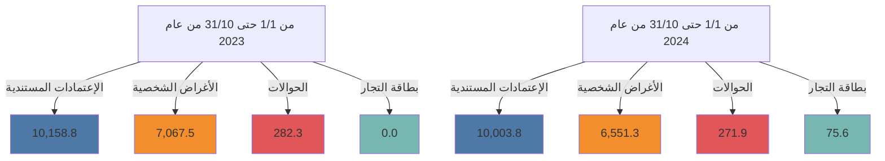

# مصرف ليبيا المركزي

## إستخدامات المصارف للنقد الأجنبي

### خلال الفترة: (1/1 - 31/10/2024)

Central Bank of Libya logo and financial data visualization

إدارة البحوث والإحصاء - إدارة الرقابة على المصارف والنقد
---
إدارة البحوث والإحصاء - إدارة الرقابة على المصارف والنقد

# تحليل حركة إستخدامات المصارف الفعلية من النقد الأجنبي
## خلال الفترة (1/1 - حتى 31/10/2024)

بلغ إجمالي إستخدامات المصارف من النقد الأجنبي خلال الفترة (1/1 - حتى 31/10/2024) نحو 16,902,634,403 دولار، مقابل 17,508,624,870 دولار خلال نفس الفترة من العام الماضي 2023، بإنخفاض قدره نحو 605,990,467 دولار. أي بمعدل بلغ 3.5%.

حيث شكلت الإعتمادات المستندية ما نسبته 59.2% من إجمالي إستخدامات المصارف من النقد الأجنبي، فيما شكلت الأغراض الشخصية نسبة 38.8% من الإجمالي، في حين شكلت الحوالات وبطاقات التجار مانسبته 2.0% من إجمالي الإستخدامات.

### إستخدامات المصارف الفعلية من النقد الأجنبي لكافة الأغراض
"المبالغ بالدولار الأمريكي"

| البند | من 1/1 حتى 31/10 من عام 2023 | من 1/1 حتى 31/10 من عام 2024 | مقدار التغير | نسبة التغير |
|-------|-------------------------------|-------------------------------|---------------|--------------|
| - الإعتمادات المستندية | 10,158,839,128 | 10,003,826,558 | -155,012,570 | -1.5 |
| - الحوالات | 282,320,501 | 271,881,331 | -10,439,170 | -3.7 |
| - الأغراض الشخصية | 7,067,465,241 | 6,551,284,000 | -516,181,241 | -7.3 |
| - بطاقات التجار | - | 75,642,514 | 75,642,514 | - |
| الإجمالي | 17,508,624,870 | 16,902,634,403 | -605,990,467 | -3.5 |

### إستخدامات المصارف للنقد الأجنبي لكافة الأغراض

صفحة 1 من 107
---
إدارة البحوث والإحصاء - إدارة الرقابة على المصارف والنقد

# المبالغ المُباعة للمصارف من النقد الأجنبي لكافة الأغراض:

ومن خلال الإطلاع على الجدول أدناه للقيم المُباعة من النقد الأجنبي حسب المصارف، يتضح أن

المصرف التجاري الوطني قد حافظ على الترتيب الأول كأكثر المصارف إستخداماً للنقد الأجنبي

خلال الفترة (1/1 - حتى 2024/10/31) مسجلاً حصة سوقية بلغت 16.5%، حيث بلغ إجمالي

المبالغ نحو 2,787,199,380 دولار، فيما جاء مصرف الأمان للتجارة والإستثمار في المرتبة الثانية

بحصة سوقية بلغت 15.1% وبقيمة بلغت 2,545,406,253 دولار، ثم مصرف الجمهورية في المرتبة

الثالثة بقيمة 1,885,744,872 دولار، ثم مصرف الصحاري في المرتبة الرابعة بقيمة 1,526,423,718

دولار، وتراجع مصرف الوحدة إلى الترتيب الخامس بقيمة 1,505,763,212 دولار ، ثم تأتي من

حيث الأهمية النسبية المصارف التالية حسب الترتيب : المصرف الإسلامي الليبي، المصرف

المتحد، مصرف التجارة والتنمية، مصرف الصحاري ومصرف الأندلس إلى آخره من المصارف كما

موضح بالجدول أدناه والذي يحتوي أيضاً على الترتيب الذي كانت عليه المصارف خلال نفس

الفترة من العام الماضي 2023.

صفحة 2 من 107
---
إدارة البحوث والإحصاء - إدارة الرقابة على المصارف والنقد

## ترتيب المصارف حسب إجمالي المبالغ المُباعة من النقد الأجنبي

| المصرف | من 1/1 حتى 10/31 من عام 2023 |  |  | من 1/1 حتى 10/31 من عام 2024 |  |  |
|---------|---------------------------|-----------------|------------|---------------------------|-----------------|------------|
|         | الترتيب | القيمة بالدولار | الحصة السوقية | الترتيب | القيمة بالدولار | الحصة السوقية |
| المصرف التجاري الوطني | 1 | 2,308,106,031 | %13.2 | 1 | 2,787,199,380 | %16.5 |
| مصرف الأمان للتجارة والإستثمار | 4 | 1,819,876,024 | %10.4 | 2 | 2,545,406,253 | %15.1 |
| مصرف الجمهورية | 3 | 2,059,282,749 | %11.8 | 3 | 1,885,744,872 | %11.2 |
| مصرف الديوان | 5 | 1,522,863,611 | %8.7 | 4 | 1,526,423,718 | %9.0 |
| مصرف الوحدة | 2 | 2,154,580,997 | %12.3 | 5 | 1,505,763,212 | %8.9 |
| المصرف الإسلامي الليبي | 7 | 1,252,480,030 | %7.2 | 6 | 1,012,605,887 | %6.0 |
| المصرف المتحد للتجارة والإستثمار | 8 | 1,223,588,796 | %7.0 | 7 | 1,010,740,928 | %6.0 |
| مصرف التجارة والتنمية | 13 | 334,763,061 | %1.9 | 8 | 901,231,062 | %5.3 |
| مصرف الصحاري | 9 | 863,987,338 | %4.9 | 9 | 712,917,079 | %4.2 |
| مصرف الأندلس | 14 | 326,300,550 | %1.9 | 10 | 690,210,987 | %4.1 |
| مصرف شمال أفريقيا | 10 | 573,178,889 | %3.3 | 11 | 625,202,917 | %3.7 |
| مصرف السراي للتجارة والإستثمار | 12 | 361,932,620 | %2.1 | 12 | 531,255,982 | %3.1 |
| مصرف الخليج الأول الليبي | 11 | 531,664,716 | %3.0 | 13 | 494,418,548 | %2.9 |
| المصرف الليبي الخارجي | 18 | 83,093,088 | %0.5 | 14 | 162,717,457 | %1.0 |
| مصرف الواحة | 16 | 179,015,699 | %1.0 | 15 | 141,369,717 | %0.8 |
| مصرف التضامن | 17 | 167,983,483 | %1.0 | 16 | 134,738,807 | %0.8 |
| مصرف اليقين | 6 | 1,476,546,377 | %8.4 | 17 | 100,040,898 | %0.6 |
| مصرف المتوسط | 19 | 45,129,954 | %0.3 | 18 | 98,671,168 | %0.6 |
| مصرف الوفاء | 15 | 224,250,857 | %1.3 | 19 | 28,235,306 | %0.2 |
| مصرف الاستثمار العربي الإسلامي | - | - | - | 20 | 7,704,223 | %0.0 |
| مصرف الإتحاد الوطني | 20 | 0 | %0.0 | 21 | 36,000 | %0.0 |
| الإجمالي | - | 17,508,624,870 | %100.0 | - | 16,902,634,403 | %100.0 |

صفحة 3 من 107
---
إدارة البحوث والإحصاء - إدارة الرقابة على المصارف والنقد

المبالغ المُباعة للمصارف من النقد الأجنبي (حسب الغرض)

"القيم بالدولار الأمريكي"

| ت | المصرف | الاعتمادات المستندية | الحوالات المتنوعة | الأغراض الشخصية | بطاقة التجار |
|---|---------|----------------------|-------------------|-------------------|---------------|
| | | من 1/1 حتى 10/31 من عام 2023 | من 1/1 حتى 10/31 من عام 2023 | من 1/1 حتى 10/31 من عام 2023 | من 1/1 حتى 10/31 من عام 2023 |
| | | من 1/1 حتى 10/31 من عام 2024 | من 1/1 حتى 10/31 من عام 2024 | من 1/1 حتى 10/31 من عام 2024 | من 1/1 حتى 10/31 من عام 2024 |
|-1| التجاري الوطني | 1,065,413,901 | 5,316,480 | 1,237,375,650 | - |
| | | 1,685,776,642 | 2,434,137 | 1,077,938,600 | 21,050,000 |
|-2| الأمان | 560,002,845 | 1,467,392 | 1,258,405,786 | - |
| | | 862,198,226 | 1,866,634 | 1,643,248,900 | 38,092,493 |
|-3| الجمهورية | 1,137,193,645.690 | 53,795,104 | 868,294,000 | - |
| | | 1,209,513,321 | 6,454,751 | 669,776,800 | 0 |
|-4| الواحة | 1,185,001,069 | 27,475,446 | 310,387,095 | - |
| | | 1,233,775,022 | 21,603,096 | 261,716,100 | 9,329,500 |
|-5| الوحدة | 1,844,066,826 | 928,779 | 309,585,392 | - |
| | | 782,506,193 | 9,785,220 | 713,471,800 | 0 |
|-6| الإسلامي الليبي | 923,533,099 | 42,419,871 | 286,527,060 | - |
| | | 709,283,527 | 15,602,861 | 287,719,500 | 0 |
|-7| المتحد | 373,200,641 | 3,377,258 | 847,010,897 | - |
| | | 535,427,328 | 0 | 475,133,600 | 180,000 |
|-8| التجارة والتنمية | 3,600,000 | 0 | 331,163,061 | - |
| | | 347,880,898 | 66,811,664 | 485,688,500 | 850,000 |
|-9| الصحاري | 313,126,573 | 10,853,700 | 540,007,065 | - |
| | | 394,240,567 | 14,270,312 | 304,406,200 | 0 |
|-10| الأندلس | 290,702,251 | 7,565,961 | 28,032,338 | - |
| | | 589,958,918 | 13,901,269 | 86,350,800 | 0 |
|-11| شمال أفريقيا | 321,732,440 | 40,098,558 | 211,347,891 | - |
| | | 363,622,549 | 28,250,269 | 232,512,600 | 817,500 |
|-12| السراي | 331,517,824 | 20,232,853 | 10,181,944 | - |
| | | 447,427,045 | 5,969,716 | 73,361,200 | 4,498,021 |
|-13| الخليج الأول الليبي | 500,898,510 | 30,316,422 | 449,785 | - |
| | | 469,471,726 | 23,903,722 | 1,043,100 | 0 |
|-14| الليبي الخارجي | 58,219,756 | 24,511,152 | 362,180 | - |
| | | 106,614,625 | 55,501,332 | 601,500 | 0 |
|-15| الواحة | 88,529,266 | 0 | 90,486,433 | - |
| | | 52,759,573 | 1,977,244 | 86,632,900 | 0 |
|-16| الضمان | 167,983,483 | 0 | 0 | - |
| | | 111,794,807 | 2,060,800 | 20,883,200 | 0 |
|-17| اليقين | 735,770,027 | 13,961,525 | 726,814,825 | - |
| | | 761,602 | 17,497 | 98,936,800 | 325,000 |
|-18| المتوسط | 37,294,410 | 0 | 7,835,544 | - |
| | | 76,981,660 | 747,807 | 20,441,700 | 500,000 |
|-19| الوفاء | 221,052,562 | 0 | 3,198,295 | - |
| | | 16,851,106 | 0 | 11,384,200 | 0 |
|-20| الاستثمار العربي | 0 | 0 | 0 | - |
| | | 6,981,222 | 723,001 | 0 | 0 |
|-21| الاتحاد الوطني | 0 | 0 | 0 | - |
| | | 0 | 0 | 36,000 | 0 |
|-| الإجمالي الكلي | 10,158,839,128 | 282,320,501 | 7,067,465,241 | - |
| | | 10,003,826,558 | 271,881,331 | 6,551,284,000 | 75,642,514 |

صفحة 4 من 107
---
إدارة البحوث والإحصاء - إدارة الرقابة على المصارف والنقد

## الأهمية النسبية حسب المصرف لاستخدامات النقد الأجنبي
### خلال الفترة من 1/1 حتى 10/31 من عام 2023

| المصرف | النسبة |
|---------|--------|
| المصرف التجاري الوطني | 14% |
| مصرف الوحدة | 12% |
| مصرف الجمهورية | 11% |
| مصرف الأمان للتجارة والاستثمار | 11% |
| مصرف اليقين | 9% |
| مصرف النوران | 9% |
| المصرف الإسلامي الليبي | 7% |
| المصرف المتحد للتجارة والاستثمار | 7% |
| مصرف الصحاري | 5% |
| مصرف شمال أفريقيا | 3% |
| باقي المصارف | 12% |

## الأهمية النسبية حسب المصرف لاستخدامات النقد الأجنبي
### خلال الفترة من 1/1 حتى 10/31 من عام 2024

| المصرف | النسبة |
|---------|--------|
| المصرف التجاري الوطني | 19% |
| مصرف الأمان للتجارة والاستثمار | 17% |
| مصرف الجمهورية | 13% |
| مصرف النوران | 11% |
| مصرف الوحدة | 10% |
| المصرف الإسلامي الليبي | 7% |
| المصرف المتحد للتجارة والاستثمار | 7% |
| مصرف التجارة والتنمية | 6% |
| مصرف الصحاري | 5% |
| مصرف الأندلس | 5% |

صفحة 6 من 170
---
إدارة البحوث والإحصاء - إدارة الرقابة على المصارف والنقد

طلبات المصارف المقبولة لتغطية الإعتمادات المستندية والحوالات المتنوعة عدا الأغراض الشخصية خلال الفترة (1/1 - حتى 31/10/2024):

بلغ عدد الشركات والمصانع والجهات العامة والجهات الأخرى المستفيدة (2,263) والتي تمت الموافقة على طلباتهم حصولهم على النقد الأجنبي خلال الفترة (1/1 - حتى 31/10/2024). بعدد طلبات بلغ نحو 14,572 طلب، معظم هذه الطلبات لتغطية الإعتمادات المستندية والتي سجلت 12,800 طلب بنسبة 87.8% من الطلبات، كما هو موضح بالجداول التالية أدناه:-

عدد الطلبات المقبولة لشراء النقد الأجنبي - حسب القطاعات

| القطاع | عدد الشركات أو المصانع أو الجهات |
|--------|----------------------------------|
| القطاع الخاص | 2,148 |
| القطاع العام | 39 |
| جهات متنوعة | 76 |
| الإجمالي | 2,263 |

عدد الطلبات المقبولة لشراء النقد الأجنبي حسب نوع التحويل

| نوع التحويل | عدد الطلبات |||||
|-------------|---------------|---------------|---------------|---------------|---------------|
| | القطاع الخاص | القطاع العام | جهات متنوعة | الإجمالي | الأهمية النسبية |
| اعتماد مستندي | 12,504 | 282 | 14 | 12,800 | 87.8% |
| حوالة طيران | 853 | 73 | 9 | 935 | 6.4% |
| حوالة تجارية | 24 | 277 | 40 | 341 | 2.3% |
| تحويلات أخرى | 28 | 227 | 16 | 271 | 1.9% |
| حوالة تأمين | 21 | 83 | 0 | 104 | 0.7% |
| حوالة مرتبات | 0 | 0 | 63 | 63 | 0.4% |
| حوالة صناعية | 51 | 4 | 0 | 55 | 0.4% |
| حوالة استيراد الذهب | 3 | 0 | 0 | 3 | 0.0% |
| الإجمالي | 13,484 | 946 | 142 | 14,572 | 100.0% |

صفحة 7 من 107
---
إدارة البحوث والإحصاء - إدارة الرقابة على المصارف والنقد

## 1- القطاع الخاص:

بلغ عدد شركات ومصانع القطاع الخاص (2,148) التي تمت الموافقة على طلباتها للحصول على
النقد الأجنبي من المصارف لتغطية الاعتمادات المستندية والحوالات الأخرى خلال الفترة (1/1 -
حتى 31/ 10 /2024) حيث أحتلت طلبات شراء النقد الأجنبي من قبل القطاع الخاص لإستيراد
السلع الغذائية المتنوعة المرتبة الأولى من إجمالي طلبات الشراء خلال الفترة، حيث شكلت مانسبته
24.8% من إجمالي طلبات شراء النقد الأجنبي.

وبالنسبة لشركات القطاع الخاص فقد إحتلت شركة النسيم للصناعات الغذائية الترتيب الأول،
والجداول التالية توضح طلبات شراء السلع أو الخدمات وكذلك طلبات الشراء حسب أهم مائة
شركة خلال الفترة (1/1 - حتى 31/10/2024).

### طلبات شراء السلع أو الخدمات - قطاع خاص
### خلال الفترة (1/1 - حتى 31/10/2024)
"مرتبة تنازلياً"

| ت | تصنيف السلع | القيمة بالدولار | الأهمية النسبية % |
|---|-------------|-----------------|-------------------|
| 1- | سلع غذائية متنوعة | 2,328,555,090 | 24.8% |
| 2- | مستلزمات انتاج وتشغيل | 1,913,714,718 | 20.4% |
| 3- | وسائل النقل واطارات ونضائد وقطع الغ | 680,990,326 | 7.2% |
| 4- | مواد البناء ومستلزمات التشييد | 552,069,605 | 5.9% |
| 5- | أعلاف | 483,546,551 | 5.1% |
| 6- | الآلات والمعدات | 427,524,841 | 4.5% |
| 7- | مستلزمات انتاج سلع أساسية | 426,571,161 | 4.5% |
| 8- | اللحوم الحية والمجمدة | 405,573,863 | 4.3% |
| 9- | أجهزة الالكترونية | 354,345,979 | 3.8% |
| 10- | أدوية بشرية | 311,717,739 | 3.3% |
| 11- | الزراعية | 243,104,795 | 2.6% |
| 12- | منزلية وكهرومنزلية | 208,796,032 | 2.2% |
| 13- | حليب وحفاظات وأغذية أطفال | 169,115,288 | 1.8% |
| 14- | مواد التنظيف | 110,030,981 | 1.2% |
| 15- | حليب | 102,554,200 | 1.1% |
| 16- | أجبان | 89,128,507 | 0.9% |

صفحة 8 من 107
---
إدارة البحوث والإحصاء - إدارة الرقابة على المصارف والنقد

| النسبة المئوية | القيمة | البند | الرقم |
|----------------|--------|------|------|
| %0.9 | 81,990,838 | طلبات برنيق للطيران | -17 |
| %0.6 | 54,580,332 | الملابس والأحذية | -18 |
| %0.6 | 52,322,492 | حوالات شركات خطوط الطيران | -19 |
| %0.5 | 44,472,114 | الأثاث | -20 |
| %0.5 | 43,723,610 | خدمات ملاحية متنوعة | -21 |
| %0.4 | 39,507,286 | زراعية | -22 |
| %0.3 | 30,723,933 | قرطاسية | -23 |
| %0.3 | 25,349,553 | فواكه وخضروات | -24 |
| %0.3 | 24,091,384 | خدمات إنتاج وتشغيل | -25 |
| %0.3 | 23,941,043 | مواد صحية | -26 |
| %0.2 | 21,556,188 | طلبات خاصة بشركة الأجنحة الليبية | -27 |
| %0.2 | 18,496,273 | خدمات اتصالات وتقنية معلومات | -28 |
| %0.2 | 18,269,644 | مواد تنظيف | -29 |
| %0.2 | 18,076,330 | سمن | -30 |
| %0.2 | 17,388,990 | متنوعة | -31 |
| %0.1 | 14,061,830 | أدوية بيطرية | -32 |
| %0.1 | 11,085,500 | تبغ بأنواعها ومستلزماته | -33 |
| %0.1 | 10,881,994 | الشركة الليبية السريعة للنقل الجوي | -34 |
| %0.1 | 8,459,100 | أسماك وأحياء بحرية | -35 |
| %0.1 | 5,910,975 | حوالة استيراد الذهب | -36 |
| %0.1 | 5,377,801 | زبدة | -37 |
| %0.1 | 4,775,859 | شركة أويا للطيران | -38 |
| %0.04 | 3,626,244 | السجاد والمنسوجات | -39 |
| %0.03 | 2,580,731 | سلع أخرى | -40 |
| %0.02 | 1,850,017 | شركة غدامس للطيران | -41 |
| %0.02 | 1,804,633 | الطبية | -42 |
| %0.02 | 1,669,833 | مستلزمات تشغيل مصنع الحديد والصلب | -43 |
| %0.02 | 1,618,347 | شركة سما المتوسط للطيران | -44 |
| %0.01 | 784,513 | حوالات شركات التأمين | -45 |
| %0.01 | 610,500 | رسوم اشتراك منظومة | -46 |
| %0.01 | 565,391 | تكاليف خدمات سياحية | -47 |
| %0.003 | 266,962 | سلع خاصة بالخدمات العامة | -48 |
| %0.002 | 175,517 | مستلزمات تشغيل الموانئ | -49 |
| %0.001 | 76,485 | تكاليف رسوم تأشيرات | -50 |

صفحة 9 من 107
---
إدارة البحوث والإحصاء - إدارة الرقابة على المصارف والنقد

# طلبات الشراء حسب أهم مائة شركة - قطاع خاص
## خلال الفترة (1/1 - حتى 31/10/2024)
### "مرتبة تنازلياً"

"دولار أمريكي"

| ت | الشركة أو المصنع | القيمة |
|---|-------------------|--------|
| 1 | شركة النسيم للصناعات الغذائية | 152,282,916 |
| 2 | شركة الشرق الليبي للمطاحن والاعلاف ومضارب الارز | 137,545,115 |
| 3 | شركة وادي الكوف للمطاحن والأعلاف ومضارب الأرز | 122,943,808 |
| 4 | شركة الليبية المتحدة لتعبئة المشروبات | 121,477,551 |
| 5 | شركة تويوتا ليبيا لتجارة السيارات وقطع الغيار والاستيراد والتصدير | 111,541,898 |
| 6 | شركة برنيق للطيران | 97,567,311 |
| 7 | شركة الجيد لإستيراد المواد الغذائية | 86,758,635 |
| 8 | شركة افريقيا لتعبئة المشروبات | 78,016,512 |
| 9 | شركة السرايا الراقية لاستيراد المواد الغذائية و الخضروات و الفواكه الطازجة و المواشي واللحوم | 77,864,366 |
| 10 | شركة المتوكة لاستيراد المواد الغذائية | 75,335,242 |
| 11 | شركة شريان الحياة لاستيراد جميع أنواع الأعلاف ومكملاتها والمعدات الزراعية وبذور الحيوانات وطحن الحبوب | 75,000,000 |
| 12 | شركة المعمورة للصناعات الغذائية والمطاحن والاعلاف | 70,733,342 |
| 13 | شركة الليبية الكبرى لصناعة السميد والدقيق | 68,811,427 |
| 14 | شركة جودي للصناعات الغذائية | 67,113,528 |
| 15 | شركة دروب ليبيا لاستيراد وسائل النقل وملحقاتها | 64,244,250 |
| 16 | شركة سما الليبية لاستيراد المواد الغذائية والمواشي واللحوم | 63,272,712 |
| 17 | شركة الماهر الدولي للمطاحن والأعلاف | 57,664,421 |
| 18 | شركة مجموعة الامتياز لاستيراد وسائل النقل وملحقاتها | 57,207,365 |
| 19 | شركة مجموعة الرائدون لصناعة مواد البناء | 55,094,414 |
| 20 | شركة الريحان لصناعة المواد الغذائية | 54,523,476 |
| 21 | شركة الجاهزة لاستيراد المواد الغذائية | 54,392,000 |
| 22 | شركة بلاد لاستيراد المواد الغذائية | 53,414,375 |
| 23 | شركة بصمة الجودة لاستيراد المواد الغذائية والمواشي واللحوم | 52,041,217 |
| 24 | شركة الفا لاستيراد الادوية والمعدات الطبية و المستحضرات الطبية و مستلزمات الام و الطفل | 51,636,941 |

صفحة 10 من 107
---
إدارة البحوث والإحصاء - إدارة الرقابة على المصارف والنقد

| المبلغ | اسم الشركة | الرقم |
|--------|------------|-------|
| 51,327,091 | شركة جبل الكوف لاستيراد السيارات و قطع الغيار | 25 |
| 50,327,500 | شركة خيرات الايادي لاستيراد المواد الغذائية | 26 |
| 48,931,500 | شركة جودة الموسم لاستيراد المواد الغذائية | 27 |
| 48,620,320 | المجموعة الليبية للخدمات النفطية والطاقة | 28 |
| 42,292,112 | شركة الوصل المتميز لاستيراد لاستيراد المواد الغذائية والمواشي واللحوم | 29 |
| 42,272,200 | شركة عروس البيضاء لاستيراد المواشي واللحوم التابعه لشركة أكاكوس القابضه | 30 |
| 41,176,565 | شركة الوسام الذهبي لصناعة الدقيق والمطاحن والاعلاف ومضارب الارز | 31 |
| 40,653,483 | شركة بستان ليبيا لاستيرادالمواد الغذائية والمواشي واللحوم | 32 |
| 40,335,425 | شركة الجيد للصناعات الغذائية | 33 |
| 40,242,653 | شركة المعمورة للاستثمار الزراعي والحيواني | 34 |
| 40,233,910 | شركة الابداع لصناعة المنظفات والصابون ومستلزماتها | 35 |
| 40,040,509 | شركة فرداس لصناعة المكرونة والكسكسي | 36 |
| 39,879,550 | شركة مجموعة الامتياز للمطاحن ومضارب الارز وتعبئة الزيوت النباتية | 37 |
| 39,686,010 | شركة ريادة لصناعات الكيماوية والمواد الخام | 38 |
| 39,673,315 | شركة المروكة للصناعات الغذائية | 39 |
| 39,374,702 | شركة تمر هند لاستيراد السيارات وقطع غيارها | 40 |
| 38,374,792 | شركة الرفيق الأمثل لصناعة مواد البناء | 41 |
| 38,100,926 | شركة الجبال لصناعة الاعلاف | 42 |
| 37,409,017 | شركة أضواء النيزك لاستيراد الأجهزة الألكترونية وملحقاتها وقطع غيارها | 43 |
| 36,882,501 | شركة الاجنحة الليبية للطيران المساهمة | 44 |
| 36,323,145 | شركة الجودة العالمية الأولى لصناعة الاعلاف ومطاحن الدقيق والصناعات الغذائية | 45 |
| 36,065,105 | شركة الثمرات الليبية لاستيراد المواد الغذائية | 46 |
| 34,389,118 | شركة مجموعة التواصل المتميز لاستيراد المواد الخام | 47 |
| 32,874,766 | الشركة الاستثمارية للصناعات الهندسية وتشكيل المعادن | 48 |
| 31,911,998 | شركة طريق القارة لاستيراد المواد الغذائية | 49 |
| 31,310,092 | شركة وطن المجد لاستيراد المواد الغذائية | 50 |
| 30,636,417 | شركة الزرقاء الدولية للصناعات الغذائية | 51 |
| 29,397,200 | شركة اونكس لصناعة مواد البناء والطلاء والمعاجين وصناعة البلاستيك والمواد الخام | 52 |
| 29,172,645 | شركة ادري لاستيراد وسائل النقل وملحقاتها | 53 |
| 29,073,760 | شركة القدس ل صناعة الخزانات والمواسير البلاستيكية | 54 |
| 28,616,261 | شركة المعمورة لاستيراد وتوزيع المواد الغذائية | 55 |

صفحة 11 من 107
---
إدارة البحوث والإحصاء - إدارة الرقابة على المصارف والنقد

| الرقم | اسم الشركة | القيمة |
|-------|------------|--------|
| 56 | شركة المراعي الخصبة للمطاحن والاعلاف ومضارب الارز | 28,108,760 |
| 57 | شركة الساحل لاستيراد المواشي واللحوم | 28,107,783 |
| 58 | شركة السواحل الذهبية لاستيراد المواد الغذائية | 27,899,564 |
| 59 | شركة المصبوبات لصناعة مواد البناء | 27,751,713 |
| 60 | شركة لمسة الحياة لاستيراد المعدات الطبية والادوية والمستحضرات الطبية ومستلزمات الام والطفل | 27,247,893 |
| 61 | مصنع التعاون لصناعة الاعلاف | 26,897,900 |
| 62 | شركة أعالي الاندلس للصناعات الغذائية | 26,877,465 |
| 63 | مصنع بيتا لصناعة مواد التنظيف | 26,594,250 |
| 64 | مصنع ارمكو لصناعة الطلاء | 26,135,200 |
| 65 | شركة اضواء افريقيا لاستيراد المواد الغذائية والمواشي واللحوم | 26,125,682 |
| 66 | شركة المعين الأول لإستيراد السيارات وقطع غيارها | 25,646,000 |
| 67 | شركة مفاتيح الخير لاستيراد الاجهزة والمواد الكهربائية وقطع غيارها والاجهزة الالكترونية وملحقاتها وقطع | 25,565,914 |
| 68 | شركة اوميجا للصناعات الكيماوية ومواد التغليف | 25,494,400 |
| 69 | شركة طرابلس الكبرى لصناعة وتعبئة الطماطم والمواد الغذائية | 25,421,440 |
| 70 | شركة اشراقة الأمل للأستثمار الزراعي والحيواني وتربية الدواجن | 24,833,563 |
| 71 | شركة بشائر الزهراء لصناعة المواد الغذائية والمشروبات الغازية | 24,798,523 |
| 72 | شركة النيل العربي للخدمات النفطية | 24,600,226 |
| 73 | شركة لامار بنغازي لصناعة البلاستيك | 24,425,278 |
| 74 | مصنع جاما لصناعة البلاستيك | 23,479,322 |
| 75 | شركة المذاق الطيب لاستيراد المواد الغذائية والمواشي واللحوم | 23,431,073 |
| 76 | شركة السد الحديثة للمطاحن وصناعة الاعلاف للمطاحن و الاعلاف و المكرونة | 23,299,122 |
| 77 | شركة الشمس الساطعة للصناعات الغذائية | 23,112,509 |
| 78 | شركة مجموعة الفخامة لصهر وتشكيل المعادن | 22,752,079 |
| 79 | شركة الليبية الجديدة لصناعة المعادن | 22,673,079 |
| 80 | شركة سوبر لصناعة مواد البناء وطلاء والبلاستيك ومواد الخام | 22,397,400 |
| 81 | شركة جلوبال لصناعة مواد البناء والطلاء والمعاجين والبلاستيك والمواد الخام | 21,892,620 |
| 82 | شركة قرطاج للصناعات الغذائية | 21,841,525 |
| 83 | شركة القيض لصناعة مواد التنظيف | 21,813,125 |
| 84 | شركة الطائف لاستيراد المواد الغدائية | 21,568,992 |
| 85 | شركة الطرق الحديثة لصناعة الاسفلت والمواد العازل | 21,548,301 |
| 86 | شركة التقنية الخضراء لاستيراد الاجهزة الكهربائية والالكترونية | 21,396,383 |

صفحة 12 من 107
---
إدارة البحوث والإحصاء - إدارة الرقابة على المصارف والنقد

| شركة المتحدة العربية لصناعة مواد التنظيف | 20,773,300 | 87 |
|------------------------------------------|------------|------|
| شركة أصول التكنولوجيا لصناعة الاجهزة الالكترونية والكهربائية | 20,547,750 | 88 |
| شركة مجموعة المواشي الحية لاستيراد المواد الغذائية والمواشي واللحوم | 20,418,700 | 89 |
| شركة الغذاء الصحي لاستيراد المواد الغذائية | 20,373,841 | 90 |
| شركة أجود المحركات لاستيراد السيارات | 20,237,134 | 91 |
| شركة السهل الاخضر للمطاحن والاعلاف | 20,231,082 | 92 |
| شركة كنوز ليبيا للمطاحن والاعلاف ومضارب الارز | 20,112,805 | 93 |
| شركة النجع الكبير لاستيراد المواد الغذائية والمواشي واللحوم | 19,988,163 | 94 |
| شركة سما المراعي للمطاحن وصناعة الاعلاف ومضارب الارز | 19,862,057 | 95 |
| شركة الاصالة الذهبية للمطاحن ومضارب الارز | 19,567,590 | 96 |
| شركة المعمورة الأولى لاستيراد المواد الغذائية | 19,394,548 | 97 |
| شركة جسر الخليج لاستيراد المواشي و اللحوم | 19,092,391 | 98 |
| شركة الدولية لصناعة مواد البناء والطلاء والبلاستيك ومواد الخام | 18,691,050 | 99 |
| شركة النخوة الليبية لاستيراد المواد الغذائية | 18,647,494 | 100 |

## طلبات المصارف لتغطية الاعتمادات المستندية والحوالات - قطاع خاص

### (حسب أهم البلدان المستفيدة)

من خلال الإطلاع على الجدول أدناه لقيم طلبات المصارف لشراء النقد الأجنبي حسب البلدان
المستفيدة خلال الفترة (1/1 - حتى 31/10/2024) للقطاع الخاص، يتضح أن مانسبته 22.5%
من تحويلات المصارف لتغطية الإعتمادات المستندية أوالحوالات الأخرى كانت لدولة تركيا، تم
جاءت دولة الإمارات العربية المتحدة في المرتبة الثانية بنسبة 13.9% ثم سويسرا و جمهورية مصر
العربية بنسب 8.3% و 6.9% على التوالي، والجدول التالي يوضح أهم عشرون بلد مستفيد.

صفحة 13 من 107
---
إدارة البحوث والإحصاء - إدارة الرقابة على المصارف والنقد

طلبات المصارف لتغطية الاعتمادات المستندية والحوالات - قطاع خاص
(حسب أهم البلدان المستفيدة)
خلال الفترة (1/1 - حتى 31/10/2024)

| ت | البلد المستفيد | القيمة بالدولار | الأهمية النسبية |
|---|----------------|-----------------|-----------------|
| 1- | تركيا | 2,115,873,268 | 22.5% |
| 2- | الإمارات العربية المتحدة | 1,306,498,080 | 13.9% |
| 3- | سويسرا | 779,467,137 | 8.3% |
| 4- | مصر | 652,173,564 | 6.9% |
| 5- | بريطانيا ( المملكة المتحدة) | 625,717,586 | 6.7% |
| 6- | الصين | 479,992,260 | 5.1% |
| 7- | إيطاليا | 432,029,404 | 4.6% |
| 8- | تونس | 376,862,520 | 4.0% |
| 9- | إسبانيا | 309,550,060 | 3.3% |
| 10- | كندا | 187,282,696 | 2.0% |
| 11- | النمسا | 171,798,184 | 1.8% |
| 12- | الأردن | 167,644,390 | 1.8% |
| 13- | اليابان | 151,268,972 | 1.6% |
| 14- | تايلاند | 145,467,573 | 1.5% |
| 15- | فرنسا | 140,122,807 | 1.5% |
| 16- | هولندا | 136,864,642 | 1.5% |
| 17- | كوريا الجنوبية | 126,166,595 | 1.3% |
| 18- | المانيا | 118,334,629 | 1.3% |
| 19- | نيوزيلندا | 72,829,505 | 0.8% |
| 20- | سلوفاكيا | 61,558,614 | 0.7% |

صفحة 14 من 107
---
إدارة البحوث والإحصاء - إدارة الرقابة على المصارف والنقد

# طلبات المصارف لتغطية الإعتمادات المستندية والحوالات - قطاع خاص

## (حسب أهم بلدان منشأ السلع أو الخدمات)

من خلال الإطلاع على الجدول أدناه لقيم طلبات المصارف لشراء النقد الأجنبي حسب بلدان منشأ السلع أو الخدمات خلال الفترة (1/1 - حتى 31/10/2024) للقطاع الخاص ، يتضح أن دولة تركيا قد أحتلت المرتبة الأولى حيث شكلت السلع أو الخدمات ذات المنشأ التركي نسبة 20.3% من إجمالي طلبات الشراء المقبولة، ثم جاءت واردات السلع أو الخدمات ذات المنشأ الصيني في المرتبة الثانية مشكلة مانسبته 11.1% من الإجمالي، وشكلت السلع أوالخدمات ذات المنشأ المصري نسبة 9.8% محتلة المرتبة الثالثة خلال الفترة ، فيما سجلت السلع والخدمات ذات منشأ دولة روسيا الاتحادية مانسبته 6.8% ، وذات المنشأ البرازيلي نسبة 5.1%، والجدول التالي يوضح أهم عشرون بلد منشأ للسلع أو الخدمات.

## طلبات المصارف لتغطية الإعتمادات المستندية والحوالات - قطاع خاص
### (حسب أهم بلدان منشأ السلع أو الخدمات)
#### خلال الفترة (1/1 - حتى 31/10/2024)

| ت | بلد منشأ السلع أوالخدمات | القيمة بالدولار | الاهمية النسبية |
|---|---------------------------|-----------------|------------------|
| 1- | تركيا | 1,910,835,576 | 20.3% |
| 2- | الصين | 1,046,680,498 | 11.1% |
| 3- | مصر | 921,322,865 | 9.8% |
| 4- | روسيا الاتحادية | 635,820,428 | 6.8% |
| 5- | البرازيل | 475,394,235 | 5.1% |
| 6- | الهند | 468,834,714 | 5.0% |
| 7- | إيطاليا | 439,046,778 | 4.7% |
| 8- | تونس | 323,045,078 | 3.4% |
| 9- | أوكرانيا | 268,459,768 | 2.9% |
| 10- | إسبانيا | 227,753,177 | 2.4% |

صفحة 15 من 107
---
إدارة البحوث والإحصاء - إدارة الرقابة على المصارف والنقد

| -   | الدولة                    | القيمة       | النسبة |
|-----|---------------------------|--------------|--------|
| -11 | تايلاند                   | 212,648,956  | 2.3%   |
| -12 | الأرجنتين                 | 191,736,687  | 2.0%   |
| -13 | المانيا                   | 177,598,661  | 1.9%   |
| -14 | فرنسا                     | 169,917,174  | 1.8%   |
| -15 | الإمارات العربية المتحدة  | 143,056,380  | 1.5%   |
| -16 | هولندا                    | 141,236,586  | 1.5%   |
| -17 | المملكة العربية السعودية  | 122,865,476  | 1.3%   |
| -18 | بلجيكا                    | 116,540,354  | 1.2%   |
| -19 | الولايات المتحدة          | 116,497,532  | 1.2%   |
| -20 | أيرلندا                   | 109,357,066  | 1.2%   |

## 2- القطاع العام

بلغ عدد جهات القطاع العام التي تمت الموافقة على طلباتها للحصول على النقد الأجنبي لتغطية الاعتمادات المستندية والحوالات الأخرى 39 جهة خلال الفترة (1/1 – حتى 31/10/2024)، حيث أحتلت مستلزمات تشغيل مصنع الحديد والصلب المرتبة الأولى من إجمالي طلبات الشراء خلال الفترة، حيث شكلت مانسبته 40.7% من إجمالي طلبات شراء النقد الأجنبي، فيما أحتلت متطلبات مستلزمات الإنتاج والتشغيل المرتبة الثانية من حيث الأهمية النسبية لتشكل نحو 10.5%، وبالتالي فقد احتلت الشركة الليبية للحديد والصلب الترتيب الأول ، حيث سجلت طلباتها المقبولة لشراء النقد الأجنبي نحو 394.3 مليون دولار خلال الفترة يليها شركة ليبيانا للهاتف المحمول بإجمالي طلبات مقبولة بلغ نحو 111.6 مليون دولار. والجداول التالية توضح طلبات شراء السلع أو الخدمات وكذلك طلبات الشراء حسب الجهات العامة خلال الفترة (1/1 – حتى 31/10/2024).

صفحة 16 من 107
---
إدارة البحوث والإحصاء - إدارة الرقابة على المصارف والنقد

# طلبات شراء حسب السلعة أو الخدمات - قطاع عام

خلال الفترة (1/1 - حتى 31/10/2024)

"مرتبة تنازلياً"

| ت | تصنيف السلع | القيمة بالدولار | الأهمية النسبية % |
|---|-------------|------------------|-------------------|
| -1 | مستلزمات تشغيل مصنع الحديد والصلب | 370,664,675 | 40.7% |
| -2 | مستلزمات انتاج وتشغيل | 95,410,322 | 10.5% |
| -3 | خدمات اتصالات وتقنية معلومات | 84,490,220 | 9.3% |
| -4 | طلبات جهاز تنفيذ مشروعات المواصلات | 64,300,000 | 7.1% |
| -5 | متطلبات شركة ليبيانا للهاتف المحمول | 60,623,723 | 6.7% |
| -6 | شركة الاتحاد العربي للمقاولات | 41,119,610 | 4.5% |
| -7 | الآلات والمعدات | 33,821,897 | 3.7% |
| -8 | شركة المدار الجديد | 31,270,113 | 3.4% |
| -9 | حوالات شركات خطوط الطيران | 22,090,807 | 2.4% |
| -10 | شركة ليبيا للاتصالات والتقنية | 19,276,729 | 2.1% |
| -11 | مستلزمات تشغيل الموانئ | 14,930,659 | 1.6% |
| -12 | حوالات شركات التأمين | 10,706,784 | 1.2% |
| -13 | سلع غذائية متنوعة | 8,064,000 | 0.9% |
| -14 | الخطوط الجوية الأفريقية | 7,934,218 | 0.9% |
| -15 | الشركة الاهلية للاسمنت | 7,856,192 | 0.9% |
| -16 | طلبات جهاز مشروعات الاسكان | 5,721,046 | 0.6% |
| -17 | مواد البناء ومستلزمات التشييد | 5,365,739 | 0.6% |
| -18 | الغذائية | 4,317,050 | 0.5% |
| -19 | طلبات الخطوط الجوية الليبية | 3,741,718 | 0.4% |
| -20 | متطلبات تشغيل وصيانة الموانئ | 3,739,477 | 0.4% |
| -21 | خدمات انتاج وتشغيل | 3,432,984 | 0.4% |
| -22 | الهيئة العامة للاوقاف | 2,108,454 | 0.2% |
| -23 | متنوعة | 2,030,750 | 0.2% |
| -24 | أجهزة الكترونية | 1,948,376 | 0.2% |
| -25 | الشركة العامة لاستيراد السلع الامنية | 1,465,100 | 0.2% |
| -26 | مستلزمات الشركة العامة للكهرباء | 1,090,179 | 0.1% |
| -27 | وسائل النقل وطائرات ومضائر وقطع الغيار | 829,977 | 0.1% |

صفحة 17 من 107
---
إدارة البحوث والإحصاء - إدارة الرقابة على المصارف والنقد

| %0.1 | 821,882 | حولات دورة تدريبية | -28 |
| %0.1 | 722,408 | صندوق الرعاية الاجتماعية | -29 |
| %0.1 | 646,645 | الشركة الليبية للموانئ | -30 |
| %0.03 | 310,977 | احتياجات التشغيل لشركة معاملات | -31 |
| %0.01 | 76,250 | زراعية | -32 |
| %0.01 | 66,625 | سلع خاصة بالخدمات العامة | -33 |
| %0.00 | 15,178 | مستلزمات تشغيل شركة هاتف ليبيا | -34 |
| %0.00 | 6,624 | طلبات شركات التأمين | -35 |

## طلبات الشراء حسب الجهات - قطاع عام
خلال الفترة (1/1 – حتى 31/10/2024)
"مرتبة تنازلياً"

| القيمة بالدولار | الجهة | ت |
| --- | --- | --- |
| 394,342,453 | الشركة الليبية للحديد والصلب | 1 |
| 111,604,950 | شركة ليبيانا للهاتف المحمول | 2 |
| 94,302,326 | الجهاز الوطني للتنمية | 3 |
| 50,499,805 | جهاز تنمية و تطوير المراكز الإدارية | 4 |
| 47,772,167 | شركة المدار الجديد | 5 |
| 46,087,540 | شركة الاتحاد العربي للمقاولات المساهمة | 6 |
| 28,182,550 | المنطقة الحرة مصراتة | 7 |
| 26,043,499 | شركة الخطوط الجوية الافريقية | 8 |
| 23,970,086 | شركة ليبيا للاتصالات والتقنية المساهمة | 9 |
| 18,095,549 | شركة الاهلية للاسمنت المساهمة | 10 |
| 11,968,000 | شركة تطوير للاستثمار الصناعي المساهمة | 11 |
| 11,889,827 | شركة ليبيا للتامين | 12 |
| 9,909,761 | شركة هاتف ليبيا | 13 |
| 8,377,937 | شركة الاتصالات الدولية الليبية | 14 |
| 5,721,046 | جهاز تنفيذ مشروعات الاسكان و المرافق | 15 |
| 5,631,455 | شركة الخطوط الجوية الليبية | 16 |

صفحة 18 من 107
---
إدارة البحوث والإحصاء - إدارة الرقابة على المصارف والنقد

| الرقم | الجهة | القيمة |
|-------|-------|--------|
| 17 | الهيئة العامة للأوقاف والشؤون الإسلامية | 2,108,454 |
| 18 | شركة المناهج للطباعة والنشر | 1,945,321 |
| 19 | شركة الإنماء للاستثمارات الكهربائية | 1,869,824 |
| 20 | شركة تطوير للاستثمار الصناعي | 1,501,155 |
| 21 | شركة العامة لاستيراد السلع الأمنية المساهمة | 1,465,100 |
| 22 | شركة الليبية للموانئ | 1,376,150 |
| 23 | الاتحاد الليبي لشركات التأمين | 975,371 |
| 24 | شركة العامة لخدمات النظافة العامة طرابلس | 892,000 |
| 25 | شركة الأكاديمية الليبية للاتصالات والمعلوماتية | 807,382 |
| 26 | مركز الوطني للأرصاد الجوية | 768,951 |
| 27 | صندوق الرعاية الاجتماعية بوزارة الداخلية | 722,408 |
| 28 | شركة معاملات للخدمات المالية | 629,977 |
| 29 | شركة الصناعات الكهربائية | 603,843 |
| 30 | شركة الثقة لاستيراد اللحوم والمواد الغذائية المساهمة | 413,050 |
| 31 | جهاز إنشاء وصيانة الموانئ ومرافق الصيد البحري | 139,741 |
| 32 | شركة الشاحنات والحافلات | 107,300 |
| 33 | جامعة بنغازي | 85,429 |
| 34 | جهاز تنمية واستثمار المشاريع الزراعية والحيوانية | 76,250 |
| 35 | شركة الجيل الجديد للتقنية | 50,144 |
| 36 | شركة تطوير للاستثمار العقاري والسياحي | 48,285 |
| 37 | شركة بريد ليبيا | 15,178 |
| 38 | هيئة الإشراف على التأمين | 10,500 |
| 39 | شركة النماء الليبية للتأمين المساهمة | 6,624 |

صفحة 19 من 107
---
إدارة البحوث والإحصاء - إدارة الرقابة على المصارف والنقد

### 3- جهات متنوعة:

طلبات التغطية المقبولة
جهات متنوعة وحوالات مرتبات للأجانب
خلال الفترة (1/1 - 31/10/2024)

| الترتيب | اسم الجهة | القيمة بالدولار الأمريكي |
|---------|-----------|--------------------------|
| 1 | شركة مصر للطيران | 15,354,441 |
| 2 | مصرف الامان للتجارة والاستثمار | 7,597,976 |
| 3 | فرع شركة الخطوط الجوية التونسية | 5,655,208 |
| 4 | مصرف التجارة والتنمية | 4,137,738 |
| 5 | شركة مصرف الأندلس | 2,238,815 |
| 6 | شركة مصرف التضامن | 2,060,800 |
| 7 | مصرف الاستثمار العربي الاسلامي | 1,575,585 |
| 8 | عدد (63) حوالة أفراد - مرتبات أجانب | 1,087,646 |
| 9 | مصرف المتوسط | 801,680 |
| 10 | النادي الاهلي الرياضي | 431,769 |
| 11 | مصرف الوحدة | 260,000 |
| 12 | شركة الخطوط الجوية الألمانية | 160,950 |
| 13 | فرع شركة الخطوط الملكية الاردنية | 151,678 |
| 14 | سفارة دولة قطر | 4,665 |

صفحة 20 من 107
---
إدارة البحوث والإحصاء - إدارة الرقابة على المصارف والنقد

حسب بلد المستفيد - جهات متنوعة وحوالات أجانب (مرتبات)

| الترتيب | بلد المستفيد | القيمة بالدولار الأمريكي |
|---------|--------------|-------------------------|
| 1 | مصر | 15,635,841 |
| 2 | تونس | 6,278,412 |
| 3 | الولايات المتحدة | 4,015,000 |
| 4 | المملكة المتحدة (بريطانيا) | 3,569,611 |
| 5 | إسبانيا | 3,262,008 |
| 6 | المغرب | 1,417,030 |
| 7 | الإمارات العربية المتحدة | 1,366,153 |
| 8 | الهند | 1,201,730 |
| 9 | هولندا | 1,091,215 |
| 10 | الصين | 759,094 |
| 11 | الأردن | 713,995 |
| 12 | موريشيوس | 552,207 |
| 13 | تركيا | 281,836 |
| 14 | مالطة | 274,077 |
| 15 | بلجيكا | 189,120 |
| 16 | فرنسا | 179,406 |
| 17 | المانيا | 160,950 |
| 18 | أوكرانيا | 104,245 |
| 19 | بولندا | 97,735 |
| 20 | مالي | 72,625 |
| 21 | بلغاريا | 67,800 |
| 22 | الفلبين | 66,030 |
| 23 | إيطاليا | 56,630 |
| 24 | لبنان | 35,330 |
| 25 | السودان | 34,500 |

صفحة 21 من 107
---
إدارة البحوث والإحصاء - إدارة الرقابة على المصارف والنقد

| | |
|-------------------|--------|
| 13,842 | أوزبكستان | 26 |
| 11,864 | مولدافيا | 27 |
| 6,000 | باكستان | 28 |
| 4,665 | قطر | 29 |

## الملحق

طلبات التغطية المقبولة لكافة القطاعات خلال الفترة (1/1 – حتى 31/10/2024):

- قوائم بكافة الجهات والشركات والمصانع المستفيدة.
- طلبات الشراء حسب تصنيف السلع أو الخدمات.
- طلبات الشراء حسب بلدان منشأ السلع أو الخدمات والبلدان المستفيدة.

صفحة 22 من 107
---
# طلبات التغطية المقبولة

## قائمة بكافة الشركات والمصانع - قطاع خاص

خلال الفترة (1/1 - 31/10/2024)

"مرتبة تنازلياً"

| الترتيب | اسم الشركة أو المصنع | القيمة بالدولار الأمريكي |
|---------|----------------------|--------------------------|
| 1 | شركة النسيم للصناعات الغذائية | 152,282,916 |
| 2 | شركة الشرق الليبي للمطاحن والاعلاف ومضارب الارز | 137,545,115 |
| 3 | شركة وادي الكوف للمطاحن والأعلاف ومضارب الأرز | 122,943,808 |
| 4 | شركة الليبية المتحدة لتعبئة المشروبات | 121,477,551 |
| 5 | شركة تويوتا ليبيا تجارة السيارات وقطع الغيار واستيراد والتصدير | 111,541,898 |
| 6 | شركة برنيق للطيران | 97,567,311 |
| 7 | شركة الجيد لاستيراد المواد الغذائية | 86,758,635 |
| 8 | شركة افريقيا لتعبئة المشروبات | 78,016,512 |
| 9 | شركة السرايا الراقية لاستيراد المواد الغذائية و الخضروات و الفواكه الطازجة و المواشي واللحوم | 77,864,366 |
| 10 | شركة المبروكة لاستيراد المواد الغذائية | 75,335,242 |
| 11 | شركة شريان الحياة لاستيراد جميع أنواع الاعلاف ومكملاتها والمعدات الزراعية وبذور الحيوانات وطحن الحبوب | 75,000,000 |
| 12 | شركة المعمورة للصناعات الغذائية والمطاحن والاعلاف | 70,733,342 |
| 13 | شركة الليبية الكبرى لصناعة السميد والدقيق | 68,811,427 |
| 14 | شركة جودي للصناعات الغذائية | 67,113,528 |
| 15 | شركة دروب ليبيا لاستيراد وسائل النقل وملحقاتها | 64,244,250 |
| 16 | شركة سمأ الليبية لاستيراد المواد الغذائية والمواشي واللحوم | 63,272,712 |
| 17 | شركة الماهر الدولي للمطاحن والأعلاف | 57,664,421 |
| 18 | شركة مجموعة الامتياز لاستيراد وسائل النقل وملحقاتها | 57,207,365 |
| 19 | شركة مجموعة الرائدون لصناعة مواد البناء | 55,094,414 |
| 20 | شركة الريحان لصناعة المواد الغذائية | 54,523,476 |
| 21 | شركة الجاهزة لاستيراد المواد الغذائية | 54,392,000 |
| 22 | شركة يلد لاستراد المواد الغذائية | 53,414,375 |
| 23 | شركة بصمة الجودة لاستيراد المواد الغذائية والمواشي واللحوم | 52,041,217 |
| 24 | شركة الفا لاستيراد الادوية والمعدات الطبية و المستحضرات الطبية و مستلزمات الام و الطفل | 51,636,941 |
| 25 | شركة جبل الكوف لاستيراد السيارات و قطع الغيار | 51,327,091 |
| 26 | شركة خيرات الايادي لاستيراد المواد الغذائية | 50,327,500 |
| 27 | شركة جودة الموسم لاستراد المواد الغذائية | 48,931,500 |
| 28 | المجموعة الليبية للخدمات النفطية والطاقة | 48,620,320 |
---
| Amount (LYD) | Company Name | No. |
|---------------|---------------|-----|
| 42,292,112 | شركة الوصل المنير لاستيراد لاستيراد المواد الغذائية والمواشي واللحوم | 29 |
| 42,272,200 | شركة عروس البيضاء لاستيراد المواشي واللحوم التابعه لشركة أكاكوس القابضه | 30 |
| 41,176,565 | شركة الوسام الذهبي لصناعة الدقيق والمطاحن والاعلاف ومضارب الارز | 31 |
| 40,653,483 | شركة بستان ليبيا لاستيرادالمواد الغدائية والمواشي واللحوم | 32 |
| 40,335,425 | شركة الجيد للصناعات الغذائية | 33 |
| 40,242,653 | شركة المعمورة للاستثمار الزارعي والحيواني | 34 |
| 40,233,910 | شركة الابداع لصناعة المنظفات والصابون ومستلزماتها | 35 |
| 40,040,509 | شركة فرداس لصناعة المكرونة والكسكسي | 36 |
| 39,879,550 | شركة مجموعة الامتياز للمطاحن ومضارب الارز وتعبئة الزيوت النباتية | 37 |
| 39,686,010 | شركة ريادة لصناعات الكيماوية والمواد الخام | 38 |
| 39,673,315 | شركة المبروكة للصناعات الغذائية | 39 |
| 39,374,702 | شركة تمر هند لاستيراد السيارات وقطع غيارها | 40 |
| 38,374,792 | شركة الرفيق الأمثل لصناعة مواد البناء | 41 |
| 38,100,926 | شركة الجبال لصناعة الاعلاف | 42 |
| 37,409,017 | شركة أضواء النيزك لاستيراد الأجهزة الألكترونية وملحقاتها وقطع غيارها | 43 |
| 36,882,501 | شركة الاجنحة الليبية للطيران المساهمة | 44 |
| 36,323,145 | شركة الجودة العالمية الأولى لصناعة الاعلاف ومطاحن الدقيق والصناعات الغذائية | 45 |
| 36,065,105 | شركة الثمرات الليبية لاستيراد المواد الغذائية | 46 |
| 34,389,118 | شركة مجموعة التواصل المميز لاستيراد المواد الخام | 47 |
| 32,874,766 | شركة الاستثمارية للصناعات الهندسية وتشكيل المعادن | 48 |
| 31,911,998 | شركة طريق القارة لاستيراد المواد الغذائية | 49 |
| 31,310,092 | شركة وطن المجد لاستيراد المواد الغذائية | 50 |
| 30,636,417 | شركة الزرقاء الدولية للصناعات الغذائية | 51 |
| 29,397,200 | شركة اونكس لصناعة مواد البناء والطلاء والمعاجين وصناعة البلاستيك والمواد الخام | 52 |
| 29,172,645 | شركة ادري لاستيراد وسائل النقل وملحقاتها | 53 |
| 29,073,760 | شركة القدس ل صناعة الخزانات والمواسير البلاستيكية | 54 |
| 28,616,261 | شركة المعمورة لاستيراد وتوزيع المواد الغذائية | 55 |
| 28,108,760 | شركة المراعي الخصبة للمطاحن و الاعلاف ومضارب الارز | 56 |
| 28,107,783 | شركة الساحل لاستيراد المواشي واللحوم | 57 |
| 27,899,564 | شركة السواحل الذهبية لاستيراد المواد الغذائية | 58 |
| 27,751,713 | شركة المصبوبات لصناعة مواد البناء | 59 |
| 27,247,893 | شركة لمسة الحياة لاستيراد المعدات الطبية والادوية والمستحضرات الطبية ومستلزمات الام والطفل | 60 |
| 26,897,900 | مصنع التعاون لصناعة الاعلاف | 61 |
| 26,877,465 | شركة أعالي الاندلس للصناعات الغذائية | 62 |
---
| Amount | Company Name | No. |
|---------|---------------|-----|
| 26,594,250 | مصنع بيتا لصناعة مواد التنظيف | 63 |
| 26,135,200 | مصنع اركمو لصناعة الطلاء | 64 |
| 26,125,682 | شركة اضواء افريقيا لاستيراد المواد الغذائية والمواشي واللحوم | 65 |
| 25,646,000 | شركة المتين الأول لإستيراد السيارات وقطع غيارها | 66 |
| 25,565,914 | شركة مفاتيح الخير لاستيراد الاجهزة والمواد الكهربائية وقطع غيارها والاجهزة الالكترونية وملحقاتها وقط | 67 |
| 25,494,400 | شركة اوميجا للصناعات الكيماوية ومواد التغليف | 68 |
| 25,421,440 | شركة طرابلس الكبرى لصناعة وتعبئة الطماطم والمواد الغذائية | 69 |
| 24,833,563 | شركة اشراقة الأمل للأستثمار الزراعي والحيواني وتربية الدواجن | 70 |
| 24,798,523 | شركة بشائر الزهراء لصناعة المواد الغذائية والمشروبات الغازية | 71 |
| 24,600,226 | شركة النيل العربي للخدمات النفطية | 72 |
| 24,425,278 | شركة لامار بنغازي لصناعة البلاستيك | 73 |
| 23,479,322 | مصنع جاما لصناعة البلاستيك | 74 |
| 23,431,073 | شركة المذاق الطيب لاستيراد المواد الغذائية والمواشي واللحوم | 75 |
| 23,299,122 | شركة السد الحديثة للمطاحن وصناعة الاعلاف للمطاحن و الاعلاف و المكرونة | 76 |
| 23,112,509 | شركة الشمس الساطعة للصناعات الغذائية | 77 |
| 22,752,079 | شركة مجموعة الفخامة لصهر وتشكيل المعادن | 78 |
| 22,673,079 | شركة الليبية الجديدة لصناعة المعادن | 79 |
| 22,397,400 | شركة سوبر لصناعة مواد البناء وطلاء والبلاستيك ومواد الخام | 80 |
| 21,892,620 | شركة جلوبال لصناعة مواد البناء والطلاء والمعاجين والبلاستيك والمواد الخام | 81 |
| 21,841,525 | شركة قرطاج للصناعات الغذائية | 82 |
| 21,813,125 | شركة القيصر لصناعة مواد التنظيف | 83 |
| 21,568,992 | شركة الطائف لإستيراد المواد الغذائية | 84 |
| 21,548,301 | شركة الطرق الحديثة لصناعة الاسفلت والمواد العازل | 85 |
| 21,396,383 | شركة التقنية الخضراء لاستيراد الاجهزة الكهربائية والالكترونية | 86 |
| 20,773,300 | شركة المتحدة العربية لصناعة مواد التنظيف | 87 |
| 20,547,750 | شركة أصول التكنولوجيا لصناعة الاجهزة الالكترونية والكهربائية | 88 |
| 20,418,700 | شركة مجموعة المواشي الحية لاستيراد المواد الغذائية والمواشي واللحوم | 89 |
| 20,373,841 | شركة الغذاء الصحي لاستيراد المواد الغذائية | 90 |
| 20,237,134 | شركة أجود المحركات لاستيراد السيارات | 91 |
| 20,231,082 | شركة السهل الاخضر للمطاحن والاعلاف | 92 |
| 20,112,805 | شركة كنوز ليبيا للمطاحن والاعلاف ومضارب الارز | 93 |
| 19,988,163 | شركة النجع الكبير لاستيراد المواد الغذائية والمواشي واللحوم | 94 |
| 19,862,057 | شركة سما المراعي للمطاحن وصناعة الاعلاف ومضارب الارز | 95 |
| 19,567,590 | شركة الاصالة الذهبية للمطاحن ومضارب الارز | 96 |
---
| Amount | Company Name | No. |
|---------|---------------|-----|
| 19,394,548 | شركة المعمورة الأولى لاستيراد المواد الغذائية | 97 |
| 19,092,391 | شركة جسر الخليج لاستيراد المواشي و اللحوم | 98 |
| 18,691,050 | شركة الدولية لصناعة مواد البناء والطلاء والبلاستيك ومواد الخام | 99 |
| 18,647,494 | شركة النخوة الليبية لاستيراد المواد الغذائية | 100 |
| 18,482,122 | شركة العلمية لإستيراد الادوية والمستحضرات الطبية ومستلزمات الام والطفل | 101 |
| 18,460,300 | شركة ساس لصناعة مواد البناء والطلاء البلاستيك و مواد الخام | 102 |
| 18,432,027 | شركة النافذة الصحية لاستيراد المعدات والمستلزمات الطبية | 103 |
| 18,351,073 | شركة التراب الليبي الاستيراد المواد الغدائيه والمواشي | 104 |
| 18,345,932 | شركة الدروب لصناعة البيتومين والقطرامين والعوازل | 105 |
| 18,288,000 | شركة أجيال العطاء الوافر لاستيراد المواد الغذائية | 106 |
| 18,003,234 | شركة الكوت الجديد لاستيراد الآلات والمعدات الثقيلة ومستلزماتها وقطع غيارها ومعدات وتجهيزات المصانع | 107 |
| 17,866,250 | شركة الغذاء الذهبي لصناعة وتعبئة معجون الطماطم والصناعات الغذائية | 108 |
| 17,612,149 | شركة الفلك الأول لاستيراد وسائل النقل وقطع غياره وكمالياته | 109 |
| 17,585,683 | شركة الأمانة لإستيراد مستلزمات الأم والطفل | 110 |
| 17,495,171 | شركة البناء التقني لاستيراد مواد البناء | 111 |
| 17,464,100 | شركة المنصور لصناعة الاسفلت والمشتقات النفطية | 112 |
| 17,393,154 | شركة مرسين لاستيراد المواد المنزلية و الكهربائية | 113 |
| 17,240,313 | شركة المبتكر الحديث لصناعة البي في سي | 114 |
| 16,973,137 | مصنع الخليجية لصناعة مستلزمات مصانع المياه و الزيوت | 115 |
| 16,851,382 | شركة روافد الغذاء لاستيراد المواد الغذائية | 116 |
| 16,849,135 | شركة الشجرة الشامخة لاستيراد المواد الغذائية والمواشي واللحوم | 117 |
| 16,741,106 | شركة أبتهاج الطبيعة لاستيراد المواد الغدائية | 118 |
| 16,733,581 | شركة سماء المتوسط للطيران | 119 |
| 16,710,241 | شركة تنافس الزراعي لإستيراد الالات الزراعية ومستلزماتها وقطع غيارها | 120 |
| 16,608,600 | شركة الشروق العالمي للصناعات الغذائية | 121 |
| 16,602,000 | شركة الامال العظيمة لاستيراد المواد الغدائية | 122 |
| 16,568,110 | شركة رؤى التقدم لإستيراد المواد الغدائية والمواشي واللحوم | 123 |
| 16,530,096 | شركة السلوى للصناعات الغذائية وتقنية المياه وصناعة المصبعات البلاستيكية | 124 |
| 16,385,860 | شركة العمران لاستيراد السيارات وقطع غيارها | 125 |
| 16,161,115 | شركة الهيبلو العالمية للتوكيلات الملاحية | 126 |
| 16,049,967 | شركة الرواد العالمية لاستيراد وسائل النقل وملحقاتها ذات المسؤولية المحدودة | 127 |
| 16,039,806 | شركة السهل المتقدم لاستيراد المواد الغذائية | 128 |
| 16,037,098 | شركة الأفق لاستيراد مستلزمات الام والطفل | 129 |
| 15,891,544 | شركة أرض العطاء للصناعات الغذائية المحدودة | 130 |
---
| Amount | Company Name | Number |
|---------|---------------|--------|
| 15,804,249 | مصنع النجاح لصناعة الصفائح الشبكية | 131 |
| 15,765,000 | شركة المتوسط لصناعة الاعلاف | 132 |
| 15,354,915 | شركة البنيان لصهر ودرفلة المعادن | 133 |
| 15,234,021 | شركة الأيادي البيضاء لصناعة البي في سي | 134 |
| 15,148,265 | شركة الجدار الليبية لاستيراد وسائل النقل وملحقاتها ذات المسؤولية المحدودة | 135 |
| 15,141,604 | شركة الجودة الرائدة لاستيراد المواد الغذائية | 136 |
| 15,129,850 | شركة الخليج الافريقي لاستيراد الالات والمعدات الثقيلة وقطع غيارها | 137 |
| 15,118,316 | شركة الزاهرة لإستيراد المواد الغذائية | 138 |
| 14,978,905 | شركة إطار الامان لاستيراد وسائل النقل وملحقاتها | 139 |
| 14,926,946 | شركة التنمية الحديثة للصناعات الحديدية | 140 |
| 14,923,646 | شركة الخبرة للتوكيلات الملاحية تابعة لشركة ناتكو القابضة | 141 |
| 14,839,019 | شركة انوار المدينة لاستيراد الأجهزة والمواد الكهربائية وغير الكهربائية | 142 |
| 14,781,396 | شركة غرغار للاستثمار الزراعي و الحيواني | 143 |
| 14,752,050 | شركة القلعة الحديثة صناعة مواد البناء وصناعة البلاستيك والمواد الخام | 144 |
| 14,670,079 | شركة اصيل لصناعة حفاظات الاطفال والمناديل الورقية | 145 |
| 14,589,620 | شركة الوصال لصناعة الإسفلت والعوازل النفطية | 146 |
| 14,581,300 | شركة الكيمياء لصناعة مواد البناء والطلاء والبلاستيك ومواد الخام | 147 |
| 14,522,545 | شركة الفضاء الذهبي لاستيراد المواد الغذائية | 148 |
| 14,494,714 | شركة نبض الاطلسي لإستيراد المواد الغدائية والمواشي واللحوم | 149 |
| 14,464,250 | شركة السلام للصناعات الغذائية | 150 |
| 14,431,937 | شركة النبق لإستيراد الادوية والمستحضرات الطبية ومستلزمات الام والطفل | 151 |
| 14,417,852 | مصنع الربيع لصناعة الاعلاف | 152 |
| 14,380,435 | شركة الحصن المتين للصناعات الحديدية | 153 |
| 14,325,500 | شركة انعام ليبيا لأستيراد الاعلاف ومكملاتها | 154 |
| 14,256,956 | شركة التقدم الدولية لاستيراد الاجهزة والمواد الكهربائية وغير الكهربائية وقطع الغيار | 155 |
| 14,250,237 | شركة مجموعة المروة للمطاحن و الاعلاف ومضارب الارز | 156 |
| 14,122,601 | شركة البوادي الخضراء لصناعة الاعلاف وطحن الحبوب | 157 |
| 14,068,498 | شركة تيسير الدوائية لاستيراد المعدات الطبية و الادوية و المستحضرات الطبية ومستلزمات الام و الطفل | 158 |
| 14,040,084 | شركة الربيع لصناعة الاسفنج والمفروشات والمراتب | 159 |
| 13,955,700 | شركة نيبتون لصناعة الطلاء والمعاجين | 160 |
| 13,755,004 | شركة حقول الوطن لاستيراد الالات الزراعية وقطع غيارها | 161 |
| 13,590,945 | شركة أساريا الذهبية لاستيراد المواد الغذائية | 162 |
| 13,575,009 | شركة نوارات ليبيا لاستيراد المواد الغدائية | 163 |
| 13,497,500 | شركة النعيم للمطاحن والاعلاف والحبوب | 164 |
---
| Amount | Company Name | No. |
|---------|---------------|-----|
| 13,456,761 | شركة هادريان لاستيراد المواد الغذائية المحدودة | 165 |
| 13,414,250 | شركة بانوراما ليبيا لصناعة الاعلاف | 166 |
| 13,390,144 | شركة الرجاس الزراعي لاستيراد الآلات الزراعية ومستلزماتها وقطع غيارها | 167 |
| 13,338,000 | شركة طرابلس الأولى للمطاحن والاعلاف | 168 |
| 13,302,962 | شركة اصحاب النماء استيراد المستلزمات والبذور الزراعية | 169 |
| 13,116,975 | شركة الرماح لاستيراد المواد الغذائية | 170 |
| 13,051,293 | شركة المتين لاستيراد المواد الغذائية | 171 |
| 12,991,000 | شركة راجحا الدولية لاستيراد الآلات والمعدات الثقيلة ومستلزماتها ومعدات وتجهيز المصانع | 172 |
| 12,982,281 | شركة الرابية الخضراء لاستيراد المواد الغذائية | 173 |
| 12,973,386 | شركة الإقليمية الجديدة لإستيراد المواد الخام | 174 |
| 12,923,287 | شركة الواحات المتجددة لاستيراد المواد الغذائية | 175 |
| 12,914,500 | شركة السد للمطاحن و الاعلاف و المكرونة | 176 |
| 12,877,225 | شركة الربيع الجديد لإستيراد المواد الغذائية | 177 |
| 12,833,641 | شركة الفتح للمطاحن والاعلاف | 178 |
| 12,617,292 | شركة ليبيا الوطنية لصناعة مواد البناء والاثاث | 179 |
| 12,517,956 | شركة النورس لصناعة الاعلاف والمطاحن ومضارب الارز | 180 |
| 12,483,994 | شركة العربان لاستيراد المعدات الطبية والادوية والمستحضرات الطبية ومستلزمات الام والطفل | 181 |
| 12,476,062 | شركة التدفق لاستيراد المعدات الطبية ومستلزمات الام والطفل | 182 |
| 12,400,327 | شركة الاترج لاستيراد الاجهزة الالكترونية والمواد الكهربائية واجهزة النقال | 183 |
| 12,275,839 | شركة الهضبة لصناعة الاعلاف | 184 |
| 12,265,535 | شركة مرمرة الاندلس لاستيراد مواد البناء والمواد الصحية | 185 |
| 12,005,672 | شركة الحلول المتكاملة لاستيراد الادوية والمعدات الطبية | 186 |
| 11,937,198 | شركة الصمود لاستيراد المواد المنزلية | 187 |
| 11,834,155 | شركة مطلع الفجر لاستيراد مواد الزينة والخردوات ومواد التنظيف | 188 |
| 11,823,924 | شركة الرباط الوثيق لاستيراد المواد الغذائية والمواشي واللحوم | 189 |
| 11,777,301 | شركة شعاع الأولى لصناعة مواد البناء والمواد الصحية | 190 |
| 11,750,306 | شركة الليبية السريعة للطيران المدني والمناولة والشحن الجوي | 191 |
| 11,712,978 | شركة لؤلؤة الارض لاستيراد الالات الزراعية وقطع غيارها | 192 |
| 11,709,129 | شركة الليبية الجديدة لاستيراد السيارات وقطع غيارها | 193 |
| 11,543,519 | شركة ساندرا لاستيراد المواد الغذائية والمواشي واللحوم | 194 |
| 11,518,123 | شركة الأحلام لصناعة الإسفنج والمراتب تابعة لشركة ناتكو القابضة | 195 |
| 11,486,950 | شركة الرائد لاستيراد الملابس والاحذية الرياضية ذات مسؤولية محدودة | 196 |
| 11,423,784 | شركة تواصل ليبيا لاستيراد الالكترونيات المساهمة | 197 |
| 11,370,450 | شركة إفرست لصناعات الغذائية | 198 |
---
| Amount | Company Name | No. |
|---------|---------------|-----|
| 11,220,000 | شركة االبراج العتيقة الستيراد املواد الغذائية | 199 |
| 11,129,675 | شركة االمل الستيراد وسائل النقل و ملحقاتها ذات املسؤولية املحدودة | 200 |
| 11,085,500 | شركة السفير العاملي الستيراد التبغ والسجائر ومستلزماتها | 201 |
| 10,931,069 | شركة الخير الرفيع لصناعة املطابخ واألثاث | 202 |
| 10,927,918 | شركة االندلس لصناعة االعالف ومشتقاتها | 203 |
| 10,889,516 | شركة أرض الزعفران إلستيراد املواد الغدائية | 204 |
| 10,773,880 | شركة املاسة الستيراد املواد الغدائية | 205 |
| 10,754,582 | شركة سما الوطن الستيراد االجهزة واملواد الكهربائية وغير الكهربائية وقطع غيارها واالجهزة االلكترونية | 206 |
| 10,738,409 | شركة سند االعمار الستيراد مواد البناء واملواد الصحية | 207 |
| 10,736,823 | شركة الطموح العربي الستيراد املواد الغذائية | 208 |
| 10,731,121 | شركة البركة العاملية الستيراد املواد الغذائية واملواش ي واللحوم | 209 |
| 10,698,600 | مصنع بيتا بوليمر لصناعة املواد الخام للصناعات الكيماوية | 210 |
| 10,685,100 | شركة القلعة املتألقة صناعة مواد البناء والطالء وصناعة البالستيك واملواد الخام | 211 |
| 10,587,492 | شركة مجموعة الثقة الدائمة الستيراد املواد الغدائية واملواش ي واللحوم | 212 |
| 10,572,287 | شركة الوتاق االول لصناعة البي في س ي | 213 |
| 10,537,317 | شركة دلتا الخير الستيراد مواد البناء واملواد الصحية وملحقاتها | 214 |
| 10,516,784 | شركة الزهرة الليبية للصناعات الغدائية | 215 |
| 10,454,160 | شركة خيرات الجود الستيراد االالت واملستلزمات الزراعية وقطع غيارها | 216 |
| 10,350,445 | شركة التواصل الفريد الستيراد األجهزة الكهربائية واملواد املنزلية | 217 |
| 10,329,538 | شركة قصرين الدواء الستيراد املعدات الطبية واالدوية و املستحضرات الطبية ومستلزمات االم و الطفل | 218 |
| 10,269,034 | شركة أقار املتميز لصناعة األملونيوم | 219 |
| 10,243,637 | شركة امان الغد الستيراد املواد الغذائية واملواش ى واللحوم | 220 |
| 10,219,516 | شركة املدائن لصناعة البي في س ي | 221 |
| 9,963,946 | شركة القمة الدولية لصناعة االملونيوم بجميع انواعه | 222 |
| 9,959,991 | شركة نجمة الفرسان الستيراد املواد الغذائية | 223 |
| 9,957,199 | شركة كارمن التجارية الستيراد املعدات الطبية واألدوية واملستحضرات الطبية ومستلزمات االم والطفل | 224 |
| 9,937,036 | شركة نيبال الستيراد وسائل النقل وملحقاتها | 225 |
| 9,935,782 | شركة افاق الغد للصناعات الخشبية | 226 |
| 9,897,930 | شركة مجمع البيان لصناعة مواد البناء والبتر و كيماويات | 227 |
| 9,896,595 | شركة بساتين الجنة لصناعات الغذائية | 228 |
| 9,892,386 | شركة افريقيا الجديدة الستيراد املواد الغذائية | 229 |
| 9,801,304 | شركة الجيرة العاملية الستيراد املواد الغذائية و املواش ي و اللحوم | 230 |
| 9,794,302 | شركة القلعة للصناعات الخشبية | 231 |
| 9,780,382 | شركة الصدى الستيراد واملعدات واملستلزمات الطبية و الصيدالنية | 232 |
---
| Amount | Company Name | Number |
|---------|---------------|--------|
| 9,718,215 | شركة الامتياز الجديدة لاستيراد وسائل النقل وملحقاتها | 233 |
| 9,707,189 | شركة الطليعة الجديدة لصناعة الأعلاف ذات المسؤولية المحدودة | 234 |
| 9,688,037 | شركة الوصال الليبية للمطاحن والاعلاف | 235 |
| 9,669,960 | شركة اطلس الفنية للصناعات الغذائية | 236 |
| 9,637,425 | شركة جنوب ليبيا لاستيراد الفواكه والخضروات والمواد الغذائية والمواشي واللحوم | 237 |
| 9,600,000 | شركة الفجر الجديد لطحن الحبوب وصناعة الدقيق ومضارب الأرز | 238 |
| 9,572,561 | شركة الخيرات العالمية لاستيراد وسائل النقل وملحقاتها | 239 |
| 9,566,793 | شركة مجموعة المزراع لاستيراد الآلات الزراعية | 240 |
| 9,523,595 | شركة الميس للصناعات الغذائية | 241 |
| 9,486,033 | شركة سيران لاستيراد الأدوية والمعدات الطبية | 242 |
| 9,468,501 | شركة شمال المتوسط لاستيراد المواد الغذائية | 243 |
| 9,466,399 | شركة نبراس الخير لصناعة الاعلاف وطحن الحبوب | 244 |
| 9,421,840 | مصنع يبقى الأمل للصناعات الهندسية وسحب الأسلاك | 245 |
| 9,371,960 | شركة باب المدينة لصناعة المطابخ واكسسواراتها بجميع انواعها | 246 |
| 9,309,520 | شركة الميثاق الحديث لصناعة البي في سي | 247 |
| 9,285,692 | شركة اويا الدولية للطيران | 248 |
| 9,204,060 | شركة هتون لاستيراد المواد الغذائية | 249 |
| 9,159,197 | شركة السنبلة لصناعة المواد الغذائية | 250 |
| 9,148,712 | شركة الخبرات الدوائية لاستيراد الادوية والمعدات الطبية | 251 |
| 9,144,122 | شركة الثقة الدائمة لاستيراد المواد الغذائية | 252 |
| 9,118,265 | شركة كيان لصناعة مستلزمات مصانع المياه و الزيوت | 253 |
| 9,028,644 | شركة الشوفان لاستيراد الالات والمستلزمات الزراعية وقطع غيارها | 254 |
| 8,965,682 | شركة الريشة الذهبية لاستيراد المواد الغذائية ذات مسؤولية محدودة | 255 |
| 8,960,885 | شركة محركات يدر لاستيراد وسائل النقل وملحقاتها | 256 |
| 8,937,050 | شركة تواصل العالم لاستيراد الاجهزة الالكترونية وملحقاتها وقطع غيارها | 257 |
| 8,897,050 | شركة أعالي المتوسط لاستيراد المواد الغذائية والمواشي واللحوم | 258 |
| 8,882,700 | شركة الحكيم لاستيراد الادوية والمستلزمات الطبية | 259 |
| 8,863,364 | مصنع الرفيع للصناعات الخشبية | 260 |
| 8,848,766 | شركة الامان التخصصي لاستيراد الاجهزة و المواد الكهربائية و الغير كهربائية و الاجهزة الالكترونية و مل | 261 |
| 8,815,482 | شركة إيماكس الكترو لاستيراد الأجهزة الكهربائية والالكترونية | 262 |
| 8,813,982 | مصنع الرائس صناعة الأثاث من الخشب | 263 |
| 8,797,136 | شركة الدار العربية لاستيراد المواد الغذائية والمواشي واللحوم | 264 |
| 8,785,916 | شركة علم الامان لاستيراد المواد الغذائية | 265 |
| 8,770,144 | شركة حطين العالمية لاستيراد مواد الخام | 266 |
---
| Amount | Company Name | Number |
|---------|---------------|--------|
| 8,711,801 | شركة الحارث لاستيراد الآلات والمستلزمات الزراعية وقطع غيارها | 267 |
| 8,685,624 | شركة الجمعية الاستهلاكية لاستيراد المواد الغذائية والمواشى واللحوم | 268 |
| 8,682,754 | شركة إدران لاستيراد المواد الغذائية والمواشي واللحوم | 269 |
| 8,668,567 | شركة الزهراء لصناعة المواد الغذائية | 270 |
| 8,638,320 | شركة واصل الليبية للنقل | 271 |
| 8,555,137 | شركة النجاح الرائدة للصناعات الهندسية | 272 |
| 8,488,276 | شركة ميسان للصناعات الغذائية | 273 |
| 8,405,102 | شركة البركة الصافية لاستيراد الادوية والمستحضرات الطبية ومستلزمات الام والطفل | 274 |
| 8,394,629 | شركة الكوادر المتجددة لصناعة المطابخ | 275 |
| 8,333,568 | شركة المجال الزاخر لاستيراد الاجهزة والمواد الكهربائية وغيرالكهربائية وقطع غيارها والاجهزة الالكترون | 276 |
| 8,307,393 | شركة الافق الساطع لاستيراد المواد الخام | 277 |
| 8,292,398 | شركة النجاح لاستيراد مواد البناء والمواد الصحية وملحقاتها | 278 |
| 8,242,353 | شركة الإهتمام لإستيراد المعدات الطبية والأدوية والمستحضرات الطبية ومستلزمات الأم والطفل | 279 |
| 8,190,461 | شركة حقول الاولى لاستيراد الالات الزراعية ومستلزماتها وقطع غيارها | 280 |
| 8,176,605 | شركة تاج الوقار لاستيراد المواد الكهربائية وغير الكهربائية | 281 |
| 8,098,969 | شركة أجياد ليبيا الأولى لاستيراد مواد البناء والمواد الصحية وملحقاتها | 282 |
| 8,080,159 | شركة المروج لصناعة المطابخ | 283 |
| 8,037,000 | شركة المنظار الاول لصناعة الاعلاف ومشتقاتها | 284 |
| 8,025,735 | شركة هومي للتوزيع والتعبئة والتغليف | 285 |
| 8,024,941 | شركة التعاون الساطع لاستيراد مواد البناء و المواد الصحية وملحقاتها | 286 |
| 7,989,457 | شركة المجموعة المتحدة لتجميع و تصنيع الاجهزة الالكترونية و الكهربائية | 287 |
| 7,985,869 | مصنع الرفيع لصناعة الأبواب والنوافذ من الألمونيوم والبي في سي | 288 |
| 7,968,603 | شركة الفولاذ لصناعة الالمونيوم بجميع انواعه | 289 |
| 7,920,112 | شركة الرطيل وشركاؤه لصناعة مواد البناء والمواسير البلاستيكية | 290 |
| 7,918,428 | شركة قمم الساحل لاستيراد المواد الكهربائية والغير كهربائية وقطع غيارها | 291 |
| 7,913,812 | شركةالاكليل العالمية لاستراد الاجهزة الكهربائية والاجهزة الالكترونية وملحقاتها | 292 |
| 7,906,800 | شركة النور الطيب لصناعة الاعلاف | 293 |
| 7,893,678 | شركة الطليعة لصناعة الأعلاف ذات المسؤولية المحدودة | 294 |
| 7,884,018 | شركة المقود السريع لاستيراد الزيوت والاطارات والنضائد | 295 |
| 7,827,675 | شركة الزين الدولية الجديدة لاستيراد المستلزمات والمعدات الطبية | 296 |
| 7,811,600 | شركة الفخامة الذهبية لمطاحن الدقيق وصناعة الاعلاف | 297 |
| 7,809,646 | شركة النجم الساطع الفضى لاستيراد الالات والمستلزمات الزراعية وقطع غيارها | 298 |
| 7,750,105 | مصنع اللمسة الاخيرة لصناعة الاثاث من الخشب | 299 |
| 7,744,753 | شركة الترابط المتين للصناعات الحديدية | 300 |
---
| 7,714,992 | شركة ليبو بالست لصناعة المصبعات واألغطية ومواد تغليف المواد الغذائية | 301 |
|-----------|------------------------------------------------------------------|-----|
| 7,686,952 | شركة االعمدة الدولية لصناعة الحديد بجميع انواعها | 302 |
| 7,665,217 | شركة الخيول الدهبية الستيراد مواد البناء والمواد الصحية وملحقتها | 303 |
| 7,655,864 | شركة السيل بالست للصناعات البالستيكية | 304 |
| 7,646,258 | شركة النجم الصاعد الستيراد االالت والمعدات الثقيلة ومستلزمات وقطع غيارها | 305 |
| 7,616,463 | شركة سفاري الستيراد المواد الغذائية | 306 |
| 7,606,935 | شركة التماد لتربية الدواجن والتفريخ | 307 |
| 7,580,663 | شركة البناء الثابت لصناعة المطابخ واالثاث | 308 |
| 7,565,350 | شركة الرئاس الليبي الستيراد المعدات الطبية واالدوية والمستحضرات الطبية | 309 |
| 7,565,264 | شركة الدقة الدولية لصناعة البي في سي ومشتقاته | 310 |
| 7,560,709 | شركة البيت البسيط الستيراد االجهزة الكهربائية | 311 |
| 7,553,253 | شركة الصافي الستيراد األجهزة والمواد الكهربائية وغير الكهربائية وقطع غيارها واألجهزة االلكترونية ومل | 312 |
| 7,493,879 | شركة اختيارك االفضل لصناعة البي في سي بجميع انواعه | 313 |
| 7,460,712 | شركة األمين لصناعة مواد التنظيف | 314 |
| 7,434,153 | شركة زهرة الياسمين الستيراد المعدات الزراعية | 315 |
| 7,410,600 | شركة سفاري لصناعة مواد البناء والطالء والبالستيك ومواد الخام | 316 |
| 7,397,276 | شركة الليث األولي الستيراد االالت والمستلزمات الزراعية وقطع غيارها | 317 |
| 7,387,230 | شركة حدائق النسيم للصناعات الغذائية | 318 |
| 7,375,100 | شركة رويال للصناعات الكيمياوية ومواد الخام | 319 |
| 7,373,595 | شركة نجم التألق الراقى الستيراد االالت والمستلزمات الزرعية | 320 |
| 7,355,163 | شركة التواصل الجديد لصناعة االبواب والنوافذ والديكورات من االلمونيوم والبي في سي والخشب | 321 |
| 7,320,600 | شركة الجودة لصناعة األعالف وتربية الدواجن | 322 |
| 7,287,300 | شركة بوليزان لصناعة الطالء و المعاجين والمواد الكيماوية | 323 |
| 7,255,617 | شركة دار التخصص الستيراد االجهزة االلكترونية والكهربائية | 324 |
| 7,253,793 | شركة خليج السدرة الستيراد وسائل النقل وملحقاتها | 325 |
| 7,202,344 | شركة سناو الدولية الستيراد المواد الغذائية | 326 |
| 7,165,500 | مصنع الجوف لصناعة الطالء و المعاجين | 327 |
| 7,164,524 | شركة تبوك لصناعة االجهزة و المواد الكهربائية و االلكترونية | 328 |
| 7,150,272 | شركة اتمار المتحدة الستيراد المواد الغذائية | 329 |
| 7,114,674 | شركة الجذور الستراد مواد البناء والصحية و ملحقاتها | 330 |
| 7,075,597 | شركة بروفيمي البحر المتوسط لصناعة االعالف المساهمة | 331 |
| 7,072,500 | شركة البروج المتحدة االولي لصناعة االعالف والحبوب | 332 |
| 7,050,192 | شركة البرق المضى الستيراد مستلزمات االم والطفل | 333 |
| 7,047,481 | شركة االندلس لتكرير وتعبئة الزيوت النباتية | 334 |
---
| Amount | Company Name | Number |
|---------|---------------|--------|
| 7,038,000 | شركة الرواد لصناعة الاسفنج والرواتب | 335 |
| 7,035,600 | شركة الرائد الليبية لاستيراد المواد الغذائية والمواشي واللحوم | 336 |
| 6,987,500 | شركة بسمتي للصناعات الغذائية | 337 |
| 6,987,133 | شركة الرمال الأولى لصناعة الاعلاف ومشتقاتها | 338 |
| 6,961,680 | شركة الصحراء الدولية للصناعات الغذائية | 339 |
| 6,951,513 | شركة البذور الاولى لصناعة الاعلاف ومشتقاتها | 340 |
| 6,949,387 | شركة مجموعة الخليج الزاهر لاستيراد المواد الغذائية | 341 |
| 6,910,325 | شركة اضواء القره بوللي لمطاحن الدقيق | 342 |
| 6,887,886 | شركة وادى بنور للصناعات الغذائية | 343 |
| 6,886,800 | شركة جينرال لصناعة مواد البناء والطلاء والبلاستيك ومواد الخام | 344 |
| 6,846,198 | شركة فيزا ليبيا لاستيراد المولدات والأجهزة والمعدات الكهربائية وغير كهربائية | 345 |
| 6,843,408 | شركة المحيط الرائدة لاستيراد الأجهزة والمواد الكهربائية وغير الكهربائية وقطع غيارها | 346 |
| 6,840,546 | شركة مجموعة المتطورين لصناعة الالومنيوم البي في سي | 347 |
| 6,837,458 | شركة الرحبة الحديثة لاستيراد الاجهزة والمواد الكهربائية وغير الكهربائية وقطع غيارها | 348 |
| 6,834,058 | شركة النجاح لصناعة الالواح العازلة والبيوت الجاهزة | 349 |
| 6,812,141 | شركة السدادة للإنتاج والاستثمار الزراعي والحيواني | 350 |
| 6,807,907 | شركة الأفق الدولية لاستيراد مواد الزينة والخردوات ومواد التنظيف | 351 |
| 6,800,396 | شركة الخيام لصناعة بي في سي | 352 |
| 6,795,600 | شركة الرمال لاستيراد مستلزمات الأم والطفل | 353 |
| 6,750,000 | شركة المحصول الاخضر لمضارب الارز والصناعات الغذائية وطحن الدقيق ومشتقاته | 354 |
| 6,732,961 | شركة السعادي للانتاج الزراعي والحيواني | 355 |
| 6,732,018 | شركة الخط المضئ الجديد لاستيراد الاجهزة الالكترونية والكهربائية والكهرومنزلية وقطع غيارها | 356 |
| 6,718,915 | شركة جنان الخير لاستيراد المواد الغذائية | 357 |
| 6,708,685 | شركة تمار الموسم لصناعة المعدات الزراعية | 358 |
| 6,693,245 | شركة الرحاب لاستيراد السيارات وقطع غيارها | 359 |
| 6,664,241 | شركة البناء المثالي لاستيراد الاجهزة والمواد الكهربائية وغير الكهربائية وقطع غيارها | 360 |
| 6,633,387 | شركة الساحل الحديث لاستيراد المواشي واللحوم | 361 |
| 6,625,000 | شركة فرح لصناعة المواد الغذائية | 362 |
| 6,617,305 | شركة الوطنية للصناعات البلاستيكية ومواد التعبئة والتغليف | 363 |
| 6,604,495 | شركة الفردوس الخضراء لاستيراد الجرارات والالات والمعدات والمواد الزراعية | 364 |
| 6,583,702 | مصنع اليرموك الحديث لصناعة الالومنيوم | 365 |
| 6,566,653 | شركة الحصاد الدائم لاستيراد الألآت والمستلزمات الزراعية وقطع غيارها | 366 |
| 6,563,707 | شركة البركة لتكرير وتعبئة الزيوت | 367 |
| 6,560,372 | شركة الصفوة لاستيراد الاجهزة والمواد الكهربائية وغير الكهربائية وقطع غيارها والاجهزة الالكترونية | 368 |
---
| Amount | Company Name | Number |
|---------|---------------|--------|
| 6,548,283 | شركة اطار التعمير القابضة | 369 |
| 6,526,836 | شركة بالتينيوم الأولي لإستيراد المواد الخام | 370 |
| 6,456,574 | شركة الفنون لاستيراد الكتب والقرطاسية | 371 |
| 6,443,370 | شركة الارتقاء المميز للصناعات الغذائية والمطاحن ومضارب الأرز | 372 |
| 6,434,302 | شركة الشروق الليبية للمطاحن والأعلاف | 373 |
| 6,413,307 | شركة الغويطات لإستيراد الإطارات والنضائد | 374 |
| 6,349,573 | شركة نور الكناري لتفريخ البيض وتربية وإنتاج الدواجن | 375 |
| 6,337,783 | شركة روافد المستقبل لإستيراد مواد الغذائية | 376 |
| 6,331,925 | شركة التلال الليبية لاستيراد المواد الغذائية | 377 |
| 6,327,449 | شركة الدولية لاستيراد المواد الكهربائية والمنزلية | 378 |
| 6,290,027 | شركة قراجي لاستيراد وسائل النقل وملحقاتها ذات المسؤولية المحدودة | 379 |
| 6,267,096 | شركة الغوط لاستيراد الملابس والمنسوجات والمصنوعات الجلدية | 380 |
| 6,263,017 | شركة التواصل المتكامل لإستيراد مواد البناء | 381 |
| 6,249,130 | شركة القطاع الثابت لصناعة الألمنيوم | 382 |
| 6,247,731 | شركة الغذاء الليبي لاستيراد المواد الغذائية والمواشي واللحوم | 383 |
| 6,247,489 | شركة لبيكا لصناعات الغذائية | 384 |
| 6,240,000 | شركة بوابة القدس لصناعة الاعلاف والدقيق وطحن الحبوب | 385 |
| 6,224,000 | شركة ألوان للصناعات الورقية والكرتون | 386 |
| 6,184,615 | شركة الوهاج لاستيراد المواد الغذائية والمواشي واللحوم | 387 |
| 6,148,164 | شركة قمة الجبال للصناعات الاكترونية و الكهربائية | 388 |
| 6,112,000 | شركة نقوش ليبيا لاستيراد مواد البناء ومواد الصحية | 389 |
| 6,111,797 | شركة المدينة مصراتة لصناعة الطلاء و المعاجين وكميماويات البناء التابعة لشركة المدينة مصراتة القابضة | 390 |
| 6,077,136 | شركة الاستمرار لاستيراد المواد الغذائية | 391 |
| 6,048,351 | شركة بيان للصناعات الورقية والبلاستيكية | 392 |
| 6,028,574 | شركة الساقية لإستيراد المواد الغدائية والمواشي واللحوم | 393 |
| 5,987,519 | شركة الوتد المنير للصناعات الكهربائية والالكترونية وملحقاتها | 394 |
| 5,978,630 | شركة المقداد لاستيراد المواد الغدائية | 395 |
| 5,965,139 | شركة المنتج الاول لاستيراد المواشي واللحوم | 396 |
| 5,959,334 | شركة السفير الراقي لاستيراد المواد المنزلية والاجهزة الكهربائية وملحقاتها | 397 |
| 5,951,663 | شركة المزرعة الجديدة لاستيراد المواشي واللحوم والمواد الغدائية | 398 |
| 5,936,209 | شركة الميس لاستيراد الأدوية و المستحضرات الطبية و مستلزمات الأم و الطفل | 399 |
| 5,934,402 | شركة سكرة العالمية لاستيراد المواد الغذائية | 400 |
| 5,917,509 | شركة المائدة الراقية لاستيراد المواد الغذائية | 401 |
| 5,896,460 | شركة درصاف ليبيا لصناعة السيراميك والبورسلين والمواد الصحية | 402 |
---
| Amount | Company Name | Number |
|---------|---------------|--------|
| 5,871,293 | شركة الوعد المتميز لاستيراد المواد الالكترونية والكهرومنزلية | 403 |
| 5,865,000 | شركة تريبوليس للمطاحن والاعلاف | 404 |
| 5,850,000 | شركة الموسم للصناعات الغذائية و مضارب الارز | 405 |
| 5,849,963 | شركة تاجوراء الحياة للصناعات الغذائية | 406 |
| 5,848,800 | شركة عالم الغذاء لاستيراد المواد الغذائية | 407 |
| 5,840,850 | شركة نجمة المتوسط لاستيراد المواد الخام | 408 |
| 5,827,344 | شركة الغذاء الجديد لاستيراد المعدات والالات الزراعية | 409 |
| 5,814,761 | شركة الصنوبر لصناعة الالمونيوم بجميع انواعه | 410 |
| 5,806,500 | شركة سوق الخميس لصناعة الاعلاف | 411 |
| 5,805,194 | شركة افضل اختيار لاستيراد مستلزمات الام والطفل | 412 |
| 5,734,848 | مصنع دانا لصناعة الاثاث المعدني | 413 |
| 5,728,229 | شركة أمواج المحيط لصناعة المواد الغذائية | 414 |
| 5,724,508 | شركة الجسور لاستيراد الالات والمستلزمات والمعدات الزراعية | 415 |
| 5,705,365 | شركة مفازا للصناعات البتروكيماوية | 416 |
| 5,704,380 | شركة المتطور الحديث لصناعة اجهزة البرمجيات ومراكز البيانات | 417 |
| 5,702,700 | شركة النيزك المضي لاستيراد السيارات وقطع غيارها | 418 |
| 5,700,652 | مصنع المرسى لصناعة الاثاث المعدني | 419 |
| 5,645,716 | شركة مفازة شمال افريقيا لإستيراد السيارات وقطع غيارها والزيوت وملحقاتها | 420 |
| 5,637,320 | شركة اقوات الخير للصناعات الغذائية | 421 |
| 5,633,080 | شركة بذور الخير الاولى لاستيراد المواد والمعدات والالات الزراعية | 422 |
| 5,601,900 | شركة القبطان لاستيراد المواد الغذائية | 423 |
| 5,585,180 | شركة الدفاتر لصناعة الورق والبلاستيك | 424 |
| 5,581,465 | شركة السواعد العالمية لاستيراد المواد الغذائية والمواشي واللحوم | 425 |
| 5,579,682 | مجمع البيباص للصناعات البلاستيكية | 426 |
| 5,529,076 | شركة نجمة الساحل لاستيراد الالات والمعدات الزراعية | 427 |
| 5,528,306 | شركة الامتياز الحديث لاستيراد مواد البناء والمواد الصحية وملحقاتها | 428 |
| 5,526,400 | شركة البريق الدولي لصناعة الأجهزة الالكترونية والكهربائية | 429 |
| 5,454,767 | شركة المواد الصحية لصناعة القطن الصحي | 430 |
| 5,452,750 | شركة وكيل زلطن لاستيراد المواد الغذائية و الفواكه و اللحوم | 431 |
| 5,452,302 | شركة الافضلية الدائمة لاستيراد المواد الغذائية و المواشي و اللحوم | 432 |
| 5,427,475 | شركة مفاز للمحركات لإستيراد وسائل النقل وملحقاتها | 433 |
| 5,426,706 | شركة الريف لاستيراد المواد الغذائية | 434 |
| 5,388,010 | شركة القلعة لصناعة الابواب والنوافذ من الالومنيوم والبي في سي | 435 |
| 5,371,645 | شركة الباهرة لصناعة مواد البناء | 436 |
---
| Amount | Company Name | Number |
|---------|---------------|--------|
| 5,346,810 | شركة نور التقدم لاستيراد المواد الغذائية | 437 |
| 5,312,737 | شركة العين للصناعات الغذائية وتعبئة المياه والعصائر | 438 |
| 5,310,000 | شركة السد الجديد لصناعة الاعلاف ومشتقاتها | 439 |
| 5,299,837 | شركة رياض المدينة لاستيراد المواد الغذائية | 440 |
| 5,291,808 | شركة مجموعة التواصل الجديد لاستيراد المواد الخام | 441 |
| 5,291,426 | شركة وادي الامل لصناعة المواد الغذائية | 442 |
| 5,286,001 | شركة الجزيرة الاولى لاستيراد الاطارات والنظائد | 443 |
| 5,252,012 | شركة الأخشاب الملكية لاستيراد مواد البناء و المواد الصحية وملحقاتها | 444 |
| 5,250,792 | شركة الامير الليبية لاستيراد المواد الغذائية والمواشي واللحوم | 445 |
| 5,190,631 | شركة الزيتونة الاصيلة لاستيراد المواد الغذائية | 446 |
| 5,185,880 | شركة عفيف لإستيراد المواد الغذائية | 447 |
| 5,175,108 | شركة الامل لاستيراد الادوية والمعدات الطبية | 448 |
| 5,174,500 | شركة اثيل لصناعة الاعلاف ومطاحن الدقيق | 449 |
| 5,160,886 | شركة الخليج الزاهر لصناعة المواد الغذائية | 450 |
| 5,129,860 | شركة التساخير الدولية لاستيراد الالات والمستلزمات الزراعية وقطع غيارها | 451 |
| 5,122,621 | شركة عالم الابداع للتجهيزات الطبية | 452 |
| 5,118,764 | شركة جنوب المتوسط للتنمية الغذائية | 453 |
| 5,105,150 | شركة طريق النعيم لاستيراد الالات و المعدات الزراعية | 454 |
| 5,080,843 | شركة الشاملة الطبية المحدودة لاستيراد الادوية والمعدات الطبية | 455 |
| 5,072,317 | شركة العافية لاستيراد الادوية والمعدات الطبية | 456 |
| 5,061,771 | شركة الشوف لاستيراد المواد الغذائيه | 457 |
| 5,060,309 | شركة كنوز الساحل لاستيراد المواد الغذائية والمواشي واللحوم | 458 |
| 5,060,000 | شركة مواسم الخير صناعة الاعلاف تابعة لشركة مجموعة النور القابضة | 459 |
| 5,047,551 | شركة دار قرطبة لاستيراد المعدات الطبية والادوية و المستحضرات الطبية ومستلزمات الام والطفل | 460 |
| 5,045,162 | شركة البديل الطبي لإستيراد الادوية والمعدات الطبية | 461 |
| 5,013,380 | شركة تنافس البناء لاستيراد مواد البناء والمواد الصحية وملحقاتها | 462 |
| 4,991,948 | شركة المعالي الوطنية لصناعة الأثاث والابواب والنوافذ | 463 |
| 4,970,114 | شركة نسائم ليبيا لاستيراد مواد الزينة والخردوات ومواد التنظيف | 464 |
| 4,967,563 | شركة أعالي سيدرا لصناعة مواد البناء | 465 |
| 4,967,477 | شركة السانية لصناعة وتعبئة وتغليف معجون الطماطم | 466 |
| 4,964,721 | شركة روان الامل لاستيراد المواد الغذائية والمواشي واللحوم | 467 |
| 4,912,034 | شركة السندان المتألق لصناعة المواد الغذائية والمشروبات الغازية | 468 |
| 4,910,536 | شركة الدانية الكبرى لاستيراد المواد المنزلية والكهربائية | 469 |
| 4,909,003 | شركة فارماليس ليبيا لاستيراد الادوية والمستحضرات الطبية ومستلزمات الام والطفل | 470 |
---
| Amount | Company Name | Number |
|---------|---------------|--------|
| 4,899,000 | شركة االستثمارية للمطاحن ومضارب األرز واالعالف | 471 |
| 4,889,199 | شركة رياض ليبيا الستيراد المواد الغذائية | 472 |
| 4,883,399 | شركة سهل الفضيل ابو عمر الستيراد االالت والمستلزمات الزراعية وقطع غيارها | 473 |
| 4,881,619 | شركة الفضيل الستيراد االطارات | 474 |
| 4,870,022 | شركة األمير الليبية للصناعات الغذائية | 475 |
| 4,860,248 | شركة أدراج البناء لصناعة مواد البناء | 476 |
| 4,831,376 | شركة ماس للصناعات البالستيكية | 477 |
| 4,760,047 | شركة رياض للصناعات الغذائية | 478 |
| 4,755,524 | شركة طيور الجنة الستيراد الكتب والقرطاسية | 479 |
| 4,729,447 | شركة الغيداء الستيراد المواد الغذائية | 480 |
| 4,655,991 | شركة الصداقة الدولية الستيراد وسائل النقل المختلفة و قطع غيارها | 481 |
| 4,614,037 | شركة العالمة الدولية الستيراد المواشي واللحوم | 482 |
| 4,608,000 | شركة قلم المتميزون الستيراد القرطاسية | 483 |
| 4,603,400 | شركة لمسة ابداع لصناعة المالبس واالقمشة والمنسوجات | 484 |
| 4,589,015 | شركة عالم االتقان االول لتقنية المعلومات | 485 |
| 4,585,815 | شركة القيصر الستيراد مواد البناء والمواد الصحية وملحقاتها | 486 |
| 4,581,407 | شركة العقارية الحديثة الستيراد مواد البناء والمواد الصحية و ملحقاتها | 487 |
| 4,580,671 | شركة نجوم طرابلس الستيراد االجهزة الكهربائية االلكترونيةوالمنزلية وملحقاتها | 488 |
| 4,528,007 | شركة التاج العريقة الستيراد االجهزة االلكترونية والكهربائية وملحقاتها وطع غيارها | 489 |
| 4,514,214 | شركة الغزالة الليبية الستيراد المواد الغذائية | 490 |
| 4,498,200 | شركة لوران إلستيراد المواد الغدائية واللحوم والمواشي | 491 |
| 4,493,484 | شركة الساقية المتحدة الستيراد مواد الخام | 492 |
| 4,486,641 | شركة رحبة البركة إلستيراد المواد الغذائية | 493 |
| 4,485,724 | الشركة الدولية الستيراد االدوية والمعدات الطبية | 494 |
| 4,463,668 | شركة المنهل الستيراد االدوية والمستحضرات الطبية ومستلزمات االم والطفل | 495 |
| 4,460,925 | شركة البرج الفضي الستيراد االلكترونات والمواد المنزلية | 496 |
| 4,455,357 | شركة الدانوب الستيراد المواد الغذائية | 497 |
| 4,452,425 | شركة التواصل االول للصناعات الورقية | 498 |
| 4,451,925 | شركة سما للصناعات الخشبية | 499 |
| 4,449,316 | شركة الجهاد األولى الستيراد األجهزة والمواد الكهربائية وغير الكهربائية وقطع غيارها واألجهزة االلكترو | 500 |
| 4,443,240 | شركة المبهرة للصناعة الرقايق المعدنية وااللكترونية | 501 |
| 4,427,757 | شركة الليبية الدولية الستيراد المواد الغذائية | 502 |
| 4,419,290 | شركة لميس الوقاية إلستيراد مستلزمات االم والطفل | 503 |
| 4,414,587 | شركة القرطاس لصناعة الورق والكرتون | 504 |
---
| رقم | اسم الشركة | القيمة |
|-----|------------|--------|
| 505 | شركة اكنو لاستيراد المواد الغذائية | 4,405,277 |
| 506 | مصنع الرونق للصناعات الخشبية | 4,402,920 |
| 507 | شركة النور لطحن الحبوب وضرب الأرز | 4,394,600 |
| 508 | شركة سجاد طرابلس لصناعة الموكيت | 4,381,349 |
| 509 | شركة شمال افريقيا لصناعة الصابون ومواد التنظيف | 4,375,084 |
| 510 | شركة الأوتار الصناعية لصناعة الأجهزة الالكترونية والكهربائية | 4,361,259 |
| 511 | شركة ذات البروج لصناعة الألمونيوم | 4,347,231 |
| 512 | شركة الروابي الذهبية لاستيراد مواد البناء والمواد الصحية | 4,346,415 |
| 513 | شركة الصلابة الليبية للصناعات الحديدية | 4,342,939 |
| 514 | شركة اركان ليبيا لصناعة الأثاث | 4,325,263 |
| 515 | شركة الزاوية نفط لاستيراد الزيوت وكماليات السيارات | 4,319,751 |
| 516 | شركة النسر الذهبي الأولى لاستيراد المواد الكهربائية والالكترونية | 4,319,702 |
| 517 | شركة الرقم الاول لاستيراد الأجهزة الكهربائية والالكترونية | 4,318,501 |
| 518 | شركة المعمورة لتفريخ الدواجن | 4,307,795 |
| 519 | شركة غرب المتوسط لإستيراد مواد التنظيف | 4,306,162 |
| 520 | شركة الاتقان موبايل لاستيراد الالكترونات والمواد الكهربائية وقطع غيارها | 4,269,014 |
| 521 | شركة النرجس الدولية لاستيراد مستلزمات الام والطفل | 4,240,100 |
| 522 | شركة النخبة المضيئة لصناعة الأثاث الخشبي والمعدني وملحقاته | 4,231,323 |
| 523 | شركة البرج العالي للصناعات الالكترونية والكهربائية | 4,213,140 |
| 524 | شركة السبل المسومة لإستيراد الآلات الزراعية وقطع غيارها | 4,200,620 |
| 525 | شركة التحدي الخالد الجديد للصناعات الغذائية | 4,191,002 |
| 526 | شركة الماسة الدولية لاستيراد المعدات الطبية والأدوية والمستحضرات الطبية ومستلزمات الام والطفل | 4,173,603 |
| 527 | شركة الهواتف المتحركة لاستيراد الاجهزة الالكترونية وملحقاتها وقطع غيارها 10 | 4,173,390 |
| 528 | شركة ليبيا الجديدة لإستيراد السيارات وقطع غيارها | 4,165,771 |
| 529 | شركة المزرعة الليبية الاولى لاستيراد المواد الغذائية والمواشي واللحوم | 4,152,125 |
| 530 | مصنع مصراته لصناعة الانابيب البلاستيكية | 4,151,800 |
| 531 | شركة دقة الاختيار لاستيراد الأجهزة والمواد الكهربائية والغير الكهربائية وقطع غيارها | 4,148,572 |
| 532 | شركة النسيم لاستيراد المواد المنزلية والكهربائية | 4,145,143 |
| 533 | شركة جبال ليبيا لاستيراد الالات والمعدات الثقيلة وقطع غيارها ومعدات وتجهيزات المصانع | 4,133,262 |
| 534 | شركة المربي لصناعة وطحن الاعلاف ومشتقاتها | 4,128,794 |
| 535 | شركة العالم الجديد لصناعة الالكترونات | 4,116,550 |
| 536 | مصنع المجدوب لقص وتشكيل الرخام | 4,107,140 |
| 537 | شركة مزارع الخيرات لصناعة وطحن الأعلاف | 4,100,100 |
| 538 | شركة انوار مصراته لاستيراد الاجهزة والمواد الكهربائية وغير الكهربائية وقطع غيارها | 4,079,574 |
---
| Amount | Company Name | Number |
|---------|---------------|--------|
| 4,078,547 | شركة العالمة الوطنية للصناعات الغذائية | 539 |
| 4,075,883 | شركة افاق المجرة لاستيراد المواشي واللحوم | 540 |
| 4,072,400 | شركة الضوء الأبيض لاستيراد الالكترونات و المواد الكهربائية و قطع غيارها | 541 |
| 4,061,000 | شركة البديل الجديد لاستيراد وسائل النقل و ملحقاتها | 542 |
| 4,055,264 | شركة المثلث للصناعات الكهربائية ذات المسئولية المحدودة | 543 |
| 4,034,941 | شركة محركات ألفا الاستيراد السيارات و قطع غيارها ش.م.ل | 544 |
| 4,030,018 | شركة رونق ليبيا لاستيراد المعدات الطبية والأدوية والمستحضرات الطبية ومستلزمات الأم والطفل | 545 |
| 4,016,512 | شركة قمة التواصل لاستيراد وسائل النقل وملحقاتها | 546 |
| 4,002,669 | شركة مكامن الأولى لصناعة الاثاث | 547 |
| 3,978,087 | شركة عابرة البحار لاستيراد التبغ والسجائر ومستلزماتها | 548 |
| 3,962,060 | شركة قطيس لاستيراد الاجهزة والمواد الكهربائية وغير الكهربائية وقطع غيارها والاجهزة الالكترونية | 549 |
| 3,944,900 | شركة إيلاف الدولية لإستيراد الملابس والأحذية المساهمة التابعة لشركة إيلاف الأولى القابضة | 550 |
| 3,932,955 | شركة التميز العربي لاستيراد مواد البناء والمواد الصحية وملحقاتها | 551 |
| 3,923,055 | شركة أنابيب مصراتة لصناعة الانابيب البلاستيكية وملحقاتها | 552 |
| 3,922,357 | شركة الواحة لصناعة الدهانات | 553 |
| 3,922,000 | شركة نجمة الفرسان للصناعات الغذائية | 554 |
| 3,919,062 | شركة درصاف لصناعة الرخام والجرانيت | 555 |
| 3,899,322 | شركة الروضة لصناعة الالمنيوم وبي في سي | 556 |
| 3,897,600 | شركة المتخصص الحديث لصناعة المواد الغذائية والمشروبات الغازية | 557 |
| 3,891,217 | شركة الزاجل لصناعة المطابخ والأثاث بجميع أنواعها | 558 |
| 3,881,345 | شركة دار اليسر للصناعات الغذائية | 559 |
| 3,875,000 | شركة الطارق للصناعات الحديدية | 560 |
| 3,833,580 | شركة الكوف لاستيراد المواد الغذائية | 561 |
| 3,781,206 | شركة تاج للطيران | 562 |
| 3,770,688 | شركة الاختيار الامثل لصناعة الالمونيوم | 563 |
| 3,761,844 | شركة التقنية الدولية لاستيراد الادوية والمستلزمات الطبية | 564 |
| 3,745,071 | شركة ارواد لاستيراد الزيوت وشحوم السيارات | 565 |
| 3,725,000 | شركة جواهر نفيسة لصناعة المواد الغذائية | 566 |
| 3,720,271 | مصنع التواصل للصناعات الخشبية | 567 |
| 3,700,000 | شركة سبيل لصناعة مواد التنظيف | 568 |
| 3,690,194 | مصنع الحداثة العصرية للصناعات الحديدية | 569 |
| 3,684,930 | شركة دروب ليبيا الدولية للصناعات البلاستيكية | 570 |
| 3,680,206 | شركة الترابط لصناعة الأبواب و النوافذ و الأشكال الهندسية | 571 |
| 3,673,185 | شركة الإقليم لاستيراد المواد الغذائية واللحوم ذات | 572 |
---
| Amount | Company Name | Number |
|---------|---------------|--------|
| 3,668,217 | شركة الطرابلسى لاستيراد الملابس والاقمشة والمنسوجات | 573 |
| 3,663,426 | شركة اليم لاستيراد المواد الغذائية | 574 |
| 3,662,744 | شركة جسور النهضة لاستيراد المواد الغدائية والمواشي واللحوم | 575 |
| 3,650,494 | شركة عاصمة الامل لاستيراد المواد الغذائية | 576 |
| 3,635,870 | شركة الريادة البحرية للتوكيلات الملاحية | 577 |
| 3,622,285 | مصنع بن طاهر صناعة الأثاث المنزلي و المكتبي | 578 |
| 3,619,062 | شركة أصيل الحر لصناعة الألمونيوم | 579 |
| 3,608,394 | شركة المبرمج الحديث لاستيراد الاجهزة الالكترونية والكهربائية وملحقاتها | 580 |
| 3,595,088 | شركة المثلثات للصناعات الغذائية المساهمة | 581 |
| 3,592,000 | الشرق الاوسط لصناعة الالات الثقيلة | 582 |
| 3,590,039 | شركة سما التقدم لصناعة الابواب والنوافذ والديكورات من الالمونيوم والبي في سي والخشب والجبس بورد | 583 |
| 3,586,805 | شركة الوقاية لاستيراد المعدات الطبية والادوية والمستحضرات الطبية ومستلزمات الام والطفل | 584 |
| 3,569,155 | شركة السند الأول لصناعة الأثاث | 585 |
| 3,569,117 | شركة العوافي لاستيراد المواد الغذائية | 586 |
| 3,548,634 | شركة الزراعي الدولي لاستيراد المعدات والمستلزمات الزراعية | 587 |
| 3,535,000 | شركة سكرة للصناعات الغذائية | 588 |
| 3,520,595 | شركة المجموعة المتحدة لاستيراد المواد الغذائية | 589 |
| 3,515,452 | شركة الممتاز للتوكيلات الملاحية | 590 |
| 3,472,830 | شركة العين الاولي الاستيراد المواد الغذائية | 591 |
| 3,464,502 | شركة التحالف لاستيراد المواشى واللحوم | 592 |
| 3,454,208 | شركة المداد المتقدم لاستيراد الاجهزة الالكترونية والكهربائية وملحقاتها | 593 |
| 3,450,207 | شركة المحيط لاستيراد الاجهزة و المواد الكهربائية و الغير كهربائية و قطع غيارها | 594 |
| 3,430,877 | شركة اوراس الجديدة لصناعة الاثاث | 595 |
| 3,417,061 | شركة الساند للصناعات الخشبية | 596 |
| 3,399,898 | شركة عنود الجبل لاستيراد المواد الغدائية | 597 |
| 3,385,861 | شركة المركبات المتحدة لاستيراد وسائل النقل وملحقاتها | 598 |
| 3,377,840 | شركة إيلاف الياسمين لاستيراد مستلزمات الام والطفل | 599 |
| 3,333,557 | شركة قصر الحمراية لاستيراد المواد الغذائية والمواشي واللحوم | 600 |
| 3,314,210 | شركة المباركة للصناعات الغذائية | 601 |
| 3,309,747 | شركة الزين الدولية لاستيراد المواد الغذائية | 602 |
| 3,307,752 | شركة أسيل لاستيراد مواد التنظيف | 603 |
| 3,281,759 | شركة برنيق لاستيراد الالات والمعدات الصناعية | 604 |
| 3,269,118 | شركة سلوق لصناعة الاعلاف بجميع انواعها والمطاحن | 605 |
| 3,267,268 | شركة السلطان للصناعات البلاستكية | 606 |
---
| Amount | Company Name | Number |
|---------|---------------|--------|
| 3,240,070 | مصنع التكامل لصناعة الصاج المضلع | 607 |
| 3,236,700 | شركة الاصيل لصناعة الاعلاف | 608 |
| 3,213,770 | شركة الطارق لاستيراد المستلزمات الزراعية | 609 |
| 3,213,379 | شركة المسار الجديد لاستيراد وسائل النقل وملحقاتها | 610 |
| 3,212,945 | شركة النجوم الذهبية لاستيراد السيارات وقطع الغيار | 611 |
| 3,200,000 | شركة الفايق المتميز للصناعات الفنية | 612 |
| 3,187,800 | شركة انجاز الوطنية لصناعة مواد البناء | 613 |
| 3,187,546 | شركة الليبية المتحدة لصناعة منتجات الاخشاب | 614 |
| 3,184,423 | شركة الذرة لاستيراد المواد والمستلزمات الزراعية وقطع غيرها | 615 |
| 3,180,361 | شركة الاجماع لاستيراد المواد المنزلية والكهربائية | 616 |
| 3,179,683 | شركة القوس العالمية لاستيراد وسائل النقل وملحقاتها والزيوت والشحوم | 617 |
| 3,179,435 | شركة متين لاستيراد مواد التنظيف | 618 |
| 3,171,433 | شركة الاستقلال لاستيراد المواد الغذائية | 619 |
| 3,161,423 | شركة صدى الاسواق لاستيراد الاجهزة الكهربائية و غير الكهربائية و قطع غيارها | 620 |
| 3,146,837 | شركة المتقدمون الليبيون لإستيراد الأجهزة الإلكترونية والكهربائية وملحقاتها وقطع غيارها | 621 |
| 3,146,762 | شركة الصيادلة لإستيراد الادوية والمستلزمات الطبية | 622 |
| 3,143,804 | شركة أوسلين لاستيراد المعدات والاجهزة والمستحضرات الطبية ومستلزمات الأم والطفل | 623 |
| 3,130,187 | شركة مجموعة المرج لاستيراد المواد الغذائية والمواشي واللحوم | 624 |
| 3,130,000 | شركة ايلاف الدولية المتحدة لاستيراد الملابس والاحذية والمنسوجات والمصنوعات الجلدية | 625 |
| 3,128,746 | شركة أبوشنب لإستيراد المواد الغذائية | 626 |
| 3,118,508 | شركة الريادة للصناعات الحديدية | 627 |
| 3,110,000 | شركة المصمم المتميز لصناعة مواد البناء والمواد الصحية | 628 |
| 3,103,286 | شركة التحدي الاول لصناعة الالكترونات | 629 |
| 3,102,311 | شركة الجزر الزاهرة لاستيراد الأجهزة و المواد الكهربائية و غير الكهربائية و قطع غيارها و الأجهزة الالك | 630 |
| 3,100,262 | شركة النبراس لاستيراد المواد الغذائية والمواشي واللحوم | 631 |
| 3,100,000 | شركة المنتج البراق لصناعة مواد التنظيف ومواد التجميل | 632 |
| 3,076,667 | شركة زخارف لصناعة الاثاث | 633 |
| 3,075,800 | شركة الاكليل لاستيراد مواد الزينة والخردوات ومواد التنظيف | 634 |
| 3,071,755 | شركة الاطايب لاستيراد المواد الغذائية والمواشي واللحوم | 635 |
| 3,056,042 | شركة صلالة لصناعة الاثاث والابواب والنوافذ | 636 |
| 3,054,000 | شركة الشوف لصناعة مواد البناء | 637 |
| 3,040,558 | شركة الهازل المتميز لصناعة الاسفنج والمراتب ذات مسؤولية محدودة | 638 |
| 3,008,056 | شركة الرائدة لصناعة مواد البناء | 639 |
| 3,007,690 | مصنع راس الماجن لصناعة الابواب والنوافذ والاشكال الهندسية من الالمنيوم والبي في سي | 640 |
---
| Amount | Company Name | Number |
|---------|---------------|--------|
| 3,000,180 | شركة رؤيا المستقبل لاستيراد المواد الغذائية | 641 |
| 2,998,800 | شركة سيدة الغداء لاستيراد المواد الغدائية والمواشي واللحوم | 642 |
| 2,993,223 | شركة التقدم الدولية لصناعة مواد التنظيف | 643 |
| 2,980,527 | شركة المستقبل الواضح لاستيراد مستلزمات الام والطفل | 644 |
| 2,973,204 | شركة المسار الأول لاستيراد المواد الخام | 645 |
| 2,967,266 | شركة الحائس لاستيراد الملابس والمنسوجات والمصنوعات الجلدية | 646 |
| 2,962,521 | شركة الخبير المعالج لاستيراد مواد البناء والمواد الصحية وملحقاتها | 647 |
| 2,952,508 | شركة قلب المحيط لاستيراد المواد الغذائية والفواكه والمواشي واللحوم | 648 |
| 2,938,848 | شركة المرونة لاستيراد مواد الخام | 649 |
| 2,927,110 | شركة تالية لاستيراد المواد الغذائية | 650 |
| 2,926,100 | شركة المحراث الجديد لاستيراد الالات والمستلزمات الزراعية | 651 |
| 2,925,284 | شركة المعمار التام لاستيراد الاجهزة و المواد الكهربائية | 652 |
| 2,905,603 | شركة مجموعة الوافي لاستيراد الالات والمستلزمات الزراعية وقطع غيارها | 653 |
| 2,886,000 | شركة الصدى الطبية لاستيراد الادوية و المعدات و المستلزمات الطبية و الصيدلانية | 654 |
| 2,858,500 | شركة اساس البرمجة لصناعة البرمجيات | 655 |
| 2,853,835 | شركة العالم المضي لاستيراد الاجهزة والمواد الكهربائية وغير الكهربائية وقطع غيارها | 656 |
| 2,830,500 | شركة الناصية الاتحادية لاستيراد المواد الغذائية والمواشي واللحوم | 657 |
| 2,826,453 | شركة الفا لاستيراد المواد و المعدات و الكهربائية ومستلزماتها | 658 |
| 2,814,914 | شركة المهندسون المتحدون للانشاءات والأعمال الهندسية | 659 |
| 2,811,200 | شركة جوهرة الصناعية لصناعة الالمونيوم وبي في سي | 660 |
| 2,801,418 | شركة الجديد للصناعات الحديدية | 661 |
| 2,800,000 | شركة بتول الجبل لصناعة الاجر ومواد البناء ومكملاته | 662 |
| 2,796,053 | شركة التألق الباهر الأول لاستيراد المواد الالكترونية والمنزلية والكهربائية وملحقاتها | 663 |
| 2,761,506 | شركة تواصل الغد لإستيراد المواد الغذائية | 664 |
| 2,750,905 | شركة الرؤية العالمية للطلاء والمعاجين | 665 |
| 2,750,048 | شركة المجرة لاستيراد المواد الغذائية | 666 |
| 2,741,594 | شركة النجمة لصناعة الصابون | 667 |
| 2,728,128 | شركة المحترفين لصناعة الاثاث | 668 |
| 2,712,116 | شركة نوارة الشرق لاستيراد المواد الغذائية | 669 |
| 2,705,740 | شركة نور القمر للصناعات الالكترونية والكهربائية | 670 |
| 2,703,250 | شركة السفر لاستيراد الالات والمستلزمات الزراعية وقطع غيارها | 671 |
| 2,700,000 | شركة المستكشف الدولية لتقنية المعلومات وانظمة الحماية | 672 |
| 2,687,074 | شركة وفيرة الغذاء لاستيراد المواد الغذائية | 673 |
| 2,686,629 | شركة الفروج المميز لاستيراد المواد الغدائية والمواشي واللحوم | 674 |
---
| Amount | Company Name | Number |
|---------|---------------|--------|
| 2,684,300 | مصنع المربي لصناعة الاعلاف | 675 |
| 2,679,416 | شركة عالم التقنية لصناعة الاكواب الورقية والبلاستيكية | 676 |
| 2,671,214 | شركة ألفا للصناعات الغذائية و المطاحن و الاعلاف ذات المسؤولية المحدودة | 677 |
| 2,670,798 | شركة أرض الخيرات لصناعة القهوة | 678 |
| 2,661,038 | شركة اسلنطا لاستيراد المواد الغذائية والمواشي واللحوم | 679 |
| 2,655,790 | شركة سلطان البركة لاستيراد المواد الغذائية | 680 |
| 2,651,700 | شركة الكترون التجارية لاستيراد الاجهزة والمواد الكهربائية وغير الكهربائية وقطع | 681 |
| 2,650,114 | شركة إكليل لإستيراد الأدوية والمعدات الطبية | 682 |
| 2,632,949 | مصنع أبناء بالحاج لصناعة الأبواب والنوافذ من الالمنيوم والبي في سي | 683 |
| 2,620,687 | شركة كرزاز لاستيراد مواد البناء والمواد الصحية وملحقاتها | 684 |
| 2,616,630 | شركة افضل الاشكال لصناعة الاجهزة الالكترونية والكهربائية | 685 |
| 2,616,619 | شركة المحركات الليبية لاستيراد السيارات وقطع غيارها | 686 |
| 2,608,314 | شركة رند للصناعات الغذائية | 687 |
| 2,592,050 | شركة الابهار الفنى لاستيراد المواد الغذائية والمواشى واللحوم | 688 |
| 2,582,500 | شركة سلطان الخير لاستيراد المواد الغذائية | 689 |
| 2,560,996 | شركة الانظمة المتقدمة لاستيراد الاجهزة الالكترونية وملحقاتها وقطع غيارها | 690 |
| 2,556,237 | شركة كوندور ليبيا لاستيراد الاجهزة الكهربائية والغير الكهربائية وقطع غيارها والاجهزة الالكترونية وملح | 691 |
| 2,555,770 | شركة لارين لاستيراد الآلات والمستلزمات الزراعية وقطع غيارها | 692 |
| 2,549,136 | شركة دانة الابداع لاستيراد مستلزمات الام والطفل | 693 |
| 2,547,200 | شركة الجوهرة لإستيراد المواد التنظيف ذات المسئولية المحدودة | 694 |
| 2,538,732 | شركة المضمونة لاستيراد مواد البناء والمواد الصحية | 695 |
| 2,537,929 | شركة العارف لاستيراد الاجهزة والمواد الكهربائية والغيركهربائية وقطع غيارها والاجهزة الالكترونية | 696 |
| 2,510,113 | شركة قرناب لاستيراد السيارات وقطع غيارها والزيوت والشحوم | 697 |
| 2,509,835 | شركة مجموعة الارتقاء المتحدة لاستيراد وسائل النقل وملحقاتها | 698 |
| 2,506,307 | شركة الايثار الدائم لاستيراد المواد الغذائية والمواشي واللحوم | 699 |
| 2,505,000 | شركة اسمران لصناعة الاسفلت و المشتقات النفطية | 700 |
| 2,503,000 | شركة فيومي لصناعة الأعلاف وطحن الحبوب | 701 |
| 2,489,526 | شركة فرداس لإستيراد المواد الغدائية والمواشي واللحوم | 702 |
| 2,487,286 | شركة الهرم لصناعة الطلاء والعبوات البلاستيكية والمعدنية | 703 |
| 2,481,320 | شركة الاجتهاد لاستيراد الاجهزة الكهربائية وغير الكهربائية وقطع غيارها | 704 |
| 2,462,340 | شركة الاتحاد الفلاحي لاستيراد المواد الكهربائية وقطع غيارها | 705 |
| 2,450,025 | شركة وابل الحديثة لاستيراد المعدات والمستلزمات الطبية | 706 |
| 2,449,911 | شركة الصدارة الجديدة لإستيرادالمواد الغذائية والفواكه الطازجة | 707 |
| 2,428,704 | شركة قلعة المختار لاستيراد الحاسبات وملحقاتها | 708 |
---
| Amount | Company Name | Number |
|---------|---------------|--------|
| 2,428,681 | شركة مجموعة الاوائل لصناعة الاثاث المنزلي | 709 |
| 2,427,061 | شركة البشائر لاستيراد المواد الكهربائية | 710 |
| 2,425,387 | مصنع ابودبوس لصناعة الفوارغ البلاستيكيه والمواد المنزليه | 711 |
| 2,414,250 | شركة الرفاق الجدد لاستيراد الآلات والمستلزمات الزراعية وقطع غيارها | 712 |
| 2,410,000 | شركة الهدف لمضارب الأرز والدقيق ومشتقاته | 713 |
| 2,395,992 | شركة البيادر الخضراء لاستيراد قطع غيار وسائل النقل المختلفة ولوازمها | 714 |
| 2,394,000 | شركة وادي بي الكبير لإستيراد البذور والمستلزمات الزراعية | 715 |
| 2,389,117 | شركة شروق ليبيا لاستيراد المواد الغذائية | 716 |
| 2,380,043 | شركة صفاء الطريق لاستيراد المواد الغذائية والمواشي واللحوم | 717 |
| 2,376,786 | شركة الزاد العالمية لصناعة المواد الغذائية | 718 |
| 2,376,611 | شركة البطنان لاستيراد الادوية البيطرية | 719 |
| 2,376,505 | شركة العمران لصناعة الحديد بجميع أنواعه وأشكاله | 720 |
| 2,376,113 | مصنع الساراي لصناعة الابواب والنوافذ من الالمنيوم | 721 |
| 2,364,045 | شركة الفاخرة لاستيراد المواد الغذائية والفواكه | 722 |
| 2,347,836 | شركة التعمير لاستيراد مواد البناء والمواد الصحية وملحقاتها | 723 |
| 2,347,768 | شركة نسيم الدولية لاستيراد المواد الغذائية | 724 |
| 2,344,168 | شركة تويتر لاستيراد الالكترونات المواد الكهربائية والمنزلية | 725 |
| 2,337,258 | شركة القوت للصناعات الغذائية | 726 |
| 2,335,228 | شركة اللاحق لاستيراد الاجهزة والمواد الكهربائية وغير الكهربائية وقطع غيارها | 727 |
| 2,313,519 | شركة مجموعة المرشد لاستيراد وسائل النقل وملحقاتها المحدودة | 728 |
| 2,303,752 | شركة التاج المميز للصناعات الغذائية وطحن الحبوب | 729 |
| 2,301,000 | شركة التلال الخضراء لإستيراد المواد الغذائية | 730 |
| 2,300,455 | شركة البيت الجديد للصناعات الالكترونية والكهربائية | 731 |
| 2,289,542 | شركة مرحبا لاستيراد المواد الغذائية | 732 |
| 2,279,677 | شركة افنان الجديدة لاستيراد المواد الغذائية والمواشي واللحوم | 733 |
| 2,270,025 | شركة رواسي الاعمار لاستيراد مواد البناء | 734 |
| 2,269,909 | شركة جوهرة اوريكة لاستيراد المواد الغذائية والمواشي واللحوم | 735 |
| 2,268,899 | شركة ادرار ليبيا لاستيراد مواد التنظيف ومواد الزينة والخردوات | 736 |
| 2,265,651 | شركة القلعة الكبرى لإستيراد المستلزمات الزراعية وقطع غيارها | 737 |
| 2,261,729 | شركة العين الساهرة لاستيراد المواد الغذائية | 738 |
| 2,255,075 | شركة الدقة الذهبية للصناعات الغذائية | 739 |
| 2,254,455 | شركة امواج الطيف لاستيراد الاجهزة الالكترونية والكهربائية | 740 |
| 2,246,160 | شركة ركن الضياء لاستيراد الاجهزة و المواد الكهربائية وغير الكهربائية وقطع غيارها والاجهزة الالكتروني | 741 |
| 2,239,697 | شركة البرج الدولية لصناعة وقص الرخام والجرانيت ومواد البناء | 742 |
---
| Amount | Company Name | Number |
|---------|---------------|--------|
| 2,238,642 | شركة الكيس للصناعات البلاستيكية | 743 |
| 2,232,665 | شركة الميزان لصناعة الاثاث | 744 |
| 2,231,509 | شركة قرطاج الدولية لاستيراد المواد الغذائية والفواكه الطازجة | 745 |
| 2,221,900 | شركة منارة الساحل لاستيراد المواد الغذائية | 746 |
| 2,217,522 | شركة الجودة لصناعة وتجميع المواد الكهربائية والمنزلية والمواد الالكترونية | 747 |
| 2,214,533 | شركة دار الوفاء لاستيراد المواد الغذائية | 748 |
| 2,204,000 | شركة الايادي الذهبية للصناعات الحديدية | 749 |
| 2,202,436 | شركة تزويد ليبيا لاستيراد المواد الغذائية | 750 |
| 2,199,167 | شركة المزارع الاول لاستيراد المواشي واللحوم | 751 |
| 2,188,162 | شركة عهد المحبة لاستيراد المواد الغذائية | 752 |
| 2,184,950 | شركة الطيور المهاجرة لاستيراد المواد الغذائية | 753 |
| 2,181,468 | شركة الاوراس التجارية لاستيراد المواد الغذائية والمواشي واللحوم | 754 |
| 2,173,232 | شركة عطر الورد لصناعات الكيماوية ومواد التنظيف | 755 |
| 2,166,004 | شركة الدقة الالية لاستيراد المواد الغذائية المواشي و اللحوم | 756 |
| 2,165,660 | شركة نجمة المجرة لاستيراد المواشي واللحوم | 757 |
| 2,165,000 | شركة تساهيل الذهبية لاستيراد الاجهزة الالكترونية والكهربائية | 758 |
| 2,149,065 | شركة عصر البناء الدولي لاستيراد مواد البناء وملحقاتها | 759 |
| 2,147,073 | شركة مراعي دوفان لاستيراد المواد الغذائية والمواشي واللحوم | 760 |
| 2,146,359 | شركة جود ليبيا لاستيراد الآلات والمستلزمات الزراعية وقطع غيارها | 761 |
| 2,145,102 | شركة عالم الابداع للمقاولات العامة والاستثمار العقاري | 762 |
| 2,140,020 | شركة مجموعة الربيع لاستيراد الاجهزة والمواد الكهربائية والالكترونية وملحقاتها | 763 |
| 2,136,040 | شركة واحة الخير لاستيراد الاجهزة الالكترونية | 764 |
| 2,135,807 | شركة الساطع لاستيراد وسائل النقل وملحقاتها | 765 |
| 2,122,364 | شركة أرين الاولى لاستيراد المواد الغذائية والمواشي واللحوم | 766 |
| 2,113,904 | شركة تبستي الحديثة لاستيراد السيارات وقطع غيارها | 767 |
| 2,111,200 | شركة عبير الوطن لصناعة مواد البناء | 768 |
| 2,109,943 | شركة الرؤية الرقمية لاستيراد المواد الغذائية و المواشي و اللحوم | 769 |
| 2,108,112 | شركة المشرقة لاستيراد الحيوانات والطيور | 770 |
| 2,102,602 | شركة الضياء الدولية الاولى لاستيراد الاجهزة والمواد الكهربائية وغير الكهربائية وقطع غيارها والاجهزة | 771 |
| 2,100,000 | شركة مجموعة المروة للمطاحن والاعلاف ومضارب الارز | 772 |
| 2,095,317 | شركة الاصيل للصناعات الغذائية | 773 |
| 2,085,327 | شركة مجموعة بيوت العز لاستيراد مواد البناء والمواد الصحية الكهربائية | 774 |
| 2,080,722 | شركة الدقة الامنة لاستيراد وسائل النقل وملحقاتها | 775 |
| 2,061,801 | شركة الاطار لاستيراد وسائل النقل وملحقاتها | 776 |
---
| Amount | Company Name | Number |
|---------|---------------|--------|
| 2,061,772 | شركة دار العمارة لصناعة مواد البناء | 777 |
| 2,058,421 | شركة المتحدة لصناعة الألمنيوم والبي في سي والديكور | 778 |
| 2,050,400 | شركة أبين لاستيراد الآلات والمعدات الثقيلة ومستلزماتها وقطع غيارها ومعدات وتجهيزات المصانع والورش | 779 |
| 2,045,840 | شركة التحدي الأول لصناعة الأثاث | 780 |
| 2,044,020 | شركة المسار الليبي لاستيراد المواد الغذائية والمواشي واللحوم | 781 |
| 2,036,112 | شركة أعالي المتوسط للتوكيلات الملاحية | 782 |
| 2,029,512 | شركة دار الخبرة لاستيراد السيارات وقطع غيارها | 783 |
| 2,029,000 | شركة كرم الخير لصناعة المشروبات والعصائر | 784 |
| 2,027,935 | شركة نسيم البحر مصراتة للصناعات الغذائية | 785 |
| 2,027,693 | شركة القويري للصناعات الحديدية | 786 |
| 2,025,581 | شركة مجموعة الأمل الطبية لاستيراد الأدوية والمعدات الطبية والمعدات الطبية | 787 |
| 2,024,973 | شركة عطر الحرمين لاستيراد المواد الغذائية والفواكه الطازجة | 788 |
| 2,020,000 | شركة الرخاء لصناعة الدقيق ومشتقاته | 789 |
| 2,018,562 | شركة عصام وشركائه لصناعة القهوة | 790 |
| 2,014,155 | شركة النوران للصناعات الإلكترونية والكهربائية | 791 |
| 2,009,325 | شركة المجال الواسع لصناعة الأجهزة الإلكترونية والكهربائية | 792 |
| 2,007,188 | شركة كونا لاستيراد المواد الغذائية | 793 |
| 2,006,600 | شركة الوداد لاستيراد المواد الغذائية و المواشي و اللحوم | 794 |
| 2,004,279 | شركة نهج العاصمة لصناعة الأثاث | 795 |
| 2,001,446 | مصنع ابورويلة لصناعة المواد المنزلية من البلاستيك | 796 |
| 2,001,063 | شركة التقنية الحديثة لصناعة البي في سي ومشتقاته | 797 |
| 1,998,773 | شركة الأرض الباهرة لاستيراد الآلات والمستلزمات الزراعية وقطع غيارها | 798 |
| 1,992,808 | شركة الريحانة للصناعات الغذائية | 799 |
| 1,991,455 | شركة المرساة للتوكيلات الملاحية | 800 |
| 1,988,875 | شركة الأفضل لصناعة الأعلاف | 801 |
| 1,987,650 | شركة بداية المعمار لاستيراد مواد البناء والمواد الصحية | 802 |
| 1,987,110 | شركة اليقين الدولية لاستيراد الحلي والمجوهرات | 803 |
| 1,982,725 | شركة مجموعة الامتياز لاستيراد الآلات و المستلزمات الزراعية | 804 |
| 1,981,000 | شركة الهيرة لصناعة الأجهزة الإلكترونية والكهربائية | 805 |
| 1,969,760 | شركة اللؤلؤة الدولية لاستيراد الحلي والمجوهرات والمعادن الثمينة والأحجار الكريمة | 806 |
| 1,969,527 | شركة غدامس للنقل الجوي المساهمة | 807 |
| 1,961,837 | شركة وادي الحياة لاستيراد المواد الخام | 808 |
| 1,960,268 | شركة الشاهين الدولية لاستيراد المواد الغذائية | 809 |
| 1,954,105 | شركة الزاهر الليبي لاستيراد الحلي والمجوهرات والأحجار الكريمة والمعادن الثمينة | 810 |
---
| Amount | Company Name | Number |
|---------|---------------|--------|
| 1,952,899 | شركة المنصور لصناعة حفاظات الاطفال | 811 |
| 1,952,000 | شركة الرحيق الأزرق للصناعات الغذائية | 812 |
| 1,944,797 | شركة الاهرام المثالية الأولى للمقاولات العامة والاستثمار العقاري | 813 |
| 1,936,858 | شركة الوادي لاستيراد مواد البناء والمواد الصحية | 814 |
| 1,934,498 | شركة الأسرة المثالية للصناعات الغذائية | 815 |
| 1,921,855 | شركة الساطعة الأولى لاستيراد المواد الكهربائية والالكترونية | 816 |
| 1,918,436 | شركة الانماء التضامنية لاستيراد مواد البناء | 817 |
| 1,918,400 | شركة رصانة المتوسط لاستيراد الالات والمستلزمات الزراعية وقطع غيارها | 818 |
| 1,914,257 | شركة العمق للخدمات النفطية | 819 |
| 1,904,828 | شركة الطبيعة الليبية لاستيراد المواد الخام | 820 |
| 1,901,875 | شركة ارض الخيرات لاستيراد المواد الخام | 821 |
| 1,900,563 | شركة المتحدة الليبية لاستيراد الاجهزة الالكترونية والكهربائية وغير الكهربائية وقطع غيارها وملحقاتها | 822 |
| 1,899,019 | شركة التنمية الهندسية لصناعة المقطورات | 823 |
| 1,897,082 | مصنع بالحاج لصناعة الحصائر وملحقاتها من البلاستك والالمونيوم | 824 |
| 1,888,089 | شركة النقاط الجديدة لاستيراد الالات والمستلزمات والمعدات الزراعية وقطع غيارها | 825 |
| 1,882,980 | شركة الربيع لصناعة الحفاظات ولوازم العناية الصحية والمنظفات | 826 |
| 1,871,008 | شركة الهلال الدولي لاستيراد المواشي و اللحوم | 827 |
| 1,866,150 | شركة درصاف لاستيراد مواد البناء والمواد الصحية وملحقاتها | 828 |
| 1,862,485 | شركة النسر الذهبي المتجدد لاستيراد المواد الكهربائية والمنزلية | 829 |
| 1,862,085 | شركة المنقلة لاستيراد المواد الغذائية | 830 |
| 1,847,825 | شركة هافانا لتركيب وصيانة المنظومات بجميع انواعها | 831 |
| 1,840,316 | شركة الاطلالة المتميزة لتجميع وصناعة الالكترونية والبرمجيات المختلفة وقطع غيارها | 832 |
| 1,835,200 | شركة شاطئ المتداول لاستيراد المواد الغذائية والمواشي واللحوم | 833 |
| 1,827,277 | شركة مائدة الرحمن لاستيراد المواد الغذائية | 834 |
| 1,825,000 | شركة الابرار العالمية للمقاولات العامة والاستثمار العقاري | 835 |
| 1,821,196 | شركة ليبيا الوطنية الأولى للصناعات الخشبية وصناعة الاثاث بجميع انواعه | 836 |
| 1,818,476 | شركة رحمة لاستيراد وسائل النقل وملحقاتها | 837 |
| 1,815,083 | شركة الصداقة الحديثة لخدمات الاتصالات وتقنية المعلومات والبرمجة | 838 |
| 1,815,044 | شركة الراوي لصناعة الالبان ومشتقاتها | 839 |
| 1,811,280 | شركة الرواد لاستيراد الملابس والمنسوجات والمصنوعات الجلدية | 840 |
| 1,809,047 | شركة قصر السدير لاستيراد السيراميك ومواد البناء | 841 |
| 1,793,800 | شركة العاصمة الأولى لاستيراد المواشي واللحوم | 842 |
| 1,787,750 | شركة الورق الأبيض للصناعات الورقية والكرتون | 843 |
| 1,785,315 | شركة العافية الليبية للصناعات الطبية | 844 |
---
| Amount | Company Name | Number |
|---------|---------------|--------|
| 1,784,108 | شركة نعيم بالدي لاستيراد المواد الغذائية | 845 |
| 1,780,248 | شركة التلال لاستيراد الالات والمستلزمات الزراعية وقطع غيارها | 846 |
| 1,775,207 | شركة الغيران الجديدة لاستيراد الاثاث | 847 |
| 1,766,696 | شركة رحمة ليبيا لصناعة الالات والمعدات والمستلزمات الزراعية وتجميع وتركيب المولدات الكهربائية | 848 |
| 1,765,500 | مصنع ابوبكر سالم ملوق لصناعة الورق | 849 |
| 1,755,000 | شركة سما الخير لاستيراد مواد الخام | 850 |
| 1,754,410 | شركة ليبيا حرة لاستيراد المولدات والالات والمعدات الكهربائية وقطع غيارها | 851 |
| 1,753,240 | شركة رمال ليبيا للإتصالات وتقنية المعلومات | 852 |
| 1,752,503 | شركة النخبة لاستيراد المواد الغذائية | 853 |
| 1,740,000 | شركة سهول الربيع لانتاج الدقيق والارز و الصناعات الغذائية | 854 |
| 1,738,750 | شركة اعالي الشرق لاستيراد المواد الغذائية والمواشي واللحوم | 855 |
| 1,737,043 | شركة فيرونا لاستيراد المواد الغذائية والمواشي واللحوم | 856 |
| 1,735,098 | شركة أضواء الشمال لإستيراد المواد الكهربائية | 857 |
| 1,731,800 | شركة ابواب المستقبل لاستيراد مواد البناء | 858 |
| 1,731,755 | شركة بيان الخير المتواصل لاستيراد مواد البناء والمواد الصحية وملحقاتها | 859 |
| 1,714,360 | شركة قرطاج العالمية لاستيراد المواد الغذائية | 860 |
| 1,713,717 | شركة بئر لياس لاستيراد الالات والمستلزمات الزراعية وقطع غيارها | 861 |
| 1,700,576 | شركة ديزاين الحديثة لاستيراد المواد الغذائية المواشي واللحوم | 862 |
| 1,699,920 | شركة المتحدة الدولية الأولى لأستيراد الالات والمعدات الثقيلة | 863 |
| 1,699,430 | شركة السمت لاستيراد الادوية والمعدات الطبية والمستحضرات الطبية ومستلزمات الام والطفل | 864 |
| 1,695,340 | شركة حقول الغذاء لإستيراد المواشي واللحوم | 865 |
| 1,689,626 | شركة دليل الاماكن لإستيراد الاجهزة والمواد الكهربائية وغير الكهربائية وقطع غيارها والاجهزة الالكترون | 866 |
| 1,686,355 | شركة الصداقة الراقية لاستيراد مواد البناء والمواد الصحية وملحقاتها | 867 |
| 1,684,938 | شركة النخبة للاستثمار الصناعي ذات المسؤولية المحدودة | 868 |
| 1,682,496 | شركة الشروق الملكية لاستيراد مواد الخام | 869 |
| 1,680,000 | شركة اعمال ليبيا لطحن الحبوب | 870 |
| 1,678,155 | شركة بحيرة السرايا لاستيراد الاجهزة والمواد الكهربائية وغير الكهربائية وقطع غيارها | 871 |
| 1,673,880 | شركة المشارق الجديدة لاستيراد المواد الغذائية و المواشي و اللحوم المجمدة | 872 |
| 1,671,904 | شركة صح للتقنية لاستراد الكتب والقرطاسية والادوات والمعدات المكتبية | 873 |
| 1,671,860 | شركة التنارة لصيد وتعليب الاسماك | 874 |
| 1,671,375 | شركة التحدي الاول لصناعة الورق والكرتون | 875 |
| 1,670,181 | شركة ثمارة للصناعات الغذائية | 876 |
| 1,667,844 | شركة دار الجود لصناعة الكرتون والاكياس والمغلفات الورقية | 877 |
| 1,664,809 | شركة ليبيا المتميزة لصناعة وتشكيل المعادن | 878 |
---
| Amount | Company Name | Number |
|---------|---------------|--------|
| 1,659,204 | شركة الثريا لاستيراد مواد البناء والمواد الصحية وملحقاتها | 879 |
| 1,655,361 | شركة جيل العمل لاستيراد المواشي واللحوم | 880 |
| 1,650,542 | مصنع الخليج لصناعة الأحذية | 881 |
| 1,650,000 | شركة الشارقة لاستيراد العطور ومواد التجميل | 882 |
| 1,644,042 | شركة تيتان لاستيراد الملابس والأحذية والمصنوعات الجلدية | 883 |
| 1,636,870 | شركة الجديدة لصناعة المواد الغذائية | 884 |
| 1,635,070 | شركة البديل لاستيراد الاجهزة الالكترونية وملحقاتها | 885 |
| 1,631,330 | شركة نجمة بلادي لصناعة الألمونيوم وبي في سي والاكسسوارات | 886 |
| 1,630,380 | شركة طيب الأندلس لاستيراد المواد الغذائية والمواشي واللحوم | 887 |
| 1,628,197 | شركة سهول ليبيا لاستيراد المواد الغذائية والمواشي واللحوم | 888 |
| 1,623,411 | شركة الوثيقة الأصلية لاستيراد وسائل النقل وملحقاتها | 889 |
| 1,618,930 | شركة الحدائق الحديثة لاستيراد الالات والمستلزمات الزراعية وقطع غيرها | 890 |
| 1,616,675 | شركة البسكل لاستيراد المواد الكهربائية والمنزلية | 891 |
| 1,604,000 | شركة زهرة السدر لصناعة المواد الغذائية | 892 |
| 1,601,457 | شركة الأبراج الحديثة لاستيراد الاجهزة والمواد الكهربائية وغير الكهربائية وقطع غيارها والاجهزة الالكت | 893 |
| 1,600,872 | مصنع سيول لصناعات الحديدية | 894 |
| 1,600,000 | شركة مجموعة الاناقة الدولية لصناعة الملابس والاقمشة والمنسوجات | 895 |
| 1,599,200 | شركة صفاء الجودة لصناعة الدقيق | 896 |
| 1,597,257 | شركة المتجدد لاستيراد الاثاث المنزلي والمكتبي | 897 |
| 1,596,650 | شركة شيبا لتركيب وصيانة المنظومات بجميع أنواعها | 898 |
| 1,594,900 | شركة ميار الأولى العالمية لاستيراد المواد الغذائية والمواشي واللحوم | 899 |
| 1,588,924 | شركة أبواب الفتح لإستيراد القرطاسية والادوات المكتبية | 900 |
| 1,588,439 | شركة سبأ لاستيراد المواد الغذائية | 901 |
| 1,585,403 | شركة الرويس لاستيراد الأجهزة و المواد الكهربائية و قطع غيارها و الأجهزة الالكترونية و ملحقاتها و قطع | 902 |
| 1,584,318 | شركة القلعة لاستيراد المستلزمات الزراعية المساهمة | 903 |
| 1,580,127 | شركة قبطان ليبيا لاستيراد الغذائية والمواشي واللحوم | 904 |
| 1,579,174 | شركة ذات الرمال لإستيراد المواد الغذائية | 905 |
| 1,575,238 | شركة السراج العالي لاستيراد الأجهزة والمواد الكهربائية وغير الكهربائية وقطع غيارها والأجهزة الالكترو | 906 |
| 1,572,388 | شركة الرفاق الجدد لاستيراد المواشي واللحوم | 907 |
| 1,568,951 | شركة الطازج لاستيراد المواد الغذائية والمواشي واللحوم | 908 |
| 1,565,618 | شركة سديم الدولية لاستيراد المواد الغذائية والمواشي واللحوم | 909 |
| 1,565,565 | شركة المؤسس الراقي للصناعات الحديدية | 910 |
| 1,565,400 | شركة الامة المتحدة للطباعة والنشر والاعلام والصناعات الورقية والتعبئة والتغليف | 911 |
| 1,563,883 | شركة الاطلس العالمية لاستيراد الادوية والمستحضرات الطبية ومستلزمات الام والطفل | 912 |
---
| Amount | Company Name | Number |
|---------|---------------|--------|
| 1,563,325 | شركة القلم لتركيب وصيانة وتطوير المنظومات بأنواعها | 913 |
| 1,560,485 | شركة كفالوس للتوكيلات الملاحية | 914 |
| 1,560,000 | شركة سما ليبيا لصناعة الاعلاف | 915 |
| 1,556,115 | شركة باب افريقيا الجديدة للصناعات الغدائية | 916 |
| 1,544,426 | شركة العالمية لصناعة الحلويات والمواد الغذائية | 917 |
| 1,542,267 | شركة ايتال الدولية لاستيراد مواد البناء والمواد الصحية وملحقاتها | 918 |
| 1,536,000 | شركة الحبة الذهبية الفاخرة لتصفية الأرز وطحن الحبوب | 919 |
| 1,535,612 | شركة بيان ليبيا العالمية لاستيراد الاجهزة الالكترونية والكهربائية والغير الكهربائية وقطع غيارها وملح | 920 |
| 1,534,313 | شركة دلتا المتحدة لصناعة مواد التعبئة و التغليف | 921 |
| 1,532,539 | شركة الجبيل لاستيراد المواد الخام | 922 |
| 1,531,701 | شركة الصلالة لاستيراد الالات والمستلزمات الزراعية وقطع غيرها | 923 |
| 1,526,343 | شركة بريق العصر الدولية لاستيراد مواد البناء والمواد الصحية وملحقاتها | 924 |
| 1,521,622 | شركة المجموعة الليبية لاستيراد منظومات تكييف الهواء والتدفئة | 925 |
| 1,511,513 | شركة وادي زين لاستيراد الادوية والمستحضرات الطبية ومستلزمات الام والطفل | 926 |
| 1,509,426 | شركة نسمة لاستيراد منظومات تكييف الهواء والتدفئة | 927 |
| 1,505,591 | شركة برقة لاستيراد المستلزمات الزراعية | 928 |
| 1,503,901 | شركة طبرق لتكرير وتعبئة الزيوت النباتية | 929 |
| 1,500,930 | شركة الثوب الراقي لإستيراد الملابس و المنسوجات و المصنوعات الجلدية | 930 |
| 1,488,645 | مصنع المدينة مصراتة لصناعة الطلاء و المعاجين | 931 |
| 1,487,347 | شركة فاين لصناعة الاسفنج والصالونات | 932 |
| 1,485,465 | شركة بالحاج العالمية لصناعة الابواب والنوافذ ومستلزمات الديكور | 933 |
| 1,485,188 | شركة مسارات العلم للاتصالات وتقنية المعلومات | 934 |
| 1,471,871 | شركة الياقوت للانتاج الزراعي و الحيواني | 935 |
| 1,465,098 | شركة الاتحاد الرائدة لاستيراد الاثاث | 936 |
| 1,459,000 | شركة البرج العالمية لاستيراد وسائل النقل وملحقاتها | 937 |
| 1,451,000 | شركة قافلة الشاطئ لاستيراد المواد الغذائية | 938 |
| 1,445,000 | شركة الكيان للطباعة و الصناعات الورقية و صناعة التعبئة و التغليف و الدعاية و الاعلان | 939 |
| 1,444,527 | شركة ميديكا لاستيراد الادوية والمستحضرات الطبية ومستلزمات الام والطفل | 940 |
| 1,443,719 | شركة مرافي للصناعات الغذائية والزيوت النباتية | 941 |
| 1,443,275 | شركة منازل لاستيراد الاجهزة والمواد الكهربائية وغير الكهربائية وقطع غيرها | 942 |
| 1,443,193 | شركة النور لإستيراد مواد الغذائية | 943 |
| 1,439,490 | شركة المرسى الجديد لتفريخ البيض وتربية وإنتاج الدواجن | 944 |
| 1,436,450 | شركة المهام لاستيراد المواد الغذائية | 945 |
| 1,429,917 | شركة الكوكب الذهبي لاستيراد الاجهزة الالكترونية وملحقاتها وقطع غيارها | 946 |
---
| Amount | Company Name | Number |
|---------|---------------|--------|
| 1,428,654 | شركة الرائد لاستيراد وسائل النقل وملحقاتها | 947 |
| 1,423,209 | شركة القصر الملكي لاستيراد المعدات الطبية والادوية والمستحضرات الطبية ومستلزمات الام والطفل | 948 |
| 1,422,020 | شركة النوافذ العصرية لصناعة البي في سي والألمنيوم | 949 |
| 1,421,404 | شركة ارزاق المتوسط لاستيراد المواد الغذائية والمواشي واللحوم | 950 |
| 1,415,761 | شركة الديار العربية لإستيراد مواد البناء والمواد الصحية وملحقاتها | 951 |
| 1,411,006 | شركة الريادة الدوائية لاستيراد المعدات الطبية و الادوية | 952 |
| 1,402,784 | شركة المجموعة العالمية لاستيراد مواد البناء ومستلزماتها | 953 |
| 1,400,031 | شركه النهضة الليبية لصناعة الكرتون والمنتجات الورقية | 954 |
| 1,393,659 | شركة سلطان للصناعات الغذائية وتعبئة المياه والمشروبات | 955 |
| 1,392,462 | شركة قمة الازدهار لاستيراد مستلزمات الام و الطفل | 956 |
| 1,391,411 | شركة الاميرال لاستيراد مواد التنظيف والزينة والخردوات | 957 |
| 1,389,912 | شركة المثمرة لاستيراد المواد الغذائية | 958 |
| 1,381,900 | شركة الغزارة لاستيراد المواد الغذائية والمواشي واللحوم | 959 |
| 1,378,135 | مصنع الرواد لصناعة الالمنيوم وال P.V.C | 960 |
| 1,377,487 | شركة المتطورة لاستراد الاجهزة الكهربائية وقطع غيارها | 961 |
| 1,377,306 | شركة العالمية المتميزة لاستيراد وسائل النقل | 962 |
| 1,376,491 | شركة الدقة لصناعة الالمنيوم | 963 |
| 1,375,848 | شركة الراسخة لاستيراد مواد البناء والمواد الصحية وملحقاتها | 964 |
| 1,375,000 | شركة كهوف الجبال لصناعة مواد البناء | 965 |
| 1,374,819 | شركة جديد الامة لاستيراد السيارات وقطع غيارها ومستلزماتها | 966 |
| 1,372,285 | شركة عطر الشرق لاستيراد مواد التنظيف | 967 |
| 1,371,809 | شركة جسور التجارة لاستيراد المواد الغذائية والحيوانات الحية | 968 |
| 1,370,699 | شركة السنبلة الفارقة لاستيراد المواد الغذائية | 969 |
| 1,362,600 | شركة النبض الجديد لتقنية الاتصالات والمعلومات | 970 |
| 1,358,507 | شركة النور الحديثة لاستيراد المواد الغذائية | 971 |
| 1,354,900 | شركة السد العالي لصناعة الاجهزة الالكترونية | 972 |
| 1,354,652 | مصنع الرواد الدولي لصناعة الملابس | 973 |
| 1,345,335 | شركة ساحل الهنشير لاستيراد الاجهزةوالمواد الكهربائية وقطع غيارها والاجهزة الالكترونية وملحقاتها | 974 |
| 1,337,250 | شركة الثقة الدولية للاعمال الكهروميكانية | 975 |
| 1,336,028 | شركة السواعد للصناعات الخشبية | 976 |
| 1,333,307 | شركة الحامية لاستيراد مواد البناء والمواد الصحية وملحقاتها | 977 |
| 1,332,098 | شركة الشاهين لاستيراد الادوية البيطرية | 978 |
| 1,325,000 | شركة النعم العالمية للصناعات الغذائية | 979 |
| 1,321,219 | شركة شبابيك العاصمة لاستيراد المواد الغذائية | 980 |
---
| Amount | Company Name | Number |
|---------|---------------|--------|
| 1,317,751 | شركة فكتوريا لاستيراد المواد الغذائية | 981 |
| 1,315,050 | شركة تاج ابوجرادة لاستيراد المواد الغذائية والمواشي واللحوم | 982 |
| 1,313,460 | شركة بابل الحديثة لاستيراد الملابس والمنسوجات والاحذية والمصنوعات الجلدية | 983 |
| 1,310,097 | شركة الفهد السريع لإستيراد مواد الخام | 984 |
| 1,304,900 | شركة مرجان البحر لاستيراد الاسماك المجمدة و المواشي واللحوم | 985 |
| 1,303,255 | شركة الديوان لاستيراد الأدوية والمعدات والمستلزمات الطبية | 986 |
| 1,300,921 | شركة صلة للاتصالات وتقنية المعلومات | 987 |
| 1,300,540 | شركة الركن الالكتروني لصناعة الاجهزة الالكترونية والكهربائية | 988 |
| 1,294,363 | شركة الميسم الدولية لاستيراد الملابس والمنسوجات والمصنوعات الجلدية | 989 |
| 1,293,695 | شركة ميديكو لاستيراد الادوية والمعدات والمستحضرات الطبية ومستلزمات الام والطفل | 990 |
| 1,285,378 | شركة بن فرج لاستيراد الاطارات والنضائد المحدودة | 991 |
| 1,281,825 | شركة شمس المجد لاستيراد مواد البناء | 992 |
| 1,281,254 | مصنع الربيعي لصناعة الحلويات وتعبئة وتغليف البقوليات | 993 |
| 1,280,863 | مصنع التميز لصناعة الالمونيوم وبي في سي | 994 |
| 1,280,392 | شركة الرهاء لاستيراد المواد الغذائية والمواشي واللحوم | 995 |
| 1,279,016 | شركة المباني الذهبية للمقاولات العامة | 996 |
| 1,277,532 | شركة ابولونيا فارما لاستيراد الادوية ومستلزمات الام والطفل | 997 |
| 1,277,015 | شركة حديد ليبيا الوطنية للصناعات الحديدية | 998 |
| 1,271,714 | مصنع الجوهرة صناعة المواسير البلاستيكية | 999 |
| 1,265,000 | شركة ريماس الطبية لاستيراد المعدات الطبية والأدوية والمستحضرات الطبية ومستلزمات الام والطفل | 1000 |
| 1,255,665 | شركة الغزالة لإستيراد مواد البناء والمواد الصحية وملحقاتها | 1001 |
| 1,249,919 | شركة السلامة لإستيراد الاقمشة والمنسوجات | 1002 |
| 1,249,637 | شركة الأفضلية لإستيراد الأجهزة الكهربائية وغير الكهربائية | 1003 |
| 1,240,724 | شركة التقدم للصناعات المعدنية والبلاستيكية | 1004 |
| 1,236,541 | شركة سوفانا لاستيراد المواد الغذائية والمواشي واللحوم | 1005 |
| 1,229,738 | شركة التوافق الدائم لاستيراد المواد الغذائية | 1006 |
| 1,225,550 | شركة النجم الريفي لاستيراد الأجهزة الالكترونية و الكهربائية | 1007 |
| 1,225,470 | شركة الشفاء لإستيراد الأدوية | 1008 |
| 1,224,450 | شركة فخر ليبيا الاول لاستيراد السيارات وقطع غيارها | 1009 |
| 1,223,220 | شركة الجيرة لاستيراد المواد الغذائية و المواشي و اللحوم | 1010 |
| 1,220,180 | شركة البراق الاول لإستيراد مولدات الكهرباء والاجهزة والمواد الكهربائية وغير الكهربائية وقطع غيارها و | 1011 |
| 1,219,500 | شركة احدث المحركات لاستيراد وسائل النقل المختلفة وقطع غيارها | 1012 |
| 1,212,366 | شركة ربيانة المتحدة لاستيراد مستلزمات العناية الشخصية | 1013 |
| 1,210,630 | شركة الزيتونه الخضراء لإستيراد الالات والمستلزمات الزراعية وقطع غيارها | 1014 |
---
| Amount | Company Name | Number |
|---------|---------------|--------|
| 1,208,246 | شركة اطار الافضل لاستيراد وسائل النقل وملحقاتها | 1015 |
| 1,206,089 | شركة هرم الشفاء لاستيراد المعدات الطبية ومستلزمات الام والطفل | 1016 |
| 1,205,612 | شركة اعمار للصناعات الحديدية و الصاج المضلع | 1017 |
| 1,205,276 | شركة سنابل الزهراء لإستيراد معدات الحظائر و المستلزمات الزراعية | 1018 |
| 1,201,460 | شركة التنمية لإستيراد الاجهزة و المعدات النفطية | 1019 |
| 1,198,283 | شركة باب المستقبل لاستيراد قطع غيار السيارات وكماليتها | 1020 |
| 1,195,918 | شركة الموارد المتحدة لاستيراد المواد الغذائية | 1021 |
| 1,195,442 | شركة التقدم الوطني لاستيراد مواد البناء والمواد الصحية وملحقاتها | 1022 |
| 1,193,558 | شركة زحل الجديدة لاستيراد وسائل النقل وملحقاتها | 1023 |
| 1,191,050 | شركة مجموعة الشاهد لاستيراد المواد الغذائية | 1024 |
| 1,179,503 | شركة الفكرة الحديثة لاستيراد المواد الغذائية | 1025 |
| 1,176,067 | شركة الرسالة لاستيراد المواد الغذائية | 1026 |
| 1,174,811 | شركة كنوز ليبيا لاستيراد مواد التنظيف | 1027 |
| 1,164,475 | شركة مفتاح لاستيراد الملابس و المنسوجات و المصنوعات الجلدية | 1028 |
| 1,162,500 | شركة الاطار الامن لاستيراد الاطارات والنضائد ومكملات السيارات | 1029 |
| 1,158,480 | شركة عمبسة لاستيراد مواد البناء بجميع انواعها | 1030 |
| 1,157,060 | شركة الزيتونة للصناعات البلاستكية | 1031 |
| 1,147,378 | شركة تاج العالمية المميز للاستيراد الأجهزة والمواد الكهربائية وغير الكهربائية وقطع غيارها | 1032 |
| 1,147,020 | شركة شمال افريقيا الدولية لاستيراد المولدات الكهربائية وقطع غيارها الأجهزة والمعدات الكهربائية وغير | 1033 |
| 1,145,964 | شركة غالية للصناعات الغذائية | 1034 |
| 1,139,050 | شركة الضيافة ليبيا لإستيراد الأجهزة الإلكترونية والكهربائية | 1035 |
| 1,137,766 | شركة السادة المتميزون للصناعات الغذائية | 1036 |
| 1,132,832 | شركة الضيافة الليبية لاستيراد المواد الغذائية | 1037 |
| 1,131,822 | مصنع النخيل للصناعات الغذائية | 1038 |
| 1,127,725 | شركة البندقية لاستيراد المواد الغذائية | 1039 |
| 1,127,200 | شركة الضيافة الليبية لصناعة المواد الغذائية والمشروبات | 1040 |
| 1,125,635 | شركة الاطلس الدولي لاستراد مواد البناء و المواد الصحية و ملحقاتها | 1041 |
| 1,125,232 | شركة كنزي لاستيراد المعدات الطبية و الادوية و المستحضرات الطبية ومستلزمات الام و الطفل | 1042 |
| 1,124,665 | شركة الهمة لاستيراد الادوية والمعدات الطبية | 1043 |
| 1,123,600 | شركة دروب الرخاء لاستيراد المواد الغذائية | 1044 |
| 1,120,900 | شركة سلوق لتربية وانتاج الدواجن | 1045 |
| 1,114,119 | شركة بيت الازدهار لصناعة الاثاث والمطابخ | 1046 |
| 1,113,944 | شركة انارات المتوسط لاستيراد الاجهزة والمواد الكهربائية وغير كهربائية | 1047 |
| 1,112,610 | الشركة الليبية العصرية لاستيراد الأجهزة والمواد الكهربائية والغير الكهربائية والأجهزة الالكترونية وملح | 1048 |
---
| Amount | Company Name | Number |
|---------|---------------|--------|
| 1,107,617 | شركة قرزه الستيراد المواد الغذائيه والفواكه الطازجة | 1049 |
| 1,107,305 | شركة الايادي لصناعة مواد البناء | 1050 |
| 1,099,662 | شركة اللمسة الستيراد الاثاث ومكملاته | 1051 |
| 1,099,575 | شركة البرج الغذائي الجديد لاستيراد المواد الغذائية والمواشي واللحوم | 1052 |
| 1,099,565 | شركة الرضوان لاستيراد الادوية | 1053 |
| 1,099,113 | شركة كاندي لاستيراد المواد الغذائية والمواشي واللحوم | 1054 |
| 1,093,289 | شركة الحقل الاخضر لاستيرادالالات والمستلزمات الزراعية وقطع غيارها | 1055 |
| 1,089,779 | شركة روح ليبيا لاستيراد الادوية والمستحضرات الطبية ومستلزمات الام والطفل | 1056 |
| 1,089,049 | مصنع الربيع لصناعة مواد التنظيف | 1057 |
| 1,085,562 | شركة شموس الغذاء لاستيراد المواد الغذائية و المواشي و اللحوم | 1058 |
| 1,085,422 | شركة ماغديت للصناعات الغذائية | 1059 |
| 1,076,265 | شركة الجدوي العالمية لاستيراد الملابس والمنسوجات والمصنوعات الجلدية | 1060 |
| 1,075,194 | شركة لمسة المرح لاستيراد الكتب والقرطاسية | 1061 |
| 1,073,514 | شركة الشاملة التقنية لاستيراد الاجهزة الالكترونية والكهربائية | 1062 |
| 1,072,777 | شركة الامكانيات لاستيراد الاجهزة والمواد الكهربائية وغير الكهربائية وقطع غيارها والاجهزة الالكترونية | 1063 |
| 1,063,000 | شركة آفاق المستقبل لصناعة الادوات البلاستيكية | 1064 |
| 1,062,597 | شركة طلميثة الجديدة لاستيراد المواد المنزلية | 1065 |
| 1,061,891 | شركة رواسي الصحراء لاستيراد الزيوت و الشحوم ووسائل النقل و ملحقاتها | 1066 |
| 1,051,574 | شركة التحدى الصامد للمطاحن والاعلاف | 1067 |
| 1,051,540 | شركة الديار العالمية لاستيراد مواد البناء والمواد الصحية وملحقاتها | 1068 |
| 1,050,725 | شركة عالم الفضاء التقني لإستيراد الأجهزة الالكترونية والكهربائية وملحقاتها وقطع غيارها | 1069 |
| 1,050,000 | شركة الريادة العالمية الاولى لاستيراد الحبوب والبذور والاعلاف والمستلزمات الزراعية | 1070 |
| 1,043,353 | شركة المخزون الطيب لاستيراد مستلزمات الأم والطفل | 1071 |
| 1,036,378 | شركة العربية لاستيراد الكتب والقرطاسية | 1072 |
| 1,023,750 | شركة الرائدة المتميزة لاستيراد المواد الغذائية و المواشي و اللحوم | 1073 |
| 1,023,726 | شركة القلعة لصناعة الصابون ومواد التنظيف المساهمة | 1074 |
| 1,023,695 | شركة السهم اللامع لاستيراد مواد البناء والمواد الصحية | 1075 |
| 1,023,000 | شركة واحة الطب لاستيراد المعدات الطبية | 1076 |
| 1,022,457 | شركة الوكيل العالمية الاولى لاستيراد الادوية ومستلزمات الام والطفل والمعدات الطبية | 1077 |
| 1,020,000 | شركة دروب البيداء لاستيراد الالات والمستلزمات الزراعية وقطع غيارها | 1078 |
| 1,019,683 | شركة التاج الغذاء الذهبي لاستيراد المواد الغذائية و المواشي و اللحوم | 1079 |
| 1,018,260 | شركة تيتل التجارية لاستيراد المعدات الطبية والأدوية والمستحضرات الطبية ومستلزمات الأم والطفل | 1080 |
| 1,014,000 | شركة مفخرة الارض لاستيراد وسائل النقل وملحقاتها | 1081 |
| 1,007,706 | شركة يافا التجارية لاستيراد المعدات الطبية والأدوية والمستحضرات الطبية ومستلزمات الأم والطفل | 1082 |
---
| Amount | Company Name | Number |
|---------|---------------|--------|
| 1,005,516 | شركة التحكم للصناعة البي في سي و الالمونيوم و الزجاج | 1083 |
| 1,001,346 | شركة نور سما لاستيراد المعدات والمستلزمات الطبية | 1084 |
| 1,000,800 | شركة الرائدة الاولى لاستيراد المواد الغذائية و المواشي و اللحوم | 1085 |
| 1,000,000 | شركة الغزل لاستيراد الملابس و المنسوجات والمصنوعات الجلدية | 1086 |
| 999,153 | شركة شمال افريقيا لاستيراد الادوية والمعدات الطبية ذات المسؤولية المحدودة | 1087 |
| 996,091 | شركة الرفاقة لاستيراد مواد البناء والمواد الصحية | 1088 |
| 995,562 | شركة التعاونية للصناعات الحديدية | 1089 |
| 995,000 | شركة الاصول الاساسية لصناعة الاجهزة و المنظومات الالكترونية و الاجهزة | 1090 |
| 993,216 | شركة النجوم الجديدة لإستيراد المواد الغذائية والمواشي واللحوم | 1091 |
| 991,575 | شركة الاعمدة المضيئة لاستيراد مواد البناء والمواد الصحية | 1092 |
| 990,206 | شركة البادية العريقة لصناعة مواد البناء | 1093 |
| 989,884 | شركة واحات ليبيا لاستيراد المواد الغذائية | 1094 |
| 987,709 | شركة آفاق التطوير لصناعة الألومنيوم و بي في سي | 1095 |
| 984,891 | شركة ليبيانا لاستيراد الادوية والمعدات الطبية | 1096 |
| 983,831 | شركة تطوير ليبيا لاستيراد مواد البناء والمواد الصحية وملحقاتها | 1097 |
| 979,030 | شركة الخليج لاستيراد الملابس والمنسوجات والمصنوعات الجلدية | 1098 |
| 978,576 | شركة تارسو للخدمات النفطية | 1099 |
| 976,280 | الشركة العالمية للمباني الجاهزة | 1100 |
| 975,785 | شركة عالم القيادة لاستيراد وسائل النقل | 1101 |
| 975,294 | شركة ابراج الذهبية للطلاء والمعاجن | 1102 |
| 974,860 | شركة البديل الممتاز لاستيراد الاجهزة الالكترونية والكهربائية والغير كهربائية | 1103 |
| 974,499 | شركة يشفين الدولية لاستيراد الأدوية والامصال البيطرية | 1104 |
| 970,930 | مصنع منارة شحات للألمنيوم | 1105 |
| 970,181 | مصنع المستقبل لصناعة الجبس والديكور | 1106 |
| 965,150 | شركة خطوط أطلس لاستيراد الاجهزة و المواد الكهربائية وغير كهربائية وقطع غيارها و الاجهزة الالكترونية | 1107 |
| 955,339 | شركة اسلنطة لاستيراد الاجهزة الالكترونية | 1108 |
| 954,274 | شركة القلعة الحديثة لاستيراد المواد الغذائية | 1109 |
| 950,000 | شركة أغادير الذهبية لإستيراد المواد الكهربائية والأجهزة الالكترونية وأجهزة الهاتف | 1110 |
| 950,000 | شركة المهري السريع للنقل | 1111 |
| 945,865 | شركة الوطنية لاستيراد الآلات و المعدات الثقيلة و مستلزماتها و قطع غيارها ومعدات وتجهيزات المصانع | 1112 |
| 939,422 | شركة الصفوة الرائدة للصناعات البلاستيكية | 1113 |
| 938,268 | شركة التواصل المضيء لاستيراد المواد الغذائية والمواشي واللحوم | 1114 |
| 935,226 | شركة ليبيا بيتنا لاستيراد مواد البناء والمواد الصحية وملحقاتها | 1115 |
| 931,479 | شركة الابانوس لصناعة الاثاث | 1116 |
---
| Amount | Company Name | Number |
|---------|---------------|--------|
| 925,644 | شركة السدرة الجديدة لاستيراد الاجهزة والمواد الكهربائية وغير الكهربائية وقطع غيارها والاجهزة الالكتر | 1117 |
| 919,660 | شركة البرج المتوسط لاستيراد وسائل النقل وملحقاتها | 1118 |
| 919,608 | شركة المجد لاستيراد معدات الأسنان | 1119 |
| 917,500 | شركة النجم القطبي لاستيراد المواد و الاجهزة الكهربائية و المنزلية | 1120 |
| 912,050 | شركة الراحلة للمقاولات العامة و الاستثمار العقاري | 1121 |
| 906,487 | شركة التطور الزراعي لاستيراد المستلزمات الزراعية | 1122 |
| 904,650 | شركة الشاهد المميز لاستيراد المواد الغذائية | 1123 |
| 902,736 | شركة اتحاد الالكترونات لاستيراد الاجهزة الالكترونية والكهربائية | 1124 |
| 902,200 | شركة قمة العراقة لاستيراد الملابس | 1125 |
| 900,222 | شركة الاطار الحديث لاستيراد السيارات وقطع غيارها | 1126 |
| 897,200 | شركة المطور الشرق الاوسط للاستشارات الادارية والتدريب والتاهيل | 1127 |
| 896,912 | مصنع الرحمة صناعة الأبواب والنوافذ من الألمنيوم | 1128 |
| 890,563 | شركة عطور الوادي لاستيراد المواد الغذائية و المواشي و اللحوم | 1129 |
| 885,998 | شركة جبل الشرق لتربية الدواجن وانتاج البيض واللحوم | 1130 |
| 885,346 | شركة الدلتا لصناعة مواد التنظيف | 1131 |
| 884,829 | شركة الفهد الاسطوري لاستيراد المواد الغذائية والمواشي واللحوم | 1132 |
| 884,349 | مصنع الصلب لصناعة الصاج المضلع | 1133 |
| 882,443 | شركة السرايا العالمية للصناعات الخشبية | 1134 |
| 881,760 | شركة النماء الفلاحي لاستيراد المواد والمستلزمات الزراعية وقطع غيارها | 1135 |
| 878,383 | شركة الابرام لاستيراد المواد الغذائية | 1136 |
| 872,287 | مصنع القندوز لصناعة حصيرة الألمنيوم | 1137 |
| 871,154 | مصنع النماء للصناعات الهندسية | 1138 |
| 867,375 | شركة الاولى الحديثة لاستيراد الاجهزة الالكترونية وملحقاتها | 1139 |
| 862,366 | شركة الرائد الحديث لاستيراد وسائل النقل وملحقاتها | 1140 |
| 862,300 | شركة ريماس ليبيا للخدمات النفطية | 1141 |
| 861,393 | شركة أضواء أكاكوس لاستيراد المواد الغذائية | 1142 |
| 859,618 | شركة التنمية الحديثة لصناعة الواح البي في سي والبروفيل والمواسير | 1143 |
| 857,655 | شركة البحيرة لاستيراد مواد التنظيف | 1144 |
| 854,730 | شركة نسيم الدولية لاستيرادالمواد الغذائية | 1145 |
| 853,860 | شركة ليبيا العالمية لصناعة الابواب و النوافذ من الالمنيوم و البي في سي والاثاث والديكور | 1146 |
| 852,200 | شركة الأيقونة الجديدة لصناعة الهناقر والبيوت المتنقلة | 1147 |
| 851,260 | شركة ماجلان لإستيراد الكتب والقرطاسية | 1148 |
| 846,315 | شركة الخليج لصناعة الألواح العازلة | 1149 |
| 845,197 | شركة الحديثة لاستيراد المواد الغذائية | 1150 |
---
| Amount | Company Name | Number |
|--------|--------------|--------|
| 844,148 | شركة دار التجارة لاستيراد المواد الغذائية والمواشي واللحوم | 1151 |
| 840,525 | شركة اليقين المميز لاستيراد المواد الغذائية والمواشي واللحوم | 1152 |
| 840,389 | شركة مناهل المعمار لاستيراد مواد البناء و المواد الصحية | 1153 |
| 839,500 | شركة نافذة العالم الجديد لاستيراد المواد الغذائية | 1154 |
| 836,915 | شركة مجموعة قارة ليبيا لاستيراد وسائل النقل وملحقاتها وقطع غيارها | 1155 |
| 835,275 | شركة الطيبات الليبية لاستيرادالمستحضرات الطبيةو مستلزمات الام والطفل | 1156 |
| 832,927 | شركة واحات العاصمة لإستيراد المواد الغذائية | 1157 |
| 830,000 | شركة وادي الحياة لاستيراد وسائل النقل وملحقاتها | 1158 |
| 829,745 | شركة البنيان العالي لصناعة الابواب ونوافذ الاستيل والالمونيوم والبي في سي | 1159 |
| 829,332 | شركة راما الليبية للصناعات البلاستيكية | 1160 |
| 824,792 | شركة المستساغ لاستيراد مستلزمات الام و الطفل | 1161 |
| 821,432 | شركة التوفيقية الليبية لاستيراد وسائل النقل المختلفة وملحقاتها | 1162 |
| 820,806 | شركة الشاملة الاولي لاستيراد المعدات الطبية والمستحضرات الطبية ومستلزمات الام والطفل | 1163 |
| 820,779 | شركة علامة الشرق لاستيراد المواد الغذائية والمواشي واللحوم | 1164 |
| 816,465 | شركة الهدي لصناعة الاكياس البلاستيكية ذات المسؤولية المحدودة | 1165 |
| 814,369 | شركة اريج الغذاء لاستيراد المواد الغذائية | 1166 |
| 812,629 | شركة الزاهية لاستيراد الادوية والمعدات الطبية و المستحضرات الطبية ومستلزمات الام و الطفل | 1167 |
| 810,024 | شركة المزارع الوطني لاستيراد الالات والمستلزمات الزراعية وقطع غيارها | 1168 |
| 804,258 | شركة الزمردة الجديدة لإستيراد مواد الخام | 1169 |
| 801,626 | شركة شمس الأصيل لاستيراد الأجهزة والمواد الكهربائية وغير الكهربائية وقطع غيارها والأجهزة الالكترونية | 1170 |
| 800,000 | شركة الأكيد الأكيد للخدمات الطبية | 1171 |
| 798,312 | شركة البادية العريقة للصناعات الغذائية | 1172 |
| 795,445 | مصنع بلادي لصناعة الطلاء | 1173 |
| 794,015 | شركة الضياء الراقي للصناعات الحديدية | 1174 |
| 793,328 | شركة كلين الدولية لإستيراد مواد الزينة والخردوات ومواد التنظيف | 1175 |
| 789,860 | شركة الجليد الابيض لخدمات التبريد والتكيف والمصاعد | 1176 |
| 785,423 | شركه المصدر الامين لأستيراد وسائل النقل وملحقاتها | 1177 |
| 783,991 | شركة صحارينا لاستيراد مواد التنظيف ذات المسئولية المحدودة | 1178 |
| 778,998 | شركة الاساس الراقي الجديد لاستيراد مواد البناء والمواد الصحية وملحقاتها | 1179 |
| 774,564 | شركة ضمان الجودة لإستيراد المواد الغذائية والمواشي واللحوم | 1180 |
| 774,537 | شركة اساس الاتحاد لصناعة الزجاج ومستلزماتها | 1181 |
| 773,950 | مصنع النهضة لصناعة الملابس | 1182 |
| 773,903 | شركة الغذاء الافضل لاستيراد المواد الغذائية ذات المسؤولية المحدودة | 1183 |
| 772,500 | شركة سلوق لصناعة مواد البناء بجميع أنواعها | 1184 |
---
| 767,704 | شركة وادي أرم الدولية لإستيراد السيارات وقطع غيارها | 1185 |
| 765,445 | شركة معمار ليبيا الدولية للمقاولات العامة والاستثمار العقاري | 1186 |
| 761,940 | شركة المتفوقة لاستيراد الالكترونات | 1187 |
| 761,229 | شركة جبل النور لاستيراد الملابس والمنسوجات والمصنوعات الجلدية | 1188 |
| 760,624 | شركة الاتحاد العربي لاستيراد الادوية والمعدات الطبية والمستحضرات الطبية ومستلزمات الام والطفل | 1189 |
| 759,556 | شركة الشرق لاستيراد الأجهزة و المواد الكهربائية و غير الكهربائية و قطع غيارها | 1190 |
| 753,933 | شركة الغد لتجميع وصناعة الالكترونيات والبرمجيات المختلفة وقطع غيارها | 1191 |
| 751,879 | شركة بالحاج الدولية وشركاؤه لاستيراد الاجهزة والمواد الكهربائية وغير الكهربائية وقطع غيارها | 1192 |
| 751,635 | شركة الدقة الصحية لاستيراد اجهزة ومعدات العظام والمستلزمات الطبية | 1193 |
| 751,400 | شركة بدر النور لإستيراد المواد الغذائية | 1194 |
| 750,256 | شركة الإبداع الحر لاستيراد الملابس والمنسوجات والمصنوعات الجلدية | 1195 |
| 744,520 | شركة النور لاستيراد وسائل النقل وملحقاتها | 1196 |
| 743,768 | شركة الرضوان لاستيراد المواد الكهربائية والمنزلية | 1197 |
| 743,283 | شركة سنابل الاندلس لاستيراد المواد الغذائية | 1198 |
| 739,048 | شركة الملكة الذهبية لاستيراد مستلزمات الأم و الطفل | 1199 |
| 738,020 | شركة الليبية الحديثة لاستيراد المعدات الطبية والأدوية والمستحضرات الطبية ومستلزمات الأم والطفل | 1200 |
| 737,241 | شركة مجموعة المودة لاستيراد مواد الزينة و الخردوات و مواد التنظيف | 1201 |
| 733,842 | شركة خط الاحلام لاستيراد المواد الغذائية | 1202 |
| 729,764 | شركة بنان لاستيراد العطور و مواد الزينة و الخردوات ومواد التنظيف | 1203 |
| 727,799 | شركة بيات ليبيا للصناعات البلاستيكية | 1204 |
| 726,862 | شركة خلف البحار لاستيراد المواشي واللحوم | 1205 |
| 723,800 | شركة التنمية الدولية لاستيراد وسائل النقل المختلفة وملحقاتها | 1206 |
| 722,685 | شركة البناء اليقين لاستيراد الأجهزة والمواد الكهربائية وغير الكهربائية وقطع غيارها والاجهزة الاكترون | 1207 |
| 720,473 | شركة البارينا لاستيراد الادوية والمعدات والمستلزمات والمختبرات والمستحضرات الطبية ومستلزمات الطفل | 1208 |
| 714,345 | شركة الاصاله الرائعة لإستيراد الأثاث | 1209 |
| 711,253 | شركة المناهل الطبية لاستيراد الادوية و المواد و المستلزمات الطبية | 1210 |
| 710,407 | شركة الشروق الليبية لتربية وتفريخ الدواجن | 1211 |
| 707,912 | شركة بشائر التحرير لاستيراد المواد الغذائية والمواشي واللحوم | 1212 |
| 705,202 | شركة المساندة الليبية لاستيراد وسائل النقل وملحقاتها | 1213 |
| 704,950 | شركة كراكاس لاستيراد المواد الغذائية | 1214 |
| 703,803 | شركة الدفة العريقة لاستيراد الملابس والمنسوجات والمصنوعات الجلدية | 1215 |
| 703,163 | شركة ايتال لاستراد الأجهزة والمواد الكهربائية وغير الكهربائية | 1216 |
| 703,138 | شركة فارس للشبكات وتقنية المعلومات | 1217 |
| 701,979 | مصنع امجد الثاني للصناعة مواد التنظيف | 1218 |
---
| Amount | Company Name | Number |
|--------|--------------|--------|
| 701,770 | شركة استيل الدولية للصناعات الحديدية | 1219 |
| 700,849 | شركة المراعي الاولي لاستيراد المواد الغذائية والمواشي واللحوم | 1220 |
| 700,745 | شركة المتعالية للاتصالات والتقنية | 1221 |
| 700,044 | شركة الميزان الذهبي لاستيراد مواد البناء والمواد الصحية وملحقاتها | 1222 |
| 698,909 | شركة دار السلام لاستيراد المواد الغذائية | 1223 |
| 694,542 | شركة التضامن العربي للصناعات الغذائية | 1224 |
| 693,791 | شركة بيوت العز لصناعة مواد البناء | 1225 |
| 693,500 | شركة الهمم العالية للصناعات الحديدية | 1226 |
| 691,864 | شركة العلامة الاولي لاستيراد المعدات الطبية والادوية والمستحضرات الطبية ومستلزمات الام والطفل | 1227 |
| 690,100 | شركة الخليل لإستيراد وسائل النقل وملحقاتها | 1228 |
| 690,082 | شركة شموع الانشاءات و الصناعات المعدنية | 1229 |
| 689,304 | شركة الانطلاقة الوطنية لاستيراد معدات الورش والمصانع بجميع انواعها | 1230 |
| 688,385 | شركة أرياف بلادي لاستيراد المواد الغذائية | 1231 |
| 687,302 | شركة البسمة الطبية الدولية لاستيراد الادوية والمعدات الطبية | 1232 |
| 686,800 | شركة نور ليبيا الحرة لاستيراد الكتب والقرطاسية | 1233 |
| 682,042 | الشركة المتحدة للتأمين المساهمة | 1234 |
| 680,000 | شركة الجودة المتكاملة لاستيراد الالات والمستلزمات الزراعية وقطع غيرها | 1235 |
| 680,000 | شركة ناردين الحياة لاستيراد الملابس والمنسوجات والمصنوعات الجلدية | 1236 |
| 680,000 | شركة الدولية لاستيراد المواد والمستلزمات الزراعية | 1237 |
| 680,000 | شركة وادي بي لصناعة الاعلاف والمستلزمات الزراعية | 1238 |
| 679,941 | شركة مجموعة القاضي لاستيراد الاثاث | 1239 |
| 679,500 | شركة لبيكا لاستيراد المواد الغذائية والخضروات والفواكه والمواشي واللحوم | 1240 |
| 677,640 | شركة الامتياز الاخير لاستيراد المواد الغذائية | 1241 |
| 674,960 | شركة ديسان الدولية لاستراد المواد الغذائية والمواشي و اللحوم | 1242 |
| 674,383 | شركة الصواب المنير لاستيراد الاجهزة والمواد الكهربائية وغير الكهربائية وقطع غيارها | 1243 |
| 671,333 | شركة عرار وشركائه لإستيراد المواد الغذائية | 1244 |
| 670,456 | شركة بوابة ليبيا لاستيراد المعدات الطبية والمستحضرات الطبية ومستلزمات الام والطفل | 1245 |
| 661,951 | شركة قطرات الندى الأولي لاستيراد المضخات ومواد البناء | 1246 |
| 661,760 | شركة جاما ليبيا لاستيراد وتوزيع المعدات الكهربائية وقطع غيارها | 1247 |
| 659,359 | شركة السهيلة لإستيراد المواد الغذائية | 1248 |
| 658,870 | شركة الإخوة المتحدون لاستيراد المواد المعدات المنزلية والأجهزة والمواد الكهربائية | 1249 |
| 658,365 | شركة الجديدة لإستيراد المواد الغذائية | 1250 |
| 658,136 | شركة المنارة العالمية لاستيراد وسائل النقل وملحقاتها | 1251 |
| 656,432 | شركة الانماء الحديث لصناعة الزجاج و الالمونيوم والبي في سي | 1252 |
---
| Amount | Company Name | Number |
|---------|---------------|--------|
| 655,540 | شركة التوكل لاستيراد المواد المنزلية والكهربائية | 1253 |
| 653,600 | شركة المزن لاستيراد الكبريت و مستلزماته و الولاعات | 1254 |
| 651,000 | شركة الجودة المتقدمة الحديثة للصناعة الغذائية | 1255 |
| 650,000 | شركة براعة لتقنية المعلومات | 1256 |
| 650,000 | شركة الجدار الجديد لاستيراد الالات والمعدات الثقيلة ومستلزمات وقطع غيارها | 1257 |
| 648,397 | شركة الياسمين لصناعة الخبيز و الخبيز والسكريات | 1258 |
| 647,969 | شركة أساس العالمية لاستيراد مواد الزينة والخردوات ومواد التنظيف | 1259 |
| 645,373 | مصنع بالحاج لصناعة مبردات السيارات | 1260 |
| 645,000 | شركة الشفق لتقنية المعلومات | 1261 |
| 643,750 | شركة أماسي لاستيراد المواد الغذائية | 1262 |
| 642,071 | شركة مجموعة الهدف الطبية لاستيراد الادوية والمعدات الطبية | 1263 |
| 640,874 | شركة الامتعة لاستيراد المصنوعات الجلدية و الملابس | 1264 |
| 636,824 | شركة أرغان لاستيراد الادوية والمستحضرات الطبية ومستلزمات الام والطفل | 1265 |
| 633,200 | شركة الحداثة الدولية لاستيراد وسائل النقل وقطع الغيار والاطارات والنضائد | 1266 |
| 631,890 | شركة نور الاستقامة لاستيراد الادوية والمستحضرات والمعدات الطبية ومستلزمات الام والطفل | 1267 |
| 630,000 | شركة رحلة الشتاء لاستيراد الالات والمستلزمات الزراعية والبيض المخصب | 1268 |
| 629,981 | شركة مافكو للمقاولات العامة و الاستثمار العقاري | 1269 |
| 628,705 | شركة الإسراء الحديثة لاستيراد المواد الغذائية والمواشي واللحوم | 1270 |
| 626,970 | شركة المعدن الليبي للصناعات الحديدية والهناقر | 1271 |
| 625,500 | مصنع المستقبل للصناعات البلاستيكية | 1272 |
| 623,813 | شركة انوار المستقبل العالمية لاستيراد الأجهزة والمواد الكهربائية وغير الكهربائية وقطع غيارها | 1273 |
| 623,628 | شركة اعمار المدن لصناعة مواد البناء والطوب الاسمنتى | 1274 |
| 622,656 | شركة زاد الاصيل لاستيراد المواد الغدائية | 1275 |
| 618,960 | شركة عطور الوادي لاستيراد المعدات الطبية والمستحضرات الطبية ومستلزمات الام والطفل | 1276 |
| 618,476 | شركة الاكيل لاستيراد المواد الغذائية | 1277 |
| 616,512 | شركة لين العالمية لاستيراد المواد الغدائية | 1278 |
| 616,188 | شركة طيبة الدولية لاستيراد الاثاث ومكملاتها | 1279 |
| 615,806 | شركة العلامة الرياضية لاستيراد المستلزمات الرياضية | 1280 |
| 612,551 | شركة الترياق الدوائية لاستيراد المعدات الطبية والادوية والمستحضرات الطبية ومستلزمات الام والطفل | 1281 |
| 610,821 | شركة القصر الدولية لاستيراد المعدات الزراعية | 1282 |
| 610,500 | شركة نقطة تواصل رقمية للمعلوماتية والتقنية | 1283 |
| 610,000 | شركة أشغال تونس للمقاولات واعمال البناء والتشييد | 1284 |
| 608,989 | شركة الجيل القادم لاستيراد الادوية و المعدات الطبية | 1285 |
| 607,788 | شركة النهضة الوطنية لاستيراد وسائل النقل وملحقاتها | 1286 |
---
| Amount | Company Name | Number |
|---------|---------------|--------|
| 607,554 | شركة عطر الصنوبر لاستيراد مواد التنظيف ومواد الزينة | 1287 |
| 605,875 | شركة ركن المتوسط لصناعة الاجهزة الالكترونية والكهربائية | 1288 |
| 604,230 | شركة بتة لاستيراد الاجهزة والمواد الكهربائية وغير الكهربائية وقطع غيارها والاجهزة الالكترونية | 1289 |
| 603,383 | شركة دنيا الصحة لاستيراد الادوية والمستحضرات الطبية ومستلزمات الام والطفل | 1290 |
| 600,000 | شركة سرار المتميز لاستيراد المواد الخام ومعدات تشغيل المصانع والورش | 1291 |
| 600,000 | شركة ايلاف الدولية الاولي لاستيراد الملابس والمنسوجات والمصنوعات الجلديه | 1292 |
| 598,853 | شركة المثمر الاول لاستيراد المواد والمعدات والمستلزمات الزراعية | 1293 |
| 595,109 | شركة الانطلاقه الجديده لاستيراد الاطارات والنظائد وقطع غيار السيارات | 1294 |
| 594,517 | شركة الكهرمان المنير لاستيراد الأجهزة و المواد الكهربائية | 1295 |
| 593,552 | شركة ربوة الغرب لاستيراد المواد الغذائية | 1296 |
| 592,700 | شركة سنابل لصناعة الاكياس المنسوجة | 1297 |
| 591,710 | شركة السلامة لصناعة الهناقر والصاج المضلع | 1298 |
| 588,450 | شركة دانوب لاستيراد الادوية والمستحضرات الطبية ومستلزمات الام والطفل | 1299 |
| 587,900 | شركة العزم لاستيراد الادوية والمستحضرات الطبية ومستلزمات الام والطفل | 1300 |
| 586,900 | شركة اللمسة الملكية لاستيراد الالات والمستلزمات الزراعية وقطع غيارها | 1301 |
| 586,574 | شركة ايثران الدولية لإستيراد اللحوم والمواشي الحية لغرض الذبح | 1302 |
| 584,268 | شركة بيانكي لاستيراد الملابس | 1303 |
| 584,055 | شركة الجودة العالية للاستثمار الزراعي والحيواني | 1304 |
| 582,881 | شركة اويا المتفوقة لاستيراد المعدات الطبية | 1305 |
| 580,964 | شركة مرمر ليبيا لاستيراد المواد الغذائية | 1306 |
| 579,420 | شركة الهودج العالي لاستيراد المستحضرات الطبية ومستلزمات الام والطفل | 1307 |
| 579,240 | شركة الواحة الجديدة لاستيراد المواد الغذائية | 1308 |
| 577,133 | شركة مجموعة أفاق للمطاحن والأعلاف ومضارب الأرز | 1309 |
| 575,210 | شركة البرهان العالمية لاستيراد المواد الغذائية والمواشي واللحوم | 1310 |
| 573,554 | شركة مدرار الارض لاستراد المواد الغذائية | 1311 |
| 573,500 | شركة التنمية لصناعة الانابيب البلاستيكية | 1312 |
| 571,737 | شركة القرية لاستيراد المواد الغذائية | 1313 |
| 571,354 | شركة الاجواد الدوائية لاستيراد الادوية والمعدات الطبية والمستلزمات الطبية ومشغلات المعامل | 1314 |
| 567,800 | شركة بحيرة السرايا لاستيراد الالات والمعدات الثقيلة ومستلزماتها وقطع غيارها ومعدات تجهيزات المصانع و | 1315 |
| 565,622 | شركة البركة الدولية لاستيراد مواد البناء والمواد الصحية | 1316 |
| 564,870 | شركة متين لاستيراد مستلزمات الام الطفل | 1317 |
| 564,052 | شركة ليبيا العطاء لاستيراد المواد الغدائية | 1318 |
| 563,989 | شركة جواد النعيم لاستيراد المواد الغدائية | 1319 |
| 562,882 | شركة البشرى لاستيراد المعدات الطبية ومستلزمات الطبية | 1320 |
---
| Amount | Company Name | Number |
|---------|---------------|--------|
| 561,600 | شركه بين النهرين لاستيراد المواد الغذائية | 1321 |
| 560,003 | شركة صبا المزدهرة لاستيراد مواد البناء والمواد الصحية وملحقاتها | 1322 |
| 557,808 | شركة مزايا المنازل لاستيراد الاجهزة و المواد الكهربائية و غير الكهربائية | 1323 |
| 555,963 | شركة بيادر النعمة للصناعات الغذائية | 1324 |
| 552,381 | شركة سلطان للتعهدات و التموين | 1325 |
| 551,454 | مصنع الإزدهار للصناعات الخشبية | 1326 |
| 550,186 | شركة أيادي الشفاء لإستيراد الأدوية و المعدات و المستلزمات الطبية | 1327 |
| 547,388 | شركة اصيلة الفضية لاستيراد مواد البناء والمواد الصحية وملحقاتها | 1328 |
| 545,600 | شركة التوافق الطبي لاستيراد الادوية والمعدات الطبية ومشغلات المعامل الطبية | 1329 |
| 543,927 | شركة التهادن لاستيراد الكتب والقرطاسية | 1330 |
| 541,404 | شركة ركن الجزيرة لاستيراد مواد التنظيف | 1331 |
| 540,295 | شركة نالة لاستيراد المواد الغذائية | 1332 |
| 539,027 | شركة التبادل لاستيراد وسائل النقل وتجهيز الورش | 1333 |
| 538,722 | شركة ورد الغرب لاستيراد مواد الزينة و الخردوات و مواد التنظيف | 1334 |
| 536,618 | شركة الجرابة لاستيراد المعدات الطبية والمستحضرات الطبية ومستلزمات الام والطفل | 1335 |
| 535,950 | شركة الفارس الدولي لاستيراد المواد الغذائية والمواشي واللحوم | 1336 |
| 534,265 | شركة شمال افريقيا العالمية الاجهزة والمواد الكهربائية وغير الكهربائية وقطع غيارها والاجهزة | 1337 |
| 532,423 | شركة زهرة الفردوس لاستيراد المواد الغذائية | 1338 |
| 530,932 | شركة الريم لاستيراد الادوية و المعدات الطبية | 1339 |
| 530,430 | شركة ميناء الدولية لإستيراد المواد الغذائية | 1340 |
| 529,099 | شركة أطلس لاستيراد الاجهزة الاكترونية والكهربائية والمنزلية | 1341 |
| 527,894 | شركة قروب سما لاستيراد الأجهزة والمواد الكهربائية وغير الكهربائية وقطع غيارها | 1342 |
| 527,206 | شركة الدلتا الذهبية لاستيراد الملابس و المنسوجات و المصنوعات الجلدية | 1343 |
| 525,750 | شركة العلاج الأكيد لاستيراد الأدوية والمستحضرات الطبية ومستلزمات الأم والطفل | 1344 |
| 524,307 | شركة بانوراما ليبيا لاستيراد المواد الغذائية | 1345 |
| 523,653 | شركة زهرة العرب لاستيراد مواد الزينة والخردوات | 1346 |
| 523,374 | شركة مطلع الفجر لاستيراد الادوية والمستحضرات الطبية ومستلزمات الام والطفل | 1347 |
| 521,478 | شركة المنصورة ليبيا للصناعات الغذائية | 1348 |
| 519,500 | شركة البديل العالمية لاستيراد وسائل النقل وملحقاتها | 1349 |
| 518,301 | شركة الظفرة لاستيراد المواد الغذائية والمواشي واللحوم | 1350 |
| 517,667 | شركة القسطاس لاستيراد المواد الغذائية والمواشي واللحوم | 1351 |
| 516,399 | شركة ليبتز لاستيراد المواد الغذائية | 1352 |
| 515,754 | شركة المصدر العالمية لاستيراد المواد الغذائية و اللحوم و المواشي | 1353 |
| 515,574 | شركة الجهد المثمر لصناعة البي في سي | 1354 |
---
| Amount | Company Name | Number |
|---------|---------------|--------|
| 515,495 | شركة النساجون الليبيون لصناعة السجاد والموكيت | 1355 |
| 515,400 | مصنع توباكتس لصناعة الاسفنج | 1356 |
| 514,207 | شركة الراوي لاستيراد الآلات والمستلزمات الزراعية وقطع غيارها | 1357 |
| 513,649 | شركة الياسمين الجديدة لاستيراد مواد التنظيف | 1358 |
| 513,311 | شركة الراية للانتاج الزراعي ذات مسؤولية محدودة | 1359 |
| 510,745 | مصنع المتخصص لصناعة الابواب و النوافذ من الالمنيوم و البي في سي | 1360 |
| 508,260 | شركة التداول الاولى لاستيراد المواد الغذائية | 1361 |
| 507,840 | شركة حطين لاستيراد وسائل النقل وملحقاتها | 1362 |
| 506,078 | شركة الريادة العالمية لاستيراد مواد البناء | 1363 |
| 506,054 | مصنع الشموس لصناعة الابواب و النوافذ من الألمنيوم و البي في سي | 1364 |
| 504,436 | شركة التقنية للاتصالات و البيانات | 1365 |
| 504,310 | شركة علوم الاحياء للخدمات الطبية والمخبرية المساهمة | 1366 |
| 503,904 | شركة المجموعة الرائدة لصناعة الاكواب ومستلزمات المقاهي | 1367 |
| 502,676 | شركة الوفاق لاستيراد وسائل النقل وملحقاتها | 1368 |
| 502,287 | شركة الصافنات الأصيلة لاستيراد وسائل النقل وملحقاتها | 1369 |
| 502,165 | شركة قطاف الماسية للصناعات الحديدية | 1370 |
| 502,107 | شركة العمران الباهر لإستيراد مواد البناء والمواد الصحية وملحقاتها | 1371 |
| 501,000 | شركة المقدام للصناعات الحديدية | 1372 |
| 500,751 | شركة السرايا الحمراء لاستيراد و قطع الرخام | 1373 |
| 500,371 | شركة مواسم دوائر الخير للخدمات الزراعية والاستثمار الزراعي | 1374 |
| 500,018 | شركة الرحبة لاستيراد المواد الغذائية | 1375 |
| 499,801 | شركة العطاء المتواصل لصناعة الاثاث والاسفنج | 1376 |
| 499,223 | شركة نوار للصناعات الغذائية | 1377 |
| 496,812 | مصنع النهضة لصناعة المساكن الجاهزة | 1378 |
| 495,839 | شركة انوار الشعلة لاستيراد المواد الكهربائية | 1379 |
| 495,782 | شركة صرح مصراتة لاستيراد وسائل النقل وملحقاتها | 1380 |
| 492,793 | شركة سترين لاستيراد الأجهزة والمواد الكهربائية وغير الكهربائية وقطع غيارها والأجهزة الالكترونية وملح | 1381 |
| 490,298 | شركة خزفية لاستراد والمواد البناءوالمواد الصحية | 1382 |
| 489,726 | شركة مجموعة الصفراني لصناعة الابواب والاثاث المنزلي | 1383 |
| 489,211 | شركة ادرار اكاكوس لإستيراد الالات و المعدات التقيلة ذات المسؤولية المحدودة | 1384 |
| 487,349 | شركة دلتا المتحدة الاولى لاستيراد الادوية والمستحضرات الطبية ومستلزمات الام والطفل | 1385 |
| 487,206 | شركة المناخ الشرقى لاستيراد المواد الغذائية | 1386 |
| 485,011 | شركة القطاعات الحديثة لصناعة الألمنيوم | 1387 |
| 484,950 | شركة هلال القمر لاستيراد الاجهزة الالكترونية والكهربائية والغير الكهربائية وقطع غيارها وملحقاتها | 1388 |
---
| Amount | Company Name | Number |
|---------|---------------|--------|
| 484,814 | شركة العز الدولية للصناعات الغذائية | 1389 |
| 484,731 | شركة اثمار لاستيراد الالات والمستلزمات الزراعية وقطع غيارها | 1390 |
| 483,668 | مصنع النبع الصافي لتعبئة مياه الشرب | 1391 |
| 483,384 | شركة شاهين المستقبل لاستيراد المواد الغذائية والمواشي واللحوم | 1392 |
| 482,916 | شركة الدولية الحديثة لاستيراد وسائل النقل المختلفة | 1393 |
| 482,220 | شركة لمسة الاولى لاستيراد المواد المنزلية والكهربائية والاجهزة الالكترونية | 1394 |
| 481,436 | شركة التقدم المستدام لصناعة المراتب والاسفنج | 1395 |
| 476,694 | شركة العقلة لتصنيع الالمنيوم | 1396 |
| 474,386 | شركة تجهيزات العبور لاستيراد قطع غيار السيارات | 1397 |
| 472,017 | شركة الماس الجديد لاستيراد المواد الغذائية واللحوم والمواشي | 1398 |
| 469,563 | شركة شمس لصناعة الاعمال المعدنية والبيوت المتنقلة | 1399 |
| 466,069 | شركة ملامح النور للصناعات الغذائية | 1400 |
| 465,061 | شركة تماسي العالمية للصناعات الغذائية | 1401 |
| 465,000 | مصنع كرزاز الصناعات البلاستيكية | 1402 |
| 464,927 | شركة النخيل الدولية لإستيراد وسائل النقل المختلفة و الالات و المعدات و قطع غيارها | 1403 |
| 464,100 | شركة الأشقاء للصناعات البلاستيكية | 1404 |
| 463,797 | شركة الأمانة الدولية لاستيراد مواد الزينة والخردوات | 1405 |
| 463,048 | شركة الفتح لاستيراد المستلزمات الزراعية | 1406 |
| 462,346 | شركة الجزيرة الكبرى لصناعة الالومنيوم والشبابيك البلاستيكية | 1407 |
| 461,651 | شركة الواحة لصناعة المواد الغذائية | 1408 |
| 461,000 | شركة الرفاه الطبي لاستيراد المستلزمات والمعدات الطبية | 1409 |
| 460,982 | شركة بواسل البناء لاستيراد مواد البناء والمواد الصحية وملحقاتها | 1410 |
| 458,350 | شركة وادي النماء لاستيراد الآلات والمستلزمات الزراعية وقطع غيارها | 1411 |
| 457,628 | شركة سابق لإستيراد وسائل النقل وملحقاتها | 1412 |
| 456,350 | شركة دروب الفرات للصناعات الغذائية | 1413 |
| 456,200 | شركة عالم زين للصناعات الغذائية | 1414 |
| 454,105 | شركة مدخل البيداء لاستيراد المعدات وتجهيزات المصانع والورش ومستلزماتها | 1415 |
| 453,390 | شركة الجرف للصناعات البلاستيكية والاكياس بمختلف انواعها واحجامها | 1416 |
| 452,901 | الشركة الليبية الحرة للخدمات الطبية | 1417 |
| 452,500 | شركة سمنو لصناعة وتعبئة وتجهيز المواد الغذائية والبقوليات والمكسرات والبن ذات مسؤلية محدودة | 1418 |
| 452,343 | شركة الانيس لاستيراد مواد الزينة | 1419 |
| 448,005 | شركة شاطىء النخيل للصناعات الحديدية | 1420 |
| 447,397 | شركة الامثال لاستيراد الادوية والمعدات الطبية والمستحضرات الطبية ومستلزمات الام والطفل | 1421 |
| 447,099 | شركة الهلال لاستيراد الاجهزة والمواد الكهربائية والغير كهربائية وقطع غيارها | 1422 |
---
| Amount | Company Name | Number |
|--------|--------------|--------|
| 446,067 | شركة الحزام الزراعى الستيراد االالت والمستلزمات الزراعية وقطع غيارها | 1423 |
| 445,526 | شركة المائدة الجديدة الستيراد المواد الغذائية | 1424 |
| 445,523 | شركة العزيمة الستيراد المواد الغذائية المساهمة | 1425 |
| 444,960 | شركة األرياف الفضية الستيرادمواد الزينة و الخردوات ومواد التنظيف | 1426 |
| 444,012 | شركة ليبيا المجد إلستيراد مواد التنظيف و الخردوات | 1427 |
| 442,407 | شركة قندي و شركاؤه الستيراد السيارات وقطع غيارها وكمالياتها | 1428 |
| 441,390 | شركة العالمية الكبرى إلستيراد االدوية والمستحضرات الطبية | 1429 |
| 437,580 | شركة شروق ليبيا لصناعة البالستيك | 1430 |
| 437,574 | شركة الفوارس الستيراد السيارات وقطع غيارها | 1431 |
| 436,316 | شركة بالحاج العالمية لصناعة المبردات | 1432 |
| 433,710 | شركة باب الحرية الستيراد معدات الورش | 1433 |
| 430,031 | شركة بناء الغد الستيراد مواد البناء والمواد الصحية وملحقاتها | 1434 |
| 430,000 | شركة شيماء للصناعات الغذائية | 1435 |
| 429,859 | شركة مجموعة مطلع الفجر الستيراد االجهزة والمواد الكهربائية وغير الكهربائية وقطع غيارها واالجهزة االل | 1436 |
| 429,472 | شركة نظم التكنولوجيا الحديثة لخدمات الحاسب االلي وتقنية المعلومات | 1437 |
| 428,674 | شركة الصحاري الجديدة للصناعات الحديدية | 1438 |
| 428,490 | شركة الصراحة الستيراد وسائل النقل وملحقاتها | 1439 |
| 427,610 | شركة جبل أكاكوس لصناعة األثاث | 1440 |
| 426,196 | شركة االتجاهات للمطاحن واالعالف | 1441 |
| 424,155 | شركة أنوار مسالتة الستيراد المواد الغدائية واللحوم والمواشى | 1442 |
| 422,864 | شركة الحلول الطبية الستيراد وتركيب المعدات و المختبارات الطبية | 1443 |
| 418,470 | شركة الرمال الستيراد المواد الغذائية والمواشي واللحوم | 1444 |
| 417,745 | الشركة المتحدة لصناعة المواد البالستكية | 1445 |
| 416,119 | شركة اوراس الستيراد االثاث | 1446 |
| 413,960 | شركة االروقة للصناعات الغذائية | 1447 |
| 410,670 | شركة المزن الستيراد المواد الغذائية و المواشي و اللحوم | 1448 |
| 410,002 | شركة شهد المدينة للصناعات الغدائية | 1449 |
| 408,960 | شركة ركان الخير إلستيراد المواد الغذائية و المواشي و اللحوم | 1450 |
| 408,011 | شركة النجمة األولى الستيراد أجهزة ومعدات تجهيز المطاعم والفنادق والمقاهى | 1451 |
| 407,740 | شركة صمود االبراج الستيراد مواد البناء والمواد الصحيه وملحقاها | 1452 |
| 407,000 | شركة القمة المثالية إلستيراد مواد البناء والمواد الصحية وملحقاتها | 1453 |
| 406,197 | محطة المراعي للدواجن واالمهات | 1454 |
| 404,602 | شركة الصفوة المذهلة الستيراد مواد التنظيف | 1455 |
| 404,593 | شركة شجرة طيبة الستيراد المواد الغذائية | 1456 |
---
| Amount | Company Name | Number |
|--------|--------------|--------|
| 402,500 | شركة الفيحاء العالمية لاستيراد الأدوية المعدات الطبية والمستحضرات الطبية ومستلزمات الأم والطفل | 1457 |
| 402,043 | شركة الماسة الذهبية لإستيراد الادوية والمعدات والمستحضرات الطبية ومستلزمات الام والطفل | 1458 |
| 400,050 | شركة سايبس ليبيا لصناعة الطلاء المشتركة | 1459 |
| 400,000 | شركة ادراج البستان لصناعة مواد التنظيف | 1460 |
| 399,960 | شركة الياقوت للصناعات البلاستيكية التابعة لشركة المدينة مصراتة القابضة | 1461 |
| 399,841 | شركة ثاسس لصناعة الرخام والجرانيت | 1462 |
| 396,426 | شركة الاتحاد العربي لصناعة الاعلاف وطحن الحبوب | 1463 |
| 395,214 | شركة سنا لصناعة الأثاث الخشبي و المعدني بجميع أنواعها | 1464 |
| 393,731 | شركة غوط سان فاز للصناعات الغذائية | 1465 |
| 393,515 | شركة الامتياز المركزية لصناعة الاعلاف | 1466 |
| 392,718 | مصنع الكردون لقص وجلي الرخام | 1467 |
| 391,921 | مصنع البنيان لصناعة المباني الجاهزة | 1468 |
| 391,836 | شركة رامسا لاستيراد الادوية والمستلزمات والمعدات الطبية | 1469 |
| 390,700 | شركة الامتياز الدولية للصناعات البلاستيكية والورقية | 1470 |
| 388,810 | شركة عالم الريادة لاستيراد الاثاث والمفروشات | 1471 |
| 387,567 | شركة الايثار الجديد لاستيراد المواد الغذائية والمواشي واللحوم | 1472 |
| 387,435 | شركة سما بنغازي لصناعة المربع الفارغ و الهناقر و البيوت الجاهزة | 1473 |
| 387,017 | شركة هانيبال لاستيراد مواد الزينة والخردوات ذ.م.م | 1474 |
| 386,566 | شركة المروج السامية لإستيراد الادوية والمستحضرات الطبية ومستلزمات الأم والطفل | 1475 |
| 385,283 | شركة البحر الكبير لاستيراد المواد الكهربائية | 1476 |
| 384,145 | شركة الأنواف الجديدة لإستيراد وسائل النقل و قطع الغيار و الاطارات والزيوت وجميع ملحقاتها | 1477 |
| 381,232 | شركة ركن الابداع للصناعات الغذائية | 1478 |
| 380,793 | شركة تيبستي الدولية لاستيراد المواد الكهربائية وقطع غيارها | 1479 |
| 380,385 | شركة رويال لصناعة الأثاث والمطابخ وأعمال النجارة والديكور | 1480 |
| 377,812 | شركة هايتي العالمية لإستيراد الادوية والمعدات والمستلزمات الطبية | 1481 |
| 377,405 | شركة الإنارة البيضاء لاستيراد الأجهزة والمواد الكهربائية وقطع غيارها و الاجهزة الالكترونية وملحقاتها | 1482 |
| 375,220 | مصنع السارية لصناعة الإسفنج والمراتب الطبية | 1483 |
| 374,400 | شركة تكيان لاستيراد المواد الغذائية والمواشي واللحوم | 1484 |
| 373,338 | شركة اندره لتصنيع مواد التنظيف | 1485 |
| 372,806 | شركة الاتجاه الاول لاستيراد المستلزمات الزراعية | 1486 |
| 372,346 | شركة ذوو الهمم لاستيراد المعدات الطبية | 1487 |
| 371,526 | شركة عبر العالم لاستيراد مواد البناء | 1488 |
| 370,618 | شركة المجد لاستيراد وسائل النقل وملحقاتها | 1489 |
| 370,185 | شركة الربيع للاستثمار الزراعي والحيواني | 1490 |
---
| Amount | Company Name | Number |
|--------|--------------|--------|
| 369,781 | شركة شروق مصراتة لصناعة الهياكل المعدنية والبيوت المتنقلة | 1491 |
| 369,694 | شركة جوهرة الساحل الليبية لاستيراد المواد الغذائية و المواشي و اللحوم | 1492 |
| 369,514 | شركة طرابلس العالمية لاستيراد المواد الغذائية | 1493 |
| 369,402 | شركة ملة الاخوة لاستيراد المواد الغذائية | 1494 |
| 368,727 | شركة الواحة فارما لاستيراد الادوية ومستلزمات الام والطفل | 1495 |
| 367,539 | شركة الركن الذهبي لاستيراد المواد الغذائية والمواشي واللحوم | 1496 |
| 366,832 | شركة بلادي الخير للصناعات الغذائية | 1497 |
| 365,148 | شركة سما ليبيا الجديدة لاستيراد المواد الغذائية والفواكه الطازجة | 1498 |
| 363,938 | شركة المثالية الفنية للمقاولات العامة | 1499 |
| 362,772 | شركة الجرف لاستيراد المواد الغذائية | 1500 |
| 362,760 | شركة أسيل الخير لاستيراد المواد الغذائية | 1501 |
| 360,440 | شركة امجاد المتميزة لاستيراد المواد الغذائية | 1502 |
| 360,000 | شركة الشعائر للخدمات السياحية | 1503 |
| 359,864 | شركة مياس لاستيراد وسائل النقل المختلفة و ملحقاتها | 1504 |
| 358,519 | شركة مجموعة الجليد لاستيراد الاجهزة و المواد الكهربائية | 1505 |
| 358,403 | شركة الاتحاد للصناعات البلاستيكية المساهمة | 1506 |
| 358,400 | شركة النقاء العالي للمقاولات العامة والاستثمار العقاري | 1507 |
| 358,213 | شركة بريق الأدوية لاستيراد الادوية والمعدات الطبية | 1508 |
| 357,280 | شركة اكاكوس الجنوب لاستراد الاجهزة الالكترونية | 1509 |
| 357,192 | شركة الساقي لتعبئة وتغليف المياه و الزيوت و المشروبات وكافة المواد الغذائية | 1510 |
| 356,219 | شركة المائدة الطيبة لاستيراد المواد الغذائية والمواشي واللحوم | 1511 |
| 356,130 | شركة أطايب الزاد للصناعات الغدائية المساهمة | 1512 |
| 355,625 | شركة اوبال لاستيراد المواد الغذائية | 1513 |
| 355,018 | شركة مجمع الفردوس لاستيراد الاجهزة الالكترونية والكهربائية وقطع غيارها | 1514 |
| 354,252 | شركة الكنار لاستيراد وسائل النقل وملحقاتها | 1515 |
| 353,733 | شركة مجموعة الزهور لاستيراد المواد الغذائية | 1516 |
| 353,597 | شركة دار الكرم لاستيراد المستلزمات والمعدات الطبية | 1517 |
| 351,768 | شركة القلعة الحصينة لاستيراد مواد البناء والمواد الصحية وملحقاتها | 1518 |
| 350,738 | شركة سفينة الغداء لإستيراد المواد الغذائية | 1519 |
| 350,654 | شركة جيت لاستيراد مواد البناء والمواد الصحية | 1520 |
| 350,300 | شركة الريادة التجارية لاستيراد مواد التنظيف والزينة والخردوات | 1521 |
| 350,005 | شركة اصداء ليبيا لاستيراد الاجهزة والمواد الكهربائية وقطع غيارها | 1522 |
| 350,000 | شركة المجموعة الرياض الدولية لاستيراد المواد الخام للمصانع ومستلزمات التشغيل | 1523 |
| 349,075 | شركة مجموعة الجوري لاستيراد مواد التنظيف ومواد الزينة والخردوات | 1524 |
---
| Amount | Company Name | Number |
|--------|--------------|--------|
| 348,710 | شركة الياسمين الدولية لاستيراد المواد الغذائية | 1525 |
| 347,688 | شركة الاسيل الدوائية لاستيراد الادوية والمستحضرات والمعدات الطبية ومستلزمات الام والطفل | 1526 |
| 347,661 | مصنع الضحى بنغازي لصناعة الألمونيوم | 1527 |
| 345,419 | شركة ايلان لاستيراد الالات والمعدات الثقيلة ومستلزماتها وقطع غيارها | 1528 |
| 345,174 | شركة الجوهرة الليبية اللامعة لاستيراد مواد البناء والمواد الصحية وملحقاتها | 1529 |
| 344,985 | شركة خبراء التقنية لاستيراد أجهزة الاتصالات والحاسب الآلي | 1530 |
| 344,945 | مصنع برنيق الحديث لصناعة الالمونيوم والبي في سي | 1531 |
| 344,231 | شركة الاطراء القديم لاستيراد الحاسب الآلي | 1532 |
| 343,968 | شركة الكناري للادوية والمستحضرات الدوائية البيطرية | 1533 |
| 343,692 | شركة راس الطوبة للمقاولات العامة والاستثمار العقاري | 1534 |
| 342,926 | شركة الفوارس الجديدة لاستيراد المواد الغذائية | 1535 |
| 341,431 | شركة الإتقان لصناعة الالمونيوم والبي في سي | 1536 |
| 341,225 | شركة سلة الغذاء لاستيراد المواد الغذائية | 1537 |
| 340,069 | مصنع الاتحاد العربي لصناعة الابواب والنوافذ من الالمنيوم | 1538 |
| 340,000 | شركة النور الأبيض لاستيراد الالات والمستلزمات الزراعية | 1539 |
| 340,000 | شركة مروج ليبيا لاستيراد الالات والمستلزمات الزراعية وقطع غيارها | 1540 |
| 340,000 | شركة الصابة الخضراء الاستيراد المستلزمات والآلات الزراعية | 1541 |
| 339,563 | شركة الوليد لاستيراد المواد الغذائية والمواشي واللحوم | 1542 |
| 339,283 | شركة البروج الرائدة لسحب الأسلاك وصناعة المسامير | 1543 |
| 337,413 | شركة التقنية الجديدة لاستيراد الادوية والمعدات الطبية ومستلزمات الام والطفل | 1544 |
| 336,924 | شركة البراق الدولية لاستيراد وسائل النقل والزيوت وملحقاتها | 1545 |
| 336,835 | شركة الربيع الاولى لاستيراد الادوية والمعدات الطبية | 1546 |
| 334,710 | شركة النور لاستيراد المواد الغذائية | 1547 |
| 333,884 | شركة الروافد العربية لاستيراد معدات الورش والمصانع ووسائل النقل المختلفة وقطع غيرها ومواد خام | 1548 |
| 333,509 | مصنع ملابس رجب ابراهيم الحاج أحمد | 1549 |
| 331,625 | شركة تيبستى العالمية لاستيراد الاجهزة الكهربائية والالكترونية وقطع غيارها | 1550 |
| 331,540 | شركة الممتاز لاستيراد الطلاء ومعداته | 1551 |
| 330,448 | شركة القناص لإستيراد وسائل النقل وملحقاتها | 1552 |
| 329,605 | شركة أكاكوس ليبيا للخدمات الكهروميكانيكية | 1553 |
| 328,164 | شركة الفتح الذهبية للصناعات الكهربائية | 1554 |
| 327,870 | شركة مجموعة الياقوت لاستيراد الأجهزة والمواد الكهربائية وغير الكهربائية وقطع غيارها والأجهزة الالكتر | 1555 |
| 326,683 | شركة الريحانة العالمية لإستيراد مواد التنظيف | 1556 |
| 326,406 | شركة السلالة الجديدة لاستيراد مواد البناء والمواد الصحية وملحقاتها | 1557 |
| 325,838 | شركة الشروق لإستيراد معدات وتجهيزات المصانع والورش ومستلزماتها | 1558 |
---
| Amount | Company Name | Number |
|--------|--------------|--------|
| 323,298 | شركة بشائر الخير لتربية الدواجن | 1559 |
| 323,238 | شركة أثال الدولية لاستيراد الأدوية والمعدات الطبية ومستلزمات الأم والطفل | 1560 |
| 323,200 | شركة اطلس لاستيراد الآلات والمستلزمات الزراعية والأعلاف بأنواعها وإضافاتها | 1561 |
| 322,213 | شركة ايان لاستيراد الملابس والأحذية الرياضية | 1562 |
| 320,651 | شركة المودة الوسطى لاستيراد المواد الغذائية المواشي واللحوم | 1563 |
| 320,362 | شركة الوفاء الأمثل لاستيراد المواد الغذائية | 1564 |
| 320,313 | شركة ينبوع المحيط لاستيراد وسائل النقل وقطع الغيار وملحقاتها | 1565 |
| 319,058 | شركة زهرة البيت لاستيراد الأثاث | 1566 |
| 318,456 | شركة الأداء العالي لاستيراد مواد البناء | 1567 |
| 318,100 | شركة عالم الإبداع لإستيراد المواد الخام والطلاء والعبوات البلاستيكة | 1568 |
| 316,773 | شركة الامتياز لاستيراد مواد التنظيف | 1569 |
| 316,685 | شركة الارتقاء المتجدد لاستيراد مواد البناء و المواد الصحية و ملحقاتها | 1570 |
| 316,451 | شركة الركن الجديد لاستيراد مواد البناء والمواد الصحية | 1571 |
| 315,319 | شركة مجموعة الأناضول لاستيراد مواد البناء والمواد الصحية وملحقاتها | 1572 |
| 315,000 | شركة الدافنية الحديثة للصناعات الحديدية | 1573 |
| 315,000 | شركة زهرة العالم لإستيراد المواد الغذائية | 1574 |
| 313,597 | شركة المنار للصناعات الغذائية | 1575 |
| 312,732 | شركة مجموعة الشريف لاستيراد مواد البناء والمواد الصحية وملحقاتها | 1576 |
| 312,609 | شركة روبيا للمعدات و المستلزمات الطبية | 1577 |
| 311,985 | شركة الوادي الدائم لصناعة الألمونيوم والبي في سي والاكسسورات | 1578 |
| 309,595 | شركة المجد لاستيراد الأجهزة والمواد الكهربائية وغير الكهربائية وقطع غيارها | 1579 |
| 309,225 | شركة وهيبة وشركائه لاستيراد المواد الغذائية والمواشي واللحوم | 1580 |
| 309,160 | شركة جبال تيبستي لصناعة الرخام | 1581 |
| 308,169 | شركة المتحدة لاستيراد الألعاب والأدوات الرياضية | 1582 |
| 307,030 | شركة البحار الدولية لاستيراد المعدات الطبية | 1583 |
| 306,500 | شركة داري التجارية الاستيراد وسائل النقل وملحقاتها | 1584 |
| 306,196 | شركة التطوير لاستيراد معدات الورش والمصانع | 1585 |
| 306,139 | شركة مجموعة النعمان لاستيراد الأدوية والمعدات الطبية ومستلزماتها | 1586 |
| 304,560 | شركة نور ليبيا الحرة لاستيراد الكتب والقرطاسية | 1587 |
| 302,614 | شركة تابكت لاستيراد المواد الكهربائية و المنزلية | 1588 |
| 302,000 | شركة المصفوفة الرقمية المحدودة للاتصالات وتقنية المعلومات والخدمات المضافة | 1589 |
| 301,983 | شركة الحلول الدقيقة لتقنية المعلومات | 1590 |
| 300,563 | شركة الصدارة لصناعة و تعبئة و تجهيز المواد الغذائية و البقوليات و المكسرات و البن | 1591 |
| 300,326 | شركة الأرض الخضراء لاستيراد المواد الغذائية والمواشي واللحوم | 1592 |
---
| Amount | Company Name | Number |
|---------|---------------|--------|
| 299,520 | شركة قصر المنارة لاستيراد الأثاث | 1593 |
| 298,000 | شركة الأصالة الدائمة لصناعة الرخام والجرانيت | 1594 |
| 297,967 | شركة أركان الشرق لاستيراد الارضيات والسجاد | 1595 |
| 297,816 | شركة العصور لاستيراد الملابس والمنسوجات والمصنوعات الجلدية | 1596 |
| 296,975 | شركة المجموعة الدولية لاستيراد الادوية والمعدات الطبية | 1597 |
| 295,259 | شركة النيازك الذهبية لاستيراد المواد الغذائية والمواشي واللحوم والفواكة الطازجة | 1598 |
| 295,170 | شركة راما الوطنية لاستيراد الأدوية والمعدات الطبية | 1599 |
| 295,079 | شركة ازدو لاستيراد المعدات الطبية و الأدوية و المستحضرات الطبية ومستلزمات الأم و الطفل | 1600 |
| 294,764 | شركة أيار للأعمال الكهروميكانيكية | 1601 |
| 291,331 | شركة بوشرقية لاستيراد المواد الكهربائية | 1602 |
| 290,220 | شركة الطود الجديد لاستيراد الالات والمعدات الثقيلة ومستلزماتها وقطع غيارها ومعدات وتجهيزات المصانع | 1603 |
| 290,148 | شركة سما ليبيا الدولية لاستثمار الحيواني و الزراعي | 1604 |
| 290,073 | شركة الجسور لاستيراد معدات الورش والمصانع | 1605 |
| 289,934 | شركة مجموعة دانة لاستيراد الالات والمعدات الثقيلة | 1606 |
| 289,607 | شركة أمان ليبيا لاستيراد الخزائن والأثاث | 1607 |
| 289,230 | مصنع العين للصناعات البلاستيكية | 1608 |
| 287,157 | شركة الحقول الخضراء لإستيراد المعدات والمستلزمات الزراعية | 1609 |
| 287,075 | شركة المسار الحديث لاستيراد الالات والمعدات الثقيلة ومستلزماتها وقطع غيارها وتجهيزات المصانع والورش | 1610 |
| 287,050 | شركة الترابط الدائم لاستيراد وسائل النقل وملحقاتها | 1611 |
| 286,985 | شركة منار الغد لاستيراد المواد الغدائية | 1612 |
| 286,976 | شركة السرور لصناعة البي في سي والالمونيوم | 1613 |
| 286,491 | شركة العلامة الجديدة لاستيراد المعدات و المستلزمات الطبية | 1614 |
| 286,076 | شركة الطليعة الباهرة لاستيراد مواد البناء والمواد الصحية وملحقاتها | 1615 |
| 283,716 | شركة ابيات المتوسط لاستيراد مواد البناء والمواد الصحية وملحقاتها | 1616 |
| 282,874 | شركة صحراء ليبيا لاستيراد السيارات وقطع غيارها | 1617 |
| 282,240 | شركة كلبس ليبيا لاستيراد الكتب والقرطاسية | 1618 |
| 279,300 | شركة الواحة الوطنية لاستيراد المواد الغدائية والمواشي واللحوم | 1619 |
| 277,000 | شركة البحيرة لإستيراد المواد الغذائية | 1620 |
| 276,705 | شركة الدرر لاستيراد مستلزمات الام والطفل | 1621 |
| 275,811 | شركة دانا الدولية لاستيراد الأدوية الطبية والمستحضرات الطبية ومستلزمات الأم والطفل | 1622 |
| 275,196 | شركة المتوسط الزاهر لاستيراد المواد الغذائية | 1623 |
| 275,115 | مصنع أبناء بالحاج لصناعة مبردات السيارات | 1624 |
| 274,385 | شركة العماد الحديثة لإستيراد الاثاث | 1625 |
| 273,865 | شركة البروج لاستيراد مواد البناء والمواد الصحية وملحقاتها | 1626 |
---
| Amount | Company Name | Number |
|--------|--------------|--------|
| 273,186 | شركة دنيا الصحة لاستيراد الادوية والأمصال واللقاحات البيطرية | 1627 |
| 272,594 | شركة البطريق لاستيراد مواد البناء والمواد الصحية وملحقاتها | 1628 |
| 272,041 | شركة قوت لاستيراد المواد الغذائية والمواشي واللحوم | 1629 |
| 272,000 | شركة الرواق للصناعات البلاستيكية | 1630 |
| 270,325 | شركة الخبرة العالمية لاستيراد الطبية والادوية والمستحضرات الطبية | 1631 |
| 270,278 | شركة النهضة لاستيراد مواد البناء والمواد الصحية وملحقاتها | 1632 |
| 269,227 | شركة دادس للإنتاج والتنمية والتطوير الزراعي والحيواني | 1633 |
| 267,220 | شركة بئر حزوا لاستيراد المواد الغذائية والمواشى واللحوم | 1634 |
| 266,997 | شركة الضياء العالي لاستيراد الادوية والمعدات الطبية | 1635 |
| 266,962 | شركة الشاطئ لنظم المعلومات | 1636 |
| 266,957 | شركة البوادي الجديدة لاستيراد الالات والمستلزمات الزراعية | 1637 |
| 266,763 | شركة البناء الراسخ لاستيراد مواد البناء والمواد الصحية وملحقاتها | 1638 |
| 265,759 | شركة التكافل لاستيراد الالات والمستلزمات الزراعية وقطع غيارها | 1639 |
| 265,100 | شركة الرسوة للصناعات البلاستيكية | 1640 |
| 260,210 | شركة وادي جمهور لاستيراد الالعاب والادوات الرياضية | 1641 |
| 259,519 | شركة فرست لاستيراد الأجهزة والمواد الكهربائية وغير الكهربائية وقطع غيارها والأجهزة الالكترونية وملح | 1642 |
| 259,434 | الشركة الذهبية لصناعة الزجاج | 1643 |
| 257,476 | شركة نبراس البناء الحديث لاستيراد مواد البناء والمواد الصحية وملحقاتها | 1644 |
| 256,569 | شركة السلامة المهنية للمعدات السلامة وتجهيزات الطرق والبيئة | 1645 |
| 255,243 | شركة اليجانت لصناعة الشوكولاتة و الحلويات | 1646 |
| 254,856 | شركة تيبستي الأولى لاستيراد المواد الغذائية | 1647 |
| 254,375 | شركة المرجان الدولية لاستيراد المواد الغذائية | 1648 |
| 254,083 | شركة القمر لاستيراد البذور والمستلزمات الزراعية وقطع غيارها | 1649 |
| 253,732 | شركة أضواء الكريستال لاستيراد الأجهزة والمواد الكهربائية والغير كهربائية وقطع غيارها | 1650 |
| 253,186 | شركة دار الخليل للخدمات الطبية المساهمة | 1651 |
| 252,158 | شركة كلدة لاستيراد الادوية والاجهزة والمعدات الطبية ومستلزمات الام والطفل | 1652 |
| 251,906 | شركة التسامي لاستيراد الادوية والمعدات والمستحضرات الطبية ومستلزمات الام والطفل | 1653 |
| 251,363 | شركة الليبية العصرية لاستيراد الأدوية والمعدات والمستحضرات الطبية ومستلزمات الأم والطفل | 1654 |
| 250,852 | شركة تداول للتقنية الإلكترونية المساهمه المشتركة | 1655 |
| 250,038 | شركة الخيار الافضل لاستيراد الاجهزة الالكترونية والكهربائية | 1656 |
| 249,395 | شركة البردي لصناعة الورق الناعم والصحى | 1657 |
| 247,649 | شركة الصافي لاستيراد مواد البناء والمواد الصحية وملحقاتها | 1658 |
| 246,766 | شركة الزهرة لاستيراد المعدات الطبية والأدوية والمستحضرات الطبية ومستلزمات الأم والطفل | 1659 |
| 245,675 | شركة زليتن للصناعات الحديدية | 1660 |
---
| Amount | Company Name | Number |
|---------|---------------|--------|
| 245,481 | مصنع السرايا لصناعة الابواب و النوافذ من الالومنيوم | 1661 |
| 245,007 | شركة طائر السلام لإستيراد الآلات والمستلزمات الزراعية والامصال البيطرية | 1662 |
| 244,946 | شركة المثالي الحديث لاستيراد الاجهزة والمواد الكهربائية وغير الكهربائية وقطع غيارها | 1663 |
| 244,600 | شركة الشركة الليبية العالمية الاولى للمقاولات العامة والاستثمار العقاري | 1664 |
| 243,427 | شركة الصناعة المتقنة لاستيراد معدات وتجهيزات البضائع والورش | 1665 |
| 242,358 | شركة مجموعة الخليج لصناعة مواد البناء وطحن الكلنكر | 1666 |
| 241,671 | شركة ابراج التجارية لاستيراد المواد الغذائية | 1667 |
| 241,464 | شركة البعد التاسع لتقنية المعلومات والاتصالات تابعة لمركز الاعمال القابضة | 1668 |
| 241,436 | شركه متوسط القاره لأستيراد مواد البناء والمواد الصحيه وملحقاتها | 1669 |
| 240,000 | شركة القرية المتحدة لصناعة وتعليب المواد الغذائية | 1670 |
| 239,676 | شركة العالم الجديد لاستيراد المواد الغذائية والمواشي واللحوم | 1671 |
| 238,858 | شركة الربيع الأبيض لاستيراد الاثاث ومكملاته | 1672 |
| 238,517 | شركة جبال اكاكوس لاستيراد وسائل النقل وملحقاتها | 1673 |
| 238,080 | مصنع الدردفي لصناعة الصاج المضلع | 1674 |
| 237,872 | شركة المرفأ لاستيراد وسائل النقل وملحقاتها | 1675 |
| 237,087 | شركة العنفوان لاستيراد الغذائية | 1676 |
| 236,931 | شركة دار الخبرة لاستيراد الاجهزة والمواد الكهربائية وغير الكهربائية وقطع غيارها والاجهزة الالكترونية | 1677 |
| 236,338 | شركة عين دوارة لاستيراد المواد الغذائية | 1678 |
| 236,051 | شركة المتوكل لصناعة الابواب والنوافذ من الالمنيوم و البي في سي | 1679 |
| 235,235 | شركة الندى لصناعة الالبان ومشتقاتها | 1680 |
| 235,212 | شركة الهبارة لاستيراد مستلزمات الأم والطفل والمعدات الطبية والمستحضرات الطبية | 1681 |
| 232,882 | شركة أدوات الصحة لاستيراد المعدات الطبية | 1682 |
| 232,695 | شركة غريان الدولية لاستيراد الاجهزة والمواد الكهربائية والالكترونية | 1683 |
| 232,350 | شركة القيروان الجديد لاستيراد الاثاث | 1684 |
| 231,530 | شركة الصنوان الجديد لاستيراد المواد الغذائية والمواشي واللحوم | 1685 |
| 231,165 | شركة بوابة الجبل لاستيراد المواد الغذائية والمواشي واللحوم | 1686 |
| 230,996 | شركة المتوسطية الليبية لاستيراد الأدوية والمستحضرات الطبية | 1687 |
| 230,771 | شركة الثروة الذهبية لاستيراد الاجهزة الالكترونية والكهربائية | 1688 |
| 230,335 | شركة جسر افريقيا لاستيراد المعدات والمستلزمات الزراعية | 1689 |
| 230,000 | شركة الفضائيات لاستيراد الاجهزة الالكترونية | 1690 |
| 229,500 | شركة التبادل الحر لاستيراد المواد الغذائية المحدودة | 1691 |
| 226,589 | شركة الندى للصناعات و تعبئة المياه المعدنية والعصائر و المشروبات الغازية | 1692 |
| 225,237 | شركة الاجنحة المتألقة لاستراد الاجهزة الكهربائية | 1693 |
| 225,000 | شركة قطر الندى لاستيراد المواد الغذائية | 1694 |
---
| رقم | اسم الشركة | القيمة |
|------|------------|--------|
| 1695 | شركة رحاب المدينة الفاضلة لاستيراد المواد الغذائية والمواشي واللحوم | 223,440 |
| 1696 | شركة المشهر لاستيراد مواد البناء والمواد الصحية وملحقاتها | 223,352 |
| 1697 | مصنع العصامي لصناعة الطلاء | 223,284 |
| 1698 | شركة الهدف للصناعات الورقية | 222,250 |
| 1699 | شركة الرخاء الدائم لصناعة الالمونيوم والبي في سي | 221,209 |
| 1700 | شركة تيتل لاستيراد معدات وتجهيزات المصانع والورش ومستلزماتها | 221,200 |
| 1701 | شركة تبارك الخير لاستيراد المواد الغذائية والمواشي واللحوم | 221,040 |
| 1702 | شركة اللؤلؤ المميزة لاستيراد المواد الغذائية و المواشي و اللحوم و الفواكه الطازجة | 220,644 |
| 1703 | شركة النور الاولي للصناعات الغذائية | 220,228 |
| 1704 | شركة مدينتي الذهبية لصناعة الألمونيوم وال بي في سي | 219,992 |
| 1705 | شركة طب الاسرة لاستيراد المعدات الطبية والادوية والمستلزمات الطبية ومستلزمات الام والطفل | 219,965 |
| 1706 | شركة مجموعة المهاري لاستيراد الأجهزة والمواد الكهربائية | 219,792 |
| 1707 | شركة القمر نور لاستيراد المواد الغذائية | 219,600 |
| 1708 | شركة لياس لاستيراد الاقمشة والمنسوجات | 219,185 |
| 1709 | شركة المصدر الحديث لصناعة مواد البناء والمواد الصحية | 218,681 |
| 1710 | شركة سيرين الطبية لاستيراد المعدات الطبية ومستلزمات الام والطفل | 218,125 |
| 1711 | شركة التعاون الدائم لاستيراد الملابس و المنسوجات و المصنوعات الجلدية | 217,750 |
| 1712 | شركة الميسم لاستيراد السيارات وقطع غيارها | 216,843 |
| 1713 | شركة قصر الفن لاستيراد الاثاث | 216,696 |
| 1714 | شركة الزيتونة الطيبة لاستيراد المواد الغذائية والمواشي واللحوم | 216,240 |
| 1715 | شركة ليبيا المتحدة لاستيراد وسائل النقل وملحقاتها | 214,400 |
| 1716 | شركة الموعد الجديد لاستيراد المواد الغذائية | 214,027 |
| 1717 | شركة سماء التقنية لخدمات الانترنت وتقنية المعلومات | 213,420 |
| 1718 | شركة المبادلة لاستيراد الأدوية والمعدات الطبية | 212,500 |
| 1719 | شركة الدليل العالمي لاستيراد وسائل النقل وملحقاتها وقطع غيارها والإطارات والنضائد والزيوت | 212,207 |
| 1720 | شركة دارات لاستيراد المواد الغذائية و المواشي و اللحوم | 210,125 |
| 1721 | شركة المتأصلة الليبية للإنتاج والتنمية والاستثمار الزراعي والحيواني | 210,000 |
| 1722 | شركة المزارعون العرب لاستيراد المعدات والمستلزمات الزراعية | 209,188 |
| 1723 | شركة مياه النجع للمياه المعدنية | 208,783 |
| 1724 | شركة الوفاء الصافي لاستيراد السيارات والالات وقطع غيارها | 208,342 |
| 1725 | شركة النور الجديدة لاستيراد المواد الغذائية والمواشي واللحوم | 208,070 |
| 1726 | شركة مصراتة الغد لاستيراد وسائل النقل وملحقاتها | 208,000 |
| 1727 | شركة ارياف المتوسط لاستيراد قطع غيار السيارات | 207,705 |
| 1728 | شركة التفوق الزاهر لاستيراد وسائل النقل وملحقاتها | 207,337 |
---
| Amount | Company Name | Number |
|---------|---------------|--------|
| 205,994 | شركة التساهيل لاستيراد المعدات الطبية والادوية والمستحضرات الطبية ومستلزمات الام والطفل | 1729 |
| 205,980 | شركة الطبيعة للصناعات الغذائية | 1730 |
| 205,275 | شركة الاستشاري لاستيراد الحاسب الآلي وملحقاته | 1731 |
| 203,512 | شركة الوفير لصناعة المواد الغذائية | 1732 |
| 203,500 | شركة ملة لتقنية المعلومات | 1733 |
| 203,293 | شركة العزوم للمقاولات العامة والاستثمار العقاري | 1734 |
| 203,148 | شركة الريادة الكبرى لاستيراد السيارات الحديثة | 1735 |
| 202,720 | شركة دواجن ليبيا لتربية وتغليف وتسويق الدواجن | 1736 |
| 201,650 | شركة الابتسامة الصافية لاستيراد المعدات الطبية | 1737 |
| 201,300 | شركة نوى النخلة لاستيراد المواد الغذائية والمواشي واللحوم ومشتقات الالبان | 1738 |
| 201,299 | شركة صحتك الدوائية لاستيراد المعدات الطبية والادوية والمستحضرات الطبية ومستلزمات الام والطفل | 1739 |
| 201,226 | شركة عوافي الخير لاستيراد المعدات الطبية والادوية والمستحضرات الطبية ومستلزمات الأم والطفل | 1740 |
| 201,119 | شركة النبراس لاستيراد الالات والمستلزمات الزراعية وقطع غيارها | 1741 |
| 201,080 | شركة الحدائق المذهلة لإستيراد المواد الغذائية والمواشي واللحوم | 1742 |
| 200,760 | مصنع المجدوب صناعة أجزاء عوادم السيارات | 1743 |
| 200,355 | شركة الشرارة لاستيراد مواد البناء والمواد الصحية | 1744 |
| 200,000 | شركة الخليل العالمية لاستيراد الملابس والمنسوجات | 1745 |
| 199,816 | شركة العين لاستيراد المعدات والمستلزمات الزراعية | 1746 |
| 199,714 | شركة الزهرة الدولية لاستيراد الاحذية والملابس والحقائب والمصنوعات الجلدية | 1747 |
| 199,395 | شركة التنمية لاستيراد مواد البناء | 1748 |
| 199,204 | شركة اشادة لاستيراد الملابس والمنسوجات والاحذية | 1749 |
| 199,196 | شركة العالم المتجدد الدولية لاستيراد المواد الغذائية والمواشي واللحوم | 1750 |
| 197,760 | مطحن فتحي علي محمد القربازي | 1751 |
| 196,750 | شركة الخليج الشرقي لاستيراد الادوية | 1752 |
| 196,469 | شركة سيما المميزة لاستيراد المواد الغذائية و المواشي و اللحوم | 1753 |
| 195,877 | مصنع تكنو لبدة للألومنيوم وبي في سي وأسقف المعلقة | 1754 |
| 194,979 | شركة تأنيت لاستيراد المواد الغذائية | 1755 |
| 194,509 | شركة الريان الفاخر لاستيراد المواد الغذائية | 1756 |
| 192,040 | شركة البيداء الحديثة لاستيراد الأدوية والأمصال البيطرية | 1757 |
| 191,607 | شركة الألعاب الذهبية لاستيراد المعدات الرياضية و الترفيهية و الألعاب | 1758 |
| 189,570 | شركة القلعة الذهبية لإستيراد السيارات وقطع غيارها | 1759 |
| 187,687 | شركة الشقيق لاستيراد الالات والمستلزمات الزراعية وقطع غيارها | 1760 |
| 187,545 | شركة فخامة الجبال لصناعة مواد البناء | 1761 |
| 186,749 | شركة الارض المروية لاستيراد المواد الغذائية | 1762 |
---
| Amount | Company Name | Number |
|---------|---------------|--------|
| 186,136 | شركة صرواح لإستيراد المواد الغذائية والمواشي واللحوم | 1763 |
| 182,962 | شركة الأبريق الذهبي لأستيراد المواد المنزلية | 1764 |
| 182,906 | شركة القوة الزرقاء لاستيراد مستلزمات اللحام ومعدات الورش | 1765 |
| 179,910 | شركة محرك ليبيا لاستيراد الأجهزة والمواد الكهربائية وغير الكهربائية وقطع غيارها والاجهزة الالكترونية | 1766 |
| 179,582 | شركة فراسين لاستيراد المواد الغذائية | 1767 |
| 179,516 | شركة قصر الخليل لاستيراد الأجهزة والمواد الكهربائية وغير الكهربائية وقطع غيارها والأجهزة الالكترونية | 1768 |
| 179,300 | شركة بيت الملوك لاستيراد الاثاث المنزلي والمكتبي | 1769 |
| 178,776 | شركة المحاصيل الغذائية لاستيراد المواد الغذائية | 1770 |
| 178,000 | شركة أنسام الاندلس لاستيراد الادوية والمستحضرات الطبية ومستلزمات الام والطفل | 1771 |
| 177,071 | شركة الاصيل الحديث لاستيراد المعدات الطبية | 1772 |
| 177,030 | شركة مجموعة السمت لاستيراد الادوية والمعدات الطبية | 1773 |
| 176,373 | شركة الدوما لاستيراد السيارات وقطع غيارها | 1774 |
| 176,203 | شركة أفريقيا الجديدة لاستيراد مواد البناء والمواد الصحية وملحقاتها | 1775 |
| 175,868 | شركة الفنية لصناعة الالمونيوم | 1776 |
| 174,613 | شركة المصدر الحديث لاستيراد القرطاسية والادوات المكتبية | 1777 |
| 173,938 | شركة مجموعة الفهد لاستيراد المواد الغذائية واللحوم والمواشي | 1778 |
| 173,654 | شركة واحة النخيل العريقة لاستيراد المواد الغذائية | 1779 |
| 173,619 | مصنع العالمية للرخام | 1780 |
| 173,592 | شركة الدليل الطبي لاستيراد الادوية و المستحضرات الطبية | 1781 |
| 173,400 | شركة جبال كردفان لاستيراد المواد الغذائية والمواشي واللحوم | 1782 |
| 172,528 | شركة الخليل الدولية للصناعات الحديدية | 1783 |
| 171,895 | شركة العمران الساطع لاستيراد مواد البناء والمواد الصحية | 1784 |
| 171,895 | مصنع ركاز للصناعات البلاستيكية | 1785 |
| 171,782 | شركة المضي لاستيراد المواد المنزلية والكهربائية | 1786 |
| 171,680 | شركة ايميزا للخدمات السياحية | 1787 |
| 171,269 | شركة التفوق لاستيراد المعدات والمستلزمات الطبية | 1788 |
| 170,003 | شركة الواثقون المتميزون لاستيراد الاجهزة والمواد الكهربائية وقطع غيارها | 1789 |
| 168,461 | شركة اتحاد الازياء لاستيراد الملابس والمصنوعات والخردوات الجلدية | 1790 |
| 166,896 | شركة القواعد للصناعات الهندسية | 1791 |
| 166,852 | شركة جبال الصفوة لاستيراد مواد البناء والمواد الصحية وملحقاتها | 1792 |
| 166,670 | شركة الهلال لاستيراد الاجهزة والمواد الكهربائية وغير الكهربائية وقطع غيارها والاجهزة الالكترونية | 1793 |
| 166,166 | شركة الهدف السامي لاستيراد المواد المنزلية والكهربائية | 1794 |
| 165,818 | شركة التقنية المتقدمة لاستيراد الآلات والمعدات الزراعية | 1795 |
| 165,210 | مصنع توباكتس ليبيا لصناعة المواسير البلاستيكية | 1796 |
---
| Amount | Company Name | Number |
|---------|---------------|--------|
| 163,827 | مصنع حطين لصهر وتشكيل المعادن | 1797 |
| 163,563 | شركة المنارة لتجهيز المستشفيات والفنادق | 1798 |
| 163,523 | شركة التداول للوساطة المالية والإلكترونية المساهمة | 1799 |
| 162,774 | شركة سلفيوم ليبيا لاستيراد المواد الغذائية والمواشي واللحوم والملابس والاثاث والاجهزة الالكترونية وا | 1800 |
| 161,750 | شركة القوارير الذهبية لاستيراد المواد المنزلية و الكهربائية و المواد الغذائية و الملابس و القرطاسية | 1801 |
| 161,182 | شركة يشفين لاستيراد المعدات الطبية والأدوية والمستحضرات الطبية ومستلزمات الام والطفل | 1802 |
| 159,585 | شركة الوسيط الليبي لصناعة المواد الغذائية | 1803 |
| 159,354 | شركة المحيط الجديد لاستيراد المواد الغذائية | 1804 |
| 159,259 | مصنع الاميرة لصناعات المواد الغذائية | 1805 |
| 158,717 | شركة الوصية لاستيراد المواد الغذائية | 1806 |
| 158,119 | شركة التطوير الجديد للاستثمار السياحى | 1807 |
| 157,088 | شركة الراية الحديثة لاستيراد الادوية والمعدات الطبية | 1808 |
| 155,585 | شركة الخير الواعيد لعصر وتعبئة زيت الزيتون | 1809 |
| 155,160 | مصنع المجد صناعة الاكياس البلاستكية | 1810 |
| 154,964 | شركة الاعمار العريق لاستيراد مواد البناء والمواد الصحية وملحقاتها | 1811 |
| 154,782 | شركة الخط الذهبي لصناعة المواسير والخزنات البلاستيكية | 1812 |
| 154,705 | شركة عطاء الفلاح المتميز لاستيراد الالات الزراعية | 1813 |
| 153,574 | شركة ريماس الرائدة لاستيراد مواد البناء و المواد الصحية و ملحقاتها | 1814 |
| 153,213 | شركة الميثاق الدولية لإستيراد الآلات و المستلزمات الزراعية وقطع غيارها | 1815 |
| 153,109 | شركة الحافظة الذهبية لاستيراد المواد الغذائية | 1816 |
| 152,896 | شركة أجياد لاستيراد مواد البناء | 1817 |
| 151,935 | شركة المصدر الوحيد لاستيراد الملابس والمنسوجات و المصنوعات الجلدية | 1818 |
| 151,800 | شركة البركة الجديدة لاستيراد المواد الغذائية و المواشي واللحوم | 1819 |
| 151,358 | شركة الاولى لصناعة المقطورات و هياكل الشاحنات | 1820 |
| 151,137 | شركة أزاريا لصناعة الأثاث والديكورات والمكاتب المختلفة ذات المسؤولية المحدودة | 1821 |
| 150,912 | شركة تعمير المباني لاستيراد مواد البناء والمواد الصحية وملحقاتها | 1822 |
| 150,875 | شركة النجم المثالي لاستيراد الملابس والمنسوجات والمصنوعات الجلدية | 1823 |
| 150,450 | شركة الديمومة المثالية لاستيراد المواد الغذائية والمواشي واللحوم | 1824 |
| 150,220 | شركة الامتياز الاول لاستيراد المعدات والمستلزمات الطبية | 1825 |
| 149,974 | شركة مجموعة الوميض لإستيراد الأدوية والمعدات الطبية | 1826 |
| 148,200 | شركة وادي ليبيا لاستيراد المواد الغذائية و الفواكه الطازجة | 1827 |
| 147,975 | شركة روبينا لصناعة الرخام و الجرانيت | 1828 |
| 147,001 | شركة جنوب المتوسط الاعمال الكهروميكانيكية | 1829 |
| 145,590 | مصنع العالمية لصناعة البلاط | 1830 |
---
| Amount | Company Name | Number |
|--------|--------------|--------|
| 145,555 | شركة االخاء الليبي االول الستيراد املواد الغذائية و املواش ي و اللحوم | 1831 |
| 145,141 | شركة االطار الستيراد مواد البناء | 1832 |
| 145,109 | شركة صنوان الستيراد املواد الكهربائية وااللكترونية | 1833 |
| 144,957 | شركة النورس الدولية الستيراد القرطاسية واالدوات املكتبية | 1834 |
| 143,640 | شركة املشيرقى الستيراد االدوية و املعدات الطبية و مستلزمات االم و الطفل | 1835 |
| 143,513 | شركة املثلث لصناعة البي في س ي واالملنيوم | 1836 |
| 143,095 | شركة املرجع الصحي الستيراد األدوية املستحضرات الطبية ومستلزمات االم والطفل | 1837 |
| 142,797 | شركة األخيار الستيراد املواد الغذائية | 1838 |
| 142,314 | شركة ميغا سبورت الستيراد املالبس واالحذية | 1839 |
| 141,782 | شركة أبناء املختار إلستيراد مواد البناء واملواد الصحية وملحقاتها | 1840 |
| 141,739 | شركة الحصاد لتربية الدواجن واالنتاج والزراعي والحيواني | 1841 |
| 141,052 | شركة املرجان لصناعة مواد التعبئة والتغليف | 1842 |
| 140,625 | شركة جبل نفوسة الستيراد املواد الخام | 1843 |
| 140,599 | شركة التوحيد للطباعة و النشر | 1844 |
| 140,250 | شركة الظهيرة املثالية الستيراد االجهزة الكهربائية وغير الكهربائية وقطع غيارها | 1845 |
| 139,992 | شركة حدائق جنات الستيراد االالت و املستلزمات الزراعية وقطع غيارها | 1846 |
| 139,584 | شركة السالمة الصمود الستيراد مواد البناء واملواد الصحية وملحقاتها | 1847 |
| 139,529 | شركة أكسير العالم الستيراد االدوية واملعدات الطبية | 1848 |
| 138,954 | شركة القطوف الخضراء الستيراد االالت واملستلزمات الزراعية | 1849 |
| 138,866 | شركة التألق الليبي الستيراد االثاث ومكمالته | 1850 |
| 138,825 | شركة املختصة إلستيراد املعدات واملستلزمات الطبية | 1851 |
| 138,210 | شركة املدينة باك لصناعة العبوات والفوارغ املعدنية التابعة لشركة املدينة مصراتة القابضة | 1852 |
| 137,360 | شركة السنابل الخضراء الستيراد املواد الغدائية | 1853 |
| 136,400 | شركة اقار للخدمات النفطية | 1854 |
| 135,610 | شركه أبراج مصراته إلستيراد مواد البناء واملواد الصحيه وملحقاتها | 1855 |
| 135,600 | شركة قمة اإلستبرق الستيراد املالبس واملنسوجات واملصنوعات الجلدية | 1856 |
| 135,012 | شركة بيت الطعام الستيراد املواد الغذائية | 1857 |
| 133,782 | شركة استدامة الستيراد مواد التنظيف | 1858 |
| 131,940 | شركة النورين التجارية الستيراد املواد الغذائية واملواش ي واللحوم | 1859 |
| 131,250 | مصنع ابناء الزبيدي لصناعة البالط االرض ي | 1860 |
| 130,650 | شركة سما جلوبل الستيراد املواد الغذائية واملواش ي واللحوم | 1861 |
| 130,385 | مصنع األصيل لصناعة األبواب والنوافذ من األملونيوم والبي في س ي | 1862 |
| 130,366 | شركة املسبار الدولية لالتصاالت و تقنية املعلومات | 1863 |
| 130,000 | شركة اجيال لصناعة الورق الناعم والحافظات الصحية | 1864 |
---
| Amount | Company Name | Number |
|--------|--------------|--------|
| 130,000 | شركة العمالق الدولية لاستيراد مواد البناء والمواد الصحية وملحقاتها | 1865 |
| 128,760 | شركة بيوت الرحمة لاستيراد مواد البناء ذ.م.م | 1866 |
| 127,646 | شركة بالحاج الدولية لصناعة الأبواب والنوافذ من الألمونيوم والبي في سي | 1867 |
| 126,992 | شركة الدسر الأولى لاستيراد مواد البناء والمواد الصحية وملحقاتها | 1868 |
| 126,748 | شركة نور الشرق لاستيراد المواد الغذائية والمواشي واللحوم | 1869 |
| 126,500 | شركة الفرسان الأولى لاستيراد المواد الغذائية والسلع التموينية والمواشي واللحوم | 1870 |
| 125,320 | شركة المختار لصناعة الحلويات والمواد الغذائية | 1871 |
| 125,050 | شركة سجاد ليبيا لاستيراد الملابس والمنسوجات | 1872 |
| 124,637 | شركة اسناد الدولية لاستيراد الادوية والمعدات الطبية ومستلزمات المعامل والمختبرات | 1873 |
| 124,140 | شركةالاوائل العالمية لاستيراد مواد التنظيف | 1874 |
| 123,395 | شركة اعمار الفن لاستيراد مواد البناء | 1875 |
| 123,044 | شركة الجبل لصناعة البي في سي والألمونيوم والديكور | 1876 |
| 123,000 | شركة ألفا للصناعات الكيماوية | 1877 |
| 122,976 | شركة مجموعة الاذواق لاستيراد المواد الغذائية والمواشي واللحوم | 1878 |
| 122,735 | شركة الشركاء لاستيراد الاجهزة و المواد الكهربائية وقطع غيارها و الاجهزة الالكترونية وملحقاتها | 1879 |
| 122,564 | شركة النمارق المثالية لاستيراد الأثاث | 1880 |
| 122,450 | شركة المعمورة الجديدة للمطاحن والاعلاف ومضارب الأرز | 1881 |
| 122,317 | شركة ميزران لاستيراد الاجهزة الكهربائية و غير الكهربائية و قطع غيارها | 1882 |
| 122,263 | شركة الجزيرة الدولية لاستيراد الملابس والمنسوجات والمصنوعات الجلدية | 1883 |
| 121,535 | شركة تالين لصناعة البي في سي والالومينيوم وستنالي ستيل والزجاج ذات المسئولية المحدودة | 1884 |
| 121,300 | شركة الطيب لصناعة الأعلاف | 1885 |
| 120,000 | شركة رواد المتوسط لاستيراد وسائل النقل والسيارات وقطع غيارها | 1886 |
| 120,000 | شركة المتطور الجديد لاستيراد مواد البناء والمواد الصحية وملحقاتها | 1887 |
| 120,000 | شركة المستقبل العمراني لاستيراد وسائل النقل و ملحقاتها | 1888 |
| 119,485 | شركة المدينة الحديثة لصناعة الالومنيوم و الاسقف المعلقة و الديكورات | 1889 |
| 119,106 | شركة سواني للصناعات الغذائية | 1890 |
| 118,575 | شركة رباح للصناعات البلاستيكية | 1891 |
| 118,500 | شركة الجيل العاشر لاستيراد الأجهزة والمواد الكهربائية وغير الكهربائية وقطع غيارها | 1892 |
| 118,474 | شركة كرنفال لصناعة الابواب والنوافذ والديكورات | 1893 |
| 118,315 | شركة المسار المتحد لإستيراد وسائل النقل و ملحقاتها | 1894 |
| 117,800 | شركة العوافي المتميزة لاستيراد المواد الغذائية والمواشي واللحوم | 1895 |
| 117,759 | شركة دار الصفاء لصناعة الأختام | 1896 |
| 117,184 | شركة الريادة لصناعة الاسفنج والمراتب | 1897 |
| 116,893 | شركة سراج الامثل لاستيراد وسائل النقل وملحقاتها | 1898 |
---
| Amount | Company Name | Number |
|---------|---------------|--------|
| 116,750 | شركة المجرة الجديدة لاستيراد الاجهزة الالكترونية وقطع غيارها وملحقاتها وأجهزة الهاتف النقال ومستلزماتها | 1899 |
| 116,152 | شركة اكسير الصحة لاستيراد الادوية والمعدات الطبية | 1900 |
| 116,050 | شركة الياقوت الصافي لاستيراد الآلات والمعدات الثقيلة ومستلزماتها وقطع غيارها ومعدات وتجهيزات المصانع | 1901 |
| 116,010 | شركة ألوان المتوسط لاستيراد مواد البناء والصحية وملحقاتها | 1902 |
| 115,200 | شركة السنبلة الرفيعة لاستيراد المستلزمات الزراعية | 1903 |
| 115,000 | شركة الراشد للصناعات البلاستيكية | 1904 |
| 114,674 | شركة رويال العالمية لاستراد الملابس والمفروشات | 1905 |
| 114,524 | شركة الديك لاستيراد وسائل النقل وملحقاتها | 1906 |
| 113,950 | شركة الزهرة الشرقية لاستيراد الأجهزة والمواد الكهربائية وغير الكهربائية وقطع غيارها والأجهزة الالكتر | 1907 |
| 113,315 | شركة الميزة العالمية لاستيراد مواد البناء | 1908 |
| 112,772 | شركة نسيم المزرعة لاستيراد المواد الغذائية | 1909 |
| 112,444 | شركة البرج الأبيض العالمية استيراد مواد البناء والمواد الصحية وملحقاتها | 1910 |
| 111,592 | شركة مسك الغابة لاستيراد المواد الغذائية والمواشي | 1911 |
| 111,382 | شركة الحياة الافضل لاستيراد مواد التنظيف | 1912 |
| 111,363 | شركة البياض الجديدة لاستيراد مستلزمات المطاعم والمقاهي | 1913 |
| 110,859 | شركة ارام لاستيراد الادوية والمعدات الطبية | 1914 |
| 110,501 | شركة المندرة الدولية لاستيراد وسائل النقل المختلفة ومستلزماتها وقطع غيارها | 1915 |
| 110,492 | شركة الامل لصناعة اللدائن ومشتقاتها | 1916 |
| 110,487 | شركة الصداقة المثالية لصناعة المشروبات والمواد الغذائية | 1917 |
| 110,000 | شركة الملاك الجديد لاستيراد المواد الغذائية والفواكه الطازجة والخضروات والمواشي واللحوم | 1918 |
| 109,932 | شركة الواصلة لاستيراد مواد البناء والمواد العازلة بأنواعها | 1919 |
| 109,401 | شركة أفنان الشجر الاخضر لاستيراد المواد الغذائية | 1920 |
| 109,134 | شركة الصدارة لإستيراد المعدات والمستلزمات الطبية | 1921 |
| 108,325 | شركة مجموعة غنيمة لاستيراد المواد الغذائية والمواشي واللحوم | 1922 |
| 108,000 | شركة بوابة الصحراء لإستيراد المواد الغذائية والمواشي واللحوم | 1923 |
| 107,800 | شركة شبوب الخير لإستيراد المواد الغذائية واللحوم والمواشي | 1924 |
| 107,601 | شركة الاندلس لصناعة المثلجات | 1925 |
| 107,300 | شركة الافضل الذهبي لاستيراد مواد البناء والمواد الصحية | 1926 |
| 106,742 | شركه دوكس لأستيراد وسائل النقل وملحقاتها | 1927 |
| 105,000 | شركة نجم البحر للنقل البحري ذات مسؤلية محدودة | 1928 |
| 104,760 | شركة الدوم للخدمات النفطية | 1929 |
| 104,081 | شركة الأمواج الحديثة لاستيراد مواد البناء والمواد الصحية وملحقاتها | 1930 |
| 103,014 | شركة العامر لاستيراد المواد الغذائية | 1931 |
| 102,714 | شركة مجموعة التوفيق للاستثمار و الخدمات السياحية | 1932 |
---
| Amount | Company Name | Number |
|--------|--------------|--------|
| 102,607 | شركة الرفيق الدائم لاستيراد السيارات وقطع غيارها | 1933 |
| 102,472 | شركة رمال البحر لاستيراد الادوية والمعدات الطبية ومستلزمات الام والطفل | 1934 |
| 101,937 | شركة الرباعية الدولية لاستيراد الملابس والمنسوجات والمصنوعات الجلدية | 1935 |
| 101,351 | شركة ناصية الخير لاستيراد الآلات والمستلزمات الزراعية وقطع غيارها | 1936 |
| 101,349 | شركة الساحل لصناعة الورق | 1937 |
| 101,300 | شركة الخبرات الليبية لاستيراد المعدات النفطية | 1938 |
| 101,250 | شركة الناشئة الدولية لاستيراد المواد الغذائية | 1939 |
| 101,208 | شركة اطلس الاولي لاستيراد وسائل النقل و ملحقاتها | 1940 |
| 101,027 | شركة الامل المتالق لصناعة الابواب ونوافذ البي في سي والالمونيوم | 1941 |
| 100,981 | شركة البداية الاولي لاستيراد المواد الغذائية | 1942 |
| 100,800 | شركة الاستبرق الذهبي لاستيراد المواد الخام | 1943 |
| 100,760 | شركة راما للصناعات البلاستيكية | 1944 |
| 100,340 | شركة فضاء البراءة لاستيراد مستلزمات الام والطفل | 1945 |
| 100,247 | شركة البهجة لاستيراد المواد المنزلية | 1946 |
| 100,050 | شركة العاصمة العالمية لاستيراد السيارات و قطع غيارها | 1947 |
| 100,000 | شركة الكون الطبية لاستيراد الادوية والمعدات الطبية | 1948 |
| 99,633 | شركة التيجان لاستيراد المعدات الطبية ومستلزمات طب الاسنان | 1949 |
| 99,278 | شركة زين الجواهر لاستيراد المواد الغذائية | 1950 |
| 99,227 | شركة النهضة المتميزة لاستيراد الادوية والمستحضرات الطبية ومستلزمات الام والطفل | 1951 |
| 99,129 | شركة الكفاءة العالمية لاستيراد وسائل النقل وملحقاتها | 1952 |
| 98,750 | شركة الوطنية لاستيراد وسائل النقل وملاحقاتها | 1953 |
| 98,560 | شركة الارتقاء الطبي لاستيراد الادوية والمستحضرات الطبية ومستلزمات الام والطفل | 1954 |
| 97,200 | شركة قروب زين لاستيراد الأجهزة والمواد الكهربائية | 1955 |
| 96,336 | شركة طيبة لاستيراد المواد الغذائية | 1956 |
| 96,248 | شركة الصروح الوطنية لاستيراد المواد الغذائية و المواشي و اللحوم | 1957 |
| 96,000 | شركة بنه لاستيراد المواد الغذائية | 1958 |
| 95,497 | شركة الليبية المتخصصة لاستيراد الكيماويات والمستلزمات الزراعية | 1959 |
| 95,232 | شركة الراشد لاستيراد مواد البناء | 1960 |
| 94,965 | شركة جوهرة قرجي لإستيراد المواد الغذائية والمواشي واللحوم | 1961 |
| 94,236 | شركة الاطوار لاستيراد المنظومات الكهربائية | 1962 |
| 93,973 | شركة المشارق الدولية لاستيراد الآلات والمعدات الثقيلة ومستلزمات وقطع غيارها | 1963 |
| 92,186 | شركة رواسم لصناعة مواد الدعاية والاعلام | 1964 |
| 90,450 | شركة السيول لاستيراد الالات والمستلزمات الزراعية وقطع غيارها | 1965 |
| 90,028 | شركة المسيرة الكبرى لاستيراد المواد الغذائية | 1966 |
---
| Amount | Company Name | ID |
|--------|--------------|------|
| 90,000 | شركة الاوس لخدمات التقنية والحماية الأمنية | 1967 |
| 89,598 | شركة اليرموك الجديدة لاستيراد مواد البناء والمواد الصحية | 1968 |
| 88,847 | شركة الزاج لاعمال الزجاج والألمونيوم | 1969 |
| 88,800 | شركة دار الجود لاستيراد المولدات وقطع غيارها والمواد الكهربائية والاجهزة الالكترونية | 1970 |
| 88,800 | شركة شمس الأصيل الليبي لاستيراد المواد الغذائية والمواشي واللحوم | 1971 |
| 88,175 | مصنع القمر لصناعة مواد التنظيف | 1972 |
| 88,015 | شركة ألياف ليبيا لصناعة الألياف الزجاجية | 1973 |
| 87,786 | شركة التنمية الليبية لاستيراد مواد البناء و المواد الصحية و ملحقاتها | 1974 |
| 87,383 | شركة ضلال ليبيا لاولى لصناعة المضلات والخيام | 1975 |
| 86,914 | شركة المدى لنقل الركاب | 1976 |
| 86,909 | شركة العود الطيب لاستيراد مواد الزينة والخردوات ومواد التنظيف | 1977 |
| 86,592 | شركة القدرة لاستيراد الادوية و الامصال البيطرية | 1978 |
| 86,500 | شركةالريان الدولية الاولي لاستيراد مواد البناء | 1979 |
| 85,952 | شركة اطلالة للصناعات الهندسية | 1980 |
| 85,840 | شركة ليبيا لاستيراد البصريات وملحقاتها | 1981 |
| 85,753 | شركة مفتاح الأمان لاستيراد الخزائن والمفاتيح والأقفال | 1982 |
| 85,704 | الراقي الدولية لاستيراد المواد الخام | 1983 |
| 85,690 | شركة ديكور لاستيراد مواد البناء و المواد الصحية و ملحقاتها التابعة لشركة المدينة مصراتة القابضة | 1984 |
| 85,488 | مصنع راما للصناعات الهندسية من الالمنيوم من البي في سي | 1985 |
| 84,697 | شركة المراس الوطنية لاستيراد الكتب و القرطاسية | 1986 |
| 84,266 | شركة الهداية أستيراد معاجين الطلاء والمواد الخام | 1987 |
| 84,240 | شركة سهول القرضابية لاستيراد المواد الغذائية | 1988 |
| 84,123 | شركة لبدة لصناعة مواد التنظيف | 1989 |
| 82,908 | شركة المدهش لاستيراد مواد البناء والمواد الصحية وملحقاتها | 1990 |
| 82,587 | شركة اركان المدينة لاستيراد الاثاث | 1991 |
| 82,576 | شركة المنصورة لاستيراد الاثاث | 1992 |
| 82,502 | مصنع الامتياز لصناعة الأبواب والنوافذ من الألومنيوم والبي في سي | 1993 |
| 81,900 | شركة مارينا الدوائية لاستيراد الادوية والمعدات والمستلزمات الطبية | 1994 |
| 81,644 | شركة اراس لاستيراد مواد البناء والمواد الصحية وملحقاتها | 1995 |
| 81,595 | شركة الجوهرة البيضاء للصناعات الغذائية | 1996 |
| 81,499 | شركة دادس للمطاحن والاعلاف ومضارب الارز | 1997 |
| 81,400 | شركة المجموعة المتميزة الحديثة لاستيراد المواد الغذائية والمواشي واللحوم | 1998 |
| 81,286 | شركة الاشبال السعيدة لاستيراد المواد الغذائية | 1999 |
| 81,000 | شركة بن زاهية وشركاؤه لاستيراد الملابس والمنسوجات والمصنوعات الجلدية | 2000 |
---
| رقم | اسم الشركة | القيمة |
|------|------------|--------|
| 2001 | شركة بروج السلام لصناعة الاعلاف والطحين | 80,101 |
| 2002 | شركة الطيور اللامعة لتربية الدواجن | 79,910 |
| 2003 | شركة التعاون الراقي لاستيراد مواد البناء والمواد الصحية وملحقاتها | 79,821 |
| 2004 | شركة النوارات لصناعة الحلويات والمثلجات والمواد الغذائية | 79,570 |
| 2005 | شركة الوطن لاستيراد مواد الزينة والخردوات ومواد التنظيف | 79,250 |
| 2006 | شركة نافده لصناعة واعمال الالومنيوم والبي في سي | 78,643 |
| 2007 | شركة كازا ليبيا لاستيراد المواد الغذائية | 78,618 |
| 2008 | شركة الحارس الدولية لاستيراد السجاد والمفروشات | 78,095 |
| 2009 | شركة المختار للتأمين | 77,948 |
| 2010 | شركة الاصيل لاستيراد الكتب والقرطاسية والادوات المكتبية | 77,707 |
| 2011 | شركة المنير الليبي لاستيراد المعدات والمستلزمات الطبية | 77,592 |
| 2012 | شركة لازورد لاستيراد مواد البناء والمواد الصحية | 76,500 |
| 2013 | شركة فضاء ليبيا لخدمات السياحة | 76,485 |
| 2014 | شركة تاج ليبيا لاستيراد الادوية | 76,400 |
| 2015 | شركة التوحيد لإستيراد المواد الغذائية | 75,502 |
| 2016 | شركة سدرة الطيبة لإستيراد الأدوية والمعدات الطبية | 75,196 |
| 2017 | شركة العرجون لاستيراد المواد الغذائية والمواشي واللحوم | 74,880 |
| 2018 | شركة العالم المتحد لنظم التقنية | 74,331 |
| 2019 | شركة اغادير الشرق لاستيراد المواد الغذائية والمواشي واللحوم | 74,100 |
| 2020 | شركة الأصالة الدائمة لاستيراد الرخام والجرانيت مواد البناء والمواد الصحية وملحقاتها | 73,978 |
| 2021 | شركة المهارة العالمية لاستيراد المواد الغذائية | 73,860 |
| 2022 | شركة تاج العفة لاستيراد المواد الغذائية والسلع التموينية | 73,395 |
| 2023 | شركة نجمة الدواء لاستيراد الادوية والمعدات الطبية والمستحضرات الطبية وملحقاتها | 73,305 |
| 2024 | شركة روز ليبيا لاستيراد المواد الغذائية | 73,297 |
| 2025 | شركة الوكلاء لاستيراد السيارات وقطع غيارها | 72,951 |
| 2026 | شركة وادي نالوت لتعبئة المياه و المشروبات و المواد الغذائية | 71,750 |
| 2027 | شركة النجوم الليبية لاستيراد المواد الغذائية | 71,100 |
| 2028 | شركة العالمية لاستيراد اجهزة التكييف والتبريد وملحقاتها وقطع غيارها | 71,033 |
| 2029 | شركة الأنعام لإستيراد الأدوية والمعدات الطبية | 70,432 |
| 2030 | شركة ابطالنا لاستراد الملابس و المعدات الرياضية | 70,331 |
| 2031 | شركة الفانوس الوطنية لاستيراد المواد المنزلية و الكهربائية | 70,000 |
| 2032 | شركة نهج الخير لاستيراد المواد الغذائية والمواشي واللحوم ذات المسؤولية محدودة | 69,007 |
| 2033 | شركة المسبار لإستيراد الاسلاك والكوابل والمواد الكهربائية | 68,920 |
| 2034 | شركة المتحدة الشمالية لأستيراد المستلزمات الزراعية والحيوانية والدواجن | 68,714 |
---
| Amount | Company Name | Number |
|--------|--------------|--------|
| 68,404 | شركة الوطنية الدولية لاستيراد الادوية والمعدات الطبية والمستحضرات الطبية ومستلزمات الطبية | 2035 |
| 68,000 | شركة امواج البركة العالمية لاستيراد المواد الغذائية والمواشي | 2036 |
| 67,987 | شركة الميزان لصناعة المواد الغذائية | 2037 |
| 67,800 | شركة الاتقان لصناعة الكرتون والتغليف | 2038 |
| 67,599 | شركة بشائر ليبيا الدولية لإستيراد المواد الغدائية والمواشي واللحوم | 2039 |
| 65,790 | مصنع الهلال لصناعة المواد البلاستيكية | 2040 |
| 65,452 | شركة مورد الامل لاستيراد زيت وشحوم السيارات | 2041 |
| 65,272 | شركة ليبيا لتصنيع كيماويات مواد البناء | 2042 |
| 65,100 | شركة الثقيل الدولية لاستيراد وسائل النقل وملحقاتها | 2043 |
| 64,477 | شركة المركز الليبي الألماني لجراحة العظام | 2044 |
| 64,400 | شركة رال لاستيراد المواد الغذائية | 2045 |
| 64,350 | شركة المستند الراسخ لصناعة المواد الغذائية | 2046 |
| 63,877 | شركة مجموعة الخليج لاستيراد مواد البناء والمواد الصحية | 2047 |
| 63,442 | شركة المواقد لتركيب وصيانة التدفئة المركزية | 2048 |
| 61,592 | شركة ليبتوس لاستيراد المواد المنزلية والكهربائية | 2049 |
| 61,500 | شركة قنوات التقنية لتقنية المعلومات والاتصالات | 2050 |
| 59,690 | مصنع رمضان فتحي علي الأرقط | 2051 |
| 59,673 | شركة السيف المهند لاستيراد المواد الغذئية والمواشي واللحوم | 2052 |
| 59,560 | شركة الاختيار الصحيح لاستراد الأثاث | 2053 |
| 58,933 | شركة جيم لاستيراد وسائل النقل وملحقاتها | 2054 |
| 58,850 | شركة الصراحة لاستيراد أجهزة الحاسوب والالكترونيات | 2055 |
| 58,800 | شركة جوهرة الام لاستيراد مستلزمات الام والطفل | 2056 |
| 58,529 | مصنع اجوان لصناعة نسيج آلي | 2057 |
| 58,425 | شركة المنصورة لصناعة مواد التنظيف | 2058 |
| 57,300 | شركة مارثون بنغازي لاستيراد الملابس والاحذية الطبية | 2059 |
| 56,976 | شركة ساحل ليبيا لاستيراد المواد الغدائية اللحوم ذات المسئولية المحدودة | 2060 |
| 56,699 | شركة التواصل لصناعة المساكن الجاهزة و الهناقر و غرف التبريد | 2061 |
| 56,217 | شركة المشتل لاستيراد المستلزمات الزراعية | 2062 |
| 55,360 | شركة أويا لاعادة تدوير المعادن | 2063 |
| 55,333 | شركة المتميز الاول لاستيراد الأدوية والمعدات الطبية ومستلزمات الأم والطفل | 2064 |
| 55,241 | شركة الانطلاقة المتميزة لاستيراد وسائل النقل و ملحقاتها | 2065 |
| 55,025 | شركة الاندلس الدولية لاستيراد مواد البناء ومواد الصحية وملحقاتها | 2066 |
| 54,750 | شركة اسيا لاستيراد الادوية والمعدات الطبية | 2067 |
| 54,618 | شركة الإنارة لاستيراد الأجهزة والمواد الكهربائية وغير الكهربائية وقطع غيارها والأجهزة الالكترونية وم | 2068 |
---
| Amount | Company Name | Number |
|--------|--------------|--------|
| 53,338 | شركة اساريا لإستيراد مواد التنظيف | 2069 |
| 53,307 | شركة التقنيات الحديثة الاولى لاستيراد الالات و مستلزمات الزراعية و ملحقاتها | 2070 |
| 53,184 | شركة تجمع جود لاستيراد الاجهزة والمواد الكهربائية | 2071 |
| 52,817 | شركه العطاء المتطوره لإستيراد الاطارات والنضائد ومستلزماتها والسيارات وقطع غيارها | 2072 |
| 52,328 | شركة افريست لاستيراد المواد الغذائية | 2073 |
| 52,011 | شركة مجموعة النعمان لصناعة النظارات والعدسات | 2074 |
| 51,840 | شركة الجود الدولية الحديثة لاستيراد المواد الغذائية والمواشي واللحوم | 2075 |
| 51,616 | شركة الزي الوطني لاستيراد المواد الغذائية والمواشي واللحوم | 2076 |
| 51,506 | مصنع افنان لصناعة الطلاء ومعاجين الجدران | 2077 |
| 51,212 | شركة فوانيس الخير الدولية لاستيراد الملابس والمنسوجات والمصنوعات الجلدية | 2078 |
| 49,840 | شركة ديار الفخامة لاستيراد الاثاث المنزلي والمكتبي والمفروشات | 2079 |
| 49,495 | شركة جنت لاستيراد المعدات الطبية | 2080 |
| 49,482 | شركة الأحلام السعيدة لاستيراد الملابس والمصنوعات الجلدية | 2081 |
| 49,200 | شركة مجموعة الرشيد الليبية للمقاولات العامة والاستثمار العقاري | 2082 |
| 49,090 | شركة يمامة الشرق لاستيراد المواد الغذائية | 2083 |
| 48,938 | شركة الوقت الذهبي لاستيراد الساعات ومكملاتها | 2084 |
| 48,810 | شركة دروب القمة لتجهيز الفنادق والمطاعم والمقاهي | 2085 |
| 48,675 | شركة نمارق الخير لاستيراد مواد الزينة والخردوات ومواد التنظيف | 2086 |
| 48,111 | شركة تاج ليبيا لاستيراد الطلاء السيارات | 2087 |
| 48,080 | الشركة الفنية لإستيراد المعدات الطبية | 2088 |
| 47,981 | شركة الدلتا الدولية لاستيراد الادوات المنزلية والكهربائية | 2089 |
| 47,976 | شركة الشرارة لاستيراد وسائل النقل وملحقاتها | 2090 |
| 47,792 | شركة لاركو للصناعات الغذائية | 2091 |
| 47,631 | شركة اسمنت توباكتس لصناعة الخلطات الخرسانية | 2092 |
| 47,600 | شركة النخبة لاستيراد المعدات الرياضية والترفيه والالعاب | 2093 |
| 47,405 | شركة الصراحة الدولية لاستيراد وسائل النقل وملحقاتها | 2094 |
| 47,329 | شركة تارسين الأولى لاستيراد الأثاث | 2095 |
| 46,791 | شركة الغصن الفضي لاستيراد المواد الغذائية | 2096 |
| 46,500 | شركة النجوم العالمية لاستيراد المواد الغذائية والمواشي واللحوم | 2097 |
| 46,010 | شركة العميد لإستيراد المواد الغذائية | 2098 |
| 45,367 | شركة الظبي للصناعات الغذائية والمطاحن والاعلاف ومضارب الارز | 2099 |
| 44,616 | شركة الدرع العربي لاستيراد مواد البناء والمواد الصحية وملحقاتها | 2100 |
| 44,550 | شركة اكاكوس الدولية الطبية لاستيراد المعدات و المستحضرات الطبية ومستلزمات الام و الطفل | 2101 |
| 44,093 | شركة أس أر لخدمات الصيانة والحلول البيئية | 2102 |
---
| Amount | Company Name | Number |
|--------|--------------|--------|
| 43,957 | شركة السديد لاستيراد المواد الغذائية | 2103 |
| 43,000 | شركة الامتياز الدائم لصناعة الاسفنج | 2104 |
| 42,051 | شركة الكفاح للخراطة العامة والصناعات والمعدنية وتصنيع الحصار المعدنية والاثاث المعدني وابواب السحابة | 2105 |
| 40,820 | شركة الزاوية الزراعية لاستيراد الجرارات والمستلزمات الزراعية | 2106 |
| 40,064 | شركة مزايا البيت لاستيراد المواد المنزلية والاجهزة والمواد الكهربائية وغير الكهربائية | 2107 |
| 40,054 | شركة المصدر المتميز لاستيراد المواد الصحية ومواد البناء | 2108 |
| 39,515 | شركة الكتلة الصفراء لاستيراد الالات والمستلزمات الزراعية وقطع غيارها | 2109 |
| 39,114 | شركة موازين ليبيا للانظمة والموازين الالكترونية | 2110 |
| 37,615 | شركة القمة اللامعة لاستيراد مواد البناء و المواد الصحية وملحقاتها | 2111 |
| 37,503 | شركةالمحصول الغذائي الاول لاستيراد الغذائية والمواشي واللحوم | 2112 |
| 37,216 | شركة قطوف لاستيراد مواد البناء والمواد الصحية | 2113 |
| 36,844 | شركة الربيع الدولية لاستيراد مستلزمات الام والطفل | 2114 |
| 36,585 | شركة الهدف الصيدلانية لاستيراد الادوية والمستحضرات الطبية ومستلزمات الام والطفل | 2115 |
| 36,273 | شركة الاسرة لاستيراد الادوية ومستلزمات الام والطفل | 2116 |
| 36,250 | شركة الودق الدولية لاستيراد المواد الغذائية | 2117 |
| 35,811 | شركة بلد الربيع لاستيراد مواد البناء والمواد الصحية وملحقاتها | 2118 |
| 35,005 | شركة الفرس لاستيراد وسائل النقل وملحقاتها | 2119 |
| 34,969 | شركة القصور الذهبية لإستيراد الاثاث | 2120 |
| 34,565 | شركة درب الامتياز لأستيراد وسائل النقل وملحقاتها | 2121 |
| 33,711 | شركة باريس للخدمات السياحية | 2122 |
| 33,372 | شركة مسافي لاستيراد المواد الغذائية | 2123 |
| 32,018 | شركة ابناء العابر لاستيراد الاجهزة والمواد الكهربائية وغير كهربائية وقطع غيارها | 2124 |
| 31,787 | شركة المجرة الوطنية للمطاحن والاعلاف ومضاربة الارز | 2125 |
| 30,780 | مصنع نور الهدي لصناعة مواد التنظيف والمكانس ومستلزماتها | 2126 |
| 30,274 | شركة زريق لاستيراد الاجهزة الالكترونية والكهربائية | 2127 |
| 29,194 | شركة قريش لاستيراد المواد البناء | 2128 |
| 29,092 | شركة الجودة لاستيراد الادوية و المعدات الطبية والمستحضرات الطبية ومستلزمات الام والطفل | 2129 |
| 28,971 | شركة الاختيار المميز لاستيراد مواد البناء والمواد الصحية | 2130 |
| 28,080 | شركة ماس الجودة لاستيراد مواد الزينة والخردوات ومواد التنظيف | 2131 |
| 27,657 | شركة الأرض الذهبية للصناعات الغذائية | 2132 |
| 27,194 | شركة كليمنجارو لاستيراد الاثاث | 2133 |
| 26,800 | شركة تكنو مجد لاستيراد الأجهزة و المواد الكهربائية و غير الكهربائية وقطع غيارها والاجهزة الالكترونية | 2134 |
| 26,691 | شركة الروبيان للصناعات الملحية | 2135 |
| 24,800 | شركة الأضواء الجديدة لاستيراد مواد البناء والمواد الصحية وملحقاتها | 2136 |
---
| Amount | Company Name | Number |
|--------|--------------|--------|
| 23,817 | شركة فارم لاستيراد الآلات والمستلزمات الزراعية وقطع غيارها | 2137 |
| 23,266 | شركة المختار المثالية لاستيراد وسائل النقل وملحقاتها | 2138 |
| 22,000 | شركة كريستال العالمية لصناعة الطلاء ومستلزماته ذات المسؤولية المحدودة | 2139 |
| 21,423 | الشركة الاتحادية للتأمين | 2140 |
| 20,034 | شركة تصاميم الاعمار لاستيراد مواد البناء والمواد الصحية وملحقاتها | 2141 |
| 19,419 | شركة القلعة العليا لإستيراد الأدوية والأمصال البيطرية | 2142 |
| 19,024 | شركة شاهين الجبل الدولية لاستيراد مواد البناء | 2143 |
| 15,821 | مصنع الهندسية لصناعة المشغولات المعدنية وتجهيز الهناجر | 2144 |
| 13,500 | شركة سنابل المدينة استيراد المواد الغذائية | 2145 |
| 12,699 | شركة رفاق العاصمة لاستيراد المواد الغذائية | 2146 |
| 11,820 | شركة فطر بنغازي لزراعة الفطر وإنتاج التربة | 2147 |
| 3,100 | شركة المجموعة الدولية للتأمين | 2148 |
---
# طلبات التغطية المقبولة
## حسب تصنيف السلع أو الخدمات - قطاع خاص
### خلال الفترة (1/1 - 31/10/2024)

"مرتبة تنازلياً"

| الترتيب | السلع أو الخدمات | القيمة بالدولار الأمريكي |
|---------|-------------------|--------------------------|
| 1 | سلع غذائية متنوعة | 2,328,555,090 |
| 2 | مستلزمات انتاج وتشغيل | 1,913,714,718 |
| 3 | وسائل النقل واطارات ونضائد وقطع الغي | 680,990,326 |
| 4 | مواد البناء ومستلزمات التشييد | 552,069,605 |
| 5 | أعلاف | 483,546,551 |
| 6 | الآلات والمعدات | 427,524,841 |
| 7 | مستلزمات انتاج سلع أساسية | 426,571,161 |
| 8 | اللحوم الحية والمجمدة | 405,573,863 |
| 9 | أجهزة الالكترونية | 354,345,979 |
| 10 | أدوية بشرية | 311,717,739 |
| 11 | الزراعية | 243,104,795 |
| 12 | منزلية و كهرومنزلية | 208,796,032 |
| 13 | حليب وحفاظات واغذية أطفال | 169,115,288 |
| 14 | مواد التنظيف | 110,030,981 |
| 15 | حليب | 102,554,200 |
| 16 | أجبان | 89,128,507 |
| 17 | طلبات برنيق للطيران | 81,990,838 |
| 18 | الملابس والاحذية | 54,580,332 |
| 19 | حوالات شركات خطوط الطيران | 52,322,492 |
| 20 | الاثاث | 44,472,114 |
| 21 | خدمات ملاحية متنوعة | 43,723,610 |
| 22 | زراعية | 39,507,286 |
| 23 | قرطاسية | 30,723,933 |
| 24 | فواكه وخضروات | 25,349,553 |
---
| Amount | Description | Item Number |
|---------|-------------|-------------|
| 24,091,384 | خدمات انتاج وتشغيل | 25 |
| 23,941,043 | مواد صحية | 26 |
| 21,556,188 | طلبات خاصة بشركة الأجنحة الليبية | 27 |
| 18,496,273 | خدمات اتصالات وتقنية معلومات | 28 |
| 18,269,644 | مواد تنظيف | 29 |
| 18,076,330 | سمن | 30 |
| 17,388,990 | متنوعة | 31 |
| 14,061,830 | أدوية بيطرية | 32 |
| 11,085,500 | تبغ بأنواعها ومستلزماته | 33 |
| 10,881,994 | الشركة الليبية السريعة للنقل الجوي | 34 |
| 8,459,100 | أسماك وأحياء بحرية | 35 |
| 5,910,975 | حوالة استيراد الذهب | 36 |
| 5,377,801 | زبدة | 37 |
| 4,775,859 | شركة أويا للطيران | 38 |
| 3,626,244 | السجاد والمنسوجات | 39 |
| 2,580,731 | سلع أخرى | 40 |
| 1,850,017 | شركة غدامس للطيران | 41 |
| 1,804,633 | الطبية | 42 |
| 1,669,833 | مستلزمات تشغيل مصنع الحديد والصلب | 43 |
| 1,618,347 | شركة سما المتوسط للطيران | 44 |
| 784,513 | حوالات شركات التأمين | 45 |
| 610,500 | رسوم اشتراك منظومة | 46 |
| 565,391 | تكاليف خدمات سياحية | 47 |
| 266,962 | سلع خاصة بالخدمات العامة | 48 |
| 175,517 | مستلزمات تشغيل الموانئ | 49 |
| 76,485 | تكاليف رسوم تأشيرات | 50 |
---
# طلبات التغطية المقبولة
## حسب بلد المنشأ - قطاع خاص
### خلال الفترة (1/1 - 31/10/2024)
"مرتبة تنازلياً"

| الترتيب | بلد المنشأ | القيمة بالدولار الأمريكي |
|---------|-----------|--------------------------|
| 1 | تركيا | 1,910,835,576 |
| 2 | الصين | 1,046,680,498 |
| 3 | مصر | 921,322,865 |
| 4 | روسيا الاتحادية | 635,820,428 |
| 5 | البرازيل | 475,394,235 |
| 6 | الهند | 468,834,714 |
| 7 | إيطاليا | 439,046,778 |
| 8 | تونس | 323,045,078 |
| 9 | أوكرانيا | 268,459,768 |
| 10 | إسبانيا | 227,753,177 |
| 11 | تايلاند | 212,648,956 |
| 12 | الأرجنتين | 191,736,687 |
| 13 | ألمانيا | 177,598,661 |
| 14 | فرنسا | 169,917,174 |
| 15 | الإمارات العربية المتحدة | 143,056,380 |
| 16 | هولندا | 141,236,586 |
| 17 | المملكة العربية السعودية | 122,865,476 |
| 18 | بلجيكا | 116,540,354 |
| 19 | الولايات المتحدة | 116,497,532 |
| 20 | أيرلندا | 109,357,066 |
| 21 | بولندا | 97,921,950 |
---
| Number | Country | Value |
|--------|---------|-------|
| 22 | كوريا الجنوبية | 97,431,287 |
| 23 | نيوزيلندا | 86,511,064 |
| 24 | رومانيا | 84,130,235 |
| 25 | اليابان | 73,126,353 |
| 26 | اندونيسيا | 63,081,338 |
| 27 | اليونان | 56,592,301 |
| 28 | فيتنام | 55,930,515 |
| 29 | سريلانكا | 46,848,140 |
| 30 | بريطانيا (المملكة المتحدة) | 42,092,579 |
| 31 | النمسا | 37,971,023 |
| 32 | المغرب | 35,717,329 |
| 33 | إكوادور | 35,681,545 |
| 34 | الأردن | 31,007,918 |
| 35 | سويسرا | 30,418,089 |
| 36 | السويد | 28,319,923 |
| 37 | المجر | 26,324,496 |
| 38 | عمان | 25,583,154 |
| 39 | الدنمارك | 24,932,891 |
| 40 | البرتغال | 16,754,537 |
| 41 | الكويت | 14,102,014 |
| 42 | سلوفاكيا | 13,154,978 |
| 43 | البحرين | 11,445,224 |
| 44 | ليتوانيا | 11,157,989 |
| 45 | الجزائر | 10,445,337 |
| 46 | ماليزيا | 9,173,279 |
| 47 | أستراليا | 8,793,535 |
| 48 | مالطة | 8,735,202 |
| 49 | سلوفينيا | 6,424,179 |
---
| Number | Country | Rank |
|---------|---------|------|
| 6,229,600 | كولومبيا | 50 |
| 6,221,967 | غابون | 51 |
| 5,679,237 | مولدافيا | 52 |
| 5,578,660 | كوستاريكا | 53 |
| 5,289,511 | بلغاريا | 54 |
| 4,529,784 | اوروبا | 55 |
| 4,225,252 | فنلندا | 56 |
| 3,678,828 | المكسيك | 57 |
| 3,415,250 | قطر | 58 |
| 3,136,230 | باكستان | 59 |
| 2,676,279 | لبنان | 60 |
| 2,452,820 | كندا | 61 |
| 2,434,390 | كرواتيا | 62 |
| 2,297,923 | قبرص | 63 |
| 2,270,647 | جمهورية التشيك | 64 |
| 2,267,800 | العراق | 65 |
| 2,158,487 | جزر الكايمن | 66 |
| 1,954,978 | إستونيا | 67 |
| 1,768,605 | النرويج | 68 |
| 1,690,354 | تايوان | 69 |
| 1,662,549 | كمبوديا | 70 |
| 1,566,095 | بنجلاديش | 71 |
| 1,546,030 | غينيا الاستوائية | 72 |
| 1,527,482 | صربيا | 73 |
| 1,467,279 | غواتيمالا | 74 |
| 1,389,853 | لوكسمبورج | 75 |
| 1,286,771 | جنوب أفريقيا | 76 |
| 1,218,067 | أيسلندا | 77 |
---
| Number | Country | Rank |
|------:|:---------|-----:|
| 984,731 | البوسنة والهرسك | 78 |
| 646,883 | سنغافورة | 79 |
| 640,000 | أوروغواي | 80 |
| 625,526 | كوريا، شمال | 81 |
| 573,439 | هونج كونج S.A.R. | 82 |
| 563,255 | نيجيريا | 83 |
| 557,198 | جمهورية مقدونيا اليوغوسلاف سابقاً | 84 |
| 440,316 | تشيلي | 85 |
| 436,200 | ألبانيا | 86 |
| 414,212 | إثيوبيا | 87 |
| 388,210 | لاتفيا | 88 |
| 260,000 | اليمن | 89 |
| 254,415 | أروبا | 90 |
| 251,082 | ناميبيا | 91 |
| 242,069 | بويرتوريكو (الولايات المتحدة) | 92 |
| 213,200 | تنزانيا | 93 |
| 110,800 | غانا | 94 |
| 106,990 | كوبا | 95 |
| 90,559 | جمهورية الدومينيك | 96 |
| 61,250 | بيلاروسيا | 97 |
| 60,151 | سوريا | 98 |
| 10,349 | السودان | 99 |
| 3,082 | سيراليون | 100 |
| 880 | رويونيون | 101 |
---
# طلبات التغطية المقبولة
## حسب البلد المستفيد - قطاع خاص
### خلال الفترة (1/1 - 31/10/2024)
#### "مرتبة تنازلياً"

| الترتيب | البلد المستفيد | القيمة بالدولار الأمريكي |
|---------|----------------|--------------------------|
| 1 | تركيا | 2,115,873,268 |
| 2 | الإمارات العربية المتحدة | 1,306,498,080 |
| 3 | سويسرا | 779,467,137 |
| 4 | مصر | 652,173,564 |
| 5 | بريطانيا (المملكة المتحدة) | 625,717,586 |
| 6 | الصين | 479,992,260 |
| 7 | إيطاليا | 432,029,404 |
| 8 | تونس | 376,862,520 |
| 9 | إسبانيا | 309,550,060 |
| 10 | كندا | 187,282,696 |
| 11 | النمسا | 171,798,184 |
| 12 | الأردن | 167,644,390 |
| 13 | اليابان | 151,268,972 |
| 14 | تايلاند | 145,467,573 |
| 15 | فرنسا | 140,122,807 |
| 16 | هولندا | 136,864,642 |
| 17 | كوريا الجنوبية | 126,166,595 |
| 18 | ألمانيا | 118,334,629 |
| 19 | نيوزيلندا | 72,829,505 |
| 20 | سلوفاكيا | 61,558,614 |
| 21 | بلجيكا | 55,819,958 |
---
| Number | Country | Value |
|--------|---------|-------|
| 22 | الهند | 55,611,710 |
| 23 | المملكة العربية السعودية | 49,140,633 |
| 24 | الولايات المتحدة | 43,809,727 |
| 25 | المغرب | 39,225,379 |
| 26 | الدنمارك | 37,843,591 |
| 27 | مالطة | 37,390,005 |
| 28 | اندونيسيا | 35,749,332 |
| 29 | سنغافورة | 35,725,837 |
| 30 | أوكرانيا | 34,604,535 |
| 31 | عمان | 33,660,982 |
| 32 | رومانيا | 30,864,584 |
| 33 | موريشيوس | 30,597,991 |
| 34 | سريلانكا | 29,021,640 |
| 35 | السويد | 28,415,160 |
| 36 | هونج كونج S.A.R. | 23,930,168 |
| 37 | أيرلندا | 22,012,673 |
| 38 | البرازيل | 21,991,898 |
| 39 | بولندا | 17,878,222 |
| 40 | البرتغال | 15,141,665 |
| 41 | اليونان | 14,253,514 |
| 42 | الكويت | 14,102,014 |
| 43 | المجر | 13,166,854 |
| 44 | البحرين | 11,962,495 |
| 45 | الجزائر | 9,315,157 |
| 46 | لوكسمبورج | 8,645,244 |
| 47 | سوازيلند | 8,547,800 |
| 48 | سلوفينيا | 8,000,705 |
| 49 | قطر | 7,709,420 |
---
| Number | Country | Rank |
|---------|---------|------|
| 7,655,705 | ليتوانيا | 50 |
| 7,641,755 | قبرص | 51 |
| 5,549,496 | بلغاريا | 52 |
| 5,085,640 | الأرجنتين | 53 |
| 4,540,158 | فيتنام | 54 |
| 4,244,308 | إكوادور | 55 |
| 4,017,707 | ماليزيا | 56 |
| 3,900,000 | روسيا الاتحادية | 57 |
| 3,528,871 | فنلندا | 58 |
| 2,315,451 | لبنان | 59 |
| 2,158,487 | جزر الكايمن | 60 |
| 1,527,482 | صربيا | 61 |
| 1,452,589 | جنوب إفريقيا | 62 |
| 1,230,920 | جورجيا | 63 |
| 1,218,067 | أيسلندا | 64 |
| 1,182,325 | أستراليا | 65 |
| 1,166,004 | ليشتنشتاين | 66 |
| 1,110,423 | باكستان | 67 |
| 1,000,800 | مولدافيا | 68 |
| 984,731 | البوسنة والهرسك | 69 |
| 842,950 | تايوان | 70 |
| 693,394 | كرواتيا | 71 |
| 671,434 | بنجلاديش | 72 |
| 564,006 | جمهورية التشيك | 73 |
| 563,255 | نيجيريا | 74 |
| 445,676 | موناكو | 75 |
| 388,977 | ألبانيا | 76 |
| 388,210 | لاتفيا | 77 |
---
| القيمة | الدولة/المنطقة | الترتيب |
|--------|----------------|---------|
| 156,510 | إستونيا | 78 |
| 72,620 | جيبوتي | 79 |
| 53,415 | جمهورية مقدونيا اليوغوسلاف سابقاً | 80 |
| 15,365 | النرويج | 81 |
| 3,082 | سيراليون | 82 |
| 726 | اوروبا | 83 |
---
# طلبات التغطية المقبولة
## قائمة بكافة الجهات - قطاع عام
### خلال الفترة (1/1 - 31/10/2024)

"مرتبة تنازلياً"

| الترتيب | أسم الجهة | القيمة بالدولار الأمريكي |
|---------|-----------|--------------------------|
| 1 | الشركة الليبية للحديد والصلب | 394,342,453 |
| 2 | شركة ليبيانا للهاتف المحمول | 111,604,950 |
| 3 | الجهاز الوطني للتنمية | 94,302,326 |
| 4 | جهاز تنمية و تطوير المراكز الإدارية | 50,499,805 |
| 5 | شركة المدار الجديد | 47,772,167 |
| 6 | شركة الإتحاد العربي للمقاولات المساهمة | 46,087,540 |
| 7 | المنطقة الحرة مصراتة | 28,182,550 |
| 8 | شركة الخطوط الجوية الافريقية | 26,043,499 |
| 9 | شركة ليبيا للاتصالات والتقنية المساهمة | 23,970,086 |
| 10 | شركة الاهلية للاسمنت المساهمة | 18,095,549 |
| 11 | شركة تطوير للاستثمار الصناعي المساهمة | 11,968,000 |
| 12 | شركة ليبيا للتامين | 11,889,827 |
| 13 | شركة هاتف ليبيا | 9,909,761 |
| 14 | شركة الاتصالات الدولية الليبية | 8,377,937 |
| 15 | جهاز تنفيذ مشروعات الاسكان و المرافق | 5,721,046 |
| 16 | شركة الخطوط الجوية الليبية | 5,631,455 |
| 17 | الهيئة العامة للأوقاف والشؤون الإسلامية | 2,108,454 |
| 18 | شركة المناهج للطباعة والنشر | 1,945,321 |
| 19 | شركة الانماء للاستثمارات الكهربائية | 1,869,824 |
| 20 | شركة تطوير للاستثمار الصناعي | 1,501,155 |
---
| Amount | Company/Organization Name | Number |
|---------|---------------------------|--------|
| 1,465,100 | شركة العامة لاستيراد السلع الامنية المساهمة | 21 |
| 1,376,150 | شركة الليبية للمواني | 22 |
| 975,371 | الاتحاد الليبي لشركات التأمين | 23 |
| 892,000 | شركة العامة لخدمات النظافة العامة طرابلس | 24 |
| 807,382 | شركة الأكاديمية الليبية للاتصالات والمعلوماتية | 25 |
| 768,951 | مركز الوطني للارصاد الجوية | 26 |
| 722,408 | صندوق الرعاية الاجتماعية بوزارة الداخلية | 27 |
| 629,977 | شركة معاملات للخدمات المالية | 28 |
| 603,843 | شركة الصناعات الكهربائية | 29 |
| 413,050 | شركة الثقة لاستيراد اللحوم والمواد الغذائية المساهمة | 30 |
| 139,741 | جهاز إنشاء وصيانة الموانئ ومرافئ الصيد البحري | 31 |
| 107,300 | شركة الشاحنات والحافلات | 32 |
| 85,429 | جامعة بنغازي | 33 |
| 76,250 | جهاز تنمية واستثمار المشاريع الزراعية والحيوانية | 34 |
| 50,144 | شركة الجيل الجديد للتقنية | 35 |
| 48,285 | شركة تطوير للاستثمار العقاري والسياحي | 36 |
| 15,178 | شركة بريد ليبيا | 37 |
| 10,500 | هيئة الاشراف على التأمين | 38 |
| 6,624 | شركة النماء الليبية للتأمين المساهمة | 39 |
---
طلبات التغطية المقبولة
حسب تصنيف السلع أو الخدمات - قطاع عام
خلال الفترة (1/1 - 31/10/2024)
"مرتبة تنازلياً"

| الترتيب | السلع أوالخدمات | القيمة بالدولار الأمريكي |
|---------|-----------------|-------------------------|
| 1 | مستلزمات تشغيل مصنع الحديد والصلب | 370,664,675 |
| 2 | مستلزمات انتاج وتشغيل | 95,410,322 |
| 3 | خدمات اتصالات وتقنية معلومات | 84,490,220 |
| 4 | طلبات جهاز تنفيذ مشروعات المواصلات | 64,300,000 |
| 5 | متطلبات شركة ليبيانا للهاتف المحمول | 60,623,723 |
| 6 | شركة الاتحاد العربي للمقاولات | 41,119,610 |
| 7 | الالات والمعدات | 33,821,897 |
| 8 | شركة المدار الجديد | 31,270,113 |
| 9 | حوالات شركات خطوط الطيران | 22,090,807 |
| 10 | شركة ليبيا للاتصالات والتقنية | 19,276,729 |
| 11 | مستلزمات تشغيل الموانئ | 14,930,659 |
| 12 | حوالات شركات التأمين | 10,706,784 |
| 13 | سلع غذائية متنوعة | 8,064,000 |
| 14 | الخطوط الجوية الأفريقية | 7,934,218 |
| 15 | الشركة الاهلية للاسمنت | 7,856,192 |
| 16 | طلبات جهاز مشروعات الاسكان | 5,721,046 |
| 17 | مواد البناء ومستلزمات التشييد | 5,365,739 |
| 18 | الغذائية | 4,317,050 |
| 19 | طلبات الخطوط الجوية الليبية | 3,741,718 |
| 20 | متطلبات تشغيل وصيانة الموانئ | 3,739,477 |
---
| Amount | Description | Item Number |
|--------|-------------|-------------|
| 3,432,984 | خدمات انتاج وتشغيل | 21 |
| 2,108,454 | الهيئة العامة للأوقاف | 22 |
| 2,030,750 | متنوعة | 23 |
| 1,948,376 | أجهزة الالكترونية | 24 |
| 1,465,100 | الشركة العامة لاستيراد السلع الامنية | 25 |
| 1,090,179 | مستلزمات الشركة العامة الكهرباء | 26 |
| 829,977 | وسائل النقل واطارات ونضائد وقطع الغي | 27 |
| 821,882 | حوالات دورة تدريبية | 28 |
| 722,408 | صندوق الرعاية الاجتماعية | 29 |
| 646,645 | الشركة الليبية للموانئ | 30 |
| 310,977 | احتياجات التشغيل لشركة معاملات | 31 |
| 76,250 | زراعية | 32 |
| 66,625 | سلع خاصة بالخدمات العامة | 33 |
| 15,178 | مستلزمات تشغيل شركة هاتف ليبيا | 34 |
| 6,624 | طلبات شركات التأمين | 35 |
---
# طلبات التغطية المقبولة
## حسب بلد المنشأ - قطاع عام
### خلال الفترة (1/1 - 31/10/2024)
"مرتبة تنازلياً"

| الترتيب | بلد المنشأ | القيمة بالدولار الأمريكي |
|---------|-----------|--------------------------|
| 1 | البرازيل | 249,260,381 |
| 2 | الصين | 208,151,739 |
| 3 | الإمارات العربية المتحدة | 70,648,740 |
| 4 | البحرين | 67,611,929 |
| 5 | تركيا | 48,254,843 |
| 6 | المانيا | 39,165,107 |
| 7 | إيطاليا | 35,958,185 |
| 8 | بريطانيا (المملكة المتحدة) | 34,827,468 |
| 9 | الولايات المتحدة | 25,810,102 |
| 10 | إسبانيا | 20,526,436 |
| 11 | السويد | 14,788,423 |
| 12 | مصر | 13,066,026 |
| 13 | فرنسا | 9,655,108 |
| 14 | تونس | 9,223,971 |
| 15 | النمسا | 9,096,745 |
| 16 | الهند | 8,833,974 |
| 17 | المملكة العربية السعودية | 7,377,003 |
| 18 | بلجيكا | 5,967,785 |
| 19 | فنلندا | 4,611,321 |
| 20 | هونج كونج S.A.R. | 4,348,865 |
| 21 | اوروبا | 3,909,583 |
| 22 | سنغافورة | 3,209,259 |
| 23 | الدنمارك | 2,893,146 |
| 24 | هولندا | 2,139,781 |
| 25 | الأردن | 1,965,100 |
---
| Number | Country | Rank |
|---------|---------|------|
| 1,716,837 | مالطة | 26 |
| 1,154,682 | لبنان | 27 |
| 1,010,524 | البرتغال | 28 |
| 728,050 | تايلاند | 29 |
| 675,255 | سلوفينيا | 30 |
| 608,391 | المكسيك | 31 |
| 597,071 | غابون | 32 |
| 563,325 | جمهورية التشيك | 33 |
| 506,456 | الكاميرون | 34 |
| 468,123 | المغرب | 35 |
| 395,377 | بلغاريا | 36 |
| 302,531 | اليونان | 37 |
| 290,217 | بولندا | 38 |
| 240,498 | موريشيوس | 39 |
| 188,848 | سويسرا | 40 |
| 109,897 | أوكرانيا | 41 |
| 58,529 | كندا | 42 |
| 56,574 | لوكسمبورج | 43 |
| 17,038 | إستونيا | 44 |
| 13,413 | ليتوانيا | 45 |
| 9,657 | لاتفيا | 46 |
| 2,575 | رومانيا | 47 |
| 2,500 | سيراليون | 48 |
---
# طلبات التغطية المقبولة
## حسب البلد المستفيد - قطاع عام
### خلال الفترة (1/1 - 31/10/2024)

"مرتبة تنازلياً"

| الترتيب | بلد المنشأ | القيمة بالدولار الأمريكي |
|---------|-----------|--------------------------|
| 1 | الصين | 194,059,391 |
| 2 | الولايات المتحدة | 157,639,559 |
| 3 | البرازيل | 84,271,872 |
| 4 | الإمارات العربية المتحدة | 75,006,701 |
| 5 | البحرين | 68,623,533 |
| 6 | تركيا | 59,251,063 |
| 7 | بريطانيا ( المملكة المتحدة) | 35,319,272 |
| 8 | إيطاليا | 32,351,915 |
| 9 | الأردن | 31,967,426 |
| 10 | تونس | 24,756,308 |
| 11 | النمسا | 19,684,005 |
| 12 | إسبانيا | 16,819,532 |
| 13 | السويد | 16,645,133 |
| 14 | ألمانيا | 15,199,929 |
| 15 | فرنسا | 14,528,353 |
| 16 | مصر | 10,066,026 |
| 17 | سويسرا | 9,285,742 |
| 18 | الهند | 7,376,505 |
| 19 | المملكة العربية السعودية | 6,499,272 |
| 20 | الدنمارك | 5,292,759 |
| 21 | هونج كونج S.A.R. | 4,690,978 |
| 22 | مالطة | 4,613,711 |
| 23 | فنلندا | 4,611,321 |
| 24 | سنغافورة | 3,209,259 |
| 25 | بلجيكا | 2,991,234 |
| 26 | هولندا | 2,139,781 |
| 27 | لبنان | 1,116,994 |
---
| Number | Country (Arabic) | Country (English) | Value |
|--------|-----------------|-------------------|-------|
| 28 | سلوفينيا | Slovenia | 675,255 |
| 29 | المغرب | Morocco | 468,123 |
| 30 | تايلاند | Thailand | 413,050 |
| 31 | بلغاريا | Bulgaria | 380,072 |
| 32 | اليونان | Greece | 302,531 |
| 33 | البرتغال | Portugal | 266,999 |
| 34 | موريشيوس | Mauritius | 240,498 |
| 35 | بولندا | Poland | 93,000 |
| 36 | كندا | Canada | 58,529 |
| 37 | لوكسمبورج | Luxembourg | 56,574 |
| 38 | إستونيا | Estonia | 17,038 |
| 39 | ليتوانيا | Lithuania | 13,413 |
| 40 | لاتفيا | Latvia | 9,657 |
| 41 | رومانيا | Romania | 2,575 |
| 42 | سيراليون | Sierra Leone | 2,500 |
---
طلبات التغطية المقبولة
جهات متنوعة وحوالات مرتبات للأجانب
خلال الفترة (1/1- 31/10/2024)

| الترتيب | اسم الجهة | القيمة بالدولار الأمريكي |
|---------|-----------|--------------------------|
| 1 | شركة مصر للطيران | 15,354,441 |
| 2 | مصرف الامان للتجارة والاستثمار | 7,597,976 |
| 3 | فرع شركة الخطوط الجوية التونسية | 5,655,208 |
| 4 | مصرف التجارة والتنمية | 4,137,738 |
| 5 | شركة مصرف الأندلس | 2,238,815 |
| 6 | شركة مصرف التضامن | 2,060,800 |
| 7 | مصرف الاستثمار العربي الاسلامي | 1,575,585 |
| 8 | عدد (63) حوالة أفراد - مرتبات أجانب | 1,087,646 |
| 9 | مصرف المتوسط | 801,680 |
| 10 | النادي الاهلي الرياضي | 431,769 |
| 11 | مصرف الوحدة | 260,000 |
| 12 | شركة الخطوط الجوية الألمانية | 160,950 |
| 13 | فرع شركة الخطوط الملكية الاردنية | 151,678 |
| 14 | سفارة دولة قطر | 4,665 |
---
حسب بلد المستفيد - جهات متنوعة وحوالات أجانب (مرتبات)

| الترتيب | بلد المستفيد | القيمة بالدولار الأمريكي |
|---------|--------------|--------------------------|
| 1 | مصر | 15,635,841 |
| 2 | تونس | 6,278,412 |
| 3 | الولايات المتحدة | 4,015,000 |
| 4 | بريطانيا ( المملكة المتحدة) | 3,569,611 |
| 5 | إسبانيا | 3,262,008 |
| 6 | المغرب | 1,417,030 |
| 7 | الإمارات العربية المتحدة | 1,366,153 |
| 8 | الهند | 1,201,730 |
| 9 | هولندا | 1,091,215 |
| 10 | الصين | 759,094 |
| 11 | الأردن | 713,995 |
| 12 | موريشيوس | 552,207 |
| 13 | تركيا | 281,836 |
| 14 | مالطة | 274,077 |
| 15 | بلجيكا | 189,120 |
| 16 | فرنسا | 179,406 |
| 17 | المانيا | 160,950 |
| 18 | أوكرانيا | 104,245 |
| 19 | بولندا | 97,735 |
| 20 | مالي | 72,625 |
| 21 | بلغاريا | 67,800 |
| 22 | الفلبين | 66,030 |
| 23 | إيطاليا | 56,630 |
| 24 | لبنان | 35,330 |
---
| Value | Country | Rank |
|-------|---------|------|
| 34,500 | السودان | 25 |
| 13,842 | أوزبكستان | 26 |
| 11,864 | مولدافيا | 27 |
| 6,000 | باكستان | 28 |
| 4,665 | قطر | 29 |