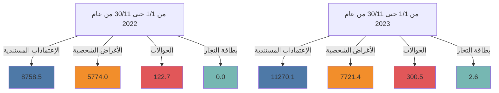
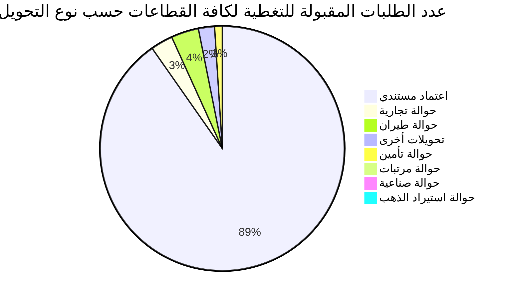

# مصرف ليبيا المركزي

## إستخدامات المصـــــــــارف للنقد الأجنبي

### خلال الفترة: (1/1 - 30/11/2023)

![Central Bank of Libya image showing financial charts and currency]

إدارة الرقابة على المصارف والنقد
---
إدارة الرقابة على المصارف والنقد

## تحليل حركة إستخدامات المصارف الفعلية من النقد الأجنبي
### خلال الفترة (1/1 - حتى 2023/11/30)

بلغ إجمالي إستخدامات المصارف من النقد الأجنبي خلال الفترة (1/1 - حتى 2023/11/30) نحو 19,294,517,119 دولاراً، مقابل 14,655,224,218 دولاراً خلال نفس الفترة من العام الماضي 2022، بزيادة قدرها نحو 4,639,292,900 دولار. أي بمعدل نمو بلغ 31.7%.

حيث شكلت الإعتمادات المستندية ما نسبته 58.4% من إجمالي إستخدامات المصارف من النقد الأجنبي، فيما شكلت الأغراض الشخصية نسبة 40.0% من الإجمالي، في حين لم تشكل الحوالات إلا مانسبته 1.6% من إجمالي الإستخدامات.

### إستخدامات المصارف الفعلية من النقد الأجنبي لكافة الأغراض
"المبالغ بالدولار الأمريكي"

| البند | من 1/1 حتى 30/11 من عام 2022 | من 1/1 حتى 30/11 من عام 2023 | مقدار التغير | نسبة التغير |
|-------|-------------------------------|-------------------------------|--------------|-------------|
| الإعتمادات المستندية | 8,758,523,436 | 11,270,060,180 | 2,511,536,744 | 28.7% |
| الحوالات | 122,715,607 | 300,488,717 | 177,773,110 | 144.9% |
| الأغراض الشخصية | 5,773,985,176 | 7,721,368,222 | 1,947,383,046 | 33.7% |
| بطاقات التجار | - | 2,600,000 | 2,600,000 | - |
| الإجمالي | 14,655,224,219 | 19,294,517,119 | 4,639,292,900 | 31.7% |

### إستخدامات المصارف للنقد الأجنبي لكافة الأغراض

صفحة 2 من 102
---
إدارة الرقابة على المصارف والنقد

المبالغ المُباعة للمصارف من النقد الأجنبي لكافة الأغراض:

في إطار مُتابعة إدارة الرقابة على المصارف والنقد لطلبات الشراء المقبولة للاعتمادات المُستندية والحوالات، المُقدمة من المصارف عبر منظومة متابعة طلبات التغطية، وكذلك منظومة مبيعات النقد الأجنبي للأغراض الشخصية، طبقاً لقرار مجلس إدارة مصرف ليبيا المركزي رقم (1) لسنة 2020 بشأن تعديل سعر صرف الدينار الليبي، ومنشور إدارة الرقابة على المصارف والنقد رقم (2020/9).

ومن خلال الإطلاع على الجدول أدناه للقيم المُباعة من النقد الأجنبي حسب المصارف، يتضح أن المصرف التجاري الوطني احتل الترتيب الأول كأكثر المصارف استخداماً للنقد الأجنبي خلال الفترة (1/1 – حتى 2023/11/30) مسجلاً حصة سوقية بلغت 13.2%، حيث بلغ إجمالي المبالغ نحو 2,552,001,732 دولار، فيما جاء مصرف الوحدة في المرتبة الثانية بقيمة بلغت 2,296,109,814 دولار، ثم مصرف الجمهورية في المرتبة الثالثة بقيمة 2,260,881,521 دولار، ثم مصرف الأمان للتجارة والإستثمار في المرتبة الرابعة بقيمة 1,962,987,204 دولار، ثم تأتي من حيث الأهمية النسبية المصارف التالية حسب الترتيب: مصرف الواحة، مصرف اليقين، المصرف الإسلامي الليبي، المصرف المتحد ومصرف الصحاري، إلى آخره من المصارف كما موضح بالجدول أدناه

والذي يحتوي أيضاً على الترتيب الذي كانت عليه المصارف خلال نفس الفترة من العام الماضي 2022.

صفحة 3 من 102
---
إدارة الرقابة على المصارف والنقد

## ترتيب المصارف حسب إجمالي المبالغ المُباعة من النقد الأجنبي

| المصرف | من 1/1 حتى 11/30 من عام 2022 |  |  | من 1/1 حتى 11/30 من عام 2023 |  |  |
|---------|---------------------------|------|------|---------------------------|------|------|
|         | الترتيب | القيمة بالدولار | الحصة السوقية | الترتيب | القيمة بالدولار | الحصة السوقية |
| المصرف التجاري الوطني | 3 | 1,813,827,277 | 12.4% | 1 | 2,552,001,732 | 13.2% |
| مصرف الوحدة | 7 | 1,014,294,546 | 6.9% | 2 | 2,296,109,814 | 11.9% |
| مصرف الجمهورية | 2 | 1,816,408,091 | 12.4% | 3 | 2,260,881,521 | 11.7% |
| مصرف الأمان للتجارة والإستثمار | 1 | 2,477,209,869 | 16.9% | 4 | 1,962,987,204 | 10.2% |
| مصرف النوران | 5 | 1,177,258,681 | 8.0% | 5 | 1,717,885,489 | 8.9% |
| مصرف اليقين | 4 | 1,602,751,922 | 10.9% | 6 | 1,563,181,743 | 8.1% |
| المصرف الإسلامي الليبي | 6 | 1,071,656,381 | 7.3% | 7 | 1,368,549,838 | 7.1% |
| المصرف المتحد للتجارة والإستثمار | 8 | 927,045,105 | 6.3% | 8 | 1,362,130,087 | 7.1% |
| مصرف الصحارى | 9 | 668,315,081 | 4.6% | 9 | 991,224,983 | 5.1% |
| مصرف شمال أفريقيا | 12 | 347,203,853 | 2.4% | 10 | 657,235,427 | 3.4% |
| مصرف الخليج الأول الليبي | 10 | 500,703,761 | 3.4% | 11 | 588,769,006 | 3.1% |
| مصرف السراي للتجارة والإستثمار | 11 | 378,129,938 | 2.6% | 12 | 418,653,543 | 2.2% |
| مصرف الأندلس | 16 | 109,022,674 | 0.7% | 13 | 406,648,392 | 2.1% |
| مصرف التجارة والتنمية | 19 | 6,903,675 | 0.0% | 14 | 379,103,376 | 1.96% |
| مصرف الوفاء | 14 | 171,649,393 | 1.2% | 15 | 227,417,422 | 1.2% |
| مصرف الواحة | 15 | 140,927,344 | 1.0% | 16 | 210,644,498 | 1.1% |
| مصرف التضامن | 17 | 108,626,313 | 0.7% | 17 | 194,355,556 | 1.0% |
| المصرف الليبي الخارجي | 13 | 274,179,282 | 1.9% | 18 | 86,561,127 | 0.4% |
| مصرف المتوسط | 18 | 49,111,034 | 0.3% | 19 | 50,176,363 | 0.3% |
| مصرف الإجماع العربي | 20 | 0 | 0.0% | 20 | 0 | 0.0% |
| الإجمالي | - | 14,655,224,219 | 100.0% | - | 19,294,517,119 | 100.0% |

صفحة 4 من 102
---
إدارة الرقابة على المصارف والنقد

المبالغ المُباعة للمصارف من النقد الأجنبي (حسب الغرض)

" القيم بالدولار الأمريكي "

| ت | المصرف | الاعتمادات المستندية |  |  الحوالات |  | الأغراض الشخصية |  | بطاقة التجار |  |
|---|---------|----------------------|------------------|-----------|------------------|-------------------|------------------|----------------|------------------|
|   |         | من 1/1 حتى 11/30 من عام 2022 | من 1/1 حتى 11/30 من عام 2023 | من 1/1 حتى 11/30 من عام 2022 | من 1/1 حتى 11/30 من عام 2023 | من 1/1 حتى 11/30 من عام 2022 | من 1/1 حتى 11/30 من عام 2023 | من 1/1 حتى 11/30 من عام 2022 | من 1/1 حتى 11/30 من عام 2023 |
| 1- | التجاري الوطني | 655,823,008 | 1,220,025,282 | 8,720,371 | 5,465,690 | 1,149,283,897 | 1,324,410,760 | - | 2,100,000 |
| 2- | الوحدة | 765,636,883 | 1,949,650,324 | 2,155,356 | 938,689 | 246,502,306 | 345,520,801 | - | 0 |
| 3- | الجمهورية | 1,111,479,924 | 1,251,445,552 | 7,030,667 | 54,130,470 | 697,897,500 | 955,305,500 | - | 0 |
| 4- | الأمان | 491,736,508 | 615,136,763 | 0 | 2,094,353 | 1,985,473,361 | 1,345,356,087 | - | 400,000 |
| 5- | النوران | 1,049,706,694 | 1,355,952,801 | 8,853,689 | 29,799,588 | 118,698,298 | 332,133,099 | - | 0 |
| 6- | اليقين | 1,130,966,484 | 777,957,194 | 3,294,465 | 14,052,582 | 468,490,973 | 771,071,967 | - | 100,000 |
| 7- | الإسلامي الليبي | 907,653,275 | 993,138,787 | 25,994,930 | 45,377,579 | 138,008,176 | 330,033,472 | - | 0 |
| 8- | المتحد | 409,814,706 | 435,651,238 | 4,013,696 | 3,377,258 | 513,216,703 | 923,101,591 | - | 0 |
| 9- | الصحاري | 288,828,744.980 | 385,491,797 | 8,935,339 | 11,601,821 | 370,550,997 | 594,131,366 | - | 0 |
| 10- | شمال أفريقيا | 302,640,042 | 352,256,453 | 28,599,648 | 41,643,848 | 15,964,163 | 263,335,126 | - | 0 |
| 11- | الخليج الأول الليبي | 487,719,189 | 557,123,973 | 12,944,572 | 30,696,353 | 40,000 | 948,680 | - | 0 |
| 12- | السراي | 374,025,831 | 381,396,573 | 0 | 26,056,450 | 4,104,107 | 11,200,521 | - | 0 |
| 13- | الأندلس | 108,066,939 | 359,084,243 | 955,735 | 8,663,874 | 0 | 38,900,275 | - | 0 |
| 14- | التجارة والتنمية | 0 | 5,700,000 | 0 | 0 | 6,903,675 | 373,403,376 | - | 0 |
| 15- | الوفاء | 170,257,813 | 223,539,627 | 0 | 0 | 1,391,580 | 3,877,795 | - | 0 |
| 16- | الواحة | 90,010,142 | 110,476,840 | 726,311 | 1,027,076 | 50,190,891 | 99,140,582 | - | 0 |
| 17- | التضامن | 108,626,313 | 194,355,556 | 0 | 0 | 0 | 0 | - | 0 |
| 18- | الليبي الخارجي | 263,173,606 | 60,338,358 | 10,490,826 | 25,563,089 | 514,850 | 659,680 | - | 0 |
| 19- | المتوسط | 42,357,335 | 41,338,819 | 0 | 0 | 6,753,699 | 8,837,544 | - | 0 |
| 20- | الأجماع العربي | 0 | 0 | 0 | 0 | 0 | 0 | - | 0 |
| - | الإجمالي الكلي | 8,758,523,436 | 11,270,060,180 | 122,715,607 | 300,488,717 | 5,773,985,176 | 7,721,368,222 | - | 2,600,000 |

صفحة 5 من 102
---
إدارة الرقابة على المصارف والنقد

## الأهمية النسبية حسب المصرف لاستخدامات النقد الأجنبي خلال الفترة من 1/1 حتى 30/11 من عام 2022

| المصرف | النسبة |
|---------|--------|
| مصرف الأمان للتجارة والاستثمار | 17% |
| مصرف الجمهورية | 12% |
| المصرف التجاري الوطني | 12% |
| مصرف اليقين | 11% |
| باقي المصارف | 11% |
| مصرف النوران | 8% |
| المصرف الإسلامي الليبي | 7% |
| مصرف الوحدة | 7% |
| المصرف المتحد للتجارة والاستثمار | 6% |
| مصرف الصحاري | 5% |
| مصرف الخليج الأول الليبي | 4% |

## الأهمية النسبية حسب المصرف لاستخدامات النقد الأجنبي خلال الفترة من 1/1 حتى 30/11 من عام 2023

| المصرف | النسبة |
|---------|--------|
| المصرف التجاري الوطني | 15% |
| مصرف الوحدة | 14% |
| مصرف الجمهورية | 14% |
| مصرف الأمان للتجارة والاستثمار | 12% |
| مصرف النوران | 10% |
| مصرف اليقين | 9% |
| المصرف الإسلامي الليبي | 8% |
| المصرف المتحد للتجارة والاستثمار | 8% |
| مصرف الصحاري | 6% |
| مصرف شمال أفريقيا | 4% |

صفحة 6 من 102
---
إدارة الرقابة على المصارف والنقد

ثانياً : طلبات المصارف المقبولة لتغطية الإعتمادات المستندية والحوالات عدا الأغراض الشخصية خلال الفترة (1/1 – حتى 30/11/2023):

بلغ عدد الشركات والمصانع والجهات العامة والجهات الأخرى المستفيدة (2,062) والتي تمت الموافقة على طلباتهم خلال الفترة (1/1 – حتى 30/11/2023) للحصول على النقد الأجنبي ، بعدد طلبات بلغ نحو 14,884 طلب، معظم هذه الطلبات لتغطية الإعتمادات المستندية والتي سجلت 13,242 طلب بنسبة 89% من الطلبات، إجمالي كما هو موضح بالجدول التالي :-

| نوع التحويل | القطاع الخاص | القطاع العام | قطاع المصارف | جهات متنوعة | الإجمالي | الأهمية النسبية |
|-------------|--------------|--------------|---------------|--------------|----------|------------------|
| اعتماد مستندي | 12,908 | 326 | 8 | 0 | 13,242 | 89.0% |
| حوالة طيران | 465 | 63 | 0 | 4 | 532 | 3.6% |
| حوالة تجارية | 49 | 357 | 29 | 2 | 437 | 2.9% |
| تحويلات أخرى | 40 | 271 | 2 | 3 | 316 | 2.1% |
| حوالة تأمين | 40 | 110 | 0 | 0 | 150 | 1.0% |
| حوالة مرتبات | 0 | - | 0 | 102 | 102 | 0.7% |
| حوالة صناعية | 80 | - | 0 | 0 | 80 | 0.5% |
| حوالة استيراد الذهب | 25 | - | 0 | 0 | 25 | 0.2% |
| الإجمالي | 13,607 | 1,127 | 39 | 111 | 14,884 | 100% |

عدد الطلبات المقبولة للتغطية لكافة القطاعات حسب نوع التحويل خلال الفترة (1/1- حتى 30/11/2023)

صفحة 7 من 102
---
إدارة الرقابة على المصارف والنقد

## أولاً: الطلبات لكافة القطاعات :

### طلبات المصارف المقبولة لتغطية الإعتمادات المستندية والحوالات - لكافة القطاعات

#### 1- حسب أهم البلدان المستفيدة :

من خلال الإطلاع على الجدول أدناه لقيم طلبات المصارف لشراء النقد الأجنبي حسب البلدان

المستفيدة خلال الفترة (1/1 – حتى 30/11/2023) لكافة القطاعات، يتضح أن مانسبته 32.3%

من تحويلات المصارف لتغطية الإعتمادات المستندية أو الحوالات الأخرى كانت لدولة الإمارات

العربية المتحدة، ثم جاءت دولة مصر في المرتبة الثانية بنسبة 9.9% ثم دولة تركيا في المرتبة الثالثة

بنسبة 9.2%، ثم الصين والمملكة المتحدة بنسب 5.8% و 5.7% على التوالي، والجدول التالي يوضح

أهم عشرون بلد مستفيد.

### طلبات المصارف لتغطية الإعتمادات المستندية والحوالات - لكافة القطاعات
#### (حسب أهم عشرون بلد مستفيد)
#### خلال الفترة (1/1 – حتى 30/11/2023)

| ت | البلد المستفيد | القيمة بالدولار | الأهمية النسبية |
|---|----------------|-----------------|-----------------|
| 1- | الإمارات العربية المتحدة | 3,987,712,568 | 32.3% |
| 2- | مصر | 1,219,497,659 | 9.9% |
| 3- | تركيا | 1,136,323,447 | 9.2% |
| 4- | الصين | 713,902,539 | 5.8% |
| 5- | بريطانيا (المملكة المتحدة) | 707,085,928 | 5.7% |
| 6- | سويسرا | 652,650,556 | 5.3% |
| 7- | تونس | 598,954,328 | 4.9% |
| 8- | إيطاليا | 412,307,026 | 3.3% |
| 9- | النمسا | 323,242,370 | 2.6% |
| 10- | إسبانيا | 271,451,211 | 2.2% |

صفحة 8 من 102
---
إدارة الرقابة على المصارف والنقد

| -11 | هولندا | 225,695,301 | 1.8% |
|-----|--------|-------------|------|
| -12 | كوريا الجنوبية | 210,176,423 | 1.7% |
| -13 | اليابان | 171,421,170 | 1.4% |
| -14 | المانيا | 170,969,561 | 1.4% |
| -15 | تايلاند | 153,246,634 | 1.2% |
| -16 | السويد | 136,701,672 | 1.1% |
| -17 | كندا | 113,699,174 | 0.9% |
| -18 | الولايات المتحدة | 110,021,122 | 0.9% |
| -19 | فرنسا | 109,488,701 | 0.9% |
| -20 | هونج كونج S.A.R. | 107,523,396 | 0.9% |

## -2 حسب أهم بلدان منشأ السلع أو الخدمات:

من خلال الإطلاع على الجدول أدناه لقيم طلبيات المصارف لشراء النقد الأجنبي حسب بلدان منشأ

السلع أو الخدمات خلال الفترة (1/1 -- حتى 30 / 11 /2023) لكافة القطاعات ، يتضح أن دولة

تركيا قد أحتلت المرتبة الأولى حيث شكلت السلع أو الخدمات ذات المنشأ التركي نسبة 19.0% من

إجمالي طلبات الشراء المقبولة، ثم جاءت واردات السلع أو الخدمات ذات المنشأ المصري في المرتبة

الثانية مشكلة مانسبته 13.9% من الإجمالي، وشكلت السلع أوالخدمات ذات المنشأ الصيني نسبة

13.1% محتلة المرتبة الثالثة خلال الفترة ، فيما سجلت السلع والخدمات ذات منشأ دولة روسيا

الاتحادية مانسبته 7.0%، وذات المنشأ الهندي نسبة 5.2%، وجاءت السلع أو الخدمات ذات المنشأ

التونسي في المرتبة السادسة مشكلة نسبة 4.0% من الإجمالي ، والجدول التالي يوضح أهم عشرون

بلد منشأ للسلع أو الخدمات .

صفحة 9 من 102
---
إدارة الرقابة على المصارف والنقد

طلبات المصارف لتغطية الاعتمادات المستندية والحوالات - لكافة القطاعات
(حسب أهم عشرون بلد منشأ للسلع أو الخدمات)
خلال الفترة (1/1 - حتى 30/11/2023)

| ت | بلد منشأ السلع أو الخدمات | القيمة بالدولار | الأهمية النسبية % |
|---|-----------------------------|-----------------|-------------------|
| 1- | تركيا | 2,338,647,812 | 19.0% |
| 2- | مصر | 1,715,761,785 | 13.9% |
| 3- | الصين | 1,615,871,120 | 13.1% |
| 4- | روسيا الاتحادية | 857,777,048 | 7.0% |
| 5- | الهند | 643,547,545 | 5.2% |
| 6- | تونس | 497,773,123 | 4.0% |
| 7- | البرازيل | 473,176,053 | 3.8% |
| 8- | الإمارات العربية المتحدة | 403,436,623 | 3.3% |
| 9- | إيطاليا | 374,825,504 | 3.0% |
| 10- | ألمانيا | 280,801,778 | 2.3% |
| 11- | هولندا | 231,096,456 | 1.9% |
| 12- | تايلاند | 205,008,606 | 1.7% |
| 13- | الأرجنتين | 191,072,170 | 1.5% |
| 14- | أوكرانيا | 190,721,018 | 1.5% |
| 15- | إسبانيا | 174,776,577 | 1.4% |
| 16- | أيرلندا | 170,770,479 | 1.4% |
| 17- | كوريا الجنوبية | 165,012,076 | 1.3% |
| 18- | السويد | 152,739,854 | 1.2% |
| 19- | الولايات المتحدة | 140,760,455 | 1.1% |
| 20- | بلجيكا | 113,783,723 | 0.9% |

صفحة 10 من 102
---
إدارة الرقابة على المصارف والنقد

## ثانياً: الطلبات حسب القطاعات:

### طلبات المصارف المقبولة لشراء النقد الأجنبي - حسب القطاعات
#### خلال الفترة (1/1 – حتى 30/11/2023)

| القطاع | عدد الشركات أو المصانع أو الجهات |
|--------|----------------------------------|
| القطاع الخاص | 1,907 |
| القطاع العام | 46 |
| قطاع المصارف | 4 |
| حوالات مرتبات الأجانب وجهات متنوعة | 105 |
| الإجمالي | 2,062 |

### 1- القطاع الخاص:

بلغ عدد شركات ومصانع القطاع الخاص (1,907) التي تمت الموافقة على طلباتها للحصول على النقد الأجنبي من المصارف لتغطية الإعتمادات المستندية والحوالات الأخرى خلال الفترة (1/1 – حتى 30/11/2023) حيث أحتلت طلبات المصارف لشراء النقد الأجنبي من قبل القطاع الخاص لإستيراد مستلزمات الإنتاج والتشغيل المرتبة الأولى من إجمالي طلبات الشراء خلال الفترة، حيث شكلت مانسبته 18.0% من إجمالي طلبات شراء النقد الأجنبي، فيما أحتلت طلبات تغطية إستيراد السلع الغذائية المتنوعة المرتبة الثانية من حيث الأهمية النسبية لتشكل نحو 10.6%، فيما شكلت طلبات تغطية إستيراد مستلزمات إنتاج السلع الأساسية نسبة 10.1%، وإستيراد الأعلاف نسبة 7.5% من الإجمالي، والجدول التالي يوضح كافة طلبات الشراء للسلع أو الخدمات خلال الفترة.

صفحة 11 من 102
---
إدارة الرقابة على المصارف والنقد

# طلبات شراء السلع أو الخدمات - قطاع خاص
## خلال الفترة (1/1 - حتى 30/11/2023)

| ت | تصنيف السلع | القيمة بالدولار | الأهمية النسبية % |
|---:|---:|---:|---:|
| -1 | مستلزمات الإنتاج والتشغيل | 2,030,155,306 | 18.0% |
| -2 | سلع غذائية متنوعة | 1,199,595,594 | 10.6% |
| -3 | مستلزمات انتاج السلع الأساسية | 1,135,222,440 | 10.1% |
| -4 | أعلاف | 847,352,432 | 7.5% |
| -5 | مواد البناء ومستلزمات التشييد | 842,604,343 | 7.5% |
| -6 | أجهزة الكترونية | 783,466,947 | 7.0% |
| -7 | وسائل النقل واطارات ونضائد وقطع الغيار | 705,202,214 | 6.3% |
| -8 | الالات والمعدات | 521,865,562 | 4.6% |
| -9 | اللحوم الحية والمجمدة | 458,883,417 | 4.1% |
| -10 | منزلية وكهرومنزلية | 391,733,493 | 3.5% |
| -11 | الغذائية | 379,664,852 | 3.4% |
| -12 | حليب | 329,999,639 | 2.9% |
| -13 | أدوية بشرية | 250,666,477 | 2.2% |
| -14 | حليب وحفاظات وأغذية أطفال | 182,773,654 | 1.6% |
| -15 | الاثاث | 160,814,500 | 1.4% |
| -16 | أجبان | 148,970,497 | 1.3% |
| -17 | تبغ بأنواعها ومستلزماته | 129,333,017 | 1.1% |
| -18 | مواد التنظيف | 123,070,265 | 1.1% |
| -19 | زراعية | 88,873,918 | 0.8% |
| -20 | الزراعية | 65,104,047 | 0.6% |
| -21 | خدمات اتصالات وتقنية معلومات | 65,052,986 | 0.6% |
| -22 | فواكه وخضروات | 64,035,041 | 0.6% |
| -23 | خدمات ملاحية متنوعة | 45,770,326 | 0.4% |
| -24 | حوالة استيراد الذهب | 42,233,983 | 0.4% |
| -25 | مواد تنظيف | 39,642,425 | 0.4% |
| -26 | حوالات شركات خطوط الطيران | 31,929,419 | 0.3% |

صفحة 12 من 102
---
إدارة الرقابة على المصارف والنقد

| النسبة | القيمة | البند | الرقم |
|--------|--------|------|------|
| 0.3% | 30,669,122 | خدمات إنتاج وتشغيل | -27 |
| 0.3% | 30,239,230 | الملابس والأحذية | -28 |
| 0.2% | 27,520,331 | مواد صحية | -29 |
| 0.2% | 25,602,967 | طلبات خاصة بشركة الأجنحة الليبية | -30 |
| 0.2% | 19,616,354 | قرطاسية | -31 |
| 0.1% | 9,366,544 | زبدة | -32 |
| 0.1% | 9,102,606 | أسماك وأحياء بحرية | -33 |
| 0.1% | 8,131,246 | شركة غدامس للطيران | -34 |
| 0.1% | 7,679,613 | شركة أويا للطيران | -35 |
| 0.1% | 7,382,294 | السجاد والمنسوجات | -35 |
| 0.1% | 7,140,673 | الشركة الليبية السريعة للنقل الجوي | -37 |
| 0.05% | 5,257,944 | سمن | -38 |
| 0.03% | 3,487,265 | أدوية بيطرية | -39 |
| 0.03% | 3,469,023 | حوالات شركات التأمين | -40 |
| 0.03% | 3,361,997 | متنوعة | -41 |
| 0.02% | 2,382,497 | شركة سما المتوسط للطيران | -42 |
| 0.02% | 1,939,086 | تكاليف خدمات سياحية | -43 |
| 0.01% | 1,194,315 | سلع خاصة بالخدمات العامة | -44 |
| 0.01% | 1,019,922 | شركة المتحدة للتأمين | -45 |
| 0.01% | 884,284 | الطبية | -46 |
| 0.01% | 732,366 | مستلزمات تشغيل مصنع الحديد والصلب | -47 |
| 0.01% | 611,613 | حوالات دورة تدريبية | -48 |
| 0.004% | 485,195 | طلبات الخطوط الجوية الليبية | -49 |

صفحة 13 من 102
---
إدارة الرقابة على المصارف والنقد

## طلبات الشراء حسب أهم خمسون شركة - قطاع خاص

خلال الفترة (1/1 – حتى 2023/11/30)

| ت | الشركة أو المصنع | القيمة بالدولار |
|---|-------------------|-----------------|
| 1 | شركة تويوتا ليبيا تجارة السيارات وقطع الغيار واستيراد والتصدير | 159,378,812 |
| 2 | شركة النسيم للصناعات الغذائية | 158,723,268 |
| 3 | شركة طريق القارة لاستيراد المواد الغذائية | 128,600,493 |
| 4 | شركة وادي الكوف للمطاحن والأعلاف ومضارب الأرز | 118,781,334 |
| 5 | شركة افريقيا لتعبئة المشروبات | 117,485,858 |
| 6 | شركة دروب ليبيا لاستيراد وسائل النقل وملحقاتها | 101,766,779 |
| 7 | شركة البنيان لصهر ودرفلة المعادن | 83,482,558 |
| 8 | شركة الجيد لاستيراد المواد الغذائية | 83,283,338 |
| 9 | شركة الشرق الليبي للمطاحن والاعلاف ومضارب الارز | 79,773,126 |
| 10 | شركة المعمورة لاستيراد وتوزيع المواد الغذائية | 76,440,112 |
| 11 | شركة الجودة العالمية الاولى لصناعة الاعلاف ومطاحن الدقيق والصناعات الغذائية | 73,537,882 |
| 12 | شركة ظل التين لصناعة الألبان ومشتقاتها | 67,452,000 |
| 13 | شركة الوسام الذهبي لصناعة الدقيق والمطاحن والاعلاف ومضارب الأرز | 64,299,540 |
| 14 | شركة الريحان لصناعة المواد الغذائية | 60,651,341 |
| 15 | الشركة الليبية المتحدة لتعبئة المشروبات | 59,411,242 |
| 16 | شركة سما الأرياف لاستيراد المواد الغذائية و الخضروات و الفواكه الطازجة | 59,107,764 |
| 17 | شركة ابتهاج الطبيعة لاستيراد المواد الغذائية | 57,816,120 |
| 18 | شركة المتحدة الجديدة لاستيراد التبغ والسجائر ومستلزماتها | 57,564,714 |
| 19 | شركة المصبوبات لصناعة مواد البناء | 54,400,880 |
| 20 | شركة الجاهزة لاستيراد المواد الغذائية | 54,222,090 |
| 21 | شركة الجيد للصناعات الغذائية | 51,002,178 |
| 22 | شركة سلوق لصناعة الاعلاف بجميع انواعها والمطاحن | 50,966,500 |
| 23 | شركة طرابلس الكبرى لصناعة وتعبئة وتغليف الطماطم و المواد الغذائية | 50,735,743 |
| 24 | شركة التاج العريقة لاستيراد الاجهزة الالكترونية والكهربائية وملحقاتها وقطع غيارها | 50,717,618 |
| 25 | شركة الرفيق الأمثل لصناعة مواد البناء | 49,815,863 |

صفحة 14 من 102
---
إدارة الرقابة على المصارف والنقد

| الرقم | اسم الشركة | القيمة |
|-------|------------|--------|
| 26 | شركة الانهار لصناعة الدقيق | 48,492,600 |
| 27 | شركة الفا للمطاحن والاعلاف والصناعات الغذائية | 48,265,579 |
| 28 | شركة الموسم للصناعات الغذائية ومضارب الأرز | 47,879,095 |
| 29 | شركة الأصالة الذهبية للمطاحن ومضارب الأرز | 46,611,351 |
| 30 | شركة الفتح الجديد لصناعة مواد التنظيف | 46,197,317 |
| 31 | شركة الاتقان المتقدمة لصناعة الدقيق | 45,860,270 |
| 32 | شركة أضواء النيزك لاستيراد الأجهزة الألكترونية وملحقاتها وقطع غيارها | 45,303,754 |
| 33 | شركة نبراس الخير لصناعة الاعلاف وطحن الحبوب | 44,996,761 |
| 34 | شركة بصمة الجودة لاستيراد المواد الغذائية والمواشي واللحوم والفواكه | 44,657,337 |
| 35 | شركة السواحل الذهبية لاستيراد المواد الغذائية | 43,556,603 |
| 36 | شركة السرايا الراقية لاستيراد المواد الغذائية والخضروات والفواكه والمواشي واللحوم | 42,799,627 |
| 37 | شركة انعام ليبيا لاستيراد الاعلاف ومكملاتها | 41,850,000 |
| 38 | شركة أضواء افريقيا لاستيراد المواد الغذائية والمواشي واللحوم | 41,177,649 |
| 39 | شركة نبض الاطلسي لاستيراد المواشي و اللحوم | 40,888,373 |
| 40 | شركة بسمتي للصناعات الغذائية | 39,877,779 |
| 41 | شركة النورس لصناعة الاعلاف والمطاحن ومضارب الأرز | 38,665,854 |
| 42 | شركة المعمورة للصناعات الغذائية والمطاحن والأعلاف | 38,030,651 |
| 43 | شركة الروابي الذهبية لاستيراد مواد البناء والمواد الصحية | 36,662,436 |
| 44 | شركة طرابلس الأولى للمطاحن والأعلاف | 35,757,490 |
| 45 | شركة الثمرات الليبية لاستيراد المواد الغذائية | 35,699,625 |
| 46 | شركة تاجوراء الحياة للصناعات الغذائية | 35,065,300 |
| 47 | شركة اشراقة الربيع لصناعة وتجميع المضخات | 35,029,865 |
| 48 | شركة السد الحديثة لصناعة الأعلاف | 34,587,777 |
| 49 | شركة المستكشف الدولية للخدمات النفطية | 34,503,073 |
| 50 | شركة البيوت الكاملة لاستيراد الأجهزة الالكترونية | 34,454,855 |

صفحة 15 من 102
---
إدارة الرقابة على المصارف والنقد

## -2 القطاع العام

بلغ عدد جهات القطاع العام التي تمت الموافقة على طلباتها للحصول على النقد الأجنبي لتغطية الإعتمادات المستندية والحوالات الأخرى 46 جهة خلال الفترة (1/1 – حتى 30/11/2023)، حيث أحتلت متطلبات شركة ليبيانا للهاتف المحمول المرتبة الأولى من إجمالي طلبات الشراء خلال الفترة، حيث شكلت مانسبته 21.2% من إجمالي طلبات شراء النقد الأجنبي، فيما أحتلت الطلبات لمستلزمات تشغيل مصنع الحديد والصلب المرتبة الثانية من حيث الأهمية النسبية لتشكل نحو 16.4%، فيما شكلت متطلبات شركة المدار الجديد نسبة 11.7%، وطلبات تغطية خدمات الاتصالات وتقنية معلومات نسبة 11.3% ، فيما شكلت طلبات استيراد مستلزمات الإنتاج والتشغيل نسبة 9.0%. والجدول التالي يوضح كل طلبات شراء النقد الأجنبي حسب السلع أو الخدمات للقطاع عام.

### طلبات الشراء حسب السلع أو الخدمات - قطاع عام

خلال الفترة (1/1 – حتى 30/11/2023)

| ت | تصنيف السلع | القيمة بالدولار | الأهمية النسبية |
|---|-------------|-----------------|-----------------|
| 1 | متطلبات شركة ليبيانا للهاتف المحمول | 214,704,346 | 21.2% |
| 2 | مستلزمات تشغيل مصنع الحديد والصلب | 166,078,710 | 16.4% |
| 3 | متطلبات شركة المدار الجديد | 119,082,794 | 11.7% |
| 4 | خدمات اتصالات وتقنية معلومات | 114,963,361 | 11.3% |
| 5 | مستلزمات إنتاج وتشغيل | 91,108,840 | 9.0% |
| 6 | أجهزة الالكترونية | 53,592,925 | 5.3% |
| 7 | الهيئة العامة لصندوق الضمان الاجتماعي | 51,900,000 | 5.1% |
| 8 | شركة الاتحاد العربي للمقاولات | 28,941,250 | 2.9% |
| 9 | مستلزمات تشغيل شركة هاتف ليبيا | 26,964,828 | 2.7% |
| 10 | حوالات شركات خطوط الطيران | 18,069,610 | 1.8% |
| 11 | مواد البناء ومستلزمات التشييد | 12,656,945 | 1.2% |
| 12 | حوالات شركات التأمين | 11,200,156 | 1.1% |
| 13 | شركة ليبيا للاتصالات والتقنية | 10,736,434 | 1.1% |

صفحة 16 من 102
---
إدارة الرقابة على المصارف والنقد

| النسبة | المبلغ | البيان | الرقم |
|--------|--------|--------|-------|
| 0.9% | 9,004,040 | خدمات انتاج وتشغيل | -14 |
| 0.8% | 8,425,000 | اعلاف | -15 |
| 0.8% | 8,365,340 | مستلزمات الشركة العامة للكهرباء | -16 |
| 0.8% | 8,305,440 | الالات والمعدات | -17 |
| 0.8% | 7,937,269 | الخطوط الجوية الأفريقية | -18 |
| 0.7% | 7,252,964 | صندوق الضمان الاجتماعي | -19 |
| 0.6% | 6,524,390 | طلبات الخطوط الجوية الليبية | -20 |
| 0.6% | 5,629,344 | أدوية بشرية | -21 |
| 0.4% | 4,459,168 | وسائل النقل واطارات ونضائد وقطع الغي | -22 |
| 0.4% | 4,420,000 | الخطوط التونسية | -23 |
| 0.4% | 4,061,781 | جهاز مشروعات الاسكان والمرافق | -24 |
| 0.4% | 3,924,351 | احتياجات التشغيل لشركة معاملات | -25 |
| 0.3% | 2,653,873 | متطلبات تشغيل وصيانة الموانئ | -26 |
| 0.2% | 2,013,448 | مستلزمات الشركة العامة لتحلية المياه | -27 |
| 0.2% | 1,994,750 | قرطاسية | -28 |
| 0.2% | 1,809,209 | الشركة الليبية للموانئ | -29 |
| 0.1% | 1,300,694 | صندوق الرعاية الاجتماعية | -30 |
| 0.1% | 1,200,000 | حوالات علاجية | -31 |
| 0.1% | 920,337 | الشركة الاهلية للاسمنت | -32 |
| 0.1% | 813,828 | منزلية وكهرومنزلية | -33 |
| 0.1% | 755,974 | الملابس والاحذية | -34 |
| 0.1% | 675,815 | مستلزمات انتاج سلع أساسية | -35 |
| 0.1% | 578,825 | الشركة العامة لاستيراد السلع الامنية | -36 |
| 0.02% | 182,873 | طلبات شركات التأمين | -37 |
| 0.02% | 172,348 | حوالات دورة تدريبية | -38 |
| 0.01% | 114,977 | متنوعة | -39 |
| 0.01% | 93,690 | الاتحاد الليبي لشركات التأمين | -40 |
| 0.001% | 15,112 | مستلزمات تشغيل الموانئ | -41 |
| 0.001% | 14,000 | شركة تطوير للاستثمار العقاري | -42 |
| 0.001% | 6,116 | الجمعية الليبية للترقيم | -43 |

صفحة 17 من 102
---
إدارة الرقابة على المصارف والنقد

# طلبات الشراء حسب الجهات - قطاع عام

خلال الفترة (1/1 - حتى 30/11/2023)

| ت | الجهة | القيمة بالدولار |
|---|-------|-----------------|
| 1 | شركة ليبيانا للهاتف المحمول | 320,049,413 |
| 2 | الشركة الليبية للحديد والصلب | 168,101,689 |
| 3 | شركة المدار الجديد | 134,111,709 |
| 4 | جهاز تنمية و تطوير المراكز الإدارية | 58,928,103 |
| 5 | الهيئة العامة لصندوق التضامن الاجتماعي | 51,900,000 |
| 6 | شركة الإتحاد العربي للمقاولات المساهمة | 45,586,990 |
| 7 | شركة ليبيا للاتصالات والتقنية | 44,477,818 |
| 8 | شركة هاتف ليبيا | 35,518,887 |
| 9 | شركة الخطوط الجوية الأفريقية | 23,799,029 |
| 10 | شركة الجيل الجديد للتقنية | 14,802,960 |
| 11 | شركة الاتصالات الدولية الليبية | 14,585,302 |
| 12 | المنطقة الحرة بمصراته | 11,162,584 |
| 13 | شركة ليبيا للتأمين | 10,419,983 |
| 14 | الشركة الوطنية للمطاحن والأعلاف | 8,975,846 |
| 15 | شركة الخطوط الجوية الليبية | 8,693,221 |
| 16 | الشركة العامة للكهرباء المساهمة | 8,039,172 |
| 17 | الشركة الأهلية للأسمنت | 7,712,632 |
| 18 | صندوق الضمان الاجتماعي | 7,252,964 |
| 19 | جهاز تنفيذ مشروعات الإسكان و المرافق | 5,323,320 |
| 20 | شركة معاملات للخدمات المالية | 5,077,319 |
| 21 | فرع شركة الخطوط التونسية | 4,420,000 |
| 22 | شركة العامة لخدمات النظافة العامة طرابلس | 3,290,127 |
| 23 | جهاز إنشاء وصيانة الموانئ ومرافق الصيد البحري | 2,315,300 |
| 24 | شركة الليبية للموانئ | 2,162,894 |

صفحة 18 من 102
---
إدارة الرقابة على المصارف والنقد

| المبلغ | الجهة | الرقم |
|--------|------|------|
| 2,153,150 | شركة الإنماء للاستثمارات الكهربائية | 25 |
| 2,013,448 | الشركة العامة لتحلية المياه | 26 |
| 1,994,750 | الشركة العامة للورق والطباعة | 27 |
| 1,949,824 | المفوضية العليا لرعاية ذوي الاحتياجات الخاصة | 28 |
| 1,300,694 | صندوق الرعاية الاجتماعية بوزارة الداخلية | 29 |
| 1,200,000 | مستشفى طب وجراحة الأطفال بنغازي | 30 |
| 1,026,533 | الاتحاد الليبي لشركات التأمين | 31 |
| 1,013,636 | مصلحة الأحوال المدنية | 32 |
| 907,019 | شركة النظم للإنشاءات الكهربائية المساهمة | 33 |
| 740,896 | المستشفى الجامعي طرابلس | 34 |
| 578,825 | الشركة العامة لاستيراد السلع الأمنية المساهمة | 35 |
| 498,751 | مشروع تنفيذ الطريق السريع الجديد رأس اجدير امساعد | 36 |
| 443,290 | المركز الليبي للاعتماد | 37 |
| 394,619 | شركة الليبية للخدمات الأرضية | 38 |
| 245,865 | شركة بريد ليبيا | 39 |
| 174,977 | جامعة بنغازي | 40 |
| 117,120 | شركة الشاحنات والحافلات | 41 |
| 112,348 | جهاز البحوث التطبيقية والتطوير | 42 |
| 30,203 | شركة النماء الليبية للتأمين المساهمة | 43 |
| 14,000 | شركة تطوير للاستثمار العقاري والسياحي | 44 |
| 6,116 | الجمعية الليبية للترقيم | 45 |
| 1,829 | الجهاز الوطني للطيران الزراعي | 46 |

صفحة 19 من 102
---
إدارة الرقابة على المصارف والنقد

### -3 قطاع المصارف :

طلبات التغطية المقبولة - قطاع المصارف
خلال الفترة (1/1 - 30/11/2023)
"تنازلياً مرتبة"

| الترتيب | أسم المصرف | القيمة بالدولار الأمريكي |
|---------|------------|-------------------------|
| 1 | شركة مصرف الخليج الأول المساهمة المشتركة | 14,015,551 |
| 2 | المصرف المتحد للتجارة والإستثمار | 3,193,939 |
| 3 | مصرف الامان للتجارة والاستثمار | 2,784,330 |
| 4 | شركة مصرف الأندلس | 2,214,297 |

حسب السلع والخدمات - قطاع المصارف
"تنازلياً مرتبة"

| الترتيب | السلع أو الخدمات | القيمة بالدولار الأمريكي |
|---------|------------------|-------------------------|
| 1 | حوالة أرباح للشريك الأجنبي - مصرف الخليج الأول الليبي | 14,015,551 |
| 2 | حوالة أرباح للشريك الأجنبي - المصرف المتحد | 3,193,939 |
| 3 | تكاليف منظومة حماية | 993,999 |
| 4 | كروت خام الفيزا | 532,519 |
| 5 | مقابل سداد قيمة ضمان | 500,000 |
| 6 | ضمان مالي ماستر كارد | 450,000 |
| 7 | شاشات عرض | 414,033 |
| 8 | شراء تراخيص منظومة | 337,733 |
| 9 | سداد قيمة الضمان | 300,000 |
| 10 | مكينات عد الأوراق | 284,539 |
| 11 | 20 ماكينة ATM وقطع غ | 274,077 |
| 12 | خدمات دعم فني للمعلومات - مصارف | 267,696 |
| 13 | تسديد حوالة خارجية | 200,000 |
| 14 | أجهزة أندرويد | 126,763 |
| 15 | أجهزة POS (400) | 101,410 |

صفحة 20 من 102
---
إدارة الرقابة على المصارف والنقد

| القيمة | البند | الرقم |
|--------|------|------|
| 56,990 | مكيفات | 16 |
| 20,000 | حوالة خارجية | 17 |
| 20,000 | توثيق متعددة - صيانة | 18 |
| 19,496 | تسديد مصاريف سويفت | 19 |
| 19,191 | مقابل برمجيات | 20 |
| 17,158 | تجديد خدمات دعم فني | 21 |
| 12,772 | مقابل تجديد خدمات | 22 |
| 11,750 | بطاقات دفع مسبق | 23 |
| 5,788 | مراجعة نظام السويفت | 24 |
| 4,944 | منتجات وخدمات سوفتوي | 25 |
| 4,944 | حوالة خارجية | 26 |
| 4,944 | تراخيص منظومة | 27 |
| 4,944 | رسوم اشتراك | 28 |
| 4,500 | تخصيص برنامج أوراكل | 29 |
| 4,200 | سداد منتجات | 30 |
| 2,237 | مقابل سداد عضوية | 31 |
| 2,000 | بطاقات آلة السحب | 32 |

حسب بلد المنشأ - قطاع المصارف
خلال الفترة (1/1 - 30/11/2023)
"تنازلياً مرتبة"

| القيمة بالدولار الأمريكي | بلد المنشأ | الترتيب |
|--------------------------|------------|---------|
| 14,471,164 | الإمارات العربية المتحدة | 1 |
| 3,193,939 | البحرين | 2 |
| 1,000,000 | كندا | 3 |
| 993,999 | المغرب | 4 |
| 642,206 | الصين | 5 |
| 532,519 | إسبانيا | 6 |
| 527,391 | الولايات المتحدة | 7 |
| 284,539 | فرنسا | 8 |
| 274,077 | المجر | 9 |

صفحة 21 من 102
---
إدارة الرقابة على المصارف والنقد

| | |
|---|---|
| 144,500 | الهند | 10 |
| 56,990 | كوريا الجنوبية | 11 |
| 38,992 | بلجيكا | 12 |
| 25,788 | لبنان | 13 |
| 22,013 | المتحدة بريطانيا (المملكة) | 14 |

حسب البلد المستفيد - قطاع المصارف
"تنازليا مرتبة"

| القيمة بالدولار الأمريكي | البلد المستفيد | الترتيب |
|---|---|---|
| 15,019,578 | الإمارات العربية المتحدة | 1 |
| 3,468,016 | البحرين | 2 |
| 1,450,000 | الولايات المتحدة | 3 |
| 1,222,172 | المغرب | 4 |
| 532,519 | إسبانيا | 5 |
| 284,539 | فرنسا | 6 |
| 144,500 | الهند | 7 |
| 38,992 | بلجيكا | 8 |
| 25,788 | لبنان | 9 |
| 22,013 | المتحدة بريطانيا (المملكة) | 10 |

صفحة 22 من 102
---
إدارة الرقابة على المصارف والنقد

## 4- جهات متنوعة وحوالات مرتبات الأجانب:

طلبات التغطية المقبولة

جهات متنوعة وحوالات مرتبات للأجانب
خلال الفترة (1/1 - 30/11/2023)
"تنازلياً مرتبة"

| القيمة بالدولار الأمريكي | أسم الجهة | الترتيب |
|---------------------------|-----------|---------|
| 21,731,052 | سفارة جمهورية تركيا - رسوم إصدار التأشيرات | 1 |
| 1,517,343 | عدد (102) حوالة أفراد - مرتبات أجانب | 2 |
| 1,155,779 | حوالة طيران - تحويل فائض مبيعات للخطوط التونسية | 3 |
| 3,083 | سفارة دولة قطر - تكاليف رسوم تأشيرات | 4 |

حسب بلد المستفيد - جهات متنوعة وحوالات أجانب (مرتبات)
"تنازلياً مرتبة"

| القيمة بالدولار الأمريكي | بلد المستفيد | الترتيب |
|---------------------------|--------------|---------|
| 21,774,035 | تركيا | 1 |
| 1,217,933 | تونس | 2 |
| 253,432 | أوكرانيا | 3 |
| 205,107 | الهند | 4 |
| 185,437 | بولندا | 5 |
| 145,850 | مصر | 6 |
| 135,736 | بلغاريا | 7 |
| 102,315 | الأردن | 8 |
| 91,661 | الفلبين | 9 |
| 43,510 | كندا | 10 |
| 41,340 | مولدافيا | 11 |
| 41,000 | السودان | 12 |
| 34,010 | الإمارات العربية المتحدة | 13 |
| 19,580 | المانيا | 14 |
| 19,500 | سوريا | 15 |
| 18,796 | بنجلاديش | 16 |
| 14,000 | سلوفاكيا | 17 |
| 11,890 | الكاميرون | 18 |
| 11,402 | إيطاليا | 19 |
| 10,083 | قطر | 20 |
| 10,000 | الولايات المتحدة | 21 |
| 9,700 | المجر | 22 |
| 6,740 | العراق | 23 |
| 4,200 | فرنسا | 24 |

صفحة 23 من 102
---
إدارة الرقابة على المصارف والنقد

# الملحق

طلبات التغطية المقبولة لكافة القطاعات خلال الفترة (1/1 - حتى 2023/11/30):

- قوائم بكافة الجهات والشركات والمصانع المستفيدة.

- طلبات الشراء حسب تصنيف السلع أو الخدمات.

- طلبات الشراء حسب بلدان منشأ السلع أو الخدمات والبلدان المستفيدة.

صفحة 24 من 102
---
# طلبات التغطية المقبولة

قائمة بكافة الشركات والمصانع - قطاع خاص

خلال الفترة (1/1 - 30/11/2023)

"مرتبة تنازلياً"

| الترتيب | اسم الشركة أو المصنع | القيمة بالدولار الأمريكي |
|---------|----------------------|------------------------|
| 1 | شركة تويوتا ليبيا لتجارة السيارات وقطع الغيار واستيراد والتصدير | 159,378,812 |
| 2 | شركة النسيم للصناعات الغذائية | 158,723,268 |
| 3 | شركة طريق القارة لاستيراد المواد الغذائية | 128,600,493 |
| 4 | شركة وادي الكوف للمطاحن والأعلاف ومضارب الأرز | 118,781,334 |
| 5 | شركة افريقيا لتعبئة المشروبات | 117,485,858 |
| 6 | شركة دروب ليبيا لاستيراد وسائل النقل وملحقاتها | 101,766,779 |
| 7 | شركة البنيان لصهر ودرفلة المعادن | 83,482,558 |
| 8 | شركة الجيد لإستيراد المواد الغذائية | 83,283,338 |
| 9 | شركة الشرق الليبي للمطاحن والاعلاف ومضارب الارز | 79,773,126 |
| 10 | شركة المعمورة لاستيراد وتوزيع المواد الغذائية | 76,440,112 |
| 11 | شركة الجودة العالمية الاولى لصناعة الاعلاف ومطاحن الدقيق والصناعات الغذائية | 73,537,882 |
| 12 | شركة ظل التين لصناعة الالبان ومشتقاتها | 67,452,000 |
| 13 | شركة الوسام الذهبي لصناعة الدقيق والمطاحن والاعلاف ومضارب الارز | 64,299,540 |
| 14 | شركة الريحان لصناعة المواد الغذائية | 60,651,341 |
| 15 | شركة الليبية المتحدة لتعبئة المشروبات | 59,411,242 |
| 16 | شركة سما الارياف لاستيراد المواد الغذائية و الخضروات و الفواكه الطازجة | 59,107,764 |
| 17 | شركة ابتهاج الطبيعة لاستيراد المواد الغذائية | 57,816,120 |
| 18 | شركة المتحدة الجديدة لإستيراد التبغ والسجائر ومستلزماتها | 57,564,714 |
| 19 | شركة المصبوبات لصناعة مواد البناء | 54,400,880 |
| 20 | شركة الجاهزة لاستيراد المواد الغذائية | 54,222,090 |
| 21 | شركة الجيد للصناعات الغذائية | 51,002,178 |
| 22 | شركة سلوق لصناعة الاعلاف بجميع انواعها والمطاحن | 50,966,500 |
| 23 | شركة طرابلس الكبرى لصناعة وتعبئة وتغليف الطماطم و المواد الغذائية | 50,735,743 |
| 24 | شركة التاج العريقة لاستيراد الاجهزة الالكترونية والكهربائية وملحقاتها وقطع غيارها | 50,717,618 |
| 25 | شركة الرفيق الأمثل لصناعة مواد البناء | 49,815,863 |
| 26 | شركة الانهار لصناعة الدقيق | 48,492,600 |
| 27 | شركة ألفا للمطاحن والاعلاف والصناعات الغذائية | 48,265,579 |
---
| Amount | Company Name | No. |
|---------|---------------|-----|
| 47,879,095 | شركة الموسم للصناعات الغذائية ومضارب الأرز | 28 |
| 46,611,351 | شركة الأصالة الذهبية للمطاحن ومضارب الأرز | 29 |
| 46,197,317 | شركة الفتح الجديد لصناعة مواد التنظيف | 30 |
| 45,860,270 | شركة الاتقان المتقدمة لصناعة الدقيق | 31 |
| 45,303,754 | شركة أضواء النيزك لاستيراد الأجهزة الألكترونية وملحقاتها وقطع غيارها | 32 |
| 44,996,761 | شركة نبراس الخير لصناعة الاعلاف وطحن الحبوب | 33 |
| 44,657,337 | شركة بصمة الجودة لاستيراد المواد الغذائية والمواشي واللحوم والفواكه | 34 |
| 43,556,603 | شركة السواحل الذهبية لاستيراد المواد الغذائية | 35 |
| 42,799,627 | شركة السرايا الراقية لاستيراد المواد الغذائية والخضروات والفواكه والمواشي واللحوم | 36 |
| 41,850,000 | شركة أنعام ليبيا لاستيراد الاعلاف ومكملاتها | 37 |
| 41,177,649 | شركة أضواء افريقيا لاستيراد المواد الغذائية والمواشي واللحوم | 38 |
| 40,888,373 | شركة نبض الاطلسي لاستيراد المواشي و اللحوم | 39 |
| 39,877,779 | شركة بسمتي للصناعات الغذائية | 40 |
| 38,665,854 | شركة النورس لصناعة الاعلاف والمطاحن ومضارب الأرز | 41 |
| 38,030,651 | شركة المعمورة للصناعات الغذائية والمطاحن والأعلاف | 42 |
| 36,662,436 | شركة الروابي الذهبية لاستيراد مواد البناء والمواد الصحية | 43 |
| 35,757,490 | شركة طرابلس الأولى للمطاحن والأعلاف | 44 |
| 35,699,625 | شركة الثمرات الليبية لاستيراد المواد الغذائية | 45 |
| 35,065,300 | شركة تاجوراء الحياة للصناعات الغذائية | 46 |
| 35,029,865 | شركة اشراقة الربيع لصناعة وتجميع المضخات | 47 |
| 34,587,777 | شركة السد الحديثة لصناعة الاعلاف | 48 |
| 34,503,073 | شركة المستكشف الدولية للخدمات النفطية | 49 |
| 34,454,855 | شركة البيوت الكاملة لاستيراد الاجهزة الالكترونية | 50 |
| 34,014,602 | شركة الواحة الدولية لطحن الحبوب و صناعة الأعلاف | 51 |
| 33,964,656 | مصنع التعاون لصناعة الاعلاف | 52 |
| 32,240,819 | شركة انوار المدينة لاستيراد الاجهزة والمواد الكهربائية والغير كهربائية وقطع غيارها | 53 |
| 32,121,169 | شركة المعمورة الأولى لاستيراد المواد الغذائية | 54 |
| 31,600,250 | شركة صفاء الجودة لصناعة الدقيق | 55 |
| 31,307,453 | شركة الساحل لاستيراد المواشي واللحوم | 56 |
| 30,937,419 | شركة روافد الغذاء لاستيراد المواد الغذائية | 57 |
| 30,535,900 | شركة حوض شمال أفريقيا لصناعة وتحلية وتعبئة مياه الشرب | 58 |
| 29,900,736 | شركة الافاضل المثالية لاستيراد المواد الخام | 59 |
| 29,865,172 | شركة المعمورة للاستثمار الزراعي و الحيواني | 60 |
| 29,505,603 | شركة المشارق الجديدة لاستيراد المواد الغذائية واللحوم والمجمدة | 61 |
---
| Amount | Company Name | No. |
|---------|---------------|-----|
| 29,333,713 | شركة المذاق الطيب لاستيراد المواد الغذائية والمواشي واللحوم | 62 |
| 28,520,012 | شركة القلعة المتألقة صناعة مواد البناء والطلاء وصناعة البلاستيك والمواد الخام | 63 |
| 28,201,381 | شركة لمسة الحياة لاستيراد المعدات والادوية والمستحضرات الطبية ومستلزمات الام والطفل | 64 |
| 28,085,392 | شركة مجموعة الامتياز لاستيراد وسائل النقل وملحقاتها | 65 |
| 27,926,982 | شركة اشبيلية لصناعة الاعلاف والدقيق | 66 |
| 27,799,892 | شركة هادريان لاستيراد المواد الغذائية المحدودة | 67 |
| 27,309,288 | شركة شمال المتوسط لإستيراد المواد الغذائية | 68 |
| 26,814,294 | شركة السد العالى لصناعة الاجهزة الالكترونية | 69 |
| 26,511,188 | شركة سما المراعي للمطاحن وصناعة الاعلاف ومضارب الارز | 70 |
| 26,477,268 | شركة الاجنحة الليبية للطيران المساهمة | 71 |
| 26,405,629 | شركة السواعد للصناعات الخشبية | 72 |
| 26,338,243 | شركة اجود المحركات لاستيراد السيارات | 73 |
| 25,925,399 | شركة ادري لاستيراد وسائل النقل وملحقاتها | 74 |
| 25,801,668 | شركة جازان الحديثة لاستيراد الاجهزة والمواد الكهربائية وغير الكهربائية وقطع غيارها والاجهزة الالكترو | 75 |
| 25,576,800 | شركة غذاء النيل لاستيراد المواد الغذائية والخضراوات والفواكه الطازجة والمواشي و اللحوم | 76 |
| 25,575,226 | شركة الرماح لاستيراد المواد الغذائية المساهمة | 77 |
| 25,527,023 | شركة الميثاق الحديث لصناعة البي في سي | 78 |
| 25,440,102 | شركة الافق لاستيراد مستلزمات الام والطفل | 79 |
| 24,944,274 | شركة شمس الوطن الاولى لاستيراد الاجهزة الكهربائية والالكترونية وملحقاتها وقطع غيارها | 80 |
| 24,662,134 | مصنع بيتا لصناعة مواد التنظيف | 81 |
| 24,633,330 | شركة الظفرة الليبية لصناعة الأعلاف وطحن الحبوب بجميع انواعها | 82 |
| 24,462,660 | شركة السراب لصناعة الالمونيوم | 83 |
| 24,402,862 | شركة اصيل الحر لصناعة الالمونيوم | 84 |
| 24,233,500 | شركة جودة الموسم لاستيراد المواد الغذائية | 85 |
| 24,042,834 | شركة مجموعة المتحدة للمطاحن والأعلاف | 86 |
| 23,911,038 | شركة الميسم لاستيراد السيارات وصيانتها | 87 |
| 23,743,394 | شركة الليبية الكبرى لصناعة السميد و الدقيق | 88 |
| 23,742,493 | شركة المبروكة للصناعات الغذائية | 89 |
| 23,659,189 | شركة بيت النجوم لأستيراد الأجهزة والمعدات الكهربائية والأكترونية وقطع غيارها | 90 |
| 23,392,111 | شركة جودي للصناعات الغذائية | 91 |
| 23,310,787 | شركة القطارات لاستيراد مواد الخام الصناعية | 92 |
| 23,237,109 | شركة الوطنية لإستيراد التبغ | 93 |
| 23,047,221 | شركة الركن الملكي لصناعة البي في سي | 94 |
| 22,939,424 | شركة الطائف لاستيراد المواد الغذائية | 95 |
---
| Amount (LYD) | Company Name | No. |
|---------------|---------------|-----|
| 22,753,178 | شركة المكيال لصناعة المطابخ | 96 |
| 22,640,000 | شركة السلام للصناعات الغذائية | 97 |
| 22,431,060 | شركة النيزك الخاطف لاستيراد المواد الكهربائية وغير الكهربائية وقطع غيارها والمواد الالكترونية وملحقا | 98 |
| 22,223,082 | شركة تواصل ليبيا لاستيراد الالكترونيات المساهمة | 99 |
| 22,200,726 | شركة الاختيار لصناعة البي في سي | 100 |
| 22,062,399 | شركة الصمود لاستيراد المواد المنزلية | 101 |
| 22,054,428 | شركة الشروق الليبية للمطاحن والأعلاف | 102 |
| 22,010,714 | شركة الخيار الافضل لاستيراد الاجهزة الالكترونية والكهربائية | 103 |
| 21,671,916 | شركة جود الاولي لاستيراد المواد الخام | 104 |
| 21,630,600 | شركة افاق الغد الجديدة لاستيراد الاجهزة والمواد الكهربائية وغير الكهربائية وقطع غيارها | 105 |
| 21,555,048 | شركة الوثاق الاول لصناعة البي في سي | 106 |
| 21,444,593 | شركة المراعي الخصبة للمطاحن و الاعلاف ومضارب الارز | 107 |
| 21,367,972 | شركة رويال للصناعات الكيمياوية ومواد الخام | 108 |
| 21,292,500 | شركة المتألق لصناعة البي في سي | 109 |
| 21,187,325 | شركة الخبرة للتوكيلات الملاحية تابعة لشركة ناتكو القابضة | 110 |
| 21,101,052 | شركة اوراس الجديدة لصناعة الاثاث | 111 |
| 21,082,223 | شركة سهم قروب لاستيراد المواد الخام | 112 |
| 21,049,392 | مصنع جاما لصناعة البلاستيك | 113 |
| 21,034,835 | شركة النخوة الليبية لاستيراد المواد الغذائية | 114 |
| 21,024,797 | شركة برج الرويال لإستيراد التبغ والسجائر ومستلزماتها | 115 |
| 20,982,090 | شركة شريان الحياة لاستيراد جميع أنواع الاعلاف ومكملاتها والمعدات الزراعية وبذور الحيوانات وطحن الحبو | 116 |
| 20,890,560 | شركة الاختيار الامثل لصناعة الالمونيوم | 117 |
| 20,829,970 | شركة الخمس لصناعة المواد الكهربائية والمنزلية | 118 |
| 20,827,100 | شركة علامة المتوسط لاستيراد وسائل النقل و ملحقاتها | 119 |
| 20,703,326 | شركة التحدى الصامد للمطاحن والاعلاف | 120 |
| 20,672,857 | شركة الاتزان المثالي لإستيراد المواد الخام | 121 |
| 20,570,520 | شركة البيت الجديد للصناعات الالكترونية والكهربائية | 122 |
| 20,547,434 | شركة دار التخصص لاستيراد الاجهزة الالكترونية والكهربائية | 123 |
| 20,270,241 | شركة المبتكر الحديث لصناعة البي في سي | 124 |
| 20,188,346 | شركة الايادى الذهبية للصناعات الحديدية | 125 |
| 20,099,626 | شركة المدينة الحديدية لاستيراد مواد البناء | 126 |
| 20,003,354 | شركة الركن الالكتروني لصناعة الاجهزة الالكترونية والكهربائية | 127 |
| 19,732,949 | شركة الأيقونة لصناعة المطابخ | 128 |
| 19,666,476 | شركة ليبيا الوطنية لصناعة مواد البناء والاثاث | 129 |
---
| Amount | Company Name | No. |
|---------|---------------|-----|
| 19,575,500 | شركة وادي الربيع لإنتاج الدقيق ومشتقاته | 130 |
| 19,551,469 | مصنع المميزون لصناعة الأبواب والنوافذ من الألمنيوم والبي في سي | 131 |
| 19,495,165 | شركة المبروكة لاستيراد المواد الغذائية | 132 |
| 19,495,153 | شركة ألفا لاستيراد الادوية والمعدات الطبية والمستحضرات الطبية ومستلزمات الام والطفل | 133 |
| 19,372,770 | شركة ليبيا الخير لتفريخ البيض وإنتاج الدواجن | 134 |
| 19,331,886 | شركة الاشراق الواعد للصناعات الحديدية والبلاستيكية | 135 |
| 19,328,205 | شركة القبطان لاستيراد المواد الغذائية | 136 |
| 19,272,588 | شركة صفائح لصناعة الألمنيوم | 137 |
| 19,232,650 | شركة الأكارم لاستيراد الاجهزة والمواد الكهربائية والغير كهربائية وقطع غيارها والاجهزة الالكترونية وم | 138 |
| 19,181,760 | شركة الموجة للصناعات الالكترونية | 139 |
| 19,128,337 | مصنع ارمكو لصناعة الطلاء | 140 |
| 19,067,821 | شركة المتقن لصناعة الالمنيوم | 141 |
| 18,937,692 | شركة القلعة الذهبية المتميزة لاستيراد مواد البناء | 142 |
| 18,898,818 | شركة التنمية الزراعية لتخصيب البيض وإنتاج الدواجن | 143 |
| 18,885,550 | شركة السد لصناعة الاعلاف الحيوانية | 144 |
| 18,882,427 | شركة الغويطات لإستيراد الإطارات والنضائد | 145 |
| 18,726,009 | شركة الارتقاء المميز للصناعات الغذائية و المطاحن مضارب الارز | 146 |
| 18,246,420 | شركة افريقيا الجديدة لاستيراد المواد الغذائية | 147 |
| 18,112,187 | شركة غدامس للنقل الجوي المساهمة | 148 |
| 18,096,989 | شركة العربان لإستيراد مستلزمات الام والطفل | 149 |
| 18,013,671 | شركة قرميد لصناعة البي في سي | 150 |
| 17,909,809 | شركة المنجد لصناعة البي في سي | 151 |
| 17,500,000 | شركة جبل الكوف لاستيراد السيارات و قطع الغيار | 152 |
| 17,397,554 | شركة زخارف لصناعة الاثاث | 153 |
| 17,353,980 | شركة الاوتار الصناعية لصناعة الاجهزة الالكترونية والكهربائية | 154 |
| 17,136,977 | شركة كيان لصناعة مستلزمات مصانع المياه و الزيوت | 155 |
| 17,077,700 | شركة اوميجا للصناعات الكيماوية ومواد التغليف | 156 |
| 16,998,897 | شركة برنيق لاستيراد التبغ والسجائر ومستلزماتها | 157 |
| 16,920,100 | شركة خيرات الايادي لاستيراد المواد الغذائية | 158 |
| 16,818,868 | مصنع بيتا بوليمر لصناعة المواد الخام للصناعات الكيماوية | 159 |
| 16,727,260 | شركة أصايل ليبيا لاستيراد مواد البناء والمواد الصحية وملحقاتها | 160 |
| 16,720,825 | مصنع الديوان لصناعة البلاستيك | 161 |
| 16,717,220 | شركة نور القمر للصناعات الالكترونية والكهربائية | 162 |
| 16,716,073 | شركة الابداع الدائم لصناعة وتجميع الاجهزة الكهربائية والاجهزة الالكترونية | 163 |
---
| Amount (LYD) | Company Name | No. |
|-------------|---------------|-----|
| 16,697,245 | شركة الريادة البحرية للتوكيالت الملاحية | 164 |
| 16,469,679 | شركة نوارات ليبيا لاستيراد المواد الغذائية | 165 |
| 16,435,900 | شركة الجدار الليبية لاستيراد وسائل النقل وملحقاتها | 166 |
| 16,360,541 | شركة الخليج الافريقي لاستيراد الالات والمعدات الثقيلة وقطع غيارها | 167 |
| 16,292,976 | شركة السراج المضئ لاستيراد مواد البناء والمواد الصحية وملحقاتها | 168 |
| 16,171,549 | شركة سفاري لصناعة مواد البناء والطلاء والبلاستيك ومواد الخام | 169 |
| 16,131,852 | شركة ركيزة البناء المتميز لاستيراد مواد البناء | 170 |
| 16,038,279 | شركة المرمر الصافي لاستيراد مواد البناء والمواد الصحية وملحقاتها | 171 |
| 15,988,294 | شركة الدخيلة للخدمات السياحية | 172 |
| 15,843,897 | مصنع اللمسة الاخيرة لصناعة الاثاث من الخشب | 173 |
| 15,834,947 | مصنع صخر لقطع وتشكيل الرخام | 174 |
| 15,825,168 | شركة ريادة للصناعات الكيماوية والمواد الخام | 175 |
| 15,816,531 | شركة المحترفين لصناعة الاثاث | 176 |
| 15,812,677 | شركة العمران لاستيراد وسائل النقل وملحقاتها | 177 |
| 15,722,731 | شركة التحدي الاول لصناعة الورق والكرتون | 178 |
| 15,657,133 | شركة البرج العالي للصناعات الالكترونية والكهربائية | 179 |
| 15,638,229 | شركة المتين لاستيراد المواد الغذائية | 180 |
| 15,617,568 | شركة بنيان ليبيا المستقبل لاستيراد الأجهزة والمواد الكهربائية وغير الكهربائية وقطع غيارها والأجهزة ا | 181 |
| 15,605,268 | شركة سما الخير لاستيراد مواد الخام | 182 |
| 15,565,000 | شركة الماهر الدولي للمطاحن والاعلاف | 183 |
| 15,493,410 | شركة رياض للصناعات الغذائية | 184 |
| 15,476,951 | شركة النجوم البيضاء لاستيراد الاجهزة والمواد الكهربائية وغير الكهربائية وقطع غيارها والاجهزة الالكتر | 185 |
| 15,448,272 | شركة الجواد الابيض لاستيراد المواد الخام | 186 |
| 15,421,000 | شركة البحر الأزرق لتحلية وتعبئة المياه | 187 |
| 15,355,486 | شركة الحلول المتكاملة لاستيراد الادوية والمعدات الطبية | 188 |
| 15,279,820 | شركة سوبر لصناعة مواد البناء وطلاء والبلاستيك ومواد الخام | 189 |
| 15,147,865 | شركة التنمية الحديثة للصناعات الحديدية | 190 |
| 15,138,304 | شركة الدروب لصناعة البيتومين والقطرامين والعوازل | 191 |
| 15,089,210 | شركة الفضاء الذهبي لاستيراد المواد الغذائية | 192 |
| 14,940,457 | شركة السارب لصناعة الالمنيوم | 193 |
| 14,889,164 | شركة الريشة الذهبية لاستيراد المواد الغذائية ذات مسؤولية محدودة | 194 |
| 14,868,759 | شركة الركن لصناعة الالمنيوم | 195 |
| 14,775,000 | شركة يلد لاستيراد المواد الغذائية ذ.م.م تابعة لشركة اكاكوس القابضة | 196 |
| 14,652,481 | شركة الارتال لاستيراد مواد الخام الصناعية | 197 |
---
| Amount | Company Name | No. |
|---------|---------------|-----|
| 14,649,000 | مصنع الربيع لصناعة الاعلاف | 198 |
| 14,629,533 | شركة روز لاستيراد الاجهزة الكترونية وملحقاتها وقطع غيارها | 199 |
| 14,588,360 | شركة الأحلام لصناعة الإسفنج والمراتب تابعة لشركة ناتكو القابضة | 200 |
| 14,574,717 | شركة سند لاستيراد الاجهزة الالكترونية والمواد الكهربائية والغير الكهربائية واجهزة الهاتف النقال | 201 |
| 14,568,085 | شركة الاجواد الحديثة لاستيراد مواد البناء والمواد الصحية وملحقاتها | 202 |
| 14,495,245 | شركة الجبال لصناعة الاعلاف | 203 |
| 14,468,525 | شركة الإستفادة لتقنية المعلومات وتركيب أنظمة المراقبة | 204 |
| 14,405,810 | شركة مجموعة الرائدون لصناعة مواد البناء | 205 |
| 14,400,000 | شركة النيل العربي للخدمات النفطية | 206 |
| 14,386,307 | شركة الأمانة لإستيراد مستلزمات الأم والطفل | 207 |
| 14,262,114 | شركة اصيل لصناعة حفاظات الاطفال والمناديل الورقية | 208 |
| 14,213,765 | شركة البحر الازرق لتحلية وتعبئة المياه | 209 |
| 14,200,022 | شركة الرابية الخضراء لاستيراد المواد الغذائية | 210 |
| 14,147,470 | شركة بيلا للصناعات الغذائية | 211 |
| 14,124,554 | شركة النجاح الرائدة للصناعات الهندسية | 212 |
| 14,110,151 | شركة ساس لصناعة مواد البناء والطلاء البلاستيك | 213 |
| 14,102,589 | شركة المتمكن لصناعة البي في سي | 214 |
| 14,075,109 | شركة الطليعة لصناعة الأعلاف ذات المسؤولية المحدودة | 215 |
| 13,963,983 | شركة الاعمدة المضيئة لاستيراد مواد البناء والمواد الصحية | 216 |
| 13,963,125 | شركة التحدي الاول لصناعة الالكترونات | 217 |
| 13,947,255 | شركة الدقة لتجميع وصناعة الالكترونيات والكهربائية والبرمجيات المختلفة والمنظومات الحسابية وقطع غيارها | 218 |
| 13,897,650 | شركة النجاح لاستيراد مواد البناء والمواد الصحية وملحقاتها | 219 |
| 13,798,620 | شركة الواحة لاستيراد المواد الغذائية والمواشي واللحوم | 220 |
| 13,746,948 | شركة الرائد قروب لاستيراد المواد الخام | 221 |
| 13,682,010 | شركة سفاري لإستيراد المواد الغذائية المساهمة | 222 |
| 13,673,600 | شركة السنبلة لصناعة المواد الغذائية | 223 |
| 13,645,431 | شركة الجودة الرائدة لاستيراد المواد الغذائية | 224 |
| 13,639,433 | مصنع الجوف لصناعة الطلاء و المعاجين | 225 |
| 13,608,000 | شركة النافورة الرائعة لصناعات المواد الغذائية | 226 |
| 13,585,893 | شركة التراب الليبي لاستيراد المواد الغذائية والمواشي | 227 |
| 13,500,000 | شركة مراعينا الخضراء لصناعة الاعلاف بجميع انواعها | 228 |
| 13,487,311 | شركة الحصن المتين للصناعات الحديدية | 229 |
| 13,462,851 | شركة المجال الواسع لصناعة الأجهزة الالكترونية والكهربائية | 230 |
| 13,444,350 | شركة أبواب الخير لصناعة البي في سي | 231 |
---
| القيمة | اسم الشركة | الرقم |
|--------|------------|------|
| 13,415,804 | شركة الإشراق الجديد لصناعة الأثاث | 232 |
| 13,404,186 | مصنع الخليجية لصناعة مستلزمات مصانع المياه و الزيوت | 233 |
| 13,371,780 | شركة بادية الخير للمطاحن والاعلاف والمكرونة | 234 |
| 13,351,329 | شركة مجمع البيان لصناعة مواد البناء والبتروكيماويات | 235 |
| 13,292,826 | شركة افضل اختيار لاستيراد مستلزمات الام والطفل | 236 |
| 13,281,450 | شركة المرسى الجديد لتفريخ البيض وتربية وإنتاج الدواجن | 237 |
| 13,242,753 | شركة اطار الامان لاستيراد وسائل النقل وملحقاتها | 238 |
| 13,211,748 | شركة المجد الجديد المتميز لاستيراد مواد البناء والمواد الصحية | 239 |
| 13,177,781 | شركة العلمية لإستيراد الادوية والمستحضرات الطبية ومستلزمات الام والطفل | 240 |
| 13,142,500 | شركة سلوق لصناعة الدقيق ومشتقاتها | 241 |
| 13,060,800 | شركة النور الطيب لصناعة الاعلاف | 242 |
| 13,058,979 | شركة المتقدمون الليبيون لإستيراد الأجهزة الإلكترونية والكهربائية وملحقاتها وقطع غيارها | 243 |
| 12,994,725 | شركة ألوان للصناعات الورقية والكرتون | 244 |
| 12,888,000 | شركة وادى غان لصناعة الدقيق والقمح والاعلاف ومشتقاته | 245 |
| 12,796,100 | شركة أجيال العطاء الوافر لاستيراد المواد الغذائية | 246 |
| 12,780,284 | شركة البراهين قروب لاستيراد المعدات الطبية والمستحضرات الطبية ومستلزمات الأم والطفل | 247 |
| 12,724,207 | شركة الرحبة الحديثة لاستراد الاجهزة و المواد الكهربائية وغير الكهربائية وقطع غيارها | 248 |
| 12,635,614 | شركة الرواد العالمية وسائل النقل | 249 |
| 12,567,670 | شركة الجودة الراقية الأولى لصناعة الاعلاف ومشتقاتها | 250 |
| 12,497,162 | شركة سيران لاستيراد الادوية والمعدات الطبية | 251 |
| 12,476,855 | شركة المبهر لصناعة المطابخ | 252 |
| 12,476,077 | شركة الراسخون الجدد لصناعة مواد البناء والمواد الصحية والسيراميك | 253 |
| 12,425,429 | شركة الباقة الذهبية لصناعة وتجميع الالكترونيات وقطع غيارها | 254 |
| 12,399,496 | شركة مطلع الفجر لاستيراد مواد الزينة والخردوات ومواد التنظيف | 255 |
| 12,367,884 | شركة انوار منارة طرابلس لاستيراد المواد المنزلية والاجهزة الكهربائية | 256 |
| 12,356,853 | شركة رواسي الاعمار لاستيراد مواد البناء | 257 |
| 12,345,632 | شركة مكاسب لاستيراد الاجهزة الكترونية وملحقاتها وقطع غيارها | 258 |
| 12,332,725 | شركة نجمة الخير للصناعات الورقية | 259 |
| 12,306,366 | شركة الريم الدولية لاستيراد المواد الغذائية | 260 |
| 12,275,898 | شركة القلعة للصناعات الخشبية | 261 |
| 12,236,655 | شركة بيسان لصناعة وتجميع المعدات الالكترونية والكهربائية والبرمجيات | 262 |
| 12,211,446 | شركة الخيرات العالمية لاستيراد وسائل النقل و ملحقاتها | 263 |
| 12,178,295 | شركة الافق الازرق لاستيراد الاجهزة والمواد الكهربائية وغير الكهربائية وقطع غيارها والاجهزة الالكترون | 264 |
| 12,175,600 | شركة إشادة لصناعة الأجهزة الإلكترونية والكهربائية | 265 |
---
| Amount | Company Name | Number |
|---------|---------------|--------|
| 12,172,383 | شركة الربيع الجديد لإستيراد المواد الغذائية | 266 |
| 12,152,220 | شركة النجم الصاعد لإستيراد الآلات و المعدات الثقيلة و مستلزمات و قطع غيارها | 267 |
| 12,116,181 | شركة المهارة الأولى لصناعة الأثاث | 268 |
| 12,109,637 | شركة الرائد الليبية لإستيراد المواد الغذائية والمواشي واللحوم | 269 |
| 12,095,846 | شركة الرياض الليبية لإستيراد وسائل النقل وملحقاتها | 270 |
| 12,087,039 | شركة الشوفان لإستيراد الآلات والمستلزمات الزراعية وقطع غيارها | 271 |
| 12,041,434 | شركة نوافذ قروب لإستيراد المعدات الطبية والمستحضرات الطبية ومستلزمات الأم والطفل | 272 |
| 11,900,680 | شركة الورق الأبيض للصناعات الورقية والكرتون | 273 |
| 11,863,145 | شركة دار الكتكوت لتفريغ البيض المخصب وإنتاج وتربية الكتاكيت | 274 |
| 11,814,395 | شركة الرؤية المميزة لصناعة وتجميع الأجهزة الكهربائية والأجهزة الإلكترونية | 275 |
| 11,754,437 | شركة البرق المضئ لإستيراد مستلزمات الأم والطفل | 276 |
| 11,746,200 | شركة الكوت الجديد لإستيراد الآلات والمعدات الثقيلة ومستلزماتها وقطع غيارها ومعدات وتجهيزات المصانع و | 277 |
| 11,742,491 | شركة السراج العالي لإستيراد مواد البناء والمواد الصحية وملحقاتها | 278 |
| 11,735,796 | شركة حدائق النسيم للصناعات الغذائية | 279 |
| 11,722,920 | شركة التحدي الأول لصناعة الأثاث | 280 |
| 11,670,000 | شركة سواعد البركة لصناعة المواد الغذائية | 281 |
| 11,634,975 | شركة مرمرة الأندلس لإستيراد مواد البناء | 282 |
| 11,631,433 | شركة الجزيرة الأولى لإستيراد الإطارات والنضائد | 283 |
| 11,622,351 | شركة الوصال لصناعة الإسفلت والعوازل النفطية | 284 |
| 11,614,215 | شركة نارنج لإستيراد المواد الخام | 285 |
| 11,601,029 | شركة مفازة شمال افريقيا لإستيراد السيارات وقطع غيارها والزيوت وملحقاتها | 286 |
| 11,599,833 | شركة إفرست للصناعات الغذائية | 287 |
| 11,599,768 | شركة قرطبة للمطاحن و الأعلاف | 288 |
| 11,551,208 | شركة النقاط الجديدة لإستيراد الآلات و المستلزمات الزراعية وقطع غيارها | 289 |
| 11,502,681 | شركة لامار بنغازي لصناعة البلاستيك | 290 |
| 11,491,695 | شركة الطرق الحديثة لصناعة الإسفلت والمواد العازل | 291 |
| 11,490,676 | شركة المشاهد لإستيراد الأجهزة الإلكترونية وملحقاتها وقطع غيارها | 292 |
| 11,420,515 | شركة السهل المتقدم لإستيراد المواد الغذائية | 293 |
| 11,416,500 | شركة اليسر الأول لصناعة الألبان ومشتقاتها | 294 |
| 11,378,141 | شركة الرائدة المتميزة لإستيراد المواد الغذائية و المواشي و اللحوم | 295 |
| 11,246,780 | شركة جينرال لصناعة مواد البناء والطلاء والبلاستيك ومواد الخام | 296 |
| 11,159,150 | شركة الرشيد لصناعة الأجهزة الإلكترونية والكهربائية | 297 |
| 11,146,134 | شركة المداد المتقدم لإستيراد الأجهزة الإلكترونية وملحقاتها | 298 |
| 11,078,664 | شركة سما الذهبية لصناعة مواد البناء والمواد الصحية والسيراميك | 299 |
---
| Amount | Company Name | No. |
|---------|---------------|-----|
| 11,022,822 | شركة الاقليمية الجديدة لاستيراد المواد الخام | 300 |
| 11,003,312 | شركة اللمسة الجديدة لصناعة الاثاث | 301 |
| 10,953,088 | شركة الامتياز الافضل لاستيراد الأجهزة والمواد الكهربائية وغير الكهربائية وقطع غيارها | 302 |
| 10,830,615 | شركة المعمورة لتفريخ الدواجن | 303 |
| 10,783,910 | شركة الغذاء الليبي لاستيراد المواد الغذائية و المواشي واللحوم | 304 |
| 10,771,395 | شركة عروس البيضاء لاستيراد المواشي و اللحوم | 305 |
| 10,720,605 | شركة جديد الامة لاستيراد السيارات وقطع غيارها ومستلزماتها | 306 |
| 10,705,277 | شركة تمر هند لاستيراد السيارات وقطع غيارها | 307 |
| 10,657,658 | شركة الميس لاستيراد الأدوية و المستحضرات الطبية و مستلزمات الأم و الطفل | 308 |
| 10,602,980 | شركة المتخصص الحديث لصناعة المواد الغذائية والمشروبات الغازية | 309 |
| 10,553,830 | شركة السراج العالي لاستيراد الاجهزة و المواد الكهربائية و غير الكهربائية و قطع غيارها | 310 |
| 10,535,626 | شركة المقود السريع لاستيراد الزيوت والاطارات والنضائد | 311 |
| 10,507,500 | شركة بحيرة الشمال لاستيراد التبغ | 312 |
| 10,485,216 | شركة مرسين لاستيراد المواد المنزلية والكهربائية | 313 |
| 10,445,473 | شركة السيل بلاست للصناعات البلاستيكية | 314 |
| 10,397,703 | شركة شمس المجد لاستيراد مواد البناء | 315 |
| 10,357,269 | شركة الشوف الجديد لاستيراد المواد الغذائية | 316 |
| 10,336,030 | شركة أركان ليبيا لصناعة الاثاث | 317 |
| 10,315,076 | شركة التواصل الاول للصناعات الورقية | 318 |
| 10,313,570 | شركة زهرة دمشق لاستيراد وسائل النقل و ملحقاتها | 319 |
| 10,280,500 | شركة البوادي الخضراء لصناعة الاعلاف وطحن الحبوب | 320 |
| 10,274,610 | شركة الدولية لصناعة مواد البناء والطلاء والبلاستيك ومواد الخام | 321 |
| 10,214,070 | شركة الجناح المضيء لاستيراد الأجهزة والمواد الكهربائية وغير الكهربائية وقطع غيارها | 322 |
| 10,211,815 | شركة سناو الدولية لاستيراد المواد الغذائية | 323 |
| 10,200,000 | شركة الوصال الليبية للمطاحن والاعلاف | 324 |
| 10,169,127 | شركة الاهتمام لاستيراد الادوية والمستحضرات الطبية ومستلزمات الام والطفل | 325 |
| 10,158,290 | شركة الانجاز العالمي لاستيراد الالات الثقيلة و قطع غيارها | 326 |
| 10,146,355 | شركة الطارق للصناعات الحديدية | 327 |
| 10,143,196 | شركة خليج السدرة لاستيراد وسائل النقل وملحقاتها | 328 |
| 10,129,690 | شركة أرض العطاء للصناعات الغذائية المحدودة | 329 |
| 10,005,920 | شركة البركة لتكرير وتعبئة الزيوت | 330 |
| 9,998,833 | شركة الفخامة الذهبية للمطاحن الدقيق وصناعة الأعلاف | 331 |
| 9,965,717 | شركة مكامن الاولى لصناعة الاثاث | 332 |
| 9,960,357 | شركة إدران لاستيراد المواد الغذائية والمواشي واللحوم | 333 |
---
| Amount | Company Name | Number |
|---------|---------------|--------|
| 9,940,000 | شركة جوهرة الاعمار لصناعة المطاحن والاعلاف | 334 |
| 9,930,590 | شركة رؤى الدوليه لصناعة المواد الغذائية والمشروبات وتعبئة المياه | 335 |
| 9,917,232 | شركة رجاس الدولية لصناعة المطابخ | 336 |
| 9,897,500 | شركة مجموعة المواشي الحية لاستيراد المواد الغذائية والمواشي واللحوم | 337 |
| 9,877,170 | شركة الرفيق الدائم للصناعات المعدنية والبلاستيكية | 338 |
| 9,867,342 | شركة الزاهر الليبي لاستيراد الحلي والمجوهرات والأحجار الكريمة والمعادن الثمينة | 339 |
| 9,850,640 | شركة النماء الصافي الاول لصناعة الالمونيوم والبي في سي والزجاج | 340 |
| 9,823,349 | شركة الثقة الدائمة لاستيراد المواد الغذائية | 341 |
| 9,762,512 | شركة نسيم الدولية لاستيراد المواد الغذائية | 342 |
| 9,711,000 | شركة اللؤلؤ البراق لصناعة مواد التنظيف | 343 |
| 9,694,980 | شركة المرونة لاستيراد مواد الخام | 344 |
| 9,687,320 | شركة الفخامة الدولية لصناعة الاثاث المعدني | 345 |
| 9,684,963 | شركة القويعة للمطاحن والاعلاف وصناعة المكرونة | 346 |
| 9,642,889 | شركة مجموعة الرواد لصهر وتشكيل المعادن | 347 |
| 9,617,080 | شركة الربيع لصناعة الاسفنج و المفروشات و المراتب | 348 |
| 9,610,579 | شركة الشوف لاستيراد المواد الغذائيه | 349 |
| 9,604,996 | شركة العدادات لاستيراد الالات والمعدات الصناعية | 350 |
| 9,600,000 | شركة مزايا الغد لصناعة الاوراق | 351 |
| 9,588,629 | شركة الفضيل لاستيراد الاطارات | 352 |
| 9,572,962 | شركة الفتح للمطاحن والاعلاف | 353 |
| 9,557,323 | شركة البركة الصافية لاستيراد الادوية والمستحضرات الطبية ومستلزمات الام والطفل | 354 |
| 9,556,206 | شركة سجاد طرابلس لصناعة السجاد والموكيت | 355 |
| 9,504,078 | شركة الودق لاستيراد المعدات الطبية ومستلزمات الام والطفل | 356 |
| 9,479,796 | شركة قمم الساحل لاستيراد المواد الكهربائية والغير كهربائية وقطع غيارها | 357 |
| 9,468,000 | شركة درصاف ليبيا لصناعة السيراميك والبورسلين والمواد الصحية | 358 |
| 9,445,130 | شركة المنقلة لاستيراد المواد الغذائية | 359 |
| 9,429,930 | شركة مجموعة الأتقان لصناعة مواد التنظيف | 360 |
| 9,404,261 | شركة أدس لاستيراد الاجهزة الكهربائية والالكترونية وملحقاتها | 361 |
| 9,401,900 | شركة الوادي للمطاحن والاعلاف والغلال | 362 |
| 9,398,000 | شركة ركن المتوسط لصناعة الاجهزة الالكترونية والكهربائية | 363 |
| 9,377,000 | شركة لمسة ابداع لصناعة الملابس والاقمشة والمنسوجات | 364 |
| 9,375,504 | شركة المسار الاول لاستيراد المواد الخام | 365 |
| 9,287,255 | شركة الروضة لصناعة الالمنيوم وبي في سي | 366 |
| 9,260,665 | شركة مجموعة الامتياز لاستيراد الالات و المستلزمات الزراعية وقطع غيارها | 367 |
---
| Amount | Company Name | Number |
|---------|---------------|--------|
| 9,259,119 | شركة بالتينيوم األولي إلستيراد المواد الخام | 368 |
| 9,217,765 | شركة النور الطيب للصناعات الغذائية وضرب الحبوب | 369 |
| 9,172,950 | شركة النجمة الذهبية لصناعة االالت والمعدات الثقيلة | 370 |
| 9,106,930 | شركة االمال العظيمة الستيراد المواد الغذائية | 371 |
| 8,995,667 | شركة عماد البالد الستيراد مواد البناء | 372 |
| 8,990,455 | شركة المحيط الرائدة إلستيراد األجهزة والمواد الكهربائية وغير الكهربائية وقطع غيارها | 373 |
| 8,980,601 | شركة التحدي الخالد الجديد للصناعات الغذائية | 374 |
| 8,970,902 | شركة الفلسبار لصناعة االلمونيوم | 375 |
| 8,928,952 | شركة التعاون الساطع الستيراد مواد البناء و المواد الصحية وملحقاتها | 376 |
| 8,903,709 | شركة البناء التقني الستيراد مواد البناء و المواد الصحية و ملحقاتها | 377 |
| 8,885,490 | شركة الجودة لصناعة األعالف وتربية الدواجن | 378 |
| 8,876,608 | مجمع البيباص للصناعات البالستيكية | 379 |
| 8,856,800 | شركة جواهر نفيسة لصناعة المواد الغذائية | 380 |
| 8,854,684 | شركة مفاتيح الخير لالستيراد و االجهزة و المواد الكهربائية | 381 |
| 8,849,579 | شركة االمل الستيراد وسائل النقل و ملحقاتها ذات المسؤولية المحدودة | 382 |
| 8,846,049 | شركة التقدم الدولية الستيراد االجهزة والمواد الكهربائية والغير الكهربائية وقطع غيارها | 383 |
| 8,812,239 | شركة الصحراء الدولية للصناعات الغذائية | 384 |
| 8,775,000 | شركة القمة لصناعة البالستيك | 385 |
| 8,772,914 | شركة التحالف الستيراد المواشي واللحوم | 386 |
| 8,752,992 | شركة مجموعة الفخامة لصهر وتشكيل المعادن | 387 |
| 8,694,592 | شركة الذرة إلستيراد المواد المستلزمات الزراعية وقطع غيارها | 388 |
| 8,665,549 | شركة نجمة الفرسان الستيراد المواد الغذائية | 389 |
| 8,659,000 | شركة مجموعة الفنون لصناعة االثاث | 390 |
| 8,626,362 | شركة علم االمان الستيراد المواد الغذائية | 391 |
| 8,625,404 | شركة االمل الستيراد االدوية والمعدات الطبية | 392 |
| 8,577,588 | شركة المركبات المتحدة الستيراد وسائل النقل وملحقاتها | 393 |
| 8,554,149 | شركة كنوف لصناعة االلمونيوم | 394 |
| 8,548,988 | شركة الرمال الستيراد مستلزمات األم والطفل | 395 |
| 8,546,238 | شركة الوطنية التفاؤل لتفريغ وتربية الدواجن | 396 |
| 8,473,300 | شركة واحة الخير الستيراد االجهزة االلكترونية | 397 |
| 8,423,286 | شركة خيرات الجود الستيراد االالت والمستلزمات الزراعية وقطع غيارها | 398 |
| 8,414,538 | شركة اويا الدولية للطيران | 399 |
| 8,401,725 | شركة راما للمطاحن واالعالف | 400 |
| 8,400,529 | شركة طرابلس لصناعة مواد العازلة | 401 |
---
| Amount | Company Name | No. |
|---------|---------------|-----|
| 8,383,356 | شركة الليبية الجديدة لاستيراد السيارات وقطع غيارها | 402 |
| 8,371,224 | شركة النقازة الدولية لاستيراد مواد البناء والمواد الصحية وملحقاتها | 403 |
| 8,363,596 | شركة الاندلس لتكرير وتعبئة الزيوت النباتية | 404 |
| 8,342,523 | شركة مجموعة التواصل الجديد لاستيراد المواد الخام | 405 |
| 8,324,331 | شركة الحكيم لاستيراد الادوية والمستلزمات الطبية | 406 |
| 8,181,097 | شركة النجاح لصناعة الالواح العازلة و البيوت الجاهزة | 407 |
| 8,175,000 | مجمع الخوير للمطاحن والأعلاف والصناعات الغذائية | 408 |
| 8,156,000 | شركة درصاف لصناعة الرخام والجرانيت | 409 |
| 8,036,887 | شركة وطن المجد لاستيراد المواد الغذائية | 410 |
| 8,023,938 | شركة الوعد المتميز لاستيراد المواد الالكترونية والكهرومنزلية | 411 |
| 8,006,552 | شركة الجيرة العالمية لاستيراد المواد الغذائية و المواشي و اللحوم | 412 |
| 7,992,050 | شركة البوادي للمطاحن والاعلاف | 413 |
| 7,970,000 | شركة المعمورة الكبرى لاستيراد المواد الغذائية والمواشي واللحوم | 414 |
| 7,965,444 | شركة هتون لاستيراد المواد الغذائية | 415 |
| 7,956,463 | شركة القدرة المعمارية الفائقة لاستيراد مواد البناء الصحية وملحقاتها | 416 |
| 7,905,920 | شركة افنان لاستيراد الحلي والمجوهرات والمعادن الثمينة | 417 |
| 7,871,315 | شركة النهج الامثل للصناعات الغذائية | 418 |
| 7,866,937 | شركة التلال الليبية لاستيراد مواد الغذائية ذات المسؤولية المحدودة | 419 |
| 7,848,750 | شركة تيجان لصناعة الاجهزة والمواد الكهربائية والالكترونية | 420 |
| 7,846,683 | شركة الرؤية العصرية لاستيراد المواد الخام | 421 |
| 7,840,446 | شركة اتمار المتحدة لاستيراد المواد الغذائية | 422 |
| 7,839,268 | شركة اللؤلؤة الدولية لاستيراد الحلي والمجوهرات والمعادن الثمينة والاحجار الكريمة | 423 |
| 7,789,839 | شركة موسم التميز لصناعة الدقيق والاعلاف ومضارب الارز | 424 |
| 7,755,000 | شركة ديباج المدينة لاستيراد الملابس والمنسوجات | 425 |
| 7,750,000 | شركة أجاويد الخير لاستيراد مواد البناء والمواد الصحية | 426 |
| 7,707,161 | شركة الفائدة الذهبية للصناعات الغذائية | 427 |
| 7,666,641 | شركة أرضنا الخضراء لاستيراد الآلات والمعدات الزراعية | 428 |
| 7,617,825 | شركة زهرة الأمل لاستيرد الالات الزراعية ومستلزماتها وقطع غيارها | 429 |
| 7,613,176 | شركة دقة الاختيار لاستيراد الاجهزة والمواد الكهربائية والغير الكهربائية وقطع غيارها | 430 |
| 7,548,744 | شركة ميسان للصناعات الغذائية | 431 |
| 7,545,295 | شركة روافد المستقبل لأستيراد المواد الغذائية | 432 |
| 7,500,823 | شركة الرمال الأولى لصناعة الاعلاف ومشتقاتها | 433 |
| 7,491,664 | شركة الأساس الثابت للمقاولات العامة والاستثمار العقاري | 434 |
| 7,480,607 | شركة الزيتونة الاصيلة لاستيراد المواد الغذائية | 435 |
---
| Amount (LYD) | Company Name | No. |
|-------------|---------------|-----|
| 7,455,435 | شركة أمال ميدكال لاستيراد الأدوية والمعدات والمستحضرات الطبية ومستلزمات الأم والطفل | 436 |
| 7,455,000 | شركة النعم العالمية للصناعات الغذائية | 437 |
| 7,430,768 | شركة كنوز ليبيا للمطاحن والاعلاف ومضارب الارز | 438 |
| 7,418,186 | شركة كنوز الساحل لاستيراد المواد الغذائية والمواشي واللحوم | 439 |
| 7,399,174 | شركة المحراث الزراعي لاستيراد الالات الزراعية ومستلزماتها وقطع غيارها | 440 |
| 7,353,320 | شركة اضواء القره بوللي لمطاحن الدقيق | 441 |
| 7,350,442 | شركة الاتقان موبايل لاستيراد الالكترونات والمواد الكهربائية وقطع غيارها | 442 |
| 7,337,721 | شركة ريماس الليبية لاستيراد الادوية والمعدات الطبية | 443 |
| 7,331,881 | مصنع الرفيع لصناعة الأبواب والنوافذ من الألمونيوم والبي في سي | 444 |
| 7,326,267 | شركة غالية للصناعات الغذائية | 445 |
| 7,313,140 | شركة بستان الأمل لاستيراد الالات الزراعية ومستلزماتها وقطع غيارها | 446 |
| 7,275,517 | شركة الأمة المتحدة للطباعة والنشر والإعلام والصناعات الورقية والتعبئة والتغليف | 447 |
| 7,271,107 | شركة مجموعة الثقة الدائمة لاستيراد المواد الغذائية والمواشي واللحوم | 448 |
| 7,232,056 | شركة الياقوت للانتاج الزراعي و الحيواني | 449 |
| 7,217,973 | شركة الليبية السريعة للطيران المدني والمناولة والشحن الجوي | 450 |
| 7,210,500 | شركة سيجما لصناعة مواد البناء والطلاء والبلاستيك ومواد الخام | 451 |
| 7,202,821 | شركة الانطلاقة الوطنية لاستيراد معدات الورش والمصانع بجميع انواعها | 452 |
| 7,200,000 | شركة البارقة البيضاء للخدمات النفطية | 453 |
| 7,186,644 | شركة رغد الحياة الجديدة لاستيراد المواد المنزلية والاجهزة الكهربائية والالكترونية وملحقاتها | 454 |
| 7,186,585 | شركة القوت للصناعات الغذائية | 455 |
| 7,185,148 | شركة الرحاب لاستيراد السيارات وقطع غيارها | 456 |
| 7,152,491 | شركة المعالي الوطنية لصناعة الأثاث والابواب والنوافذ | 457 |
| 7,140,940 | شركة خيرات الوادي الخصيب لاستيراد الالات والمستلزمات الزراعية وملحقاتها | 458 |
| 7,107,038 | مصنع الرفيع للصناعات الخشبية | 459 |
| 7,093,050 | شركة اليسر المثالية لاستيراد المواد الخام | 460 |
| 7,064,289 | شركة الياسمين للصناعات الغذائية | 461 |
| 7,035,000 | شركة شعاع الاعمار للمقاولات العامة والاستثمار العقاري | 462 |
| 6,999,918 | شركة المقداد لاستيراد المواد الغذائية | 463 |
| 6,971,902 | شركة نجم التألق الراقي لاستيراد الالات والمستلزمات الزراعية | 464 |
| 6,961,292 | شركة الزاهرة لاستيراد المواد الغذائية | 465 |
| 6,948,300 | شركة الاريج المتقدمة لاستيراد مواد البناء | 466 |
| 6,908,698 | مصنع اليرموك الحديث لصناعة الالمونيوم والبي في سي | 467 |
| 6,877,476 | شركة الهيرة لصناعة الاجهزة الالكترونية والكهربائية | 468 |
| 6,874,774 | شركة البناء الثابت لصناعة المطابخ والاثاث | 469 |
---
| القيمة | اسم الشركة | الرقم |
|--------|------------|------|
| 6,867,246 | شركة الحصاد الدائم لاستيراد الآلات والمستلزمات الزراعية وقطع غيارها | 470 |
| 6,833,925 | شركة القيصر لاستيراد مواد البناء والمواد الصحية وملحقاتها | 471 |
| 6,822,193 | شركة المواد الصحية لصناعة القطن الصحي | 472 |
| 6,819,715 | شركة الزهراء لصناعة المواد الغذائية | 473 |
| 6,811,952 | شركة الرحمة لاستيراد المعدات الطبية والمستحضرات الطبية ومستلزمات الأم والطفل | 474 |
| 6,761,363 | شركة تترا العالمية للصناعات الحديدية | 475 |
| 6,698,080 | شركة النجم القطبي لاستيراد المواد و الاجهزة الكهربائية و المنزلية | 476 |
| 6,674,213 | شركة ارم طرابلس لاستيراد المواد الغذائية والمواشي واللحوم | 477 |
| 6,671,140 | شركة الساحل المتحدة لاستيراد الآلات الثقيلة ووسائل النقل المختلفة | 478 |
| 6,664,484 | شركة الماسة لاستيراد المواد الغذائية | 479 |
| 6,625,003 | شركة إيلاف الدولية لإستيراد الملابس والأحذية المساهمة التابعة لشركة إيلاف الأولى | 480 |
| 6,623,840 | شركة الابداع لصناعة المنظفات والصابون ومستلزماتها | 481 |
| 6,618,986 | شركة الانظمة المتقدمة لاستيراد الاجهزة الالكترونية وملحقاتها وقطع غيارها | 482 |
| 6,600,070 | شركة إكليل لإستيراد الأدوية والمعدات الطبية | 483 |
| 6,594,479 | شركة اليم لاستيراد المواد الغذائية | 484 |
| 6,552,089 | شركة غرب المتوسط لاستيراد مواد التنظيف | 485 |
| 6,535,728 | شركة الصفوة لاستيراد الاجهزة والمواد الكهربائية وغير الكهربائية وقطع غيارها والاجهزة الالكترونية | 486 |
| 6,521,254 | شركة الترابط المتين للصناعات الحديدية | 487 |
| 6,511,285 | شركة شمس الجزيرة لاستيراد الاجهزة الالكترونية والكهربائية والغير كهربائية وقطع غيارها وملحقاتها | 488 |
| 6,503,341 | شركة دار العنود الليبية لاستيراد الالات والمستلزمات الزراعية وقطع غيرها | 489 |
| 6,450,000 | شركة المتوسط لصناعة الاعلاف والمطاحن | 490 |
| 6,441,120 | شركة دار السلام لاستيراد مواد الخام | 491 |
| 6,440,256 | شركة البرهان الاول لاستيراد المواد الخام | 492 |
| 6,422,346 | شركة التماد لتربية الدواجن والتفريخ | 493 |
| 6,419,300 | شركة الساقية الحديثة لتحلية وتعبئة المياه | 494 |
| 6,393,735 | مصنع النجاح لصناعة الصفائح الشبكية | 495 |
| 6,355,743 | شركة الغذاء المختار لاستيراد المواد الغذائية | 496 |
| 6,331,643 | شركة البناء المثالي لاستيراد الاجهزة والمواد الكهربائية وغير الكهربائية وقطع غيارها | 497 |
| 6,330,000 | شركة الحبة الذهبية لانتاج الدقيق ومشتقاته | 498 |
| 6,321,398 | شركة مجموعة الخليج الزاهر لاستيراد المواد الغذائية | 499 |
| 6,285,929 | شركة الصافي لاستيراد الاجهزة والمواد الكهربائية وغير الكهربائية وقطع غيارها والاجهزة الالكترونية | 500 |
| 6,275,227 | شركة تواصل العالم لاستيراد الاجهزة الالكترونية وملحقاتها وقطع غيارها | 501 |
| 6,263,356 | شركة رياض ليبيا لاستيراد المواد الغذائية | 502 |
| 6,254,509 | شركة المران لصناعة الاثاث | 503 |
---
| Amount | Company Name | No. |
|---------|---------------|-----|
| 6,236,743 | شركة زهرة الياسمين لاستيراد المعدات الزراعية | 504 |
| 6,234,208 | شركة الاستثمارية للصناعات الهندسية وتشكيل المعادن | 505 |
| 6,229,215 | شركة مرايا الغذاء لاستيراد المواد الغذائية والمواشي واللحوم | 506 |
| 6,198,316 | شركة الخيول الذهبية لاستيراد مواد البناء والمواد الصحية وملحقتها | 507 |
| 6,166,182 | شركة النبض الجديد لاستيراد المواد الخام | 508 |
| 6,160,524 | شركة الليث الذهبي لصناعة مواد التنظيف | 509 |
| 6,158,180 | شركة العصور لاستيراد الاجهزة والمواد الكهربائية وغير الكهربائية وقطع غيارها | 510 |
| 6,150,832 | شركة قراجي لاستيراد وسائل النقل وملحقاتها | 511 |
| 6,145,287 | شركة السعادي للانتاج الزراعي والحيواني | 512 |
| 6,143,709 | شركة الرائد الذهبية لاستيراد المعدات الطبية والمستحضرات الطبية ومستلزمات الأم والطفل | 513 |
| 6,132,682 | شركة كيان المتميز لصناعة الألمونيوم | 514 |
| 6,123,067 | شركة نجمة الساحل لإستيراد الآلات والمستلزمات الزراعية وقطع غيارها | 515 |
| 6,117,624 | شركة جواهر افريقيا لاستيراد المواد الغذائية و المواشي و اللحوم | 516 |
| 6,110,850 | شركة الجهد المتواصل لصناعة وتجميع المضخات | 517 |
| 6,045,300 | شركة الاتزان الاول لاستيراد قطع غيار المصانع و مستلزماتها | 518 |
| 6,022,450 | شركة السامق الاخضر لاستيراد الالات والمستلزمات الزراعية وقطع غيارها | 519 |
| 6,018,105 | شركة شمال افريقيا لصناعة الصابون ومواد التنظيف | 520 |
| 6,016,014 | شركة اجياد ليبيا الاولي لإستيراد مواد البناء والمواد الصحية وملحقاتها | 521 |
| 5,970,356 | مصنع الرائس صناعة الاثاث من الخشب | 522 |
| 5,952,000 | شركة النخبة المتألقة لصناعة الالبان ومشتقاتها | 523 |
| 5,949,756 | شركة المقام الفريد لاستيراد المواد الخام | 524 |
| 5,944,002 | شركة دانة الابداع لاستيراد مستلزمات الام والطفل | 525 |
| 5,942,857 | شركة مجموعة المروة للمطاحن و الاعلاف ومضارب الارز | 526 |
| 5,909,500 | شركة الدليل العالمي للصناعات الغذائية | 527 |
| 5,895,532 | شركة صروح المتوسط لصناعة الأثاث | 528 |
| 5,889,800 | شركة تمام البناء لصناعة مواد البناء | 529 |
| 5,889,264 | شركة الزهرة لاستيراد مواد التنظيف و العطور | 530 |
| 5,877,147 | شركة اليقين الدولية لاستيراد الحلي والمجوهرات والمعادن الثمينة والاحجار الكريمة | 531 |
| 5,871,391 | شركة جنان الخير لاستيراد المواد الغذائية | 532 |
| 5,859,150 | شركة ثمار الموسم لصناعة المعدات الزراعية | 533 |
| 5,850,000 | شركة التوافق الدولية لاستيراد الاجهزة الكهربائية والالكترونية وملحقاتها | 534 |
| 5,849,667 | شركة السارب لاستيراد الالات الزراعية وقطع غيارها | 535 |
| 5,846,400 | شركة لوران لاستيراد المواد الغدائية والمواشي واللحوم | 536 |
| 5,829,456 | شركة قرارة لاستيراد الحلي والمجوهرات والاحجار الكريمة والمعادن الثمينة | 537 |
---
| Amount | Company Name | Number |
|---------|---------------|--------|
| 5,820,168 | شركة مفاز للمحركات لإستيراد وسائل النقل وملحقاتها | 538 |
| 5,816,308 | شركة سما الفخامة لصناعة المطابخ | 539 |
| 5,813,723 | شركة الزهرة الليبية للصناعات الغذائية | 540 |
| 5,796,120 | شركة نجمة المتوسط لاستيراد المواد الخام | 541 |
| 5,781,980 | شركة زاد لاستيراد المواد الخام | 542 |
| 5,764,966 | شركة عهد المحبة لاستيراد المواد الغذائية | 543 |
| 5,724,617 | شركة الامتياز الحديث لاستيراد مواد البناء والمواد الصحية وملحقاتها | 544 |
| 5,722,474 | شركة التكافل لاستيراد المواد الخام | 545 |
| 5,717,746 | شركة غرغار للاستثمار الزراعي و الحيواني | 546 |
| 5,702,207 | شركة واصل لاستيراد الاجهزة الالكترونية والمواد الكهربائية والغير كهربائية وأجهزة الهاتف النقال | 547 |
| 5,694,203 | شركة المنير لاستيراد السيارات وقطع غيرها | 548 |
| 5,683,975 | شركة النوران للصناعات الالكترونية والكهربائية | 549 |
| 5,612,054 | شركة عطور الوادي لاستيراد المواد الغذائية و المواشي و اللحوم | 550 |
| 5,608,994 | شركة رؤى التقدم لإستيراد المواد الغذائية والمواشي واللحوم | 551 |
| 5,580,000 | شركة وادي بي الكبير لإستيراد البذور والمستلزمات الزراعية | 552 |
| 5,568,983 | شركة القلعة لصناعة الابواب والنوافذ من الألومنيوم والبي في سي | 553 |
| 5,563,880 | شركة المنظار الأول لصناعة الأعلاف ومشتقاتها | 554 |
| 5,561,371 | شركة قطيس لاستيراد الاجهزة و المواد الكهربائية و غير الكهربائية و قطع غيارها و الاجهزة الالكترونية | 555 |
| 5,561,053 | شركة الصدارة الجديدة لإستيرادالمواد الغذائية والفواكه الطازجة | 556 |
| 5,559,921 | شركة الارض المروية لاستيراد المواد الغذائية | 557 |
| 5,544,468 | شركة العماد لاستيراد الادوية والمعدات والمستحضرات الطبية ومستلزمات الام والطفل | 558 |
| 5,538,519 | شركة الجوهرة لإستيراد المواد التنظيف ذات المسئولية المحدودة | 559 |
| 5,521,757 | شركة متين لاستيراد مواد التنظيف | 560 |
| 5,504,043 | شركة الاتحاد الوطني لصناعة مواد البناء والمواسير والصناعات الحديدية | 561 |
| 5,478,600 | شركة اجاويد لاستيراد الآلات والمستلزمات الزراعية وقطع غيارها | 562 |
| 5,476,785 | شركة البديل الممتاز لاستيراد الاجهزة الالكترونية والكهربائية والغير كهربائية وقطع غيارها وملحقاتها | 563 |
| 5,474,427 | شركة لبيكا لصناعات الغذائية | 564 |
| 5,464,490 | شركة المكيال لصناعة وتجميع الاجهزة الالكترونية و الكهربائية والحاسب الآلي | 565 |
| 5,460,096 | شركة الجبيل لاستيراد المواد الخام | 566 |
| 5,438,735 | شركة افاق المجرة لإستيراد المواشي واللحوم | 567 |
| 5,437,420 | شركة دار اليسر للصناعات الغذائية | 568 |
| 5,433,272 | شركة سماء المتوسط للطيران | 569 |
| 5,430,837 | شركة الوصل المنير لاستيراد الاجهزة والمواد الكهربائية وغير الكهربائية و قطع غيرها | 570 |
| 5,406,073 | شركة مجموعة بيوت العز لاستيراد مواد البناء والمواد الصحية الكهربائية | 571 |
---
| المبلغ | اسم الشركة | الرقم |
|--------|------------|------|
| 5,398,853 | شركة الدولية لاستيراد المواد الكهربائية والمنزلية | 572 |
| 5,393,200 | شركة تبوك لصناعة الاجهزة والمواد الكهربائية والالكترونية | 573 |
| 5,375,000 | شركة الفجر الجديد لطحن الحبوب وصناعة الدقيق ومضارب الارز | 574 |
| 5,369,400 | شركة المجال الزاخر لاستيراد الاجهزة والمواد الكهربائية وغير الكهربائية وقطع غيارها والاجهزة الاكترون | 575 |
| 5,361,550 | شركة السدادة للإنتاج والاستثمار الزراعي والحيواني | 576 |
| 5,325,100 | شركة القلعة الحديثة صناعة مواد البناء وصناعة البلاستيك والمواد الخام | 577 |
| 5,320,605 | شركة البركة العالمية لاستيراد المواد الغذائية و المواشي و اللحوم | 578 |
| 5,320,102 | شركة نهج العاصمة لصناعة الاثاث | 579 |
| 5,316,349 | شركة الهلال الدولي لاستيراد المواشي و اللحوم | 580 |
| 5,309,000 | شركة الجيرة لاستيراد المواد الغذائية و المواشي و اللحوم | 581 |
| 5,266,130 | شركة آفاق للتجارة العامة | 582 |
| 5,252,782 | شركة بستان ليبيا لاستيراد المواد الغذائية | 583 |
| 5,215,500 | شركه أنوار العاصمة لصناعه الكرتون بجميع انواعه | 584 |
| 5,198,750 | شركة قصر الحمراية لاستيراد المواد الغذائية والمواشي واللحوم | 585 |
| 5,196,174 | شركة الصداقة الدولية لاستيراد وسائل النقل المختلفة وقطع غيارها حسب الفئة رقم 7 | 586 |
| 5,158,831 | شركة الحداثة لخدمات تقنية المعلومات وتركيب الانظمة | 587 |
| 5,146,115 | شركة سلطان للتعهدات و التموين | 588 |
| 5,133,924 | شركة الراوي لصناعة الالبان ومشتقاتها | 589 |
| 5,121,331 | شركة الابنوس لصناعة خراطيم المياه | 590 |
| 5,121,300 | شركة صرمان الخير لصناعة الاعلاف و مشتقاتها | 591 |
| 5,104,000 | شركة البديل الجديد لاستيراد وسائل النقل وملحقاتها | 592 |
| 5,097,977 | شركة الحدائق الحديثة لاستيراد المعدات الزراعية | 593 |
| 5,064,906 | شركة العافية لاستيراد الادوية والمعدات الطبية | 594 |
| 5,032,450 | شركة المثلث للانشاءات والاعمال الكهربائية المساهمة | 595 |
| 5,025,971 | شركة رحبة البركة لإستيراد المواد الغذائية | 596 |
| 5,011,324 | شركة روان الامل لاستيراد المواد الغذائية والمواشي واللحوم | 597 |
| 4,982,255 | شركة البدع لاستيراد الأجهزة والمواد الكهربائية وغير الكهربائية وقطع غيارها والاجهزة الالكترونية | 598 |
| 4,981,243 | شركة الرباط الوثيق لإستيراد المواد الغذائية و المواشي و اللحوم | 599 |
| 4,976,255 | شركة الطموح العربي لاستيراد المواد الغذائية والفواكه الطازجة | 600 |
| 4,973,700 | شركة خطوط أطلس لاستيراد الاجهزة و المواد الكهربائية وغير كهربائية وقطع غيارها و الاجهزة الالكترونية | 601 |
| 4,970,798 | شركة الزراعي الدولي لاستيراد المعدات والمستلزمات الزراعية | 602 |
| 4,968,764 | شركة العالم المضئ لاستيراد الاجهزة والمواد الكهربائية وغير الكهربائية وقطع غيارها | 603 |
| 4,960,824 | شركة التسنيم لإستيراد المواد الغدائية | 604 |
| 4,944,181 | شركة الساند للصناعات الخشبية | 605 |
---

| Amount | Company Name | Number |
|--------|--------------|--------|
| 4,931,004 | شركة المبرمج الحديث لاستيراد الاجهزة الالكترونية والكهربائية وملحقاتها | 606 |
| 4,923,540 | شركة الميزان الوافي للصناعات الحديدية | 607 |
| 4,920,509 | شركة اكنو لاستيراد المواد الغذائية | 608 |
| 4,909,125 | شركة الدار العربية لاستيراد المواد الغذائية والمواشي واللحوم | 609 |
| 4,896,162 | شركة التعمير لاستيراد مواد البناء والمواد الصحية وملحقاتها | 610 |
| 4,879,998 | شركة الواثقون المتقدمون لاستيراد الاجهزة الالكترونية وملحقاتها وقطع غيارها | 611 |
| 4,875,000 | شركة البحر المتوسط لصناعة الاعلاف | 612 |
| 4,864,000 | مصنع المربي لصناعة الاعلاف | 613 |
| 4,858,716 | شركة الوقاية لاستيراد المعدات الطبية و الادوية و المستحضرات الطبية و مستلزمات الام والطفل | 614 |
| 4,820,519 | شركة الاروقة لصناعات الغذائية | 615 |
| 4,788,643 | شركة البادية العريقة لصناعة مواد البناء | 616 |
| 4,785,371 | شركة جود دائم لصناعة المطابخ | 617 |
| 4,771,796 | شركة جبل النور لاستيراد المواد الغذائية | 618 |
| 4,755,517 | مصنع التواصل للصناعات الخشبية | 619 |
| 4,750,000 | شركة ايلاف الدولية المتحدة لاستيراد الملابس والاحذية والمنسوجات والمصنوعات الجلدية | 620 |
| 4,736,832 | شركة الفائد للصناعات الورقية | 621 |
| 4,671,652 | شركة قمة الابداع لصناعة المطابخ | 622 |
| 4,638,800 | شركة الانفراج للصناعات الغذائية | 623 |
| 4,609,600 | شركة زين الذهب للمقاولات و الاستثمار العقاري | 624 |
| 4,596,250 | شركة دروب ليبيا الدولية للصناعات البلاستيكية | 625 |
| 4,583,350 | شركة السند الأول لصناعة الأثاث | 626 |
| 4,577,597 | شركة الغيداء لاستيراد المواد الغذائية | 627 |
| 4,558,559 | شركة المسار الجديد لاستيراد وسائل النقل وملحقاتها | 628 |
| 4,551,189 | شركة تواصل الغد لإستيراد المواد الغذائية | 629 |
| 4,530,831 | شركة الفردوس لاستيراد الجرارات والالات والمعدات الزراعية | 630 |
| 4,516,738 | شركة تزويد ليبيا لاستيراد المواد الغذائية | 631 |
| 4,506,121 | شركة الحقل الاخضر لاستيرادالالات والمستلزمات الزراعية وقطع غيارها | 632 |
| 4,492,739 | شركة الساقية لإستيراد المواد الغذائية والمواشي واللحوم | 633 |
| 4,483,257 | شركة السواعد السمراء لإستيراد مواد البناء والمواد الصحية وملحقاتها | 634 |
| 4,467,790 | مصنع الرونق للصناعات الخشبية | 635 |
| 4,439,779 | شركة العوافي لإستيراد المواد الغذائية المساهمة | 636 |
| 4,427,997 | شركة الواحات المتجددة لاستيراد المواد الغذائية | 637 |
| 4,416,972 | شركة الساحل الغربي لاستيراد الآلات والمستلزمات الزراعية وقطع غيارها | 638 |
| 4,413,984 | شركة العين الاولي الاستيراد المواد الغذائية | 639 |
---
| Amount | Company Name | Number |
|---------|---------------|--------|
| 4,405,825 | شركة حقول الأولى لاستيراد الآلات الزراعية ومستلزماتها وقطع غيارها | 640 |
| 4,368,446 | شركة سما التقدم لصناعة الأبواب والنوافذ والديكورات من الألمونيوم والبي في سي والخشب والجبس بورد | 641 |
| 4,325,000 | شركة دروب البيداء لاستيراد الآلات والمستلزمات الزراعية وقطع غيارها | 642 |
| 4,318,743 | شركة الأسطورة الذهبية لصناعة الألمنيوم | 643 |
| 4,305,000 | شركة حدائق الجبل لتصنيع الأعلاف و طحن الحبوب ومشتقاتها | 644 |
| 4,297,089 | شركة نجمة المجرة لاستيراد المواشي واللحوم | 645 |
| 4,256,694 | شركة المائدة الجديدة لاستيراد المواد الغذائية | 646 |
| 4,256,399 | شركة التقنية الدولية لإستيراد الأدوية والمستلزمات الطبية | 647 |
| 4,253,722 | شركة سهول ليبيا لاستيراد المواد الغذائية والمواشي واللحوم | 648 |
| 4,242,841 | شركة اويا المتفوقة لاستيراد المعدات الطبية | 649 |
| 4,210,167 | شركة المعدن الليبي للصناعات الحديدية والهناقر | 650 |
| 4,196,839 | شركة جسر الخليج لاستيراد المواشي و اللحوم | 651 |
| 4,155,883 | شركة شروق ليبيا لاستيراد المواد الغذائية | 652 |
| 4,154,445 | شركة السهم الدولي الحديث لاستيراد المواد الخام | 653 |
| 4,148,313 | شركة الافق الدولية لاستيراد مواد الزينة والخردوات ومواد التنظيف | 654 |
| 4,148,075 | شركة قمة الجبال للصناعات الاكترونية و الكهربائية | 655 |
| 4,140,000 | شركة مائدة بنغازي الخير للصناعات الغذائية و ضرب الحبوب | 656 |
| 4,122,679 | شركة ليبيا الجديدة لإستيراد السيارات وقطع غيارها | 657 |
| 4,119,364 | شركة المدينة مصراتة لصناعة الطلاء و المعاجين وكميماويات البناء التابعة لشركة المدينة مصراتة القابضة | 658 |
| 4,108,000 | شركة زهور طرابلس لاستيراد المواد الغذائية والمواشي و اللحوم | 659 |
| 4,094,844 | شركة أنوار مصراته لاستيراد الأجهزة والمواد الكهربائية وغير الكهربائية وقطع غيارها | 660 |
| 4,089,041 | شركة القلعة الكبرى لإستيراد المستلزمات الزراعية وقطع غيارها | 661 |
| 4,062,111 | شركة ريف لاستيراد المواد الغذائية | 662 |
| 4,060,945 | شركة الكفاءة العالية لصناعة الألمنيوم | 663 |
| 4,052,850 | شركة سما لخدمات التقنية وتكنولوجيا المعلومات | 664 |
| 4,043,993 | شركة الشاملة الطبية المحدودة لاستيراد الادوية والمعدات الطبية | 665 |
| 4,040,877 | شركة الاندلس لصناعة الاعلاف ومشتقاتها | 666 |
| 4,037,773 | شركة الاترج لاستيراد الالكترونية والمواد الكهربائية والغير الكهربائية وأجهزة الهاتف النقال | 667 |
| 4,023,793 | شركة أنابيب مصراتة لصناعة الانابيب البلاستيكية وملحقاتها | 668 |
| 4,013,958 | شركة الواحة لصناعة الدهانات والمعاجين ومستلزماتها | 669 |
| 3,999,385 | شركة دليل المتوسط لاستيراد المواشي واللحوم | 670 |
| 3,987,360 | شركة نيبتون لصناعة الطلاء والمعاجين | 671 |
| 3,986,420 | شركة سما للصناعات الخشبية | 672 |
| 3,986,073 | شركة الخبرات الدوائية لاستيراد الادوية والمعدات الطبية | 673 |
---
| Amount | Company Name | Number |
|---------|---------------|--------|
| 3,984,673 | مصنع أبودبوس لصناعة الفوارغ البلاستيكية والمواد المنزلية | 674 |
| 3,983,050 | شركة النخبة الفارقة لصناعة مواد التنظيف | 675 |
| 3,968,635 | شركة الامير الليبية للصناعات الغذائية | 676 |
| 3,967,006 | شركة الركن الهندسي لاستيراد المواد الكهربائية | 677 |
| 3,965,144 | شركة أصيل المتمكن لصناعة البي في سي | 678 |
| 3,960,144 | شركة اونكس لصناعة مواد البناء والطلاء والمعاجين وصناعة البلاستيك والمواد الخام | 679 |
| 3,953,664 | شركة الكيمياء لصناعة مواد البناء والطلاء والبلاستيك ومواد الخام | 680 |
| 3,920,978 | شركة الحقول لاستيراد المواد الغذائية | 681 |
| 3,920,516 | شركة الهيبلو العالمية للتوكيلات الملاحية | 682 |
| 3,910,544 | شركة المنارة لتجهيز المستشفيات والفنادق | 683 |
| 3,906,396 | شركة النبراس لاستيراد المواد الغذائية والمواشي واللحوم | 684 |
| 3,898,010 | شركة الكيان للطباعة والصناعات الورقية وصناعة التعبئة والتغليف والدعاية والإعلان | 685 |
| 3,890,072 | شركة البادية العريقة للصناعات الغذائية | 686 |
| 3,887,801 | شركة اليمامة لاستيراد تقنية المعلومات ونظم الاتصالات | 687 |
| 3,882,909 | شركة عاصمة الغد المثالية لصناعة الالمنيوم | 688 |
| 3,862,440 | شركة عصر البناء الدولي لاستيراد مواد البناء وملحقاتها | 689 |
| 3,859,762 | شركة التصميم لاستيراد الاجهزة والمواد الكهربائية والغير كهربائية وقطع غيارها | 690 |
| 3,851,941 | شركة الابراج العملاقة لصناعة الالمونيوم | 691 |
| 3,846,745 | شركة صلالة لصناعة الاثاث والابواب والنوافذ | 692 |
| 3,840,000 | شركة مراعينا الخضراء للصناعات الغذائية وطحن الحبوب وضرب الأرز | 693 |
| 3,800,000 | شركة ديوان الحبوب لطحن الحبوب ومضارب الارز | 694 |
| 3,797,912 | شركة سيول الخير لصناعة الاثاث | 695 |
| 3,793,193 | شركة المدرار لاستيراد الالات والمستلزمات والمعدات الزراعية وقطع غيارها ومنظومات الري والتحلية | 696 |
| 3,792,750 | شركة نسيم البحر مصراتة للصناعات الغذائية | 697 |
| 3,791,600 | شركة الجودة المتقدمة الحديثة للصناعات الغذائية | 698 |
| 3,790,516 | شركة مساحة العمل لصناعة الالمونيوم | 699 |
| 3,783,000 | شركة اعمال ليبيا لطحن الحبوب | 700 |
| 3,768,364 | مصنع اعمار لقص وتشكيل الرخام | 701 |
| 3,758,323 | شركة الرمال المضيئة لاستيراد مواد البناء | 702 |
| 3,717,590 | شركة النجم الريفي لاستيراد الاجهزة الالكترونية والكهربائية | 703 |
| 3,715,621 | شركة نسائم ليبيا لاستيراد مواد الزينة والخردوات ومواد التنظيف | 704 |
| 3,706,652 | شركة الاصيل للصناعات الغذائية | 705 |
| 3,697,552 | شركة المجموعة المتحدة لاستيراد المواد الغذائية | 706 |
| 3,690,000 | شركة الطليعة الجديدة لصناعة الأعلاف ذات المسؤولية المحدودة | 707 |
---
| Amount | Company Name | Number |
|---------|---------------|--------|
| 3,689,830 | شركة التواصل الفريد لاستيراد الأجهزة الكهربائية والمواد المنزلية | 708 |
| 3,687,624 | شركة الزين الدولية لاستيراد المواد الغذائية | 709 |
| 3,684,463 | شركة جسور النهضة لاستيراد المواد الغذائية والمواشي واللحوم | 710 |
| 3,655,295 | شركة ابوشنب لإستيراد المواد الغذائية | 711 |
| 3,646,121 | شركة الزين الدولية الجديدة لاستيراد المستلزمات والمعدات الطبية | 712 |
| 3,615,171 | الشركة الدولية لاستيراد الادوية والمعدات الطبية | 713 |
| 3,611,154 | شركة النخبة المضيئة لصناعة الاثاث الخشبي والمعدني وملحقاته | 714 |
| 3,609,500 | شركة رويال الذهبية لاستيراد الاجهزة والمواد الكهربائية وغير الكهربائية وقطع غيارها والاجهزة | 715 |
| 3,607,263 | شركة النجمة لصناعة الصابون ومواد التنظيف | 716 |
| 3,598,560 | شركة القدس لصناعة الخزانات والمواسير البلاستيكية | 717 |
| 3,594,653 | شركة النسيم لاستيراد المواد المنزلية والكهربائية | 718 |
| 3,583,821 | شركة الاتحاد الفلاحي لاستيراد المواد الكهربائية وقطع غيارها | 719 |
| 3,575,000 | شركة الادراج العالمية لصناعة مواد البناء | 720 |
| 3,562,973 | شركة نور التقدم لاستيراد المواد الغذائية | 721 |
| 3,557,104 | شركة المائدة الراقية لاستيراد المواد الغذائية | 722 |
| 3,543,391 | شركة جنوب المتوسط للتنمية الغذائية | 723 |
| 3,536,426 | شركة القمة الجديدة للصناعات البلاستيكية | 724 |
| 3,535,432 | شركة المنصور لصناعة الاسفلت والمشتقات النفطية | 725 |
| 3,528,149 | شركة الريحانة للصناعات الغذائية | 726 |
| 3,517,795 | شركة تويتر لاستيراد الالكترونات المواد الكهربائية والمنزلية | 727 |
| 3,506,927 | شركة الكوف لاستيراد المواد الغذائية | 728 |
| 3,506,508 | شركة سمأ الليبية لاستيراد المواد الغذائية والمواشي واللحوم | 729 |
| 3,502,279 | شركة الصفائح البيضاء لصناعة مواد البناء | 730 |
| 3,495,500 | شركة المحرك الصحراوي الجديد لإستيراد وسائل النقل وملحقاتها | 731 |
| 3,489,310 | شركة رمال ليبيا للإتصالات وتقنية المعلومات | 732 |
| 3,478,565 | شركة الليبي التخصصي للخدمات الطبية | 733 |
| 3,472,951 | شركة العالمية للصناعات الكيميائية | 734 |
| 3,439,400 | شركة سماء بغداد لصناعات المواد الغذائية | 735 |
| 3,404,918 | شركة مجموعة المرج لاستيراد المواد الغذائية والمواشي واللحوم | 736 |
| 3,402,115 | شركة الاستقلال لاستيراد المواد الغذائية | 737 |
| 3,390,633 | شركة حقول الوطن لإستيراد الالات الزراعية وقطع غيارها | 738 |
| 3,389,226 | شركة المستقبل الواضح لاستيراد مستلزمات الام والطفل | 739 |
| 3,386,120 | شركة البرج العالمية لاستيراد وسائل النقل وملحقاتها | 740 |
| 3,381,904 | شركة النوافذ العصرية لصناعة البي في سي والالمونيوم | 741 |
---
| Amount | Company Name | Number |
|---------|---------------|--------|
| 3,355,000 | شركة سلطان الخير لإستيراد المواد الغذائية | 742 |
| 3,347,795 | شركة دلتا المتحدة لصناعة مواد التعبئة و التغليف | 743 |
| 3,314,440 | شركة التجهيز التام لصناعة مواد البناء | 744 |
| 3,311,930 | شركة سلطان البركة لاستيراد المواد الغذائية | 745 |
| 3,309,548 | شركة المحركات الشاملة لاستيراد وسائل النقل وملحقاتها | 746 |
| 3,306,389 | شركة الاطايب لاستيراد المواد الغذائية والمواشي واللحوم | 747 |
| 3,297,952 | شركة الافريقية لاستيراد الادوية و المستلزمات والمعدات الطبية | 748 |
| 3,290,136 | شركة التكامل الدائم لاستيراد المواد الغذائية والمواشي واللحوم | 749 |
| 3,289,063 | شركة جبال ليبيا لاستيراد الالات والمعدات الثقيلة وقطع غيارها ومعدات وتجهيزات المصانع | 750 |
| 3,280,000 | شركة المجرة الذهبية لصناعة وتغليف المواد الغذائية | 751 |
| 3,221,208 | شركة المرمر المتألق لاستيراد مواد الخام | 752 |
| 3,216,460 | شركة السد الجديد لصناعة الاعلاف ومشتقاتها | 753 |
| 3,214,830 | شركة جسر الوادي لتقنية وتحلية مياه الشرب | 754 |
| 3,205,400 | شركة اقوات الخير للصناعات الغذائية | 755 |
| 3,200,000 | شركة الضوء الابيض لاستيراد الالكترونات والمواد الكهربائية | 756 |
| 3,193,130 | شركة تميز لتجميع وصناعة الالكترونات والبرمجيات المختلفة والمنظومات | 757 |
| 3,188,880 | شركة أكسير العافية لإستيراد المعدات الطبية ومستلزمات الأم والطفل | 758 |
| 3,166,057 | شركة تقوى لاستيراد المعدات والأجهزة و المستحضرات الطبية ومستلزمات الأم والطفل | 759 |
| 3,151,792 | شركة الرسيل لصناعة الاثاث | 760 |
| 3,145,860 | شركة الحبة الذهبية العالمية لاستيراد الالات و المستلزمات الزراعية و البذور و الاسمدة و الحصاد و الحرث | 761 |
| 3,144,250 | شركة ماس للصناعات البلاستيكية | 762 |
| 3,140,296 | شركة المثلثات للصناعات الغذائية المساهمة | 763 |
| 3,125,655 | شركة فينوس للعمليات النفطية وخدمات حفر الابار | 764 |
| 3,119,523 | شركة المزارع الاول لاستيراد المواشي واللحوم | 765 |
| 3,108,800 | شركة المتوسط الامثل لاستيراد الالات والمعدات الثقيلة | 766 |
| 3,104,501 | شركة ليبو بلاست لصناعة المصبعات والأغطية ومواد تغليف المواد الغذائية | 767 |
| 3,089,836 | شركة الاستمرار لاستيراد المواد الغذائية | 768 |
| 3,073,770 | شركة برج الريف لإستيراد مواد البناء والمواد الصحية | 769 |
| 3,073,764 | شركة الليبية السريعة لخدمات الطيران | 770 |
| 3,072,000 | شركة قلم المتميزون لاستيراد القرطاسية والادوات المكتبية | 771 |
| 3,062,168 | شركة طيور الجنة لاستيراد الكتب والقرطاسية | 772 |
| 3,060,385 | شركة الافق الحديث لاستيراد المواد الخام | 773 |
| 3,053,330 | شركة محركات يدر لاستيراد وسائل النقل وملحقاتها | 774 |
| 3,045,316 | شركة المعول الزراعي لإستيراد الآلات الزراعية ومستلزماتها وقطع غيارها | 775 |
---
| Amount | Company Name | No. |
|---------|---------------|-----|
| 3,017,012 | شركة الفنون لاستيراد الكتب والقرطاسية | 776 |
| 3,012,125 | شركة تالية لاستيراد المواد الغذائية | 777 |
| 3,005,092 | مصنع بن طاهر صناعة الاثاث المنزلي و المكتبي | 778 |
| 2,999,450 | شركة المتطور الحديث لصناعة أجهزة البرمجيات ومراكز التدريب | 779 |
| 2,996,056 | شركة الهازل المتميز لصناعة الاسفنج والمراتب دات مسئولية محدودة | 780 |
| 2,994,498 | شركة الجديد للصناعات الحديدية | 781 |
| 2,989,345 | شركة التقدم الدولية لصناعة مواد التنظيف | 782 |
| 2,985,200 | شركة اللمسة لاستيراد مواد البناء والمواد الصحية وملحقاتها | 783 |
| 2,982,233 | شركة قمة الازدهار لاستيراد مستلزمات الأم والطفل | 784 |
| 2,978,050 | شركة زهرة السدر لصناعة المواد الغذائية | 785 |
| 2,975,000 | شركة بوابة القدس لصناعة الاعلاف والدقيق وطحن الحبوب | 786 |
| 2,969,647 | شركة الريادة للصناعات الحديدية | 787 |
| 2,967,411 | شركة اليرموك لاستيراد المواد الغذائية | 788 |
| 2,940,000 | شركة الشارقة لاستيراد العطور ومواد التجميل | 789 |
| 2,933,948 | شركة الزاد العالمية لصناعة المواد الغذائية | 790 |
| 2,927,080 | شركة اطلال بلادي لاستيراد مواد البناء | 791 |
| 2,920,992 | شركة أرض الخيرات لصناعة القهوة | 792 |
| 2,915,703 | شركة القيصوم لاستيراد المعدات الزراعية وملحقاتها | 793 |
| 2,908,000 | شركة سبيل لصناعة مواد التنظيف | 794 |
| 2,900,000 | شركة كرم الخير لصناعة المشروبات والعصائر | 795 |
| 2,893,600 | شركة المطور الشرق الاوسط للاستشارات الادارية والتدريب والتاهيل | 796 |
| 2,884,312 | شركة أعالي سيدرا لصناعة مواد البناء | 797 |
| 2,880,290 | شركة ربوع العاصمة لصناعة البي في سي | 798 |
| 2,879,911 | شركة الرطيل وشركاؤه لصناعة مواد البناء والمواسير البلاستيكية | 799 |
| 2,876,798 | شركة اجيال المتحدة لاستيراد الالكترونات | 800 |
| 2,872,923 | شركة الرجاس الزراعى لاستيراد الالات الزراعية ومستلزماتها وقطع غيارها | 801 |
| 2,869,671 | شركة نعيم بلادي لاستيراد المواد الغذائية | 802 |
| 2,864,709 | شركة ضمان الجودة لإستيراد المواد الغذائية والمواشي واللحوم | 803 |
| 2,853,024 | شركة الساحل الحديث لاستيراد المواشي واللحوم | 804 |
| 2,848,437 | شركة الجوهرة الصناعية لصناعة الالمونيوم و بي في سي | 805 |
| 2,834,779 | شركة شهد المدينة للصناعات الغذائية | 806 |
| 2,811,754 | شركة المعمار التام لاستيراد الاجهزة و المواد الكهربائية | 807 |
| 2,799,025 | شركة بتة لاستيراد الاجهزة والمواد الكهربائية وغير الكهربائية وقطع غيارها والاجهزة الالكترونية | 808 |
| 2,793,450 | شركة الصرخ الليبي لاستيراد الالات والمستلزمات الزراعية وقطع غيارها | 809 |
---
| Amount | Company Name | Number |
|---------|---------------|--------|
| 2,766,251 | شركة الصيادلة لإستيراد الأدوية والمستلزمات الطبية | 810 |
| 2,763,180 | شركة امواج المحيط لصناعة المواد الغذائية | 811 |
| 2,753,216 | شركة أرزاق المتوسط لإستيراد المواد الغذائية والمواشي واللحوم | 812 |
| 2,742,057 | شركة الطرابلسى لاستيراد الملابس والاقمشة والمنسوجات | 813 |
| 2,740,000 | شركة بانوراما ليبيا لصناعة الاعلاف | 814 |
| 2,738,890 | شركة الابريق لاستيراد الذهب والمعادن الثمينة | 815 |
| 2,722,563 | شركة الغوط لاستيراد الملابس والمنسوجات والمصنوعات الجلدية | 816 |
| 2,701,785 | شركة النجع الكبير لاستيراد المواد الغذائية والمواشي واللحوم | 817 |
| 2,700,000 | شركة عالم الاتقان لصناعة الحديد | 818 |
| 2,697,486 | شركة قلب المحيط لاستيراد المواد الغذائية والفواكه والمواشي واللحوم | 819 |
| 2,683,934 | شركة بالحاج الدولية وشركاؤه لاستيراد الاجهزة والمواد الكهربائية وغير الكهربائية وقطع غيارها | 820 |
| 2,676,230 | شركة لارين لاستيراد الآلات والمستلزمات الزراعية وقطع غيارها | 821 |
| 2,669,099 | شركة الزهرة لاستيراد المعدات الطبية والأدوية والمستحضرات الطبية ومستلزمات الأم والطفل | 822 |
| 2,662,850 | شركة المشرقة لاستيراد الحيوانات والطيور | 823 |
| 2,655,635 | شركة الفجر لاستيراد المواد الغذائية | 824 |
| 2,646,872 | الشركة المتحدة للتأمين المساهمة | 825 |
| 2,642,793 | شركة كنوف لصناعة الالمونيوم | 826 |
| 2,633,052 | شركة سيد الطعام لاستيراد المواد الغذائية والمواشي واللحوم | 827 |
| 2,631,902 | شركة واحة الأعمار للمقاولات العامة | 828 |
| 2,631,487 | شركة ليبيانا لاستيراد الادوية والمعدات | 829 |
| 2,620,025 | شركة التواصل الجديد لصناعة الابواب والنوافذ والديكورات من الالمونيوم والبي في سي والخشب | 830 |
| 2,609,073 | شركة عقار الشفاء لإستيراد الادوية والمعدات الطبية | 831 |
| 2,593,136 | شركة المواشي العالمية لاستيراد المواد الغذائية و المواشي و اللحوم | 832 |
| 2,590,414 | شركة الربيع لصناعة الحفاظات ولوازم العناية الصحية و المنظمات | 833 |
| 2,588,600 | شركة راما الليبية للصناعات البلاستيكية | 834 |
| 2,572,718 | شركة البرج المتوسط لاستيراد وسائل النقل وملحقاتها | 835 |
| 2,570,001 | شركة سيلا لصناعة المواد الغذائية | 836 |
| 2,567,385 | شركة اليقين الخضراء لاستيراد الالات والمستلزمات الزراعية وقطع غيارها | 837 |
| 2,567,344 | شركة العالمية للمباني الجاهزة | 838 |
| 2,563,942 | شركة بابل الحديثة لاستيراد الملابس والمنسوجات والاحذية والمصنوعات الجلدية | 839 |
| 2,559,400 | شركة التقدم الوطني لاستيراد مواد البناء والمواد الصحية وملحقاتها | 840 |
| 2,556,896 | شركة قلعة المختار لاستيراد اجهزة الحاسب الالي وملحقاتها | 841 |
| 2,553,947 | شركة نور الكناري لتفريخ البيض وتربية وإنتاج الدواجن | 842 |
| 2,546,000 | شركة وادى بنور للصناعات الغذائية | 843 |
---
| Amount | Company Name | Number |
|---------|---------------|--------|
| 2,522,913 | شركة تيتان لاستيراد الملابس والاحذية والمصنوعات الجلدية والمنسوجات والسجاد | 844 |
| 2,502,397 | شركة العين الساهرة لاستيراد المواد الغذائية | 845 |
| 2,498,454 | شركة الكيس للصناعات البلاستيكية | 846 |
| 2,469,711 | شركة مجموعة الاوائل لصناعة الاثاث المنزلي | 847 |
| 2,467,000 | شركة درصاف لاستيراد مواد البناء والمواد الصحية وملحقاتها | 848 |
| 2,464,404 | شركة العالمية لصناعة الحلويات والمواد الغذائية | 849 |
| 2,461,600 | شركة الصقور الواعدة لاستيراد المواد الغذائية و الفواكه الطازجة والمواشي واللحوم | 850 |
| 2,428,002 | شركة دلتا الخير لاستيراد مواد البناء والمواد الصحية وملحقاتها | 851 |
| 2,424,998 | شركة الليبية المتحدة لصناعة منتجات الاخشاب | 852 |
| 2,397,614 | شركة المتحدة لصناعة الالمنيوم والبي في سي والديكور | 853 |
| 2,393,693 | شركة السرايا العالمية للصناعات الخشبية | 854 |
| 2,391,049 | شركة المسار الليبي لاستيراد المواد الغذائية والمواشي واللحوم | 855 |
| 2,370,000 | شركة مزارع الخيرات لصناعة وطحن الأعلاف | 856 |
| 2,360,450 | شركة عالم التقنية لصناعة الاكواب الورقية والبلاستيكية | 857 |
| 2,360,344 | شركة الكيل الوافي لاستيراد المواد الغذائية والمواشي واللحوم | 858 |
| 2,352,207 | مصنع دانا لصناعة الأثاث المعدني | 859 |
| 2,345,855 | شركة السهل الاخضر للمطاحن والاعلاف | 860 |
| 2,334,020 | شركة الربيان المثالي لاستيراد المواد الخام ومعدات تشغيل المصانع ومستلزماتها | 861 |
| 2,329,630 | شركة القلعة لاستيراد المستلزمات الزراعية المساهمة | 862 |
| 2,328,000 | شركة بانوراما المتوسط للمطاحن والاعلاف | 863 |
| 2,320,244 | شركة الفاخرة لاستيراد المواد الغذائية والفواكه | 864 |
| 2,300,523 | شركة الجود الدولية لصناعة مواد البناء | 865 |
| 2,296,185 | شركة غرناطة الدولية لاستيراد المواد الغذائية والمواشي واللحوم | 866 |
| 2,292,304 | شركة الوفير لصناعة المواد الغذائية | 867 |
| 2,282,325 | شركة السلسال لاستيراد المواد الغذائيه والفواكه الطازجه | 868 |
| 2,271,028 | شركة الانهار لاستيراد الاجهزة والمواد الكهربائية وغير الكهربائية وقطع غيارها والاجهزة الالكترونية وم | 869 |
| 2,266,898 | شركة قرزه لاستيراد المواد الغذائيه والفواكه الطازجة | 870 |
| 2,249,213 | شركة الايثار الدائم لاستيراد المواد الغذائية والمواشي واللحوم | 871 |
| 2,222,566 | شركة الاطار الامن لإستيراد الإطارات والنظائد | 872 |
| 2,216,298 | شركة صح للتقنية لاستيرادالقرطاسية والادوات | 873 |
| 2,208,740 | شركة السندان المتألق لصناعة المواد الغذائية والمشروبات الغازية | 874 |
| 2,205,592 | شركة العين للصناعات الغذائية وتعبئة المياه والعصائر | 875 |
| 2,192,248 | شركة دروب الرخاء لاستيراد المواد الغذائية | 876 |
| 2,181,150 | شركة بشائر الزهراء لصناعة المواد الغذائية والمشروبات الغازية | 877 |
---
| Amount | Company Name | Number |
|---------|---------------|--------|
| 2,180,564 | شركة حدائق المتوسط لصناعة الاعلاف والمطاحن ومضارب الارز | 878 |
| 2,180,348 | شركة المجموعة المتحدة لتجميع و تصنيع الاجهزة الالكترونية و الكهربائية | 879 |
| 2,174,529 | شركة الجديدة لاستيراد مواد الخام | 880 |
| 2,132,872 | شركة الترابط لصناعة الأبواب و النوافذ و الأشكال الهندسية | 881 |
| 2,131,420 | شركة قرطبة الاولى لصناعة البي في سي والالمونيوم | 882 |
| 2,123,900 | شركة الزاوية نفط لاستيراد الزيوت وكماليات السيارات | 883 |
| 2,122,361 | شركة البستان المزدهر لاستيراد المواد الغذائية و المواشي و اللحوم | 884 |
| 2,118,500 | شركة الاساس الراقي الجديد لاستيراد مواد البناء والمواد الصحية وملحقاتها | 885 |
| 2,105,427 | شركة اليسر الأفضل لاستيراد المواد الغذائية و المواشى و اللحوم | 886 |
| 2,102,556 | شركة مجموعة المتطورين لصناعة الالومنيوم البي في سي | 887 |
| 2,100,000 | شركة البريق الدولي لاستيراد المواد الخام الصناعية | 888 |
| 2,089,951 | شركة البشائر لاستيراد المواد الكهربائية | 889 |
| 2,085,707 | شركة النخبة للاستثمار الصناعى وصناعة مواد التعبئة والتغليف | 890 |
| 2,071,338 | شركة ارواد لاستيراد الزيوت وشحوم السيارات | 891 |
| 2,068,113 | شركة دليل الاماكن لإستيراد الاجهزة والمواد الكهربائية وغير الكهربائية وقطع غيارها والاجهزة الالكترون | 892 |
| 2,067,125 | مصنع الرطيل لصناعة الانابيب البلاستكية | 893 |
| 2,054,535 | شركة المتحدة العربية لصناعة مواد التنظيف | 894 |
| 2,048,705 | شركة حطين لاستيراد وسائل النقل وملحقاتها | 895 |
| 2,048,175 | شركة البسكل لاستراد المواد الكهربائية والمنزلية | 896 |
| 2,047,600 | شركة القلم لتركيب وصيانة وتطوير المنظومات بأنواعها | 897 |
| 2,033,118 | شركة الغد لتجميع وصناعة الالكترونيات والبرمجيات المختلفة وقطع غيارها | 898 |
| 2,019,490 | شركة مائدة الرحمن لأستيراد المواد الغدائية | 899 |
| 2,015,000 | شركة البريق الدولي لصناعة الأجهزة الالكترونية والكهربائية | 900 |
| 2,015,000 | امازون الدولية الاولي لاستيراد الاجهزة الالكترونية و الكهربائية والغير كهربائية و الكماليات | 901 |
| 2,012,045 | شركة الغذاء الصحي لاستيراد المواد الغذائية | 902 |
| 2,011,192 | شركة التاج المميز للصناعات الغذائية وطحن الحبوب | 903 |
| 2,002,000 | شركة عافية للصناعات الغذائية | 904 |
| 2,000,488 | شركة حوض النيل لصناعة الاعلاف والمطاحن ومضارب الارز | 905 |
| 1,997,150 | شركة الليث الاولى لاستيراد الالات والمستلزمات الزراعية وقطع غيارها | 906 |
| 1,992,900 | شركة البرق الساطع العالمي لصناعة مواد البناء والمواد الصحية وملحقاتها | 907 |
| 1,989,000 | شركة الكنوز الذهبية لطحن الدقيق و مشتقاته | 908 |
| 1,979,214 | شركة النسيج الدولي لصناعة السجاد والموكيت | 909 |
| 1,974,537 | شركة التواصل المتكامل لإستيراد مواد البناء | 910 |
| 1,969,500 | شركة المربي لصناعة وطحن الاعلاف ومشتقاتها | 911 |
---
| Amount | Company Name | Number |
|---------|---------------|--------|
| 1,968,005 | شركة برقة ليبيا القابضة | 912 |
| 1,967,479 | شركة السلطان للصناعات البلاستيكية | 913 |
| 1,965,569 | شركة شمس الزهراء لاستيراد المواد الغذائية | 914 |
| 1,962,956 | شركة المؤسس لاستيراد الاجهزة والمواد الكهربائية وقطع غيارها ذات المسئولية المحدودة | 915 |
| 1,960,000 | شركة الريشة البيضاء للاستثمار الحيواني والدواجن | 916 |
| 1,954,001 | شركة منارة وازن لصناعة المواد الغذائية والمشروبات | 917 |
| 1,948,256 | شركة الغيران الجديدة لاستيراد الاثاث | 918 |
| 1,948,243 | مصنع راس الماجن لصناعة الابواب والنوافذ والاشكال الهندسية من الالمنيوم والبي في سي | 919 |
| 1,947,209 | شركة دار التجارة لاستيراد المواد الغذائية والمواشي واللحوم | 920 |
| 1,946,563 | مصنع ابورويلة لصناعة المواد المنزلية من البلاستيك | 921 |
| 1,938,350 | شركة السفر لاستيراد الالات والمستلزمات الزراعية وقطع غيارها | 922 |
| 1,937,274 | شركة الدانية الكبرى لاستيراد المواد المنزلية والكهربائية | 923 |
| 1,924,329 | شركة الهرم لصناعة الطلاء والعبوات البلاستيكية المعدنية | 924 |
| 1,922,265 | شركة الرؤية العصرية لاستيراد المواد المنزلية و الأجهزة والمواد الكهربائية وغير الكهربائية وقطع غياره | 925 |
| 1,917,825 | شركة الحارث لاستيراد الالات والمستلزمات الزراعية وقطع غيارها | 926 |
| 1,912,000 | شركة كيان الدولية لتقنية المعلومات و نظم الاتصالات و المنظومات و الاستشارات التقنية | 927 |
| 1,906,847 | مصنع أبناء بالحاج لصناعة الأبواب والنوافذ من الألمنيوم والبي في سي | 928 |
| 1,900,542 | شركة جبال الاوراس العالمية لصناعة مواد البناء | 929 |
| 1,886,286 | شركة التاج الغذاء الذهبي لاستيراد المواد الغذائية و المواشي و اللحوم | 930 |
| 1,884,078 | شركة الشهاب لاستيراد المواد الغذائية | 931 |
| 1,878,100 | شركة لايف فارما لاستيراد المعدات الطبية | 932 |
| 1,869,700 | شركة قمة السحاب لصناعة الأعلاف | 933 |
| 1,867,750 | مصنع الساراي لصناعة الابواب والنوافذ من الالمنيوم | 934 |
| 1,860,675 | مصنع الجوهرة لصناعة المواسير البلاستيكية | 935 |
| 1,850,761 | شركة أكمام لاستيراد المعدات الطبية ومستلزمات الام والطفل | 936 |
| 1,836,349 | شركة عفيف لاستيراد المواد الغذائية | 937 |
| 1,832,602 | شركة العمران لصناعة الحديد بجميع أنواعه وأشكاله | 938 |
| 1,832,422 | شركة عطر الحرمين لاستيراد المواد الغذائية والفواكه الطازجة | 939 |
| 1,830,088 | شركة الابانوس لصناعة الاثاث | 940 |
| 1,828,110 | شركة أرزاق الخير لصناعة المواد الغذائية | 941 |
| 1,825,903 | شركة تاج للطيران | 942 |
| 1,816,302 | شركة ثمرات الخير لاستيراد المواد الغذائية المواشي واللحوم | 943 |
| 1,811,993 | شركة الطارق لاستيراد المستلزمات الزراعية | 944 |
| 1,805,934 | شركة الرواوس الحديثة لتصنيع مواد البناء | 945 |
---
| Amount | Company Name | Number |
|---------|---------------|--------|
| 1,804,775 | شركة اتحاد الالكترونات لاستيراد الاجهزة الالكترونية والكهربائية | 946 |
| 1,800,000 | شركة الوصال الحديثة للصناعات الغذائية | 947 |
| 1,800,000 | شركة ايلاف الدولية الاولى لاستيراد الملابس والمنسوجات والمصنوعات الجلديه | 948 |
| 1,799,312 | شركة مجموعة المرشد لاستيراد وسائل النقل وملحقاتها المحدودة | 949 |
| 1,799,009 | شركة بئر لياس لاستيراد الالات والمستلزمات الزراعية وقطع غيارها | 950 |
| 1,797,400 | شركة احدث المحركات لاستيراد وسائل النقل المختلفة وقطع غيارها | 951 |
| 1,783,600 | شركة المزرعة الدولية لاستيراد المواد الغذائية | 952 |
| 1,761,750 | شركة اللمعان الفضي لاستيراد الاجهزة و المواد الكهربائية و الغير كهربائية و قطع غيارها | 953 |
| 1,758,900 | شركة الافضل لصناعة الاعلاف | 954 |
| 1,756,795 | شركة الاجماع لاستيراد المواد المنزلية والكهربائية | 955 |
| 1,752,007 | شركة اللاحق لاستيراد المواد الكهربائية وغير الكهربائية وقطع غيارها | 956 |
| 1,748,961 | شركة أطلس لاستيراد الاجهزة الاكترونية والكهربائية والمنزلية | 957 |
| 1,740,357 | شركة السلوى للصناعات الغذائية وتقنية المياه وصناعة المصبعات البلاستيكية | 958 |
| 1,736,030 | شركة دواجن ليبيا لتربية وتغليف وتسويق الدواجن | 959 |
| 1,734,651 | شركة العمران الباهر لاستيراد مواد البناء والمواد الصحية وملحقاتها | 960 |
| 1,732,471 | شركة الفكرة الحديثة لاستيراد المواد الغذائية | 961 |
| 1,713,104 | شركة الوسام الصحي لاستيراد المعدات الطبية | 962 |
| 1,705,274 | شركة أرامكس ليبيا للخدمات البريد السريع | 963 |
| 1,702,648 | شركة الوهاد لاستيراد المعدات الطبية | 964 |
| 1,691,750 | شركة القويري للصناعات الحديدية | 965 |
| 1,683,357 | شركة الاتجاهات الأربع لاستيراد المعدات الطبية | 966 |
| 1,675,000 | شركة الحبة الفضية لاستيراد الالات و المستلزمات الزراعية وقطع غيارها | 967 |
| 1,672,320 | شركة رؤيا المستقبل لاستيراد المواد الغذائية | 968 |
| 1,668,101 | شركة سديم الدولية لاستيراد المواد الغذائية والمواشي واللحوم | 969 |
| 1,667,943 | شركة مطلع الفجر لاستيراد الادوية والمستحضرات الطبية ومستلزمات الام والطفل | 970 |
| 1,656,000 | شركة الحبة الفضية العالمية لاستيراد الالات و المستلزمات الزراعية و البدر و الأسمدة و الحصاد و الحرث | 971 |
| 1,654,629 | شركة الرغيد الدولية لاستيراد المواد الغذائية والفواكه والمواشي واللحوم | 972 |
| 1,650,750 | شركة البناء الفاخر الاول لصناعة مواد البناء | 973 |
| 1,646,859 | شركة سهل الفضيل ابو عمر لاستيراد الالات والمستلزمات الزراعية وقطع غيارها | 974 |
| 1,645,557 | شركة ذات الرمال لإستيراد المواد الغذائية | 975 |
| 1,644,989 | شركة براعم الزهراء لاستيراد المواد الزراعيه والألات والمستلزمات وقطع غيارها | 976 |
| 1,640,604 | شركة التنمية الهندسية لصناعة المقطورات | 977 |
| 1,635,481 | شركة البطنان لاستيراد الادوية البيطرية | 978 |
| 1,634,557 | شركة البيادر الخضراء لاستيراد وسائل النقل المختلفة وملحقاتها | 979 |
---
| المبلغ | اسم الشركة | الرقم |
|--------|------------|------|
| 1,631,224 | شركة دروب الأصحاء لاستيراد المعدات الطبية | 980 |
| 1,630,380 | شركة السنابل الخضراء للصناعات الحديدية والصاج المضلع | 981 |
| 1,628,099 | شركة الرضوان لاستيراد الأدوية | 982 |
| 1,615,785 | شركة الباشا لاستيراد المواد الغذائية والمواشي واللحوم | 983 |
| 1,615,349 | شركة المروج لصناعة المطابخ | 984 |
| 1,615,188 | شركة الزهاء لإستيراد المواد الغذائية | 985 |
| 1,604,557 | شركة القافلة للتأمين المساهمة | 986 |
| 1,604,503 | شركة المثلى الدولية لاستيراد المواشي و اللحوم | 987 |
| 1,600,122 | شركة الأهرام الليبية لصناعة البي في سي | 988 |
| 1,599,321 | شركة الأسرة المثالية للصناعات الغذائية | 989 |
| 1,596,372 | شركة أكاكوس الجنوب لاستيراد المعدات الطبية | 990 |
| 1,593,790 | شركة تنافس الزراعي لاستيراد الآلات الزراعية ومستلزماتها وقطع غيارها | 991 |
| 1,583,551 | شركة النرجس الدولية لاستيراد مستلزمات الأم والطفل | 992 |
| 1,581,640 | شركة دار الجود لصناعة الكرتون والأكياس والمغلفات الورقية | 993 |
| 1,575,000 | شركة الجوهرة لصناعة الأعلاف | 994 |
| 1,572,315 | شركة الكوادر المتجددة لصناعة المطابخ | 995 |
| 1,569,404 | شركة السبل المسومة لإستيراد الآلات الزراعية وقطع غيارها | 996 |
| 1,565,654 | شركة عطر الشرق لإستيراد مواد التنظيف | 997 |
| 1,562,828 | شركة علوم الأحياء للخدمات الطبية والمخبرية المساهمة | 998 |
| 1,562,609 | شركة الدقة الآمنة لاستيراد وسائل النقل و ملحقاتها | 999 |
| 1,548,065 | رحمة ليبيا لصناعة الآلات والمعدات والمستلزمات الزراعية وتجميع وتركيب المولدات الكهربائية | 1000 |
| 1,544,358 | شركة التجدد لصناعة البي في سي | 1001 |
| 1,543,735 | شركة متين لاستيراد مستلزمات الأم الطفل | 1002 |
| 1,538,748 | شركة التقنيات العلمية المتقدمة لاستيراد الأجهزة والمعامل والمعدات العلمية | 1003 |
| 1,529,034 | شركة الخير الرفيع لصناعة المطابخ والأثاث | 1004 |
| 1,528,225 | شركة فارس للشبكات وتقنية المعلومات | 1005 |
| 1,526,095 | شركة كفالوس للتوكيلات الملاحية | 1006 |
| 1,525,614 | مصنع العالمية لصناعة البلاط | 1007 |
| 1,524,168 | شركة ليبيا الوطنية الأولى للصناعات الخشبية وصناعة الأثاث بجميع أنواعه | 1008 |
| 1,520,000 | شركة أجيال للصناعات الغذائية | 1009 |
| 1,518,700 | شركة فارس المتميزة لاستيراد المعدات والأدوية والمستحضرات الطبية ومستلزمات الأم والطفل | 1010 |
| 1,506,977 | شركة المهام لاستيراد المواد الغذائية | 1011 |
| 1,502,431 | شركة درب الصافية لاستيراد المعدات الطبية | 1012 |
| 1,500,700 | شركة كستموني للصناعات الخشبية | 1013 |
---
| المبلغ | اسم الشركة | الرقم |
|--------|------------|------|
| 1,496,578 | شركة أوسلين لاستيراد المعدات والاجهزة والمستحضرات الطبية ومستلزمات الأم والطفل | 1014 |
| 1,492,831 | شركة التميز العربي لاستيراد مواد البناء والمواد الصحية وملحقاتها | 1015 |
| 1,491,375 | شركة البحيرة لاستيراد مواد التنظيف | 1016 |
| 1,489,867 | شركة رند للصناعات الغذائية | 1017 |
| 1,478,907 | شركة التنمية لإستيراد الاجهزة و المعدات النفطية | 1018 |
| 1,476,004 | شركة الرفاق الجدد لاستيراد الآلات والمستلزمات الزراعية وقطع غيارها | 1019 |
| 1,474,010 | شركة العالمية المتميزة لإستيراد وسائل النقل وملحقاتها | 1020 |
| 1,472,411 | شركة الخليج الزاهر لصناعة المواد الغذائية | 1021 |
| 1,471,407 | شركة برنيق لخدمات التقنية وتكنولوجيا المعلومات | 1022 |
| 1,470,000 | شركة مجموعة جسر الذهب للمقاولات العامة والأستثمار العقاري | 1023 |
| 1,463,042 | شركة لاثرون لصناعة مستحضرات التجميل و المواد الكيميائية المنزلية | 1024 |
| 1,456,005 | شركة الريماس الطبية لاستيراد المعدات الطبية | 1025 |
| 1,451,246 | شركة الضياء الدولية الاولى لاستيراد الاجهزة والمواد الكهربائية وغير الكهربائية وقطع غيارها والاج | 1026 |
| 1,449,505 | شركة مافكو للمقاولات العامة و الاستثمار العقاري | 1027 |
| 1,449,455 | شركة اندره لتصنيع مواد التنظيف | 1028 |
| 1,443,890 | شركة الكوثر لاستيراد مواد التنظيف ومواد الزينة والخردوات | 1029 |
| 1,442,034 | شركة المجموعة الليبية لاستيراد منظومات تكييف الهواء والتدفئة | 1030 |
| 1,436,726 | شركة الزهرة البرية لاستيراد المواد الزراعية والالات والمستلزمات وقطع غيارها | 1031 |
| 1,430,134 | شركة ذات البروج لصناعة الالمونيوم | 1032 |
| 1,429,758 | شركة الخيام لصناعة بي في سي | 1033 |
| 1,425,846 | شركة المتحدة العربية لاستيراد المعدات والمستلزمات الطبية | 1034 |
| 1,418,730 | شركة مفخرة الأرض لاستيراد وسائل النقل وملحقاتها | 1035 |
| 1,416,472 | شركة الرؤية العالمية الأولى لصناعة المعدات الزراعية والحديدية | 1036 |
| 1,415,071 | مصنع منارة شحات للالمنيوم | 1037 |
| 1,413,738 | مصنع الخليج لصناعة الاحدية | 1038 |
| 1,406,341 | شركة مرحبا لاستيراد المواد الغذائية | 1039 |
| 1,404,854 | شركة الجيل القادم لاستيراد الادوية و المعدات الطبية | 1040 |
| 1,396,575 | مصنع بلادي لصناعة الطلاء | 1041 |
| 1,394,633 | شركة بيوت العز لصناعة مواد البناء | 1042 |
| 1,381,799 | شركة السنبلة الفارقة لإستيراد المواد الغدائية | 1043 |
| 1,378,000 | شركة حطين العالمية لاستيراد مواد الخام | 1044 |
| 1,373,062 | شركة نور طرابلس لصناعة الأبواب ونوافذ والألمونيوم وبي في سي واكسسوراتها | 1045 |
| 1,369,497 | شركة شمس الخليج الذهبية لاستيراد المواد الغذائية والمواشي واللحوم | 1046 |
| 1,360,028 | شركة الاجتهاد لاستيراد الاجهزة الكهربائية وغير الكهربائية وقطع غيارها | 1047 |
---
| Amount | Company Name | Number |
|---------|---------------|--------|
| 1,358,936 | شركة المنهل لاستيراد الادوية و المستحضرات الطبية ومستلزمات الام و الطفل | 1048 |
| 1,357,345 | شركة المزرعة الذهبية للاستثمار والانتاج الزراعي والحيواني | 1049 |
| 1,350,413 | شركة كروتشي لصناعة الالمونيوم والبي في سي | 1050 |
| 1,336,869 | شركة عصام وشركائه لصناعة القهوة | 1051 |
| 1,336,772 | شركة نور الاستقامة لاستيراد الادوية والمستحضرات والمعدات الطبية ومستلزمات الام والطفل | 1052 |
| 1,335,775 | شركة التداول للوساطة المالية والإلكترونية المساهمة | 1053 |
| 1,333,040 | مصنع المجدوب لقص وتشكيل الرخام | 1054 |
| 1,331,276 | شركة جسور التجارة لاستيراد المواد الغذائية والحيونات الحية | 1055 |
| 1,327,264 | شركة ليبيا العالمية لصناعة الابواب والنوافذ من الالمنيوم والبي في سي | 1056 |
| 1,322,031 | شركة جوهرة اوريكة لاستيراد المواد الغذائية والمواشي واللحوم | 1057 |
| 1,320,774 | شركة بيت الذرة للصناعات الورقية | 1058 |
| 1,315,829 | شركة الشفاء لاستيراد الأدوية والمعدات الطبية | 1059 |
| 1,311,218 | شركة النسر الذهبي المتجدد لاستيراد المواد الكهربائية والمنزلية | 1060 |
| 1,311,174 | شركة البرج الغذائي الجديد لاستيراد المواد الغذائية والمواشي واللحوم | 1061 |
| 1,306,831 | شركة الامكانيات لاستيراد الاجهزة والمواد الكهربائية وغير الكهربائية وقطع غيارها والاجهزة الالكترونية | 1062 |
| 1,300,557 | مصنع سيول لصناعات الحديدية | 1063 |
| 1,293,040 | شركة المنصور لصناعة حفاظات الاطفال | 1064 |
| 1,288,679 | شركة القصر الملكي لاستيراد المعدات الطبية و الادوية و المستحضرات الطبية و مستلزمات الام و الطفل | 1065 |
| 1,288,271 | شركة الايقونة الجديدة لاستيراد لصناعة الهناقر والبيوت المتنقلة | 1066 |
| 1,283,040 | شركة ربيع ليبيا الزاهر لاستيراد وسائل النقل وملحقاتها | 1067 |
| 1,262,137 | شركة كونا لاستيراد المواد الغذائية | 1068 |
| 1,256,945 | شركة الاصدقاء لتجهيز و تجميع المحركات و الشاحنات و المقطورات | 1069 |
| 1,253,411 | شركة فيومي لصناعة الأعلاف وطحن الحبوب | 1070 |
| 1,253,070 | شركة الدانوب لاستيراد المواد الغذائية | 1071 |
| 1,246,608 | شركة جود بنغازي لاستيراد المواد الغذائية | 1072 |
| 1,246,564 | شركة مرجان البحر لاستيراد الاسماك المجمدة و المواشي واللحوم | 1073 |
| 1,244,996 | شركة بادية الصحراء لاستيراد وسائل النقل وملحقاتها | 1074 |
| 1,241,194 | شركة الزاوية نفط لخلط وتعبئة الزيوت المعدنية | 1075 |
| 1,240,700 | شركة اهل الدار لاستيراد مواد البناء | 1076 |
| 1,239,739 | شركة عبر العالم لاستيراد مواد البناء | 1077 |
| 1,238,686 | شركة ليبيا الازياء للملابس والخردوات والمصنوعات الجلدية | 1078 |
| 1,238,422 | شركة أزاد لإستيراد المعدات الطبية | 1079 |
| 1,235,673 | شركة أبواب الفتح لإستيراد القرطاسية والادوات المكتبية | 1080 |
| 1,231,242 | شركة فيرونا لاستيراد المواد الغذائية والمواشي واللحوم | 1081 |
---
| Amount | Company Name | Number |
|---------|---------------|--------|
| 1,229,575 | شركة المصدر الاكيد لاستيراد المواد الغذائية والمواشي واللحوم | 1082 |
| 1,215,876 | شركة مجموعة الامل الطبية لاستيراد الادوية والمعدات الطبية | 1083 |
| 1,212,291 | شركة المحيط لاستيراد الاجهزة و المواد الكهربائية و الغير كهربائية و قطع غيارها | 1084 |
| 1,210,266 | شركة الاتجاهات للمطاحن والأعلاف | 1085 |
| 1,204,731 | شركة شمس البديه لصناعة الطلاء | 1086 |
| 1,200,810 | شركة قوة الفولاذ لصناعة الهناجر و البيوت الجاهزة وتشكيل المعادن | 1087 |
| 1,194,976 | شركة السهم اللامع لاستيراد مواد البناء والمواد الصحية | 1088 |
| 1,186,591 | شركة المحيط الليبي لاستيراد مواد البناء والمواد الصحية وملحقاتها | 1089 |
| 1,183,910 | شركة البنيان العالي لصناعة الابواب ونوافذ الاستيل والالمونيوم والبي في سي | 1090 |
| 1,182,401 | شركة أرزاق الوطن لاستيراد المواد الغذائية والفواكه والمواشي واللحوم | 1091 |
| 1,179,250 | شركة المجموعة العالمية لاستيراد المعدات الطبية | 1092 |
| 1,173,766 | شركة وادي أرم الدولية لإستيراد السيارات وقطع غيارها | 1093 |
| 1,159,718 | شركة دار الخبرة لاستيراد السيارات وقطع غيارها | 1094 |
| 1,158,420 | مصنع امجد الثاني للصناعة مواد التنظيف | 1095 |
| 1,157,100 | شركة صروح ليبيا لاستيراد المواد الغذائية و المواشي و اللحوم | 1096 |
| 1,155,388 | شركةالعالمية الاولي للصناعات الغذائية | 1097 |
| 1,151,683 | شركة ربيع الدرب لاستيراد وسائل النقل وملحقاتها | 1098 |
| 1,143,179 | شركة الكوف لصناعة الاثاث بجميع انواعه | 1099 |
| 1,139,833 | شركة مفازا للصناعات البتروكيماوية | 1100 |
| 1,130,693 | شركة العزيمة لاستيراد المواد الغذائية المساهمة | 1101 |
| 1,125,710 | شركة البرهان العالمية لاستيراد المواد الغذائية والمواشي واللحوم ذات المسؤولية المحدودة | 1102 |
| 1,125,000 | شركة نقطة تواصل رقمية للمعلوماتية والتقنية | 1103 |
| 1,119,149 | شركة النماء الفلاحي لاستيراد المواد والمستلزمات الزراعية وقطع غيارها | 1104 |
| 1,115,000 | شركة الصابة الخضراء الاستيراد المستلزمات والآلات الزراعية | 1105 |
| 1,109,366 | شركة مجموعة الخليج لصناعة مواد البناء وطحن الكلنكر | 1106 |
| 1,093,979 | شركة الكهف لاستيراد المواد الغذائية والمواشي واللحوم | 1107 |
| 1,092,728 | شركة تداول للتقنية الإلكترونية المساهمه المشتركة | 1108 |
| 1,092,533 | شركة المذاق الأخير لاستيراد المواد الغذائية والفواكه والخضروات | 1109 |
| 1,092,209 | شركة روح ليبيا لاستراد الادوية و المعدات و المستحضيرات الطبية و مستلزمات الام والطفل | 1110 |
| 1,090,571 | مصنع الدافنية لصناعة خراطيم الري بالتنقيط | 1111 |
| 1,085,160 | شركة بيت العز لاستيراد الاجهزة الالكترونية | 1112 |
| 1,085,050 | شركة الصانعون المتميزون لصناعة المواد الغذائية | 1113 |
| 1,081,521 | شركة الايادي لصناعة مواد البناء | 1114 |
| 1,079,672 | شركة الوثيقة الأصلية لاستيراد وسائل النقل وملحقاتها | 1115 |
---
| Amount | Company Name | Number |
|---------|---------------|--------|
| 1,078,814 | شركة التبادل لاستيراد وسائل النقل وتجهيز الورش | 1116 |
| 1,066,111 | شركة آفاق التطوير لصناعة الألومنيوم و بي في سي | 1117 |
| 1,065,039 | شركة الساطع لاستيراد وسائل النقل وملحقاتها | 1118 |
| 1,060,000 | شركة الشمس الساطعة للصناعات الغذائية | 1119 |
| 1,056,449 | شركة التنمية لصناعة الانابيب البلاستيكية | 1120 |
| 1,050,861 | شركة الرؤية العالمية للطلاء والمعاجين | 1121 |
| 1,050,000 | شركة نجمة الضياء للصناعات الورقية | 1122 |
| 1,050,000 | شركة نجمة الضياء لاستيراد المواد الغذائية | 1123 |
| 1,048,765 | فرع شركة البحر المتوسط للطيران المحدودة /المالطية | 1124 |
| 1,042,964 | شركة المحاصيل الغذائية لاستيراد المواد الغذائية | 1125 |
| 1,036,463 | شركة العبار لصناعة الفايبر والالياف الصناعية والمفروشات | 1126 |
| 1,036,154 | شركة عالم الابداع للتجهيزات الطبية | 1127 |
| 1,035,848 | شركة خبراء التقنية لاستيراد أجهزة الاتصالات والحاسب الآلي | 1128 |
| 1,033,517 | شركة مجموعة الصفراني لصناعة الأبواب والأثاث المنزلي | 1129 |
| 1,030,125 | شركة ركن الضياء لاستيراد الاجهزة الاكترونية والمواد الكهربائية | 1130 |
| 1,030,000 | شركة مروج ليبيا لاستيراد الالات والمستلزمات الزراعية وقطع غيارها | 1131 |
| 1,029,335 | مصنع التكامل لصناعة الصاج المضلع | 1132 |
| 1,027,076 | شركة حطين العالمية لصناعة الذهب و الفضة و المعادن الثمينة | 1133 |
| 1,021,799 | شركة ابراج الذهبية للطلاء والمعاجن | 1134 |
| 1,018,310 | شركة واحات العاصمة لإستيراد المواد الغذائية | 1135 |
| 1,015,588 | شركة الباهرة لصناعة مواد البناء | 1136 |
| 1,011,442 | شركة الظفراء لاستيراد المعدات الطبية والمستلزمات الام والطفل | 1137 |
| 1,011,360 | شركة الزيتونه الخضراء لإستيراد الآلات والمستلزمات الزراعية وقطع غيارها | 1138 |
| 1,011,037 | مصنع الرواد لصناعة الالمونيوم وال P.V.C | 1139 |
| 1,006,198 | شركة أغذية ليبيا لإستيراد المواشي واللحوم | 1140 |
| 1,003,841 | مصنع بالحاج لصناعة الحصائر وملحقاتها من البلاستيك والألمونيوم | 1141 |
| 1,001,354 | شركة الجسور لاستيراد الالات والمستلزمات والمعدات الزراعية | 1142 |
| 1,000,550 | شركة كابس لاستيراد المواد الخام | 1143 |
| 1,000,000 | شركة التقسيط المريح لاستيراد مواد البناء | 1144 |
| 995,485 | شركة سلفيوم لإستيراد المعدات الطبية | 1145 |
| 993,209 | شركة نجمة الساحل لصناعة المعدات و المستلزمات الزراعية والبلاستيكية و الصاج المضلع | 1146 |
| 992,650 | شركة قرناب لاستيراد السيارات وقطع غيارها والزيوت والشحوم | 1147 |
| 992,106 | شركة عبر العالم لصناعة الاثاث | 1148 |
| 990,215 | شركة المدائن لصناعة البي في سي | 1149 |
---
| Amount | Company Name | Number |
|---------|---------------|--------|
| 976,903 | شركة المنصورة لاستيراد المواد الغذائية المساهمة | 1150 |
| 972,125 | مصنع الربيع لصناعة مواد التنظيف | 1151 |
| 971,005 | شركة ليبيا حرة لاستيراد المولدات والالات والمعدات الكهربائية وقطع غيارها | 1152 |
| 971,000 | شركة الرقم الاول لاستيراد الاجهزة الكهربائية والالكترونية | 1153 |
| 963,821 | شركة الأطلس العالمية لاستيراد الادوية | 1154 |
| 962,530 | شركة الريان الفاخر لاستيراد المواد الغذائية | 1155 |
| 960,728 | شركة أفاق الغد للصناعات الخشبية | 1156 |
| 960,184 | شركة ريماس الدولية لاستيراد الذهب والفضة والمجوهرات والمعادن الثمينة | 1157 |
| 956,043 | شركة النسر لاستيراد الادوية والمعدات الطبية | 1158 |
| 953,319 | شركة الانماء الحديث لصناعة الزجاج و الالمونيوم والبي في سي | 1159 |
| 949,274 | شركة الميزان الذهبي الجديد لصناعة مواد البناء | 1160 |
| 945,000 | شركة طوبى لاستيراد وسائل النقل المختلفة وملحقاتها | 1161 |
| 945,000 | شركة العاصمة العالمية لاستيراد السيارات و قطع غيارها | 1162 |
| 943,442 | شركة الفرداس لإستيراد المواد الغذائية | 1163 |
| 941,491 | شركة ليبيا بيتنا لاستيراد مواد البناء والمواد الصحية وملحقاتها | 1164 |
| 941,117 | شركة بالحاج العالمية لصناعة الأبواب والنوافذ ومستلزمات الديكور | 1165 |
| 938,809 | شركة أرغان لاستيراد الادوية والمستحضرات الطبية ومستلزمات الام والطفل | 1166 |
| 938,623 | شركة قصر السدير لاستيراد السيراميك ومواد البناء | 1167 |
| 938,183 | شركة راسل للصناعات الغذائية | 1168 |
| 933,891 | شركة الراسخة لاستيراد مواد البناء والمواد الصحية وملحقاتها | 1169 |
| 930,979 | شركة القسطاس لاستيراد المواد الغذائية والمواشي واللحوم | 1170 |
| 930,750 | شركة المستكشف الدولية لتقنية المعلومات وانظمة الحماية | 1171 |
| 930,516 | شركة سوفانا لاستيراد المواد الغذائية والمواشي واللحوم | 1172 |
| 930,298 | شركة الرمال لاستيراد المواد الغذائية والمواشي واللحوم | 1173 |
| 923,736 | شركة ميغا سبورت لاستيراد الملابس والاحذية | 1174 |
| 923,261 | شركة الملكة الذهبية لاستيراد مستلزمات الأم والطفل | 1175 |
| 922,096 | شركة الشرق لاستيراد الأجهزة و المواد الكهربائية و غير الكهربائية و قطع غيارها | 1176 |
| 920,000 | شركة فيزا ليبيا لاستيراد المولدات والاجهزة والمعدات الكهربائية وغير الكهربائية | 1177 |
| 915,380 | شركة الوليد لاستيراد المواد الغذائية والمواشي واللحوم | 1178 |
| 913,626 | شركة السمت لاستيراد الادوية والمعدات الطبية والمستحضرات الطبية ومستلزمات الام والطفل | 1179 |
| 905,328 | شركة الشاملة الاولى لاستيراد المعدات الطبية والمستحضرات الطبية ومستلزمات الام والطفل | 1180 |
| 902,968 | شركة الريادة العالمية لاستيراد مواد البناء | 1181 |
| 896,080 | شركة عطر الورد لصناعات الكيماوية ومواد التنظيف | 1182 |
| 892,500 | شركة الصداقة الراسخة لاستيراد الالات و المستلزمات الزراعية وقطع غيارها | 1183 |
---
| Amount | Company Name | Number |
|--------|--------------|--------|
| 892,000 | شركة الضاحية للمطاحن والأعلاف | 1184 |
| 888,931 | شركة الساري الدولية لخدمات الاتصالات والتقنية المحدودة | 1185 |
| 885,062 | شركة الوادي لاستيراد مواد البناء والمواد الصحية | 1186 |
| 880,393 | شركة قصر المحمود لاستيراد المواد الغذائية والمواشي واللحوم | 1187 |
| 879,485 | شركة اعمار للصناعات الحديدية و الصاج المضلع | 1188 |
| 873,305 | شركة المتعالية للاتصالات والتقنية | 1189 |
| 872,624 | شركة دنيا الصحة لاستيراد الادوية والمستحضرات الطبية ومستلزمات الام والطفل | 1190 |
| 871,520 | مصنع النهضة لصناعة الملابس | 1191 |
| 870,842 | شركة المنتج الاول لاستيراد المواشي واللحوم | 1192 |
| 862,197 | شركة الغزالة الليبية لاستيراد المواد الغذائية | 1193 |
| 856,541 | شركة الخليج لاستيراد الملابس والمنسوجات والمصنوعات الجلدية | 1194 |
| 855,404 | شركة جاما ليبيا لاستيراد وتوزيع المعدات الكهربائية وقطع غيارها | 1195 |
| 855,028 | شركة التهادن لاستيراد الكتب والقرطاسية | 1196 |
| 853,538 | شركة سايبس ليبيا لصناعة الطلاء المشتركة | 1197 |
| 847,758 | شركة قرطاج العالمية لاستيراد المواد الغذائية | 1198 |
| 847,474 | شركة الفتح لاستيراد المستلزمات الزراعية | 1199 |
| 844,883 | شركة العارف لاستيراد الاجهزة والمواد الكهربائية والغير كهربائية وقطع غيارها والاجهزة الالكترونية ومل | 1200 |
| 840,760 | شركة أزكى لاستيراد وسائل النقل وملحقاتها | 1201 |
| 838,629 | شركة مناهل المعمار لاستيراد مواد البناء و المواد الصحية | 1202 |
| 835,442 | شركة الوطنية المتحدة لإستيراد المواد الغذائية | 1203 |
| 835,040 | شركة الليبية الجديدة لصناعة المعادن | 1204 |
| 832,120 | شركة القوس العالمية لاستيراد وسائل النقل وملحقاتها والزيوت والشحوم | 1205 |
| 830,133 | شركة أضواء أكاكوس لاستيراد المواد الغذائية | 1206 |
| 822,120 | شركة الدافنية الحديثة للصناعات الحديدية | 1207 |
| 820,563 | شركة المنارة الأولى للصناعات الحديدية | 1208 |
| 820,406 | شركة الهلال لاستيراد الاجهزة والمواد الكهربائية والغير كهربائية وقطع غيارها | 1209 |
| 812,299 | شركة افريقيا الجديدة الاولى لاستيراد المواد الغذائية والمواشي واللحوم | 1210 |
| 812,000 | شركة واحة الغرب لاستيراد الاجهزة الالكترونية واجهزة الهاتف وملحقاتها | 1211 |
| 810,575 | شركة روند لصناعة مواد البناء | 1212 |
| 810,244 | شركة المنارة الدوائية لاستيراد الأدوية والمعدات الطبية ومستلزمات الأم والطفل | 1213 |
| 795,974 | شركة الاوس لخدمات التقنية والحماية الأمنية | 1214 |
| 795,884 | شركة المجموعة الكونية لاستيراد المواد الغذائية والفواكه واللحوم والمواشي الحية | 1215 |
| 791,931 | شركة الريم لاستيراد الادوية والمعدات الطبية | 1216 |
| 791,337 | شركة شمال افريقيا الدولية لاستيراد المولدات الكهربائية وقطع غيارها الأجهزة والمعدات الكهربائية وغير | 1217 |
---
| Amount | Company Name | Number |
|---------|---------------|--------|
| 790,700 | شركة بن فرج لاستيراد الاطارات والنضائد المحدودة | 1218 |
| 787,340 | شركة المغاربية فارما لاستيراد الادوية والمستحضرات الطبية ومستلزمات الام والطفل | 1219 |
| 783,743 | شركة الرؤية الرقمية لاستيراد المواد الغذائية والمواشي واللحوم | 1220 |
| 782,500 | شركة هافانا لتركيب وصيانة المنظومات بجميع انواعها | 1221 |
| 780,302 | شركة دنيا الصحة لاستيراد الادوية والامصال واللقاحات البيطرية | 1222 |
| 778,473 | شركة النهضة الوطنية لاستيراد وسائل النقل وملحقاتها | 1223 |
| 775,841 | شركة زهرة المدينة الجديدة لاستيراد الادوية والمستحضرات الطبية ومستلزمات الام والطفل | 1224 |
| 770,881 | شركة شمال ليبيا لاستيراد المعدات النفطية | 1225 |
| 770,458 | مصنع الصلب لصناعة الصاج المضلع | 1226 |
| 760,385 | شركة الريادة الدوائية لاستيراد المعدات الطبية و الادوية | 1227 |
| 759,768 | شركة الحداثة الدولية لاستيراد وسائل النقل وقطع الغيار والاطارات والنضائد | 1228 |
| 757,325 | شركة دانية الجديدة لاستيراد المواد الغذائية والمواشي وللحوم | 1229 |
| 756,770 | شركة فكتوريا لاستيراد المواد الغذائية | 1230 |
| 756,679 | شركة هادريان لاستيراد السيارات وقطع غيارها | 1231 |
| 754,000 | شركة مسك المدينة للسفر والسياحة | 1232 |
| 753,376 | مصنع القندوز لصناعة حصيرة الألمنيوم | 1233 |
| 749,233 | شركة الترياق الدوائية لاستيراد المعدات الطبية والادوية والمستحضرات الطبية ومستلزمات الام والطفل | 1234 |
| 743,176 | شركة الرؤية لصناعة المحركات وقطع غيارها | 1235 |
| 741,793 | شركة ميديكا لاستيراد الادوية والمستحضرات الطبية ومستلزمات الام والطفل | 1236 |
| 736,352 | شركة القلعة الحديثة لاستيراد المواد الغذائية | 1237 |
| 733,940 | شركة ليبيا المتميزة لصناعة وتشكيل المعادن | 1238 |
| 727,157 | شركة تقنية ليبيا للبرمجيات و تقنية المعلومات ذات المسؤولية المحدودة | 1239 |
| 723,674 | شركة الظفرة لاستيراد المواد الغذائية والمواشي واللحوم | 1240 |
| 723,000 | مصنع السرد لصناعة المربع الفارغ وتشريح المعادن | 1241 |
| 720,120 | شركة العصور لاستيراد الملابس والمنسوجات والمصنوعات الجلدية | 1242 |
| 719,861 | شركة الاكليل لاستيراد مواد الزينة والخردوات ومواد التنظيف | 1243 |
| 709,611 | شركة رحمة لاستيراد وسائل النقل و ملحقاتها | 1244 |
| 708,150 | شركة الضيافة الليبية لصناعة المواد الغذائية والمشروبات | 1245 |
| 704,828 | شركة التقنية الجديدة لاستيراد الادوية والمعدات الطبية ومستلزمات الام والطفل | 1246 |
| 702,100 | شركة المزن لاستيراد الكبريت ومستلزماته والولاعات | 1247 |
| 701,918 | شركة العمق للخدمات النفطية | 1248 |
| 701,850 | شركة الانطلاقة الحرة الدائمة لاستيراد السيارات وقطع غيارها | 1249 |
| 699,741 | شركة النيازك الذهبية لاستيراد المواد الغذائية والمواشي واللحوم والفواكه الطازجة | 1250 |
| 694,325 | شركة النخبة المضيئة لاستيراد مواد البناء و المواد الصحية و ملحقاتها | 1251 |
---
| Amount | Company Name | Number |
|---------|---------------|--------|
| 693,954 | شركة ورد الغرب لاستيراد مواد الزينة و الخردوات و مواد التنظيف | 1252 |
| 692,244 | شركة المداد لصناعة مواد البناء | 1253 |
| 689,535 | شركة ليبيا العطاء لاستيراد المواد الغذائية | 1254 |
| 688,298 | شركة الرفيق الدائم لاستيراد السيارات وقطع غيارها | 1255 |
| 687,120 | شركة علامة الشرق لاستيراد المواد الغذائية والمواشي واللحوم | 1256 |
| 685,421 | شركة رنين الاول للاتصالات والتقنية | 1257 |
| 685,397 | شركة قصر المنارة لاستيراد الأثاث | 1258 |
| 682,756 | شركة الاطار لاستيراد وسائل النقل وملحقاتها | 1259 |
| 682,461 | شركة القلعة لصناعة الصابون ومواد التنظيف المساهمة | 1260 |
| 672,535 | شركة الجدوى العالمية لاستيراد الملابس والمنسوجات المصنوعات الجلدية ذات مسئولية محدودة | 1261 |
| 667,750 | شركة المستساغ لاستيراد مستلزمات الام و الطفل | 1262 |
| 663,982 | شركة مورينا فارما لاستيراد الادوية ومستلزمات الام والطفل والمعدات الطبية | 1263 |
| 663,378 | شركة ربوة الغرب لاستيراد المواد الغذائية | 1264 |
| 662,180 | شركة الحكمة الاولى لاستيراد الاجهزة والمواد الكهربائية وغير الكهربائية وقطع غيارها | 1265 |
| 660,400 | شركة اشبيلية الجديدة لاستيراد السيارات وقطع غيرها | 1266 |
| 660,057 | شركة امان الغد لاستيراد المواد الغذائية والمواشى واللحوم | 1267 |
| 657,868 | شركة فاين لصناعة الاسفنج والصالونات | 1268 |
| 657,000 | شركة الرسالة لاستيراد المواد الغذائية | 1269 |
| 650,026 | شركة شبابيك العاصمة لاستيراد المواد الغذائية | 1270 |
| 650,000 | شركة البيادر الدولية لاستيراد الأعلاف والآلات والمستلزمات الزراعية وقطع غيارها | 1271 |
| 648,067 | شركة الاتحاد العربي لاستيراد المعدات والمستلزمات الطبية | 1272 |
| 644,872 | شركة قبطان ليبيا لاستيراد المواد الغذائية و المواشي واللحوم | 1273 |
| 643,075 | شركة البندقية لاستيراد المواد الغذائية | 1274 |
| 641,130 | شركة الإنارة لاستيراد الأجهزة والمواد الكهربائية وغير الكهربائية وقطع غيارها والأجهزة الالكترونية وم | 1275 |
| 639,900 | شركة البدر المضئ لاستيراد المواد الغذائية واللحوم | 1276 |
| 636,504 | شركة اريج الغذاء لاستيراد المواد الغذائية | 1277 |
| 630,460 | شركة ايتال لاستيراد الأجهزة والمواد الكهربائية وغير الكهربائية والالكترونية وملحقاتها وقطع غيارها | 1278 |
| 624,890 | شركة العرجون لاستيراد المواد الغذائية والمواشي واللحوم | 1279 |
| 624,622 | شركة الديوان لاستيراد الأدوية والمعدات والمستلزمات الطبية | 1280 |
| 623,044 | شركة المزن لاستيراد المواد الغذائية والمواشي واللحوم | 1281 |
| 614,503 | شركة ادراك لاستيراد المواد الغذائية | 1282 |
| 611,252 | شركة نجمة بلادي لصناعة الالمونيوم وبي في سي والاكسسوارات | 1283 |
| 607,665 | شركة وادي النماء لاستيراد الآلات والمستلزمات الزراعية وقطع غيارها | 1284 |
| 607,261 | شركة الباقة لاستيراد الملابس والمنسوجات | 1285 |
---
| Amount | Company Name | Number |
|---------|---------------|--------|
| 606,500 | شركة دارات لاستيراد المواد الغدائية والمواشي واللحوم | 1286 |
| 605,331 | شركة التقدم للصناعات المعدنية والبلاستيكية | 1287 |
| 602,430 | شركة الغزالة لاستيراد مواد البناء و المواد الصحية وملحقاتها | 1288 |
| 601,608 | شركة راما الدولية لاستيراد مواد البناء و المواد الصحية وملحقاتها | 1289 |
| 593,824 | شركة باب افريقيا الجديدة للصناعات الغدائية | 1290 |
| 592,685 | شركة الفتح المبين لصناعة الكراسات والمنتجات الورقية المحدودة | 1291 |
| 591,505 | شركة الوطنية الدولية لاستيراد الادوية والمعدات الطبية والمستحضرات الطبية ومستلزمات الطبية | 1292 |
| 590,658 | شركة أدوية ليبيا لاستيراد الأدوية والمعدات الطبية | 1293 |
| 590,402 | شركة مرجانة للصناعات الغدائية | 1294 |
| 589,796 | شركة المروج السامية لإستيراد الادوية والمستحضرات الطبية ومستلزمات الأم والطفل | 1295 |
| 588,825 | شركة الليبية العصرية لاستيراد الأدوية والمعدات والمستحضرات الطبية ومستلزمات الأم والطفل | 1296 |
| 587,764 | شركة خط الاحلام لاستيراد المواد الغذائية | 1297 |
| 587,114 | شركة المجال الراقي لاستيراد اللحوم والمواشي الحية لغرض الذبح | 1298 |
| 586,929 | شركة المنصورة ليبيا للصناعات الغدائية | 1299 |
| 583,680 | مصنع بالحاج لصناعة مبردات السيارات | 1300 |
| 575,643 | شركة الخبير المعالج لاستيراد مواد البناء والمواد الصحية وملحقاتها | 1301 |
| 573,037 | شركة شموع الانشاءات و الصناعات لمعدنية | 1302 |
| 572,342 | شركة الضيافة الليبية الاولي لصناعة وتعبئة وتغليف المواد الغذائية | 1303 |
| 571,570 | شركة الكرم لإستيراد السيارات وقطع غيارها | 1304 |
| 570,892 | مصنع العصامي لصناعة الطلاء | 1305 |
| 566,352 | شركة المنار لاستيراد الالات والمستلزمات الزراعية المساهمة | 1306 |
| 563,553 | شركة البناء الراسخ لاستيراد مواد البناء والمواد الصحية وملحقاتها | 1307 |
| 563,451 | شركة أطيب مذاق للصناعات الغذائية و الاجبان ومشتقاتها | 1308 |
| 561,940 | شركة يشفين الدولية لاستيراد الأدوية والامصال البيطرية | 1309 |
| 561,000 | شركة مجموعة الهواتف الذهبية لاستيراد الأجهزة الالكترونية والهاتف النقال | 1310 |
| 560,952 | شركه النهضة الليبية لصناعة الكرتون والمنتجات الورقية | 1311 |
| 558,793 | شركة الوادي الذهبي لاستيراد المواد الغدائية والفواكه الطازجة والمواشي | 1312 |
| 558,255 | شركة النواة الاولى لإستيراد الاجهزة الكهربائية وغير الكهربائية وقطع غيارها | 1313 |
| 557,067 | مصنع النخيل للصناعات الغذائية | 1314 |
| 556,830 | شركة طريق النور لاستيراد مواد البناء والمواد الصحية وملحقاتها | 1315 |
| 554,295 | شركة الميتال لاستيراد مواد البناء والمواد الصحية | 1316 |
| 552,244 | شركة الفنية لصناعة الالمونيوم | 1317 |
| 551,250 | شركة الامانة الصادقة لاستيراد المواد الغذائية المواشي واللحوم | 1318 |
| 548,325 | شركة الديار العربية لإستيراد مواد البناء والمواد الصحية وملحقاتها | 1319 |
---
| Amount | Company Name | Number |
|---------|---------------|--------|
| 548,169 | مصنع الاخوة لصناعة الأبواب والنوافذ من الألمنيوم | 1320 |
| 548,016 | شركة أطايب الزاد للصناعات الغذائية المساهمة | 1321 |
| 544,926 | شركة المثالي الحديث لاستيراد الاجهزة والمواد الكهربائية وغير الكهربائية وقطع غيارها | 1322 |
| 542,500 | شركة وادي الحياة لاستيراد وسائل النقل وملحقاتها | 1323 |
| 540,650 | شركة التحدي الصامد الاول للصناعات الغذائية | 1324 |
| 539,886 | شركة التموين الوطني لصناعة المواد الغذائية | 1325 |
| 535,350 | شركة مرمر ليبيا لاستيراد المواد الغذائية | 1326 |
| 531,942 | شركة الجوهرة الليبية اللامعة لاستيراد مواد البناء والمواد الصحية وملحقاتها | 1327 |
| 523,500 | شركة تاج العفة لاستيراد المواد الغذائية والسلع التموينية | 1328 |
| 518,870 | شركة ندى طرابلس للمواشي واللحوم والمواد الغذائية | 1329 |
| 518,812 | شركة المجد لاستيراد الاجهزة والمواد الكهربائية وغير الكهربائية وقطع غيارها | 1330 |
| 516,084 | شركة التلال لاستيراد الالات والمستلزمات الزراعية وقطع غيارها | 1331 |
| 515,084 | شركة تيبستي الأولى لاستيراد المواد الغذائية | 1332 |
| 513,466 | شركة المتطورة لاستراد الاجهزة الكهربائية وقطع غيارها | 1333 |
| 513,114 | شركة الضيافة الليبية لاستيراد المواد الغذائية | 1334 |
| 512,128 | شركة الشذى لاستيراد الادوية والمعدات الطبية | 1335 |
| 510,213 | شركة الزاهية لاستيراد الأدوية و المعدات و المستحضرات الطبية ومستلزمات الام والطفل | 1336 |
| 508,725 | شركة المقدام للصناعات الحديدية | 1337 |
| 505,800 | شركة جبال كردفان لاستيراد المواد الغذائية واللحوم والمواشي | 1338 |
| 500,776 | شركة الصافنات الأصلية لاستيراد وسائل النقل وملحقاتها | 1339 |
| 500,000 | شركة مديترينيان للملاحة | 1340 |
| 499,080 | شركة التسامي لاستيراد الادوية والمعدات والمستحضرات الطبية ومستلزمات الام والطفل | 1341 |
| 499,020 | شركة مرمر ليبيا الأولى لاستيراد مواد البناء والمواد الصحية | 1342 |
| 498,693 | الشركة الليبية الحرة للخدمات الطبية | 1343 |
| 497,624 | شركة سمنو لصناعة وتعبئة وتجهيز المواد الغذائية والبقوليات والمكسرات والبن ذات مسؤلية محدودة | 1344 |
| 496,650 | شركة نظم التكنولوجيا الحديثة لخدمات الحاسب الآلي وتقنية المعلومات | 1345 |
| 496,140 | شركة هلال القمر لاستيراد الاجهزة الالكترونية والكهربائية والغير الكهربائية وقطع غيارها وملحقاتها | 1346 |
| 494,187 | شركة الكوادر العالمية لاستيراد اللحوم والمواشي الحية لغرض الذبح | 1347 |
| 491,213 | شركة الموارد المتحدة لاستيراد المواد الغذائية | 1348 |
| 490,780 | شركة المصدر العالمية لاستيراد المواد الغذائية | 1349 |
| 489,971 | شركة سلطان للصناعات الغذائية وتعبئة المياه والمشروبات | 1350 |
| 488,000 | شركة اعالي المتوسط للتوكيلات الملاحية | 1351 |
| 486,710 | شركة اللامعة لاستيراد الادوية و المعدات الطبية ومستلزمات الاسنان | 1352 |
| 486,213 | شركة الابرام لاستيراد المواد الغذائية | 1353 |
---
| Amount | Company Name | Number |
|---------|---------------|--------|
| 486,102 | شركة الهودج العالي لاستيراد المستحضرات الطبية | 1354 |
| 486,000 | مصنع المستقبل للصناعات البلاستيكيه | 1355 |
| 484,677 | شركة نيبال لاستيراد وسائل النقل وملحقاتها | 1356 |
| 484,618 | شركة دار الخبرة لاستيراد الاجهزة والمواد الكهربائية وغير الكهربائية وقطع غيارها والاجهزة الالكترونية | 1357 |
| 474,162 | شركة الممتاز للتوكيلات الملاحية | 1358 |
| 473,700 | شركة طيف الوفاء لاستيراد المواد الغذائية | 1359 |
| 468,287 | شركة لين العالمية لاستيراد المواد الغذائية | 1360 |
| 464,720 | شركة ساندرا لاستيراد المواد الغذائية والمواشي واللحوم | 1361 |
| 464,276 | شركه دادس للمطاحن والاعلاف ومضارب الارز | 1362 |
| 463,510 | شركة نسمة لاستيراد منظومات تكييف الهواء والتدفئة | 1363 |
| 463,060 | شركة اعمار المدن لصناعة مواد البناء والطوب الاسمنتي | 1364 |
| 458,649 | شركة الشركة الليبية العالمية الاولى للمقاولات العامة والاستثمار العقاري | 1365 |
| 458,159 | شركة هايتي العالمية لاستيراد الادوية والمعدات والمستلزمات الطبية | 1366 |
| 457,800 | شركة المضي لاستيراد المواد المنزلية والكهربائية | 1367 |
| 457,080 | مصنع الدردفي لصناعة الصاج المضلع | 1368 |
| 455,993 | شركة سنا لصناعة الأثاث الخشبي والمعدني بجميع أنواعها | 1369 |
| 455,921 | شركة الفوارس لاستيراد السيارات وقطع غيارها | 1370 |
| 455,685 | شركة زهرة الاكليل لاستيراد المعدات الطبية والادوية والمستحضرات الطبية ومستلزمات الام والطفل | 1371 |
| 455,486 | شركة التوفيقية الليبية لاستيراد وسائل النقل المختلفة وملحقاتها | 1372 |
| 455,000 | شركة الاتحاد العربي لصناعة الاعلاف وطحن الحبوب | 1373 |
| 454,818 | شركة الوهاج لاستيراد المواد الغذائية والمواشي واللحوم | 1374 |
| 452,178 | شركة المناخ الشرقي لاستيراد المواد الغذائية | 1375 |
| 450,035 | شركة حديد ليبيا الوطنية للصناعات الحديدية | 1376 |
| 449,726 | شركة شموس الغذاء لاستيراد المواد الغذائية والمواشي واللحوم | 1377 |
| 448,561 | شركة الملاعب الجديدة لاستيراد المعدات والأدوات الرياضية | 1378 |
| 448,318 | شركة نوران الدولية الاولي لاستيراد الادوية والمعدات الطبية | 1379 |
| 447,480 | شركة جومانا للصناعات البلاستيكية والأكياس | 1380 |
| 445,942 | شركة لازورد لاستيراد مواد البناء والمواد الصحية | 1381 |
| 443,475 | شركة الموعد الجديد لاستيراد المواد الغذائية | 1382 |
| 441,450 | مصنع العين للصناعات البلاستيكية | 1383 |
| 438,818 | شركة مجموعة الصنوبر الجديدة لاستيراد المواد الغذائية والمواشي و اللحوم | 1384 |
| 438,265 | شركة القطاعات الحديثة لصناعة الألمنيوم | 1385 |
| 438,188 | شركة بابل الجديدة للصناعات البلاستيكية | 1386 |
| 434,688 | شركة الهندسية للخدمات و الاعمال الكهرو ميكانيكية | 1387 |
---
| Amount | Company Name | Number |
|---------|---------------|--------|
| 434,097 | شركة جوهرة الساحل الليبية لاستيراد المواد الغذائية و المواشي و اللحوم | 1388 |
| 433,558 | شركة الموجة العالية لاستيراد اجهزة الحاسب الآلي و ملحقاته الالكترونية | 1389 |
| 433,000 | شركة رونق ليبيا لاستيراد المعدات الطبية والادوية والمستلزمات الطبية | 1390 |
| 431,550 | شركة هومي للتوزيع والتعبئة والتغليف | 1391 |
| 430,336 | شركة نوي النخلة لاستيراد المواد الغذائية واللحوم ومشتقات الالبان | 1392 |
| 429,614 | شركة سبأ لاستيراد المواد الغذائية | 1393 |
| 428,123 | شركة الاطار الحديث لاستيراد السيارات وقطع غيارها | 1394 |
| 427,963 | شركة الشروق العالمية لاستيراد المواد الغذائية و المواشي و اللحوم | 1395 |
| 427,752 | شركة صمود الابراج لاستيراد مواد البناء والمواد الصحية وملحقاتها | 1396 |
| 426,306 | شركة اتحاد الازياء لاستيراد الملابس والمصنوعات والخردوات الجلدية | 1397 |
| 424,581 | شركة تعمير المباني لاستيراد مواد البناء والمواد الصحية وملحقاتها | 1398 |
| 422,995 | شركة الكوكب الذهبي لإستيراد الاجهزة الالكترونية وملحقاتها وقطع غيارها | 1399 |
| 418,694 | شركة المكعب لنظم المعلومات | 1400 |
| 416,683 | شركة ريماس الرائد لاستيراد مواد البناء والمواد الصحية وملحقاتها | 1401 |
| 415,890 | شركة بناء الغد لاستيراد مواد البناء والمواد الصحية وملحقاتها | 1402 |
| 415,768 | شركة الصفاء الكامل لصناعة الالمنيوم والبي في سي وملحقاتها | 1403 |
| 415,763 | شركة الافق لاستيراد المعدات الطبية والادوية والمستحضرات الطبية ومستلزمات الام والطفل | 1404 |
| 413,804 | شركة التطوير لصناعة الأبواب والنوافذ من البي في سي والألمنيوم | 1405 |
| 412,516 | شركة النور الاولي للصناعات الغذائية | 1406 |
| 411,883 | شركة راية النصر لاستيراد المواد الغذائية والفواكه الطازجة | 1407 |
| 411,750 | شركة الافضلية الدائمة لاستيراد المواد الغذائية والمواشي واللحوم | 1408 |
| 410,850 | شركة نوران الجديدة لاستيراد المواد الغذائية | 1409 |
| 410,329 | شركة بدر السماء لاستيراد المواد الغذائية والفواكه والمواشي واللحوم | 1410 |
| 409,690 | شركة الجود الدولية الحديثة لاستيراد المواد الغذائية والمواشي واللحوم | 1411 |
| 409,593 | شركة خزفية لاستيراد والمواد البناء والمواد الصحية | 1412 |
| 409,530 | شركة اليقين المميز لاستيراد المواد الغذائية والمواشي واللحوم | 1413 |
| 408,405 | شركة التقنية للاتصالات و البيانات | 1414 |
| 408,300 | شركة مظلة الغذاء لاستيراد المواد الغذائية و المواشي واللحوم | 1415 |
| 408,043 | شركة الحقول الخضراء لإستيراد المعدات والمستلزمات الزراعية المساهمة | 1416 |
| 407,628 | شركة اساس العالمية لاستيراد مواد الزينة والخردوات ومواد التنظيف | 1417 |
| 406,915 | شركة الاجنحة الاولي لاستيراد المواد الغذائية والمواشي واللحوم | 1418 |
| 405,308 | شركة السنابل الخضراء لإستيراد المواد الغذائية | 1419 |
| 404,182 | شركة مجموعة مطلع الفجر لاستيراد الاجهزة والمواد الكهربائية وغير الكهربائية وقطع غيارها والاجهزة الال | 1420 |
| 401,598 | شركة المسار المتحد لإستيراد وسائل النقل وملحقاتها | 1421 |
---
| Amount | Company Name | Number |
|---------|---------------|--------|
| 397,163 | شركة بيت الازدهار لصناعة الاثاث والمطابخ | 1422 |
| 396,483 | شركة اكسير الصحة لاستيراد الادوية والمعدات الطبية | 1423 |
| 394,296 | شركة الهوجار لاستيراد مواد البناء و المواد الصحية و ملحقاتها | 1424 |
| 393,850 | شركة العنكبوت الليبي لتقنية المعلومات | 1425 |
| 393,330 | شركة ليبتوس لاستيراد المواد المنزلية والكهربائية | 1426 |
| 391,180 | شركة المساندة الليبية لاستيراد وسائل النقل وملحقاتها | 1427 |
| 390,000 | شركة واحة الطب لاستيراد المعدات الطبية | 1428 |
| 387,720 | شركة المرفأ الاستيراد معدات الصيد البحري | 1429 |
| 387,500 | شركة العملاق الدولية لاستيراد مواد البناء والمواد الصحية وملحقاتها | 1430 |
| 387,000 | شركة روعة الصناعية لصناعة الصابون ومواد التنظيف | 1431 |
| 386,927 | شركة طمطوم لاستيراد المواد الكهربائية والمنزلية | 1432 |
| 385,543 | شركة الفهد الاسطوري لاستيراد المواد الغذائية والمواشي واللحوم | 1433 |
| 383,427 | شركة النور الحديثة لاستيراد المواد الغذائية | 1434 |
| 382,885 | شركة سلطانة لإستيراد المواد الغذائية والمواشي واللحوم | 1435 |
| 381,957 | شركة العنفوان لاستيراد الغدائية | 1436 |
| 380,800 | شركة المدى لنقل الركاب | 1437 |
| 380,147 | شركة الهمة لاستيراد الادوية والمعدات الطبية | 1438 |
| 378,015 | شركة لؤلؤة الابداع الطبي لاستيراد الادوية والمعدات الطبية ومستلزمات الام والطفل | 1439 |
| 377,892 | شركة التاج الليبي لاستيراد المواد الغذائية | 1440 |
| 372,800 | شركة الكوادر لاستيراد مواد البناء ومواد الصحية وملحقاتها التابعة لشركة البستان القابضة | 1441 |
| 372,544 | شركة تينيري الدولية للنفط والغاز | 1442 |
| 371,178 | شركة الطفل الجديد لإستيراد الادوية والمستحضرات الطبية ومستلزمات الام والطفل | 1443 |
| 370,278 | شركة القلتة للصناعات الهندسية | 1444 |
| 369,791 | شركة السويدي اليكتريك انتر ناشيونال بيزنس الامارتية | 1445 |
| 369,724 | شركة الملاك الجديد لاستيراد المواد الغدائية والفواكه الطازجة والخضروات والمواشي واللحوم | 1446 |
| 367,133 | شركة سيما المميزة لاستيراد المواد الغذائية والمواشي واللحوم | 1447 |
| 366,408 | شركة الطيور المهاجرة لاستيراد المواد الغذائية | 1448 |
| 366,150 | شركة النجمة الفضية لاستيراد وسائل النقل و ملحقاتها التابعة لشركة مجموعة النجوم القابضة | 1449 |
| 363,381 | شركة المشاتل العالمية لاستيراد الأدوية والمستحضرات الطبية ومستلزمات الام والطفل | 1450 |
| 362,368 | شركة الماسة الدولية لاستيراد المعدات الطبية و الادوية و المستحضرات الطبية ومستلزمات الام والطفل | 1451 |
| 362,270 | شركة النبراس لاستيراد الالات والمستلزمات الزارعية وقطع غيارها | 1452 |
| 361,816 | شركة الحزام الزراعى لاستيراد الالات والمستلزمات الزراعية وقطع غيارها | 1453 |
| 360,150 | شركة الاصاله الرائعة لإستيراد الأثاث | 1454 |
| 360,000 | شركة اليمامة العالمية الاولى لاستيراد المواد الغذائية والمواشي واللحوم | 1455 |
---
| المبلغ | اسم الشركة | رقم |
|--------|------------|------|
| 359,263 | شركة سما ليبيا لصناعة الأعلاف | 1456 |
| 359,226 | شركة البشرى لاستيراد المعدات والمستلزمات الطبية ومستلزمات الأم والطفل | 1457 |
| 357,839 | شركة ألماس الجديد لاستيراد المواد الغذائية واللحوم والمواشي | 1458 |
| 357,298 | شركة جبل النور لاستيراد الملابس والمنسوجات والمصنوعات الجلدية | 1459 |
| 357,129 | شركة صولة لاستيراد المضخات والمعدات الزراعية | 1460 |
| 350,000 | شركة النور الأبيض لاستيراد الآلات والمستلزمات الزراعية | 1461 |
| 349,674 | شركة التنمية الحديثة لصناعة الواح البي في سي والبروفيل والمواسير | 1462 |
| 348,000 | شركة كريستال الجبل للصناعات الغذائية والمطاحن ومضارب وتكرير الزيوت | 1463 |
| 346,410 | شركة الاتقان لصناعة الكرتون والتغليف | 1464 |
| 345,600 | شركة وفيرة الغذاء لاستيراد المواد الغذائية | 1465 |
| 345,247 | شركة المتطور الجديد لاستيراد مواد البناء والمواد الصحية وملحقاتها | 1466 |
| 341,250 | شركة منارة الساحل لاستيراد المواد الغذائية | 1467 |
| 340,969 | شركة العقلة لتصنيع الألمونيوم | 1468 |
| 340,700 | مصنع الاتحاد العربي لصناعة الابواب والنوافذ من الألمنيوم | 1469 |
| 339,938 | شركة غوط سان فاز للصناعات الغذائية | 1470 |
| 338,717 | شركة الاختيار الجميل لإستيراد مواد الزينة والخردوات | 1471 |
| 337,374 | شركة الامبراطور الزراعي لاستيراد الآلات والمستلزمات الزراعية | 1472 |
| 336,000 | شركة المحبة للأمن والسلامة | 1473 |
| 335,024 | شركة الهدى لصناعة الاكياس البلاستيكية ذات المسؤولية المحدودة | 1474 |
| 334,156 | شركة راكان المتوسط لاستيراد المواد الغذائية ذات المسؤولية المحدودة | 1475 |
| 334,100 | شركة المسار الحديث لاستيراد الآلات والمعدات الثقيلة ومستلزماتها وقطع غيارها وتجهيزات المصانع والورش | 1476 |
| 333,000 | شركة المتحد للصناعات الكيميائية | 1477 |
| 332,280 | شركة ثمار الجبل لاستيراد المواد الغذائية | 1478 |
| 330,669 | شركة أطلس الدولية لاستيراد وسائل النقل وملحقاتها | 1479 |
| 330,000 | شركة المهري السريع لنقل البضائع المحدودة | 1480 |
| 329,386 | شركة نجوم بالحاج لأستيراد الآلات و المعدات الثقيلة و مستلزماتها و قطع غيارها و معدات و تجهيزات | 1481 |
| 329,259 | شركة الكناري للادوية والمستحضرات الدوائية البيطرية | 1482 |
| 327,074 | شركة ايتال الدولية لاستيراد مواد البناء والمواد الصحية وملحقاتها | 1483 |
| 326,846 | شركة كنوز ليبيا لاستيراد مواد التنظيف | 1484 |
| 324,289 | شركة دانوب لاستيراد الادوية والمستحضرات الطبية ومستلزمات الام والطفل | 1485 |
| 322,254 | شركة وهيبة وشركاؤه لاستيراد المواد الغذائية والمواشي واللحوم | 1486 |
| 319,873 | شركة الندى لصناعة الالبان ومشتقاتها | 1487 |
| 319,200 | شركة رحاب المدينة الفاضلة لاستيراد المواد الغذائية والمواشي واللحوم | 1488 |
| 317,326 | شركة الاجنحة المتألقة لاستيراد الاجهزة والمواد الكهربائية وغير الكهربائية وقطع غيارها والأجهزة الإلكترونية | 1489 |
---
| Amount | Company Name | Number |
|---------|---------------|--------|
| 315,121 | شركة ابيات المتوسط لاستيراد مواد البناء والمواد الصحية وملحقاتها | 1490 |
| 313,144 | شركة جبال الصفوة لاستيراد مواد البناء والمواد الصحيةوملحقاتها | 1491 |
| 309,639 | شركة الفارس الدولي لاستيراد المواد الغدائية والمواشي واللحوم | 1492 |
| 309,019 | شركة عين الحقيقة لاستيراد المواد الغذائية | 1493 |
| 306,900 | شركة الصانع لصناعة المواسير | 1494 |
| 306,500 | شركة الرفاه الطبي لاستيراد المستلزمات والمعدات الطبية | 1495 |
| 305,720 | شركة العالمية الحديثة لإستيراد الأدوية والمعدات الطبية | 1496 |
| 305,164 | شركة زاد الاصيل لاستيراد المواد الغدائية | 1497 |
| 304,325 | مصنع السرايا لصناعة الابواب و النوافد من الالومنيوم | 1498 |
| 301,200 | شركة اليقين الدولي لاستيراد المواد الغذائية والمواشي واللحوم | 1499 |
| 300,000 | شركة الفضائيات لاستيراد الاجهزة الالكترونية | 1500 |
| 298,674 | شركة زحل الجديدة لاستيراد وسائل النقل وملحقاتها | 1501 |
| 298,581 | شركة سواني للصناعات الغدائية | 1502 |
| 298,500 | شركة نور الشرق لاستيراد المواد الغذائية والمواشي واللحوم | 1503 |
| 293,833 | شركة الميسم الدولية لاستيراد الملابس والمنسوجات والمصنوعات الجلدية | 1504 |
| 290,755 | شركة بريق الادوية لاستيراد الأدوية والمعدات الطبية | 1505 |
| 288,156 | شركة الفتح الذهبية للصناعات الكهربائية | 1506 |
| 286,520 | مصنع راما للصناعات الهندسية من الالمنيوم من البي في سي | 1507 |
| 284,068 | شركة التنمية لاستيراد مواد البناء | 1508 |
| 283,500 | شركة السلامة لصناعة الهناقر والصاج المضلع | 1509 |
| 282,766 | شركة زهرة الفردوس لاستيراد المواد الغدائية | 1510 |
| 280,961 | شركة قروب زين لاستيراد الأجهزة والمواد الكهربائية | 1511 |
| 280,395 | شركة المجد لاستيراد وسائل النقل وملحقاتها | 1512 |
| 280,074 | شركة التقاطع لاستيراد الأجهزة الكهربائية و الالكترونية | 1513 |
| 278,479 | شركة الإسراء الحديثة لاستيراد المواد الغذائية والمواشي واللحوم | 1514 |
| 274,880 | شركة المثمرة لاستيراد المواد الغذائية | 1515 |
| 271,642 | شركة دلتا المتحدة الاولى لاستيراد الادوية والمستحضرات الطبية ومستلزمات الام والطفل | 1516 |
| 270,498 | شركة بالحاج العالمية لصناعة المبردات | 1517 |
| 269,927 | شركة بوليميرات لاستيراد المواد الخام | 1518 |
| 269,183 | شركة الخليج لاستيراد وسائل النقل وملحقاتها | 1519 |
| 268,264 | شركة كرزاز لاستيراد مواد البناء والصحية | 1520 |
| 268,028 | شركة الأداء العالي لاستيراد مواد البناء | 1521 |
| 268,000 | شركة نور الامانة لاستيراد الادوية والمستلزمات | 1522 |
| 265,889 | شركة الريادة لاستيراد المستلزمات الزراعية | 1523 |
---
| Amount | Company Name | Number |
|--------|--------------|--------|
| 265,100 | شركة البحيرة لإستيراد المواد الغذائية | 1524 |
| 263,315 | شركة الدلتا لصناعة مواد التنظيف | 1525 |
| 262,550 | شركة القندوز لصناعة الأثاث و الأبواب و النوافذ و ملحقاتها | 1526 |
| 261,301 | شركة التفوق الزاهر لإستيراد وسائل النقل وملحقاتها | 1527 |
| 260,115 | شركة سيرين الطبية لاستيراد المعدات الطبية ومستلزمات الام والطفل | 1528 |
| 259,680 | شركة معمار ليبيا الدولية للمقاولات العامة والاستثمار العقاري | 1529 |
| 258,758 | شركة صحتك الدوائية لاستيراد المعدات الطبية والادوية والمستحضرات الطبية ومستلزمات الام والطفل | 1530 |
| 257,902 | شركة الصداقة الراقية لاستيراد مواد البناء والمواد الصحية وملحقاتها | 1531 |
| 257,786 | شركة التوافق الدائم لإستيراد المواد الغذائية المساهمة | 1532 |
| 255,725 | شركة قمة مزايا للصناعات البلاستيكية | 1533 |
| 255,719 | شركة ديسان الدولية لاستيراد المواد الغذائية والمواشي و اللحوم | 1534 |
| 253,979 | شركة ابواب المستقبل لاستيراد مواد البناء | 1535 |
| 252,924 | شركة الدقة الالية لاستيراد المواد الغذائية لمواشي و اللحوم | 1536 |
| 252,624 | شركة الرفاقة لاستيراد مواد البناء والمواد الصحية | 1537 |
| 251,100 | شركة المجرة الوطنية للمطاحن و الاعلاف ومضارب الارز | 1538 |
| 250,530 | شركة الساقي لتعبئة وتغليف المياه و الزيوت و المشروبات وكافة المواد الغذائية | 1539 |
| 250,077 | شركة إيلاف الدولية لبيع وتوزيع المواد المنزلية والاكسسوارات والملابس والمنسوجات والعطور | 1540 |
| 250,000 | شركة السهم للنقل العام المساهمة | 1541 |
| 249,931 | شركة طرابلس لانتاج الاعلاف الحيوانية | 1542 |
| 248,227 | شركة فلادلفيا المتحدة لاستيراد المواد الغذائية والمواشي والفواكه | 1543 |
| 247,329 | شركة البديل الاخر لاستيراد معدات وتجهيزات المصانع والورش ومستلزماتها | 1544 |
| 247,082 | شركة القرية لاستيراد المواد الغذائية | 1545 |
| 246,536 | شركة المصدر الوحيد لاستيراد الملابس والمنسوجات و المصنوعات الجلدية | 1546 |
| 245,259 | شركة ادرار اكاكوس لإستيراد الالات و المعدات الثقيلة ذات المسؤولية المحدودة | 1547 |
| 244,120 | شركة المختصة لإستيراد المعدات والمستلزمات الطبية | 1548 |
| 242,976 | شركة الشهور لاستيراد مواد البناء | 1549 |
| 239,460 | شركة مياس لاستيراد وسائل النقل المختلفة و ملحقاتها | 1550 |
| 239,064 | شركة الافضل الذهبي لاستيراد مواد البناء والمواد الصحية | 1551 |
| 235,680 | شركة بئر حزوا لاستيراد المواد الغذائية والمواشي واللحوم | 1552 |
| 234,200 | شركة الاميرال لاستيراد مواد التنظيف والزينة والخردوات | 1553 |
| 234,100 | شركة المتاع لاستيراد الأعلاف والحبوب ومستلزمات المطاحن | 1554 |
| 234,015 | شركة العمران الساطع لاستيراد المواد الخام | 1555 |
| 233,266 | شركة الوصية لاستيراد المواد الغذائية | 1556 |
| 232,094 | شركة الليوث لاستيراد المواد الغذائية والمواشي واللحوم | 1557 |
---
| Amount | Company Name | Number |
|--------|--------------|--------|
| 231,530 | شركة جنوب المتوسط الاعمال الكهروميكانيكية | 1558 |
| 231,530 | شركة بروفيمي البحر المتوسط لصناعة الاعلاف المساهمة | 1559 |
| 231,507 | شركة كرم الضيافة الليبية للصناعات الغذائية والحلويات | 1560 |
| 231,027 | شركة كلين الدولية لإستيراد مواد الزينة والخردوات ومواد التنظيف | 1561 |
| 229,750 | شركة المستقبل الراسخ لاستيراد المواد الغذائية | 1562 |
| 229,355 | شركة الوقت الذهبي لاستيراد الساعات ومكملاتها | 1563 |
| 228,827 | شركة المرجان الدولية لاستيراد المواد الغذائية | 1564 |
| 228,000 | شركة الاراضي الخصبة لاستيراد الالات والمستلزمات الزراعية | 1565 |
| 226,041 | شركة الربيع الاولى لاستيراد الادوية والمعدات الطبية | 1566 |
| 225,355 | شركة الشرق الاوسط لاستيراد مواد البناء ومستلزماتها | 1567 |
| 224,348 | شركة اسلاك لاستيراد الاجهزة والمواد الكهربائية وغير الكهربائية والمنزلية وقطع غيارها | 1568 |
| 224,018 | شركة السادة المتميزون للصناعات الغذائية | 1569 |
| 223,848 | شركة أزاريا لصناعة الأثاث والديكورات والمكاتب المختلفة ذات المسئولية المحدودة | 1570 |
| 220,000 | مصنع حمودة لصناعة الصاج المضلع | 1571 |
| 219,976 | شركة الإنارة البيضاء لاستيراد الأجهزة والمواد الكهربائية وقطع غيارها و الاجهزة الالكترونية وملحقاتها | 1572 |
| 218,093 | شركة دائمة الريادة لاستيراد المعدات والمستلزمات الطبية حسب الفئة رقم 2 | 1573 |
| 217,889 | شركة السنبلة الرفيعة لاستيراد المستلزمات الزراعية | 1574 |
| 217,452 | شركة فراسين لاستيراد المواد الغذائية | 1575 |
| 216,885 | شركة الاتحاد الرائدة لاستيراد الاثاث | 1576 |
| 216,780 | شركة بريق العصر الدولية لاستيراد مواد البناء والصحية وملحقاتها | 1577 |
| 216,480 | شركة الحديثة المتميزة لطحن البن و الحبوب | 1578 |
| 215,116 | شركة ازدو لاستيراد المعدات الطبية و الأدوية و المستحضرات الطبية ومستلزمات الأم و الطفل | 1579 |
| 212,664 | شركة الراية لاستيراد المختبرات والمعامل الطبية | 1580 |
| 211,850 | شركة الخير الواعيد لعصر وتعبئة زيت الزيتون | 1581 |
| 210,576 | شركة الافضل العالمي للمقاولات العامة والاستثمار العقاري | 1582 |
| 210,000 | شركة لمة الاخوة لاستيراد المواد الغذائية | 1583 |
| 208,378 | شركة المودة الحديثة لاستيراد الاجهزه والمواد الكهربائية وغير الكهربائية وقطع غيارها | 1584 |
| 208,289 | شركة المختار للتأمين المساهمة | 1585 |
| 207,500 | مصنع مصراته لصناعة الانابيب البلاستيكية | 1586 |
| 206,231 | شركة تمام لاستيراد الملابس والمنسوجات والمصنوعات الجلدية ذات المسؤولية المحدودة | 1587 |
| 204,570 | شركة الإخوة المتحدون لاستيراد المواد والمعدات المنزلية والاجهزة والمواد الكهربائية | 1588 |
| 204,340 | شركة الرائد الحديث لاستيراد وسائل النقل وملحقاتها | 1589 |
| 203,618 | شركة بريما تكس لصناعة الاسفنج الصناعي والمراتب | 1590 |
| 203,098 | شركة ماي بيرفيوم لاستيراد مواد الزينة والخردوات ومواد التنظيف | 1591 |
---
| Amount | Company Name | Number |
|--------|--------------|--------|
| 202,647 | شركة الشاطئ لنظم المعلومات | 1592 |
| 202,525 | شركة زين الجواهر لاستيراد المواد الغذائية | 1593 |
| 201,152 | شركة الشفاء العافي لاستيراد المعدات و المستلزمات الزراعية | 1594 |
| 200,930 | شركة كوندور ليبيا لاستيراد الاجهزة الكهربائية والغير الكهربائية وقطع غيارها والاجهزة الالكترونية وملح | 1595 |
| 200,831 | مصنع المتخصص لصناعة الابواب و النوافذ من الالمنيوم و البي في سي | 1596 |
| 200,200 | شركة اسيا لاستيراد الادوية والمعدات الطبية | 1597 |
| 200,200 | شركة راما للصناعات البلاستيكية | 1598 |
| 200,000 | شركة الواثقون المتميزون لاستيراد الاجهزة والمواد الكهربائية وقطع غيارها | 1599 |
| 198,450 | شركة الزيتونة الطيبة لإستيراد المواد الغذائية والمواشي واللحوم | 1600 |
| 197,677 | شركة اكسير العالم لاستيراد المعدات الطبية والادوية والمستحضرات الطبية ومستلزمات الام والطفل | 1601 |
| 196,916 | شركة قوت اليوم لصناعة المواد الغذائية | 1602 |
| 195,800 | مصنع توباكتس لصناعة الاسفنج | 1603 |
| 195,044 | شركة شمس الخليج لاستيراد المعدات الطبية | 1604 |
| 194,853 | شركة جسر افريقيا لاستيراد المعدات والمستلزمات الزراعية | 1605 |
| 194,589 | شركة البسمة الطبية لاستيراد الادوية والمستلزمات الطبية | 1606 |
| 194,492 | شركة أكاكوس ليبيا للخدمات الكهروميكانيكية | 1607 |
| 193,746 | شركة المرجان لصناعة مواد التعبئة والتغليف | 1608 |
| 192,601 | شركة شروق مصراتة لصناعة الهياكل المعدنية والبيوت المتنقلة | 1609 |
| 192,540 | محطة المراعي للدواجن والامهات | 1610 |
| 188,700 | شركة دلاص لاستيراد الذهب والفضة والمعادن الثمينة | 1611 |
| 188,036 | شركة دار الكرم لاستيراد المستلزمات والمعدات الطبية | 1612 |
| 187,200 | مصنع ابوبكر سالم ملوق لصناعة الورق | 1613 |
| 186,984 | شركة تطور ليبيا لاستيراد مواد البناء والمواد الصحية وملحقاتها | 1614 |
| 186,199 | شركة الخبرات الليبية لاستيراد المعدات النفطية | 1615 |
| 186,111 | شركة الايثار الجديد لاستيراد المواد الغذائية والمواشي واللحوم | 1616 |
| 184,140 | شركة المتوكل لصناعة المواد البلاستيكية | 1617 |
| 182,740 | شركه دوكس لأستيراد وسائل النقل وملحقاتها | 1618 |
| 182,340 | شركة الدرب لاستيراد مواد البناء والمواد الصحية وملحقاتها | 1619 |
| 182,080 | شركة شعاع الأولى لصناعة مواد البناء والمواد الصحية | 1620 |
| 180,547 | شركة الحديثة لاستيراد المواد الغذائية | 1621 |
| 180,000 | شركة العطاء المتقدم لإستيراد المواد الغذائية والمواشي واللحوم | 1622 |
| 179,419 | شركة السبق لاستيراد وسائل النقل وملحقاتها | 1623 |
| 179,333 | شركة العامرة لاستيراد السيارات وقطع غيارها | 1624 |
| 178,850 | شركة انوار الشعلة لاستيراد المواد الكهربائية | 1625 |
---
| المبلغ | اسم الشركة | الرقم |
|-------|------------|------|
| 178,208 | شركة تاج توباز لاستيراد الادوية والمعدات والمستحضرات الطبية ومستلزمات الام والطفل | 1626 |
| 176,535 | شركة التفوق لاستيراد الاجهزة والمواد الكهربائية وغير الكهربائية وقطع غيارها | 1627 |
| 175,322 | شركة السلامة المهنية للمعدات السلامة وتجهيزات الطرق والبيئة | 1628 |
| 174,680 | شركة النجيلة للصناعات البلاستيكية | 1629 |
| 173,648 | شركة المينا لاستيراد المعدات الطبية | 1630 |
| 172,840 | شركة ساحل ليبيا لاستيراد المواد الغذائية اللحوم ذات المسئولية المحدودة | 1631 |
| 171,627 | شركة القوة الزرقاء لاستيراد مستلزمات اللحام ومعدات الورش | 1632 |
| 171,292 | مصنع الهندسية لصناعة المشغولات المعدنية وتجهيز الهناجر | 1633 |
| 171,000 | شركة الربيع لصناعة الطلاء والمعاجين | 1634 |
| 170,883 | شركة الامتياز الجديدة لاستيراد وسائل النقل وملحقاتها | 1635 |
| 170,500 | شركة الامل الزاهر للتعبئة والتغليف الغذائي | 1636 |
| 170,006 | شركة ابراج التجارية لاستيراد المواد الغذائية | 1637 |
| 169,672 | شركة مجموعة الهدف الطبية لاستيراد الادوية والمعدات الطبية | 1638 |
| 168,785 | شركة بشائر الفتح لاستيراد السلع و المواد الغذائية | 1639 |
| 168,058 | شركة الاكاديمية الليبية للاتصالات والمعلوماتية التابعة للشركة الليبية للبريد والاتصالات وتقنية المعلو | 1640 |
| 167,758 | الشركة العقارية الحديثة لاستيراد مواد البناء والمواد الصحية و ملحقاتها | 1641 |
| 167,377 | شركة الهروج الليبية لإستيراد وسائل النقل وملحقاتها | 1642 |
| 166,611 | الشركة الفنية لإستيراد المعدات الطبية | 1643 |
| 165,880 | مصنع النهضة لصناعة المساكن الجاهزة | 1644 |
| 164,290 | شركة استيل الدولية للصناعات الحديدية | 1645 |
| 162,438 | شركة بصريات طرابلس لاستيراد البصريات وملحقاتها | 1646 |
| 161,140 | شركة الريحان الحديثة لاستيراد المواد الغذائية والفواكة الطازجة والمواشي واللحوم | 1647 |
| 160,716 | شركة الطيب لصناعة الأعلاف | 1648 |
| 160,667 | شركة الامل المتألق للصناعات البلاستيكية والالومنيوم | 1649 |
| 160,389 | شركة الديار الدولية لاستيراد المواد الغذائية | 1650 |
| 159,612 | شركة التنظيم المعماري لاعمال الالومنيوم | 1651 |
| 158,573 | شركة بلادي الخير للصناعات الغذائية | 1652 |
| 155,461 | شركة اثمار لاستيراد الالات و المستلزمات الزراعية وقطع غيارها | 1653 |
| 155,263 | شركة الوسيط الليبي لصناعة المواد الغذائية | 1654 |
| 154,977 | شركة الوفاء الصافي لاستيراد السيارات والآلات وقطع غيارها | 1655 |
| 153,857 | شركة اتحاد ليبيا لاستيراد وتوزيع الاثاث | 1656 |
| 153,437 | شركة مجموعة العاديات الدولية لاستيراد وسائل النقل وملحقاتها | 1657 |
| 153,180 | شركة الواحة الجديدة لاستيراد المواد الغذائية | 1658 |
| 152,195 | شركة البيداء الحديثة لاستيراد الأدوية والأمصال البيطرية | 1659 |
---
| Amount | Company Name | Number |
|--------|--------------|--------|
| 150,992 | شركة مجموعة الخبرة لانظمة التكييف المركزي وملحقاتها وكافة الاعمال الكهروميكانيكية | 1660 |
| 150,700 | مصنع المتحدة للدهانات | 1661 |
| 150,495 | مصنع اللبــــــــــــأ صناعة الألبان ومشتقاتها | 1662 |
| 150,460 | مصنع ملابس رجب ابراهيم الحاج أحمد | 1663 |
| 150,000 | شركة سما ليبيا الجديدة لاستيراد المواد الغذائية والفواكة الطازجة | 1664 |
| 148,965 | شركة ليبيا المجد لاستيراد مواد التنظيف والخردوات | 1665 |
| 148,176 | شركة الجفارة للصناعات الغذائية | 1666 |
| 146,753 | شركة كازا ليبيا لاستيراد المواد الغدائية | 1667 |
| 146,680 | شركة الاندلس لصناعة المثلجات | 1668 |
| 146,230 | شركة الاكيد الاكيد للخدمات الطبية | 1669 |
| 145,608 | شركة ميناء الدولية لإستيراد المواد الغذائية | 1670 |
| 145,100 | شركة الاوراس التجارية لاستيراد المواد الغدائية والمواشي واللحوم | 1671 |
| 144,896 | شركة شمال افريقيا لاستيراد الادوية والمعدات الطبية ذات المسؤولية المحدودة | 1672 |
| 144,199 | شركة البناء اليقين لاستيراد الأجهزة والمواد الكهربائية وغير الكهربائية وقطع غيارها والأجهزة الالكترو | 1673 |
| 144,060 | شركة عبر البراري لاستيراد وسائل النقل و ملحقاتها | 1674 |
| 143,844 | شركة المجموعة المتكاملة لاستيراد المواد الغدائية | 1675 |
| 143,259 | شركة العالمية الكبرى لإستيراد الادوية والمستحضرات الطبية | 1676 |
| 142,968 | شركة التوكل لاستيراد المواد المنزلية والكهربائية | 1677 |
| 142,000 | شركة البستان الراقي لاستيراد المواد الغذائية | 1678 |
| 141,523 | شركة زهرة البيت لاستيراد الاثاث | 1679 |
| 141,452 | شركة الصحاري الجديدة للصناعات الحديدية | 1680 |
| 141,071 | شركة الشروق الليبية لتربية وتفريخ الدواجن | 1681 |
| 140,805 | شركة قصر الخليل لاستيراد الأجهزة والمواد الكهربائية وغير الكهربائية والأجهزة الالكترونية وقطع غيارها | 1682 |
| 139,968 | شركة شمال افريقيا لاستيراد المواد الغذائية والمواشى واللحوم | 1683 |
| 139,685 | شركة المستند الراسخ لاستيراد المواد الغذائية | 1684 |
| 139,338 | شركة روائع الابتكار لاستيراد المواد الغدائية والفواكه الطازجة | 1685 |
| 139,000 | شركة المتجدد لاستيراد الاثاث المنزلي والمكتبي | 1686 |
| 138,686 | شركة داري لاستيراد الاجهزة والمواد الكهربائية وغير الكهربائية وقطع غيارها والاجهزة الالكترونية | 1687 |
| 138,682 | شركة سنافي لاستيراد الاجهزة الكهربائية وغير الكهربائية وقطع غيارها | 1688 |
| 138,190 | شركة المتأصلة الليبية لإنتاج والتنمية والاستثمار الزراعي والحيواني | 1689 |
| 137,972 | شركة الترياق الجديد لاستيراد المعدات الطبية والأدوية والمستحضرات الطبية ومستلزمات الأم والطفل | 1690 |
| 134,538 | شركة نوار للصناعات الغذائية | 1691 |
| 133,208 | شركة التطور الزراعي لاستيراد الالات و المستلزمات الزراعية وقطع غيارها | 1692 |
| 132,900 | شركة الخصوبة لاستيراد الاسمدة | 1693 |
---
| Amount | Company Name | Number |
|--------|--------------|--------|
| 132,300 | شركة المزارع الحديثة لاستيراد الالات والمستلزمات الزراعية وقطع غيارها | 1694 |
| 130,000 | شركة المهارة العالمية لاستيراد المواد الغذائية | 1695 |
| 129,580 | شركة الارتقاء الطبي لاستيراد الادوية والمستحضرات الطبية ومستلزمات الام والطفل | 1696 |
| 128,922 | شركة القيروان الجديد لاستيراد الاثاث | 1697 |
| 128,614 | مصنع الرحمة لصناعة الأبواب و النوافذ من الألمنيوم | 1698 |
| 127,792 | شركة مجموعة الفخامة لاستيراد الملابس والمنسوجات | 1699 |
| 126,400 | شركة أزهار الربيع لصناعة المناديل الورقية ذات مسئولية محدودة | 1700 |
| 126,028 | شركة تعزيز لصناعة مواد البناء | 1701 |
| 125,450 | شركة الامل لصناعة اللدائن ومشتقاتها | 1702 |
| 124,530 | شركة المنصورة لاستيراد الاثاث | 1703 |
| 124,400 | شركة الريادة لصناعة الاسفنج والمراتب | 1704 |
| 124,129 | شركة دار التقنية لاستيراد مستلزمات الاتصالات وتقنية المعلومات | 1705 |
| 123,868 | شركة الهدف الصيدلانية لاستيراد الادوية والمستحضرات الطبية ومستلزمات الام والطفل | 1706 |
| 123,290 | شركة الليبية المتخصصة لاستيراد الكيماويات والمستلزمات الزراعية | 1707 |
| 122,157 | شركة البارينا لإستيراد الأدوية والمعدات والمستلزمات والمختبرات والمستحضرات الطبية والام والطفل | 1708 |
| 122,010 | شركة الصنوان الجديد لاستيراد المواد الغذائية والمواشي واللحوم | 1709 |
| 121,464 | شركة الكافي لاستيراد الادوية والمعدات الطبية ومستلزمات الام والطفل | 1710 |
| 121,390 | شركة سوق الخميس لصناعة الاعلاف | 1711 |
| 120,166 | شركة المناطق الحارة لاستيراد الادوية والمعدات الطبية | 1712 |
| 119,456 | شركة سترين لاستيراد الأجهزة والمواد الكهربائية وغير الكهربائية وقطع غيارها والأجهزة الالكترونية وملح | 1713 |
| 118,877 | شركة ميان الحديثة لاستيراد المواد الغذائية و المواشي و اللحوم | 1714 |
| 118,002 | شركة سما الاندلس لاستيراد وتوزيع الادوية | 1715 |
| 117,175 | شركة الأبريق الذهبي لأستيراد المواد المنزلية | 1716 |
| 116,720 | شركة الطليعة الطبية لاستيراد المعدات والمستلزمات الطبية | 1717 |
| 115,819 | شركة دار البنيان لاعمال الديكور | 1718 |
| 114,956 | شركة خيرات المتوسط العالمية لاستيراد المواد الغذائية و المواشي و اللحوم | 1719 |
| 114,885 | شركة الأبار الدولية للخدمات النفطية تابعة لشركة مجموعة ناتكو لتجارة والأستثمارات القابضة | 1720 |
| 114,761 | شركة الشط لاستيراد مواد البناء والمواد الصحية وملحقاتها | 1721 |
| 114,375 | شركة الافق التدريجي لصناعة مواد البناء | 1722 |
| 114,317 | شركة سراج الامثل لاستيراد وسائل النقل وملحقاتها | 1723 |
| 114,255 | شركة أس أر لخدمات الصيانة والحلول البيئية | 1724 |
| 114,091 | شركة الدقة الصحية لاستيراد اجهزة ومعدات العظام والمستلزمات الطبية | 1725 |
| 113,850 | شركة شمس الأصيل الليبي لإستيراد المواد الغذائية والمواشي واللحوم | 1726 |
| 113,358 | شركة الجزيرة الكبرى لصناعة الالومنيوم والشبابيك البلاستيكية | 1727 |
---
| Amount | Company Name | Number |
|---------|---------------|--------|
| 112,725 | شركة عالم زين للصناعات الغذائية | 1728 |
| 112,352 | شركة المزارع الليبي للدواجن | 1729 |
| 112,055 | شركة اراس لاستيراد مواد البناء والمواد الصحية وملحقاتها | 1730 |
| 111,482 | شركة البستان الاول لاستيراد المواد الغذائية | 1731 |
| 111,396 | شركة المنار للصناعات الغذائية | 1732 |
| 111,319 | شركة الهدف السامي لاستيراد المواد المنزلية والكهربائية | 1733 |
| 111,000 | شركة وادي نالوت لتعبئة المياه و المشروبات و المواد الغذائية | 1734 |
| 110,982 | شركة كريستال العالمية لصناعة الطلاء ومستلزماته ذات المسؤولية المحدودة | 1735 |
| 110,000 | شركة مجمع الفردوس لاستيراد الاجهزة الالكترونية والكهربائية وغير الكهربائية وقطع غيارها | 1736 |
| 109,906 | شركة عافية الحديثة لاستيراد تجهيزات المطاعم والمقاهي ومستلزماتها | 1737 |
| 109,110 | شركة الفخامة الجديدة لاستيراد المواد البناء والمواد الصحية وملحقاتها | 1738 |
| 108,627 | شركة الريادة الكبرى لاستيراد السيارات الحديثة | 1739 |
| 108,159 | شركة التألق الليبي لاستيراد الاثاث ومكملاته | 1740 |
| 108,000 | شركة الوصل الدولية مواد البناء والمواد الصحية وملحقتها المحدودة | 1741 |
| 106,137 | شركة الابداع المتطور لاستيراد المواد الغذائية المواشي واللحوم | 1742 |
| 105,002 | شركة القصر الدولية لاستيراد المعدات الزراعية | 1743 |
| 101,852 | شركة تماسي العالمية للصناعات الغذائية | 1744 |
| 100,800 | شركة المعمورة الجديدة للمطاحن والاعلاف ومضارب الارز | 1745 |
| 100,325 | شركة الحوافر الذهبية لاستيراد الآلات الزراعية وقطع غيارها | 1746 |
| 100,000 | شركة السيرة الطيبة لاستيراد المواد الغذائية | 1747 |
| 99,981 | شركة المائدة الطيبة لاستيراد المواد الغذائية والمواشي واللحوم | 1748 |
| 99,872 | شركة الاندلس الاولى لاستيراد المواد الخام | 1749 |
| 98,794 | شركة اسد الثغور للصناعات الغذائية وطحن الحبوب | 1750 |
| 98,650 | شركة الركن الرفيع لاستيراد الاجهزة والمواد الكهربائية ذات المسؤولية المحدودة | 1751 |
| 98,638 | شركة قطاف الماسية للصناعات الحديدية | 1752 |
| 97,798 | شركة الجوهرة الدولية لإستيراد المواد الغذائية والمواشي واللحوم | 1753 |
| 97,472 | شركة نجوم الغذاء الليبي لاستيراد المواد الغذائية | 1754 |
| 96,780 | شركة الزاجل لاستيراد المواد الغذائية والمواشي واللحوم | 1755 |
| 96,000 | شركة قصور سكرة لاستيراد المواد الغذائية واللحوم والمواشي | 1756 |
| 93,050 | شركة صرح مصراتة لاستيراد وسائل النقل وملحقاتها | 1757 |
| 92,800 | شركة زاد البركة لاستيراد المواد الغذائية | 1758 |
| 92,750 | شركة الدولية طرابلس للخدمات التعليمية | 1759 |
| 92,512 | شركة نمارق الخير لاستيراد مواد الزينة والخردوات ومواد التنظيف | 1760 |
| 92,000 | شركة الميزة العالمية لاستيراد مواد البناء | 1761 |
---
| Amount | Company Name | Number |
|--------|--------------|--------|
| 90,468 | شركة اسيل الخير لاستيراد المواد الغذائية | 1762 |
| 89,378 | شركة امطار غيم لاستيراد المواد الغذائية والمواشي واللحوم | 1763 |
| 89,100 | شركة المجموعة الرائدة لصناعة الاكواب ومستلزمات المقاهي | 1764 |
| 88,500 | شركة صحاري العربية لاستيراد الاجهزة الذكية والالكترونية والكهربائية وملحقاتها | 1765 |
| 86,811 | شركة العصر الحديث لاستيراد المواد الغذائية والمواشي واللحوم | 1766 |
| 86,480 | شركة الإتقان لصناعة الالمونيوم والبي في سي | 1767 |
| 86,400 | شركة نافذة أفريقيا لاستيراد المواد الغذائية والمواشي واللحوم | 1768 |
| 86,292 | شركة مدائن سبأ لاستيراد المواد الغذائية والمواشي واللحوم | 1769 |
| 86,000 | شركة بوابة افريقيا لاستيراد وسائل النقل وملحقاتها | 1770 |
| 85,523 | شركة طرابلس العالمية لاستراد المواد الغدائية | 1771 |
| 83,339 | شركة الدوما لاستيراد السيارات وقطع غيارها | 1772 |
| 82,787 | شركة ادرار ليبيا لاستيراد مواد التنظيف ومواد الزينة والخردوات | 1773 |
| 82,387 | شركة صخرة غات لاستيراد مواد البناء والمواد الصحية وملحقاتها | 1774 |
| 82,197 | شركة أعماق المتوسط لاستيراد مواد البناء والمواد الصحية | 1775 |
| 81,480 | شركة الطيور اللامعة لتربية الدواجن | 1776 |
| 81,350 | مصنع المجدوب صناعة أجزاء عوادم السيارات | 1777 |
| 81,200 | شركة الرابية لاستيراد المواد الغذائية والمواشي واللحوم | 1778 |
| 80,500 | شركة البستان للصناعات الغذائية | 1779 |
| 79,405 | شركة داري التجارية لإستيراد وسائل النقل وملحقاتها | 1780 |
| 78,731 | شركة الاسل الطبية لخدمات التطهير والتعقيم ومكافحة العدوي | 1781 |
| 78,000 | شركة العالم الجديد لاستيراد المواد الغذائية والمواشي واللحوم | 1782 |
| 77,910 | شركة العلامة الوطنية للصناعات الغذائية | 1783 |
| 77,846 | شركة منار الغد لاستيراد المواد الغذائية المساهمة | 1784 |
| 77,800 | شركة جوهرة الام لاستيراد مستلزمات الام والطفل | 1785 |
| 77,350 | شركة فالكون لاستيراد المواد الغذائية | 1786 |
| 74,500 | شركة عابرة الصحراء للاتصالات والمعلوماتية | 1787 |
| 74,243 | شركة بيادر النعمة للصناعات الغذائية | 1788 |
| 73,995 | شركة مجموعة المعالج لاستيراد المواد العازلة بأنواعها | 1789 |
| 73,736 | شركة روبيا لاستيراد المعدات والمستلزمات الطبية | 1790 |
| 72,420 | شركة المزارع لاستيراد المواد الغذائية والمواشي واللحوم | 1791 |
| 72,365 | شركة دار طرابلس لاستيراد الملابس والمنسوجات والمصنوعات الجلدية | 1792 |
| 72,200 | شركة الرفاق الجدد لاستيراد المواشي واللحوم | 1793 |
| 71,699 | شركة الحصاد لتربية الدواجن والانتاج والزراعي والحيواني | 1794 |
| 71,543 | شركة التفوق لاستيراد الملابس والمنسوجات والمصنوعات الجلدية | 1795 |
---
| Amount | Company Name | Number |
|--------|--------------|--------|
| 70,350 | شركة الكفاءة الفائقة لتركيب وصيانة الاجهزة الكهربائية والميكانيكية ذات المسئولية المحدودة | 1796 |
| 70,221 | شركة قطاف لاستيراد المعدات الطبية والمستحضرات الطبية ومستلزمات الأم والطفل10 | 1797 |
| 70,000 | شركة قريش لاستيراد المواد البناء | 1798 |
| 69,575 | شركة مسك الغابة لاستيراد المواد الغذائية والمواشي | 1799 |
| 69,315 | شركة فضاء ليبيا لخدمات السياحة | 1800 |
| 67,970 | شركة الاتجاه الأول لاستيراد المستلزمات الزراعية | 1801 |
| 67,640 | شركة التلال لصناعة الورق ومستلزمات الطباعة | 1802 |
| 66,613 | شركة المشارق الدولية لاستيراد الآلات والمعدات الثقيلة ومستلزمات وقطع غيارها | 1803 |
| 66,000 | شركة اقار للخدمات النفطية | 1804 |
| 65,074 | شركة شاهين الجبل الدولية لاستيراد مواد البناء | 1805 |
| 64,925 | شركة البردي لصناعة الورق الناعم والصحى | 1806 |
| 64,150 | شركة عالم المتحد لنظم التقنية | 1807 |
| 63,264 | شركة نبراس البناء الحديث لاستيراد مواد البناء والمواد الصحية وملحقاتها | 1808 |
| 63,069 | شركة الناصرية لاستيراد المعدات الطبية والأدوية والمستحضرات الطبية ومستلزمات الأم والطفل | 1809 |
| 63,050 | شركة تلال الطبية لاستيراد المعدات الطبية والأدوية والمستحضرات الطبية ومستلزمات الأم والطفل | 1810 |
| 62,732 | شركة فوناس ليبيا لاستيراد وبيع الاثاث و مكملاتها | 1811 |
| 62,200 | شركة ايادي الرواد لتعبئة المنظفات وتغليفها | 1812 |
| 61,627 | ششركة قلب المتوسط الدهبي لاستيراد المواد الغذائية والمواشي واللحوم | 1813 |
| 60,415 | شركة المنصورة لصناعة وتوزيع وتجارة كافة مواد التنظيف | 1814 |
| 60,293 | شركة مشافي لاستيراد الادوية والمعدات والمستلزمات الطبية | 1815 |
| 58,201 | شركة برقان الحديثة لاستيراد وسائل النقل وملحقاتها | 1816 |
| 58,131 | مصنع الأصيل لصناعة الأبواب والنوافذ من الألمنيوم | 1817 |
| 58,080 | شركة المجموعة المتميزة الحديثة لاستيراد المواد الغذائية والمواشي واللحوم | 1818 |
| 57,812 | شركة طيبة الدولية لاستيراد الاثاث ومكملاته | 1819 |
| 57,812 | شركة التنمية الليبية لإنتاج مستلزمات الانتاج الحيواني والزراعي ذ.م.م | 1820 |
| 57,699 | شركة الابتسامة الصافية لاستيراد المعدات الطبية | 1821 |
| 57,668 | شركة مجموعة قارة ليبيا لاستيراد وسائل النقل وملحقاتها وقطع غيارها | 1822 |
| 56,950 | شركة البيادر الجديدة لاستيراد الاثاث المنزلي والمكتبي | 1823 |
| 56,356 | شركة الماسة الذهبية لصناعة الاسفنج والمراتب | 1824 |
| 56,246 | شركة سوائم لاستيراد وسائل النقل وملحقاتها | 1825 |
| 55,800 | شركة كاندي لاستيراد المواد الغذائية والمواشي واللحوم | 1826 |
| 54,513 | شركة التوأم لاستيراد المعدات الطبية و الادوية و المستحضرات الطبية و مستلزمات الام و الطفل | 1827 |
| 54,025 | شركة الرقة لاستيراد المعدات والملابس الرياضية | 1828 |
| 53,938 | شركة البراق الدولية لاستيراد وسائل النقل والزيوت وملحقاتها | 1829 |
---
| Amount | Company Name | Number |
|--------|--------------|--------|
| 52,695 | شركة المراعي الناعمة لمطاحن الدقيق وصناعة الاعلاف ومضارب الارز | 1830 |
| 52,100 | شركة الشرارة لاستيراد مواد البناء والمواد الصحية | 1831 |
| 51,996 | شركة ساحل الهنشير لا ستيراد المواد المنزلية | 1832 |
| 51,013 | شركة الظبي للصناعات الغذائية والمطاحن والاعلاف ومضارب الارز | 1833 |
| 50,636 | شركة المشهر لاستيراد مواد البناء والمواد الصحية وملحقاتها | 1834 |
| 50,270 | شركة سفينة الغذاء لاستيراد المواد المواد الغذائية | 1835 |
| 50,060 | شركة مسايا الشام للخبيز و الحلويات | 1836 |
| 50,000 | شركة النجم الذهبى لاستيراد المعدات والمستلزمات الطبية | 1837 |
| 48,200 | شركة الأنواف الجديدة لإستيراد وسائل النقل و قطع الغيار و الاطارات والزيوت وجميع ملحقاتها | 1838 |
| 47,556 | شركة البحار السبع لاستيراد المواد الغذائية والمواشي واللحوم والخضروات والفواكه | 1839 |
| 47,104 | شركة نهج الخير لاستيراد المواد الغذائيةوالمواشي واللحوم | 1840 |
| 47,091 | شركة الكفاءة الزراعية لاستيراد الآلات والمستلزمات الزراعية وقطع غيارها | 1841 |
| 46,954 | شركة سنابل الاندلس لاستيراد المواد الغذائية | 1842 |
| 46,800 | شركة الاكيل لاستيراد المواد الغذائية | 1843 |
| 46,575 | شركة أويا العالمية لاستيراد المعدات والمستلزمات الطبية | 1844 |
| 46,466 | شركة الليبية المتكاملة للخدمات النفطية | 1845 |
| 45,938 | شركة بوابة الشرق لاستيراد مواد الخام | 1846 |
| 45,791 | شركة جواهر صبراته لاستيراد المواد الغذائية والمواشي واللحوم | 1847 |
| 45,750 | شركة ألفا للصناعات الكيماوية | 1848 |
| 45,000 | شركة جنان الوادي للصناعات الغدائية | 1849 |
| 44,400 | شركة شمال افريقيا العالمية الاجهزة والمواد الكهربائية وغير الكهربائية وقطع غيارها والاجهزة | 1850 |
| 44,360 | شركة غيداء لاستيراد المواد الكيميائية | 1851 |
| 43,800 | شركة الأرجان لإستراد المواد الغذائية | 1852 |
| 43,750 | شركة المصدر الليبية لإستيراد المواد الخام | 1853 |
| 43,750 | شركة بدر لصناعة المنتجات الورقية والطباعة | 1854 |
| 42,952 | شركة فارم لاستيراد الآلات والمستلزمات الزراعية وقطع غيارها | 1855 |
| 42,642 | شركة جودة الاصناف لاستيراد المواد الغذائية | 1856 |
| 42,390 | شركة البناء الراقي الجديد لاستيراد مواد البناء والمواد والصحية وملحقاتها | 1857 |
| 41,988 | شركة الريادة العالمية الاولى لاستيراد الحبوب والبدور والاعلاف والمستلزمات الزراعية | 1858 |
| 41,460 | شركة الاحياء لخدمات النظافة العامة ومكافحة الافات وتنسيق الحدائق والتموين المساهمة | 1859 |
| 41,443 | شركة السديد لاستيراد المواد الغدائية | 1860 |
| 40,654 | شركة الزي الوطني لاستيراد المواد الغذائية والمواشي واللحوم | 1861 |
| 40,420 | شركة الدرر لاستيراد مستلزمات الام والطفل | 1862 |
| 40,200 | شركة الوفاء للصناعات الكيميائية | 1863 |
---
| Amount | Company Name | Number |
|--------|--------------|--------|
| 40,080 | شركة بوابة البناء لصناعة الالمونيوم والبي في سي | 1864 |
| 39,502 | شركة بيت الطعام لاستيراد المواد الغذائية | 1865 |
| 38,900 | شركة الاستبرق الذهبي لاستيراد المواد الخام | 1866 |
| 37,708 | شركة قوة الرياح لاستيراد الالات والمعدات الثقيلة وتجهيزات المصانع والورش | 1867 |
| 37,338 | شركة درب الامتياز لاستيراد وسائل النقل وملحقاتها | 1868 |
| 36,000 | شركة هدير الوادي لاستيراد المواد الغدائية والمواشي و اللحوم | 1869 |
| 35,550 | شركة الروافد العربية لاستيراد معدات الورش والمصانع ووسائل النقل المختلفة وقطع غيرها ومواد خام | 1870 |
| 34,896 | شركة اليجانت لصناعة الشيكولاتة والحلويات | 1871 |
| 34,780 | شركة الاولى لصناعة المقطورات و هياكل الشاحنات | 1872 |
| 34,508 | شركة قصر الفن لاستيراد الاثاث | 1873 |
| 34,405 | شركة نورسين لاستيراد المعدات الطبية | 1874 |
| 33,558 | شركة كرزاز الدولية لاستيراد وسائل النقل وملحقاتها | 1875 |
| 33,082 | شركة العلامة الاولى لاستيراد المعدات الطبية والادوية والمستحضرات الطبية ومستلزمات الام والطفل | 1876 |
| 32,700 | شركة المسبار الدولية للاتصالات و تقنية المعلومات | 1877 |
| 32,653 | شركة المعافاة للخدمات الطبية والصحية | 1878 |
| 31,104 | شركة ارض الخيرات الاولى لاستيراد المواد الغدائية والمواشي واللحوم | 1879 |
| 30,500 | شركة الودق الدولية لاستيراد المواد الغذائية | 1880 |
| 30,330 | شركة السبعة لاستيراد الملابس و الاحذية والمصنوعات الجلدية | 1881 |
| 29,374 | شركة الصحن الفضي الذهبية لاستيراد المواد الغدائية والمواشي واللحوم | 1882 |
| 29,227 | شركة تريبولس لخدمات وساطة التامين وإعادة التامين | 1883 |
| 29,057 | شركة دوجال الدولية للخدمات النفطية | 1884 |
| 28,347 | شركة شيهانا لاستيراد مواد التنظيف والعطور ومواد الزينة | 1885 |
| 28,088 | شركة التقنية الثالثية لاستيراد الالات والمستلزمات الزراعية | 1886 |
| 28,024 | شركة جوهرة الصحراء الكبرى لاستيراد قطع غيار حضائر الدواجن ومستلزماتها | 1887 |
| 28,023 | شركة الامان الدولية لتسويق النفط والغاز وكافة المحروقات | 1888 |
| 27,945 | شركة اسمنت توباكتس لصناعة الخلطات الخرسانية | 1889 |
| 27,055 | شركة أصداف لاستيراد مواد البناء والمواد الصحية وملحقاتها | 1890 |
| 26,325 | شركة الهلال الليبي الطبية لاستيراد المعدات الطبية | 1891 |
| 26,303 | شركة الاضواء اللامعة لاستيراد وسائل النقل وملحقاتها | 1892 |
| 26,265 | شركة التهادن للصناعات الورقية | 1893 |
| 25,150 | مصنع المجد صناعة الاكياس البلاستكية | 1894 |
| 25,000 | شركة نايا لاستيراد مواد البناء ومستلزماتها | 1895 |
| 21,222 | شركة الريحان لاستيراد المعدات الطبية والادوية والمستحضرات الطبية ومستلزمات الام والطفل | 1896 |
| 21,086 | شركة طيبة لاستيراد المواد الغذائية | 1897 |
---
| Amount | Company Name | Number |
|--------|--------------|--------|
| 20,625 | شركة الكبرى الحديثة لصناعة الأعلاف | 1898 |
| 19,000 | شركة دقة الفردوس لاستيراد المواد الغذائية والمواشي واللحوم | 1899 |
| 18,900 | شركة ملكة البحر لاستيراد مواد البناء والمواد الصحية وملحقاتها | 1900 |
| 16,935 | شركة العلوص للخدمات الطبية | 1901 |
| 16,250 | شركة البحار الدولية لاستيراد المعدات الطبية | 1902 |
| 16,119 | شركة اعمار المتوسط لاستيراد مواد البناء والمواد الصحية وملحقاتها | 1903 |
| 16,091 | شركة سواعد القوة لاستيراد المعدات والآلات الثقيلة | 1904 |
| 13,726 | شركة التارزي الليبي لاستيراد الملابس والمنسوجات والأحذية والمصنوعات الجلدية | 1905 |
| 11,966 | شركة هاي كلاس للاتصالات والتقنية | 1906 |
| 10,800 | شركة الدقة لصناعة الاعلاف ومشتقاته | 1907 |
---
# طلبات التغطية المقبولة
## حسب تصنيف السلع أو الخدمات - قطاع خاص
### خلال الفترة (1/1 - 30/11/2023)

"مرتبة تنازلياً"

| الترتيب | السلع أو الخدمات | القيمة بالدولار الأمريكي |
|---------|-------------------|-------------------------|
| 1 | مستلزمات الانتاج والتشغيل | 2,030,155,306 |
| 2 | سلع غذائية متنوعة | 1,199,595,594 |
| 3 | مستلزمات انتاج السلع الأساسية | 1,135,222,440 |
| 4 | اعلاف | 847,352,432 |
| 5 | مواد البناء ومستلزمات التشييد | 842,604,343 |
| 6 | أجهزة الالكترونية | 783,466,947 |
| 7 | وسائل النقل واطارات ونضائد وقطع الغي | 705,202,214 |
| 8 | الالات والمعدات | 521,865,562 |
| 9 | اللحوم الحية والمجمدة | 458,883,417 |
| 10 | منزلية و كهرومنزلية | 391,733,493 |
| 11 | الغذائية | 379,664,852 |
| 12 | حليب | 329,999,639 |
| 13 | أدوية بشرية | 250,666,477 |
| 14 | حليب وحفاظات واغذية أطفال | 182,773,654 |
| 15 | الاثاث | 160,814,500 |
| 16 | أجبان | 148,970,497 |
| 17 | تبغ بأنواعها ومستلزماته | 129,333,017 |
| 18 | مواد التنظيف | 123,070,265 |
| 19 | زراعية | 88,873,918 |
| 20 | الزراعية | 65,104,047 |
| 21 | خدمات اتصالات وتقنية معلومات | 65,052,986 |
| 22 | فواكه وخضروات | 64,035,041 |
| 23 | خدمات ملاحية متنوعة | 45,770,326 |
| 24 | حوالة استيراد الذهب | 42,233,983 |
---
| المبلغ | البند | الرقم |
|--------|------|------|
| 39,642,425 | مواد تنظيف | 25 |
| 31,929,419 | حوالات شركات خطوط الطيران | 26 |
| 30,669,122 | خدمات انتاج وتشغيل | 27 |
| 30,239,230 | الملابس والأحذية | 28 |
| 27,520,331 | مواد صحية | 29 |
| 25,602,967 | طلبات خاصة بشركة الأجنحة الليبية | 30 |
| 19,616,354 | قرطاسية | 31 |
| 9,366,544 | زبدة | 32 |
| 9,102,606 | أسماك وأحياء بحرية | 33 |
| 8,131,246 | شركة غدامس للطيران | 34 |
| 7,679,613 | شركة أويا للطيران | 35 |
| 7,382,294 | السجاد والمنسوجات | 36 |
| 7,140,673 | الشركة الليبية السريعة للنقل الجوي | 37 |
| 5,257,944 | سمن | 38 |
| 3,487,265 | أدوية بطرية | 39 |
| 3,469,023 | حوالات شركات التأمين | 40 |
| 3,361,997 | متنوعة | 41 |
| 2,382,497 | شركة سما المتوسط للطيران | 42 |
| 1,939,086 | تكاليف خدمات سياحية | 43 |
| 1,194,315 | سلع خاصة بالخدمات العامة | 44 |
| 1,019,922 | شركة المتحدة للتأمين | 45 |
| 884,284 | الطبية | 46 |
| 732,366 | مستلزمات تشغيل مصنع الحديد والصلب | 47 |
| 611,613 | حوالات دورة تدريبية | 48 |
| 485,195 | طلبات الخطوط الجوية الليبية | 49 |
---
# طلبات التغطية المقبولة
## حسب بلد المنشأ - قطاع خاص
### خلال الفترة (1/1 - 30/11/2023)
#### "مرتبة تنازلياً"

| الترتيب | بلد المنشأ | القيمة بالدولار الأمريكي |
|---------|-----------|--------------------------|
| 1 | تركيا | 2,263,062,379 |
| 2 | مصر | 1,703,001,622 |
| 3 | الصين | 1,236,297,546 |
| 4 | روسيا الاتحادية | 848,939,048 |
| 5 | الهند | 638,609,078 |
| 6 | تونس | 453,544,938 |
| 7 | البرازيل | 399,148,435 |
| 8 | الإمارات العربية المتحدة | 375,924,945 |
| 9 | إيطاليا | 360,795,388 |
| 10 | المانيا | 269,402,287 |
| 11 | هولندا | 218,260,143 |
| 12 | تايلاند | 202,806,058 |
| 13 | الأرجنتين | 191,072,170 |
| 14 | أوكرانيا | 190,199,599 |
| 15 | أيرلندا | 169,824,241 |
| 16 | إسبانيا | 168,683,603 |
| 17 | كوريا الجنوبية | 113,055,086 |
| 18 | بلجيكا | 109,506,900 |
| 19 | الولايات المتحدة | 108,769,097 |
| 20 | نيوزيلندا | 89,958,246 |
| 21 | اندونيسيا | 87,100,487 |
---
| Number | Country | Value |
|--------|---------|-------|
| 22 | المملكة العربية السعودية | 86,913,174 |
| 23 | فرنسا | 86,787,648 |
| 24 | اليابان | 69,970,222 |
| 25 | اوروبا | 69,447,403 |
| 26 | الجزائر | 67,692,188 |
| 27 | إكوادور | 59,268,294 |
| 28 | بولندا | 55,566,282 |
| 29 | النمسا | 45,195,834 |
| 30 | السويد | 39,642,565 |
| 31 | اليونان | 39,138,141 |
| 32 | سويسرا | 38,453,971 |
| 33 | سريلانكا | 35,254,565 |
| 34 | بريطانيا (المملكة المتحدة) | 34,678,698 |
| 35 | رومانيا | 32,940,836 |
| 36 | عمان | 28,511,800 |
| 37 | المجر | 26,115,875 |
| 38 | المغرب | 26,024,905 |
| 39 | الأردن | 24,903,547 |
| 40 | بلغاريا | 17,765,736 |
| 41 | تايوان | 17,754,922 |
| 42 | الدنمارك | 17,488,515 |
| 43 | البرتغال | 16,997,539 |
| 44 | كندا | 16,209,102 |
| 45 | كولومبيا | 15,379,508 |
| 46 | سلوفينيا | 11,776,232 |
| 47 | فيتنام | 10,153,526 |
| 48 | ليتوانيا | 7,232,534 |
| 49 | آسيا | 6,455,450 |
---
| Number | Country (in Arabic) | Rank |
|---------|-------------------|------|
| 6,254,867 | غابون | 50 |
| 5,849,222 | أوروغواي | 51 |
| 5,612,862 | ماليزيا | 52 |
| 5,504,019 | سلوفاكيا | 53 |
| 4,976,834 | أستراليا | 54 |
| 4,317,487 | مالطة | 55 |
| 4,211,355 | فنلندا | 56 |
| 3,027,753 | صربيا | 57 |
| 2,664,566 | كوستاريكا | 58 |
| 2,178,978 | قبرص | 59 |
| 1,898,251 | جنوب إفريقيا | 60 |
| 1,850,208 | النرويج | 61 |
| 1,783,654 | البحرين | 62 |
| 1,674,000 | مولدافيا | 63 |
| 1,656,384 | كرواتيا | 64 |
| 1,608,024 | غينيا الاستوائية | 65 |
| 1,599,160 | لبنان | 66 |
| 1,470,000 | باراغوي | 67 |
| 1,227,500 | لوكسمبورج | 68 |
| 1,088,582 | ناميبيا | 69 |
| 1,072,350 | قطر | 70 |
| 1,052,014 | أروبا | 71 |
| 979,940 | باكستان | 72 |
| 878,400 | غواتيمالا | 73 |
| 791,458 | جمهورية التشيك | 74 |
| 612,803 | نيجيريا | 75 |
| 535,423 | البوسنة والهرسك | 76 |
| 516,532 | إستونيا | 77 |
---
| Value | Country (in Arabic) | Rank |
|-------|-------------------|------|
| 456,877 | بنجلاديش | 78 |
| 368,920 | لاتفيا | 79 |
| 366,463 | سنغافورة | 80 |
| 319,002 | المكسيك | 81 |
| 313,404 | تشيلي | 82 |
| 268,805 | الكونغو | 83 |
| 149,948 | سانت لوسيا | 84 |
| 140,544 | إثيوبيا | 85 |
| 122,500 | بنين | 86 |
| 57,100 | كينيا | 87 |
| 50,400 | غانا | 88 |
| 40,040 | تنزانيا | 89 |
| 38,015 | ماكاو | 90 |
| 26,682 | جمهورية مقدونيا اليوغوسلاف سابقاً | 91 |
| 1,647 | سيراليون | 92 |
---
# طلبات التغطية المقبولة
## حسب البلد المستفيد - قطاع خاص
### خلال الفترة (1/1 - 30/11/2023)
### "مرتبة تنازلياً"

| الترتيب | البلد المستفيد | القيمة بالدولار الأمريكي |
|---------|----------------|--------------------------|
| 1 | الإمارات العربية المتحدة | 3,955,241,999 |
| 2 | مصر | 1,206,731,623 |
| 3 | تركيا | 1,066,387,255 |
| 4 | بريطانيا (المملكة المتحدة) | 643,116,305 |
| 5 | سويسرا | 641,894,948 |
| 6 | تونس | 544,469,902 |
| 7 | إيطاليا | 398,349,629 |
| 8 | الصين | 375,828,949 |
| 9 | النمسا | 304,363,095 |
| 10 | إسبانيا | 257,013,873 |
| 11 | هولندا | 212,876,616 |
| 12 | اليابان | 170,190,170 |
| 13 | المانيا | 158,519,111 |
| 14 | كوريا الجنوبية | 158,276,423 |
| 15 | تايلاند | 153,246,634 |
| 16 | كندا | 113,629,144 |
| 17 | فرنسا | 104,347,549 |
| 18 | هونغ كونغ S.A.R. | 63,816,819 |
| 19 | نيوزيلندا | 49,863,019 |
| 20 | الهند | 45,257,353 |
| 21 | مالطة | 44,695,241 |
---
| Number | Country (in Arabic) | Value |
|--------|-------------------|-------|
| 22 | المغرب | 38,279,125 |
| 23 | بلجيكا | 37,503,853 |
| 24 | الأردن | 36,849,019 |
| 25 | اندونيسيا | 31,791,557 |
| 26 | المملكة العربية السعودية | 30,866,415 |
| 27 | الولايات المتحدة | 30,467,195 |
| 28 | المجر | 29,435,459 |
| 29 | عمان | 27,516,665 |
| 30 | قبرص | 27,358,762 |
| 31 | أيرلندا | 26,890,143 |
| 32 | الدنمارك | 25,162,840 |
| 33 | رومانيا | 23,531,290 |
| 34 | السويد | 22,675,874 |
| 35 | سريلانكا | 20,466,884 |
| 36 | بولندا | 18,535,704 |
| 37 | موريشيوس | 18,245,368 |
| 38 | أوكرانيا | 15,459,675 |
| 39 | الجزائر | 15,425,765 |
| 40 | اليونان | 15,378,106 |
| 41 | البرتغال | 11,663,972 |
| 42 | سنغافورة | 11,559,342 |
| 43 | لوكسمبورج | 9,991,047 |
| 44 | سلوفاكيا | 9,897,500 |
| 45 | سلوفينيا | 9,758,572 |
| 46 | إستونيا | 6,964,191 |
| 47 | البحرين | 5,419,600 |
| 48 | أستراليا | 5,078,734 |
| 49 | ليتوانيا | 5,034,909 |
---
| Number | Country | Rank |
|---------|---------|------|
| 4,637,788 | البرازيل | 50 |
| 4,530,140 | بلغاريا | 51 |
| 4,010,871 | فنلندا | 52 |
| 3,946,652 | فيتنام | 53 |
| 3,027,753 | صربيا | 54 |
| 2,647,143 | ماليزيا | 55 |
| 2,200,790 | قطر | 56 |
| 1,723,943 | جنوب إفريقيا | 57 |
| 1,432,763 | لبنان | 58 |
| 1,251,423 | أندورا | 59 |
| 958,735 | باكستان | 60 |
| 646,067 | تايوان | 61 |
| 617,222 | ليشتنشتاين | 62 |
| 605,625 | أوروغواي | 63 |
| 604,380 | كولومبيا | 64 |
| 482,825 | نيجيريا | 65 |
| 453,336 | ألبانيا | 66 |
| 434,187 | البوسنة والهرسك | 67 |
| 429,349 | لاتفيا | 68 |
| 267,996 | غابون | 69 |
| 225,990 | كوستاريكا | 70 |
| 214,645 | جمهورية التشيك | 71 |
| 165,138 | كرواتيا | 72 |
| 155,480 | بنغلاديش | 73 |
| 140,544 | إثيوبيا | 74 |
| 80,798 | النرويج | 75 |
| 57,100 | كينيا | 76 |
| 21,375 | سيراليون | 77 |
---
# طلبات التغطية المقبولة
## قائمة بكافة الجهات - قطاع عام
### خلال الفترة (1/1 - 30/11/2023)

"مرتبة تنازلياً"

| الترتيب | أسم الجهة | القيمة بالدولار الأمريكي |
|---------|-----------|--------------------------|
| 1 | شركة ليبيانا للهاتف المحمول | 320,049,413 |
| 2 | الشركة الليبية للحديد والصلب | 168,101,689 |
| 3 | شركة المدار الجديد | 134,111,709 |
| 4 | جهاز تنمية و تطوير المراكز الإدارية | 58,928,103 |
| 5 | الهيئة العامة لصندوق التضامن الاجتماعي | 51,900,000 |
| 6 | شركة الإتحاد العربي للمقاولات المساهمة | 45,586,990 |
| 7 | شركة ليبيا للإتصالات والتقنية | 44,477,818 |
| 8 | شركة هاتف ليبيا | 35,518,887 |
| 9 | شركة الخطوط الجوية الافريقية | 23,799,029 |
| 10 | شركة الجيل الجديد للتقنية | 14,802,960 |
| 11 | شركة الاتصالات الدولية الليبية | 14,585,302 |
| 12 | المنطقة الحرة بمصراته | 11,162,584 |
| 13 | شركة ليبيا للتامين | 10,419,983 |
| 14 | الشركة الوطنية للمطاحن والاعلاف | 8,975,846 |
| 15 | شركة الخطوط الجوية الليبية | 8,693,221 |
| 16 | الشركة العامة للكهرباء المساهمة | 8,039,172 |
| 17 | الشركة الاهلية للاسمنت | 7,712,632 |
| 18 | صندوق الضمان الاجتماعي | 7,252,964 |
| 19 | جهاز تنفيذ مشروعات الاسكان و المرافق | 5,323,320 |
| 20 | شركة معاملات للخدمات المالية | 5,077,319 |
| 21 | فرع شركة الخطوط التونسية | 4,420,000 |
| 22 | شركة العامة لخدمات النظافة العامة طرابلس | 3,290,127 |
---
| Amount | Organization | No. |
|---------|---------------|-----|
| 2,315,300 | جهاز إنشاء وصيانة الموانئ ومرافئ الصيد البحري | 23 |
| 2,162,894 | شركة الليبية للموانئ | 24 |
| 2,153,150 | شركة الانماء للاستثمارات الكهربائية | 25 |
| 2,013,448 | الشركة العامة لتحلية المياه | 26 |
| 1,994,750 | الشركة العامة للورق والطباعة | 27 |
| 1,949,824 | المفوضية العليا لرعاية ذوي الاحتياجات الخاصة | 28 |
| 1,300,694 | صندوق الرعاية الاجتماعية بوزارة الداخلية | 29 |
| 1,200,000 | مستشفى طب وجراحة الأطفال بنغازي | 30 |
| 1,026,533 | الاتحاد الليبي لشركات التامين | 31 |
| 1,013,636 | مصلحة الاحوال المدنية | 32 |
| 907,019 | شركة النظم للانشاءات الكهربائية المساهمة | 33 |
| 740,896 | المستشفي الجامعي طرابلس | 34 |
| 578,825 | الشركة العامة لاستيراد السلع الامنية المساهمة | 35 |
| 498,751 | مشروع تنفيذ الطريق السريع الجديد راس اجدير امساعد | 36 |
| 443,290 | المركز الليبي للاعتماد | 37 |
| 394,619 | شركة الليبية للخدمات الأرضية | 38 |
| 245,865 | شركة بريد ليبيا | 39 |
| 174,977 | جامعة بنغازي | 40 |
| 117,120 | شركة الشاحنات والحافلات | 41 |
| 112,348 | جهاز البحوث التطبيقية والتطوير | 42 |
| 30,203 | شركة النماء الليبية للتأمين المساهمة | 43 |
| 14,000 | شركة تطوير للاستثمار العقاري والسياحي | 44 |
| 6,116 | الجمعية الليبية للترقيم | 45 |
| 1,829 | الجهاز الوطني للطيران الزراعي | 46 |
---
# طلبات التغطية المقبولة
## حسب تصنيف السلع أو الخدمات - قطاع عام
### خلال الفترة (1/1 - 30/11/2023)
"مرتبة تنازلياً"

| الترتيب | السلع أوالخدمات | القيمة بالدولار الأمريكي |
|---------|-----------------|-------------------------|
| 1 | متطلبات شركة ليبيانا للهاتف المحمول | 214,704,346 |
| 2 | مستلزمات تشغيل مصنع الحديد والصلب | 166,078,710 |
| 3 | متطلبات شركة المدار الجديد | 119,082,794 |
| 4 | خدمات اتصالات وتقنية معلومات | 114,963,361 |
| 5 | مستلزمات انتاج وتشغيل | 91,108,840 |
| 6 | أجهزة الالكترونية | 53,592,925 |
| 7 | الهيئة العامة لصندوق الضمان الاجتماعي | 51,900,000 |
| 8 | شركة الاتحاد العربي للمقاولات | 28,941,250 |
| 9 | مستلزمات تشغيل شركة هاتف ليبيا | 26,964,828 |
| 10 | حوالات شركات خطوط الطيران | 18,069,610 |
| 11 | مواد البناء ومستلزمات التشييد | 12,656,945 |
| 12 | حوالات شركات التأمين | 11,200,156 |
| 13 | شركة ليبيا للاتصالات والتقنية | 10,736,434 |
| 14 | خدمات انتاج وتشغيل | 9,004,040 |
| 15 | اعلاف | 8,425,000 |
| 16 | مستلزمات الشركة العامة الكهرباء | 8,365,340 |
| 17 | الالات والمعدات | 8,305,440 |
| 18 | الخطوط الجوية الأفريقية | 7,937,269 |
| 19 | صندوق الضمان الاجتماعي | 7,252,964 |
| 20 | طلبات الخطوط الجوية الليبية | 6,524,390 |
| 21 | أدوية بشرية | 5,629,344 |
| 22 | وسائل النقل واطارات ونضائد وقطع الغي | 4,459,168 |
---
| Amount | Description | Number |
|---------|-------------|--------|
| 4,420,000 | الخطوط التونسية | 23 |
| 4,061,781 | جهاز مشروعات الاسكان والمرافق | 24 |
| 3,924,351 | احتياجات التشغيل لشركة معاملات | 25 |
| 2,653,873 | متطلبات تشغيل وصيانة الموانئ | 26 |
| 2,013,448 | مستلزمات الشركة العامة لتحلية المياه | 27 |
| 1,994,750 | قرطاسية | 28 |
| 1,809,209 | الشركة الليبية للموانئ | 29 |
| 1,300,694 | صندوق الرعاية الاجتماعية | 30 |
| 1,200,000 | حوالات علاجية | 31 |
| 920,337 | الشركة الاهلية للاسمنت | 32 |
| 813,828 | منزلية و كهرومنزلية | 33 |
| 755,974 | الملابس والاحذية | 34 |
| 675,815 | مستلزمات انتاج سلع أساسية | 35 |
| 578,825 | الشركة العامة لاستيراد السلع الامنية | 36 |
| 182,873 | طلبات شركات التأمين | 37 |
| 172,348 | حوالات دورة تدريبية | 38 |
| 114,977 | متنوعة | 39 |
| 93,690 | الاتحاد الليبي لشركات التأمين | 40 |
| 15,112 | مستلزمات تشغيل الموانئ | 41 |
| 14,000 | شركة تطوير للاستثمار العقاري | 42 |
| 6,116 | الجمعية الليبية للترقيم | 43 |
---
# طلبات التغطية المقبولة
## حسب بلد المنشأ - قطاع عام
### خلال الفترة (1/1 - 30/11/2023)

"مرتبة تنازلياً"

| الترتيب | بلد المنشأ | القيمة بالدولار الأمريكي |
|---------|-----------|--------------------------|
| 1 | الصين | 378,931,368 |
| 2 | السويد | 113,097,289 |
| 3 | البرازيل | 74,027,618 |
| 4 | البحرين | 59,635,709 |
| 5 | تركيا | 53,837,398 |
| 6 | كوريا الجنوبية | 51,900,000 |
| 7 | تونس | 43,052,862 |
| 8 | بريطانيا (المملكة المتحدة) | 39,474,649 |
| 9 | الولايات المتحدة | 31,463,967 |
| 10 | هونغ كونغ S.A.R. | 27,229,705 |
| 11 | إيطاليا | 14,018,714 |
| 12 | الإمارات العربية المتحدة | 13,040,514 |
| 13 | هولندا | 12,836,313 |
| 14 | مصر | 12,592,723 |
| 15 | المانيا | 11,399,491 |
| 16 | فنلندا | 10,298,269 |
| 17 | اوروبا | 9,209,540 |
| 18 | روسيا الاتحادية | 8,838,000 |
| 19 | إسبانيا | 5,560,455 |
| 20 | المملكة العربية السعودية | 5,497,056 |
---
| Number | Country | Rank |
|---------|---------|------|
| 4,588,860 | الهند | 21 |
| 4,237,831 | بلجيكا | 22 |
| 4,234,993 | فرنسا | 23 |
| 3,256,181 | مالطة | 24 |
| 2,968,378 | بولندا | 25 |
| 2,845,735 | الأردن | 26 |
| 2,202,548 | تايلاند | 27 |
| 1,805,254 | النمسا | 28 |
| 1,570,037 | اليابان | 29 |
| 1,435,519 | سلوفينيا | 30 |
| 1,353,111 | لوكسمبورج | 31 |
| 1,039,304 | اليونان | 32 |
| 946,238 | أيرلندا | 33 |
| 774,468 | أستراليا | 34 |
| 731,746 | موريشيوس | 35 |
| 625,131 | رومانيا | 36 |
| 474,501 | المغرب | 37 |
| 415,455 | ماليزيا | 38 |
| 381,399 | سويسرا | 39 |
| 333,731 | البرتغال | 40 |
| 294,538 | بلغاريا | 41 |
| 262,141 | لبنان | 42 |
| 259,262 | النرويج | 43 |
| 163,263 | عمان | 44 |
| 110,850 | الجزائر | 45 |
| 104,357 | الدنمارك | 46 |
| 91,140 | البوسنة والهرسك | 47 |
---
| Value | Country (Arabic) | Number |
|-------|-----------------|--------|
| 79,219 | قطر | 48 |
| 46,651 | آروبا | 49 |
| 26,520 | كندا | 50 |
| 10,400 | كينيا | 51 |
| 4,539 | سيراليون | 52 |
| 3,409 | سنغافورة | 53 |
| 2,993 | المجر | 54 |
| 2,902 | السنغال | 55 |
| 911 | غانا | 56 |
---
# طلبات التغطية المقبولة

## حسب البلد المستفيد - قطاع عام

خلال الفترة (1/1 - 30/11/2023)

"مرتبة تنازلياً"

| الترتيب | بلد المنشأ | القيمة بالدولار الأمريكي |
|---------|-----------|--------------------------|
| 1 | الصين | 338,073,590 |
| 2 | السويد | 114,025,798 |
| 3 | الولايات المتحدة | 78,093,927 |
| 4 | بريطانيا ( المملكة المتحدة) | 63,947,610 |
| 5 | البحرين | 59,635,709 |
| 6 | تونس | 53,266,493 |
| 7 | كوريا الجنوبية | 51,900,000 |
| 8 | تركيا | 48,162,157 |
| 9 | هونغ كونغ S.A.R. | 43,706,577 |
| 10 | النمسا | 18,879,275 |
| 11 | الإمارات العربية المتحدة | 17,416,981 |
| 12 | إيطاليا | 13,945,995 |
| 13 | إسبانيا | 13,904,819 |
| 14 | هولندا | 12,818,685 |
| 15 | مصر | 12,620,186 |
| 16 | ألمانيا | 12,430,870 |
| 17 | سويسرا | 10,755,608 |
| 18 | فنلندا | 9,792,604 |
| 19 | سلوفينيا | 6,505,508 |
| 20 | المملكة العربية السعودية | 5,420,356 |
---
| Number | Country | Rank |
|---------|---------|------|
| 4,852,413 | فرنسا | 21 |
| 4,493,207 | بلجيكا | 22 |
| 3,478,014 | الهند | 23 |
| 3,465,716 | مالطة | 24 |
| 3,072,675 | الأردن | 25 |
| 1,574,264 | الدنمارك | 26 |
| 1,282,812 | أيرلندا | 27 |
| 1,231,000 | اليابان | 28 |
| 731,746 | موريشيوس | 29 |
| 697,554 | اليونان | 30 |
| 578,825 | سلوفاكيا | 31 |
| 489,904 | النرويج | 32 |
| 474,501 | المغرب | 33 |
| 358,756 | ماليزيا | 34 |
| 333,731 | البرتغال | 35 |
| 294,538 | بلغاريا | 36 |
| 262,141 | لبنان | 37 |
| 183,111 | لوكسمبورج | 38 |
| 148,592 | اوروبا | 39 |
| 110,850 | الجزائر | 40 |
| 81,814 | سنغافورة | 41 |
| 79,219 | قطر | 42 |
| 26,520 | كندا | 43 |
| 10,400 | كينيا | 44 |
| 4,539 | سيراليون | 45 |
| 2,902 | السنغال | 46 |
| 2,663 | بولندا | 47 |
---
# طلبات التغطية المقبولة - قطاع المصارف

خلال الفترة (1/1 - 30/11/2023)
"مرتبة تنازلياً"

| القيمة بالدولار الأمريكي | اسم المصرف | الترتيب |
|--------------------------|------------|---------|
| 14,015,551 | شركة مصرف الخليج الأول المساهمة المشتركة | 1 |
| 3,193,939 | المصرف المتحد للتجارة و الإستثمار | 2 |
| 2,784,330 | مصرف الامان للتجارة والاستثمار | 3 |
| 2,214,297 | شركة مصرف الأندلس | 4 |

# حسب السلع والخدمات - قطاع المصارف
"مرتبة تنازلياً"

| القيمة بالدولار الأمريكي | السلع أو الخدمات | الترتيب |
|--------------------------|-------------------|---------|
| 14,015,551 | حوالة أرباح للشريك الأجنبي - مصرف الخليج الأول الليبي | 1 |
| 3,193,939 | حوالة أرباح للشريك الأجنبي - المصرف المتحد | 2 |
| 993,999 | تكاليف منظومة حماية | 3 |
| 532,519 | كروت خام الفيزا | 4 |
| 500,000 | مقابل سداد قيمة ضمان | 5 |
| 450,000 | ضمان مالي ماستر كارد | 6 |
| 414,033 | شاشات عرض | 7 |
| 337,733 | شراء تراخيص منظومة | 8 |
| 300,000 | سداد قيمة الضمان | 9 |
| 284,539 | مكينات عد الأوراق | 10 |
| 274,077 | 20 ماكينة ATM وقطع غ | 11 |
| 267,696 | خدمات دعم فني للمنظومات - مصارف | 12 |
| 200,000 | تسديد حوالة خارجية | 13 |
| 126,763 | أجهزة أندرويد | 14 |
| 101,410 | أجهزة POS (400) | 15 |
| 56,990 | مكيفات | 16 |
| 20,000 | حوالة خارجية | 17 |
| 20,000 | توثيق متعددة - صيانة | 18 |
| 19,496 | تسديد مصاريف سويفت | 19 |
| 19,191 | مقابل برمجيات | 20 |
| 17,158 | تجديد خدمات دعم فني | 21 |
| 12,772 | مقابل تجديد خدمات | 22 |
| 11,750 | بطاقات دفع مسبق | 23 |
| 5,788 | مراجعة نظام السويفت | 24 |
| 4,944 | منتجات وخدمات سوفتوي | 25 |
| 4,944 | حوالة خارجية | 26 |
| 4,944 | تراخيص منظومة | 27 |
| 4,944 | رسوم اشتراك | 28 |
| 4,500 | تخصيص برنامج أوراكل | 29 |
| 4,200 | سداد منتجات | 30 |
| 2,237 | مقابل سداد عضوية | 31 |
| 2,000 | بطاقات آلة السحب | 32 |
---
# حسب بلد المنشأ - قطاع المصارف
خلال الفترة (1/1 - 30/11/2023)
"مرتبة تنازلياً"

| الترتيب | بلد المنشأ | القيمة بالدولار الأمريكي |
|---------|-----------|--------------------------|
| 1 | الإمارات العربية المتحدة | 14,471,164 |
| 2 | البحرين | 3,193,939 |
| 3 | كندا | 1,000,000 |
| 4 | المغرب | 993,999 |
| 5 | الصين | 642,206 |
| 6 | إسبانيا | 532,519 |
| 7 | الولايات المتحدة | 527,391 |
| 8 | فرنسا | 284,539 |
| 9 | المجر | 274,077 |
| 10 | الهند | 144,500 |
| 11 | كوريا الجنوبية | 56,990 |
| 12 | بلجيكا | 38,992 |
| 13 | لبنان | 25,788 |
| 14 | بريطانيا (المملكة المتحدة) | 22,013 |

# حسب البلد المستفيد - قطاع المصارف
"مرتبة تنازلياً"

| الترتيب | البلد المستفيد | القيمة بالدولار الأمريكي |
|---------|----------------|--------------------------|
| 1 | الإمارات العربية المتحدة | 15,019,578 |
| 2 | البحرين | 3,468,016 |
| 3 | الولايات المتحدة | 1,450,000 |
| 4 | المغرب | 1,222,172 |
| 5 | إسبانيا | 532,519 |
| 6 | فرنسا | 284,539 |
| 7 | الهند | 144,500 |
| 8 | بلجيكا | 38,992 |
| 9 | لبنان | 25,788 |
| 10 | بريطانيا (المملكة المتحدة) | 22,013 |
---
# طلبات التغطية المقبولة
## جهات متنوعة وحوالات مرتبات للأجانب
### خلال الفترة (1/1- 30/11/2023)
"مرتبة تنازلياً"

| القيمة بالدولار الأمريكي | أسم الجهة | الترتيب |
|--------------------------|-----------|---------|
| 21,731,052 | سفارة جمهورية تركيا - رسوم إصدار التأشيرات | 1 |
| 1,517,343 | عدد (102) حوالة أفراد - مرتبات أجانب | 2 |
| 1,155,779 | حوالة طيران - تحويل فائض مبيعات للخطوط التونسية | 3 |
| 3,083 | سفارة دولة قطر - تكاليف رسوم تأشيرات | 4 |

## حسب بلد المستفيد - جهات متنوعة وحوالات أجانب (مرتبات)
"مرتبة تنازلياً"

| القيمة بالدولار الأمريكي | بلد المستفيد | الترتيب |
|--------------------------|--------------|---------|
| 21,774,035 | تركيا | 1 |
| 1,217,933 | تونس | 2 |
| 253,432 | أوكرانيا | 3 |
| 205,107 | الهند | 4 |
| 185,437 | بولندا | 5 |
| 145,850 | مصر | 6 |
| 135,736 | بلغاريا | 7 |
| 102,315 | الأردن | 8 |
| 91,661 | الفلبين | 9 |
| 43,510 | كندا | 10 |
| 41,340 | مولدافيا | 11 |
| 41,000 | السودان | 12 |
| 34,010 | الإمارات العربية المتحدة | 13 |
| 19,580 | المانيا | 14 |
| 19,500 | سوريا | 15 |
| 18,796 | بنجلاديش | 16 |
| 14,000 | سلوفاكيا | 17 |
| 11,890 | الكاميرون | 18 |
| 11,402 | إيطاليا | 19 |
| 10,083 | قطر | 20 |
| 10,000 | الولايات المتحدة | 21 |
| 9,700 | المجر | 22 |
| 6,740 | العراق | 23 |
| 4,200 | فرنسا | 24 |