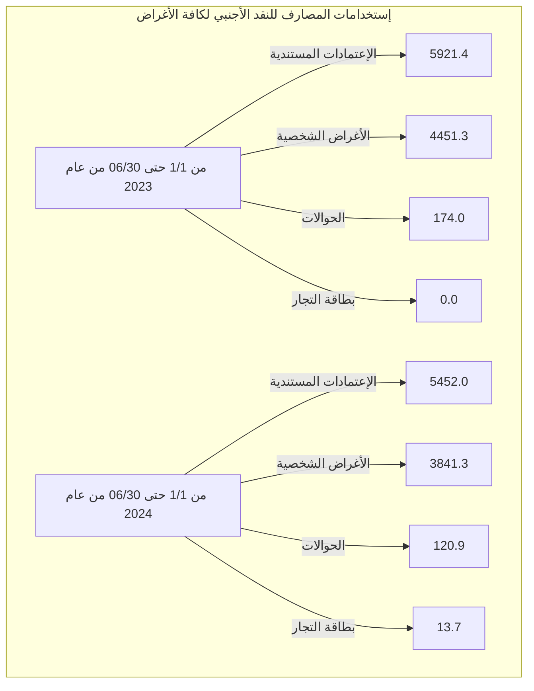

# مصرف ليبيا المركزي

## إستخدامات المصارف للنقد الأجنبي

### خلال الفترة: (1/1 - 30/06/2024)

![Central Bank of Libya image showing financial charts and currency]

إدارة البحوث والإحصاء - إدارة الرقابة على المصارف والنقد
---
إدارة البحوث والإحصاء - إدارة الرقابة على المصارف والنقد

تحليل حركة إستخدامات المصارف الفعلية من النقد الأجنبي
خلال الفترة (1/1 - حتى 2024/06/30)

بلغ إجمالي إستخدامات المصارف من النقد الأجنبي خلال الفترة (1/1 - حتى 2024/06/30) نحو 9,427,883,439 دولار، مُقابل 10,546,710,539 دولار خلال نفس الفترة من العام الماضي 2023، بإنخفاض قدره نحو 1,132,511,101 دولار. أي بمعدل بلغ 10.6%.

حيث شكلت الإعتمادات المستندية ما نسبته 57.8% من إجمالي إستخدامات المصارف من النقد الأجنبي، فيما شكلت الأغراض الشخصية نسبة 40.7% من الإجمالي، في حين شكلت الحوالات وبطاقات التجار مانسبته 1.4% من إجمالي الإستخدامات.

إستخدامات المصارف الفعلية من النقد الأجنبي لكافة الأغراض
"المبالغ بالدولار الأمريكي"

| البند | من 1/1 حتى 06/30 من عام 2023 | من 1/1 حتى 06/30 من عام 2024 | مقدار التغير | نسبة التغير |
|-------|--------------------------------|--------------------------------|--------------|-------------|
| - الإعتمادات المستندية | 5,921,426,616 | 5,451,987,672 | -469,438,944 | -7.9 |
| - الحوالات | 173,999,458 | 120,864,067 | -53,135,391 | -30.5 |
| - الأغراض الشخصية | 4,451,284,465 | 3,841,347,700 | -609,936,765 | -13.7 |
| - بطاقات التجار | - | 13,684,000 | - | - |
| الإجمالي | 10,546,710,539 | 9,427,883,439 | -1,132,511,101 | -10.6 |

صفحة 1 من 91
---
إدارة البحوث والإحصاء - إدارة الرقابة على المصارف والنقد

# المبالغ المُباعة للمصارف من النقد الأجنبي لكافة الأغراض:

ومن خلال الإطلاع على الجدول أدناه للقيم المباعة من النقد الأجنبي حسب المصارف، يتضح أن

المصرف التجاري الوطني قد حافظ على الترتيب الأول كأكثر المصارف استخداماً للنقد الأجنبي

خلال الفترة (1/1 - حتى 2024/06/30) مسجلاً حصة سوقية بلغت 15.9%، حيث بلغ إجمالي

المبالغ نحو 1,497,213,905 دولار، فيما جاء الأمان للتجارة والاستثمار في المرتبة الثانية بقيمة

بلغت 1,276,256,312 دولار، ثم مصرف الجمهورية في المرتبة الثالثة بقيمة 1,244,220,069

دولار، ثم مصرف الوحدة في المرتبة الرابعة بقيمة 889,186,707 دولار، ثم تأتي من حيث الأهمية

النسبية المصارف التالية حسب الترتيب: مصرف السودان، المصرف المتحد، المصرف الإسلامي

الليبي، مصرف الصحاري ومصرف التجارة والتنمية إلى آخره من المصارف كما موضح بالجدول

أدناه والذي يحتوي أيضاً على الترتيب الذي كانت عليه المصارف خلال نفس الفترة من العام

الماضي 2023.

صفحة 2 من 11
---
إدارة البحوث والإحصاء - إدارة الرقابة على المصارف والنقد

## ترتيب المصارف حسب إجمالي المبالغ المُباعة من النقد الأجنبي

| المصرف | من 1/1 حتى 06/30 من عام 2023 |  |  | من 1/1 حتى 06/30 من عام 2024 |  |  |
|---------|---------------------------|--|--|---------------------------|--|--|
|         | الترتيب | القيمة بالدولار | الحصة السوقية | الترتيب | القيمة بالدولار | الحصة السوقية |
| المصرف التجاري الوطني | 1 | 1,448,065,449 | 13.7% | 1 | 1,497,213,905 | 15.9% |
| مصرف الأمان للتجارة والإستثمار | 4 | 1,183,366,774 | 11.2% | 2 | 1,276,256,312 | 13.5% |
| مصرف الجمهورية | 3 | 1,194,985,356 | 11.3% | 3 | 1,244,220,069 | 13.2% |
| مصرف الوحدة | 2 | 1,286,538,293 | 12.2% | 4 | 889,186,707 | 9.4% |
| مصرف النوران | 6 | 884,211,936 | 8.4% | 5 | 832,094,487 | 8.8% |
| المصرف المتحد للتجارة والإستثمار | 7 | 770,755,500 | 7.3% | 6 | 616,205,011 | 6.5% |
| المصرف الإسلامي الليبي | 8 | 726,365,484 | 6.9% | 7 | 588,259,853 | 6.2% |
| مصرف الصحاري | 9 | 508,699,221 | 4.8% | 8 | 470,463,046 | 5.0% |
| مصرف التجارة والتنمية | 14 | 153,050,403 | 1.5% | 9 | 467,440,650 | 5.0% |
| مصرف الأندلس | 15 | 129,014,752 | 1.2% | 10 | 383,919,486 | 4.1% |
| مصرف شمال أفريقيا | 10 | 310,570,956 | 2.9% | 11 | 355,583,854 | 3.8% |
| مصرف الخليج الأول الليبي | 11 | 301,431,760 | 2.9% | 12 | 280,726,044 | 3.0% |
| مصرف السراي للتجارة والإستثمار | 13 | 159,643,608 | 1.5% | 13 | 234,476,154 | 2.5% |
| مصرف الواحة | 17 | 74,201,622 | 0.7% | 14 | 96,874,204 | 1.0% |
| مصرف التضامن | 16 | 85,415,171 | 0.8% | 15 | 84,787,811 | 0.9% |
| مصرف المتوسط | 19 | 31,533,616 | 0.3% | 16 | 61,517,768 | 0.7% |
| المصرف الليبي الخارجي | 18 | 54,734,148 | 0.5% | 17 | 30,121,902 | 0.3% |
| مصرف الوفاء | 12 | 197,830,292 | 1.9% | 18 | 19,123,796 | 0.2% |
| مصرف الإجماع العربي | 20 | 0 | 0.0% | 19 | 0 | 0.0% |
| مصرف اليقين | 5 | 1,046,296,199 | 9.9% | 20 | -587,623 | 0.0% |
| الإجمالي | - | 10,546,710,539 | 100% | - | 9,427,883,439 | 100% |

صفحة 3 من 91
---
إدارة البحوث والإحصاء - إدارة الرقابة على المصارف والنقد

المبالغ المُباعة للمصارف من النقد الأجنبي (حسب الغرض)

"القيم بالدولار الأمريكي"

| ت | المصرف | الاعتمادات المستندية |  | الحوالات المتنوعة |  | الأغراض الشخصية |  | بطاقة التجار |  |
|---|---------|----------------------|------------------|-------------------|------------------|---------------------|------------------|----------------|------------------|
|   |         | من 1/1 حتى 06/30 من عام 2023 | من 1/1 حتى 06/30 من عام 2024 | من 1/1 حتى 06/30 من عام 2023 | من 1/1 حتى 06/30 من عام 2024 | من 1/1 حتى 06/30 من عام 2023 | من 1/1 حتى 06/30 من عام 2024 | من 1/1 حتى 06/30 من عام 2023 | من 1/1 حتى 06/30 من عام 2024 |
| -1 | التجاري الوطني | 588,661,348 | 941,749,883 | 4,228,701 | 2,292,122 | 855,175,400 | 551,071,900 | - | 2,100,000 |
| -2 | الأمان | 333,911,976 | 360,747,995 | 18,116 | 1,631,318 | 849,436,682 | 905,327,000 | - | 8,550,000 |
| -3 | الجمهورية | 613,134,178 | 786,353,972 | 43,958,679 | 3,912,197 | 537,892,500 | 453,953,900 | - | 0 |
| -4 | الوحدة | 1,120,089,584 | 458,581,645 | 774,398 | 273,163 | 165,674,311 | 430,331,900 | - | 0 |
| -5 | الواحة | 661,996,475 | 651,781,395 | 13,802,264 | 12,784,593 | 208,413,197 | 164,694,500 | - | 2,834,000 |
| -6 | المتحد | 203,379,067 | 303,603,311 | 3,311,061 | 0 | 564,065,372 | 312,601,700 | - | 0 |
| -7 | الإسلامي الليبي | 562,188,396 | 387,339,212 | 29,599,901 | 8,177,040 | 134,577,186 | 192,743,600 | - | 0 |
| -8 | الصحاري | 139,132,949 | 269,852,728 | 5,966,815 | 4,962,718 | 363,599,457 | 195,647,600 | - | 0 |
| -9 | التجارة والتنمية | 0 | 166,241,843 | 0 | 20,344,707 | 153,050,403 | 280,854,100 | - | 0 |
| -10 | الأندلس | 122,243,525 | 320,896,517 | 4,803,215 | 13,901,269 | 1,968,012 | 49,121,700 | - | 0 |
| -11 | شمال أفريقيا | 216,530,278 | 176,714,101 | 25,222,270 | 16,500,653 | 68,818,408 | 162,169,100 | - | 200,000 |
| -12 | الخليج الأول الليبي | 289,618,400 | 264,237,932 | 11,657,120 | 15,546,912 | 156,240 | 941,200 | - | 0 |
| -13 | السراي | 151,991,583 | 182,796,348 | 1,997,747 | 18,406 | 5,654,278 | 51,661,400 | - | 0 |
| -14 | الواحة | 23,994,213 | 35,758,983 | 0 | 1,955,821 | 50,207,409 | 59,159,400 | - | 0 |
| -15 | التضامن | 85,415,171 | 77,653,611 | 0 | 0 | 0 | 7,134,200 | - | 0 |
| -16 | المتوسط | 26,436,952 | 47,616,968 | 0 | 14,000 | 5,096,664 | 13,886,800 | - | 0 |
| -17 | الليبي الخارجي | 36,967,306 | 10,971,254 | 17,551,212 | 18,549,148 | 215,630 | 601,500 | - | 0 |
| -18 | الوفاء | 196,453,027 | 10,696,796 | 0 | 0 | 1,377,265 | 8,427,000 | - | 0 |
| -19 | الإجماع العربي | 0 | 0 | 0 | 0 | 0 | 0 | - | 0 |
| -20 | اليقين | 549,282,189 | -1,606,823 | 11,107,958 | 0 | 485,906,051 | 1,019,200 | - | 0 |
| - | الإجمالي الكلي | 5,921,426,616 | 5,451,987,672 | 173,999,458 | 120,864,067 | 4,451,284,465 | 3,841,347,700 | - | 13,684,000 |

صفحة 4 من 11
---
إدارة البحوث والإحصاء - إدارة الرقابة على المصارف والنقد

## الأهمية النسبية حسب المصرف لاستخدامات النقد الأجنبي
### خلال الفترة من 1/1 حتى 30/06 من عام 2023

| المصرف | النسبة |
|---------|--------|
| المصرف التجاري الوطني | 14% |
| مصرف الوحدة | 12% |
| مصرف الجمهورية | 11% |
| مصرف الأمان للتجارة والاستثمار | 11% |
| باقي المصارف | 11% |
| مصرف اليقين | 10% |
| مصرف النوران | 9% |
| المصرف المتحد للتجارة والاستثمار | 7% |
| المصرف الإسلامي الليبي | 7% |
| مصرف الصحاري | 5% |
| مصرف شمال أفريقيا | 3% |

## الأهمية النسبية حسب المصرف لاستخدامات النقد الأجنبي
### خلال الفترة من 1/1 حتى 30/06 من عام 2024

| المصرف | النسبة |
|---------|--------|
| المصرف التجاري الوطني | 18% |
| مصرف الأمان للتجارة والاستثمار | 15% |
| مصرف الجمهورية | 15% |
| مصرف الوحدة | 11% |
| مصرف النوران | 10% |
| المصرف الإسلامي الليبي | 7% |
| المصرف المتحد للتجارة والاستثمار | 7% |
| مصرف الصحاري | 6% |
| مصرف التجارة والتنمية | 6% |
| مصرف الأندلس | 5% |

صفحة 5 من 11
---
إدارة البحوث والإحصاء - إدارة الرقابة على المصارف والنقد

طلبات المصارف المقبولة لتغطية الإعتمادات المستندية والحوالات المتنوعة عدا الأغراض الشخصية خلال الفترة (1/1 - حتى 30/06/2024):

بلغ عدد الشركات والمصانع والجهات العامة والجهات الأخرى المستفيدة (1,809) والتي تمت الموافقة على طلباتهم حصولهم على النقد الأجنبي خلال الفترة (1/1 - حتى 30/06/2024)، بعدد طلبات بلغ نحو 7,811 طلب، معظم هذه الطلبات لتغطية الاعتمادات المستندية والتي سجلت 6,956 طلب بنسبة 89.1% من الطلبات، كما هو موضح بالجداول التالية أدناه:-

عدد الطلبات المقبولة لشراء النقد الأجنبي - حسب القطاعات

| القطاع | عدد الشركات أو المصانع أو الجهات |
|--------|----------------------------------|
| القطاع الخاص | 1,724 |
| القطاع العام | 30 |
| جهات متنوعة | 55 |
| الإجمالي | 1,809 |

عدد الطلبات المقبولة لشراء النقد الأجنبي حسب نوع التحويل

| نوع التحويل | القطاع الخاص | القطاع العام | جهات متنوعة | الإجمالي | الأهمية النسبية |
|-------------|---------------|--------------|---------------|----------|------------------|
| اعتماد مستندي | 6,780 | 165 | 11 | 6,956 | 89.1% |
| حوالة طيران | 369 | 29 | 4 | 402 | 5.1% |
| حوالة تجارية | 6 | 159 | 9 | 174 | 2.2% |
| تحويلات أخرى | 28 | 142 | 10 | 180 | 2.3% |
| حوالة تأمين | 14 | 25 | 0 | 39 | 0.5% |
| حوالة مرتبات | 0 | 0 | 55 | 55 | 0.7% |
| حوالة صناعية | 4 | 1 | 0 | 5 | 0.1% |
| الإجمالي | 7,201 | 521 | 89 | 7,811 | 100% |

صفحة 6 من 91
---
إدارة البحوث والإحصاء - إدارة الرقابة على المصارف والنقد

## 1- القطاع الخاص:

بلغ عدد شركات ومصانع القطاع الخاص (1,724) التي تمت الموافقة على طلباتها للحصول على
النقد الأجنبي من المصارف لتغطية الاعتمادات المستندية والحوالات الأخرى خلال الفترة (1/1 -
حتى 30/06/2024) حيث أحتلت طلبات شراء النقد الأجنبي من قبل القطاع الخاص لإستيراد
السلع الغذائية المتنوعة المرتبة الأولى من إجمالي طلبات الشراء خلال الفترة، حيث شكلت مانسبته
29.4% من إجمالي طلبات شراء النقد الأجنبي.

وبالنسبة لشركات القطاع الخاص فقد إحتلت الشركة الليبية المتحدة لتعبئة المشروبات الترتيب
الأول، والجداول التالية توضح طلبات شراء السلع أو الخدمات وكذلك طلبات الشراء حسب أهم
مائة شركة خلال الفترة (1/1 - حتى 30/06/2024).

### طلبات شراء السلع أو الخدمات - قطاع خاص
### خلال الفترة (1/1 - حتى 30/06/2024)
"مرتبة تنازلياً"

| ت | تصنيف السلع | القيمة بالدولار | الأهمية النسبية % |
|---|-------------|-----------------|-------------------|
| 1- | سلع غذائية متنوعة | 1,504,182,386 | 29.4% |
| 2- | مستلزمات الإنتاج والتشغيل | 919,815,190 | 18.0% |
| 3- | وسائل النقل وإطارات ونضائد وقطع الغيار | 325,757,614 | 6.4% |
| 4- | مستلزمات انتاج سلع أساسية | 271,793,206 | 5.3% |
| 5- | أعلاف | 252,139,131 | 4.9% |
| 6- | الآلات والمعدات | 237,838,789 | 4.7% |
| 7- | اللحوم الحية والمجمدة | 221,734,265 | 4.3% |
| 8- | مواد البناء ومستلزمات التشييد | 202,353,355 | 4.0% |
| 9- | أجهزة الإلكترونية | 175,902,085 | 3.4% |
| 10- | أدوية بشرية | 168,980,940 | 3.3% |
| 11- | الزراعية | 142,090,215 | 2.8% |
| 12- | منزلية و كهرومنزلية | 120,707,267 | 2.4% |
| 13- | حليب وحفاظات وأغذية أطفال | 105,967,950 | 2.1% |
| 14- | مواد التنظيف | 87,567,283 | 1.7% |

صفحة 7 من 91
---
إدارة البحوث والإحصاء - إدارة الرقابة على المصارف والنقد

| النسبة | القيمة | البند | الرقم |
|--------|--------|------|------|
| %1.4 | 70,612,304 | حليب | -15 |
| %1.1 | 57,572,486 | أجبان | -16 |
| %0.6 | 31,622,422 | حوالات شركات خطوط الطيران | -17 |
| %0.5 | 24,159,468 | الملابس والأحذية | -18 |
| %0.4 | 22,881,919 | الأثاث | -19 |
| %0.4 | 22,822,342 | خدمات ملاحية متنوعة | -20 |
| %0.4 | 18,058,594 | قرطاسية | -21 |
| %0.3 | 14,716,696 | طلبات خاصة بشركة الأجنحة الليبية | -22 |
| %0.3 | 14,689,484 | فواكه وخضروات | -23 |
| %0.3 | 13,875,703 | مواد صحية | -24 |
| %0.2 | 11,815,664 | أدوية بيطرية | -25 |
| %0.2 | 10,874,195 | الشركة الليبية السريعة للنقل الجوي | -26 |
| %0.2 | 10,441,064 | سمن | -27 |
| %0.2 | 10,067,938 | خدمات اتصالات وتقنية معلومات | -28 |
| %0.2 | 9,892,564 | متنوعة | -29 |
| %0.1 | 7,440,179 | خدمات إنتاج وتشغيل | -30 |
| %0.1 | 5,144,333 | أسماك وأحياء بحرية | -31 |
| %0.1 | 4,775,859 | شركة أويا للطيران | -32 |
| %0.05 | 2,350,732 | طلبات بريفيق للطيران | -33 |
| %0.04 | 2,082,823 | سلع أخرى | -34 |
| %0.04 | 1,885,653 | زبدة | -35 |
| %0.03 | 1,618,347 | شركة سما المتوسط للطيران | -36 |
| %0.03 | 1,581,537 | السجاد والمنسوجات | -37 |
| %0.02 | 1,128,316 | شركة غدامس للطيران | -38 |
| %0.01 | 726,116 | حوالات شركات التأمين | -39 |
| 0.01% | 610,500 | رسوم اشتراك منظومة | -40 |
| %0.01 | 565,391 | تكاليف خدمات سياحية | -41 |
| %0.01 | 518,070 | مستلزمات تشغيل مصنع الحديد والصلب | -42 |
| %0.01 | 307,235 | الطبية | -43 |
| %0.01 | 266,962 | سلع خاصة بالخدمات العامة | -44 |
| %0.003 | 175,517 | مستلزمات تشغيل الموانئ | -45 |
| %0.001 | 76,485 | تكاليف رسوم تأشيرات | -46 |

صفحة 8 من 91
---
إدارة البحوث والإحصاء - إدارة الرقابة على المصارف والنقد

# طلبات الشراء حسب أهم مائة شركة - قطاع خاص
## خلال الفترة (1/1 - حتى 30/06/2024)
"مرتبة تنازلياً"

"دولار أمريكي"

| ت | الشركة أو المصنع | القيمة |
|---|-------------------|--------|
| 1 | شركة الليبية المتحدة لتعبئة المشروبات | 83,698,152 |
| 2 | شركة وادي الكوف للمطاحن والأعلاف ومضارب الأرز | 78,540,508 |
| 3 | شركة النسيم للصناعات الغذائية | 74,509,091 |
| 4 | شركة المعمورة للصناعات الغذائية والمطاحن والاعلاف | 68,337,182 |
| 5 | شركة الليبية الكبرى لصناعة السميد والدقيق | 63,829,260 |
| 6 | شركة الشرق الليبي للمطاحن والاعلاف ومضارب الارز | 61,313,115 |
| 7 | شركة الجيد لاستيراد المواد الغذائية | 56,636,876 |
| 8 | شركة الجاهزة لاستيراد المواد الغذائية | 54,392,000 |
| 9 | شركة جودي للصناعات الغذائية | 53,438,358 |
| 10 | شركة بلاد لاستيراد المواد الغذائية | 53,414,375 |
| 11 | شركة تويوتا ليبيا تجارة السيارات وقطع الغيار واستيراد والتصدير | 52,808,693 |
| 12 | شركة المبروكة لاستيراد المواد الغذائية | 52,514,913 |
| 13 | شركة خيرات الأيادي لاستيراد المواد الغذائية | 50,327,500 |
| 14 | شركة جودة الموسم لاستيراد المواد الغذائية | 48,931,500 |
| 15 | المجموعة الليبية للخدمات النفطية والطاقة | 48,620,320 |
| 16 | شركة الماهر الدولي للمطاحن والأعلاف | 44,469,421 |
| 17 | شركة افريقيا لتعبئة المشروبات | 41,523,222 |
| 18 | شركة جبل الكوف لاستيراد السيارات و قطع الغيار | 40,369,217 |
| 19 | شركة مجموعة الامتياز للمطاحن ومضارب الارز وتعبئة الزيوت النباتية | 39,879,550 |
| 20 | شركة الريحان لصناعة المواد الغذائية | 36,547,915 |
| 21 | شركة مجموعة الامتياز لاستيراد وسائل النقل المختلفة وملحقاتها | 35,839,805 |
| 22 | شركة الفا لاستيراد الادوية والمعدات الطبية و المستحضرات الطبية و مستلزمات الام والطفل | 35,639,410 |
| 23 | شركة عروس البيضاء لاستيراد المواشي واللحوم التابعة لشركة أكاكوس القابضه | 35,470,200 |
| 24 | شركة سما الليبية لاستيراد المواد الغذائية والمواشي واللحوم | 33,459,712 |

صفحة 1 من 11
---
إدارة البحوث والإحصاء - إدارة الرقابة على المصارف والنقد

| المبلغ | اسم الشركة | الرقم |
|--------|------------|------|
| 33,015,547 | شركة بستان ليبيا لاستيراد المواد الغذائية والمواشي واللحوم | 25 |
| 31,585,924 | شركة المبروكة للصناعات الغذائية | 26 |
| 30,870,335 | شركة بصمة الجودة لاستيراد المواد الغذائية والمواشي واللحوم | 27 |
| 30,496,537 | شركة السرايا الراقية لاستيراد المواد الغذائية و الخضروات و الفواكه الطازجة و المواشي واللحوم | 28 |
| 29,185,550 | شركة الوسام الذهبي لصناعة الدقيق ومضارب الأرز | 29 |
| 28,616,261 | شركة المعمورة لاستيراد وتوزيع المواد الغذائية | 30 |
| 25,646,846 | شركة طريق القارة لاستيراد المواد الغذائية | 31 |
| 25,081,578 | شركة دروب ليبيا لاستيراد وسائل النقل وملحقاتها | 32 |
| 24,960,000 | شركة الاستثمارية للصناعات الهندسية وتشكيل المعادن | 33 |
| 24,418,440 | شركة طرابلس الكبرى لصناعة وتعبئة الطماطم والمواد الغذائية | 34 |
| 23,112,509 | شركة الشمس الساطعة للصناعات الغذائية | 35 |
| 21,737,050 | شركة الثمرات الليبية لاستيراد المواد الغذائية | 36 |
| 21,700,000 | شركة القيض لصناعة مواد التنظيف | 37 |
| 21,426,010 | شركة ريادة لصناعات الكيماوية والمواد الخام | 38 |
| 21,342,923 | شركة الجيد للصناعات الغذائية | 39 |
| 20,898,229 | شركة الأجنحة الليبية للطيران المساهمة | 40 |
| 20,639,417 | شركة الزرقاء الدولية للصناعات الغذائية | 41 |
| 20,566,082 | شركة مفاتيح الخير لاستيراد الاجهزة والمواد الكهربائية وقطع غيارها والاجهزة الالكترونية وملحقاتها وقطع غيارها | 42 |
| 20,112,805 | شركة كنوز ليبيا للمطاحن والاعلاف ومضارب الارز | 43 |
| 19,721,088 | شركة قرطاج للصناعات الغذائية | 44 |
| 19,500,235 | شركة مجموعة الرائدون لصناعة مواد البناء | 45 |
| 19,014,131 | شركة تمر هند لاستيراد السيارات وقطع غيارها | 46 |
| 18,433,920 | شركة جلوبال لصناعة مواد البناء والطلاء والمعاجين والبلاستيك والمواد الخام | 47 |
| 18,288,000 | شركة أجيال العطاء الوافر لاستيراد المواد الغذائية | 48 |
| 18,266,460 | مصنع اريكو لصناعة الطلاء | 49 |
| 18,238,560 | شركة الابداع لصناعة المنظفات والصابون ومستلزماتها | 50 |
| 17,989,715 | شركة أعالي الاندلس للصناعات الغذائية | 51 |
| 17,927,205 | شركة برنيق للطيران | 52 |
| 17,866,250 | شركة الغذاء الذهبي لصناعة وتعبئة معجون الطماطم والصناعات الغذائية | 53 |
| 17,548,257 | شركة السواحل الذهبية لاستيراد المواد الغذائية | 54 |

صفحة 11 من 91
---
إدارة البحوث والإحصاء - إدارة الرقابة على المصارف والنقد

| المبلغ | اسم الشركة | الرقم |
|--------|------------|------|
| 17,546,620 | شركة المراعي الخصبة للمطاحن والاعلاف ومضارب الارز | 55 |
| 17,383,060 | شركة المعمورة للاستثمار الزراعي والحيواني. | 56 |
| 16,849,135 | شركة الشجرة الشامخة لاستيراد المواد الغذائية والمواشي واللحوم | 57 |
| 16,684,530 | شركة أضواء النيزك لاستيراد الأجهزة الألكترونية وملحقاتها وقطع غيارها | 58 |
| 16,602,000 | شركة الامال العظيمة لاستيراد المواد الغدائية | 59 |
| 16,459,692 | شركة مجموعة التواصل المميز لاستيراد المواد الخام | 60 |
| 16,397,587 | شركة لمسة الحياة لاستيراد المعدات الطبية والادوية والمستحضرات الطبية ومستلزمات الام والطفل | 61 |
| 16,307,110 | شركة الوصل المميز لاستيراد لاستيراد المواد الغذائية والمواشي واللحوم | 62 |
| 15,600,610 | شركة ادري لاستيراد وسائل النقل وملحقاتها | 63 |
| 15,501,100 | شركة الجودة العالمية الأولى لصناعة الاعلاف ومطاحن الدقيق والصناعات الغذائية | 64 |
| 15,288,556 | شركة ابتهاج الطبيعة لاستيراد المواد الغدائية | 65 |
| 15,225,000 | شركة السد الحديثة للمطاحن وصناعة الاعلاف | 66 |
| 14,698,572 | مصنع جاما لصناعة البلاستيك | 67 |
| 14,612,884 | شركة الساحل لاستيراد المواشي واللحوم | 68 |
| 14,522,545 | شركة الفضاء الذهبي لاستيراد المواد الغذائية | 69 |
| 14,403,360 | شركة القدس ل صناعة الخزانات والمواسير البلاستيكية | 70 |
| 14,325,500 | شركة انعام ليبيا لأستيراد الاعلاف ومكملاتها | 71 |
| 14,302,400 | مصنع التعاون لصناعة الاعلاف | 72 |
| 13,956,023 | شركة أرض العطاء للصناعات الغذائية المحدودة | 73 |
| 13,338,000 | شركة طرابلس الاولي للمطاحن والاعلاف | 74 |
| 13,272,184 | شركة اضواء افريقيا لاستيراد المواد الغذائية والمواشي واللحوم | 75 |
| 13,241,300 | شركة أصول التكنولوجيا لصناعة الاجهزة الالكترونية والكهربائية | 76 |
| 12,982,281 | شركة الرابية الخضراء لاستيراد المواد الغذائية | 77 |
| 12,400,327 | شركة الاترج لاستيراد الاجهزة الالكترونية والمواد الكهربائية واجهزة النقال | 78 |
| 12,222,510 | شركة المذاق الطيب لاستيراد المواد الغذائية والمواشي واللحوم | 79 |
| 12,117,500 | شركة النعيم للمطاحن والاعلاف والحبوب | 80 |
| 11,990,594 | شركة التراب الليبي الاستيراد المواد الغدائيه والمواشي | 81 |
| 11,742,507 | الشركة الليبية السريعة للطيران المدني والمناولة والشحن الجوي | 82 |
| 11,663,665 | شركة أجود المحركات لاستيراد السيارات | 83 |
| 11,605,300 | شركة مجموعة المواشي الحية لاستيراد المواد الغذائية والمواشي واللحوم | 84 |
| 11,562,692 | شركة الرجاس الزراعي لإستيراد الالات الزراعية ومستلزماتها وقطع غيارها | 85 |
| 11,525,555 | شركة سما المراعي للمطاحن وصناعة الاعلاف ومضارب الارز | 86 |

صفحة 11 من 91
---
إدارة البحوث والإحصاء - إدارة الرقابة على المصارف والنقد

| الرقم | اسم الشركة | القيمة |
|-------|------------|--------|
| 87 | شركة العلمية لإستيراد الادوية والمستحضرات الطبية ومستلزمات الام والطفل | 11,344,265 |
| 88 | شركة الابراج العتيقة لاستيراد المواد الغذائية | 11,220,000 |
| 89 | شركة القلعة الحديثة صناعة مواد البناء وصناعة البلاستيك والمواد الخام | 11,189,550 |
| 90 | شركة وطن المجد لاستيراد المواد الغذائية | 10,948,459 |
| 91 | شركة العمران لاستيراد السيارات وقطع غيارها | 10,908,884 |
| 92 | شركة اوميجا للصناعات الكيماوية ومواد التغليف | 10,886,100 |
| 93 | شركة اونكس لصناعة مواد البناء والطلاء والمعاجين وصناعة البلاستيك والمواد الخام | 10,783,200 |
| 94 | مصنع بيتا بوليمر لصناعة المواد الخام للصناعات الكيماوية | 10,698,600 |
| 95 | الشركة الليبية الجديدة لصناعة المعادن | 10,678,530 |
| 96 | شركة الطائف لإستيراد المواد الغذائية | 10,608,318 |
| 97 | شركة الواحات المتجددة لاستيراد المواد الغذائية | 10,539,857 |
| 98 | مصنع بيتا لصناعة مواد التنظيف | 10,536,900 |
| 99 | شركة مرسين لاستيراد المواد المنزلية والكهربائية | 10,435,010 |
| 100 | شركة النجع الكبير لاستيراد المواد الغذائية والمواشي واللحوم | 10,284,471 |

## طلبات المصارف لتغطية الاعتمادات المستندية والحوالات - قطاع خاص

(حسب أهم البلدان المستفيدة)

من خلال الإطلاع على الجدول أدناه لقيم طلبات المصارف لشراء النقد الأجنبي حسب البلدان
المستفيدة خلال الفترة (1/1 - حتى 30/06/2024) للقطاع الخاص، يتضح أن مانسبته 20.8%

من تحويلات المصارف لتغطية الإعتمادات المستندية أوالحوالات الأخرى كانت لدولة تركيا، تم

جاءت دولة الإمارات العربية المتحدة في المرتبة الثانية بنسبة 12.2% ثم المملكة المتحدة وسويسرا

بنسب 9.2% و 7.9% على التوالي، والجدول التالي يوضح أهم عشرون بلد مستفيد.

صفحة 12 من 91
---
إدارة البحوث والإحصاء - إدارة الرقابة على المصارف والنقد

طلبات المصارف لتغطية الاعتمادات المستندية والحوالات - قطاع خاص
(حسب أهم البلدان المستفيدة)
خلال الفترة (1/1 - حتى 30/06/2024)

| ت | البلد المستفيد | القيمة بالدولار | الأهمية النسبية |
|---|----------------|-----------------|-----------------|
| 1- | تركيا | 1,064,877,230 | 20.8% |
| 2- | الإمارات العربية المتحدة | 624,543,513 | 12.2% |
| 3- | بريطانيا ( المملكة المتحدة) | 468,388,840 | 9.2% |
| 4- | سويسرا | 405,766,816 | 7.9% |
| 5- | الصين | 260,469,209 | 5.1% |
| 6- | إيطاليا | 254,775,195 | 5.0% |
| 7- | مصر | 237,071,404 | 4.6% |
| 8- | تونس | 216,148,483 | 4.2% |
| 9- | إسبانيا | 188,768,939 | 3.7% |
| 10- | كندا | 163,077,574 | 3.2% |
| 11- | الأردن | 122,205,493 | 2.4% |
| 12- | تايلاند | 96,209,687 | 1.9% |
| 13- | فرنسا | 84,354,554 | 1.7% |
| 14- | هولندا | 84,242,724 | 1.6% |
| 15- | النمسا | 81,665,514 | 1.6% |
| 16- | اليابان | 71,473,541 | 1.4% |
| 17- | المانيا | 68,736,619 | 1.3% |
| 18- | كوريا الجنوبية | 62,549,909 | 1.2% |
| 19- | سلوفاكيا | 46,340,764 | 0.9% |
| 20- | نيوزيلندا | 38,872,897 | 0.8% |

صفحة 13 من 91
---
إدارة البحوث والإحصاء - إدارة الرقابة على المصارف والنقد

## طلبات المصارف لتغطية الإعتمادات المستندية والحوالات - قطاع خاص

### (حسب أهم بلدان منشأ السلع أو الخدمات)

من خلال الإطلاع على الجدول أدناه لقيم طلبات المصارف لشراء النقد الأجنبي حسب بلدان منشأ السلع أو الخدمات خلال الفترة (1/1 - حتى 30/06/2024) للقطاع الخاص ، يتضح أن دولة تركيا قد أحتلت المرتبة الأولى حيث شكلت السلع أو الخدمات ذات المنشأ التركي نسبة 19.2% من إجمالي طلبات الشراء المقبولة، ثم جاءت واردات السلع أو الخدمات ذات المنشأ الصيني في المرتبة الثانية مشكلة مانسبته 11.4% من الإجمالي، وشكلت السلع أوالخدمات ذات المنشأ المصري نسبة 7.4% محتلة المرتبة الثالثة خلال الفترة ، فيما سجلت السلع والخدمات ذات منشأ دولة روسيا الاتحادية مانسبته 6.8% ، وذات المنشأ الهندي نسبة 6.0%، والجدول التالي يوضح أهم عشرون بلد منشأ للسلع أو الخدمات.

### طلبات المصارف لتغطية الإعتمادات المستندية والحوالات - قطاع خاص
#### (حسب أهم بلدان منشأ السلع أو الخدمات)
#### خلال الفترة (1/1 - حتى 30/06/2024)

| ت | بلد منشأ السلع أو الخدمات | القيمة بالدولار | الأهمية النسبية |
|---|---------------------------|-----------------|-----------------|
| 1- | تركيا | 980,817,475 | 19.2% |
| 2- | الصين | 582,935,303 | 11.4% |
| 3- | مصر | 380,767,275 | 7.4% |
| 4- | روسيا الاتحادية | 348,031,074 | 6.8% |
| 5- | الهند | 304,932,250 | 6.0% |
| 6- | البرازيل | 294,425,101 | 5.8% |
| 7- | إيطاليا | 250,683,767 | 4.9% |
| 8- | تونس | 179,358,554 | 3.5% |
| 9- | أوكرانيا | 150,534,081 | 2.9% |
| 10- | إسبانيا | 131,527,259 | 2.6% |
| 11- | الأرجنتين | 121,513,430 | 2.4% |

صفحة 14 من 91
---
إدارة البحوث والإحصاء - إدارة الرقابة على المصارف والنقد

| -   | الدولة                  | القيمة      | النسبة |
|-----|------------------------|------------|-------|
| -12 | تايلاند                 | 111,012,589 | %2.2  |
| -13 | فرنسا                   | 91,538,658  | %1.8  |
| -14 | ألمانيا                 | 86,166,376  | %1.7  |
| -15 | المملكة العربية السعودية | 83,997,904  | %1.6  |
| -16 | هولندا                  | 83,729,797  | %1.6  |
| -17 | الإمارات العربية المتحدة | 76,224,499  | %1.5  |
| -18 | رومانيا                 | 76,025,694  | %1.5  |
| -19 | أيرلندا                 | 60,774,813  | %1.2  |
| -20 | بولندا                  | 55,432,580  | %1.1  |

## 2- القطاع العام

بلغ عدد جهات القطاع العام التي تمت الموافقة على طلباتها للحصول على النقد الأجنبي لتغطية الاعتمادات المستندية والحوالات الأخرى 30 جهة خلال الفترة (1/1 – حتى 30/06/2024)، حيث احتلت مستلزمات تشغيل مصنع الحديد والصلب المرتبة الأولى من إجمالي طلبات الشراء خلال الفترة، حيث شكلت مانسبته 42.0% من إجمالي طلبات شراء النقد الأجنبي، فيما احتلت متطلبات مستلزمات الانتاج والتشغيل المرتبة الثانية من حيث الأهمية النسبية لتشكل نحو 13.2%، وبالتالي فقد احتلت الشركة الليبية للحديد والصلب الترتيب الأول ، حيث سجلت طلباتها المقبولة لشراء النقد الأجنبي نحو 225.8 مليون دولار خلال الفترة يليها شركة ليبيانا للهاتف المحمول بإجمالي طلبات مقبولة بلغ نحو 66.1 مليون دولار ،والجداول التالية توضح طلبات شراء السلع أو الخدمات وكذلك طلبات الشراء حسب الجهات العامة خلال الفترة (1/1 – حتى 30/06/2024).

صفحة 15 من 91
---
إدارة البحوث والإحصاء - إدارة الرقابة على المصارف والنقد

# طلبات شراء حسب السلعة أو الخدمات - قطاع عام

خلال الفترة (1/1 - حتى 30/06/2024)

"مرتبة تنازلياً"

| ت | تصنيف السلع | القيمة بالدولار | الأهمية النسبية % |
|---|-------------|-----------------|-------------------|
| -1 | مستلزمات تشغيل مصنع الحديد والصلب | 219,053,780 | 42.0% |
| -2 | مستلزمات الإنتاج والتشغيل | 68,634,079 | 13.2% |
| -3 | متطلبات شركة ليبيانا للهاتف المحمول | 60,499,763 | 11.6% |
| -4 | خدمات اتصالات وتقنية معلومات | 31,655,983 | 6.1% |
| -5 | شركة الاتحاد العربي للمقاولات | 26,825,000 | 5.1% |
| -6 | متطلبات شركة المدار الجديد | 25,090,001 | 4.8% |
| -7 | حوالات شركات خطوط الطيران | 15,583,603 | 3.0% |
| -8 | مستلزمات تشغيل الموانئ | 14,811,421 | 2.8% |
| -9 | شركة ليبيا للاتصالات والتقنية | 13,571,089 | 2.6% |
| -10 | سلع غذائية متنوعة | 8,064,000 | 1.5% |
| -11 | طلبات جهاز مشروعات الإسكان | 4,634,806 | 0.9% |
| -12 | الغذائية | 4,317,050 | 0.8% |
| -13 | الشركة الأهلية للأسمنت | 4,113,849 | 0.8% |
| -14 | الآلات والمعدات | 4,112,523 | 0.8% |
| -15 | متطلبات تشغيل وصيانة الموانئ | 3,557,657 | 0.7% |
| -16 | الخطوط الجوية الأفريقية | 3,479,620 | 0.7% |
| -17 | حوالات شركات التأمين | 2,389,326 | 0.5% |
| -18 | الهيئة العامة للأوقاف | 2,108,454 | 0.4% |
| -19 | متنوعة | 2,030,750 | 0.4% |
| -20 | أجهزة إلكترونية | 1,948,376 | 0.4% |
| -21 | الشركة العامة لاستيراد السلع الأمنية | 1,465,100 | 0.3% |
| -22 | مستلزمات الشركة العامة للكهرباء | 1,090,179 | 0.2% |
| -23 | طلبات الخطوط الجوية الليبية | 727,758 | 0.1% |
| -24 | وسائل النقل وإطارات ونضائد وقطع الغيار | 626,730 | 0.1% |
| -25 | حوالات دورة تدريبية | 542,380 | 0.1% |
| -26 | احتياجات التشغيل لشركة معاملات | 291,277 | 0.1% |
| -27 | مواد البناء ومستلزمات التشييد | 197,217 | 0.04% |

صفحة 16 من 91
---
إدارة البحوث والإحصاء - إدارة الرقابة على المصارف والنقد

| %0.02 | 113,571 | الشركة الليبية للموانئ | -28 |
| %0.01 | 66,625 | سلع خاصة بالخدمات العامة | -29 |
| %0.00 | 15,178 | مستلزمات تشغيل شركة هاتف ليبيا | -30 |

## طلبات الشراء حسب الجهات - قطاع عام
### خلال الفترة (1/1 – حتى 2024/06/30)
"مرتبة تنازلياً"

| القيمة بالدولار | الجهة | ت |
|-----------------|-------|---|
| 225,754,432 | الشركة الليبية للحديد والصلب | 1 |
| 66,099,270 | شركة ليبيانا للهاتف المحمول | 2 |
| 50,499,805 | جهاز تنمية و تطوير المراكز الإدارية | 3 |
| 37,655,310 | شركة المدار الجديد | 4 |
| 31,630,907 | شركة الاتحاد العربي للمقاولات المساهمة | 5 |
| 19,603,978 | المنطقة الحرة بمصراته | 6 |
| 19,275,244 | شركة ليبيا للاتصالات والتقنية المساهمة | 7 |
| 15,568,800 | شركة الخطوط الجوية الافريقية | 8 |
| 11,968,000 | شركة تطوير للاستثمار الصناعي المساهمة | 9 |
| 10,906,809 | الشركة الاهلية للاسمنت | 10 |
| 7,038,353 | شركة هاتف ليبيا | 11 |
| 4,634,806 | جهاز تنفيذ مشروعات الاسكان و المرافق | 12 |
| 4,155,092 | شركة ليبيا للتأمين | 13 |
| 3,445,901 | شركة الاتصالات الدولية الليبية | 14 |
| 2,130,392 | شركة الخطوط الجوية الليبية | 15 |
| 1,945,321 | شركة المناهج للطباعة والنشر | 16 |
| 1,465,100 | شركة العامة لاستيراد السلع الامنية المساهمة | 17 |
| 1,365,940 | شركة الانماء للاستثمارات الكهربائية | 18 |
| 2,108,454 | الهيئة العامة للأوقاف والشؤون الإسلامية | 19 |
| 892,000 | شركة العامة لخدمات النظافة العامة طرابلس | 20 |
| 768,951 | مركز الوطني للأرصاد الجوية | 21 |

صفحة 17 من 91
---
إدارة البحوث والإحصاء - إدارة الرقابة على المصارف والنقد

| شركة معاملات للخدمات المالية | 610,277 | 22 |
|--------------------------------|---------|----|
| شركة الليبية للموانئ | 542,018 | 23 |
| شركة الأكاديمية الليبية للاتصالات والمعلوماتية | 527,880 | 24 |
| شركة الثقة لاستيراد اللحوم والمواد الغذائية المساهمة | 413,050 | 25 |
| الاتحاد الليبي لشركات التأمين | 392,648 | 26 |
| شركة الشاحنات والحافلات | 107,300 | 27 |
| جامعة بنغازي | 85,429 | 28 |
| شركة بريد ليبيا | 15,178 | 29 |
| هيئة الاشراف على التأمين | 10,500 | 30 |

### 3- جهات متنوعة:

طلبات التغطية المقبولة
جهات متنوعة وحوالات مرتبات للأجانب
خلال الفترة (1/1- 30/06/2024)

| القيمة بالدولار الأمريكي | اسم الجهة | الترتيب |
|---------------------------|-----------|---------|
| 5,775,591 | مصرف الآمان للتجارة والاستثمار | 1 |
| 5,655,208 | حوالة طيران - فرع شركة الخطوط الجوية التونسية | 2 |
| 3,568,922 | مصرف التجارة والتنمية | 3 |
| 2,238,815 | شركة مصرف الأندلس | 4 |
| 2,000,000 | مصرف التضامن | 5 |
| 1,025,898 | عدد (55) حوالة أفراد - مرتبات أجانب | 6 |
| 431,769 | النادي الأهلي الرياضي | 7 |
| 4,665 | سفارة دولة قطر | 8 |

صفحة 18 من 91
---
إدارة البحوث والإحصاء - إدارة الرقابة على المصارف والنقد

حسب بلد المستفيد - جهات متنوعة وحوالات أجانب (مرتبات)

| الترتيب | بلد المستفيد | القيمة بالدولار الأمريكي |
|---------|--------------|-------------------------|
| 1 | تونس | 6,018,412 |
| 2 | الولايات المتحدة | 4,015,000 |
| 3 | المتحدة بريطانيا ( المملكة) | 2,840,735 |
| 4 | إسبانيا | 2,198,717 |
| 5 | الهند | 1,201,730 |
| 6 | الإمارات العربية المتحدة | 1,044,553 |
| 7 | هولندا | 791,189 |
| 8 | موريشيوس | 552,207 |
| 9 | المغرب | 538,028 |
| 10 | تركيا | 277,705 |
| 11 | مالطة | 274,077 |
| 12 | فرنسا | 179,406 |
| 13 | مصر | 123,400 |
| 14 | الأردن | 122,396 |
| 15 | أوكرانيا | 90,000 |
| 16 | بولندا | 73,720 |
| 17 | مالي | 72,625 |
| 18 | بلغاريا | 67,800 |
| 19 | إيطاليا | 56,630 |
| 20 | الفلبين | 50,673 |
| 21 | بلجيكا | 40,994 |
| 22 | السودان | 34,500 |
| 23 | أوزبكستان | 13,842 |
| 24 | مولدافيا | 11,864 |
| 25 | باكستان | 6,000 |
| 26 | قطر | 4,665 |

صفحة 19 من 91
---
إدارة البحوث والإحصاء - إدارة الرقابة على المصارف والنقد

# الملحق

طلبات التغطية المقبولة لكافة القطاعات خلال الفترة (1/1 - حتى 30/06/2024):

- قوائم بكافة الجهات والشركات والمصانع المستفيدة.

- طلبات الشراء حسب تصنيف السلع أو الخدمات.

- طلبات الشراء حسب بلدان منشأ السلع أو الخدمات والبلدان المستفيدة.

صفحة 20 من 91
---
# طلبات التغطية المقبولة

## قائمة بكافة الشركات والمصانع - قطاع خاص
### خلال الفترة (1/1 - 30/06/2024)

"مرتبة تنازلياً"

| الترتيب | اسم الشركة أو المصنع | القيمة بالدولار الأمريكي |
|---------|----------------------|--------------------------|
| 1 | شركة الليبية المتحدة لتعبئة المشروبات | 83,698,152 |
| 2 | شركة وادي الكوف للمطاحن والأعلاف ومضارب الأرز | 78,540,508 |
| 3 | شركة النسيم للصناعات الغذائية | 74,509,091 |
| 4 | شركة المعمورة للصناعات الغذائية والمطاحن والاعلاف | 68,337,182 |
| 5 | شركة الليبية الكبرى لصناعة السميد والدقيق | 63,829,260 |
| 6 | شركة الشرق الليبي للمطاحن والاعلاف ومضارب الارز | 61,313,115 |
| 7 | شركة الجيد لاستيراد المواد الغذائية | 56,636,876 |
| 8 | شركة الجاهزة لاستيراد المواد الغذائية | 54,392,000 |
| 9 | شركة جودي للصناعات الغذائية | 53,438,358 |
| 10 | شركة يلد لاستراد المواد الغذائية | 53,414,375 |
| 11 | شركة تويوتا ليبيا تجارة السيارات وقطع الغيار واستيراد والتصدير | 52,808,693 |
| 12 | شركة المبروكة لاستيراد المواد الغذائية | 52,514,913 |
| 13 | شركة خيرات الأيادي لاستيراد المواد الغذائية | 50,327,500 |
| 14 | شركة جودة الموسم لاستراد المواد الغذائية | 48,931,500 |
| 15 | المجموعة الليبية للخدمات النفطية والطاقة | 48,620,320 |
| 16 | شركة الماهر الدولي للمطاحن والأعلاف | 44,469,421 |
| 17 | شركة افريقيا لتعبئة المشروبات | 41,523,222 |
| 18 | شركة جبل الكوف لاستيراد السيارات و قطع الغيار | 40,369,217 |
| 19 | شركة مجموعة الامتياز للمطاحن ومضارب الارز وتعبئة الزيوت النباتية | 39,879,550 |
| 20 | شركة الريحان لصناعة المواد الغذائية | 36,547,915 |
| 21 | شركة مجموعة الامتياز لاستيراد وسائل النقل المختلفة وملحقاتها | 35,839,805 |
| 22 | شركة الفا لاستيراد الادوية والمعدات الطبية و المستحضرات الطبية و مستلزمات الام و الطفل | 35,639,410 |
| 23 | شركة عروس البيضاء لاستيراد المواشي واللحوم التابعه لشركة أكاكوس القابضه | 35,470,200 |
| 24 | شركة سما الليبية لاستيراد المواد الغذائية والمواشي واللحوم | 33,459,712 |
| 25 | شركة بستان ليبيا لاستيرادالمواد الغذائية والمواشي واللحوم | 33,015,547 |
| 26 | شركة المبروكة للصناعات الغذائية | 31,585,924 |
| 27 | شركة بصمة الجودة لاستيراد المواد الغذائية والمواشي واللحوم | 30,870,335 |
---
| Amount | Company Name | No. |
|---------|---------------|-----|
| 30,496,537 | شركة السرايا الراقية لاستيراد المواد الغذائية و الخضروات و الفواكه الطازجة و المواشي واللحوم | 28 |
| 29,185,550 | شركة الوسام الذهبي لصناعة الدقيق ومضارب الارز | 29 |
| 28,616,261 | شركة المعمورة لاستيراد وتوزيع المواد الغذائية | 30 |
| 25,646,846 | شركة طريق القارة لاستيراد المواد الغذائية | 31 |
| 25,081,578 | شركة دروب ليبيا لاستيراد وسائل النقل وملحقاتها | 32 |
| 24,960,000 | شركة الاستثمارية للصناعات الهندسية وتشكيل المعادن | 33 |
| 24,418,440 | شركة طرابلس الكبرى لصناعة وتعبئة الطماطم والمواد الغذائية | 34 |
| 23,112,509 | شركة الشمس الساطعة للصناعات الغذائية | 35 |
| 21,737,050 | شركة الثمرات الليبية لاستيراد المواد الغذائية | 36 |
| 21,700,000 | شركة القيصر لصناعة مواد التنظيف | 37 |
| 21,426,010 | شركة ريادة لصناعات الكيماوية والمواد الخام | 38 |
| 21,342,923 | شركة الجيد للصناعات الغذائية | 39 |
| 20,898,229 | شركة الاجنحة الليبية للطيران المساهمة | 40 |
| 20,639,417 | شركة الزرقاء الدولية للصناعات الغذائية | 41 |
| 20,566,082 | شركة مفاتيح الخير لاستيراد الاجهزة والمواد الكهربائية وقطع غيارها والاجهزة الالكترونية وملحقاتها وقط | 42 |
| 20,112,805 | شركة كنوز ليبيا للمطاحن والاعلاف ومضارب الارز | 43 |
| 19,721,088 | شركة قرطاج للصناعات الغذائية | 44 |
| 19,500,235 | شركة مجموعة الرائدون لصناعة مواد البناء | 45 |
| 19,014,131 | شركة تمر هند لاستيراد السيارات وقطع غيارها | 46 |
| 18,433,920 | شركة جلوبال لصناعة مواد البناء والطلاء والمعاجين والبلاستيك والمواد الخام | 47 |
| 18,288,000 | شركة أجيال العطاء الوافر لاستيراد المواد الغذائية | 48 |
| 18,266,460 | مصنع اركمو لصناعة الطلاء | 49 |
| 18,238,560 | شركة الابداع لصناعة المنظفات والصابون ومستلزماتها | 50 |
| 17,989,715 | شركة أعالي الاندلس للصناعات الغذائية | 51 |
| 17,927,205 | شركة برنيق للطيران | 52 |
| 17,866,250 | شركة الغذاء الذهبي لصناعة وتعبئة معجون الطماطم والصناعات الغذائية | 53 |
| 17,548,257 | شركة السواحل الذهبية لاستيراد المواد الغذائية | 54 |
| 17,546,620 | شركة المراعي الخصبة للمطاحن و الاعلاف ومضارب الارز | 55 |
| 17,383,060 | شركة المعمورة للاستثمار الزارعي والحيواني | 56 |
| 16,849,135 | شركة الشجرة الشامخة لاستيراد المواد الغذائية والمواشي واللحوم | 57 |
| 16,684,530 | شركة أضواء النيزك لاستيراد الأجهزة الألكترونية وملحقاتها وقطع غيارها | 58 |
| 16,602,000 | شركة الامال العظيمة لاستيراد المواد الغدائية | 59 |
| 16,459,692 | شركة مجموعة التواصل المميز لاستيراد المواد الخام | 60 |
| 16,397,587 | شركة لمسة الحياة لاستيراد المعدات الطبية والادوية والمستحضرات الطبية ومستلزمات الام والطفل | 61 |
---
| Amount | Company Name | No. |
|---------|---------------|-----|
| 16,307,110 | شركة الوصل المنير لاستيراد لاستيراد المواد الغذائية والمواشي واللحوم | 62 |
| 15,600,610 | شركة ادري لاستيراد وسائل النقل وملحقاتها | 63 |
| 15,501,100 | شركة الجودة العالمية الأولى لصناعة الاعلاف ومطاحن الدقيق والصناعات الغذائية | 64 |
| 15,288,556 | شركة ابتهاج الطبيعة لاستيراد المواد الغذائية | 65 |
| 15,225,000 | شركة السد الحديثة للمطاحن وصناعة الاعلاف | 66 |
| 14,698,572 | مصنع جاما لصناعة البلاستيك | 67 |
| 14,612,884 | شركة الساحل لاستيراد المواشي واللحوم | 68 |
| 14,522,545 | شركة الفضاء الذهبي لاستيراد المواد الغذائية | 69 |
| 14,403,360 | شركة القدس ل صناعة الخزانات والمواسير البلاستيكية | 70 |
| 14,325,500 | شركة انعام ليبيا لأستيراد الاعلاف ومكملاتها | 71 |
| 14,302,400 | مصنع التعاون لصناعة الاعلاف | 72 |
| 13,956,023 | شركة أرض العطاء للصناعات الغذائية المحدودة | 73 |
| 13,338,000 | شركة طرابلس الاولي للمطاحن والاعلاف | 74 |
| 13,272,184 | شركة اضواء افريقيا لاستيراد المواد الغذائية والمواشي واللحوم | 75 |
| 13,241,300 | شركة أصول التكنولوجيا لصناعة الاجهزة الالكترونية والكهربائية | 76 |
| 12,982,281 | شركة الرابية الخضراء لاستيراد المواد الغذائية | 77 |
| 12,400,327 | شركة الاترج لاستيراد الاجهزة الالكترونية والمواد الكهربائية واجهزة النقال | 78 |
| 12,222,510 | شركة المذاق الطيب لاستيراد المواد الغذائية والمواشي واللحوم | 79 |
| 12,117,500 | شركة النعيم للمطاحن والاعلاف والحبوب | 80 |
| 11,990,594 | شركة التراب الليبي الاستيراد المواد الغذائيه والمواشي | 81 |
| 11,742,507 | شركة الليبية السريعة للطيران المدني والمناولة والشحن الجوي | 82 |
| 11,663,665 | شركة أجود المحركات لاستيراد السيارات | 83 |
| 11,605,300 | شركة مجموعة المواشي الحية لاستيراد المواد الغذائية والمواشي واللحوم | 84 |
| 11,562,692 | شركة الرجاس الزراعي لإستيراد الالات الزراعية ومستلزماتها وقطع غيارها | 85 |
| 11,525,555 | شركة سما المراعي للمطاحن وصناعة الاعلاف ومضارب الارز | 86 |
| 11,344,265 | شركة العلمية لإستيراد الادوية والمستحضرات الطبية ومستلزمات الام والطفل | 87 |
| 11,220,000 | شركة الابراج العتيقة لاستيراد المواد الغذائية | 88 |
| 11,189,550 | شركة القلعة الحديثة صناعة مواد البناء وصناعة البلاستيك والمواد الخام | 89 |
| 10,948,459 | شركة وطن المجد لاستيراد المواد الغذائية | 90 |
| 10,908,884 | شركة العمران لاستيراد السيارات وقطع غيارها | 91 |
| 10,886,100 | شركة اوميجا للصناعات الكيماوية ومواد التغليف | 92 |
| 10,783,200 | شركة اونكس لصناعة مواد البناء والطلاء والمعاجين وصناعة البلاستيك والمواد الخام | 93 |
| 10,698,600 | مصنع بيتا بوليمر لصناعة المواد الخام للصناعات الكيماوية | 94 |
| 10,678,530 | شركة الليبية الجديدة لصناعة المعادن | 95 |
---
| Amount | Company Name | No. |
|---------|---------------|-----|
| 10,608,318 | شركة الطائف لإستيراد المواد الغذائية | 96 |
| 10,539,857 | شركة الواحات المتجددة لاستيراد المواد الغذائية | 97 |
| 10,536,900 | مصنع بيتا لصناعة مواد التنظيف | 98 |
| 10,435,010 | شركة مرسين لاستيراد المواد المنزلية و الكهربائية | 99 |
| 10,284,471 | شركة النجع الكبير لاستيراد المواد الغذائية والمواشي واللحوم | 100 |
| 10,187,508 | شركة الأمانة لإستيراد مستلزمات الأم والطفل | 101 |
| 10,107,613 | شركة النخوة الليبية لاستيراد المواد الغذائية | 102 |
| 10,106,381 | شركة ليبيا الوطنية لصناعة مواد البناء والاثاث | 103 |
| 10,084,690 | شركة الهيبلو العالمية للتوكيلات الملاحية | 104 |
| 9,957,199 | شركة كارمن التجارية لاستيراد المعدات الطبية والأدوية والمستحضرات الطبية ومستلزمات الام والطفل | 105 |
| 9,913,889 | شركة التقدم الدولية لاستيراد الاجهزة والمواد الكهربائية وغير الكهربائية وقطع الغيار | 106 |
| 9,897,930 | شركة مجمع البيان لصناعة مواد البناء والبتر و كيماويات | 107 |
| 9,843,267 | شركة جسر الخليج لاستيراد المواشي و اللحوم | 108 |
| 9,807,987 | شركة اشراقة الأمل للأستثمار الزراعي والحيواني وتربية الدواجن | 109 |
| 9,776,912 | شركة تنافس الزراعي لإستيراد الالات الزراعية ومستلزماتها وقطع غيارها | 110 |
| 9,761,712 | شركة الأيادي البيضاء لصناعة البي في سي | 111 |
| 9,750,359 | شركة الجودة الرائدة لاستيراد المواد الغذائية | 112 |
| 9,666,309 | شركة الكوت الجديد لاستيراد الآلات والمعدات الثقيلة ومستلزماتها وقطع غيارها ومعدات وتجهيزات المصانع | 113 |
| 9,630,583 | شركة الأفق لاستيراد مستلزمات الام والطفل | 114 |
| 9,410,787 | شركة الطرق الحديثة لصناعة الاسفلت والمواد العازل | 115 |
| 9,391,750 | شركة بانوراما ليبيا لصناعة الاعلاف | 116 |
| 9,271,997 | شركة المبتكر الحديث لصناعة البي في سي | 117 |
| 9,151,353 | شركة السهل المتقدم لاستيراد المواد الغذائية | 118 |
| 9,056,057 | مصنع الخليجية لصناعة مستلزمات مصانع المياه و الزيوت | 119 |
| 9,044,039 | شركة المصبوبات لصناعة مواد البناء | 120 |
| 9,033,723 | شركة الأحلام لصناعة الإسفنج والمراتب تابعة لشركة ناتكو القابضة | 121 |
| 8,990,000 | مصنع الربيع لصناعة الاعلاف | 122 |
| 8,985,402 | شركة مجموعة المروة للمطاحن و الاعلاف ومضارب الارز | 123 |
| 8,923,046 | شركة رؤى التقدم لإستيراد المواد الغذائية والمواشي واللحوم | 124 |
| 8,897,050 | شركة أعالي المتوسط لاستيراد المواد الغذائية والمواشي واللحوم | 125 |
| 8,754,582 | شركة سما الوطن لاستيراد الاجهزة والمواد الكهربائية وغير الكهربائية وقطع غيارها والاجهزة الالكترونية | 126 |
| 8,747,984 | شركة نوارات ليبيا لاستيراد المواد الغذائية | 127 |
| 8,617,918 | شركة الاندلس لصناعة الاعلاف ومشتقاتها | 128 |
| 8,612,956 | شركة النورس لصناعة الاعلاف والمطاحن ومضارب الارز | 129 |
---
| Amount | Company Name | Number |
|---------|---------------|--------|
| 8,547,189 | شركة الطليعة الجديدة لصناعة الأعلاف ذات المسؤولية المحدودة | 130 |
| 8,521,722 | شركة الحلول المتكاملة لاستيراد الادوية والمعدات الطبية | 131 |
| 8,371,363 | شركة الغذاء الصحي لاستيراد المواد الغذائية | 132 |
| 8,361,483 | شركة الاصالة الذهبية للمطاحن ومضارب الارز | 133 |
| 8,339,649 | شركة اويا الدولية للطيران | 134 |
| 8,306,856 | شركة افاق الغد للصناعات الخشبية | 135 |
| 8,207,814 | شركة تيسير الدوائية لاستيراد المعدات الطبية و الادوية و المستحضرات الطبية ومستلزمات الام و الطفل | 136 |
| 8,128,409 | شركة نيبال لاستيراد وسائل النقل وملحقاتها | 137 |
| 8,025,735 | شركة هومي للتوزيع والتعبئة والتغليف | 138 |
| 8,003,425 | شركة حقول الوطن لاستيراد الالات الزراعية وقطع غيارها | 139 |
| 7,992,832 | شركة غرغار للاستثمار الزراعي و الحيواني | 140 |
| 7,918,428 | شركة قمم الساحل لاستيراد المواد الكهربائية والغير كهربائية وقطع غيارها | 141 |
| 7,917,237 | شركة انوار المدينة لاستيراد الأجهزة والمواد الكهربائية وغير الكهربائية | 142 |
| 7,888,466 | شركة السلوى للصناعات الغذائية وتقنية المياه وصناعة المصبعات البلاستيكية | 143 |
| 7,864,035 | شركة المتين لاستيراد المواد الغذائية | 144 |
| 7,811,600 | شركة الفخامة الذهبية لمطاحن الدقيق وصناعة الاعلاف | 145 |
| 7,810,159 | شركة سماء المتوسط للطيران | 146 |
| 7,727,114 | شركة اصحاب النماء استيراد المستلزمات والبذور الزراعية | 147 |
| 7,720,750 | شركة هادريان لاستيراد المواد الغذائية المحدودة | 148 |
| 7,711,299 | شركة الليبية الجديدة لاستيراد السيارات وقطع غيارها | 149 |
| 7,669,085 | شركة النبق لاستيراد الادوية والمستحضرات الطبية ومستلزمات الام والطفل | 150 |
| 7,565,350 | شركة الرئاس الليبي لاستيراد المعدات الطبية والادوية والمستحضرات الطبية | 151 |
| 7,552,220 | شركة الخليج الافريقي لاستيراد الالات والمعدات الثقيلة وقطع غيارها | 152 |
| 7,456,301 | شركة شعاع الأولى لصناعة مواد البناء والمواد الصحية | 153 |
| 7,407,979 | شركة الثقة الدائمة لاستيراد المواد الغذائية | 154 |
| 7,402,000 | شركة السد للمطاحن وصناعة الاعلاف | 155 |
| 7,352,753 | شركة التنمية الحديثة للصناعات الحديدية | 156 |
| 7,333,101 | شركة الطموح العربي لاستيراد المواد الغذائية والفواكه الطازجة | 157 |
| 7,261,399 | شركة نبراس الخير لصناعة الاعلاف وطحن الحبوب | 158 |
| 7,243,911 | شركة تواصل ليبيا لاستيراد الالكترونيات المساهمة | 159 |
| 7,233,732 | شركة الدروب لصناعة البيتومين والقطرامين والعوازل | 160 |
| 7,203,741 | شركة الميثاق الحديث لصناعة البي في سي | 161 |
| 7,165,500 | مصنع الجوف لصناعة الطلاء و المعاجين | 162 |
| 7,156,113 | شركة التقنية الخضراء لاستيراد الاجهزة الكهربائية والالكترونية | 163 |
---
| Amount | Company Name | Number |
|---------|---------------|--------|
| 7,111,349 | شركة الرواد العالمية لاستيراد وسائل النقل وملحقاتها | 164 |
| 7,080,000 | شركة ساس لصناعة مواد البناء والطلاء البلاستيك و مواد الخام | 165 |
| 7,079,284 | شركة الزهرة الليبية للصناعات الغذائية | 166 |
| 7,075,597 | شركة بروفيمي البحر المتوسط لصناعة الاعلاف المساهمة | 167 |
| 7,055,494 | شركة البركة الصافية لاستيراد الادوية والمستحضرات الطبية ومستلزمات الام والطفل | 168 |
| 7,036,261 | شركة علم الامان لاستيراد المواد الغذائية | 169 |
| 6,991,195 | شركة الحصن المتين للصناعات الحديدية | 170 |
| 6,987,500 | شركة بسمتي للصناعات الغذائية | 171 |
| 6,987,133 | شركة الرمال الأولى لصناعة الاعلاف ومشتقاتها | 172 |
| 6,951,513 | شركة البذور الاولى لصناعة الاعلاف ومشتقاتها | 173 |
| 6,871,171 | شركة الجدار الليبية لاستيراد وسائل النقل وملحقاتها ذات المسؤولية المحدودة | 174 |
| 6,842,500 | شركة راجحا الدولية لاستيراد الالات والمعدات الثقيلة ومستلزماتها ومعدات وتجهيز المصانع | 175 |
| 6,775,830 | شركة بساتين الجنة لصناعات الغذائية | 176 |
| 6,750,000 | شركة المحصول الاخضر لمضارب الارز والصناعات الغذائية وطحن الدقيق ومشتقاته | 177 |
| 6,717,195 | شركة الخبرة للتوكيلات الملاحية تابعة لشركة ناتكو القابضة | 178 |
| 6,703,544 | شركة الاندلس لتكرير وتعبئة الزيوت النباتية | 179 |
| 6,650,405 | شركة الوتاق الاول لصناعة البي في سي | 180 |
| 6,625,000 | شركة فرح لصناعة المواد الغذائية | 181 |
| 6,616,846 | شركة النافذة الصحية لاستيراد المعدات والمستلزمات الطبية | 182 |
| 6,581,377 | شركة مطلع الفجر لاستيراد مواد الزينة والخردوات ومواد التنظيف | 183 |
| 6,580,033 | شركة روافد الغذاء لاستيراد المواد الغذائية | 184 |
| 6,557,760 | شركة امان الغد لاستيراد المواد الغذائية والمواشي واللحوم | 185 |
| 6,539,100 | شركة المنصور لصناعة الاسفلت والمشتقات النفطية | 186 |
| 6,531,250 | شركة المتحدة العربية لصناعة مواد التنظيف | 187 |
| 6,483,103 | شركة الربيع الجديد لإستيراد المواد الغذائية | 188 |
| 6,443,370 | شركة الارتقاء المميز للصناعات الغذائية والمطاحن ومضارب الارز | 189 |
| 6,392,601 | شركة البوادي الخضراء لصناعة الاعلاف وطحن الحبوب | 190 |
| 6,383,098 | شركة النجم الصاعد لاستيراد الالات والمعدات الثقيلة ومستلزمات وقطع غيارها | 191 |
| 6,336,938 | شركة الربيع لصناعة الاسفنج والمفروشات والمراتب | 192 |
| 6,330,780 | شركة اطلس الفنية للصناعات الغذائية | 193 |
| 6,240,128 | شركة الصمود لاستيراد المواد المنزلية | 194 |
| 6,240,000 | شركة بوابة القدس لصناعة الاعلاف والدقيق وطحن الحبوب | 195 |
| 6,240,000 | شركة البروج المتحدة الاولى لصناعة الاعلاف والحبوب | 196 |
| 6,234,225 | شركة جنوب ليبيا لاستيراد الفواكه والخضروات والمواد الغذائية والمواشي واللحوم | 197 |
---
| Amount | Company Name | No. |
|---------|---------------|-----|
| 6,197,637 | شركة اصيل لصناعة حفاظات الاطفال والمناديل الورقية | 198 |
| 6,185,140 | شركة لبيكا لصناعات الغذائية | 199 |
| 6,136,847 | شركة الاهتمام لاستيراد الادوية والمستحضرات الطبية ومستلزمات الام والطفل | 200 |
| 6,135,740 | مصنع النجاح لصناعة الصفائح الشبكية | 201 |
| 6,110,920 | شركة تاج الوقار لاستيراد المواد الكهربائية وغير الكهربائية | 202 |
| 6,103,975 | شركة العربان لإستيراد مستلزمات الأم والطفل | 203 |
| 6,084,367 | شركة الغذاء الليبي لاستيراد المواد الغذائية والمواشي واللحوم | 204 |
| 6,077,136 | شركة الاستمرار لاستيراد المواد الغذائية | 205 |
| 6,056,185 | شركة البناء المثالي لاستيراد الاجهزة والمواد الكهربائية وغير الكهربائية وقطع غيارها | 206 |
| 6,000,344 | شركة الجبال لصناعة الاعلاف | 207 |
| 5,965,139 | شركة المنتج الاول لاستيراد المواشي واللحوم | 208 |
| 5,963,000 | شركة الفلك الأول لاستيراد وسائل النقل وقطع غياره وكمالياته | 209 |
| 5,941,074 | شركة إدران لاستيراد المواد الغذائية والمواشي واللحوم | 210 |
| 5,865,000 | شركة تريبوليس للمطاحن والاعلاف | 211 |
| 5,850,000 | شركة الموسم للصناعات الغذائية و مضارب الارز | 212 |
| 5,845,216 | شركة حدائق النسيم للصناعات الغذائية | 213 |
| 5,819,681 | شركة الجمعية الاستهلاكية لاستيراد المواد الغذائية والمواشى واللحوم | 214 |
| 5,814,446 | شركة إطار الامان لاستيراد وسائل النقل وملحقاتها | 215 |
| 5,805,194 | شركة افضل اختيار لاستيراد مستلزمات الام والطفل | 216 |
| 5,804,627 | شركة شمال المتوسط لإستيراد المواد الغذائية | 217 |
| 5,780,794 | شركة حطين العالمية لاستيراد مواد الخام | 218 |
| 5,707,250 | شركة الوصال لصناعة الإسفلت والعوازل النفطية | 219 |
| 5,637,320 | شركة اقوات الخير للصناعات الغذائية | 220 |
| 5,636,130 | شركة الهضبة لصناعة الاعلاف | 221 |
| 5,630,382 | شركة الماسة لاستيراد المواد الغذائية | 222 |
| 5,601,900 | شركة القبطان لاستيراد المواد الغذائية | 223 |
| 5,459,609 | شركة الامل لاستيراد وسائل النقل وملحقاتها | 224 |
| 5,452,750 | شركة وكيل زلطن لاستيراد المواد الغذائية و الفواكه و اللحوم | 225 |
| 5,451,827 | شركة هتون لاستيراد المواد الغذائية | 226 |
| 5,447,450 | شركة سناو الدولية لاستيراد المواد الغذائية | 227 |
| 5,414,978 | مصنع دانا لصناعة الاثاث المعدني | 228 |
| 5,348,711 | شركة ساندرا لاستيراد المواد الغذائية والمواشي واللحوم | 229 |
| 5,343,000 | شركة فرداس لصناعة المكرونة والكسكسي | 230 |
| 5,335,284 | شركة البيت البسيط لاستيراد الاجهزة الكهربائية | 231 |
---
| Amount | Company Name | Number |
|---------|---------------|--------|
| 5,310,567 | شركة الزهراء لصناعة المواد الغذائية | 232 |
| 5,291,808 | شركة مجموعة التواصل الجديد لاستيراد المواد الخام | 233 |
| 5,269,768 | مصنع الرفيع للصناعات الخشبية | 234 |
| 5,129,860 | شركة التساخير الدولية لاستيراد الالات والمستلزمات الزراعية وقطع غيارها | 235 |
| 5,100,257 | شركةالاكليل العالمية لاستراد الاجهزة الكهربائية والاجهزة الالكترونية وملحقاتها | 236 |
| 5,070,900 | شركة الجيرة العالمية لاستيراد المواد الغذائية و المواشي و اللحوم | 237 |
| 5,047,551 | شركة دار قرطبة لاستيراد المعدات الطبية والادوية و المستحضرات الطبية ومستلزمات الام والطفل | 238 |
| 5,013,960 | شركة الصافي لاستيراد الأجهزة والمواد الكهربائية وغير الكهربائية وقطع غيارها والأجهزة الالكترونية ومل | 239 |
| 4,975,482 | مصنع الرفيع لصناعة الأبواب والنوافذ من الألمونيوم والبي في سي | 240 |
| 4,967,477 | شركة السانية لصناعة وتعبئة وتغليف معجون الطماطم | 241 |
| 4,933,982 | شركة التعاون الساطع لاستيراد مواد البناء و المواد الصحية وملحقاتها | 242 |
| 4,924,443 | مصنع الرائس صناعة الأثاث من الخشب | 243 |
| 4,921,538 | شركة سيران لاستيراد الادوية والمعدات الطبية | 244 |
| 4,899,000 | شركة الاستثمارية للمطاحن ومضارب الأرز والاعلاف | 245 |
| 4,870,022 | شركة الأمير الليبية للصناعات الغذائية | 246 |
| 4,826,858 | شركة الافضلية الدائمة لاستيراد المواد الغذائية و المواشي و اللحوم | 247 |
| 4,812,442 | شركة الساقية لإستيراد المواد الغدائية والمواشي واللحوم | 248 |
| 4,786,481 | شركة الخيول الذهبية لإستيراد مواد البناء والمواد الصحيةوملحقاتها | 249 |
| 4,772,092 | شركة الحكيم لاستيراد الادوية والمستلزمات الطبية | 250 |
| 4,738,245 | شركة الرحاب لاستيراد السيارات وقطع غيارها | 251 |
| 4,736,699 | شركة الشروق الليبية للمطاحن والأعلاف | 252 |
| 4,670,417 | شركة ليبو بلاست لصناعة المصبعات والأغطية ومواد تغليف المواد الغذائية | 253 |
| 4,663,024 | شركة افريقيا الجديدة لاستيراد المواد الغذائية | 254 |
| 4,656,561 | شركة عفيف لإستيراد المواد الغذائية | 255 |
| 4,650,305 | مصنع يبقى الأمل للصناعات الهندسية وسحب الأسلاك | 256 |
| 4,618,685 | شركة رياض للصناعات الغذائية | 257 |
| 4,614,037 | شركة العلامة الدولية لاستيراد المواشي واللحوم ذات المسئولية المحدودة | 258 |
| 4,608,000 | شركة قلم المتميزون لاستيراد القرطاسية | 259 |
| 4,607,291 | شركة الحارث لاستيراد الآلات والمستلزمات الزراعية وقطع غيارها | 260 |
| 4,603,400 | شركة لمسة ابداع لصناعة الملابس والاقمشة والمنسوجات | 261 |
| 4,586,084 | شركة القمة الدولية لصناعة الالمونيوم بجميع انواعه | 262 |
| 4,580,671 | شركة نجوم طرابلس لاستيراد الاجهزة الكهربائية الالكترونيةوالمنزلية وملحقاتها | 263 |
| 4,525,626 | شركة الإقليمية الجديدة لإستيراد المواد الخام | 264 |
| 4,521,740 | شركة الدانية الكبرى لاستيراد المواد المنزلية والكهربائية | 265 |
---
| Amount | Company Name | Number |
|---------|---------------|--------|
| 4,516,113 | شركة الجذور لاستيراد مواد البناء والصحية و ملحقاتها | 266 |
| 4,475,481 | شركة رياض المدينة لاستيراد المواد الغذائية | 267 |
| 4,474,041 | شركة الترابط المتين للصناعات الحديدية | 268 |
| 4,449,080 | شركة التواصل الفريد لاستيراد الأجهزة الكهربائية والمواد المنزلية | 269 |
| 4,445,486 | شركة الخبرات الدوائية لاستيراد الادوية والمعدات الطبية | 270 |
| 4,427,757 | شركة الليبية الدولية لاستيراد المواد الغذائية | 271 |
| 4,420,197 | شركة الرائد لاستيراد الملابس والأحذية الرياضية ذات مسؤولية محدودة | 272 |
| 4,399,540 | شركة القلعة للصناعات الخشبية | 273 |
| 4,394,600 | شركة النور لطحن الحبوب وضرب الأرز | 274 |
| 4,391,969 | شركة البركة العالمية لاستيراد المواد الغذائية والمواشي واللحوم | 275 |
| 4,371,660 | شركة سكرة العالمية لاستيراد المواد الغذائية | 276 |
| 4,352,655 | شركة مجموعة الثقة الدائمة لاستيراد المواد الغذائية والمواشي واللحوم | 277 |
| 4,335,165 | شركة النجاح لاستيراد مواد البناء والمواد الصحية وملحقاتها | 278 |
| 4,303,279 | شركه الجهاد الاولى لاستيراد الاجهزة والمواد الكهربائية وغير الكهربائية وقطع غيارها والاجهزة الالكترو | 279 |
| 4,259,250 | شركة الخيرات العالمية لاستيراد وسائل النقل وملحقاتها | 280 |
| 4,240,100 | شركة النرجس الدولية لاستيراد مستلزمات الأم والطفل | 281 |
| 4,239,935 | شركة حقول الاولى لاستيراد الالات الزراعية ومستلزماتها وقطع غيارها | 282 |
| 4,227,320 | شركة ميسان للصناعات الغذائية | 283 |
| 4,206,538 | شركة السنبلة لصناعة المواد الغذائية | 284 |
| 4,200,000 | شركة الرمال لاستيراد مستلزمات الأم والطفل | 285 |
| 4,194,308 | شركة كيان لصناعة مستلزمات مصانع المياه و الزيوت | 286 |
| 4,175,244 | شركة بلاتينيوم الأولى لاستيراد المواد الخام | 287 |
| 4,165,230 | شركة المحيط الرائدة لاستيراد الاجهزة والمواد الكهربائية والغير كهربائية وقطع غيارها والاجهزة الالكتر | 288 |
| 4,160,712 | شركة المقود السريع لاستيراد الزيوت والاطارات والنضائد | 289 |
| 4,157,516 | شركة الصلابة الليبية للصناعات الحديدية | 290 |
| 4,154,254 | شركة محركات يدر لاستيراد وسائل النقل وملحقاتها | 291 |
| 4,150,452 | شركة عالم الابداع للتجهيزات الطبية | 292 |
| 4,117,436 | شركة التماد لتربية الدواجن والتفريخ | 293 |
| 4,100,100 | شركة مزارع الخيرات لصناعة وطحن الأعلاف | 294 |
| 4,095,221 | مصنع المرسى لصناعة الاثاث المعدني | 295 |
| 4,080,000 | شركة المتوسط لصناعة الاعلاف والمطاحن | 296 |
| 4,075,883 | شركة افاق المجرة لاستيراد المواشي واللحوم | 297 |
| 4,065,453 | شركة الامل لاستيراد الادوية والمعدات الطبية | 298 |
| 4,063,036 | شركة النجاح الرائدة للصناعات الهندسية | 299 |
---
| Amount | Company Name | Number |
|---------|---------------|--------|
| 4,055,485 | شركة التحدي الخالد الجديد للصناعات الغذائية | 300 |
| 4,049,213 | شركة الريشة الذهبية لاستيراد المواد الغذائية | 301 |
| 4,045,846 | شركة لؤلؤة الأرض لاستيراد الآلات الزراعية وقطع غيارها | 302 |
| 4,029,510 | شركة المدينة مصراتة لصناعة الطلاء والمعاجين وكيماويات البناء التابعة لشركة المدينة مصراتة القابضة | 303 |
| 4,022,589 | شركة التواصل الجديد لصناعة الابواب والنوافذ والديكورات من الالمنيوم والبي في سي والخشب | 304 |
| 4,009,713 | شركة الدار العربية لاستيراد المواد الغذائية والمواشي واللحوم | 305 |
| 3,960,402 | شركة الفتح للمطاحن والأعلاف | 306 |
| 3,941,812 | شركة الزاهرة لإستيراد المواد الغذائية | 307 |
| 3,932,955 | شركة التميز العربي لاستيراد مواد البناء والمواد الصحية وملحقاتها | 308 |
| 3,931,471 | شركة الفنون لاستيراد الكتب والقرطاسية | 309 |
| 3,922,000 | شركة نجمة الفرسان للصناعات الغذائية | 310 |
| 3,910,233 | شركة الافق الساطع لاستيراد المواد الخام | 311 |
| 3,885,300 | شركة الجودة لصناعة الأعلاف وتربية الدواجن | 312 |
| 3,875,000 | شركة الطارق للصناعات الحديدية | 313 |
| 3,871,218 | شركة الرماح لاستيراد المواد الغذائية | 314 |
| 3,865,021 | شركة المثلث للصناعات الكهربائية ذات المسئولية المحدودة | 315 |
| 3,863,470 | مصنع اليرموك الحديث لصناعة الالمنيوم والبي في سي | 316 |
| 3,856,050 | شركة الغذاء الجديد لاستيراد المعدات والآلات الزراعية | 317 |
| 3,854,253 | شركة جنان الخير لاستيراد المواد الغذائية | 318 |
| 3,838,827 | شركة الشوفان لاستيراد الالات والمستلزمات الزراعية وقطع غيارها | 319 |
| 3,834,559 | شركة مجموعة الخليج الزاهر لاستيراد المواد الغذائية | 320 |
| 3,791,868 | شركة الوهاج لاستيراد المواد الغذائية والمواشي واللحوم | 321 |
| 3,789,942 | شركة إفرست لصناعات الغذائية | 322 |
| 3,786,416 | شركة اجياد ليبيا الأولى لاستيراد مواد البناء والمواد الصحية وملحقاتها | 323 |
| 3,783,975 | شركة الليث الأولى لاستيراد الآلات والمستلزمات الزراعية وقطع غيارها | 324 |
| 3,770,847 | شركة جبال ليبيا لاستيراد الآلات والمعدات الثقيلة وقطع غيارها ومعدات وتجهيزات المصانع | 325 |
| 3,754,800 | شركة بوليزان لصناعة الطلاء و المعاجين والمواد الكيماوية | 326 |
| 3,736,023 | شركة الماسة الدولية لاستيراد المعدات الطبية والادوية والمستحضرات الطبية ومستلزمات الام والطفل | 327 |
| 3,725,000 | شركة جواهر نفيسة لصناعة المواد الغذائية | 328 |
| 3,714,880 | شركة المتطور الحديث لصناعة اجهزة البرمجيات ومراكز البيانات | 329 |
| 3,703,832 | شركة الشاملة الطبية المحدودة لاستيراد الادوية والمعدات الطبية | 330 |
| 3,700,000 | شركة سبيل لصناعة مواد التنظيف | 331 |
| 3,690,194 | مصنع الحداثة العصرية للصناعات الحديدية | 332 |
| 3,674,700 | شركة نيبتون لصناعة الطلاء والمعاجين | 333 |
---
| Amount | Company Name | Number |
|---------|---------------|--------|
| 3,665,230 | شركة الصفوة لاستيراد الأجهزة والمواد الكهربائية وغير الكهربائية وقطع غيارها والأجهزة الالكترونية | 334 |
| 3,662,430 | شركة المائدة الراقية لاستيراد المواد الغذائية | 335 |
| 3,652,876 | شركة الزين الدولية الجديدة لاستيراد المستلزمات والمعدات الطبية | 336 |
| 3,650,494 | شركة عاصمة الامل لاستيراد المواد الغذائية | 337 |
| 3,647,255 | شركة الامان التخصصي لاستيراد الاجهزة و المواد الكهربائية و الغير كهربائية و الاجهزة الالكترونية و مل | 338 |
| 3,627,000 | شركة الرواد لصناعة الاسفنج والرواتب | 339 |
| 3,623,100 | شركة الكيمياء لصناعة مواد البناء والطلاء والبلاستيك ومواد الخام | 340 |
| 3,619,062 | شركة أصيل الحر لصناعة الالمونيوم | 341 |
| 3,616,500 | شركة القلعة المتألقة صناعة مواد البناء والطلاء وصناعة البلاستيك والمواد الخام | 342 |
| 3,605,047 | شركة اتمار المتحدة لاستيراد المواد الغذائية | 343 |
| 3,600,456 | شركة وادي الامل لصناعة المواد الغذائية | 344 |
| 3,592,000 | الشرق الاوسط لصناعة الالات الثقيلة | 345 |
| 3,585,348 | شركة الوعد المتميز لاستيراد المواد الالكترونية والكهرومنزلية | 346 |
| 3,564,879 | شركة الوتد المنير للصناعات الكهربائية والالكترونية وملحقاتها | 347 |
| 3,557,058 | شركة المزرعة الليبية الاولى لاستيراد المواد الغذائية والمواشي واللحوم | 348 |
| 3,534,361 | شركة زهرة الياسمين لاستيراد المعدات الزراعية | 349 |
| 3,504,731 | شركة المجال الزاخر لاستيراد الاجهزة والمواد الكهربائية وغيرالكهربائية وقطع غيارها والاجهزة الالكترون | 350 |
| 3,442,707 | شركة قمة الجبال للصناعات الاكترونية و الكهربائية | 351 |
| 3,427,500 | شركة الدولية لصناعة مواد البناء والطلاء والبلاستيك ومواد الخام | 352 |
| 3,417,061 | شركة الساند للصناعات الخشبية | 353 |
| 3,410,625 | شركة اضواء القره بوللي لمطاحن الدقيق | 354 |
| 3,403,986 | شركة الشوف لاستيراد المواد الغدائيه | 355 |
| 3,355,354 | مصنع اللمسة الاخيرة لصناعة الاثاث من الخشب | 356 |
| 3,342,470 | شركة المجموعة المتحدة لتجميع و تصنيع الاجهزة الالكترونية و الكهربائية | 357 |
| 3,326,376 | شركة البرق المضئ لاستيراد مستلزمات الام والطفل | 358 |
| 3,314,210 | شركة المباركة للصناعات الغذائية | 359 |
| 3,284,425 | شركة الجزيرة الاولى لاستيراد الاطارات والنضائد | 360 |
| 3,268,860 | شركة الجسور لاستيراد الالات والمستلزمات والمعدات الزراعية | 361 |
| 3,248,520 | شركة السيل بلاست للصناعات البلاستيكية | 362 |
| 3,239,840 | شركة سفاري لاستيراد المواد الغذائية | 363 |
| 3,236,700 | شركة الاصيل لصناعة الاعلاف | 364 |
| 3,210,277 | شركة كنوز الساحل لاستيراد المواد الغذائية والمواشي واللحوم | 365 |
| 3,200,000 | شركة الفايق المتميز للصناعات الفنية | 366 |
| 3,135,840 | شركة المقداد لاستيراد المواد الغدائية | 367 |
---
| Amount | Company Name | Number |
|---------|---------------|--------|
| 3,122,442 | شركة روان الامل لاستيراد المواد الغذائية والمواشي واللحوم | 368 |
| 3,118,508 | شركة الريادة للصناعات الحديدية | 369 |
| 3,110,000 | شركة المصمم المتميز لصناعة مواد البناء والمواد الصحية | 370 |
| 3,100,000 | شركة المنتج البراق لصناعة مواد التنظيف ومواد التجميل | 371 |
| 3,090,181 | شركة دار التخصص لاستيراد الاجهزة الالكترونية والكهربائية | 372 |
| 3,087,767 | مصنع بن طاهر صناعة الأثاث المنزلي و المكتبي | 373 |
| 3,070,535 | شركة نور التقدم لاستيراد المواد الغذائية | 374 |
| 3,061,589 | شركة البديل الطبي لإستيراد الادوية والمعدات الطبية | 375 |
| 3,046,346 | شركة النجاح لصناعة الالواح العازلة والبيوت الجاهزة | 376 |
| 3,015,130 | شركة الرباط الوثيق لاستيراد المواد الغذائية والمواشي واللحوم | 377 |
| 3,004,673 | شركة مفازا للصناعات البتروكيماوية | 378 |
| 3,002,582 | شركة التاج العريقة لاستيراد الاجهزة الالكترونية والكهربائية وملحقاتها وقطع غيارها | 379 |
| 3,002,248 | شركة الزاوية نفط لاستيراد الزيوت وكماليات السيارات | 380 |
| 2,990,550 | شركة نجمة المتوسط لاستيراد المواد الخام | 381 |
| 2,973,204 | شركة المسار الاول لاستيراد المواد الخام | 382 |
| 2,969,006 | شركة المسار الجديد لاستيراد وسائل النقل وملحقاتها | 383 |
| 2,967,266 | شركة الحائس لاستيراد الملابس والمنسوجات والمصنوعات الجلدية | 384 |
| 2,967,087 | شركة الدانوب لاستيراد المواد الغذائية | 385 |
| 2,960,521 | شركة محركات ألفا الاستيراد السيارات و قطع غيارها ش.م.ل | 386 |
| 2,949,526 | شركة جنوب المتوسط للتنمية الغذائية | 387 |
| 2,948,210 | شركة المواد الصحية لصناعة القطن الصحي | 388 |
| 2,946,932 | شركة التواصل المتكامل لإستيراد مواد البناء | 389 |
| 2,946,397 | شركة مفازة شمال افريقيا لإستيراد السيارات وقطع غيارها والزيوت وملحقاتها | 390 |
| 2,939,400 | شركة سلوق لصناعة الاعلاف بجميع انواعها والمطاحن | 391 |
| 2,938,848 | شركة المرونة لاستيراد مواد الخام | 392 |
| 2,926,100 | شركة المحراث الجديد لاستيراد الالات والمستلزمات الزراعية | 393 |
| 2,925,683 | شركة إيماكس ألكترو لاستيراد الأجهزة الكهربائية والالكترونية | 394 |
| 2,924,404 | شركة سهل الفضيل ابو عمر لاستيراد الالات و المستلزمات الزراعية و قطع غيارها | 395 |
| 2,902,500 | شركة العالم الجديد لصناعة الالكترونات | 396 |
| 2,897,159 | شركة طيور الجنة لاستيراد الكتب والقرطاسية | 397 |
| 2,893,856 | شركة الدولية لاستيراد المواد الكهربائية والمنزلية | 398 |
| 2,885,188 | شركة نور الكناري لتفريخ البيض وتربية وإنتاج الدواجن | 399 |
| 2,881,549 | شركة أنابيب مصراتة لصناعة الانابيب البلاستيكية وملحقاتها | 400 |
| 2,858,500 | شركة اساس البرمجة لصناعة البرمجيات | 401 |
---
| Amount | Company Name | Number |
|---------|---------------|--------|
| 2,841,725 | شركة سما للصناعات الخشبية | 402 |
| 2,834,788 | الشركة الدولية لاستيراد الادوية والمعدات الطبية | 403 |
| 2,828,722 | شركة الامتياز الحديث لاستيراد مواد البناء والمواد الصحية وملحقاتها | 404 |
| 2,823,564 | شركة سجاد طرابلس لصناعة الموكيت | 405 |
| 2,823,298 | شركة تواصل العالم لاستيراد الاجهزة الالكترونية وملحقاتها وقطع غيارها | 406 |
| 2,802,698 | شركة العافية لاستيراد الادوية والمعدات الطبية | 407 |
| 2,793,055 | شركة دلتا الخير لاستيراد مواد البناء والمواد الصحية وملحقاتها | 408 |
| 2,790,000 | شركة تمار الموسم لصناعة المعدات الزراعية | 409 |
| 2,779,816 | شركة الرحبة الحديثة لاستيراد الاجهزة والمواد الكهربائية وغير الكهربائية وقطع غيارها | 410 |
| 2,758,592 | شركة خليج السدرة لاستيراد وسائل النقل وملحقاتها | 411 |
| 2,750,048 | شركة المجرة لاستيراد المواد الغذائية | 412 |
| 2,750,000 | شركة البديل الجديد لاستيراد وسائل النقل و ملحقاتها | 413 |
| 2,739,172 | شركة الذرة لاستيراد المواد والمستلزمات الزراعية وقطع غيرها | 414 |
| 2,737,879 | شركة التلال الليبية لاستيراد المواد الغذائية | 415 |
| 2,728,128 | شركة المحترفين لصناعة الاثاث | 416 |
| 2,713,785 | شركة الإقليم لاستيراد المواد الغذائية واللحوم ذات | 417 |
| 2,706,800 | شركة النور الطيب لصناعة الاعلاف | 418 |
| 2,703,900 | شركة الدفاتر لصناعة الورق والبلاستيك | 419 |
| 2,703,250 | شركة السفر لاستيراد الالات والمستلزمات الزراعية وقطع غيارها | 420 |
| 2,691,450 | شركة المبهرة للصناعة الرقائق المعدنية والالكترونية | 421 |
| 2,671,214 | شركة ألفا للصناعات الغذائية و المطاحن و الاعلاف ذات المسؤولية المحدودة | 422 |
| 2,669,802 | شركة الغوط لاستيراد الملابس والمنسوجات والمصنوعات الجلدية | 423 |
| 2,661,984 | شركة الساحل الحديث لاستيراد المواشي واللحوم | 424 |
| 2,661,038 | شركة اسلنطا لاستيراد المواد الغذائية والمواشي واللحوم | 425 |
| 2,660,395 | شركة النخبة المضيئة لصناعة الاثاث الخشبي والمعدني وملحقاته | 426 |
| 2,655,790 | شركة سلطان البركة لاستيراد المواد الغذائية | 427 |
| 2,640,341 | شركة الفا لاستيراد المواد و المعدات و الكهربائية ومستلزماتها | 428 |
| 2,637,618 | شركة ارواد لاستيراد الزيوت وشحوم السيارات | 429 |
| 2,625,946 | شركة الريف لاستيراد المواد الغذائية | 430 |
| 2,625,595 | شركة قراجي لاستيراد وسائل النقل وملحقاتها | 431 |
| 2,603,173 | شركة تاجوراء الحياة للصناعات الغذائية | 432 |
| 2,594,500 | شركة الرائد الليبية لاستيراد المواد الغذائية والمواشي واللحوم | 433 |
| 2,592,050 | شركة الابهار الفنى لاستيراد المواد الغذائية والمواشى واللحوم | 434 |
| 2,581,393 | شركة المحيط لاستيراد الاجهزة و المواد الكهربائية و الغير كهربائية و قطع غيارها | 435 |
---
| 2,574,094 | شركة المبرمج الحديث لاستيراد الاجهزة الالكترونية والكهربائية وملحقاتها | 436 |
|-----------|------------------------------------------------------------------|-----|
| 2,571,066 | مجمع البيباص للصناعات البلاستيكية | 437 |
| 2,565,347 | شركة إكليل لاستيراد الأدوية والمعدات الطبية | 438 |
| 2,562,067 | شركة انوار مصراته لاستيراد الاجهزة والمواد الكهربائية وغير الكهربائية وقطع غيارها | 439 |
| 2,555,770 | شركة لارين لاستيراد الآلات والمستلزمات الزراعية وقطع غيارها | 440 |
| 2,548,045 | مصنع التواصل للصناعات الخشبية | 441 |
| 2,517,450 | شركة درصاف ليبيا لصناعة السيراميك والبورسلين والمواد الصحية | 442 |
| 2,505,741 | شركة رياض ليبيا لاستيراد المواد الغذائية | 443 |
| 2,501,112 | شركة القلعة لصناعة الابواب والنوافذ من الالومنيوم والبي في سي | 444 |
| 2,499,415 | مصنع مصراته لصناعة الانابيب البلاستيكية | 445 |
| 2,491,030 | شركة أمواج المحيط لصناعة المواد الغذائية | 446 |
| 2,489,023 | شركة الكوف لاستيراد المواد الغذائية | 447 |
| 2,473,787 | مصنع الرونق للصناعات الخشبية | 448 |
| 2,452,230 | شركة دروب ليبيا الدولية للصناعات البلاستيكية | 449 |
| 2,450,100 | شركة ألوان للصناعات الورقية والكرتون | 450 |
| 2,450,025 | شركة وابل الحديثة لاستيراد المعدات والمستلزمات الطبية | 451 |
| 2,447,083 | شركة رحبة البركة لاستيراد المواد الغذائية | 452 |
| 2,442,197 | شركة كوندور ليبيا لاستيراد الاجهزة الكهربائية والغير الكهربائية وقطع غيارها والاجهزة الالكترونية وملح | 453 |
| 2,432,850 | شركة الأفق الدولية لاستيراد مواد الزينة والخردوات ومواد التنظيف | 454 |
| 2,422,328 | شركة المدائن لصناعة البي في سي | 455 |
| 2,410,500 | شركة سوق الخميس لصناعة الاعلاف | 456 |
| 2,410,000 | شركة الهدف لمضارب الأرز والدقيق ومشتقاتة | 457 |
| 2,394,135 | شركة شمال افريقيا لصناعة الصابون ومواد التنظيف | 458 |
| 2,376,102 | شركة مكامن الاولى لصناعة الاثاث | 459 |
| 2,368,685 | شركة نجمة الساحل لاستيراد الآلات والمستلزمات الزراعية وقطع غيارها | 460 |
| 2,362,368 | شركة أرض الخيرات لصناعة القهوة | 461 |
| 2,356,249 | شركة المعالي الوطنية لصناعة الأثاث والابواب والنوافذ | 462 |
| 2,349,307 | شركة العلامة الوطنية للصناعات الغذائية | 463 |
| 2,347,768 | شركة نسيم الدولية لاستيراد المواد الغذائية | 464 |
| 2,343,479 | شركة أقار المتميز لصناعة الألمنيوم | 465 |
| 2,313,670 | شركة النجم الساطع الفضي لاستيراد الالات والمستلزمات الزراعية وقطع غيارها | 466 |
| 2,305,307 | شركة قصر الحمراية لاستيراد المواد الغذائية والمواشي واللحوم | 467 |
| 2,303,752 | شركة التاج المميز للصناعات الغذائية وطحن الحبوب | 468 |
| 2,302,402 | شركة القوس العالمية لاستيراد وسائل النقل وملحقاتها والزيوت والشحوم | 469 |
---
| Amount | Company Name | Number |
|---------|---------------|--------|
| 2,301,443 | شركة النسيم لاستيراد المواد المنزلية والكهربائية | 470 |
| 2,301,000 | شركة التلال الخضراء لاستيراد المواد الغذائية | 471 |
| 2,300,455 | شركة البيت الجديد للصناعات الالكترونية والكهربائية | 472 |
| 2,294,395 | شركة الأخشاب الملكية لاستيراد مواد البناء و المواد الصحية وملحقاتها | 473 |
| 2,273,927 | شركة الرطيل وشركاؤه لصناعة مواد البناء والمواسير البلاستيكية | 474 |
| 2,271,027 | شركة نجمة الفرسان لاستيراد المواد الغذائية | 475 |
| 2,270,025 | شركة رواسي الاعمار لاستيراد مواد البناء | 476 |
| 2,268,879 | شركة الجوهرة لإستيراد المواد التنظيف ذات المسئولية المحدودة | 477 |
| 2,256,194 | شركة العارف لاستيراد الاجهزة والمواد الكهربائية والغيركهربائية وقطع غيارها والاجهزة الالكترونية | 478 |
| 2,255,474 | شركة الفضيل لاستيراد الاطارات | 479 |
| 2,255,075 | شركة الدقة الذهبية للصناعات الغذائية | 480 |
| 2,241,250 | شركة الصيادلة لإستيراد الادوية والمستلزمات الطبية | 481 |
| 2,238,632 | شركة الواحة لصناعة الدهانات | 482 |
| 2,231,509 | شركة قرطاج الدولية لإستيراد المواد الغذائية والفواكة الطازجة | 483 |
| 2,222,784 | شركة الزراعي الدولي لاستيراد المعدات والمستلزمات الزراعية | 484 |
| 2,221,900 | شركة منارة الساحل لاستيراد المواد الغذائية | 485 |
| 2,218,026 | شركة مجموعة المتطورين لصناعة الالومنيوم البي في سي | 486 |
| 2,215,196 | شركة روافد المستقبل لإستيراد مواد الغذائية | 487 |
| 2,208,624 | شركة تاج للطيران | 488 |
| 2,208,309 | شركة الوصال الليبية للمطاحن والاعلاف | 489 |
| 2,208,104 | شركة الصداقة الدولية لاستيراد وسائل النقل المختلفة و قطع غيارها | 490 |
| 2,204,000 | شركة الايادي الذهبية للصناعات الحديدية | 491 |
| 2,200,609 | شركة جوهرة اوريكه لإستيراد المواد الغدائية والمواشي واللحوم | 492 |
| 2,199,167 | شركة المزارع الاول لاستيراد المواشي واللحوم | 493 |
| 2,185,879 | شركة الترابط لصناعة الأبواب و النوافذ و الأشكال الهندسية | 494 |
| 2,165,000 | شركة تساهيل الدهبية لاستيراد الاجهزة الالكترونية والكهربائية | 495 |
| 2,154,037 | شركة الاعمدة الدولية لصناعة الحديد بجميع انواعها | 496 |
| 2,149,065 | شركة عصر البناء الدولي لاستيراد مواد البناء وملحقاتها | 497 |
| 2,147,145 | شركة قمة التواصل لاستيراد وسائل النقل وملحقاتها | 498 |
| 2,147,073 | شركة مراعي دوفان لاستيراد المواد الغذائية والمواشي واللحوم | 499 |
| 2,145,102 | شركة عالم الابداع للمقاولات العامة والاستثمار العقاري | 500 |
| 2,136,040 | شركة واحة الخير لاستيراد الاجهزة الالكترونية | 501 |
| 2,135,000 | شركة نقوش ليبيا لاستيراد مواد البناء ومواد الصحية | 502 |
| 2,125,759 | شركة العين للصناعات الغذائية وتعبئة المياه والعصائر | 503 |
---
| Amount | Company Name | Number |
|---------|---------------|--------|
| 2,123,590 | شركة تواصل الغد لإستيراد المواد الغذائية | 504 |
| 2,108,725 | شركة السعادي للإنتاج الزراعي والحيواني | 505 |
| 2,104,598 | شركة الغويطات لإستيراد الإطارات والنضائد | 506 |
| 2,094,423 | شركة نسائم ليبيا لاستيراد مواد الزينة والخردوات ومواد التنظيف | 507 |
| 2,092,127 | شركة الإيثار الدائم لاستيراد المواد الغذائية والمواشي واللحوم | 508 |
| 2,084,231 | مصنع المجدوب لقص وتشكيل الرخام | 509 |
| 2,071,800 | مصنع المربي لصناعة الاعلاف | 510 |
| 2,051,950 | شركة اليم لاستيراد المواد الغذائية | 511 |
| 2,046,264 | شركة المشرقة لاستيراد الحيوانات والطيور | 512 |
| 2,038,921 | شركة الزين الدولية لاستيراد المواد الغذائية | 513 |
| 2,029,000 | شركة كرم الخير لصناعة المشروبات والعصائر | 514 |
| 2,017,636 | شركة الأوراس التجارية لاستيراد المواد الغذائية والمواشي واللحوم | 515 |
| 2,017,400 | شركة القرطاس لصناعة الورق والكرتون | 516 |
| 2,015,338 | شركة الخليج الزاهر لصناعة المواد الغذائية | 517 |
| 2,014,155 | شركة النوران للصناعات الالكترونية والكهربائية | 518 |
| 2,006,600 | شركة الوداد لاستيراد المواد الغذائية و المواشي و اللحوم | 519 |
| 2,001,877 | شركة الوقاية لاستيراد المعدات الطبية والادوية والمستحضرات الطبية ومستلزمات الام والطفل | 520 |
| 2,000,000 | شركة الشوف لصناعة مواد البناء | 521 |
| 1,997,811 | شركة النجمة لصناعة الصابون ومواد التنظيف | 522 |
| 1,986,735 | شركة مجموعة الارتقاء المتحدة لاستيراد وسائل النقل وملحقاتها | 523 |
| 1,981,669 | شركة المضمونة لاستيراد مواد البناء والمواد الصحية | 524 |
| 1,960,000 | شركة دار العمارة لصناعة مواد البناء | 525 |
| 1,946,722 | شركة قلب المحيط لاستيراد المواد الغذائية والفواكه والمواشي واللحوم | 526 |
| 1,936,313 | شركة كونا لاستيراد المواد الغذائية | 527 |
| 1,934,588 | مصنع راس الماجن لصناعة الابواب والنوافذ والاشكال الهندسية من الالمنيوم والبي في سي | 528 |
| 1,929,659 | شركة الاكليل لاستيراد مواد الزينة والخردوات ومواد التنظيف | 529 |
| 1,915,085 | شركة جسور النهضة لاستيراد المواد الغذائية والمواشي واللحوم | 530 |
| 1,914,607 | شركة الميس لاستيراد الأدوية و المستحضرات الطبية و مستلزمات الأم و الطفل | 531 |
| 1,912,455 | شركة الاطايب لاستيراد المواد الغذائية والمواشي واللحوم | 532 |
| 1,906,205 | شركة الباهرة لصناعة مواد البناء | 533 |
| 1,905,762 | شركة مجموعة المرج لاستيراد المواد الغذائية والمواشي واللحوم | 534 |
| 1,903,555 | شركة عالم الاتقان الاول لتقنية المعلومات | 535 |
| 1,901,875 | شركة ارض الخيرات لاستيراد المواد الخام | 536 |
| 1,901,391 | شركة تنافس البناء لاستيراد مواد البناء والمواد الصحية وملحقاتها | 537 |
---
| Amount | Company Name | Number |
|---------|---------------|--------|
| 1,896,380 | شركة المداد المتقدم لاستيراد الاجهزة الالكترونية والكهربائية وملحقاتها | 538 |
| 1,895,957 | شركة تزويد ليبيا لاستيراد المواد الغذائية | 539 |
| 1,895,000 | شركة المستكشف الدولية لتقنية المعلومات وانظمة الحماية | 540 |
| 1,892,594 | شركة عهد المحبة لاستيراد المواد الغذائية | 541 |
| 1,887,585 | شركة الوطنية للصناعات البلاستيكية ومواد التعبئة والتغليف | 542 |
| 1,885,243 | شركة المعمار التام لاستيراد الاجهزة و المواد الكهربائية | 543 |
| 1,876,240 | شركة الاوتار الصناعية لصناعة الاجهزة الالكترونية والكهربائية | 544 |
| 1,871,908 | شركة الغيداء لاستيراد المواد الغذائية | 545 |
| 1,871,705 | شركة اكنو لاستيراد المواد الغذائية | 546 |
| 1,860,905 | شركة المستقبل الواضح لاستيراد مستلزمات الام والطفل | 547 |
| 1,860,571 | شركة مجموعة المزراع لاستيراد الالات الزراعية | 548 |
| 1,856,366 | شركة نوارة الشرق لاستيراد المواد الغذائية | 549 |
| 1,854,622 | شركة النبراس لاستيراد المواد الغذائية والمواشي واللحوم | 550 |
| 1,850,150 | شركة السند الأول لصناعة الأثاث | 551 |
| 1,844,570 | شركة الطارق لاستيراد المستلزمات الزراعية | 552 |
| 1,824,258 | شركة بذور الخير الاولى لاستيراد المواد والمعدات والالات الزراعية | 553 |
| 1,821,554 | شركة رؤيا المستقبل لاستيراد المواد الغذائية | 554 |
| 1,817,501 | شركة المنهل لاستيراد الادوية والمستحضرات الطبية ومستلزمات الام والطفل | 555 |
| 1,814,348 | شركة عطر الحرمين لاستيراد المواد الغذائية والفواكه الطازجة | 556 |
| 1,813,298 | شركة الصنوبر لصناعة الالمونيوم بجميع انواعه | 557 |
| 1,810,280 | شركة مجموعة المرشد لاستيراد وسائل النقل وملحقاتها المحدودة | 558 |
| 1,803,551 | شركة مفاز للمحركات لاستيراد وسائل النقل وملحقاتها | 559 |
| 1,794,631 | شركة اختيارك الافضل لصناعة البي في سي بجميع انواعه | 560 |
| 1,793,800 | شركة العاصمة الاولى لاستيراد المواشي واللحوم | 561 |
| 1,790,753 | شركة قطيس لاستيراد الاجهزة والمواد الكهربائية وغير الكهربائية وقطع غيارها والاجهزة الالكترونية | 562 |
| 1,789,496 | شركة المزرعة الجديدة لاستيراد المواشي واللحوم والمواد الغذائية | 563 |
| 1,788,300 | شركة البرج الفضي لاستيراد الالكترونات والمواد المنزلية | 564 |
| 1,787,750 | شركة الورق الأبيض للصناعات الورقية والكرتون | 565 |
| 1,785,000 | شركة سكرة للصناعات الغذائية | 566 |
| 1,782,136 | شركة باب المدينة لصناعة المطابخ واكسسواراتها بجميع انواعها | 567 |
| 1,771,448 | شركة اللاحق لاستيراد الاجهزة والمواد الكهربائية وغير الكهربائية وقطع غيارها | 568 |
| 1,765,986 | شركة الاستقلال لاستيراد المواد الغذائية | 569 |
| 1,762,859 | شركة عالم التقنية لصناعة الاكواب الورقية والبلاستيكية | 570 |
| 1,756,800 | شركة السفير الراقي لاستيراد المواد المنزلية والاجهزة الكهربائية وملحقاتها | 571 |
---
| Amount | Company Name | Number |
|---------|---------------|--------|
| 1,755,000 | شركة سما الخير لاستيراد مواد الخام | 572 |
| 1,750,176 | شركة الساقية المتحدة لاستيراد مواد الخام | 573 |
| 1,749,429 | شركة سما التقدم لصناعة الابواب والنوافذ والديكورات من الالمنيوم والبي في سي والخشب والجبس بورد | 574 |
| 1,740,000 | شركة سهول الربيع لانتاج الدقيق والارز و الصناعات الغذائية | 575 |
| 1,739,184 | شركة صلالة لصناعة الاثاث والابواب والنوافذ | 576 |
| 1,734,498 | شركة الدقة الدولية لصناعة البي في سي ومشتقاته | 577 |
| 1,702,117 | شركة شروق ليبيا لاستيراد المواد الغذائية | 578 |
| 1,700,576 | شركة ديزاين الحديثة لاستيراد المواد الغذائية المواشي واللحوم | 579 |
| 1,698,012 | شركة الطيور المهاجرة لاستيراد المواد الغذائية | 580 |
| 1,692,110 | شركة تالية لاستيراد المواد الغذائية | 581 |
| 1,692,030 | شركة الانظمة المتقدمة لاستيراد الاجهزة الالكترونية وملحقاتها وقطع غيارها | 582 |
| 1,692,012 | شركة متين لاستيراد مواد التنظيف | 583 |
| 1,682,496 | شركة الشروق الملكية لاستيراد مواد الخام | 584 |
| 1,680,000 | شركة اعمال ليبيا لطحن الحبوب | 585 |
| 1,673,880 | شركة المشارق الجديدة لاستيراد المواد الغذائية و المواشي و اللحوم المجمدة | 586 |
| 1,671,375 | شركة التحدي الاول لصناعة الورق والكرتون | 587 |
| 1,670,181 | شركة ثمارة للصناعات الغذائية | 588 |
| 1,662,649 | شركة غرب المتوسط لإستيراد مواد التنظيف | 589 |
| 1,650,000 | شركة الشارقة لاستيراد العطور ومواد التجميل | 590 |
| 1,643,262 | شركة اوراس الجديدة لصناعة الاثاث | 591 |
| 1,639,157 | شركة المثلثات للصناعات الغذائية المساهمة | 592 |
| 1,636,835 | شركة الإجماع لاستيراد المواد المنزلية والكهربائية | 593 |
| 1,635,070 | شركة البديل لاستيراد الاجهزة الالكترونية وملحقاتها | 594 |
| 1,628,950 | شركة الهازل المتميز لصناعة الاسفنج والمراتب ذات مسؤولية محدودة | 595 |
| 1,628,197 | شركة سهول ليبيا لاستيراد المواد الغذائية والمواشي واللحوم | 596 |
| 1,628,065 | شركة المنصور لصناعة حفاظات الاطفال | 597 |
| 1,621,801 | شركة الزاد العالمية لصناعة المواد الغذائية | 598 |
| 1,608,417 | شركة المجموعة المتحدة لاستيراد المواد الغذائية | 599 |
| 1,604,000 | شركة زهرة السدر لصناعة المواد الغذائية | 600 |
| 1,602,150 | شركة درصاف لاستيراد مواد البناء والمواد الصحية وملحقاتها | 601 |
| 1,600,872 | مصنع سيول لصناعات الحديدية | 602 |
| 1,600,000 | شركة مجموعة الاناقة الدولية لصناعة الملابس والاقمشة والمنسوجات | 603 |
| 1,598,935 | شركة الليبية المتحدة لصناعة منتجات الاخشاب | 604 |
| 1,596,504 | شركة الاجتهاد لاستيراد الاجهزة الكهربائية وغير الكهربائية وقطع غيارها | 605 |
---
| Amount | Company Name | Number |
|---------|---------------|--------|
| 1,583,980 | شركة العين الأولى لاستيراد المواد الغذائية | 606 |
| 1,576,540 | شركة رند للصناعات الغذائية | 607 |
| 1,575,238 | شركة السراج العالي لاستيراد الأجهزة والمواد الكهربائية وغير الكهربائية وقطع غيارها والأجهزة الالكترو | 608 |
| 1,571,174 | شركة العقارية الحديثة لاستيراد مواد البناء والمواد الصحية وملحقاتها | 609 |
| 1,568,951 | شركة الطازج لاستيراد المواد الغذائية والمواشي واللحوم | 610 |
| 1,560,485 | شركة كفالوس للتوكيلات الملاحية | 611 |
| 1,556,741 | شركة الريحانة للصناعات الغذائية | 612 |
| 1,549,152 | شركة الصدارة الجديدة لإستيراد المواد الغذائية والفواكه الطازجة | 613 |
| 1,537,854 | شركة أوسلين لاستيراد المعدات والأجهزة والمستحضرات الطبية ومستلزمات الأم والطفل | 614 |
| 1,536,000 | شركة الحبة الذهبية الفاخرة لتصفية الأرز وطحن الحبوب | 615 |
| 1,527,800 | شركة الهواتف المتحركة لاستيراد الاجهزة الالكترونية وملحقاتها وقطع غيارها 10 | 616 |
| 1,515,280 | شركة الزيتونة الاصيلة لاستيراد المواد الغذائية | 617 |
| 1,502,833 | شركة الفاخرة لاستيراد المواد الغذائية والفواكه | 618 |
| 1,498,748 | شركة الخط المضئ الجديد لاستيراد الاجهزة الالكترونية والكهربائية والكهرومنزلية وقطع غيارها | 619 |
| 1,490,900 | شركة برنيق لاستيراد الالات والمعدات الصناعية | 620 |
| 1,485,188 | شركة مسارات العلم للاتصالات وتقنية المعلومات | 621 |
| 1,479,500 | مصنع ابورويلة لصناعة المواد المنزلية من البلاستيك | 622 |
| 1,477,470 | مصنع أبناء بالحاج لصناعة الأبواب والنوافذ من الألمنيوم والبي في سي | 623 |
| 1,477,335 | شركة فيومي لصناعة الأعلاف وطحن الحبوب | 624 |
| 1,476,848 | شركة الاتقان موبايل لاستيراد الالكترونات والمواد الكهربائية وقطع غيارها | 625 |
| 1,476,537 | شركة لمس الوقاية لإستيراد مستلزمات الأم والطفل | 626 |
| 1,466,440 | شركة عطر الورد لصناعات الكيماوية ومواد التنظيف | 627 |
| 1,462,335 | شركة المران لصناعة الاثاث | 628 |
| 1,461,999 | شركة مرحبا لاستيراد المواد الغذائية | 629 |
| 1,461,933 | شركة القوت للصناعات الغذائية | 630 |
| 1,460,592 | شركة البنيان لصهر ودرفلة المعادن | 631 |
| 1,456,419 | شركة مجموعة الفخامة لصهر وتشكيل المعادن | 632 |
| 1,451,000 | شركة قافلة الشاطئ لاستيراد المواد الغذائية | 633 |
| 1,450,275 | شركة اركان ليبيا لصناعة الاثاث | 634 |
| 1,448,755 | شركة قرناب لاستيراد السيارات وقطع غيارها والزيوت والشحوم | 635 |
| 1,445,000 | شركة الكيان للطباعة والصناعات الورقية وصناعة التعبئة والتغليف والدعاية والاعلان | 636 |
| 1,443,275 | شركة منازل لاستيراد الاجهزة والمواد الكهربائية وغير الكهربائية وقطع غيرها | 637 |
| 1,442,261 | شركة السلطان للصناعات البلاستيكية | 638 |
| 1,427,905 | شركة الراوي لصناعة الالبان ومشتقاتها | 639 |
---
| Amount | Company Name | Number |
|---------|---------------|--------|
| 1,408,246 | شركة البشائر لاستيراد المواد الكهربائية | 640 |
| 1,401,725 | شركة نور القمر للصناعات الالكترونية والكهربائية | 641 |
| 1,400,036 | شركة مجموعة الوافي لاستيراد الالات والمستلزمات الزراعية وقطع غيارها | 642 |
| 1,400,000 | شركة ايلاف الدولية المتحدة لاستيراد الملابس والاحذية والمنسوجات والمصنوعات الجلدية | 643 |
| 1,394,165 | شركة الحصاد الدائم لاستيراد الألات والمستلزمات الزراعية وقطع غيارها | 644 |
| 1,380,607 | شركة زخارف لصناعة الاثاث | 645 |
| 1,378,731 | شركة دقة الاختيار لاستيراد الاجهزة والمواد الكهربائية والغير الكهربائية وقطع غيارها | 646 |
| 1,376,204 | شركة الخبير المعالج لاستيراد مواد البناء والمواد الصحية وملحقاتها | 647 |
| 1,375,000 | شركة كهوف الجبال لصناعة مواد البناء | 648 |
| 1,374,819 | شركة جديد الامة لاستيراد السيارات وقطع غيارها ومستلزماتها | 649 |
| 1,374,800 | شركة إنجاز الوطنية لصناعة مواد البناء | 650 |
| 1,373,103 | شركة المتحدة الليبية لاستيراد الاجهزة الالكترونية والكهربائية وغير الكهربائية وقطع غيارها وملحقاتها | 651 |
| 1,370,500 | شركة المجال الواسع لصناعة الأجهزة الالكترونية والكهربائية | 652 |
| 1,350,863 | شركة العوافي لاستيراد المواد الغذائية | 653 |
| 1,346,404 | شركة أبوشنب لإستيراد المواد الغذائية | 654 |
| 1,337,687 | شركة الطرابلسى لاستيراد الملابس والاقمشة والمنسوجات | 655 |
| 1,337,250 | شركة الثقة الدولية للاعمال الكهروميكانية | 656 |
| 1,332,906 | شركة البطنان لاستيراد الادوية البيطرية | 657 |
| 1,332,098 | شركة الشاهين لاستيراد الادوية البيطرية | 658 |
| 1,325,565 | شركة الجديد للصناعات الحديدية | 659 |
| 1,325,420 | مصنع التكامل لصناعة الصاج المضلع | 660 |
| 1,317,283 | شركة الاطار لاستيراد وسائل النقل وملحقاتها | 661 |
| 1,309,858 | شركة دار الوفاء لاستيراد المواد الغذائية | 662 |
| 1,304,900 | شركة مرجان البحر لاستيراد الاسماك المجمدة والمواشي و اللحوم | 663 |
| 1,300,300 | شركة درصاف لصناعة الرخام والجرانيت | 664 |
| 1,294,197 | شركة التقدم الدولية لصناعة مواد التنظيف | 665 |
| 1,290,044 | شركة ليبيا الجديدة لإستيراد السيارات وقطع غيارها | 666 |
| 1,280,870 | شركة الريادة البحرية للتوكيلات الملاحية | 667 |
| 1,279,000 | شركة ماس للصناعات البلاستيكية | 668 |
| 1,277,858 | شركة المهام لاستيراد المواد الغذائية | 669 |
| 1,271,714 | مصنع الجوهرة صناعة المواسير البلاستيكية | 670 |
| 1,268,716 | شركة العمران لصناعة الحديد بجميع انواعة واشكالة | 671 |
| 1,268,286 | شركة الساطع لاستيراد وسائل النقل وملحقاتها | 672 |
| 1,267,625 | شركة أعالي المتوسط للتوكيلات الملاحية | 673 |
---
| Amount | Company Name | Number |
|---------|---------------|--------|
| 1,265,625 | شركة القيصر لاستيراد مواد البناء والمواد الصحية وملحقاتها | 674 |
| 1,265,448 | شركة التلال لاستيراد الالات والمستلزمات الزراعية وقطع غيارها | 675 |
| 1,257,468 | شركة كرزاز لاستيراد مواد البناء والمواد الصحية وملحقاتها | 676 |
| 1,256,274 | شركة برقة لاستيراد المستلزمات الزراعية | 677 |
| 1,253,875 | شركة الافضل لصناعة الاعلاف | 678 |
| 1,249,637 | شركة الأفضلية لاستيراد الأجهزة الكهربائية وغير الكهربائية | 679 |
| 1,241,275 | شركة مجموعة الاوائل لصناعة الاثاث المنزلي | 680 |
| 1,223,220 | شركة الجيرة لاستيراد المواد الغذائية و المواشي و اللحوم | 681 |
| 1,212,366 | شركة ربيانة المتحدة لاستيراد مستلزمات العناية الشخصية | 682 |
| 1,206,089 | شركة هرم الشفاء لاستيراد المعدات الطبية ومستلزمات الام والطفل | 683 |
| 1,204,976 | شركة الوادي لاستيراد مواد البناء والمواد الصحية | 684 |
| 1,199,581 | شركة التنمية الهندسية لصناعة المقطورات | 685 |
| 1,198,438 | شركة التقنية الدولية لاستيراد الادوية والمستلزمات الطبية | 686 |
| 1,195,918 | شركة الموارد المتحدة لاستيراد المواد الغذائية | 687 |
| 1,194,169 | شركة عصام وشركائه لصناعة القهوة | 688 |
| 1,193,558 | شركة زحل الجديدة لاستيراد وسائل النقل وملحقاتها | 689 |
| 1,188,741 | شركة الدقة الالية لاستيراد المواد الغذائية المواشي و اللحوم | 690 |
| 1,187,700 | شركة دار اليسر للصناعات الغذائية | 691 |
| 1,185,096 | مصنع الساراي لصناعة الابواب والنوافذ من الالمنيوم | 692 |
| 1,177,173 | شركة مجموعة الامل الطبية لاستيراد الادوية والمعدات الطبية والمعدات الطبية | 693 |
| 1,176,067 | شركة الرسالة لاستيراد المواد الغذائية | 694 |
| 1,173,780 | شركة الصداقة الراقية لاستيراد مواد البناء والمواد الصحية وملحقاتها | 695 |
| 1,172,806 | شركة الكيس للصناعات البلاستيكية | 696 |
| 1,161,750 | شركة التواصل الاول للصناعات الورقية | 697 |
| 1,158,840 | شركة حقول الغذاء لإستيراد المواشي واللحوم | 698 |
| 1,154,961 | شركة دانة الابداع لاستيراد مستلزمات الام والطفل | 699 |
| 1,150,875 | شركة الروابي الذهبية لاستيراد مواد البناء والمواد الصحية | 700 |
| 1,147,378 | شركة تاج العالمية المميز للاستيراد الأجهزة والمواد الكهربائية وغير الكهربائية وقطع غيارها | 701 |
| 1,145,964 | شركة غالية للصناعات الغذائية | 702 |
| 1,145,300 | شركة التألق الباهر الأول لاستيراد المواد الالكترونية والمنزلية والكهربائية وملحقاتها | 703 |
| 1,144,866 | شركة العالمية المتميزة لاستيراد وسائل النقل | 704 |
| 1,142,294 | شركة السلامة لإستيراد الاقمشة والمنسوجات | 705 |
| 1,140,913 | شركة الغزالة لإستيراد مواد البناء والمواد الصحية وملحقاتها | 706 |
| 1,140,183 | شركة باب افريقيا الجديدة للصناعات الغذائية | 707 |
---
| Amount | Company Name | Number |
|---------|---------------|--------|
| 1,137,766 | شركة السادة المتميزون للصناعات الغذائية | 708 |
| 1,136,698 | شركة البرج الدولية لصناعة وقص الرخام والجرانيت ومواد البناء | 709 |
| 1,134,583 | شركة غدامس للنقل الجوي المساهمة | 710 |
| 1,131,702 | شركة العين الساهرة لاستيراد المواد الغذائية | 711 |
| 1,130,856 | شركة المثمرة لاستيراد المواد الغذائية | 712 |
| 1,130,174 | شركة العمق للخدمات النفطية | 713 |
| 1,125,232 | شركة كنزي لاستيراد المعدات الطبية و الادوية و المستحضرات الطبية ومستلزمات الام و الطفل | 714 |
| 1,122,409 | شركة ارزاق المتوسط لاستيراد المواد الغذائية والمواشي واللحوم | 715 |
| 1,120,900 | شركة سلوق لتربية وانتاج الدواجن | 716 |
| 1,119,045 | شركة قرطاج العالمية لاستيراد المواد الغذائية | 717 |
| 1,116,337 | شركة شبابيك العاصمة لاستيراد المواد الغذائية | 718 |
| 1,114,237 | شركة قمة الازدهار لاستيراد مستلزمات الام و الطفل | 719 |
| 1,112,610 | شركة الليبية العصرية لاستيراد الأجهزة والمواد الكهربائية والغير الكهربائية والأجهزة الالكترونية وملح | 720 |
| 1,105,604 | شركة تويتر لاستيراد الالكترونات المواد الكهربائية والمنزلية | 721 |
| 1,103,000 | شركة إيلاف الدولية لإستيراد الملابس والأحذية المساهمة التابعة لشركة إيلاف الأولى | 722 |
| 1,101,896 | شركة الفكرة الحديثة لاستيراد المواد الغذائية | 723 |
| 1,101,475 | شركة القلعة الكبرى لإستيراد المستلزمات الزراعية وقطع غيارها | 724 |
| 1,098,500 | شركة الرقم الاول لاستيراد الاجهزة الكهربائية والالكترونية | 725 |
| 1,095,671 | شركة سبأ لاستيراد المواد الغذائية | 726 |
| 1,093,289 | شركة الحقل الاخضر لاستيرادالالات والمستلزمات الزراعية وقطع غيارها | 727 |
| 1,085,422 | شركة ماغديت للصناعات الغذائية | 728 |
| 1,085,200 | شركة الريادة الدوائية لاستيراد المعدات الطبية و الادوية | 729 |
| 1,077,750 | شركة المؤسس الراقي للصناعات الحديدية | 730 |
| 1,075,954 | شركة أبواب الفتح لإستيراد القرطاسية والادوات المكتبية | 731 |
| 1,073,514 | شركة الشاملة التقنية لاستيراد الاجهزة الالكترونية والكهربائية | 732 |
| 1,070,955 | شركة التعمير لاستيراد مواد البناء والمواد الصحية وملحقاتها | 733 |
| 1,063,000 | شركة أفاق المستقبل لصناعة الادوات البلاستيكية | 734 |
| 1,062,597 | شركة طلميثة الجديدة لاستيراد المواد المنزلية | 735 |
| 1,061,688 | شركة القطاع الثابت لصناعة الالمنيوم | 736 |
| 1,058,746 | شركة المسار الليبي لاستيراد المواد الغذائية والمواشي واللحوم | 737 |
| 1,051,540 | شركة الديار العالمية لاستيراد مواد البناء والمواد الصحية وملحقاتها | 738 |
| 1,050,000 | شركة الريادة العالمية الاولى لاستيراد الحبوب والبذور والاعلاف والمستلزمات الزراعية | 739 |
| 1,047,781 | شركة النور لإستيراد مواد الغذائية | 740 |
| 1,046,027 | شركة السنبلة الفارقة لإستيراد المواد الغذائية | 741 |
---
| Amount | Company Name | Number |
|---------|---------------|--------|
| 1,045,550 | شركة المرساة للتوكيلات الملاحية | 742 |
| 1,033,120 | شركة الجديدة لصناعة المواد الغذائية | 743 |
| 1,023,750 | شركة الرائدة المتميزة لاستيراد المواد الغذائية و المواشي و اللحوم | 744 |
| 1,023,000 | شركة واحة الطب لاستيراد المعدات الطبية | 745 |
| 1,022,457 | شركة الوكيل العالمية الأولى لاستيراد الأدوية ومستلزمات الأم والطفل والمعدات الطبية | 746 |
| 1,020,419 | شركة ركن الضياء لاستيراد الاجهزة و المواد الكهربائية وغير الكهربائية وقطع غيارها والاجهزة الالكتروني | 747 |
| 1,020,050 | شركة البرج العالي للصناعات الالكترونية والكهربائية | 748 |
| 1,020,000 | شركة دروب البيداء لاستيراد الالات والمستلزمات الزراعية وقطع غيارها | 749 |
| 1,018,260 | شركة تيتل التجارية لاستيراد المعدات الطبية والأدوية والمستحضرات الطبية ومستلزمات الأم والطفل | 750 |
| 1,016,250 | شركة رونق ليبيا لاستيراد المعدات الطبية والأدوية والمستحضرات الطبية ومستلزمات الأم والطفل | 751 |
| 1,011,004 | شركة الرواد لاستيراد الملابس والمنسوجات والمصنوعات الجلدية | 752 |
| 1,010,950 | شركة الرؤية الرقمية لاستيراد المواد الغذائية و المواشي و اللحوم | 753 |
| 1,010,172 | شركة ادرار ليبيا لاستيراد مواد التنظيف ومواد الزينة والخردوات | 754 |
| 1,007,527 | شركة صح للتقنية لاستراد الكتب والقرطاسية والادوات والمعدات المكتبية | 755 |
| 1,000,800 | شركة الرائدة الاولى لاستيراد المواد الغذائية و المواشي و اللحوم | 756 |
| 999,396 | شركة أسيل لاستيراد مواد التنظيف | 757 |
| 999,219 | شركة الميسم الدولية لاستيراد الملابس والمنسوجات والمصنوعات الجلدية | 758 |
| 991,077 | مصنع الربيعي لصناعة الحلويات وتعبئة وتغليف البقوليات | 759 |
| 990,000 | شركة سلطان الخير لاستيراد المواد الغذائية | 760 |
| 982,436 | شركة القصر الملكي لاستيراد المعدات الطبية والادوية والمستحضرات الطبية ومستلزمات الام والطفل | 761 |
| 980,485 | شركة وادي الحياة لاستيراد المواد الخام | 762 |
| 978,576 | شركة تارسو للخدمات النفطية | 763 |
| 977,481 | شركة جسور التجارة لاستيراد المواد الغذائية والحيونات الحية | 764 |
| 976,430 | شركة بريق العصر الدولية لاستيراد مواد البناء والمواد الصحية وملحقاتها | 765 |
| 975,785 | شركة عالم القيادة لاستيراد وسائل النقل | 766 |
| 973,176 | شركة نهج العاصمة لصناعة الاثاث | 767 |
| 968,537 | شركة الوثيقة الأصلية لاستيراد وسائل النقل وملحقاتها | 768 |
| 967,089 | شركة المتطورة لاستراد الاجهزة الكهربائية وقطع غيارها | 769 |
| 965,150 | شركة خطوط أطلس لاستيراد الاجهزة و المواد الكهربائية وغير كهربائية وقطع غيارها و الاجهزة الالكترونية | 770 |
| 964,582 | شركة السهل الاخضر للمطاحن والاعلاف | 771 |
| 962,909 | شركة سديم الدولية لاستيراد المواد الغذائية والمواشي واللحوم | 772 |
| 960,569 | شركة بئر لياس لاستيراد الالات والمستلزمات الزراعية وقطع غيارها | 773 |
| 949,953 | شركة الهمة لاستيراد الادوية والمعدات الطبية | 774 |
| 946,386 | شركة المباني الذهبية للمقاولات العامة | 775 |
---
| Amount | Company Name | Number |
|---------|---------------|--------|
| 940,639 | شركة الكوكب الذهبي لاستيراد الاجهزة الالكترونية وملحقاتها وقطع غيارها | 776 |
| 940,500 | مصنع ابوبكر سالم ملوق لصناعة الورق | 777 |
| 938,268 | شركة التواصل المضيء لاستيراد المواد الغذائية والمواشي واللحوم | 778 |
| 934,794 | شركة نسيم البحر مصراتة للصناعات الغذائية | 779 |
| 934,421 | شركة الرهاء لاستيراد المواد الغذائية والمواشي واللحوم | 780 |
| 932,400 | شركة سيدة الغداء لاستيراد المواد الغذائية والمواشي واللحوم | 781 |
| 931,479 | شركة الاباتوس لصناعة الاثاث | 782 |
| 929,991 | شركة الانماء التضامنية لاستيراد مواد البناء | 783 |
| 922,701 | شركة ابواب المستقبل لاستيراد مواد البناء | 784 |
| 919,660 | شركة البرج المتوسط لاستيراد وسائل النقل وملحقاتها | 785 |
| 917,500 | شركة النجم القطبي لاستيراد المواد و الاجهزة الكهربائية و المنزلية | 786 |
| 917,145 | شركة سنابل الزهراء لإستيراد معدات الحظائر و المستلزمات الزراعية | 787 |
| 905,875 | شركة التوافق الدائم لاستيراد المواد الغذائية | 788 |
| 903,188 | شركة الرفاق الجدد لاستيراد المواشي واللحوم | 789 |
| 902,393 | شركة ذات الرمال لإستيراد المواد الغذائية | 790 |
| 900,861 | شركة الضياء الدولية الاولى لاستيراد الاجهزة والمواد الكهربائية وغير الكهربائية وقطع غيارها والاجهزة | 791 |
| 899,994 | شركة عنود الجبل لاستيراد المواد الغذائية | 792 |
| 898,176 | شركة نعيم بلادي لاستيراد المواد الغذائية | 793 |
| 896,521 | شركة التقدم الوطني لاستيراد مواد البناء والمواد الصحية وملحقاتها | 794 |
| 893,912 | شركة جود ليبيا لاستيراد الآلات والمستلزمات الزراعية وقطع غيارها | 795 |
| 890,563 | شركة عطور الوادي لاستيراد المواد الغذائية و المواشي و اللحوم | 796 |
| 889,804 | شركة عطر الشرق لاستيراد مواد التنظيف | 797 |
| 886,640 | شركة الدقة الامنة لاستيراد وسائل النقل وملحقاتها | 798 |
| 884,930 | شركة ايتال الدولية لاستيراد مواد البناء والمواد الصحية وملحقاتها | 799 |
| 884,460 | شركة نجمة المجرة لاستيراد المواشي واللحوم | 800 |
| 883,100 | شركة هافانا لتركيب وصيانة المنظومات بجميع انواعها | 801 |
| 882,443 | شركة السرايا العالمية للصناعات الخشبية | 802 |
| 880,325 | شركة الامير الليبية لاستيراد المواد الغذائية والمواشي واللحوم | 803 |
| 877,740 | شركة ليبيا حرة لاستيراد المولدات والالات والمعدات الكهربائية وقطع غيارها | 804 |
| 875,600 | شركة أبين لاستيراد الالات والمعدات الثقيلة ومستلزماتها وقطع غيارها ومعدات وتجهيزات المصانع والورش | 805 |
| 875,531 | شركة القلعة لاستيراد المستلزمات الزراعية المساهمة | 806 |
| 874,800 | شركة البركة لتكرير وتعبئة الزيوت | 807 |
| 870,103 | شركة تبستي الحديثة لاستيراد السيارات وقطع غيارها | 808 |
| 863,677 | شركة المتحدة لصناعة الالمنيوم والبي في سي والديكور | 809 |
---
| Amount | Company Name | Number |
|---------|---------------|--------|
| 862,300 | شركة ريماس ليبيا للخدمات النفطية | 810 |
| 858,103 | شركة الاتحاد الفلاحي لاستيراد المواد الكهربائية وقطع غيارها | 811 |
| 842,224 | مصنع منارة شحات للألمنيوم | 812 |
| 839,800 | شركة الرضوان لاستيراد الادوية | 813 |
| 839,500 | شركة نافذة العالم الجديد لاستيراد المواد الغذائية | 814 |
| 836,915 | شركة مجموعة قارة ليبيا لاستيراد وسائل النقل وملحقاتها وقطع غيارها | 815 |
| 829,332 | شركة راما الليبية للصناعات البلاستيكية | 816 |
| 826,407 | شركة العالمية لصناعة الحلويات والمواد الغذائية | 817 |
| 825,778 | شركة انارات المتوسط لاستيراد الاجهزة والمواد الكهربائية وغير كهربائية | 818 |
| 824,792 | شركة المستساغ لاستيراد مستلزمات الام و الطفل | 819 |
| 824,168 | شركة الشفاء لإستيراد الأدوية | 820 |
| 821,321 | شركة الاصيل للصناعات الغذائية | 821 |
| 820,295 | شركة النخبة لاستيراد المواد الغذائية | 822 |
| 814,794 | شركة لمسة المرح لاستيراد الكتب والقرطاسية | 823 |
| 811,348 | شركة الأسرة المثالية للصناعات الغذائية | 824 |
| 805,759 | شركة الاطلس العالمية لاستيراد الادوية والمستحضرات الطبية ومستلزمات الام والطفل | 825 |
| 805,650 | شركة الشاهد المميز لاستيراد المواد الغذائية | 826 |
| 805,462 | شركة ليبيا المتميزة لصناعة وتشكيل المعادن | 827 |
| 804,258 | شركة الزمردة الجديدة لإستيراد مواد الخام | 828 |
| 804,062 | شركة افنان الجديدة لاستيراد المواد الغذائية والمواشي واللحوم | 829 |
| 802,826 | شركة اللمسة لاستيراد الاثاث ومكملاته | 830 |
| 800,000 | شركة الأكيد الأكيد للخدمات الطبية | 831 |
| 798,312 | شركة البادية العريقة للصناعات الغذائية | 832 |
| 796,927 | شركة السمت لاستيراد الادوية والمعدات الطبية والمستحضرات الطبية ومستلزمات الام والطفل | 833 |
| 796,517 | شركة ابولونيا فارما لاستيراد الادوية ومستلزمات الام والطفل | 834 |
| 796,457 | شركة الاتحاد الرائدة لاستيراد الاثاث | 835 |
| 795,445 | مصنع بلادي لصناعة الطلاء | 836 |
| 784,007 | شركة الغيران الجديدة لاستيراد الاثاث | 837 |
| 780,100 | شركة رمال ليبيا للإتصالات وتقنية المعلومات | 838 |
| 777,524 | شركة البيادر الخضراء لاستيراد قطع غيار وسائل النقل المختلفة ولوازمها | 839 |
| 774,564 | شركة ضمان الجودة لإستيراد المواد الغذائية والمواشي واللحوم | 840 |
| 772,500 | شركة سلوق لصناعة مواد البناء بجميع أنواعها | 841 |
| 761,882 | شركة الغزالة الليبية لاستيراد المواد الغذائية | 842 |
| 761,229 | شركة جبل النور لاستيراد الملابس والمنسوجات والمصنوعات الجلدية | 843 |
---
| Amount | Company Name | Number |
|---------|---------------|--------|
| 760,124 | شركة اسلنطة لاستيراد الاجهزة الالكترونية | 844 |
| 756,575 | شركة دروب الرخاء لاستيراد المواد الغذائية | 845 |
| 753,933 | شركة الغد لتجميع وصناعة الالكترونيات والبرمجيات المختلفة وقطع غيارها | 846 |
| 752,703 | مصنع الربيع لصناعة مواد التنظيف | 847 |
| 751,400 | شركة بدر النور لاستيراد المواد الغذائية | 848 |
| 751,130 | شركة التنمية الحديثة لصناعة الواح البي في سي والبروفيل والمواسير | 849 |
| 750,981 | شركة النسر الذهبي المتجدد لاستيراد المواد الكهربائية والمنزلية | 850 |
| 749,974 | شركة دلتا المتحدة لصناعة مواد التعبئة و التغليف | 851 |
| 745,200 | شركة البندقية لاستيراد المواد الغذائية | 852 |
| 743,768 | شركة الرضوان لاستيراد المواد الكهربائية والمنزلية | 853 |
| 739,759 | شركة ميديكو لاستيراد الادوية والمعدات والمستحضرات الطبية ومستلزمات الام والطفل | 854 |
| 739,269 | شركة الديوان لاستيراد الأدوية والمعدات والمستلزمات الطبية | 855 |
| 738,820 | شركة مائدة الرحمن لاستيراد المواد الغذائية | 856 |
| 737,013 | شركة المجموعة الليبية لاستيراد منظومات تكييف الهواء والتدفئة | 857 |
| 736,452 | شركة الممتاز للتوكيلات الملاحية | 858 |
| 736,047 | شركة قصر السدير لاستيراد السيراميك ومواد البناء | 859 |
| 734,789 | شركة التاج الغذاء الذهبي لاستيراد المواد الغذائية و المواشي و اللحوم | 860 |
| 725,000 | شركة المهري السريع لنقل البضائع المحدودة | 861 |
| 722,685 | شركة البناء اليقين لاستيراد الأجهزة والمواد الكهربائية وغير الكهربائية وقطع غيارها والأجهزة الالكترو | 862 |
| 721,600 | شركة النجم الريفي لاستيراد الأجهزة الالكترونية و الكهربائية | 863 |
| 721,214 | شركة النماء الفلاحي لاستيراد المواد والمستلزمات الزراعية وقطع غيارها | 864 |
| 720,473 | شركة البارنيا لاستيراد الادوية والمعدات والمستلزمات والمختبرات والمستحضرات الطبية ومستلزمات الطفل | 865 |
| 715,642 | شركة البنيان العالي لصناعة الابواب ونوافذ الاستيل والالمنيوم والبي في سي | 866 |
| 715,292 | شركة ميديكا لاستيراد الادوية والمستحضرات الطبية ومستلزمات الام والطفل | 867 |
| 710,407 | شركة الشروق الليبية لتربية وتفريخ الدواجن | 868 |
| 707,912 | شركة بشائر التحرير لاستيراد المواد الغذائية والمواشي واللحوم | 869 |
| 705,500 | شركة افضل الاشكال لصناعة الاجهزة الالكترونية والكهربائية | 870 |
| 705,202 | شركة المساندة الليبية لاستيراد وسائل النقل وملحقاتها | 871 |
| 704,950 | شركة كراكاس لاستيراد المواد الغذائية | 872 |
| 702,144 | شركة دار الجود لصناعة الكرتون والاكياس والمغلفات الورقية | 873 |
| 702,000 | شركة فخر ليبيا الاول لاستيراد السيارات وقطع غيارها | 874 |
| 701,770 | شركة استيل الدولية للصناعات الحديدية | 875 |
| 700,745 | شركة المتعالية للاتصالات والتقنية | 876 |
| 697,950 | شركة الخليج لصناعة الألواح العازلة | 877 |
---
| Amount | Company Name | Number |
|---------|---------------|--------|
| 695,423 | شركة صفاء الطريق لاستيراد المواد الغذائية والمواشي واللحوم | 878 |
| 694,542 | شركة التضامن العربي للصناعات الغذائية | 879 |
| 693,791 | شركة بيوت العز لصناعة مواد البناء | 880 |
| 691,815 | شركة النخبة للاستثمار الصناعي ذات المسؤولية المحدودة | 881 |
| 690,100 | شركة الخليل لاستيراد وسائل النقل وملحقاتها | 882 |
| 684,411 | شركة الاميرال لاستيراد مواد التنظيف والزينة والخردوات | 883 |
| 682,042 | الشركة المتحدة للتأمين المساهمة | 884 |
| 680,000 | شركة الجودة المتكاملة لاستيراد الالات والمستلزمات الزراعية وقطع غيرها | 885 |
| 680,000 | شركة ناردين الحياة لاستيراد الملابس والمنسوجات والمصنوعات الجلدية | 886 |
| 680,000 | شركة وادي بي الكبير لاستيراد البذور والمستلزمات الزراعية | 887 |
| 680,000 | شركة وادى بى لصناعة الاعلاف والمستلزمات الزراعية | 888 |
| 678,805 | شركة اتحاد الالكترونات لاستيراد الاجهزة الالكترونية والكهربائية | 889 |
| 678,100 | شركة الثريا لاستيراد مواد البناء والمواد الصحية وملحقاتها | 890 |
| 676,720 | شركة المنقلة لاستيراد المواد الغذائية | 891 |
| 674,383 | شركة الصواب المنير لاستيراد الاجهزة والمواد الكهربائية وغير الكهربائية وقطع غيارها | 892 |
| 672,794 | شركة مجموعة بيوت العز لاستيراد مواد البناء والمواد الصحية الكهربائية | 893 |
| 672,472 | شركة نجمة بلادي لصناعة الالمونيوم وبي في سي والاكسسوارات | 894 |
| 671,333 | شركة عرار وشركائه لاستيراد المواد الغذائية | 895 |
| 670,456 | شركة بوابة ليبيا لاستيراد المعدات الطبية والمستحضرات الطبية ومستلزمات الام والطفل | 896 |
| 660,848 | شركة دار التجارة لاستيراد المواد الغذائية والمواشي واللحوم | 897 |
| 660,000 | شركة عمبسة لاستيراد مواد البناء بجميع انواعها | 898 |
| 658,136 | شركة المنارة العالمية لاستيراد وسائل النقل وملحقاتها | 899 |
| 655,540 | شركة التوكل لاستيراد المواد المنزلية والكهربائية | 900 |
| 654,344 | شركة المجد لاستيراد معدات الأسنان | 901 |
| 653,942 | شركة البسكل لاستراد المواد الكهربائية والمنزلية | 902 |
| 652,499 | مصنع الخليج لصناعة الأحذية | 903 |
| 651,822 | شركة الصدى لاستيراد المعدات و الادوات الطبية | 904 |
| 651,000 | شركة الجودة المتقدمة الحديثة للصناعة الغذائية | 905 |
| 650,808 | شركة اريج الغذاء لاستيراد المواد الغذائية | 906 |
| 650,700 | شركة الأيقونة الجديدة لصناعة الهناقر والبيوت المتنقلة | 907 |
| 650,274 | شركة الربيع لصناعة الحفاظات ولوازم العناية الصحية والمنظفات | 908 |
| 650,000 | شركة براعة لتقنية المعلومات | 909 |
| 650,000 | شركة الجدار الجديد لاستيراد الالات والمعدات الثقيلة ومستلزمات وقطع غيارها | 910 |
| 648,397 | شركة الياسمين لصناعة الخبيز و الخبيز والسكريات | 911 |
---
| Amount | Company Name | Number |
|---------|---------------|--------|
| 647,767 | شركة يافا التجارية لاستيراد المعدات الطبية والأدوية والمستحضرات الطبية ومستلزمات الأم والطفل | 912 |
| 645,000 | شركة الشفق لتقنية المعلومات | 913 |
| 643,765 | شركة الشرق لاستيراد الأجهزة و المواد الكهربائية و غير الكهربائية و قطع غيارها | 914 |
| 643,750 | شركة أماسي لاستيراد المواد الغذائية | 915 |
| 643,500 | شركة الهرم لصناعة الطلاء والعبوات البلاستيكية والمعدنية | 916 |
| 642,980 | شركة الزيتونة للصناعات البلاستكية | 917 |
| 634,249 | شركة المراعي الاولي لاستيراد المواد الغذائية والمواشي واللحوم | 918 |
| 633,789 | شركة مناهل المعمار لاستيراد مواد البناء و المواد الصحية | 919 |
| 633,714 | شركة الملكة الذهبية لاستيراد مستلزمات الأم و الطفل | 920 |
| 633,200 | شركة الحداثة الدولية لاستيراد وسائل النقل وقطع الغيار والاطارات والنضائد | 921 |
| 630,074 | شركة فكتوريا لاستيراد المواد الغذائية | 922 |
| 629,981 | شركة مافكو للمقاولات العامة و الاستثمار العقاري | 923 |
| 628,855 | شركة بحيرة السرايا لاستيراد الاجهزة والمواد الكهربائية وغير الكهربائية وقطع غيارها | 924 |
| 628,084 | شركة سنابل الاندلس لاستيراد المواد الغذائية | 925 |
| 626,745 | شركة روح ليبيا لاستيراد الادوية والمستحضرات الطبية ومستلزمات الام والطفل | 926 |
| 625,500 | مصنع المستقبل للصناعات البلاستيكية | 927 |
| 622,460 | شركة دليل الاماكن لإستيراد الاجهزة والمواد الكهربائية وغير الكهربائية وقطع غيارها والاجهزة الالكترون | 928 |
| 620,930 | شركة الراسخة لاستيراد مواد البناء والمواد الصحية وملحقاتها | 929 |
| 618,960 | شركة عطور الوادي لاستيراد المعدات الطبية والمستحضرات الطبية ومستلزمات الام والطفل | 930 |
| 618,810 | شركة الرائدة لصناعة مواد البناء | 931 |
| 618,076 | شركة المزارع الوطني لاستيراد الالات والمستلزمات الزراعية وقطع غيارها | 932 |
| 617,470 | شركة القلعة لصناعة الصابون ومواد التنظيف المساهمة | 933 |
| 616,512 | شركة لين العالمية لاستيراد المواد الغذائية | 934 |
| 612,551 | شركة الترياق الدوائية لاستيراد المعدات الطبية والادوية والمستحضرات الطبية ومستلزمات الام والطفل | 935 |
| 611,868 | شركة جيل العمل لاستيراد المواشي واللحوم | 936 |
| 610,821 | شركة القصر الدولية لاستيراد المعدات الزراعية | 937 |
| 610,500 | شركة نقطة تواصل رقمية للمعلوماتية والتقنية | 938 |
| 608,138 | شركة القويري للصناعات الحديدية | 939 |
| 607,480 | شركة بابل الحديثة لاستيراد الملابس والمنسوجات والاحذية والمصنوعات الجلدية | 940 |
| 606,525 | شركة النور الحديثة لاستيراد المواد الغذائية | 941 |
| 604,800 | شركة شيبا لتركيب وصيانة المنظومات بجميع أنواعها | 942 |
| 604,230 | شركة بتة لاستيراد الاجهزة والمواد الكهربائية وغير الكهربائية وقطع غيارها والاجهزة الالكترونية | 943 |
| 603,666 | شركة رحمة لاستيراد وسائل النقل وملحقاتها | 944 |
| 603,383 | شركة دنيا الصحة لاستيراد الادوية والمستحضرات الطبية ومستلزمات الام والطفل | 945 |
---
| Amount | Company Name | Number |
|--------|--------------|--------|
| 602,779 | مصنع بالحاج لصناعة الحصائر وملحقاتها من البلاستك والالمونيوم | 946 |
| 601,372 | شركة فيرونا لاستيراد المواد الغذائية والمواشي واللحوم | 947 |
| 600,000 | شركة ايلاف الدولية الاولي لاستيراد الملابس والمنسوجات والمصنوعات الجلديه | 948 |
| 599,504 | شركة فاين لصناعة الاسفنج والصالونات | 949 |
| 599,400 | شركة سند الاعمار لاستيراد مواد البناء والمواد الصحية | 950 |
| 595,666 | شركة مرافي للصناعات الغذائية والزيوت النباتية | 951 |
| 595,300 | شركة القلم لتركيب وصيانة وتطوير المنظومات بأنواعها | 952 |
| 594,653 | شركة الياقوت للانتاج الزراعي و الحيواني | 953 |
| 594,423 | شركة الامتياز الاخير لاستيراد المواد الغذائية | 954 |
| 594,196 | شركة التوفيقية الليبية لاستيراد وسائل النقل المختلفة و ملحقاتها | 955 |
| 594,000 | شركة وادي الحياة لاستيراد وسائل النقل وملحقاتها | 956 |
| 588,900 | شركة الزيتونه الخضراء لإستيراد الالات والمستلزمات الزراعية وقطع غيارها | 957 |
| 586,928 | شركة بيان الخير المتواصل لاستيراد مواد البناء والمواد الصحية وملحقاتها | 958 |
| 586,900 | شركة اللمسة الملكية لاستيراد الالات والمستلزمات الزراعية وقطع غيارها | 959 |
| 586,574 | شركة ايثران الدولية لإستيراد اللحوم والمواشي الحية لغرض الذبح | 960 |
| 586,330 | شركة بن فرج لاستيراد الايطارات والنضائد المحدودة | 961 |
| 584,055 | شركة الجودة العالية للاستثمار الزراعي والحيواني | 962 |
| 579,420 | شركة الهودج العالي لاستيراد المستحضرات الطبية ومستلزمات الام والطفل | 963 |
| 576,598 | شركة البحيرة لاستيراد مواد التنظيف | 964 |
| 576,175 | شركة الامكانيات لاستيراد الاجهزة والمواد الكهربائية وغير الكهربائية وقطع غيارها والاجهزة الالكترونية | 965 |
| 575,210 | شركة البرهان العالمية لاستيراد المواد الغذائية والمواشي واللحوم | 966 |
| 574,424 | شركة بيت الازدهار لصناعة الاثاث والمطابخ | 967 |
| 573,554 | شركة مدرار الارض لاستراد المواد الغذائية | 968 |
| 570,315 | شركة الدلتا لصناعة مواد التنظيف | 969 |
| 569,820 | شركة التحكم للصناعة البي في سي و الالمونيوم و الزجاج | 970 |
| 567,800 | شركة بحيرة السرايا لاستيراد الالات والمعدات الثقيلة ومستلزماتها وقطع غيارها ومعدات تجهيزات المصانع و | 971 |
| 567,597 | شركة المتجدد لاستيراد الاثاث المنزلي والمكتبي | 972 |
| 567,469 | شركة اساس الاتحاد لصناعة الزجاج ومستلزماتها | 973 |
| 565,230 | شركة التقدم للصناعات المعدنية والبلاستيكية | 974 |
| 565,096 | شركة الضيافة الليبية لاستيراد المواد الغذائية | 975 |
| 561,600 | شركه بين النهرين لاستيراد الموادالغدائية | 976 |
| 559,148 | شركة سلطان للصناعات الغدائية وتعبئة المياه والمشروبات | 977 |
| 556,927 | شركة اطار الافضل لاستيراد وسائل النقل وملحقاتها | 978 |
| 556,564 | شركة يشفين الدولية لاستيراد الأدوية والامصال البيطرية | 979 |
---
| Amount | Company Name | Number |
|---------|---------------|--------|
| 555,925 | مصنع التميز لصناعة الالمونيوم وبي في سي | 980 |
| 552,381 | شركة سلطان للتعهدات و التموين | 981 |
| 551,464 | شركة رحمة ليبيا لصناعة الالات والمعدات والمستلزمات الزراعية وتجميع وتركيب المولدات الكهربائية | 982 |
| 551,058 | شركة النوافذ العصرية لصناعة البي في سي والالمنيوم | 983 |
| 549,827 | شركة معمار ليبيا للمقاولات العامة والاستثمار العقاري | 984 |
| 548,927 | شركة الانماء الحديث لصناعة الزجاج و الالمنيوم والبي في سي | 985 |
| 547,862 | شركة شموع الانشاءات و الصناعات المعدنية | 986 |
| 547,388 | شركة اصيلة الفضية لاستيراد مواد البناء والمواد الصحية وملحقاتها | 987 |
| 546,750 | شركة البرج الغذائي الجديد لاستيراد المواد الغذائية والمواشي واللحوم | 988 |
| 545,082 | شركة الغذاء الافضل لاستيراد المواد الغذائية ذات المسؤولية المحدودة | 989 |
| 543,171 | شركة الدفة العريقة لاستيراد الملابس والمنسوجات والمصنوعات الجلدية | 990 |
| 542,133 | شركة تطور ليبيا لاستيراد مواد البناء والمواد الصحية وملحقاتها | 991 |
| 541,219 | شركة الأرض الباهرة لاستيراد الالات والمستلزمات الزراعية وقطع غيارها | 992 |
| 540,366 | شركة الإبداع الحر لاستيراد الملابس والمنسوجات والمصنوعات الجلدية | 993 |
| 536,507 | شركة واحات العاصمة لإستيراد المواد الغذائية | 994 |
| 533,747 | شركة الرفاقة لاستيراد مواد البناء والمواد الصحية | 995 |
| 533,205 | شركة الاتحاد العربي لاستيراد المعدات والمستلزمات الطبية | 996 |
| 530,932 | شركة الريم لاستيراد الادوية و المعدات الطبية | 997 |
| 530,430 | شركة ميناء الدولية لإستيراد المواد الغذائية | 998 |
| 529,498 | مصنع الرواد لصناعة الالمنيوم وال P.V.C | 999 |
| 529,099 | شركة أطلس لاستيراد الاجهزة الاكترونية والكهربائية والمنزلية | 1000 |
| 528,252 | شركة علامة الشرق لاستيراد المواد الغذائية والمواشي واللحوم | 1001 |
| 527,894 | شركة قروب سما لاستيراد الأجهزة والمواد الكهربائية وغير الكهربائية وقطع غيارها | 1002 |
| 525,750 | شركة العلاج الأكيد لاستيراد الأدوية والمستحضرات الطبية ومستلزمات الأم والطفل | 1003 |
| 519,802 | شركة اطار التعمير القابضة | 1004 |
| 519,672 | شركة النور لاستيراد وسائل النقل وملحقاتها | 1005 |
| 519,500 | شركة البديل العالمية لاستيراد وسائل النقل وملحقاتها | 1006 |
| 517,667 | شركة القسطاس لاستيراد المواد الغذائية والمواشي واللحوم | 1007 |
| 516,774 | شركة الديار العربية لإستيراد مواد البناء والمواد الصحية وملحقاتها | 1008 |
| 515,754 | شركة المصدر العالمية لاستيراد المواد الغذائية | 1009 |
| 515,400 | مصنع توباكتس لصناعة الاسفنج | 1010 |
| 513,649 | شركة الياسمين الجديدة لاستيراد مواد التنظيف | 1011 |
| 513,249 | شركة ركن الجزيرة لاستيراد مواد التنظيف | 1012 |
| 510,800 | شركة المطور الشرق الاوسط للاستشارات الادارية والتدريب والتاهيل | 1013 |
---
| Amount | Company Name | Number |
|---------|---------------|--------|
| 510,333 | شركة الاطار الحديث لاستيراد السيارات وقطع غيارها | 1014 |
| 510,052 | شركة ليبيا العطاء لاستيراد المواد الغذائية | 1015 |
| 508,260 | شركة التداول الاول لاستيراد المواد الغذائية | 1016 |
| 507,840 | شركة حطين لاستيراد وسائل النقل وملحقاتها | 1017 |
| 505,963 | شركة شمال افريقيا لاستيراد الادوية والمعدات الطبية ذات المسؤولية المحدودة | 1018 |
| 504,517 | شركة الكهرمان المنير لاستيراد الأجهزة و المواد الكهربائية | 1019 |
| 504,310 | شركة علوم الاحياء للخدمات الطبية والمخبرية المساهمة | 1020 |
| 502,287 | شركة الصافنات الأصلية لاستيراد وسائل النقل وملحقاتها | 1021 |
| 501,000 | شركة المقدام للصناعات الحديدية | 1022 |
| 500,979 | شركة القرية لاستيراد المواد الغذائية | 1023 |
| 500,696 | شركة الاطلس الدولي لاستيراد مواد البناء و المواد الصحية و ملحقاتها | 1024 |
| 499,801 | شركة العطاء المتواصل لصناعة الاثاث والاسفنج | 1025 |
| 497,585 | شركة ليبيا الوطنية الأولى للصناعات الخشبية وصناعة الاثاث بجميع انواعه | 1026 |
| 495,100 | شركة مفخرة الارض لاستيراد وسائل النقل وملحقاتها | 1027 |
| 492,750 | شركة ساحل الهنشير لاستيراد الاجهزةوالمواد الكهربائية وقطع غيارها والاجهزة الالكترونية وملحقاتها | 1028 |
| 492,462 | شركة خط الاحلام لاستيراد المواد الغذائية | 1029 |
| 491,805 | شركة العلامة الاولى لاستيراد المعدات الطبية والادوية والمستحضرات الطبية ومستلزمات الام والطفل | 1030 |
| 491,530 | شركة المخزون الطيب لاستيراد مستلزمات الأم والطفل | 1031 |
| 489,211 | شركة ادرار اكاكوس لإستيراد الالات و المعدات الثقيلة ذات المسؤولية المحدودة | 1032 |
| 487,349 | شركة دلتا المتحدة الاولى لاستيراد الادوية والمستحضرات الطبية ومستلزمات الام والطفل | 1033 |
| 487,206 | شركة المناخ الشرقى لاستيراد المواد الغذائية | 1034 |
| 486,155 | شركة سوفانا لاستيراد المواد الغذائية والمواشي واللحوم | 1035 |
| 486,000 | شركة الاولى الحديثة لاستيراد الاجهزة الالكترونية وملحقاتها | 1036 |
| 485,624 | شركة أضواء أكاكوس لاستيراد المواد الغذائية | 1037 |
| 484,950 | شركة هلال القمر لاستيراد الاجهزة الالكترونية والكهربائية والغير الكهربائية وقطع غيارها وملحقاتها | 1038 |
| 477,910 | مصنع الرحمة صناعة الأبواب والنوافذ من الألمنيوم | 1039 |
| 473,981 | شركة قطرات الندى الاولى لاستيراد المضخات ومواد البناء | 1040 |
| 472,881 | شركة التنمية لإستيراد الاجهزة و المعدات النفطية | 1041 |
| 472,017 | شركة ألماس الجديد لاستيراد المواد الغذائية واللحوم والمواشي | 1042 |
| 470,643 | شركة السهم اللامع لاستيراد مواد البناء والمواد الصحية | 1043 |
| 466,069 | شركة ملامح النور للصناعات الغذائية | 1044 |
| 465,900 | شركة الضيافة الليبية لصناعة المواد الغذائية والمشروبات | 1045 |
| 465,061 | شركة تماسي العالمية للصناعات الغذائية | 1046 |
| 464,949 | شركة الشاملة الاولى لاستيراد المعدات الطبية والمستحضرات الطبية ومستلزمات الام والطفل | 1047 |
---
| Amount | Company Name | Number |
|---------|---------------|--------|
| 464,927 | شركة النخيل الدولية لإستيراد وسائل النقل المختلفة و الآلات و المعدات و قطع غيارها | 1048 |
| 464,507 | شركة رواسي الصحراء لاستيراد الزيوت و الشحوم ووسائل النقل و ملحقاتها | 1049 |
| 464,113 | شركة اليقين المميز لاستيراد المواد الغذائية والمواشي واللحوم | 1050 |
| 464,100 | شركه الاشقاء للصناعات البلاستيكية | 1051 |
| 463,490 | شركة الواحة الجديدة لاستيراد المواد الغذائية | 1052 |
| 461,651 | شركة الواحة لصناعة المواد الغذائية | 1053 |
| 457,628 | شركة سابق لإستيراد وسائل النقل وملحقاتها | 1054 |
| 457,153 | شركة زهرة العرب لاستيراد مواد الزينة والخردوات | 1055 |
| 455,783 | شركة الجليد الابيض لخدمات التبريد والتكيف والمصاعد | 1056 |
| 455,112 | شركة آفاق التطوير لصناعة الألومنيوم و بي في سي | 1057 |
| 454,168 | شركة زاد الاصيل لاستيراد المواد الغذائية | 1058 |
| 454,105 | شركة مدخل البيداء لاستيراد المعدات وتجهيزات المصانع والورش ومستلزماتها | 1059 |
| 453,390 | شركة الجرف للصناعات البلاستيكية والاكياس بمختلف انواعها واحجامها | 1060 |
| 452,890 | شركة الإخوة المتحدون لاستيراد المواد المعدات المنزلية والأجهزة والمواد الكهربائية | 1061 |
| 452,343 | شركة الانيس لاستيراد مواد الزينة | 1062 |
| 448,514 | شركة الريادة العالمية لاستيراد مواد البناء | 1063 |
| 448,005 | شركة شاطئ النخيل للصناعات الحديدية | 1064 |
| 447,397 | شركة الامثال لاستيراد الادوية والمعدات الطبية والمستحضرات الطبية ومستلزمات الام والطفل | 1065 |
| 447,203 | شركة البسمة الطبية الدولية لاستيراد الادوية والمعدات الطبية | 1066 |
| 446,843 | شركة الهدى لصناعة الاكياس البلاستيكية ذات المسؤولية المحدودة | 1067 |
| 446,752 | شركة كلين الدولية لإستيراد مواد الزينة والخردوات ومواد التنظيف | 1068 |
| 445,526 | شركة المائدة الجديدة لاستيراد المواد الغذائية | 1069 |
| 444,960 | شركة الأرياف الفضية لاستيرادمواد الزينة و الخرداوات ومواد التنظيف | 1070 |
| 443,888 | شركة شموس الغذاء لاستيراد المواد الغذائية و المواشي و اللحوم | 1071 |
| 439,296 | شركة الجودة لصناعة وتجميع المواد الكهربائية والمنزلية والمواد الالكترونية | 1072 |
| 438,812 | شركة العمران الباهر لإستيراد مواد البناء والمواد الصحية وملحقاتها | 1073 |
| 438,023 | شركة دار الخبرة لاستيراد السيارات وقطع غيارها | 1074 |
| 437,475 | شركة التعاونية للصناعات الحديدية | 1075 |
| 437,055 | شركة الراية للانتاج الزراعي ذات مسؤولية محدودة | 1076 |
| 436,211 | شركة القطاعات الحديثة لصناعة الألمنيوم | 1077 |
| 435,738 | شركة المناهل الطبية لاستيراد الادوية و المواد و المستلزمات الطبية | 1078 |
| 432,710 | شركة اعمار للصناعات الحديدية و الصاج المضلع | 1079 |
| 432,641 | شركة نسمة لاستيراد منظومات تكييف الهواء والتدفئة | 1080 |
| 426,500 | الشركة العالمية للمباني الجاهزة | 1081 |
---
| Amount | Company Name | Number |
|---------|---------------|--------|
| 426,050 | شركة شمال افريقيا الدولية لاستيراد المولدات الكهربائية وقطع غيارها الأجهزة والمعدات الكهربائية وغير | 1082 |
| 425,350 | مصنع النهضة لصناعة الملابس | 1083 |
| 424,764 | شركة شمال افريقيا العالمية الاجهزة والمواد الكهربائية وغير الكهربائية وقطع غيارها والاجهزة | 1084 |
| 424,155 | شركة أنوار مسلاتة لاستيراد المواد الغدائية واللحوم والمواشى | 1085 |
| 420,766 | مصنع الرواد الدولي لصناعة الملابس | 1086 |
| 418,470 | شركة الرمال لاستيراد المواد الغذائية والمواشي واللحوم | 1087 |
| 417,745 | الشركة المتحدة لصناعة المواد البلاستكية | 1088 |
| 417,001 | شركة الظفرة لاستيراد المواد الغدائية والمواشي واللحوم | 1089 |
| 415,100 | شركة الامة المتحدة للطباعة والنشر والاعلام والصناعات الورقية والتعبئة والتغليف | 1090 |
| 413,600 | شركة نور ليبيا الحرة لاستيراد الكتب والقرطاسية | 1091 |
| 413,238 | شركة صبا المزدهرة لاستيراد مواد البناء والمواد الصحية وملحقاتها | 1092 |
| 410,002 | شركة شهد المدينة للصناعات الغدائية | 1093 |
| 404,150 | شركة الاصاله الرائعة لإستيراد الأثاث | 1094 |
| 402,500 | شركة الفيحاء العالمية لاستيراد الأدوية والمعدات والمستحضرات الطبية ومستلزمات الأم والطفل | 1095 |
| 400,562 | شركة نالة لاستيراد المواد الغذائية | 1096 |
| 400,050 | شركة سايبس ليبيا لصناعة الطلاء المشتركة | 1097 |
| 400,000 | شركة ادراج البستان لصناعة مواد التنظيف | 1098 |
| 396,751 | شركة وادي زين لاستيراد الادوية والمستحضرات الطبية ومستلزمات الام والطفل | 1099 |
| 395,679 | شركة أرغان لاستيراد الادوية والمستحضرات الطبية ومستلزمات الام والطفل | 1100 |
| 395,214 | شركة سنا لصناعة الأثاث الخشبي و المعدني بجميع أنواعها | 1101 |
| 393,731 | شركة غوط سان فاز للصناعات الغذائية | 1102 |
| 393,433 | شركة التقنية للاتصالات و البيانات | 1103 |
| 393,363 | شركة أرياف بلادي لاستيراد المواد الغذائية | 1104 |
| 392,718 | مصنع الكردون لقص وجلي الرخام | 1105 |
| 391,921 | مصنع البنيان لصناعة المباني الجاهزة | 1106 |
| 391,836 | شركة رامسا لاستيراد الادوية والمستلزمات والمعدات الطبية | 1107 |
| 391,669 | شركة كنوز ليبيا لاستيراد مواد التنظيف | 1108 |
| 389,620 | شركة التنمية لصناعة الانابيب البلاستيكية | 1109 |
| 388,656 | شركة خزفية لاستراد والمواد البناءوالمواد الصحية | 1110 |
| 387,567 | شركة الايثار الجديد لاستيراد المواد الغذائية والمواشى واللحوم | 1111 |
| 386,876 | شركة السرايا الحمراء لاستيراد و قطع الرخام | 1112 |
| 386,566 | شركة المروج السامية لإستيراد الادوية والمستحضرات الطبية ومستلزمات الأم والطفل | 1113 |
| 386,046 | شركة تيتان لاستيراد الملابس والأحدية والمصنوعات الجلدية | 1114 |
| 385,470 | شركة بالحاج العالمية لصناعة الابواب والنوافذ ومستلزمات الديكور | 1115 |
---
| Amount | Company Name | Number |
|---------|---------------|--------|
| 385,260 | شركه النهضة الليبية لصناعة الكرتون والمنتجات الورقية | 1116 |
| 385,000 | شركة ميار الأولى العالمية لاستيراد المواد الغذائية والمواشي واللحوم | 1117 |
| 384,145 | شركة الأنواف الجديدة لاستيراد وسائل النقل و قطع الغيار و الاطارات والزيوت وجميع ملحقاتها | 1118 |
| 381,232 | شركة ركن الابداع للصناعات الغذائية | 1119 |
| 377,679 | شركة صحارينا لاستيراد مواد التنظيف ذات المسئولية المحدودة | 1120 |
| 377,405 | شركة الإنارة البيضاء لاستيراد الأجهزة والمواد الكهربائية وقطع غيارها و الاجهزة الالكترونية وملحقاتها | 1121 |
| 376,233 | شركة بيادر النعمة للصناعات الغذائية | 1122 |
| 375,220 | مصنع السارية لصناعة الإسفنج والمراتب الطبية | 1123 |
| 374,916 | شركة ورد الغرب لاستيراد مواد الزينة و الخردوات و مواد التنظيف | 1124 |
| 374,400 | شركة تكيان لاستيراد المواد الغذائية والمواشي واللحوم | 1125 |
| 372,475 | شركة المتفوقة لاستيراد الالكترونات | 1126 |
| 372,346 | شركة ذوو الهمم لاستيراد المعدات الطبية | 1127 |
| 371,696 | شركة مجموعة الصفراني لصناعة الابواب والاثاث المنزلي | 1128 |
| 371,526 | شركة عبر العالم لاستيراد مواد البناء | 1129 |
| 370,983 | مصنع القندوز لصناعة حصيرة الألمنيوم | 1130 |
| 370,185 | شركة الربيع للاستثمار الزراعي والحيواني | 1131 |
| 368,110 | شركة السلامة لصناعة الهناقر والصاج المضلع | 1132 |
| 367,539 | شركة الركن الذهبي لاستيراد المواد الغذائية والمواشي واللحوم | 1133 |
| 365,775 | شركة قلعة المختار لاستيراد اجهزة الحاسب الآلي وملحقاتها | 1134 |
| 365,200 | شركة دانوب لاستيراد الادوية والمستحضرات الطبية ومستلزمات الام والطفل | 1135 |
| 364,574 | شركة الفوارس لاستيراد السيارات وقطع غيارها | 1136 |
| 363,938 | شركة المثالية الفنية للمقاولات العامة | 1137 |
| 362,588 | شركة الفارس الدولي لاستيراد المواد الغذائية والمواشي واللحوم | 1138 |
| 361,200 | شركة مرمر ليبيا لاستيراد المواد الغذائية | 1139 |
| 360,066 | شركة جواد النعيم لاستيراد المواد الغذائية | 1140 |
| 360,000 | شركة الشعائر للخدمات السياحية | 1141 |
| 358,400 | شركة النقاء العالي للمقاولات العامة والاستثمار العقاري | 1142 |
| 358,213 | شركة بريق الأدوية لاستيراد الادوية والمعدات الطبية | 1143 |
| 357,748 | شركة الفهد الاسطوري لاستيراد المواد الغذائية والمواشي واللحوم | 1144 |
| 357,650 | شركة القلعة الحديثة لاستيراد المواد الغذائية | 1145 |
| 357,182 | شركة بيات ليبيا للصناعات البلاستيكية | 1146 |
| 355,923 | شركة ليبيا بيتنا لاستيراد مواد البناء والمواد الصحية وملحقاتها | 1147 |
| 355,695 | شركة الحدائق الحديثة لاستيراد الالات والمستلزمات الزراعية وقطع غيرها | 1148 |
| 355,190 | شركة قبطان ليبيا لاستيراد الغذائية والمواشي واللحوم | 1149 |
---
| Amount | Company Name | Number |
|--------|--------------|--------|
| 353,597 | شركة دار الكرم لاستيراد المستلزمات والمعدات الطبية | 1150 |
| 353,000 | شركة المزن لاستيراد الكبريت و مستلزماته و الولاعات | 1151 |
| 351,768 | شركة القلعة الحصينة لاستيراد مواد البناء والمواد الصحية وملحقاتها | 1152 |
| 350,738 | شركة سفينة الغداء لإستيراد المواد الغذائية | 1153 |
| 350,300 | شركة الريادة التجارية لاستيراد مواد التنظيف والزينة والخردوات | 1154 |
| 350,000 | شركة المجموعة الرياض الدولية لاستيراد المواد الخام للمصانع ومستلزمات التشغيل | 1155 |
| 350,000 | مصنع بالحاج لصناعة مبردات السيارات | 1156 |
| 349,075 | شركة مجموعة الجوري لاستيراد مواد التنظيف ومواد الزينة والخردوات | 1157 |
| 347,661 | مصنع الضحى بنغازي لصناعة الألمونيوم | 1158 |
| 345,419 | شركة ايلان لاستيراد الآلات والمعدات الثقيلة ومستلزماتها وقطع غيارها | 1159 |
| 344,985 | شركة خبراء التقنية لاستيراد أجهزة الاتصالات والحاسب الآلي | 1160 |
| 344,231 | شركة الاطراء القديم لاستيراد الحاسب الآلي | 1161 |
| 344,009 | شركة شمس لصناعة الاعمال المعدنية والبيوت المتنقلة | 1162 |
| 343,995 | شركة البراق الاول لإستيراد مولدات الكهرباء والاجهزة والمواد الكهربائية وغير الكهربائية وقطع غيارها و | 1163 |
| 343,692 | شركة راس الطوبة للمقاولات العامة والاستثمار العقاري | 1164 |
| 343,099 | شركة الحديثة لاستيراد المواد الغذائية | 1165 |
| 343,063 | شركة شمس الأصيل لاستيراد الأجهزة والمواد الكهربائية وغير الكهربائية وقطع غيارها والأجهزة الالكترونية | 1166 |
| 341,225 | شركة سلة الغذاء لاستيراد المواد الغذائية | 1167 |
| 340,450 | شركة وفيرة الغذاء لاستيراد المواد الغذائية | 1168 |
| 340,069 | مصنع الاتحاد العربي لصناعة الابواب والنوافذ من الالمنيوم | 1169 |
| 340,000 | شركة النور الأبيض لاستيراد الالات والمستلزمات الزراعية | 1170 |
| 340,000 | شركة مروج ليبيا لاستيراد الالات والمستلزمات الزراعية وقطع غيارها | 1171 |
| 340,000 | شركة الصابة الخضراء الاستيراد المستلزمات والآلات الزراعية | 1172 |
| 339,563 | شركة الوليد لاستيراد المواد الغذائية والمواشي واللحوم | 1173 |
| 339,283 | شركة الهروج الرائدة لسحب الأسلاك وصناعة المسامير | 1174 |
| 338,800 | شركة الانطلاقه الجديده لاستيراد الاطارات والنظائد وقطع غيار السيارات | 1175 |
| 335,800 | شركة عالم زين للصناعات الغدائية | 1176 |
| 334,982 | شركة صرح مصراتة لاستيراد وسائل النقل وملحقاتها | 1177 |
| 334,325 | شركة الابرام لاستيراد المواد الغذائية | 1178 |
| 332,800 | شركة واحات ليبيا لاستيراد المواد الغذائية | 1179 |
| 332,500 | شركة الضيافة ليبيا لإستيراد الأجهزة الإلكترونية والكهربائية | 1180 |
| 331,625 | شركة تيبستى العالمية لاستيراد الاجهزة الكهربائية والالكترونية وقطع غيارها | 1181 |
| 331,540 | شركة الممتاز لاستيراد الطلاء ومعداته | 1182 |
| 330,780 | شركة ايتال لاستراد الأجهزة والمواد الكهربائية وغير الكهربائية | 1183 |
---
| Amount | Company Name | Number |
|--------|--------------|--------|
| 330,448 | شركة القناص لإستيراد وسائل النقل وملحقاتها | 1184 |
| 330,010 | شركة الضياء الراقي للصناعات الحديدية | 1185 |
| 329,550 | شركة كاندي لاستيراد المواد الغذائية والمواشي واللحوم | 1186 |
| 328,185 | شركة الياقوت للصناعات البلاستيكية التابعة لشركة المدينة مصراتة القابضة | 1187 |
| 328,164 | شركة الفتح الذهبية للصناعات الكهربائية | 1188 |
| 327,870 | شركة مجموعة الياقوت لاستيراد الأجهزة والمواد الكهربائية وغير الكهربائية وقطع غيارها والأجهزة الالكتر | 1189 |
| 327,855 | شركة الإسراء الحديثة لاستيراد المواد الغذائية والمواشي واللحوم | 1190 |
| 326,683 | شركة الريحانة العالمية لإستيراد مواد التنظيف | 1191 |
| 326,078 | شركة الاجواد الدوائية لاستيراد الادوية والمعدات الطبية والمستلزمات الطبية ومشغلات المعامل | 1192 |
| 323,662 | شركة الصلالة لاستيراد الالات والمستلزمات الزراعية وقطع غيرها | 1193 |
| 323,200 | شركة اطلس لاستيراد الالات والمستلزمات الزراعية والاعلاف بانواعها واضافاتها | 1194 |
| 322,300 | شركة لمسة الاولى لاستيراد المواد المنزلية والكهربائية والاجهزة الالكترونية | 1195 |
| 322,226 | شركة الماسة الذهبية لإستيراد الادوية والمعدات والمستحضرات الطبية ومستلزمات الام والطفل | 1196 |
| 322,066 | شركة شجرة طيبة لاستيراد المواد الغذائية | 1197 |
| 320,362 | شركة الوفاء الأمثل لاستيراد المواد الغذائية | 1198 |
| 320,272 | شركة بالحاج الدولية وشركاؤه لاستيراد الاجهزة والمواد الكهربائية وغير الكهربائية وقطع غيارها | 1199 |
| 320,250 | مصنع المتخصص لصناعة الابواب و النوافذ من الالمنيوم و البي في سي | 1200 |
| 319,407 | شركة جاما ليبيا لاستيراد وتوزيع المعدات الكهربائية وقطع غيارها | 1201 |
| 318,456 | شركة الأداء العالي لإستيراد مواد البناء | 1202 |
| 315,340 | شركة جبل أكاكوس لصناعة الأثاث | 1203 |
| 315,319 | شركة مجموعة الأناضول لاستيراد مواد البناء والمواد الصحية وملحقاتها | 1204 |
| 315,000 | شركة الدافنية الحديثة للصناعات الحديدية | 1205 |
| 315,000 | شركة زهرة العالم لإستيراد المواد الغذائية | 1206 |
| 315,000 | شركة الطيبات الليبية لاستيرادالمستحضرات الطبيةو مستلزمات الام والطفل | 1207 |
| 312,609 | شركة روبيا للمعدات و المستلزمات الطبية | 1208 |
| 311,758 | مصنع الصلب لصناعة الصاج المضلع | 1209 |
| 311,180 | شركة الزاهية لاستيراد الادوية والمعدات الطبية و المستحضرات الطبية ومستلزمات الام و الطفل | 1210 |
| 307,030 | شركة البحار الدولية لاستيراد المعدات الطبية | 1211 |
| 306,500 | شركة داري التجارية الاستيراد وسائل النقل وملحقاتها | 1212 |
| 306,196 | شركة التطوير لاستيراد معدات الورش والمصانع | 1213 |
| 306,139 | شركة مجموعة النعمان لاستيراد الادوية والمعدات الطبية ومستلزماتها | 1214 |
| 306,077 | شركة الوفاق لاستيراد وسائل النقل وملحقاتها | 1215 |
| 304,560 | شركة نور ليبيا الحرة لاستيراد الكتب والقرطاسية | 1216 |
| 304,431 | شركة الإتقان لصناعة الالمونيوم والبي في سي | 1217 |
---
| Amount | Company Name | Number |
|--------|--------------|--------|
| 304,228 | شركة النجمة الأولى لاستيراد أجهزة ومعدات تجهيز المطاعم والفنادق والمقاهي | 1218 |
| 303,315 | شركة الاطار الامن لاستيراد الاطارات والنضائد ومكملات السيارات | 1219 |
| 302,614 | شركة تابكت لاستيراد المواد الكهربائية و المنزلية | 1220 |
| 301,983 | شركة الحلول الدقيقة لتقنية المعلومات | 1221 |
| 301,298 | شركة أرين الاولى لاستيراد المواد الغذائية والمواشي واللحوم | 1222 |
| 300,563 | شركة الصدارة لصناعة و تعبئة و تجهيز المواد الغذائية و البقوليات و المكسرات و البن | 1223 |
| 300,326 | شركة الارض الخضراء لاستيراد المواد الغذائية والمواشي واللحوم | 1224 |
| 298,016 | شركة مطلع الفجر لاستيراد الادوية والمستحضرات الطبية ومستلزمات الام والطفل | 1225 |
| 297,816 | شركة العصور لاستيراد الملابس والمنسوجات والمصنوعات الجلدية | 1226 |
| 296,975 | شركة المجموعة الدولية لاستيراد الادوية والمعدات الطبية | 1227 |
| 295,259 | شركة النيازك الذهبية لاستيراد المواد الغذائية والمواشي واللحوم والفواكه الطازجة | 1228 |
| 295,170 | شركة راما الوطنية لاستيراد الأدوية والمعدات الطبية | 1229 |
| 294,764 | شركة أيار للأعمال الكهروميكانيكية | 1230 |
| 293,573 | شركة مجموعة المودة لاستيراد مواد الزينة و الخردوات و مواد التنظيف | 1231 |
| 290,220 | شركة الطود الجديد لاستيراد الالات والمعدات الثقيلة ومستلزماتها وقطع غيارها ومعدات وتجهيزات المصانع | 1232 |
| 289,795 | مصنع المستقبل لصناعة الجبس والديكور | 1233 |
| 289,230 | مصنع العين للصناعات البلاستيكية | 1234 |
| 286,985 | شركة منار الغد لاستيراد المواد الغذائية | 1235 |
| 286,491 | شركة العلامة الجديدة لاستيراد المعدات و المستلزمات الطبية | 1236 |
| 285,049 | شركة الاكيل لاستيراد المواد الغذائية | 1237 |
| 284,013 | شركة الجوهرة الليبية اللامعة لاستيراد مواد البناء والمواد الصحية وملحقاتها | 1238 |
| 282,874 | شركة صحراء ليبيا لاستيراد السيارات وقطع غيارها | 1239 |
| 282,240 | شركة كلبس ليبيا لاستيراد الكتب والقرطاسية | 1240 |
| 280,936 | شركة طيبة الدولية لاستيراد الاثاث ومكملاتها | 1241 |
| 279,071 | شركة اثمار لاستيراد الالات والمستلزمات الزراعية وقطع غيارها | 1242 |
| 276,681 | شركة الايادي لصناعة مواد البناء | 1243 |
| 275,115 | مصنع أبناء بالحاج لصناعة مبردات السيارات | 1244 |
| 274,072 | شركة اويا المتفوقة لاستيراد المعدات الطبية | 1245 |
| 273,186 | شركة دنيا الصحة لاستيراد الادوية والأمصال واللقاحات البيطرية | 1246 |
| 272,594 | شركة البطريق لاستيراد مواد البناء والمواد الصحية وملحقاتها | 1247 |
| 272,395 | شركة الجهد المثمر لصناعة البي في سي | 1248 |
| 272,041 | شركة قوت لاستيراد المواد الغذائية والمواشي واللحوم | 1249 |
| 270,325 | شركة الخبرة العالمية لاستيراد الطبية والادوية والمستحضرات الطبية | 1250 |
| 270,278 | شركة النهضة لاستيراد مواد البناء والمواد الصحية وملحقاتها | 1251 |
---
| Amount | Company Name | Number |
|--------|--------------|--------|
| 269,871 | شركة الرائد الحديث لاستيراد وسائل النقل وملحقاتها | 1252 |
| 269,666 | شركة تجهيزات العبور لاستيراد قطع غيار السيارات | 1253 |
| 267,430 | شركة ازدو لاستيراد المعدات الطبية و الأدوية و المستحضرات الطبية ومستلزمات الأم و الطفل | 1254 |
| 266,997 | شركة الضياء العالي لاستيراد الادوية والمعدات الطبية | 1255 |
| 266,962 | شركة الشاطئ لنظم المعلومات | 1256 |
| 265,531 | شركة الحزام الزراعي لاستيراد الالات والمستلزمات الزراعية وقطع غيارها | 1257 |
| 265,122 | شركة المثمر الاول لاستيراد المواد والمعدات والمستلزمات الزراعية | 1258 |
| 265,100 | شركة الرسوة للصناعات البلاستيكية | 1259 |
| 263,958 | شركة الهلال الدولي لاستيراد المواشي و اللحوم | 1260 |
| 263,088 | شركة بالحاج العالمية لصناعة المبردات | 1261 |
| 262,882 | شركة أثال الدولية لاستيراد الادوية والمعدات الطبية ومستلزمات الام والطفل | 1262 |
| 262,288 | شركة الصحاري الجديدة للصناعات الحديدية | 1263 |
| 260,738 | شركة نوار للصناعات الغذائية | 1264 |
| 260,300 | شركة مجموعة الزهور لاستيراد المواد الغذائية | 1265 |
| 260,210 | شركة وادي جمهور لاستيراد الالعاب والادوات الرياضية | 1266 |
| 259,434 | الشركة الذهبية لصناعة الزجاج | 1267 |
| 255,547 | شركة أطايب الزاد للصناعات الغذائية المساهمة | 1268 |
| 255,047 | شركة قندي و شركاؤه لاستيراد السيارات وقطع غيارها وكمالياتها | 1269 |
| 254,856 | شركة تيبستي الأولى لاستيراد المواد الغذائية | 1270 |
| 254,152 | شركة الساقي لتعبئة وتغليف المياه و الزيوت و المشروبات وكافة المواد الغذائية | 1271 |
| 251,906 | شركة التسامي لاستيراد الادوية والمعدات والمستحضرات الطبية ومستلزمات الام والطفل | 1272 |
| 251,634 | مصنع ملابس رجب ابراهيم الحاج أحمد | 1273 |
| 251,597 | شركة الاتجاهات للمطاحن والاعلاف | 1274 |
| 250,000 | شركة مجمع الفردوس لاستيراد الاجهزة الالكترونية والكهربائية وقطع غيارها | 1275 |
| 246,766 | شركة الزهرة لاستيراد المعدات الطبية والأدوية والمستحضرات الطبية ومستلزمات الأم والطفل | 1276 |
| 245,344 | شركة الروافد العربية لاستيراد معدات الورش والمصانع ووسائل النقل المختلفة وقطع غيرها ومواد خام | 1277 |
| 244,600 | شركة الشركة الليبية العالمية الاولى للمقاولات العامة والاستثمار العقاري | 1278 |
| 244,142 | شركة الفوارس الجديدة لاستيراد المواد الغذائية | 1279 |
| 244,031 | شركة الاتجاه الاول لاستيراد المستلزمات الزراعية | 1280 |
| 243,427 | شركة الصناعة المتقنة لاستيراد معدات وتجهيزات البضائع والورش | 1281 |
| 243,230 | شركة اكاكوس الجنوب لاستراد الاجهزة الالكترونية | 1282 |
| 242,099 | شركه المصدر الامين لأستيراد وسائل النقل وملحقاتها | 1283 |
| 239,760 | شركة النهضة الوطنية لاستيراد وسائل النقل وملحقاتها | 1284 |
| 239,676 | شركة العالم الجديد لاستيراد المواد الغذائية والمواشي واللحوم | 1285 |
---
| Amount | Company Name | Number |
|--------|--------------|--------|
| 239,548 | شركة مجموعة القاضي لاستيراد الاثاث | 1286 |
| 238,858 | شركة الربيع الأبيض لاستيراد الاثاث ومكملاته | 1287 |
| 238,517 | شركة جبال اكاكوس لاستيراد وسائل النقل وملحقاتها | 1288 |
| 238,080 | مصنع الدردفي لصناعة الصاج المضلع | 1289 |
| 237,872 | شركة المرفأ لاستيراد وسائل النقل وملحقاتها | 1290 |
| 237,096 | شركة النور لاستيراد المواد الغذائية | 1291 |
| 236,931 | شركة دار الخبرة لاستيراد الاجهزة والمواد الكهربائية وغير الكهربائية وقطع غيارها والاجهزة الالكترونية | 1292 |
| 235,212 | شركة الهبارة لاستيراد مستلزمات الأم والطفل والمعدات الطبية والمستحضرات الطبية | 1293 |
| 234,920 | شركة المجموعة الرائدة لصناعة الاكواب ومستلزمات المقاهي | 1294 |
| 232,882 | شركة أدوات الصحة لاستيراد المعدات الطبية | 1295 |
| 232,695 | شركة غريان الدولية لاستيراد الاجهزة والمواد الكهربائية والالكترونية | 1296 |
| 232,522 | شركة الكناري للادوية والمستحضرات الدوائية البيطرية | 1297 |
| 230,996 | شركة المتوسطية الليبية لاستيراد الأدوية والمستحضرات الطبية | 1298 |
| 230,771 | شركة الديرة الذهبية لاستيراد الاجهزة الالكترونية والكهربائية | 1299 |
| 230,000 | شركة الفضائيات لاستيراد الاجهزة الالكترونية | 1300 |
| 229,500 | شركة لبيكا لاستيراد المواد الغذائية والخضروات والفواكه والمواشي واللحوم | 1301 |
| 229,484 | شركة زهرة البيت لاستيراد الاثاث | 1302 |
| 228,660 | شركة النساجون الليبيون لصناعة السجاد والموكيت | 1303 |
| 226,572 | شركة الحلول الطبية لاستيراد وتركيب المعدات و المختبرات الطبية | 1304 |
| 225,150 | شركة البراق الدولية لاستيراد وسائل النقل والزيوت وملحقاتها | 1305 |
| 223,800 | شركة العزم لاستيراد الادوية والمستحضرات الطبية ومستلزمات الام والطفل | 1306 |
| 223,440 | شركة رحاب المدينة الفاضلة لاستيراد المواد الغدائية والمواشي واللحوم | 1307 |
| 223,284 | مصنع العصامي لصناعة الطلاء | 1308 |
| 222,825 | شركة هانيبال لاستيراد مواد الزينة والخردوات ذ.م.م | 1309 |
| 222,250 | شركة الهدف للصناعات الورقية | 1310 |
| 220,644 | شركة اللؤلؤ المميزة لاستيراد المواد الغذائية و المواشي و اللحوم و الفواكه الطازجة | 1311 |
| 219,824 | شركة بانوراما ليبيا لاستيراد المواد الغذائية | 1312 |
| 219,792 | شركة مجموعة المهاري لاستيراد الأجهزة والمواد الكهربائية | 1313 |
| 219,088 | شركة مزايا المنازل لاستيراد الاجهزة و المواد الكهربائية و غير الكهربائية | 1314 |
| 218,750 | شركة أيادي الشفاء لإستيراد الأدوية و المعدات و المستلزمات الطبية | 1315 |
| 217,862 | شركة نبراس البناء الحديث لاستيراد مواد البناء والمواد الصحية وملحقاتها | 1316 |
| 217,649 | شركة التبادل لاستيراد وسائل النقل وتجهيز الورش | 1317 |
| 216,769 | شركة البحر الكبير لاستيراد المواد الكهربائية | 1318 |
| 215,814 | شركة زهرة الفردوس لاستيراد المواد الغدائية | 1319 |
---
| Amount | Company Name | Number |
|--------|--------------|--------|
| 215,229 | شركة قطاف الماسية للصناعات الحديدية | 1320 |
| 214,322 | شركة ملة الاخوة لاستيراد المواد الغذائية | 1321 |
| 213,948 | شركة سما ليبيا الجديدة لاستيراد المواد الغذائية والفواكه الطازجة | 1322 |
| 213,420 | شركة سماء التقنية لخدمات الانترنت وتقنية المعلومات | 1323 |
| 213,227 | محطة المراعي للدواجن والامهات | 1324 |
| 212,207 | شركة الدليل العالمي لاستيراد وسائل النقل وملحقاتها وقطع غيارها والإطارات والنضائد والزيوت | 1325 |
| 210,799 | شركة أضواء الكريستال لاستيراد الأجهزة والمواد الكهربائية والغير كهربائية وقطع غيارها | 1326 |
| 210,125 | شركة دارات لاستيراد المواد الغذائية و المواشي و اللحوم | 1327 |
| 210,000 | شركة المتأصلة الليبية للإنتاج والتنمية والاستثمار الزراعي والحيواني | 1328 |
| 206,580 | شركة العلامة الرياضية لاستيراد المستلزمات الرياضية | 1329 |
| 206,040 | مصنع الشموس لصناعة الابواب و النوافذ من الألمنيوم و البي في سي | 1330 |
| 205,994 | شركة التساهيل لاستيراد المعدات الطبية والادوية والمستحضرات الطبية ومستلزمات الام والطفل | 1331 |
| 204,699 | شركة الهلال لاستيراد الاجهزة والمواد الكهربائية والغير كهربائية وقطع غيارها | 1332 |
| 202,720 | شركة دواجن ليبيا لتربية وتغليف وتسويق الدواجن | 1333 |
| 201,700 | شركة الامتياز الدولية للصناعات البلاستيكية والورقية | 1334 |
| 201,226 | شركة عوافي الخير لاستيراد المعدات الطبية والادوية والمستحضرات الطبية ومستلزمات الأم والطفل | 1335 |
| 201,119 | شركة النبراس لاستيراد الالات والمستلزمات الزراعية وقطع غيارها | 1336 |
| 200,855 | شركة السواعد للصناعات الخشبية | 1337 |
| 200,000 | شركة اصداء ليبيا لاستيراد الاجهزة والمواد الكهربائية وقطع غيارها | 1338 |
| 200,000 | شركة الخليل العالمية لاستيراد الملابس والمنسوجات | 1339 |
| 200,000 | شركة الغزل لاستيراد الملابس و المنسوجات والمصنوعات الجلدية | 1340 |
| 199,204 | شركة اشادة لاستيراد الملابس والمنسوجات والاحذية | 1341 |
| 198,937 | شركة اوراس لاستيراد الاثاث | 1342 |
| 198,470 | شركة الجيل القادم لاستيراد الادوية و المعدات الطبية | 1343 |
| 197,760 | مطحن فتحي علي محمد القربازي | 1344 |
| 196,858 | شركة مجموعة الخليج لصناعة مواد البناء وطحن الكلنكر | 1345 |
| 196,750 | شركة الخليج الشرقي لاستيراد الادوية | 1346 |
| 196,745 | شركة التقدم المستدام لصناعة المراتب والاسفنج | 1347 |
| 195,740 | شركة وادي النماء لاستيراد الآلات والمستلزمات الزراعية وقطع غيارها | 1348 |
| 189,694 | شركة اساس العالمية لاستيراد مواد الزينة والخردوات ومواد التنظيف | 1349 |
| 189,570 | شركة القلعة الذهبية لاستيراد السيارات وقطع غيارها | 1350 |
| 187,014 | شركة سترين لاستيراد الأجهزة والمواد الكهربائية وغير الكهربائية وقطع غيارها والأجهزة الالكترونية وملح | 1351 |
| 185,994 | شركة العز الدولية للصناعات الغذائية | 1352 |
| 185,483 | شركة مواسم دوائر الخير للخدمات الزراعية والاستثمار الزراعي | 1353 |
---
| Amount | Company Name | Number |
|---------|---------------|--------|
| 184,860 | شركة قصر المنارة لاستيراد الأثاث | 1354 |
| 184,555 | شركة التقنية الجديدة لاستيراد الادوية والمعدات الطبية ومستلزمات الام والطفل | 1355 |
| 183,870 | شركة العالمية الكبرى لإستيراد الادوية والمستحضرات الطبية | 1356 |
| 183,820 | شركة الربيع الاولى لاستيراد الادوية والمعدات الطبية | 1357 |
| 183,248 | شركة أكاكوس ليبيا للخدمات الكهروميكانيكية | 1358 |
| 182,962 | شركة الأبريق الذهبي لأستيراد المواد المنزلية | 1359 |
| 180,952 | شركة مياس لاستيراد وسائل النقل المختلفة و ملحقاتها | 1360 |
| 180,452 | شركة أركان الشرق لاستيراد الارضيات والسجاد | 1361 |
| 180,027 | شركة الليبية الحديثة لاستيراد المعدات الطبية والأدوية والمستحضرات الطبية ومستلزمات الأم والطفل | 1362 |
| 179,910 | شركة محرك ليبيا لاستيراد الأجهزة والمواد الكهربائية وغير الكهربائية وقطع غيارها والاجهزة الالكترونية | 1363 |
| 179,582 | شركة فراسين لاستيراد المواد الغذائية | 1364 |
| 179,516 | شركة قصر الخليل لاستيراد الأجهزة والمواد الكهربائية وغير الكهربائية وقطع غيارها والأجهزة الالكترونية | 1365 |
| 178,000 | شركة أنسام الاندلس لاستيراد الادوية والمستحضرات الطبية ومستلزمات الام والطفل | 1366 |
| 177,030 | شركة مجموعة السمت لاستيراد الادوية والمعدات الطبية | 1367 |
| 176,203 | شركة أفريقيا الجديدة لاستيراد مواد البناء والمواد الصحية وملحقاتها | 1368 |
| 175,868 | شركة الفنية لصناعة الالمونيوم | 1369 |
| 175,628 | شركة العزوم للمقاولات العامة والاستثمار العقاري | 1370 |
| 175,597 | شركة المجد لاستيراد وسائل النقل وملحقاتها | 1371 |
| 174,665 | شركة الجرابة لاستيراد المعدات الطبية والمستحضرات الطبية ومستلزمات الام والطفل | 1372 |
| 173,938 | شركة مجموعة الفهد لاستيراد المواد الغدائية واللحوم والمواشي | 1373 |
| 173,654 | شركة واحة النخيل العريقة لاستيراد المواد الفذائية | 1374 |
| 173,619 | مصنع العالمية للرخام | 1375 |
| 172,338 | شركة عين دوارة لاستيراد المواد الغذائية | 1376 |
| 171,895 | شركة العمران الساطع لاستيراد مواد البناء والمواد الصحية | 1377 |
| 171,895 | مصنع ركاز للصناعات البلاستيكية | 1378 |
| 171,782 | شركة المضي لاستيراد المواد المنزلية والكهربائية | 1379 |
| 171,680 | شركة ايميزا للخدمات السياحية | 1380 |
| 171,269 | شركة التفوق لاستيراد المعدات والمستلزمات الطبية | 1381 |
| 171,211 | شركة الحقول الخضراء لإستيراد المعدات والمستلزمات الزراعية | 1382 |
| 170,178 | شركة الطليعة لصناعة الأعلاف ذات المسؤولية المحدودة | 1383 |
| 170,000 | شركة اوبال لاستيراد المواد الغذائية | 1384 |
| 170,000 | شركة الأصالة الدائمة لصناعة الرخام والجرانيت | 1385 |
| 168,782 | شركة مجموعة أفاق للمطاحن والأعلاف ومضارب الأرز | 1386 |
| 168,461 | شركة اتحاد الازياء لاستيراد الملابس والمصنوعات والخردوات الجلدية | 1387 |
---
| Amount | Company Name | Number |
|--------|--------------|--------|
| 167,670 | شركة المزن لاستيراد المواد الغذائية و المواشي و اللحوم | 1388 |
| 167,490 | شركة العربية لاستيراد الكتب والقرطاسية | 1389 |
| 166,932 | مصنع تكنو لبدة للألومنيوم وبي في سي وأسقف المعلقة | 1390 |
| 166,896 | شركة القواعد للصناعات الهندسية | 1391 |
| 166,852 | شركة جبال الصفوة لاستيراد مواد البناء والمواد الصحية وملحقاتها | 1392 |
| 166,721 | شركة باب الحرية لاستيراد معدات الورش | 1393 |
| 166,166 | شركة الهدف السامي لاستيراد المواد المنزلية والكهربائية | 1394 |
| 165,818 | شركة التقنية المتقدمة لاستيراد الآلات والمعدات الزراعية | 1395 |
| 165,772 | شركة انوار الشعلة لاستيراد المواد الكهربائية | 1396 |
| 164,000 | شركة عالم الابداع لإستيراد المواد الخام والطلاء والعبوات البلاستيكة | 1397 |
| 163,563 | شركة المنارة لتجهيز المستشفيات والفنادق | 1398 |
| 163,523 | شركة التداول للوساطة المالية والإلكترونية المساهمة | 1399 |
| 162,242 | شركة مجموعة الشريف لاستيراد مواد البناء والمواد الصحية وملحقاتها | 1400 |
| 161,750 | شركة القوارير الذهبية لاستيراد المواد المنزلية و الكهربائية و المواد الغذائية و الملابس و القرطاسية | 1401 |
| 161,675 | شركة ابراج التجارية لاستيراد المواد الغذائية | 1402 |
| 161,350 | مصنع امجد الثاني للصناعة مواد التنظيف | 1403 |
| 160,798 | شركة رويال لصناعة الأثاث والمطابخ وأعمال النجارة والديكور | 1404 |
| 160,045 | شركة المشهر لاستيراد مواد البناء والمواد الصحية وملحقاتها | 1405 |
| 158,717 | شركة الوصية لاستيراد المواد الغذائية | 1406 |
| 158,119 | شركة التطوير الجديدة للاستثمار السياحي | 1407 |
| 157,737 | شركة الاجنحة المتألقة لاستراد الاجهزة الكهرابية | 1408 |
| 157,088 | شركة الراية الحديثة لاستيراد الادوية والمعدات الطبية | 1409 |
| 156,150 | شركة المرجان الدولية لاستيراد المواد الغذائية | 1410 |
| 156,000 | شركة بوابة الجبل لاستيراد المواد الغدائية والمواشي واللحوم | 1411 |
| 155,727 | شركة المصدر الحديث لصناعة مواد البناء والمواد الصحية | 1412 |
| 155,425 | شركة البروج لاستيراد مواد البناء والمواد الصحية وملحقاتها | 1413 |
| 154,964 | شركة الاعمار العريق لاستيراد مواد البناء والمواد الصحية وملحقاتها | 1414 |
| 154,782 | شركة الخط الذهبي لصناعة المواسير والخزنات البلاستيكية | 1415 |
| 154,705 | شركة عطاء الفلاح المتميز لاستيراد الالات الزراعية | 1416 |
| 154,363 | شركة المودة الوسطى لاستيراد المواد الغذائية المواشي واللحوم | 1417 |
| 154,319 | شركة مياه النجع للمياه المعدنية | 1418 |
| 153,574 | شركة ريماس الرائدة لاستيراد مواد البناء و المواد الصحية و ملحقاتها | 1419 |
| 153,511 | شركة وهيبة وشركائه لاستيراد المواد الغذائية والمواشي واللحوم | 1420 |
| 153,213 | شركة الميثاق الدولية لإستيراد الآلات و المستلزمات الزراعية وقطع غيارها | 1421 |
---
| Amount | Company Name | Number |
|--------|--------------|--------|
| 153,109 | شركة الحافظة الذهبية لاستيراد المواد الغذائية | 1422 |
| 152,040 | شركة الرائد لاستيراد وسائل النقل وملحقاتها | 1423 |
| 151,800 | شركة البركة الجديدة لاستيراد المواد الغذائية و المواشي واللحوم | 1424 |
| 151,358 | شركة الاولى لصناعة المقطورات و هياكل الشاحنات | 1425 |
| 150,875 | شركة النجم المثالي لاستيراد الملابس والمنسوجات والمصنوعات الجلدية | 1426 |
| 150,864 | شركة أمان ليبيا لاستيراد الخزائن والأثاث | 1427 |
| 150,649 | شركة السلالة الجديدة لاستيراد مواد البناء والمواد الصحية وملحقاتها | 1428 |
| 149,974 | شركة مجموعة الوميض لإستيراد الأدوية والمعدات الطبية | 1429 |
| 147,975 | شركة روبينا لصناعة الرخام و الجرانيت | 1430 |
| 147,767 | شركة ابيات المتوسط لاستيراد مواد البناء والمواد الصحية وملحقاتها | 1431 |
| 147,001 | شركة جنوب المتوسط الاعمال الكهروميكانيكية | 1432 |
| 145,590 | مصنع العالمية لصناعة البلاط | 1433 |
| 145,294 | شركة ينبوع المحيط لاستيراد وسائل النقل وقطع الغيار وملحقاتها | 1434 |
| 145,196 | شركة العالم المتجدد الدولية لاستيراد المواد الغذائية والمواشي واللحوم | 1435 |
| 145,141 | شركة الاطار لاستيراد مواد البناء | 1436 |
| 144,856 | شركة تيبستي الدولية لاستيراد المواد الكهربائية وقطع غيارها | 1437 |
| 144,750 | شركة الامتياز لاستيراد مواد التنظيف | 1438 |
| 143,047 | شركة متين لاستيراد مستلزمات الام الطفل | 1439 |
| 142,797 | شركة الأخيار لاستيراد المواد الغذائية | 1440 |
| 142,228 | شركة دار السلام لاستيراد المواد الغدائية | 1441 |
| 141,900 | مصنع النخيل للصناعات الغدائية | 1442 |
| 141,739 | شركة الحصاد لتربية الدواجن والانتاج والزراعي والحيواني | 1443 |
| 141,171 | شركة الصافي لاستيراد مواد البناء والمواد الصحية وملحقاتها | 1444 |
| 140,625 | شركة جبل نفوسة لاستيراد المواد الخام | 1445 |
| 139,930 | شركة الليبية العصرية لاستيراد الأدوية والمعدات والمستحضرات الطبية ومستلزمات الأم والطفل | 1446 |
| 139,584 | شركة السلامة الصمود لاستيراد مواد البناء والمواد الصحية وملحقاتها | 1447 |
| 139,529 | شركة أكسير العالم لاستيراد الادوية والمعدات الطبية | 1448 |
| 139,448 | مصنع السرايا لصناعة الأبواب والنوافد الالمنيوم | 1449 |
| 138,210 | شركة المدينة باك لصناعة العبوات والفوارغ المعدنية التابعة لشركة المدينة مصراتة القابضة | 1450 |
| 138,095 | شركة الندى لصناعة الالبان ومشتقاتها | 1451 |
| 138,000 | شركة التحدى الصامد للمطاحن والاعلاف | 1452 |
| 137,390 | شركة العماد الحديثة لإستيراد الاثاث | 1453 |
| 137,360 | شركة السنابل الخضراء لاستيراد المواد الغدائية | 1454 |
| 136,400 | شركة اقار للخدمات النفطية | 1455 |
---
| Amount | Company Name | Number |
|---------|---------------|--------|
| 135,314 | شركة اليجانت لصناعة الشوكوالتة و الحلويات | 1456 |
| 134,540 | شركة ربوة الغرب الستيراد المواد الغذائية | 1457 |
| 134,193 | شركة المتوكل لصناعة االبواب والنوافذ من االلمنيوم و البي في سي | 1458 |
| 134,070 | شركة أسيل الخير الستيراد المواد الغذائية | 1459 |
| 133,602 | شركة ايان الستيراد المالبس واالحدية الرياضية | 1460 |
| 131,957 | شركة العنفوان الستيراد الغدائية | 1461 |
| 131,250 | مصنع ابناء الزبيدي لصناعة البالط االرضي | 1462 |
| 130,650 | شركة سما جلوبل الستيراد المواد الغذائية والمواشي واللحوم | 1463 |
| 130,366 | شركة المسبار الدولية لالتصاالت و تقنية المعلومات | 1464 |
| 130,000 | شركة اجيال لصناعة الورق الناعم والحافظات الصحية | 1465 |
| 130,000 | شركة العمالق الدولية الستيراد مواد البناء والمواد الصحية وملحقاتها | 1466 |
| 129,800 | شركة البحيرة إلستيراد المواد الغذائية | 1467 |
| 128,760 | شركة بيوت الرحمة الستيراد مواد البناء ذ.م.م | 1468 |
| 128,545 | شركة ارياف المتوسط الستيراد قطع غيار السيارات | 1469 |
| 128,296 | شركة الشقيق الستيراد االالت والمستلزمات الزراعية وقطع غيارها | 1470 |
| 127,646 | شركة بالحاج الدولية لصناعة األبواب والنوافذ من األلمونيوم والبى فى سى | 1471 |
| 127,352 | شركة تداول للتقنية اإللكترونية المساهمه المشتركة | 1472 |
| 127,111 | شركة بوشرقية الستيراد المواد الكهربائية | 1473 |
| 126,996 | شركة الجرف الستيراد المواد الغذائية | 1474 |
| 126,992 | شركة الدسر األولى الستيراد مواد البناء والمواد الصحية وملحقاتها | 1475 |
| 126,748 | شركة نور الشرق الستيراد المواد الغذائية والمواشي واللحوم | 1476 |
| 125,248 | شركة الوادي الدائم لصناعة االلمونيوم والبي في سي واالكسسورات | 1477 |
| 124,156 | شركة المتحدة الستيراد االلعاب واألدوات الرياضية | 1478 |
| 123,395 | شركة اعمار الفن الستيرات مواد البناء | 1479 |
| 123,000 | شركة ألفا للصناعات الكيماوية | 1480 |
| 122,976 | شركة مجموعة االذواق الستيراد المواد الغذائية والمواشي واللحوم | 1481 |
| 122,523 | شركة صحتك الدوائية الستيراد المعدات الطبية واالدوية والمستحضرات الطبية ومستلزمات االم والطفل | 1482 |
| 122,100 | شركة مجموعة مطلع الفجر الستيراد االجهزة والمواد الكهربائية وغير الكهربائية وقطع غيارها واالجهزة االل | 1483 |
| 121,875 | شركة سما ليبيا الدولية الستثمار الحيواني و الزراعي | 1484 |
| 121,300 | شركة الطيب لصناعة األعالف | 1485 |
| 121,259 | شركة مجموعة الهدف الطبية الستيراد االدوية والمعدات الطبية | 1486 |
| 120,000 | شركة المتطور الجديد الستيراد مواد البناء والمواد الصحية وملحقاتها | 1487 |
| 119,485 | شركة المدينة الحديثة لصناعة االلومنيوم و االسقف المعلقة و الديكورات | 1488 |
| 118,908 | شركة الدوما الستيراد السيارات وقطع غيارها | 1489 |
---
| Amount | Company Name | Number |
|--------|--------------|--------|
| 118,794 | شركة عطر الصنوبر لاستيراد مواد التنظيف ومواد الزينة | 1490 |
| 118,315 | شركة المسار المتحد لإستيراد وسائل النقل و ملحقاتها | 1491 |
| 117,846 | شركة المثلث لصناعة البي في سي والألمنيوم | 1492 |
| 117,800 | شركة العوافي المتميزة لاستيراد المواد الغذائية والمواشي واللحوم | 1493 |
| 117,295 | شركة وادي أرم الدولية لإستيراد السيارات وقطع غيارها | 1494 |
| 117,184 | شركة الريادة لصناعة الاسفنج والمراتب | 1495 |
| 116,750 | شركة المجرة الجديدة لاستيراد الاجهزة الالكترونية وقطع غيارها وملحقاتها وأجهزة الهاتف النقال ومستلزماتها | 1496 |
| 116,696 | شركة قصر الفن لاستيراد الاثاث | 1497 |
| 116,152 | شركة اكسير الصحة لاستيراد الادوية والمعدات الطبية | 1498 |
| 115,050 | شركة تاج ابوجرادة لاستيراد المواد الغذائية والمواشى واللحوم | 1499 |
| 114,705 | شركة الدرر لاستيراد مستلزمات الام والطفل | 1500 |
| 113,859 | شركة الصفوة الرائدة للصناعات البلاستيكية | 1501 |
| 113,315 | شركة الميزة العالمية لاستيراد مواد البناء | 1502 |
| 112,772 | شركة نسيم المزرعة لاستيراد المواد الغذائية | 1503 |
| 112,596 | شركة الامتعة لاستيراد المصنوعات الجلدية و الملابس | 1504 |
| 112,444 | شركة البرج الأبيض العالمية استيراد مواد البناء والمواد الصحية وملحقاتها | 1505 |
| 111,382 | شركة الحياة الافضل لاستيراد مواد التنظيف | 1506 |
| 111,142 | شركة الشرارة لاستيراد مواد البناء والمواد الصحية | 1507 |
| 110,859 | شركة ارام لاستيراد الادوية والمعدات الطبية | 1508 |
| 110,501 | شركة المندرة الدولية لاستيراد وسائل النقل المختلفة ومستلزماتها وقطع غيارها | 1509 |
| 110,492 | شركة الامل لصناعة اللدائن ومشتقاتها | 1510 |
| 110,487 | شركة الصداقة المثالية لصناعة المشروبات والمواد الغذائية | 1511 |
| 109,992 | شركة مدينتي الذهبية لصناعة الألمونيوم وال بي في سي | 1512 |
| 109,932 | شركة الواصلة لاستيراد مواد البناء والمواد العازلة بأنواعها | 1513 |
| 109,680 | شركة المرجان لصناعة مواد التعبئة والتغليف | 1514 |
| 109,237 | شركة الواحة فارما لاستيراد الادوية ومستلزمات الام والطفل | 1515 |
| 107,601 | شركة الاندلس لصناعة المثلجات | 1516 |
| 107,300 | شركة الافضل الذهبي لاستيراد مواد ابناء والمواد الصحية | 1517 |
| 107,300 | شركة سواني للصناعات الغدائية | 1518 |
| 106,742 | شركه دوكس لأستيراد وسائل النقل وملحقاتها | 1519 |
| 105,822 | شركة بيانكي لاستيراد الملابس | 1520 |
| 105,470 | شركة القوة الزرقاء لاستيراد مستلزمات اللحام ومعدات الورش | 1521 |
| 105,000 | شركة نجم البحر للنقل البحري ذات مسؤلية محدودة | 1522 |
| 105,000 | شركة المجد لاستيراد الاجهزة والمواد الكهربائية وغير الكهربائية وقطع غيارها | 1523 |
---
| Amount | Company Name | Number |
|---------|---------------|--------|
| 104,760 | شركة الدوم للخدمات النفطية | 1524 |
| 104,081 | شركة الأمواج الحديثة لاستيراد مواد البناء والمواد الصحية وملحقاتها | 1525 |
| 103,989 | شركة سيما المميزة لاستيراد المواد الغذائية و المواشي و اللحوم | 1526 |
| 103,240 | شركة الخليج لاستيراد الملابس والمنسوجات والمصنوعات الجلدية | 1527 |
| 103,014 | شركة العامر لاستيراد المواد الغذائية | 1528 |
| 102,714 | شركة مجموعة التوفيق للاستثمار و الخدمات السياحية | 1529 |
| 102,607 | شركة الرفيق الدائم لاستيراد السيارات وقطع غيارها | 1530 |
| 102,472 | شركة رمال البحر لاستيراد الادوية والمعدات الطبية ومستلزمات الام والطفل | 1531 |
| 101,750 | شركة ملة لتقنية المعلومات | 1532 |
| 101,554 | مصنع النماء للصناعات الهندسية | 1533 |
| 101,027 | شركة الامل المتالق لصناعة الابواب ونوافذ البي في سي والالمونيوم | 1534 |
| 101,000 | شركة الاروقة للصناعات الغذائية | 1535 |
| 100,981 | شركة البداية الاولى لاستيراد المواد الغذائية | 1536 |
| 100,800 | شركة الاستبرق الذهبي لاستيراد المواد الخام | 1537 |
| 100,760 | شركة راما للصناعات البلاستيكية | 1538 |
| 100,727 | شركة البناء الراسخ لاستيراد مواد البناء والمواد الصحية وملحقاتها | 1539 |
| 100,340 | شركة فضاء البراءة لاستيراد مستلزمات الام والطفل | 1540 |
| 100,000 | شركة الكون الطبية لاستيراد الادوية والمعدات الطبية | 1541 |
| 100,000 | شركة الركن الجديد لاستيراد مواد البناء والمواد الصحية | 1542 |
| 99,972 | شركة التكافل لاستيراد الالات والمستلزمات الزراعية وقطع غيارها | 1543 |
| 99,633 | شركة التيجان لاستيراد المعدات الطبية ومستلزمات طب الاسنان | 1544 |
| 99,550 | شركة زليتن للصناعات الحديدية | 1545 |
| 99,278 | شركة زين الجواهر لاستيراد المواد الغذائية | 1546 |
| 99,227 | شركة النهضة المتميزة لاستيراد الادوية والمستحضرات الطبية ومستلزمات الام والطفل | 1547 |
| 98,750 | شركة الوطنية لاستيراد وسائل النقل وملاحقاتها | 1548 |
| 98,397 | شركة الامتياز المركزية لصناعة الاعلاف | 1549 |
| 97,200 | شركة قروب زين لاستيراد الأجهزة والمواد الكهربائية | 1550 |
| 96,525 | شركة دروب الفرات للصناعات الغذائية | 1551 |
| 96,248 | شركة الصروح الوطنية لاستيراد المواد الغذائية و المواشي و اللحوم | 1552 |
| 96,034 | شركة القطوف الخضراء لاستيراد الالات والمستلزمات الزراعية | 1553 |
| 95,712 | شركة الريادة الكبرى لاستيراد السيارات الحديثة | 1554 |
| 95,143 | شركة المحيط الجديد لاستيراد المواد الغذائية | 1555 |
| 94,236 | شركة الاطوار لاستيراد المنظومات الكهربائية | 1556 |
| 93,840 | شركة المثالي الحديث لاستيراد الاجهزة والمواد الكهربائية وغير الكهربائية وقطع غيارها | 1557 |
---
| Amount | Company Name | Number |
|--------|--------------|--------|
| 92,989 | شركة المنار للصناعات الغذائية | 1558 |
| 92,186 | شركة رواسم لصناعة مواد الدعاية والاعلام | 1559 |
| 91,427 | شركة طائر السلام لإستيراد الآلات والمستلزمات الزراعية والامصال البيطرية | 1560 |
| 90,936 | شركة دانا الدولية لاستيراد الأدوية الطبية والمستحضرات الطبية ومستلزمات الأم والطفل | 1561 |
| 90,588 | شركة النور الجديدة لاستيراد المواد الغذائية والمواشي واللحوم | 1562 |
| 90,143 | شركة السرور لصناعة البي في سي والألمونيوم | 1563 |
| 90,000 | شركة الاوس لخدمات التقنية والحماية الأمنية | 1564 |
| 89,598 | شركة اليرموك الجديدة لاستيراد مواد البناء والمواد الصحية | 1565 |
| 88,800 | شركة دار الجود لاستيراد المولدات وقطع غيارها والمواد الكهربائية والاجهزة الالكترونية | 1566 |
| 88,650 | شركة القيروان الجديد لاستيراد الاثاث | 1567 |
| 88,296 | شركة جوهرة الساحل الليبية لاستيراد المواد الغذائية و المواشي و اللحوم | 1568 |
| 88,200 | شركة جبال كردفان لاستيراد المواد الغذائية والمواشي واللحوم | 1569 |
| 88,015 | شركة ألياف ليبيا لصناعة الألياف الزجاجية | 1570 |
| 87,916 | شركة العزيمة لاستيراد المواد الغذائية المساهمة | 1571 |
| 87,383 | شركة ضلال ليبيا الاولى لصناعة المضلات والخيام | 1572 |
| 87,304 | شركة التألق الليبي لاستيراد الاثاث ومكملاته | 1573 |
| 86,914 | شركة المدى لنقل الركاب | 1574 |
| 86,592 | شركة القدره لاستيراد الادويه و الامصال البيطرية | 1575 |
| 85,952 | شركة اطلالة للصناعات الهندسية | 1576 |
| 85,840 | شركة ليبيا لاستيراد البصريات وملحقاتها | 1577 |
| 85,750 | شركة المعمورة الجديدة للمطاحن والاعلاف ومضارب الارز | 1578 |
| 85,704 | الراقي الدولية لاستيراد المواد الخام | 1579 |
| 85,690 | شركة ديكور لاستيراد مواد البناء و المواد الصحية و ملحقاتها التابعة لشركة المدينة مصراتة القابضة | 1580 |
| 85,523 | شركة السلامة المهنية للمعدات السلامة وتجهيزات الطرق والبيئة | 1581 |
| 85,488 | مصنع راما للصناعات الهندسية من الالمنيوم من البي في سي | 1582 |
| 84,697 | شركة المراس الوطنية لاستيراد الكتب و القرطاسية | 1583 |
| 84,366 | شركة الدولية الحديثة لاستيراد وسائل النقل المختلفة | 1584 |
| 84,240 | شركة سهول القرضابية لاستيراد المواد الغذائية | 1585 |
| 83,097 | شركة الجديدة لإستيراد المواد الغذائية | 1586 |
| 82,908 | شركة المدهش لاستيراد مواد البناء والمواد الصحية وملحقاتها | 1587 |
| 82,587 | شركة اركان المدينة لاستيراد الاثاث | 1588 |
| 82,502 | مصنع الامتياز لصناعة الأبواب والنوافذ من الألومنيوم والبي في سي | 1589 |
| 82,500 | شركة شيماء للصناعات الغذائية | 1590 |
| 82,225 | شركة البردي لصناعة الورق الناعم والصحى | 1591 |
---
| رقم | اسم الشركة | القيمة |
|------|------------|--------|
| 1592 | شركة الاشبال السعيدة لاستيراد المواد الغذائية | 81,286 |
| 1593 | شركة شروق مصراتة لصناعة الهياكل المعدنية والبيوت المتنقلة | 81,158 |
| 1594 | شركة صرواح لاستيراد المواد الغذائية والمواشي واللحوم | 80,466 |
| 1595 | شركة النور الأولى للصناعات الغذائية | 80,204 |
| 1596 | شركة النمارق المثالية لاستيراد الأثاث | 80,084 |
| 1597 | شركة الطيور اللامعة لتربية الدواجن | 79,910 |
| 1598 | شركة التعاون الراقي لاستيراد مواد البناء والمواد الصحية وملحقاتها | 79,821 |
| 1599 | شركة سما بنغازي لصناعة المربع الفارغ و الهناقر و البيوت الجاهزة | 79,000 |
| 1600 | مصنع المجدوب صناعة أجزاء عوادم السيارات | 78,850 |
| 1601 | شركة كازا ليبيا لاستيراد المواد الغذائية | 78,618 |
| 1602 | شركة العقلة لتصنيع الألمونيوم | 78,222 |
| 1603 | شركة المنير الليبي لاستيراد المعدات والمستلزمات الطبية | 77,592 |
| 1604 | شركة التنارة لصيد وتعليب الأسماك | 77,520 |
| 1605 | شركة فضاء ليبيا لخدمات السياحة | 76,485 |
| 1606 | شركة تاج ليبيا لاستيراد الادوية | 76,400 |
| 1607 | شركة النجوم الجديدة لإستيراد المواد الغذائية والمواشي واللحوم | 76,250 |
| 1608 | شركة التوحيد لإستيراد المواد الغذائية | 75,502 |
| 1609 | شركة العرجون لاستيراد المواد الغذائية والمواشي واللحوم | 74,880 |
| 1610 | شركة العالم المتحد لنظم التقنية | 74,331 |
| 1611 | شركة اغادير الشرق لاستيراد المواد الغذائية والمواشي واللحوم | 74,100 |
| 1612 | شركة الميزان الذهبي لاستيراد مواد البناء والمواد الصحية وملحقاتها | 73,948 |
| 1613 | شركة تاج العفة لاستيراد المواد الغذائية والسلع التموينية | 73,395 |
| 1614 | شركة بئر حزوا لاستيراد المواد الغذائية والمواشى واللحوم | 72,620 |
| 1615 | شركة ميزران لاستيراد الاجهزة الكهربائية و غير الكهربائية و قطع غيارها | 72,317 |
| 1616 | شركة وادي نالوت لتعبئة المياه و المشروبات و المواد الغذائية | 71,750 |
| 1617 | شركة النجوم الليبية لاستيراد المواد الغذائية | 71,100 |
| 1618 | شركة العالمية لاستيراد اجهزة التكييف والتبريد وملحقاتها وقطع غيارها | 71,033 |
| 1619 | شركة بيان للصناعات الورقية والبلاستيكية | 70,640 |
| 1620 | شركة المختصة لإستيراد المعدات والمستلزمات الطبية | 69,635 |
| 1621 | شركة المسبار لإستيراد الاسلاك والكوابل والمواد الكهربائية | 68,920 |
| 1622 | شركة الوطنية الدولية لاستيراد الادوية والمعدات الطبية والمستحضرات الطبية ومستلزمات الطبية | 68,404 |
| 1623 | شركة الموعد الجديد لاستيراد المواد الغذائية | 67,997 |
| 1624 | شركة الميزان لصناعة المواد الغذائية | 67,987 |
| 1625 | شركة الاتقان لصناعة الكرتون والتغليف | 67,800 |
---
| Amount | Company Name | Number |
|--------|--------------|--------|
| 67,599 | شركة بشائر ليبيا الدولية لإستيراد المواد الغدائية والمواشي واللحوم | 1626 |
| 66,363 | شركة البياض الجديدة لاستيراد مستلزمات المطاعم والمقاهي | 1627 |
| 66,027 | شركة الطليعة الباهرة لاستيراد مواد البناء والمواد الصحية وملحقاتها | 1628 |
| 65,452 | شركة مورد الامل لاستيراد زيت وشحوم السيارات | 1629 |
| 65,272 | شركة ليبيا لتصنيع كيماويات مواد البناء | 1630 |
| 65,100 | شركة الثقيل الدولية لاستيراد وسائل النقل وملحقاتها | 1631 |
| 65,008 | شركة بيت الطعام لاستيراد المواد الغذائية | 1632 |
| 64,515 | شركة الوسيط الليبي لصناعة المواد الغذائية | 1633 |
| 64,400 | شركة رال لاستيراد المواد الغذائية | 1634 |
| 64,350 | شركة المستند الراسخ لصناعة المواد الغذائية | 1635 |
| 63,228 | شركة فخامة الجبال لصناعة مواد البناء | 1636 |
| 61,607 | شركة الألعاب الذهبية لاستيراد المعدات الرياضية و الترفيهية و الألعاب | 1637 |
| 61,592 | شركة ليبتوس لاستيراد المواد المنزلية والكهربائية | 1638 |
| 61,078 | شركة شاهين المستقبل لاستيراد المواد الغذائية والمواشي واللحوم | 1639 |
| 60,260 | شركة ألوان المتوسط لاستيراد مواد البناء والصحية وملحقاتها | 1640 |
| 59,560 | شركة الاختيار الصحيح لاستراد الأثاث | 1641 |
| 58,976 | شركة طرابلس العالمية لاستيراد المواد الغذائية | 1642 |
| 58,850 | شركة الصراحة لاستيراد أجهزة الحاسوب والالكترونيات | 1643 |
| 58,630 | شركة الصنوان الجديد لاستيراد المواد الغذائية والمواشي واللحوم | 1644 |
| 58,529 | مصنع اجوان لصناعة نسيج آلي | 1645 |
| 58,425 | شركة المنصورة لصناعة مواد التنظيف | 1646 |
| 58,104 | شركة سراج الامثل لاستيراد وسائل النقل وملحقاتها | 1647 |
| 57,300 | شركة ماراثون بنغازي لاستيراد الملابس والاحذية الطبية | 1648 |
| 56,976 | شركة ساحل ليبيا لاستيراد المواد الغدائية اللحوم ذات المسئولية المحدودة | 1649 |
| 55,680 | مصنع توباكتس ليبيا لصناعة المواسير البلاستكية | 1650 |
| 55,360 | شركة أويا لاعادة تدوير المعادن | 1651 |
| 55,333 | شركة المتميز الاول لاستيراد الأدوية والمعدات الطبية ومستلزمات الأم والطفل | 1652 |
| 54,750 | شركة اسيا لاستيراد الادوية والمعدات الطبية | 1653 |
| 53,795 | شركة المائدة الطيبة لاستيراد المواد الغذائية والمواشي واللحوم | 1654 |
| 53,515 | شركة ثاسس لصناعة الرخام والجرانيت | 1655 |
| 52,817 | شركه العطاء المتطوره لإستيراد الاطارات والنضائد ومستلزماتها والسيارات وقطع غيارها | 1656 |
| 52,328 | شركة افرست لاستيراد المواد الغدائية | 1657 |
| 52,011 | شركة مجموعة النعمان لصناعة النظارات والاعدسات | 1658 |
| 51,843 | مصنع الاميرة لصناعات المواد الغذائية | 1659 |
---
| Amount | Company Name | Number |
|--------|--------------|--------|
| 51,840 | شركة الجود الدولية الحديثة لاستيراد المواد الغذائية والمواشي واللحوم | 1660 |
| 51,616 | شركة الزي الوطني لاستيراد المواد الغذائية والمواشي واللحوم | 1661 |
| 51,506 | مصنع افنان لصناعة الطلاء ومعاجين الجدران | 1662 |
| 51,212 | شركة فوانيس الخير الدولية لاستيراد الملابس والمنسوجات والمصنوعات الجلدية | 1663 |
| 50,400 | شركة نوى النخلة لاستيراد المواد الغذائية والمواشي واللحوم ومشتقات الالبان | 1664 |
| 49,840 | شركة ديار الفخامة لاستيراد الاثاث المنزلي والمكتبي والمفروشات | 1665 |
| 49,495 | شركة جنت لاستيراد المعدات الطبية | 1666 |
| 49,090 | شركة يمامة الشرق لاستيراد المواد الغذائية | 1667 |
| 48,938 | شركة الوقت الذهبي لاستيراد الساعات ومكملاتها | 1668 |
| 48,718 | شركة اطلس الاولي لاستيراد وسائل النقل و ملحقاتها | 1669 |
| 48,675 | شركة نمارق الخير لاستيراد مواد الزينة والخردوات ومواد التنظيف | 1670 |
| 48,611 | شركة الرباعية الدولية لاستيراد الملابس والمنسوجات والمصنوعات الجلدية | 1671 |
| 48,111 | شركة تاج ليبيا لاستيراد الطلاء السيارات | 1672 |
| 47,631 | شركة اسمنت توباكتس لصناعة الخلطات الخرسانية | 1673 |
| 47,600 | شركة النخبة لاستيراد المعدات الرياضية والترفيه والالعاب | 1674 |
| 47,329 | شركة تارسين الأولى لاستيراد الأثاث | 1675 |
| 47,300 | شركة الفرسان الاولي لاستيراد المواد الغدائية والسلع التموينية والمواشي واللحوم | 1676 |
| 46,500 | شركة النجوم العالمية لاستيراد المواد الغدائية والمواشي واللحوم | 1677 |
| 46,010 | شركة العميد لإستيراد المواد الغذائية | 1678 |
| 45,632 | شركة نهج الخير لاستيراد المواد الغذائية والمواشي واللحوم ذات المسؤولية محدودة | 1679 |
| 44,616 | شركة الدرع العربي لاستيراد مواد البناء والمواد الصحية وملحقاتها | 1680 |
| 44,550 | شركة اكاكوس الدولية الطبية لاستيراد المعدات و المستحضرات الطبية ومستلزمات الام و الطفل | 1681 |
| 44,400 | شركة شمس الأصيل الليبي لإستيراد المواد الغدائية والمواشي واللحوم | 1682 |
| 42,120 | شركة حديد ليبيا الوطنية للصناعات الحديدية | 1683 |
| 42,051 | شركة الكفاح للخراطة العامة والصناعات والمعدنية وتصنيع الحصار المعدنية والاثاث المعدني وابواب السح | 1684 |
| 40,974 | شركة المختار للتأمين | 1685 |
| 39,890 | شركة الحارس الدولية لاستيراد السجاد والمفروشات | 1686 |
| 39,515 | شركة الكتلة الصفراء لاستيراد الالات والمستلزمات الزراعية وقطع غيارها | 1687 |
| 39,114 | شركة موازين ليبيا للانظمة والموازين الالكترونية | 1688 |
| 39,022 | مصنع النهضة لصناعة المساكن الجاهزة | 1689 |
| 38,678 | شركة مفتاح الأمان لاستيراد الخزائن والمفاتيح والإقفال | 1690 |
| 38,608 | شركة المختار لصناعة الحلويات والمواد الغدائية | 1691 |
| 38,263 | شركة الارتقاء الطبي لاستيراد الادوية والمستحضرات الطبية ومستلزمات الام والطفل | 1692 |
| 37,615 | شركة القمة اللامعة لاستيراد مواد البناء و المواد الصحية وملحقاتها | 1693 |
---
| Amount | Company Name | Number |
|--------|--------------|--------|
| 37,216 | شركة قطوف لاستيراد مواد البناء والمواد الصحية | 1694 |
| 36,844 | شركة الربيع الدولية لاستيراد مستلزمات الام والطفل | 1695 |
| 36,585 | شركة الهدف الصيدلانية لاستيراد الادوية والمستحضرات الطبية ومستلزمات الام والطفل | 1696 |
| 36,250 | شركة الودق الدولية لاستيراد المواد الغذائية | 1697 |
| 35,811 | شركة بلد الربيع لاستيراد مواد البناء والمواد الصحية وملحقاتها | 1698 |
| 35,141 | شركة اراس لاستيراد مواد البناء والمواد الصحية وملحقاتها | 1699 |
| 35,005 | شركة الفرس لاستيراد وسائل النقل وملحقاتها | 1700 |
| 34,565 | شركة درب الامتياز لاستيراد وسائل النقل وملحقاتها | 1701 |
| 33,711 | شركة باريس للخدمات السياحية | 1702 |
| 32,508 | شركة المشارق الدولية لاستيراد الآلات والمعدات الثقيلة ومستلزمات وقطع غيارها | 1703 |
| 32,375 | شركة سيرين الطبية لاستيراد المعدات الطبية ومستلزمات الام والطفل | 1704 |
| 32,025 | شركة الاندلس الدولية لاستيراد مواد البناء ومواد الصحية وملحقاتها | 1705 |
| 32,018 | شركة ابناء العابر لاستيراد الاجهزة والمواد الكهربائية وغير كهربائية وقطع غيارها | 1706 |
| 31,787 | شركة المجرة الوطنية للمطاحن والاعلاف ومضاربة الارز | 1707 |
| 30,780 | مصنع نور الهدى لصناعة مواد التنظيف والمكانس ومستلزماتها | 1708 |
| 30,274 | شركة زريق لاستيراد الاجهزة الالكترونية والكهربائية | 1709 |
| 29,194 | شركة قريش لاستيراد المواد البناء | 1710 |
| 29,092 | شركة الجودة لاستيراد الادوية و المعدات الطبية والمستحضرات الطبية ومستلزمات الام والطفل | 1711 |
| 28,971 | شركة الاختيار المميز لاستيراد مواد البناء والمواد الصحية | 1712 |
| 27,194 | شركة كليمنجارو لاستيراد الاثاث | 1713 |
| 26,800 | شركة تكنو مجد لاستيراد الأجهزة و المواد الكهربائية و غير الكهربائية وقطع غيارها والاجهزة الالكترونية | 1714 |
| 26,691 | شركة الروبيان للصناعات الملحية | 1715 |
| 24,800 | شركة الأضواء الجديدة لاستيراد مواد البناء والمواد الصحية وملحقاتها | 1716 |
| 23,817 | شركة فارم لاستيراد الآلات والمستلزمات الزراعية وقطع غيارها | 1717 |
| 20,034 | شركة تصاميم الاعمار لاستيراد مواد البناء والمواد الصحية وملحقاتها | 1718 |
| 19,419 | شركة القلعة العليا لإستيراد الأدوية والأمصال البيطرية | 1719 |
| 19,024 | شركة شاهين الجبل الدولية لاستيراد مواد البناء | 1720 |
| 16,480 | شركة المنصورة لاستيراد الاثاث | 1721 |
| 13,500 | شركة سنابل المدينة استيراد المواد الغذائية | 1722 |
| 11,820 | شركة فطر بنغازي لزراعة الفطر وإنتاج التربة | 1723 |
| 3,100 | شركة المجموعة الدولية للتأمين | 1724 |
---
# طلبات التغطية المقبولة
## حسب تصنيف السلع أو الخدمات - قطاع خاص
### خلال الفترة (1/1 - 30/06/2024)

"مرتبة تنازلياً"

| الترتيب | السلع أو الخدمات | القيمة بالدولار الأمريكي |
|---------|-------------------|--------------------------|
| 1 | سلع غذائية متنوعة | 1,504,182,386 |
| 2 | مستلزمات انتاج وتشغيل | 919,815,190 |
| 3 | وسائل النقل واطارات ونضائد وقطع الغيار | 325,757,614 |
| 4 | مستلزمات انتاج سلع أساسية | 271,793,206 |
| 5 | اعلاف | 252,139,131 |
| 6 | الالات والمعدات | 237,838,789 |
| 7 | اللحوم الحية والمجمدة | 221,734,265 |
| 8 | مواد البناء ومستلزمات التشييد | 202,353,355 |
| 9 | أجهزة الالكترونية | 175,902,085 |
| 10 | أدوية بشرية | 168,980,940 |
| 11 | الزراعية | 142,090,215 |
| 12 | منزلية و كهرومنزلية | 120,707,267 |
| 13 | حليب وحفاظات واغذية أطفال | 105,967,950 |
| 14 | مواد التنظيف | 87,567,283 |
| 15 | حليب | 70,612,304 |
| 16 | أجبان | 57,572,486 |
| 17 | حوالات شركات خطوط الطيران | 31,622,422 |
| 18 | الملابس والاحذية | 24,159,468 |
| 19 | الاثاث | 22,881,919 |
| 20 | خدمات ملاحية متنوعة | 22,822,342 |
| 21 | قرطاسية | 18,058,594 |
| 22 | طلبات خاصة بشركة الاجنحة الليبية | 14,716,696 |
| 23 | فواكه وخضروات | 14,689,484 |
| 24 | مواد صحية | 13,875,703 |
---
| Amount | Description | Item Number |
|---------|-------------|-------------|
| 11,815,664 | أدوية بيطرية | 25 |
| 10,874,195 | الشركة الليبية السريعة للنقل الجوي | 26 |
| 10,441,064 | سمن | 27 |
| 10,067,938 | خدمات اتصالات وتقنية معلومات | 28 |
| 9,892,564 | متنوعة | 29 |
| 7,440,179 | خدمات انتاج وتشغيل | 30 |
| 5,144,333 | أسماك وأحياء بحرية | 31 |
| 4,775,859 | شركة أويا للطيران | 32 |
| 2,350,732 | طلبات برنيق للطيران | 33 |
| 2,082,823 | سلع اخرى | 34 |
| 1,885,653 | زبدة | 35 |
| 1,618,347 | شركة سما المتوسط للطيران | 36 |
| 1,581,537 | السجاد والمنسوجات | 37 |
| 1,128,316 | شركة غدامس للطيران | 38 |
| 726,116 | حوالات شركات التأمين | 39 |
| 610,500 | رسوم أشتراك منظومة GS1 | 40 |
| 565,391 | تكاليف خدمات سياحية | 41 |
| 518,070 | مستلزمات تشغيل مصنع الحديد والصلب | 42 |
| 307,235 | الطبية | 43 |
| 266,962 | سلع خاصة بالخدمات العامة | 44 |
| 175,517 | مستلزمات تشغيل الموانئ | 45 |
| 76,485 | تكاليف رسوم تأشيرات | 46 |
---
طلبات التغطية المقبولة
حسب بلد المنشأ - قطاع خاص
خلال الفترة (1/1 - 30/06/2024)
"مرتبة تنازلياً"

| الترتيب | بلد المنشأ | القيمة بالدولار الأمريكي |
|---------|-----------|--------------------------|
| 1 | تركيا | 980,817,475 |
| 2 | الصين | 582,935,303 |
| 3 | مصر | 380,767,275 |
| 4 | روسيا الاتحادية | 348,031,074 |
| 5 | الهند | 304,932,250 |
| 6 | البرازيل | 294,425,101 |
| 7 | إيطاليا | 250,683,767 |
| 8 | تونس | 179,358,554 |
| 9 | أوكرانيا | 150,534,081 |
| 10 | إسبانيا | 131,527,259 |
| 11 | الأرجنتين | 121,513,430 |
| 12 | تايلاند | 111,012,589 |
| 13 | فرنسا | 91,538,658 |
| 14 | المانيا | 86,166,376 |
| 15 | المملكة العربية السعودية | 83,997,904 |
| 16 | هولندا | 83,729,797 |
| 17 | الإمارات العربية المتحدة | 76,224,499 |
| 18 | رومانيا | 76,025,694 |
| 19 | أيرلندا | 60,774,813 |
| 20 | بولندا | 55,432,580 |
| 21 | فيتنام | 53,054,509 |
---
| Number | Country | Rank |
|---------|---------|------|
| 51,840,329 | كوريا الجنوبية | 22 |
| 49,996,856 | بلجيكا | 23 |
| 47,770,846 | الولايات المتحدة | 24 |
| 46,872,966 | اليابان | 25 |
| 43,424,595 | نيوزيلندا | 26 |
| 31,334,856 | سريلانكا | 27 |
| 23,310,731 | اندونيسيا | 28 |
| 22,505,840 | اليونان | 29 |
| 19,454,260 | الأردن | 30 |
| 19,103,842 | المغرب | 31 |
| 18,906,342 | إكوادور | 32 |
| 17,995,925 | المجر | 33 |
| 17,919,388 | النمسا | 34 |
| 16,839,294 | السويد | 35 |
| 16,045,999 | سويسرا | 36 |
| 15,248,020 | بريطانيا (المملكة المتحدة) | 37 |
| 14,515,173 | عمان | 38 |
| 13,625,800 | الكويت | 39 |
| 13,068,266 | سلوفاكيا | 40 |
| 12,462,892 | الدنمارك | 41 |
| 10,351,154 | البرتغال | 42 |
| 7,641,786 | أستراليا | 43 |
| 5,946,188 | ليتوانيا | 44 |
| 5,810,703 | مالطة | 45 |
| 5,704,726 | ماليزيا | 46 |
| 5,679,237 | مولدافيا | 47 |
| 5,175,087 | البحرين | 48 |
| 5,020,783 | الجزائر | 49 |
---
| Number | Country | Rank |
|---------|---------|------|
| 4,314,480 | كولومبيا | 50 |
| 3,972,515 | غابون | 51 |
| 3,556,617 | اوروبا | 52 |
| 3,175,748 | سلوفينيا | 53 |
| 2,966,380 | كوستاريكا | 54 |
| 2,935,489 | فنلندا | 55 |
| 2,205,100 | قطر | 56 |
| 2,178,450 | بلغاريا | 57 |
| 1,821,863 | قبرص | 58 |
| 1,761,172 | المكسيك | 59 |
| 1,668,053 | لبنان | 60 |
| 1,602,061 | جمهورية التشيك | 61 |
| 1,467,279 | غواتيمالا | 62 |
| 1,213,778 | إستونيا | 63 |
| 1,037,660 | كندا | 64 |
| 923,310 | صربيا | 65 |
| 780,100 | النرويج | 66 |
| 683,282 | لوكسمبورج | 67 |
| 625,526 | كوريا، شمال | 68 |
| 566,645 | غينيا الاستوائية | 69 |
| 536,892 | تايوان | 70 |
| 525,996 | بنجلاديش | 71 |
| 503,783 | جمهورية مقدونيا اليوغوسلاف سابقاً | 72 |
| 494,383 | باكستان | 73 |
| 440,316 | تشيلي | 74 |
| 389,499 | كرواتيا | 75 |
| 328,487 | جزر الكايمن | 76 |
| 327,212 | إثيوبيا | 77 |
---
| القيمة | الدولة | الترتيب |
|--------|--------|---------|
| 282,198 | نيجيريا | 78 |
| 251,082 | ناميبيا | 79 |
| 246,883 | سنغافورة | 80 |
| 242,069 | بويرتوريكو (الولايات المتحدة) | 81 |
| 224,229 | البوسنة والهرسك | 82 |
| 156,122 | لاتفيا | 83 |
| 142,771 | جنوب إفريقيا | 84 |
| 136,057 | بيلاروسيا | 85 |
| 110,800 | غانا | 86 |
| 106,990 | كوبا | 87 |
| 105,560 | تنزانيا | 88 |
| 63,171 | ألبانيا | 89 |
| 60,151 | سوريا | 90 |
| 1,543 | سيراليون | 91 |
---
طلبات التغطية المقبولة
حسب البلد المستفيد - قطاع خاص
خلال الفترة (1/1 - 30/06/2024)
"مرتبة تنازلياً"

| الترتيب | البلد المستفيد | القيمة بالدولار الأمريكي |
|---------|----------------|--------------------------|
| 1 | تركيا | 1,064,877,230 |
| 2 | الإمارات العربية المتحدة | 624,543,513 |
| 3 | بريطانيا (المملكة المتحدة) | 468,388,840 |
| 4 | سويسرا | 405,766,816 |
| 5 | الصين | 260,469,209 |
| 6 | إيطاليا | 254,775,195 |
| 7 | مصر | 237,071,404 |
| 8 | تونس | 216,148,483 |
| 9 | إسبانيا | 188,768,939 |
| 10 | كندا | 163,077,574 |
| 11 | الأردن | 122,205,493 |
| 12 | تايلاند | 96,209,687 |
| 13 | فرنسا | 84,354,554 |
| 14 | هولندا | 84,242,724 |
| 15 | النمسا | 81,665,514 |
| 16 | اليابان | 71,473,541 |
| 17 | المانيا | 68,736,619 |
| 18 | كوريا الجنوبية | 62,549,909 |
| 19 | سلوفاكيا | 46,340,764 |
| 20 | نيوزيلندا | 38,872,897 |
| 21 | سنغافورة | 33,976,738 |
---
| Number | Country | Rank |
|---------|---------|------|
| 31,207,008 | الهند (India) | 22 |
| 28,697,159 | المغرب (Morocco) | 23 |
| 27,628,643 | المملكة العربية السعودية (Saudi Arabia) | 24 |
| 25,380,412 | أوكرانيا (Ukraine) | 25 |
| 21,085,738 | بلجيكا (Belgium) | 26 |
| 20,894,005 | مالطة (Malta) | 27 |
| 20,403,577 | الدنمارك (Denmark) | 28 |
| 18,901,228 | موريشيوس (Mauritius) | 29 |
| 17,316,826 | عمان (Oman) | 30 |
| 17,312,058 | رومانيا (Romania) | 31 |
| 17,156,535 | السويد (Sweden) | 32 |
| 15,623,822 | الولايات المتحدة (United States) | 33 |
| 15,359,399 | البرازيل (Brazil) | 34 |
| 13,625,800 | الكويت (Kuwait) | 35 |
| 13,508,356 | سريلانكا (Sri Lanka) | 36 |
| 12,448,044 | أيرلندا (Ireland) | 37 |
| 11,322,196 | اندونيسيا (Indonesia) | 38 |
| 11,220,986 | البرتغال (Portugal) | 39 |
| 10,901,016 | بولندا (Poland) | 40 |
| 10,285,371 | هونج كونج S.A.R. (Hong Kong S.A.R.) | 41 |
| 8,547,800 | سوازيلند (Swaziland) | 42 |
| 7,244,717 | المجر (Hungary) | 43 |
| 6,012,495 | اليونان (Greece) | 44 |
| 5,193,300 | لوكسمبورج (Luxembourg) | 45 |
| 5,175,087 | البحرين (Bahrain) | 46 |
| 5,020,783 | الجزائر (Algeria) | 47 |
| 5,005,823 | الأرجنتين (Argentina) | 48 |
| 4,186,796 | قطر (Qatar) | 49 |
---
| Number | Country | Rank |
|---------|---------|------|
| 3,650,819 | سلوفينيا | 50 |
| 3,609,563 | قبرص | 51 |
| 2,877,230 | فيتنام | 52 |
| 2,682,313 | بلغاريا | 53 |
| 2,658,123 | فنلندا | 54 |
| 2,443,904 | ليتوانيا | 55 |
| 2,344,740 | ماليزيا | 56 |
| 1,368,903 | لبنان | 57 |
| 1,230,920 | جورجيا | 58 |
| 1,000,800 | مولدافيا | 59 |
| 923,310 | صربيا | 60 |
| 841,108 | إكوادور | 61 |
| 671,434 | بنجلاديش | 62 |
| 649,488 | تايوان | 63 |
| 502,385 | ليشتنشتاين | 64 |
| 468,386 | باكستان | 65 |
| 460,786 | أستراليا | 66 |
| 445,676 | موناكو | 67 |
| 389,499 | كرواتيا | 68 |
| 328,487 | جزر الكايمن | 69 |
| 308,589 | جنوب إفريقيا | 70 |
| 282,198 | نيجيريا | 71 |
| 274,072 | جمهورية التشيك | 72 |
| 224,229 | البوسنة والهرسك | 73 |
| 156,122 | لاتفيا | 74 |
| 74,807 | بيلاروسيا | 75 |
| 72,620 | جيبوتي | 76 |
| 63,171 | ألبانيا | 77 |
---
| 1,543 | سيراليون | 78 |
|-------|------------|------|
| 726   | اوروبا     | 79 |
---
طلبات التغطية المقبولة
قائمة بكافة الجهات - قطاع عام
خلال الفترة (1/1 - 30/06/2024)

"مرتبة تنازلياً"

| الترتيب | أسم الجهة | القيمة بالدولار الأمريكي |
|---------|-----------|--------------------------|
| 1 | الشركه الليبيه للحديد والصلب | 225,754,432 |
| 2 | شركة ليبيانا للهاتف المحمول | 66,099,270 |
| 3 | جهاز تنمية و تطوير المراكز الإدارية | 50,499,805 |
| 4 | شركة المدار الجديد | 37,655,310 |
| 5 | شركة الإتحاد العربي للمقاولات المساهمة | 31,630,907 |
| 6 | المنطقة الحرة بمصراته | 19,603,978 |
| 7 | شركة ليبيا للاتصالات والتقنية المساهمة | 19,275,244 |
| 8 | شركة الخطوط الجوية الافريقية | 15,568,800 |
| 9 | شركة تطوير للاستثمار الصناعي المساهمة | 11,968,000 |
| 10 | الشركة الاهلية للاسمنت | 10,906,809 |
| 11 | شركة هاتف ليبيا | 7,038,353 |
| 12 | جهاز تنفيذ مشروعات الاسكان و المرافق | 4,634,806 |
| 13 | شركة ليبيا للتامين | 4,155,092 |
| 14 | شركة الاتصالات الدولية الليبية | 3,445,901 |
| 15 | شركة الخطوط الجوية الليبية | 2,130,392 |
| 18 | شركة المناهج للطباعة والنشر | 1,945,321 |
| 16 | شركة العامة لاستيراد السلع الامنية المساهمة | 1,465,100 |
| 17 | شركة الانماء للاستثمارات الكهربائية | 1,365,940 |
| 19 | الهيئة العامة للأوقاف والشؤون الإسلامية | 2,108,454 |
| 20 | شركة العامة لخدمات النظافة العامة طرابلس | 892,000 |
---
| Amount | Company/Organization Name | Number |
|--------|--------------------------|--------|
| 768,951 | مركز الوطني للأرصاد الجوية | 21 |
| 610,277 | شركة معاملات للخدمات المالية | 22 |
| 542,018 | شركة الليبية للمواني | 23 |
| 527,880 | شركة الأكاديمية الليبية للاتصالات والمعلوماتية | 24 |
| 413,050 | شركة الثقة لاستيراد اللحوم والمواد الغذائية المساهمة | 25 |
| 392,648 | الاتحاد الليبي لشركات التأمين | 26 |
| 107,300 | شركة الشاحنات والحافلات | 27 |
| 85,429 | جامعة بنغازي | 28 |
| 15,178 | شركة بريد ليبيا | 29 |
| 10,500 | هيئة الاشراف على التأمين | 30 |
---
# طلبات التغطية المقبولة
## حسب تصنيف السلع أو الخدمات - قطاع عام
### خلال الفترة (1/1 - 30/06/2024)
"مرتبة تنازلياً"

| الترتيب | السلع أوالخدمات | القيمة بالدولار الأمريكي |
|---------|-----------------|-------------------------|
| 1 | مستلزمات تشغيل مصنع الحديد والصلب | 219,053,780 |
| 2 | مستلزمات انتاج وتشغيل | 68,634,079 |
| 3 | متطلبات شركة ليبيانا للهاتف المحمول | 60,499,763 |
| 4 | خدمات اتصالات وتقنية معلومات | 31,655,983 |
| 5 | شركة الاتحاد العربي للمقاولات | 26,825,000 |
| 6 | متطلبات شركة المدار الجديد | 25,090,001 |
| 7 | حوالات شركات خطوط الطيران | 15,583,603 |
| 8 | مستلزمات تشغيل الموانئ | 14,811,421 |
| 9 | شركة ليبيا للاتصالات والتقنية | 13,571,089 |
| 10 | سلع غذائية متنوعة | 8,064,000 |
| 11 | طلبات جهاز مشروعات الاسكان | 4,634,806 |
| 12 | الغذائية | 4,317,050 |
| 13 | الشركة الاهلية للاسمنت | 4,113,849 |
| 14 | الآلات والمعدات | 4,112,523 |
| 15 | متطلبات تشغيل وصيانة الموانئ | 3,557,657 |
| 16 | الخطوط الجوية الأفريقية | 3,479,620 |
| 17 | حوالات شركات التأمين | 2,389,326 |
| 18 | الهيئة العامة للأوقاف | 2,108,454 |
| 19 | متنوعة | 2,030,750 |
| 20 | أجهزة الالكترونية | 1,948,376 |
---
| Amount | Description | Item Number |
|--------|-------------|-------------|
| 1,465,100 | الشركة العامة لاستيراد السلع الامنية | 21 |
| 1,090,179 | مستلزمات الشركة العامة الكهرباء | 22 |
| 727,758 | طلبات الخطوط الجوية الليبية | 23 |
| 626,730 | وسائل النقل واطارات ونضائد وقطع الغي | 24 |
| 542,380 | حوالات دورة تدريبية | 25 |
| 291,277 | احتياجات التشغيل لشركة معاملات | 26 |
| 197,217 | مواد البناء ومستلزمات التشييد | 27 |
| 113,571 | الشركة الليبية للموانئ | 28 |
| 66,625 | سلع خاصة بالخدمات العامة | 29 |
| 15,178 | مستلزمات تشغيل شركة هاتف ليبيا | 30 |
---
طلبات التغطية المقبولة
حسب بلد المنشأ - قطاع عام
خلال الفترة (1/1 - 30/06/2024)
"مرتبة تنازلياً"

| الترتيب | بلد المنشأ | القيمة بالدولار الأمريكي |
|---------|-----------|--------------------------|
| 1 | البرازيل | 164,988,509 |
| 2 | الصين | 115,933,531 |
| 3 | البحرين | 36,839,144 |
| 4 | تركيا | 32,329,466 |
| 5 | بريطانيا (المملكة المتحدة) | 29,986,071 |
| 6 | إيطاليا | 24,175,999 |
| 7 | إسبانيا | 19,620,982 |
| 8 | السويد | 14,439,755 |
| 9 | الولايات المتحدة | 10,058,532 |
| 10 | النمسا | 8,191,339 |
| 11 | المانيا | 7,568,524 |
| 12 | مصر | 6,358,944 |
| 13 | تونس | 5,984,204 |
| 14 | فرنسا | 5,335,609 |
| 15 | المملكة العربية السعودية | 4,452,519 |
| 16 | هونغ كونغ S.A.R. | 4,344,791 |
| 17 | الهند | 4,213,438 |
| 18 | اوروبا | 3,909,583 |
| 19 | فنلندا | 3,242,769 |
| 20 | سنغافورة | 3,209,259 |
| 21 | الإمارات العربية المتحدة | 3,064,156 |
| 22 | بلجيكا | 2,279,355 |
| 23 | هولندا | 1,904,650 |
| 24 | الدنمارك | 1,802,058 |
| 25 | الأردن | 1,402,810 |
---
| Number | Country | Rank |
|---------|---------|------|
| 1,345,529 | مالطة | 26 |
| 1,125,487 | لبنان | 27 |
| 728,050 | تايلاند | 28 |
| 675,255 | سلوفينيا | 29 |
| 608,391 | المكسيك | 30 |
| 315,072 | بلغاريا | 31 |
| 290,217 | بولندا | 32 |
| 286,103 | المغرب | 33 |
| 251,564 | اليونان | 34 |
| 141,636 | سويسرا | 35 |
| 83,873 | البرتغال | 36 |
| 56,574 | لوكسمبورج | 37 |
| 47,752 | كندا | 38 |
| 13,413 | ليتوانيا | 39 |
| 9,657 | لاتفيا | 40 |
| 2,575 | رومانيا | 41 |
---
# طلبات التغطية المقبولة
## حسب البلد المستفيد - قطاع عام
### خلال الفترة (1/1 - 30/06/2024)

"مرتبة تنازلياً"

| الترتيب | بلد المنشأ | القيمة بالدولار الأمريكي |
|---------|-----------|--------------------------|
| 1 | الولايات المتحدة | 155,149,556 |
| 2 | الصين | 111,877,959 |
| 3 | تركيا | 44,392,427 |
| 4 | البحرين | 37,850,748 |
| 5 | بريطانيا (المملكة المتحدة) | 29,986,071 |
| 6 | إيطاليا | 24,175,999 |
| 7 | السويد | 16,296,465 |
| 8 | إسبانيا | 14,902,760 |
| 9 | النمسا | 12,981,181 |
| 10 | فرنسا | 12,637,960 |
| 11 | المانيا | 8,005,619 |
| 12 | الإمارات العربية المتحدة | 7,392,922 |
| 13 | تونس | 7,121,931 |
| 14 | مصر | 6,358,944 |
| 15 | هونج كونج S.A.R. | 4,636,760 |
| 16 | الدنمارك | 4,201,671 |
| 17 | المملكة العربية السعودية | 3,466,090 |
| 18 | الهند | 3,247,773 |
| 19 | فنلندا | 3,242,769 |
| 20 | سنغافورة | 3,209,259 |
| 21 | بلجيكا | 2,322,774 |
| 22 | هولندا | 1,904,650 |
| 23 | الأردن | 1,402,810 |
| 24 | مالطة | 1,345,529 |
| 25 | لبنان | 1,116,994 |
| 26 | سلوفينيا | 675,255 |
| 27 | تايلاند | 413,050 |
---
| Number | Country | Rank |
|--------|---------|------|
| 315,072 | بلغاريا | 28 |
| 286,103 | المغرب | 29 |
| 251,564 | اليونان | 30 |
| 141,636 | سويسرا | 31 |
| 93,000 | بولندا | 32 |
| 83,873 | البرتغال | 33 |
| 56,574 | لوكسمبورج | 34 |
| 47,752 | كندا | 35 |
| 13,413 | ليتوانيا | 36 |
| 9,657 | لاتفيا | 37 |
| 2,575 | رومانيا | 38 |
---
# طلبات التغطية المقبولة
## جهات متنوعة وحوالات مرتبات للأجانب
### خلال الفترة (1/1- 30/06/2024)

| الترتيب | أسم الجهة | القيمة بالدولار الأمريكي |
|---------|-----------|--------------------------|
| 1 | مصرف الآمان للتجارة والاستثمار | 5,775,591 |
| 2 | حوالة طيران - فرع شركة الخطوط الجوية التونسية | 5,655,208 |
| 3 | مصرف التجارة والتنمية | 3,568,922 |
| 4 | شركة مصرف الأندلس | 2,238,815 |
| 5 | مصرف التضامن | 2,000,000 |
| 6 | عدد (55) حوالة أفراد - مرتبات أجانب | 1,025,898 |
| 7 | النادي الأهلي الرياضي | 431,769 |
| 3 | سفارة دولة قطر | 4,665 |

## حسب بلد المستفيد - جهات متنوعة وحوالات أجانب (مرتبات)

| الترتيب | بلد المستفيد | القيمة بالدولار الأمريكي |
|---------|--------------|--------------------------|
| 1 | تونس | 6,018,412 |
| 2 | الولايات المتحدة | 4,015,000 |
| 3 | بريطانيا (المملكة المتحدة) | 2,840,735 |
| 4 | إسبانيا | 2,198,717 |
| 5 | الهند | 1,201,730 |
| 6 | الإمارات العربية المتحدة | 1,044,553 |
| 7 | هولندا | 791,189 |
| 8 | موريشيوس | 552,207 |
| 9 | المغرب | 538,028 |
| 10 | تركيا | 277,705 |
---
| Number | Country | Rank |
|--------|---------|------|
| 274,077 | مالطة | 11 |
| 179,406 | فرنسا | 12 |
| 123,400 | مصر | 13 |
| 122,396 | الأردن | 14 |
| 90,000 | أوكرانيا | 15 |
| 73,720 | بولندا | 16 |
| 72,625 | مالي | 17 |
| 67,800 | بلغاريا | 18 |
| 56,630 | إيطاليا | 19 |
| 50,673 | الفلبين | 20 |
| 40,994 | بلجيكا | 21 |
| 34,500 | السودان | 22 |
| 13,842 | أوزبكستان | 23 |
| 11,864 | مولدافيا | 24 |
| 6,000 | باكستان | 25 |
| 4,665 | قطر | 26 |