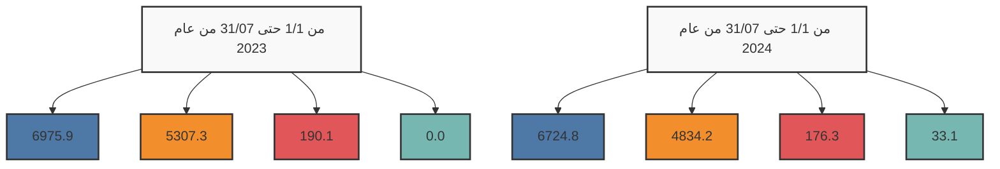

# مصرف ليبيا المركزي

## إستخدامات المصارف للنقد الأجنبي

### خلال الفترة: (1/1 - 31/07/2024)

![Central Bank of Libya Image]

The image shows a tablet or electronic device displaying financial charts, graphs, and US dollar bills. The logo of the Central Bank of Libya is visible at the bottom of the device.

إدارة البحوث والإحصاء - إدارة الرقابة على المصارف والنقد
---
إدارة البحوث والإحصاء - إدارة الرقابة على المصارف والنقد

## تحليل حركة إستخدامات المصارف الفعلية من النقد الأجنبي
### خلال الفترة (1/1 - حتى 31/07/2024)

بلغ إجمالي إستخدامات المصارف من النقد الأجنبي خلال الفترة (1/1 - حتى 31/07/2024) نحو 11,768,435,161 دولار، مقابل 12,473,252,023 دولاراً خلال نفس الفترة من العام الماضي 2023، بإنخفاض قدره نحو 704,816,862 دولار. أي بمعدل بلغ 5.7%.

حيث شكلت الإعتمادات المستندية ما نسبته 57.1% من إجمالي إستخدامات المصارف من النقد الأجنبي، فيما شكلت الأغراض الشخصية نسبة 41.1% من الإجمالي، في حين شكلت الحوالات وبطاقات التجار مانسبته 1.8% من إجمالي الإستخدامات.

### إستخدامات المصارف الفعلية من النقد الأجنبي لكافة الأغراض
"المبالغ بالدولار الأمريكي"

| البند | من 1/1 حتى 31/07 من عام 2023 | من 1/1 حتى 31/07 من عام 2024 | مقدار التغير | نسبة التغير |
|-------|-------------------------------|-------------------------------|--------------|-------------|
| - الإعتمادات المستندية | 6,975,851,530 | 6,724,825,022 | -251,026,508 | -3.6 |
| - الحوالات | 190,055,452 | 176,276,239 | -13,779,213 | -7.3 |
| - الأغراض الشخصية | 5,307,345,041 | 4,834,245,900 | -473,099,141 | -8.9 |
| - بطاقات التجار | - | 33,088,000 | - | - |
| الإجمالي | 12,473,252,023 | 11,768,435,161 | -704,816,862 | -5.7 |

### إستخدامات المصارف للنقد الأجنبي لكافة الأغراض

صفحة 1 من 96
---
إدارة البحوث والإحصاء - إدارة الرقابة على المصارف والنقد

## المبالغ المُباعة للمصارف من النقد الأجنبي لكافة الأغراض:

ومن خلال الإطلاع على الجدول أدناه للقيم المُباعة من النقد الأجنبي حسب المصارف، يتضح أن

المصرف التجاري الوطني قد حافظ على الترتيب الأول كأكثر المصارف إستخداماً للنقد الأجنبي

خلال الفترة (1/1 - حتى 2024/07/31) مسجلاً حصة سوقية بلغت 16.9%، حيث بلغ إجمالي

المبالغ نحو 1,989,495,704 دولار، فيما جاء الأمان للتجارة والإستثمار في المرتبة الثانية بحصة

سوقية بلغت 14.1% وبقيمة بلغت 1,664,581,759 دولار، ثم مصرف الجمهورية في المرتبة الثالثة

بقيمة 1,388,971,253 دولار، ثم مصرف الوحدة في المرتبة الرابعة بقيمة 1,071,513,076 دولار،

ثم تأتي من حيث الأهمية النسبية المصارف التالية حسب الترتيب: مصرف الصحاري، المصرف

المتحد، المصرف الإسلامي الليبي، مصرف الصحاري ومصرف التجارة والتنمية إلى آخره من

المصارف كما موضح بالجدول أدناه والذي يحتوي أيضاً على الترتيب الذي كانت عليه المصارف

خلال نفس الفترة من العام الماضي 2023.

صفحة 2 من 96
---
إدارة البحوث والإحصاء - إدارة الرقابة على المصارف والنقد

ترتيب المصارف حسب إجمالي المبالغ المُباعة من النقد الأجنبي

| من 1/1 حتى 07/31 من عام 2023 | من 1/1 حتى 07/31 من عام 2024 | المصرف |
|--------------------------------|--------------------------------|--------|
| الترتيب | القيمة بالدولار | الحصة السوقية | الترتيب | القيمة بالدولار | الحصة السوقية |  |
| 1 | 1,752,220,064 | %14.0 | 1 | 1,989,495,704 | %16.9 | المصرف التجاري الوطني |
| 4 | 1,393,621,519 | %11.2 | 2 | 1,664,581,759 | %14.1 | مصرف الأمان للتجارة والإستثمار |
| 3 | 1,396,668,552 | %11.2 | 3 | 1,388,971,253 | %11.8 | مصرف الجمهورية |
| 2 | 1,494,730,278 | %12.0 | 4 | 1,071,513,076 | %9.1 | مصرف الوحدة |
| 6 | 1,050,157,911 | %8.4 | 5 | 1,054,101,415 | %9.0 | مصرف النوران |
| 7 | 906,044,950 | %7.3 | 6 | 732,458,912 | %6.2 | المصرف المتحد للتجارة والإستثمار |
| 8 | 845,017,686 | %6.8 | 7 | 709,562,365 | %6.0 | المصرف الإسلامي الليبي |
| 12 | 218,548,801 | %1.8 | 8 | 632,109,328 | %5.4 | مصرف التجارة والتنمية |
| 9 | 637,285,345 | %5.1 | 9 | 563,155,864 | %4.8 | مصرف الصحاري |
| 15 | 162,580,111 | %1.3 | 10 | 475,634,877 | %4.0 | مصرف الأندلس |
| 11 | 354,749,132 | %2.8 | 11 | 434,319,353 | %3.7 | مصرف شمال أفريقيا |
| 10 | 362,233,546 | %2.9 | 12 | 335,309,756 | %2.8 | مصرف الخليج الأول الليبي |
| 14 | 195,692,045 | %1.6 | 13 | 306,619,949 | %2.6 | مصرف السراي للتجارة والإستثمار |
| 17 | 99,923,519 | %0.8 | 14 | 110,035,301 | %0.9 | مصرف الواحة |
| 16 | 99,929,728 | %0.8 | 15 | 97,558,518 | %0.8 | مصرف التضامن |
| 19 | 33,109,944 | %0.3 | 16 | 76,629,072 | %0.7 | مصرف المتوسط |
| 18 | 68,137,585 | %0.5 | 17 | 71,572,279 | %0.6 | المصرف الليبي الخارجي |
| 5 | 1,195,724,995 | %9.6 | 18 | 33,453,265 | %0.3 | مصرف اليقين |
| 13 | 206,876,312 | %1.7 | 19 | 21,349,113 | %0.2 | مصرف الوفاء |
| 20 | 0 | %0.0 | 20 | 4,000 | %0.0 | مصرف الإجماع العربي (الإتحاد الوطني) |
| - | 12,473,252,023 | % 100 | - | 11,768,435,161 | % 100 | الإجمالي |

صفحة 3 من 96
---
إدارة البحوث والإحصاء - إدارة الرقابة على المصارف والنقد

# المبالغ المُباعة للمصارف من النقد الأجنبي (حسب الغرض)

"القيم بالدولار الأمريكي"

| ت | المصرف | الاعتمادات المستندية |  | الحوالات المتنوعة |  | الأغراض الشخصية |  | بطاقة التجار |  |
|---|---------|----------------------|----------------------|-------------------|-------------------|-------------------|-------------------|----------------|----------------|
|   |         | من 1/1 حتى 07/31 من عام 2023 | من 1/1 حتى 07/31 من عام 2024 | من 1/1 حتى 07/31 من عام 2023 | من 1/1 حتى 07/31 من عام 2024 | من 1/1 حتى 07/31 من عام 2023 | من 1/1 حتى 07/31 من عام 2024 | من 1/1 حتى 07/31 من عام 2023 | من 1/1 حتى 07/31 من عام 2024 |
| 1- | التجاري الوطني | 750,173,422 | 1,202,599,082 | 4,356,598 | 2,406,122 | 997,690,044 | 772,340,500 | - | 12,150,000 |
| 2- | الأمان | 401,605,476 | 464,101,022 | 18,116 | 1,729,438 | 991,997,927 | 1,184,755,800 | - | 13,995,500 |
| 3- | الجمهورية | 718,341,948.310 | 862,357,256 | 44,564,103 | 3,912,197 | 633,762,500 | 522,701,800 | - | 0 |
| 4- | الوحدة | 1,276,586,593 | 540,026,035 | 801,859 | 424,841 | 217,341,826 | 531,062,200 | - | 0 |
| 5- | الواحة | 788,290,448 | 840,102,497 | 17,943,566 | 14,119,018 | 243,923,898 | 193,437,400 | - | 6,442,500 |
| 6- | المتحد | 236,371,694 | 364,331,412 | 3,359,928 | 0 | 666,313,329 | 368,127,500 | - | 0 |
| 7- | الإسلامي الليبي | 638,325,903 | 469,316,298 | 32,367,493 | 10,092,068 | 174,324,290 | 230,154,000 | - | 0 |
| 8- | التجارة والتنمية | 0 | 247,993,334 | 0 | 50,804,293 | 218,548,801 | 333,311,700 | - | 0 |
| 9- | الصحاري | 204,393,692 | 302,228,033 | 7,787,951 | 9,947,631 | 425,103,702 | 250,980,200 | - | 0 |
| 10- | الأندلس | 153,029,211 | 400,664,308 | 4,807,715 | 13,901,269 | 4,743,185 | 61,069,300 | - | 0 |
| 11- | شمال أفريقيا | 247,722,284 | 226,534,719 | 26,265,543 | 20,157,834 | 80,761,305 | 187,326,800 | - | 300,000 |
| 12- | الخليج الأول الليبي | 349,167,766 | 316,772,349 | 12,875,335 | 17,576,207 | 190,445 | 961,200 | - | 0 |
| 13- | السراي | 182,893,851 | 248,413,423 | 5,416,648 | 28,826 | 7,381,547 | 58,177,700 | - | 0 |
| 14- | الواحة | 35,727,755 | 38,683,680 | 0 | 1,955,821 | 64,195,764 | 69,395,800 | - | 0 |
| 15- | الضمان | 99,929,728 | 86,091,218 | 0 | 2,000,000 | 0 | 9,467,300 | - | 0 |
| 16- | المتوسط | 27,639,450 | 60,697,472 | 0 | 14,000 | 5,470,494 | 15,917,600 | - | 0 |
| 17- | الليبي الخارجي | 49,588,971 | 43,764,106 | 18,327,484 | 27,206,673 | 221,130 | 601,500 | - | 0 |
| 18- | اليقين | 610,817,391 | -1,643,135 | 11,163,115 | 0 | 573,744,489 | 34,896,400 | - | 200,000 |
| 19- | الوفاء | 205,245,947 | 11,791,913 | 0 | 0 | 1,630,365 | 9,557,200 | - | 0 |
| 20- | الإجماع العربي | 0 | 0 | 0 | 0 | 0 | 4,000 | - | 0 |
| - | الإجمالي الكلي | 6,975,851,530 | 6,724,825,022.49 | 190,055,452 | 176,276,238.53 | 5,307,345,041 | 4,834,245,900 | - | 33,088,000 |

صفحة 4 من 96
---
إدارة البحوث والإحصاء - إدارة الرقابة على المصارف والنقد

## الأهمية النسبية حسب المصرف لاستخدامات النقد الأجنبي خلال الفترة من 1/1 حتى 31/07 من عام 2023

| المصرف | النسبة |
|--------|--------|
| المصرف التجاري الوطني | 14% |
| مصرف الوحدة | 12% |
| مصرف الجمهورية | 11% |
| مصرف اليقين | 10% |
| مصرف الأمان للتجارة والاستثمار | 11% |
| مصرف النوران | 8% |
| المصرف المتحد للتجارة والاستثمار | 7% |
| المصرف الإسلامي الليبي | 7% |
| مصرف الصحاري | 5% |
| مصرف الخليج الأول الليبي | 3% |
| باقي المصارف | 12% |

## الأهمية النسبية حسب المصرف لاستخدامات النقد الأجنبي خلال الفترة من 1/1 حتى 31/07 من عام 2024

| المصرف | النسبة |
|--------|--------|
| المصرف التجاري الوطني | 19% |
| مصرف الأمان للتجارة والاستثمار | 16% |
| مصرف الجمهورية | 14% |
| مصرف الوحدة | 10% |
| مصرف النوران | 10% |
| المصرف المتحد للتجارة والاستثمار | 7% |
| المصرف الإسلامي الليبي | 7% |
| مصرف التجارة والتنمية | 6% |
| مصرف الصحاري | 6% |
| مصرف الأندلس | 5% |

صفحة 5 من 96
---
إدارة البحوث والإحصاء - إدارة الرقابة على المصارف والنقد

طلبات المصارف المقبولة لتغطية الإعتمادات المستندية والحوالات المتنوعة عدا الأغراض الشخصية خلال الفترة (1/1 - حتى 31/07/2024):

بلغ عدد الشركات والمصانع والجهات العامة والجهات الأخرى المستفيدة (1,974) والتي تمت الموافقة على طلباتهم حصولهم على النقد الأجنبي خلال الفترة (1/1 - حتى 31/07/2024)، بعدد طلبات بلغ نحو 9,673 طلب، معظم هذه الطلبات لتغطية الإعتمادات المستندية والتي سجلت 8,583 طلب بنسبة 88.7% من الطلبات، كما هو موضح بالجداول التالية أدناه:-

عدد الطلبات المقبولة لشراء النقد الأجنبي - حسب القطاعات

| القطاع | عدد الشركات أو المصانع أو الجهات |
|--------|----------------------------------|
| القطاع الخاص | 1,881 |
| القطاع العام | 30 |
| جهات متنوعة | 63 |
| الإجمالي | 1,974 |

عدد الطلبات المقبولة لشراء النقد الأجنبي حسب نوع التحويل

| نوع التحويل | القطاع الخاص | القطاع العام | جهات متنوعة | الإجمالي | الأهمية النسبية |
|-------------|---------------|--------------|---------------|----------|------------------|
| اعتماد مستندي | 8,390 | 182 | 11 | 8,583 | 88.7% |
| حوالة طيران | 498 | 28 | 6 | 532 | 5.5% |
| حوالة تجارية | 6 | 189 | 11 | 206 | 2.1% |
| تحويلات أخرى | 28 | 174 | 12 | 214 | 2.2% |
| حوالة تأمين | 20 | 48 | 0 | 68 | 0.7% |
| حوالة مرتبات | 0 | 0 | 55 | 55 | 0.6% |
| حوالة صناعية | 12 | 3 | 0 | 15 | 0.2% |
| الإجمالي | 8,954 | 624 | 95 | 9,673 | 100% |

صفحة 6 من 96
---
إدارة البحوث والإحصاء - إدارة الرقابة على المصارف والنقد

## 1- القطاع الخاص:

بلغ عدد شركات ومصانع القطاع الخاص (1,881) التي تمت الموافقة على طلباتها للحصول على
النقد الأجنبي من المصارف لتغطية الاعتمادات المستندية والحوالات الأخرى خلال الفترة (1/1 -
حتى 31/07/2024) حيث احتلت طلبات شراء النقد الأجنبي من قبل القطاع الخاص لإستيراد
السلع الغذائية المتنوعة المرتبة الأولى من إجمالي طلبات الشراء خلال الفترة، حيث شكلت مانسبته
26.5% من إجمالي طلبات شراء النقد الأجنبي.

وبالنسبة لشركات القطاع الخاص فقد إحتلت شركة النسيم للصناعات الغذائية الترتيب الأول،
والجداول التالية توضح طلبات شراء السلع أو الخدمات وكذلك طلبات الشراء حسب أهم مائة
شركة خلال الفترة (1/1 - حتى 31/07/2024).

### طلبات شراء السلع أو الخدمات - قطاع خاص
### خلال الفترة (1/1 - حتى 31/07/2024)
"مرتبة تنازلياً"

| ت | تصنيف السلع | القيمة بالدولار | الأهمية النسبية % |
|---|-------------|-----------------|-------------------|
| 1- | سلع غذائية متنوعة | 1,674,900,929 | 26.5% |
| 2- | مستلزمات انتاج وتشغيل | 1,270,222,955 | 20.1% |
| 3- | وسائل النقل واطارات ونضائد وقطع الغ | 423,735,280 | 6.7% |
| 4- | مستلزمات انتاج سلع أساسية | 321,200,304 | 5.1% |
| 5- | أعلاف | 313,369,733 | 5.0% |
| 6- | الآلات والمعدات | 288,300,312 | 4.6% |
| 7- | مواد البناء ومستلزمات التشييد | 281,001,243 | 4.4% |
| 8- | اللحوم الحية والمجمدة | 271,494,450 | 4.3% |
| 9- | أجهزة الالكترونية | 224,738,804 | 3.6% |
| 10- | أدوية بشرية | 211,996,486 | 3.4% |
| 11- | الزراعية | 188,815,823 | 3.0% |
| 12- | منزلية وكهرومنزلية | 144,903,371 | 2.3% |
| 13- | حليب وحفاظات واغذية أطفال | 123,575,902 | 2.0% |
| 14- | مواد التنظيف | 83,063,340 | 1.3% |
| 15- | حليب | 76,596,007 | 1.2% |
| 16- | طلبات برنيق للطيران | 68,336,806 | 1.1% |

صفحة 7 من 96
---
إدارة البحوث والإحصاء - إدارة الرقابة على المصارف والنقد

| الرقم | البند | القيمة | النسبة |
|-------|------|--------|--------|
| -17 | أجبان | 60,571,421 | 1.0% |
| -18 | حوالات شركات خطوط الطيران | 36,856,292 | 0.6% |
| -19 | الملابس والأحذية | 33,940,469 | 0.5% |
| -20 | الأثاث | 29,952,836 | 0.5% |
| -21 | خدمات ملاحية متنوعة | 24,662,342 | 0.4% |
| -22 | قرطاسية | 19,507,126 | 0.3% |
| -23 | مواد صحية | 16,290,636 | 0.3% |
| -24 | فواكه وخضروات | 15,755,684 | 0.2% |
| -25 | مواد تنظيف | 15,186,832 | 0.2% |
| -26 | طلبات خاصة بشركة الأجنحة الليبية | 15,142,259 | 0.2% |
| -27 | أدوية بيطرية | 12,267,782 | 0.2% |
| -28 | متنوعة | 12,079,105 | 0.2% |
| -29 | سمن | 11,231,909 | 0.2% |
| -30 | الشركة الليبية السريعة للنقل الجوي | 10,874,195 | 0.2% |
| -31 | خدمات اتصالات وتقنية معلومات | 10,737,485 | 0.2% |
| -32 | خدمات انتاج وتشغيل | 10,385,179 | 0.2% |
| -33 | أسماك وأحياء بحرية | 7,268,783 | 0.1% |
| -34 | شركة أويا للطيران | 4,102,321 | 0.1% |
| -35 | زبدة | 3,056,216 | 0.05% |
| -36 | السجاد والمنسوجات | 2,862,690 | 0.05% |
| -37 | سلع أخرى | 2,326,931 | 0.04% |
| -38 | شركة سما المتوسط للطيران | 1,618,347 | 0.03% |
| -39 | مستلزمات تشغيل مصنع الحديد والصلب | 1,526,137 | 0.02% |
| -40 | شركة غدامس للطيران | 808,015 | 0.01% |
| -41 | حوالات شركات التأمين | 763,090 | 0.01% |
| -42 | رسوم اشتراك منظومة | 610,500 | 0.01% |
| -43 | تكاليف خدمات سياحية | 565,391 | 0.01% |
| -44 | الطبية | 383,741 | 0.01% |
| -45 | سلع خاصة بالخدمات العامة | 266,962 | 0.00% |
| -46 | مستلزمات تشغيل الموانئ | 175,517 | 0.00% |
| -47 | تكاليف رسوم تأشيرات | 76,485 | 0.00% |

صفحة 8 من 96
---
إدارة البحوث والإحصاء - إدارة الرقابة على المصارف والنقد

طلبات الشراء حسب أهم مائة شركة - قطاع خاص
خلال الفترة (1/1 - حتى 31/07/2024)
"مرتبة تنازلياً"

"دولار أمريكي"

| ت | الشركة أو المصنع | القيمة |
|---|-------------------|--------|
| 1 | شركة النسيم للصناعات الغذائية | 105,818,503 |
| 2 | شركة وادي الكوف للمطاحن والأعلاف ومضارب الأرز | 94,842,508 |
| 3 | شركة الليبية المتحدة لتعبئة المشروبات | 85,690,913 |
| 4 | شركة برنيق للطيران | 83,913,279 |
| 5 | شركة الشرق الليبي للمطاحن والاعلاف ومضارب الارز | 78,541,865 |
| 6 | شركة شريان الحياة لاستيراد جميع أنواع الاعلاف ومكملاتها والمعدات الزراعية وبذور الحيوانات وطحن الحبوب | 75,000,000 |
| 7 | شركة تويوتا ليبيا تجارة السيارات وقطع الغيار واستيراد والتصدير | 74,615,891 |
| 8 | شركة الليبية الكبرى لصناعة السميد والدقيق | 68,811,427 |
| 9 | شركة المعمورة للصناعات الغذائية والمطاحن والاعلاف | 68,337,182 |
| 10 | شركة الجيد لاستيراد المواد الغذائية | 63,781,805 |
| 11 | شركة الماهر الدولي للمطاحن والأعلاف | 57,664,421 |
| 12 | شركة المروكة لاستيراد المواد الغذائية | 57,064,100 |
| 13 | شركة جودي للصناعات الغذائية | 56,162,677 |
| 14 | شركة الجاهزة لاستيراد المواد الغذائية | 54,392,000 |
| 15 | شركة بلد لاستراد المواد الغذائية | 53,414,375 |
| 16 | شركة افريقيا لتعبئة المشروبات | 50,415,087 |
| 17 | شركة خيرات الايادي لاستيراد المواد الغذائية | 50,327,500 |
| 18 | شركة جودة الموسم لاستيراد المواد الغذائية | 48,931,500 |
| 19 | شركة سما الليبية لاستيراد المواد الغذائية والمواشي واللحوم | 48,893,097 |
| 20 | المجموعة الليبية للخدمات النفطية والطاقة | 48,620,320 |
| 21 | شركة جبل الكوف لاستيراد السيارات وقطع الغيار | 48,304,652 |
| 22 | شركة عروس البيضاء لاستيراد المواشي واللحوم التابعة لشركة أكاكوس القابضه | 40,897,200 |
| 23 | شركة مجموعة الامتياز للمطاحن ومضارب الارز وتعبئة الزيوت النباتية | 39,879,550 |
| 24 | شركة الريحان لصناعة المواد الغذائية | 39,468,524 |

صفحة 9 من 96
---
إدارة البحوث والإحصاء - إدارة الرقابة على المصارف والنقد

| المبلغ | اسم الشركة | الرقم |
|--------|------------|------|
| 37,348,861 | شركة الفا لاستيراد الادوية والمعدات الطبية و المستحضرات الطبية و مستلزمات الام والطفل | 25 |
| 37,322,278 | شركة السرايا الراقية لاستيراد المواد الغذائية و الخضروات و الفواكه الطازجة و المواشي واللحوم | 26 |
| 37,008,303 | شركة مجموعة الامتياز لاستيراد وسائل النقل وملحقاتها | 27 |
| 34,887,747 | شركة بستان ليبيا لاستيرادالمواد الغذائية والمواشي واللحوم | 28 |
| 33,308,538 | شركة المتوكة للصناعات الغذائية | 29 |
| 32,176,545 | شركة دروب ليبيا لاستيراد وسائل النقل وملحقاتها | 30 |
| 32,030,333 | شركة بصمة الجودة لاستيراد المواد الغذائية والمواشي واللحوم | 31 |
| 29,185,550 | شركة الوسام الذهبي لصناعة الدقيق والمطاحن والاعلاف ومضارب الارز | 32 |
| 29,012,410 | شركة ريادة لصناعات الكيماوية والمواد الخام | 33 |
| 28,616,261 | شركة المعمورة لاستيراد وتوزيع المواد الغذائية | 34 |
| 28,401,344 | شركة طريق القارة لاستيراد المواد الغذائية | 35 |
| 27,596,766 | شركة الاستثمارية للصناعات الهندسية وتشكيل المعادن | 36 |
| 27,248,385 | شركة الثمرات الليبية لاستيراد المواد الغذائية | 37 |
| 27,212,699 | شركة الجيد للصناعات الغذائية | 38 |
| 27,075,818 | شركة مجموعة التواصل المميز لاستيراد المواد الخام | 39 |
| 26,877,465 | شركة أعالي الاندلس للصناعات الغذائية | 40 |
| 26,042,100 | شركة الجودة العالمية الأولى لصناعة الاعلاف ومطاحن الدقيق والصناعات الغذائية | 41 |
| 25,598,160 | شركة الابداع لصناعة المنظفات والصابون ومستلزماتها | 42 |
| 25,376,906 | شركة تمر هند لاستيراد السيارات وقطع غيارها | 43 |
| 25,370,667 | شركة مجموعة الرائدون لصناعة مواد البناء | 44 |
| 25,234,860 | مصنع ارمكو لصناعة الطلاء | 45 |
| 24,702,072 | شركة أضواء النيزك لاستيراد الاجهزة الالكترونية والاجهزة والمواد الكهربائية والغير كهربائية وملحقاتها | 46 |
| 24,418,440 | شركة طرابلس الكبرى لصناعة وتعبئة الطماطم والمواد الغذائية | 47 |
| 23,776,645 | شركة الاجنحة الليبية للطيران المساهمة | 48 |
| 23,696,946 | شركة لمسة الحياة لاستيراد المعدات الطبية والادوية والمستحضرات الطبية ومستلزمات الام والطفل | 49 |
| 23,112,509 | شركة الشمس الساطعة للصناعات الغذائية | 50 |
| 22,395,560 | شركة المعمورة للاستثمار الزراعي والحيواني | 51 |
| 22,285,110 | شركة الوصل المتين لاستيراد لاستيراد المواد الغذائية والمواشي واللحوم | 52 |
| 22,199,772 | مصنع جاما لصناعة البلاستيك | 53 |
| 21,813,125 | شركة القيض لصناعة مواد التنظيف | 54 |

صفحة 11 من 96
---
إدارة البحوث والإحصاء - إدارة الرقابة على المصارف والنقد

| الرقم | اسم الشركة | القيمة |
|------|------------|--------|
| 55 | شركة السواحل الذهبية لاستيراد المواد الغذائية | 20,817,416 |
| 56 | شركة ادري لاستيراد وسائل النقل وملحقاتها | 20,785,452 |
| 57 | شركة الساحل لاستيراد المواشي واللحوم | 20,713,999 |
| 58 | شركة الزرقاء الدولية للصناعات الغذائية | 20,639,417 |
| 59 | شركة مفاتيح الخير لاستيراد الاجهزة والمواد الكهربائية وقطع غيارها والاجهزة الالكترونية وملحقاتها وقطع | 20,566,082 |
| 60 | شركة أصول التكنولوجيا لصناعة الاجهزة الالكترونية والكهربائية | 20,547,750 |
| 61 | شركة المراعي الخصبة للمطاحن والاعلاف ومضارب الارز | 20,513,760 |
| 62 | شركة كنوز ليبيا للمطاحن والاعلاف ومضارب الارز | 20,112,805 |
| 63 | شركة قرطاج للصناعات الغذائية | 19,721,088 |
| 64 | شركة جلوبال لصناعة مواد البناء والطلاء والمعاجين والبلاستيك والمواد الخام | 18,433,920 |
| 65 | شركة أجيال العطاء الوافر لاستيراد المواد الغذائية | 18,288,000 |
| 66 | شركة اوميجا للصناعات الكيماوية ومواد التغليف | 18,156,900 |
| 67 | مصنع بيتا لصناعة مواد التنظيف | 18,134,700 |
| 68 | شركة اونكس لصناعة مواد البناء والطلاء والمعاجين وصناعة البلاستيك والمواد الخام | 17,881,200 |
| 69 | شركة الغذاء الذهبي لصناعة وتعبئة معجون الطماطم والصناعات الغذائية | 17,866,250 |
| 70 | شركة أجود المحركات لاستيراد السيارات | 17,297,161 |
| 71 | شركة الشجرة الشامخة لاستيراد المواد الغذائية والمواشي واللحوم | 16,849,135 |
| 72 | شركة ابتهاج الطبيعة لاستيراد المواد الغذائية | 16,741,106 |
| 73 | شركة الامال العظيمة لاستيراد المواد الغذائية | 16,602,000 |
| 74 | شركة المذاق الطيب لاستيراد المواد الغذائية والمواشي واللحوم | 16,440,485 |
| 75 | شركة البنيان لصهر ودرفلة المعادن | 15,354,915 |
| 76 | شركة السد الحديثة للمطاحن وصناعة الاعلاف | 15,225,000 |
| 77 | شركة السهل الاخضر للمطاحن والاعلاف | 15,089,582 |
| 78 | شركة الطائف لإستيراد المواد الغذائية | 14,882,422 |
| 79 | شركة الدروب لصناعة البيتومين والقطرامين والعوازل | 14,698,932 |
| 80 | شركة الفضاء الذهبي لاستيراد المواد الغذائية | 14,522,545 |
| 81 | شركة ساس لصناعة مواد البناء والطلاء البلاستيك و مواد الخام | 14,473,500 |
| 82 | شركة اضواء افريقيا لاستيراد المواد الغذائية والمواشي واللحوم | 14,416,544 |
| 83 | شركة القدس ل صناعة الخزانات والمواسير البلاستيكية | 14,403,360 |
| 84 | شركة انعام ليبيا لأستيراد الاعلاف ومكملاتها | 14,325,500 |
| 85 | مصنع التعاون لصناعة الاعلاف | 14,302,400 |
| 86 | شركة الجبال لصناعة الاعلاف | 14,085,344 |

صفحة 11 من 96
---
إدارة البحوث والإحصاء - إدارة الرقابة على المصارف والنقد

| رقم | اسم الشركة | القيمة |
|-----|------------|--------|
| 87 | شركة أرض العطاء للصناعات الغذائية المحدودة | 13,956,023 |
| 88 | شركة الطرق الحديثة لصناعة الاسفلت والمواد العازل | 13,844,787 |
| 89 | شركة تنافس الزراعي لإستيراد الالات الزراعية ومستلزماتها وقطع غيارها | 13,662,279 |
| 90 | شركة النخوة الليبية لاستيراد المواد الغذائية | 13,634,374 |
| 91 | شركة العلمية لإستيراد الادوية والمستحضرات الطبية ومستلزمات الام والطفل | 13,580,644 |
| 92 | شركة النعيم للمطاحن والاعلاف والحبوب | 13,497,500 |
| 93 | شركة التراب الليبي الاستيراد المواد الغذائيه والمواشي | 13,438,469 |
| 94 | شركة الرجاس الزراعي لإستيراد الالات الزراعية ومستلزماتها وقطع غيارها | 13,390,144 |
| 95 | شركة طرابلس الاولى للمطاحن والاعلاف | 13,338,000 |
| 96 | شركة سما المراعي للمطاحن وصناعة الاعلاف ومضارب الارز | 13,287,684 |
| 97 | شركة المبتكر الحديث لصناعة البي في سي | 13,110,423 |
| 98 | شركة الرابية الخضراء لاستيراد المواد الغذائية | 12,982,281 |
| 99 | شركة السد للمطاحن وصناعة الاعلاف | 12,914,500 |
| 100 | شركة الأمانة لإستيراد مستلزمات الأم والطفل | 12,902,147 |

## طلبات المصارف لتغطية الاعتمادات المستندية والحوالات - قطاع خاص

### (حسب أهم البلدان المستفيدة)

من خلال الإطلاع على الجدول أدناه لقيم طلبات المصارف لشراء النقد الأجنبي حسب البلدان

المستفيدة خلال الفترة (1/1 - حتى 31/07/2024) للقطاع الخاص، يتضح أن مانسبته 21.3%

من تحويلات المصارف لتغطية الإعتمادات المستندية أوالحوالات الأخرى كانت لدولة تركيا، تم

جاءت دولة الإمارات العربية المتحدة في المرتبة الثانية بنسبة 13.8% ثم المملكة المتحدة وسويسرا

بنسب 8.0% و 7.7% على التوالي، والجدول التالي يوضح أهم عشرون بلد مستفيد.

صفحة 12 من 96
---
إدارة البحوث والإحصاء - إدارة الرقابة على المصارف والنقد

طلبات المصارف لتغطية الاعتمادات المستندية والحوالات - قطاع خاص
(حسب أهم البلدان المستفيدة)
خلال الفترة (1/1 - حتى 31/07/2024)

| ت | البلد المستفيد | القيمة بالدولار | الأهمية النسبية |
|---|----------------|-----------------|-----------------|
| 1- | تركيا | 1,350,603,186 | 21.3% |
| 2- | الإمارات العربية المتحدة | 870,926,344 | 13.8% |
| 3- | بريطانيا ( المملكة المتحدة) | 503,950,703 | 8.0% |
| 4- | سويسرا | 484,818,699 | 7.7% |
| 5- | مصر | 343,001,110 | 5.4% |
| 6- | الصين | 322,253,602 | 5.1% |
| 7- | إيطاليا | 304,421,725 | 4.8% |
| 8- | تونس | 256,556,323 | 4.1% |
| 9- | إسبانيا | 210,037,704 | 3.3% |
| 10- | كندا | 171,872,654 | 2.7% |
| 11- | الأردن | 149,801,438 | 2.4% |
| 12- | النمسا | 114,324,710 | 1.8% |
| 13- | تايلاند | 107,439,345 | 1.7% |
| 14- | فرنسا | 101,634,857 | 1.6% |
| 15- | اليابان | 99,694,058 | 1.6% |
| 16- | هولندا | 99,320,308 | 1.6% |
| 17- | كوريا الجنوبية | 86,910,402 | 1.4% |
| 18- | المانيا | 79,296,912 | 1.3% |
| 19- | نيوزيلندا | 48,140,334 | 0.8% |
| 20- | سلوفاكيا | 46,340,764 | 0.7% |

صفحة 13 من 96
---
إدارة البحوث والإحصاء - إدارة الرقابة على المصارف والنقد

# طلبات المصارف لتغطية الإعتمادات المستندية والحوالات - قطاع خاص

## (حسب أهم بلدان منشأ السلع أو الخدمات)

من خلال الإطلاع على الجدول أدناه لقيم طلبات المصارف لشراء النقد الأجنبي حسب بلدان منشأ السلع أو الخدمات خلال الفترة (1/1 - حتى 31/07/2024) للقطاع الخاص ، يتضح أن دولة تركيا قد أحتلت المرتبة الأولى حيث شكلت السلع أو الخدمات ذات المنشأ التركي نسبة 19.8% من إجمالي طلبات الشراء المقبولة، ثم جاءت واردات السلع أو الخدمات ذات المنشأ الصيني في المرتبة الثانية مشكلة مانسبته 11.1% من الإجمالي، وشكلت السلع أوالخدمات ذات المنشأ المصري نسبة 8.5% محتلة المرتبة الثالثة خلال الفترة ، فيما سجلت السلع والخدمات ذات منشأ دولة روسيا الاتحادية مانسبته 6.6% ، وذات المنشأ الهندي نسبة 5.4%، والجدول التالي يوضح أهم عشرون بلد منشأ للسلع أو الخدمات.

# طلبات المصارف لتغطية الإعتمادات المستندية والحوالات - قطاع خاص
## (حسب أهم بلدان منشأ السلع أو الخدمات)
### خلال الفترة (1/1 - حتى 31/07/2024)

| ت | بلد منشأ السلع أوالخدمات | القيمة بالدولار | الاهمية النسبية |
|---|---------------------------|-----------------|------------------|
| 1- | تركيا | 1,250,127,154 | 19.8% |
| 2- | الصين | 700,398,744 | 11.1% |
| 3- | مصر | 540,272,568 | 8.5% |
| 4- | روسيا الاتحادية | 416,552,856 | 6.6% |
| 5- | الهند | 342,524,109 | 5.4% |
| 6- | البرازيل | 331,410,642 | 5.2% |
| 7- | إيطاليا | 293,012,984 | 4.6% |
| 8- | تونس | 217,604,807 | 3.4% |
| 9- | أوكرانيا | 185,174,791 | 2.9% |
| 10- | إسبانيا | 159,437,843 | 2.5% |

صفحة 14 من 96
---
إدارة البحوث والإحصاء - إدارة الرقابة على المصارف والنقد

| -   | الدولة                   | القيمة       | النسبة |
|-----|-------------------------|-------------|-------|
| -11 | الأرجنتين               | 150,169,984 | 2.4%  |
| -12 | تايلاند                 | 142,303,168 | 2.2%  |
| -13 | فرنسا                   | 129,329,283 | 2.0%  |
| -14 | المانيا                 | 111,453,140 | 1.8%  |
| -15 | هولندا                  | 106,024,363 | 1.7%  |
| -16 | المملكة العربية السعودية | 96,899,629  | 1.5%  |
| -17 | الولايات المتحدة        | 90,330,370  | 1.4%  |
| -18 | الإمارات العربية المتحدة | 87,161,590  | 1.4%  |
| -19 | بلجيكا                  | 83,534,779  | 1.3%  |
| -20 | رومانيا                 | 80,972,861  | 1.3%  |

## 2- القطاع العام

بلغ عدد جهات القطاع العام التي تمت الموافقة على طلباتها للحصول على النقد الأجنبي لتغطية الاعتمادات المستندية والحوالات الأخرى 30 جهة خلال الفترة (1/1 – حتى 31/07/2024)، حيث أحتلت مستلزمات تشغيل مصنع الحديد والصلب المرتبة الأولى من إجمالي طلبات الشراء خلال الفترة، حيث شكلت مانسبته 42.5% من إجمالي طلبات شراء النقد الأجنبي، فيما أحتلت متطلبات مستلزمات الإنتاج والتشغيل المرتبة الثانية من حيث الأهمية النسبية لتشكل نحو 12.1%، وبالتالي فقد إحتلت الشركة الليبية للحديد والصلب الترتيب الأول ، حيث سجلت طلباتها المقبولة لشراء النقد الأجنبي نحو 258.0 مليون دولار خلال الفترة يليها شركة ليبيانا للهاتف المحمول بإجمالي طلبات مقبولة بلغ نحو 67.1 مليون دولار ،والجداول التالية توضح طلبات شراء السلع أو الخدمات وكذلك طلبات الشراء حسب الجهات العامة خلال الفترة (1/1 – حتى 31/07/2024).

صفحة 15 من 96
---
إدارة البحوث والإحصاء - إدارة الرقابة على المصارف والنقد

# طلبات شراء حسب السلعة أو الخدمات - قطاع عام

خلال الفترة (1/1 - حتى 31/07/2024)

"مرتبة تنازلياً"

| ت | تصنيف السلع | القيمة بالدولار | الأهمية النسبية % |
|---|-------------|------------------|-------------------|
| -1 | مستلزمات تشغيل مصنع الحديد والصلب | 250,570,691 | 42.5% |
| -2 | مستلزمات انتاج وتشغيل | 71,124,985 | 12.1% |
| -3 | متطلبات شركة ليبيانا للهاتف المحمول | 60,436,007 | 10.2% |
| -4 | شركة الاتحاد العربي للمقاولات | 41,119,610 | 7.0% |
| -5 | خدمات اتصالات وتقنية معلومات | 35,286,520 | 6.0% |
| -6 | شركة المدار الجديد | 29,689,819 | 5.0% |
| -7 | حوالات شركات خطوط الطيران | 18,941,411 | 3.2% |
| -8 | مستلزمات تشغيل الموانئ | 14,811,421 | 2.5% |
| -9 | شركة ليبيا للاتصالات والتقنية | 13,685,089 | 2.3% |
| -10 | سلع غذائية متنوعة | 8,064,000 | 1.4% |
| -11 | حوالات شركات التأمين | 6,614,060 | 1.1% |
| -12 | طلبات جهاز مشروعات الاسكان | 5,721,046 | 1.0% |
| -13 | الالات والمعدات | 5,353,183 | 0.9% |
| -14 | الغذائية | 4,317,050 | 0.7% |
| -15 | الشركة الاهلية للاسمنت | 4,113,849 | 0.7% |
| -16 | متطلبات تشغيل وصيانة الموانئ | 3,709,988 | 0.6% |
| -17 | الخطوط الجوية الأفريقية | 3,479,620 | 0.6% |
| -18 | الهيئة العامة للأوقاف | 2,108,454 | 0.4% |
| -19 | متنوعة | 2,030,750 | 0.3% |
| -20 | أجهزة الكترونية | 1,948,376 | 0.3% |
| -21 | الشركة العامة لاستيراد السلع الامنية | 1,465,100 | 0.2% |
| -22 | مستلزمات الشركة العامة للكهرباء | 1,090,179 | 0.2% |
| -23 | خدمات انتاج وتشغيل | 880,718 | 0.1% |
| -24 | حوالات دورة تدريبية | 818,882 | 0.1% |
| -25 | طلبات الخطوط الجوية الليبية | 727,758 | 0.1% |
| -26 | مواد البناء ومستلزمات التشييد | 701,101 | 0.1% |
| -27 | وسائل النقل واطارات ونضائد وقطع الغيار | 626,730 | 0.1% |

صفحة 16 من 96
---
إدارة البحوث والإحصاء - إدارة الرقابة على المصارف والنقد

| %0.1 | 308,277 | احتياجات التشغيل لشركة معاملات | -28 |
|------|---------|--------------------------------|-----|
| %0.1 | 307,953 | الشركة الليبية للموانئ | -29 |
| %0.01 | 66,625 | سلع خاصة بالخدمات العامة | -30 |
| %0.00 | 15,178 | مستلزمات تشغيل شركة هاتف ليبيا | -31 |

## طلبات الشراء حسب الجهات - قطاع عام
### خلال الفترة (1/1 – حتى 31/07/2024)
"مرتبة تنازلياً"

| القيمة بالدولار | الجهة | ت |
|-----------------|-------|---|
| 258,014,868 | الشركة الليبية للحديد والصلب | 1 |
| 67,134,418 | شركة ليبيانا للهاتف المحمول | 2 |
| 50,499,805 | جهاز تنمية و تطوير المراكز الإدارية | 3 |
| 45,925,517 | شركة الإتحاد العربي للمقاولات المساهمة | 4 |
| 43,470,085 | شركة المدار الجديد | 5 |
| 22,466,044 | المنطقة الحرة مصراتة | 6 |
| 19,389,244 | شركة ليبيا للاتصالات والتقنية المساهمة | 7 |
| 18,919,345 | شركة الخطوط الجوية الافريقية | 8 |
| 12,654,190 | شركة الاهلية للاسمنت المساهمة | 9 |
| 11,968,000 | شركة تطوير للاستثمار الصناعي المساهمة | 10 |
| 8,181,690 | شركة ليبيا للتامين | 11 |
| 7,418,608 | شركة هاتف ليبيا | 12 |
| 5,721,046 | جهاز تنفيذ مشروعات الاسكان و المرافق | 13 |
| 4,360,441 | شركة الاتصالات الدولية الليبية | 14 |
| 2,137,655 | شركة الخطوط الجوية الليبية | 15 |
| 2,108,454 | الهيئة العامة للأوقاف والشؤون الإسلامية | 16 |
| 1,945,321 | شركة المناهج للطباعة والنشر | 17 |
| 1,869,824 | شركة الانماء للاستثمارات الكهربائية | 18 |
| 1,465,100 | الشركة العامة لاستيراد السلع الامنية المساهمة | 19 |
| 892,000 | شركة العامة لخدمات النظافة العامة طرابلس | 20 |

صفحة 17 من 96
---
إدارة البحوث والإحصاء - إدارة الرقابة على المصارف والنقد

| الترتيب | الجهة | القيمة بالدولار الأمريكي |
|---------|-------|--------------------------|
| 21 | شركة الليبية للمواني | 888,731 |
| 22 | شركة الأكاديمية الليبية للاتصالات والمعلوماتية | 804,382 |
| 23 | شركة معاملات للخدمات المالية | 627,277 |
| 24 | الاتحاد الليبي لشركات التأمين | 590,784 |
| 25 | شركة الثقة لاستيراد اللحوم والمواد الغذائية المساهمة | 413,050 |
| 26 | شركة الشاحنات والحافلات | 107,300 |
| 27 | جامعة بنغازي | 85,429 |
| 28 | شركة الجيل الجديد للتقنية | 50,144 |
| 29 | شركة بريد ليبيا | 15,178 |
| 30 | هيئة الاشراف على التأمين | 10,500 |

### 3- جهات متنوعة:

طلبات التغطية المقبولة
جهات متنوعة وحوالات مرتبات للأجانب
خلال الفترة (1/1 - 31/07/2024)

| الترتيب | اسم الجهة | القيمة بالدولار الأمريكي |
|---------|-----------|--------------------------|
| 1 | مصرف الأمان للتجارة والاستثمار | 5,873,182 |
| 2 | حوالة طيران - فرع شركة الخطوط الجوية التونسية | 5,655,208 |
| 3 | مصرف التجارة والتنمية | 4,137,738 |
| 4 | شركة مصرف الأندلس | 2,238,815 |
| 5 | مصرف التضامن | 2,000,000 |
| 6 | عدد (55) حوالة أفراد - مرتبات أجانب | 1,025,898 |
| 7 | مصرف الاستثمار العربي الاسلامي | 777,627 |
| 8 | النادي الأهلي الرياضي | 431,769 |
| 9 | سفارة دولة قطر | 4,665 |

صفحة 18 من 96
---
إدارة البحوث والإحصاء - إدارة الرقابة على المصارف والنقد

حسب بلد المستفيد - جهات متنوعة وحوالات أجانب (مرتبات)

| القيمة بالدولار الأمريكي | بلد المستفيد | الترتيب |
|-------------------------:|-----------------|--------:|
| 6,018,412 | تونس | 1 |
| 4,015,000 | الولايات المتحدة | 2 |
| 3,409,551 | المتحدة بريطانيا ( المملكة) | 3 |
| 2,296,308 | إسبانيا | 4 |
| 1,843,425 | مصر | 5 |
| 1,315,655 | المغرب | 6 |
| 1,201,730 | الهند | 7 |
| 1,044,553 | الإمارات العربية المتحدة | 8 |
| 791,189 | هولندا | 9 |
| 552,207 | موريشيوس | 10 |
| 277,705 | تركيا | 11 |
| 274,077 | مالطة | 12 |
| 274,074 | الأردن | 13 |
| 179,406 | فرنسا | 14 |
| 90,000 | أوكرانيا | 15 |
| 73,720 | بولندا | 16 |
| 72,625 | مالي | 17 |
| 67,800 | بلغاريا | 18 |
| 56,630 | إيطاليا | 19 |
| 50,673 | الفلبين | 20 |
| 40,994 | بلجيكا | 21 |
| 34,500 | السودان | 22 |
| 13,842 | أوزبكستان | 23 |
| 11,864 | مولدافيا | 24 |
| 6,000 | باكستان | 25 |
| 4,665 | قطر | 26 |

صفحة 19 من 96
---
إدارة البحوث والإحصاء - إدارة الرقابة على المصارف والنقد

# الملحق

طلبات التغطية المقبولة لكافة القطاعات خلال الفترة (1/1 - حتى 31/07/2024):

- قوائم بكافة الجهات والشركات والمصانع المستفيدة.

- طلبات الشراء حسب تصنيف السلع أو الخدمات.

- طلبات الشراء حسب بلدان منشأ السلع أو الخدمات والبلدان المستفيدة.

صفحة 20 من 96
---
# طلبات التغطية المقبولة
## قائمة بكافة الشركات والمصانع - قطاع خاص
### خلال الفترة (1/1 - 31/07/2024)
#### "مرتبة تنازلياً"

| الترتيب | اسم الشركة أو المصنع | القيمة بالدولار الأمريكي |
|---------|----------------------|--------------------------|
| 1 | شركة النسيم للصناعات الغذائية | 105,818,503 |
| 2 | شركة وادي الكوف للمطاحن والأعلاف ومضارب الأرز | 94,842,508 |
| 3 | شركة الليبية المتحدة لتعبئة المشروبات | 85,690,913 |
| 4 | شركة برنيق للطيران | 83,913,279 |
| 5 | شركة الشرق الليبي للمطاحن والاعلاف ومضارب الارز | 78,541,865 |
| 6 | شركة شريان الحياة لاستيراد جميع أنواع الاعلاف ومكملاتها والمعدات الزراعية وبذور الحيوانات وطحن الحبوب | 75,000,000 |
| 7 | شركة تويوتا ليبيا تجارة السيارات وقطع الغيار واستيراد والتصدير | 74,615,891 |
| 8 | شركة الليبية الكبرى لصناعة السميد والدقيق | 68,811,427 |
| 9 | شركة المعمورة للصناعات الغذائية والمطاحن والاعلاف | 68,337,182 |
| 10 | شركة الجيد لاستيراد المواد الغذائية | 63,781,805 |
| 11 | شركة الماهر الدولي للمطاحن والأعلاف | 57,664,421 |
| 12 | شركة المبروكة لاستيراد المواد الغذائية | 57,064,100 |
| 13 | شركة جودي للصناعات الغذائية | 56,162,677 |
| 14 | شركة الجاهزة لاستيراد المواد الغذائية | 54,392,000 |
| 15 | شركة يلد لاستراد المواد الغذائية | 53,414,375 |
| 16 | شركة افريقيا لتعبئة المشروبات | 50,415,087 |
| 17 | شركة خيرات الايادي لاستيراد المواد الغذائية | 50,327,500 |
| 18 | شركة جودة الموسم لاستيراد المواد الغذائية | 48,931,500 |
| 19 | شركة سمأ الليبية لاستيراد المواد الغدائية والمواشي واللحوم | 48,893,097 |
| 20 | المجموعة الليبية للخدمات النفطية والطاقة | 48,620,320 |
| 21 | شركة جبل الكوف لاستيراد السيارات و قطع الغيار | 48,304,652 |
| 22 | شركة عروس البيضاء لاستيراد المواشي واللحوم التابعه لشركة أكاكوس القابضه | 40,897,200 |
| 23 | شركة مجموعة الامتياز للمطاحن ومضارب الارز وتعبئة الزيوت النباتية | 39,879,550 |
| 24 | شركة الريحان لصناعة المواد الغذائية | 39,468,524 |
| 25 | شركة الفا لاستيراد الادوية والمعدات الطبية و المستحضرات الطبية و مستلزمات الام و الطفل | 37,348,861 |
| 26 | شركة السرايا الراقية لاستيراد المواد الغذائية و الخضروات و الفواكه الطازجة و المواشي واللحوم | 37,322,278 |
| 27 | شركة مجموعة الامتياز لاستيراد وسائل النقل وملحقاتها | 37,008,303 |
---
| Amount | Company Name | No. |
|---------|---------------|-----|
| 34,887,747 | شركة بستان ليبيا لاستيرادالمواد الغذائية والمواشي واللحوم | 28 |
| 33,308,538 | شركة المبروكة للصناعات الغذائية | 29 |
| 32,176,545 | شركة دروب ليبيا لاستيراد وسائل النقل وملحقاتها | 30 |
| 32,030,333 | شركة بصمة الجودة لاستيراد المواد الغذائية والمواشي واللحوم | 31 |
| 29,185,550 | شركة الوسام الذهبي لصناعة الدقيق والمطاحن والاعلاف ومضارب الارز | 32 |
| 29,012,410 | شركة ريادة لصناعات الكيماوية والمواد الخام | 33 |
| 28,616,261 | شركة المعمورة لاستيراد وتوزيع المواد الغذائية | 34 |
| 28,401,344 | شركة طريق القارة لاستيراد المواد الغذائية | 35 |
| 27,596,766 | شركة الاستثمارية للصناعات الهندسية وتشكيل المعادن | 36 |
| 27,248,385 | شركة الثمرات الليبية لاستيراد المواد الغذائية | 37 |
| 27,212,699 | شركة الجيد للصناعات الغذائية | 38 |
| 27,075,818 | شركة مجموعة التواصل المميز لاستيراد المواد الخام | 39 |
| 26,877,465 | شركة أعالي الاندلس للصناعات الغذائية | 40 |
| 26,042,100 | شركة الجودة العالمية الأولى لصناعة الاعلاف ومطاحن الدقيق والصناعات الغذائية | 41 |
| 25,598,160 | شركة الابداع لصناعة المنظفات والصابون ومستلزماتها | 42 |
| 25,376,906 | شركة تمر هند لاستيراد السيارات وقطع غيارها | 43 |
| 25,370,667 | شركة مجموعة الرائدون لصناعة مواد البناء | 44 |
| 25,234,860 | مصنع اركمو لصناعة الطلاء | 45 |
| 24,702,072 | شركة أضواء النيزك لاستيراد الاجهزة الالكترونية والاجهزة والمواد الكهربائية والغير كهربائية وملحقاتها | 46 |
| 24,418,440 | شركة طرابلس الكبرى لصناعة وتعبئة الطماطم والمواد الغذائية | 47 |
| 23,776,645 | شركة الاجنحة الليبية للطيران المساهمة | 48 |
| 23,696,946 | شركة لمسة الحياة لاستيراد المعدات الطبية والادوية والمستحضرات الطبية ومستلزمات الام والطفل | 49 |
| 23,112,509 | شركة الشمس الساطعة للصناعات الغذائية | 50 |
| 22,395,560 | شركة المعمورة للاستثمار الزارعي والحيواني | 51 |
| 22,285,110 | شركة الوصل المنير لاستيراد لاستيراد المواد الغذائية والمواشي واللحوم | 52 |
| 22,199,772 | مصنع جاما لصناعة البلاستيك | 53 |
| 21,813,125 | شركة القيصر لصناعة مواد التنظيف | 54 |
| 20,817,416 | شركة السواحل الذهبية لاستيراد المواد الغذائية | 55 |
| 20,785,452 | شركة ادري لاستيراد وسائل النقل وملحقاتها | 56 |
| 20,713,999 | شركة الساحل لاستيراد المواشي واللحوم | 57 |
| 20,639,417 | شركة الزرقاء الدولية للصناعات الغذائية | 58 |
| 20,566,082 | شركة مفاتيح الخير لاستيراد الاجهزة والمواد الكهربائية وقطع غيارها والاجهزة الالكترونية وملحقاتها وقط | 59 |
| 20,547,750 | شركة أصول التكنولوجيا لصناعة الاجهزة الالكترونية والكهربائية | 60 |
| 20,513,760 | شركة المراعي الخصبة للمطاحن و الاعلاف ومضارب الارز | 61 |
---
| Amount | Company Name | No. |
|---------|---------------|-----|
| 20,112,805 | شركة كنوز ليبيا للمطاحن والاعلاف ومضارب الارز | 62 |
| 19,721,088 | شركة قرطاج للصناعات الغذائية | 63 |
| 18,433,920 | شركة جلوبال لصناعة مواد البناء والطلاء والمعاجين والبلاستيك والمواد الخام | 64 |
| 18,288,000 | شركة أجيال العطاء الوافر لاستيراد المواد الغذائية | 65 |
| 18,156,900 | شركة اوميجا للصناعات الكيماوية ومواد التغليف | 66 |
| 18,134,700 | مصنع بيتا لصناعة مواد التنظيف | 67 |
| 17,881,200 | شركة اونكس لصناعة مواد البناء والطلاء والمعاجين وصناعة البلاستيك والمواد الخام | 68 |
| 17,866,250 | شركة الغذاء الذهبي لصناعة وتعبئة معجون الطماطم والصناعات الغذائية | 69 |
| 17,297,161 | شركة أجود المحركات لاستيراد السيارات | 70 |
| 16,849,135 | شركة الشجرة الشامخة لاستيراد المواد الغذائية والمواشي واللحوم | 71 |
| 16,741,106 | شركة أبتهاج الطبيعة لاستيراد المواد الغذائية | 72 |
| 16,602,000 | شركة الامال العظيمة لاستيراد المواد الغذائية | 73 |
| 16,440,485 | شركة المذاق الطيب لاستيراد المواد الغذائية والمواشي واللحوم | 74 |
| 15,354,915 | شركة البنيان لصهر ودرفلة المعادن | 75 |
| 15,225,000 | شركة السد الحديثة للمطاحن وصناعة الاعلاف | 76 |
| 15,089,582 | شركة السهل الاخضر للمطاحن والاعلاف | 77 |
| 14,882,422 | شركة الطائف لإستيراد المواد الغذائية | 78 |
| 14,698,932 | شركة الدروب لصناعة البيتومين والقطرامين والعوازل | 79 |
| 14,522,545 | شركة الفضاء الذهبي لاستيراد المواد الغذائية | 80 |
| 14,473,500 | شركة ساس لصناعة مواد البناء والطلاء البلاستيك و مواد الخام | 81 |
| 14,416,544 | شركة اضواء افريقيا لاستيراد المواد الغذائية والمواشي واللحوم | 82 |
| 14,403,360 | شركة القدس ل صناعة الخزانات والمواسير البلاستيكية | 83 |
| 14,325,500 | شركة انعام ليبيا لأستيراد الاعلاف ومكملاتها | 84 |
| 14,302,400 | مصنع التعاون لصناعة الاعلاف | 85 |
| 14,085,344 | شركة الجبال لصناعة الاعلاف | 86 |
| 13,956,023 | شركة أرض العطاء للصناعات الغذائية المحدودة | 87 |
| 13,844,787 | شركة الطرق الحديثة لصناعة الاسفلت والمواد العازل | 88 |
| 13,662,279 | شركة تنافس الزراعي لإستيراد الالات الزراعية ومستلزماتها وقطع غيارها | 89 |
| 13,634,374 | شركة النخوة الليبية لاستيراد المواد الغذائية | 90 |
| 13,580,644 | شركة العلمية لإستيراد الادوية والمستحضرات الطبية ومستلزمات الام والطفل | 91 |
| 13,497,500 | شركة النعيم للمطاحن والاعلاف والحبوب | 92 |
| 13,438,469 | شركة التراب الليبي الاستيراد المواد الغذائيه والمواشي | 93 |
| 13,390,144 | شركة الرجاس الزراعي لإستيراد الالات الزراعية ومستلزماتها وقطع غيارها | 94 |
| 13,338,000 | شركة طرابلس الاولي للمطاحن والاعلاف | 95 |
---
| Amount (LYD) | Company Name | No. |
|---------------|---------------|-----|
| 13,287,684 | شركة سما المراعي للمطاحن وصناعة الاعلاف ومضارب الارز | 96 |
| 13,110,423 | شركة المبتكر الحديث لصناعة البي في سي | 97 |
| 12,982,281 | شركة الرابية الخضراء لاستيراد المواد الغذائية | 98 |
| 12,914,500 | شركة السد للمطاحن وصناعة الاعلاف | 99 |
| 12,902,147 | شركة الأمانة لإستيراد مستلزمات الأم والطفل | 100 |
| 12,773,114 | شركة التقدم الدولية لاستيراد الاجهزة والمواد الكهربائية وغير الكهربائية وقطع الغيار | 101 |
| 12,400,327 | شركة الاترج لاستيراد الاجهزة الالكترونية والمواد الكهربائية واجهزة النقال | 102 |
| 12,119,100 | شركة المنصور لصناعة الاسفلت والمشتقات النفطية | 103 |
| 11,812,888 | شركة حقول الوطن لاستيراد الالات الزراعية وقطع غيارها | 104 |
| 11,742,507 | شركة الليبية السريعة للطيران المدني والمناولة والشحن الجوي | 105 |
| 11,609,500 | شركة الشروق العالمي للصناعات الغذائية | 106 |
| 11,605,300 | شركة مجموعة المواشي الحية لاستيراد المواد الغذائية والمواشي واللحوم | 107 |
| 11,553,709 | شركة الكوت الجديد لاستيراد الآلات والمعدات الثقيلة ومستلزماتها وقطع غيارها ومعدات وتجهيزات المصانع | 108 |
| 11,533,133 | شركة الأيادي البيضاء لصناعة البي في سي | 109 |
| 11,419,411 | شركة العمران لاستيراد السيارات وقطع غيارها | 110 |
| 11,363,937 | شركة ليبيا الوطنية لصناعة مواد البناء والاثاث | 111 |
| 11,339,357 | مصنع الخليجية لصناعة مستلزمات مصانع المياه و الزيوت | 112 |
| 11,284,071 | شركة النجع الكبير لاستيراد المواد الغذائية والمواشي واللحوم | 113 |
| 11,274,690 | شركة الهيبلو العالمية للتوكيلات الملاحية | 114 |
| 11,240,451 | شركة مرسين لاستيراد المواد المنزلية و الكهربائية | 115 |
| 11,220,000 | شركة الابراج العتيقة لاستيراد المواد الغذائية | 116 |
| 11,189,550 | شركة القلعة الحديثة صناعة مواد البناء وصناعة البلاستيك والمواد الخام | 117 |
| 11,178,980 | مصنع النجاح لصناعة الصفائح الشبكية | 118 |
| 11,169,687 | شركة المصبوبات لصناعة مواد البناء | 119 |
| 11,126,354 | شركة وطن المجد لاستيراد المواد الغذائية | 120 |
| 10,986,600 | شركة سوبر لصناعة مواد البناء وطلاء والبلاستيك ومواد الخام | 121 |
| 10,984,250 | شركة بانوراما ليبيا لصناعة الاعلاف | 122 |
| 10,948,041 | شركة التنمية الحديثة للصناعات الحديدية | 123 |
| 10,852,549 | شركة الأفق لاستيراد مستلزمات الام والطفل | 124 |
| 10,754,582 | شركة سما الوطن لاستيراد الاجهزة والمواد الكهربائية وغير الكهربائية وقطع غيارها والاجهزة الالكترونية | 125 |
| 10,751,967 | شركة جسر الخليج لاستيراد المواشي و اللحوم | 126 |
| 10,743,600 | شركة الدولية لصناعة مواد البناء والطلاء والبلاستيك ومواد الخام | 127 |
| 10,698,600 | مصنع بيتا بوليمر لصناعة المواد الخام للصناعات الكيماوية | 128 |
| 10,678,530 | شركة الليبية الجديدة لصناعة المعادن | 129 |
---
| Amount | Company Name | No. |
|---------|---------------|-----|
| 10,676,130 | شركة الواحات المتجددة لاستيراد المواد الغذائية | 130 |
| 10,671,530 | شركة الخليج الافريقي لاستيراد الالات والمعدات الثقيلة وقطع غيارها | 131 |
| 10,648,123 | شركة الأحلام لصناعة الإسفنج والمراتب تابعة لشركة ناتكو القابضة | 132 |
| 10,632,968 | شركة تيسير الدوائية لاستيراد المعدات الطبية و الادوية و المستحضرات الطبية ومستلزمات الام و الطفل | 133 |
| 10,601,648 | شركة انوار المدينة لاستيراد الأجهزة والمواد الكهربائية وغير الكهربائية | 134 |
| 10,601,202 | شركة اصيل لصناعة حفاظات الاطفال والمناديل الورقية | 135 |
| 10,598,600 | شركة السهل المتقدم لاستيراد المواد الغذائية | 136 |
| 10,419,762 | شركة الغذاء الصحي لاستيراد المواد الغذائية | 137 |
| 9,997,355 | شركة إطار الامان لاستيراد وسائل النقل وملحقاتها | 138 |
| 9,992,642 | شركة غرغار للاستثمار الزراعي و الحيواني | 139 |
| 9,957,199 | شركة كارمن التجارية لاستيراد المعدات الطبية والأدوية والمستحضرات الطبية ومستلزمات الام والطفل | 140 |
| 9,929,766 | شركة الرواد العالمية لاستيراد وسائل النقل وملحقاتها ذات المسؤولية المحدودة | 141 |
| 9,897,930 | شركة مجمع البيان لصناعة مواد البناء والبتر و كيماويات | 142 |
| 9,896,595 | شركة بساتين الجنة لصناعات الغذائية | 143 |
| 9,807,987 | شركة اشراقة الأمل للأستثمار الزراعي والحيواني وتربية الدواجن | 144 |
| 9,769,005 | شركة التقنية الخضراء لاستيراد الاجهزة الكهربائية والالكترونية | 145 |
| 9,750,428 | شركة الحلول المتكاملة لاستيراد الادوية والمعدات الطبية | 146 |
| 9,750,359 | شركة الجودة الرائدة لاستيراد المواد الغذائية | 147 |
| 9,706,297 | شركة افاق الغد للصناعات الخشبية | 148 |
| 9,600,000 | شركة الفجر الجديد لطحن الحبوب وصناعة الدقيق ومضارب الارز | 149 |
| 9,570,715 | شركة السلوى للصناعات الغذائية وتقنية المياه وصناعة المصبعات البلاستيكية | 150 |
| 9,521,584 | شركة الجدار الليبية لاستيراد وسائل النقل وملحقاتها ذات المسؤولية المحدودة | 151 |
| 9,519,350 | شركة اصحاب النماء استيراد المستلزمات والبذور الزراعية | 152 |
| 9,494,912 | شركة نيبال لاستيراد وسائل النقل وملحقاتها | 153 |
| 9,480,492 | شركة الرباط الوثيق لاستيراد المواد الغذائية والمواشي واللحوم | 154 |
| 9,466,399 | شركة نبراس الخير لصناعة الاعلاف وطحن الحبوب | 155 |
| 9,430,141 | شركة هادريان لاستيراد المواد الغذائية المحدودة | 156 |
| 9,352,918 | شركة الاندلس لصناعة الاعلاف ومشتقاتها | 157 |
| 9,316,417 | شركة الرفيق الأمثل لصناعة مواد البناء | 158 |
| 9,119,549 | شركة سماء المتوسط للطيران | 159 |
| 8,990,000 | مصنع الربيع لصناعة الاعلاف | 160 |
| 8,985,402 | شركة مجموعة المروة للمطاحن و الاعلاف ومضارب الارز | 161 |
| 8,923,046 | شركة رؤى التقدم لإستيراد المواد الغذائية والمواشي واللحوم | 162 |
| 8,912,956 | شركة النورس لصناعة الاعلاف والمطاحن ومضارب الارز | 163 |
---
| المبلغ | اسم الشركة | الرقم |
|--------|------------|------|
| 8,905,250 | شركة الوصال لصناعة الإسفلت والعوازل النفطية | 164 |
| 8,897,050 | شركة أعالي المتوسط لاستيراد المواد الغذائية والمواشي واللحوم | 165 |
| 8,770,144 | شركة حطين العالمية لاستيراد مواد الخام | 166 |
| 8,747,984 | شركة نوارات ليبيا لاستيراد المواد الغذائية | 167 |
| 8,712,000 | شركة السلام للصناعات الغذائية | 168 |
| 8,702,601 | شركة البوادي الخضراء لصناعة الاعلاف وطحن الحبوب | 169 |
| 8,638,320 | شركة واصل الليبية للنقل | 170 |
| 8,623,903 | شركة الوثاق الأول لصناعة البي في سي | 171 |
| 8,615,213 | شركة النافذة الصحية لاستيراد المعدات والمستلزمات الطبية | 172 |
| 8,612,154 | شركة اويا الدولية للطيران | 173 |
| 8,547,189 | شركة الطليعة الجديدة لصناعة الأعلاف ذات المسؤولية المحدودة | 174 |
| 8,543,698 | شركة الصمود لاستيراد المواد المنزلية | 175 |
| 8,483,440 | شركة الرماح لاستيراد المواد الغذائية | 176 |
| 8,361,483 | شركة الاصالة الذهبية للمطاحن ومضارب الارز | 177 |
| 8,331,313 | شركة الطموح العربي لاستيراد المواد الغذائية | 178 |
| 8,191,570 | شركة الحصن المتين للصناعات الحديدية | 179 |
| 8,144,075 | شركة لؤلؤة الأرض لاستيراد الالات الزراعية وقطع غيارها | 180 |
| 8,136,852 | شركة الفتح للمطاحن والاعلاف | 181 |
| 8,025,735 | شركة هومي للتوزيع والتعبئة والتغليف | 182 |
| 7,864,035 | شركة المتين لاستيراد المواد الغذائية | 183 |
| 7,811,600 | شركة الفخامة الذهبية لمطاحن الدقيق وصناعة الاعلاف | 184 |
| 7,711,299 | شركة الليبية الجديدة لاستيراد السيارات وقطع غيارها | 185 |
| 7,701,590 | شركة البركة الصافية لاستيراد الادوية والمستحضرات الطبية ومستلزمات الام والطفل | 186 |
| 7,669,085 | شركة النبق لاستيراد الادوية والمستحضرات الطبية ومستلزمات الام والطفل | 187 |
| 7,646,258 | شركة النجم الصاعد لاستيراد الالات والمعدات الثقيلة ومستلزمات وقطع غيارها | 188 |
| 7,622,992 | شركة الامل لاستيراد وسائل النقل و ملحقاتها ذات المسؤولية المحدودة | 189 |
| 7,569,272 | شركة الربيع الجديد لإستيراد المواد الغذائية | 190 |
| 7,565,350 | شركة الرئاس الليبي لاستيراد المعدات الطبية والادوية والمستحضرات الطبية | 191 |
| 7,456,301 | شركة شعاع الأولى لصناعة مواد البناء والمواد الصحية | 192 |
| 7,444,855 | شركة تاج الوقار لاستيراد المواد الكهربائية وغير الكهربائية | 193 |
| 7,427,209 | شركة الزهراء لصناعة المواد الغذائية | 194 |
| 7,407,979 | شركة الثقة الدائمة لاستيراد المواد الغذائية | 195 |
| 7,397,276 | شركة الليث الأولى لاستيراد الالات والمستلزمات الزراعية وقطع غيارها | 196 |
| 7,366,491 | شركة نجمة الفرسان لاستيراد المواد الغذائية | 197 |
---
| Amount | Company Name | Number |
|---------|---------------|--------|
| 7,362,511 | شركة علم الامان لاستيراد المواد الغذائية | 198 |
| 7,320,382 | شركة الصدى لاستيراد المعدات و الادوات الطبية | 199 |
| 7,260,900 | شركة القلعة المتألقة صناعة مواد البناء والطلاء وصناعة البلاستيك والمواد الخام | 200 |
| 7,258,653 | شركة ساندرا لاستيراد المواد الغذائية والمواشي واللحوم | 201 |
| 7,243,911 | شركة تواصل ليبيا لاستيراد الالكترونيات المساهمة | 202 |
| 7,222,624 | شركة كيان لصناعة مستلزمات مصانع المياه و الزيوت | 203 |
| 7,203,741 | شركة الميثاق الحديث لصناعة البي في سي | 204 |
| 7,165,500 | مصنع الجوف لصناعة الطلاء و المعاجين | 205 |
| 7,161,300 | شركة الكيمياء لصناعة مواد البناء والطلاء والبلاستيك ومواد الخام | 206 |
| 7,150,849 | شركة مطلع الفجر لاستيراد مواد الزينة والخردوات ومواد التنظيف | 207 |
| 7,079,284 | شركة الزهرة الليبية للصناعات الغذائية | 208 |
| 7,075,597 | شركة بروفيمي البحر المتوسط لصناعة الاعلاف المساهمة | 209 |
| 7,072,500 | شركة البروج المتحدة الاولي لصناعة الاعلاف والحبوب | 210 |
| 7,053,804 | شركة الجيرة العالمية لاستيراد المواد الغذائية و المواشي و اللحوم | 211 |
| 7,043,768 | شركة الربيع لصناعة الاسفنج والمفروشات والمراتب | 212 |
| 6,987,500 | شركة بسمتي للصناعات الغذائية | 213 |
| 6,987,133 | شركة الرمال الأولى لصناعة الاعلاف ومشتقاتها | 214 |
| 6,951,513 | شركة البذور الاولى لصناعة الاعلاف ومشتقاتها | 215 |
| 6,882,225 | شركة جنوب ليبيا لاستيراد الفواكه والخضروات والمواد الغذائية والمواشي واللحوم | 216 |
| 6,854,469 | شركة الزاهرة لإستيراد المواد الغذائية | 217 |
| 6,851,057 | شركة الاندلس لتكرير وتعبئة الزيوت النباتية | 218 |
| 6,842,500 | شركة راجحا الدولية لاستيراد الالات والمعدات الثقيلة ومستلزماتها ومعدات وتجهيز المصانع | 219 |
| 6,786,385 | شركة قمم الساحل لاستيراد المواد الكهربائية والغير كهربائية وقطع غيارها | 220 |
| 6,773,630 | شركة الهضبة لصناعة الاعلاف | 221 |
| 6,760,670 | شركة شمال المتوسط لإستيراد المواد الغذائية | 222 |
| 6,750,000 | شركة المحصول الاخضر لمضارب الارز والصناعات الغذائية وطحن الدقيق ومشتقاته | 223 |
| 6,719,149 | شركة البيت البسيط لاستيراد الاجهزة الكهربائية | 224 |
| 6,717,195 | شركة الخبرة للتوكيلات الملاحية تابعة لشركة ناتكو القابضة | 225 |
| 6,679,381 | شركة روافد الغذاء لاستيراد المواد الغذائية | 226 |
| 6,664,713 | شركة افريقيا الجديدة لاستيراد المواد الغذائية | 227 |
| 6,662,745 | شركةالاكليل العالمية لاستراد الاجهزة الكهربائية والاجهزة الالكترونية وملحقاتها | 228 |
| 6,625,000 | شركة فرح لصناعة المواد الغذائية | 229 |
| 6,621,556 | مصنع الرفيع للصناعات الخشبية | 230 |
| 6,620,321 | شركة الرائد لاستيراد الملابس والاحذية الرياضية ذات مسؤولية محدودة | 231 |
---
| Amount | Company Name | Number |
|---------|---------------|--------|
| 6,557,760 | شركة امان الغد لاستيراد المواد الغذائية والمواشى واللحوم | 232 |
| 6,548,283 | شركة اطار التعمير القابضة | 233 |
| 6,531,250 | شركة المتحدة العربية لصناعة مواد التنظيف | 234 |
| 6,510,124 | شركة الجمعية الاستهلاكية لاستيراد المواد الغذائية والمواشى واللحوم | 235 |
| 6,507,344 | شركة محركات يدر لاستيراد وسائل النقل وملحقاتها | 236 |
| 6,469,090 | شركة الإهتمام لإستيراد المعدات الطبية والأدوية والمستحضرات الطبية ومستلزمات الأم والطفل | 237 |
| 6,448,660 | شركة القمة الدولية لصناعة الالمونيوم بجميع انواعه | 238 |
| 6,443,370 | شركة الارتقاء المميز للصناعات الغذائية والمطاحن ومضارب الأرز | 239 |
| 6,404,116 | شركة الشوفان لاستيراد الالات والمستلزمات الزراعية وقطع غيارها | 240 |
| 6,336,274 | شركة هتون لاستيراد المواد الغذائية | 241 |
| 6,330,780 | شركة اطلس الفنية للصناعات الغذائية | 242 |
| 6,247,731 | شركة الغذاء الليبي لاستيراد المواد الغذائية والمواشي واللحوم | 243 |
| 6,240,000 | شركة بوابة القدس لصناعة الاعلاف والدقيق وطحن الحبوب | 244 |
| 6,233,702 | شركة الشروق الليبية للمطاحن والأعلاف | 245 |
| 6,198,595 | شركة إدران لاستيراد المواد الغذائية والمواشي واللحوم | 246 |
| 6,185,140 | شركة لبيكا لصناعات الغذائية | 247 |
| 6,156,154 | شركة البناء المثالي لاستيراد الاجهزة والمواد الكهربائية وغير الكهربائية وقطع غيارها | 248 |
| 6,103,975 | شركة العربان لاستيراد المعدات الطبية والادوية والمستحضرات الطبية ومستلزمات الام والطفل | 249 |
| 6,097,882 | شركة الماسة لاستيراد المواد الغدائية | 250 |
| 6,079,995 | شركة سيران لاستيراد الادوية والمعدات الطبية | 251 |
| 6,077,136 | شركة الاستمرار لاستيراد المواد الغذائية | 252 |
| 5,965,139 | شركة المنتج الاول لاستيراد المواشي واللحوم | 253 |
| 5,963,000 | شركة الفلك الأول لاستيراد وسائل النقل وقطع غياره وكمالياته | 254 |
| 5,910,263 | شركة الاعمدة الدولية لصناعة الحديد بجميع انواعها | 255 |
| 5,905,470 | شركة الترابط المتين للصناعات الحديدية | 256 |
| 5,902,984 | شركة الخيول الدهبية لاستيراد مواد البناء والمواد الصحية وملحقتها | 257 |
| 5,865,000 | شركة تريبوليس للمطاحن والاعلاف | 258 |
| 5,850,000 | شركة الموسم للصناعات الغذائية و مضارب الارز | 259 |
| 5,849,963 | شركة تاجوراء الحياة للصناعات الغذائية | 260 |
| 5,845,216 | شركة حدائق النسيم للصناعات الغذائية | 261 |
| 5,805,194 | شركة افضل اختيار لاستيراد مستلزمات الام والطفل | 262 |
| 5,797,602 | شركة الامان التخصصي لاستيراد الاجهزة و المواد الكهربائية و الغير كهربائية و الاجهزة الالكترونية و مل | 263 |
| 5,748,858 | مصنع الرفيع لصناعة الأبواب والنوافذ من الألمونيوم والبي في سي | 264 |
| 5,738,168 | شركة التعاون الساطع لاستيراد مواد البناء و المواد الصحية وملحقاتها | 265 |
---
| المبلغ | اسم الشركة | الرقم |
|--------|------------|------|
| 5,705,000 | شركة الرمال لاستيراد مستلزمات الأم والطفل | 266 |
| 5,680,300 | شركة إفرست لصناعات الغذائية | 267 |
| 5,662,776 | شركة تواصل العالم لاستيراد الاجهزة الالكترونية وملحقاتها وقطع غيارها | 268 |
| 5,645,658 | شركة الخبرات الدوائية لاستيراد الادوية والمعدات الطبية | 269 |
| 5,637,320 | شركة اقوات الخير للصناعات الغذائية | 270 |
| 5,633,080 | شركة بذور الخير الأولى لاستيراد المواد والمعدات والالات الزراعية | 271 |
| 5,616,600 | شركة السيل بلاست للصناعات البلاستيكية | 272 |
| 5,601,900 | شركة القبطان لاستيراد المواد الغذائية | 273 |
| 5,585,245 | مصنع الرائس صناعة الأثاث من الخشب | 274 |
| 5,572,644 | شركة مجموعة الخليج الزاهر لاستيراد المواد الغذائية | 275 |
| 5,563,781 | شركة الدقة الدولية لصناعة البي في سي ومشتقاته | 276 |
| 5,523,443 | شركة باب المدينة لصناعة المطابخ واكسسواراتها بجميع انواعها | 277 |
| 5,509,473 | شركة الدار العربية لاستيراد المواد الغذائية والمواشي واللحوم | 278 |
| 5,456,045 | شركة الحكيم لاستيراد الادوية والمستلزمات الطبية | 279 |
| 5,452,750 | شركة وكيل زلطن لاستيراد المواد الغذائية و الفواكه و اللحوم | 280 |
| 5,447,450 | شركة سناو الدولية لاستيراد المواد الغذائية | 281 |
| 5,441,532 | شركة التواصل الجديد لصناعة الابواب والنوافذ والديكورات من الالمونيوم والبي في سي والخشب | 282 |
| 5,429,953 | شركة الزين الدولية الجديدة لاستيراد المستلزمات والمعدات الطبية | 283 |
| 5,414,978 | مصنع دانا لصناعة الاثاث المعدني | 284 |
| 5,402,542 | شركة السنبلة لصناعة المواد الغذائية | 285 |
| 5,378,513 | شركة الخيرات العالمية لاستيراد وسائل النقل وملحقاتها | 286 |
| 5,376,932 | شركة الساقية لإستيراد المواد الغذائية والمواشي واللحوم | 287 |
| 5,343,000 | شركة فرداس لصناعة المكرونة والكسكسي | 288 |
| 5,295,762 | شركة اتمار المتحدة لاستيراد المواد الغذائية | 289 |
| 5,291,808 | شركة مجموعة التواصل الجديد لاستيراد المواد الخام | 290 |
| 5,270,600 | شركة الجودة لصناعة الاعلاف وتربية الدواجن | 291 |
| 5,270,316 | شركة القلعة للصناعات الخشبية | 292 |
| 5,212,479 | شركة أجياد ليبيا الأولى لاستيراد مواد البناء والمواد الصحية وملحقاتها | 293 |
| 5,186,858 | شركة الافضلية الدائمة لاستيراد المواد الغذائية و المواشي و اللحوم | 294 |
| 5,180,817 | شركة ليبو بلاست لصناعة المصبعات والأغطية ومواد تغليف المواد الغذائية | 295 |
| 5,168,843 | شركة زهرة الياسمين لاستيراد المعدات الزراعية | 296 |
| 5,162,300 | شركة البركة لتكرير وتعبئة الزيوت | 297 |
| 5,148,360 | شركة ميسان للصناعات الغذائية | 298 |
| 5,129,860 | شركة التساخير الدولية لاستيراد الالات والمستلزمات الزراعية وقطع غيارها | 299 |
---
| المبلغ | اسم الشركة | الرقم |
|--------|------------|------|
| 5,110,113 | شركة الجذور لاستيراد مواد البناء والصحية و ملحقاتها | 300 |
| 5,108,039 | شركة الميس للصناعات الغذائية | 301 |
| 5,072,264 | شركة الصفوة لاستيراد الاجهزة والمواد الكهربائية وغير الكهربائية وقطع غيارها والاجهزة الالكترونية | 302 |
| 5,047,551 | شركة دار قرطبة لاستيراد المعدات الطبية والادوية و المستحضرات الطبية ومستلزمات الام والطفل | 303 |
| 5,013,960 | شركة الصافي لاستيراد الأجهزة والمواد الكهربائية وغير الكهربائية وقطع غيارها والأجهزة الالكترونية ومل | 304 |
| 4,967,477 | شركة السانية لصناعة وتعبئة وتغليف معجون الطماطم | 305 |
| 4,911,691 | شركة المقود السريع لاستيراد الزيوت والاطارات والنضائد | 306 |
| 4,910,536 | شركة الدانية الكبرى لاستيراد المواد المنزلية والكهربائية | 307 |
| 4,909,003 | شركة فارماليس ليبيا لاستيراد الادوية والمستحضرات الطبية ومستلزمات الام والطفل | 308 |
| 4,899,000 | شركة الاستثمارية للمطاحن ومضارب الأرز والاعلاف | 309 |
| 4,884,255 | شركة الامل لاستيراد الادوية والمعدات الطبية | 310 |
| 4,877,737 | شركة النجاح الرائدة للصناعات الهندسية | 311 |
| 4,870,022 | شركة الأمير الليبية للصناعات الغذائية | 312 |
| 4,851,286 | مصنع اللمسة الاخيرة لصناعة الاثاث من الخشب | 313 |
| 4,834,061 | شركة قصرين الدواء لاستيراد المعدات الطبية والادوية و المستحضرات الطبية ومستلزمات الام و الطفل | 314 |
| 4,780,880 | شركة عفيف لإستيراد المواد الغذائية | 315 |
| 4,746,865 | شركة المدينة مصراتة لصناعة الطلاء و المعاجين وكميماويات البناء التابعة لشركة المدينة مصراتة القابضة | 316 |
| 4,742,787 | شركة المحيط الرائدة لإستيراد الأجهزة والمواد الكهربائية وغير الكهربائية وقطع غيارها | 317 |
| 4,738,245 | شركة الرحاب لاستيراد السيارات وقطع غيارها | 318 |
| 4,650,305 | مصنع يبقى الأمل للصناعات الهندسية وسحب الأسلاك | 319 |
| 4,626,361 | شركة المجال الزاخر لاستيراد الاجهزة والمواد الكهربائية وغيرالكهربائية وقطع غيارها والاجهزة الالكترون | 320 |
| 4,618,685 | شركة رياض للصناعات الغذائية | 321 |
| 4,614,037 | شركة العلامة الدولية لاستيراد المواشي واللحوم ذات المسئولية المحدودة | 322 |
| 4,608,000 | شركة قلم المتميزون لاستيراد القرطاسية | 323 |
| 4,607,291 | شركة الحارث لاستيراد الآلات والمستلزمات الزراعية وقطع غيارها | 324 |
| 4,603,400 | شركة لمسة ابداع لصناعة الملابس والاقمشة والمنسوجات | 325 |
| 4,580,671 | شركة نجوم طرابلس لاستيراد الاجهزة الكهربائية الالكترونيةوالمنزلية وملحقاتها | 326 |
| 4,572,913 | شركة قمة الجبال للصناعات الاكترونية و الكهربائية | 327 |
| 4,563,188 | شركة دار التخصص لاستيراد الاجهزة الالكترونية والكهربائية | 328 |
| 4,532,544 | مصنع اليرموك الحديث لصناعة الالومنيوم | 329 |
| 4,525,626 | شركة الإقليمية الجديدة لإستيراد المواد الخام | 330 |
| 4,475,481 | شركة رياض المدينة لاستيراد المواد الغذائية | 331 |
| 4,473,657 | شركة الساحل الحديث لاستيراد المواشي واللحوم | 332 |
| 4,467,741 | شركة المجموعة المتحدة لتجميع و تصنيع الاجهزة الالكترونية و الكهربائية | 333 |
---
| Amount | Company Name | Number |
|---------|--------------|--------|
| 4,449,316 | شركة الجهاد الأولى لاستيراد الأجهزة والمواد الكهربائية وغير الكهربائية وقطع غيارها والأجهزة الالكترو | 334 |
| 4,449,080 | شركة التواصل الفريد لاستيراد الأجهزة الكهربائية والمواد المنزلية | 335 |
| 4,427,757 | شركة الليبية الدولية لاستيراد المواد الغذائية | 336 |
| 4,394,600 | شركة النور لطحن الحبوب وضرب الارز | 337 |
| 4,391,969 | شركة البركة العالمية لاستيراد المواد الغذائية والمواشي واللحوم | 338 |
| 4,384,402 | شركة المدائن لصناعة البي في سي | 339 |
| 4,371,660 | شركة سكرة العالمية لاستيراد المواد الغذائية | 340 |
| 4,335,165 | شركة النجاح لاستيراد مواد البناء والمواد الصحية وملحقاتها | 341 |
| 4,287,595 | شركة البرق المضئ لاستيراد مستلزمات الام والطفل | 342 |
| 4,240,193 | شركة المائدة الراقية لاستيراد المواد الغذائية | 343 |
| 4,240,100 | شركة النرجس الدولية لاستيراد مستلزمات الام والطفل | 344 |
| 4,239,935 | شركة حقول الاولى لاستيراد الالات الزراعية ومستلزماتها وقطع غيارها | 345 |
| 4,234,476 | شركة الصلابة الليبية للصناعات الحديدية | 346 |
| 4,186,110 | شركة الوعد المتميز لاستيراد المواد الالكترونية والكهرومنزلية | 347 |
| 4,182,077 | شركة الرطيل وشركاؤه لصناعة مواد البناء والمواسير البلاستيكية | 348 |
| 4,175,244 | شركة بلاتينيوم الأولي لإستيراد المواد الخام | 349 |
| 4,165,771 | شركة ليبيا الجديدة لإستيراد السيارات وقطع غيارها | 350 |
| 4,150,452 | شركة عالم الابداع للتجهيزات الطبية | 351 |
| 4,117,436 | شركة التماد لتربية الدواجن والتفريخ | 352 |
| 4,106,448 | شركة الوهاج لاستيراد المواد الغذائية والمواشي واللحوم | 353 |
| 4,100,100 | شركة مزارع الخيرات لصناعة وطحن الأعلاف | 354 |
| 4,095,221 | مصنع المرسى لصناعة الاثاث المعدني | 355 |
| 4,080,704 | شركة أمواج المحيط لصناعة المواد الغذائية | 356 |
| 4,080,000 | شركة المتوسط لصناعة الاعلاف | 357 |
| 4,075,883 | شركة افاق المجرة لاستيراد المواشي واللحوم | 358 |
| 4,072,400 | شركة الضوء الأبيض لاستيراد الالكترونات و المواد الكهربائية و قطع غيارها | 359 |
| 4,058,835 | شركة التواصل المتكامل لإستيراد مواد البناء | 360 |
| 4,055,485 | شركة التحدي الخالد الجديد للصناعات الغذائية | 361 |
| 4,055,264 | شركة المثلث للصناعات الكهربائية ذات المسئولية المحدودة | 362 |
| 4,049,213 | شركة الريشة الذهبية لاستيراد المواد الغذائية ذات مسؤولية محدودة | 363 |
| 4,034,145 | شركة جنوب المتوسط للتنمية الغذائية | 364 |
| 4,030,622 | شركة الصنوبر لصناعة الالمونيوم بجميع انواعه | 365 |
| 4,007,671 | شركة دلتا الخير لاستيراد مواد البناء والمواد الصحية وملحقاتها | 366 |
| 3,968,627 | شركة الأفق الدولية لاستيراد مواد الزينة والخردوات ومواد التنظيف | 367 |
---
| Amount | Company Name | Number |
|---------|---------------|--------|
| 3,965,070 | شركة الدولية لاستيراد المواد الكهربائية والمنزلية | 368 |
| 3,959,246 | شركة نجمة الساحل لاستيراد الالات والمعدات الزراعية | 369 |
| 3,932,955 | شركة التميز العربي لاستيراد مواد البناء والمواد الصحية وملحقاتها | 370 |
| 3,931,471 | شركة الفنون لاستيراد الكتب والقرطاسية | 371 |
| 3,922,000 | شركة نجمة الفرسان للصناعات الغذائية | 372 |
| 3,910,233 | شركة الافق الساطع لاستيراد المواد الخام | 373 |
| 3,875,000 | شركة الطارق للصناعات الحديدية | 374 |
| 3,856,050 | شركة الغذاء الجديد لاستيراد المعدات والالات الزراعية | 375 |
| 3,854,253 | شركة جنان الخير لاستيراد المواد الغذائية | 376 |
| 3,849,867 | شركة جبال ليبيا لاستيراد الالات والمعدات الثقيلة وقطع غيارها ومعدات وتجهيزات المصانع | 377 |
| 3,837,769 | شركة قراجي لاستيراد وسائل النقل وملحقاتها ذات المسؤولية المحدودة | 378 |
| 3,809,457 | شركة كنوز الساحل لاستيراد المواد الغذائية والمواشي واللحوم | 379 |
| 3,796,031 | شركة الوصال الليبية للمطاحن والاعلاف | 380 |
| 3,794,884 | شركة الميس لاستيراد الأدوية و المستحضرات الطبية و مستلزمات الأم و الطفل | 381 |
| 3,757,032 | شركة التاج العريقة لاستيراد الاجهزة الالكترونية والكهربائية وملحقاتها وقطع غيارها | 382 |
| 3,754,800 | شركة بوليزان لصناعة الطلاء و المعاجين والمواد الكيماوية | 383 |
| 3,753,080 | شركة مجموعة المزراع لاستيراد الالات الزراعية | 384 |
| 3,736,023 | شركة الماسة الدولية لاستيراد المعدات الطبية والادوية والمستحضرات الطبية ومستلزمات الام والطفل | 385 |
| 3,725,000 | شركة جواهر نفيسة لصناعة المواد الغذائية | 386 |
| 3,714,880 | شركة المتطور الحديث لصناعة اجهزة البرمجيات ومراكز البيانات | 387 |
| 3,705,254 | شركة البديل الطبي لإستيراد الادوية والمعدات الطبية | 388 |
| 3,703,832 | شركة الشاملة الطبية المحدودة لاستيراد الادوية والمعدات الطبية | 389 |
| 3,700,000 | شركة سبيل لصناعة مواد التنظيف | 390 |
| 3,695,950 | شركة درصاف ليبيا لصناعة السيراميك والبورسلين والمواد الصحية | 391 |
| 3,693,266 | شركة المزرعة الجديدة لاستيراد المواشي واللحوم والمواد الغذائية | 392 |
| 3,690,194 | مصنع الحداثة العصرية للصناعات الحديدية | 393 |
| 3,674,700 | شركة نيبتون لصناعة الطلاء والمعاجين | 394 |
| 3,650,494 | شركة عاصمة الامل لاستيراد المواد الغذائية | 395 |
| 3,648,823 | شركة روان الامل لاستيراد المواد الغذائية والمواشي واللحوم | 396 |
| 3,643,376 | شركة ماس للصناعات البلاستيكية | 397 |
| 3,641,450 | شركة المبهرة للصناعة الرقائق المعدنية والالكترونية | 398 |
| 3,637,969 | شركة الرحبة الحديثة لإستيراد الاجهزة والمواد الكهربائية وغير الكهربائية وقطع غيارها | 399 |
| 3,627,000 | شركة الرواد لصناعة الاسفنج والرواتب | 400 |
| 3,619,062 | شركة أصيل الحر لصناعة الالمنيوم | 401 |
---
| Amount | Company Name | Number |
|---------|---------------|--------|
| 3,600,456 | شركة وادي الامل لصناعة المواد الغذائية | 402 |
| 3,592,000 | الشرق الاوسط لصناعة الالات الثقيلة | 403 |
| 3,582,034 | مجمع البيباص للصناعات البلاستيكية | 404 |
| 3,564,879 | شركة الوتد المنير للصناعات الكهربائية والالكترونية وملحقاتها | 405 |
| 3,564,367 | شركة سهل الفضيل ابو عمر لاستيراد الالات والمستلزمات الزراعية وقطع غيارها | 406 |
| 3,557,058 | شركة المزرعة الليبية الاولى لاستيراد المواد الغذائية والمواشي واللحوم | 407 |
| 3,556,749 | شركة اختيارك الافضل لصناعة البى فى سى بجميع انواعه | 408 |
| 3,544,175 | شركة البرج الفضي لاستيراد الالكترونات والمواد المنزلية | 409 |
| 3,530,596 | شركة الغوط لاستيراد الملابس والمنسوجات والمصنوعات الجلدية | 410 |
| 3,508,744 | شركة مفازا للصناعات البتروكيماوية | 411 |
| 3,502,000 | شركة نقوش ليبيا لاستيراد مواد البناء ومواد الصحية | 412 |
| 3,488,208 | شركة السعادي للانتاج الزراعي والحيواني | 413 |
| 3,486,631 | شركة الزيتونة الاصيلة لاستيراد المواد الغذائية | 414 |
| 3,465,937 | شركة الدانوب لاستيراد المواد الغذائية | 415 |
| 3,464,502 | شركة التحالف لاستيراد المواشى واللحوم | 416 |
| 3,452,012 | شركة مفازة شمال افريقيا لإستيراد السيارات وقطع غيارها والزيوت وملحقاتها | 417 |
| 3,417,061 | شركة الساند للصناعات الخشبية | 418 |
| 3,416,576 | شركة التلال الليبية لاستيراد المواد الغذائية | 419 |
| 3,410,625 | شركة اضواء القره بوللي لمطاحن الدقيق | 420 |
| 3,405,530 | شركة المقداد لاستيراد المواد الغدائية | 421 |
| 3,377,168 | شركة أنابيب مصراتة لصناعة الانابيب البلاستيكية وملحقاتها | 422 |
| 3,364,721 | شركة الخط المضئ الجديد لاستيراد الاجهزة الالكترونية والكهربائية والكهرومنزلية وقطع غيارها | 423 |
| 3,364,128 | شركة مجموعة الثقة الدائمة لاستيراد المواد الغدائية والمواشي واللحوم | 424 |
| 3,354,825 | شركة نور التقدم لاستيراد المواد الغذائية | 425 |
| 3,350,809 | شركة الامتياز الحديث لاستيراد مواد البناء والمواد الصحية وملحقاتها | 426 |
| 3,346,500 | شركة سوق الخميس لصناعة الاعلاف | 427 |
| 3,314,210 | شركة المباركة للصناعات الغذائية | 428 |
| 3,308,380 | شركة الأخشاب الملكية لاستيراد مواد البناء و المواد الصحية وملحقاتها | 429 |
| 3,302,500 | شركة الرائد الليبية لاستيراد المواد الغذائية والمواشي واللحوم | 430 |
| 3,294,868 | شركة نسائم ليبيا لاستيراد مواد الزينة والخردوات ومواد التنظيف | 431 |
| 3,284,425 | شركة الجزيرة الاولي لاستيراد الاطارات والنظائد | 432 |
| 3,284,083 | شركة العلامة الوطنية للصناعات الغذائية | 433 |
| 3,268,860 | شركة الجسور لاستيراد الالات والمستلزمات والمعدات الزراعية | 434 |
| 3,263,566 | شركة الخليج الزاهر لصناعة المواد الغذائية | 435 |
---
| Amount | Company Name | Number |
|---------|---------------|--------|
| 3,262,400 | شركة القرطاس لصناعة الورق والكرتون | 436 |
| 3,246,014 | شركة الغويطات لإستيراد الإطارات والنضائد | 437 |
| 3,239,840 | شركة سفاري لإستيراد المواد الغذائية | 438 |
| 3,236,700 | شركة الاصيل لصناعة الاعلاف | 439 |
| 3,231,268 | شركة العافية لإستيراد الادوية والمعدات الطبية | 440 |
| 3,230,385 | شركة الإقليم لإستيراد المواد الغذائية واللحوم ذات | 441 |
| 3,216,136 | شركة المواد الصحية لصناعة القطن الصحي | 442 |
| 3,200,000 | شركة الفائق المتميز للصناعات الفنية | 443 |
| 3,199,480 | شركة شمال افريقيا لصناعة الصابون ومواد التنظيف | 444 |
| 3,160,280 | شركة الاوتار الصناعية لصناعة الاجهزة الالكترونية والكهربائية | 445 |
| 3,157,123 | شركة طيور الجنة لإستيراد الكتب والقرطاسية | 446 |
| 3,135,215 | مصنع بن طاهر صناعة الأثاث المنزلي و المكتبي | 447 |
| 3,132,759 | شركة خيرات الجود لإستيراد الالات والمستلزمات الزراعية وقطع غيارها | 448 |
| 3,120,226 | شركة المعالي الوطنية لصناعة الأثاث والابواب والنوافذ | 449 |
| 3,118,822 | شركة المحيط لإستيراد الاجهزة و المواد الكهربائية و الغير كهربائية و قطع غيارها | 450 |
| 3,118,508 | شركة الريادة للصناعات الحديدية | 451 |
| 3,118,284 | شركة الزراعي الدولي لإستيراد المعدات والمستلزمات الزراعية | 452 |
| 3,110,000 | شركة المصمم المتميز لصناعة مواد البناء والمواد الصحية | 453 |
| 3,109,321 | شركة اركان ليبيا لصناعة الاثاث | 454 |
| 3,100,000 | شركة المنتج البراق لصناعة مواد التنظيف ومواد التجميل | 455 |
| 3,097,346 | شركة النجاح لصناعة الالواح العازلة والبيوت الجاهزة | 456 |
| 3,091,228 | شركة القلعة لصناعة الابواب والنوافذ من الالومنيوم والبي في سي | 457 |
| 3,036,743 | مصنع الرونق للصناعات الخشبية | 458 |
| 3,030,117 | شركة الذرة لإستيراد المواد والمستلزمات الزراعية وقطع غيرها | 459 |
| 3,017,646 | شركة الغيداء لإستيراد المواد الغذائية | 460 |
| 3,002,248 | شركة الزاوية نفط لإستيراد الزيوت وكماليات السيارات | 461 |
| 2,991,840 | شركة انوار مصراته لإستيراد الاجهزة والمواد الكهربائية وغير الكهربائية وقطع غيارها | 462 |
| 2,990,550 | شركة نجمة المتوسط لإستيراد المواد الخام | 463 |
| 2,973,969 | شركة رحبة البركة لإستيراد المواد الغذائية | 464 |
| 2,973,204 | شركة المسار الاول لإستيراد المواد الخام | 465 |
| 2,969,006 | شركة المسار الجديد لإستيراد وسائل النقل وملحقاتها | 466 |
| 2,967,266 | شركة الحائس لإستيراد الملابس والمنسوجات والمصنوعات الجلدية | 467 |
| 2,960,521 | شركة محركات ألفا الإستيراد السيارات و قطع غيارها ش.م.ل | 468 |
| 2,953,012 | شركة خليج السدرة لإستيراد وسائل النقل وملحقاتها | 469 |
---
| Amount | Company Name | Number |
|---------|---------------|--------|
| 2,943,115 | مصنع مصراته لصناعة الانابيب البلاستيكية | 470 |
| 2,939,400 | شركة سلوق لصناعة الاعلاف بجميع انواعها والمطاحن | 471 |
| 2,938,848 | شركة المرونة لاستيراد مواد الخام | 472 |
| 2,926,100 | شركة المحراث الجديد لاستيراد الالات والمستلزمات الزراعية | 473 |
| 2,925,683 | شركة إيماكس ألكترو لاستيراد الأجهزة الكهربائية والالكترونية | 474 |
| 2,917,499 | شركة غرب المتوسط لإستيراد مواد التنظيف | 475 |
| 2,905,777 | شركة الصداقة الدولية لاستيراد وسائل النقل المختلفة و قطع غيارها | 476 |
| 2,902,500 | شركة العالم الجديد لصناعة الالكترونات | 477 |
| 2,896,108 | شركة الكوف لاستيراد المواد الغذائية | 478 |
| 2,886,000 | شركة الصدى الطبية لاستيراد الادوية و المعدات و المستلزمات الطبية و الصيدلانية | 479 |
| 2,885,274 | شركة الريف لاستيراد المواد الغذائية | 480 |
| 2,885,188 | شركة نور الكناري لتفريخ البيض وتربية وإنتاج الدواجن | 481 |
| 2,879,678 | شركة الطليعة لصناعة الأعلاف ذات المسؤولية المحدودة | 482 |
| 2,860,070 | مصنع التكامل لصناعة الصاج المضلع | 483 |
| 2,858,500 | شركة اساس البرمجة لصناعة البرمجيات | 484 |
| 2,844,790 | شركة الحصاد الدائم لاستيراد الألأت والمستلزمات الزراعية وقطع غيارها | 485 |
| 2,841,725 | شركة سما للصناعات الخشبية | 486 |
| 2,834,788 | الشركة الدولية لاستيراد الادوية والمعدات الطبية | 487 |
| 2,830,000 | شركة الامتياز الجديدة لاستيراد وسائل النقل وملحقاتها | 488 |
| 2,826,453 | شركة الفا لاستيراد المواد و المعدات و الكهربائية ومستلزماتها | 489 |
| 2,823,564 | شركة سجاد طرابلس لصناعة الموكيت | 490 |
| 2,790,000 | شركة تمار الموسم لصناعة المعدات الزراعية | 491 |
| 2,779,987 | شركة الترابط لصناعة الأبواب و النوافذ و الأشكال الهندسية | 492 |
| 2,751,738 | شركة الخير الرفيع لصناعة المطابخ والأثاث | 493 |
| 2,750,048 | شركة المجرة لاستيراد المواد الغذائية | 494 |
| 2,750,000 | شركة البديل الجديد لاستيراد وسائل النقل و ملحقاتها | 495 |
| 2,734,208 | شركة تاج للطيران | 496 |
| 2,728,128 | شركة المحترفين لصناعة الاثاث | 497 |
| 2,713,149 | شركة الفضيل لاستيراد الاطارات | 498 |
| 2,706,800 | شركة النور الطيب لصناعة الاعلاف | 499 |
| 2,703,900 | شركة الدفاتر لصناعة الورق والبلاستيك | 500 |
| 2,703,250 | شركة السفر لاستيراد الالات والمستلزمات الزراعية وقطع غيارها | 501 |
| 2,687,555 | شركة النسيم لاستيراد المواد المنزلية والكهربائية | 502 |
| 2,675,382 | شركة روافد المستقبل لإستيراد مواد الغذائية | 503 |
---
| Amount | Company Name | Number |
|---------|---------------|--------|
| 2,671,214 | شركة ألفا للصناعات الغذائية و المطاحن و الاعلاف ذات المسؤولية المحدودة | 504 |
| 2,661,444 | شركة رياض ليبيا لاستيراد المواد الغذائية | 505 |
| 2,661,038 | شركة اسلنطا لاستيراد المواد الغذائية والمواشي واللحوم | 506 |
| 2,660,395 | شركة النخبة المضيئة لصناعة الاثاث الخشبي والمعدني وملحقاته | 507 |
| 2,655,790 | شركة سلطان البركة لاستيراد المواد الغذائية | 508 |
| 2,650,114 | شركة إكليل لإستيراد الأدوية والمعدات الطبية | 509 |
| 2,637,618 | شركة ارواد لاستيراد الزيوت وشحوم السيارات | 510 |
| 2,624,850 | شركة سند الاعمار لاستيراد مواد البناء والمواد الصحية | 511 |
| 2,604,137 | شركة المعمار التام لاستيراد الاجهزة و المواد الكهربائية | 512 |
| 2,599,205 | شركة اكنو لاستيراد المواد الغذائية | 513 |
| 2,595,802 | شركة المعمورة لتفريخ الدواجن | 514 |
| 2,592,290 | شركة الواحة لصناعة الدهانات | 515 |
| 2,592,050 | شركة الابهار الفنى لاستيراد المواد الغذائية والمواشى واللحوم | 516 |
| 2,574,094 | شركة المبرمج الحديث لاستيراد الاجهزة الالكترونية والكهربائية وملحقاتها | 517 |
| 2,555,770 | شركة لارين لاستيراد الآلات والمستلزمات الزراعية وقطع غيارها | 518 |
| 2,548,045 | مصنع التواصل للصناعات الخشبية | 519 |
| 2,547,200 | شركة الجوهرة لإستيراد المواد التنظيف ذات المسئولية المحدودة | 520 |
| 2,546,903 | شركة الاتقان موبايل لاستيراد الالكترونات والمواد الكهربائية وقطع غيارها | 521 |
| 2,539,550 | شركة التواصل الاول للصناعات الورقية | 522 |
| 2,538,732 | شركة المضمونة لاستيراد مواد البناء والمواد الصحية | 523 |
| 2,537,929 | شركة العارف لاستيراد الاجهزة والمواد الكهربائية والغيركهربائية وقطع غيارها والاجهزة الالكترونية | 524 |
| 2,511,706 | شركة اليم لاستيراد المواد الغذائية | 525 |
| 2,501,308 | شركة قطيس لاستيراد الاجهزة والمواد الكهربائية وغير الكهربائية وقطع غيارها والاجهزة الالكترونية | 526 |
| 2,465,697 | مصنع المجدوب لقص وتشكيل الرخام | 527 |
| 2,461,750 | شركة درصاف لصناعة الرخام والجرانيت | 528 |
| 2,461,307 | شركة قصر الحمراية لاستيراد المواد الغذائية والمواشي واللحوم | 529 |
| 2,452,230 | شركة دروب ليبيا الدولية للصناعات البلاستيكية | 530 |
| 2,450,100 | شركة ألوان للصناعات الورقية والكرتون | 531 |
| 2,450,025 | شركة وابل الحديثة لاستيراد المعدات والمستلزمات الطبية | 532 |
| 2,442,197 | شركة كوندور ليبيا لاستيراد الاجهزة الكهربائية والغير الكهربائية وقطع غيارها والاجهزة الالكترونيةوملح | 533 |
| 2,440,128 | شركة التقنية الدولية لاستيراد الادوية والمستلزمات الطبية | 534 |
| 2,417,606 | شركة لميس الوقاية لإستيراد مستلزمات الام والطفل | 535 |
| 2,410,000 | شركة الهدف لمضارب الأرز والدقيق ومشتقاتة | 536 |
| 2,407,897 | شركة الصيادلة لإستيراد الادوية والمستلزمات الطبية | 537 |
---
| Amount | Company Name | Number |
|---------|---------------|--------|
| 2,397,186 | شركة الفوالذ لصناعة الألومنيوم بجميع أنواعه | 538 |
| 2,387,494 | شركة جسور النهضة لاستيراد المواد الغذائية والمواشي واللحوم | 539 |
| 2,376,102 | شركة مكامن الأولى لصناعة الأثاث | 540 |
| 2,362,368 | شركة أرض الخيرات لصناعة القهوة | 541 |
| 2,357,568 | شركة السفير الراقي لاستيراد المواد المنزلية والأجهزة الكهربائية وملحقاتها | 542 |
| 2,347,768 | شركة نسيم الدولية لاستيراد المواد الغذائية | 543 |
| 2,344,168 | شركة تويتر لاستيراد الالكترونات المواد الكهربائية والمنزلية | 544 |
| 2,343,479 | شركة أقار المتميز لصناعة الألمنيوم | 545 |
| 2,324,894 | شركة قمة التواصل لاستيراد وسائل النقل وملحقاتها | 546 |
| 2,313,670 | شركة النجم الساطع الفضي لاستيراد الآلات والمستلزمات الزراعية وقطع غيارها | 547 |
| 2,312,762 | شركة مجموعة المرج لاستيراد المواد الغذائية والمواشي واللحوم | 548 |
| 2,303,752 | شركة التاج المميز للصناعات الغذائية وطحن الحبوب | 549 |
| 2,302,402 | شركة القوس العالمية لاستيراد وسائل النقل وملحقاتها والزيوت والشحوم | 550 |
| 2,301,000 | شركة التلال الخضراء لإستيراد المواد الغذائية | 551 |
| 2,300,455 | شركة البيت الجديد للصناعات الالكترونية والكهربائية | 552 |
| 2,293,285 | شركة النبراس لاستيراد المواد الغذائية والمواشي واللحوم | 553 |
| 2,270,025 | شركة رواسي الاعمار لاستيراد مواد البناء | 554 |
| 2,261,024 | شركة سما التقدم لصناعة الابواب والنوافذ والديكورات من الألمنيوم والبي في سي والخشب والجبس بورد | 555 |
| 2,258,945 | شركة الاجماع لاستيراد المواد المنزلية والكهربائية | 556 |
| 2,258,618 | شركة الزين الدولية لاستيراد المواد الغذائية | 557 |
| 2,255,075 | شركة الدقة الذهبية للصناعات الغذائية | 558 |
| 2,250,670 | شركة متين لاستيراد مواد التنظيف | 559 |
| 2,246,160 | شركة ركن الضياء لاستيراد الاجهزة و المواد الكهربائية وغير الكهربائية وقطع غيارها والاجهزة الالكتروني | 560 |
| 2,243,866 | شركة نوارة الشرق لاستيراد المواد الغذائية | 561 |
| 2,242,630 | شركة الهازل المتميز لصناعة الاسفنج والمراتب ذات مسؤولية محدودة | 562 |
| 2,232,665 | شركة المران لصناعة الاثاث | 563 |
| 2,231,509 | شركة قرطاج الدولية لإستيراد المواد الغذائية والفواكه الطازجة | 564 |
| 2,227,730 | شركة العين الاولى الاستيراد المواد الغذائية | 565 |
| 2,221,900 | شركة منارة الساحل لاستيراد المواد الغذائية | 566 |
| 2,218,026 | شركة مجموعة المتطورين لصناعة الالومنيوم البي في سي | 567 |
| 2,213,899 | شركة العين للصناعات الغذائية وتعبئة المياه والعصائر | 568 |
| 2,213,747 | شركة السواعد العالمية لاستيراد المواد الغذائية والمواشي واللحوم | 569 |
| 2,210,275 | شركة البناء الثابت لصناعة المطابخ والاثاث | 570 |
| 2,204,570 | شركة الطارق لاستيراد المستلزمات الزراعية | 571 |
---
| Amount | Company Name | Number |
|---------|---------------|--------|
| 2,204,000 | شركة الايادي الذهبية للصناعات الحديدية | 572 |
| 2,200,609 | شركة جوهرة اوريكة لاستيراد المواد الغذائية والمواشي واللحوم | 573 |
| 2,199,167 | شركة المزارع الأول لاستيراد المواشي واللحوم | 574 |
| 2,165,000 | شركة تساهيل الذهبية لاستيراد الاجهزة الالكترونية والكهربائية | 575 |
| 2,163,921 | شركة الانظمة المتقدمة لاستيراد الاجهزة الالكترونية وملحقاتها وقطع غيارها | 576 |
| 2,157,761 | شركة السلطان للصناعات البلاستيكية | 577 |
| 2,149,065 | شركة عصر البناء الدولي لاستيراد مواد البناء وملحقاتها | 578 |
| 2,147,073 | شركة مراعي دوفان لاستيراد المواد الغذائية والمواشي واللحوم | 579 |
| 2,145,102 | شركة عالم الابداع للمقاولات العامة والاستثمار العقاري | 580 |
| 2,136,040 | شركة واحة الخير لاستيراد الاجهزة الالكترونية | 581 |
| 2,126,626 | شركة الزاد العالمية لصناعة المواد الغذائية | 582 |
| 2,123,590 | شركة تواصل الغد لاستيراد المواد الغذائية | 583 |
| 2,112,494 | شركة مجموعة المرشد لاستيراد وسائل النقل وملحقاتها المحدودة | 584 |
| 2,102,602 | شركة الضياء الدولية الاولى لاستيراد الاجهزة والمواد الكهربائية وغير الكهربائية وقطع غيارها والاجهزة | 585 |
| 2,098,110 | شركة تالية لاستيراد المواد الغذائية | 586 |
| 2,092,127 | شركة الايثار الدائم لاستيراد المواد الغذائية والمواشي واللحوم | 587 |
| 2,088,837 | شركة قلب المحيط لاستيراد المواد الغذائية والفواكه والمواشي واللحوم | 588 |
| 2,088,500 | شركة الرقم الاول لاستيراد الاجهزة الكهربائية والالكترونية | 589 |
| 2,080,785 | شركة المثلثات للصناعات الغذائية المساهمة | 590 |
| 2,080,000 | شركة ايلاف الدولية المتحدة لاستيراد الملابس والاحذية والمنسوجات والمصنوعات الجلدية | 591 |
| 2,075,442 | شركة التقدم الدولية لصناعة مواد التنظيف | 592 |
| 2,071,800 | مصنع المربي لصناعة الاعلاف | 593 |
| 2,061,772 | شركة دار العمارة لصناعة مواد البناء | 594 |
| 2,061,080 | شركة رؤيا المستقبل لاستيراد المواد الغذائية | 595 |
| 2,057,426 | شركة مفاز للمحركات لاستيراد وسائل النقل وملحقاتها | 596 |
| 2,046,264 | شركة المشرقة لاستيراد الحيوانات والطيور | 597 |
| 2,045,840 | شركة التحدي الاول لصناعة الاثاث | 598 |
| 2,042,995 | شركة اللاحق لاستيراد الاجهزة والمواد الكهربائية وغير الكهربائية وقطع غيارها | 599 |
| 2,029,000 | شركة كرم الخير لصناعة المشروبات والعصائر | 600 |
| 2,020,000 | شركة الرخاء لصناعة الدقيق ومشتقاته | 601 |
| 2,017,664 | شركة المنهل لاستيراد الادوية والمستحضرات الطبية ومستلزمات الام والطفل | 602 |
| 2,017,636 | شركة الاوراس التجارية لاستيراد المواد الغذائية والمواشي واللحوم | 603 |
| 2,015,296 | شركة الاتحاد الفلاحي لاستيراد المواد الكهربائية وقطع غيارها | 604 |
| 2,014,155 | شركة النوران للصناعات الالكترونية والكهربائية | 605 |
---
| Amount | Company Name | Number |
|---------|---------------|--------|
| 2,007,188 | شركة كونا لاستيراد المواد الغذائية | 606 |
| 2,006,600 | شركة الوداد لاستيراد المواد الغذائية و المواشي و اللحوم | 607 |
| 2,001,877 | شركة الوقاية لاستيراد المعدات الطبية والادوية والمستحضرات الطبية ومستلزمات الام والطفل | 608 |
| 2,001,063 | شركة التقنية الحديثة لصناعة البي في سي ومشتقاته | 609 |
| 2,000,000 | شركة الشوف لصناعة مواد البناء | 610 |
| 1,997,811 | شركة النجمة لصناعة الصابون ومواد التنظيف | 611 |
| 1,990,673 | شركة المجموعة المتحدة لاستيراد المواد الغذائية | 612 |
| 1,986,735 | شركة مجموعة الارتقاء المتحدة لاستيراد وسائل النقل وملحقاتها | 613 |
| 1,965,837 | شركة صلالة لصناعة الاثاث والابواب والنوافذ | 614 |
| 1,953,486 | شركة الاستقلال لاستيراد المواد الغذائية | 615 |
| 1,949,889 | شركة العقارية الحديثة لاستيراد مواد البناء والمواد الصحية و ملحقاتها | 616 |
| 1,934,588 | مصنع راس الماجن لصناعة الابواب والنوافذ والاشكال الهندسية من الالمنيوم والبي في سي | 617 |
| 1,930,870 | شركة الريادة البحرية للتوكيلات الملاحية | 618 |
| 1,929,659 | شركة الاكليل لاستيراد مواد الزينة والخردوات ومواد التنظيف | 619 |
| 1,912,455 | شركة الاطايب لاستيراد المواد الغذائية والمواشي واللحوم | 620 |
| 1,906,205 | شركة الباهرة لصناعة مواد البناء | 621 |
| 1,903,555 | شركة عالم الاتقان الاول لتقنية المعلومات | 622 |
| 1,901,875 | شركة ارض الخيرات لاستيراد المواد الخام | 623 |
| 1,901,391 | شركة تنافس البناء لاستيراد مواد البناء والمواد الصحية وملحقاتها | 624 |
| 1,896,380 | شركة المداد المتقدم لاستيراد الاجهزة الالكترونية والكهربائية وملحقاتها | 625 |
| 1,895,957 | شركة تزويد ليبيا لاستيراد المواد الغذائية | 626 |
| 1,895,000 | شركة المستكشف الدولية لتقنية المعلومات وانظمة الحماية | 627 |
| 1,892,594 | شركة عهد المحبة لاستيراد المواد الغذائية | 628 |
| 1,890,638 | شركة القويري للصناعات الحديدية | 629 |
| 1,889,269 | شركة العوافي لاستيراد المواد الغذائية | 630 |
| 1,887,585 | شركة الوطنية للصناعات البلاستيكية ومواد التعبئة والتغليف | 631 |
| 1,867,582 | شركة رند للصناعات الغذائية | 632 |
| 1,866,150 | شركة درصاف لاستيراد مواد البناء والمواد الصحية وملحقاتها | 633 |
| 1,863,355 | شركة قرناب لاستيراد السيارات وقطع غيارها والزيوت والشحوم | 634 |
| 1,860,905 | شركة المستقبل الواضح لاستيراد مستلزمات الام والطفل | 635 |
| 1,850,150 | شركة السند الأول لصناعة الأثاث | 636 |
| 1,840,316 | شركة الاطلالة المتميزة لتجميع وصناعة الالكترونية والبرمجيات المختلفة وقطع غيارها | 637 |
| 1,825,000 | شركة الابرار العالمية للمقاولات العامة والاستثمار العقاري | 638 |
| 1,814,348 | شركة عطر الحرمين لاستيراد المواد الغذائية والفواكه الطازجة | 639 |
---
| المبلغ | اسم الشركة | الرقم |
|--------|------------|------|
| 1,803,531 | شركة الريحانة للصناعات الغذائية | 640 |
| 1,793,800 | شركة العاصمة الأولى لاستيراد المواشي واللحوم | 641 |
| 1,787,750 | شركة الورق الأبيض للصناعات الورقية والكرتون | 642 |
| 1,786,714 | شركة أبوشنب لإستيراد المواد الغذائية | 643 |
| 1,785,000 | شركة سكرة للصناعات الغذائية | 644 |
| 1,780,248 | شركة التلال لاستيراد الآلات والمستلزمات الزراعية وقطع غيارها | 645 |
| 1,773,000 | شركة إيلاف الدولية لإستيراد الملابس والأحذية المساهمة التابعة لشركة إيلاف الأولى القابضة | 646 |
| 1,762,859 | شركة عالم التقنية لصناعة الاكواب الورقية والبلاستيكية | 647 |
| 1,761,045 | شركة الصدارة الجديدة لإستيراد المواد الغذائية والفواكه الطازجة | 648 |
| 1,755,000 | شركة سما الخير لاستيراد مواد الخام | 649 |
| 1,750,176 | شركة الساقية المتحدة لاستيراد مواد الخام | 650 |
| 1,740,000 | شركة سهول الربيع لانتاج الدقيق والأرز و الصناعات الغذائية | 651 |
| 1,738,486 | شركة الهرم لصناعة الطلاء والعبوات البلاستيكية والمعدنية | 652 |
| 1,730,854 | شركة أوسلين لاستيراد المعدات والاجهزة والمستحضرات الطبية ومستلزمات الأم والطفل | 653 |
| 1,723,055 | مصنع أبناء بالحاج لصناعة الأبواب والنوافذ من الألمنيوم والبي في سي | 654 |
| 1,714,592 | شركة البطنان لاستيراد الادوية البيطرية | 655 |
| 1,714,011 | شركة التحدي الاول لصناعة الالكترونات | 656 |
| 1,702,117 | شركة شروق ليبيا لاستيراد المواد الغذائية | 657 |
| 1,701,993 | شركة الشوف لاستيراد المواد الغذائيه | 658 |
| 1,700,576 | شركة ديزاين الحديثة لاستيراد المواد الغذائية المواشي واللحوم | 659 |
| 1,698,012 | شركة الطيور المهاجرة لاستيراد المواد الغذائية | 660 |
| 1,689,490 | شركة الجديد للصناعات الحديدية | 661 |
| 1,682,496 | شركة الشروق الملكية لاستيراد مواد الخام | 662 |
| 1,680,000 | شركة اعمال ليبيا لطحن الحبوب | 663 |
| 1,673,880 | شركة المشارق الجديدة لاستيراد المواد الغذائية و المواشي و اللحوم المجمدة | 664 |
| 1,671,375 | شركة التحدي الاول لصناعة الورق والكرتون | 665 |
| 1,670,181 | شركة ثمارة للصناعات الغذائية | 666 |
| 1,663,497 | شركة جود ليبيا لاستيراد الآلات والمستلزمات الزراعية وقطع غيارها | 667 |
| 1,655,894 | شركة كرزاز لاستيراد مواد البناء والمواد الصحية وملحقاتها | 668 |
| 1,652,520 | شركة افضل الاشكال لصناعة الاجهزة الالكترونية والكهربائية | 669 |
| 1,650,000 | شركة الشارقة لاستيراد العطور ومواد التجميل | 670 |
| 1,643,262 | شركة اوراس الجديدة لصناعة الاثاث | 671 |
| 1,637,200 | شركة ادرار ليبيا لاستيراد مواد التنظيف ومواد الزينة والخردوات | 672 |
| 1,635,070 | شركة البديل لاستيراد الاجهزة الالكترونية وملحقاتها | 673 |
---
| Amount | Company Name | Number |
|---------|---------------|--------|
| 1,630,380 | شركة طيب الأندلس لاستيراد المواد الغذائية والمواشي واللحوم | 674 |
| 1,628,197 | شركة سهول ليبيا لاستيراد المواد الغذائية والمواشي واللحوم | 675 |
| 1,628,065 | شركة المنصور لصناعة حفاظات الاطفال | 676 |
| 1,618,383 | شركة البرج الدولية لصناعة وقص الرخام والجرانيت ومواد البناء | 677 |
| 1,617,447 | شركة العمق للخدمات النفطية | 678 |
| 1,614,889 | شركة المحركات الليبية لاستيراد السيارات وقطع غيارها | 679 |
| 1,613,970 | شركة امواج الطيف لاستيراد الاجهزة الالكترونية والكهربائية | 680 |
| 1,607,581 | شركة الكيس للصناعات البلاستيكية | 681 |
| 1,606,583 | شركة الاطار لاستيراد وسائل النقل وملحقاتها | 682 |
| 1,604,000 | شركة زهرة السدر لصناعة المواد الغذائية | 683 |
| 1,600,872 | مصنع سيول لصناعات الحديدية | 684 |
| 1,600,000 | شركة مجموعة الاناقة الدولية لصناعة الملابس والاقمشة والمنسوجات | 685 |
| 1,599,665 | شركة فيومي لصناعة الاعلاف وطحن الحبوب | 686 |
| 1,599,200 | شركة صفاء الجودة لصناعة الدقيق | 687 |
| 1,598,935 | شركة الليبية المتحدة لصناعة منتجات الاخشاب | 688 |
| 1,596,504 | شركة الاجتهاد لاستيراد الاجهزة الكهربائية وغير الكهربائية وقطع غيارها | 689 |
| 1,592,355 | شركة القلعة الكبرى لإستيراد المستلزمات الزراعية وقطع غيارها | 690 |
| 1,575,238 | شركة السراج العالي لاستيراد الأجهزة والمواد الكهربائية وغير الكهربائية وقطع غيارها والأجهزة الالكترو | 691 |
| 1,568,951 | شركة الطازج لاستيراد المواد الغذائية والمواشي واللحوم | 692 |
| 1,562,333 | شركة صفاء الطريق لاستيراد المواد الغذائية والمواشي واللحوم | 693 |
| 1,560,485 | شركة كفالوس للتوكيلات الملاحية | 694 |
| 1,557,449 | شركة مرحبا لاستيراد المواد الغذائية | 695 |
| 1,555,562 | شركة تبستي الحديثة لاستيراد السيارات وقطع غيارها | 696 |
| 1,550,000 | شركة وادي بي الكبير لإستيراد البذور والمستلزمات الزراعية | 697 |
| 1,536,000 | شركة الحبة الذهبية الفاخرة لتصفية الأرز وطحن الحبوب | 698 |
| 1,527,800 | شركة الهواتف المتحركة لاستيراد الاجهزة الالكترونية وملحقاتها وقطع غيارها 10 | 699 |
| 1,527,346 | مصنع الساراي لصناعة الابواب والنوافذ من الالمنيوم | 700 |
| 1,509,426 | شركة نسمة لاستيراد منظومات تكييف الهواء والتدفئة | 701 |
| 1,504,562 | شركة التألق الباهر الأول لاستيراد المواد الالكترونية والمنزلية والكهربائية وملحقاتها | 702 |
| 1,502,833 | شركة الفاخرة لاستيراد المواد الغذائية والفواكه | 703 |
| 1,500,930 | شركة الثوب الراقي لإستيراد الملابس و المنسوجات و المصنوعات الجلدية | 704 |
| 1,499,186 | شركة الكوادر المتجددة لصناعة المطابخ | 705 |
| 1,490,900 | شركة برنيق لاستيراد الالات والمعدات الصناعية | 706 |
| 1,490,088 | شركة دقة الاختيار لاستيراد الاجهزة والمواد الكهربائية والغير الكهربائية وقطع غيارها | 707 |
---
| Amount | Company Name | Number |
|---------|---------------|--------|
| 1,487,347 | شركة فاين لصناعة الاسفنج والصالونات | 708 |
| 1,485,188 | شركة مسارات العلم للاتصالات وتقنية المعلومات | 709 |
| 1,479,500 | مصنع ابورويلة لصناعة المواد المنزلية من البلاستيك | 710 |
| 1,466,440 | شركة عطر الورد للصناعات الكيماوية ومواد التنظيف | 711 |
| 1,461,933 | شركة القوت للصناعات الغذائية | 712 |
| 1,460,505 | شركة الوادي لاستيراد مواد البناء والمواد الصحية | 713 |
| 1,456,419 | شركة مجموعة الفخامة لصهر وتشكيل المعادن | 714 |
| 1,451,000 | شركة قافلة الشاطئ لاستيراد المواد الغذائية | 715 |
| 1,445,000 | شركة الكيان للطباعة و الصناعات الورقية و صناعة التعبئة و التغليف و الدعاية و الاعلان | 716 |
| 1,444,875 | شركة المؤسس الراقي للصناعات الحديدية | 717 |
| 1,443,824 | شركة العمران لصناعة الحديد بجميع أنواعه وأشكاله | 718 |
| 1,443,348 | شركة الدقة الالية لاستيراد المواد الغذائية المواشي و اللحوم | 719 |
| 1,443,275 | شركة منازل لاستيراد الاجهزة والمواد الكهربائية وغير الكهربائية وقطع غيرها | 720 |
| 1,430,081 | شركة تبوك لصناعة الاجهزة و المواد الكهربائية و الالكترونية | 721 |
| 1,427,905 | شركة الراوي لصناعة الالبان ومشتقاتها | 722 |
| 1,427,638 | شركة افنان الجديدة لاستيراد المواد الغذائية والمواشي واللحوم | 723 |
| 1,412,910 | شركة نجمة المجرة لاستيراد المواشي واللحوم | 724 |
| 1,411,006 | شركة الريادة الدوائية لاستيراد المعدات الطبية و الادوية | 725 |
| 1,408,246 | شركة البشائر لاستيراد المواد الكهربائية | 726 |
| 1,401,725 | شركة نور القمر للصناعات الالكترونية والكهربائية | 727 |
| 1,401,203 | شركة المروج لصناعة المطابخ | 728 |
| 1,400,036 | شركة مجموعة الوافي لاستيراد الالات والمستلزمات الزراعية وقطع غيارها | 729 |
| 1,390,819 | شركة باب افريقيا الجديدة للصناعات الغذائية | 730 |
| 1,389,770 | شركة دار الخبرة لاستيراد السيارات وقطع غيارها | 731 |
| 1,384,205 | شركة النخبة لاستيراد المواد الغذائية | 732 |
| 1,380,607 | شركة زخارف لصناعة الاثاث | 733 |
| 1,376,204 | شركة الخبير المعالج لاستيراد مواد البناء والمواد الصحية وملحقاتها | 734 |
| 1,375,000 | شركة كهوف الجبال لصناعة مواد البناء | 735 |
| 1,374,819 | شركة جديد الامة لاستيراد السيارات وقطع غيارها ومستلزماتها | 736 |
| 1,374,800 | شركة إنجاز الوطنية لصناعة مواد البناء | 737 |
| 1,373,103 | شركة المتحدة الليبية لاستيراد الاجهزة الالكترونية والكهربائية وغير الكهربائية وقطع غيارها و ملحقاتها | 738 |
| 1,370,500 | شركة المجال الواسع لصناعة الأجهزة الالكترونية والكهربائية | 739 |
| 1,368,880 | شركة الرواد لاستيراد الملابس والمنسوجات والمصنوعات الجلدية | 740 |
| 1,346,774 | شركة برقة لاستيراد المستلزمات الزراعية | 741 |
---
| Amount | Company Name | Number |
|---------|---------------|--------|
| 1,337,687 | شركة الطرابلسى لاستيراد الملابس والاقمشة والمنسوجات | 742 |
| 1,337,250 | شركة الثقة الدولية للأعمال الكهروميكانية | 743 |
| 1,332,098 | شركة الشاهين لاستيراد الادوية البيطرية | 744 |
| 1,324,809 | شركة التعمير لاستيراد مواد البناء والمواد الصحية وملحقاتها | 745 |
| 1,322,949 | مصنع الخليج لصناعة الأحذية | 746 |
| 1,322,336 | شركة النسر الذهبي المتجدد لاستيراد المواد الكهربائية والمنزلية | 747 |
| 1,314,345 | شركة قرطاج العالمية لاستيراد المواد الغذائية | 748 |
| 1,309,858 | شركة دار الوفاء لاستيراد المواد الغذائية | 749 |
| 1,305,184 | شركة الخيام لصناعة بي في سي | 750 |
| 1,304,900 | شركة مرجان البحر لاستيراد الاسماك المجمدة و المواشي واللحوم | 751 |
| 1,299,293 | شركة النور لإستيراد مواد الغذائية | 752 |
| 1,284,960 | شركة رحمة لاستيراد وسائل النقل وملحقاتها | 753 |
| 1,281,825 | شركة شمس المجد لاستيراد مواد البناء | 754 |
| 1,279,016 | شركة المباني الذهبية للمقاولات العامة | 755 |
| 1,277,858 | شركة المهام لاستيراد المواد الغذائية | 756 |
| 1,275,357 | شركة الغيران الجديدة لاستيراد الاثاث | 757 |
| 1,271,714 | مصنع الجوهرة صناعة المواسير البلاستيكية | 758 |
| 1,268,286 | شركة الساطع لاستيراد وسائل النقل وملحقاتها | 759 |
| 1,267,625 | شركة أعالي المتوسط للتوكيلات الملاحية | 760 |
| 1,265,625 | شركة القيصر لاستيراد مواد البناء والمواد الصحية وملحقاتها | 761 |
| 1,253,896 | شركة أرين الاولى لاستيراد المواد الغذائية والمواشي واللحوم | 762 |
| 1,253,875 | شركة الافضل لصناعة الاعلاف | 763 |
| 1,249,919 | شركة السلامة لإستيراد الاقمشة والمنسوجات | 764 |
| 1,249,637 | شركة الأفضلية لإستيراد الأجهزة الكهربائية وغير الكهربائية | 765 |
| 1,241,275 | شركة مجموعة الاوائل لصناعة الاثاث المنزلي | 766 |
| 1,230,010 | شركة الانماء التضامنية لاستيراد مواد البناء | 767 |
| 1,227,712 | شركة سديم الدولية لاستيراد المواد الغذائية والمواشي واللحوم | 768 |
| 1,225,954 | شركة أبواب الفتح لإستيراد القرطاسية والادوات المكتبية | 769 |
| 1,225,550 | شركة النجم الريفى لاستيراد الأجهزة الالكترونية و الكهربائية | 770 |
| 1,225,062 | شركة ابواب المستقبل لاستيراد مواد البناء | 771 |
| 1,223,220 | شركة الجيرة لاستيراد المواد الغذائية و المواشي و اللحوم | 772 |
| 1,218,844 | شركة الرهاء لاستيراد المواد الغذائية والمواشي واللحوم | 773 |
| 1,213,165 | شركة قلعة المختار لاستيراد الحاسبات وملحقاتها | 774 |
| 1,212,366 | شركة ربيانة المتحدة لاستيراد مستلزمات العناية الشخصية | 775 |
---
| Amount | Company Name | Number |
|---------|---------------|--------|
| 1,208,246 | شركة اطار الافضل لاستيراد وسائل النقل وملحقاتها | 776 |
| 1,206,089 | شركة هرم الشفاء لاستيراد المعدات الطبية ومستلزمات الام والطفل | 777 |
| 1,201,460 | شركة التنمية لاستيراد الاجهزة و المعدات النفطية | 778 |
| 1,199,597 | شركة الغزالة لاستيراد مواد البناء والمواد الصحية وملحقاتها | 779 |
| 1,199,581 | شركة التنمية الهندسية لصناعة المقطورات | 780 |
| 1,198,562 | شركة السمت لاستيراد الادوية والمعدات الطبية والمستحضرات الطبية ومستلزمات الام والطفل | 781 |
| 1,195,918 | شركة الموارد المتحدة لاستيراد المواد الغذائية | 782 |
| 1,195,442 | شركة التقدم الوطني لاستيراد مواد البناء والمواد الصحية وملحقاتها | 783 |
| 1,194,169 | شركة عصام وشركائه لصناعة القهوة | 784 |
| 1,193,558 | شركة زحل الجديدة لاستيراد وسائل النقل وملحقاتها | 785 |
| 1,188,177 | شركة القلعة لاستيراد المستلزمات الزراعية المساهمة | 786 |
| 1,187,700 | شركة دار اليسر للصناعات الغذائية | 787 |
| 1,184,994 | شركة دار الجود لصناعة الكرتون والاكياس والمغلفات الورقية | 788 |
| 1,181,331 | شركة الكترون التجارية لاستيراد الاجهزة والمواد الكهربائية وغير الكهربائية وقطع | 789 |
| 1,177,173 | شركة مجموعة الامل الطبية لاستيراد الادوية والمعدات الطبية والمعدات الطبية | 790 |
| 1,177,078 | شركة بيان الخير المتواصل لاستيراد مواد البناء والمواد الصحية وملحقاتها | 791 |
| 1,176,067 | شركة الرسالة لاستيراد المواد الغذائية | 792 |
| 1,174,436 | شركة نجمة بلادي لصناعة الالمونيوم وبي في سي والاكسسوارات | 793 |
| 1,173,780 | شركة الصداقة الراقية لاستيراد مواد البناء والمواد الصحية وملحقاتها | 794 |
| 1,166,873 | شركة الوثيقة الأصلية لاستيراد وسائل النقل وملحقاتها | 795 |
| 1,161,915 | شركة الرائدة لصناعة مواد البناء | 796 |
| 1,159,216 | شركة الأسرة المثالية للصناعات الغذائية | 797 |
| 1,158,840 | شركة حقول الغذاء لاستيراد المواشي واللحوم | 798 |
| 1,155,311 | شركة الفكرة الحديثة لاستيراد المواد الغذائية | 799 |
| 1,154,961 | شركة دانة الابداع لاستيراد مستلزمات الام والطفل | 800 |
| 1,153,679 | شركة البيادر الخضراء لاستيراد قطع غيار وسائل النقل المختلفة ولوازمها | 801 |
| 1,150,875 | شركة الروابي الذهبية لاستيراد مواد البناء والمواد الصحية | 802 |
| 1,147,728 | شركة الاتحاد الرائدة لاستيراد الاثاث | 803 |
| 1,147,378 | شركة تاج العالمية المميز للاستيراد الأجهزة والمواد الكهربائية وغير الكهربائية وقطع غيارها | 804 |
| 1,145,964 | شركة غالية للصناعات الغذائية | 805 |
| 1,144,866 | شركة العالمية المتميزة لاستيراد وسائل النقل | 806 |
| 1,144,394 | شركة المجموعة الليبية لاستيراد منظومات تكييف الهواء والتدفئة | 807 |
| 1,143,188 | شركة الرفاق الجدد لاستيراد المواشي واللحوم | 808 |
| 1,137,766 | شركة السادة المتميزون للصناعات الغذائية | 809 |
---
| Amount | Company Name | Number |
|---------|---------------|--------|
| 1,135,511 | شركة دلتا المتحدة لصناعة مواد التعبئة و التغليف | 810 |
| 1,133,222 | شركة التوافق الدائم لاستيراد المواد الغذائية | 811 |
| 1,131,702 | شركة العين الساهرة لاستيراد المواد الغذائية | 812 |
| 1,130,856 | شركة المثمرة لاستيراد المواد الغذائية | 813 |
| 1,127,423 | شركة السنبلة الفارقة لإستيراد المواد الغذائية | 814 |
| 1,127,349 | شركة المتحدة لصناعة الألمنيوم والبي في سي والديكور | 815 |
| 1,125,232 | شركة كنزي لاستيراد المعدات الطبية و الأدوية و المستحضرات الطبية ومستلزمات الأم و الطفل | 816 |
| 1,124,665 | شركة الهمة لاستيراد الادوية والمعدات الطبية | 817 |
| 1,123,600 | شركة دروب الرخاء لاستيراد المواد الغذائية | 818 |
| 1,122,409 | شركة ارزاق المتوسط لاستيراد المواد الغذائية والمواشي واللحوم | 819 |
| 1,120,900 | شركة سلوق لتربية وانتاج الدواجن | 820 |
| 1,118,207 | شركة الميسم الدولية لاستيراد الملابس والمنسوجات والمصنوعات الجلدية | 821 |
| 1,116,337 | شركة شبابيك العاصمة لاستيراد المواد الغذائية | 822 |
| 1,114,237 | شركة قمة الازدهار لاستيراد مستلزمات الأم و الطفل | 823 |
| 1,112,610 | شركة الليبية العصرية لاستيراد الأجهزة والمواد الكهربائية والغير الكهربائية والأجهزة الالكترونية وملح | 824 |
| 1,106,000 | شركة عبير الوطن لصناعة مواد البناء | 825 |
| 1,103,959 | مصنع الرواد لصناعة الألمونيوم وال P.V.C | 826 |
| 1,100,000 | شركة البريق الدولي لصناعة الأجهزة الالكترونية والكهربائية | 827 |
| 1,095,671 | شركة سبأ لاستيراد المواد الغذائية | 828 |
| 1,093,289 | شركة الحقل الاخضر لاستيرادالالات والمستلزمات الزراعية وقطع غيارها | 829 |
| 1,085,422 | شركة ماغديت للصناعات الغذائية | 830 |
| 1,078,476 | شركة العالمية لصناعة الحلويات والمواد الغذائية | 831 |
| 1,076,265 | شركة الجدوى العالمية لاستيراد الملابس والمنسوجات والمصنوعات الجلدية | 832 |
| 1,073,514 | شركة الشاملة التقنية لاستيراد الاجهزة الالكترونية والكهربائية | 833 |
| 1,068,556 | شركة صح للتقنية لاستراد الكتب والقرطاسية والادوات والمعدات المكتبية | 834 |
| 1,063,000 | شركة أفاق المستقبل لصناعة الادوات البلاستيكية | 835 |
| 1,062,597 | شركة طلميثة الجديدة لاستيراد المواد المنزلية | 836 |
| 1,061,688 | شركة القطاع الثابت لصناعة الألمنيوم | 837 |
| 1,058,746 | شركة المسار الليبي لاستيراد المواد الغذائية والمواشي واللحوم | 838 |
| 1,057,947 | شركة قصر السدير لاستيراد السيراميك ومواد البناء | 839 |
| 1,055,856 | شركة الدقة الامنة لاستيراد وسائل النقل وملحقاتها | 840 |
| 1,051,540 | شركة الديار العالمية لاستيراد مواد البناء والمواد الصحية وملحقاتها | 841 |
| 1,050,073 | مصنع التميز لصناعة الألمونيوم وبي في سي | 842 |
| 1,050,000 | شركة الريادة العالمية الاولى لاستيراد الحبوب والبذور والاعلاف والمستلزمات الزراعية | 843 |
---
| Amount | Company Name | Number |
|---------|---------------|--------|
| 1,048,390 | شركة الراسخة لاستيراد مواد البناء والمواد الصحية وملحقاتها | 844 |
| 1,045,550 | شركة المرساة للتوكيلات الملاحية | 845 |
| 1,033,120 | شركة الجديدة لصناعة المواد الغذائية | 846 |
| 1,023,750 | شركة الرائدة المتميزة لاستيراد المواد الغذائية و المواشي و اللحوم | 847 |
| 1,023,000 | شركة واحة الطب لاستيراد المعدات الطبية | 848 |
| 1,022,457 | شركة الوكيل العالمية الأولى لاستيراد الأدوية ومستلزمات الأم والطفل والمعدات الطبية | 849 |
| 1,020,050 | شركة البرج العالي للصناعات الالكترونية والكهربائية | 850 |
| 1,020,000 | شركة دروب البيداء لاستيراد الآلات والمستلزمات الزراعية وقطع غيارها | 851 |
| 1,018,692 | شركة فيرونا لاستيراد المواد الغذائية والمواشي واللحوم | 852 |
| 1,018,260 | شركة تيتل التجارية لاستيراد المعدات الطبية والأدوية والمستحضرات الطبية ومستلزمات الأم والطفل | 853 |
| 1,016,250 | شركة رونق ليبيا لاستيراد المعدات الطبية والأدوية والمستحضرات الطبية ومستلزمات الأم والطفل | 854 |
| 1,015,064 | شركة الروضة لصناعة الالمنيوم وبي في سي | 855 |
| 1,014,457 | شركة المتجدد لاستيراد الاثاث المنزلي والمكتبي | 856 |
| 1,010,950 | شركة الرؤية الرقمية لاستيراد المواد الغذائية و المواشي و اللحوم | 857 |
| 1,007,706 | شركة يافا التجارية لاستيراد المعدات الطبية والأدوية والمستحضرات الطبية ومستلزمات الأم والطفل | 858 |
| 999,396 | شركة أسيل لاستيراد مواد التنظيف | 859 |
| 994,206 | شركة الاطلس العالمية لاستيراد الادوية والمستحضرات الطبية ومستلزمات الام والطفل | 860 |
| 991,574 | مصنع بالحاج لصناعة الحصائر وملحقاتها من البلاستيك والالمونيوم | 861 |
| 991,133 | شركة الاصيل للصناعات الغذائية | 862 |
| 991,077 | مصنع الربيعي لصناعة الحلويات وتعبئة وتغليف البقوليات | 863 |
| 990,000 | شركة سلطان الخير لاستيراد المواد الغذائية | 864 |
| 982,436 | شركة القصر الملكي لاستيراد المعدات الطبية والادوية والمستحضرات الطبية ومستلزمات الام والطفل | 865 |
| 980,485 | شركة وادي الحياة لاستيراد المواد الخام | 866 |
| 980,325 | شركة الامير الليبية لاستيراد المواد الغذائية والمواشي واللحوم | 867 |
| 978,576 | شركة تارسو للخدمات النفطية | 868 |
| 977,481 | شركة جسور التجارة لاستيراد المواد الغذائية والحيوانات الحية | 869 |
| 976,681 | شركة الايادي لصناعة مواد البناء | 870 |
| 976,430 | شركة بريق العصر الدولية لاستيراد مواد البناء والمواد الصحية وملحقاتها | 871 |
| 975,785 | شركة عالم القيادة لاستيراد وسائل النقل | 872 |
| 973,176 | شركة نهج العاصمة لصناعة الاثاث | 873 |
| 970,930 | مصنع منارة شحات للالمنيوم | 874 |
| 967,608 | شركة الربيع لصناعة الحفاظات ولوازم العناية الصحية والمنظفات | 875 |
| 967,089 | شركة المتطورة لاستيراد الاجهزة الكهربائية وقطع غيارها | 876 |
| 965,150 | شركة خطوط أطلس لاستيراد الاجهزة و المواد الكهربائية وغير كهربائية وقطع غيارها و الاجهزة الالكترونية | 877 |
---
| رقم | اسم الشركة | القيمة |
|-----|------------|--------|
| 878 | شركة بئر لياس لاستيراد الالات والمستلزمات الزراعية وقطع غيارها | 960,569 |
| 879 | شركة وادي زين لاستيراد الادوية والمستحضرات الطبية ومستلزمات الام والطفل | 948,731 |
| 880 | شركة الوطنية لاستيراد الآلات و المعدات الثقيلة و مستلزماتها و قطع غيارها ومعدات وتجهيزات المصانع | 945,865 |
| 881 | شركة الكوكب الذهبي لاستيراد الاجهزة الالكترونية وملحقاتها وقطع غيارها | 940,639 |
| 882 | مصنع ابوبكر سالم ملوق لصناعة الورق | 940,500 |
| 883 | شركة التعاونية للصناعات الحديدية | 939,155 |
| 884 | شركة التواصل المضىء لاستيراد المواد الغذائية والمواشي واللحوم | 938,268 |
| 885 | شركة البندقية لاستيراد المواد الغذائية | 937,267 |
| 886 | شركة نسيم البحر مصراتة للصناعات الغذائية | 934,794 |
| 887 | شركة سيدة الغداء لاستيراد المواد الغدائية والمواشي واللحوم | 932,400 |
| 888 | شركة الاباتوس لصناعة الاثاث | 931,479 |
| 889 | شركة البرج المتوسط لاستيراد وسائل النقل وملحقاتها | 919,660 |
| 890 | شركة النجم القطبي لاستيراد المواد و الاجهزة الكهربائية و المنزلية | 917,500 |
| 891 | شركة سنابل الزهراء لإستيراد معدات الحظائر و المستلزمات الزراعية | 917,145 |
| 892 | شركة ذات الرمال لإستيراد المواد الغذائية | 902,393 |
| 893 | شركة قمة العراقة لاستيراد الملابس | 902,200 |
| 894 | شركة عنود الجبل لاستيراد المواد الغدائية | 899,994 |
| 895 | شركة نعيم بلادي لاستيراد المواد الغذائية | 898,176 |
| 896 | مصنع الرحمة صناعة الأبواب والنوافذ من الألمنيوم | 896,912 |
| 897 | شركة بابل الحديثة لاستيراد الملابس والمنسوجات والاحذية والمصنوعات الجلدية | 894,054 |
| 898 | شركة القلعة لصناعة الصابون ومواد التنظيف المساهمة | 891,620 |
| 899 | شركة عطور الوادي لاستيراد المواد الغذائية و المواشي و اللحوم | 890,563 |
| 900 | شركة الصداقة الحديثة لخدمات الاتصالات وتقنية المعلومات والبرمجة | 890,075 |
| 901 | شركة عطر الشرق لاستيراد مواد التنظيف | 889,804 |
| 902 | شركة ايتال الدولية لاستيراد مواد البناء والمواد الصحية وملحقاتها | 884,930 |
| 903 | شركة دليل الاماكن لإستيراد الاجهزة والمواد الكهربائية وغير الكهربائية وقطع غيارها والاجهزة الالكترون | 884,330 |
| 904 | شركة هافانا لتركيب وصيانة المنظومات بجميع انواعها | 883,100 |
| 905 | شركة السرايا العالمية للصناعات الخشبية | 882,443 |
| 906 | شركة ليبيا حرة لاستيراد المولدات والالات والمعدات الكهربائية وقطع غيارها | 877,740 |
| 907 | شركة أبين لاستيراد الالات والمعدات الثقيلة ومستلزماتها وقطع غيارها ومعدات وتجهيزات المصانع والورش | 875,600 |
| 908 | شركة ريماس ليبيا للخدمات النفطية | 862,300 |
| 909 | شركة أضواء أكاكوس لاستيراد المواد الغدائية | 861,393 |
| 910 | شركة الهيرة لصناعة الاجهزة الالكترونية والكهربائية | 848,750 |
| 911 | شركة الديار العربية لإستيراد مواد البناء والمواد الصحية وملحقاتها | 846,227 |
---
| Amount | Company Name | Number |
|---------|---------------|--------|
| 840,389 | شركة مناهل المعمار لاستيراد مواد البناء و المواد الصحية | 912 |
| 839,800 | شركة الرضوان لاستيراد الادوية | 913 |
| 839,500 | شركة نافذة العالم الجديد لاستيراد المواد الغذائية | 914 |
| 838,585 | شركة ساحل الهنشير لاستيراد الاجهزةوالمواد الكهربائية وقطع غيارها والاجهزة الالكترونية وملحقاتها | 915 |
| 836,915 | شركة مجموعة قارة ليبيا لاستيراد وسائل النقل وملحقاتها وقطع غيارها | 916 |
| 829,332 | شركة راما الليبية للصناعات البلاستيكية | 917 |
| 826,390 | شركة مجموعة بيوت العز لاستيراد مواد البناء والمواد الصحية الكهربائية | 918 |
| 825,778 | شركة انارات المتوسط لاستيراد الاجهزة والمواد الكهربائية وغير كهربائية | 919 |
| 824,792 | شركة المستساغ لاستيراد مستلزمات الام و الطفل | 920 |
| 824,168 | شركة الشفاء لإستيراد الأدوية | 921 |
| 819,449 | شركة رحمة ليبيا لصناعة الالات والمعدات والمستلزمات الزراعية وتجميع وتركيب المولدات الكهربائية | 922 |
| 814,794 | شركة لمسة المرح لاستيراد الكتب والقرطاسية | 923 |
| 814,369 | شركة اريج الغذاء لاستيراد المواد الغذائية | 924 |
| 814,282 | شركة غدامس للنقل الجوي المساهمة | 925 |
| 812,629 | شركة الزاهية لاستيراد الادوية والمعدات الطبية و المستحضرات الطبية ومستلزمات الام و الطفل | 926 |
| 810,024 | شركة المزارع الوطني لاستيراد الالات والمستلزمات الزراعية وقطع غيارها | 927 |
| 805,650 | شركة الشاهد المميز لاستيراد المواد الغذائية | 928 |
| 805,462 | شركة ليبيا المتميزة لصناعة وتشكيل المعادن | 929 |
| 804,258 | شركة الزمردة الجديدة لإستيراد مواد الخام | 930 |
| 802,826 | شركة اللمسة لاستيراد الاثاث ومكملاته | 931 |
| 800,000 | شركة الأكيد الأكيد للخدمات الطبية | 932 |
| 799,410 | شركة التحدي الصامد للمطاحن والاعلاف | 933 |
| 798,312 | شركة البادية العريقة للصناعات الغذائية | 934 |
| 796,517 | شركة ابولونيا فارما لاستيراد الادوية ومستلزمات الام والطفل | 935 |
| 795,445 | مصنع بلادي لصناعة الطلاء | 936 |
| 789,178 | شركة التحكم للصناعة البي في سي و الالمونيوم و الزجاج | 937 |
| 783,991 | شركة صحارينا لاستيراد مواد التنظيف ذات المسئولية المحدودة | 938 |
| 783,518 | شركة قبطان ليبيا لاستيراد الغذائية والمواشي واللحوم | 939 |
| 780,100 | شركة رمال ليبيا للإتصالات وتقنية المعلومات | 940 |
| 776,006 | شركة الاطار الحديث لاستيراد السيارات وقطع غيارها | 941 |
| 774,564 | شركة ضمان الجودة لإستيراد المواد الغذائية والمواشي واللحوم | 942 |
| 774,537 | شركة اساس الاتحاد لصناعة الزجاج ومستلزماتها | 943 |
| 772,500 | شركة سلوق لصناعة مواد البناء بجميع أنواعها | 944 |
| 771,004 | شركة الرفاقة لاستيراد مواد البناء والمواد الصحية | 945 |
---
| Amount | Company Name | Number |
|---------|---------------|--------|
| 769,031 | شركة سلطان للصناعات الغذائية وتعبئة المياه والمشروبات | 946 |
| 768,607 | شركة تطور ليبيا لاستيراد مواد البناء والمواد الصحية وملحقاتها | 947 |
| 765,445 | شركة معمار ليبيا الدولية للمقاولات العامة والاستثمار العقاري | 948 |
| 762,682 | شركة البنيان العالي لصناعة الابواب ونوافذ الاستيل والالمونيوم والبي في سي | 949 |
| 761,940 | شركة المتفوقة لاستيراد الالكترونات | 950 |
| 761,882 | شركة الغزالة الليبية لاستيراد المواد الغذائية | 951 |
| 761,229 | شركة جبل النور لاستيراد الملابس والمنسوجات والمصنوعات الجلدية | 952 |
| 760,624 | شركة الاتحاد العربي لاستيراد الادوية والمعدات الطبية والمستحضرات الطبية ومستلزمات الام والطفل | 953 |
| 760,124 | شركة اسلنطة لاستيراد الاجهزة الالكترونية | 954 |
| 753,999 | شركة الضيافة الليبية لاستيراد المواد الغذائية | 955 |
| 753,933 | شركة الغد لتجميع وصناعة الالكترونيات والبرمجيات المختلفة وقطع غيارها | 956 |
| 752,703 | مصنع الربيع لصناعة مواد التنظيف | 957 |
| 751,879 | شركة بالحاج الدولية وشركاؤه لاستيراد الاجهزة والمواد الكهربائية وغير الكهربائية وقطع غيارها | 958 |
| 751,400 | شركة بدر النور لاستيراد المواد الغذائية | 959 |
| 751,130 | شركة التنمية الحديثة لصناعة الواح البي في سي والبروفيل والمواسير | 960 |
| 744,826 | مصنع الرواد الدولي لصناعة الملابس | 961 |
| 743,768 | شركة الرضوان لاستيراد المواد الكهربائية والمنزلية | 962 |
| 742,584 | شركة الزيتونه الخضراء لاستيراد الالات والمستلزمات الزراعية وقطع غيارها | 963 |
| 740,506 | شركة بن فرج لاستيراد الاطارات والنضائد المحدودة | 964 |
| 739,759 | شركة ميديكو لاستيراد الادوية والمعدات والمستحضرات الطبية ومستلزمات الام والطفل | 965 |
| 739,269 | شركة الديوان لاستيراد الأدوية والمعدات والمستلزمات الطبية | 966 |
| 738,820 | شركة مائدة الرحمن لاستيراد المواد الغذائية | 967 |
| 736,452 | شركة الممتاز للتوكيلات الملاحية | 968 |
| 734,789 | شركة التاج الغذاء الذهبي لاستيراد المواد الغذائية و المواشي و اللحوم | 969 |
| 725,000 | شركة المهري السريع لنقل البضائع المحدودة | 970 |
| 723,800 | شركة التنمية الدولية لاستيراد وسائل النقل المختلفة وملحقاتها | 971 |
| 722,685 | شركة البناء اليقين لاستيراد الأجهزة والمواد الكهربائية وغير الكهربائية وقطع غيارها والاجهزة الاكترون | 972 |
| 721,214 | شركة النماء الفلاحي لاستيراد المواد والمستلزمات الزراعية وقطع غيارها | 973 |
| 720,473 | شركة البارنيا لاستيراد الادوية والمعدات والمستلزمات والمختبرات والمستحضرات الطبية ومستلزمات الطفل | 974 |
| 718,770 | شركة التنارة لصيد وتعليب الاسماك | 975 |
| 715,642 | شركة التوفيقية الليبية لاستيراد وسائل النقل المختلفة وملحقاتها | 976 |
| 715,292 | شركة ميديكا لاستيراد الادوية والمستحضرات الطبية ومستلزمات الام والطفل | 977 |
| 714,345 | شركة الاصاله الرائعة لاستيراد الأثاث | 978 |
| 710,407 | شركة الشروق الليبية لتربية وتفريخ الدواجن | 979 |
---
| Amount | Company Name | Number |
|---------|---------------|--------|
| 707,912 | شركة بشائر التحرير لاستيراد المواد الغذائية والمواشي واللحوم | 980 |
| 707,746 | شركة مفتاح لاستيراد الملابس و المنسوجات و المصنوعات الجلدية | 981 |
| 705,202 | شركة المساندة الليبية لاستيراد وسائل النقل وملحقاتها | 982 |
| 704,950 | شركة كراكاس لاستيراد المواد الغذائية | 983 |
| 702,000 | شركة فخر ليبيا الأول لاستيراد السيارات وقطع غيارها | 984 |
| 701,770 | شركة استيل الدولية للصناعات الحديدية | 985 |
| 700,849 | شركة المراعي الأولى لاستيراد المواد الغذائية والمواشي واللحوم | 986 |
| 700,745 | شركة المتعالية للاتصالات والتقنية | 987 |
| 698,360 | شركة النيل العربي للخدمات النفطية | 988 |
| 697,950 | شركة الخليج لصناعة الألواح العازلة | 989 |
| 696,941 | شركة آفاق التطوير لصناعة الألومنيوم و بي في سي | 990 |
| 694,542 | شركة التضامن العربي للصناعات الغذائية | 991 |
| 694,392 | شركة تيتان لاستيراد الملابس والأحذية والمصنوعات الجلدية | 992 |
| 693,791 | شركة بيوت العز لصناعة مواد البناء | 993 |
| 692,268 | شركة كلين الدولية لإستيراد مواد الزينة والخردوات ومواد التنظيف | 994 |
| 691,815 | شركة النخبة للاستثمار الصناعي ذات المسؤولية المحدودة | 995 |
| 690,100 | شركة الخليل لإستيراد وسائل النقل وملحقاتها | 996 |
| 690,082 | شركة شموع الانشاءات و الصناعات المعدنية | 997 |
| 688,385 | شركة أرياف بلادي لاستيراد المواد الغذائية | 998 |
| 684,411 | شركة الاميرال لاستيراد مواد التنظيف والزينة والخردوات | 999 |
| 682,042 | الشركة المتحدة للتأمين المساهمة | 1000 |
| 680,533 | شركة الياقوت للانتاج الزراعي و الحيواني | 1001 |
| 680,013 | شركة كاندي لاستيراد المواد الغذائية والمواشي واللحوم | 1002 |
| 680,000 | شركة الجودة المتكاملة لاستيراد الالات والمستلزمات الزراعية وقطع غيرها | 1003 |
| 680,000 | شركة ناردين الحياة لاستيراد الملابس والمنسوجات والمصنوعات الجلدية | 1004 |
| 680,000 | شركة الدولية لاستيراد المواد والمستلزمات الزراعية | 1005 |
| 680,000 | شركة وادى بى لصناعة الاعلاف والمستلزمات الزراعية | 1006 |
| 678,945 | شركة التقدم للصناعات المعدنية والبلاستيكية | 1007 |
| 678,805 | شركة اتحاد الالكترونات لاستيراد الاجهزة الالكترونية والكهربائية | 1008 |
| 678,100 | شركة الثريا لاستيراد مواد البناء والمواد الصحية وملحقاتها | 1009 |
| 676,720 | شركة المنقلة لاستيراد المواد الغذائية | 1010 |
| 674,383 | شركة الصواب المنير لاستيراد الاجهزة والمواد الكهربائية وغير الكهربائية وقطع غيارها | 1011 |
| 671,333 | شركة عرار وشركائه لإستيراد المواد الغذائية | 1012 |
| 670,456 | شركة بوابة ليبيا لاستيراد المعدات الطبية والمستحضرات الطبية ومستلزمات الام والطفل | 1013 |
---
| Amount | Company Name | Number |
|---------|---------------|--------|
| 668,186 | شركة النوافذ العصرية لصناعة البي في سي والألمنيوم | 1014 |
| 663,546 | شركة سنابل الاندلس لاستيراد المواد الغذائية | 1015 |
| 660,848 | شركة دار التجارة لاستيراد المواد الغذائية والمواشي واللحوم | 1016 |
| 660,000 | شركة احدث المحركات لاستيراد وسائل النقل المختلفة وقطع غيارها | 1017 |
| 660,000 | شركة عمبسة لاستيراد مواد البناء بجميع انواعها | 1018 |
| 659,025 | شركة النور الحديثة لاستيراد المواد الغذائية | 1019 |
| 658,136 | شركة المنارة العالمية لاستيراد وسائل النقل وملحقاتها | 1020 |
| 657,673 | شركة واحات العاصمة لاستيراد المواد الغذائية | 1021 |
| 655,540 | شركة التوكل لاستيراد المواد المنزلية والكهربائية | 1022 |
| 654,344 | شركة المجد لاستيراد معدات الأسنان | 1023 |
| 653,942 | شركة البسكل لاستيراد المواد الكهربائية والمنزلية | 1024 |
| 653,600 | شركة المزن لاستيراد الكبريت و مستلزماته و الولاعات | 1025 |
| 651,285 | شركة الامكانيات لاستيراد الاجهزة والمواد الكهربائية وغير الكهربائية وقطع غيارها والاجهزة الالكترونية | 1026 |
| 651,000 | شركة الجودة المتقدمة الحديثة للصناعة الغذائية | 1027 |
| 650,700 | شركة الأيقونة الجديدة لصناعة الهناقر والبيوت المتنقلة | 1028 |
| 650,000 | شركة الجدار الجديد لاستيراد الالات والمعدات الثقيلة ومستلزمات وقطع غيارها | 1029 |
| 648,397 | شركة الياسمين لصناعة الخبيز و الخبيز والسكريات | 1030 |
| 645,000 | شركة الشفق لتقنية المعلومات | 1031 |
| 643,765 | شركة الشرق لاستيراد الأجهزة و المواد الكهربائية و غير الكهربائية و قطع غيارها | 1032 |
| 643,750 | شركة أماسي لاستيراد المواد الغذائية | 1033 |
| 642,980 | شركة الزيتونة للصناعات البلاستكية | 1034 |
| 639,252 | شركة علامة الشرق لاستيراد المواد الغذائية والمواشي واللحوم | 1035 |
| 633,714 | شركة الملكة الذهبية لاستيراد مستلزمات الأم و الطفل | 1036 |
| 633,200 | شركة الحداثة الدولية لاستيراد وسائل النقل وقطع الغيار والاطارات والنضائد | 1037 |
| 631,890 | شركة نور الاستقامة لاستيراد الادوية والمستحضرات والمعدات الطبية ومستلزمات الام والطفل | 1038 |
| 630,074 | شركة فكتوريا لاستيراد المواد الغذائية | 1039 |
| 629,981 | شركة مافكو للمقاولات العامة و الاستثمار العقاري | 1040 |
| 626,745 | شركة روح ليبيا لاستيراد الادوية والمستحضرات الطبية ومستلزمات الام والطفل | 1041 |
| 625,500 | مصنع المستقبل للصناعات البلاستيكية | 1042 |
| 623,628 | شركة اعمار المدن لصناعة مواد البناء والطوب الاسمنتى | 1043 |
| 623,197 | شركة السهم اللامع لاستيراد مواد البناء والمواد الصحية | 1044 |
| 618,960 | شركة عطور الوادي لاستيراد المعدات الطبية والمستحضرات الطبية ومستلزمات الام والطفل | 1045 |
| 617,259 | مصنع ابودبوس لصناعة الفوارغ البلاستيكيه والمواد المنزليه | 1046 |
| 616,512 | شركة لين العالمية لاستيراد المواد الغذائية | 1047 |
---
| Amount | Company Name | Number |
|--------|--------------|--------|
| 615,790 | شركة الركن الالكتروني لصناعة الأجهزة الالكترونية والكهربائية | 1048 |
| 612,551 | شركة الترياق الدوائية لاستيراد المعدات الطبية والادوية والمستحضرات الطبية ومستلزمات الام والطفل | 1049 |
| 611,868 | شركة جيل العمل لاستيراد المواشي واللحوم | 1050 |
| 610,821 | شركة القصر الدولية لاستيراد المعدات الزراعية | 1051 |
| 610,500 | شركة نقطة تواصل رقمية للمعلوماتية والتقنية | 1052 |
| 608,535 | شركة الضياء الراقي للصناعات الحديدية | 1053 |
| 605,875 | شركة ركن المتوسط لصناعة الاجهزة الالكترونية والكهربائية | 1054 |
| 604,800 | شركة شيبا لتركيب وصيانة المنظومات بجميع أنواعها | 1055 |
| 604,230 | شركة بتة لاستيراد الاجهزة والمواد الكهربائية وغير الكهربائية وقطع غيارها والاجهزة الالكترونية | 1056 |
| 603,383 | شركة دنيا الصحة لاستيراد الادوية والمستحضرات الطبية ومستلزمات الام والطفل | 1057 |
| 599,550 | شركة القلعة الحديثة لاستيراد المواد الغذائية | 1058 |
| 595,666 | شركة مرافئ للصناعات الغذائية والزيوت النباتية | 1059 |
| 595,475 | شركه النهضة الليبية لصناعة الكرتون والمنتجات الورقية | 1060 |
| 595,300 | شركة القلم لتركيب وصيانة وتطوير المنظومات بأنواعها | 1061 |
| 594,517 | شركة الكهرمان المنير لاستيراد الأجهزة و المواد الكهربائية | 1062 |
| 594,423 | شركة الامتياز الاخير لاستيراد المواد الغذائية | 1063 |
| 594,000 | شركة وادي الحياة لاستيراد وسائل النقل وملحقاتها | 1064 |
| 591,495 | شركة العلامة الاولى لاستيراد المعدات الطبية والادوية والمستحضرات الطبية ومستلزمات الام والطفل | 1065 |
| 590,956 | شركة الإبداع الحر لاستيراد الملابس والمنسوجات والمصنوعات الجلدية | 1066 |
| 586,900 | شركة اللمسة الملكية لاستيراد الالات والمستلزمات الزراعية وقطع غيارها | 1067 |
| 586,574 | شركة ايثران الدولية لإستيراد اللحوم والمواشي الحية لغرض الذبح | 1068 |
| 584,055 | شركة الجودة العالية للاستثمار الزراعي والحيواني | 1069 |
| 581,480 | الشركة العالمية للمباني الجاهزة | 1070 |
| 579,420 | شركة الهودج العالي لاستيراد المستحضرات الطبية ومستلزمات الام والطفل | 1071 |
| 579,405 | شركة شموس الغذاء لاستيراد المواد الغذائية و المواشي و اللحوم | 1072 |
| 577,133 | شركة مجموعة أفاق للمطاحن والأعلاف ومضارب الأرز | 1073 |
| 576,598 | شركة البحيرة لاستيراد مواد التنظيف | 1074 |
| 576,550 | مصنع النهضة لصناعة الملابس | 1075 |
| 575,210 | شركة البرهان العالمية لاستيراد المواد الغذائية والمواشي واللحوم | 1076 |
| 575,000 | شركة البرج العالمية لاستيراد وسائل النقل وملحقاتها | 1077 |
| 574,424 | شركة بيت الازدهار لصناعة الاثاث والمطابخ | 1078 |
| 573,554 | شركة مدرار الارض لاستراد المواد الغذائية | 1079 |
| 571,737 | شركة القرية لاستيراد المواد الغذائية | 1080 |
| 570,315 | شركة الدلتا لصناعة مواد التنظيف | 1081 |
---
| Amount | Company Name and Description | Number |
|--------|---------------------------|--------|
| 567,800 | شركة بحيرة السرايا لاستيراد الالات والمعدات الثقيلة ومستلزماتها وقطع غيارها ومعدات تجهيزات المصانع و | 1082 |
| 562,882 | شركة البشرى لاستيراد المعدات الطبية ومستلزمات الطبية | 1083 |
| 561,600 | شركه بين النهرين لاستيراد الموادالغدائية | 1084 |
| 560,423 | شركة ليبيا بيتنا لاستيراد مواد البناء والمواد الصحية وملحقاتها | 1085 |
| 556,564 | شركة يشفين الدولية لاستيراد الأدوية والامصال البيطرية | 1086 |
| 552,381 | شركة سلطان للتعهدات و التموين | 1087 |
| 551,454 | مصنع الإزدهار للصناعات الخشبية | 1088 |
| 550,432 | شركة بحيرة السرايا لاستيراد الاجهزة والمواد الكهربائية وغير الكهربائية وقطع غيارها | 1089 |
| 550,186 | شركة أيادي الشفاء لإستيراد الأدوية و المعدات و المستلزمات الطبية | 1090 |
| 548,927 | شركة الانماء الحديث لصناعة الزجاج و الالمونيوم والبي في سي | 1091 |
| 547,388 | شركة اصيلة الفضية لاستيراد مواد البناء والمواد الصحية وملحقاتها | 1092 |
| 546,750 | شركة البرج الغذائي الجديد لاستيراد المواد الغذائية والمواشي واللحوم | 1093 |
| 545,082 | شركة الغذاء الافضل لاستيراد المواد الغدائية ذات المسؤولية المحدودة | 1094 |
| 545,031 | شركة الانطلاقه الجديده لاستيراد الاطارات والنظائد وقطع غيار السيارات | 1095 |
| 543,927 | شركة التهادن لاستيراد الكتب والقرطاسية | 1096 |
| 543,171 | شركة الدفة العريقة لاستيراد الملابس والمنسوجات والمصنوعات الجلدية | 1097 |
| 541,219 | شركة الأرض الباهرة لاستيراد الالات والمستلزمات الزراعية وقطع غيارها | 1098 |
| 538,859 | شركة الرائد الحديث لاستيراد وسائل النقل وملحقاتها | 1099 |
| 535,875 | شركة الميزان الذهبي لاستيراد مواد البناء والمواد الصحية وملحقاتها | 1100 |
| 532,000 | شركة نور ليبيا الحرة لاستيراد الكتب والقرطاسية | 1101 |
| 530,932 | شركة الريم لاستيراد الادوية و المعدات الطبية | 1102 |
| 530,430 | شركة ميناء الدولية لإستيراد المواد الغذائية | 1103 |
| 528,210 | شركة الفهد الاسطوري لاستيراد المواد الغذائية والمواشي واللحوم | 1104 |
| 527,894 | شركة قروب سما لاستيراد الأجهزة والمواد الكهربائية وغير الكهربائية وقطع غيارها | 1105 |
| 525,750 | شركة العلاج الأكيد لاستيراد الأدوية والمستحضرات الطبية ومستلزمات الأم والطفل | 1106 |
| 521,656 | شركة زاد الاصيل لاستيراد المواد الغدائية | 1107 |
| 519,672 | شركة النور لاستيراد وسائل النقل وملحقاتها | 1108 |
| 519,500 | شركة البديل العالمية لاستيراد وسائل النقل وملحقلتها | 1109 |
| 519,322 | شركة سوفانا لاستيراد المواد الغدائية والمواشي واللحوم | 1110 |
| 518,301 | شركة الظفرة لاستيراد المواد الغدائية والمواشي واللحوم | 1111 |
| 517,667 | شركة القسطاس لاستيراد المواد الغدائية والمواشي واللحوم | 1112 |
| 515,754 | شركة المصدر العالمية لاستيراد المواد الغذائية | 1113 |
| 515,624 | شركة ايتال لاستراد الأجهزة والمواد الكهربائية وغير الكهربائية | 1114 |
| 515,400 | مصنع توباكتس لصناعة الاسفنج | 1115 |
---
| Amount | Company Name | Number |
|--------|--------------|--------|
| 514,694 | شركة الشاملة الأولى لاستيراد المعدات الطبية والمستحضرات الطبية ومستلزمات الأم والطفل | 1116 |
| 513,649 | شركة الياسمين الجديدة لاستيراد مواد التنظيف | 1117 |
| 513,249 | شركة ركن الجزيرة لاستيراد مواد التنظيف | 1118 |
| 510,990 | شركة الواحة الجديدة لاستيراد المواد الغذائية | 1119 |
| 510,800 | شركة المطور الشرق الأوسط للاستشارات الإدارية والتدريب والتأهيل | 1120 |
| 510,651 | شركة الحدائق الحديثة لاستيراد الآلات والمستلزمات الزراعية وقطع غيرها | 1121 |
| 510,052 | شركة ليبيا العطاء لاستيراد المواد الغذائية | 1122 |
| 508,260 | شركة التداول الأولى لاستيراد المواد الغذائية | 1123 |
| 507,840 | شركة حطين لاستيراد وسائل النقل وملحقاتها | 1124 |
| 505,963 | شركة شمال افريقيا لاستيراد الأدوية والمعدات الطبية ذات المسؤولية المحدودة | 1125 |
| 504,310 | شركة علوم الاحياء للخدمات الطبية والمخبرية المساهمة | 1126 |
| 503,904 | شركة المجموعة الرائدة لصناعة الأكواب ومستلزمات المقاهي | 1127 |
| 502,676 | شركة الوفاق لاستيراد وسائل النقل وملحقاتها | 1128 |
| 502,287 | شركة الصافنات الأصيلة لاستيراد وسائل النقل وملحقاتها | 1129 |
| 501,000 | شركة المقدام للصناعات الحديدية | 1130 |
| 500,696 | شركة الاطلس الدولي لاستيراد مواد البناء و المواد الصحية و ملحقاتها | 1131 |
| 499,801 | شركة العطاء المتواصل لصناعة الأثاث والاسفنج | 1132 |
| 497,585 | شركة ليبيا الوطنية الأولى للصناعات الخشبية وصناعة الأثاث بجميع أنواعه | 1133 |
| 495,839 | شركة أنوار الشعلة لاستيراد المواد الكهربائية | 1134 |
| 495,100 | شركة مفخرة الأرض لاستيراد وسائل النقل وملحقاتها | 1135 |
| 492,462 | شركة خط الأحلام لاستيراد المواد الغذائية | 1136 |
| 491,800 | شركة النبض الجديد لتقنية الاتصالات والمعلومات | 1137 |
| 491,530 | شركة المخزون الطيب لاستيراد مستلزمات الأم والطفل | 1138 |
| 490,298 | شركة خزفية لاستيراد مواد البناء والمواد الصحية | 1139 |
| 489,726 | شركة مجموعة الصفراني لصناعة الأبواب والأثاث المنزلي | 1140 |
| 489,556 | شركة باب المستقبل لاستيراد قطع غيار السيارات وكمالياتها | 1141 |
| 489,211 | شركة أدرار أكاكوس لاستيراد الآلات و المعدات الثقيلة ذات المسؤولية المحدودة | 1142 |
| 487,349 | شركة دلتا المتحدة الأولى لاستيراد الأدوية والمستحضرات الطبية ومستلزمات الأم والطفل | 1143 |
| 487,206 | شركة المناخ الشرقي لاستيراد المواد الغذائية | 1144 |
| 486,000 | شركة الأولى الحديثة لاستيراد الأجهزة الإلكترونية وملحقاتها | 1145 |
| 484,950 | شركة هلال القمر لاستيراد الأجهزة الإلكترونية والكهربائية والغير كهربائية وقطع غيارها وملحقاتها | 1146 |
| 484,731 | شركة اثمار لاستيراد الآلات والمستلزمات الزراعية وقطع غيارها | 1147 |
| 484,010 | شركة بالحاج العالمية لصناعة الأبواب والنوافذ ومستلزمات الديكور | 1148 |
| 483,851 | شركة الإطار الآمن لاستيراد الإطارات والنضائد ومكملات السيارات | 1149 |
---
| Amount | Company Name | Number |
|--------|--------------|--------|
| 482,220 | شركة لمسة الأولى لاستيراد المواد المنزلية والكهربائية والأجهزة الالكترونية | 1150 |
| 473,981 | شركة قطرات الندى الأولى لاستيراد المضخات ومواد البناء | 1151 |
| 472,017 | شركة ألماس الجديد لاستيراد المواد الغذائية واللحوم والمواشي | 1152 |
| 468,223 | شركة أساس العالمية لاستيراد مواد الزينة والخردوات ومواد التنظيف | 1153 |
| 466,824 | شركة أرغان لاستيراد الادوية والمستحضرات الطبية ومستلزمات الام والطفل | 1154 |
| 466,069 | شركة ملامح النور للصناعات الغذائية | 1155 |
| 465,900 | شركة الضيافة الليبية لصناعة المواد الغذائية والمشروبات | 1156 |
| 465,581 | شركة المثمر الأول لاستيراد المواد والمعدات والمستلزمات الزراعية | 1157 |
| 465,061 | شركة تماسي العالمية للصناعات الغذائية | 1158 |
| 465,000 | مصنع كرزاز الصناعات البلاستيكية | 1159 |
| 464,927 | شركة النخيل الدولية لإستيراد وسائل النقل المختلفة و الالات و المعدات و قطع غيارها | 1160 |
| 464,635 | شركة شمال افريقيا العالمية الاجهزة والمواد الكهربائية وغير الكهربائية وقطع غيارها والاجهزة | 1161 |
| 464,507 | شركة رواسي الصحراء لاستيراد الزيوت و الشحوم ووسائل النقل و ملحقاتها | 1162 |
| 464,113 | شركة اليقين المميز لاستيراد المواد الغذائية والمواشي واللحوم | 1163 |
| 464,100 | شركة الأشقاء للصناعات البلاستيكية | 1164 |
| 462,191 | شركة بيادر النعمة للصناعات الغذائية | 1165 |
| 461,651 | شركة الواحة لصناعة المواد الغذائية | 1166 |
| 460,000 | شركة الغزل لاستيراد الملابس و المنسوجات والمصنوعات الجلدية | 1167 |
| 458,350 | شركة وادي النماء لاستيراد الآلات والمستلزمات الزراعية وقطع غيارها | 1168 |
| 457,628 | شركة سابق لإستيراد وسائل النقل وملحقاتها | 1169 |
| 457,153 | شركة زهرة العرب لاستيراد مواد الزينة والخردوات | 1170 |
| 455,783 | شركة الجليد الابيض لخدمات التبريد والتكييف والمصاعد | 1171 |
| 454,202 | شركة بيات ليبيا للصناعات البلاستيكية | 1172 |
| 454,105 | شركة مدخل البيداء لاستيراد المعدات وتجهيزات المصانع والورش ومستلزماتها | 1173 |
| 453,390 | شركة الجرف للصناعات البلاستيكية والاكياس بمختلف انواعها واحجامها | 1174 |
| 452,890 | شركة الإخوة المتحدون لاستيراد المواد المعدات المنزلية والأجهزة والمواد الكهربائية | 1175 |
| 452,343 | شركة الانيس لاستيراد مواد الزينة | 1176 |
| 448,514 | شركة الريادة العالمية لاستيراد مواد البناء | 1177 |
| 448,005 | شركة شاطىء النخيل للصناعات الحديدية | 1178 |
| 447,397 | شركة الامثال لاستيراد الادوية والمعدات الطبية والمستحضرات الطبية ومستلزمات الام والطفل | 1179 |
| 447,203 | شركة البسمة الطبية الدولية لاستيراد الادوية والمعدات الطبية | 1180 |
| 447,099 | شركة الهلال لاستيراد الاجهزة والمواد الكهربائية والغير كهربائية وقطع غيارها | 1181 |
| 446,843 | شركة الهدي لصناعة الاكياس البلاستيكية ذات المسؤولية المحدودة | 1182 |
| 445,526 | شركة المائدة الجديدة لاستيراد المواد الغذائية | 1183 |
---
| المبلغ | اسم الشركة | الرقم |
|-------|------------|------|
| 444,960 | شركة الأرياف الفضية لاستيرادمواد الزينة و الخردوات ومواد التنظيف | 1184 |
| 439,296 | شركة الجودة لصناعة وتجميع المواد الكهربائية والمنزلية والمواد الالكترونية | 1185 |
| 438,812 | شركة العمران الباهر لاستيراد مواد البناء والمواد الصحية وملحقاتها | 1186 |
| 437,055 | شركة الراية للانتاج الزراعي ذات مسؤولية محدودة | 1187 |
| 436,211 | شركة القطاعات الحديثة لصناعة الألمنيوم | 1188 |
| 435,738 | شركة المناهل الطبية لاستيراد الادوية و المواد و المستلزمات الطبية | 1189 |
| 432,710 | شركة اعمار للصناعات الحديدية و الصاج المضلع | 1190 |
| 432,375 | شركة التقدم المستدام لصناعة المراتب والاسفنج | 1191 |
| 429,472 | شركة نظم التكنولوجيا الحديثة لخدمات الحاسب الآلي وتقنية المعلومات | 1192 |
| 429,300 | شركة خلف البحار لاستيراد المواشي واللحوم | 1193 |
| 428,864 | شركة أطلس لاستيراد الاجهزة الاكترونية والكهربائية والمنزلية | 1194 |
| 426,050 | شركة شمال افريقيا الدولية لاستيراد المولدات الكهربائية وقطع غيارها الأجهزة والمعدات الكهربائية وغير | 1195 |
| 425,833 | شركة الإسراء الحديثة لاستيراد المواد الغذائية والمواشي واللحوم | 1196 |
| 424,155 | شركة أنوار مسلاتة لاستيراد المواد الغدائية واللحوم والمواشى | 1197 |
| 421,180 | شركة العلامة الرياضية لاستيراد المستلزمات الرياضية | 1198 |
| 418,470 | شركة الرمال لاستيراد المواد الغذائية والمواشي واللحوم | 1199 |
| 417,745 | الشركة المتحدة لصناعة المواد البلاستكية | 1200 |
| 415,100 | شركة الامة المتحدة للطباعة والنشر والاعلام والصناعات الورقية والتعبئة والتغليف | 1201 |
| 414,472 | مصنع امجد الثاني للصناعة مواد التنظيف | 1202 |
| 414,277 | شركة النساجون الليبيون لصناعة السجاد والموكيت | 1203 |
| 413,960 | شركة الاروقة للصناعات الغذائية | 1204 |
| 413,238 | شركة صبا المزدهرة لاستيراد مواد البناء والمواد الصحية وملحقاتها | 1205 |
| 412,455 | مصنع المتخصص لصناعة الابواب و النوافذ من الالمنيوم و البي في سي | 1206 |
| 411,193 | شركة جواد النعيم لاستيراد المواد الغدائية | 1207 |
| 410,002 | شركة شهد المدينة للصناعات الغدائية | 1208 |
| 409,528 | شركة البراق الاول لاستيراد مولدات الكهرباء والاجهزة والمواد الكهربائية وغير الكهربائية وقطع غيارها و | 1209 |
| 408,546 | شركة مطلع الفجر لاستيراد الادوية والمستحضرات الطبية ومستلزمات الام والطفل | 1210 |
| 407,740 | شركة صمود الابراج لاستيراد مواد البناء والمواد الصحيه وملحقاها | 1211 |
| 402,500 | شركة الفيحاء العالمية لاستيراد الأدوية والمعدات والمستحضرات الطبية ومستلزمات الأم والطفل | 1212 |
| 400,562 | شركة نالة لاستيراد المواد الغذائية | 1213 |
| 400,050 | شركة سايبس ليبيا لصناعة الطلاء المشتركة | 1214 |
| 400,000 | شركة ادراج البستان لصناعة مواد التنظيف | 1215 |
| 395,214 | شركة سنا لصناعة الأثاث الخشبي و المعدني بجميع أنواعها | 1216 |
| 393,731 | شركة غوط سان فاز للصناعات الغذائية | 1217 |
---
| Amount | Company Name | Number |
|---------|---------------|--------|
| 393,433 | شركة التقنية للاتصالات و البيانات | 1218 |
| 392,718 | مصنع الكردون لقص وجلي الرخام | 1219 |
| 391,921 | مصنع البنيان لصناعة المباني الجاهزة | 1220 |
| 391,836 | شركة رامسا لاستيراد الادوية والمستلزمات والمعدات الطبية | 1221 |
| 391,669 | شركة كنوز ليبيا لاستيراد مواد التنظيف | 1222 |
| 389,620 | شركة التنمية لصناعة الانابيب البلاستيكية | 1223 |
| 388,810 | شركة عالم الريادة لاستيراد الاثاث والمفروشات | 1224 |
| 388,774 | شركة الجهد المثمر لصناعة البي في سي | 1225 |
| 387,567 | شركة الايثار الجديد لاستيراد المواد الغذائية والمواشي واللحوم | 1226 |
| 387,435 | شركة سما بنغازي لصناعة المربع الفارغ و الهناقر و البيوت الجاهزة | 1227 |
| 386,876 | شركة السرايا الحمراء لاستيراد و قطع الرخام | 1228 |
| 386,566 | شركة المروج السامية لاستيراد الادوية والمستحضرات الطبية ومستلزمات الأم والطفل | 1229 |
| 386,463 | شركة شمس الأصيل لاستيراد الأجهزة والمواد الكهربائية وغير الكهربائية وقطع غيارها والأجهزة الالكترونية | 1230 |
| 385,000 | شركة ميار الأولى العالمية لاستيراد المواد الغذائية والمواشي واللحوم | 1231 |
| 384,145 | شركة الأنواف الجديدة لإستيراد وسائل النقل و قطع الغيار و الاطارات والزيوت وجميع ملحقاتها | 1232 |
| 381,232 | شركة ركن الابداع للصناعات الغذائية | 1233 |
| 380,173 | شركة قطاف الماسية للصناعات الحديدية | 1234 |
| 379,437 | شركة الاكيل لاستيراد المواد الغذائية | 1235 |
| 377,405 | شركة الإنارة البيضاء لاستيراد الأجهزة والمواد الكهربائية وقطع غيارها و الاجهزة الالكترونية وملحقاتها | 1236 |
| 375,220 | مصنع السارية لصناعة الإسفنج والمراتب الطبية | 1237 |
| 374,916 | شركة ورد الغرب لاستيراد مواد الزينة و الخردوات و مواد التنظيف | 1238 |
| 374,400 | شركة تكيان لاستيراد المواد الغذائية والمواشي واللحوم | 1239 |
| 372,994 | شركة الحديثة لاستيراد المواد الغذائية | 1240 |
| 372,346 | شركة ذوو الهمم لاستيراد المعدات الطبية | 1241 |
| 372,018 | مصنع الصلب لصناعة الصاج المضلع | 1242 |
| 371,526 | شركة عبر العالم لاستيراد مواد البناء | 1243 |
| 370,983 | مصنع القندوز لصناعة حصيرة الألمنيوم | 1244 |
| 370,618 | شركة المجد لاستيراد وسائل النقل وملحقاتها | 1245 |
| 370,185 | شركة الربيع للاستثمار الزراعي والحيواني | 1246 |
| 368,110 | شركة السلامة لصناعة الهناقر والصاج المضلع | 1247 |
| 367,780 | شركة العزيمة لاستيراد المواد الغذائية المساهمة | 1248 |
| 367,635 | شركة مجموعة المودة لاستيراد مواد الزينة و الخردوات و مواد التنظيف | 1249 |
| 367,539 | شركة الركن الذهبي لاستيراد المواد الغذائية والمواشي واللحوم | 1250 |
| 366,832 | شركة بلادي الخير للصناعات الغذائية | 1251 |
---
| Amount | Company Name | Number |
|--------|--------------|--------|
| 365,200 | شركة دانوب لاستيراد الادوية والمستحضرات الطبية ومستلزمات الام والطفل | 1252 |
| 364,574 | شركة الفوارس لاستيراد السيارات وقطع غيارها | 1253 |
| 364,343 | شركة طيبة الدولية لاستيراد الاثاث ومكملاتها | 1254 |
| 363,938 | شركة المثالية الفنية للمقاولات العامة | 1255 |
| 363,212 | شركة الفتح لاستيراد المستلزمات الزراعية | 1256 |
| 361,200 | شركة مرمر ليبيا لاستيراد المواد الغذائية | 1257 |
| 360,230 | شركة شاهين المستقبل لاستيراد المواد الغذائية والمواشي واللحوم | 1258 |
| 360,000 | شركة الشعائر للخدمات السياحية | 1259 |
| 359,864 | شركة مياس لاستيراد وسائل النقل المختلفة و ملحقاتها | 1260 |
| 358,400 | شركة النقاء العالي للمقاولات العامة والاستثمار العقاري | 1261 |
| 358,213 | شركة بريق الأدوية لاستيراد الادوية والمعدات الطبية | 1262 |
| 357,336 | شركة الجرابة لاستيراد المعدات الطبية والمستحضرات الطبية ومستلزمات الام والطفل | 1263 |
| 355,089 | شركة بنان لاستيراد العطور و مواد الزينة و الخردوات ومواد التنظيف | 1264 |
| 353,597 | شركة دار الكرم لاستيراد المستلزمات والمعدات الطبية | 1265 |
| 351,768 | شركة القلعة الحصينة لاستيراد مواد البناء والمواد الصحية وملحقاتها | 1266 |
| 350,738 | شركة سفينة الغداء لإستيراد المواد الغذائية | 1267 |
| 350,654 | شركة جيت لاستيراد مواد البناء والمواد الصحية | 1268 |
| 350,300 | شركة الريادة التجارية لاستيراد مواد التنظيف والزينة والخردوات | 1269 |
| 350,000 | شركة المجموعة الرياض الدولية لاستيراد المواد الخام للمصانع ومستلزمات التشغيل | 1270 |
| 350,000 | مصنع بالحاج لصناعة مبردات السيارات | 1271 |
| 349,075 | شركة مجموعة الجوري لاستيراد مواد التنظيف ومواد الزينة والخردوات | 1272 |
| 348,150 | شركة دروب الفرات للصناعات الغذائية | 1273 |
| 347,661 | مصنع الضحى بنغازي لصناعة الألمونيوم | 1274 |
| 345,419 | شركة ايلان لاستيراد الالات والمعدات الثقيلة ومستلزماتها وقطع غيارها | 1275 |
| 344,985 | شركة خبراء التقنية لاستيراد أجهزة الاتصالات والحاسب الالي | 1276 |
| 344,231 | شركة الاطراء القديم لاستيراد الحاسب الالي | 1277 |
| 344,009 | شركة شمس لصناعة الاعمال المعدنية والبيوت المتنقلة | 1278 |
| 343,692 | شركة راس الطوبة للمقاولات العامة والاستثمار العقاري | 1279 |
| 343,131 | شركة الحزام الزراعي لاستيراد الالات والمستلزمات الزراعية وقطع غيارها | 1280 |
| 342,990 | شركة دار السلام لاستيراد المواد الغذائية | 1281 |
| 341,225 | شركة سلة الغذاء لاستيراد المواد الغذائية | 1282 |
| 341,020 | شركة الصفوة الرائدة للصناعات البلاستيكية | 1283 |
| 340,450 | شركة وفيرة الغذاء لاستيراد المواد الغذائية | 1284 |
| 340,069 | مصنع الاتحاد العربي لصناعة الابواب والنوافذ من الالمنيوم | 1285 |
---
| Amount | Company Name | Number |
|--------|--------------|--------|
| 340,000 | شركة النور الأبيض لاستيراد الالات والمستلزمات الزراعية | 1286 |
| 340,000 | شركة مروج ليبيا لاستيراد الالات والمستلزمات الزراعية وقطع غيارها | 1287 |
| 340,000 | شركة الصابة الخضراء الاستيراد المستلزمات والآلات الزراعية | 1288 |
| 339,623 | شركة نوار للصناعات الغذائية | 1289 |
| 339,563 | شركة الوليد لاستيراد المواد الغذائية والمواشي واللحوم | 1290 |
| 339,283 | شركة البروج الرائدة لسحب الأسلاك وصناعة المسامير | 1291 |
| 336,200 | شركه المصدر الامين لأستيراد وسائل النقل وملحقاتها | 1292 |
| 335,800 | شركة عالم زين للصناعات الغذائية | 1293 |
| 334,982 | شركة صرح مصراتة لاستيراد وسائل النقل وملحقاتها | 1294 |
| 334,325 | شركة الابرام لاستيراد المواد الغذائية | 1295 |
| 334,223 | شركة بيانكي لاستيراد الملابس | 1296 |
| 333,509 | مصنع ملابس رجب ابراهيم الحاج أحمد | 1297 |
| 332,800 | شركة واحات ليبيا لاستيراد المواد الغذائية | 1298 |
| 332,500 | شركة الضيافة ليبيا لإستيراد الأجهزة الإلكترونية والكهربائية | 1299 |
| 331,728 | شركة العقلة لتصنيع الالمنيوم | 1300 |
| 331,625 | شركة تيبستى العالمية لاستيراد الاجهزة الكهربائية والالكترونية وقطع غيارها | 1301 |
| 331,540 | شركة الممتاز لاستيراد الطلاء ومعداته | 1302 |
| 330,448 | شركة القناص لإستيراد وسائل النقل وملحقاتها | 1303 |
| 328,185 | شركة الياقوت للصناعات البلاستيكية التابعة لشركة المدينة مصراتة القابضة | 1304 |
| 328,164 | شركة الفتح الذهبية للصناعات الكهربائية | 1305 |
| 327,870 | شركة مجموعة الياقوت لاستيراد الأجهزة والمواد الكهربائية وغير الكهربائية وقطع غيارها والأجهزة الالكتر | 1306 |
| 326,683 | شركة الريحانة العالمية لإستيراد مواد التنظيف | 1307 |
| 326,078 | شركة الاجواد الدوائية لاستيراد الادوية والمعدات الطبية والمستلزمات الطبية ومشغلات المعامل | 1308 |
| 325,838 | شركة الشروق لإستيراد معدات وتجهيزات المصانع والورش ومستلزماتها | 1309 |
| 323,662 | شركة الصلالة لاستيراد الالات والمستلزمات الزراعية وقطع غيرها | 1310 |
| 323,200 | شركة اطلس لاستيراد الالات والمستلزمات الزراعية والاعلاف بانواعها واضافاتها | 1311 |
| 322,226 | شركة الماسة الذهبية لإستيراد الادوية والمعدات والمستحضرات الطبية ومستلزمات الام والطفل | 1312 |
| 322,066 | شركة شجرة طيبة لاستيراد المواد الغذائية | 1313 |
| 320,362 | شركة الوفاء الأمثل لاستيراد المواد الغذائية | 1314 |
| 319,407 | شركة جاما ليبيا لاستيراد وتوزيع المعدات الكهربائية وقطع غيارها | 1315 |
| 318,456 | شركة الأداء العالي لإستيراد مواد البناء | 1316 |
| 315,340 | شركة جبل أكاكوس لصناعة الأثاث | 1317 |
| 315,319 | شركة مجموعة الأناضول لاستيراد مواد البناء والمواد الصحية وملحقاتها | 1318 |
| 315,000 | شركة الدافنية الحديثة للصناعات الحديدية | 1319 |
---
| Amount | Company Name | Number |
|--------|--------------|--------|
| 315,000 | شركة زهرة العالم لإستيراد المواد الغذائية | 1320 |
| 315,000 | شركة الطيبات الليبية لاستيراد المستحضرات الطبية و مستلزمات الأم والطفل | 1321 |
| 312,609 | شركة روبيا للمعدات و المستلزمات الطبية | 1322 |
| 309,998 | شركة اندره لتصنيع مواد التنظيف | 1323 |
| 309,225 | شركة وهيبة وشركائه لاستيراد المواد الغذائية والمواشي واللحوم | 1324 |
| 308,541 | شركة الجزيرة الكبرى لصناعة الألومنيوم والشبابيك البلاستيكية | 1325 |
| 307,050 | شركة سترين لاستيراد الأجهزة والمواد الكهربائية وغير الكهربائية وقطع غيارها والأجهزة الالكترونية وملح | 1326 |
| 307,030 | شركة البحار الدولية لاستيراد المعدات الطبية | 1327 |
| 306,500 | شركة داري التجارية الاستيراد وسائل النقل وملحقاتها | 1328 |
| 306,196 | شركة التطوير لاستيراد معدات الورش والمصانع | 1329 |
| 306,139 | شركة مجموعة النعمان لاستيراد الادوية والمعدات الطبية ومستلزماتها | 1330 |
| 304,560 | شركة نور ليبيا الحرة لاستيراد الكتب والقرطاسية | 1331 |
| 304,431 | شركة الإتقان لصناعة الألمونيوم والبي في سي | 1332 |
| 304,300 | شركة مجموعة الزهور لاستيراد المواد الغذائية | 1333 |
| 304,228 | شركة النجمة الأولى لاستيراد أجهزة ومعدات تجهيز المطاعم والفنادق والمقاهي | 1334 |
| 303,777 | شركة عطر الصنوبر لاستيراد مواد التنظيف ومواد الزينة | 1335 |
| 303,454 | مصنع النخيل للصناعات الغذائية | 1336 |
| 302,614 | شركة تابكت لاستيراد المواد الكهربائية و المنزلية | 1337 |
| 301,983 | شركة الحلول الدقيقة لتقنية المعلومات | 1338 |
| 300,563 | شركة الصدارة لصناعة و تعبئة و تجهيز المواد الغذائية و البقوليات و المكسرات و البن | 1339 |
| 300,326 | شركة الأرض الخضراء لاستيراد المواد الغذائية والمواشي واللحوم | 1340 |
| 297,967 | شركة أركان الشرق لاستيراد الأرضيات والسجاد | 1341 |
| 297,816 | شركة العصور لاستيراد الملابس والمنسوجات والمصنوعات الجلدية | 1342 |
| 296,975 | شركة المجموعة الدولية لاستيراد الادوية والمعدات الطبية | 1343 |
| 295,259 | شركة النيازك الذهبية لاستيراد المواد الغذائية والمواشي واللحوم والفواكه الطازجة | 1344 |
| 295,170 | شركة راما الوطنية لاستيراد الأدوية والمعدات الطبية | 1345 |
| 294,764 | شركة أيار للأعمال الكهروميكانيكية | 1346 |
| 293,273 | شركة هانيبال لاستيراد مواد الزينة والخردوات ذ.م.م | 1347 |
| 291,331 | شركة بوشرقية لاستيراد المواد الكهربائية | 1348 |
| 290,220 | شركة الطود الجديد لاستيراد الالات والمعدات الثقيلة ومستلزماتها وقطع غيارها ومعدات وتجهيزات المصانع | 1349 |
| 289,795 | مصنع المستقبل لصناعة الجبس والديكور | 1350 |
| 289,230 | مصنع العين للصناعات البلاستيكية | 1351 |
| 287,157 | شركة الحقول الخضراء لإستيراد المعدات والمستلزمات الزراعية | 1352 |
| 287,075 | شركة المسار الحديث لاستيراد الالات والمعدات الثقيلة ومستلزماتها وقطع غيارها وتجهيزات المصانع والورش | 1353 |
---
| Amount | Company Name | Number |
|--------|--------------|--------|
| 286,985 | شركة منار الغد لاستيراد المواد الغذائية | 1354 |
| 286,491 | شركة العلامة الجديدة لاستيراد المعدات و المستلزمات الطبية | 1355 |
| 284,013 | شركة الجوهرة الليبية اللامعة لاستيراد مواد البناء والمواد الصحية وملحقاتها | 1356 |
| 282,874 | شركة صحراء ليبيا لاستيراد السيارات وقطع غيارها | 1357 |
| 282,240 | شركة كلبس ليبيا لاستيراد الكتب والقرطاسية | 1358 |
| 275,115 | مصنع أبناء بالحاج لصناعة مبردات السيارات | 1359 |
| 274,072 | شركة اويا المتفوقة لاستيراد المعدات الطبية | 1360 |
| 273,186 | شركة دنيا الصحة لاستيراد الادوية والأمصال واللقاحات البيطرية | 1361 |
| 272,594 | شركة البطريق لاستيراد مواد البناء والمواد الصحية وملحقاتها | 1362 |
| 272,041 | شركة قوت لاستيراد المواد الغذائية والمواشي واللحوم | 1363 |
| 272,006 | شركة الاتحاد العربي لصناعة الاعلاف وطحن الحبوب | 1364 |
| 271,663 | شركة أكاكوس ليبيا للخدمات الكهروميكانيكية | 1365 |
| 270,325 | شركة الخبرة العالمية لاستيراد الطبية والادوية والمستحضرات الطبية | 1366 |
| 270,278 | شركة النهضة لاستيراد مواد البناء والمواد الصحية وملحقاتها | 1367 |
| 269,666 | شركة تجهيزات العبور لاستيراد قطع غيار السيارات | 1368 |
| 267,430 | شركة ازدو لاستيراد المعدات الطبية و الأدوية و المستحضرات الطبية ومستلزمات الأم و الطفل | 1369 |
| 266,997 | شركة الضياء العالي لاستيراد الادوية والمعدات الطبية | 1370 |
| 266,962 | شركة الشاطئ لنظم المعلومات | 1371 |
| 265,850 | شركة مجموعة الشاهد لاستيراد المواد الغذائية | 1372 |
| 265,100 | شركة الرسوة للصناعات البلاستيكية | 1373 |
| 264,348 | شركة سما ليبيا الجديدة لاستيراد المواد الغذائية والفواكه الطازجة | 1374 |
| 263,958 | شركة الهلال الدولي لاستيراد المواشي و اللحوم | 1375 |
| 263,088 | شركة بالحاج العالمية لصناعة المبردات | 1376 |
| 262,882 | شركة أثال الدولية لاستيراد الادوية والمعدات الطبية ومستلزمات الام والطفل | 1377 |
| 262,288 | شركة الصحاري الجديدة للصناعات الحديدية | 1378 |
| 261,061 | شركة التقنية الجديدة لاستيراد الادوية والمعدات الطبية ومستلزمات الام والطفل | 1379 |
| 260,210 | شركة وادي جمهور لاستيراد الالعاب والادوات الرياضية | 1380 |
| 259,434 | الشركة الذهبية لصناعة الزجاج | 1381 |
| 255,547 | شركة أطايب الزاد للصناعات الغذائية المساهمة | 1382 |
| 255,047 | شركة قندي و شركاؤه لاستيراد السيارات وقطع غيارها وكمالياتها | 1383 |
| 254,856 | شركة تيبستي الأولى لاستيراد المواد الغذائية | 1384 |
| 254,152 | شركة الساقي لتعبئة وتغليف المياه و الزيوت و المشروبات وكافة المواد الغذائية | 1385 |
| 253,732 | شركة أضواء الكريستال لاستيراد الأجهزة والمواد الكهربائية والغير كهربائية وقطع غيارها | 1386 |
| 253,186 | شركة دار الخليل للخدمات الطبية المساهمة | 1387 |
---
| المبلغ | اسم الشركة | الرقم |
|--------|------------|------|
| 252,158 | شركة كلدة لاستيراد الادوية والاجهزة والمعدات الطبية ومستلزمات الام والطفل | 1388 |
| 251,906 | شركة التسامي لاستيراد الادوية والمعدات والمستحضرات الطبية ومستلزمات الام والطفل | 1389 |
| 251,597 | شركة الاتجاهات للمطاحن والاعلاف | 1390 |
| 250,322 | شركة ملة الاخوة لاستيراد المواد الغذائية | 1391 |
| 250,000 | شركة مجمع الفردوس لاستيراد الاجهزة الالكترونية والكهربائية وقطع غيارها | 1392 |
| 247,649 | شركة الصافي لاستيراد مواد البناء والمواد الصحية وملحقاتها | 1393 |
| 246,766 | شركة الزهرة لاستيراد المعدات الطبية والأدوية والمستحضرات الطبية ومستلزمات الأم والطفل | 1394 |
| 245,481 | مصنع السرايا لصناعة الابواب و النوافذ من الالومنيوم | 1395 |
| 245,344 | شركة الروافد العربية لاستيراد معدات الورش والمصانع ووسائل النقل المختلفة وقطع غيرها ومواد خام | 1396 |
| 244,600 | شركة الشركة الليبية العالمية الاولى للمقاولات العامة والاستثمار العقاري | 1397 |
| 244,142 | شركة الفوارس الجديدة لاستيراد المواد الغذائية | 1398 |
| 244,031 | شركة الاتجاه الاول لاستيراد المستلزمات الزراعية | 1399 |
| 243,427 | شركة الصناعة المتقنة لاستيراد معدات وتجهيزات البضائع والورش | 1400 |
| 243,230 | شركة اكاكوس الجنوب لاستراد الاجهزة الالكترونية | 1401 |
| 241,671 | شركة ابراج التجارية لاستيراد المواد الغذائية | 1402 |
| 239,760 | شركة النهضة الوطنية لاستيراد وسائل النقل وملحقاتها | 1403 |
| 239,676 | شركة العالم الجديد لاستيراد المواد الغذائية والمواشي واللحوم | 1404 |
| 239,548 | شركة مجموعة القاضي لاستيراد الاثاث | 1405 |
| 238,858 | شركة الربيع الأبيض لاستيراد الاثاث ومكملاته | 1406 |
| 238,517 | شركة جبال اكاكوس لاستيراد وسائل النقل وملحقاتها | 1407 |
| 238,080 | مصنع الدردفي لصناعة الصاج المضلع | 1408 |
| 237,872 | شركة المرفأ لاستيراد وسائل النقل وملحقاتها | 1409 |
| 237,096 | شركة النور لاستيراد المواد الغذائية | 1410 |
| 236,931 | شركة دار الخبرة لاستيراد الاجهزة والمواد الكهربائية وغير الكهربائية وقطع غيارها والاجهزة الالكترونية | 1411 |
| 236,338 | شركة عين دوارة لاستيراد المواد الغذائية | 1412 |
| 235,212 | شركة الهبارة لاستيراد مستلزمات الأم والطفل والمعدات الطبية والمستحضرات الطبية | 1413 |
| 232,882 | شركة أدوات الصحة لاستيراد المعدات الطبية | 1414 |
| 232,695 | شركة غريان الدولية لاستيراد الاجهزة والمواد الكهربائية والالكترونية | 1415 |
| 232,522 | شركة الكناري للادوية والمستحضرات الدوائية البيطرية | 1416 |
| 231,530 | شركة الصنوان الجديد لاستيراد المواد الغذائية والمواشي واللحوم | 1417 |
| 230,996 | شركة المتوسطية الليبية لاستيراد الأدوية والمستحضرات الطبية | 1418 |
| 230,771 | شركة الديرة الذهبية لاستيراد الاجهزة الالكترونية والكهربائية | 1419 |
| 230,695 | شركة المنصورة ليبيا للصناعات الغذائية | 1420 |
| 230,335 | شركة جسر افريقيا لاستيراد المعدات والمستلزمات الزراعية | 1421 |
---
| Amount | Company Name | Number |
|--------|--------------|--------|
| 230,000 | شركة الفضائيات لاستيراد الاجهزة الالكترونية | 1422 |
| 229,500 | شركة لبيكا لاستيراد المواد الغذائية والخضروات والفواكه والمواشي واللحوم | 1423 |
| 229,484 | شركة زهرة البيت لاستيراد الاثاث | 1424 |
| 229,350 | شركة المرجان الدولية لاستيراد المواد الغذائية | 1425 |
| 226,572 | شركة الحلول الطبية لاستيراد وتركيب المعدات و المختبرات الطبية | 1426 |
| 225,150 | شركة البراق الدولية لاستيراد وسائل النقل والزيوت وملحقاتها | 1427 |
| 223,800 | شركة العزم لاستيراد الادوية والمستحضرات الطبية ومستلزمات الام والطفل | 1428 |
| 223,440 | شركة رحاب المدينة الفاضلة لاستيراد المواد الغذائية والمواشي واللحوم | 1429 |
| 223,284 | مصنع العصامي لصناعة الطلاء | 1430 |
| 222,250 | شركة الهدف للصناعات الورقية | 1431 |
| 221,040 | شركة تبارك الخير لاستيراد المواد الغذائية والمواشي واللحوم | 1432 |
| 220,644 | شركة اللؤلؤ المميزة لاستيراد المواد الغذائية و المواشي و اللحوم و الفواكه الطازجة | 1433 |
| 220,599 | شركة الجرف لاستيراد المواد الغذائية | 1434 |
| 219,824 | شركة بانوراما ليبيا لاستيراد المواد الغذائية | 1435 |
| 219,792 | شركة مجموعة المهاري لاستيراد الأجهزة والمواد الكهربائية | 1436 |
| 219,185 | شركة لياس لاستيراد الاقمشة والمنسوجات | 1437 |
| 219,088 | شركة مزايا المنازل لاستيراد الاجهزة و المواد الكهربائية و غير الكهربائية | 1438 |
| 218,681 | شركة المصدر الحديث لصناعة مواد البناء والمواد الصحية | 1439 |
| 217,862 | شركة نبراس البناء الحديث لاستيراد مواد البناء والمواد الصحية وملحقاتها | 1440 |
| 217,649 | شركة التبادل لاستيراد وسائل النقل وتجهيز الورش | 1441 |
| 216,769 | شركة البحر الكبير لاستيراد المواد الكهربائية | 1442 |
| 215,814 | شركة زهرة الفردوس لاستيراد المواد الغذائية | 1443 |
| 214,400 | شركة ليبيا المتحدة لاستيراد وسائل النقل وملحقاتها | 1444 |
| 213,921 | شركة المنار للصناعات الغذائية | 1445 |
| 213,420 | شركة سماء التقنية لخدمات الانترنت وتقنية المعلومات | 1446 |
| 213,227 | محطة المراعي للدواجن والامهات | 1447 |
| 212,500 | شركة المبادلة لاستيراد الأدوية والمعدات الطبية | 1448 |
| 212,207 | شركة الدليل العالمي لاستيراد وسائل النقل وملحقاتها وقطع غيارها والإطارات والنضائد والزيوت | 1449 |
| 212,189 | شركة المتحدة لاستيراد الالعاب والأدوات الرياضية | 1450 |
| 210,125 | شركة دارات لاستيراد المواد الغذائية و المواشي و اللحوم | 1451 |
| 210,000 | شركة المتأصلة الليبية للإنتاج والتنمية والاستثمار الزراعي والحيواني | 1452 |
| 209,188 | شركة المزارعون العرب لاستيراد المعدات والمستلزمات الزراعية | 1453 |
| 208,360 | شركة الركن الجديد لاستيراد مواد البناء والمواد الصحية | 1454 |
| 207,337 | شركة التفوق الزاهر لاستيراد وسائل النقل وملحقاتها | 1455 |
---
| Amount | Company Name | Number |
|---------|---------------|--------|
| 206,250 | شركة حديد ليبيا الوطنية للصناعات الحديدية | 1456 |
| 206,040 | مصنع الشموس لصناعة الابواب والنوافذ من الألمنيوم و البي في سي | 1457 |
| 205,994 | شركة التساهيل لاستيراد المعدات الطبية والادوية والمستحضرات الطبية ومستلزمات الام والطفل | 1458 |
| 203,751 | شركة السرور لصناعة البي في سي والالمونيوم | 1459 |
| 203,293 | شركة العزوم للمقاولات العامة والاستثمار العقاري | 1460 |
| 202,810 | شركة الخليج لاستيراد الملابس والمنسوجات والمصنوعات الجلدية | 1461 |
| 202,720 | شركة دواجن ليبيا لتربية وتغليف وتسويق الدواجن | 1462 |
| 201,700 | شركة الامتياز الدولية للصناعات البلاستيكية والورقية | 1463 |
| 201,299 | شركة صحتك الدوائية لاستيراد المعدات الطبية والادوية والمستحضرات الطبية ومستلزمات الام والطفل | 1464 |
| 201,226 | شركة عوافي الخير لاستيراد المعدات الطبية والادوية والمستحضرات الطبية ومستلزمات الأم والطفل | 1465 |
| 201,119 | شركة النبراس لاستيراد الالات والمستلزمات الزراعية وقطع غيارها | 1466 |
| 200,855 | شركة السواعد للصناعات الخشبية | 1467 |
| 200,760 | مصنع المجدوب صناعة أجزاء عوادم السيارات | 1468 |
| 200,000 | شركة اصداء ليبيا لاستيراد الاجهزة والمواد الكهربائية وقطع غيارها | 1469 |
| 200,000 | شركة الخليل العالمية لاستيراد الملابس والمنسوجات | 1470 |
| 199,204 | شركة اشادة لاستيراد الملابس والمنسوجات والاحذية | 1471 |
| 198,937 | شركة اوراس لاستيراد الاثاث | 1472 |
| 198,470 | شركة الجيل القادم لاستيراد الادوية و المعدات الطبية | 1473 |
| 198,376 | شركة ربوة الغرب لاستيراد المواد الغذائية | 1474 |
| 197,760 | مطحن فتحي علي محمد القربازي | 1475 |
| 197,525 | شركة النجوم الجديدة لإستيراد المواد الغذائية والمواشي واللحوم | 1476 |
| 196,858 | شركة مجموعة الخليج لصناعة مواد البناء وطحن الكلنكر | 1477 |
| 196,750 | شركة الخليج الشرقي لاستيراد الادوية | 1478 |
| 196,469 | شركة سيما المميزة لاستيراد المواد الغدائية و المواشي و اللحوم | 1479 |
| 189,570 | شركة القلعة الذهبية لإستيراد السيارات وقطع غيارها | 1480 |
| 187,545 | شركة فخامة الجبال لصناعة مواد البناء | 1481 |
| 185,994 | شركة العز الدولية للصناعات الغذائية | 1482 |
| 185,707 | شركة الراوي لاستيراد الآلات والمستلزمات الزراعية وقطع غيارها | 1483 |
| 185,483 | شركة مواسم دوائر الخير للخدمات الزراعية والاستثمار الزراعي | 1484 |
| 184,860 | شركة قصر المنارة لاستيراد الأثاث | 1485 |
| 183,870 | شركة العالمية الكبرى لإستيراد الادوية والمستحضرات الطبية | 1486 |
| 183,820 | شركة الربيع الاولى لاستيراد الادوية والمعدات الطبية | 1487 |
| 182,962 | شركة الأبريق الذهبي لأستيراد المواد المنزلية | 1488 |
| 181,794 | شركة طرابلس العالمية لاستيراد المواد الغذائية | 1489 |
---
| Amount | Company Name | Number |
|---------|---------------|--------|
| 180,908 | شركة شروق مصراتة لصناعة الهياكل المعدنية والبيوت المتنقلة | 1490 |
| 180,879 | شركة جوهرة الساحل الليبية لاستيراد المواد الغذائية و المواشي و اللحوم | 1491 |
| 180,027 | شركة الليبية الحديثة لاستيراد المعدات الطبية والأدوية والمستحضرات الطبية ومستلزمات الأم والطفل | 1492 |
| 179,910 | شركة محرك ليبيا لاستيراد الأجهزة والمواد الكهربائية وغير الكهربائية وقطع غيارها والاجهزة الالكترونية | 1493 |
| 179,821 | شركة ثاسس لصناعة الرخام والجرانيت | 1494 |
| 179,582 | شركة فراسين لاستيراد المواد الغذائية | 1495 |
| 179,516 | شركة قصر الخليل لاستيراد الأجهزة والمواد الكهربائية وغير الكهربائية وقطع غيارها والأجهزة الالكترونية | 1496 |
| 178,776 | شركة المحاصيل الغذائية لاستيراد المواد الغذائية | 1497 |
| 178,000 | شركة أنسام الاندلس لاستيراد الادوية والمستحضرات الطبية ومستلزمات الام والطفل | 1498 |
| 177,030 | شركة مجموعة السمت لاستيراد الادوية والمعدات الطبية | 1499 |
| 176,203 | شركة أفريقيا الجديدة لاستيراد مواد البناء والمواد الصحية وملحقاتها | 1500 |
| 175,868 | شركة الفنية لصناعة الالمونيوم | 1501 |
| 174,964 | شركة الصفوة المذهلة لاستيراد مواد التنظيف | 1502 |
| 174,613 | شركة المصدر الحديث لاستيراد القرطاسية والادوات المكتبية | 1503 |
| 173,938 | شركة مجموعة الفهد لاستيراد المواد الغذائية واللحوم والمواشي | 1504 |
| 173,794 | شركة المربي لصناعة وطحن الاعلاف ومشتقاتها | 1505 |
| 173,654 | شركة واحة النخيل العريقة لاستيراد المواد الغذائية | 1506 |
| 173,619 | مصنع العالمية للرخام | 1507 |
| 173,592 | شركة الدليل الطبي لاستيراد الادوية و المستحضرات الطبية | 1508 |
| 171,895 | شركة العمران الساطع لاستيراد مواد البناء والمواد الصحية | 1509 |
| 171,895 | مصنع ركاز للصناعات البلاستيكية | 1510 |
| 171,782 | شركة المضي لاستيراد المواد المنزلية والكهربائية | 1511 |
| 171,680 | شركة ايميزا للخدمات السياحية | 1512 |
| 171,269 | شركة التفوق لاستيراد المعدات والمستلزمات الطبية | 1513 |
| 171,095 | شركة السهيلة لاستيراد المواد الغذائية | 1514 |
| 171,046 | شركة السلامة المهنية للمعدات السلامة وتجهيزات الطرق والبيئة | 1515 |
| 170,000 | شركة اوبال لاستيراد المواد الغذائية | 1516 |
| 170,000 | شركة الأصالة الدائمة لصناعة الرخام والجرانيت | 1517 |
| 170,000 | شركة الرواق للصناعات البلاستيكية | 1518 |
| 169,255 | شركة جبال تيبستي لصناعة الرخام | 1519 |
| 168,821 | شركة البناء الراسخ لاستيراد مواد البناء والمواد الصحية وملحقاتها | 1520 |
| 168,461 | شركة اتحاد الازياء لاستيراد الملابس والمصنوعات والخردوات الجلدية | 1521 |
| 167,670 | شركة المزن لاستيراد المواد الغذائية و المواشي و اللحوم | 1522 |
| 167,490 | شركة العربية لاستيراد الكتب والقرطاسية | 1523 |
---
| Amount | Company Name | Number |
|---------|---------------|--------|
| 166,932 | مصنع تكنو لبدة للألومنيوم وبي في سي وأسقف المعلقة | 1524 |
| 166,896 | شركة القواعد للصناعات الهندسية | 1525 |
| 166,852 | شركة جبال الصفوة لاستيراد مواد البناء والمواد الصحية وملحقاتها | 1526 |
| 166,721 | شركة باب الحرية لاستيراد معدات الورش | 1527 |
| 166,166 | شركة الهدف السامي لاستيراد المواد المنزلية والكهربائية | 1528 |
| 166,027 | شركة الطليعة الباهرة لاستيراد مواد البناء والمواد الصحية وملحقاتها | 1529 |
| 165,818 | شركة التقنية المتقدمة لإستيراد الآلات والمعدات الزراعية | 1530 |
| 164,000 | شركة عالم الابداع لإستيراد المواد الخام والطلاء والعبوات البلاستيكة | 1531 |
| 163,563 | شركة المنارة لتجهيز المستشفيات والفنادق | 1532 |
| 163,523 | شركة التداول للوساطة المالية والإلكترونية المساهمة | 1533 |
| 162,242 | شركة مجموعة الشريف لاستيراد مواد البناء والمواد الصحية وملحقاتها | 1534 |
| 161,750 | شركة القوارير الذهبية لاستيراد المواد المنزلية و الكهربائية و المواد الغذائية و الملابس و القرطاسية | 1535 |
| 161,182 | شركة يشفين لاستيراد المعدات الطبية والأدوية والمستحضرات الطبية ومستلزمات الام والطفل | 1536 |
| 160,798 | شركة رويال لصناعة الأثاث والمطابخ وأعمال النجارة والديكور | 1537 |
| 160,045 | شركة المشهر لاستيراد مواد البناء والمواد الصحية وملحقاتها | 1538 |
| 159,585 | شركة الوسيط الليبي لصناعة المواد الغذائية | 1539 |
| 159,445 | شركة البردي لصناعة الورق الناعم والصحى | 1540 |
| 158,717 | شركة الوصية لاستيراد المواد الغذائية | 1541 |
| 158,119 | شركة التطوير الجديدة للاستثمار السياحى | 1542 |
| 157,737 | شركة الاجنحة المتالقة لاستراد الاجهزة الكهرابية | 1543 |
| 157,088 | شركة الراية الحديثة لاستيراد الادوية والمعدات الطبية | 1544 |
| 156,000 | شركة بوابة الجبل لاستيراد المواد الغدائية والمواشي واللحوم | 1545 |
| 155,425 | شركة البروج لاستيراد مواد البناء والمواد الصحية وملحقاتها | 1546 |
| 155,160 | مصنع المجد صناعة الاكياس البلاستكية | 1547 |
| 154,964 | شركة الاعمار العريق لاستيراد مواد البناء والمواد الصحية وملحقاتها | 1548 |
| 154,782 | شركة الخط الذهبي لصناعة المواسير والخزنات البلاستيكية | 1549 |
| 154,705 | شركة عطاء الفلاح المتيمز لاستيراد الالات الزراعية | 1550 |
| 154,363 | شركة المودة الوسطى لاستيراد المواد الغذائية المواشي واللحوم | 1551 |
| 154,319 | شركة مياه النجع للمياه المعدنية | 1552 |
| 153,574 | شركة ريماس الرائدة لاستيراد مواد البناء و المواد الصحية و ملحقاتها | 1553 |
| 153,213 | شركة الميثاق الدولية لإستيراد الآلات و المستلزمات الزراعية وقطع غيارها | 1554 |
| 153,109 | شركة الحافظة الذهبية لاستيراد المواد الغذائية | 1555 |
| 152,040 | شركة الرائد لاستيراد وسائل النقل وملحقاتها | 1556 |
| 151,935 | شركة المصدر الوحيد لاستيراد الملابس والمنسوجات و المصنوعات الجلدية | 1557 |
---
| Amount | Company Name | Number |
|--------|--------------|--------|
| 151,800 | شركة البركة الجديدة لاستيراد المواد الغذائية و المواشي واللحوم | 1558 |
| 151,358 | شركة الاولى لصناعة المقطورات و هياكل الشاحنات | 1559 |
| 150,912 | شركة تعمير المباني لاستيراد مواد البناء والمواد الصحية وملحقاتها | 1560 |
| 150,875 | شركة النجم المثالي لاستيراد الملابس والمنسوجات والمصنوعات الجلدية | 1561 |
| 150,864 | شركة أمان ليبيا لاستيراد الخزائن والأثاث | 1562 |
| 150,649 | شركة السلالة الجديدة لاستيراد مواد البناء والمواد الصحية وملحقاتها | 1563 |
| 149,974 | شركة مجموعة الوميض لإستيراد الأدوية والمعدات الطبية | 1564 |
| 147,975 | شركة روبينا لصناعة الرخام و الجرانيت | 1565 |
| 147,767 | شركة ابيات المتوسط لاستيراد مواد البناء والمواد الصحية وملحقاتها | 1566 |
| 147,001 | شركة جنوب المتوسط الاعمال الكهروميكانيكية | 1567 |
| 145,590 | مصنع العالمية لصناعة البلاط | 1568 |
| 145,294 | شركة ينبوع المحيط لاستيراد وسائل النقل وقطع الغيار وملحقاتها | 1569 |
| 145,196 | شركة العالم المتجدد الدولية لاستيراد المواد الغذائية والمواشي واللحوم | 1570 |
| 145,109 | شركة صنوان لاستيراد المواد الكهربائية والالكترونية | 1571 |
| 145,035 | شركة الفارس الدولي لاستيراد المواد الغدائية والمواشي واللحوم | 1572 |
| 144,856 | شركة تيبستي الدولية لاستيراد المواد الكهربائية وقطع غيارها | 1573 |
| 144,750 | شركة الامتياز لاستيراد مواد التنظيف | 1574 |
| 143,640 | شركة المشيرقى لاستيراد الادوية و المعدات الطبية و مستلزمات الام و الطفل | 1575 |
| 143,513 | شركة المثلث لصناعة البي في سي والالمنيوم | 1576 |
| 143,047 | شركة متين لاستيراد مستلزمات الام الطفل | 1577 |
| 142,797 | شركة الأخيار لاستيراد المواد الغذائية | 1578 |
| 141,782 | شركة أبناء المختار لإستيراد مواد البناء والمواد الصحية وملحقاتها | 1579 |
| 141,739 | شركة الحصاد لتربية الدواجن والانتاج والزراعي والحيواني | 1580 |
| 140,625 | شركة جبل نفوسة لاستيراد المواد الخام | 1581 |
| 140,599 | شركة التوحيد للطباعة و النشر | 1582 |
| 139,930 | الشركة الليبية العصرية لاستيراد الأدوية والمعدات والمستحضرات الطبية ومستلزمات الأم والطفل | 1583 |
| 139,584 | شركة السلامة الصمود لاستيراد مواد البناء والمواد الصحية وملحقاتها | 1584 |
| 139,529 | شركة أكسير العالم لاستيراد الادوية والمعدات الطبية | 1585 |
| 138,954 | شركة القطوف الخضراء لاستيراد الالات والمستلزمات الزراعية | 1586 |
| 138,210 | شركة المدينة باك لصناعة العبوات والفوارغ المعدنية التابعة لشركة المدينة مصراتة القابضة | 1587 |
| 138,095 | شركة الندى لصناعة الالبان ومشتقاتها | 1588 |
| 137,390 | شركة العماد الحديثة لإستيراد الاثاث | 1589 |
| 137,360 | شركة السنابل الخضراء لاستيراد المواد الغدائية | 1590 |
| 136,400 | شركة اقار للخدمات النفطية | 1591 |
---
| Amount | Company Name | Number |
|---------|---------------|--------|
| 135,600 | شركة قمة الإستبرق لإستيراد الملابس والمنسوجات والمصنوعات الجلدية | 1592 |
| 135,314 | شركة اليجانت لصناعة الشوكولاتة و الحلويات | 1593 |
| 134,193 | شركة المتوكل لصناعة الابواب والنوافذ من الالمنيوم و البي في سي | 1594 |
| 134,070 | شركة أسيل الخير لاستيراد المواد الغذائية | 1595 |
| 133,745 | شركة الكنار لاستيراد وسائل النقل وملحقاتها | 1596 |
| 133,602 | شركة ايان لاستيراد الملابس والاحذية الرياضية | 1597 |
| 131,957 | شركة العنفوان لاستيراد الغذائية | 1598 |
| 131,250 | مصنع ابناء الزبيدي لصناعة البلاط الارضي | 1599 |
| 130,650 | شركة سما جلوبل لاستيراد المواد الغذائية والمواشي واللحوم | 1600 |
| 130,366 | شركة المسبار الدولية للاتصالات و تقنية المعلومات | 1601 |
| 130,000 | شركة اجيال لصناعة الورق الناعم والحافظات الصحية | 1602 |
| 130,000 | شركة العملاق الدولية لاستيراد مواد البناء والمواد الصحية وملحقاتها | 1603 |
| 129,800 | شركة البحيرة لإستيراد المواد الغذائية | 1604 |
| 128,760 | شركة بيوت الرحمة لاستيراد مواد البناء ذ م م | 1605 |
| 128,545 | شركة ارياف المتوسط لاستيراد قطع غيار السيارات | 1606 |
| 128,296 | شركة الشقيق لاستيراد الالات والمستلزمات الزراعية وقطع غيارها | 1607 |
| 127,646 | شركة بالحاج الدولية لصناعة الأبواب والنوافذ من الألمونيوم والبي في سي | 1608 |
| 127,352 | شركة تداول للتقنية الإلكترونية المساهمه المشتركة | 1609 |
| 126,992 | شركة الدسر الأولى لاستيراد مواد البناء والمواد الصحية وملحقاتها | 1610 |
| 126,748 | شركة نور الشرق لاستيراد المواد الغذائية والمواشي واللحوم | 1611 |
| 125,248 | شركة الوادي الدائم لصناعة الالمونيوم والبي في سي والاكسسورات | 1612 |
| 124,637 | شركة اسناد الدولية لاستيراد الادوية والمعدات الطبية ومستلزمات المعامل والمختبرات | 1613 |
| 123,395 | شركة اعمار الفن لاستيرات مواد البناء | 1614 |
| 123,000 | شركة ألفا للصناعات الكيماوية | 1615 |
| 122,976 | شركة مجموعة الاذواق لاستيراد المواد الغذائية والمواشي واللحوم | 1616 |
| 122,702 | شركة الأمانة الدولية لاستيراد مواد الزينة والخردوات | 1617 |
| 122,317 | شركة ميزران لاستيراد الاجهزة الكهربائية و غير الكهربائية و قطع غيارها | 1618 |
| 122,100 | شركة مجموعة مطلع الفجر لاستيراد الاجهزة والمواد الكهربائية وغير الكهربائية وقطع غيارها والاجهزة الال | 1619 |
| 121,875 | شركة سما ليبيا الدولية لاستثمار الحيواني و الزراعي | 1620 |
| 121,300 | شركة الطيب لصناعة الأعلاف | 1621 |
| 121,259 | شركة مجموعة الهدف الطبية لاستيراد الادوية والمعدات الطبية | 1622 |
| 120,000 | شركة المتطور الجديد لاستيراد مواد البناء والمواد الصحية وملحقاتها | 1623 |
| 120,000 | شركة المستقبل العمراني لاستيراد وسائل النقل و ملحقاتها | 1624 |
| 119,485 | شركة المدينة الحديثة لصناعة الالومنيوم و الاسقف المعلقة و الديكورات | 1625 |
---
| Amount | Company Name | Number |
|---------|---------------|--------|
| 118,908 | شركة الدوما لاستيراد السيارات وقطع غيارها | 1626 |
| 118,500 | شركة الجيل العاشر لاستيراد الأجهزة والمواد الكهربائية وغير الكهربائية وقطع غيارها | 1627 |
| 118,315 | شركة المسار المتحد لإستيراد وسائل النقل و ملحقاتها | 1628 |
| 117,800 | شركة العوافي المتميزة لاستيراد المواد الغذائية والمواشي واللحوم | 1629 |
| 117,295 | شركة وادي أرم الدولية لإستيراد السيارات وقطع غيارها | 1630 |
| 117,184 | شركة الريادة لصناعة الاسفنج والمراتب | 1631 |
| 116,750 | شركة المجرة الجديدة لاستيراد الاجهزة الالكترونية وقطع غيارها وملحقاتها وأجهزة الهاتف النقال ومستلزماتها | 1632 |
| 116,696 | شركة قصر الفن لاستيراد الاثاث | 1633 |
| 116,152 | شركة اكسير الصحة لاستيراد الادوية والمعدات الطبية | 1634 |
| 116,050 | شركة الياقوت الصافي لإستيراد الالات والمعدات الثقيلة ومستلزماتها وقطع غيارها ومعدات وتجهيزات المصانع | 1635 |
| 115,050 | شركة تاج ابوجرادة لاستيراد المواد الغذائية والمواشى واللحوم | 1636 |
| 114,705 | شركة الدرر لاستيراد مستلزمات الام والطفل | 1637 |
| 114,524 | شركة الديك لاستيراد وسائل النقل وملحقاتها | 1638 |
| 113,950 | شركة الزهرة الشرقية لاستيراد الأجهزة والمواد الكهربائية وغير الكهربائية وقطع غيارها والأجهزة الالكترونية | 1639 |
| 113,315 | شركة الميزة العالمية لاستيراد مواد البناء | 1640 |
| 112,772 | شركة نسيم المزرعة لاستيراد المواد الغذائية | 1641 |
| 112,596 | شركة الامتعة لاستيراد المصنوعات الجلدية و الملابس | 1642 |
| 112,444 | شركة البرج الأبيض العالمية استيراد مواد البناء والمواد الصحية وملحقاتها | 1643 |
| 111,382 | شركة الحياة الافضل لاستيراد مواد التنظيف | 1644 |
| 111,142 | شركة الشرارة لاستيراد مواد البناء والمواد الصحية | 1645 |
| 110,859 | شركة ارام لاستيراد الادوية والمعدات الطبية | 1646 |
| 110,501 | شركة المندرة الدولية لاستيراد وسائل النقل المختلفة ومستلزماتها وقطع غيارها | 1647 |
| 110,492 | شركة الامل لصناعة اللدائن ومشتقاتها | 1648 |
| 110,487 | شركة الصداقة المثالية لصناعة المشروبات والمواد الغذائية | 1649 |
| 109,992 | شركة مدينتي الذهبية لصناعة الألمونيوم وال بي في سي | 1650 |
| 109,932 | شركة الواصلة لاستيراد مواد البناء والمواد العازلة بأنواعها | 1651 |
| 109,680 | شركة المرجان لصناعة مواد التعبئة والتغليف | 1652 |
| 109,237 | شركة الواحة فارما لاستيراد الادوية ومستلزمات الام والطفل | 1653 |
| 109,134 | شركة الصدارة لإستيراد المعدات والمستلزمات الطبية | 1654 |
| 107,800 | شركة شبوب الخير لإستيراد المواد الغذائية واللحوم والمواشي | 1655 |
| 107,601 | شركة الاندلس لصناعة المثلجات | 1656 |
| 107,300 | شركة الافضل الذهبي لاستيراد مواد البناء والمواد الصحية | 1657 |
| 107,300 | شركة سواني للصناعات الغذائية | 1658 |
| 106,742 | شركه دوكس لأستيراد وسائل النقل وملحقاتها | 1659 |
---
| المبلغ | اسم الشركة | الرقم |
|-------|------------|------|
| 105,470 | شركة القوة الزرقاء لاستيراد مستلزمات اللحام ومعدات الورش | 1660 |
| 105,000 | شركة نجم البحر للنقل البحري ذات مسؤلية محدودة | 1661 |
| 105,000 | شركة المجد لاستيراد الاجهزة والمواد الكهربائية وغير الكهربائية وقطع غيارها | 1662 |
| 104,760 | شركة الدوم للخدمات النفطية | 1663 |
| 104,081 | شركة الأمواج الحديثة لاستيراد مواد البناء والمواد الصحية وملحقاتها | 1664 |
| 103,680 | شركة الاخاء الليبي الاول لاستيراد المواد الغذائية و المواشي و اللحوم | 1665 |
| 103,014 | شركة العامر لاستيراد المواد الغذائية | 1666 |
| 102,714 | شركة مجموعة التوفيق للاستثمار و الخدمات السياحية | 1667 |
| 102,607 | شركة الرفيق الدائم لاستيراد السيارات وقطع غيارها | 1668 |
| 102,472 | شركة رمال البحر لاستيراد الادوية والمعدات الطبية ومستلزمات الام والطفل | 1669 |
| 101,937 | شركة الرباعية الدولية لاستيراد الملابس والمنسوجات والمصنوعات الجلدية | 1670 |
| 101,750 | شركة ملة لتقنية المعلومات | 1671 |
| 101,554 | مصنع النماء للصناعات الهندسية | 1672 |
| 101,351 | شركة ناصية الخير لاستيراد الآلات والمستلزمات الزراعية وقطع غيارها | 1673 |
| 101,349 | شركة الساحل لصناعة الورق | 1674 |
| 101,300 | شركة الخبرات الليبية لاستيراد المعدات النفطية | 1675 |
| 101,250 | شركة الناشئة الدولية لاستيراد المواد الغذائية | 1676 |
| 101,208 | شركة اطلس الاولي لاستيراد وسائل النقل و ملحقاتها | 1677 |
| 101,027 | شركة الامل المتالق لصناعة الابواب ونوافذ البي في سي والالمونيوم | 1678 |
| 100,981 | شركة البداية الاولي لاستيراد المواد الغذائية | 1679 |
| 100,800 | شركة الاستبرق الذهبي لاستيراد المواد الخام | 1680 |
| 100,760 | شركة راما للصناعات البلاستيكية | 1681 |
| 100,340 | شركة فضاء البراءة لاستيراد مستلزمات الام والطفل | 1682 |
| 100,000 | شركة الكون الطبية لاستيراد الادوية والمعدات الطبية | 1683 |
| 99,972 | شركة التكافل لاستيراد الالات والمستلزمات الزراعية وقطع غيارها | 1684 |
| 99,633 | شركة التيجان لاستيراد المعدات الطبية ومستلزمات طب الاسنان | 1685 |
| 99,550 | شركة زليتن للصناعات الحديدية | 1686 |
| 99,278 | شركة زين الجواهر لاستيراد المواد الغذائية | 1687 |
| 99,227 | شركة النهضة المتميزة لاستيراد الادوية والمستحضرات الطبية ومستلزمات الام والطفل | 1688 |
| 99,129 | شركة الكفاءة العالمية لاستيراد وسائل النقل وملحقاتها | 1689 |
| 98,750 | شركة الوطنية لاستيراد وسائل النقل وملاحقاتها | 1690 |
| 98,397 | شركة الامتياز المركزية لصناعة الاعلاف | 1691 |
| 97,200 | شركة قروب زين لاستيراد الأجهزة والمواد الكهربائية | 1692 |
| 96,248 | شركة الصروح الوطنية لاستيراد المواد الغذائية و المواشي و اللحوم | 1693 |
---
| Amount | Company Name | Number |
|--------|--------------|--------|
| 96,000 | شركة بنه لاستيراد المواد الغذائية | 1694 |
| 95,712 | شركة الريادة الكبرى لاستيراد السيارات الحديثة | 1695 |
| 95,497 | شركة الليبية المتخصصة لاستيراد الكيماويات والمستلزمات الزراعية | 1696 |
| 95,143 | شركة المحيط الجديد لاستيراد المواد الغذائية | 1697 |
| 94,236 | شركة الاطوار لاستيراد المنظومات الكهربائية | 1698 |
| 93,840 | شركة المثالي الحديث لاستيراد الاجهزة والمواد الكهربائية وغير الكهربائية وقطع غيارها | 1699 |
| 92,186 | شركة رواسم لصناعة مواد الدعاية والاعلام | 1700 |
| 91,427 | شركة طائر السلام لإستيراد الآلات والمستلزمات الزراعية والامصال البيطرية | 1701 |
| 91,412 | مصنع النهضة لصناعة المساكن الجاهزة | 1702 |
| 90,936 | شركة دانا الدولية لاستيراد الأدوية الطبية والمستحضرات الطبية ومستلزمات الأم والطفل | 1703 |
| 90,588 | شركة النور الجديدة لاستيراد المواد الغذائية والمواشي واللحوم | 1704 |
| 90,450 | شركة السيول لاستيراد الالات والمستلزمات الزراعية وقطع غيارها | 1705 |
| 90,000 | شركة الاوس لخدمات التقنية والحماية الأمنية | 1706 |
| 89,598 | شركة اليرموك الجديدة لاستيراد مواد البناء والمواد الصحية | 1707 |
| 88,847 | شركة الزاج لاعمال الزجاج والالمونيوم | 1708 |
| 88,800 | شركة دار الجود لاستيراد المولدات وقطع غيارها والمواد الكهربائية والاجهزة الالكترونية | 1709 |
| 88,650 | شركة القيروان الجديد لاستيراد الاثاث | 1710 |
| 88,200 | شركة جبال كردفان لاستيراد المواد الغذائية والمواشي واللحوم | 1711 |
| 88,015 | شركة الياف ليبيا لصناعة الألياف الزجاجية | 1712 |
| 87,786 | شركة التنمية الليبية لاستيراد مواد البناء و المواد الصحية و ملحقاتها | 1713 |
| 87,383 | شركة ضلال ليبيا لاولى لصناعة المضلات والخيام | 1714 |
| 87,381 | شركة بناء الغد لاستيراد مواد البناء والمواد الصحية وملحقاتها | 1715 |
| 87,304 | شركة التألق الليبي لاستيراد الاثاث ومكملاته | 1716 |
| 86,914 | شركة المدى لنقل الركاب | 1717 |
| 86,592 | شركة القدره لاستيراد الادويه و الامصال البيطرية | 1718 |
| 85,952 | شركة اطلالة للصناعات الهندسية | 1719 |
| 85,840 | شركة ليبيا لاستيراد البصريات وملحقاتها | 1720 |
| 85,753 | شركة مفتاح الأمان لاستيراد الخزائن والمفاتيح والأقفال | 1721 |
| 85,750 | شركة المعمورة الجديدة للمطاحن والاعلاف ومضارب الارز | 1722 |
| 85,704 | الراقي الدولية لاستيراد المواد الخام | 1723 |
| 85,690 | شركة ديكور لاستيراد مواد البناء و المواد الصحية و ملحقاتها التابعة لشركة المدينة مصراتة القابضة | 1724 |
| 85,488 | مصنع راما للصناعات الهندسية من الالمنيوم من البي في سي | 1725 |
| 85,092 | شركة حدائق جنات لاستيراد الالات و المستلزمات الزراعية وقطع غيارها | 1726 |
| 84,697 | شركة المراس الوطنية لاستيراد الكتب و القرطاسية | 1727 |
---
| Amount | Company Name | Number |
|--------|--------------|--------|
| 84,366 | شركة الدولية الحديثة لاستيراد وسائل النقل المختلفة | 1728 |
| 84,240 | شركة سهول القرضابية لاستيراد المواد الغذائية | 1729 |
| 83,097 | شركة الجديدة لإستيراد المواد الغذائية | 1730 |
| 82,908 | شركة المدهش لاستيراد مواد البناء والمواد الصحية وملحقاتها | 1731 |
| 82,587 | شركة اركان المدينة لاستيراد الاثاث | 1732 |
| 82,502 | مصنع الامتياز لصناعة الأبواب والنوافذ من الألومنيوم والبي في سي | 1733 |
| 82,500 | شركة شيماء للصناعات الغذائية | 1734 |
| 82,482 | شركة الاطار لاستيراد مواد البناء والمواد الصحية وملحقاتها | 1735 |
| 81,900 | شركة مارينا الدوائية لاستيراد الادوية والمعدات والمستلزمات الطبية | 1736 |
| 81,499 | شركة دادس للمطاحن والاعلاف ومضارب الارز | 1737 |
| 81,400 | شركة المجموعة المتميزة الحديثة لاستيراد المواد الغذائية والمواشي واللحوم | 1738 |
| 81,286 | شركة الاشبال السعيدة لاستيراد المواد الغذائية | 1739 |
| 80,466 | شركة صرواح لاستيراد المواد الغذائية والمواشي واللحوم | 1740 |
| 80,204 | شركة النور الاولى للصناعات الغذائية | 1741 |
| 80,084 | شركة النمارق المثالية لاستيراد الأثاث | 1742 |
| 79,910 | شركة الطيور اللامعة لتربية الدواجن | 1743 |
| 79,821 | شركة التعاون الراقي لاستيراد مواد البناء والمواد الصحية وملحقتها | 1744 |
| 79,570 | شركة النوارات لصناعة الحلويات والمثلجات والمواد الغذائية | 1745 |
| 78,618 | شركة كازا ليبيا لاستيراد المواد الغذائية | 1746 |
| 78,095 | شركة الحارس الدولية لاستيراد السجاد والمفروشات | 1747 |
| 77,948 | شركة المختار للتأمين | 1748 |
| 77,592 | شركة المنير الليبي لاستيراد المعدات والمستلزمات الطبية | 1749 |
| 76,500 | شركة لازورد لاستيراد مواد البناء والمواد الصحية | 1750 |
| 76,485 | شركة فضاء ليبيا لخدمات السياحة | 1751 |
| 76,400 | شركة تاج ليبيا لاستيراد الادوية | 1752 |
| 75,502 | شركة التوحيد لإستيراد المواد الغذائية | 1753 |
| 74,880 | شركة العرجون لاستيراد المواد الغذائية والمواشي واللحوم | 1754 |
| 74,331 | شركة العالم المتحد لنظم التقنية | 1755 |
| 74,100 | شركة اغادير الشرق لاستيراد المواد الغذائية والمواشي واللحوم | 1756 |
| 73,860 | شركة المهارة العالمية لاستيراد المواد الغذائية | 1757 |
| 73,395 | شركة تاج العفة لاستيراد المواد الغذائية والسلع التموينية | 1758 |
| 72,951 | شركة الوكلاء لاستيراد السيارات وقطع غيارها | 1759 |
| 72,620 | شركة بئر حزوا لاستيراد المواد الغذائية والمواشى واللحوم | 1760 |
| 71,750 | شركة وادي نالوت لتعبئة المياه و المشروبات و المواد الغذائية | 1761 |
---
| رقم | اسم الشركة | القيمة |
|------|------------|--------|
| 1762 | شركة النجوم الليبية لاستيراد المواد الغذائية | 71,100 |
| 1763 | شركة العالمية لاستيراد اجهزة التكييف والتبريد وملحقاتها وقطع غيارها | 71,033 |
| 1764 | شركه أبراج مصراته لإستيراد مواد البناء والمواد الصحيه وملحقاتها | 71,002 |
| 1765 | شركة بيان للصناعات الورقية والبلاستيكية | 70,640 |
| 1766 | شركة الأنعام لإستيراد الأدوية والمعدات الطبية | 70,432 |
| 1767 | شركة الفانوس الوطنية لاستيراد المواد المنزلية و الكهربائية | 70,000 |
| 1768 | شركة المختصة لإستيراد المعدات والمستلزمات الطبية | 69,635 |
| 1769 | شركة نهج الخير لاستيراد المواد الغذائية والمواشي واللحوم ذات المسؤولية محدودة | 69,007 |
| 1770 | شركة المسبار لإستيراد الاسلاك والكوابل والمواد الكهربائية | 68,920 |
| 1771 | شركة المتحدة الشمالية لأستيراد المستلزمات الزراعية والحيوانية والدواجن | 68,714 |
| 1772 | شركة الوطنية الدولية لاستيراد الادوية والمعدات الطبية والمستحضرات الطبية ومستلزمات الطبية | 68,404 |
| 1773 | شركة الميزان لصناعة المواد الغذائية | 67,987 |
| 1774 | شركة الاتقان لصناعة الكرتون والتغليف | 67,800 |
| 1775 | شركة بشائر ليبيا الدولية لإستيراد المواد الغدائية والمواشي واللحوم | 67,599 |
| 1776 | شركة البياض الجديدة لاستيراد مستلزمات المطاعم والمقاهي | 66,363 |
| 1777 | مصنع الهلال لصناعة المواد البلاستيكية | 65,790 |
| 1778 | شركة مورد الامل لاستيراد زيت وشحوم السيارات | 65,452 |
| 1779 | شركة ليبيا لتصنيع كيماويات مواد البناء | 65,272 |
| 1780 | شركة الثقيل الدولية لاستيراد وسائل النقل وملحقاتها | 65,100 |
| 1781 | شركة بيت الطعام لاستيراد المواد الغذائية | 65,008 |
| 1782 | شركة رال لاستيراد المواد الغذائية | 64,400 |
| 1783 | شركة المستند الراسخ لصناعة المواد الغذائية | 64,350 |
| 1784 | شركة مجموعة الخليج لاستيراد مواد البناء والمواد الصحية | 63,877 |
| 1785 | شركة المواقد لتركيب وصيانة التدفئة المركزية | 63,442 |
| 1786 | شركة رويال العالمية لاستراد الملابس والمفروشات | 62,824 |
| 1787 | شركة الألعاب الذهبية لاستيراد المعدات الرياضية و الترفيهية و الألعاب | 61,607 |
| 1788 | شركة ليبتوس لاستيراد المواد المنزلية والكهربائية | 61,592 |
| 1789 | شركة ألوان المتوسط لاستيراد مواد البناء والصحية وملحقاتها | 60,260 |
| 1790 | شركة الاختيار الصحيح لاستراد الأثاث | 59,560 |
| 1791 | شركة جيم لاستيراد وسائل النقل وملحقاتها | 58,933 |
| 1792 | شركة الصراحة لاستيراد أجهزة الحاسوب والالكترونيات | 58,850 |
| 1793 | مصنع اجوان لصناعة نسيج آلي | 58,529 |
| 1794 | شركة المنصورة لصناعة مواد التنظيف | 58,425 |
| 1795 | شركة سراج الامثل لاستيراد وسائل النقل وملحقاتها | 58,104 |
---
| Amount | Company Name | Number |
|--------|--------------|--------|
| 57,346 | شركة العود الطيب لاستيراد مواد الزينة والخردوات ومواد التنظيف | 1796 |
| 57,300 | شركة مارثون بنغازي لاستيراد الملابس والأحذية الطبية | 1797 |
| 56,976 | شركة ساحل ليبيا لاستيراد المواد الغذائية اللحوم ذات المسئولية المحدودة | 1798 |
| 56,699 | شركة التواصل لصناعة المساكن الجاهزة و الهناقر و غرف التبريد | 1799 |
| 55,680 | مصنع توباكتس ليبيا لصناعة المواسير البلاستيكية | 1800 |
| 55,360 | شركة أويا لاعادة تدوير المعادن | 1801 |
| 55,333 | شركة المتميز الأول لاستيراد الأدوية والمعدات الطبية ومستلزمات الأم والطفل | 1802 |
| 55,025 | شركة الأندلس الدولية لاستيراد مواد البناء ومواد الصحية وملحقاتها | 1803 |
| 54,750 | شركة اسيا لاستيراد الادوية والمعدات الطبية | 1804 |
| 54,618 | شركة الإنارة لاستيراد الأجهزة والمواد الكهربائية وغير الكهربائية وقطع غيارها والأجهزة الالكترونية وم | 1805 |
| 53,795 | شركة المائدة الطيبة لاستيراد المواد الغذائية والمواشي واللحوم | 1806 |
| 53,783 | شركة الرخاء الدائم لصناعة الالمونيوم والبي في سي | 1807 |
| 53,307 | شركة التقنيات الحديثة الاولي لاستيراد الالات و مستلزمات الزراعية و ملحقاتها | 1808 |
| 53,184 | شركة تجمع جود لاستيراد الاجهزة والمواد الكهربائية | 1809 |
| 52,817 | شركه العطاء المتطوره لإستيراد الاطارات والنضائد ومستلزماتها والسيارات وقطع غيارها | 1810 |
| 52,328 | شركة افرست لاستيراد المواد الغذائية | 1811 |
| 52,011 | شركة مجموعة النعمان لصناعة النظارات والعدسات | 1812 |
| 51,843 | مصنع الاميرة لصناعات المواد الغذائية | 1813 |
| 51,840 | شركة الجود الدولية الحديثة لاستيراد المواد الغذائية والمواشي واللحوم | 1814 |
| 51,616 | شركة الزي الوطني لاستيراد المواد الغذائية والمواشي واللحوم | 1815 |
| 51,506 | مصنع افنان لصناعة الطلاء ومعاجين الجدران | 1816 |
| 51,212 | شركة فوانيس الخير الدولية لاستيراد الملابس والمنسوجات والمصنوعات الجلدية | 1817 |
| 50,400 | شركة نوى النخلة لاستيراد المواد الغذائية والمواشي واللحوم ومشتقات الالبان | 1818 |
| 49,840 | شركة ديار الفخامة لاستيراد الاثاث المنزلي والمكتبي والمفروشات | 1819 |
| 49,495 | شركة جنت لاستيراد المعدات الطبية | 1820 |
| 49,200 | شركة مجموعة الرشيد الليبية للمقاولات العامة والاستثمار العقاري | 1821 |
| 49,090 | شركة يمامة الشرق لاستيراد المواد الغذائية | 1822 |
| 48,938 | شركة الوقت الذهبي لاستيراد الساعات ومكملاتها | 1823 |
| 48,810 | شركة دروب القمة لتجهيز الفنادق والمطاعم والمقاهي | 1824 |
| 48,675 | شركة نمارق الخير لاستيراد مواد الزينة والخردوات ومواد التنظيف | 1825 |
| 48,111 | شركة تاج ليبيا لاستيراد الطلاء السيارات | 1826 |
| 48,080 | الشركة الفنية لإستيراد المعدات الطبية | 1827 |
| 47,792 | شركة لاركو للصناعات الغذائية | 1828 |
| 47,631 | شركة اسمنت توباكتس لصناعة الخلطات الخرسانية | 1829 |
---
| Amount | Company Name | Number |
|--------|--------------|--------|
| 47,600 | شركة النخبة لاستيراد المعدات الرياضية والترفيه والالعاب | 1830 |
| 47,405 | شركة الصراحة الدولية لاستيراد وسائل النقل وملحقاتها | 1831 |
| 47,329 | شركة تارسين الأولى لاستيراد الأثاث | 1832 |
| 47,300 | شركة الفرسان الاولى لاستيراد المواد الغدائية والسلع التموينية والمواشي واللحوم | 1833 |
| 46,791 | شركة الغصن الفضي لاستيراد المواد الغدائية | 1834 |
| 46,500 | شركة النجوم العالمية لاستيراد المواد الغدائية والمواشي واللحوم | 1835 |
| 46,010 | شركة العميد لإستيراد المواد الغذائية | 1836 |
| 44,616 | شركة الدرع العربي لاستيراد مواد البناء والمواد الصحية وملحقاتها | 1837 |
| 44,550 | شركة اكاكوس الدولية الطبية لاستيراد المعدات و المستحضرات الطبية ومستلزمات الام و الطفل | 1838 |
| 44,400 | شركة شمس الأصيل الليبي لإستيراد المواد الغدائية والمواشي واللحوم | 1839 |
| 42,051 | شركة الكفاح للخراطة العامة والصناعات والمعدنية وتصنيع الحصار المعدنية والاثاث المعدني وابواب السح | 1840 |
| 39,515 | شركة الكتلة الصفراء لاستيراد الالات والمستلزمات الزراعية وقطع غيارها | 1841 |
| 39,114 | شركة موازين ليبيا للانظمة والموازين الالكترونية | 1842 |
| 38,608 | شركة المختار لصناعة الحلويات والمواد الغدائية | 1843 |
| 38,263 | شركة الارتقاء الطبي لاستيراد الادوية والمستحضرات الطبية ومستلزمات الام والطفل | 1844 |
| 37,615 | شركة القمة اللامعة لاستيراد مواد البناء و المواد الصحية وملحقاتها | 1845 |
| 37,216 | شركة قطوف لاستيراد مواد البناء والمواد الصحية | 1846 |
| 36,844 | شركة الربيع الدولية لاستيراد مستلزمات الام والطفل | 1847 |
| 36,585 | شركة الهدف الصيدلانية لاستيراد الادوية والمستحضرات الطبية ومستلزمات الام والطفل | 1848 |
| 36,250 | شركة الودق الدولية لاستيراد المواد الغذائية | 1849 |
| 35,811 | شركة بلد الربيع لاستيراد مواد البناء والمواد الصحية وملحقاتها | 1850 |
| 35,141 | شركة اراس لاستيراد مواد البناء والمواد الصحية وملحقاتها | 1851 |
| 35,005 | شركة الفرس لاستيراد وسائل النقل وملحقاتها | 1852 |
| 34,565 | شركة درب الامتياز لأستيراد وسائل النقل وملحقاتها | 1853 |
| 33,711 | شركة باريس للخدمات السياحية | 1854 |
| 33,372 | شركة مسافي لاستيراد المواد الغذائية | 1855 |
| 32,508 | شركة المشارق الدولية لاستيراد الآلات والمعدات الثقيلة ومستلزمات وقطع غيارها | 1856 |
| 32,375 | شركة سيرين الطبية لاستيراد المعدات الطبية ومستلزمات الام والطفل | 1857 |
| 32,018 | شركة ابناء العابر لاستيراد الاجهزة والمواد الكهربائية وغير كهربائية وقطع غيارها | 1858 |
| 31,787 | شركة المجرة الوطنية للمطاحن والاعلاف ومضاربة الارز | 1859 |
| 30,780 | مصنع نور الهدى لصناعة مواد التنظيف والمكانس ومستلزماتها | 1860 |
| 30,717 | شركة المشتل لاستيراد المستلزمات الزراعية | 1861 |
| 30,274 | شركة زريق لاستيراد الاجهزة الالكترونية والكهربائية | 1862 |
| 29,194 | شركة قريش لاستيراد المواد البناء | 1863 |
---
| Amount | Company Name | Number |
|---------|---------------|--------|
| 29,092 | شركة الجودة لاستيراد الادوية و المعدات الطبية والمستحضرات الطبية ومستلزمات الام والطفل | 1864 |
| 28,971 | شركة الاختيار المميز لاستيراد مواد البناء والمواد الصحية | 1865 |
| 28,500 | شركةالريان الدولية الاولي لاستيراد مواد البناء | 1866 |
| 27,657 | شركة الأرض الذهبية للصناعات الغذائية | 1867 |
| 27,194 | شركة كليمنجارو لاستيراد الاثاث | 1868 |
| 26,800 | شركة تكنو مجد لاستيراد الأجهزة و المواد الكهربائية و غير الكهربائية وقطع غيارها والاجهزة الالكترونية | 1869 |
| 26,691 | شركة الروبيان للصناعات الملحية | 1870 |
| 25,388 | شركة لبدة لصناعة مواد التنظيف | 1871 |
| 24,800 | شركة الأضواء الجديدة لاستيراد مواد البناء والمواد الصحية وملحقاتها | 1872 |
| 23,817 | شركة فارم لاستيراد الآلات والمستلزمات الزراعية وقطع غيارها | 1873 |
| 20,034 | شركة تصاميم الاعمار لاستيراد مواد البناء والمواد الصحية وملحقاتها | 1874 |
| 19,419 | شركة القلعة العليا لإستيراد الأدوية والأمصال البيطرية | 1875 |
| 19,024 | شركة شاهين الجبل الدولية لاستيراد مواد البناء | 1876 |
| 16,480 | شركة المنصورة لاستيراد الاثاث | 1877 |
| 15,821 | مصنع الهندسية لصناعة المشغولات المعدنية وتجهيز الهناجر | 1878 |
| 13,500 | شركة سنابل المدينة استيراد المواد الغذائية | 1879 |
| 11,820 | شركة فطر بنغازي لزراعة الفطر وإنتاج التربة | 1880 |
| 3,100 | شركة المجموعة الدولية للتأمين | 1881 |
---
# طلبات التغطية المقبولة
## حسب تصنيف السلع أوالخدمات - قطاع خاص
### خلال الفترة (1/1 - 31/07/2024)

"مرتبة تنازلياً"

| الترتيب | السلع أوالخدمات | القيمة بالدولار الأمريكي |
|---------|-----------------|-------------------------|
| 1 | سلع غذائية متنوعة | 1,674,900,929 |
| 2 | مستلزمات انتاج وتشغيل | 1,270,222,955 |
| 3 | وسائل النقل واطارات ونضائد وقطع الغي | 423,735,280 |
| 4 | مستلزمات انتاج سلع أساسية | 321,200,304 |
| 5 | أعلاف | 313,369,733 |
| 6 | الالات والمعدات | 288,300,312 |
| 7 | مواد البناء ومستلزمات التشييد | 281,001,243 |
| 8 | اللحوم الحية والمجمدة | 271,494,450 |
| 9 | أجهزة الالكترونية | 224,738,804 |
| 10 | أدوية بشرية | 211,996,486 |
| 11 | الزراعية | 188,815,823 |
| 12 | منزلية و كهرومنزلية | 144,903,371 |
| 13 | حليب وحفاظات واغذية أطفال | 123,575,902 |
| 14 | مواد التنظيف | 83,063,340 |
| 15 | حليب | 76,596,007 |
| 16 | طلبات برنيق للطيران | 68,336,806 |
| 17 | أجبان | 60,571,421 |
| 18 | حوالات شركات خطوط الطيران | 36,856,292 |
| 19 | الملابس والاحذية | 33,940,469 |
| 20 | الاثاث | 29,952,836 |
| 21 | خدمات ملاحية متنوعة | 24,662,342 |
| 22 | قرطاسية | 19,507,126 |
| 23 | مواد صحية | 16,290,636 |
| 24 | فواكه وخضروات | 15,755,684 |
---
| Amount | Description | Item Number |
|---------|-------------|-------------|
| 15,186,832 | مواد تنظيف | 25 |
| 15,142,259 | طلبات خاصة بشركة الأجنحة الليبية | 26 |
| 12,267,782 | أدوية بيطرية | 27 |
| 12,079,105 | متنوعة | 28 |
| 11,231,909 | سمن | 29 |
| 10,874,195 | الشركة الليبية السريعة للنقل الجوي | 30 |
| 10,737,485 | خدمات اتصالات وتقنية معلومات | 31 |
| 10,385,179 | خدمات إنتاج وتشغيل | 32 |
| 7,268,783 | أسماك وأحياء بحرية | 33 |
| 4,102,321 | شركة أويا للطيران | 34 |
| 3,056,216 | زبدة | 35 |
| 2,862,690 | السجاد والمنسوجات | 36 |
| 2,326,931 | سلع أخرى | 37 |
| 1,618,347 | شركة سما المتوسط للطيران | 38 |
| 1,526,137 | مستلزمات تشغيل مصنع الحديد والصلب | 39 |
| 808,015 | شركة غدامس للطيران | 40 |
| 763,090 | حوالات شركات التأمين | 41 |
| 610,500 | رسوم اشتراك منظومة GS1 | 42 |
| 565,391 | تكاليف خدمات سياحية | 43 |
| 383,741 | الطبية | 44 |
| 266,962 | سلع خاصة بالخدمات العامة | 45 |
| 175,517 | مستلزمات تشغيل الموانئ | 46 |
| 76,485 | تكاليف رسوم تأشيرات | 47 |
---
# طلبات التغطية المقبولة
## حسب بلد المنشأ - قطاع خاص
### خلال الفترة (1/1 - 31/07/2024)
#### "مرتبة تنازلياً"

| الترتيب | بلد المنشأ | القيمة بالدولار الأمريكي |
|---------|-----------|--------------------------|
| 1 | تركيا | 1,250,127,154 |
| 2 | الصين | 700,398,744 |
| 3 | مصر | 540,272,568 |
| 4 | روسيا الاتحادية | 416,552,856 |
| 5 | الهند | 342,524,109 |
| 6 | البرازيل | 331,410,642 |
| 7 | إيطاليا | 293,012,984 |
| 8 | تونس | 217,604,807 |
| 9 | أوكرانيا | 185,174,791 |
| 10 | إسبانيا | 159,437,843 |
| 11 | الأرجنتين | 150,169,984 |
| 12 | تايلاند | 142,303,168 |
| 13 | فرنسا | 129,329,283 |
| 14 | ألمانيا | 111,453,140 |
| 15 | هولندا | 106,024,363 |
| 16 | المملكة العربية السعودية | 96,899,629 |
| 17 | الولايات المتحدة | 90,330,370 |
| 18 | الإمارات العربية المتحدة | 87,161,590 |
| 19 | بلجيكا | 83,534,779 |
| 20 | رومانيا | 80,972,861 |
| 21 | أيرلندا | 72,045,900 |
---
| القيمة | الدولة | الترتيب |
|--------|-------|--------|
| 70,738,250 | كوريا الجنوبية | 22 |
| 57,736,674 | بولندا | 23 |
| 56,789,466 | اليابان | 24 |
| 54,356,949 | فيتنام | 25 |
| 53,316,992 | نيوزيلندا | 26 |
| 36,695,784 | اليونان | 27 |
| 34,285,727 | سريلانكا | 28 |
| 29,196,613 | إندونيسيا | 29 |
| 27,592,890 | بريطانيا (المملكة المتحدة) | 30 |
| 22,897,260 | الأردن | 31 |
| 22,174,707 | سويسرا | 32 |
| 21,333,904 | السويد | 33 |
| 20,732,011 | النمسا | 34 |
| 20,696,802 | إكوادور | 35 |
| 20,207,645 | المغرب | 36 |
| 18,752,496 | الدنمارك | 37 |
| 18,344,745 | المجر | 38 |
| 15,691,518 | عمان | 39 |
| 13,828,933 | الكويت | 40 |
| 13,068,266 | سلوفاكيا | 41 |
| 11,733,237 | البرتغال | 42 |
| 8,067,036 | أستراليا | 43 |
| 6,764,784 | ماليزيا | 44 |
| 6,450,211 | البحرين | 45 |
| 6,401,430 | ليتوانيا | 46 |
| 5,486,195 | مالطة | 47 |
| 5,467,210 | الجزائر | 48 |
| 5,287,946 | غابون | 49 |
---
| Number | Country | Rank |
|---------|---------|------|
| 4,678,437 | مولدافيا | 50 |
| 4,314,480 | كولومبيا | 51 |
| 3,659,216 | اوروبا | 52 |
| 3,484,880 | كوستاريكا | 53 |
| 3,175,748 | سلوفينيا | 54 |
| 2,935,489 | فنلندا | 55 |
| 2,923,765 | المكسيك | 56 |
| 2,806,097 | باكستان | 57 |
| 2,751,579 | بلغاريا | 58 |
| 2,434,390 | كرواتيا | 59 |
| 2,298,700 | قطر | 60 |
| 1,987,292 | لبنان | 61 |
| 1,946,314 | إستونيا | 62 |
| 1,844,220 | قبرص | 63 |
| 1,746,272 | جمهورية التشيك | 64 |
| 1,467,279 | غواتيمالا | 65 |
| 1,286,771 | جنوب إفريقيا | 66 |
| 1,244,110 | كندا | 67 |
| 1,243,487 | جزر الكايمن | 68 |
| 923,310 | صربيا | 69 |
| 918,806 | لوكسمبورج | 70 |
| 804,521 | غينيا الاستوائية | 71 |
| 780,100 | النرويج | 72 |
| 625,526 | كوريا، شمال | 73 |
| 557,198 | جمهورية مقدونيا اليوغوسلاف سابقاً | 74 |
| 536,892 | تايوان | 75 |
| 525,996 | بنجلاديش | 76 |
| 440,316 | تشيلي | 77 |
---
| القيمة | الدولة | الترتيب |
|--------|-------|--------|
| 388,977 | ألبانيا | 78 |
| 385,411 | البوسنة والهرسك | 79 |
| 327,212 | إثيوبيا | 80 |
| 282,198 | نيجيريا | 81 |
| 251,082 | ناميبيا | 82 |
| 246,883 | سنغافورة | 83 |
| 242,069 | بويرتوريكو (الولايات المتحدة) | 84 |
| 213,200 | تنزانيا | 85 |
| 156,122 | لاتفيا | 86 |
| 110,800 | غانا | 87 |
| 106,990 | كوبا | 88 |
| 90,559 | جمهورية الدومينيك | 89 |
| 61,250 | بيلاروسيا | 90 |
| 60,151 | سوريا | 91 |
| 3,082 | سيراليون | 92 |
---
# طلبات التغطية المقبولة

## حسب البلد المستفيد - قطاع خاص

خلال الفترة (1/1 - 31/07/2024)

"مرتبة تنازلياً"

| الترتيب | البلد المستفيد | القيمة بالدولار الأمريكي |
|---------|----------------|--------------------------|
| 1 | تركيا | 1,350,603,186 |
| 2 | الإمارات العربية المتحدة | 870,926,344 |
| 3 | بريطانيا (المملكة المتحدة) | 503,950,703 |
| 4 | سويسرا | 484,818,699 |
| 5 | مصر | 343,001,110 |
| 6 | الصين | 322,253,602 |
| 7 | إيطاليا | 304,421,725 |
| 8 | تونس | 256,556,323 |
| 9 | إسبانيا | 210,037,704 |
| 10 | كندا | 171,872,654 |
| 11 | الأردن | 149,801,438 |
| 12 | النمسا | 114,324,710 |
| 13 | تايلاند | 107,439,345 |
| 14 | فرنسا | 101,634,857 |
| 15 | اليابان | 99,694,058 |
| 16 | هولندا | 99,320,308 |
| 17 | كوريا الجنوبية | 86,910,402 |
| 18 | ألمانيا | 79,296,912 |
| 19 | نيوزيلندا | 48,140,334 |
| 20 | سلوفاكيا | 46,340,764 |
| 21 | الهند | 40,712,804 |
---
| Number | Country (Arabic) | Country (English) | Value |
|--------|-----------------|-------------------|---------|
| 22 | الولايات المتحدة | United States | 38,949,440 |
| 23 | المملكة العربية السعودية | Saudi Arabia | 38,398,496 |
| 24 | سنغافورة | Singapore | 34,321,010 |
| 25 | المغرب | Morocco | 29,185,633 |
| 26 | بلجيكا | Belgium | 27,905,125 |
| 27 | أوكرانيا | Ukraine | 27,676,455 |
| 28 | الدنمارك | Denmark | 26,024,582 |
| 29 | مالطة | Malta | 25,890,376 |
| 30 | موريشيوس | Mauritius | 24,656,896 |
| 31 | السويد | Sweden | 21,217,705 |
| 32 | رومانيا | Romania | 19,294,962 |
| 33 | عمان | Oman | 18,812,410 |
| 34 | سريلانكا | Sri Lanka | 16,459,227 |
| 35 | اندونيسيا | Indonesia | 15,544,186 |
| 36 | البرازيل | Brazil | 15,359,399 |
| 37 | أيرلندا | Ireland | 14,827,266 |
| 38 | هونج كونج S.A.R. | Hong Kong S.A.R. | 13,901,811 |
| 39 | الكويت | Kuwait | 13,828,933 |
| 40 | البرتغال | Portugal | 12,342,657 |
| 41 | بولندا | Poland | 11,515,855 |
| 42 | اليونان | Greece | 9,255,737 |
| 43 | سوازيلند | Swaziland | 8,547,800 |
| 44 | المجر | Hungary | 7,593,537 |
| 45 | البحرين | Bahrain | 6,450,211 |
| 46 | الجزائر | Algeria | 5,276,001 |
| 47 | لوكسمبورج | Luxembourg | 5,193,300 |
| 48 | الأرجنتين | Argentina | 5,005,823 |
| 49 | قبرص | Cyprus | 4,305,883 |
---
| Number | Country | Rank |
|---------|---------|------|
| 4,280,396 | قطر | 50 |
| 3,650,819 | سلوفينيا | 51 |
| 3,507,511 | بلغاريا | 52 |
| 3,339,692 | فيتنام | 53 |
| 3,031,950 | فنلندا | 54 |
| 2,899,146 | ليتوانيا | 55 |
| 2,640,048 | ماليزيا | 56 |
| 2,053,108 | إكوادور | 57 |
| 1,452,589 | جنوب أفريقيا | 58 |
| 1,368,903 | لبنان | 59 |
| 1,243,487 | جزر الكايمن | 60 |
| 1,230,920 | جورجيا | 61 |
| 1,061,043 | ليشتنشتاين | 62 |
| 923,310 | صربيا | 63 |
| 780,826 | أستراليا | 64 |
| 780,290 | باكستان | 65 |
| 671,434 | بنجلاديش | 66 |
| 649,488 | تايوان | 67 |
| 530,620 | كرواتيا | 68 |
| 445,676 | موناكو | 69 |
| 388,977 | ألبانيا | 70 |
| 385,411 | البوسنة والهرسك | 71 |
| 282,198 | نيجيريا | 72 |
| 274,072 | جمهورية التشيك | 73 |
| 156,122 | لاتفيا | 74 |
| 147,846 | إستونيا | 75 |
| 72,620 | جيبوتي | 76 |
| 53,415 | جمهورية مقدونيا اليوغوسلاف سابقاً | 77 |
---
| 3,082 | سيراليون | 78 |
|-------|------------|------|
| 726   | اوروبا     | 79 |
---
# طلبات التغطية المقبولة
## قائمة بكافة الجهات - قطاع عام
### خلال الفترة (1/1 - 31/07/2024)

"مرتبة تنازلياً"

| الترتيب | أسم الجهة | القيمة بالدولار الأمريكي |
|---------|-----------|--------------------------|
| 1 | الشركة الليبية للحديد والصلب | 258,014,868 |
| 2 | شركة ليبيانا للهاتف المحمول | 67,134,418 |
| 3 | جهاز تنمية و تطوير المراكز الإدارية | 50,499,805 |
| 4 | شركة الإتحاد العربي للمقاولات المساهمة | 45,925,517 |
| 5 | شركة المدار الجديد | 43,470,085 |
| 6 | المنطقة الحرة مصراتة | 22,466,044 |
| 7 | شركة ليبيا للاتصالات والتقنية المساهمة | 19,389,244 |
| 8 | شركة الخطوط الجوية الافريقية | 18,919,345 |
| 9 | شركة الاهلية للاسمنت المساهمة | 12,654,190 |
| 10 | شركة تطوير للاستثمار الصناعي المساهمة | 11,968,000 |
| 11 | شركة ليبيا للتامين | 8,181,690 |
| 12 | شركة هاتف ليبيا | 7,418,608 |
| 13 | جهاز تنفيذ مشروعات الاسكان و المرافق | 5,721,046 |
| 14 | شركة الاتصالات الدولية الليبية | 4,360,441 |
| 15 | شركة الخطوط الجوية الليبية | 2,137,655 |
| 18 | الهيئة العامة للأوقاف والشؤون الإسلامية | 2,108,454 |
| 16 | شركة المناهج للطباعة والنشر | 1,945,321 |
| 17 | شركة الانماء للاستثمارات الكهربائية | 1,869,824 |
| 19 | شركة العامة لاستيراد السلع الامنية المساهمة | 1,465,100 |
| 21 | شركة العامة لخدمات النظافة العامة طرابلس | 892,000 |
---
| Amount | Company/Organization Name | Number |
|--------|--------------------------|--------|
| 888,731 | شركة الليبية للمواني | 23 |
| 804,382 | شركة الأكاديمية الليبية للاتصالات والمعلوماتية | 25 |
| 627,277 | شركة معاملات للخدمات المالية | 27 |
| 590,784 | الاتحاد الليبي لشركات التأمين | 29 |
| 413,050 | شركة الثقة لاستيراد اللحوم والمواد الغذائية المساهمة | 31 |
| 107,300 | شركة الشاحنات والحافلات | 33 |
| 85,429 | جامعة بنغازي | 35 |
| 50,144 | شركة الجيل الجديد للتقنية | 37 |
| 15,178 | شركة بريد ليبيا | 39 |
| 10,500 | هيئة الاشراف على التأمين | 41 |
---
# طلبات التغطية المقبولة
## حسب تصنيف السلع أو الخدمات - قطاع عام
### خلال الفترة (1/1 - 31/07/2024)
"مرتبة تنازلياً"

| الترتيب | السلع أوالخدمات | القيمة بالدولار الأمريكي |
|---------|-----------------|-------------------------|
| 1 | مستلزمات تشغيل مصنع الحديد والصلب | 250,570,691 |
| 2 | مستلزمات انتاج وتشغيل | 71,124,985 |
| 3 | متطلبات شركة ليبيانا للهاتف المحمول | 60,436,007 |
| 4 | شركة الاتحاد العربي للمقاولات | 41,119,610 |
| 5 | خدمات اتصالات وتقنية معلومات | 35,286,520 |
| 6 | شركة المدار الجديد | 29,689,819 |
| 7 | حوالات شركات خطوط الطيران | 18,941,411 |
| 8 | مستلزمات تشغيل الموانئ | 14,811,421 |
| 9 | شركة ليبيا للاتصالات والتقنية | 13,685,089 |
| 10 | سلع غذائية متنوعة | 8,064,000 |
| 11 | حوالات شركات التأمين | 6,614,060 |
| 12 | طلبات جهاز مشروعات الاسكان | 5,721,046 |
| 13 | الالات والمعدات | 5,353,183 |
| 14 | الغذائية | 4,317,050 |
| 15 | الشركة الاهلية للاسمنت | 4,113,849 |
| 16 | متطلبات تشغيل وصيانة الموانئ | 3,709,988 |
| 17 | الخطوط الجوية الأفريقية | 3,479,620 |
| 18 | الهيئة العامة للأوقاف | 2,108,454 |
| 19 | متنوعة | 2,030,750 |
| 20 | أجهزة الالكترونية | 1,948,376 |
---
| Amount | Description | Item Number |
|--------|-------------|-------------|
| 1,465,100 | الشركة العامة لاستيراد السلع الامنية | 21 |
| 1,090,179 | مستلزمات الشركة العامة الكهرباء | 22 |
| 880,718 | خدمات انتاج وتشغيل | 23 |
| 818,882 | حوالات دورة تدريبية | 24 |
| 727,758 | طلبات الخطوط الجوية الليبية | 25 |
| 701,101 | مواد البناء ومستلزمات التشييد | 26 |
| 626,730 | وسائل النقل واطارات ونضائد وقطع الغي | 27 |
| 308,277 | احتياجات التشغيل لشركة معاملات | 28 |
| 307,953 | الشركة الليبية للموانئ | 29 |
| 66,625 | سلع خاصة بالخدمات العامة | 30 |
| 15,178 | مستلزمات تشغيل شركة هاتف ليبيا | 31 |
---
طلبات التغطية المقبولة
حسب بلد المنشأ - قطاع عام
خلال الفترة (1/1 - 31/07/2024)
"مرتبة تنازلياً"

| الترتيب | بلد المنشأ | القيمة بالدولار الأمريكي |
|---------|-----------|--------------------------|
| 1 | البرازيل | 194,267,092 |
| 2 | الصين | 125,225,059 |
| 3 | البحرين | 37,142,997 |
| 4 | تركيا | 34,148,864 |
| 5 | بريطانيا ( المملكة المتحدة) | 31,659,848 |
| 6 | إيطاليا | 25,709,545 |
| 7 | الولايات المتحدة | 24,974,206 |
| 8 | إسبانيا | 19,358,530 |
| 9 | السويد | 14,464,406 |
| 10 | المانيا | 8,620,828 |
| 11 | النمسا | 8,191,339 |
| 12 | مصر | 7,967,436 |
| 13 | تونس | 6,683,393 |
| 14 | الهند | 6,559,483 |
| 15 | المملكة العربية السعودية | 5,937,037 |
| 16 | فرنسا | 4,926,695 |
| 17 | هونج كونج S.A.R. | 4,348,865 |
| 18 | فنلندا | 3,927,045 |
| 19 | اوروبا | 3,909,583 |
| 20 | الإمارات العربية المتحدة | 3,541,283 |
| 21 | سنغافورة | 3,209,259 |
| 22 | بلجيكا | 2,255,134 |
| 23 | الدنمارك | 2,000,471 |
| 24 | هولندا | 1,924,734 |
| 25 | الأردن | 1,619,392 |
---
| Number | Country | Rank |
|--------|---------|------|
| 1,351,697 | مالطة | 26 |
| 1,125,487 | لبنان | 27 |
| 934,274 | البرتغال | 28 |
| 728,050 | تايلاند | 29 |
| 675,255 | سلوفينيا | 30 |
| 608,391 | المكسيك | 31 |
| 563,325 | جمهورية التشيك | 32 |
| 315,072 | بلغاريا | 33 |
| 302,531 | اليونان | 34 |
| 290,217 | بولندا | 35 |
| 286,103 | المغرب | 36 |
| 141,636 | سويسرا | 37 |
| 109,897 | أوكرانيا | 38 |
| 56,574 | لوكسمبورج | 39 |
| 47,752 | كندا | 40 |
| 13,413 | ليتوانيا | 41 |
| 9,657 | لاتفيا | 42 |
| 2,575 | رومانيا | 43 |
---
# طلبات التغطية المقبولة
## حسب البلد المستفيد - قطاع عام
### خلال الفترة (1/1 - 31/07/2024)

"مرتبة تنازلياً"

| الترتيب | بلد المنشأ | القيمة بالدولار الأمريكي |
|---------|-----------|--------------------------|
| 1 | الولايات المتحدة | 155,866,250 |
| 2 | الصين | 118,592,005 |
| 3 | تركيا | 49,927,851 |
| 4 | البحرين | 38,154,601 |
| 5 | بريطانيا (المملكة المتحدة) | 32,151,652 |
| 6 | البرازيل | 29,278,583 |
| 7 | إيطاليا | 25,709,545 |
| 8 | تونس | 22,215,730 |
| 9 | السويد | 16,321,116 |
| 10 | إسبانيا | 14,640,308 |
| 11 | النمسا | 13,091,078 |
| 12 | فرنسا | 12,229,046 |
| 13 | ألمانيا | 8,308,432 |
| 14 | الإمارات العربية المتحدة | 8,003,922 |
| 15 | مصر | 7,967,436 |
| 16 | الهند | 5,102,014 |
| 17 | المملكة العربية السعودية | 4,925,433 |
| 18 | هونج كونج S.A.R. | 4,690,978 |
| 19 | الدنمارك | 4,400,084 |
| 20 | فنلندا | 3,927,045 |
| 21 | سنغافورة | 3,209,259 |
| 22 | بلجيكا | 2,298,553 |
| 23 | هولندا | 1,924,734 |
| 24 | الأردن | 1,619,392 |
| 25 | مالطة | 1,351,697 |
| 26 | لبنان | 1,116,994 |
| 27 | سويسرا | 704,961 |
---
| Number | Country | Value |
|--------|---------|-------|
| 28 | سلوفينيا | 675,255 |
| 29 | تايلاند | 413,050 |
| 30 | بلغاريا | 315,072 |
| 31 | اليونان | 302,531 |
| 32 | المغرب | 286,103 |
| 33 | البرتغال | 190,749 |
| 34 | بولندا | 93,000 |
| 35 | لوكسمبورج | 56,574 |
| 36 | كندا | 47,752 |
| 37 | ليتوانيا | 13,413 |
| 38 | لاتفيا | 9,657 |
| 39 | رومانيا | 2,575 |
---
طلبات التغطية المقبولة
جهات متنوعة وحوالات مرتبات للأجانب
خلال الفترة (1/1- 31/07/2024)

| القيمة بالدولار الأمريكي | أسم الجهة | الترتيب |
|--------------------------|-----------|---------|
| 5,873,182 | مصرف الآمان للتجارة والاستثمار | 1 |
| 5,655,208 | حوالة طيران - فرع شركة الخطوط الجوية التونسية | 2 |
| 4,137,738 | مصرف التجارة والتنمية | 3 |
| 2,238,815 | شركة مصرف الأندلس | 4 |
| 2,000,000 | مصرف التضامن | 5 |
| 1,025,898 | عدد (55) حوالة أفراد - مرتبات أجانب | 6 |
| 777,627 | مصرف الاستثمار العربي الاسلامي | 7 |
| 431,769 | النادي الأهلي الرياضي | 8 |
| 4,665 | سفارة دولة قطر | 9 |

حسب بلد المستفيد - جهات متنوعة وحوالات أجانب (مرتبات)

| القيمة بالدولار الأمريكي | بلد المستفيد | الترتيب |
|--------------------------|--------------|---------|
| 6,018,412 | تونس | 1 |
| 4,015,000 | الولايات المتحدة | 2 |
| 3,409,551 | بريطانيا (المملكة المتحدة) | 3 |
| 2,296,308 | إسبانيا | 4 |
| 1,843,425 | مصر | 5 |
| 1,315,655 | المغرب | 6 |
| 1,201,730 | الهند | 7 |
---
| Number | Country | Value |
|--------|---------|-------|
| 8 | الإمارات العربية المتحدة | 1,044,553 |
| 9 | هولندا | 791,189 |
| 10 | موريشيوس | 552,207 |
| 11 | تركيا | 277,705 |
| 12 | مالطة | 274,077 |
| 13 | الأردن | 274,074 |
| 14 | فرنسا | 179,406 |
| 15 | أوكرانيا | 90,000 |
| 16 | بولندا | 73,720 |
| 17 | مالي | 72,625 |
| 18 | بلغاريا | 67,800 |
| 19 | إيطاليا | 56,630 |
| 20 | الفلبين | 50,673 |
| 21 | بلجيكا | 40,994 |
| 22 | السودان | 34,500 |
| 23 | أوزبكستان | 13,842 |
| 24 | مولدافيا | 11,864 |
| 25 | باكستان | 6,000 |
| 26 | قطر | 4,665 |