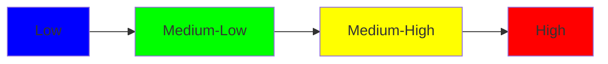

مصرف ليبيا المركزي

CENTRAL BANK OF LIBYA

إدارة البحوث و الإحصاء
Research and Statistics Department

النشرة الإقتصادية
Economic Bulletin

المجلد الرابع والخمسون - الربع الأول 2014
Vol:No 54 Fourth Quarter 2014
---
تصدر هذه النشرة تحت إشراف إدارة البحوث و الإحصاء ، و يسمح بنشر مقتطفات من النشرة شرط ذكر المصدر.
جميع المراسلات المتعلقة بهذه النشرة توجه إلى مدير إدارة البحوث والإحصاء بمصرف ليبيا المركزي.

| معلومات الاتصال |  |
|-----------------|------------------|
| ص.ب: | 1103 طرابلس / ليبيا |
| هاتف : | 4773901 21 218+ |
| بريد مصور (فاكس) : | 4773903 21 218+ |
| بريد إلكتروني : | ecorestat@cbl.gov.ly |
| الموقع الإلكتروني : | WWW.CBL.GOV.LY |
---
The image contains Arabic calligraphy that reads:

بسم الله الرحمن الرحيم

This is the Bismillah, which translates to "In the name of Allah, the Most Gracious, the Most Merciful" in English. It is a common Islamic phrase used at the beginning of various undertakings and written works.

The calligraphy is presented in a stylized, ornate form typical of Islamic art. The text is written in black ink on a white background, centered in the image. The calligraphic style emphasizes the flowing, curved nature of Arabic script, with the letters connected in a harmonious composition.
---
| رقم الجدول | الفهرس |
|------------|--------|
| أ - ز | دليل المنهجية والمفاهيم الأحصائية |
|  | أهم المؤشرات الإقتصادية والنقدية |
|  | النقود والمصارف |
| 1 | القاعدة النقدية والعوامل المؤثرة فيها |
| 2 | المسح النقدي |
| 3 | عرض النقود والعوامل المؤثرة فيه |
| 4 | العملة الورقية والمعدنية المصدرة |
| 5 | أصول وخصوم مصرف ليبيا المركزي |
| 6 | العمليات المصرفية / إصدار العملة |
| 7 | الاحتياطيات الدولية |
| 8 | أصول وخصوم المصارف التجارية |
| 9 | الأصول والخصوم الأجنبية للمصارف التجارية |
| 10 | التسهيلات الائتمانية الممنوحة من المصارف حسب الأنشطة الإقتصادية |
| 11 | التسهيلات الائتمانية (النقدية وغير النقدية) |
| 12 | مقاصة الصكوك |
| 13 | الاحتياطي النقدي الإلزامي للمصارف التجارية |
| 14 | أصول وخصوم المصرف الليبي الخارجي |
| 15 | أصول وخصوم المصرف الزراعي |
| 16 | أرصدة قروض المصرف الزراعي حسب آجال الاستحقاق |
| 17 | أصول وخصوم مصرف التنمية |
| 18 | القروض الممنوحة من مصرف التنمية |
| 19 | أصول وخصوم مصرف الإدخار والإستثمار العقاري |
| 20 | قروض مصرف الإدخار والإستثمار العقاري |
| 21 | أصول وخصوم المصرف الريفي |
| 22 | القروض الممنوحة من المصرف الريفي حسب الأنشطة الإقتصادي |
| 23 | أسعار الفائدة على الودائع لدى المصارف التجارية |
|  | الإنتاج و الأسعار |
| 24 | الناتج المحلي الإجمالي الإسمي |
| 25 | الناتج المحلي الإجمالي الفعلي |
| 26 | مخفض الناتج المحلي الإجمالي |
| 27 | الرقم القياسي لأسعار المستهلك |
| 28 | معدل التضخم |
---
| رقم الجدول | الفهرس |
|------------|--------|
| | المالية العامة |
| 29 | موجز الإيرادات والمصروفات الفعلية |
| 30 | الإيرادات الفعلية غير النفطية للميزانية العامة |
| | ميزان المدفوعات و التجارة الخارجية |
| 31 | ميزان المدفوعات |
| 32 | التجارة الخارجية |
| 33 | التوزيع الجغرافي للصادرات |
| 34 | التوزيع الجغرافي للواردات |
| 35 | أسعار صرف الدينار الليبي مقابل العملات الدولية الرئيسية |
| | سوق المال الليبي |
| 36 | المؤشرات الرئيسية للتداول |
| 37 | مساهمة القطاعات في قيمة و كمية التداول |
| | النفط و الغاز |
| 38 | إنتاج وصادرات النفط الخام |
| 39 | إنتاج وصادرات الغاز والبتروكيماويات |
| 40 | إنتاج النفط الخام حسب المجموعات العاملة |
| 41 | الإنتاج المحلي للمشتقات النفطية |
| 42 | الإستهلاك المحلي لمشتقات النفط |
| 43 | الأسعار المحلية لمبيعات المشتقات النفطية |
| 44 | متوسط أسعار بيع النفط الخام ( فوب ) |
---
# دليل المنهجية والمفاهيم الإحصائية

## أولاً : النقود والمصارف

تغطي الجداول الإحصائية من رقم (1) إلى رقم (23) إحصاءات النقود والمصارف للجهاز المصرفي في ليبيا، ويعتبر مصرف ليبيا المركزي والمصارف التجارية المصدر الرئيسي لهذه الإحصاءات ، وتقوم إدارة الحسابات بتزويد إدارة البحوث والإحصاء بميزانية مصرف ليبيا المركزي وبإحصاءات تعامل المصارف سواء من خلال آلية سوق النقد الليبي أو عمليات إعادة الشراء (Repo) أو الاكتتاب في شهادات الإيداع التي يصدرها مصرف ليبيا المركزي لمدد زمنية مختلفة ، كما تقوم إدارة الإصدار وإدارة العمليات المصرفية بتزويد إدارة البحوث والإحصاء بإحصائية النقد المصدر وإحصائية مقاصة الصكوك.

أما المصارف التجارية فتقوم بتزويد إدارة البحوث والإحصاء بمراكزها المالية الشهرية . بالإضافة إلى ذلك تقوم إدارة البحوث والإحصاء بتجميع البيانات الخاصة بأسعار الفائدة الدائنة والمدينة في السوق المصرفية.

وتضطلع إدارة البحوث والإحصاء بجمع هذه البيانات وتجهيزها للنشر بشكل شهري وبما يتناسب مع دليل الإحصاءات النقدية والمالية الصادر عن صندوق النقد الدولي لعام 2000 . ويعامل مصرف ليبيا المركزي البيانات التي يجمعها عن المؤسسات المعنية بشكل إفرادي بالسرية التامة.

وتنشر البيانات النقدية والمصرفية الشهرية بصورتها النهائية (باستثناء البيانات الخاصة بنهاية السنة المالية للمصارف التجارية ، فإنه يتم تعديلها بعد ذلك لتصبح نهائية) وتتم مراجعة هذه البيانات عند إجراء أي تعديل يتعلق بالمنهجية المتبعة وتصنيف البيانات النقدية.

وفيما يلي تعريف بمفاهيم ابرز المصطلحات الواردة في هذه الجداول :

### المصرف : مصرف ليبيا المركزي.

### المصارف التجارية : تشمل جميع المصارف التجارية العاملة في ليبيا والمرخص لها بمزاولة الأعمال المصرفية والخاضعة لإشراف المصرف وفقاً لأحكام القانون رقم (1) لسنة 2005 بشأن المصارف ، ويسمح لهذه المصارف بقبول الودائع. ولا يشمل هذا التعريف المصارف المتخصصة أو المؤسسات المالية الأخرى

### الجهاز المصرفي : يشتمل على المصرف والمصارف التجارية.
---

الجهاز التنفيذي للدولة : يشمل جميع الوزارات والأجهزة والإدارات التابعة لها إدارياً ومالياً.

المؤسسات العامة : وهي المؤسسات أو الهيئات المملوكة بالكامل للدولة والمستقلة مالياً وإدارياً ولها موازناتها الخاصة بها.

المؤسسات شبه العامة : وهي المؤسسات التي تساهم فيها الدولة بنسبة 50% من رأس مالها أو أكثر.

القطاع العام : يشمل الجهاز التنفيذي للدولة والمؤسسات العامة والمؤسسات شبه العامة.

القطاع الأهلي ( الخاص ) : ويتكون من الأفراد المقيمين والشركات والمؤسسات والكيانات القانونية الأخرى المقيمة بخلاف القطاع العام.

المقيــــم : الشخص الطبيعي أو الاعتباري الذي يقيم عادة داخل ليبيا أو مضى على إقامته في ليبيا سنة فأكثر بغض النظر عن جنسية هذا الشخص ، ويستثنى من ذلك الهيئات والمؤسسات الدولية والطلاب والمرضى الأجانب الذين يقيمون لأكثر من سنة.

غير المقيم : الشخص الطبيعي أو الاعتباري الذي يقيم عادة خارج ليبيا ، أو الذي لم يكمل مدة سنة من الإقامة داخل ليبيا بغض النظر عن جنسية هذا الشخص ، ويستثنى من ذلك العائلات والأفراد الذين لهم مركز أو مصلحة اقتصادية ولهم سكن دائم حتى ولو أقام به بشكل متقطع.

آلية السوق النقدي : وهي أداة للسياسة النقدية تمكن المصارف التجارية من الإيداع لدى والاقتراض من المصرف بموجب شروط وضوابط يضعها المصرف.

عمليات إعادة الشراء : وهي شراء المصرف المركزي الأوراق المالية وغيرها من الأوراق (شهادات الإيداع) المقبولة لدى المصرف مع التزام المصرف التجاري البائع بإعادة شراء هذه الأوراق بعد فترة محددة وبسعر فائدة يحدده المصرف (سعر إعادة الشراء).

سعر المصرف : سعر الفائدة أو العائد المعلن من المصرف عند بداية التعامل اليومي من خلال آلية السوق النقدي.

سعر إعادة الشراء : سعر الفائدة أو العائد الذي يعلنه المصرف على عمليات إعادة شراء أوراق الدين العام ، أو شهادات الإيداع.

الاحتياطي الإلزامي : وهي نسبة من إجمالي ودائع العملاء لدى المصرف التجاري بجميع أنواعها ويتم الاحتفاظ بها لدى المصرف ، ولا يدفع المصرف فائدة أو عائد على رصيد الاحتياطي الإلزامي.
---
ودائع العملاء : تشمل جميع أنواع ودائع القطاعين العام والأهلي (الخاص) مضافاً إليها ودائع غير
المقيمين ، مع استثناء ودائع المصارف والمؤسسات المالية ، وأيضاً التأمينات النقدية
وشهادات الإيداع .

التأمينات النقدية : تشمل كافة الأرصدة القائمة للتأمينات النقدية من قبل العملاء كالتأمين النقدي
على الاعتمادات والضمانات أو أي تأمينات نقدية أخرى .

التسهيلات الائتمانية : تشمل الأرصدة القائمة لجميع أنواع التسهيلات الائتمانية وعمليات التمويل
المباشرة ( سحب على المكشوف أي جاري مدين ، أوراق تجارية ومالية مخصومة ،
سلف وقروض ، أية تسهيلات أخرى ) المقدمة لجميع القطاعات الاقتصادية باستثناء
المصارف والمؤسسات المالية .

السحب على المكشوف (الجاري مدين) : يشمل جميع أرصدة حسابات الجاري مدين والحسابات
الجارية (تحت الطلب) المكشوفة .

الموجودات الأجنبية (صافي) : يمثل الموجودات (الأصول ) الأجنبية للجهاز المصرفي مطروحاً
منها المطلوبات (الخصوم) الأجنبية على الجهاز المصرفي استناداً إلى مفهوم الإقامة.

الموجودات المحلية (صافي) : يمثل مجموع بنود صافي المطالبات على الخزانة العامة
والمطالبات المحلية وصافي البنود الأخرى في الوضع النقدي للجهاز المصرفي.

صافي المطلوبات على الخزانة العامة : تشمل التسهيلات الائتمانية المباشرة الممنوحة للخزانة
العامة مضافاً إليها استثمار المصارف التجارية في أوراق الدين العام (إن وجدت)
مطروحاً منها ودائع الخزانة العامة لدى الجهاز المصرفي .

المطلوبات المحلية : تشمل الائتمان المقدم للقطاع الأهلي ( الخاص ) وللمؤسسات العامة
والمؤسسات شبه العامة مضافاً إليه استثمار المصارف التجارية في الأوراق المالية
المحلية غير العامة .

صافي البنود الأخرى : يمثل الموجودات (الأصول) الأخرى للجهاز المصرفي مطروحاً منها
المطلوبات (الخصوم) الأخرى للجهاز المصرفي ، وهي التي لم ترد ضمن تعريف
صافي الموجودات الأجنبية وصافي المطلوبات على الخزانة العامة والمطلوبات
المحلية من المركز المالي للمصرف والمركز المالي المجمع للمصارف التجارية .

النقد المصدر : هو النقد الذي أصدره المصرف ، ويتكون من رصيد النقد المتداول لدى الجمهور
مضافاً إليه أرصدة النقدية في الصندوق لدى المصرف ولدى المصارف التجارية .
---
النقود الاحتياطية (القاعدة النقدية م0) : تمثل النقد المصدر مضافاً إليه الاحتياطي الإلزامي
وفائض الأرصدة الاحتياطية للمصارف التجارية لدى المصرف المركزي فيما عدا
شهادات الإيداع .

عرض النقد (ع1) : يمثل النقد المتداول لدى الجمهور مضافاً إليه ودائع القطاع الأهلي (الخاص)
ودائع المؤسسات العامة والمؤسسات شبه العامة تحت الطلب بالدينار الليبي.

شبه النقد : يمثل ودائع القطاع الأهلي (الخاص) ودائع المؤسسات العامة والمؤسسات شبه العامة
(الادخار ولأجل) بالدينار الليبي مضافاً إليها ودائع القطاع الأهلي (الخاص)
والمؤسسات العامة والمؤسسات شبه العامة بالعملات الأجنبية مقومة بالدينار الليبي.

عرض النقد (ع2) : وهو عرض النقود (ع1) مضافاً إليه شبه النقود ، ويعادل أيضاً مجموع كل من
صافي الموجودات الأجنبية وصافي الموجودات المحلية للجهاز المصرفي .

ثانياً - القطاع الخارجي :

تغطي الجداول الإحصائية رقم (33 و 34) إحصائيات التجارة الخارجية وميزان المدفوعات
ويتولى قسم ميزان المدفوعات في المصرف مهمة تجميع وإعداد إحصاءات ميزان المدفوعات، أما
بيانات التجارة الخارجية فمصدرها الهيئة العامة للمعلومات .

ويتم نشر بيانات ميزان المدفوعات وفقاً لمنهجية الطبعة الخامسة لدليل إعداد ميزان المدفوعات
الصادر عن صندوق النقد الدولي .

وفيما يلي تعريف بمفاهيم أبرز المصطلحات الواردة في هذا الجزء :

الحساب الجاري : يمثل مجموع الميزان التجاري وحساب الخدمات وحساب الدخل وصافي حساب
التحويلات الجارية .

الميزان التجاري : يمثل الصادرات مطروحاً منها الواردات في ميزان المدفوعات .

الصادرات : تمثل الصادرات الوطنية (سيف) مضافاً إليها المعاد تصديره .

الواردات : تمثل الواردات (سيف) مستثنى منها واردات الجهات غير المقيمة .

الذهب غير النقدي : هو الذهب الذي تتم حيازته واستخدامه لأغراض أخرى (صناعية) ولا تحتفظ
به السلطات النقدية كأصل احتياطي .

حساب الخدمات: يمثل المقبوضات مطروحاً منها المدفوعات من الخدمات المبينة أدناه وهي:-

د
---
• السفر : تمثل المقبوضات من هذا البند إنفاق السياح غير المقيمين الوافدين لليبيا ، ويتم تقديرها
بالاستناد إلى نتائج مسوحات القادمين والمغادرين التي تقوم الهيئة العامة للسياحة بإعدادها من
فترة إلى أخرى ، والتي توفر تقديرات حول معدلات الإنفاق لكل جنسية من السياح ويتم تعديلها
بمعدلات التضخم السائدة خلال الفترة المراد احتسابها . بينما تمثل مدفوعات السفر انفاق
المقيمين في ليبيا في الخارج والذين يسافرون لغايات التعليم أو السياحة أو العلاج وغيرها ،
ويتم تقديرها بالاستناد إلى البيانات التي تعدها المصارف التجارية حول مبيعاتها من النقد
الأجنبي للأغراض الشخصية .

• النقل : تمثل مقبوضات هذا البند الإيرادات المتحصلة لشركات ومنشآت النقل المقيمة لقاء
تقديمها لخدمات النقل لغير المقيمين . بينما تمثل مدفوعات هذا البند المبالغ المدفوعة من
المقيمين لشركات ومؤسسات النقل غير المقيمة لقاء تقديم خدمات النقل للمقيمين ، بما في ذلك
تكاليف الشحن على البضائع المستوردة . ويتم الحصول على بيانات هذا البند من خلال مصادر
شركات النقل ذاتها والبيانات التي يقوم المصرف المركزي والمصارف التجارية بإعدادها
بشكل شهري .

• خدمات عامة (حكومية) : تغطي القيود الدائنة لهذا البند الدخل المتأتي لقاء الخدمات المقدمة من
قبل السفارات والبعثات الدبلوماسية والسياسية الليبية في الخارج ، علاوة على الخدمات التي
تقدمها المؤسسات العامة لغير المقيمين . في حين تغطي القيود المدينة لهذا البند نفقات
(الحكومة) والمؤسسات العامة المتحققة لغير المقيمين لقاء تسوية مدفوعات خارجية أو شراء
خدمات . ويتم الحصول على البيانات ذات العلاقة بهذا البند من نماذج الإبلاغ المعدة لذلك .

• الخدمات الأخرى : تشمل الخدمات غير المصنفة في البنود أعلاه والتي من أبرزها خدمات
التأمين وخدمات الاتصالات والحاسب الآلي وخدمات التشييد وعمولات المتاجرة والخدمات
المالية ورسوم الامتياز والتراخيص التي تتم بين المقيمين وغير المقيمين .

حساب الدخل : يشمل هذا الحساب البنود التالية :-

• تعويضات العاملين ( مقبوضات ) : تمثل الأجور والمزايا التي يحصل عليها العاملون
المقيمون بمن فيهم العمال الموسميون وعمال الحدود ، لقاء تأديتهم لعمل ما خارج الإقليم
الاقتصادي لليبيا لصالح جهة غير مقيمة .
---
• تعويضات العاملين (مدفوعات) : تمثل الأجور والمزايا التي يحصل عليها العاملون غير المقيمين بمن فيهم العمال الموسميون وعمال الحدود غير المقيمين ، لقاء تأديتهم لعمل ما داخل الإقليم الاقتصادي لليبيا.

• دخل الاستثمار : يمثل جانب المقبوضات منه الأرباح والفوائد المستحقة عن حيازات المقيمين لحصص الملكية أو الأصول المالية كالودائع المصرفية وسندات القروض والأوراق المالية والاذونات الصادرة عن مؤسسات غير مقيمة. وتغطي فوائد استثمارات المصرف المركزي والمصارف التجارية والقطاع العام والقطاع الأهلي (الخاص). بينما يمثل جانب المدفوعات الفوائد والأرباح المستحقة لغير المقيمين عن حيازتهم لحصص الملكية أو الأصول المالية الصادرة عن جهات مقيمة.

التحويلات الجارية : تمثل القيود المقابلة للتدفقات الحقيقية من السلع والخدمات أو الأصول المالية وغير المالية والتي لا يترتب عليها حيازة الأصول الثابتة أو التخلي عنها أو تنازل الدائن عن التزام المدين. وتشمل هذه التحويلات ما يلي:

• تحويلات القطاع العام : تتضمن قيم المنح والمساعدات والهبات سواء التي تتلقاها الدولة (مقبوضات) أو تقوم هي بتقديمها (مدفوعات).

• تحويلات القطاعات الأخرى : وتشمل:-

- حوالات العاملين : يمثل جانب المقبوضات منها تحويلات الليبيين العاملين المقيمين في الخارج والموجهة لغايات الإنفاق الجاري في ليبيا ، ويتم تقديرها استناداً للبيانات التي يقوم المصرف المركزي والمصارف التجارية بتعبئتها بشكل شهري (بيانات الدخل بالعملات الأجنبية للجهاز المصرفي). ويمثل جانب المدفوعات منها التحويلات للخارج من قبل العمالة الوافدة المقيمة في ليبيا. ويتم تقديرها بالاستناد إلى البيانات حول العمالة الوافدة وإلى معدل التحويل الشهري للعامل الواحد.

- تحويلات أخرى (صافي) : وتتضمن قيم المنح والمساعدات والهبات التي يتلقاها المقيمون داخل ليبيا (عدا الحكومة وحوالات العاملين) من غير المقيمين بما في ذلك تعويضات الأمم المتحدة (إن وجدت)، أو التي يقدمها المقيمون داخل ليبيا (عدا الحكومة وحوالات العاملين) لغير المقيمين.
---
الحساب الرأسمالي: يشمل البنود التالية:-

• الاستثمار المباشر (في الخارج): يمثل صافي استثمارات المقيمين في حقوق الملكية والعائدات المعاد استثمارها بالإضافة إلى صافي أية التزامات أخرى على المؤسسات التابعة غير المقيمة.

• الاستثمار المباشر (في ليبيا): يمثل صافي استثمارات غير المقيمين في حقوق الملكية والعائدات المعاد استثمارها بالإضافة إلى صافي أية التزامات أخرى على المؤسسات المقيمة في ليبيا.

• استثمار الحافظة (الأصول): يشمل سندات الملكية وسندات الدين والأدوات المالية التي بحوزة المقيمين والصادرة عن جهات خارجية عدا تلك المدرجة تحت الاستثمار الأجنبي المباشر والأصول الاحتياطية.

• استثمار الحافظة (الخصوم): يشمل سندات الملكية وسندات الدين والأدوات المالية التي بحوزة غير المقيمين والصادرة عن مؤسسات مقيمة عدا تلك المدرجة تحت الاستثمار الأجنبي المباشر والأصول الاحتياطية.

• استثمارات اخرى (الأصول): تشتمل على كافة المعاملات المالية العائدة للمقيمين والتي لا تتضمنها فئات الاستثمار الأجنبي المباشر أو استثمار الحافظة أو الأصول الاحتياطية. وتبوب حسب الاداة إلى ائتمان تجاري وقروض ونقد وودائع.

• استثمارات اخرى (خصوم): تشتمل على كافة المعاملات المالية العائدة لغير المقيمين والتي لا تتضمنها فئات الاستثمار الأجنبي المباشر أو استثمار الحافظة أو الأصول الاحتياطية. وتبوب حسب الاداة إلى ائتمان تجاري وقروض ونقد وودائع.

• الأصول الاحتياطية: هي الأصول الخارجية والتي تقع ضمن سيطرة المصرف المركزي وتعد متاحة للاستخدام لتمويل أو معالجة أية اختلالات في ميزان المدفوعات، وتشمل هذه الأصول الذهب النقدي وحقوق السحب الخاصة ووضع الاحتياطي لدى صندوق النقد الدولي (IMF) وأصول النقد الأجنبي (نقد وودائع وأوراق مالية).
---
# Key Economic & Monetary Indicators

In Millions of LYD ( unless stated otherwise )

| Items | 31.03.2014 |
|-------|------------|
| Population (In Thousands) (*) | 6,348.0 |
| National Accounts (*) : | |
| GDP at Current Prices 2012 | 117,675.0 |
| GDP 2012 at Fixed Prices of 2003 | 39,922.7 |
| Inflation (First Quarter) % | 0.6 |
| Money and Banking : | |
| Exchange Rate LD/ US $ | 1.252 |
| 1 - Money (M1) | 65,795.1 |
| Currency in circulation | 14,286.5 |
| Demand Deposits | 51,508.6 |
| 2 - Quasi-Money | 3,515.8 |
| 3 - Money Supply (M2) | 69,310.9 |
| Public Finance 2012 (*): | |
| Revenues | 70,131.4 |
| of which : | |
| Oil Revenues | 66,932.3 |
| Expenditure | 53,941.6 |
| Balance of Payments 2013 (*): | |
| Exports | 58,442.6 |
| of which : | |
| Oil | 56,445.3 |
| Imports | -43,242.9 |
| Balance of Trade | 15,199.7 |
| Current Account | -83.2 |
| Financial & Capital Account | -5,220.8 |
| Overall Balance | -8,009.9 |

(*) Estimated data
---
النقود والمصارف

Money & Banking
---
| Table No. (1) | جدول رقم (1) |
|---------------|-----------------|
| Monetary Base | القاعـــــدة النقــدية |
| In Millions of LYD | بالمليون دينار ليبي |

| نهاية | عملة لدى الجمهور | احتياطيات المصارف التجارية | Commercial Bank Reserves | ودائع المؤسسات العامة والمؤسسات المالية الاخرى لدى مصرف ليبيا المركزي | القاعدة النقدية |
|-------|------------------|---------------------------|--------------------------|------------------------------------------------------------------|----------------|
| End of | Currency in Circulation | Cash in Vault | Deposits with Central Bank of Libya | Total | Public Enterprise and other Financial institution Deposits with Central Bank of Libya | Monetary Base |
| | (1) | | | (2) | (3) | (3)+(2)+(1) |
| 2004 | 2,612.7 | 181.6 | 1,510.4 | 1,692.0 | 784.6 | 5,089.3 |
| 2005 | 3,308.7 | 173.0 | 2,747.5 | 2,920.5 | 1,441.6 | 7,670.8 |
| 2006 | 3,932.9 | 201.2 | 3,487.3 | 3,688.5 | 1,109.4 | 8,730.8 |
| 2007 | 4,581.2 | 370.9 | 4,963.6 | 5,334.5 | 1,071.4 | 10,987.1 |
| 2008 | 5,608.3 | 374.4 | 12,239.9 | 12,614.3 | 659.0 | 18,881.6 |
| 2009 | 6,962.9 | 512.0 | 12,670.0 | 13,182.0 | 317.9 | 20,462.8 |
| 2010 | 7,609.0 | 847.1 | 13,228.4 | 14,075.5 | 919.7 | 22,604.2 |
| 2011 | 14,840.1 | 864.6 | 14,890.8 | 15,755.4 | 1,809.0 | 32,404.5 |
| 2012 | 13,391.1 | 1,433.3 | 17,990.5 | 19,423.8 | 1,486.0 | 34,300.9 |
| 2013 | 13,419.9 | 1,622.6 | 20,165.4 | 21,788.0 | 1,678.6 | 36,886.5 |
| 2014 | | | | | | |
| 2014.01.31 | 13,579.1 | 1,644.0 | 18,675.7 | 20,319.7 | 1,728.1 | 35,626.9 |
| 2014.02.28 | 13,707.3 | 1,829.1 | 18,462.6 | 20,291.7 | 1,731.8 | 35,730.8 |
| 2014.03.31 | 14,286.5 | 1,621.9 | 18,090.1 | 19,712.0 | 1,721.0 | 35,719.5 |
---
Table No. (1) (cont.)

Factors Affecting Monetary Base

In Millions of LYD

| المجموع الكلي Grand Total | Net Domestic Assets صافي الأصول المحلية ||||||| صافي الأصول الأجنبية Net Foreign Assets | نهاية End of |
|---------------------------|--------------------------------|--------------------|----------------------|------------------------|-------------------------|--------------|---------------------------|------------|
|| المجموع Total | صافي البنود الأخرى Other Items (Net) | المستحقات على المصارف التجارية Claims on Comm. Banks | المستحقات على القطاعات الأخرى Claims on other Sectors | صافي المستحقات على الخزانة Net Claims on Treasury |||
| 5089.3 | -27976.6 | -12532.8 | 1.0 | 209.4 | -15654.2 | 33065.9 | 2004 |
| 7670.8 | -46777.1 | -16310.4 | 1.8 | 926.8 | -31395.3 | 54447.9 | 2005 |
| 8730.8 | -68510.0 | -18149.9 | 67.9 | 1027.4 | -51455.4 | 77240.8 | 2006 |
| 10987.1 | -87318.3 | -25692.8 | 52.9 | 1294.9 | -62973.3 | 98305.4 | 2007 |
| 18881.6 | -102375.6 | -32145.5 | 52.2 | 902.7 | -71185.0 | 121257.2 | 2008 |
| 20462.8 | -107728.8 | -37593.4 | 51.9 | 515.1 | -70702.4 | 128191.6 | 2009 |
| 22604.2 | -111558.8 | -42201.6 | 0.0 | 1053.1 | -70410.3 | 134163.0 | 2010 |
| 32404.5 | -107043.7 | -45563.9 | 0.0 | 0.0 | -61479.8 | 139448.2 | 2011 |
| 34300.9 | -121480.7 | -48868.6 | 0.0 | 0.0 | -72612.1 | 155781.6 | 2012 |
| 36886.5 | -114041.0 | -60792.8 | 0.0 | 0.0 | -53248.2 | 150927.5 | 2013 |
||||||||| 2014 |
| 35626.9 | -110360.9 | -60179.4 | 0.0 | 0.0 | -50181.5 | 145987.8 | 2014.01.31 |
| 35730.8 | -107927.9 | -60227.5 | 0.0 | 0.0 | -47700.4 | 143658.7 | 2014.02.28 |
| 35719.5 | -105264.4 | -58774.6 | 0.0 | 0.0 | -46489.8 | 140983.9 | 2014.03.31 |
---
# القاعدة النقدية
# MONETARY BASE

| Year | Currency in Circulation | Deposits of Comm. Banks | Deposits of PE & OFI's |
|------|-------------------------|-------------------------|------------------------|
| 2008 | 6                       | 6                       | 0.5                    |
| 2009 | 7                       | 5                       | 0.5                    |
| 2010 | 9                       | 4                       | 1                      |
| 2011 | 15                      | 0                       | 2                      |
| 2012 | 15                      | 3                       | 3                      |
| 2013 | 15                      | 5                       | 2                      |
| Q1/2014 | 16                   | 2                       | 2                      |

*Note: Values are approximate and in Billion LYD*

# العوامل المؤثرة في القاعدة النقدية
# FACTORS AFFECTING MONETARY BASE

| Year | Monetary Base Assets | Net Foreign Assets | Claims on other Sectors | Net Claims on Treasury | Other Items (net) |
|------|----------------------|--------------------|-----------------------|------------------------|-------------------|
| 2008 | 20                   | 120                | 0                     | -60                    | -30               |
| 2009 | 25                   | 130                | 0                     | -60                    | -30               |
| 2010 | 30                   | 135                | 0                     | -60                    | -40               |
| 2011 | 40                   | 140                | 0                     | -55                    | -45               |
| 2012 | 40                   | 160                | 0                     | -65                    | -50               |
| 2013 | 40                   | 155                | 0                     | -55                    | -55               |
| Q1/2014 | 40                | 145                | 0                     | -50                    | -50               |

*Note: Values are approximate and in Billion LYD*
---
| Table No. (2) | جدول رقم (2) |
|---------------|-----------------|
| Monetary Survey | المسح النقدي |
| In Millions of LYD | بالمليون دينار ليبي |

| Items | End of | نهاية الفترة | البنــود |
|-------|--------|--------------|--------|
| | 2014.03.31 | 2014.02.28 | 2014.01.31 | 2013 | 2012 | 2011 | 2010 | 2009 | 2008 | |

| Money and Quasi-Money | 69,310.9 | 69,892.5 | 69,132.9 | 69,005.9 | 63,731.5 | 57,940.9 | 46,350.7 | 44,161.3 | 39,744.5 | النقود وشبه النقود |
| Money : | 65,795.1 | 66,290.9 | 65,484.7 | 64,299.4 | 59,213.7 | 53,437.1 | 41,321.2 | 38,169.4 | 34,414.6 | النقــود : |
| - Currency in circulation | 14,286.5 | 13,707.3 | 13,579.1 | 13,419.9 | 13,391.1 | 14,840.1 | 7,609.0 | 6,962.9 | 5,608.3 | - عملة لدى الجمهور |
| - Demand deposits | 51,508.6 | 52,583.6 | 51,905.6 | 50,879.5 | 45,822.6 | 38,597.0 | 33,712.2 | 31,206.5 | 28,806.3 | - ودائع تحت الطلب |
| Quasi-Money : | 3,515.8 | 3,601.6 | 3,648.2 | 4,706.5 | 4,517.8 | 4,503.8 | 5,029.5 | 5,991.9 | 5,329.9 | شبه النقــود : |
| - Time deposits* | 2,876.4 | 2,957.8 | 2,995.0 | 4,043.6 | 3,812.5 | 3,819.9 | 4,286.4 | 5,276.9 | 4,640.7 | - ودائع زمنية* |
| - Savings deposits | 639.4 | 643.8 | 653.2 | 662.9 | 705.3 | 683.9 | 743.1 | 715.0 | 689.2 | - ودائع إدخارية |
| Net Foreign Assets : | 145,755.1 | 147,806.8 | 150,335.2 | 154,905.0 | 159,222.4 | 143,600.6 | 137,624.0 | 132,280.1 | 124,830.3 | صافي الأصول الأجنبية : |
| - Central Bank | 140,983.9 | 143,658.7 | 145,987.8 | 150,927.5 | 155,781.6 | 139,448.2 | 134,163.0 | 128,191.6 | 121,257.2 | - المصرف المركزي |
| - Commercial Banks | 4,771.2 | 4,148.1 | 4,347.4 | 3,977.5 | 3,440.8 | 4,152.4 | 3,461.0 | 4,088.5 | 3,573.1 | - المصارف التجارية |
| Net Domestic Assets : | -76,444.2 | -77,914.3 | -81,202.3 | -85,899.1 | -95,490.9 | -85,659.7 | -91,273.3 | -88,118.8 | -85,085.8 | صافي الأصول المحلية : |
| Claims on Treasury (Net) | -66,314.9 | -67,207.9 | -70,779.4 | -77,533.6 | -86,595.4 | -72,612.2 | -82,325.8 | -80,899.5 | -80,767.1 | المستحقات على الخزانة (صافي) : |
| - Central Bank | -46,489.8 | -47,700.4 | -50,181.5 | -53,248.2 | -72,612.1 | -61,479.8 | -70,410.3 | -70,702.4 | -71,185.0 | - المصرف المركزي |
| - Commercial & Regional Banks | -19,825.1 | -19,507.5 | -20,597.9 | -24,285.4 | -13,983.3 | -11,132.4 | -11,915.5 | -10,197.1 | -9,582.1 | - المصارف التجارية والأهلية |
| Claims on other Sectors | 19,016.3 | 18,849.4 | 18,729.6 | 18,981.6 | 16,860.6 | 13,549.7 | 14,765.2 | 12,920.7 | 11,448.6 | المستحقات على القطاعات الأخرى |
| Other items (Net) | -29,145.6 | -29,555.8 | -29,152.5 | -27,347.1 | -25,756.1 | -26,597.2 | -23,712.7 | -20,140.0 | -15,767.3 | بنود أخرى (صافي) |
| Total | 69,310.9 | 69,892.5 | 69,132.9 | 69,005.9 | 63,731.5 | 57,940.9 | 46,350.7 | 44,161.3 | 39,744.5 | المجمــوع |

* Includes foreign currency deposits for resident customers | * تشمل ودائع بالعملة الأجنبية لعملاء مقيمين.
---
| Table No. (3) | جدول رقم (3) |
|---------------|-----------------|
| Money Supply | عرض النقـــود |
| In Millions of LYD | بالمليون دينار ليبي |

| المجمــوع الكلي Grand Total (2+1) | Quasi-Money شبــه النقــود | Money النقــود | نهاية End of |
|----------------------------------------|-----------------------------------|-------------------|-----------------|
| | المجمـوع Total (2) | ودائع إدخارية Saving Deposits | ودائع لأجل ** Time Deposits ** | المجمـوع Total (1) | ودائع تحت الطلب * Demand Deposits * | عملة لدى الجمهور Currency in circulation | |
| 13,135.5 | 2,598.9 | 715.1 | 1,883.8 | 10,536.6 | 7,923.9 | 2,612.7 | 2004 |
| 17,096.3 | 3,068.2 | 700.0 | 2,368.2 | 14,028.1 | 10,719.4 | 3,308.7 | 2005 |
| 19,655.9 | 3,312.9 | 650.9 | 2,662.0 | 16,343.0 | 12,410.1 | 3,932.9 | 2006 |
| 26,982.1 | 4,144.6 | 663.3 | 3,481.3 | 22,837.5 | 18,256.3 | 4,581.2 | 2007 |
| 39,744.5 | 5,329.9 | 689.2 | 4,640.7 | 34,414.6 | 28,806.3 | 5,608.3 | 2008 |
| 44,161.3 | 5,991.9 | 715.0 | 5,276.9 | 38,169.4 | 31,206.5 | 6,962.9 | 2009 |
| 46,350.7 | 5,029.5 | 743.1 | 4,286.4 | 41,321.2 | 33,712.2 | 7,609.0 | 2010 |
| 57,940.9 | 4,503.8 | 683.9 | 3,819.9 | 53,437.1 | 38,597.0 | 14,840.1 | 2011 |
| 63,731.5 | 4,517.8 | 705.3 | 3,812.5 | 59,213.7 | 45,822.6 | 13,391.1 | 2012 |
| 69,005.9 | 4,706.5 | 662.9 | 4,043.6 | 64,299.4 | 50,879.5 | 13,419.9 | 2013 |
| | | | | | | | 2014 |
| 69,132.9 | 3,648.2 | 653.2 | 2,995.0 | 65,484.7 | 51,905.6 | 13,579.1 | 2014.01.31 |
| 69,892.5 | 3,601.6 | 643.8 | 2,957.8 | 66,290.9 | 52,583.6 | 13,707.3 | 2014.02.28 |
| 69,310.9 | 3,515.8 | 639.4 | 2,876.4 | 65,795.1 | 51,508.6 | 14,286.5 | 2014.03.31 |

\* Includes Public Enterprise deposits at Central Bank of Libya.
\*\* Includes foreign currency deposits for resident customers.

* تشمل ودائع المؤسسات العامة لدى مصرف ليبيا المركزي.
** تشمل ودائع بالعملة الأجنبية لعملاء مقيمين.
---
Table No. (3) (cont.)
Factors affecting Money Supply
In Millions of LYD

| End of | Net Foreign Assets | Net Domestic Assets | Grand Total |
|---------|-------------------|---------------------|-------------|
| | Central Bank of Libya | Comm. Banks | Total | Net claims on Treasury | Claims on Other Sectors | Other Items (Net) | Total | (4+3) |
| 2004 | 33,065.9 | 1,171.1 | 34,237.0 | -17,734.5 | 6,897.1 | -10,264.1 | -21,101.5 | 13,135.5 |
| 2005 | 54,447.9 | 1,974.1 | 56,422.0 | -33,880.2 | 7,277.2 | -12,722.7 | -39,325.7 | 17,096.3 |
| 2006 | 77,240.8 | 2,192.7 | 79,433.5 | -55,256.4 | 8,085.9 | -12,607.1 | -59,777.6 | 19,655.9 |
| 2007 | 98,305.4 | 2,438.4 | 100,743.8 | -67,834.4 | 9,428.0 | -15,355.3 | -73,761.7 | 26,982.1 |
| 2008 | 121,257.2 | 3,573.1 | 124,830.3 | -80,767.1 | 11,448.6 | -15,767.3 | -85,085.8 | 39,744.5 |
| 2009 | 128,191.6 | 4,088.5 | 132,280.1 | -80,899.5 | 12,920.7 | -20,140.0 | -88,118.8 | 44,161.3 |
| 2010 | 134,163.0 | 3,461.0 | 137,624.0 | -82,325.8 | 14,765.2 | -23,712.7 | -91,273.3 | 46,350.7 |
| 2011 | 139,448.2 | 4,152.4 | 143,600.6 | -72,612.2 | 13,549.7 | -26,597.2 | -85,659.7 | 57,940.9 |
| 2012 | 155,781.6 | 3,440.8 | 159,222.4 | -86,595.4 | 16,860.6 | -25,756.1 | -95,490.9 | 63,731.5 |
| 2013 | 150,927.5 | 3,977.5 | 154,905.0 | -77,533.6 | 18,981.6 | -27,347.1 | -85,899.1 | 69,005.9 |
| 2014 | | | | | | | | |
| 2014.01.31 | 145,987.8 | 4,347.4 | 150,335.2 | -70,779.4 | 18,729.6 | -29,152.5 | -81,202.3 | 69,132.9 |
| 2014.02.28 | 143,658.7 | 4,148.1 | 147,806.8 | -67,207.9 | 18,849.4 | -29,555.8 | -77,914.3 | 69,892.5 |
| 2014.03.31 | 140,983.9 | 4,771.2 | 145,755.1 | -66,314.9 | 19,016.3 | -29,145.6 | -76,444.2 | 69,310.9 |
---
# عرض النقود
# MONEY SUPPLY

| Year    | Currency Outside Banks | Demand Deposits | Quasi Money |
|---------|------------------------|-----------------|-------------|
| 2008    | 6.0                    | 28.5            | 5.5         |
| 2009    | 8.0                    | 31.5            | 6.5         |
| 2010    | 9.0                    | 34.5            | 6.0         |
| 2011    | 15.5                   | 38.5            | 5.5         |
| 2012    | 14.0                   | 46.5            | 6.0         |
| 2013    | 14.0                   | 51.0            | 6.0         |
| Q1/2014 | 15.0                   | 52.0            | 5.0         |

*Values are approximate and in Billion LYD*

# العوامل المؤثرة في عرض النقود
# FACTORS AFFECTING MONEY SUPPLY

| Year    | Net Foreign Assets | Claims on other Sectors | Other items (net) | Net claims on Treasury |
|---------|--------------------|-----------------------|-------------------|------------------------|
| 2008    | 130                | 10                    | -10               | -75                    |
| 2009    | 135                | 10                    | -10               | -80                    |
| 2010    | 140                | 15                    | -10               | -80                    |
| 2011    | 145                | 15                    | -15               | -70                    |
| 2012    | 160                | 20                    | -15               | -80                    |
| 2013    | 155                | 20                    | -15               | -75                    |
| Q1/2014 | 145                | 20                    | -15               | -65                    |

*Values are approximate and in Billion LYD*
---
Table No. (4) | جدول رقم (4)
Denominations of Coins & Notes Issued | فئات العملة الورقية والمعدنية المصدرة
Libyan Dinar | دينار ليبي

| نهاية | 1 - العملة الورقية | 1 - Bank notes |
|-------|-------------------|-----------------|
| End of | 1/4 دينار | 1/2 دينار | دينار واحد | 5 دنانير | 10 دنانير | 20 دينار | 50 دينار | المجموع |
| | 1/4 Dinar | 1/2 Dinar | One Dinar | 5 Dinars | 10 Dinars | 20 Dinars | 50 Dinars | Total |
| 2004 | 7,355,818 | 14,154,898 | 25,601,459 | 436,918,945 | 1,897,064,990 | 405,876,000 | - | 2,786,972,110 |
| 2005 | 7,618,743 | 12,993,398 | 27,077,159 | 561,571,445 | 2,286,644,990 | 57,789,000 | - | 2,953,694,735 |
| 2006 | 8,692,843 | 14,079,048 | 30,909,159 | 566,900,945 | 2,726,531,990 | 779,014,000 | - | 4,126,127,985 |
| 2007 | 8,692,843 | 14,079,048 | 30,909,159 | 566,900,945 | 2,726,531,990 | 779,014,000 | - | 4,126,127,985 |
| 2008 | 10,246,168 | 12,268,648 | 37,852,559 | 835,548,445 | 2,969,490,990 | 1,508,848,000 | 600,500,000 | 5,974,754,810 |
| 2009 | 9,394,043 | 9,780,448 | 52,231,059 | 1,035,104,445 | 3,590,496,990 | 1,897,126,000 | 869,445,000 | 7,463,577,985 |
| 2010 | 7,806,118 | 7,615,448 | 57,607,059 | 1,208,244,945 | 3,766,965,990 | 2,100,304,000 | 1,286,345,000 | 8,434,888,560 |
| 2011 | 7,548,168 | 7,371,798 | 92,675,659 | 1,955,096,945 | 7,697,086,990 | 3,900,230,000 | 1,993,355,000 | 15,653,364,560 |
| 2012 | 7,545,393 | 7,367,298 | 109,460,459 | 2,617,149,945 | 8,814,295,990 | 3,206,238,000 | 29,294,850 | 14,791,351,935 |
| 2013 | 7,544,893 | 7,366,798 | 133,704,459 | 2,576,864,945 | 11,156,988,990 | 708,054,000 | 418,778,650 | 15,009,302,735 |
| 2014 | | | | | | | | |
| الربع الأول Q1 | 7,544,893 | 7,366,798 | 125,293,859 | 2,522,400,445 | 11,888,593,990 | 845,599,300 | 474,178,650 | 15,870,977,935 |
---
Table No. (4) (Cont.)                                                                                                                             (4) تابع جدول رقم
Denominations of Coins & Notes Issued                                                                            فئات العملة الورقية والمعدنية المصدرة
Libyan Dinar                                                                                                                                                       دينار ليبي

| إجمالي العملة المصدرة Total Currency Issued | 2 - Coins 2- العملة المعدنية |  |  |  |  |  |  |  |  | نهاية End of |
|--------------------------------------------------|----------------------------------|-----------------|-----------------|-----------------|-----------------|---------------|---------------|--------------|--------------|-----------------|
|  | المجموع Total | 500 درهم 500 Dirhams | 250 درهم 250 Dirhams | 100 درهم 100 Dirhams | 50 درهم 50 Dirhams | 20درهم 20 Dirhams | 10دراهم 10 Dirhams | 5دراهم 5 Dirhams | درهم واحد 1 Dirham |  |
| 2,794,740,000 | 7,767,890 | 131,000 | 618,500 | 3,442,050 | 2,684,000 | 516,560 | 356,470 | 17,550 | 1,760 | 2004 |
| 2,961,951,000 | 8,256,265 | 478,000 | 739,500 | 3,452,850 | 2,693,200 | 516,720 | 356,560 | 17,625 | 1,810 | 2005 |
| 4,134,527,000 | 8,399,015 | 538,000 | 771,750 | 3,479,550 | 2,715,600 | 517,440 | 356,920 | 17,900 | 1,855 | 2006 |
| 4,134,867,475 | 8,739,490 | 716,500 | 845,250 | 3,524,700 | 2,758,300 | 517,840 | 357,070 | 17,950 | 1,880 | 2007 |
| 5,984,150,000 | 9,395,190 | 1,038,000 | 1,042,000 | 3,601,500 | 2,811,000 | 521,400 | 359,560 | 19,600 | 2,130 | 2008 |
| 7,476,070,000 | 12,492,015 | 2,479,000 | 2,456,250 | 3,778,500 | 2,874,100 | 522,160 | 359,980 | 19,850 | 2,175 | 2009 |
| 8,457,370,000 | 22,481,440 | 8,236,500 | 5,158,000 | 4,819,600 | 3,360,800 | 523,360 | 360,580 | 20,300 | 2,300 | 2010 |
| 15,679,266,000 | 25,901,440 | 10,414,250 | 5,918,000 | 5,271,950 | 3,390,700 | 523,360 | 360,580 | 20,300 | 2,300 | 2011 |
| 14,824,893,050 | 33,541,115 | 14,810,500 | 8,508,125 | 5,746,150 | 3,569,700 | 523,360 | 360,580 | 20,375 | 2,325 | 2012 |
| 15,043,196,450 | 33,893,715 | 14,918,500 | 8,638,125 | 5,810,400 | 3,620,050 | 523,360 | 360,580 | 20,375 | 2,325 | 2013 |
|  |  |  |  |  |  |  |  |  |  | 2014 |
| 15,912,136,450 | 41,158,515 | 14,982,500 | 15,815,125 | 5,812,500 | 3,641,750 | 523,360 | 360,580 | 20,375 | 2,325 | الربع الأول Q1 |
---
Table No. (5)
Assets & Liabilities of Central Bank of Libya
In Millions of LYD

| Assets | End of ||||||||||| الأصــــول |
|---|---|---|---|---|---|---|---|---|---|---|---|
|| 2014.03.31 | 2014.02.28 | 2014.01.31 | 2013 | 2012 | 2011 | 2010 | 2009 | 2008 | 2007 ||
| Banking Operations : | 140,663.0 | 142,441.3 | 145,127.2 | 148,201.1 | 153,107.5 | 136,051.3 | 136,287.4 | 128,804.5 | 120,411.9 | 101,452.5 | العمليات المصرفية : |
| Foreign Treasury Bills, Securities & Balances in Convertible Currencies | 114,856.1 | 117,908.5 | 120,550.7 | 125,694.6 | 133,424.7 | 117,143.6 | 119,712.7 | 115,725.9 | 108,556.8 | 91,553.4 | سندات وأذونات خزانة أجنبية وأرصدة بعملات قابلة للتحويل |
| Public Treasury Bills & Securities | 0.0 | 0.0 | 0.0 | 0.0 | 0.0 | 0.0 | 0.0 | 0.0 | 0.0 | 0.0 | سندات وأذونات الخزانة العامة |
| Loans & Advances to Treasury | 3,613.3 | 2,379.3 | 2,385.3 | 0.0 | 0.0 | 2,023.6 | 0.0 | 0.0 | 0.0 | 0.0 | قروض وسلفيات الخزانة |
| Loans & Advances to Public Enterprises | 0.0 | 0.5 | 0.5 | 259.6 | 392.2 | 407.9 | 623.6 | 969.0 | 2,343.5 | 3,400.4 | قروض وسلفيات المؤسسات العامة |
| Loans & Advances to Commercial Banks | 0.0 | 0.0 | 0.0 | 0.0 | 0.0 | 0.0 | 0.1 | 51.9 | 52.2 | 52.9 | قروض وسلفيات المصارف التجارية |
| Other Investments | 18,035.6 | 18,038.7 | 18,043.4 | 18,015.6 | 15,355.0 | 13,030.7 | 13,146.4 | 9,732.7 | 6,887.8 | 1,971.3 | إستثمارات أخرى |
| Cash in Vault | 3.7 | 1.7 | 1.6 | 0.7 | 0.6 | 0.2 | 1.3 | 1.2 | 0.5 | 0.3 | نقدية في الصندوق |
| Other Assets | 4,154.3 | 4,112.6 | 4,145.7 | 4,230.6 | 3,935.0 | 3,445.3 | 2,803.3 | 2,323.8 | 2,571.1 | 4,474.2 | أصول أخرى |
| Currency Issued : | 15,912.1 | 15,538.1 | 15,224.7 | 15,043.2 | 14,825.0 | 15,704.9 | 8,457.4 | 7,476.1 | 5,983.1 | 4,952.4 | إصدار العملة : |
| Bills Balances in Convertible Currencies | 15,912.1 | 15,538.1 | 15,224.7 | 15,043.2 | 14,825.0 | 15,704.9 | 8,457.4 | 7,476.1 | 5,983.1 | 4,952.4 | أجنبية وأرصدة بعملات قابلة للتحويل |
| Total Assets | 156,575.1 | 157,979.4 | 160,351.9 | 163,244.3 | 167,932.5 | 151,756.2 | 144,744.8 | 136,280.6 | 126,395.0 | 106,404.9 | إجمالي الأصول |
---
Table No. (5) (cont.)                                                                                تابع جدول رقم (5)
Assets & Liabilities of Central Bank of Libya                                                      أصول وخصوم مصرف ليبيا المركزي
In Millions of LYD                                                                                               مليون دينار ليبي

| Liabilities                           | 2014.03.31 | 2014.02.28 | 2014.01.31 | 2013     | 2012     | 2011     | 2010     | 2009     | 2008     | 2007     | الخصــوم                        |
|--------------------------------------|------------|------------|------------|----------|----------|----------|----------|----------|----------|----------|-------------------------------|
| Banking Operations :                  | 140,663.0  | 142,441.3  | 145,127.1  | 148,201.0| 153,107.6| 136,051.3| 136,287.4| 128,804.5| 120,411.9| 101,452.5| العمليات المصرفية :              |
| Capital                               | 500.0      | 500.0      | 500.0      | 500.0    | 500.0    | 500.0    | 500.0    | 500.0    | 500.0    | 500.0    | رأس المال                      |
| General Reserve                       | 1,000.0    | 1,000.0    | 1,000.0    | 1,000.0  | 1,000.0  | 909.1    | 909.1    | 909.1    | 749.3    | 500.0    | الإحتياطي العام                 |
| Reserve for Contingencies             | 0.0        | 0.0        | 0.0        | 0.0      | 0.0      | 0.0      | 0.0      | 0.0      | 0.0      | 0.0      | إحتياطي الطوارئ                 |
| Treasury Accounts                     | 7,568.5    | 8,562.6    | 11,156.9   | 10,378.5 | 20,710.6 | 32,410.6 | 37,559.1 | 25,212.6 | 30,020.3 | 23,155.7 | حسابات الخزانة العامة           |
| Accounts for Public Enterprises*      | 22,768.8   | 21,703.6   | 21,695.1   | 23,766.8 | 23,110.3 | 15,081.6 | 21,300.7 | 41,143.5 | 39,885.3 | 39,120.2 | حسابات المؤسسات العامة *         |
| Accounts for Commercial Banks         | 60,846.3   | 61,685.4   | 62,111.8   | 64,748.3 | 53,606.5 | 53,272.6 | 43,972.4 | 38,320.6 | 32,382.4 | 18,449.2 | حسابات المصارف التجارية         |
| Accounts for Specialized Banks**      | 1,618.5    | 1,656.0    | 1,673.5    | 1,686.0  | 10,012.5 | 9,771.3  | 11,122.2 | 2,785.4  | 627.9    | 469.3    | المصارف المتخصصة **             |
| Accounts for Foreign Banks            | 376.3      | 350.9      | 329.0      | 266.4    | 259.3    | 202.7    | 323.1    | 118.1    | 25.0     | 15.5     | حسابات مصارف خارجية            |
| Other Accounts                        | 19,233.8   | 19,262.9   | 19,183.1   | 19,592.8 | 20,356.7 | 1,299.9  | 740.5    | 499.0    | 386.8    | 1,905.2  | حسابات أخرى                    |
| Provisions, Reserves and other Liabilities | 26,750.8   | 27,719.9   | 27,477.7   | 26,262.2 | 23,551.7 | 22,603.5 | 19,860.3 | 19,316.2 | 15,834.9 | 17,337.4 | مخصصات وإحتياطيات وخصوم أخرى    |
| Currency Issued :                     | 15,912.1   | 15,538.1   | 15,224.7   | 15,043.2 | 14,824.9 | 15,704.9 | 8,457.4  | 7,476.1  | 5,983.1  | 4,952.4  | إصدار العملة :                  |
| Currency Outside of C.B.L             | 15,908.4   | 15,536.4   | 15,223.1   | 15,042.5 | 14,824.3 | 15,704.7 | 8,456.1  | 7,474.9  | 5,982.6  | 4,952.1  | عملة خارج مصرف ليبيا المركزي    |
| Currency in Banking Operations Dpt.   | 3.7        | 1.7        | 1.6        | 0.7      | 0.6      | 0.2      | 1.3      | 1.2      | 0.5      | 0.3      | عملة في قسم العمليات المصرفية   |
| Total Liabilities                     | 156,575.1  | 157,979.4  | 160,351.8  | 163,244.2| 167,932.5| 151,756.2| 144,744.8| 136,280.6| 126,395.0| 106,404.9| إجمالي الخصوم                   |
| Bills for Collection                  | 80.5       | 80.5       | 80.5       | 80.6     | 80.1     | 79.7     | 79.7     | 78.1     | 79.0     | 73.4     | مستندات برسم التحصيل            |
| Letters of Credit & Guarantees        | 9,503.1    | 9,717.5    | 9,845.8    | 9,759.2  | 9,114.2  | 9,705.1  | 10,704.8 | 8,656.9  | 8,013.3  | 8,126.0  | خطابات الضمانات والإعتمادات     |
| Others                                | 2,085.8    | 801.7      | 632.7      | 893.5    | 1,037.9  | 202.1    | 405.7    | 377.0    | 974.6    | -        | أخرى                           |

* Includes Public Enterprise demand deposits in table (1).
** Includes Deposits of the Libyan Fund for Development & Investment (2009 - November 2013).

* تشمل الودائع تحت الطلب للمؤسسات العامة الواردة في الجدول (1).
** تشمل ودائع الصندوق الليبي للإستثمار والتنمية (2009 - نوفمبر 2013).
---
Table No. (6)

Assets & Liabilities of Central Bank of Libya

Banking Operations:

In Millions of LYD

| Foreign Assets | الأصول الأجنبية ||||||| Domestic Assets | الأصول المحلية ||||
|---|---|---|---|---|---|---|---|---|---|---|
| Portfolio Investment | Shares in International & Organizations other Foreign Assets | Foreign Currencies | Fixed & other Assets | Public Treasury Bills & Securities | Credit Facilities to | الممنوحة الإئتمانية التسھيلات ||||| End of نھــاية |
| المحفظة الإستثمارية | مساھمات في مؤسسات دولية وأصول أجنبية أخرى | عملات أجنبية | أصول ثابتة وأصول أخرى | أذونات وسندات الخزانة العامة | Others آخرين | Comm. Banks المصارف التجارية | Public Enterprises المؤسسات العامة | Treasury الخزانة العامة | Cash in Vault نقدية في الصندوق ||
| - | 972.3 | 28,541.4 | 2,187.2 | 0.0 | 14.7 | 1.0 | 1,705.0 | 0.0 | 0.4 | 2004 |
| - | 983.9 | 49,229.2 | 1,977.6 | 0.0 | 16.4 | 1.8 | 2,725.5 | 0.0 | 0.4 | 2005 |
| 1,304.3 | 1,008.5 | 70,041.7 | 4,073.4 | 0.0 | 18.0 | 61.5 | 3,039.8 | 0.0 | 0.4 | 2006 |
| 1,469.1 | 1,052.2 | 90,084.3 | 5,369.0 | 0.0 | 24.3 | 52.9 | 3,400.4 | 0.0 | 0.3 | 2007 |
| 2,843.0 | 5,266.5 | 105,713.8 | 4,162.7 | 0.0 | 29.7 | 52.2 | 2,343.5 | 0.0 | 0.5 | 2008 |
| 2,594.5 | 4,262.4 | 113,131.4 | 7,763.6 | 0.0 | 30.5 | 51.9 | 969.0 | 0.0 | 1.2 | 2009 |
| 30,420.5 | 6,300.9 | 89,292.2 | 9,616.3 | 0.0 | 32.6 | 0.1 | 623.6 | 0.0 | 1.3 | 2010 |
| 24,430.8 | 6,234.1 | 92,712.8 | 13,286.4 | 0.0 | 32.1 | 0.0 | 407.9 | 2,023.6 | 0.2 | 2011 |
| 20,254.1 | 8,567.7 | 113,170.6 | 10,688.6 | 0.0 | 33.7 | 0.0 | 392.2 | 0.0 | 0.6 | 2012 |
| 18,252.4 | 11,119.4 | 107,442.3 | 11,096.8 | 0.0 | 29.8 | 0.0 | 259.6 | 0.0 | 0.7 | 2013 |
|||||||||||2014|
| 18,161.5 | 11,248.1 | 102,389.1 | 10,911.4 | 0.0 | 29.6 | 0.0 | 0.5 | 2,385.3 | 1.6 | 2014.01.31 |
| 18,168.7 | 11,250.3 | 99,739.8 | 10,871.3 | 0.0 | 29.7 | 0.0 | 0.5 | 2,379.3 | 1.7 | 2014.02.28 |
| 18,189.4 | 11,251.4 | 96,666.7 | 10,909.7 | 0.0 | 28.8 | 0.0 | 0.0 | 3,613.3 | 3.7 | 2014.03.31 |
---
Table No. (6) (cont.)
Assets & Liabilities of Central Bank of Libya
Banking Operations :
In Millions of LYD

| End of نھــاية | Capital رأس المال | General Reserves الإحتياطي العام | Reserves for contingencies إحتياطي الطوارئ | Treasury Accounts الخزانة العامة | Public Enterprises Accounts المؤسسات العامة | Comm. Banks Accounts المصارف التجارية | Specialized Banks *Accounts المصارف المتخصصة* | Banks Abroad مصارف خارجية | Other Accounts حسابات متنوعة | Provisions, Reserves & Other Liabilities مخصصات ، إحتياطيات وخصوم أخرى | Grand Total الإجمالي | Contra Accounts حسابات مقابلة |
|-------------|-------------------|-----------------------------------|-------------------------------------------|----------------------------------|-------------------------------------------|---------------------------------------|----------------------------------------------|---------------------------|------------------------------|------------------------------------------------------------------|------------------------|------------------------------|
| 2004 | 100.0 | 200.0 | 30.0 | 13,627.5 | 1,036.5 | 6,386.6 | 492.2 | 6.6 | 831.9 | 10,710.7 | 33,422.0 | 5,438.7 |
| 2005 | 500.0 | 0.0 | 0.0 | 28,866.1 | 1,757.7 | 9,499.1 | 852.2 | 36.4 | 985.4 | 12,437.9 | 54,934.8 | 5,789.0 |
| 2006 | 500.0 | 250.0 | 0.0 | 42,382.4 | 9,815.1 | 11,413.0 | 475.6 | 8.1 | 1,390.7 | 13,312.7 | 79,547.6 | 6,424.7 |
| 2007 | 500.0 | 500.0 | 0.0 | 23,155.7 | 39,120.2 | 18,449.2 | 469.3 | 15.5 | 1,905.2 | 17,337.4 | 101,452.5 | 8,199.4 |
| 2008 | 500.0 | 749.3 | 0.0 | 30,020.3 | 39,885.3 | 32,382.4 | 627.9 | 25.0 | 386.8 | 15,834.9 | 120,411.9 | 9,066.9 |
| 2009 | 500.0 | 909.1 | 0.0 | 25,212.6 | 41,143.5 | 38,352.6 | 2,753.4 | 118.1 | 499.0 | 19,316.2 | 128,804.5 | 9,112.0 |
| 2010 | 500.0 | 909.1 | 0.0 | 37,559.1 | 21,300.7 | 44,009.4 | 11,085.2 | 323.1 | 740.5 | 19,860.3 | 136,287.4 | 11,190.2 |
| 2011 | 500.0 | 909.1 | 0.0 | 32,410.6 | 15,081.6 | 53,272.6 | 9,771.3 | 202.7 | 1,299.9 | 22,603.5 | 136,051.3 | 9,986.9 |
| 2012 | 500.0 | 1,000.0 | 0.0 | 20,710.6 | 23,110.3 | 53,606.5 | 10,012.5 | 259.3 | 20,356.8 | 23,551.7 | 153,107.7 | 10,232.3 |
| 2013 | 500.0 | 1,000.0 | 0.0 | 10,378.5 | 23,766.8 | 64,748.3 | 1,686.0 | 266.4 | 19,592.8 | 26,262.2 | 148,201.0 | 10,733.3 |
| 2014 |  |  |  |  |  |  |  |  |  |  |  |  |
| 2014.01.31 | 500.0 | 1,000.0 | 0.0 | 11,156.9 | 21,695.1 | 62,111.8 | 1,673.5 | 329.0 | 19,183.1 | 27,477.7 | 145,127.1 | 10,559.1 |
| 2014.02.28 | 500.0 | 1,000.0 | 0.0 | 8,562.6 | 21,703.6 | 61,685.4 | 1,656.0 | 350.9 | 19,262.9 | 27,719.9 | 142,441.3 | 10,599.7 |
| 2014.03.31 | 500.0 | 1,000.0 | 0.0 | 7,568.5 | 22,768.8 | 60,846.3 | 1,618.5 | 376.3 | 19,233.8 | 26,750.8 | 140,663.0 | 11,669.3 |

* Includes Deposits of the Libyan Fund for Development & Investment (2009 - November 2013)
---
Table No. (6) (cont.)                                                                                                                                                   (6) رقم جدول تابع
Currency Issued                                                                                                                                                             العملة   إصدار
In Millions of LYD                                                                                                                                                             دينار بالمليون

| Liabilities | الخصــوم | | | Assets | الأصول | | | |
|-------------|---------|---|---|--------|--------|---|---|---|
| Currency in circulation | Currency .with Comm Banks | Currency with Banking Operations | = Total Assets total Liabilities | Foreign أجنبية & Treasury Bills Securities | Monetary Gold | Balances in Convertible *Currencies | Public Treasury & Bills Securities | End of نھــاية |
| عملة لدى الجمھــور | عملة لدى المصارف التجارية | عملة لدى العمليات المصرفية | مجموع الأصول = مجموع الخصوم | أذونات وسندات خزانة | الذھب النقدي | أرصدة بعملات قابلة للتحويل* | أذونات وسندات الخزانة العامة | |
| 2,612.7 | 181.6 | 0.4 | 2,794.7 | - | 57.8 | 2,736.9 | - | 2004 |
| 3,310.6 | 171.1 | 0.4 | 3,482.1 | - | 57.8 | 3,424.3 | - | 2005 |
| 3,920.3 | 213.8 | 0.4 | 4,134.5 | - | 57.8 | 4,076.7 | - | 2006 |
| 4,581.2 | 370.9 | 0.3 | 4,952.4 | - | 57.8 | 4,894.6 | - | 2007 |
| 5,608.3 | 374.4 | 0.5 | 5,983.2 | 250.3 | 57.8 | 5,675.1 | - | 2008 |
| 6,962.9 | 512.0 | 1.2 | 7,476.1 | 198.5 | 57.8 | 7,219.8 | | 2009 |
| 7,609.0 | 847.1 | 1.3 | 8,457.4 | 197.2 | 57.8 | 8,202.4 | - | 2010 |
| 14,840.1 | 864.6 | 0.2 | 15,704.9 | 68.5 | 46.9 | 15,589.5 | - | 2011 |
| 13,391.1 | 1,433.3 | 0.6 | 14,825.0 | 3,831.9 | 46.9 | 10,946.2 | - | 2012 |
| 13,419.9 | 1,622.6 | 0.6 | 15,043.2 | 3,517.1 | 46.9 | 11,479.2 | - | 2013 |
| | | | | | | | | 2014 |
| 13,579.1 | 1,644.0 | 1.6 | 15,224.7 | 3,525.3 | 46.9 | 11,652.5 | - | 2014.01.31 |
| 13,707.3 | 1,829.1 | 1.7 | 15,538.1 | 3,521.4 | 46.9 | 11,969.8 | - | 2014.02.28 |
| 14,334.1 | 1,574.3 | 3.7 | 15,912.1 | 3,447.6 | 46.9 | 12,417.6 | - | 2014.03.31 |

* Includes balances with banks abroad ( time deposits ).                                                                                              . ( لأجل ودائع ) خارجية مصارف مع أرصدة تشمل *
---
Table No. (7) | جدول رقم (7)
International Reserves | الإحتياطيات الدولية
In Millions of LYD | بالمليون دينار ليبي

| نهاية | عملات أجنبية لدى مصرف ليبيا المركزي | الذهب النقدي | وضع الشريحة الإحتياطية لدى صندوق النقد الدولي | المجموع |
|------|----------------------------------------|-------------|----------------------------------------------|---------|
| End of | Foreign Currencies with Central Bank of Libya | Monetary Gold | Reserves Tranche Position with International Monetary Fund | Total |
| 2004 | 31,278.3 | 57.8 | 764.3 | 32,100.4 |
| 2005 | 52,653.5 | 57.8 | 764.3 | 53,475.6 |
| 2006 | 75,422.7 | 57.8 | 764.3 | 76,244.8 |
| 2007 | 96,448.0 | 57.8 | 764.3 | 97,270.1 |
| 2008 | 114,482.2 | 57.8 | 764.3 | 115,304.3 |
| 2009 | 123,144.2 | 57.8 | 733.6 | 123,935.6 |
| 2010 | 128,112.3 | 57.8 | 467.3 | 128,637.4 |
| 2011 | 132,802.0 | 46.9 | 571.6 | 133,420.5 |
| 2012 | 148,202.8 | 46.9 | 571.6 | 148,821.3 |
| 2013 | 140,690.9 | 46.9 | 571.7 | 141,309.5 |
| 2014 | | | | |
| 2014.01.31 | 135,728.5 | 46.9 | 571.7 | 136,347.1 |
| 2014.02.28 | 133,399.7 | 46.9 | 571.7 | 134,018.3 |
| 2014.03.31 | 130,721.3 | 46.9 | 571.7 | 131,339.9 |
---
Table No. (8)                                                                                                                                                               (8) جدول رقم
Assets & Liabilities of Commercial Banks                                                                                                   أصول وخصوم المصارف التجارية
In Millions of LYD                                                                                                                                                     بالمليون دينار ليبي

| Assets                                                                                                                                                         الأصول |
|-----------------------------------------------------------------------------------------------------------------------------------------------------------------------|
|                                                                                   Deposits                                                          الودائع              |
| أذونات وسندات | أرصدة مع | الأصول | نقد | الودائع الزمنية | الودائع تحت الطلب | نقدية في | نهــاية |
| خزانة | مصارف خارجية | السائلة * | أجنـبـي | Time Deposits | Demand Deposits | الصنــدوق |  |
| | | | | لدى | لدى مصرف ليبيا المركزي | لدى المصـــارف | لدى مصرف ليبيا | | End of |
| Treasury Bills | Balances with | Liquid | Foreign | المصـــارف | | | المركزي | Cash in |  |
| & Securities | Banks Abroad | Assets * | Currency | With | With Central Bank | With Banks | With Central | Vault |  |
| | | | | Banks | of Libya | | Bank of Libya | |  |
| | | | (6) | (5) | (4) | (3) | (2) | (1) |  |
| 0.0 | 1,283.2 | 6,392.9 | 22.1 | 80.5 | 4,368.8 | 45.7 | 1,710.6 | 165.2 | 2004 |
| 0.0 | 2,017.7 | 9,083.4 | 21.8 | 0.0 | 6,400.1 | 35.1 | 2,474.8 | 151.7 | 2005 |
| 0.0 | 2,243.8 | 11,602.1 | 48.8 | 34.0 | 7,735.7 | 144.3 | 3,448.7 | 190.6 | 2006 |
| 0.0 | 2,420.1 | 18,777.4 | 36.5 | 24.0 | 13,177.7 | 203.1 | 4,970.7 | 365.4 | 2007 |
| 0.0 | 3,514.6 | 33,393.7 | 38.4 | 394.4 | 19,538.6 | 116.4 | 12,931.5 | 374.4 | 2008 |
| 0.0 | 4,109.8 | 39,454.3 | 82.7 | 100.0 | 25,619.3 | 191.8 | 12,948.5 | 512.0 | 2009 |
| 0.0 | 3,544.4 | 44,987.3 | 35.5 | 0.0 | 30,686.0 | 167.2 | 13,251.5 | 847.1 | 2010 |
| 0.0 | 4,236.5 | 47,513.2 | 248.5 | 90.0 | 27,339.7 | 241.7 | 18,728.7 | 864.6 | 2011 |
| 0.0 | 3,517.3 | 54,816.2 | 112.7 | 0.0 | 35,737.8 | 329.0 | 17,203.4 | 1,433.3 | 2012 |
| 0.0 | 4,045.1 | 65,761.8 | 89.7 | 30.0 | 44,307.3 | 347.6 | 19,364.6 | 1,622.6 | 2013 |
| | | | | | | | | | 2014 |
| 0.0 | 4,307.9 | 63,633.4 | 207.5 | 30.0 | 43,168.8 | 404.0 | 18,179.1 | 1,644.0 | 2014.01.31 |
| 0.0 | 4,208.8 | 63,564.7 | 124.9 | 30.0 | 42,944.0 | 308.5 | 18,328.2 | 1,829.1 | 2014.02.28 |
| 0.0 | 4,896.7 | 62,245.0 | 79.5 | 0.0 | 41,831.2 | 422.0 | 18,290.4 | 1,621.9 | 2014.03.31 |

* Liquid Assets ( 1+2+3+4+5+6 ) .                                                                                                                       . ( 6+5+4+3+2+1 ) تتكون الأصول السائلة من *
Note : Includes data on the libyan foreign bank starting from end 2012 .                             . ملاحظة : تم تضمين بيانات وحدة الدينار الليبي بالمصرف الليبي الخارجي إعتباراً من نهاية عام 2012
---
Table No. (8) (cont.)                                                   (8) تابع جدول رقم
Assets & Liabilities of Commercial Banks                           أصول وخصوم المصارف التجارية
In Millions of LYD                                                      بالمليون دينار ليبي

| Assets                                                                                                                                                                                  الأصول |                |
|------------------------------------------------------------------------------------------------------------------------------------------------------------------------------------------|----------------|
| Contra Accounts | Total Assets = Liabilities | Other Assets | Fixed Assets | Total Credit | Other Loans | Discounted and Negotiated Bills | Loans & Overdrafts * | End of |
| حسابات مقابلة | إجمالي الأصول = إجمالي الخصوم | أصول أخرى | أصول ثابتة | إجمالي الائتمان | تسهيلات أخرى | كمبيالات تجارية مخصومة ومتداولة | سلفيات وسحب على المكشوف * | نهاية |
| 1,891.5 | 15,407.5 | 916.3 | 304.8 | 6,510.3 | 0.6 | 1.5 | 6,508.2 | 2004 |
| 3,073.8 | 18,554.9 | 940.9 | 346.3 | 6,166.6 | 0.4 | 4.1 | 6,162.1 | 2005 |
| 4,509.7 | 23,013.0 | 1,681.2 | 418.7 | 7,067.2 | 0.3 | 1.7 | 7,065.2 | 2006 |
| 8,945.6 | 31,185.3 | 1,260.4 | 536.1 | 8,191.3 | 88.5 | 1.3 | 8,101.5 | 2007 |
| 23,089.4 | 50,230.0 | 2,062.7 | 714.4 | 10,544.6 | 101.3 | 6.3 | 10,437.0 | 2008 |
| 37,495.6 | 58,767.8 | 2,493.2 | 897.8 | 11,812.7 | 87.6 | 206.7 | 11,518.4 | 2009 |
| 62,367.0 | 65,352.4 | 2,757.7 | 1,018.4 | 13,044.6 | 298.9 | 260.4 | 12,485.3 | 2010 |
| 65,920.3 | 70,938.1 | 5,367.8 | 1,034.0 | 12,786.6 | 155.4 | 255.6 | 12,375.6 | 2011 |
| 70,747.7 | 84,420.4 | 9,149.0 | 1,038.4 | 15,899.5 | 287.6 | 246.5 | 15,365.4 | 2012 |
| 71,550.9 | 98,375.5 | 9,214.7 | 1,121.6 | 18,232.3 | 184.0 | 250.0 | 17,798.3 | 2013 |
|  |  |  |  |  |  |  |  | 2014 |
| 71,344.9 | 95,464.2 | 8,408.9 | 1,133.5 | 17,980.5 | 128.2 | 249.4 | 17,602.9 | 2014.01.31 |
| 70,933.4 | 94,557.5 | 7,539.3 | 1,151.9 | 18,092.8 | 186.4 | 249.1 | 17,657.3 | 2014.02.28 |
| 71,625.2 | 95,314.5 | 8,760.0 | 1,175.4 | 18,237.4 | 123.8 | 253.2 | 17,860.4 | 2014.03.31 |

* Includes Commercial & Housing Loans.                                 * تشمل القروض التجارية والعقارية.
---
Table No. (8) (cont.)                                                                                                                                                         (8) رقم جدول تابع
Assets & Liabilities of Commercial Banks                                                                                                          التجارية المصارف وخصوم أصول
In Millions of LYD                                                                                                                                                             ليبي دينار بالمليون

| Liabilities                                                                                                                  الخصوم                   | Equity         الملكية حقوق |
|-----------------------------------------------------------------------------------------------------------------------------|---------------------------|
| حسابات مقابلة | خصوم أخرى | الإقتراض من المصارف Borrowing from Banks                                      | الودائـع Deposits        | رأس المال والإحتياطيات Capital & Reserves |
| Contra Accounts | Other Liabilities | مصارف خارجية Banks Abroad | مصارف في ليبيا Banks in Libya | مصرف ليبيا المركزي Central Bank of Libya | إجمالي الودائع Total Deposits | إدخارية Saving | لأجل ** Time ** | تحت الطلب * Demand * | الإحتياطيات Reserves | رأس المال Capital | نھــاية End of |
|-------------------|---------------------|----------------------------------|--------------------------------------|--------------------------------------------------|----------------------------------|-------------------|--------------------|-----------------------|-------------------------|----------------------|-------------------|
| 1,891.5           | 3,608.9              | 131.4                            | 0.0                                  | 0.0                                              | 10,908.8                         | 685.9             | 2,651.6            | 7,522.9               | 584.4                   | 222.4                | 2004              |
| 3,073.8           | 3,636.2              | 59.1                             | 0.0                                  | 0.0                                              | 13,782.5                         | 671.3             | 3,503.3            | 9,607.9               | 473.9                   | 573.2                | 2005              |
| 4,509.7           | 4,336.2              | 86.5                             | 52.8                                 | 1.2                                              | 17,359.1                         | 627.9             | 3,959.6            | 12,771.9              | 495.5                   | 680.8                | 2006              |
| 8,945.6           | 4,576.4              | 19.0                             | 51.5                                 | 53.0                                             | 24,767.0                         | 649.3             | 6,409.4            | 17,746.8              | 707.0                   | 972.8                | 2007              |
| 23,089.4          | 6,270.3              | 175.1                            | 57.1                                 | 52.2                                             | 41,531.0                         | 689.2             | 11,046.3           | 29,795.5              | 1,022.8                 | 1,121.6              | 2008              |
| 37,495.6          | 6,198.3              | 135.6                            | 52.4                                 | 51.9                                             | 48,676.0                         | 715.9             | 12,102.6           | 35,857.5              | 1,034.1                 | 2,623.0              | 2009              |
| 62,367.0          | 5,392.2              | 81.8                             | 47.6                                 | 0.0                                              | 55,313.0                         | 743.1             | 12,231.8           | 42,338.1              | 1,166.6                 | 3,351.2              | 2010              |
| 65,920.3          | 7,755.0              | 290.8                            | 47.0                                 | 0.0                                              | 58,480.1                         | 683.9             | 11,419.8           | 46,376.4              | 1,012.3                 | 3,352.9              | 2011              |
| 70,747.7          | 11,235.6             | 139.6                            | 45.7                                 | 0.0                                              | 68,346.2                         | 705.3             | 12,912.1           | 54,728.8              | 1,158.1                 | 3,495.2              | 2012              |
| 65,920.3          | 9,950.5              | 74.9                             | 43.7                                 | 0.0                                              | 83,562.7                         | 662.9             | 21,064.9           | 61,834.9              | 1,193.5                 | 3,550.2              | 2013              |
|                   |                     |                                  |                                      |                                                  |                                  |                   |                    |                       |                         |                      | 2014              |
| 71,344.9          | 10,613.9             | 89.3                             | 43.7                                 | 0.0                                              | 79,985.8                         | 653.2             | 20,775.8           | 58,556.8              | 1,181.4                 | 3,550.2              | 2014.01.31        |
| 70,933.4          | 10,039.6             | 107.4                            | 51.2                                 | 0.0                                              | 79,585.0                         | 643.8             | 19,865.4           | 59,075.8              | 1,224.2                 | 3,550.2              | 2014.02.28        |
| 71,625.2          | 11,325.8             | 125.5                            | 43.7                                 | 0.0                                              | 79,058.5                         | 639.4             | 21,212.5           | 57,206.6              | 1,210.8                 | 3,550.2              | 2014.03.31        |

* Includes Payment Orders since 2001                                                                                                                                           2001 تشمل أوامر الدفع إعتباراً من سنة *
** Includes margins for L/C & L/ Guarantees                                                                                                                يشمل التأمين النقدي مقابل خطابات الإعتماد وخطابات الضمان **
---
# الودائع لدى المصارف التجارية
# Deposits with Comm. Banks

مليار دينار
Billion LYD

| Year     | Demand | Time | Saving |
|----------|--------|------|--------|
| 2004     | 8.5    | 2.5  | 0.5    |
| 2005     | 10     | 4    | 0.5    |
| 2006     | 13     | 4.5  | 0.5    |
| 2007     | 18     | 7    | 1      |
| 2008     | 30     | 11   | 1      |
| 2009     | 36     | 12   | 1      |
| 2010     | 42     | 12.5 | 1      |
| 2011     | 46     | 11.5 | 1      |
| 2012     | 55     | 13.5 | 1      |
| 2013     | 62     | 21   | 1      |
| Q1/2014  | 57     | 21.5 | 1      |

*Note: Values are approximate based on the bar chart visualization.*

The chart shows the deposits with commercial banks in Libya from 2004 to Q1/2014, broken down into three categories:
- تحت الطلب (Demand deposits)
- لأجل (Time deposits)
- ادخارية (Saving deposits)

The y-axis represents billions of Libyan Dinars (LYD), with increments of 10 billion up to 70 billion. The chart demonstrates a general upward trend in deposits over the years, with demand deposits showing the most significant growth.
---
Table No. (9)                                                                                                                                                                            (9) رقم جدول
Foreign Assets & Liabilities of Commercial Banks                                                                                         التجارية     للمصارف        األجنبية    والخصوم       األصول
In Thousands of LYD                                                                                                                                                                      ليبي  دينار ألف

| Liabilities | الخصــوم | Assets | األصول |
|-------------|---------|--------|--------|
| المجمــوع | خصوم أجنبية مع المصارف الخارجية | تسھيالت المصارف الخارجية | المجمــوع | الكمبياالت التي تدفع بالعملة األجنبية وسلفيات المصارف الخارجية | ودائع لدى مصارف خارجية | ودائع تحت الطلب بالعملة األجنبية لدى مصرف ليبيا المركزي | نقود أجنبية | نھــاية |
| Total | Foreign Liabilities with Banks Abroad | Credit of Banks Abroad | Total | Bills in Foreign Currency & Advances at Banks Abroad | Deposits with Banks Abroad | Foreign Currency Deposits with Central Bank of Libya | Foreign Currency | End of |
| 139,455 | 8,001 | 131,454 | 1,619,506 | 633 | 1,283,208 | 313,562 | 22,103 | 2004 |
| 71,478 | 12,337 | 59,141 | 2,228,019 | 430 | 2,017,724 | 188,090 | 21,775 | 2005 |
| 92,608 | 14,390 | 78,218 | 2,388,809 | 269 | 2,243,866 | 95,884 | 48,790 | 2006 |
| 19,426 | 436 | 18,990 | 2,515,081 | 198 | 2,420,007 | 58,406 | 36,470 | 2007 |
| 131,914 | 1,214 | 130,700 | 3,082,390 | 18 | 3,005,567 | 37,123 | 39,682 | 2008 |
| 143,250 | 7,608 | 135,642 | 4,210,809 | 9 | 4,109,795 | 18,271 | 82,734 | 2009 |
| 85,408 | 3,654 | 81,754 | 3,579,906 | 0 | 3,544,443 | 0 | 35,463 | 2010 |
| 296,654 | 5,891 | 290,763 | 4,485,031 | 0 | 4,236,491 | 0 | 248,540 | 2011 |
| 143,584 | 3,941 | 139,643 | 3,629,932 | 0 | 3,517,272 | 0 | 112,660 | 2012 |
| 76,600 | 1,725 | 74,875 | 4,134,744 | 0 | 4,045,061 | 0 | 89,683 | 2013 |
| | | | | | | | | 2014 |
| 91,238 | 1,910 | 89,328 | 4,515,402 | 0 | 4,307,856 | 0 | 207,546 | 2014.01.31 |
| 109,091 | 1,652 | 107,439 | 4,333,676 | 0 | 4,208,812 | 0 | 124,864 | 2014.02.28 |
| 126,779 | 1,250 | 125,529 | 4,976,236 | 0 | 4,896,687 | 0 | 79,549 | 2014.03.31 |
---
Table No. (10)

# Commercial Bank Credit to Various Economic Activities

In Millions of LYD

| Total | Social Loans* | GMR Loans | Housing Loans | Loans to Economic & Services Activities | End of |
|-------|---------------|-----------|---------------|------------------------------------------|--------|
| 6,510.3 | 1,486.9 | 373.0 | 1,456.2 | 3,194.2 | 2004 |
| 6,166.6 | 1,665.7 | 373.0 | 1,426.3 | 2,701.6 | 2005 |
| 7,067.2 | 1,709.9 | 373.0 | 1,394.4 | 3,589.9 | 2006 |
| 8,191.3 | 1,899.9 | 328.0 | 1,419.4 | 4,544.0 | 2007 |
| 10,544.9 | 2,473.3 | 174.0 | 1,300.8 | 6,596.8 | 2008 |
| 11,812.7 | 3,192.1 | 0.0 | 1,278.8 | 7,341.8 | 2009 |
| 13,044.6 | 3,770.6 | 0.0 | 1,187.2 | 8,086.8 | 2010 |
| 12,786.5 | 3,337.1 | 0.0 | 1,154.7 | 8,294.7 | 2011 |
| 15,781.6 | 4,973.5 | 0.0 | 1,147.9 | 9,660.2 | 2012 |
| 18,089.0 | 6,726.0 | 0.0 | 1,137.8 | 10,225.2 | 2013 |
| | | | | | 2014 |
| 17,980.5 | 6,762.9 | 0.0 | 1,137.7 | 10,079.9 | 2014.01.31 |
| 18,092.8 | 6,523.7 | 0.0 | 1,137.7 | 10,431.4 | 2014.02.28 |
| 18,237.4 | 6,643.9 | 0.0 | 1,137.5 | 10,456.0 | 2014.03.31 |

*Includes Islamic Murabaha Loans (Retail) as of 2013
---
القروض والتسهيلات الائتمانية الممنوحة من المصارف التجارية لمختلف
القطاعات والأنشطة الاقتصادية

# COMMERICIAL BANK CREDIT TO VARIOUS ECONOMIC SECTORS

مليار دينار
Billion LYD

| Year    | Credit (Billion LYD) |
|---------|----------------------|
| 2004    | 6.5                  |
| 2005    | 6.1                  |
| 2006    | 7.1                  |
| 2007    | 8.2                  |
| 2008    | 10.6                 |
| 2009    | 11.8                 |
| 2010    | 13.2                 |
| 2011    | 12.8                 |
| 2012    | 15.8                 |
| 2013    | 18.2                 |
| Q1/2014 | 18.3                 |

Note: The graph shows a line chart representing the commercial bank credit to various economic sectors in Libya from 2004 to Q1/2014. The y-axis ranges from 0 to 20 billion LYD, with increments of 2 billion. The line shows a general upward trend over the years, with a slight dip in 2005 and 2011, and a sharp increase from 2011 to 2013.
---
| Table No. (11) | جدول رقم (11) |
|-------------|-------------------|
| Provision of Commercial Bank Credit Facilities (Monetary) | التسهيلات الإئتمانية ( النقدية ) الممنوحة من المصارف التجارية |
| In Thousands of LYD | ألف دينار ليبي |

| Sectors | الربع الثالث Q3 2010 | الربع الثاني Q2 2010 | الربع الأول Q1 2010 | 2009 | 2008 | القطاعات |
|---------|------------------------|------------------------|----------------------|------|------|-----------|
| Petroleum | 76,182 | 84,378 | 89,908 | 90,866 | 755,374 | النفط |
| Electricity | 231,391 | 601,181 | 462,856 | 406,683 | 315,409 | الكهرباء |
| Transportation & Communications | 1,010,145 | 1,010,993 | 998,594 | 917,654 | 503,549 | النقل والمواصلات |
| Planning and Economy | 1,873,441 | 1,990,933 | 1,900,188 | 1,740,661 | 1,570,603 | التخطيط والإقتصاد |
| Industry | 1,406,171 | 1,295,026 | 1,442,537 | 1,384,064 | 1,033,901 | الصناعة والمعادن |
| Treasury | 86,686 | 90,472 | 59,183 | 84,366 | 74,624 | الخزانة |
| Health | 194,944 | 196,072 | 203,173 | 189,590 | 128,140 | الصحة والضمان |
| Agriculture | 101,104 | 148,726 | 168,668 | 161,218 | 135,344 | الزراعة والثروة الحيوانية |
| Housing & Public Utilities | 234,291 | 352,913 | 431,100 | 350,981 | 217,734 | المرافق والإسكان |
| Education | 98,906 | 121,886 | 122,264 | 123,951 | 113,941 | التعليم والبحث العلمي |
| Vocational Training & Development | 14,125 | 11,749 | 13,797 | 13,968 | 10,005 | التكوين والتدريب المهني |
| Information & Culture | 125,880 | 126,959 | 137,290 | 157,760 | 21,048 | الإعلام والثقافة |
| Social Security | 5,857 | 10,572 | 8,395 | 7,559 | 2,255 | صندوق الضمان الإجتماعي |
| Tourism | 228,343 | 242,429 | 226,006 | 177,854 | 219,574 | السياحة |
| Marine Wealth | 43,083 | 20,930 | 42,463 | 42,186 | 49,458 | الثروة البحرية |
| Justice | 45,876 | 53,308 | 55,375 | 60,164 | 43,988 | العدل والأمن العام |
| Sport & Youth | 8,077 | 6,683 | 28,161 | 30,827 | 43,467 | الشباب والرياضة |
| The Great Man-Made River ( GMR ) | 7,059 | 8,953 | 8,415 | 8,423 | 207,793 | النهر الصناعي وأجهزة إستثمار مياهه |
| Sovereign Investment abroad | 868 | 262 | 2,856 | 3,730 | 3,122 | الإستثمار الشعبي في الخارج |
| Commercial Banks | 4,548 | 5,781 | 4,405 | 4,899 | 2,170 | المصارف التجارية |
| Specialized Banks | 0 | 67 | 66 | 45 | 4,131 | المصارف المتخصصة |
| National Banking Corporation | 15,263 | 20,230 | 35,769 | 22,040 | 6,331 | المؤسسة المصرفية الأهلية |
| Producer Funds Investment Company | 2,684 | 2,966 | 2,907 | 2,907 | 141 | شركة إستثمار أموال المنتجين |
| Regional Banks | 0 | 987 | 990 | 1,914 | 9,579 | المصارف الأهلية |
| Social Loans | 3,632,094 | 3,524,037 | 3,354,730 | 3,192,086 | 2,473,340 | قروض الأفراد الإجتماعية |
| Housing Loans | 1,182,873 | 1,195,538 | 1,207,219 | 1,218,571 | 1,240,685 | قروض عقارية |
| Others | 1,403,665 | 235,280 | 1,328,782 | 1,111,264 | 1,095,343 | أخرى |
| Total | 12,033,556 | 11,359,311 | 12,336,097 | 11,506,231 | 10,281,049 | الإجمالي |
| Foreign Companies | 282,666 | 936,926 | 222,534 | 218,301 | 150,816 | شركات أجنبية |
| Non-resident Institutions | 82,658 | 15,368 | 18,419 | 88,129 | 113,048 | مؤسسات غير مقيمة |
| Total Credit | 12,398,880 | 12,311,605 | 12,577,050 | 11,812,661 | 10,544,913 | إجمالي الإئتمان |
---
| Table No. (11) (cont.) | تابع جدول رقم (11) |
|---------------------------|------------------------|
| Provision of Commercial Bank | التسهيلات الإئتمانية (غير النقدية) |
| Credit Facilities ( Non Monetary) | الممنوحة من المصارف التجارية |
| In Thousands of LYD | ألف دينار ليبي |

| Sectors | الربع الثالث Q3 2010 | الربع الثاني Q2 2010 | الربع الأول Q1 2010 | 2009 | 2008 | القطاعات |
|---------|------------------------|------------------------|----------------------|------|------|-----------|
| Petroleum | 1,315,951 | 133,381 | 1,297,261 | 1,304,242 | 107,216 | النفط |
| Electricity | 129,002 | 320,328 | 273,502 | 281,768 | 173,925 | الكهرباء |
| Transportation & Communications | 686,270 | 737,162 | 849,622 | 988,131 | 1,872,641 | النقل والمواصلات |
| Planning and Economy | 4,539,322 | 3,854,680 | 1,900,272 | 1,972,397 | 2,271,821 | التخطيط والإقتصاد |
| Industry | 947,678 | 1,063,615 | 999,907 | 806,312 | 714,438 | الصناعة والمعادن |
| Treasury | 5,028 | 133,381 | 114,486 | 114,318 | 19,170 | الخزانة |
| Health | 567,508 | 639,079 | 545,093 | 306,515 | 1,199,637 | الصحة والضمان |
| Agriculture | 106,671 | 63,920 | 58,463 | 71,057 | 88,206 | الزراعة والثروة الحيوانية |
| Housing & Public Utilities | 6,929,101 | 6,681,576 | 4,421,256 | 6,461,280 | 2,682,565 | المرافق والإسكان |
| Education | 73,006 | 68,566 | 3,671,177 | 48,734 | 20,093 | التعليم والبحث العلمي |
| Vocational Training & Development | 7,066 | 6,974 | 4,332 | 4,552 | 76 | التكوين والتدريب المهني |
| Information & Culture | 2,115 | 2,212 | 2,225 | 2,532 | 61,670 | الإعلام والثقافة |
| Social Security | 77,617 | 2,064 | 8,064 | 7,000 | 365 | صندوق الضمان الإجتماعي |
| Tourism | 649,220 | 654,910 | 145,562 | 142,782 | 178,932 | السياحة |
| Marine Wealth | 1,626 | 2,806 | 6,363 | 4,948 | 4,079 | الثروة البحرية |
| Justice | 25,034 | 32,974 | 38,688 | 59,589 | 9,320 | العدل والأمن العام |
| The Great Man-Made River (GMR) | 380,198 | 455,100 | 502,086 | 512,040 | 504,211 | النهر الصناعي وأجهزة إستثمار مياهه |
| Sport & Youth | 2,632 | 794 | 3,109 | 4,117 | 6,648 | الشباب والرياضة |
| Commercial Banks | 5,965 | 635 | 635 | 624 | 724 | المصارف التجارية |
| Specialized Banks | 13,238 | 0 | 0 | 0 | 459 | المصارف المتخصصة |
| Others | 7,481,600 | 8,420,085 | 7,087,300 | 5,987,288 | 576,540 | أخرى |
| Total | 23,945,848 | 23,274,242 | 21,929,403 | 19,080,226 | 10,492,736 | الإجمالي |
| Foreign Companies | 667,696 | 656,449 | 1,300,018 | 610,643 | 152,774 | شركات أجنبية |
| Total Credit | 24,613,544 | 23,930,691 | 23,229,421 | 19,690,869 | 10,645,510 | إجمالي الائتمان |
---
Table No. (12)                                                                  جدول رقم (12)
Cheque Clearance                                                                  مقاصة الصكوك

| During خلال | Tripoli طرابلس |  | Benghazi بنغازي |  | Sebha سبـها |  | Electronic Clearance المقاصة الألكترونية |  | Total المجمــوع |  |
|-------------|-----------------|--|-----------------|--|-------------|--|-------------------------------------------|--|-----------------|--|
|             | Number (000's) العدد بالآف | Value (Million LYD) القيمة بالمليون دينار | Number (000's) العدد بالآف | Value (Million LYD) القيمة بالمليون دينار | Number (000's) العدد بالآف | Value (Million LYD) القيمة بالمليون دينار | Number (000's) العدد بالآف | Value (Million LYD) القيمة بالمليون دينار | Number (000's) العدد بالآف | Value (Million LYD) القيمة بالمليون دينار |
| 2004        | 1240            | 17,226.5         | 317             | 3,614.9          | 75              | 461.3            | -               | -                | 1632            | 21,302.7         |
| 2005        | 1432            | 22,124.8         | 371             | 4,124.5          | 85              | 616.2            | -               | -                | 1888            | 26,865.5         |
| 2006        | 1882            | 32,947.2         | 414             | 5,308.5          | 88              | 739.4            | -               | -                | 2384            | 38,995.1         |
| 2007        | 1750            | 36,636.1         | 459             | 6,518.9          | 89              | 747.3            | -               | -                | 2298            | 43,902.3         |
| 2008        | 1404            | 36,853.3         | 446             | 7,329.4          | 113             | 902.2            | -               | -                | 1963            | 45,084.9         |
| 2009        | 1260            | 33,086.1         | 430             | 7,703.8          | 72              | 703.7            | -               | -                | 1762            | 41,493.6         |
| 2010        | 1007            | 18,974.7         | 364             | 7,241.8          | 58              | 492.5            | -               | -                | 1429            | 26,709.0         |
| 2011        | 512             | 8,363.8          | 274             | 7,322.5          | 67              | 823.1            | -               | -                | 853             | 16,509.4         |
| 2012        | 1233            | 24,681.9         | 484             | 13,074.6         | 91              | 1,312.8          | -               | -                | 1808            | 39,069.3         |
| 2013        | 1317            | 25,556.8         | 413             | 15,036.0         | 87              | 1,516.9          | 1000.0          | 27,270.6         | 2817            | 69,380.3         |
| 2014 Q1 الربع الأول | 250             | 4,725.9          | -               | -                | 28              | 487.7            | 292             | 8,083.5          | 570             | 13,297.1         |

Note : Electronic clearance data has been included since 2013 .
ملاحظة : بيانات المقاصة الإلكترونية اعتباراً من العام 2013 .
---
Table No. (13)                                                                                                                                                                         (13) رقم جدول
Required Reserves for Commercial Banks                                                                                                     التجارية    للمصارف        اإللزامي    النقدي     اإلحتياطي
In Millions of LYD                                                                                                                                                                     ليبي  دينار  مليون

| نهاية | الودائع Deposits | الإحتياطي الإلزامي المطلوب Required Reserves | ودائع لدى مصرف ليبيا المركزي ** | الفائض عن الإحتياطي النقدي |
|-------|---------------------|------------------------------------------------|--------------------------------------|--------------------------------|
| End of | تحت الطلب Demand | لأجل وإدخار Time & Saving | أوامر الدفع والتأمين النقدي Payment Orders and Margins for L/C; L | المجموع Total | على الودائع تحت الطلب On Demand Deposits* | على الودائع لأجل وإدخار * On Time & Saving Deposits* | المجموع Total | Deposits with Central Bank of Libya ** | Excess Reserves (8-7) = 9 |
| (1) | (2) | (3) | (4) | (5) | (6) | (7) | (8) | (9) |
| 2004 | 7,232.1 | 2,521.0 | 1,107.3 | 10,860.4 | 1,128.4 | 250.3 | 1,378.7 | 6,079.4 | 4,700.7 |
| 2005 | 9,167.3 | 3,047.2 | 1,568.0 | 13,782.5 | 1,441.2 | 313.1 | 1,754.3 | 8,874.9 | 7,120.6 |
| 2006 | 12,026.7 | 3,204.7 | 2,128.0 | 17,359.4 | 1,915.8 | 344.1 | 2,259.9 | 11,184.4 | 8,924.5 |
| 2007 | 17,035.0 | 4,137.1 | 3,633.4 | 24,805.5 | 2,661.9 | 529.4 | 3,191.3 | 18,148.4 | 14,957.1 |
| 2008 | 28,703.7 | 5,123.0 | 7,703.8 | 41,530.5 | 5,959.0 | 2,347.1 | 8,306.1 | 32,470.1 | 24,164.0 |
| 2009 | 34,519.5 | 5,617.8 | 8,535.0 | 48,672.3 | 7,171.4 | 2,563.0 | 9,734.4 | 38,567.8 | 28,833.4 |
| 2010 | 41,110.8 | 6,052.4 | 8,149.8 | 55,313.0 | 8,467.6 | 2,595.0 | 11,062.6 | 43,935.0 | 32,872.4 |
| 2011 | 44,388.7 | 4,586.8 | 9,504.6 | 58,480.1 | 9,275.3 | 2,420.7 | 11,696.0 | 46,068.3 | 34,372.3 |
| 2012 | 52,853.6 | 6,794.1 | 8,698.5 | 68,346.2 | 10,945.8 | 2,723.5 | 13,669.2 | 52,941.3 | 39,272.1 |
| 2013 | 59,787.7 | 15,118.9 | 8,656.1 | 83,562.7 | 12,367.0 | 4,345.6 | 16,712.5 | 63,671.9 | 46,959.4 |
| 2014 |
| 2014.01.31 | 56,289.8 | 14,575.3 | 9,120.6 | 79,985.7 | 11,711.4 | 4,285.8 | 15,997.1 | 61,348.0 | 45,350.9 |
| 2014.02.28 | 56,893.2 | 13,577.5 | 9,114.3 | 79,585.0 | 11,815.2 | 4,101.8 | 15,917.0 | 61,272.3 | 45,355.3 |
| 2014.03.31 | 55,025.2 | 14,539.4 | 9,493.9 | 79,058.5 | 11,441.3 | 4,370.4 | 15,811.7 | 60,121.6 | 44,309.9 |

* Required reserves have been unified to 20% on all deposits since June 2008 .                                                   2008 يونيو شھر منً إعتبارا الودائع جميع على %20 بنسبة ليصبح االلزامي االحتياطي توحيد تم *ّ
** The deposits Includes CDs since May 2008 .                                                                                                                2008 مايو منذ التجارية المصارف إيداع شھادات تشمل الودائع **
---
Table No. (14)
Assets & Liabilities of the Libyan Foreign Bank
In Millions of LYD

| End of | Cash and balances with banks | Time deposit with banks | Short-term facilities | Investments & loans | Participations | Other non current assets * | Fixed assets | Total assets |
|--------|------------------------------|-------------------------|----------------------|---------------------|----------------|---------------------------|--------------|--------------|
| 2004   | 504.8                        | 9,010.1                 | 231.3                | 3,152.6             | 1,072.0        | 132.5                     | 2.9          | 14,106.2     |
| 2005   | 513.0                        | 10,215.6                | 99.0                 | 3,262.3             | 1,231.9        | 77.7                      | 2.7          | 15,402.2     |
| 2006   | 92.0                         | 16,319.7                | 165.1                | 4,074.6             | 760.6          | 58.8                      | 1.8          | 21,472.6     |
| 2007   | 300.6                        | 15,682.7                | 86.6                 | 4,601.9             | 935.5          | 110.2                     | 3.5          | 21,721.0     |
| 2008   | 2,478.8                      | 13,315.5                | 70.9                 | 3,338.9             | 1,508.4        | 83.8                      | 15.8         | 20,812.1     |
| 2009   | 265.0                        | 11,285.5                | 24.3                 | 2,931.0             | 1,781.3        | 12.3                      | 14.5         | 16,313.9     |
| 2010   | 408.1                        | 14,142.5                | 22.8                 | 3,006.7             | 2,269.3        | 20.1                      | 15.1         | 19,884.6     |
| 2011   | 4,760.7                      | 10,124.1                | 22.2                 | 2,963.4             | 2,466.3        | 84.7                      | 14.2         | 20,435.6     |
| 2012   | 3,517.6                      | 16,493.3                | 30.5                 | 2,550.2             | 2,523.5        | 19.1                      | 13.6         | 25,147.8     |
| 2013   | 3,672.3                      | 22,003.7                | 1,088.1              | 3,237.7             | 2,559.7        | 62.5                      | 14.3         | 32,638.3     |
| 2014   |                              |                         |                      |                     |                |                           |              |              |
| Q1 الربع الأول | 3,089.0                | 20,679.7                | 1,659.5              | 3,194.8             | 2,567.2        | 68.0                      | 14.1         | 31,272.3     |

Source : Libyan Foreign Bank
* Includes deposits of the Libyan fund for Development and investment since December 2013 .
---
Table No. (14) (cont.)                                                                  (14) تابع جدول رقم
Assets & Liabilities of the Libyan Foreign Bank                                 أصول وخصوم المصرف الليبي الخارجي
In Millions of LYD                                                                         بالمليون دينار ليبي

| مجموع الخصوم Total Liabilities | رأس المال والاحتياطيات Capital & Reserves | الخصوم غير المتداولة Non-Current Liabilities | الخصوم المتداولة Current Liabilities ||| نهاية End of |
|:--:|:--:|:--:|:--:|:--:|:--:|:--:|
||| | الخصوم الأخرى المتداولة Other Current Liabilities | الودائع الزمنية Time Deposits | الودائع تحت الطلب Demand Deposits | |
| 14,106.2 | 1,264.6 | 2,449.3 | 140.5 | 8,701.5 | 1,550.3 | 2004 |
| 15,402.2 | 1,440.9 | 2,712.8 | 163.2 | 9,164.2 | 1,921.1 | 2005 |
| 21,472.6 | 1,856.6 | 1,558.5 | 204.5 | 15,479.2 | 2,373.8 | 2006 |
| 21,721.0 | 1,915.3 | 624.0 | 217.0 | 16,494.9 | 2,469.8 | 2007 |
| 20,812.1 | 2,018.8 | 1,095.4 | 145.5 | 10,353.9 | 7,198.5 | 2008 |
| 16,313.9 | 3,355.7 | 227.7 | 126.1 | 7,161.4 | 5,443.0 | 2009 |
| 19,884.6 | 4,730.5 | 313.6 | 78.9 | 8,490.3 | 6,271.3 | 2010 |
| 20,435.6 | 4,856.1 | 755.8 | 60.5 | 7,031.9 | 7,731.3 | 2011 |
| 25,147.8 | 5,128.2 | 325.1 | 77.3 | 11,811.9 | 7,805.3 | 2012 |
| 32,638.3 | 5,424.6 | 206.4 | 97.2 | 20,173.0 | 6,737.1 | 2013 |
| | | | | | | 2014 |
| 31,272.3 | 5,500.0 | 190.2 | 85.3 | 19,349.9 | 6,146.9 | Q1 الربع الأول |

Source: Libyan Foreign Bank                                                            المصدر : المصرف الليبي الخارجي

\* Includes deposits of the Libyan fund for Development and investment since December 2013.

تشمل ودائع الصندوق الليبي للتنمية والاستثمار اعتباراً من شهر ديسمبر 2013. *
---
Table No. (15)                                                                  جدول رقم (15)
Assets & Liabilities of Agricultural Bank                                   أصول وخصوم المصرف الزراعي
In Millions of LYD                                                                بالمليون دينار ليبي

| نهاية | نقدية | ودائع لدى المصارف بما فيها مصرف ليبيا المركزي | مساهمات وإستثمارات | القروض | أصول أخرى | رأس المال والإحتياطيات | الودائع تحت الطلب | خصوم أخرى | مجموع الأصول = مجموع الخصوم |
|-------|-------|------------------------------------------------|---------------------|--------|------------|------------------------|-------------------|------------|------------------------------|
| End of | Cash | Deposits with local Banks incl. CBL | Shares and Investments | Loans | Other Assets | Capital & Reserves | Demand Deposits | Other Liabilities | Total Assets = liabilities |
| 2004 | 0.8 | 145.0 | 1.9 | 370.5 | 163.8 | 453.0 | 26.8 | 202.2 | 682.0 |
| 2005 | 31.1 | 306.5 | 1.9 | 717.0 | 325.3 | 454.0 | 32.8 | 895.0 | 1,381.8 |
| 2006 | 56.5 | 207.0 | 1.9 | 1,175.0 | 43.6 | 459.9 | 30.4 | 993.7 | 1,484.0 |
| 2007 | 63.4 | 177.0 | 35.2 | 1,370.0 | 30.3 | 455.5 | 70.4 | 1,150.0 | 1,675.9 |
| 2008 | 0.7 | 63.8 | 35.4 | 1,475.0 | 57.7 | 457.0 | 39.2 | 1,078.8 | 1,632.6 |
| 2009 | 0.7 | 63.4 | 35.4 | 1,458.2 | 45.8 | 459.0 | 28.3 | 1,116.2 | 1,603.5 |
| 2010 | 30.6 | 7.0 | 35.0 | 1,442.3 | 298.8 | 460.3 | 29.4 | 1,324.0 | 1,813.7 |

Source : Agriculture Bank                                                                المصدر : المصرف الزراعي
---
أرصدة قروض المصرف الزراعي حسب آجال الإستحقاق
AGRICULTURAL BANK BALANCES BY MATURITY

Table No. (16)                                                                                         (16) جدول رقم
Agricultural Bank Balances by Maturity                             أرصدة قروض المصرف الزراعي حسب آجال الإستحقاق
In Millions of LYD                                                                                   بالمليون دينار ليبي

| المجمــوع Total | طويلة الأجل Long Term | متوسطة الأجل Medium Term | قصيرة الأجل Short Term | نھــاية End of |
|-------------------|--------------------------|----------------------------|--------------------------|-------------------|
| 73.5              | 33.4                     | 18.7                       | 21.4                     | 1990              |
| 74.5              | 34.6                     | 17.4                       | 22.5                     | 1991              |
| 70.7              | 34.4                     | 15.4                       | 20.9                     | 1992              |
| 68.5              | 31.8                     | 11.8                       | 24.9                     | 1993              |
| 66.9              | 30.1                     | 10.9                       | 25.9                     | 1994              |
| 67.3              | 28.8                     | 10.5                       | 28.0                     | 1995              |
| 75.0              | 29.1                     | 16.3                       | 29.6                     | 1996              |
| 80.5              | 28.1                     | 20.0                       | 32.4                     | 1997              |
| 85.7              | 27.5                     | 22.8                       | 35.4                     | 1998              |
| 95.5              | 27.5                     | 28.5                       | 39.5                     | 1999              |
| 113.0             | 27.0                     | 36.0                       | 50.0                     | 2000              |
| 131.2             | 31.5                     | 44.5                       | 55.2                     | 2001              |
| 232.7             | 82.9                     | 92.4                       | 57.4                     | 2002              |
| 298.0             | 130.5                    | 115.6                      | 51.9                     | 2003              |
| 370.4             | 155.2                    | 148.0                      | 67.2                     | 2004              |
| 717.0             | 360.4                    | 296.5                      | 60.1                     | 2005              |
| 1,175.0           | 685.4                    | 425.1                      | 64.5                     | 2006              |
| 1,400.1           | 840.9                    | 495.5                      | 63.7                     | 2007              |
| 1,475.1           | 829.1                    | 564.2                      | 81.8                     | 2008              |
| 1,467.4           | 829.0                    | 549.2                      | 89.2                     | 2009              |
| 1,457.9           | 829.6                    | 555.0                      | 73.3                     | 2010              |
| 1,571.2           | 829.6                    | 631.0                      | 110.6                    | 2011              |

Source : Agriculture Bank                                                                               المصدر : المصرف الزراعي
---
| Table No. (17) | جدول رقم (17) |
|-----------------|-----------------|
| Assets & Liabilities of Development Bank | أصول وخصوم مصرف التنمية |
| In Millions of LYD | بالمليون دينار ليبي |

| Assets | الأصول |
|--------|--------|

| End of | نهاية | Current Assets | الأصول المتداولة | Long Term Investment | إستثمارات طويلة الأجل | | | |
|--------|-------|----------------|-------------------|------------------------|------------------------|--|--|--|
| | | Cash in vault & in banks | النقدية بالصندوق ولدى المصارف | Deposits | ودائع | Debitors | المدينون | Interest & rent payable | فوائد وإيجارات مستحقة | Participations and Investments | المساهمات والإستثمارات | Loans | القروض | Fixed assets | الأصول الثابتة | Other assets | الأصول الأخرى | Total Assets | إجمالي الأصول | Contra Accounts | الحسابات المقابلة | Grand Total Assets | المجموع الكلي للأصول |
| 1995 | 10.4 | 39.1 | 10.2 | 0.6 | 11.3 | 74.2 | 1.7 | 1.4 | 148.9 | 69.8 | 218.7 |
| 1996 | 10.2 | 38.5 | 18.0 | 0.8 | 11.3 | 77.0 | 1.7 | 25.9 | 183.4 | 70.8 | 254.2 |
| 1997 | 25.5 | 54.5 | 6.5 | 2.0 | 23.7 | 90.9 | 1.9 | 20.9 | 225.9 | 60.5 | 286.4 |
| 1998 | 28.6 | 29.4 | 7.8 | 2.6 | 25.8 | 91.4 | 6.1 | 19.8 | 211.5 | 72.6 | 284.1 |
| 1999 | 45.2 | 40.3 | 10.8 | 3.5 | 26.0 | 105.7 | 6.6 | 23.2 | 261.3 | 97.4 | 358.7 |
| 2000 | 8.6 | 87.8 | 14.4 | 1.9 | 28.4 | 127.9 | 6.6 | 4.2 | 279.8 | 117.0 | 396.8 |
| 2001 | 91.9 | 177.3 | 8.8 | 2.4 | 29.1 | 212.0 | 7.2 | 4.7 | 533.4 | 168.2 | 701.6 |
| 2002 | 21.9 | 165.7 | 10.9 | 2.9 | 35.7 | 339.6 | 8.2 | 4.3 | 589.2 | 193.4 | 782.6 |
| 2003 | 75.3 | 290.6 | 11.9 | 3.2 | 40.3 | 429.0 | 7.0 | 4.7 | 862.0 | 544.2 | 1,406.2 |
| 2004 | 36.9 | 399.1 | 54.2 | 2.8 | 38.0 | 498.0 | 7.3 | 4.4 | 1,040.7 | 789.1 | 1,829.8 |
| 2005 | 222.9 | 627.6 | 235.4 | 3.0 | 40.8 | 502.7 | 7.4 | 6.0 | 1,645.8 | 812.0 | 2,457.8 |
| 2006 | 100.6 | 601.8 | 73.1 | 3.6 | 30.8 | 872.3 | 8.7 | 4.2 | 1,695.1 | 1,029.3 | 2,724.4 |
| 2007 | 125.1 | 685.3 | 198.8 | 1.4 | 15.7 | 812.4 | 10.5 | 2.0 | 1,851.2 | 1,422.8 | 3,274.0 |
| 2008 | 32.4 | 748.6 | 244.2 | 1.6 | 4.7 | 949.6 | 12.7 | 1.0 | 1,994.8 | 1,245.7 | 3,240.5 |
| 2009 | 7.5 | 370.5 | 456.8 | 0.6 | 20.1 | 1,012.0 | 12.9 | 7.0 | 1,887.4 | 1,245.7 | 3,133.1 |
| 2010 | 41.6 | 392.8 | 197.7 | 6.0 | 201.9 | 1,029.0 | 13.5 | 21.9 | 1,904.4 | - | 1,904.4 |
| 2011 | 234.5 | 401.0 | 208.1 | 19.4 | 192.1 | 1,112.4 | 12.3 | 22.9 | 2,202.7 | - | 2,202.7 |
| 2012 | 135.3 | 538.6 | 114.4 | 99.6 | 192.1 | 1,260.4 | 11.1 | 13.3 | 2,364.8 | - | 2,364.8 |

Source : Development Bank | المصدر : مصرف التنمية
---
Table No. (17) (cont.)                                                                 (17) تابع جدول رقم
Assets & Liabilities of Development Bank                                                أصول وخصوم مصرف التنمية
In Millions of LYD                                                                                  بالمليون دينار ليبي

| Grand Total Liabilities | Contra Accounts | Total Liabilities | Unspecified Reserves | Reserves | Capital | Other liabilities | Provisions | Capital resources | Loans | Other Current liabilities | Creditors | Deposits | End of |
|-------------------------|-----------------|-------------------|----------------------|----------|---------|-------------------|------------|-------------------|-------|--------------------------|-----------|----------|--------|
| 218.7                   | 69.8            | 148.9             | 9.1                  | 11.4     | 65.0    | 1.8               | 5.5        | 26.5              | 7.0   | -                        | 7.8       | 14.8     | 1995   |
| 254.2                   | 70.8            | 183.4             | 5.0                  | 11.8     | 69.6    | 2.4               | 6.5        | 26.8              | 33.9  | -                        | 7.0       | 20.4     | 1996   |
| 286.4                   | 60.5            | 225.9             | 6.3                  | 13.7     | 69.6    | 16.4              | 8.5        | 26.9              | 33.9  | 10.9                     | 4.2       | 35.5     | 1997   |
| 284.1                   | 72.6            | 211.5             | 7.0                  | 14.2     | 69.6    | 4.2               | 14.6       | 25.8              | 29.6  | 11.1                     | 5.8       | 29.6     | 1998   |
| 358.7                   | 97.4            | 261.3             | 7.5                  | 14.9     | 69.6    | 8.5               | 18.8       | 27.3              | 26.9  | 7.4                      | 5.4       | 75.0     | 1999   |
| 396.8                   | 117.0           | 279.8             | 11.5                 | 18.8     | 69.6    | 12.2              | 17.3       | 60.1              | 13.8  | 3.7                      | 6.4       | 66.4     | 2000   |
| 701.6                   | 168.2           | 533.4             | 12.2                 | 19.5     | 69.6    | 32.8              | 18.7       | 56.6              | 260.0 | 2.9                      | 6.6       | 54.5     | 2001   |
| 782.6                   | 193.4           | 589.2             | 15.3                 | 22.7     | 69.6    | 61.4              | 23.6       | 27.3              | 302.8 | 11.9                     | 7.3       | 47.3     | 2002   |
| 1,406.2                 | 544.2           | 862.0             | 17.2                 | 20.9     | 628.8   | 62.1              | 10.6       | 27.4              | 31.9  | 11.6                     | 5.7       | 45.8     | 2003   |
| 1,830.7                 | 789.1           | 1,041.6           | 16.7                 | 24.0     | 628.8   | 145.9             | 6.5        | 112.3             | 31.9  | 16.9                     | 11.1      | 47.5     | 2004   |
| 2,457.8                 | 812.0           | 1,645.8           | 25.3                 | 22.7     | 628.8   | 219.5             | 18.2       | 112.3             | -     | 16.7                     | 5.3       | 597.0    | 2005   |
| 2,724.4                 | 1,029.3         | 1,695.1           | 24.8                 | 31.8     | 628.8   | 121.6             | 17.6       | 262.3             | -     | 5.4                      | 5.4       | 597.4    | 2006   |
| 3,274.0                 | 1,422.8         | 1,851.2           | 45.9                 | 41.2     | 599.9   | 35.6              | 2.8        | 462.3             | -     | 4.7                      | 104.0     | 554.8    | 2007   |
| 3,240.5                 | 1,245.7         | 1,994.8           | 52.9                 | 48.2     | 599.9   | 147.3             | 4.1        | 462.3             | -     | 4.1                      | 120.9     | 555.2    | 2008   |
| 3,133.1                 | 1,245.7         | 1,887.4           | 59.1                 | 54.4     | 599.9   | 128.0             | 2.4        | 462.0             | -     | 1.3                      | 16.4      | 563.9    | 2009   |
| 1,904.3                 | -               | 1,904.3           | 65.9                 | 61.2     | 599.9   | 116.8             | 3.5        | 462.0             | -     | 5.2                      | 27.4      | 562.4    | 2010   |
| 2,202.7                 | -               | 2,202.7           | 67.8                 | 63.2     | 599.9   | 111.3             | 4.0        | 759.0             | -     | 7.6                      | 27.0      | 562.9    | 2011   |
| 2,365.1                 | -               | 2,365.1           | 68.7                 | 63.8     | 599.9   | 103.8             | 4.2        | 759.0             | -     | 84.4                     | 118.5     | 562.8    | 2012   |

Source : Development Bank                                                                         المصدر : مصرف التنمية
---
| Table No. (18) | جدول رقم (18) |
|---------------|-----------------|
| Development Bank Loans by Economic Activities (On Annual Basis) | القروض الممنوحة من مصرف التنمية حسب الصناعات ( على أساس سنوي) |
| In Thousands of LYD | ألف دينار ليبي |

| نهاية | المواد الغذائية | مواد البناء | الصناعات الكيماوية واللدائن | صناعة المعادن | صناعة المنسوجات | صناعة الأثاث | خدمات صناعية | أخرى | المجموع |
|-------|-----------------|-------------|------------------------------|----------------|-------------------|---------------|----------------|-------|---------|
| End of | Food Industries | Building Material | Chemical and Plastics | Metal Works | Textile Industries | Furniture Industries | Industrial services | Others | Total |
| 1995 | 50.0 | 301.1 | - | - | 350.4 | - | 501.0 | 288.0 | 1,490.5 |
| 1996 | 65.9 | 248.4 | 82.1 | 521.7 | 1,314.2 | - | 5,780.7 | 27.9 | 8,040.9 |
| 1997 | 5,066.7 | 2,766.9 | 4,801.7 | 5,607.9 | 4,546.2 | 762.9 | 2,618.7 | 910.7 | 27,081.7 |
| 1998 | 322.4 | 112.5 | - | 288.1 | 854.9 | - | 953.6 | 0.1 | 2,531.6 |
| 1999 | 1,069.4 | 304.7 | 378.4 | 394.6 | 461.0 | 5.0 | 882.3 | 88.0 | 3,583.4 |
| 2000 | 4,150.7 | 2,445.5 | 5,008.0 | 4,024.0 | 344.2 | 814.4 | 2,526.3 | 1,408.7 | 20,721.8 |
| 2001 | 4,794.8 | 2,053.3 | 6,693.7 | 1,862.2 | 1,271.4 | 730.5 | 5,456.6 | 8,841.7 | 31,704.2 |
| 2002 | 7,368.6 | 5,113.8 | 18,763.3 | 10,023.7 | 228.7 | 270.1 | 17,116.1 | 10,282.3 | 69,166.6 |
| 2003 | 16,729.0 | 10,865.0 | 13,695.8 | 10,053.2 | 844.7 | 1,130.1 | 16,707.6 | 7,800.3 | 77,825.7 |
| 2004 | 11,154.5 | 6,543.1 | 4,059.0 | 2,185.5 | 233.9 | 306.7 | 7,147.3 | 4,392.8 | 36,022.8 |
| 2005 | 10,778.3 | 18,604.1 | 8,569.0 | 3,240.9 | 173.9 | 8,377.6 | 196,685.7 | 7,978.5 | 254,408.0 |
| 2006 | 25,701.6 | 59,518.9 | 14,823.4 | 6,837.2 | 2,480.0 | 2,493.4 | 12,976.3 | 52,645.5 | 177,476.3 |
| 2007 | 29,178.2 | 129,949.2 | 7,843.4 | 5,969.9 | 490.0 | 0.0 | 6,858.3 | 41,650.9 | 221,939.9 |
| 2008 | 4,710.6 | 40,820.3 | 358.2 | 290.9 | 607.1 | 808.6 | 1,356.4 | 12,016.4 | 60,968.5 |
| 2009 | 6,033.0 | 65,793.0 | 1,218.3 | 1,289.4 | 0.0 | 1,402.2 | 5,260.7 | 5,788.1 | 86,784.7 |
| 2010 | 4,476.9 | 58,967.6 | 1,421.0 | 808.7 | 1,230.0 | 780.6 | 1,770.9 | 20,014.6 | 89,470.3 |
| 2011 | 289.5 | 8,297.9 | 150.0 | - | - | - | 60.0 | 112,317.8 | 121,115.2 |
| 2012 | 2,362.2 | 31,926.4 | 1,076.0 | - | - | - | 454.5 | 15,617.3 | 51,436.4 |
| 2013 | 420.0 | 9,414.2 | 4,499.7 | 274.0 | 237.0 | 202.5 | - | 10,381.5 | 25,428.9 |

Source: Development Bank | المصدر: مصرف التنمية
---
| Table No. (19) | جدول رقم (19) |
|---------------|-----------------|
| Assets & Liabilities of Saving & Real Estate Investment | أصول وخصوم مصرف الإدخار والإستثمار العقاري |
| In Millions of LYD | بالمليون دينار ليبي |

| نهاية | Assets الأصول | Liabilities الخصوم | مجموع الأصول = مجموع الخصوم |
|-------|----------------|---------------------|---------------------------|
| End of | Deposits with Resident Banks | Shares & Investments | Loans | Other Assets | Capital & Reserves | Time Deposits | Loans from Domestic Institutions | Other Liabilities | Total Assets = Liabilities |
| | ودائع لدى مصارف محلية | مساهمات وإستثمارات | القروض | أصول أخرى | رأس المال والإحتياطيات | الودائع لأجل | إقتراض من جهات محلية | خصوم أخرى | |

| 1998 | 51.2 | 27.9 | 493.4 | 18.3 | 361.1 | 65.9 | 29.3 | 134.5 | 590.8 |
| 1999 | 32.1 | 40.4 | 525.6 | 23.2 | 361.1 | 81.6 | 37.3 | 141.3 | 621.3 |
| 2000 | 88.1 | 61.1 | 520.9 | 22.7 | 361.1 | 72.4 | 114.4 | 145.3 | 692.8 |
| 2001 | 471.2 | 74.2 | 608.9 | 20.5 | 361.1 | 86.5 | 574.7 | 152.5 | 1174.8 |
| 2002 | 253.4 | 79.0 | 882.1 | 13.4 | 361.3 | 123.2 | 573.3 | 170.1 | 1227.9 |
| 2003 | 248.5 | 106.1 | 1075.2 | 13.5 | 1101.0 | 161.1 | 2.0 | 179.2 | 1443.3 |
| 2004 | 309.0 | 111.2 | 1150.4 | 12.6 | 1101.0 | 181.2 | 0.7 | 300.3 | 1583.2 |
| 2005 | 686.7 | 105.4 | 1976.5 | 12.7 | 1101.5 | 1295.9 | 0.0 | 383.9 | 2781.3 |
| 2006 | 894.4 | 159.3 | 3512.5 | 18.6 | 1101.5 | 3090.9 | 0.0 | 392.4 | 4584.8 |
| 2007 | 1063.8 | 315.6 | 4784.8 | 27.1 | 1123.2 | 4655.8 | 0.0 | 412.3 | 6191.3 |
| 2008 | 1309.1 | 520.7 | 5898.7 | 74.6 | 1123.2 | 6133.2 | 0.0 | 546.7 | 7803.1 |
| 2009 | 931.6 | 1096.1 | 6596.7 | 46.3 | 1123.2 | 6957.6 | 0.0 | 590.0 | 8670.7 |
| 2010 | 1627.9 | 1367.5 | 6916.4 | 47.0 | 1123.2 | 8229.8 | 0.0 | 605.8 | 9958.8 |
| 2011 | 1675.6 | 1463.1 | 7579.6 | 46.7 | 1123.2 | 9012.3 | 0.0 | 629.5 | 10765.0 |
| 2012 | 2117.4 | 1486.9 | 7553.1 | 43.3 | 1123.2 | 9456.6 | 0.0 | 620.9 | 11200.7 |

Source: Saving and Real Estate Investment Bank . المصدر : مصرف الإدخار والإستثمار العقاري .
---
Table No. (20)                                                                 (20) جدول رقم

Saving & Real Estate Investment Bank Loans                   أرصدة قروض مصرف الإدخار والإستثمار العقاري

In Millions of LYD                                                                  بالمليون دينار ليبي

توزيع القروض العقارية والإنشائية

| Total المجموع | Disbursements Loans for Housing and Construction Projects |  | During خلال |
|----------------|----------------------------------------------------------|--|-------------|
|                | Construction Projects مشاريع إنشائية | Housing Loans * القروض العقارية * |             |
| 520.9          | 17.0                                 | 503.9                              | 2000        |
| 5,108.9        | 18.7                                 | 5090.2                             | 2001        |
| 882.1          | 12.6                                 | 869.5                              | 2002        |
| 1,075.2        | 198.6                                | 876.6                              | 2003        |
| 1,150.4        | 83.8                                 | 1066.6                             | 2004        |
| 1,976.5        | 95.1                                 | 1881.4                             | 2005        |
| 3,512.5        | 130.9                                | 3381.6                             | 2006        |
| 4,784.8        | 194.6                                | 4590.2                             | 2007        |
| 5,898.7        | 1495.4                               | 4403.3                             | 2008        |
| 6,596.7        | 1930.1                               | 4666.6                             | 2009        |
| 7,403.3        | 2207.6                               | 5195.7                             | 2010        |
| 7,953.3        | 2207.6                               | 5745.7                             | 2011        |

Source: Saving and Real Estate Investment Bank                                   المصدر : مصرف الإدخار والإستثمار العقاري

* Includes loans by popularities since 2002                    * تشمل القروض العقارية عن طريق الشعبيات (سابقاً) إبتداءً من عام 2002
---
Table No.(21)                                                                                                                                           (21) رقم جدول
Assets & Liabilities of Rural Bank                                                                                                 الريفي  المصرف      وخصوم      أصول
In Millions of LYD                                                                                                                                    ليبي دينار بالمليون

| Liabilities الخصـــوم ||||||| Assets الأصـــول ||||
|---|---|---|---|---|---|---|---|---|---|---|---|
| مجمـوع الخصوم Total Liabilities | خصوم أخرى Other Liabilities | المخصصات Provisions | ودائع ثابتة Fixed Deposits | رأس المال Capital Deposits | مجموع الأصـول Total Assets | الأصول الأخرى Other Assets | الأصول الثابتة Fixed Assets | القروض Loans | ودائع لأجل لدى المصارف Time Deposits with Banks | ودائع جارية لدى المصارف المحلية Deposits with Local Banks | نھــاية End of |
| 103.5 | 0.1 | 3.2 | - | 100.2 | 103.5 | 3.1 | 1.2 | 37.3 | 50.8 | 11.1 | 2004 |
| 254.2 | 0.2 | 3.8 | 150.0 | 100.2 | 254.2 | 14.5 | 6.2 | 139.2 | 55.5 | 38.8 | 2005 |
| 376.9 | 72.5 | 4.2 | 200.0 | 100.2 | 376.9 | 29.8 | 8.6 | 282.1 | 50.2 | 6.2 | 2006 |
| 492.6 | 188.3 | 4.1 | 200.0 | 100.2 | 492.6 | 26.5 | 9.5 | 412.6 | 30.0 | 14.0 | 2007 |
| 513.7 | 211.9 | 1.8 | 200.0 | 100.0 | 513.7 | 17.3 | 10.0 | 452.7 | 20.0 | 13.7 | 2008 |
---
Table No.(22)                                                                                                                                                                   (22) رقم جدول
Rural Bank Loans by Economic Activities                                                                                  القروض الممنوحة من المصرف الريفي حسب الأنشطة الإقتصادية
In Thousands of LYD                                                                                                                                                              ألف دينار ليبي

| نهاية End of | زراعي Agricultural | حيواني livestock | بحري Marine | صناعي Industrial | حرفي Craft | خدمي Service | المجموع Total |
|-----------------|------------------------|----------------------|------------------|------------------------|-------------------|---------------------|---------------------|
|                 | العدد Number | القيمة Value | العدد Number | القيمة Value | العدد Number | القيمة Value | العدد Number | القيمة Value | العدد Number | القيمة Value | العدد Number | القيمة Value | العدد Number | القيمة Value |
| 2003            | 352 | 1,048.5 | 2391 | 7,154.0 | 11 | 33.0 | 87 | 259.5 | 114 | 336.5 | 110 | 327.5 | 3065 | 9,159.0 |
| 2004            | 891 | 2,496.8 | 6417 | 17,765.3 | 96 | 381.2 | 309 | 913.5 | 1001 | 2,678.5 | 649 | 3,002.3 | 9363 | 27,237.6 |
| 2005            | 2797 | 4,869.7 | 14230 | 17,776.7 | 199 | 197.8 | 1698 | 4,353.0 | 3902 | 10,761.0 | 5743 | 66,307.1 | 28569 | 104,265.3 |
| 2006            | 967 | 6,517.2 | 10340 | 55,896.3 | 377 | 2,935.3 | 2196 | 10,011.5 | 4635 | 24,857.5 | 12301 | 44,836.1 | 30816 | 145,053.9 |
| 2007            | 1871 | 5,715.0 | 9569 | 28,737.9 | 199 | 885.9 | 2955 | 10,967.5 | 4798 | 19,161.0 | 10408 | 66,520.3 | 29800 | 131,987.6 |
| 2008            | 602 | 1,811.0 | 2881 | 8,646.5 | 46 | 144.0 | 690 | 2,220.0 | 1690 | 5,499.0 | 2834 | 16,882.8 | 8743 | 35,203.3 |
| 2009            | 885 | 2,775.0 | 3737 | 11,680.1 | 175 | 652.5 | 2040 | 6,700.0 | 3953 | 13,880.5 | 6353 | 30,933.0 | 17143 | 66,621.1 |
| 2010            | 1466 | 4,529.0 | 5451 | 17,095.0 | 109 | 337.1 | 2402 | 7,296.0 | 3901 | 12,055.0 | 4286 | 15,524.1 | 17615 | 56,836.2 |
| 2011            | 1952 | 6,913.5 | 2935 | 10,472.0 | 180 | 574.0 | 2208 | 7,484.5 | 3128 | 10,673.0 | 3048 | 10,538.6 | 13451 | 46,655.6 |
| 2012            | 91 | 397.0 | 81 | 345.0 | 7 | 33.0 | 106 | 504.0 | 158 | 726.0 | 184 | 874.9 | 627 | 2,879.9 |
---
Table No. (23)
Interest Rates on Deposits & Credit with Commercial Banks*

Percentage (%)

| Items | 2013 | 2012 | 2011 | 2010 | 2009 | 2008 | 2007 | 2006 | 2005 |
|-------|------|------|------|------|------|------|------|------|------|
| Discount rate (period end) | 3.0 | 3.0 | 3.0 | 3.0 | 3.0 | 5.0 | 4.0 | 4.0 | 4.0 |
| Savings deposit rate | 2.0 | 2.0 | 2.0 | 2.0 | 2.0 | 2.0 | 2.0 | 2.0 | 2.0 |
| Time deposits (Short) : Maximum | 2.5 | 2.5 | 2.5 | 2.5 | 2.5 | 2.5 | 2.5 | 2.5 | 2.5 |
| Time deposits (Medium) : Maximum | 3.0 | 3.0 | 3.0 | 3.0 | 3.0 | 3.0 | 3.0 | 3.0 | 3.0 |
| Secured loans and advances | 6.0 | 6.0 | 6.0 | 6.0 | 6.0 | 6.0 | 6.0 | 6.0 | 6.0 |
| Unsecured loans and advances | 6.5 | 6.5 | 6.5 | 6.5 | 6.5 | 6.5 | 6.5 | 6.5 | 6.5 |
| CD rate ( 91 days ) | 1.0 | 1.0 | 1.0 | 1.0 | 1.25 | 2.25 | - | - | - |
| CD rate (28 days ) | 0.85 | 0.85 | 0.85 | 0.85 | 1.05 | - | - | - | - |
| Overnight deposit rate | 0.25 | 0.25 | 0.25 | 0.25 | 0.25 | - | - | - | - |
| Repo rate | 2.0 | 2.0 | 2.0 | 2.0 | 2.0 | 4.25 | - | - | - |

* The interest rates on deposits with Comm. Banks have been liberalized since October 2005
and the interest rate of credit has been liberalised since May 2007.
---
الإنتاج و الأسعار

Production & Prices
---
| Table No. (24) | جدول رقم (24) |
|-------------|----------------|
| Gross Domestic Product by Economic Sectors at Constant Prices | الناتج المحلي الإجمالي حسب القطاعات الإقتصادية بالأسعار الثابتة |
| In Millions of LYD | (At Constant Prices 2003) | (بأسعار عام 2003) | بالمليون دينار |

| Economic Sectors | *2012 | *2011 | 2010 | 2009 | 2008 | 2007 | 2006 | القطاعات الإقتصادية |
|-------------------|-------|-------|------|------|------|------|------|---------------------|
| Agriculture, Hunting, Forestry & Fishing | 553.4 | 1,785.2 | 1,801.0 | 1,757.0 | 1,715.8 | 1,649.8 | الزراعة والصيد والحراجة وصيد الأسماك |
| Mining & Quarrying & Other related activities | 6,546.3 | 23,379.6 | 22,487.7 | 24,362.7 | 24,473.9 | 24,256.4 | استخراج النفط الخام والغاز الطبيعي |
| Mining & Quarrying (including Oil & Gas) | 37.5 | 178.8 | 169.5 | 154.1 | 134.2 | 107.7 | التعدين والمحاجر |
| Manufacturing Industries | 601.6 | 2,615.8 | 2,584.7 | 2,496.6 | 2,538.4 | 2,358.4 | الصناعات التحويلية |
| Electricity, Gas & Water | 548.3 | 1,406.0 | 1,342.5 | 1,254.7 | 1,140.7 | 1,001.7 | امدادات الكهرباء والغاز والمياه |
| Construction | 808.5 | 3,850.1 | 3,638.6 | 3,338.2 | 2,980.5 | 2,464.5 | الإنشاءات |
| Wholesale & Retail Trade, Goods & Vehicle Repair | 1,418.7 | 3,460.2 | 3,247.7 | 3,049.5 | 2,823.6 | 2,534.6 | تجارة الجملة والتجزئة وإصلاح المركبات والسلع الشخصية والأسرية |
| Hotels & Restaurants | 32.4 | 170.6 | 160.8 | 150.3 | 137.2 | 132.1 | الفنادق والمطاعم |
| Transport, Storage & Telecommunications | 1,638.0 | 3,900.0 | 3,650.6 | 3,411.8 | 3,130.1 | 2,786.6 | النقل والتخزين والاتصالات |
| Financial Intermediary | 551.5 | 1,021.3 | 961.2 | 902.5 | 843.5 | 748.6 | الوساطة المالية |
| Real Estate & Business Venture Activities | 2,764.0 | 5,758.2 | 5,420.3 | 5,042.1 | 4,668.6 | 4,310.8 | الأنشطة العقارية والايجارية وأنشطة المشاريع التجارية |
| Government, Defense & Mandatory Social Insurance | 4,622.4 | 4,560.6 | 4,465.7 | 4,378.2 | 4,373.8 | 4,288.0 | الإدارة العامة والدفاع والضمان الاجتماعي الاجباري |
| Education** | 31.9 | 96.8 | 91.2 | 86.8 | 84.3 | 78.7 | التعليم** |
| Health Care & Social Activities** | 56.5 | 156.9 | 147.2 | 138.8 | 132.2 | 123.4 | الصحة والعمل الاجتماعي** |
| Other services | 25.4 | 62.0 | 58.7 | 54.1 | 50.1 | 47.1 | أنشطة الخدمات المجتمعية والشخصية الأخرى |
| Total | 20,236.5 | 52,402.1 | 50,227.4 | 50,577.4 | 49,226.9 | 46,888.2 | مجموع الأنشطة |
| Financial services indirectly computed | -90.2 | -392.2 | -373.1 | -345.4 | -328.9 | -304.6 | الخدمات المالية المحتسبة بصورة غير مباشرة |
| Real GDP (Constant Prices: 2003) | 39,922.7 | 20,146.3 | 52,009.9 | 49,854.3 | 50,228.7 | 48,898.0 | 46,583.6 | الناتج المحلي الإجمالي بالأسعار الأساسية ويوزع بين : |
| Mining & Quarrying & Other related activities | 20,385.0 | 6,546.3 | 23,379.6 | 22,487.7 | 24,362.7 | 24,473.9 | 24,256.4 | أنشطة استخراج النفط والغاز الطبيعي |
| Other Economic Activities | 19,537.6 | 13,600.0 | 28,630.3 | 27,366.6 | 25,866.0 | 24,424.1 | 22,327.2 | الأنشطة الإقتصادية الأخرى |

Source: Ministry of Planning .
*Preliminary data .
**Representative of the Private Sector only, public sector education and health services are included in the public administration and defense activities .

المصدر: وزارة التخطيط.
*بيانات أولية .
**تشمل القطاع الأهلي فقط في حين تظهر خدمات التعليم والصحة المقدمة من القطاع العام ضمن نشاط الإدارة العامة والدفاع.
---
Table No. (25) | جدول رقم (25)
Gross Domestic Product by Economic Sector | الناتج المحلي الإجمالي حسب القطاعات الإقتصادية
In Millions of LYD ( At Current Factor Income ) | بالمليون دينار ليبي (بتكلفة عوامل الدخل الجارية)

| Economic Sectors | *2012 | *2011 | 2010 | 2009 | 2008 | 2007 | 2006 | القطاعات الإقتصادية |
|-------------------|-------|-------|------|------|------|------|------|---------------------|
| Agriculture, Hunting, Forestry & Fishing | 928.7 | 844.3 | 2,543.6 | 2,382.7 | 2,247.9 | 1,905.3 | 1,643.1 | الزراعة والصيد والحراجة وصيد الأسماك |
| Mining & Quarrying & Other related activities | 76,861.0 | 22,267.4 | 60,814.5 | 47,087.1 | 81,149.8 | 62,282.6 | 53,867.8 | استخراج النفط الخام والغاز الطبيعي |
| Mining & Quarrying (including Oil & Gas) | 71.3 | 64.8 | 155.3 | 144.1 | 127.5 | 114.5 | 85.5 | التعدين والمحاجر |
| Manufacturing Industries | 3,776.2 | 978.0 | 5,809.5 | 5,447.6 | 4,888.8 | 4,032.1 | 3,602.6 | الصناعات التحويلية |
| Electricity, Gas & Water | 1,434.7 | 561.2 | 1,420.5 | 1,334.6 | 1,204.5 | 1,019.1 | 972.7 | امدادات الكهرباء والغاز والمياه |
| Construction | 1,530.8 | 1,391.7 | 8,066.8 | 7,577.5 | 5,994.5 | 4,198.4 | 3,129.3 | الإنشاءات |
| Wholesale & Retail Trade, Goods & Vehicle Repair | 4,699.8 | 2,873.8 | 4,388.1 | 4,092.7 | 3,761.6 | 3,225.0 | 2,724.8 | تجارة الجملة والتجزئة وإصلاح المركبات والسلع الشخصية والأسرية |
| Hotels & Restaurants | 175.5 | 49.5 | 219.4 | 205.4 | 187.9 | 171.3 | 138.5 | الفنادق والمطاعم |
| Transport, Storage & Telecommunications | 3,553.3 | 3,317.7 | 4,432.1 | 4,125.8 | 3,884.2 | 3,299.5 | 2,724.2 | النقل والتخزين والاتصالات |
| Financial Intermediary | 1,066.7 | 745.9 | 1,262.0 | 1,181.8 | 1,081.3 | 980.8 | 816.5 | الوساطة المالية |
| Real Estate & Business Venture Activities | 5,819.8 | 4,546.7 | 6,636.4 | 6,154.8 | 5,723.8 | 5,218.9 | 4,643.5 | الأنشطة العقارية والإيجارية وأنشطة المشاريع التجارية |
| Government, Defense & Mandatory Social Insurance | 17,406.0 | 12,319.3 | 7,128.8 | 6,870.8 | 6,670.7 | 6,507.3 | 4,935.1 | الإدارة العامة والدفاع والضمان الاجتماعي الإجباري |
| Education** | 113.1 | 39.8 | 141.4 | 133.8 | 122.4 | 98.9 | 84.9 | التعليم** |
| Health Care & Social Activities** | 140.1 | 87.1 | 175.1 | 164.7 | 155.5 | 153.7 | 132.4 | الصحة والعمل الاجتماعي** |
| Other services | 98.1 | 33.7 | 98.2 | 91.0 | 82.3 | 69.4 | 61.9 | أنشطة الخدمات المجتمعية والشخصية الأخرى |
| Total | 117,674.9 | 50,120.9 | 103,291.6 | 86,994.4 | 117,282.6 | 93,276.9 | 79,562.9 | مجموع الأنشطة |
| Financial services indirectly computed | -363.7 | -436 | -753.4 | -705.5 | -643.1 | -364.3 | -533.0 | الخدمات المالية المحتسبة بصورة غير مباشرة |
| Nominal GDP | 117,675.0 | 49,684.9 | 102,538.2 | 86,289.0 | 116,639.6 | 92,693.6 | 79,029.9 | الناتج المحلي الإجمالي بالأسعار الأساسية ويوزع بين: |
| Mining & Quarrying & Other related activities | 76,861.0 | 21,933.4 | 60,814.5 | 47,087.1 | 81,149.8 | 62,282.6 | 53,867.8 | أنشطة استخراج النفط والغاز الطبيعي |
| Other Economic Activities | 40,814.0 | 27,751.5 | 41,723.8 | 39,201.9 | 35,489.8 | 30,411.0 | 25,162.1 | الأنشطة الإقتصادية الأخرى |

Source: Ministry of Planning | المصدر: وزارة التخطيط
* Preliminary data | * بيانات أولية
** Represents the private Sector only, while the education & health services provided by the public sector are included in the public administration & defense activities . | ** تشمل القطاع الأهلي فقط في حين تظهر خدمات التعليم والصحة المقدمة من القطاع العام ضمن نشاط الإدارة العامة والدفاع.
---
Table No. (26)
Gross Domestic Product Deflator

| Economic Sectors | *2012 | *2011 | 2010 | 2009 | 2008 | 2007 | 2006 |
|-------------------|-------|-------|------|------|------|------|------|
| Agriculture, Hunting, Forestry & Fishing | | 142.5 | 142.5 | 132.3 | 127.9 | 111.0 | 99.6 |
| Crude Oil & Natural Gas Extraction | | 260.1 | 260.1 | 209.4 | 333.1 | 254.5 | 222.1 |
| Mining & Quarrying | | 86.9 | 86.9 | 85.0 | 82.8 | 85.3 | 79.4 |
| Manufacturing Industries | | 222.1 | 222.1 | 210.8 | 195.8 | 158.8 | 152.8 |
| Electricity, Gas & Water | | 101.0 | 101.0 | 99.4 | 96.0 | 89.3 | 97.1 |
| Construction | | 209.5 | 209.5 | 208.3 | 179.6 | 140.9 | 127.0 |
| Wholesale & Retail Trade & Personal, Household Goods & Vehicle Repair | | 126.8 | 126.8 | 126.0 | 123.4 | 114.2 | 107.5 |
| Hotels & Restaurants | | 128.6 | 128.6 | 127.7 | 125.0 | 124.8 | 104.8 |
| Transport, Storage & Telecommunications | | 113.6 | 113.6 | 113.0 | 113.8 | 105.4 | 97.8 |
| Financial Intermediary | | 123.6 | 123.6 | 123.0 | 119.8 | 116.3 | 109.1 |
| Real Estate | | 115.3 | 115.3 | 113.6 | 113.5 | 111.8 | 107.7 |
| Government, Defense & Mandatory Social Insurance | | 156.3 | 156.3 | 153.9 | 152.4 | 148.8 | 115.1 |
| Education** | | 146.1 | 146.1 | 146.7 | 141.0 | 117.4 | 107.9 |
| Health Care & Social Activities** | | 111.6 | 111.6 | 111.9 | 112.0 | 116.3 | 107.3 |
| Other services | | 158.3 | 158.3 | 155.1 | 152.1 | 138.6 | 131.4 |
| Total | | 197.1 | 197.1 | 173.2 | 231.9 | 189.5 | 169.7 |
| Financial services indirectly computed | | 192.1 | 192.1 | 189.1 | 186.2 | 110.8 | 175.0 |
| GDP Deflator | 246.6 | 197.2 | 197.2 | 173.1 | 232.2 | 189.6 | 169.7 |
| Mining & Quarrying & Other related activities | 335.1 | 260.1 | 260.1 | 209.4 | 333.1 | 254.5 | 222.1 |
| Other Economic Activities | 204.1 | 145.7 | 145.7 | 143.2 | 137.2 | 124.5 | 112.7 |

Source : Ministry of Planning

* Preliminary data

** Represents the private Sector only, while the education & health services provided by the public sector are included in the public administration & defense activities.
---
# الناتج المحلي الاجمالي
# GROSS DOMESTIC PRODUCT

مليار دينار
Billion LYD

| Year | Real GDP | Nominal GDP |
|------|----------|-------------|
| 2005 | 45       | 68          |
| 2006 | 47       | 80          |
| 2007 | 50       | 94          |
| 2008 | 52       | 118         |
| 2009 | 51       | 88          |
| 2010 | 53       | 103         |
| 2011 | 21       | 43          |
| 2012 | 40       | 118         |

السنوات YEARS

الناتج المحلي الإجمالي بالأسعار الثابتة Real GDP
الناتج المحلي الإجمالي بالأسعار الجارية Nominal GDP
---
Table No. (27) (سنة الأساس 2003 = 100) جدول رقم (27)
Consumer Price Index الرقم القياسي لأسعار المستهلك

| Annual inflation rate % | Overall Index | Miscellaneous Goods and Services | Education, culture and Recreation | Transport and Communications | Health care | house Furniture | House and Household supplies | Clothing, Textiles and Footwear | Foods, Beverages and Tobacco | Year |
|-------------------------|---------------|----------------------------------|-----------------------------------|------------------------------|-------------|-----------------|------------------------------|--------------------------------|------------------------------|------|
| Weights الأوزان | 1000 | 53 | 64 | 112 | 40 | 59 | 233 | 73 | 366 | السنة |
| 1.3 | 101.3 | 100.4 | 92.0 | 126.2 | 109.1 | 88.8 | 101.5 | 90.7 | 98.5 | 2004 |
| 2.6 | 103.9 | 98.2 | 92.8 | 129.8 | 112.3 | 88.8 | 102.2 | 92.1 | 103.8 | 2005 |
| 1.5 | 105.5 | 106.7 | 90.9 | 130.3 | 119.2 | 89.9 | 103.0 | 94.1 | 105.1 | 2006 |
| 6.2 | 112.0 | 111.2 | 91.1 | 129.7 | 133.8 | 89.0 | 103.6 | 92.5 | 121.0 | 2007 |
| 10.4 | 123.7 | 120.9 | 94.1 | 134.3 | 134.1 | 92.4 | 109.3 | 94.7 | 144.8 | 2008 |
| 2.4 | 126.7 | 123.5 | 100.0 | 137.3 | 134.0 | 96.7 | 109.6 | 98.1 | 149.3 | 2009 |
| 2.4 | 129.8 | 132.3 | 105.3 | 136.7 | 134.0 | 99.6 | 109.7 | 106.8 | 153.5 | 2010 |
| 15.9 | 150.4 | 162.4 | 110.4 | 149.2 | 202.1 | 122.9 | 122.6 | 120.8 | 178.5 | 2011 |
| 3.3 | 133.0 | 144.6 | 105.0 | 135.2 | 153.9 | 101.1 | 109.7 | 107.8 | 158.2 | الربع الأول Q1 |
| 11.1 | 143.5 | 162.3 | 108.5 | 145.6 | 200.5 | 115.1 | 112.1 | 109.3 | 171.4 | الربع الثاني Q2 |
| 22.1 | 158.3 | 169.1 | 110.8 | 155.6 | 222.6 | 131.0 | 126.4 | 126.9 | 189.9 | الربع الثالث Q3 |
| 26.8 | 167.0 | 173.4 | 117.5 | 160.6 | 231.5 | 144.3 | 142.4 | 139.1 | 194.5 | الربع الرابع Q4 |
| 6.1 | 159.6 | 162.9 | 121.9 | 160.7 | 217.4 | 142.9 | 149.6 | 141.1 | 171.8 | 2012 |
| 19.5 | 158.9 | 171.1 | 124.3 | 160.2 | 222.6 | 143.3 | 147.7 | 135.4 | 170.2 | الربع الأول Q1 |
| 9.5 | 157.2 | 163.9 | 122.1 | 160.2 | 218.7 | 144.7 | 148.3 | 135.6 | 166.9 | الربع الثاني Q2 |
| 1.6 | 160.9 | 159.5 | 121.7 | 160.5 | 215.0 | 141.4 | 149.9 | 146.0 | 175.2 | الربع الثالث Q3 |
| -3.4 | 161.3 | 157.2 | 119.3 | 161.7 | 213.4 | 142.0 | 152.5 | 147.5 | 174.9 | الربع الرابع Q4 |
| 2.6 | 163.7 | 152.8 | 123.0 | 161.4 | 209.5 | 143.7 | 156.8 | 151.4 | 178.2 | 2013 |
| 2.1 | 162.3 | 156.4 | 118.9 | 161.4 | 207.2 | 142.6 | 155.8 | 150.7 | 175.7 | الربع الأول Q1 |
| 3.6 | 162.9 | 152.8 | 124.1 | 159.5 | 209.7 | 143.8 | 155.2 | 151.5 | 177.3 | الربع الثاني Q2 |
| 2.7 | 165.3 | 150.6 | 123.9 | 162.1 | 210.6 | 143.9 | 157.8 | 153.0 | 181.2 | الربع الثالث Q3 |
| 1.9 | 164.4 | 151.5 | 124.9 | 162.4 | 210.6 | 144.2 | 158.5 | 150.3 | 178.6 | الربع الرابع Q4 |
| | | | | | | | | | | 2014 |
| 0.6 | 163.2 | 149.4 | 124.9 | 162.4 | 209.2 | 143.2 | 158.5 | 149.7 | 176.1 | الربع الأول Q1 |

Source: Census & Statistics Department. المصدر: مصلحة الإحصاء والتعداد.
---
الرقم القياسى لأسعار المستهلك
CONSUMER PRICE INDEX
100 = 2003

الرقم القياسي
CPI

| Year     | CPI Value |
|----------|-----------|
| 2007     | 112       |
| 2008     | 124       |
| 2009     | 127       |
| 2010     | 130       |
| 2011     | 150       |
| 2012     | 162       |
| 2013     | 164       |
| Q1/2014  | 163       |

The graph shows the Consumer Price Index (CPI) trend from 2007 to the first quarter of 2014. The CPI value starts at around 112 in 2007 and steadily increases over the years, reaching a peak of about 164 in 2013, with a slight decrease to 163 in Q1/2014. The steepest increase appears to be between 2010 and 2012.
---
Table No. (28)                                                                                     ( 100 = 2003   األساس سنة )                                                                                       (28) رقم جدول
Inflation rate                                                                                                                                                                                                      التضخــم     معدل
Percentage (%)                                                                                                                                                                                                     (%) مئوية نسب

| العام التضخم معدل | متفرقة وخدمات سلع | والتسلية والثقافة التعليم | والمواصالت النقل | الصحية العناية | المسكن أثاث | ومستلزماته السكن | وأحذية واالقمشة مالبس | وتبغ ومشروبات غذائية مواد | Weights األوزان |
|-------------------|---------------------|---------------------------|-------------------|----------------|-------------|-------------------|------------------------|---------------------------|-----------------|
| Annual inflation rate | Miscellaneous Goods and Services | Education, culture and Recreation | Transport and Communications | Health care | Household Furniture | House and Household supplies | Clothing, Textiles and Footwear | Foods, Beverages and Tobacco | Year السنة |
| % | % | % | % | % | % | % | % | % |  |
| 6.2 | 4.3 | 0.2 | -0.4 | 12.3 | -1.0 | 0.5 | -1.6 | 15.2 | 2007 |
| 10.4 | 8.7 | 3.4 | 3.6 | 0.2 | 3.7 | 5.5 | 2.3 | 19.7 | 2008 |
| 2.4 | 2.2 | 6.2 | 2.2 | -0.1 | 4.6 | 0.3 | 3.6 | 3.1 | 2009 |
| 2.4 | 7.1 | 5.4 | -0.4 | 0.0 | 3.1 | 0.1 | 8.9 | 2.8 | 2010 |
| 15.9 | 22.7 | 4.8 | 9.2 | 50.8 | 23.4 | 11.8 | 13.1 | 16.3 | 2011 |
| 6.1 | 0.4 | 10.4 | 7.6 | 7.5 | 16.3 | 22.0 | 16.7 | -3.8 | 2012 |
| 19.5 | 18.3 | 18.4 | 18.5 | 44.6 | 41.8 | 34.7 | 25.6 | 7.6 | Q1 االول الربع |
| 9.5 | 1.0 | 12.5 | 10.1 | 8.7 | 25.7 | 32.3 | 23.5 | -2.6 | Q2 الثاني الربع |
| 1.6 | -5.7 | 9.9 | 3.1 | -3.4 | 7.9 | 18.6 | 15.0 | -7.8 | Q3 الثالث الربع |
| -3.4 | -9.3 | 1.6 | 0.7 | -7.8 | -1.6 | 7.1 | 6.0 | -10.1 | Q4 الرابع الربع |
| 2.6 | -6.2 | 0.9 | 0.5 | -3.6 | 0.6 | 4.8 | 7.4 | 3.7 | 2013 |
| 2.1 | -8.6 | -4.3 | 0.8 | -6.9 | -0.5 | 5.5 | 11.3 | 3.2 | Q1 األول الربع |
| 3.6 | -6.8 | 1.6 | -0.4 | -3.8 | -0.6 | 4.6 | 12.3 | 6.2 | Q2 الثاني الربع |
| 2.7 | -5.6 | 1.8 | 1.0 | -2.0 | 1.8 | 5.2 | 4.8 | 3.4 | Q3 الثالث الربع |
| 1.9 | -3.6 | 4.7 | 0.5 | -1.3 | 1.6 | 3.9 | 1.9 | 2.1 | Q4 الرابع الربع |
| | | | | | | | | | 2014 |
| 0.6 | -4.5 | 5.0 | 0.6 | 1.0 | 0.4 | 1.7 | -0.7 | 0.2 | Q1 األول الربع |

Source: Census & Statistics Department.                                                                                                                                                                             .والتعداد االحصاء مصلحة : المصدر
---
# معدل التضخم
# Inflation Rate

| Year     | Inflation Rate (%) |
|----------|-------------------|
| 2007     | 6.2               |
| 2008     | 10.3              |
| 2009     | 2.6               |
| 2010     | 2.4               |
| 2011     | 15.9              |
| 2012     | 6.1               |
| 2013     | 2.7               |
| Q1/2014  | 0.7               |

The graph shows the inflation rate trend from 2007 to the first quarter of 2014. The y-axis represents the inflation rate percentage, ranging from 0.0% to 18.0%. The x-axis shows the years.

Key observations from the graph:

1. The inflation rate started at about 6% in 2007.
2. It peaked in 2008 at around 10.3%.
3. There was a sharp decline in 2009, dropping to about 2.6%.
4. The rate remained low in 2010 at approximately 2.4%.
5. A dramatic spike occurred in 2011, reaching the highest point of about 15.9%.
6. After 2011, there was a steep decline, with the rate dropping to about 6.1% in 2012.
7. The downward trend continued in 2013, with the rate falling to approximately 2.7%.
8. By the first quarter of 2014 (الربع الأول), the inflation rate had decreased further to about 0.7%.

The graph illustrates significant volatility in the inflation rate over this period, with notable peaks in 2008 and 2011, followed by periods of lower inflation.
---
# المالية العامة

# Public Finance
---
Table No. (29) | جدول رقم (29)
Summary of Actual Revenue & Expenditure | موجز الإيرادات والمصروفات الفعلية
In Millions of LYD | بالمليون دينار ليبي

| Items | During خلال ||||||| البنــود |
|---|---:|---:|---:|---:|---:|---:|---|
|| *2012 | 2011 | 2010 | 2009 | 2008 | 2007 ||
| 1- Revenues : | 70,131.4 | 16,813.3 | 61,503.1 | 41,785.0 | 72,741.2 | 53,366.3 | 1- الإيرادات : |
| A - Oil Revenues | 66,932.3 | 15,830.1 | 55,713.0 | 35,347.0 | 64,417.0 | 48,638.3 | أ - إيرادات نفطية |
| B - Non Oil Revenues | 3,199.1 | 983.2 | 5,790.1 | 6,438.0 | 8,324.2 | 4,728.0 | ب - إيرادات غير نفطية |
| 2- Expenditures : | 53,941.6 | 23,366.5 | 54,498.8 | 35,677.2 | 44,115.5 | 30,883.0 | 2- المصروفات : |
| A - Administrative Expenditures | 36,733.0 | 17,580.1 | 15,121.3 | 10,252.9 | 11,874.8 | 11,890.0 | أ - التسييرية |
| B - Development Expenditures | 5,500.0 | 0.0 | 23,729.4 | 18,983.9 | 28,903.3 | 18,993.0 | ب - التحـول |
| C - Wealth distribution | - | - | - | - | 3,337.4 | - | ج - توزيع الثروة |
| D- Subsidies and price stabilization | 11,708.6 | 4,414.4 | 8,019.7 | - | - | - | د - الدعم وموازنة الأسعار |
| E- Special budgets | - | - | 7,628.4 | - | - | - | هـ - الميزانيات الخاصة |
| F- Other Expenditures | - | - | - | 6,440.4 | - | - | و - نفقات أخرى |
| g- Extra Budget | - | 1,372.0 | - | - | - | - | ز - الإضافية (خارج الميزانية) |

Source : Ministry of Finance | المصدر : وزارة المالية
* Preliminary Data | *بيانات أولية
---
# الإيرادات الفعلية للميزانية العامة
# ACTUAL PUBLIC REVENUE

| Year | Non-Oil Revenue | Oil Revenue | Total Revenue |
|------|-----------------|-------------|---------------|
| 2007 | 4.5             | 48          | 52.5          |
| 2008 | 7               | 65          | 72            |
| 2009 | 5               | 36          | 41            |
| 2010 | 4               | 56          | 60            |
| 2011 | 2               | 16          | 18            |
| 2012 | 3               | 66          | 69            |

*Values are approximate and in Billion LYD*

# النفقات الفعلية للميزانية العامة
# ACTUAL PUBLIC EXPENDITURE

| Year | Development Expenditure | Current Expenditure | Total Expenditure |
|------|-------------------------|---------------------|-------------------|
| 2007 | 18                      | 12                  | 30                |
| 2008 | 28                      | 12                  | 40                |
| 2009 | 19                      | 10                  | 29                |
| 2010 | 24                      | 15                  | 39                |
| 2011 | 1                       | 16                  | 17                |
| 2012 | 6                       | 36                  | 42                |

*Values are approximate and in Billion LYD*

Note: Both charts show data from 2007 to 2012, with the y-axis representing billions of Libyan Dinars (LYD). The first chart breaks down revenue into oil and non-oil sources, while the second chart divides expenditure into development and current categories.
---
Table No. (30)                                                                                  (30) رقم جدول
Actual Non-Oil Revenues for Public Budget                   العام للميزانية النفطية غير الفعلية الإيرادات
In Millions of LYD                                                                            ليبي دينار بالمليون

| المجموع Total | أخرى Others | إيرادات الضرائب Taxes | رسوم جمركية Customs | السنة Year |
|-------------------|----------------|--------------------------|------------------------|---------------|
| 1,255.0           | 531.9          | 363.8                    | 359.3                  | 1994          |
| 1,400.0           | 562.0          | 438.0                    | 400.0                  | 1995          |
| 1,696.0           | 808.0          | 444.0                    | 444.0                  | 1996          |
| 1,686.0           | 805.0          | 441.0                    | 440.0                  | 1997          |
| 1,815.0           | 761.0          | 535.0                    | 519.0                  | 1998          |
| 1,412.6           | 273.0          | 620.1                    | 519.5                  | 1999          |
| 2,459.2           | 1,426.9        | 637.1                    | 395.2                  | 2000          |
| 2,395.8           | 1,326.5        | 706.8                    | 362.5                  | 2001          |
| 2,023.1           | 944.0          | 715.1                    | 364.0                  | 2002          |
| 2,984.6           | 1,709.2        | 890.6                    | 384.8                  | 2003          |
| 3,131.0           | 1,240.8        | 1,037.6                  | 852.6                  | 2004          |
| 2,728.0           | 1,136.0        | 1,044.0                  | 548.0                  | 2005          |
| 3,522.0           | 1,735.4        | 1,259.7                  | 526.9                  | 2006          |
| 4,728.0           | 2,824.0        | 1,376.0                  | 528.0                  | 2007          |
| 8,324.2           | 5,034.5        | 2,790.5                  | 499.2                  | 2008          |
| 6,438.0           | 3,056.5        | 2,504.8                  | 876.7                  | 2009          |
| 5,790.1           | 2,148.7        | 2,247.5                  | 1,393.9                | 2010          |
| 983.2             | 285.0          | 460.7                    | 237.5                  | 2011          |
| 3,199.2           | 2,332.7        | 617.6                    | 248.9                  | 2012          |

Source: Ministry of Finance                                                                         المالية وزارة :المصدر
---
ميزان المدفوعات و التجارة الخارجية

Balance of Payments &Foreign Trade
---
| Table No. (31) | (31) رقم جدول |
|-----------------|----------------|
| Balance of Payments | ميزان المدفوعات |
| In Millions of LYD | بالمليون دينار |

| Items | * 2013 | 2012 | 2011 | 2010 | البنود |
|-------|--------|------|------|------|-------|
| A- Current Account | -83.2 | 30,034.0 | 3,872.0 | 19,927.0 | أولاً : الحساب الجاري : |
| 1- Goods and Services | 4,723.6 | 36,027.0 | 4,264.0 | 22,267.0 | 1 - السلع والخدمات : |
| a- Goods | 15,199.7 | 44,650.0 | 9,590.0 | 29,777.0 | أ- السلع |
| Exports ( f.o.b ) | 58,442.6 | 76,893.0 | 23,254.0 | 61,658.0 | الصادرات ( فوب ) |
| Hydrocarbon sector | 56,445.3 | 75,355.0 | 22,789.0 | 59,850.0 | قطاع الهيدروكربونات |
| Other exports | 1,997.3 | 1,538.0 | 465.0 | 1,808.0 | صادرات أخرى |
| Imports ( f.o.b ) | -43,242.9 | -32,243.0 | -13,664.0 | -31,881.0 | الواردات ( فوب ) |
| b- Services | -10,476.1 | -8,623.0 | -5,326.0 | -7,510.0 | ب- الخدمات |
| Credit | 212.7 | 192.0 | 37.0 | 485.0 | دائن |
| Debit | -10,688.8 | -8,815.0 | -5,363.0 | -7,995.0 | مدين |
| 2- Income | -676.5 | -2,434.0 | 68.0 | -37.0 | 2 - الدخل : |
| Direct investment income | -3,289.2 | -4,454.0 | -827.0 | -2,206.0 | دخل الإستثمار المباشر |
| Other investment income | 2,612.7 | 2,020.0 | 895.0 | 2,169.0 | دخل إستثمارات أخرى |
| 3- Current transfers | -4,130.3 | -3,559.0 | -460.0 | -2,303.0 | 3 - التحويلات الجارية |
| General government | -67.2 | -1,075.0 | 333.0 | -276.0 | الحكومة العامة |
| Other sectors | -4,063.1 | -2,484.0 | -793.0 | -2,027.0 | القطاعات الأخرى |
| Oil sector | -450.0 | -819.0 | -183.0 | -756.0 | قطاع النفط |
| Others ( workers transfers abroad ) | -3,613.1 | -1,665.0 | -610.0 | -1,271.0 | أخرى ( تحويلات العاملين للخارج ) |
| B- Capital and Financial Account | -5,220.8 | -9,937.0 | -3,002.0 | -11,474.0 | ثانياً : الحساب الرأسمالي والمالي : |
| Direct investment | -1,119.9 | -3,161.0 | -160.0 | -1,182.0 | الإستثمار المباشر |
| Portfolio investment | -2,156.0 | -681.0 | -396.0 | -8,064.0 | إستثمار الحافظة |
| Other investment | -1,944.9 | -6,095.0 | -2,446.0 | -2,228.0 | إستثمارات أخرى |
| C- Errors and Omissions | -2,706.0 | -3,199.0 | 3,345.0 | -2,760.0 | ثالثاً : الخطأ والسهو |
| D- Overall Balance | -8,009.9 | 16,898.0 | 4,215.0 | 5,693.0 | رابعاً : الميزان الكلي |
| Memorandum items : | | | | | بنود للتذكرة : |
| Official exchange rate, LD/US$, (pa) | 1.3 | 1.3 | 1.2 | 1.3 | سعر الصرف الرسمي للدينار الليبي / الدولار الأمريكي (متوسط الفترة) |
| Official exchange rate, LD/US$, (period end) | 1.3 | 1.3 | 1.3 | 1.3 | سعر الصرف الرسمي للدينار الليبي / الدولار الأمريكي (نهاية الفترة) |
| Gross official reserves ( in billion of LD ) | 141.0 | 148.7 | 133.6 | 128.4 | إجمالي الإحتياطيات الرسمية ( ببلايين الدنانير ) |
| Gross official reserves ( in months of next year imports of GNFS ) | 28.2 | 39.7 | 39.3 | 38.8 | إجمالي الإحتياطيات الرسمية ، بما يعادل شهوراً من واردات السلع والخدمات غير عوامل الإنتاج في العام التالي |
| Current account balance ( in percent of GDP ) | - | 25.5 | 7.8 | 19.4 | رصيد الحساب الجاري (% من إجمالي الناتج المحلي ) |
| Overall balance of payments ( in percent of GDP ) | - | 14.4 | 8.5 | 5.6 | ميزان المدفوعات الكلي (% من إجمالي الناتج المحلي ) |
| Nominal GDP ( in billions of L.D ) | - | 117.7 | 49.7 | 102.5 | إجمالي الناتج المحلي الإسمي (مليارات الدنانير) |

* Preliminary data . | * بيانات أولية .
---
# ميزان المدفوعات
# Balance of Payments

مليار دينار
Billion LYD

| Years | Trade Balance | Current Account | Overall Balance |
|-------|---------------|-----------------|-----------------|
| 2009  | 19            | 12              | 7               |
| 2010  | 30            | 20              | 6               |
| 2011  | 10            | 9               | 5               |
| 2012  | 45            | 30              | 17              |
| 2013  | 15            | 0               | -7              |

Note: The values in the table are approximate based on the bar chart visualization.

Legend:
- الميزان التجاري / Trade Balance
- الحساب الجاري / Current Account
- الميزان الكلي / Overall Balance

The chart shows the Balance of Payments for Libya (LYD) from 2009 to 2013, displaying the Trade Balance, Current Account, and Overall Balance. The y-axis represents billions of Libyan Dinars (LYD), ranging from -10 to 50 billion. The data demonstrates fluctuations in all three indicators over the five-year period, with notable peaks in 2012 and a significant drop in the Overall Balance in 2013.
---
Table No. (32) | جدول رقم (32)
--- | ---
Foreign Trade* | التجــــارة الخارجيـــــــــــة*
In Millions of LYD | بالمليون دينار ليبي

| الميزان التجاري Trade Balance | الواردات Imports | الصادرات والمعاد تصديره -Exports and Re Exports | خـلال During |
|---:|---:|---:|:---|
| 1,070.0 | 2,145.0 | 3,215.0 | 1990 |
| 750.0 | 2,261.0 | 3,011.0 | 1991 |
| 750.0 | 2,140.0 | 2,890.0 | 1992 |
| 35.0 | 2,584.0 | 2,619.0 | 1993 |
| 329.0 | 2,353.0 | 2,682.0 | 1994 |
| 955.0 | 2,149.0 | 3,104.0 | 1995 |
| 915.0 | 2,564.0 | 3,479.0 | 1996 |
| 1,039.0 | 2,739.0 | 3,778.0 | 1997 |
| 182.0 | 2,267.0 | 2,449.0 | 1998 |
| 1,148.0 | 2,199.0 | 3,347.0 | 1999 |
| 4,054.0 | 2,106.0 | 6,160.0 | 2000 |
| 2,515.0 | 2,895.0 | 5,410.0 | 2001 |
| 3,798.0 | 9,493.0 | 13,291.0 | 2002 |
| 10,334.0 | 9,386.0 | 19,720.0 | 2003 |
| 14,872.0 | 13,110.0 | 27,982.0 | 2004 |
| 27,153.0 | 15,683.0 | 42,836.0 | 2005 |
| 39,467.0 | 16,659.0 | 56,126.0 | 2006 |
| 40,028.0 | 21,698.0 | 61,726.0 | 2007 |
| 51,089.0 | 25,938.0 | 77,027.0 | 2008 |
| 18,816.0 | 27,503.0 | 46,319.0 | 2009 |
| 29,777.0 | 31,881.0 | 61,658.0 | 2010 |
| 9,590.0 | 13,664.0 | 23,254.0 | 2011 |
| 44,650.0 | 32,243.0 | 76,893.0 | 2012 |
| 15,199.7 | 43,242.9 | 58,442.6 | 2013 |

\* According to BOP data | * وفقاً لبيانات ميزان المدفوعات
---
Table No. (33)
Geographical Distribution of Exports
In Millions of US Dollars ($)

| Item | 2012 | 2011 | 2010 | 2009 | 2008 | 2007 |
|------|------|------|------|------|------|------|
| Total Exports | 51829 | 17484 | 42580 | 35409 | 61844 | 43627 |
| Advanced Economies | 41397 | 13312 | 35226 | 29435 | 54582 | 38815 |
| Euro Area | 32714 | 11357 | 29923 | 25151 | 45659 | 33022 |
| Austria | 739 | 369 | 900 | 444 | 610 | 878 |
| Belgium | 64 | 85 | 50 | 67 | 46 | 172 |
| France | 5011 | 2491 | 5767 | 2886 | 4578 | 2734 |
| Germany | 6416 | 2502 | 3728 | 3588 | 7419 | 5260 |
| Greece | 1979 | 387 | 1669 | 1114 | 2487 | 1217 |
| Italy | 12059 | 3991 | 11458 | 12986 | 23422 | 17494 |
| Malta | 25 | 3 | - | 2 | 9 | 9 |
| Netherlands | 1835 | 481 | 972 | 515 | 1141 | 854 |
| Portugal | 468 | 17 | 888 | 421 | 1365 | 985 |
| Spain | 3917 | 911 | 4034 | 2721 | 4219 | 3247 |
| Others | 201 | 120 | 457 | 407 | 363 | 172 |
| Australia | 1156 | 200 | 327 | 43 | - | - |
| Canada | 6 | 5 | 24 | 4 | - | - |
| Korea | 684 | 226 | 155 | 3 | 11 | 6 |
| Switzerland | 1288 | 131 | 422 | 612 | 2828 | 1256 |
| United Kingdom | 2436 | 604 | 1749 | 1187 | 1626 | 1051 |
| United States | 2322 | 606 | 1988 | 1801 | 3954 | 3218 |
| Others | 590 | 63 | 181 | 227 | 141 | 90 |
| Emerging & Dev. Economies | 10432 | 4172 | 7354 | 5974 | 7262 | 4812 |
| Developing Asia | 8031 | 2313 | 5083 | 3482 | 3366 | 2904 |
| China, P.R.: Mainland | 5789 | 1869 | 4096 | 2873 | 2343 | 1407 |
| India | 1211 | 333 | 714 | 486 | 693 | 879 |
| Malaysia | 566 | - | 245 | 21 | 6 | 22 |
| Others | 465 | 111 | 28 | 102 | 324 | 596 |
| Europe | 388 | 166 | 445 | 439 | 467 | 526 |
| Turkey | 378 | 127 | 387 | 366 | 306 | 363 |
| Others | 10 | 39 | 58 | 73 | 161 | 163 |
| Mid.East, N.Africa & Pakistan | 1987 | 1671 | 1667 | 1203 | 1969 | 1377 |
| Egypt | 127 | 56 | 304 | 191 | 236 | 178 |
| Jordan | 6 | - | 1 | 1 | 2 | 1 |
| Morocco | 18 | 12 | 39 | 43 | 79 | 87 |
| Saudi Arabia | 14 | 13 | 10 | 8 | 11 | 9 |
| Syrian Arab Republic | 449 | 422 | 327 | 250 | 367 | 281 |
| Tunisia | 924 | 845 | 665 | 508 | 973 | 587 |
| United Arab Emirates | 309 | 291 | 226 | 172 | 253 | 193 |
| Others | 140 | 32 | 95 | 30 | 48 | 41 |
| Sub-Saharan Africa | 25 | 21 | 18 | 12 | 24 | 0 |
| Western Hemisphere | 1 | 1 | 141 | 838 | 1436 | 5 |
| Argentina | 0 | 0 | 8 | - | 16 | 5 |
| Brazil | 0 | 1 | 101 | 828 | 1401 | - |
| Others | 90 | 82 | 96 | 59 | 89 | 54 |

Source: IMF Direction of Trade Year Book (2013).
---
Table No. (34)
Geographical Distribution of Imports
In Millions of US Dollars ($)

| Item | 2012 | 2011 | 2010 | 2009 | 2008 | 2007 |
|------|------|------|------|------|------|------|
| Total Imports | 20520 | 8628 | 22543 | 21585 | 19942 | 13119 |
| Advanced Economies | 9371 | 3578 | 12837 | 12845 | 12400 | 8165 |
| Euro Area | 6275 | 2568 | 8654 | 8697 | 8397 | 5537 |
| Austria | 101 | 36 | 171 | 180 | 153 | 109 |
| Belgium | 336 | 129 | 312 | 300 | 229 | 190 |
| France | 759 | 441 | 1491 | 1123 | 789 | 780 |
| Germany | 938 | 432 | 1336 | 1723 | 1660 | 1008 |
| Greece | 1088 | 235 | 763 | 395 | 216 | 262 |
| Italy | 1665 | 762 | 3571 | 3748 | 4270 | 2457 |
| Malta | 170 | 61 | 111 | 124 | 89 | 83 |
| Netherlands | 543 | 253 | 367 | 443 | 352 | 349 |
| Portugal | 29 | 18 | 56 | 54 | 28 | 14 |
| Spain | 485 | 159 | 359 | 417 | 401 | 172 |
| Others | 139 | 39 | 100 | 150 | 176 | 68 |
| Australia | 33 | 11 | 32 | 13 | 50 | 16 |
| Canada | 169 | 56 | 264 | 248 | 132 | 210 |
| Korea | 1184 | 199 | 1552 | 1358 | 903 | 442 |
| Switzerland | 252 | 118 | 112 | 155 | 290 | 255 |
| United Kingdom | 267 | 131 | 545 | 707 | 553 | 489 |
| United States | 603 | 316 | 732 | 733 | 793 | 561 |
| Others | 471 | 363 | 726 | 613 | 745 | 623 |
| Emerging & Dev. Economies | 11149 | 5050 | 9706 | 8740 | 7542 | 4954 |
| Developing Asia | 3028 | 1018 | 2884 | 2863 | 2434 | 1527 |
| China, P.R.: Mainland | 2631 | 795 | 2268 | 2203 | 1785 | 950 |
| India | 202 | 58 | 180 | 229 | 123 | 135 |
| Malaysia | 51 | 9 | 74 | 94 | 113 | 83 |
| Others | 144 | 156 | 362 | 337 | 413 | 359 |
| Europe | 3501 | 1138 | 2962 | 2856 | 1726 | 1295 |
| Turkey | 2353 | 822 | 2126 | 1979 | 1182 | 708 |
| Others | 1148 | 316 | 836 | 877 | 544 | 587 |
| Mid.East, N.Africa & Pakistan | 3924 | 2655 | 3110 | 2582 | 2662 | 1615 |
| Egypt | 1574 | 611 | 1329 | 1102 | 883 | 269 |
| Jordan | 75 | 24 | 52 | 43 | 37 | 37 |
| Morocco | 88 | 33 | 41 | 45 | 70 | 46 |
| Saudi Arabia | 95 | 90 | 69 | 53 | 78 | 60 |
| Syrian Arab Republic | 499 | 470 | 364 | 278 | 409 | 312 |
| Tunisia | 1347 | 1208 | 1050 | 913 | 951 | 766 |
| United Arab Emirates | 107 | 101 | 78 | 60 | 88 | 67 |
| Others | 139 | 118 | 127 | 88 | 146 | 58 |
| Sub-Saharan Africa | 41 | 45 | 49 | 48 | 26 | 33 |
| Western Hemisphere | 655 | 194 | 701 | 391 | 694 | 484 |
| Argentina | 104 | 67 | 150 | 121 | 212 | 135 |
| Brazil | 465 | 112 | 502 | 218 | 410 | 263 |
| Others | 88 | 16 | 50 | 53 | 73 | 87 |

Source: IMF Direction of Trade Year Book (2013).
---
Table No. (35)

Exchange Rate of LYD against Intl. Currencies

جدول رقم (35)
أسعار صرف الدينار الليبي مقابل العملات الدولية الرئيسية

| Currencies العملات |  |  |  |  |  |  |  |  |  |
|---|---|---|---|---|---|---|---|---|---|
| Swiss Franc فرنك سويسري | Sterling الجنيه الإسترليني | Euro اليورو | US Dollar الدولار الأمريكي | End of نهاية |
| Selling البيع | Buying الشراء | Selling البيع | Buying الشراء | Selling البيع | Buying الشراء | Selling البيع | Buying الشراء |  |
| 1.10141 | 1.09591 | 2.40385 | 2.39186 | 1.70188 | 1.69339 | 1.25064 | 1.24440 | 2004 |
| 1.03128 | 1.02613 | 2.33386 | 2.32222 | 1.59897 | 1.59099 | 1.35540 | 1.34864 | 2005 |
| 1.05608 | 1.05081 | 2.52631 | 2.51370 | 1.69515 | 1.68669 | 1.28821 | 1.28178 | 2006 |
| 1.08714 | 1.08172 | 2.45432 | 2.44208 | 1.80312 | 1.79412 | 1.22728 | 1.22116 | 2007 |
| 1.18580 | 1.17990 | 1.81430 | 1.80530 | 1.76450 | 1.75570 | 1.25160 | 1.24540 | 2008 |
| 1.19390 | 1.18800 | 1.96600 | 1.95620 | 1.77830 | 1.76940 | 1.24020 | 1.23400 | 2009 |
| 1.33400 | 1.32730 | 1.95090 | 1.94110 | 1.66410 | 1.65580 | 1.25750 | 1.25120 | 2010 |
| 1.33990 | 1.33320 | 1.95230 | 1.94260 | 1.63230 | 1.62420 | 1.26280 | 1.25650 | 2011 |
| 1.37640 | 1.36950 | 2.03530 | 2.02510 | 1.66150 | 1.65320 | 1.25960 | 1.25330 | 2012 |
| 1.41510 | 1.40800 | 2.07110 | 2.06080 | 1.73330 | 1.72470 | 1.25660 | 1.25030 | 2013 |
|  |  |  |  |  |  |  |  | 2014 |
| 1.40390 | 1.39690 | 2.08390 | 2.07350 | 1.71800 | 1.70950 | 1.25840 | 1.25210 | 2014.01.31 |
| 1.41110 | 1.40400 | 2.09340 | 2.08300 | 1.71940 | 1.71080 | 1.25610 | 1.24990 | 2014.02.28 |
| 1.41410 | 1.40710 | 2.08650 | 2.07610 | 1.72560 | 1.71700 | 1.25470 | 1.24840 | 2014.03.31 |
---
# أسعار صرف الدينار الليبي مقابل العملات الدولية الرئيسية
# EXCHANGE RATE OF LYD AGAINST INTL. CURRENCIES

دينار ليبي
LYD

| Year    | $ US     | Swiss Franc | Sterling Pound | Euro     |
|---------|----------|-------------|----------------|----------|
| 2007    | 1.23     | 1.10        | 2.45           | 1.80     |
| 2008    | 1.25     | 1.18        | 1.80           | 1.77     |
| 2009    | 1.24     | 1.20        | 1.97           | 1.78     |
| 2010    | 1.27     | 1.35        | 1.96           | 1.67     |
| 2011    | 1.27     | 1.35        | 1.96           | 1.63     |
| 2012    | 1.25     | 1.38        | 1.99           | 1.67     |
| 2013    | 1.25     | 1.42        | 2.06           | 1.74     |
| Q1/2014 | 1.25     | 1.41        | 2.08           | 1.73     |

Note: The values in the table are approximate based on the graph. The y-axis of the graph ranges from 1.00 to 2.60 LYD.
---
سوق المال الليبي

Libyan Stock Market
---
Table No. (36) جدول رقم (36)

Main Trade Indicators المؤشرات الرئيسية للتداول

Libyan Dinar دينار ليبي

| Items | الربع الأول 2014 | 2013 |  |  |  |  | 2012 | البيان |
|---|---|---|---|---|---|---|---|---|
|  |  | Total الإجمالي | Q4 الربع الرابع | Q3 الربع الثالث | Q2 الربع الثاني | Q1 الربع الأول |  |  |
| No. of Trading Days | 59 | 244 | 58 | 64 | 64 | 58 | 185 | عدد أيام التداول |
| No. of trades completed | 354 | 2,733 | 485 | 717 | 707 | 824 | 3,438 | عدد العمليات المنفذة |
| Value of Traded Shares | 2,287,194 | 25,545,463 | 2,979,256 | 6,128,868 | 10,149,294 | 6,288,046 | 22,967,299 | قيمة الأسهم المتداولة |
| Quantity of Traded Shares | 256,702 | 2,461,828 | 372,521 | 606,153 | 940,690 | 542,464 | 1,846,621 | كمية الأسهم المتداولة |
| Total Market Value | 2,237,051,808 | 2,272,137,268 | 2,272,137,268 | 2,477,297,728 | 2,633,621,034 | 3,006,350,647 | 4,087,418,370 | إجمالي القيمة السوقية |
| Daily Avg. of Value Traded | 38,766 | 104,695 | 51,366 | 95,764 | 158,583 | 108,415 | 11,761 | المعدل اليومي لقيمة التداول |

Source: Libyan Stock Market . المصدر: سوق المال الليبي .
---
Table No. (37)                                                                                                                                                     (37) رقم جدول

Sectoral contributions to value and quantity traded                                                                                             التداول  كمية و قيمة في  القطاعات مساھمة

Libyan Dinar                                                                                                                                                          ليبي دينار

| Sector | 2014 الربع الأول |  |  |  | 2013 |  |  |  | القطاع |
|--------|-------------------|--|--|--|------|--|--|--|--------|
| | النسبة المئوية Percentage | عدد العمليات No. of Transactions | الكمية Quantity | القيمة Value | النسبة المئوية Percentage | عدد العمليات No. of Transactions | الكمية Quantity | القيمة Value | |
| Banking Sector | 78.19 | 285 | 215,506 | 1,788,455.46 | 85.44 | 2,356 | 2,160,143 | 21,824,922.47 | قطاع المصارف |
| Insurance Sector | 20.50 | 60 | 37,146 | 468,946.46 | 13.89 | 318 | 283,433 | 3,547,463.00 | قطاع التأمين |
| Investment Sector | 1.30 | 9 | 4,050 | 29,792.50 | 0.68 | 59 | 18,252 | 173,077.63 | قطاع الإستثمار |
| Total | 100.00 | 354 | 256,702 | 2,287,194.42 | 100.00 | 2,733 | 2,461,828 | 25,545,463.10 | الإجمالي |

Source: Libyan Stock Market                                                                                                                                               المصدر: سوق المال الليبي
---
# مساهمة القطاعات في سوق الاسهم
# Sector Contribution to Market Share

| Sector | Contribution |
|--------|--------------|
| Banking Sector (قطاع المصارف) | 84% |
| Insurance Sector (قطاع التأمين) | 15% |
| Investment Sector (قطاع الإستثمارات) | 1% |

The image shows a pie chart representing the contribution of different sectors to the market share. The chart is dominated by the Banking Sector, which takes up the majority of the pie. The Insurance Sector has a smaller but significant slice, while the Investment Sector has a very small portion.

The legend at the bottom of the image provides the sector names in both Arabic and English:

- Orange: Banking Sector (قطاع المصارف)
- Yellow: Insurance Sector (قطاع التأمين)
- Grey: Investment Sector (قطاع الإستثمارات)

Note: The percentages provided in the table are approximate based on visual estimation from the pie chart, as exact figures are not provided in the image.
---
النفط والغاز

Oil & Gas
---
Table No. (38)
جدول رقم (38)

Production & Exports of Crude Oil
إنتاج وصادرات النفط الخام

In Millions of Barrels
بملايين البراميل

| Exports | الصادرات | Production | الإنتاج | خلال |
|---------|----------|------------|--------|------|
| % Change in Total | Total | Daily Average | % Change in Total | Total | Daily Average | During |
| التغير في المجموع % | المجموع | المتوسط اليومي | التغير في المجموع % | المجموع | المتوسط اليومي | |
| 6.4 | 459.9 | 1.3 | 5.6 | 591.3 | 1.6 | 2004 |
| 6.0 | 487.5 | 1.3 | 4.5 | 618.0 | 1.7 | 2005 |
| 6.5 | 519.3 | 1.4 | 4.0 | 642.8 | 1.8 | 2006 |
| 3.4 | 536.8 | 1.5 | 1.7 | 653.8 | 1.8 | 2007 |
| -2.1 | 525.7 | 1.4 | -1.6 | 643.6 | 1.8 | 2008 |
| -9.0 | 478.2 | 1.3 | -7.9 | 592.5 | 1.6 | 2009 |
| 2.7 | 491.1 | 1.3 | 4.0 | 616.0 | 1.7 | 2010 |
| -77.7 | 109.3 | 0.3 | -71.0 | 178.6 | 0.5 | 2011 |
| -77.7 | 109.3 | 0.3 | -71 | 178.6 | 0.5 | 2011 |
| 328.6 | 468.5 | 1.3 | 197.1 | 530.7 | 1.5 | 2012 |
| -32.4 | 316.7 | 0.9 | -31.7 | 362.6 | 1.0 | 2013 |

Source : Ministry of Oil & Gas, National Oil Corporation .
المصدر : وزارة النفط والغاز ، المؤسسة الوطنية للنفط.
---
# إنتاج وصادرات النفط الخام
# PRODUCTION AND EXPORTS OF CRUDE OIL

بملايين البراميل
Millions of Barrels

| Year | Production | Exports |
|------|------------|---------|
| 2005 | 620        | 490     |
| 2006 | 660        | 520     |
| 2007 | 670        | 540     |
| 2008 | 650        | 520     |
| 2009 | 600        | 480     |
| 2010 | 620        | 490     |
| 2011 | 180        | 110     |
| 2012 | 530        | 470     |
| 2013 | 370        | 320     |

Legend:
- الإنتاج Production (Orange bars)
- الصادرات Exports (Yellow bars)

Note: The graph shows production and export levels of crude oil from 2005 to 2013. The y-axis represents millions of barrels, with increments of 100 up to 800. The x-axis shows the years. Production is consistently higher than exports across all years, with both metrics showing significant fluctuations, particularly a sharp drop in 2011 followed by a recovery in 2012.
---
Table No. (39) | جدول رقم (39)
Production & Exports of Gas & Petrochemicals | إنتاج وصادرات الغاز والبتروكيماويات

| Production and Exports | During | خلال | الإنتاج والصادرات |
|------------------------|--------|------|-------------------|
|                        | 2013   | 2012 | 2011 | 2010 | 2009 | 2008 | 2007 |

| Gas Produced (in Billions of Cubic Feet): | 713.4 | 827.5 | - | 1,078.8 | 1,035.5 | 1,051.9 | 1,024.4 | الغاز المنتج (مليار قدم 3): |
|-------------------------------------------|-------|-------|---|---------|---------|---------|---------|---------------------------|
| Non Isolated | 234.7 | 272.2 | - | 437.5 | 428.9 | 428.3 | 405.1 | مصاحب |
| Isolated | 478.7 | 555.3 | - | 641.3 | 606.6 | 623.6 | 619.3 | غير مصاحب |

| Petrochemical Exports (000, M.T): | 310.4 | 310.4 | 269.8 | 2,489.3 | 2,535.7 | 2,393.2 | 2,308.7 | الصادرات البتروكيماوية "ألف طن متري": |
|-----------------------------------|-------|-------|-------|---------|---------|---------|---------|---------------------------------------|
| Methanol | 276.3 | 59.5 | 84.6 | 637.9 | 664.4 | 668.7 | 617.6 | الميثانول |
| Ammonia | 437.7 | 80.3 | - | 75.6 | 177.0 | 151.6 | 179.5 | الأمونيا |
| Urea | 479.5 | 32.4 | - | 835.4 | 679.3 | 511.9 | 663.1 | اليوريا |
| Ethyline | - | - | 24.8 | 128.5 | 138.8 | 139.8 | 121.0 | الإثيلين |
| Propyline | - | - | 33.1 | 162.3 | 171.7 | 178.6 | 167.5 | البروبلين |
| C4 Hydrocarbons | - | - | 27.4 | 104.2 | 115.9 | 131.5 | 120.9 | خليط رباعي الكربون |
| Polyethyline | - | - | - | 146.8 | 94.9 | 75.7 | 78.7 | بولي إثيلين |
| Heat gasoline | - | - | 63.4 | 267.0 | 253.3 | 289.1 | 232.0 | جازولين حراري |
| Sulfur | 133.5 | 138.2 | 36.5 | 131.6 | 130.2 | 141.6 | 128.4 | الكبريت |
| Diesel Fuel | - | - | - | - | 110.2 | 104.7 | - | وقود الديزل |

Source: Ministry of Oil & Gas, National Oil Corporation. | المصدر: وزارة النفط والغاز ، المؤسسة الوطنية للنفط.
---
Table No. (40)
Production of Crude Oil by Operating Groups
In Millions of Barrels

| Operating Groups | During |  |  |  |  |  |  | National Oil Corporation % | المجموعات العاملة |
|-------------------|--------|---------|---------|---------|---------|---------|---------|---------------------------|-------------------|
|                   | 2013   | 2012    | 2011    | 2010    | 2009    | 2008    | 2007    |                           |                   |
| Mellitah Oil (E.N.I) | 47.5 | 72.7    | 30.4    | 102.2   | 94.9    | 107.0   | 108.4   | 85.5                      | مليتة للنفط (إيني) |
| Arabian Gulf      | 70.6   | 118.6   | 50.2    | 147.3   | 146.6   | 158.1   | 158.8   | 100.0                     | الخليج العربي     |
| Sirte             | 24.6   | 23.7    | 5.5     | 31.7    | 31.4    | 33.4    | 35.1    | 100.0                     | سرت               |
| Harouge (Veba)    | 14.6   | 30.0    | 8.4     | 24.8    | 27.3    | 34.8    | 34.5    | 88.0                      | الهروج (فيبا)     |
| Waha              | 70.4   | 107.8   | 20.8    | 124.6   | 121.1   | 127.0   | 127.2   | 59.2                      | الواحة            |
| Zuweitina         | 11.1   | 15.4    | 7.7     | 20.9    | 19.7    | 20.9    | 20.2    | 88.0                      | الزويتينة         |
| WinterShall       | 16.4   | 30.5    | 8.8     | 26.0    | 31.8    | 40.0    | 41.8    | 51.0                      | وينتر شل          |
| Mabruk (Total)    | 22.0   | 24.7    | 8.4     | 21.0    | 18.2    | 11.6    | 20.7    | 50.0                      | المبروك (توتال)   |
| O.M.V             | 0.0    | 0.0     | 0.0     | 0.4     | 0.3     | 0.3     | 0.3     | 65.0                      | أو. ام. في        |
| Akakus (Repsol )  | 85.4   | 107.3   | 38.4    | 117.1   | 101.2   | 110.5   | 99.9    | 88.0                      | اكاكوس (ريبسول)   |
| Mellitah Gas (ENI) | -     | -       | -       | -       | -       | -       | 6.9     | 60.0                      | مليتة للغاز (إيني) |
| Total             | 362.6  | 530.7   | 178.6   | 616.0   | 592.5   | 643.6   | 653.8   |                           | المجموع           |

Source: Ministry of Oil & Gas, National Oil Corporation.
---
Table No. (41)                                                                                                                       (41) رقم جدول

Domestic Production of Petroleum Products                                                                      النفطية للمشتقات      المحلي اإلنتاج

Thousands of Metric Tons                                                                                                        المترية األطنان بآالف

| Petroleum Products | During |  |  |  |  |  |  | المشتقات النفطية |
|---------------------|--------|---------|---------|---------|---------|---------|---------|-------------------|
|                     | 2013   | 2012    | 2011    | 2010    | 2009    | 2008    | 2007    |                   |
| Natural Gas ( Bottled ) | 117.6 | 92.8    | 80.9    | 190.0   | 203.0   | 197.9   | 198.8   | الغاز الطبيعي ( إسطوانات ) |
| Gasoline            | 640.4  | 614.6   | 569.2   | 585.0   | 751.0   | 775.2   | 812.6   | البنزين            |
| Jet Fuel & Kerosene | 1,154.4 | 931.8   | 783.8   | 1,811.0 | 1,876.0 | 1,510.5 | 1,470.4 | وقود الطائرات وكيروسين |
| Naphtha ( raw )     | 1,533.3 | 1,348.1 | 648.6   | 2,457.0 | 2,474.0 | 2,574.9 | 2,676.5 | نافتا ( خام )       |
| Gas Oil             | 2,775.0 | 2,250.8 | 1,522.0 | 4,278.0 | 4,178.0 | 3,845.1 | 4,137.1 | زيت الغاز          |
| Fuel Oil            | 4,259.3 | 3,122.7 | 2,242.0 | 7,102.5 | 6,719.0 | 6,954.7 | 7,004.3 | زيت الوقود         |
| Total               | 10,480.0 | 8,360.8 | 5,846.5 | 16,423.5 | 16,201.0 | 15,858.3 | 16,299.7 | المجمــوع           |

Source : Ministry of Oil & Gas, National Oil Corporation .                                                      . للنفط الوطنية المؤسسة ، والغاز النفط وزارة : المصدر
---
Table No. (42) جدول رقم (42)

Domestic Consumption of Petroleum Products الإستهلاك المحلي لمشتقات النفط

Thousands of Metric Tons بآلاف الأطنان المترية

| Petroleum Products | During خلال ||||||| المشتقات النفطية |
|-------------------|------|------|------|------|------|------|------|------|------------------|
| | 2013 | 2012 | 2011 | 2010 | 2009 | 2008 | 2007 | 2006 | |
| Gasoline | - | 3,434.0 | 2,566.0 | 3,043.0 | 2,907.0 | 2,786.7 | 2,367.9 | 2,450.6 | بنزين |
| Jet fuel & Kerosene | 765 | 599.1 | 144.0 | 552.0 | 588.0 | 538.6 | 549.3 | 567.7 | وقود الطائرات وكيروسين |
| Fuel Oil | 2,525 | 2,428.7 | 1,510.0 | 2,768.0 | 2,653.0 | 2,276.8 | 1,934.4 | 2,368.6 | زيت الوقود |
| Gas Oil | 4,418 | 3,911.6 | 3,260.0 | 5,220.0 | 5,059.0 | 4,334.7 | 3,489.0 | 3,705.4 | زيت الغاز |
| L.P.G ( Bottled ) | - | 292.7 | 296.0 | 331.0 | 326.0 | 307.0 | 265.9 | 292.3 | غاز مسال ( اسطوانات ) |
| Asphalt | - | - | 31.0 | 159.0 | 70.0 | 203.0 | 184.0 | 123.0 | اسفلت |
| Lubricants | - | - | 18.0 | 58.0 | 2.0 | - | - | - | الزيوت والشحوم |
| Total | 7,707 | 10,666.1 | 7,825.0 | 12,131.0 | 11,605.0 | 10,448.0 | 8,790.0 | 9,507.6 | المجمــوع |

Source: Ministry of Oil & Gas, National Oil Corporation المصدر: وزارة النفط والغاز، المؤسسة الوطنية للنفط
---
Table No. (43)

# Domestic Retail Prices of Petroleum Products
(In Dirhams Per Liter)

| Petroleum Products | 2013 | 2012 | 2011 | 2010 | 2009 | 2008 | 2007 | 2006 | المشتقات النفطية |
|---------------------|------|------|------|------|------|------|------|------|-----------------|
| Premium Gasoline | 150 | 150 | 150 | 200 | 200 | 180 | 160 | 160 | بنزين ممتاز |
| Kerosene | 90 | 90 | 90 | 90 | 90 | 80 | 80 | 80 | الكيروسين |
| Gas Oil | 150 | 150 | 150 | 150 | 150 | 170 | 150 | 150 | زيت الغاز |
| Fuel Oil | 22 | 22 | 36 | 36 | 22 | 22 | 22 | 22 | زيت الوقود |
| L.P.G ( Per 15-Kilo Cylinder ) | 2000 | 2000 | 2000 | 2000 | 2000 | 1500 | 1500 | 1500 | غاز سائل ( اسطوانة 15 كج) |
| L.P.G ( Per 11-Kilo Cylinder ) | 1500 | 1500 | 1500 | 1500 | - | - | - | - | غاز سائل ( اسطوانة 11 كج) |

Source : Ministry of Oil & Gas, National Oil Corporation.
---
Table No. (44)                                                                  جدول رقم (44)

Average Sale Prices of Crude Oil (F.O.B.)                                  متوسط أسعار بيع النفط الخام ( فوب )
(U.S Dollars/Barrel)                                                                      ( دولار لكل برميل )

| Amna أمنة | Sidra السدرة | Sarir السرير | El-Brega البريقة | Abu Tiffil أبو الطفل | Zuweitina الزويتينة | Sirtica سيرتكا | متوسط السنة |
|-----------|--------------|---------------|-------------------|----------------------|---------------------|-----------------|-------------|
| API 36.5° كثافة | API 37° كثافة | API 38.5° كثافة | API 40° كثافة | API 40° كثافة | API 40.5° كثافة | API 41° كثافة | Annual Average |
| رأس لانوف | السدرة | مرسى البريقة | مرسى البريقة | الزويتينة | الزويتينة | رأس لانوف | |
| Ras Lanuf | El-Sidra | Marsa El-brega | Marsa El-brega | Zuweitina | Zuweitina | Ras Lanuf | |
| 38.03 | 37.03 | 37.23 | 39.13 | 38.53 | 38.48 | 37.93 | 2004 |
| 52.80 | 52.17 | 52.12 | 54.15 | 53.40 | 53.35 | 52.68 | 2005 |
| 63.71 | 63.72 | 63.03 | 65.02 | 64.74 | 64.32 | 64.07 | 2006 |
| 71.41 | 71.83 | 70.22 | 72.89 | 73.18 | 72.32 | 71.72 | 2007 |
| 95.94 | 96.27 | 94.59 | 97.74 | 97.87 | 97.02 | 96.47 | 2008 |
| 60.44 | 60.13 | 60.03 | 60.57 | 60.88 | 61.75 | 59.56 | 2009 |
| 79.34 | 78.28 | 78.60 | 79.13 | 79.97 | 79.62 | 79.37 | 2010 |
| 103.12 | 98.75 | 100.05 | 99.80 | 104.22 | 104.72 | 103.10 | 2011 |
| 111.99 | 110.57 | 110.54 | 107.34 | 112.57 | 111.17 | 109.04 | 2012 |
| 107.18 | 107.42 | 106.87 | 108.39 | 108.27 | 108.52 | 108.07 | 2013 |

Source : Ministry of Oil & Gas, National Oil Corporation .                   المصدر : وزارة النفط والغاز، المؤسسة الوطنية للنفط.
---
investment or reserve assets. These are classified according to the instrument into trade
credits, loans, cash and deposits.

- Other investments (liabilities): Include all financial transactions belonging to non-residents
and which are not included in the categories of foreign direct investment, portfolio
investment or reserve assets. These are classified according to the instrument into trade
credits, loans, cash and deposits.

- Reserve assets: external assets that are under the control of the CBL and are available for
use to finance or to address any imbalances in the BOP. These assets include monetary gold
and special drawing rights (SDRs), and reserve position at IMF, andforeign currency assets
(cash, deposits and securities).
---
These transfers include the following:

Public Sector transfers: Include grants, aid and donations received by the state (receipts) or which are issued (payments).

- transfers of other sectors: which include:

- Workers' remittances: the receipts item represents the receipts from transfers of Libyans working abroad for the purposes of current expenditure in Libya, and are estimated on the basis of the data filed monthly by CBL and commercial banks (foreign currency income statement of the banking system). The payments item includes transfers abroad by resident expatriate workers in Libya, and is estimated on the basis of data on expatriate workers and the monthly transfer average of the worker.

- Other transfers (net): includes the value of grants, aid and donations received by the residents (other than government and workers' remittances) in Libya from non-residents, including the United Nations compensation (if any), or provided by residents in Libya (except for the government and workers' remittances) for non-residents.

Capital account -This account consists of the following items:

- Direct investment (abroad): represents the net investment of residents in equity and reinvested earnings, in addition to the net of any other liabilities on non-resident institutions.

- Direct investment (in Libya): represents the net investment of non-residents in equity and reinvested earnings, in addition to the net of any other obligations on resident institutions.

- Portfolio investment (assets): Includes residents holdings of equity securities, debt securities and financial instruments issued by non-residents, except those listed under the foreign direct investment and reserve assets.

- Portfolio investment (liabilities): Includes non- residents holdings of equity securities, debt securities and financial instruments issued by residents, except those listed under the foreign direct investment and reserve assets.

- Other investments (assets): Includes all financial transactions belonging to the residents and which are not included in the categories of foreign direct investment, portfolio
---
averages by tourist nationality. These averages are usually adjusted by the prevailing inflation rates. On the other hand, travel payments represent expenditures abroad by Libyan residents who travel abroad for the purpose of tourism, education or health treatment. These payments are estimated based on data prepared by the commercial banks on the sales of foreign exchange for personal purposes.

- Government Services: The credit entries cover mostly income from services rendered by Libyan embassies and Libyan diplomatic & political missions abroad as well as services provided by public institutions to non-residents. The debit entries cover expenditures of the government and public institutions to non-residents for settlement of commercial payments and for the purchase of services. Related data are obtained from ITRS forms.

- Other Services: includes services that are not classified in the above items, and most important of which are insurance services, telecommunications service, computer services, construction and commission trade, financial services, royalties and licenses that are between residents and non-residents.

## Income Account - Consists of the following items:

- Worker's Compensations (Receipts): represents income and benefits obtained by resident workers, including seasonal and cross border workers, as a compensation for being employed abroad by non-residents.

- Worker's Compensations (Payments): represents wages and benefits earned by non-resident workers, including seasonal and cross border workers, in return for carrying out work within the economic territory of Libya.

- Investment income: represents the receipts from profits and interest due on the holdings of resident equity and/or financial assets (e.g. banking deposits) bank loans, bonds, securities, and bills issued by non-resident institutions, and covers the interests of investments of the CBL, the commercial banks, public sector and private sector.
The payments side represents the interest payments and dividends owed to non-residents for possession equities or financial assets issued by resident entities.

- Current transfers: represents entries corresponding to the real flows of goods and services or financial assets and non-financial, which do not result in the acquisition of fixed assets or the abandonment or waiver by creditor of the debtor's obligation.
---
Money supply (M1): represents the currency in circulation among the people plus demand deposits in Libyan Dinars of private sector and public and quasi-public institutions.

Quasi-money: includes Libyan Dinar time deposits of private, public institutions and quasi-public institutions, plus all foreign currency time deposits of the private sector, public and quasi-public institutions denominated in Libyan Dinars.

Money supply (M2): includes money supply (M1) plus quasi-money, and it is equivalent to the sum of all of the net foreign assets and net domestic assets of the banking system.

## The External Sector

Table No. (25) shows the Balance of Payments. The BOP Unit at the Statistics Division of the RSD collects and analyzes the BOP data according to the methodology of the BOP Manual (5th edition) issued by the IMF.

## The following are definitions of the terms used in this section:

Current account: the total balance of trade and services account, income account and net current transfers account.

Trade Balance: Exports less imports in the BOP.

Exports: Domestic exports (f.o.b.) plus re-exports.

Imports in the Balance of Payments: Imports (f.o.b.) less imports of non-resident agencies.

Non-Monetary Gold : The gold which is held as a store of value and gold held for other purposes (industrial), except the gold that is held as a reserve asset by the authorities (monetary gold).

Services Account - Represents receipts less payments of the following services:

- Transportation: Transportation receipts represent the revenues of resident transportation firms accrued from offering services to non-residents. Transportation payments represent the amounts paid by residents to non-resident transportation firms for transportation services, including the cost of freight for imports. Data on this item are obtained from the sources of transportation firms, and the data that the CBL and the commercial banks are prepared monthly.

- Travel: travel receipts represent expenditures of non-resident tourists visiting Libya. These receipts are estimated on the basis of the results of the Arrivals and Departures Survey carried out by General Authority for Tourism, which provides estimates for expenditure
---
Required Reserve: The percentage of total customer deposits, which are legally required to be kept in the required reserve balance, for each of the commercial banks. There is no interest to pay or return received on this amount.

Customer deposits: All types of deposits of both public and private sectors and non-resident deposits, with the exception of the deposits of banks and financial institutions, as well as cash margins and certificates of deposit.

Cash margin: the outstanding balances of cash margins of customers, such as cash margin on letters of credit, letters of guarantees or other cash margins.

Credit facilities: all outstanding balances of all types of credit facilities and the direct financing operations (overdraft, discounted commercial papers and financial securities, loans, advances and any other facilities) extended to all economic sectors except banks and financial institutions.

Overdrafts (debited): all overdrawn current account balances.

Foreign assets (net): the total foreign assets of the whole banking system minus total foreign liabilities of the whole banking system based on the concept of residence.

Domestic assets (net): the total of net claim items on the public treasury, local claims and other items (net) in the monetary survey of the banking system.

Net Claims on Treasury: includes direct credit facilities extended to the public treasury, plus commercial bank investments in public debtsecurities (if any) minus Treasury deposits with the banking system.

Domestic Claims: credit extended to the private and public sector institutions and quasi-public institutions plus commercial banks' investment in non-public domestic securities.

Other items (net): Includes other assets of the banking system less other liabilities of the banking system, which are not included in the definition of net foreign assets and net claims on the public Treasury and domestic claims as in the CBL balance sheet and the consolidated banking system balance sheet.

Issued Currency: That of which is distributed by the CBL, which includes currency in circulation among the public and cash in vault within the banking system.

Reserve money (monetary base): includes issued currency plus required reserve, cash in vault of commercial banks and excess reserve balances of commercial banks with the CBL with the exception of certificates of deposit.
---
Banking System: The CBL and the Commercial banks.

General Government (Treasury): All government ministries, agencies and administratively and/or financially related departments.

Public Institutions: Completely state-owned organizations or bodies, that are financially and administratively independent, with their own budgets.

Quasi-public Institutions: Organizations or bodies in which the state contributes 50% or more to share capital.

The Public Sector: General government, public institutions and quasi-public institutions.

The Private Sector: Consists of resident individuals, businesses, institutions and other legal resident entities other than the public sector.

Specialized Lending Institutions (specialized banks): Those of which are specialized in financing specific sectors, and in which deposits do not represent a major source of their funds; namely, the Agricultural Bank, Savings and Real Estate Investment Bank, Development Bank and Rural Bank.

Resident: A natural or legal person who usually resides inside Libya, or who has stayed for one year or more in Libya regardless of his/her nationality, with the exception of international bodies and institutions, students and foreign patients who stay for more than a year.

Non-Resident: A natural or legal person who usually resides outside Libya, or who has not stayed a whole year in Libya, regardless of nationality, with the exception of families and individuals who have an economic interest and have a permanent residence, even if the residence is used intermittently.

Money Market Mechanism: A monetary policy instrument that enables commercial banks to complete deposit and borrowing transactions with the CBL under its terms and conditions.

Repo Operations: The process in which the central bank buys securities (i.e. certificates of deposit) acceptable to the CBL with a commitment from the selling commercial bank to repurchase the securities after a specified period at an interest rate determined by the CBL (Repo rate).

The Bank Rate: The interest rate or yield announced by the CBL at the beginning of the trading day through the mechanism of the money market.

The Repo Rate: The interest rate or yield announced by the CBL on the repo of public debt securities, or certificates of deposit.
---
# A GUIDE TO METHODOLOGY & STATISTICAL CONCEPTS

## Money and Banking :

Statistical tables from 1 to 23 cover the monetary and banking statistics. The Central Bank of Libya (CBL) and Commercial Banks are the main sources of the data. The Accounts Department provides the Research and Statistics Department (RSD) with the balance sheet of the CBL, and the data on the commercial banks transacting with the CBL, both through the mechanism of exchange market and subscriptions/repurchases of various maturities of CBL's certificates of deposit. The Issue Department and the Banking Operations Department provide the RSD with monetary statistics on issued currency and cheque clearing.

The commercial banks provide the RSD with their monthly balance sheets. In addition to this, the RSD collects data on debited and credited interest rates in the banking system.

The RSD collects and processes the data for publication on a monthly basis and in line with the IMF Monetary and Financial Statistics Manual (2000 edition).The CBL treats the data collected on individual banks as confidential.

Published banking and monetary data are final (except end of financial year data of commercial banks, as these are reviewed when audited). The data is reviewed if and when any modification(s) to the methodology used or the reclassification of monetary data take place.

## The following definitions are for the terms used in this publication:

**Central Bank of Libya:** (CBL)

**Commercial Banks:** All of which are operating in Libya and licensed to perform regular banking operations, such as deposit taking and lending, under the supervision of the CBL in accordance with the provisions of Law No. (1) issued in 2005 regarding banks. This definition does not include specialized banks or other financial institutions.
---
| INDEX | Table No. |
|-------|-----------|
| **Public Finance** | |
| Summary of Actual Revenues & Expenditure | 29 |
| Actual Non-Oil Revenues for Public Budget | 30 |
| **Balance of Payments & Foreign Trade** | |
| Balance of Payments | 31 |
| Distribution of Exports | 32 |
| Distribution of Imports | 33 |
| Foreign Trade | 34 |
| Exchange Rates of LYD against Major International Currencies | 35 |
| **Libyan Stock Market** | |
| Main Trade Indicators | 36 |
| Sectoral contributions to value and quantity traded | 37 |
| **Oil & Gas** | |
| Production & Exports of Crude Oil | 38 |
| Production & Exports of Gas & Petrochemicals | 39 |
| Production of Crude Oil by Operating Group | 40 |
| Domestic Production of Petroleum Products | 41 |
| Domestic Consumption of Petroleum Products | 42 |
| Domestic Retail Prices of Petroleum Products | 43 |
| Average Sale Prices of Crude Oil (F.O.B.) | 44 |
---
| INDEX | Table No. |
|-------|-----------|
| Guide to Methodology and Statistical concepts | |
| Key Economic Indicators | |
| Money & Banking | |
| Monetary Base & Factors affecting it | 1 |
| Monetary Survey | 2 |
| Money Supply & Factors affecting it | 3 |
| Denominations of Coins & Notes Issued | 4 |
| Assets & Liabilities of Central Bank of Libya | 5 |
| Assets & Liabilities - Banking Operations \ Currency Issued | 6 |
| International Reserves | 7 |
| Assets & Liabilities of Commercial Banks | 8 |
| Foreign Assets & Liabilities of Comm. Banks | 9 |
| Commercial Bank Credit to Various Economic Activities | 10 |
| Credit Facilities (Monetary & Non-Monetary) | 11 |
| Cheque Clearance | 12 |
| Required Reserves for Commercial Banks | 13 |
| Assets & Liabilities of the Libyan Foreign Bank | 14 |
| Assets & Liabilities of Agricultural Bank | 15 |
| Agricultural Bank loans by Maturity | 16 |
| Assets & Liabilities of Development Bank | 17 |
| Development Bank Loans to Economic Activities | 18 |
| Assets & Liabilities of Saving and Real Estate Investment Bank | 19 |
| Savings & Real Estate Investment Bank Loans | 20 |
| Assets & Liabilities of Rural Bank | 21 |
| Rural Bank Loans by Economic Sectors | 22 |
| Interest Rates on deposits with comm. Banks | 23 |
| Production & Prices | |
| GDP at Current Prices | 24 |
| GDP at Constant Prices | 25 |
| GDP Deflator | 26 |
| Consumer Price Index | 27 |
| Inflation rate | 28 |
---
This bulletin is issued under the direction and supervision of the Research & Statistics department of the Central Bank of Libya. Reprinting parts of this bulletin are permitted provided that the source is acknowledged.

Correspondence and enquiries regarding this bulletin should be addressed to:

The director of research & statistics department, Central Bank of Libya

P.O. Box: 1103     Tripoli - Libya

Tel: +21821 4773901

Fax:+218 21 4773903

Email: ecorestat@cbl.gov.ly

Website : WWW.CBL.GOV.LY