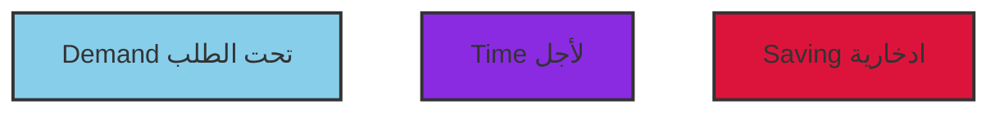

| INDEX | جدول<br>Table | الفهرس |
|--------|-------------|--------|
| Key Economic & Monetary Indicators | | أهم المؤشرات الاقتصادية والنقدية |
| Monetary & Banking Statistics : | | الإحصائيات النقدية والمصرفية : |
| Monetary Base. | 1 | القاعدة النقدية والعوامل المؤثرة فيها |
| Monetary Survey. | 2 | المسح النقدي |
| Money Supply & Factors Affecting it. | 3 | عرض النقود والعوامل المؤثرة فيه |
| Required Reserves for Commercial Banks. | 4 | الاحتياطي النقدي الإلزامي للمصارف التجارية |
| Assets & Liabilities of Central Bank of Libya. | 5 | أصول وخصوم مصرف ليبيا المركزي |
| Dom. & Foreign Assets & Liabilities of Banking Operations \ Currency Issued | 6 | الأصول والخصوم المحلية والأجنبية : العمليات المصرفية / إصدار العملة |
| Notes & Coins Issued. | 7 | العملة الورقية والمعدنية المصدرة |
| Assets & Liabilities of Commercial Banks. | 8 | أصول وخصوم المصارف التجارية |
| Foreign Assets & Liabilities of Comm. Banks | 9 | الأصول والخصوم الأجنبية للمصارف التجارية |
| Interest Rates on deposits with comm. Banks. | 10 | أسعار الفائدة على الودائع لدى المصارف التجارية |
| Loans & Credit Facilities according to Economic Activities. | 11 | القروض والتسهيلات الائتمانية حسب الأنشطة الاقتصادية |
| Credit Facilities (Monetary & Non Monetary). | 12 | التسهيلات الائتمانية (النقدية وغير النقدية) |
| Cheque Clearance. | 13 | مقاصة الصكوك |
| Assets & Liabilities of Regional (Ahliah) Banks. | 14 | أصول وخصوم المصارف الأهلية |
| Assets & Liabilities of Regional Banking Corporation | 15 | أصول وخصوم المؤسسة المصرفية الأهلية |
| International Reserves. | 16 | الاحتياطيات الدولية |
| Exchange Rates of Libyan Dinar Against major international curr. | 17 | أسعار صرف الدينار الليبي مقابل العملات الدولية الرئيسية |
| Assets & Liabilities of the Libyan Foreign Bank | 18 | أصول وخصوم المصرف الليبي الخارجي |
| Assets & Liabilities of Agricultural Bank. | 19 | أصول وخصوم المصرف الزراعي |
| Agricultural Bank loans by Maturity. | 20 | أرصدة قروض المصرف الزراعي حسب آجال الاستحقاق |
| Assets & Liabilities of Development Bank. | 21 | أصول وخصوم مصرف التنمية |
| Development Bank Loans to Economic Activities | 22 | القروض الممنوحة من مصرف التنمية |
| Assets & Liabilities of Saving and Real Estate Investment Bank. | 23 | أصول وخصوم مصرف الإدخار والإستثمار العقاري |
| Savings & Real Estate Investment Bank Loans. | 24 | قروض مصرف الإدخار والإستثمار العقاري |
| Assets & Liabilities of Alrefi Bank | 25 | أصول وخصوم المصرف الريفي |
| Alrefi Bank Loans by Economic Sectors | 26 | القروض الممنوحة من المصرف الريفي حسب الأنشطة الإقتصادية |
| Financial & Economic Statistics: | | الإحصائيات المالية و الاقتصادية : |
| G.D.P at Current Factor Income. | 27 | الناتج المحلى الإجمالي بتكلفة عوامل الدخل الجارية |
| G.D.P at Constant Prices of 2003 | 28 | الناتج المحلى الاجمالى بالاسعار الثابتة (بأسعار 2003) |
| Deflator of G.D.P. | 29 | المخفض الضمنى للناتج المحلى الاجمالى |
| Consumer Price Index . | 30 | الرقم القياسي لأسعار المستهلك |
| Summary of Actual Revenues & Expenditures. | 31 | موجز الإيرادات والمصروفات الفعلية |
| Actual Revenues of Administrative Budget | 32 | الإيرادات الفعلية للميزانية التسييرية |
| Balance of Payments. | 33 | ميزان المدفوعات |
| Oil & Gas Statistics : | | إحصائيات النفط والغاز : |
| Production of Crude Oil by Operating Groups. | 34 | إنتاج النفط الخام حسب المجموعات العاملة |
| Production & Exports of Crude Oil . | 35 | إنتاج وصادرات النفط الخام |
| Prod. & Exp. of Gas & Petrochemicals. | 36 | إنتاج وصادرات الغاز والبتروكيماويات |
| Domestic Production of Petroleum Products. | 37 | الإنتاج المحلى للمشتقات النفطية |
| Domestic Consumption of Petroleum Products. | 38 | الاستهلاك المحلى لمشتقات النفط |
| Domestic Retail Prices of Petroleum Products. | 39 | الأسعار المحلية لمبيعات المشتقات النفطية |
| Average Sale Prices of Crude Oil (F.O.B.). | 40 | متوسط أسعار بيع النفط الخام (فوب) |
---
The image shows a stylized blue scroll or parchment design with curled edges at the top and bottom. In the center of this blue background is Arabic calligraphy in black ink. The text reads:

بسم الله الرحمن الرحيم

This is the Bismillah, which translates to "In the name of Allah, the Most Gracious, the Most Merciful." This phrase is commonly used at the beginning of chapters in the Quran and is often recited by Muslims before undertaking various actions as a way to seek blessings.

The calligraphy is written in a flowing, ornate style typical of Islamic art, with the letters interconnected and embellished. The stark contrast of the black text against the light blue background makes the calligraphy stand out prominently.
---
# دليل المنهجية والمفاهيم الإحصائية

## أولاً - النقود والمصارف:

تغطي الجداول الإحصائية من رقم (1) إلى رقم (17) إحصاءات النقود والمصارف للجهاز المصرفي ويعتبر مصرف ليبيا المركزي والمصارف التجارية المصدر الرئيسي لهذه الإحصاءات وتقوم إدارة الحسابات بتزويد إدارة البحوث والإحصاء بالمركز المالي لمصرف ليبيا المركزي وبإحصاءات تعامل المصارف سواء من خلال آلية سوق النقد الليبي أو عمليات إعادة الشراء (Repo) أو الاكتتاب في شهادات الإيداع التي يصدرها مصرف ليبيا المركزي لمدد زمنية مختلفة كما تقوم إدارة الإصدار وإدارة العمليات المصرفية بتزويد إدارة البحوث والإحصاء بإحصائية النقد المصدر وإحصائية مقاصة الصكوك.

أما المصارف التجارية فتقوم بتزويد إدارة البحوث والإحصاء بمراكزها المالية الشهرية. بالإضافة إلى ذلك تقوم إدارة البحوث والإحصاء بتجميع البيانات الخاصة بأسعار الفائدة الدائنة والمدينة في السوق المصرفية.

وتضطلع إدارة البحوث والإحصاء بجمع هذه البيانات وتجهيزها للنشر بشكل شهري وبما يتناسب مع دليل الإحصاءات النقدية والمالية الصادر عن صندوق النقد الدولي لعام 2000. ويعامل مصرف ليبيا المركزي البيانات التي يجمعها عن المؤسسات المعنية بشكل إفرادي بالسرية التامة.

تنشر البيانات النقدية والمصرفية الشهرية بصورتها النهائية (باستثناء البيانات الخاصة بنهاية السنة المالية للمصارف التجارية، فإنه يتم تعديلها بعد ذلك لتصبح نهائية) وتتم مراجعة هذه البيانات عند إجراء أي تعديل يتعلق بالمنهجية المتبعة وتصنيف البيانات النقدية.

## وفيما يلي تعريف بمفاهيم أبرز المصطلحات الواردة في هذه الجداول:

### المصرف: 
مصرف ليبيا المركزي

### المصارف التجارية: 
تشمل جميع المصارف التجارية العاملة في ليبيا والمرخص لها بمزاولة الأعمال المصرفية والخاضعة لإشراف المصرف وفقاً لأحكام القانون رقم (1) لسنة 2005 بشأن المصارف، ويسمح لهذه المصارف بقبول الودائع. ولا يشمل هذا التعريف المصارف المتخصصة أو المؤسسات المالية الأخرى.

### الجهاز المصرفي: 
يشتمل على المصرف والمصارف التجارية.
---

الجهاز التنفيذي للدولة : يشمل جميع الوزارات والأجهزة والإدارات التابعة لها إدارياً ومالياً.

المؤسسات العامة : وهي المؤسسات أو الهيئات المملوكة بالكامل للدولة والمستقلة مالياً وإدارياً ولها موازناتها الخاصة بها.

المؤسسات شبه العامة : وهي المؤسسات التي تساهم فيها الدولة بنسبة 50% من رأس مالها أو أكثر.

القطاع العام : يشمل الجهاز التنفيذي للدولة والمؤسسات العامة والمؤسسات شبه العامة.

القطاع الأهلي ( الخاص ) : ويتكون من الأفراد المقيمين والشركات والمؤسسات والكيانات القانونية الأخرى المقيمة بخلاف القطاع العام.

المقيــــم : الشخص الطبيعي أو الاعتباري الذي يقيم عادة داخل ليبيا أو مضى على إقامته في ليبيا سنة فأكثر بغض النظر عن جنسية هذا الشخص ، ويستثنى من ذلك الهيئات والمؤسسات الدولية والطلاب والمرضى الأجانب الذين يقيمون لأكثر من سنة.

غير المقيم : الشخص الطبيعي أو الاعتباري الذي يقيم عادة خارج ليبيا ، أو الذي لم يكمل مدة سنة من الإقامة داخل ليبيا بغض النظر عن جنسية هذا الشخص ، ويستثنى من ذلك العائلات والأفراد الذين لهم مركز أو مصلحة اقتصادية ولهم سكن دائم حتى ولو أقام به بشكل متقطع.

آلية السوق النقدي : وهي أداة للسياسة النقدية تمكن المصارف التجارية من الإيداع لدى والاقتراض من المصرف بموجب شروط وضوابط يضعها المصرف.

عمليات إعادة الشراء : وهي شراء المصرف المركزي الأوراق المالية وغيرها من الأوراق (شهادات الإيداع) المقبولة لدى المصرف مع التزام المصرف التجاري البائع بإعادة شراء هذه الأوراق بعد فترة محددة وبسعر فائدة يحدده المصرف (سعر إعادة الشراء).

سعر المصرف : سعر الفائدة أو العائد المعلن من المصرف عند بداية التعامل اليومي من خلال آلية السوق النقدي.

سعر إعادة الشراء : سعر الفائدة أو العائد الذي يعلنه المصرف على عمليات إعادة شراء أوراق الدين العام ، أو شهادات الإيداع.

الاحتياطي الإلزامي : وهي نسبة من إجمالي ودائع العملاء لدى المصرف التجاري بجميع أنواعها ويتم الاحتفاظ بها لدى المصرف ، ولا يدفع المصرف فائدة أو عائد على رصيد الاحتياطي الإلزامي.
---
ودائع العملاء : تشمل جميع أنواع ودائع القطاعين العام والأهلي (الخاص) مضافاً إليها ودائع غير
المقيمين ، مع استثناء ودائع المصارف والمؤسسات المالية ، وأيضاً التأمينات النقدية
وشهادات الإيداع .

التأمينات النقدية : تشمل كافة الأرصدة القائمة للتأمينات النقدية من قبل العملاء كالتأمين النقدي
على الاعتمادات والضمانات أو أي تأمينات نقدية أخرى .

التسهيلات الائتمانية : تشمل الأرصدة القائمة لجميع أنواع التسهيلات الائتمانية وعمليات التمويل
المباشرة ( سحب على المكشوف أي جاري مدين ، أوراق تجارية ومالية مخصومة ،
سلف وقروض ، أية تسهيلات أخرى ) المقدمة لجميع القطاعات الاقتصادية باستثناء
المصارف والمؤسسات المالية .

السحب على المكشوف (الجاري مدين) : يشمل جميع أرصدة حسابات الجاري مدين والحسابات
الجارية (تحت الطلب) المكشوفة .

الموجودات الأجنبية (صافي) : يمثل الموجودات (الأصول ) الأجنبية للجهاز المصرفي مطروحاً
منها المطلوبات (الخصوم) الأجنبية على الجهاز المصرفي استناداً إلى مفهوم الإقامة.

الموجودات المحلية (صافي) : يمثل مجموع بنود صافي المطالبات على الخزانة العامة
والمطالبات المحلية وصافي البنود الأخرى في الوضع النقدي للجهاز المصرفي.

صافي المطلوبات على الخزانة العامة : تشمل التسهيلات الائتمانية المباشرة الممنوحة للخزانة
العامة مضافاً إليها استثمار المصارف التجارية في أوراق الدين العام (إن وجدت)
مطروحاً منها ودائع الخزانة العامة لدى الجهاز المصرفي .

المطلوبات المحلية : تشمل الائتمان المقدم للقطاع الأهلي ( الخاص ) وللمؤسسات العامة
والمؤسسات شبه العامة مضافاً إليه استثمار المصارف التجارية في الأوراق المالية
المحلية غير العامة .

صافي البنود الأخرى : يمثل الموجودات (الأصول) الأخرى للجهاز المصرفي مطروحاً منها
المطلوبات (الخصوم) الأخرى للجهاز المصرفي ، وهي التي لم ترد ضمن تعريف
صافي الموجودات الأجنبية وصافي المطلوبات على الخزانة العامة والمطلوبات
المحلية من المركز المالي للمصرف والمركز المالي المجمع للمصارف التجارية .

النقد المصدر : هو النقد الذي أصدره المصرف ، ويتكون من رصيد النقد المتداول لدى الجمهور
مضافاً إليه أرصدة النقدية في الصندوق لدى المصرف ولدى المصارف التجارية .

ج
---
النقود الاحتياطية (القاعدة النقدية م0) : تمثل النقد المصدر مضافاً إليه الاحتياطي الإلزامي
وفائض الأرصدة الاحتياطية للمصارف التجارية لدى المصرف المركزي فيما عدا
شهادات الإيداع .

عرض النقد (ع1) : يمثل النقد المتداول لدى الجمهور مضافاً إليه ودائع القطاع الأهلي (الخاص)
ودائع المؤسسات العامة والمؤسسات شبه العامة تحت الطلب بالدينار الليبي.

شبه النقد : يمثل ودائع القطاع الأهلي (الخاص) ودائع المؤسسات العامة والمؤسسات شبه العامة
(الادخار ولأجل) بالدينار الليبي مضافاً إليها ودائع القطاع الأهلي (الخاص)
والمؤسسات العامة والمؤسسات شبه العامة بالعملات الأجنبية مقومة بالدينار الليبي.

عرض النقد (ع2) : وهو عرض النقود (ع1) مضافاً إليه شبه النقود ، ويعادل أيضاً مجموع كل من
صافي الموجودات الأجنبية وصافي الموجودات المحلية للجهاز المصرفي .

ثانياً - القطاع الخارجي :

تغطي الجداول الإحصائية رقم (33 و 34) إحصائيات التجارة الخارجية وميزان المدفوعات
ويتولى قسم ميزان المدفوعات في المصرف مهمة تجميع وإعداد إحصاءات ميزان المدفوعات، أما
بيانات التجارة الخارجية فمصدرها الهيئة العامة للمعلومات .

ويتم نشر بيانات ميزان المدفوعات وفقاً لمنهجية الطبعة الخامسة لدليل إعداد ميزان المدفوعات
الصادر عن صندوق النقد الدولي .

وفيما يلي تعريف بمفاهيم أبرز المصطلحات الواردة في هذا الجزء :

الحساب الجاري : يمثل مجموع الميزان التجاري وحساب الخدمات وحساب الدخل وصافي حساب
التحويلات الجارية .

الميزان التجاري : يمثل الصادرات مطروحاً منها الواردات في ميزان المدفوعات .

الصادرات : تمثل الصادرات الوطنية (سيف) مضافاً إليها المعاد تصديره .

الواردات : تمثل الواردات (سيف) مستثنى منها واردات الجهات غير المقيمة .

الذهب غير النقدي : هو الذهب الذي تتم حيازته واستخدامه لأغراض أخرى (صناعية) ولا تحتفظ
به السلطات النقدية كأصل احتياطي .

حساب الخدمات: يمثل المقبوضات مطروحاً منها المدفوعات من الخدمات المبينة أدناه وهي:-

د
---
• السفر : تمثل المقبوضات من هذا البند إنفاق السياح غير المقيمين الوافدين لليبيا ، ويتم تقديرها
بالاستناد إلى نتائج مسوحات القادمين والمغادرين التي تقوم الهيئة العامة للسياحة بإعدادها من
فترة إلى أخرى ، والتي توفر تقديرات حول معدلات الإنفاق لكل جنسية من السياح ويتم تعديلها
بمعدلات التضخم السائدة خلال الفترة المراد احتسابها . بينما تمثل مدفوعات السفر انفاق
المقيمين في ليبيا في الخارج والذين يسافرون لغايات التعليم أو السياحة أو العلاج وغيرها ،
ويتم تقديرها بالاستناد إلى البيانات التي تعدها المصارف التجارية حول مبيعاتها من النقد
الأجنبي للأغراض الشخصية .

• النقل : تمثل مقبوضات هذا البند الإيرادات المتحصلة لشركات ومنشآت النقل المقيمة لقاء
تقديمها لخدمات النقل لغير المقيمين . بينما تمثل مدفوعات هذا البند المبالغ المدفوعة من
المقيمين لشركات ومؤسسات النقل غير المقيمة لقاء تقديم خدمات النقل للمقيمين ، بما في ذلك
تكاليف الشحن على البضائع المستوردة . ويتم الحصول على بيانات هذا البند من خلال مصادر
شركات النقل ذاتها والبيانات التي يقوم المصرف المركزي والمصارف التجارية بإعدادها
بشكل شهري .

• خدمات عامة (حكومية) : تغطي القيود الدائنة لهذا البند الدخل المتأتي لقاء الخدمات المقدمة من
قبل السفارات والبعثات الدبلوماسية والسياسية الليبية في الخارج ، علاوة على الخدمات التي
تقدمها المؤسسات العامة لغير المقيمين . في حين تغطي القيود المدينة لهذا البند نفقات
(الحكومة) والمؤسسات العامة المتحققة لغير المقيمين لقاء تسوية مدفوعات خارجية أو شراء
خدمات . ويتم الحصول على البيانات ذات العلاقة بهذا البند من نماذج الإبلاغ المعدة لذلك .

• الخدمات الأخرى : تشمل الخدمات غير المصنفة في البنود أعلاه والتي من أبرزها خدمات
التأمين وخدمات الاتصالات والحاسب الآلي وخدمات التشييد وعمولات المتاجرة والخدمات
المالية ورسوم الامتياز والتراخيص التي تتم بين المقيمين وغير المقيمين .

حساب الدخل : يشمل هذا الحساب البنود التالية :-

• تعويضات العاملين ( مقبوضات ) : تمثل الأجور والمزايا التي يحصل عليها العاملون
المقيمون بمن فيهم العمال الموسميون وعمال الحدود ، لقاء تأديتهم لعمل ما خارج الإقليم
الاقتصادي لليبيا لصالح جهة غير مقيمة .
---
• تعويضات العاملين (مدفوعات) : تمثل الأجور والمزايا التي يحصل عليها العاملون غير المقيمين بمن فيهم العمال الموسميون وعمال الحدود غير المقيمين ، لقاء تأديتهم لعمل ما داخل الإقليم الاقتصادي لليبيا.

• دخل الاستثمار : يمثل جانب المقبوضات منه الأرباح والفوائد المستحقة عن حيازات المقيمين لحصص الملكية أو الأصول المالية كالودائع المصرفية وسندات القروض والأوراق المالية والاذونات الصادرة عن مؤسسات غير مقيمة. وتغطي فوائد استثمارات المصرف المركزي والمصارف التجارية والقطاع العام والقطاع الأهلي (الخاص). بينما يمثل جانب المدفوعات الفوائد والأرباح المستحقة لغير المقيمين عن حيازتهم لحصص الملكية أو الأصول المالية الصادرة عن جهات مقيمة.

التحويلات الجارية : تمثل القيود المقابلة للتدفقات الحقيقية من السلع والخدمات أو الأصول المالية وغير المالية والتي لا يترتب عليها حيازة الأصول الثابتة أو التخلي عنها أو تنازل الدائن عن التزام المدين. وتشمل هذه التحويلات ما يلي:

• تحويلات القطاع العام : تتضمن قيم المنح والمساعدات والهبات سواء التي تتلقاها الدولة (مقبوضات) أو تقوم هي بتقديمها (مدفوعات).

• تحويلات القطاعات الأخرى : وتشمل:-

- حوالات العاملين : يمثل جانب المقبوضات منها تحويلات الليبيين العاملين المقيمين في الخارج والموجهة لغايات الإنفاق الجاري في ليبيا ، ويتم تقديرها استناداً للبيانات التي يقوم المصرف المركزي والمصارف التجارية بتعبئتها بشكل شهري (بيانات الدخل بالعملات الأجنبية للجهاز المصرفي). ويمثل جانب المدفوعات منها التحويلات للخارج من قبل العمالة الوافدة المقيمة في ليبيا. ويتم تقديرها بالاستناد إلى البيانات حول العمالة الوافدة وإلى معدل التحويل الشهري للعامل الواحد.

- تحويلات أخرى (صافي) : وتتضمن قيم المنح والمساعدات والهبات التي يتلقاها المقيمون داخل ليبيا (عدا الحكومة وحوالات العاملين) من غير المقيمين بما في ذلك تعويضات الأمم المتحدة (إن وجدت)، أو التي يقدمها المقيمون داخل ليبيا (عدا الحكومة وحوالات العاملين) لغير المقيمين.
---
الحساب الرأسمالي: يشمل البنود التالية:-

• الاستثمار المباشر (في الخارج): يمثل صافي استثمارات المقيمين في حقوق الملكية والعائدات المعاد استثمارها بالإضافة إلى صافي أية التزامات أخرى على المؤسسات التابعة غير المقيمة.

• الاستثمار المباشر (في ليبيا): يمثل صافي استثمارات غير المقيمين في حقوق الملكية والعائدات المعاد استثمارها بالإضافة إلى صافي أية التزامات أخرى على المؤسسات المقيمة في ليبيا.

• استثمار الحافظة (الأصول): يشمل سندات الملكية وسندات الدين والأدوات المالية التي بحوزة المقيمين والصادرة عن جهات خارجية عدا تلك المدرجة تحت الاستثمار الأجنبي المباشر والأصول الاحتياطية.

• استثمار الحافظة (الخصوم): يشمل سندات الملكية وسندات الدين والأدوات المالية التي بحوزة غير المقيمين والصادرة عن مؤسسات مقيمة عدا تلك المدرجة تحت الاستثمار الأجنبي المباشر والأصول الاحتياطية.

• استثمارات اخرى (الأصول): تشتمل على كافة المعاملات المالية العائدة للمقيمين والتي لا تتضمنها فئات الاستثمار الأجنبي المباشر أو استثمار الحافظة أو الأصول الاحتياطية. وتبوب حسب الاداة إلى ائتمان تجاري وقروض ونقد وودائع.

• استثمارات اخرى (خصوم): تشتمل على كافة المعاملات المالية العائدة لغير المقيمين والتي لا تتضمنها فئات الاستثمار الأجنبي المباشر أو استثمار الحافظة أو الأصول الاحتياطية. وتبوب حسب الاداة إلى ائتمان تجاري وقروض ونقد وودائع.

• الأصول الاحتياطية: هي الأصول الخارجية والتي تقع ضمن سيطرة المصرف المركزي وتعد متاحة للاستخدام لتمويل أو معالجة أية اختلالات في ميزان المدفوعات، وتشمل هذه الأصول الذهب النقدي وحقوق السحب الخاصة ووضع الاحتياطي لدى صندوق النقد الدولي (IMF) وأصول النقد الأجنبي (نقد وودائع وأوراق مالية).
---
# أهم المؤشرات الإقتصادية والنقدية الرئيسية في ليبيا
# KEY ECONOMIC AND MONETARY INDICATORS IN LIBYA

Million L.D ( unless stated otherwise )                                                                                  (مليون دينار ( ما لم ينص على غير ذلك

| Sectors | 2013.12.31 | البيــان |
|---------|------------|---------|
| Population (In Thousand) (*) | 6,348.0 | السكان (بالآلاف) (*) |
| National Accounts (*) : | | الحسابات القومية (*) : |
| GDP at Current Prices 2012 | 117,675.0 | الناتج المحلي الإجمالي بالأسعار الجارية عام 2012 |
| GDP 2012 at Fixed Prices of 2003 | 39,922.7 | الناتج المحلي الإجمالي بالأسعار الثابتة (2003=100) في عام 2012 |
| Inflation rate %. | 2.6 | معدل التضخم % . |
| Money and Banking : | | النقود والمصارف : |
| Exchange Rate LD/ US $ | 1.254 | سعر صرف الدينار (لكل دولار) |
| 1- Money (M1) | 64,299.4 | 1- النقود (ع1) : |
| Currency outside banks | 13,419.9 | - عملة خارج المصارف |
| Demand Deposits | 50,879.5 | - ودائع تحت الطلب |
| 2- Quasi-Money | 4,706.5 | 2- شبه النقود |
| Money Supply (M2) | 69,005.9 | 3- عرض النقود (ع2) |
| Public Finance 2012 (*): | | المالية العامة 2012 (*) : |
| Revenues | 70,131.4 | الإيرادات |
| of which : | | ومنها : |
| Oil Revenues | 66,932.3 | إيرادات النفط |
| Expenditure | 53,941.6 | المصروفات |
| Balance of Payments 2012: | | ميزان المدفوعات لعام 2012 : |
| Exports | 76,893.0 | الصادرات |
| of which : | | ومنها : |
| Oil | 75,355.0 | النفط |
| Imports | -32,243.0 | الواردات |
| Balance of Trade | 44,650.0 | الميزان التجاري |
| Current Account | 30,034.0 | الحساب الجاري |
| Financial & Capital Account | -9,937.0 | الحساب الرأسمالي والمالي |
| Overall Balance | 16,898.0 | الميزان الكلي |

(*) Estimated data .                                                                                                                     (*)بيانات تقديرية
---

```
الإحصائيات النقدية والمصرفية

Monetary & Banking
Statistics
```

The text is presented within a stylized blue ribbon or banner graphic that spans horizontally across the image, with curved ends on both sides.
---
# القاعـــــدة النقــدية
# MONETARY BASE

Table No. (1)                                                                                                                                   جدول رقم (1)
Million L.D                                                                                                                                        مليون دينار

| Monetary Base | Public Enterprises and other Financial institution Deposits with Central Bank of Libya | Commercial. Bank Reserves | Currency in circulation | End of |
|---------------|--------------------------------------------------------------------------------|---------------------------|-------------------------|--------|
| القاعدة النقدية | ودائع المؤسسات العامة والمؤسسات المالية الاخرى لدى مصرف ليبيا المركزي | إحتياطيات المصارف التجارية | عملة لدى الجمهور | نهاية |
| (1)+(2)+(3) | (3) | Total المجموع | Cash in Vault نقدية في الصندوق | (1) |
|  |  | (2) | Deposits With Central Bank of Libya ودائع لدى مصرف ليبيا المركزي |  |
| 5089.3 | 784.6 | 1692.0 | 1510.4 | 181.6 | 2612.7 | 2004 |
| 7670.8 | 1441.6 | 2920.5 | 2747.5 | 173.0 | 3308.7 | 2005 |
| 8730.8 | 1109.4 | 3688.5 | 3487.3 | 201.2 | 3932.9 | 2006 |
| 10987.1 | 1071.4 | 5334.5 | 4963.6 | 370.9 | 4581.2 | 2007 |
| 18881.6 | 659.0 | 12614.3 | 12239.9 | 374.4 | 5608.3 | 2008 |
| 20462.8 | 317.9 | 13182.0 | 12670.0 | 512.0 | 6962.9 | 2009 |
| 22604.2 | 919.7 | 14075.5 | 13228.4 | 847.1 | 7609.0 | 2010 |
| 32404.5 | 1809.0 | 15755.4 | 14890.8 | 864.6 | 14840.1 | 2011 |
| 34300.9 | 1486.0 | 19423.8 | 17990.5 | 1433.3 | 13391.1 | 2012 |
|  |  |  |  |  |  | 2013 |
| 32812.9 | 1392.4 | 17734.7 | 15911.5 | 1823.2 | 13685.8 | Q1 الربع الأول |
| 33037.6 | 1720.3 | 19502.5 | 17408.4 | 2094.1 | 11814.8 | Q2 الربع الثاني |
| 33998.7 | 1663.7 | 19280.1 | 17122.3 | 2157.8 | 13054.9 | Q3 الربع الثالث |
| 33929.4 | 1719.4 | 18905.7 | 16928.5 | 1977.2 | 13304.3 | 2013.10.31 |
| 35157.8 | 1703.2 | 20190.3 | 18170.5 | 2019.8 | 13264.3 | 2013.11.30 |
| 36886.5 | 1678.6 | 21788.0 | 20165.4 | 1622.6 | 13419.9 | 2013.12.31 |
---
# العوامل المؤثرة في القاعدة النقدية
# FACTORS AFFECTING MONETARY BASE

Table No. (1) ( cont. )                                                                 (1) تابع جدول رقم
Million L.D                                                                                 مليون دينار

| المجموع الكلي<br>Grand Total | صافي الأصول المحلية<br>Net Domestic Assets |||||  صافي الأصول الأجنبية<br>Net Foreign Assets | نهاية<br>End of |
|---|---|---|---|---|---|---|---|
|| المجموع<br>Total | صافي البنود الأخرى<br>Other Items (Net) | المستحقات على المصارف التجارية<br>Claims on Comm. Banks | المستحقات على القطاعات الأخرى<br>Claims on other Sectors | صافي المستحقات على الخزانة<br>Net Claims on Treasury |||
| 5089.3 | -27976.6 | -12532.8 | 1.0 | 209.4 | -15654.2 | 33065.9 | 2004 |
| 7670.8 | -46777.1 | -16310.4 | 1.8 | 926.8 | -31395.3 | 54447.9 | 2005 |
| 8730.8 | -68510.0 | -18149.9 | 67.9 | 1027.4 | -51455.4 | 77240.8 | 2006 |
| 10987.1 | -87318.3 | -25692.8 | 52.9 | 1294.9 | -62973.3 | 98305.4 | 2007 |
| 18881.6 | -102375.6 | -32145.5 | 52.2 | 902.7 | -71185.0 | 121257.2 | 2008 |
| 20462.8 | -107728.8 | -37593.4 | 51.9 | 515.1 | -70702.4 | 128191.6 | 2009 |
| 22604.2 | -111558.8 | -42201.6 | 0.0 | 1053.1 | -70410.3 | 134163.0 | 2010 |
| 32404.5 | -107043.7 | -45563.9 | 0.0 | 0.0 | -61479.8 | 139448.2 | 2011 |
| 34300.9 | -121480.7 | -48868.6 | 0.0 | 0.0 | -72612.1 | 155781.6 | 2012 |
||||||||| 2013 |
| 32812.9 | -129423.4 | -51840.9 | 0.0 | 0.0 | -77582.5 | 162236.3 | Q1 الربع الأول |
| 33037.6 | -131275.0 | -50259.0 | 0.0 | 0.0 | -81016.0 | 164312.6 | Q2 الربع الثاني |
| 33998.7 | -127121.5 | -51564.9 | 0.0 | 0.0 | -75556.6 | 161120.2 | Q3 الربع الثالث |
| 33929.4 | -125448.0 | -52265.8 | 0.0 | 0.0 | -73182.2 | 159377.4 | 2013.10.31 |
| 35157.8 | -121005.8 | -52133.5 | 0.0 | 0.0 | -68872.3 | 156163.6 | 2013.11.30 |
| 36886.5 | -114041.0 | -60792.8 | 0.0 | 0.0 | -53248.2 | 150927.5 | 2013.12.31 |
---

## القاعدة النقدية
## MONETARY BASE

| Year | Currency in Circulation | Deposits of Comm. Banks | Public Enterprises and other Financial institutions Deposits with Central Bank of Libya |
|------|-------------------------|-------------------------|------------------------------------------------------------------------------------------|
| 2008 | ~6000 | ~2000 | ~1000 |
| 2009 | ~8000 | ~5000 | ~500 |
| 2010 | ~9000 | ~6000 | ~500 |
| 2011 | ~15000 | ~2000 | ~1000 |
| 2012 | ~16000 | ~1000 | ~1000 |
| Q1/2013 | ~17000 | ~1000 | ~1000 |
| Q2/2013 | ~18000 | ~1000 | ~1000 |
| Q3/2013 | ~17000 | ~1000 | ~1000 |
| Q4/2013 | ~21000 | ~1000 | ~1000 |

*Note: Values are approximate and in million L.D (Libyan Dinar)*

## العوامل المؤثرة فى القاعدة النقدية
## FACTORS AFFECTING MONETARY BASE

| Year | Monetary Base Assets | Net Foreign Assets | Claims on other Sectors | Net Claims on Treasury | Other Items (net) |
|------|----------------------|--------------------|-----------------------|------------------------|-------------------|
| 2008 | ~120000 | ~140000 | ~20000 | ~-60000 | ~-20000 |
| 2009 | ~140000 | ~160000 | ~20000 | ~-60000 | ~-20000 |
| 2010 | ~140000 | ~160000 | ~20000 | ~-60000 | ~-20000 |
| 2011 | ~160000 | ~180000 | ~20000 | ~-60000 | ~-20000 |
| 2012 | ~160000 | ~180000 | ~40000 | ~-60000 | ~-20000 |
| Q1/2013 | ~160000 | ~180000 | ~40000 | ~-60000 | ~-20000 |
| Q2/2013 | ~160000 | ~180000 | ~40000 | ~-60000 | ~-20000 |
| Q3/2013 | ~160000 | ~180000 | ~40000 | ~-60000 | ~-20000 |
| Q4/2013 | ~140000 | ~160000 | ~40000 | ~-60000 | ~-20000 |

*Note: Values are approximate and in million L.D (Libyan Dinar)*
---
# المســـح النقـــدي
# MONETARY SURVEY

Table No. (2)                                                                                                                      جدول رقم (2)
Million L.D                                                                                                                         مليون دينار

| Items | 2013.12.31 | 2013.11.30 | 2013.10.31 | End of<br>الربع الثالث<br>2013 Q3 | الربع الثاني<br>2013 Q2 | الربع الأول<br>2013 Q1 | 2012 | 2011 | 2010 | 2009 | 2008 | البنــود |
|-------|------------|------------|------------|-----------------------------------|------------------------|------------------------|------|------|------|------|------|---------|
| Money and Quasi-Money | 69005.9 | 68781.8 | 68084.0 | 67127.8 | 63081.8 | 63652.6 | 63731.5 | 57940.9 | 46350.7 | 44161.3 | 39744.5 | النقود وشبه النقود |
| Money : | 64299.4 | 64557.0 | 64107.7 | 62784.3 | 59049.4 | 59679.0 | 59213.7 | 53437.1 | 41321.2 | 38169.4 | 34414.6 | النقــود : |
| - Currency in circulation | 13419.9 | 13264.3 | 13304.3 | 13054.9 | 11814.8 | 13685.8 | 13391.1 | 14840.1 | 7609.0 | 6962.9 | 5608.3 | - عملة لدى الجمهور |
| - Demand deposits | 50879.5 | 51292.7 | 50803.4 | 49729.4 | 47234.6 | 45993.2 | 45822.6 | 38597.0 | 33712.2 | 31206.5 | 28806.3 | - ودائع تحت الطلب |
| Quasi-Money : | 4706.5 | 4224.8 | 3976.3 | 4343.5 | 4032.4 | 3973.6 | 4517.8 | 4503.8 | 5029.5 | 5991.9 | 5329.9 | شبه النقــود : |
| - Time deposits * | 4043.6 | 3554.4 | 3299.3 | 3661.8 | 3343.5 | 3283.2 | 3812.5 | 3819.9 | 4286.4 | 5276.9 | 4640.7 | - ودائع زمنية |
| - savings deposits | 662.9 | 670.4 | 677.0 | 681.7 | 688.9 | 690.4 | 705.3 | 683.9 | 743.1 | 715.0 | 689.2 | - ودائع إدخارية |
| Net Foreign Assets : | 154905.0 | 160327.6 | 163378.8 | 165126.8 | 168335.6 | 166567.9 | 159222.4 | 143600.6 | 137624.0 | 132280.1 | 124830.3 | صافي الأصول الأجنبية : |
| - Central Bank | 150927.5 | 156163.6 | 159377.4 | 161120.2 | 164312.6 | 162236.3 | 155781.6 | 139448.2 | 134163.0 | 128191.6 | 121257.2 | - المصرف المركزي |
| - Comm Banks | 3977.5 | 4164.0 | 4001.4 | 4006.6 | 4023.0 | 4331.6 | 3440.8 | 4152.4 | 3461.0 | 4088.5 | 3573.1 | - المصارف التجارية |
| Net Domestic Assets : | -85899.1 | -91545.8 | -95294.8 | -97999.0 | -105253.8 | -102915.3 | -95490.9 | -85659.7 | -91273.3 | -88118.8 | -85085.8 | صافي الأصول المحلية : |
| Claims on Treasury (Net) | -77533.6 | -82679.0 | -86688.8 | -89300.8 | -96153.0 | -91199.6 | -86595.4 | -72612.2 | -82325.8 | -80899.5 | -80767.1 | المستحقات على الخزانة (صافي) : |
| - Central Bank | -53248.2 | -68872.3 | -73182.1 | -75576.6 | -81016.0 | -77582.5 | -72612.1 | -61479.8 | -70410.3 | -70702.4 | -71185.0 | - المصرف المركزي |
| - Comm. & Regional Banks | -24285.4 | -13806.7 | -13506.7 | -13744.2 | -15137.0 | -13617.1 | -13983.3 | -11132.4 | -11915.5 | -10197.1 | -9582.1 | - المصارف التجارية والأهلية |
| Claims on other Sectors | 18981.6 | 18904.0 | 18707.1 | 18411.1 | 17847.1 | 16777.4 | 16860.6 | 13549.7 | 14765.2 | 12920.7 | 11448.6 | المستحقات على القطاعات الأخرى |
| Other items (Net) | -27347.1 | -27770.8 | -27313.1 | -27109.3 | -26947.9 | -28493.1 | -25756.1 | -26597.2 | -23712.7 | -20140.0 | -15767.3 | بنود أخرى (صافي) |
| Total | 69005.9 | 68781.8 | 68084.0 | 67127.8 | 63081.8 | 63652.6 | 63731.5 | 57940.9 | 46350.7 | 44161.3 | 39744.5 | المجمــوع |

* * Includes foreign currency deposits for resident customers .                                                                 * تشمل ودائع بالعملة الأجنبية لعملاء مقيمين.
---
# عرض النقـــود
# MONEY SUPPLY

Table No. (3)                                                                                                                                    جدول رقم (3)
Million L.D                                                                                                                                         مليون دينار

| نهاية<br>End of | النقــود<br>Money | شبــه النقــود<br>Quasi-Money | المجمــوع الكلي<br>Grand Total |
|-----------------|-------------------|-------------------------------|--------------------------------|
| | عملة لدى الجمهور<br>Currency in circulation | ودائع تحت الطلب *<br>Demand Deposits * | المجمـوع<br>Total | ودائع لأجل **<br>Time Deposits ** | ودائع إدخارية<br>Saving Deposits | المجمـوع<br>Total | (1+2) |
| 2004 | 2612.7 | 7923.9 | 10536.6 | 1883.8 | 715.1 | 2598.9 | 13135.5 |
| 2005 | 3308.7 | 10719.4 | 14028.1 | 2368.2 | 700.0 | 3068.2 | 17096.3 |
| 2006 | 3932.9 | 12410.1 | 16343.0 | 2662.0 | 650.9 | 3312.9 | 19655.9 |
| 2007 | 4581.2 | 18256.3 | 22837.5 | 3481.3 | 663.3 | 4144.6 | 26982.1 |
| 2008 | 5608.3 | 28806.3 | 34414.6 | 4640.7 | 689.2 | 5329.9 | 39744.5 |
| 2009 | 6962.9 | 31206.5 | 38169.4 | 5276.9 | 715.0 | 5991.9 | 44161.3 |
| 2010 | 7609.0 | 33712.2 | 41321.2 | 4286.4 | 743.1 | 5029.5 | 46350.7 |
| 2011 | 14840.1 | 38597.0 | 53437.1 | 3819.9 | 683.9 | 4503.8 | 57940.9 |
| 2012 | 13391.1 | 45822.6 | 59213.7 | 3812.5 | 705.3 | 4517.8 | 63731.5 |
| 2013 | | | | | | | |
| Q1 الربع الاول | 13685.8 | 45993.2 | 59679.0 | 3283.2 | 690.4 | 3973.6 | 63652.6 |
| Q2 الربع الثاني | 11814.8 | 47234.6 | 59049.4 | 3343.5 | 688.9 | 4032.4 | 63081.8 |
| Q3 الربع الثالث | 13054.9 | 49729.4 | 62784.3 | 3661.8 | 681.7 | 4343.5 | 67127.8 |
| 2013.10.31 | 13304.3 | 50803.4 | 64107.7 | 3299.3 | 677.0 | 3976.3 | 68084.0 |
| 2013.11.30 | 13264.3 | 51292.7 | 64557.0 | 3554.4 | 670.4 | 4224.8 | 68781.8 |
| 2013.12.31 | 13419.9 | 50879.5 | 64299.4 | 4043.6 | 662.9 | 4706.5 | 69005.9 |

* Includes Public Enterprise deposits with the Central Bank of Libya.                                     .تشمل ودائع المؤسسات العامة لدى مصرف ليبيا المركزي*
** Includes foreign currency deposits for resident customers.                                                         .تشمل ودائع بالعملة الأجنبية لعملاء مقيمين**
---
# العوامل المؤثرة في عرض النقود
# FACTORS AFFECTING MONEY SUPPLY

Table No. (3) ( cont. )                                                                                  (3) تابع جدول رقم
Million L.D                                                                                                    مليون دينار

| نهاية<br>End of | صافي الأصول الأجنبية<br>Net Foreign Assets | صافي الأصول المحلية<br>Net Domestic Assets | المجموع الكلي<br>Grand Total<br>(3+4) |
|-----------------|-------------------------------------------|-------------------------------------------|--------------------------------------|
| | مصرف ليبيا<br>المركزي<br>Central Bank<br>of Libya | المصارف التجارية<br>Comm. Banks | المجموع<br>Total<br>(3) | صافي المستحقات على<br>الخزانة<br>Net claims on<br>Treasury | المستحقات على قطاعات<br>أخرى<br>Claims on Other<br>Sectors | صافي البنود الأخرى<br>Other Items<br>(Net) | المجموع<br>Total<br>(4) | |
|-----------------|-------------------------------------------|--------------------------------|------------------------|-----------------------------------------------------------|-----------------------------------------------------------|------------------------------------------|------------------------|------------------|
| 2004 | 33065.9 | 1171.1 | 34237.0 | -17734.5 | 6897.1 | -10264.1 | -21101.5 | 13135.5 |
| 2005 | 54447.9 | 1974.1 | 56422.0 | -33880.2 | 7277.2 | -12722.7 | -39325.7 | 17096.3 |
| 2006 | 77240.8 | 2192.7 | 79433.5 | -55256.4 | 8085.9 | -12607.1 | -59777.6 | 19655.9 |
| 2007 | 98305.4 | 2438.4 | 100743.8 | -67834.4 | 9428.0 | -15355.3 | -73761.7 | 26982.1 |
| 2008 | 121257.2 | 3573.1 | 124830.3 | -80767.1 | 11448.6 | -15767.3 | -85085.8 | 39744.5 |
| 2009 | 128191.6 | 4088.5 | 132280.1 | -80899.5 | 12920.7 | -20140.0 | -88118.8 | 44161.3 |
| 2010 | 134163.0 | 3461.0 | 137624.0 | -82325.8 | 14765.2 | -23712.7 | -91273.3 | 46350.7 |
| 2011 | 139448.2 | 4152.4 | 143600.6 | -72612.2 | 13549.7 | -26597.2 | -85659.7 | 57940.9 |
| 2012 | 155781.6 | 3440.8 | 159222.4 | -86595.4 | 16860.6 | -25756.1 | -95490.9 | 63731.5 |
| 2013 | | | | | | | | |
| Q1 الربع الأول | 162236.3 | 4331.6 | 166567.9 | -91199.6 | 16777.4 | -28493.1 | -102915.3 | 63652.6 |
| Q2 الربع الثاني | 164312.6 | 4023.0 | 168335.6 | -96153.0 | 17847.1 | -26947.9 | -105253.8 | 63081.8 |
| Q3 الربع الثالث | 161120.2 | 4006.6 | 165126.8 | -89300.8 | 18411.1 | -27109.3 | -97999.0 | 67127.8 |
| 2013.10.31 | 159377.4 | 4001.4 | 163378.8 | -86688.8 | 18707.1 | -27313.1 | -95294.8 | 68084.0 |
| 2013.11.30 | 156163.6 | 4164.0 | 160327.6 | -82679.0 | 18904.0 | -27770.8 | -91545.8 | 68781.8 |
| 2013.12.31 | 150927.5 | 3977.5 | 154905.0 | -77533.6 | 18981.6 | -27347.1 | -85899.1 | 69005.9 |
---
# عرض النقود
# MONEY SUPPLY

| YEARS السنوات | Currency OutSide Banks عملة خارج المصارف | Demand Deposits ودائع تحت الطلب | Quasi Money شبه النقود |
|----------------|------------------------------------------|----------------------------------|------------------------|
| 2008           | 5000.0                                   | 7000.0                           | 30000.0               |
| 2009           | 7000.0                                   | 8000.0                           | 32000.0               |
| 2010           | 9000.0                                   | 7000.0                           | 34000.0               |
| 2011           | 15000.0                                  | 5000.0                           | 39000.0               |
| 2012           | 14000.0                                  | 5000.0                           | 47000.0               |
| Q1/2013        | 15000.0                                  | 5000.0                           | 47000.0               |
| Q2/2013        | 12000.0                                  | 5000.0                           | 48000.0               |
| Q3/2013        | 13000.0                                  | 5000.0                           | 50000.0               |
| Q4/2013        | 14000.0                                  | 5000.0                           | 51000.0               |

*Note: Values are in MILLION L.D (مليون دينار)*

# العوامل المؤثرة فى عرض النقود
# FACTORS AFFECTING MONEY SUPPLY

| YEARS السنوات | Net Foreign Assets صافى الأصول الأجنبية | Claims on other Sectors المستحقات على القطاعات الأخرى | Other items (net) صافى البنود الأخرى | Net claims on Treasury صافي المستحقات على الخزانة العامة |
|----------------|------------------------------------------|-------------------------------------------------------|--------------------------------------|----------------------------------------------------------|
| 2008           | 125000                                   | 10000                                                 | -75000                               | 5000                                                     |
| 2009           | 140000                                   | 15000                                                 | -80000                               | 5000                                                     |
| 2010           | 145000                                   | 20000                                                 | -80000                               | 5000                                                     |
| 2011           | 145000                                   | 20000                                                 | -75000                               | 10000                                                    |
| 2012           | 160000                                   | 20000                                                 | -80000                               | 10000                                                    |
| Q1/2013        | 170000                                   | 20000                                                 | -85000                               | 10000                                                    |
| Q2/2013        | 170000                                   | 20000                                                 | -85000                               | 10000                                                    |
| Q3/2013        | 165000                                   | 20000                                                 | -80000                               | 10000                                                    |
| Q4/2013        | 160000                                   | 20000                                                 | -80000                               | 10000                                                    |

*Note: Values are in MILLION L.D (مليون دينار)*
---
# الاحتياطي النقدي الإلزامي للمصارف التجارية
# REQUIRED RESERVES FOR COMMERCIAL BANKS

Table No. (4)                                                                                                                                                                                          جدول رقم (4)
Million L.D                                                                                                                                                                                               مليون دينار

| نهاية<br>End of | الودائع<br>Deposits | الاحتياطي الإلزامي المطلوب<br>Required Reserves | ودائع لدى مصرف ليبيا<br>المركزي **<br>Deposits with Central<br>Bank of Libya ** | الفائض عن<br>الاحتياطي النقدي<br>Excess<br>Reserves |
|-----------------|---------------------|------------------------------------------------|--------------------------------------------------------------------------------|-----------------------------------------------------|
|                 | تحت الطلب<br>Demand | لأجل وادخار<br>Time &<br>Saving | أوامر الدفع والتأمين النقدي<br>Payment Orders and<br>Margins for L/C; L | المجموع<br>Total | على الودائع تحت الطلب<br>On Demand<br>Deposits* | على الودائع لأجل وادخار *<br>On Time & Saving<br>Deposits * | المجموع<br>Total |                 | (8-7)=9 |
|                 | (1)                 | (2)                             | (3)                                                                      | (4)               | (5)                                              | (6)                                                         | (7)               | (8)              |         |
| 2004            | 7232.1              | 2521.0                          | 1107.3                                                                   | 10860.4           | 1128.4                                           | 250.3                                                       | 1378.7            | 6079.4           | 4700.7  |
| 2005            | 9167.3              | 3047.2                          | 1568.0                                                                   | 13782.5           | 1441.2                                           | 313.1                                                       | 1754.3            | 8874.9           | 7120.6  |
| 2006            | 12026.7             | 3204.7                          | 2128.0                                                                   | 17359.4           | 1915.8                                           | 344.1                                                       | 2259.9            | 11184.4          | 8924.5  |
| 2007            | 17035.0             | 4137.1                          | 3633.4                                                                   | 24805.5           | 2661.9                                           | 529.4                                                       | 3191.3            | 18148.4          | 14957.1 |
| 2008            | 28703.7             | 5123.0                          | 7703.8                                                                   | 41530.5           | 5959.0                                           | 2347.1                                                      | 8306.1            | 32470.1          | 24164.0 |
| 2009            | 34519.5             | 5617.8                          | 8535.0                                                                   | 48672.3           | 7171.4                                           | 2563.0                                                      | 9734.4            | 38567.8          | 28833.4 |
| 2010            | 41110.8             | 6052.4                          | 8149.8                                                                   | 55313.0           | 8467.6                                           | 2595.0                                                      | 11062.6           | 43935.0          | 32872.4 |
| 2011            | 44388.7             | 4586.8                          | 9504.6                                                                   | 58480.1           | 9275.3                                           | 2420.7                                                      | 11696.0           | 46068.3          | 34372.3 |
| 2012            | 52853.6             | 6794.1                          | 8698.5                                                                   | 68346.2           | 10945.8                                          | 2723.5                                                      | 13669.3           | 52941.3          | 39272.0 |
| 2013            |                     |                                 |                                                                          |                   |                                                  |                                                             |                   |                  |         |
| الربع الأول Q1  | 53711.7             | 5639.5                          | 8183.6                                                                   | 67534.8           | 11056.0                                          | 2451.0                                                      | 13507.0           | 51094.2          | 37587.2 |
| الربع الثاني Q2 | 55252.0             | 6517.6                          | 8195.9                                                                   | 69965.5           | 11384.5                                          | 2608.6                                                      | 13993.1           | 52035.4          | 38042.3 |
| الربع الثالث Q3 | 56316.9             | 6564.9                          | 8586.9                                                                   | 71468.7           | 11669.2                                          | 2624.6                                                      | 14293.8           | 52146.2          | 37852.4 |
| 2013.10.31      | 56648.2             | 6481.7                          | 8739.3                                                                   | 71869.2           | 11769.3                                          | 2604.5                                                      | 14373.8           | 51974.6          | 37600.8 |
| 2013.11.30      | 57633.3             | 6718.9                          | 8527.7                                                                   | 72879.9           | 11939.2                                          | 2636.7                                                      | 14575.9           | 52491.4          | 37915.5 |
| 2013.12.31      | 59787.7             | 15118.9                         | 8656.1                                                                   | 83562.7           | 12367.0                                          | 4345.6                                                      | 16712.6           | 63671.9          | 46959.3 |

*Required reserves has been unified to 20% on all Deposits From June 2008.                                                     .تم توحيد الاحتياطي الالزامي ليصبح بنسبة 20% على جميع الودائع اعتباراً من شهر يونيو 2008*
** The deposits Includes CDs since May 2008 .                                                                                                           . .الودائع تشمل شهادات إيداع المصارف التجارية منذ مايو 2008**
---
# ASSETS AND LIABILITIES OF CENTRAL BANK OF LIBYA

Table No. (5)
Million L.D

| Assets | 2013.12.31 | 2013.11.30 | 2013.10.31 | End of<br>Q3<br>2013 | Q2<br>2013 | Q1<br>2013 | 2012 | 2011 | 2010 | 2009 | 2008 | 2007 |
|--------|------------|------------|------------|----------------------|-------------|-------------|------|------|------|------|------|------|
| Banking Operations : | 148201.1 | 153312.6 | 156419.7 | 158260.5 | 162829.7 | 166881.9 | 153107.5 | 136051.3 | 136287.4 | 128804.5 | 120411.9 | 101452.5 |
| Foreign Treasury Bills, Securities<br>Balances in Convertible Currencies & | 125694.6 | 130802.3 | 134010.7 | 135837 | 140364 | 139282.1 | 133424.7 | 117143.6 | 119712.7 | 115725.9 | 108556.8 | 91553.4 |
| Public Treasury Bills & Securities | 0.0 | 0.0 | 0.0 | 0.0 | 0.0 | 0.0 | 0.0 | 0.0 | 0.0 | 0.0 | 0.0 | 0.0 |
| Loans & Advances to Treasury | 0.0 | 0.0 | 0.0 | 0.0 | 0.0 | 7906.5 | 0.0 | 2023.6 | 0.0 | 0.0 | 0.0 | 0.0 |
| Loans & Advances to Public Enterprises | 259.6 | 400.3 | 401.4 | 398.6 | 394.8 | 391.1 | 392.2 | 407.9 | 623.6 | 969.0 | 2343.5 | 3400.4 |
| Loans & Advances to Commercial Bank | 0.0 | 0.0 | 0.0 | 0.0 | 0.0 | 0.0 | 0.0 | 0.0 | 0.1 | 51.9 | 52.2 | 52.9 |
| Other Investments | 18015.6 | 17905.7 | 17894.6 | 17897.1 | 17950.7 | 15361.9 | 15355.0 | 13030.7 | 13146.4 | 9732.7 | 6887.8 | 1971.3 |
| Cash in Vault | 0.7 | 3.6 | 1.6 | 6.0 | 4.0 | 8.5 | 0.6 | 0.2 | 1.3 | 1.2 | 0.5 | 0.3 |
| Other Assets | 4230.6 | 4200.7 | 4111.4 | 4121.8 | 4116.2 | 3931.8 | 3935.0 | 3445.3 | 2803.3 | 2323.8 | 2571.1 | 4474.2 |
| Currency Issued : | 15043.2 | 15287.7 | 15283.1 | 15218.7 | 13912.9 | 15517.5 | 14825.0 | 15704.9 | 8457.4 | 7476.1 | 5983.1 | 4952.4 |
| Gold & Securities of Foreign Treasury<br>Bills Balances in Convertible Currencies | 15043.2 | 15287.7 | 15283.1 | 15218.7 | 13912.9 | 15517.5 | 14825.0 | 15704.9 | 8457.4 | 7476.1 | 5983.1 | 4952.4 |
| Total of Assets | 163244.3 | 168600.3 | 171702.8 | 173479.2 | 176742.6 | 182399.4 | 167932.5 | 151756.2 | 144744.8 | 136280.6 | 126395.0 | 106404.9 |
---
| Table No. (5) ( cont. ) | | تابع جدول رقم (5) |
|--------------------------|--|------------------|
| Million L.D | | مليون دينار |

| Liabilities | 2013.12.31 | 2013.11.30 | 2013.10.31 | End of<br>Q3<br>2013 | Q2<br>2013 | Q1<br>2013 | 2012 | 2011 | 2010 | 2009 | 2008 | 2007 | الخصــــوم |
|--------------|------------|------------|------------|----------------------|-------------|-------------|------|------|------|------|------|------|------------|
| Banking Operations : | 148201.0 | 153312.6 | 156419.6 | 158260.5 | 162829.8 | 166881.9 | 153107.6 | 136051.3 | 136287.4 | 128804.5 | 120411.9 | 101452.5 | العمليات المصرفية : |
| Capital | 500.0 | 500.0 | 500.0 | 500.0 | 500.0 | 500.0 | 500.0 | 500.0 | 500.0 | 500.0 | 500.0 | 500.0 | رأس المال |
| General Reserve | 1000.0 | 1000.0 | 1000.0 | 1000.0 | 1000.0 | 1000.0 | 1000.0 | 909.1 | 909.1 | 909.1 | 749.3 | 500.0 | الإحتياطي العام |
| Reserve for Contingencies | 0.0 | 0.0 | 0.0 | 0.0 | 0.0 | 0.0 | 0.0 | 0.0 | 0.0 | 0.0 | 0.0 | 0.0 | إحتياطي الطوارئ |
| Treasury Accounts | 10378.5 | 19626.9 | 22120.6 | 25109.0 | 30800.7 | 35497.2 | 20710.6 | 32410.6 | 37559.1 | 25212.6 | 30020.3 | 23155.7 | حسابات الخزانة العامة |
| Public Enterprises Accounts * | 23766.8 | 22220.9 | 23250.9 | 22444.2 | 22543.8 | 22955.6 | 23110.3 | 15081.6 | 21300.7 | 41143.5 | 39885.3 | 39120.2 | حسابات المؤسسات العامة * |
| Comm. Banks Accounts | 64748.3 | 53509.8 | 52946.4 | 53323.7 | 52272.3 | 52746.0 | 53606.5 | 53272.6 | 43972.4 | 38320.6 | 32382.4 | 18449.2 | حسابات المصارف التجارية |
| Specialized Banks Accounts ** | 1686.0 | 10241.3 | 10239.9 | 10207.8 | 10237.6 | 9952.0 | 10012.5 | 9771.3 | 11122.2 | 2785.4 | 627.9 | 469.3 | المصارف المتخصصة ** |
| Banks Abroad Accounts | 266.4 | 235.6 | 254.1 | 229.1 | 268.4 | 228.2 | 259.3 | 202.7 | 323.1 | 118.1 | 25.0 | 15.5 | حسابات مصارف خارجية |
| Other Accounts | 19592.8 | 19449.3 | 19899.1 | 19943.8 | 19932.9 | 19207.4 | 20356.7 | 1299.9 | 740.5 | 499.0 | 386.8 | 1905.2 | حسابات أخرى |
| Provisions, Reserves and other Liabilities | 26262.2 | 26528.8 | 26208.6 | 25502.9 | 25274.1 | 24795.5 | 23551.7 | 22603.5 | 19860.3 | 19316.2 | 15834.9 | 17337.4 | مخصصات وإحتياطيات وخصوم أخرى |
| Currency Issued : | 15043.2 | 15287.7 | 15283.1 | 15218.7 | 13912.9 | 15517.5 | 14824.9 | 15704.9 | 8457.4 | 7476.1 | 5983.1 | 4952.4 | إصدار العملة : |
| Currency Outside of ( C.B.L ) | 15042.5 | 15284.1 | 15281.5 | 15212.7 | 13908.9 | 15509.0 | 14824.3 | 15704.7 | 8456.1 | 7474.9 | 5982.6 | 4952.1 | عملة خارج مصرف ليبيا المركزي |
| Currency in Banking | 0.7 | 3.6 | 1.6 | 6.0 | 4.0 | 8.5 | 0.6 | 0.2 | 1.3 | 1.2 | 0.5 | 0.3 | عملة في قسم العمليات المصرفية |
| Total of Liabilities | 163244.2 | 168600.3 | 171702.7 | 173479.2 | 176742.7 | 182399.4 | 167932.5 | 151756.2 | 144744.8 | 136280.6 | 126395.0 | 106404.9 | إجمالي الخصوم |
| Bills for Collection | 80.6 | 80.6 | 80.4 | 80.6 | 81.6 | 81.6 | 80.1 | 79.7 | 79.7 | 78.1 | 79.0 | 73.4 | مستندات برسم التحصيل |
| Letters of Credit & Guarantees | 9759.2 | 8824.1 | 8778.3 | 8877.7 | 8912.6 | 8776.0 | 9114.2 | 9705.1 | 10704.8 | 8656.9 | 8013.3 | 8126.0 | خطابات الضمانات والإعتمادات |
| Others | 893.5 | 1198.5 | 805.5 | 906.9 | 1634.1 | 1957.4 | 1037.9 | 202.1 | 405.7 | 377.0 | 974.6 | - | أخرى |

* Includes D. Deposits for Pub. Enterp. In table (1) .
* تشمل الودائع تحت الطلب للمؤسسات العامة الواردة في الجدول (1).

** Includes Deposits of the Libyan Fund for Development & Investment (2009 - November 2013) .
** تشمل ودائع الصندوق الليبي للإستثمار والتنمية (2009 - نوفمبر 2013).
---
# بيان أصول وخصوم مصرف ليبيا المركزي
# ASSETS AND LIABILITIES OF CENTRAL BANK OF LIBYA

Table No. (6)                                                                                                جدول رقم (6)
Banking Operations :                                                                                    العمليات المصرفية:
Million L.D                                                                                                    مليون دينار

| Foreign Assets الأصول الأجنبية | | | Domestic Assets الأصول المحلية | | | | |
|---|---|---|---|---|---|---|---|
| المحفظة الاستثمارية | مساهمات في مؤسسات دولية وأصول أجنبية أخرى | عملات أجنبية | أصول ثابتة وأصول أخرى | أذونات وسندات الخزانة العامة | Credit Facilities to التسهيلات الائتمانية الممنوحة | | نقدية في الصندوق | نهاية |
| Portfolio Investment | Participation in International Organizations & other Foreign Assets | Foreign Currencies | Fixed & other Assets | PublicTreasury Bills & Securities | آخرين Others | المصارف التجارية Comm. Banks | المؤسسات العامة Public Enterprises | الخزانة العامة Treasury | Cash in Vault | End of |
| - | 972.3 | 28541.4 | 2187.2 | 0.0 | 14.7 | 1.0 | 1705.0 | 0.0 | 0.4 | 2004 |
| - | 983.9 | 49229.2 | 1977.6 | 0.0 | 16.4 | 1.8 | 2725.5 | 0.0 | 0.4 | 2005 |
| 1304.3 | 1008.5 | 70041.7 | 4073.4 | 0.0 | 18.0 | 61.5 | 3039.8 | 0.0 | 0.4 | 2006 |
| 1469.1 | 1052.2 | 90084.3 | 5369.0 | 0.0 | 24.3 | 52.9 | 3400.4 | 0.0 | 0.3 | 2007 |
| 2843.0 | 5266.5 | 105713.8 | 4162.7 | 0.0 | 29.7 | 52.2 | 2343.5 | 0.0 | 0.5 | 2008 |
| 2594.5 | 4262.4 | 113131.4 | 7763.6 | 0.0 | 30.5 | 51.9 | 969.0 | 0.0 | 1.2 | 2009 |
| 30420.5 | 6300.9 | 89292.2 | 9616.3 | 0.0 | 32.6 | 0.1 | 623.6 | 0.0 | 1.3 | 2010 |
| 24430.8 | 6234.1 | 92712.8 | 13286.4 | 0.0 | 32.1 | 0.0 | 407.9 | 2023.6 | 0.2 | 2011 |
| 20254.1 | 8567.7 | 113170.6 | 10688.6 | 0.0 | 33.7 | 0.0 | 392.2 | 0.0 | 0.6 | 2012 |
| | | | | | | | | | | 2013 |
| 18461.2 | 8472.6 | 120820.9 | 10788.0 | 0.0 | 33.1 | 0.0 | 391.1 | 7906.5 | 8.5 | Q1 الربع الأول |
| 18519.3 | 11071.3 | 121844.7 | 10966.1 | 0.0 | 29.5 | 0.0 | 394.8 | 0.0 | 4.0 | Q2 الربع الثاني |
| 18174.9 | 11100.3 | 117662.1 | 10888.5 | 0.0 | 30.1 | 0.0 | 398.6 | 0.0 | 6.0 | Q3 الربع الثالث |
| 18198.1 | 11119.4 | 115812.6 | 10856.5 | 0.0 | 30.0 | 0.0 | 401.4 | 0.0 | 1.6 | 2013.10.31 |
| 18163.5 | 11109.4 | 112638.8 | 10967.0 | 0.0 | 30.0 | 0.0 | 400.3 | 0.0 | 3.6 | 2013.11.30 |
| 18252.4 | 11119.4 | 107442.3 | 11096.8 | 0.0 | 29.8 | 0.0 | 259.6 | 0.0 | 0.7 | 2013.12.31 |
---
Table No. (6) (cont.)
Million L.D

| End of | Capital | General reserves | Reserves for contingencies | Treasury Accounts | Public Enterprises Accounts | Comm. Banks Accounts | Specialized Banks Accounts* | Banks Abroad | Other Accounts | Provisions, Reserves & Other Liabilities | Grand Total Assets = Liabilities | Contra Accounts |
|--------|---------|------------------|----------------------------|-------------------|----------------------------|----------------------|----------------------------|--------------|----------------|------------------------------------------|----------------------------------|-----------------|
| 2004   | 100.0   | 200.0            | 30.0                       | 13627.5           | 1036.5                     | 6386.6               | 492.2                      | 6.6          | 831.9          | 10710.7                                  | 33422.0                          | 5438.7          |
| 2005   | 500.0   | 0.0              | 0.0                        | 28866.1           | 1757.7                     | 9499.1               | 852.2                      | 36.4         | 985.4          | 12437.9                                  | 54934.8                          | 5789.0          |
| 2006   | 500.0   | 250.0            | 0.0                        | 42382.4           | 9815.1                     | 11413.0              | 475.6                      | 8.1          | 1390.7         | 13312.7                                  | 79547.6                          | 6424.7          |
| 2007   | 500.0   | 500.0            | 0.0                        | 23155.7           | 39120.2                    | 18449.2              | 469.3                      | 15.5         | 1905.2         | 17337.4                                  | 101452.5                         | 8199.4          |
| 2008   | 500.0   | 749.3            | 0.0                        | 30020.3           | 39885.3                    | 32382.4              | 627.9                      | 25.0         | 386.8          | 15834.9                                  | 120411.9                         | 9066.9          |
| 2009   | 500.0   | 909.1            | 0.0                        | 25212.6           | 41143.5                    | 38352.6              | 2753.4                     | 118.1        | 499.0          | 19316.2                                  | 128804.5                         | 9112.0          |
| 2010   | 500.0   | 909.1            | 0.0                        | 37559.1           | 21300.7                    | 44009.4              | 11085.2                    | 323.1        | 740.5          | 19860.3                                  | 136287.4                         | 11190.2         |
| 2011   | 500.0   | 909.1            | 0.0                        | 32410.6           | 15081.6                    | 53272.6              | 9771.3                     | 202.7        | 1299.9         | 22603.5                                  | 136051.3                         | 9986.9          |
| 2012   | 500.0   | 1000.0           | 0.0                        | 20710.6           | 23110.3                    | 53606.5              | 10012.5                    | 259.3        | 20356.8        | 23551.7                                  | 153107.7                         | 10232.3         |
| 2013   |         |                  |                            |                   |                            |                      |                            |              |                |                                          |                                  |                 |
| Q1 الربع الاول | 500.0 | 1000.0 | 0.0 | 35497.2 | 22955.6 | 52746.0 | 9952.0 | 228.2 | 19207.6 | 24795.3 | 166881.9 | 10815.1 |
| Q2 الربع الثاني | 500.0 | 1000.0 | 0.0 | 30800.7 | 22543.8 | 52272.3 | 10237.6 | 268.4 | 19932.9 | 25274.1 | 162829.8 | 10628.4 |
| Q3 الربع الثالث | 500.0 | 1000.0 | 0.0 | 25109.0 | 22444.2 | 53323.7 | 10207.8 | 229.1 | 19943.8 | 25502.9 | 158260.5 | 9865.2 |
| 2013.10.31 | 500.0 | 1000.0 | 0.0 | 22120.6 | 23250.9 | 52946.4 | 10239.9 | 254.1 | 19899.1 | 26208.6 | 156419.6 | 9664.2 |
| 2013.11.30 | 500.0 | 1000.0 | 0.0 | 19626.9 | 22220.9 | 53509.8 | 10241.3 | 235.6 | 19449.3 | 26528.8 | 153312.6 | 10103.2 |
| 2013.12.31 | 500.0 | 1000.0 | 0.0 | 10378.5 | 23766.8 | 64748.3 | 1686.0 | 266.4 | 19592.8 | 26262.2 | 148201.0 | 10733.3 |

* Includes Deposits of Libyan Fund for Development & Investment since 2009.
---
Table No. (6) ( cont. )                                                                                                                                                        )6(تابع جدول رقم
Currency Issued                                                                                                                                                                      إصدار العملة
Million L.D                                                                                                                                                                           مليون دينار

| Liabilities الخصــوم | | | =مجموع األصول | Assets األصول | | | | |
|---------------------------|---------------------------|---------------------------|-----------------|---------------------------|-------------|----------------------------------|---------------------------|------------|
| عملة لدى الجمهــور | عملة لدى المصارف التجارية | عملة لدى العمليات المصرفية | مجموع الخصوم | أذونات وسندات خزانة أجنبية | الذهب النقدي | أرصدة بعمالت قابلة للتحويل* | أذونات وسندات الخزانة العامة | نهــاية |
| Currency in circulation | Currency with Comm. Banks | Currency with Banking Operations | Total Assets = total Liabilities | Foreign Treasury Bills & Securities | Monetary Gold | Balances in Convertible Currencies* | Public Treasury Bills & Securities | End of |
| 2612.7 | 181.6 | 0.4 | 2794.7 | - | 57.8 | 2736.9 | - | 2004 |
| 3310.6 | 171.1 | 0.4 | 3482.1 | - | 57.8 | 3424.3 | - | 2005 |
| 3920.3 | 213.8 | 0.4 | 4134.5 | - | 57.8 | 4076.7 | - | 2006 |
| 4581.2 | 370.9 | 0.3 | 4952.4 | - | 57.8 | 4894.6 | - | 2007 |
| 5608.3 | 374.4 | 0.5 | 5983.2 | 250.3 | 57.8 | 5675.1 | ـ | 2008 |
| 6962.9 | 512.0 | 1.2 | 7476.1 | 198.5 | 57.8 | 7219.8 | | 2009 |
| 7609.0 | 847.1 | 1.3 | 8457.4 | 197.2 | 57.8 | 8202.4 | ـ | 2010 |
| 14840.1 | 864.6 | 0.2 | 15704.9 | 68.5 | 46.9 | 15589.5 | ـ | 2011 |
| 13395.3 | 1429.0 | 0.6 | 14825.0 | 3831.9 | 46.9 | 10946.2 | ـ | 2012 |
| | | | | | | | | 2013 |
| 13685.8 | 1823.2 | 8.5 | 15517.5 | 3935.6 | 46.9 | 11535.0 | ـ | Q1الربع االول |
| 11822.0 | 2086.9 | 4.0 | 13912.9 | 3925.5 | 46.9 | 9940.5 | ـ | Q2الربع الثاني |
| 13060.2 | 2152.5 | 6.0 | 15218.7 | 3641.5 | 46.9 | 11530.3 | ـ | Q3الربع الثالث |
| 13304.3 | 1977.2 | 1.6 | 15283.1 | 3626.8 | 46.9 | 11609.4 | - | 2013.10.31 |
| 13264.3 | 2019.8 | 3.6 | 15287.7 | 3532.8 | 46.9 | 11708.0 | - | 2013.11.30 |
| 13419.9 | 1622.7 | 0.6 | 15043.2 | 3517.1 | 46.9 | 11479.2 | - | 2013.12.31 |

* Includes balances with banks abroad ( time deposits ) .                                                                                      . )ودائع ألجل(تشمل أرصدة مع مصارف خارجية*
---
فئات العملة الورقية والمعدنية المصدرة
DENOMINATIONS OF COINS AND NOTES ISSUED

Table No. (7)                                                     جدول رقم (7)
Libyan Dinar                                                          دينار ليبي

1- Bank notes                                                      1- العملة الورقية

| نهــاية<br>End of | 1/4 دينار<br>1/4 Dinar | 1/2 دينار<br>1/2 Dinar | دينار واحد<br>One Dinar | 5 دنانير<br>5 Dinars | 10 دنانير<br>10 Dinars | 20 دينار<br>20 Dinars | 50 دينار<br>50 Dinars | المجمـوع<br>Total |
|-------------------|------------------------|------------------------|--------------------------|----------------------|------------------------|------------------------|------------------------|-------------------|
| 2004              | 7355818                | 14154898               | 25601459                 | 436918945            | 1897064990             | 405876000              | -                      | 2786972110        |
| 2005              | 7618743                | 12993398               | 27077159                 | 561571445            | 2286644990             | 57789000               | -                      | 2953694735        |
| 2006              | 8692843                | 14079048               | 30909159                 | 566900945            | 2726531990             | 779014000              | -                      | 4126127985        |
| 2007              | 8692843                | 14079048               | 30909159                 | 566900945            | 2726531990             | 779014000              | -                      | 4126127985        |
| 2008              | 10246168               | 12268648               | 37852559                 | 835548445            | 2969490990             | 1508848000             | 600500000              | 5974754810        |
| 2009              | 9394043                | 9780448                | 52231059                 | 1035104445           | 3590496990             | 1897126000             | 869445000              | 7463577985        |
| 2010              | 7806118                | 7615448                | 57607059                 | 1208244945           | 3766965990             | 2100304000             | 1286345000             | 8434888560        |
| 2011              | 7548168                | 7371798                | 92675659                 | 1955096945           | 7697086990             | 3900230000             | 1993355000             | 15653364560       |
| 2012              | 7545393                | 7367298                | 109460459                | 2617149945           | 8814295990             | 3206238000             | 29294850               | 14791351935       |
| 2013              |                        |                        |                          |                      |                        |                        |                        |                   |
| الربع الأول Q1    | 7544893                | 7366798                | 128393459                | 2579046945           | 9482269990             | 3249972000             | 29294850               | 15483888935       |
| الربع الثاني Q2   | 7544893                | 7366798                | 135067959                | 2575759445           | 9886308990             | 1107256000             | 159333650              | 13878637735       |
| الربع الثالث Q3   | 7544893                | 7366798                | 137175459                | 2583332945           | 11415515990            | 751480000              | 281378650              | 15183794735       |
| الربع الرابع Q4   | 7544893                | 7366798                | 133704459                | 2576864945           | 11156988990            | 708054000              | 418778650              | 15009302735       |
---
Table No. (7) ( cont. )                                                                                                                       تابع جدول رقم (7)
Libyan Dinar                                                                                                                                          دينار ليبي

| إجمالي العملة المصدرة<br>Total of Currency<br>Issued | 2- Coins<br>2- العملة المعدنية |||||||||
|:---|---:|---:|---:|---:|---:|---:|---:|---:|---:|---:|
| | المجموع<br>Total | 500 درهم<br>500 Dirhams | 250 درهم<br>250 Dirhams | 100 درهم<br>100 Dirhams | 50 درهم<br>50 Dirhams | 20 درهم<br>20 Dirhams | 10 دراهم<br>10 Dirhams | 5 دراهم<br>5 Dirhams | درهم واحد<br>1 Dirham | نهاية<br>End of |
| 2794740000 | 7767890 | 131000 | 618500 | 3442050 | 2684000 | 516560 | 356470 | 17550 | 1760 | 2004 |
| 2961951000 | 8256265 | 478000 | 739500 | 3452850 | 2693200 | 516720 | 356560 | 17625 | 1810 | 2005 |
| 4134527000 | 8399015 | 538000 | 771750 | 3479550 | 2715600 | 517440 | 356920 | 17900 | 1855 | 2006 |
| 5391600050 | 8739490 | 716500 | 845250 | 3524700 | 2758300 | 517840 | 357070 | 17950 | 1880 | 2007 |
| 5984150000 | 9395190 | 1038000 | 1042000 | 3601500 | 2811000 | 521400 | 359560 | 19600 | 2130 | 2008 |
| 7476070000 | 12492015 | 2479000 | 2456250 | 3778500 | 2874100 | 522160 | 359980 | 19850 | 2175 | 2009 |
| 8457370000 | 22481440 | 8236500 | 5158000 | 4819600 | 3360800 | 523360 | 360580 | 20300 | 2300 | 2010 |
| 15679266000 | 25901440 | 10414250 | 5918000 | 5271950 | 3390700 | 523360 | 360580 | 20300 | 2300 | 2011 |
| 14824893050 | 33541115 | 14810500 | 8508125 | 5746150 | 3569700 | 523360 | 360580 | 20375 | 2325 | 2012 |
| | | | | | | | | | | 2013 |
| 15517713050 | 33824115 | 14893250 | 8624125 | 5784750 | 3615350 | 523360 | 360580 | 20375 | 2325 | الربع الأول Q1 |
| 13912486450 | 33848715 | 14898250 | 8631375 | 5793900 | 3618550 | 523360 | 360580 | 20375 | 2325 | الربع الثاني Q2 |
| 15217676450 | 33881715 | 14914250 | 8637125 | 5804250 | 3619450 | 523360 | 360580 | 20375 | 2325 | الربع الثالث Q3 |
| 15043196450 | 33893715 | 14918500 | 8638125 | 5810400 | 3620050 | 523360 | 360580 | 20375 | 2325 | الربع الرابع Q4 |
---
# أصول وخصوم المصارف التجارية
# ASSETS & LIABILITIES OF COMMERCIAL BANK

Table No. (8)                                                                                                                                                                       جدول رقم (8)
Million L.D                                                                                                                                                                            مليون دينار

| Assets | الأصول |
|--------|-------|
| Deposits | الودائع |
| أذونات وسندات خزانة | أرصدة مع مصارف خارجية | الأصول السائلة * | نقد أجنبي | الودائع الزمنية Time Deposits | الودائع تحت الطلب Demand Deposits | نقدية في الصندوق | نهاية |
| Treasury Bills & Securities | Balances with Banks Abroad | Liquid Assets * | Foreign Currency | لدى المصارف With Banks | لدى مصرف ليبيا المركزي With Central Bank of Libya | لدى المصارف With Banks | لدى مصرف ليبيا المركزي With Central Bank of Libya | Cash in Vault | End of |
| 6 | 5 | 4 | 3 | 2 | 1 |
| 0.0 | 1283.2 | 6392.9 | 22.1 | 80.5 | 4368.8 | 45.7 | 1710.6 | 165.2 | 2004 |
| 0.0 | 2017.7 | 9083.4 | 21.8 | 0.0 | 6400.1 | 35.1 | 2474.8 | 151.7 | 2005 |
| 0.0 | 2243.8 | 11602.1 | 48.8 | 34.0 | 7735.7 | 144.3 | 3448.7 | 190.6 | 2006 |
| 0.0 | 2420.1 | 18777.4 | 36.5 | 24.0 | 13177.7 | 203.1 | 4970.7 | 365.4 | 2007 |
| 0.0 | 3514.6 | 33393.7 | 38.4 | 394.4 | 19538.6 | 116.4 | 12931.5 | 374.4 | 2008 |
| 0.0 | 4109.8 | 39454.3 | 82.7 | 100.0 | 25619.3 | 191.8 | 12948.5 | 512.0 | 2009 |
| 0.0 | 3544.4 | 44987.3 | 35.5 | 0.0 | 30686.0 | 167.2 | 13251.5 | 847.1 | 2010 |
| 0.0 | 4236.5 | 47513.2 | 248.5 | 90.0 | 27339.7 | 241.7 | 18728.7 | 864.6 | 2011 |
| 0.0 | 3517.3 | 54816.2 | 112.7 | 0.0 | 35737.8 | 329.0 | 17203.4 | 1433.3 | 2012 |
| | | | | | | | | | 2013 |
| 0.0 | 4273.7 | 54971.0 | 232.9 | 7.0 | 37072.1 | 368.0 | 15463.8 | 1827.2 | Q1 الربع الأول |
| 0.0 | 4149.9 | 54719.4 | 154.0 | 0.0 | 34570.5 | 435.8 | 17465.0 | 2094.1 | Q2 الربع الثاني |
| 0.0 | 4102.8 | 54805.7 | 121.9 | 30.0 | 35949.7 | 349.8 | 16196.5 | 2157.8 | Q3 الربع الثالث |
| 0.0 | 4132.1 | 54436.9 | 92.9 | 30.0 | 36368.3 | 362.2 | 15606.3 | 1977.2 | 2013.10.31 |
| 0.0 | 4250.6 | 55372.8 | 185.6 | 330.0 | 34952.9 | 346.0 | 17538.5 | 2019.8 | 2013.11.30 |
| 0.0 | 4045.1 | 65761.8 | 89.7 | 30.0 | 44307.3 | 347.6 | 19364.6 | 1622.6 | 2013.12.31 |

* Liquid Assets ( 1+2+3+4+5+6 ) .                                                                                                              .*تتكون الأصول السائلة من (1+2+3+4+5+6)
- Includes data on the libyan dinar unit of libyan foreign bank starting from end 2012.                            .تم تضمين بيانات وحدة الدينار الليبي بالمصرف الليبي الخارجي اعتباراً من نهاية عام 2012
---
Table No. (8) ( cont. )                                                                                تابع جدول رقم (8)
Million L.D                                                                                                  مليون دينار

| Assets الأصول | Credit الائتمان | نهاية End of |
|---------------|-----------------|---------------|
| حسابات مقابلة Contra Accounts | إجمالي الأصول = إجمالي الخصوم Total Assets = Liabilities | أصول أخرى Other Assets | أصول ثابتة Fixed Assets | إجمالي الائتمان Total Credit | تسهيلات أخرى Other Loans | كمبيالات تجارية مخصومة ومتداولة Discounted and Negotiated Bills | سلفيات وسحب على المكشوف * Loans & Overdrafts * | |
|-------------------|------------------------------------------|------------------------|---------------------------|------------------------------|---------------------------|------------------------------------------------------------------|--------------------------------------------------|---|
| 1891.5 | 15407.5 | 916.3 | 304.8 | 6510.3 | 0.6 | 1.5 | 6508.2 | 2004 |
| 3073.8 | 18554.9 | 940.9 | 346.3 | 6166.6 | 0.4 | 4.1 | 6162.1 | 2005 |
| 4509.7 | 23013.0 | 1681.2 | 418.7 | 7067.2 | 0.3 | 1.7 | 7065.2 | 2006 |
| 8945.6 | 31185.3 | 1260.4 | 536.1 | 8191.3 | 88.5 | 1.3 | 8101.5 | 2007 |
| 23089.4 | 50230.0 | 2062.7 | 714.4 | 10544.6 | 101.3 | 6.3 | 10437.0 | 2008 |
| 37495.6 | 58767.8 | 2493.2 | 897.8 | 11812.7 | 87.6 | 206.7 | 11518.4 | 2009 |
| 62367.0 | 65352.4 | 2757.7 | 1018.4 | 13044.6 | 298.9 | 260.4 | 12485.3 | 2010 |
| 65920.3 | 70938.1 | 5367.8 | 1034.0 | 12786.6 | 155.4 | 255.6 | 12375.6 | 2011 |
| 70747.7 | 84420.4 | 9149.0 | 1038.4 | 15899.5 | 287.6 | 246.5 | 15365.4 | 2012 |
| | | | | | | | | 2013 |
| 71414.4 | 85635.1 | 9407.3 | 1048.2 | 15934.9 | 148.4 | 244.9 | 15541.6 | الربع الأول Q1 |
| 71602.5 | 85375.4 | 8543.6 | 1064.3 | 16898.2 | 157.6 | 245.5 | 16495.1 | الربع الثاني Q2 |
| 71544.0 | 87112.3 | 9447.6 | 1094.6 | 17661.6 | 239.0 | 247.7 | 17174.9 | الربع الثالث Q3 |
| 76228.9 | 87447.2 | 9821.1 | 1099.3 | 17957.8 | 307.1 | 247.4 | 17403.3 | 2013.10.31 |
| 71636.9 | 87899.4 | 9020.0 | 1101.6 | 18154.4 | 378.9 | 248.1 | 17527.4 | 2013.11.30 |
| 71550.9 | 98375.5 | 9214.7 | 1121.6 | 18232.3 | 184.0 | 250.0 | 17798.3 | 2013.12.31 |

* Includes Commercial & Housing Loans .                                                           * تشمل القروض التجارية والعقارية.
---
Table No. (8) (cont.)
Million L.D

| Liabilities | | | | | | | | | | | |
|-------------|-------------|-------------|-------------|-------------|-------------|-------------|-------------|-------------|-------------|-------------|-------------|
| رأس المال والإحتياطيات<br>Capital & Reserves | الودائـع<br>Deposits | الإقتراض من المصارف<br>Borrowing from Banks | | | | | | | | |
| رأس المال<br>Capital | الإحتياطيات<br>Reserves | تحت الطلب *<br>Demand * | لأجل **<br>Time ** | إدخارية<br>Saving | إجمالي الودائع<br>Total Deposits | مصرف ليبيا المركزي<br>Central Bank of Libya | مصارف في ليبيا<br>Banks in Libya | مصارف خارجية<br>Banks Abroad | خصوم أخرى<br>Other Liabilities | حسابات مقابلة<br>Contra Accounts | نهــاية<br>End of |
| 222.4 | 584.4 | 7522.9 | 2651.6 | 685.9 | 10908.8 | 0.0 | 0.0 | 131.4 | 3608.9 | 1891.5 | 2004 |
| 573.2 | 473.9 | 9607.9 | 3503.3 | 671.3 | 13782.5 | 0.0 | 0.0 | 59.1 | 3636.2 | 3073.8 | 2005 |
| 680.8 | 495.5 | 12771.9 | 3959.6 | 627.9 | 17359.1 | 1.2 | 52.8 | 86.5 | 4336.2 | 4509.7 | 2006 |
| 972.8 | 707.0 | 17746.8 | 6409.4 | 649.3 | 24767.0 | 53.0 | 51.5 | 19.0 | 4576.4 | 8945.6 | 2007 |
| 1121.6 | 1022.8 | 29795.5 | 11046.3 | 689.2 | 41531.0 | 52.2 | 57.1 | 175.1 | 6270.3 | 23089.4 | 2008 |
| 2623.0 | 1034.1 | 35857.5 | 12102.6 | 715.9 | 48676.0 | 51.9 | 52.4 | 135.6 | 6198.3 | 37495.6 | 2009 |
| 3351.2 | 1166.6 | 42338.1 | 12231.8 | 743.1 | 55313.0 | 0.0 | 47.6 | 81.8 | 5392.2 | 62367.0 | 2010 |
| 3352.9 | 1012.3 | 46376.4 | 11419.8 | 683.9 | 58480.1 | 0.0 | 47.0 | 290.8 | 7755.0 | 65920.3 | 2011 |
| 3495.2 | 1158.1 | 54728.8 | 12912.1 | 705.3 | 68346.2 | 0.0 | 45.7 | 139.6 | 11235.6 | 70747.7 | 2012 |
| | | | | | | | | | | | 2013 |
| 3550.2 | 1003.8 | 55820.4 | 12499.4 | 690.4 | 69010.2 | 0.0 | 45.7 | 121.9 | 11903.1 | 71414.4 | Q1 الربع الأول |
| 3550.2 | 1068.3 | 56922.3 | 12354.3 | 688.9 | 69965.5 | 0.0 | 45.7 | 220.1 | 10525.6 | 71602.5 | Q2 الربع الثاني |
| 3550.2 | 1073.9 | 58345.9 | 12441.1 | 681.7 | 71468.7 | 0.0 | 44.3 | 149.5 | 10825.7 | 71544.0 | Q3 الربع الثالث |
| 3550.2 | 1047.1 | 58846.6 | 12345.6 | 677.0 | 71869.2 | 0.0 | 44.3 | 154.5 | 10781.9 | 76228.9 | 2013.10.31 |
| 3550.2 | 1240.6 | 59696.2 | 12513.3 | 670.4 | 72879.9 | 0.0 | 44.3 | 185.6 | 9998.8 | 71636.9 | 2013.11.30 |
| 3550.2 | 1193.5 | 61834.9 | 21064.9 | 662.9 | 83562.7 | 0.0 | 43.7 | 74.9 | 9950.5 | 71550.9 | 2013.12.31 |

* Includes Payment Orders since 2001.
** Includes margins for L/C & L/ Guarantees.
---
الودائع لدى المصارف التجارية
Deposits with Comm. Banks



| Years السنوات | Demand تحت الطلب | Time لأجل | Saving ادخارية |
|---------------|------------------|-----------|----------------|
| 2004          | 8000.0           | 4000.0    | 2000.0         |
| 2005          | 10000.0          | 4000.0    | 2000.0         |
| 2006          | 13000.0          | 4000.0    | 2000.0         |
| 2007          | 18000.0          | 6000.0    | 2000.0         |
| 2008          | 30000.0          | 12000.0   | 2000.0         |
| 2009          | 36000.0          | 12000.0   | 2000.0         |
| 2010          | 42000.0          | 12000.0   | 2000.0         |
| 2011          | 46000.0          | 14000.0   | 2000.0         |
| 2012          | 56000.0          | 12000.0   | 2000.0         |
| Q1/2013       | 57000.0          | 12000.0   | 2000.0         |
| Q2/2013       | 58000.0          | 12000.0   | 2000.0         |
| Q3/2013       | 60000.0          | 12000.0   | 2000.0         |
| Q4/2013       | 62000.0          | 21000.0   | 2000.0         |

Note: Values are in Million L.D (مليون دينار)

The graph shows the deposits with commercial banks from 2004 to 2013 (including quarterly data for 2013). It displays three types of deposits:
1. Demand deposits (تحت الطلب)
2. Time deposits (لأجل)
3. Saving deposits (ادخارية)

The y-axis represents the amount in million Libyan Dinars, ranging from 0 to 64,000 million L.D. The x-axis shows the years from 2004 to 2013, with the last four data points representing the quarters of 2013.

The graph demonstrates a general upward trend in deposits, particularly in demand deposits, which show the most significant growth over the period. Time deposits also show some growth, while saving deposits remain relatively constant throughout the period.
---
# الأصول والخصوم الأجنبية للمصارف التجارية
# FOREIGN ASSETS & LIABILITIES OF COMM. BANKS

Table No. (9)                                                                                                                                                                                   جدول رقم (9)
Thousand L.D                                                                                                                                                                                     بآلاف الدنانير

| Liabilities | الخصــوم | Assets | الأصول |
|-------------|---------|--------|--------|
| المجمــوع | خصوم أجنبية مع المصارف الخارجية | تسهيلات المصارف الخارجية | المجمــوع | الكمبيالات التي تدفع بالعملة الأجنبية وسلفيات المصارف الخارجية | ودائع لدى مصارف خارجية | ودائع تحت الطلب بالعملة الأجنبية لدى مصرف ليبيا المركزي | نقود أجنبية | نهــاية |
| Total | Foreign Liabilities with Banks Abroad | Credit of Banks Abroad | Total | Bills in Foreign Currency & Advances at Banks Abroad | Deposits with Banks Abroad | Foreign Currency Deposits with Central Bank of Libya | Foreign Currency | End of |
| 139455 | 8001 | 131454 | 1619506 | 633 | 1283208 | 313562 | 22103 | 2004 |
| 71478 | 12337 | 59141 | 2228019 | 430 | 2017724 | 188090 | 21775 | 2005 |
| 92608 | 14390 | 78218 | 2388809 | 269 | 2243866 | 95884 | 48790 | 2006 |
| 19426 | 436 | 18990 | 2515081 | 198 | 2420007 | 58406 | 36470 | 2007 |
| 131914 | 1214 | 130700 | 3082390 | 18 | 3005567 | 37123 | 39682 | 2008 |
| 143250 | 7608 | 135642 | 4210809 | 9 | 4109795 | 18271 | 82734 | 2009 |
| 85408 | 3654 | 81754 | 3579906 | 0 | 3544443 | 0 | 35463 | 2010 |
| 296654 | 5891 | 290763 | 4485031 | 0 | 4236491 | 0 | 248540 | 2011 |
| 143584 | 3941 | 139643 | 3629932 | 0 | 3517272 |  | 112660 | 2012 |
|  |  |  |  |  |  |  |  | 2013 |
| 125625 | 3678 | 121947 | 4504071 | 0 | 4271205 | 0 | 232866 | Q1 الربع الأول |
| 223667 | 3581 | 220086 | 4303848 | 0 | 4149872 | 0 | 153976 | Q2 الربع الثاني |
| 150943 | 1485 | 149458 | 4224730 | 0 | 4102788 | 0 | 121942 | Q3 الربع الثالث |
| 155446 | 968 | 154478 | 4225025 | 0 | 4132081 | 0 | 92944 | 2013.10.31 |
| 186751 | 1125 | 185626 | 4436180 | 0 | 4250627 | 0 | 185553 | 2013.11.30 |
| 76600 | 1725 | 74875 | 4134744 | 0 | 4045061 | 0 | 89683 | 2013.12.31 |
---
# أسعار الفائدة على الودائع و الائتمان لدى المصارف التجارية (*)
# INTEREST RATES ON DEPOSITS AND CREDIT WITH COMM. BANKS(*)

Table No. (10)                                                                                                                                                                                                                                                                جدول رقم (10)
Percentages                                                                                                                                                                                                                                                                         نسب مئوية

| Items | 2013 | 2012 | 2011 | 2010 | 2009 | 2008 | 2007 | 2006 | 2005 | البنود |
|-------|------|------|------|------|------|------|------|------|------|-------|
| Discount rate (eop) | 3.0 | 3.0 | 3.0 | 3.0 | 3.0 | 5.0 | 4.0 | 4.0 | 4.0 | سعر الخصم (نهاية الفترة) |
| Savings deposit rate | 2.0 | 2.0 | 2.0 | 2.0 | 2.0 | 2.0 | 2.0 | 2.0 | 2.0 | سعر الفائدة على ودائع الادخار |
| Time deposits (Short) : Maximum | 2.5 | 2.5 | 2.5 | 2.5 | 2.5 | 2.5 | 2.5 | 2.5 | 2.5 | ودائع زمنية قصيرة الأجل (أعلى سعر فائدة) |
| Time deposits (Medium) : Maximum | 3.0 | 3.0 | 3.0 | 3.0 | 3.0 | 3.0 | 3.0 | 3.0 | 3.0 | ودائع زمنية متوسطة الأجل (أعلى سعر فائدة) |
| Secured loans and advances | 6.0 | 6.0 | 6.0 | 6.0 | 6.0 | 6.0 | 6.0 | 6.0 | 6.0 | سعر الفائدة على القروض والسلف المضمونة |
| Unsecured loans and advances | 6.5 | 6.5 | 6.5 | 6.5 | 6.5 | 6.5 | 6.5 | 6.5 | 6.5 | سعر الفائدة على القروض والسلف غير المضمونة |
| CD rate ( 91 days ) | 1.0 | 1.0 | 1.0 | 1.0 | 1.25 | 2.25 | - | - | - | سعر الفائدة على شهادات الايداع (91 يوما) |
| CD rate (28 days ) | 0.85 | 0.85 | 0.85 | 0.85 | 1.05 | - | - | - | - | سعر الفائدة على شهادات الايداع (28 يوما) |
| Overnight deposit rate | 0.25 | 0.25 | 0.25 | 0.25 | 0.25 | - | - | - | - | سعر الفائدة على نافذة الايداع لليلة واحدة |
| Repo rate | 2.0 | 2.0 | 2.0 | 2.0 | 2.0 | 4.25 | - | - | - | سعر الفائدة على إعادة الشراء (الريبو) |

* The interest rates on deposits with Comm. Banks have been liberalized since October 2005,
  and the interest rate of credit since May 2007.

* تم تحرير أسعار الفائدة على الودائع لدى المصارف التجارية منذ شهر (أكتوبر) 2005،
  وسعر الفائدة على الائتمان اعتباراً من شهر (مايو) 2007.
---
# القروض والتسهيلات الإئتمانية الممنوحة من المصارف التجارية لمختلف القطاعات والأنشطة الإقتصادية

# COMMERCIAL BANK CREDIT TO VARIOUS SECTORS

Table No. (11)                                                                                            جدول رقم (11)
Million L.D                                                                                                   مليون دينار

| المجموع<br>Total | سلف<br>إجتماعية *<br>Social<br>Loans * | قروض للنهر<br>الصناعي<br>GMR Loans | قروض عقارية<br>Housing<br>Loans | قروض للأنشطة<br>الإقتصادية إنتاجية وخدمية<br>Loans to<br>Economic &<br>Services<br>Activities | نهاية<br>End of |
|------------------|----------------------------------------|-----------------------------------|--------------------------------|-------------------------------------------------------------------------------------------|-----------------|
| 6510.3           | 1486.9                                 | 373.0                              | 1456.2                         | 3194.2                                                                                    | 2004            |
| 6166.6           | 1665.7                                 | 373.0                              | 1426.3                         | 2701.6                                                                                    | 2005            |
| 7067.2           | 1709.9                                 | 373.0                              | 1394.4                         | 3589.9                                                                                    | 2006            |
| 8191.3           | 1899.9                                 | 328.0                              | 1419.4                         | 4544.0                                                                                    | 2007            |
| 10544.9          | 2473.3                                 | 174.0                              | 1300.8                         | 6596.8                                                                                    | 2008            |
| 11812.7          | 3192.1                                 | 0.0                                | 1278.8                         | 7341.8                                                                                    | 2009            |
| 13044.6          | 3770.6                                 | 0.0                                | 1187.2                         | 8086.8                                                                                    | 2010            |
| 12786.5          | 3337.1                                 | 0.0                                | 1154.7                         | 8294.7                                                                                    | 2011            |
| 15781.6          | 4973.5                                 | 0.0                                | 1147.9                         | 9660.2                                                                                    | 2012            |
|                  |                                        |                                   |                                |                                                                                           | 2013            |
| 15816.7          | 5402.0                                 | 0.0                                | 1140.1                         | 9274.6                                                                                    | Q1 الربع الأول   |
| 16779.9          | 5942.0                                 | 0.0                                | 1139.7                         | 9698.2                                                                                    | Q2 الربع الثاني  |
| 17532.6          | 6331.6                                 | 0.0                                | 1139.1                         | 10061.9                                                                                   | Q3 الربع الثالث  |
| 17825.9          | 6435.3                                 | 0.0                                | 1138.8                         | 10251.8                                                                                   | 2013.10.31      |
| 18023.9          | 6575.1                                 | 0.0                                | 1138.5                         | 10310.3                                                                                   | 2013.11.30      |
| 18089.0          | 6726.0                                 | 0.0                                | 1137.8                         | 10225.2                                                                                   | 2013.12.31      |

\* Includes Islamic Murabaha<br>
Loans (Retail) as of 2013.

تشمل قروض المرابحة الاسلامية *<br>
للافراد ابتدأ من العام 2013 .
---
# القروض والتسهيلات الائتمانية الممنوحة من المصارف التجارية لمختلف القطاعات والأنشطة الاقتصادية
# COMMERICIAL BANKS CREDIT TO VARIOUS ECONOMIC SECTORS

| Year    | Credit (Million L.D) |
|---------|---------------------|
| 2006    | 7000                |
| 2007    | 8300                |
| 2008    | 10500               |
| 2009    | 12000               |
| 2010    | 13200               |
| 2011    | 12800               |
| 2012    | 15900               |
| Q1/2013 | 15800               |
| Q2/2013 | 16900               |
| Q3/2013 | 17700               |
| Q4/2013 | 18400               |

Note: The graph shows a line chart representing the trend of commercial banks' credit to various economic sectors from 2006 to the fourth quarter of 2013. The y-axis represents the credit amount in million Libyan Dinars (L.D), ranging from 5000 to 19000 million. The x-axis shows the years and quarters. There is a general upward trend in credit over the years, with a slight dip in 2011 before continuing to rise.
---
# التسهيلات الإئتمانية (النقدية) الممنوحة من المصارف التجارية
# CREDIT FACILITIES FROM COMM. BANKS
# (MONETARY)

Table No. (12)  
Thousand L.D

| Sectors | Q3 2010 | Q2 2010 | Q1 2010 | 2009 | 2008 | القطاعات |
|---------|---------|---------|---------|------|------|----------|
| Petroleum | 76182 | 84378 | 89908 | 90866 | 755374 | النفط |
| Electricity | 231391 | 601181 | 462856 | 406683 | 315409 | الكهرباء |
| Transportation & Communications | 1010145 | 1010993 | 998594 | 917654 | 503549 | النقل والمواصلات |
| Planning and Economy | 1873441 | 1990933 | 1900188 | 1740661 | 1570603 | التخطيط والإقتصاد |
| Industry | 1406171 | 1295026 | 1442537 | 1384064 | 1033901 | الصناعة والمعادن |
| Treasury | 86686 | 90472 | 59183 | 84366 | 74624 | الخزانة |
| Health | 194944 | 196072 | 203173 | 189590 | 128140 | الصحة والضمان |
| Agriculture | 101104 | 148726 | 168668 | 161218 | 135344 | الزراعة والثروة الحيوانية |
| Housing & Public Utilities | 234291 | 352913 | 431100 | 350981 | 217734 | المرافق والإسكان |
| Education | 98906 | 121886 | 122264 | 123951 | 113941 | التعليم والبحث العلمي |
| Creation & Vocational Training | 14125 | 11749 | 13797 | 13968 | 10005 | التكوين والتدريب المهني |
| Information & Culture | 125880 | 126959 | 137290 | 157760 | 21048 | الإعلام والثقافة |
| Social Security | 5857 | 10572 | 8395 | 7559 | 2255 | صندوق الضمان الإجتماعي |
| Tourism | 228343 | 242429 | 226006 | 177854 | 219574 | السياحة |
| Marine Wealth | 43083 | 20930 | 42463 | 42186 | 49458 | الثروة البحرية |
| Justice | 45876 | 53308 | 55375 | 60164 | 43988 | العدل والأمن العام |
| Sport & Youth | 8077 | 6683 | 28161 | 30827 | 43467 | الشباب والرياضة |
| The Great Man-Made River ( GMR ) | 7059 | 8953 | 8415 | 8423 | 207793 | النهر الصناعي وأجهزة إستثمار مياهه |
| People's investment abroad | 868 | 262 | 2856 | 3730 | 3122 | الإستثمار الشعبي في الخارج |
| Commercial Banks | 4548 | 5781 | 4405 | 4899 | 2170 | المصارف التجارية |
| Specialized Banks | 0 | 67 | 66 | 45 | 4131 | المصارف المتخصصة |
| National Banking Corporation | 15263 | 20230 | 35769 | 22040 | 6331 | المؤسسة المصرفية الأهلية |
| Investment Company for employees money | 2684 | 2966 | 2907 | 2907 | 141 | شركة إستثمار أموال المنتجين |
| Regional Banks | 0 | 987 | 990 | 1914 | 9579 | المصارف الأهلية |
| Social Loans | 3632094 | 3524037 | 3354730 | 3192086 | 2473340 | قروض الأفراد الإجتماعية |
| Housing Loans | 1182873 | 1195538 | 1207219 | 1218571 | 1240685 | قروض عقارية |
| Others | 1403665 | 235280 | 1328782 | 1111264 | 1095343 | أخرى |
| Total | 12033556 | 11359311 | 12336097 | 11506231 | 10281049 | الإجمالي |
| Foreign Companies | 282666 | 936926 | 222534 | 218301 | 150816 | شركات أجنبية |
| Non-resident Enterprises | 82658 | 15368 | 18419 | 88129 | 113048 | مؤسسات غير مقيمة |
| Total Credit | 12398880 | 12311605 | 12577050 | 11812661 | 10544913 | إجمالي الإئتمان |
---
# التسهيلات الإئتمانية (غير النقدية) الممنوحة من المصارف التجارية
# CREDIT FACILITIES FROM COMM. BANKS
# (NON MONETARY)

Table No. (12) (cont.)                                                                                 تابع جدول رقم (12)
Thousand L.D                                                                                                 ألف دينار

| Sectors | الربع الثالث Q3 2010 | الربع الثاني Q2 2010 | الربع الأول Q1 2010 | 2009 | 2008 | القطاعات |
|---------|----------------------|----------------------|---------------------|------|------|-----------|
| Petroleum | 1315951 | 133381 | 1297261 | 1304242 | 107216 | النفط |
| Electricity | 129002 | 320328 | 273502 | 281768 | 173925 | الكهرباء |
| Transportation & Communications | 686270 | 737162 | 849622 | 988131 | 1872641 | النقل والمواصلات |
| Planning and Economy | 4539322 | 3854680 | 1900272 | 1972397 | 2271821 | التخطيط والإقتصاد |
| Industry | 947678 | 1063615 | 999907 | 806312 | 714438 | الصناعة والمعادن |
| Treasury | 5028 | 133381 | 114486 | 114318 | 19170 | الخزانة |
| Health | 567508 | 639079 | 545093 | 306515 | 1199637 | الصحة والضمان |
| Agriculture | 106671 | 63920 | 58463 | 71057 | 88206 | الزراعة والثروة الحيوانية |
| Housing & Public Utilities | 6929101 | 6681576 | 4421256 | 6461280 | 2682565 | المرافق والإسكان |
| Education | 73006 | 68566 | 3671177 | 48734 | 20093 | التعليم والبحث العلمي |
| Creation & Vocational Training | 7066 | 6974 | 4332 | 4552 | 76 | التكوين والتدريب المهني |
| Information & Culture | 2115 | 2212 | 2225 | 2532 | 61670 | الإعلام والثقافة |
| Social Security | 77617 | 2064 | 8064 | 7000 | 365 | صندوق الضمان الإجتماعي |
| Tourism | 649220 | 654910 | 145562 | 142782 | 178932 | السياحة |
| Marine Wealth | 1626 | 2806 | 6363 | 4948 | 4079 | الثروة البحرية |
| Justice | 25034 | 32974 | 38688 | 59589 | 9320 | العدل والأمن العام |
| The Great Man-Made River (GMR) | 380198 | 455100 | 502086 | 512040 | 504211 | النهر الصناعي وأجهزة إستثمار مياهه |
| Sport & Youth | 2632 | 794 | 3109 | 4117 | 6648 | الشباب والرياضة |
| Commercial Banks | 5965 | 635 | 635 | 624 | 724 | المصارف التجارية |
| Specialized Banks | 13238 | 0 | 0 | 0 | 459 | المصارف المتخصصة |
| Others | 7481600 | 8420085 | 7087300 | 5987288 | 576540 | أخرى |
| Total | 23945848 | 23274242 | 21929403 | 19080226 | 10492736 | الإجمالي |
| Foreign Companies | 667696 | 656449 | 1300018 | 610643 | 152774 | شركات أجنبية |
| Total Credit | 24613544 | 23930691 | 23229421 | 19690869 | 10645510 | إجمالي الإئتمان |
---
# مقاصة الصكوك
# CHEQUE CLEARANCE

Table No. (13)                                                                                                                                                                                                                   جدول رقم (13)

| خلال | طرابلس Tripoli | بنغازي Benghazi | سبها Sebha | المقاصة الألكترونية Electronic Clearance | المجموع Total |
|-------|----------------|-----------------|------------|-------------------------------------------|---------------|
| During | العدد بالآلاف Number in thousands | القيمة بالمليون دينار Value in million L.D | العدد بالآلاف Number in thousands | القيمة بالمليون دينار Value in million L.D | العدد بالآلاف Number in thousands | القيمة بالمليون دينار Value in million L.D | العدد بالآلاف Number in thousands | القيمة بالمليون دينار Value in million L.D | العدد بالآلاف Number in thousands | القيمة بالمليون دينار Value in million L.D |
| 2004 | 1240 | 17226.5 | 317 | 3614.9 | 75 | 461.3 | - | - | 1632 | 21302.7 |
| 2005 | 1432 | 22124.8 | 371 | 4124.5 | 85 | 616.2 | - | - | 1888 | 26865.5 |
| 2006 | 1882 | 32947.2 | 414 | 5308.5 | 88 | 739.4 | - | - | 2384 | 38995.1 |
| 2007 | 1750 | 36636.1 | 459 | 6518.9 | 89 | 747.3 | - | - | 2298 | 43902.3 |
| 2008 | 1404 | 36853.3 | 446 | 7329.4 | 113 | 902.2 | - | - | 1963 | 45084.9 |
| 2009 | 1260 | 33086.1 | 430 | 7703.8 | 72 | 703.7 | - | - | 1762 | 41493.6 |
| 2010 | 1007 | 18974.7 | 364 | 7241.8 | 58 | 492.5 | - | - | 1429 | 26709.0 |
| 2011 | 512 | 8363.8 | 274 | 7322.5 | 67 | 823.1 | - | - | 853 | 16509.4 |
| 2012 | 1233 | 24681.9 | 484 | 13074.6 | 91 | 1312.8 | - | - | 1808 | 39069.3 |
| 2013 |
| Q1 الربع الأول | 290 | 6045.0 | 126 | 4136.3 | 26 | 441.6 | - | - | 442 | 10622.9 |
| Q2 الربع الثاني | 382 | 4840.5 | 39 | 1241.7 | 24 | 429.8 | - | - | 445 | 6512.0 |
| Q3 الربع الثالث | 402 | 10032.9 | 125 | 4789.9 | 10 | 163.8 | 259 | 7654.1 | 796 | 22640.7 |
| Q4 الربع الرابع | 243 | 4638.4 | 123 | 4868.1 | 27 | 481.7 | 300 | 8116.1 | 693 | 18104.3 |

Note: Data on Electronic clearance started to be collected from Q3-2013.

ملاحظة: بدأ الحصول عن المقاصة الالكترونية إعتبارا من الربع الثالث 2013.
---
# أصول وخصوم المصارف الأهلية (*)
# ASSETS & LIABILITIES OF REGIONAL BANKS (*)

Table No. (14)                                                                                                                                                                             جدول رقم (14)
Million L.D                                                                                                                                                                                    مليون دينار

| Assets | الأصول |||||||||
|---|---|---|---|---|---|---|---|---|---|
| Treasury Bills & Securities | Balances with Banks Abroad | Liquid Assets** | Foreign Currency | Deposits الودائع |||| Cash in Vault | End of |
|||| Time Deposits الودائع الزمنية | Demand Deposits الودائع تحت الطلب ||||
|||| With Banks | With Central Bank of Libya | With Banks | With Central Bank of Libya ||
| أذونات وسندات خزانة | أرصدة مع مصارف خارجية | الأصول السائلة ** | نقد أجنبي | لدى المصارف | لدى مصرف ليبيا المركزي | لدى المصارف | لدى مصرف ليبيا المركزي | نقدية في الصندوق | نهاية |
|||| 5 | 4 | 3 | 2 | 1 |
| - || 460.5 | 9.0 | 114.0 | - | 236.1 | 83.6 | 17.8 | 2001 |
| - | - | 471.8 | 5.1 | 120.5 | - | 247.7 | 81.9 | 16.6 | 2002 |
| - | - | 332.8 | 3.5 | 123.0 | - | 140.6 | 49.1 | 16.6 | 2003 |
| - | - | 546.5 | 2.7 | 135.6 | - | 311.8 | 80.0 | 16.4 | 2004 |
| - | 2.0 | 662.3 | 1.4 | 139.3 | 30.0 | 344.6 | 125.7 | 21.3 | 2005 |
| - | - | 310.7 | 1.5 | 87.1 | - | 123.2 | 88.3 | 10.6 | 2006 |
| - | - | 137.9 | 0.6 | 47.4 | - | 81.2 | 3.2 | 5.5 | 2007 |
||||||||| | 2008 |
| - | - | 138.3 | 1.4 | 50.4 | - | 77.6 | 2.7 | 6.2 | 2008.01.31 |
| - | - | 140.4 | 0.2 | 50.4 | - | 77.9 | 5.3 | 6.6 | 2008.02.29 |

*These kind of Banks are not exsist since March 2008.                                                                                                .لم تعد هذه المصارف موجودة منذ شهر مارس 2008*
** Liquid Assets ( 1+2+3+4+5+6 ) .                                                                                                                    .**تتكون الأصول السائلة من (1+2+3+4+5+6)
---
Table No. (14) ( cont. )                                                                                                                                         (14)تابع جدول رقم
Million L.D                                                                                                                                                               مليون دينار

| Assets                                                                                                                                                                    الأصول |
|----------------------------------------------------------------------------------------------------------------------------------------------------------------------------------|
| Contra Accounts | Total Assets = Liabilities | Other Assets | Fixed Assets | Total Credit | Other Loans | Bills Discounted and Negotiated | Loans & Overdrafts * | End of |
| حسابات مقابلة | إجمالي الأصول = إجمالي الخصوم | أصول أخرى | الأصول الثابتة | إجمالي الإئتمان | تسهيلات أخرى | كمبيالات تجارية مخصومة ومتداولة | سلفيات وسحب على المكشوف * | نهاية |
| 155.8 | 917.2 | 44.8 | 15.1 | 396.8 | 6.7 | - | 390.1 | 2001 |
| 180.9 | 1045.4 | 45.7 | 19.4 | 508.5 | 4.6 | - | 503.9 | 2002 |
| 107.5 | 928.3 | 44.2 | 28.0 | 523.3 | 7.9 | 0.1 | 515.3 | 2003 |
| 120.4 | 1144.0 | 73.4 | 29.8 | 494.3 | 10.9 | - | 483.4 | 2004 |
| 161.4 | 1268.5 | 69.4 | 33.7 | 503.1 | 17.3 | - | 485.8 | 2005 |
| 129.1 | 754.5 | 44.3 | 24.2 | 375.3 | 12.2 | - | 363.1 | 2006 |
| 18.1 | 385.3 | 29.0 | 13.0 | 205.4 | 7.8 | - | 197.6 | 2007 |
|  |  |  |  |  |  |  |  | 2008 |
| 16.7 | 380.4 | 23.2 | 13.1 | 205.8 | 5.7 | - | 200.1 | 2008.01.31 |
| 15.0 | 383.3 | 24.5 | 13.0 | 205.4 | 5.5 | - | 199.9 | 2008.02.29 |

* Includes Commercial & Housing Loans .                                                                                                          .تشمل القروض التجارية والعقارية*
---
Table No. (14) ( cont. )
Million L.D

| Liabilities | الخصوم |
|-------------|--------|

| End of | Capital & Reserves<br>رأس المال والإحتياطيات | Deposits<br>الودائـع | Borrowing from Banks<br>الإقتراض من المصارف | Other<br>Liabilities<br>خصوم أخرى | Contra<br>Accounts<br>حسابات مقابلة |
|---------|------------------------------------------------|----------------------|------------------------------------------------|-----------------------------------|--------------------------------------|
| نهــاية | Capital *<br>رأس المال * | Reserves<br>الإحتياطيات | Demand **<br>تحت الطلب ** | Time<br>لأجل | Saving<br>إدخارية | Total<br>Deposits<br>إجمالي الودائع | Central Bank of<br>Libya<br>مصرف ليبيا المركزي | Banks in Libya<br>مصارف في ليبيا | Banks<br>Abroad<br>مصارف<br>خارجية |  |  |
| 2001 | 25.0 | 4.5 | 642.2 | 84.0 | 15.2 | 741.4 | - | 54.9 | - | 91.4 | 155.8 |
| 2002 | 34.1 | 8.5 | 700.0 | 63.7 | 22.2 | 785.9 | - | 63.4 | - | 153.5 | 18.9 |
| 2003 | 63.3 | 12.0 | 558.2 | 56.0 | 24.6 | 638.8 | 0.2 | 61.4 | - | 152.6 | 107.5 |
| 2004 | 66.7 | 14.8 | 770.3 | 62.9 | 29.2 | 862.4 | 1.0 | 62.0 | - | 137.7 | 120.4 |
| 2005 | 74.1 | 14.3 | 860.6 | 57.9 | 28.7 | 947.2 | 1.2 | 82.8 | - | 150.9 | 161.4 |
| 2006 | 58.7 | 8.3 | 439.4 | 21.2 | 23.2 | 483.8 | 55.0 | 42.2 | - | 106.5 | 129.1 |
| 2007 | 24.8 | 9.8 | 214.4 | 4.8 | 14.0 | 233.2 | - | 11.3 | - | 106.2 | 18.1 |
| 2008 |  |  |  |  |  |  |  |  |  |  |  |
| 2008.01.31 | 24.8 | 9.5 | 212.3 | 3.4 | 13.7 | 229.4 | - | 11.3 | - | 105.4 | 16.7 |
| 2008.02.29 | 24.8 | 8.6 | 214.8 | 4.9 | 13.9 | 233.6 | - | 11.3 | - | 105.0 | 15.0 |

* Includes capital under planning since 30.01.2003 .
** Includes Payment Order .
---
# أصول وخصوم المؤسسة المصرفية الأهلية (سابقاً)
# ASSETS & LIABILITIES OF NATIONAL BANKING CORPORATION (PREVIOUSLY)

Table No. (15)                                                                 جدول رقم (15)
Million L.D                                                                    مليون دينار

| Assets                | الأصول                                                                                                                                                                   |
|-----------------------|--------------------------------------------------------------------------------------------------------------------------------------------------------------------------|
|                       | Deposits                                             الودائع                                                                                                              |
| نهاية<br>End of | نقدية في<br>الصندوق<br>Cash in<br>Vault | الودائع تحت الطلب<br>Demand Deposits                                             | الودائع الزمنية<br>Time Deposits                      | نقد<br>أجنبي<br>Foreign<br>Currency | الأصول<br>السائلة **<br>Liquid<br>Assets ** | أرصدة مع<br>مصارف خارجية<br>Balances with<br>Banks Abroad | أذونات وسندات<br>خزانة<br>Treasury Bills &<br>Securities |
|------------------------|----------------------------------------|-------------------------------------------------------------------------------|-------------------------------------------------------|--------------------------------------|---------------------------------------------|-----------------------------------------------------------|-----------------------------------------------------------|
|                        |                                        | لدى مصرف ليبيا المركزي<br>With Central Bank of<br>Libya | لدى المصارف<br>With Banks | لدى مصرف ليبيا المركزي<br>With Central Bank of<br>Libya | لدى المصارف<br>With Banks |                                      |                                                           |                                                           |
|                        | 1                                      | 2                                                                             | 3                                                     | 4                                    | 5                                           | 6                                                         |                                                           |                                                           |
| 2001                   | -                                      | 100.6                                                                         | 4.8                                                   | -                                    | 125.0                                       | -                                                         | 230.4                                                     | 8.3                                                       | -                                                         |
| 2002                   | -                                      | 75.2                                                                          | 5.0                                                   | -                                    | 155.0                                       | -                                                         | 223.5                                                     | 24.0                                                      | -                                                         |
| 2003                   | -                                      | 52.4                                                                          | 3.4                                                   | -                                    | 77.0                                        | -                                                         | 132.8                                                     | 33.7                                                      | -                                                         |
| 2004                   | -                                      | 193.8                                                                         | 15.9                                                  | -                                    | 77.0                                        | -                                                         | 289.2                                                     | 17.5                                                      | -                                                         |
| 2005                   | -                                      | 123.1                                                                         | 5.7                                                   | -                                    | 105.0                                       | -                                                         | 233.8                                                     | 32.6                                                      | -                                                         |

* Included with the Comm. Banks since Dec. 2006 .
* تم دمج أصول وخصوم المؤسسة مع ميزانيات المصارف التجارية إعتباراً من شهر ديسمبر 2006.

** Liquid Assets ( 1+2+3+4+5+6 ) .
** تتكون الأصول السائلة من ( 1+2+3+4+5+6 ).
---
Table No. (15) ( cont. )                                                                                تابع جدول رقم (15)
Million L.D                                                                                                  مليون دينار

| Assets                                                                                                                 الأصول                                                                                                                | نهاية   |
|-------------------------------------------------------------------------------------------------------------------------------------------------------------------------------------------------------------------------------------------------------|---------|
| Contra Accounts | Total Assets = Liabilities | Other Assets | Fixed Assets | Total of Credit | Other Loans | Bills Discounted and Negotiated | Loans & Overdrafts * | End of |
| حسابات مقابلة | إجمالي الأصول = إجمالي الخصوم | أصول أخرى | أصول ثابتة لدى مصارف | إجمالي الائتمان | تسهيلات أخرى | كمبيالات تجارية مخصومة ومتداولة | سلفيات وسحب على المكشوف * |         |
| 176.1 | 356.9 | 54.8 | 0.6 | 62.8 | 0.1 | - | 62.7 | 2001 |
| 100.4 | 352.4 | 38.4 | 1.0 | 65.5 | - | - | 65.5 | 2002 |
| 141.3 | 271.0 | 34.5 | 1.1 | 68.9 | - | - | 68.9 | 2003 |
| 132.2 | 408.7 | 34.9 | 1.1 | 66.0 | - | - | 66.0 | 2004 |
| 136.6 | 387.6 | 58.8 | 1.4 | 61.0 | - | - | 61.0 | 2005 |

* Includes Loans advanced to Regional Banks .                                                 * تشمل القروض الممنوحة للمصارف الأهلية.
---
Table No. (15) ( cont. )                                                                                                                                                                   (15)تابع جدول رقم
Million L.D                                                                                                                                                                                          مليون دينار

| Liabilities | الخصوم |
|-------------|--------|
| Borrowing from Banks | الإقتراض من المصارف | Deposits | الودائـع | Capital & Reserves | رأس المال والإحتياطيات |
| Contra Accounts | حسابات مقابلة | Other Liabilities | خصوم أخرى | Banks Abroad | مصارف خارجية | Banks in Libya | مصارف في ليبيا | Central Bank of Libya | مصرف ليبيا المركزي | Total of Deposits | إجمالي الودائع | Saving | إدخارية | Time ** | لأجل ** | Demand * | تحت الطلب * | Reserves | الإحتياطيات | Capital | رأس المال | End of | نهــاية |
|-----------------|----------------|-------------------|-------------|---------------|-----------------|-----------------|-------------------|------------------------|------------------------|-------------------|----------------|--------|---------|----------|----------|------------|---------------|-----------|---------------|---------|------------|--------|----------|
| 176.1 | 8.4 | - | 68.3 | - | 263.4 | - | 132.2 | 131.2 | 4.6 | 10.7 | 2001 |
| 100.4 | 8.0 | 4.7 | 67.0 | - | 267.6 | - | 88.7 | 178.9 | 5.2 | 11.7 | 2002 |
| 81.7 | 18.2 | 5.8 | 65.3 | - | 165.7 | - | 71.4 | 94.3 | 4.1 | 11.9 | 2003 |
| 73.5 | 13.9 | 0.8 | 55.4 | - | 322.1 | - | 72.3 | 249.8 | 2.1 | 11.9 | 2004 |
| 118.9 | 17.9 | - | 54.1 | - | 300.0 | - | 51.7 | 248.3 | 3.7 | 11.9 | 2005 |

* Includes Payment Order .                                                                                                                                                                 . تشمل أوامر الدفع*
** Includes Margins for L/C & L/Guarantees .                                                                                                 .يشمل التأمين النقدي مقابل خطابات الإعتماد وخطابات الضمان**
---
# الإحتياطيات الدولية
# INTERNATIONAL RESERVES

Table No. (16)                                                        جدول رقم (16)
Million L.D   مليون دينار

| المجموع<br>Total | وضع الشريحة الإحتياطية لدى صندوق النقد الدولي<br>Reserves Tranche Position with International Monetary Fund | الذهب النقدي<br>Monetary Gold | عملات أجنبية لدى مصرف ليبيا المركزي<br>Foreign Currencies with Central Bank of Libya | نهاية<br>End of |
|------------------|-----------------------------------------------------------------------------------------------------------|-------------------------------|--------------------------------------------------------------------------------------|-----------------|
| 32100.4          | 764.3                                           | 57.8                          | 31278.3                    | 2004            |
| 53475.6          | 764.3                                           | 57.8                          | 52653.5                    | 2005            |
| 76244.8          | 764.3                                           | 57.8                          | 75422.7                    | 2006            |
| 97270.1          | 764.3                                           | 57.8                          | 96448.0                    | 2007            |
| 115304.3         | 764.3                                           | 57.8                          | 114482.2                   | 2008            |
| 123935.6         | 733.6                                           | 57.8                          | 123144.2                   | 2009            |
| 128637.4         | 467.3                                           | 57.8                          | 128112.3                   | 2010            |
| 133420.5         | 571.6                                           | 46.9                          | 132802.0                   | 2011            |
| 148821.3         | 571.6                                           | 46.9                          | 148202.8                   | 2012            |
|                  |                                                 |                               |                            | 2013            |
| 155371.3         | 571.7                                           | 46.9                          | 154752.7                   | Q1 الربع الأول   |
| 154848.6         | 571.7                                           | 46.9                          | 154230.0                   | Q2 الربع الثاني  |
| 151627.4         | 571.7                                           | 46.9                          | 151008.8                   | Q3 الربع الثالث  |
| 149865.5         | 571.7                                           | 46.9                          | 149246.9                   | 2013.10.31      |
| 146661.7         | 571.7                                           | 46.9                          | 146043.1                   | 2013.11.30      |
| 141309.5         | 571.7                                           | 46.9                          | 140690.9                   | 2013.12.31      |
---
أسعار صرف الدينار الليبي مقابل العملات الدولية الرئيسية
RATES OF LIBYAN DINAR AGAINST MAJOR INTERNATIONAL CURRENCIES

Table No. (17)                                                                                                                                            جدول رقم (17)

| Currencies | العمـــلات |  |  |  |  |  |  | نهـــاية |
|------------|-----------|--|--|--|--|--|--|----------|
| فرنك سويسري<br>Swiss Frank | الجنيه الإسترليني<br>Sterling | اليورو<br>Euro | الدولار الأمريكي<br>U.S Dollar |  |
| البيع<br>Selling | الشراء<br>Buying | البيع<br>Selling | الشراء<br>Buying | البيع<br>Selling | الشراء<br>Buying | البيع<br>Selling | الشراء<br>Buying | End of |
| 1.10141 | 1.09591 | 2.40385 | 2.39186 | 1.70188 | 1.69339 | 1.25064 | 1.24440 | 2004 |
| 1.03128 | 1.02613 | 2.33386 | 2.32222 | 1.59897 | 1.59099 | 1.35540 | 1.34864 | 2005 |
| 1.05608 | 1.05081 | 2.52631 | 2.51370 | 1.69515 | 1.68669 | 1.28821 | 1.28178 | 2006 |
| 1.08714 | 1.08172 | 2.45432 | 2.44208 | 1.80312 | 1.79412 | 1.22728 | 1.22116 | 2007 |
| 1.18580 | 1.17990 | 1.81430 | 1.80530 | 1.76450 | 1.75570 | 1.25160 | 1.24540 | 2008 |
| 1.19390 | 1.18800 | 1.96600 | 1.95620 | 1.77830 | 1.76940 | 1.24020 | 1.23400 | 2009 |
| 1.33400 | 1.32730 | 1.95090 | 1.94110 | 1.66410 | 1.65580 | 1.25750 | 1.25120 | 2010 |
| 1.33990 | 1.33320 | 1.95230 | 1.94260 | 1.63230 | 1.62420 | 1.26280 | 1.25650 | 2011 |
| 1.37640 | 1.36950 | 2.03530 | 2.02510 | 1.66150 | 1.65320 | 1.25960 | 1.25330 | 2012 |
|  |  |  |  |  |  |  |  | 2013 |
| 1.35710 | 1.35030 | 1.95830 | 1.94850 | 1.65430 | 1.64610 | 1.29380 | 1.28730 | الربع الأول Q1 |
| 1.36580 | 1.35900 | 1.96280 | 1.95310 | 1.67900 | 1.67060 | 1.29040 | 1.28390 | الربع الثاني Q2 |
| 1.39450 | 1.38750 | 2.04150 | 2.03130 | 1.70450 | 1.69600 | 1.26290 | 1.25660 | الربع الثالث Q3 |
| 1.39610 | 1.38910 | 2.01580 | 2.00570 | 1.72580 | 1.71710 | 1.25570 | 1.24940 | 2013.10.31 |
| 1.39160 | 1.38460 | 2.06010 | 2.04980 | 1.71530 | 1.70670 | 1.26260 | 1.25630 | 2013.11.30 |
| 1.41510 | 1.40800 | 2.07110 | 2.06080 | 1.73330 | 1.72470 | 1.25660 | 1.25030 | 2013.12.31 |
---
سعر صرف الدينار الليبي مقابل بعض العملات الرئيسية
# RATES OF LIBYAN DINAR AGAINST MAJOR INTERNATIONAL CURRENCIES

## US $ الدولار الامريكي

| Year   | 2007 | 2008 | 2009 | 2010 | 2011 | 2012 | Q1/2013 | Q2/2013 | Q3/2013 | Q4/2013 |
|--------|------|------|------|------|------|------|---------|---------|---------|---------|
| LD rate| 1.23 | 1.25 | 1.24 | 1.26 | 1.26 | 1.25 | 1.29    | 1.28    | 1.26    | 1.25    |

## Euro يورو

| Year   | 2007 | 2008 | 2009 | 2010 | 2011 | 2012 | Q1/2013 | Q2/2013 | Q3/2013 | Q4/2013 |
|--------|------|------|------|------|------|------|---------|---------|---------|---------|
| LD rate| 1.80 | 1.77 | 1.78 | 1.67 | 1.64 | 1.66 | 1.66    | 1.68    | 1.71    | 1.73    |

## Sterling Pound الجنيه الاسترليني

| Year   | 2007 | 2008 | 2009 | 2010 | 2011 | 2012 | Q1/2013 | Q2/2013 | Q3/2013 | Q4/2013 |
|--------|------|------|------|------|------|------|---------|---------|---------|---------|
| LD rate| 2.46 | 1.96 | 2.20 | 2.20 | 2.23 | 2.25 | 2.24    | 2.26    | 2.28    | 2.29    |

## Swiss Franc الفرنك السويسري

| Year   | 2007 | 2008 | 2009 | 2010 | 2011 | 2012 | Q1/2013 | Q2/2013 | Q3/2013 | Q4/2013 |
|--------|------|------|------|------|------|------|---------|---------|---------|---------|
| LD rate| 1.09 | 1.24 | 1.22 | 1.36 | 1.37 | 1.41 | 1.40    | 1.40    | 1.41    | 1.42    |
---
# ASSETS & LIABILITIES OF THE LIBYAN FOREIGN BANK

Table No. (18)
Million L.D

| Assets |  |  |  |  |  |  |  |  |
|--------|--|--|--|--|--|--|--|--|
| Non Current Assets | | | Current Assets | | | | |
| Total assets | Fixed assets | Other non current assets | Participations | Investments & loans | Short-term facilities | Time deposit with banks* | Cash and balances with banks | End of |
| 14106.2 | 2.9 | 132.5 | 1072.0 | 3152.6 | 231.3 | 9010.1 | 504.8 | 2004 |
| 15402.2 | 2.7 | 77.7 | 1231.9 | 3262.3 | 99.0 | 10215.6 | 513.0 | 2005 |
| 21472.6 | 1.8 | 58.8 | 760.6 | 4074.6 | 165.1 | 16319.7 | 92.0 | 2006 |
| 21721.0 | 3.5 | 110.2 | 935.5 | 4601.9 | 86.6 | 15682.7 | 300.6 | 2007 |
| 20812.1 | 15.8 | 83.8 | 1508.4 | 3338.9 | 70.9 | 13315.5 | 2478.8 | 2008 |
| 16313.9 | 14.5 | 12.3 | 1781.3 | 2931.0 | 24.3 | 11285.5 | 265.0 | 2009 |
| 19884.6 | 15.1 | 20.1 | 2269.3 | 3006.7 | 22.8 | 14142.5 | 408.1 | 2010 |
| 20435.6 | 14.2 | 84.7 | 2466.3 | 2963.4 | 22.2 | 10124.1 | 4760.7 | 2011 |
| 25147.8 | 13.6 | 19.1 | 2523.5 | 2550.2 | 30.5 | 16493.3 | 3517.6 | 2012 |
| | | | | | | | | 2013 |
| 25218.7 | 15.0 | 18.1 | 2592.0 | 2540.9 | 312.3 | 16451.8 | 3288.6 | Q1 الربع الأول |
| 24665.8 | 14.5 | 21.7 | 2520.6 | 3288.6 | 20.7 | 16201.7 | 2598.0 | Q2 الربع الثاني |
| 24181.3 | 14.1 | 27.6 | 2475.0 | 3418.1 | 214.3 | 16041.9 | 1990.3 | Q3 الربع الثالث |
| 23046.5 | 13.9 | 34.4 | 2460.5 | 3510.0 | 1060.0 | 14866.0 | 1101.7 | 2013.10.31 |
| 23966.5 | 13.9 | 37.4 | 2474.0 | 3439.3 | 512.5 | 16059.0 | 1430.4 | 2013.11.30 |
| 32638.3 | 14.3 | 62.5 | 2559.7 | 3237.7 | 1088.1 | 22003.7 | 3672.3 | 2013.12.31 |

Source : Libyan Foreign Bank .

*Includes deposits of the Libyan fund for Development and investment starting from December 2013.
---
Table No. (18) ( cont. )
Million L.D

| End of | Current Liabilities |||||  Liabilities ||
|---|---|---|---|---|---|---|---|
| | Demand deposits | Time deposits* | Other current liabilities | Non current liabilities | Capital and reserves | Total liabilities | نهاية |
| 2004 | 1550.3 | 8701.5 | 140.5 | 2449.3 | 1264.6 | 14106.2 | |
| 2005 | 1921.1 | 9164.2 | 163.2 | 2712.8 | 1440.9 | 15402.2 | |
| 2006 | 2373.8 | 15479.2 | 204.5 | 1558.5 | 1856.6 | 21472.6 | |
| 2007 | 2469.8 | 16494.9 | 217.0 | 624.0 | 1915.3 | 21721.0 | |
| 2008 | 7198.5 | 10353.9 | 145.5 | 1095.4 | 2018.8 | 20812.1 | |
| 2009 | 5443.0 | 7161.4 | 126.1 | 227.7 | 3355.7 | 16313.9 | |
| 2010 | 6271.3 | 8490.3 | 78.9 | 313.6 | 4730.5 | 19884.6 | |
| 2011 | 7731.3 | 7031.9 | 60.5 | 755.8 | 4856.1 | 20435.6 | |
| 2012 | 7805.3 | 11811.9 | 77.3 | 325.1 | 5128.2 | 25147.8 | |
| 2013 | | | | | | | |
| Q1 الربع الأول | 7859.8 | 11598.4 | 70.7 | 367.4 | 5322.4 | 25218.7 | |
| Q2 الربع الثاني | 7964.2 | 10768.1 | 52.3 | 491.9 | 5389.9 | 24666.4 | |
| Q3 الربع الثالث | 7236.8 | 11247.1 | 39.1 | 278.2 | 5380.2 | 24181.4 | |
| 2013.10.31 | 5871.7 | 11282.7 | 39.0 | 478.6 | 5374.5 | 23046.5 | |
| 2013.11.30 | 6376.0 | 11819.0 | 39.0 | 283.1 | 5449.4 | 23966.5 | |
| 2013.12.31 | 6737.1 | 20173.0 | 97.2 | 206.4 | 5424.6 | 32638.3 | |

Source : Libyan Foreign Bank .

*Includes deposits of the Libyan fund for Development and investment starting from December 2013.
---
أصول وخصوم المصرف الزراعي
ASSETS & LIABILITIES OF AGRICULTURAL BANK

Table No. (19)                                                                                                                                                                       جدول رقم (19)
Million L.D                                                                                                                                                                              مليون دينار

| Liabilities الخصــوم | | | Assets الأصــول | | | | | |
|----------------------|--------------|---------------|-----------------|--------------|------------|--------------------------|----------------------------------|------------|--------|
| Total Assets = liabilities مجمـوع الأصول = مجموع الخصوم | Other Liabilities خصوم أخرى | Demand Deposits الودائع تحت الطلب | Capital & Reserves رأس المال والإحتياطيات | Other Assets أصول أخرى | Loans القروض | Participations and Investments مساهمات وإستثمارات | Deposits with local Banks includes C.B.L ودائع لدى المصارف بما فيها مصرف ليبيا المركزي | Cash نقدية | End of نهـــاية |
| 682.0 | 202.2 | 26.8 | 453.0 | 163.8 | 370.5 | 1.9 | 145.0 | 0.8 | 2004 |
| 1381.8 | 895.0 | 32.8 | 454.0 | 325.3 | 717.0 | 1.9 | 306.5 | 31.1 | 2005 |
| 1484.0 | 993.7 | 30.4 | 459.9 | 43.6 | 1175.0 | 1.9 | 207.0 | 56.5 | 2006 |
| 1675.9 | 1150.0 | 70.4 | 455.5 | 30.3 | 1370.0 | 35.2 | 177.0 | 63.4 | 2007 |
| 1632.6 | 1078.8 | 39.2 | 457.0 | 57.7 | 1475.0 | 35.4 | 63.8 | 0.7 | 2008 |
| 1603.5 | 1116.2 | 28.3 | 459.0 | 45.8 | 1458.2 | 35.4 | 63.4 | 0.7 | 2009 |
| 1813.7 | 1324.0 | 29.4 | 460.3 | 298.8 | 1442.3 | 35.0 | 7.0 | 30.6 | 2010 |

Source : Agriculture Bank .                                                                                                                                            .المصدر: المصرف الزراعي
---
# أرصدة قروض المصرف الزراعي حسب آجال الإستحقاق
# AGRICULTURAL BANK BALANCES BY MATURITY

Table No. (20)                                                                                     جدول رقم (20)
Million L.D                                                                                            مليون دينار

| المجموع<br>Total | طويلة الأجل<br>Long Term | متوسطة الأجل<br>Medium Term | قصيرة الأجل<br>Short Term | نهاية<br>End of |
|------------------|--------------------------|------------------------------|---------------------------|------------------|
| 73.5 | 33.4 | 18.7 | 21.4 | 1990 |
| 74.5 | 34.6 | 17.4 | 22.5 | 1991 |
| 70.7 | 34.4 | 15.4 | 20.9 | 1992 |
| 68.5 | 31.8 | 11.8 | 24.9 | 1993 |
| 66.9 | 30.1 | 10.9 | 25.9 | 1994 |
| 67.3 | 28.8 | 10.5 | 28.0 | 1995 |
| 75.0 | 29.1 | 16.3 | 29.6 | 1996 |
| 80.5 | 28.1 | 20.0 | 32.4 | 1997 |
| 85.7 | 27.5 | 22.8 | 35.4 | 1998 |
| 95.5 | 27.5 | 28.5 | 39.5 | 1999 |
| 113.0 | 27.0 | 36.0 | 50.0 | 2000 |
| 131.2 | 31.5 | 44.5 | 55.2 | 2001 |
| 232.7 | 82.9 | 92.4 | 57.4 | 2002 |
| 298.0 | 130.5 | 115.6 | 51.9 | 2003 |
| 370.4 | 155.2 | 148.0 | 67.2 | 2004 |
| 717.0 | 360.4 | 296.5 | 60.1 | 2005 |
| 1175.0 | 685.4 | 425.1 | 64.5 | 2006 |
| 1400.1 | 840.9 | 495.5 | 63.7 | 2007 |
| 1475.1 | 829.1 | 564.2 | 81.8 | 2008 |
| 1467.4 | 829.0 | 549.2 | 89.2 | 2009 |
| 1457.9 | 829.6 | 555.0 | 73.3 | 2010 |
| 1571.2 | 829.6 | 631.0 | 110.6 | 2011 |

Source : Agriculture Bank .                                                           المصدر: المصرف الزراعي.
---
# أصول وخصوم مصرف التنمية
# ASSETS & LIABILITIES OF DEVELOPMENT BANK

Table No. (21)                                                                                                    (21) جدول رقم
Million L.D                                                                                                         مليون دينار

| نهاية | الأصول المتداولة Circulating Assets | إستثمارات طويلة الأجل Long-term Investments | إجمالي الأصول Total of assets | الحسابات المقابلة Contra Accounts | المجموع الكلي للأصول Grand total of assets |
|-------|-----------------------------------|-------------------------------------------|------------------------------|-----------------------------------|-------------------------------------------|
| End of | النقدية بالصندوق ولدى المصارف Cash in valut & in banks | ودائع Deposits | المدينون Debitors | فوائد وإيجارات مستحقة Interests & payable rents | المساهمات والإستثمارات Participations and Investments | القروض Loans | الأصول الثابتة Fixed assets | الأصول الأخرى Other assets |  |  |  |
| 1995 | 10.4 | 39.1 | 10.2 | 0.6 | 11.3 | 74.2 | 1.7 | 1.4 | 148.9 | 69.8 | 218.7 |
| 1996 | 10.2 | 38.5 | 18.0 | 0.8 | 11.3 | 77.0 | 1.7 | 25.9 | 183.4 | 70.8 | 254.2 |
| 1997 | 25.5 | 54.5 | 6.5 | 2.0 | 23.7 | 90.9 | 1.9 | 20.9 | 225.9 | 60.5 | 286.4 |
| 1998 | 28.6 | 29.4 | 7.8 | 2.6 | 25.8 | 91.4 | 6.1 | 19.8 | 211.5 | 72.6 | 284.1 |
| 1999 | 45.2 | 40.3 | 10.8 | 3.5 | 26.0 | 105.7 | 6.6 | 23.2 | 261.3 | 97.4 | 358.7 |
| 2000 | 8.6 | 87.8 | 14.4 | 1.9 | 28.4 | 127.9 | 6.6 | 4.2 | 279.8 | 117.0 | 396.8 |
| 2001 | 91.9 | 177.3 | 8.8 | 2.4 | 29.1 | 212.0 | 7.2 | 4.7 | 533.4 | 168.2 | 701.6 |
| 2002 | 21.9 | 165.7 | 10.9 | 2.9 | 35.7 | 339.6 | 8.2 | 4.3 | 589.2 | 193.4 | 782.6 |
| 2003 | 75.3 | 290.6 | 11.9 | 3.2 | 40.3 | 429.0 | 7.0 | 4.7 | 862.0 | 544.2 | 1406.2 |
| 2004 | 36.9 | 399.1 | 54.2 | 2.8 | 38.0 | 498.0 | 7.3 | 4.4 | 1040.7 | 789.1 | 1829.8 |
| 2005 | 222.9 | 627.6 | 235.4 | 3.0 | 40.8 | 502.7 | 7.4 | 6.0 | 1645.8 | 812.0 | 2457.8 |
| 2006 | 100.6 | 601.8 | 73.1 | 3.6 | 30.8 | 872.3 | 8.7 | 4.2 | 1695.1 | 1029.3 | 2724.4 |
| 2007 | 125.1 | 685.3 | 198.8 | 1.4 | 15.7 | 812.4 | 10.5 | 2.0 | 1851.2 | 1422.8 | 3274.0 |
| 2008 | 32.4 | 748.6 | 244.2 | 1.6 | 4.7 | 949.6 | 12.7 | 1.0 | 1994.8 | 1245.7 | 3240.5 |
| 2009 | 7.5 | 370.5 | 456.8 | 0.6 | 20.1 | 1012.0 | 12.9 | 7.0 | 1887.4 | 1245.7 | 3133.1 |
| 2010 | 41.6 | 392.8 | 197.7 | 6.0 | 201.9 | 1029.0 | 13.5 | 21.9 | 1904.4 | - | 1904.4 |
| 2011 | 234.5 | 401.0 | 208.1 | 19.4 | 192.1 | 1112.4 | 12.3 | 22.9 | 2202.7 | - | 2202.7 |
| 2012 | 135.3 | 538.6 | 114.4 | 99.6 | 192.1 | 1260.4 | 11.1 | 13.3 | 2364.8 | - | 2364.8 |

Source : Development Bank .                                                                                   المصدر: مصرف التنمية.
---
Table No. (21) ( cont. )                                                                                                                                                                                          )21(تابع جدول رقم
Million L.D                                                                                                                                                                                                               مليون دينار

| Liabilities الخصـــوم |||||||||||||
|---|---|---|---|---|---|---|---|---|---|---|---|---|---|
| نهـــاية | خصــوم متداولة<br>Circulating Liabilities | قروض وموارد رأسمالية<br>Loans & Capital<br>resources | مخصصات وخصوم أخرى<br>Provisions & other<br>liabilities | رأس المال واإلحتياطيات<br>Capital and Reserves | إجمالي<br>الخصوم | الحسابات<br>المقابلة | المجمــوع الكلي<br>للخصــوم |
| End of | ودائع وأمانات<br>Deposits | الدائنون<br>Creditors | خصوم متداولة أخرى<br>Other<br>Circulating<br>liabilities | قروض<br>Loans | موارد<br>رأسمالية<br>Capital<br>resources | المخصصات<br>Provisions | الخصوم<br>األخرى<br>Other<br>liabilities | رأس المال<br>Capital | اإلحتياطيات<br>Reserves | إحتياطيات غير<br>مخصصة<br>Nonprovisions<br>Reserves | Total of<br>liabilities | Contra<br>Accounts | Grand total<br>of Liabilities |
| 1995 | 14.8 | 7.8 | - | 7.0 | 26.5 | 5.5 | 1.8 | 65.0 | 11.4 | 9.1 | 148.9 | 69.8 | 218.7 |
| 1996 | 20.4 | 7.0 | - | 33.9 | 26.8 | 6.5 | 2.4 | 69.6 | 11.8 | 5.0 | 183.4 | 70.8 | 254.2 |
| 1997 | 35.5 | 4.2 | 10.9 | 33.9 | 26.9 | 8.5 | 16.4 | 69.6 | 13.7 | 6.3 | 225.9 | 60.5 | 286.4 |
| 1998 | 29.6 | 5.8 | 11.1 | 29.6 | 25.8 | 14.6 | 4.2 | 69.6 | 14.2 | 7.0 | 211.5 | 72.6 | 284.1 |
| 1999 | 75.0 | 5.4 | 7.4 | 26.9 | 27.3 | 18.8 | 8.5 | 69.6 | 14.9 | 7.5 | 261.3 | 97.4 | 358.7 |
| 2000 | 66.4 | 6.4 | 3.7 | 13.8 | 60.1 | 17.3 | 12.2 | 69.6 | 18.8 | 11.5 | 279.8 | 117.0 | 396.8 |
| 2001 | 54.5 | 6.6 | 2.9 | 260.0 | 56.6 | 18.7 | 32.8 | 69.6 | 19.5 | 12.2 | 533.4 | 168.2 | 701.6 |
| 2002 | 47.3 | 7.3 | 11.9 | 302.8 | 27.3 | 23.6 | 61.4 | 69.6 | 22.7 | 15.3 | 589.2 | 193.4 | 782.6 |
| 2003 | 45.8 | 5.7 | 11.6 | 31.9 | 27.4 | 10.6 | 62.1 | 628.8 | 20.9 | 17.2 | 862.0 | 544.2 | 1406.2 |
| 2004 | 47.5 | 11.1 | 16.9 | 31.9 | 112.3 | 6.5 | 145.9 | 628.8 | 24.0 | 16.7 | 1041.6 | 789.1 | 1830.7 |
| 2005 | 597.0 | 5.3 | 16.7 | - | 112.3 | 18.2 | 219.5 | 628.8 | 22.7 | 25.3 | 1645.8 | 812.0 | 2457.8 |
| 2006 | 597.4 | 5.4 | 5.4 | - | 262.3 | 17.6 | 121.6 | 628.8 | 31.8 | 24.8 | 1695.1 | 1029.3 | 2724.4 |
| 2007 | 554.8 | 104.0 | 4.7 | - | 462.3 | 2.8 | 35.6 | 599.9 | 41.2 | 45.9 | 1851.2 | 1422.8 | 3274.0 |
| 2008 | 555.2 | 120.9 | 4.1 | - | 462.3 | 4.1 | 147.3 | 599.9 | 48.2 | 52.9 | 1994.8 | 1245.7 | 3240.5 |
| 2009 | 563.9 | 16.4 | 1.3 | - | 462.0 | 2.4 | 128.0 | 599.9 | 54.4 | 59.1 | 1887.4 | 1245.7 | 3133.1 |
| 2010 | 562.4 | 27.4 | 5.2 | - | 462.0 | 3.5 | 116.8 | 599.9 | 61.2 | 65.9 | 1904.3 | - | 1904.3 |
| 2011 | 562.9 | 27.0 | 7.6 | - | 759.0 | 4.0 | 111.3 | 599.9 | 63.2 | 67.8 | 2202.7 | - | 2202.7 |
| 2012 | 562.8 | 118.5 | 84.4 | - | 759.0 | 4.2 | 103.8 | 599.9 | 63.8 | 68.7 | 2365.1 | - | 2365.1 |

Source : Development Bank .                                                                                                                                                                                  .مصرف التنمية:المصدر
---
# القروض الممنوحة من مصرف التنمية حسب الصناعات (على أساس سنوي)
# DEVELOPMENT BANK LOANS BY INDUSTRIES (On Yearly basis)

Table No. (22)                                                                                                                                                              جدول رقم (22)
Thousand L.D                                                                                                                                                                   بآلاف الدنانير

| نهـــاية<br>End of | المواد الغذائية<br>Food Industries | مواد البناء<br>Building Material | الصناعات الكيماوية واللدائن<br>Chemical and Plastics | صناعة المعادن<br>Metal Works | صناعة المنسوجات<br>Textile Industries | صناعة الأثاث<br>Furniture Industries | خدمات صناعية<br>Industrial services | أخرى<br>Others | المجمــوع<br>Total |
|-------------------|-----------------------------------|----------------------------------|------------------------------------------------------|------------------------------|---------------------------------------|--------------------------------------|-------------------------------------|-----------------|---------------------|
| 1995              | 50.0                              | 301.1                            | -                                                    | -                            | 350.4                                 | -                                    | 501.0                               | 288.0           | 1490.5               |
| 1996              | 65.9                              | 248.4                            | 82.1                                                 | 521.7                        | 1314.2                                | -                                    | 5780.7                              | 27.9            | 8040.9               |
| 1997              | 5066.7                            | 2766.9                           | 4801.7                                               | 5607.9                       | 4546.2                                | 762.9                                | 2618.7                              | 910.7           | 27081.7              |
| 1998              | 322.4                             | 112.5                            | -                                                    | 288.1                        | 854.9                                 | -                                    | 953.6                               | 0.1             | 2531.6               |
| 1999              | 1069.4                            | 304.7                            | 378.4                                                | 394.6                        | 461.0                                 | 5.0                                  | 882.3                               | 88.0            | 3583.4               |
| 2000              | 4150.7                            | 2445.5                           | 5008.0                                               | 4024.0                       | 344.2                                 | 814.4                                | 2526.3                              | 1408.7          | 20721.8              |
| 2001              | 4794.8                            | 2053.3                           | 6693.7                                               | 1862.2                       | 1271.4                                | 730.5                                | 5456.6                              | 8841.7          | 31704.2              |
| 2002              | 7368.6                            | 5113.8                           | 18763.3                                              | 10023.7                      | 228.7                                 | 270.1                                | 17116.1                             | 10282.3         | 69166.6              |
| 2003              | 16729.0                           | 10865.0                          | 13695.8                                              | 10053.2                      | 844.7                                 | 1130.1                               | 16707.6                             | 7800.3          | 77825.7              |
| 2004              | 11154.5                           | 6543.1                           | 4059.0                                               | 2185.5                       | 233.9                                 | 306.7                                | 7147.3                              | 4392.8          | 36022.8              |
| 2005              | 10778.3                           | 18604.1                          | 8569.0                                               | 3240.9                       | 173.9                                 | 8377.6                               | 196685.7                            | 7978.5          | 254408.0             |
| 2006              | 25701.6                           | 59518.9                          | 14823.4                                              | 6837.2                       | 2480.0                                | 2493.4                               | 12976.3                             | 52645.5         | 177476.3             |
| 2007              | 29178.2                           | 129949.2                         | 7843.4                                               | 5969.9                       | 490.0                                 | -                                    | 6858.3                              | 41650.9         | 221939.9             |
| 2008              | 4710.6                            | 40820.3                          | 358.2                                                | 290.9                        | 607.1                                 | 808.6                                | 1356.4                              | 12016.4         | 60968.5              |
| 2009              | 6033.0                            | 65793.0                          | 1218.3                                               | 1289.4                       | -                                     | 1402.2                               | 5260.7                              | 5788.1          | 86784.7              |
| 2010              | 4476.9                            | 58967.6                          | 1421.0                                               | 808.7                        | 1230.0                                | 780.6                                | 1770.9                              | 20014.6         | 89470.3              |
| 2011              | 289.5                             | 8297.9                           | 150.0                                                | -                            | -                                     | -                                    | 60.0                                | 112317.8        | 121115.2             |
| 2012              | 2362.2                            | 31926.4                          | 1076.0                                               | -                            | -                                     | -                                    | 454.5                               | 15617.3         | 51436.4              |
| 2013              | 420.0                             | 9414.2                           | 4499.7                                               | 274.0                        | 237.0                                 | 202.5                                | -                                   | 10381.5         | 25428.9              |

Source : Development Bank .                                                                                                                                        المصدر: مصرف التنمية.
---
أصول وخصوم مصرف الإدخار والإستثمار العقاري
ASSETS AND LIABILITIES OF SAVING AND REAL ESTATE INVESTMENT BANK

Table No. (23)                                                                                                                                                                      جدول رقم (23)
Million L.D                                                                                                                                                                             مليون دينار

| نهاية | الأصول | Assets | الخصوم | Liabilities | مجموع الأصول = مجموع الخصوم |
|-------|--------|--------|--------|-------------|---------------------------|
| End of | ودائع لدى مصارف محلية | مساهمات وإستثمارات | القروض | أصول أخرى | رأس المال والإحتياطيات | الودائع لأجل | إقتراض من جهات محلية | خصوم أخرى | Total Assets = Liabilities |
| | Deposits with Resident Banks | Participations and Investments | Loans | Other Assets | Capital & Reserves | Time Deposits | Loans from Resident Institution | Other Liabilities | |
| 1998 | 51.2 | 27.9 | 493.4 | 18.3 | 361.1 | 65.9 | 29.3 | 134.5 | 590.8 |
| 1999 | 32.1 | 40.4 | 525.6 | 23.2 | 361.1 | 81.6 | 37.3 | 141.3 | 621.3 |
| 2000 | 88.1 | 61.1 | 520.9 | 22.7 | 361.1 | 72.4 | 114.4 | 145.3 | 692.8 |
| 2001 | 471.2 | 74.2 | 608.9 | 20.5 | 361.1 | 86.5 | 574.7 | 152.5 | 1174.8 |
| 2002 | 253.4 | 79.0 | 882.1 | 13.4 | 361.3 | 123.2 | 573.3 | 170.1 | 1227.9 |
| 2003 | 248.5 | 106.1 | 1075.2 | 13.5 | 1101.0 | 161.1 | 2.0 | 179.2 | 1443.3 |
| 2004 | 309.0 | 111.2 | 1150.4 | 12.6 | 1101.0 | 181.2 | 0.7 | 300.3 | 1583.2 |
| 2005 | 686.7 | 105.4 | 1976.5 | 12.7 | 1101.5 | 1295.9 | 0.0 | 383.9 | 2781.3 |
| 2006 | 894.4 | 159.3 | 3512.5 | 18.6 | 1101.5 | 3090.9 | 0.0 | 392.4 | 4584.8 |
| 2007 | 1063.8 | 315.6 | 4784.8 | 27.1 | 1123.2 | 4655.8 | 0.0 | 412.3 | 6191.3 |
| 2008 | 1309.1 | 520.7 | 5898.7 | 74.6 | 1123.2 | 6133.2 | 0.0 | 546.7 | 7803.1 |
| 2009 | 931.6 | 1096.1 | 6596.7 | 46.3 | 1123.2 | 6957.6 | 0.0 | 590.0 | 8670.7 |
| 2010 | 1627.9 | 1367.5 | 6916.4 | 47.0 | 1123.2 | 8229.8 | 0.0 | 605.8 | 9958.8 |
| 2011 | 1675.6 | 1463.1 | 7579.6 | 46.7 | 1123.2 | 9012.3 | 0.0 | 629.5 | 10765.0 |
| 2012 | 2117.4 | 1486.9 | 7553.1 | 43.3 | 1123.2 | 9456.6 | 0.0 | 620.9 | 11200.7 |

Source : Saving and Real Estate Investment Bank .                                                                                                       المصدر: مصرف الإدخار والإستثمار العقاري.
---
ارصدة قروض مصرف الإدخار والإستثمار العقاري
SAVING AND REAL ESTATE INVESTMENT BANK LOANS

Table No. (24)                                                                                                          جدول رقم (24)
Million L.D                                                                                                                 مليون دينار

| المجمــوع<br>Total | توزيع القروض العقارية والإنشائية<br>Disbursements Loans for Housing and<br>Construction Projects | خلال<br>During |
|-------------------|---------------------------------------------------------------------------------------------------|----------------|
|                   | مشاريع إنشائية<br>Construction Projects | القروض العقارية *<br>Housing Loans * |                |
| 520.9             | 17.0                                   | 503.9                               | 2000             |
| 5108.9            | 18.7                                   | 5090.2                              | 2001             |
| 882.1             | 12.6                                   | 869.5                               | 2002             |
| 1075.2            | 198.6                                  | 876.6                               | 2003             |
| 1150.4            | 83.8                                   | 1066.6                              | 2004             |
| 1976.5            | 95.1                                   | 1881.4                              | 2005             |
| 3512.5            | 130.9                                  | 3381.6                              | 2006             |
| 4784.8            | 194.6                                  | 4590.2                              | 2007             |
| 5898.7            | 1495.4                                 | 4403.3                              | 2008             |
| 6596.7            | 1930.1                                 | 4666.6                              | 2009             |
| 7403.3            | 2207.6                                 | 5195.7                              | 2010             |
| 7953.3            | 2207.6                                 | 5745.7                              | 2011             |

Source : Saving and Real Estate Investment Bank .                                           .المصدر: مصرف الإدخار والإستثمار العقاري
* Includes loans by popularities since 2002 .                      .تشمل القروض العقارية عن طريق الشعبيات (سابقاً) إبتداءً من عام 2002 *
---
أصول وخصوم المصرف الريفي
ASSETS AND LIABILITIES OF ALREFI BANK

No.(25) Table                                                                                                جدول رقم(25)
Million L.D                                                                                                     مليون دينار

| Liabilities | الخصـــوم | | | | Assets | الأصـــول | | | | |
|-------------|----------|---|---|---|--------|-----------|---|---|---|---|
| مجمـوع الخصوم | خصوم أخرى | المخصصات | ودائع ثابتة | رأس المال | مجموع الأصـول | الأصول الأخرى | الأصول الثابتة | القروض | ودائع لأجل لدى المصارف | ودائع جارية لدى المصارف المحلية | نهــاية |
| Total liabilities | Other liabilities | Provisions | Fixed deposits | Capital Deposits | Total assets | Other assets | Fixed assets | Loans | Time deposits with banks | Deposits with Resident banks | End o |
| 103.5 | 0.1 | 3.2 | - | 100.2 | 103.5 | 3.1 | 1.2 | 37.3 | 50.8 | 11.1 | 2004 |
| 254.2 | 0.2 | 3.8 | 150.0 | 100.2 | 254.2 | 14.5 | 6.2 | 139.2 | 55.5 | 38.8 | 2005 |
| 376.9 | 72.5 | 4.2 | 200.0 | 100.2 | 376.9 | 29.8 | 8.6 | 282.1 | 50.2 | 6.2 | 2006 |
| 492.6 | 188.3 | 4.1 | 200.0 | 100.2 | 492.6 | 26.5 | 9.5 | 412.6 | 30.0 | 14.0 | 2007 |
| 513.7 | 211.9 | 1.8 | 200.0 | 100.0 | 513.7 | 17.3 | 10.0 | 452.7 | 20.0 | 13.7 | 2008 |
---
# القروض الممنوحة من المصرف الريفي حسب الأنشطة الإقتصادية
# RURAL BANK LOANS BY ECONOMIC ACTIVATIES

No.(26) Table جدول رقم (26)
Thousand L.D القيمة بالألف دينار

| نهـاية<br>End o | زراعي<br>Agricultural | حيواني<br>livestock | بحري<br>Marine | صناعي<br>Industrial | حرفي<br>Craft | خدمي<br>Service | المجموع<br>Total |
|---------------|----------------------|---------------------|----------------|----------------------|----------------|-------------------|-----------------|
| | العدد<br>Number | القيمة<br>Value | العدد<br>Number | القيمة<br>Value | العدد<br>Number | القيمة<br>Value | العدد<br>Number | القيمة<br>Value | العدد<br>Number | القيمة<br>Value | العدد<br>Number | القيمة<br>Value | العدد<br>Number | القيمة<br>Value |
| 2003 | 352 | 1048.5 | 2391 | 7154.0 | 11 | 33.0 | 87 | 259.5 | 114 | 336.5 | 110 | 327.5 | 3065 | 9159.0 |
| 2004 | 891 | 2496.8 | 6417 | 17765.3 | 96 | 381.2 | 309 | 913.5 | 1001 | 2678.5 | 649 | 3002.3 | 9363 | 27237.6 |
| 2005 | 2797 | 4869.7 | 14230 | 17776.7 | 199 | 197.8 | 1698 | 4353.0 | 3902 | 10761.0 | 5743 | 66307.1 | 28569 | 104265.3 |
| 2006 | 967 | 6517.2 | 10340 | 55896.3 | 377 | 2935.3 | 2196 | 10011.5 | 4635 | 24857.5 | 12301 | 44836.1 | 30816 | 145053.9 |
| 2007 | 1871 | 5715.0 | 9569 | 28737.9 | 199 | 885.9 | 2955 | 10967.5 | 4798 | 19161.0 | 10408 | 66520.3 | 29800 | 131987.6 |
| 2008 | 602 | 1811.0 | 2881 | 8646.5 | 46 | 144.0 | 690 | 2220.0 | 1690 | 5499.0 | 2834 | 16882.8 | 8743 | 35203.3 |
| 2009 | 885 | 2775.0 | 3737 | 11680.1 | 175 | 652.5 | 2040 | 6700.0 | 3953 | 13880.5 | 6353 | 30933.0 | 17143 | 66621.1 |
| 2010 | 1466 | 4529.0 | 5451 | 17095.0 | 109 | 337.1 | 2402 | 7296.0 | 3901 | 12055.0 | 4286 | 15524.1 | 17615 | 56836.2 |
| 2011 | 1952 | 6913.5 | 2935 | 10472.0 | 180 | 574.0 | 2208 | 7484.5 | 3128 | 10673.0 | 3048 | 10538.6 | 13451 | 46655.6 |
| 2012 | 91 | 397.0 | 81 | 345.0 | 7 | 33.0 | 106 | 504.0 | 158 | 726.0 | 184 | 874.9 | 627 | 2879.9 |
---

الإحصائيات الاقتصادية والمالية

Economic & Financial
Statistics

---
# الناتج المحلي الإجمالي حسب القطاعات الإقتصادية
# Gross Domestic Product Deflator

Table No. (27)                                                                                                 جدول رقم (27)
Million L.D                                                                                                     مليون دينار
( At Current Factor Income                                                                           بتكلفة عوامل الدخل الجارية)

| Economic Sectors | *2012 | *2011 | 2010 | 2009 | 2008 | 2007 | 2006 | القطاعات الإقتصادية |
|-------------------|-------|-------|------|------|------|------|------|---------------------|
| Agriculture, hunting , forestry and Fishing | 928.7 | 844.3 | 2,543.6 | 2,382.7 | 2,247.9 | 1,905.3 | 1,643.1 | الزراعة والصيد والحراجة وصيد الأسماك |
| Mining and Quarrying and other related activities | 76,861.0 | 22,267.4 | 60,814.5 | 47,087.1 | 81,149.8 | 62,282.6 | 53,867.8 | استخراج النفط الخام والغاز الطبيعي |
| Mining and Quarrying (including oil and gas) | 71.3 | 64.8 | 155.3 | 144.1 | 127.5 | 114.5 | 85.5 | التعدين والمحاجر |
| Manufacturing industries | 3,776.2 | 978.0 | 5,809.5 | 5,447.6 | 4,888.8 | 4,032.1 | 3,602.6 | الصناعات التحويلية |
| Electricity, Gas And Water | 1,434.7 | 561.2 | 1,420.5 | 1,334.6 | 1,204.5 | 1,019.1 | 972.7 | امدادات الكهرباء والغاز والمياه |
| Building and constructions | 1,530.8 | 1,391.7 | 8,066.8 | 7,577.5 | 5,994.5 | 4,198.4 | 3,129.3 | الإنشاءات |
| Wholesale and retailer, repairing personal, house-hold goods | 4,699.8 | 2,873.8 | 4,388.1 | 4,092.7 | 3,761.6 | 3,225.0 | 2,724.8 | تجارة الجملة والتجزئة واصلاح المركبات والسلع الشخصية والأسرية |
| Hotels and Restaurants | 175.5 | 49.5 | 219.4 | 205.4 | 187.9 | 171.3 | 138.5 | الفنادق والمطاعم |
| Transport, Storage and Telecommunications | 3,553.3 | 3,317.7 | 4,432.1 | 4,125.8 | 3,884.2 | 3,299.5 | 2,724.2 | النقل والتخزين والاتصالات |
| Financial Intermediary | 1,066.7 | 745.9 | 1,262.0 | 1,181.8 | 1,081.3 | 980.8 | 816.5 | الوساطة المالية |
| Real-estate and Renting and business activities | 5,819.8 | 4,546.7 | 6,636.4 | 6,154.8 | 5,723.8 | 5,218.9 | 4,643.5 | الأنشطة العقارية والايجارية وانشطة المشاريع التجارية |
| Government, Defense and Mandatory Social Insurance | 17,406.0 | 12,319.3 | 7,128.8 | 6,870.8 | 6,670.7 | 6,507.3 | 4,935.1 | الإدارة العامة والدفاع والضمان الاجتماعي الاجباري |
| Education** | 113.1 | 39.8 | 141.4 | 133.8 | 122.4 | 98.9 | 84.9 | التعليم** |
| Health care and Social Activities** | 140.1 | 87.1 | 175.1 | 164.7 | 155.5 | 153.7 | 132.4 | الصحة والعمل الاجتماعي** |
| Other services | 98.1 | 33.7 | 98.2 | 91.0 | 82.3 | 69.4 | 61.9 | أنشطة الخدمات المجتمعية والشخصية الأخرى |
| Total | 117,674.9 | 50,120.9 | 103,291.6 | 86,994.4 | 117,282.6 | 93,276.9 | 79,562.9 | مجموع الأنشطة |
| Financial services indirectly computed | -363.7 | -436 | -753.4 | -705.5 | -643.1 | -364.3 | -533.0 | الخدمات المالية المحتسبة بصورة غير مباشرة |
| GDP | 117,675.0 | 49,684.9 | 102,538.2 | 86,289.0 | 116,639.6 | 92,693.6 | 79,029.9 | الناتج المحلي الاجمالي بالأسعار الأساسية ويوزع بين: |
| Mining and Quarrying and other related activities | 76,861.0 | 21,933.4 | 60,814.5 | 47,087.1 | 81,149.8 | 62,282.6 | 53,867.8 | أنشطة استخراج النفط والغاز الطبيعي |
| Other economic activities | 40,814.0 | 27,751.5 | 41,723.8 | 39,201.9 | 35,489.8 | 30,411.0 | 25,162.1 | الأنشطة الإقتصادية الأخرى |

Source : Ministry of Planning .                                                                                 المصدر: وزارة التخطيط.
* Preliminary data .                                                                                            *بيانات أولية.
** Represent the private Sector only, while the education and health services provided by the public sector are included in the public administration and defense activities .                          **تشمل القطاع الاهلي فقط في حين تظهر خدمات التعليم والصحة المقدمة من القطاع العام ضمن نشاط الإدارة العامة والدفاع.
---
# الناتج المحلي الإجمالي حسب القطاعات الإقتصادية بالأسعار الثابتة
# GROSS DOMESTIC PRODUCT BY ECONOMIC SECTORS AT CONSTANT PRICES

Table No. (28)                                                                                                                                                                                                                                                                            (28) جدول رقم
Million L.D                                                                                                                                  ( At Constant Prices 2003 بأسعار عام)                                                                                                         مليون دينار

| Economic Sectors | *2012 | *2011 | 2010 | 2009 | 2008 | 2007 | 2006 | القطاعات الإقتصادية |
|-------------------|-------|-------|------|------|------|------|------|---------------------|
| Agriculture, hunting , forestry and Fishing | | 553.4 | 1,785.2 | 1,801.0 | 1,757.0 | 1,715.8 | 1,649.8 | الزراعة والصيد والحراجة وصيد الأسماك |
| Mining and Quarrying and other related activities | | 6,546.3 | 23,379.6 | 22,487.7 | 24,362.7 | 24,473.9 | 24,256.4 | استخراج النفط الخام والغاز الطبيعي |
| Mining and Quarrying (including oil and gas) | | 37.5 | 178.8 | 169.5 | 154.1 | 134.2 | 107.7 | التعدين والمحاجر |
| Manufacturing industries | | 601.6 | 2,615.8 | 2,584.7 | 2,496.6 | 2,538.4 | 2,358.4 | الصناعات التحويلية |
| Electricity, Gas And Water | | 548.3 | 1,406.0 | 1,342.5 | 1,254.7 | 1,140.7 | 1,001.7 | امدادات الكهرباء والغاز والمياه |
| Building and constructions | | 808.5 | 3,850.1 | 3,638.6 | 3,338.2 | 2,980.5 | 2,464.5 | الإنشاءات |
| Wholesale, retailer and repairing personal, house-hold goods | | 1,418.7 | 3,460.2 | 3,247.7 | 3,049.5 | 2,823.6 | 2,534.6 | تجارة الجملة والتجزئة واصلاح المركبات والسلع الشخصية والأسرية |
| Hotels and Restaurants | | 32.4 | 170.6 | 160.8 | 150.3 | 137.2 | 132.1 | الفنادق والمطاعم |
| Transport, Storage and Telecommunications | | 1,638.0 | 3,900.0 | 3,650.6 | 3,411.8 | 3,130.1 | 2,786.6 | النقل والتخزين والاتصالات |
| Financial Intermediary | | 551.5 | 1,021.3 | 961.2 | 902.5 | 843.5 | 748.6 | الوساطة المالية |
| Real-estate and Renting and business activities | | 2,764.0 | 5,758.2 | 5,420.3 | 5,042.1 | 4,668.6 | 4,310.8 | الأنشطة العقارية والايجارية وانشطة المشاريع التجارية |
| Government, Defense and Mandatory Social Insurance | | 4,622.4 | 4,560.6 | 4,465.7 | 4,378.2 | 4,373.8 | 4,288.0 | الإدارة العامة والدفاع والضمان الاجتماعي الاجباري |
| Education** | | 31.9 | 96.8 | 91.2 | 86.8 | 84.3 | 78.7 | التعليم** |
| Health care and Social Activities** | | 56.5 | 156.9 | 147.2 | 138.8 | 132.2 | 123.4 | الصحة والعمل الاجتماعي** |
| Other services | | 25.4 | 62.0 | 58.7 | 54.1 | 50.1 | 47.1 | أنشطة الخدمات المجتمعية والشخصية الأخرى |
| Total | | 20,236.5 | 52,402.1 | 50,227.4 | 50,577.4 | 49,226.9 | 46,888.2 | مجموع الأنشطة |
| Financial services indirectly computed | | -90.2 | -392.2 | -373.1 | -345.4 | -328.9 | -304.6 | الخدمات المالية المحتسبة بصورة غير مباشرة |
| GDP | 39,922.7 | 20,146.3 | 52,009.9 | 49,854.3 | 50,228.7 | 48,898.0 | 46,583.6 | الناتج المحلي الاجمالي بالأسعار الأساسية ويوزع بين: |
| Mining and Quarrying and other related activities | 20,385.0 | 6,546.3 | 23,379.6 | 22,487.7 | 24,362.7 | 24,473.9 | 24,256.4 | أنشطة استخراج النفط والغاز الطبيعي |
| Other economic activities | 19,537.6 | 13,600.0 | 28,630.3 | 27,366.6 | 25,866.0 | 24,424.1 | 22,327.2 | الأنشطة الإقتصادية الأخرى |

Source : Ministry of Planning .                                                                                                                                                                                                                                                   .وزارة التخطيط:المصدر
* Preliminary data .                                                                                                                                                                                                                                                                        . بيانات أولية*
** Represent the private Sector only, while the education and health services provided by the public sector are included in the public administration and defense activities .                    .تشمل القطاع الاهلي فقط في حين تظهر خدمات التعليم والصحة المقدمة من القطاع العام ضمن نشاط الإدارة العامة والدفاع**
---
# المخفض الضمني للناتج المحلي الإجمالي
# DEFLATOR OF GROSS DOMESTIC PRODUCT

Table No. (29)                                                                                                                                                                                                                                                      جدول رقم (29)

| Economic Sectors | *2012 | *2011 | 2010 | 2009 | 2008 | 2007 | 2006 | القطاعات الإقتصادية |
|-------------------|-------|-------|------|------|------|------|------|---------------------|
| Agriculture, hunting , forestry and Fishing | | 142.5 | 142.5 | 132.3 | 127.9 | 111.0 | 99.6 | الزراعة والصيد والحراجة وصيد الأسماك |
| Mining and Quarrying and other related activities | | 260.1 | 260.1 | 209.4 | 333.1 | 254.5 | 222.1 | استخراج النفط الخام والغاز الطبيعي |
| Mining and Quarrying (including oil and gas) | | 86.9 | 86.9 | 85.0 | 82.8 | 85.3 | 79.4 | التعدين والمحاجر |
| Manufacturing industries | | 222.1 | 222.1 | 210.8 | 195.8 | 158.8 | 152.8 | الصناعات التحويلية |
| Electricity, Gas And Water | | 101.0 | 101.0 | 99.4 | 96.0 | 89.3 | 97.1 | امدادات الكهرباء والغاز والمياه |
| Building and constructions | | 209.5 | 209.5 | 208.3 | 179.6 | 140.9 | 127.0 | الانشاءات |
| Wholesale and retailer and repairing personal and house-hold goods | | 126.8 | 126.8 | 126.0 | 123.4 | 114.2 | 107.5 | تجارة الجملة والتجزئة واصلاح المركبات والسلع الشخصية والأسرية |
| Hotels and Restaurants | | 128.6 | 128.6 | 127.7 | 125.0 | 124.8 | 104.8 | الفنادق والمطاعم |
| Transport, Storage and Telecommunications | | 113.6 | 113.6 | 113.0 | 113.8 | 105.4 | 97.8 | النقل والتخزين والاتصالات |
| Financial Intermediary | | 123.6 | 123.6 | 123.0 | 119.8 | 116.3 | 109.1 | الوساطة المالية |
| Real-estate and Renting and business activities | | 115.3 | 115.3 | 113.6 | 113.5 | 111.8 | 107.7 | الأنشطة العقارية والايجارية وانشطة المشاريع التجارية |
| Government, Defense and Mandatory Social Insurance | | 156.3 | 156.3 | 153.9 | 152.4 | 148.8 | 115.1 | الإدارة العامة والدفاع والضمان الاجتماعي الاجباري |
| Education** | | 146.1 | 146.1 | 146.7 | 141.0 | 117.4 | 107.9 | التعليم** |
| Health care and Social Activities** | | 111.6 | 111.6 | 111.9 | 112.0 | 116.3 | 107.3 | الصحة والعمل الاجتماعي** |
| Other services | | 158.3 | 158.3 | 155.1 | 152.1 | 138.6 | 131.4 | أنشطة الخدمات المجتمعية والشخصية الأخرى |
| Total | | 197.1 | 197.1 | 173.2 | 231.9 | 189.5 | 169.7 | مجموع الأنشطة |
| Financial services indirectly computed | | 192.1 | 192.1 | 189.1 | 186.2 | 110.8 | 175.0 | الخدمات المالية المحتسبة بصورة غير مباشرة |
| GDP | 246.6 | 197.2 | 197.2 | 173.1 | 232.2 | 189.6 | 169.7 | الناتج المحلي الاجمالي بالأسعار الأساسية ويوزع بين: |
| Mining and Quarrying and other related activities | 335.1 | 260.1 | 260.1 | 209.4 | 333.1 | 254.5 | 222.1 | أنشطة استخراج النفط والغاز الطبيعي |
| Other economic activities | 204.1 | 145.7 | 145.7 | 143.2 | 137.2 | 124.5 | 112.7 | الأنشطة الإقتصادية الأخرى |

Source : Ministry of Planning .                                                                                                                                                                                                                            المصدر: وزارة التخطيط.
* Preliminary data .                                                                                                                                                                                                                                                  *بيانات أولية.
** Represent the private Sector only, while the education and health services provided by the public sector are included in the public administration and defense activities .               **تشمل القطاع الاهلي فقط في حين تظهر خدمات التعليم والصحة المقدمة من القطاع العام ضمن نشاط الإدارة العامة والدفاع.
---
# الناتج المحلي الاجمالي
# GROSS DOMESTIC PRODUCT

| YEARS | Real GDP | Nominal GDP |
|-------|----------|-------------|
| 2006  | 47000.0  | 80000.0     |
| 2007  | 51000.0  | 95000.0     |
| 2008  | 52000.0  | 116000.0    |
| 2009  | 52000.0  | 86000.0     |
| 2010  | 54000.0  | 102000.0    |
| 2011  | 21000.0  | 43000.0     |
| 2012  | 41000.0  | 118000.0    |

*Note: Values are in L. D MILLION (مليون دينار)*

Legend:
- Real GDP: الناتج المحلي الإجمالي بالأسعار الثابتة
- Nominal GDP: الناتج المحلي الإجمالي بالأسعار الجارية

The chart shows the Gross Domestic Product (GDP) of a country from 2006 to 2012, comparing the Real GDP (at constant prices) and Nominal GDP (at current prices). The y-axis represents values in millions of Libyan Dinars (L. D MILLION), ranging from 1,000.0 to 121,000.0.
---
# الرقم القياسي لأسعار المستهلك
# CONSUMER PRICE INDEX

Table No. (30)                                                                                                (100 = 2003 سنة الأساس)                                                                                             جدول رقم (30)

| السنة Year | الأوزان Weights | مواد غذائية ومشروبات وتبغ Foods, Beverages and Tobacco | ملابس والأقمشة وأحذية Clothing, Textiles and Footwear | السكن ومستلزماته Household supplies | أثاث المسكن house Furniture | العناية الصحية Health care | النقل والمواصلات Transport and Communications | التعليم والثقافة والتسلية Education, culture and Recreation | سلع وخدمات متفرقة Miscellaneous Goods and Services | الرقم القياسي العام لنفقة المعيشة Overall Index | معدل التضخم % Annual inflation rate % |
|------------|-----------------|-------------------------------------------------------|-------------------------------------------------------|--------------------------------------|----------------------------|----------------------------|-----------------------------------------------|-------------------------------------------------------------|---------------------------------------------------|------------------------------------------------|------------------------------------------|
|            | 366             | 73                                                    | 233                                                   | 59                                   | 40                         | 112                        | 64                                            | 53                                                          | 1000                                              |                                                |                                          |
| 2004       | 98.5            | 90.7                                                  | 101.5                                                 | 88.8                                 | 109.1                      | 126.2                      | 92.0                                          | 100.4                                                       | 101.3                                             | 1.3                                            |                                          |
| 2005       | 103.8           | 92.1                                                  | 102.2                                                 | 88.8                                 | 112.3                      | 129.8                      | 92.8                                          | 98.2                                                        | 103.9                                             | 2.6                                            |                                          |
| 2006       | 105.1           | 94.1                                                  | 103.0                                                 | 89.9                                 | 119.2                      | 130.3                      | 90.9                                          | 106.7                                                       | 105.5                                             | 1.5                                            |                                          |
| 2007       | 121.0           | 92.5                                                  | 103.6                                                 | 89.0                                 | 133.8                      | 129.7                      | 91.1                                          | 111.2                                                       | 112.0                                             | 6.2                                            |                                          |
| 2008       | 144.8           | 94.7                                                  | 109.3                                                 | 92.4                                 | 134.1                      | 134.3                      | 94.1                                          | 120.9                                                       | 123.7                                             | 10.4                                           |                                          |
| 2009       | 149.3           | 98.1                                                  | 109.6                                                 | 96.7                                 | 134.0                      | 137.3                      | 100.0                                         | 123.5                                                       | 126.7                                             | 2.4                                            |                                          |
| 2010       | 153.5           | 106.8                                                 | 109.7                                                 | 99.6                                 | 134.0                      | 136.7                      | 105.3                                         | 132.3                                                       | 129.8                                             | 2.4                                            |                                          |
| الربع الاول Q1 | 152.1           | 102.8                                                 | 109.6                                                 | 98.0                                 | 134.0                      | 136.4                      | 105.6                                         | 128.6                                                       | 128.7                                             | 0.8                                            |                                          |
| الربع الثاني Q2 | 151.9           | 107.7                                                 | 109.8                                                 | 99.1                                 | 134.0                      | 136.4                      | 105.5                                         | 130.4                                                       | 129.2                                             | 3.0                                            |                                          |
| الربع الثالث Q3 | 152.6           | 108.5                                                 | 109.6                                                 | 100.3                                | 134.0                      | 136.9                      | 105.2                                         | 131.4                                                       | 129.7                                             | 3.4                                            |                                          |
| الربع الرابع Q4 | 157.3           | 108.1                                                 | 109.6                                                 | 100.9                                | 134.0                      | 136.9                      | 105.1                                         | 138.6                                                       | 131.7                                             | 2.7                                            |                                          |
| 2011       | 178.5           | 120.8                                                 | 122.6                                                 | 122.9                                | 202.1                      | 149.2                      | 110.4                                         | 162.4                                                       | 150.4                                             | 15.9                                           |                                          |
| الربع الاول Q1 | 158.2           | 107.8                                                 | 109.7                                                 | 101.1                                | 153.9                      | 135.2                      | 105.0                                         | 144.6                                                       | 133.0                                             | 3.3                                            |                                          |
| الربع الثاني Q2 | 171.4           | 109.3                                                 | 112.1                                                 | 115.1                                | 200.5                      | 145.6                      | 108.5                                         | 162.3                                                       | 143.5                                             | 11.1                                           |                                          |
| الربع الثالث Q3 | 189.9           | 126.9                                                 | 126.4                                                 | 131.0                                | 222.6                      | 155.6                      | 110.8                                         | 169.1                                                       | 158.3                                             | 22.1                                           |                                          |
| الربع الرابع Q4 | 194.5           | 139.1                                                 | 142.4                                                 | 144.3                                | 231.5                      | 160.6                      | 117.5                                         | 173.4                                                       | 167.0                                             | 26.8                                           |                                          |
| 2012       | 171.8           | 141.1                                                 | 149.6                                                 | 142.9                                | 217.4                      | 160.7                      | 121.9                                         | 162.9                                                       | 159.6                                             | 6.1                                            |                                          |
| الربع الاول Q1 | 170.2           | 135.4                                                 | 147.7                                                 | 143.3                                | 222.6                      | 160.2                      | 124.3                                         | 171.1                                                       | 158.9                                             | 19.5                                           |                                          |
| الربع الثاني Q2 | 166.9           | 135.6                                                 | 148.3                                                 | 144.7                                | 218.7                      | 160.2                      | 122.1                                         | 163.9                                                       | 157.2                                             | 9.5                                            |                                          |
| الربع الثالث Q3 | 175.2           | 146.0                                                 | 149.9                                                 | 141.4                                | 215.0                      | 160.5                      | 121.7                                         | 159.5                                                       | 160.9                                             | 1.6                                            |                                          |
| الربع الرابع Q4 | 174.9           | 147.5                                                 | 152.5                                                 | 142.0                                | 213.4                      | 161.7                      | 119.3                                         | 157.2                                                       | 161.3                                             | -3.4                                           |                                          |
| 2013       | 178.2           | 151.4                                                 | 156.8                                                 | 143.7                                | 209.5                      | 161.4                      | 123.0                                         | 152.8                                                       | 163.7                                             | 2.6                                            |                                          |
| الربع الأول Q1 | 175.7           | 150.7                                                 | 155.8                                                 | 142.6                                | 207.2                      | 161.4                      | 118.9                                         | 156.4                                                       | 162.3                                             | 2.1                                            |                                          |
| الربع الثاني Q2 | 177.3           | 151.5                                                 | 155.2                                                 | 143.8                                | 209.7                      | 159.5                      | 124.1                                         | 152.8                                                       | 162.9                                             | 3.6                                            |                                          |
| الربع الثالث Q3 | 181.2           | 153.0                                                 | 157.8                                                 | 143.9                                | 210.6                      | 162.1                      | 123.9                                         | 150.6                                                       | 165.3                                             | 2.7                                            |                                          |
| الربع الرابع Q4 | 178.6           | 150.3                                                 | 158.5                                                 | 144.2                                | 210.6                      | 164.4                      | 124.9                                         | 151.5                                                       | 164.4                                             | 1.9                                            |                                          |

Source: Census & Statistics Department. المصدر: مصلحة الاحصاء والتعداد.
---
الرقم القياسي لأسعار المستهلك
CONSUMER PRICE INDEX
2003 = 100

| Year/Quarter | CPI Value |
|--------------|-----------|
| 2007         | 112       |
| 2008         | 124       |
| 2009         | 127       |
| 2010         | 130       |
| 2011         | 150       |
| 2012         | 162       |
| Q1/2013      | 163       |
| Q2/2013      | 163       |
| Q3/2013      | 166       |
| Q4/2013      | 165       |

The graph shows the Consumer Price Index (CPI) trend from 2007 to Q4/2013. The y-axis represents the CPI value, ranging from 100 to 170. The x-axis shows the years and quarters. The line graph demonstrates an overall upward trend in the CPI over the given period, with the most significant increase occurring between 2010 and 2012.

YEARS السنوات
---
# موجز الإيرادات والمصروفات الفعلية
# SUMMARY OF ACTUAL REVENUE AND EXPENDITURES

Table No. (31)                                                                                                جدول رقم (31)
Million L.D                                                                                                      مليون دينار

| Items | During خلال ||||||| البنــود |
|-------|------|------|------|------|------|------|-------|
|| *2012 | 2011 | 2010 | 2009 | 2008 | 2007 ||
| 1- Revenues : | 70131.4 | 16813.3 | 61503.1 | 41785.0 | 72741.2 | 53366.3 | 1- الإيرادات : |
| a- Oil Revenues | 66932.3 | 15830.1 | 55713.0 | 35347.0 | 64417.0 | 48638.3 | أ- إيرادات نفطية |
| b- Non Oil Revenues | 3199.1 | 983.2 | 5790.1 | 6438.0 | 8324.2 | 4728.0 | ب- إيرادات غير نفطية |
| 2- Expenditures : | 53941.6 | 23366.5 | 54498.8 | 35677.2 | 44115.5 | 30883.0 | 2- المصروفات : |
| a- Administrative Expenditures | 36733.0 | 17580.1 | 15121.3 | 10252.9 | 11874.8 | 11890.0 | أ- التسييرية |
| b- development Expenditures | 5500.0 | 0.0 | 23729.4 | 18983.9 | 28903.3 | 18993.0 | ب- التحـول |
| c- wealth distribution | - | - | - | - | 3337.4 | - | ج. توزيع الثروة |
| d- Subsidies and price stabilization | 11708.6 | 4414.4 | 8019.7 | - | - | - | د- الدعم وموازنة الاسعار |
| e- Special budgets | - | - | 7628.4 | - | - | - | هـ- الميزانيات الخاصة |
| f- Other Expenditures | - | - | - | 6440.4 | - | - | و- نفقات أخرى |
| g- Extra Budget | - | 1372.0 | - | - | - | - | ز- الاضافية (خارج الميزانية) |

Source : Ministry of Finance .                                                                                المصدر: وزارة المالية.
                                                                                                              * بيانات أولية.
---
# الايرادات الفعلية للميزانية العامة
# ACTUAL PUBLIC REVENUE

| Years السنوات | Total Revenue الإيرادات العامة | Oil Revenue الإيرادات النفطية | Non-oil Revenue الإيرادات غير النفطية |
|---------------|--------------------------------|-------------------------------|---------------------------------------|
| 2007          | 52000                          | 48000                         | 4000                                  |
| 2008          | 73000                          | 65000                         | 8000                                  |
| 2009          | 40000                          | 35000                         | 5000                                  |
| 2010          | 60000                          | 55000                         | 5000                                  |
| 2011          | 18000                          | 15000                         | 3000                                  |
| 2012          | 70000                          | 66000                         | 4000                                  |

Note: Values are approximate and in Million L.D. (مليون دينار)

# النفقات الفعلية للميزانية العامة
# ACTUAL PUBLIC EXPENDITURE

| Years السنوات | Total Expenditure النفقات العامة | Current Expenditure النفقات الجارية | Development Expenditure النفقات التنموية |
|---------------|----------------------------------|--------------------------------------|-------------------------------------------|
| 2007          | 30000                            | 18000                                | 12000                                     |
| 2008          | 43000                            | 12000                                | 31000                                     |
| 2009          | 35000                            | 15000                                | 20000                                     |
| 2010          | 55000                            | 15000                                | 25000                                     |
| 2011          | 25000                            | 20000                                | 5000                                      |
| 2012          | 55000                            | 38000                                | 7000                                      |

Note: Values are approximate and in Million L.D. (مليون دينار)
---
# الإيرادات الفعلية غير النفطية للميزانية العامة
# ACTUAL NON-OIL REVENUES FOR PUBLIC BUDGET

Table No. (32)                                                                   جدول رقم (32)
Million L.D                                                                           مليون دينار

| المجموع<br>Total | أخرى<br>Others | إيرادات الضرائب<br>Taxes | رسوم جمركية<br>customs Tax | السنة<br>Year |
|------------------|----------------|--------------------------|---------------------------|---------------|
| 1255.0           | 531.9          | 363.8                    | 359.3                     | 1994          |
| 1400.0           | 562.0          | 438.0                    | 400.0                     | 1995          |
| 1696.0           | 808.0          | 444.0                    | 444.0                     | 1996          |
| 1686.0           | 805.0          | 441.0                    | 440.0                     | 1997          |
| 1815.0           | 761.0          | 535.0                    | 519.0                     | 1998          |
| 1412.6           | 273.0          | 620.1                    | 519.5                     | 1999          |
| 2459.2           | 1426.9         | 637.1                    | 395.2                     | 2000          |
| 2395.8           | 1326.5         | 706.8                    | 362.5                     | 2001          |
| 2023.1           | 944.0          | 715.1                    | 364.0                     | 2002          |
| 2984.6           | 1709.2         | 890.6                    | 384.8                     | 2003          |
| 3131.0           | 1240.8         | 1037.6                   | 852.6                     | 2004          |
| 2728.0           | 1136.0         | 1044.0                   | 548.0                     | 2005          |
| 3522.0           | 1735.4         | 1259.7                   | 526.9                     | 2006          |
| 4728.0           | 2824.0         | 1376.0                   | 528.0                     | 2007          |
| 8324.2           | 5034.5         | 2790.5                   | 499.2                     | 2008          |
| 6438.0           | 3056.5         | 2504.8                   | 876.7                     | 2009          |
| 5790.1           | 2148.7         | 2247.5                   | 1393.9                    | 2010          |
| 983.2            | 285.0          | 460.7                    | 237.5                     | 2011          |
| 3199.2           | 2332.7         | 617.6                    | 248.9                     | 2012          |

Source : Ministry of Finance .                                               المصدر: وزارة المالية.
---
# *التجــــارة الخارجيـــــــــــة*
# *FOREIGN TRADE*

Table No. (33)                                                              (33) جدول رقم
Million L.D                                                                      مليون دينار

| الميزان التجاري<br>Trade Balance | الواردات<br>Imports | الصادرات والمعاد تصديره<br>Exports and Re-Exports | خـلال<br>During |
|----------------------------------|---------------------|---------------------------------------------------|-----------------|
| 1070.0 | 2145.0 | 3215.0 | 1990 |
| 750.0 | 2261.0 | 3011.0 | 1991 |
| 750.0 | 2140.0 | 2890.0 | 1992 |
| 35.0 | 2584.0 | 2619.0 | 1993 |
| 329.0 | 2353.0 | 2682.0 | 1994 |
| 955.0 | 2149.0 | 3104.0 | 1995 |
| 915.0 | 2564.0 | 3479.0 | 1996 |
| 1039.0 | 2739.0 | 3778.0 | 1997 |
| 182.0 | 2267.0 | 2449.0 | 1998 |
| 1148.0 | 2199.0 | 3347.0 | 1999 |
| 4054.0 | 2106.0 | 6160.0 | 2000 |
| 2515.0 | 2895.0 | 5410.0 | 2001 |
| 3798.0 | 9493.0 | 13291.0 | 2002 |
| 10334.0 | 9386.0 | 19720.0 | 2003 |
| 14872.0 | 13110.0 | 27982.0 | 2004 |
| 27153.0 | 15683.0 | 42836.0 | 2005 |
| 39467.0 | 16659.0 | 56126.0 | 2006 |
| 40028.0 | 21698.0 | 61726.0 | 2007 |
| 51089.0 | 25938.0 | 77027.0 | 2008 |
| 18816.0 | 27503.0 | 46319.0 | 2009 |
| 29777.0 | 31881.0 | 61658.0 | 2010 |
| 9590.0 | 13664.0 | 23254.0 | 2011 |
| 44650.0 | 32243.0 | 76893.0 | 2012 |

*According to B.O.P data.                                      وفقاً لبيانات ميزان المدفوعات*
---
# BALANCE OF PAYMENTS

Table No. (34)
Million L.D

| Items | 2012 | 2011 | 2010 | 2009 | 2008 | البنود |
|-------|------|------|------|------|------|-------|
| A- Current Account | 30034.0 | 3872.0 | 19927.0 | 11724.0 | 45983.0 | أولاً : الحساب الجاري : |
| 1- Goods and Services | 36027.0 | 4264.0 | 22267.0 | 12968.0 | 46409.0 | 1- السلع والخدمات : |
| a- Goods | 44650.0 | 9590.0 | 29777.0 | 18816.0 | 51089.0 | أ- السلع |
| Exports ( f.o.b ) | 76893.0 | 23254.0 | 61658.0 | 46319.0 | 77027.0 | الصادرات ( فوب ) |
| Hydrocarbon sector | 75355.0 | 22789.0 | 59850.0 | 44626.0 | 75243.0 | قطاع الهيدروكربونات |
| Other exports | 1538.0 | 465.0 | 1808.0 | 1693.0 | 1784.0 | صادرات أخرى |
| Imports ( f.o.b ) | -32243.0 | -13664.0 | -31881.0 | -27503.0 | -25938.0 | الواردات ( فوب ) |
| b- Services | -8623.0 | -5326.0 | -7510.0 | -5848.0 | -4680.0 | ب- الخدمات |
| Credit | 192.0 | 37.0 | 485.0 | 481.0 | 284.0 | دائن |
| Debit | -8815.0 | -5363.0 | -7995.0 | -6329.0 | -4964.0 | مدين |
| 2- Income | -2434.0 | 68.0 | -37.0 | 721.0 | 863.0 | 2- الدخل : |
| Direct investment income | -4454.0 | -827.0 | -2206.0 | -1785.0 | -4041.0 | دخل الإستثمار المباشر |
| Other investment income | 2020.0 | 895.0 | 2169.0 | 2506.0 | 4904.0 | دخل إستثمارات أخرى |
| 3- Current transfers | -3559.0 | -460.0 | -2303.0 | -1965.0 | -1289.0 | 3- التحويلات الجارية |
| General government | -1075.0 | 333.0 | -276.0 | -264.0 | -94.0 | الحكومة العامة |
| Other sectors | -2484.0 | -793.0 | -2027.0 | -1701.0 | -1195.0 | القطاعات الأخرى |
| Oil sector | -819.0 | -183.0 | -756.0 | -625.0 | -434.0 | قطاع النفط |
| Others ( workers transfers abroad ) | -1665.0 | -610.0 | -1271.0 | -1076.0 | -761.0 | أخرى ( تحويلات العاملين للخارج ) |
| B- Capital and Financial Account | -9937.0 | -3002.0 | -11474.0 | -4448.0 | -23905.0 | ثانياً : الحساب الرأسمالي والمالي : |
| Direct investment | -3161.0 | -160.0 | -1182.0 | 2680.0 | -3358.0 | الإستثمار المباشر |
| Portfolio investment | -681.0 | -396.0 | -8064.0 | -4190.0 | -13515.0 | إستثمار الحافظة |
| Other investment | -6095.0 | -2446.0 | -2228.0 | -2938.0 | -7032.0 | إستثمارات أخرى |
| C- Errors and Omissions | -3199.0 | 3345.0 | -2760.0 | -823.0 | -2428.0 | ثالثاً : الخطأ والسهو |
| D- Overall Balance | 16898.0 | 4215.0 | 5693.0 | 6453.0 | 19650.0 | رابعاً : الميزان الكلي |

Memorandum items :

| Item | 2012 | 2011 | 2010 | 2009 | 2008 | البند |
|------|------|------|------|------|------|------|
| Official exchange rate, LD/US$, (pa) | 1.26 | 1.22 | 1.26 | 1.25 | 1.24 | سعر الصرف الرسمي للدينار الليبي / الدولار الأمريكي (متوسط الفترة) |
| Official exchange rate, LD/US$, (eop) | 1.26 | 1.26 | 1.25 | 1.24 | 1.25 | سعر الصرف الرسمي للدينار الليبي / الدولار الأمريكي (نهاية الفترة) |
| Gross official reserves ( in billion of LD ) | 148.7 | 133.6 | 128.4 | 122.5 | 115.3 | إجمالي الإحتياطيات الرسمية ( بلايين الدنانير ) |
| Gross official reserves ( in months of next year imports of GNFS ) | 39.7 | 39.3 | 38.8 | 42.8 | 41.3 | إجمالي الإحتياطيات الرسمية ، بما يعادل شهوراً من واردات السلع والخدمات غير عوامل الإنتاج في العام التالي |
| Current account balance ( in percent of GDP ) | 25.5 | 7.8 | 19.4 | 13.6 | 39.5 | رصيد الحساب الجاري (% من إجمالي الناتج المحلي ) |
| Overall balance of payments ( in percent of GDP ) | 14.4 | 8.5 | 5.6 | 7.5 | 16.9 | ميزان المدفوعات الكلي (% من إجمالي الناتج المحلي ) |
| Nominal GDP ( in billions of L.D ) | 117.7 | 49.7 | 102.5 | 86.3 | 116.6 | إجمالي الناتج المحلي الإسمي (مليارات الدنانير) |
---
# ميزان المدفوعات
# Balance of Payments

Million L.D مليون دينار

| Year | Trade Balance الميزان التجاري | Current Account الحساب الجاري | Overall Balance الميزان الكلي |
|------|--------------------------------|-------------------------------|------------------------------|
| 2009 | 19000.0                        | 12000.0                       | 7000.0                       |
| 2010 | 30000.0                        | 20000.0                       | 6000.0                       |
| 2011 | 10000.0                        | 9000.0                        | 5000.0                       |
| 2012 | 45000.0                        | 30000.0                       | 18000.0                      |

The image shows a bar chart representing the Balance of Payments for the years 2009 to 2012. The chart is divided into three categories:

1. Trade Balance (الميزان التجاري) - represented by purple bars
2. Current Account (الحساب الجاري) - represented by light blue bars
3. Overall Balance (الميزان الكلي) - represented by pink bars

The y-axis shows values in millions of Libyan Dinars (L.D), ranging from 0 to 60,000.0 in increments of 5,000.0.

The chart demonstrates fluctuations in all three categories over the four-year period, with a notable increase across all measures in 2012.
---

إحصائيات النفط والغاز
Oil & Gas Statistics

---
# إنتاج النفط الخام حسب المجموعات العاملة
# PRODUCTION OF CRUDE OIL BY OPERATING GROUPS

Table No. (35)                                                                                                                                                                         جدول رقم (35)
In Million of Barrels                                                                                                                                                                  بملايين البراميل

| Operating Groups | During |  |  |  |  |  |  | نسبة مساهمة المؤسسة الوطنية للنفط National Oil Corporation % | المجموعات العاملة |
|-------------------|--------|--|--|--|--|--|--|-----------------------------------------------------------|-------------------|
|                   | 2013   | 2012 | 2011 | 2010 | 2009 | 2008 | 2007 |                                                           |                   |
| Mellitah oil (E.N.I Oil ) | 47.5 | 72.7 | 30.4 | 102.2 | 94.9 | 107.0 | 108.4 | 85.5 | مليتة للنفط (إيني للنفط) |
| Arabian Gulf | 70.6 | 118.6 | 50.2 | 147.3 | 146.6 | 158.1 | 158.8 | 100.0 | الخليج العربي |
| Sirte | 24.6 | 23.7 | 5.5 | 31.7 | 31.4 | 33.4 | 35.1 | 100.0 | سرت |
| Harouge (Veba) | 14.6 | 30.0 | 8.4 | 24.8 | 27.3 | 34.8 | 34.5 | 88.0 | الهروج (فيبا) |
| Waha | 70.4 | 107.8 | 20.8 | 124.6 | 121.1 | 127.0 | 127.2 | 59.2 | الواحة |
| Zuweitina | 11.1 | 15.4 | 7.7 | 20.9 | 19.7 | 20.9 | 20.2 | 88.0 | الزويتينة |
| WinterShall | 16.4 | 30.5 | 8.8 | 26.0 | 31.8 | 40.0 | 41.8 | 51.0 | وينتر شل |
| Mabruk (Total) | 22.0 | 24.7 | 8.4 | 21.0 | 18.2 | 11.6 | 20.7 | 50.0 | المبروك (توتال) |
| O.M.V | 0.0 | 0.0 | 0.0 | 0.4 | 0.3 | 0.3 | 0.3 | 65.0 | أو . ام . في |
| Akakus (Repsol ) | 85.4 | 107.3 | 38.4 | 117.1 | 101.2 | 110.5 | 99.9 | 88.0 | اكاكوس (ريبسول) |
| Mellitah Gas (E.N.I Gas) | - | - | - | - | - | - | 6.9 | 60.0 | مليتة للغاز (إيني للغاز) |
| Total | 362.6 | 530.7 | 178.6 | 616.0 | 592.5 | 643.6 | 653.8 |  | المجموع |

Source : Ministry of Oil & Gas, National Oil Corporation.                                                                                             المصدر: وزارة النفط والغاز، المؤسسة الوطنية للنفط.
---
# إنتاج وصادرات النفط الخام
# PRODUCTION AND EXPORTS OF CRUDE OIL

Table No. (36)                                                                                                                                      جدول رقم (36)
In Million of Barrels                                                                                                                               بملايين البراميل

| Exports الصادرات ||| Production الإنتاج || خلال |
|---|---|---|---|---|---|---|
| % التغير في المجموع<br>% Change in Total | المجموع<br>Total | المتوسط اليومي<br>Daily Average | % التغير في المجموع<br>% Change in Total | المجموع<br>Total | المتوسط اليومي<br>Daily Average | During |
| 6.4 | 459.9 | 1.3 | 5.6 | 591.3 | 1.6 | 2004 |
| 6.0 | 487.5 | 1.3 | 4.5 | 618.0 | 1.7 | 2005 |
| 6.5 | 519.3 | 1.4 | 4.0 | 642.8 | 1.8 | 2006 |
| 3.4 | 536.8 | 1.5 | 1.7 | 653.8 | 1.8 | 2007 |
| -2.1 | 525.7 | 1.4 | -1.6 | 643.6 | 1.8 | 2008 |
| -9.0 | 478.2 | 1.3 | -7.9 | 592.5 | 1.6 | 2009 |
| 2.7 | 491.1 | 1.3 | 4.0 | 616.0 | 1.7 | 2010 |
| -77.7 | 109.3 | 0.3 | -71.0 | 178.6 | 0.5 | 2011 |
| 328.6 | 468.5 | 1.3 | 197.1 | 530.7 | 1.5 | 2012 |
| - | 225.1 | 1.2 | - | 262.8 | 1.4 | النصف الأول 2013 |

Source : Ministry of Oil & Gas, National Oil Corporation.                                                         المصدر: وزارة النفط والغاز، المؤسسة الوطنية للنفط.
---
# إنتاج وصادرات النفط الخام
# PRODUCTION AND EXPORTS OF CRUDE OIL

| Year | Production (Million Barrels) | Exports (Million Barrels) |
|------|------------------------------|---------------------------|
| 2005 | 620 | 490 |
| 2006 | 650 | 520 |
| 2007 | 660 | 540 |
| 2008 | 650 | 530 |
| 2009 | 590 | 480 |
| 2010 | 620 | 500 |
| 2011 | 190 | 110 |
| 2012 | 530 | 480 |
| النصف الأول 2013 | 260 | 230 |

*Note: The y-axis label "Millions of Barrels بملايين البراميل" is represented in the table as "Million Barrels" for each data point.*

*Legend:*
- Product الإنتاج (Green bars)
- Exports الصادرات (Purple bars)

*The chart shows the production and exports of crude oil from 2005 to the first half of 2013. The data is presented in millions of barrels. There's a notable drop in both production and exports in 2011, followed by a recovery in 2012.*
---
# إنتاج وصادرات الغاز والبتروكيماويات
# PRODUCTION AND EXPORTS OF GAS AND PETROCHEMICALS

Table No. (37)                                                                                                                                                                           (37) جدول رقم

| Production and Exports | النصف الأول 2013 | 2012 | 2011 | 2010 | 2009 | 2008 | 2007 | الإنتاج والصادرات |
|------------------------|-------------------|------|------|------|------|------|------|-------------------|
| Gas Produced (in Billions of Cubic Feet ) : | 437.3 | 827.5 | - | 1078.8 | 1035.5 | 1051.9 | 1024.4 | الغاز المنتج (مليار قدم 3) : |
| Assoliated | 146.0 | 272.2 | - | 437.5 | 428.9 | 428.3 | 405.1 | مصاحب |
| Free | 291.3 | 555.3 | - | 641.3 | 606.6 | 623.6 | 619.3 | غير مصاحب |
| Petrochemical Exports ( 000, M.T ) : | 777.3 | 310.4 | 269.8 | 2489.3 | 2535.7 | 2393.2 | 2308.7 | الصادرات البتروكيماوية " ألف طن متري " : |
| Methanol | 132.8 | 59.5 | 84.6 | 637.9 | 664.4 | 668.7 | 617.6 | الميثانول |
| Ammonia | 268.4 | 80.3 | - | 75.6 | 177.0 | 151.6 | 179.5 | الأمونيا |
| Urea | 309.5 | 32.4 | - | 835.4 | 679.3 | 511.9 | 663.1 | اليوريا |
| Etheeline | - | - | 24.8 | 128.5 | 138.8 | 139.8 | 121.0 | الإثيلين |
| Broobline | - | - | 33.1 | 162.3 | 171.7 | 178.6 | 167.5 | البروبلين |
| Mixed of fourth carbon | - | - | 27.4 | 104.2 | 115.9 | 131.5 | 120.9 | خليط رباعي الكربون |
| Polyetheeline | - | - | - | 146.8 | 94.9 | 75.7 | 78.7 | بولي إثيلين |
| Heat gasoline | - | - | 63.4 | 267.0 | 253.3 | 289.1 | 232.0 | جازولين حراري |
| Sulfur | 66.6 | 138.2 | 36.5 | 131.6 | 130.2 | 141.6 | 128.4 | الكبريت |
| Fuel Oil | - | - | - | - | 110.2 | 104.7 | - | وقود الديزل |

Source : Ministry of Oil & Gas, National Oil Corporation.                                                                                              المصدر: وزارة النفط والغاز، المؤسسة الوطنية للنفط.
---
# الإنتاج المحلي للمشتقات النفطية
# DOMESTIC PRODUCTION OF PETROLEUM PRODUCTS

Table No. (38)                                                                                                                                                         (38) جدول رقم
Thousands of Metric Tons                                                                                                                                          بآلاف الأطنان المترية

| Petroleum Products | During | خلال | المشتقات النفطية |
|---------------------|--------|------|------------------|
|                     | النصف الأول 2013 | 2012 | 2011 | 2010 | 2009 | 2008 | 2007 |  |
| Natural Gas ( Bottled ) | 43.0 | 92.8 | 80.9 | 190.0 | 203.0 | 197.9 | 198.8 | الغاز الطبيعي ( إسطوانات ) |
| Gasoline | 368.1 | 614.6 | 569.2 | 585.0 | 751.0 | 775.2 | 812.6 | البنزين |
| Jet Fuel & Kerosene | 381.2 | 931.8 | 783.8 | 1811.0 | 1876.0 | 1510.5 | 1470.4 | وقود الطائرات وكيروسين |
| Naphtha ( raw ) | 501.1 | 1348.1 | 648.6 | 2457.0 | 2474.0 | 2574.9 | 2676.5 | نافتا ( خام ) |
| Gas Oil | 1062.1 | 2250.8 | 1522.0 | 4278.0 | 4178.0 | 3845.1 | 4137.1 | زيت الغاز |
| Fuel Oil | 1127.9 | 3122.7 | 2242.0 | 7102.5 | 6719.0 | 6954.7 | 7004.3 | زيت الوقود |
| Total | 3483.4 | 8360.8 | 5846.5 | 16423.5 | 16201.0 | 15858.3 | 16299.7 | المجمــوع |

Source : Ministry of Oil & Gas, National Oil Corporation                                                                              .وزارة النفط والغاز، المؤسسة الوطنية للنفط:المصدر
---
# الإستهلاك المحلي لمشتقات النفط
# DOMESTIC CONSUMPTION OF PETROLEUM PRODUCTS

Table No. (39)                                                                                                                                                         جدول رقم (39)
Thousands of Metric Tons                                                                                                                                         بآلاف الأطنان المترية

| Petroleum Products | During |  |  |  |  |  |  |  | المشتقات النفطية |
|---------------------|--------|--|--|--|--|--|--|--|-------------------|
|                     | النصف الأول 2013 | 2012 | 2011 | 2010 | 2009 | 2008 | 2007 | 2006 |                   |
| Gasoline            | -      | 3434 | 2566 | 3043 | 2907 | 2787 | 2368 | 2451 | بنزين               |
| Jet fuel & Kerosene | 128    | 599  | 144  | 552  | 588  | 539  | 549  | 568  | وقود الطائرات وكيروسين |
| Fuel Oil            | 229    | 2429 | 1510 | 2768 | 2653 | 2277 | 1934 | 2369 | زيت الوقود          |
| Gas Oil             | 1475   | 3912 | 3260 | 5220 | 5059 | 4335 | 3489 | 3705 | زيت الغاز           |
| L.P.G ( Bottled )   | -      | 293  | 296  | 331  | 326  | 307  | 266  | 292  | غاز مسال (اسطوانات) |
| Asphalt             | -      | -    | 31   | 159  | 70   | 203  | 184  | 123  | إسفلت               |
| Lubricants          | -      | -    | 18   | 58   | 2    | -    | -    | -    | الزيوت والشحوم      |
| Total               | 1833   | 10666| 7825 | 12131| 11605| 10448| 8790 | 9508 | المجموع             |

Source : Ministry of Oil & Gas, National Oil Corporation.                                                                             المصدر: وزارة النفط والغاز، المؤسسة الوطنية للنفط.
---
# الأسعار المحلية لمبيعات المشتقات النفطية
# DOMESTIC RETAIL PRICES OF PETROLEUM PRODUCTS

Table No. (40)                                                                                                                                                                    جدول رقم (40)
( In Dirhams Per Liter )                                                                                                                                                         ( درهم لكل لتر )

| Petroleum Products | 2013 | 2012 | الربع الأول 2012 | 2011 | 2010 | 2009 | 2008 | 2007 | 2006 | المشتقات النفطية |
|---------------------|------|------|-----------------|------|------|------|------|------|------|-------------------|
| Premium Gasoline | 150 | 150 | 150 | 150 | 200 | 200 | 180 | 160 | 160 | بنزين ممتاز |
| Kerosene | 90 | 90 | 90 | 90 | 90 | 90 | 80 | 80 | 80 | الكيروسين |
| Gas Oil | 150 | 150 | 150 | 150 | 150 | 150 | 170 | 150 | 150 | زيت الغاز |
| Fuel Oil | 22 | 22 | 36 | 36 | 36 | 22 | 22 | 22 | 22 | زيت الوقود |
| L.P.G ( Per 15-Kilo Cylinder ) | 2000 | 2000 | 2000 | 2000 | 2000 | 2000 | 1500 | 1500 | 1500 | غاز سائل (إسطوانة 15 كج) |
| L.P.G ( Per 11-Kilo Cylinder ) | 1500 | 1500 | 1500 | 1500 | 1500 | - | - | - | - | غاز سائل (إسطوانة 11 كج) |

Source : Ministry of Oil & Gas, National Oil Corporation.                                                                                             المصدر: وزارة النفط والغاز، المؤسسة الوطنية للنفط.
---
# متوسط أسعار بيع النفط الخام (فوب)
# AVERAGE SALE PRICES OF CRUDE OIL (F.O.B)

Table No. (41)                                                                                                جدول رقم (41)
( U.S Dollars / Barrel )                                                                                    ( دولار لكل برميل )

| Amna أمنة | Sidra السدرة | Sarir السرير | El-Brega البريقة | Abu Tiffil أبو الطفل | Zuweitina الزويتينة | Sirtica سيرتكا | متوسط السنــة |
|-----------|--------------|---------------|-------------------|----------------------|---------------------|----------------|---------------|
| API 36.5° كثافة | API 37° كثافة | API 38.5° كثافة | API 40° كثافة | API 40° كثافة | API 40.5° كثافة | API 41° كثافة | average of year |
| راس لانوف | السـدرة | مرسى البريقة | مرسى البريقة | الزويتينة | الزويتينة | راس لانوف | |
| Ras Lanuf | El-Sidra | Marsa El-brega | Marsa El-brega | Zuweitina | Zuweitina | Ras Lanuf | |
| 38.03 | 37.03 | 37.23 | 39.13 | 38.53 | 38.48 | 37.93 | 2004 |
| 52.80 | 52.17 | 52.12 | 54.15 | 53.40 | 53.35 | 52.68 | 2005 |
| 63.71 | 63.72 | 63.03 | 65.02 | 64.74 | 64.32 | 64.07 | 2006 |
| 71.41 | 71.83 | 70.22 | 72.89 | 73.18 | 72.32 | 71.72 | 2007 |
| 95.94 | 96.27 | 94.59 | 97.74 | 97.87 | 97.02 | 96.47 | 2008 |
| 60.44 | 60.13 | 60.03 | 60.57 | 60.88 | 61.75 | 59.56 | 2009 |
| 79.34 | 78.28 | 78.60 | 79.13 | 79.97 | 79.62 | 79.37 | 2010 |
| 103.12 | 98.75 | 100.05 | 99.80 | 104.22 | 104.72 | 103.1 | 2011 |
| 111.99 | 110.57 | 110.54 | 107.34 | 112.57 | 111.17 | 109.04 | 2012 |
| 107.03 | 107.51 | 106.79 | 107.84 | 108.50 | 108.54 | 108.19 | النصف الأول 2013 |

Source : Ministry of Oil & Gas, National Oil Corporation                                   المصدر: وزارة النفط والغاز، المؤسسة الوطنية للنفط.