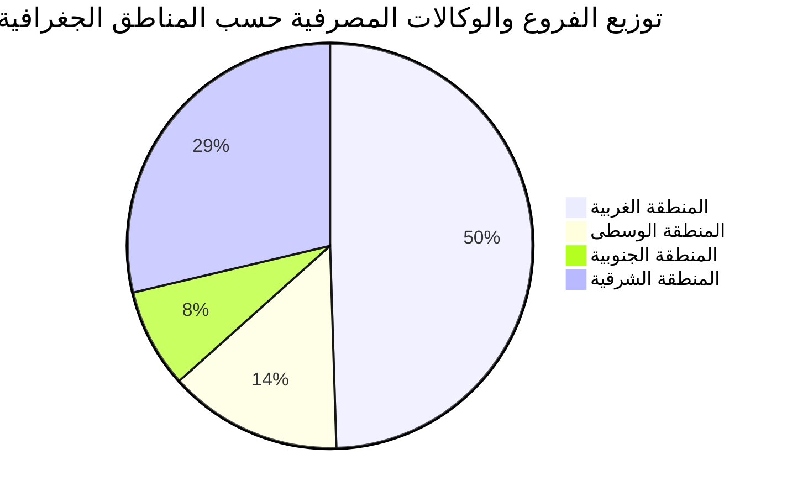
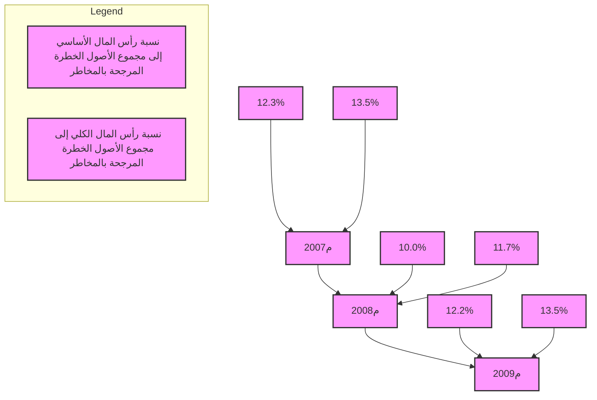
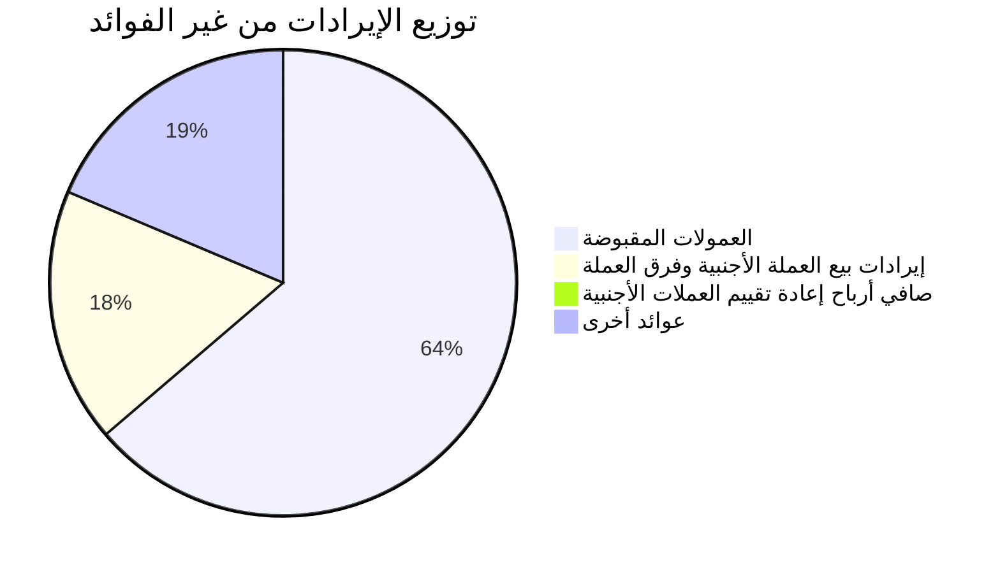

I understand you'd like me to transcribe the content of this image as markdown. Here is my best attempt at rendering the visible text and elements:

![Libyan flag icon]

مصرف ليبيا المركزي

إدارة الرقابة على المصارف والنقد

التقرير السنوي لإدارة الرقابة
على المصارف والنقد
(1377ر، 2009م)

مؤشرات السلامة المالية والاستقرار
في القطاع المصرفي الليبي

This appears to be the cover or title page of a report in Arabic, likely from the Central Bank of Libya. The text includes the bank's name, mentions supervision of banks and currency, and indicates it's an annual report for the year 1377 (Islamic calendar) / 2009 CE. The bottom section refers to financial safety and stability indicators in the Libyan banking sector.

I've maintained the general layout and hierarchy of the text as it appears in the image. Please let me know if you need any clarification or have additional questions about the content.
---

حقوق الطبع و النشر محفوظة 2010© .

صدر هذا التقرير عن مصرف ليبيا المركزي، ويسمح بالاقتباس من هذا التقرير، والرجوع إليه، شريطة ذكر المصدر.

توجه جميع المراسلات المتعلقة بهذا التقرير إلى مدير إدارة الرقابة على المصارف والنقد بمصرف ليبيا المركزي، على العنوان التالي:

ص. ب 1103  
طرابلس – ليبيا  
بريد مصور ( فاكس ) 214831642(218)++  
بريد إلكتروني : supervision@cbl.gov.ly  
الموقع إلكتروني : www.CBL.GOV.LY  
هاتف : 41 - 214831640 218 ++
---
التقرير السنوي لإدارة الرقابة على المصارف والنقد

1377 و.ر (2009 مسيحي)

((مؤشرات السلامة المالية والاستقرار في القطاع المصرفي الليبي))
---
# فهــرس المحتويات

| الصفحة | العنــــــــوان |
|--------|----------------|
| 1 | تقــــــــديم |
| 3 | مقدمـــــــة |

## الفصل الأول
### هيكل القطاع المصرفي الليبي

| الصفحة | العنــــــــوان |
|--------|----------------|
| 5 | تمهيــــــــد |
| 6 | 1. المصارف التجارية |
| 6 | أ) تطور هيكل المصارف الليبية |
| 7 | ب) توزيع فروع ووكالات المصارف |
| 8 | 2. المصارف الأخرى |
| 8 | أ) المصرف الليبي الخارجي |
| 8 | ب) المصارف المتخصصة |
| 8 | ج) مكاتب تمثيل المصارف الأجنبية |

## الفصل الثاني
### الوضع المالي للقطاع المصرفي الليبي

| الصفحة | العنــــــــوان |
|--------|----------------|
| 9 | تمهيــــــــد |
| 9 | 1. تطور المركز المالي المجمع للمصارف التجارية |
| 11 | أ) مصادر أموال المصارف التجارية |
| 11 | • الخصوم الإيداعية |
| 12 | • الأموال الخاصة |
| 13 | ب) استخدامات أموال المصارف التجارية |
| 13 | • الجانب التمويلي |
| 13 | • الاستثمارات |
| 14 | ج) حسابات خارج الميزانية |
| 17 | 2. تـــرتيب المصــــارف |

التقرير السنوي لإدارة الرقابة على المصارف والنقد 2008 مسيحي
---
| الصفحة | العنــــــــوان |
|---------|-----------------|
| 17 | أ) الترتيب حسب الأصول داخل الميزانية |
| 17 | ب) ترتيب المصارف حسب الأصول التي تديرها |
| 17 | • حسب مجموعات المصارف |
| 17 | • حسب طبيعة الأصول |
| 18 | ج) ترتيب المصارف حسب الأموال الخاصة |
| 19 | 3.مؤشر تركز القطاع المصرفي Herfindahl – Hirschman index |

## الفصل الثالث
### رسملة القطاع المصرفي

| الصفحة | العنــــــــوان |
|---------|-----------------|
| 21 | تمهيــــــد |
| 21 | أ) النسب المتعلقة بالأموال الخاصة |
| 22 | • نسبة الأموال الخاصة إلى الأصول |
| 22 | • نسبة الخصوم الإيداعية إلى الأموال الخاصة |
| 23 | ب) نسبة الملاءة |

## الفصل الرابع
### نوعية أصول القطاع المصرفي

| الصفحة | العنــــــــوان |
|---------|-----------------|
| 26 | تمهيــــــد |
| 26 | 1.توزيع أصول القطاع المصرفي |
| 27 | 2.الأصول المتداولة |
| 27 | أ) التوظيفات والحسابات لدى مصرف ليبيا المركزي |
| 29 | ب) التوظيفات والحسابات لدى المصارف |
| 32 | 3.القروض والتسهيلات والسلفيات |
| 34 | أ) التسهيلات المباشرة |
| 34 | • توزيع التسهيلات المباشرة حسب القطاع |
| 35 | • جودة الأصول |
| 37 | • المخصصات مقابل الديون غير المنتظمة |

التقرير السنوي لإدارة الرقابة على المصارف والنقد 2008 مسيحي
---
| الصفحة | العنــــــــوان |
|---------|-------------------|
| 38 | ب)التسهيلات غير المباشرة |
| 40 | ج)هيكل المحفظة الائتمانية |
| 41 | د) التركز الائتماني |

## الفصل الخامس
### ربحية القطاع المصرفي

| الصفحة | العنــــــــوان |
|---------|-------------------|
| 43 | تمهيــــــد |
| 43 | 1. قائمة الدخل الملخصة المقارنة |
| 44 | 2. هيكل الإيرادات والمصروفات |
| 44 | أ) الدخل من الفوائد |
| 45 | ب) الدخل من غير الفوائد |
| 45 | • الإيرادات من غير الفوائد |
| 47 | • المصروفات من غير الفوائد |
| 47 | • نسب الربحية |
| 51 | 3.الكفاءة |

## الفصل السادس
### سيولة القطاع المصرفي

| الصفحة | العنــــــــوان |
|---------|-------------------|
| 52 | تمهيــــــد |
| 52 | 1.تحليل ودائع العملاء لدى القطاع المصرفي |
| 52 | أ) نمو الودائع حسب طبيعة الجهات المودعة |
| 53 | ب) نمو الودائع حسب أنواعها |
| 55 | 2.نسبة السيولة لدى القطاع المصرفي |
| 55 | أ) نسبة السيولة مقابل الالتزامات المباشرة |
| 56 | ب) نسبة السيولة مقابل الالتزامات المباشرة وغير المباشرة |
| 58 | ج) المؤشرات الاحترازية الرقابية (الاحتياطي الإلزامي والسيولة القانونية) |
| 60 | • المصارف التي عجزت عن الاحتفاظ بالاحتياطي الإلزامي المطلوب خلال سنة 2008م |

التقرير السنوي لإدارة الرقابة على المصارف والنقد 2008 مسيحي
---
| الصفحة | العنــــــــوان |
|---------|-----------------|
|         | الفصل السابع |
|         | الإطار العام للرقابة المصرفية في ليبيا، وجهود تطويرها |
|         | خلال الفترة 2002-2008 مسيحي |
| 61      | تمهيــــــــد |
| 62      | أولاً: أوجه الرقابة المصرفية وأساليبها |
| 62      | أ) أوجه الرقابة |
| 62      | 1. الرقابة الوقائية |
| 62      | 2. رقابة الأداء |
| 62      | 3. الرقابة التصحيحية |
| 63      | ب) أساليب الرقابة |
| 63      | 1. الرقابة الميدانية |
| 63      | 2. الرقابة المكتبية |
| 63      | ثانياً: جهود تطوير الرقابة المصرفية |
| 63      | أ) إصدار تعليمات ومعايير رقابية ( Regulations ) |
| 65      | ب) تطبيق إجراءات الرقابة المصرفية |
|         | الفصل الثامن |
|         | تطور التشريعات والإجراءات الرقابية |
| 66      | أولاً:- سلطة الإشراف والرقابة على القطاع المصرفي الليبي |
| 66      | ثانياً:- قانون المصارف الجديد |
|         | الملاحــق |
|         | ملحق رقم(1) |
| 74      | تطور هيكل القطاع المصرفي الليبي خلال الفترة 2005م- 2008م |
|         | ملحق رقم(2) |
| 76      | أهم القرارات المتخذة تنفيذاً للتشريعات الرقابية، والرقابة المصرفية، خلال سنة 2008م |

التقرير السنوي لإدارة الرقابة على المصارف والنقد 2008 مسيحي
---
| الصفحة | العنــــــــوان |
|---------|-----------------|
| 77 | ملحق رقم(3)<br>تطور المركز المالي المجمع للمصارف التجارية العامي 2007-2008م |
| 79 | ملحق رقم(4)<br>ترتيب المصارف حسب مجموع أصولها داخل الميزانية ................ |
| 80 | ملحق رقم(5)<br>ترتيب المصارف حسب إجمالي الأصول داخل وخارج الميزانية ......... |
| 81 | ملحق رقم(6)<br>ترتيب المصارف التجارية حسب مجموع أموالها الخاصة .............. |
| 82 | ملحق رقم(7)<br>قائمة الدخل المجمعة للمصارف التجارية خلال عامي 2007-2008م ... |
| 83 | ملحق رقم(8)<br>توزيع الفروع والوكالات المصرفية حسب مناطق الجماهيرية .......... |
| 84 | ملحق رقم(9)<br>تطور ميزانية المصرف الليبي الخارجي خلال عامي 2007 م- 2008م |
| 85 | ملحق رقم(10)<br>أهم البنود المالية بميزانيات المصارف المتخصصة خلال العام 2007م |
| 86 | ملحق رقم(11)<br>أهم البنود المالية بميزانيات المصارف المتخصصة خلال العام 2008م |
| 87 | ملحق رقم(12)<br>مكاتب تمثيل المصارف الأجنبية المرخص لها للعمل في ليبيا .............. |
| 88 | ملحق رقم(13)<br>المكاتب الهندسية وبيوت الخبرة المتخصصة في تقييم الأصول والعقارات<br>المسجلة لدى مصرف ليبيا المركزي .................................... |
| 89 | ملحق رقم(14)<br>مكاتب المحاسبة والمراجعة القانونية المسجلة لدى مصرف ليبيا المركزي |
| 93 | ملحق رقم(15)<br>بيان بأسعار الفائدة المدينة والدائنة .................................... |

التقرير السنوي لإدارة الرقابة على المصارف والنقد 2008 مسيحي
---
| الصفحة | العنــــــــوان |
|---------|-----------------|
|         | ملحق رقم (16) |
|         | المنشورات الصادرة عن إدارة الرقابة على المصارف والنقد من سنة 2005م إلى سنة 2008م |
| 95      | .................................................. |
|         | الجداول |
| 5       | المصارف العاملة في ليبيا خلال العام 2008م ........................... |
| 23      | تطور ملاءة رأس المال المصارف التجارية .............................. |
|         | نسبة الفائض في الاحتياطي الإلزامي والسيولة للمصارف التجارية خــلال |
| 58      | ............................................................. عام2008م |
|         | فــائض الاحتيــاطي الإلزامــي والســيولة المطلوبــة حســب المصــارف |
| 59      | ....................................................... في31/12/2008م |
| 60      | ................ المصارف التي عجزت عن الاحتفاظ بالاحتياطي الإلزامي |
|         | الأشكال البيانية |
|         | الشكل رقم (1) |
| 7       | ....................... توزيع الفروع والوكالات المصرفية حسب المناطق |
|         | الشكل رقم (2) |
|         | تطور أصول المصارف التجارية داخل وخارج الميزانية خلال سنتي |
| 9       | .................................. على أساس ربع سنوي 2007-2008م |
|         | الشكل رقم (3) |
|         | تطور أصول المصارف التجارية داخل وخارج الميزانية خلال عامي |
| 10      | ....................................... على أساس سنوي 2007-2008م |
|         | الشكل رقم (4) |
| 10      | ..................... توزيع الزيادة في مصادر الأموال خلال سنة 2008م |
|         | الشكل رقم (5) |
| 11      | ....... توزيع الزيادة في استخدامات الأموال خلال عامي 2007-2008م |
|         | الشكل رقم (6) |
|         | تطور الخصوم الإيداعية للمصارف التجارية خلال عامي 2007- 2008 |
| 11      | .................................................. على أساس ربع سنوي |

التقرير السنوي لإدارة الرقابة على المصارف والنقد 2008 مسيحي
---
| الصفحة | العنــــــــوان |
|---------|-----------------|
| 12 | الشكل رقم (7)<br>تطور الخصوم الإيداعية للمصارف التجارية خلال عامي 2007-2008م<br>على أساس سنوي |
| 14 | الشكل رقم (8)<br>تطور استخدامات الأموال خلال عامي 2007-2008م |
| 14 | الشكل رقم (9)<br>تطور الحسابات خارج الميزانية خلال عامي 2007-2008م على أساس<br>سنوي |
| 15 | الشكل رقم (10)<br>تطور الحسابات خارج الميزانية خلال عامي 2007-2008م على أساس<br>ربع سنوي |
| 16 | الشكل رقم (11)<br>تطور نسبة الحسابات خارج الميزانية إلى الحسابات داخل الميزانية |
| 16 | الشكل رقم (12)<br>تطور نسبة الأصول خارج الميزانية إلى الأصول داخل الميزانية |
| 18 | الشكل رقم (13)<br>توزيع المصارف التجارية حسب ملكية المصارف |
| 19 | الشكل رقم (14)<br>تركز القطاع المصرفي الليبي |
| 21 | الشكل رقم (15)<br>نسبة الأموال الخاصة إلى الأصول على أساس ربع سنوي |
| 22 | الشكل رقم (16)<br>تطور نسبة الأموال الخاصة إلى الأصول خــلال عامــي 2007-2008م<br>على أساس سنوي |
| 23 | الشكل رقم (17)<br>ملاءة رؤوس أموال المصارف التجارية المعلنة والمصرح بها على أســاس<br>سنوي |

التقرير السنوي لإدارة الرقابة على المصارف والنقد 2008 مسيحي
---
| الصفحة | العنــــــــوان |
|---------|-----------------|
| 24 | الشكل رقم (18) <br> توزيع المصارف التجارية حسب ملاءة رؤوس أموالها |
| | الشكل رقم (19) <br> تطور ملاءة رؤوس أموال المصارف التجارية خلال عامــي 2007-2008 |
| 25 | على أساس ربع سنوي |
| | الشكل رقم (20) |
| 26 | توزيع أصول المصارف التجارية |
| | الشكل رقم (21) |
| 28 | توزيع التوظيفات لدى مصرف ليبيا المركزي على أساس ربع سنوي |
| | الشكل رقم (22) |
| 28 | توزيع التوظيفات والحسابات لدى مصرف ليبيا المركزي على أساس سنوي |
| | الشكل رقم (23) |
| | توزيع الحسابات لدى المصارف حسب طبيعة الحسابات على أســـاس ربــع |
| 29 | سنوي |
| | الشكل رقم (24) |
| | توزيع الحسابات لدى المصارف حسب طبيعة الحســـابات علـــى أســـاس |
| 30 | سنوي |
| | الشكل رقم (25) |
| | توزيع الحسابات لدى المصارف حسب طبيعة المصارف على أساس ربع |
| 31 | سنوي |
| | الشكل رقم (26) |
| | توزيع الحسابات لدى المصارف حسب طبيعة المصـــارف علـــى أســـاس |
| 31 | سنوي |
| | الشكل رقم (27) |
| | تطور إجمالي التسهيلات المُباشرة وغير المباشرة على أساس سنوي |
| 32 | |
| | الشكل رقم (28) |
| | تطـــور التسهيـــلات المُباشـــرة وغيـــر المباشـــرة علـــى أســـاس ربـــع |
| 33 | سنوي |

التقرير السنوي لإدارة الرقابة على المصارف والنقد 2008 مسيحي
---
| الصفحة | العنــــــــوان |
|---------|-----------------|
| 33 | الشكل رقم (29)<br>نسبة التسهيلات غير المباشرة إلى التسهيلات المباشرة |
| 34 | الشكل رقم (30)<br>نسبة التسهيلات المباشرة إلى الخصوم الإيداعية |
| 35 | الشكل رقم (31)<br>نمو التسهيلات المباشرة وتوزيعها حسب القطاعات |
| 35 | الشكل رقم (32)<br>تطور الديون المنتظمة وغير المنتظمة |
| 36 | الشكل رقم (33)<br>نسب التسهيلات المنتظمة وغير المنتظمة |
| 37 | الشكل رقم (34)<br>تطور نسبة صافي التسهيلات غير المنتظمة إلى الأموال الخاصة |
| 38 | الشكل رقم (35)<br>تطور نسبة المخصصات مقابل التسهيلات غير المنتظمة |
| 38 | الشكل رقم (36)<br>تطور التسهيلات غير المباشرة |
| 39 | الشكل رقم (37)<br>نسب توزيع التسهيلات غير المباشرة |
| 40 | الشكل رقم (38)<br>تطور نسب التأمينات غير النقدية مقابل التسهيلات غير المباشرة |
| 40 | الشكل رقم (39)<br>توزيع المحفظة الائتمانية |
| 42 | الشكل رقم (40)<br>نسبة الأموال الخاصة إلى القروض والتسهيلات داخل وخارج الميزانية |
| 43 | الشكل رقم (41)<br>ربحية المصارف من الفوائد وغير الفوائد |
| 44 | الشكل رقم (42)<br>النمو في أنواع الإيرادات من الفوائد |

التقرير السنوي لإدارة الرقابة على المصارف والنقد 2008 مسيحي
---
| الصفحة | العنــــــوان |
|---------|-------------|
| 45 | الشكل رقم (43)<br>توزيع الدخل من الفوائد |
| 46 | الشكل رقم (44)<br>تطور الإيرادات من غير الفوائد |
| 46 | الشكل رقم (45)<br>توزيع الإيرادات من غير الفوائد |
| 47 | الشكل رقم (46)<br>توزيع المصروفات من غير الفوائد |
| 48 | الشكل رقم (47)<br>نسبة العائد ( قبل الضريبة ) إلى متوسط الأصول |
| 48 | الشكل رقم (48)<br>نسبة العائد ( قبل الضريبة ) إلى متوسط حقوق المساهمين |
| 49 | الشكل رقم (49)<br>تطور نسبة المصروفات إلى الإيرادات |
| 49 | الشكل رقم (50)<br>معدلات الربحية من الفوائد |
| 50 | الشكل رقم (51)<br>تطور نسبة الإيرادات من غير الفوائد إلى متوسط الأصول |
| 50 | الشكل رقم (52)<br>تطور نسبة المصروفات من غير الفوائد إلى متوسط الأصول |
| 51 | الشكل رقم (53)<br>نسبة المصروفات إلى الإيرادات |
| 52 | الشكل رقم (54)<br>نسبة نمو ودائع القطاعين العام والخاص خلال عامي 2007-2008م |
| 53 | الشكل رقم (55)<br>توزيع ودائع المصارف التجارية حسب القطاع |
| 54 | الشكل رقم (56)<br>تطور ودائع المصارف التجارية حسب نوع الودائع |

التقرير السنوي لإدارة الرقابة على المصارف والنقد 2008 مسيحي
---
| الصفحة | العنــــوان |
|---------|------------|
| 54 | الشكل رقم (57)<br>توزيع ودائع المصارف التجارية حسب نوع الودائع |
| 55 | الشكل رقم (58)<br>تطور صافي الأموال السائلة والالتزامات المباشرة |
| 56 | الشكل رقم (59)<br>تطور نسبة السيولة مقابل الالتزامات المباشرة |
| 57 | الشكل رقم (60)<br>تطور الأموال السائلة والالتزامات المباشرة وغير المباشرة |
| 57 | الشكل رقم (61)<br>تطور نسب السيولة مقابل الالتزامات المباشرة وغير المباشرة |
| 61 | الشكل رقم (62)<br>الهيكل التنظيمي لإدارة الرقابة على المصارف والنقد |

التقرير السنوي لإدارة الرقابة على المصارف والنقد 2008 مسيحي
---
# تقديم

يعمل مصرف ليبيا المركزي على تحقيق مستهدفات الاستقرار في المؤسسات المالية المصرفية، وفي القطاع المالي بصفة عامة، إدراكاً منه بأن استقرار المستوى العام للأسعار، والاستقرار المالي، يعتبران شرطان ضروريان لدعم النمو الاقتصادي واستدامة التنمية في الاقتصاد الوطني. من هذا المنظور، يركز مصرف ليبيا المركزي جهوده في تطوير الرقابة المصرفية، ويعزز من إمكانيات إشرافه على القطاع المصرفي، وفقاً لأحكام القانون رقم (1) لسنة 1373 و.ر (2005مسيحي) بشأن المصارف.

وفي هذا الإطار، يسرنا أن نقدم التقرير السنوي لإدارة الرقابة على المصارف والنقد لعام 2009مسيحي، الذي يسلط الضوء على أوضاع المصارف الليبية، ويعرض مؤشرات السلامة المالية والاستقرار في القطاع المصرفي الليبي، ويبرز معدلات أداء المصارف وأهم مؤشراتها، ويلخص ملامح التطور الذي شهدته البيانات المالية للمصارف الليبية ومؤشراتها الاحترازية، وما يتمتع به القطاع المصرفي من سيولة وربحية وملاءة.

وقد أظهر القطاع المصرفي، خلال السنة موضوع التقرير، مؤشرات ونتائج تدل على متانة المصارف العاملة، وقدرتها على الاستجابة لمتطلبات التطوير وفي تحقيق مستهدفاتها في الربحية والسيولة، وإدارة المخاطر، كل ذلك بفضل مواكبة التعليمات الرقابية لأوضاع القطاع المصرفي، والتزامها بأفضل الممارسات، وحصافة إشراف ورقابة مصرف ليبيا المركزي.

ورغم التراجع البسيط الذي طرأ على معدل النمو الاقتصادي في ليبيا، نتيجة لتدني أسعار النفط المرتبط بالأزمة المالية العالمية وتداعياتها المختلفة، فقد تواصل النمو في حجم القطاع المصرفي في ليبيا، حيث نمت الميزانية المجمعة للمصارف بنسبة 17%، ونمت ودائع القطاع العام بنسبة 24%، وودائع القطاع الخاص بنسبة 12%، وزادت الأموال الخاصة للمصارف بنسبة 61%، مما أفضى إلى ارتفاع ملاءة القطاع المصرفي إلى حوالي 13.5%، وحققت المحفظة الائتمانية للمصارف نمواً بنسبة 12%، وتراجعت نسبة التسهيلات غير المنتظمة إلى 17% من مجموع التسهيلات، مقارنة بنسبة 23% في عام 2008م، وفي المقابل ارتفعت نسبة مخصص الديون المشكوك فيها إلى الديون غير المنتظمة من 84.4% في عام 2008م إلى 109.4% في عام 2009م.

وقد انعكس النمو في أصول القطاع المصرفي، وتحسن نوعية هذه الأصول في ارتفاع أرباح المصارف غير النهائية بنسبة 22.2% في عام 2009م بالمقارنة بعام 2008م، وفي ضوء هذه المؤشرات الإيجابية، التي تعززت خلال الربع الأخير من عام 2009م، يتوقع أن تستمر المصارف في تحقيق نتائج أفضل خلال العام 2010م.

ولمواكبة التطورات التي تشهدها بيئة الرقابة على القطاع المصرفي والمؤسسات المالية في العالم، والدعوة إلى إصلاحها، إثر الأزمة المالية العالمية، فقد عمد مصرف ليبيا المركزي على وضع خطة إستراتيجية لتطوير جهود الرقابة المصرفية في ليبيا، تمتد خلال الفترة 2009م – 2011م، والتي انطلقت مبادرتها خلال منتصف عام 2009م، حيث من المتوقع أن تسفر نتائج تطبيق هذه الإستراتيجية عن إحداث نقلة نوعية في أساليب الرقابة المطبقة، واستكمال التعليمات الرقابية اللازمة، لتطبيق مبادئ الرقابة المصرفية الفعالة وفقاً لمقررات لجنة بازل، مما يعزز آفاق وإمكانات تحقيق الاستقرار المالي، ومستهدفات السياسة النقدية في تحقيق الاستقرار في المستوى العام للأسعار.

وإذ يصدر هذا التقرير للسنة الثانية، على التوالي، فإنه بذلك يعكس الجهود المبذولة في تطوير إجراءات الرقابة المصرفية وحرص القائمين عليها في الارتقاء بالمهام الموكلة إليهم، تحقيقاً لمهام ومستهدفات مصرف ليبيا المركزي في هذا الخصوص، آملاً أن يقدم صورة واضحة عن أوضاع القطاع المصرفي، ودور مصرف ليبيا المركزي وإنجازاته، في مجال الرقابة المصرفية، خلال عام 2009م.

وبهذه المناسبة يسعدني أن أحيي العاملين بإدارة الرقابة على المصارف والنقد، وأثمن عالياً جهودهم المبذولة في سبيل تحقيق مهام وأهداف مصرف ليبيا المركزي، وأشكرهم على حسن الإعداد

التقرير السنوي لإدارة الرقابة على المصارف والنقد 2009 مسيحي | 1
---
لإخراج هذا التقرير بشكل لائق، وأخص بالشكر الفريق الذي سهر على إعداد التقرير، وأنجز هذا
العمل المتميز، متمنياً لهم دوام التوفيق والنجاح.

والله ولي التوفيق

فرحات بن عمر قدارة
المحافــــــظ

التقرير السنوي لإدارة الرقابة على المصارف والنقد 2009 مسيحي 2
---
# مقدمــــة

تُعد المصارف المركزية، وسلطات الرقابة على المصارف والمؤسسات المالية، على الرقابة المصرفية، بشقيها، الرقابة المكتبية (off-Site) والرقابة الميدانية (on-site)، في تحقيق أهداف الاستقرار المالي، وتعزيز القدرة على مواجهة الصدمات، وفي الرقابة على إدارة المخاطر، وتعزيز جهود المصارف في الوساطة المالية، وتوصيل الخدمات لأوسع شريحة ممكنة من المتعاملين بتكاليف محدودة، دعماً للجهود المبذولة لضمان استدامة النمو الاقتصادي.

وفي هذا الإطار، تمارس إدارة الرقابة على المصارف والنقد، بمصرف ليبيا المركزي مهامها في الإشراف والرقابة على القطاع المصرفي في ليبيا، وتسعى إلى تطوير هذه المهام وبما يواكب التطورات التي يشهدها القطاع المصرفي، باستخدام وتطبيق أساليب الرقابة المصرفية وتقنياتها، وفقاً لأفضل الممارسات.

ويأتي صدور التقرير السنوي الثاني لإدارة الرقابة على المصارف والنقد لسنة 2009م، حول مؤشرات السلامة المالية والاستقرار في القطاع المصرفي الليبي، ترسيخاً للتوجهات الجديدة التي يتبناها مصرف ليبيا المركزي، الرامية إلى تطوير القطاع المصرفي الليبي، من جهة، وتعزيز إجراءات وأساليب الرقابة عليه، عملاً على مواكبة التوجهات الدولية والدعوة إلى مراجعة وإصلاح أساليب وآليات الرقابة على المصارف والمؤسسات المالية في أعقاب الأزمة المالية العالمية، من جهة أخرى.

ويقع هذا التقرير في سبعة فصول، وستة عشرة ملحقاً وبياناً إحصائياً، حيث يتناول الفصل الأول من التقرير أهداف وأشكال الرقابة المصرفية التي يقوم بها مصرف ليبيا المركزي، ويتناول الفصل الثاني هيكل القطاع المصرفي في ليبيا، بينما يتناول الفصل الثالث، الوضع المالي للقطاع المصرفي الليبي، حيث يستعرض تطور المركز المالي المجمع للمصارف التجارية خلال السنوات 2007م/2008م/2009م، وترتيب المصارف حسب أصولها وأموالها الخاصة، والتركز في القطاع المصرفي الليبي. ويتناول الفصل الرابع، رسملة القطاع المصرفي في ليبيا، بما في ذلك نسب ملاءة رأس المال. ويستعرض الفصل الخامس نوعية أصول القطاع المصرفي، من حيث توزيع الأصول، وكيفية استعمال المصارف التجارية لخصومها الإيداعية، والتطور في محفظة الائتمان بالمصارف وجودتها. ويتناول الفصل السادس ربحية القطاع المصرفي، من خلال استعراض هيكل الإيرادات والمصروفات، ومؤشرات الكفاءة، ونسب الربحية. وقد خصص الفصل السابع من التقرير لاستعراض أوضاع السيولة بالقطاع المصرفي، والتطور الذي شهدته ودائع العملاء، ونسب السيولة مقابل مختلف التزامات المصارف، ويوضح المؤشرات الاحترازية الرقابية المتعلقة بالاحتياطي الإلزامي والسيولة القانونية.

ومن أهم الملاحق التي تضمنها التقرير الرقابي السنوي لإدارة الرقابة على المصارف والنقد لعام 2009م، الملحق الأول الذي يستعرض الخطة الإستراتيجية لتطوير إدارة الرقابة على المصارف والنقد (2009 – 2011)، والتي تم اعتمادها والمباشرة في تطبيقها مع بداية النصف الثاني من عام 2009م. ويعرض هذا الملحق المبادرات الإحدى عشر للإستراتيجية، التي تتضمن خارطة الطريق نحو استكمال التعليمات الرقابية المتوافقة ومتطلبات لجنة بازل في الرقابة المصرفية، وبناء القدرات "capacity building" وتطوير الهيكلة الإدارية للإدارة، وتوضيح ملامح الرقابة المصرفية في آفاق عام 2012م.

ويقدم هذا التقرير من خلال ملاحقه، الأخرى المختلفة، أهم المؤشرات الإحصائية للقطاع المصرفي، والتعليمات الرقابية التي صدرت خلال العام، ومعلومات مفيدة حول مكاتب المحاسبة والمراجعة القانونية، ومكاتب وبيوت الخبرة المختصة بتقييم الأصول المسجلة لدى مصرف ليبيا المركزي. وبالنسبة للمصارف التجارية، فإن هذا التقرير، فضلاً عن كونه يعكس مؤشرات السلامة المالية والاستقرار بالقطاع المصرفي، يعتبر مكملاً للتقارير الرقابية السنوية التي تعدها إدارة الرقابة على المصارف والنقد، عن كل مصرف من المصارف العاملة، حيث تركز هذه التقارير على تحليل المراكز المالية للمصارف، وفقاً لأسلوب تحليل (CAMELS)، وتتضمن نتائج وملاحظات الرقابة المكتبية والرقابة الميدانية حول أوضاع المصارف، في نهاية كل سنة، وتنتهي إلى وضع تصنيف للمصارف، وملاحظات ومطالب محددة لكل مصرف على حده، وفقاً لما تسفر عنه نتائج التحليل.

التقرير السنوي لإدارة الرقابة على المصارف والنقد 2009 مسيحي 3
---
   ،ّالتشد ػلت ٔالو ؼظتاخ التْاسدج تِتا                      ن ذؽتال ُتز ٍالرقتاسٗش إلت ٔالوظتاسف لذساعترِا                       شت   ، ّهتي    ّالوراتؼح
                                                                                  .ُشاذ٘ع٘اخ ال صهح لرظؽ٘ػ ّضاػِا                          ّّضغ االعر
   هح الوال٘ح ّاالعترقشاس تالقطتاع ٖن ُزا الرقشٗش ف ٖذغل٘ط الضْء ػل ٔهؤرشاخ الغ                                                ًأهل ى ٗغا
ذِتا    ، ّإًعاصا     داسج الشقاتتح ػلت ٔالوظتاسف ّالٌقتذ                   ، ّى ٗقذم طْسج ّاضتؽح ػتي دّس إ                        الل٘ث        ٖالوظشف
   ، ّتوا ٗؼضص الصقح فت ٖالقطتاع الوظتشف ٖالل٘ثت ٖ، ّٗغتاػذ فت ٖسعتن االعترشاذ٘ع٘اخ                                             م2009         خ ل الؼام
      ٖ، هتتي ظتتل الٌِتتْع تالقطتتاع الوظتتشف                   ٘ث٘تتا الوشكتتض ٕػلتت ٔذٌف٘تتزُا         ٗؼوتتل هظتتشف ل            الرتت   ّٖالرْظِتتاخ
   ، ّفقتاًحفضتل         اه َتالوؼتاٗ٘ش الشقات٘تح الوظتشف٘ح                ، ّضواى الرض         رَ، ّذؼضٗض قذساذ َالرٌافغ٘ح               ّضواى ع ه
                                                                                                                             .     اخ الذّل٘ح     الوواسع


   ٕش لألؾ هؽافظ هظتشف ل٘ث٘تا                  ّٗال ٗغؼ ٌٖف ٖهقذهح ُزا الرقشٗش إال ّى ذقذم تعضٗل الش ش ّالرقذ
   ، ػلتت ٔدػوِتتن الورْاطتتل إلداسج الشقاتتتح ػلتت ٔالوظتتاسف                            ّحػضتتاء هعلتتظ اإلداسج،                 ، ًّا ثتت   َالوشكتتض
   غ٘ت كوتا ًشت ش ظو          .الوشكتض         ٕق٘ق هغرِذفاخ هظشف ل٘ث٘ا                  ّلح ف ٖعث٘ل ذؽ           زٌِّ٘ن لعِْدُا الوثّذث         ،   ّالٌقذ
  شٗتق التز ٕػتذ          ّ، ّختض تالتزكش الف            ج فت ٖذٌف٘تز الوِتام الوْكلتح إلتِ٘ن            هْظف ٖاإلداسج ػلت ٔالعتذّّالوصتاتش
   هروٌ٘تاًلِتن     ،تالش ل الز ٕٗل٘ق تت                ََ، ّؼشطِن ػل ٔإخشاظ                هغْدج ُزا الرقشٗش، ػل ٔظِْدُن الوخلظح
                                                                                                                                     .     دّام الرْف٘ق
                                                           ِوا ف َ٘الخ٘شّاهلل الوْفق ل


                     هؽوذ ػثذ العل٘ل تْعٌٌ٘ح                      .د
    هذٗش إداسج الشقاتح ػل ٔالوظاسف ّالٌقذ


 ٖهغ٘ؽ     9003الرقشٗش الغ ٌْٕإلداسج الشقاتح ػل ٔالوظاسف ّالٌقذ                                                                                      4
---
# ملخص تنفيذي

حقق القطاع المصرفي الليبي عدة تطورات وإنجازات خلال عام 2009م، مدفوعاً بالدعم المقدم من مصرف ليبيا المركزي، سواء كان على صعيد التشريعات أو تعزيز رؤوس الأموال، ومن أهم هذه التطورات الزيادات الكبيرة التي تمت على رأسمال مصرفي الجمهورية والتجاري الوطني بما يضمن تطوير أعمالهما وتعزيز قدرتهما التنافسية، بالإضافة إلى وضع تعليمات رقابية جديدة سمحت للمصارف الأجنبية بالدخول كشركاء إستراتيجيين في المصارف الخاصة.

تواصل النمو في حجم القطاع المصرفي في ليبيا حيث سجلت الميزانية المجمعة للمصارف لسنة 2009م، نمواً قدره 17%، بالمقارنة مع سنة 2008م، وذلك نتيجة ارتفاع ودائع العملاء من القطاع العام والقطاع الخاص لدى المصارف بنسبة 19%، بالإضافة إلى نمو كبير في الأموال الخاصة بنسبة 61% نتيجة زيادات رؤوس الأموال المشار إليها أعلاه.

إن هذا الارتفاع في الأموال الخاصة عزز ملاءة المصارف وزاد من قدرتها على تحمل المخاطر التي قد تتعرض لها، وقد ارتفعت ملاءة القطاع المصرفي الليبي في سنة 2009م، إلى حوالي 13.5%، بارتفاع كبير عن معدل الملاءة بنهاية 2008م، والبالغ 9.8%، وبهامش جيد نسبة للحد الأدنى البالغ 8%، إن تحسن هذه النسبة لا يعود فقط لقوة الأموال الخاصة لدى القطاع المصرفي وإنما أيضاً لقلة المخاطر التي يحملها كون الجزء الكبير من أصوله موظف لدى مصرف ليبيا المركزي، ذات المخاطر المعدومة، وبالرغم من ذلك، فإن نسب الأموال الخاصة غير المرجحة بأوزان المخاطر والتي يمكن قياسها من خلال نسبة الأموال الخاصة مقابل الأصول أو نسبة الخصوم مقابل الأموال الخاصة ما زالت تسجل نسباً جيدة بالمقارنة مع الحدود المقررة.

من جهة أخرى، فقد حافظ القطاع المصرفي على نسب توزيع أصوله حيث استحوذ مصرف ليبيا المركزي على 68.5% من مجمل أصول القطاع المصرفي في ليبيا، وهي معظمها موظفة في شكل شهادات إيداع قصيرة الأجل، وبالرغم من التركيز على التوظيف لدى مصرف ليبيا المركزي، إلا أن المحفظة الائتمانية (المباشرة) لدى المصارف حققت نمواً قدره 12%، وهي تعتبر نسبة مقبولة وإن كانت متراجعة مع النسبة المحققة في سنة 2008م، والبالغة 29%، وقد كان الحجم الأكبر للزيادة في المحفظة الائتمانية من نصيب القطاع الخاص مما ساهم في استحواذ القطاع الخاص على نسبة بلغت 77.2%، من المحفظة الائتمانية الممنوحة من قبل المصارف، ومن أحد أبرز العوامل الإيجابية في

التقرير السنوي لإدارة الرقابة على المصارف والنقد 2009 مسيحي 5
---
محفظة المصارف الائتمانية هو التحسن المستمر في نوعية هذه المحفظة، والذي يمكن قياسه من خلال تراجع نسبة التسهيلات غير المنتظمة إلى 17% من مجموع التسهيلات، مقارنة بنسبة 27% بنهاية عام 2007م، بالإضافة إلى الحجم الكبير للمخصصات المكونة والذي فاق قيمة التسهيلات غير المنتظمة نفسها.

وفي مجال التسهيلات غير المباشرة، يستمر النمو الكبير لأنشطة المصارف في الاعتمادات المستندية وخطابات الضمان، بحيث سجلت التسهيلات غير المباشرة نمواً بلغت نسبته 64% بنهاية سنة 2009م، علماً بأن هذا النمو يعتبر متراجعاً مقارنة بالنمو الهائل المحقق في عام 2008م، والذي بلغ 177%.

وقد انعكس النمو في أصول القطاع المصرفي، والتحسن في نوعية هذه الأصول ارتفاعاً في أرباح المصارف غير النهائية (قبل الضرائب) بحيث بلغت 769 مليون دينار، بارتفاع نسبته 22.2%، مقارنة مع سنة 2008م، وقد تركزت إيرادات المصارف في صافي هامش الفوائد المحقق وعلى توظيفاتها والعمولات المقبوضة مقابل الخدمات والتسهيلات المصرفية، وبالرغم من ارتفاع حجم الأرباح في القطاع المصرفي، إلا أن نسب الربحية تراجعت بشكل بسيط مقارنة بسنة 2008م، نتيجة انخفاض معدلات الفوائد على شهادات الإيداع الصادرة عن مصرف ليبيا المركزي والتي تتركز فيها نسبة كبيرة من توظيفات المصارف.

إن استمرار التركز الكبير في التوظيف لدى مصرف ليبيا المركزي، ساهم في ارتفاع الأصول المتداولة لدى القطاع المصرفي، التي بلغت 78% من مجمل الأصول، فضلاً عن التقليل من دور المصارف التجارية في الوساطة المالية، حيث تتدفق الأموال من مصرف ليبيا المركزي خصماً، وفي شهادات وشكل ودائع تحت الطلب للمصارف التجارية، لتنتهي إليه في شكل حسابات الخزانة العامة.

وقد ظهر ذلك بشكل واضح من خلال ارتفاع نسبة السيولة المحتفظ بها مقابل الخصوم الإيداعية والالتزامات (داخل الميزانية)، والتي سجلت مستويات عالية خلال السنوات السابقة واستقرت على مستوى 78.2% في سنة 2009م، وحتى في حال إضافة الالتزامات غير المباشرة المتمثلة في الاعتمادات المستندية وخطابات الضمان إلى التزامات المصارف الفعلية، تبقى نسبة السيولة بمستويات عالية تسمح لها بمواجهة الضغوطات المحتملة عليها.

مع الإشارة، إلى أن طبيعة الودائع في القطاع المصرفي، والمتمثلة بمعظمها في ودائع عائدة لجهات تابعة للقطاع العام، وودائع تحت الطلب، تحمل مخاطر سحوبات عالية، وعليه، تحتم على الجهاز المصرفي المحافظة على نسب سيولة عالية لمواجهتها.

6 التقرير السنوي لإدارة الرقابة على المصارف والنقد 2009 مسيحي
---
وأخيراً، يتبين أن الجهاز المصرفي في ليبيا لديه ملاءة جيدة، وأصول ذات مخاطر متدنية وسيولة عالية، إلا أنه ما زال أمام المصارف الليبية مجالات كبيرة لتحسين نوعية أصولها، وإنتاجيتها بهدف المساهمة في تنمية وتطوير الاقتصاد الوطني، إن هذا الأمر يتطلب من القطاع المصرفي البحث عن فرص استثمارية جديدة في ليبيا، والتوسع في منح التسهيلات لمختلف القطاعات الاقتصادية والعمل في نفس الوقت على معالجة محفظة التسهيلات المتعثرة، إن اعتماد سياسة ذات فعالية أكثر في توزيع الأصول وإذا ما اقترنت بسياسة ومعايير سليمة لإدارة مخاطر السيولة سيؤدي إلى الرفع من أداء الجهاز المصرفي في ليبيا وتعزيز ربحيته.

وعلى صعيد التشريعات الرقابية ذات العلاقة بالقطاع المصرفي، فقد شهد العام 2009م، صدور المنشور رقم (2009/9م) بشأن الإذن للمصارف التجارية بتقديم المنتجات المصرفية البديلة التي تتوافق وأحكام الشريعة الإسلامية، حيث باشرت المصارف في فتح نوافذ، وتأسيس فروع لتقديم منتجات جديدة تتوافق وأحكام الشريعة الإسلامية، منها على سبيل المثال، المرابحة للآمر بالشراء، والمضاربة بمختلف أنواعها، ومن المتوقع أن يشهد هذا النشاط نمواً مضطرداً خلال السنوات المقبلة.

كما أن صدور قرار مجلس إدارة مصرف ليبيا المركزي رقم (19) لسنة (2009م) بشأن ضوابط وشروط وإجراءات إدخال المصارف الأجنبية كشركاء استراتيجيين في المصارف التجارية الخاصة، وقد نظم هذا القرار شروط دخول الشركاء الاستراتيجيين الأجانب في المصارف الليبية ، بحيث لا تتجاوز نسبة مساهمة الشريك الأجنبي 49% من رأس مال المصرف، وأن تؤدي هذه المشاركة إلي رفع رأس مال المصرف إلى ما لا يقل عن 70 مليون دينار ليبي، كما وضع ضوابط تنظم الإدارة، واستخدام الموارد البشرية الليبية، ووضع ضمانات تكفل المحافظة على أوضاع العاملين الليبيين بهذه المصارف، ووضع معايير لقبول المصارف الأجنبية كشركاء استراتيجيين بالمصارف الليبية، ومن المتوقع أن يؤدي هذا القرار إلى معالجة أوضاع بعض المصارف التجارية الخاصة التي تحظى بمتابعة خاصة لأوضاعها من قبل مصرف ليبيا المركزي، بهدف ضمان استقرار وسلامة القطاع المصرفي في ليبيا، وقد اتجهت ثلاثة مصارف تجارية خاصة نحو إدخال شركاء استراتيجيين أجانب في رؤوس أموالها مما سيساعد على تطوير قدرات وخبرات المصارف الليبية، وسينعكس إيجابياً على مجمل القطاع المصرفي.

7
التقرير السنوي لإدارة الرقابة على المصارف والنقد 2009 مسيحي
---
كما شهد العام 2009م، انطلاق تنفيذ الخطة الإستراتيجية لتطوير إدارة الرقابة على المصارف والنقد (2009م-2011م) التي تتضمن جملة من المبادرات الهادفة لتطوير وتفعيل الرقابة المصرفية في ليبيا وتعزيز مقومات السلامة والاستقرار في القطاع المصرفي الليبي.

# الفصل الأول
## الرقابة على المصارف في الجماهيرية

تتم عملية الرقابة على المصارف في الجماهيرية وفقاً لأحكام القانون رقم (1) لسنة 1373 و.ر (2005م) بشأن المصارف، والأنظمة الأساسية للمصارف المبنية أساساً على قانون المصارف والقوانين المنظمة للأعمال التجارية في الجماهيرية.

تأخذ الرقابة على أعمال المصارف في الجماهيرية ثلاثة مستويات رئيسة وهي:-

1. الرقابة الداخلية للمصارف التجارية من خلال أنظمة الضبط الداخلي، والرقابة الداخلية (إدارات المخاطر/ الامتثال/ إدارات المراجعة الداخلية).

2. مراجعة حسابات المصارف من قبل المراجعين القانونيين، وفقاً لأحكام المادة (83) من القانون رقم (1) لسنة 1373 و.ر ( 2005 مسيحي) بشأن المصارف.

3. رقابة مصرف ليبيا المركزي، المتمثلة في إدارة الرقابة على المصارف والنقد.

بالإضافة إلى رقابة هيئة سوق الأوراق المالية بالنسبة للمصارف المدرجة بالسوق.

## أهداف الرقابة على المصارف

الهدف الرئيسي للرقابة على المصارف هو المحافظة على قوة وسلامة القطاع المصرفي واستقراره المالي، بما يؤدي إلى حماية أموال المودعين والحفاظ على حقوق المساهمين، وضمان قدرة المصارف على المساهمة في نمو الاقتصاد الوطني، وفي إطار جهود مصرف ليبيا المركزي أعدت إدارة الرقابة على المصارف والنقد خطة إستراتيجية إلى تطوير القطاع المصرفي، الرامية لعملها للسنوات 2009-2011م، بهدف تعزيز وتفعيل رقابة مصرف ليبيا المركزي على المصارف العاملة في الجماهيرية العظمى.

وقد استندت الخطة الإستراتيجية لإدارة الرقابة على المصارف والنقد، على تطبيق المبادئ الأساسية للرقابة المصرفية الفعالة، وفقاً للورقة الصادرة عن لجنة بازل للرقابة المصرفية لسنة

8 التقرير السنوي لإدارة الرقابة على المصارف والنقد 2009 مسيحي
---
2006م، وترتكز الخطة على إحدى عشر مبادرة (Initiatives) تطويرية يمكن تلخيصها على النحو التالي:-

1. استكمال الهيكل التنظيمي لإدارة الرقابة على المصارف والنقد.
2. تطوير قاعدة بيانات واسعة ومتكاملة تتم أتمتتها، لتعزيز جهود الرقابة الميدانية والمكتبية.
3. الاعتماد على تقنية المعلومات، واستخدام الأرشفة الإلكترونية، والحد من استخدام الورق إلى أبعد الحدود.
4. مواكبة المستجدات في مجال الرقابة المصرفية، ومراجعة التعليمات السارية بهدف تطويرها.
5. ممارسة الرقابة المصرفية بشقيها المكتبي والميداني، وفقاً لمعايير الـ CAMELS وتأمين التكامل والتنسيق بينهما.
6. تطبيق معايير المحاسبة الدولية والمعايير الدولية للمراجعة والإفصاح المالي.
7. وضع إطار تنفيذي لتطبيق معايير بازل 2 لكفاية رأس المال.
8. تطبيق أساليب الرقابة المصرفية المجمعة على المجموعات المصرفية.
9. بناء وتطوير الموارد البشرية اللازمة لتنفيذ الرقابة المصرفية.
10. الإدارة بالأهداف، ومعدلات الأداء.
11. التعاون مع السلطات الرقابية في الدول الأخرى.

وتستند رقابة مصرف ليبيا المركزي، الممثلة في إدارة الرقابة على المصارف والنقد، على أحدث المعايير الدولية وأفضل الممارسات في الرقابة المصرفية، الأمر الذي بدأت تظهر معه بوادر نجاح في تحقيق أهدافها ونجاح المصارف في تطور البيئة المصرفية، وذلك من خلال الخطة الإستراتيجية، فازداد الاهتمام بتطوير إعمالها من خلال نمو مراكزها المالية وزيادة تنافسها في السوق المصرفية، وتطبيق أسس الحوكمة ومكافحة عمليات غسل الأموال وإدارات المخاطر والمراجعة الداخلية، المؤسسية، ويبين الملحق رقم (1) مكونات الخطة الإستراتيجية لإدارة الرقابة على المصارف والنقد.

## أشكال الرقابة التي يقوم بها مصرف ليبيا المركزي على المصارف

### 1- الرقابة المكتبية Off-site Supervision

يقوم المصرف المركزي بمراقبة ومتابعة الأوضاع المالية للمصارف من خلال البيانات حيث تتم مراجعة وتحليل تلك البيانات واحتساب أهم المعلومات المالية والمصارف من المرسلة

التقرير السنوي لإدارة الرقابة على المصارف والنقد 2009 مسيحي
---
النسب والمؤشرات المالية، للوقوف على الوضع المالي للمصارف، ومعرفة مدى التزامها بالقوانين والأنظمة والتعليمات.

وفي سبيل تعزيز الرقابة المكتبية، فقد قامت إدارة الرقابة على المصارف والنقد، بإعطاء موضوع تحليل ودراسة البيانات أهمية كبيرة، بالإضافة إلى تطوير الإحصاءات المصرفية، ومراقبة التركزات الائتمانية والمخاطر المصرفية، والمتابعة المصرفية وذلك بهدف تطبيق أحدث أساليب الرقابة المكتبية التي تعتبر من أهم ركائز نظام الإنذار المبكر Early warning system.

## 2- الرقابة الميدانية On- Site Supervision

يتضمن هذا النوع من الرقابة القيام بمهمات تفتيش ميدانية للمصارف للتأكد من التزامها بالقوانين والتشريعات المصرفية في ليبيا، وبالأنظمة والتعليمات الصادرة عن مصرف ليبيا المركزي، بالإضافة إلى تقييم أوضاع المصارف بشكل شامل، والتأكد من سلامة أوضاعها المالية ومن كفاءة إدارتها، واتباعها معايير الحوكمة ومدى كفاية أنظمة الضبط والمراجعة الداخلية وإدارة المخاطر.

ونتيجة تفاعل الرقابة المكتبية والميدانية وتكاملها، تقوم إدارة الرقابة على المصارف والنقد، بإعداد تقارير رقابية سنوية عن المصارف، تحلل أوضاع المصارف بناء على مؤشرات الـ CAMELS ( رأس المال، نوعية الأصول، الإدارة، الربحية والسيولة)، ويتم إعطاء تصنيف لكل مصرف يتراوح ما بين (1) و (5)، بحيث يتم تصنيف المصارف إلى (1) قوي، (2) جيد، (3) مقبول، (4) ضعيف، (5) ضعيف جدا.

ويؤخذ هذا التصنيف كأساس لمطالبة المصارف باتخاذ الإجراءات اللازمة لمعالجة الملاحظات التي يتم تدوينها على المصرف، ويتضمنها التقرير الرقابي السنوي المعد حوله، وتتابع إدارة الرقابة على المصارف والنقد، معالجة المصرف للملاحظات وفقا لخطة العمل الموضوعة، وفي حال عدم تقيد المصرف بمعالجة الملاحظات، يصبح المصرف معرضا للإجراءات التي يقوم بها مصرف ليبيا المركزي، المنصوص عليها بالقانون رقم (1) لسنة 2005م بشأن المصارف، وتتدرج هذه الإجراءات من منع المصرف من القيام ببعض الأنشطة المصرفية إلى وقف المدير العام أو مجلس الإدارة وتكليف لجنة إدارة مؤقتة، وصولا إلى دمج المصرف في مصرف آخر أو إلغاء الترخيص.

التقرير السنوي لإدارة الرقابة على المصارف والنقد 2009 مسيحي
---
# الفصل الثاني
## هيكل القطاع المصرفي في ليبيا

### تمهيد:

بلغ عدد المصارف العاملة بالجماهيرية العظمى (21) مصرفاً، و(25) مكتب تمثيل لمصارف أجنبية، وذلك حتى 2009/12/31م، منها (16) مصرفاً تجارياً، وتمارس هذه المصارف نشاطها من خلال (482) فرعاً ووكالة، وكذلك المصرف الليبي الخارجي، بالإضافة إلى عدد (4) مصارف متخصصة، ويوضح الشكل رقم (1) تطور عدد المصارف التجارية.

### الشكل رقم (1)
#### تطور عدد المصارف التجارية العاملة في ليبيا ( 2005م - 2009م)

| 2005 م | 2006 م | 2007 م | 2008 م | 2009 م |
|--------|--------|--------|--------|--------|
| 57     | 37     | 17     | 16     | 16     |

### 1 - المصارف التجارية
#### أ - هيكل المصارف الليبية:

ساهمت جهود مصرف ليبيا المركزي، طيلة السنوات السابقة في المحافظة على قطاع مصرفي سليم والمحافظة على الاستقرار النقدي والمالي للقطاع المصرفي، وقد انعكس ذلك في زيادة مشاركة المصارف الأجنبية في المصارف المحلية، مما ساهم في إعطاء الزخم لعملية إعادة هيكلة القطاع المصرفي في ليبيا، والتي بدأت مع صدور القانون رقم

> الفقرة ثالثاً من المادة (67) من القانون رقم (1) لسنة 1373 و.ر (2005 مسيحي) بشأن المصارف.

التقرير السنوي لإدارة الرقابة على المصارف والنقد 2009 مسيحي 11
---
(1) لسنة 1373 و.ر (2005 مسيحي) بشأن المصارف، وقد شهدت سنة 2009م،
خطوات أساسية في عملية إعادة هيكلة القطاع المصرفي تمثلت في مايلي:-

1. قيام مصرف ليبيا المركزي، بعرض جزء من حصته في مصرفي الجمهورية،
والتجاري الوطني، للبيع إلى الجمهور، عن طريق طرح أسهمهما في سوق
الأوراق المالية الليبي، وذلك بهدف توسيع قاعدة المساهمين في المصرفين وقد
ترافقت هذه الخطوة مع زيادات كبيرة في رساميل المصرفين بهدف دعمهما
لتحقيق الأهداف الموضوعة.

2. الإذن للمصارف التجارية الخاصة بإدخال المصارف الأجنبية كشركاء
استراتيجيين، حيث تمت الموافقة بنهاية عام 2009م، والنصف الأول من
2010م، لمصرف الأمان للتجارة والاستثمار، ومصرف المتحد، ومصرف
المتوسط، بالمشاركة مع المصارف الأجنبية التالية: مصرف إسبريتو سانتو
(Banco Esperero Santo) البرتغالي ، البنك الأهلي المتحد البحرين،
والمؤسسة العربية المصرفية، على التوالي، وستساهم هذه الشراكات
الإستراتيجية في زيادة رساميل المصارف الخاصة، ووضع خطة عمل متوسطة
الأجل للنهوض بأوضاعها.

ب - توزيع فروع ووكالات المصارف:-

بلغ عدد فروع ووكالات المصارف العاملة بالجماهيرية العظمى (482) فرعاً
ووكالة، تنتشر في مختلف مدن وقرى الجماهيرية، ويبين الشكل البياني التالي توزيع
فروع ووكالات المصارف حسب المناطق الجغرافية في الجماهيرية، ومازالت المنطقة
الغربية تحظى بالنصيب الأكبر من الفروع، حيث بلغت نسبة عدد الفروع في المنطقة
الغربية إلى إجمالي عدد فروع القطاع (50%) وفي المنطقة الشرقية بنسبة (29%).

الشكل رقم (2)
توزيع الفروع والوكالات المصرفية حسب المناطق الجغرافية



12 التقرير السنوي لإدارة الرقابة على المصارف والنقد 2009 مسيحي
---
أما فيما يتعلق بتوزيع عدد الفروع والوكالات حسب المصارف العاملة بالجماهيرية، يلاحظ أن مصرف الجمهورية له أكبر عدد من الفروع تصل نسبتها إلى 31% من إجمالي عدد الفروع والوكالات بالقطاع المصرفي الليبي، يليه مصرف الوحدة بنسبة 15%، كما يلاحظ أن ثلاثة مصارف تسيطر على مانسبته61% من عدد الفروع والوكالات في القطاع المصرفي، والملحق رقم (8) يبين توزيع الفروع والوكالات حسب المصارف.

## 2- المصارف الأخرى:

### أ- المصرف الليبي الخارجي:

أسس المصرف الليبي الخارجي، بموجب القانون رقم (18) لسنة 1972م، ويمارس هذا المصرف نشاطه أصلاً كمصرف (offshore) يقدم خدماته للمؤسسات والشركات، ويعتبر من المصارف التي تركز على خدمات الجملة (wholesale bank)، وللمصرف الليبي الخارجي عدد من المساهمات المنتشرة في مختلف دول العالم، حيث يبلغ رأس مال المصرف حتى 2009/12/31م، 2 مليار دولار، والملحق رقم (16) يبين تطور ميزانية المصرف الليبي الخارجي خلال عامي 2008 م- 2009م.

وقد شهد نشاط المصرف الليبي الخارجي تطوراً ملحوظاً في السنوات الأخيرة، حيث صار يتطلع لتقديم بعض الخدمات للشركات المحلية والأجنبية العاملة داخل الجماهيرية، وقد وافقت الجمعية العمومية للمصرف على تنفيذ إستراتيجية جديدة للنهوض بالمصرف، ويسعى لرفع رأس مال المصرف من (1) مليار دولار إلى (8.7) مليار دولار، وقد تم زيادة رأس المال المدفوع في سنة 2010م، إلى (2) مليار دولار.

### ب - المصارف المتخصصة:

يوجد في الجماهيرية العظمى أربعة مصارف متخصصة (المصرف الزراعي- مصرف التنمية - مصرف الادخار العقاري- المصرف الريفي)، تتولى تمويل المشروعات الصغرى والمتوسطة في المجالات الصناعية والتنموية، والمشروعات الزراعية، والاستثمار العقاري والإسكان، بالإضافة إلى القروض التي يمنحها المصرف الريفي لتمويل النشاطات الفردية والأسرية لذوي الدخل المحدود.

### ج- مكاتب تمثيل المصارف الأجنبية:

أصدر مصرف ليبيا المركزي القرار رقم (2005/42) بشأن تنظيم آلية تأسيس مكاتب تمثيل المصارف الأجنبية، ووضع الشروط والضوابط المنظمة لنشاطاتها، ويوجد بالجماهيرية العظمى عدد(25) مكتب تمثيل للمصارف الأجنبية، تفاصيلها على النحو المبين بالملحق رقم (9) من هذا التقرير.

التقرير السنوي لإدارة الرقابة على المصارف والنقد 2009 مسيحي 13
---
# الفصل الثالث
## الوضع المالي للقطاع المصرفي الليبي

### تمهيد:

يستعرض هذا الفصل تطور الوضع المالي للقطاع المصرفي الليبي خلال عام 2009م، وذلك من خلال نمو الخصوم الإيداعية والأموال الخاصة، وكيفية استخدامها والمخاطر المرتبطة بها وتأثير ذلك على بنية مخاطر القطاع المصرفي، وفقاً للبيانات الواردة من المصارف التجارية، خلال عام 2009م، بالمقارنة مع بيانات عامي 2007م-2008م.

### 1. تطور المركز المالي المجمع للمصارف التجارية:-

خلال عام 2009م، تواصل نمو الأصول ( داخل وخارج الميزانية ) التي يديرها القطاع المصرفي، وإن كان بشكل أقل من عامي 2007م-2008م، حيث سجل مجموع الأصول ( داخل الميزانية ) نسبة نمو 31.4% خلال عام 2009م، مقارنة بنسبة نمو قدرها 87.4% في عام 2008م.

ويعود سبب التراجع في نسبة نمو مجموع أصول القطاع المصرفي إلى تراجع الزيادة في الأصول داخل الميزانية بمعدل أكبر من الحسابات خارج الميزانية، حيث يلاحظ من خلال الاطلاع على الرسم البياني رقم (3) مايلي:-

- انخفاض نسبة نمو الأصول داخل الميزانية من 65.5% في عام 2008م، إلى 16.5% في عام 2009م.
- انخفاض نسبة نمو الحسابات خارج الميزانية من 158% في عام 2008م، إلى 62.3% في عام 2009م.

ويمكن القول بأن نسب النمو لا تزال جيدة وإن سجلت تراجعاً بالمقارنة مع نسب النمو الاستثنائية التي شهدتها سنة 2008م.
---
الشكل رقم (3)
تطور أصول المصارف التجارية داخل وخارج الميزانية خلال سنوات 2007م-2008م-2009م
على أساس ربع سنوي

| الربع | 2007م |  |  | 2008م |  |  |  | 2009م |  |  |  |
|-------|-------|-------|-------|-------|-------|-------|-------|-------|-------|-------|-------|
| النسبة | الرابع | الثالث | الثاني | الأول | الرابع | الثالث | الثاني | الأول | الرابع | الثالث | الثاني |
| 100.0 |  |  |  |  |  |  |  |  | 93.8 |  |  |
| 90.0 |  |  |  | %38.1 |  |  |  |  |  | 82.1 |  |
| 80.0 |  |  |  |  |  | 71.4 | 70.2 | 77.5 |  |  |  |
| 70.0 |  |  |  | 56.1 | 59.8 |  |  |  |  |  |  |
| 60.0 |  |  |  |  |  | %19.3 |  |  |  |  |  |
| 50.0 |  | %15.7 | %17.5 | 40.1 |  |  |  |  | %14.3 |  |  |
| 40.0 | %7.6 | 32.4 |  |  | %6.5 |  |  | %10.4 |  |  |  |
| 30.0 |  |  |  |  |  | %6.5 |  |  | %5.9 |  |  |
| 20.0 | 28.0 |  | 38.1 |  |  |  |  |  |  |  |  |
| 10.0 | 26.0 |  |  |  |  |  | %1.7- |  |  |  |  |
| 0.0 |  |  |  |  |  |  |  |  |  |  |  |
| %5.0- |  |  |  |  |  |  |  |  |  |  |  |

الشكل رقم (4)
تطور أصول المصارف التجارية داخل وخارج الميزانية
خلال سنوات 2007 م-2008م-2009م

| السنة | أصول داخل الميزانية | أصول خارج الميزانية |
|-------|---------------------|----------------------|
| 2009م | 56,319.0 | 37,495.0 |
| 2008م | 48,347.0 | 23,098.0 |
| 2007م | 29,209.0 | 8,952.0 |

التقرير السنوي لإدارة الرقابة على المصارف والنقد 2009 مسيحي
---
وكان العامل الرئيسي وراء النمو في ميزانية القطاع المصرفي المجمعة لعام 2009م، هو التحسن الذي طرأ على مصادر أموال المصارف الخاصة، حيث نمت بنسبة 61%، والخصوم الإيداعية بنسبة 15%.

ويستعرض الشكل البياني رقم (5) والشكل البياني رقم (6) كيفية توزيع الزيادة في مصادر أموال المصارف التجارية واستخداماتها، والبالغة 7.9 مليار دينار، على مجمل الحسابات خلال عام 2009م.

## الشكل رقم (5)
### توزيع الزيادة في مصادر الأموال خلال سنة 2009م

| القطاع | النسبة |
|--------|--------|
| ودائع القطاع العام | 55% |
| ودائع القطاع الخاص والأهلي | 20% |
| تأمينات نقدية | 7% |
| أوامر الدفع | 5% |
| الأموال الخاصة | 14% |

## الشكل رقم (6)
### توزيع الزيادة في استخدامات الأموال خلال سنة 2009م

| البند | النسبة |
|-------|--------|
| الحسابات لدى م.ل.م | 73.6% |
| الحسابات لدى المصارف | 3.0% |
| الاستثمارات | 5.8% |
| إجمالي القروض و التسهيلات | 16.0% |
| صافي الأصول الثابتة | 1.6% |

16 التقرير السنوي لإدارة الرقابة على المصارف والنقد 2009 مسيحي
---
أ- مصادر أموال المصارف التجارية:-

• الخصوم الإيداعية:-

استمرت الخصوم الإيداعية للمصارف في الارتفاع بشكل ثابت خلال عام 2009م، حيث زادت من 42.6 مليار دينار، في الربع الأول من عام 2009م، لتصل إلى أعلى قيمة لها في نهاية الربع الرابع من عام 2009 م، حيث بلغت 52.1 مليار دينار، وبنسبة نمو تقدر بـ 15% بالمقارنة مع نهاية عام 2008م.

الشكل رقم (7)
تطور الخصوم الإيداعية للمصارف التجارية
خلال سنوات 2007 م - 2008 م - 2009م

| النسبة | القيمة بمليار دينار |
|--------|---------------------|
| %45.0  | 60.0                |
| %40.0  |                     |
| %35.0  | 50.0                |
| %30.0  |                     |
| %25.0  | 40.0                |
| %20.0  |                     |
| %15.0  | 30.0                |
| %10.0  |                     |
| %5.0   | 20.0                |
| %0.0   |                     |
| %5.0-  | 10.0                |
| %10.0- | 0.0                 |

| الربع | 2007م | 2008م | 2009م |
|-------|-------|-------|-------|
| الأول | 19.1  | 26.8  | 42.6  |
| الثاني | 20.1 | 37.3  | 48.9  |
| الثالث | 22.9 | 47.5  | 51.5  |
| الرابع | 26.8 | 45.2  | 52.1  |

النسب المئوية للتغير:
- 2007م: الربع الثاني 5.2%، الربع الثالث 13.9%، الربع الرابع 0.0%
- 2008م: الربع الأول 39.2%، الربع الثاني 27.3%، الربع الثالث 4.8%-، الربع الرابع 5.8%-
- 2009م: الربع الأول 14.8%، الربع الثاني 26.8%، الربع الثالث 5.3%، الربع الرابع 1.2%

وقد تركز النمو الذي شهدته الخصوم الإيداعية، في البنود التالية:-

- ودائع القطاع العام التي نمت بنسبة 24%.

- ودائع القطاع الخاص التي نمت بنسبة 12% أيضاً خلال العامين 2008م-2009م.

- نمو التأمينات النقدية بنسبة 9%، نتيجة الارتفاع الكبير في حسابات خارج الميزانية وعلى النحو الذي سيتم الإشارة إليه فيما بعد.

التقرير السنوي لإدارة الرقابة على المصارف والنقد 2009 مسيحي 17
---
الشكل رقم ( 8 )
تطور أهم بنود الخصوم الإيداعية للمصارف التجارية خلال
سنوات 2007 م- 2008 م- 2009م
(المبالغ بملايين الدنانير)

| السنة | التأمينات النقدية | ودائع القطاع الخاص | ودائع القطاع العام |
|-------|-------------------|---------------------|---------------------|
| 2007  | 2,923.5           | 8,480.3             | 11,561.0            |
| 2008  | 6,613.6           | 14,003.5            | 19,027.5            |
| 2009  | 7,197.3           | 15,648.6            | 23,557.5            |

• الأموال الخاصة:-

ارتفعت الأموال الخاصة للمصارف التجارية من 1.8 مليار دينار، في عــام 2008م، إلــى 2.9 مليار دينار، في عام 2009م، وبنسبة ارتفاع قدرها 61%، وكان ذلــك نتيجــة لقيــام بعــض المصارف التجارية برفع رؤوس أموالها بمبالغ كبيرة، وتمثلت أهم الزيادات فــي رفــع رأس مــال مصرف الجمهورية ليصل إلى مليار دينار، وكذلك رأس مال المصرف التجاري الوطني ليصل إلــى نصف مليار دينار، وكذلك قيام المصارف التجارية باستقطاع جــزء مــن أرباحهــا بهــدف دعــم الاحتياطيات والحسابات الأخرى بالأموال الخاصة.

ب -استخدامات أموال المصارف التجارية:-

لازالت المصارف الليبية  تعتمد في استخدام أصولها، بشكل أساســي، علــى مصــرف ليبيــا المركزي، حيث ارتفعت نسبة الأصول المستثمرة لديه إلى إجمالي صــافي الأصــول مــن حوالــي 62.1% عام 2007م، إلى حوالي 67.8% خلال عام 2008م، إلى أن وصلت هــذه النســبة إلــى 68.5% عام 2009م، ويرجع ذلك إلى الزيادة في الاستثمارات في شهادات الإيداع الصــادرة عــن مصرف ليبيا المركزي.

18 التقرير السنوي لإدارة الرقابة على المصارف والنقد 2009 مسيحي
---
من جهة أخرى، زاد الجانب التمويلي في أصول المصارف التجارية، حيث ارتفعت القروض والتسهيلات الممنوحة من 10.5 مليار دينار، عام 2008م، إلى11.7 مليار دينار، عام2009م، وبنسبة نمو بلغت 12%، وقد تركز هذا الارتفاع في القروض والتسهيلات الممنوحة للقطاع الخاص، ويلاحظ إن هذا النمو كان مستمر منذ عام 2007م، وحتى العام 2009م.

ويلاحظ مما تقدم استمرار اعتماد المصارف على استثمار مصادر الأموال لديها لدى مصرف ليبيا المركزي، على شكل شهادات إيداع، وذلك بالرغم من انخفاض معدل الفوائد على هذه الشهادات، ويعود ذلك إلى قلة الفرص الاستثمارية التي يمكن للمصارف تمويلها في السوق الليبي من جهة، وإلى حاجة المصارف للاحتفاظ بنسب سيولة جيدة مقابل الودائع التي تعتبر بمجملها الأصول السائلة بهدف الاحتفاظ بنسب سيولة جيدة مقابل الودائع التي تعتبر بمجملها ودائع تحت الطلب.

وتجدر الإشارة والتنبيه إلى أهمية دراسة كيفية استخدام المصارف لأموالها، إذ يبدو أن الأموال في الاقتصاد الليبي تتحرك في دائرة مغلقة، حيث تتدفق هذه الأموال من حسابات الخزانة العامة لدى مصرف ليبيا المركزي، لتمويل مختلف المشروعات، من خلال إيداعها في المصارف التجارية في شكل ودائع للقطاع العام، لتنتهي إلى حسابات المصارف في مصرف ليبيا المركزي، وفي شهادات الإيداع التي يصدرها مصرف ليبيا المركزي، مما يقلل من دور المصارف في الوساطة المالية، بين المستثمرين وأصحاب المدخرات(Financial Intermediation)، مما يعني أن هذه الأموال لازالت بعيدة عن تمويل مجالات الاستثمار في المشروعات الإنتاجية الداعمة للنمو في الاقتصاد الوطني.

```
المصارف
التجارية
مطالبة بدور
أكبر في
الوساطة المالية
لتعزيز
الاستقرار
المالي.
```

التقرير السنوي لإدارة الرقابة على المصارف والنقد 2009 مسيحي 19
---
# الشكل رقم (9)
## تطور استخدامات الأموال خلال سنوات 2008م-2009م
المبلغ بملايين الدينارات

| القروض والتسهيلات للمؤسسات والأفراد | حسابات لدى المصارف | الحسابات لدى مصرف ليبيا المركزي |
|--------------------------------------|--------------------|---------------------------------|
| 10,520                               | 4,196              | 32,788                          |
| 11,779                               | 4,435              | 38,567                          |

2008م
2009م

## ج- حسابات خارج الميزانية:-

نمت الحسابات خارج الميزانية للمصارف التجارية بشكل ملحوظ، حيث ارتفعت مـن 23.1 مليـار دينار، عام 2008 م إلى 37.4 مليار دينار، في عام 2009م، وبنسبة ارتفاع قـدرها 62%، وقـد تركز هذا الارتفاع في الاعتمادات المستندية المفتوحـة، التـي نمـت بنسـبة 74%، وخطابات الضمان، التي نمت بنسبة 45%، ويوضح الشكل رقم (10) التطور في رصيـد الحسـابات خارج الميزانية .

# الشكل رقم (10)
## تطور الحسابات خارج الميزانية على أساس ربع سنوي خلال السنوات 2007م- 2008م- 2009م
المبلغ بمليار دينار

| الربع | 2007 |       | 2008 |       | 2009 |       |
|-------|------|-------|------|-------|------|-------|
|       | الاعتمادات المستندية | خطابات الضمان | الاعتمادات المستندية | خطابات الضمان | الاعتمادات المستندية | خطابات الضمان |
| الأول | 2.8  | 1.3   | 7.6  | 3.1   | 12.5 | 8.0   |
| الثاني | 3.6  | 1.5   | 10.5 | 4.9   | 14.4 | 9.0   |
| الثالث | 4.8  | 1.4   | 12.5 | 6.4   | 14.3 | 9.5   |
| الرابع | 5.8  | 2.2   | 14.4 | 8.0   | 25.2 | 11.6  |

التقرير السنوي لإدارة الرقابة على المصارف والنقد 2009 مسيحي
---
إن النمو المضطرد في الاعتمادات المستندية التي تمولها المصارف على النحو المبين في الشكل رقم (10)، من خلال توفير التغطيات النقدية المطلوبة، وتعهد المصارف بالدفع لتسديد الالتزامات المترتبة على هذه الاعتمادات، يملي على المصارف ضرورة الانتباه إلى المخاطر المرتبطة بهذا النشاط، وقياس هذه المخاطر والتحوط لها من خلال أخذ الضمانات الكافية، وخصوصاً بالنسبة للاعتمادات مؤجلة الدفع، بالإضافة إلى خطابات الضمان، التي شهدت زيادة ملحوظة خلال الفترة 2007م - 2008م، والتي استفادت منها الكثير من الشركات الأجنبية المنفذة للمشروعات في ليبيا، مما يستوجب متابعة أوضاع هذه الشركات، ومتابعة تطور مستويات الانجاز في المشروعات التي تنفذها.

## الشكل رقم (11)
### تطور نسبة الحسابات خارج الميزانية إلى الحسابات داخل الميزانية

| الربع | 2007 |  |  |  | 2008 |  |  |  | 2009 |  |  |  |
|-------|------|------|------|------|------|------|------|------|------|------|------|------|
| الأول | 22.8% | 26.1% | 28.8% | 30.6% | 39.4% | 40.6% | 39.0% | 47.7% | 51.4% | 46.0% | 47.0% | 66.6% |
| الثاني |  |  |  |  |  |  |  |  |  |  |  |  |
| الثالث |  |  |  |  |  |  |  |  |  |  |  |  |
| الرابع |  |  |  |  |  |  |  |  |  |  |  |  |

نسبة الأصول خارج الميزانية إلى الأصول داخل الميزانية

ونتيجة الزيادة في الاعتمادات المستندية وخطابات الضمان، فقد ارتفعت نسبة الأصول خارج الميزانية إلى الأصول داخل الميزانية على مستوى القطاع المصرفي من 30.6% عام 2007م، إلى47.7% عام 2008م، إلى أن وصلت إلى أعلى نسبة لها في الربع الأخير من عام 2009م، إلى 66.6%، وذلك كما هو موضح بالشكل رقم (11). إن هذه النسبة الكبيرة قد تشكل مخاطر ائتمانية للمصارف التجارية، ولذلك يجب على المصارف التنبه لها.

التقرير السنوي لإدارة الرقابة على المصارف والنقد 2009 مسيحي 21
---
## 2- ترتيب المصارف:

### أ- الترتيب بحسب الأصول داخل الميزانية:

تم ترتيب المصارف التجارية العاملة بالقطاع المصرفي الليبي خلال السنة 2009م، حسب مجموع صافي أصولها داخل الميزانية، وقد جاء مصرف الجمهورية في المرتبة الأولى، حيث بلغت أصوله 22 مليار دينار، بالرغم من انخفاض نسبة استحواذه على أصول القطاع المصرفي من 41.1% عام 2008م، إلى 39.1% عام 2009م، كما جاء مصرف الصحاري في المرتبة الثانية بإجمالي أصول قدرها 10.7 مليار دينار، وبنسبة 19.1 % عام 2009م، مقابل نسبة 23.5% عام 2008م، ثم يأتي المصرف التجاري الوطني في المرتبة الثالثة الذي زادت نسبة استحواذه على أصول القطاع المصرفي من 14.6% عام 2008 م، إلى 16.9% عام 2009م، ومصرف الوحدة في المرتبة الرابعة بنسبة 13.8% مقابل 10.2% عام 2009م، أما باقي المصارف فقد تراوحت نسبة أصولها مابين أقل من 1% و4% من مجمل أصول القطاع المصرفي ويوضح الملحق رقم (4) ترتيب المصارف بحسب مجموع الأصول داخل الميزانية، كما يوضح الملحق رقم (5) ترتيب المصارف بحسب مجموع الأصول داخل وخارج الميزانية.

### ب- ترتيب المصارف حسب الأموال الخاصة:

بلغت الأموال الخاصة للمصارف التجارية 2.9 مليار دينار، في 2009/12/31م، مقابل 1.8 مليار دينار، عام 2008م، و 1.3 مليار دينار، في 2007/12/31م، ويوضح الملحق رقم(6) ترتيب المصارف التجارية حسب مجموع أموالها الخاصة، حيث يلاحظ احتلال المصارف المملوكة من القطاع العام المراتب الأولى من حيث حجم الأموال الخاصة ويرجع ذلك إلى زيادة رؤوس أموال مصرفي الجمهورية والتجاري الوطني، بشكل كبير خلال عام 2009م، مما جعلهما يتقدمان إلى المرتبتين الأولى والثانية، بعد أن كان ترتيبهما الثاني والخامس، على التوالي.

ويلاحظ وجود ثلاث مصارف وهي ( مصرف السراي، مصرف التجاري العربي، مصرف المتوسط ) يقل رأس المال المدفوع لكل منها عن مبلغ 33 مليون دينار، الذي يمثل الحد الأدنى لرأس المال وفقا لما حدده القانون رقم (1) لسنة 1373.

> بالرغم من انخفاض نسبة استحواذ مصرف الجمهورية من 41% عام 2008م إلى 39.1% عام 2009م إلا أنه مازال يسيطر على القطاع.

> قرار مجلس إدارة مصرف ليبيا المركزي رقم (67) لسنة 2007م.

التقرير السنوي لإدارة الرقابة على المصارف والنقد 2009 مسيحي 22
---
و.ر(2005 مسيحي) بشأن المصارف، وذلك خلال عـام 2009م، وهـذه المصـارف مطالبة بتصحيح أوضاع رؤوس أموالها.

وتجدر الإشارة إلى أن مصرف المتوسط هو احد المصارف التي تحصلت علـى موافقة مصرف ليبيا المركزي، لإدخال مصرف أجنبي، كشريك استراتيجي فـي رأس ماله وهو المؤسسة العربية المصرفية، شركة مساهمة بحرينية، مما سيؤدي إلى رفع رأس مال المصرف إلى 100 مليون دينار، وبذلك يبقي مصرفي السـرايا والتجـاري العربي، برأسمال اقل من الحد الأدنى المفروض قانوناً، ويتخذ مصرف ليبيا المركزي، إجراءات محددة لمعالجة أوضاع هذه المصارف.

## 3 تركز القطاع المصرفي:-

### أ - حسب مجموع الأصول:-

يمكن تقسيم المصارف إلى ثلاث مجموعات حسب حجم الأصول التي تديرها:-

• المجموعة الأولى: المصارف التي تزيد أصول كل منها عن 10% من مجمـوع أصول القطاع المصرفي، وتتألف هذه المجموعة من أربعة مصارف هي مصرف الجمهورية، مصرف الصحاري، المصرف التجاري الوطني، مصرف الوحـدة، وذلك خلال العام 2009م.

• المجموعة الثانية: المصارف التي تمثل أصول كل منها نسبة تتـراوح بـين 1% و10%، من مجموع أصول القطاع المصرفي، وتتألف هذه المجموعة من خمـس مصـارف، وهي مصرف التجارة والتنمية، المؤسسة المصرفية الأهلية، مصـرف الواحة، مصرف الأمان للتجارة والاستثمار، ومصرف الخليج الأول الليبي.

• المجموعة الثالثة: المصارف التي تقل أصول كل منها عـن 1% مـن مجمـوع القطاع المصرفي، وتضم هذه المجموعة بقية المصارف الأخرى.

```
استمرار تركز
أصول القطاع
المصرفي لدى
الأربعـــــة
المصـــــارف
الكبيـرة حيـث
استحوذت على
مـا نسبته 90%
من مجمل أصول
القطـــــــاع
المصرفي.
```

23 التقرير السنوي لإدارة الرقابة على المصارف والنقد 2009 مسيحي
---
# الشكل رقم (12)
## توزيع أصول القطاع المصرفي حسب مجموعات المصارف

Pie chart showing distribution of banking sector assets

| المجموعة | النسبة |
|----------|--------|
| المجموعة الأولى | 89% |
| المجموعة الثانية | 9% |
| المجموعة الثالثة | 2% |

يوضح الشكل البياني رقم (12) أن المجموعة الأولى من المصارف التي تضم المصارف الكبيرة، تستحوذ على 89% من مجموع أصول القطاع المصرفي ، ويعني هذا الوضع تركز أصول القطاع المصرفي في عدد قليل من المصارف، ومن بين هذه المصارف مصرف واحد يستحوذ على حوالي 40% من مجموع أصول القطاع المصرفي الليبي، مما يتطلب ضرورة الانتباه إلى المخاطر النظامية (Systemic Risk) لهذه المجموعة من المصارف.

ويمكن قياس التركز في أصول القطاع المصرفي من خلال احتساب مؤشر (Herfindahl – Hirschman index) عن طريق تجميع الجذور التربيعية لحصة كل مصرف من إجمالي أصول القطاع المصرفي بحيث يتم تحليل المؤشر على النحو التالي:-

- أقل من 0.1 يشير إلى وجود تركز قليل في القطاع المصرفي.
- مابين 0.1 و 0.18 يشير إلى وجود تركز معتدل في القطاع المصرفي.
- أكثر من 0.18 يشير إلى وجود تركز مرتفع في القطاع المصرفي.

```
تركز عال
بالقطاع المصرفي
الليبي خلال
الأعوام
2007/2008/
2009م.
```

التقرير السنوي لإدارة الرقابة على المصارف والنقد 2009 مسيحي 24
---
(13) الشكل
مؤشر تركز القطاع المصرفي الليبي

( H- Index )

| Year | H-Index |
|------|---------|
| 2007 | 0.2401  |
| 2008 | 0.2586  |
| 2009 | 0.239   |

ويلاحظ من الشكل البياني رقم (13) ارتفاع مؤشر (H-index) للقطاع المصرفي الليبي خلال عامي 2007م، و2008م، ليعود ويتراجع قليلاً خلال عام 2009م، وبالرغم من هذا التراجع يعتبر المؤشر عالياً، وهذا يؤكد ما تم ذكره سابقاً حول تركز أصول القطاع المصرفي في عدد قليل من المصارف.

ب - حسب طبيعة ملكية المصارف

يلاحظ استمرار سيطرة المصارف التي يستحوذ فيها القطاع العام على غالبية رأس المال، والبالغ عددها ثلاثة مصارف، على أصول القطاع المصرفي، حيث زادت نسبة استحواذ هذه المصارف على أصول القطاع المصرفي من 57.5% عام 2008م، إلى 58.1% خلال عام 2009م.

ومن جهة أخرى، وبعد أن أصدر مجلس إدارة مصرف ليبيا المركزي، القرار رقم(2009/19) بشأن الأذن للمصارف التجارية الخاصة بإدخال مصارف أجنبية كشركاء إستراتيجيين في رؤوس أموالها، فقد عمدت (3) مصارف تجارية خاصة مع نهاية عام 2009 ، وخلال النصف الأول من العام 2010 ، إلى إدخال مصارف أجنبية كشركاء إستراتيجيين في رؤوس أموالها، وحصلت على موافقة مصرف ليبيا المركزي بالخصوص، وبعد أخذ هذه التطورات بعين الاعتبار يلاحظ ارتفاع نسبة استحواذ المصارف التي يشترك في رؤوس أموالها مصارف أجنبية، إلى حوالي 36.9% من مجموع أصول القطاع المصرفي، وذلك بعد أن كانت تشكل حوالي 35.6% من

الحد الأقصى المسموح به لمشاركة المصارف الأجنبية في رؤوس أموال المصارف التجارية في ليبيا محدد بنسبة 49% من رأس مال المصرف.

25
---
مجموع أصول القطاع المصرفي، في نهاية عام 2008. وبالرغم من أن هذه الزيادة تعتبر بسيطة، والتي كانت في حدود 1% خلال عام 2009م، إلا انه يتوقع أن يؤدي ذلك، في المدى المتوسط، إلى زيادة مساهمة المصارف الأجنبية في تطوير القطاع المصرفي الليبي، سواء كان ذلك من خلال تقديم خدمات مصرفية متقدمة أو تطوير السياسات والإجراءات المعتمدة لدى المصارف، أو من خلال نقل الخبرات المصرفية الخارجية إلى الجماهيرية العظمى، وإدخال التقنية في عملياتها، بما يؤدي إلى رفع كفاءة ومهارات العاملين في القطاع المصرفي الليبي على المدى الطويل وزيادة تنافسية القطاع المصرفي الليبي. ولضمان تحقيق هذه المستهدفات يطالب مصرف ليبيا المركزي، هذه المصارف المشتركة بتقديم خطط أعمال واضحة، والالتزام بتنفيذها.

(الشكل رقم 14)

توزيع أصول المصارف التجارية حسب ملكية المصارف

| 2008م | 2009 |
|--------|------|
| مصارف ذات مساهمة عامة: 57.5% | مصارف ذات مساهمة عامة: 58.1% |
| مصارف مشتركة مع شريك إستراتيجي أجنبي: 35.6% | مصارف مشتركة مع شريك إستراتيجي أجنبي: 37% |
| مصارف خاصة لا توجد بها شراكة أجنبية: 6.9% | مصارف خاصة لا توجد بها شراكة أجنبية: 4.9% |

التقرير السنوي لإدارة الرقابة على المصارف والنقد 2009 مسيحي                                               26
---
# الفصل الرابع
## رسملة القطاع المصرفي

### تمهيد:

شهدت الأموال الخاصة للمصارف التجارية نمواً ملحوظاً خلال عام 2009م.

أن ذلك يعتبر مؤشراً إيجابياً، يعزز قدرة القطاع المصرفي في مواجهة المخاطر التي يحملها، ويشكل حماية أكبر لأموال المودعين لدى القطاع المصرفي.

وبالإضافة إلى نسبة الملاءة المطبقة على المصارف، فقد قام مصرف ليبيا المركزي، في السنوات الأخيرة، بوضع تعليمات إضافية بخصوص نسبة الخصوم، حيث تم تحديد حد أقصى لهذه النسبة قدره 30 ضعفاً، مقابل الأموال الخاصة الإيداعية.

مما يشكل عنصر إضافي لتعزيز الأموال الخاصة، ويعتبر ذلك منسجماً مع التوجهات العالمية الرقابية الحالية، لوضع نسب وحدود إضافية للأموال الخاصة، تكون غير مبنية على المخاطر مثل وضع حد أقصى لنسب الرافعة المالية (Leverage Ratio)، وذلك كجزء من المعالجات الرقابية الهادفة إلى وضع حلول لتداعيات أسباب الأزمة المالية العالمية.

إضافة إلى ما تقدم فإن مصرف ليبيا المركزي، بصدد إصدار تعليمات جديدة للمصارف التجارية حول ملاءة رؤوس أموالها بحيث تتضمن مخاطر السوق.

### أ- النسب المتعلقة بالأموال الخاصة:

أن النمو الكبير الذي شهدته الأموال الخاصة للقطاع المصرفي الليبي، والذي فاق نسبة نمو الأصول والخصوم الإيداعية، أدى إلى تحسن في نسبة الرافعة المالية (Leverage Ratio) متمثلة فيما يلي:-

#### -الأموال الخاصة مقابل الأصول-

ارتفاع نسبة الأموال الخاصة إلى أصول القطاع المصرفي من 3.8% عام 2008م، إلى 5.6% عام 2009م.

| زادت نسبة الأموال الخاصة للمصارف مقابل الأصول من 3.8% في 2008 إلى 5.6% في سنة 2009م، وذلك بسبب النمو الكبير في الأموال الخاصة. |
|---|

التقرير السنوي لإدارة الرقابة على المصارف والنقد 2009 مسيحي 27
---
الشكل رقم (15)
نسبة الأموال الخاصة إلى الأصول

| السنة | الربع الأول | الربع الثاني | الربع الثالث | الربع الرابع |
|-------|-------------|--------------|--------------|--------------|
| 2009م | %6.4        | %5.8         | %5.6         | %5.6         |
| 2008م | %4.4        | %3.5         | %3.0         | %3.8         |
| 2007م | %4.9        | %4.7         | %4.6         | %4.7         |

- الخصوم الإيداعية مقابل الأموال الخاصة:-

انخفضت نسبة خصوم المصارف الإيداعية إلى أموالها الخاصة من 24.6 ضعفاً عام 2008م، إلى 17.6 ضعفاً عام 2009م وبالتالي أصبحت أقل بكثير من الحد الأقصى المسموح به، وفقاً لتعليمات مصرف ليبيا المركزي والبالغ 30 ضعفاً.

الشكل رقم (16)
نسبة الخصوم الإيداعية للأموال الخاصة

| السنة | النسبة |
|-------|--------|
| 2007م | 20     |
| 2008م | 24.6   |
| 2009م | 17.6   |

التقرير السنوي لإدارة الرقابة على المصارف والنقد 2009 مسيحي 28
---
## ب- نسبة الملاءة :-

يلزم مصرف
ليبيا المركزي
المصارف
التجارية
بالاحتفاظ بالحد
الأدنى لملاءة
رأس المال وفقاً
لبازل (1).

تقوم إدارة الرقابة على المصارف، بمراجعة الملاءة المصرح بها من قبل المصارف التجارية، وتجرى عليها التعديلات اللازمة، وذلك فيما يتعلق بالأموال الخاصة المعتمدة لاحتساب الملاءة، ومطابقة الأصول المرجحة مع المراكز المالية المصرح عنها من قبل المصارف، وكانت ملاءة رؤوس أموال المصارف التجارية، على النحو المبين في الجدول رقم (1) ، دون الأخذ في الاعتبار مخاطر السوق، وفقاً لمتطلبات بازل(1).

### جدول رقم (1)
الملاءة المعدلة لرؤوس أموال المصارف التجارية (القطاع المصرفي)
(المبالغ بملايين الدنانير)

| البيان | السنة |||
|---|---:|---:|---:|
|| 2007م | 2008م | 2009م |
| رأس المال الأساسي | 1,338.3 | 1,816.0 | 2,848.4 |
| رأس المال الكلي | 1,474.8 | 2,124.0 | 3,160.8 |
| مجموع الأصول داخل الميزانية و خارج الميزانية المرجحة بأوزان المخاطر | 10,922.9 | 18,183.6 | 23,435.9 |
| نسبة ملاءة رأس المال الأساسي | %12.3 | %10.0 | %12.2 |
| نسبة ملاءة رأس المال الكلي | %13.5 | %11.7 | %13.5 |

### الشكل رقم (17)
تطور الملاءة المعدلة لرؤوس أموال المصارف التجارية



التقرير السنوي لإدارة الرقابة على المصارف والنقد 2009 مسيحي 29
---
ارتفعت نسبة ملاءة رأس المال بشكل ملحوظ في عام 2009م، مقارنة بعام 2008م، نتيجة الزيادة الكبيرة في الأموال الخاصة للقطاع المصرفي خلال السنة ، وكذلك تحسن نوعية ومخاطر الأصول نظراً لارتفاع التوظيفات لدى مصرف ليبيا المركزي، وتحسن نسب التسهيلات غير المنتظمة وارتفاع نسب تغطيتها.

## الشكل (18)
### توزيع المصارف التجارية حسب ملاءة رؤوس أموالها

| 2008م | 2009م |
|--------|--------|
| Pie chart for 2008 | Pie chart for 2009 |

**2008م:**
- ملاءة أكبر من 18%: 9
- ملاءة أكبر من 12%: 1
- ملاءة أكبر من 8%: 2
- ملاءة أقل من 8%: 2

**2009م:**
- ملاءة أكبر من 18%: 9
- ملاءة أكبر من 12%: 4
- ملاءة أكبر من 8%: 2

ومن خلال الاطلاع على الشكل البياني رقم(18)، يلاحظ أن نسبة كبيرة من المصارف الليبية لديها نسب رسملة قوية، حيث فاقت ملاءتها 18% ومعظم هذه المصارف صغيرة الحجم.

كما سجلت باقي المصارف تحسناً في نسبة ملاءتها بالمقارنة مع عام 2008م، حيث يلاحظ ارتفاع عدد المصارف التي تراوحت نسبة ملاءتها بين 12% و18% إلى أربعة مصارف، كما يلاحظ عدم وجود أي مصرف بنسبة ملاءة أقل من الحد الأدنى المطلوب خلال عام 2009م.

التقرير السنوي لإدارة الرقابة على المصارف والنقد 2009 مسيحي 30
---
# الفصل الخامس
## نوعية أصول القطاع المصرفي

### تمهيد:

يعكس تحسن نوعية الأصول التي تحتفظ بها المصارف، وكيفية استعمال المصارف التجارية لخصومها الإيداعية ، المخاطر التي قد تتعرض إليها المصارف ومدى إدارة هذه المصارف للمخاطر، وميول واتجاهات إدارات المصارف في تقييمها للمخاطر التي تديرها، وتتأثر مواقف المصارف بأوضاع السوق ومناخ الاستثمار الذي تعمل فيه، وتجدر الإشارة هنا إلى التحسن الذي طرأ على استخدامات القطاع المصرفي لأصوله التي يديرها، بفعل قراري مجلس إدارة مصرف ليبيا المركزي رقمي 45 و46- 2008م.

> وصل إجمالي توظيفات المصارف لأموالها لدى مصرف ليبيا المركزي إلى حوالي 70% من إجمالي أصولها.

### 1 توزيع أصول القطاع المصرفي:-

استمر تركز أصول القطاع المصرفي في التوظيفات لدى مصرف ليبيا المركزي، حيث ارتفعت نسبة توظيفات المصارف التجارية لدى مصرف ليبيا المركزي، بشكل بسيط من 67.9 % في 2008م، إلى 68.5% عام 2009م، وفي المقابل انخفضت الحسابات والتوظيفات لدى المصارف من 8.7% في عام 2008م، إلى 7.8% في عام 2009م، وذلك على النحو المبين بالشكل رقم (19).

#### الشكل رقم (19)
##### توزيع أصول المصارف التجارية

| النوع | 2007م | 2008م | 2009م |
|-------|-------|-------|-------|
| صكوك النقدية والمقاصة | 2.5% | 2.3% | 2.4% |
| التوظيفات لدى مصرف ليبيا المركزي | 62% | 68% | 69% |
| المصارف | 9.4% | 8.7% | 7.8% |
| صافي القروض والتسهيلات | 21.9% | 17.5% | 17.1% |
| صافي الأصول الثابتة | 1.2% | 1.0% | 1.1% |
| الأصول الأخرى | 2.9% | 2.6% | 2.0% |

التقرير السنوي لإدارة الرقابة على المصارف والنقد 2009 مسيحي 31
---
- الأصول المتداولة:-

بالرغم من التطور الكبير على صعيد هيكلة المصارف، إلا أن تنوع الأدوات والخيارات الاستثمارية لهذه المصارف لازال محدوداً، ونتيجة لذلك استمرت الأصول المتداولة تمثل الجزء الأكبر من مجموع أصول القطاع المصرفي، حيث ارتفعت نسبتها إلى مجموع الأصول من حوالي 77% عام 2008م، إلى 78% عام 2009م، وهي متركزة بشكل رئيسي لدى مصرف ليبيا المركزي.

> باشر مصرف ليبيا المركزي في إصدار شهادات إيداع للمصارف التجارية كأداة لإدارة السيولة في الاقتصاد.

أ - التوظيفات والحسابات لدى مصرف ليبيا المركزي:-

تطورت توظيفات المصارف لدى مصرف ليبيا المركزي، من 32 مليار دينار عام 2008م، إلى 38 مليار دينار عام 2009م، وبنسبة نمو بلغت 18%، وشكلت شهادات الإيداع حوالي 66% من إجمالي الأرصدة لدي مصرف ليبيا المركزي، عام 2009م، ويوضح الشكل رقم (20) تطور توزيع الحسابات والتوظيفات لدي مصرف ليبيا المركزي.

وبالرغم من أن توظيف الأموال لدى مصرف ليبيا المركزي، يعتبر الأقل مخاطر، لكنه لا يحقق أهداف المصارف في الربحية.

الشكل رقم ( 20 )
توزيع التوظيفات لدى مصرف ليبيا المركزي على أساس ربع سنوي

| الربع | الودائع تحت الطلب | الودائع الزمنية | شهادات الإيداع |
|-------|-------------------|------------------|-----------------|
| الربع الأول 2007 | 30.5% | 69.5% | 0.0% |
| الربع الثاني 2007 | 30.4% | 69.6% | 0.0% |
| الربع الثالث 2007 | 29.2% | 70.2% | 0.0% |
| الربع الرابع 2007 | 27.4% | 72.6% | 0.0% |
| الربع الأول 2008 | 28.5% | 71.5% | 0.0% |
| الربع الثاني 2008 | 31.4% | 44.8% | 23.8% |
| الربع الثالث 2008 | 36.5% | 31.1% | 32.4% |
| الربع الرابع 2008 | 39.6% | 0.1% | 60.3% |
| الربع الأول 2009 | 32.7% | 0.1% | 67.2% |
| الربع الثاني 2009 | 31.4% | 0.1% | 68.5% |
| الربع الثالث 2009 | 30.8% | 0.1% | 69.1% |
| الربع الرابع 2009 | 66.3% | 0.1% | 33.6% |

التقرير السنوي لإدارة الرقابة على المصارف والنقد 2009 مسيحي 32
---
ب- التوظيفات والحسابات لدى المصارف:

شكلت الودائع تحت الطلب البند الرئيسي في حسابات ودوائع وتوظيفات المصارف لدى المصارف الأخرى، خلال عام2009م، حيث ارتفعت نسبة الودائع تحت الطلب للمصارف من نسبة 47.9%عام 2008م، إلى 54.2%عام 2009م، وتركزت توظيفات المصارف لدى المصارف الخارجية، خلال عام 2009م، حيث ارتفعت نسبة توظيف المصارف لدي المصارف الخارجية من 72% عام 2008م، إلى 78% عام 2009م .

ويبين الشكل رقم(21) تطور توزيع الحسابات لدى المصارف حسب طبيعة هذه الحسابات خلال الأعوام2007م- 2008م- 2009م، وذلك على أساس ربع سنوي.

الشكل (21)
توزيع الحسابات لدى المصارف حسب طبيعة الحسابات
على أساس ربع سنوي

| الربع | الربع الأول | الربع الثاني | الربع الثالث | الربع الرابع | الربع الأول | الربع الثاني | الربع الثالث | الربع الرابع | الربع الأول | الربع الثاني | الربع الثالث | الربع الرابع |
|-------|-------------|---------------|---------------|--------------|-------------|---------------|---------------|--------------|-------------|---------------|---------------|--------------|
| السنة | 2007 | 2007 | 2007 | 2007 | 2008 | 2008 | 2008 | 2008 | 2009 | 2009 | 2009 | 2009 |
| ودائع تحت الطلب | 50.9% | 53.7% | 64.3% | 58.6% | 59.0% | 59.9% | 54.1% | 47.9% | 67.0% | 63.1% | 65.2% | 54.2% |
| الودائع الزمنية | 46.0% | 43.1% | 32.7% | 38.6% | 40.1% | 38.5% | 35.1% | 51.4% | 32.3% | 36.2% | 33.9% | 45.1% |
| القروض المصرفية | 3.2% | 3.2% | 3.0% | 2.8% | 0.9% | 1.6% | 0.7% | 0.8% | 0.7% | 0.7% | 0.8% | 0.8% |

كما يظهر توزيع حسابات القطاع المصرفي حسب المصارف على النحو المبين في الشكل البياني رقم(22)، ضعف تعامل المصارف الليبية فيما بينها في مجال الودائع والاقتراض، وتركيزها على التعامل مع المصارف بالخارج وقد يكون أحد أسباب ذلك هو الالتزامات التي تواجهها المصارف لأغراض تغطية الاعتمادات المستندية المفتوحة من قبلها .

> الحد الأقصى للأموال التي يمكن الاحتفاظ بها لدى المصارف الخارجية يقدر بضعفي الأموال الخاصة الأساسية، ولدى المصرف الواحد بما لايتجاوز 70% من الأموال الخاصة الأساسية.

> المصارف الليبية لا تحتفظ باستثمارات مالية في الخارج ولا تتعامل في الأوراق المالية المهيكلة.

التقرير السنوي لإدارة الرقابة على المصارف والنقد 2009 مسيحي 33
---
# الشكل البياني رقم (22)

## توزيع الحسابات لدى المصارف حسب طبيعة المصرف
### على أساس ربع سنوي

| الربع | الربع الرابع | الربع الثالث | الربع الثاني | الربع الأول | الربع الرابع | الربع الثالث | الربع الثاني | الربع الأول | الربع الرابع | الربع الثالث | الربع الثاني | الربع الأول |
|-------|--------------|---------------|---------------|-------------|--------------|---------------|---------------|-------------|--------------|---------------|---------------|-------------|
| السنة | 2009 | 2009 | 2009 | 2009 | 2008 | 2008 | 2008 | 2008 | 2007 | 2007 | 2007 | 2007 |
| المصارف المحلية | 6.7% | 6.1% | 3.7% | 4.7% | 12.1% | 7.2% | 14.0% | 8.8% | 9.0% | 11.5% | 10.7% | 12.4% |
| المصرف الليبي الخارجي | 15.2% | 36.1% | 12.6% | 16.7% | 15.7% | 10.3% | 14.7% | 11.7% | 14.4% | 13.6% | 13.8% | 13.7% |
| المصارف الخارجية | 78.2% | 57.8% | 83.6% | 78.5% | 72.1% | 82.6% | 71.2% | 79.5% | 76.5% | 75.0% | 75.5% | 73.9% |

### 3 القروض والتسهيلات:-

صارت المصارف التجارية تمول معظم عمليات التجارة الخارجية في ليبيا.

مازالت التسهيلات المباشرة وغير المباشرة لجميع القطاعات تشكل ثاني أهم مجالات توظيف أموال المصارف، حيث ارتفعت من 33 مليار دينار في سنة 2008م، إلى 48.7 مليار دينار عام 2009م، وبنسبة نمو بلغت 47%، وذلك على النحو المبين في الشكل رقم (23).

# الشكل رقم (23)
## تطور إجمالي التسهيلات المباشرة وغير المباشرة
### المبلغ بملايين الدنانير

| السنة | التسهيلات المباشرة | التسهيلات غير المباشرة | الإجمالي |
|-------|---------------------|-------------------------|----------|
| 2007 | 8,124.0 | 8,127.0 | 16,251.0 |
| 2008 | 10,520.0 | 22,538.0 | 33,058.0 |
| 2009 | 11,779.0 | 36,930.0 | 48,709.0 |

تساهم المصارف في تمويل العمليات الخارجية لمختلف الشركات التي تقوم بتنفيذ مشروعات البنية التحتية.

التقرير السنوي لإدارة الرقابة على المصارف والنقد 2009 مسيحي 34
---
وبالرغم من نمو التسهيلات المباشرة بنسبة 12% في عام 2009م، إلا أن هذا النمو كان أقل بكثير من نمو التسهيلات غير المباشرة والتي بلغت 64% عام 2009م، ونتيجة لذلك استمرت نسبة التسهيلات غير المباشرة إلى التسهيلات المباشرة بالارتفاع بشكل مضطرد، حيث سجلت نسبة 314% في عام 2009م، مقابل نسبة 214% في عام 2008م، وذلك على النحو المبين في الشكل رقم (24).

> مطلوب من المصارف أن تولي جانب المخاطر المرتبطة بالائتمان غير المباشر.

### الشكل رقم (24)
#### نسبة التسهيلات غير المباشرة إلى التسهيلات المباشرة

| السنة | النسبة |
|-------|--------|
| 2007م | 100%   |
| 2008م | 214%   |
| 2009م | 314%   |

### أ- التسهيلات المباشرة:

يوضح الشكل رقم(25)، استمرار نسبة التسهيلات المباشرة إلى الخصوم الإيداعية بنفس المستوى المنخفض في عامي 2008م-2009م، وبأقل بكثير من الحد الأقصى المسموح به بموجب تعليمات مصرف ليبيا المركزي، مما يشير إلى وجود فرصة سانحة أمام المصارف للتوسع في منح الائتمان لمواكبة التطور الذي يشهده الاقتصاد الوطني.

> حدد سقف المحفظة الائتمانية للمصارف التجارية بنسبة 70% من مجموع الخصوم الإيداعية.

التقرير السنوي لإدارة الرقابة على المصارف والنقد 2009 مسيحي 35
---
# الشكل رقم (25)
## نسبة التسهيلات المباشرة إلى الخصوم الإيداعية

| السنة | النسبة |
|-------|--------|
| 2007م | 23.8%  |
| 2008م | 18.7%  |
| 2009م | 18.4%  |

### توزيع التسهيلات المباشرة حسب القطاع:-

استحوذ القطاع الخاص على معظم المحفظة الائتمانية للمصارف التجارية.

تشكل التسهيلات المباشرة الممنوحة للقطاع الخاص النسبة الأهم في إجمالي التسهيلات الممنوحة من قبل القطاع المصرفي، حيث بلغت حوالي 77.2%.

وبالرغم من ذلك فقد شهد عام 2009م، نمواً في التسهيلات الممنوحة للقطاع العام بنسبة 22.2%، وذلك بشكل أكبر من النمو في التسهيلات الممنوحة للقطاع الخاص الذي كانت نسبته 9.3% فقط.

ويرتبط التراجع في نسبة نمو التسهيلات الممنوحة للقطاع الخاص في عام 2009م بأثر نمط التدفقات النقدية في الاقتصاد الوطني، التي تدور في حلقة مغلقة، وعلى النحو الذي تمت الإشارة إليه في معرض الحديث عن استخدامات أموال المصارف التجارية.

36 التقرير السنوي لإدارة الرقابة على المصارف والنقد 2009 مسيحي
---
(الشكل (26
نمو التسهيلات المباشرة وتوزيعها بحسب القطاعات
المبالغ بملايين الدنانير

| السنة | قطاع عام | قطاع خاص | المجموع |
|-------|----------|-----------|---------|
| 2007م | 2,350.0  | 5,774.0   | 8,124.0 |
| 2008م | 2,189.0  | 8,331.2   | 10,520.2|
| 2009م | 2,674.9  | 9,104.2   | 11,779.1|

• جودة المحفظة الائتمانية:-

استمر التحسن في نوعية المحفظة الائتمانية لدى المصارف التجارية خلال عام 2009م، حيث ارتفعت التسهيلات المنتظمة بنسبة 18.3%، وانخفضت التسهيلات غير المنتظمة بنسبة 16.1%.

ويوضح الشكل البياني رقم (27) تطور التسهيلات والقروض المنتظمة وغير المنتظمة خلال الأعوام 2007- 2008م- 2009م.

(الشكل رقم (27
تطور الديون المنتظمة وغير المنتظمة خلال عامي 2007-2008-2009م
المبالغ بملايين الدنانير

| السنة | مجموع الديون المنتظمة | مجموع الديون الغير المنتظمة | المجموع |
|-------|------------------------|----------------------------|---------|
| 2007م | 5,925.8                | 2,144.0                    | 8,069.8 |
| 2008م | 8,037.9                | 2,372.31                   | 10,410.21|
| 2009م | 9,487.1                | 2012.7                     | 11,499.8|

تلتزم المصارف بالمعايير الجديدة لتصنيف الديون وتكوين المخصصات الصادرة عن مصرف ليبيا المركزي ابتداءاً من عام 2007م.

التقرير السنوي لإدارة الرقابة على المصارف والنقد 2009 مسيحي 37
---
وقد انعكس التحسن في جودة المحفظة الائتمانية للمصارف في هيكل المحفظة الائتمانية، بحيث ارتفعت نسبة التسهيلات المنتظمة إلى إجمالي التسهيلات من 77.2% سنة 2008م إلى 83% عام 2009م، وذلك مقابل انخفاض نسبة التسهيلات غير المنتظمة من 23% عام 2008م، إلى 17% عام 2009م. وبالرغم من أن نسبة التسهيلات غير المنتظمة إلى إجمالي التسهيلات مازالت تعتبر عالية، إلا أن انخفاض هذه النسبة بشكل ملحوظ بالمقارنة مع السنوات السابقة، يعتبر مؤشراً إيجابياً، ويعكس جهود القطاع المصرفي في ليبيا لتسوية ومعالجة المشاكل والتراكمات التي أدت إلى ارتفاع نسب التسهيلات غير المنتظمة.

غير أن استمرار نسب الديون غير المنتظمة عند مستوى مرتفع في عام 2009م، يتطلب من المصارف مضاعفة جهودها في متابعة هذه الديون، وتحصيل ما يمكن تحصيله منها، والعمل على زيادة حجم المحفظة الائتمانية، والحد من المخاطر التي تواجه الائتمان من خلال تحسين سياسات، وممارسات منح الائتمان، وترسيخ ثقافة إدارة المخاطر.

> تحسن في نوعية المحفظة الائتمانية لدى المصارف.

> انخفاض الديون غير المنتظمة خلال عام 2009م بنسبة 16% مقارنة بعام 2008م.

الشكل رقم (28)
نسب التسهيلات المنتظمة وغير المنتظمة

| 2007م | 2008م | 2009م |
|--------|--------|--------|
| 26.6% | 22.8% | 17% |
| 73.4% | 77.2% | 83% |

- التسهيلات المنتظمة
- التسهيلات الغير منتظمة

التقرير السنوي لإدارة الرقابة على المصارف والنقد 2009 مسيحي 38
---
• المخصصات مقابل الديون غير المنتظمة:-

| القطاع المصرفي الليبي يحتفظ بمخصصات كافية في مواجهة الديون غير المنتظمة. |
|---|

يلاحظ أن جهود مصرف ليبيا المركزي، المتمثلة في إلزام المصارف الليبية بتكوين مخصصات مقابل الديون المشكوك فيها وفقاً للمنشور (2007/2) أدت إلى ارتفاع نسبة التغطية مقابل التسهيلات غير المنتظمة إلى مستويات غير مسبوقة. فقد ارتفعت نسبة مخصص الديون المشكوك فيها إلى الديون غير المنتظمة من نسبة 84.4% عام 2008م، إلى 109.4% عام 2009م، مما يدل على أن كل الديون غير المنتظمة على مستوى القطاع المصرفي، يقابلها مخصصات إضافية في حال ازدياد تعثرها.

( الشكل رقم / 29 )
تطور نسبة المخصصات مقابل التسهيلات غير المنتظمة

| م 2007 | م 2008 | م 2009 |
|---------|---------|---------|
| 77.3%   | 84.4%   | 109.4%  |

| تدني المخاطر التي تواجه المصارف في منح الائتمان نتيجة لتطبيق المعايير الجديدة لتصنيف الديون. |
|---|

وقد انعكس ذلك في التحسن الملحوظ في نسبة صافي التسهيلات غير المنتظمة إلى الأموال الخاصة، التي انخفضت من 17% عام 2008م، إلى -5.2% عام 2009م، مما يشير إلى عدم تشكيل التسهيلات غير المنتظمة أية مخاطر على الأموال الخاصة للقطاع المصرفي، وذلك نظراً للفائض في المخصصات الذي أشير إليه سابقاً.

39 التقرير السنوي لإدارة الرقابة على المصارف والنقد 2009 مسيحي
---
# الشكل رقم (30)
## تطور نسبة صافي التسهيلات غير المنتظمة إلى الأموال الخاصة

| 2007م | 2008م | 2009م |
|--------|--------|--------|
| 30.7%  | 17.0%  | -5.2%  |

## ب - التسهيلات غير المباشرة:-

تتكون التسهيلات غير المباشرة من خطابات الضمان التي تصدرها المصارف والاعتمادات المستندية التي تقوم بفتحها، وقد تطورت التسهيلات غير المباشرة كما هو مبين بالشكل رقم ( 31 ) وذلك على النحو التالي:-

- ارتفاع الاعتمادات المستندية من 14.5 مليار دينار، في عام 2008م، إلى 25 مليار دينار، عام 2009م، وبنسبة نمو بلغت 132%.

- ارتفاع خطابات الضمان من حوالي 8 مليار دينار، في عام 2008م، إلى 11.6 مليار دينار، في عام 2009 م، وبنسبة نمو بلغت 45%.

أن هذا النمو في التسهيلات غير المباشرة مستمر منذ عام 2007م، وهو يعكس النشاط الاقتصادي المتزايد في الجماهيرية، والناتج بشكل كبير عن المشاريع الضخمة التي يتم تنفيذها سواء كان على صعيد البنية التحتية أو القطاعات الاقتصادية الأخرى.

وللحد من تعرض المصارف للمخاطر المرتبطة بالحسابات النظامية، فقد أصدر مصرف ليبيا المركزي، قراراً جديداً للتركزات الائتمانية خلال فترة إعداد هذا التقرير، حيث تم تحديد سقف للاعتمادات المستندية بحيث لا تتجاوز 3 أضعاف الأموال الخاصة، وسقف لخطابات الضمان بحيث لا تتجاوز 150% من الأموال الخاصة.

> تم إعادة النظر في احتساب نسب التركزات الائتمانية الخاصة بالحسابات خارج الميزانية خلال عام 2010م، نظراً للنمو الكبير في التسهيلات غير المباشرة.

التقرير السنوي لإدارة الرقابة على المصارف والنقد 2009 مسيحي 40
---
# الشكل رقم (31)
## تطور التسهيلات غير المباشرة
### المبلغ بملايين الدنانير

| السنة | خطابات ضمان | اعتمادات مستندية |
|-------|--------------|-------------------|
| 2007م | 2,241.0      | 5,886.0           |
| 2008م | 8,053.0      | 14,484.0          |
| 2009م | 11,683.0     | 25,246.0          |

وتعتبر التأمينات النقدية التي تحتفظ بها المصارف مقابل الاعتمادات المستندية مقبولة، حيث تجاوزت الحد الأدنى المطلوب بنسبة 15% حسب منشور إدارة الرقابة على المصارف والنقد رقم (2006/14)، في حين مازالت التأمينات النقدية مقابل خطابات الضمان منخفضة في عام 2009م، حيث بلغت 5.5% وبتحسن طفيف عن عام 2008م، وذلك عائد إلى أن معظم خطابات الضمان الصادرة كانت لأغراض ضمان حسن التنفيذ، وضمان الدفعة المقدمة الصادرة بناء على طلب شركات أجنبية، لصالح جهات عامة محلية وتحتفظ المصارف في مقابلها بخطابات ضمان من مصارف خارجية بكامل القيمة.

تقضي التعليمات الصادرة عن مصرف ليبيا المركزي بتقديم خطاب ضمان خارجي مقابل حصول الشركات الأجنبية المسجلة في ليبيا على خطابات ضمان وتسهيلات مباشرة.

# الشكل رقم (32)
## تطور نسب التأمينات النقدية مقابل التسهيلات غير المباشرة

| السنة | نسبة التأمينات النقدية مقابل اعتمادات مستندية / الاعتمادات المستندية | نسبة التأمينات النقدية مقابل خطابات الضمان / خطابات الضمان |
|-------|----------------------------------------------------------------------|-------------------------------------------------------------|
| 2007م | 45.2%                                                                 | 11.0%                                                       |
| 2008م | 42.6%                                                                 | 5.0%                                                        |
| 2009م | 26.0%                                                                 | 5.5%                                                        |

التقرير السنوي لإدارة الرقابة على المصارف والنقد 2009 مسيحي
---
# الفصل السادس
## ربحية القطاع المصرفي

### تمهيد:

أعدت قائمة الدخل المجمعة للقطاع المصرفي لعام 2009م، بناء على البيانات المرفقة بالمركز المالي للمصارف في 2009/12/31م، في حين تم إحتساب مبالغ الأرباح لعامي 2007م-2008م بناء على قائمة الدخل المعتمدة من الجمعيات العمومية للمصارف التجارية.

### 1- قائمة الدخل الملخصة المقارنة:

ارتفعت ربحية المصارف بشكل كبير خلال عام 2009م، حيث بلغ صافي الدخل حوالي 768.6 مليون دينار، مقابل مبلغ 629 مليون دينار في عام 2008م، بنسبة نمو قدرها 22.5%.

وقد كان العامل الرئيسي وراء ارتفاع ربحية المصارف عام 2009م، هو الدخل من الفوائد (صافي إيرادات الفوائد) الذي ارتفع بنسبة 17% خلال عام 2009م، ومن جهة أخرى، فإن أحد الأسباب الإضافية لتحسن ربحية المصارف هو انخفاض حجم المصروفات الخاصة بتكوين المخصصات مقابل الديون المشكوك فيها، وذلك عائد إلى كون أرباح عام 2009م، لا تزال غير نهائية، و لم يتم إستقطاع مصروفات المخصصات بشكل كامل منها.

> اعتماد ربحية القطاع المصرفي في ليبيا خلال العام 2009م على إيرادات الفوائد والعمولات.

الشكل رقم (33)

| السنة | صافي إيرادات الفوائد بعد تنزيل مخصصات الديون المشكوك فيها | من غير الفوائد (المصروفات)/صافي الإيرادات |
|-------|----------------------------------------------------------|---------------------------------------------|
| 2007م | 371                                                      | -35                                          |
| 2008م | 516                                                      | 113                                          |
| 2009م | 759                                                      | 10                                           |

مسيحي 2009 التقرير السنوي لإدارة الرقابة على المصارف والنقد 42
---
## 2- هيكل الإيرادات والمصروفات:-
### أ - الإيرادات من الفوائد:-

يبين الشكل البياني رقم(34) النمو الحاصل على بنود إيـــرادات الفوائـــد، حيـــث يلاحظ استمرار نمو إيرادات الفوائـــد على التوظيفات لدى مصرف ليبيا المركـــزي، ويعود ذلك إلى كبر حجم هذه التوظيفات، وبالرغم من قيام مصرف ليبيا المركـــزي، بتخفيض العائد على شهادات الإيداع في عام 2009م، إلا أنها تعتبر المصدر الرئيسي للإيرادات.

> شهادات الإيداع الصـــادرة عـــن مصـــرف ليبيا المركزي تشكل مصـــدراً مهمـــاً للـــدخل فـــي المصارف.

### الشكل رقم ( 34 )
### النمو في أنواع الإيرادات من الفوائد
المبالغ بملايين الدنانير

| الودائع وشهادات الإيداع لدى مصرف ليبيا المركزي | الودائع لدى المصارف | القروض والتسليفات والسلف | أخرى |
|------------------------------------------------|---------------------|---------------------------|------|
| 172.3                                          | 70.5                | 208.8                     | 67.3 |
| 280.2                                          | 128.1               | 355.0                     | 111.1|
| 433.2                                          | 22.9                | 417.3                     | 225.0|

القطاع المصرفي
2007/12/31
القطاع المصرفي
2008/12/31
القطاع المصرفي
2009/12/31

وبالرغم من أن مجمل بنود إيرادات الفوائد شهدت زيادات خلال عـــام 2009م، فإن هيكل إيرادات الفوائد لم يختلف بشكل جوهري، عن عام 2008م، حيـــث يظهـــر الشكل البياني رقم(35)، أن الفوائد المقبوضة على الحسابات والودائع لـــدى مصـــرف ليبيا المركزي، زادت بحيث أصبحت تشكل 39% من إيرادات الفوائـــد الإجماليـــة، في حين أن الفوائد على التسهيلات كانت ومازالت تشكل حوالـــي40% مـــن مجمـــل إيرادات الفوائد.

> الـــدخل مـــن العمليـــــــات المصرفيـــــــة الرئيســـية (نشـــاط منـــح الائتمـــان) يشكل المصدر الرئيسي لأربـــــــاح المصارف.

مسيحي 2009 التقرير السنوي لإدارة الرقابة على المصارف والنقد 43
---
# الشكل (35)
## توزيع الدخل من الفوائد

| القطاع المصرفي 2007/12/31 | القطاع المصرفي 2008/12/31 | القطاع المصرفي 2009/12/31 |
|---------------------------|---------------------------|---------------------------|
| 33% | 32% | 39% |
| 14% | 15% | 2% |
| 40% | 41% | 38% |
| 13% | 13% | 20% |

- الودائع وشهادات الإيداع لدى مصرف ليبيا المركزي
- الودائع لدى المصارف
- القروض والتسليفات والسلف
- أخرى

## ب -الإيرادات من غير الفوائد:-

انخفضت الإيرادات من غير الفوائد لدى المصارف خلال عام 2009م-2008م، بنسبة 19.2%، إن هذا الانخفاض لم يكن نتيجة لتدني ربحية المصارف الفعلية من غير الفوائد، وإنما كان نتيجة عوامل أو إيرادات استثنائية تحققت في عام 2008م، وغير مرتبطة بأنشطة المصارف الأساسية (Core business)، ومن أهم أسباب انخفاض الإيرادات من غير الفوائد، عام 2009م، انخفاض إيرادات بيع العملة الأجنبية بنسبة 37.6%، وانخفاض العوائد الأخرى بنسبة 65% بالمقارنة بعام2008م، حيث قامت بعض المصارف خلال العام 2008م، بتحقيق جزء من ناتج إعادة تقييم أسعار الصرف الخاصة بالسنوات السابقة، عبر ترحيله من حسابات الخصوم إلى حساب الدخل، وذلك بهدف تغطية النقص في المخصصات المكونة لدى المصارف مقابل الديون المشكوك فيها والمخصصات العامة.

ويوضح الشكل رقم (36) تطور إيرادات المصارف من غير الفوائد، حيث يتبين إن العنصر الأساسي في الإيرادات من غير الفوائد المتمثل في العمولات المقبوضة على الخدمات والمنتجات المصرفية قد تحسن بشكل ملحوظ في عام 2009م، بالمقارنة بعام 2008م، حيث ارتفعت العمولات المقبوضة بنسبة 40%، وهذا يتبين أيضاً من خلال الشكل البياني(36) الذي يشير إلى استحواذ العمولات المقبوضة على نسبة

| نتائج إعادة تقييم العملات الأجنبية لدى المصارف يرحل إلى حساب الأرباح والخسائر تطبيقاً لمعايير المحاسبة الدولية. |
|------------------------------------------------------------------------------------------------------------------------|

التقرير السنوي لإدارة الرقابة على المصارف والنقد 2009 مسيحي 44
---
65% من حجم الإيرادات من غير الفوائد، وذلك بتحسن ملحوظ عن النسب المسجلة
في عامي 2007م، و 2008م، والبالغة 48% و38% على التوالي.

إن هذا التطور يؤكد إن الانخفاض الظاهر في الإيرادات من غير الفوائد لا يعتبر
انخفاضاً فعلياً كونه ناتج عن تحقيق القطاع المصرفي إيرادات استثنائية في عام
2008م، وعليه فإن الدخل من غير الفوائد لدى المصارف المتمثل في العمولات
المقبوضة ارتفع فعلياً خلال عام 2009م، وذلك على النحو المبين بالشكل (36).

الشكل رقم (36)
تطور الإيرادات من غير الفوائد

| المبالغ بمليون دينار | العمولات المقبوضة | إيرادات بيع عملة أجنبية نقدية وفرق العملة | صافي أرباح إعادة تقييم العملات الأجنبية | عوائد أخرى |
|----------------------|--------------------|--------------------------------------------|-------------------------------------------|-------------|
| القطاع المصرفي 2007/12/31 | 121 | 59 | 0 | 71 |
| القطاع المصرفي 2008/12/31 | 220 | 108 | 0 | 258 |
| القطاع المصرفي 2009/12/31 | 308 | 68 | 7 | 90 |

الشكل رقم (37)
توزيع الإيرادات من غير الفوائد



2009
2008
2007

التقرير السنوي لإدارة الرقابة على المصارف والنقد 2009 مسيحي 45
---
### 3- الكفاءة:

تحسنت كفاءة القطاع المصرفي خلال عام 2009م، حيث يبين الشكل البياني رقم(44) انخفاض المصروفات إلى الإيرادات من نسبة 56.9% عام 2008م، إلى 51.1 % في عام 2009م، وذلك عائد بشكل أساسي إلى التحسن في إيرادات المصارف سواء من جهة ارتفاع الربحية من الفوائد أو ارتفاع العمولات المقبوضة.

> تحسن كفاءة القطاع المصرفي خلال العام 2009م.

#### الشكل رقم (38)
#### نسبة المصروفات إلى الإيرادات

| السنة | النسبة |
|-------|--------|
| 2007 م | 56.3% |
| 2008 م | 56.9% |
| 2009 م | 51.1% |

### 4- نسب الربحية:

بالرغم من ارتفاع أرباح المصارف (قبل الضريبة) بالمقارنة مع عام 2008م، وبالرغم من تحسن كفاءة المصارف من خلال تدني نسبة المصروفات إلى الإيرادات في عام 2009م، إلا أنه يلاحظ أن نسب ربحية المصارف تراجعت خلال عام 2009م، ويعود هذا التراجع، بشكل أساسي، إلى تراجع نسبة الربحية من الفوائد حيث انخفضت نسبة صافي الدخل من الفوائد إلى متوسط الأصول، من نسبة 1.8% خلال عام 2008م، إلى 1.5% خلال عام 2009م.

ويرجع سبب انخفاض هذه النسبة إلى تركز توظيفات المصارف لأصولها لدى مصرف ليبيا المركزي، خلال عام 2009م، حيث تقل معدلات الفوائد لديه عن أدوات التوظيف الأخرى، وقد عزز هذا الانخفاض، التراجع الحاصل على معدلات الفوائد على شهادات الإيداع خلال عام 2009م.

التقرير السنوي لإدارة الرقابة على المصارف والنقد 2009 مسيحي 46
---
غير أنه من المتوقع أن يطرأ تحسناً ملحوظاً على معدلات الربحية من المصارف
على أثر صدور قانون الضرائب الجديد خلال عام 2010، الذي أعاد النظر في نسب
الضرائب على الأرباح، وأعفى المخصصات التي تكونها المصارف من الضرائب.

الجدول رقم (2)

نسب الربحية عن السنوات 2007 م - 2008 م - 2009 م

| النسبة | 2007 م | 2008 م | 2009 م |
|---------|--------|--------|--------|
| نسبة العائد (قبل الضريبة) / إلى متوسط الأصول | 1.1% | 1.7% | 1.5% |
| نسبة العائد (قبل الضريبة) / إلى متوسط حقوق المساهمين | 25.1% | 34.2% | 25.9% |
| نسبة صافي الدخل من الفوائد / إلى متوسط الأصول | 1.5% | 1.8% | 1.5% |

التقرير السنوي لإدارة الرقابة على المصارف والنقد 2009 مسيحي 47
---
# الفصل السابع
## سيولة القطاع المصرفي

### تمهيد:

توضح نسبة السيولة القانونية حجم الأصول السائلة المتوفرة لدى المصارف منسوبا إلى التزاماته مستوجبة الأداء، وبالرغم من انخفاض نسبة سيولة القطاع المصرفي من 47.2% عام 2008م، إلى 41% عام 2009م، إلا أنها مازالت مرتفعة عن الحد الأدنى المطلوب الاحتفاظ به وفقاً للتعليمات الصادرة عن مصرف ليبيا المركزي، ويركز المصرف المركزي من جهة أخرى على متابعة الإدارة السليمة للسيولة لدى المصارف التجارية حسب سلم الاستحقاق (Maturity Ladder) التي تأخذ بعين الاعتبار الموائمة بين فترات استحقاق مصادر الأموال (الخصوم الإيداعية) واستخدامات الأموال (الأصول).

> نسبة السيولة القانونية وفقاً لمتطلبات مصرف ليبيا المركزي تبلغ 25%.

### 1 - تحليل ودائع العملاء لدى القطاع المصرفي:

#### أ - نمو الودائع حسب طبيعة الجهات المودعة:

بلغ معدل نمو ودائع العملاء لدى المصارف التجارية حوالي 18.7%، وقد ساهمت ودائع القطاع العام بشكل أساسي في هذا النمو، حيث يوضح الرسم البياني رقم (39) حجم ودائع القطاع العام، وودائع القطاع الخاص خلال عامي 2008م، و2009م، ويتبين أن ودائع القطاع العام ارتفعت بنسبة 23.8%، فيما كان النمو في ودائع القطاع الخاص بنسبة 11.7% فقط.

#### الشكل رقم (39)
##### نمو ودائع القطاع العام والخاص خلال السنوات 2007م - 2008م - 2009م
###### (المبالغ بملايين الدنانير)

| السنة | ودائع القطاع العام | ودائع القطاع الخاص |
|-------|---------------------|---------------------|
| 2007م | 11,560.0            | 8,480.0             |
| 2008م | 19,027.0            | 14,003.0            |
| 2009م | 23,557.0            | 15,648.0            |

> ودائع القطاع العام تمثل المصدر الرئيسي لموارد المصارف.

التقرير السنوي لإدارة الرقابة على المصارف والنقد 2009 مسيحي                                                                                         48
---
وقد أدى ذلك إلى استمرار اعتماد المصارف التجارية على ودائع القطاع العام
بشكل أكبر من السنوات السابقة، حيث شكلت هذه الودائع حوالي 60% من مجموع
ودائع القطاع المصرفي خلال عام 2009م، على النحو المبين بالشكل (40) في حين
شكلت ودائع القطاع الخاص نسبة 40% من مجموع الودائع.

أن هذا الاعتماد على ودائع القطاع العام يحتم على المصارف التجارية
المحافظة على نسب سيولة عالية ، ومتابعة هذه النسب نظراً للتقلبات التي تحصل
على هذه الودائع لاسيما وأن مجملها ودائع تحت الطلب .

## الشكل رقم (40)
### توزيع ودائع المصارف التجارية حسب القطاع

| 2007 م | 2008 م | 2009 م |
|---------|---------|---------|
| Pie chart showing 57.7% in blue and 42.3% in red | Pie chart showing 57.6% in blue and 42.4% in red | Pie chart showing 60.1% in blue and 39.9% in red |
| 57.7% (blue)<br>42.3% (red) | 57.6% (blue)<br>42.4% (red) | 60.1% (blue)<br>39.9% (red) |

ودائع القطاع العام (blue)
ودائع القطاع الخاص (red)

### ب- نمو الودائع بحسب أنواعها:-

يوضح الشكل رقم (41) إن مجمل الارتفاع في الودائع يعود إلى النمو في الودائع
تحت الطلب حيث ارتفعت بنسب كبيرة منذ عام 2007م، وأصبحت تشكل حوالي
88%، من مجمل ودائع الزبائن لدى القطاع المصرفي في عام 2009م.

ويرجع ذلك إلى كون نسبة كبيرة من ودائع الزبائن لدى القطاع المصرفي هي
ودائع جهات تابعة للقطاع العام، وتكون بطبيعتها تحت الطلب. أن ذلك يؤكد أهمية
المحافظة على نسب سيولة عالية لمواجهة مخاطر سحب هذه الودائع.

> مازالت الودائع
> تحت الطلب تشكل
> النسبة الأهم في
> هيكل ودائع
> المصارف
> التجارية وهذا ما
> يجبر المصارف
> على استخدام هذه
> التوظيفات في
> استخدامات قصيرة
> الأجل.

التقرير السنوي لإدارة الرقابة على المصارف والنقد 2009 مسيحي 49
---
الشكل رقم ( 41 )
تطور ودائع المصارف التجارية حسب نوع الودائع
المبالغ بملايين الدنانير

| ودائع تحت الطلب | ودائع زمنية | ودائع إدخار | العام |
|-----------------|-------------|-------------|------|
| 16,806.0        | 2,586.0     | 649.0       | 2007 م |
| 28,530.0        | 3,812.0     | 689.0       | 2008 م |
| 34,419.0        | 4,072.0     | 715.0       | 2009 م |

ويوضح الشكل البياني رقم ( 42 ) توزيع الودائع لدى المصارف حسب نوع الودائع.

الشكل البياني رقم ( 42 )
توزيع ودائع المصارف التجارية حسب نوع الودائع

| 2007 م | 2008 م | 2009 م |
|--------|--------|--------|
| ودائع تحت الطلب: 83.9% | ودائع تحت الطلب: 86.4% | ودائع تحت الطلب: 87.8% |
| ودائع زمنية: 12.9% | ودائع زمنية: 11.5% | ودائع زمنية: 10.4% |
| ودائع إدخار: 3.2% | ودائع إدخار: 2.1% | ودائع إدخار: 1.8% |

2- نسبة السيولة لدى القطاع المصرفي:-

بلغت نسبة الأصول السائلة من أجمالي أصول القطاع المصرفي حوالي 77%
خلال عام2009م، وهي نسبة عالية تؤمن للمصارف حماية كبيرة مقابل المخاطر
العالية لسحوبات الودائع، ومعظم هذه السيولة موظفة لدى مصرف ليبيا المركزي،
وبالرغم من السيولة العالية التي تحتفظ بها المصارف، إلا أنها لم تؤثر بشكل كبير
على ربحية القطاع المصرفي، نظراً للأسباب التالية:-

• تحقيق المصارف لهامش فوائد جيد نتيجة انخفاض تكلفة مصادر أموال
المصارف، حيث إن مجمل الودائع تحت الطلب دون من فوائد بالإضافة إلى

القطاع
المصرفي
الليبي يتصف
بالسيولة
العالية.
---
كون معظم الأصول السائلة موظفة على شكل شهادات إيداع لدى مصرف ليبيا
المركزي، بمعدل فائدة 1.25% في عام 2009م.

• تحقيق المصارف لإيرادات جيدة من غير الفوائد وبالأخص العمولات، وذلك
نظراً لنشاط المصارف الكبير في مجال التسهيلات غير المباشرة من اعتمادات
مستندية وخطابات ضمان.

## أ- نسبة السيولة مقابل الالتزامات المباشرة (داخل الميزانية):-

<div style="border: 1px solid blue; padding: 10px; border-radius: 5px; display: inline-block;">
لا يتوقـــــع<br>
مواجهـــــــة<br>
مشكلة سيولة<br>
بالقطـــــــاع<br>
المصرفـــــي<br>
علـــى المـدى<br>
القصـــــــير<br>
والمتوسط.
</div>

ارتفعت الالتزامات المباشرة (داخل الميزانية) من 34.3 مليار دينار، في عـــام
2008م، إلى 40.8 مليار دينار، عام 2009م، أي بارتفاع قدره 6.5 مليـــار دينـــار،
وبنسبة 19%، وذلك على النحو المبين بالشكل رقم (43) كما ارتفعت الأصول السائلة
لدى المصارف من 26.8 مليار دينار، إلى 31.9 مليار دينار أي بنفـــس نسبـــة نمـــو
الالتزامات المباشرة تقريباً.

### الشكل رقم ( 43 )
#### تطور صافي الأصول السائلة والالتزامات المباشرة
##### المبالغ بالمليون دينار

| 2009م | 2008م | 2007م |
|-------|-------|-------|
| 40.8  | 34.3  | 20.8  |
| 31.9  | 26.8  | 14.9  |

■ الإلتزامات المباشرة   ■ صافي الأصول السائلة

ونتيجة لذلك استقرت نسبة سيولة المصارف في مواجهة التزاماتهـــا المباشـــرة
( داخل الميزانية) من حوالي 78.2 %، في عام 2008م، إلى حوالي 78.1 %، فـــي
عام 2009م، مما يؤكد على توفر السيولة بشكل كبير لدى القطاع المصرفي.

التقرير السنوي لإدارة الرقابة على المصارف والنقد 2009 مسيحي 51
---
الشكل رقم (44)
تطور نسبة السيولة مقابل الالتزامات المباشرة

| العام | النسبة |
|-------|--------|
| 2007م | %71.6  |
| 2008م | %78.2  |
| 2009م | %78.1  |

ب- نسبة السيولة مقابل الالتزامات المباشرة وغير المباشرة:-

تقدر نسبة السيولة مقابل مجمل التزامات المصارف (المباشرة وغير المباشرة)
بحوالي 41.1%، في عام2009م، في حين بلغت هذه النسبة عام2008م، حوالي 47
%، ويرجع ذلك للارتفاع الكبير في حسابات خارج الميزانية، وتعتبر هذه النسبة بمثابة
اختبار ضغط للسيولة، وهي تشير إلى أن السيولة ما تزال جيدة، حيث تسجل معدلات
عالية حتى في حال تم احتساب مجمل الالتزامات غير المباشرة دون أي ترجيح،
ويعني ذلك كفاية مصادر السيولة بالمقارنة مع الاحتياجات الحالية والمستقبلية.

الشكل رقم (45)
تطور الأصول السائلة والالتزامات المباشرة وغير المباشرة
المبالغ بملايين الدينار

| العام | صافي الأصول السائلة | الالتزامات المباشرة وغير المباشرة |
|-------|----------------------|-----------------------------------|
| 2007م | 14.9                 | 28.9                              |
| 2008م | 26.8                 | 56.8                              |
| 2009م | 31.9                 | 77.7                              |

التقرير السنوي لإدارة الرقابة على المصارف والنقد 2009 مسيحي 52
---
الشكل رقم ( 46 )
تطور نسب السيولة مقابل الالتزامات المباشرة وغير المباشرة

| 2009م | 2008م | 2007م |
|-------|-------|-------|
| 41.1% | 47.2% | 51.6% |

ج- المؤشرات الاحترازية الرقابية (الاحتياطي الإلزامي والسيولة القانونية) خلال عام 2009م:-

مطلوب من جميع المصارف التجارية أن تحتفظ لدى مصرف ليبيا المركزي بأرصدة، بدون فوائد، مقابل خصومها الإيداعية، تقدر بنسبة 20%، من الخصوم الإيداعية، كما يطلب من جميع المصارف، أن تحتفظ بأصول سائلة تقدر بنسبة 25% من إجمالي خصومها الإيداعية الخاضعة لهذه النسبة، بما في ذلك الاحتياطيات الإلزامية لدى مصرف ليبيا المركزي، وقد التزمت المصارف التجارية بالاحتفاظ بالاحتياطيات المطلوبة والسيولة المقررة خلال معظم أيام السنة، ويوضح الجدول رقم ( 3 ) نسبة فائض الاحتياطي الإلزامي، ونسبة فائض السيولة لدى المصارف التجارية خلال العام 2009م، مقارنة بعام 2008م.

التقرير السنوي لإدارة الرقابة على المصارف والنقد 2009 مسيحي 53
---
# جدول رقم (3)
## نسبة الفائض في الاحتياطي الإلزامي والسيولة للمصارف التجارية خلال عام 2009م

| نسبة فائض السيولة 2009 (%) | نسبة فائض الاحتياطي 2009م (%) | الشهر |
|----------------------------|------------------------------|-------|
| 47.4 | 4.3 | 2009/01/29 م |
| 49.7 | 3.7 | 2009/02/26 م |
| 53.5 | 12.0 | 2009/03/31 م |
| 50.6 | 4.9 | 2009/04/30 م |
| 52.5 | 3.3 | 2009/05/31 م |
| 52.6 | 4.4 | 2009/06/30 م |
| 53.8 | 4.1 | 2009/07/30 م |
| 53.5 | 3.4 | 2009/08/31 م |
| 53.2 | 5.9 | 2009/09/30 م |
| 53.8 | 3.3 | 2009/10/29 م |
| 51.8 | 3.8 | 2009/11/30 م |
| 52.5 | 4.8 | 2009/12/31 م |

يوضح الملحق رقم (10) نسب الفائض في الاحتياطي الإلزامي والسيولة حسب المصارف في 2009/12/31م.

التقرير السنوي لإدارة الرقابة على المصارف والنقد 2009 مسيحي 54
---
# الملاحق

التقرير السنوي لإدارة الرقابة على المصارف والنقد 2009 مسيحي 55
---
الملحق رقم ( 1 )

# الخطة الإستراتيجية لإدارة الرقابة على المصارف والنقد
## للسنوات 2009م - 2011م

قامت إدارة الرقابة على المصارف والنقد بإعداد خطة إستراتيجية لتطوير عملها في السنوات الثلاث الممتدة من 2009م ولغاية 2011م وقد باشرت الإدارة خلال سنة 2009م تنفيذ هذه الخطة وذلك بعد اعتمادها من قبل محافظ مصرف ليبيا المركزي.

تهدف هذه الخطة إلى تعزيز الرقابة على القطاع المصرفي في ليبيا بما يواكب التطورات في القطاع المصرفي الليبي والمعايير الرقابية الدولية وفي مقدمتها المبادئ الأساسية للرقابة المصرفية الفعالة الصادرة عن لجنة بازل للرقابة المصرفية في سنة 2006م.

يتناول القسمان التاليان أهم مكونات الخطة الإستراتيجية والمبادرات والإجراءات المنفذة لها.

## أولاً - رؤيا وأهداف إدارة الرقابة على المصارف والنقد

لقد وضعت إدارة الرقابة على المصارف والنقد خطتها الإستراتيجية استناداً إلى رؤيا وأهداف يمكن تلخيصها على النحو التالي:-

"إدارة على الرقابة مبادئ على تستند، ليبيا في العاملة المصارف على رقابة وتنفيذ بلورة
تظلها في تتعزز، (السوق مخاطر، الائتمان مخاطر، التشغيلية المخاطر) المصارف بهذه المخاطر
التي المخاطر عن بنفسه المركزي ليبيا مصرف وينأى، التجارية المصارف في القرار استقلالية
فيها وتلتزم، شؤونها في المباشر التدخل من والحد، المصارف لأمور المباشرة الإدارة تترتب
السيولة وتدفق، المصرفي القطاع أوضاع استقرار يكفل وبما، الحوكمة ومبادئ بأسس المصارف
."النظامية المخاطر من التقليل أو وتفادي، منتظم بشكل، الوطني الاقتصاد شرايين في

يكون القطاع المصرفي رافداً من روافد الاقتصاد الوطني، ويكفل تقديم الخدمات المصرفية
اللازمة لتحقيق استدامة النمو الاقتصادي، ويعزز من التوجهات الرامية إلى تأسيس مصارف في شكل

56 التقرير السنوي لإدارة الرقابة على المصارف والنقد 2009 مسيحي
---
شركات مساهمة، وبيئة مناسبة للاستثمار، ووسيط لتعبئة المدخرات، وأداة للاتصال بين المستثمرين والمدخرين، تتعزز فيه التنافسية وتتبوأ من خلاله المصارف الليبية مكانتها كمصارف رائدة إقليمياً"

ثانياً - المبادرات (Initiatives) المنفذة للرؤيا والأهداف المحددة :

تتضمن الخطة الإستراتيجية لإدارة الرقابة على المصارف والنقد 11 مبادرة. وقد تم وضع إجراءات وخطة عمل تفصيلية لتنفيذ كل مبادرة من هذه المبادرات. وفيما يلي عرض لهذه المبادرات، وملخص عن الإجراءات التي سوف تعتمد لتنفيذ كل مبادرة.

| 1. استكمال الهيكل التنظيمي لإدارة الرقابة على المصارف والنقد |
|------------------------------------------------------------------|
| تتناول هذه المبادرة تطوير الهيكل التنظيمي للإدارة بما ينسجم مع التطورات في القطاع المصرفي الليبي والخطة الشاملة لإعادة هيكلة مصرف ليبيا المركزي. ومن أبرز مشاريع التطوير في هذه المبادرة استحداث قسم للصيرفة الإسلامية بهدف الرقابة على المنتجات المصرفية البديلة المتوافقة وأحكام الشريعة الإسلامية، بالإضافة إلى اعتماد مسميات جديدة ووصف وظيفي لجميع الوظائف داخل الإدارة. |

| 2. تطوير قاعدة بيانات واسعة ومتكاملة تتم أتمتتها، لتعزيز جهود الرقابة الميدانية والمكتبية |
|-----------------------------------------------------------------------------------------|
| تهدف هذه المبادرة إلى تطوير البيانات المالية والإحصائيات المرسلة من قبل المصارف إلى إدارة الرقابة على المصارف والنقد. وقد تم إعداد قوائم جديدة للمركز المالي والدخل والتدفقات النقدية. كما سيتم تطوير جميع البيانات والإحصائيات الأخرى بحيث يتم إضافة دليل مفصل لكل منها. إضافة لذلك، فإن الإدارة بصدد الشروع في أتمتة هذه القوائم المالية الجديدة بحيث تصبح متوافقة مع البيانات والإحصائيات. يتم إرسال البيانات إلى الإدارة من خلال الوسائط الإلكترونية عبر منظومة للمعلوماتية، ويتم التأكد من صحتها ومن ثم استخراج التقارير الاحترازية المطلوبة لأداء مهام الرقابة المصرفية. |

| 3. الاعتماد على تقنية المعلومات، واستخدام الأرشفة الإلكترونية، والحد من استخدام الورق إلى أبعد الحدود |
|---------------------------------------------------------------------------------------------------|
| تهدف هذه المبادرة إلى توفير أجهزة حاسوب لجميع المراقبين بما يلبي احتياجات الرقابة المصرفية الفعالة والاستفادة من آخر المستجدات في مجال المعلوماتية. كما تهدف إلى تطوير مشروع الأرشيف الإلكتروني الذي سيمكن الإدارة مستقبلاً من توثيق عملها بحسب الوسائل التقنية الحديثة وتبادل المستندات، بين أقسام الإدارة عبر شبكة الأرشيف الإلكتروني بما يساهم في سهولة انسياب العمل داخل الإدارة ويحد من استخدام الورق إلى أبعد الحدود. |

التقرير السنوي لإدارة الرقابة على المصارف والنقد 2009 مسيحي 57
---

## 4. مواكبة المستجدات في مجال الرقابة المصرفية، ومراجعة التعليمات السارية بهدف تطويرها

تتناول هذه المبادرة تطوير المنشورات والتعليمات الرقابية المصرفية الصادرة عن مصرف ليبيا المركزي في كافة المجالات (إدارة المخاطر، السيولة، الضبط الداخلي والمراجعة الداخلية، الحوكمة، إلخ). وذلك بما يتماشى مع آخر التطورات في الرقابة المصرفية ومع المعايير الدولية وأفضل الممارسات بالخصوص.

## 5. ممارسة الرقابة المصرفية بشقيها المكتبي والميداني وفقا لمعايير الـ CAMELS وتأمين التكامل والتنسيق بينهما

تعتبر هذه المبادرة من أهم المبادرات الواردة بالخطة الإستراتيجية وهي تهدف إلى تطوير أساليب الرقابة المعتمدة بحيث تصبح مركزة على المخاطر Risk-Focused Supervision.
وتتطلب هذه المبادرة قيام أقسام الرقابة المكتبية بإعداد التقارير التالية:-

- تقارير متابعة شهرية عن أوضاع المصارف مستندة إلى البيانات المالية والإحصائيات المرسلة من قبل المصارف، بهدف متابعة تطور هذه البيانات والمخاطر المرتبطة بها، بالإضافة إلى متابعة مدى سلامة المؤشرات الرقابية والاحترازية للمصارف ومدى التزامها بالحدود المقررة لبعض النسب المصرفية حسب التعليمات الصادرة عن مصرف ليبيا المركزي.

- تقارير رقابية سنوية بهدف تحليل الأوضاع الشاملة للمصارف حسب أسلوب الـ CAMELS واستناداً إلى جميع البيانات والمعلومات والتقارير المتوافرة لدى إدارة الرقابة على المصارف والنقد سواء كان ذلك لجهة التقارير المعدة داخلياً مثل تقارير المتابعة الشهرية أو لجهة التقارير الواردة من الجهات الأخرى مثل تقارير التفتيش الميداني وتقارير لجان المراقبة وتقارير المراجعين الخارجيين وغيرها.

كما تتناول هذه المبادرة تغيير أسلوب التفتيش الميداني المتبع سابقاً والمعتمد بشكل أساسي على مهمات التفتيش الميدانية على فروع المصارف والاستعاضة عن ذلك بمهمات تفتيشية شاملة على مستوى الإدارات العامة للمصارف، استناداً إلى دليل جديد للتفتيش الميداني تم تطويره وفقاً لمنهجية الرقابة على المخاطر.

وبهدف تفعيل عملية الرقابة على المصارف وتأمين شموليتها لكافة المخاطر المصرفية، تستهدف الخطة إيجاد آلية للتنسيق والتعاون بين مهام الرقابة المكتبية والميدانية بما يؤمن التكامل بينهما في إطار تعزيز أعمال الرقابة المصرفية ككل.

التقرير السنوي لإدارة الرقابة على المصارف والنقد 2009 مسيحي 58
---

## 6. تطبيق معايير المحاسبة الدولية والمعايير الدولية للمراجعة والإفصاح المالي

تتناول هذه المبادرة تطبيق المعايير الدولية للتقارير المالية لدى المصارف وذلك بشكل تدريجي وبالتنسيق والتعاون مع المراجعين الخارجيين لدى المصارف. كما تتضمن المبادرة أيضاً قيام إدارة الرقابة على المصارف والنقد بإعداد كتيب أو دليل لإجراءات المراجعة الواجب اعتمادها عند مراجعة حسابات المصارف وذلك بالتنسيق مع المراجعين الخارجيين لدى المصارف وبالاستناد إلى المعايير الدولية للمراجعة.

## 7. وضع إطار تنفيذي لتطبيق معايير بازل 2 لكفاية رأس المال

تضع هذه المبادرة إجراءات تنفيذية وخطة طريق لتطبيق اتفاقية بازل 2 لكفاية رأس المال في المصارف الليبية في المرحلة المقبلة. تبدأ هذه الخطة من تطبيق معايير بازل 1 بكل مكوناته بما في ذلك مخاطر السوق وصولاً إلى تطبيق بازل 2 وبشكل خاص الدعامة الأولى منها.

## 8. تطبيق أساليب الرقابة المصرفية المجمعة على المجموعات المصرفية

تتطرق هذه المبادرة إلى تقنيات الرقابة المصرفية المجمعة التي يجب أن يقوم بها مصرف ليبيا المركزي للمصارف العاملة في ليبيا، والتي يوجد لديها مؤسسات وشركات تابعة في ليبيا وخارجها. ومن ضمن الإجراءات التي تتضمنها هذه المبادرة هي إعداد المصارف لبيانات مالية موحدة (مجمعة) مع شركاتها ومؤسساتها التابعة ومراقبة هذه البيانات وتحديد بعض المؤشرات الرقابية على أساس مجمع أو موحد وفقاً لما تقتضيه المعايير الدولية للرقابة المصرفية.

## 9. بناء وتطوير الموارد البشرية اللازمة لتنفيذ الرقابة المصرفية

تستهدف هذه المبادرة تعزيز الموارد البشرية في كافة أقسام إدارة الرقابة على المصارف والنقد سواء لجهة تعيين واستقطاب موظفين جدد في مجال الرقابة على المصارف أو لجهة تدريب الموظفين الحاليين والجدد لمواكبة التطورات في مجال الرقابة المصرفية.

## 10. الإدارة بالأهداف، ومعدلات الأداء

من أهم عوامل نجاح أية مؤسسة هي وضع أهداف محددة وإطار زمني محدد يضمن مساهمة كل إدارة، وكل قسم، وكل موظف في تنفيذ مهام المؤسسة وأن يتم تقييم الموظفين بحسب مدى تحقيقهم للأهداف المحددة. وفي هذا السياق، تم وضع مبادرة خاصة لبند الإدارة بالأهداف لهدف ترسيخ هذا المفهوم بحيث يقوم كل قسم داخل الإدارة بوضع خطة لعمله وأهداف محددة تتناسب مع الخطة الإستراتيجية للإدارة وعلى أن يتم متابعة الأقسام وتقييم موظفيها بحسب أدائهم للخطة الموضوعة.

التقرير السنوي لإدارة الرقابة على المصارف والنقد 2009 مسيحي 59
---
## 11. التعاون مع السلطات الرقابية في الدول الأخرى

في ضوء تزايد عدد المصارف الليبية التي تساهم فيها مصارف أجنبية، بشكل استراتيجي، وفي ضوء مساهمات المصرف الليبي الخارجي في مصارف بالخارج، أفردت الخطة مبادرة خاصة تهدف إلى وضع إطار عام للتنسيق وتبادل المعلومات بين مصرف ليبيا المركزي، بصفته السلطة الرقابية والإشرافية على المصارف العاملة في ليبيا، والسلطات الرقابية المصرفية الخارجية سواء كانت تلك السلطات الرقابية متواجدة في البلدان الأم للمصارف الأجنبية التي تساهم في مصارف ليبية أو تلك السلطات المتواجدة في بلدان مضيفة لمصارف أجنبية تساهم فيها المصارف الليبية.

التقرير السنوي لإدارة الرقابة على المصارف والنقد 2009 مسيحي 60
---
# الملحق رقم (2)

## أهم القرارات المتخذة تنفيذاً للتشريعات الرقابية، والرقابة المصرفية خلال سنة 2009م

| الموضوع | تاريخ القرار | رقم القرار |
|---------|-------------|------------|
| بشأن إعادة موظفين موقوفين عن العمل بالمصارف إلى أعمالهم التجارية | 2009/2/16 | قرار الأخ/ المحافظ رقم (22) |
| بشأن رفع الحظر المفروض على قيام مصرف الأمان للتجارة والاستثمار ببعض العمليات المصرفية | 2009/2/16 | قرار الأخ/ المحافظ رقم (23) |
| بشأن إنشاء المركز الليبي للمعلومات الائتمانية وتنظيمه واعتماد دليل مهام ومسؤوليات الأقسام والوحدات التابعة له | 2009/3/29 | قرار الأخ/ المحافظ رقم (48) |
| بشأن وقف مجلس إدارة مصرف السرايا للتجارة والتنمية عن العمل وتكوين لجنة لإدارة المصرف مؤقتاً | 2009/6/1 | قرار الأخ/ المحافظ رقم (80) |
| بشأن وقف مجلس إدارة مصرف الإجماع العربي عن العمل وتكوين لجنة لإدارة المصرف مؤقتاً | 2009/6/15 | قرار الأخ/ المحافظ رقم (94) |
| بشأن اتخاذ إجراءات حيال عمليات مصرفية مشبوهة | 2009/7/2 | قرار الأخ/ المحافظ رقم (104) |
| بشأن اتخاذ إجراءات حيال عمليات مصرفية مشبوهة | 2009/7/2 | قرار الأخ/ المحافظ رقم (105) |
| بشأن رفع الحظر على فرعي مصرف الوحدة ( فرع سوق الثلاثاء ، وفرع ميدان الجزائر) | 2009/8/5 | قرار الأخ/ المحافظ رقم (125) |
| بشأن اتخاذ إجراءات حيال عمليات مصرفية مشبوهة | 2009/8/12 | قرار الأخ/ المحافظ رقم (127) |
| بشأن إعادة تكوين لجنة الإدارة المؤقتة لمصرف السرايا للتجارة والتنمية | 2009/12/1 | قرار الأخ/ المحافظ رقم (182) |
| بشأن شطب قيد مكتب مثمن قانوني من سجل المكاتب الهندسية وبيوت الخبرة المتخصصة في تقييم العقارات بمصرف ليبيا المركزي | 2009/12/17 | قرار الأخ/ المحافظ رقم (189) |
| بشأن وقف مجلس إدارة المصرف التجاري العربي عن العمل ، وتكوين لجنة لإدارة المصرف مؤقتاً | 2009/12/21 | قرار الأخ/ المحافظ رقم (195) |

التقرير السنوي لإدارة الرقابة على المصارف والنقد 2009 مسيحي 61
---
الملحق رقم (3)

تطور المركز المالي المجمع للمصارف التجارية

خلال السنوات 2007م - 2008م - 2009م

المبالغ بآلاف الدنانير

| نسبة النمو |  |  |  |  | الأصول |
|:-----------:|:---:|:----------:|:----------:|:----------:|:----------------:|
| 2008 | 2007 | 2009/12/31 | 2008/12/31 | 2007/12/31 |  |
| - | - |  |  |  |  |
| 2009 | 2008 |  |  |  |  |
| %42 | %4 | 594,724 | 419,649 | 402,690 | نقدية بالخزينة |
| %8 | %117 | 758,698 | 700,030 | 322,088 | صكوك المقاصة |
| %18 | %81 | 38,567,766 | 32,788,788 | 18,148,445 | الحسابات لدى مصرف ليبيا المركزي |
| %29 | 0 | 25,584,286 | 19,764,347 | 0 | منها: شهادات إيداع | - |
| %6 | %57 | 4,401,699 | 4,163,611 | 2,659,405 | الحسابات لدى المصارف |
| %254 | %52 | 635,184 | 179,301 | 118,181 | الاستثمارات |
| %4 | %58- | 33,331 | 31,996 | 76,573 | القروض والتسهيلات للمصارف |
| %12 | %29 | 11,779,230 | 10,520,094 | 8,124,300 | إجمالي القروض والتسهيلات |
| %6 | %21 | -1,785,507 | -1,684,346 | -1,397,025 | - ينزل: مخصصات الديون المشكوك فيها |
| %1 | %12 | -380,263 | -377,615 | -335,749 | - ينزل: الفوائد المجنبة |
| %14 | %32 | 9,613,460 | 8,458,133 | 6,391,526 | صافي القروض والتسهيلات للمؤسسات والأفراد |
| %25 | %43 | 625,256 | 502,146 | 351,048 | صافي الأصول الثابتة |
| %1 | %46 | 1,088,944 | 1,075,752 | 739,324 | الأصول الأخرى |
| %17 | %65 | 56,319,063 | 48,319,405 | 29,209,280 | مجموع الأصول |

التقرير السنوي لإدارة الرقابة على المصارف والنقد 2009 مسيحي 62
---
| نسبة النمو | | | | | الخصوم وحقوق المساهمين |
|-----------------|---------|------------|------------|------------|------------------------------------------|
| 2008 - 2009 | 2007 - 2008 | 2009/12/31 | 2008/12/31 | 2007/12/31 | |
| %9- | %14- | 1,472,474 | 1,622,707 | 1,880,860 | - ودائع وحسابات المصارف |
| %5- | %5 | 104,215 | 109,369 | 104,491 | - القروض والتسهيلات من المصارف |
| %24 | %65 | 23,557,524 | 19,027,470 | 11,560,991 | - ودائع وحسابات القطاع العام |
| %12 | %65 | 15,648,686 | 14,003,593 | 8,480,331 | - ودائع وحسابات القطاع الأهلي والخاص |
| %9 | %126 | 7,197,323 | 6,613,676 | 2,923,501 | - تأمينات نقدية |
| %34 | %52 | 1,654,859 | 1,236,674 | 812,879 | - أوامر الدفع |
| %2- | %100 | 513,664 | 526,491 | 263,222 | - مخصصات عامة |
| %6- | %154 | 2,471,036 | 2,640,571 | 1,038,380 | - متنوعات وخصوم أخرى |
| %15 | %69 | 52,619,781 | 45,780,551 | 27,064,656 | مجموع الخصوم |
| %61 | %37 | 2,964,547 | 1,838,967 | 1,338,270 | الأموال الخاصة |
| %42 | %33 | 676,371 | 474,942 | 357,831 | أرباح العام |
| %48- | %76- | 49,698 | 96,400 | 402,776 | فروقات تقييم أسعار الصرف |
| %93- | %181 | 8,665 | 128,545 | 45,746 | الأرباح القابلة للتوزيع |
| %17 | %65 | 56,319,063 | 48,319,405 | 29,209,280 | مجموع الخصوم وحقوق المساهمين |
| %62 | %158 | 37,495,643 | 23,098,178 | 8,952,913 | حسابات خارج الميزانية |
| %45 | %259 | 11,683,591 | 8,053,364 | 2,241,272 | - خطابات الضمان |
| %74 | %146 | 25,246,915 | 14,484,689 | 5,886,197 | - خطابات الاعتمادات المستندية |
| %25- | %24- | 312,812 | 418,142 | 552,967 | - كمبيالات للتحصيل |
| %78 | %48- | 252,325 | 141,983 | 272,477 | - أخرى |

التقرير السنوي لإدارة الرقابة على المصارف والنقد 2009 مسيحي 63
---
# الملحق رقم (4)

## ترتيب المصارف حسب مجموع أصولها داخل الميزانية

### خلال سنتي 2008م-2009م

المبالغ بملايين الدنانير

| النسبة من إجمالي أصول القطاع (2008م) (%) | المصرف | النسبة من إجمالي أصول القطاع (2009م) (%) | مجموع الأصول داخل الميزانية (2009م) | المصرف |
|------------------------------------------|--------|------------------------------------------|-------------------------------------|--------|
| 41.1 | الجمهورية | 39.1 | 22,026.7 | الجمهورية |
| 23.5 | الصحاري | 19.1 | 10,776.1 | الصحاري |
| 14.6 | التجاري الوطني | 16.9 | 9,522.2 | التجاري الوطني |
| 10.2 | الوحدة | 13.8 | 7,745.4 | الوحدة |
| 3.8 | التجارة والتنمية | 3.9 | 2,184.1 | التجارة والتنمية |
| 1.8 | المؤسسة المصرفية الأهلية | 2.1 | 1,172.4 | المؤسسة / إفريقيا شمال (المصرفية سابقاً) |
| 1.3 | الواحة | 1.3 | 722.6 | الأمان |
| 1.0 | الأمان | 1.0 | 562.9 | الواحة |
| 0.7 | الإجماع العربي | 1.0 | 541.9 | الخليج الأول الليبي |
| 0.6 | الخليج الأول الليبي | 0.6 | 317.0 | الإجماع العربي |
| 0.4 | الوفاء | 0.5 | 255.6 | المتحد |
| 0.3 | المتحد | 0.3 | 190.4 | الوفاء |
| 0.2 | المتوسط | 0.2 | 116.7 | المتوسط |
| 0.2 | السرايا | 0.2 | 97.6 | التجاري العربي |
| 0.2 | التجاري العربي | 0.2 | 86.6 | السرايا |
| %100 |  | %100 | 56,319.1 | المجموع |

التقرير السنوي لإدارة الرقابة على المصارف والنقد 2009 مسيحي

64
---
# الملحق رقم (5)

## ترتيب المصارف حسب إجمالي الأصول داخل وخارج الميزانية

المبالغ بملايين الدنانير

| النسبة من إجمالي أصول القطاع المصرفي (%) (2008) | المصرف | النسبة من إجمالي أصول القطاع المصرفي (%) (2009) | مجموع الأصول داخل وخارج الميزانية 2009 | المصرف |
|--------------------------------------------------|--------|--------------------------------------------------|------------------------------------------|--------|
| 39.1 | الجمهورية | 34.9 | 32,781.4 | الجمهورية |
| 27.1 | الصحاري | 20.6 | 19,404.0 | التجاري الوطني |
| 16.3 | التجاري الوطني | 20.5 | 19,264.8 | الصحاري |
| 8.4 | الوحدة | 14.9 | 14,046.1 | الوحدة |
| 3.1 | التجارة والتنمية | 2.6 | 2,431.4 | التجارة والتنمية |
| 1.3 | المؤسسة المصرفية الأهلية | 1.9 | 1,589.7 | شمال أفريقيا ( المؤسسة المصرفية سابقاً) |
| 1.3 | الواحة | 1.0 | 939.3 | الواحة |
| 1.0 | الأمان | 1.0 | 925.6 | الأمان |
| 0.9 | الإجماع العربي | 0.9 | 889.2 | الخليج الأول الليبي |
| 0.4 | الخليج الأول الليبي | 0.5 | 472.6 | الإجماع العربي |
| 0.3 | الوفاء | 0.3 | 300.8 | المتوسط |
| 0.3 | المتوسط | 0.3 | 280.0 | المتحد |
| 0.3 | المتحد | 0.3 | 254.5 | الوفاء |
| 0.2 | السرايا | 0.1 | 130.5 | التجاري العربي |
| 0.1 | التجاري العربي | 0.1 | 104.9 | السرايا |
| %100 |  | %100 | 93,815.0 | المجموع |

التقرير السنوي لإدارة الرقابة على المصارف والنقد 2009 مسيحي

65
---
# الملحق رقم (6)

## ترتيب المصارف التجارية حسب مجموع أموالها الخاصة

المبالغ بملايين الدنانير

| سنة 2008 مسيحي |  |  | سنة 2009 مسيحي |  |  |
|-----------------|-----------------|---------------|-----------------|-----------------|---------------|
| النسبة من الأموال الخاصة للقطاع المصرفي (%) | الأموال الخاصة | المصرف | النسبة من الأموال الخاصة للقطاع المصرفي (%) | الأموال الخاصة | المصرف |
| 19.8 | 363.4 | الصحاري | 35.1 | 1,037.8 | الجمهورية |
| 18.5 | 341.1 | الجمهورية | 17.1 | 505.6 | التجاري الوطني |
| 14.1 | 260.0 | الخليج الأول الليبي | 12.9 | 381.9 | الصحاري |
| 11.7 | 215.6 | الوحدة | 8.8 | 256.6 | الخليج الأول الليبي |
| 8.2 | 149.9 | التجاري الوطني | 7.6 | 224.4 | الوحدة |
| 6.5 | 120.1 | المؤسسة المصرفية الأهلية | 5.2 | 152.8 | الواحة |
| 6.4 | 118.0 | الواحة | 3.4 | 111.2 | شمال إفريقيا (المؤسسة المصرفية سابقاً) |
| 4.1 | 75.1 | التجارة والتنمية | 2.9 | 84.9 | التجارة والتنمية |
| 2.4 | 43.4 | الوفاء | 1.5 | 45.4 | الوفاء |
| 2.0 | 36.8 | الإجماع العربي | 1.3 | 38.9 | الأمان |
| 1.9 | 34.1 | الأمان | 1.2 | 36.8 | الإجماع العربي |
| 1.4 | 25.3 | المتحد | 1.1 | 33.9 | المتحد |
| 1.1 | 20.6 | السرايا | 0.7 | 20.7 | السرايا |
| 0.8 | 15.3 | التجاري العربي | 0.6 | 18.2 | المتوسط |
| 0.8 | 15.3 | المتوسط | 0.4 | 15.2 | التجاري العربي |
| %100 | 1,834.0 | المجموع | %100 | 2,964.5 | المجموع |

التقرير السنوي لإدارة الرقابة على المصارف والنقد 2009 مسيحي 66
---
# الملحق رقم (7)

## قائمة الدخل المجمعة للمصارف التجارية

### خلال السنوات 2007م-2008م-2009م

المبالغ بآلاف الدنانير

| 2008 - 2009 | 2007 - 2008 | القطاع المصرفي 2009/12/31 | القطاع المصرفي 2008/12/31 | القطاع المصرفي 2007/12/31 | البند |
|-------------|-------------|---------------------------|---------------------------|---------------------------|------|
| %25.6 | %68.5 | 1,098,431 | 874,354 | 518,962 | الإيرادات من الفوائد |
| %53.0 | %206.6 | 305,517 | 199,708 | 65,139 | مصروفات الفوائد |
| %17.5 | %48.7 | 792,914 | 674,646 | 453,823 | صافي إيرادات الفوائد |
| %78.4- | 1 | 34,297 | 158,611 | 82,664 | مخصص الديون المشكوك فيها |
| %19.2- | %134.4 | 473,370 | 586,044 | 249,975 | الإيرادات من غير الفوائد |
| %2.1- | %65.8 | 463,321 | 473,077 | 285,256 | المصروفات من غير الفوائد |
| %91.1- | %420.2- | 10,049 | 112,967 | -35,281 | صافي الإيرادات (المصروفات) من غير الفوائد |
| %22.2 | %87.3 | 768,666 | 629,002 | 335,878 | صافي الدخل قبل الضريبة |
| %78.1- | %93.6 | 81,008 | 363,720 | 190,870 | مخصص الضرائب |
| %165.0 | %79.0 | 687,658 | 259,282 | 145,008 | صافي الدخل بعد الضريبة |

التقرير السنوي لإدارة الرقابة على المصارف والنقد 2009 مسيحي 67
---
(الملحق رقم (8

توزيع فروع ووكالات المصارف التجارية حسب المناطق
الجغرافية بالجماهيرية العظمى كما في 2009/12/31

| المصرف | المنطقة الغربية | المنطقة الشرقية | المنطقة الجنوبية | المنطقة الوسطى | المجموع |
|---------|-----------------|------------------|-------------------|----------------|---------|
|         | وكالة | فرع | وكالة | فرع | وكالة | فرع | وكالة | فرع | وكالات | فروع | الإجمالي |
| الجمهورية | 25 | 61 | 10 | 22 | 2 | 15 | 2 | 16 | 39 | 114 | 153 |
| الوحدة | 2 | 31 | 4 | 29 | 0 | 2 | 1 | 6 | 7 | 68 | 75 |
| التجاري الوطني | 5 | 20 | 4 | 19 | 3 | 6 | 1 | 7 | 13 | 52 | 65 |
| الصحاري | 9 | 15 | 1 | 13 | 0 | 2 | 0 | 11 | 10 | 41 | 51 |
| المؤسسة المصرفية | 8 | 15 | 0 | 11 | 3 | 5 | 3 | 8 | 14 | 40 | 54 |
| التجارة والتنمية | 7 | 5 | 11 | 4 | 0 | 0 | 1 | 3 | 19 | 11 | 30 |
| الأمان | 14 | 0 | 4 | 0 | 0 | 0 | 3 | 1 | 21 | 1 | 23 |
| المتحد | 6 | 4 | 0 | 0 | 0 | 0 | 0 | 0 | 6 | 4 | 10 |
| الإجماع العربي | 1 | 1 | 4 | 1 | 0 | 0 | 2 | 1 | 7 | 3 | 10 |
| السراي | 1 | 2 | 0 | 0 | 0 | 0 | 0 | 0 | 1 | 2 | 3 |
| الواحة | 1 | 1 | 0 | 0 | 0 | 0 | 1 | 0 | 2 | 1 | 3 |
| المتوسط | 0 | 1 | 0 | 1 | 0 | 0 | 0 | 0 | 0 | 2 | 2 |
| التجاري العربي | 1 | 1 | 0 | 0 | 0 | 0 | 0 | 0 | 1 | 1 | 2 |
| الوفاء | 1 | 1 | 0 | 0 | 0 | 0 | 0 | 0 | 1 | 1 | 2 |
| الخليج الأول الليبي | 0 | 1 | 0 | 0 | 0 | 0 | 0 | 0 | 0 | 1 | 1 |
| المجموع | 81 | 159 | 38 | 100 | 8 | 30 | 14 | 53 | 141 | 342 | 482 |

التقرير السنوي لإدارة الرقابة على المصارف والنقد 2009 مسيحي

68
---
# الملحق رقم (9)

## مكاتب تمثيل المصارف الأجنبية المرخص لها للعمل في ليبيا

| ر.ت | مكتب التمثيل | تاريخ الموافقة | تاريخ الافتتاح |
|-----|--------------|----------------|----------------|
| 1 | المؤسسة العربية المصرفية - البحرين | 1988/08/16 | 1988/08/16 |
| 2 | المصرف العربي للاستثمار والتجارة - أبوظبي | 1994/04/25 | 1994/04/25 |
| 3 | بنك الإسكان الأردني | 1998/06/18 | 1998/08/15 |
| 4 | البنك العربي البريطاني التجاري (BACB) | 1998/04/18 | 1998/09/01 |
| 5 | بنك الاستثمار العربي الأردني | 1997/06/30 | 1998/10/01 |
| 6 | المصرف العربي الإيطالي - يوباي | 1999/08/26 | 2000/06/13 |
| 7 | بنك فاليتا المالطي | 2000/08/27 | 2002/01/24 |
| 8 | بنك قناة السويس | 1999/12/28 | 2002/10/30 |
| 9 | بنك باواج النمساوي (BAWAG) | 2005/02/20 | 2005/07/21 |
| 10 | بنك كاليون للتمويل والاستثمار | 2005/12/12 | 2006/02/15 |
| 11 | بنك تونس العالمي | 2005/10/22 | 2006/04/20 |
| 12 | بنك بيريوس (مصر) | 2005/10/22 | 2006/06/01 |
| 13 | بنك قطر الوطني | 2004/10/31 | 2007/04/19 |
| 14 | بنك (HSBC) | 2006/09/14 | 2007/06/10 |
| 15 | بنك تونس العربي الدولي (BIAT) | 2006/09/14 | 2007/09/12 |
| 16 | بنك سوسيتي جنرال (S.G) | 2007/03/14 | 2007/09/20 |
| 17 | بنك (BNP PARIBAS) | 2006/09/14 | 2007/11/01 |
| 18 | مصرف فرنسبنك اللبناني | 2007/04/30 | 2008/01/01 |
| 19 | المصرف التجاري وفا بنك المغربي | 2007/06/17 | 2008/05/30 |
| 20 | بنك أبوظبي الوطني | 2008/05/11 | 2009/02/22 |
| 21 | كوميرز بنك الألماني | 2008/08/13 | 2009/06/03 |
| 22 | المصرف العربي التونسي الليبي (BTL) | 2006/07/06 | لم يفتح |
| 23 | بنك بيروت | 2009/05/27 | لم يفتح |
| 24 | بنك Uni Credit | 2009/04/22 | لم يفتح |
| 25 | بنك standard chartered | 2009/12/29 | لم يفتح |

التقرير السنوي لإدارة الرقابة على المصارف والنقد 2009 مسيحي 69
---
# الملحق رقم (10)

## فائض الاحتياطي الإلزامي والسيولة المطلوبة حسب المصارف في 31/12/2009م

| نسبة الفائض أو العجز في السيولة (%)2009 | نسبة الفائض أو العجز في السيولة (%)2008 | نسبة الفائض أو العجز في الاحتياطي (%)2009 | نسبة الفائض أو العجز في الاحتياطي (%)2008 | المصرف |
|------------------------------------------|------------------------------------------|----------------------------------------------|----------------------------------------------|----------|
| 47.5 | 46.6 | 2.6 | 6.3 | الجمهورية |
| 56.7 | 43.2 | 7.9 | 11.1 | التجاري الوطني |
| 56.9 | 47.5 | 0.5 | 5.1 | الوحدة |
| 55.2 | 59.5 | 5.4 | 6.7 | الصحاري |
| 51.6 | 46.0 | 2.8 | 1.9 | التجارة والتنمية |
| 35.0 | 29.6 | 7.7 | 2.2 | المؤسسة المصرفية الأهلية |
| 14.8 | 14.4 | 14.4 | 16.4 | الإجماع العربي |
| 58.0 | 27.7 | 47.7 | 20.5 | الأمان للتجارة |
| 37.7 | 71.0 | 19.1 | 30.4 | الوفاء |
| 70.3 | 62.0 | 10.1 | 27.9 | الواحة |
| 44.1 | 29.1 | 29.4 | 32.0 | المتوسط |
| 22.1 | 75.1 | 12.3 | 25.5 | العربي التجاري |
| 63.3 | 36.4 | 22.2 | 21.4 | السرايا |
| 67.0 | 51.6 | 12.5 | 17.9 | المتحد |
| 67.5 | - | 22.1 | - | الخليج الأول الليبي |

التقرير السنوي لإدارة الرقابة على المصارف والنقد 2009 مسيحي 70
---
# الملحق رقم (11)

## المكاتب الهندسية وبيوت الخبرة المتخصصة في تقييم الأصول والعقارات
### المقيدة في سجل مصرف ليبيا المركزي

| الاسم | رقم القيد |
|-----|-----|
| مكتب إدريس عمر البارودي | 1 |
| مكتب أبوبكر محمد العلاجي | 2 |
| مكتب جبران علي الترهوني | 3 |
| مكتب مصطفى حسن زهدي | 4 |
| شركة قورينا للاستشارات الهندسية | 5 |
| المكتب الإستشاري الهندسي للمرافق | 6 |
| مكتب دار طرابلس للاستشارات الهندسية | 7 |
| مكتب بنغازي للاستشارات الهندسية | 8 |
| مكتب أمان للاستشارات الهندسية | 9 |
| المكتب الإستشاري للهندسة المعمارية | 10 |
| مكتب العروبة للأعمال الهندسية | 11 |
| مكتب مصباح عبدالقادر ونيس | 12 |
| مكتب المعمار/ مهندسون إستشاريون | 13 |
| مكتب بيت الخبرة للإستشارات الهندسية | 14 |
| مكتب سالم محمد الإسكندراني | 15 |
| مكتب هنيبال للاستشارات الهندسية | 16 |
| مكتب محمد كيشار عبدالسلام | 17 |
| مكتب الجسور للاستشارات الهندسية | 18 |
| شركة مجموعة المهندسين للاستشارات الهندسية | 19 |
| مكتب القمة للأعمال الهندسية والاستشارات | 20 |
| مكتب إفريقيا للاستشارات الهندسية | 21 |
| شركة أرم للاستشارات والخدمات الهندسية | 22 |
| مكتب الأندلس/ المهدي سالم عبد الله الشائبي | 23 |
| المكتب الهندسي الليبي | 24 |

التقرير السنوي لإدارة الرقابة على المصارف والنقد 2009 مسيحي 71
---
# الملحق رقم (12)

## مكاتب المحاسبة والمراجعة القانونية المقيدة في سجل مصرف ليبيا المركزي للمحاسبين والمراجعين القانونيين

| أسم مدير المكتب | رقم القيد |
|-----------------|-----------|
| محمد علي طرخان | 1 |
| محمد بشير البرغثي | 2 |
| علي السنوسي المنصوري | 3 |
| عبدالسلام شحادة وشركاؤه | 4 |
| مكتب الإمارة للمحاسبة والمراجعة | 5 |
| الدكتور الكيلاني عبدالكريم الكيلاني | 6 |
| منصور محمد عمر الجعيدي | 7 |
| الطاهر صالح الطيار | 8 |
| المنتصر علي الفارسي | 9 |
| ظهير عيسى الجازوي | 10 |
| أحمد سليم أبوستة | 11 |
| أبوبكر علي الفيتوري | 12 |
| أيوب سعيد العزابي | 13 |
| إبراهيم أبوالربيع البارونى | 14 |
| الدكتور يونس محمد أحميد | 15 |
| محمد حسين كانون | 16 |
| مصطفى/ أحمد عباس | 17 |
| علي ميلود أبوقصيعة | 18 |
| سمير/ أحمد أبوراوي | 19 |
| مسعود/ أحمد بالقاسم وشركاؤه | 20 |
| مفتاح المهدي القزيري وشركاؤه | 21 |
| بدر الحامدي وشركاؤه | 22 |
| عبدالناصر المهدي فداق | 23 |
| عبدالحميد المهدي فداق | 24 |
| عبدالكريم محمد الطرابلسي | 25 |

التقرير السنوي لإدارة الرقابة على المصارف والنقد 2009 مسيحي 72
---
(12) يتبع الملحق....

| اسم مدير المكتب | رقم القيد |
|-----------------|-----------|
| إبراهيم عبدالله العوش | 26 |
| حسين أبوارارة وشركاؤه | 27 |
| محمود قاسم تنتوش | 28 |
| مصطفى الشيبي محمد | 29 |
| عبدالنبي عبدالله البسيطي | 30 |
| حسين الزاوي وشركاؤه | 31 |
| محمد عمر غزيلة | 32 |
| مصطفى بكار محمود | 33 |
| بشير محمد المحيشي | 34 |
| مصطفى علي القرقاصي | 35 |
| صالح خليل الصلابي | 36 |
| د . محمود محي الدين بادي | 37 |
| مصطفى عامر علي سويسي | 38 |
| محمود محمد الصلابي | 39 |
| ياسر محمد البرغثي | 40 |
| عمر علي عامر | 41 |
| عرفات محمد بشير الجملي | 42 |
| سالم سليم المنصوري | 43 |
| البشير عمار عون الله | 44 |
| خالد محمد مفتاح العرفيان | 45 |
| مصطفى المختار علي عمار | 46 |
| عامر محمد عبد الرحمن المشلح | 47 |
| محمود علي محمود رحال | 48 |
| مكتب البيت الاستشاري الوطني | 49 |
| د . ادريس عبدالحميد الشريف | 50 |
| د . عياد اللافي يونس وشركاؤه | 51 |
| مكتب زايد أبوبكر قنير | 52 |
| عمر خليفة المبروك المجذوب | 53 |

التقرير السنوي لإدارة الرقابة على المصارف والنقد 2009 مسيحي 73
---
.... يتبع الملحق (12)

| أسم مدير المكتب | رقم القيد |
|-----------------|-----------|
| مكتب صويدق والبوري | 54 |
| مكتب علي جابر القيتوري | 55 |
| منصور علي الموشم | 56 |
| رمضان صالح دحومة | 57 |
| علي إبحيمد الحبلس | 58 |
| حسين مسعود الرفادي | 59 |
| د . زهير عمرو لزرق | 60 |
| مختار محمد إبراهيم | 61 |
| منير عزيز | 62 |
| فيصل مختار سويدان | 63 |
| عبد الله عمر الفاخوري وشركاؤه | 64 |
| أدريس سعيد الحامي | 65 |
| نصر رمضان ترفاس | 66 |
| الصديق مصطفى الرايس | 67 |
| الصغير أبوزيد المحجوب | 68 |
| فوزي محمد طلوبة | 69 |
| سعيد يوسف حماد | 70 |
| علي عبدالحميد المقصبي | 71 |
| عبدالناصر رجب الحوم | 72 |
| د. الأمين خليفة علي الطويل | 73 |
| مصطفى علي أبوحصيرة | 74 |
| أعمار علي الشتيوي | 75 |
| إبراهيم الطاهر العلام / شركة الرواق | 76 |
| محمد ونيس إبراهيم | 77 |
| عبدالواحد العريفي عمر الشارف | 78 |
| علي حسن محمد بابا | 79 |
| د. سالم محمد بن غربية | 80 |

.... يتبع الملحق (12)

التقرير السنوي لإدارة الرقابة على المصارف والنقد 2009 مسيحي 74
---
..... يتبع الملحق (12)

| أسم مدير المكتب | رقم القيد |
|-----------------|-----------|
| محمد عثمان أحمد النقار | 81 |
| عبد الرحمن عمران نقد | 82 |
| د. جمعة محمد الزقيبي | 83 |
| عبد المنعم علي البوسيفي | 84 |
| فرج محمد حسن عثمان | 85 |
| فائز مصطفى الشارعي | 86 |
| عبد الحكيم عامر حسين بادي | 87 |
| محمد علي الشيباني | 88 |
| أحمد محمد شقور | 89 |
| خالد الصديق الشريف | 90 |
| د.احمد عبد الله المال وشركاؤه | 91 |
| صلاح الدين بشير التركي | 92 |
| فتحي محمد الزريقي | 93 |
| الصادق القيتوري السويد (وشركاؤه) | 94 |
| الصادق علي التارقي | 95 |
| عبد السلام محمد الشريف | 96 |

التقرير السنوي لإدارة الرقابة على المصارف والنقد 2009 مسيحي 75
---
# الملحق رقم (13)

## بيان بأسعار الفائدة المدينة والدائنة خلال العام 2009م

| المصرف | اسم البند | نسبة الفائدة المدينة (%) | نسبة الفائدة الدائنة (%) |
|---------|----------|-------------------------|--------------------------|
| الواحة | سحب على المكشوف | 7.5 - 7 | |
| | السلف الاجتماعية | 6.5 | |
| | القروض والتسهيلات | 7.5 - 6 | |
| | الودائع الزمنية | | 1.25 - 0.91 |
| | التوفير | | 1.0 |
| المتحد للتجارة والاستثمار | السلف الاجتماعية | 6.5 | |
| | سحب على المكشوف | 6.0 | |
| | قروض متوسطة الأجل | 4.5 | |
| | قروض تجارية | 5.5 | |
| الوفاء | قروض موظفي المصرف | 5.0 | |
| | سحب على المكشوف | 5.5 | |
| | الودائع الزمنية | | 1 - 1.25 |
| | القروض والتسهيلات | 6.0 | |
| | سحب على المكشوف | 7.5 | |
| الخليج الأول الليبي | السلف الاجتماعية | 7.0 | |
| | قروض عقارية | 7.0 | |
| | التوفير | | 1.0 |
| | الودائع الزمنية | | 1 - 1.3 |
| الإجماع العربي | سحب على المكشوف | 6.5 | |
| | الودائع الزمنية | | 2.0 |
| المتوسط | على مختلف أنواع الائتمان الممنوح | 7.5 | |

التقرير السنوي لإدارة الرقابة على المصارف والنقد 2009 مسيحي 76
---
| | | السلف الاجتماعية | 6.5 |
|---|---|---|---|
| | | التسهيلات الائتمانية | 6.5 |
| السرايا للتجارة والاستثمار | الودائع الزمنية | | 2.0 |
| | التوفير | | 5 -4 |
| | | السلف الاجتماعية | 6.5 |
| | | سحب على المكشوف | 6.0 |
| المؤسسة المصرفية الأهلية | قروض الإسكان الريفي والزراعي | | 4.0 |
| | الودائع الزمنية | | 1.25 - 1 |
| | التوفير | | 1.5 |
| | | سحب على المكشوف | 5- 4 |
| | | قروض تجارية | 7 – 6 |
| | | السلف الاجتماعية | 6.5 |
| الوحدة | قروض عقارية للموظفين | | 1.5 |
| | قروض عقارية للمواطنين | | 3.0 |
| | الودائع الزمنية | | 2 –0.5 |
| | التوفير | | 0.9 |
| | | السلف الاجتماعية | 5.5 |
| | | سحب على المكشوف | 6.0 |
| التجارة والتنمية | قروض تجارية متوسطة الأجل | | 5.0 |
| | الودائع الزمنية | | 1.05 –0.75 |
| | التوفير | | 1.05 –0.75 |
| | | سحب على المكشوف | 6.5 – 6 |
| | | السلف الاجتماعية | 6.5 – 6 |
| | | قروض طويلة الأجل | 6 -5.5 |
| | | قروض قصيرة الأجل | 6.5 – 6 |
| الأمان للتجارة والاستثمار | تسهيلات ائتمانية | | 6.5 – 6 |
| | الودائع الزمنية (أكثر من 90 يوم) | | 1.5 - 1.25 |
| | الودائع الزمنية (أقل من 90 يوم) | | |
| | | | 1 -0.75 |

التقرير السنوي لإدارة الرقابة على المصارف والنقد 2009 مسيحي 77
---
| | 6.5 | السلف الاجتماعية |  |
|---|---|---|---|
| | 6.5 | القروض والتسهيلات |  |
| | 3.0 | القروض العقارية | التجاري |
| | 6.5 - 5 | قروض طويلة الأجل | الوطني |
| 1.75 - 1.25 | | الودائع الزمنية |  |
| 1.5 | | التوفير |  |
| | 6.0 | سحب على المكشوف |  |
| | 6.5 | السلف الاجتماعية |  |
| | 3.0 | القروض العقارية | الصحاري |
| | 6 - 4 | قروض متوسطة وطويلة الأجل |  |
| 2 - 0.5 | | الودائع الزمنية |  |
| 1.5 | | حسابات التوفير |  |
| | 6.5 | على مختلف أنواع الائتمان الممنوح |  |
| 1.75 | | الودائع الزمنية | التجاري العربي |
| 1.0 | | حسابات التوفير |  |
| | 6.5 | سحب على المكشوف |  |
| | 6.5 | السلف الاجتماعية |  |
| | 3.0 | قروض عقارية |  |
| | 6 - 5 | قروض تجارية | الجمهورية |
| | 6 - 4 | قروض مشتركة |  |
| 2.5 - 1.5 | | التوفير |  |
| 1 - 0.75 | | الودائع الزمنية |  |

التقرير السنوي لإدارة الرقابة على المصارف والنقد 2009 مسيحي 78
---
# الملحق رقم ( 14 ) أهم المنشورات الصادرة عن

# إدارة الرقابة على المصارف والنقد

# خلال السنة 2009م

## المنشـــــورات الصادرة خلال عام 2009م :-

| التاريخ | الموضوع | رقم المنشور |
|---------|---------|-------------|
| 2009/02/10 | بشأن إحالة صورة من قرار مجلس إدارة مصرف ليبيا المركزي رقم (85) لسنة 2008م بشأن وضع ضوابط تنظيم مركز النقد الأجنبي المسموح الاحتفاظ به. | 2009/1 |
| 2009/04/8 | بشأن إلغاء المنشور أ م ر رقم 1999/1 بشأن عدم السماح بتكوين مخصصات الإجازات ، وبذلك يكون على المصارف التقيد بالتشريعات النافذة عند الموافقة على منح إجازات للعاملين بها وعند صرف مقابل الإجازات المتراكمة لهم. | 2009/2 |
| 2009/04/8 | بشأن إحالة صورة من قرار محافظ مصرف ليبيا المركزي رقـــم (57) لســنة 2009 م بشأن تعديل أسعار الفائدة على المعاملات المتعلقة بشهادات الإيداع. | 2009/3 |
| 2009/04/08 | بشأن إحالة صورة من قرار مجلس إدارة مصرف ليبيا المركزي رقم (6) لسنة 2009 بشأن تعديل سعر إعادة الخصم بحيث يكون (4%). | 2009/4 |
| 2009/04/19 | بشأن إحالة صورة من قرار مجلس إدارة مصرف ليبيا المركزي رقم (13) لسنة 2009 م بشأن تعديل القرار رقم (71) 2008م، بتقرير حكم في شـأن تسـوية مبالغ الحوالات المنفذة للأغراض التجارية . | 2009/5 |
| 2009/05/16 | بشأن ضرورة التقيد بالتعليمات الصادرة بخصوص مبدأ الفصــل بيــن وظيفة عضوية مجلس الإدارة ووظيفة المدير العام ، وعدم منح أي تسهيــل أو فتــح اعتماد مستندي لأعضاء مجلس الإدارة .... إلخ ، إلا بموافقة الجمعية العمومية | 2009/6 |

التقرير السنوي لإدارة الرقابة على المصارف والنقد 2009 مسيحي 79
---
| Date | Description | Reference |
|------|-------------|-----------|
| 2009/06/21 | بشأن وضع ضوابط للحد من المخاطر المصاحبة لفتح الاعتمادات المستندية بتغطية جزئية. | 2009/7 |
| 2009/07/29 | بشأن إحالة صورة من قرار مجلس إدارة مصرف ليبيا المركزي رقم (21) لسنة 2009 بشأن تعديل القرار رقم (48) لسنة 2005 م بشأن اعتماد إصدار نموذج ( النظام الأساسي لمصرف تجاري ) | 2009/8 |
| 2009/08/19 | بشأن الإذن للمصارف التجارية بتقديم المنتجات المصرفية البديلة والتي تتوافق مع أحكام الشريعة الإسلامية. | 2009/9 |
| 2009/08/30 | بشأن وضع جملة من الضوابط للحد من المخاطر المصاحبة لفتح الاعتمادات المستندية بتغطية جزئية. | 2009/10 |
| 2009/09/30 | بشأن إحالة صورة من قرار مجلس إدارة مصرف ليبيا المركزي رقم (31) لسنة 2009م، بشأن تعديل أسعار الفائدة على المعاملات المتعلقة بشهادات الإيداع وفقاً لما هو مبين بالجدول المرفق بالقرار. | 2009/11 |
| 2009/09/30 | بشأن إحالة صورة من قرار مجلس إدارة مصرف ليبيا المركزي رقم (30) لسنة 2009م تعديل سعر إعادة الخصم بحيث يكون (3%). | 2009/12 |
| 2009/12/01 | بشأن وضع ضوابط فتح الحسابات المصرفية بالمصارف التجارية. | 2009/13 |

التقرير السنوي لإدارة الرقابة على المصارف والنقد 2009 مسيحي 80
---
# الملحق رقم (15) / أهم الرسائل الدورية الصادرة عن

# إدارة الرقابة على المصارف والنقد

# خلال السنة 2009م

| التاريخ | الموضوع | رقم الرسالة |
|---------|---------|-------------|
| 2009/01/15 | بشأن تحديد فترة المدير العام (لمصرف تجاري) المكلف لأي سبب كان بستة أشهر فقط ولمرة واحدة. | 2009/10 |
| 2009/02/05 | بشأن إلغاء التعليمات السابقة الصادرة بموجب الرسالة الدورية رقم (2008/143) بشأن عدم فتح أي حسابات جديدة لدى المراسلين بالخارج إلا بعد أخذ الموافقة من مصرف ليبيا المركزي. | 2006/21 |
| 2009/02/12 | بشأن منح الإذن للمصارف التجارية للقيام بتمويل شراء أسهم الشركات من المعروضة للأسهم في الاستثمار للمواطنين الليبيين بمنح قروض المساهمة وفقا للضوابط المذكورة بالرسالة. خلال سوق الأوراق المالية | 2009/26 |
| 2009/02/18 | بشأن تنبيه المصارف إلى بعض الملاحظات التي يمكن أخذها في الاعتبار عند تركيب أجهزة الصرف الآلي ونقاط البيع (P.O.S) والعمل بها. | 2009/30 |
| 2009/02/22 | بشأن التقيد والالتزام بإحالة الميزانيات التقديرية في مواعيدها المحددة. | 2009/33 |
| 2009/03/25 | بشأن وضع ضوابط سفر رؤساء مجالس الإدارة بالمصارف التجارية والمدراء العامون. | 2009/44 |
| 2009/05/11 | بشأن إحالة نموذج طلب الحصول على موافقة لافتتاح فرع مصرفي. | 2009/63 |
| 2009/12/22 | بشأن صورة من قرار نائب المحافظ مصرف ليبيا المركزي رقم (69) لسنة 2009م بشأن شطب قيد مكتب عريفة للاستشارات الهندسية من سجل مكاتب وبيوت الخبرة المختصة بتقييم الأصول والعقارات بمصرف ليبيا المركزي. | 2009/182 |

التقرير السنوي لإدارة الرقابة على المصارف والنقد 2009 مسيحي 81
---
الملحق رقم (16)

تطور ميزانية المصرف الليبي الخارجي خلال عامي 2008م-2009م

المبالغ بآلاف الدولار الأمريكي

| الخصوم | | الأصول | |
|---------|---------|---------|---------|---------|---------|
| 2009م | 2008م | البيان | 2009م | 2008م | البيان |
| 10,166,203.9 | 14,652,085.6 | الودائع | 9,314,911 | 12,561,931.1 | نقدية وأرصدة لدى المصارف |
| 22,621.1 | 72,843.9 | أرصدة دائنة وخصوم أخرى | 1,421,440.6 | 1,665,167.0 | صافي القروض والتسهيلات |
| 260,435.4 | | | | | |
| | 221,471.7 | المخصصات | 2,396,631.9 | 2,250,415.2 | الاستثمارات و المساهمات |
| 2,705,314.1 | 1,614,002.0 | حقوق المساهمين | 9,853.4 | 70,917.1 | أرصدة مدينة وأصول أخرى |
| | | | 11,737.7 | 11,972.7 | الأصول الثابتة |
| 13,154,574.5 | 16,560,403.3 | مجموع الخصوم | 13,154,574.5 | 16,560,403.3 | مجموع الأصول |
| 7,910,655 | 6,225,608 | التزامات عرضية | 7,910,655 | 6,225,608 | التزامات عرضية |

التقرير السنوي لإدارة الرقابة على المصارف والنقد 2009 مسيحي 82