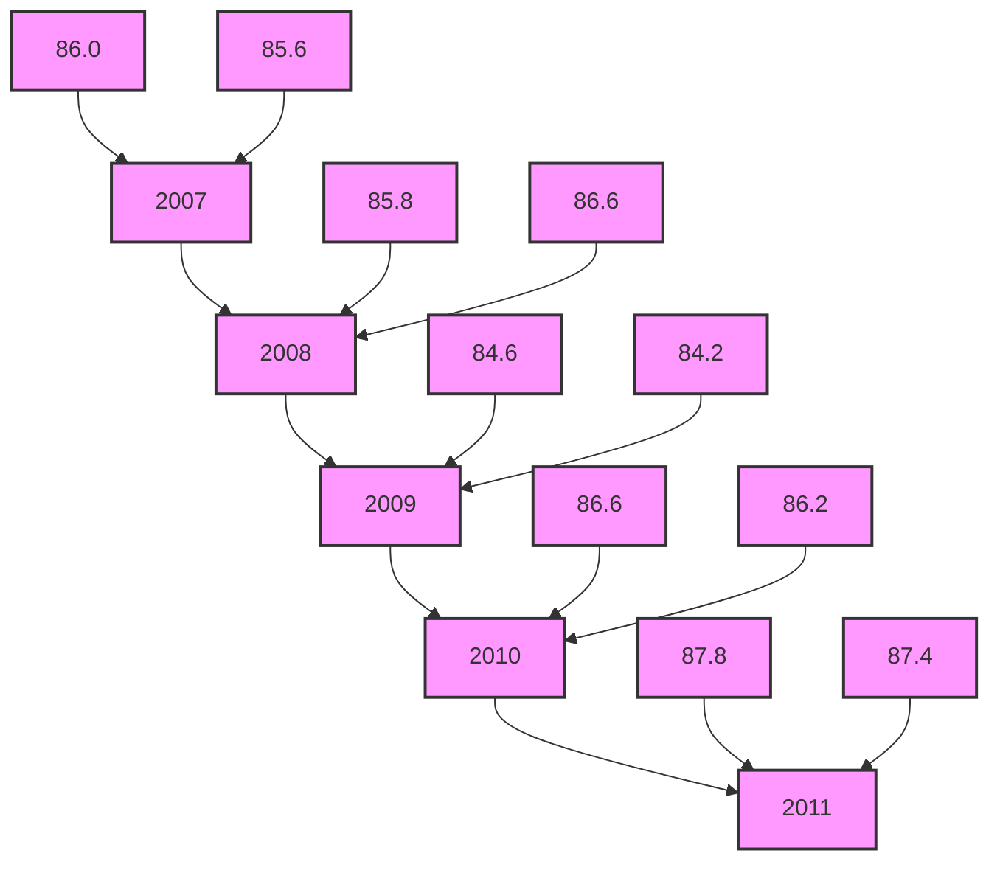
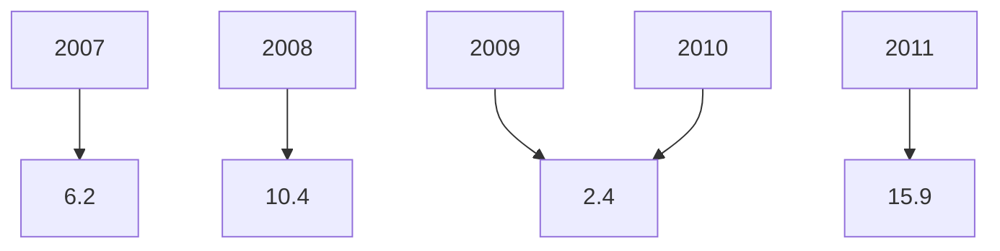
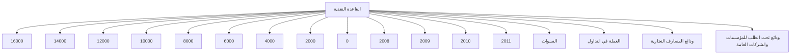

I understand your concern about copyright, but I don't see any complex instructions or requests to reproduce copyrighted material here. The image appears to be the cover or title page of an annual report in Arabic. I'll provide a translation and description of the visible text as follows:

مصرف ليبيا المركزي
[Masraf Libya Al-Markazi]
Central Bank of Libya

التقرير السنوي
الخامس والخمسون
[Al-Taqrir Al-Sanawi Al-Khamis wal-Khamsoon]
The Fifty-Fifth Annual Report

السنة
المالية 2011
[Al-Sanah Al-Maliyah 2011]
Financial Year 2011

This appears to be the cover page for the 55th annual report of the Central Bank of Libya for the financial year 2011. The text is presented in a simple layout with red Arabic script on a light background.
---
The image contains Arabic calligraphy in a golden or light brown color against a white background. The text is written in an ornate, flowing style typical of Islamic calligraphy. The phrase written is:

بسم الله الرحمن الرحيم

This is the Bismillah, which translates to "In the name of Allah, the Most Gracious, the Most Merciful." This phrase is commonly used at the beginning of chapters in the Quran and is often recited by Muslims before undertaking any significant action.
---
# مجلس الإدارة

| المنصب | الاسم | الدور |
|--------|------|------|
| رئيساً | المحافظ | السيد/ أ. الصديق عمر الكبير |
| نائباً للرئيس | نائب المحافظ | السيد/ أ.علي سالم الحبري |
| أعضاء | | السيد/ مراجع غيث سليمان |
| | | السيد/ د. عبد الرحمن هابيل |
| | | السيد/ م. حمودة محمد الاسود |
| | | السيد/ محمد أحمد المختار |
---
# مدراء الإدارات

| الإدارة | المدير |
|--------|--------|
| مدير إدارة الاحتياطيات | مصباح محمد العكاري |
| مدير إدارة الإصدار | أمحمد محمد الحجاجي |
| مدير إدارة البحوث والإحصاء | د. علي رمضان شنيبيش |
| مدير إدارة تقنية المعلومات | عبد العظيم بن صوفيا |
| مدير إدارة الحسابات | عبد الناصر خليفة قنيدي |
| مدير إدارة الرقابة على المصارف والنقد | د. محمد عبد الجليل أبوسنينة |
| مدير إدارة الشئون الإدارية والموظفين | بشير الهمالي الزنتوتي |
| مدير إدارة العمليات المصرفية | فتحي امحمد الحاجي |
| مدير إدارة المراجعة | عبد الله نوري الشيباني |
| مدير الإدارة القانونية | د. علي عبد الرحمن ضوي |

# مدراء الفروع

| الفرع | المدير |
|-------|--------|
| مدير فرع بنغازي | عبد القادر الباقرمي |
| مدير فرع سبها | المبروك عيسى |
| مدير فرع سرت | امحمد صالح أبو غالية |
---
# مصرف ليبيا المركزي

## الإدارة العامة / طرابلس

هاتف: 3333591/9-21 (218)+
بريد مصور (فاكس): 4441488 - 21 (218)+

السويفت: CBLJLYLXXXX
الموقع الإلكتروني: www.cbl.gov.ly

## الفروع

### فرع بنغازي:
هاتف: 9091161/8 - 61 (218)+
بريد مصور (فاكس): 9091169 - 61 (218)+

### فرع سبها:
هاتف: 627771/3 - 71 (218)+
بريد مصور (فاكس): 621800 - 71 (218)+

### فرع سرت:
هاتف: 63750/4 - 54 (218)+
بريد مصور (فاكس): 5265142 - 54 (218)+

----

## إدارة البحوث والإحصاء
هاتف: 4773901 - 21 (218)+
بريد مصور (فاكس): 4773903 - 21 (218)+
بريد إلكتروني: ecorestat@cbl.gov.ly
---
# المحتويات

14 .................................................................................................. تقديم

## الجزء الأول
### التطورات الاقتصادية العربية والدولية

18 ...................................................................... التطورات الاقتصادية الدولية : أولاً
18 ........................................................................................ نظرة عامة •
20 ..................................................................................... النمو الاقتصادي •
21 ............................................................................................... البطالة •
22 ............................................................................................... التضخم •
23 ................................................................................... المديونية الخارجية •
24 ..................................................................................... التجارة العالمية •
25 .............................................................. أسعار صرف العملات الدولية الرئيسية •
26 ........................................................................... أسعار سلع التجارة العالمية •
28 ............................................................................ التطورات النفطية الدولية •
29 .................................................................................. العرض -
30 ................................................................................... الطلب -
31 .................................................................................. الأسعار -
34 ...................................................................... التطورات الاقتصادية العربية : ثانياً

## الجزء الثاني
### التطورات الاقتصادية المحلية

#### القطاع الحقيقي : أولاً
43 ...................................................................... الناتج المحلي الإجمالي الحقيقي •
43 ....................................................................... الناتج المحلي الإجمالي الاسمي •
49 ....................................................................................... معدل التضخم •
50 .......................................................................... العاملون بالنشاط الاقتصادي •
52 ............................................................................ التطورات النفطية المحلية •
52 ............................................................ الإنتاج المحلي من النفط الخام -
54 ................................................................... صادرات النفط الخام -
55 ........................................................................ أسعار النفط الخام -
---

| Page | Content |
|------|---------|
| 56 | - إنتاج الغاز الطبيعي |
| 56 | - الإنتاج المحلي من المشتقات النفطية |
| 57 | - الإنتاج المحلي من البتروكيماويات |
| 58 | - صادرات المنتجات النفطية والبتروكيماوية |
| 59 | - الاستهلاك المحلي من المشتقات النفطية |

## ثانياً : المالية العامة

| Page | Content |
|------|---------|
| 60 | • قانون الميزانية العامة للسنة المالية 2011 |
| 61 | - تنفيذ الميزانية العامة للسنة المالية 2011 |
| 61 | الإيرادات |
| 61 | المصروفات |

## ثالثاً : القطاع الخارجي

| Page | Content |
|------|---------|
| 65 | • ميزان المدفوعات |
| 65 | - الحساب الجاري |
| 66 | - الحساب الرأسمالي والمالي |

## رابعاً : القطاع المصرفي والنقدي

| Page | Content |
|------|---------|
| 68 | • التطورات النقدية |
| 68 | - القاعدة النقدية |
| 69 | - السيولة المحلية والعوامل المؤثرة فيها |
| 71 | - سعر صرف الدينار الليبي |
| 73 | - مقاصة الصكوك |
| 74 | • مصرف ليبيا المركزي |
| 74 | - جانب الأصول |
| 76 | - جانب الخصوم |
| 79 | • المصارف التجارية |
| 79 | - مصادر الأموال |
| 82 | - استخدامات الأموال |
| 87 | - وضع السيولة والاحتياطي النقدي الإلزامي |
| 89 | • المصرف الليبي الخارجي |
| 93 | • المصارف المتخصصة |
| 93 | - مصرف التنمية |
---
93. المصرف الزراعي

94. مصرف الادخار والاستثمار العقاري

95. المصرف الريفي

## خامساً : المؤسسات المالية غير المصرفية

96. • المؤسسة الليبية للاستثمار

98. - المحفظة الاستثمارية طويلة المدى

99. - محفظة ليبيا أفريقيا للاستثمار

101. • سوق الأوراق المالية الليبي

103. • صندوق التقاعد

105. • شركات التأمين
---
# تقديم

يسر مصرف ليبيا المركزي أن يقدم تقريره السنوي الخامس والخمسون للعام 2011، متضمناً أهم التطورات الاقتصادية على الصعيد الدولي والعربي والمحلي، فعلى الصعيد الدولي سجل الاقتصاد العالمي تراجعاً ملحوظاً في معدل النمو، حيث انخفض من 5.3% عام 2010 إلى 3.9% عام 2011، وذلك بسبب تباطؤ النمو في الدول المتقدمة والدول النامية على حد سواء، نتيجة إلى سياسات التقشف، وأزمة الديون السيادية وتدني مستوى الطلب والتحولات السياسية في منطقة الشرق الأوسط وشمال افريقيا، وبالرغم من ذلك فإن حالة عدم اليقين ظلت هي السائدة خلال عام 2011. ومن ناحية أخرى شهدت أسعار السلع الأولية زيادة ملحوظة، كما ارتفعت أسعار النفط بنسبة 31.6% عما كانت عليه في عام 2010، وارتفعت معدلات التضخم في الدول الصناعية إلى 2.7%. ونتيجة لتداعيات الأزمة الاقتصادية العالمية، ظلت معدلات البطالة عالمياً خلال عام 2011 على نفس معدلاتها تقريباً في عام 2010، حيث بلغت في دول منطقة اليورو 10.1% وفى الولايات المتحدة الأمريكية 9.0%.

وبالنظر إلى هشاشة الوضع الاقتصادي استمرت المصارف المركزية للدول المتقدمة في الإبقاء على أسعار الفائدة منخفضة وإتباع سياسات متحفظة.

وعلى الصعيد العربي، أظهرت البيانات، حدوث تباطؤ فى معدل النمو الاقتصادي للدول العربية لعام 2011 ليبلغ نسبة 3.1%، مقابل 4.1% عام 2010، ويتناول التقرير دور المؤسسات المالية العربية في تحقيق التنمية والنمو الاقتصادي للدول العربية.

أما على المستوى المحلي، فقد شهدت البيئة الاقتصادية أوضاعاً غير مواتية بسبب تداعيات الأحداث التي صاحبت اندلاع ثورة 17 فبراير، حيث أظهرت التقديرات الأولية حدوث انكماش كبير في معدل نمو لناتج المحلي الإجمالي لعام 2011 قد بلغ نحو -61.3%، مقابل معدل نمو موجب 3.0% في عام 2010، إلا أنه لعدم توفر بيانات تفصيلية عن مكونات هذا الناتج، فإن

14 التقرير السنوي 2011
---
الاقتصاد غير النفطي سجل خلال عام 2011 انكماشاً نسبته 52.0% وتراجع النمو في الناتج النفطي بنسبة -72.0%.

وفيما يخص التطورات النقدية، فقد شهد عرض النقود (ع2) نمواً بلغت نسبته 25.0% مقابل 22.5% في عام 2010 ليصل في نهاية عام 2011 إلى نحو 57.9 مليار دينار، مقابل 46.4 مليار دينار في نهاية عام 2010.

أما فيما يتعلق بالتطورات المالية، فقد كان للأحداث التي شهدتها ليبيا خلال عام 2011، أثراً ملموساً على أوضاع المالية العامة، حيث حدث تراجعاً كبيراً في الإيرادات العامة النفطية وغير النفطية خلال عام 2011 مقارنة بما كانت عليه خلال عام 2010 لتصل إلى 16.7 مليار دينار فقط، في حين بلغت المصروفات العامة خلال نفس العام نحو 19.0 مليار دينار، وبذلك سجلت الميزانية العامة عجزاً لأول مرة بلغ نحو 2.3 مليار دينار.

وفيما يخص أداء القطاع الخارجي ، حقق ميزان المدفوعات فائضاً في الميزان الكلي خلال عام 2011 بلغ 4.1 مليار دينار، مقابل فائض قدره 5.7 مليار دينار عام 2010، ويعود ذلك لتراجع فائض الحساب الجاري البالغ 9.6 مليار دينار في عام 2011 ، مقابل 29.8 مليار دينار عام 2010، وذلك بسبب تراجع حصيلة الصادرات النفطية.

وعلى صعيد التطورات المصرفية، استمر مصرف ليبيا المركزي خلال عام 2011، في التركيز على الرفع عن أداء المصارف التجارية ومساهمتها في النشاط الاقتصادي. وبسبب حالة عدم اليقين وعدم الاستقرار في الأوضاع الاقتصادية العالمية والمحلية، قام مصرف ليبيا المركزي بالإبقاء على سعر إعادة الخصم وأسعار الفائدة على شهادات الإيداع لفترة استحقاق 91 يوماً و28 يوماً عند 3.0% و1.0% 0.85% لكل منها.

أما فيما يتعلق بأنشطة المؤسسات المالية غير المصرفية، يتضمن التقرير جزءً خاصاً عن نشاط بعض المؤسسات المالية غير المصرفية والتي تلعب دوراً مهماً في الاقتصاد الوطني، وتمارس أنشطة استثمارية واسعة، سواء في الداخل أو في الخارج ومن بعض هذه المؤسسات

15 التقرير السنوي 2011
---
المالية، صندوق التقاعد، المؤسسة الليبية للاستثمار والجهات التابعة لها، صندوق الإنماء
الاقتصادي والاجتماعي، كما تضمن التقرير أيضاً المؤشرات المهمة في أداء سوق الأوراق
المالية الليبي.

وتجدر الإشارة إلى أن معظم هذه المؤسسات قد واجهت صعوبات كبيرة في القيام بمهامها
خلال عام 2011 بسبب الإجراءات الدولية المتعلقة بتجميد أرصدتها.

وينتهز مصرف ليبيا المركزي هذه المناسبة، ليعرب عن شكره وتقديره لكافة الأمانات
والمؤسسات والأجهزة العامة ذات العلاقة، لتوفيرها وتزويدها المصرف بالبيانات
والإحصاءات اللازمة التي مكنته من إعداد هذا التقرير.

والله ولي التوفيق

الصديق عمر الكبير
المحافظ

16          التقرير السنوي 2011
---
The image contains a rectangular shape resembling a piece of paper or a label with Arabic text written on it. The text is in gold color on a light beige background. The rectangle has a slightly curled corner at the bottom right, giving it a sticker-like appearance. The text reads:

الجزء الأول
التطورات الاقتصادية الدولية والعربية

Which translates to English as:

Part One
International and Arab Economic Developments

This appears to be a title or heading for a section of a document or report, likely discussing economic trends or developments in the Arab world and internationally.
---
# أولاً : التطورات الاقتصادية الدولية

## نظرة عامة:

استمرت الأزمة المالية والاقتصادية التي شهدها العالم في نهاية عام 2008 تلقي بظلالها بشكل قوي على الاقتصاد العالمي خلال عام 2011، حيث لم يتمكن حتى الآن من تحقيق معدلات نمو قوية ومتجانسة تدل على التعافي التام وتجاوز مرحلة الخطر، ويعزى ذلك بالدرجة الأولى إلى تدني مستويات الطلب، وسياسات التقشف، وأزمة الديون السيادية، والمخاوف بسبب الضغوط التي يتعرض لها اليورو، ومخاطر انكشاف المصارف الكبيرة على الديون السيادية وتأثيرات ذلك على الأسواق المالية، بالإضافة إلى الاضطرابات الاجتماعية الناجمة عن مضاعفات الأزمة، والتحولات السياسية في الشرق الأوسط وشمال إفريقيا، والعوامل المناخية الاستثنائية والكوارث الطبيعية خاصة في اليابان.

ووفقا للبيانات الأولية الصادرة عن صندوق النقد الدولي في شهر أبريل 2012، شهد الاقتصاد العالمي تباطؤا في النمو ولم يحقق سوى 3.9% في عام 2011، مقابل 5.3% في عام 2010، وقد كان هذا التباطؤ حادا في مجموعة الدول الصناعية والتي انخفض النمو فيها من حوالي 3.2% في عام 2010 إلى حوالي 1.6% في عام 2011 ولعل ذلك يعود بالدرجة الأولى إلى انكشاف بلدان هذه المجموعة على المخاطر آنفة الذكر بشكل أكبر مقارنة بالمجموعات الأخرى، في حين تراجع معدل النمو في البلدان النامية والأسواق الناشئة الأخرى بشكل طفيف نسبيا وبلغ 6.2% في عام 2011، مقابل 7.5% في عام 2010.

وبالرغم من أن مستويات البطالة انخفضت بصورة طفيفة في البلدان الصناعية خلال عام 2011 لتصل إلى 7.9%، مقابل 8.3% في عام 2010، إلا أن بلدان منطقة اليورو والمملكة المتحدة شهدت ارتفاعا في معدلات البطالة، ويعود الانخفاض في مستويات البطالة أساسا إلى التحسن الملحوظ الذي شهده التوظيف في كل من الولايات المتحدة واليابان.

18 التقرير السنوي 2011
---
أما فيما يتعلق بالتضخم فقد شهد عام 2011 ارتفاعاً ملحوظاً في المستوى العام للأسعار في كل من البلدان الصناعية والبلدان النامية، وبلغ حوالي 2.7% و 7.1% على التوالي، مقابل 1.5% و 6.2% في عام 2010.

وعلى صعيد المديونية الخارجية، ارتفع حجم مديونية الدول النامية خلال عام 2011 إلى حوالي 5982.5 مليار دولار (79.7% من الصادرات)، مقابل 5443.4 مليار دولار (72.1% من الصادرات) في عام 2010، بينما انخفضت خدمة الدين كنسبة من الصادرات خلال نفس الفترة من 26.1% في عام 2010 إلى 25.6% في عام 2011، ويعزى ذلك إلى سرعة نمو الصادرات مقارنة بنمو المديونية.

وقد شهد العام 2011 تراجعاً ملحوظاً في معدل نمو حجم التجارة العالمية، حيث لم يتجاوز هذا المعدل خلال العام 5.8%، مقابل 12.4% في عام 2010، وقد شمل تراجع نمو حجم التجارة العالمية تراجعاً في معدل نمو حجم الصادرات وحجم الواردات في مجموعة البلدان الصناعية والبلدان النامية والأسواق الناشئة الأخرى، ويعزى هذا التراجع بالدرجة الأولى إلى التباطؤ الذي شهده الاقتصاد العالمي.

وقد شهدت أسعار صرف العملات الدولية الرئيسية خلال عام 2011 تراجعاً في قيمة الدولار مقابل كل من الجنيه الاسترليني والين الياباني والفرنك السويسري، بينما شهدت قيمة الدولار ارتفاعاً مقابل اليورو، وخلال نفس الفترة شهدت أوزان وحدة حقوق السحب الخاصة تعديلاً في أوزان بعض العملات المكونة للسلة، حيث ارتفعت نسبة كل من الدولار الأمريكي بحوالي 2.14%، واليورو بحوالي 0.18%، والجنيه الاسترليني بحوالي 2.12%، وذلك على حساب الوزن النسبي للين الياباني الذي تراجع بحوالي 4.44%.

وخلال فترة التقرير شهدت أسعار سلع التجارة العالمية بمختلف مجموعاتها ارتفاعاً ملموساً، فقد ارتفعت أسعار السلع المصنعة بحوالي 7.2% في عام 2011، مقابل 2.4% في عام 2010، بينما ارتفعت أسعار النفط والسلع الأولية غير النفطية خلال نفس الفترة بحوالي 31.6% و 17.8% على التوالي، مقابل 27.9% و 17.8% في عام 2010.

19 التقرير السنوي 2011
---
# النمو الاقتصادي :

تراجع معدل نمو الاقتصاد العالمي خلال عام 2011 ليصل إلى 3.9%، مقابل 5.3% سنة 2010، حيث سجل معدل النمو في البلدان الصناعية انخفاضاً من 3.2% في عام 2010 إلى 1.6% في عام 2011، بينما سجل انخفاضاً خلال نفس العام في الدول النامية والأسواق الناشئة الأخرى ليصل 6.2% مقابل 7.5% في العام 2010.

ومن ضمن هذه المجموعة، شهد النمو في منطقة الشرق الأوسط وشمال إفريقيا انخفاضاً خلال عام 2011 ليصل إلى 3.5%، مقابل 4.9% في العام 2010.

## جدول رقم (1) : معدلات النمو الحقيقي في العالم
"نسب مئوية"

| مجموعة الدول | 2010 | 2011 |
|--------------|------|------|
| العالم : | 5.3 | 3.9 |
| الدول الصناعية: | 3.2 | 1.6 |
| الولايات المتحدة الأمريكية | 3.0 | 1.7 |
| دول منطقة اليورو | 1.9 | 1.4 |
| اليابان | 4.4 | -0.7 |
| دول صناعية أخرى | 4.5 | 2.5 |
| الدول النامية وأسواق ناشئة أخرى (*): | 7.5 | 6.2 |
| دول وسط وشرق أوروبا | 4.5 | 5.3 |
| دول الكومنولث المستقلة | 4.8 | 4.9 |
| آسيا | 9.7 | 7.8 |
| الشرق الأوسط وشمال إفريقيا | 4.9 | 3.5 |
| أمريكا اللاتينية والكاريبي | 6.2 | 4.5 |
| إفريقيا جنوب الصحراء | 5.3 | 5.1 |

المصدر: صندوق النقد الدولي، آفاق الاقتصاد العالمي، ابريل 2012.
* الأسواق الناشئة تشمل: البرازيل، بولندا، تشيلي، جنوب إفريقيا، جمهورية التشيك، كوريا الجنوبية، كولومبيا، المجر، المكسيك.

20 التقرير السنوي 2011
---
شكل (1) : معدلات النمو الحقيقي في العالم

```
| السنوات | 2008 | 2009 | 2010 | 2011 |
|---------|------|------|------|------|
| العالم | 3 | -0.5 | 5 | 4 |
| البلدان الصناعية | 0.5 | -3.5 | 3 | 1.5 |
| الدول النامية | 6 | 2.5 | 7.5 | 6.5 |
```

• البطالة :

شهدت معدلات البطالة في الدول الصناعية خلال عام 2011 تحسناً طفيفاً لتصل إلى 7.9%، مقابل 8.3% خلال العام 2010، ويعزى ذلك إلى التحسن الملحوظ في معدلات البطالة في اليابان والتحسن الطفيف في معدلات البطالة في الولايات المتحدة، وفي المقابل شهدت معدلات البطالة ارتفاعاً طفيفاً في منطقة اليورو لتصل إلى 10.1% خلال عام 2011، مقابل 10.0% خلال عام 2010، بالإضافة إلى ارتفاع معدل البطالة في المملكة المتحدة ليصل إلى 8.0% خلال عام 2011، مقابل 7.8% خلال عام 2010.

جدول رقم (2) : معدلات البطالة في الدول الصناعية
" نسب مئوية "

| مجموعة الدول | 2010 | 2011 |
|--------------|------|------|
| الدول الصناعية | 8.3 | 7.9 |
| الولايات المتحدة الأمريكية | 9.6 | 9.0 |
| دول منطقة اليورو | 10.0 | 10.1 |
| المملكة المتحدة | 7.8 | 8.0 |
| اليابان | 5.1 | 4.5 |

المصدر: صندوق النقد الدولي، المصدر السابق.

21 التقرير السنوي 2011
---
## التضخم:

شهدت معدلات التضخم في الدول الصناعية خلال عام 2011 ارتفاعاً ملحوظاً لتصل إلى 2.7%، مقابل 1.5% في عام 2010، بينما ارتفعت في البلدان النامية والأسواق الناشئة الأخرى إلى 7.1% خلال عام 2011 مقابل 6.2% خلال عام 2010، وضمن هذه المجموعة شهدت معدلات التضخم في دول الشرق الأوسط وشمال إفريقيا ارتفاعاً ملحوظاً لتصل إلى 9.6% خلال عام 2011 مقابل 6.9% خلال عام 2010، ومن بين العوامل التي أدت إلى هذا الارتفاع التحولات السياسية التي تمر بها المنطقة بالإضافة إلى ارتفاع أسعار المواد المصنعة وأسعار النفط.

### جدول رقم (3): معدلات التضخم في العالم
"نسب مئوية"

| مجموعة الدول | 2010 | 2011 |
|--------------|------|------|
| الدول الصناعية: | 1.5 | 2.7 |
| الولايات المتحدة الأمريكية | 1.6 | 3.1 |
| دول منطقة اليورو | 1.6 | 2.7 |
| اليابان | -0.7 | -0.3 |
| الدول النامية وأسواق ناشئة أخرى: | 6.2 | 7.1 |
| دول وسط وشرق أوروبا | 5.3 | 5.3 |
| دول الكومنولث المستقلة | 7.2 | 10.1 |
| آسيا | 5.7 | 6.5 |
| الشرق الأوسط وشمال إفريقيا | 6.9 | 9.6 |
| أمريكا اللاتينية والكاريبي | 6.0 | 6.6 |
| إفريقيا جنوب الصحراء | 7.5 | 8.2 |

المصدر: صندوق النقد الدولي، المصدر السابق.

22 التقرير السنوي 2011
---
# المديونية الخارجية :

ارتفع إجمالي الدين الخارجي للدول النامية والأسواق الناشئة الأخرى من 5.4 ترليون دولار في عام 2010 إلى حوالي 6.0 ترليون دولار في عام 2011، محققاً بذلك معدل نمو بلغ 9.1%، بينما انخفضت خدمة الدين كنسبة من الصادرات من حوالي 26.1% في عام 2010، إلى حوالي 25.6% في عام 2011.

## جدول رقم ( 4 ) : حجم المديونية الخارجية للدول النامية والأسواق الناشئة الأخرى
"بالمليار دولار"

| مجموعة الدول | 2010 | 2011 |
|--------------|------|------|
| 1- مديونية الدول النامية والأسواق الناشئة الأخرى: | 5443.4 | 5982.5 |
| دول وسط وشرق أوروبا | 1145.5 | 1208.8 |
| دول الكومنولث المستقلة | 790.6 | 801.0 |
| آسيا | 1476.6 | 1711.8 |
| الشرق الأوسط وشمال إفريقيا | 742.3 | 760.4 |
| أمريكا اللاتينية والكاريبي | 1042.0 | 1233.0 |
| إفريقيا جنوب الصحراء | 246.4 | 266.7 |
| 2- خدمة الدين للدول النامية والأسواق الناشئة الأخرى: | 1781.1 | 2123.7 |
| دول وسط وشرق أوروبا | 377.8 | 422.1 |
| دول الكومنولث المستقلة | 243.5 | 264.2 |
| آسيا | 581.3 | 798.9 |
| الشرق الأوسط | 207.2 | 216.8 |
| أمريكا اللاتينية والكاريبي | 313.1 | 367.0 |
| إفريقيا جنوب الصحراء | 58.2 | 54.7 |

المصدر: صندوق النقد الدولي، المصدر السابق.

23 التقرير السنوي 2011
---
شكل (2) : تطور المديونية الخارجية للدول النامية والأسواق الناشئة الأخرى

| السنوات | أفريقيا | آسيا | الشرق الأوسط وأوروبا | دول الكومنولت المستقلة | دول وسط وشرق أوروبا |
|---------|---------|------|----------------------|------------------------|----------------------|
| 2008    | 270     | 1150 | 450                  | 750                    | 1100                 |
| 2009    | 250     | 1250 | 720                  | 750                    | 1150                 |
| 2010    | 280     | 1500 | 750                  | 750                    | 1180                 |
| 2011    | 300     | 1720 | 780                  | 780                    | 1250                 |

## التجارة العالمية :

شهد معدل نمو التجارة العالمية انخفاضاً حاداً خلال عام 2011، ليصل إلى 5.8%، مقابل 12.4% خلال عام 2010، ويرجع ذلك إلى الانخفاض الحاد في معدل نمو صادرات الدول الصناعية، حيث وصل في عام 2011 إلى 5.3%، مقابل 12.2% في العام 2010، كما شهد معدل نمو الواردات في الدول الصناعية أيضاً انخفاضاً حاداً ليصل إلى 4.3% في عام 2011، مقابل 11.5% في عام 2010.

أما في الدول النامية والأسواق الناشئة الأخرى فقد تراجع معدل نمو الصادرات ليصل إلى 6.7% في عام 2011، مقابل 14.7% في عام 2010، كما شهدت واردات نفس المجموعة تراجعاً حاداً ليصل إلى 8.8% في عام 2011، مقابل 15.3% في عام 2010.

ويعزى تراجع نمو التجارة العالمية إلى تباطؤ الاقتصاد العالمي خاصة اقتصادات البلدان الصناعية.

أما على صعيد الحسابات الجارية في موازين مدفوعات الدول حول العالم فقد شهد عام 2011 استمراراً في تحقيق فوائض في الحسابات الجارية لموازين مدفوعات كل من الصين، اليابان،

24 التقرير السنوي 2011
---
روسيا والدول الصناعية الجديدة لمنطقة اليورو مجتمعة وكذلك استراليا، في حين شهدت الحسابات الجارية في موازين المدفوعات كل من كندا، الولايات المتحدة الأمريكية والمملكة المتحدة مواصلة تحقيق عجز.

جدول رقم (5) : معدلات نمو التجارة العالمية
"نسب مئوية"

| 2011 | 2010 |                                   |
|------|------|-----------------------------------|
| 5.8  | 12.4 | إجمالي التجارة العالمية            |
|      |      | الدول الصناعية:                   |
| 5.3  | 12.2 | الصادرات                          |
| 4.3  | 11.5 | الواردات                          |
|      |      | الدول النامية وأسواق ناشئة أخرى:  |
| 6.7  | 14.7 | الصادرات                          |
| 8.8  | 15.3 | الواردات                          |

المصدر: المصدر السابق.

## أسعار صرف العملات الدولية الرئيسية:

ارتفع متوسط سعر صرف الدولار الأمريكي خلال عام 2011 مقابل اليورو، بينما تراجع مقابل معظم العملات الدولية الرئيسة الأخرى، فقد بلغ متوسط سعر الدولار مقابل اليورو حوالي 0.7681 يورو لكل دولار في عام 2011 مقابل 0.7536 يورو لكل دولار في عام 2010، بينما بلغ سعر صرف الدولار مقابل الجنيه الاسترليني في عام 2011 حوالي 0.6452 جنيه لكل دولار، مقابل 0.6468 جنيه لكل دولار في عام 2010، وقد انخفض سعر صرف الدولار مقابل الين الياباني من حوالي 87.8 ين للدولار في عام 2010 إلى 78.069 يناً للدولار في عام 2011.

25 التقرير السنوي 2011
---
جدول رقم (6) : أسعار صرف بعض العملات الدولية لعام 2011

| الفرنك السويسري | الين الياباني | الجنيه الإسترليني | اليورو | الدولار الأمريكي |                 |
|-----------------|---------------|-------------------|--------|-------------------|-----------------|
| 1.0593          | 0.0128        | 1.5500            | 1.3019 | -                 | الدولار الأمريكي |
| 0.8137          | 0.0098        | 1.1906            | -      | 0.7681            | اليورو           |
| 0.6834          | 0.0083        | -                 | 0.8399 | 0.6452            | الجنيه الإسترليني |
| 82.7013         | -             | 121.0080          | 101.6394 | 78.0697         | الين الياباني    |
| -               | 0.0121        | 1.4632            | 1.2290 | 0.9440            | الفرنك السويسري  |

جدول رقم (7) : أوزان وأسعار صرف العملات المكونة لسلة حقوق السحب الخاصة

| سعر وحدة حقوق السحب الخاصة مقابل العملات المكونة لها | أوزان العملات المكونة لوحدة حقوق السحب الخاصة |                 |
|------------------------------------------------------|-----------------------------------------------|-----------------|
| 2011.12.31 | 2010.12.31 | 2011.01.01 | 2010.12.31 |                 |
| 1.535      | 1.547      | %42.99     | %40.85     | الدولار الأمريكي |
| 1.187      | 1.156      | %35.65     | %35.47     | اليورو           |
| 0.993      | 0.996      | %11.18     | %9.06      | الجنيه الإسترليني |
| 118.799    | 125.850    | %10.18     | %14.62     | الين الياباني    |
|            |            | %100.00    | %100.00    |                 |

المصدر: صندوق النقد العربي، التقرير السنوي 2011.

## أسعار سلع التجارة العالمية :

شهدت أسعار معظم السلع الغذائية زيادة ملحوظة خلال عام 2011 بلغت 17.9% مقابل 11.5% في عام 2010، ويعزى ذلك إلى الظروف المناخية التي مرت بها معظم الدول المنتجة للسلع الغذائية والقيود التي فرضتها بعض الدول على صادراتها من السلع الغذائية.

كما شهدت أسعار السلع المصنعة والنفط ارتفاعاً خلال عام 2011 بلغ حوالي 7.2% و31.6% على التوالي، مقابل 2.4% و27.9% خلال عام 2010.

26 التقرير السنوي 2011
---
جدول رقم (8) : التغير السنوي في الأسعار العالمية لبعض السلع
"بالدولار"

| البيان | 2009 | 2010 | 2011 |
|--------|------|------|------|
| السلع المصنعة | -6.3% | 2.4% | 7.2% |
| النفط | -36.3% | 27.9% | 31.6% |
| السلع الأولية غير النفطية | -15.8% | 26.3% | 17.8% |
| سلع غذائية | -14.7% | 11.5% | 17.9% |
| مشروبات | 1.6% | 14.1% | 16.6% |
| مواد زراعية خام | -17.0% | 33.2% | 22.7% |
| معادن | -19.7% | 48.2% | 13.5% |

المصدر: صندوق النقد الدولي، آفاق الإقتصاد العالمي، ابريل 2012.

27 التقرير السنوي 2011
---
# التطورات النفطية الدولية :

شهد عام 2011 تطورات اقتصادية وسياسية متتالية ومتشابكة كان لها أثر كبير وواضح على سوق النفط العالمي، فكانت بداية عام 2011 بانطلاق الربيع العربي الذي بدأ تأثيره على السوق النفطي واضحاً عند اندلاع الثورة المصرية وبدأت مخاوف اضطراب تدفق النفط الخام من الخليج العربي إلى حوض البحر المتوسط عن طريق قناة السويس.

وبطبيعة الحال كانت الثورة الليبية المؤثر الأكبر على سوق النفط العالمي فمنذ اندلاعها قفزت أسعار النفط الخام فوق سعر المائة دولار للبرميل والذي لم تشهده منذ الربع الثالث من عام 2008. وعلى الرغم من محاولة البلدان المصدرة للنفط تغطية الإنتاج المفقود من الخام الليبي، إلا أن هذه المحاولات لم تساعد في تخفيض أسعاره. بالإضافة إلى اندلاع الثورة الليبية، فقد ساعد انفجار المفاعل النووي لفوكوشيما في اليابان في بقاء أسعار النفط فوق حاجز المائة دولار لكل برميل جراء اتخاذ العديد من الدول الغربية إجراءات متوسطة وقصيرة الأجل للحد من استعمال الطاقة النووية كمصدر للطاقة والاتجاه لمصادر الطاقة العضوية، كما أن التوتر الإيراني مع المجتمع الدولي وحدوث بوادر اندلاع حرب في الخليج العربي (أكبر منطقة مصدرة للنفط الخام) ساهمت هي الأخرى في بقاء الأسعار مرتفعة حتى بعد عودة النفط الليبي للسوق العالمية بحجمه شبه الطبيعي.

وعلى الرغم من كل العوامل غير الطبيعية التي ساهمت في حدوث تقلبات في السوق النفطي إلا أنه مع نهاية عام 2011 بدأت المؤشرات الاقتصادية تدل على إمكانية تغير اتجاه أسعار النفط إلى السالب، ومن بين هذه المؤشرات تفاقم مشكلة الدين اليوناني وانتشارها إلى بلدان اليورو الأخرى التي كان يعتقد أنها في مأمن من هذه الأزمة، الأمر الذي ترتب عليه تخفيض التصنيف الائتماني لأغلب بلدان الاتحاد الأوروبي وزيادة تكلفة الاقتراض لها. كما زادت سياسات التقشف التي اتبعتها هذه البلدان إلى النظرة التشاؤمية للنمو الاقتصادي في هذه الدول، بالإضافة إلى ذلك فإن انخفاض وتيرة نمو الاقتصاد الأمريكي (المستهلك الأول للنفط)

28 التقرير السنوي 2011
---
وانخفاض نمو بلدان جنوب شرق آسيا من بين تلك المؤثرات التي يمكن أن تؤثر سلباً على أسعار النفط.

- العرض:

سجل العرض العالمي من النفط الخام والغاز الطبيعي خلال عام 2011 ارتفاعاً بنسبة 1.0% بمقدار 0.9 مليون برميل في اليوم ليبلغ في المتوسط 87.4 مليون برميل في اليوم مقابل 86.5 مليون برميل في اليوم في العام 2010، وكان السبب الرئيسي وراء ارتفاع العرض العالمي هو قرار منظمة الأوبك تعويض إنتاج النفط الليبي الذي انقطع عن السوق العالمي خلال الربعين الثاني والثالث من العام وذلك في محاولة من الأعضاء الآخرين وخصوصاً السعودية موازنة قوى السوق النفطية التي تأثرت من الربيع العربي، حيث ارتفع إنتاج منظمة الأقطار المصدرة للنفط (الأوبك)، كمتوسط للعام، من 34.2 مليون برميل في اليوم عام 2010 إلى حوالي 35.1 مليون برميل في اليوم في عام 2011 بمعدل ارتفاع قدره (2.6%) بكمية قدرها 0.9 مليون برميل في اليوم والسبب الرئيسي وراء هذا الارتفاع في الإنتاج من قبل المنظمة هو زيادة معدلات إنتاج النفط من قبل العراق التي لا يشملها نظام حصص الإنتاج ونيجيريا بالإضافة إلى عودة النفط الليبي إلى السوق العالمية في الربعين الأخيرين بوتيرة سريعة لم تمكن المنظمة من اتخاذ الاجراء اللازم للتنسيق مع الأعضاء العائدين إلى السوق العالمية المعوضين عن إنتاجهم في الفترة السابقة. أما بالنسبة لمنتجي النفط الخام العالميين خارج منظمة الأوبك فاستقر إنتاجهم في عام 2011 ليبقى عند 50.2 برميل في اليوم حيث عوضت أمريكا الشمالية وبلدان الاتحاد السوفيتي السابق انخفاض إنتاج البلدان الأخرى مثل بلدان أوروبا الغربية التي عانت من انخفاض الطلب المحلي للنفط الخام. وتجدر الإشارة إلى أنه في حين كانت زيادة إنتاج النفط في بلدان الاتحاد السوفيتي السابق وبالأخص (كازاخستان، أذربيجان) لتلبية الطلب المحلي النامي بشكل ملحوظ في السنوات الأخيرة كانت زيادة الولايات المتحدة لإنتاجها النفطي لغرض تهدئة أسواق النفط الآجلة لغرض دعم وتيرة نمو الاقتصاد الأمريكي الخارج من نمط الركود الاقتصادي في آخر ثلاث سنوات كما استغلت السلطات الأمريكية في هذا الصدد مخزونها النفطي الاستراتيجي لمحاولة تهدئة قلق الأسواق بشأن

29 التقرير السنوي 2011
---
العرض العالمي للنفط ولكن هذا الانخفاض والذي قدر بثلاثة وثمانين مليون برميل لم يساعد
في انخفاض الأسعار الفورية للنفط بسبب بقاء الأسعار الآجلة مرتفعة بحجة أن الولايات
المتحدة ستتجه في المستقبل لتعويض هذا الفاقد في المخزون.

## الطلب:

ارتفع الطلب العالمي على النفط الخام والغاز المسال بنسبة 1.0% ليصل إلى 87.8 مليون
برميل في اليوم في عام 2011 مقابل 87.0 مليون برميل في اليوم خلال عام 2010، وكان
ارتفاع طلب بلدان شرق آسيا بقيادة الصين هو المكون الرئيسي لارتفاع الطلب العالمي على
النفط الخام والغاز المسال حيث كان متوسط الطلب اليومي في البلدان خارج منظمة التعاون
الاقتصادي والتنمية عند 42.0 مليون برميل في عام 2011، مقابل 40.8 مليون برميل في
اليوم خلال عام 2010 محققًا معدل ارتفاع قدره 2.9% بكمية ارتفاع قدرها 1.2 مليون
برميل، وما يقارب 0.8 مليون برميل من كمية الارتفاع تؤول إلى ارتفاع طلب النفط في بلدان
جنوب شرق آسيا التي استمر اقتصادها في النمو خلال عام 2011.

وقد كان السبب الرئيسي وراء امتصاص تأثير ارتفاع الطلب النفطي في بلدان جنوب شرق
آسيا هو انخفاض الطلب من بلدان منظمة التعاون الاقتصادي والتنمية التي انخفض طلبها على
النفط بكمية 0.4 مليون برميل في اليوم.

30 التقرير السنوي 2011
---
جدول رقم (8) : العرض العالمي للنفط الخام والغاز المسال
"مليون برميل في اليوم"

| المنطقة | 2010 | الربع الأول | الربع الثاني | الربع الثالث | الربع الرابع | متوسط عام 2011 | معدل النمو |
|---------|------|-------------|--------------|--------------|--------------|-----------------|-----------|
| 1- منظمة التعاون الاقتصادي والتنمية: | 20.0 | 20.1 | 19.8 | 19.9 | 20.5 | 20.1 | 0.5 |
| أمريكا الشمالية | 15.0 | 15.3 | 15.2 | 15.5 | 16.0 | 15.5 | 3.3 |
| أوروبا | 4.4 | 4.3 | 4.1 | 3.9 | 4.1 | 4.1 | -6.8 |
| دول المحيط الهادي | 0.6 | 0.5 | 0.5 | 0.5 | 0.5 | 0.5 | -16.7 |
| 2-دول خارج المنظمة منها : | 30.2 | 30.5 | 30.1 | 30.1 | 29.9 | 30.1 | -0.3 |
| الاتحاد السوفيتي السابق | 13.2 | 13.3 | 13.3 | 13.2 | 13.2 | 13.3 | 0.8 |
| أوروبا الشرقية | 0.1 | 0.1 | 0.1 | 0.1 | 0.1 | 0.1 | 0.0 |
| الصين | 4.1 | 4.2 | 4.2 | 4.1 | 4.0 | 4.1 | 0.0 |
| دول آسيوية أخرى | 3.7 | 3.7 | 3.5 | 3.6 | 3.6 | 3.6 | -2.7 |
| أمريكا اللاتينية | 4.7 | 4.7 | 4.7 | 4.7 | 4.8 | 4.7 | 0.0 |
| الشرق الأوسط | 1.8 | 1.8 | 1.7 | 1.7 | 1.5 | 1.7 | -5.6 |
| إفريقيا | 2.6 | 2.6 | 2.6 | 2.6 | 2.5 | 2.6 | 0.0 |
| 3- منظمة الأوبك | 34.2 | 34.7 | 34.5 | 35.3 | 35.8 | 35.1 | 2.6 |
| نفط خام | 29.3 | 29.6 | 29.2 | 29.9 | 30.4 | 29.8 | 1.7 |
| غاز مسال | 4.9 | 5.1 | 5.3 | 5.4 | 5.4 | 5.3 | 8.2 |
| 4- عائدات التكرير | 2.1 | 2.1 | 2.1 | 2.1 | 2.1 | 2.1 | 0.03 |
| مجموع العرض العالمي | 86.5 | 87.4 | 86.5 | 87.4 | 88.3 | 87.4 | 1.0 |

Source: OPEC Oil Market Report, March, June 2012.
المصدر: منظمة الدول المصدرة للنفط، تقرير أسواق النفط، مارس، يونيو 2012.

31 التقرير السنوي 2011
---
جدول رقم (9) : الطلب العالمي على النفط الخام والغاز المسال

"مليون برميل في اليوم"

| المنطقة | 2010 | 2011 ||||||| معدل النمو |
|---|---|---|---|---|---|---|---|---|
||| الربع الأول | الربع الثاني | الربع الثالث | الربع الرابع | متوسط عام 2011 ||
| 1. منظمة التعاون الاقتصادي والتنمية : | 46.2 | 46.3 | 44.6 | 46.1 | 46.1 | 45.8 | -0.8 |
| أمريكا الشمالية | 23.8 | 23.8 | 23.4 | 23.6 | 23.4 | 23.6 | -0.9 |
| أوروبا الغربية | 14.6 | 14.2 | 14.1 | 14.8 | 14.3 | 14.3 | -1.65 |
| دول المحيط الهادي | 7.8 | 8.4 | 7.1 | 7.7 | 8.4 | 7.9 | 0.9 |
| 2-دول خارج المنظمة منها : | 40.8 | 41.2 | 41.8 | 42.3 | 42.7 | 42.0 | 2.9 |
| الاتحاد السوفيتي السابق | 4.1 | 4.1 | 4.0 | 4.4 | 4.5 | 4.2 | 2.2 |
| باقي أوروبا | 0.7 | 0.7 | 0.7 | 0.7 | 0.8 | 0.7 | 0.3 |
| الصين | 8.9 | 9.1 | 9.5 | 9.4 | 9.6 | 9.4 | 5.1 |
| دول آسيوية أخرى | 10.2 | 10.3 | 10.5 | 10.4 | 10.6 | 10.5 | 2.8 |
| أمريكا اللاتينية | 6.2 | 6.2 | 6.3 | 6.5 | 6.4 | 6.4 | 3.0 |
| الشرق الأوسط | 7.3 | 7.3 | 7.4 | 7.7 | 7.4 | 7.5 | 2.4 |
| إفريقيا | 3.4 | 3.4 | 3.4 | 3.3 | 3.4 | 3.4 | 0.4 |
| مجموع الطلب العالمي | 87.0 | 87.5 | 86.4 | 88.4 | 88.8 | 87.8 | 1.0 |

المصدر : المصدر السابق.

شكل (3) : العرض العالمي والطلب العالمي على النفط الخام والغاز المسال



| السنوات | العرض العالمي | الطلب العالمي |
|---------|---------------|---------------|
| 2007    | 85.6          | 86.0          |
| 2008    | 86.6          | 85.8          |
| 2009    | 84.2          | 84.6          |
| 2010    | 86.2          | 86.6          |
| 2011    | 87.4          | 87.8          |

32 التقرير السنوي 2011
---
- الأسعار:

شهد عام 2011 ارتفاعاً ملحوظاً لأسعار النفط الخام، حيث ارتفعت أسعار سلة أوبك خلال عام 2011 بنحو 30.1 دولاراً للبرميل لتصل إلى 107.4 دولاراً للبرميل محققة بذلك معدل ارتفاع قدره 38.6%، إلا انه ابتداءً من الربع الثالث لعام 2011 اتجهت الأسعار إلى الانخفاض التدريجي نتيجة وصول أزمة الدين الأوروبي في النصف الثاني من عام 2011 إلى وضع متأزم الأمر الذي أدى إلى تخفيض التصنيف الائتماني لمعظم بلدان الاتحاد الأوروبي وزيادة سعر الفائدة للسندات الحكومية في هذه الدول مما سيصعب على هذه الحكومات محاولة تحفيز اقتصاداتها، خصوصاً مع بروز مؤشرات اقتصادية دون التوقعات المنتظرة كمعدلات النمو في بلدان مجموعة BRICS (البرازيل، روسيا، الهند، الصين، وجنوب إفريقيا) التي كانت المحرك الرئيسي لمعدلات النمو العالمية في العقد السابق. كما كان للجدل في الولايات المتحدة بخصوص الدين العام وتخفيض تصنيفها من إحدى وكالات التصنيف الائتماني العالمية مؤشراً غير محفز للأسواق العالمية. بالإضافة إلى أن زيادة إنتاج أعضاء منظمة الأقطار المنتجة والمصدرة للنفط (الأوبك)، بخصوص ليبيا والعراق والسعودية كانت ذات تأثير واضح على اتخاذ أسعار النفط الخام الاتجاه التنازلي خصوصاً أن المنظمة تمتلك حصة 40% من العرض العالمي.

جدول رقم (10): متوسط أسعار النفط الخام "دولار للبرميل"

| السنة | سلة أوبك |
|-------|----------|
| 2010: |          |
| الربع الأول | 75.4 |
| الربع الثاني | 76.6 |
| الربع الثالث | 73.8 |
| الربع الرابع | 83.8 |
| متوسط العام | 77.5 |
| 2011: |          |
| الربع الأول | 101.0 |
| الربع الثاني | 112.3 |
| الربع الثالث | 108.5 |
| الربع الرابع | 107.9 |
| متوسط العام | 107.4 |

المصدر: منظمة الأقطار العربية المصدرة للنفط (أوابك) النشرة الشهرية - السنة 38 - العدد 3 - مارس 2012.

33 التقرير السنوي 2011
---
## ثانياً : التطورات الاقتصادية العربية

في ظل تراجع أداء الاقتصاد العالمي، تراجعت وتيرة النمو الاقتصادي القوي في المنطقة العربية وتراجعت معدلاته بصورة مقبولة بوجه عام. فعلى صعيد المؤشرات الاقتصادية، عكست التقديرات الأولية لصندوق النقد الدولي، الصادرة في يناير 2012 نموا مقبولا في الاقتصاد العربي لعام 2011 بلغ 3.1% مقارنة بنحو 4.1% للعام 2010، وذلك كمحصلة لنمو أربع دول بمعدلات مرتفعة نسبيا تراوحت ما بين 5.7% و18.7%، وتسجيل البعض الآخر معدلات نمو بلغت 4.0% وباقي الدول معدلات تقل عن 3.0%، وذلك في مقابل انكماش الناتج في ثلاث دول. وللعام الثاني على التوالي يقل معدل النمو في الدول العربية عن معدل النمو في مجموعة الدول النامية معاً.

أما فيما يتعلق بمعدلات التضخم أو مستويات الأسعار معبرا عنها بالرقم القياسي لأسعار المستهلك (متوسط الفترة)، فقد ارتفع المتوسط في الدول العربية بدرجة واضحة ليبلغ 10.6% خلال 2011، مقارنة بمعدل بلغ 7.4% خلال عام 2010، وساهم في ذلك ارتفاع معدلات الطلب المحلي الكلي بصورة طبيعية في ظل تراجع الإنتاج المحلي والانخفاض في المعروض، وخصوصاً في الدول التي شهدت أحداثاً سياسية، وذلك بالتزامن مع ارتفاع فاتورة الواردات نتيجة ارتفاع الأسعار العالمية لبعض السلع الأولية والأساسية المستوردة بشكل ملحوظ مقارنة بأسعار عام 2010.

وقد ساهمت سياسات التوسع في الإنفاق الجاري في معظم دول المنطقة والتي ظهرت في صورة برامج متعددة مثل دعم الدخول وزيادة الرواتب والمنح الاجتماعية في تحفيز مستويات الطلب المحلي لتعويض تراجع معدلات نمو الائتمان الموجه للقطاع الخاص. وفي المقابل تراجعت معدلات الإنفاق المالي الاستثماري في الدول غير النفطية بشكل عام، غير أن بعض الدول، وخاصة بعض الدول العربية المستوردة للنفط، قد تلجأ في وقت مبكر عن الدول الأخرى، إلى انتهاج سياسات اقتصادية أكثر تشدداً نتيجة لظهور بوادر للضغوط التضخمية أو لعدم توافر موارد مالية إضافية لسد العجز المتصاعد في موازناتها العمومية وموازين مدفوعاتها.

34 التقرير السنوي 2011
---
وفيما يتعلق بالأداء الخارجي فمن الملاحظ أن عام 2011 شهد تبايناً واضحاً في أداء الدول النفطية والدول غير النفطية، فعلى صعيد الدول النفطية ساهم انتعاش أسعار النفط في تحسن ملحوظ في فائض الحسابات الجارية وموازين مدفوعات الدول العربية المصدرة للنفط فيما عدا ليبيا، وفي المقابل شهدت معظم الدول غير النفطية تراجعاً في أداء الحساب الجاري وميزان المدفوعات ولا سيما التي شهدت تطورات سياسية لافتة وذلك نتيجة انخفاض كبير في عائداتها من التصدير والسياحة وتحويلات العاملين وكذلك نتيجة التراجع في تدفقات الاستثمار الأجنبي المباشر، بل إن بعض الدول عانت وتعاني من خروج رؤوس الأموال وتراجع احتياطياتها الدولية بشكل كبير بعد تحول فائض ميزان مدفوعاتها إلى عجز كبير، إلا أن المحصلة النهائية على إجمالي الاحتياطيات في الدول العربية، كانت في شكل تفوق ارتفاع الاحتياطيات الإجمالية للدول العربية بمعدل 2.0% فقط، لتصل إلى 1018 مليار دولار بنهاية عام 2011، مقابل 999 مليار دولار بنهاية العام 2010.

وفي المقابل تراجعت المديونية الخارجية الإجمالية للدول العربية بمقدار 988.5 مليار دولار، أي بنسبة 15% وذلك من 989.0 مليار دولار عام 2010 إلى 843.5 مليار دولار عام 2011، خاصة بعد قيام عدد من الدول بسداد حصة كبيرة من مديونيتها.

وعلى صعيد الاستثمار الأجنبي المباشر، تشير التقديرات الأولية إلى انخفاض تدفقاته المتجهة إلى الدول العربية بمعدل 17% لتبلغ نحو 55 مليار دولار خلال عام 2011 مقارنة بنحو 66.2 مليار دولار في عام 2010، ويعزى هذا التراجع إلى عدة عوامل، من أهمها: العوامل السياسية وتأثيرها على مناخ الاستثمار في المنطقة بشكل عام، ولا سيما في الدول التي طالتها تلك الأحداث والتي أثرت سلباً على الديون القصيرة والمتوسطة الأجل. وهو ما تؤكده وكالات التصنيف الائتماني العالمية والتي قامت بعمليات مراجعة وخفض للتقييمات السيادية لعدد من الدول العربية خلال العام 2011.

وعلى صعيد حركة التجارة العربية للسلع والخدمات، فحسب التقديرات الأولية المتوفرة من مصادر صندوق النقد الدولي فقد نمت بمقدار 347 مليار دولار وبنسبة 18.5%، وذلك من 1.9 تريليون دولار عام 2010 إلى 2.2 تريليون دولار عام 2011.

35 التقرير السنوي 2011
---
أما على صعيد الصادرات العربية من السلع والخدمات، فقد ارتفعت بمقدار 237 مليار دولار
وبنسبة 22.8% من 1041.0 مليار دولار عام 2010 إلى 1278.3 مليار دولار، ويعود هذا
النمو إلى ارتفاع أسعار النفط وصادراته. وفي المقابل ارتفعت الواردات العربية من السلع
والخدمات بمقدار 110 مليار دولار وبنسبة 13.0% من 836 مليار دولار عام 2010 إلى
945.8 مليار دولار عام 2011.

وفيما يتعلق بنشاط الهيئات المالية العربية ودورها في الاقتصادات العربية خلال عام 2011،
يمكن توضيح ذلك فيما يلي:

## 1. صندوق النقد العربي:

قام الصندوق خلال عام 2011 بتطوير وتوسيع نشاطه في المجالات التي حددتها اتفاقية إنشائه
وفقا لما تقتضيه الاحتياجات المتغيرة للدول الأعضاء، وما تمليه متطلبات التنمية المحلية فيها،
والتطورات في البيئة الاقتصادية الدولية. وفي هذا الإطار قام الصندوق بالاستجابة لطلبات
الدول الأعضاء في هذه المرحلة الصعبة بتقديم الدعم المادي بالشكل السريع وبالقدر الذي
تسمح به الموارد المتاحة لديه، من خلال النوافذ الإقراضية المتعددة للصندوق، ومن خلال
الدعم الذي يقدمه برنامج تمويل التجارة العربية للمصدرين والمستوردين في الدول العربية.
وفي ظل هذا التوجه، قام الصندوق خلال عام 2011 بمنح ثلاثة قروض جديدة بقيمة إجمالية
بلغت نحو 535 مليون دولار أمريكي.

وقد تم خلال عام 2011 إيفاد بعثات مشاورات إلى عدد من الدول العربية لمتابعة سير تنفيذ
برامج الإصلاح في إطار القروض الممنوحة لتلك الدول من الصندوق.

وفي مجال النشاط الاستثماري، يعمل الصندوق على توظيف موارده الذاتية في نشاط قبول
الودائع من المصارف المركزية ومؤسسات النقد والمؤسسات المالية العربية، حيث حافظ
الصندوق على مستوى أرصدة عالية لهذا النشاط ليعكس استمرار ثقة الدول الأعضاء فيه، كما
واصل الصندوق نشاطه في إدارة أموال برنامج تمويل التجارة العربية والأموال المجمعة في
الحساب الموحد للمنظمات العربية المتخصصة وأموال صندوق التقاعد للعاملين بالصندوق،
بالإضافة إلى إدارة محافظ السندات لصالح الدول الأعضاء.
---
وفي مجال المعونة الفنية، واصل الصندوق خلال عام 2011 تقديم العون الفني اللازم للمصارف المركزية العربية من خلال المبادرات المشتركة بالتعاون مع المؤسسات الدولية ذات الصلة، ومنها مبادرة تطوير نظم الاستعلام الائتماني، ومركزيات المخاطر، ومبادرة تطوير نظم الإقراض المضمون. هذا بالإضافة إلى تنظيم ورش العمل والمؤتمرات لمناقشة مختلف القضايا النقدية والمصرفية المستجدة.

وفي مجال أسواق الأوراق المالية العربية، استمر الصندوق خلال عام 2011 في جهوده الهادفة إلى توفير المعلومات حول أسواق الأوراق المالية العربية من خلال نشر البيانات اليومية المتعلقة بالأسواق المالية العربية بموقعه على شبكة الإنترنت.

وفي مجال التدريب، تواصلت خدمات التدريب التي يضطلع بها معهد السياسات الاقتصادية التابع للصندوق خلال عام 2011 حيث نظم المعهد دورات وندوات وحلقات عمل مشتركة مع العديد من المؤسسات الدولية مثل صندوق النقد الدولي وبنك التسويات الدولية وبنك الاحتياطي الفدرالي الأمريكي ومنظمة التجارة العالمية، حيث بلغ عدد الأنشطة التدريبية 15 دورة خلال عام 2011 استفاد منها 398 متدرباً.

ومن جهة أخرى، وفي مجال اهتمامه المتواصل بتشجيع وتنمية المبادلات التجارية بين الدول العربية، واصل الصندوق خلال عام 2011 علاقات التعاون الوثيقة التي تربطه ببرنامج تمويل التجارة العربية، واستمر خلال العام في تقديم خدماته المتخصصة للبرنامج والمتعلقة بالشؤون القانونية والإدارية والتدقيق الداخلي، بالإضافة إلى إدارة ومتابعة محافظه الاستثمارية.

37 التقرير السنوي 2011
---
جدول رقم (11): المركز المالي الموحد لصندوق النقد العربي كما هو في 2011.12.31
"بالآلاف دينار عربي حسابي"

| البند | 2010 | 2011 |
|---|---|---|
| إجمالي الموجودات | 3,115,262 | 3,340,499 |
| إجمالي حقوق المساهمين | 958,121 | 986,098 |
| حقوق المساهمين الآخرين في المؤسسات التابعة | 75,855 | 76,444 |
| إجمالي المطلوبات | 2,081,286 | 2277,957 |
| إجمالي حقوق المساهمين والمطلوبات | 3,115,262 | 3340,499 |

الدينار العربي الحسابي = 3 وحدات حقوق سحب خاصة، أو ما يعادل 4.6 دولار أمريكي.
المصدر: صندوق النقد العربي، أبوظبي، التقرير السنوي لعام 2011.

## 2. الصندوق العربي للإنماء الاقتصادي والاجتماعي:

تابع الصندوق العربي خلال عام 2011 نشاطه الإنمائي ودعمه للمشاريع التي تحظى بأولوية عالية في خطط وبرامج التنمية الاقتصادية والاجتماعية في الدول العربية، كما واصل اهتمامه بالبرنامج الإقراضي لهذا العام بتمويل مشاريع البنية الأساسية بهدف توفير الخدمات الضرورية وزيادة طاقاتها الإنتاجية وتخفيض العجز القائم بها في بعض الدول وتهيئة المناخ المناسب لتشجيع الاستثمارات الجديدة وتطوير المشاريع القائمة في الدول العربية، كما استمر الصندوق في تقديم المعونات والدعم المؤسسي والتدريب وتطوير المهارات وإعداد الدراسات العامة والبحوث.

وقد بلغ عدد القروض التي قدمها الصندوق العربي للقطاع العام خلال عام 2012 نحو 12 قرضاً بقيمة إجمالية تقدر بنحو 1236 مليون دولار، استفادت منها ست دول عربية أسهمت في تمويل 12 مشروعاً، منها خمسة مشاريع سبق أن أسهم الصندوق العربي في تمويلها، وسبعة مشاريع جديدة قدرت التكاليف الإجمالية لهذه المشاريع بحوالي 6.5 مليار دولار، وبلغت نسبة مساهمة القروض المقدمة إلى إجمالي تكلفة تلك المشاريع حوالي 19.4%، وكان نصيب مشاريع الطاقة والكهرباء 41.8% من إجمالي القروض المقدمة خلال العام، تليها

38 التقرير السنوي 2011
---
مشاريع النقل والاتصالات التي خصص لها 32.3%، ثم مشاريع الزراعة والتنمية الريفية 14.7% ومشاريع الخدمات الاجتماعية %8.8.

ومن ناحية أخرى بلغ المجموع التراكمي للقروض التي قدمها الصندوق العربي للقطاعين العام والخاص، منذ بدء عملياته عام 1974 وحتى نهاية العام 580 قرضاً بلغت قيمتها الإجمالية حوالي 26.2 مليار دولار، أسهمت في تمويل 487 مشروعاً في 17 دولة عربية، وغطت نحو 25.8% من التكلفة الإجمالية للمشاريع الممولة. وقد احتلت مشاريع البنية الأساسية المرتبة الأولى في قائمة المشاريع الممولة خلال تلك الفترة، إذ بلغ نصيبها حوالي 69.3% من إجمالي القروض، تليها المشاريع الإنتاجية بنسبة 21.0%. ومشاريع قطاعات الخدمات الاجتماعية بنسبة حوالي 7.4%، والقطاعات الأخرى بنسبة حوالي 2.3%، وبلغ إجمالي السحوبات من تلك القروض حتى نهاية العام حوالي 17.8 مليار دولار، أي نحو 79.3% من القروض المنفذة.

وقد بدأ الصندوق العربي في تمويل القطاع الخاص منذ عام 2001، حيث بلغ العدد التراكمي للقروض المقدمة إلى هذا القطاع نحو 12 قرضاً بقيمة إجمالية قدرها 175.6 مليون دولار، لتمويل 10 مشاريع في خمس دول عربية. كما ساهم الصندوق العربي في رأس مال خمس شركات تابعة للقطاع الخاص، بمبلغ إجمالي قدره 85.5 مليون دولار.

وقد استفادت ليبيا من المجموع التراكمي للقروض بعدد 8 قروض بقيمة 500.0 مليون دولار سحب منها ما قيمته 466.5 مليون دولار، وقد خصص معظم هذه القروض لقطاع الطاقة والكهرباء أي نحو 446.5 ملايين دولار، في حين خصص الباقي لكل من قطاع الصناعة والتعدين وقطاع الاتصالات.

وبلغ عدد المعونات القومية التي قدمها الصندوق العربي خلال هذا عام 2011 نحو 13 معونة قومية قيمتها الإجمالية حوالي 5.0 مليون دولار، خصص منها نحو 55.6% منها لأنشطة الدعم المؤسسي والتدريب لتطوير كفاءة أداء مؤسسات الدول الأعضاء وتحسين قدرات ومهارات العاملين فيها، وحوالي 23.0% لعقد الندوات والمؤتمرات، ونحو 21.4% للدراسات العامة والبحوث، مقابل 37 معونة قطرية وقومية خلال عام 2010، بلغت قيمتها الإجمالية حوالي 48.7 مليون دولار منها 24 معونة قطرية بقيمة إجمالية قدرها 44.0 مليون دولار،

39         التقرير السنوي 2011
---
خصص منها نحو 65.2% لتنفيذ برامج طارئة ونحو 32.3% لأنشطة الدعم المؤسسي والتدريب..

وبلغ العدد التراكمي للمعونات التي قدمها الصندوق العربي منذ بداية نشاطه وحتى نهاية العام موضوع التقرير 983 معونة بقيمة إجمالية حوالي 640.0 مليون دولار، منها 516 معونة قطرية بقيمة إجمالية قدرها 445.0 مليون دولار و467 معونة قومية بقيمة إجمالية حوالي 195.5 مليون دولار، وبلغت نسبة السحوبات من صافي قيمة هذه المعونات حوالي 77.9%.

جدول رقم (12): أهم البيانات المالية عن الصندوق العربي للإنماء الاقتصادي والاجتماعي كما في 2011.12.31

"مليون دينار كويتي"

| القيمة | البيان |
|--------|-------|
| 2000.0 | رأس المال |
| 2717.2 | مجموع الموارد |
|        | القروض: |
| 12 | عدد اتفاقيات القروض الموقعة خلال العام |
| 340.0 | إجمالي قيمة اتفاقيات القروض الموقعة خلال العام |
| 580 | العدد الإجمالي للقروض |
| 7219.1 | الإجمالي التراكمي للقروض الموقعة |
| 4870.1 | الإجمالي التراكمي للسحوبات من القروض |
| 2374.6 | الإجمالي التراكمي للأقساط المسددة |
| 2495.5 | إجمالي الدين القائم |
|        | المعونات: |
| 983 | العدد الإجمالي للمعونات |
| 175.9 | الإجمالي التراكمي للمعونات المعتمدة |
| 137.0 | إجمالي متراكم السحوبات من المعونات |

دينار كويتي واحد = 3.636 دولار أمريكي.

المصدر: الصندوق العربي للإنماء الاقتصادي والاجتماعي، الكويت، التقرير السنوي لعام 2011.

40 التقرير السنوي 2011
---
### 3. المؤسسة العربية لضمان الاستثمار وائتمان الصادرات:

بلغت القيمة الإجمالية لمحفظة عقود الضمان التي أبرمتها المؤسسة خلال عام 2011 نحو 1440.8 مليون دولار أمريكي مقارنة بحوالي 1197.4 مليون دولار أمريكي خلال عام 2010، أي بزيادة نسبتها 20.08%.

#### - عقود ضمان الاستثمار:
بلغت قيمة عقود ضمان الاستثمار المبرمة خلال عام 2011 نحو 302.2 مليون دولار أمريكي تمثل ما نسبته 21.0% من القيمة الإجمالية لمحفظة عقود الضمان.

#### - عقود إعادة التأمين الوارد:
بلغت قيمة العمليات المسندة للمؤسسة بموجب اتفاقيات إعادة التأمين النسبية والاختيارية 210.8 مليون دولار أمريكي، تمثل ما نسبته 15.0% من القيمة الإجمالية لمحفظة عقود الضمان.

هذا وقد استفاد من الضمانات التي تقدمها المؤسسة خلال العام مستثمرون ومصدرون من (13) دولة عربية وعدد من المصارف العربية والمشتركة جاءت في مقدمتها المملكة العربية السعودية بنسبة 33.6%، الكويت 37.5%، السعودية 22.2%، والجمهورية التونسية 4.5%.

وبلغ عدد الدول المضيفة للاستثمار أو المستوردة للسلع 63 دولة، منها 16 دولة عربية تصدرتها الإمارات العربية المتحدة بنسبة 12.1%، جمهورية السودان 10.4%، السعودية 8.6%، وليبيا 5.8%، الكويت 5.3%، سوريا 5.1%، وجمهورية مصر العربية 4.2%.

41 التقرير السنوي 2011
---
The image contains a text in Arabic script on a beige background that appears to be a title or heading. The text is enclosed in a rectangular shape with a slightly curled bottom-right corner, giving the appearance of a page or label. 

Here is a translation and transliteration of the Arabic text:

```
الجزء الثاني
التطورات الاقتصادية المحلية

Al-juz' al-thani
Al-tatawwurat al-iqtisadiyya al-mahalliyya
```

In English, this translates to:

```
Part Two
Local Economic Developments
```

This appears to be a section heading or title for a document or report discussing economic developments at a local level.
---
# أولاً : القطاع الحقيقي

## الناتج المحلي الإجمالي الحقيقي:

أظهرت البيانات الأولية المتوفرة أن الناتج المحلي الإجمالي الحقيقي قد سجل تراجعاً ملحوظاً خلال عام 2011 مقارنة بما كان عليه خلال عام 2010، حيث بلغت قيمة الناتج بالأسعار الثابتة (أسعار 2003) نحو 20.1 مليار دينار مقابل 52.0 مليار دينار خلال عام 2010 لتبلغ نسبته الانكماش في الناتج خلال عام 2011 نحو 61.3%، مقارنة بنسبة نمو 3.0% خلال عام 2010، ويرجع ذلك إلى انخفاض قيمة الناتج المحلي النفطي من 22.7 مليار دينار في عام 2010 إلى حوالي 6.5 مليار دينار في عام 2011، وبنسبة انخفاض بلغت نحو 72.0%، كما تراجع الناتج المحلي غير النفطي من 28.6 مليار دينار إلى حوالي 13.6 مليار دينار في عام 2011، وبنسبة انخفاض بلغت 52.5%.

ويعود تراجع معدلات النمو الحقيقية في العام 2011، مقارنة بما كانت عليه في السنوات الماضية إلى الانخفاض الكبير في معدلات النمو في أنشطة استخراج النفط والغاز الطبيعي بحوالي 72.0%، والذي كان نتيجة طبيعية لتراجع الكميات المنتجة من النفط الخام بسبب الأحداث التي شهدتها البلاد إبان اندلاع ثورة 17 فبراير خلال عام 2011 والتي أدت إلى توقف تصدير النفط الخام من أغلب الموانئ الليبية، وكذلك الحال بالنسبة للقطاعات الاقتصادية غير النفطية فقد سجلت معدلات نمو منخفضة بلغت نحو 52.5%، وقد تركز هذا التراجع في انخفاض معدل نمو كل من قطاع الفنادق والمطاعم بنسبة 81.0% وقطاعي التعدين والمحاجر، وقطاع الإنشاءات بنسبة 79.0%، وقطاع الصناعة التحويلية بنسبة 77.0%، كما طال الانخفاض أيضاً كلاً من قطاع التعليم، وقطاع الصحة والضمان الاجتماعي، وقطاع إمدادات الكهرباء والغاز والمياه التي تراجعت بنسبة 67.0%، 64.0%، 61.0% على التوالي بينما سجل قطاع تجارة الجملة والتجزئة وإصلاح المركبات والسلع الشخصية والأسرية وقطاع أنشطة الخدمات المجتمعية والشخصية الأخرى انخفاضاً بنفس النسبة 59.0%، في حين سجل قطاع النقل والتخزين والاتصالات نسبة انخفاض بلغت 58% وقطاع الأنشطة العقارية والايجارية وأنشطة المشاريع التجارية 52% وقطاع الوساطة المالية نسبة
---
بلغت 46%، وكان القطاع الوحيد الذي حقق نمو موجب هو قطاع الإدارة العامة والدفاع والضمان الاجتماعي الإجباري الذي حقق نمواً بلغت نسبته 1.4%.

فيما يتعلق بمدى مساهمة الأنشطة الاقتصادية في الناتج المحلي الإجمالي الحقيقي، فقد شكلت مساهمة أنشطة استخراج النفط الخام والغاز الطبيعي ما نسبته 32.5% من إجمالي الناتج المحلي الحقيقي، في حين شكلت باقي القطاعات الاقتصادية الأخرى النصيب الأكبر أي ما نسبته 67.5%، ويلاحظ أن أنشطة الإدارة العامة والدفاع والضمان الاجتماعي الإجباري شكلت ما نسبته 22.8% من إجمالي الناتج، وشكلت الأنشطة العقارية والإيجارية والأنشطة التجارية نسبة 13.7%، في حين شكل قطاع النقل والتخزين والاتصالات نسبة 8.1%، وشكل نشاط تجارة الجملة والتجزئة وإصلاح المركبات والسلع الشخصية نسبة 7.0%، فيما تراوحت مساهمة باقي القطاعات في الناتج المحلي الإجمالي الحقيقي مابين 0.1% و4.0%.

ونظراً لانكماش معدلات النمو في الاقتصاد الوطني خلال عام 2011، فقد انخفض متوسط نصيب الفرد من الناتج المحلي الإجمالي الحقيقي من 8526 دينار في عام 2010 إلى 3236 دينار خلال عام 2011.

## الناتج المحلي الإجمالي الاسمي:

سجلت بيانات الناتج المحلي الاسمي خلال عام 2011 انخفاضاً بلغت نسبته 57.7% ليصل إلى 43.4 مليار دينار مقارنة بنحو 102.5 مليون دينار خلال عام 2010. ويعود هذا التراجع إلى الانخفاض الملحوظ في إنتاج النفط الخام والغاز الطبيعي، حيث تراجعت قيمة الناتج المحلي النفطي من 60.8 مليار دينار في عام 2010 إلى حوالي 19.0 مليار دينار في عام 2011 وبمعدل انخفاض بلغ 68.7%، كما تراجع الناتج المحلي غير النفطي من 41.7 مليار دينار في عام 2010 إلى حوالي 24.4 مليار دينار عام 2011، وبمعدل انخفاض بلغت نسبته 41.6%.

وقد أدى التراجع في الناتج المحلي الإجمالي الاسمي إلى انخفاض متوسط نصيب الفرد من الناتج المحلي الإجمالي من 16809 دينار خلال عام 2010، إلى 6970 دينار خلال عام 2011.

44 التقرير السنوي 2011
---
جدول رقم (13) : الناتج المحلي الإجمالي الحقيقي (بأسعار عام 2003)
"ألف دينار"

| النشاط الاقتصادي | 2009 | 2010* | 2011* | معدل النمو |
|-------------------|--------|--------|--------|-----------|
| الزراعة والصيد والحراجة وصيد الأسماك | 1,800,950 | 1,785,185 | 553,407 | -69.0 |
| استخراج النفط الخام والغاز الطبيعي | 22,487,696 | 23,379,613 | 6,546,292 | -72.0 |
| التعدين والمحاجر | 169,516 | 178,755 | 37,539 | -79.0 |
| الصناعات التحويلية | 2,584,731 | 2,615,780 | 601,629 | -77.0 |
| إمدادات الكهرباء والغاز والمياه | 1,342,545 | 1,405,975 | 548,330 | -61.0 |
| الإنشاءات | 3,638,614 | 3,850,116 | 808,524 | -79.0 |
| تجارة الجملة والتجزئة وإصلاح المركبات والسلع الشخصية والأسرية | 3,247,724 | 3,460,206 | 1,418,684 | -59.0 |
| الفنادق والمطاعم | 160,795 | 170,643 | 32,422 | -81.0 |
| النقل والتخزين والاتصالات | 3,650,630 | 3,900,047 | 1,638,020 | -58.0 |
| الوساطة المالية | 961,165 | 1,021,258 | 551,479 | -46.0 |
| الأنشطة العقارية والايجارية وأنشطة المشاريع التجارية | 5,420,256 | 5,758,234 | 2,763,952 | -52.0 |
| الإدارة العامة والدفاع والضمان الاجتماعي الإجباري | 4,465,720 | 4,560,602 | 4,622,388 | 1.4 |
| التعليم** | 91,182 | 96,767.0 | 31,933.1 | -67.0 |
| الصحة والعمل الاجتماعي** | 147,155 | 156,915.4 | 56,489.5 | -64.0 |
| أنشطة الخدمات المجتمعية والشخصية الأخرى | 58,687 | 62,046.8 | 25,439.2 | -59.0 |
| الخدمات المالية المحتسبة بصورة غير مباشرة | 373,081 | 392,200 | 90,206 | -77.0 |
| الناتج المحلي الإجمالي بالأسعار الأساسية ويوزع بين: | 49,854,286 | 52,009,943 | 20,146,323 | -61.3 |
| أنشطة استخراج النفط والغاز الطبيعي والأنشطة المتعلقة بهما*** | 22,487,696 | 23,379,613 | 6,546,292 | -72.0 |
| الأنشطة الاقتصادية الأخرى | 27,366,590 | 28,630,330 | 13,600,031 | -52.5 |

المصدر: وزارة التخطيط.
* بيانات أولية.
** تشمل القطاع الأهلي فقط في حين تظهر خدمات التعليم والصحة المقدمة من القطاع العام ضمن نشاط الإدارة العامة والدفاع.
*** تشمل المنتجات النفطية المكررة والبتروكيماوية واللدائن المصنفة ضمن الصناعات التحويلية.

45 التقرير السنوي 2011
---

## جدول رقم (14) : هيكل الناتج المحلي الإجمالي الحقيقي
"نسبة من الإجمالي"

| النشاط الاقتصادي | 2009 | 2010* | 2011* |
|-------------------|------|-------|-------|
| الزراعة والصيد والحراجة وصيد الأسماك | 3.6 | 3.4 | 2.7 |
| استخراج النفط الخام والغاز الطبيعي | 45.1 | 44.6 | 32.3 |
| التعدين والمحاجر | 0.3 | 0.3 | 0.2 |
| الصناعات التحويلية | 5.2 | 5.0 | 3.0 |
| إمدادات الكهرباء والغاز والمياه | 2.7 | 2.7 | 2.7 |
| الإنشاءات | 7.3 | 7.3 | 4.0 |
| تجارة الجملة والتجزئة وإصلاح المركبات والسلع الشخصية والأسرية | 6.5 | 6.6 | 7.0 |
| الفنادق والمطاعم | 0.3 | 0.3 | 0.2 |
| النقل والتخزين والاتصالات | 7.3 | 7.4 | 8.1 |
| الوساطة المالية | 1.9 | 1.9 | 2.7 |
| الأنشطة العقارية والايجارية وأنشطة المشاريع التجارية | 10.9 | 11.0 | 13.7 |
| الإدارة العامة والدفاع والضمان الاجتماعي الإجباري | 9.0 | 8.7 | 22.8 |
| التعليم** | 0.2 | 0.2 | 0.2 |
| الصحة والعمل الاجتماعي** | 0.3 | 0.3 | 0.3 |
| أنشطة الخدمات المجتمعية والشخصية الأخرى | 0.1 | 0.1 | 0.1 |
| الخدمات المالية المحتسبة بصورة غير مباشرة | 0.7 | 0.7 | 0.4 |
| الناتج المحلي الإجمالي بالأسعار الأساسية ويوزع بين : | 100.0 | 100.0 | 100.0 |
| أنشطة استخراج النفط والغاز الطبيعي والأنشطة المتعلقة بهما *** | 45.1 | 45.0 | 32.5 |
| الأنشطة الاقتصادية الأخرى | 54.9 | 55.0 | 67.5 |

المصدر: المصدر السابق.
* بيانات أولية.
** تشمل القطاع الأهلي فقط في حين تظهر خدمات التعليم والصحة المقدمة من القطاع العام ضمن نشاط الإدارة العامة والدفاع.
*** تشمل المنتجات النفطية المكررة والبتروكيماوية واللدائن المصنفة ضمن الصناعات التحويلية.

## جدول رقم (15) : متوسط نصيب الفرد من الناتج المحلي الإجمالي الحقيقي

| السنوات | الناتج المحلي الإجمالي الحقيقي "مليون دينار" | عدد السكان* "بالألف" | متوسط نصيب الفرد "بالدينار" |
|----------|--------------------------------------------|----------------------|----------------------------|
| 2009 | 49,854,286 | 5978 | 8,339.63 |
| 2010 | 52,009,943 | 6100 | 8,526.22 |
| 2011 | 20,146,323 | 6224 | 3,236.88 |

* تقديرات

46 التقرير السنوي 2011
---
جدول رقم ( 16 ) : الناتج المحلي الإجمالي الاسمي
"ألف دينار"

| معدل النمو | *2011 | *2010 | 2009 | النشاط الاقتصادي |
|------------|-------|-------|------|-------------------|
| -66.8 | 844,306 | 2,543,640 | 2,382,700 | الزراعة والصيد والحراجة وصيد الأسماك |
| -68.7 | 19,008,000 | 60,814,454 | 47,087,053 | استخراج النفط الخام والغاز الطبيعي |
| -58.3 | 64,778 | 155,280 | 144,102 | التعدين والمحاجر |
| -83.2 | 978,039 | 5,809,519 | 5,447,633 | الصناعات التحويلية |
| -60.5 | 561,241 | 1,420,517 | 1,334,615 | امدادات الكهرباء والغاز والمياه |
| -82.7 | 1,391,678 | 8,066,777 | 7,577,498 | الإنشاءات |
| -34.5 | 2,873,758 | 4,388,075 | 4,092,667 | تجارة الجملة والتجزئة وإصلاح المركبات والسلع الشخصية والأسرية |
| -77.5 | 49,465 | 219,372 | 205,356 | الفنادق والمطاعم |
| -25.1 | 3,317,699 | 4,432,108 | 4,125,827 | النقل والتخزين والاتصالات |
| -40.9 | 745,911 | 1,262,011 | 1,181,849 | الوساطة المالية |
| -77.3 | 1,506,354 | 6,636,387 | 6,154,776 | الأنشطة العقارية والايجارية وأنشطة المشاريع التجارية |
| -72.8 | 12,319,265 | 7,128,771 | 6,870,800 | الإدارة العامة والدفاع والضمان الاجتماعي الإجباري |
| -71.8 | 39,805 | 141,366 | 133,844 | التعليم** |
| -50.3 | 87,063 | 175,074 | 164,698 | الصحة والعمل الاجتماعي** |
| -65.7 | 33,739 | 98,240 | 91,026 | أنشطة الخدمات المجتمعية والشخصية الأخرى |
| -42.1 | 435,989 | 753,365.6 | 705,512 | الخدمات المالية المحتسبة بصورة غير مباشرة |
| -57.7 | 43,385,112.2 | 102,538,225.1 | 86,288,931 | الناتج المحلي الإجمالي بالأسعار الأساسية ويوزع بين: |
| -68.7 | 19,008,000.0 | 60,814,454.4 | 47,087,053 | أنشطة استخراج النفط والغاز الطبيعي والأنشطة المتعلقة بهما*** |
| -41.6 | 24,377,112.2 | 41,723,770.7 | 39,201,878 | الأنشطة الاقتصادية الأخرى |

المصدر: المصدر السابق.
* بيانات أولية.
** تشمل القطاع الأهلي فقط في حين تظهر خدمات التعليم والصحة المقدمة من القطاع العام ضمن نشاط الإدارة العامة والدفاع.
*** تشمل المنتجات النفطية المكررة والبتروكيماوية واللدائن المصنفة ضمن الصناعات التحويلية.

47 التقرير السنوي 2011
---
جدول رقم ( 17 ) : هيكل الناتج المحلي الإجمالي الاسمي
" نسبة من الإجمالي "

| النشاط الاقتصادي | 2009 | 2010* | 2011* |
|-------------------|------|-------|-------|
| الزراعة والصيد والحراجة وصيد الأسماك | 2.8 | 2.5 | 1.9 |
| استخراج النفط الخام والغاز الطبيعي | 54.6 | 58.9 | 43.4 |
| التعدين والمحاجر | 0.2 | 0.2 | 0.1 |
| الصناعات التحويلية | 6.3 | 5.6 | 2.2 |
| إمدادات الكهرباء والغاز والمياه | 1.5 | 1.4 | 1.3 |
| الإنشاءات | 8.8 | 7.8 | 3.2 |
| تجارة الجملة والتجزئة وإصلاح المركبات والسلع الشخصية والأسرية | 4.7 | 4.2 | 6.6 |
| الفنادق والمطاعم | 0.2 | 0.2 | 0.1 |
| النقل والتخزين والاتصالات | 4.8 | 4.3 | 7.6 |
| الوساطة المالية | 1.4 | 1.2 | 1.7 |
| الأنشطة العقارية والايجارية وأنشطة المشاريع التجارية | 7.1 | 6.4 | 3.4 |
| الإدارة العامة والدفاع والضمان الاجتماعي الإجباري | 8.0 | 6.9 | 28.1 |
| التعليم** | 0.2 | 0.1 | 0.1 |
| الصحة والعمل الاجتماعي** | 0.2 | 0.2 | 0.2 |
| أنشطة الخدمات المجتمعية والشخصية الأخرى | 0.1 | 0.1 | 0.1 |
| الخدمات المالية المحتسبة بصورة غير مباشرة | 0.8 | 0.7 | 0.1 |
| الناتج المحلي الإجمالي بالأسعار الأساسية ويوزع بين : | 100.0 | 100.0 | 100.0 |
| أنشطة استخراج النفط والغاز الطبيعي والأنشطة المتعلقة بهما*** | 54.6 | 59.3 | 43.8 |
| الأنشطة الاقتصادية الأخرى | 45.4 | 40.7 | 56.2 |

المصدر: المصدر السابق.
* بيانات أولية.
** تشمل القطاع الأهلي فقط في حين تظهر خدمات التعليم والصحة المقدمة من القطاع العام ضمن نشاط الإدارة العامة والدفاع.
*** تشمل المنتجات النفطية المكررة والبتروكيماوية واللدائن المصنفة ضمن الصناعات التحويلية.

جدول رقم (18) : متوسط نصيب الفرد من الناتج المحلي الإجمالي الاسمي

| السنوات | الناتج المحلي الإجمالي بالأسعار الجارية "ألف دينار" | عدد السكان* "بالألف" | متوسط نصيب الفرد "بالدينار" |
|----------|---------------------------------------------------|----------------------|----------------------------|
| 2009 | 86,288,931 | 5978 | 14,434.41 |
| 2010 | 102,538,225.1 | 6100 | 16,809.55 |
| 2011 | 43,385,112.2 | 6224 | 6,970.62 |

* تقديرات.

48 التقرير السنوي 2011
---
شكل (4) : الناتج المحلي الإجمالي الحقيقي والاسمي

| السنوات | الناتج المحلي الإجمالي الاسمي | الناتج المحلي الإجمالي الحقيقي |
|---------|------------------------------|--------------------------------|
| 2008    | 116,639,617                  | 50,228,724                     |
| 2009    | 86,288,931                   | 49,854,286                     |
| 2010    | 102,538,225                  | 52,009,943                     |

معدل التضخم :

أظهرت بيانات الرقم القياسي العام لأسعار المستهلك خلال عام 2011 ارتفاعا كبير في المستوى العام للأسعار، هذا الارتفاع جاء نتيجة للأحداث التي مرت بها ليبيا خلال هذه الفترة، فقد بلغ معدل التضخم السنوي العام 15.9%، حيث سجل معدل التضخم لمجموعة الخدمات الصحية ارتفاع بنسبة 50.8% خلال عام 2011، وارتفاع مجموعة أثاث المسكن بنسبة 23.4%، ومجموعة السلع والخدمات الأخرى بنسبة 22.7%، وفي مجموعة المواد الغذائية والمشروبات والتبغ بنسبة 16.3%، كما ارتفعت مجموعة الملابس والأقمشة والأحذية بنسبة 13.1% ومجموعة المسكن ومستلزماته بنسبة 11.8% خلال عام 2011، ولمجموعة النقل والمواصلات بنسبة 9.2%، وارتفاع مجموعة التعليم والثقافة والتسلية بنسبة 4.9%، ويعود الارتفاع في أسعار كافة السلع المشار إليها إلى التداعيات التي صاحبت ثورة 17 فبراير في كافة أرجاء ليبيا والتي أدت إلى نقص المعروض من كافة السلع والخدمات ونزوح المواطنين إلى مناطق متعددة داخل وخارج البلاد.

49 التقرير السنوي2011
---
# جدول رقم (19): الرقم القياسي لأسعار المستهلك

(100=2003)

| المجموعات الرئيسية | الوزن | 2010 | 2011 | المعدل |
|-------------------|------|------|------|-------|
| المواد الغذائية والمشروبات والتبغ | 366 | 153.5 | 178.5 | 16.3 |
| الملابس والأقمشة والأحذية | 73 | 106.8 | 120.8 | 13.1 |
| السكن ومستلزماته | 233 | 109.7 | 122.6 | 11.8 |
| أثاث المسكن | 59 | 99.6 | 122.9 | 23.4 |
| العناية الصحية | 40 | 134.0 | 202.1 | 50.8 |
| النقل والمواصلات | 112 | 136.7 | 149.2 | 9.2 |
| التعليم والثقافة والتسلية | 64 | 105.3 | 110.4 | 4.9 |
| سلع وخدمات متفرقة | 53 | 132.3 | 162.4 | 22.7 |
| الرقم القياسي العام | 1000 | 129.8 | 150.4 |  |
| معدل التضخم السنوي | - | 2.4 | 15.9 |  |

المصدر: الهيئة العامة للمعلومات

## شكل (5): معدل التضخم السنوي



# العاملون بالنشاط الاقتصادي:

بالنظر إلى عدم توفر بيانات عن العاملين بالنشاط الاقتصادي خلال عام 2011، فإن البيانات المتاحة عن توزيع حجم الاستخدام حسب الأنشطة الاقتصادية خلال عام 2009 أظهرت أن عدد العاملين بهذه الأنشطة بلغ نحو 1477.8 ألف عامل، مقابل 1426.2 ألف عامل خلال عام 2008، بارتفاع قدره 51.6 ألف عامل أي ما نسبته 3.6%. وبتوزيع العاملين حسب الأنشطة الاقتصادية يلاحظ أن قطاع التعليم استحوذ على النصيب الأكبر من إجمالي حجم الاستخدام، إذ شكل حوالي 31.1%، يليه قطاع الإدارة العامة والدفاع والضمان الاجتماعي بنسبة 27.6%،
---
ثم قطاع تجارة الجملة والتجزئة والخدمات المتصلة بنسبة 7.0%، فيما شكلت باقي القطاعات
نسب مختلفة تراوحت ما بين 5.1% لقطاع الصحة والعمل الاجتماعي و0.1% لقطاع خدمات
أفراد الخدمة المنزلية الخاصة بالأسر.

جدول رقم (20): توزيع حجم الاستخدام حسب الأنشطة الاقتصادية خلال الفترة 2008-2009

| أقسام النشاط الاقتصادي | 2008 |  | 2009 |  |
|------------------------|------|--------|------|--------|
|  | عدد العاملين | الأهمية النسبية | عدد العاملين | الأهمية النسبية |
| الزراعة والصيد واستغلال الغابات | 71308 | 5.0 | 74321 | 5.0 |
| صيد الأسماك | 2710 | 0.19 | 3426 | 0.2 |
| التعدين واستغلال المحاجر | 35654 | 2.5 | 41490 | 2.8 |
| الصناعات التحويلية | 65603 | 4.6 | 65200 | 4.4 |
| الكهرباء والغاز والمياه | 44211 | 3.1 | 50342 | 3.4 |
| التشييد والبناء | 34941 | 2.5 | 36262 | 2.4 |
| تجارة الجملة والتجزئة والخدمات المتصلة بها | 86996 | 6.1 | 102836 | 7.0 |
| خدمات المطاعم والمقاهي والفنادق | 6418 | 0.5 | 6786 | 0.5 |
| النقل والتخزين والمواصلات | 66031 | 4.6 | 66026 | 4.5 |
| الوساطة المالية | 29664 | 2.1 | 34557 | 2.3 |
| أنشطة العقارات | 18540 | 1.3 | 22545 | 1.5 |
| الإدارة العامة والدفاع والضمان الاجتماعي | 397898 | 27.9 | 408180 | 27.6 |
| التعليم | 456371 | 32.0 | 459745 | 31.1 |
| الصحة والعمل الاجتماعي | 77013 | 5.4 | 75443 | 5.1 |
| خدمات المجتمع والخدمات الاجتماعية والشخصية | 22819 | 1.6 | 26789 | 1.8 |
| خدمات أفراد الخدمة المنزلية الخاصة بالأسر | 4278 | 0.3 | 916 | 0.1 |
| أنشطة غير مبينة وأنشطة المنظمات الدولية والسفارات | 5705 | 0.3 | 2907 | 0.2 |
| المجموع | 1426159 | 100.0 | 1477771 | 100.0 |

المصدر: الهيئة العامة للمعلومات.

51 التقرير السنوي 2011
---
# التطورات النفطية المحلية

كان عام 2011 استثنائياً في صناعة النفط المحلية على جميع أطرافها كغيره من القطاعات الاقتصادية الأخرى في البلاد، حيث تأثرت المواقع الحيوية من القطاع بشكل واضح ومتنوع من آثار الحرب والاضطرابات التي مرت بها البلاد خلال العام والتي أدت إلى إغلاق بعض الآبار النفطية بشكل كامل وتوقف إنتاجها، بالإضافة إلى الأضرار التي لحقت بخطوط نقل المواد الخام إلى الساحل الشمالي من البلد وخصوصاً المناطق الوسطى من البلد مما أدى إلى توقف المصانع التكريرية. وفيما يتعلق بالاحتياطي النفطي لليبيا فقد شهد ارتفاعاً مع بداية العام 2011 أي قبل اندلاع الأحداث وذلك نتيجة اكتشافات نفطية وغازية جديدة تنوعت على حقول نفطية مختلفة وعن طريق شركات متعددة ليبية أو الشركاء الأجانب التجاريين للمؤسسة الوطنية للنفط ليصل احتياطي ليبيا إلى 48.0 مليار برميل من النفط الخام أي بزيادة قدرها 1.6 مليار برميل و54.66 بليون قدم مكعب من الغاز الطبيعي (18.68 بليون قدم مكعب منه مصاحب للنفط, و35.97 بليون قدم مكعب من الغاز الحر) ليشكل ثباتاً في مستوى احتياطي الغاز الطبيعي مقارنة بالعام السابق.

## الإنتاج المحلي من النفط الخام:

سجل إنتاج النفط الخام خلال عام 2011 انخفاضاً ملحوظاً بمقدار 437.5 مليون برميل وبنسبة انخفاض بلغت 71.0% ليصل إلى 178.7 مليون برميل، مقابل 616.2 مليون برميل خلال عام 2010، وانخفض تبعاً لذلك متوسط الإنتاج اليومي إلى 0.49 مليون برميل خلال عام 2011 مقارنة بنحو 1.69 مليون برميل خلال عام 2010، وكان نمط الإنتاج خلال العام مشابه لحرف (U)، حيث شهدت الأشهر الأولى من عام 2011 أكثر إنتاجاً، وبعد ذلك أخذت كميات الإنتاج في الانخفاض بسبب زيادة حدة الصراع في المناطق الشمالية من البلد وفرض الأمم المتحدة عدداً من العقوبات على الحكومة السابقة، إلى أن وصل إنتاج النفط إلى أدنى مستوياته خلال شهري يوليو وأغسطس عند مستوى 34 ألف برميل يومياً, ومن ثم ليعود في الارتفاع مع بداية شهر سبتمبر ليصل إلى ما يقارب المليون برميل من الإنتاج اليومي مع نهاية العام 2011.

52 التقرير السنوي 2011
---
أما بالنسبة لتوزيع الإنتاج حسب الشركات المنتجة كما هو مبين بالجدول رقم (23) والذي يبين أن الانخفاض في إجمالي الإنتاج لم يكن بشكل متساوٍ بين الشركات المنتجة، فما تزال شركة الخليج العربي تحتل المرتبة الأولى ، حيث بلغ إنتاجها خلال عام 2011 حوالي 50.2 مليون برميل أي ما يعادل 28.1% من إجمالي الكمية المنتجة، واحتلت شركة أكاكوس (ريبسول) المركز الثاني وذلك بإنتاجها 38.4 مليون برميل، أي ما يعادل 21.5% من إجمالي الكمية المنتجة، أما شركة مليتة للنفط (إيني للنفط) فقد احتلت المركز الثالث بإنتاجها 30.4 مليون برميل منها 26.9 مليون برميل منها في المنطقة اليابسة و3.5 مليون برميل في المنطقة المغمورة وهو ما يشكل 17.0% من إجمالي الكمية المنتجة ، تليها شركة الواحة في المركز الرابع حيث ساهمت بنحو 11.6% من إجمالي الإنتاج أي نحو 20.8 مليون برميل وكان إنتاج الشركة الأكثر انخفاضاً خلال العام، أما باقي الشركات فقد تراوحت مساهماتها بين 4.9% و3.1% خلال نفس العام بمتوسط انخفاض في الإنتاج قدره 67.7%.

أما فيما يخص نسبة مساهمة المؤسسة الوطنية للنفط في الشركات التشغيلية الواردة بالجدول رقم (23) ونظراً لعدم حدوث أي تغيرات في الاتفاقيات المبرمة فيلاحظ أن نسب المشاركة في رأس المال والتشغيل لم تتغير بين المؤسسة والشركاء الأجانب واستمرت على النحو التالي:

المؤسسة تملك شركتي الخليج العربي وسرت ملكية كاملة حيث بلغت النسبة التشغيلية و النسبة الرأسمالية للمؤسسة فيهما 100.0%، أما الشركات: الزويتينة، الهروج (فيبا) وأكاكوس (ريبسول)، فقد بلغت النسبة التشغيلية للمؤسسة فيها 88%، أما النسبة الرأسمالية في كل واحدة منها فقد بلغت 50%، أما شركة مليتة للنفط (إيني للنفط) فقد بلغت النسبة التشغيلية للمؤسسة فيها 85.5%، فيما بلغت النسبة الرأسمالية 50%، أما باقي الشركات والمتمثلة في أو إم في، مليته للغاز (إيني غاز)، الواحة والمبروك(توتال)، فقد بلغت النسبة التشغيلية للمؤسسة فيها 65%، 60%، 59.2% و50% لكل منها على التوالي ، أما النسبة الرأسمالية فقد بلغت في كل واحدة منها 50%، ما عدا شركة الواحة التي بلغت فيها تلك النسبة 59.2%.

53 التقرير السنوي 2011
---
جدول رقم (21) : توزيع إنتاج النفط الخام حسب الشركات
"مليون برميل"

| الشركات المنتجة | نسبة مساهمة المؤسسة الوطنية للنفط% | 2010 |  | 2011 |  |
|-----------------|-----------------------------------|------|-----|------|-----|
|                 | تشغيلي | رأسمالي | الكمية | % من الإجمالي | الكمية | % من الإجمالي |
| الخليج العربي | 100.0 | 100.0 | 147.3 | 23.9 | 50.2 | 28.1 |
| الواحة | 59.2 | 59.2 | 124.6 | 20.2 | 20.8 | 11.6 |
| مليتة للنفط (إيني للنفط) | 85.5 | 50.0 | 102.2 | 16.6 | 30.4 | 17.0 |
| أكاكوس (ريبسول) | 88.8 | 50.0 | 117.1 | 19.0 | 38.4 | 21.5 |
| فنترسهال | - | - | 26.0 | 4.2 | 8.8 | 4.9 |
| سرت | 100.0 | 100.0 | 31.7 | 5.2 | 5.5 | 3.1 |
| الهروج (فيبا) | 88.0 | 50.0 | 24.8 | 4.0 | 8.4 | 4.7 |
| الزويتينة | 88.0 | 50.0 | 20.9 | 3.4 | 7.7 | 4.3 |
| المبروك (توتال) | 50.0 | 50.0 | 21.0 | 3.4 | 8.3 | 4.6 |
| أو إم في | 65.0 | 50.0 | 0.4 | 0.1 | 0.04 | 0.02 |
| المجموع |  |  | 616.2 | 100.0 | 178.7 | 100.0 |
| متوسط الإنتاج اليومي |  |  | 1.69 |  | 0.49 |  |

المصدر: المؤسسة الوطنية للنفط

- صادرات النفط الخام:

من خلال البيانات المتوفرة عن كمية الصادرات النفطية في الجدول رقم (24) يلاحظ أن الكميات المصدرة من النفط تأثرت هي الأخرى نتيجة لانخفاض الإنتاج والعقوبات الدولية التي فرضت على ليبيا وبعض المؤسسات العاملة بها، حيث شهدت تراجعاً حاداً خلال عام 2011، لتصل إلى 138.9 مليون برميل، مقابل 491.1 مليون برميل في عام 2010، مسجلة بذلك انخفاضاً قدره 352.2 مليون برميل، بنسبة 71.7%.

أما فيما يتعلق بتوزيع كمية الصادرات النفطية حسب الشركات المصدرة خلال عام 2011، فإن المؤسسة الوطنية للنفط لا تزال تتصدر مجموعة الشركات المصدرة للنفط، حيث بلغت كمية صادراتها 117.9 مليون برميل، أي ما يعادل 84.9% من إجمالي الكميات المصدرة.
---
جدول رقم (22) : توزيع صادرات النفط حسب الشركات
"مليون برميل"

| الشركات | 2010 |  | 2011 |  |
|---------------------------|--------|-------|--------|-------|
|  | الكمية | % من الإجمالي | الكمية | % من الإجمالي |
| المؤسسة الوطنية للنفط | 384.3 | 75.8 | 117.9 | 84.9 |
| فنترسهال | 26.4 | 6.8 | 9.8 | 7.1 |
| مليتة للنفط (إيني للنفط) | 4.3 | 1.1 | 1.1 | 0.8 |
| أو. ام. في | 4.3 | 0.9 | 0.86 | 0.6 |
| المبروك (توتال) | 8.7 | 1.9 | 1.4 | 1.0 |
| أكاكوس (ريبسول) | 5.0 | 0.9 | 0.8 | 0.6 |
| ساجا | 1.3 | 0.4 | 0.0 | 0.0 |
| هسكى | 0.1 | 0.0 | 0.06 | 0.04 |
| بتروكندا | 3.9 | 0.6 | 0.6 | 0.4 |
| أ. أن. أي شمال إفريقيا | 1.2 | 0.4 | 0.0 | 0.0 |
| المؤسسة الوطنية للنفط الكورية | 0.6 | 0.2 | 0.0 | 0.0 |
| اوكسيدنتال | 1.8 | 0.5 | 0.6 | 0.4 |
| إميرادا | 9.8 | 2.1 | 1.2 | 0.9 |
| ماراثون | 19.8 | 4.2 | 2.3 | 1.7 |
| كونكوفيلبس | 19.5 | 4.2 | 2.3 | 1.7 |
| المجموع | 491.1 | 100.0 | 138.9 | 100.0 |
| متوسط الصادرات اليومي | 1.34 |  | 0.38 |  |

المصدر: المصدر السابق.

## أسعار النفط الخام:

نظراً للتطورات التي شهدها السوق العالمي للنفط ارتفع متوسط أسعار النفط الليبي ليصل إلى 101.42 دولار للبرميل، متأثراً بالتطورات العالمية والمحلية ليحقق نسبة نمو قدرها 27.6%، ويمكن ملاحظة ذلك من خلال البيانات الواردة بالجدول رقم (25):

جدول رقم (23) : متوسط الأسعار المحلية للنفط الخام حسب نوع الخام
"دولاراً لكل برميل"

| نوع الخام | 2008 | 2009 | 2010 | 2011 |
|-----------|------|------|------|------|
| البريقة | 97.7 | 60.57 | 79.13 | 99.80 |
| الزويتينة | 97.0 | 61.75 | 79.62 | 104.72 |
| سيرتكا | 96.5 | 59.56 | 79.37 | 103.10 |
| السدرة | 96.3 | 60.13 | 78.28 | 98.75 |
| ابوالطفل | 97.9 | 60.88 | 79.97 | 104.22 |
| السرير | 94.6 | 60.03 | 78.60 | 100.05 |
| مسلة | - | 54.71 | 79.70 | 100.15 |
| آمنة | 95.9 | 60.44 | 79.34 | 103.12 |
| البوري | 91.8 | 59.30 | 77.33 | 102.08 |
| الشرارة | 99.8 | 62.69 | 81.20 | 102.21 |
| الجرف | 93.8 | 62.80 | 78.13 | 102.40 |
| مليتة | 98.7 | 62.59 | 79.80 | 101.25 |
| المتوسط العام | 96.4 | 61.44 | 79.46 | 101.42 |

المصدر: المصدر السابق.

55 التقرير السنوي 2011
---
- إنتاج الغاز الطبيعي:

شهد إنتاج الغاز الطبيعي في ليبيا انخفاضاً خلال عام 2011 بسبب الأحداث المشار إليها سلفاً،
حيث تظهر بيانات الواردة الجدول رقم (26) أن إنتاج الغاز الطبيعي قد انخفض بمقدار
339.9 مليار قدم مكعب، بنسبة 31.5% ليصل إلى 738.9 مليار قدم مكعب، مقابل 1078.8
مليار قدم مكعب خلال عام 2010، وتبعاً لذلك انخفض متوسط الإنتاج اليومي من 2.956
مليار قدم مكعب خلال عام 2010 إلى 2.025 مليار قدم مكعب خلال عام 2011 .

جدول رقم (24) : المتوسط اليومي والمتوسط السنوي لإنتاج الغاز الطبيعي

| السنوات | المتوسط اليومي | المتوسط السنوي |
|----------|----------------|-----------------|
| 2004     | 1.444          | 527.1           |
| 2005     | 2.097          | 765.4           |
| 2006     | 2.598          | 948.1           |
| 2007     | 2.807          | 1024.4          |
| 2008     | 2.932          | 1070.1          |
| 2009     | 2.837          | 1035.5          |
| 2010     | 2.956          | 1078.8          |
| 2011     | 2.025          | 738.9           |

المصدر: المصدر السابق.

- الإنتاج المحلي من المشتقات النفطية:

شهد عام2011 انخفاضاً في الإنتاج المحلي من المشتقات النفطية وكما تشير البيانات الواردة
بالجدول رقم (27) بأن الإنتاج المحلي من المشتقات النفطية قد انخفض من 16424.1 ألف
طن متري خلال عام 2010 إلى 5819.5 ألف طن متري خلال عام 2011، مسجلا انخفاضاً
في الإنتاج قدره 10604.6 ألف طن متري، بنسبة انخفاض بلغت 64.6%. كان ذلك نتيجة
طبيعية للتطورات المحلية التي بدورها أثرت على مدخلات صناعة المشتقات النفطية المتمثلة
في الغاز الطبيعي والنفط الخام من جهة وتخريب مصانع التكرير من جهة أخرى، وقد كانت
صناعة تكرير المشتقات النفطية تعمل بكامل طاقتها الإنتاجية خلال الشهرين الأولين من العام
بمتوسط إنتاج قدره 1406 ألف طن متري شهرياً ومنذ اندلاع النزاع بدأت الكميات المنتجة في
الانخفاض إلى أن وصلت إلى أدنى مستوياتها في شهر أغسطس لتصل إلى 48.9 ألف طن

56 التقرير السنوي 2011
---
متري بسبب وصول النزاع إلى مناطق حيوية من البلاد ومن ثم عاد الإنتاج في الارتفاع نسبياً
إلى أن يصل إلى 561.7 ألف طن متري في شهر ديسمبر من نفس العام، وقد كانت صناعة
البنزين أقل الصناعات انخفاضاً وذلك بسبب محاولة كل من النظام السابق والحالي تعويض
الكميات الموردة من الخارج التي توقفت لفترة طويلة من العام بسبب العقوبات المفروضة على
النظام السابق.

جدول رقم (25) : الإنتاج المحلي من المشتقات النفطية
" ألف طن متري "

| المشتقات | 2009 |  | 2010 |  | 2011 |  |
|-----------|------|--|------|--|------|--|
|  | الكمية | % من الإجمالي | الكمية | % من الإجمالي | الكمية | % من الإجمالي |
| زيت الوقود الثقيل | 6719.3 | 41.5 | 7102.5 | 43.2 | 2215.0 | 38.1 |
| زيت الغاز (ديزل) | 4177.5 | 25.8 | 4277.6 | 26.0 | 1522.0 | 26.2 |
| نافتا | 2473.5 | 15.3 | 2457.3 | 15.0 | 648.6 | 11.1 |
| كيروسين بنوعيه | 1876.1 | 11.6 | 1810.9 | 11.0 | 783.8 | 13.5 |
| بنزين 95 | 751.0 | 4.6 | 585.4 | 3.6 | 569.2 | 9.8 |
| غاز مسال | 203.5 | 1.2 | 190.5 | 1.2 | 80.9 | 1.4 |
| الإجمالي | 16200.9 | 100.0 | 16424.1 | 100.0 | 5819.5 | 100.0 |

المصدر: المصدر السابق.

- الإنتاج المحلي من البتروكيماويات :

اتجه الإنتاج المحلي للبتروكيماويات خلال عام 2011 إلى الانخفاض بمقدار 2274 ألف طن
متري ، بنسبة انخفاض قدرها 84.0%، لتصل إلى 433.2 ألف طن متري، مقابل 2707.2
ألف طن خلال عام 2010 ، واتضح من البيانات الواردة من المؤسسة الوطنية للنفط أن السبب
وراء هذا الانخفاض الحاد هو توقف إنتاج البتروكيماويات بشكل كامل منذ شهر مارس من عام
2011 للأسباب التي سبق ذكرها.

57 التقرير السنوي 2011
---
جدول رقم (26) : الإنتاج المحلي من البترو كيماويات
" ألف طن متري "

| المنتجات | 2009 |  |  | 2010 |  |  | 2011 |  |  |
|----------|------|--|--|------|--|--|------|--|--|
|  | الكمية | % من الإجمالي |  | الكمية | % من الإجمالي |  | الكمية | % من الإجمالي |  |
| اليوريا | 777.8 | 26.0 |  | 854.7 | 31.6 |  | 116.1 | 26.8 |  |
| الميثانول | 654.5 | 21.9 |  | 614.0 | 22.7 |  | 86.7 | 20.0 |  |
| الأمونيا | 638.3 | 21.4 |  | 571.9 | 21.1 |  | 84.9 | 19.6 |  |
| الإيثلين | 289.3 | 9.7 |  | 124.2 | 4.6 |  | 48.2 | 11.1 |  |
| البروبلين | 169.6 | 5.7 |  | 158.6 | 5.9 |  | 28.6 | 6.6 |  |
| الجازولين الحراري | 297.5 | 9.9 |  | 275.5 | 10.2 |  | 48.9 | 11.3 |  |
| زيت وقود حراري | 35.6 | 1.2 |  | - | - |  | - | - |  |
| خليط رباعي الكربون | 124.1 | 4.2 |  | 108.3 | 4.0 |  | 19.9 | 4.6 |  |
| الإجمالي | 2986.7 | 100.0 |  | 2707.2 | 100.0 |  | 433.2 | 100.0 |  |

المصدر: المصدر السابق.

- صادرات المنتجات النفطية والبتروكيماوية :

بلغ إجمالي الصادرات من المنتجات النفطية والبتروكيماوية خلال عام 2011 حوالي 3432.5 ألف طن متري، شكلت منها المنتجات النفطية ما قيمته 3162.6 ألف طن متري، أي بنسبة 92.1%، فيما شكلت البتروكيماويات ما قيمته 269.6 ألف طن متري، أي بنسبة 7.9% من الإجمالي.

وعند تتبع بيانات الجدول رقم (29) يلاحظ أن إجمالي الصادرات من المنتجات النفطية والبتروكيماوية شهدت انخفاضاً ملحوظاً خلال عام 2011 مقارنة بعام 2010 ، ويعود هذا الانخفاض إلى إنتاج المنتجات النفطية والبتروكيماوية بسبب الأحداث السالف ذكرها في التقرير والعقوبات التي كانت مفروضة من قبل الأمم المتحدة.

جدول رقم (27) : الصادرات من المنتجات النفطية والبتروكيماوية
" ألف طن متري "

| الصادرات | 2010 |  | 2011 |  |
|-----------|------|--|------|--|
|  | الكمية | % من الإجمالي | الكمية | % من الإجمالي |
| المنتجات النفطية | 20022.7 | 89.5 | 3162.6 | 92.1 |
| البتروكيماويات | 2357.4 | 10.5 | 269.9 | 7.9 |
| المجموع | 22380.1 | 100.0 | 3432.5 | 100.0 |

المصدر: المصدر السابق.

58 التقرير السنوي 2011
---
- الاستهلاك المحلي من المشتقات النفطية :

شهد الاستهلاك المحلي من المشتقات النفطية خلال عام 2011 انخفاضاً حاداً، حيث بلغ 7893.4 ألف طن متري، مقابل 11971.8 ألف طن متري خلال 2010 ، بمقدار انخفاض بلغ 4078.4 ألف طن متري، أي بنسبة 34.1%.

ويمكن إرجاع هذه الانخفاض في استهلاك جميع المشتقات النفطية مقارنة بكميات 2010 إلى الاضطرابات في مصادر الإنتاج والتوريد للسلع، وصعوبة نقل المشتقات النفطية في ظل النزاع، بالإضافة إلى التوقف شبه الكامل للحركة التجارية خصوصاً خلال الربع الثاني والثالث من العام الأمر الذي أثر بشكل واضح على الكميات المستهلكة من المشتقات النفطية، كما هو ملاحظ من البيانات الواردة بالجدول التالي:

جدول رقم (28) : الاستهلاك المحلي من المشتقات النفطية
" ألف طن متري "

| المشتقات | 2010 |  | 2011 |  |
|-----------|------|-----|------|-----|
|  | الكمية | % من الإجمالي | الكمية | % من الإجمالي |
| الغاز السائل | 331.1 | 2.7 | 295.8 | 3.7 |
| بنزين 95 | 3043.0 | 25.4 | 2565.9 | 32.5 |
| كيروسين بنوعيه | 550.5 | 4.6 | 243.9 | 3.1 |
| وقود الديزل | 5220.3 | 43.6 | 3260.3 | 41.3 |
| زيت الوقود الثقيل | 2767.4 | 23.1 | 1509.8 | 19.1 |
| بنزين طيران | 1.2 | 0.01 | 0.3 | 0.0 |
| الزيوت والشحوم | 58.3 | 0.48 | 17.5 | 0.2 |
| المجموع | 11971.8 | 100.0 | 7893.4 | 100.0 |

المصدر: شركة البريقة لتسويق النفط.

59 التقرير السنوي 2011
---
ثانياً : المالية العامة

إن الجهود المبذولة لتقوية إدارة المالية العامة من خلال توحيد الميزانية العامة، ينبغي أن تستمر، حيث ستسهم هذه الخطوة في تعزيز عملية تخطيط ومتابعة المصروفات العامة، والرقابة عليها، وتبسيط وتحديث الإجراءات. ولتفادي المخاطر التي قد تصاحب إحداث أي زيادات كبيرة في الإنفاق العام وتؤثر في جودته من ناحية، وقد تساهم في رفع معدلات التضخم من ناحية أخرى، فإنه ينبغي وضع قائمة بأولويات المشروعات الاستثمارية المقترحة في ضوء احتياجات البنية التحتية وترتيبها وفقاً للأهمية، مع العمل على التنفيذ الكامل لخطة تقليص الوظائف بالجهاز الإداري للدولة.

• قانون الميزانية العامة للسنة المالية 2011:
تم اعتماد قانون الميزانية العامة رقم (169) لسنة 2011، والذي أجاز إنفاق مبلغ 37.7 مليار دينار موزع على أبواب الميزانية التالية:

| الباب | المخصصات | القيمة (بالدينار) |
|------|------------|-------------------|
| الباب الأول | المرتبات وما في حكمها | 14,800,000,000 |
| الباب الثاني | نفقات التسيير والتجهيز والتشغيل | 5,850,000,000 |
| الباب الثالث | مشروعات وبرامج التنمية | 5,000,000,000 |
| الباب الرابع | نفقات الدعم وموازنة الأسعار | 12,000,000,000 |

كما نص القانون في مادته الثانية بأن تغطى النفقات المشار إليها أعلاه من الإيرادات المتوقع تحصيلها خلال عام 2011 على النحو الآتي:

60 التقرير السنوي 2011
---
جدول رقم (29): الإيرادات المتوقع تحصيلها عام 2011

| ر.م | البيان | المبالغ المحصلة بالدينار |
|-----|--------|--------------------------|
| 1 | الموارد النفطية | 10,918,977,000 |
| 2 | الإيرادات السيادية والمحلية | |
| | أ الضرائب على دخل الأنشطة الاقتصادية وضريبة الدمغة | 350,000,000 |
| | ب الرسوم الجمركية | 203,419,000 |
| | ج رسوم الخدمات العامة | 56,600,000 |
| | د تمليك الوحدات الاقتصادية العامة | 3,500,000 |
| | ه مساهمة المضمونين في تغطية نفقات الرعاية الصحية الأولية | 150,000,000 |
| | و توزيع أرباح مصرف ليبيا المركزي | 500,000,000 |
| | ز موارد القروض الخارجية | 2,000,000 |
| | ح إيرادات صندوق موازنة الأسعار | 100,000,000 |
| 3 | أرصدة نقدية محصلة من القطاعات والجهات العامة ومبالغ لم يتم التفويض بها من ميزانية عام 2010 | 5,664,504,000 |
| 4 | سندات خزانة عامة | 19,701,000,000 |
| | إجمالي الموارد | 37,650,000,000 |

• تنفيذ الميزانية العامة للسنة المالية 2011:

أ- الإيرادات:
• بلغت الإيرادات النفطية المحققة عن السنة المالية لعام 2011 نحو 15830.0 مليون دينار.

• بلغت حصيلة الإيرادات غير النفطية لعام 2011 نحو 983.2 مليون دينار، منها إيرادات ضريبية بنحو 460.7 مليون دينار وإيرادات الجمارك بنحو 237.5 مليون دينار.

ب- المصروفات:
بلغ حجم الإنفاق بالميزانية العامة خلال عام 2011 نحو 23366.5 مليون دينار موزعة على النحو التالي.

• الباب الأول - المهايا والمرتبات وما في حكمها:
خصص لبند المهايا والمرتبات وما في حكمها مبلغ 14800.0 مليون دينار، وقد تم تسييل مبلغ 11779.4 مليون دينار.

61 التقرير السنوي 2011
---
• الباب الثاني - نفقات التسيير والتجهيز والتشغيل:

خصص لبند نفقات التسيير والتجهيز والتشغيل مبلغ 5850.0 مليون دينار، وقد تم تسييل
مبلغ 2780.1 مليون دينار.

• الباب الثالث - مشروعات وبرامج التنمية:

بلغت مخصصات الباب الثالث من الميزانية العامة المعتمدة بموجب قانون الميزانية العامة
لسنة 2011 مبلغ 5000.0 مليون دينار، ولم يتم تسييل أي مبلغ لعام 2011.

• الباب الرابع - الدعم وموازنة الأسعار:

بلغت المخصصات المعتمدة للباب الرابع بالميزانية العامة نحو 12000.0 مليون دينار، وقد
تم تسييل مبلغ 4414.4 مليون دينار.

ج- المصروفات من خارج الميزانية خصما من الإيرادات النفطية

| حوالة إلى المصارف المتخصصة (الزراعي، الادخار والتنمية) | 1,000,000,000.0 |
|----------------------------------------------------------|------------------|
| حوالة إلى حساب سيارات الشباب                             | 260,000,000.0   |
| حوالة إلى المصرف الريفي                                  | 100,000,000.0   |
| حوالة إلى حساب سيارات المعاونين                          | 11,988,000.0    |
| المجموع                                                  | 1371,988,000.0  |

استخدامات الميزانية العامة للعام 2011:

| الباب | البيان                           | إجمالي المبلغ المخصص | المبالغ المسيلة     |
|-------|----------------------------------|----------------------|---------------------|
| الأول | المرتبات وما في حكمها            | 14,800,000,000.0     | 11,779,384,379.0   |
| الثاني | نفقات التسيير والتجهيز والتشغيل | 5,850,000.0          | 2,780,117,998.0    |
| الثالث* | مشروعات وبرامج التنمية         | 5,000,000.0          | --                  |
| الرابع | الدعم وموازنة الأسعار           | 12,000,000.0         | 4,414,440,774.4    |
|       | المجموع                          | 37,650,000,000.0     | 18,973,943,151.4   |

* المبالغ المستعملة من هذا الباب خصمت من مبالغ لسنة 2011 علماً بأن الرصيد في 2011.12.31 كان الرصيد المرحل لسنة 2010 والمبالغ 4,726,444,409.9 دينار ولم تسييل أي
مبالغ لسنة 2011 علماً بأن الرصيد في 2011.12.31 كان 306,141,222.1 دينار.

62 التقرير السنوي 2011
---
• قانون الميزانية العامة للسنة المالية 2012:

صدر القانون رقم (20) لسنة 2012 بشأن اعتماد الميزانية العامة للسنة المالية 2012، والذي أجاز إنفاق مبلغ 68.5 مليار دينار موزع على أبواب الميزانية التالية:

| الباب | المخصصات | القيمة بالدينار |
|-------|-----------|-----------------|
| الباب الأول | المرتبات وما في حكمها | 18,670,000,000 |
| الباب الثاني | النفقات التسييرية والتشغيلية | 12,134,604,750 |
| الباب الثالث | مشروعات وبرامج التنمية وإعادة الإعمار | 19,118,000,000 |
| الباب الرابع | نفقات الدعم موازنة الأسعار | 14,600,000,000 |
| | احتياطي الميزانية العامة | 4,000,000,000 |
| | المجموع | 68,522,604,750 |

وتغطى النفقات المبينة أعلاه من الإيرادات المتوقع تحصيلها خلال السنة المالية 2012 على النحو المبين بالجدول أدناه

| البيان | المبالغ المخصصة بالدينار |
|--------|---------------------------|
| 1. صافي الموارد النفطية بعد خصم الدين العام | 65,299,793,750 |
| 2. الإيرادات السيادية والمحلية | |
| أ. الضرائب على دخل الأنشطة الاقتصادية وضريبة الدمغة | 500,000,000 |
| ب. الرسوم الجمركية | 700,000,000 |
| ج. رسوم الخدمات العامة | 271,276,000 |
| د. الاتصالات | 400,000,000 |
| هـ. توزيع أرباح مصرف ليبيا المركزي | 500,000,000 |
| و. إيرادات صندوق موازنة الأسعار | 75,000,000 |
| ز. إيرادات السوق المحلي من المبيعات النفطية | 776,535,000 |
| إجمالي الموارد | 68,522,604,750 |

وتجدر الإشارة إلى أن المادة الثانية من القانون نصت على أنه سيتم تحديد أقساط الدين العام استثناء من أحكام القانون رقم (15) لسنة 1986 بشأن الدين العام بمبلغ وقدره (3,436,831,250) "ثلاثة مليارات وأربعمائة وستة وثلاثون مليوناً وثمانمائة وواحد

63 التقرير السنوي2011
---
وثلاثون ألفاً ومائتان وخمسون" ديناراً من الإيرادات النفطية، وفقاً للتوزيع المحدد بالجدول
المبين فيما يلي، وذلك لسداد الالتزامات القائمة على الخزانة العامة.

| البند | القيمة (مليون دينار) |
|-----|------------------:|
| صندوق التقاعد | 500,000,000 |
| المحافظ الاستثمارية | 1,320,000,000 |
| تصفية الشركات العامة والأجهزة المنحلة | 150,000,000 |
| سداد قيمة الأسهم المشتراة من الشركة الليبية الإفريقية للطيران القابضة | 897,838,112 |
| التزامات أخرى | 568,993,138 |
| الإجمالي | 3,436,831,250 |
---
ثالثاً : القطاع الخارجي

• ميزان المدفوعات :

تشير البيانات الأولية لميزان المدفوعات الليبي لعام 2011 إلى تأثر الوضع العام لميزان المدفوعات، حيث شهد قطاع النفط توقفاً شبه كامل خلال فترة ثورة 17 فبراير 2011، حيث بلغت قيمة الصادرات النفطية خلال العام 22.8 مليار دينار، بالرغم من أن المحصل فعلاً من هذه الإيرادات بلغ نحو 15.8 مليار دينار، مما ادى إلى انخفاض فائض الميزان التجاري لليبيا بمقدار 20.2 مليار دينار، ليبلغ 9.6 مليار دينار عام 2011 مقابل 29.8 مليار دينار عام 2010، الأمر الذي أدى إلى انخفاض الفائض في الحساب الجاري بمقدار 11.3 مليار دينار ليبلغ 8.6 مليار دينار عام 2011 مقابل 19.9 مليار دينار عام 2010 ، في حين بلغ الفائض الكلي لميزان المدفوعات لعام 2011 نحو 4.1 مليار دينار مقابل 5.7 مليار دينار عام 2010.

وفيما يلي تحليل موجز لأهم بنود ميزان المدفوعات لعام 2011 :

الحساب الجاري :

أظهرت البيانات الأولية للتدفقات التي نشأت عن المعاملات المتعلقة بالسلع والخدمات وحساب الدخل والتحويلات الجارية مع العالم الخارجي خلال عام2011 انخفاض الحساب الجاري، ويرجع هذا الانخفاض إلى انخفاض قيمة الصادرات السلعية من 61.7 مليار دينار في عام 2010 إلى 23.3 مليار دينار في عام 2011، وذلك بسبب انخفاض قيمة الصادرات النفطية التي أنخفضت من نحو 59.9 مليار دينار في عام 2010 إلى 22.8 مليار دينار في عام 2011، أي بنسبة انخفاض قدرها 61.9%، في حين بلغت قيمة الواردات السلعية 13.7 مليار دينار عام 2011 مقابل 31.9 مليار دينار عام 2010.

أما صافي العمليات غير المنظورة ( خدمات ، دخل التحويلات الجارية ) فقد أظهرت عجزاً بلغ 954.9 مليون دينار عام 2011 مقابل عجز قدره 9.9 مليار دينار عام 2010، ويعزى هذا العجز إلى الانخفاض في حساب الخدمات بنسبة 28.4% ليصل إلى 5.3 مليار دينار في عام

65 التقرير السنوي 2011
---
2011 مقابل 7.5 مليار دينار عام 2010، على الرغم من الفائض المحقق في حساب
التحويلات الجارية البالغ 4.3 مليار دينار 2011، وفائض في حساب الدخل بلغ 68.1 مليون
دينار.

## الحساب الرأسمالي والمالي:

أسفرت حركة المعاملات الرأسمالية والمالية مع العالم الخارجي في عام 2011 إلى حدوث
تدفقات مالية إلى الخارج بلغت 3.0 مليار دينار في عام 2011، مقابل تدفقات للخارج بلغت
11.5 مليار دينار في عام 2010، وتتمثل هذه التدفقات في التحويلات الرأسمالية، وحيازة
الأصول غير المنتجة غير المالية، وصافي حركة الاستثمارات المباشرة سواء إلى الداخل أو
إلى الخارج، والتغير في وضع المحافظ الاستثمارية، وصافي حركة الاستثمارات الأخرى
المتمثلة في الائتمانات التجارية والقروض الطويلة والقصيرة الأجل والعملة والودائع لدى
السلطات النقدية أو المصارف التجارية أو الحكومة العامة أو القطاعات الأخرى.

66 التقرير السنوي 2011
---
جدول رقم (32) : ميزان المدفوعات
"مليون دينار"

| البنود | 2009 | 2010 | *2011 |
|--------|------|------|-------|
| أولا: الحساب الجاري : | 11724.0 | 19927.0 | 8636.0 |
| 1. السلع والخدمات : | 12968.0 | 22267.0 | 4263.0 |
| أ. السلع: | 18816.0 | 29777.0 | 9590.0 |
| - الصادرات (فوب) | 46319.0 | 61658.0 | 23254.0 |
| قطاع الهيدروكربونات | 44626.0 | 59850.0 | 22789.0 |
| صادرات أخرى | 1693.0 | 1808.0 | 465.0 |
| - الواردات (فوب) | -27503.0 | -31881.0 | -13634.0 |
| ب. الخدمات : | -5848.0 | -7510.0 | -5327.0 |
| دائن | 481.0 | 485.0 | 37.0 |
| مدين | -6329.0 | -7995.0 | -5363.0 |
| 2. الدخل : | 721.0 | -37.0 | 68.0 |
| دخل الاستثمار المباشر | -1785.0 | -2206.0 | -827.0 |
| دخل استثمارات أخرى | 2506.0 | 2169.0 | 895.0 |
| 3. التحويلات الجارية : | -1965.0 | -2303.0 | 4304.0 |
| الحكومة العامة | -264.0 | -276.0 | 5097.0 |
| القطاعات الأخرى | -1701.0 | -2027.0 | -793.0 |
| قطاع النفط | -625.0 | -756.0 | -183.0 |
| أخرى ( تحويلات العاملين للخارج ) | -1076.0 | -1271.0 | -610.0 |
| ثانيا - الحساب الرأسمالي والمالي | -4448.0 | -11474.0 | -3002.0 |
| الاستثمار المباشر | 2680.0 | -1182.0 | -160.0 |
| استثمار الحافظة | -4190.0 | -8064.0 | -396.0 |
| استثمارات أخرى | -2938.0 | -2228.0 | -2446.0 |
| ثالثا - الخطأ والسهو | -823.0 | -2760.0 | -1419.0 |
| رابعا - الميزان الكلي | 6453.0 | 5693.0 | 4215.0 |

بنود للتذكرة :

| البند | 2009 | 2010 | 2011 |
|-------|------|------|------|
| سعر الصرف الرسمي للدينار الليبي / الدولار الأمريكي (متوسط الفترة) | 1.25 | 1.26 | 1.22 |
| سعر الصرف الرسمي للدينار الليبي / الدولار الأمريكي (في نهاية الفترة) | 1.24 | 1.25 | 1.26 |
| إجمالي الاحتياطيات الرسمية (مليارات الدنانير) | 122.5 | 128.4 | 133.6 |
| إجمالي الاحتياطيات الرسمية ، بما يعادل شهور من واردات السلع والخدمات في العام التالي | 37.1 | 38.8 | 0.0 |
| رصيد الحساب الجاري (% من إجمالي الناتج المحلي) | 13.6 | 19.4 | 19.8 |
| ميزان المدفوعات الكلي (% من إجمالي الناتج المحلي) | 7.5 | 5.6 | 9.4 |
| إجمالي الناتج المحلي الأسمى (مليارات الدنانير) | 86.3 | 102.5 | 43.4 |

* بيانات أولية.

67 التقرير السنوي 2011
---
رابعاً : التطورات النقدية

### 1. القاعدة النقدية :

شهدت القاعدة النقدية في نهاية عام 2011 زيادة نسبتها 43.4%، أو ما مقداره 9800.3 مليون دينار، أي من 22604.2 مليون دينار في نهاية عام 2010 إلى 32404.5 مليون دينار في نهاية عام 2011، وترجع هذه الزيادة إلى التغير الذي طرأ على جميع مكونات القاعدة النقدية، وهي: النقد لدى الجمهور، النقد بخزائن المصارف، ودائع المصارف التجارية لدى مصرف ليبيا المركزي وودائع المؤسسات العامة لدى مصرف ليبيا المركزي. حيث شهدت النقدية بخزائن المصارف التجارية ارتفاعاً بنسبة 2.1%، أي من 847.1 مليون دينار في نهاية عام 2010 إلى 864.6 مليون دينار في نهاية عام 2011. أما النقد المتداول لدى الجمهور فقد ازداد من 7609.0 ملايين دينار في نهاية عام 2010 إلى 14840.1 مليون دينار في نهاية عام 2011 أي بنسبة 95.0%، وهي المرة الأولى التي تصل فيها نسبة الزيادة إلى هذا الحد وذلك بسبب اندلاع ثورة 17 فبراير خلال عام 2011، والتي ساهمت بشكل مباشر في ارتفاع ظاهرة الاحتفاظ بالنقود نتيجة حالة الفزع والخوف من ظروف الحرب، مما ستؤول إليه الأحداث وهو ما أدى إلى حدوث نقص كبير في السيولة، ونتيجة لذلك اضطر مصرف ليبيا المركزي إلى إعادة بعض الإصدارات للتداول بعد أن كان قد أصدر قرار بإلغائها، كما تم وضع سقف للسحب من الحسابات الجارية، كإجراء احترازي تخوفاً من تفاقم مشكلة السيولة بالقطاع المصرفي.

كما ارتفعت الودائع تحت الطلب للمصارف التجارية لدى مصرف ليبيا المركزي وهي المكون الأساسي للقاعدة النقدية (رصيد الاحتياطي النقدي الإلزامي لدى مصرف ليبيا المركزي، ورصيد حساب المقاصة)، من 13228.4 مليون دينار في نهاية عام 2010 إلى 14890.8 مليون دينار في نهاية عام 2011، بنسبة زيادة 12.6%، أو ما مقداره 1662.4 مليون دينار.

أما فيما يتعلق بودائع المؤسسات العامة لدى مصرف ليبيا المركزي، فقد ارتفعت قيمة هذه الودائع من 919.7 مليون دينار في نهاية عام 2010 إلى 1809.0 ملايين دينار في نهاية عام 2011، أي بنحو 889.3 مليون دينار، أو ما نسبته 96.7%.

68 التقرير السنوي 2011
---
جدول رقم (36) : القاعدة النقدية
"مليون دينار"

| البيان | 2009 | 2010 | 2011 | مقدار التغير | معدل التغير % |
|--------|------|------|------|--------------|---------------|
| القاعدة النقدية :- | 20462.8 | 22604.2 | 32404.5 | 9800.3 | 43.4 |
| 1. العملة المصدرة للتداول: | 7474.9 | 8456.1 | 15704.7 | 7248.6 | 85.7 |
| - بخزائن المصارف | 512.0 | 847.1 | 864.6 | 17.5 | 2.1 |
| - لدى الجمهور | 6962.9 | 7609.0 | 14840.1 | 7231.1 | 95.0 |
| 2. ودائع تحت الطلب للمصارف التجارية لدى مصرف ليبيا المركزي | 12670.0 | 13228.4 | 14890.8 | 1662.4 | 12.6 |
| 3. ودائع تحت الطلب للمؤسسات والشركات العامة | 317.9 | 919.7 | 1809.0 | 889.3 | 96.7 |

الشكل (6) : القاعدة النقدية



## 2. عرض النقود والعوامل المؤثرة فيه :

شهد عرض النقود بالمفهوم الواسع (ع2) أو ما يعرف بالسيولة المحلية في نهاية عام 2011،
ارتفاعاً بنحو 11590.2 مليون دينار، أو ما نسبته 25.0% ليصل إلى 57940.9 مليون
دينار، مقابل 46350.7 مليون دينار في نهاية عام 2010.

وقد تركزت الزيادة بالكامل في عرض النقود (ع1) الذي ازداد بنحو 12115.9 مليون دينار،
أو ما نسبته 29.3% ليصل في نهاية عام 2011 إلى 53437.1 مليون دينار، مقابل
41321.2 مليون دينار في نهاية عام 2010، وبالنظر إلى التغير في مكونات (ع1) يلاحظ أن

69 التقرير السنوي 2011
---
النقد لدى الجمهور قد ارتفع من 7609.0 ملايين دينار إلى 14840.1 مليون دينار أو ما
مقداره 7231.1 مليون دينار وبنسبة تغير 95.0%، أما الودائع تحت الطلب فقد ارتفعت من
33712.2 مليون دينار في نهاية عام 2010 إلى 38597.0 مليون دينار في نهاية عام 2011،
أي بنسبة زيادة 14.5%، أو ما مقداره 4884.8 مليون دينار، وقد شكلت ودائع تحت الطلب
ما نسبته 72.2% من عرض النقود (ع1) في حين شكل النقد المتداول خارج المصارف نسبة
27.8%. أما رصيد شبه النقود فقد انخفض بنحو 525.7 مليون دينار، أو ما نسبته 10.5%
ليصل إلى 4503.8 مليون دينار، مقابل 5029.5 مليون دينار في نهاية عام 2010.

وتجدر الإشارة إلى أن نسبة العملة خارج المصارف إلى عرض النقود (ع1) ارتفعت من
18.4% في نهاية عام 2010 إلى 27.8% في نهاية عام 2011، في حين ارتفعت نسبة العملة
خارج المصارف إلى عرض النقود (ع2) من 16.4% في نهاية عام 2010 إلى 25.6% في
نهاية عام 2011.

وقد بلغ مضاعف النقود بالنسبة إلى(ع1) نحو 1.65 مرة، في حين بلغ مضاعف النقود(ع2)
نحو 1.79 مرة.

## العوامل المؤثرة في عرض النقود:

يلاحظ أن صافي الأصول الأجنبية والذي نما بنسبة 4.3% كان له أثر توسعي على عرض
النقود، وكذلك صافي الالتزامات على الخزانة العامة كان لها أثر توسعي بنسبة 9.0% على
عرض النقود، في حين كان لكل من المطلوبات على القطاعات الأخرى الذي انخفض بنسبة
8.2% في نهاية عام 2011 وصافي البنود الأخرى الذي نما بنسبة 7.0% كانا لهما أثر
انكماشي على عرض النقود.

70         التقرير السنوي 2011
---
جدول رقم (37) : عرض النقود والعوامل المؤثرة فيه
"مليون دينار"

| البيان | 2009 | 2010 | 2011 | مقدار التغير | نسبة التغير |
|--------|------|------|------|--------------|-------------|
| 1. عرض النقود (1ع): | 38169.4 | 41321.2 | 53437.1 | 12115.9 | 29.3 |
| - العملة خارج المصارف | 6962.9 | 7609.0 | 14840.1 | 7231.1 | 95.0 |
| - ودائع تحت الطلب | 31206.5 | 33712.2 | 38597.0 | 4884.8 | 14.5 |
| 2. شبه النقود : | 5991.9 | 5029.5 | 4503.8 | -525.7 | -10.5 |
| - ودائع الإدخار ولأجل | 5573.0 | 4246.4 | 3767.7 | -478.7 | -11.3 |
| - ودائع بعملة أجنبية | 418.9 | 783.1 | 736.1 | -47.0 | -6.0 |
| 3. السيولة المحلية (2ع) = (1+2) | 44161.3 | 46350.7 | 57940.9 | 11590.2 | 25.0 |
| العوامل المؤثرة في السيولة المحلية: | 44161.3 | 46350.7 | 57940.9 | 11590.2 | 25.0 |
| 1. صافي الأصول الأجنبية | 132310.8 | 137624.0 | 143600.6 | 5976.6 | 4.3 |
| 2. الائتمان المحلي: | -68009.5 | -74844.2 | -68079.6 | 6764.6 | -9.0 |
| أ. الخزانة العامة (صافي): | -80930.2 | -89609.4 | -81629.3 | 7980.1 | -8.9 |
| - المصرف المركزي | -70733.1 | -70410.3 | -61479.8 | 8930.5 | -12.7 |
| - المصارف التجارية | -10197.1 | -19199.1 | -20149.5 | -950.4 | 5.0 |
| ب. المطلوبات على القطاعات الأخرى | 12920.7 | 14765.2 | 13549.7 | -1215.5 | -8.2 |
| 3. صافي البنود الأخرى | -20140.0 | -16429.1 | -17580.1 | -1151.0 | 7.0 |

الشكل (7) : عرض النقود والعوامل المؤثرة فيه

[Two charts are presented side by side. The left chart shows "العوامل المؤثرة في السيولة المحلية" (Factors affecting local liquidity) from 2008 to 2011. The right chart shows "السيولة المحلية" (Local liquidity) for the same period.]

### 3. سعر صرف الدينار الليبي :

انخفض سعر صرف الدينار الليبي مقابل الدولار الأمريكي بنسبة 0.4% في نهاية عام 2011، وذلك من 1.2542 ديناراً لكل دولار في نهاية عام 2010 إلى 1.2596 ديناراً لكل دولار في نهاية عام 2011، مقابل نسبة انخفاض بلغت 1.4% في نهاية عام 2010، كما انخفض أمام الين الياباني بنسبة 5.3% في نهاية عام 2011، أي من 1.5393 ديناراً لكل 100 ين في نهاية عام 2010 إلى 1.6206 ديناراً لكل 100 ين في نهاية عام 2011، وانخفض بشكل طفيف

71 التقرير السنوي 2011
---
مقابل الجنيه الإسترليني في نهاية عام 2011، أي بنسبة 0.2%، ليصل إلى 1.9474 دينار لكل جنيه، كما انخفض سعر صرف الدينار الليبي مقابل الفرنك السويسري بنسبة 0.2% في نهاية عام 2011، ليصل إلى 1.3365 دينارا لكل فرنك، في حين ارتفع سعر صرف الدينار الليبي مقابل اليورو بنسبة 2.0% في نهاية عام 2011، ليصل إلى 1.6283 دينار لكل يورو مقابل 1.6609 دينار لكل يورو في نهاية عام 2010.

والجدول أدناه يوضح تطور أسعار صرف الدينار الليبي مقابل بعض العملات الدولية الرئيسة.

جدول رقم (38): أسعار صرف الدينار الليبي مقابل أهم العملات الرئيسة
"دينار ليبي لكل وحدة"

| العملات | 2009 | 2010 | 2011 | % |
|----------|------|------|------|---|
| دولار أمريكي | 1.2376 | 1.2542 | 1.2596 | 0.4 |
| يورو | 1.7730 | 1.6609 | 1.6283 | -2.0 |
| جنيه إسترليني | 1.9611 | 1.9438 | 1.9474 | 0.2 |
| فرنك سويسري | 1.1905 | 1.3342 | 1.3365 | 0.2 |
| ين ياباني (100 ين) | 1.3438 | 1.5393 | 1.6206 | 5.3 |

الشكل (8) : أسعار صرف الدينار الليبي مقابل بعض العملات الدولية

[The image contains four charts showing exchange rates of the Libyan Dinar against various currencies from 2007 to 2011. The charts are:

1. Libyan Dinar against US Dollar
2. Libyan Dinar against Euro
3. Libyan Dinar against 100 Japanese Yen
4. Libyan Dinar against British Pound

Each chart shows the trend of exchange rates over the five-year period.]

72 التقرير السنوي 2011
---
## 4. مقاصة الصكوك :

بالرغم من ارتفاع أرصدة الحسابات الجارية في المصارف التجارية كما هو وارد في عرض النقود (1ع)، فإنه يلاحظ بأن هناك انخفاضاً كبيراً في عدد الصكوك المارة بغرف المقاصة من 1762 ألف صك في عام 2009 إلى 1322 ألف صك في عام 2010، كما انخفضت قيمة هذه الصكوك من 41.5 مليار دينار في عام 2009 إلى 25.6 مليار دينار فقط في عام 2010.

ويعزى هذا الانخفاض الملحوظ إلى استخدام منظومات نظام المدفوعات الوطني في عمليات المقاصة.

ونتيجة لما تقدم، فإن قيمة متوسط الصك الواحد انخفضت من 23549.1 دينار في عام 2009، إلى 18194.8 دينار في عام 2010، وهو ما يعكس انخفاض قيمة الصفقات المتبادلة التي تتم من خلال استخدام الصكوك المصرفية.

### جدول رقم (39) : مقاصة الصكوك
" القيمة بالمليون دينار "

| السنة | طرابلس |  | بنغازي |  | سبها |  | المجموع |  |
|-------|--------|--|---------|--|------|--|---------|--|
|       | العدد بالآلاف | القيمة | العدد بالآلاف | القيمة | العدد بالآلاف | القيمة | العدد بالآلاف | القيمة |
| 2007  | 1750   | 36636.1 | 459 | 6518.9 | 89 | 747.3 | 2298 | 43902.3 |
| 2008  | 1404   | 36853.3 | 446 | 7329.4 | 113 | 902.2 | 1963 | 45084.9 |
| 2009  | 1260   | 33086.1 | 430 | 7703.7 | 72 | 703.7 | 1762 | 41493.5 |
| 2010  | 973    | 20363   | 287 | 4652.2 | 62 | 555.7 | 1322 | 25570.9 |

*فرع بنغازي حتى 2010.9.30.

73 التقرير السنوي 2011
---
# مصرف ليبيا المركزي

أظهر إجمالي المركز المالي لمصرف ليبيا المركزي في نهاية عام 2011 (عدا الحسابات النظامية) زيادة قدرها 7.0 مليارات دينار، أو ما نسبته 4.8% ليبلغ نحو 151.8 مليار دينار، مقابل 144.7 مليار دينار في نهاية عام 2010. وفيما يلي تحليل لأهم بنود أصول وخصوم المركز المالي للمصرف.

## أولاً – الأصول:

### 1. أصول إصدار العملة:

سجلت أصول إصدار العملة ارتفاعاً بنحو 7247.5 مليون دينار، أو ما نسبته 85.7% لتصل في نهاية عام 2011 إلى 15704.9 مليون دينار، مقابل 8457.4 مليون دينار في نهاية عام 2010، وقد تركز الارتفاع في زيادة سندات وأذونات خزانة أجنبية وأرصدة بعملات قابلة للتحويل بنحو 7258.4 مليون دينار لتشكل ما نسبته 99.7% من إجمالي أصول إصدار العملة، في حين سجل رصيد الذهب النقدي انخفاضا بنحو 10.9 مليون دينار مشكلا ما نسبته 0.3% من إجمالي أصول إصدار العملة.

### 2. أصول العمليات المصرفية:

بلغ إجمالي أصول العمليات المصرفية في نهاية عام 2011 نحو 136.1 مليار دينار، مقابل 136.3 مليار دينار في نهاية عام 2010، مسجلاً انخفاضا طفيفا ما نسبته 0.2%. وفيما يلي تحليل لأهم البنود المكونة لأصول العمليات المصرفية:

- سندات وأذونات خزانة أجنبية وأرصدة بعملات قابلة للتحويل:
بلغ رصيد سندات وأذونات خزانة أجنبية وأرصدة بعملات قابلة للتحويل لدى مصرف ليبيا المركزي في نهاية عام 2011 نحو 117.1 مليار دينار، مقابل نحو 119.7 مليار دينار في نهاية عام 2010، مسجلاً انخفاضا قدره 2.6 مليار دينار، أو ما نسبته 2.1%.

- المساهمات والاستثمارات المحلية:

74 التقرير السنوي 2011
---
سجل رصيد المساهمات والاستثمارات المحلية في نهاية عام 2011 انخفاضا طفيفا بنحو 65.2 مليون دينار، أو ما نسبته 2.1% ليصل إلى 3017.8 مليون دينار، مقابل 3083.0 مليون دينار في نهاية عام 2010.

- المساهمات والاستثمارات الخارجية الأجنبية:
انخفض رصيد المساهمات والاستثمارات الأجنبية في نهاية عام 2011 بنحو 50.5 مليون دينار، أو ما نسبته 0.5% ليصل إلى 10012.9 مليون دينار، مقابل 10063.4 مليون دينار في نهاية عام 2010.

- الدين العام الممنوح للخزانة العامة:
بلغ الرصيد القائم للتسهيلات الممنوحة للخزانة العامة في نهاية عام 2011، نحو 2023.6 مليون دينار والذي يمثل رصيد السلفة المؤقتة التي تمنح للخزانة العامة لتمويل الباب الأول بالميزانية العامة، حيث جرت العادة أن تتم تسوية رصيد هذه السلفة قبل نهاية السنة المالية، إلا أن الظروف الاقتصادية والمالية التي شهدتها ليبيا خلال العام 2011 بسبب اندلاع ثورة 17 فبراير أدت إلى انخفاض إيرادات الميزانية العامة وبالتالي تحقيق عجز في الميزانية ترتب عليه ظهور دين عام على الخزانة العامة للمرة الأولى منذ عام 2004 الذي تتم فيه تسوية رصيد الدين العام المحلي المصرفي.

- القروض والتسهيلات الممنوحة للجهات العامة:
سجل الرصيد القائم للقروض والتسهيلات الممنوحة لبعض الجهات والمؤسسات العامة في نهاية عام 2011، انخفاضا بنحو 215.8 مليون دينار أي ما نسبته 34.6% ليصل إلى 407.9 مليون دينار، مقابل نحو 623.7 مليون دينار في عام 2010.

- الأصول الأخرى:
بلغ رصيد الأصول الأخرى في نهاية عام 2011 نحو 3445.5 مليون دينار، مقابل 2804.6 مليون دينار في نهاية عام 2010، مظهرا زيادة بنحو 640.9 مليون دينار، أو ما نسبته 22.9%.

75 التقرير السنوي 2011
---
ثانياً- الخصوم:

## 1. خصوم إصدار العملة:

سجل رصيد العملة المصدرة للتداول خلال عام ارتفاعا ملحوظا بنحو 7247.5 مليون دينار
أو مانسبته 85.7%، ليصل في نهاية العام إلى نحو 15704.9 مليون دينار، مقابل 8457.4
دينار في نهاية عام 2010. وتجدر الإشارة إلى أن هذا الارتفاع غير المسبوق في رصيد
العملة المصدرة للتداول، ويعود إلى ظروف الحرب التي شهدتها البلاد خلال عام 2011،
والتي أدت إلى سحب المودعين جزءاً من ودائعهم لدى القطاع المصرفي بسبب المخاوف
وحالة عدم اليقين إلى ما ستؤول إليه الأوضاع.

## 2. خصوم العمليات المصرفية:

- الودائع:

سجل الرصيد الإجمالي للخصوم الإيداعية لدى مصرف ليبيا المركزي خلال عام 2011
انخفاضا قدره 2979.3 مليون دينار ليصل في نهاية العام إلى نحو 112.0 مليار دينار، مقابل
115.0 مليار دينار في نهاية عام 2010، وقد تركز هذا الانخفاض في تدني رصيد حساب
الخزانة العامة بنحو 5.2 مليار دينار ليصل في نهاية عام 2011 إلى 32.1 مليار دينار مقابل
37.3 مليار دينار في عام 2010، كما انخفض رصيد كل من: ودائع مؤسسات وأجهزة عامة
بنحو 6219.1 مليون دينار، ورصيد حسابات مصارف خارجية بنحو 120.4 مليون دينار
ليصل إلى 202.7 مليون دينار، في حين شهد رصيد ودائع المصارف التجارية والمصارف
المتخصصة ارتفاعا بنحو 8.0 مليارات دينار، أو ما نسبته 14.4% ليصل في نهاية عام 2011
إلى نحو 63.0 مليار دينار مقابل 55.1 مليار دينار في نهاية عام 2010، معظمها في شكل
شهادات إيداع لدى مصرف ليبيا المركزي، كما ارتفع أيضاً رصيد كل من حسابات متنوعة
بنحو 559.4 مليون دينار، أو ما نسبته 75.5% ليصل إلى 1299.9 مليون دينار، ورصيد
شعبيات ولجان شعبية عامة بنحو 64.4 مليون دينار ليصل إلى 312.9 مليون دينار.

76 التقرير السنوي 2011
---
- رأس المال والاحتياطي العام:

لم يطرأ أي تغير على رأس مال مصرف ليبيا المركزي البالغ 500.0 مليون دينار، كما لم
يطرأ أي تغيير على رصيد الاحتياطي العام البالغ 909.1 مليون دينار في نهاية عام 2011،
ويمثل هذا الرصيد ما تم احتجازه من صافي أرباح المصرف بموجب المادة (28) من القانون
رقم (1) لسنة 2005 بشأن المصارف.

- الاحتياطيات والمخصصات الأخرى:

سجل بند الاحتياطيات والمخصصات انخفاضا بلغ 81.1 مليون دينار، أو ما نسبته 1.4%،
ليصل إلى 5610.9 مليون دينار في نهاية عام 2011، مقابل 5692.0 مليون دينار في نهاية
عام 2010.

- الخصوم الأخرى:

سجل بند الخصوم الأخرى زيادة قدرها 2824.3 مليون دينار، أو ما نسبته 19.9% ليصل في
نهاية عام 2011 إلى نحو 16992.6 مليون دينار، مقابل 14168.3 مليون دينار في نهاية عام
.2010

77 التقرير السنوي 2011
---
جدول رقم (40): أصول وخصوم مصرف ليبيا المركزي
"مليون دينار"

| نسبة التغير % | مقدار التغير | 2011 | 2010 |  |
|---------------|--------------|------|------|---------------------------|
|               |              |      |      | الأصول |
| 85.7 | 7247.5 | 15704.9 | 8457.4 | أولاً: أصول إصدار العملة:- |
| 86.4 | 7258.4 | 15658.0 | 8399.6 | 1- سندات وأذونات خزانة أجنبية وعملات أجنبية |
| -18.9 | -10.9 | 46.9 | 57.8 | 2- ذهب نقدي |
| -0.2 | -236.1 | 136051.3 | 136287.4 | ثانياً: أصول العمليات المصرفية:- |
| -2.1 | -2569.1 | 117143.6 | 119712.7 | 1- سندات وأذونات خزانة أجنبية وعملات أجنبية |
| -2.1 | -65.2 | 3017.8 | 3083.0 | 2- المساهمات والاستثمارات المحلية |
| -0.5 | -50.5 | 10012.9 | 10063.4 | 3- المساهمات والاستثمارات الأجنبية |
| - | 2023.6 | 2023.6 | 0.0 | 4- الدين العام الممنوح للخزانة العامة: |
| 0.0 | 0.0 | 0.0 | 0.0 | - سندات وأذونات الخزانة العامة |
| - | 2023.6 | 2023.6 | 0.0 | - قروض وتسهيلات للخزانة العامة |
| -34.6 | -215.8 | 407.9 | 623.7 | 5- القروض والتسهيلات الممنوحة لبعض الجهات العامة: |
| -34.6 | -215.7 | 407.9 | 623.6 | - قروض وسلف وتسهيلات لمؤسسات وأجهزة عامة (محلية، أجنبية) |
| -100.0 | -0.1 | 0.0 | 0.1 | - قروض وتسهيلات لمصارف تجارية |
| 22.9 | 640.9 | 3445.5 | 2804.6 | 6- الأصول الأخرى |
| 4.8 | 7011.4 | 151756.2 | 144744.8 | مجموع الأصول |
|               |              |      |      | الخصوم |
| 85.7 | 7247.5 | 15704.9 | 8457.4 | أولاً: خصوم إصدار العملة:- |
| 85.7 | 7247.5 | 15704.9 | 8457.4 | 1- عملة خارج مصرف ليبيا المركزي |
| -0.2 | -236.1 | 136051.3 | 136287.4 | ثانياً: خصوم العمليات المصرفية:- |
| -2.6 | -2979.3 | 112038.7 | 115018.0 | 1- الودائع ( الحسابات الجارية ): |
| -14.0 | -5212.9 | 32097.7 | 37310.6 | - الخزانة العامة |
| 25.9 | 64.4 | 312.9 | 248.5 | - شعبيات ولجان شعبية عامة |
| -29.2 | -6219.1 | 15081.6 | 21300.7 | - مؤسسات وأجهزة عامة |
| 14.4 | 7949.3 | 63043.9 | 55094.6 | - المصارف المحلية (تجارية، متخصصة) |
| 75.5 | 559.4 | 1299.9 | 740.5 | - حسابات متنوعة |
| -37.3 | -120.4 | 202.7 | 323.1 | - حسابات مصارف خارجية |
| - | 0.0 | 1409.1 | 1409.1 | 2- رأس المال والاحتياطي العام |
| -1.4 | -81.1 | 5610.9 | 5692.0 | 3- احتياطيات ومخصصات أخرى |
| 19.9 | 2824.3 | 16992.6 | 14168.3 | 4- الخصوم أخرى |
| 4.8 | 7011.4 | 151756.2 | 144744.8 | مجموع الخصوم |

78 التقرير السنوي 2011
---
# المصارف التجارية

تعد السنة المالية 2011 سنة استثنائية بالنسبة للمصارف التجارية الليبية، حيث أدت أحداث ثورة 17 فبراير إلى انقسام وتقطع أوصال المصارف التجارية خلال معظم العام، وفقد الاتصال بشكل تام بين بعض الفروع والإدارات الرئيسية، بالإضافة إلى فرض قيود على السحب، وانقطاع شبكات الاتصال وعدم انتظام الكهرباء، ووجود تراجع حاد في أنشطة التجارة الخارجية.

وبالرغم مما تقدم فقد أظهر المركز المالي المجمع للمصارف التجارية (باستثناء الحسابات المقابلة) في نهاية السنة المالية 2011 معدل نمو 8.5%، أو ما مقداره 5.6 مليار دينار، ليصل إلى 70.9 مليار دينار، مقابل 65.4 مليار دينار في نهاية عام 2010.

أما الحسابات المقابلة والتي تتكون في معظمها من اعتمادات وخطابات ضمان محلية وخارجية فقد شهدت في نهاية عام 2011 زيادة بمقدار 3.6 مليار دينار أو بنسبة زيادة 5.7% عما كانت عليه في نهاية عام 2010، لتصل إلى 65.9 مليار دينار.

## أولاً- مصادر الأموال:

تتمثل الموارد المالية المضافة للمصارف التجارية في كل زيادة في جانب الخصوم وكل انخفاض في جانب الأصول، وقد بلغت مصادر الأموال للمصارف التجارية خلال عام 2011 نحو 11,235.3 مليون دينار، وفيما يلي تحليل لمصادر هذه الأموال:

### • الزيادة في الخصوم:-

#### 1. رأس المال المدفوع:-

بلغت قيمة الزيادة في رأس المال المدفوع خلال عام 2011 حوالي 1.9 مليون دينار، أو ما نسبته 0.1%، وتعزى هذه الزيادة أساساً إلى تحويل بعض الاحتياطيات والأرباح غير الموزعة إلى بند رأس مال.

#### 2. ودائع تحت الطلب وأوامر الدفع:

بلغت الودائع تحت الطلب وأوامر الدفع كما في نهاية عام 2011 نحو 46,376.4 مليون دينار، أو ما نسبته 79.3% من إجمالي الودائع، و65.4% من إجمالي الخصوم، وذلك بزيادة قدرها

79 التقرير السنوي 2011
---
4,038.3 مليون دينار، أو ما نسبته 9.5%. وتجدر الإشارة إلى أن معدل نمو الودائع تحت
الطلب في سنة 2011 كان أقل منه في عام 2010، وهو ما يعزى إلى ردود الفعل اتجاه القيود
التي كانت مفروضة على الحسابات الجارية خلال معظم عام 2011 بما في ذلك تاريخ إعداد
البيانات المالية المستخدمة في التحليل.

### 3. التأمينات النقدية وخصوم أخرى:

بلغ بند التأمينات النقدية كما في نهاية عام 2011 حوالي 7,516.8 مليون دينار، محققا بذلك
زيادة بحوالي 8.6% عن مستواه في نهاية عام 2010، رغم أن هذا البند حافظ على وزنه
النسبي في المركز المالي دون تغيير في كلا التاريخين، وخلال نفس الفترة شهد بند حسابات
مكشوفة لدى المراسلين ارتفاعا بلغ حوالي 255.7%، ليصل إلى حوالي 290.8 مليون دينار،
وتعزى هذه الزيادة بالدرجة الأولى إلى تجميد الأصول الأجنبية الليبية في الخارج وعدم تمكن
المصارف من تنفيذ التحويلات لتغذية حساباتها لدى المراسلين. وقد شهدت نفس الفترة كذلك
زيادة بند مخصصات عامة وخصوم أخرى بنسبة 43.8% ليصل إلى 7,755.0 مليون دينار
في نهاية عام 2011.

### • النقص في الأصول:

تركز النقص في الأصول خلال عام 2011 أساسا في ثلاثة بنود هي شهادات إيداع مصرف
ليبيا المركزي، ودائع لأجل لدى المصرف الليبي الخارجي، والسلف الاجتماعية:

#### 1. شهادات إيداع مصرف ليبيا المركزي:

شهد بند شهادات الإيداع في المركز المالي المجمع للمصارف التجارية تراجعا ملموسا وبنسبة
10.9%، أو حوالي 3,346.4 مليون دينار خلال عام 2011، ليصل إلى حوالي 27,339.7
مليون دينار، مقابل 30,686.1 مليون دينار في نهاية عام 2010، كما تراجع وزنه النسبي في
هيكل الأصول في نهاية عام 2011 إلى حوالي 38.5%، مقابل حوالي 47.0% في نهاية عام
2010، ويمكن أن تعزى أسباب الانخفاض في هذا البند إلى انخفاض الودائع الزمنية في جانب
الخصوم، والعوامل الأخرى مثل عدم تمكن الفروع من تحويل الفوائض لديها إلى الإدارة
الرئيسية بسبب الظروف الأمنية التي كانت سائدة.

80 التقرير السنوي 2011
---

## 2. ودائع لأجل لدى المصرف الليبي الخارجي:

تراجع بند ودائع لأجل لدى المصرف الليبي الخارجي بشكل حاد خلال العام 2011، وذلك بنحو 88.8%، ليصل إلى 27.4 مليون دينار، مقابل 243.8 مليون دينار في نهاية عام 2010، بينما تراجع وزنه النسبي من حوالي 0.4% إلى أقل من 1%، ويعزى سبب هذا التراجع إلى الانخفاض الذي شهدته الخصوم الإيداعية الأكثر استقرارا مثل الودائع الزمنية.

## 3. الائتمان المصرفي للأنشطة الاقتصادية:

تراجع الائتمان الممنوح من المصارف التجارية بحوالي 258.1 مليون دينار، أو ما نسبته 2.0% خلال عام 2011 ليصل إلى 12,786.5 مليون دينار في نهاية العام، مقابل 13044.6 مليون دينار في نهاية العام 2010، وأدى هذا الانخفاض إلى تراجع الوزن النسبي لبند الائتمان في هيكل أصول المصارف من 20.0% من إجمالي الأصول في عام 2010 إلى 18.0% في عام 2011، ورغم أن التقديرات الأولية تشير إلى أن الائتمان المصرفي شكل ما نسبته 122.9% من إجمالي الناتج المحلي الحقيقي غير النفطي في عام 2011، مقابل ما نسبته 45.6% في عام 2010، وهو ما يمثل ارتفاعا ملحوظا، إلا أن هذا الارتفاع يعود بالدرجة الأولى إلى الانخفاض الحاد الذي شهده الناتج المحلي الإجمالي غير النفطي بفعل حرب التحرير.

ويأتي هذا التراجع في الائتمان الممنوح من المصارف التجارية كمحصلة لما يلي:

- تراجع بند السلف الاجتماعية بحوالي 433.5 مليون دينار، أو 11.5%، من حوالي 3770.6 مليون دينار (5.8% من مجموع الأصول) في 2010 إلى حوالي 3,337.1 مليون دينار (4.7% من مجموع الأصول) في عام 2011، ويعزى هذا التراجع أساساً إلى فرض سقوف على السحب النقدي، وعدم توفر السيولة بالدينار الليبي للمصارف.

- تراجع بند القروض العقارية 32.5 مليون دينار، أي من حوالي 1187.2 مليون دينار (1.8% من مجموع الأصول) في نهاية عام 2010 إلى 1,154.7 مليون دينار (1.6% من مجموع الأصول) في نهاية عام 2011 ، وهو ما يعكس انخفاضاً في القيمة المطلقة بمقدار 1,154.7 مليون دينار.

81 التقرير السنوي 2011
---
- ارتفاع بند قروض الأنشطة الاقتصادية بقيمة 208.0 مليون دينار، وبنسبة زيادة قدرها 2.6%، لتصل إلى 8294.8 مليون دينار في نهاية العام موضوع التقرير، مقابل 8086.8 مليون دينار في نهاية عام 2010، وقد تراجع الحجم النسبي لهذا البند في هيكل الأصول خلال هذه الفترة من 12.4% إلى 11.7%.

## ثانياً- استخدامات الأموال:

يعبر النقص في جانب الخصوم والزيادة في جانب الأصول عن استخدام الموارد المتاحة لدى المصارف التجارية، وذلك على النحو التالي:

### • النقص في الخصوم:

#### 1. الاحتياطيات والأرباح:

يشمل هذا البند الاحتياطيات القانونية والاحتياطيات العامة والأرباح المرحلة والأرباح القابلة للتوزيع وأرباح العام، وقد انخفض خلال عام 2011 بحوالي 154.5 مليون دينار، أو ما نسبته 13.0%، ويرجع هذه الانخفاض إلى رسملة بعض الأرباح وإجراء بعض التوزيعات على المساهمين.

#### 2. الودائع الزمنية:

شهد بند الودائع الزمنية (لأجل و ادخارية) في جانب الخصوم الإيداعية تراجعا حادا، حيث تراجعت الودائع لأجل بحوالي 26.5%، أو ما مقداره 1,406.4 مليون دينار، في عام لتصل إلى حوالي 3,902.9 مليون دينار في نهاية عام 2011، مقابل 5309.4 مليون دينار في نهاية عام 2010، في حين تراجعت الودائع الادخارية بحوالي 59.2 مليون دينار، أو ما نسبته 8.0% خلال نفس الفترة لتصل إلى 683.9 مليون دينار في نهاية 2011، ومن العوامل التي أدت إلى هذا التراجع الظروف التي شهدتها البلاد خلال العام مما أدى إلى عزوف الزبائن عن المعاملات المصرفية خلال معظم العام.

#### 3. الاقتراض من المصارف المحلية

شهد بند الاقتراض من مصارف محلية تراجعا بنحو 3.4 %، أو ما مقداره 0.6 مليون دينار، ليصل إلى 17.0 مليون دينار في نهاية عام 2011، مقابل 17.6 مليون دينار في نهاية عام

82 التقرير السنوي 2011
---
2010، وتجدر الإشارة إلى أن هذا البند ليس بتلك الأهمية للمصارف التجارية وذلك نظراً
لوجود فائض في السيولة لديها جميعاً.

• الزيادة في الأصول:
1. نقدية بالصندوق ( عملة محلية):
بلغت قيمة النقدية بالصندوق (عملة محلية) في نهاية عام 2011 نحو 864.6 مليون دينار،
مقابل 847.1 مليون دينار في نهاية عام 2010، أي بزيادة قدرها 17.5 مليون دينار، أو ما
نسبته 2.1% مشكّلة مانسبته 77.7% من إجمالي النقدية بالصندوق.

2. الودائع تحت الطلب لدى مصرف ليبيا المركزي:
ارتفعت الودائع تحت الطلب لدى مصرف ليبيا المركزي بنحو 5,477.2 مليون دينار، أي
بنسبة 41.3%، من حوالي 13251.5 مليون دينار في نهاية عام 2010 إلى حوالي 18,728.7
مليون دينار في نهاية عام 2011، وتعزى هذه الزيادة الحادة إلى انخفاض بند شهادات الإيداع
من ناحية ومن ناحية أخرى إلى زيادة الاحتياطي الإلزامي نتيجة ارتفاع رصيد الخصوم
الإيداعية كما هو في نهاية عام 2011.

3. الودائع لدى مصارف محلية:
ارتفع بند ودائع لدى مصارف محلية بنحو 98.4%، أو ما مقداره 164.5 مليون دينار، ليصل
إلى حوالي 331.7 مليون دينار في نهاية عام 2011، مقابل حوالي 167.2 مليون دينار في
نهاية عام 2010، وقد تركزت هذه الزيادة في بند ودائع تحت الطلب بحوالي 74.5 مليون
دينار، في حين ظهر بند ودائع زمنية بقيمة 90 مليون دينار في عام 2011.

4. ودائع تحت الطلب لدى المصرف الليبي الخارجي:
بلغت قيمة الزيادة في الودائع تحت الطلب للمصارف التجارية لدى المصرف الليبي الخارجي
نحو 713.7 مليون دينار، لتصل إلى 857.7 مليون دينار في نهاية عام 2011، مقابل 144.0
مليون دينار في نهاية عام 2010، أي زيادة بنسبة 495.6%، ولعل جزءاً من هذه الزيادة
يعود إلى تسييل جزء من بند الودائع الزمنية لدى المصرف الليبي الخارجي والذي انخفض
بحوالي 88.8%.

83 التقرير السنوي 2011
---

## 5. ودائع لدى المصارف بالخارج:

ارتفع بند ودائع لدى المصارف بالخارج بنحو 194.8 مليون دينار، أو مانسبته 6.2%، خلال عام 2011 ليصل إلى 3,351.4 مليون دينار، مقابل 3,156.6 مليون دينار في نهاية 2010، وفي نفس الوقت تراجعت الأهمية النسبية لهذا البند قليلا من حوالي 4.8% في عام 2011 إلى حوالي 4.7% في عام 2010.

## 6. الاستثمارات:

بلغت قيمة التدفقات النقدية الخارجة من المصارف التجارية لغرض الاستثمار خلال عام 2011 نحو 96.1 مليون دينار، ليصل رصيدها إلى 738.9 مليون دينار، مقابل 642.8 مليون دينار في نهاية عام 2010، وذلك بالرغم من أن وزنها النسبي في هيكل الأصول لم يتغير عما كان عليه في عام 2010 والبالغ 1.0%.

## 7. الأصول الثابتة والأصول الأخرى:

حقق بند الأصول الثابتة والأصول الأخرى للمصارف التجارية ارتفاعاً ملحوظا بنحو 2,529.7 مليون دينار، أو ما نسبته 80.7%، ليصل في نهاية عام 2011 إلى 5,662.9 مليون دينار، مقابل 3,133.2 مليون دينار في نهاية عام 2010، وترجع هذه الزيادة الكبيرة في هذا البند إلى زيادة بند أصول أخرى.

84 التقرير السنوي 2011
---
# جدول رقم (41) : أصول وخصوم المصارف التجارية

"مليون دينار"

| البيان | 2010 | 2011 | مقدار التغير | نسبة التغير % |
|--------|------|------|--------------|---------------|
| الأصول |      |      |              |               |
| 1- الأصول السائلة | 44987.3 | 47,513.1 | 2,525.8 | 5.6 |
| - نقدية بالصندوق: | 882.6 | 1,113.1 | 230.5 | 26.1 |
| عملة محلية | 847.1 | 864.6 | 17.5 | 2.1 |
| عملة أجنبية | 35.5 | 248.5 | 213.0 | 600.0 |
| - الودائع لدى مصرف ليبيا: | 43937.5 | 46,068.3 | 2,130.8 | 4.8 |
| ودائع تحت الطلب | 13251.5 | 18,728.7 | 5,477.2 | 41.3 |
| شهادات إيداع | 30686.1 | 27,339.7 | (3,346.4) | (10.9) |
| - ودائع لدى مصارف محلية: | 167.2 | 331.7 | 164.5 | 98.4 |
| ودائع تحت الطلب | 167.2 | 241.7 | 74.5 | 44.6 |
| لأجل | 0.0 | 90.0 | 90.0 | - |
| 2- ودائع لدى المصرف الخارجي | 387.9 | 885.1 | 497.2 | 128.2 |
| ودائع تحت الطلب | 144.0 | 857.7 | 713.7 | 495.6 |
| لأجل | 243.8 | 27.4 | (216.4) | (88.8) |
| 3- ودائع لدى المصارف بالخارج | 3156.6 | 3,351.4 | 194.8 | 6.2 |
| 4- الاستثمارات | 642.8 | 738.9 | 96.1 | 15.0 |
| 5- الائتمان: | 13044.6 | 12,786.5 | (258.1) | (2.0) |
| قروض الأنشطة الاقتصادية | 8086.9 | 8,294.8 | 207.9 | 2.6 |
| القروض العقارية | 1187.2 | 1,154.7 | (32.5) | (2.7) |
| السلف الاجتماعية | 3770.6 | 3,337.1 | (433.5) | (11.5) |
| 6- أصول ثابتة وأصول أخرى | 3133.2 | 5,662.9 | 2,529.7 | 80.7 |
| مجموع الأصول داخل الميزانية | 65352.4 | 70,937.9 | 5,585.5 | 8.5 |
| حسابات مقابلة | 62365.1 | 65,920.3 | 3,555.2 | 5.7 |
| إجمالي الأصول | 127717.5 | 136,858.2 | 9,140.7 | 7.2 |
| الخصوم |      |      |              |               |
| 1- رأس المال والاحتياطيات | 4517.8 | 4,365.2 | (152.6) | (3.4) |
| رأس المال | 3330.8 | 3,332.7 | 1.9 | 0.1 |
| الاحتياطيات والأرباح غير الموزعة | 1187.0 | 1,032.5 | (154.5) | (13.0) |
| 2- الودائع | 55313.0 | 58,480.0 | 3,167.0 | 5.7 |
| ودائع تحت الطلب وأوامر الدفع | 42338.1 | 46,376.4 | 4,038.3 | 9.5 |
| لأجل | 5309.4 | 3,902.9 | (1,406.5) | (26.5) |
| إدخارية | 743.1 | 683.9 | (59.2) | (8.0) |
| التأمينات النقدية | 6922.5 | 7,516.8 | 594.3 | 8.6 |
| 3- الاقتراض من المصارف | 129.4 | 337.7 | 208.3 | 161.0 |
| مصرف ليبيا المركزي | 0.0 | 0.0 | 0.0 | - |
| مصارف محلية | 17.6 | 17.0 | (0.6) | (3.4) |
| جهات أخرى | 30.0 | 30.0 | 0.0 | 0.0 |
| المصارف الأجنبية (حسابات مكشوفة) | 81.8 | 290.8 | 209.0 | 255.5 |
| 4- مخصصات عامة وخصوم أخرى | 5392.2 | 7,755.0 | 2,362.8 | 43.8 |
| مجموع الخصوم داخل الميزانية | 65352.4 | 70,937.9 | 5,585.5 | 8.5 |
| حسابات مقابلة | 62365.1 | 65,920.3 | 3,555.2 | 5.7 |
| إجمالي الخصوم | 127717.5 | 136,858.2 | 9,140.7 | 7.2 |

85 التقرير السنوي 2011
---
جدول رقم (42) : مصادر أموال المصارف التجارية واستخداماتها لعام 2011
" مليون دينار "

| معدل التغير بين الأرصدة | قيمة التدفق |                                           |
|-------------------------|-------------|-------------------------------------------|
|                         | 11235.3     | أولا- مصادر الأموال                        |
|                         | 7206.3      | 1. الزيادة في الخصوم                       |
| 0.1                     | 1.9         | رأس المال                                  |
| 9.5                     | 4038.3      | ودائع تحت الطلب وأوامر الدفع               |
| 8.6                     | 594.4       | التأمينات النقدية                          |
| 255.7                   | 209.0       | المصارف الأجنبية ( حسابات مكشوفة)          |
| 43.8                    | 2362.7      | مخصصات عامة وخصوم أخرى                     |
|                         | 4028.9      | 2. النقص في الأصول                         |
| (10.9)                  | 3346.4      | شهادات إيداع                               |
| (88.8)                  | 216.4       | لأجل                                       |
| (2.7)                   | 32.5        | القروض العقارية                            |
| (11.5)                  | 433.5       | السلف الاجتماعية                           |
|                         | 11235.3     | ثانيا- استخدامات الأموال                   |
|                         | 9614.4      | 1. الزيادة في الأصول                       |
| 2.1                     | 17.5        | عملة محلية                                 |
| 600.0                   | 213.1       | عملة أجنبية                                |
| 41.3                    | 5477.2      | ودائع تحت الطلب لدى م. ل. م                |
| 44.5                    | 74.5        | ودائع تحت الطلب لدى مصارف محلية            |
| -                       | 90.0        | لأجل لدى مصارف محلية                       |
| 495.6                   | 713.7       | ودائع تحت الطلب لدى المصرف الليبي الخارجي  |
| 6.2                     | 194.8       | ودائع لدى المصارف بالخارج                  |
| 14.9                    | 96.1        | الاستثمارات                                |
| 2.6                     | 208.0       | قروض الأنشطة الاقتصادية                    |
| 80.7                    | 2529.7      | أصول ثابتة وأصول أخرى                      |
|                         | 1620.8      | 2. النقص في الخصوم                         |
| (13.0)                  | 154.5       | الاحتياطيات والأرباح غير الموزعة           |
| (26.5)                  | 1406.4      | ودائع لأجل                                 |
| (8.0)                   | 59.2        | ودائع ادخارية                              |
| (3.4)                   | 0.6         | الاقتراض من مصارف محلية                    |

86 التقرير السنوي 2011
---
جدول رقم (43): الوزن النسبي لهيكل الأصول والخصوم في المصارف التجارية
"نسبة مئوية"

| 2011 | 2010 |                                           |
|------|------|-------------------------------------------|
|      |      | الأصول                                    |
| 1.6  | 1.4  | نقدية بالصندوق                            |
| 1.2  | 1.3  | - عملة محلية                              |
| 0.4  | 0.1  | - عملة أجنبية                             |
| 64.9 | 67.2 | الودائع لدى مصرف ليبيا                    |
| 26.4 | 20.3 | - ودائع تحت الطلب                         |
| 38.5 | 47.0 | - شهادات إيداع                            |
| 0.5  | 0.3  | ودائع لدى مصارف محلية                     |
| 0.3  | 0.3  | - ودائع تحت الطلب                         |
| 0.1  | 0.0  | - لأجل                                    |
| 1.2  | 0.6  | ودائع لدى المصرف الخارجي                  |
| 1.2  | 0.2  | - ودائع تحت الطلب                         |
| 0.0  | 0.4  | - لأجل                                    |
| 4.7  | 4.8  | ودائع لدى المصارف بالخارج                 |
| 1.0  | 1.0  | الاستثمارات                               |
| 18.0 | 20.0 | الائتمان                                  |
| 11.7 | 12.4 | - قروض الأنشطة الاقتصادية                 |
| 1.6  | 1.8  | - القروض العقارية                         |
| 4.7  | 5.8  | - السلف الاجتماعية                        |
| 8.0  | 4.8  | أصول ثابتة وأصول أخرى                     |
|      |      | الخصوم                                    |
| 6.2  | 6.9  | رأس المال والاحتياطيات                    |
| 4.7  | 5.1  | - رأس المال                               |
| 1.5  | 1.8  | - الاحتياطيات والأرباح غير الموزعة        |
| 82.4 | 84.6 | الودائع                                   |
| 65.4 | 64.8 | - ودائع تحت الطلب وأوامر الدفع             |
| 5.5  | 8.1  | - لأجل                                    |
| 1.0  | 1.1  | - ادخارية                                 |
| 10.6 | 10.6 | - التأمينات النقدية                       |
| 0.5  | 0.2  | الاقتراض من المصارف                       |
| 0.0  | 0.0  | - مصرف ليبيا المركزي                      |
| 0.0  | 0.0  | - مصارف محلية                             |
| 0.0  | 0.0  | - جهات أخرى                               |
| 0.4  | 0.1  | - المصارف الأجنبية (حسابات مكشوفة)        |
| 10.9 | 8.3  | مخصصات عامة وخصوم أخرى                    |

وضع السيولة والاحتياطي النقدي الإلزامي:

بلغ رصيد فائض السيولة لدى المصارف التجارية في نهاية عام 2010 نحو 31,126.7 مليون دينار، مقابل 32,808.7 مليون دينار في نهاية عام 2011 أي بزيادة بلغت 1,682.0 مليون دينار، أو ما نسبته 5.4%. وتمثل هذه الزيادة الفرق بين رصيد أصول سائلة فعلية قدره 2,525.8 مليون دينار ورصيد احتياطي أصول سائلة قدره 843.8 مليون دينار، وتجدر

87 التقرير السنوي 2011
---
الإشارة إلى أنه على الرغم من أن معدل نمو فائض السيولة قد تراجع، مقارنة بعام 2010، إلا أن المصارف التجارية مازالت تحتفظ بسيولة مرتفعة ويعزى ذلك إلى أسباب عديدة لعل من أهمها محدودية مجالات التوظيف، والزيادة في معدلات الإنفاق العام، بالإضافة إلى الظروف الاستثنائية التي شهدتها ليبيا خلال العام موضوع التقرير، وما أدت إليه من قيود على العمليات المصرفية.

أما فيما يخص إجمالي الاحتياطي النقدي الإلزامي على الودائع فقد بلغ 11,696.0 مليون دينار، أي بزيادة قدرها 633.4 مليون دينار، أو ما نسبته 5.7% عما كان عليه في نهاية عام 2010، وقد بلغت الودائع الفعلية وشهادات الإيداع للمصارف التجارية لدى مصرف ليبيا المركزي نحو 46,068.3 مليون دينار، وبالتالي فإن فائض الاحتياطي النقدي الإلزامي بلغ نحو 34,372.3 مليون دينار، مقابل 32874.9 مليون دينار في نهاية عام 2010، مسجلاً زيادة قدرها 1,497.4 مليون دينار، أو ما نسبته 4.6%.

| جدول رقم (44) : وضع السيولة والاحتياطي النقدي الإلزامي |
| "مليون دينار" |

| البيان | 2010 | 2011 | مقدار التغير | معدل التغير |
|---|---|---|---|---|
| الخصوم الإيداعية والاقتراض من المصارف | 55,442.4 | 58,817.7 | 3,375.3 | 6.1 |
| الأصول السائلة الفعلية: | 44,987.3 | 47,513.1 | 2,525.8 | 5.6 |
| - احتياطي الأصول السائلة(*) | 13,860.6 | 14,704.4 | 843.8 | 6.1 |
| - فائض الأصول السائلة | 31,126.7 | 32,808.7 | 1,682.0 | 5.4 |
| الخصوم الإيداعية الخاضعة للاحتياطي الإلزامي: | 55,313.0 | 58,480.0 | 3,167.0 | 5.7 |
| - الودائع تحت الطلب وأوامر الدفع | 42,338.0 | 46,376.4 | 4,038.4 | 9.5 |
| – الودائع لأجل وودائع الادخار(**) | 12,975.0 | 12,103.6 | -871.4 | -6.7 |
| الاحتياطي النقدي الإلزامي على الودائع(***) | 11,062.6 | 11,696.0 | 633.4 | 5.7 |
| ودائع تحت الطلب وشهادات الإيداع لدى مصرف ليبيا المركزي | 43,937.5 | 46,068.3 | 2,130.8 | 4.8 |
| فائض الاحتياطي الإلزامي | 32,874.9 | 34,372.3 | 1,497.4 | 4.6 |

(*) نسبة احتياطي السيولة 25.0% من إجمالي الخصوم الإيداعية والاقتراض من المصارف.
(**) تشمل التأمينات النقدية.
(***) نسبة الاحتياطي الإلزامي 20% على جميع الودائع.

88 التقرير السنوي 2011
---
# المصرف الليبي الخارجي

أظهر المركز المالي للمصرف الليبي الخارجي (بما في ذلك الحسابات النظامية) انخفاضاً في نهاية عام 2011 بلغ 4.2%، أي بمقدار 1415.4 مليون دينار ليصل إلى 32300.9 مليون دينار، مقابل 33716.3 مليون دينار في نهاية عام 2010.

وفيما يلي تحليل لأهم بنود المركز المالي:

## أولاً - جانب الأصول:

بلغ إجمالي أصول المصرف الليبي الخارجي (عدا الحسابات النظامية) في نهاية عام 2011 نحو 20435.7 مليون دينار، مقابل 19884.8 مليون دينار في نهاية عام 2010، أي بزيادة قدرها 550.9 مليون دينار وبنسبة بلغت 2.8%، وفيما يلي تحليل لأهم بنود الأصول:

### 1. نقدية بالخزينة ولدى المصارف:

ارتفع رصيد نقدية بالخزينة ولدى المصارف بمقدار 4352.7 مليون دينار ليصل إلى 4760.7 مليون دينار في نهاية عام 2011، مقابل 40.8 مليون دينار في نهاية عام 2010، وقد تركز هذا الارتفاع في بند نقدية لدى المصارف بزيادة قدرها 4250.5 مليون دينار ليصل إلى 4635.3 مليون دينار في نهاية عام 2011، مقابل 384.8 مليون دينار في نهاية عام 2010، في المقابل ارتفع رصيد نقدية بالخزينة بمقدار 102.2 مليون دينار ليصل إلى 125.4 مليون دينار في نهاية عام 2011، مقابل 23.2 مليون دينار في نهاية عام 2010.

### 2. الودائع الزمنية:

سجل رصيد الودائع الزمنية انخفاضاً بلغت نسبته 28.4%، أي بمقدار 4018.5 مليون دينار ليصل إلى 10124.1 مليون دينار في نهاية عام 2011، مقابل 14142.6 مليون دينار في نهاية عام 2010، وقد تركز هذا الانخفاض في ودائع لأجل لدى المصارف والمؤسسات المالية الدولية بمقدار 4618.9 مليون دينار، أو ما نسبته 32.7% ليصل إلى 9486.8 مليون دينار، مقابل 14105.7 مليون دينار في نهاية عام 2010، كما ارتفع رصيد شهادات الإيداع بمقدار 600.4 مليون دينار، ليصل إلى 637.3 مليون دينار في نهاية عام 2011، مقابل 36.9 مليون دينار في نهاية عام 2010.

89 التقرير السنوي 2011
---

### 3. الاستثمارات :

بلغ رصيد الاستثمارات 522.5 مليون دينار في نهاية عام 2011، مقابل 744.9 مليون دينار
في نهاية عام 2010، منخفضاً بمقدار 222.4 مليون دينار، أو ما نسبته 29.9%، ويعزى
ذلك إلى انخفاض رصيد المحفظة الاستثمارية بمقدار 189.0 مليون دينار، وما نسبته 35.6%
ليصل إلى 342.1 مليون دينار في نهاية عام 2011، مقابل 531.1 مليون دينار في نهاية عام
2010.

### 4. صافي القروض والتسهيلات :

شهد رصيد صافي القروض والتسهيلات ارتفاعاً بمقدار 120.1 مليون دينار، أو ما نسبته
6.7% ليصل إلى 1909.2 مليون دينار في نهاية عام 2011، مقابل 1789.1 مليون دينار في
نهاية عام 2010 .

### 5. المساهمات والأصول الثابتة وأصول أخرى :

سجل رصيد المساهمات ارتفاعاً بنسبة 9.3%، وبمقدار 254.9 مليون دينار ليصل إلى
2985.7 مليون دينار في نهاية عام 2011، مقابل 2730.8 مليون دينار في نهاية عام 2010،
أما رصيد الأصول الثابتة فقد انخفض بقيمة 0.5 مليون دينار ليصل إلى 48.8 مليون دينار في
نهاية عام 2011، وفي المقابل ارتفع رصيد الأصول الأخرى بمقدار 64.6 مليون دينار ليصل
إلى 84.1 مليون دينار في نهاية عام 2011.

### ثانياً – جانب الخصوم :

بلغ رصيد الخصوم الإيداعية في نهاية عام 2011 نحو 13566.6 مليون دينار، مقابل
13771.6 مليون دينار في نهاية عام 2010، مسجلاً بذلك انخفاضاً قدره 205.0 مليون دينار،
وما نسبته 1.5%، ويعود ذلك إلى الانخفاض في رصيد الودائع لأجل بنسبة 22.2%، أو
بمقدار 1664.9 مليون دينار ليصل إلى 5835.4 مليون دينار في نهاية عام 2011 ، مقابل
7500.3 مليون دينار في نهاية عام 2010 ، بينما ارتفع رصيد الودائع تحت الطلب بمقدار
1459.9 مليون دينار، أو ما نسبته 23.3% ليصل إلى 7731.2 مليون دينار في نهاية عام
2011، مقابل 6271.3 مليون دينار في نهاية عام 2010.

90 التقرير السنوي 2011
---
سجل رصيد التأمينات النقدية ارتفاعاً قدره 206.9 مليون دينار، أو ما نسبته 20.9% ليصل إلى 1196.0 مليون دينار في نهاية عام 2011، مقابل 990.0 مليون دينار في نهاية عام 2010، وفي المقابل انخفض رصيد المخصصات بنسبة 5.3%، أو بمقدار 13.2 مليون دينار في نهاية عام 2011 ليصل إلى 233.9 مليون دينار، مقابل 247.1 مليون دينار في نهاية عام 2010، وكمحصلة للتغير في هذه الحسابات انخفض رصيد مجموع التزامات المصرف بنسبة 0.2%، أو ما مقداره 29.7 مليون دينار ليصل إلى 15057.9 مليون دينار في نهاية عام 2011، مقابل 15087.6 مليون دينار في نهاية عام 2010 .

كما أظهر بند إجمالي حقوق المساهمين ارتفاعاً بلغت نسبته 2.7%، أو بمقدار زيادة بلغ 125.5 مليون دينار ليصل إلى 4856.0 مليون دينار في نهاية عام 2011، مقابل 4730.5 مليون دينار في نهاية عام 2010، ويعزى ذلك إلى التغيرات التي طرأت على البنود المكونة لهذا البند، حيث ارتفع رأس مال المصرف بنحو 30.0 مليون دينار، أو بنسبة 0.8%، كما ارتفعت احتياطيات المصرف بنحو 42.7 مليون دينار لتصل إلى 930.2 مليون دينار في نهاية عام 2011، مقابل 821.5 مليون دينار في نهاية عام 2010، أما أرباح الفترة فقد انخفضت بمقدار 13.2 مليون دينار، وبنسبة 8.3% لتصل إلى 145.0 مليون دينار في نهاية عام 2011، مقابل 158.2 مليون دينار في نهاية عام 2010 .

91 التقرير السنوي 2011
---
جدول رقم (45) : أصول وخصوم المصرف الليبي الخارجي

"مليون دينار"

| البيان | 2010 | 2011 | مقدار التغير | نسبة التغير % |
|--------|------|------|--------------|---------------|
| الأصول |
| 1. نقدية بالخزينة ولدى المصارف : | 408.0 | 4760.7 | 4352.7 | 1066.8 |
| - نقدية بالخزينة | 23.2 | 125.4 | 102.2 | 440.5 |
| - لدى المصارف | 384.8 | 4635.3 | 4250.5 | 1104.6 |
| 2. الودائع الزمنية : | 14142.6 | 10124.1 | -4018.5 | -28.4 |
| - ودائع لأجل لدى المصارف والمؤسسات المالية الدولية | 14105.7 | 9486.8 | -4618.9 | -32.7 |
| - شهادات الإيداع | 36.9 | 637.3 | 600.4 | 1627.1 |
| 3. استثمارات : | 744.9 | 522.5 | -222.4 | -29.9 |
| - استثمارات مالية | 213.8 | 180.4 | -33.4 | -15.6 |
| - المحفظة الاستثمارية | 531.1 | 342.1 | -189.0 | -35.6 |
| 4. صافي القروض والتسهيلات | 1789.1 | 1909.2 | 120.1 | 6.7 |
| 5. مساهمات | 2730.8 | 2985.7 | 254.9 | 9.3 |
| 6. أصول ثابتة | 49.3 | 48.8 | -0.5 | -1.0 |
| 7. أصول أخرى | 20.1 | 84.7 | 64.6 | 321.4 |
| إجمالي الأصول | 19884.8 | 20435.7 | 550.9 | 2.8 |
| الحسابات النظامية | 13831.5 | 11865.2 | -1966.3 | -14.2 |
| إجمالي الميزانية | 33716.3 | 32300.9 | -1415.4 | -4.2 |
| الخصوم |
| 1. مجموع الودائع: | 13771.6 | 13566.6 | -205.0 | -1.5 |
| - ودائع تحت الطلب | 6271.3 | 7731.2 | 1459.9 | 23.3 |
| - ودائع لأجل | 7500.3 | 5835.4 | -1664.9 | -22.2 |
| 2. تأمينات نقدية | 990.0 | 1196.9 | 206.9 | 20.9 |
| 3. مخصصات | 247.1 | 233.9 | -13.2 | -5.3 |
| 4. حسابات الاستثمار | 0.0 | 0.0 | 0.0 | 0.0 |
| 5. الضرائب | 78.9 | 60.5 | -18.4 | -23.3 |
| مجموع الالتزامات | 15087.6 | 15057.9 | -29.7 | -0.2 |
| 6. إجمالي حقوق المساهمين : | 4730.5 | 4856.0 | 125.5 | 2.7 |
| - رأس المال | 3750.0 | 3780.0 | 30.0 | 0.8 |
| - احتياطي قانوني | 365.3 | 408.0 | 42.7 | 11.7 |
| - احتياطي الطوارئ | 146.2 | 162.5 | 16.3 | 11.1 |
| - احتياطي | 310.0 | 359.7 | 49.7 | 16.0 |
| - أرباح محتجزة | 0.8 | 0.8 | 0.0 | 0.0 |
| - أرباح الفترة | 158.2 | 145.0 | -13.2 | -8.3 |
| 7. خصوم أخرى | 66.7 | 521.8 | 455.1 | 682.3 |
| إجمالي الخصوم | 19884.8 | 20435.7 | 550.9 | 2.8 |
| الحسابات النظامية | 13831.5 | 11865.2 | -1966.3 | -14.2 |
| إجمالي الميزانية | 33716.3 | 32300.9 | -1415.4 | -4.2 |

المصدر: المصرف الليبي الخارجي.

التقرير السنوي 2011           92
---
# المصارف المتخصصة

## مصرف التنمية :

يقوم مصرف التنمية بمنح القروض وتمويل المشاريع الإنتاجية والخدمية الكبيرة والمتوسطة، وذلك بهدف تطوير القطاع الإنتاجي والخدمي وتشجيع المشروعات التي تستخدم الأساليب الحديثة في التصنيع، خاصة تلك التي تقوم باستخدام المواد الخام المتوفرة محلياً، وقد تمّ توسيع دائرة أنشطة المصرف لتشمل: وسائل النقل، الخدمات الصحية والعلاجية، المواد الغذائية والأعلاف، والقيام بدور فاعل في التنمية الاقتصادية، حيث بلغت قيمة القروض الممنوحة خلال العام 2011 نحو 121.1 مليون دينار مرتفعة بنسبة 35.2% عما كانت عليه في عام 2010 والبالغة 89.6 مليون دينار.

والجدول التالي يوضح القروض الممنوحة خلال الفترة موضوع التقرير موزعة حسب الأنشطة:

### جدول رقم (46) : عدد وقيمة القروض الممنوحة من مصرف التنمية
" بالمليون دينار "

| نوع القروض | العدد 2010 | القيمة 2010 | العدد 2011* | القيمة 2011* |
|------------|------------|-------------|-------------|--------------|
| بناء وتشييد | 123 | 59.0 | 29 | 8.3 |
| وسائل نقل | 47 | 17.3 | 4 | 0.5 |
| غذائية وأعلاف | 21 | 4.5 | 2 | 0.3 |
| خدمية | 30 | 1.8 | 3 | 0.1 |
| خشبية وورقية | 5 | 0.8 | - | - |
| نسيجية وجلود | 4 | 1.2 | - | - |
| بلاستيكية وكيماوية | 8 | 1.4 | 1 | 0.2 |
| خدمات سياحية | 3 | 0.3 | - | - |
| معدنية وهندسية | 15 | 0.8 | - | - |
| خدمات صحية وعلاجية | 2 | 2.5 | - | - |
| أخرى * | - | - | - | 111.8 |
| الإجمالي | 258 | 89.6 | 39 | 121.2 |

المصدر: مصرف التنمية.
* تمثل المبالغ المحولة للفروع بموجب القرار رقم 32 لسنة 2011 ر.

## المصرف الزراعي :

واصل المصرف الزراعي تقديم القروض والتسهيلات الائتمانية للمزارعين والمربين الأفراد والشركات والمشاريع الزراعية العامة، حيث بلغت قيمة القروض الممنوحة من قبل المصرف

93 التقرير السنوي 2011
---
خلال العام 2011 نحو 113.3 مليون دينار، مقابل 34.0 مليون دينار في نهاية عام 2010،
مظهراً بذلك ارتفاعاً قدره 79.3 مليون دينار.

وبتحليل الأهمية النسبية للقروض يتضح أن القروض قصيرة الأجل شكلت ما نسبته 32.9%
من إجمالي القروض الممنوحة من المصرف الزراعي، لتصل إلى نحو 37.3 مليون دينار،
والقروض متوسطة الأجل شكلت ما نسبته 67.1% من إجمالي القروض الممنوحة من
المصرف الزراعي، لتصل إلى نحو 76.0 مليون دينار.

جدول رقم (47) : قيمة القروض الممنوحة من المصرف الزراعي
"بالمليون دينار"

| السنة | قصيرة | متوسطة | طويلة | الإجمالي |
|-------|--------|---------|--------|----------|
| 2010  | 23.1   | 10.2    | 0.7    | 34.0     |
| 2011  | 37.3   | 76.0    | -      | 113.3    |

المصدر: المصرف الزراعي.

## مصرف الادخار والاستثمار العقاري:

بلغ رصيد القروض والتمويلات التي قدمها المصرف (عقارية، إنشائية) حتى نهاية عام
2011 نحو 7953.3 مليون دينار، مقابل 7403.3 مليون دينار في نهاية عام 2010، أي
بارتفاع قدره 550.0 مليون دينار، أو ما نسبته 7.4%.

وقد بلغ رصيد القروض العقارية نحو 5745.7 مليون دينار في نهاية عام 2011 مقابل
5195.7 مليون دينار في نهاية عام 2010، مشكلة نسبة 100.0% من إجمالي القروض
الممنوحة في عام 2011.

جدول رقم (48) : رصيد القروض الممنوحة من مصرف الادخار والاستثمار العقاري
"مليون دينار"

| السنة | القروض العقارية | مشاريع إنشائية | المجموع |
|-------|------------------|-----------------|---------|
| 2010  | 5195.7           | 2207.6          | 7403.3  |
| 2011  | 5745.7           | 2207.6          | 7953.3  |

94 التقرير السنوي 2011
---
# المصرف الريفي :

واصل المصرف الريفي تحفيز ذوي الدخل المحدود والباحثين عن عمل من خريجي المعاهد المتوسطة والعليا والمهنية والحرفية لمزاولة أنشطة اقتصادية إنتاجية وخدمية بمنحهم قروضا صغيرة بشروط ميسرة بهدف رفع مستواهم المعيشي، حيث بلغ عدد القروض الممنوحة من المصرف منذ إنشائه 158,566 قرضاً وبقيمة إجمالية 623.0 مليون دينار وزعت على عدد من المجالات، منها 45,732 قرض بقيمة 254.9 مليون دينار في المجال الخدمي وبنسبة 40.9% من إجمالي قيمة القروض الممنوحة، كذلك 57,952 قرضاً بقيمة 175.4 مليون دينار في المجال الحيواني، بنسبة 28.1% من إجمالي قيمة القروض، و27122 قرضاً بقيمة 99.9 مليون دينار في المجال الحرفي، بنسبة 16.0 % من إجمالي قيمة القروض الممنوحة، فيما وزعت باقي القروض بنسبة 8.1 %، 5.9 % و1.0% على المجالات الصناعية، الزراعية والبحرية على التوالي.

| جدول رقم (491) : عدد وقيمة القروض الممنوحة حتى نهاية عام 2011 |
| "مليون دينار" |
| البيان | العدد | القيمة |
|-------|------|-------|
| خدمي | 45732 | 254.9 |
| الحيواني (مواشي، نحل، دواجن) | 57952 | 175.4 |
| حرفي | 27122 | 99.9 |
| صناعي | 14585 | 50.3 |
| زراعي | 11783 | 36.6 |
| بحري | 1392 | 6.2 |
| المجموع | 158566 | 623.3 |

95 التقرير السنوي 2011
---
# خامساً: المؤسسات المالية غير المصرفية

تعد المؤسسات المالية غير المصرفية أحد مكونات القطاع المالي في الاقتصاد الوطني ويتواجد بعضها في شكل صناديق سيادية أُوكل إليها استثمار الفوائض من الإيرادات النفطية، وذلك بهدف تحقيق عوائد مالية تسهم في تنويع مصادر الدخل بما يحقق استقرار الموارد المالية للمجتمع، وتمارس تلك الصناديق نشاطها من خلال محافظ وشركات استثمارية تمتلكها، منها ما يمارس نشاطه في الخارج ليساهم في تحقيق عوائد مالية في إطار تنويع مصادر النقد الأجنبي، وعدم الاعتماد على النفط كمصدر وحيد للدخل، ومنها ما يمارس نشاطه في الداخل في إطار دعم حركة التنمية وتحقيق جملة من الأهداف الاجتماعية لعل من أهمها توزيع عادل للدخل ومكافحة الفقر ودعم شبكة الأمان الاجتماعي، ومن المؤسسات المالية الأخرى التي تشكل جزءاً من نشاط القطاع المالي الشركات العاملة في قطاع التأمين والتي شهد نشاطها تطوراً ملموساً خلال السنوات القليلة الماضية، حيث وصل عدد الشركات العاملة في قطاع التأمين إلى تسع شركات في نهاية 2010، وتجدر الإشارة إلى أن معظم تلك الشركات مملوكة للقطاع الخاص ثلاثة منها مدرجة في سوق الأوراق المالية ، ومن المؤسسات المالية المهمة التي يتوقع لها أن تؤدي دوراً مهماً في الاقتصاد الوطني سوق الأوراق المالية الليبي والذي واصل نشاطه للعام الخامس منذ تأسيسه ، ويشهد السوق تطوراً تدريجياً في عدد الشركات المدرجة وحجم التداول بالرغم من الجهود الكبيرة التي تبذل في نشر ثقافة الاستثمار، من خلال سوق الأوراق المالية، بين الأفراد والمؤسسات الاقتصادية في المجتمع.

وفيما يلي استعراض لأنشطة بعض المؤسسات المالية غير المصرفية:

## المؤسسة الليبية للاستثمار:

ظل الأداء المالي للمؤسسة الليبية للاستثمار متواضعاً خلال العام 2010، ويمكن إيجاز التطورات التي شهدتها أصول وخصوم المؤسسة في ما يلي:

- سجلت أصول المؤسسة في عام 2010 نموا بلغ 0.3% لتصل في نهاية عام 2010 إلى 65.3 مليار دولار، مقابل 65.1 مليار دولار في عام 2009.

96 التقرير السنوي 2011
---
- شهد هيكل أصول المؤسسة إعادة توزيع بين الأصول المتداولة والاستثمارات، حيث انخفض الوزن النسبي لبند الأصول المتداولة ليصبح 51.5% من مجموع الأصول مقابل وزن نسبي أكبر قدره 64.9% في عام 2009، لتصل هذه الأصول إلى نحو 33.6 مليار دولار في نهاية عام 2010، مقابل 42.2 مليار دولار في نهاية عام 2009. وذلك بتراجع هذا البند بحوالي 13.0% في عام 2010، بينما ارتفع الوزن النسبي لبند القروض والاستثمارات بأنواعها من 34.9% في عام 2009 إلى حوالي 47.4% في عام 2010، وذلك بزيادة في هذا البند بحوالي 12.5% في عام 2010، ليصل مجموعه إلى 30.9 مليار دولار.

- ازداد الوزن النسبي للبنود الأخرى، رغم تباين الاتجاهات في مكوناتها، فقد زادت الأصول الثابتة بحوالي 1172.0% خلال عام 2010 لتصل إلى حوالي 417.1 مليون دولار، مقابل 35.6 مليون دولار في عام 2009، وترجع هذه الزيادة بالدرجة الأولى إلى زيادة بند مشروعات تحت التنفيذ.

- سجل رصيد الخصوم المتداولة في عام 2010 انخفاضاً كبيراً، نتيجة لانخفاض بند أرصدة دائنة من 617.1 مليون دولار إلى 4.9 مليون دولار فقط في عام 2010.

- ازدادت حقوق المساهمة خلال عام 2010 بنسبة 1.2% لتصل إلى 65.2 مليار دولار.

97 التقرير السنوي 2011
---
جدول رقم (50) : المركز المالي للمؤسسة الليبية للاستثمار في 2010.12.31
" مليون دولار "

| 2010 | 2009 |  |
|-----------|-----------|-------------------------------------------|
| 55,153 | 389,005 | النقدية والحسابات الجارية |
| 19,639,630 | 31,159,419 | استثمارات قصيرة الأجل |
| 12,277,177 | 9,005,217 | موجودات مالية متاحة للبيع |
| 1,643,245 | 1,655,804 | موجودات محتفظ بها لتاريخ الاستحقاق |
| 3,319,694 | 1,414,332 | محفظة القروض والتسهيلات الائتمانية |
| 1,875,599 | 2,059,214 | استثمارات مالية بالقيمة العادلة من خلال بيان الدخل |
| 24,587,835 | 18,177,523 | استثمارات في شركات تابعة وحليفة |
| 1,144,375 | 1,045,102 | استثمارات لدى الغير |
| 417,076 | 35,596 | موجودات ثابتة ومشروعات تحت التنفيذ |
| 286,644 | 108,880 | موجودات أخرى |
| 65,246,428 | 65,060,092 | مجموع الموجودات |
|  |  | حقوق المساهمين |
| 65,265,080 | 65,265,080 | الموارد |
| 184,410 | 160,790 | التغيير في القيمة العادلة |
| 1,370,482 | 964,692 | الأرباح المجمعة |
| (2,456,172) | (2,456,172) | مجموع الأرباح الموزعة |
| 877,749 | 508,633 | أرباح الفترة |
| 65,241,548 | 64,443,023 | مجموع الموارد |
| 4,880 | 617,069 | أرصدة دائنة |
| 65,246,428 | 65,060,092 | مجموع المطلوبات وحقوق المساهمين |

- المحفظة الاستثمارية طويلة المدى :

رغم الظروف الاستثنائية التي مرت بها البلاد إلا أن المحفظة حققت أرباحاً خلال عام 2011
بقيمة 363.8 مليون دولار مقابل 406.4 مليون دولار في عام 2010، ولاتزال محافظ
الأوراق المالية تشكل نسبة كبيرة جداً من إجمالي الاستثمارات فقد بلغت نسبة مساهمة محافظ
الأوراق المالية تشكل ما نسبته 88.2% من إجمالي الاستثمارات الحافظة مقارنة ما نسبته
88% في عام 2010، في الوقت الذي ظل فيه الوزن النسبي لبند المساهمات مستقرا إلى حد

98 التقرير السنوي 2011
---
ما، حيث أصبح يمثل 7.3% في عام 2010 مقارنة بحوالي 7% في عام 2010، كذلك هو الحال بالنسبة للقروض والعقارات (صافي القيمة الدفترية) فقد ظل إلى حد ما ثابتاً خلال عام 2011 ويشكلان ما نسبته 3.8%، 0.9% على التوالي، من إجمالي استثمارات الحافظة ، وفي نفس الوقت تزايد بند حسابات تحت الطلب والودائع بحوالي 11.8% في عام 2011، في الوقت الذي ظل فيه وزنه في حدود 20.7% من مجموع الأصول.

جدول رقم (51) : توزيع استثمارات المحفظة خلال عامي 2010 - 2011
"مليون دولار"

| 2011 | 2010 |                                |
|-------|------|--------------------------------|
| 6162.1 | 6195.6 | محافظ الأوراق المالية           |
| 490.8 | 513.1 | مساهمات                        |
| 267.1 | 275.2 | قروض                           |
| 65.0 | 67.2 | عقارات (صافي القيمة الدفترية)    |
| 1823.6 | 1631.7 | حسابات تحت الطلب وودائع لأجل    |
| 184.7 | 172.6 | حسابات مدينة أخرى              |
| 8993.3 | 8855.4 | مجموع الأصول                   |

- محفظة ليبيا أفريقيا للاستثمار:
توضح بيانات المركز المالي لمحفظة ليبيا أفريقيا للاستثمار أن مجموع أصولها خلال عام 2011 شهدت انخفاضاً طفيفاً يقدر بنحو 1.3%، حيث انخفض إجمالي الأصول من 5631.9 مليون دولار عام 2010 إلى 5558.6 مليون دولار عام 2011 وقد تركز هذا الانخفاض في بند استثمارات المحافظ الاستثمارية و حسابات المصارف والودائع، حيث انخفضا بنسبة 5.8% و 8.3% على التوالي مقارنة بعام 2010.

99 التقرير السنوي 2011
---
جدول رقم (52) : المركزي المالي للمحفظة 2010 - 2011
"مليون دولار"

| البيان | 2010 | 2011 |
|---|---|---|
| الاستثمارات | 4777.7 | 4731.5 |
| المحافظ الاستثمارية | 1061.2 | 999.5 |
| المساهمة في الشركات | 2553.4 | 2553.4 |
| جاري المساهمات | 394.8 | 410.3 |
| قروض لشركات مملوكة | 489.0 | 489.0 |
| قروض لشركات غير مملوكة | 279.3 | 279.3 |
| مجموع الأصول المتداولة | 773.1 | 763.3 |
| حسابات المصارف والودائع | 243.4 | 223.1 |
| المدينون والأرصدة المدينة الأخرى | 529.7 | 540.2 |
| مجموع الأصول | 5613.9 | 5558.6 |
| رأس المال المدفوع | 5000 | 5000 |
| مساهمات في رؤوس أموال مستثمرة | 300.8 | 300.8 |
| أرباح مرحلة | 98.5 | 8.3 |
| مجموع حقوق المساهمين | 5309.1 | 5247.6 |
| الدائنون وأرصدة دائنة أخرى | 304.8 | 311.1 |
| مجموع حقوق المساهمين والخصوم | 5613.9 | 5558.6 |
| مجموع الأصول | 5773.7 | 5878.1 |

كما بينت قائمة الدخل انخفض إجمالي الإيرادات سنة 2011 مقارنة بسنة 2010، حيث انخفضت إيرادات المحفظة من 12.2 مليون دولار عام 2010 إلى 10.4 مليون دولار عام 2011، ويعزى السبب الرئيس في انخفاض إيرادات المحفظة إلى انخفاض كلٍّ من إيرادات الودائع والإيرادات الأخرى، فقد انخفضت إيرادات الودائع من 345.8 ألف دولار عام 2010 إلى 25.6 ألف دولار عام 2011 أي بنسبة 92.6%، في حين انخفضت الإيرادات المتنوعة من 2.608 مليون دولار عام 2010 إلى 257 ألف دولار عام 2011 أي بنسبة 90.1%.

ومن جهة أخرى سجل بند المصروفات انخفاضاً ملحوظاً فقد انخفض إجمالي المصروفات من 10.2 مليون دولار عام 2010 إلى 4,165 مليون دولار عام 2011، أي بنسبة 59.1%

100 التقرير السنوي 2011
---
ويعزى هذا الانخفاض بشكل رئيس إلى انخفاض المصروفات العمومية فقد انخفضت هذه
المصروفات من 5.7 مليون دولار عام 2010 إلى 721.2 الف دولار عام 2011 ، اي بنسبة
انخفاض قدرها 87.3%.

قائمة الدخل لمحفظة ليبيا إفريقيا 2010 ، 2011 مليون دولار

| البيان | 2010 | 2011 |
|------|------|------|
| فوائد القروض | 9.247 | 10.1 |
| إيرادات الودائع | 0.346 | 0.026 |
| إيرادات متنوعة | 2.607 | 0.257 |
| الإيرادات | 12.200 | 10.4 |
| المهايا والمرتبات | 1.8 | 2.4 |
| أعباء وظيفة أخرى | 1.0 | 0.610 |
| مصاريف التدريب وبعثات | 0.109 | 0.023 |
| مصاريف سفر ومبيت | 0.608 | 0.248 |
| مصروفات مصرفية وعمولات | 0.569 | 0.004 |
| المصروفات الخدمية | 0.371 | 0.184 |
| المصروفات العمومية | 5.678 | 0.721 |
| المصروفات | 10.2 | 4.2 |
| مصروفات القروض - الشركة الليبية للأستثمار | 3.350 | 5.907 |
| مخصص اتعاب مهنة | 0.117 | 0.118 |
| مخصص هبوط أسعار محافظ استثمارية | 88.748 | 61.722 |
| صافي الدخل | 90.213 | 61.487 |

## سوق الأوراق المالية الليبي :

أظهرت المؤشرات اليومية للسوق وبيانات التداول والمستويات العامة للأسعار ارتفاعاً ملحوظاً
مع بداية عام 2011، بيد أن التداول قد توقف يوم 20 فبراير 2011 وتشير البيانات إلى أن
حجم التداول قد بلغ في الفترة المشار إليها سابقاً 1,472.682 سهم مقارنة بحجم بلغ
670.660 سهم خلال نفس الفترة من عام 2010 وبنسبة ارتفاع بلغت 119.6% أما من حيث
قيمة التداول فقد ارتفعت بنسبة 227.1% ، وبشكل عام فقد بلغ إجمالي التداول خلال عام

101 التقرير السنوي 2011
---
2011 ما مقداره 25,583,598.930 دينار مقارنة بمبلغ قدره 7,822,187 دينار خلال نفس
الفترة من عام 2010 ويمكن تلخيص أهم التطورات خلال عام 2011 في الآتي :-

بلغ بعدد الشركات المدرجة بجدول السوق الرئيسي عام 2011 اثنتي عشرة شركة، وفيما يلي
كشف بأسماء الشركات المدرجة وعدد عمليات التداول وقيمتها وعدد الاسهم المتداولة:

جدول رقم (53) : كشف عدد عمليات التداول وقيمتها للشركات المدرجة في سوق الأوراق المالية الليبي
في عام 2011

| الجهة | قيمة التداول (مليون دينار) | كمية التداول (عدد الأسهم بالآلاف) | عدد العمليات |
|------------------------|---------------------------|----------------------------------|---------------|
| مصرف الجمهورية | 2.3 | 174,9 | 73 |
| مصرف الصحاري | 2,4 | 248,8 | 245 |
| مصرف الوحدة | 2,4 | 236,1 | 255 |
| مصرف التجارة والتنمية | 14,5 | 515 | 607 |
| مصرف المتوسط | 0.979 | 44,4 | 137 |
| المصرف التجاري الوطني | 0,710 | 57.8 | 68 |
| مصرف السراي للتجارة والاستثمار | 0,081 | 8,1 | 35 |
| شركة ليبيا للتأمين | 0.654 | 67,2 | 194 |
| الشركة المتحدة للتأمين | 0,563 | 25,2 | 32 |
| شركة الصحارى للتأمين | 0,271 | 25,8 | 33 |
| سوق المال الليبي | 0,550 | 54,8 | 117 |
| الشركة الأهلية للاسمنت | 0,237 | 14,4 | 47 |
| الإجمالي | 25,6 | 1472.5 | 1.843 |

المصدر: تقرير سوق الأوراق المالية الليبي ، تقرير التداول السنوي 2011.

وتجدر الإشارة إلى أن الشركات المدرجة في سوق الأوراق المالية تندرج تحت أربعة قطاعات
رئيسية وهي:

- قطاع المصارف بعدد سبعة مصارف، حيث كان له النصيب الأكبر من حجم التداول
بعدد 1,285,209 سهما والتي تمثل نسبة 87.3% من إجمالي الأسهم المتداولة بقيمة
إجمالية بلغت 23,307,042 دينارًا بنسبة 91.1% من إجمالي القيمة المتداولة.

- قطاع التأمين بعدد ثلاث شركات، والذي سجل تداول 118,230 سهمًا بنسبة 8% من
إجمالي الأسهم المتداولة وبقيمة 1,488,711.0 دينارًا.

102 التقرير السنوي 2011
---
- قطاع الاستثمار بعدد شركة واحدة، ويساهم بنسبة 3.7% من إجمالي كمية التداول.

- قطاع الصناعة بعدد شركة واحدة، ويساهم بنسبة 1.0% من إجمالي كمية التداول،

ورغم التطور الذي شهده عدد المصارف المدرجة إلا أنه وكما ذكر فإن السوق لم
يمارس نشاطه إلا لمدة بسيطة جداً ما يقارب الشهرين خلال عام 2011 مما انعكس
على نشاط السوق.

## صندوق التقاعد:

يتركز نشاط الصندوق في تحصيل الاشتراكات الضمانية واستثمار الأموال المحصلة وتقديم
المنافع التقاعدية للمستفيدين، وقد واصل الصندوق خلال العام 2011 تحقيق نتائج إيجابية
ساهمت في تحسين وضعه المالي ورفع حجم ومستوى جودة الخدمات التي يقدمها للمستفيدين
منه، ويمكن إبراز أهم التغيرات المالية التي طرأت على الصندوق خلال عام 2011 في الآتي:

### أولاً- المصروفات:-

بلغت المصروفات الفعلية لسنة 2011 ما قيمته 1361.5 مليون دينار خلال عام 2011 مقابل
1331.6 مليون دينار عام 2010. أي بنسبة زيادة 2.2%.

ويرجع سبب الزيادة في المصروفات في عام 2011 إلى الزيادة الكبيرة التي طرأت على قيمة
المعاشات الضمانية والعسكرية خلال عام 2011، وذلك بناءً على قرار اللجنة الشعبية العامة
(سابقاً) رقم (27) لعام 2011 بشأن رفع الحد الأدنى للمعاشات للمتقاعدين من 96 ديناراً
شهرياً إلى 450 ديناراً شهرياً ابتداءً من شهر مارس 2011.

### ثانياً- الإيرادات:-

بلغ إجمالي الاشتراكات الضمانية المحصلة من قبل الصندوق خلال عام 2011 ما قيمته تقريباً
1424.2 مليون دينار، مقابل 2132.4 مليون دينار تقريباً خلال عام 2010 أي بانخفاض قدره
33.5%، ويعزى ذلك إلى الظروف التي مرت بها البلاد خلال عام 2011.

103 التقرير السنوي 2011
---
عوائد استثمار وتشغيل أموال وأصول صندوق التقاعد:

لصندوق التقاعد محفظة استثمارية تقوم شركة الضمان للاستثمارات بإدارتها وفقاً لاتفاق مع إدارة وتشغيل أموال وأصول الصندوق ، هذا إلى جانب شركة الخدمات الضمانية الطبية والشركة الوطنية للصيانة والتجهيز.

وقد بلغت قيمة استثمارات صندوق التقاعد حتى 2011/12/31 مبلغاً وقدره 3341.7 مليون دينار موزعة على استثمارات الصندوق المتمثلة في استثمارات ( خدمية، فندقية، عقارية، ومساهمة مع جهات أخرى، وودائع استثمارية ) ، وقد بلغ عدد الشركات المملوكة للصندوق 3 شركات ، كما بلغ إجمالي العقارات المملوكة للصندوق 9236 عقاراً.

| جدول رقم (54) : قائمة بالتدفقات النقدية للإيرادات والمصروفات لسنة 2011 |
| --- |
| "مليون دينار" |

| البيان | الإيرادات | المصروفات |
|---|---|---|
| الإيرادات | 1421.2 | |
| الاشتراكات الضمانية | 1384.5 | |
| مال تقاعد العسكريين | 0.0 | |
| إيجارات أملاك الصندوق | 4.3 | |
| فوائد الودائع | 10.9 | |
| عوائد استثمارات الصندوق | 15.8 | |
| مساهمات الصندوق | 5.6 | |
| إيرادات علاوة السكن للمتقاعدين المدنين | 0.0 | |
| إيرادات الالتزامات القانونية | 0.0 | |
| إيرادات أخرى | 3.0 | |
| المصروفات | | 1361.4 |
| المعاشات والإعانات والمنح المقطوعة | | 912.6 |
| المنافع قصيرة الأمد للعاملين لحساب أنفسهم | | 0.0 |
| المنافع العينية الضمانية | | 0.6 |
| المعاشات والمكافآت العسكرية | | 217.1 |
| المعاشات العسكرية الاستثنائية و المعاشات المربوطة وفق المادة (26) والمعاشات العسكرية وعلاواتها وعلاوة السكن للمتقاعدين المدنيين | | 17.0 |
| مصروفات وأملاك واستثمارات الصندوق | | 0.8 |
| المرتبات والمهايا والمصروفات العمومية | | 70.4 |
| اشتراك المعاش الأساسي | | 89.4 |
| اشتراك الرعاية الصحية النوعية 60% من جزء الاشتراك | | 53.6 |
| الإجمالي | 1421.2 | 1361.4 |
| الفائض | 59.7 | |

المصدر: صندوق التقاعد.

104 التقرير السنوي 2011
---
• شركات التأمين :

شهدت صناعة التأمين في السوق الليبي تطوراً ملموساً خلال السنوات الأخيرة ويأتي ذلك
تمشياً مع احتياجات النمو والتطور في الأنشطة الاقتصادية وقد بلغ عدد الشركات العاملة في
قطاع التأمين خلال عام 2010 عدد 9 شركات، وقد دخلت شركات التأمين في مجال التأمين
الصحي الذي لم يكن من ضمن أنشطتها في السنوات الماضية والذي يتوقع أن تكون له سوق
مهمة خلال السنوات القادمة، والجدول التالي يبين الشركات العاملة في قطاع التأمين حتى
نهاية عام 2010.

جدول رقم (55) : شركات التأمين العاملة في ليبيا حتى نهاية 2010

| اسم الشركة | سنة مزاولة النشاط | رقم التسجيل التجاري | رأس المال (بالمليون دينار) | عدد العاملين |
|------------|-------------------|---------------------|----------------------------|---------------|
|            |                   |                     | المكتتب فيه | المدفوع     |               |
| شركة ليبيا للتأمين | 1964 | 2768 | 50.0 | 50.0 | 877 |
| شركة المتحدة للتأمين | 1998 | 40819 | 10.0 | 10.0 | 122 |
| شركة الإفريقية للتأمين | 2004 | 58536 | 10.0 | 5.4 | 78 |
| شركة الصحارى للتأمين | 2005 | 58969 | 15.0 | 15.0 | 80 |
| شركة الليبو للتأمين | 2005 | 61803 | 10.0 | 3.0 | 136 |
| شركة الثقة للتأمين | 2006 | 65756 | 10.0 | 3.0 | 112 |
| شركة التكافل للتأمين | 2007 | 67104 | 10.0 | 3.0 | 52 |
| شركة القافلة للتأمين | 2009 | 12060 | 20.0 | 10.0 | 74 |
| شركة التأمين الصحي | 2009 | 11210 | 100.0 | 36.9 | 71 |
| الإجمالي |  |  | 235.0 | 136.3 | 1602 |

المصدر: هيئة الإشراف والرقابة على التأمين.

كما يتم تقديم خدمات تأمينية من خلال الخدمات المساندة لأعمال التأمين حسب البيان التالي:

| الخدمة | العدد |
|--------|-------|
| وكلاء التأمين | 125 |
| وسطاء التأمين | 7 |
| خبراء التأمين الاستشاريون | 6 |
| خبراء معاينة وتقدير الأضرار | 1 |
| خبراء الاكتواريون | 2 |
| مراجعي الحسابات | 19 |

المصدر: هيئة الاشراف على التأمين، تقرير عن سوق التأمين 2010

وقد بلغ إجمالي حجم أقساط التأمين خلال عام 2010 ما مقداره 384.423 مليون دينار، مقابل
368.997 مليون دينار في عام 2009 أي بزيادة قدرها (4.1%)، في حين بلغ حجم

105 التقرير السنوي 2011
---
التعويضات المباشرة في عام 2010 ما مقداره 282.445 مليون دينار مقابل 126.484 مليون
دينار في عام 2009 أي بزيادة مقدارها (123.3%).

والجدول التالي يبين تطور أقساط التأمين والتعويضات المسددة خلال الفترة من 2000 -
2010:

جدول رقم (56): أقساط التعويضات المباشرة لشركات التأمين العاملة بالسوق الليبي
"بالمليون دينار"

| السنة | الأقساط | معدل النمو | التعويضات | معدل النمو |
|-------|---------|------------|-------------|------------|
| 2000  | 88.4    |            | 88.6        |            |
| 2001  | 97.9    | 10.7       | 91.7        | 3.4        |
| 2002  | 146.7   | 49.8       | 90.1        | -1.8       |
| 2003  | 201.5   | 37.4       | 120.2       | 33.4       |
| 2004  | 166.1   | -17.6      | 79.2        | -34.1      |
| 2005  | 192.5   | 15.9       | 66.0        | -16.7      |
| 2006  | 195.0   | 1.3        | 72.8        | 10.3       |
| 2007  | 192.0   | -1.6       | 82.9        | 13.9       |
| 2008  | 275.1   | 43.3       | 110.4       | 33.2       |
| 2009  | 368.997 | 34.1       | 126.484     | 14.6       |
| 2010  | 384.423 | 4.1        | 282.445     | 123.3      |

المصدر: هيئة الإشراف والرقابة على التأمين.

يتضح من الجدول أعلاه حدوث تطور مهم في نشاط شركات التأمين في ليبيا، بيد أن الشركات
العاملة في قطاع التأمين هي شركات صغيرة ومتوسطة الحجم قد لا تتمكن من توفير خدمات
التأمين للمشروعات الكبرى في مجالات الصناعة والمواصلات والنفط والتي غالباً ما يتم
التأمين على موجوداتها ونشاطها لدى شركات تامين عالمية في الخارج، الأمر الذي يدعو إلى
التفكير في انشاء شركات تامين كبرى قادرة على تلبية خدمات التأمين للأنشطة الاقتصادية
الكبيرة، وقد يكون ذلك من خلال الدخول في شراكة استراتيجية مع شركات عالمية عملاقة
لتطوير صناعة التأمين في ليبيا لتواكب متطلبات التطور في الأنشطة الاقتصادية، وتلبي الطلب
المتزايد على خدمات التأمين وتحد من التنامي المتزايد في الطلب على النقد الأجنبي لتسديد
أقساط التأمين لدى شركات التأمين في الخارج.

106 التقرير السنوي 2011