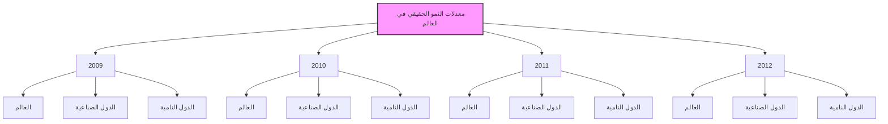
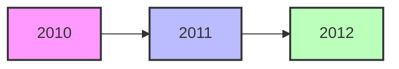
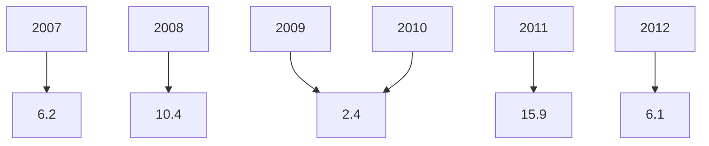
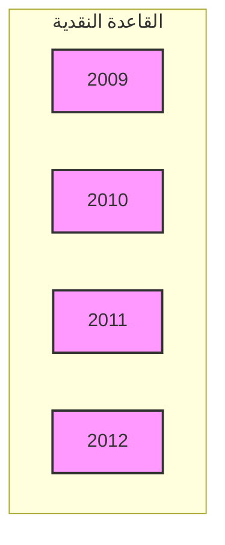

The image contains Arabic calligraphy in a golden or light brown color against a white background. The text is written in an ornate, flowing style typical of Islamic calligraphy. The phrase written is:

بسم الله الرحمن الرحيم

This is the Bismillah, which translates to "In the name of Allah, the Most Gracious, the Most Merciful." This phrase is commonly used at the beginning of chapters in the Quran and is often recited by Muslims before undertaking any significant action.
---
# مجلس الإدارة

| المنصب | الوظيفة | الاسم |
|-------|--------|------|
| رئيساً | المحافظ | السيد/ أ. الصديق عمر الكبير |
| نائباً للرئيس | نائب المحافظ | السيد/أ.علي محمد سالم الحبري |

أعضاء:
- السيد/ مراجع غيث سليمان
- السيد/ د. عبد الرحمن هابيل
- السيد/ م. حمودة محمد الاسود
- السيد/ محمد أحمد المختار
- السيد / د. طارق يوسف المقريف
---
# مدراء الإدارات

| المنصب | الاسم |
|---------------------|------------------------|
| المدير التنفيذي لقطاع العمليات المصرفية المركزية | د. خالد علي الكاجيجي |
| مدير إدارة الأسواق المالية | مصباح محمد العكاري |
| مدير إدارة الإصدار | أمحمد محمد الحجاجي |
| مدير إدارة البحوث والإحصاء | د. علي رمضان شنيبيش |
| مدير إدارة تقنية المعلومات | عمران مفتاح الشائبي |
| مدير إدارة الحسابات | عبد الناصر خليفة قنيدي |
| مدير إدارة الرقابة على المصارف والنقد | د. محمد عبد الجليل أبوسنينة |
| مدير إدارة الشؤون الإدارية والموظفين | م. علي الجهاني |
| مدير إدارة العمليات المصرفية | فتحي امحمد الحاجي |
| مدير إدارة المراجعة | عبد الله نوري الشيباني |
| مدير الإدارة القانونية | د. علي عبد الرحمن ضوي |

# مدراء الفروع

| المنصب | الاسم |
|---------------|----------------------|
| مدير فرع بنغازي | عبد القادر الباقرمي |
| مدير فرع سبها | عبد الكريم الشحاطي |
| مدير فرع سرت | امحمد صالح أبو غالية |
---
مصرف ليبيا المركزي

الإدارة العامة / طرابلس

هاتف : 3333591/9 21 (218) +
السويفت : CBLJLYLXXXX
الموقع الإلكتروني : www.cbl.gov.ly

بريد مصور (فاكس) : 4441488 - 21 (218) +

-------------------------------------------

الفـروع

فرع بنغازي :
هاتف : 9091161/8 61 (218) +
بريد مصور (فاكس) : 9091169 61 (218) +

فرع سرت :
هاتف : 63750/4 54 (218) +
بريد مصور (فاكس) : 5265142 54 (218) +

فرع سبها :
هاتف : 627771/3 71 (218) +
بريد مصور (فاكس) : 621800 71 (218) +

-------------------------------------------

إدارة البحوث والإحصاء
هاتف : 4773901 21 (218) +
بريد مصور (فاكس) : 4773903 21 (218) +
بريد إلكتروني : ecorestat@cbl.gov.ly
---
# المحتويات

14 .................................................................................................... تقديم

## الجزء الأول
### التطورات الاقتصادية الدولية والعربية

18 .................................................................... أولاً : التطورات الاقتصادية الدولية
18 ............................................................................................ • نظرة عامة
20 ...................................................................................... • النمو الاقتصادي
22 ................................................................................................ • البطالة
22 ................................................................................................ • التضخم
23 ....................................................................................... • التجارة العالمية
24 .............................................................. • أسعار صرف العملات الدولية الرئيسية
25 ............................................................................. • أسعار سلع التجارة العالمية
27 .............................................................................. • التطورات النفطية الدولية
28 .................................................................................... - العرض
29 .................................................................................... - الطلب
32 .................................................................................... - الأسعار
34 .................................................................... ثانياً : التطورات الاقتصادية العربية

## الجزء الثاني
### التطورات الاقتصادية المحلية

#### أولاً : القطاع الحقيقي

46 ..................................................................... • الناتج المحلي الإجمالي الحقيقي
46 .................................................................... • الناتج المحلي الإجمالي الاسمي
51 ........................................................................................ • معدل التضخم
52 ........................................................................... • العاملون بالنشاط الاقتصادي
54 .............................................................................. • التطورات النفطية المحلية
54 ............................................................ - الإنتاج المحلي من النفط الخام
56 ................................................................... - صادرات النفط الخام
57 .......................................................................... - أسعار النفط الخام
58 ........................................................................ - إنتاج الغاز الطبيعي
---
- الإنتاج المحلي من المشتقات النفطية ...................................................... 59
- الإنتاج المحلي من البتروكيماويات ......................................................... 60
- صادرات المنتجات النفطية والبتروكيماوية .................................................. 61
- الاستهلاك المحلي من المشتقات النفطية ................................................... 62

## ثانياً : المالية العامة

• قانون الميزانية العامة للسنة المالية ...................................................................... 63
- تنفيذ الميزانية العامة للسنة المالية ............................................................ 65
الإيرادات ........................................................................... 65
المصروفات ........................................................................ 65

## ثالثاً : القطاع الخارجي

• ميزان المدفوعات ...................................................................................... 69
- الحساب الجاري ............................................................................... 69
- الحساب الرأسمالي والمالي ............................................................... 70

## رابعاً : التطورات النقدية

• التطورات النقدية ....................................................................................... 72
- القاعدة النقدية والعوامل المؤثرة فيها ......................................................... 72
- عرض النقود والعوامل المؤثرة فيه ......................................................... 74
- سعر صرف الدينار الليبي ................................................................... 75
- مقاصة الصكوك .............................................................................. 76
• مصرف ليبيا المركزي ............................................................................... 78
- جانب الأصول ................................................................................ 78
- جانب الخصوم ................................................................................. 79
• المصارف التجارية ................................................................................... 82
- مصادر الأموال ................................................................................ 82
- استخدامات الأموال ........................................................................... 85
- وضع السيولة والاحتياطي النقدي الإلزامي ................................................. 92
• المصرف الليبي الخارجي ........................................................................... 93
• المصارف المتخصصة .............................................................................. 97
- مصرف التنمية ................................................................................ 97
- المصرف الزراعي ........................................................................... 97
---

| Page | Content |
|------|---------|
| 98   | مصرف الادخار والاستثمار العقاري |
| 99   | المصرف الريفي |

## خامساً : المؤسسات المالية غير المصرفية

| Page | Content |
|------|---------|
| 100  | • المؤسسة الليبية للاستثمار |
| 102  | - المحفظة الاستثمارية طويلة المدى |
| 103  | - محفظة ليبيا إفريقيا للاستثمار |
| 105  | • الصندوق الليبي للاستثمار الداخلي والتنمية |
| 107  | • سوق الأوراق المالية الليبي |
| 108  | • صندوق التقاعد |
| 110  | • شركات التأمين |
---
# تقديم

يسر مصرف ليبيا المركزي أن يقدم تقريره السنوي السادس والخمسون للعام 2012، متضمناً أهم التطورات الاقتصادية على الصعيد الدولي والعربي والمحلي، فعلى الصعيد الدولي سجل الاقتصاد العالمي تراجعاً ملحوظاً في معدل النمو، حيث انخفض من 4.0% عام 2011 إلى 3.2% عام 2012، وذلك بسبب تباطؤ النمو في الدول المتقدمة والدول النامية على حد سواء، نتيجة إلى سياسات التقشف، وأزمة الديون السيادية وتدني مستوى الطلب والتحولات السياسية في منطقة الشرق الأوسط وشمال أفريقيا، وبالرغم من ذلك فإن حالة عدم اليقين ظلت هي السائدة خلال عام 2012. ومن ناحية أخرى شهدت أسعار السلع الأولية زيادة ملحوظة، كما ارتفعت أسعار النفط (سلة أوبك) بنسبة 2.0% عما كانت عليه في عام 2011، وانخفضت معدلات التضخم في الدول الصناعية إلى 2.0%. ونتيجة لتداعيات الأزمة الاقتصادية العالمية، ظلت معدلات البطالة خلال عام 2012 على نفس معدلاتها تقريباً في عام 2011 عند 8.0%، وقد بلغت في دول منطقة اليورو 11.4% وفي الولايات المتحدة الأمريكية 8.1%.

وبالنظر إلى هشاشة الوضع الاقتصادي استمرت المصارف المركزية للدول المتقدمة في الإبقاء على أسعار الفائدة منخفضة وإتباع سياسات متحفظة.

وعلى الصعيد العربي، أظهرت البيانات، حدوث تباطؤ في معدل النمو الاقتصادي للدول العربية لعام 2012 ليبلغ نسبة 4.8%، مقابل 4.0% عام 2011، ويتناول التقرير دور المؤسسات المالية العربية في تحقيق التنمية والنمو الاقتصادي للدول العربية.

أما على المستوى المحلي، فقد شهدت البيئة الاقتصادية أوضاعاً غير مواتية بسبب تداعيات الأحداث التي صاحبت اندلاع ثورة 17 فبراير، حيث أظهرت التقديرات الأولية حدوث زيادة ملحوظة في معدل نمو الناتج المحلي الإجمالي لعام 2012 بلغ نحو 98.2%، مقابل معدل نمو سالب -61.0% في عام 2011، إلا أنه لعدم توفر بيانات تفصيلية عن مكونات هذا الناتج، فإن

14 التقرير السنوي 2012
---
الاقتصاد غير النفطي سجل خلال عام 2011 معدل نمو نسبته 43.7% وزيادة النمو في الناتج النفطي بنسبة 211.4%.

وفيما يتعلق بالمستوى العام للأسعار، فقد بلغ معدل التضخم في عام 2012 وفقاً للرقم القياسي للأسعار نحو 6.1% مقابل معدل تضخم 15.9% في عام 2011.

وفيما يخص التطورات النقدية، فقد شهد عرض النقود (ع2) نمواً بلغت نسبته 10.0% مقابل 25.0% في عام 2011 ليصل في نهاية عام 2012 إلى نحو 63.8 مليار دينار، مقابل 57.9 مليار دينار في نهاية عام 2011.

أما فيما يتعلق بالتطورات المالية، فقد كان لتحسن الأوضاع المالية خلال عام 2012، أثراً ملموساً على حدوث زيادة كبيرة في الإيرادات النفطية مقارنة بما كانت عليه خلال عام 2011 لتصل إلى 66.9 مليار دينار، في حين بلغت المصروفات العامة في شكل تفويضات مالية صادرة خلال نفس العام نحو 58.7 مليار دينار.

وفيما يخص أداء القطاع الخارجي، حقق ميزان المدفوعات فائضاً في الميزان الكلي خلال عام 2012 بلغ 16.9 مليار دينار، مقابل فائض قدره 4.2 مليار دينار عام 2011، ويعود ذلك لتحسن فائض الحساب الجاري البالغ 30.0 مليار دينار في عام 2012، مقابل 3.8 مليار دينار عام 2011، وذلك بسبب زيادة حصيلة الصادرات النفطية.

وعلى صعيد التطورات المصرفية، استمر مصرف ليبيا المركزي خلال عام 2012، في التركيز على الرفع عن أداء المصارف التجارية ومساهمتها في النشاط الاقتصادي. وبسبب حالة عدم اليقين وعدم الاستقرار في الأوضاع الاقتصادية العالمية والمحلية، قام مصرف ليبيا المركزي بالإبقاء على سعر إعادة الخصم وأسعار الفائدة على شهادات الإيداع لفترة استحقاق 91 يوماً و28 يوماً عند 3.0% و1.0% و0.85% لكل منها على الترتيب.

أما فيما يتعلق بأنشطة المؤسسات المالية غير المصرفية، يتضمن التقرير جزءاً خاصاً عن نشاط بعض المؤسسات المالية غير المصرفية والتي تلعب دوراً مهماً في الاقتصاد الوطني.

15 التقرير السنوي 2012
---
وتمارس أنشطة استثمارية واسعة، سواء في الداخل أو في الخارج ومن بعض هذه المؤسسات
المالية، صندوق التقاعد، المؤسسة الليبية للاستثمار والجهات التابعة لها، صندوق الإنماء
الاقتصادي والاجتماعي، كما تضمن التقرير أيضاً المؤشرات المهمة في أداء سوق الأوراق
المالية الليبي .

وينتهز مصرف ليبيا المركزي هذه المناسبة، ليعرب عن شكره وتقديره لكافة الوزارات
والمؤسسات والأجهزة العامة ذات العلاقة، لتوفيرها وتزويدها المصرف بالبيانات
والإحصاءات اللازمة لإعداد هذا التقرير .

والله ولي التوفيق

الصديق عمر الكبير
المحافظ

16 التقرير السنوي 2012
---
The image contains a single text element in Arabic script, presented on what appears to be a stylized note or page icon with a curled corner. The text is written in gold-colored letters on a light beige background. The translation of the Arabic text is:

# الجزء الأول
## التطورات الاقتصادية الدولية والعربية

Which translates to English as:

# Part One
## International and Arab Economic Developments

This appears to be a title or heading for a section of a document or report, likely discussing economic trends or developments in the Arab world and internationally.
---
# أولاً : التطورات الاقتصادية الدولية

## نظرة عامة :

استمر الاقتصاد العالمي بالتعافي خلال عام 2012، وذلك عبر مرحلتين أساسيتين، أولهما كانت خلال النصف الأول من العام، وتميزت بوجود وتيرتين للنمو، حيث نمت الاقتصادات الصاعدة بوتيرة أقوى نسبياً مما عليه الحال في الاقتصادات المتقدمة، ثم جاءت المرحلة الثانية خلال النصف الثاني من العام، وقد اتسمت هذه المرحلة بظهور وتيرتين مختلفتين للنمو داخل مجموعة البلدان المتقدمة، وذلك بعد أن بدأت الولايات المتحدة تحقق تعاف أسرع مما تحققه منطقة اليورو، يذكر بأن هذا التعافي قادته الأسواق المالية التي شهدت تطورات ملحوظة خلال النصف الثاني مع تدخل البنوك المركزية في الاقتصادات المتقدمة والصاعدة لمواجهة موجة التباطؤ الاقتصادي الأخيرة.

وقد تمكن صُناع السياسات من تجنب اثنين من أكبر المخاطر التي كانت تهدد التعافي العالمي على المدى القصير، وهما مخاطر تفكك منطقة اليورو، والانكماش المالي الحاد في الولايات المتحدة بسبب الوقوع في (المنحدر المالي) وعلى أثر هذا النجاح شهدت الأسواق المالية صعوداً واسع النطاق كما تحسنت حالة الاستقرار المالي.

وعلى الرغم من كون الأسواق المالية هي المحرك الرئيسي للنمو العالمي، إلا أنه كان تباطؤاً واضحاً في اقتصادات الأسواق الصاعدة والاقتصادات النامية أثناء عام 2012، انعكاساً للتراجع الحاد في وتيرة الطلب في أهم الاقتصادات المتقدمة وتشديد السياسات المحلية ونهاية الرواج الاستثماري الذي حدث في عدد من أهم اقتصادات الأسواق الصاعدة. ولكن مع زيادة صلابة الطلب الاستهلاكي وإرجاء سياسات الاقتصاد الكلي وبدء انتعاش الصادرات، بدأ النمو يرتفع في معظم الاقتصادات في آسيا وفي إفريقيا جنوب الصحراء، وكثير من الاقتصادات في أمريكا اللاتينية ودول الكومنولث المستقلة.

ومن المتوقع أن يعود التعافي إلى اكتساب سرعة أكبر في بلدان أوروبا الصاعدة مع الانتعاش التدريجي في الطلب في بلدان أوروبا المتقدمة. غير أن اقتصادات الشرق
---
الأوسط وشمال إفريقيا لا تزال تجاهد لاجتياز مراحلها الانتقالية الصعبة، كذلك تواجه
اقتصادات دول أمريكا الجنوبية تضخما مرتفعا وضغوطا متزايدة في سوق النقد الأجنبي.

ووفقا للبيانات الأولية الصادرة عن صندوق النقد الدولي في شهر أبريل 2013، فقد
شهد الاقتصاد العالمي تباطؤا في النمو ولم يحقق سوى 3.2% في عام 2012، مقابل
4.0% في عام 2011، وقد كان هذا التباطؤ حادا في مجموعة الدول الصناعية والتي
استمر انخفاض النمو فيها من حوالي 1.6% في عام 2011 إلى حوالي 1.2% في عام
2012، ولعل ذلك يعود بالدرجة الأولى إلى انكشاف بلدان هذه المجموعة على بعض
المخاطر بشكل أكبر مقارنة بالمجموعات الأخرى، في حين تراجع معدل النمو في
البلدان النامية والأسواق الناشئة الأخرى هو الآخر وبلغ 5.1% في عام 2012، مقابل
6.4% في عام 2011.

ارتفعت مستويات البطالة بصورة طفيفة في البلدان الصناعية خلال عام 2012 لتصل
إلى 8.0%، مقابل 7.9% في عام 2011، واستمرت بلدان منطقة اليورو والمملكة
المتحدة في تحقيق ارتفاع في معدلات البطالة، وذلك بسبب حالة عدم اليقين التي
شاهدتها منطقة اليورو.

أما فيما يتعلق بالتضخم فقد شهد عام 2012 ارتفاعا طفيفا في المستوى العام للأسعار
في كل من البلدان الصناعية والبلدان النامية، وبلغ حوالي 2.0% و 5.9% على
التوالي، مقابل 2.7% و 7.1% في عام 2011.

وقد شهد العام 2012 تراجعا ملحوظا في معدل نمو حجم التجارة العالمية، حيث لم
يتجاوز هذا المعدل خلال العام 2.5%، مقابل 6.0% في عام 2011، وقد شمل تراجع
نمو حجم التجارة العالمية مجموعة البلدان الصناعية والبلدان النامية والأسواق الناشئة
الأخرى، ويعزى هذا التراجع بالدرجة الأولى إلى استمرار حالة التباطؤ الذي يشهدها
الاقتصاد العالمي.

وقد شهدت أسعار صرف العملات الدولية الرئيسة خلال عام 2012 ارتفاعا في قيمة
الدولار مقابل كل من الجنيه الاسترليني واليورو، بينما شهدت قيمة الدولار انخفاضا

19 التقرير السنوي 2012
---
مقابل الين الياباني والفرنك السويسري، وخلال نفس الفترة شهدت الأوزان المكونة لسلة وحدة حقوق السحب الخاصة تعديلات طفيفة، حيث انخفضت نسبة كل من الدولار الأمريكي بحوالي 0.07%، والين بحوالي 1.05%، وارتفعت نسبة مساهمة كل من اليورو والجنيه الاسترليني بحوالي 0.62% و0.49% على التوالي.

وخلال الفترة موضوع التقرير شهدت أسعار سلع التجارة العالمية انخفاضاً ملموساً في عام 2012 بعد ما شهدت ارتفاعاً خلال العامين السابقين بعد التعافي من الأزمة المالية العالمية، فقد انخفضت أسعار السلع المصنعة بحوالي 0.5% في عام 2012، مقابل ارتفاع بنسبة 6.7% في عام 2011، بينما ارتفعت أسعار النفط خلال نفس الفترة بحوالي 1.0%، مقابل 31.6% في عام 2011. أما بالنسبة للسلع الأولية غير النفطية فقد انخفضت أسعارها بنسبة 9.8% في عام 2012، مقارنة بارتفاع بنسبة 17.8% في عام 2011.

## النمو الاقتصادي:

تراجع معدل نمو الاقتصاد العالمي للعام الثاني على التوالي خلال عام 2012 ليصل إلى 3.2%، مقابل 4.0% عام 2011، حيث سجل معدل النمو في البلدان الصناعية انخفاضاً من 1.6% في عام 2011 إلى 1.2% في عام 2012، بينما سجل انخفاضاً خلال نفس العام في الدول النامية والأسواق الناشئة الأخرى ليصل 5.1% مقابل 6.4% في العام 2011.

لقد شهد النمو في منطقة الشرق الأوسط وشمال إفريقيا ارتفاعاً خلال عام 2012 ليصل إلى 4.7%، مقابل 3.9% في العام 2011. ويعزى ذلك إلى عودة نسبية لحالة الاستقرار في المنطقة، واتخاذ معظم حكومات المنطقة سياسات مالية توسعية.

20 التقرير السنوي 2012
---
جدول رقم (1) : معدلات النمو الحقيقي في العالم
"نسب مئوية"

| مجموعة الدول | 2011 | 2012 |
|--------------|------|------|
| العالم : | 4.0 | 3.2 |
| الدول الصناعية: | 1.6 | 1.2 |
| الولايات المتحدة الأمريكية | 1.8 | 2.2 |
| دول منطقة اليورو | 1.4 | -0.6 |
| اليابان | -0.6 | 2.0 |
| دول صناعية أخرى | 2.6 | 1.4 |
| الدول النامية وأسواق ناشئة أخرى (*) : | 6.4 | 5.1 |
| دول وسط وشرق أوروبا | 5.2 | 1.6 |
| دول الكومنولث المستقلة | 4.8 | 3.4 |
| آسيا | 8.1 | 6.6 |
| الشرق الأوسط وشمال إفريقيا | 3.9 | 4.7 |
| أمريكا اللاتينية والكاريبي | 4.6 | 3.0 |
| إفريقيا جنوب الصحراء | 5.3 | 4.8 |

المصدر : صندوق النقد الدولي، آفاق الاقتصاد العالمي، أبريل 2013
* الأسواق الناشئة تشمل : البرازيل، بولندا، تشيلي، جنوب إفريقيا، جمهورية التشيك، كوريا الجنوبية، كولومبيا، المجر، المكسيك.

شكل (1) : معدلات النمو الحقيقي في العالم

21 التقرير السنوي 2012
---
• البطالة:

شهدت معدلات البطالة في الدول الصناعية خلال عام 2012 ارتفاعاً طفيفاً لتصل إلى 8.0%، مقابل 7.9% خلال العام 2011، وعلى الرغم من التحسن الملحوظ في معدلات البطالة في الولايات المتحدة، إلا انها شهدت ارتفاعاً طفيفاً في باقي مناطق الدول الصناعية. حيث بلغت في منطقة اليورو 11.4% خلال عام 2012، مقابل 10.1% عام 2011، بالإضافة إلى ارتفاع معدل البطالة في اليابان ليصل إلى 4.6% خلال عام 2012، مقابل 4.5% عام 2011.

جدول رقم (2) : معدلات البطالة في الدول الصناعية
" نسب مئوية "

| مجموعة الدول | 2011 | 2012 |
|---------------|------|------|
| الدول الصناعية | 7.9 | 8.0 |
| الولايات المتحدة الأمريكية | 9.0 | 8.1 |
| دول منطقة اليورو | 10.1 | 11.4 |
| المملكة المتحدة | 8.0 | 8.0 |
| اليابان | 4.5 | 4.6 |

المصدر: صندوق النقد الدولي، مرجع سبق ذكره.

• التضخم:

شهدت معدلات التضخم في الدول الصناعية عام 2012 بشكل عام انخفاضاً نسبياً لتصل إلى 2.0%، مقابل 2.7% عام 2011، كما أخذت مستويات التضخم في البلدان النامية والأسواق الناشئة الأخرى نفس الاتجاه لتصل إلى 5.9% خلال عام 2012 مقابل 7.2% خلال عام 2011، وعلى العكس من ذلك شهدت معدلات التضخم في دول الشرق الأوسط وشمال إفريقيا ارتفاعاً ملحوظاً لتصل إلى 10.7% خلال عام 2012 مقابل 9.7% خلال عام 2011، ومن بين العوامل التي ادت إلى هذا الارتفاع التحولات السياسية التي تمر بها المنطقة بالإضافة إلى استمرار ارتفاع أسعار المواد المصنعة وأسعار النفط، كما كانت للسياسة المالية التوسعية في جل دول المنطقة أثر واضح على هذه الأسعار.

22 التقرير السنوي 2012
---
جدول رقم (3) : معدلات التضخم في العالم
"نسب مئوية"

| مجموعة الدول | 2011 | 2012 |
|---------------|------|------|
| الدول الصناعية: | 2.7 | 2.0 |
| الولايات المتحدة الأمريكية | 3.1 | 2.1 |
| دول منطقة اليورو | 2.7 | 2.5 |
| اليابان | -0.3 | 0.0 |
| الدول النامية وأسواق ناشئة أخرى: | 7.2 | 5.9 |
| دول وسط وشرق أوروبا | 5.3 | 5.8 |
| دول الكومنولث المستقلة | 10.1 | 6.5 |
| آسيا | 6.4 | 4.5 |
| الشرق الأوسط وشمال إفريقيا | 9.7 | 10.7 |
| أمريكا اللاتينية والكاريبي | 6.6 | 6.0 |
| إفريقيا جنوب الصحراء | 9.1 | 9.3 |

المصدر: صندوق النقد الدولي، مرجع سبق ذكره.

• التجارة العالمية :

شهد معدل نمو التجارة العالمية انخفاضاً خلال عام 2012، ليصل إلى 2.5%، مقابل 5.8% خلال عام 2011، ويرجع ذلك إلى الانخفاض الحاد في معدل نمو صادرات الدول الصناعية، حيث وصل في عام 2012 إلى 1.9%، مقابل 5.6% في عام 2011، كما شهد معدل نمو الواردات في الدول الصناعية أيضاً انخفاضاً حاداً ليصل إلى 1.0% في عام 2012، مقابل 4.7% في عام 2011.

أما في الدول النامية والأسواق الناشئة الأخرى فقد تراجع معدل نمو الصادرات ليصل إلى 3.7% في عام 2012، مقابل 6.4% في عام 2011، كما شهدت واردات نفس المجموعة تراجعاً حاداً لتصل إلى 4.9% في عام 2012، مقابل 8.6% في عام 2011.

ويعزى تراجع نمو التجارة العالمية إلى استمرارية تباطؤ الاقتصاد العالمي، خاصة اقتصادات البلدان الصناعية والأوروبية منها بالذات.

23 التقرير السنوي 2012
---
أما على صعيد الحسابات الجارية في موازين مدفوعات الدول حول العالم فقد شهد عام 2012 استمرار تحقيق فوائض في الحسابات الجارية لموازين مدفوعات كل من الصين، اليابان، روسيا والدول الصناعية الجديدة لمنطقة اليورو مجتمعة وكذلك استراليا، في حين حققت الحسابات الجارية في موازين مدفوعات كل من كندا، الولايات المتحدة الأمريكية والمملكة المتحدة عجزاً متواصلاً.

جدول رقم (4) : معدلات نمو التجارة العالمية
" نسب مئوية "

| 2012 | 2011 |                                   |
|------|------|-----------------------------------|
| 2.5  | 5.8  | إجمالي التجارة العالمية            |
|      |      | الدول الصناعية :                   |
| 1.9  | 5.6  | الصادرات                          |
| 1.0  | 4.7  | الواردات                          |
|      |      | الدول النامية وأسواق ناشئة أخرى :   |
| 3.7  | 6.4  | الصادرات                          |
| 4.9  | 8.6  | الواردات                          |

المصدر : صندوق النقد الدولي، مرجع سبق ذكره.

• أسعار صرف العملات الدولية الرئيسة:

ارتفع متوسط سعر صرف الدولار الأمريكي خلال عام 2012 مقابل اليورو والجنيه الاسترليني، بينما تراجع مقابل معظم العملات الدولية الرئيسة الأخرى، فقد بلغ متوسط سعر الدولار مقابل اليورو حوالي 1.286 دولار لكل يورو في عام 2012 مقابل 1.392 دولار لكل يورو في عام 2011، بينما بلغ سعر صرف الدولار مقابل الجنيه الاسترليني في عام 2012 حوالي 1.585 دولار لكل جنيه، مقابل 1.604 دولار لكل جنيه في عام 2011، وقد انخفض سعر صرف الدولار مقابل الين الياباني بشكل طفيف من حوالي 79.73 ين للدولار في عام 2011 إلى 79.65 ين للدولار في عام 2012.
---
جدول رقم (5) : متوسط أسعار صرف بعض العملات الدولية خلال عام 2012

| الفرنك السويسري | الين الياباني | الجنيه الإسترليني | اليورو | الدولار الأمريكي |                |
|-----------------|---------------|-------------------|--------|-------------------|----------------|
| 0.9378          | 0.0126        | 1.5854            | 1.2856 | -                 | الدولار الأمريكي |
| 0.7294          | 0.0098        | 1.2331            | -      | 0.7778            | اليورو          |
| 0.5915          | 0.0079        | -                 | 0.8109 | 0.6308            | الجنيه الإسترليني |
| 74.6924         | -             | 126.2757          | 102.4011 | 79.6501         | الين الياباني   |
| -               | 0.0134        | 1.6906            | 1.3710 | 1.06664           | الفرنك السويسري |

المصدر: قاعدة بيانات صندوق النقد الدولي.

جدول رقم (6) : أوزان وأسعار صرف العملات المكونة لسلة حقوق السحب الخاصة

| سعر وحدة حقوق السحب الخاصة مقابل العملات المكونة لها | أوزان العملات المكونة لوحدة حقوق السحب الخاصة | العملة           |
|-----------------------------------------------------|----------------------------------------------|------------------|
| 2012.12.31                                          | 2011.12.31                                   | 2012.12.31       | 2011.12.31 |
| 1.538                                               | 1.535                                        | %42.93           | %42.99     | الدولار الأمريكي |
| 1.166                                               | 1.187                                        | %36.27           | %35.65     | اليورو           |
| 0.951                                               | 0.993                                        | %11.67           | %11.18     | الجنيه الاسترليني |
| 132.506                                             | 118.799                                      | %9.13            | %10.18     | الين الياباني    |
|                                                     |                                              | %100.00          | %100.00    |

المصدر: صندوق النقد العربي، التقرير السنوي 2012.

### أسعار سلع التجارة العالمية:

شهدت أسعار معظم السلع الغذائية انخفاضاً عاماً خلال عام 2012 بلغت نسبته 1.8% مقابل ارتفاع حاد قدره 19.7% في عام 2011 وذلك بسبب الظروف المناخية غير المواتية التي مرت بها معظم الدول المنتجة للسلع الغذائية والقيود التي فرضتها بعض الدول على صادراتها من هذه السلع.

25 التقرير السنوي 2012
---
كما شهدت أسعار السلع المصنعة والمشروبات والمعادن انخفاضاً خلال عام 2012 بلغ
حوالي 0.5% و18.6% و16.8% على التوالي، مقابل معدلات ارتفاع قدرها 6.7%
و31.6% و13.5% خلال عام 2011.

جدول رقم ( 7 ) : التغير السنوي في الأسعار العالمية لبعض السلع

| البيان | 2009 | 2010 | 2011 | 2012 |
|--------|------|------|------|------|
| السلع المصنعة | -3.6% | 2.4% | 6.7% | -0.5% |
| النفط | -36.3% | 27.9% | 31.6% | 1.0% |
| السلع الأولية غير النفطية | -15.8% | 26.3% | 17.8% | -9.8% |
| سلع غذائية | -14.7% | 11.5% | 19.7% | -1.8% |
| مشروبات | 1.6% | 14.1% | 16.6% | -18.6% |
| مواد زراعية خام | -17.0% | 33.2% | 22.7% | -12.7% |
| معادن | -19.7% | 48.2% | 13.5% | -16.8% |

المصدر : صندوق النقد الدولي، مرجع سبق ذكره.

26 التقرير السنوي 2012
---
# التطورات النفطية الدولية:

كان عام 2012 مليئاً بالأحداث المثيرة في أسواق النفط العالمية تمثلت في اضطرابات غير مسبوقة في العرض النفطي، والقلق من حالة عدم اليقين في بلدان الربيع العربي. بالإضافة إلى زيادة مستوى العقوبات على صادرات النفط الإيرانية، وتوقف عمل بعض المصافي العالمية وحدوث إعصارين كبيرين في الولايات المتحدة.

لقد كان لحالة عدم اليقين الاقتصادي ومعدلات النمو في البلدان الغربية تأثيراً سلبياً على مستويات الأسعار العالمية من الجانب الاقتصادي. وعلى الرغم من أن بلدان جنوب شرق آسيا كانت هي محرك النمو في الاقتصاد العالمي إلا أن انخفاض معدلات تجارتها مع البلدان الغربية أدى إلى انخفاض معدلات نموها وطلبها عن المعدلات المتوقعة.

وعلى الرغم من ذلك فكان نمو طلب هذه البلدان على النفط الخام خاصة في قطاعي المواصلات والصناعة، السبب الرئيسي وراء عدم انخفاض الطلب العالمي على النفط بشكل حاد.

وتجدر الإشارة إلى أنه للتطورات غير الاقتصادية تأثير واضح على مستويات أسعار النفط الخام. حيث استمر التوتر الإيراني مع المجتمع الدولي وطال بلدان الجوار مما ساهم في بقاء أسواق النفط الآجلة فوق مستوى 110 دولاراً للبرميل في أغلب شهور السنة عدا شهري يونيو ويوليو بسبب التأثيرات الموسمية. بالإضافة إلى ذلك فقد أدت الكوارث الطبيعية إلى ثبات أسعار النفط عند مستوياتها بسبب صعوبة التنقل وإغلاق عدد من المصافي في أمريكا الشمالية.

وشهد عام 2012 اضطرابات في مصادر امدادات النفط الخام تمثلت في شبه توقف الإنتاج في سوريا وانخفاض الإنتاج الحاد في جنوب السودان بسبب وقف تصديره من ميناء بور سودان، وانخفض الانتاج في استراليا وبحر الشمال لأسباب فنية في الأولى و اضطربات في إمدادات الكهرباء في الثانية، كما أثرت عمليات التخريب والاعتصامات على مستويات الإنتاج في كل من اليمن وليبيا.

27 التقرير السنوي 2012
---
كما كان لتصاعد مستويات الإنتاج غير التقليدي للنفط والغاز في الولايات المتحدة أثر سلبي على مستويات الأسعار الفورية والآجلة، حيث تشير أغلب الدراسات إلى أن إنتاج الولايات المتحدة للهيدروكربونات غير التقليدية سيأخذ شكل تصاعدي خلال هذا العقد إلى أن يصل إلى الذروة في عام 2020، وبالطبيعي أن يكون لمثل هذه التوقعات أثر سلبي على الأسعار لكون الولايات المتحدة أكبر مستهلك للطاقة في العالم، وبدأت آثار هذه الاكتشافات واضحة من خلال الانخفاض المستمر في صافي الواردات الأمريكية للنفط وارتفاع مخزونها الاستراتيجي من النفط الخام في عام 2012. هذا التطور شكل حالة عدم يقين للتنبؤ بهيكلية السوق العالمي خلال الفترة القادمة متوسطة وطويلة الأجل، وبدأت آثارها في البروز نهاية عام 2012 عندما حلت الصين كأكبر مستورد (وليس مستهلك) للنفط الخام في مكان الولايات المتحدة.

## العرض:

تواصل العرض العالمي من النفط الخام والغاز الطبيعي خلال عام 2012 ارتفاعه بنسبة 2.8% بمقدار 2.5 مليون برميل في اليوم ليبلغ في المتوسط 91.0 مليون برميل في اليوم مقابل 88.5 مليون برميل في اليوم في عام 2011، وكان السبب الرئيسي وراء ارتفاع العرض العالمي هو استمرار ارتفاع إنتاج منظمة الأقطار المصدرة للنفط (الأوبك)، كمتوسط من 35.7 مليون برميل في اليوم عام 2011 إلى حوالي 37.6 مليون برميل في اليوم في عام 2012 بمعدل ارتفاع قدره 5.3% وبكمية قدرها 1.9 مليون برميل في اليوم، والسبب الرئيسي وراء هذا الارتفاع في الإنتاج هو سعي المنظمة لتحقيق الاستقرار في السوق النفطي بالإضافة إلى عودة إنتاج النفط الليبي إلى مستواه قبل اندلاع الثورة بوتيرة سريعة لم تمكن المنظمة من اتخاذ الإجراءات اللازمة للتنسيق مع الأعضاء العائدين إلى السوق العالمية مع المعوضين عن إنتاجهم في الفترة السابقة.

وكان لمنتجي النفط الخام العالميين خارج منظمة الأوبك دور إيجابي هذا العام في زيادة العرض العالمي للنفط الخام فارتفع إنتاجهم في عام 2012 بمقدار 0.6 مليون برميل في

28 التقرير السنوي 2012
---
اليوم ليصل إلى مستوى إنتاج قدره 49.4 برميل في اليوم، حيث عوضت أمريكا الشمالية والبرازيل وبلدان الاتحاد السوفيتي السابق انخفاض إنتاج البلدان الأخرى مثل بلدان أوروبا الغربية التي عانت من انخفاض الطلب المحلي للنفط الخام للسنة الثانية على التوالي. وتجدر الإشارة إلى أنه في حين كانت زيادة إنتاج النفط في بلدان الاتحاد السوفيتي السابق لتلبية الطلب المحلي النامي بشكل ملحوظ وتعويض انخفاض الإنتاج في القارة الأوروبية، كانت زيادة الولايات المتحدة لإنتاجها النفطي لغرض تهدئة أسواق النفط الآجلة واستغلت السلطات الأمريكية في هذا الصدد إنتاجها من النفط غير التقليدي الذي كان ثمار استثمارات عالية أنفقت في السنوات الماضية. ومن المتوقع أن تستمر الولايات المتحدة في زيادة إنتاج النفط والغاز غير التقليديين خلال هذا العقد إلى أن تصل إلى ذروة الإنتاج مع العام 2020.

## الطلب:

تراجع الطلب العالمي على النفط الخام والغاز المسال بنسبة 1.1% ليصل إلى 87.9 مليون برميل في اليوم في عام 2012 مقابل 88.9 مليون برميل في اليوم خلال عام 2011، وكان انخفاض طلب بلدان منظمة التعاون الاقتصادي والتنمية هو السبب الرئيسي في ذلك، حيث كان متوسط الطلب اليومي في بلدان المنظمة عند مستوى 45.9 مليون برميل في عام 2012، مقابل 46.5 مليون برميل في اليوم خلال عام 2011 محققاً معدل انخفاض قدره 1.3% وبكمية انخفاض قدرها 0.6 مليون برميل، وحققت بلدان أمريكا الشمالية وأوروبا الغربية انخفاض في الطلب بما يقارب 1.0 مليون برميل يومياً متأثرة بالأوضاع الاقتصادية الهشة وحالة عدم اليقين التي سادت المنطقة خلال العام، إلا أن ارتفاع طلب بلدان منطقة المحيط الهادي بقدر 0.4 مليون برميل في اليوم قلل من حدة انخفاض طلب المنطقة.

وقد كان السبب الرئيسي وراء امتصاص تأثير انخفاض الطلب النفطي في بلدان منظمة التعاون الاقتصادي والتنمية هو استمرار نمو الطلب من البلدان خارج المنظمة التي ارتفع طلبها على النفط خلال عام 2012 بكمية 1.4 مليون برميل في اليوم، وكانت

29 التقرير السنوي 2012
---
الصين وبلدان جنوب شرق آسيا هي الداعم الرئيسي لهذه الزيادة في الطلب، مع أهمية
التنويه إلى أن هذه الزيادة كانت أقل من التوقعات ويرجع ذلك إلى تحقيق الصين
معدلات نمو أقل من المتوقعة بسبب اتخاذ المصرف المركزي الصيني سياسات تقشفية
برفع سعر الفائدة خمس مرات خلال العام وذلك للحد أو تهدئة فقاعة الإسكان والعقار
في السوق الصيني. وكانت معدلات النمو في الهند هي الأخرى دون المتوقعة بسبب
أوضاع المالية العامة غير المنضبطة التي أثرت سلباً على التصنيف الائتماني للبلاد.

جدول رقم ( 8 ) : العرض العالمي للنفط الخام والغاز المسال
"مليون برميل في اليوم"

| المنطقة | 2010 | 2011 | 2012 ||||||| معدل النمو في عام 2012 |
|---------|------|------|------|------|------|------|------|------|------|
|         |      |      | الربع الأول | الربع الثاني | الربع الثالث | الربع الرابع | متوسط عام 2012 |  |
| 1- منظمة التعاون الاقتصادي والتنمية: | 19.3 | 19.0 | 19.9 | 19.6 | 19.5 | 20.4 | 19.8 | 4.2 |
| أمريكا الشمالية | 14.1 | 14.6 | 15.6 | 15.5 | 15.7 | 16.6 | 15.8 | 8.2 |
| أوروبا | 4.5 | 3.8 | 3.8 | 3.6 | 3.2 | 3.3 | 3.5 | -7.9 |
| دول المحيط الهادي | 0.7 | 0.6 | 0.5 | 0.5 | 0.6 | 0.5 | 0.5 | -16.7 |
| 2- دول خارج المنظمة منها : | 29.8 | 29.8 | 29.7 | 29.2 | 29.4 | 29.8 | 29.6 | -0.7 |
| الاتحاد السوفيتي السابق | 13.5 | 13.6 | 13.7 | 13.6 | 13.6 | 13.8 | 13.7 | 0.7 |
| أوروبا الشرقية | 0.1 | 0.1 | 0.1 | 0.1 | 0.1 | 0.1 | 0.1 | 0.0 |
| الصين | 4.1 | 4.1 | 4.2 | 4.1 | 4.2 | 4.3 | 4.2 | 2.4 |
| دول آسيوية أخرى | 3.7 | 3.6 | 3.6 | 3.5 | 3.6 | 3.6 | 3.6 | 0.0 |
| أمريكا اللاتينية | 4.1 | 4.2 | 4.3 | 4.1 | 4.1 | 4.2 | 4.2 | 0.0 |
| الشرق الأوسط | 1.7 | 1.6 | 1.4 | 1.5 | 1.5 | 1.5 | 1.5 | -6.3 |
| إفريقيا | 2.6 | 2.6 | 2.4 | 2.3 | 2.3 | 2.3 | 2.3 | -11.5 |
| 3- منظمة الأوبك | 34.6 | 35.7 | 37.3 | 37.8 | 37.7 | 37.1 | 37.6 | 5.3 |
| نفط خام | 29.2 | 29.9 | 31.3 | 31.7 | 31.5 | 30.9 | 31.4 | 5.0 |
| غاز مسال | 5.4 | 5.8 | 6.0 | 6.1 | 6.2 | 6.2 | 6.2 | 6.9 |
| 4- عائدات التكرير | 2.1 | 2.1 | 2.1 | 2.1 | 2.2 | 2.1 | 2.1 | 0.0 |
| 5- الوقود الحيوي | 1.8 | 1.9 | 1.6 | 1.9 | 2.1 | 1.9 | 1.9 | 0.0 |
| مجموع العرض العالمي | 87.6 | 88.5 | 90.6 | 90.6 | 90.9 | 91.3 | 91.0 | 2.8 |

المصدر: تقرير منظمة سوق النفط، منظمة الطاقة الدولية 2013.

* بداية من أغسطس 2012 تم إضافة تشيلي ضمن البلدان الأمريكية التابعة لمنظمة التعاون الاقتصادي والتنمية.

** بداية من أغسطس 2012 تم إضافة أستونيا وسلوفينيا ضمن البلدان الأوروبية التابعة لمنظمة التعاون الاقتصادي والتنمية.

*** بداية من يوليو 2010 يتضمن هذا البند جميع أصناف الوقود الحيوي بما في ذلك وقود الميثانول المنتج في البرازيل والولايات
المتحدة.

30 التقرير السنوي 2012
---
جدول رقم (9) : الطلب العالمي على النفط الخام والغاز المسال

"مليون برميل في اليوم"

| المنطقة | 2010 | 2011 | 2012 |  |  |  | متوسط عام 2012 | معدل النمو في عام 2012 |
|---------|------|------|------|------|------|------|---------------|----------------------|
|         |      |      | الربع الأول | الربع الثاني | الربع الثالث | الربع الرابع |               |                      |
| 1. منظمة التعاون الاقتصادي والتنمية : | 46.9 | 46.5 | 46.3 | 45.6 | 45.8 | 46.1 | 45.9 | -1.3 |
| أمريكا الشمالية* | 24.1 | 24.0 | 23.5 | 23.8 | 23.8 | 23.8 | 23.7 | -1.3 |
| أوروبا الغربية** | 14.7 | 14.4 | 13.7 | 13.8 | 13.8 | 13.6 | 13.7 | -4.9 |
| دول المحيط الهادي | 8.1 | 8.1 | 9.1 | 8.0 | 8.2 | 8.7 | 8.5 | 4.9 |
| 2- دول خارج المنظمة منها : | 41.2 | 42.4 | 42.7 | 43.7 | 44.3 | 44.8 | 43.8 | 3.3 |
| الاتحاد السوفيتي السابق | 4.2 | 4.5 | 4.5 | 4.5 | 4.7 | 4.7 | 4.6 | 2.2 |
| باقي أوروبا | 0.7 | 0.7 | 0.7 | 0.7 | 0.7 | 0.8 | 0.7 | 0.0 |
| الصين | 8.8 | 9.2 | 9.3 | 9.4 | 9.6 | 10.1 | 9.6 | 4.3 |
| دول آسيوية أخرى | 10.9 | 11 | 11.3 | 11.4 | 11.2 | 11.6 | 11.4 | 3.6 |
| أمريكا اللاتينية | 6 | 6.3 | 6.3 | 6.5 | 6.6 | 6.7 | 6.5 | 3.2 |
| الشرق الأوسط | 7.3 | 7.4 | 7.2 | 7.8 | 8.1 | 7.5 | 7.6 | 2.7 |
| إفريقيا | 3.3 | 3.3 | 3.4 | 3.4 | 3.4 | 3.4 | 3.4 | 3.0 |
| مجموع الطلب العالمي | 88.1 | 88.9 | 89 | 89.3 | 90.1 | 90.9 | 87.9 | -1.1 |

المصدر : المصدر السابق.
* بداية من أغسطس 2012 تم إضافة تشيلي ضمن البلدان الأمريكية التابعة لمنظمة التعاون الاقتصادي والتنمية.
** بداية من أغسطس 2012 تم إضافة إستونيا وسلوفينيا ضمن البلدان الأوروبية التابعة لمنظمة التعاون الاقتصادي والتنمية.

شكل (2) : العرض العالمي والطلب العالمي على النفط الخام والغاز المسال

| السنة | العرض | الطلب |
|-------|-------|-------|
| 2010  | 86    | 88    |
| 2011  | 88    | 89    |
| 2012  | 91    | 88    |

31 التقرير السنوي 2012
---
- الأسعار:
واصلت أسعار النفط الخام ارتفاعها خلال عام 2012، حيث ارتفعت أسعار سلة أوبك
بنحو 2.1 دولاراً للبرميل لتصل إلى 109.5 دولاراً للبرميل محققة بذلك متوسط معدل
ارتفاع قدره 2.0%، إلا أن هذا الارتفاع كان مدعوماً بمتوسط أسعار الربع الأول البالغ
117.4 دولاراً للبرميل، والذي بدوره كان مدعوماً بزيادة الطلب العالمي الموسمي للنفط
الخام خلال الربع الرابع من عام 2011 والربع الأول من عام 2012، فيلاحظ أن
الأرباع الثلاثة الأخيرة من عام 2012.

كما كان لتزايد معدلات الإنتاج الأمريكية للغاز والنفط غير التقليدي أثر سلبي على
الأسعار العالمية للنفط الخام. كل التطورات التي سبقت الإشارة إليها في البلدان المتقدمة
بالإضافة إلى بروز مؤشرات اقتصادية دون التوقعات المنتظرة كمعدلات النمو في بلدان
مجموعة BRICS (البرازيل، روسيا، الهند، الصين، وجنوب إفريقيا) والتي كانت
المحرك الرئيسي لمعدلات النمو العالمية في العقد السابق أدت إلى الانخفاض التدريجي
في أسعار النفط الخام وكانت ستكون ذات تأثير سلبي أكبر لولا بروز عوامل غير
اقتصادية تمثلت في استمرار التوتر بين إيران والمجتمع الدولي وخشية حدوث
اضطرابات في تلك المنطقة قد تعيق تحرك أكبر صادرات نفطية في العالم (الخليج
العربي)، بالإضافة إلى حدوث بعض الكوارث الطبيعية التي أدت إلى إغلاق بعض
المصافي في أوروبا والولايات المتحدة الأمريكية. كل هذه التطورات حفزت بلدان
منظمة البلدان المصدرة للنفط (الأوبك) في اجتماعها الدوري نهاية عام 2012 للتفاهم
على تثبيت مستويات إنتاج البلدان الأعضاء في عام 2013 بنفس مستويات انتاج
2012.

التقرير السنوي 2012 32
---
جدول رقم (10) : متوسط أسعار النفط الخام
" دولاراً للبرميل "

| سلة أوبك | السنة | سلة أوبك | السنة |
|----------|-------|----------|-------|
|          | 2012: |          | 2011: |
| 117.4    | الربع الأول | 101.0    | الربع الأول |
| 106.7    | الربع الثاني | 112.3    | الربع الثاني |
| 106.6    | الربع الثالث | 108.5    | الربع الثالث |
| 107.3    | الربع الرابع | 107.9    | الربع الرابع |
| 109.5    | متوسط العام | 107.4    | متوسط العام |

المصدر : منظمة الأقطار المنتجة والمصدرة للنفط (الأوبك)، تقرير سوق النفط.

33 التقرير السنوي 2012
---
## ثانياً : التطورات الاقتصادية العربية

في العام الثاني من انطلاقة الربيع العربي، لا تزال العديد من بلدان المنطقة تمر بفترة تحول معقدة على مختلف الأصعدة السياسية والاجتماعية والاقتصادية، وقد كان الأداء الاقتصادي متبايناً في عام 2012: فبالرغم من أن معظم البلدان المصدرة للطاقة في المنطقة حققت معدلات نمو إيجابية، كان النمو الاقتصادي بطيئاً في البلدان المستوردة للطاقة من الناحية الأخرى. فعلى صعيد المؤشرات الاقتصادية، عكست التقديرات الأولية لصندوق النقد الدولي، الصادرة في مايو 2013 نمواً مقبولاً في الاقتصاد العربي لعام 2012 بلغ 4.8% مقارنة بنحو 4.0% للعام 2011، وذلك كمحصلة لنمو البلدان المصدرة للطاقة دول بمعدلات مرتفعة نسبياً، حيث سجلت هذه الدول معدل نمو في عام 2012 قدره 5.7% مقارنة بمعدل نمو قدره 4.7% في عام 2011، أما بالنسبة للبلدان المستوردة للطاقة فكان معدل النمو فيها 1.9% خلال عام 2012 مقارنة بمعدل نمو قدره 1.6% في عام 2011.

أما فيما يتعلق بمعدلات التضخم أو مستويات الأسعار معبراً عنها بالرقم القياسي لأسعار المستهلك (متوسط الفترة)، فقد ارتفع المتوسط في الدول العربية بدرجة واضحة ليبلغ 11.3% خلال 2012، مقارنة بمعدل بلغ 9.3% خلال عام 2011، وساهم في ذلك ارتفاع معدلات الطلب المحلي الكلي بصورة طبيعية في ظل تراجع الإنتاج المحلي والانخفاض في المعروض، وخصوصاً في الدول التي شهدت أحداثاً سياسية، وذلك بالتزامن مع ارتفاع فاتورة الواردات نتيجة ارتفاع الأسعار العالمية لبعض السلع الأولية والأساسية المستوردة بشكل ملحوظ مقارنة بأسعار عام 2011. كما كانت للسياسة المالية التوسعية دوراً هام في ارتفاع المستوى العام للأسعار.

وقد ساهمت هذه السياسات التوسعية خصوصاً في الإنفاق الجاري في معظم دول المنطقة والتي استمرت في صورة برامج متعددة مثل دعم الدخول وزيادة الرواتب والمنح الاجتماعية في تحفيز مستويات الطلب المحلي لتعويض تراجع معدلات نمو الائتمان الموجه للقطاع الخاص. وفي المقابل تراجعت معدلات الإنفاق المالي الاستثماري في الدول غير النفطية بشكل عام، غير أن بعض الدول وخاصة بعض الدول العربية المستوردة للنفط، قد تلجأ في وقت

34 التقرير السنوي 2012
---
مبكر عن الدول الأخرى، إلى انتهاج سياسات اقتصادية أكثر تشدداً نتيجة لظهور بوادر للضغوط التضخمية أو لعدم توافر موارد مالية اضافية لسد العجز المتصاعد في موازناتها العمومية وموازين مدفوعاتها.

وفيما يتعلق بالأداء الخارجي فمن الملاحظ أن عام 2012 شهد تبايناً واضحاً في أداء الدول النفطية والدول غير النفطية، فعلى صعيد الدول النفطية ساهم انتعاش اسعار النفط في تحسن ملحوظ في فائض الحسابات الجارية وموازين مدفوعات الدول العربية المصدرة للنفط، وفي المقابل شهدت معظم الدول غير النفطية تراجعاً في أداء الحساب الجاري وميزان المدفوعات ولا سيما التي شهدت تطورات سياسية لافتة وذلك نتيجة انخفاض كبير في عائداتها من التصدير والسياحة وتحويلات العاملين وكذلك نتيجة التراجع في تدفقات الاستثمار الأجنبي المباشر، بل إن بعض الدول عانت وتعاني من خروج رؤوس الأموال وتراجع احتياطاتها الدولية بشكل كبير بعد استمرار ميزان مدفوعاتها في تحقيق مستويات عجز كبير، إلا أن المحصلة النهائية على إجمالي الاحتياطيات في الدول العربية، كانت في شكل تفوق ارتفاع الاحتياطيات الإجمالية للدول العربية بمعدل 18.5% فقط، لتصل إلى 1195.8 مليار دولار بنهاية عام 2012، مقابل 1009 مليار دولار بنهاية العام 2011.

وفي المقابل شهد الدين العام الخارجي للدول العربية المقترضة ارتفاع بمقدار 40.6 مليار دولار، أي بنسبة 5.1% وذلك من 799.8 مليار دولار عام 2011 إلى 840.4 مليار دولار عام 2012.

وعلى صعيد صافي تدفق الاستثمار الأجنبي المباشر، تشير التقديرات الأولية إلى ارتفاع صافي تدفقاته المتجهة إلى الدول العربية بمعدل 39.6% لتبلغ نحو 28.2 مليار دولار خلال عام 2012 مقارنة بنحو 20.2 مليار دولار في عام 2011، ويعزى هذا الارتفاع إلى العودة النسبية للتدفقات بعد انخفاضها عام 2011 نتيجة العوامل السياسية وتأثيرها على مناخ الاستثمار في المنطقة بشكل عام، ولا سيما في الدول التي طالتها تلك الأحداث والتي أثرت سلباً على الديون القصيرة والمتوسطة الأجل. وهو ما تؤكده وكالات التصنيف الائتماني العالمية والتي قامت بعمليات مراجعة وخفض للتقييمات السيادية لعدد من الدول العربية خلال العام 2011.

35 التقرير السنوي 2012
---
أما على صعيد الصادرات العربية من السلع والخدمات، فقد ارتفعت بمقدار 84.4 مليار دولار
وبنسبة 6.6% من 1278.3 مليار دولار عام 2011 إلى 1362.7 مليار دولار، ويعود هذا
النمو إلى ارتفاع أسعار النفط وصادراته. وفي المقابل ارتفعت الواردات العربية من السلع
والخدمات بمقدار 88.9 مليار دولار وبنسبة 9.4% من 945.8 مليار دولار عام 2011 إلى
1034.7 مليار دولار عام 2011.

وفيما يتعلق بنشاط الهيئات المالية العربية ودورها في الاقتصادات العربية خلال عام 2011،
يمكن توضيح ذلك فيما يلي:

## 1. صندوق النقد العربي:

قام صندوق النقد العربي خلال عام 2012 بتطوير وتوسيع نشاطه في المجالات التي حددتها
إتفاقية إنشائه، وذلك في ظل المستجدات على الصعيدين الإقليمي والدولي، فقد إستمر تأثر
الأداء الاقتصادي للدول العربية خلال عام 2012 بظروف عدم الإستقرار السياسي
والاقتصادي في أعقاب التحولات السياسية التي مرت بها بعض دول المنطقة والتي أدت إلى
تباطؤ عجلة الإنتاج وإنخفاض العائدات من السياحة وتراجع التدفقات الداخلة للاستثمار
الأجنبي المباشر، بالإضافة إلى تأثر صادرات هذه الدول بالركود الاقتصادي في دول منطقة
اليورو، وهو ما أثر سلبا على التوازنات الداخلية والخارجية لبعض الدول العربية. وقد أدى
استمرار تلك الأحداث إلى تأثر معدلات نمو الاقتصادات العربية بتلك التطورات وإن تباين
الأداء من دولة لأخرى.

أما على الصعيد الدولي، فقد استمر تأثر الاقتصاد العالمي بتداعيات أزمة الديون السيادية في
منطقة اليورو نتيجة تحول النمو الهش في اقتصادات دول تلك المنطقة الى انكماش، وهو ما
ألقى بظلاله على أداء الصادرات وتدفق السياحة والتحويلات إلى الدول العربية وفي السياق
نفسه، استمر الصندوق خلال عام 2012 في تنفيذ برامجه التدريبية بهدف تعزيز القدرات
البشرية والمؤسسية في الدول الأعضاء. وفي مجال توفير المساعدة والدعم الفني، واصل
الصندوق خلال عام 2012 تقديم العون الفني اللازم لدوله الأعضاء في المجالات المختلفة،
للتغلب على المشكلات الاقتصادية التي تواجهها. كما واصل خلال عام 2012 تقديم العون

36       التقرير السنوي 2012
---
الفني اللازم للمصارف المركزية العربية من خلال المبادرات المشتركة بالتعاون مع
المؤسسات الدولية ذات الصلة.

واستمر الصندوق في الاضطلاع بمهام أمانة مجلس محافظي البنوك المركزية ومؤسسات النقد
العربية والأمانة الفنية لمجلس وزراء المالية العرب . وفي هذه الإطار نظم الصندوق خلال
العام اجتماعات ومنتديات لوزراء المالية ومحافظي البنوك المركزية ومؤسسات النقد العربية
للدول الأعضاء لتبادل الآراء والتجارب وتعزيز مجالات التعاون والتنسيق المطلوبة.

أما في مجال النشاط الإقراضي ، قدم الصندوق خلال عام 2012 سبعة قروض جديدة بقيمة
إجمالية بلغت نحو 118 مليون دينار عربي حسابي، تعادل نحو 545 مليون دولار أمريكي .

وتمثلت القروض الممنوحة خلال العام المذكور في قرض تلقائي إلى المملكة الأردنية الهاشمية
بلغت قيمته نحو 7.4 مليون دينار عربي حسابي ، تعادل نحو 34 مليون دولار أمريكي،
وقرضين إلى جمهورية اليمن ، وذلك في إطار كل من القرض التعويضي والقرض العادي،
وبقيمة إجمالية بلغت 45 مليون دينار عربي حسابي ، تعادل نحو 208 مليون دولار أمريكي .

هذه بالإضافة إلى ثلاثة قروض قدمها الصندوق للجمهورية التونسية، بلغت قيمتها الإجمالية
نحو 38 مليون دينار عربي حسابي، تعادل نحو 177 مليون دولار أمريكي، وتمثلت هذه
القروض في قرض تلقائي وقرض تعويضي وقرض في إطار تسهيل التصحيح الهيكلي في
القطاع المالي والمصرفي. كما قدم الصندوق للملكة المغربية، خلال عام 2012، قرضا
تعويضيا بلغت قيمته نحو 27.4 مليون دينار عربي حسابي. تعادل نحو 127 مليون دولار
أمريكي. وبذلك يرتفع إجمالي القروض التي قدمها الصندوق لدولة الأعضاء إلى نحو 1.6
مليار دينار عربي حسابي تعادل 7.2 مليار دولار في نهاية عام 2012 . وقد استفاد من
القروض التي قدمها الصندوق والبالغ عددها 160 قرض أربعة عشر دولة من دول الأعضاء.

وفي إطار حرص الصندوق على إرساء مقومات التعاون وتعزيز قنوات الاتصال مع دوله
الأعضاء، والتشاور حول سبل تقديم الدعم لمواجهة المستجدات على الساحتين الإقليمية
والعالمية ذات التأثير على أداء الاقتصادات الوطنية لدوله الأعضاء . أوفد الصندوق خلال عام
2012 عدد من بعثات المشاورات شملت جمهورية اليمن والسودان والجمهورية التونسية،
وذلك لبحث الطلبات المقدمة للاستفادة من موارد الصندوق لدعم برامج الإصلاح في هذه

37    التقرير السنوي 2012
---
الدول. والجدير بالذكر أن مهمة تلك البعثات لم تقتصر على الإتفاق مع السلطة المعنية على عناصر برامج الإصلاح وإنما امتدت لتشمل تقديم الدعم والمشورة الفنية اللازمة كما سبق الإشارة.

وفي مجال النشاط الاستثماري، واصل الصندوق نهجه في إتباع سياسة استثمارية محافظة ساهمت في حماية رأس المال المستثمر وحققت عوائد إيجابية على المستوى الكلي خلال العام 2012 مع المحافظة على نسب متدنية من المخاطر الاستثمارية.

ويشمل نشاط الصندوق الاستثماري بالإضافة إلى توظيف موارده الذاتية على نشاط قبول الودائع من المصارف المركزية ومؤسسات النقد والمالية العربية وإستثمارها حيث حافظ الصندوق على مستوى أرصدة عالية لهذا النشاط ليعكس إستمرار ثقة الدول الأعضاء في الصندوق. ومن جهة أخرى، واصل الصندوق نشاطه في إدارة استثمارات أموال برنامج تمويل التجارة العربية، والأموال المجمعة في الحساب الموحد للمنظمات العربية المتخصصة وأموال صندوق تقاعد العاملين بالصندوق، بالإضافة إلى إدارة محافظ السندات لصالح الدول الأعضاء.

وفي مجال المعونة الفنية، أوفد الصندوق خلال عام 2012 بعثة لتقديم الدعم الفني لجمهورية اليمن لمواجهة المشكلات الاقتصادية التي تواجهها كما أوفد بعثة إلى جمهورية السودان لتقييم الأوضاع الاقتصادية بعد إنفصال الجنوب وتقديم المشورة المطلوبة بشأن السياسات والإجراءات الواجب إتباعها لمواجهة تبعات الإنفصال. وقد تم أيضا إيفاد بعثة إلى دولة قطر لتوفير المعونة الفنية فيما يتعلق بإحصاءات مالية الحكومة. كما واصل الصندوق خلال عام 2012 تقديم العون الفني اللازم للمصارف المركزية العربية من خلال المبادرات المشتركة بالتعاون مع المؤسسات الدولية ذات الصلة، فقد تم خلال عام 2012 تقديم المشورة الفنية لكل من المملكة الأردنية الهاشمية ودولة قطر والمملكة المغربية وذلك على صعيد مبادرة تطوير نظم الاستعلام الإئتماني ومركزيات المخاطر. وكذلك تم خلال العام تقديم المشورة الفنية لكل من دولة الإمارات العربية المتحدة والمملكة المغربية فيما يخص أو يتعلق بمبادرة تطوير نظم الإقراض المضمون. كذلك باشر الصندوق تقديم المشورة الفنية في إطار مبادرة تطوير قطاع التمويل العقاري في الدول العربية والتي أطلقها الصندوق خلال العام 2012، حيث تم تقديم

38 التقرير السنوي 2012
---
المشورة في هذا المجال إلى المملكة الأردنية الهاشمية. وتم خلال العام كذلك تقديم المشورة
لكل من دولة الكويت والجمهورية التونسية والمملكة الأردنية الهاشمية في إطار مبادرة
"تطوير أسواق الدين في الدول العربية".

وفي مجال أسواق الأوراق المالية العربية، إستمر الصندوق خلال عام 2012 بنشاطه في
توفير المعلومات والبيانات المتعلقة بأداء أسواق المال العربية. وباشر هذه العام إلى جانب
إصدار النشرات الفصلية إصدار تقرير سنوي عن أداء هذه الأسواق خلال عام 2012 تضمن
تحليل شامل لهذه الأداء.

وفي مجال التدريب، تواصلت خدمات التدريب التي يضطلع بها معهد السياسات الاقتصادية
التابع للصندوق خلال عام 2012، حيث نظم المعهد دورات وندوات وحلقات عمل مشتركة
مع العديد من المؤسسات الدولية مثل صندوق النقد الدولي والبنك الدولي وبنك التسويات
الدولية وبنك الاحتياطي الفدرالي الأمريكي وبنك إنجلترا المركزي ومنظمة التجارة العالمية
والبنك الإسلامي للتنمية. وبلغ عدد الأنشطة التدريبية 13 دورة خلال عام 2012 إستفاد منها
369 متدربا. ووصل عدد الأنشطة التدريبية منذ بداية نشاط التدريب بالصندوق إلى 248
إستفاد منها 7514 متدربا.

وعلى صعيد أمانة مجلس محافظي المصارف المركزية ومؤسسات النقد العربية، قام
الصندوق في عام 2012 بالإعداد لإجتماع الدورة السادسة والثلاثين للمجلس التي عقدت في
دولة الكويت، كما نظم الصندوق كذلك الإجتماعات السنوية للجنة العربية للرقابة المصرفية
واللجنة العربية لنظم الدفع والتسوية. وفي إطار مهامه كأمانة فنية لمجلس وزراء المالية
العرب. قام الصندوق بتنظيم إجتماع الدورة الإعتيادية الثالثة لهذا المجلس والتي عقدت في
المملكة المغربية. على هامش الإجتماعات السنوية للمؤسسات المالية العربية. وقدم الصندوق
عددا من التقارير وأوراق العمل في إطار متابعته للقضايا التي يناقشها المجلس.

وفي مجال التعاون والتنسيق مع المنظمات العربية والإقليمية والدولية. إستمر الصندوق بالعمل
على إعداد وإصدار التقرير الإقتصادي العربي الموحد. وشارك في الإجتماعات الوزارية
الدورية للمجلس الإقتصادي والإجتماعي العربي في جمهورية مصر العربية.

39 التقرير السنوي 2012
---
وفيما يتعلق بالتعاون الدولي، واصل الصندوق خلال عام 2012 تعاونه مع المؤسسات والمنظمات الدولية والبنوك المركزية العالمية، في إطار أنشطة مبادرات تطوير القطاع المالي المختلفة. وقد تم خلال عام 2012 إطلاق مبادرة جديدة للتعاون الفني مع البنك الدولي لتطوير قطاع التمويل العقاري في الدول العربية لتضاف إلى المبادرات الأخرى للإنشاء والتعمير، تهدف إلى تعزيز التعاون بين المؤسستين وتحديدا في مجال أسواق المال وتمويل التجارة.

كما شارك الصندوق في فعاليات الإجتماعات الدورية لصندوق النقد والبنك الدوليين التي عقدت في شهري إبريل و أكتوبر 2012، بما تضمن حضور إجتماعات لجنة التنمية و إجتماعات مجموعة الأربعة والعشرين، والمشاركة في الإجتماعات الوزارية للمجموعة العربية مع كل من رئيس البنك الدولي ومدير عام صندوق النقد الدولي، إلى جانب المشاركة في الإجتماع الوزاري لمبادرة "دوفينيل" للشراكة من أجل التنمية. بالإضافة لذلك، واصل الصندوق تعاونه مع بنك التسويات الدولية ولجنة بازل واللجنة الدولية لنظم الدفع، حيث شارك في الإجتماعات الدولية الخاصة بها.

ومن جهة أخرى، وفي مجال إهتمامه المتواصل بتشجيع وتنمية المبادلات التجارية بين الدول العربية، واصل الصندوق خلال عام 2012 علاقات التعاون الوثيقة التي تربطه ببرنامج تمويل التجارة العربية. وإستمر خلال العام في تقديم خدماته المتخصصة للبرنامج والمتعلقة بالشؤون القانونية والإدارية والتدقيق الداخلي، بالإضافة إلى إدارة ومتابعة محافظه الاستثمارية.

جدول رقم (11): المركز المالي الموحد لصندوق النقد العربي كما هو في 31.12.2012

"بالألف دينار عربي حسابي"

| البند | 2011 | 2012 |
|---|---|---|
| إجمالي الموجودات | 3,340,499 | 3,450,722 |
| إجمالي حقوق المساهمين | 986,098 | 1,012,589 |
| حقوق المساهمين الآخرين في المؤسسات التابعة | 76,444 | 77,431 |
| إجمالي المطلوبات | 2,277,957 | 2,360,702 |
| إجمالي حقوق المساهمين والمطلوبات | 3,340,499 | 3,450,722 |

الدينار العربي الحسابي = 3 وحدات حقوق سحب خاصة، أو ما يعادل 4.6 دولار أمريكي.
المصدر: صندوق النقد العربي، أبوظبي، التقرير السنوي لعام 2012.

40 التقرير السنوي 2012
---
## 2. الصندوق العربي للإنماء الاقتصادي والاجتماعي:

ركز برنامج الإقراض للصندوق العربي خلال عام 2012 على مواصلة تعزيز جهود الدول العربية في تنفيذ المشاريع التي تحظى بأولوية عالية في خطط وبرامج التنمية الاقتصادية والاجتماعية. وحظيت مشاريع البنية الأساسية بالأولوية بهدف الارتقاء بمستوى الخدمات الضرورية وزيادة طاقتها الإنتاجية، وتخفيض العجز القائم بها في بعض الدول، وتهيئة المناخ المناسب لتشجيع الاستثمارات الجديدة وتطوير المشاريع القائمة. كما استمر الصندوق العربي في تقديم المعونات القطرية والقومية بهدف توفير الدعم المؤسسي والتدريب، وإعداد الدراسات والبحوث، وعقد الندوات والمؤتمرات، بالإضافة إلى الإسهام في تمويل البرامج الطارئة في بعض الدول العربية.

بلغ عدد القروض التي قدمها الصندوق العربي للقطاع العام خلال العام 13 قرضاً بقيمة إجمالية مقدارها 379.0 مليون دينار كويتي، استفادت منها 9 دول عربية. أسهمت في تمويل 13 مشروعاً، منها مشروع واحد سبق أن أسهم الصندوق العربي في تمويله. و12 مشروعاً جديداً. قدرت التكاليف الإجمالية لهذه المشاريع بحوالي 2.2 مليار دينار كويتي. وبلغت نسبة مساهمة القروض المقدمة إلى إجمالي تكلفة تلك المشاريع حوالي 17.5%، وحظيت مشاريع النقل والاتصالات بالمركز الأول في قائمة المشاريع المعتمدة خلال العام، إذ بلغت نسبة القروض المقدمة لها حوالي 32.7% من إجمالي القروض المقدمة، تليها مشاريع الطاقة والكهرباء 27.2%، ثم مشاريع المياه والصرف الصحي 17.1%، ومشاريع قطاعات الخدمات الاجتماعية 11.1% ومشاريع القطاعات الأخرى 11.9%.

كما بدأ الصندوق العربي عمليات تمويل مشروعات القطاع الخاص منذ عام 2001 وقد ساهم خلال العام في رأس مال شركة لخدمات التخزين في مصر بمبلغ حوالي 1.7 مليون دينار كويتي.

وبلغ المجموع التراكمي للقروض التي قدمها الصندوق العربي للقطاعين العام والخاص، منذ بدء عملياته عام 1974 وحتى نهاية العام، 593 قرضاً بلغت قيمتها الإجمالية حوالي 7.6 مليار دينار كويتي، ساهمت في تمويل 499 مشروعاً في 17 دولة عربية، وغطت نحو 25.1% من التكلفة الإجمالية للمشاريع الممولة. وقد حظيت مشاريع البنى الأساسية بالمرتبة الأولى في

41 التقرير السنوي 2012
---
قائمة المشاريع الممولة خلال تلك الفترة، إذ بلغ نصيبها حوالي 69.7% من إجمالي قيمة القروض. تليها مشاريع القطاعات الإنتاجية بنسبة حوالي 20.0%، ومشاريع قطاعات الخدمات الاجتماعية بنسبة حوالي 7.6%، ومشاريع القطاعات الأخرى بنسبة حوالي 2.7%.

ومن بين إجمالي قروض الصندوق العربي، بلغ العدد التراكمي للقروض المقدمة إلى القطاع الخاص 12 قرضاً بقيمة إجمالي حوالي 48.3 مليون دينار كويتي. غطت حوالي 16.2% من إجمالي تكاليف المشاريع الممولة. كما ساهم الصندوق العربي في رأس مال ست شركات تابعة للقطاع الخاص، بمبلغ إجمالي قدره حوالي 25.5 مليون دينار كويتي. وبلغ إجمالي قيمة السحوبات من القروض المقدمة للقطاعين الخاص والعام حتى نهاية العام حوالي 5.1 مليار دينار كويتي، أي حوالي 78.7% من صافي القروض النافذة.

فيما يتعلق بالمعونات قدم الصندوق العربي 26 معونة قطرية وقومية خلال عام 2012، بلغت قيمتها الإجمالية حوالي 7.5 مليون دينار كويتي. منها 12 معونة قطرية بقيمة إجمالية حوالي 4.7 مليون دينار كويتي. خصص منها حوالي 65.5% لتنفيذ برامج طارئة، وحوالي 34.5% لأنشطة الدعم المؤسسي والتدريب. وبلغ عدد المعونات القومية التي قدمها الصندوق العربي خلال هذا العام 14 معونة قومية قيمتها الإجمالية حوالي 2.8 مليون دينار كويتي. خصص منها حوالي 89.1% لأنشطة الدعم المؤسسي والتدريب 10.9% لعقد ندوات ومؤتمرات.

بلغ العدد التراكمي للمعونات التي قدمها الصندوق العربي، منذ بداية نشاطه وحتى نهاية العام 1009 معونة بقيمة إجمالية حوالي 183.4 مليون دينار. منها 528 معونة قطرية بقيمة إجمالية حوالي 127.2 مليون دينار كويتي، و481 معونة قومية بقيمة إجمالية حوالي 56.2 مليون دينار كويتي، وبلغت نسبة السحوبات من صافي قيمة هذه المعونات حوالي 80.3%.

وواصل الصندوق العربي الإسهام في تمويل البرنامج العاجل لدعم الشعب الفلسطيني، والذي يتم في إطار الدعم السنوي للشعب الفلسطيني المقرر من قبل مجلس محافظي الصندوق العربي منذ عام 2001، وقدم خلال العام 6.9 مليون دينار كويتي، للإسهام في تمويل المرحلة العاشرة من هذه البرنامج. وبذلك بلغ مجموع مساهمات الصندوق العربي في تمويل البرنامج العاجل حوالي 113.6 مليون دينار كويتي خلال الفترة 2001-2012.

42 التقرير السنوي 2012
---
أما فيما يتعلق في أنشطة الصندوق العربي الأخرى فقد واصل تولي مهام أمانة التنسيق بين مؤسسات التنمية العربية الوطنية والإقليمية (مجموعة التنسيق). والإعداد لاجتماعاتها الدورية.

كما عقدت المجموعة خلال السنة عدة اجتماعات مع عدد من المؤسسات الدولية والإقليمية. استهدفت دراسة سبل تقوية التعاون والتنسيق لتعزيز آليات دعم التنمية في العالم بصفة عامة. وفي المنطقة العربية بصفة خاصة.

كذلك قام الصندوق العربي بتمويل دراسة للربط الكهربائي الشامل بين الدول العربية واستغلال الغاز الطبيعي. والتي تهدف إلى المفاضلة بين تصدير الغاز الطبيعي وتصدير الكهرباء المولدة بالغاز الطبيعي. وذلك من أجل تحديد أفضل إستراتيجية لكل دولة عربية. وللدول العربية مجتمعة. وقد تم بنهاية عام 2012 إنجاز المراحل الثلاث الأولى من الدراسة، ومن المتوقع أن تكتمل المراحل الأربع المتبقية قبل نهاية أغسطس 2012.

وقام أيضا الصندوق العربي بالمشاركة في إعداد التقرير الاقتصادي الموحد خلال عام 2012.

كما شارك الصندوق العربي في اجتماعات اللجنة العلمية ولجنة المانحين لمبادرة البحوث من أجل التنمية العربية التي يمولها الصندوق العربي بالتعاون مع البنك الدولي.

بلغت الحسابات الختامية للصندوق العربي عن السنة المالية المنتهية في 2012/12/31 أن إجمالي دخل الصندوق العربي بلغ حوالي 112.00 مليون دينار كويتي. مقابل حوالي 76.19 مليون دينار كويتي في عام 2011. وأن الإنفاق الإداري خلال عام 2012 بلغ حوالي 8.38 مليون دينار كويتي. مقابل إنفاق إداري حوالي 7.39 مليون دينار كويتي. خلال العام السابق.

وبلغ صافي الربح 103.62 مليون دينار كويتي مقابل حوالي 68.79 مليون دينار كويتي في عام 2011. وبلغ إجمالي حقوق الدول الأعضاء بنهاية عام 2012 حوالي 2808.63 مليون دينار كويتي. مقابل حوالي 2717.20 مليون دينار كويتي في نهاية عام 2011.

43    التقرير السنوي 2012
---
جدول رقم (12): أهم البيانات المالية عن الصندوق العربي للإنماء الاقتصادي والاجتماعي
كما في 2012.12.31
"مليون دينار كويتي"

| البيان | القيمة |
|---|---|
| رأس المال | 2000.0 |
| مجموع الموارد | 2808.6 |
| القروض: |  |
| عدد اتفاقيات القروض الموقعة خلال العام | 13 |
| إجمالي قيمة اتفاقيات القروض الموقعة خلال العام | 379.0 |
| العدد الإجمالي للقروض | 593 |
| الإجمالي التراكمي للقروض الموقعة | 7598.1 |
| الإجمالي التراكمي للسحوبات من القروض | 5105.1 |
| الإجمالي التراكمي للأقساط المسددة | 2539.9 |
| إجمالي الدين القائم | 2565.2 |
| المعونات: |  |
| العدد الإجمالي للمعونات | 1009 |
| الإجمالي التراكمي للمعونات المعتمدة | 183.4 |
| إجمالي متراكم السحوبات من المعونات | 137.0 |

المصدر: الصندوق العربي للإنماء الاقتصادي والاجتماعي، الكويت، التقرير السنوي لعام 2012.

44 التقرير السنوي 2012
---
The image contains Arabic text on a beige background that appears to be a title or heading. The text is enclosed in a rectangular shape with a slightly curled bottom-right corner, giving the appearance of a page or document label. Here is a translation and transliteration of the Arabic text:

# الجزء الثاني
## التطورات الاقتصادية المحلية

Transliteration:
Al-juz' al-thani
Al-tatawwurat al-iqtisadiyya al-mahalliyya

English translation:
# Part Two
## Local Economic Developments

This appears to be a section heading or chapter title for a document or report discussing local economic developments, likely in an Arabic-speaking country or region.
---
أولاً : القطاع الحقيقي

• الناتج المحلي الإجمالي الحقيقي:

بالرغم من أن النمو الاقتصادي في ليبيا شهد انخفاضاً حاداً خلال عام 2011، حيث تشير البيانات المتوفرة من وزارة التخطيط إلى تراجع الناتج المحلي الإجمالي الحقيقي بحوالي 57% مقارنة بعام 2010، وذلك نتيجة لمجموعة من العوامل في مقدمتها تردي الوضع الأمني، والدمار الذي لحق بالبنية التحتية، والانخفاض الحاد في إنتاج النفط الخام والغاز الطبيعي، ومغادرة الشركات الأجنبية، وتباطؤ النشاط المالي، إلا أن الاقتصاد المحلي عاد في عام 2012 وأظهر بوادر تعافي قوية، حيث تشير البيانات إلى نمو الناتج المحلي الإجمالي الحقيقي بحوالي 98.2%، مقابل معدل نمو سالب 61.0% في عام 2011، مدفوعا بتحسن الوضع الأمني واستئناف صادرات النفط الخام والغاز الطبيعي، وكذلك التوسع في الانفاق العام، ويأتي هذا النمو كمحصلة للنمو في الناتج المحلي النفطي بحوالي 211.4%، ونمو في الناتج المحلي غير النفطي بحوالي 43.7%، وقد بلغت قيمة الناتج المحلي الإجمالي بالأسعار الثابتة لعام 2012 (أسعار 2003) نحو 39.9 مليار دينار، مقابل 20.1 مليار دينار في عام 2011، حيث بلغت قيمة الناتج المحلي النفطي 20.4 مليار دينار، كما بلغت قيمة الناتج المحلي غير النفطي 19.5 مليار دينار.

وقد أدى النمو الملحوظ في الناتج المحلي الإجمالي الحقيقي إلى ارتفاع متوسط نصيب الفرد من الناتج المحلي الإجمالي من 3236.9 دينار خلال عام 2011، إلى 6289.0 دينار خلال عام 2012.

• الناتج المحلي الإجمالي الاسمي:

سجلت بيانات الناتج المحلي الاسمي خلال عام 2012 ارتفاعاً بلغت نسبته 136.8% ليصل إلى 117.7 مليار دينار مقارنة بنحو 49.7 مليار دينار خلال عام 2011. ويعود هذا النمو إلى الارتفاع الملحوظ في إنتاج النفط الخام والغاز الطبيعي، حيث ارتفعت قيمة الناتج المحلي النفطي من 21.9 مليار دينار في عام 2011 إلى حوالي 76.9 مليار دينار في عام 2012

46 التقرير السنوي 2012
---
وبمعدل نمو بلغ 250.4%، كما ارتفع الناتج المحلي غير النفطي من 27.8 مليار دينار في
عام 2011 إلى حوالي 40.8 مليار دينار عام 2012، وبمعدل نمو بلغت نسبته 47.1%.

وقد أدى النمو الملحوظ في الناتج المحلي الإجمالي الاسمي إلى ارتفاع متوسط نصيب الفرد من
الناتج المحلي الإجمالي من 7982.8 دينار خلال عام 2011، إلى 18537.3 دينار خلال عام
2012.

جدول رقم ( 13 ) : الناتج المحلي الإجمالي الحقيقي (بأسعار عام 2003)
" ألف دينار "

| معدل النمو | *2012 | *2011 | 2010 | النشاط الاقتصادي |
|------------|-------|-------|------|-------------------|
|            |       | 553,407 | 1,785,185 | الزراعة والصيد والحراجة وصيد الأسماك |
|            |       | 6,546,292 | 23,379,613 | استخراج النفط الخام والغاز الطبيعي |
|            |       | 37,539 | 178,755 | التعدين والمحاجر |
|            |       | 601,629 | 2,615,780 | الصناعات التحويلية |
|            |       | 548,330 | 1,405,975 | إمدادات الكهرباء والغاز والمياه |
|            |       | 808,524 | 3,850,116 | الإنشاءات |
|            |       | 1,418,684 | 3,460,206 | تجارة الجملة والتجزئة وإصلاح المركبات والسلع الشخصية والأسرية |
|            |       | 32,422 | 170,643 | الفنادق والمطاعم |
|            |       | 1,638,020 | 3,900,047 | النقل والتخزين والاتصالات |
|            |       | 551,479 | 1,021,258 | الوساطة المالية |
|            |       | 2,763,952 | 5,758,234 | الأنشطة العقارية والايجارية وأنشطة المشاريع التجارية |
|            |       | 4,622,388 | 4,560,602 | الإدارة العامة والدفاع والضمان الاجتماعي الإجباري |
|            |       | 31,933.10 | 96,767.0 | التعليم** |
|            |       | 56,489.50 | 156,915.4 | الصحة والعمل الاجتماعي** |
|            |       | 25,439.20 | 62,046.8 | أنشطة الخدمات المجتمعية والشخصية الأخرى |
|            |       | 90,206 | 392,200 | الخدمات المالية المحتسبة بصورة غير مباشرة |
| 98.2 | 39,922,673 | 20,146,323 | 52,009,943 | الناتج المحلي الإجمالي بالأسعار الأساسية ويوزع بين: |
| 211.4 | 20,385,049 | 6,546,292 | 23,379,613 | أنشطة استخراج النفط والغاز الطبيعي والأنشطة المتعلقة بهما*** |
| 43.7 | 19,537,624 | 13,600,031 | 28,630,330 | الأنشطة الاقتصادية الأخرى |

المصدر: وزارة التخطيط.
* بيانات أولية.
** تشمل القطاع الأهلي فقط في حين تظهر خدمات التعليم والصحة المقدمة من القطاع العام ضمن نشاط الإدارة العامة والدفاع.
*** تشمل المنتجات النفطية المكررة والبتروكيماوية واللدائن المصنفة ضمن الصناعات التحويلية.

47 التقرير السنوي 2012
---

## جدول رقم (14) : هيكل الناتج المحلي الإجمالي الحقيقي
"نسبة من الإجمالي"

| النشاط الاقتصادي | 2010 | *2011 | *2012 |
|-------------------|------|-------|-------|
| الزراعة والصيد والحراجة وصيد الأسماك | 3.4 | 2.7 |  |
| استخراج النفط الخام والغاز الطبيعي | 45.0 | 32.5 |  |
| التعدين والمحاجر | 0.3 | 0.2 |  |
| الصناعات التحويلية | 5.0 | 3.0 |  |
| إمدادات الكهرباء والغاز والمياه | 2.7 | 2.7 |  |
| الإنشاءات | 7.4 | 4.0 |  |
| تجارة الجملة والتجزئة وإصلاح المركبات والسلع الشخصية والأسرية | 6.7 | 7.0 |  |
| الفنادق والمطاعم | 0.3 | 0.2 |  |
| النقل والتخزين والاتصالات | 7.5 | 8.1 |  |
| الوساطة المالية | 2.0 | 2.7 |  |
| الأنشطة العقارية والايجارية وأنشطة المشاريع التجارية | 11.1 | 13.7 |  |
| الإدارة العامة والدفاع والضمان الاجتماعي الإجباري | 8.8 | 22.9 |  |
| التعليم** | 0.2 | 0.2 |  |
| الصحة والعمل الاجتماعي** | 0.3 | 0.3 |  |
| أنشطة الخدمات المجتمعية والشخصية الأخرى | 0.1 | 0.1 |  |
| الخدمات المالية المحتسبة بصورة غير مباشرة | 0.8 | 0.4 |  |
| الناتج المحلي الإجمالي بالأسعار الأساسية ويوزع بين : | 100.0 | 100.0 | 100.0 |
| أنشطة استخراج النفط والغاز الطبيعي والأنشطة المتعلقة بهما *** | 45.0 | 32.5 | 51.1 |
| الأنشطة الاقتصادية الأخرى | 55.0 | 67.5 | 48.9 |

المصدر : المصدر السابق .
* بيانات أولية .
** تشمل القطاع الأهلي فقط في حين تظهر خدمات التعليم والصحة المقدمة من القطاع العام ضمن نشاط الإدارة العامة والدفاع .
*** تشمل المنتجات النفطية المكررة والبتروكيماوية واللدائن المصنفة ضمن الصناعات التحويلية .

## جدول رقم (15) : متوسط نصيب الفرد من الناتج المحلي الإجمالي الحقيقي

| السنوات | الناتج المحلي الإجمالي الحقيقي "مليون دينار" | عدد السكان* "بالألف" | متوسط نصيب الفرد "بالدينار" |
|----------|--------------------------------------------|---------------------|----------------------------|
| 2010 | 52,009,943 | 6100 | 8,526.2 |
| 2011 | 20,146,323 | 6224 | 3,236.9 |
| 2012 | 39,922,673 | 6348 | 6,289.0 |

* تقديرات

48 التقرير السنوي 2012
---
جدول رقم (16) : الناتج المحلي الإجمالي الاسمي
"ألف دينار"

| معدل النمو | *2012 | *2011 | 2010 | النشاط الاقتصادي |
|------------|-------|-------|------|-------------------|
| 10.0 | 928,736 | 844,306 | 2,543,640 | الزراعة والصيد والحراجة وصيد الأسماك |
| 245.2 | 76,860,960 | 22,267,440 | 60,814,454 | استخراج النفط الخام والغاز الطبيعي |
| 10.0 | 71,256 | 64,778 | 155,280 | التعدين والمحاجر |
| 286.1 | 3,776,187 | 978,039 | 5,809,519 | الصناعات التحويلية |
| 155.6 | 1,434,722 | 561,241 | 1,420,517 | امدادات الكهرباء والغاز والمياه |
| 10.0 | 1,530,846 | 1,391,678 | 8,066,777 | الإنشاءات |
| 63.5 | 4,699,828 | 2,873,758 | 4,388,075 | تجارة الجملة والتجزئة والسلع الشخصية والأسرية |
| 254.8 | 175,498 | 49,465 | 219,372 | الفنادق والمطاعم |
| 7.1 | 3,553,255 | 3,317,699 | 4,432,108 | النقل والتخزين والاتصالات |
| 43.0 | 1,066,653 | 745,911 | 1,262,011 | الوساطة المالية |
| 28.0 | 5,819,778 | 4,546,702 | 6,636,387 | الأنشطة العقارية والايجارية وأنشطة المشاريع التجارية |
| 41.3 | 17,405,960 | 12,319,265 | 7,128,771 | الإدارة العامة والدفاع والضمان الاجتماعي الإجباري |
| 184.1 | 113,093 | 39,805 | 141,366 | **التعليم |
| 60.9 | 140,059 | 87,063 | 175,074 | **الصحة والعمل الاجتماعي |
| 190.9 | 98,142 | 33,739 | 98,240 | أنشطة الخدمات المجتمعية والشخصية الأخرى |
| 46.0 | (363745.5) | (435,989) | (753,365.6) | الخدمات المالية المحتسبة بصورة غير مباشرة |
| 136.8 | 117,674,973 | 49,684,899 | 102,538,225 | الناتج المحلي الإجمالي بالأسعار الأساسية ويوزع بين: |
| 250.4 | 76,860,960 | 21,933,428 | 60,814,454 | أنشطة استخراج النفط والغاز المتعلقة بهما*** |
| 47.1 | 40,814,013 | 27,751,471 | 41,723,771 | الأنشطة الاقتصادية الأخرى |

المصدر: المصدر السابق.
* بيانات أولية.
** تشمل القطاع الأهلي فقط في حين تظهر خدمات التعليم والصحة المقدمة من القطاع العام ضمن نشاط الإدارة العامة والدفاع.
*** تشمل المنتجات النفطية المكررة والبتروكيماوية واللدائن المصنفة ضمن الصناعات التحويلية.

49 التقرير السنوي 2012
---
جدول رقم (17) : هيكل الناتج المحلي الإجمالي الاسمي
"نسبة من الإجمالي"

| النشاط الاقتصادي | 2010 | *2011 | *2012 |
|-------------------|------|-------|-------|
| الزراعة والصيد والحراجة وصيد الأسماك | 2.5 | 1.7 | 0.8 |
| استخراج النفط الخام والغاز الطبيعي | 59.3 | 44.8 | 65.3 |
| التعدين والمحاجر | 0.2 | 0.1 | 0.1 |
| الصناعات التحويلية | 5.7 | 2.0 | 3.2 |
| إمدادات الكهرباء والغاز والمياه | 1.4 | 1.1 | 1.2 |
| الإنشاءات | 7.9 | 2.8 | 1.3 |
| تجارة الجملة والتجزئة وإصلاح المركبات والسلع الشخصية والأسرية | 4.3 | 5.8 | 4.0 |
| الفنادق والمطاعم | 0.2 | 0.1 | 0.1 |
| النقل والتخزين والاتصالات | 4.3 | 6.7 | 3.0 |
| الوساطة المالية | 1.2 | 1.5 | 0.9 |
| الأنشطة العقارية والايجارية وأنشطة المشاريع التجارية | 6.5 | 9.2 | 4.9 |
| الإدارة العامة والدفاع والضمان الاجتماعي الإجباري | 7.0 | 24.8 | 14.8 |
| التعليم** | 0.1 | 0.1 | 0.1 |
| الصحة والعمل الاجتماعي** | 0.2 | 0.2 | 0.1 |
| أنشطة الخدمات المجتمعية والشخصية الأخرى | 0.1 | 0.1 | 0.1 |
| الخدمات المالية المحتسبة بصورة غير مباشرة | -0.7 | -0.9 | -0.5 |
| الناتج المحلي الإجمالي بالأسعار الأساسية ويوزع بين : | 100.0 | 100.0 | 100.0 |
| أنشطة استخراج النفط والغاز الطبيعي والأنشطة المتعلقة بهما*** | 59.3 | 44.1 | 65.3 |
| الأنشطة الاقتصادية الأخرى | 40.7 | 55.9 | 34.7 |

المصدر: المصدر السابق.
* بيانات أولية.
** تشمل القطاع الأهلي فقط في حين تظهر خدمات التعليم والصحة المقدمة من القطاع العام ضمن نشاط الإدارة العامة والدفاع.
*** تشمل المنتجات النفطية المكررة والبتروكيماوية واللدائن المصنفة ضمن الصناعات التحويلية.

جدول رقم (18) : متوسط نصيب الفرد من الناتج المحلي الإجمالي الاسمي

| السنوات | الناتج المحلي الإجمالي بالأسعار الجارية "ألف دينار" | عدد السكان* "بالألف" | متوسط نصيب الفرد "بالدينار" |
|----------|---------------------------------------------------|----------------------|----------------------------|
| 2010 | 102,538,225.1 | 6100 | 16,809.5 |
| 2011 | 49,684,899.0 | 6224 | 7,982.8 |
| 2012 | 117,674,973.8 | 6348 | 18,537.3 |

*تقديرات.

50 التقرير السنوي 2012
---
شكل (3) : الناتج المحلي الإجمالي الحقيقي والاسمي

| السنوات | الناتج المحلي الإجمالي الاسمي | الناتج المحلي الإجمالي الحقيقي |
|---------|------------------------------|--------------------------------|
| 2009    | 80000000                     | 50000000                       |
| 2010    | 100000000                    | 52000000                       |
| 2011    | 40000000                     | 20000000                       |
| 2012    | 120000000                    | 40000000                       |

معدل التضخم :

واصل المستوى العام للأسعار ارتفاعه خلال عام 2012 ليصل الرقم القياسي لأسعار المستهلك إلى 159.6 مقابل 150.4 خلال عام 2011 ، حيث بلغ معدل التضخم ، مقاساً بالتغير النسبي في متوسط الرقم القياسي لأسعار المستهلك 6.1% مقابل 15.9% في عام 2011.

ويعزى ارتفاع معدل التضخم خلال عام 2012 إلى زيادة الإنفاق العام نتيجة لاعتماد ميزانية تعتبر الاعلى في تاريخ ليبيا والتي ترتب عليها زيادة كبيرة في معدلات الانفاق الجاري، وقد تركز الارتفاع الحاصل للرقم القياسي العام لأسعار المستهلك خلال العام موضوع التقرير في أسعار السكن ومستلزماته التي ارتفعت بنسبة 22.0%، وأسعار الملابس والاقمشة والاحذية بنسبة 16.8%، واسعار أثاث المسكن بنسبة 16.3% كما ارتفع الرقم القياسي لأسعار كل من التعليم والثقافة والتسلية، النقل والمواصلات ، العناية الصحية ، بنسبة 10.4%، 7.7%، 7.6% على التوالي.

51 التقرير السنوي 2012
---

## جدول رقم (19): الرقم القياسي لأسعار المستهلك
(100=2003)

| المجموعات الرئيسية | الوزن | 2011 | 2012 | المعدل |
|-------------------|------|------|------|-------|
| المواد الغذائية والمشروبات والتبغ | 366 | 178.5 | 171.8 | -3.8 |
| الملابس والأقمشة والأحذية | 73 | 120.8 | 141.1 | 16.8 |
| السكن ومستلزماته | 233 | 122.6 | 149.6 | 22.0 |
| أثاث المسكن | 59 | 122.9 | 142.9 | 16.3 |
| العناية الصحية | 40 | 202.1 | 217.4 | 7.6 |
| النقل والمواصلات | 112 | 149.2 | 160.7 | 7.7 |
| التعليم والثقافة والتسلية | 64 | 110.4 | 121.9 | 10.4 |
| سلع وخدمات متفرقة | 53 | 162.4 | 162.9 | 0.3 |
| الرقم القياسي العام | 1000 | 150.4 | 159.6 | |
| معدل التضخم السنوي | - | 15.9 | 6.1 | |

المصدر: الهيئة العامة للمعلومات

## شكل (4): معدل التضخم السنوي

## العاملون بالنشاط الاقتصادي:

تشير البيانات المتوفرة من مصلحة الإحصاء والتعداد عن العاملين بالنشاط الاقتصادي خلال عام 2012، وتوزيعهم حسب الأنشطة الاقتصادية بأن عدد العاملين بهذه الأنشطة بلغ نحو 1,524.2 ألف عامل، مقابل 1,477.8 ألف عامل خلال عام 2009، بارتفاع قدره 46.4 ألف عامل أي ما نسبته 3.1%. وبتوزيع العاملين حسب الأنشطة الاقتصادية يلاحظ أن قطاع الإدارة العامة والدفاع والضمان الاجتماعي استحوذ على النصيب الأكبر من إجمالي حجم الاستخدام، إذ شكل حوالي 34.6%، يليه قطاع التعليم بنسبة 32.0%، ثم قطاع الصحة بنسبة

52 التقرير السنوي 2012
---
6.8%، فيما شكلت باقي القطاعات نسب مختلفة تراوحت ما بين 5.6% لقطاع تجارة الجملة
والتجزئة والخدمات المتصلة بها و0.1% لأنشطة أخرى .

جدول رقم (20): توزيع حجم الاستخدام حسب الأنشطة الاقتصادية خلال الفترة 2008-2009

| أقسام النشاط الاقتصادي | 2008 |  | 2009 |  |
|------------------------|------|-----------------|------|-----------------|
|  | عدد العاملين | الأهمية النسبية | عدد العاملين | الأهمية النسبية |
| الزراعة والصيد واستغلال الغابات | 74321 | 5.0 | 12950 | 0.8 |
| صيد الأسماك | 3426 | 0.2 | غ.م | - |
| التعدين واستغلال المحاجر | 41490 | 2.8 | 35913 | 2.4 |
| الصناعات التحويلية | 65200 | 4.4 | 61565 | 4.0 |
| الكهرباء والغاز والمياه | 50342 | 3.4 | 44243 | 2.9 |
| التشييد والبناء | 36262 | 2.4 | 27158 | 1.8 |
| تجارة الجملة والتجزئة والخدمات المتصلة بها | 102836 | 7.0 | 85845 | 5.6 |
| خدمات المطاعم والمقاهي والفنادق | 6786 | 0.5 | 5586 | 0.4 |
| النقل والتخزين والمواصلات | 66026 | 4.5 | 69316 | 4.5 |
| الوساطة المالية | 34557 | 2.3 | 26761 | 1.8 |
| أنشطة العقارات | 22545 | 1.5 | 16136 | 1.1 |
| الإدارة العامة والدفاع والضمان الاجتماعي | 408180 | 27.6 | 526783 | 34.6 |
| التعليم | 459745 | 31.1 | 487956 | 32.0 |
| الصحة | 75443 | 5.1 | 104324 | 6.8 |
| خدمات المجتمع والخدمات الاجتماعية والشخصية | 26789 | 1.8 | 19361 | 1.3 |
| خدمات أفراد الخدمة المنزلية الخاصة بالأسر | 916 | 0.1 | غ.م | - |
| أنشطة أخرى | 2907 | 0.2 | 262 | 0.02 |
| المجموع | 1,477,771 | 100.0 | 1,524,159 | 100.0 |

المصدر : مصلحة الإحصاء والتعداد - وزارة التخطيط

53 التقرير السنوي 2012
---
# التطورات النفطية المحلية

شهد عام 2012 العديد من التطورات في صناعة النفط المحلية في جميع أنشطتها، حيث بدأت هذه التطورات بإرتفاع ملحوظ في انتاج شركتي سرت والهروج ليزيد من معدلات الانتاج التي تأثرت بشكل واضح من آثار الحرب والاضطرابات التي مرت بها البلاد خلال العام الماضي والتي أدت إلى إغلاق بعض الآبار النفطية بشكل كامل وتوقف إنتاجها، وقامت شركة سرت في منتصف عام 2012 بإعادة تشغيل وصيانة حقل الساحل أكثر الحقول المتضررة خلال الثورة والذي تقدر طاقته الانتاجية بـ 50 مليون قدم مكعب. كما شهد الربع الثاني من العام عودة الشركات الخدمية والتي تسعى إلى تطوير منظومات ربط الحقول الصحراوية والساحلية ببعضها البعض.

كما شهد عام 2012 حالة من عدم الاستقرار في مصادر الامدادات النفطية والتي أثرت بشكل واضح على استمرارية معدلات ارتفاع مستويات انتاج المواد الخام وحالت دون وصولها إلى المستويات المتوقعة في بداية العام. كما أثرت أعمال الشغب على صناعة المنتجات النفطية في مناطق مختلفة من البلاد، الأمر الذي أثر سلباً على ثقة المواطنين في استمرارية الامدادات المحلية للمنتجات النفطية.

وفيما يتعلق بالاحتياطي النفطي لليبيا فقد شهد استقراراً خلال عام 2012 وذلك نتيجة إكتشافات نفطية وغازية جديدة إنحصرت في حقل نفطي واحد (حوض غدامس) وعن طريق شركة ليبية وحيدة (الخليج العربي) ليستقر احتياطي ليبيا عند 48.01 مليار برميل من النفط الخام و51,547 مليار متر مكعب من الغاز الطبيعي.

ولقد بدأت المؤسسة الوطنية للنفط ووزارة النفط خلال النصف الثاني من عام 2012 بالتفاوض والتعاقد مع الشركاء الأجانب لأنشاء خطوط ربط جديدة كالخط الرابط بين حقلي الأمال والنافورة والذي تم التعاقد بشأنه مع شركة فينترشهال. كما تقدمت رسمياً عدد من الشركات العالمية بطلب إنشاء مصنع للبتروكيماويات في المنطقة الشرقية.

## الإنتاج المحلي من النفط الخام:

سجل إنتاج النفط الخام خلال عام 2012 ارتفاعاً ملحوظاً بلغ 352.0 مليون برميل وبنسبة ارتفاع بلغت 197.0% ليصل إلى 530.7 مليون برميل، مقابل 178.7 مليون برميل خلال

54 التقرير السنوي 2012
---
عام 2011، وارتفع تبعاً لذلك متوسط الإنتاج اليومي إلى 1.45 مليون برميل خلال عام 2012

مقارنة بنحو 0.49 مليون برميل خلال عام 2011، واتخذ نمط الإنتاج شكل تصاعدي خلال

العام والوصول إلى معدلات الطاقة الإنتاجية قبل اندلاع الثورة واستقرار معدلات الإنتاج

اليومية عند مستوى انتاج قدره 1.54 مليون برميل مع نهاية العام ليصل متوسط معدل انتاج

النفط اليومي في عام 2012 إلى 1.45 مليون برميل. أما بالنسبة لتوزيع الإنتاج حسب الشركات

المنتجة كما هو مبين بالجدول رقم (21) والذي يبين أن جميع الشركات المنتجة ساهمت في

معدلات نمو إجمالي الإنتاج ولو بشكل متفاوت، فاستقرت شركة الخليج العربي عند المرتبة

الأولى حيث بلغ إنتاجها خلال عام 2012 حوالي 118.6 مليون برميل محققة معدل نمو سنوي

قدره 136.3% وشكل انتاجها 22.3% من إجمالي الكميات المنتجة، وعادت شركة الواحة

لاحتلال مركز ثاني أكبر منتج في البلاد وذلك بإنتاجها 107.84 مليون برميل بعد عودة أغلب

حقولها لحيز التشغيل بعد توقف أغلبها خلال عام 2011، وكانت نسبة مساهمتها 20.3% من

إجمالي الكمية المنتجة، واحتلت شركة أكاكوس (ريبسول) إلى المركز الثالث بمستوى إنتاج

قدره 107.3 مليون برميل، وكانت نسبة مساهمتها 20.2% من إجمالي الكميات المنتجة، أما

شركة مليتة للنفط (إيني للنفط) فقد احتلت المركز الرابع بإنتاجها 72.7 مليون برميل منها

57.8 مليون برميل منها في المنطقة اليابسة و14.9 مليون برميل في المنطقة المغمورة وهو

ما يشكل 13.7% من إجمالي الكمية المنتجة، أما باقي الشركات فقد تراوحت مساهماتها بين

5.7% و2.9% خلال نفس العام بمتوسط ارتفاع في الإنتاج قدره 200%. وهنا تجدر الإشارة

إلى أن شركتي الهروج (فيبا) و المبروك (توتال) هما الوحيدتان اللتان حققتا مستويات انتاج

أعلى من مستويات الإنتاج قبل حرب التحرير.

أما فيما يخص نسبة مساهمة المؤسسة الوطنية للنفط في الشركات التشغيلية الواردة بالجدول

رقم (21) ونظراً لعدم حدوث أي تغيرات في الاتفاقيات المبرمة فيلاحظ أن نسب المشاركة في

رأس المال والتشغيل لم تتغير بين المؤسسة والشركاء الأجانب واستمرت على النحو التالي:

المؤسسة تملك شركتي الخليج العربي وسرت ملكية كاملة حيث بلغت النسبة التشغيلية و النسبة

الرأسمالية للمؤسسة فيهما 100.0%، أما الشركات: الزويتينة، الهروج (فيبا) وأكاكوس

(ريبسول)، فقد بلغت النسبة التشغيلية للمؤسسة فيها 88%، أما النسبة الرأسمالية في كل واحدة

55 التقرير السنوي 2012
---
منها فقد بلغت 50%، أما شركة مليتة للنفط (إيني للنفط) فقد بلغت النسبة التشغيلية للمؤسسة فيها 85.5%، فيما بلغت النسبة الرأسمالية 50%، أما باقي الشركات والمتمثلة في أو إم في، مليته للغاز (إيني غاز)، الواحة والمبروك(توتال)، فقد بلغت النسبة التشغيلية للمؤسسة فيها 65%، 60%، 59.2% و50% لكل منها على التوالي ، أما النسبة الرأسمالية فقد بلغت في كل واحدة منها 50%، ما عدا شركة الواحة التي بلغت فيها تلك النسبة 59.2%.

جدول رقم (21) : توزيع إنتاج النفط الخام حسب الشركات
" مليون برميل "

| الشركات المنتجة | نسبة مساهمة المؤسسة الوطنية للنفط% | 2011 | 2012 |
|-----------------|-----------------------------------|------|------|
|                 | تشغيلي | رأسمالي | الكمية | % من الإجمالي | الكمية | % من الإجمالي |
| الخليج العربي | 100.0 | 100.0 | 50.2 | 28.1 | 118.6 | 22.3 |
| الواحة | 59.2 | 59.2 | 20.8 | 11.6 | 107.8 | 20.3 |
| مليتة للنفط (ايني للنفط) | 85.5 | 50.0 | 30.4 | 17.0 | 72.7 | 13.7 |
| أكاكوس (ريبسول) | 88.8 | 50.0 | 38.4 | 21.5 | 107.3 | 20.2 |
| فنترسهال | - | - | 8.8 | 4.9 | 30.5 | 5.7 |
| سرت | 100.0 | 100.0 | 5.5 | 3.1 | 23.7 | 4.5 |
| الهروج (فيبا) | 88.0 | 50.0 | 8.4 | 4.7 | 30.0 | 5.7 |
| الزويتينة | 88.0 | 50.0 | 7.7 | 4.3 | 15.4 | 2.9 |
| المبروك (توتال) | 50.0 | 50.0 | 8.3 | 4.6 | 24.7 | 4.7 |
| أو إم في | 65.0 | 50.0 | 0.04 | 0.02 | 0.07 | 0.0 |
| المجموع |  |  | 178.7 | 100.0 | 530.7 | 100.0 |
| متوسط الإنتاج اليومي |  |  | 0.49 |  | 1.45 |  |

المصدر : المؤسسة الوطنية للنفط.

- صادرات النفط الخام :

من خلال البيانات المتوفرة عن كمية الصادرات النفطية في الجدول رقم (22) يلاحظ أن الكميات المصدرة من النفط شهدت ارتفاعاً خلال عام 2012، لتصل إلى 468.5 مليون برميل، مقابل 138.9 مليون برميل في عام 2011، مسجلةً بذلك ارتفاع قدره 329.6 مليون برميل، بنسبة 237.3%.

أما فيما يتعلق بتوزيع كمية الصادرات النفطية حسب الشركات المصدرة خلال عام 2012، فإن المؤسسة الوطنية للنفط لا تزال تتصدر مجموعة الشركات المصدرة للنفط، حيث بلغت كمية صادراتها 360.4 مليون برميل، أي ما يعادل 76.9% من إجمالي الكميات المصدرة.

ولم تتأثر صادرات النفط الخام بالعوامل التخريبية التي حدثت خلال عام 2012 بشكل كبير

56 التقرير السنوي 2012
---
حتى عندما تم إيقاف بعض موانيء التصدير وذلك لتخزين الكميات المتعاقد على تصديرها
خلال فترات الاضطراب ومن بعد تصديرها عند انتهاء تلك الاضطرابات.

جدول رقم (22) : توزيع صادرات النفط حسب الشركات
" مليون برميل "

| الشركات | 2011 |  | 2012 |  |
|---------------------------|--------|-------------|--------|-------------|
|  | الكمية | % من الإجمالي | الكمية | % من الإجمالي |
| المؤسسة الوطنية للنفط | 117.9 | 84.9 | 360.4 | 76.9 |
| فنترسهال | 9.8 | 7.1 | 31.5 | 6.7 |
| مليتة للنفط ( إيني للنفط) | 1.1 | 0.8 | 4.8 | 1.0 |
| أو. ام . في | 0.86 | 0.6 | 5.0 | 1.1 |
| المبروك (توتال) | 1.4 | 1.0 | 9.7 | 2.1 |
| أكاكوس (ريبسول) | 0.8 | 0.6 | 5.6 | 1.2 |
| ساجا | 0.0 | 0.0 | 1.0 | 0.2 |
| هسكي | 0.06 | 0.04 | 5.7 | 1.2 |
| بتروكندا | 0.6 | 0.4 | 2.5 | 0.5 |
| أ .أن .أي شمال إفريقيا | 0.0 | 0.0 | 0.5 | 0.1 |
| المؤسسة الوطنية للنفط الكورية | 0.0 | 0.0 | 0.2 | 0.0 |
| اوكسيدنتال | 0.6 | 0.4 | 1.8 | 0.4 |
| إميرادا | 1.2 | 0.9 | 2.5 | 0.5 |
| ماراثون | 2.3 | 1.7 | 18.0 | 3.8 |
| كونكوفيلبس | 2.3 | 1.7 | 19.1 | 4.1 |
| المجموع | 138.9 | 100.0 | 468.5 | 100.0 |
| متوسط الصادرات اليومي | 0.38 |  | 1.28 |  |

المصدر : المؤسسة الوطنية للنفط.

- أسعار النفط الخام :

نظراً للتطورات التي شهدها السوق العالمي للنفط ارتفع متوسط أسعار النفط الليبي ليصل إلى
111.09 دولار للبرميل، متأثراً بالتطورات العالمية المذكورة سابقاً، واستفاد الخام الليبي من
الهامش الكبير الذي حققه خام برنت على أنواع النفوط الأخرى ليحقق نسبة نمو قدرها 69.5%،
ويمكن ملاحظة ذلك من خلال البيانات الواردة بالجدول رقم (23):

57 التقرير السنوي 2012
---
جدول رقم (23) : متوسط الأسعار الدولية لأنواع النفط الخام المحلي
" دولاراً لكل برميل "

| نوع الخام | 2009 | 2010 | 2011 | 2012 |
|-----------|------|------|------|------|
| البريقة | 60.57 | 79.13 | 99.80 | 107.34 |
| الزويتينة | 61.75 | 79.62 | 104.72 | 111.17 |
| سيرتكا | 59.56 | 79.37 | 103.10 | 109.04 |
| السدرة | 60.13 | 78.28 | 98.75 | 110.57 |
| أبوالطفل | 60.88 | 79.97 | 104.22 | 112.57 |
| السرير | 60.03 | 78.60 | 100.05 | 110.54 |
| مسلة | 54.71 | 79.70 | 100.15 | 110.20 |
| أمنا | 60.44 | 79.34 | 103.12 | 111.99 |
| البوري | 59.30 | 77.33 | 102.08 | 110.21 |
| الشرارة | 62.69 | 81.20 | 102.21 | 110.90 |
| الجرف | 62.80 | 78.13 | 102.40 | 110.72 |
| مليتة | 62.59 | 79.80 | 101.25 | 110.35 |
| المتوسط العام | 61.44 | 79.46 | 101.42 | 111.09 |

المصدر : المؤسسة الوطنية للنفط.

- إنتاج الغاز الطبيعي :

شهد إنتاج الغاز الطبيعي في ليبيا ارتفاعاً خلال عام 2012 ولم يكن متماشياً مع معدلات
ارتفاع إنتاج النفط الخام للعام الثاني على التوالي نظراً للانخفاض الكبير في نسبة إنتاج الغاز
الطبيعي المصاحب الذي تراجعت نسبة مساهمته في إجمالي إنتاج الغاز الطبيعي إلى أقل من
40% خلال العامين الأخيرين بعد ما كان يشكل ما نسبته 60% في السابق، حيث تظهر
بيانات الواردة الجدول رقم (24) أن إنتاج الغاز الطبيعي قد ارتفعت بمقدار 88.6 مليار قدم
مكعب، بنسبة 12.0% ليصل إلى 827.5 مليار قدم مكعب، مقابل 738.9 مليار قدم مكعب
عام 2011، وتبعاً لذلك ارتفع متوسط الإنتاج اليومي من 2.025 مليار قدم مكعب عام 2011
إلى 2.267 مليار قدم مكعب عام 2012 .

58 التقرير السنوي 2012
---
جدول رقم (24) : المتوسط اليومي والسنوي لإنتاج الغاز الطبيعي

| الإنتاج (مليار قدم مكعب) |            |         |
|---------------------------|------------|---------|
| المتوسط السنوي            | المتوسط اليومي | السنوات |
| 527.1                     | 1.444      | 2004    |
| 765.4                     | 2.097      | 2005    |
| 948.1                     | 2.598      | 2006    |
| 1024.4                    | 2.807      | 2007    |
| 1070.1                    | 2.932      | 2008    |
| 1035.5                    | 2.837      | 2009    |
| 1078.8                    | 2.956      | 2010    |
| 738.9                     | 2.025      | 2011    |
| 827.5                     | 2.267      | 2012    |

المصدر: المؤسسة الوطنية للنفط

- الإنتاج المحلي من المشتقات النفطية :

شهد عام 2012 إرتفاعاً في الإنتاج المحلي من المشتقات النفطية، وكما تشير البيانات الواردة
بالجدول رقم (25) بأن الإنتاج المحلي من المشتقات النفطية قد إرتفع من 5819.5 ألف طن
متري خلال عام 2011 إلى 8360.7 ألف طن متري خلال عام 2012، مسجلا إرتفاعا في
الإنتاج قدره 2541.2 ألف طن متري، بنسبة إرتفاع بلغت 43.7%. رغم هذه النسبة المرتفعة
في معدلات نمو المنتجات النفطية، إلا أنها تأتي من نتيجة مقارنتها بعام 2011 التي توقف فيها
الإنتاج بشكل شبه تام (ماعدا صناعة البنزين) فعند مقارنة معدلات الإنتاج خلال عام 2012
بمعدلات إنتاج عام 2010 نجد أنها حققت معدل إنخفاض قدره 49.1% ويأتي هذا الانخفاض
نتيجة تأثير أعمال التخريب التي حصلت في مصانع التكرير خلال عام 2011 والضرر الذي
لحق بخطوط إمداد هذه المصانع، بالإضافة إلى تركيز إمدادات النفط الخام على التصدير أولاً
وصناعة البنزين ثانياً، حيث حقق الأخير معدلات نمو قدرها 8% و 5% مقارنة بعامي 2011
و 2010 على التوالي. وتأتي معدلات الزيادة في إنتاج البنزين نتيجة محاولة السلطات تغطية
الطلب المحلي المتزايد ولتوفير مخزونات وافرة لتغطية تأثير الاضطرابات في عام 2012.

59 التقرير السنوي 2012
---
جدول رقم (25) : الإنتاج المحلي من المشتقات النفطية

" ألف طن متري "

| المشتقات | 2010 |  |  | 2011 |  |  | 2012 |  |  |
|-----------|------|--------|------|------|--------|------|------|--------|------|
|  | الكمية | % من الإجمالي |  | الكمية | % من الإجمالي |  | الكمية | % من الإجمالي |  |
| زيت الوقود الثقيل | 7102.5 | 43.2 |  | 2215.0 | 38.1 |  | 3122.7 | 37.3 |  |
| زيت الغاز ( ديزل ) | 4277.6 | 26.0 |  | 1522.0 | 26.2 |  | 2250.7 | 26.9 |  |
| نافتا | 2457.3 | 15.0 |  | 648.6 | 11.1 |  | 1348.1 | 16.1 |  |
| كيروسين بنوعيه | 1810.9 | 11.0 |  | 783.8 | 13.5 |  | 931.8 | 11.1 |  |
| بنزين 95 | 585.4 | 3.6 |  | 569.2 | 9.8 |  | 614.6 | 7.4 |  |
| غاز مسال | 190.5 | 1.2 |  | 80.9 | 1.4 |  | 92.8 | 1.1 |  |
| الإجمالي | 16424.1 | 100.0 |  | 5819.5 | 100.0 |  | 8360.7 | 100.0 |  |

المصدر: المؤسسة الوطنية للنفط.

- الإنتاج المحلي من البتروكيماويات :

شهد عام 2012 عودة ثلاثة من أصل تسعة من المنتجات البتروكيماوية إلى حيز الإنتاج بعد توقف تام منذ شهر مارس 2011، ونظراً لتأخر استئناف عملية إنتاج هذه السلع فلقد شهد عام 2012 انخفاض بمقدار 266.9 ألف طن متري ، بنسبة انخفاض قدرها 61.6%، لتصل إلى 166.3 ألف طن متري، مقابل 433.2 ألف طن خلال عام 2011 ، واتضح من البيانات الواردة من المؤسسة الوطنية للنفط أن الأمونيا هي المنتج الوحيد الذي فاقت مستويات إنتاجه في عام 2012 مستويات إنتاج عام 2011 وذلك بعد افتتاح مصنعي الشركة النرويجية في البريقة بتاريخ 21 أغسطس و14 أكتوبر من عام 2012 على التوالي. أما بالنسبة لمنتج الميثانول تم فتح مصنع وحيد منتج لهذه السلعة في 18 سبتمبر 2012 بعد توقف دام تسعة عشر شهراً. وبالنسبة لمنتج الإيثيلين والذي يعتبر مدخل مهم في الصناعة النفطية تم استيراد 215.3 ألف طن متري لعدم إمكانية تشغيل مصانع الإيثيلين.

60 التقرير السنوي 2012
---
جدول رقم (26) : الإنتاج المحلي من البتروكيماويات
" ألف طن متري "

| المنتجات | 2010 |  | 2011 |  | 2012 |  |
|-----------|------|--|------|--|------|--|
|  | الكمية | % من الإجمالي | الكمية | % من الإجمالي | الكمية | % من الإجمالي |
| اليوريا | 854.7 | 31.6 | 116.1 | 26.8 | 6.7 | 4.0 |
| الميثانول | 614.0 | 22.7 | 86.7 | 20.0 | 65.2 | 39.2 |
| الأمونيا | 571.9 | 21.1 | 84.9 | 19.6 | 94.5 | 56.8 |
| الإيثلين | 124.2 | 4.6 | 48.2 | 11.1 | - | - |
| البروبلين | 158.6 | 5.9 | 28.6 | 6.6 | - | - |
| الجازولين الحراري | 275.5 | 10.2 | 48.9 | 11.3 | - | - |
| زيت وقود حراري | - | - | - | - | - | - |
| خليط رباعي الكربون | 108.3 | 4.0 | 19.9 | 4.6 | - | - |
| الإجمالي | 2707.2 | 100.0 | 433.2 | 100.0 | 166.3 | 100.0 |

المصدر: المؤسسة الوطنية للنفط.

- صادرات المنتجات النفطية والبتروكيماوية :

بلغ إجمالي الصادرات من المنتجات النفطية والبتروكيماوية خلال عام 2012 حوالي 4217.2 ألف طن متري، شكلت منها المنتجات النفطية ما قيمته 4045.0 ألف طن متري، أي بنسبة 95.9%، فيما شكلت البتروكيماويات ما قيمته 172.2 ألف طن متري، أي بنسبة 4.1% من الإجمالي.

ويلاحظ من الجدول رقم (27) أن إجمالي الصادرات من المنتجات النفطية والبتروكيماوية شهدت ارتفاعاً خلال عام 2012 مقارنة بعام 2011 ، ويعود هذا الارتفاع إلى العودة النسبية لإنتاج المنتجات النفطية والبتروكيماوية، ولكنها لم تصل إلى مستوياتها في عام 2010 لتأثر إنتاج كل منهما بالعوامل السالف ذكرها.

جدول رقم (27) : الصادرات من المنتجات النفطية والبتروكيماوية
" ألف طن متري "

| الصادرات | 2011 |  | 2012 |  |
|-----------|------|--|------|--|
|  | الكمية | % من الإجمالي | الكمية | % من الإجمالي |
| المنتجات النفطية | 3162.6 | 92.1 | 4045.0 | 95.9 |
| البتروكيماويات | 269.9 | 7.9 | 172.2 | 4.1 |
| المجموع | 3432.5 | 100.0 | 4217.2 | 100.0 |

المصدر: المؤسسة الوطنية للنفط.

61 التقرير السنوي 2012
---
- الاستهلاك المحلي من المشتقات النفطية :

شهد الاستهلاك المحلي من المشتقات النفطية خلال عام 2012 إرتفاعاً هاماً، حيث بلغ 10666.1 ألف طن متري، مقابل 7893.4 ألف طن متري عام 2011 ، أي بنسبة 35.1%.

ويمكن إرجاع هذا الارتفاع في استهلاك جميع المشتقات النفطية مقارنة بكميات 2011 إلى العودة التدريجية لنمط الحياة الطبيعية في الاقتصاد الليبي مقارنة بالاضطرابات وصعوبة نقل المشتقات النفطية في ظل حرب التحرير عام 2011. إلا أنه عند مقارنة كميات الاستهلاك المحلي في عام 2012 مع عام 2010 نجد أنها لم تصل إلى مستويات الإنتاج الطبيعية في ذلك العام والتي بلغت 11971.8 ألف طن متري، ويعزى ذلك إلى عدم رجوع الصناعات الكبيرة (الإنشاءات، الصناعات الثقيلة) والتي تعتبر من أكبر مستهلكي الطاقة في الاقتصاد المحلي إلى نشاطها الطبيعي والذي تأثر بالوضع الأمني في البلاد من جهة، وتأخر تنفيذ الميزانية العامة من جهة أخرى، الجدول التالي يبين الاستهلاك المحلي للمشتقات المحلية حسب السلعة:

جدول رقم (28) : الاستهلاك المحلي من المشتقات النفطية
" ألف طن متري "

| المشتقات | 2011 |  | 2012 |  |
|-----------|------|-----|------|-----|
|  | الكمية | % من الإجمالي | الكمية | % من الإجمالي |
| الغاز السائل | 295.8 | 3.7 | 292.7 | 2.7 |
| بنزين 95 | 2565.9 | 32.5 | 3434.0 | 32.2 |
| كيروسين بنوعيه | 243.9 | 3.1 | 597.9 | 5.6 |
| وقود الديزل | 3260.3 | 41.3 | 3911.6 | 36.7 |
| زيت الوقود الثقيل | 1509.8 | 19.1 | 2428.7 | 22.8 |
| بنزين طيران | 0.3 | 0.0 | 1.2 | 0.0 |
| الزيوت والشحوم | 17.5 | 0.2 | - | - |
| المجموع | 7893.4 | 100.0 | 10666.1 | 100.0 |

المصدر : المؤسسة الوطنية للنفط.

62 التقرير السنوي 2012
---
ثانياً : المالية العامة

إن الجهود المبذولة لتقوية إدارة المالية العامة من خلال توحيد الميزانية العامة، ينبغي أن تستمر، حيث ستسهم هذه الخطوة في تعزيز عملية تخطيط ومتابعة المصروفات العامة، والرقابة عليها، وتبسيط وتحديث الإجراءات. ولتفادي المخاطر التي قد تصاحب إحداث أي زيادات كبيرة في الإنفاق العام وتؤثر في جودته من ناحية، وقد تساهم في رفع معدلات التضخم من ناحية أخرى، فإنه ينبغي وضع قائمة بأولويات المشروعات الاستثمارية المقترحة في ضوء احتياجات البنية التحتية وترتيبها وفقاً للأهمية، مع العمل على التنفيذ الكامل لخطة تقليص الانفاق الجاري في كافة ابواب الميزانية العامة.

كما ان الإنفاق على إعادة الإعمار والتنمية قد يدفع الميزانية العامة نحو العجز وذلك في غياب أي قيود على الإنفاق الجاري، ولهذا تحتاج ليبيا إلى وضع إطار حوكمة يرتبط بالشفافية والمساءلة بما في ذلك عناصر مكافحة الفساد التي من شأنها دعم نمو يقوده القطاع الخاص وتحسين كفاءة الإنفاق العام.

• قانون الميزانية العامة للسنة المالية 2012:

صدر القانون رقم (20) لسنة 2012 بشأن اعتماد الميزانية العامة للسنة المالية 2012، والذي أجاز إنفاق مبلغ 68.5 مليار دينار موزع على أبواب الميزانية التالية:

| الباب | المخصص (بالدينار) |
|------|-------------------|
| الباب الأول: المرتبات وما في حكمها | 18,670,000,000 |
| الباب الثاني: النفقات التسييرية والتشغيلية | 12,134,604,750 |
| الباب الثالث: مشروعات وبرامج التنمية وإعادة الإعمار | 19,118,000,000 |
| الباب الرابع: نفقات الدعم موازنة الأسعار | 14,600,000,000 |
| احتياطي الميزانية العامة | 4,000,000,000 |
| المجموع | 68,522,604,750 |
---
وتغطى النفقات المبينة آنفاً من الإيرادات المتوقع تحصيلها خلال السنة المالية 2012 على
النحو المبين بالجدول أدناه

| المبالغ المخصصة بالدينار | البيان |
|--------------------------|-------|
| 65,299,793,750 | 1. صافي الموارد النفطية بعد خصم الدين العام |
| | 2. الإيرادات السيادية والمحلية |
| 500,000,000 | أ. الضرائب على دخل الأنشطة الاقتصادية وضريبة الدمغة |
| 700,000,000 | ب. الرسوم الجمركية |
| 271,276,000 | ج. رسوم الخدمات العامة |
| 400,000,000 | د. الاتصالات |
| 500,000,000 | ه. توزيع أرباح مصرف ليبيا المركزي |
| 75,000,000 | و. إيرادات صندوق موازنة الأسعار |
| 776,535,000 | ز. إيرادات السوق المحلي من المبيعات النفطية |
| 68,522,604,750 | إجمالي الموارد |

وتجدر الإشارة إلى أن المادة الثانية من القانون نصت على أنه سيتم تحديد أقساط الدين العام
استثناء من أحكام القانون رقم (15) لسنة 1986 بشأن الدين العام بمبلغ وقدره
(3,436,831,250) "ثلاثة مليارات وأربعمائة وستة وثلاثون مليوناً وثمانمائة وواحد وثلاثون
ألفاً ومائتان وخمسون" ديناراً من الإيرادات النفطية، وفقاً للتوزيع المحدد بالجدول المبين فيما
يلي، وذلك لسداد الالتزامات القائمة على الخزانة العامة.

| مليون دينار | |
|-------------|---------------------------|
| 500,000,000 | صندوق التقاعد |
| 1,320,000,000 | المحافظ الاستثمارية |
| 150,000,000 | تصفية الشركات العامة والأجهزة المنحلة |
| 897,838,112 | سداد قيمة الأسهم المشتراة من الشركة الليبية الإفريقية للطيران القابضة |
| 568,993,138 | التزامات أخرى |
| 3,436,831,250 | الإجمالي |

64 التقرير السنوي 2012
---
• تنفيذ الميزانية العامة للسنة المالية 2012:

أ- الإيرادات:

• بلغت الإيرادات النفطية المحققة عن السنة المالية لعام 2012 نحو 66,932.3 مليون دينار.

• بلغت حصيلة الإيرادات غير النفطية لعام 2012 نحو 3,199.1 مليون دينار، منها إيرادات ضريبية بنحو 617.6 مليون دينار وإيرادات الجمارك بنحو 248.9 مليون دينار، في حين بلغ الإيراد العام نحو 2,332.7 مليون دينار.

ب- المصروفات:

بلغ إجمالي قيمة التفويضات المالية الصادرة عن كافة أبواب الميزانية العامة خلال سنة 2012 نحو 58,723.4 مليون دينار من إجمالي قيمة المخصصات المعتمدة بالميزانية والبالغ قيمتها 71,959.4 مليون دينار، وبالتالي فإن المبالغ المتبقية من الميزانية والتي لم تصدر لها تفويضات بلغت 13,236.4 مليون دينار، موزعة على النحو التالي.

• الباب الأول- المهايا والمرتبات وما في حكمها:

خصص لبند المهايا والمرتبات وما في حكمها مبلغ 18,670.0 مليون دينار، وقد تم تعديل المخصصات لتصل إلى 19,036.0 مليون دينار، في حين تم صرف مبلغ 18,895.0 مليون دينار، بفائض قدره 141.0 مليون دينار.

• الباب الثاني- نفقات التسيير والتجهيز والتشغيل:

خصص لبند نفقات التسيير والتجهيز والتشغيل مبلغ 12,134.6 مليون دينار، وقد تم تعديل المخصصات لتصل إلى 11,698.6 مليون دينار، حيث تم نقل مبلغ 436.0 مليون دينار من مخصصات جهاز مياه الصحراء من الباب الثاني إلى الباب الثالث، وقد تم التفويض بصرف نحو 10,660.0 مليون دينار، بفائض قدره 1,038.6 مليون دينار.

• الباب الثالث- مشروعات وبرامج التنمية:

بلغت مخصصات الباب الثالث من الميزانية العامة المعتمدة بموجب قانون الميزانية العامة لسنة 2012 مبلغ 19,118.0 مليون دينار، وقد تم تعديل المخصصات لتصل إلى

65 التقرير السنوي 2012
---
17,554.0 مليون دينار، وقد تم التفويض بصرف نحو 9,773.0 مليون دينار، بفائض
قدره 7,781.0 مليون دينار.

• الباب الرابع- الدعم وموازنة الأسعار:
بلغت المخصصات المعتمدة للباب الرابع بالميزانية العامة نحو 14,600.0 مليون دينار،
وقد تم التفويض بصرف 11,423.0 مليون دينار بفائض قدره 3,177.0 مليون دينار.

مخصصات وتفويضات الميزانية العامة لعام 2012

| الباب | البيان | المخصصات المعتمدة | المخصصات المعدلة | التفويضات الصادرة | الفائض |
|-------|--------|---------------------|-------------------|---------------------|--------|
| الأول | المرتبات وما في حكمها | 18670.0 | 19036.0 | %26.5 | 18895.0 | 141.0 |
| الثاني | النفقات التسييرية والتشغيلية | 12134.6 | *11698.6 | %16.3 | 10660.0 | 1038.6 |
| الثالث | مشروعات وبرامج التنمية | 19118.0 | 17554.0 | %24.4 | 9773.0 | 7781.0 |
| الرابع | نفقات الدعم موازنة الأسعار | 14600.0 | 14600.0 | %20.3 | 11423.0 | 3177.0 |
|       | الدين العام | 3436.8 | 3436.8 | %4.8 | 2338.0 | 1098.8 |
|       | إحتياطي الميزانية | 4000.0 | **3634.0 | %5.1 | 3634.0 | 0.0 |
|       | المبلغ المنقول من مخصصات التنمية | 0.0 | 2000.0 | %2.8 | 2000.0 | 0.0 |
|       | الإجمالي | 71959.4 | 71959.4 | %100.0 | 58723.0 | 13236.4 |

المصدر: التقرير السنوي لديوان المحاسبة عام 2012.

* تم نقل 436.0 مليون دينار من مخصصات جهاز مياه الصحراء (النهر سابقا) بالباب الثاني إلى الباب الثالث.
** تم نقل 366.0 مليون دينار من الاحتياطي إلى الباب الأول.

ج- المصروفات من خارج الميزانية:

بالإضافة إلى المبالغ المعتمدة والمدرجة بالميزانية العامة، تم صرف مبالغ أخرى خلال عام
2012 من خارج الميزانية، وقد توزعت هذه المبالغ وفقا للتالي.

66 التقرير السنوي 2012
---
مليون دينار

| المبلغ | الاستخدام |
|--------|-----------|
| 3600.0 | منحة للأسر الليبية بمعدل ألفي دينار |
| 3000.0 | الميزانية الاستثنائية (ميزانية الطوارئ بالقانون رقم (8) لسنة 2012. |
| 6600.0 | المجموع |

• قانون الميزانية العامة للسنة المالية 2013:

صدر القانون رقم (7) لسنة 2013 بشأن اعتماد الميزانية العامة للسنة المالية 2013، والذي
أجاز إنفاق مبلغ 66.9 مليار دينار موزع على أبواب الميزانية التالية:

| الباب | المبلغ (بالدينار) |
|-------|-------------------|
| الباب الأول: المرتبات وما في حكمها | 20,791,302,000 |
| الباب الثاني: النفقات التسييرية والتشغيلية | 10,762,362,000 |
| الباب الثالث: مشروعات وبرامج التنمية وإعادة الإعمار | 19,300,000,000 |
| الباب الرابع: نفقات الدعم موازنة الأسعار | 10,607,850,000 |
| احتياطي الميزانية العامة | 5,400,000,000 |
| المجموع | 66,861,514,000 |

وتغطى النفقات المبينة أعلاه من الإيرادات المتوقع تحصيلها خلال السنة المالية 2013 على
النحو المبين بالجدول أدناه.

| البيان | المبالغ المخصصة بالدينار |
|--------|--------------------------|
| 1. صافي الموارد النفطية بعد خصم الدين العام | 58,397,355,000 |
| 2. جزء من الرصيد المتبقي من الميزانية العامة للعام 2012 م | 4,363,000,000 |
| 3. الإيرادات السيادية والمحلية | 4,101,159,000 |
| أ. الضرائب على دخل الأنشطة الاقتصادية وضريبة الدمغة | 900,000,000 |
| ب. تصفية الشركات العامة والأجهزة المنحلة | 750,000,000 |
| ج. رسوم الخدمة العامة | 318,000,000 |
| د. الاتصالات | 400,000,000 |
| ه. توزيع أرباح مصرف ليبيا المركزي | 500,000,000 |
| و. إيرادات صندوق موازنة الأسعار | 259,000,000 |
| ز. إيرادات السوق المحلي من المبيعات النفطية | 973,594,000 |
| إجمالي الموارد | 66,861,514,000 |

67 التقرير السنوي 2012
---
وتجدر الإشارة إلى أن المادة الثانية من القانون نصت على أنه سيتم تحديد أقساط الدين العام
استثناء من أحكام القانون رقم (15) لسنة 1986 بشأن الدين العام بمبلغ وقدره
(3,073,545,000) ديناراً من الإيرادات النفطية، وفقاً للتوزيع المحدد بالجدول المبين فيما
يلي، وذلك لسداد الالتزامات القائمة على الخزانة العامة.

| البند | المبلغ (بالدينار) |
|-----|-------------:|
| صندوق التقاعد | 627,000,000 |
| صندوق ضمان الإقراض | 100,000,000 |
| سداد قرض المؤسسة الوطنية للنفط | 1,000,000,000 |
| قرض النهر الصناعي | 143,350,000 |
| صندوق الإنماء الاقتصادي والاجتماعي | 213,470,314 |
| تصفية الشركات العامة والأجهزة المنحلة | 150,000,000 |
| تعويضات الأموال المؤممة والوحدات الإنتاجية والعقارات (قانون رقم 4) | 588,176,914 |
| الالتزامات الأخرى | 251,547,772 |
| الإجمالي | 3,073,545,000 |

68 التقرير السنوي 2012
---
### ثالثاً : القطاع الخارجي

• ميزان المدفوعات :

تشير البيانات الأولية لعام 2012 بأن الوضع العام لميزان مدفوعات ليبيا قد تأثر بارتفاع الإيرادات النفطية خلال العام نتيجة لعودة إنتاج وصادرات ليبيا النفطية إلى معدلاتها شبه الطبيعية عما كانت عليه قبل عام 2011، كذلك ارتفاع أسعار النفط في الأسواق العالمية وقد كان عام 2012 أكثر الأعوام تذبذباً في أسعار النفط وأكثرها في العوامل المتحكمة في هذه الأسعار بشقيها الأساسي المتمثل في العرض والطلب والمخزون الاستراتيجي وقوة الاقتصاد وحالة النمو وسعر صرف الدولار، أو الشق الثانوي المتمثل في الشرق الأوسط وأهمها الملف النووي الإيراني.

كما كان للكوارث الطبيعية كالأعاصير والفيضانات دوراً مهماً أيضاً في تذبذب أسعار النفط هذا العام.

إن العوامل الاقتصادية والجيوسياسية التي أثرت بشكل مباشر وغير مباشر على أسعار النفط في الأسواق العالمية خلال عام 2012 وبالتالي على موازين مدفوعات الدول النفطية وغير النفطية، وإن كانت تصب في مصلحة الدول الرئيسية المصدرة للبترول والتي كان يعتمد اقتصادها بشكل أساسي على كميات النفط المباعة وأسعار النفط في الأسواق العالمية والتي من ضمنها ليبيا.

لقد حقق الميزان الكلي لميزان مدفوعات ليبيا خلال العام 2012 فائضاً بلغ 16.9 مليار دينار مقابل 4.2 مليار دينار لعام 2011 (أي ما يعادل 14.4% من الناتج المحلي الإجمالي).

وفيما يلي تحليل موجز لأهم بنود ميزان المدفوعات لعام 2012:

الحساب الجاري:
أظهرت البيانات الأولية للتدفقات التي نشأت عن المعاملات المتعلقة بالسلع، الخدمات، حساب الدخل والتحويلات الجارية مع العالم الخارجي خلال عام 2012 ارتفاعاً في فائض الحساب الجاري، والذي يعود إلى إرتفاع فائض الميزان التجاري نتيجة ارتفاع قيمة الصادرات السلعية

69 التقرير السنوي 2012
---
من 23.3 مليار دينار في عام 2011 إلى 76.9 مليار دينار في عام 2012، وذلك بسبب
ارتفاع قيمة الصادرات النفطية من نحو 22.8 مليار دينار في عام 2011 إلى 75.4 مليار
دينار في عام 2012، في حين بلغت قيمة الواردات السلعية 32.2 مليار دينار عام 2012
مقابل 13.7 مليار دينار عام 2011.

أما صافي العمليات غير المنظورة ( خدمات، دخل والتحويلات الجارية ) فقد أظهرت عجزاً
بلغ 14.6 مليار دينار عام 2012 مقابل عجز قدره 5.7 مليار دينار عام 2011، ويعزى هذا
العجز إلى ارتفاع العجز في حساب الخدمات بنسبة 62.3% ليصل إلى 8.6 مليار دينار في
عام 2012 مقابل 5.3 مليار دينار عام 2011، وإلى عجز حساب التحويلات الجارية البالغ
3.6 مليار دينار عام 2012، مقابل عجز 460 مليون دينار عام 2011، في حين بلغ عجز
حساب الدخل 2.4 مليار دينار عام 2012.

## الحساب الرأسمالي والمالي:

أسفرت حركة المعاملات الرأسمالية والمالية مع العالم الخارجي في عام 2012 إلى حدوث
تدفقات مالية للخارج بلغت 9.9 مليار دينار في عام 2012، مقابل تدفقات للخارج بلغت 3.0
مليارات دينار في عام 2011، وتتمثل هذه التدفقات في التحويلات الرأسمالية، وحيازة
الأصول غير المنتجة غير المالية، وصافي حركة الاستثمارات المباشرة سواء إلى الداخل أو
إلى الخارج، والتغير في وضع المحافظ الاستثمارية، وصافي حركة الاستثمارات الأخرى
المتمثلة في الائتمانات التجارية والقروض الطويلة والقصيرة الأجل والعملة والودائع لدى
السلطات النقدية أو المصارف التجارية أو الحكومة العامة أو القطاعات الأخرى.

70 التقرير السنوي 2012
---
# جدول رقم (29) : ميزان المدفوعات
" مليون دينار "

| البنود | 2010 | 2011 | *2012 |
|--------|------|------|-------|
| أولا- الحساب الجاري : | 19927.0 | 3872.0 | 30034.0 |
| 1. السلع والخدمات : | 22267.0 | 4264.0 | 36027.0 |
| أ. السلع: | 29777.0 | 9590.0 | 44650.0 |
| - الصادرات (فوب) | 61658.0 | 23254.0 | 76893.0 |
| قطاع الهيدروكربونات | 59850.0 | 22789.0 | 75355.0 |
| صادرات أخرى | 1808.0 | 465.0 | 1538.0 |
| - الواردات (فوب) | -31881.0 | -13664.0 | -32243.0 |
| ب. الخدمات : | -7510.0 | -5326.0 | -8623 |
| دائن | 485.0 | 37.0 | 192.0 |
| مدين | -7995.0 | -5363.0 | -8815.0 |
| 2. الدخل : | -37.0 | 68.0 | -2434.0 |
| دخل الاستثمار المباشر | -2206.0 | -827.0 | -4454.0 |
| دخل استثمارات أخرى | 2169.0 | 895.0 | 2020.0 |
| 3. التحويلات الجارية : | -2303.0 | -460.0 | -3559.0 |
| الحكومة العامة | -276.0 | 333.0 | -1075.0 |
| القطاعات الأخرى | -2027.0 | -793.0 | -2484.0 |
| قطاع النفط | -756.0 | -183.0 | -819.0 |
| أخرى (تحويلات العاملين للخارج) | -1271.0 | -610.0 | -1665.0 |
| ثانيا - الحساب الرأسمالي والمالي | -11474.0 | -3002.0 | -9937.0 |
| الاستثمار المباشر | -1182.0 | -160.0 | -3161.0 |
| استثمار الحافظة | -8064.0 | -396.0 | -681.0 |
| استثمارات أخرى | -2228.0 | -2446.0 | -6095.0 |
| ثالثا – الخطأ والسهو | -2760.0 | 3345.0 | -3199.0 |
| رابعا - الميزان الكلي | 5693.0 | 4215.0 | 16898.0 |

بنود للتذكرة :

| البند | 2010 | 2011 | 2012 |
|-------|------|------|------|
| سعر الصرف الرسمي للدينار الليبي / الدولار الأمريكي (متوسط الفترة) | 1.26 | 1.22 | 1.26 |
| سعر الصرف الرسمي للدينار الليبي / الدولار الأمريكي (في نهاية الفترة) | 1.25 | 1.26 | 1.26 |
| إجمالي الاحتياطيات الرسمية (مليارات الدنانير) | 128.4 | 133.6 | 148.7 |
| إجمالي الاحتياطيات الرسمية ، بما يعادل شهور من واردات السلع والخدمات في العام التالي | 38.8 | 39.3 | 39.7 |
| رصيد الحساب الجاري (% من إجمالي الناتج المحلي) | 19.4 | 7.8 | 25.5 |
| ميزان المدفوعات الكلي (% من إجمالي الناتج المحلي) | 5.6 | 8.5 | 14.4 |
| إجمالي الناتج المحلي الأسمى (مليارات الدنانير) | 102.5 | 49.7 | 117.7 |

* بيانات أولية.

71 التقرير السنوي 2012
---
رابعاً : التطورات النقدية

## 1. القاعدة النقدية:

شهدت القاعدة النقدية في نهاية عام 2012 زيادة نسبتها 69.4%، أو ما مقداره 3033.7 مليون دينار، أي من 32404.5 مليون دينار في نهاية عام 2011 إلى 35438.2 مليون دينار في نهاية عام 2012، وترجع هذه الزيادة إلى التغير الذي طرأ على كل من، النقد بخزائن المصارف، ودائع المصارف التجارية لدى مصرف ليبيا المركزي وودائع المؤسسات العامة لدى مصرف ليبيا المركزي. حيث شهدت النقدية بخزائن المصارف التجارية ارتفاعاً بنسبة 65.1%، أي من 864.6 مليون دينار في نهاية عام 2011 إلى 1427.4 مليون دينار في نهاية عام 2012، كما ارتفعت الودائع تحت الطلب للمصارف التجارية لدى مصرف ليبيا المركزي وهي المكون الأساسي للقاعدة النقدية (رصيد الاحتياطي النقدي الإلزامي لدى مصرف ليبيا المركزي، ورصيد حساب المقاصة)، من 14890.8 مليون دينار في نهاية عام 2011 إلى 17990.5 مليون دينار في نهاية عام 2012، بنسبة زيادة 20.8%، أو ما مقداره 3099.7 مليون دينار.

أما فيما يتعلق بودائع المؤسسات العامة لدى مصرف ليبيا المركزي، فقد ارتفعت قيمة هذه الودائع من 1809.0 ملايين دينار في نهاية عام 2011 إلى 2623.3 مليون دينار في نهاية عام 2012، أي بنحو 814.3 مليون دينار، أو ما نسبته 45.0%.

أما النقد المتداول لدى الجمهور فقد انخفض من 14840.1 مليون دينار في نهاية عام 2011 إلى 13397 مليون دينار في نهاية عام 2012 أي بنسبة 9.7%، ويعزى ذلك إلى عودة الثقة في النظام المصرفي، وإلى سحب بعض الإصدارات من التداول بعد صدور قرار بمنع تداولها، كما تم سحب الإصدار الأول من فئة الخمسين دينار من التداول.

72    التقرير السنوي 2012
---
# العوامل المؤثرة في القاعدة النقدية:

بتحليل العوامل المؤثرة في القاعدة النقدية، كان لصافي الأصول الأجنبية أثر توسعي على
القاعدة النقدية بنحو 16333.4 مليون دينار، أو ما نسبته 11.7%، في حين كان أثر صافي
الأصول المحلية انكماشي على هذه القاعدة بنحو 13299.7 مليون دينار، أو ما نسبته 12.4%
في نهاية عام 2012.

## جدول رقم (30) : القاعدة النقدية
"مليون دينار"

| البيان | 2011 | 2012 | مقدار التغير | معدل التغير% |
|--------|------|------|---------------|--------------|
| القاعدة النقدية :- | 32404.5 | 35438.2 | 3033.7 | 9.4 |
| 1. العملة المصدرة للتداول: | 15704.7 | 14824.4 | -880.3 | -5.6 |
| - بخزائن المصارف | 864.6 | 1427.4 | 562.8 | 65.1 |
| - لدى الجمهور | 14840.1 | 13397.0 | -1443.1 | -9.7 |
| 2. ودائع تحت الطلب للمصارف التجارية لدى مصرف ليبيا المركزي | 14890.8 | 17990.5 | 3099.7 | 20.8 |
| 3. ودائع تحت الطلب للمؤسسات والشركات العامة | 1809.0 | 2623.3 | 814.3 | 45.0 |
| العوامل المؤثرة في القاعدة النقدية |
| 1- صافي الأصول الأجنبية | 139448.2 | 155781.6 | 16333.4 | 11.7 |
| 2- صافي الأصول المحلية: | (107043.7) | (120343.4) | (13299.7) | 12.4 |
| - الخزانة العامة | (61749.8) | (72612.1) | (10862.3) | 17.6 |
| - القطاعات الأخرى | 0.0 | 0.0 | 0.0 | - |
| - المصارف التجارية | 0.0 | 0.0 | 0.0 | - |
| - صافي البنود الأخرى | (49668.4) | (47731.3) | 1937.1 | -3.9 |

## شكل (5) : القاعدة النقدية

| السنوات | العملة في التداول | ودائع المصارف التجارية | ودائع تحت الطلب للمؤسسات والشركات العامة |
|---------|-------------------|------------------------|------------------------------------------|
| 2009    | 8000              | 12000                  | 2000                                     |
| 2010    | 9000              | 13000                  | 2500                                     |
| 2011    | 15000             | 15000                  | 2000                                     |
| 2012    | 14000             | 18000                  | 3000                                     |

73 التقرير السنوي 2012
---
## 2. عرض النقود والعوامل المؤثرة فيه:

شهد عرض النقود بالمفهوم الواسع (ع2) أو ما يعرف بالسيولة المحلية في نهاية عام 2012،
ارتفاعاً بنحو 5899.6 مليون دينار، أو ما نسبته 10.2% ليصل إلى 63840.5 مليون دينار،
مقابل 57940.9 مليون دينار في نهاية عام 2011.

وقد تركزت الزيادة بالكامل في عرض النقود (ع1) الذي ازداد بنحو 5271.8 مليون دينار، أو
ما نسبته 9.9% ليصل في نهاية عام 2012 إلى 58708.9 مليون دينار، مقابل 53437.1
مليون دينار في نهاية عام 2011، وبالنظر إلى التغير في مكونات (ع1) يلاحظ أن الودائع
تحت الطلب ارتفعت من 38597.0 مليون دينار في نهاية عام 2011 إلى 45311.9 مليون
دينار في نهاية عام 2012، أي بنسبة زيادة 17.4%، أو ما مقداره 6714.9 مليون دينار، اما
العملة خارج المصارف فقد انخفضت من 14840.1 مليون دينار إلى 13397.0 مليون دينار
أو ما مقداره 1443.1 مليون دينار وبنسبة تغير 9.7% في نهاية عام 2012. وقد شكلت
الودائع تحت الطلب ما نسبته 77.2% من عرض النقود (ع1)، في حين شكل النقد المتداول
خارج المصارف نسبة 22.8%. أما رصيد شبه النقود فقد ارتفع بنحو 627.8 مليون دينار، أو
ما نسبته 13.9% ليصل إلى 5131.6 مليون دينار، مقابل 4503.8 مليون دينار في نهاية عام
2011.

وتجدر الإشارة إلى أن نسبة العملة خارج المصارف إلى عرض النقود (ع1) انخفضت من
27.8% في نهاية عام 2011 إلى 22.8% في نهاية عام 2012، كما انخفضت نسبة العملة
خارج المصارف إلى عرض النقود (ع2) من 25.6% في نهاية عام 2011 إلى 21.0% في
نهاية عام 2012.

وقد بلغ مضاعف النقود (ع1) نحو 1.51 مرة، في حين بلغ مضاعف النقود(ع2) نحو 1.80
مرة.

### العوامل المؤثرة في عرض النقود:

يلاحظ أن صافي الأصول الأجنبية والذي نما بنسبة 10.9%، وكذلك صافي البنود الأخرى
الذي نما بنسبة 3.5%، كان لهما أثر توسعي على عرض النقود.

في حين كان لانخفاض صافي الائتمان المحلي بمقدار 10656.5 مليون دينار، أي بنسبة
18.0% في نهاية عام 2012 أثر انكماشي على عرض النقود.

74 التقرير السنوي 2012
---
# جدول رقم (31) : عرض النقود والعوامل المؤثرة فيه

"مليون دينار"

| البيان | 2010 | 2011 | 2012 | مقدار التغير | نسبة التغير |
|--------|------|------|------|--------------|-------------|
| 1.عرض النقود (ع1): | 41321.2 | 53437.1 | 58708.9 | 5271.8 | 9.9 |
| - العملة خارج المصارف | 7609.0 | 14840.1 | 13397.0 | -1443.1 | -9.7 |
| - ودائع تحت الطلب | 33712.2 | 38597.0 | 45311.9 | 6714.9 | 17.4 |
| 2. شبه النقود : | 5029.5 | 4503.8 | 5131.6 | 627.8 | 13.9 |
| - ودائع الادخار ولأجل | 4286.4 | 3819.9 | 4426.3 | 606.4 | 15.9 |
| - ودائع بعملة أجنبية | 743.1 | 683.9 | 705.3 | 21.4 | 3.1 |
| 3. السيولة المحلية (ع2) = (1+2) | 46350.7 | 57940.9 | 63840.5 | 5899.6 | 10.2 |
| العوامل المؤثرة في السيولة المحلية: | 46350.7 | 57940.9 | 63840.5 | 5899.6 | 10.2 |
| 1.صافي الأصول الأجنبية | 137624.0 | 143600.6 | 159227.7 | 15627.1 | 10.9 |
| 2.الائتمان المحلي: | -67560.6- | -59062.5- | -69719.0- | -10656.5 | 18.0 |
| أ. الخزانة العامة (صافي): | -82325.8- | -72612.2- | -86461.7- | -13849.5 | 19.1 |
| - المصرف المركزي | -70410.3- | -61479.8- | -72612.1- | -11132.3- | 18.1 |
| - المصارف التجارية | -11915.5- | -11132.4- | -13849.6- | -2717.2 | 24.4 |
| ب.المطلوبات على القطاعات الأخرى | 14765.2 | 13549.7 | 16742.7 | 3193.0 | 23.6 |
| 3. صافي البنود الأخرى | -23712.7- | -26597.2- | -25668.2- | 929.0 | -3.5 |

## 3. سعر صرف الدينار الليبي:

ارتفع سعر صرف الدينار الليبي أمام الدولار الأمريكي بنسبة 0.2% في نهاية عام 2012، أي من 1.2596 ديناراً لكل دولار في نهاية عام 2011 إلى 1.2565 ديناراً لكل دولار في نهاية عام 2012، كذلك ارتفع أمام الين الياباني بنسبة 9.9%، أي من 1.6206 ديناراً لكل 100 ين في نهاية عام 2011 ليصل إلى 1.4602 ديناراً لكل 100 ين في نهاية عام 2012، في حين انخفض سعر صرف الدينار الليبي أمام الجنيه الإسترليني بنسبة 4.3%، ليصل إلى 2.0302 ديناراً لكل جنيه إسترليني في نهاية عام 2012، مقابل 1.9474 ديناراً لكل جنيه إسترليني في نهاية عام 2011، وانخفض سعر صرف الدينار الليبي أمام اليورو بنسبة 1.8%، أي من 1.6283 ديناراً لكل يورو في نهاية عام 2011 إلى 1.6574 ديناراً لكل يورو في نهاية عام 2012، وانخفض أمام الفرنك السويسري بنسبة 2.7% في نهاية

75 التقرير السنوي 2012
---
عام 2012. والجدول التالي يوضح تطور سعر صرف الدينار الليبي مقابل بعض العملات الرئيسة الدولية:

جدول رقم (32): أسعار صرف الدينار الليبي مقابل أهم العملات الرئيسة في نهاية الفترة
" دينار ليبي لكل وحدة "

| العملات | 2010 | 2011 | 2012 | % |
|----------|------|------|------|---|
| دولار أمريكي | 1.2542 | 1.2596 | 1.2565 | -0.2 |
| يورو | 1.6609 | 1.6283 | 1.6574 | 1.8 |
| جنيه إسترليني | 1.9438 | 1.9474 | 2.0302 | 4.3 |
| فرنك سويسري | 1.3342 | 1.3365 | 1.3730 | 2.7 |
| ين ياباني ( 100 ين ) | 1.5393 | 1.6206 | 1.4603 | -9.9 |

4. مقاصة الصكوك:

كان الارتفاع أرصدة الحسابات الجارية في المصارف التجارية كما هو وارد في عرض النقود (ع4)، أثره على حدوث ارتفاع كبير في عدد الصكوك المارة بغرف المقاصة من 853 ألف صك في عام 2011 إلى 1808 ألف صك في عام 2012، كما ارتفعت قيمة هذه الصكوك من 16.5 مليار دينار في عام 2011 إلى 39.1 مليار دينار في عام 2012. ويعزى هذا الارتفاع الملحوظ إلى عودة الثقة في النظام المصرفي، وحدوث تحسن في مستوى أداء الخدمات المصرفية.

هذا وقد شكلت الصكوك المارة بغرف مقاصة طرابلس أعلى نسبة من إجمالي عدد وقيمة صكوك المقاصة إذ بلغت 68.2% و63.2% لكل منهما على الترتيب، حيث وصلت إلى 1.233 مليون صك بقيمة 24681.9 مليون دينار.

ونتيجة لما تقدم، فإن قيمة متوسط الصك الواحد ارتفعت من 19354.5 دينار في عام 2011، إلى 21609.18 دينار في عام 2012، وهو ما يعكس ارتفاع قيمة الصفقات المتبادلة التي تتم من خلال استخدام الصكوك المصرفية.

76 التقرير السنوي 2012
---
جدول رقم (33): مقاصة الصكوك
" القيمة بالمليون دينار "

| السنة | طرابلس |  | بنغازي |  | سبها |  | المجموع |  |
|-------|---------|---------|---------|---------|-------|-------|----------|----------|
|       | العدد بالألف | القيمة | العدد بالألف | القيمة | العدد بالألف | القيمة | العدد بالألف | القيمة |
| 2007  | 1750    | 36636.1 | 459     | 6518.9  | 89    | 747.3 | 2298     | 43902.3  |
| 2008  | 1404    | 36853.3 | 446     | 7329.4  | 113   | 902.2 | 1963     | 45084.9  |
| 2009  | 1260    | 33086.1 | 430     | 7703.7  | 72    | 703.7 | 1762     | 41493.5  |
| 2010  | 1007    | 18974.7 | 364     | 7241.8  | 58    | 492.5 | 1429     | 26709.0  |
| 2011  | 512     | 8363.8  | 274     | 7322.5  | 67    | 823.1 | 853      | 16509.4  |
| 2012  | 1233    | 24681.9 | 484     | 13074.6 | 91    | 1312.8| 1808     | 39069.3  |

77 التقرير السنوي 2012
---
مصرف ليبيا المركزي

أظهر إجمالي المركز المالي لمصرف ليبيا المركزي في نهاية عام 2012 (عدا الحسابات النظامية) زيادة قدرها 16.2 مليار دينار، أو ما نسبته 10.7%، ليبلغ نحو 167.9 مليار دينار، مقابل 151.8 مليار دينار في نهاية عام 2011. وفيما يلي تحليل لأهم بنود أصول وخصوم المركز المالي للمصرف.

أولاً - الأصول:

1. أصول إصدار العملة:

سجلت أصول إصدار العملة انخفاضاً بنحو 879.9 مليون دينار، أو ما نسبته 5.6% لتصل في نهاية عام 2012 إلى 14825.0 مليون دينار، مقابل 15704.9 مليون دينار في نهاية عام 2011، وقد تركز هذا الانخفاض في سندات وأذونات خزانة أجنبية وأرصدة بعملات قابلة للتحويل بنحو 879.9 مليون دينار لتشكل ما نسبته 99.7% من إجمالي أصول إصدار العملة، في حين ظل رصيد الذهب النقدي كما هو عليه في نهاية عام 2011 بنحو 10.9 مليون دينار، مشكلاً ما نسبته 0.3% من إجمالي أصول إصدار العملة.

2. أصول العمليات المصرفية:

بلغ إجمالي أصول العمليات المصرفية في نهاية عام 2012 نحو 153.1 مليار دينار، مقابل 136.1 مليار دينار في نهاية عام 2011، مسجلاً ارتفاعاً ما نسبته 12.5%. وفيما يلي تحليل لأهم البنود المكونة لأصول العمليات المصرفية:

- سندات وأذونات خزانة أجنبية وأرصدة بعملات قابلة للتحويل:

بلغ رصيد سندات وأذونات خزانة أجنبية وأرصدة بعملات قابلة للتحويل لدى مصرف ليبيا المركزي في نهاية عام 2012 نحو 133.4 مليار دينار، مقابل نحو 117.1 مليار دينار في نهاية عام 2011، مسجلاً ارتفاعاً قدره 16.3 مليار دينار، أو ما نسبته 13.9%.

- المساهمات والاستثمارات المحلية:

ظل رصيد المساهمات والاستثمارات المحلية في نهاية عام 2012 على ما هو عليه في نهاية عام 2011 عند نحو 3017.8 مليون دينار.

78 التقرير السنوي 2012
---
- المساهمات والاستثمارات الخارجية الأجنبية:

ارتفع رصيد المساهمات والاستثمارات الأجنبية في نهاية عام 2012 بنحو 2324.3 مليون دينار، أو ما نسبته 23.2% ليصل إلى 12337.2 مليون دينار، مقابل 10012.9 مليون دينار في نهاية عام 2011.

- الدين العام الممنوح للخزانة العامة:

بلغ الرصيد القائم للتسهيلات الممنوحة للخزانة العامة في نهاية عام 2011، نحو 2023.6 مليون دينار والذي يمثل رصيد السلفة المؤقتة التي تمنح للخزانة العامة لتمويل الباب الأول بالميزانية العامة، وقد تم تسوية رصيد هذه السلفة في سنة 2012.

- القروض والتسهيلات الممنوحة للجهات العامة:

سجل الرصيد القائم للقروض والتسهيلات الممنوحة لبعض الجهات والمؤسسات العامة في نهاية عام 2012، انخفاضا بنحو 15.7 مليون دينار أي ما نسبته 3.8% ليصل إلى 392.2 مليون دينار، مقابل نحو 407.9 مليون دينار في عام 2011.

- الأصول الأخرى:

بلغ رصيد الأصول الأخرى في نهاية عام 2012 نحو 3935.6 مليون دينار، مقابل 3445.5 مليون دينار في نهاية عام 2011، مظهرا زيادة بنحو 490.1 مليون دينار، أو ما نسبته 14.2%.

ثانياً- الخصوم:

1. خصوم إصدار العملة:

سجل رصيد العملة المصدرة للتداول خلال عام 2012 انخفاضا بنحو 879.9 مليون دينار أو ما نسبته 5.6%، ليصل في نهاية العام إلى نحو 14825.0 مليون دينار، مقابل 15704.9 مليون دينار في نهاية عام 2011. وتجدر الإشارة إلى أن هذا الانخفاض في رصيد العملة المصدرة للتداول يعود إلى سحب بعض الإصدارات من التداول.

79 التقرير السنوي 2012
---
## 2. خصوم العمليات المصرفية:

### - الودائع:

سجل الرصيد الإجمالي للخصوم الإيداعية لدى مصرف ليبيا المركزي خلال عام 2012 ارتفاعاً قدره 16017.2 مليون دينار ليصل في نهاية العام إلى نحو 128055.9 مليون دينار، مقابل 112038.7 مليون دينار في نهاية عام 2011، وقد تركز هذا الارتفاع في ودائع مؤسسات وأجهزة عامة بنحو 8028.6 مليون دينار، ورصيد حسابات مصارف خارجية بنحو 56.6 مليون دينار ليصل إلى 259.3 مليون دينار، في حين شهد رصيد ودائع المصارف التجارية والمصارف المتخصصة ارتفاعاً بنحو 575.0 مليون دينار، أو ما نسبته 0.9%، ليصل في نهاية عام 2012 إلى نحو 63618.9 مليون دينار، مقابل 63043.9 مليون دينار في نهاية عام 2011، معظمها في شكل شهادات إيداع لدى مصرف ليبيا المركزي، كما ارتفع رصيد كل من حسابات متنوعة بنحو 19056.9 مليون دينار، ليصل إلى 20356.8 مليون دينار، مقابل 1299.9 مليون دينار في عام 2011، وارتفاع رصيد (شعبيات ولجان شعبية عامة سابقاً) بنحو 2023.6 مليون دينار ليصل إلى 2336.5 مليون دينار. في حين انخفض رصيد حساب الخزانة العامة بنحو 13723.5 مليون دينار ليصل في نهاية عام 2012 إلى 18374.2 مليون دينار مقابل 32097.7 مليون دينار في عام 2011.

### - رأس المال والاحتياطي العام:

لم يطرأ أي تغير على رأس مال مصرف ليبيا المركزي البالغ 500.0 مليون دينار، في حين ارتفع رصيد الاحتياطي العام بنحو 90.9 مليون دينار، أو ما نسبته 10.0%، ليصل إلى مليار دينار في نهاية عام 2012، ويمثل هذا الرصيد ما تم احتجازه من صافي أرباح المصرف بموجب احكام المادة (28) من القانون رقم (1) لسنة 2005 بشأن المصارف.

### - الاحتياطيات والمخصصات الأخرى:

سجل بند الاحتياطيات والمخصصات ارتفاعاً بلغ 1909.7 مليون دينار، أو ما نسبته 34.0%، ليصل إلى 7520.6 مليون دينار في نهاية عام 2012، مقابل 5610.9 مليون دينار في نهاية عام 2011.

80 التقرير السنوي 2012
---
- الخصوم الأخرى:

سجل بند الخصوم الأخرى انخفاضا قدره 961.6 مليون دينار، أو ما نسبته 5.7% ليصل في
نهاية عام 2012 إلى نحو 16031.0 مليون دينار، مقابل 16992.6 مليون دينار في نهاية عام
2011.

جدول رقم (34) : أصول وخصوم مصرف ليبيا المركزي
" مليون دينار "

| نسبة التغير % | مقدار التغير | 2012 | 2011 |  |
|---------------|---------------|------|------|---------------------------|
|               |               |      |      | الأصول |
| 5.6- | 879.9- | 14825.0 | 15704.9 | أولا: أصول إصدار العملة:- |
| 5.6- | 879.9- | 14778.1 | 15658.0 | 1- سندات وأذونات خزانة أجنبية وعملات أجنبية |
| 0.0 | 0.0 | 46.9 | 46.9 | 2- ذهب نقدي |
| 12.5 | 17056.2 | 153107.5 | 136051.3 | ثانيا: أصول العمليات المصرفية:- |
| 13.9 | 16281.1 | 133424.7 | 117143.6 | 1- سندات وأذونات خزانة أجنبية وعملات أجنبية |
| 0.0 | 0.0 | 3017.8 | 3017.8 | 2- المساهمات والاستثمارات المحلية |
| 23.2 | 2324.3 | 12337.2 | 10012.9 | 3- المساهمات والاستثمارات الأجنبية |
| 100.0- | 2023.6- | 0.0 | 2023.6 | 4- الدين العام الممنوح للخزانة العامة: |
| - | 0.0 | 0.0 | 0.0 | - سندات وأذونات الخزانة العامة |
| 100.0- | 2023.6- | 0.0 | 2023.6 | - قروض وتسهيلات للخزانة العامة |
| 3.8- | 15.7- | 392.2 | 407.9 | 5- القروض والتسهيلات الممنوحة لبعض الجهات العامة: |
| 3.8- | 15.7- | 392.2 | 407.9 | - قروض وسلف وتسهيلات لمؤسسات وأجهزة عامة (محلية، أجنبية) |
| - | 0.0 | 0.0 | 0.0 | - قروض وتسهيلات لمصارف تجارية |
| 14.2 | 490.1 | 3935.6 | 3445.5 | 6- الأصول الأخرى |
| 10.7 | 16176.3 | 167932.5 | 151756.2 | مجموع الأصول |
|               |               |      |      | الخصوم |
| 5.6- | 879.9- | 14825.0 | 15704.9 | أولا: خصوم إصدار العملة:- |
| 5.6- | 879.9- | 14825.0 | 15704.9 | 1- عملة خارج مصرف ليبيا المركزي |
| 12.5 | 17056.2 | 153107.5 | 136051.3 | ثانيا: خصوم العمليات المصرفية:- |
| 14.3 | 16017.2 | 128055.9 | 112038.7 | 1- الودائع ( الحسابات الجارية ): |
| 42.8- | 13723.5- | 18374.2 | 32097.7 | - الخزانة العامة |
| 646.7 | 2023.6 | 2336.5 | 312.9 | - شعبيات ولجان شعبية عامة |
| 53.2 | 8028.6 | 23110.2 | 15081.6 | - مؤسسات وأجهزة عامة |
| 0.9 | 575.0 | 63618.9 | 63043.9 | - المصارف المحلية (تجارية، متخصصة) |
| 1466.0 | 19056.9 | 20356.8 | 1299.9 | - حسابات متنوعة |
| 27.9 | 56.6 | 259.3 | 202.7 | - حسابات مصارف خارجية |
| 6.5 | 90.9 | 1500.0 | 1409.1 | 2- رأس المال والاحتياطي العام |
| 34.0 | 1909.7 | 7520.6 | 5610.9 | 3- احتياطيات ومخصصات أخرى |
| 5.7- | 961.6- | 16031.0 | 16992.6 | 4- الخصوم أخرى |
| 10.7 | 16176.3 | 167932.5 | 151756.2 | مجموع الخصوم |

81 التقرير السنوي 2012
---
# المصارف التجارية

حققت المصارف التجارية الليبية مستويات أداء جيدة في عام 2012، مستفيدة في ذلك من النمو السريع في خصومها الإيداعية نتيجة للسياسات المالية التوسعية التي انتهجتها الحكومة عام 2012، وعودة الثقة في القطاع المصرفي، وعودة بعض الأنشطة الاقتصادية إلى مستوياتها ما قبل عام 2011، خاصة الأنشطة المتصلة بالتجارة الخارجية، حيث أظهر المركز المالي المجمع للمصارف التجارية (باستثناء الحسابات المقابلة) في نهاية السنة المالية 2012 نمو إجمالي الأصول داخل الميزانية بنحو 16.7%، أو ما مقداره 11.8 مليار دينار، ليصل إلى 82.8 مليار دينار، مقابل 70.9 مليار دينار في نهاية عام 2011.

أما الحسابات المقابلة والتي تتكون في معظمها من اعتمادات وخطابات ضمان محلية وخارجية فقد أظهرت في نهاية عام 2012 زيادة بنحو 4.5 مليار دينار، أي نسبة زيادة بلغت 5.7% عما كانت عليه في نهاية عام 2011، لتصل إلى 70.5 مليار دينار.

## أولاً- مصادر الأموال:

تتمثل الموارد المالية المضافة للمصارف التجارية في كل زيادة في جانب الخصوم وكل انخفاض في جانب الأصول، وقد بلغت مصادر الأموال للمصارف التجارية خلال عام 2012 نحو 15951.5 مليون دينار، وفيما يلي تحليل لهذه المصادر:

### الزيادة في الخصوم:

#### 1. رأس المال المدفوع والاحتياطيات:

بلغت قيمة الزيادة في رأس المال المدفوع والاحتياطيات خلال عام 2012 حوالي 288.0 مليون دينار، أو ما نسبته 6.6% مقارنة بعام 2011، وتأتي هذه الزيادة محصلة لزيادة بند رأس المال المدفوع بحوالي 171.4 مليون دينار، أو مانسبته 5.1% خلال نفس الفترة، وزيادة بند الاحتياطيات والأرباح غير الموزعة بنحو 116.6 مليون دينار، أو مانسبته 11.3%.

#### 2. ودائع تحت الطلب وأوامر الدفع:

حقق بند الودائع تحت الطلب وأوامر الدفع نموا سريعا بنحو 16.8% خلال عام 2012، مقابل 9.5% في عام 2011، حيث بلغ في نهاية عام 2012 نحو 54157.1 مليون دينار، مقابل 46376.4 مليون دينار في عام 2011، محققا بذلك زيادة بلغت 7780.7 مليون دينار. وبالرغم

82 التقرير السنوي 2012
---
من هذا النمو السريع فقد ظلت الأهمية النسبية لهذا البند في هيكل خصوم المصارف التجارية
دون تغير مقارنة بعام 2011 عند مستوى 65.4%، في حين زادت أهميته النسبية في هيكل
الودائع من 79.3% في نهاية عام 2011 إلى 81.0% في نهاية عام 2012، وتعزى هذه
التطورات في بند ودائع تحت الطلب وأوامر الدفع إلى جملة من العوامل منها السياسة المالية
التوسعية التي انتهجتها الحكومة خلال الفترة موضوع التقرير، والزيادات التي طرأت على
الأجور والمرتبات، والمنح والمكافآت، بالإضافة إلى استعادة الثقة في القطاع المصرفي خلال
الفترة.

### 3. الودائع الزمنية:

بعد تراجع حاد في عام 2011، حققت الودائع الزمنية (الودائع لأجل والودائع الإدخارية) في
جانب الخصوم نموا سريعا خلال عام 2012 بنحو 36.7% لتصل إلى حوالي 6270.7 مليون
دينار، مقابل 4586.8 مليون دينار في نهاية عام 2011، وقد تركزت هذه الزيادة في بند الودائع
لأجل التي نمت بشكل سريع بنحو 1662.5 مليون دينار، أو ما نسبته 42.6% لتصل إلى
5565.4 مليون دينار في نهاية عام 2012، في حين نمت الودائع الإدخارية خلال نفس الفترة
بنحو 21.4 مليون دينار، أو ما نسبته 3.1%، لتصل إلى 705.3 مليون دينار، مقابل 683.9
مليون دينار في نهاية عام 2011. وقد ارتفع الوزن النسبي للودائع الزمنية في هيكل الودائع
قليلا من نحو 67.8% في عام 2011 إلى 9.4% في عام 2012، في حين ارتفع وزنها في هيكل
الخصوم من حوالي 6.5% في نهاية عام 2011 إلى 7.6% في عام 2012. وقد تباينت الأهمية
النسبية لمكونات الودائع الزمنية، ففي حين ارتفعت الأهمية النسبية للودائع لأجل من 5.5% في
عام 2011 إلى 6.7% في عام 2012، تراجعت الأهمية النسبية للودائع الإدخارية من 1.0%
إلى 0.9% خلال نفس الفترة.

### 4. مخصصات عامة وخصوم أخرى:

شهد بند مخصصات عامة وخصوم أخرى زيادة ملحوظة خلال عام 2012، وسجل زيادة بلغت
نحو 3326.0 مليون دينار، أو ما نسبته 42.9%، ليصل في نهاية عام 2012 إلى 11081.0
مليون دينار، مقابل 7755.0 مليون دينار في نهاية عام 2011. ولعل من أهم الأسباب وراء
وذلك هو رغبة المصارف في زيادة التحوط للخسائر المحتملة جراء الأحداث السابقة.

83 التقرير السنوي 2012
---
• النقص في الأصول:

تركز النقص في الأصول خلال عام 2012 أساساً في ثلاثة بنود هي ودائع تحت الطلب لدى مصرف ليبيا المركزي، ودائع لأجل لدى مصارف بالخارج، وودائع تحت لدى المصرف الليبي الخارجي، بينما شهدت بعض البنود الأخرى انخفاضاً طفيفياً، وفيمايلي تحليل لمصادر الأموال:

1. نقدية بالخزينة بالعملة أجنبية

شهد بند النقدية بالخزينة بالعملة الأجنبية انخفاضاً حاداً بنحو 135.8 مليون دينار، أو مانسبته 54.6% ليصل في نهاية عام 2012 إلى 112.7 مليون دينار، مقابل 248.5 مليون دينار في نهاية عام 2011، ومن بين الأسباب التي يعزى إليها هذا الانخفاض، مواصلة بيع العملة الأجنبية للمواطنين إلى جانب الإجراءات التي أقرها مصرف ليبيا المركزي للسماح بالتحويلات للأغراض التجارية.

2. الودائع تحت الطلب لدى مصرف ليبيا المركزي:

شهد بند الودائع تحت الطلب لدى مصرف ليبيا المركزي انخفاضاً ملحوظاً بنحو 1889.7 مليون دينار، أي بنسبة 10.1%، من حوالي 18728.7 مليون دينار في نهاية عام 2011 إلى حوالي 16839.0 مليون دينار في نهاية عام 2012، ويعزى هذا الانخفاض إلى جملة من العوامل منها ارتفاع بند شهادات الايداع، ورفع القيود التي كانت مفروضة على العمليات المصرفية، يذكر بأن الوزن النسبي لهذا البند تراجع من 26.4% في عام 2011 إلى 20.3% في عام 2012.

3. ودائع تحت الطلب لدى المصرف الليبي الخارجي:

بلغت قيمة الانخفاض في ودائع تحت الطلب للمصارف التجارية لدى المصرف الليبي الخارجي نحو 193.5 مليون دينار، لتصل إلى 664.2 مليون دينار في نهاية عام 2012، مقابل 857.7 مليون دينار في نهاية عام 2011، أي بانخفاض بنسبة 22.6%، وتراجعت أهميته النسبية من 1.2% في نهاية عام 2011 إلى 0.8% في عام 2012.

84 التقرير السنوي 2012
---

### 4. ودائع لدى المصارف بالخارج:

انخفض بند ودائع لدى المصارف بالخارج بنحو 557.1 مليون دينار، أو مانسبته 16.6%،
خلال عام 2012 ليصل إلى 2794.3 مليون دينار، مقابل 3351.4 مليون دينار في نهاية
2011، تراجعت الأهمية النسبية لهذا البند من حوالي 4.7% في عام 2011 إلى حوالي 3.4%
في عام 2012.

### ثانياً- استخدامات الأموال:

يعبر النقص في جانب الخصوم والزيادة في جانب الأصول عن استخدام الموارد المتاحة لدى
المصارف التجارية، وقد كانت هذه الاستخدامات خلال عام 2012 على النحو التالي:

- **النقص في الخصوم:**

1. **التأمينات النقدية:**

   شهد بند التأمينات النقدية ارتفاعاً ملحوظاً بنحو 1085.1 مليون دينار، أو ما نسبته 14.4%،
   ليصل إلى نحو 6431.7 مليون دينار في نهاية عام 2012، مقابل 5516.8 مليون دينار في
   نهاية عام 2011، كما تراجعت الأهمية النسبية لهذا البند في هيكل الخصوم من حوالي
   10.6% في عام 2011 إلى 7.8% في عام 2012، ومن بين العوامل التي يعزى إليها هذا
   التراجع تخفيض نسبة التغطية للاعتمادات المستندية من 25% إلى 15% من قيمة الاعتماد
   خلال عام 2012، بناء على قرار مجلس إدارة مصرف ليبيا المركزي رقم (8) لسنة 2012.

2. **الاقتراض من المصارف المحلية:**

   شهد بند الاقتراض من مصارف محلية تراجعا بنحو 7.6 %، أو ما مقداره 1.3 مليون دينار،
   ليصل إلى 15.7 مليون دينار في نهاية عام 2012، مقابل 17.0 مليون دينار في نهاية عام
   2011، وتجدر الإشارة إلى أن هذا البند لايشكل اهمية نسبية تذكر لان معظم المصارف لديها
   فائض سيولة كبير.

- **الزيادة في الأصول:**

1. **نقدية بالصندوق:**

   بلغت قيمة النقدية بالصندوق (عملة محلية) في نهاية عام 2012 نحو 1427.4 مليون دينار،
   مقابل 864.6 مليون دينار فى نهاية عام 2011، أي بزيادة قدرها 562.8 مليون دينار، أو ما

85 التقرير السنوي 2012
---
نسبته 65.1% مشكّلة مانسبته 92.7% من إجمالي النقدية بالصندوق، وتعزى الزيادة الكبيرة
في العملة المحلية بخزائن المصارف إلى حاجتها لمواجهة السحوبات بعد أن تم إلغاء السقوف
المفروضة على السحب النقدي وعادت العمليات النقدية إلى طبيعتها قبل عام 2011.

## 2. شهادات إيداع مصرف ليبيا المركزي:

شهد بند شهادات الإيداع في المركز المالي المجمع للمصارف التجارية زيادة ملحوظة وبنسبة
11.7%، أو حوالي 7261.0 مليون دينار خلال عام 2012، ليصل إلى حوالي 34600.7
مليون دينار، مقابل 27339.7 مليون دينار في نهاية عام 2011، كما ارتفع وزنه النسبي في
هيكل الأصول في نهاية عام 2012 إلى حوالي 41.8% ، مقابل حوالي 38.5% في نهاية عام
2011، ويمكن أن تعزى أسباب الارتفاع هذا البند إلى النمو الكبير الذي حققته الخصوم
الإيداعية خلال العام، والعوامل الأخرى مثل عودة العمليات المصرفية إلى طبيعتها، وتحسن
الوضع الأمني قياساً بعام 2011.

## 3. الودائع تحت الطلب لدى مصارف محلية:

ارتفع بند ودائع تحت الطلب لدى مصارف محلية بنحو 36.1%، أو ما مقداره 87.3 مليون
دينار، ليصل إلى حوالي 329.0 مليون دينار في نهاية عام 2012، مقابل حوالي 331.7 مليون
دينار في نهاية عام 2011.

## 4. ودائع لأجل لدى المصرف الليبي الخارجي:

ارتفع بند ودائع لأجل لدى المصرف الليبي الخارجي بشكل حاد خلال العام 2012، وذلك بنحو
113.1%، ليصل إلى 58.4 مليون دينار، مقابل 27.4 مليون دينار في نهاية عام 2011، ومن
بين العوامل التي يعزى إليها ارتفاع هذا البند النمو في الخصوم الايداعية، وانخفاض الودائع
تحت الطلب لدى المصرف الليبي الخارجي، واستئناف أنشطة التجارة الخارجية، حيث يمثل
المصرف الليبي الخارجي أحد أهم مراسلي المصارف التجارية.

## 5. الائتمان المصرفي للأنشطة الاقتصادية:

شهد الائتمان الممنوح من المصارف التجارية للأنشطة الاقتصادية المختلفة نمواً ملحوظاً
بحوالي 2995.1 مليون دينار، أو ما نسبته 23.4% خلال عام 2012 ليصل إلى 15781.6
مليون دينار في نهاية العام، مقابل 12786.5 مليون دينار في نهاية العام 2011، وقد أدى هذا

86 التقرير السنوي 2012
---
النمو إلى زيادة الوزن النسبي لبند الائتمان في هيكل أصول المصارف من 18.0% من إجمالي
أصول في عام 2011 إلى 19.1% في عام 2012.

ويأتي هذا النمو في الائتمان الممنوح من المصارف التجارية كمحصلة لما يلي:

- نمو بند السلف الاجتماعية بحوالي 1636.4 مليون دينار، أو مانسبته 16.5%، من حوالي
3337.1 مليون دينار (4.7% من مجموع الأصول) عام 2011 إلى حوالي 4973.5
مليون دينار (6.0% من مجموع الأصول) في عام 2012، ويعزى هذا النمو إلى مجموعة
من العوامل من بينها رفع القيود على السحب النقدي، وتوفر السيولة بالدينار الليبي
للمصارف، واستئناف نشاط الائتمان، ونمو الخصوم الإيداعية.

- نمو بند قروض الأنشطة الاقتصادية بقيمة 1365.4 مليون دينار، أو ما نسبته 16.5%،
لتصل إلى 9660.2 مليون دينار في نهاية عام 2012، مقابل 8294.8 مليون دينار في
نهاية عام 2011، وقد ظلت الأهمية النسبية لهذا البند في هيكل الأصول خلال هذه الفترة
دون تغير يذكر عند 11.7%، ويعزى ذلك مجموعة العوامل سالفة الذكر.

- تراجع بند القروض العقارية بشكل طفيف بنحو 6.8 مليون دينار، أو ما نسبته 0.6%، من
حوالي 1154.7 مليون دينار (1.6% من مجموع الأصول) في نهاية عام 2011 إلى
حوالي 1147.9 مليون دينار (1.4% من مجموع الأصول) في نهاية عام 2011 ، ويعزى
هذا التراجع، فضلاً عن العوامل سالفة الذكر، إلى عوامل تتعلق بتنظيم القطاع العقاري مما
زاد من صعوبة الرهن العقاري وأدى إلى ارتفاع مخاطر هذه القروض.

## 6. الاستثمارات:

حقق بند الاستثمارات في الميزانية المجمعة للمصارف التجارية زيادة ملحوظة خلال عام
2012 بنحو 216.0 مليون دينار، أو ما نسبته 29.2% ، ليصل رصيده إلى 954.9 مليون
دينار، مقابل 738.9 مليون دينار في نهاية عام 2011؛ كما حقق هذا البند تحسناً في المركز
النسبي بين التوظيفات، حيث زاد وزنه النسبي في هيكل الأصول من 1.0% في نهاية عام
2011 إلى 1.2% في نهاية عام 2012.

87 التقرير السنوي 2012
---
## 7. الأصول الثابتة والأصول الأخرى:

حقق بند الأصول الثابتة والأصول الأخرى للمصارف التجارية ارتفاعاً ملحوظاً بنحو 3553.9 مليون دينار، أو ما نسبته 62.8%، ليصل في نهاية عام 2012 إلى 9216.8 مليون دينار، مقابل 5662.9 مليون دينار في نهاية عام 2011، وترجع هذه الزيادة الكبيرة في هذا البند إلى زيادة بند أصول أخرى.

88 التقرير السنوي 2012
---
# جدول رقم (35) : أصول وخصوم المصارف التجارية

"مليون دينار"

| البيان | 2011 | 2012 | مقدار التغير | نسبة التغير % |
|--------|------|------|--------------|---------------|
| الأصول |      |      |              |               |
| 1- الأصول السائلة | 47,513.1 | 53,308.8 | 5,795.7 | 12.2 |
| - نقدية بالصندوق: | 1,113.1 | 1,540.1 | 427.0 | 38.4 |
| عملة محلية | 864.6 | 1,427.4 | 562.8 | 65.1 |
| عملة أجنبية | 248.5 | 112.7 | (135.8) | (54.6) |
| - الودائع لدى مصرف ليبيا: | 46,068.4 | 51,439.7 | 5,371.3 | 11.7 |
| ودائع تحت الطلب | 18,728.7 | 16,839.0 | (1,889.7) | (10.1) |
| شهادات إيداع | 27,339.7 | 34,600.7 | 7,261.0 | 26.6 |
| - ودائع لدى مصارف محلية: | 331.7 | 329.0 | (2.7) | (0.8) |
| ودائع تحت الطلب | 241.7 | 329.0 | 87.3 | 36.1 |
| لأجل | 90.0 | 0.0 | (90.0) | (100.0) |
| 2- ودائع لدى المصرف الخارجي | 885.1 | 722.6 | (162.5) | (18.4) |
| ودائع تحت الطلب | 857.7 | 664.2 | (193.5) | (22.6) |
| لأجل | 27.4 | 58.4 | 31.0 | 113.1 |
| 3- ودائع لدى المصارف بالخارج | 3,351.4 | 2,794.3 | (557.1) | (16.6) |
| 4- الاستثمارات | 738.9 | 954.9 | 216.0 | 29.2 |
| 5- الائتمان: | 12,786.5 | 15,781.6 | 2,995.1 | 23.4 |
| قروض الأنشطة الاقتصادية | 8,294.8 | 9,660.2 | 1,365.4 | 16.5 |
| القروض العقارية | 1,154.7 | 1,147.9 | (6.8) | (0.6) |
| السلف الاجتماعية | 3,337.1 | 4,973.5 | 1,636.4 | 49.0 |
| 6- أصول ثابتة وأصول أخرى | 5,662.9 | 9,216.8 | 3,553.9 | 62.8 |
| مجموع الأصول داخل الميزانية | 70,937.9 | 82,779.0 | 11,841.1 | 16.7 |
| حسابات مقابلة | 65,920.3 | 70,464.1 | 4,543.8 | 6.9 |
| إجمالي الأصول | 136,858.2 | 153,243.1 | 16,384.9 | 12.0 |
| الخصوم |      |      |              |               |
| 1- رأس المال والاحتياطيات | 4,365.2 | 4,653.2 | 288.0 | 6.6 |
| رأس المال | 3,332.7 | 3,504.1 | 171.4 | 5.1 |
| الاحتياطيات والأرباح غير الموزعة | 1,032.5 | 1,149.1 | 116.6 | 11.3 |
| 2- الودائع | 58,480.0 | 66,859.5 | 8,379.5 | 14.3 |
| ودائع تحت الطلب وأوامر الدفع | 46,376.4 | 54,157.1 | 7,780.7 | 16.8 |
| لأجل | 3,902.9 | 5,565.4 | 1,662.5 | 42.6 |
| إدخارية | 683.9 | 705.3 | 21.4 | 3.1 |
| التأمينات النقدية | 7,516.8 | 6,431.7 | (1,085.1) | (14.4) |
| 3- الاقتراض من المصارف | 337.7 | 185.3 | (152.4) | (45.1) |
| مصرف ليبيا المركزي | 0.0 | 0.0 | 0.0 | - |
| مصارف محلية | 17.0 | 15.7 | (1.3) | (7.6) |
| جهات أخرى | 30.0 | 30.0 | 0.0 | 0.0 |
| المصارف الأجنبية (حسابات مكشوفة) | 290.8 | 139.6 | (151.2) | (52.0) |
| 4- مخصصات عامة وخصوم أخرى | 7,755.0 | 11,081.0 | 3,326.0 | 42.9 |
| مجموع الخصوم داخل الميزانية | 70,937.9 | 82,779.0 | 11,841.1 | 16.7 |
| حسابات مقابلة | 65,920.3 | 70,464.1 | 4,543.8 | 6.9 |
| إجمالي الخصوم | 136,858.2 | 153,243.1 | 16,384.9 | 12.0 |

89 التقرير السنوي 2012
---
جدول رقم (36) : مصادر أموال المصارف التجارية واستخداماتها لعام 2012
" مليون دينار "

| معدل التغير بين الأرصدة | قيمة التدفق |                                                |
|-------------------------|-------------|------------------------------------------------|
|                         | 15,951.5    | أولا- مصادر الأموال                             |
|                         | 13,078.6    | 1. الزيادة في الخصوم                            |
| 5.1                     | 171.4       | رأس المال                                       |
| 11.3                    | 116.6       | الاحتياطيات والأرباح غير الموزعة                |
| 16.8                    | 7,780.7     | ودائع تحت الطلب وأوامر الدفع                     |
| 42.6                    | 1,662.5     | ودائع لأجل                                      |
| 3.1                     | 21.4        | ودائع ادخارية                                   |
| 42.9                    | 3,326.0     | مخصصات عامة وخصوم أخرى                          |
|                         | 2,872.9     | 2. النقص في الأصول                              |
| 54.6                    | 135.8       | عملة أجنبية                                     |
| 10.1                    | 1,889.7     | ودائع تحت الطلب لدى مصرف ليبيا المركزي          |
| 22.6                    | 193.5       | ودائع تحت الطلب لدى المصرف الليبي الخارجي       |
| 100.0                   | 90.0        | ودائع لأجل لدى مصارف محلية                      |
| 16.6                    | 557.1       | ودائع لدى مصارف بالخارج                         |
| 0.6                     | 6.8         | القروض العقارية                                 |
|                         | 15,951.5    | ثانيا- استخدامات الأموال                        |
|                         | 14,713.9    | 1. الزيادة في الأصول                            |
| 65.1                    | 562.8       | عملة محلية                                      |
| 26.6                    | 7,261.0     | شهادات إيداع مصرف ليبيا المركزي                 |
| 36.1                    | 87.3        | ودائع تحت الطلب لدى مصارف محلية                 |
| 113.1                   | 31.0        | ودائع لأجل لدى المصرف الليبي الخارجي            |
| 29.2                    | 216.0       | الاستثمارات                                     |
| 16.5                    | 1,365.4     | قروض الأنشطة الاقتصادية                         |
| 49.0                    | 1,636.4     | السلف الاجتماعية                                |
| 62.8                    | 3,553.9     | أصول ثابتة وأصول أخرى                           |
|                         | 1,237.6     | 2. النقص في الخصوم                              |
| 14.4                    | 1,085.1     | التأمينات النقدية                               |
| 7.6                     | 1.3         | الاقتراض من مصارف محلية                         |
| 52.0                    | 151.2       | حسابات مكشوفة لدى مصارف أجنبية                   |

90 التقرير السنوي 2012
---
جدول رقم (37): الوزن النسبي لهيكل الأصول والخصوم في المصارف التجارية
"نسبة مئوية"

| 2012 | 2011 |                                           |
|------|------|-------------------------------------------|
|      |      | الأصول                                    |
| 2.2  | 1.6  | نقدية بالصندوق                            |
| 2.0  | 1.2  | - عملة محلية                              |
| 0.2  | 0.4  | - عملة أجنبية                             |
| 72.5 | 64.9 | الودائع لدى مصرف ليبيا                    |
| 23.7 | 26.4 | - ودائع تحت الطلب                         |
| 48.8 | 38.5 | - شهادات إيداع                            |
| 0.5  | 0.5  | ودائع لدى مصارف محلية                     |
| 0.5  | 0.3  | - ودائع تحت الطلب                         |
| 0.0  | 0.1  | - لأجل                                    |
| 1.0  | 1.2  | ودائع لدى المصرف الخارجي                  |
| 0.9  | 1.2  | - ودائع تحت الطلب                         |
| 0.08 | 0.04 | - لأجل                                    |
| 3.9  | 4.7  | ودائع لدى المصارف بالخارج                 |
| 1.3  | 1.0  | الاستثمارات                               |
| 22.2 | 18.0 | الائتمان                                  |
| 13.6 | 11.7 | - قروض الأنشطة الاقتصادية                 |
| 1.6  | 1.6  | - القروض العقارية                         |
| 7.0  | 4.7  | - السلف الاجتماعية                        |
| 13.0 | 8.0  | أصول ثابتة وأصول أخرى                     |
|      |      | الخصوم                                    |
| 6.6  | 6.2  | رأس المال والاحتياطيات                    |
| 4.9  | 4.7  | - رأس المال                               |
| 1.6  | 1.5  | - الاحتياطيات والأرباح غير الموزعة        |
| 94.3 | 82.4 | الودائع                                   |
| 76.3 | 65.4 | - ودائع تحت الطلب وأوامر الدفع            |
| 7.8  | 5.5  | - لأجل                                    |
| 1.0  | 1.0  | - ادخارية                                 |
| 9.1  | 10.6 | - التأمينات النقدية                       |
| 0.3  | 0.5  | الاقتراض من المصارف                       |
| 0.0  | 0.0  | - مصرف ليبيا المركزي                      |
| 0.0  | 0.0  | - مصارف محلية                             |
| 0.0  | 0.0  | - جهات أخرى                               |
| 0.2  | 0.4  | المصارف الأجنبية (حسابات مكشوفة)          |
| 15.6 | 10.9 | مخصصات عامة وخصوم أخرى                    |

91 التقرير السنوي 2012
---
# وضع السيولة والاحتياطي النقدي الإلزامي:

بلغ رصيد فائض السيولة لدى المصارف التجارية في نهاية عام 2012 نحو 36547.6 مليون دينار، مقابل 32808.7 مليون دينار في نهاية عام 2011 أي بزيادة بلغت 3738.9 مليون دينار، أو ما نسبته 11.4%. وتمثل هذه الزيادة الفرق بين رصيد أصول سائلة فعلية قدره 53308.8 مليون دينار ورصيد احتياطي أصول سائلة مطلوب قدره 16761.2 مليون دينار، وهكذا فإن المصارف التجارية مازالت تحتفظ بسيولة مرتفعة ومتزايدة، ويعزى ذلك إلى أسباب عديدة لعل من أهمها محدودية مجالات التوظيف، والتوسع الكبير في معدلات الإنفاق العام.

أما فيما يخص إجمالي الاحتياطي النقدي الإلزامي على الودائع فقد بلغ 13371.9 مليون دينار في نهاية عام 2012، محققا بذلك زيادة قدرها 1675.9 مليون دينار، أو ما نسبته 14.3% مقارنة بما كان عليه في نهاية عام 2011، وقد بلغت الودائع الفعلية وشهادات الإيداع للمصارف التجارية لدى مصرف ليبيا المركزي نحو 51439.7 مليون دينار، وبالتالي فإن فائض الاحتياطي النقدي الإلزامي بلغ نحو 38067.8 مليون دينار، مقابل 34372.4 مليون دينار في نهاية عام 2011، مسجلاً بذلك زيادة قدرها 3695.4 مليون دينار، أو ما نسبته 10.8%.

## جدول رقم (38) : وضع السيولة والاحتياطي النقدي الإلزامي

"مليون دينار"

| البيان | 2011 | 2012 | مقدار التغير | معدل التغير |
|---|---|---|---|---|
| الخصوم الإيداعية والاقتراض من المصارف | 58817.7 | 67044.8 | 8227.1 | 14.0 |
| الأصول السائلة الفعلية: | 47,513.2 | 53,308.8 | 5,795.6 | 12.2 |
| - احتياطي الأصول السائلة(*) | 14,704.4 | 16,761.2 | 2,056.8 | 14.0 |
| - فائض الأصول السائلة | 32,808.7 | 36,547.6 | 3,738.9 | 11.4 |
| الخصوم الإيداعية الخاضعة للاحتياطي الإلزامي: | 58,480.0 | 66,859.5 | 8,379.5 | 14.3 |
| - الودائع تحت الطلب وأوامر الدفع | 46,376.4 | 54,157.1 | 7,780.7 | 16.8 |
| - الودائع لأجل وودائع الادخار(**) | 12,103.6 | 12,702.4 | 598.8 | 4.9 |
| الاحتياطي النقدي الإلزامي على الودائع(***) | 11,696.0 | 13,371.9 | 1,675.9 | 14.3 |
| ودائع تحت الطلب وشهادات الإيداع لدى مصرف ليبيا المركزي | 46,068.4 | 51,439.7 | 5,371.3 | 11.7 |
| فائض الاحتياطي الإلزامي | 34,372.4 | 38,067.8 | 3,695.4 | 10.8 |

(*) نسبة احتياطي السيولة 25.0% من إجمالي الخصوم الإيداعية والاقتراض من المصارف.
(**) تشمل التأمينات النقدية.
(***) نسبة الاحتياطي الإلزامي 20% على جميع الودائع.
---
# المصرف الليبي الخارجي

أظهر المركز المالي للمصرف الليبي الخارجي (بما في ذلك الحسابات النظامية) ارتفاعاً في نهاية عام 2012 بلغ 17.9%، أي بمقدار 5726.1 مليون دينار ليصل إلى 37643.5 مليون دينار، مقابل 31917.4 مليون دينار في نهاية عام 2011.

## وفيما يلي تحليل لأهم بنود المركز المالي:

### أولاً - جانب الأصول:

بلغ إجمالي أصول المصرف ( عدا الحسابات النظامية) في نهاية عام 2012 نحو 25217.9 مليون دينار، مقابل 20069.4 مليون دينار في نهاية عام2011، أي بزيادة قدرها 5148.5 مليون دينار وبنسبة بلغت 25.7% ، وفيما يلي تحليل لأهم بنود الأصول :

1. نقدية بالخزينة ولدى المصارف:

انخفض رصيد نقدية بالخزينة ولدى المصارف بمقدار 30.7 مليون دينار ليصل إلى 3527.4 مليون دينار في نهاية عام 2012، مقابل 3558.1 مليون دينار في نهاية عام 2011، وقد تركز هذا الانخفاض في بند نقدية بالخزينة بانخفاض قدره 76.5 مليون دينار ليصل إلى 48.9 مليون دينار في نهاية عام 2012، مقابل 125.4 مليون دينار في نهاية عام 2011، في المقابل ارتفع رصيد نقدية لدى المصارف بمقدار 45.8 مليون دينار ليصل إلى 3478.5 مليون دينار في نهاية عام 2012 ، مقابل 3432.7 مليون دينار في نهاية عام 2011.

2. الودائع الزمنية:

سجل رصيد الودائع الزمنية ارتفاعاً بلغت نسبته 55.1%، أي بمقدار 5874.8 مليون دينار ليصل إلى 16539.4 مليون دينار في نهاية عام 2012، مقابل 10664.6 مليون دينار في نهاية عام 2011 ، وقد تركز هذا الارتفاع في ودائع لأجل لدى المصارف والمؤسسات المالية الدولية بمقدار 5371.8 مليون دينار، أو ما نسبته 53.8% ليصل إلى 15399.0 مليون دينار في نهاية عام 2012، مقابل 10027.2 مليون دينار في نهاية عام 2011، كما ارتفع رصيد شهادات الإيداع بمقدار 503.1 مليون دينار، ليصل إلى 1140.4 مليون دينار في نهاية عام 2012، مقابل 637.3 مليون دينار في نهاية عام 2011.

93 التقرير السنوي 2012
---

### 3. الاستثمارات:

بلغ رصيد الاستثمارات 474.1 مليون دينار في نهاية عام 2012، مقابل 521.7 مليون دينار في نهاية عام 2011، منخفضاً بمقدار 47.6 مليون دينار، أو ما نسبته 9.1%، ويعزى ذلك إلى انخفاض رصيد المحفظة الاستثمارية بمقدار 60.9 مليون دينار، وما نسبته 17.8% ليصل إلى 280.4 مليون دينار في نهاية عام 2012، مقابل 341.3 مليون دينار في نهاية عام 2011.

### 4. صافي القروض والتسهيلات:

شهد رصيد صافي القروض والتسهيلات انخفاضاً بمقدار 520.2 مليون دينار، أو ما نسبته 27.2% ليصل إلى 1389.0 مليون دينار في نهاية عام 2012، مقابل 1909.2 مليون دينار في نهاية عام 2011.

### 5. المساهمات والأصول الثابتة وأصول أخرى:

سجل رصيد المساهمات ارتفاعاً بنسبة 7.9%، وبمقدار 235.0 مليون دينار ليصل إلى 3220.7 مليون دينار في نهاية عام 2012، مقابل 2985.7 مليون دينار في نهاية عام 2011، أما رصيد الأصول الثابتة فقد انخفض بقيمة 0.3 مليون دينار ليصل إلى 48.3 مليون دينار في نهاية عام 2012، كما انخفض رصيد الأصول الأخرى بمقدار 362.3 مليون دينار ليصل إلى 19.2 مليون دينار في نهاية عام 2012.

### ثانياً - جانب الخصوم:

بلغ رصيد الخصوم الإيداعية في نهاية عام 2012 نحو 18358.9 مليون دينار، مقابل 13382.6 مليون دينار في نهاية عام 2011، مسجلاً بذلك ارتفاعاً قدره 4976.3 مليون دينار، وما نسبته 37.2%، ويعود ذلك إلى الارتفاع في رصيد الودائع لأجل بنسبة 84.6%، أو بمقدار 4773.3 مليون دينار ليصل إلى 10413.8 مليون دينار في نهاية عام 2012، مقابل 5640.5 مليون دينار في نهاية عام 2011، بينما ارتفع رصيد الودائع تحت الطلب بمقدار 203.0 مليون دينار، أو ما نسبته 2.6% ليصل إلى 7945.1 مليون دينار في نهاية عام 2012، مقابل 7742.1 مليون دينار في نهاية عام 2011.

94 التقرير السنوي 2012
---
سجل رصيد التأمينات النقدية انخفاضاً بلغ 91.0 مليون دينار، أو ما نسبته 6.5% ليصل إلى 1312.5 مليون دينار في نهاية عام 2012، مقابل 1403.5 مليون دينار في نهاية عام 2011،

كما انخفض رصيد المخصصات بنسبة 23.6%، أو بمقدار 54.5 مليون دينار في نهاية عام 2012 ليصل إلى 176.8 مليون دينار، مقابل 231.3 مليون دينار في نهاية عام 2011،

وكمحصلة للتغير في هذه الحسابات ارتفع رصيد مجموع التزامات المصرف بنسبة 32.1%، أو ما مقداره 4846.6 مليون دينار ليصل إلى 19925.7 مليون دينار في نهاية عام 2012، مقابل 15079.1 مليون دينار في نهاية عام 2011 .

كما أظهر بند إجمالي حقوق المساهمين ارتفاعاً بلغت نسبته 5.8%، أو بمقدار زيادة بلغ 281.1 مليون دينار ليصل إلى 5142.3 مليون دينار في نهاية عام 2012، مقابل 4861.2 مليون دينار في نهاية عام 2011، ويعزى ذلك إلى التغيرات التي طرأت على البنود المكونة لهذا البند، حيث ارتفعت الأرباح المحتجزة بمقدار 150.9 مليون دينار، وكما ارتفعت أرباح الفترة بمقدار 131.0 مليون دينار نهاية العام 2012.

95 التقرير السنوي 2012
---
جدول رقم (39) : أصول وخصوم المصرف الليبي الخارجي
" مليون دينار "

| البيان | 2011 | 2012 | مقدار التغير | نسبة التغير % |
|--------|------|------|--------------|---------------|
| الأصول |
| 1. نقدية بالخزينة ولدى المصارف : | 3551.1 | 3527.4 | 30.7 | -0.9 |
| - نقدية بالخزينة | 125.4 | 48.9 | -76.5 | -61.0 |
| - لدى المصارف | 3432.7 | 3478.5 | 45.8 | 1.3 |
| 2. الودائع الزمنية : | 10664.6 | 16539.4 | 5874.8 | 55.1 |
| - ودائع لأجل لدى المصارف والمؤسسات المالية الدولية | 10027.2 | 15399.0 | 5371.8 | 53.8 |
| - شهادات الإيداع | 637.3 | 1140.4 | 503.1 | 78.9 |
| 3. استثمارات : | 521.7 | 474.1 | -47.6 | -9.1 |
| - استثمارات مالية | 180.4 | 193.7 | 13.3 | 7.4 |
| - المحفظة الاستثمارية | 341.3 | 280.4 | -60.9 | -17.8 |
| 4. صافي القروض والتسهيلات | 1909.2 | 1389.0 | -520.2 | -27.2 |
| 5. مساهمات | 2985.7 | 3220.7 | 23.5 | 7.9 |
| 6. أصول ثابتة | 48.6 | 48.3 | -0.3 | -0.6 |
| 7. أصول أخرى | 381.5 | 19.2 | -362.3 | -75.0 |
| إجمالي الأصول | 20069.4 | 25217.9 | 5148.5 | 25.7 |
| الحسابات النظامية | 11848.0 | 12425.6 | 577.6 | 4.9 |
| إجمالي الميزانية | 31917.4 | 37643.5 | 5726.1 | 17.9 |
| الخصوم |
| 1. مجموع الودائع: | 13382.6 | 18358.9 | 4976.3 | 37.2 |
| - ودائع تحت الطلب | 7742.1 | 7945.1 | 203.0 | 2.6 |
| - ودائع لأجل | 5640.5 | 10413.8 | 4773.3 | 84.6 |
| 2. تأمينات نقدية | 1403.5 | 1312.5 | -91.0 | -6.5 |
| 3. مخصصات | 231.3 | 176.8 | -54.5 | -23.6 |
| 4. حسابات الاستثمار | 0.0 | 0.0 | - | - |
| 5. الضرائب | 61.7 | 77.5 | 15.8 | 25.6 |
| مجموع الالتزامات | 15079.1 | 19925.7 | 4846.6 | 32.1 |
| 6. إجمالي حقوق المساهمين : | 4861.2 | 5142.3 | 281.1 | 5.8 |
| - رأس المال | 3780.0 | 3780.0 | 0.0 | 0.0 |
| - احتياطي قانوني | 408.0 | 408.0 | 0.0 | 0.0 |
| - احتياطي الطوارئ | 162.5 | 162.5 | 0.0 | 0.0 |
| - احتياطي | 359.7 | 359.7 | 0.0 | 0.0 |
| - أرباح محتجزة | 0.8 | 150.9 | 150.9 | 18762.5 |
| - أرباح الفترة | 150.2 | 281.2 | 131.0 | 87.2 |
| 7. خصوم أخرى | 129.1 | 149.9 | 20.8 | 16.1 |
| إجمالي الخصوم | 200669.4 | 25217.9 | 5148.5 | 25.7 |
| الحسابات النظامية | 11848.0 | 12425.6 | 577.6 | 4.9 |
| إجمالي الميزانية | 31917.4 | 37643.5 | 5726.1 | 17.9 |

المصدر: المصرف الليبي الخارجي.

96 التقرير السنوي 2012
---
# المصارف المتخصصة

## مصرف التنمية:

يقوم مصرف التنمية بمنح القروض وتمويل المشاريع الإنتاجية والخدمية الكبيرة والمتوسطة، وذلك بهدف تطوير القطاع الإنتاجي والخدمي وتشجيع المشروعات التي تستخدم الأساليب الحديثة في التصنيع، خاصة تلك التي تقوم باستخدام المواد الخام المتوفرة محلياً، وقد تم توسيع دائرة أنشطة المصرف لتشمل: وسائل النقل، الخدمات الصحية والعلاجية، المواد الغذائية والأعلاف، والقيام بدور فاعل في التنمية الاقتصادية، حيث بلغت قيمة القروض الممنوحة خلال العام 2012 نحو 51.4 مليون دينار منخفضة بنسبة 57.6% عما كانت عليه في عام 2011 والبالغة 121.2 مليون دينار.

والجدول التالي يوضح القروض الممنوحة خلال الفترة موضوع التقرير موزعة حسب الأنشطة:

| جدول رقم (40) : عدد وقيمة القروض الممنوحة من مصرف التنمية |
| ---------------------------------------------------------- |
| "بالمليون دينار" |

| نوع القروض | 2011 |  | 2012 |  |
|------------|------|-----|------|-----|
|            | العدد | القيمة | العدد | القيمة |
| بناء وتشييد | 29 | 8.3 | 66 | 31.9 |
| وسائل نقل | 4 | 0.5 | 36 | 5.9 |
| غذائية وأعلاف | 2 | 0.3 | 11 | 2.4 |
| خدمية | 3 | 0.1 | 9 | 0.4 |
| خشبية وورقية | 0 | 0.0 | 2 | 0.2 |
| نسيجية وجلود | 0 | 0.0 | 0 | 0.0 |
| بلاستيكية وكيماوية | 1 | 0.2 | 5 | 1.1 |
| خدمات سياحية | 0 | 0.0 | 0 | 0.0 |
| معدنية وهندسية | 0 | 0.0 | 2 | 2.4 |
| خدمات صحية وعلاجية | 0 | 0.0 | 3 | 7.1 |
| أخرى * | - | 111.8 | - | - |
| الإجمالي | 39 | 121.2 | 134 | 51.4 |

المصدر : مصرف التنمية.
* تمثل المبالغ المحولة للفروع بموجب القرار رقم 32 لسنة 2011.

## المصرف الزراعي:

واصل المصرف الزراعي تقديم القروض والتسهيلات الائتمانية للمزارعين والمربين الأفراد والشركات والمشاريع الزراعية العامة، حيث بلغت قيمة القروض الممنوحة من قبل المصرف

2012 التقرير السنوي 97
---
خلال العام 2011 نحو 113.3 مليون دينار، مقابل 34.0 مليون دينار في نهاية عام 2010،
مظهراً بذلك ارتفاعاً قدره 79.3 مليون دينار.

وبتحليل الأهمية النسبية للقروض يتضح أن القروض قصيرة الأجل شكلت ما نسبته 32.9%
من إجمالي القروض الممنوحة من المصرف الزراعي، لتصل إلى نحو 37.3 مليون دينار،
وشكلت القروض متوسطة الأجل ما نسبته 67.1% من إجمالي القروض الممنوحة، لتصل إلى
نحو 76.0 مليون دينار.

جدول رقم (41) : قيمة القروض الممنوحة من المصرف الزراعي
"بالمليون دينار"

| السنة | قصيرة | متوسطة | طويلة | الإجمالي |
|-------|--------|---------|--------|----------|
| 2010  | 23.1   | 10.2    | 0.7    | 34.0     |
| 2011  | 37.3   | 76.0    | -      | 113.3    |

المصدر : المصرف الزراعي .

## مصرف الادخار والاستثمار العقاري:

بلغ رصيد القروض والتمويلات التي قدمها المصرف ( عقارية، إنشائية ) حتى نهاية عام
2011 نحو 7953.3 مليون دينار، مقابل 7403.3 مليون دينار في نهاية عام 2010، أي
بارتفاع قدره 550.0 مليون دينار، أو ما نسبته 7.4%.

وقد بلغ رصيد القروض العقارية نحو 5745.7 مليون دينار في نهاية عام 2011 مقابل
5195.7 مليون دينار في نهاية عام 2010، مشكلة نسبة 100.0% من إجمالي القروض
الممنوحة في عام 2011.

جدول رقم (42) : رصيد القروض الممنوحة من مصرف الادخار والاستثمار العقاري
" مليون دينار "

| السنة | القروض العقارية | مشاريع إنشائية | المجموع |
|-------|------------------|-----------------|---------|
| 2010  | 5195.7           | 2207.6          | 7403.3  |
| 2011  | 5745.7           | 2207.6          | 7953.3  |

98 التقرير السنوي 2012
---
• المصرف الريفي:

واصل المصرف الريفي تحفيز ذوي الدخل المحدود والباحثين عن عمل من خريجي المعاهد المتوسطة والعليا والمهنية والحرفية لمزاولة أنشطة اقتصادية إنتاجية وخدمية بمنحهم قروضا صغيرة بشروط ميسرة بهدف رفع مستواهم المعيشي، حيث بلغ عدد القروض الممنوحة من المصرف منذ إنشائه 159,193 قرضاً بقيمة إجمالية 626.2 مليون دينار وزعت على عدد من المجالات، منها 45,916 قرضاً بقيمة 255.8 مليون دينار في المجال الخدمي وبنسبة 40.8% من إجمالي قيمة القروض الممنوحة، بالإضافة إلى 58,033 قرضاً بقيمة 175.7 مليون دينار في مجال تربية المواشي والدواجن والنحل، بنسبة 28.1% من إجمالي قيمة القروض، وعدد 27,280 قرضاً بقيمة 100.6 مليون دينار في المجال الحرفي، بنسبة 16.1% من إجمالي قيمة القروض الممنوحة، فيما وزعت باقي القروض بنسب 8.1%، 5.9% و1.0% على المجالات الصناعية، الزراعية والبحرية على التوالي.

| جدول رقم (43) : عدد وقيمة القروض الممنوحة حتى نهاية عام 2012 |
| ------------------------------------------------------------ |
| " مليون دينار "                                              |

| القيمة | العدد  | البيان                    |
|--------|--------|---------------------------|
| 255.8  | 45916  | خدمي                      |
| 175.7  | 58033  | الحيواني (مواشي، نحل، دواجن) |
| 100.6  | 27280  | حرفي                      |
| 50.8   | 14691  | صناعي                     |
| 37.0   | 11874  | زراعي                     |
| 6.3    | 1399   | بحري                      |
| 626.2  | 159193 | المجموع                   |

99 التقرير السنوي 2012
---
## خامساً : المؤسسات المالية غير المصرفية

تعد المؤسسات المالية غير المصرفية أحد مكونات القطاع المالي في الاقتصاد الوطني، ويتواجد بعضها في شكل صناديق سيادية أُوكل إليها استثمار الفوائض من الإيرادات النفطية، وذلك بهدف تحقيق عوائد مالية تسهم في تنويع مصادر الدخل بما يحقق استقرار الموارد المالية للمجتمع، وتمارس تلك الصناديق نشاطها من خلال محافظ وشركات استثمارية تمتلكها، منها ما يمارس نشاطه في الخارج ليساهم في تحقيق عوائد مالية في إطار تنويع مصادر النقد الأجنبي وعدم الاعتماد على النفط كمصدر وحيد للدخل، ومنها ما يمارس نشاطه في الداخل في إطار دعم حركة التنمية وتحقيق جملة من الأهداف الاجتماعية لعل من أهمها المساهمة في توزيع عادل للدخل ومكافحة الفقر ودعم شبكة الأمان الاجتماعي، ومن المؤسسات المالية الأخرى التي تشكل جزءاً من نشاط القطاع المالي الشركات العاملة في قطاع التأمين والتي شهد نشاطها تطوراً ملموساً خلال السنوات القليلة الماضية، حيث وصل عدد الشركات العاملة في قطاع التأمين إلى تسع شركات حتى نهاية عام 2012، وتجدر الإشارة إلى أن معظم تلك الشركات مملوكة للقطاع الخاص ثلاثة منها مدرجة في سوق الأوراق المالية ، ومن المؤسسات المالية المهمة التي يتوقع لها أن تؤدي دوراً مهماً في الاقتصاد الوطني سوق الأوراق المالية الليبي والذي واصل نشاطه للعام الخامس منذ تأسيسه، ويشهد السوق تطوراً تدريجياً في عدد الشركات المدرجة وحجم التداول بالرغم من الجهود الكبيرة التي تبذل في نشر ثقافة الاستثمار، من خلال سوق الأوراق المالية، بين الأفراد والمؤسسات الاقتصادية في المجتمع.

وفيما يلي استعراض لأنشطة بعض المؤسسات المالية غير المصرفية:

### المؤسسة الليبية للاستثمار:

نظراً لأستمرار تجميد أموال المؤسسة الليبية للاستثمار، فإن اداء المؤسسة يُعد متواضعاً خلال العام 2012، ويمكن إيجاز التطورات التي شهدتها أصول وخصوم المؤسسة في ما يلي:

- سجلت أصول المؤسسة في عام 2012 نمواً بلغ 1% لتصل في نهاية عام 2012 إلى 63.9 مليار دولار، مقابل 63.4 مليار دولار في عام 2011.

100 | التقرير السنوي 2012
---
- شهد هيكل أصول المؤسسة إعادة توزيع بين الأصول المتداولة والاستثمارات، حيث انخفض الوزن النسبي لبند الأصول المتداولة ليصبح 49.4% من مجموع الأصول عام 2012 مقابل وزن نسبي أكبر قدره 51.3% في عام 2011، لتنخفض هذه الأصول إلى نحو 31.6 مليار دولار في نهاية عام 2012، مقابل 32.05 مليار دولار في نهاية عام 2011، أي أن هذا البند تراجع بحوالي 1.4% في عام 2012، بينما ارتفع الوزن النسبي لبند الاصول غير المتداولة من 49.7% في عام 2011 إلى حوالي 51.6% في عام 2012، ويعزى ذلك إلى زيادة بند ذمم مدينة وارصدة مدينة أخرى بنسبة 58%.

- انخفض الوزن النسبي للبنود الأخرى، رغم تعدد مكوناتها، فقد انخفضت الأصول الثابتة بحوالي 44% خلال عام 2012، أي إلى حوالي 378.2 مليون دولار ، مقابل 671.8 مليون دولار في عام 2011.

- سجل رصيد الخصوم المتداولة في عام 2012 ارتفاعاً طفيفاً، نتيجة لارتفاع بندي الارباح والارباح المحتجزة من 460.3و 1813.6 مليون دولار عام 2011 إلى 715.6 و 2273.9 مليون دولار على التوالي 2012.

- ازدادت حقوق المساهمين خلال عام 2012 بنسبة 1% لتصل إلى 63.9 مليار دولار.

101 التقرير السنوي 2012
---
جدول رقم (44) : المركز المالي للمؤسسة الليبية للاستثمار في 2010.12.31
" مليون دولار "

| | 2011 | 2012 |
|----------------------------------|----------|----------|
| النقدية والحسابات الجارية | 19286.0 | 19330.6 |
| موجودات مالية متاحة للبيع | 9828.8 | 9616.3 |
| موجودات محتفظ بها لتاريخ الاستحقاق | 1339.7 | 956.7 |
| استثمارات مالية بالقيمة العادلة من خلال بيان الدخل | 1597.9 | 1689.8 |
| مجموع الأصول المتداولة | 32052.5 | 31593.3 |
| محفظة القروض والتسهيلات الائتمانية | 3301.4 | 3289.0 |
| استثمارات في شركات تابعة وحليفة | 24773.9 | 24773.9 |
| استثمارات لدى الغير | 1144.4 | 1144.4 |
| موجودات ثابتة ومشروعات تحت التنفيذ | 98.9 | 101.2 |
| ذمم مالية وأرصدة مدينة أخرى | 1669.7 | 2635.5 |
| مصروفات مدفوعة مقدما | 0.64 | 0.37 |
| أصول غير ملموسة | 336.2 | 336.2 |
| أصول ثابتة | 0.672 | 0.378 |
| مجموع الأصول غير متداولة | 31325.3 | 32280.7 |
| إجمالي الأصول | 63377.8 | |
| إجمالي الالتزامات وحقوق الملكية | 63377.8 | 63874.1 |
| حقوق المساهمين | 63371.2 | 63872.6 |
| الموارد | 65265.1 | 65265.1 |
| احتياطي خسائر / أرباح غير محققة | -1711.6 | -1925.8 |
| توزيعات وزارة المالية | -2456.2 | -2456.2 |
| أرباح محتجزة | 1813.6 | 2273.9 |
| أرباح / خسائر الفترة | 460.3 | 715.6 |
| ذمم دائنة وحسابات دائنة أخرى | 5840.3 | 726.8 |
| مخصصات | 740 | 730.7 |

المصدر: المؤسسة الليبية للاستثمار.

- المحفظة الاستثمارية طويلة المدى :

رغم الظروف الاستثنائية التي مرت بها البلاد، إلا أن المحفظة حققت أرباحاً خلال عام 2011 بقيمة 363.8 مليون دولار، مقابل 406.4 مليون دولار في عام 2010، ولاتزال محافظ

102 التقرير السنوي 2012
---
الأوراق المالية تشكل نسبة كبيرة من إجمالي الاستثمارات، حيث بلغت نسبة مساهمة محافظ الأوراق المالية تشكل ما نسبته 88.2% من إجمالي استثمارات الحافظة مقارنة بما نسبته 88% عام 2010، وقد استقر الوزن النسبي لبند المساهمات إلى حد ما، إذ أصبح يمثل 7.3% في عام 2010 مقارنة بحوالي 7.0% في عام 2011، كذلك هو الحال بالنسبة للقروض والعقارات (صافي القيمة الدفترية) فقد ظل إلى حد ما ثابتاً خلال عام 2011 ويشكلان ما نسبته 3.8%، 0.9% على التوالي، من إجمالي استثمارت الحافظة ، وفي نفس الوقت تزايد بند حسابات تحت الطلب والودائع لأجل بحوالي 11.8% في عام 2011، بينما ظل وزنه في حدود 20.7% من مجموع الأصول.

## جدول رقم (45) : توزيع استثمارات المحفظة خلال عامي 2010 - 2011
" مليون دولار "

| | 2010 | 2011 |
|---------------------------|--------|--------|
| محافظ الأوراق المالية | 6195.6 | 6162.1 |
| مساهمات | 513.1 | 490.8 |
| قروض | 275.2 | 267.1 |
| عقارات (صافي القيمة الدفترية) | 67.2 | 65.0 |
| حسابات تحت الطلب وودائع لأجل | 1631.7 | 1823.6 |
| حسابات مدينة أخرى | 172.6 | 184.7 |
| مجموع الأصول | 8855.4 | 8993.3 |

المصدر: المؤسسة الليبية للاستثمار

## - محفظة ليبيا إفريقيا للاستثمار :

توضح بيانات المركز المالي لمحفظة ليبيا أفريقيا للاستثمار أن مجموع أصولها خلال عام 2012 شهدت انخفاضاً طفيفاً يقدر بنحو 0.6%، حيث انخفض إجمالي الأصول من 5725.9 مليون دولار عام 2011 إلى 5721.9 مليون دولار عام 2012 وقد تركز هذا الانخفاض في بند استثمارات المحافظ الاستثمارية وحسابات المصارف والودائع، حيث انخفضا بنسبة 1.2% و 5.1% على التوالي مقارنةً بعام 2012.

103 التقرير السنوي 2012
---
جدول رقم ( 46) : المركزي المالي للمحفظة 2011- 2012
"مليون دولار"

| البيان | 2011 | 2012 |
|--------|------|------|
| الاستثمارات | 4439.7 | 4429.6 |
| المحافظ الاستثمارية | 1013.5 | 1001.6 |
| المساهمة في الشركات | 2042.5 | 2042.5 |
| جاري المساهمات | 593.9 | 595.7 |
| قروض لشركات مملوكة | 789.9 | 789.9 |
| قروض لشركات غير مملوكة | 00 | 00 |
| مجموع الأصول المتداولة | 1269.3 | 1275.3 |
| حسابات المصارف والودائع | 189.1 | 179.4 |
| المدينون والأرصدة المدينة الأخرى | 1095.9 | 1080.2 |
| مجموع الأصول | 5725.5 | 5721.9 |
| رأس المال المدفوع | 5000 | 5000 |
| مساهمات في رؤوس أموال مستثمرة | 300.8 | 300.8 |
| أرباح مرحلة | 63.8 | (6.4) |
| مجموع حقوق المساهمين | 5294.4 | 5284.0 |
| الدائنون وأرصدة دائنة أخرى | 431.1 | 437.9 |
| مجموع حقوق المساهمين والخصوم | 5725.5 | 5721.9 |
| مجموع الأصول | 5725.5 | 5721.9 |

المصدر: محفظة ليبيا أفريقيا.

كما بينت قائمة الدخل ارتفاع إجمالي الإيرادات سنة 2012 مقارنة بسنة 2011، حيث ارتفعت إيرادات المحفظة من 13.2 مليون دولار عام 2011 إلى 17.1 مليون دولار عام 2012، ويعزى السبب الرئيس في ارتفاع إيرادات المحفظة إلى ارتفاع كلٍّ من الإيرادات الاستثمارية وايرادات الودائع والفوائد على الحسابات الجارية والإيرادات الأخرى، حيث ارتفعت إيرادات الودائع والفوائد على الحسابات الجارية من 25.6 ألف دولار عام 2011 إلى 161.8 ألف دولار عام 2012 أي بنسبة 532%، في حين ارتفعت الإيرادات الاستثمارية من 257.1 الف دولار عام 2011 إلى 1.7 مليون دولار عام 2012 أي بنسبة 561.4%.

2012 التقرير السنوي 104
---
ومن جهة أخرى سجل بند المصروفات ارتفاعاً ملحوظاً، حيث ارتفع إجمالي المصروفات من
5.4 مليون دولار عام 2011 إلى 10.4 مليون دولار عام 2012، أي بنسبة 692.6%، وقد
انعكس هذا الارتفاع على أغلب بنود المصروفات .

قائمة الدخل لمحفظة ليبيا إفريقيا 2011 ، 2012 بالمليون دولار

| البيان | 2011 | 2012 |
|---|---|---|
| فوائد القروض | 12.9 | 15.2 |
| إيرادات الودائع | 0.025 | 0.16 |
| إيرادات متنوعة | 00 | 0.9 |
| إيرادات استثمارية | 0.257 | 1.7 |
| الإيرادات | 13.2 | 17.1 |
| المهايا والمرتبات | 3.1 | 5.3 |
| أعباء وظيفة أخرى | 00 | 00 |
| مصاريف التدريب وبعثات | 0.023 | 0.62 |
| مصاريف سفر ومبيت | 0.36 | 1.2 |
| مصروفات مصرفية وعمولات | 0.005 | 0.004 |
| المصروفات الخدمية | 00 | 00 |
| المصروفات العمومية | 1.5 | 2.7 |
| المصروفات | 5.4 | 10.4 |
| مصروفات القروض - الشركة الليبية للاستثمار | 5.9 | 5.6 |
| مخصص اتعاب مهنة | 0.118 | 0.118 |
| مخصص هبوط أسعار محافظ استثمارية | 71.8 | 11.8 |
| أرباح وخسائر التغير في أسعار الصرف | 0.128 | (0.545) |
| صافي الدخل | (70.2) | (10.4) |

المصدر: محفظة ليبيا افريقيا للاستثمار.

• الصندوق الليبي للاستثمار الداخلي والتنمية :

تأسس الصندوق الليبي للاستثمار الداخلي عام 2009 برأس مال قدره 20.0 مليار دينار ليبي،
دفع منه 3.5 مليار دينار ليبي، وتتلخص استراتيجية الصندوق في:

- الاستثمار في مختلف المجالات.
- تنفيذ المشروعات ذات العائد الاقتصادي المناسب.
- الاستثمار في مجالات التعليم والصحة وقطاعات البناء والتشييد.
- الاستثمار في مشروعات البنية التحتية.

105 التقرير السنوي 2012
---
- الاستثمار في الفنادق والقرى والمنتجعات السياحية.
- الاستثمار في المجال الزراعي والصيد البحري.
- الاستثمار في المجال الصناعي.
- الاستثمار في مجال النفط والغاز.
- الاستثمار في مجال المواصلات والنقل.

وقد أظهرت بيانات الميزانية العمومية للصندوق الليبي للاستثمار الداخلي والتنمية أن مجموع
أصوله خلال العام 2012 بلغ 12060.0 مليون دينار والذي لم يطرأ عليه تغيرات تذكر
مقارنة بعام 2011.

جدول رقم (47) : المركز المالي للصندوق الليبي للاستثمار الداخلي والتنمية

| البيان | 2011 | 2012 |
|--------|------|------|
| الأصول |      |      |
| نقدية وحسابات مصرفية | 10044.2 | 9741.9 |
| الاستثمارات | 1886.5 | 2182.5 |
| صافي الأصول الثابتة | 0.8 | 0.7 |
| مدينون وأرصدة مدينة | 125.3 | 130.7 |
| أخرى | 5.2 | 4.2 |
| مجموع الأصول | 12062.0 | 12060.0 |
| الخصوم |      |      |
| خصوم قصيرة الأجل | 10.5 | 5.8 |
| أرصدة دائنة | 0.7 | 0.6 |
| مخصصات | 0.1 | 0.2 |
| حقوق الملكية | 12012.7 | 12013.4 |
| أخرى | 38.0 | 40.0 |
| مجموع الخصوم | 12062.0 | 12060.0 |

المصدر: الصندوق الليبي للاستثمار الداخلي.

كما بينت قائمة الدخل انخفاض إجمالي إيرادات الصندوق عام 2012 مقارنة بعام 2011،
حيث انخفضت من 17.2 مليون دينار عام 2011 إلى 5.6 مليون دينار عام 2012، ويعزى
الانخفاض في ذلك إلى توقف الصندوق عن استثمار أمواله في شكل شهادات إيداع لدى
مصرف ليبيا المركزي هذا من جهة، ومن جهة أخرى انخفضت المصروفات من 2.0 مليون
دينار عام 2011 إلى 1.9 مليون دينار عام 2012.

106 التقرير السنوي 2012
---
جدول رقم (48) : قائمة الدخل في 2012.12.31

| البيان | رقم إفصاح | 2012 |  | 2011 |  |
|--------|-----------|------|------|------|------|
|  |  | درهم | دينار | درهم | دينار |
| الايرادات | 13 |  |  |  |  |
| إيرادات فوائد شهادات الإيداع |  | 000 | 000 | 541 | 17,154,491 |
| إيرادات فوائد الودائع الزمنية |  | 278 | 5,632,397 | 000 | 000 |
| مجموع الايرادات |  | 278 | 5,632,397 | 571 | 17,154,491 |
| يطرح المصروفات |  |  |  |  |  |
| المرتبات وما في حكمها | 14 | 184 | 1,041,931 | 7 | 1,026,633 |
| المصروفات العمومية والادارية | 15 | 623 | 701,883 | 574 | 804,999 |
| الاستهلاك |  | 300 | 173,944 | 12 | 193,925 |
| مجموع المصروفات |  | 107 | 1,917,759 | 593 | 2,025,557 |
| صافي الربح قبل الضرائب |  | 171 | 3,714,638 | 948 | 15,128,933 |
| الضرائب على الدخل |  | -162 | -895,971 | -148 | -3,649,099 |
| صافي الربح بعد الضرائب |  | 9 | 2,818,667 | 800 | 11,479,834 |

المصدر: الصندوق الليبي للاستثمار الداخلي.

• سوق الأوراق المالية الليبي:

استأنف سوق الأوراق المالية نشاطه من جديد في منتصف شهر مارس 2012 بعد توقف قارب العام ونصف، حيث بدأت مؤشرات السوق في الاستقرار النسبي، وتراوح تغير معدلات التداول اليومية خلال الفترة ما بين 131 ألف و 145 ألف دينار في المتوسط، كما أظهرت المؤشرات اليومية للسوق أن مؤشر سوق الأوراق المالية انطلق من مستوى 1,437.62 نقطة في منتصف شهر مارس ليصل إلى أعلى قيمة له عند مستوى 1,528.55 نقطة منتصف شهر أبريل وبدأ المؤشر بعدها في الانخفاض ليغلق عند مستوى 1,393.17 مع نهاية شهر ديسمبر.

وتشير البيانات إلى أن حجم التداول قد بلغ في الفترة المشار إليها سابقاً 1,846,621 سهم مقارنة بحجم بلغ 670,660 سهم خلال نفس الفترة من عام 2010 وبنسبة ارتفاع بلغت 119.6%، أما من حيث قيمة التداول فقد ارتفعت بنسبة 227.1%، وبشكل عام فقد بلغ إجمالي التداول خلال عام 2012 ما مقداره 2,967,299,230 دينار مقارنة بمبلغ قدره 7,822,187

107 التقرير السنوي 2012
---
دينار خلال نفس الفترة من عام 2010، وقد كان أكبر حجم تداول من نصيب قطاع المصارف
ويليه قطاع التأمين والجدول التالي يوضح الأهمية النسبية للقطاعات في أحجام وقيمة التداول:

جدول رقم (49): مساهمة القطاعات في أحجام وقيم التداول لعام 2012

| القطاع | القيمة | كمية | عدد العمليات |
|---------|--------|------|---------------|
| قطاع المصارف | 17,727,529,27 | 1,437,674 | 2,629 |
| قطاع الاستثمار | 2,053,673,810 | 208,787 | 373 |
| قطاع التأمين | 3,186,096,150 | 200,160 | 436 |
| قطاع الصناعة | 0 | 0 | 0 |
| الإجمالي | 22,967,299,230 | 1,846,621 | 3,438 |

المصدر: تقرير سوق الأوراق المالية الليبي، تقرير التداول السنوي 2012

ويتبين من الجدول السابق الآتي:

- قطاع المصارف بعدد سبعة مصارف، لا يزال له النصيب الأكبر من حجم التداول
  بعدد 1,437,674 سهماً والتي تمثل نسبة 77.1% من إجمالي الأسهم المتداولة.
- قطاع التأمين بعدد ثلاث شركات، والذي سجل تداول 200,160 سهماً بنسبة 10.8%
  من إجمالي الأسهم المتداولة.
- قطاع الاستثمار بعدد شركة واحدة، ويساهم بنسبة 11.2% من إجمالي كمية التداول.
- قطاع الصناعة بعدد شركة واحدة، حيث لم يشهد هذا القطاع أي حركة للتداول.

## صندوق التقاعد:

يتركز نشاط الصندوق في تحصيل الاشتراكات الضمانية واستثمار الأموال المحصلة وتقديم
المنافع التقاعدية للمستفيدين، وقد واصل الصندوق خلال العام 2012 تحقيق نتائج إيجابية
ساهمت في تحسين وضعه المالي ورفع حجم ومستوى جودة الخدمات التي يقدمها للمستفيدين
منه، ويمكن إبراز أهم التغيرات المالية التي طرأت على الصندوق خلال عام 2012 في الآتي:

أولاً:- المصروفات :-
بلغت المصروفات الفعلية لسنة 2012 ما قيمته 1666.1 مليون دينار عام 2011 مقابل
1361.5 مليون دينار عام 2012، أي بنسبة زيادة 22.4%.

108 التقرير السنوي 2012
---
ثانياً- الإيرادات:

بلغ إجمالي الاشتراكات الضمانية المحصلة من قبل الصندوق خلال عام 2012 ما قيمته 2232.8 مليون دينار، مقابل 1424.2 مليون دينار تقريباً خلال عام 2011، أي بزيادة قدره 56.8%، ويعزى ذلك إلى زيادة المرتبات التي شهدتها أغلب الأجهزة الحكومية.

عوائد استثمار وتشغيل أموال وأصول صندوق التقاعد:

لصندوق التقاعد محفظة استثمارية تقوم شركة الضمان للاستثمارات بإدارتها وفقاً لاتفاق مع إدارة وتشغيل أموال وأصول الصندوق، هذا إلى جانب شركة الخدمات الضمانية الطبية والشركة الوطنية للصيانة والتجهيز.

وقد بلغت قيمة استثمارات صندوق التقاعد حتى نهاية عام 2012 مبلغاً وقدره 7.2 مليون دينار موزعة على استثمارات الصندوق المتمثلة في استثمارات (خدمية، فندقية، عقارية، وودائع استثمارية ومساهمة مع جهات أخرى)، وقد بلغ عدد الشركات المملوكة للصندوق 3 شركات، كما بلغ إجمالي العقارات المملوكة للصندوق 9236 عقاراً.

109 التقرير السنوي 2012
---
جدول رقم (50) : قائمة بالتدفقات النقدية لصندوق التقاعد لعام 2012
"مليون دينار"

| القيمة | البيان |
|--------|-------|
| 2298.2 | الإيرادات |
| 2232.8 | الاشتراكات الضمانية |
| 58.2 | مال تقاعد العسكريين |
| 00 | إيجارات أملاك الصندوق |
| 7.2 | فوائد الودائع |
| 0.0 | عوائد استثمارات الصندوق |
| 0.0 | مساهمات الصندوق |
| 0.0 | إيرادات علاوة السكن للمتقاعدين المدنيين |
| 0.0 | إيرادات الالتزامات القانونية |
| 0.0 | إيرادات أخرى |
| 1666.1 | المصروفات |
| 1015.6 | المعاشات والإعانات والمنح المقطوعة |
| 0.046 | المنافع قصيرة الأمد للعاملين لحساب أنفسهم |
| 7.7 | المنافع العينية الضمانية |
| 0.301 | المعاشات والمكافآت العسكرية |
| 13.90 | المعاشات العسكرية الاستثنائية و المعاشات المربوطة وفق المادة (26) والمعاشات العسكرية وعلاواتها وعلاوة السكن للمتقاعدين المدنيين |
| 1.2 | مصروفات وأملاك واستثمارات الصندوق |
| 97.7 | المرتبات والمهايا والمصروفات العمومية |
| 142.4 | اشتراك المعاش الأساسي |
| 0.058 | اشتراك الرعاية الصحية النوعية 60% من جزء الاشتراك |
| 632.1 | الفائض |

المصدر : صندوق التقاعد .

• شركات التأمين :

على الرغم من الظروف التي شهدت البلاد عام 2011، إلا أن صناعة التأمين في السوق الليبي
استطاعت أن تحقق تطوراً إيجابياً لأغلب الشركات العاملة.

110 التقرير السنوي 2012
---
جدول رقم (51) : شركات التأمين العاملة في ليبيا حتى نهاية 2011

| اسم الشركة | سنة مزاولة النشاط | رقم التسجيل التجاري | رأس المال (بالمليون دينار) |  | عدد العاملين |
|------------|-------------------|---------------------|---------------------------|---|---------------|
|            |                   |                     | المكتتب فيه               | المدفوع |               |
| شركة ليبيا للتأمين | 1964 | 2768 | 50.0 | 50.0 | 877 |
| شركة المتحدة للتأمين | 1998 | 40819 | 10.0 | 10.0 | 122 |
| شركة الإفريقية للتأمين | 2004 | 58536 | 10.0 | 5.4 | 78 |
| شركة الصحارى للتأمين | 2005 | 58969 | 15.0 | 15.0 | 80 |
| شركة الليبو للتأمين | 2005 | 61803 | 10.0 | 3.0 | 136 |
| شركة الثقة للتأمين | 2006 | 65756 | 10.0 | 3.0 | 112 |
| شركة التكافل للتأمين | 2007 | 67104 | 10.0 | 3.0 | 52 |
| شركة القافلة للتأمين | 2009 | 12060 | 20.0 | 10.0 | 74 |
| شركة التأمين الصحي | 2009 | 11210 | 100.0 | 36.9 | 71 |
| الإجمالي |  |  | 235.0 | 136.3 | 1602 |

المصدر : هيئة الإشراف والرقابة على التأمين .

كما يتم تقديم خدمات تأمينية من خلال الخدمات المساندة للأعمال التأمين حسب البيان التالي:

| الخدمة | العدد |
|--------|-------|
| وكلاء التأمين | 125 |
| وسطاء التأمين | 7 |
| خبراء التأمين الاستشاريون | 6 |
| خبراء معاينة وتقدير الأضرار | 1 |
| خبراء الاكتواريون | 2 |
| مراجعي الحسابات | 19 |

المصدر: هيئة الاشراف على التأمين ، تقرير عن سوق التأمين 2011

وقد بلغ إجمالي حجم أقساط التأمين المباشرة خلال عام 2011 ما مقداره 199.5 مليون دينار، مقابل 384.423 مليون دينار في عام 2010، أي بانخفاض قدره (93%)، في حين بلغ حجم التعويضات المباشرة عام 2011 ما مقداره 44.4 مليون دينار مقابل 282.4 مليون دينار في عام 2010 أي بانخفاض مقداره (536%).

والجدول التالي يبين تطور أقساط التأمين والتعويضات المسددة خلال الفترة من 2000 - 2011:

111    التقرير السنوي 2012
---
جدول رقم (52) : أقساط التعويضات المباشرة لشركات التأمين
"بالمليون دينار"

| السنة | الأقساط | معدل النمو | التعويضات | معدل النمو |
|-------|---------|------------|------------|------------|
| 2000  | 88.4    | --         | 88.6       | --         |
| 2001  | 97.9    | 10.7       | 91.7       | 3.4        |
| 2002  | 146.7   | 49.8       | 90.1       | -1.8       |
| 2003  | 201.5   | 37.4       | 120.2      | 33.4       |
| 2004  | 166.1   | -17.6      | 79.2       | -34.1      |
| 2005  | 192.5   | 15.9       | 66.0       | -16.7      |
| 2006  | 195.0   | 1.3        | 72.8       | 10.3       |
| 2007  | 192.0   | -1.6       | 82.9       | 13.9       |
| 2008  | 275.1   | 43.3       | 110.4      | 33.2       |
| 2009  | 368.997 | 34.1       | 126.484    | 14.6       |
| 2010  | 384.423 | 4.1        | 282.445    | 123.3      |
| 2011  | 199.521 | (93)       | 44.369     | (536)      |

المصدر: هيئة الإشراف والرقابة على التأمين.

112 التقرير السنوي 2012