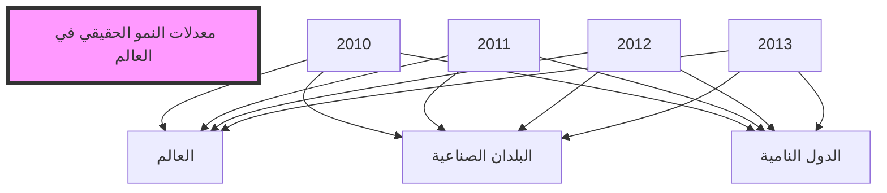
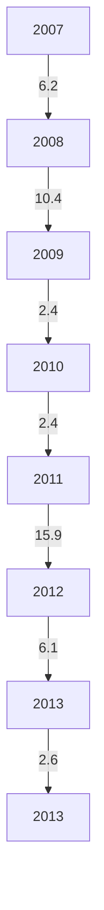
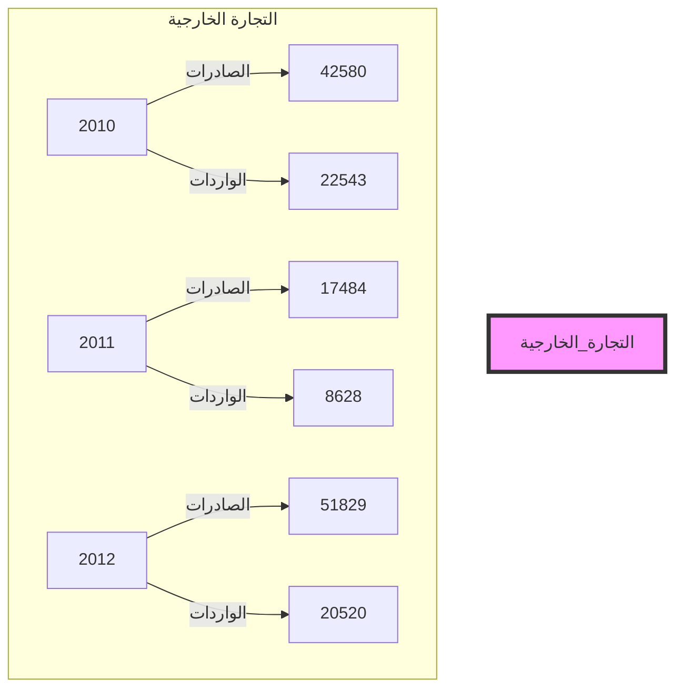
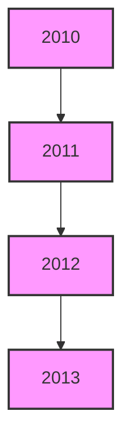

مصرف ليبيا المركزي

التقرير السنوي
السابع والخمسون

السنة
المالية 2013

[A decorative gold floral border is at the bottom of the page]
---
The image contains Arabic calligraphy in a golden or light brown color against a white background. The text is written in an ornate, flowing style typical of Islamic calligraphy. The phrase written is:

بسم الله الرحمن الرحيم

This is the Bismillah, which translates to "In the name of Allah, the Most Gracious, the Most Merciful." This phrase is commonly used at the beginning of chapters in the Quran and is often recited by Muslims before undertaking any significant action.

The calligraphy is centered in the image and stands out as the sole element, emphasizing its importance and aesthetic beauty in Islamic art and culture.
---
# مجلس الإدارة

| المنصب | الاسم | الدور |
|--------|------|------|
| رئيساً | المحافظ | السيد/ أ. الصديق عمر الكبير |
| نائباً للرئيس | نائب المحافظ | السيد/ أ.علي محمد سالم الحبري |
| | وكيل وزارة المالية | السيد/د.مراجع غيث سليمان |
| أعضاء | | السيد/ د. عبد الرحمن هابيل |
| | | السيد/ م. حمودة محمد الاسود |
| | | السيد/ محمد أحمد المختار |
| | | السيد / د. طارق محمد يوسف المقريف |
---
# مدراء الإدارات

| المنصب | الاسم |
|---------------------|------------------------|
| المدير التنفيذي لقطاع العمليات المصرفية المركزية | د. خالد علي الكاجيجي |
| مدير إدارة الأسواق المالية | مصباح محمد العكاري |
| مدير إدارة الإصدار | أمحمد محمد الحجاجي |
| مدير إدارة البحوث والإحصاء | د. علي رمضان شنيبيش |
| مدير إدارة تقنية المعلومات | عمران مفتاح الشائبي |
| مدير إدارة الحسابات | عبد الناصر خليفة قنيدي |
| مدير إدارة الرقابة على المصارف والنقد | د. محمد عبد الجليل أبوسنينة |
| مدير إدارة الشؤون الإدارية والموظفين | م. علي عبد الله الجهاني |
| مدير إدارة العمليات المصرفية | فتحي امحمد الحاجي |
| مدير الإدارة القانونية | د. علي عبد الرحمن ضوي |
| مدير إدارة المراجعة | عبد الله نوري الشيباني |

# مدراء الفروع

| المنصب | الاسم |
|--------------|------------------------|
| مدير فرع بنغازي | عبد القادر محمد الباقرمي |
| مدير فرع سبها | عبد الكريم محمد الشحاطي |
| مدير فرع سرت | امحمد صالح أبو غالية |
---
# مصرف ليبيا المركزي

## الإدارة العامة / طرابلس

هاتف: 3333591/9 21 (218) +
السويفت: CBLJLYLXXXX
الموقع الإلكتروني: www.cbl.gov.ly
بريد مصور (فاكس): 4441488 - 21 (218) +

----

## الفروع

### فرع بنغازي:
هاتف: 9091161/8 61 (218) +
بريد مصور (فاكس): 9091169 - 61 (218) +

### فرع سرت:
هاتف: 63750/4 54 (218) +
بريد مصور (فاكس): 5265142 - 54 (218) +

### فرع سبها:
هاتف: 627771/3 71 (218) +
بريد مصور (فاكس): 621800 - 71 (218) +

----

## إدارة البحوث والإحصاء
هاتف: 4773901 21 (218) +
بريد مصور (فاكس): 4773903 - 21 (218) +
بريد إلكتروني: ecorestat@cbl.gov.ly
---
# المحتويات

14 .................................................................................................... تقديم

## الجزء الأول
### التطورات الاقتصادية الدولية والعربية

18 .................................................................... أولاً : التطورات الاقتصادية الدولية
18 ........................................................................................... • نظرة عامة
19 ..................................................................................... • النمو الاقتصادي
20 ................................................................................................ • البطالة
21 ................................................................................................ • التضخم
22 ....................................................................................... • التجارة العالمية
23 ............................................................. • أسعار صرف العملات الدولية الرئيسية
24 ............................................................................ • أسعار سلع التجارة العالمية
25 ............................................................................. • التطورات النفطية الدولية
26 ..................................................................................... - العرض
27 ....................................................................................... - الطلب
29 ..................................................................................... - الأسعار
31 .................................................................... ثانياً : التطورات الاقتصادية العربية

## الجزء الثاني
### التطورات الاقتصادية المحلية

#### أولاً : القطاع الحقيقي

44 ...................................................................... • الناتج المحلي الإجمالي الحقيقي
44 ...................................................................... • الناتج المحلي الإجمالي الاسمي
49 ......................................................................................... • معدل التضخم
50 ................................................................ • العاملون بالنشاط الاقتصادي
52 ............................................................................. • التطورات النفطية المحلية
53 ............................................................ - الإنتاج المحلي من النفط الخام
55 ................................................................... - صادرات النفط الخام
56 .......................................................................... - أسعار النفط الخام
56 ........................................................................ - إنتاج الغاز الطبيعي
---
- الإنتاج المحلي من المشتقات النفطية ...................................................... 57
- الإنتاج المحلي من البتروكيماويات ......................................................... 58
- صادرات المنتجات النفطية والبتروكيماوية ................................................ 59
- الاستهلاك المحلي من المشتقات النفطية ................................................... 59

## ثانياً : المالية العامة

• قانون الميزانية العامة للسنة المالية 2013............................................................61
- تنفيذ الميزانية العامة للسنة المالية .......................................................... 63
الإيرادات ........................................................................... 63
المصروفات ........................................................................ 64

## ثالثاً : القطاع الخارجي

• ميزان المدفوعات ..................................................................................... 65
- الحساب الجاري ............................................................................. 65
- الحساب الرأسمالي والمالي ............................................................... 66
• التجارة الخارجية ...................................................................................... 68

## رابعاً : التطورات النقدية

• التطورات النقدية ...................................................................................... 71
- القاعدة النقدية والعوامل المؤثرة فيها ........................................................ 71
- عرض النقود والعوامل المؤثرة فيه ......................................................... 73
- سعر صرف الدينار الليبي ................................................................... 75
- مقاصة الصكوك ............................................................................. 75
• مصرف ليبيا المركزي ............................................................................... 77
- جانب الأصول ................................................................................ 77
- جانب الخصوم ................................................................................ 78
• المصارف التجارية .................................................................................... 81
- مصادر الأموال ............................................................................... 81
- استخدامات الأموال ........................................................................... 84
- وضع السيولة والاحتياطي النقدي الإلزامي ................................................. 92
• المصرف الليبي الخارجي ............................................................................ 94
• المصارف المتخصصة ................................................................................ 98
- مصرف التنمية ................................................................................ 98
---

| 98 | المصرف الزراعي ........................................................................... |
|----|--------------------------------------------------------------------|
| 99 | مصرف الادخار والاستثمار العقاري ...................................................... |
| 100 | المصرف الريفي ........................................................................... |

## خامساً : المؤسسات المالية غير المصرفية

| 101 | المؤسسة الليبية للاستثمار ........................................................................... • |
|----|--------------------------------------------------------------------|
| 103 | المحفظة الاستثمارية طويلة المدى ........................................................... - |
| 104 | محفظة ليبيا إفريقيا للاستثمار ............................................................... - |
| 106 | الصندوق الليبي للاستثمار الداخلي والتنمية ........................................................... • |
| 109 | سوق المال الليبي ..................................................................................... • |
| 110 | صندوق التقاعد ........................................................................................ • |
| 111 | شركات التأمين ........................................................................................ • |
---
# تقديم

يسر مصرف ليبيا المركزي أن يقدم تقريره السنوي السابع والخمسون للعام 2013، متضمناً
أهم التطورات الاقتصادية والمالية على الصعيد الدولي والعربي والمحلي، فعلى الصعيد الدولي
سجل الاقتصاد العالمي تراجعاً ملحوظاً في معدل النمو، حيث انخفض من 3.2% عام 2012
إلى 3.0% عام 2013، وذلك بسبب تباطؤ النمو في الدول المتقدمة والدول النامية على حد
سواء، نتيجة إلى سياسات التقشف، وأزمة الديون السيادية وتدني مستوى الطلب والتطورات
الامنية والسياسية في منطقة الشرق الأوسط وشمال افريقيا، وبالرغم من ذلك فإن حالة عدم
اليقين ظلت هي السائدة خلال عام 2013. ومن ناحية أخرى شهدت أسعار السلع الأولية زيادة
طفيفة، كما انخفضت أسعار النفط (سلة أوبك) بنسبة 3.3% عما كانت عليه في عام 2012،
وانخفضت معدلات التضخم في الدول الصناعية إلى 1.4%. ونتيجة لتداعيات الأزمة
الاقتصادية العالمية، ظلت معدلات البطالة خلال عام 2013 على نفس معدلاتها تقريباً في
الاعوام السابقة عند 7.9%، وقد بلغت في دول منطقة اليورو 12.1% وفى الولايات المتحدة
الأمريكية 8.1%.

وبالنظر إلى هشاشة الوضع الاقتصادي استمرت المصارف المركزية للدول المتقدمة في
الإبقاء على أسعار الفائدة منخفضة وإتباع سياسات متحفظة.

وعلى الصعيد العربي، أظهرت البيانات، حدوث تراجع في معدل النمو الاقتصادي للدول
العربية لعام 2013 ليبلغ نسبة 3.4%، مقابل 4.8% عام 2012، ويتناول التقرير دور
المؤسسات المالية العربية في تحقيق التنمية والنمو الاقتصادي للدول العربية.

أما على المستوى المحلي، فقد شهدت البيئة الاقتصادية أوضاعاً غير مواتية بسبب تداعيات
الاحداث التي اعقبت اندلاع ثورة 17 فبراير وبسبب الاضطرابات التي حدثت في الحقول
النفطية وإغلاق الموانى النفطية لفترة تزيد على خمسة اشهر متواصلة خلال عام 2013،
وبالرغم من عدم توفر بيانات تفصيلية عن الناتج المحلي الإجمالي ، إلا أن التقديرات الاولية
تشير إلى حدوث انخفاض كبير في معدل نمو الناتج المحلي الإجمالي مقابل معدل نمو بلغ

14 التقرير السنوي 2013
---
98.2% في عام 2012، ويعتبر الانخفاض الكبير في الناتج المحلي لقطاع النفط هو السبب الرئيس وراء تدهور النمو الاقتصادي في ليبيا خلال عام 2013.

وفيما يتعلق بالمستوى العام للأسعار، فقد بلغ معدل التضخم في عام 2013 وفقاً للرقم القياسي للأسعار نحو 2.6% مقابل معدل تضخم 6.1% في عام 2012.

وفيما يخص التطورات النقدية، فقد شهد عرض النقود (ع2) نمواً بلغت نسبته 8.3% مقابل 10.0% في عام 2012 ليصل في نهاية عام 2013 إلى نحو 69.0 مليار دينار، مقابل 63.7 مليار دينار في نهاية عام 2012.

أما فيما يتعلق بالتطورات المالية، فقد كان لتراجع الصادرات النفطية خلال عام 2013، أثراً ملموساً على حدوث انخفاض كبير في الإيرادات النفطية مقارنة بما كانت عليه خلال عام 2012 لتصل إلى 51.8 مليار دينار، في حين بلغت المصروفات العامة في شكل تفويضات مالية صادرة خلال نفس العام نحو 61.9 مليار دينار.

وفيما يخص أداء القطاع الخارجي، حقق ميزان المدفوعات عجزاً في الميزان الكلي خلال عام 2013 بلغ نحو 8.0 مليارات دينار، مقابل فائض قدره 16.5 مليار دينار عام 2012، ويعود ذلك للعجز الذي طرأ على الحساب الجاري البالغ 83.2 مليون دينار في عام 2013، مقابل فائض قدره 30.0 مليار دينار عام 2012، وذلك بسبب تراجع حصيلة الصادرات النفطية.

وعلى صعيد التطورات المصرفية، استمر مصرف ليبيا المركزي خلال عام 2013، في التركيز على رفع أداء المصارف التجارية ومساهمتها في النشاط الاقتصادي. وبسبب حالة عدم اليقين وعدم الاستقرار في الأوضاع الاقتصادية العالمية والمحلية، قام مصرف ليبيا المركزي بالإبقاء على سعر إعادة الخصم وأسعار الفائدة على شهادات الإيداع لفترة استحقاق 91 يوماً و28 يوماً عند 3.0% و1.0% و0.85% لكل منها على الترتيب.

أما فيما يتعلق بأنشطة المؤسسات المالية غير المصرفية، يتضمن التقرير جزءاً خاصاً عن نشاط بعض المؤسسات المالية غير المصرفية والتي تلعب دوراً مهماً في الاقتصاد الوطني، وتمارس أنشطة استثمارية واسعة، سواء في الداخل أو في الخارج ومن بعض هذه المؤسسات المالية، صندوق التقاعد، المؤسسة الليبية للاستثمار والجهات التابعة لها، صندوق الإنماء

15 التقرير السنوي 2013
---
الاقتصادي والاجتماعي، كما تضمن التقرير أيضاً المؤشرات المهمة في أداء سوق الأوراق
المالية الليبي.

وينتهز مصرف ليبيا المركزي هذه المناسبة، ليعرب عن شكره وتقديره لكافة الوزارات
والمؤسسات والأجهزة العامة ذات العلاقة، لتوفيرها وتزويدها المصرف بالبيانات
والإحصاءات اللازمة لإعداد هذا التقرير.

والله ولي التوفيق

الصديق عمر الكبير
المحافظ

16 التقرير السنوي 2013
---
The image contains a text in Arabic script within a rectangular shape that resembles a piece of paper with a curled corner. The text appears to be a title or heading. Here is a transliteration and translation of the Arabic text:

الجزء الأول
التطورات الاقتصادية الدولية والعربية

Transliteration:
Al-juz' al-awwal
At-tatawwurat al-iqtisadiyya ad-dawliyya wal-'arabiyya

English translation:
Part One
International and Arab Economic Developments

This appears to be the title of a section or chapter in an Arabic document, likely discussing economic trends or developments on both international and Arab levels.
---
# أولاً : التطورات الاقتصادية الدولية

## نظرة عامة :

شهد الاقتصاد العالمي في الدول الصناعية والدول النامية على حد سواء تراجعاً في معدلات النمو خلال عام 2013، كما أن نمو المستويات العامة للأسعار في هذه البلدان ظل دون المستويات المعتادة، الأمر الذي يوضح أن هذه الاقتصادات لم تصل بعد إلى كامل سعتها الإنتاجية، وذلك بسبب عدم استقرار بيئة التجارة العالمية والاضطرابات الإقليمية خلال العام.

كما شكلت الأسعار المنخفضة في البلدان المتقدمة ضغطاً على القدرة التنافسية في البلدان النامية، ومن المتوقع أن تكون لزيادة الطلب في البلدان المتقدمة أثر إيجابي على معدلات النمو في البلدان النامية.

إن استمرار السياسة النقدية التوسعية (التسهيل الكمي) أثر إيجاباً على أداء اقتصاد الولايات المتحدة الأمريكية مما ساهم في عودة ثقة المستثمرين في الاقتصاد الأمريكي، وكانت هذه المؤشرات ستكون أكثر إيجابية لولا تقلب أوضاع المالية العامة في الولايات المتحدة خلال العام. أما بالنسبة لمنطقة اليورو فكان معدلات النمو فيها ضعيفة وهشة بسبب تأثر الطلب المحلي فيها بمستويات الدين العالية وخلل تركيبتها المصرفية.

وكانت معدلات النمو في البلدان النامية، أقل من المستويات المتوقعة ويعزى ذلك بشكل رئيسي إلى عودة تقلبات البيئة الخارجية للتمويل الأجنبي وذلك بسبب تشكيك الأسواق العالمية في ركائز اقتصاديات البلدان النامية، خصوصاً تلك التي تعاني من مستويات تضخم عالية وعجوزات ضخمة في الميزان الجاري كالبرازيل وتركيا وجنوب أفريقيا. وعلى الرغم من أن البلدان النامية لطالما عانت من هذه الاختلالات، إلا أن ارتفاع معدلات النمو في البلدان المتقدمة حفزت المستثمرين إلى سحب استثماراتهم من البلدان الصاعدة والاتجاه بها إلى البلدان المتقدمة. وهذا بدوره أثر سلباً على أسعار صرف عملات البلدان الصاعدة، مما ألزم بعض واضعي السياسات في تلك البلدان على اتباع إجراءات اقتصادية انكماشية لكسب ثقة المستثمرين. إن هذه الإجراءات ستؤدي إلى زيادة تكلفة التمويل في هذه البلدان، الأمر الذي سيؤثر سلباً على معدلات النمو فيها في الفترة القادمة.

18 التقرير السنوي 2013
---
• النمو الاقتصادي:

شهد نمو الاقتصاد العالمي تراجعاً للعام الثالث على التوالي، حيث حقق معدل نمو قدره 3.0% في عام 2013، مقابل 3.2% في عام 2012. وقد كانت معدلات النمو البلدان النامية والأسواق الناشئة السبب الرئيسي وراء هذا الانخفاض، حيث حققت معدل نمو قدره 4.7% في عام 2013، مقابل 5.0% في عام 2012. وكانت هذه المعدلات أقل من التوقعات. وتجدر الإشارة إلى أنه على الرغم من انخفاض معدلات نمو البلدان الصناعية من 1.4% في عام 2012 إلى 1.3% في عام 2013، فإن هذه المعدلات فاقت التوقعات العالمية مدعومة بالنمو المفاجئ في النصف الثاني من عام 2013، حيث حقق الاقتصاد العالمي نمواً سنوياً في تلك الفترة قدره 3.66% بزيادة على معدل النمو في النصف الأول من العام قدره 2.33%. ومن المتوقع أن هذا النمط من النمو سيحفز النمو في الأسواق الناشئة عن طريق زيادة الطلب العالمي على السلع والخدمات في هذه البلدان.

واستمرت معدلات النمو في منطقة اليورو في الانكماش، وكانت بدورها عائق ومصدر محتمل للخطر على نمو الاقتصاد العالمي، وذلك بسبب استمرار ارتفاع معدلات البطالة في المنطقة بشكل عام، وفي بلدان شمال البحر المتوسط بشكل خاص، بالإضافة إلى زيادة الشكوك في السلامة المالية لعدد كبير من المؤسسات المالية في المنطقة. يأتي ذلك على الرغم من التحسن النسبي في وضع المالية العامة لبلدان المنطقة الناتج عن السياسات المالية التقشفية التي استمر العمل بها خلال العام.

أما بالنسبة لمعدل النمو في منطقة الشرق الأوسط وشمال إفريقيا فقد شهد انخفاضاً خلال عام 2013 ليصل إلى 2.4%، مقابل 4.2% في العام 2012. ويعزى ذلك إلى الاضطرابات الأمنية التي سادت المنطقة وخصوصاً في بلدان "الربيع العربي" والتي حفزت بدورها حالة عدم اليقين التي أثرت سلباً على معدلات الاستثمار في المنطقة.

19    التقرير السنوي 2013
---
# جدول رقم (1) : معدلات النمو الحقيقي في العالم
" نسب مئوية "

| مجموعة الدول | 2012 | 2013 |
|--------------|------|------|
| العالم : | 3.2 | 3.0 |
| الدول الصناعية: | 1.4 | 1.3 |
| الولايات المتحدة الأمريكية | 2.8 | 1.9 |
| دول منطقة اليورو | -0.7 | -0.5 |
| اليابان | 1.4 | 1.5 |
| دول صناعية أخرى | 1.9 | 2.3 |
| الدول النامية وأسواق ناشئة أخرى (*) : | 5.0 | 4.7 |
| دول وسط وشرق أوروبا | 1.4 | 2.8 |
| دول الكومنولث المستقلة | 3.4 | 2.1 |
| آسيا | 6.7 | 6.5 |
| الشرق الأوسط وشمال إفريقيا | 4.2 | 2.4 |
| أمريكا اللاتينية والكاريبي | 3.1 | 2.7 |
| إفريقيا جنوب الصحراء | 4.9 | 4.9 |

المصدر : صندوق النقد الدولي، آفاق الاقتصاد العالمي، أبريل 2014.
* الأسواق الناشئة تشمل : البرازيل، بولندا، تشيلي، جنوب إفريقيا، جمهورية التشيك، كوريا الجنوبية، كولومبيا،
المجر، المكسيك.

## شكل (1) : معدلات النمو الحقيقي في العالم

## البطالة :

حققت معدلات البطالة في الدول الصناعية خلال عام 2013 انخفاضاً طفيفاً لتصل إلى 7.9%،
مقابل 8.0% خلال العام 2012 لتعود إلى مستوياتها في عام 2011، وعلى الرغم من أن هذا
التحسن في معدلات البطالة كان ضمني في أغلب البلدان الصناعية، إلا أنها استمرت في

20 التقرير السنوي 2013
---
الارتفاع في منطقة اليورو لتصل إلى 12.1% خلال عام 2013، مقابل 11.4% عام 2012.

أما بالنسبة لبقية البلدان الصناعية فقد انخفضت معدلات البطالة فيها بشكل واضح، وكانت مدعومة بشكل كبير بانخفاض معدل البطالة في الولايات المتحدة الأمريكية.

جدول رقم (2) : معدلات البطالة في الدول الصناعية
" نسب مئوية "

| مجموعة الدول | 2012 | 2013 |
|--------------|------|------|
| الدول الصناعية | 8.0 | 7.9 |
| الولايات المتحدة الأمريكية | 8.1 | 7.4 |
| دول منطقة اليورو | 11.4 | 12.1 |
| المملكة المتحدة | 8.0 | 7.6 |
| اليابان | 4.6 | 4.0 |

المصدر: صندوق النقد الدولي، آفاق الاقتصاد العالمي، أبريل 2014.

## التضخم :

شهدت معدلات التضخم بشكل عام انخفاضاً في كل من البلدان الصناعية والدول النامية على حد سواء وكانت هذه المعدلات المنخفضة نتيجة استمرار اقتصاديات البلدان الصناعية في العمل دون قدراتها الإنتاجية بشكل واضح، وكذلك عمل اقتصاديات البلدان النامية بمستوى أقل أو قريب من قدراتها الإنتاجية، كما كان لتطورات أسعار السلع الأولية المتواضعة دور أساسي في بقاء معدلات التضخم عند مستويات متواضعة وعلى وجه الخصوص أسعار الغذاء والنفط، ومن المتوقع أن تستمر المعدلات المنخفضة لأسعار هذه السلع خلال المدة القادمة حسب الأرقام المتداولة في الأسواق الآجلة لهذه السلع.

شهدت معدلات التضخم في الدول الصناعية عام 2013 بشكل عام انخفاضاً نسبياً، لتصل إلى 1.4%، مقابل 2.0% عام 2012، و أخذت مستويات التضخم في البلدان النامية والأسواق الناشئة اتجاهاً تصاعدياً، لتصل إلى 6.0% خلال عام 2013، مقابل 5.8% خلال عام 2012، واستمرت معدلات التضخم في دول الشرق الأوسط وشمال أفريقيا في تحقيق مستويات عشرية لتستقر عند مستوى 10.5% خلال عام 2013 مقابل نفس المستوى 10.5% خلال عام 2012، وكانت للتحولات السياسية واستمرار حالة عدم اليقين أثر واضح على هذه الأسعار.

21    التقرير السنوي 2013
---
جدول رقم (3) : معدلات التضخم في العالم
"نسب مئوية"

| مجموعة الدول | 2012 | 2013 |
|--------------|------|------|
| الدول الصناعية: | 2.0 | 1.4 |
| الولايات المتحدة الأمريكية | 2.1 | 1.5 |
| دول منطقة اليورو | 2.5 | 1.3 |
| اليابان | 0.0 | 0.4 |
| الدول النامية وأسواق ناشئة أخرى: | 5.8 | 6.0 |
| دول وسط وشرق أوروبا | 5.8 | 2.8 |
| دول الكومنولث المستقلة | 6.5 | 6.4 |
| آسيا | 4.6 | 4.5 |
| الشرق الأوسط وشمال إفريقيا | 10.5 | 10.5 |
| أمريكا اللاتينية والكاريبي | 5.9 | 6.8 |
| إفريقيا جنوب الصحراء | 9.0 | 6.3 |

المصدر: صندوق النقد الدولي، آفاق الاقتصادي العالمي، ابريل 2014.

## التجارة العالمية :

شهد معدل نمو التجارة العالمية ارتفاعاً خلال عام 2013، ليصل إلى 3.0%، مقابل 2.8% خلال عام 2012، ويرجع ذلك إلى ارتفاع كل من معدل نمو صادرات وواردات الدول الصناعية، حيث وصل معدل نمو صادراتها في عام 2013 إلى 2.3%، مقابل 2.1% في عام 2012، كما شهد معدل نمو الواردات في الدول الصناعية أيضاً ارتفاعاً ليصل إلى 1.4% في عام 2013، مقابل 1.1% في عام 2012.

أما في الدول النامية والأسواق الناشئة الأخرى فقد شهد معدل نمو صادراتها ارتفاعاً طفيفاً ليصل إلى 4.4% في عام 2013، مقابل 4.2% في عام 2012، كما شهدت واردات نفس المجموعة تراجعاً لتصل إلى 5.6% في عام 2013، مقابل 5.8% في عام 2012.

وكانت معدلات نمو التجارة الخارجية للبلدان النامية أقل من المتوقع وذلك بسبب زيادة نمو الطلب الخارجي على سلع هذه البلدان بمعدلات أقل من المتوقع، الأمر الذي بدوره حفز هذه البلدان على تخفيض وارداتها.

أما على صعيد الحسابات الجارية في موازين مدفوعات الدول حول العالم فقد شهد عام 2013 انخفاضاً في تباين فوائض وعجوزات العديد من البلدان. حيث كانت منطقة اليورو رائدة في

22 التقرير السنوي 2013
---
محاولتها لتقليل عجوزات حساباتها الجارية، وذلك عن طريق تخفيض الواردات من جهة
وتعديل السياسات السعرية من جهة أخرى لتحفيز الصادرات. كما ساهم انخفاض أسعار النفط
والسلع الأولية في تخفيض عجوزات البلدان المستوردة للنفط، وساهمت زيادات الانفاق العام
في البلدان المصدرة للنفط والسلع الأولية في تقليص الفوائض المحققة خلال السنوات الأخيرة.

جدول رقم ( 4 ) : معدلات نمو التجارة العالمية
" نسب مئوية "

| 2013 | 2012 | 2011 |                                   |
|------|------|------|-----------------------------------|
| 3.0  | 2.8  | 6.2  | إجمالي التجارة العالمية           |
|      |      |      | الدول الصناعية :                  |
| 2.3  | 2.1  | 5.7  | الصادرات                          |
| 1.4  | 1.1  | 4.8  | الواردات                          |
|      |      |      | الدول النامية وأسواق ناشئة أخرى : |
| 4.4  | 4.2  | 7.0  | الصادرات                          |
| 5.6  | 5.8  | 9.2  | الواردات                          |

المصدر : صندوق النقد الدولي، آفاق الاقتصادي العالمي، ابريل 2014.

## أسعار صرف العملات الدولية الرئيسة :

انخفض متوسط سعر صرف الدولار الأمريكي خلال عام 2013 مقابل اليورو والفرنك
السويسري، ويعتبر هذا الانخفاض نتيجة استمرار عملية "التسهيل الكمي" المنفذة من قبل البنك
الفيدرالي الأمريكي والتي زادت من عرض النقود في الاقتصاد الأمريكي. بينما ارتفع سعر
صرف الدولار الأمريكي مقابل معظم العملات الدولية الرئيسة الأخرى، فقد بلغ متوسط سعر
الدولار مقابل اليورو حوالي 1.338 دولاراً لكل يورو في عام 2013 مقابل 1.286 دولاراً
لكل يورو في عام 2012، بينما بلغ سعره مقابل الجنيه الاسترليني في عام 2013 حوالي
1.564 دولاراً لكل جنيه، مقابل 1.585 دولاراً لكل جنيه في عام 2012، وقد ارتفع سعر
صرف الدولار مقابل الين الياباني بشكل كبير من حوالي 79.65 يناً للدولار في عام 2012
إلى 97.65 يناً للدولار في عام 2013.

هذا وقد زاد ارتفاع اليورو مقابل الدولار من مخاوف المصرف المركزي الأوروبي من وقوف
ارتفاع عملته عائقاً أمام الانتعاش الاقتصادي الذي يسعى إليه، وبالتالي حفزه على تخفيض

23    التقرير السنوي 2013
---
سعر الخصم ليصل إلى 0.25% في نهاية عام 2013 وذلك لمحاولة الدفع بسياسة التوسع
والتقليل من الآثار التصاعدية لأسعار فائدة ديون سندات الحكومة في بعض بلدان المنطقة.

جدول رقم (5): متوسط أسعار صرف بعض العملات الدولية خلال عام 2013

| العملة | الدولار الأمريكي | اليورو | الجنيه الإسترليني | الين الياباني | الفرنك السويسري |
|--------|------------------|--------|-------------------|---------------|------------------|
| الدولار الأمريكي | - | 1.3279 | 1.5637 | 0.0102 | 1.0788 |
| اليورو | 0.7530 | - | 1.1724 | 0.0077 | 0.6944 |
| الجنيه الاسترليني | 0.6395 | 0.8458 | - | 0.0065 | 0.5896 |
| الين الياباني | 97.6536 | 129.1461 | 153.2914 | - | 105.8711 |
| الفرنك السويسري | 0.9269 | 1.2360 | 1.4430 | 0.0095 | - |

المصدر: قاعدة بيانات صندوق النقد الدولي.

## أسعار سلع التجارة العالمية:

شهدت أسعار معظم السلع الغذائية ارتفاعاً طفيفاً خلال عام 2013 بلغت نسبته 1.1% مقابل
الانخفاض الذي شهده عام 2012 والذي بلغ 2.4% وذلك بسبب ارتفاع انتاج أغلب السلع
الغذائية الأولية، كما كانت أغلب التنبؤات تشير إلى استمرارية زيادة الإنتاج العالمي لهذه السلع
في المدى القصير، بالإضافة إلى ارتفاع مخزونها العالمي، الأمر الذي أدى بدوره إلى تهدئة
الأسواق الآجلة لهذه السلع.

وقد شهدت أسعار السلع الأولية غير النفطية والمشروبات والمعادن انخفاضاً خلال عام 2013
للعام الثاني على التوالي، بلغ حوالي 1.2% و11.9% و4.3% على التوالي، مقابل معدلات
انخفاض قدرها 10.0% و18.6% و16.8% خلال عام 2012. أما بالنسبة لأسعار النفط
الخام فقد شهدت استقراراً نسبياً خلال آخر سنتين وذلك بسبب زيادة انتاج الولايات المتحدة
للطاقة بالإضافة إلى زيادة إجمالي إنتاج بلدان منظمة أوبك. أما بالنسبة للمواد الزراعية فكان
الارتفاع الطفيف الذي حدث في انتاجها هو جراء التغيرات المناخية في بعض بلدان أمريكا
اللاتينية الزراعية.

24 التقرير السنوي 2013
---
جدول رقم (6) : التغير السنوي في الأسعار العالمية لبعض السلع

| البيان | 2010 | 2011 | 2012 | 2013 |
|--------|------|------|------|------|
| السلع المصنعة | %2.5 | %6.1 | %0.2 | %1.1- |
| النفط | %27.9 | %31.6 | %1.0 | %0.9- |
| السلع الأولية غير النفطية | %26.5 | %17.9 | %10.0- | %1.2- |
| سلع غذائية | %11.9 | %19.9 | %2.4- | %1.1 |
| مشروبات | %14.1 | %16.6 | %18.6- | %11.9- |
| مواد زراعية خام | %33.2 | %22.7 | %12.7- | %1.5 |
| معادن | %48.2 | %13.5 | %16.8- | %4.3- |

المصدر: قاعدة بيانات صندوق النقد الدولي.

## التطورات النفطية الدولية:

يعتبر عام 2013 نقطة بداية حدوث تغيرات جذرية في سوق النفط العالمي، حيث تحولت العديد من البلدان المستوردة للنفط إلى بلدان مصدرة للنفط ، وأصبحت العديد من البلدان المصدرة للنفط مصدر طلب رئيسي له. وقد وفرت هذه الخيارات الجديدة من قنوات العرض تغييراً في آلية وشبكة توزيع الموارد النفطية عبر العالم.

وعلى الرغم من التزايد المستمر لعرض النفط الخام، إلا أن فجوة احتياجات الطاقة لا تزال تشكل هوة كبيرة حول العالم، حيث لا يزال حوالي 1.3 مليار نسمة من سكان العالم يفتقر إلى الوصول إلى الكهرباء. وعلى الرغم من الاهتمامات المستمرة بمصادر الطاقة المتجددة، إلا أنها فشلت في أن تكون بديلاً للمصادر التقليدية سواء من ناحية امكانية إحلالها الكامل في المدى المنظور، أو من حيث آلية نقلها وهامش التكلفة المرتفع بينهما.

ومن المتوقع أن تستمر سيطرة الوقود الأحفوري كمصدر للطاقة خلال العقود الثلاثة القادمة، حيث يلاحظ أن نسبة مساهمته هذا العام لم تقل عن 82% من إجمالي مصادر الطاقة وقد ظل على هذا المستوى منذ خمسة وعشرون سنة، وحتى عند زيادة استخدام مصادر الطاقة في المدة القادمة فمن المتوقع ألا تقل مساهمة النفط الأحفوري عن 75% في عام 2035.

25    التقرير السنوي 2013
---
وتشير البيانات الأولية إلى أن النفط الأحفوري في الولايات المتحدة الأمريكية والإنتاج في المياه العميقة في البرازيل والذي سيجعلها من كبار منتجي النفط في العالم سيكون لهما دوراً قيادياً خلال العقد الحالي، إلا أن منطقة الشرق الأوسط ماتزال هي الحاسمة في المدى الطويل.

كما بدأت العديد من البلدان الصناعية كاليابان وبلدان الاتحاد الأوروبي في إجراء دراسات وأبحاث لمحاولة تضييق هوامش تكلفة الغاز الطبيعي في العملية الإنتاجية بينها وبين الولايات المتحدة الأمريكية، والتي كانت تشكل فوق الأربعة أضعاف والثلاثة أضعاف على التوالي خلال عام 2013. ومن المتوقع أن يتم تخفيض هذه التكلفة إلى الضعفين مع حلول عام 2035.

ولكن هذه الفوارق الناتجة عن تباين أسعار الغاز الطبيعي حول العالم سيكون من الصعب إزالتها بالكامل خلال المدى المنظور.

وعلى الرغم من تباطؤ نمو اقتصادات بلدان جنوب شرق آسيا، إلا أنها لاتزال المحرك الرئيسي لنمو الطلب على النفط الخام وذلك بقيادة الصين تليها الهند، وستستمر هذه البلدان خلال المدى المتوسط في قيادة نمو الطلب على النفط الخام.

وشهدت أسعار النفط الخام انخفاضاً خلال عام 2013 متأثرة بانخفاض حاد في توقعات نمو البلدان الصاعدة خلال الربع الثاني من العام، حيث حامت شكوك حول امكانية تحقيق البلدان الصاعدة معدلات النمو المتوقعة وذلك بسبب انخفاض طلب البلدان الصناعية للسلع المصدرة من هذه البلدان، بالإضافة إلى حالة عدم اليقين التي سادت منطقة اليورو خلال الفترة. وشهدت أسعار سلة أوبك انخفاضاً بحوالي 3% خلال عام 2013 مقارنة بأسعار 2012.

## العرض:

شهد العرض العالمي من النفط الخام والغاز الطبيعي خلال عام 2013 ارتفاعاً طفيفاً بنسبة 0.7% وبمقدار 0.6 مليون برميل في اليوم، ليبلغ في المتوسط 91.5 مليون برميل في اليوم مقابل 90.9 مليون برميل في اليوم في عام 2012. وكان السبب الرئيسي وراء هذا النمو الطفيف في العرض العالمي هو انخفاض إنتاج منظمة الأقطار المصدرة للنفط (الأوبك)، كمتوسط من 37.5 مليون برميل في اليوم عام 2012 إلى حوالي 36.8 مليون برميل في اليوم في عام 2013 بمعدل انخفاض قدره 1.9% وبكمية قدرها 0.7 مليون برميل في اليوم، والسبب الرئيسي وراء هذا الانخفاض هو سعي المنظمة لتحقيق الاستقرار في السوق النفطي،

26        التقرير السنوي 2013
---
بالإضافة إلى عودة الاضطراب في معدلات إنتاج النفط الليبي الناتجة عن إغلاق عدد من الموانئ النفطية.

وكان لمنتجي النفط الخام العالميين خارج منظمة الأوبك دور إيجابي في زيادة العرض العالمي للنفط الخام فارتفع إنتاجهم في عام 2013 بمقدار 0.3 مليون برميل في اليوم ليصل إلى 50.6 برميل في اليوم، حيث عوضت أمريكا الشمالية والبرازيل وبلدان الاتحاد السوفيتي السابق (كازخستان وأذربيجان) انخفاض إنتاج البلدان الأخرى. وكانت زيادة الولايات المتحدة لإنتاجها النفطي لغرض تهدئة أسواق النفط الآجلة، واستغلت السلطات الأمريكية في هذا الصدد انتاجها من النفط الصخري الذي كان ثمار استثمارات عالية أنفقت في السنوات الماضية، بالإضافة إلى ارتفاع إنتاج النفط في المياه العميقة في البرازيل. ومن المتوقع أن تستمر الولايات المتحدة الأمريكية والبرازيل في زيادة إنتاج النفط إلى أن تصل إلى ذروة الانتاج مع العام 2020، ولكن تبقى منطقة الشرق الأوسط وشمال أفريقيا الأكبر تأثيراً في الفترات التي تليها وذلك بسبب الكميات الكبيرة من الاحتياطيات المؤكدة التي توجد في المنطقة.

## جدول رقم (7) : العرض العالمي للنفط الخام والغاز المسال

"مليون برميل في اليوم"

| المنطقة | 2011 | 2012 | 2013 |  |  |  | متوسط عام 2013 | معدل النمو في عام 2013 |
|---------|------|------|------|------|------|------|---------------|----------------------|
|         |      |      | الربع الأول | الربع الثاني | الربع الثالث | الربع الرابع |               |                      |
| 1- منظمة التعاون الاقتصادي والتنمية: |  |  |  |  |  |  |  |  |
| أمريكا الشمالية* | 19.0 | 19.9 | 20.6 | 20.5 | 21.1 | 21.6 | 21.0 | 5.5 |
| أوروبا** | 14.6 | 15.9 | 16.8 | 16.7 | 17.4 | 17.9 | 17.2 | 8.2 |
| دول المحيط الهادي | 3.8 | 3.5 | 3.4 | 3.3 | 3.2 | 3.3 | 3.3 | -5.7 |
|  | 0.6 | 0.6 | 0.4 | 0.5 | 0.5 | 0.5 | 0.5 | -16.7 |
| 2- دول خارج المنظمة منها : | 29.9 | 29.5 | 29.6 | 29.5 | 29.3 | 29.9 | 29.6 | 0.3 |
| الاتحاد السوفيتي السابق | 13.5 | 13.7 | 13.8 | 13.8 | 13.8 | 14.0 | 13.9 | 1.5 |
| أوروبا الشرقية | 0.1 | 0.1 | 0.1 | 0.1 | 0.1 | 0.1 | 0.1 | 0.0 |
| الصين | 4.1 | 4.2 | 4.2 | 4.2 | 4.0 | 4.2 | 4.2 | 0.0 |
| دول آسيوية أخرى | 3.6 | 3.6 | 3.7 | 3.6 | 3.5 | 3.5 | 3.6 | 0.0 |
| أمريكا اللاتينية | 4.2 | 4.2 | 4.1 | 4.2 | 4.2 | 4.2 | 4.2 | 0.0 |
| الشرق الأوسط | 1.7 | 1.5 | 1.4 | 1.3 | 1.3 | 1.3 | 1.3 | -13.3 |
| إفريقيا | 2.6 | 2.3 | 2.2 | 2.3 | 2.4 | 2.4 | 2.3 | 0.0 |
| 3- منظمة الأوبك | 35.8 | 37.5 | 36.7 | 37.2 | 37.0 | 36.1 | 36.8 | -1.9 |
| نفط خام | 29.9 | 31.3 | 30.5 | 30.9 | 30.6 | 29.8 | 30.5 | -2.6 |
| غاز مسال | 5.9 | 6.2 | 6.3 | 6.3 | 6.4 | 6.3 | 6.3 | 1.6 |
| 4- عائدات التكرير | 2.1 | 2.1 | 2.2 | 2.2 | 2.2 | 2.2 | 2.2 | 4.8 |
| 5- الوقود الحيوي*** | 1.9 | 1.9 | 1.5 | 2.0 | 2.4 | 2.2 | 2.0 | 5.3 |
| مجموع العرض العالمي | 88.7 | 90.9 | 90.6 | 91.4 | 92.0 | 92.0 | 91.5 | 0.7 |

المصدر: منظمة الطاقة الدولية، تقرير سوق النفط، يونيو 2014.

* بداية من أغسطس 2012 تم إضافة تشيلي ضمن البلدان الأمريكية التابعة لمنظمة التعاون الاقتصادي والتنمية.

** بداية من أغسطس 2012 تم إضافة أستونيا وسلوفينيا ضمن البلدان الأوروبية التابعة لمنظمة التعاون الاقتصادي والتنمية.

*** بداية من يوليو 2010 يتضمن هذا البند جميع أصناف الوقود الحيوي بما في ذلك وقود الميثانول المنتج في البرازيل والولايات المتحدة.

27 التقرير السنوي 2013
---
- الطلب :

ارتفع الطلب العالمي على النفط الخام والغاز المسال بنسبة 1.3% ليصل إلى 91.4 مليون
برميل في اليوم في عام 2013 مقابل 90.2 مليون برميل في اليوم خلال عام 2012، وكان
ارتفاع الطلب في عام 2013 ناتج عن نمو ضمني في جل بلدان العالم، حيث كان متوسط
الطلب اليومي في أمريكا الشمالية عند مستوى 24.0 مليون برميل في اليوم في عام 2013،
مقابل 23.6 مليون برميل في اليوم خلال عام 2011 محققاً معدل ارتفاع قدره 1.7% وبكمية
قدرها 0.4 مليون برميل، وحققت البلدان خارج منظمة التعاون الاقتصادي والتنمية ارتفاعاً في
الطلب بما يقارب 0.3 مليون برميل يومياً، وبمعدل نمو قدره 2.7%، وكانت معدلات النمو
هذه مدعومة بمعدلات نمو الطلب في كل من الصين والبلدان الآسيوية الأخرى (الهند على
وجه الخصوص) وأمريكا اللاتينية ومنطقة الشرق الأوسط، والتي شهدت معدلات نمو قدرها
2.0% و 2.6% و 3.1% و 2.6% على التوالي.

لقد كان انخفاض معدلات الطلب في بلدان منظمة التعاون الاقتصادي والتنمية (عدا أمريكا
الشمالية) السبب الرئيسي وراء امتصاص تأثير ارتفاع الطلب النفطي في البلدان خارج
المنظمة. حيث استمر طلب البلدان الأوروبية في التراجع للعام الثالث على التوالي لينخفض
بمعدل 1.4% خلال عام 2013 ليصل إلى 13.6 مليون برميل يومياً خلال العام، مقارنة بكمية
قدرها 13.8 مليون برميل يومياً في عام 2012، وكانت معدلات الطلب في النصف الأول من
العام العامل الأكبر في هذا الانخفاض الناتج عن حالة عدم اليقين التي سادت المنطقة وعملة
اليورو بشكل عام. وشهدت منطقة المحيط الهادي هي الأخرى انخفاضاً في طلبها على النفط
الخام بمعدل 2.3% خلال عام 2013 ليصل إلى 8.4 مليون برميل يومياً مقارنة بكمية قدرها
8.6 مليون برميل يومياً خلال عام 2012. وكان انخفاض الطلب في اليابان وأستراليا العامل
الأكبر في هذا الانخفاض.

28    التقرير السنوي 2013
---
جدول رقم (8) : الطلب العالمي على النفط الخام والغاز المسال

"مليون برميل في اليوم"

| المنطقة | 2011 | 2012 | 2013 ||||||| معدل النمو في عام 2013 |
|---------|------|------|------|------|------|------|------|------|------|
|         |      |      | الربع الأول | الربع الثاني | الربع الثالث | الربع الرابع | متوسط عام 2013 |  |
| 1. منظمة التعاون الاقتصادي والتنمية : | 46.5 | 46.0 | 45.9 | 45.5 | 46.2 | 46.6 | 46.1 | 0.2 |
| أمريكا الشمالية* | 24.0 | 23.6 | 23.7 | 23.8 | 24.2 | 24.3 | 24.0 | 1.7 |
| أوروبا الغربية** | 14.3 | 13.8 | 13.2 | 13.8 | 14.0 | 13.6 | 13.6 | -1.4 |
| دول المحيط الهادي | 8.2 | 8.6 | 8.9 | 7.9 | 8.1 | 8.7 | 8.4 | -2.3 |
| 2- دول خارج المنظمة منها : | 42.6 | 44.2 | 44.5 | 45.3 | 45.9 | 45.8 | 45.4 | 2.7 |
| الاتحاد السوفيتي السابق | 4.4 | 4.5 | 4.3 | 4.5 | 4.8 | 4.8 | 4.6 | 2.2 |
| باقي أوروبا | 0.7 | 0.7 | 0.6 | 0.7 | 0.7 | 0.7 | 0.7 | 0.0 |
| الصين | 9.3 | 9.9 | 10.0 | 10.0 | 10.1 | 10.2 | 10.1 | 2.0 |
| دول آسيوية أخرى | 11.1 | 11.4 | 11.8 | 11.8 | 11.4 | 11.8 | 11.7 | 2.6 |
| أمريكا اللاتينية | 6.2 | 6.4 | 6.3 | 6.6 | 6.7 | 6.7 | 6.6 | 3.1 |
| الشرق الأوسط | 7.5 | 7.8 | 7.6 | 8.0 | 8.5 | 7.8 | 8.0 | 2.6 |
| إفريقيا | 3.5 | 3.6 | 3.8 | 3.8 | 3.7 | 3.8 | 3.8 | 2.8 |
| مجموع الطلب العالمي | 89.1 | 90.2 | 90.4 | 90.8 | 92.1 | 92.4 | 91.4 | 1.3 |

المصدر: المصدر السابق.
* بداية من أغسطس 2012 تم إضافة تشيلي ضمن البلدان الأمريكية التابعة لمنظمة التعاون الاقتصادي والتنمية.
** بداية من أغسطس 2012 تم إضافة أستونيا وسلوفينيا ضمن البلدان الأوروبية التابعة لمنظمة التعاون الاقتصادي والتنمية.

شكل (2) : العرض العالمي والطلب العالمي على النفط الخام والغاز المسال

| السنوات | الطلب العالمي | العرض العالمي |
|---------|---------------|---------------|
| 2010    | 86            | 87            |
| 2011    | 89            | 89            |
| 2012    | 90            | 91            |
| 2013    | 91            | 92            |

- الأسعار:
اتجهت أسعار النفط الخام خلال عام 2013 إلى الانخفاض لأول مرة بعد الأزمة المالية العالمية،
حيث انخفضت أسعار سلة أوبك بنحو 3.6 دولاراً للبرميل لتصل إلى 105.9 دولاراً للبرميل،
محققة بذلك متوسط معدل انخفاض قدره 3.3%، ووصل هذا الانخفاض أقصاه خلال الربع الثاني

29 التقرير السنوي 2013
---
من العام عند مستوى 100.8 دولاراً للبرميل، وذلك جراء تزايد معدلات الإنتاج الأمريكية للغاز والنفط غير التقليدي، بالإضافة إلى حالة وضع منطقة اليورو التي تمت الإشارة إليها. إن كافة التطورات التي سبقت الإشارة إليها في البلدان المتقدمة بالإضافة إلى بروز مؤشرات اقتصادية دون التوقعات المنتظرة كمعدلات النمو في بلدان مجموعة BRICS (البرازيل، روسيا، الهند، الصين، وجنوب إفريقيا) والتي كانت المحرك الرئيسي لمعدلات النمو العالمية في العقد السابق، أدت جميعها إلى انخفاض أسعار النفط، وتجدر الإشارة إلى أن سلة أسعار الأوبك لم تعكس ارتفاع سعر خام برنت والذي كان هامش السعر بينه وبين النفط الثقيل خلال العام يفوق 10 دولارات للبرميل، وذلك بسبب نقص إمدادات هذا الخام في السوق نتيجة اضطراب انتاج النفط في ليبيا خلال النصف الثاني من العام، ومن المستبعد أن يظل هذا الهامش مرتفعاً خلال السنوات القادمة، وذلك لكون النفط الصخري المنتج في الولايات المتحدة يتمتع بنفس الجودة.

## جدول رقم (9) : متوسط أسعار النفط الخام
"دولاراً للبرميل"

| السنة | سلة أوبك | السنة | سلة أوبك |
|-------|----------|-------|----------|
| 2012 |  | 2013 |  |
| الربع الأول | 117.4 | الربع الأول | 109.5 |
| الربع الثاني | 106.6 | الربع الثاني | 100.8 |
| الربع الثالث | 106.5 | الربع الثالث | 106.8 |
| الربع الرابع | 107.3 | الربع الرابع | 106.4 |
| متوسط العام | 109.5 | متوسط العام | 105.9 |

المصدر: منظمة الأقطار المنتجة والمصدرة للنفط (الأوبك)، تقرير سوق النفط يونيو 2014.

30 التقرير السنوي 2013
---
## ثانياً : التطورات الاقتصادية العربية

أشارت التقديرات الأولية إلى حدوث انخفاض ملحوظ في معدل نمو الاقتصاد العربي للعام 2013 حيث بلغ 1.3% مقارنة بمعدل نمو بلغ 4.8% عام 2012، وذلك كمحصلة لانخفاض معدل الناتج في عدة دول عربية، في مقابل نمو اقتصادات بقية الدول العربية.

وبشكل عام تراجعت معدلات النمو في غالبية دول مجلس التعاون الخليجي، وذلك لعدة أسباب أبرزها تراجع عائدات النفط كمحصلة إجمالية لتخفيض نسبي للإنتاج، وهبوط طفيف للأسعار بسبب تراجع الطلب العالمي بشكل عام، وعلى نفط أوبك بشكل خاص بعد زيادة إمدادات النفط خارج المنظمة ولا سيما من قبل الولايات المتحدة التي رفعت إنتاجها من النفط الصخري للعام الثاني على التوالي.

أما بقية الدول العربية المستوردة للنفط فقد تأثرت بشكل عام بأجواء الترقب والحذر التي نجمت عن صعوبة وتأخر التحولات السياسية وزيادة أجواء عدم اليقين الناشئة عن التطورات الجارية، حيث حققت معظم تلك الدول تراجعاً في معدلات نموها فيما عدا خمس دول، إلا أنه من المتوقع أن يعاود النمو في الاقتصاد العربي ارتفاعه النسبي في عام 2014 رغم أنه سيظل أدنى بكثير من المستويات الضرورية لتخفيض معدلات البطالة المرتفعة وتراجع مستويات المعيشة في العديد من بلدان المنطقة وتستند تلك التوقعات إلى تحقق مجموعة من العوامل أبرزها ما يلي:

- تراجع حدة التطورات السياسية في المنطقة وذلك مع تزايد احتمالات المضي قدماً في تحسن المسار السياسي في غالبية الدول.

- تحسن الظروف العالمية واحتمالات ارتفاع معدلات النمو مما سيترتب عليه زيادة مناسبة في الطلب على النفط، وبالتالي عائداته الإجمالية ولا سيما للدول المصدرة للنفط، خاصة إذا ما نجحت في مواجهة تحديات زيادة إنتاجها، وذلك ما لم تحدث زيادة كبيرة في الإمدادات من خارج أوبك.

- مواصلة الاقتصاد غير النفطي توسعه بوتيرة قوية في معظم البلدان، تدعمه مستويات الإنفاق العام المرتفعة والتعافي التدريجي في نمو ائتمان القطاع الخاص.
---
ولا شك أن العوامل المحلية والإقليمية ستظل أهم مصادر التحديات والاحتمالات السلبية، التي
يمكن أن تعوق تحقيق النمو المنشود في الدول العربية، لا سيما إذا ما تأخرت برامج التحول
السياسي والإصلاح الاقتصادي والاجتماعي.

وفيما يتعلق بمعدلات التضخم أو مستويات الأسعار معبراً عنها بالرقم القياسي لأسعار
المستهلك (متوسط الفترة)، فقد انخفض في الدول العربية بشكل واضح ليبلغ 5.8% عام
2013، مقارنة بمعدل بلغ 6.2% عام 2012.

وعلى صعيد المديونية الخارجية الإجمالية للدول العربية فقد ارتفعت بمقدار 13.4 مليار دولار
وبنسبة 1.75% من 767 مليار دولار عام 2012 إلى 780 مليار دولار عام 2013، مع
توقعات بارتفاعها إلى 798 مليار دولار عام 2014، في حين ارتفعت الاحتياطيات الإجمالية
للدول العربية خلال عام 2013 بمعدل 11.0% لتبلغ 1374 مليار دولار مقارنة بـ 1240
مليار دولار عام 2012، مع توقعات بارتفاع الاحتياطات لتبلغ 1782 عام 2014.

وعلى صعيد الاستثمار الأجنبي المباشر، تشير التقديرات الصادرة عن المؤسسة العربية
لضمان الاستثمار وائتمان الصادرات أن تدفقات الاستثمار الأجنبي المباشر الواردة إلى الدول
العربية شهدت ارتفاعاً من 42.9 مليار دولار عام 2011 بمعدل 9.8% إلى 47.1 مليار
دولار عام 2012، وذلك مقارنة مع 66.4 مليار دولار عام 2010 و81.7 مليار دولار عام
2009 ومتوسط بلغ 74.7 مليار دولار خلال الفترة بين عامي 2005 – 2008.

ومثلت الاستثمارات الوافدة إلى الدول العربية ما نسبته 3.5% من الإجمالي العالمي البالغ
1.35 تريليون دولار، و6.7% من إجمالي الدول النامية البالغ 702.8 مليار دولار عام
2012، وكانت حصة الدول العربية من إجمالي التدفقات العالمية قد شهدت تذبذباً خلال الفترة
الماضية حيث ارتفعت من متوسط بلغ 1.76% خلال ما بين الأعوام 2000 – 2004 إلى
5.16% ما بين الأعوام 2005- 2009 ثم تراجعت إلى 4.71% عام 2010 وإلى 2.56%
عام 2011، كما تشير تقديرات المؤسسة إلى أن الاستثمارات الإجمالية المتوقعة الحكومية
والخاصة في الدول العربية خلال الفترة 2013 – 2018 تقدر بنحو 4.5 تريليونات دولار.

وعلى صعيد حركة التجارة العربية للسلع والخدمات، فحسب التقديرات الأولية المتوفرة من
مصادر صندوق النقد الدولي فقد نمت بمقدار 55.5 مليار دولار وبنسبة 2.2% من 2.57

32 التقرير السنوي 2013
---
تريليون دولار عام 2012 إلى 2.63 تريليون دولار عام 2013 مع توقعات بمواصلة نموها
بمعدل أسرع بقيمة 111.2 مليار دولار وبنسبة 4.2% إلى 2.74 تريليون دولار عام 2014.

وفي هذا المجال، انخفضت الصادرات العربية من السلع والخدمات بمقدار 14.7 مليار دولار
وبنسبة 1.0% من 1514 مليار دولار عام 2012 إلى 1499 مليار دولار عام 2013 مع
توقعات نموها بقيمة 47.6 مليار دولار وبنسبة 3.2% إلى 1.547 تريليون دولار عام 2014.

وفي المقابل ارتفعت الواردات العربية من السلع والخدمات بمقدار 70.2 مليار دولار وبنسبة
6.6% من 1059 مليار دولار عام 2012 إلى 1130 مليار دولار عام 2013 مع توقعات
بمواصلة الارتفاع بمقدار 63.6 مليار دولار وبنسبة 5.6% عام 2014.

وعلى صعيد نشاط الضمان في هيئات الضمان العربية والإقليمية، فقد ارتفع مجمل الضمانات
التي وفرها أعضاء " اتحاد أمان" (16 مؤسسة، توافرت عنها بيانات) لتبلغ نحو 19.4 مليار
دولار خلال عام 2012، مقابل 17.4 مليار دولار في عام 2011.

وفيما يتعلق بنشاط الهيئات المالية العربية ودورها في الاقتصادات العربية خلال عام 2013،
يمكن توضيح ذلك فيما يلي:

## 1. صندوق النقد العربي :

تنفيذاً لقرار القمة العربية التنموية الاقتصادية والاجتماعية التي عقدت في مدينة الرياض في
يناير 2013 بشأن زيادة رؤوس أموال المؤسسات المالية العربية المشتركة، فقد تمت زيادة
رأس المال المصرح به لصندوق النقد العربي بمقدار 600 مليون دينار عربي حسابي ليصل
رأس المال إلى 1200 مليون دينار عربي حسابي، واكتتاب الدول الأعضاء بنصف الزيادة أي
بقيمة 300 مليون دينار عربي حسابي، وفي حين قام الصندوق بتسديد نصف الزيادة في رأي
المال من خلال رسملة الاحتياطيات، فإنه سيتم تسديد النصف المتبقي مباشرة من قبل الدول
الأعضاء على مدى خمس سنوات بدءاً من أبريل 2014.

يسعى صندوق النقد العربي لتحقيق أهدافه بالعمل على تطوير وتوسيع نشاطه في المجالات
التي حددتها اتفاقية إنشائه وفق ما تقتضيه الاحتياجات المتغيرة للدول الأعضاء في ظل
التطورات الاقتصادية المحلية والدولية. وقد كثف الصندوق مشاوراته مع الدول الأعضاء
خلال عام 2013 لبحث سبل توفير الدعم لها في ظل تأثير الأداء الاقتصادي لعدد من الدول

33    التقرير السنوي 2013
---
العربية جراء التحولات السياسية والتي استمرت في إلقاء ظلالها على الاستقرار الاقتصادي فيها. كما تأثرت عدة اقتصادات عربية باستمرار تباطؤ الاقتصاد العالمي في عام 2013، وخصوصاً اقتصادات الدول الصناعية المتقدمة. وقد أدت هذه الظروف مجتمعة إلى انخفاض عائدات السياحة والصادرات السلعية العربية وتراجع تدفقات الاستثمار الأجنبي المباشر إلى الدول العربية، وإن تفاوتت هذه التأثيرات من دولة لأخرى.

لقد استمر الصندوق خلال عام 2013 في تنفيذ برامجه التدريبية بهدف تعزيز القدرات البشرية والمؤسسية في الدول الأعضاء. وفي مجال توفير المساعدة والدعم الفني استحدث الصندوق بالتعاون مع صندوق النقد الدولي، مبادرة الإحصاءات العربية "عربستات" وباشر في اتخاذ الخطوات العملية لتنفيذها وذلك بهدف تطوير النظم والقدرات الإحصائية في الدول الأعضاء.

كما واصل الصندوق خلال عام 2013 تقديم العون الفني اللازم لدوله الأعضاء في المجالات المختلفة للتغلب على المشكلات الاقتصادية التي تواجهها، متضمناً ذلك تقديم العون الفني اللازم للمصارف المركزية العربية من خلال المبادرات المشتركة بالتعاون مع المؤسسات الدولية ذات الصلة.

واستمر الصندوق في الاضطلاع بمهام أمانة مجلس محافظي البنوك المركزية ومؤسسات النقد العربية والأمانة الفنية لمجلس وزراء المالية العرب. وفي هذا الإطار، نظم الصندوق خلال العام اجتماعات ومنتديات لوزراء المالية ومحافظي البنوك المركزية ومؤسسات النقد العربية للدول الأعضاء لتبادل الآراء والتجارب وتعزيز مجالات التعاون والتنسيق المطلوبة.

ففي مجال النشاط الإقراضي ارتفع إجمالي مبلغ القروض الجديدة المقدمة من الصندوق لدوله الأعضاء من حوالي 118 مليون دينار عربي حسابي (د.ع.ح) في عام 2012 إلى مستوى قياسي بلغ حوالي 149 مليون د.ع.ح أو ما يعادل نحو 686 مليون دولار أمريكي في عام 2013.

وفي إطار المشاورات مع الدول الأعضاء لبحث طلبات الاستفادة من موارد الصندوق، قامت بعثات الصندوق بتقييم الأوضاع الاقتصادية والمالية بالدول المعنية، ودراسة إمكانية الاستفادة من موارد الصندوق وأوجه الاستفادة، والاتفاق معها على برامج إصلاح تدعم تحقيق أهدافها الاقتصادية، وكذلك الوقوف على سير تنفيذ برامج الإصلاح المتفق عليها.

34 التقرير السنوي 2013
---
وفي مجال النشاط الاستثماري، واصل الصندوق نهجه في اتباع سياسة استثمارية محافظة ساهمت في حماية رأس المال المستثمر واستمر في تحقيق عوائد إيجابية مستقرة على المستوى الكلي خلال العام 2013 مع المحافظة على نسب متدنية من المخاطر الاستثمارية.

ويشمل نشاط الصندوق الاستثماري بالإضافة إلى توظيف موارده الذاتية على نشاط قبول الودائع من الدول الأعضاء واستثمارها حيث حافظ الصندوق على مستوى أرصدة عالية لهذا النشاط ليعكس استمرار ثقة الدول الأعضاء في الصندوق. ومن جهة أخرى، واصل الصندوق نشاطه في إدارة استثمارات أموال برنامج تمويل التجارة العربية، والأموال المجمعة في الحساب الموحد للمنظمات العربية المتخصصة وأموال صندوق تقاعد العاملين بالصندوق، وفقاً للسياسات الاستثمارية الخاصة بكل منها.

وفي مجال أسواق الأوراق المالية العربية، قام الصندوق في عام 2013 بتوفير المعلومات والبيانات حول أداء أسواق الأوراق المالية العربية واستمر في إصدار النشرات الفصلية حول أداء هذه الأسواق، بالإضافة إلى إصداره تقريراً سنوياً موجزاً حول أداء أسواق المال العربية في عام 2013 وأهم الأحداث والمستجدات فيها.

وفي مجال التدريب، واصل الصندوق خلال عام 2013 العمل على تعزيز القدرات البشرية العربية من خلال خدمات التدريب التي يضطلع بها معهد السياسات الاقتصادية التابع له. وقد نظم المعهد دورات تدريبية وندوات وحلقات عمل مشتركة مع العديد من المؤسسات الدولية ذات العلاقة، مثل صندوق النقد الدولي والبنك الدولي ومنظمة التجارة العالمية وبنك التسويات الدولية والبنك الاحتياطي الفدرالي الأمريكي وبنك انجلترا المركزي. وفي عام 2013، بلغ عدد الدورات التدريبية التي عقدها المعهد 15 دورة استفاد منها 423 متدرباً وبذلك وصل إجمالي عدد الأنشطة التدريبية منذ بداية نشاط التدريب في الصندوق إلى 264 نشاطاً استفاد منها 8251 متدرباً.

وفي مجال التعاون والتنسيق مع المنظمات العربية والإقليمية والدولية، ساهم الصندوق في إعداد التقرير الاقتصادي العربي الموحد لعام 2013 وقام بتحريره وإصداره.

وفيما يتعلق بنشاط التقارير والدراسات والبحوث، قام الصندوق خلال عام 2013 بإصدار عدد من النشرات والدراسات والبحوث. وفي هذا الإطار فقد أصدر الصندوق "نشرة الإحصاء

35 التقرير السنوي 2013
---
الاقتصادي للدول العربية" و"نشرة احصاءات تنافسية التجارة العربية الاجمالية والبينية". كما
اصدر الصندوق دراسات واوراق عمل تناولت عدد من الموضوعات الاقتصادية المهمة لدوله
الاعضاء، ومن بينها موضوع الاستقرار الاقتصادي وتطوير النظام المالي العربي، وديناميكية
التضخم في الدول العربية.

جدول رقم (10): المركز المالي الموحد لصندوق النقد العربي كما هو في 2013.12.31
"بالألف دينار عربي حسابي"

| البند | 2012 | 2013 |
|---|---|---|
| إجمالي الموجودات | 3,450,722 | 3,934,604 |
| إجمالي حقوق المساهمين | 1,012,589 | 1,037,949 |
| حقوق المساهمين الآخرين في المؤسسات التابعة | 77,431 | 88,821 |
| إجمالي المطلوبات | 2,360,702 | 2,807,834 |
| إجمالي حقوق المساهمين والمطلوبات | 3,450,722 | 3,934,604 |

الدينار العربي الحسابي = 3 وحدات حقوق سحب خاصة، أو ما يعادل 4.6 دولار أمريكي.
المصدر: صندوق النقد العربي، أبوظبي، التقرير السنوي لعام 2013.

## 2. الصندوق العربي للإنماء الاقتصادي والاجتماعي:

واصل الصندوق العربي خلال عام 2013 نشاطه الانمائي ودعمه للمشاريع التي تحظى
بأولوية عالية في خطط وبرامج التنمية الاقتصادية والاجتماعية في الدول العربية. وقد حظيت
مشاريع البنية الأساسية بإهتمام الصندوق في برنامجه الاقراضي بهدف الإرتقاء بمستوى
الخدمات الضرورية وزيادة طاقتها الإنتاجية، وتخفيض العجز القائم بها في بعض الدول،
وتهيئة المناخ المناسب لتشجيع الإستثمارات الجديدة وتطوير المشاريع القائمة. كما استمر
الصندوق العربي في تقديم المعونات القطرية والقومية بهدف توفير الدعم المؤسسي والتدريب،
وإعداد الدراسات والبحوث، وعقد الندوات والمؤتمرات، بالإضافة إلى الإسهام في تمويل
دراسات الجدوى واعداد المشاريع في بعض الدول العربية.

بلغ عدد القروض التي قدمها الصندوق العربي للقطاع العام خلال العام 18 قرضا بقيمة
إجمالية مقدارها 388.0 مليون دينار كويتي، إستفادت منها 8 دول عربية أسهمت في تمويل
18 مشروعا ، منها مشروع واحد سبق أن أسهم الصندوق العربي في تمويله و17 مشروعا
جديدا. قدرت التكاليف الإجمالية لهذه المشاريع بحوالي 1.7 مليار دينار كويتي. وبلغت نسبة

36 التقرير السنوي 2013
---
مساهمة القروض المقدمة إلى إجمالي تكلفة تلك المشاريع حوالي 23.3%، وحظيت مشاريع النقل بالمركز الأول في قائمة المشاريع المعتمدة خلال العام، إذ بلغت نسبة القروض المقدمة لها حوالي 36.6% من إجمالي القروض المقدمة، تليها مشاريع الطاقة والكهرباء 26.8%، ثم مشاريع المياه والصرف الصحي 13.4%، ومشاريع الصناعة والتعدين 8.3%، ومشاريع الزراعة والري والتنمية الريفية 7.7%، ومشاريع قطاعات الخدمات الإجتماعية 7.2%.

كما واصل الصندوق العربي دعم وتعزيز دور القطاع الخاص في التنمية حيث وافق على المساهمة في رأس مال صندوق مؤسسة التمويل الدولية للاستثمار في منشآت وشركات القطاع الخاص بمنطقة الشرق الأوسط وشمال أفريقيا.

وبلغ المجموع التراكمي للقروض التي قدمها الصندوق العربي للقطاعين العام والخاص، منذ بدء عملياته عام 1974 وحتى نهاية العام، 611 قرضاً بلغت قيمتها الإجمالية حوالي 8.0 مليار دينار كويتي، ساهمت في تمويل 516 مشروعاً في 17 دولة عربية، وغطت نحو 25.0% من التكلفة الإجمالية للمشاريع الممولة. وقد حظيت مشاريع البنى الأساسية بالمرتبة الأولى في قائمة المشاريع الممولة خلال تلك الفترة، إذ بلغ نصيبها حوالي 70.1% من إجمالي قيمة القروض، تليها مشاريع القطاعات الإنتاجية بنسبة حوالي 20.3%، ومشاريع قطاعات الخدمات الاجتماعية بنسبة حوالي 7.0%، ومشاريع القطاعات الأخرى بنسبة 2.6%. ومن بين إجمالي قروض الصندوق العربي، بلغ العدد التراكمي للقروض المقدمة إلى القطاع الخاص 12 قرضاً بقيمة إجمالية قدرها 48.3 مليون دينار كويتي. كما ساهم الصندوق العربي في رأس مال ست شركات تابعة للقطاع الخاص، بمبلغ إجمالي قدره حوالي 25.2 مليون دينار كويتي. وبلغ إجمالي قيمة السحوبات من القروض المقدمة للقطاعين الخاص والعام حتى نهاية العام حوالي 5.4 مليار دينار كويتي، أي حوالي 79.4% من صافي القروض النافذة.

فيما يتعلق بالمعونات قدم الصندوق العربي 22 معونة قطرية وقومية خلال عام 2013، بلغت قيمتها الإجمالية حوالي 7.4 مليون دينار كويتي، منها 12 معونة قطرية بقيمة إجمالية حوالي 5.1 مليون دينار كويتي، خصص منها حوالي 55.3% لتنفيذ برامج طارئة، وحوالي 32.7% لأنشطة الدعم المؤسسي والتدريب. وبلغ عدد المعونات القومية التي قدمها الصندوق العربي خلال هذا العام 10 معونات قومية قيمتها الإجمالية حوالي 2.3 مليون دينار كويتي.

37    التقرير السنوي 2013
---
خصص منها حوالي 67.8% لأنشطة الدعم المؤسسي والتدريب، وحوالي 26.3% لإعداد الدراسات والبحوث.

بلغ العدد التراكمي للمعونات التي قدمها الصندوق العربي، منذ بداية نشاطه وحتى نهاية العام 1031 معونة بقيمة إجمالية حوالي 190.8 مليون دينار، منها 540 معونة قطرية بقيمة إجمالية حوالي 132.3 مليون دينار كويتي، و 491 معونة قومية بقيمة إجمالية حوالي 58.5 مليون دينار كويتي، وبلغت نسبة السحوبات من صافي قيمة هذه المعونات حوالي 82.6%.

وواصل الصندوق العربي الإسهام في تمويل البرنامج العاجل لدعم الشعب الفلسطيني، والذي يتم في إطار الدعم السنوي للشعب الفلسطيني المقرر من قبل مجلس محافظي الصندوق العربي منذ عام 2001، وقدم خلال العام 10.1 مليون دينار كويتي، للإسهام في تمويل المرحلة الحادية عشر من هذه البرنامج. وبذلك بلغ مجموع مساهمات الصندوق العربي في تمويل البرنامج العاجل حوالي 123.9 مليون دينار كويتي خلال الفترة 2001-2013.

أما فيما يتعلق بأنشطة الصندوق العربي الأخرى، فقد واصل تولي مهام أمانة التنسيق بين مؤسسات التنمية العربية الوطنية والإقليمية (مجموعة التنسيق)، والإعداد لاجتماعاتها الدورية. كما عقدت المجموعة خلال السنة عدة اجتماعات مع عدد من المؤسسات الدولية والإقليمية استهدفت دراسة سبل تقوية التعاون والتنسيق لتعزيز آليات دعم التنمية في المنطقة العربية.

كذلك قام الصندوق العربي بدراسة مشاريع الحساب الخاص في سبع دول من خلال تقييم احتياجات المشروعات الصغيرة والمتوسطة في تلك الدول. وقد قام الصندوق بتخصيص معونة لانجاز دراسة شاملة لتحقيق الامن الغذائي العربي.

ومن ناحية اخرى اظهرت الحسابات الختامية للصندوق العربي عن السنة المالية المنتهية في 2013/12/31 أن إجمالي دخل الصندوق العربي بلغ حوالي 87.15 مليون دينار كويتي. مقابل حوالي 112.0 مليون دينار كويتي في عام 2012، وأن الإنفاق الإداري خلال عام 2013 بلغ حوالي 8.06 مليون دينار كويتي، مقابل إنفاق إداري حوالي 8.38 مليون دينار كويتي، خلال العام السابق. وبلغ صافي الربح 33.51 مليون دينار كويتي مقابل حوالي 103.62 مليون دينار كويتي في عام 2012. وبلغ إجمالي حقوق الدول الأعضاء بنهاية عام

38 التقرير السنوي 2013
---
2013 حوالي 2824.79 مليون دينار كويتي، مقابل حوالي 2808.63 مليون دينار كويتي في
نهاية عام 2012.

جدول رقم (11): أهم البيانات المالية عن الصندوق العربي للإنماء الاقتصادي والاجتماعي
كما في 2013.12.31
"مليون دينار كويتي"

| البيان | القيمة |
|---|---|
| رأس المال | 2500.0 |
| مجموع الموارد | 2824.8 |
| القروض: |  |
| عدد اتفاقيات القروض الموقعة خلال العام | 18 |
| إجمالي قيمة اتفاقيات القروض الموقعة خلال العام | 388.0 |
| العدد الإجمالي للقروض | 611 |
| الإجمالي التراكمي للقروض الموقعة | 7986.1 |
| الإجمالي التراكمي للسحوبات من القروض | 5356.5 |
| الإجمالي التراكمي للأقساط المسددة | 2698.3 |
| إجمالي الدين القائم | 2658.2 |
| المعونات: |  |
| العدد الإجمالي للمعونات | 1031 |
| الإجمالي التراكمي للمعونات المعتمدة | 190.8 |
| إجمالي متراكم السحوبات من المعونات | 147.0 |

المصدر: الصندوق العربي للإنماء الاقتصادي والاجتماعي، الكويت، التقرير السنوي لعام 2013.

3. المؤسسة العربية لضمان الاستثمار وائتمان الصادرات:

بلغت القيمة الاجمالية لمحفظة عقود الضمان التي ابرمتها المؤسسة كما هي في نهاية عام
2013 نحو 1510.1 مليون دولار امريكي مقارنة بحوالي 1723.0 مليون دولار امريكي
خلال عام 2012 أي بانخفاض نسبته 12.4%.

- عقود ضمان الاستثمار:
بلغت قيمة عقود ضمان الاستثمار المبرمة خلال عام 2013 نحو 233.1 مليون دولار
امريكي تمثل ما نسبته 15.5% من القيمة الاجمالية لمحفظة عقود الضمان.

39 التقرير السنوي 2013
---
- عقود تأمين ائتمان الصادرات:

بلغت عقود تأمين ائتمان الصادرات 1058.7 مليون دولار تمثل ما نسبته 70.1% من القيمة الإجمالية لمحفظة عقود الضمان.

- عقود إعادة التأمين الوارد:

بلغت قيمة العمليات المسندة للمؤسسة بموجب اتفاقيات إعادة التأمين النسبية والاختيارية 218.2 مليون دولار أمريكي، تمثل ما نسبته 14.5% من القيمة الإجمالية لمحفظة عقود الضمان.

هذا وقد استفاد من الضمانات التي تقدمها المؤسسة خلال العام مستثمرون ومصدرون ومؤسسات مالية من 16 دولة عربية وغير عربية وعدد من المصارف العربية والمشتركة جاءت في مقدمتها المملكة العربية السعودية بنسبة 36.3%، المصارف العربية والمشتركة 15.6%، الكويت 14.4%، لبنان 6.8%، الإمارات العربية المتحدة 5.8%.

وبلغ عدد الدول المضيفة للاستثمار أو المستوردة للسلع 55 دولة، منها 18 دولة عربية تصدرتها جمهورية مصر العربية بنسبة 13.8%، تليها الإمارات العربية المتحدة بنسبة 6.8%، السعودية 6.6%، وليبيا 6.1%.

وقد أظهرت الميزانية العمومية للمؤسسة كما هي في 31 ديسمبر 2013 إن إجمالي الموجودات بلغ 114.2 مليون دينار كويتي أو ما يعادل 404.3 مليون دولار، وقد توزعت نسب الموجودات بصورة أساسية بين الاستثمارات 69.0% والنقدية 26.0% والموجودات الأخرى 5.0%.

وبلغت حقوق الملكية نحو 106.8 مليون دينار كويتي (378.0 مليون دولار)، وبلغ مجموع الأرباح التشغيلية للمؤسسة نحو 4.2 مليون دينار كويتي (14.9 مليون دولار)، في حين بلغت المصروفات العمومية والإدارية نحو 2.8 مليون دينار كويتي (9.8 مليون دولار)، وبذلك بلغ صافي نتائج أعمال عام 2013 ربحاً قدره 1.4 مليون دينار كويتي (5.1 مليون دولار).

40 التقرير السنوي 2013
---
## 4. التجارة البينية العربية:

كان لاستمرار التحولات السياسية التي شهدتها بعض الدول العربية واستمرار التداعيات الاقتصادية الناتجة عن تأزم الأوضاع في سوريا، وبقاء أسعار الطاقة عند مستويات مرتفعة أثر على أداء التجارة العربية البينية، حيث تأثرت حركة التجارة البينية العربية وخاصة المتعلقة بالمنتجات الزراعية والغذائية بتلك التداعيات، فضلاً عن استمرار تراجع الأنشطة الاقتصادية الإنتاجية بسبب الانفلات الأمني وعدم الاستقرار السياسي في بعض الدول العربية.

لقد تباطأ معدل نمو قيمة التجارة البينية العربية في عام 2012 ليحقق ارتفاعاً بنسبة 6.1% ليصل إلى نحو 111.7 مليار دولار، مقابل ارتفاع بلغت نسبته حوالي 15.5% خلال عام 2011. وجاء هذا التباطؤ نتيجة لتراجع معدل نمو الصادرات البينية ليصل إلى 5.4% في عام 2012 مقارنة مع ارتفاع بلغ حوالي 9.9% في العام السابق، في حين تراجع معدل نمو الواردات البينية ليصل إلى 7.0% مقابل ارتفاع بلغت نسبته 22.2% خلال عام 2011، كما هو موضح بالجدول (12).

### جدول رقم (12): أداء التجارة البينية العربية
#### (2008-2012)

| البنود | القيمة (مليار دولار أمريكي) | معدل التغير السنوي (%) |
|--------|---------------------------|------------------------|
| | 2008 | 2009 | 2010 | 2011(2) | 2012(3) | 2008 | 2009 | 2010 | 2011 | 2012 |
| متوسط التجارة البينية العربية(1) | 95.5 | 80.2 | 91.1 | 105.2 | 111.7 | 41.4 | -15.9 | 13.5 | 15.5 | 6.1 |
| الصادرات البينية العربية | 100.3 | 87.0 | 98.6 | 108.3 | 114.2 | 42.7 | -13.3 | 13.3 | 9.9 | 5.4 |
| الواردات البينية العربية | 90.7 | 73.5 | 83.5 | 102.1 | 109.2 | 40.1 | -18.9 | 13.6 | 22.2 | 7.0 |

1. (الصادرات البينية + الواردات البينية) ÷ 2.
2. بيانات أولية.
3. بيانات أولية.

المصدر: التقرير الاقتصادي العربي الموحد لعام 2013، ص 172.

ومن ناحية أخرى، فقد سجلت ثمانية عشر دولة عربية ارتفاعاً في قيمة الصادرات البينية خلال عام 2012 بنسب تراوحت بين 1.0% في مصر، و85% في ليبيا. وقد ساهم بقاء أسعار النفط عند مستويات مرتفعة في تسجيل بعض الدول المصدرة الرئيسية للنفط ارتفاعاً ملحوظاً في قيمة صادراتها البينية، حيث سجلت كل من الجزائر وقطر والكويت معدلات نمو مرتفعة تراوحت بين 24.7% و30.1%، كما سجلت الصادرات البينية لكل من عمان والإمارات

41 التقرير السنوي 2013
---
والعراق معدلات نمو بلغت حوالي 5.1% و6.7% و10.4% على الترتيب. في حين سجلت

البحرين والسعودية معدل نمو منخفض بلغ 3.8% خلال عام 2012، وذلك على الرغم من أن

صادرات السعودية إلى الدول العربية تمثل أكثر من ثلث إجمالي الصادرات البينية العربية.

وفي المقابل فقد شهدت الصادرات البينية لسوريا انخفاضاً بنسبة كبيرة بلغت حوالي 61.8%

نتيجة لتفاقم الأوضاع السياسية، وتراجعت أيضاً صادرات كل من اليمن وجيبوتي إلى الدول

العربية بمعدلات بلغت حوالي 57.2% و7.1% على الترتيب.

وعلى صعيد الواردات البينية، فقد حققت ثلاثة عشر دولة عربية خلال عام 2012، ارتفاعاً في

قيمة وارداتها البينية بمعدلات متفاوتة تراوحت بين 3.5% بالبحرين و230.8% في

موريتانيا، بينما تراجعت الواردات البينية في كل من اليمن وسوريا والجزائر والعراق

والمغرب ولبنان وجيبوتي بمعدلات متباينة حيث سجلت اليمن أعلى معدل تراجع بلغ حوالي

46.3% في حين سجلت جيبوتي أقل معدل انخفاض بلغ حوالي 4.8%.

وتجدر الإشارة إلى أن نسبة مساهمة الصادرات البينية في إجمالي الصادرات العربية لعام

2012 قد تراجعت بصورة طفيفة لتسجل 8.7% وذلك مقارنة مع مستوى 9.0% المسجل

خلال العام السابق. كما انخفضت حصة الواردات البينية في الواردات الإجمالية العربية بشكل

طفيف لتستقر عند مستوى 13.4% في عام 2012 مقارنة مع 13.5% في العام السابق. وقد

جاء ذلك نتيجة لنمو الصادرات والواردات الإجمالية العربية بمعدل أكبر من النمو المسجل في

الصادرات والواردات البينية، وذلك كما هو موضح بالجدول (13).

جدول رقم (13): مساهمة التجارة البينية في التجارة العربية الإجمالية (2008-2012)

"نسبة مئوية"

| البند | 2008 | 2009 | 2010 | 2011* | 2012* |
|-------|------|------|------|-------|-------|
| نسبة الصادرات البينية العربية إلى إجمالي الصادرات العربية | 9.3 | 11.8 | 10.8 | 9.0 | 8.7 |
| نسبة الواردات البينية العربية إلى إجمالي الواردات العربية | 13.5 | 12.1 | 12.6 | 13.5 | 13.4 |

* بيانات أولية.
المصدر: المصدر السابق ص 174.

42 التقرير السنوي 2013
---
The image contains Arabic text on a beige background that appears to be a title or heading. The text is enclosed in a rectangular shape with a slightly curled bottom-right corner, giving the appearance of a page or document label. Here is a translation and transliteration of the Arabic text:

# الجزء الثاني
## التطورات الاقتصادية المحلية

Transliteration:
Al-juz' al-thani
Al-tatawwurat al-iqtisadiyya al-mahalliyya

English translation:
# Part Two
## Local Economic Developments

This appears to be a section heading or chapter title for a document or report discussing local economic developments, likely in an Arabic-speaking country or region.
---
أولاً : القطاع الحقيقي

• الناتج المحلي الإجمالي الحقيقي:

نظراً لعدم توفر بيانات أولية عن النشاط الاقتصادي لعام 2013، سيتم استعراض البيانات المتوفرة عن سنة 2012، والتي تشير إلى أن النمو الاقتصادي في ليبيا شهد انخفاضاً حاداً خلال عام 2011، حيث تشير البيانات المتوفرة من وزارة التخطيط إلى تراجع الناتج المحلي الإجمالي الحقيقي، وذلك نتيجة لمجموعة من العوامل في مقدمتها تردي الوضع الأمني، والدمار الذي لحق بالبنية التحتية، والانخفاض الحاد في إنتاج النفط الخام والغاز الطبيعي، ومغادرة الشركات الأجنبية، وتباطؤ النشاط المالي، إلا أن الاقتصاد المحلي عاد في عام 2012 أظهر بوادر تعافي قوية، حيث تشير البيانات إلى نمو الناتج المحلي الإجمالي الحقيقي بحوالي 98.2%، مقابل معدل نمو سالب 61.0% في عام 2011، مدفوعا بتحسن الوضع الأمني واستئناف صادرات النفط الخام والغاز الطبيعي، وكذلك التوسع في الانفاق العام، ويأتي هذا النمو كمحصلة للنمو في الناتج المحلي النفطي بحوالي 211.4%، ونمو في الناتج المحلي غير النفطي بحوالي 43.7%، وقد بلغت قيمة الناتج المحلي الإجمالي بالأسعار الثابتة لعام 2012 (أسعار 2003) نحو 39.9 مليار دينار، مقابل 20.1 مليار دينار في عام 2011، حيث بلغت قيمة الناتج المحلي النفطي الحقيقي 20.4 مليار دينار، كما بلغت قيمة الناتج المحلي غير النفطي الحقيقي 19.5 مليار دينار.

وقد أدى النمو الملحوظ في الناتج المحلي الإجمالي الحقيقي إلى ارتفاع متوسط نصيب الفرد من 3236.9 دينار خلال عام 2011، إلى 6289.0 دينار خلال عام 2012.

• الناتج المحلي الإجمالي الاسمي:

سجلت بيانات الناتج المحلي الاسمي خلال عام 2012 ارتفاعاً بلغت نسبته 136.8% ليصل إلى 117.7 مليار دينار مقارنة بنحو 49.7 مليار دينار خلال عام 2011. ويعود هذا النمو إلى الارتفاع الملحوظ في إنتاج النفط الخام والغاز الطبيعي، حيث ارتفعت قيمة الناتج المحلي النفطي من 21.9 مليار دينار في عام 2011 إلى حوالي 76.9 مليار دينار في عام 2012 بمعدل نمو بلغ 250.4%، كما ارتفع الناتج المحلي غير النفطي من 27.8 مليار دينار في عام 2011 إلى حوالي 40.8 مليار دينار عام 2012، بمعدل نمو بلغت نسبته 47.1%.

44 التقرير السنوي 2013
---
وقد أدى النمو الملحوظ في الناتج المحلي الإجمالي الاسمي إلى ارتفاع متوسط نصيب الفرد من
الناتج المحلي الإجمالي من 7982.8 دينار خلال عام 2011، إلى 18537.3 دينار خلال عام
2012.

جدول رقم ( 14 ) : الناتج المحلي الإجمالي الحقيقي (بأسعار عام 2003)
"ألف دينار"

| معدل النمو | *2012 | *2011 | 2010 | النشاط الاقتصادي |
|------------|-------|-------|------|-------------------|
|            |       | 553,407 | 1,785,185 | الزراعة والصيد والحراجة وصيد الأسماك |
|            |       | 6,546,292 | 23,379,613 | استخراج النفط الخام والغاز الطبيعي |
|            |       | 37,539 | 178,755 | التعدين والمحاجر |
|            |       | 601,629 | 2,615,780 | الصناعات التحويلية |
|            |       | 548,330 | 1,405,975 | إمدادات الكهرباء والغاز والمياه |
|            |       | 808,524 | 3,850,116 | الإنشاءات |
|            |       | 1,418,684 | 3,460,206 | تجارة الجملة والتجزئة وإصلاح المركبات والسلع الشخصية والأسرية |
|            |       | 32,422 | 170,643 | الفنادق والمطاعم |
|            |       | 1,638,020 | 3,900,047 | النقل والتخزين والاتصالات |
|            |       | 551,479 | 1,021,258 | الوساطة المالية |
|            |       | 2,763,952 | 5,758,234 | الأنشطة العقارية والايجارية وأنشطة المشاريع التجارية |
|            |       | 4,622,388 | 4,560,602 | الإدارة العامة والدفاع والضمان الاجتماعي الإجباري |
|            |       | 31,933.10 | 96,767.0 | التعليم** |
|            |       | 56,489.50 | 156,915.4 | الصحة والعمل الاجتماعي** |
|            |       | 25,439.20 | 62,046.8 | أنشطة الخدمات المجتمعية والشخصية الأخرى |
|            |       | 90,206 | 392,200 | الخدمات المالية المحتسبة بصورة غير مباشرة |
| 98.2 | 39,922,673 | 20,146,323 | 52,009,943 | الناتج المحلي الإجمالي بالأسعار الأساسية ويوزع بين: |
| 211.4 | 20,385,049 | 6,546,292 | 23,379,613 | أنشطة استخراج النفط والغاز الطبيعي والأنشطة المتعلقة بهما*** |
| 43.7 | 19,537,624 | 13,600,031 | 28,630,330 | الأنشطة الاقتصادية الأخرى |

المصدر: وزارة التخطيط.
* بيانات أولية.
** تشمل القطاع الأهلي فقط في حين تظهر خدمات التعليم والصحة المقدمة من القطاع العام ضمن نشاط الإدارة العامة والدفاع.
*** تشمل المنتجات النفطية المكررة والبتروكيماوية واللدائن المصنفة ضمن الصناعات التحويلية.

45 التقرير السنوي 2013
---

## جدول رقم (15) : هيكل الناتج المحلي الإجمالي الحقيقي
"نسبة من الإجمالي"

| النشاط الاقتصادي | 2010 | *2011 | *2012 |
|-------------------|------|-------|-------|
| الزراعة والصيد والحراجة وصيد الأسماك | 3.4 | 2.7 |  |
| استخراج النفط الخام والغاز الطبيعي | 45.0 | 32.5 |  |
| التعدين والمحاجر | 0.3 | 0.2 |  |
| الصناعات التحويلية | 5.0 | 3.0 |  |
| إمدادات الكهرباء والغاز والمياه | 2.7 | 2.7 |  |
| الإنشاءات | 7.4 | 4.0 |  |
| تجارة الجملة والتجزئة وإصلاح المركبات والسلع الشخصية والأسرية | 6.7 | 7.0 |  |
| الفنادق والمطاعم | 0.3 | 0.2 |  |
| النقل والتخزين والاتصالات | 7.5 | 8.1 |  |
| الوساطة المالية | 2.0 | 2.7 |  |
| الأنشطة العقارية والايجارية وأنشطة المشاريع التجارية | 11.1 | 13.7 |  |
| الإدارة العامة والدفاع والضمان الاجتماعي الإجباري | 8.8 | 22.9 |  |
| التعليم** | 0.2 | 0.2 |  |
| الصحة والعمل الاجتماعي** | 0.3 | 0.3 |  |
| أنشطة الخدمات المجتمعية والشخصية الأخرى | 0.1 | 0.1 |  |
| الخدمات المالية المحتسبة بصورة غير مباشرة | 0.8 | 0.4 |  |
| الناتج المحلي الإجمالي بالأسعار الأساسية ويوزع بين : | 100.0 | 100.0 | 100.0 |
| أنشطة استخراج النفط والغاز الطبيعي والأنشطة المتعلقة بهما *** | 45.0 | 32.5 | 51.1 |
| الأنشطة الاقتصادية الأخرى | 55.0 | 67.5 | 48.9 |

المصدر : المصدر السابق .
* بيانات أولية .
** تشمل القطاع الأهلي فقط في حين تظهر خدمات التعليم والصحة المقدمة من القطاع العام ضمن نشاط الإدارة العامة والدفاع .
*** تشمل المنتجات النفطية المكررة والبتروكيماوية واللدائن المصنفة ضمن الصناعات التحويلية .

## جدول رقم (16) : متوسط نصيب الفرد من الناتج المحلي الإجمالي الحقيقي

| السنوات | الناتج المحلي الإجمالي الحقيقي "مليون دينار" | عدد السكان* "بالألف" | متوسط نصيب الفرد "بالدينار" |
|----------|--------------------------------------------|---------------------|----------------------------|
| 2010 | 52,009,943 | 6100 | 8,526.2 |
| 2011 | 20,146,323 | 6224 | 3,236.9 |
| 2012 | 39,922,673 | 6348 | 6,289.0 |

* تقديرات .

46 التقرير السنوي 2013
---
# جدول رقم (17) : الناتج المحلي الإجمالي الاسمي

"ألف دينار"

| معدل النمو | *2012 | *2011 | 2010 | النشاط الاقتصادي |
|------------|-------|-------|------|------------------|
| 10.0 | 928,736 | 844,306 | 2,543,640 | الزراعة والصيد والحراجة وصيد الأسماك |
| 245.2 | 76,860,960 | 22,267,440 | 60,814,454 | استخراج النفط الخام والغاز الطبيعي |
| 10.0 | 71,256 | 64,778 | 155,280 | التعدين والمحاجر |
| 286.1 | 3,776,187 | 978,039 | 5,809,519 | الصناعات التحويلية |
| 155.6 | 1,434,722 | 561,241 | 1,420,517 | امدادات الكهرباء والغاز والمياه |
| 10.0 | 1,530,846 | 1,391,678 | 8,066,777 | الإنشاءات |
| 63.5 | 4,699,828 | 2,873,758 | 4,388,075 | تجارة الجملة والتجزئة والسلع الشخصية والأسرية |
| 254.8 | 175,498 | 49,465 | 219,372 | الفنادق والمطاعم |
| 7.1 | 3,553,255 | 3,317,699 | 4,432,108 | النقل والتخزين والاتصالات |
| 43.0 | 1,066,653 | 745,911 | 1,262,011 | الوساطة المالية |
| 28.0 | 5,819,778 | 4,546,702 | 6,636,387 | الأنشطة العقارية والايجارية وأنشطة المشاريع التجارية |
| 41.3 | 17,405,960 | 12,319,265 | 7,128,771 | الإدارة العامة والدفاع والضمان الاجتماعي الإجباري |
| 184.1 | 113,093 | 39,805 | 141,366 | التعليم** |
| 60.9 | 140,059 | 87,063 | 175,074 | الصحة والعمل الاجتماعي** |
| 190.9 | 98,142 | 33,739 | 98,240 | أنشطة الخدمات المجتمعية والشخصية الأخرى |
| 46.0 | (363745.5) | (435,989) | (753,365.6) | الخدمات المالية المحتسبة بصورة غير مباشرة |
| 136.8 | 117,674,973 | 49,684,899 | 102,538,225 | الناتج المحلي الإجمالي بالأسعار الأساسية ويوزع بين: |
| 250.4 | 76,860,960 | 21,933,428 | 60,814,454 | أنشطة استخراج النفط والغاز المتعلقة بهما*** |
| 47.1 | 40,814,013 | 27,751,471 | 41,723,771 | الأنشطة الاقتصادية الأخرى |

المصدر: المصدر السابق.
* بيانات أولية.
** تشمل القطاع الأهلي فقط في حين تظهر خدمات التعليم والصحة المقدمة من القطاع العام ضمن نشاط الإدارة العامة والدفاع.
*** تشمل المن

47 التقرير السنوي 2013
---
## جدول رقم (18) : هيكل الناتج المحلي الإجمالي الاسمي
"نسبة من الإجمالي"

| النشاط الاقتصادي | 2010 | *2011 | *2012 |
|-------------------|------|-------|-------|
| الزراعة والصيد والحراجة وصيد الأسماك | 2.5 | 1.7 | 0.8 |
| استخراج النفط الخام والغاز الطبيعي | 59.3 | 44.8 | 65.3 |
| التعدين والمحاجر | 0.2 | 0.1 | 0.1 |
| الصناعات التحويلية | 5.7 | 2.0 | 3.2 |
| إمدادات الكهرباء والغاز والمياه | 1.4 | 1.1 | 1.2 |
| الإنشاءات | 7.9 | 2.8 | 1.3 |
| تجارة الجملة والتجزئة وإصلاح المركبات والسلع الشخصية والأسرية | 4.3 | 5.8 | 4.0 |
| الفنادق والمطاعم | 0.2 | 0.1 | 0.1 |
| النقل والتخزين والاتصالات | 4.3 | 6.7 | 3.0 |
| الوساطة المالية | 1.2 | 1.5 | 0.9 |
| الأنشطة العقارية والايجارية وأنشطة المشاريع التجارية | 6.5 | 9.2 | 4.9 |
| الإدارة العامة والدفاع والضمان الاجتماعي الإجباري | 7.0 | 24.8 | 14.8 |
| التعليم** | 0.1 | 0.1 | 0.1 |
| الصحة والعمل الاجتماعي** | 0.2 | 0.2 | 0.1 |
| أنشطة الخدمات المجتمعية والشخصية الأخرى | 0.1 | 0.1 | 0.1 |
| الخدمات المالية المحتسبة بصورة غير مباشرة | -0.7 | -0.9 | -0.5 |
| الناتج المحلي الإجمالي بالأسعار الأساسية ويوزع بين : | 100.0 | 100.0 | 100.0 |
| أنشطة استخراج النفط والغاز الطبيعي والأنشطة المتعلقة بهما*** | 59.3 | 44.1 | 65.3 |
| الأنشطة الاقتصادية الأخرى | 40.7 | 55.9 | 34.7 |

المصدر: المصدر السابق.
* بيانات أولية.
** تشمل القطاع الأهلي فقط في حين تظهر خدمات التعليم والصحة المقدمة من القطاع العام ضمن نشاط الإدارة العامة والدفاع.
*** تشمل المنتجات النفطية المكررة والبتروكيماوية واللدائن المصنفة ضمن الصناعات التحويلية.

## جدول رقم (19) : متوسط نصيب الفرد من الناتج المحلي الإجمالي الاسمي

| السنوات | الناتج المحلي الإجمالي بالأسعار الجارية "ألف دينار" | عدد السكان* "بالألف" | متوسط نصيب الفرد "بالدينار" |
|----------|---------------------------------------------------|----------------------|----------------------------|
| 2010 | 102,538,225.1 | 6100 | 16,809.5 |
| 2011 | 49,684,899.0 | 6224 | 7,982.8 |
| 2012 | 117,674,973.8 | 6348 | 18,537.3 |

*تقديرات.

48 التقرير السنوي 2013
---
شكل (3) : الناتج المحلي الإجمالي الحقيقي والاسمي

| السنوات | الناتج المحلي الإجمالي الاسمي | الناتج المحلي الإجمالي الحقيقي |
|---------|------------------------------|--------------------------------|
| 2009    | 87000000                     | 49000000                       |
| 2010    | 101000000                    | 53000000                       |
| 2011    | 42000000                     | 20000000                       |
| 2012    | 117000000                    | 40000000                       |

معدل التضخم :

واصل المستوى العام للأسعار ارتفاعه خلال عام 2013 ليصل الرقم القياسي لاسعار المستهلك إلى 163.7 مقابل 159.6 خلال عام 2013، حيث بلغ معدل التضخم، مقاساً بالتغير النسبي في متوسط الرقم القياسي لأسعار المستهلك 2.6% مقابل 6.1% في عام 2012.

ويعزى هذا الارتفاع إلى زيادة الانفاق العام وخاصة الانفاق الجاري، حيث تركز هذا الارتفاع في الرقم القياسي لأسعار مجموعة الملابس والأقمشة والأحذية بنسبة 7.3%، وارتفاع الرقم القياسي لمجموعة السكن ومستلزماته بنسبة 4.8%، كما ارتفع الرقم القياسي لأسعار مجموعة المواد الغذائية والمشروبات والتبغ بنسبة 3.7%، وارتفع الرقم القياسي لمجموعة التعليم والثقافة والتسلية بنسبة 0.9، خلال عام 2013، في حين انخفض الرقم القياسي لأسعار مجموعة السلع والخدمات الأخرى بنسبة (6.2%)، والرقم القياسي لمجموعة العناية الصحية بنسبة (3.6%).

49 التقرير السنوي 2013
---
جدول رقم (20): الرقم القياسي لأسعار المستهلك
(100=2003)

| المجموعات الرئيسية | الوزن | 2012 | 2013 | المعدل |
|-------------------|------|------|------|--------|
| المواد الغذائية والمشروبات والتبغ | 366 | 171.8 | 178.2 | 3.7 |
| الملابس والأقمشة والأحذية | 73 | 141.1 | 151.4 | 7.3 |
| السكن ومستلزماته | 233 | 149.6 | 156.8 | 4.8 |
| أثاث المسكن | 59 | 142.9 | 143.7 | 0.6 |
| العناية الصحية | 40 | 217.4 | 209.5 | -3.6 |
| النقل والمواصلات | 112 | 160.7 | 161.4 | 0.4 |
| التعليم والثقافة والتسلية | 64 | 121.9 | 123.0 | 0.9 |
| سلع وخدمات متفرقة | 53 | 162.9 | 152.8 | -6.2 |
| الرقم القياسي العام | 1000 | 159.6 | 163.7 | |
| معدل التضخم السنوي | - | 6.1 | 2.6 | |

المصدر: مصلحة الاحصاء والتعداد

شكل (4) : معدل التضخم السنوي

العاملون بالنشاط الاقتصادي :

تشير البيانات المتوفرة من مصلحة الاحصاء والتعداد عن العاملين بالنشاط الاقتصادي خلال عام 2012، وتوزيعهم حسب الأنشطة الاقتصادية بأن عدد العاملين بهذه الأنشطة بلغ نحو 1,524.2 ألف عامل، مقابل 1,395.0 ألف عامل خلال عام 2010، بارتفاع قدره 129.2 ألف عامل أي ما نسبته 9.3%. وبتوزيع العاملين حسب الأنشطة الاقتصادية يلاحظ أن قطاع الادارة العامة والدفاع والضمان الاجتماعي استحوذ على النصيب الأكبر من إجمالي حجم الاستخدام، إذ شكل حوالي 34.6%، يليه قطاع التعليم بنسبة 32.0%، ثم قطاع الصحة بنسبة 6.8%، فيما شكلت باقي القطاعات نسب مختلفة تراوحت ما بين 5.6% لقطاع تجارة الجملة

50 التقرير السنوي 2013
---
والتجزئة والخدمات المتصلة بها و0.02% لأنشطة أخرى ، وتجدر الإشارة إلى التحسن
الملحوظ في جودة البيانات لسنة 2012 وذلك من خلال الانخفاض الواضح في عدد العاملين
المصنفين في بند أنشطة أخرى من 19,313 عامل في سنة 2010 إلى 262 عامل في سنة
2012 .

جدول رقم (21): توزيع حجم الاستخدام حسب الأنشطة الاقتصادية خلال الفترة 2010-2012

| أقسام النشاط الاقتصادي | 2010 |  | 2012 |  |
|------------------------|------|-----------------|------|-----------------|
|  | عدد العاملين | الأهمية النسبية | عدد العاملين | الأهمية النسبية |
| الزراعة والصيد واستغلال الغابات | 18717 | 1.34 | 12950 | 0.8 |
| التعدين واستغلال المحاجر | 40715 | 2.92 | 35913 | 2.4 |
| الصناعات التحويلية | 50653 | 3.63 | 61565 | 4.0 |
| الكهرباء والغاز والمياه | 49861 | 3.57 | 44243 | 2.9 |
| التشييد والبناء | 33008 | 2.37 | 27158 | 1.8 |
| تجارة الجملة والتجزئة والخدمات المتصلة بها | 81468 | 5.84 | 85845 | 5.6 |
| خدمات المطاعم والمقاهي والفنادق | 5466 | 0.39 | 5586 | 0.4 |
| النقل والتخزين والمواصلات | 74674 | 5.35 | 69316 | 4.5 |
| الوساطة المالية | 28153 | 2.02 | 26761 | 1.8 |
| أنشطة العقارات والتأجير وخدمات الأعمال | 18323 | 1.31 | 16136 | 1.1 |
| الإدارة العامة والدفاع والضمان الاجتماعي | 446841 | 32.03 | 526783 | 34.6 |
| التعليم | 424795 | 30.45 | 487956 | 32.0 |
| الصحة والعمل الاجتماعي | 87196 | 6.25 | 104324 | 6.8 |
| خدمات المجتمع والخدمات الاجتماعية والشخصية | 15791 | 1.13 | 19361 | 1.3 |
| أنشطة أخرى | 19313 | 1.38 | 262 | 0.02 |
| المجموع | 1,394,972 | 100.0 | 1,524,159 | 100.0 |

المصدر : وزارة التخطيط ، مصلحة الإحصاء والتعداد.

51 التقرير السنوي 2013
---
# التطورات النفطية المحلية

شهد عام 2013 العديد من التطورات فيما يخص قطاع النفط في ليبيا، حيث بدأ العام على نفس نسق معدلات إنتاج الأشهر الأخيرة من عام 2012. وتواصل متوسط الإنتاج اليومي عند معدلاته الطبيعية خلال النصف الأول من عام 2013 ليصل إلى 1.45 مليون برميل، إلا أن هذه المعدلات تدهورت بشكل كبير خلال النصف الثاني من العام متأثرة بالاضطرابات الأمنية التي طالت أغلب مرافئ البلاد منذ شهر يوليو، حيث بدأت معدلات الإنتاج في الانهيار لتصل دون مستوى 230 ألف برميل في اليوم في شهري نوفمبر وديسمبر، وانخفض متوسط الإنتاج اليومي للعام ككل دون المليون برميل.

ومن ناحية أخرى شهد عام 2013 سبعة اكتشافات نفطية وغازية جديدة في مناطق مختلفة من ليبيا ولكنها جميعاً ذات طاقة إنتاجية متدنية، حيث كان مجموع إنتاج الاكتشافات الجديدة 6719 برميل من النفط في اليوم و حوالي 43 مليون قدم مكعب من الغاز الطبيعي في اليوم. وتجدر الإشارة إلى أن بعض الاكتشافات كانت لآبار محفورة في السابق (1971) ولكنها كانت عديمة الجدوى الاقتصادية عند مستوى إنتاج قدره 65 برميل في اليوم، الأمر الذي يظهر الحاجة إلى إمكانية الاستفادة من الآبار المستنزفة في عقد السبعينيات من القرن الماضي باستخدام طرق تكنولوجيا حديثة.

وفيما يتعلق بالاحتياطي النفطي لليبيا فقد شهد ارتفاعاً طفيفاً خلال عام 2013 وذلك نتيجة الاكتشافات الجديدة المذكورة أعلاه ليستقر احتياطي ليبيا عند 48.47 مليار برميل من النفط الخام و51,549 مليار متر مكعب من الغاز الطبيعي.

وقد بدأت وزارة النفط والمؤسسة الوطنية للنفط في نهاية الربع الأول من عام 2013 بتشكيل لجنة لمراجعة قانون النفط وتحديثه ليكون ملائماً مع التطلعات المالية والبيئية للدولة الحديثة.

وتجدر الإشارة إلى أن شركة توتال الفرنسية للاستكشاف (TEP) أستأنفت عمليات الاستكشاف والتنقيب في المنطقة المغمورة وذلك بالشروع في عمليات حفر أول بئر استكشافية بعد التحرير، وستقوم الشركة بحفر بئر ثانية. كما شرعت شركة بي بي (BP) الإنجليزية في عمليات المسح البيئي تمهيداً لبدء عمليات حفر أول بئر للشركة في المنطقة المغمورة في شهر يوليو من عام 2014.

52 التقرير السنوي 2013
---
- الإنتاج المحلي من النفط الخام:

سجل إنتاج النفط الخام خلال عام 2013 انخفاضاً ملحوظاً بمقدار 168.1 مليون برميل وبنسبة انخفاض 31.7% ليصل إلى 362.6 مليون برميل، مقابل 530.7 مليون برميل خلال عام 2012، وانخفض تبعاً لذلك متوسط الإنتاج اليومي إلى 0.993 مليون برميل خلال عام 2013 مقارنة بنحو 1.45 مليون برميل خلال عام 2012، ويمكن تقسيم مراحل الإنتاج إلى قسمين خلال عام 2013، حيث كانت معدلات الإنتاج خلال النصف الأول قريبة من الطاقة الإنتاجية القصوى للقطاع وفاقت معدلات إنتاج الخمسة أشهر الأولى معدلات الإنتاج في عام 2012 عند مستوى يفوق 1.45 مليون برميل في اليوم، ومع بداية حدوث الاضطرابات وإغلاق الموانئ النفطية، انخفض إنتاج النفط في شهري يونيو ويوليو إلى مستوى 1.2 مليون برميل في اليوم، لتتدهور هذه المعدلات في الخمسة أشهر الأخيرة وتصل إلى مستوى 228.0 ألف برميل في اليوم في شهر ديسمبر.

أما بالنسبة لتوزيع الإنتاج حسب الشركات المنتجة كما هو مبين بالجدول رقم (22) فإن معدلات إنتاج جل الشركات المنتجة ساهمت في انخفاض معدلات إجمالي الإنتاج بشكل متفاوت.

وقد احتلت شركة أكاكوس (ريبسول) المرتبة الأولى حيث بلغ إنتاجها خلال عام 2013 حوالي 85.4 مليون برميل محققة معدل انكماش سنوي قدره 20.4% وشكل إنتاجها 23.6% من إجمالي الكميات المنتجة، وتراجع إنتاج شركة الخليج العربي لتحتل المركز الثاني وذلك بإنتاجها 70.6 مليون برميل، وكانت نسبة مساهمتها 19.5% من إجمالي الكمية المنتجة، وتراجع إنتاج شركة الواحة إلى المركز الثالث بمستوى إنتاج قدره 70.4 مليون برميل، وكانت نسبة مساهمتها 19.4% من إجمالي الكميات المنتجة، أما شركة مليتة للنفط (إيني للنفط) فاستمرت في احتلال المركز الرابع بإنتاجها 47.5 مليون برميل، منها 33.9 مليون برميل في المنطقة اليابسة و13.6 مليون برميل في المنطقة المغمورة وهو ما يشكل 13.1% من إجمالي الكمية المنتجة، أما باقي الشركات فقد تراوحت مساهماتها بين 6.8% و3.1% خلال نفس العام بمتوسط انكماش في الإنتاج قدره 20.0%. وهنا تجدر الإشارة إلى أن شركة سرت تعد

53 التقرير السنوي 2013
---
الشركة الوحيدة في ليبيا التي لم ينخفض مستوى إنتاجها خلال عام 2013 وحققت معدل نمو في الإنتاج بمقدار 3.8%.

أما فيما يخص نسبة مساهمة المؤسسة الوطنية للنفط في الشركات التشغيلية الواردة بالجدول رقم (22) ونظراً لعدم حدوث أي تغيرات في الاتفاقيات المبرمة، فيلاحظ أن نسب المشاركة في رأس المال والتشغيل لم تتغير بين المؤسسة والشركاء الأجانب واستمرت على النحو التالي: المؤسسة تملك شركتي الخليج العربي وسرت ملكية كاملة حيث بلغت كل من النسبة التشغيلية والنسبة الرأسمالية للمؤسسة فيهما 100.0%، أما الشركات: الزويتينة، الهروج (فيبا) وأكاكوس (ريبسول)، فقد بلغت النسبة التشغيلية للمؤسسة فيها 88%، في حين بلغت النسبة الرأسمالية في كل واحدة منها 50%، أما شركة مليتة للنفط (إيني للنفط) فقد بلغت النسبة التشغيلية للمؤسسة فيها 85.5%، فيما بلغت النسبة الرأسمالية 50%، أما باقي الشركات والمتمثلة في (أو أم في)، مليته للغاز (إيني غاز)، الواحة، المبروك(توتال)، فقد بلغت النسبة التشغيلية للمؤسسة فيها 65%، 60%، 59.2%، و50% لكل منها على التوالي، أما النسبة الرأسمالية فقد بلغت في كل واحدة منها 50%، ما عدا شركة الواحة التي بلغت فيها هذه النسبة 59.2%.

| جدول رقم (22) : توزيع إنتاج النفط الخام حسب الشركات |
|---------------------------------------------------|
| " مليون برميل " |

| الشركات المنتجة | نسبة مساهمة المؤسسة الوطنية للنفط% | 2012 | 2013 |
|-----------------|-----------------------------------|------|------|
|                 | تشغيلي | رأسمالي | الكمية | % من الإجمالي | الكمية | % من الإجمالي |
| الخليج العربي | 100.0 | 100.0 | 118.6 | 22.3 | 70.6 | 19.5 |
| الواحة | 59.2 | 59.2 | 107.8 | 20.3 | 70.4 | 19.4 |
| مليتة للنفط (ايني للنفط) | 85.5 | 50.0 | 72.7 | 13.7 | 47.5 | 13.1 |
| أكاكوس (ريبسول) | 88.8 | 50.0 | 107.3 | 20.2 | 85.4 | 23.6 |
| فنترسهال | - | - | 30.5 | 5.7 | 16.5 | 4.5 |
| سرت | 100.0 | 100.0 | 23.7 | 4.5 | 24.6 | 6.8 |
| الهروج (فيبا) | 88.0 | 50.0 | 30.0 | 5.7 | 16.5 | 4.6 |
| الزويتينة | 88.0 | 50.0 | 15.4 | 2.9 | 11.1 | 3.1 |
| المبروك (توتال) | 50.0 | 50.0 | 24.7 | 4.7 | 22.0 | 6.0 |
| أو إم في | 65.0 | 50.0 | 0.07 | 0.0 | - | - |
| المجموع |  |  | 530.7 | 100.0 | 362.6 | 100 |
| متوسط الإنتاج اليومي |  |  | 1.45 |  | 1.0 |  |

المصدر : المؤسسة الوطنية للنفط .

54 التقرير السنوي 2013
---
- صادرات النفط الخام :

من خلال البيانات المتوفرة عن كمية الصادرات النفطية في الجدول رقم (23) يلاحظ أن
الكميات المصدرة من النفط شهدت انخفاضاً خلال عام 2013، لتصل إلى 316.7 مليون
برميل، مقابل 468.5 مليون برميل في عام 2012، مسجلةً بذلك انخفاضاً قدره 151.8 مليون
برميل، بنسبة 32.4%.

أما فيما يتعلق بتوزيع كمية الصادرات النفطية حسب الشركات المصدرة خلال عام 2013،
فإن المؤسسة الوطنية للنفط لا تزال تتصدر مجموعة الشركات المصدرة للنفط، حيث بلغت
كمية صادراتها 255.6 مليون برميل، أي ما يعادل 80.7% من إجمالي الكميات المصدرة.

وتأثرت عملية الصادرات بالاضطرابات وإغلاق الموانئ النفطية، كما ساهمت الدواعي الأمنية
في ارتفاع حصة المؤسسة من إجمالي الصادرات خلال العام وذلك لتوكيل العديد من الشركات
الأجنبية المؤسسة الوطنية للنفط في تصدير جزء من حصتها النفطية.

جدول رقم (23) : توزيع صادرات النفط حسب الشركات
" مليون برميل "

| الشركات | 2012 |  | 2013 |  |
|---|---|---|---|---|
|  | الكمية | % من الإجمالي | الكمية | % من الإجمالي |
| المؤسسة الوطنية للنفط | 360.4 | 76.9 | 255.6 | 80.7 |
| فنترسهال | 31.5 | 6.7 | 16.6 | 5.2 |
| مليتة للنفط (إيني للنفط) | 4.8 | 1.0 | 1.7 | 0.5 |
| أو. ام . في | 5.0 | 1.1 | 2.7 | 0.9 |
| المبروك (توتال) | 9.7 | 2.1 | 5.6 | 1.8 |
| أكاكوس (ريبسول) | 5.6 | 1.2 | 3.4 | 1.1 |
| ساجا | 1.0 | 0.2 | 1.1 | 0.3 |
| هسكى | 5.7 | 1.2 | 6.2 | 2.0 |
| بتروكندا | 2.5 | 0.5 | 1.2 | 0.4 |
| أ .أن .أي شمال إفريقيا | 0.5 | 0.1 | 0 | 0 |
| المؤسسة الوطنية للنفط الكورية | 0.2 | 0.0 | 0 | 0 |
| اوكسيدنتال | 1.8 | 0.4 | 0.6 | 0.2 |
| إميرادا | 2.5 | 0.5 | 0 | 0 |
| ماراثون | 18.0 | 3.8 | 10.4 | 3.3 |
| كونكوفيلبس | 19.1 | 4.1 | 10.9 | 3.4 |
| المجموع | 468.5 | 100.0 | 316.7 | 100.0 |
| متوسط الصادرات اليومي | 1.28 |  | 0.87 |  |

المصدر : المؤسسة الوطنية للنفط

55 التقرير السنوي 2013
---
- أسعار النفط الخام :

نظراً للتطورات التي شهدها السوق العالمي للنفط التي سبق ذكرها انخفض متوسط أسعار
النفط الليبي ليصل إلى 107.93 دولاراً للبرميل بمعدل انخفاض قدره 2.8%، واستمرت
استفادة الخام الليبي من الهامش الكبير الذي حققه خام برنت على الأنواع الأخرى من النفط
والتي ساهم فيها بشكل كبير النقص الملحوظ في امدادات النفط الليبي في السوق العالمي،
ويمكن ملاحظة ذلك من خلال البيانات الواردة بالجدول رقم (24):

جدول رقم (24) : متوسط الأسعار الدولية لأنواع النفط الخام المحلي
" دولاراً لكل برميل "

| نوع الخام | 2010 | 2011 | 2012 | 2013 |
|-----------|------|------|------|------|
| البريقة | 79.13 | 99.80 | 107.34 | 108.39 |
| الزويتينة | 79.62 | 104.72 | 111.17 | 108.52 |
| سيرتكا | 79.37 | 103.10 | 109.04 | 108.07 |
| السدرة | 78.28 | 98.75 | 110.57 | 107.42 |
| ابوالطفل | 79.97 | 104.22 | 112.57 | 108.27 |
| السرير | 78.60 | 100.05 | 110.54 | 106.87 |
| مسلة | 79.70 | 100.15 | 110.20 | 106.68 |
| آمنا | 79.34 | 103.12 | 111.99 | 107.18 |
| البوري | 77.33 | 102.08 | 110.21 | 107.48 |
| الشرارة | 81.20 | 102.21 | 110.90 | 109.00 |
| الجرف | 78.13 | 102.40 | 110.72 | 108.21 |
| مليتة | 79.80 | 101.25 | 110.35 | 109.12 |
| المتوسط العام | 79.46 | 101.42 | 111.09 | 107.93 |

المصدر : المؤسسة الوطنية للنفط.

- إنتاج الغاز الطبيعي :

شهد إنتاج الغاز الطبيعي في ليبيا انخفاضاً خلال عام 2013 متماشياً مع معدلات انخفاض
إنتاج النفط الخام. وانخفضت نسبة انتاج الغاز الطبيعي المصاحب من إجمالي إنتاج الغاز
الطبيعي إلى 29% خلال العام متأثرة بانخفاض انتاج النفط الخام، حيث تظهر بيانات الواردة
الجدول رقم (25) أن إنتاج الغاز الطبيعي قد انخفض بمقدار 19.8 مليار قدم مكعب، بنسبة
12.0% ليصل إلى 807.7 مليار قدم مكعب، مقابل 827.5 مليار قدم مكعب خلال عام

56 التقرير السنوي 2013
---
2012، وتبعاً لذلك انخفض متوسط الإنتاج اليومي من 2.267 مليار قدم مكعب خلال عام
2012 إلى 2.213 مليار قدم مكعب خلال عام 2011 .

جدول رقم (25) : المتوسط اليومي والمتوسط السنوي لإنتاج الغاز الطبيعي

| الإنتاج (مليار قدم مكعب) |                |         |
|-------------------------|----------------|---------|
| المتوسط السنوي          | المتوسط اليومي | السنوات |
| 527.1                   | 1.444          | 2004    |
| 765.4                   | 2.097          | 2005    |
| 948.1                   | 2.598          | 2006    |
| 1024.4                  | 2.807          | 2007    |
| 1070.1                  | 2.932          | 2008    |
| 1035.5                  | 2.837          | 2009    |
| 1078.8                  | 2.956          | 2010    |
| 738.9                   | 2.025          | 2011    |
| 827.5                   | 2.267          | 2012    |
| 807.7                   | 2.213          | 2013    |

المصدر : المؤسسة الوطنية للنفط.

- الإنتاج المحلي من المشتقات النفطية :

شهد عام 2013 ارتفاعاً في الإنتاج المحلي من المشتقات النفطية، حيث تشير البيانات الواردة
بالجدول رقم (26) بأن الإنتاج المحلي من المشتقات النفطية قد ارتفع من 8360.7 ألف طن
متري خلال عام 2012 إلى 10480.0 ألف طن متري خلال عام 2013، مسجلاً ارتفاعاً
قدره 2119.3 ألف طن متري، بنسبة ارتفاع بلغت 25.3%. ورغم أن منتجات النفط استمرت
في تحقيق هذه النسب المرتفعة في معدلات النمو، إلا أنها ما تزال لم تصل إلى معدلات انتاج
عام 2010 وذلك باستثناء مادة البنزين الذي استمر في النمو المطرد خلال الفترة السابقة،
وتأتي معدلات الزيادة في توفير مادة البنزين نتيجة محاولة السلطات تغطية الطلب المحلي
المتزايد ولتوفير مخزونات وافرة لتلافي تأثير الاضطرابات الحادثة في عامي 2012 و2013.

57 التقرير السنوي 2013
---
جدول رقم (26) : الإنتاج المحلي من المشتقات النفطية
" ألف طن متري "

| المشتقات | 2011 |  |  | 2012 |  |  | 2013 |  |  |
|-----------|------|-----------------|--------|------|-----------------|--------|--------|-----------------|--------|
|  | الكمية | % من الإجمالي | الكمية | % من الإجمالي | الكمية | % من الإجمالي |
| زيت الوقود الثقيل | 2215.0 | 38.1 | 3122.7 | 37.3 | 4259.3 | 50.9 |
| زيت الغاز (ديزل) | 1522.0 | 26.2 | 2250.7 | 26.9 | 2775.0 | 33.2 |
| نافتا | 648.6 | 11.1 | 1348.1 | 16.1 | 1533.3 | 18.3 |
| كيروسين بنوعيه | 783.8 | 13.5 | 931.8 | 11.1 | 1154.4 | 13.8 |
| بنزين 95 | 569.2 | 9.8 | 614.6 | 7.4 | 640.4 | 7.7 |
| غاز مسال | 80.9 | 1.4 | 92.8 | 1.1 | 117.6 | 1.4 |
| الإجمالي | 5819.5 | 100.0 | 8360.7 | 100.0 | 10480.0 | 100.0 |

المصدر : المؤسسة الوطنية للنفط

- الإنتاج المحلي من البتروكيماويات :

استمرت صناعة المنتجات البتروكيماوية خلال عام 2013 في إنتاج ثلاثة من أصل تسعة من
المنتجات البتروكيماوية حيز التشغيل بعد توقف تام منذ شهر مارس 2011، وقد شهد عام
2013 ارتفاعاً بمقدار 1017.2 ألف طن متري ، بنسبة ارتفاع قدرها 611.7%، لتصل إلى
1183.5 ألف طن متري، مقابل 166.3 ألف طن خلال عام 2012، ويتضح من البيانات
الواردة من المؤسسة الوطنية للنفط أن المنتجات الثلاثة فاقت مستويات إنتاجها في عام 2012،
إلا أن مستويات إنتاج السلع الثلاثة لم تصل إلى مستوياتها الطبيعية التي كانت عليها قبل عام
2011.

جدول رقم (27) : الإنتاج المحلي من البتروكيماويات
" ألف طن متري "

| المنتجات | 2011 |  |  | 2012 |  |  | 2013 |  |  |
|-----------|------|-----------------|--------|------|-----------------|--------|--------|-----------------|--------|
|  | الكمية | % من الإجمالي | الكمية | % من الإجمالي | الكمية | % من الإجمالي |
| اليوريا | 116.1 | 26.8 | 6.7 | 4.0 | 479.5 | 40.5 |
| الميثانول | 86.7 | 20.0 | 65.2 | 39.2 | 266.4 | 22.5 |
| الأمونيا | 84.9 | 19.6 | 94.5 | 56.8 | 437.7 | 37.0 |
| الإيثلين | 48.2 | 11.1 | - | - | - | - |
| البروبلين | 28.6 | 6.6 | - | - | - | - |
| الجازولين الحراري | 48.9 | 11.3 | - | - | - | - |
| زيت وقود حراري | - | - | - | - | - | - |
| خليط رباعي الكربون | 19.9 | 4.6 | - | - | - | - |
| الإجمالي | 433.2 | 100.0 | 166.3 | 100.0 | 1183.5 | 100.0 |

المصدر : المؤسسة الوطنية للنفط

58 التقرير السنوي 2013
---
- صادرات المنتجات النفطية والبتروكيماوية :

بلغ إجمالي الصادرات من المنتجات النفطية والبتروكيماوية خلال عام 2013 حوالي 4416.5 ألف طن متري، شكلت منها المنتجات النفطية ما قيمته 4070.8 ألف طن متري، أي بنسبة 92.2%، فيما شكلت البتروكيماويات ما قيمته 345.6 ألف طن متري، أي بنسبة 7.8% من الإجمالي.

ويلاحظ من بيانات الجدول رقم (28) أن إجمالي الصادرات من المنتجات النفطية والبتروكيماوية شهدت ارتفاعاً طفيفاً خلال عام 2013 مقارنة بعام 2012 ، ويعود هذا الارتفاع إلى الاضطرابات الأمنية التي سادت المنشآت النفطية خلال العام، بالإضافة إلى توجيه بعض السلع التي كانت تصدر في السابق إلى السوق المحلي لتغطية بعض العجوزات التي طرأت في قنوات العرض بالسوق المحلي.

جدول رقم (28) : الصادرات من المنتجات النفطية والبتروكيماوية
" ألف طن متري "

| الصادرات | 2012 |  | 2013 |  |
|-----------|------|-----|------|-----|
|  | الكمية | % من الإجمالي | الكمية | % من الإجمالي |
| المنتجات النفطية | 4045.0 | 95.9 | 4070.8 | 92.2 |
| البتروكيماويات | 172.2 | 4.1 | 345.6 | 7.8 |
| المجموع | 4217.2 | 100.0 | 4416.5 | 100.0 |

المصدر : المصدر السابق .

- الاستهلاك المحلي من المشتقات النفطية :

استمر الاستهلاك المحلي من المشتقات النفطية خلال عام 2013 في الارتفاع، حيث بلغ 11259.3 ألف طن متري، مقابل 10666.1 ألف طن متري خلال 2012، أي بارتفاع قدره 593.2 ألف طن متري، وبنسبة 5.6%.

ويعزى هذا الارتفاع إلى نمو استهلاك الديزل والبنزين والتي حققت معدلات نمو قدرها 25.9% و10.7% على التوالي. وتأتي هذه المعدلات كنتيجة لارتفاع عدد المركبات في البلاد، بالإضافة إلى ارتفاع الكميات المهربة لبلدان الجوار. أما المنتجات الأخرى فقد استمر الاستهلاك المحلي منها في الانخفاض، ويعزى ذلك إلى عدم استئناف الصناعات الكبيرة (الإنشاءات، الصناعات الثقيلة) لنشاطها المعتاد والتي تعتبر من أكبر مستهلكي الطاقة في

59 التقرير السنوي 2013
---
الاقتصاد المحلي والذي تأثر بالوضع الأمني في البلاد من جهة وتأخر تنفيذ الميزانية العامة من
جهة أخرى، الجدول التالي يبين الاستهلاك المحلي للمشتقات المحلية حسب السلعة:

جدول رقم (29) : الاستهلاك المحلي من المشتقات النفطية

" ألف طن متري "

| المشتقات | 2012 |  | 2013 |  |
|-----------|------|-----|------|-----|
|  | الكمية | % من الإجمالي | الكمية | % من الإجمالي |
| الغاز السائل | 292.7 | 2.7 | 321.1 | 2.9 |
| بنزين 95 | 3434.0 | 32.2 | 3800.2 | 33.8 |
| كيروسين بنوعيه | 597.9 | 5.6 | 446.8 | 4.0 |
| وقود الديزل | 3911.6 | 36.7 | 4923.8 | 43.7 |
| زيت الوقود الثقيل | 2428.7 | 22.8 | 1767.4 | 15.7 |
| بنزين طيران | 1.2 | 0.0 | - | 0.0 |
| المجموع | 10666.1 | 100.0 | 11259.3 | 100.0 |

المصدر : المؤسسة الوطنية للنفط

60 التقرير السنوي 2013
---
ثانياً : المالية العامة

تبذل جهود حثيثة بالتعاون مع بعض المؤسسات المالية الدولية من أجل تقوية إدارة المالية العامة من خلال توحيد الميزانية العامة والعمل بما يُعرف بحساب الخزانة الموحد، بهدف تعزيز عملية تخطيط ومتابعة الإيرادات العامة والمصروفات العامة، والرقابة عليها، وتبسيط وتحديث الإجراءات وتفادي المخاطر التي تؤثر على جودة الإنفاق العام، والحد من ارتفاع معدلات التضخم. إن تحقيق هذه الأهداف لن يتم إلا من خلال وضع قائمة بأولويات المشروعات الاستثمارية المقترحة في ضوء احتياجات البنية التحتية وترتيبها، مع العمل على تنفيذ خطة تقليص الوظائف بالجهاز الإداري للدولة بكل شفافية ووضوح.

إن الإنفاق على إعادة الإعمار والتنمية في هذه المرحلة قد يؤدي إلى حدوث عجز بالميزانية العامة وذلك في غياب ضوابط محددة على الإنفاق الجاري والالتزام بتنفيذها، الأمر الذي يستلزم وضع إطار حوكمة يرتبط بالشفافية والمساءلة بما في ذلك عناصر مكافحة الفساد التي من شأنها دعم نمو يقوده القطاع الخاص وتحسين جودة الإنفاق العام.

قانون الميزانية العامة للسنة المالية 2013:

صدر القانون رقم (7) لسنة 2013 بشأن اعتماد الميزانية العامة للسنة المالية 2013، والذي أجاز إنفاق مبلغ 66.9 مليار دينار موزع على أبواب الميزانية التالية:

| الباب | المبلغ (بالدينار) |
|------|------------------|
| الباب الأول: المرتبات وما في حكمها | 20,791,302,000 |
| الباب الثاني: النفقات التسييرية والتشغيلية | 10,762,362,000 |
| الباب الثالث: مشروعات وبرامج التنمية وإعادة الإعمار | 19,300,000,000 |
| الباب الرابع: نفقات الدعم موازنة الأسعار | 10,607,850,000 |
| احتياطي الميزانية العامة | 5,400,000,000 |
| المجموع | 66,861,514,000 |

وتغطى النفقات المبينة أعلاه من الإيرادات المتوقع تحصيلها خلال السنة المالية 2013 على النحو المبين بالجدول أدناه.

61 التقرير السنوي 2013
---
| المبالغ المخصصة بالدينار | البيان |
|--------------------------|-------|
| 58,397,355,000 | 1. صافي الموارد النفطية بعد خصم الدين العام |
| 4,363,000,000 | 2. جزء من الرصيد المتبقي من الميزانية العامة للعام 2012 م |
| 4,101,159,000 | 3. الإيرادات السيادية والمحلية |
| 900,000,000 | أ. الضرائب على دخل الأنشطة الاقتصادية وضريبة الدمغة |
| 750,000,000 | ب. الرسوم الجمركية |
| 318,565,000 | ج. رسوم الخدمة العامة |
| 400,000,000 | د. الاتصالات |
| 500,000,000 | ه. توزيع أرباح مصرف ليبيا المركزي |
| 259,000,000 | و. إيرادات صندوق موازنة الأسعار |
| 973,594,000 | ز. إيرادات السوق المحلي من المبيعات النفطية |
| 66,861,514,000 | إجمالي الموارد |

وتجدر الإشارة إلى أن المادة الثانية من القانون نصت على أنه سيتم تحديد أقساط الدين العام استثناء من أحكام القانون رقم (15) لسنة 1986 بشأن الدين العام بمبلغ وقدره (3,073,545,000) ديناراً من الإيرادات النفطية، وذلك لسداد الالتزامات القائمة على الخزانة العامة، وفقاً للتوزيع المحدد بالجدول المبين فيما يلي.

| المبلغ بالدينار | البيان |
|-----------------|-------|
| 627,000,000 دينار | صندوق التقاعد |
| 100,000,000 دينار | صندوق ضمان الإقراض |
| 1,000,000,000 دينار | سداد قرض المؤسسة الوطنية للنفط |
| 143,350,000 دينار | قرض النهر الصناعي |
| 213,470,314 دينار | صندوق الإنماء الاقتصادي والاجتماعي |
| 150,000,000 دينار | تصفية الشركات العامة والأجهزة المنحلة |
| 588,176,914 دينار | تعويضات الأموال المؤممة والوحدات الإنتاجية والعقارات (قانون رقم 4) |
| 251,547,772 دينار | الالتزامات الأخرى |
| 3,073,545,000 دينار | الإجمالي |

62 التقرير السنوي 2013
---
• تنفيذ الميزانية العامة للسنة المالية 2013:

أ- الإيرادات:

وفقا لبيانات مصرف ليبيا المركزي، بلغ إجمالي الإيرادات النفطية وغير النفطية المحققة والتمويل من حساب الاحتياطي العام خلال عام 2013 نحو 54971.8 مليون دينار تفاصيلها كالتالي.

• بلغت الإيرادات النفطية المحققة عن السنة المالية لعام 2013 نحو 51775.7 مليون دينار.

• بلغت حصيلة الإيرادات غير النفطية لعام 2013 نحو 2987.9 مليون دينار، منها إيرادات ضريبية بنحو 851.0 مليون دينار وإيرادات الجمارك بنحو 141.6 مليون دينار، في حين بلغ الايراد العام نحو 1995.3 مليون دينار.

• تم صرف مبلغ 208.2 مليون دينار خلال عام 2013 من حساب الاحتياطي العام، بموجب القانون رقم (22) لسنة 2013، الذي أصدره المؤتمر الوطني العام.

ب- المصروفات:

وفقاً للبيانات الواردة بتقريري ديوان المحاسبة وهيئة الرقابة الإدارية، بلغ إجمالي قيمة التفويضات المالية الصادرة لكافة أبواب الميزانية العامة خلال سنة 2013 نحو 61941.6 مليون دينار من اجمالي قيمة المخصصات المعتمدة بالميزانية والبالغ قيمتها 69935.1 مليون دينار، وبالتالي فإن المبالغ المتبقية من الميزانية والتي لم تصدر لها تفويضات بلغت 5128.1 مليون دينار، موزعة على النحو التالي.

• الباب الأول- المهايا والمرتبات وما في حكمها:

خصص لبند المهايا والمرتبات وما في حكمها مبلغ 20791.3 مليون دينار، وقد تم تعديل المخصصات بإجراء مناقلات من أبواب الميزانية لتصل إلى 24152.6 مليون دينار، في حين تم تسييل مبلغ 25151.0 مليون دينار، بزيادة قدرها 4395.7 مليون دينار من المبلغ المخصص.

63 التقرير السنوي 2013
---
• الباب الثاني- نفقات التسيير والتجهيز والتشغيل:

خصص لبند نفقات التسيير والتجهيز والتشغيل مبلغ 10762.4 مليون دينار، وقد تم تعديل المخصصات بإجراء المناقلات لتصل إلى 15640.1 مليون دينار، وقد تم التفويض بصرف نحو 15206.1 مليون دينار، في حين تم تسييل مبلغ 14374.0 مليون دينار.

• الباب الثالث- مشروعات وبرامج التنمية:

بلغت مخصصات الباب الثالث من الميزانية العامة المعتمدة بموجب قانون الميزانية العامة لسنة 2013 مبلغ 19300.0 مليون دينار، كما أجاز القانون إنفاق المبالغ التي لم يتم إنفاقها خلال سنة 2012، والتي بلغت قيمتها 4488.8 مليون دينار، وبالتالي فإن المخصصات المتاحة للصرف على مشروعات وبرامج التنمية خلال سنة 2013 بلغت 23788.8 مليون دينار، وقد تم تعديل المخصصات بإجراء المناقلات لتصل إلى 16689.4 مليون دينار، وقد تم التفويض بصرف نحو 12625.6 مليون دينار، في حين تم تسييل مبلغ 13276.5 مليون دينار.

• الباب الرابع- الدعم وموازنة الأسعار:

بلغت المخصصات المعتمدة للباب الرابع بالميزانية العامة نحو 10607.9 مليون دينار، وقد تم التفويض بصرف 10426.4 مليون دينار، في حين تم تسييل مبلغ 9408.5 مليون دينار.

مخصصات وتفويضات الميزانية العامة لعام 2013

مليون دينار

| الباب | البيان | المخصصات المعتمدة | المخصصات المعدلة(*) | التفويضات الصادرة | المبالغ المسيلة |
|-------|--------|-------------------|---------------------|-------------------|----------------|
| الأول | المرتبات وما في حكمها | 20791.3 | 24174.4 | 24152.6 | 25151.0 |
| الثاني | النفقات التسييرية والتشغيلية | 10762.4 | 15640.1 | 15206.1 | 14374.0 |
| الثالث | مشروعات وبرامج التنمية | 19300.0 | 16689.4 | 12625.6 | 13276.5 |
| الرابع | نفقات الدعم موازنة الأسعار | 10607.9 | 10565.9 | 10426.4 | 9408.5 |
|  | الدين العام | 3073.5 | 3073.5 | - | - |
|  | احتياطي الميزانية | 5400.0 | - | - | - |
|  | الإجمالي | 69935.1 | 70143.3 | 61941.6 | 62210.0 |

(*) بعد إجراء المناقلات بين أبواب الميزانية بموجب قرارات من المؤتمر الوطني العام.

64 التقرير السنوي 2013
---
ثالثاً : القطاع الخارجي

• ميزان المدفوعات :

تشير البيانات الأولية لعام 2013 بأن الوضع العام لميزان مدفوعات ليبيا قد تأثر بانخفاض الإيرادات النفطية خلال العام نتيجة الإضطرابات في قطاع النفط التي أدت إلى إغلاق معظم الموانئ والحقول النفطية خلال النصف الثاني من عام 2013، مما نتج عنه انخفاض الإنتاج النفطي بشكل حاد من حوالي 1.4 مليون برميل في اليوم إلى أقل من 300 ألف برميل في اليوم بسبب توقف عمليات الإنتاج والتصدير في موانئ الزويتينة والسدرة وراس لانوف وحقول الشرارة والفيل والحمادة، وهو ما انعكس سلباً على الإيرادات النفطية بشكل رئيسي مما أدى لحدوث عجز في ميزان المدفوعات قدر بنحو 8.0 مليارات دينار مقابل فائض قدر بنحو 16.9 مليون دينار في عام 2012 .

وفيما يلي تحليل موجز لأهم بنود ميزان المدفوعات لعام 2013 :

الحساب الجاري :

أظهرت البيانات الأولية للتدفقات التي نشأت عن المعاملات المتعلقة بالسلع والخدمات، حساب الدخل والتحويلات الجارية مع العالم الخارجي خلال عام 2013 عجزاً في الحساب الجاري بلغ 83.2 مليون دينار ، بسبب إنخفاض فائض الميزان التجاري من 44.7 مليار دينار في عام 2012 الى 15.2 مليار دولار في عام 2013 وارتفاع العجز في صافي العمليات غير المنظورة (خدمات، دخل والتحويلات الجارية) من 14.6 مليار دينار في عام 2012 الى 15.3 مليار دينار في عام 2013.

1- الميزان التجاري:

إنخفض فائض الميزان التجاري من 44.7 مليار دينار في عام 2012 الى 15.2 مليار دولار في عام 2013 نتيجة انخفاض قيمة الصادرات السلعية من 76.9 مليار دينار في عام 2012 إلى 58.4 مليار دينار في عام 2013، وذلك بسبب أنخفاض قيمة الصادرات النفطية كما سبق الاشارة إليها من نحو 75.4 مليار دينار في عام 2012 إلى 56.4 مليار دينار في عام 2013،

65 التقرير السنوي 2013
---
في حين قُدرت قيمة الواردات السلعية 43.2 مليار دينار عام 2013 مقابل 32.2 مليار دينار
عام 2012.

## -2 العمليات غير المنظورة :

أظهر صافي العمليات غير المنظورة ( خدمات، دخل والتحويلات الجارية ) عجزاً بلغ
15.3 مليار دينار عام 2013 مقابل عجز قدره 14.6 مليار دينار عام 2012، ويعزى هذا
العجز إلى ارتفاع العجز في حساب الخدمات ليصل إلى10.5مليار دينار في عام 2013 مقابل
8.6 مليار دينار عام 2012، وإلى عجز حساب التحويلات الجارية البالغ 4.1 مليار دينار عام
2013، مقابل عجز 3.6 مليار دينار عام 2012، في حين بلغ عجز حساب الدخل 676.5
مليون دينار عام 2013.

## الحساب الرأسمالي والمالي :

أسفرت حركة المعاملات الرأسمالية والمالية مع العالم الخارجي في عام 2013 إلى حدوث
تدفقات مالية للخارج قُدرت بنحو 5.2 مليار دينار في عام 2013، مقابل تدفقات للخارج بلغت
9.9 مليارات دينار في عام 2012، وتتمثل هذه التدفقات في التحويلات الرأسمالية، وحيازة
الأصول غير المنتجة غير المالية، وصافي حركة الاستثمارات المباشرة سواء إلى الداخل أو
إلى الخارج، والتغير في وضع المحافظ الاستثمارية، وصافي حركة الاستثمارات الأخرى
المتمثلة في الائتمانات التجارية والقروض الطويلة والقصيرة الأجل والعملة والودائع لدى
القطاع المصرفي والحكومة العامة والقطاعات الأخرى.

66 التقرير السنوي 2013
---
جدول رقم (30) : ميزان المدفوعات
"مليون دينار"

| البنود | 2011 | 2012 | *2013 |
|--------|------|------|-------|
| أولا- الحساب الجاري : | 3872.0 | 30034.0 | -83.2 |
| 1. السلع والخدمات : | 4264.0 | 36027.0 | 4723.6 |
| أ. السلع: | 9590.0 | 44650.0 | 15199.7 |
| - الصادرات (فوب) | 23254.0 | 76893.0 | 58442.6 |
| قطاع الهيدروكربونات | 22789.0 | 75355.0 | 56445.3 |
| صادرات أخرى | 465.0 | 1538.0 | 1997.3 |
| - الواردات (فوب) | -13664.0 | -32243.0 | -43242.9 |
| ب. الخدمات : | -5326.0 | -8623 | -10476.1 |
| دائن | 37.0 | 192.0 | 212.7 |
| مدين | -5363.0 | -8815.0 | -10688.8 |
| 2. الدخل : | 68.0 | -2434.0 | -676.5 |
| دخل الاستثمار المباشر | -827.0 | -4454.0 | -3289.2 |
| دخل استثمارات أخرى | 895.0 | 2020.0 | 2612.7 |
| 3. التحويلات الجارية : | -460.0 | -3559.0 | -4130.3 |
| الحكومة العامة | 333.0 | -1075.0 | -67.2 |
| القطاعات الأخرى | -793.0 | -2484.0 | -4063.1 |
| قطاع النفط | -183.0 | -819.0 | -450.0 |
| أخرى ( تحويلات العاملين للخارج ) | -610.0 | -1665.0 | -3613.1 |
| ثانيا - الحساب الرأسمالي والمالي | -3002.0 | -9937.0 | -5220.7 |
| الاستثمار المباشر | -160.0 | -3161.0 | -1119.9 |
| استثمار الحافظة | -396.0 | -681.0 | -2156.0 |
| استثمارات أخرى | -2446.0 | -6095.0 | -1944.9 |
| ثالثا – الخطأ والسهو | 3345.0 | -3199.0 | -2706.0 |
| رابعا - الميزان الكلي | 4215.0 | 16898.0 | -8009.9 |

بنود للتذكرة :

| البند | 2011 | 2012 | 2013 |
|-------|------|------|------|
| سعر الصرف الرسمي للدينار الليبي / الدولار الأمريكي ( متوسط الفترة ) | 1.22 | 1.26 | 1.27 |
| سعر الصرف الرسمي للدينار الليبي / الدولار الأمريكي (في نهاية الفترة) | 1.26 | 1.26 | 1.25 |
| إجمالي الاحتياطيات الرسمية (مليارات الدنانير) | 131.3 | 148.3 | 141.0 |
| إجمالي الاحتياطيات الرسمية ، بما يعادل شهور من واردات السلع والخدمات في العام التالي | 38.6 | 33.0 | 28.2 |
| رصيد الحساب الجاري (% من إجمالي الناتج المحلي ) | 7.8 | 25.5 | - |
| ميزان المدفوعات الكلي (% من إجمالي الناتج المحلي ) | 8.5 | 14.4 | - |
| إجمالي الناتج المحلي الأسمى (مليارات الدنانير ) | 49.7 | 117.7 | - |

* بيانات أولية.

67 التقرير السنوي 2013
---
# التجارة الخارجية

أظهرت البيانات الصادرة عن صندوق النقد الدولي حدوث نمو في حجم التجارة الخارجية الليبية (الصادرات والواردات) خلال العام 2012 بمعدل نمو بلغ 117.1% مقارنة بالعام 2011 وبمعدل نمو بلغ 11.1 مقارنة بالعام 2010 لتصل إلى 72.3 مليار دولار مقابل 65.1 مليار دولار و26.1 مليار دولار لعامي 2010 و2011 على التوالي.

## جدول رقم (31): التجارة الخارجية لعام 2012
"بالمليون دولار امريكي"

| البند | 2010 | 2011 | 2012 |
|-------|------|------|------|
| الصادرات | 42580 | 17484 | 51829 |
| الواردات | 22543 | 8628 | 20520 |
| حجم التجارة الخارجية | 65123 | 26112 | 72349 |

المصدر: صندوق النقد الدولي - التقرير السنوي لاتجاه التجارة 2013.

## شكل (5): التجارة الخارجية

68 التقرير السنوي 2013
---
| جدول رقم (32): التوزيع الجغرافي للصادرات (2010 - 2012) |
| "بالمليون دولار امريكي" |

| النسبة من اجمالي الصادرات (%) | 2012 | النسبة من اجمالي الصادرات (%) | 2011 | النسبة من اجمالي الصادرات (%) | 2010 | المنطقة |
|---------------------------|------|---------------------------|------|---------------------------|------|--------|
| 79.9 | 41397 | 76.1 | 13312 | 82.7 | 35226 | البلدان المتقدمة |
| 63.1 | 32714 | 65.0 | 11357 | 70.3 | 29923 | منطقة اليورو |
| 16.8 | 8683 | 11.2 | 1955 | 12.5 | 5303 | البلدان الاخرى |
| 20.1 | 10432 | 23.9 | 4172 | 17.3 | 7354 | البلدان النامية |
| 15.5 | 8031 | 13.2 | 1312 | 11.9 | 5083 | اسيا |
| 0.7 | 388 | 0.9 | 166 | 1.0 | 445 | اوربا |
| 3.8 | 1987 | 9.6 | 1671 | 3.9 | 1667 | الشرق الاوسط وشمال افريقيا والباكستان |
| 0.0 | 25 | 0.1 | 21 | 0.0 | 18 | منطقة افريقيا جنوب الصحراء |
| 0.0 | 1 | 0.0 | 1 | 0.3 | 141 | نصف الكرة الغربي |
| 100 | 51829 | 100 | 17484 | 100 | 42580 | مجموع الصادرات |

المصدر: صندوق النقد الدولي - التقرير السنوي لاتجاه التجارة 2013.

| جدول رقم (33): التوزيع الجغرافي للواردات (2010 - 2012) |
| "بالمليون دولار امريكي" |

| النسبة من اجمالي الواردات (%) | 2012 | النسبة من اجمالي الواردات (%) | 2011 | النسبة من اجمالي الواردات (%) | 2010 | المنطقة |
|--------------------------|------|--------------------------|------|--------------------------|------|--------|
| 45.7 | 9371 | 41.5 | 3578 | 56.9 | 12837 | البلدان المتقدمة |
| 30.6 | 6275 | 29.8 | 2568 | 38.4 | 8654 | منطقة اليورو |
| 15.1 | 3096 | 11.7 | 1010 | 18.6 | 4183 | البلدان الاخرى |
| 54.3 | 11149 | 58.5 | 5050 | 43.1 | 9706 | البلدان النامية |
| 14.8 | 3028 | 11.8 | 1018 | 12.8 | 2884 | اسيا |
| 17.1 | 3501 | 13.2 | 1138 | 13.1 | 2962 | اوربا |
| 19.1 | 3924 | 30.8 | 2655 | 13.8 | 3110 | الشرق الاوسط وشمال افريقيا والباكستان |
| 0.2 | 41 | 0.5 | 45 | 0.2 | 49 | منطقة افريقيا جنوب الصحراء |
| 3.2 | 655 | 2.2 | 194 | 3.1 | 701 | نصف الكرة الغربي |
| 100 | 20520 | 100 | 8628 | 100 | 22543 | مجموع الواردات |

المصدر: صندوق النقد الدولي - التقرير السنوي لاتجاه التجارة 2013.

69 التقرير السنوي 2013
---
شكل (6) : التوزيع الجغرافي للصادرات والواردات

| التوزيع الجغرافي للواردات | التوزيع الجغرافي للصادرات |
|---------------------------|---------------------------|
| البلدان النامية: 54.3%    | البلدان النامية: 20.1%    |
| البلدان المتقدمة: 45.7%   | البلدان المتقدمة: 79.9%   |

70 التقرير السنوي 2013
---
رابعاً : التطورات النقدية

1. القاعدة النقدية:

شهدت القاعدة النقدية في نهاية عام 2013 زيادة نسبتها 7.5%، أي ما مقداره 2.6 مليار دينار،
أي من 34.3 مليار دينار في نهاية عام 2012 إلى 36.9 مليار دينار في نهاية عام 2013،
وترجع هذه الزيادة إلى التغير الذي طرأ على مكونات القاعدة النقدية وتشمل كل من النقد
بخزائن المصارف، ودائع المصارف التجارية لدى مصرف ليبيا المركزي وودائع المؤسسات
العامة لدى مصرف ليبيا المركزي، حيث شهدت النقدية بخزائن المصارف التجارية ارتفاعاً
بنسبة 13.2%، أي من 1433.3 مليون دينار في نهاية عام 2012 إلى 1622.6 مليون دينار
في نهاية عام 2013، وارتفاع النقد المتداول لدى الجمهور من 13.39 مليار دينار في نهاية
عام 2012 إلى 13.42 مليار دينار في نهاية عام 2013 أي بنسبة 0.2%، كما ارتفعت
الودائع تحت الطلب للمصارف التجارية لدى مصرف ليبيا المركزي وهي المكون الأساسي
للقاعدة النقدية (رصيد الاحتياطي النقدي الإلزامي لدى مصرف ليبيا المركزي، ورصيد حساب
المقاصة) من نحو 18.0 مليار دينار في نهاية عام 2012 إلى 20.2 مليار دينار في نهاية عام
2013، بنسبة زيادة 12.1%، أو ما مقداره 2.2 مليار دينار.

أما فيما يتعلق بودائع المؤسسات العامة لدى مصرف ليبيا المركزي، فقد ارتفعت من 1486.0
مليون دينار في نهاية عام 2012 إلى 1678.6 مليون دينار في نهاية عام 2013، أي بنحو
192.6 مليون دينار، أو ما نسبته 13.0%.

العوامل المؤثرة في القاعدة النقدية:

بتحليل العوامل المؤثرة في القاعدة النقدية، كان لصافي الأصول الأجنبية أثر انكماشي على
القاعدة النقدية حيث انخفضت بنحو 4854.1 مليون دينار، أو ما نسبته 3.1% كما يتضح من
الجدول رقم (34). في حين كان أثر صافي الأصول المحلية توسعي على هذه القاعدة أي
بزيادة قدرها 7439.7 مليون دينار، أو ما نسبته 6.1% في نهاية عام 2013.

71 التقرير السنوي 2013
---
جدول رقم (34) : القاعدة النقدية والعوامل المؤثرة فيها
"مليون دينار"

| البيان | 2012 | 2013 | مقدار التغير | معدل التغير% |
|--------|------|------|--------------|--------------|
| القاعدة النقدية :- | 34300.9 | 36886.5 | 2585.6 | 7.5 |
| 1- العملة المصدرة للتداول: | 14824.4 | 15042.5 | 218.1 | 1.5 |
| - بخزائن المصارف | 1433.3 | 1622.6 | 189.3 | 13.2 |
| - لدى الجمهور | 13391.1 | 13419.9 | 28.8 | 0.2 |
| 2- ودائع تحت الطلب للمصارف التجارية لدى مصرف ليبيا المركزي | 17990.5 | 20165.4 | 2174.9 | 12.1 |
| 3- ودائع تحت الطلب للمؤسسات والشركات العامة | 1486.0 | 1678.6 | 192.6 | 13.0 |
| العوامل المؤثرة في القاعدة النقدية | 34300.9 | 36886.5 | 2585.6 | 7.5 |
| 1- صافي الأصول الأجنبية | 155781.6 | 150927.5 | -4854.1 | -3.1 |
| 2- صافي الأصول المحلية: | -121480.7 | -114041.0 | 7439.7 | -6.1 |
| - الخزانة العامة | -72612.1- | -53248.2- | 19363.9 | -26.7 |
| - القطاعات الأخرى | 0.0 | 0.0 | 0.0 | 0.0 |
| - المصارف التجارية | 0.0 | 0.0 | 0.0 | 0.0 |
| - صافي البنود الأخرى | -48868.6- | -60792.8- | -11924.2 | 24.4 |

شكل (7) : القاعدة النقدية

```mermaid
graph TD
    A[السنوات] --> B[2010]
    A --> C[2011]
    A --> D[2012]
    A --> E[2013]
    
    style A fill:#f9f,stroke:#333,stroke-width:2px
    
    B --> F[العملة في التداول]
    B --> G[ودائع المصارف التجارية]
    B --> H[ودائع تحت الطلب للمؤسسات والشركات العامة]
    
    C --> I[العملة في التداول]
    C --> J[ودائع المصارف التجارية]
    C --> K[ودائع تحت الطلب للمؤسسات والشركات العامة]
    
    D --> L[العملة في التداول]
    D --> M[ودائع المصارف التجارية]
    D --> N[ودائع تحت الطلب للمؤسسات والشركات العامة]
    
    E --> O[العملة في التداول]
    E --> P[ودائع المصارف التجارية]
    E --> Q[ودائع تحت الطلب للمؤسسات والشركات العامة]
    
    style F fill:#f96,stroke:#333,stroke-width:2px
    style G fill:#9f6,stroke:#333,stroke-width:2px
    style H fill:#69f,stroke:#333,stroke-width:2px
    
    style I fill:#f96,stroke:#333,stroke-width:2px
    style J fill:#9f6,stroke:#333,stroke-width:2px
    style K fill:#69f,stroke:#333,stroke-width:2px
    
    style L fill:#f96,stroke:#333,stroke-width:2px
    style M fill:#9f6,stroke:#333,stroke-width:2px
    style N fill:#69f,stroke:#333,stroke-width:2px
    
    style O fill:#f96,stroke:#333,stroke-width:2px
    style P fill:#9f6,stroke:#333,stroke-width:2px
    style Q fill:#69f,stroke:#333,stroke-width:2px
```

72 التقرير السنوي 2013
---
## 2. عرض النقود:

شهد عرض النقود بالمفهوم الواسع (ع2) أو ما يعرف بالسيولة المحلية في نهاية عام 2013،
ارتفاعاً بنحو 5.3 مليار دينار، أو ما نسبته 8.3% ليصل إلى 69.0 مليار دينار، مقابل 63.7
مليار دينار في نهاية عام 2012.

وقد تركزت الزيادة بالكامل في عرض النقود (ع1) الذي ازداد بنحو 5.1 مليار دينار، أو ما
نسبته 8.6% ليصل في نهاية عام 2013 إلى 64.3 مليار دينار، مقابل 59.2 مليار دينار في
نهاية عام 2012، وبالنظر إلى التغير في مكونات (ع1) يلاحظ أن الودائع تحت الطلب قد
ارتفعت من 45.8 مليار دينار في نهاية عام 2012 إلى 50.9 مليار دينار في نهاية عام
2013، أي بنسبة زيادة 11.0%، أو ما مقداره 5.1 مليار دينار، وارتفاع العملة خارج
المصارف من 13.39 مليار دينار إلى 13.42 مليار دينار أو ما مقداره 28.8 مليون دينار
وبنسبة تغير 0.2% في نهاية عام 2013. وقد شكلت الودائع تحت الطلب ما نسبته 77.4%
من عرض النقود (ع1) في حين شكل النقد المتداول خارج المصارف نسبة 20.9%. أما
رصيد شبه النقود فقد ارتفع بنحو 188.8 مليون دينار، أو ما نسبته 4.2% ليصل إلى
4706.5 مليون دينار، مقابل 4517.7 مليون دينار في نهاية عام 2012.

وتجدر الإشارة إلى أن نسبة العملة خارج المصارف إلى عرض النقود (ع1) انخفضت من
22.6% في نهاية عام 2012 إلى 20.9% في نهاية عام 2013، كما انخفضت نسبة العملة
خارج المصارف إلى عرض النقود (ع2) من 21.0% في نهاية عام 2012 إلى 19.4% في
نهاية عام 2013.

وقد بلغ مضاعف النقود لعام 2013 بالنسبة إلى(ع1) نحو 1.74 مرة، في حين بلغ هذا
المضاعف بالنسبة إلى (ع2) نحو 1.87 مرة.

### العوامل المؤثرة في عرض النقود:

يلاحظ أن صافي الأصول الأجنبية الذي انخفض بنسبة 2.7%، وكذلك صافي البنود الأخرى
الذي نما بنسبة 6.2%، كان لهما أثر انكماشي على عرض النقود، في حين كان لارتفاع
صافي الائتمان المحلي بمقدار 11182.8 مليون دينار، أي بنسبة 16.0% في نهاية عام
2013 أثر توسعي على عرض النقود.

73 التقرير السنوي 2013
---
جدول رقم (35) : عرض النقود والعوامل المؤثرة فيه
"مليون دينار"

| البيان | 2012 | 2013 | مقدار التغير | نسبة التغير |
|--------|------|------|--------------|-------------|
| 1. عرض النقود (ع1): | 59213.7 | 64299.4 | 5085.7 | 8.6 |
| - العملة خارج المصارف | 13391.1 | 13419.9 | 28.8 | 0.2 |
| - ودائع تحت الطلب | 45822.6 | 50879.5 | 5056.9 | 11.0 |
| 2. شبه النقود : | 4517.7 | 4706.5 | 188.8 | 4.2 |
| 3. السيولة المحلية (ع2) = (1+2) | 63731.4 | 69005.9 | 5274.5 | 8.3 |
| العوامل المؤثرة في السيولة المحلية: | 63731.4 | 69005.9 | 5274.5 | 8.3 |
| 1.صافي الأصول الأجنبية | 159222.3 | 154905.0 | -4317.3 | -2.7 |
| 2.الإئتمان المحلي: | -69734.8 | -58552.0 | 11182.8 | -16.0 |
| أ. الخزانة العامة( صافي ): | -86595.4 | -77533.6 | 9061.8 | -10.5 |
| - المصرف المركزي | -72612.1 | -53248.2 | 19363.9 | -26.7 |
| - المصارف التجارية | -13983.3 | -24285.4 | -10302.1 | 73.7 |
| ب.المطلوبات على القطاعات الأخرى | 16860.6 | 18981.6 | 2121.0 | 12.6 |
| 3. صافي البنود الأخرى | -25756.1 | -27347.1 | -1591.0 | 6.2 |

شكل رقم (8) : عرض النقود

| السنوات | عملة خارج المصارف | ودائع تحت الطلب | شبه النقود |
|---------|-------------------|------------------|------------|
| 2010    | ~8000             | ~32000           | ~4000      |
| 2011    | ~12000            | ~36000           | ~4000      |
| 2012    | ~13000            | ~46000           | ~4500      |
| 2013    | ~13500            | ~50000           | ~4700      |

74 التقرير السنوي 2013
---
### 3. سعر صرف الدينار الليبي:

ارتفع سعر صرف الدينار الليبي أمام الدولار الأمريكي بحوالي 0.09% في نهاية عام 2013، أي من 1.2546 ديناراً لكل دولار في نهاية عام 2012 إلى 1.2535 ديناراً لكل دولار في نهاية عام 2013، كما ارتفع أمام الين الياباني بنسبة 18.4%، أي من 1.4628 ديناراً لكل 100 ين في نهاية عام 2012 ليصل إلى 1.1933 ديناراً لكل 100 ين في نهاية عام 2013، في حين انخفض سعر صرف الدينار الليبي أمام الجنيه الإسترليني بنسبة 2.0%، ليصل إلى 2.0660 ديناراً لكل جنيه إسترليني في نهاية عام 2013، مقابل 2.0249 ديناراً في نهاية عام 2012، وانخفض سعر صرف الدينار الليبي أمام اليورو بنسبة 4.1%، أي من 1.6610 ديناراً لكل يورو في نهاية عام 2012 إلى 1.7290 ديناراً لكل يورو في نهاية عام 2013، وانخفض أيضا أمام الفرنك السويسري بنسبة 2.7% في نهاية عام 2013. والجدول التالي يوضح تطور سعر صرف الدينار الليبي مقابل بعض العملات الرئيسة الدولية:

| العملات | 2012 | 2013 | % |
|----------|------|------|-----|
| دولار أمريكي | 1.2546 | 1.2535 | -0.09 |
| يورو | 1.6610 | 1.7290 | 4.1 |
| جنيه إسترليني | 2.0249 | 2.0660 | 2.0 |
| فرنك سويسري | 1.3742 | 1.4116 | 2.7 |
| ين ياباني (100 ين) | 1.4628 | 1.1933 | -18.4 |

### 4. مقاصة الصكوك:

يلاحظ أن هناك ارتفاعاً في عدد الصكوك المارة بغرف المقاصة من 1808 ألف صك في عام 2012 إلى 1817 ألف صك في عام 2013، كما ارتفعت قيمة هذه الصكوك من 39.1 مليار دينار في عام 2012 إلى 42.1 مليار دينار في عام 2013. ويعزى هذا الارتفاع الملحوظ إلى عودة الثقة في النظام المصرفي وكذلك حدوث تحسن ملموس في مستوى أداء الخدمات المصرفية. وقد شكلت الصكوك المارة بغرفة مقاصة طرابلس أعلى نسبة من إجمالي عدد وقيمة صكوك المقاصة إذ بلغت 72.5% من إجمالي عددها و60.7% من إجمالي قيمتها،

75 التقرير السنوي 2013
---
حيث وصلت إلى 1317 مليون صك بقيمة 25.6 مليار دينار. ونتيجة لما تقدم، فإن قيمة متوسط
الصك الواحد ارتفعت من 21609.1 دينار في عام 2012، إلى 23175.4 دينار في عام
2013، وهو ما يعكس ارتفاع قيمة الصفقات المتبادلة التي تتم من خلال استخدام الصكوك
المصرفية.

جدول رقم (37) : مقاصة الصكوك

" القيمة بالمليون دينار "

| السنة | طرابلس |  | بنغازي |  | سبها |  | المجموع |  |
|-------|---------|------|---------|------|-------|------|----------|------|
|       | العدد بالألف | القيمة | العدد بالألف | القيمة | العدد بالألف | القيمة | العدد بالألف | القيمة |
| 2007  | 1750    | 36636.1 | 459     | 6518.9 | 89    | 747.3 | 2298     | 43902.3 |
| 2008  | 1404    | 36853.3 | 446     | 7329.4 | 113   | 902.2 | 1963     | 45084.9 |
| 2009  | 1260    | 33086.1 | 430     | 7703.7 | 72    | 703.7 | 1762     | 41493.5 |
| 2010  | 1007    | 18974.7 | 364     | 7241.8 | 58    | 492.5 | 1429     | 26709.0 |
| 2011  | 512     | 8363.8  | 274     | 7322.5 | 67    | 823.1 | 853      | 16509.4 |
| 2012  | 1233    | 24681.9 | 484     | 13074.6 | 91    | 1312.8 | 1808     | 39069.3 |
| 2013  | 1317    | 25556.8 | 413     | 15036  | 87    | 1516.9 | 1817     | 42109.7 |

76 التقرير السنوي 2013
---
# مصرف ليبيا المركزي

أظهر إجمالي المركز المالي لمصرف ليبيا المركزي في نهاية عام 2013 (عدا الحسابات النظامية) إنخفاضاً قدره 4688.3 مليون دينار، أو ما نسبته 2.8%، ليبلغ نحو 163.2 مليار دينار، مقابل 167.9 مليار دينار في نهاية عام 2012. وفيما يلي تحليل لأهم بنود أصول وخصوم المركز المالي للمصرف.

## أولاً – الأصول:

### 1. أصول إصدار العملة:

سجلت أصول إصدار العملة إرتفاعا بنحو 218.2 مليون دينار، أو ما نسبته 1.5% لتصل في نهاية عام 2013 إلى 15.0 مليار دينار، مقابل 14.8 مليار دينار في نهاية عام 2012، وقد تركز هذا الإرتفاع بالكامل في بند سندات وأذونات خزانة أجنبية التي تشكل ما نسبته 99.7% من إجمالي أصول إصدار العملة، في حين ظل رصيد الذهب النقدي كما هو عليه في نهاية عام 2012 بنحو 46.9 مليون دينار، مشكلا ما نسبته 0.3% من إجمالي أصول إصدار العملة.

### 2. أصول العمليات المصرفية:

بلغ إجمالي أصول العمليات المصرفية في نهاية عام 2013 نحو 148.2 مليار دينار، مقابل 153.1 مليار دينار في نهاية عام 2012، مسجلاً انخفاظاً بمقدار 4.9 مليار دينار، أي ما نسبته 3.2%. وفيما يلي تحليل لأهم البنود المكونة لأصول العمليات المصرفية:

- سندات وأذونات خزانة أجنبية وأرصدة بعملات قابلة للتحويل:

بلغ رصيد سندات وأذونات خزانة أجنبية وأرصدة بعملات قابلة للتحويل لدى مصرف ليبيا المركزي في نهاية عام 2013 نحو 125.7 مليار دينار، مقابل نحو 133.4 مليار دينار في نهاية عام 2012، مسجلاً انخفاظاً قدره 7.7 مليار دينار، أو ما نسبته 5.8%. ويعزى هذا الانخفاض الى التراجع الملحوظ في ايرادات النقد الاجنبي التي تؤول الى المصرف بسبب توقف معظم الصادرات من النفط والغاز.

77 التقرير السنوي 2013
---
- المساهمات والاستثمارات المحلية:

شهد رصيد المساهمات والاستثمارات المحلية في نهاية عام 2013 ارتفاعا طفيفا حيث بلغ 3029.4 مليون دينار، مقابل 3017.8 مليون دينار في نهاية عام 2012 بمقدار 11.6 مليون دينار أي ما نسبته 0.4%.

- المساهمات والاستثمارات الأجنبية:

ارتفع رصيد المساهمات والاستثمارات الأجنبية في نهاية عام 2013 بنحو 2649.0 مليون دينار، أو ما نسبته 21.5% ليصل إلى 15.0 مليار دينار، مقابل 12.3 مليار دينار في نهاية عام 2012.

- الدين العام الممنوح للخزانة العامة:

لم يطرأ أي تغيير على هذا البند في عام 2013 ليظل على نفس القيمة في عام 2012 وهي صفر، وذلك بسبب تسوية رصيد الترتيبات المالية المبرمة بين المصرف ووزارة المالية.

- القروض والتسهيلات الممنوحة لبعض الجهات العامة:

سجل الرصيد القائم للقروض والتسهيلات الممنوحة لبعض الجهات والمؤسسات العامة في نهاية عام 2013، انخفاضا بنحو 132.6 مليون دينار أي ما نسبته 33.8% ليصل إلى 259.6 مليون دينار، مقابل نحو 392.2 مليون دينار في عام 2012.

- الأصول الأخرى:

بلغ رصيد الأصول الأخرى في نهاية عام 2013 نحو 4231.2 مليون دينار، مقابل 3935.6 مليون دينار في نهاية عام 2012، مظهرا زيادة قدرها 295.6 مليون دينار، أو ما نسبته 7.5%.

ثانياً- الخصوم:

1. خصوم إصدار العملة:

سجل رصيد العملة المصدرة للتداول خلال عام 2013 ارتفاعا بنحو 218.2 مليون دينار أو ما نسبته 1.5%، ليصل في نهاية العام إلى نحو 15.0 مليار دينار، مقابل 14.8 مليار دينار في نهاية عام 2012.

78 التقرير السنوي 2013
---
### 2. خصوم العمليات المصرفية:

- الودائع:

سجل الرصيد الإجمالي للخصوم الإيداعية لدى مصرف ليبيا المركزي خلال عام 2013 انخفاضا قدره 7.6 مليار دينار ليصل في نهاية العام 2013 إلى 120.5 مليار دينار، مقابل 128.1 مليار دينار في نهاية عام 2012، وقد تركز هذا الانخفاض في بند الخزانة العامة حيث انخفض بمقدار 12.5 مليار دينار أي ما نسبته 68.3%، ليصل في نهاية عام 2013 الى 5.8 مليار دينار مقابل 18.4 مليار دينار في نهاية عام 2012، كما انخفض رصيد حسابات متنوعة بنحو 764.0 مليون دينار، أي ما نسبته 3.8% ليصل إلى 19.6 مليار دينار في عام 2013، مقابل 20.4 مليار دينار في عام 2012، في حين ارتفع رصيد المجالس المحلية بنحو 2.2 مليار دينار، أي ما نسبته 94.9% ليصل إلى 4.6 مليار دينار في عام 2013، مقابل 2.3 مليار دينار في عام 2012، وكذلك ارتفع رصيد ودائع مؤسسات وأجهزة عامة بنحو 656.6 مليون دينار، أي ما نسبته 2.8%، ليصل إلى 23.8 مليار دينار في عام 2013، مقابل 23.1 مليار دينار في عام 2012، وأيضا ارتفع رصيد حسابات مصارف خارجية بنحو 7.1 مليون دينار أي ما نسبته 2.7% ليصل إلى 266.4 مليون دينار في عام 2013، مقابل 259.3 مليون دينار في عام 2012، في حين شهد رصيد ودائع المصارف التجارية والمصارف المتخصصة ارتفاعا بنحو 2.8 مليار دينار، أو ما نسبته 4.4% ليصل في نهاية عام 2013 إلى نحو 66.4 مليار دينار، مقابل 63.6 مليار دينار في نهاية عام 2012، معظمها في شكل شهادات إيداع لدى مصرف ليبيا المركزي.

- رأس المال والاحتياطي العام:

لم يطرأ أي تغير على رأس مال مصرف ليبيا المركزي ليبقى كما هو عليه في نهاية عام 2012 والبالغ 1500.0 مليون دينار.

- الاحتياطيات والمخصصات الأخرى:

سجل بند الاحتياطيات والمخصصات ارتفاعا بلغ 1.4 مليار دينار، أي ما نسبته 19.1%، ليصل إلى نحو 9.0 مليارات دينار في نهاية عام 2013، مقابل 7.5 مليار دينار في نهاية عام 2012.

79 التقرير السنوي 2013
---
- الخصوم الأخرى:

سجل بند الخصوم الأخرى ارتفاعا قدره 1.3 مليار دينار، أو ما نسبته 8.0% ليصل في نهاية
عام 2013 إلى نحو 17.3 مليار دينار، مقابل 16.0 مليار دينار في نهاية عام 2012.

والجدول رقم (8) يوضح تطور بنود أصول وخصوم مصرف ليبيا المركزي والتغيرات التي
طرأت عليها.

جدول رقم (38) : أصول وخصوم مصرف ليبيا المركزي

| " مليون دينار " |  |  |  |  |
|-------------------|---------|------------|------------|
| نسبة التغير % | مقدار التغير | 2013 | 2012 |  |
|  |  |  |  | الأصول |
| 1.5 | 218.2 | 15043.2 | 14825.0 | أولاً: أصول إصدار العملة:- |
| 1.5 | 218.2 | 14996.3 | 14778.1 | 1- سندات وأذونات خزانة أجنبية وعملات أجنبية |
| 0.0 | 0 | 46.9 | 46.9 | 2- ذهب نقدي |
| -3.2 | -4906.5 | 148201.0 | 153107.5 | ثانياً: أصول العمليات المصرفية:- |
| -5.8 | -7730.1 | 125694.6 | 133424.7 | 1- سندات وأذونات خزانة أجنبية وعملات أجنبية |
| 0.4 | 11.6 | 3029.4 | 3017.8 | 2- المساهمات والاستثمارات المحلية |
| 21.5 | 2649.0 | 14986.2 | 12337.2 | 3- المساهمات والاستثمارات الأجنبية |
| - | 0 | 0 | 0 | 4- الدين العام الممنوح للخزانة العامة: |
| - | 0 | 0 | 0 | - سندات وأذونات الخزانة العامة |
| - | 0 | 0 | 0 | - قروض وتسهيلات للخزانة العامة |
| -33.8 | -132.6 | 259.6 | 392.2 | 5- القروض والتسهيلات الممنوحة لبعض الجهات العامة: |
| -33.8 | -132.6 | 259.6 | 392.2 | - قروض وسلف وتسهيلات لمؤسسات وأجهزة عامة (محلية، أجنبية) |
| - | 0 | 0 | 0 | - قروض وتسهيلات لمصارف تجارية |
| 7.5 | 295.6 | 4231.2 | 3935.6 | 6- الأصول الأخرى |
| -2.8 | -4688.3 | 163244.2 | 167932.5 | مجموع الأصول |
|  |  |  |  | الخصوم |
| 1.5 | 218.2 | 15043.2 | 14825.0 | أولاً: خصوم إصدار العملة:- |
| 1.5 | 218.2 | 15043.2 | 14825.0 | 1- عملة خارج مصرف ليبيا المركزي |
| -3.2 | -4906.5 | 148201.0 | 153107.5 | ثانياً: خصوم العمليات المصرفية:- |
| -5.9 | -7617.1 | 120438.8 | 128055.9 | 1- الودائع ( الحسابات الجارية ): |
| -68.3 | -12548.6 | 5825.6 | 18374.2 | - الخزانة العامة |
| 94.9 | 2216.4 | 4552.9 | 2336.5 | - المجالس المحلية |
| 2.8 | 656.6 | 23766.8 | 23110.2 | - مؤسسات وأجهزة عامة |
| 4.4 | 2815.4 | 66434.3 | 63618.9 | - المصارف المحلية (تجارية، متخصصة) |
| -3.8 | -764 | 19592.8 | 20356.8 | - حسابات متنوعة |
| 2.7 | 7.1 | 266.4 | 259.3 | - حسابات مصارف خارجية |
| 0.0 | 0.0 | 1500.0 | 1500.0 | 2- رأس المال والاحتياطي العام |
| 19.1 | 1433.1 | 8953.7 | 7520.6 | 3- احتياطيات ومخصصات أخرى |
| 8.0 | 1277.5 | 17308.5 | 16031.0 | 4- الخصوم أخرى |
| -2.8 | -4688.3 | 163244.2 | 167932.5 | مجموع الخصوم |

80 التقرير السنوي 2013
---
# المصارف التجارية

بالرغم من حالة عدم الاستقرار وعدم التأكد التي سادت الاقتصاد الوطني خلال عام 2013 بسبب الحوادث الأمنية، وإغلاق الموانئ النفطية وما أدى إليه من ضغوط على إدارة المالية العامة، والتغيرات التشريعية التي طالت مجالات التمويل والتوظيف للمصارف التجارية وحظرت بعض المعاملات الربوية، فقد واصلت المصارف التجارية أداءها الجيد خلال العام مستفيدة في ذلك من النمو السريع في خصومها الإيداعية نتيجة لاستمرار نمو الانفاق الجاري، وازدياد الثقة في القطاع المصرفي، واستمرار تعافي باقي الأنشطة الاقتصادية، خاصة الأنشطة المتصلة بالتجارة الخارجية، حيث أظهر المركز المالي المجمع للمصارف التجارية (باستثناء الحسابات المقابلة) في نهاية السنة المالية 2013 نمواً إجمالي الأصول بنحو 16.5%، أو ما مقداره 14.0 مليار دينار، ليصل إلى 98.4 مليار دينار، مقابل 84.4 مليار دينار في نهاية عام 2012.

أما الحسابات المقابلة والتي تتركز أساسا في حسابات الاعتمادات وخطابات الضمان المحلية والخارجية فقد أظهرت في نهاية عام 2013 زيادة بنحو 0.8 مليار دينار، أي بنسبة زيادة بلغت 1.1% عما كانت عليه في نهاية عام 2012، لتصل إلى 71.5 مليار دينار.

تجدر الإشارة إلى أن المركز المالي للمصارف التجارية لعام 2013 يتضمن ايضاً البيانات المالية لوحدة الدينار الليبي بالمصرف الليبي الخارجي (أي معاملات المصرف الليبي الخارجي بالدينار الليبي)، ولغرض المقارنة تم تعديل بيانات عام 2012 بأثر رجعي لتعكس معاملات هذه الوحدة.

## أولاً- مصادر الأموال:

تتمثل مصادر الاموال المضافة للمصارف التجارية في كل زيادة في جانب الخصوم وكل انخفاض في جانب الأصول، وقد بلغت مصادر الأموال للمصارف التجارية خلال عام 2013 نحو 15.8 مليار دينار، وفيما يلي تحليل لهذه المصادر:

81 التقرير السنوي 2013
---
• الزيادة في الخصوم:-

1. رأس المال المدفوع والاحتياطيات:-

بلغت قيمة الزيادة في رأس المال المدفوع والاحتياطيات خلال عام 2013 حوالي 90.2 مليون دينار، أو ما نسبته 1.9% مقارنة بعام 2012، وتأتي هذه الزيادة محصلة لزيادة بند رأس المال المدفوع بحوالي 55.0 مليون دينار، أو مانسبته 1.6% خلال نفس الفترة، وزيادة بند الاحتياطيات والأرباح غير الموزعة بنحو 35.2 مليون دينار، أو مانسبته 3.0%.

تجدر الإشارة إلى أن وحدة الدينار الليبي بالمصرف الليبي الخارجي لم يخصص لها رأسمال، وإنما تعكس معاملات المصرف مع الأطراف الليبية وبالتالي فإن النمو في بند رأس المال يعود إلى تغير هذا البند في المصارف التجارية فقط، بينما يشمل بند الاحتياطيات والارباح غير الموزعة الاحتياطيات والأرباح الخاصة بالوحدة المذكورة.

2. ودائع تحت الطلب وأوامر الدفع:

حقق بند الودائع تحت الطلب وأوامر الدفع نموا بلغ نحو 13.0% خلال عام 2013، وإن كان أقل مما حققه في عام 2012 عندما بلغ 16.8%. وبالرغم من التراجع الملاحظ في وتيرة النمو، إلا أن السبب الرئيسي في ذلك هو أن سنة المقارنة مع عام 2012 كانت سنة استثنائية.

وقد انعكس معدل نمو بند الودائع تحت الطلب وأوامر الدفع في زيادة قيمته ليصل في نهاية عام 2013 إلى نحو 61.8 مليار دينار، مقابل 54.7 مليار دينار في عام 2012، أي بزيادة بلغت 7.1 مليار دينار. وبالرغم من هذا النمو السريع فقد تراجعت الأهمية النسبية لهذا البند في هيكل خصوم المصارف التجارية مقارنة بعام 2012 إلى 62.9%، في حين زادت أهميته النسبية في هيكل الودائع من 76.5% في نهاية عام 2012 إلى 80.1% في نهاية عام 2013، وتعزى هذه التطورات في بند ودائع تحت الطلب وأوامر الدفع إلى جملة من العوامل من بينها السياسة المالية التوسعية التي انتهجتها الحكومة خلال الفترة موضوع التقرير.

3. الودائع لأجل (الزمنية):

حقق بند الودائع الزمنية (الودائع لأجل والودائع الإدخارية) في جانب الخصوم نموا ملحوظا خلال عام 2013 بنحو 122.5% ليصل إلى حوالي 15.1 مليار دينار، مقابل 6.8 مليار دينار في نهاية عام 2012، وقد تركزت هذه الزيادة في بند الودائع لأجل التي نمت بشكل

82 التقرير السنوي 2013
---
سريع بنحو 8.4 مليار دينار، أو ما نسبته 137.4%، لتصل إلى 14.5 مليار دينار في نهاية عام 2013، في حين تراجع بند الودائع الإدخارية خلال نفس الفترة بنحو 42.4 مليون دينار، أو ما نسبته 42.4%، ليصل إلى 662.9 مليون دينار، مقابل 705.3 مليون دينار في نهاية عام 2012. وقد ارتفع الوزن النسبي لبند الودائع لأجل في هيكل الودائع من نحو 9.9% في عام 2012 إلى 18.1% في عام 2013، كما ارتفع وزنه في هيكل الخصوم من حوالي 68.0% في نهاية عام 2012 إلى 14.7% في عام 2013. وقد تباينت الأهمية النسبية لمكونات هذا البند، ففي حين ارتفعت الأهمية النسبية للودائع لأجل من 89.6% في عام 2012 إلى 95.6% في عام 2013، تراجعت الأهمية النسبية للودائع الإدخارية من 10.4% إلى 4.4% خلال نفس الفترة، كما أن التغير في الأهمية النسبية داخل البند صاحبه اتجاه مماثل في الأهمية النسبية في مجموع الأصول داخل الميزانية، حيث ارتفعت الأهمية النسبية لبند الودائع لأجل من 7.2% في عام 2012 إلى 14.7% في عام 2013، بينما تراجعت الأهمية النسبية لبند البودائع الإدخارية من 0.8% في عام 2012 إلى 0.7% في عام 2013. وبالرغم من صدور قانون تحريم المعاملات الربوية (الفوائد المصرفية)، فإن الودائع لأجل حققت ارتفاعا ملحوظا، وهو ما يعزى بالدرجة الأولى إلى زيادة ودائع القطاع العام.

• النقص في الأصول:

تركز النقص في الأصول خلال عام 2013 أساسا في بند الاستثمارات، بينما شهدت بعض البنود الأخرى مثل نقدية بالخزينة بالعملة الأجنبية، ودائع لأجل لدى المصرف الليبي الخارجي، انخفاضاً طفيفياً، وفيمايلي تحليل لمصادر الأموال:

1. نقدية بالخزينة بالعملة الأجنبية

شهد بند النقدية بالخزينة بالعملة الأجنبية انخفاضاً بنحو 23.0 مليون دينار، أو مانسبته 20.4% ليصل في نهاية عام 2013 إلى 89.7 مليون دينار، مقابل 112.7 مليون دينار في نهاية عام 2012، ومن بين الأسباب التي يعزى إليها هذا الانخفاض، الحالة الأمنية غير المستقرة والتي أدت إلى عزوف المصارف عن نقل وبيع العملة الأجنبية.

83 التقرير السنوي 2013
---

## 2. ودائع لأجل لدى المصرف الليبي الخارجي:

انخفض بند ودائع لأجل لدى المصرف الليبي الخارجي خلال العام 2013، وذلك بنحو 35.6%، ليصل إلى 37.6 مليون دينار، مقابل 58.4 مليون دينار في نهاية عام 2012، بينما تراجع وزنه النسبي في هيكل الميزانية من حوالي 0.07% إلى أقل من 0.04%، ومن بين العوامل التي يعزى إليها هذا انخفاض البند ارتفاع الودائع تحت الطلب لدى المصرف الليبي الخارجي، والتوسع في شهادات إيداع مصرف ليبيا المركزي.

## 3. الاستثمارات:

شهد بند الاستثمارات في الميزانية المجمعة للمصارف التجارية انخفاضاً ملحوظاً خلال عام 2013 بنحو 208.2 مليون دينار، أو ما نسبته 21.8%، ليصل رصيده إلى 746.7 مليون دينار، مقابل 954.9 مليون دينار في نهاية عام 2012، وقد انعكس هذا الانخفاض في تراجع الوزن النسبي له بين التوظيفات في هيكل الأصول من 1.1% في نهاية عام 2012 إلى 0.8% في نهاية عام 2013.

## ثانياً- استخدامات الأموال:

يعبر النقص في جانب الخصوم والزيادة في جانب الأصول عن استخدام الموارد المتاحة لدى المصارف التجارية، وقد بلغ مجموع الاستخدامات خلال عام 2013 نحو 15.6 مليار دينار، وكانت أهم مكونات هذه الاستخدامات على النحو التالي:

### • النقص في الخصوم:

#### 1. التأمينات النقدية:

شهد بند التأمينات النقدية انخفاضاً بنحو 214.3 مليون دينار، أو ما نسبته 3.1%، ليصل إلى نحو 6.6 مليار دينار في نهاية عام 2013، مقابل 6.8 مليار دينار في نهاية عام 2012، كما تراجعت الأهمية النسبية لهذا البند في هيكل الخصوم من حوالي 8.1% في عام 2012 إلى 6.7% في عام 2013. ومن بين العوامل التي يعزى إليها هذا التراجع توقف تنفيذ ميزانية التنمية من جهة، واستقرار حجم التجارة الخارجية، فضلاً عن استحداث العمل ببطاقات الدفع المسبق بالعملة الأجنبية.

84 التقرير السنوي 2013
---

## 2. حسابات مكشوفة لدى المصارف بالخارج:

انخفض بند ودائع لدى المصارف بالخارج بنحو 64.7 مليون دينار، أو مانسبته 46.3%،
خلال عام 2013 ليصل إلى 74.9 مليون دينار، مقابل 139.6 مليون دينار في نهاية 2012،
كما تراجعت الأهمية النسبية لهذا البند قليلا من حوالي 0.2% في عام 2012 إلى حوالي
0.1% في عام 2013، ولعل أهم الأسباب وراء هذا الانخفاض هو زيادة بند الودائع لدى
المصارف بالخارج في جانب الأصول.

## 3. مخصصات عامة وخصوم أخرى

تراجع بند مخصصات عامة وخصوم أخرى خلال عام 2013 بنحو 1.3 مليار دينار، أو
مانسبته 11.4%، ليصل إلى 9.9 مليار دينار، مقابل نحو 11.2 مليار دينار في عام 2012،
كما تراجعت الأهمية النسبية لهذا البند في هيكل الأصول بالميزانية من نحو 13.3% إلى
11.4% في عام 2012.

## • الزيادة في الأصول:

### 1. نقدية بالصندوق ( عملة محلية):

بلغت قيمة النقدية بالصندوق (عملة محلية) في نهاية عام 2013 نحو 1,712.3 مليون دينار،
مقابل 1,546.0 مليون دينار في نهاية عام 2012، أي بزيادة قدرها 189.3 مليون دينار، أو ما
نسبته 10.8% مشكّلة مانسبته 94.8% من إجمالي النقدية بالصندوق، ومن بين الأسباب
وراء هذه الزيادة حاجة المصارف إلى الاحتفاظ بمبالغ نقدية بخزائنها لمواجهة السحب في ظل
ظروف أمنية تزيد من صعوبة نقل الأموال من وإلى الفروع، خاصة الفروع النائية منها.

### 2. الودائع تحت الطلب لدى مصرف ليبيا المركزي:

شهد بند الودائع تحت الطلب لدى مصرف ليبيا المركزي زيادة ملحوظة بنحو 2.2 مليار
دينار، أي بنسبة 12.6%، من حوالي 17.2 مليار دينار في نهاية عام 2012 إلى حوالي
19.4 مليار دينار في نهاية عام 2013، ويعزى هذا الارتفاع إلى جملة من العوامل أهمها
ارتفاع بند الخصوم الايداعية، وبالتالي زيادة مقدار الاحتياطي الالزامي والسيولة القانونية
المطلوبة، يذكر بأن الوزن النسبي لهذا البند تراجع من 20.4% في عام 2012 إلى 19.7%
في عام 2013.

85 التقرير السنوي 2013
---

## 3. شهادات إيداع مصرف ليبيا المركزي:

شهد بند شهادات الإيداع في المركز المالي المجمع للمصارف التجارية زيادة ملحوظة وبنسبة 624.0%، أو حوالي 8.6 مليار دينار خلال عام 2013، ليصل إلى حوالي 44.3 مليار دينار، مقابل 35.7 مليار دينار في نهاية عام 2012، كما ارتفع وزنه النسبي في هيكل الأصول في نهاية عام 2013 إلى حوالي 45.0 % ، مقابل حوالي 42.3% في نهاية عام 2012، وتعزى أسباب الارتفاع في هذا البند إلى مجموعة من العوامل من أهمها النمو الكبير الذي حققته الخصوم الإيداعية خلال العام، وتقلص فرص التوظيف الائتماني بسبب قانون تحريم المعاملات الربوية ، فضلا عن ضعف الضمانات المقدمة للمصارف وتفادي الوقوع في مخاطر الائتمان، والاكتفاء بتحقيق عائد مضمون وإن كان محدوداً.

## 4. الودائع تحت الطلب لدى مصارف محلية:

ارتفع بند ودائع تحت الطلب لدى مصارف محلية بنحو 5.7%، أو ما مقداره 18.6 مليون دينار، ليصل إلى حوالي 347.6 مليون دينار في نهاية عام 2013، مقابل حوالي 329 مليون دينار في نهاية عام 2012، وقد استقرت الأهمية النسبية لهذا البند عند مستوى 0.4%.

## 5. ودائع لأجل لدى المصارف المحلية:

ظهر هذا البند في المركز المالي المجمع للمصارف التجارية في نهاية عام 2013 بقيمة 30.0 مليون دينار، بعد أن كان لا وجود له في المركز المالي المجمع في نهاية عام 2012.

## 6. ودائع تحت الطلب لدى المصرف الليبي الخارجي:

ارتفع بند ودائع تحت الطلب للمصارف التجارية لدى المصرف الليبي الخارجي بنحو 183.5 مليون دينار، لتصل إلى 848.1 مليون دينار في نهاية عام 2013، مقابل 664.2 مليون دينار في نهاية عام 2012، محققا بذلك نموا بلغ 27.6%، وبالرغم من الاهمية النسبية الضئيلة لهذا البند فقد تحسن مركزه النسبي في هيكل الأصول داخل الميزانية من 0.8% في نهاية عام 2012 إلى 0.9% في عام 2013. ولعل من أهم الأسباب وراء هذا الارتفاع أنه كان على حساب انخفاض بند الودائع لأجل لدى المصرف الليبي الخارجي.

86 التقرير السنوي 2013
---

## 7. ودائع لدى المصارف بالخارج

أظهر بند ودائع لدى المصارف بالخارج ارتفاعا بنحو 365.0 مليون دينار، أو مانسبته 13.1%، ليصل إلى 3,159.3 مليون دينار، مقابل 2,794.3 مليون دينار في نهاية عام 2012، وذلك بالرغم من تراجع أهميته النسبية في هيكل الأصول داخل الميزانية من حوالي 3.3% في نهاية عام 2012 إلى 3.2% في عام 2012، ولعل من أهم أسباب النمو في هذا البند هو النمو الكبير في الخصوم الايداعية للمصارف وتقلص فرص التوظيف في مجال الائتمان المحلي.

## 8. الائتمان المصرفي للأنشطة الاقتصادية:

بالرغم من التغيرات التي شهدتها أدوات التمويل المصرفي للأنشطة الاقتصادية في عام 2013 عقب صدور قانون تحريم المعاملات الربوية ، فقد شهد الائتمان الممنوح من المصارف التجارية للأنشطة الاقتصادية المختلفة نموا ملحوظاً بحوالي بحوالي 14.7% خلال عام 2013، محققا بذلك زيادة بلغت نحو 2.3 مليار دينار، أو ما نسبته ليصل إلى 18.2 مليار دينار في نهاية العام، مقابل 15.9 مليار دينار في نهاية العام 2012، وذلك بالرغم من انخفاض الوزن النسبي لبند الائتمان في هيكل أصول المصارف من 18.8% من إجمالي أصول في عام 2012 إلى 18.5% في عام 2013.

ويأتي النمو في الائتمان الممنوح من المصارف التجارية كمحصلة لما يلي:

- نمو بند السلف الاجتماعية بحوالي 1,752.5 مليون دينار، أو مانسبته 35.2%، من حوالي 4,973.5 مليون دينار (5.9% من مجموع الأصول) في 2012 إلى حوالي 6,726.0 مليون دينار (6.8% من مجموع الأصول) في عام 2013، ويعزى هذا النمو أساسا إلى التوسع في عمليات المرابحة الاسلامية.

- نمو بند قروض الأنشطة الاقتصادية بقيمة 580.3 مليون دينار، أو ما نسبته 5.3%، لتصل إلى 11.5 مليار دينار في نهاية عام 2013، مقابل 10.9 مليار دينار في نهاية عام 2012، بينما تراجعت الأهمية النسبية لهذا البند في هيكل الأصول خلال هذه الفترة من 12.9% في عام 2012 إلى تغير يذكر عند 11.7% في عام 2013، ويعزى ذلك إلى مجموعة العوامل سالفة الذكر.

87 التقرير السنوي 2013
---
و. الأصول الثابتة والأصول الأخرى:

حقق بند الأصول الثابتة والأصول الأخرى للمصارف التجارية ارتفاعاً بنحو 367.2 مليون دينار، أو ما نسبته 4.0%، ليصل في نهاية عام 2013 إلى 9.6 مليار دينار، مقابل 9.2 مليار دينار في نهاية عام 2012، في حين تراجعت أهميته النسبية في هيكل الأصول من 10.9% في نهاية 2012 إلى 8.9% في عام 2013.

الجدول رقم (39) يوضح تطورات بنود المركز المالي المجمع للمصارف التجارية والتغيرات التي طرأت عليها.

88 التقرير السنوي 2013
---
جدول رقم (39): المركز المالي المجمع (أصول وخصوم) للمصارف التجارية
" مليون دينار "

| البيان | 2012 | 2013 | مقدار التغير | نسبة التغير % |
|--------|------|------|--------------|---------------|
| الأصول |      |      |              |               |
| 1- الأصول السائلة | 54,816.2 | 65,751.8 | 10,935.6 | 19.9 |
| - نقدية بالصندوق | 1,546.0 | 1,712.3 | 166.3 | 10.8 |
| عملة محلية | 1,433.3 | 1,622.6 | 189.3 | 13.2 |
| عملة أجنبية | 112.7 | 89.7 | -23.0 | -20.4 |
| - الودائع لدى مصرف ليبيا | 52,941.2 | 63,661.9 | 10,720.7 | 20.3 |
| ودائع تحت الطلب | 17,203.4 | 19,364.6 | 2,161.2 | 12.6 |
| شهادات إيداع | 35,737.8 | 44,297.3 | 8,559.5 | 24.0 |
| - ودائع لدى مصارف محلية | 329.0 | 377.6 | 48.6 | 14.8 |
| ودائع تحت الطلب | 329.0 | 347.6 | 18.6 | 5.7 |
| لأجل | 0.0 | 30.0 | 30.0 | - |
| 2- ودائع لدى المصرف الخارجي | 723.0 | 885.7 | 162.7 | 22.5 |
| ودائع تحت الطلب | 664.6 | 848.1 | 183.5 | 27.6 |
| لأجل | 58.4 | 37.6 | -20.8 | -35.6 |
| 3- ودائع لدى المصارف بالخارج | 2,794.3 | 3,159.3 | 365.0 | 13.1 |
| 4- الاستثمارات | 954.9 | 746.7 | -208.2 | -21.8 |
| 5- الائتمان: | 15,899.5 | 18,232.3 | 2,332.8 | 14.7 |
| قروض الأنشطة الاقتصادية | 10,926.0 | 11,506.3 | 580.3 | 5.3 |
| القروض العقارية |  |  |  |  |
| السلف الاجتماعية* | 4,973.5 | 6,726.0 | 1,752.5 | 35.2 |
| 6- أصول ثابتة وأصول أخرى | 9,232.5 | 9,599.7 | 367.2 | 4.0 |
| مجموع الأصول داخل الميزانية | 84,420.4 | 98,375.5 | 13,955.1 | 16.5 |
| حسابات مقابلة | 70,747.7 | 71,550.9 | 803.2 | 1.1 |
| إجمالي الأصول | 155,168.1 | 169,926.4 | 14,758.3 | 9.5 |
| الخصوم |  |  |  |  |
| 1- رأس المال والاحتياطيات | 4,653.3 | 4,743.5 | 90.2 | 1.9 |
| رأس المال | 3,495.2 | 3,550.2 | 55.0 | 1.6 |
| الاحتياطيات والأرباح غير الموزعة | 1,158.1 | 1,193.3 | 35.2 | 3.0 |
| 2- الودائع | 68,346.3 | 83,562.7 | 15,216.4 | 22.3 |
| ودائع تحت الطلب وأوامر الدفع | 54,728.8 | 61,834.9 | 7,106.1 | 13.0 |
| لأجل | 6,088.9 | 14,455.9 | 8,367.0 | 137.4 |
| إدخارية | 705.3 | 662.9 | -42.4 | -6.0 |
| التأمينات النقدية | 6,823.3 | 6,609.0 | -214.3 | -3.1 |
| 3- الاقتراض من المصارف | 185.3 | 118.6 | -66.7 | -36.0 |
| مصرف ليبيا المركزي | 0.0 | 0.0 | 0.0 | - |
| مصارف محلية | 15.7 | 13.7 | -2.0 | -12.7 |
| جهات أخرى | 30.0 | 30.0 | 0.0 | 0.0 |
| المصارف الأجنبية (حسابات مكشوفة) | 139.6 | 74.9 | -64.7 | -46.3 |
| 4- مخصصات عامة وخصوم أخرى | 11,235.5 | 9,950.7 | -1,284.8 | -11.4 |
| مجموع الخصوم داخل الميزانية | 84,420.4 | 98,375.5 | 13,955.1 | 16.5 |
| حسابات مقابلة | 70,747.7 | 71,550.9 | 803.2 | 1.1 |
| إجمالي الخصوم | 155,168.1 | 169,926.4 | 14,758.3 | 9.5 |

* تمثل قروض المرابحة الإسلامية ابتداء من العام 2013.

89 التقرير السنوي 2013
---
| جدول رقم (40) : مصادر أموال المصارف التجارية واستخداماتها لعام 2013 |
|-----------------------------------------------------------------------|
| " مليون دينار " |

| معدل التغير بين الأرصدة | قيمة التدفق |                                           |
|-------------------------|-------------|-------------------------------------------|
|                         | 15,815.3    | أولا- مصادر الأموال                        |
|                         | 15,563.3    | 1. الزيادة في الخصوم                      |
| 1.6                     | 55.0        | رأس المال                                 |
| 3.0                     | 35.2        | الاحتياطيات والأرباح غير الموزعة          |
| 13.0                    | 7,106.1     | ودائع تحت الطلب وأوامر الدفع              |
| 137.4                   | 8,367.0     | ودائع لأجل                                |
|                         | 252.0       | 2. النقص في الأصول                        |
| 20.4                    | 23.0        | عملة أجنبية                               |
| 35.6                    | 20.8        | ودائع لأجل لدى المصرف الليبي الخارجي      |
| 21.8                    | 208.2       | الاستثمارات                               |
|                         | 15,815.3    | ثانيا- استخدامات الأموال                  |
|                         | 14,207.1    | 1. الزيادة في الأصول                      |
| 13.2                    | 189.3       | عملة محلية                                |
| 12.6                    | 2,161.2     | ودائع تحت الطلب لدى مصرف ليبيا المركزي    |
| 24.0                    | 8,559.5     | شهادات إيداع مصرف ليبيا المركزي           |
| 5.7                     | 18.6        | ودائع تحت الطلب لدى مصارف محلية           |
| -                       | 30.0        | لأجل لدى مصارف محلية                      |
| 27.6                    | 183.5       | ودائع تحت الطلب لدى المصرف الليبي الخارجي |
| 13.1                    | 365.0       | ودائع لدى المصارف بالخارج                 |
| 5.3                     | 580.3       | قروض الأنشطة الاقتصادية                   |
| 35.2                    | 1,752.5     | السلف الاجتماعية *                        |
| 4.0                     | 367.2       | أصول ثابتة وأصول أخرى                     |
|                         | 1,608.2     | 2. النقص في الخصوم                        |
| 6.0                     | 42.4        | ودائع إدخارية                             |
| 3.1                     | 214.3       | التأمينات النقدية                         |
| 12.7                    | 2.0         | الاقتراض من مصارف محلية                   |
| 46.3                    | 64.7        | المصارف الأجنبية ( حسابات مكشوفة )        |
| 11.4                    | 1284.8      | مخصصات عامة وخصوم أخرى                    |

90 التقرير السنوي 2013
---
جدول رقم (41): الوزن النسبي لهيكل الأصول والخصوم في المصارف التجارية
"نسبة مئوية"

| البيان | 2012 | 2013 |
|--------|------|------|
| الأصول | 100.0 | 100.0 |
| الأصول السائلة | 64.9 | 66.8 |
| نقدية بالصندوق | 1.8 | 1.7 |
| عملة محلية | 1.7 | 1.6 |
| عملة أجنبية | 0.1 | 0.1 |
| الودائع لدى مصرف ليبيا | 62.7 | 64.7 |
| ودائع تحت الطلب | 20.4 | 19.7 |
| شهادات إيداع | 42.3 | 45.0 |
| ودائع لدى مصارف محلية | 0.4 | 0.4 |
| ودائع تحت الطلب | 0.4 | 0.4 |
| لأجل | 0.0 | 0.0 |
| ودائع لدى المصرف الخارجي | 0.9 | 0.9 |
| ودائع تحت الطلب | 0.8 | 0.9 |
| لأجل | 0.1 | 0.0 |
| ودائع لدى المصارف بالخارج | 3.3 | 3.2 |
| الاستثمارات | 1.1 | 0.8 |
| الائتمان | 18.8 | 18.5 |
| قروض الأنشطة الاقتصادية | 12.9 | 11.7 |
| القروض العقارية | 0.0 | 0.0 |
| السلف الاجتماعية * | 5.9 | 6.8 |
| أصول ثابتة وأصول أخرى | 10.9 | 9.8 |
| الخصوم | 100.0 | 100.0 |
| رأس المال والاحتياطيات | 5.5 | 4.8 |
| رأس المال | 4.1 | 3.6 |
| الاحتياطيات والأرباح غير الموزعة | 1.4 | 1.2 |
| الودائع | 81.0 | 84.9 |
| ودائع تحت الطلب وأوامر الدفع | 64.8 | 62.9 |
| لأجل | 7.2 | 14.7 |
| إدخارية | 0.8 | 0.7 |
| التأمينات النقدية | 8.1 | 6.7 |
| الاقتراض من المصارف | 0.2 | 0.1 |
| مصرف ليبيا المركزي | 0.0 | 0.0 |
| مصارف محلية | 0.0 | 0.0 |
| جهات أخرى | 0.0 | 0.0 |
| المصارف الأجنبية ( حسابات مكشوفة ) | 0.2 | 0.1 |
| مخصصات عامة وخصوم أخرى | 13.3 | 10.1 |

التقرير السنوي 2013 91
---
# وضع السيولة والاحتياطي النقدي الإلزامي:

بلغ رصيد فائض السيولة لدى المصارف التجارية في نهاية عام 2013 نحو 44.8 مليار دينار، مقابل 37.7 مليار دينار في نهاية عام 2012 أي بزيادة بلغت 7.1 مليار دينار، أو ما نسبته 19.0%. وتمثل هذه الزيادة الفرق بين رصيد الأصول السائلة الفعلية البالغة 65.7 مليار دينار ورصيد احتياطي أصول سائلة مطلوب قدره 20.9 مليار دينار، وهكذا فإن المصارف التجارية مازالت تحتفظ بسيولة مرتفعة ومتزايدة، ويعزى ذلك إلى أسباب عديدة لعل من أهمها ارتفاع مخاطر الائتمان ومحدودية مجالات التوظيف، خاصة مع توقف أنشطة الاقراض بالفائدة للأفراد.

أما فيما يخص إجمالي الاحتياطي النقدي الإلزامي على الودائع فقد بلغ 16.7 مليار دينار في نهاية عام 2013، محققا بذلك زيادة قدرها 3.0 مليارات دينار، أو ما نسبته 22.3% مقارنة بما كان عليه في نهاية عام 2012، وقد بلغت الودائع الفعلية وشهادات الايداع للمصارف التجارية لدى مصرف ليبيا المركزي نحو 52.9 مليار دينار، وبالتالي فإن فائض الاحتياطي النقدي الإلزامي بلغ نحو 36.2 مليار دينار، مقابل 30.3 مليار دينار في نهاية عام 2012، مسجلاً بذلك زيادة بنحو 6.0 مليارات دينار، أو ما نسبته 19.7%.
---
جدول رقم (42) : وضع السيولة والاحتياطي النقدي الإلزامي

"مليون دينار"

| البيان | 2012 | 2013 | مقدار التغير | معدل التغير |
|------|------|------|------------|-----------|
| الخصوم الايداعية والاقتراض من المصارف | 68,531.6 | 83,681.3 | 15,149.7 | 22.1 |
| الأصول السائلة الفعلية: | 54,816.2 | 65,751.8 | 10,935.6 | 20.0 |
| - احتياطي الأصول السائلة(*) | 17,132.9 | 20,920.3 | 3,787.4 | 22.1 |
| - فائض الأصول السائلة | 37,683.3 | 44,831.5 | 7,148.2 | 19.0 |
| الخصوم الايداعية الخاضعة للاحتياطي الإلزامي: | 68,346.3 | 83,562.7 | 15,216.4 | 22.3 |
| - الودائع تحت الطلب وأوامر الدفع | 54,728.8 | 61,834.9 | 7,106.1 | 13.0 |
| - الودائع لأجل وودائع الادخار (**) | 13,617.5 | 21,727.8 | 8,110.3 | 59.6 |
| الاحتياطي النقدي الإلزامي على الودائع(***) | 13,669.3 | 16,712.5 | 3,043.2 | 22.3 |
| ودائع تحت الطلب وشهادات الايداع لدى مصرف ليبيا المركزي | 43,937.5 | 52,941.2 | 9,003.7 | 20.5 |
| فائض الاحتياطي الإلزامي | 30,268.3 | 36,228.7 | 5,960.4 | 19.7 |

(*) نسبة احتياطي السيولة 25.0% من إجمالي الخصوم الايداعية والاقتراض من المصارف.
(**) تشمل التأمينات النقدية
(***) نسبة الاحتياطي الإلزامي 20% على جميع الودائع.

93 التقرير السنوي 2013
---
# المصرف الليبي الخارجي

أظهر المركز المالي للمصرف الليبي الخارجي (بما في ذلك الحسابات النظامية) ارتفاعاً في
إجمالي أصول وخصوم المصرف كما هو في نهاية عام 2013 بلغ 4.1%، أي بمقدار 1.5
مليار دينار ليصل إلى 39.1 مليار دينار، مقابل 37.6 مليار دينار في نهاية عام 2012، وقد
شكلت الحسابات النظامية منه ما نسبته 16.5% أي نحو 6.5 مليار دينار.

وفيما يلي تحليل لأهم بنود المركز المالي:

## أولاً - جانب الأصول:

بلغ إجمالي أصول المصرف (عدا الحسابات النظامية) في نهاية عام 2013 نحو 32.6 مليار
دينار، مقابل 25.2 مليار دينار في نهاية عام 2012، أي بزيادة قدرها 7.5 مليار دينار
وبنسبة بلغت 29.7%، وفيما يلي تحليل لأهم بنود الأصول:

### 1. نقدية بالخزينة ولدى المصارف:

ارتفع رصيد نقدية بالخزينة ولدى المصارف بمقدار 204.0 ملايين دينار ليصل إلى 3672.4
مليون دينار في نهاية عام 2013، مقابل 3468.4 مليون دينار في نهاية عام 2012، وقد
تركز هذا الارتفاع في بند نقدية لدى المصارف بارتفاع قدره 175.4 مليون دينار ليصل إلى
3594.9 مليون دينار في نهاية عام 2013، مقابل 3419.5 مليون دينار في نهاية عام 2012،
كما ارتفع رصيد نقدية بالخزينة بمقدار 28.6 مليون دينار ليصل إلى 77.5 مليون دينار في
نهاية عام 2013 ، مقابل 48.9 مليون دينار في نهاية عام 2012.

### 2. الودائع الزمنية:

سجل رصيد الودائع الزمنية ارتفاعاً بلغت نسبته 33.0%، أي بمقدار 5.5 مليار دينار ليصل
إلى 22.0 مليار دينار في نهاية عام 2013، مقابل 16.5 مليار دينار في نهاية عام 2012،
وذلك لارتفاع حيازته من شهادات الإيداع بمقدار 6.8 مليار دينار، أو ما نسبته 594.3%
ليصل إلى 7.9 مليار دينار في نهاية عام 2013، مقابل 1.1 مليار دينار في نهاية عام 2012،
وفي المقابل انخفض رصيد ودائع لأجل بمقدار 1.3 مليار دينار ليصل إلى 14.1 مليار دينار
في نهاية عام 2013 مقابل 15.4 مليار دينار في نهاية عام 2012.

94    التقرير السنوي 2013
---

### 3. الاستثمارات:

بلغ رصيد الاستثمارات 444.3 مليون دينار في نهاية عام 2013، مقابل 474.1 مليون دينار في نهاية عام 2012، منخفضاً بمقدار 29.8 مليون دينار، أو ما نسبته 6.3%، ويعزى ذلك إلى انخفاض رصيد الاستثمارات المالية بمقدار 180.0 مليون دينار، أو ما نسبته 92.9% ليصل إلى 13.7 مليون دينار في نهاية عام 2013، مقابل 193.7 مليون دينار في نهاية عام 2012.

### 4. صافي القروض والتسهيلات:

شهد رصيد صافي القروض والتسهيلات ارتفاعاً بمقدار 988.4 مليون دينار، أو ما نسبته 71.2% ليصل إلى 2377.4 مليون دينار في نهاية عام 2013، مقابل 1389.0 مليون دينار في نهاية عام 2012.

### 5. المساهمات والأصول الثابتة وأصول أخرى:

سجل رصيد المساهمات ارتفاعاً بنسبة 25.1%، وبمقدار 808.6 مليون دينار ليصل إلى 4029.3 مليون دينار في نهاية عام 2013، مقابل 3220.7 مليون دينار في نهاية عام 2012، كما سجل رصيد الأصول الثابتة ارتفاع بقيمة 0.6 مليون دينار ليصل إلى 48.9 مليون دينار في نهاية عام 2013، كما ارتفع رصيد الأصول الأخرى بمقدار 45.9 مليون دينار ليصل إلى 62.2 مليون دينار في نهاية عام 2013.

## ثانياً - جانب الخصوم:

بلغ رصيد الخصوم الإيداعية في نهاية عام 2013 نحو 26.3 مليار دينار، مقابل 18.3 مليار دينار في نهاية عام 2012، مسجلاً ارتفاعاً قدره 8.0 مليارات دينار، وما نسبته 43.3%، ويعود ذلك إلى الارتفاع في رصيد الودائع لأجل بنسبة 85.8%، أي بمقدار 9.0 مليارات دينار ليصل إلى 19.5 مليار دينار في نهاية عام 2013 ، مقابل 10.5 مليار دينار في نهاية عام 2012 ، بينما انخفض رصيد الودائع تحت الطلب بمقدار 1089.9 مليون دينار، أو ما نسبته 13.9% ليصل إلى 6737.1 مليون دينار في نهاية عام 2013، مقابل 7827.0 مليون دينار في نهاية عام 2012.

95    التقرير السنوي 2013
---
سجل رصيد التأمينات النقدية انخفاضاً بلغ 708.7 مليون دينار، أو ما نسبته 52.7% ليصل
إلى 635.1 مليون دينار في نهاية عام 2013، مقابل 1343.8 مليون دينار في نهاية عام
2012، كما انخفض رصيد المخصصات بنسبة 34.6%، أو بمقدار 60.4 مليون دينار في
نهاية عام 2013 ليصل إلى 113.9 مليون دينار، مقابل 174.3 مليون دينار في نهاية عام
2012، وكمحصلة للتغير في هذه الحسابات ارتفع رصيد مجموع التزامات المصرف بنسبة
36.0%، أو ما مقداره 7183.1 مليون دينار ليصل إلى 27.1 مليار دينار في نهاية عام
2013، مقابل 19.9 مليار دينار في نهاية عام 2012 .

ومن ناحية أخرى أظهر بند إجمالي حقوق المساهمين ارتفاعاً بلغت نسبته 5.3%، أو بمقدار
زيادة بلغ 275.1 مليون دينار ليصل إلى 5424.6 مليون دينار في نهاية عام 2013، مقابل
5149.5 مليون دينار في نهاية عام 2012، ويعزى ذلك إلى التغيرات التي طرأت على البنود
المكونة لهذا البند، حيث ارتفعت الأرباح المحتجزة بمقدار 286.2 مليون دينار، كما ارتفعت
أرباح الفترة بمقدار 13.1 مليون دينار في خلال العام 2013 لتصل إلى 301.5 مليون دينار.

الجدول رقم (43) يوضح تطور بنود أصول وخصوم المصرف الليبي الخارجي والتغيرات
التي طرأت عليها .

96 التقرير السنوي 2013
---
| جدول رقم (43) : أصول وخصوم المصرف الليبي الخارجي |
|---------------------------------------------------|
| " مليون دينار " |

| البيان | 2012 | 2013 | مقدار التغير | نسبة التغير % |
|--------|------|------|--------------|---------------|
| الأصول |
| 1. نقدية بالخزينة ولدى المصارف : | 3468.4 | 3672.4 | 204.0 | 5.9 |
| - نقدية بالخزينة | 48.9 | 77.5 | 28.6 | 58.5 |
| - لدى المصارف | 3419.5 | 3594.9 | 175.4 | 5.1 |
| 2. الودائع الزمنية : | 16539.4 | 22003.8 | 5464.4 | 33.0 |
| - ودائع لأجل | 15399.0 | 14086.3 | -1312.7 | -8.5 |
| - شهادات الإيداع | 1140.4 | 7917.5 | 6777.1 | 594.3 |
| 3. استثمارات : | 474.1 | 444.3 | -29.8 | -6.3 |
| - استثمارات مالية | 193.7 | 13.7 | -180.0 | -92.9 |
| - المحفظة الاستثمارية | 280.4 | 430.6 | 150.2 | 53.6 |
| 4. صافي القروض والتسهيلات | 1389.0 | 2377.4 | 988.4 | 71.2 |
| 5. مساهمات | 3220.7 | 4029.3 | 808.6 | 25.1 |
| 6. أصول ثابتة | 48.3 | 48.9 | 0.6 | 1.2 |
| 7. أصول أخرى | 16.3 | 62.2 | 45.9 | 281.6 |
| إجمالي الأصول | 25156.2 | 32638.3 | 7482.1 | 29.7 |
| الحسابات النظامية | 12425.6 | 6468.7 | -5956.9 | -47.9 |
| إجمالي الميزانية | 37581.8 | 39107.0 | 1525.2 | 4.1 |
| الخصوم |
| 1. مجموع الودائع: | 18339.9 | 26274.9 | 7935.0 | 43.3 |
| - ودائع تحت الطلب | 7827.0 | 6737.1 | -1089.9 | -13.9 |
| - ودائع لأجل | 10512.9 | 19537.8 | 9024.9 | 85.8 |
| 2. تأمينات نقدية | 1343.8 | 635.1 | -708.7 | -52.7 |
| 3. مخصصات | 174.3 | 113.9 | -60.4 | -34.7 |
| 4. الضرائب | 79.9 | 97.1 | 17.2 | 21.5 |
| مجموع الالتزامات | 19937.9 | 27121.0 | 7183.1 | 36.0 |
| 6. إجمالي حقوق المساهمين : | 5149.5 | 5424.6 | 275.1 | 5.3 |
| - رأس المال | 3780.0 | 3760.5 | -19.5 | -0.5 |
| - احتياطي قانوني | 408.0 | 405.9 | -2.1 | -0.5 |
| - احتياطي الطوارئ | 162.5 | 161.7 | -0.8 | -0.5 |
| - احتياطي | 359.7 | 357.9 | -1.8 | -0.5 |
| - أرباح محتجزة | 150.9 | 437.1 | 286.2 | 189.7 |
| - أرباح الفترة | 288.4 | 301.5 | 13.1 | 4.5 |
| 7. خصوم أخرى | 68.8 | 92.7 | 23.9 | 34.7 |
| إجمالي الخصوم | 25156.2 | 32638.3 | 7482.1 | 29.7 |
| الحسابات النظامية | 12425.6 | 6468.7 | -5956.9 | -47.9 |
| إجمالي الميزانية | 37581.8 | 39107.0 | 1525.2 | 4.1 |

المصدر : المصرف الليبي الخارجي .

97 التقرير السنوي 2013
---
ثانياً- المصارف المتخصصة

• مصرف التنمية:

يقوم مصرف التنمية بمنح القروض وتمويل المشاريع الإنتاجية والخدمية الكبيرة والمتوسطة، وذلك بهدف تطوير القطاع الإنتاجي والخدمي وتشجيع المشروعات التي تستخدم الأساليب الحديثة في التصنيع، خاصة تلك التي تقوم باستخدام المواد الخام المتوفرة محلياً، وقد تمّ توسيع دائرة أنشطة المصرف لتشمل: وسائل النقل، الخدمات الصحية والعلاجية، المواد الغذائية والأعلاف، والقيام بدور فاعل في التنمية الاقتصادية، حيث بلغت قيمة القروض الممنوحة خلال العام 2012 نحو 51.4 مليون دينار منخفضة بنسبة 57.6% عما كانت عليه في عام 2011 والبالغة 121.2 مليون دينار.

والجدول التالي يوضح القروض الممنوحة خلال الفترة موضوع التقرير موزعة حسب الأنشطة:

جدول رقم (44) : عدد وقيمة القروض الممنوحة من مصرف التنمية
" بالمليون دينار "

| نوع القرض | 2011 |  | 2012 |  |
|-----------|------|-----|------|-----|
|           | العدد | القيمة | العدد | القيمة |
| بناء وتشييد | 29 | 8.3 | 66 | 31.9 |
| وسائل نقل | 4 | 0.3 | 36 | 3.9 |
| غذائية وأعلاف | 2 | 0.3 | 11 | 2.4 |
| خدمية | 3 | 0.1 | 9 | 0.4 |
| خشبية وورقية | 0 | 0.0 | 2 | 0.2 |
| نسيجية وجلود | 0 | 0.0 | 0 | 0.0 |
| بلاستيكية وكيماوية | 1 | 0.2 | 5 | 1.1 |
| خدمات سياحية | 0 | 0.0 | 0 | 0.0 |
| معدنية وهندسية | 0 | 0.0 | 2 | 2.4 |
| خدمات صحية وعلاجية | 0 | 0.0 | 3 | 7.1 |
| أخرى * | - | 111.8 | - | - |
| الإجمالي | 39 | 121.2 | 134 | 51.4 |

المصدر : مصرف التنمية.
* تمثل المبالغ المحولة للفروع بموجب القرار رقم 32 لسنة 2011.

• المصرف الزراعي:

يقوم المصرف الزراعي بتقديم القروض والتسهيلات الائتمانية للمزارعين والمربين الأفراد والشركات والمشاريع الزراعية العامة، حيث بلغت قيمة القروض الممنوحة من قبل المصرف

98    التقرير السنوي 2013
---
خلال العام 2011 نحو 113.3 مليون دينار، مقابل 34.0 مليون دينار في نهاية عام 2010،
مظهراً بذلك ارتفاعاً قدره 79.3 مليون دينار.

وبتحليل الأهمية النسبية للقروض يتضح أن القروض قصيرة الأجل شكلت ما نسبته 32.9%
من إجمالي القروض الممنوحة من المصرف الزراعي، لتصل إلى نحو 37.3 مليون دينار،
وشكلت القروض متوسطة الأجل ما نسبته 67.1% من إجمالي القروض الممنوحة، لتصل إلى
نحو 76.0 مليون دينار.

| جدول رقم (45) : قيمة القروض الممنوحة من المصرف الزراعي |
| "بالمليون دينار" |
| السنة | قصيرة | متوسطة | طويلة | الإجمالي |
|-------|--------|---------|--------|----------|
| 2010 | 23.1 | 10.2 | 0.7 | 34.0 |
| 2011 | 37.3 | 76.0 | - | 113.3 |

المصدر : المصرف الزراعي .

## مصرف الادخار والاستثمار العقاري:

بلغ رصيد القروض والتمويلات التي قدمها المصرف ( عقارية، إنشائية ) حتى نهاية عام
2011 نحو 7953.3 مليون دينار، مقابل 7403.3 مليون دينار في نهاية عام 2010، أي
بارتفاع قدره 550.0 مليون دينار، أو ما نسبته 7.4%.

وقد بلغ رصيد القروض العقارية نحو 5745.7 مليون دينار في نهاية عام 2011 مقابل
5195.7 مليون دينار في نهاية عام 2010، مشكلة نسبة 100.0% من إجمالي القروض
الممنوحة في عام 2011.

| جدول رقم (46) : رصيد القروض الممنوحة من مصرف الادخار والاستثمار العقاري |
| " مليون دينار " |
| السنة | القروض العقارية | مشاريع إنشائية | المجموع |
|-------|------------------|------------------|---------|
| 2010 | 5195.7 | 2207.6 | 7403.3 |
| 2011 | 5745.7 | 2207.6 | 7953.3 |

99 التقرير السنوي 2013
---
• المصرف الريفي:

واصل المصرف الريفي تحفيز ذوي الدخل المحدود والباحثين عن عمل من خريجي المعاهد المتوسطة والعليا والمهنية والحرفية لمزاولة أنشطة اقتصادية إنتاجية وخدمية بمنحهم قروضا صغيرة بشروط ميسرة بهدف رفع مستواهم المعيشي، حيث بلغ عدد القروض الممنوحة من المصرف منذ إنشائه 159,193 قرضاً بقيمة إجمالية 626.2 مليون دينار وزعت على عدد من المجالات، منها 45,916 قرضاً بقيمة 255.8 مليون دينار في المجال الخدمي وبنسبة 40.8% من إجمالي قيمة القروض الممنوحة، بالإضافة إلى 58,033 قرضاً بقيمة 175.7 مليون دينار في مجال تربية المواشي والدواجن والنحل، بنسبة 28.1% من إجمالي قيمة القروض، وعدد 27,280 قرضاً بقيمة 100.6 مليون دينار في المجال الحرفي، بنسبة 16.1% من إجمالي قيمة القروض الممنوحة، فيما وزعت باقي القروض بنسب 8.1%، 5.9% و1.0% على المجالات الصناعية، الزراعية والبحرية على التوالي.

جدول رقم (47) : عدد وقيمة القروض الممنوحة حتى نهاية عام 2012
" مليون دينار "

| البيان | العدد | القيمة |
|--------|-------|--------|
| خدمي | 45916 | 255.8 |
| الحيواني (مواشي، نحل، دواجن) | 58033 | 175.7 |
| حرفي | 27280 | 100.6 |
| صناعي | 14691 | 50.8 |
| زراعي | 11874 | 37.0 |
| بحري | 1399 | 6.3 |
| المجموع | 159193 | 626.2 |

100 التقرير السنوي 2013
---
## خامساً : المؤسسات المالية غير المصرفية

تعد المؤسسات المالية غير المصرفية أحد مكونات القطاع المالي في الاقتصاد الوطني، ويتواجد بعضها في شكل صناديق سيادية أُوكل إليها استثمار الفوائض من الإيرادات النفطية، وذلك بهدف تحقيق عوائد مالية تسهم في تنويع مصادر الدخل بما يحقق استقرار الموارد المالية للمجتمع، وتمارس تلك الصناديق نشاطها من خلال محافظ وشركات استثمارية تمتلكها، منها ما يمارس نشاطه في الخارج ليساهم في تحقيق عوائد مالية في إطار تنويع مصادر النقد الأجنبي وعدم الاعتماد على النفط كمصدر وحيد للدخل، ومنها ما يمارس نشاطه في الداخل في إطار دعم حركة التنمية وتحقيق جملة من الأهداف الاجتماعية لعل من أهمها المساهمة في توزيع عادل للدخل ومكافحة الفقر ودعم شبكة الأمان الاجتماعي، ومن المؤسسات المالية الأخرى التي تشكل جزءاً من نشاط القطاع المالي الشركات العاملة في قطاع التأمين والتي شهد نشاطها تطوراً ملموساً خلال السنوات القليلة الماضية، حيث وصل عدد الشركات العاملة في قطاع التأمين إلى تسع شركات حتى نهاية عام 2012، وتجدر الإشارة إلى أن معظم تلك الشركات مملوكة للقطاع الخاص ثلاثة منها مدرجة في سوق الأوراق المالية ، ومن المؤسسات المالية المهمة التي يتوقع لها أن تؤدي دوراً مهماً في الاقتصاد الوطني سوق الأوراق المالية الليبي والذي واصل نشاطه للعام الخامس منذ تأسيسه، ويشهد السوق تطوراً تدريجياً في عدد الشركات المدرجة وحجم التداول بالرغم من الجهود الكبيرة التي تبذل في نشر ثقافة الاستثمار، من خلال سوق الأوراق المالية، بين الأفراد والمؤسسات الاقتصادية في المجتمع.

### وفيما يلي استعراض لأنشطة بعض المؤسسات المالية غير المصرفية:

#### المؤسسة الليبية للاستثمار :

نظراً لأستمرار تجميد أموال المؤسسة الليبية للاستثمار، فإن اداء المؤسسة يُعد متواضعاً خلال العام 2012، ويمكن إيجاز التطورات التي شهدتها أصول وخصوم المؤسسة في ما يلي:

- سجلت أصول المؤسسة في عام 2012 نمواً بلغ 1% لتصل في نهاية عام 2012 إلى 63.9 مليار دولار، مقابل 63.4 مليار دولار في عام 2011.

101 التقرير السنوي 2013
---
- شهد هيكل أصول المؤسسة إعادة توزيع بين الأصول المتداولة والاستثمارات، حيث انخفض الوزن النسبي لبند الأصول المتداولة ليصبح 49.4% من مجموع الأصول عام 2012 مقابل وزن نسبي أكبر قدره 51.3% في عام 2011، لتنخفض هذه الأصول إلى نحو 31.6 مليار دولار في نهاية عام 2012، مقابل 32.05 مليار دولار في نهاية عام 2011، أي أن هذا البند تراجع بحوالي 1.4% في عام 2012، بينما ارتفع الوزن النسبي لبند الاصول غير المتداولة من 49.7% في عام 2011 إلى حوالي 51.6% في عام 2012، ويعزى ذلك إلى زيادة بند ذمم مدينة وارصدة مدينة أخرى بنسبة 58%.

- انخفض الوزن النسبي للبنود الأخرى، رغم تعدد مكوناتها، فقد انخفضت الأصول الثابتة بحوالي 44% خلال عام 2012، أي إلى حوالي 378.2 مليون دولار ، مقابل 671.8 مليون دولار في عام 2011.

- سجل رصيد الخصوم المتداولة في عام 2012 ارتفاعا طفيفاً، نتيجة لارتفاع بندي الارباح والارباح المحتجزة من 460.3و 1813.6 مليون دولار عام 2011 إلى 715.6 و 2273.9 مليون دولار على التوالي 2012.

- ازدادت حقوق المساهمين خلال عام 2012 بنسبة 1% لتصل إلى 63.9 مليار دولار.

102 التقرير السنوي 2013
---
جدول رقم (48) : المركز المالي للمؤسسة الليبية للاستثمار في 2010.12.31
" مليون دولار "

| | 2011 | 2012 |
|---|---|---|
| النقدية والحسابات الجارية | 19286.0 | 19330.6 |
| موجودات مالية متاحة للبيع | 9828.8 | 9616.3 |
| موجودات محتفظ بها لتاريخ الاستحقاق | 1339.7 | 956.7 |
| استثمارات مالية بالقيمة العادلة من خلال بيان الدخل | 1597.9 | 1689.8 |
| مجموع الأصول المتداولة | 32052.5 | 31593.3 |
| محفظة القروض والتسهيلات الائتمانية | 3301.4 | 3289.0 |
| استثمارات في شركات تابعة وحليفة | 24773.9 | 24773.9 |
| استثمارات لدى الغير | 1144.4 | 1144.4 |
| موجودات ثابتة ومشروعات تحت التنفيذ | 98.9 | 101.2 |
| ذمم مالية وأرصدة مدينة أخرى | 1669.7 | 2635.5 |
| مصروفات مدفوعة مقدما | 0.64 | 0.37 |
| أصول غير ملموسة | 336.2 | 336.2 |
| أصول ثابتة | 0.672 | 0.378 |
| مجموع الأصول غير متداولة | 31325.3 | 32280.7 |
| إجمالي الأصول | 63377.8 | |
| إجمالي الالتزامات وحقوق الملكية | 63377.8 | 63874.1 |
| حقوق المساهمين | 63371.2 | 63872.6 |
| الموارد | 65265.1 | 65265.1 |
| احتياطي خسائر / أرباح غير محققة | -1711.6 | -1925.8 |
| توزيعات وزارة المالية | -2456.2 | -2456.2 |
| أرباح محتجزة | 1813.6 | 2273.9 |
| أرباح / خسائر الفترة | 460.3 | 715.6 |
| ذمم دائنة وحسابات دائنة أخرى | 5840.3 | 726.8 |
| مخصصات | 740 | 730.7 |

المصدر: المؤسسة الليبية للاستثمار.

- المحفظة الاستثمارية طويلة المدى :

رغم الظروف الاستثنائية التي مرت بها البلاد، إلا أن المحفظة حققت أرباحاً خلال عام 2011 بقيمة 363.8 مليون دولار، مقابل 406.4 مليون دولار في عام 2010، ولاتزال محافظ

103 التقرير السنوي 2013
---
الأوراق المالية تشكل نسبة كبيرة من إجمالي الاستثمارات، حيث بلغت نسبة مساهمة محافظ الأوراق المالية تشكل ما نسبته 88.2% من إجمالي استثمارات الحافظة مقارنة بما نسبته 88% عام 2010، وقد استقر الوزن النسبي لبند المساهمات إلى حد ما، إذ أصبح يمثل 7.3% في عام 2010 مقارنة بحوالي 7.0% في عام 2011، كذلك هو الحال بالنسبة للقروض والعقارات (صافي القيمة الدفترية) فقد ظل إلى حد ما ثابتاً خلال عام 2011 ويشكلان ما نسبته 3.8%، 0.9% على التوالي، من إجمالي استثمارت الحافظة ، وفي نفس الوقت تزايد بند حسابات تحت الطلب والودائع لأجل بحوالي 11.8% في عام 2011، بينما ظل وزنه في حدود 20.7% من مجموع الأصول.

## جدول رقم (49) : توزيع استثمارات المحفظة خلال عامي 2010 - 2011
" مليون دولار "

| | 2010 | 2011 |
|---------------------------|--------|--------|
| محافظ الأوراق المالية | 6195.6 | 6162.1 |
| مساهمات | 513.1 | 490.8 |
| قروض | 275.2 | 267.1 |
| عقارات (صافي القيمة الدفترية) | 67.2 | 65.0 |
| حسابات تحت الطلب وودائع لأجل | 1631.7 | 1823.6 |
| حسابات مدينة أخرى | 172.6 | 184.7 |
| مجموع الأصول | 8855.4 | 8993.3 |

المصدر: المؤسسة الليبية للاستثمار

## - محفظة ليبيا إفريقيا للاستثمار :

توضح بيانات المركز المالي لمحفظة ليبيا أفريقيا للاستثمار أن إجمالي أصول المحفظة قد شهد عام 2013 ارتفاعاً طفيفاً يقدر بنحو 0.4%، حيث ارتفع إجمالي الأصول من 5765.2 مليون دولار عام 2012 إلى 5788.4 مليون دولار عام 2013 وقد تركز هذا الارتفاع في بند استثمارات المحافظ الاستثمارية، جاري المساهمات وفوائد القروض الممنوحة لشركات المملوكة، حيث ارتفعت بنسبة 2.4% و 17.6% و 16.3% على التوالي مقارنةً بعام 2012، لتصل إلى 1031.1 و 590.2 و 47.2 مليون دولار

104 التقرير السنوي 2013
---
# جدول رقم (50) : المركز المالي للمحفظة 2012-2013
" مليون دولار "

| البيان | 2012 | 2013 |
|---|---|---|
| الاستثمارات | 4543.0 | 4653.5 |
| المحافظ الاستثمارية | 1006.5 | 1031.1 |
| المساهمة في الشركات | 2104.0 | 2103.1 |
| جاري المساهمات | 501.9 | 590.2 |
| قروض لشركات مملوكة | 646.6 | 638.3 |
| قروض لشركات غير مملوكة | 241.5 | 241.5 |
| فوائد القروض الممنوحة لشركات المملوكة | 40.6 | 47.2 |
| فوائد القروض الممنوحة لشركات غير المملوكة | 1.9 | 2.1 |
| مجموع الأصول المتداولة | 1209.3 | 1122.0 |
| حسابات المصارف والودائع | 110.5 | 24.0 |
| المدينون والأرصدة المدينة الأخرى | 1098.8 | 1098.0 |
| مجموع الأصول | 5752.3 | 5775.5 |
| رأس المال المدفوع | 5000 | 5000 |
| مساهمات في رؤوس أموال مستثمرة | 300.8 | 300.8 |
| أرباح مرحلة | (30.5) | (29.3) |
| مجموع حقوق المساهمين | 5270.3 | 5271.5 |
| مجموع الالتزامات | 493.7 | 498.5 |
| مجموع حقوق المساهمين والخصوم | 5764.0 | 5770.0 |

كما أظهرت قائمة الدخل ارتفاع إجمالي إيرادات المحفظة من 1.4 مليون دولار عام 2012 إلى 3.0 ملايين دولار عام 2013، ويعزى السبب الرئيس في ذلك إلى ارتفاع الإيرادات الاستثمارية، حيث ارتفعت من 1.2 مليون دولار عام 2012 إلى 3.0 ملايين دولار عام 2013 أي بنسبة 150%.

ومن جهة أخرى سجل بند المصروفات انخفاضاً ملحوظاً، حيث انخفض من 14.8 مليون دولار عام 2012 إلى 12.7 مليون دولار عام 2013، أي بنسبة 14%، ويعزى هذا الانخفاض بشكل رئيس إلى انخفاض مصروفات السفر والمبيت ومصاريف إدارة المحافظ الاستثمارية.

وتجدر الإشارة إلى أن قائمة الدخل تشير إلى تحقيق أرباح تقدر 18.4 مليون دولار عام 2013 مقارنة 1.2 مليون دولار عام 2012.

105 التقرير السنوي 2013
---
جدول رقم (51) : قائمة الدخل لمحفظة ليبيا أفريقيا 2012 ، 2013

مليون دولار

| البيان | 2012 | 2013 |
|--------|------|------|
| إيرادات الودائع | 0.16 | 0.09 |
| إيرادات متنوعة | 0.012 | 0.003 |
| إيرادات استثمارية | 1.2 | 2.9 |
| الإيرادات | 1.4 | 3.0 |
| المهايا والمرتبات | 5.1 | 5.4 |
| أعباء وظيفة أخرى | 00 | 00 |
| مصاريف التدريب وبعثات | 0.7 | 1.2 |
| مصاريف سفر ومبيت | 1.2 | 0.9 |
| مصروفات مصرفية وعمولات | 0.032 | 0.037 |
| المصروفات الخدمية | 00 | 00 |
| المصروفات العمومية | 4.1 | 4.3 |
| المصروفات | 11.1 | 11.8 |
| نتيجة العمليات التشغيلية | 13.3 | (9.7) |
| نتيجة أداء المحافظ الاستثمارية | 3.7 | 24.6 |
| العمليات التمويلية | 18.3 | 3.9 |
| أرباح وخسائر التغير في أسعار الصرف | 1.4 | (0.038) |
| مصاريف تمويلية | (5.6) | (5.1) |
| إيراد العمليات التمويلية | 22.4 | 9.1 |
| | - | (0.34) |

• الصندوق الليبي للاستثمار الداخلي والتنمية :

تأسس الصندوق الليبي للاستثمار الداخلي والتنمية برأس مال قدره (20 مليار) دينار ليبي
والمدفوع منه (12 مليار) دينار ، وتساهم فيه الجهات التالية بالمبالغ المبينة قرين كل منها :-

• المؤسسة الليبية للاستثمار         10 مليار دينار
• مصرف ليبيا المركزي             1.5 مليار دينار
• مصرف الجمهورية               180 مليون دينار
• المصرف الليبي الخارجي          100 مليون دينار

106   التقرير السنوي 2013
---
• المصرف التجاري الوطني    90 مليون دينار
• مصرف الوحدة             85 مليون دينار
• مصرف شمال أفريقيا        25 مليون دينار
• مصرف الواحة             20 مليون دينار

وذلك لتنفيذ أغراض الصندوق المنصوص عليها في قرار إنشائه ونظامه الأساسي على أسس
تجارية ولتحقيق الأهداف التالية:-

1. تطوير القطاع الخاص
2. تنويع الاقتصاد الليبي

ومن أجل تطوير الاستثمار في بعض الانشطة فقد تم في السنوات الماضية تأسيس الشركات
التالية:-

جدول رقم (52): كشف بالشركات التي قام الصندوق بتأسيسها

| اسم الشركة | رأس المال |
|------------|-----------|
| شركة تطوير للاستثمار العقاري والسياحي | 1 مليار دينار |
| شركة تطوير للاستثمار الصناعي | 1.5 مليار دينار |
| شركة تطوير للاستثمارات النفطية | 10 مليون دينار |
| شركة تطوير لصناعة وتسويق الذهب والمعادن الثمينة | 10 مليون دينار |
| شركة تطوير للصناعات الكهربائية والكهروميكانيكية | 10 مليون دينار |
| شركة تطوير للأبحاث الهندسية وتقنية المعلومات | 10 مليون دينار |
| شركة تطوير لإستثمار وإدارة المدن النفطية | 10 مليون دينار |
| شركة تطوير لصناعة مواد البناء | 10 مليون دينار |

كما ساهم الصندوق في بعض المشروعات الاخرى والمتمثلة في الآتي:

- المساهمة في شركة برج البحر للاستثمار السياحي وذلك بنسبة 50% من رأس مال
الشركة.
- المساهمة في الشركة الوطنية الليبية والاستثمار القابضة بنسبة 25%.
- المساهمة في مصرف الواحة بنسبة 30%.

107    التقرير السنوي 2013
---
جدول رقم (53): المركز المالي للصندوق الليبي للاستثمار الداخلي والتنمية
"دينار"

| البيان | 2013 |
|---|---|
| الاستثمارات | 9,976,130,881 |
| المساهمات في الشركات | 1,707,499,200 |
| حسابات المصارف | 245,577,246 |
| المدينون | 36,211,288 |
| الأرصدة المدينة الأخرى | 98,625,642 |
| أصول تحت التكوين | 4,162,576 |
| الأصول الثابتة | 537,894 |
| ضمانات لدى الغير | 1,000 |
| مجموع الأصول | 12,068,745,727 |
| الدائنون وأرصدة دائنة أخرى | 6,436,015 |
| رأس المال المدفوع | 12,000,000,000 |
| احتياطي رأس المال | 13,379,389 |
| أرباح مرحلة | 48,795,664 |
| المخصصات | 134,659 |
| مجموع حقوق المساهمين والخصوم | 12,068,745,727 |

جدول رقم (54) : قائمة الدخل للصندوق الليبي للاستثمار الداخلي والتنمية
"دينار"

| البيان | 2013 |
|---|---|
| إيرادات الودائع | 11,397,541 |
| إجمالي الإيرادات | 11,397,541 |
| المصروفات العمومية | 875,379 |
| مصاريف التدريب والبعثات | 503,950 |
| مصاريف سفر ومبيت | 110,312 |
| مصروفات مصرفية وعمولات | 282 |
| المرتبات وما في حكمها | 1,250,119 |
| إجمالي المصروفات | 2,740,042 |
| مجمل الدخل قبل الضرائب | 8,657,499 |

108 التقرير السنوي 2013
---
• سوق المال الليبي:

انطلق مؤشر سوق الأوراق المالية بداية عام 2013 من مستوى 1.39 نقطة ثم بدأ في الانخفاض تدريجياً متأثراً بمجموع أسعار الإغلاق للجهات المدرجة والمتداولة، ليبدأ في الارتفاع التدريجي مع منتصف شهر فبراير ووصل المؤشر لأعلى مستوى له في نهاية شهر أبريل عند مستوى 1.44 وحافظ المؤشر على هذا المستوى لفترة وجيزة ثم بدأ في الانخفاض ليقفل عند مستوى 1.16 نهاية شهر ديسمبر، ليكون المؤشر في المحصلة قد انخفض بقيمة 237.99 نقطة تقريباً وبنسبة 17.08% مقارنة بافتتاحه بداية العام.

وتشير البيانات إلى أن ما مجموعه 2,461,828 سهماً بقيمة 25.5 مليون دينار، نفذت من خلال 2,733 عملية، وقد بلغ معدل التداول اليومي خلال الفترة قيمة 104.7 مليون دينار، في حين تفاوتت أحجام التداول اليومية خلال الفترة متأثرة بقوى الطلب والعرض خلال الفترة المكونة من 244 يوم تداول ويمكن تلخيص أهم التطورات خلال عام 2013 في الآتي:-

- قطاع المصارف لا يزال له النصيب الأكبر من حجم التداول فقد احتل هذا القطاع الترتيب الأول بقيمة بلغت 21,824,922.47 دينار بنسبة بلغت 85.43% من إجمالي التداول.

- قطاع التأمين بقيمة بلغت 3,547,463.000 دينار، وبنسبة بلغت 13.89% من إجمالي التداول.

- قطاع الاستثمار بقيمة بلغت 173,077.630 بنسبة بلغت 0.68% من إجمالي التداول.

جدول رقم (55): مساهمة القطاعات في أحجام وقيم التداول لعام 2013

| القطاع | القيمة | كمية | عدد العمليات |
|---------|--------|-------|---------------|
| قطاع المصارف | 21,824,922.47 | 2,160,143 | 2,356 |
| قطاع التأمين | 3,547,463.000 | 283,433 | 318 |
| قطاع الاستثمار | 173,077.630 | 18,252 | 59 |
| الإجمالي | 25,545,463.10 | 2,461,828 | 2,733 |

المصدر: سوق المال الليبي، تقرير التداول السنوي، 2013.

109 التقرير السنوي 2013
---
• صندوق التقاعد:

يتركز نشاط الصندوق في تحصيل الاشتراكات الضمانية واستثمار الأموال المحصلة وتقديم المنافع التقاعدية للمستفيدين، وقد واصل الصندوق خلال العام 2012 تحقيق نتائج إيجابية ساهمت في تحسين وضعه المالي ورفع حجم ومستوى جودة الخدمات التي يقدمها للمستفيدين منه، ويمكن إبراز أهم التغيرات المالية التي طرأت على الصندوق خلال عام 2012 في الآتي:

أولاً- المصروفات -:
بلغت المصروفات الفعلية لسنة 2012 ما قيمته 1,278.9 مليون دينار مقابل 1361.5 مليون دينار عام 2011، أي بنسبة زيادة 22.4%.

ثانياً- الإيرادات -:
بلغ إجمالي الاشتراكات الضمانية المحصلة من قبل الصندوق خلال عام 2012 ما قيمته 2232.8 مليون دينار، مقابل 1424.2 مليون دينار تقريباً خلال عام 2011، أي بزيادة قدره 56.8%، ويعزى ذلك إلى زيادة المرتبات التي شهدتها اغلب الاجهزة الحكومية.

عوائد استثمار وتشغيل أموال وأصول صندوق التقاعد:
لصندوق التقاعد محفظة استثمارية تقوم شركة الضمان للاستثمارات بإدارتها وفقاً لاتفاق مع إدارة وتشغيل أموال وأصول الصندوق، هذا إلى جانب شركة الخدمات الضمانية الطبية والشركة الوطنية للصيانة والتجهيز.

وقد بلغت قيمة استثمارات صندوق التقاعد حتى نهاية عام 2012 مبلغاً وقدره 7.2 مليون دينار موزعة على استثمارات الصندوق المتمثلة في استثمارات (خدمية، فندقية، عقارية، وودائع استثمارية ومساهمة مع جهات أخرى)، وقد بلغ عدد الشركات المملوكة للصندوق 3 شركات، كما بلغ إجمالي العقارات المملوكة للصندوق 9236 عقاراً.

110 التقرير السنوي 2013
---
جدول رقم (56) : : قائمة بالتدفقات النقدية للإيرادات والمصروفات لسنة 2013

"مليون دينار"

| البيان | القيمة |
|-------|-------|
| الإيرادات | 2298.2 |
| الاشتراكات الضمانية | 2232.8 |
| مال تقاعد العسكريين | 58.2 |
| إيجارات أملاك الصندوق | 00 |
| فوائد الودائع | 7.2 |
| عوائد استثمارات الصندوق | 0.0 |
| مساهمات الصندوق | 0.0 |
| إيرادات علاوة السكن للمتقاعدين المدنين | 0.0 |
| إيرادات الالتزامات القانونية | 0.0 |
| إيرادات أخرى | 0.0 |
| المصروفات | 1278.9 |
| المعاشات والإعانات والمنح المقطوعة | 1015.6 |
| المنافع قصيرة الأمد للعاملين لحساب أنفسهم | 0.046 |
| المنافع العينية الضمانية | 7.7 |
| المعاشات والمكافآت العسكرية | 0.301 |
| المعاشات العسكرية الاستثنائية و المعاشات المربوطة وفق المادة (26) والمعاشات العسكرية وعلاواتها وعلاوة السكن للمتقاعدين المدنيين | 13.90 |
| مصروفات وأملاك واستثمارات الصندوق | 1.2 |
| المرتبات والمهايا والمصروفات العمومية | 97.7 |
| اشتراك المعاش الأساسي | 142.4 |
| اشتراك الرعاية الصحية النوعية 60% من جزء الاشتراك | 0.058 |
| الفائض | 1019.3 |

المصدر : صندوق التقاعد .

• شركات التأمين :

على الرغم من الظروف التي شهدت البلاد عام 2011، إلا أن صناعة التأمين في السوق الليبي
استطاعت أن تحقق تطوراً إيجابياً لأغلب الشركات العاملة.

111 التقرير السنوي 2013
---
# جدول رقم (57) : شركات التأمين العاملة في ليبيا حتى نهاية 2013

| اسم الشركة | سنة مزاولة النشاط | رقم التسجيل التجاري | رأس المال (بالمليون دينار) |  | عدد العاملين |
|------------|-------------------|---------------------|---------------------------|---|---------------|
|            |                   |                     | المكتتب فيه | المدفوع    |                 |
| شركة ليبيا للتأمين | 1964 | 2768 | 50.0 | 50.0 | 877 |
| شركة المتحدة للتأمين | 1998 | 40819 | 10.0 | 10.0 | 122 |
| شركة الإفريقية للتأمين | 2004 | 58536 | 10.0 | 5.4 | 78 |
| شركة الصحارى للتأمين | 2005 | 58969 | 15.0 | 15.0 | 80 |
| شركة الليبو للتأمين | 2005 | 61803 | 10.0 | 3.0 | 136 |
| شركة الثقة للتأمين | 2006 | 65756 | 10.0 | 3.0 | 112 |
| شركة التكافل للتأمين | 2007 | 67104 | 10.0 | 3.0 | 52 |
| شركة القافلة للتأمين | 2009 | 12060 | 20.0 | 10.0 | 74 |
| شركة التأمين الصحي | 2009 | 11210 | 100.0 | 36.9 | 71 |
| الإجمالي |  |  | 235.0 | 136.3 | 1602 |

المصدر : هيئة الإشراف والرقابة على التأمين .

كما يتم تقديم خدمات تأمينية من خلال الخدمات المساندة للأعمال التأمين حسب البيان التالي:

| الخدمة | العدد |
|--------|-------|
| وكلاء التأمين | 125 |
| وسطاء التأمين | 7 |
| خبراء التأمين الاستشاريون | 6 |
| خبراء معاينة وتقدير الأضرار | 1 |
| خبراء الاكتواريون | 2 |
| مراجعي الحسابات | 19 |

المصدر: هيئة الاشراف على التأمين ، تقرير عن سوق التأمين 2011

وقد بلغ إجمالي حجم أقساط التأمين المباشرة خلال عام 2011 ما مقداره 199.5 مليون دينار،
مقابل 384.423 مليون دينار في عام 2010، أي بانخفاض قدره (48.1% )، في حين بلغ
حجم التعويضات المباشرة عام 2011 ما مقداره 44.4 مليون دينار مقابل 282.4 مليون دينار
في عام 2010 أي بانخفاض مقداره (84.3% ) .

والجدول التالي يبين تطور أقساط التأمين والتعويضات المسددة خلال الفترة من 2000 -
2011:

112 التقرير السنوي 2013
---
جدول رقم (58) : أقساط التعويضات المباشرة لشركات التأمين
"بالمليون دينار"

| السنة | الأقساط | معدل النمو | التعويضات | معدل النمو |
|-------|---------|------------|------------|------------|
| 2000  | 88.4    | --         | 88.6       | --         |
| 2001  | 97.9    | 10.7       | 91.7       | 3.5        |
| 2002  | 146.7   | 49.8       | 90.1       | -1.7       |
| 2003  | 201.5   | 37.4       | 120.2      | 33.4       |
| 2004  | 166.1   | -17.6      | 79.2       | -34.1      |
| 2005  | 192.5   | 15.9       | 66.0       | -16.7      |
| 2006  | 195.0   | 1.3        | 72.8       | 10.3       |
| 2007  | 192.0   | -1.5       | 82.9       | 13.9       |
| 2008  | 275.1   | 43.3       | 110.4      | 33.2       |
| 2009  | 368.997 | 34.1       | 126.484    | 14.6       |
| 2010  | 384.423 | 4.2        | 282.445    | 123.3      |
| 2011  | 199.521 | -48.1      | 44.369     | -84.3      |

المصدر: هيئة الإشراف والرقابة على التأمين.

113 التقرير السنوي 2013