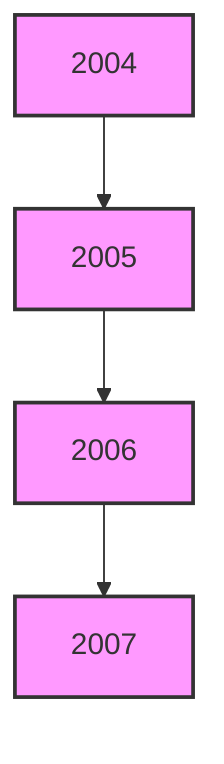
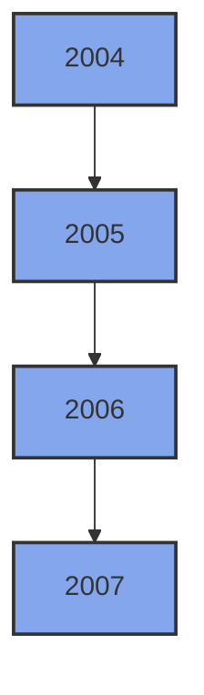
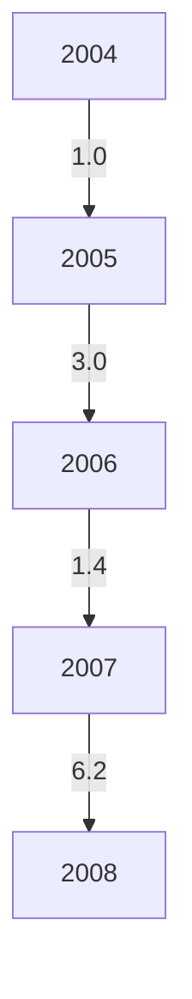
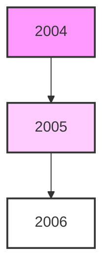

[An image of a document cover page with the following content:]

[At the top, there is a golden emblem of an eagle with spread wings]

مصرف ليبيا المركزي

[Below the Arabic text, there is an image of a grand building with domed structures and arched windows]

التقرير السنوي الواحد والخمسون

السنة المالية

1375 وفاة الرسول / 2007 مسيحي

[Translation of the Arabic text:

Central Bank of Libya

The Fifty-First Annual Report

Financial Year

1375 AH / 2007 AD]
---
[An image of a document cover page with the following content in Arabic:]

مصرف ليبيا المركزي

التقرير السنوي
الواحد والخمسون

السنة المالية
1375 وفاة الرسول / 2007 مسيحي

[The content is presented within a light orange border. At the top of the page, there's a small, faded image that appears to be an emblem or logo.]
---
التقرير السنوي لعام 2007

[An image of Arabic calligraphy is present in the center of the document. The calligraphy appears to be a stylized rendering of religious text, likely "Bismillah ar-Rahman ar-Rahim" (In the name of Allah, the Most Gracious, the Most Merciful), which is a common opening phrase in Islamic texts and documents.]
---
التقرير السنوي لعام 2007

السلطة والثروة والسلاح
بيد الشعب
---
التقرير السنوي لعام 2007

# مجلــــس الإدارة

| المنصب | الاسم |
|--------|------|
| رئيساً | المحافظ | الأخ / أ. فرحات عمر بن قدارة |
| نائباً للرئيس | نائب المحافظ | الأخ / أ. محمد عبد السلام الشكري |

أعضاء:
- الأخ / عاشور خليفة تربل
- الأخ / د. بالقاسم عمر الطبولي
- الأخ / د. إدريس عبد السلام الشتيوي
- الأخ / د. بشير علي الفيتوري
- الأخ / د. عمر إبراهيم حسين
---
التقرير السنوي لعام 2007

# مدراء الإدارات

| الإدارة | المدير |
|---------|--------|
| مدير إدارة الاحتياطيات | عبدالله عبدالله الطريان |
| مدير إدارة الإصدار | محمد البهلول أرحومة |
| مدير إدارة البحوث والإحصاء | علي رمضان شنيب |
| مدير إدارة الحسابات | عبد الناصر خليفة قنيدي |
| مدير إدارة الرقابة على المصارف والنقد | د. محمد عبد الجليل أبوسنينة |
| مدير إدارة الشؤون الإدارية والموظفين | أعمار مصباح قاسم |
| مدير إدارة العمليات المصرفية | محمد شعبان صمود |
| مدير إدارة المراجعة | د. خالد علي كاجيجي |
| رئيس المكتب القانوني | د. مصطفى مصباح دبارة |
| مدير مركز الحاسب الآلي | الهادي عمار الصريدي |
| مدير معهد الدراسات المصرفية والمالية | د. عمر المبروك ابو شعالة |

# مدراء الفروع

| الفرع | المدير |
|-------|--------|
| مدير فرع بنغازي | الكيلاني منصور الزوي |
| مدير فرع سبها | عبد السلام وادي معروف |
| مدير فرع سرت | جمعة يونس ناجي |
---
التقرير السنوي لعام 2007

# مصرف ليبيا المركزي

## الإدارة العامة / طرابلس

+ (218) 21 - 3333591 / 9 : هاتف
+ (218) 21 - 4441488 : (فاكس) مصور بريد
CBLJLYLXXXX : السويفت
www.cbl.gov.ly : الموقع الإلكتروني

## الفروع

### : فرع سبها
+ (218) 71- 627771 /3 : هاتف
+ (218) 71 - 621800  : (فاكس) مصور بريد

### : فرع بنغازي
+ (218) 61 - 9091161 /8 : هاتف
+ (218) 61 - 9091169  : (فاكس) مصور بريد

### : فرع سرت
+ (218) 54 - 63750 / 4 : هاتف
+ (218) 54 - 3605695 : (فاكس) مصور بريد

----

## إدارة البحوث والإحصاء

+ (218) 21- 4773901 : هاتف
+ (218) 21 - 4773903 : (فاكس) مصور بريد
ecorestat@ cbl.gov.l y : بريد إلكتروني
---
# التقرير السنوي لعام 2007

## المحتويات

14 ................................................................................................. تقديم

### الجزء الأول
### التطورات الاقتصادية العربية والدولية

18 ..................................................................... التطورات الاقتصادية الدولية : أولاً
18 ....................................................................................... نظرة عامة •
18 .................................................................................... النمو الاقتصادي •
19 .............................................................................................. البطالة •
20 .............................................................................................. التضخم•
20 .................................................................................. المديونية الخارجية •
21 ..................................................................................... التجارة العالمية •
22 ..................................................................................... أسعار الصرف •
23 ......................................................................... أسعار بعض السلع والمعادن •
25 .............................................................................. الأسواق النفطية الدولية •
25 .................................................................................. العرض -
26 ................................................................................... الطلب -
27 .................................................................................. الأسعار -
28 ..................................................................... التطورات الاقتصادية العربية : ثانياً

### الجزء الثاني
### التطورات الاقتصادية المحلية
### القطاع الحقيقي : أولاً

32 ..................................................................... الناتج المحلي الإجمالي الحقيقي •
35 ..................................................................... الناتج المحلي الإجمالي الاسمي •
38 ............................................................................... المستوى العام للأسعار •
40 .................................................................................... التطورات النقدية •
---
التقرير السنوي لعام 2007

40 ......................................................................... إنتاج النفط الخام -
41 ................................................................... .. صادرات النفط الخام -
41 ........................................................................ أسعار النفط الخام -
42 ........................................................... إنتاج وصادرات الغاز الطبيعي -
43 ...................................................... الإنتاج المحلي من المشتقات النفطية -
43 ........................................................ الإنتاج المحلي من البتروكيماويات -
44 ............................................... صادرات المنتجات النفطية والبتروكيماوية -
45 ................................................... الاستهلاك المحلي من المشتقات النفطية -

## ثانياً : المالية العامة

46 ......................................................................................الميزانية العامة•
46 ........................................................................... النفقات العامة -
47 ......................................................................... الإيرادات العامة -

## ثالثاً : القطاع الخارجي

50 ................................................................................ التجارة الخارجية •
50 .............................................................................. الصادرات -
51 ................................................................................ الواردات -
54 ................................................................................ ميزان المدفوعات •
54 ........................................................................ الحساب الجاري -
54 ............................................................ الحساب الرأسمالي والمالي -

## رابعاً : القطاع المصرفي والنقدي

56 ................................................................................ التطورات المصرفية •
56 ......................................................... قرارات مجلس الإدارة لعام 2007 -
57 ......................................................................... الرقابة المصرفية -
57 .......................................................... معهد الدراسات المصرفية والمالية -
59 ............................................................................ نظام المدفوعات -
---
# التقرير السنوي لعام 2007

## التطورات النقدية •
60. القاعدة النقدية والعوامل المؤثرة فيها -
63. السيولة المحلية والعوامل المؤثرة فيها -
65. مقاصة الصكوك -
66. سعر صرف الدينار الليبي -

## مصرف ليبيا المركزي •
68. جانب الأصول -
69. جانب الخصوم -

## المصارف التجارية •
72. مصادر الأموال -
73. استخدامات الأموال -
79. وضع السيولة والاحتياطي النقدي الإلزامي -

## المصارف الأهلية •

## المصرف الليبي الخارجي •

## المصارف المتخصصة •
85. مصرف التنمية -
85. المصرف الزراعي -
86. مصرف الادخار والاستثمار العقاري -

## خامساً : المؤسسات المالية غير المصرفية

87. المؤسسة الليبية للاستثمار •
88. محفظة ليبيا أفريقيا -
89. المحفظة طويلة الأجل -
90. الشركة الليبية للاستثمارات الخارجية -

91. صندوق الإنماء الاقتصادي والاجتماعي •

92. صندوق التقاعد •

93. شركات التأمين •

94. سوق الأوراق المالية الليبي •
---
# التقرير السنوي لعام 2007

## تقديم

يسر مصرف ليبيا المركزي أن يقدم تقريره السنوي الواحد والخمسون ، متضمناً أهم التطورات الاقتصادية على الصعيد الدولي والعربي والمحلي ، فعلى الصعيد الدولي انخفض معدل النمو به من 5.0% عام 2006 إلى 4.9% عام 2007 ، وذلك بسبب العديد من العوامل منها أزمة الرهن العقاري في الولايات المتحدة الأمريكية ، واستمرار تدهور قيمة الدولار الأمريكي مقابل معظم العملات الرئيسية الدولية ، بالإضافة إلى الارتفاعات القياسية في أسعار النفط وأسعار الذهب .

وقد صاحب هذا التراجع انخفاض طفيف في معدل التضخم بالنسبة للدول الصناعية ، ليبلغ 2.2% ، مقابل 2.4% عام 2006 وفي الدول الأفريقية من 6.4% عام 2006 إلى 6.3% عام 2007 ، كما سجلت معدلات البطالة بالدول الصناعية عام 2007 انخفاضا حيث بلغت 5.4% ، مقابل 5.7% عام 2006 .

أما فيما يتعلق بالمديونية الخارجية للدول النامية والأسواق الناشئة ، فقد ارتفع إجمالي الدين الخارجي بنسبة 19.2% عن مستواه عام 2006 ، ليصل في العام قيد التقرير إلى 4043.6 مليار دولار ، مقابل 3392.3 مليار دولار في عام 2006 . كما شهدت حركة التجارة العالمية في السلع والخدمات خلال عام 2007 انخفاضا ، حيث بلغ معدل التبادل التجاري العالمي 6.8% ، مقابل 9.2% عام 2006 .

وعلى الصعيد العربي ، أظهرت التقديرات الأولية ثبات معدل النمو الاقتصادي خلال عام 2007 ليبلغ نسبة 5.8% معبراً عنه بالرقم القياسي لأسعار المستهلك 8.6% ، واستمرت معدلات الإنفاق الاستثماري عند مستويات مرتفعة ، كما واصلت معظم الدول العربية خلال العام قيد التقرير ، بذل المزيد من الجهود في مجال الإصلاحات الاقتصادية ، وقد ساهم ذلك في زيادة حجم تدفقات الاستثمار الأجنبي إلى المنطقة العربية .

أما على المستوى المحلي فقد تمكن الاقتصاد الوطني من الحفاظ على أدائه الإيجابي بسبب ارتفاع أسعار النفط في الأسواق الدولية ، حيث سجل متوسط سعر خامات النفط الليبية ارتفاعاً بنسبة 12.2% ، ليصل إلى نحو 71.5 دولاراً للبرميل ، مقابل 63.7 دولاراً للبرميل عام 2006 ، وقد بلغت الكمية المصدرة من النفط الخام خلال عام 2007 نحو 536.8 مليون برميل ، مقابل 519.3 مليون برميل عام 2006 ، كما ارتفع حجم

14
---
# التقرير السنوي لعام 2007

الكمية المنتجة من الغاز الطبيعي خلال عام 2007 بنسبة 68.0% وارتفعت الصادرات منه بنسبة 10.5%، وقد بلغ معدل نمو الناتج المحلي الإجمالي الحقيقي 5.6% عام 2007 ، مقابل 5.9% عام 2006 ليصل إلى نحو 48.7 مليار دينار ، مقابل 46.1 مليار دينار في عام 2006 ، فيما شهد معدل النمو بالأسعار الجارية في العام قيد التقرير ارتفاعاً بنسبة 10.6% ليصل إلى حوالي 89.3 مليار دينار مقابل 80.7 مليار دينار عام 2006 .

وفيما يخص التطورات النقدية ، فقد شهد عرض النقود نمواً بلغت نسبته 40.8% أي ما مقداره 8.6 مليار دينار ليصل إلى نحو 29.7 مليار دينار ، مقابل حوالي 21.1 مليار دينار عام 2006 ، وقد ساهمت الزيادة في عرض النقود خلال العام قيد التقرير والناجمة عن التوسع في الإنفاق العام والائتمان المصرفي الممنوح ، خاصة من المصارف المتخصصة في ارتفاع المستوى العام للأسعار ليبلغ معدل التضخم 6.2% مقابل 1.4% في عام 2006 .

أما فيما يتعلق بالتطورات المالية ، فقد شهد عام 2007 زيادة في المبالغ المخصصة للإنفاق العام بلغت نسبتها 35.9% أي بزيادة قدرها 8525.5 مليون دينار ، ليصل الإنفاق العام خلال عام 2007 إلى 32244.6 مليون دينار، مقابل 23719.1 مليون دينار عام 2006 ، منها 13074.2 مليون دينار نفقات تسييرية ونحو 19170.4 مليون دينار نفقات استثمارية ، وقد تم تمويل هذه النفقات من الإيرادات المقدرة المخصصة للميزانية العامة والبالغة نحو 32244.6 مليون دينار ، منها 24015.7 مليون دينار إيرادات نفطية ونحو 5028.9 مليون دينار إيرادات غير نفطية ونحو 3200.0 مليون دينار مبالغ مرحلة من ميزانية عام 2006 .

وفيما يخص أداء القطاع الخارجي ، فقد حقق ميزان المدفوعات فائضاً في الميزان الكلي بلغ 23.3 مليار دينار خلال عام 2007 ، مقابل فائضاً قدره 23.2 مليون دينار عام 2006 ، وقد نتج هذا الفائض من فائض الحساب الجاري البالغ 29.1 مليار دينار في عام 2007 ، وقد ساهم الفائض في الميزان الكلي في ميزان المدفوعات في زيادة تغطية الاحتياطيات من النقد الأجنبي للواردات الشهرية لتصل إلى نحو 33.1 شهراً .

وعلى صعيد التطورات المصرفية ، واصل مصرف ليبيا المركزي خلال عام 2007 ، بذل جهوده لتفعيل دور السياسة النقدية والمصرفية وذلك من خلال الإستراتيجية التي يتبناها المصرف والتي تقوم على تحديث القطاع المصرفي والمالي ، إعادة هيكلة المصارف التجارية العامة والانفتاح التدريجي على المصارف الأجنبية ، كما أصدر مجلس إدارة مصرف ليبيا المركزي العديد من القرارات منها ، قراراً بشأن إصدار

15
---
# التقرير السنوي لعام 2007

شهادات إيداع مصرف ليبيا المركزي ، وقرارا بشأن توحيد نسبة الاحتياطي الإلزامي
على الخصوم الإيداعية للمصارف التجارية ، وكذلك قرارا بشأن بيع ما يملكه مصرف
ليبيا المركزي من أسهم في رأس مال مصرف الوحدة وقرارا بشأن دمج مصرف الأمة
مع مصرف الجمهورية .

أما فيما يتعلق بأنشطة المؤسسات المالية غير المصرفية ، فقد تضمن التقرير جزء
خاص عن نشاط بعض المؤسسات المالية غير المصرفية والتي تلعب دور مهم في
الاقتصاد الوطني وتمارس أنشطة استثمارية واسعة سواء في الداخل أو في الخارج ومن
هذه المؤسسات المالية الشركات العاملة في قطاع التأمين وصندوق التقاعد والمؤسسة
الليبية للاستثمار والمؤسسات التابعة لها وصندوق الإنماء الاقتصادي والاجتماعي ، كما
تضمن هذا التقرير أيضا المؤشرات المهمة في أداء سوق الأوراق المالية الليبي .
وتأتي إضافة هذا الجزء للتقرير في إطار إعطاء فكرة موجزة عن دور هذه المؤسسات
لتوضيح الدور الذي يلعبه القطاع المالي في الاقتصاد الوطني .

ويتنهز مصرف ليبيا المركزي هذه الفرصة ، ليعرب عن شكره وامتنانه لكافة الإدارات
والمؤسسات والأجهزة العامة ذات العلاقة ، في توفيرها وتزويدها له بالبيانات
والإحصاءات اللازمة التي مكنته من إعداد هذا التقرير .

والله ولي التوفيق

فرحات بن قدارة
المحافظ

16
---
# التقرير السنوي لعام 2007

## الجزء الأول
### التطورات الاقتصادية العربية والدولية
---
# التطورات الاقتصادية الدولية

## التقرير السنوي لعام 2007

### أولاً : التطورات الاقتصادية الدولية

#### • نظرة عامة :

ساهمت العديد من العوامل في تراجع معدل النمو الاقتصادي العالمي خلال عام 2007
ليصل إلى 4.9% عام 2007 ، مقابل 5.0% عام 2006 ، ومن العوامل التي ساهمت في
هذا التراجع ، أزمة الرهن العقاري في الولايات المتحدة الأمريكية ، حيث تفاعلت هذه
الأزمة مع الوضع الاقتصادي الأمريكي الذي يعاني من عجز الميزانية واختلال الميزان
التجاري وتفاقم المديونية ، استمرار تدهور قيمة الدولار مقابل العملات الرئيسية الدولية
الأخرى وللسنة الثالثة على التوالي ، الأمر الذي أدى ببعض صناديق الاستثمار السيادية ،
إلى تنويع محافظها الاستثمارية ، من خلال تقليص نسبة الدولار في هذه المحافظ ، وفي
المقابل زيادة نسب بعض العملات الرئيسية الأخرى وعلى رأسها اليورو والارتفاعات
القياسية في أسعار النفط حيث تجاوزت وللسنة الرابعة على التوالي ، النطاق السعري
الذي تحدده منظمة الأقطار المصدرة للنفط " أوبك " ، هذا بالإضافة إلى ما شهدته أسعار
الذهب خلال عام 2007 ، حيث بلغت مستوى قياسي تجاوز 904.6 دولاراً للأوقية .

#### • النمو الاقتصادي :

تراجع الاقتصاد العالمي ، حيث سجل معدلات نمو متدنية نسبياً خلال عام 2007 ، إذ
سجل معدل نمو قدره 4.9% في عام 2007 ، مقارنة بمعدل نمو قدره 5.0% في عام
2006 ، وبتحليل أداء المجموعات الاقتصادية خلال عام 2007 ، يلاحظ انخفاض معدل
نمو مجموعة الدول الصناعية إلى 2.7% ، مقابل 3.0% عام 2006 ، وشهد الاقتصاد
الأمريكي انخفاضاً في معدل النمو حيث بلغ 2.2% ، مقابل 2.9% في العام السابق ، أما
منطقة اليورو فقد انخفض معدل نمو اقتصادها إلى 2.6% ، مقابل 2.8% عام 2006 ،
كما شهد معدل نمو اقتصاد اليابان انخفاضاً ليبلغ 2.1% عام 2007 ، مقارنة بمعدل
2.4% عام 2006 ، وظل اقتصاد المجموعة التي تضم الدول النامية والأسواق الناشئة
على نفس المستوى تقريباً بمعدل بلغ 7.9% عام 2007 ، مقارنة بمعدل نمو بلغ 7.8%
عام 2006 ، حيث شهد النمو الاقتصادي لدول القارة الأفريقية مجتمعة معدل نمو بلغ
6.2% عام 2007 ، مقابل 5.9 عام 2006 وشهدت دول وسط وشرق أوروبا معدل نمو
عام 2007 بلغ 5.8% ، مقابل 6.6% عام 2006 .
---
التطورات الاقتصادية الدولية                                                                                                                                                                           التقرير السنوي لعام 2007

## جدول رقم (1) : معدلات النمو الحقيقي في العالم
* نسب مئوية *

| الدول مجموعة | 2006 | 2007 |
|--------------|------|------|
| العالم | 5.0 | 4.9 |
| الدول الصناعية: | 3.0 | 2.7 |
| الولايات المتحدة الأمريكية | 2.9 | 2.2 |
| دول منطقة اليورو | 2.8 | 2.6 |
| اليابان | 2.4 | 2.1 |
| دول صناعية أخرى | 3.8 | 3.9 |
| الدول النامية وأسواق ناشئة أخرى (*) : | 7.8 | 7.9 |
| أفريقيا | 5.9 | 6.2 |
| دول وسط وشرق أوروبا | 6.6 | 5.8 |
| دول الكومنولث المستقلة | 8.2 | 8.5 |
| آسيا | 9.6 | 9.7 |
| الشرق الأوسط | 5.8 | 5.8 |
| نصف الكرة الغربي (**) | 5.5 | 5.6 |

المصدر : صندوق النقد الدولي - آفاق الاقتصاد العالمي - (إبريل 2008) .
* الأسواق الناشئة تشمل : البرازيل ، بولندا ، تشيلي ، جنوب أفريقيا ، جمهورية التشيك ، كوريا الجنوبية .
** تشمل : المكسيك وأمريكا الوسطى ومنطقة الكاريبي وأمريكا الجنوبية .

## شكل (1) : معدلات النمو الحقيقي في العالم



| السنوات | العالم | الدول الصناعية | الدول النامية |
|---------|-------|----------------|---------------|
| 2004 | 5.3 | 3.2 | 7.5 |
| 2005 | 4.9 | 2.6 | 7.1 |
| 2006 | 5.0 | 3.0 | 7.8 |
| 2007 | 4.9 | 2.7 | 7.9 |

### • البطالة :
شهدت معدلات البطالة في الدول الصناعية عام 2007 انخفاضاً نسبياً ، حيث بلغت في العام قيد التقرير 5.4% مقابل 5.7% عام 2006 ، وانخفضت في دول منطقة اليورو من 8.2% إلى 7.4% ، كما انخفضت في اليابان من 4.1% إلى 3.9% ، في حين لم يشهد معدل البطالة أي تغيير عن مستواه في الولايات المتحدة والمملكة المتحدة حيث بلغ على التوالي 4.6% و5.4% .

19
---
# التطورات الاقتصادية الدولية                                                  التقرير السنوي لعام 2007

## جدول رقم (2) : معدلات البطالة في الدول الصناعية
* نسب مئوية *

| الدول مجموعة | 2006 | 2007 |
|--------------|------|------|
| الدول الصناعية | 5.7 | 5.4 |
| الولايات المتحدة الأمريكية | 4.6 | 4.6 |
| دول منطقة اليورو | 8.2 | 7.4 |
| المملكة المتحدة | 5.4 | 5.4 |
| اليابان | 4.1 | 3.9 |

المصدر : صندوق النقد الدولي ، المصدر السابق .

### التضخم •

انخفض معدل التضخم في الدول الصناعية عام 2007 ، حيث بلغ 2.2% مقابل 2.4% عام 2006 ، وفي مجموعة الدول النامية والأسواق الناشئة بلغ معدل التضخم 6.4% ، مقابل 5.4% عام 2006 ، وانخفض المعدل في الدول الأفريقية متضمنا انخفاضا طفيفا من 6.4% في العام السابق إلى 6.3% عام 2007 ، وارتفع في دول وسط وشرق أوروبا ارتفاعا طفيفا من 5.4% عام 2006 إلى 5.6% عام 2007 ، وفي دول الشرق الأوسط من 7.0% من آسيا من 4.1% عام 2006 إلى 5.3% عام 2007 ، هذا فيما بلغ معدل التضخم في العام موضوع التقرير ، 10.4% إلى العام السابق في دول الكومنولث ، 9.7% عام 2007 ، مقابل 9.5% عام 2006 .

## جدول رقم (3) : معدلات التضخم في العالم
* نسب مئوية *

| الدول مجموعة | 2006 | 2007 |
|--------------|------|------|
| الدول الصناعية | 2.4 | 2.2 |
| الولايات المتحدة الأمريكية | 3.2 | 2.9 |
| دول منطقة اليورو | 2.2 | 2.1 |
| اليابان | 0.3 | - |
| دول صناعية أخرى | 2.1 | 2.1 |
| الدول النامية وأسواق ناشئة أخرى: | 5.4 | 6.4 |
| أفريقيا | 6.4 | 6.3 |
| وسط وشرق أوروبا | 5.4 | 5.6 |
| دول الكومنولث المستقلة | 9.5 | 9.7 |
| آسيا | 4.1 | 5.3 |
| الشرق الأوسط | 7.0 | 10.4 |
| نصف الكرة الغربي | 5.3 | 5.4 |

المصدر : صندوق النقد الدولي ، المصدر السابق .

### المديونية الخارجية •

ارتفع إجمالي الدين الخارجي للدول النامية والأسواق الناشئة في عام 2007 بنسبة 19.2% عن مستواه عام 2006 ، ليصل في العام قيد التقرير إلى 4043.6 مليار دولار ، أما خدمة الدين فقد انخفضت بنسبة 6.4% مقابل 3392.3 مليار دولار في عام 2006 ، لتصل إلى 671.8 مليار دولار عام 2007 ، مقابل 717.8 مليار دولار عام 2006 . كما

20
---
# التطورات الاقتصادية الدولية                                  التقرير السنوي لعام 2007

انخفضت خدمة الدين الخارجي كنسبة إلى الصادرات من 14.9% في عام 2006 إلى
11.7% عام 2007 .

جدول رقم ( 4 ) : حجم الديون الخارجية للدول النامية والأسواق الناشئة الأخرى
* بالمليار دولار

| مجموعة الدول | 2006 | 2007 |
|--------------|------|------|
| 1- مديونية الدول النامية والأسواق الناشئة الأخرى : | 3392.3 | 4043.6 |
| إفريقيا | 236.5 | 252.0 |
| دول وسط وشرق أوروبا | 748.0 | 934.8 |
| دول الكومنولث المستقلة | 459.9 | 643.5 |
| آسيا | 894.0 | 991.9 |
| الشرق الأوسط | 308.5 | 374.1 |
| نصف الكرة الغربي | 745.4 | 838.2 |
| 2- خدمة الدين للدول النامية والأسواق الناشئة الأخرى: (*) | 14.9 | 11.7 |
| إفريقيا | 17.9 | 7.8 |
| دول وسط وشرق أوروبا | 21.0 | 20.5 |
| دول الكومنولث المستقلة | 30.1 | 22.5 |
| آسيا | 6.7 | 5.7 |
| الشرق الأوسط | 5.5 | 4.6 |
| نصف الكرة الغربي | 27.2 | 20.6 |

المصدر : صندوق النقد الدولي ، المصدر السابق .
* كنسبة من الصادرات .

شكل ( 2 ) : تطور المديونية الخارجية للدول النامية والأسواق الناشئة الأخرى

[A stacked bar chart showing the external debt of developing countries and emerging markets from 2004 to 2007. The chart shows increasing debt levels over the years, with different colors representing different regions.]

## التجارة العالمية :

شهدت حركة التجارة العالمية في السلع والخدمات انخفاضا خلال العام قيد التقرير ، حيث
انخفض معدل نمو التبادل التجاري العالمي من 9.2% عام 2006 إلى 6.8% عام
2007 ، ففي مجال الصادرات ، وصل معدل نموها في الدول الصناعية إلى 5.8% ،

21
---
# التطورات الاقتصادية الدولية                                                  التقرير السنوي لعام 2007

مقابل 8.2% عام 2006 ، وانخفض معدل نمو الواردات في مجموعة الدول الصناعية
إلى 4.2% ، مقابل 7.4% عام 2006 ، أما معدل نمو صادرات مجموعة الدول النامية
والأسواق الناشئة فقد انخفض إلى 8.9% عام 2007 ، مقابل 10.9% عام 2006
وانخفض معدل نمو وارداتها من 14.4% عام 2006 إلى 12.8% عام 2007 .

## جدول رقم ( 5 ) : معدلات نمو التجارة العالمية
* نسب مئوية *

| 2007 | 2006 |                                    |
|-------|------|-----------------------------------|
| 6.8   | 9.2  | إجمالي التجارة العالمية           |
|       |      | : الدول الصناعية                  |
| 5.8   | 8.2  | الصادرات                          |
| 4.2   | 7.4  | الواردات                          |
|       |      | : الدول النامية وأسواق ناشئة أخرى |
| 8.9   | 10.9 | الصادرات                          |
| 12.8  | 14.4 | الواردات                          |

المصدر: صندوق النقد الدولي ، المصدر السابق .

## • أسعار الصرف :

تراجع سعر صرف الدولار الأمريكي مقابل معظم العملات الرئيسة حيث وصل سعر
صرفه مقابل اليورو عام 2007 إلى 1.372 دولاراً ، مقابل 1.256 دولاراً في عام
2006 ، كما انخفض مقابل الجنيه الإسترليني ليصل إلى 2.004 دولاراً ، مقابل 1.843
دولاراً في العام السابق ، في حين ارتفع مقابل الين الياباني ليصل في العام قيد التقرير
إلى 117.6 يناً للدولار ، مقابل 116.3 يناً للدولار في العام السابق .

## جدول رقم (6) : أسعار صرف بعض العملات الدولية لعام 2007

| الفرنك السويسري | الين الياباني | اليورو | الجنيه الإسترليني | الدولار الأمريكي |                   |
|------------------|---------------|--------|-------------------|-------------------|-------------------|
| 0.834            | 0.009         | 1.372  | 2.004             | -                 | الدولار الأمريكي |
| 0.416            | 0.004         | 0.684  | -                 | 0.499             | الجنيه الإسترليني|
| 0.608            | 0.006         | -      | 1.461             | 0.729             | اليورو           |
| 98.082           | -             | 161.317| 235.671           | 117.600           | الين الياباني    |
| -                | 0.010         | 1.645  | 2.403             | 1.199             | الفرنك السويسري  |
---
# التطورات الاقتصادية الدولية                                                  التقرير السنوي لعام 2007

## أسعار بعض السلع الغذائية والمعادن :

ارتفعت أسعار الشعير بنسبة 47.0% خلال عام 2007 لتصل إلى 172.0 دولاراً للطن المتري ، مقابل 117.0 دولاراً للطن المتري عام 2006 ، وارتفعت أسعار القمح بنسبة 32.8% عام 2007 لتصل إلى 255.0 دولاراً للطن المتري ، مقابل 192.0 دولاراً للطن المتري عام 2006 . في حين ارتفعت أسعار الأرز خلال عام 2007 بنسبة 9.2% لتصل إلى 332.0 دولاراً للطن المتري ، مقابل 304.0 دولاراً للطن المتري خلال عام 2006 . فيما شهدت أسعار زيت الصويا خلال عام 2007 ارتفاعاً بنسبة 45.2% لتصل إلى 800.0 دولاراً للطن المتري في العام قيد التقرير ، مقابل 551.0 دولاراً للطن المتري عام 2006 ، وقد شهدت أسعار زيت الزيتون عام 2007 انخفاضاً بنسبة 16.9% لتصل إلى 4561.0 دولاراً للطن المتري عام 2007 ، مقابل 5488.0 دولاراً للطن المتري عام 2006 ، كما شهدت أسعار زيت عباد الشمس انخفاضاً بنسبة 5.6% عام 2007 لتصل إلى 673.0 دولاراً للطن المتري ، مقابل 713.0 دولاراً للطن المتري في عام 2006 .

ويعزى ارتفاع أسعار المواد الغذائية نتيجة لتضافر عدة أسباب منها :

- انخفاض المخزون الاستراتيجي من المواد الغذائية في العديد من دول العالم وذلك بسبب الأسعار المتدنية للمواد الغذائية خلال السنوات السابقة .
- انتاج الوقود الحيوي كمصدر للطاقة كبديل للنفط وذلك على حساب الإنتاج الغذائي .
- النمو الاقتصادي الكبير الذي شهدته الصين والهند مما أدى ذلك إلى زيادة الطلب على المواد الغذائية .
- الظروف المناخية التي شهدتها العديد من الدول المنتجة للمواد الغذائية كالفيضانات والجفاف .
- تحول بعض التجار للمضاربة من أسواق المال إلى أسواق السلع بهدف تحقيق أرباح أعلى .
- انخفاض الاستثمارات في مجال الانتاج الزراعي خلال السنوات السابقة بسبب تدني أسعار هذا الإنتاج .

أما فيما يتعلق بأسعار بعض المعادن الأساسية فقد شهدت أسعار النحاس ارتفاعاً بنسبة 6.0% خلال عام 2007 لتصل إلى 7132.0 دولاراً للطن ، مقابل 6731.0 دولاراً للطن عام 2006 ، كما شهدت أسعار الألمنيوم ارتفاعاً خلال عام 2007 لتصل إلى 2640.0 دولاراً للطن ، مقابل 2573.0 دولاراً للطن عام 2006 أي بنسبة ارتفاع بلغت 2.6% ، كما سجلت أسعار الذهب ارتفاعاً خلال عام 2007 ، حيث بلغ المتوسط العام لأسعار الذهب نحو 695.4 دولاراً للأوقية ، مقابل 603.8 دولاراً للأوقية عام 2006 .

23
---
التطورات الاقتصادية الدولية | التقرير السنوي لعام 2007

جدول رقم ( 7 ) : الأسعار العالمية لبعض السلع الغذائية والمعادن
* دولار/ الطن المتري *

| معدل التغير (%) | 2007 | 2006 | البيان |
|-----------------|------|------|-------|
| | | | أولاً : السلع الغذائية : |
| 47.0 | 172.0 | 117.0 | الشعير |
| 32.8 | 255.0 | 192.0 | القمح |
| 9.2 | 332.0 | 304.0 | الأرز |
| -16.9 | 4561.0 | 5488.0 | زيت الزيتون |
| 45.2 | 800.0 | 551.0 | زيت الصويا |
| -5.6 | 673.0 | 713.0 | زيت عباد الشمس |
| 4.5- | 21.0 | 22.0 | السكر (سنت أمريكي/ الرطل) |
| 12.4- | 212.0 | 242.0 | القطن (سنت أمريكي/ ليبرة) |
| | | | ثانياً : المعادن : |
| 15.2 | 695.4 | 603.8 | الذهب ( دولاراً أمريكياً/ للأوقية) |
| 2.6 | 2640.0 | 2573.0 | الألومنيوم |
| 6.0 | 7132.0 | 6731.0 | النحاس |

المصدر : صندوق النقد الدولي ، الإحصاءات الدولية الشهرية .

24
---
التطورات الاقتصادية الدولية                                                                                  التقرير السنوي لعام 2007

• الأسواق النفطية الدولية :

تجاوزت أسعار النفط خلال عام 2007 وللسنة الرابعة على التوالي النطاق السعري
المحدد من قبل منظمة الأقطار المصدرة للنفط " الأوبك " وهو نطاق (22 - 28 دولاراً
للبرميل ) وذلك على الرغم من ارتفاع الإمدادات النفطية بحوالي 1.2 مليون برميل في
اليوم لتصل إلى نحو 86.0 مليون برميل في اليوم ، الأمر الذي يعزز الاعتقاد بممارسة
عوامل أخرى غير عوامل قوى السوق أثرها على السوق النفطية الدولية .

- العرض :

سجل العرض العالمي من النفط الخام والغاز المسال ، ارتفاعا طفيفا خلال عام 2007
بنسبة 0.2% ، أي بمقدار 100.0 ألف برميل في اليوم ، ليبلغ في المتوسط 85.6 مليون
برميل في اليوم ، مقابل 85.4 مليون برميل في اليوم في العام 2006 . وقد ارتفع إنتاج
منظمة الأقطار المصدرة للنفط " الأوبك " من حوالي 34.3 مليون برميل في اليوم عام
2006 إلى نحو 35.5 مليون برميل في اليوم خلال العام قيد التقرير ، أما إنتاج الدول
خارج المنظمة فقد شهد انخفاضا طفيفا نسبته 3.5% من 28.8 مليون برميل في اليوم عام
2006 إلى 27.8 مليون برميل في اليوم عام 2007 . كما شهد إنتاج منظمة التعاون
الاقتصادي والتنمية انخفاضا طفيفا بلغت نسبته 1.0% أي بمقدار 200.0 ألف برميل في
اليوم من 20.0 مليون برميل في اليوم عام 2006 إلى حوالي 19.8 مليون برميل في
اليوم في العام قيد التقرير .

جدول رقم ( 8 ) : العرض العالمي للنفط الخام والغاز المسال
* مليون برميل في اليوم *

| المنطقة | 2006 | 2007 |
|---|---|---|
| | الربع الأول | الربع الثاني | الربع الثالث | الربع الرابع | متوسط العام | معدل النمو |
| 1- منظمة التعاون الاقتصادي والتنمية: | 20.0 | 20.2 | 19.9 | 19.5 | 19.7 | 19.8 | -1.0 |
| أمريكا الشمالية | 14.2 | 14.4 | 14.4 | 14.2 | 14.1 | 14.3 | 0.7 |
| أوروبا | 5.2 | 5.2 | 4.9 | 4.7 | 5.0 | 4.9 | -5.8 |
| دول المحيط الهادي | 0.6 | 0.6 | 0.6 | 0.6 | 0.7 | 0.6 | 0.0 |
| 2- دول خارج المنظمة منها : | 28.8 | 28.0 | 27.9 | 27.7 | 27.7 | 27.8 | -3.5 |
| الاتحاد السوفيتي السابق | 12.2 | 12.7 | 12.7 | 12.7 | 12.8 | 12.8 | 4.9 |
| أوروبا | 0.1 | 0.1 | 0.1 | 0.1 | 0.1 | 0.1 | 0.0 |
| الصين | 3.7 | 3.7 | 3.8 | 3.7 | 3.8 | 3.7 | 0.0 |
| دول آسيوية أخرى | 2.7 | 2.7 | 2.7 | 2.6 | 2.7 | 2.7 | 0.0 |
| أمريكا اللاتينية | 4.4 | 4.4 | 4.4 | 4.4 | 4.2 | 4.3 | -2.3 |
| الشرق الأوسط | 1.7 | 1.7 | 1.6 | 1.6 | 1.6 | 1.6 | -5.9 |
| أفريقيا | 3.9 | 2.6 | 2.5 | 2.5 | 2.6 | 2.5 | -35.9 |
| 3- منظمة الأوبك | 34.3 | 35.0 | 34.9 | 35.4 | 36.4 | 35.5 | 2.5 |
| 4- عائدات التكرير | 2.0 | 2.0 | 2.1 | 2.1 | 2.1 | 2.1 | 5.0 |
| مجموع العرض العالمي | 85.4 | 85.6 | 85.2 | 85.2 | 86.4 | 85.6 | 0.2 |

المصدر : الوكالة الدولية للطاقة - تقرير سوق النفط - العدد (يناير) 2008 .

25
---
# التطورات الاقتصادية الدولية                                                  التقرير السنوي لعام 2007

## الطلب:

ارتفع الطلب العالمي على النفط الخام والغاز المسال بنسبة 1.4% ليبلغ متوسط العام
نحو 86.0 مليون برميل في اليوم ، مقابل 84.8 مليون برميل في اليوم عام 2007
2006 . وقد ارتفع طلب الصين بنسبة 4.2% خلال عام 2007 ليصل إلى 7.5 مليون
برميل في اليوم ، مقابل 7.2 مليون برميل في اليوم عام 2006 ، وارتفع طلب كل من
دول الشرق الأوسط وأمريكا اللاتينية بنسبة 4.8% و5.7% على التوالي ، أما طلب
أفريقيا فقد ارتفع بنسبة 6.9% ليصل إلى 3.1 مليون برميل في اليوم عام 2007 ، مقابل
2.9 مليون برميل في اليوم في العام السابق ، فيما شهد طلب دول منظمة التعاون
الاقتصادي والتنمية انخفاضا طفيفا بلغت نسبته 2.0% ليصل إلى 49.2 مليون برميل في
اليوم عام 2007 ، مقابل 49.3 مليون برميل في اليوم عام 2006 .

### جدول رقم (9) : الطلب العالمي على النفط الخام والغاز المسال
(مليون برميل في اليوم)

| المنطقة | 2006 | 2007 |  |  |  |  |
|---|---|---|---|---|---|---|
|  |  | الربع الأول | الربع الثاني | الربع الثالث | الربع الرابع | متوسط العام | معدل النمو |
| 1. منظمة التعاون الاقتصادي والتنمية : | 49.3 | 41.7 | 48.2 | 48.7 | 50.1 | 49.2 | -0.2 |
| أمريكا الشمالية | 25.3 | 25.7 | 25.4 | 25.5 | 25.6 | 25.6 | 1.2 |
| أوروبا | 15.6 | 15.2 | 15.0 | 15.4 | 15.7 | 15.3 | -1.9 |
| دول المحيط الهادي | 8.4 | 8.8 | 7.8 | 7.8 | 8.7 | 8.3 | -1.2 |
| 2- دول خارج المنظمة منها : | 35.5 | 36.3 | 36.8 | 36.9 | 37.1 | 36.8 | 3.7 |
| الاتحاد السوفيتي السابق | 4.1 | 4.0 | 3.7 | 4.0 | 4.0 | 3.9 | -4.9 |
| أوروبا | 0.7 | 0.8 | 0.8 | 0.7 | 0.8 | 0.8 | 14.3 |
| الصين | 7.2 | 7.3 | 7.4 | 7.5 | 7.5 | 7.5 | 4.2 |
| أمريكا اللاتينية | 8.8 | 9.2 | 9.4 | 9.2 | 9.5 | 9.3 | 5.7 |
| دول آسيوية أخرى | 5.3 | 5.3 | 5.5 | 5.7 | 5.6 | 5.5 | 3.8 |
| الشرق الأوسط | 6.3 | 6.5 | 6.6 | 6.9 | 6.6 | 6.6 | 4.8 |
| أفريقيا | 2.9 | 3.1 | 3.1 | 3.0 | 3.1 | 3.1 | 6.9 |
| مجموع الطلب العالمي | 84.8 | 86.0 | 85.0 | 85.6 | 87.2 | 86.0 | 1.4 |

المصدر : المصدر السابق .

### شكل (3) : العرض والطلب العالمي على النفط الخام والغاز المسال



26
---
التطورات الاقتصادية الدولية | التقرير السنوي لعام 2007

: الأسعار -

شهد عام 2007 زيادة ملحوظة في أسعار النفط الخام ، حيث ارتفعت أسعار سلة أوبك
خلال عام 2007 بنحو 8.1 دولاراً للبرميل ، لتصل إلى 69.1 دولاراً للبرميل ، وبذلك
تتجاوز للسنة الرابعة على التوالي السقف السعري المحدد من قبل منظمة الأوبك وهو
(22- 28 دولاراً للبرميل ) ومن المساهمة في ارتفاع أسعار النفط غير عوامل
قوى السوق الوضع الأمني المضطرب في العالم وخاصة منطقة الشرق الأوسط ، حيث
. مصادر النفط الرئيسية

جدول رقم (10) : متوسط أسعار النفط الخام

| السنة | سلة أوبك* |
|-------|-----------|
| 2006 | 61.0 |
| 2007: | |
| الربع الأول | 54.7 |
| الربع الثاني | 65.0 |
| الربع الثالث | 71.6 |
| الربع الرابع | 85.2 |
| متوسط العام | 69.1 |

* دولار/برميل

المصدر : منظمة الأقطار العربية المصدرة للنفط ( أوابك ) النشرة الشهرية - السنة 34 - العدد
2 - (فبراير) 2008 .

27
---
# التطورات الاقتصادية الدولية | التقرير السنوي لعام 2007

## ثانياً : التطورات الاقتصادية العربية

بينت التقديرات الأولية وفق بعض المصادر الدولية ، ثبات معدل النمو الاقتصادي للدول العربية خلال عام 2007 ، ليبلغ في المتوسط نسبة 5.8% ، مع الإشارة إلى أن بعض الدول العربية قد سجلت معدلات نمو أعلى من ذلك ، حيث تراوحت نسبة النمو ما بين نسبة 6.0% و14.0% ، أما فيما يتعلق بمستوى الأسعار معبراً عنها بالرقم القياسي لأسعار المستهلك ( متوسط الفترة ) ، فقد بلغ معدل التضخم 8.6% عام 2007 ، مقابل 6.8% عام 2006 ، وقد ساهمت العديد من العوامل في ارتفاع معدل التضخم منها ، وتراجع قيمة الدولار الأمريكي ، وقد استمرت خلال العام قيد التقرير معدلات الإنفاق الاستثماري عند مستويات مرتفعة في العديد من الدول العربية ، وخاصة في الدول المصدرة للنفط وارتفاع الطلب المحلي وخاصة في مشاريع تحسين البنى التحتية وتطوير القطاع الخاص ورأس المال البشري ، كما تحول عجز الموازنة العامة في بعض الدول العربية إلى فائض ، مع تحسن أوضاع الحساب الجاري في ميزان المدفوعات ، وقد استخدمت هـــذه الفوائض بشكل رئيسي ، في تعزيز مستويات الاحتياطيات الدولية من العملات الأجنبية .

وقد واصلت معظم الدول العربية في عام 2007 ، تحقيق المزيد من التقدم في مجال الإصلاحات الاقتصادية ، وعلى وجه الخصوص في القطاع المصرفي ، حيث تم تحقيق نتائج إيجابية في هذا المجال ، تمثلت في إعادة هيكلة وخصخصة مصارف القطاع العام ، وفتح قطاع المصارف أمام المنافسة الأجنبية بصورة تدريجية وتحسين الرقابة المصرفية وفي قطاع المالية ، تم تعزيز نتائج الإصلاح المالي ، وتحسين القواعد الاحترازية ، وتخفيض حجم المديونيات العامة وإعادة هيكلتها ، أما في القطاع التجاري ، فقد قامت معظم الدول العربية ، باتخاذ المزيد من الإجراءات ، التي تهدف إلى تحرير التجارة وتوقيع العديد من الاتفاقيات الثنائية ومتعددة الأطراف ، وقد ساهمت تلك الإصلاحات ، في تحقيق انخفاض في معدلات البطالة وارتفاع في معدلات الاستثمار الأجنبي في المنطقة العربية وحصول بعض الدول العربية على شروط أفضل في الاقتراض من الأسواق المالية الدولية . وعلى صعيد الاستثمار الأجنبي المباشر ، فمن المتوقع أن تصل التدفقات الواردة إلى الدول العربية إلى نحو 75.0 مليار دولار أمريكي في عام 2007 ، مقابل 62.4 مليار دولار عام 2006 ، ومن العوامل التي ساهمت في زيادة تدفقات الاستثمار الأجنبي المباشر خلال العام قيد التقرير، التزام العديد من الدول العربية باستكمال برنامج الخصخصة ، تحسين الجهود الإصلاحية من خلال تسهيل الإجراءات الإدارية ، زيادة عدد المناطق الحرة وتوفير المعلومات الضرورية ، وخاصة الإلكترونية ، وتخفيض معدلات الضرائب وإلغائها وكذلك الرسوم الجمركية بالإضافة إلى ارتفاع أسعار النفط والمعادن والمواد الخام ، الأمر الذي أدى إلى جذب المزيد من الاستثمارات إلى الصناعات والخدمات ذات الصلة بقطاع النفط والغاز . وتجدر الإشارة في هذا الشأن إلى دور بعض الهيئات المالية العربية ، في تعزيز احتياجات الإصلاح الاقتصادي ودعم أولويات هذا الإصلاح ، حيث استحدث صندوق النقد العربي تسهيلين

28
---
| التطورات الاقتصادية الدولية | التقرير السنوي لعام 2007 |
|-----------------------------------|-------------------------|

، ءاضعألا لودلل معدلا ريفوت ىلإ فدهي يذلا يراجتلا حيحصتلا ليهست امه نيديدج
هذه اهحيتت يتلا صرفلا نم ةدافتسالاو ةيلودلا قاوسألل لوصولا ىلع اهتردق عفرل
فدهي يذلا طفنلا ليهستو ، اهيف حنملا رصنع ةدايزو ومنلا زيزعتل قاوسألا
ىلع يعيبطلا زاغلاو ةيطفنلا تاجتنملل ةيفاصلا ةدروتسملا ءاضعألا لودلا ةدعاسمل
راعسألا عافترا نم ، تاعوفدملا نازيم عضو ىلع ةبترتملا ةيفاضإلا ءابعألا ةهجاوم
ةهجاوم ىلع اهتردق ةيوقتل ةبسانم تاحالصإ ذيفنت ىلع لودلا هذه عيجشتو ، ةيلودلا
مدق ،يفرصملاو يلاملا عاطقلل يلكيهلا حيحصتلا ليهست راطإ يفو ،ةيجراخلا تامدصلا
اهرادقم ةيلامجإ ةميقب نيديدج نيضرق ، ريرقتلا ديق ماعلا لالخ يبرعلا دقنلا قودنص
نوكي كلذبو ،يكيرمأ رالود نويلم 98 لداعي ام يأ ¹يباسح يبرع رانيد نويلم 20.7
ذنم عفترا دقو ،ءاضعألا لودلل يبرعلا دقنلا قودنص اهمدق يتلا ضورقلل يلامجإلا ددعلا
نويلم 1083.5 غلبت ةيلامجإ ةميقب ًاضرق 137 ىلإ 1978 ماع يف ضارقإلا طاشن ةيادب
. ًابيرقت يكيرمأ رالود تارايلم 5.0 يلاوح لداعي ام يأ ، يباسح يبرع رانيد

نم 2007 ماع لالخ يملاعلا يرامثتسالا خانملا هب مستا ام مغرو رامثتسالا لاجم يف امأ
ةرادجلا تاذ ةيراقعلا ضورقلا ةمزأ اهنيب نم ،ةيملاعلا ةيلاملا قاوسألا اهتدهش تاروطت
دئاوع ،ةيرامثتسالا قودنصلا ةظفحم تققح دقف ،ةلويسلا ةلكشمو ةضفخنملا ةينامتئالا
ةنوعملا لاجم يفو ،ةصاخلا بحسلا قوقح ةدحو تانوكم ىلع ةدئافلا تالدعم قوفت
لودلا ضعبل ةينفلا ةنوعملا ريفوتب ،2007 ماع لالخ يبرعلا دقنلا قودنص ماق ةينفلا
ةفاضإلاب ،ةينفلا ةناعإلا عيراشم ضعبل يراشتسالا رودب ماق امك ،ءاضعألا ةيبرعلا
ةدوسم ىلع ،يلودلا فرصملاك ةيلود تائيه عم يبرعلا دقنلا قودنص قافتا ىلإ
ينامتئالا مالعتسالا ةمظنأ ريوطت ىلإ فدهت ةيبرعلا لودلل ةينف ةنوعمل ،عورشم
ةدايزو ،II لزاب ريياعم قيبطت نيسحت يف ةردابملا هذه مهاستسو ،رطاخملا تايزكرمو
لالخ قودنصلا طاشن رمتسا امك ،ةطسوتملاو ةريغصلا تاسسؤملل ليومتلا صرف
ةيمويلا تانايبلا رشن متي ثيح ،ةيبرعلا ةيلاملا قاروألا قاوسأ لاجم يف 2007 ماع
رمتسا امك ،ةيلودلا تامولعملا ةكبشب هعقوم ىلع ةيبرعلا ةيلاملا قاوسألا ءادأب ةقلعتملا
يداصتقالا تاسايسلا دهعم طاشن فيثكتو عيسوت مت ثيح ،بيردتلا لاجم يف هطاشن
. قودنصلل عباتلا

ةدايز ةسسؤملا تلصاو دقف ،رامثتسالا نامضل ةيبرعلا ةسسؤملا رودب قلعتي اميف امأ
ماع لالخ نامضلا تايلمع تعفترا دقو ،ةديدج تاجتنم ميدقتو اهتايلمع طاشن مجح
يلاوح لباقم ،رالود نييالم 505.0 وحن تايلمعلا مجح غلبيل ،% 19.6 ةبسنب 2007
نوعبرأو ةينامث مارب تايلمعلا هذه تلمش دقو ،قباسلا ماعلا يف رالود نويلم 422.0

___________________________
. ةصاخ بحس قوقح تادحو ثالث لداعي (ع.ن.د) يباسحلا يبرعلا رانيدلا .1

29
---
# التطورات الاقتصادية الدولية | التقرير السنوي لعام 2007

عقداً بقيمة بلغت حوالي 438.1 مليون دولار أمريكي ، منها عقدان لضمان الاستثمار
بقيمة 151.0 مليون دولار وستة وأربعون عقداً لتأمين ائتمان الصادرات بقيمة إجمالية
بلغت 423.0 مليون دولار ، أما إعادة التأمين فقد بلغت قيمة العمليات المسندة للمؤسسة
حوالي 38.6 مليون دولار ، وبلغت القيمة الإجمالية للعمليات المبرمة في إطار الحسابات
الخاصة حوالي 8.5 مليون دولار ، وتجدر الإشارة إلى أنه قد استفاد من ضمان المؤسسة
خلال العام قيد التقرير ، مستثمرون ومصدرون من إحدى عشرة دولة عربية .

وفيما يتعلق بدور الصندوق العربي للإنماء الاقتصادي والاجتماعي ، فقد واصل نشاطه
خلال عام 2007 في تمويل مشروعات الإنماء الاقتصادي والاجتماعي ، وركز برنامجه
الإقراضي ، على دعم مشروعات البنية التحتية وتطوير المشاريع القائمة منها ، وتوفير
الخدمات الاجتماعية ، كما استمر في تخصيص المعونات التي تهدف إلى توفير الدعم
المؤسسي والتدريب وتطوير المهارات . وقد بلغ عدد القروض التي قدمها الصندوق
خلال العام قيد التقرير 16 قرضاً بقيمة إجمالية مقدارها 1389.6 مليون دولار ، ساهمت
في تمويل 12 مشروعاً جديداً و 4 مشاريع سبق تمويلها ، واستفادت منها 8 دول عربية ،
وبلغت نسبة الإقراض لمشاريع النقل والاتصالات نحو 35.9% من إجمالي الالتزامات
الإقراضية للصندوق ونسبة 23.1% لمشاريع الكهرباء ونسبة 13.6% ونسبة 4.0%
لمشاريع المياه والصرف الصحي ومشاريع القطاعات الإنتاجية على التوالي .

وفي مجال المعونات ، قدم الصندوق خلال عام 2007 نحو 35 معونة بلغت قيمتها
الإجمالية 40.7 مليون دولار ، كما واصل الصندوق تعاونه مع المؤسسات العربية
والإقليمية والدولية المتخصصة .

----

1. المصدر : الصندوق العربي للإنماء الاقتصادي والاجتماعي ، التقرير السنوي 2007 .

30
---
التقرير السنوي لعام 2007

## الجزء الثاني
### التطورات الاقتصادية المحلية
---
# التطورات الاقتصادية المحلية                                                  التقرير السنوي لعام 2007

## أولاً : القطاع الحقيقي

### • الناتج المحلي الإجمالي الحقيقي :

أظهرت البيانات المتوفرة من اللجنة الشعبية العامة للتخطيط ، أن الأنشطة الاقتصادية
الإنتاجية والخدمية المكونة للاقتصاد الوطني خلال عام 2007 قد سجلت تحسناً
متواضعاً ، وذلك من خلال معدلات النمو المتحققة التي وصلت نسبتها إلى 5.6% .
مقارنة بنسبة 5.9% و 9.9% خلال عامي 2006 و 2005 ، حيث بلغت قيمة الناتج
المحلي الإجمالي بالأسعار الثابتة ( بأسعار 2003 ) نحو 48.7 مليار دينار ، مقابل 46.1
مليار دينار خلال عام 2006 .

وتعود هذه الزيادة المتحققة في إجمالي الناتج المحلي الحقيقي خلال العام موضوع التقرير
إلى نمو القطاعات الاقتصادية الأخرى غير النفطية ، بنسبة 10.3% ، فيما حقق
القطاع الاستخراجي والأنشطة المتعلقة به نمواً بنسبة 1.7% فقط .

وقد تركز النمو الحاصل في القطاعات الاقتصادية الأخرى غير النفطية في قطاع
الإنشاءات الذي نما بنسبة 25.0% وذلك بسبب النهضة العمرانية الجارية مؤخراً في
البلاد والقروض السكنية الممنوحة من قبل مصرف الادخار والاستثمار العقاري ، كما
تركز أيضاً في كل من قطاع إمدادات الكهرباء والغاز والمياه ، وقطاع الوساطة المالية
وقطاع النقل والتخزين والاتصالات ، التي نمت بنسبة 13.9% ، 12.7% و12.3% على
التوالي . كما ارتفع قطاع تجارة الجملة والتجزئة وإصلاح المركبات والسلع الشخصية
والأسرية بنسبة 11.4% وقطاع الأنشطة العقارية والإيجارية والأنشطة التجارية بنسبة
8.3% وقطاع الصناعات التحويلية بنسبة 7.6% وقطاعي التعليم والصحة والعمل
الاجتماعي بنسبة 7.2% لكل منهما .

وفيما يتعلق بمدى مساهمة الأنشطة الاقتصادية المكونة للاقتصاد الوطني في إجمالي
الناتج المحلي الحقيقي ، فقد استحوذت أنشطة استخراج النفط والغاز الطبيعي والأنشطة
المتعلقة بهما على النصيب الأوفر إذ شكلت نسبة 53.0% ، في حين شكل إجمالي باقي
القطاعات الاقتصادية الأخرى غير النفطية نسبة 47.0% من إجمالي الإنتاج الحقيقي ،
حيث يلاحظ أن الأنشطة العقارية والإيجارية والأنشطة التجارية شكلت نسبة 9.6% من
إجمالي الإنتاج ، أنشطة الإدارة العامة والدفاع والضمان الاجتماعي الإجباري نسبة
9.0% ، أنشطة كل من الإنشاءات والنقل والتخزين والاتصالات نسبة 6.3% و6.4%
لكل منهما . وشكل نشاط تجارة الجملة والتجزئة وإصلاح المركبات والسلع الشخصية
والأسرية ، نشاط الصناعات التحويلية ونشاط الزراعة والصيد والحراجة نسبة 5.8% ،
5.2% و3.4% على التوالي ، فيما تراوحت مساهمة باقي القطاعات في الناتج المحلي
الإجمالي الحقيقي ما بين 1.7% و0.1% .

32
---
# التطورات الاقتصادية المحلية                                                                  التقرير السنوي لعام 2007

ونظراً للزيادة المتحققة في معدلات النمو الاقتصادي في الاقتصاد الوطني خلال عام 2007 ، فقد ارتفع متوسط نصيب الفرد من الناتج المحلي الإجمالي الحقيقي من 8093 دينار ، إلى 8118 دينار خلال عام 2007

جدول رقم ( 11 ) : الناتج المحلي الإجمالي الحقيقي (بأسعار عام 2003)
* مليون دينار

| معدل النمو | *2007 | 2006 | 2005 | الأنشطة الاقتصادية |
|------------|-------|------|------|---------------------|
| 4.0 | 1676.6 | 1612.1 | 1465.0 | الزراعة والصيد والحراجة |
| 4.0 | 39.2 | 37.7 | 37.1 | صيد الأسماك |
| 1.7 | 24321.7 | 23912.5 | 22922.7 | التعدين واستغلال المحاجر |
| 7.6 | 2538.4 | 2358.4 | 2252.5 | الصناعات التحويلية |
| 13.9 | 1140.7 | 1001.7 | 924.2 | إمدادات الكهرباء والغاز والمياه |
| 25.0 | 3078.2 | 2462.5 | 2290.7 | الإنشاءات |
| 11.4 | 2823.6 | 2534.6 | 2329.8 | تجارة الجملة والتجزئة وإصلاح المركبات والسلع الشخصية والأسرية |
| 3.9 | 137.2 | 123.1 | 130.3 | الفنادق والمطاعم |
| 12.3 | 3130.1 | 2786.6 | 2475.8 | النقل والتخزين والاتصالات |
| 12.7 | 843.5 | 748.6 | 676.7 | الوساطة المالية |
| 8.3 | 4668.6 | 4310.8 | 4153.9 | الأنشطة العقارية والإيجارية وأنشطة المشاريع التجارية |
| 2.0 | 4373.8 | 4288.0 | 3978.1 | الإدارة العامة والدفاع والضمان الاجتماعي الإجباري |
| 7.2 | 87.3 | 78.7 | 73.4 | **التعليم |
| 7.2 | 132.2 | 123.4 | 115.1 | **الصحة والعمل الاجتماعي |
| 6.4 | 50.1 | 47.1 | 44.2 | أنشطة الخدمات المجتمعية والشخصية الأخرى |
| 8.0 | (328.9) | (304.6) | (308.1) | الخدمات المالية المحتسبة بصورة غير مباشرة |
| 5.6 | 48709.3 | 46132.0 | 43561.6 | الناتج المحلي الإجمالي بالأسعار الأساسية وموزع بين: |
| 1.7 | 25815.2 | 25380.8 | 24327.2 | أنشطة استخراج النفط والغاز الطبيعي والأنشطة المتعلقة بهما*** |
| 10.3 | 22894.1 | 20751.2 | 19234.4 | الأنشطة الاقتصادية الأخرى |

المصدر : الهيئة العامة للمعلومات والتوثيق .
* ملاحظة : الأرقام بين قوسين سالبة .
** بيانات أولية .
** تشمل القطاع الأهلي فقط في حين تظهر خدمات التعليم والصحة المقدمة من القطاع العام ضمن نشاط الإدارة العامة والدفاع .
*** تشمل الصناعات النفطية المكررة والبتروكيماوية والصناعات المتصلة بها في الصناعات التحويلية .

33
---
التطورات الاقتصادية المحلية                                                  التقرير السنوي لعام 2007

جدول رقم ( 12 ) : هيكل الناتج المحلي الإجمالي الحقيقي
' نسبة من الإجمالي '

| *2007 | 2006 | 2005 | الأنشطة الاقتصادية |
|--------|------|------|---------------------|
| 3.4 | 3.5 | 3.4 | الزراعة والصيد والحراجة |
| 0.1 | 0.1 | 0.1 | صيد الأسماك |
| 49.9 | 51.8 | 52.6 | التعدين واستغلال المحاجر |
| 5.2 | 5.1 | 5.2 | الصناعات التحويلية |
| 2.3 | 2.2 | 2.1 | إمدادات الكهرباء والغاز والمياه |
| 6.3 | 5.3 | 5.3 | الإنشاءات |
| 5.8 | 5.5 | 5.3 | تجارة الجملة والتجزئة وإصلاح المركبات والسلع الشخصية والأسرية |
| 0.3 | 0.3 | 0.3 | الفنادق والمطاعم |
| 6.4 | 6.0 | 5.7 | النقل والتخزين والاتصالات |
| 1.7 | 1.6 | 1.6 | الوساطة المالية |
| 9.6 | 9.3 | 9.5 | الأنشطة العقارية الإيجارية وأنشطة المشاريع التجارية |
| 9.0 | 9.3 | 9.1 | الإدارة العامة والدفاع والضمان الاجتماعي الإجباري |
| 0.2 | 0.2 | 0.2 | **التعليم |
| 0.3 | 0.3 | 0.3 | **الصحة والعمل الاجتماعي |
| 0.1 | 0.1 | 0.1 | أنشطة الخدمات المجتمعية والشخصية الأخرى |
| 0.7 | 0.7 | 0.7 | الخدمات المالية المحتسبة بصورة غير مباشرة |
| 100.0 | 100.0 | 100.0 | الناتج المحلي الإجمالي بالأسعار الأساسية ويوزع بين : |
| 53.0 | 55.0 | 55.8 | أنشطة استخراج النفط والغاز الطبيعي والأنشطة المتعلقة ***بهما |
| 47.0 | 45.0 | 44.2 | الأنشطة الاقتصادية الأخرى |

المصدر : المصدر السابق .
* بيانات أولية .
** تشمل القطاع الأهلي فقط حين تظهر خدمات التعليم والصحة المقدمة من القطاع الخاص ضمن نشاط الإدارة العامة والدفاع .
*** تشمل الخدمات النفطية المكررة والبتروكيماويات والغاز المسال ضمنياً في الصناعات التحويلية .

34
---
التطورات الاقتصادية المحلية                                                                                       التقرير السنوي لعام 2007

جدول رقم ( 13 ) : متوسط نصيب الفرد من الناتج المحلي الإجمالي الحقيقي

| متوسط نصيب الفرد * بالدينار * | عدد السكان * بالألف * | الناتج المحلي الإجمالي الحقيقي * مليون دينار * | السنوات |
|---------------------------|---------------------|-------------------------------------------|---------|
| 8219                      | 5300                | 43561.6                                    | 2005    |
| 8093                      | 5700                | 46132.0                                    | 2006    |
| 8118                      | 6000                | 48709.3                                    | 2007    |

* تقديرات .

• الناتج المحلي الإجمالي الاسمي :

سجلت بيانات الناتج المحلي الإجمالي الاسمي ( بالأسعار الجارية ) خلال عام 2007 ، نمواً بنسبة 10.6% ، ليصل إلى 89.3 مليار دينار ، مقابل 80.7 مليار دينار خلال عام 2006 . ويعود هذا النمو إلى الزيادة المتحققة في الأنشطة الاقتصادية الأخرى غير النفطية التي وصلت نسبتها 22.6% لتصل إلى 27.4 مليار دينار مقابل 22.4 مليار دينار لعام 2006 ، وقد يعود ذلك إلى جانب الزيادة الحقيقية في مجمل هذه الانشطة إلى ارتفاع معدلات التضخم الحاصلة في الاقتصاد الوطني مؤخراً التي ساهمت هي الأخرى في ارتفاع قيمة إجمالي ناتج مجمل الأنشطة الاقتصادية الأخرى غير النفطية . وقد نمت هذه الأنشطة في نشاط الإنشاءات ونشاط الإدارة العامة والدفاع والضمان الاجتماعي الإجباري التي نمت بنسبة 34.2% و31.9% على التوالي . كما حققت كل من الفنادق والمطاعم ، النقل والتخزين والاتصالات والوساطة المالية ، نمواً بنسبة 23.7% ، وكذلك أنشطة كل من تجارة الجملة والتجزئة وإصلاح المركبات والسلع الشخصية والأسرية ، التعليم ، صيد الأسماك ، الصحة والضمان الاجتماعي والزراعة والصيد والحراجة التي نمت بنسبة 18.4% ، 16.6% ، 16.4% ، على الترتيب 21.1% و20.1% . فيما حققت أنشطة استخراج النفط والغاز الطبيعي والانشطة المتعلقة بها نمواً بنسبة 6.0%

وبالنسبة إلى مساهمة مختلف الأنشطة الاقتصادية المكونة للاقتصاد الوطني في الناتج المحلي الإجمالي الاسمي خلال عام 2007 ، فقد سجلت أنشطة استخراج النفط والغاز الطبيعي والأنشطة المتعلقة بها نسبة 69.3% لتسجل باقي الأنشطة الاقتصادية الأخرى غير النفطية النسبة المتبقية والبالغة 30.7% .

وقد أدى النمو المتحقق في الناتج المحلي الإجمالي الاسمي إلى ارتفاع متوسط نصيب الفرد من 14163 دينار ، إلى 14876 دينار خلال عام 2007 .

35
---
# التطورات الاقتصادية المحلية                                                  التقرير السنوي لعام 2007

## جدول رقم ( 14 ) : الناتج المحلي الإجمالي الاسمي
*مليون دينار*

| الأنشطة الاقتصادية | 2005 | 2006 | *2007 | معدل النمو |
|---------------------|------|------|-------|-----------|
| الزراعة والصيد والحراجة | 1408.8 | 1603.3 | 1858.9 | 15.9 |
| صيد الأسماك | 38.7 | 39.8 | 46.3 | 16.4 |
| التعدين واستغلال المحاجر | 43946.7 | 55649.0 | 58963.8 | 6.0 |
| الصناعات التحويلية | 3131.7 | 3606.9 | 4032.1 | 11.8 |
| امدادات الكهرباء والغاز والمياه | 876.6 | 972.7 | 1019.1 | 4.8 |
| الانشاءات | 2683.4 | 3129.3 | 4198.4 | 34.2 |
| تجارة الجملة والتجزئة وإصلاح المركبات والسلع الشخصية والأسرية | 2520.2 | 2724.8 | 3225.0 | 18.4 |
| الفنادق والمطاعم | 137.3 | 138.5 | 171.3 | 23.7 |
| النقل والتخزين والاتصالات | 2412.6 | 2724.8 | 3299.5 | 21.1 |
| الوساطة المالية | 717.1 | 816.5 | 980.8 | 20.1 |
| الأنشطة العقارية الايجارية وأنشطة المشاريع التجارية | 4324.2 | 4643.5 | 5218.8 | 12.4 |
| الإدارة العامة والدفاع والضمان الاجتماعي الإجباري | 4481.9 | 4935.1 | 6507.3 | 31.9 |
| **التعليم | 74.6 | 84.9 | 98.9 | 16.6 |
| **الصحة والعمل الاجتماعي | 113.5 | 132.4 | 153.7 | 16.1 |
| أنشطة الخدمات المجتمعية والشخصية الأخرى | 53.3 | 61.9 | 69.4 | 12.2 |
| الخدمات المالية المحتسبة بصورة غير مباشرة | (470.0) | (533.0) | (583.3) | 9.4 |
| الناتج المحلي الإجمالي بالأسعار الأساسية | 66450.7 | 80729.9 | 89260.3 | 10.6 |
| ويوزع بين : |  |  |  |  |
| أنشطة استخراج النفط والغاز الطبيعي ***وما يتعلق بها من أنشطة | 46205.7 | 58358.1 | 61834.2 | 6.0 |
| الأنشطة الاقتصادية الأخرى | 20245.0 | 22371.8 | 27426.1 | 22.6 |

المصدر : المصدر السابق .
ملاحظة : الأرقام بين قوسين سالبة .
* بيانات أولية .
** تشمل القطاع الأهلي فقط في حين تظهر خدمات التعليم والصحة للقطاع العام ضمن نشاط الإدارة العامة والدفاع .
*** تشمل الخدمات النفطية المقدمة للشركات والمقاولين المحتسبة ضمناً في الصناعات التحويلية .

36
---
# التطورات الاقتصادية المحلية                                                  التقرير السنوي لعام 2007

## جدول رقم ( 15 ) : هيكل الناتج المحلي الإجمالي الاسمي
* نسبة من الإجمالي *

| 2005 | 2006 | *2007 | الأنشطة الاقتصادية |
|------|------|-------|-------------------|
| 2.1 | 2.0 | 2.1 | الزراعة والصيد والحراجة |
| 0.1 | 0.05 | 0.1 | صيد الأسماك |
| 66.1 | 68.9 | 66.1 | التعدين واستغلال المحاجر |
| 4.7 | 4.5 | 4.5 | الصناعات التحويلية |
| 1.3 | 1.2 | 1.1 | إمدادات الكهرباء والغاز والمياه |
| 4.0 | 3.9 | 4.7 | الإنشاءات |
| 3.8 | 3.4 | 3.6 | تجارة الجملة والتجزئة وإصلاح المركبات والسلع الشخصية والأسرية |
| 0.2 | 0.2 | 0.2 | الفنادق والمطاعم |
| 3.6 | 3.4 | 3.7 | النقل والتخزين والاتصالات |
| 1.1 | 1.0 | 1.1 | الوساطة المالية |
| 6.5 | 5.8 | 5.8 | الأنشطة العقارية الإيجارية وأنشطة المشاريع التجارية |
| 6.7 | 6.1 | 7.3 | الإدارة العامة والدفاع والضمان الاجتماعي الإجباري |
| 0.1 | 0.1 | 0.1 | **التعليم |
| 0.2 | 0.2 | 0.2 | **الصحة والعمل الاجتماعي |
| 0.1 | 0.1 | 0.1 | أنشطة الخدمات المجتمعية والشخصية الأخرى |
| 0.7 | 0.7 | 0.7 | الخدمات المنزلية الشخصية بصورة غير مباشرة |
| 100.0 | 100.0 | 100.0 | الناتج المحلي الإجمالي بالأسعار الأساسية : موزع على |
| 69.5 | 72.3 | 69.3 | أنشطة استخراج النفط والغاز الطبيعي والأنشطة المتعلقة ***بهما |
| 30.5 | 27.7 | 30.7 | الأنشطة الاقتصادية الأخرى |

المصدر : المصدر السابق .
* بيانات أولية .
** تشمل القطاع الأهلي فقط حين تظهر خدمات التعليم والصحة المقدمة من القطاع العام ضمن نشاط الإدارة العامة والدفاع .
*** تشمل الشحنات النفطية المكررة والبتروكيماوية والغاز المسال ضمنا في الصناعات التحويلية .

37
---
# التطورات الاقتصادية المحلية                                                  التقرير السنوي لعام 2007

## جدول رقم ( 16 ) : متوسط نصيب الفرد من الناتج المحلي الإجمالي الاسمي

| متوسط نصيب الفرد "بالدينار" | عدد السكان "بالألف" | الناتج المحلي الإجمالي بالأسعار الجارية "مليون دينار" | السنوات |
|---------------------------|---------------------|---------------------------------------------------|---------|
| 11075                     | 5300                | 66450.7                                            | 2005    |
| 14163                     | 5700                | 80729.9                                            | 2006    |
| 14876                     | 6000                | 89260.3                                            | 2007    |

* تقديرات .

## شكل (4) : الناتج المحلي الإجمالي الحقيقي والاسمي

```
90000                                                89260.3
80000                        80729.9
70000   66,450.7
60000
50000                                                48709.3
40000      43,561.6          46132
30000
20000
10000
    0
         2005                2006                    2007
                             السنوات
    الناتج المحلي الإجمالي الاسمي    الناتج المحلي الإجمالي الحقيقي
```

## • المستوى العام للأسعار :

شهد الرقم القياسي لأسعار المستهلك خلال عام 2007 ارتفاعاً ملحوظاً ، ليصل إلى
112.0 مقابل 105.5 خلال عام 2006 ، مسجلاً بذلك ارتفاعاً في معدلات التضخم بنسبة
6.2% ، مقابل 1.4% لنفس الفترة .

ويعود ارتفاع معدلات التضخم في الاقتصاد الوطني إلى مجموعة من العوامل لعل أهمها
ارتفاع أسعار الواردات نتيجة موجة التضخم التي يشهدها الاقتصاد العالمي مؤخراً بسبب
زيادة أسعار النفط الخام وبلوغها مستويات لم تشهدها الأسواق النفطية من قبل ،
كما أن تنامي عرض النقود بمعدلات مطردة من خلال زيادة الإنفاق العام والائتمان
المصرفي قد ساعد على ارتفاع معدلات التضخم .

وقد تركز الارتفاع الحاصل للرقم القياسي العام لأسعار المستهلك خلال العام موضوع
التقرير في أسعار المواد الغذائية والمشروبات وأسعار العناية الصحية لترتفع بنسبة
15.2% و12.2% على التوالي ، كما أظهر الرقم القياسي لأسعار السلع والخدمات
---
# التطورات الاقتصادية المحلية                                                  التقرير السنوي لعام 2007

الأخرى ارتفاعاً بنسبة 4.2% ، فيما انخفضت أسعار الملابس والأقمشة والأحذية وأسعار
أثاث المسكن وأسعار النقل والمواصلات بنسبة 1.8% و1.0% و0.5% على التوالي .

جدول رقم (17): الرقم القياسي لأسعار المستهلك

(100=2003)

| المعدل | 2007 | 2006 | الوزن | المجموعات الرئيسية |
|--------|------|------|-------|---------------------|
| 15.2 | 121.0 | 105.0 | 366 | المواد الغذائية والمشروبات والتبغ |
| 1.8- | 92.5 | 94.2 | 73 | الملابس والأقمشة والأحذية |
| 0.5 | 103.6 | 103.1 | 233 | المسكن ومستلزماته |
| 1.0- | 89.0 | 89.9 | 59 | أثاث المسكن |
| 12.2 | 133.8 | 119.2 | 40 | العناية الصحية |
| 0.5- | 129.7 | 130.3 | 112 | النقل والمواصلات |
| 0.2 | 91.1 | 90.9 | 64 | التعليم والثقافة والتسلية |
| 4.2 | 111.2 | 106.7 | 53 | سلع وخدمات متفرقة |
| | 112.0 | 105.5 | 1000 | الرقم القياسي العام |
| | %6.2 | %1.4 | - | معدل التضخم السنوي |

المصدر : الهيئة العامة للمعلومات

شكل (5) : معدل التضخم السنوي



السنوات

39
---
# التطورات الاقتصادية المحلية                                                  التقرير السنوي لعام 2007

## • التطورات النفطية :

شهد القطاع النفطي خلال عام 2007 ، نمواً متواضعاً لمختلف الأنشطة النفطية ، مقارنة بعام 2006 حيث ارتفعت الكمية المنتجة من النفط الخام بنسبة 1.7% لترتفع الكمية المصدرة تبعاً لذلك بنسبة 3.4% ، فيما ارتفعت معدلات إنتاج الغاز الطبيعي بنسبة 8.0% .

وفيما يلي تحليل لتطورات أهم الأنشطة النفطية :

### - الإنتاج المحلي من النفط الخام:

على الرغم من التحسن الذي شهدته أسعار النفط الخام في الأسواق الدولية خلال عام 2007 ، إلا أن كميات الإنتاج من النفط الخام المحلي شهدت نمواً متواضعاً عند مقارنتها بعام 2006 ، حيث وصلت إلى 653.8 مليون برميل بمعدل 1.79 مليون برميل في اليوم ، مقابل 642.8 مليون برميل بمعدل 1.76 مليون برميل في اليوم خلال عام 2006 ، محققة بذلك نمواً بنسبة 1.7% مقابل 4.0% خلال عام 2006 .

وتعتبر شركة الخليج العربي من أهم الشركات المنتجة للنفط الخام في ليبيا ، وذلك لاستحواذها على 24.3% من إجمالي الإنتاج ، ليصل إنتاجها خلال عام 2007 نحو 158.8 مليون برميل ، تليها شركة الواحة التي بلغ إنتاجها نحو 127.2 مليون برميل لتشكل نسبة 19.5% من إجمالي الإنتاج ، فيما بلغ إنتاج كل من شركة زيتونة للنفط وشركة ريبسول نحو 108.4 مليون برميل و 99.9 مليون برميل لتشكلا نسبة 16.6% ، 15.3% على التوالي من إجمالي الكمية المنتجة من النفط الخام .

والجدول التالي يوضح كمية إنتاج النفط الخام خلال عامي 2006 و 2007 موزعة حسب الشركات المنتجة :

جدول رقم (18) : توزيع إنتاج النفط حسب الشركات *مليون برميل*

| الشركات المنتجة | 2006 |  | 2007 |  |
|-----------------|------|--|------|--|
|  | الكمية | % من الإجمالي | الكمية | % من الإجمالي |
| الخليج العربي | 159.3 | 24.8 | 158.8 | 24.3 |
| الواحة | 124.2 | 19.3 | 127.2 | 19.5 |
| زيتونة | 104.5 | 16.3 | 108.4 | 16.6 |
| ريبسول | 93.3 | 14.5 | 99.9 | 15.3 |
| فينترشال | 40.7 | 6.3 | 41.8 | 6.4 |
| توتال | 36.7 | 5.7 | 35.1 | 5.4 |
| إيني | 35.4 | 5.5 | 34.5 | 5.3 |
| أوكسيدنتال | 21.8 | 3.4 | 20.2 | 3.1 |
| بتروناس | 18.4 | 2.9 | 20.7 | 3.2 |
| أو إم في | 8.2 | 1.3 | 6.9 | 1.1 |
| في . أو . سي | 0.3 | 0.05 | 0.3 | 0.05 |
| المجموع | 642.8 | 100.0 | 653.8 | 100.0 |
| متوسط الإنتاج اليومي | 1.76 |  | 1.79 |  |

المصدر : المؤسسة الوطنية للنفط .

40
---
# التطورات الاقتصادية المحلية                                                  التقرير السنوي لعام 2007

## - صادرات النفط الخام :

بلغت الكمية المصدرة من النفط الخام خلال عام 2007 ، نحو 536.8 مليون برميل ،
مقابل 519.3 مليون برميل خلال عام 2006 ، مسجلة بذلك زيادة بلغـت 17.5 مليـون
برميل بنسبة 3.4% .

وفيما يتعلق بتوزيع كمية الصادرات حسب الشركات المصدرة خـلال العـام موضـوع
التقرير ، تعتبر الشركات التابعة للمؤسسة الوطنية للنفط من أهم المصدرين للنفط الخـام
في ليبيا ، حيث شكلت 67.0% من إجمالي الكميات المصدرة ، لتصل صـادراتها نحـو
359.8 مليون برميل .

و الجدول التالي يوضح الكمية المصدرة من النفط الخـام خـلال عـامي 2006 و 2007
موزعة حسب الشركات المصدرة :

جدول رقم (19) : توزيع صادرات النفط حسب الشركات

' مليون برميل '

| الشركات | الكمية | % من الإجمالي | الكمية | % من الإجمالي |
|----------|--------|----------------|--------|----------------|
| 2006 |  |  | 2007 |  |
| المؤسسة الوطنية للنفط | 326.6 | 62.9 | 359.8 | 67.0 |
| فينترسهال | 42.3 | 8.1 | 42.8 | 8.0 |
| إيني للنفط | 25.8 | 5.0 | 23.0 | 4.3 |
| ريبسول | 0.0 | 0.0 | 0.0 | 0.0 |
| أو . أم . في | 9.3 | 1.8 | 9.7 | 1.8 |
| توتال | 13.7 | 2.6 | 13.5 | 2.5 |
| بتروكندا | 9.3 | 1.8 | 9.1 | 1.7 |
| ساحل | 2.2 | 0.4 | 2.1 | 0.4 |
| هيس | 0.9 | 0.2 | 0.07 | 0.01 |
| بتروناس | 17.8 | 3.4 | 16.9 | 3.1 |
| لامبو المغرب الكبير | 3.1 | 0.6 | 0.7 | 0.1 |
| أو . أن . سي . سي ليبيا | 3.1 | 0.6 | 0.7 | 0.1 |
| المؤسسة الوطنية للنفط الكورية | 3.1 | 0.6 | 0.7 | 0.1 |
| اوكسيدنتال | 8.0 | 1.5 | 7.7 | 1.4 |
| انيرادا | 10.1 | 1.9 | 10.0 | 1.9 |
| كونوكو | 21.5 | 4.1 | 20.4 | 3.8 |
| ماراثون | 23.4 | 4.5 | 19.6 | 3.7 |
| المجموع | 519.3 | 100.0 | 536.8 | 100.0 |
| متوسط الصادرات اليومي | 1.423 |  | 1.471 |  |

المصدر : المصدر السابق .

## - أسعار النفط الخام :

سجلت أسعار النفط الخام في الأسواق الدولية أرقاماً قياسية غير معهودة تجـاوزت المائـة
دولار للبرميل ، وفيما يتعلق بأسعار الخامات الليبية ، فقد سجل متوسط السعر ارتفاعـاً
بنسبة 12.2% ليصل نحو 71.5 دولاراً للبرميل خلال عام 2007 ، مقابل 63.7 دولاراً
للبرميل خلال عام 2006 .

41
---
# التطورات الاقتصادية المحلية                                                  التقرير السنوي لعام 2007

والجدول التالي يوضح أسعار الخامات المنتجة خلال الفترة 2005 - 2007 :

جدول رقم (20) : متوسط أسعار النفط الخام المحلية حسب نوع الخام
* دولار / برميل

| نوع الخام | 2005 | 2006 | 2007 |
|-----------|------|------|------|
| الزبيرية | 54.15 | 65.02 | 72.9 |
| الرميلة | 53.35 | 64.32 | 72.3 |
| سيريكا | 52.68 | 64.07 | 71.7 |
| البصرة | 52.17 | 63.72 | 71.8 |
| ابو الطفل | 53.40 | 64.74 | 73.8 |
| السرير | 52.12 | 63.03 | 70.2 |
| الامنا | 52.80 | 63.71 | 71.4 |
| البوري | 49.29 | 58.78 | 66.2 |
| الشرارة | 54.65 | 66.01 | 74.9 |
| الجرف | - | - | 68.3 |
| مليته | - | - | 74.1 |
| المتوسط العام | 52.73 | 63.71 | 71.5 |

المصدر : المصدر السابق .

## - إنتاج وصادرات الغاز الطبيعي :

ارتفع حجم الكمية المنتجة من الغاز الطبيعي خلال عام 2007 ، بنحو 76.3 مليار قدم
مكعب ، وبنسبة 8.0% ، لتصل إلى 1024.4 مليار قدم مكعب ، مقابل 948.1 مليار قدم
مكعب خلال عام 2006 . كما ارتفعت الصادرات من الغاز الطبيعي بنحو 2.8 مليون
وحدة حرارية وبنسبة 10.5% لتصل إلى نحو 29.5 مليون وحدة حرارية ، مقابل 26.7
مليون وحدة حرارية عام 2006 .

والجدول التالي يبين إنتاج وصادرات الغاز الطبيعي :

جدول رقم (21) : المتوسط اليومي والمتوسط السنوي لإنتاج وصادرات الغاز الطبيعي

| السنوات | الإنتاج (مليار قدم مكعب) | الصادرات ( مليون وحدة حرارية ) |
|----------|---------------------------|----------------------------------|
|          | المتوسط اليومي | المتوسط السنوي | المتوسط اليومي | المتوسط السنوي |
| 2002 | 1.272 | 464.3 | 0.072 | 26.2 |
| 2003 | 1.352 | 493.4 | 0.076 | 27.9 |
| 2004 | 1.444 | 527.1 | 0.125 | 45.6 |
| 2005 | 2.097 | 765.4 | 0.099 | 36.0 |
| 2006 | 2.598 | 948.1 | 0.073 | 26.7 |
| 2007 | 2.807 | 1024.4 | 0.081 | 29.5 |

المصدر : المصدر السابق .

42
---
التطورات الاقتصادية المحلية                                                                                  التقرير السنوي لعام 2007

- الإنتاج المحلي من المشتقات النفطية :
شهدت الكميات المنتجة من المشتقات النفطية خلال عام 2007 ، ارتفاعاً طفيفاً بلغ 67.2
ألف طن متري وبنسبة 0.4% ، ليصل إلى 16299.7 ألف طن متري ، مقابل 16232.5
ألف طن متري خلال عام 2006 .

وقد تركز الارتفاع في منتجات المشتقات النفطية ، في إنتاج الكيروسين بنوعيه ليصل
إلى نحو 1470.4 ألف طن متري ، مقابل 1396.2 ألف طن متري ، كما ارتفع إنتاج كل
من البنزين بنحو 54.7 ألف طن متري وزيت الغاز (ديزل) بنحو 33.4 ألف طن متري
والغاز المسال بنحو 2.4 ألف طن متري ، في حين سجل كل من إنتاج النافثا وإنتاج زيت
الوقود الثقيل انخفاضا بنحو 48.8 ألف طن متري لكل منهما .

والجدول التالي يوضح الإنتاج المحلي من المشتقات النفطية خلال الفترة 2005- 2007:

جدول رقم (22) : الإنتاج المحلي من المشتقات النفطية

" ألف طن متري "

| 2007 |  | 2006 |  | 2005 |  | المشتقات |
|-------|--|-------|--|-------|--|------------|
| % من الإجمالي | الكمية | % من الإجمالي | الكمية | % من الإجمالي | الكمية |  |
| 43.0 | 7004.3 | 43.5 | 7053.1 | 43.1 | 7083.8 | زيت الوقود الثقيل |
| 25.4 | 4137.1 | 25.3 | 4103.7 | 25.0 | 4103.6 | زيت الغاز ( ديزل ) |
| 16.4 | 2676.5 | 16.8 | 2725.3 | 16.9 | 2769.8 | نافثا |
| 9.0 | 1470.4 | 8.6 | 1396.2 | 9.1 | 1495.1 | كيروسين بنوعيه |
| 5.0 | 812.6 | 4.7 | 757.9 | 4.9 | 800.0 | بنزين |
| 1.2 | 198.8 | 1.2 | 196.4 | 1.0 | 166.7 | غاز مسال (*) |
| 100.0 | 16299.7 | 100.0 | 16232.5 | 100.0 | 16419.0 | الإجمالي |

(*) يمثل إنتاج المصافي القائمة دون احتساب ناتجي معملي تسييل البرنت والزرقاء .
المصدر : المصدر السابق .

- الإنتاج المحلي من البتروكيماويات :
سجل الإنتاج المحلي من المنتجات البتروكيماوية خلال عام 2007، انخفاضا بلغ 190.6
ألف طن ، ليصل إلى 2.9 مليون طن ، مقابل 3.1 مليون طن خلال عام 2006 .

الجدول التالي يوضح الإنتاج المحلي من البتروكيماويات خلال الفترة 2005-2007 :

43
---
التطورات الاقتصادية المحلية                                                                  التقرير السنوي لعام 2007

جدول رقم (23) : الإنتاج المحلي من البتروكيماويات
* ألف طن متري *

| المنتجات | 2005 |  | 2006 |  | 2007 |  |
|-----------|------|--------|------|--------|------|--------|
|  | الكمية | % من الإجمالي | الكمية | % من الإجمالي | الكمية | % من الإجمالي |
| اليوريا | 834.7 | 27.7 | 827.3 | 29.6 | 780.6 | 26.6 |
| الميثانول | 606.8 | 20.1 | 656.9 | 23.5 | 608.5 | 20.7 |
| الأمونيا | 617.8 | 20.5 | 623.9 | 22.3 | 630.6 | 21.5 |
| الإيثلين | 298.9 | 9.9 | 319.3 | 11.4 | 288.8 | 9.8 |
| البروبلين | 178.3 | 5.9 | 186.9 | 6.7 | 168.4 | 5.7 |
| الجازولين الحراري | 302.8 | 10.1 | 330.9 | 10.6 | 296.5 | 10.1 |
| زيت وقود حراري | 47.4 | 4.2 | 51.6 | 1.8 | 45.6 | 1.6 |
| خليط زيتي للكربون | 127.4 | 1.6 | 128.7 | 4.6 | 116.1 | 4.0 |
| الإجمالي | 3014.1 | 100.0 | 3125.7 | 100.0 | 2935.1 | 100.0 |

المصدر : المصدر السابق .

: صادرات المنتجات النفطية والبتروكيماوية -
بلغ إجمالي صادرات المشتقات النفطية والبتروكيماوية خلال عام 2007 نحو 13.7 مليون
طن متري ، مقابل 12.8 مليون طن متري خلال عام 2006 ، مسجلاً بذلك زيادة بلغت
0.9 مليون طن متري ، وقد شكلت المنتجات النفطية نسبة 83.1% من هذا الإجمالي ،
فيما شكلت صادرات البتروكيماويات النسبة المتبقية .

الجدول التالي يوضح كمية الصادرات للمنتجات النفطية والبتروكيماوية خلال عامي
2006 و 2007 :

جدول رقم (24) : الصادرات من المنتجات النفطية والبتروكيماوية
* ألف طن متري *

| الصادرات | 2006 |  | 2007 |  |
|-----------|------|--------|------|--------|
|  | الكمية | % من الإجمالي | الكمية | % من الإجمالي |
| المنتجات النفطية | 10404.7 | 81.3 | 11355.4 | 83.1 |
| البتروكيماويات | 2395.4 | 18.7 | 2308.7 | 16.9 |
| المجموع | 12800.1 | 100.0 | 13664.1 | 100.0 |

المصدر : المصدر السابق .

: الاستهلاك المحلي من المشتقات النفطية -
سجلت معدلات الاستهلاك المحلي من المشتقات النفطية خلال عام 2007 ، انخفاضاً
نسبته 8.3% ليصل إلى 8.6 مليون طن متري ، مقابل 9.4 مليون طن متري خلال عام
2006 ، وقد تركز هذا الانخفاض في استهلاك زيت الوقود الثقيل ليصل إلى 19.3 مليون
طن متري ، مقابل 23.7 مليون طن متري . كما انخفض استهلاك الغاز المسال بنسبة
9.0% ، واستهلاك وقود الديزل بنسبة 5.8% ، واستهلاك البنزين بنوعيه بنسبة 3.4%
واستهلاك الكيروسين بنوعيه بنسبة 3.2% .

44
---
التطورات الاقتصادية المحلية                                                                  التقرير السنوي لعام 2007

والجدول التالي يوضح حجم الاستهلاك المحلي من المشتقات النفطية خلال الفترة 2005-
2007 :

جدول رقم (25) : الاستهلاك المحلي من المشتقات النفطية
* ألف طن متري *

| المشتقات | 2005 |  | 2006 |  | 2007 |  |
|-----------|------|-----|------|-----|------|-----|
|  | الكمية | من % الإجمالي | الكمية | من % الإجمالي | الكمية | من % الإجمالي |
| وقود الديزل | 3574.9 | 38.5 | 3705.4 | 39.5 | 3489.0 | 40.5 |
| زيت الوقود الثقيل | 2460.2 | 26.5 | 2368.6 | 25.2 | 1934.3 | 22.5 |
| بنزين بنوعيه | 2331.0 | 25.1 | 2450.6 | 26.1 | 2367.9 | 27.5 |
| كيروسين بنوعيه | 632.3 | 6.8 | 567.7 | 6.0 | 549.2 | 6.4 |
| غاز مسال | 286.7 | 3.1 | 292.3 | 3.1 | 265.9 | 3.1 |
| المجموع | 9285.1 | 100.0 | 9384.6 | 100.0 | 8606.5 | 100.0 |

المصدر : المصدر السابق .

45
---
التقرير السنوي لعام 2007                                                                                         التطورات الاقتصادية المحلية

ثانيا : المالية العامة

• الميزانية العامة :

أجاز القانون رقم (10) لسنة 2007 بشأن اعتماد الميزانية العامة لعام 2007 ، مبلغ إنفاق
وقدره 31043.8 مليون دينار لأغراض الميزانية التسييرية والتحول ، وإنفاق مبلغ وقدره
1200.8 مليون دينار لأغراض سداد أقساط الدين العام .
وتتم تغطية هذه النفقات من الإيرادات المتوقع تحصيلها خلال السنة المالية 2007 ،
والمقدر بمبلغ 32244.6 مليون دينار ، منها 24015.7 مليون دينار إيرادات نفطية ،
ونحو 5028.9 مليون دينار إيرادات غير نفطية ونحو 3200.0 مليون دينار مبالغ
مرحلة من ميزانية عام 2006 .

- النفقات العامة :

بلغ إجمالي النفقات المقدرة لعام 2007 نحو 32244.6 مليون دينار ، مقابل 23719.1
مليون دينار خلال عام 2006 ، بزيادة قدرها 8525.5 مليون دينار ، أو ما نسبته
35.9% . وترجع هذه الزيادة إلى ارتفاع المبالغ المخصصة لبند المرتبات ،
بالإضافة إلى زيادة مخصصات ميزانية التحول لأغراض البنية الأساسية والخدمية
والإنتاجية وإقراض المشروعات . وقد وزعت النفقات العامة على النحو التالي :

1. الميزانية التسييرية :

بلغ إجمالي المبالغ المتوقع إنفاقها في إطار الميزانية التسييرية لعام 2007 نحو 13074.2
مليون دينار ، مقابل 8888.1 مليون دينار خلال عام 2006 ، بزيادة قدرها 4186.1
مليون دينار ، أو ما نسبته 47.1% ، منها 7787.3 مليون دينار المرتبات وما في
حكمها ، ونحو 806.0 ملايين دينار نفقات دعم السلع التموينية والأدوية ، ونحو 1200.8
مليون دينار نفقات سداد أقساط الدين العام .

2. ميزانية التحول :

بلغ إجمالي النفقات المقدرة لميزانية التحول لعام 2007 نحو 19170.4 مليون دينار ،
مقابل 14831.0 مليون دينار خلال عام 2006 ، بزيادة قدرها 4339.5 مليون دينار ،
أو ما نسبته 29.3% . وقد وزعت مخصصات التحول لعام 2007 على كل من
مشروعات البنية الأساسية والخدمية والإنتاجية نحو 14367.4 مليون دينار ، إقراض
مشروعات إنتاجية وخدمية 900.0 مليون دينار ، مشروعات التحول للمؤسسة الوطنية
للنفط 2903.0 ملايين دينار ومشروعات التحول لمشروع النهر الصناعي العظيم
1000.0 مليون دينار .

والجدول التالي يوضح توزيع مخصصات الميزانية العامة 2007 :

46
---
التطورات الاقتصادية المحلية                                                  التقرير السنوي لعام 2007

جدول رقم (26) : تقديرات مصروفات الميزانية التسييرية والتحول لعام 2007

* القيمة بالمليون دينار

| الإجمالي | نفقات التحول | النفقات التسييرية | المرتبات وما في حكمها | البيان |
|----------|--------------|-------------------|----------------------|--------|
| 230.5 | 82.3 | 57.0 | 91.2 | أمانة مؤتمر الشعب العام والجهات التابعة لها |
| 21718.3 | 12735.2 | 2557.9 | 6425.2 | اللجنة الشعبية العامة والجهات التابعة لها |
| 807.0 | - | 207.0 | 600.0 | اللجنة الشعبية للدفاع |
| 3678.0 | 2903.0 | 130.0 | 645.0 | المؤسسة الوطنية للنفط |
| 1054.0 | 1000.0 | 28.2 | 25.9 | جهاز تنفيذ وإدارة مشروع النهر الصناعي |
| 500.0 | - | 500.0 | - | دعم السلع التموينية |
| 306.0 | - | 306.0 | - | توفير الأدوية |
| 900.0 | 900.0 | - | - | إقراض مشروعات إنتاجية وخدمية |
| 800.0 | 650.0 | 150.0 | - | تصفية التزامات داخلية وخارجية |
| 1050.0 | 900.0 | 150.0 | - | احتياطي الميزانية |
| 1200.8 | - | 1200.8 | - | أقساط الدين العام |
| 32244.6 | 19170.4 | 5286.9 | 7787.3 | المجموع |

المصدر : أمانة المالية .

- الإيرادات العامة :

قدرت الإيرادات العامة المتوقع تحصيلها لأغراض الميزانية خلال السنة المالية 2007
بنحو 32244.6 مليون دينار موزعة على الموارد الرئيسية وهي :
1. الإيرادات النفطية :
قدرت الإيرادات النفطية المخصصة للميزانية العامة بنحو 24015.7 مليون دينار ، منها
5.6844 مليون دينار لتغطية نفقات الميزانية التسييرية ، ونحو 15970.5 مليون دينار
لتغطية نفقات التحول ونحو 1200.8 مليون دينار لسداد أقساط الدين العام .
2. الإيرادات غير النفطية :
قدرت الإيرادات غير النفطية بنحو 5028.9 مليون دينار ، منها 1285.0 مليون دينار
إيرادات ضريبية ، 400.0 مليون دينار إيرادات جمركية ، 1830.0 مليون دينار عوائد
مصرفية ومالية ، 500.0 مليون دينار عوائد الشركة العامة للبريد والاتصالات السلكية
واللاسلكية ونحو 1013.9 مليون دينار إيرادات متنوعة .

47
---
# التطورات الاقتصادية المحلية                                                  التقرير السنوي لعام 2007

ويلاحظ من خلال هيكل الإيرادات العامة ، مدى سيطرة الإيرادات النفطية على إجمالي
الإيرادات إذا شكلت 82.7% في حين تشكل الإيرادات غير النفطية سوى 17.3% من
إجمالي الإيرادات السيادية والنفطية . وبالرغم من التحسن في مستوى الإيرادات غير
النفطية خلال السنوات الأخيرة إلا أنها لا تزال منخفضة مما قد يؤثر ذلك بشكل سلبي
على الميزانية العامة وخاصة إذا ما انخفضت أسعار النفط في الأسواق الدولية ومن ثم
ظهور العجز في الميزانية العامة ، الأمر الذي يستدعي الحاجة إلى تعزيز الجهود من أجل
تنمية مصادر الإيرادات غير النفطية وذلك بتشجيع الأنشطة الاقتصادية الأهلية في
القطاعات الإنتاجية والحرفية ، وحسن إدارة الاستثمارات العامة بالداخل والخارج .
وتعود أسباب التدني في حصيلة الإيرادات غير النفطية إلى ما يلي :-
- هيمنة القطاع العام على مجمل النشاط الاقتصادي .
- عدم تنوع القاعدة الإنتاجية .
- الاعتماد على قطاع النفط لتمويل الميزانية .
- عدم مرونة الهيكل الضريبي ، بحيث لا يستجيب فيه الإيرادات للزيادة الحاصلة في
الناتج المحلي الإجمالي .

3. المبالغ المرحلة من فائض ميزانية التحول لعام 2006 :
بلغ إجمالي المبالغ المرحلة من فائض ميزانية التحول لعام 2006 نحو 3200.0 مليون
دينار .

والجدول التالي يوضح هيكل إيرادات الميزانية العامة لعام 2007 :

48
---
التطورات الاقتصادية المحلية                                                  التقرير السنوي لعام 2007

جدول رقم (27) : هيكل إيرادات الميزانية العامة لعام 2007

* مليون دينار *

| البيان | |
|---|---|
| الضرائب على دخل الأنشطة الاقتصادية | 522.1 |
| ضرائب الدمغة | 385.9 |
| الضرائب على مرتبات العاملين بالجهاز الإداري | 207.0 |
| رسوم الخدمات وضريبة الإنتاج والاستهلاك على الواردات | 400.0 |
| رسوم الخدمات العامة | 358.0 |
| الأملاك العامة | 60.0 |
| مساهمة النشاط الصناعي | 30.0 |
| فائض الوحدات الاقتصادية العامة | 403.9 |
| مساهمة المضمونين في تغطية نفقات الرعاية الصحية الأولية | 150.0 |
| توزيع أرباح مصرف ليبيا المركزي | 250.0 |
| الشركة العامة للبريد والاتصالات السلكية واللاسلكية | 500.0 |
| المؤسسة الليبية للاستثمار | 1580.0 |
| خصم الدينار | 12.0 |
| ضريبة الجهاد | 170.0 |
| إجمالي الإيرادات غير النفطية | 5028.9 |
| الإيرادات النفطية بما فيها المخصص لسداد الدين العام | 24015.7 |
| المبالغ المرحلة من ميزانية التحول لعام 2007 | 3200.0 |
| إجمالي الإيرادات | 32244.6 |

المصدر : أمانة المالية .

49
---
# التطورات الاقتصادية المحلية                                                                                  التقرير السنوي لعام 2007

## ثالثا : القطاع الخارجي

### • التجارة الخارجية:

تشير البيانات المتوفرة من الهيئة العامة للمعلومات إلى نمو حجم التجارة الخارجية الليبية
( الصادرات والواردات ) خلال عام 2006 بمعدل نمو بلغ 13.2% ليصل إلى 44.3
مليار دينار عام 2006 ، مقابل 39.1 مليار دينار عام 2005 .
ويعزى هذا الارتفاع إلى زيادة قيمة الصادرات بمعدل 5.2 مليارات دينار لتصل إلى
36.3 مليار دينار ، وقد كان لإرتفاع أسعار النفط الخام في الأسواق العالمية وزيادة
الكمية المصدرة منه أكبر تأثير في زيادة حجم التجارة الخارجية الليبية .

جدول رقم (28) : التجارة الخارجية لعام 2006

| 2006 | 2005 | 2004 | البند |
|-------|------|------|------|
| 36336.3 | 31148.0 | 20848.3 | صادرات |
| 7934.7 | 7953.5 | 8255.2 | واردات |
| 44271.0 | 39101.5 | 29103.5 | حجم التجارة الخارجية |

المصدر : الهيئة العامة للمعلومات - إحصاءات التجارة الخارجية .

شكل (6) : التجارة الخارجية الليبية



وفيما يلي تحليل لأهم مؤشرات التجارة الخارجية الليبية خلال عام 2006 :

#### أولاً - الصادرات :

تشير البيانات الخاصة بالمبادلات التجارية الليبية مع العالم الخارجي إلى استمرار وتيرة
النمو لإجمالي الصادرات ( نفطية وغير نفطية ) منذ عدة سنوات وإن تباطأت نسبة النمو
المحققة خلال عام 2006 عن عام 2005 ، فقد بلغت قيمة الزيادة في إجمالي الصادرات
خلال عام 2006 نحو 5.2 مليارات دينار أو ما نسبته 16.7% مقارنة بزيادة مقدارها
10.3 مليارات دينار أو ما نسبته 49.5% خلال عام 2005 ليصل بذلك إجمالي
الصادرات إلى نحو 36.3 مليار دينار خلال عام 2006 ، مقابل 31.1 مليار دينار عام
2005 .

50
---
# التطورات الاقتصادية المحلية                                                  التقرير السنوي لعام 2007

وكان لإرتفاع قيمة الصادرات النفطية والتي تشكل ما نسبته 96.0% من قيمة الصادرات
الأثر الكبير في هذه الزيادة ، حيث بلغت 34.9 مليار دينار عام 2006 مقابل 30.3 مليار
دينار عام 2005 ، وذلك نتيجة للإرتفاع الملحوظ في أسعار النفط العالمية .

## أ- التركيب السلعي للصادرات :

من خلال دراسة التركيب السلعي للصادرات الليبية ، يتضح إن الاقتصاد الليبي لازال
يعاني من اختلال قطاعه الإنتاجي بسبب عدم تنوع صادراته نتيجة هيمنة صادرات النفط
الخام على كامل الصادرات تقريباً بلغت حوالي 96.0% من إجمالي قيمة الصادرات
لعام 2006 ، في حين بلغت نسبة الصادرات غير النفطية ( السلع الزراعية والأسماك
والبتروكيماوية والحديد ) 4.0% من إجمالي الصادرات ، وتجدر الإشارة إلى أن هذا
الوضع يجعل الاقتصاد الليبي أكثر تأثراً بالتقلبات التي تحدث في أسواق النفط العالمية
والتي تنعكس على مجمل المتغيرات الاقتصادية والاجتماعية في ليبيا .

## ب- التوزيع الجغرافي للصادرات :

بالنظر إلى هيكل الصادرات الليبية نجد أنها كانت ولاتزال تعتمد وبشكل رئيسي على
سلعة واحدة وهي النفط الخام لذا فإن السوق التقليدي لهذه الصادرات هي الدول
الصناعية ، وخصوصاً دول الاتحاد الأوروبي ، حيث شكلت الصادرات لهذه الدول ما
نسبته 77.7% من إجمالي قيمة الصادرات ، ومازالت إيطاليا تتصدر قائمة الشركاء
التجاريين لليبيا ، حيث بلغت حصتها من الصادرات النفطية حوالي 42.5% ، مقابل
41.5% عام 2005 . تليها ألمانيا 9.8% ، إسبانيا 8.5% وفرنسا 8.4% . فيما شكلت
الصادرات إلى مجموعة الدول الآسيوية ، ومجموعة دول شمال ووسط وجنوب أمريكا ،
والدول العربية ما نسبته 9.9% ، 8.8% ، 3.4% على التوالي من إجمالي الصادرات
الليبية .

## ثانياً - الواردات :

سجلت قيمة الواردات السلعية ( سلع جاهزة ومواد خام ) لعام 2006 انخفاضاً طفيفاً بلغ
نحو 18.8 مليون دينار لتصل إلى نحو 8.0 مليارات دينار عام 2006 .

## أ- التركيب السلعي للواردات :

في إطار أهداف السياسة الاقتصادية العامة التي تسعى إلى زيادة معدلات النمو
الاقتصادي من خلال البرامج والخطط التنموية جاءت واردات الآلات والمعدات في
مقدمة السلع استيراداً في ليبيا ، حيث احتلت المرتبة الأولى من حيث نسبتها إلى إجمالي
قيمة الواردات ، إذ شكلت ما نسبته 49.3% من إجمالي الواردات الليبية خلال عام
2006 ، أما الواردات من المصنوعات المصنفة على أساس المواد التي صنعت منها فقد
شكلت 18.0% ، في حين شكلت الواردات من المواد الغذائية والحيوانات الحية 12.7%.

51
---
التقرير السنوي لعام 2007                                                                                         التطورات الاقتصادية المحلية

ب- التوزيع الجغرافي للواردات :

تعتبر الدول الأوروبية الصناعية سوقاً تقليدية لتجارة ليبيا الخارجية تصديراً واستيراداً نظراً
لطبيعة الصادرات والواردات الليبية ، والمتمثلة في صادرات مواد الوقود المعدنية
والمحروقات والمواد المتصلة بها ، والواردات من الآلات ومعدات النقل والمواد الغذائية
والسلع الصناعية والوسيطة ، وقد شكلت الواردات من هذه الدول في عام 2006 ما
نسبته 51.1% من إجمالي الواردات الليبية ، فيما شكلت الواردات من الدول الآسيوية في
نفس العام ما نسبته 23.1% ، أما الواردات من الدول العربية فقد شكلت ما نسبته
11.3% ، في حين بلغت الواردات من دول شمال ووسط وجنوب أمريكا 9.9% من
إجمالي الواردات .

جدول رقم (29) : الصادرات الليبية حسب أقسام السلع

| أقسام السلع | 2005 |  | 2006 |  |
|-------------|------|--|------|--|
|  | القيمة | نسبة من الإجمالي | القيمة | نسبة من الإجمالي |
| - مواد غذائية وحيوانات حية. | 2.3 | 0.0 | 1.0 | 0.0 |
| - مواد خام غير صالحة للأكل باستثناء الوقود. | 3.5 | 0.0 | 2.5 | 0.0 |
| - مواد الوقود المعدنية والمحروقات والمواد المتصلة بها. | 30312.2 | 97.3 | 34891.2 | 96.0 |
| - مواد كيماوية. | 825.2 | 2.7 | 1224.0 | 3.4 |
| - مصنوعات مصنفة في الغالب على أساس المواد التي صنعت منها. | 2.3 | 0.0 | 215.3 | 0.6 |
| - آلات ومعدات نقل. | 2.5 | 0.0 | 0.3 | 0.0 |
| - مصنوعات متنوعة. | 0.0 | 0.0 | 2.0 | 0.0 |
| المجموع | 31148.0 | 100.0 | 36336.3 | 100.0 |

المصدر : المصدر السابق .

جدول رقم (30) : الواردات الليبية حسب أقسام السلع

| أقسام السلع | 2005 |  | 2006 |  |
|-------------|------|--|------|--|
|  | القيمة | نسبة من الإجمالي | القيمة | نسبة من الإجمالي |
| - مواد غذائية وحيوانات حية. | 1177.4 | 14.8 | 1008.8 | 12.7 |
| - مشروبات وتبغ. | 30.2 | 0.4 | 55.0 | 0.7 |
| - مواد خام غير صالحة للأكل باستثناء الوقود. | 145.8 | 1.8 | 201.9 | 2.6 |
| - مواد الوقود المعدنية والمحروقات والمواد المتصلة بها. | 30.0 | 0.4 | 69.1 | 0.9 |
| - زيوت وشحوم حيوانية ونباتية. | 111.6 | 1.4 | 184.8 | 2.3 |
| - مواد كيماوية. | 458.1 | 5.8 | 550.5 | 6.9 |
| - مصنوعات مصنفة في الغالب على أساس المواد التي صنعت منها. | 1650.0 | 20.7 | 1430.4 | 18.0 |
| - آلات ومعدات نقل. | 3787.0 | 47.6 | 3910.0 | 49.3 |
| - مصنوعات متنوعة. | 563.1 | 7.1 | 524.2 | 6.6 |
| - سلع مصنفة على أساس النوع. | 0.3 | 0.0 | 0.0 | 0.0 |
| المجموع | 7953.5 | 100.0 | 7934.7 | 100.0 |

المصدر : المصدر السابق .

52
---
# التطورات الاقتصادية المحلية                                                  التقرير السنوي لعام 2007

## • حجم التجارة البينية بين ليبيا والدول العربية :

شهدت التجارة البينية مع الدول العربية تطوراً ملحوظاً حيث بلغ حجم التجارة الخارجية 2132.0 مليون دينار عام 2006 ، مقابل 1812.0 مليون دينار عام 2005 وبزيادة قدرها 320.0 مليون دينار ، أو ما نسبته 17.7%. وسجلت الصادرات 1234.0 مليون دينار عام 2006 ، مقابل 1123.0 مليون دينار عام 2005 أي بزيادة قدرها 110.0 مليون دينار ، أما بالنسبة للواردات فقد سجلت 898.0 مليون دينار ، أو ما نسبته 9.8% عام 2006 ، مقابل 689.0 مليون دينار عام 2005 وبزيادة قدرها 209.0 ملايين دينار ، وتعتبر تونس الشريك التجاري الأبرز لليبيا حيث بلغ حجم التجارة أو ما نسبته 30.3% ، حيث شكل ما نسبته 59.9% من إجمالي التجارة بين البلدين 1234.0 مليون دينار عام 2006 حيث بلغ حجم التجارة في المرتبة الثانية مصر تأتي ثم ، باقي البلدان العربية مع التجارة . 503.0 ملايين دينار وبنسبة 23.6%

والجدول التالي يوضح حجم التجارة البينية بين ليبيا وباقي الدول العربية :

### جدول رقم (31) : التجارة البينية لليبيا مع الدول العربية

| الدولة | 2004 |  | 2005 |  | 2006 |  |
|---------|------|------|------|------|------|------|
|         | صادرات | واردات | صادرات | واردات | صادرات | واردات |
| الأردن | 5775 | 15256 | 5052 | 18516 | 1139 | 21914 |
| الإمارات | 145 | 31144 | 5 | 67564 | 203 | 49538 |
| البحرين | - | 113 | - | 37670 | - | 13512 |
| تونس | 557275 | 190249 | 615088 | 171291 | 857250 | 377346 |
| الجزائر | 11902 | 14867 | 22425 | 15206 | 4131 | 23536 |
| السعودية | 158 | 21534 | 66 | 35000 | 16 | 50850 |
| السودان | 8900 | 1268 | 2268 | 1180 | 2558 | 1544 |
| سوريا | 37470 | 8161 | 55627 | 14559 | 48674 | 5788 |
| الصومال | - | 839 | - | 137 | - | - |
| عمان | - | 4688 | - | 7544 | - | 6533 |
| قطر | - | 123 | - | 338 | 4872 | 553 |
| الكويت | - | 5 | - | 9 | - | 1103 |
| لبنان | 31544 | 38 | 71166 | 3133 | 56991 | 120 |
| مصر | 111589 | 171942 | 291771 | 294601 | 169223 | 334133 |
| المغرب | 43335 | 41320 | 59645 | 21724 | 88727 | 11553 |
| موريتانيا | - | - | - | 56 | - | - |
| اليمن | 1108 | 344 | - | 631 | - | 253 |
| المجموع | 809201 | 501891 | 1123113 | 689159 | 1233784 | 898276 |

53
---
# التطورات الاقتصادية المحلية                                                  التقرير السنوي لعام 2007

## • ميزان المدفوعات :

تشير البيانات الأولية المتوفرة لأغراض ميزان المدفوعات الليبي لعام 2007 إلى تحقيق فائض في الميزان الكلي بلغ 23.3 مليار دينار ، مقابل فائض قدره 23.2 مليار دينار عام 2006 . ويعود هذا الفائض أساساً إلى الفائض في الحساب الجاري البالغ 29.1 مليار دينار في عام 2007 ، مقابل 32.7 مليار دينار عام 2006 .

### وفيما يلي تحليل موجز لأهم بنود ميزان المدفوعات لعام 2007 :

#### - الحساب الجاري :

أظهرت بيانات هذا الحساب ، المتمثل في السلع والخدمات والدخل ، والتحويلات الجارية مليار دينار 29.1 بلغ فائض تحقيق ، 2007 عام في دينار مليار 32.7 قدره فائض مقابل ، عام 2006 ، ويرجع هذا الفائض لفائض الميزان التجاري ( السلع ) البالغ 33.3 مليار دينار ، نتيجة لارتفاع قيمة الصادرات في عام 2007 بنسبة 7.6% لتصل إلى 55.2 مليار دينار ، مقابل 51.3 مليار دينار عام 2006 ، ويعود الزيادة في الصادرات أساساً زيادة الكميات المصدرة من النفط الخام الليبي في عام 2007 بنسبة 3.4% ، وارتفاع متوسط أسعار الخامات الليبية من 62.5 دولار للبرميل عام 2006 إلى 69.1 دولاراً للبرميل عام 2007 ، في حين ارتفعت قيمة الواردات في عام 2007 بنسبة 28.1% لتبلغ 21.9 مليار دينار ، مقابل 17.1 مليار دينار عام 2006 .

أما صافي العمليات غير المنظورة ( خدمات ، دخل وتحويلات جارية ) فقد ارتفع عجز هذا الحساب في عام 2007 بنسبة 167.9% ليصل إلى 4204.6 مليون دينار ، مقابل 1569.7 مليون دينار عام 2006 .

#### - الحساب الرأسمالي والمالي :

سجلت حركة المعاملات المالية الخارجية خلال عام 2007 تدفقاً للخارج بلغ 2108.0 مليون دينار ، مقابل تدفق للخارج بلغ 6539.5 مليون دينار عام 2006 أي بنسبة انخفاض 67.8% .

54
---
# التطورات الاقتصادية المحلية                                                  التقرير السنوي لعام 2007

## جدول رقم (32) : ميـــزان المدفوعات
(مليون دينار)

| البنود | 2005 | 2006 | 2007 |
|--------|------|------|------|
| أولاً- الحساب الجاري : | 19577.5 | 32654.1 | 29051.8 |
| 1. السلع والخدمات : | 20776.3 | 31741.3 | 30841.0 |
| أ. السلع : | 23154.0 | 34223.8 | 33256.4 |
| - الصادرات (فوب) | 37791.9 | 51335.0 | 55181.7 |
| قطاع النفط والغاز | 36612.9 | 50051.2 | 53760.4 |
| صادرات أخرى | 1179.0 | 1283.8 | 1421.3 |
| - الواردات (فوب) | -14637.9 | -17111.2 | -21925.3 |
| ب. الخدمات : | -2377.7 | -2482.4 | -2415.4 |
| دائن | 699.5 | 1266.8 | 1680.8 |
| مدين | -3077.2 | -3749.2 | -4096.2 |
| 2. الدخل : | -368.1 | 1076.8 | 26.5- |
| دخل الاستثمار المباشر | -2402.5 | -2914.8 | -5419.3 |
| دخل استثمارات أخرى | 2034.4 | 3991.6 | 5392.8 |
| 3. التحويلات الجارية : | 830.7- | 164.1- | 1762.7- |
| الحكومة العامة | 146.7- | 1213.1 | 349.0- |
| القطاعات الأخرى | -684.0 | -1377.2 | -1413.7 |
| قطاع النفط | -339.0 | -367.0 | -380.0 |
| تحويلات العاملين للخارج | -770.0 | -788.2 | -567.5 |
| أخرى | 425.0 | -222.0 | -466.2 |
| ثانياً - الحساب الرأسمالي والمالي | 514.9 | -6539.5 | -2108.0 |
| الاستثمار المباشر | 1192.1 | 1937.5 | 2598.1 |
| استثمار الحافظة | -514.8 | -2567.6 | -1021.9 |
| استثمارات أخرى | 162.4- | -5909.4 | -3684.2 |
| ثالثاً - الخطأ والسهو | 157.1 | -2899.2 | -3681.7 |
| رابعاً - الميزان الكلي | 20249.5 | 23215.4 | 23262.1 |
| بنود للتذكرة : | | | |
| سعر الصرف الرسمي للدينار الليبي / الدولار الأمريكي ( متوسط الفترة ) | 1.31 | 1.31 | 1.26 |
| سعر الصرف الرسمي للدينار الليبي / الدولار الأمريكي ( في نهاية الفترة ) | 1.35 | 1.28 | 1.22 |
| إجمالي الاحتياطيات الرسمية ( بمليارات الدولار ) | 53.5 | 75.1 | 94.8 |
| إجمالي الاحتياطيات الرسمية بما يعادل شهور من الواردات | 31.5 | 34.1 | 33.1 |
| السلع والخدمات في العام التالي | 29.5 | 40.5 | 32.6 |
| رصيد الحساب الجاري (% من إجمالي الناتج المحلي ) | 30.4 | 28.7 | 26.1 |
| ميزان المدفوعات الكلي (% من إجمالي الناتج المحلي ) | 66.5 | 80.7 | 89.3 |

* بيانات أولية.

55
---
# التطورات الاقتصادية المحلية                                                  التقرير السنوي لعام 2007

## رابعاً : القطاع المصرفي والنقدي

### التطورات المصرفية :

يبذل مصرف ليبيا المركزي خلال العام موضوع التقرير جهوداً حثيثة من أجل تفعيل دور
السياسة النقدية والمصرفية التي ينتهجها ، ورفع قدرة المصارف التجارية ومساهمتها في
النشاط الاقتصادي من خلال الاستراتيجية التي يتبناها المصرف والتي تقوم على ثلاث أبعاد
هي :

- تطوير وتحديث القطاع المصرفي والمالي : وضع وتنفيذ العديد من الاستراتيجيات
لتطوير بنية الخدمات المالية مع جعل السوق أكثر جاذبية للمستثمرين والمصارف
الأجنبية .

- إعادة هيكلة المصارف التجارية العامة : وضع وتنفيذ برنامج تحول شامل لتحديث
وتحسين الأداء الحالي للمصارف التجارية العامة .

- الانفتاح التدريجي أمام المؤسسات الأجنبية : تم بيع 19% من أسهم مصرف
الصحاري لمصرف (بي إن بي - باريبا) الفرنسي .

ولتطبيق هذه الاستراتيجية ، أطلق مصرف ليبيا المركزي فعلياً مبادرات تهدف إلى زيادة
الشفافية والرقابة والحكم المؤسسي داخل القطاع المالي الليبي ، وتولي هذه المبادرات
اهتماماً خاصاً لإدخال تطبيقات سليمة لإدارة مخاطر الدين بما يساعد في تحسين جودة
نظام محفظة الائتمان .

### قرارات مجلس الإدارة :

أصدر مجلس إدارة مصرف ليبيا المركزي خلال عام 2007 ، مجموعة من القرارات
ذات الصلة بالقطاع المصرفي ، ومن أهم هذه القرارات ما يلي :-

- تحرير أسعار الفائدة المدينة .
- توحيد نسبة الاحتياطي الإلزامي على الخصوم الإيداعية للمصارف التجارية .
- الإذن لمصرف ليبيا المركزي بإصدار شهادات إيداع .
- تحديد ضوابط تخفيض أرصدة التسهيلات الائتمانية والقروض لأغراض احتساب
مخصصات الديون غير المنتظمة .
- تقرير حكم في شأن القروض الاجتماعية التي تمنحها المصارف .
- معالجة نتائج إعادة تقويم العملات الأجنبية للمصارف في نهاية السنة المالية .
- اعتماد اتفاقية تبادل الدينار الليبي والدينار التونسي كل منهما في البلد الآخر .
- بيع الأسهم المملوكة لمصرف ليبيا المركزي في مصرف الوحدة .
- اعتماد اندماج بعض المصارف الأهلية في المؤسسة المصرفية الأهلية ومعالجة
الأوضاع المترتبة على هذا الاندماج .

56
---
# التطورات الاقتصادية المحلية                                                  التقرير السنوي لعام 2007

- الإذن باندماج مصرف الأمة في مصرف الجمهورية.
- تحديد آلية إنشاء الفروع والوكالات المصرفية، ومكاتب الصرافة، واختصاصات كل منها، وضوابط تحويل الوكالات إلى فروع.
- الإذن لعدد ثلاثة مصارف أجنبية بفتح مكاتب تمثيل لها في الجماهيرية.
- تقرير حكم في شأن الضوابط المنظمة للحوالات الخارجية للمقيمين وغير المقيمين.
- اعتماد قراري مجلس إدارة المصرف الليبي الخارجي بمساهمته في زيادة رأس مال المصرف العربي للاستثمار والتجارة الخارجية (أبو ظبي) وبنك الاستثمار العربي / عمان الأردني.
- إنشاء اتحاد المصارف الليبية، وإصدار نظامه الأساسي.

## الرقابة المصرفية:

في إطار الرقابة المصرفية قام مصرف ليبيا المركزي بمتابعة الإشراف والرقابة على المصارف التجارية من خلال الرقابة المكتبية والميدانية للتأكد من التزامها بمتطلبات الاحتياطي النقدي الإلزامي والسيولة القانونية، بالإضافة إلى متابعة أعمال وقرارات مجالس الإدارة والجمعيات العمومية والمراكز المالية لمختلف المصارف التجارية.

وفي إطار الرقابة المصرفية يتم التأكد من تنفيذ عدد (376) تعليمات صادرة عن مصرف ليبيا المركزي تتضمن الضوابط والإجراءات التي تضمن السلامة المالية للقطاع المصرفي وتطبيقه لأفضل الممارسات المهنية.

ويتولى مصرف ليبيا المركزي البت في طلبات المصارف التجارية المتعلقة بمنح الائتمان الذي يتجاوز السقوف المحددة لها.

ومن ناحية أخرى منح مصرف ليبيا المركزي خلال عام 2007 تراخيص لعدد (3) مكاتب تمثيل لمصارف أجنبية ليصل عددها إلى (19) مكتباً.

وفي إطار التقيد بالتعليمات والقرارات الصادرة عن مجلس إدارة مصرف ليبيا المركزي تم إصدار عدد (24) منشوراً وفقاً لأحكام القانون رقم (1) لسنة 2005 بشأن المصارف تضمنت السياسات والإجراءات المنظمة لمختلف أنشطة القطاع المصرفي، و(259) رسالة دورية خلال السنة.

## معهد الدراسات المصرفية والمالية:

يقوم كل من مصرف ليبيا المركزي والمصارف التجارية ببذل جهود كبيرة من أجل خلق كوادر مصرفية بالجهاز المصرفي قادرة على مواكبة التطورات في مجال العمل المصرفي واستخدام التقنيات الحديثة التي تساهم في زيادة الإنتاجية ورفع كفاءة الأداء وتقديم خدمات أفضل بتكاليف أقل، وفيما يلي استعراض لما تم في هذا المجال خلال عام 2007:

نظم المعهد في إطار تنفيذ خطته التدريبية المعتمدة لسنة 2007 عدد (96) برنامجاً تدريبياً، شملت الدورات التخصصية والندوات والملتقيات في مجال العمل المصرفي،

57
---
التطورات الاقتصادية المحلية                                                  التقرير السنوي لعام 2007

والبرامج المساعدة في مجال اللغة الإنجليزية والحاسوب شارك فيها عدد (4115) متدرباً
أي بنسبة 28.0% من الموظفين في القطاع المصرفي وللمعهد خطة طموحة يجري
تنفيذها محلياً وخارجياً لإعداد كوادر مؤهلة ومدربة في مختلف مناحي العمل المصرفي
الحديث ، وتطبيقات معايير العمل المصرفي الدولي والتقنيات الحديثة وتدريس اللغة
الإنجليزية بالإضافة إلى البدء في تطبيق برامج الدبلومات المتخصصة والماجستير في
الداخل والخارج وذلك بموجب اتفاقيات مع معاهد وأكاديميات ومدارس متخصصة .

جدول رقم (33) : البرامج التدريبية للمعهد لعام 2007

| البرامج المنفذة | عدد الدورات | عدد المتدربين |
|-----------------|-------------|----------------|
| الدورات التخصصية | 57 | 1450 |
| الندوات | 6 | 208 |
| الملتقيات | 3 | 123 |
| دورات اللغة الانجليزية | - | 1958 |
| دورات الحاسوب | 30 | 376 |
| المجموع | 96 | 4115 |

جدول رقم (34) : الجهات المشاركة وعدد المتدربين في البرامج المنفذة خلال عام 2007

| الجهة | الندوات | الدورات التخصصية | الملتقيات | دورات الحاسوب | دورات اللغة الانجليزية | المجموع |
|-------|--------|-------------------|-----------|----------------|------------------------|--------|
| مصرف ليبيا المركزي | 6 | 66 | 3 | 100 | 455 | 630 |
| مصرف الجمهورية | 32 | 237 | 27 | 36 | 262 | 594 |
| المصرف التجاري الوطني | 46 | 267 | 20 | 37 | 249 | 628 |
| مصرف الوحدة | 42 | 295 | 20 | 65 | 430 | 852 |
| مصرف الأمة | 30 | 252 | 9 | 45 | 245 | 592 |
| مصرف الصحاري | 31 | 180 | 1 | 28 | 217 | 465 |
| المصرف الليبي الخارجي | 2 | 12 | 12 | - | - | 15 |
| المؤسسة المصرفية الأهلية | 14 | 59 | 2 | 65 | 69 | 219 |
| المصرف الزراعي | 5 | 56 | - | - | 16 | 79 |
| مصرف الادخار والاستثمار العقاري | - | 3 | - | - | - | 3 |
| مصرف التجارة والتنمية | - | 2 | - | - | 5 | 7 |
| جهات أخرى | - | 21 | - | - | 10 | 31 |
| المجموع | 208 | 1450 | 123 | 376 | 1958 | 4115 |

58
---
# التطورات الاقتصادية المحلية                                                  التقرير السنوي لعام 2007

## نظام المدفوعات الوطني:

استمر مصرف ليبيا المركزي في مواصلة تنفيذ مراحل مشروع نظام المدفوعات الوطني، الذي أعدت له الدراسات الفنية والخطط الاستراتيجية، ويتم تنفيذ هذا المشروع بالتعاون مع عدة شركات عالمية متخصصة، ويتكون المشروع من المنظومات والبرامج التالية:

1. منظومة التسوية الإجمالية الآنية.
2. منظومة المقاصة الآلية (ACH).
3. منظومة معالجة الصكوك (ACP).
4. منظومة آلات السحب الذاتي ونقاط البيع (ATM / POS).
5. المنظومة المصرفية الأساسية (Core Banking System).
6. شبكة الاتصالات والربط.
7. مراكز البيانات.

كما يشمل المشروع برنامج للتدريب يهدف إلى تدريب وتأهيل ما نسبته 60.0% من العاملين بمصرف ليبيا المركزي والمصارف التجارية بهدف تكوين كوادر وطنية قادرة على تنفيذ وإدارة كافة مكونات المشروع. وقد نسبت إنجاز برامج التدريب إلى 90.0% . 60.0% إلى 90.0% بين عام 2007 خلال عام التقرير.

كما اختلفت نسب إنجاز مراحل المشروع خلال العام قيد التقرير، حيث بلغت نسبة الإنجاز في بعض المنظومات والبرامج نسبة 100% كبرامج منظومة أعمال مصرف ليبيا المركزي، وبلغت 80% في برامج أخرى مثل برامج أعمال شبكات الاتصال بمنظومة معالجة الصكوك وبرامج تطوير السياسات واللوائح بمنظومة موزع السحب الذاتي، فيما بلغت نسبة الإنجاز في بمنظومة التسوية الفورية ومنظومة موزع السحب الذاتي 70.0%، في حين تراوحت نسبة الإنجاز في برامج أخرى بين 50.0% إلى 60.0%

ويتوقع أن تدخل أغلب المنظومات حيز التطبيق خلال العام القادم ليحقق القطاع المصرفي الليبي نقلة نوعية طالما تطلع إليها وتجعله مؤهلاً لتقديم خدمات ومنتجات مصرفية ترقى إلى مصاف ما يقدم في الدول والأسواق المصرفية الدولية.

59
---
# التطورات الاقتصادية المحلية                                                  التقرير السنوي لعام 2007

## التطورات النقدية :
### 1. القاعدة النقدية والعوامل المؤثرة فيها :

ارتفعت القاعدة النقدية من 16562.7 مليون دينار خلال عام 2006 إلى 24458.8 مليون دينار وبنسبة 47.7% خلال عام 2007 ويرجع التغير بالزيادة في القاعدة النقدية إلى التغير الذي طرأ على مكونات هذه القاعدة وهي النقد لدى الجمهور وخزائن المصرف والودائع تحت الطلب والودائع لأجل للمصارف التجارية لدى مصرف ليبيا المركزي . وبما أن أحد مكونات القاعدة النقدية هي ودائع المؤسسات العامة لدى مصرف ليبيا المركزي ، فإن زيادة هذان البندان هو القاعدة النقدية هي نقدية بخزائن المصرف ولدى الجمهور ، ومن ثم فقد انعكست هذه الزيادة عن مصدر النقد الصادر عن مصرف ليبيا المركزي ، حيث تمثل الأصول الأجنبية المقابل الرئيسي لهذا التغير أو بمعنى آخر زيادة نقدية المصارف أما زيادة نقدية الجمهور فتعكس ارتفاع من 201.2 مليون دينار في سنة 2006 إلى 370.9 مليون دينار وبنسبة أما النقد المتداول لدى الجمهور الذي ارتفع من 3932.9 مليون دينار في سنة 2006 إلى 4581.2 مليون دينار في سنة 2007 وبنسبة تغير قدرها 84.3% في سنة 2007 ، من الائتمان الممنوح من 16.5% فإنه يعزى إلى التوسع في الإنفاق العام ، وإلى الزيادة في قبل المصارف التجارية والمتخصصة .

أما الودائع الجارية للمصارف التجارية لدى مصرف ليبيا المركزي وهي المكون الأساسي والرئيسي للقاعدة النقدية فقد ارتفعت ودائع تحت الطلب ( رصيد الاحتياطي النقدي الإلزامي لدى مصرف ليبيا المركزي ، ورصيد حساب المقاصة ) من 3487.3 مليون دينار في سنة 2006 إلى 4963.6 مليون دينار في سنة 2007 ، بنسبة زيادة 42.3% .

أما الودائع الزمنية التي أودعت من قبل المصارف التجارية لدى مصرف ليبيا المركزي والتي تمثل فائض مالية لهذه المصارف ترأت توظيفها لدى مصرف ليبيا المركزي فقد ارتفعت من 7925.8 مليون دينار في سنة 2006 إلى 13485.6 مليون دينار في سنة 2007 ، بنسبة زيادة 70.1% .

وفيما يتعلق بالودائع تحت الطلب للمؤسسات العامة ارتفعت قيمة ودائع هذه المؤسسات لدى مصرف ليبيا المركزي من 1015.5 مليون دينار في سنة 2006 إلى 1057.5 مليون دينار في سنة 2007 ، بنسبة ارتفاع 4.1%.

60
---

# التطورات الاقتصادية المحلية | التقرير السنوي لعام 2007

## العوامل المؤثرة في القاعدة النقدية:

وبتحليل العوامل المؤثرة في القاعدة النقدية ، يلاحظ أنه بالرغم من زيادة صافي الأصول الأجنبية بنحو 13.2 مليار دينار ، أو ما نسبته 21.7% ، إلا أن معظم هذه الزيادة لم تنعكس على زيادة القاعدة ، بسبب زيادة صافي المستحقات على الخزانة والذي كان له أثراً انكماشياً على القاعدة النقدية ، وهذا ما أدى إلى تقييم الأثر التوسعي لصافي الأصول الأجنبية .

أما التغير في المستحقات على القطاعات الأخرى فقد كان لها أثر توسعي على القاعدة النقدية بنحو 360.6 مليون دينار ، في حين كان لصافي البنود الأخرى والمستحقات على المصارف التجارية والأهلية أثر انكماشي على القاعدة النقدية بنحو 1.5 مليار دينار ، 15.0 مليون دينار لكل منهما على التوالي .

### الشكل ( 7 ) : القاعدة النقدية والعوامل المؤثرة فيها

| العوامل المؤثرة في القاعدة النقدية | القاعدة النقدية |
|-----------------------------------|-----------------|
| Chart 1 | Chart 2 |
---
# التطورات الاقتصادية المحلية                                                  التقرير السنوي لعام 2007

## جدول رقم (35) : القاعدة النقدية والعوامل المؤثرة فيها

*مليون دينار

| معدل التغير | مقدار التغير | 2007 | 2006 | البيان |
|-------------|--------------|------|------|--------|
| 47.7 | 7896.1 | 24458.8 | 16562.7 | -: القاعدة النقدية |
| 19.8 | 818.0 | 4952.1 | 4134.1 | 1. العملة المصدرة للتداول: |
| 84.3 | 169.7 | 370.9 | 201.2 | - بخزائن المصارف |
| 16.5 | 648.3 | 4581.2 | 3932.9 | - لدى الجمهور |
| 61.6 | 7036.1 | 18449.2 | 11413.1 | 2. ودائع المصارف التجارية والأهلية : |
| 42.3 | 1476.3 | 4963.6 | 3487.3 | - ودائع تحت الطلب |
| 70.1 | 5559.8 | 13485.6 | 7925.8 | - ودائع لأجـل |
| 4.1 | 42.0 | 1057.5 | 1015.5 | 3. ودائـع تحت الطلب للمؤسسات والشركات العامة |
|  |  |  |  | العوامل المؤثرة في القاعدة النقدية:- |
| 27.3 | 21064.6 | 98305.4 | 77240.8 | 1.صافي الأصول الأجنبية |
| 21.7 | (13168.5) | (73846.6) | (60678.1) | 2. صافي الأصول المحلية : |
| 22.3 | (12007.6) | (65776.6) | (53769.0) | - الخزانة العامة ( صافي ) |
| 12.8 | 360.6 | 3180.0 | 2819.4 | - القطاعات الأخرى |
| -22.1 | (15.0) | 52.9 | 67.9 | - المصارف التجارية والأهلية |
| 15.4 | (1506.5) | (11302.9) | (9796.4) | - صافي البنود الأخرى |

## جدول رقم ( 36) : معدل التغير السنوي في القاعدة النقدية والعوامل المؤثرة فيها

*نسب مئوية

| 2007 | 2006 | 2005 | البيان |
|------|------|------|--------|
| 47.7 | 15.1 | 45.0 | -: القاعدة النقدية |
| 19.8 | 18.7 | 24.6 | 1. العملة المصدرة للتداول: |
| 84.3 | 16.3 | 4.7- | - بخزائن المصارف |
| 16.5 | 18.9 | 26.6 | - لدى الجمهور |
| 61.6 | 20.1 | 48.7 | 2. ودائع المصارف التجارية والأهلية : |
| 42.3 | 26.9 | 81.9 | - ودائع تحت الطلب |
| 70.1 | 17.4 | 38.5 | - ودائع لأجـل |
| 4.1 | 27.8 | 90.2 | 3. ودائع تحت الطلب للمؤسسات والشركات العامة |
|  |  |  | -: العوامل المؤثرة في القاعدة النقدية |
| 27.3 | 41.9 | 64.7 | 1.صافي الأصــول الأجنبية |
| 21.7 | 51.5 | 73.1 | 2. صافي الأصول المحلية : |
| 22.3 | 66.7 | 100.2 | - الخزانة العامة ( صافي ) |
| 12.8 | 12.5 | 68.7 | - القطاعات الأخرى |
| -22.1 | 3316.7 | 80.0 | - المصارف التجارية والأهلية |
| 15.4 | -1.5 | 23.3 | - صافي البنود الأخرى |

62
---
# التطورات الاقتصادية المحلية                                                  التقرير السنوي لعام 2007

## 2. السيولة المحلية والعوامل المؤثرة فيها :
يقصد بالسيولة المحلية ( عرض النقود بالمفهوم الواسع ع.) أي النقود وشبه النقود .

### (ع،) النقود :
شهد عرض النقود (ع،) ارتفاعا بنسبة 39.7% أي من 16343.0 مليون دينار في سنة 2006 إلى 22837.3 مليون دينار في سنة 2007 ، مقابل نسبة ارتفاع في عامي 2005 ، 2006 بلغت 33.1% ، 16.5% على التوالي وبالنظر إلى التغير في مكونات (ع،) يلاحظ أن الودائع تحت الطلب ارتفعت من 124101.1 مليون دينار في سنة 2006 إلى 18256.1 مليون دينار في سنة 2007 بنسبة زيادة 47.1% ، في حين كانت نسبة الزيادة خلال السنوات 2005 ، 2006 نحو 35.0% ، 15.8% ، أما التغير في النقد لدى الجمهور فقد ارتفع بين سنتي 2006 ، 2007 من 3932.9 مليون دينار إلى 4581.2 مليون دينار وبنسبة تغير 16.5% ، مقابل زيادة خلال سنوات 2005 ، 2006 ، ولقد شكلت ودائع تحت الطلب 79.9% من عرض النقود (ع،) و 20.1% للنقد المتداول خارج المصارف ومن ثم يلاحظ أن زيادة في معدل التغير في ودائع تحت الطلب والوزن النسبي خلال السنوات الأخيرة لها يتجاوز معدل التغير والوزن النسبي للنقد المتداول وهو ما يعكس تنامي الوعي المصرفي لدى الجمهور وزيادة الثقة في القطاع المصرفي وأدوات الدفع المصرفية من خلال حركة المقاصة كما سيأتي لاحقا .

### شبه النقود :
ارتفع شبه النقود (ع) خلال السنوات 2005 ، 2006 ، 2007 على التوالي 20.5% ، 26.0% ، 44.6% وارتفعت ودائع الادخار ولأجل خلال نفس السنوات 16.7% ، 7.6% ، 60.3% ، وودائع العملة الأجنبية للمقيمين 118.4% ، 7.6% ، 16.3% أما التغير الأكبر فقد طرأ على التأمين النقدي على الاعتمادات والضمانات والذي بلغ خلال السنوات المشار إليها 23.4% ، 47.2% ، 108.5% وهذا التغير الكبير يعود بالدرجة الأولى إلى ارتفاع حجم الاعتمادات المستندية وخطابات الضمان .

### العوامل المؤثرة في عرض النقود :
يلاحظ من الجدول رقم (37) أن كل من صافي الأصول الأجنبية والالتزامات على القطاعات الأخرى كان لهما أثر توسعي على عرض النقود . غير أن صافي الالتزامات على الخزانة العامة وكذلك صافي الأصول الأخرى كانا لهما أثر انكماشي على عرض النقود .

63
---
# التطورات الاقتصادية المحلية التقرير السنوي لعام 2007

## الشكل (8) : السيولة المحلية والعوامل المؤثرة فيها

[Two charts are presented side by side. The left chart is titled "العوامل المؤثرة في السيولة المحلية" and the right chart is titled "السيولة المحلية". Both charts show data for the years 2005, 2006, and 2007.]

### جدول رقم (37) : السيولة المحلية والعوامل المؤثرة فيها*

*مليون دينار*

| نسبة التغير | مقدار التغير | 2007 | 2006 | البيان |
|-------------|--------------|------|------|--------|
| 39.7 | 6494.3 | 22837.3 | 16343.0 | 1.عرض النقود (1ع): |
| 16.5 | 648.3 | 4581.2 | 3932.9 | - العملة خارج المصارف |
| 47.1 | 5846.0 | 18256.1 | 12410.1 | - ودائع تحت الطلب |
| 44.6 | 2104.9 | 6821.3 | 4716.4 | 2. شبه النقود: |
| 16.3 | 524.6 | 3743.2 | 3218.6 | - ودائع الادخار ولأجل |
| 60.3 | 56.9 | 151.2 | 94.3 | - ودائع بعملة أجنبية |
| 108.5 | 1523.4 | 2926.9 | 1403.5 | - تأمين على خطابات الضمان والاعتماد |
| 40.8 | 8599.2 | 29658.6 | 21059.4 | 3. السيولة المحلية (2ع) = (1+2) |
|  |  |  |  | العوامل المؤثرة في السيولة المحلية: |
| 26.5 | 21060.3 | 100493.8 | 79433.5 | 1.صافي الأصول الأجنبية |
| 21.1 | (9564.7) | (54927.0) | (45362.3) | 2.الائتمان المحلي: |
| 19.9 | (11008.2) | (66316.4) | (55308.2) | أ.على الخزانة العامة (صافي): |
| 22.3 | (12007.6) | (65776.6) | (53769.0) | - المصرف المركزي |
| 61.9- | 999.4 | (539.8) | (1539.2) | - المصارف التجارية |
| 14.5 | 1443.5 | 11389.4 | 9945.9 | ب.المطلوبات على القطاعات الأخرى |
| 22.3 | (2896.4) | (15908.2) | (13011.8) | 3. صافي البنود الأخرى |

* يجري مصرف ليبيا المركزي حالياً دراسة ظاهرة أسباب ارتفاع القاعدة النقدية عن عرض النقود 1ع .

64
---
# التطورات الاقتصادية المحلية                                                  التقرير السنوي لعام 2007

## جدول رقم (38) : معدلات التغير السنوي في السيولة المحلية والعوامل المؤثرة فيها
(نسبة مئوية)

| 2007 | 2006 | البيان |
|-------|------|-------|
| 39.7 | 16.5 | 1. عرض النقود (ع2): |
| 16.5 | 18.9 | - العملة خارج المصارف |
| 47.1 | 15.8 | - ودائع تحت الطلب |
| 44.6 | 26.4 | 2. شبه النقود : |
| 16.3 | 7.6 | - ودائع الادخار ولأجل |
| 60.3 | 24.4 | - ودائع بعملة أجنبية |
| 108.5 | 47.2 | - التأمين على خطابات الضمان والاعتماد |
| 40.8 | 19.4 | 3. السيولة المحلية (ع3) |
| | | العوامل المؤثرة في السيولة المحلية: |
| 26.5 | 40.8 | 1 صافي الأصول الأجنبية |
| 21.1 | 87.8 | 2.الائتمان المحلي : |
| 19.9 | 67.0 | - صافي مطلوبات الحكومة ( صافي ) |
| 22.3 | 66.7 | - المصرف المركزي |
| -64.9 | 80.3 | - المصارف التجارية |
| 14.5 | 11.7 | - صافي القطاعات الأخرى |
| 22.3 | 12.6 | 3. صافي البنود الأخرى |

### 3. مقاصة الصكوك :

ضرض في درو هو كما الحسابات الجارية في المصارف التجارية قيمة ارتفاع رغم
سلبلطرا المقاصة غرفة في الصكوك عدد في طفيفا انخفاضا يلاحظ أنه إلا ، (ع2) النقود
أن إلا 2007سنة في صكا مليون 1.750 إلى 2006 سنة في صكا مليون 1.882 من
36636.1 إلى 2006 سنة في دينار مليون 32947.2 من ارتفعت الصكوك هذه قيمة
. 2007 سنة دينار مليون

حيث العدد في طفيفا ارتفاعا وسبها بنغازي مقاصة بغرفة المارة الصكوك وشهدت
وبقيمة 2006 سنة في صكا ألف 414 من بنغازي مقاصة غرفة صكوك ارتفعت
، 2007 سنة في دينار مليون 6518.9 وبقيمة صكا ألف 459 إلى دينار مليون 5308.5
في 2007 ، 2006 سنتي خلال ثابتة شبه ظلت فقد سبها مقاصة غرفة صكوك حركة أما
فإن ثم ومن ، دينار مليون 747.3 إلى دينار مليون 739.4 من قيمتها ارتفعت حين
صك مليون 2.384 من 2007 سنة في العدد حيث من انخفضت المقاصة صكوك إجمالي
43902.3 وبقيمة صك مليون 2.298 إلى دينار مليون 38995.1 وبقيمة 2006 سنة في
من الواحد الصك متوسط قيمة في زيادة شهدت فقد الصكوك هذه قيمة أما . دينار مليون
زيادة يعكس وهو 2007 عام في دينارا 19104.6 إلى 2006 عام في دينار 16357.0
. المصرفية الصكوك استخدام خلال من المتبادلة الصفقات قيمة في

65
---
التطورات الاقتصادية المحلية                                                                                         التقرير السنوي لعام 2007

الشكل ( 9 ) : قيمة الصكوك المارة بغرف المقاصة

```
مليون دينار
50000
45000
40000
35000
30000
25000
20000
15000
10000
5000
0
    2004             2005            2006            2007
                             السنوات
```

جدول رقم (39) : مقاصة الصكوك

' القيمة بالمليون دينار '

| السنة | طرابلس |  | بنغازي |  | سبها |  | المجموع |  |
|-------|--------|--|--------|--|------|--|---------|--|
|       | العدد بالألف | القيمة | العدد بالألف | القيمة | العدد بالألف | القيمة | العدد بالألف | القيمة |
| 2005  | 1432 | 22124.8 | 371 | 4124.5 | 85 | 616.2 | 1888 | 26865.5 |
| 2006  | 1882 | 32947.2 | 414 | 5308.5 | 88 | 739.4 | 2384 | 38995.1 |
| 2007  | 1750 | 36636.1 | 459 | 6518.9 | 89 | 747.3 | 2298 | 43902.3 |

4. سعر صرف الدينار الليبي :
واصل سعر صرف الدينار الليبي ارتفاعه أمام الدولار الأمريكي من 5.0% في سنة 2006 إلى 9.5% لسنة 2007 أي من 1.285 ديناراً لكل دولار في سنة 2006 إلى 1.224 ديناراً لكل دولار في سنة 2007 ، كما ارتفع أيضاً أمام الين الياباني من 1.084 أي بنسبة 1.0% في سنة 2007 ، 2006 سنة في 5.4% بنسبة ارتفع حيث ديناراً لكل 100 ين في سنة 2006 ليصل إلى 1.0739 ديناراً لكل 100 ين في سنة 2007 .

كما ارتفع سعر صرف الدينار الليبي أمام الجنيه الإسترليني بنسبة 2.8% في سنة 2007 مقابل نسبة انخفاض 6.8% في عام 2006 ، وانخفض سعر صرف الدينار الليبي أمام اليورو بنسبة 6.3% في سنة 2007 مقابل انخفاض بنسبة 8.2% في سنة 2006 ، كما انخفض أمام الفرنك السويسري بنسبة 2.9% في سنة 2007 ، مقابل 2.4% في سنة 2006 ، كما هو موضح في الجدول التالي :

66
---
التطورات الاقتصادية المحلية                                                  التقرير السنوي لعام 2007

جدول رقم (40): أسعار صرف الدينار الليبي مقابل أهم العملات الرئيسية
* دينار ليبي لكل وحدة

| %    | 2007   | 2006   | 2005   | العملات              |
|------|--------|--------|--------|---------------------|
| -9.5 | 1.22422 | 1.28499 | 1.35202 | دولار أمريكي        |
| 6.3  | 1.79862 | 1.69092 | 1.59498 | يورو                |
| -2.8 | 2.44820 | 2.52000 | 2.32804 | جنيه إسترليني       |
| 6.9  | 1.08443 | 1.05345 | 1.02871 | فرنك سويسري         |
| -1.0 | 1.07387 | 1.08444 | 1.14608 | ين ياباني (100 ين) |

الشكل (10) : أسعار صرف الدينار الليبي مقابل بعض العملات الدولية

| اليورو                   | الدولار الأمريكي         |
|--------------------------|--------------------------|
| 3                        | 1.4                      |
| 2.5                      | 1.35                     |
| 2                        | 1.3                      |
| 1.5                      | 1.25                     |
| 1                        | 1.2                      |
| 0.5                      | 1.15                     |
| 0                        |                          |
| 2004 2005 2006 2007      | 2004 2005 2006 2007      |

| الين الياباني            | الجنيه الاسترليني        |
|--------------------------|--------------------------|
| 1.25                     | 3                        |
| 1.2                      | 2.5                      |
| 1.15                     | 2                        |
| 1.1                      | 1.5                      |
| 1.05                     | 1                        |
| 1                        | 0.5                      |
|                          | 0                        |
| 2004 2005 2006 2007      | 2004 2005 2006 2007      |

67
---
# التطورات الاقتصادية المحلية                                                  التقرير السنوي لعام 2007

## مصرف ليبيا المركزي

بلغ إجمالي أصول مصرف ليبيا المركزي في نهاية عام 2007 نحو 106404.9 مليون دينار، مظهراً ارتفاعاً قدره 22722.8 مليون دينار مقابل 83682.1 مليون دينار في نهاية عام 2006، أو ما نسبته 27.2%.

وفيما يلي تحليل لأهم بنود أصول وخصوم مصرف ليبيا المركزي في نهاية عام 2007:

### أولاً - الأصول:

#### 1. أصول إصدار العملة:
سجلت أصول إصدار العملة ارتفاعاً بنحو 817.9 مليون دينار، أو ما نسبته 19.8%، لتصل في نهاية عام 2007 إلى 4952.4 مليون دينار، مقابل 4134.5 مليون دينار في نهاية عام 2006. وقد تركز الارتفاع في زيادة سندات وأذونات خزانة أجنبية وأرصدة بعملات قابلة للتحويل لتشكل ما نسبته 98.8% من إجمالي أصول إصدار العملة، في حين شكل الذهب النقدي النسبة الباقية والبالغة نحو 1.2%.

#### 2. أصول العمليات المصرفية:
بلغ إجمالي أصول العمليات المصرفية في نهاية عام 2007 نحو 101452.5 مليون دينار، مسجلاً ارتفاعاً قدره 21904.9 مليون دينار، مقابل 79547.6 مليون دينار في نهاية عام 2006، أو ما نسبته 27.5%. وفيما يلي تحليل لأهم البنود المكونة لأصول العمليات المصرفية:

- سندات وأذونات خزانة أجنبية وأرصدة بعملات قابلة للتحويل:
بلغ رصيد سندات وأذونات خزانة أجنبية وأرصدة بعملات قابلة للتحويل لدى مصرف ليبيا المركزي في نهاية عام 2007 نحو 91553.4 مليون دينار، مقابل 71346.6 مليون دينار، مسجلاً زيادة قدرها 20207.4 مليون دينار، أو ما نسبته 28.3%. ويعزى هذا الارتفاع إلى فائض الميزان الكلي لميزان المدفوعات لعام 2007 نتيجة لارتفاع حجم وأسعار الصادرات النفطية خلال العام موضوع التقرير.

- المساهمات والاستثمارات:
سجل رصيد المساهمات والاستثمارات في نهاية عام 2007 ارتفاعاً بنحو 66.1 مليون دينار، أو ما نسبته 3.5% ليصل إلى 1971.3 مليون دينار، مقابل 1905.2 مليون دينار في نهاية عام 2006. ويرجع هذا الارتفاع إلى زيادة المساهمات في المصارف المحلية، وكذلك في نهاية عام 2007 إلى 369.5 مليون دينار لتصل إلى 22.3 مليون دينار بنحو 1601.8 لتصل، 43.8 مليون دينار بنحو الخارجية المساهمات والاستثمارات ارتفاع مليون دينار في نهاية عام 2007.

68
---
| التطورات الاقتصادية المحلية | التقرير السنوي لعام 2007 |
|-----------------------------------|------------------------|

- القروض والتسهيلات الممنوحة للجهات المحلية :

بلغ إجمالي القروض والتسهيلات الممنوحة لبعض الجهات والمؤسسات العامة في نهاية عام 2007 نحو 3453.3 مليون دينار ، مقابل 3101.3 مليون دينار في نهاية عام 2006 ، مظهرا زيادة قدرها 352.0 مليون دينار ، أي ما نسبته 11.4% ، وقد تركز هذا الارتفاع في زيادة رصيد القرض الممنوح للمؤسسة الوطنية للنفط بنحو 93.0 مليون دينار، وزيادة رصيد بنحو 1885.1 مليون دينار إلى نحو 2007 عام نهاية في ليصل ، دينار في ، نحو 415.6 مليون دينار التسهيلات الممنوحة لبعض الجهات والمؤسسات العامة حين خفض رصيد القروض الممنوحة لبعض الجهات والمؤسسات العامة بنحو 148.0 مليون 8.6 بنحو التجارية للمصارف وقروض تسهيلات رصيد وانخفاض دينار مليون
. دينار

- الأصول الأخرى :

بلغ رصيد الأصول الأخرى في نهاية عام 2007 نحو 4474.5 مليون دينار ، مقابل 3195.1 مليون دينار ، مسجلا ارتفاعا قدره 1279.4 مليون دينار ، أو ما نسبته 40.0%.

ثانيا- الخصوم :
1. خصوم إصدار العملة :

بلغ رصيد العملة المصدرة للتداول في نهاية عام 2007 نحو 4952.4 مليون دينار ، مقابل 4134.5 مليون دينار في نهاية عام 2006، مسجلا زيادة قدرها 817.9 مليون دينار . وتجدر الإشارة إلى أن العملة المصدرة للتداول شهدت ارتفاعا ملحوظا ابتداء من عام 2005 ، وذلك يرجع إلى سياسة الإنفاق العام التوسعية والقروض الممنوحة من قبل المصارف المتخصصة ، والتي ساهمت في زيادة عرض النقود في الاقتصاد المحلي .

2. خصوم العمليات المصرفية :
- الودائع :

بلغ إجمالي الودائع لدى مصرف ليبيا المركزي في نهاية عام 2007 نحو 83115.1 مليون دينار ، مقابل 65484.9 مليون دينار في نهاية عام 2006، مظهرا زيادة قدرها 17630.2 مليون دينار ، أو ما نسبته 26.9% ، وتجدر الإشارة إلى أن أرصدة الحسابات الجارية للخزانة العامة شهدت تطورا ملحوظا حيث تم نقل رصيد المبلغ المجنب إلى حسابات المؤسسة الليبية للاستثمار والذي انعكس على زيادة حسابات المؤسسات والأجهزة العامة بنحو 29305.1 مليون دينار ، مما أدى إلى انخفاض حسابات الخزانة العامة بنحو 19585.9 مليون دينار ، بالرغم من الزيادة التي شهدتها نتيجة فائض الإيرادات النفطية لعام 2007 .

69
---
# التطورات الاقتصادية المحلية                                                  التقرير السنوي لعام 2007

أما الحسابات الجارية الأخرى فقد شهدت ارتفاعات متباينة فيما بينها ، حيث ارتفع رصيد حسابات الشعبيات والأمانات والجان الشعبية العامة بنحو 359.2 مليون دينار ، وارتفاع حسابات المصارف المحلية بنحو 7029.9 مليون دينار ، وارتفاع حسابات مصارف خارجية بنحو 7.4 مليون دينار .

- الخصوم الأخرى:
سجل بند الخصوم الأخرى زيادة قدرها 4652.7 مليون دينار ، أو ما نسبته 56.1% ليصل في نهاية عام 2007 إلى نحو 12940.0 مليون دينار ، مقابل 8287.3 مليون دينار في نهاية عام 2006 . وتعزى هذه الزيادة في معظمها إلى زيادة التأمينات النقدية على الاعتمادات المستندية بنحو 1983.3 مليون دينار ، وزيادة حسابات دائنون مختلفون بنحو 820.8 مليون دينار ، بالإضافة إلى صافي الأرباح المحققة لعام 2007 وبعض الحسابات الأخرى .

- رأس المال والاحتياطي القانوني :
لم يطرأ أي تغيير على رأس مال مصرف ليبيا المركزي البالغ 500.0 مليون دينار ، في حين ارتفع رصيد الاحتياطي القانوني بنحو 250.0 مليون دينار ، ليصل إلى 1000.0 مليون دينار في نهاية عام 2007 ، والذي يمثل ما تم احتجازه من صافي أرباح المصرف وفقاً لنص المادة (28) من القانون رقم (1) لسنة 2005 بشأن المصارف .

- الاحتياطيات والمخصصات الأخرى :
سجل بند الاحتياطيات والمخصصات انخفاضاً بلغ 628.0 مليون دينار ، ليصل إلى 4397.4 مليون دينار في نهاية عام 2007 ، مقابل 5028.4 مليون دينار في نهاية عام 2006 ، ويعزى هذا الانخفاض في معظمه إلى انخفاض مخصص تقلبات الودائع نتيجة تقلبات أسعار الصرف خلال عام 2007 .
---
التطورات الاقتصادية المحلية                                                  التقرير السنوي لعام 2007

جدول رقم (41) : أصول وخصوم مصرف ليبيا المركزي

* مليون دينار *

| نسبة التغير | مقدار التغير | 2007 | 2006 |                                                |
|-------------|--------------|------|------|------------------------------------------------|
|             |              |      |      | الأصول                                         |
| 19.8        | 817.9        | 4952.4 | 4134.5 | أولاً : أصول إصدار العملة:-                    |
| 20.1        | 817.9        | 4894.6 | 4076.7 | 1- سندات وأذونات خزانة أجنبية وعملات أجنبية    |
| 0.0         | 0.0          | 57.8  | 57.8  | 2- ذهب نقدي                                    |
| 27.5        | 21904.9      | 101452.5 | 79547.6 | ثانياً : أصول العمليات المصرفية:-             |
| 28.3        | 20207.4      | 91553.4 | 71346.0 | 1- سندات وأذونات خزانة أجنبية وعملات أجنبية    |
| 3.5         | 66.1         | 1971.3 | 1905.2 | 2- المساهمات والاستثمارات ( محلية ، أجنبية )   |
| -           | -            | 0.0   | 0.0   | 3- الدين العام الممنوح للخزانة العامة :        |
| -           | -            | 0.0   | 0.0   | - سندات وأذونات الخزانة العامة                |
| -           | -            | 0.0   | 0.0   | - قروض وتسهيلات للخزانة العامة                |
| 11.4        | 352.0        | 3453.3 | 3101.3 | 4- القروض والتسهيلات الممنوحة لبعض الجهات العامة: |
| 11.9        | 360.6        | 3400.4 | 3039.8 | - قروض وسلف وتسهيلات لمؤسسات وأجهزة عامة (محلية، أجنبية) |
| -14.0       | -8.6         | 52.9  | 61.5  | - قروض تسهيلات لمصارف تجارية                  |
| 40.0        | 1279.4       | 4474.5 | 3195.1 | 5- الأصول الأخرى                               |
| 27.2        | 22722.8      | 106404.9 | 83682.1 | مجموع الأصول                                  |
|             |              |      |      | الخصوم                                         |
| 19.8        | 817.9        | 4952.4 | 4134.5 | أولاً : خصوم إصدار العملة:-                    |
| 19.8        | 818.0        | 4952.1 | 4134.1 | 1- عملة خارج مصرف ليبيا المركزي               |
| -25.0       | -0.1         | 0.3   | 0.4   | 2- عملة لدى العمليات المصرفية                  |
| 27.5        | 21904.9      | 101452.5 | 79547.6 | ثانياً : خصوم العمليات المصرفية:-             |
| 26.9        | 17630.2      | 83115.1 | 65484.9 | 1- الودائع ( الحسابات الجارية ) :             |
| 46.8-       | 19585.9-     | 22240.3 | 41826.2 | - الخزانة العامة                              |
| 64.6        | 359.2        | 915.4 | 556.2 | - ضمانات واجهزة عامة                          |
| 298.6       | 29305.1      | 39120.2 | 9815.1 | - مؤسسات وأجهزة عامة                          |
| 59.1        | 7029.9       | 18918.5 | 11888.6 | - المصارف المحلية (تجارية ، أهلية ، متخصصة)   |
| 37.0        | 514.5        | 1905.2 | 1390.7 | - حسابات متنوعة                               |
| 91.4        | 7.4          | 15.5  | 8.1   | - حسابات مصارف خارجية                         |
| 56.1        | 4652.7       | 12940.0 | 8287.3 | 2- خصوم أخرى                                  |
| 33.3        | 250.0        | 1000.0 | 750.0 | 3- رأس المال والاحتياطيات                     |
| -12.5       | -628.0       | 4397.4 | 5025.4 | 4- احتياطيات ومخصصات أخرى                     |
| 27.2        | 22722.8      | 106404.9 | 83682.1 | مجموع الخصوم                                  |

71
---
# التطورات الاقتصادية المحلية                                                  التقرير السنوي لعام 2007

## المصارف التجارية

بلغت معدلات نمو الأصول المجمعة للمصارف التجارية خلال السنة المالية 2007 نسبتها 45.8% أي بمقدار 12609.4 مليون دينار ، مقابل نسبة نمو خلال السنة المالية 2006 قدرها 27.4% .

ويعزى معظم هذا النمو إلى انضمام كل من العربي التجاري ، والسراي والمصرف المتحد إلى قائمة المصارف التجارية العاملة ، بالإضافة إلى اندماج بعض المصارف الأهلية في قائمة المصرف المركزي المالي المجمع للمصارف وتضمينها إلى قائمة المؤسسة المصرفية الأهلية التجارية .

والجدول رقم (43) يبين مصادر واستخدامات أموال المصارف التجارية بين عامي 2006 و 2007 وفيما يلي تحليل للتدفقات النقدية وغير النقدية لمصادر الأموال واستخداماتها للمصارف التجارية :

### أولاً - مصادر الأموال :
بلغت قيمة تدفقات الأموال الداخلة إلى المصارف التجارية الناتجة من زيادة الخصوم نحو 8824.4 مليون دينار ، وذلك على النحو التالي :

#### • الزيادة في الخصوم :
##### 1. رأس المال المدفوع :
بلغت قيمة الزيادة في رأس المال المدفوع 287.5 مليون دينار ، نتيجة زيادة رؤوس أموال مصرف الصحاري والمصارف الخاصة والمؤسسة المصرفية الأهلية وإضافة رؤوس أموال مصارف التجاري العربي ، السراي والمصرف المتحد إلى مجموع رؤوس أموال المصارف التجارية العاملة ، ليصل إجمالي رأس مالها المدفوع إلى 960.2 مليون دينار .

##### 2. الاحتياطيات والأرباح :
يشمل هذا البند الاحتياطيات القانونية والاحتياطيات العامة والأرباح المرحلة والأرباح المحتجزة ، وترجع الزيادة في مكونات هذا البند البالغة 212.0 مليون إلى ما حققته المصارف من أرباح العام والأرباح المحتجزة ، ليصل إجمالي هذا البند إلى 707.0 مليون دينار .

##### 3. ودائع تحت الطلب :
شكلت ودائع تحت الطلب البالغة نحو 18330.1 مليون دينار النسبة الكبرى من إجمالي الخصوم ، إذ بلغت نسبتها 71.5% ، كما شكلت ما نسبته 45.7% من إجمالي الودائع وتعزى معظم الزيادة في الودائع تحت الطلب إلى زيادة ودائع الجهات والمؤسسات العامة وودائع القطاع الأهلي بسبب التوسع في الإنفاق العام ومنح المزيد من القروض عن طريق المصارف المتخصصة .

72
---
# التطورات الاقتصادية المحلية                                                  التقرير السنوي لعام 2007

## 4. الودائع لأجل :

بلغت نسبة الزيادة في الودائع لأجل 29.3% أي بمقدار 842.0 مليون دينار لتصل إلى 3720.3 مليون دينار ، ويعزى ذلك إلى زيادة ودائع المؤسسات المالية المصرفية والمؤسسات والهيئات والشركات العامة المالية وغير المالية وشبه العامة والقطاع الخاص .

## 5. ودائع الادخار :

بلغت قيمة الزيادة في ودائع الادخار 21.6 مليون دينار وبنسبة 3.4% لتصل إلى 649.3 مليون دينار ، مقابل 627.7 مليون دينار في نهاية عام 2006 .

## 6. التأمينات النقدية :

بلغت قيمة الزيادة في التأمينات النقدية 1539.3 مليون دينار أي بنسبة 111.3% لتصل إلى 2922.1 مليون دينار ، بسبب التوسع في حجم الاعتمادات المستندية المفتوحة وخطابات الضمان المصدرة الناجمة عن أداء الموردين بالاستيراد عن طريق فتح الاعتمادات المصرفية .

## 8. مخصصات وخصوم أخرى :

بلغت قيمة الزيادة في بند مخصصات وخصوم اخرى نحو 281.9 مليون دينار أي بنسبة 8.1% الناتجة من محصلة الزيادة في بنود كل من المخصصات بنحو 216.8 مليون دينار وخصوم اخرى بنحو 366.5 مليون دينار ، ورأس المال تحت التسوية بنحو 4.5 مليون دينار وبند دائنون مختلفون بنحو 1.2 مليون دينار ، وانخفاض كل من معلقات وحسابات تحت التسوية بنحو 128.1 مليون دينار وفوائد مجنبة بنحو 27.2 مليون دينار، وتقييم أسعار الصرف بنحو 151.8 مليون دينار .

## • النقص في الأصول :

بلغت قيمة المصادر النقدية الناتجة من الانخفاض في أصول بعض المصارف التجارية كودائع تحت الطلب لدى المصرف الليبي الخارجي التي انخفضت بقيمة 119.8 مليون دينار وبنسبة 30.3% نتيجة لسداد التزامات أو إعادة هيكلة الأصول ، وأصول أخرى بقيمة 459.1 مليون دينار ، كما انخفضت قيمة القروض الممنوحة لمشروع النهر الصناعي العظيم بقيمة 45.0 مليون دينار وبنسبة 21.1% الناتجة عن قيام المشروع بسداد هذه الالتزامات ، وودائع لأجل بنحو 10.0 ملايين دينار.

## ثانيا - استخدامات الأموال :

انعكست التدفقات النقدية وغير النقدية الداخلة للمصارف التجارية على توظيفاتها في جانب الأصول ( التدفقات الخارجة ) ، حيث تم توظيف هذه الأموال في ما يلي :

73
---
# التطورات الاقتصادية المحلية                                                                                  التقرير السنوي لعام 2007

## • الزيادة في الأصول :
### 1. نقدية بالصندوق :
بلغت قيمة النقدية بالصندوق في عام 2007 نحو 401.9 مليون دينار شكلت منها العملة المحلية ما نسبته 91.0% أي ما يعادل 365.4 مليون دينار وشكلت العملة الأجنبية النسبة الباقية وقدرها 9.0% أي ما يعادل 36.5 مليون دينار ، مقابل 239.4 مليون دينار في عام 2006 أي بزيادة قدرها 162.5 مليون دينار وما نسبته 67.9% . كما ارتفعت نسبة هذا البند في هيكل الأصول من 1.0% إلى 1.3% ويرجع الارتفاع في النقدية إلى حجم التدفقات التي لم توظف في الأصول السائلة المربحة وفي الصندوق ، كما يرجع هذا إلى قيمة التسهيلات أو إعادة هيكلة الأصول ، أو للسداد في الاستثمارات أو إضافة المراكز المالية لكل من مصرف العربي التجاري ، مصرف السراي وفرصم المتحد للتجارة والاستثمار ضمن قائمة المركز المالي المجمع للمصارف بالإضافة إلى إدماج بعض المصارف الأهلية في المؤسسة التجارية لعام 2007 ، المصرفية الأهلية .

### 2. الودائع لدى مصرف ليبيا المركزي :
ارتفعت أرصدة المصارف التجارية لدى مصرف ليبيا المركزي بنحو 6964.0 مليون دينار لتصل إلى 18148.4 ، ويعزى إلى الارتفاع الذي طرأ على قيمة الودائع تحت الطلب بنحو 1522.0 مليون دينار أي بنسبة 44.1% والودائع الزمنية بنحو 5442.0 وتجدر الإشارة إلى حدوث تغير طفيف على نسبة أي دينار مليون 70.3% ، الودائع تحت الطلب لدى مصرف ليبيا المركزي في هيكل الأصول من 12.5% إلى هيكل في نسبتها ارتفعت التي المركزي ليبيا مصرف لدى لأجل الودائع عكس ، 12.4% من 28.1% في عام 2006 إلى 32.8% في عام 2007 .

### 3. ودائع لأجل لدى المصرف الليبي الخارجي :
بلغت قيمة الزيادة في ودائع لأجل للمصارف التجارية لدى المصرف الليبي الخارجي 20.4 مليون دينار أي بنسبة 23.2% ، لتصل إلى 108.2 مليون دينار في نهاية عام 2007 ، مقابل 87.8 مليون دينار في نهاية عام 2006 .

### 4. الودائع لدى المصارف الخارجية :
ارتفعت ودائع المصارف التجارية لدى المصارف الأجنبية بنسبة 15.6% وبزيادة قدرها 274.9 مليون دينار لتصل إلى 2036.4 مليون دينار مقابل 1761.5 مليون دينار في عام 2006 ، ويأتي هذا الارتفاع في إطار استثمار المصارف الجزء الفائض عن مقابلة التزاماتها بالخارج بالعملات الأجنبية سواء وظفت هذه الأموال على هيئة ودائع تحت الطلب أو ودائع لأجل ، وتعد هذه الأموال من الأصول السائلة المربحة للمصارف التجارية .

74
---
# التطورات الاقتصادية المحلية                                                  التقرير السنوي لعام 2007

## 5. الاستثمار :

بلغت قيمة التدفقات الخارجة من المصارف التجارية لغرض الاستثمار 40.0 مليون دينار ، لتصل إلى 117.7 مليون دينار ، مقابل 77.6 مليون دينار في عام 2006 ، ويعزى ذلك إلى منح المصارف التجارية الآن تراخيص لتأسيس شركات للاستثمار العقاري من قبل مجلس إدارة مصرف ليبيا المركزي .

## 6. الائتمان المصرفي :

يشتمل بند الائتمان المصرفي على ما يلي :
- ارتفاع قروض الأنشطة الاقتصادية بقيمة 961.8 مليون دينار وبنسبة زيادة قدرها 26.8% وشكلت ما نسبته 11.3% في هيكل الأصول لسنة 2007 لتصل إلى 4543.5 مليون دينار ، وترجع الزيادة في تسهيلات للأنشطة الاقتصادية إلى منح المصارف التجارية ( الجمهورية ، الأمة ، الوحدة ، الصحاري والتجاري الوطني ) قرض طويل الأجل لشركة الحديد والصلب بقيمة 837.9 مليون دينار ، وإضافة الائتمان الممنوح من قبل المصارف التجارية الخاصة ( السراي ، العربي التجاري والمصرف المتحد ) وانضمام بعض المصارف الأهلية للمؤسسة المصرفية الأهلية إلى مجموع المصارف التجارية العاملة .

- أما فيما يتعلق بالسلف الاجتماعية فقد ازدادت خلال عام 2007 بنحو 190.0 مليون دينار وبنسبة زيادة 11.1% لتصل إلى 1899.9 مليون دينار ويعزى ذلك إلى رفع سقف القروض الاجتماعية التي تمنحها المصارف بشكل عام طبقا لقرار مجلس إدارة مصرف ليبيا المركزي رقم (73) لسنة 2007 .

- القروض العقارية بلغت قيمة التدفقات الخارجة لغرض الاقتراض العقاري نحو 17.7 مليون دينار وبنسبة زيادة قدرها 1.3% لتصل إلى 1419.9 مليون دينار ، مقابل 1402.2 مليون دينار في نهاية عام 2006 .

## 7. الأصول الثابتة :

شهدت الأصول الثابتة للمصارف التجارية ارتفاعا قدره 117.4 مليون دينار لتصل في نهاية 2007 إلى 536.1 مليون دينار ، مقابل 418.5 مليون دينار في نهاية عام 2006 ، وذلك نتيجة زيادة عدد المصارف التجارية العاملة .

## • النقص في الخصوم :

بلغت قيمة التدفقات الخارجة لسداد جزء من الاقتراض من المصارف نحو 17.0 مليون دينار لتصل إلى 123.5 مليون دينار ، مقابل 140.5 مليون دينار في نهاية عام 2006 .

75
---

# التطورات الاقتصادية المحلية | التقرير السنوي لعام 2007

## جدول رقم (42) : أصول وخصوم المصارف التجارية

*مليون دينار

| نسبة التغير | مقدار التغير | 2007 | 2006 | البيان |
|------------:|-------------:|------:|------:|-------|
| | | | | **الأصول** |
| 61.8 | 7175.1 | 18777.4 | 11602.3 | 1. الأصول السائلة : |
| 67.9 | 162.5 | 401.9 | 239.4 | - نقدية بالصندوق : |
| 91.7 | 174.8 | 365.4 | 190.6 | بالعملة المحلية |
| 25.2- | 12.3- | 36.5 | 48.8 | بالعملة الأجنبية |
| 62.3 | 6964.0 | 18148.4 | 11184.4 | 2. ودائع لدى مصرف ليبيا المركزي : |
| 44.1 | 1522.0 | 4970.7 | 3448.7 | ودائع تحت الطلب |
| 70.3 | 5442.0 | 13177.7 | 7735.7 | لأجل |
| 27.2 | 48.6 | 227.1 | 178.5 | 3. ودائع لدى المصارف المحلية: |
| 40.6 | 58.6 | 203.1 | 144.5 | ودائع تحت الطلب |
| 29.4- | 10.0- | 24.0 | 34.0 | لأجل |
| 20.6- | 99.5- | 383.6 | 483.0 | 2. ودائع لدى المصرف الليبي الخارجي : |
| 30.3- | 119.8- | 275.4 | 395.2 | ودائع تحت الطلب |
| 23.2 | 20.4 | 108.2 | 87.8 | لأجل |
| 15.6 | 274.9 | 2036.4 | 1761.5 | 3. ودائع في المصارف في الخارج |
| 51.7 | 40.0 | 117.7 | 77.6 | 4. الاستثمارات |
| 15.9 | 1124.0 | 8191.3 | 7067.3 | 5. الائتمان : |
| 26.8 | 961.3 | 4543.5 | 3582.2 | قروض للأنشطة الاقتصادية |
| 1.3 | 17.7 | 1419.9 | 1402.2 | القروض العقارية |
| 11.1 | 190.0 | 1899.9 | 1709.9 | السلف الاجتماعية |
| 12.1- | 45.0- | 328.0 | 373.0 | قروض النهر الصناعي العظيم |
| 16.9- | 341.4- | 1678.8 | 2020.2 | 6. أصول ثابتة وأصول أخرى |
| 98.4 | 4435.9 | 8945.6 | 4509.7 | 7. حسابات مقابلة |
| 45.8 | 12609.4 | 40130.8 | 27521.4 | مجموع الأصول |
| | | | | **الخصوم** |
| 42.8 | 499.5 | 1667.2 | 1167.7 | 1. رأس المال والاحتياطيات : |
| 42.7 | 287.5 | 960.2 | 672.7 | رأس المال |
| 42.8 | 212.0 | 707.0 | 495.0 | الاحتياطيات والأرباح غير الموزعة |
| 40.7 | 7409.1 | 25621.8 | 18212.7 | 2. الودائع : |
| 37.6 | 5006.2 | 18330.1 | 13323.9 | ودائع تحت الطلب وأوامر الدفع |
| 29.3 | 842.0 | 3720.3 | 2878.3 | لأجل |
| 3.4 | 21.6 | 649.3 | 627.7 | ادخار |
| 111.3 | 1539.3 | 2922.1 | 1382.8 | التأمينات النقدية |
| 12.2- | 17.0- | 123.5 | 140.5 | 3. الاقتراض من المصارف : |
| 4316.7 | 51.8 | 53.0 | 1.2 | مصرف ليبيا المركزي |
| 5.7- | 1.3- | 21.5 | 22.8 | مصارف محلية |
| 100.0- | 5.6- | - | 5.6 | المصرف الليبي الخارجي |
| - | - | 30.0 | 30.0 | جهات أخرى |
| 76.5- | 61.9- | 19.0 | 80.9 | المصارف الأجنبية |
| 8.1 | 281.9 | 3772.7 | 3490.8 | 4. مخصصات عامة وخصوم أخرى |
| 98.4 | 4435.9 | 8945.6 | 4509.7 | 5. حسابات مقابلة |
| 45.8 | 12609.4 | 40130.8 | 27521.4 | إجمالي الخصوم |

76
---
التطورات الاقتصادية المحلية | التقرير السنوي لعام 2007

جدول رقم (43) : مصادر أموال المصارف التجارية واستخداماتها لعام 2007
" مليون دينار "

| معدل التغير | قيمة التدفق |                                                |
|-------------|-------------|------------------------------------------------|
|             |             | أولاً - مصادر الأموال :                         |
|             |             | 1. الزيادة في الخصوم :                          |
| 42.7        | 287.5       | - رأس المال المدفوع                             |
| 42.8        | 212.0       | - الاحتياطيات                                   |
| 37.6        | 5006.2      | - ودائع تحت الطلب                               |
| 29.3        | 842.0       | - ودائع لأجل                                    |
| 111.3       | 1539.3      | - التأمينات النقدية                             |
| 3.4         | 21.6        | - ودائع الادخار                                 |
| 8.1         | 281.9       | - مخصصات عامة وخصوم أخرى                         |
|             |             | 2. النقص في الأصول :                            |
| 29.4        | 10.0        | - ودائع لأجل " مصارف محلية "                    |
| 30.3        | 119.8       | - ودائع تحت الطلب لدى المصرف الليبي الخارجي     |
| 12.1        | 45.0        | - قروض النهر الصناعي العظيم                     |
| 28.6        | 458.8       | - أصول أخرى                                     |
|             | 8824.4      | الإجمالي                                        |
|             |             | ثانياً - استخدامات الأموال :                    |
|             |             | 1. الزيادة في الأصول :                          |
| 67.9        | 162.5       | - النقدية بالصندوق لدى المصارف                  |
| 44.1        | 1522.0      | - ودائع تحت الطلب لدى مصرف ليبيا المركزي        |
| 70.3        | 5442.0      | - ودائع لأجل لدى مصرف ليبيا المركزي             |
| 40.1        | 58.6        | - ودائع تحت الطلب لدى المصارف المحلية           |
| 23.2        | 20.4        | - ودائع لأجل لدى المصرف الليبي الخارجي          |
| 15.6        | 274.9       | - ودائع لدى المصارف الخارجية                    |
| 51.7        | 40.1        | - الاستثمار                                     |
| 26.8        | 961.3       | - قروض للأنشطة الاقتصادية                       |
| 1.3         | 17.7        | - القروض العقارية                               |
| 11.1        | 190.0       | - السلف الاجتماعية                              |
| 28.1        | 117.4       | - أصول ثابتة                                    |
|             |             | 2. النقص في الخصوم :                            |
| 12.2        | 17.0        | - الاقتراض من المصارف                           |
|             | 8824.4      | الإجمالي                                        |

77
---
التطورات الاقتصادية المحلية | التقرير السنوي لعام 2007

جدول رقم (44): الوزن النسبي لهيكل الأصول والخصوم في المصارف التجارية

| 2006 | 2007 |                                           |
|-------|------|-------------------------------------------|
|       |      | الأصول                                    |
| 1.0   | 1.3  | النقدية بالصندوق                          |
| 48.6  | 58.2 | ودائع لدى مصرف ليبيا المركزي :             |
| 15.0  | 15.9 | - تحت الطلب                                |
| 33.6  | 42.3 | - لأجل                                    |
| 2.9   | 1.9  | ودائع لدى المصارف المحلية :                |
| 2.3   | 1.5  | - تحت الطلب                                |
| 0.5   | 0.4  | - لأجل                                    |
| 7.6   | 6.5  | ودائع لدى المصارف الأجنبية                 |
| 0.3   | 0.4  | الاستثمارات                               |
| 30.7  | 26.3 | الائتمان :                                |
| 15.6  | 14.6 | - قروض للأنشطة الاقتصادية                  |
| 6.1   | 4.6  | - القروض العقارية                         |
| 7.4   | 6.1  | - السلف الاجتماعية                        |
| 1.6   | 1.0  | - قروض النهر الصناعي العظيم                |
| 8.8   | 5.4  | أصول ثابتة أخرى                           |
|       |      | الخصوم                                    |
| 3.0   | 3.1  | رأس المال                                 |
| 2.2   | 2.3  | الاحتياطيات                               |
| 79.2  | 82.2 | الودائع :                                 |
| 58.0  | 58.8 | - تحت الطلب                                |
| 12.5  | 11.9 | - لأجل                                    |
| 2.7   | 2.1  | - إدخار                                   |
| 6.0   | 9.4  | - التأمينات النقدية                       |
| 0.6   | 0.4  | الاقتراض من المصارف :                     |
| 0.0   | 0.2  | - مصرف ليبيا المركزي                       |
| 0.3   | 0.1  | - مصارف محلية                              |
| 0.3   | 0.1  | - مصارف أجنبية                             |
| 15.2  | 12.1 | مخصصات عامة وخصوم أخرى                     |

78
---
# التطورات النقدية المحلية                                                                  التقرير السنوي لعام 2007

## وضع السيولة والاحتياطي النقدي الإلزامي :

بلغ رصيد فائض السيولة لدى المصارف التجارية في نهاية عام 2007 نحو 14915.6 مليون دينار ، مقابل 8684.3 مليون دينار في نهاية عام 2006 أي بزيادة قدرها 6231.3 مليون دينار وما نسبته 71.8% . وتجدر الإشارة إلى أن هذه الزيادة نتيجة لزيادة الفرق بين رصيد الأصول السائلة البالغ 18777.4 مليون دينار ورصيد الأصول السائلة الفعلية البالغ 3861.8 مليون دينار ، وتجدر الإشارة إلى أن احتفاظ المصارف بالمطلوب قانوناً البالغ 3861.8 مليون دينار يعود إلى أسباب عديدة لعل من أهمها محدودية مجالات توظيف هذه الأموال في غياب البيئة الاستثمارية المناسبة ، وعدم توفر الضمانات الكافية التي تشجع المصارف على منح المزيد من الائتمان .

أما فيما يخص إجمالي الاحتياطي النقدي الإلزامي على الودائع فقد بلغ 3296.4 مليون دينار ، أي ما نسبته 39.4% عما كان عليه في نهاية عام 2006 ، وقد بلغت الودائع الفعلية للمصارف التجارية لدى مصرف ليبيا المركزي نحو 18148.4 مليون دينار ، وبالتالي فإن فائض الاحتياطي الإلزامي بلغ نحو 14852.0 مليون دينار ، مقابل 8819.1 مليون دينار في نهاية عام 2006 ، مسجلاً زيادة قدرها 6032.9 مليون دينار.

### جدول رقم (45) : وضع السيولة والاحتياطي النقدي الإلزامي

مليون دينار

| البيان | 2006 | 2007 | معدل التغير |
|---------|------|------|-------------|
| الخصوم الإيداعية والاقتراض من المصارف | 19454.0 | 25745.3 | 32.3 |
| الأصول السائلة الفعلية: | 11602.3 | 18777.4 | 61.8 |
| - احتياطي الأصول السائلة (*) | 2918.0 | 3861.8 | 132.3 |
| - فائض الأصول السائلة | 8684.3 | 14915.6 | 71.8 |
| الخصوم الإيداعية الخاضعة للاحتياطي الإلزامي: | 18212.9 | 25621.8 | 40.7 |
| - الودائع تحت الطلب | 13323.9 | 18330.1 | 37.6 |
| - الودائع لأجل وودائع الادخار | 4889.0 | 7291.7 | 49.1 |
| الاحتياطي النقدي الإلزامي على الودائع : | 2365.3 | 3296.4 | 39.4 |
| - تحت الطلب (15 %) | 1998.6 | 2749.5 | 37.6 |
| - لأجل وودائع الادخار (7.5 %) | 366.7 | 546.9 | 49.1 |
| ودائع لدى مصرف ليبيا المركزي | 11184.4 | 18148.4 | 62.2 |
| فائض الاحتياطي الإلزامي | 8819.1 | 14852.0 | 68.4 |

(*) نسبة احتياطي السيولة 15 % من إجمالي الخصوم الإيداعية والاقتراض من المصارف .

79
---
# التطورات الاقتصادية المحلية                                                  التقرير السنوي لعام 2007

## المصارف الأهلية

بالنظر إلى إندماج جزء من المصارف الأهلية في المؤسسة المصرفية الأهلية خلال عام 2006 وإندماج جزء آخر من هذه المصارف خلال عام 2007 ، وتحول البعض منها إلى مصارف تجارية خاصة ، وبالتالي فإن تضمين تحليل بيان أصول وخصوم المصارف الأهلية المتبقية ومقارنته بما كانت عليه أوضاع المصرف الأهلي في العام السابق للتقرير السنوي ، قد لا يكون مفيداً نظراً للتغيرات الكبيرة التي حدثت في مكونات إجمالي أصول وخصوم هذه المصارف الموضح في الجدول التالي :

جدول رقم (46) : أصول وخصوم المصارف الأهلية

* مليون دينار

| البيان | 2005 | 2006 | 2007 |
|---------|------|------|------|
| الأصول: |  |  |  |
| 1- الأصول السائلة: | 662.3 | 310.7 | 137.9 |
| - نقدية في الصندوق : | 22.7 | 12.1 | 6.1 |
| بالعملة المحلية | 21.3 | 10.6 | 5.5 |
| بالعملة الأجنبية | 1.4 | 1.5 | 0.6 |
| - ودائع لدى مصرف ليبيا المركزي: | 155.7 | 88.3 | 3.2 |
| تحت الطلب | 125.7 | 88.3 | 3.2 |
| لأجل | 30.0 | 0.0 | 0.0 |
| - ودائع لدى المصارف المحلية : | 483.9 | 210.3 | 128.6 |
| تحت الطلب | 344.6 | 123.2 | 81.2 |
| لأجل | 139.3 | 87.1 | 47.4 |
| 2- أرصدة مع مصارف خارجية | 2.0 | 0.0 | 0.0 |
| 3- الائتمان (قروض وتسهيلات) : | 503.1 | 375.3 | 205.4 |
| سلفيات وسحب على المكشوف | 485.8 | 363.1 | 197.6 |
| تسهيلات أخرى | 17.3 | 12.2 | 7.8 |
| 4- أصول ثابتة وأصول أخرى | 103.1 | 68.5 | 42.0 |
| 5- حسابات مقابلة | 161.4 | 129.1 | 18.1 |
| مجموع الأصول | 1431.9 | 883.6 | 403.4 |
| الخصوم: |  |  |  |
| 1- رأس المال والاحتياطيات : | 88.4 | 67.0 | 34.6 |
| رأس المال | 74.1 | 58.7 | 24.8 |
| الاحتياطيات | 14.3 | 8.3 | 9.8 |
| 2- الودائع : | 947.2 | 483.8 | 233.2 |
| تحت الطلب | 860.6 | 439.4 | 214.4 |
| لأجل | 57.9 | 21.2 | 4.8 |
| ادخار | 28.7 | 23.2 | 14.0 |
| 3- الاقتراض من المصارف: | 84.0 | 97.2 | 11.3 |
| مصرف ليبيا المركزي | 1.2 | 55.0 | 0.0 |
| مصارف محلية | 82.8 | 42.2 | 11.3 |
| 4- خصوم أخرى | 150.9 | 106.5 | 106.2 |
| 5- حسابات مقابلة | 161.4 | 129.1 | 18.1 |
| مجموع الخصوم | 1431.9 | 883.6 | 403.4 |

* تشمل (48) مصرفاً أهلياً .
** تشمل (26) مصرفاً أهلياً فقط .
*** تشمل (11) مصرفاً أهلياً .

80
---

| التطورات الاقتصادية المحلية | التقرير السنوي لعام 2007 |
|---------------------------|------------------------|

## المصرف الليبي الخارجي

سجل المصرف الليبي الخارجي نمواً في إجمالي الميزانية (بما فيها الحسابات المقابلة) في
30240.4 إلى لتصل دينار مليون 1903.8 بمقدار أي ، %6.7 بنحو 2007 عام نهاية
. 2006 عام نهاية في دينار مليون 28336.6 مقابل ، دينار مليون

: الميزانية بنود لأهم تحليل يلي وفيما
: الأصول جانب - أولاً

بلغ إجمالي أصول المصرف الليبي الخارجي (باستثناء الحسابات المقابلة ) في نهاية عام
2007 نحو 21721.0 مليون دينار ، مقابل 21472.6 مليون دينار في نهاية عام
2006 ، محققاً ارتفاعاً بنحو 248.4 مليون دينار ، أو ما نسبته 1.2% وذلك كمحصلة
: لارتفاع وانخفاض بنود الأصول كما يلي
1. نقدية بالخزينة ولدى المصارف :
ارتفع رصيد نقدية بالخزينة لدى المصارف بنحو 208.6 مليون دينار لتصل إلى 300.6
مليون دينار في نهاية عام 2007 ، مقابل 92.0 مليون دينار في نهاية عام 2006 . وقد
تركز هذا الارتفاع في بند نقدية لدى المصارف بنحو 199.0 مليون دينار ليصل إلى
272.7 مليون دينار في نهاية عام 2007 ، مقابل 73.7 مليون دينار في نهاية عام
2006 ، كذلك ارتفاع رصيد نقدية بالخزينة بنحو 9.6 مليون دينار ليصل إلى 27.9
مليون دينار في نهاية عام 2007 ، مقابل 18.3 مليون دينار في نهاية عام 2006 .

2. الودائع الزمنية ( ودائع لأجل لدى المصارف وشهادات إيداع ) :
سجل رصيد الودائع الزمنية انخفاضاً بلغت نسبته 3.9% ، أي بمقدار 637.1 مليون دينار
ليصل إلى 15682.7 مليون دينار في نهاية عام 2007 ، مقابل 16319.8 مليون دينار
في نهاية عام 2006 ، وقد تركز هذا الانخفاض في ودائع لأجل لدى المصارف بنحو
623.9 مليون دينار ، أو ما نسبته3.9% ليصل إلى 15414.3 مليون دينار ، مقابل
16038.2 مليون دينار في نهاية عام 2006 ، كما انخفض رصيد شهادات الإيداع بنحو
13.2 مليون دينار ، أو ما نسبته 4.7% ليصل إلى 268.4 مليون دينار في نهاية عام
2007 مقابل 281.6 مليون دينار في نهاية عام 2006 .

3. الاستثمارات :
بلغ رصيد الاستثمارات نحو 1161.1 مليون دينار في نهاية عام 2007 ، مقابل 1127.4
مليون دينار في نهاية عام 2006 ، محققاً ارتفاع قدره 33.7 مليون دينار ، أو مانسبته
3.0% ، وترجع هذه الزيادة إلى ارتفاع رصيد المحفظة الاستثمارية بنحو 35.8 مليون
دينار أو ما نسبته 3.2% ليصل إلى 1145.0 مليون دينار في نهاية عام 2007 ،

81
---
# التطورات الاقتصادية المحلية                                                  التقرير السنوي لعام 2007

مقابل 1109.2 مليون دينار في نهاية عام 2006 ، في حين انخفضت الاستثمارات المالية
بنحو 2.1 مليون دينار في نهاية عام 2007 .

## 4. صافي القروض والتسهيلات :

شهد رصيد صافي القروض والتسهيلات ارتفاعاً بنحو 387.1 مليون دينار ، أو ما نسبته
14.7% ليصل إلى 3014.3 مليون دينار في نهاية عام 2007 ، مقابل 2627.2 مليون
دينار في نهاية عام 2006 .

أما رصيد المساهمات فقد ارتفع بنسبة 23.0% ، أو بما يعادل 174.9 مليون دينار ليصل
إلى 935.5 مليون دينار في نهاية عام 2007 ، مقابل 760.6 مليون دينار في نهاية عام
2006 ، كما ارتفع رصيد الأصول الثابتة بنحو 1.7 مليون دينار والأصول الأخرى بنحو
79.5 مليون دينار في نهاية عام 2007 .

## ثانياً - جانب الخصوم :

بلغ رصيد الخصوم الإيداعية في نهاية عام 2007 نحو 17825.1 مليون دينار ، مقابل
16572.6 مليون دينار في نهاية عام 2006 ، مسجلاً بذلك زيادة قدرها 1252.5 مليون
دينار ، أو ما نسبته 7.6% ، ويعود ذلك إلى زيادة رصيد الودائع تحت الطلب بنسبة
30.1% ، أو ما مقداره 571.5 مليون دينار ليصل إلى 2469.8 مليون دينار في نهاية
عام 2007 ، مقابل 1898.3 مليون دينار في نهاية عام 2006 ، وقد شكل نحو هارصيد
13.9% من إجمالي الودائع ، كما ارتفع رصيد الودائع لأجل بنحو 681.0 مليون دينار ،
أو ما نسبته 4.6% ليصل رصيدها إلى 15355.3 مليون دينار في نهاية عام 2007 ،
مقابل 14674.3 مليون دينار في نهاية عام 2006 وقد شكل رصيدها 86.1% من
إجمالي الودائع .

سجل رصيد تأمينات نقدية انخفاضاً قدره 158.8 مليون دينار ، أو ما نسبته 19.9%
ليصل إلى 638.7 مليون دينار في نهاية عام 2007 ، مقابل 797.5 مليون دينار في
نهاية عام 2006 ، في حين ارتفع رصيد مخصصات بنسبة 20.7% أو ما يعادل 28.0
مليون دينار ليصل رصيدها إلى 163.5 مليون دينار في نهاية عام 2007 مقابل ،
135.5 مليون دينار في نهاية عام 2006 ، أما رصيد حسابات الاستثمار فقد انخفض
بنحو 647.0 مليون دينار ليصل إلى 454.3 مليون دينار في نهاية عام 2007 ، مقابل
1101.3 مليون دينار في نهاية عام 2006 . وكمحصلة للتغير في هذه الحسابات ارتفع
رصيد مجموع التزامات المصرف بنسبة 2.6% ، أو ما مقداره 847.2 مليون دينار
ليصل إلى 19298.6 مليون دينار  في  نهاية  عام  2007 ، مقابل 18811.4 مليون
دينار في نهاية عام 2006 .

82
---
| التطورات الاقتصادية المحلية | التقرير السنوي لعام 2007 |
|----------------------------------|------------------------|

كما أظهر بند إجمالي حقوق المساهمين ارتفاعاً بلغت نسبته 3.1%، أي ما يعادل 57.2
مليون دينار ليصل إلى 1915.3 مليون دينار في نهاية عام 2007 ، مقابل 1858.1
مليون دينار في نهاية عام 2006 ، ويعزى ذلك إلى التغيرات التي طرأت على البنود
المكونة لهذا الرصيد ، حيث انخفض رأس مال المصرف بنحو 60.0 مليون دينار ، أو ما
نسبته 4.7% ويرجع الانخفاض في رأس مال المصرف إلى انخفاض سعر صرف
الدولار مقابل الدينار ، أما احتياطيات المصرف فقد ارتفعت بنحو 92.1 مليون دينار
لتصل إلى 473.4 مليون دينار في نهاية عام 2007 ، مقابل 381.3 مليون دينار في
نهاية عام 2006 ، كذلك ارتفاع الأرباح القابلة للتوزيع بنحو 25.4 مليون دينار ، أو ما
نسبته 13.0% لتصل إلى 220.8 مليون دينار في نهاية عام 2007 ، مقابل 195.4
مليون دينار في نهاية عام 2006 ، أما الأرباح المحتجزة فقد انخفضت بنحو 0.3 مليون
دينار لتصل إلى 1.1 مليون دينار في نهاية عام 2007 .

83
---
التطورات الاقتصادية المحلية | التقرير السنوي لعام 2007

جدول رقم (47) : أصول وخصوم المصرف الليبي الخارجي
* مليون دينار

| البيان | 2006 | 2007 | مقدار التغير | نسبة % التغير |
|--------|------|------|--------------|---------------|
| الأصول |
| 1. نقدية بالخزينة ولدى المصارف : | 92.0 | 300.6 | 208.6 | 226.7 |
| - نقدية بالخزينة | 18.3 | 27.9 | 9.6 | 52.5 |
| - لدى المصارف | 73.7 | 272.7 | 199.0 | 270.0 |
| 2. الودائع الزمنية : | 16319.8 | 15682.7 | -637.1 | -3.9 |
| - ودائع لأجل لدى المصارف | 16038.2 | 15414.3 | -623.9 | 3.9 |
| - شهادات إيداع | 281.6 | 268.4 | -13.2 | -4.7 |
| 3. استثمارات : | 1127.4 | 1161.1 | 33.7 | 3.0 |
| - استثمارات مالية | 18.2 | 16.1 | -2.1 | -11.5 |
| - المحفظة الاستثمارية | 1109.2 | 1145.0 | 35.8 | 3.2 |
| 4. صافي القروض والتسهيلات | 2627.2 | 3014.3 | 387.1 | 14.7 |
| 5. مساهمات | 760.6 | 935.5 | 174.9 | 23.0 |
| 6. أصول ثابتة | 1.8 | 3.5 | 1.7 | 94.4 |
| 7. أصول أخرى | 543.8 | 623.3 | 79.5 | 14.6 |
| إجمالي الأصول | 21472.6 | 21721.0 | 248.4 | 1.2 |
| الحسابات النظامية | 6864.0 | 8519.4 | 1655.4 | 24.1 |
| إجمالي الميزانية | 28336.6 | 30240.4 | 1903.8 | 6.7 |
| الخصوم |
| 1. مجموع الودائع : | 16572.6 | 17825.1 | 1252.5 | 7.6 |
| - ودائع تحت الطلب | 1898.3 | 2469.8 | 571.5 | 30.1 |
| - ودائع لأجل | 14674.3 | 15355.3 | 681.0 | 4.6 |
| 2. تأمينات نقدية | 797.5 | 638.7 | -158.8 | -19.9 |
| 3. مخصصات | 135.5 | 163.5 | 28.0 | 20.7 |
| 4. حسابات الاستثمار | 1101.3 | 454.3 | -647.0 | -58.7 |
| 5. الضرائب | 204.5 | 217.0 | 12.5 | 6.1 |
| مجموع الالتزامات | 18811.4 | 19298.6 | 487.2 | 2.6 |
| 6. إجمالي حقوق المساهمين : | 1858.1 | 1915.3 | 57.2 | 3.1 |
| - رأس المال | 1280.0 | 1220.0 | -60.0 | -4.7 |
| - احتياطي قانوني | 188.3 | 225.7 | 37.4 | 19.9 |
| - احتياطي الطوارئ | 114.9 | 115.9 | 1.0 | 0.9 |
| - احتياطي | 78.1 | 131.8 | 53.7 | 68.8 |
| - أرباح محتجزة | 1.4 | 1.1 | -0.3 | -21.4 |
| - أرباح قابلة للتوزيع | 195.4 | 220.8 | 25.4 | 13.0 |
| 7. خصوم أخرى | 803.1 | 507.1 | -296.0 | -36.9 |
| إجمالي الخصوم | 21472.6 | 21721.0 | 248.4 | 1.2 |
| الحسابات النظامية | 6864.0 | 8519.4 | 1655.4 | 24.1 |
| إجمالي الميزانية | 28336.6 | 30240.4 | 1903.8 | 6.7 |

المصدر : المصرف الليبي الخارجي .

84
---
# التطورات الاقتصادية المحلية                                                                  التقرير السنوي لعام 2007

## المصارف المتخصصة

### • مصرف التنمية :

واصل مصرف التنمية منح القروض وتمويل المشروعات الإنتاجية والخدمية الكبيرة والمتوسطة ، التي تدعم الاقتصاد الوطني وتساهم في توسيع قاعدة الملكية للأنشطة الاقتصادية المختلفة ، حيث ارتفعت قيمة هذه القروض إلى نحو 221.9 مليون دينار لعام 2007 وترجع الزيادة في قيمة القروض إلى زيادة المبالغ المخصصة لمصرف التنمية بناء على قرار اللجنة الشعبية العامة رقم (20) لسنة 2005 بتقرير بعض الأحكام بشأن الإقراض لأغراض الإقراض العقاري ومزاولة الأنشطة الاقتصادية والإنتاجية والخدمية والحرفية .

وقد حظيت خدمات صناعة مواد البناء بالنسبة الكبرى من إجمالي القروض الممنوحة خلال عام 2007 ، حيث شكلت 58.6% ، لتبلغ 129.9 مليون دينار وقروض الخدمات الصناعية 21.9% من إجمالي القروض لتبلغ 48.6 مليون دينار .

جدول رقم (48) : عدد وقيمة القروض الممنوحة من مصرف التنمية
" ألف دينار "

| البيان | العدد | القيمة |
|---------|-------|--------|
| صناعات غذائية | 57 | 29178.2 |
| صناعات مواد بناء | 48 | 129949.2 |
| صناعات كيماوية ولدائن | 16 | 7843.4 |
| صناعات معدنية | 28 | 5909.9 |
| صناعات نسيجية | 3 | 490.0 |
| صناعات الأثاث | 2 | 170.0 |
| صناعات أخرى مختلفة | - | 0.0 |
| خدمات صناعية | 583 | 48399.2 |
| الإجمالي | 737 | 221939.9 |

المصدر : مصرف التنمية .

### • المصرف الزراعي :

بلغت قيمة القروض والتسهيلات الممنوحة من قبل المصرف الزراعي في نهاية عام 2007 نحو 1343.7 مليون دينار ، مظهراً بذلك ارتفاعاً بلغ 180.7 مليون دينار ، أو ما نسبته 15.5% ويعزى ذلك إلى زيادة المبالغ المحولة للمصرف الزراعي لأغراض الإقراض بناء على قرار اللجنة الشعبية العامة رقم (20) لسنة 2005 بتقرير بعض الأحكام بشأن الإقراض السكني والخدمات الحرفية ومزاولة الأنشطة الاقتصادية المختلفة .

85
---
التطورات الاقتصادية المحلية                                                  التقرير السنوي لعام 2007

وبتحليل الأهمية النسبية للقروض الممنوحة من المصرف الزراعي حسب فترة الاستحقاق
يتضح أن القروض طويلة الأجل شكلت 60.6% لتصل إلى نحو 813.7 مليون
دينار ، في حين شكلت القروض المتوسطة الأجل ما نسبته 34.4% من إجمالي الائتمان
ليصل رصيدها إلى نحو 462.4 مليون دينار ، وكذلك القروض قصيرة الأجل ما نسبته
5.0% لتصل إلى 67.6 مليون دينار خلال عام 2007 .

جدول رقم (49) : توزيع القروض الممنوحة من المصرف الزراعي حسب فترة الاستحقاق
' مليون دينار '

| البيان | قصيرة الأجل | متوسطة الأجل | طويلة الأجل | المجموع |
|--------|-------------|---------------|-------------|---------|
| 2005   | 60.1        | 296.5         | 356.1       | 712.7   |
| 2006   | 64.0        | 414.0         | 685.0       | 1163.0  |
| 2007   | 67.6        | 462.4         | 813.7       | 1343.7  |

المصدر : المصرف الزراعي .

• مصرف الادخار والاستثمار العقاري :

بلغت قيمة القروض والتمويلات التي قدمها المصرف (عقارية ، إنشائية ) حتى نهاية عام
2007 نحو 4832.6 مليون دينار ، مقابل 3230.9 مليون دينار في نهاية عـام 2006
محققا ارتفاعا بنحو 1601.7 مليون دينار ، حيث تركز هـذا الارتفـاع فـي القـروض
العقارية التي بلغت 4638.0 مليون دينار في نهاية عام 2007 ، مقابل 3100.0 مليـون
دينار في نهاية عام 2006 مشكلة 96.0% من إجمالي القروض ، حيث ترجع هذه الزيادة
إلـى المبالغ المخصصة بالميزانية العامة لعام 2007 لغرض الإقراض بناء علـى قـرار
اللجنة الشعبية العامة رقم (20) لسنة 2005 ، وبتقرير بعض الأحكام في شأن الأغـراض
للأغراض السكنية والعقارية .

أما القروض الانشائية فقد ارتفعت بنحو 63.7 مليون دينار أو ما نسبته 48.7% لتصـل
إلى 194.6 مليون دينار ، مقابل 130.9 مليون دينار في نهاية عام 2006 .
والجدول التالي يبين القروض الممنوحة من المصرف خلال الفترة 2005 - 2007 :

جدول رقم (50) : توزيع القروض الممنوحة من مصرف الادخار والاستثمار العقاري
' مليون دينار '

| السنة | القروض العقارية | مشاريع انشائية | المجموع |
|-------|------------------|-----------------|---------|
| 2005  | 1855.9           | 95.1            | 1951.0  |
| 2006  | 3100.0           | 130.9           | 3230.9  |
| 2007  | 4638.0           | 194.6           | 4832.6  |

86
---
# التطورات الاقتصادية المحلية                                                  التقرير السنوي لعام 2007

## خامساً : المؤسسات المالية غير المصرفية

تلعب المؤسسات المالية غير المصرفية دوراً مهماً في الاقتصاد الوطني ومن هذه
المؤسسات شركات التأمين التي ازداد عددها ونشاطها في السنوات القليلة الماضية.

كما شهدت سنة 2007 إنشاء المؤسسة الليبية للاستثمار التي أوكل إليها استثمار الفوائض
من الإيرادات النفطية وذلك بهدف تحقيق عوائد مالية وتنويع مصادر الدخل بما يحقق
استقرار الموارد المالية للمجتمع . وبما يضمن حصة الأجيال القادمة في ثروة المجتمع .
وقد أوكلت إلى هذه المؤسسة الإشراف على كل من محفظة ليبيا أفريقيا و محفظة طويلة
الأجل وشركة الاستثمارات الخارجية . وتجدر الإشارة إلى أن جل استثمارات هذه المؤسسة
واستثمارات في الخارج ، وذلك حتى لا تكون منافس كبير للقطاع الأهلي في الداخل .

وقد شهدت سنة 2007 نشاطاً استثمارياً متزايداً لصندوق الإنماء الاقتصادي والاجتماعي
بهدف تحقيق التنمية الاقتصادية والاجتماعية في مختلف الأنشطة الاقتصادية والاجتماعية
ومن أهم أدواته الاستثمارية محفظة تنمية وتوزيع الثروة التي يديرها لصالح المستفيدين
من برنامج توزيع الثروة .

أما صندوق التقاعد الذي يعتبر من المؤسسات المالية التي تلعب دور مهم في مجال
الاستثمار المحلي ، فقد شهد نشاطه هو الآخر تطوراً ملموساً خلال العام 2007 .
وفيما يخص سوق الأوراق المالية الليبي ، فقد واصل نشاطه للعام الثاني منذ تأسيسه حيث
شهد تطوراً في إعداد البنية التحتية للسوق وخاصة فيما يتعلق بتطوير تقنية المعلومات
والتداول الإلكتروني .

وفيما يلي استعراض لأنشطة بعض المؤسسات المالية غير المصرفية في الاقتصاد
الوطني :

### • المؤسسة الليبية للاستثمار :

باشرت المؤسسة الليبية للاستثمار نشاطها في أواخر الربع الثاني من عام 2007 وقد
استلمت المؤسسة مبلغ 33.564 مليار دولار من الأموال المجنبة ، تم تحويلها من
مصرف ليبيا المركزي إلى حساب المؤسسة وقد تم توظيف هذه الأموال في ودائع زمنية
وفقاً لأسعار الفائدة السائدة في السوق الدولية .

وعلى الرغم من أن قرار إنشاء المؤسسة قد أشار إلى أن السنة المالية الأولى للمؤسسة
تنتهي بنهاية 31.12.2008 ، إلا أنه تم إعداد مركز مالي للمؤسسة في 31.12.2007 ،
وفيما يلي بيان بالأصول والخصوم وصافي الأرباح المحققة والمبالغ التي تم تحويلها
للخزانة العامة خلال العام 2007 .

87
---
# التطورات الاقتصادية المحلية                                                  التقرير السنوي لعام 2007

## جدول رقم ( 51 ) : المركز المالي للمؤسسة كما هو في 2007.12.31
" بالمليون دولار "

| القيمة |                                           |
|--------|-------------------------------------------|
|        | الأصول :                                  |
| 1,415.9 | نقد وأرصدة نقدية لدى المصارف              |
| 29,200.8 | ودائع زمنية                               |
| 2,715.6 | استثمارات مالية (محافظ وصناديق استثمارية ) |
| 586.3   | مساهمات في الشركات التابعة                 |
| 0.8     | ممتلكات ومعدات                            |
| 1,183.3 | أرصدة مدينة                               |
| 35,162.7 | مجموع الأصول                              |
|        | الخصوم :                                  |
| 33,564.2 | الموارد المالية                           |
| 1,598.5 | صافي نتيجة النشاط للفترة ( أرباح )         |
| 35,162.7 | مجموع الموارد                             |
| 0.001   | أرصدة دائنة                               |
| 35,162.7 | مجموع الخصوم                              |

المصدر : المؤسسة الليبية للاستثمار .

ومن خلال المركز المالي للمؤسسة نلاحظ ما يلي :-

- بلغ مجموع الأصول في نهاية عام 2007 نحو 35162.7 مليون دولار
- شكلت الودائع الزمنية منها نحو 83.0% ، كما شكلت الاستثمارات المالية في
حين شكلت المحافظ وصناديق الاستثمار نسبة 7.7% من إجمالي الأصول
. المساهمات في الشركات التابعة نسبة 1.7% 
- تركزت أغلب الاستثمارات خلال الفترة في ودائع زمنية لدى مصارف أجنبية
. ولدى مصرف ليبيا المركزي 
- تم تحويل مبلغ 900.0 مليون دولار لأمانة اللجنة الشعبية العامة للمالية .
- بلغت الإيرادات الإجمالية المحققة خلال العام 2007 مبلغ 1.601 مليار دولار .
- بلغت قيمة الأرباح الصافية نحو 1.598 مليار دولار.

## محفظة ليبيا - أفريقيا للاستثمار :

هي أحد المحافظ الاستثمارية التابعة للمؤسسة الليبية للاستثمار وهي معنية بالاستثمارات
الليبية في افريقيا . يبلغ رأسمال المحفظة 5.0 مليارات دولاراً ، ويبلغ إجمالي أصول
المحفظة 5419.4 مليون دولاراً في نهاية عام 2007 محققا ارتفاعاً بلغت نسبته 4.6%
وبما مقداره 251.8 مليون دولار مقابل 5167.6 مليون دولاراً عام 2006 ، جاء هذا
الارتفاع كمحصلة لارتفاع كافة بنود الأصول .

88
---
# التطورات الاقتصادية المحلية                                                  التقرير السنوي لعام 2007

وقد حققت المحفظة أرباحاً خلال السنة المالية 2007 بلغت نحو 151.3 مليون دولاراً ،
وقد شكلت إيرادات الودائع لأجل نسبة 85.8% من إجمالي الإيرادات ، في حين شكلت
إيرادات القروض نسبة 13.8% من إجمالي الإيرادات ، وشكلت إيرادات أخرى النسبة
الباقية والجدول التالي يبين الميزانية كما هي في 2007.12.31.

جدول رقم ( 52 ) : الميزانية كما هي في 2007.12.31 * مليون دولار '

| 2007 | 2006 |  |
|-------|------|------------------|
|       |      | الأصول : |
| 4.7 | 1.8 | نقدية ومصارف |
| 1923.9 | 4558.3 | ودائع لأجل |
| 1260.2 | 267.5 | الاستثمارات |
| 998.1 | 239.7 | القروض |
| 1150.0 | 100.0 | المحافظ الاستثمارية |
| 71.2 | 0.0 | مبالغ مدفوعة مقدماً |
| 5.1 | 0.2 | ذمم مدينة |
|       |      | صافي الأصول الثابتة : |
| 5.7 | 0.3 | ممتلكات ومعدات |
| 0.5 | 0.0 | مشروعات تحت التنفيذ |
| 5419.4 | 5167.6 | مجموع الأصول |
|       |      | حقوق الملكية |
| 5000.0 | 5000.0 | رأس المال |
| 167.5 | 0.0 | أرباح محتجزة |
| 151.3 | 167.5 | أرباح السنة المالية الحالية |
| 5318.9 | 5167.5 | مجموع حقوق الملكية |
|       |      | خصوم : |
| 99.8 | 0.0 | مخصص القروض |
| 0.3 | 0.5 | مصاريف مستحقة |
| 0.4 | 0.3 | ذمم دائنة |
| 100.5 | 0.5 | مجموع الخصوم |
| 5419.4 | 5167.6 | مجموع حقوق الملكية والخصوم |

## المحفظة الاستثمارية طويلة المدى :

تعد هذه المحفظة أحد المحافظ الاستثمارية التابعة للمؤسسة الليبية للاستثمار والتي تهدف
إلى تنمية الأموال التي تديرها ، وتحقيق عوائد مالية وتنويع مصادر الدخل بما يدعم
موارد الخزانة العامة ويحد من تأثير التقلبات في الدخل من الإيرادات النفطية .

89
---
# التطورات الاقتصادية المحلية                                                  التقرير السنوي لعام 2007

وقد بلغ رأسمال المحفظة بنهاية عام 2007 نحو 4453.6 مليون دولار وبلغ صافي
أرباح عام 2007 نحو 682.6 مليون دولار مقارنة بنحو 622.7 مليون دولار عام
2006 .

بلغ إجمالي أصول المحفظة في نهاية عام 2007 نحو 8548.9 مليون دولار ، مقابل
7861.8 مليون دولار عام 2006 مسجلا ارتفاعا قدره 687.1 وما نسبته 8.7% ، وقد
نتج هذا الارتفاع من محصلة التغيرات التي طرأت على بنود الأصول وعلى رأسها حجم
الاستثمارات .

والجدول التالي يبين ملخص الميزانية كما هي في 2007.12.31
جدول رقم (53) : ملخص الميزانية كما هي في 2007.12.31

| مليون دولار |  |  |
|-------------|---------|---------|
| 2007 | 2006 |  |
|  |  | الأصول : |
| 7119.3 | 76.1 | الاستثمارات |
| 1288.6 | 1323.6 | النقدية |
| 141.1 | 95.6 | حسابات مدينة أخرى |
| 8548.9 | 7861.9 | مجموع الأصول |
|  |  | خصوم : |
| 8336.8 | 7774.2 | حقوق الملكية |
| 15.0 | 15.0 | مخصصات |
| 197.2 | 72.7 | حسابات دائنة أخرى |
| 8548.9 | 7861.9 | مجموع الخصوم |

المصدر : المحفظة الاستثمارية طويلة الأجل .

## الشركة الليبية للاستثمارات الخارجية :

هي أحد الشركات التابعة للمؤسسة الليبية للاستثمار وهي معنية بالاستثمارات الخارجية ،
ويبلغ رأسمال الشركة الليبية للاستثمارات الخارجية نحو 500.0 مليون دينار ، وقد بلغ
إجمالي أصول الشركة في نهاية عام 2007 نحو 2615.8 مليون دينار شكلت منها
الاستثمارات والمتمثلة في استثمارات في الأوراق المالية والقروض والمساهمات نحو
76.2% في حين شكلت الأصول المتداولة نحو 19.0% من إجمالي الأصول
الأصول الثابتة النسبة الباقية 4.8% .
وقد حققت الشركة أرباحا خلال السنة الحالية بلغت نحو 110.6 مليون دينار ، والجدول
التالي يبين ملخص الميزانية كما هي في 2007.12.31 :

90
---
التطورات الاقتصادية المحلية                                                  التقرير السنوي لعام 2007

الجدول رقم (54) : ملخص الميزانية كما هي في 31.12.2007
* مليون دينار

| 2007 |                           |
|------|---------------------------|
|      | الأصول:                   |
| 498.5 | مجموع الأصول المتداولة    |
| 1,992.8 | مجموع الاستثمارات        |
| 124.4 | مجموع الأصول الثابتة      |
| 2,615.8 | مجموع الأصول             |
|      | خصوم:                     |
| 71.8 | مجموع الخصوم قصيرة الأجل   |
| 581.8 | جاري المساهمين           |
| 727.4 | مجموع المخصصات           |
| 1,234.8 | مجموع حقوق المساهمين    |
| 2,615.8 | مجموع الخصوم            |

المصدر : الشركة الليبية للاستثمارات الخارجية.

## صندوق الإنماء الاقتصادي والاجتماعي:

أنشئ صندوق الإنماء الاقتصادي والاجتماعي بموجب قرار اللجنة الشعبية العامة رقم (330) لسنة 1374 و.ر (2006 ميلادي) ، وجاء في قرار الإنشاء أن هدف الصندوق تحقيق التنمية الاقتصادية والاجتماعية في مختلف الأنشطة الاقتصادية ، ومن أهم أهدافه الاستثمارية محفظة تنمية وتوزيع الثروة التي يديرها لصالح المستفيدين من برنامج توزيع الثروة.

وتتمثل استثمارات الصندوق في الاستثمارات المباشرة في النشاط السياحي والعقاري والنشاط الصناعي والنشاط الخدمي والنشاط المالي في المصارف والتأمين ، أما الاستثمارات غير المباشرة فتتمثل في استثمارات خارجية في الأسهم والسندات وغيرها من الأوراق المالية.

ففي مجال الاستثمارات المباشرة يمارس الصندوق نشاطه في الاستثمار في النشاط السياحي والعقاري من خلال عدد (11) شركة وله مساهمات في عدد ثمان شركات في نفس المجال.

أما في القطاع الصناعي فيملك الصندوق عدد (9) شركات صناعية ويساهم في شركتين صناعيتين وله مشاركات في عدد (5) شركات في المجال الصناعي ، أما في القطاع الخدمي فيملك الصندوق شركتين ويساهم في عدد (6) شركات وله مشاركات في عدد (4) شركات في هذا المجال.
---
# التطورات الاقتصادية المحلية                                                  التقرير السنوي لعام 2007

وفيما يتعلق بالنشاط المالي يملك صندوق الإنماء الاقتصادي والاجتماعي أكثر من 50%
من رأس مال كل من مصرف الصحاري ومصرف الوحدة ويملك 45% في رأس مال
شركة ليبيا للتأمين .

وبلغ حجم استثمارات الصندوق خلال العام 2007 نحو 9684.7 مليون دينار توزعت في
شكل استثمارات قصيرة ومتوسطة وطويلة الأجل بالإضافة إلى استثمارات المحافظ .
وقد توزعت الاستثمارات على النحو التالي :-

| الأهمية النسبية | القيمة | البيان |
|-----------------|-------|-------|
| 21.9% | 2123.6 مليون دينار | استثمارات قصيرة الأجل ( ودائع ) |
| 0.9% | 86.7 مليون دينار | استثمارات متوسطة الأجل ( قروض ) |
| 50.1% | 4851.3 مليون دينار | استثمارات طويلة الأجل ( مساهمات ) |
| 27.1% | 2623.1 مليون دينار | استثمارات المحافظ |

المصدر : الميزانية العمومية ، صندوق الإنماء الاقتصادي والاجتماعي .

وقد بلغ مخصص الأسر المحرومة من الثروة نحو 5245.3 مليون دينار .

## • صندوق التقاعد:

يتركز نشاط صندوق التقاعد في تحصيل الاشتراكات الضمانية واستثمار الأموال
المحصلة وتقديم المنافع التقاعدية للمستفيدين، وقد واصل الصندوق خلال العام 2007
تحقيق نتائج إقتصادية إيجابية ملموسة ساهمت إلى جانب النتائج الإقتصادية التي حققها
سنة 2006 في تحسين وضعه المالي ورفع مستوى جودة الخدمات التي يقدمها
للمستفيدين منه، ويمكن إبراز أهم التطورات المالية التي طرأت على الصندوق حسب
النشاط فيما يلي:(*)

### 1. تحصيل الاشتراكات :

بلغ إجمالي الاشتراكات الضمانية المحصلة من قبل الصندوق خلال عام 2007 حوالي
1058.3 مليون دينار، بزيادة قدرها 135.8 مليون دينار (بنسبة 14.7%) عن إجمالي
الاشتراكات المحصلة خلال عام 2006 والبالغ حوالي 922.5 مليون دينار ، وتعزى
الأسباب وراء زيادة الاشتراكات المحصلة إلى الزيادات التي طرأت على هياكل المرتبات
في القطاعات المختلفة، كما تعزى كذلك إلى زيادة في عدد المضمونين المسجلين خلال
عام 2007 وزيادة فعالية إجراءات التحصيل المتبعة.

### 2. المعاشات المدفوعة :

يقوم الصندوق بتقديم مجموعة متنوعة من الخدمات للمضمونين المشتركين، وتشمل هذه
الخدمات: منافع المعاشات التأمينية، والمعاشات الضمانية، ومعاشات التقاعد المدني،
ومعاشات التقاعد العسكري وغيرها من أنواع الخدمات المعاشية الأخرى ، وقد بلغ
إجمالي المدفوع خلال سنة 2007 نظير المعاشات حوالي 805.6 مليون دينار (**) بزيادة

(*) المصدر : تقرير غير منشور حول نشاط صندوق التقاعد لسنة 2007 .
(**) . يضاف إلى هذا الرقم بدل سلع وفرق معاشات ممول من الخزانة العامة قدره 189.0 مليون دينار.

92
---
# التطورات الاقتصادية المحلية                                                  التقرير السنوي لعام 2007

سنة خلال المدفوعة المعاشات إجمالي عن (%6.5 بنسبة) دينار مليون 49.0 قدرها
.دينار مليون 756.6 والبالغ 2006
عام خلال المدفوعة الضمانية والمعاشات المحصلة الضمانية الاشتراكات إجمالي وبمقارنة
الاشتراكات من %23.9) دينار مليون 252.7 حوالي بلغ المحقق الفائض أن يتبين 2007
بقاء مع المضمونين مرتبات على طرأت التي الزيادات إلى ذلك ويرجع ،(المحصلة
.مستقرة الضمانية المعاشات مستويات

## 3. الاستثمارات :

فيظوت على خلالها من يعمل الأنشطة متنوعة استثمارية بمحفظة الصندوق يحتفظ
حوالي 2007 عام نهاية في الاستثمار حجم بلغ وقد ،لديه المتاحة الأموال فوائض
مصرفية ودائع ،%16.9 بنسبة نقدية استثمارات على موزعة ،دينار مليون 1823.0
بنسبة خدمية شركات في استثمارات ،%19.2بنسبة عقارية استثمارات ،%42.8 بنسبة
بنسبة أخرى جهات مع ومساهمات %16.5 بنسبة للاستثمار الضمان شركة ،%1.1
.%3.6

## شركات التأمين :

هذا ويأتي الأخيرة السنوات خلال ملموسا تطورا الليبي السوق في التأمين صناعة شهدت
في مهم دور من لها لما المتطورة التأمين لصناعة الوطني الاقتصاد لحاجة تلبية التطور
في الاقتصادية للمؤسسات جيدة أمان شبكة توفير خلال من الاقتصادي النشاط مساندة
. 2007 عام نهاية حتى شركات 7 إلى العاملة التأمين شركات عدد وصل وقد المجتمع
. 2007 عام نهاية حتى التأمين قطاع في العاملة الشركات يبين التالي والجدول

2007 نهاية حتى ليبيا في العاملة التأمين شركات : ( 55) رقم جدول

| عدد العاملين | رأس المال (بالمليون دينار) | رقم التسجيل التجاري | سنة مزاولة النشاط | اسم الشركة |
|--------------|---------------------------|---------------------|-------------------|------------|
|              | المدفوع | فيه المكتتب   |                     |                   |            |
| 1025         | 50.0    | 50.0          | 2768                | 1964              | شركة ليبيا للتأمين |
| 202          | 10.0    | 10.0          | 40819               | 1998              | شركة المتحدة للتأمين |
| 118          | 5.4     | 10.0          | 58536               | 2004              | شركة الافريقية للتأمين |
| 63           | 15.0    | 15.0          | 58969               | 2005              | شركة الصحاري للتأمين |
| 89           | 3.0     | 10.0          | 61803               | 2005              | شركة الليبو للتأمين |
| 73           | 3.0     | 10.0          | 65756               | 2006              | شركة الثقة للتأمين |
| 22           | 3.0     | 10.0          | 67104               | 2007              | شركة التكافل للتأمين |
| 1592         | 89.4    | 115           |                     |                   |            |

المصدر : هيئة الإشراف والرقابة على التأمين .

93
---
# التطورات الاقتصادية المحلية                                                  التقرير السنوي لعام 2007

وتجدر الإشارة إلى أن القطاع الأهلي يلعب دور مهم في صناعة التأمين في الاقتصاد
المحلي ، حيث أن معظم الشركات العاملة في هذا القطاع مملوكة من قبل القطاع الأهلي .
ومن خلال الجدول أعلاه يتضح أن رأس المال المكتتب فيه في قطاع التأمين قد بلغ
115.0 مليون دينار ، في حين بلغ رأس المال المدفوع في هذا القطاع 89.4 مليون دينار
حتى نهاية 2007 .

أما في مجال نشاط شركات التأمين العاملة في الاقتصاد الليبي خلال الفترة 2000 -
2007 فيتضح أن هناك تطور في سوق التأمين من حيث حجم الأقساط من سنة إلى
أخرى في كافة فروع التأمين ، حيث بلغ متوسط معدل النمو في الأقساط خلال الفترة
2000 - 2007 نحو 8.9% . أما فيما يتعلق بحجم التعويضات خلال العام 2007 ، فقد
سجل ارتفاعا بنسبة 12.2% عما كان عليه في سنة 2006 . في حين سجل متوسط معدل
النمو في التعويضات خلال الفترة 2000 - 2007 معدل نمو سالبا بلغ -3.3% .
والجدول التالي يبين أقساط وتعويضات سوق التأمين خلال الفترة (2000 -2007) :

## جدول رقم (56) : أقساط وتعويضات شركات التأمين العاملة بالسوق الليبي

*مليون دينار*

| السنة | الأقساط | معدل النمو | التعويضات | معدل النمو |
|-------|---------|------------|------------|------------|
| 2000  | 88.4    |            | 88.6       |            |
| 2001  | 97.9    | 9.8        | 91.7       | 3.4        |
| 2002  | 146.7   | 33.3       | 90.1       | -1.8       |
| 2003  | 201.5   | 27.2       | 120.2      | 25.0       |
| 2004  | 166.1   | -21.3      | 79.2       | -51.8      |
| 2005  | 192.5   | 13.7       | 66.0       | -20.2      |
| 2006  | 195.0   | 1.3        | 72.8       | 9.5        |
| 2007  | 192.0   | -1.6       | 82.9       | 12.2       |

المصدر: هيئة الإشراف والرقابة على التأمين .

## • سوق الأوراق المالية الليبي :
واصل سوق الأوراق المالية نشاطه للعام الثاني ، ورغم أن نشاط السوق لم يتطور بشكل
كبير مقارنة بما كان عليه في سنة 2006 وذلك لحداثة عهده ومحدودية عدد الشركات
المدرجة بالسوق ، إلا أنه تجدر الإشارة إلى أن السوق قد شهد تطورا في تقنية المعلومات
المتعلقة بالتداول الإلكتروني والبنية التحتية الضرورية لممارسة نشاطه ، بالإضافة إلى

94
---
# التطورات الاقتصادية المحلية                                                  التقرير السنوي لعام 2007

الجهود المبذولة في مجال تأهيل الكوادر البشرية لإدارة السوق وإعداد اللوائح والنظم
المنظمة لعمله.

وفيما يلي استعراض لأهم التطورات في أداء السوق للعام 2007 :

## أولاً - الإدراج والتداول :

بلغ عدد الشركات المدرجة بالسوق في نهاية عام 2007 (6) شركات كما هو موضح
بالجدول التالي :

### جدول رقم (57) : كشف بأسماء الشركات المدرجة بسوق الأوراق المالية عام 2007

| الشركة | رأس المال المكتتب | عدد الأسهم |
|---------|-------------------|------------|
| مصرف السراي للتجارة والاستثمار | 3.0 | 0.3 |
| مصرف الصحاري | 126.0 | 12.6 |
| الشركة المتحدة للتأمين | 10.0 | 0.1 |
| شركة ليبيا للتأمين | 50.0 | 10.0 |
| مصرف التجارة والتنمية | 33.4 | 5.0 |
| مصرف الوحدة | 108.0 | 10.8 |

المصدر : تقرير سوق الأوراق المالية الليبي لسنة 2007 .

كما بلغ حجم عمليات التداول التي تمت داخل سوق الأوراق المالية خلال الفترة
2007.01.01 إلى 2007.12.31 مبلغ وقدره 254.6 مليون دينار ، في حين بلغ حجم
التداول في نهاية عام 2006 مبلغ 355,840 دينار ليبي ، والجدول التالي يبين عمليات
التداول التي تمت خلال الفترة :

### جدول رقم (58) : عمليات التداول خلال الفترة من 2007.01.01 إلى 2007.12.31

| الشركة | عدد العمليات | عدد الأسهم | القيمة (بالمليون دينار) |
|---------|---------------|------------|-------------------------|
| مصرف السراي للتجارة والاستثمار | 2 | 295 | 0.003 |
| مصرف الصحاري | 31 | 4,938,949 | 254.1 |
| الشركة المتحدة للتأمين | 4 | 4,039 | 0.504 |
| الإجمالي | | 4,943,283 | 254.6 |

المصدر : تقرير سوق الأوراق المالية الليبي لسنة 2007 .

وتجدر الإشارة إلى أن حجم التداول مازال ضعيفاً ويرجع ذلك إلى محدودية عدد
الشركات المدرجة بالسوق وخاصة بعد وضع ضوابط من قبل السوق لإدراج الشركات
الراغبة ، حيث تم استبعاد بعض الشركات التي لم تف بمتطلبات الإدراج ، وقد يرجع
السبب أيضاً إلى محدودية ثقافة التعامل مع الأسواق المالية لدى الأفراد ومؤسسات

95
---
| التطورات الاقتصادية المحلية | التقرير السنوي لعام 2007 |
|-----------------------------------|-------------------------|

النشاط الاقتصادي الذي يتطلب بذل المزيد من الجهود في مجالي الإعلام والإعلان
الاقتصادي لتوعية الفاعلين الاقتصاديين بأهمية ودور سوق الأوراق المالية في الاقتصاد
الوطني.

وتجدر الإشارة إلى أن سوق الأوراق المالية يقوم بدور جيد في هذا المجال من خلال
إصدار العديد من المطبوعات للتعريف بالسوق وشرح وتوضيح القواعد والإجراءات
المنظمة لنشاطه.

## ثانياً - الاكتتاب :

تم الاكتتاب في عدد 3,365,327 سهم بقيمة 7 دينار للسهم الواحد كانت جميعها أسهم
لشركة ليبيا للتأمين.