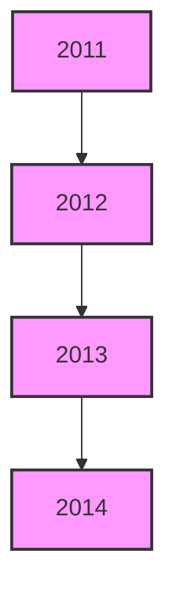
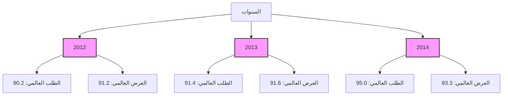
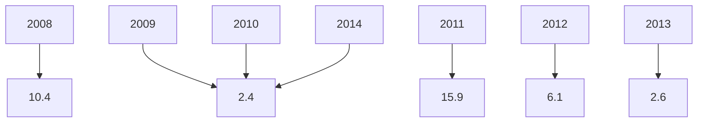
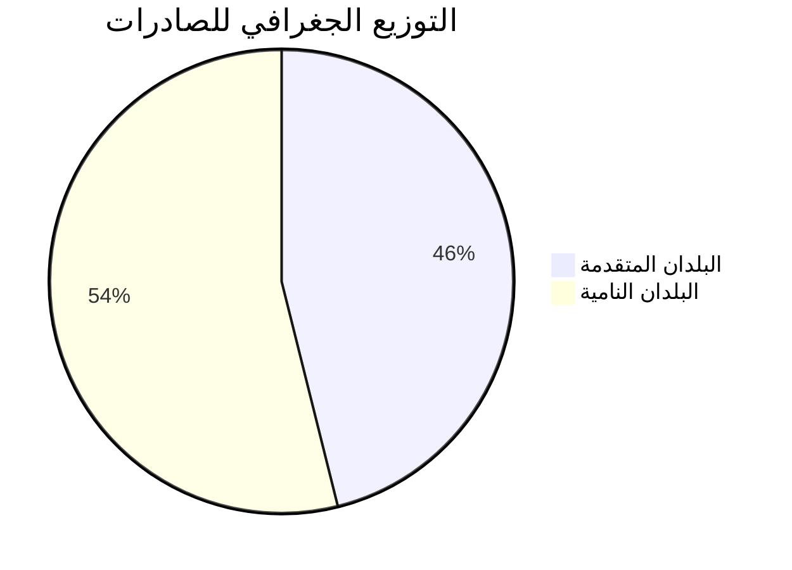
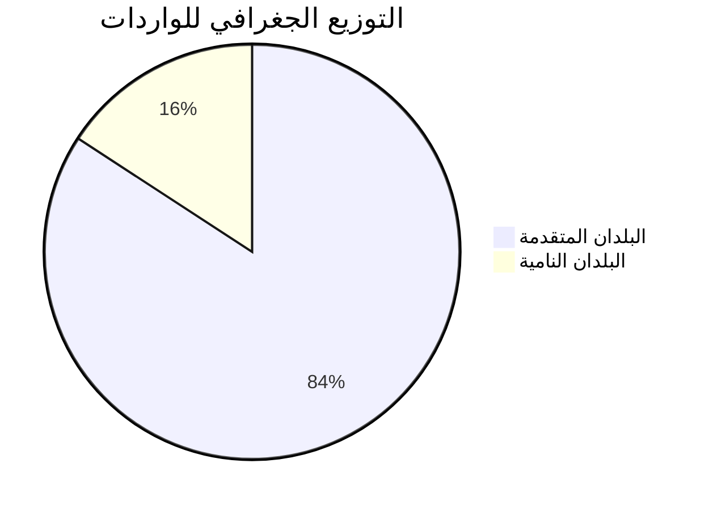
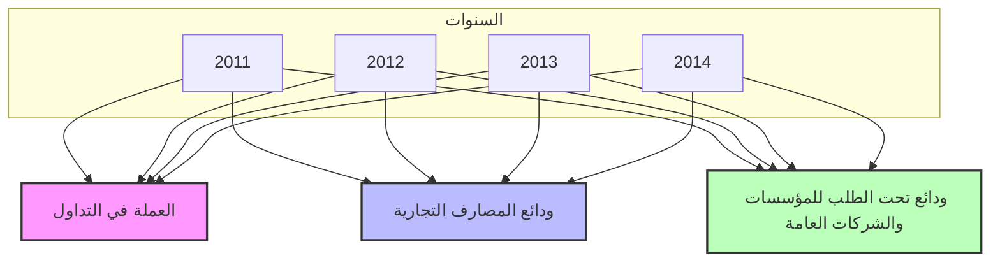

مصرف ليبيا المركزي
CENTRAL BANK OF LIBYA

التقرير السنوي
الثامن والخمسون
السنة المالية

2014

[An image of a grand building with domed roofs and arched windows, situated next to a body of water. Palm trees are visible in the foreground.]

مصرف ليبيا المركزي
CENTRAL BANK OF LIBYA
www.cbl.ly
---
مصرف ليبيا المركزي

التقرير السنوي
الثامن والخمسون
السنة المالية

2014
---
The image shows a world map with most continents visible in light gray. A small image of a building is superimposed on the map in the area of North Africa, likely representing Libya.

Below the map, there is text in Arabic which appears to be contact and copyright information. I'll translate and format this information as a table:

| Information | Details |
|-------------|---------|
| Copyright | © 2014 All printing and publishing rights reserved |
| Source | This report is issued by the Central Bank of Libya, and quoting from this report is permitted with reference to the source |
| Inquiries | All inquiries related to this report should be directed to the Research and Statistics Department at the Central Bank of Libya at the following address: |
| Address | P.O. Box 1103 - Tripoli - Libya |
| Phone | 00218214773901 |
| Fax | 00218214773903 |
| Email | ecorestat@cbl.gov.ly |
| Website | www.cbl.ly |

This appears to be the back cover or an information page from a report or publication by the Central Bank of Libya, providing contact details and copyright information for the document.
---
The image contains a page with the following elements:

At the center of the page, there is a large Arabic calligraphy in gold color. This calligraphy is a common Islamic phrase that translates to "In the name of Allah, the Most Gracious, the Most Merciful" (بسم الله الرحمن الرحيم).

The page has a light beige background with subtle design elements, including thin lines on the left side.

At the bottom of the page, there is text in Arabic which reads:

٣ مصرف الشارقة الإسلامي
التقرير السنوي الثامن والخمسون عام ٢٠١٤م

This translates to:

3 Sharjah Islamic Bank
The Fifty-Eighth Annual Report 2014

The layout suggests this is likely the third page of an annual report for Sharjah Islamic Bank from the year 2014.
---
# مجلس الإدارة

| المنصب | الوظيفة | الاسم |
|--------|--------|------|
| رئيساً | المحافظ | السيد/ أ. الصديق عمر الكبير |
| نائباً للرئيس | نائب المحافظ | السيد/ أ.علي محمد سالم الحبري |
| أعضاء | وكيل وزارة المالية | السيد/ د. مراجع غيث سليمان |
|  |  | السيد/ د. عبد الرحمن هابيل |
|  |  | السيد/ م. حمودة محمد الاسود |
|  |  | السيد/ محمد احمد المختار |
|  |  | السيد / د. طارق محمد يوسف المقريف |

----

٥ مصرف ليبيا المركزي  
التقرير السنوي الثامن والخمسون عام ٢٠١٤م
---
# مدراء الإدارات

| المنصب | الاسم |
|---------------------|------------------------|
| المدير التنفيذي لقطاع العمليات المصرفية المركزية | د. خالد علي الكبيجي |
| مدير إدارة الأسواق المالية | مصباح محمد العقاري |
| مدير إدارة الإصدار | أحمد محمد الحجاجي |
| مدير إدارة البحوث والإحصاء | د. علي رمضان شنيبيش |
| مدير إدارة تقنية المعلومات | عمران مفتاح الشلابي |
| مدير إدارة الحسابات | عبد الناصر خليفة قنيدي |
| مدير إدارة الرقابة على المصارف والنقد | د. محمد عبد الجليل ابوسنينة |
| مدير إدارة الشؤون الإدارية والموظفين | م. علي عبد الله الجهاني |
| مدير إدارة العمليات المصرفية | قصي احمد الحامي |
| مدير الإدارة القانونية | د. علي عبد الرحمن ضوي |
| مدير إدارة المراجعة | عبد الله نوري الشيباني |

# مدراء الفروع

| المنصب | الاسم |
|-------------|------------------------|
| مدير فرع بنغازي | عبد القادر محمد البارقي |
| مدير فرع سبها | عبد الكريم محمد الشطشاطي |
| مدير فرع سرت | امحمد صالح ابو غالية |

7 مصرف ليبيا المركزي
التقرير السنوي الثامن والخمسون عام 2014م
---
# مصرف ليبيا المركزي

## الإدارة العامة / طرابلس

| معلومات الاتصال | القيمة |
|-----------------|-------|
| هاتف: | + (218) 21-3333591 / 9 |
| السويفت: | CBLILYLYXXXX |
| بريد مصور (فاكس): | + (218) 21 - 4441488 |
| الموقع الإلكتروني: | www.cbl.gov.ly |

## الفروع

### فرع بنغازي:
| معلومات الاتصال | القيمة |
|-----------------|-------|
| هاتف: | + (218) 61 - 9091161 /8 |
| بريد مصور (فاكس): | + (218) 61 - 9091169 |

### فرع سرت:
| معلومات الاتصال | القيمة |
|-----------------|-------|
| هاتف: | + (218) 54 - 63750 / 4 |
| بريد مصور (فاكس): | + (218) 54 - 5265142 |

### فرع سبها:
| معلومات الاتصال | القيمة |
|-----------------|-------|
| هاتف: | + (218) 71- 627771 /3 |
| بريد مصور (فاكس): | + (218) 71 - 621800 |

## إدارة البحوث والإحصاء

| معلومات الاتصال | القيمة |
|-----------------|-------|
| هاتف: | + (218) 21- 4773901 |
| بريد مصور (فاكس): | + (218) 21 - 4773903 |
| بريد إلكتروني: | ecorestat@ cbl.gov.ly |

----

9 | مصرف ليبيا المركزي
التقرير السنوي الثامن والخمسون عام 2014م
---
# المحتويات

تقديم ................................................................................................... 14

## الجزء الأول
### التطورات الاقتصادية الدولية والعربية

أولاً : التطورات الاقتصادية الدولية .................................................................... 18
- نظرة عامة ............................................................................................ 18
- النمو الاقتصادي ...................................................................................... 19
- البطالة ................................................................................................ 21
- التضخم ................................................................................................ 22
- التجارة العالمية ........................................................................................ 23
- أسعار صرف العملات الدولية الرئيسية .............................................................. 24
- أسعار سلع التجارة العالمية........................................................................... 25
- التطورات النفطية الدولية ............................................................................ 27
- العرض - .............................................................................................. 28
- الطلب - ............................................................................................... 28
- الأسعار - ............................................................................................. 31
ثانياً : التطورات الاقتصادية العربية ..................................................................... 32

## الجزء الثاني
### التطورات الاقتصادية المحلية

أولاً : القطاع الحقيقي
- الناتج المحلي الإجمالي الحقيقي ...................................................................... 42
- الناتج المحلي الإجمالي الاسمي ...................................................................... 42
- معدل التضخم ......................................................................................... 47
- العاملون بالنشاط الاقتصادي.......................................................................... 48
- التطورات النفطية المحلية ............................................................................. 50
- الإنتاج المحلي من النفط الخام ............................................................. 50
- صادرات النفط الخام .. .................................................................... 52
- أسعار النفط الخام ............................................................................ 53
- إنتاج الغاز الطبيعي .......................................................................... 54

----

التقرير السنوي الثامن والخمسون عام 2014م
---

- الإنتاج المحلي من المشتقات النفطية ....................................................... 55
- الإنتاج المحلي من البتروكيماويات .......................................................... 55
- صادرات المنتجات النفطية والبتروكيماوية .................................................. 56
- الاستهلاك المحلي من المشتقات النفطية .................................................... 57

## ثانياً : المالية العامة

- قانون الميزانية العامة للسنة المالية 2014............................................................58
- الموقف التنفيذي للميزانية العامة للسنة المالية 2014 ....................................... 59
- الإيرادات ............................................................................. 59
- المصروفات .......................................................................... 60

## ثالثاً : القطاع الخارجي

- ميزان المدفوعات ...................................................................................... 62
- الحساب الجاري ............................................................................... 62
- الحساب الرأسمالي والمالي ................................................................ 63
- التجارة الخارجية ...................................................................................... 65

## رابعاً : التطورات النقدية

- التطورات النقدية ........................................................................................ 69
- القاعدة النقدية والعوامل المؤثرة فيها ......................................................... 69
- عرض النقود والعوامل المؤثرة فيه .......................................................... 71
- سعر صرف الدينار الليبي ..................................................................... 73
- مقاصة الصكوك ................................................................................ 73
- مصرف ليبيا المركزي .................................................................................. 75
- جانب الأصول .................................................................................. 75
- جانب الخصوم ................................................................................... 76
- المصارف التجارية ...................................................................................... 80
- تطور الأصول ................................................................................... 81
- تطور الخصوم ................................................................................... 83
- وضع السيولة والاحتياطي النقدي الإلزامي .................................................. 88
- المصرف الليبي الخارجي ............................................................................. 90
- المصارف المتخصصة .................................................................................. 94
- مصرف التنمية .................................................................................. 94

12 | التقرير السنوي الثامن والخمسون عام 2014م
---

94. المصرف الزراعي -
95. مصرف الادخار والاستثمار العقاري -
96. المصرف الريفي -

### خامساً : المؤسسات المالية غير المصرفية

97. المحفظة الاستثمارية طويلة المدى •
98. محفظة ليبيا أفريقيا للاستثمار •
100. سوق المال الليبي •

13 مصرف ليبيا المركزي
التقرير السنوي الثامن والخمسون عام 2014م
---
# تقدير

يسر مصرف ليبيا المركزي أن يقدم تقريره السنوي الثامن والخمسون للعام 2014، متضمناً
أهم التطورات الاقتصادية والمالية على الصعيد الدولي والعربي والمحلي، فعلى الصعيد الدولي
سجل الاقتصاد العالمي ارتفاعاً طفيفاً في معدل النمو، حيث ارتفع من 3.28% عام 2013 إلى
3.31% عام 2014، ويعزى هذا الارتفاع إلى الضغوط الانكماشية التي لازالت تحد من فرص
النمو فضلاً عن انخفاض معدلات النمو في الأسواق الصاعدة ذات الثقل العالمي مثل الصين
وبعض الدول الصناعية الأخرى، ومن ناحية أخرى شهدت أسعار السلع الأولية انخفاضاً
ملحوظاً، كما انخفضت أسعار النفط (سلة أوبك) بنسبة 9.1% عما كانت عليه في عام 2013،
وانخفضت معدلات التضخم في الدول الصناعية لتصل إلى 1.36%، ونتيجة لانخفاض أسعار
الوقود وزيادة معدلات الاستهلاك، فقد انخفضت معدلات البطالة في الدول الصناعية خلال عام
2014 إلى 7.3%، مقابل 7.9% خلال عام 2013، كما شهدت معدلات البطالة في منطقة
اليورو انخفاضاً لتصل إلى 11.56% عام 2014، مقابل 11.49% عام 2013.

وعلى الصعيد العربي، أظهرت البيانات، حدوث تراجع في معدل النمو الاقتصادي العربي لعام
2014 ليبلغ 1.7%، مقابل 2.8% عام 2013، كمحصلة لإنخفاض وارتفاع معدل الناتج في
عدد من الدول العربية.

أما على المستوى المحلي، فقد كان لحالة الانقسام السياسي وتردي الأوضاع الأمنية وانخفاض
إنتاج النفط الخام خلال عام 2014، فضلاً على انخفاض أسعاره منذ النصف الثاني أثراً سلبياً
على الأوضاع المالية والاقتصادية، حيث جاءت معدلات نمو الاقتصاد الليبي مخيبة للآمال بعد
أن كان من المتوقع أن يحقق الاقتصاد الليبي نمواً خلال عامي 2013 و2014، فقد انخفض
معدل نمو الناتج المحلي الإجمالي الحقيقي بنحو 47.7% خلال عام 2014، ويعزى هذا
الانخفاض بشكل رئيس إلى تراجع الكميات المنتجة من النفط ولا سيما بعد إغلاق منافذ
تصديره في المنطقة الوسطى والشرقية مما أدى إلى انخفاض الناتج المحلي النفطي الذي يشكل
أكثر من 60.0% من إجمالي الناتج المحلي الإجمالي.

14 | مصرف ليبيا المركزي
التقرير السنوي الثامن والخمسون عام 2014م
---
وفيما يخص المالية العامة، نتيجة للانخفاض الحاد في إنتاج وصادرات النفط الخام فقد انعكس ذلك على تدني إيرادات الميزانية العامة لعام 2014 والتي لم تتجاوز 21.5 مليار دينار لتحقق الميزانية عجزاً كبير بلغ نحو 22.3 مليار دينار ليبي خلال عام 2014، حيث بلغت المصروفات العامة في شكل تفويضات مالية صادرة خلال نفس العام نحو 43.8 مليار دينار.

ونتيجة للأوضاع المشار إليها اعلاه فقد تأثرت قيمة الدينار الليبي في السوق الموازية والتي انعكست على ارتفاع المستوى العام لأسعار السلع والخدمات في السوق الليبي.

وفيما يخص أداء القطاع الخارجي، فقد حقق الحساب الجاري لعام 2014 عجز بلغ حوالي 24.2 مليار دينار، مقابل فائض في الحساب الجاري بلغ 15.2 مليار دينار عام 2013، مما أثر بشكل مباشر على وضع ميزان المدفوعات الليبي ليحقق عجزاً في الميزان الكلي بلغ 30.8 مليار دينار، والذي انعكس بدوره على انخفاض ملحوظ في احتياطيات المصرف المركزي خلال عام 2014.

وفيما يخص التطورات النقدية، فقد شهد عرض النقود (ع2) زيادة طفيفة بلغت نسبتها 0.6% أي ارتفع من 69.0 مليار دينار عام 2013 إلى 69.4 مليار دينار في نهاية عام 2014.

أما على صعيد التطورات المصرفية، فقد شهدت أصول المصارف التجارية انخفاضاً بلغ 3.7% لعام 2014، حيث انخفضت قيمة الأصول السائلة بنسبة 10.3%، في حين ارتفع قيمة الائتمان المصرفي بنسبة 9.5% أما فيما يتعلق بخصوم المصارف التجارية، فقد شهد رأس المال والاحتياطيات نمواً بلغ 3.3% لعام 2014، في حين انخفضت الودائع تحت الطلب وأوامر الدفع بنسبة بلغت 9.6%.

أما فيما يتعلق بأنشطة المؤسسات المالية غير المصرفية، فيتضمن التقرير نشاط بعض المؤسسات المالية غير المصرفية والتي تلعب دوراً مهماً في الاقتصاد الوطني، وتمارس أنشطة استثمارية واسعة، سواء في الداخل أو في الخارج ومن بعض هذه المؤسسات المالية، محفظة الاستثمار طويلة المدى، محفظة ليبيا أفريقيا للاستثمار، كما تضمن التقرير أيضاً المؤشرات المهمة في أداء سوق الأوراق المالية الليبي.

15
مصرف ليبيا المركزي
التقرير السنوي الثامن والخمسون عام 2014م
---
وبهذه المناسبة يعرب مصرف ليبيا المركزي عن شكره وتقديره لكافة الوزارات والمؤسسات والأجهزة العامة ذات العلاقة، لتوفير وتزويد المصرف بالبيانات والإحصاءات اللازمة لإعداد هذا التقرير.

والله ولي التوفيق

الصديق عمر الكبير
المحافظ

----

١٦ | مصرف ليبيا المركزي
التقرير السنوي الثامن والخمسون عام ٢٠١٤م
---
# الجزء الأول

## التطورات الاقتصادية الدولية والعربية

17 مؤسسة النقد العربي السعودي
التقرير السنوي الثامن والخمسون عام 2014م
---
# أولاً: التطورات الاقتصادية الدولية

## نظرة عامة

شهد معدل نمو الاقتصاد العالمي خلال عام 2014 ارتفاعاً طفيفاً مقارنة بعام 2013، ويعزى ذلك إلى ارتفاع معدلات النمو في الدول الصناعية، حيث سجلت معدلات النمو في الولايات المتحدة الأمريكية مستوى أعلى من المتوقع، إذ وصلت إلى 4.0% في النصف الثاني لعام 2014، بينما سجلت نمواً بنسبة 2.40% للعام موضوع التقرير، و كان وراء هذا النمو زيادة معدلات الاستهلاك نتيجة لانخفاض كل من أسعار الوقود ومعدلات البطالة، وارتفاع ثقة المستهلك، في حين شهد النمو الاقتصادي في اليابان خلال عام 2014 معدلات مخيبة للآمال، حيث بلغت نسبة النمو 0.89% مقابل 1.52% لعام 2013، الأمر الذي أدى إلى انخفاض معدلات الاستهلاك والاستثمار خاصة الاستثمار العقاري.

فيما شهدت منطقة اليورو نمواً عام 2014 نتيجة تحسن الميزان التجاري لأغلب بلدان هذه المنطقة بفعل انخفاض أسعار النفط وارتفاع الصادرات، أما الصين فقد كان معدل النمو فيها أقل ارتفاعاً من عام 2013، حيث كان لركود القطاع العقاري لعام 2014 السبب الرئيسي وراء ذلك، في حين كانت معدلات النمو في البلدان النامية أقل من المستويات المتوقعة، ويعزى ذلك بشكل رئيسي إلى عودة تقلبات البيئة الخارجية للتمويل الأجنبي وذلك بسبب تشكيك الأسواق العالمية في ركائز اقتصاديات البلدان النامية، خصوصاً تلك التي تعاني من مستويات تضخم عالية وعجوزات ضخمة في الميزان التجاري، بالإضافة إلى انخفاض أسعار الموارد الطبيعية مثل النفط والمعادن والسلع الغذائية والتي تشكل النسبة الأكبر من صادرات الدول النامية. ونتيجة لارتفاع معدلات النمو في البلدان المتقدمة، وانخفاض أسعار النفط والسلع الرئيسية واضطراب الأوضاع الأمنية في بعض الدول النامية دفعت المستثمرين إلى سحب استثماراتهم من البلدان النامية والاتجاه بها إلى البلدان المتقدمة، وهذا بدوره أثر سلباً على أسعار صرف عملات البلدان النامية، مما ألزم بعض واضعي السياسات الاقتصادية في تلك البلدان على اتباع إجراءات اقتصادية انكماشية يكون الهدف منها الحد من تدفق رؤوس الأموال للخارج ومثل هذه الإجراءات تؤدي إلى زيادة تكلفة التمويل في هذه البلدان، الأمر الذي سيؤثر سلباً على معدلات النمو فيها في الفترة القادمة.

18
التقرير السنوي الثامن والخمسون عام 2014م
---
أما فيما يخص معدلات التضخم فقد انخفضت في الدول الصناعية وهو ما يعكس انخفاض أسعار النفط والسلع الأساسية وضعف الطلب في العديد من الدول التي تعاني من نسب تضخم أقل من النسب المستهدفة مثل اليابان ومنطقة اليورو. أما بخصوص الدول النامية فإن انخفاض أسعار النفط وبعض السلع الأولية كان لها تأثير في انخفاض نسب التضخم باستثناء الدول التي تعاني من تدهور كبير في أسعار الصرف مثل روسيا.

## النمو الاقتصادي

شهد معدل نمو الاقتصاد العالمي ارتفاعاً طفيفاً خلال عام 2014 مقارنة بعام 2013، حيث حقق معدل نمو قدره 3.31% في عام 2014، مقابل 3.27% في عام 2013.

وكانت معدلات نمو منطقة اليورو والهند السبب الرئيسي وراء هذا الارتفاع، حيث حققت منطقة اليورو معدل نمو قدره 0.83% في عام 2014، مقابل انكماش قدره -0.43% في عام 2013، في حين حققت الهند معدل نمو قدره 5.63% عام 2014، مقابل 5.02% عام 2013.

وتجدر الإشارة إلى أن الناتج المحلي الإجمالي لمجموعة العشرين هو شهد الآخر ارتفاعاً خلال عام 2014 حيث وصل معدل نمو إلى 3.40%، مقابل 3.20% عام 2013، حيث يشكل إنتاج هذه المجموعة نسبة 90% من الإنتاج العالمي¹.

كذلك ارتفع معدل النمو الاقتصادي في الولايات المتحدة الأمريكية ليصل إلى 2.40% في عام 2014، مقابل 2.22% في عام 2013. أما الصين فقد حققت في عام 2014 نمواً يقارب 7.40% حيث يعتبر منخفضاً مقارنة بعام 2013 والبالغ 7.70%، ويعزى هذا الانخفاض إلى الكساد الذي حل على قطاع العقارات، حيث انخفضت المبيعات بما يقارب 10.8% للأشهر التسعة الأولى من عام 2014 طبقاً لتقرير الديوان الوطني الصيني للإحصاء لعام 2014، بينما حققت المملكة المتحدة نمواً ملحوظاً عام 2014 بلغ 3.20%، مقارنة بـ 1.74% لعام 2013، حيث يعتبر النشاط الاقتصادي لعام 2014 الأفضل منذ ست سنوات مضت، وقاد هذا النمو قطاع الخدمات الذي يشكل 78% من الاقتصاد، حيث بلغ حجم نمو قطاع الخدمات 3.60% لعام 2014، مقابل 2.93% لعام 2013.

¹ منظمة التعاون الاقتصادي والتنمية (OECD)، مارس 2015.

19

التقرير السنوي الثامن والخمسون لعام 2014م
---
أما فيما يتعلق بمعدلات النمو في منطقة اليورو فقد شهدت ارتفاعاً بعد سنوات من الانكماش، وكان الاقتصاد الألماني هو السبب الرئيسي وراء النمو الاقتصادي في المنطقة حيث بلغ معدل نمو الناتج المحلي الإجمالي 1.39% خلال عام 2014، بينما بلغت نسبة النمو 0.53% خلال عام 2013، ويعزى هذا الانتعاش في الاقتصاد الألماني إلى انخفاض أسعار النفط وهو ما حفز الشركات إلى زيادة الإنفاق على الآليات والمعدات الصناعية، وكذلك انخفاض سعر صرف اليورو مقارنة بالعملات الأخرى جعل الصادرات الألمانية أكثر تنافسية في السوق العالمي. أما اسبانيا واليونان فقد شهدتا نمو بعد سنوات من الانكماش حيث بلغ معدل النمو 1.31% في اسبانيا لعام 2014 مقارنة بانكماش بلغ 1.22% لعام 2013، ويرجع السبب الرئيس إلى إعادة هيكلة سوق العمل الإسباني وجعله أكثر مرونة، أما اليونان فشهدت أول نمو في الناتج المحلي الإجمالي منذ 2008 حيث بلغ النمو 0.60% لعام 2014، مقارنة بعام 2013 الذي بلغ 3.85%.

أما فيما يخص معدل النمو في منطقة الشرق الأوسط وشمال إفريقيا فقد شهد ارتفاعاً طفيفاً خلال عام 2014 ليصل إلى 2.56%، مقابل 2.30% عام 2013. وعلى الرغم من انخفاض أسعار النفط فقد شهدت بعض الدول النفطية مثل الجزائر، إيران، السعودية، الكويت وقطر نسب نمو مرتفعة لعام 2014 مقارنة بعام 2013، وذلك بخلاف العراق الذي شهد انخفاض حاد في النمو بلغ ( 2.66%) لعام 2014 مقارنة بـ 4.21% لعام 2013 ويعزى ذلك إلى الاضطرابات الأمنية التي تسود البلاد.

20
التقرير السنوي الثامن والخمسون عام 2014م
---
جدول رقم (1): معدلات النمو الحقيقي في العالم
" نسبة مئوية "

| مجموعة الدول | 2013 | 2014 |
|--------------|------|------|
| العالم: | 3.27 | 3.31 |
| الدول الصناعية: | 1.39 | 1.8 |
| الولايات المتحدة الأمريكية | 2.22 | 2.40 |
| دول منطقة اليورو | -0.43 | 0.83 |
| اليابان | 1.52 | 0.89 |
| دول صناعية أخرى | 2.28 | 2.92 |
| الدول النامية وأسواق ناشئة أخرى (*): | 4.74 | 4.43 |
| دول وسط وشرق أوروبا | 2.78 | 2.73 |
| دول الكومنولث المستقلة | 2.15 | 0.75 |
| آسيا | 6.59 | 6.48 |
| الشرق الأوسط وشمال إفريقيا | 2.30 | 2.56 |
| أمريكا اللاتينية والكاريبي | 2.74 | 1.32 |
| إفريقيا جنوب الصحراء | 5.06 | 5.06 |

المصدر: صندوق النقد الدولي، آفاق الاقتصاد العالمي.
* الأسواق الناشئة تشمل : البرازيل، روسيا، الهند، الصين، جنوب إفريقيا، جمهورية التشيك، كوريا الجنوبية، إندونيسيا، المجر، المكسيك.

شكل (1): معدلات النمو الحقيقي في العالم

• البطالة :

حققت معدلات البطالة في الدول الصناعية خلال عام 2014 انخفاضاً لتصل إلى
7.34% مقابل 7.90% عام 2013، وقد كان التحسن في معدلات البطالة خلال عام
2014 واضحاً في كل من الولايات المتحدة الأمريكية ليبلغ 6.29% والمملكة المتحدة ليبلغ

21

التقرير السنوي الثامن والخمسون عام 2014م
---
6.35% مقارنة بعام 2013. كما شهدت معدلات البطالة في منطقة اليورو انخفاضاً
وصل إلى 11.56% خلال عام 2014، مقابل 11.94% عام 2013، ويعزى الانخفاض
في نسب البطالة إلى الهيكلة التي قامت بها الحكومة الأسبانية لسوق العمل حيث انخفضت
نسبة البطالة إلى 24.64% لعام 2014 مقابل 26.10% عام 2013. أما بالنسبة لمصر
وتونس فنسب البطالة فيهما لم تشهد تغيراً يذكر.

جدول رقم ( 2 ) : معدلات البطالة في الدول الصناعية

| الدول الصناعية | مجموعة الدول | 2013 | 2014 |
|----------------|--------------|------|------|
| الدول الصناعية | 7.90 | 7.34 |
| الولايات المتحدة الأمريكية | 7.35 | 6.29 |
| دول منطقة اليورو | 11.94 | 11.56 |
| المملكة المتحدة | 7.60 | 6.35 |
| اليابان | 4.03 | 3.71 |
| ألمانيا | 5.31 | 5.27 |
| مصر | 13.00 | 13.41 |
| تونس | 15.33 | 15.30 |
| أسبانيا | 26.10 | 24.64 |

المصدر : صندوق النقد الدولي، المرجع السابق.

## التضخم

شهدت معدلات التضخم بشكل عام انخفاضاً في كل من الدول الصناعية والدول النامية
على حد سواء، وكانت هذه المعدلات منخفضة نتيجة استمرار اقتصادات الدول الصناعية
بالعمل دون قدراتها الإنتاجية، وكذلك عمل اقتصادات الدول النامية بمستوى أقل أو قريب
من قدراتها الإنتاجية، كما كان لتطورات أسعار السلع الأولية المتواضعة دور أساسي في
بقاء معدلات التضخم عند مستويات متواضعة خصوصاً أسعار الغذاء والنفط، ومن المتوقع
أن تستمر المعدلات المنخفضة لأسعار هذه السلع خلال عام 2015 حسب الأرقام المتداولة
في الأسواق الآجلة لهذه السلع.

ففي الدول الصناعية شهدت معدلات التضخم بشكل عام انخفاضاً طفيفاً خلال عام 2014،
لتصل إلى 1.36%، مقابل 1.37% عام 2013، حيث شهدت معدلات التضخم تقارباً بين
الدول الصناعية، حيث انخفضت في دول منطقة اليورو إلى 0.43% لعام 2014 مقارنة

22
---
بـ 1.35% لعام 2013. بينما في اليابان والولايات المتحدة الأمريكية فقد شهدت معدلات
التضخم ارتفاعاً مقارنة بعام 2013. وأخذت مستويات التضخم في البلدان النامية والأسواق
الناشئة في الانخفاض لتصل إلى 5.10% خلال عام 2014، مقابل 5.95% عام 2013،
وشهدت معدلات التضخم في دول الشرق الأوسط وشمال أفريقيا تراجعاً حاداً، حيث وصل
مستوى التضخم إلى 6.51% خلال عام 2014، مقابل 9.33% عام 2013.

جدول رقم (3): معدلات التضخم في العالم

| مجموعة الدول | 2013 | 2014 |
|---------------|------|------|
| الدول الصناعية: | 1.37 | 1.36 |
| الولايات المتحدة الأمريكية | 1.46 | 1.98 |
| دول منطقة اليورو | 1.35 | 0.43 |
| اليابان | 0.36 | 2.73 |
| المملكة المتحدة | 2.55 | 1.46 |
| الدول النامية وأسواق ناشئة أخرى: | 5.95 | 5.10 |
| دول وسط وشرق أوروبا | 4.29 | 3.77 |
| دول الكومنولث المستقلة | 6.41 | 8.07 |
| آسيا | 4.81 | 3.53 |
| الشرق الأوسط وشمال أفريقيا | 9.33 | 6.51 |
| أفريقيا جنوب الصحراء | 6.91 | 10.10 |

المصدر: صندوق النقد الدولي، المرجع السابق.

• التجارة العالمية :

شهد معدل نمو التجارة العالمية ارتفاعاً خلال عام 2014 ليصل إلى 3.85%، مقابل
3.00% عام 2013، ويعزى ذلك إلى ارتفاع كل من معدل نمو صادرات وواردات الدول
الصناعية، حيث وصل معدل نمو صادراتها في عام 2014 إلى 3.59%، مقابل 2.38%
في عام 2013، كما شهد معدل نمو الواردات في الدول الصناعية أيضاً ارتفاعاً ليصل إلى
3.72% عام 2014، مقابل 1.42% في عام 2013.

أما في الدول النامية والأسواق الناشئة الأخرى فقد شهد معدل نمو صادراتها انخفاضاً طفيفاً
ليصل إلى 3.92% عام 2014، مقابل 4.38% عام 2013، كما شهدت واردات نفس
المجموعة تراجعاً لتصل إلى 4.43% في عام 2014، مقابل 5.33% في عام 2013 وقد
---
كانت معدلات نمو التجارة الخارجية للدول النامية أقل من المتوقع وذلك بسبب نمو الطلب الخارجي على سلع هذه الدول بمعدلات أقل من المتوقع، الأمر الذي حفز هذه الدول على تخفيض وارداتها.

أما على صعيد الحسابات الجارية في موازين مدفوعات الدول حول العالم فقد شهد عام 2014 انخفاضاً ملحوظاً في فوائض وعجوزات العديد من البلدان. حيث كانت منطقة اليورو رائدة في محاولتها للتقليل من عجوزات حساباتها الجارية، وذلك عن طريق تخفيض الواردات من جهة وتعديل السياسات السعرية من جهة أخرى لتحفيز الصادرات، بالإضافة إلى تدهور أسعار الوقود وانخفاض سعر صرف اليورو. وقد كان لانخفاض أسعار النفط والسلع الأولية سبب في زيادة العجز وتقليص الفائض في البلدان المصدرة للنفط والسلع الأولية.

جدول رقم (4) : معدلات نمو التجارة العالمية
" نسب مئوية "

| 2014 | 2013 | 2012 |                                    |
|------|------|------|-----------------------------------|
| 3.85 | 3.00 | 2.91 | إجمالي التجارة العالمية            |
|      |      |      | الدول الصناعية :                   |
| 3.59 | 2.38 | 1.99 | الصادرات                           |
| 3.72 | 1.42 | 1.16 | الواردات                           |
|      |      |      | الدول النامية وأسواق ناشئة أخرى :   |
| 3.92 | 4.38 | 4.56 | الصادرات                           |
| 4.43 | 5.33 | 6.02 | الواردات                           |

المصدر : صندوق النقد الدولي، المرجع السابق.

• أسعار صرف العملات الدولية الرئيسية :

حقق الدولار الأمريكي مكاسب كبيرة خلال عام 2014، حيث شهد سعر الدولار الأمريكي صعوداً مقابل العملات الرئيسية في منتصف عام 2014، وتزايدت وتيرة هذا الصعود بشكل كبير خلال شهر سبتمبر 2014، عندما أثبتت المؤشرات أن الاقتصاد الأمريكي في وضع أفضل مما كان متوقع بخلاف منطقة اليورو والمملكة المتحدة، والتي كانت مؤشراتها أقل من المتوقع. حيث مكن قرار إنهاء برنامج التسهيل الكمي من قبل الاحتياطي الفيدرالي الأمريكي في شهر أكتوبر بالإضافة إلى السياسة المالية التوسعية المتبعة من قبل مصرف اليابان المركزي في الشهر ذاته من ارتفاع سعر صرف الدولار الأمريكي مقابل العملات الأخرى.

24
---
وفي يونيو 2014، تم الإعلان على انطلاق برنامج التسهيل الكمي من قبل المصرف المركزي الأوروبي وكان من أهم محتويات البرنامج هو شراء السندات المدعمة بالأصول (Asset Backed Securities)، حيث تم التطبيق في شهر أكتوبر من عام 2014 واتصف حجم برنامج التسهيل الكمي الأوروبي بالمحدود مقارنة بالبرنامج الأمريكي، حيث كان انطلاق البرنامج أحد العوامل الرئيسية في تراجع اليورو مقابل الدولار الأمريكي، ليبدأ سعر الصرف لعام 2014 من 1.366 و انتهى إلى 1.214 أي انخفض بما يعادل 11.1%.

جدول رقم (5): متوسط أسعار صرف بعض العملات الدولية خلال عام 2014

| العملة | الدولار الأمريكي | اليورو | الجنيه الإسترليني | الين الياباني | الفرنك السويسري |
|--------|------------------|--------|-------------------|---------------|-------------------|
| الدولار الأمريكي | - | 1.3294 | 1.6486 | 0.0095 | 1.0930 |
| اليورو | 0.7522 | - | 1.2401 | 0.0071 | 0.8222 |
| الجنيه الإسترليني | 0.6066 | 0.8064 | - | 0.0057 | 0.6630 |
| الين الياباني | 105.6252 | 140.4181 | 174.1337 | - | 115.4500 |
| الفرنك السويسري | 0.9149 | 1.2163 | 1.5083 | 0.0087 | - |

المصدر: قاعدة بيانات صندوق النقد الدولي.

## أسعار سلع التجارة العالمية:

شهدت أسعار معظم السلع الغذائية انخفاضاً خلال عام 2014 بلغت نسبته 4.1% مقابل الارتفاع الطفيف الذي شهده عام 2013 والذي بلغ 1.1% وذلك بسبب انخفاض تكلفة إنتاج أغلب السلع الغذائية الأولية، حيث شهدت أسعار الطاقة انخفاضاً خلال عام 2014 و2013 بلغت نسبته 7.4% و1.7% على التوالي، كما كانت أغلب التنبؤات تشير إلى استمرارية زيادة الإنتاج العالمي لهذه السلع في المدى القصير بالإضافة إلى ارتفاع مخزونها العالمي، الأمر الذي أدى بدوره إلى تهدئة الأسواق الآجلة لهذه السلع.

وقد شهدت أسعار (السلع الأولية باستثناء الوقود) النفط والمعادن انخفاضاً خلال عام 2014 بلغ 4.0%، 7.5%، 10.3%، مقابل معدلات انخفاض قدرها 1.2%، 0.9%

25

التقرير السنوي الثامن والخمسون عام 2014م
---
و4.3% خلال عام 2013. أما بالنسبة للمواد الزراعية فيرجع الارتفاع الطفيف الذي حدث في أسعارها إلى التراجع في الإنتاج بسبب التغيرات المناخية في بعض البلدان الزراعية في أمريكا اللاتينية.

جدول رقم ( 6 ) : التغير السنوي في الأسعار العالمية لبعض السلع

| البيان | 2011 | 2012 | 2013 | 2014 |
|------------------------|-------|-------|-------|-------|
| المواد الصناعية الأولية | %16.4 | %15.5 | %2.3- | %6.0- |
| الطاقة | %31.5 | %0.7 | %1.7- | %7.4 |
| النفط | %31.6 | %1.0 | %0.9- | %7.5- |
| السلع الأولية باستثناء الوقود | %17.9 | %10.0- | %1.2- | %4.0- |
| سلع غذائية | %19.9 | %2.4- | %1.1 | %4.1- |
| مشروبات | %16.6 | %18.6- | %11.9- | %20.7 |
| مواد زراعية خام | %22.7 | %12.7- | %1.5 | %1.9 |
| معادن | %13.5 | %16.8- | %4.3- | %10.3- |

المصدر : صندوق النقد الدولي المرجع السابق.

26 | مركز البحرين للدراسات الاستراتيجية والدولية والطاقة
التقرير السنوي الثامن والخمسون عام 2014م
---
# التطورات النفطية الدولية:

يعتبر عام 2014 عام التغيير في قطاع الطاقة بشكل عام وقطاع النفط بشكل خاص، حيث شكل تدهور سعر النفط الخام صدمة للاقتصاد العالمي وصدمة سلبية للدول المصدرة للنفط، بخلاف الحالات السابقة لتدهور أسعار النفط (1970، 1986، 1998، 2008)، حيث إن التدهور الذي شهدته أسعار النفط خلال 2014، كان بسبب عاملي العرض والطلب بسبب تزايد الفجوة بين العرض والطلب نتيجة ثبات إنتاج منظمة الأقطار المنتجة والمصدرة للنفط (الأوبك) وارتفاع العرض الأمريكي مما نتج عنه تزايد للعرض العالمي يفوق كمية الطلب التي يمكن وصف نموها بالضعيف. كذلك التكنولوجيا المتخصصة في استخراج النفط الصخري تطورت بشكل سمح للولايات المتحدة الأمريكية وغيرها من الدول بالتنافس مع دول منظمة الأوبك من حيث كمية الإنتاج. ومن الأسباب الأخرى التي كانت ضمن العوامل المؤثرة في تدهور أسعار النفط هو ضعف نمو الطلب العالمي وتغير شكل سلة الوقود العالمية، أما الدول النامية مثل الصين التي كان يعزى لها سبب ارتفاع أسعار النفط في العشر الأعوام الماضية أصبح اقتصادها يدخل إلى مرحلة تنمية أقل حاجة للنفط من سابقتها، نتيجة لثورة تقنية المعلومات، لذا فإن نمو الطلب العالمي للوقود أصبح أقل من السابق، إضافة إلى ذلك فإن ظاهرة التغير المناخي كان لها دور في تغير سياسات الطاقة مثل دعم الطاقة المتجددة والحيوية، مما يبني منافسة طويلة المدى للطاقة النفطية، في حين أن الوقود الأحفوري سيظل مصدر الطاقة الأول خلال العقود الثلاثة القادمة، حيث لوحظ أن نسبة مساهمته هذا العام لم تقل عن 82% من إجمالي مصادر الطاقة وقد ظل على هذا المستوى منذ خمسة وعشرون سنة، وحتى عند زيادة استخدام مصادر الطاقة في المدة القادمة فمن المتوقع ألا تقل مساهمة النفط الأحفوري عن 75% حتى عام 2035.

وتشير البيانات الأولية إلى أن النفط الرملي في كندا والنفط الصخري في الولايات المتحدة الأمريكية والإنتاج في المياه العميقة في البرازيل سيجعلهم من كبار منتجي النفط في العالم وسيكون لهم دوراً قيادياً خلال العقد الحالي، إلا إن تدهور الأسعار في عام 2014 كان له

27
---
دور كبير في توقف العديد من المشاريع الجديدة والمكلفة، حيث أن الأسعار الجديدة للنفط لا
تسمح لها بالاستمرار، مما يعزز من سيطرة منطقة الشرق الأوسط في المدى القصير
والمتوسط.

- العرض :

شهد العرض العالمي من النفط الخام خلال عام 2014 ارتفاعاً بنسبة 2.5% وبمقدار 2.3
مليون برميل في اليوم، ليبلغ في المتوسط 93.7 مليون برميل في اليوم، مقابل 91.4 مليون
برميل في اليوم في عام 2013. وكان السبب الرئيسي وراء هذا النمو في العرض العالمي
هو ارتفاع الإنتاج من قبل الولايات المتحدة الأمريكية بشكل خاص والأمريكيتين بشكل عام،
حيث ارتفع انتاج دول الأمريكيتين الأعضاء في منظمة التعاون الإقتصادي والتنمية من
17.1 مليون برميل في اليوم عام 2013 إلى حوالي 19.0 مليون برميل في اليوم في عام
2014 بمعدل نمو قدره 11.1% وبكمية قدرها 1.9 مليون برميل في اليوم، ويعود السبب
الرئيسي وراء هذا النمو الكبير هو دخول انتاج الولايات المتحدة الأمريكية من النفط
الصخري بشكل كبير للسوق.

ومع تدهور الأسعار لعام 2014 توقع العديد من المحللين انخفاض انتاج منظمة الأوبك
لكي تحافظ على استقرار الأسعار في السوق، لكن المنظمة فضلت أن تحافظ على حصتها
السوقية وتحمل صدمة انخفاض الأسعار على المدى المتوسط، حيث أن استرجاع الحصة
السوقية لاحقاً سوف يكون مكلفاً وقد تم استيعاب هذا الدرس من تجربة سبعينيات القرن
الماضي خاصة من المملكة السعودية.

- الطلب :

شهد الطلب العالمي على النفط الخام ارتفاع طفيف بنسبة 0.8% ليصل إلى 92.6 مليون
برميل في اليوم في عام 2014، مقابل 91.9 مليون برميل في اليوم خلال عام 2013،
ويعزى ضعف نسبة ارتفاع الطلب لعام 2014 إلى انخفاض الطلب من قبل دول منظمة
التعاون الاقتصادي والتنمية حيث انخفض مستوى الطلب من 46.1 مليون برميل في اليوم
لعام 2013 إلى 45.6 مليون برميل في اليوم لعام 2014، أي بمعدل انخفاض قدره
1.1%. حيث استمر طلب البلدان الأوروبية في التراجع للعام الرابع على التوالي لينخفض

28

التقرير السنوي الثامن والخمسون عام 2014م
---
بمعدل 1.5% خلال عام 2014 ليصل إلى 13.5 مليون برميل يومياً، مقارنة بكمية قدرها 13.7 مليون برميل يومياً عام 2013، وكانت معدلات الطلب في النصف الأول من عام 2014 العامل الأكبر في هذا الانخفاض الناتج عن حالة عدم اليقين التي سادت المنطقة وعملة اليورو بشكل عام. وشهدت دول المحيط الهادي الانخفاض الأكبر في الطلب على النفط الخام وهو ما يعادل 2.4% خلال عام 2014 ليصل إلى 8.1 مليون برميل يومياً مقارنة بكمية قدرها 8.3 مليون برميل يومياً خلال عام 2013، وكان انخفاض الطلب في اليابان وأستراليا العامل الأكبر في هذا الانخفاض، وكانت معدلات الإنخفاض هذه تقابلها معدلات نمو الطلب في كل من الصين والبلدان الآسيوية الأخرى (الهند على وجه الخصوص) وأمريكا اللاتينية ومنطقة الشرق الأوسط، والتي شهدت معدلات نمو قدرها 3.0% و 2.5% و 1.5% و 2.5% على التوالي.

جدول رقم ( 7 ) : العرض العالمي للنفط الخام
" مليون برميل في اليوم "

| المنطقة | 2012 | 2013 | 2014 |  |  |  | متوسط عام 2014 | معدل النمو في عام 2014 |
|---------|------|------|------|------|------|------|---------------|----------------------|
|         |      |      | الربع الأول | الربع الثاني | الربع الثالث | الربع الرابع |               |                      |
| 1- منظمة التعاون الاقتصادي والتنمية: | 19.8 | 20.9 | 22.2 | 22.6 | 22.8 | 23.7 | 22.8 | %0.1 |
| أمريكا الشمالية | 15.9 | 17.1 | 18.2 | 18.8 | 19.1 | 19.7 | 19.0 | %11.1 |
| أوروبا | 3.5 | 3.3 | 3.5 | 3.2 | 3.1 | 3.5 | 3.3 | %0.0 |
| دول المحيط الهادي | 0.6 | 0.5 | 0.5 | 0.5 | 0.5 | 0.5 | 0.5 | %0.0 |
| 2- دول خارج المنظمة منها : | 29.5 | 29.5 | 29.8 | 29.6 | 29.7 | 30.2 | 29.8 | %1.0 |
| الاتحاد السوفيتي السابق | 13.6 | 13.8 | 13.9 | 13.8 | 13.8 | 13.9 | 13.9 | %0.7 |
| أوروبا | 0.1 | 0.1 | 0.1 | 0.1 | 0.1 | 0.1 | 0.1 | %0.0 |
| الصين | 4.2 | 4.2 | 4.2 | 4.2 | 4.3 | 4.3 | 4.2 | %0.0 |
| دول آسيوية أخرى | 3.6 | 3.6 | 3.5 | 3.5 | 3.4 | 3.6 | 3.5 | %2.8- |
| أمريكا اللاتينية | 4.2 | 4.2 | 4.2 | 4.3 | 4.5 | 4.6 | 4.4 | %4.8 |
| الشرق الأوسط | 1.5 | 1.4 | 1.4 | 1.3 | 1.3 | 1.3 | 1.3 | %7.1- |
| أفريقيا | 2.3 | 2.3 | 2.3 | 2.3 | 2.3 | 2.3 | 2.3 | %0.0 |
| 3- منظمة الأوبك | 37.5 | 36.7 | 36.3 | 36.4 | 37.0 | 37.0 | 36.7 | %0.0 |
| نفط خام | 31.3 | 30.5 | 30.0 | 30.1 | 30.5 | 30.5 | 30.3 | %0.7- |
| غاز مسال | 6.2 | 6.3 | 6.3 | 6.3 | 6.4 | 6.5 | 6.4 | %1.6 |
| 4- عائدات التكرير | 2.1 | 2.2 | 2.2 | 2.2 | 2.2 | 2.2 | 2.2 | %0.0 |
| 5- الوقود الحيوي | 1.9 | 2.0 | 1.7 | 2.3 | 2.5 | 2.3 | 2.2 | %10.0 |
| مجموع العرض العالمي | 90.8 | 91.4 | 92.2 | 93.0 | 94.1 | 95.3 | 93.7 | %2.5 |

المصدر: منظمة الأقطار العربية المصدرة للبترول (أوابك)، تقرير الأمين العام السنوي 2015.
* بيانات تقديرية.
** تشمل أنغولا ضمن الدول الأفريقية التابعة لمنظمة التعاون الاقتصادي والتنمية.
*** يتضمن هذا الرقم جميع أنواع السوائل في الولايات المتحدة.

29

التقرير السنوي الثامن والخمسون عام 2014م
---
جدول رقم (8) : الطلب العالمي على النفط الخام

**مليون برميل في اليوم**

| المنطقة | 2012 | 2013 | 2014 |  |  |  |  | متوسط عام 2014 | معدل النمو في عام 2014 |
|---------|------|------|------|------|------|------|------|---------------|----------------------|
|  |  |  | الربع الأول | الربع الثاني | الربع الثالث | الربع الرابع |  |  |  |
| 1. منظمة التعاون الاقتصادي والتنمية : | 45.9 | 46.1 | 45.7 | 44.7 | 45.8 | 46.3 | 45.6 | 45.6 | -1.1% |
| أمريكا الشمالية والجنوبية | 23.6 | 24.1 | 23.9 | 23.6 | 24.2 | 24.5 | 24.0 | 24.0 | -0.4% |
| أوروبا | 13.8 | 13.7 | 13.0 | 13.4 | 13.9 | 13.6 | 13.5 | 13.5 | -1.5% |
| دول المحيط الهادي | 8.5 | 8.3 | 8.9 | 7.7 | 7.7 | 8.3 | 8.1 | 8.1 | -2.4% |
| 2- دول خارج المنظمة منها : | 44.7 | 45.8 | 46.0 | 46.9 | 47.3 | 47.5 | 46.9 | 46.9 | 2.4% |
| الاتحاد السوفيتي السابق | 4.6 | 4.8 | 4.6 | 4.48 | 5.1 | 5.0 | 4.9 | 4.9 | 2.1% |
| أوروبا | 0.6 | 0.6 | 0.6 | 0.7 | 0.7 | 0.7 | 0.7 | 0.7 | 14.3% |
| الصين | 9.8 | 10.1 | 10.2 | 10.4 | 10.4 | 10.8 | 10.4 | 10.4 | 3.0% |
| دول آسيوية أخرى | 11.6 | 11.8 | 12.2 | 12.1 | 11.8 | 12.3 | 12.1 | 12.1 | 2.5% |
| أمريكا اللاتينية | 6.4 | 6.7 | 6.6 | 6.8 | 6.9 | 6.9 | 6.8 | 6.8 | 1.5% |
| الشرق الأوسط | 7.8 | 7.9 | 7.8 | 8.2 | 8.6 | 8.0 | 8.1 | 8.1 | 2.5% |
| أفريقيا | 3.8 | 3.8 | 3.9 | 3.9 | 3.8 | 3.9 | 3.9 | 3.9 | 2.6% |
| مجموع الطلب العالمي | 90.6 | 91.9 | 91.7 | 91.6 | 93.1 | 93.8 | 92.6 | 92.6 | 0.8% |

المصدر : المصدر السابق.
* بداية من أغسطس 2012 تم إضافة إستونيا ضمن البلدان الأوروبية التابعة لمنظمة التعاون الاقتصادي والتنمية.
** بداية من أغسطس 2012 تم إضافة سلوفينيا وإستونيا ضمن البلدان الأوروبية التابعة لمنظمة التعاون الاقتصادي والتنمية.

شكل (2) : العرض العالمي والطلب العالمي على النفط الخام والغاز المسال

| 30 | مؤسسة النقد العربي السعودي |
|----|---------------------------|
| التقرير السنوي الثامن والخمسون عام 2014م |
---
# أسعار النفط:

استمر سعر النفط الخام في الانخفاض خلال عام 2014 وبالأخص في الربع الرابع حيث تدهور بشكل سريع مما جعله يخسر ما يقارب من نصف قيمته في النصف الثاني من عام 2014، حيث كان هناك قلق من زيادة المعروض و بطء في نمو الطلب. كما كان الإنتاج العالمي في زيادة تفوق القدرة الاستيعابية للمصافي النفطية، كذلك الإنتاج في أمريكا الشمالية كان في تزايد حيث ارتفع بما يقارب 1.9 مليون برميل يومياً لعام 2014 جعل مخزون النفط الخام يصل إلى أعلى معدلاته منذ 5 سنوات ونصف في أكتوبر 2014 ومع استمرار وصول الكميات الزائدة إلى المصافي في منتصف موسم الصيانة مما سرع في انخفاض الأسعار. وفي الوقت نفسه كانت البيانات تشير إلى بطء نمو الاقتصاد الصيني والأوروبي وارتفاع سعر الدولار، كل هذه العوامل سببت في سرعة تدهور سعر النفط.

## جدول رقم (9): متوسط أسعار النفط الخام
"دولار/برميل"

| السنة | سلة أوبك | السنة | سلة أوبك |
|-------|----------|-------|----------|
| 2013: |          | 2014: |          |
| الربع الأول | 109.5 | الربع الأول | 104.7 |
| الربع الثاني | 100.8 | الربع الثاني | 105.9 |
| الربع الثالث | 106.8 | الربع الثالث | 100.9 |
| الربع الرابع | 106.4 | الربع الرابع | 73.7 |
| متوسط العام | 105.9 | متوسط العام | 96.3 |

المصدر: منظمة الأقطار المنتجة للنفط (الأوابك)، التقرير السنوي 2014

31

التقرير السنوي الثامن والخمسون عام 2014م
---
## ثانياً : التطورات الاقتصادية العربية

أشارت التقديرات الأولية لصندوق النقد العربي إلى حدوث تراجع في معدل نمو الاقتصاد العربي للعام 2014، حيث بلغ 1.7% مقارنة بمعدل نمو بلغ 2.8% عام 2013، وذلك كمحصلة لانخفاض الناتج في ثلاثة دول عربية وتباطؤ معدل نمو الناتج في سبع دول، في المقابل نمت اقتصادات بقية الدول العربية بمعدلات تراوحت بين 1.4% و6.8%.

وبشكل عام تباينت معدلات النمو في غالبية الدول العربية المصدرة للنفط، وذلك لعدة أسباب أبرزها استمرار تراجع عائدات النفط كمحصلة إجمالية لانخفاض نسبي للإنتاج، وهبوط واضح للأسعار بسبب تراجع الطلب العالمي بشكل عام وعلى نفط أوبك بشكل خاص، بعد زيادة امدادات النفط خارج المنظمة ولا سيما من قبل الولايات المتحدة التي رفعت انتاجها من النفط الصخري للعام الثالث على التوالي، بالإضافة إلى قرار أوبك بالحفاظ على مستويات انتاجها الحالية.

أما بقية الدول العربية المستوردة للنفط فقد شهدت هي الأخرى أداءً متبايناً يرجع إلى تداعيات وصعوبة التحولات السياسية وزيادة أجواء عدم اليقين الناشئة عن هذه التحولات. إلا أنه من المتوقع أن يعاود النمو في الاقتصاد العربي ارتفاعه النسبي خلال عام 2015 رغم أنه سيظل دون المستويات حيث تستند تلك التوقعات إلى تحقق مجموعة من العوامل أبرزها مايلي:

- تراجع حدة التطورات السياسية في المنطقة، وذلك مع تزايد احتمالات المضي قدماً في تحسن المسار السياسي في غالبية الدول.

- تحسن الظروف العالمية واحتمالات ارتفاع معدلات النمو مما سيترتب عليه زيادة مناسبة في الطلب على النفط، وبالتالي عائداته الإجمالية ولا سيما للدول المصدرة للنفط، خاصة إذا ما نجحت في مواجهة تحديات زيادة انتاجها، مع عدم حدوث زيادة كبيرة في الامدادات من خارج أوبك.

- مواصلة الاقتصاد غير النفطي توسعه بوتيرة قوية في معظم البلدان، تدعمه مستويات الانفاق العام المرتفعة والتعافي التدريجي في نمو ائتمان القطاع الخاص.

32 | التقرير السنوي الثامن والخمسون عام 2014م
---
• تعاف جزئي في أسعار النفط خلال السنوات المقبلة نتيجة للتأثير السلبي المتوقع
لانخفاض أسعار النفط على الاستثمار ونمو الطاقة الانتاجية المستقبلية للخام.

• استخدام بعض البلدان العربية المصدرة للنفط للهوامش الوقائية والأرصدة المالية للحفاظ
على مستويات الانفاق العام في عام 2015 بشقيه الجاري والاستثماري.

• تحسن نسبي للحيز المالي المتاح لدى الدول العربية غير النفطية لتنفيذ سياسات مالية
عامة لتقوية الطلب المحلي ودعم النشاط الاقتصادي نتيجة انخفاض أسعار النفط.

• توقعات تحسن معدلات النمو وخصوصاً في الدول المتقدمة والتي تعتبر المحرك
الرئيسي للطلب في العالم.

وفيما يتعلق بمعدلات التضخم أو مستويات الأسعار معبراً عنها بالرقم القياسي لأسعار
المستهلك (متوسط الفترة)، فقد ارتفع في الدول العربية ليبلغ 5.7% عام 2014، مقارنة
بمعدل بلغ 5.4% عام 2013.

وعلى صعيد اجمالي المديونية الخارجية للدول العربية فقد ارتفعت بمقدار 21.1 مليار دولار
وبنسبة 2.5% من 832 مليار دولار عام 2013 إلى 853 مليار دولار عام 2014، مع
توقعات بارتفاعها إلى 876 مليار دولار عام 2015، في حين ارتفعت الاحتياطيات
الإجمالية للدول العربية خلال عام 2014 بمعدل 3.7% لتبلغ 1417 مليار دولار مقارنة
بـ 1367 مليار دولار عام 2013.

وعلى صعيد حركة التجارة العربية للسلع والخدمات، فحسب التقديرات الأولية المتوفرة من
مصادر صندوق النقد الدولي فقد ارتفعت بمقدار 56.7 مليار دولار أو ما نسبته 2.2% أي
من 2.6 تريليون دولار عام 2013 إلى 2.67 تريليون دولار عام 2014 مع توقعات
بمواصلة نموها بمعدل أسرع بقيمة 114.0 مليار دولار أو ما نسبته 4.3% لتصل إلى 2.8
تريليون دولار عام 2015.

وفي هذا المجال، انخفضت الصادرات العربية من السلع والخدمات بمقدار 5.0 مليارات
دولار أو ما نسبته 0.3% من 1502 مليار دولار عام 2013 إلى 1497 مليار دولار عام
2014.

33
---
وفي المقابل ارتفعت الواردات العربية من السلع والخدمات بمقدار 62.0 مليار دولار أو ما نسبته 5.6% من 1110 مليار دولار عام 2013 إلى 1172 مليار دولار عام 2014.

وفيما يتعلق بنشاط الهيئات المالية العربية ودورها في الاقتصادات العربية خلال عام 2014، يمكن توضيح ذلك فيما يلي:

## 1. صندوق النقد العربي :

كثف الصندوق خلال عام 2014 مشاوراته مع دوله الأعضاء لبحث سبل توفير الدعم لها في ظل استمرار تأثر الأداء الاقتصادي لعدد من الدول العربية بالتداعيات المترتبة على التحولات السياسية التي شهدتها على مدار السنوات الماضية، إلى جانب استمرار تأثر الدول العربية بضعف مستويات الطلب العالمي نتيجة بطء تعافي الاقتصاد العالمي، فقد أدت هذه الظروف مجتمعة إلى تأثر مستويات الصادرات السلعية والخدمية وتراجع تدفقات الاستثمار الأجنبي المباشر إلى الدول العربية، وهو ما أثر سلباً على توازناتها الاقتصادية الداخلية والخارجية وإن تفاوتت هذه التأثيرات من دولة لأخرى. وقد تمت زيادة رأس المال المصرح به لصندوق النقد العربي تنفيذاً لقرار القمة العربية التنموية الاقتصادية والاجتماعية التي عقدت في مدينة الرياض في يناير 2013 بشأن زيادة رؤوس أموال المؤسسات المالية العربية المشتركة، فقد تمت زيادة رأس المال المصرح بمقدار 600 مليون دينار عربي حسابي ليصل رأس المال الى 1200 مليون دينار عربي حسابي، واكتتاب الدول الأعضاء بنصف الزيادة أي بقيمة 300 مليون دينار عربي حسابي، في حين قام الصندوق بتسديد نصف الزيادة في رأس المال من خلال رسملة الاحتياطيات، فإنه سيتم تسديد النصف المتبقي مباشرة من قبل الدول الأعضاء على مدى خمس سنوات بدءاً من ابريل 2014.

في مجال النشاط الإقراضي، بلغت قيمة القروض الجديدة التي قدمها الصندوق خلال عام 2014 للدول الأعضاء نحو 56.5 مليون دينار عربي حسابي، تعادل نحو 246 مليون دولار أمريكي، وبذلك بلغ عدد القروض التي قدمها الصندوق لدوله الأعضاء منذ بداية نشاطه الإقراضي 170 قرضاً حتى نهاية عام 2014، بقيمة إجمالية بلغت نحو 1.76

34

التقرير السنوي الثامن والخمسون عام 2014م
---
مليار دينار عربي حسابي، تعادل نحو 7.6 مليار دولار امريكي استفاد منها اربع عشرة
دولة من الدول الاعضاء.

وفي مجال النشاط الاستثماري، واصل الصندوق نهجه في اتباع سياسة استثمارية محافظة
ساهمت في حماية رأس المال المستثمر واستمر في تحقيق عوائد ايجابية مستقرة على
المستوى الكلي خلال العام 2014 مع المحافظة على نسب متدنية من المخاطر
الاستثمارية.

وفي مجال اسواق الاوراق المالية العربية، قام الصندوق في عام 2014 بتوفير المعلومات
والبيانات حول اداء اسواق الاوراق المالية العربية واستمر في اصدار النشرات الفصلية حول
اداء هذه الاسواق، بالإضافة إلى اصداره تقريراً سنوياً موجزاً حول أداء أسواق المال العربية
في عام 2014 وأهم الاحداث والمستجدات فيها.

كما واصل الصندوق خلال عام 2014 تقديم العون الفني اللازم لدوله الاعضاء في
المجالات المختلفة للتغلب على المشكلات الاقتصادية التي تواجهها، متضمناً ذلك تقديم
العون الفني اللازم للمصارف المركزية العربية من خلال المبادرات المشتركة بالتعاون مع
المؤسسات الدولية ذات الصلة، وذلك من خلال خدمات التدريب التي يضطلع بها معهد
السياسات الاقتصادية التابع له.

جدول رقم (10): المركز المالي الموحد لصندوق النقد العربي كما في 31.12.2014
" بالاف دينار عربي حسابي"

| البند | 2013 | 2014 |
|---|---|---|
| إجمالي الموجودات | 3,934,604 | 4,050,548 |
| إجمالي حقوق المساهمين | 1,037,949 | 1,085,078 |
| حقوق المساهمين الآخرين في المؤسسات التابعة | 88,821 | 111,463 |
| إجمالي المطلوبات | 2,807,834 | 2,854,007 |
| إجمالي حقوق المساهمين والمطلوبات | 3,934,604 | 4,050,548 |

الدينار العربي الحسابي = 3 وحدات حقوق سحب خاصة، أو ما يعادل 4.6 دولار أمريكي.
المصدر : صندوق النقد العربي، أبوظبي، التقرير السنوي لعام 2014.

35

التقرير السنوي الثامن والخمسون لعام 2014م
---
## 2. الصندوق العربي للإنماء الاقتصادي والاجتماعي:

استمر الصندوق العربي خلال عام 2014 في نشاطه الإنمائي ودعمه للمشاريع التي تحظى بأولوية في خطط وبرامج التنمية الاقتصادية والاجتماعية في الدول العربية، حيث تحظى مشاريع البنية الأساسية باهتمام الصندوق في برنامجه الإقراضي بهدف الارتقاء بمستوى الخدمات الضرورية وزيادة طاقتها الإنتاجية، وتخفيض العجز القائم بها في بعض الدول، وتهيئة المناخ المناسب لتشجيع الاستثمارات الجديدة وتطوير المشاريع القائمة. كما واصل الصندوق العربي تقديم المعونات القطرية والقومية بهدف توفير الدعم المؤسسي والتدريب، وإعداد الدراسات والبحوث، وعقد الندوات والمؤتمرات، بالإضافة إلى الإسهام في تمويل دراسات الجدوى وإعداد المشاريع في بعض الدول العربية.

بلغ عدد القروض التي قدمها الصندوق العربي للقطاع العام خلال العام 15 قرضاً بقيمة إجمالية مقدارها 412.5 مليون دينار كويتي، استفادت منها 8 دول عربية. أسهمت في تمويل 13 مشروعاً للقطاع العام منها 12 مشروعاً جديد وقدرت التكاليف الإجمالية لهذه المشاريع بحوالي 1.2 مليار دينار كويتي. وبلغت نسبة مساهمة القروض المقدمة إلى إجمالي تكلفة تلك المشاريع حوالي 34.2%، وحظيت مشاريع الطاقة والكهرباء بالمركز الأول في قائمة المشاريع المعتمدة خلال العام، إذ بلغت نسبة القروض المقدمة لها حوالي 31.5% من إجمالي القروض المقدمة، تليها مشاريع قطاع الخدمات الاجتماعية 19.6%، ثم مشاريع الزراعة والتنمية الريفية 19.4%، ومشاريع النقل 9.7%، ثم مشاريع المياه والصرف الصحي 7.3%، ومشاريع الصناعة والتعدين 1.8%.

كما واصل الصندوق العربي دعم وتعزيز دور القطاع الخاص في التنمية، حيث ساهم الصندوق في رأس مال 7 شركات تابعة للقطاع الخاص بمبلغ إجمالي قدره 31.7 مليون دينار كويتي، وذلك بالإضافة إلى المساهمة في رأس مال صندوق مؤسسة التمويل الدولية.

وبلغ المجموع التراكمي للقروض التي قدمها الصندوق العربي للقطاعين العام والخاص، منذ بدء عملياته عام 1974 وحتى نهاية العام 2014، 626 قرضاً بلغت قيمتها الإجمالية حوالي 8.4 مليار دينار كويتي، ساهمت في تمويل 530 مشروعاً في 17 دولة عربية، وغطت نحو 25.3% من التكلفة الإجمالية للمشاريع الممولة.

36 | التقرير السنوي الثامن والخمسون عام 2014م
---
فيما يتعلق بالمعونات قدم الصندوق العربي 31 معونة قطرية وقومية خلال عام 2014، بلغت قيمتها الإجمالية حوالي 13.1 مليون دينار كويتي، منها 20 معونة قطرية بقيمة إجمالية حوالي 10.8 مليون دينار كويتي، خصص منها حوالي 66.0% لأنشطة الدعم المؤسسي والتدريب ونحو 29.3% لتنفيذ برامج طارئة. وبلغ عدد المعونات القومية التي قدمها الصندوق العربي خلال هذا العام 11 معونة قومية قيمتها الإجمالية حوالي 2.3 مليون دينار كويتي، خصص منها حوالي 84.8% لأنشطة الدعم المؤسسي والتدريب، وحوالي 15.2% لعقد الندوات والمؤتمرات.

بلغ العدد التراكمي للمعونات التي قدمها الصندوق العربي، منذ بداية نشاطه وحتى نهاية العام 1062 معونة بقيمة إجمالية قدرها 203.9 مليون دينار، منها 560 معونة قطرية بقيمة إجمالية قدرها 143.1 مليون دينار كويتي، و502 معونة قومية بقيمة إجمالية نحو 60.8 مليون دينار كويتي؛ وبلغت نسبة المسحوبات من صافي قيمة هذه المعونات حوالي 81.9%.

جدول رقم (11): أهم البيانات المالية عن الصندوق العربي للإنماء الاقتصادي والاجتماعي
كما في 31.12.2014
"مليون دينار كويتي"

| القيمة | البيان |
|--------|-------|
| 2554.9 | رأس المال |
| 3051.8 | مجموع الموارد |
| | القروض: |
| 15 | عدد اتفاقيات القروض الموقعة خلال العام |
| 412.5 | إجمالي قيمة اتفاقيات القروض الموقعة خلال العام |
| 626 | العدد الإجمالي للقروض |
| 8398.7 | الإجمالي التراكمي للقروض الموقعة |
| 5614.4 | الإجمالي التراكمي للمسحوبات من القروض |
| 2857.4 | الإجمالي التراكمي للأقساط المسددة |
| 2757.0 | إجمالي الدين القائم |
| | المعونات: |
| 1062 | العدد الإجمالي للمعونات |
| 203.9 | الإجمالي التراكمي للمعونات المعتمدة |
| 155.0 | إجمالي متراكم المسحوبات من المعونات |

المصدر: الصندوق العربي للإنماء الاقتصادي والاجتماعي، الكويت، التقرير السنوي لعام 2014.

37

التقرير السنوي الثامن والخمسون لعام 2014م
---
### 3. المؤسسة العربية لضمان الاستثمار وائتمان الصادرات:

بلغت القيمة الإجمالية لمحفظة عقود الضمان التي أبرمتها المؤسسة كما هي في نهاية عام 2014 نحو 1087.6 مليون دولار أمريكي مقارنة بحوالي 1510.1 مليون دولار أمريكي خلال عام 2013 أي بانخفاض نسبته نحو 28.0%.

- **عقود ضمان الاستثمار:**

بلغت قيمة عقود ضمان الاستثمار المبرمة خلال عام 2014 نحو 198.6 مليون دولار أمريكي تمثل ما نسبته 18.3% من القيمة الإجمالية لمحفظة عقود الضمان.

- **عقود تأمين ائتمان الصادرات:**

بلغت عقود تأمين ائتمان الصادرات 676.9 مليون دولار تمثل ما نسبته 62.2% من القيمة الإجمالية لمحفظة عقود الضمان.

- **عقود إعادة التأمين الوارد:**

بلغت قيمة العمليات المسندة للمؤسسة بموجب اتفاقيات إعادة التأمين النسبية والاختيارية 212.0 مليون دولار أمريكي، تمثل ما نسبته 19.5% من القيمة الإجمالية لمحفظة عقود الضمان.

هذا وقد استفاد من الضمانات التي تقدمها المؤسسة خلال العام مستثمرون ومصدرون ومؤسسات مالية من 13 دولة عربية وغير عربية وعدد من المصارف العربية والمشتركة. جاءت في مقدمتها دولة الكويت بنسبة 19.1%، المصارف العربية والمشتركة 16.9%، دولة الإمارات العربية المتحدة 14.4%، لبنان 11.6%، تونس 9.5%، ثم بقية الدول العربية الأخرى المستفيدة بنسب متفاوتة.

وبلغ عدد الدول المضيفة للاستثمار أو المستوردة للسلع 55 دولة، منها 18 دولة عربية تصدرتها جمهورية مصر العربية بنسبة 8.6%، تليها لبنان بنسبة 6.6%، الصين 5.9%، والسعودية 5.8%، وعدد من الدول الأخرى بنسب متفاوتة.

وقد أظهرت الميزانية العمومية للمؤسسة كما هي في 31 ديسمبر 2014 إن إجمالي الموجودات بلغ 124.4 مليون دينار كويتي أو ما يعادل 424.0 مليون دولار أمريكي.

38
التقرير السنوي الثامن والخمسون عام 2014م
---
وقد توزعت نسب الموجودات بصورة أساسية بين الاستثمارات 66.8% والنقدية والنقد
المعادل 29.3% والموجودات الأخرى 3.9%.

وبلغت حقوق الملكية نحو 116.6 مليون دينار كويتي (397.7 مليون دولار)، وبلغ
مجموع الأرباح التشغيلية للمؤسسة نحو 4.7 مليون دينار كويتي (16.2 مليون دولار).
في حين بلغت المصروفات العمومية والإدارية نحو 2.9 مليون دينار كويتي (9.8
مليون دولار)، وبذلك بلغ صافي نتائج أعمال عام 2014 ربحا قدره 1.9 مليون دينار
كويتي (6.4 مليون دولار).

## 4. التجارة البينية العربية:

كان لاستمرار التحولات السياسية التي شهدتها بعض الدول العربية وتراجع أسعار الطاقة
بشكل ملحوظ خلال النصف الثاني من عام 2014 ، بالإضافة إلى استمرار تأثير التطورات
الداخلية في بعض دول المنطقة على حركة التجارة بين الدول العربية والتي نتج عنها ارتفاع
تكاليف الشحن والنقل والتأمين. وكمحصلة لتلك التطورات فقد ارتفع معدل نمو قيمة التجارة
البينية العربية في عام 2014 بصورة طفيفة ليصل إلى حوالي 5.4% ليصل إلى نحو
121.9 مليار دولار، مقابل 115.7 مليار دولار خلال عام 2013. ويعزى ذلك إلى ارتفاع
معدل نمو الصادرات البينية بنسبة 6.2% في عام 2014 ليصل إلى 121.8 مليار دولار،
في حين انخفض معدل نمو الواردات البينية بنسبة 4.7% ليصل إلى 122.1 مليار دولار
خلال عام 2014 مقارنة بنحو 5.6% في عام 2013 ، كما هو موضح بالجدول التالي:

جدول رقم (12): أداء التجارة البينية العربية
(2011-2014)

| البنود | القيمة (مليار دولار أمريكي) | معدل التغير السنوي (%) |
|---|---|---|
| | 2011 | 2012 | 2013 | 2014(1) | 2011 | 2012 | 2013 | 2014(1) |
| متوسط التجارة البينية العربية(2) | 102.0 | 110.7 | 115.7 | 121.9 | 12.6 | 8.6 | 4.5 | 5.4 |
| الصادرات البينية العربية | 103.9 | 111.0 | 114.7 | 121.8 | 6.7 | 6.9 | 3.3 | 8.4 |
| الواردات البينية العربية | 100.1 | 110.5 | 116.6 | 122.1 | 19.6 | 10.3 | 5.6 | 14.5 |

(1) بيانات أولية.
(2) المتوسط = (الصادرات البينية + الواردات البينية) / 2

المصدر: التقرير الاقتصادي العربي الموحد عام 2015 ص 205.

39
---
ومن ناحية أخرى، فقد سجلت خمسة عشر دولة عربية ارتفاعاً في قيمة الصادرات البينية خلال عام 2014 بنسب تراوحت بين 3.5% في الأردن، وحوالي 59.7% في موريتانيا.

وقد سجلت كل من الكويت وعمان معدلات نمو في صادراتها البينية فاقت مستوى 21%، كما سجلت الصادرات البينية لكل من الجزائر، وجزر القمر، وليبيا، واليمن معدلات نمو زادت عن 12.0%، في حين انخفضت قيمة الصادرات البينية لكل من البحرين، وتونس، والسودان، ولبنان، ومصر بمعدلات تراوحت بين 0.1% و14.2% خلال عام 2014.

وعلى صعيد الواردات البينية، فقد حققت ثلاثة عشر دولة عربية خلال عام 2014، ارتفاعاً في قيمة وارداتها البينية بمعدلات متفاوتة تراوحت بين 0.1% في السعودية و23.5% في قطر، في حين سجلت الواردات البينية تراجعاً في كل من جيبوتي والسودان والعراق وجزر القمر ولبنان والمغرب وموريتانيا.

وتجدر الإشارة إلى أن نسبة مساهمة الصادرات البينية العربية إلى إجمالي الصادرات العربية لعام 2014، قد ازدادت بصورة طفيفة لتسجل 9.9% وذلك مقارنة مع مستوى 8.7% خلال العام السابق. كما ارتفعت مساهمة الواردات البينية العربية إلى إجمالي الواردات العربية هي الأخرى بشكل طفيف لتستقر عند مستوى 13.7% في عام 2014 مقارنة مع 13.6% في العام السابق.

جدول رقم (13): مساهمة التجارة البينية في التجارة العربية الإجمالية (2011-2014)

| البند | 2011 | 2012 | 2013* | 2014* |
|-------|------|------|-------|-------|
| نسبة الصادرات البينية العربية إلى إجمالي الصادرات العربية | 8.7 | 8.4 | 8.7 | 9.9 |
| نسبة الواردات البينية العربية إلى إجمالي الواردات العربية | 13.6 | 13.6 | 13.6 | 13.7 |

* بيانات أولية
المصدر: المصدر السابق، ص 207.

40
التقرير السنوي الثامن والخمسون عام 2014م
---
# الجزء الثاني

## التطورات الاقتصادية المحلية

----

41 مصرف قطر المركزي
التقرير السنوي الثامن والثلاثون عام 2014م
---
## أولاً : القطاع الحقيقي

### الناتج المحلي الإجمالي الحقيقي:

تشير البيانات المتوفرة من وزارة التخطيط إلى أن النمو الاقتصادي في ليبيا شهد انخفاضاً خلال عام 2014، وذلك نتيجة لمجموعة من العوامل في مقدمتها تردي الوضع الأمني، والدمار الذي لحق بالبنية التحتية، والانخفاض الحاد في إنتاج النفط الخام والغاز الطبيعي، حيث انخفض نمو الناتج المحلي الإجمالي الحقيقي بحوالي 47.7%، مقابل معدل انخفاض بلغ حوالي 30.8% في عام 2013.

ويأتي هذا الانكماش كمحصلة لانخفاض نمو الناتج المحلي النفطي بحوالي 60.4%، وفي الناتج المحلي غير النفطي بحوالي 25.8%، وقد بلغت قيمة الناتج المحلي الإجمالي بالأسعار الثابتة لعام 2014 (أسعار 2007) نحو 20.4 مليار دينار، مقابل 39.0 مليار دينار في عام 2013، حيث بلغت قيمة الناتج المحلي النفطي الحقيقي 9.8 مليار دينار، كما بلغت قيمة الناتج المحلي غير النفطي الحقيقي 10.6 مليار دينار.

وقد أدى هذا التراجع الملحوظ في نمو الناتج المحلي الإجمالي الحقيقي إلى انخفاض متوسط نصيب الفرد من الناتج المحلي الإجمالي الحقيقي من 6,026.6 الاف دينار خلال عام 2013، إلى 3,087.7 الاف دينار خلال عام 2014.

### الناتج المحلي الإجمالي الاسمي:

سجلت بيانات الناتج المحلي الإجمالي الاسمي خلال عام 2014 انخفاضاً بلغت نسبته 46.2% ليصل إلى 43.0 مليار دينار مقارنة بنحو 80.0 مليار دينار خلال عام 2013.

ويعزى هذا التراجع إلى انخفاض إنتاج النفط الخام والغاز الطبيعي، حيث انخفضت قيمة الناتج المحلي النفطي من 58.0 مليار دينار خلال عام 2013 إلى حوالي 24.5 مليار دينار في عام 2014 بمعدل انخفاض بلغ 57.7%، كما انخفض الناتج المحلي غير النفطي من 22.0 مليار دينار في عام 2013 إلى حوالي 18.5 مليار دينار عام 2014، بمعدل انخفاض بلغت نسبته 15.7%.
---
وقد أدى هذا الانكماش في الناتج المحلي الإجمالي الاسمي إلى تراجع متوسط نصيب الفرد
من الناتج المحلي الإجمالي من 12,349.8 الف دينار خلال عام 2013، إلى 6,516.8
الف دينار خلال عام 2014.

جدول رقم ( 14 ) : الناتج المحلي الإجمالي الحقيقي (بأسعار عام 2007)
"مليون دينار"

| النشاط الاقتصادي | 2011 | 2012 | *2013 | *2014 | معدل النمو |
|-------------------|------|------|-------|-------|-----------|
| الزراعة والصيد والحراجة وصيد الأسماك | 180.9 | 248.1 |  |  |  |
| استخراج النفط الخام والغاز الطبيعي | 15,492.6 | 38,511.3 |  |  |  |
| التعدين والمحاجر | 61.4 | 86.0 |  |  |  |
| الصناعات التحويلية | 704.3 | 2,353.1 |  |  |  |
| امدادات الكهرباء والغاز والمياه | 410.4 | 926.3 |  |  |  |
| الانشاءات | 852.8 | 954.5 |  |  |  |
| تجارة الجملة والتجزئة واصلاح المركبات والسلع الشخصية والأسرية | 1,283.6 | 2,397.0 |  |  |  |
| الفنادق والمطاعم | 26.8 | 22.1 |  |  |  |
| النقل والتخزين والاتصالات | 279.7 | 333.2 |  |  |  |
| الوساطة المالية | 2,380.2 | 3,168.9 |  |  |  |
| الأنشطة العقارية والايجارية وأنشطة المشاريع التجارية | 161.7 | 229.3 |  |  |  |
| الادارة العامة والدفاع والضمان الاجتماعي الاجباري | 6,034.5 | 7,470.3 |  |  |  |
| التعليم** | 190.7 | 371.3 |  |  |  |
| الصحة والعمل الاجتماعي** | 386.0 | 502.5 |  |  |  |
| أنشطة الخدمات المجتمعية والشخصية الأخرى | 1,138.2 | 1,822.6 |  |  |  |
| الخدمات المالية المحتسبة بصورة غير مباشرة | -2,296.4 | -3,041.4 |  |  |  |
| الناتج المحلي الإجمالي بالأسعار الأساسية وبدون | 27,287.4 | 56,355.1 | 39,016.3 | 20,388.2 | -47.7 |
| أنشطة استخراج النفط والغاز الطبيعي والأنشطة المتعلقة به*** | 16,499.9 | 41,001.5 | 24,710.57 | 9,777.6 | -60.4 |
| الأنشطة الاقتصادية الأخرى | 10,787.5 | 15,353.6 | 14,305.73 | 10,610.6 | -25.8 |

* تقديرات أولية.
** بيانات أولية.
*** تشمل التكرير والغاز.

43
---
جدول رقم ( 15 ) : هيكل الناتج المحلي الإجمالي الحقيقي
" نسبة من الإجمالي "

| النشاط الاقتصادي | 2011 | 2012 | 2013* | 2014* |
|-------------------|------|------|-------|-------|
| الزراعة والصيد والحراجة وصيد الأسماك | 0.7 | 0.4 | | |
| استخراج النفط الخام والغاز الطبيعي | 56.8 | 68.3 | | |
| التعدين والمحاجر | 0.2 | 0.2 | | |
| الصناعات التحويلية | 2.6 | 4.2 | | |
| إمدادات الكهرباء والغاز والمياه | 1.5 | 1.6 | | |
| الإنشاءات | 3.1 | 1.7 | | |
| تجارة الجملة والتجزئة وإصلاح المركبات والسلع الشخصية والأسرية | 4.7 | 4.3 | | |
| الفنادق والمطاعم | 0.1 | 0.0 | | |
| النقل والتخزين والاتصالات | 1.0 | 0.6 | | |
| الوساطة المالية | 8.7 | 5.6 | | |
| الأنشطة العقارية والإيجارية وأنشطة المشاريع التجارية | 0.6 | 0.4 | | |
| الإدارة العامة والدفاع والضمان الاجتماعي الإجباري | 22.1 | 13.3 | | |
| التعليم** | 0.7 | 0.7 | | |
| الصحة والعمل الاجتماعي** | 1.4 | 0.9 | | |
| أنشطة الخدمات المجتمعية والشخصية الأخرى | 4.2 | 3.2 | | |
| الخدمات المالية المحتسبة بصورة غير مباشرة | -8.4 | -5.4 | | |
| الناتج المحلي الإجمالي بالأسعار الأساسية ويوزع بين : | 100.0 | 100.0 | 100.0 | 100.0 |
| أنشطة استخراج النفط والغاز الطبيعي والأنشطة المتعلقة بهما | 59.2 | 72.4 | 63.3 | 48.0 |
| الأنشطة الاقتصادية الأخرى | 40.8 | 27.6 | 36.7 | 52.0 |

المصدر : المصدر السابق.
* بيانات أولية.
** تشمل القطاع الخاص والعام.

جدول رقم ( 16 ) : متوسط نصيب الفرد من الناتج المحلي الإجمالي الحقيقي

| السنوات | الناتج المحلي الإجمالي الحقيقي "مليون دينار" | عدد السكان* "بالألف" | متوسط نصيب الفرد "بالدينار" |
|----------|------------------------------------------------|----------------------|----------------------------|
| 2012 | 56,355.1 | 6348 | 8,877.6 |
| 2013 | 39,016.3 | 6474 | 6,026.6 |
| 2014 | 20,388.2 | 6603 | 3,087.7 |

* تقديرات.

44
---
جدول رقم (17): الناتج المحلي الإجمالي بالأسعار الجارية
"مليون دينار"

| النشاط الاقتصادي | 2011 | 2012 | *2013 | *2014 | معدل النمو |
|------------------|------|------|-------|-------|-----------|
| الزراعة والصيد والحراجة وصيد الأسماك | 572.4 | 744.8 |  |  |  |
| استخراج النفط والغاز الطبيعي | 29,367.0 | 84,414.1 |  |  |  |
| التعدين والمحاجر | 108.1 | 160.8 |  |  |  |
| الصناعات التحويلية | 1,163.0 | 3,795.7 |  |  |  |
| الكهرباء والغاز والمياه | 393.6 | 1,168.2 |  |  |  |
| الإنشاءات | 1,110.0 | 1,221.8 |  |  |  |
| تجارة الجملة والتجزئة والمطاعم والفنادق والإصلاح | 1,694.6 | 3,473.7 |  |  |  |
| النقل والمخازن والاتصالات | 750.1 | 978.0 |  |  |  |
| المؤسسات المالية وشركات التأمين والعقارات وخدمات الأعمال | 2,499.1 | 3,595.3 |  |  |  |
| الأنشطة العقارية والإيجارية وأنشطة المشاريع التجارية | 167.9 | 224.4 |  |  |  |
| الإدارة العامة والدفاع والضمان الاجتماعي الإجباري | 9,522.5 | 11,859.6 |  |  |  |
| التعليم** | 268.7 | 586.8 |  |  |  |
| الصحة والعمل الاجتماعي** | 339.3 | 447.4 |  |  |  |
| أنشطة الخدمات المجتمعية والشخصية الأخرى | 1,805.5 | 3,158.4 |  |  |  |
| الخدمات المنزلية المحتسبة بصورة غير مباشرة (-) | -2,348.2 | -3,358.1 |  |  |  |
| الناتج المحلي الإجمالي بالأسعار الأساسية ويوزع إلى: | 47,549.5 | 112,591.0 | 79,952.6 | 43,030.0 | -46.2 |
| أنشطة استخراج النفط والغاز المتعلقة بهما | 29,761.7 | 85,670.1 | 57,970.4 | 24,499.4 | -57.7 |
| الأنشطة الاقتصادية الأخرى | 17,787.8 | 26,921.0 | 21,982.15 | 18,530.8 | -15.7 |

المصدر: المسح السابق
* بيانات أولية
** تشمل القطاعين العام والخاص

45
التقرير السنوي الثامن والخمسون عام 2014م
---
جدول رقم (18) : هيكل الناتج المحلي الإجمالي الاسمي
"نسبة مئوية %"

| النشاط الاقتصادي | 2011 | 2012 | 2013 | 2014 |
|-------------------|------|------|------|------|
| الزراعة والصيد والحراجة وصيد الأسماك | 1.2 | 0.7 | | |
| استخراج النفط الخام والغاز الطبيعي | 61.8 | 75.0 | | |
| التعدين والمحاجر | 0.2 | 0.1 | | |
| الصناعات التحويلية | 2.4 | 3.4 | | |
| إمدادات الكهرباء والغاز والمياه | 0.8 | 1.0 | | |
| الإنشاءات | 2.3 | 1.1 | | |
| تجارة الجملة والتجزئة وإصلاح المركبات والسلع الشخصية والأسرية | 3.6 | 3.1 | | |
| الفنادق والمطاعم | 0.3 | 0.1 | | |
| النقل والتخزين والاتصالات | 1.6 | 0.9 | | |
| الوساطة المالية | 5.3 | 3.2 | | |
| الأنشطة العقارية والإيجارية وأنشطة المشاريع التجارية | 0.4 | 0.2 | | |
| الإدارة العامة والدفاع والضمان الاجتماعي الإجباري | 20.0 | 10.5 | | |
| التعليم * | 0.6 | 0.5 | | |
| الصحة والعمل الاجتماعي * | 0.7 | 0.4 | | |
| أنشطة الخدمات المجتمعية والشخصية الأخرى | 3.8 | 2.8 | | |
| الخدمات المالية المحتسبة بصورة غير مباشرة | -4.9 | -3.0 | | |
| الناتج المحلي الإجمالي بالأسعار الأساسية ويوزع إلى : | 100.0 | 100.0 | 100.0 | 100.0 |
| أنشطة استخراج النفط والغاز الطبيعي والأنشطة المتعلقة بهما | 62.6 | 76.1 | 72.5 | 56.9 |
| الأنشطة الاقتصادية الأخرى | 37.4 | 23.9 | 27.5 | 43.1 |

المصدر : المصدر السابق.
* يشمل القطاعين الخاص والعام.

جدول رقم (19) : متوسط نصيب الفرد من الناتج المحلي الإجمالي الاسمي

| السنوات | الناتج المحلي الإجمالي بالأسعار الجارية "مليون دينار" | عدد السكان* "بالألف" | متوسط نصيب الفرد "بالدينار" |
|----------|---------------------------------------------------|----------------------|---------------------------|
| 2012 | 112,591.0 | 6348 | 17,736.5 |
| 2013 | 79,952.5 | 6474 | 12,349.8 |
| 2014 | 43,030.2 | 6603 | 6,516.8 |

*تقديرات.

46 | مصرف ليبيا المركزي
التقرير السنوي الثامن والخمسون عام 2014م
---
شكل (3) : الناتج المحلي الإجمالي الحقيقي والاسمي

| السنوات | الناتج المحلي الإجمالي الاسمي | الناتج المحلي الإجمالي الحقيقي |
|---------|------------------------------|--------------------------------|
| 2014    | 40000                        | 20000                          |
| 2013    | 80000                        | 40000                          |
| 2012    | 120000                       | 60000                          |

معدل التضخم :

استناداً إلى بيانات مصلحة الإحصاء والتعداد، فإن معدل التضخم وفقاً لمؤشر الرقم القياسي العام لأسعار المستهلك بلغ 2.4% في نهاية عام 2014، حيث ارتفع الرقم القياسي لأسعار المستهلك من 163.7 عام 2013 إلى 167.7 عام 2014. و تركز هذا الارتفاع في أسعار مجموعة المواد الغذائية والمشروبات والتبغ بنسبة 4.5%، وارتفع الرقم القياسي لمجموعة السكن ومستلزماته بنسبة 2.0% ، كما ارتفع الرقم القياسي لأسعار لمجموعة النقل والمواصلات والاتصالات بنسبة 1.5%، في حين انخفض الرقم القياسي لأسعار كل من مجموعة الملابس والأقمشة والأحذية بنسبة (1.8%) ومجموعة أثاث المسكن بنسبة (0.1%).

47
---
جدول رقم (20) الرقم القياسي لأسعار المستهلك
(100=2003)

| المجموعات الرئيسية | الوزن | 2013 | 2014 | المعدل |
|-------------------|------|------|------|-------|
| المواد الغذائية والمشروبات والتبغ | 366 | 178.2 | 186.2 | 4.5 |
| الملابس والأحذية والأقمشة | 73 | 151.4 | 148.6 | -1.8 |
| السكن ومستلزماته | 233 | 156.8 | 159.9 | 2.0 |
| أثاث المسكن | 59 | 143.7 | 143.6 | -0.1 |
| العناية الصحية | 40 | 209.5 | 212.1 | 1.2 |
| النقل والمواصلات | 112 | 161.4 | 163.9 | 1.5 |
| التعليم والثقافة والتسلية | 64 | 123.0 | 124.7 | 1.4 |
| سلع وخدمات متفرقة | 53 | 152.8 | 153.4 | 0.4 |
| الرقم القياسي العام | 1000 | 163.7 | 167.7 | |
| معدل التضخم السنوي | - | 2.6 | 2.4 | |

المصدر : مصلحة الإحصاء والتعداد

شكل (4) : معدل التضخم السنوي

العاملون بالنشاط الاقتصادي :

تشير البيانات المتوفرة من مصلحة الإحصاء والتعداد عن العاملين بالنشاط الاقتصادي
خلال عام 2013، وتوزيعهم حسب الأنشطة الاقتصادية بأن عدد العاملين بهذه الأنشطة
بلغ نحو 1,688 ألف عامل، مقابل 1,524 ألف عامل خلال عام 2012، بارتفاع قدره
164 ألف عامل أي ما نسبته 10.8%. وبتوزيع العاملين حسب الأنشطة الاقتصادية
يلاحظ أن قطاع الإدارة العامة والدفاع والضمان الاجتماعي استحوذ على النصيب الأكبر

48
---
من إجمالي حجم الاستخدام، إذ شكل حوالي 37.5% ، يليه قطاع التعليم بنسبة 31.5%.

ثم قطاع الصحة بنسبة 7.4%، فيما شكلت باقي القطاعات نسب مختلفة تراوحت ما بين
4.8% لقطاع تجارة الجملة والتجزئة والخدمات المتصلة بها و 0.1% لأنشطة أخرى.

جدول رقم (21): توزيع حجم الاستخدام حسب الأنشطة الاقتصادية خلال الفترة 2012-2013

| أقسام النشاط الاقتصادي | 2012 |  | *2013 |  |
|------------------------|------|--------|------|--------|
|                        | عدد العاملين | الأهمية النسبية | عدد العاملين | الأهمية النسبية |
| الزراعة والصيد واستغلال الغابات | 12950 | 0.8 | 13940 | 0.8 |
| التعدين واستغلال المحاجر | 35913 | 2.4 | 20075 | 1.2 |
| الصناعات التحويلية | 61565 | 4.0 | 74934 | 4.4 |
| الكهرباء والغاز والمياه | 44243 | 2.9 | 42717 | 2.5 |
| التشييد والبناء | 27158 | 1.8 | 27287 | 1.6 |
| تجارة الجملة والتجزئة والخدمات المتصلة بها | 85845 | 5.6 | 80415 | 4.8 |
| خدمات المطاعم والمقاهي والفنادق | 5586 | 0.4 | 2293 | 0.1 |
| النقل والتخزين والمواصلات | 69316 | 4.5 | 75950 | 4.5 |
| الوساطة المالية | 26761 | 1.8 | 25984 | 1.5 |
| أنشطة العقارات والتأجير وخدمات الأعمال | 16136 | 1.1 | 13947 | 0.8 |
| الإدارة العامة والدفاع والضمان الاجتماعي | 526783 | 34.6 | 632833 | 37.5 |
| التعليم | 487956 | 32.0 | 532334 | 31.5 |
| الصحة والعمل الاجتماعي | 104324 | 6.8 | 125448 | 7.4 |
| خدمات المجتمع والخدمات الاجتماعية والشخصية | 19361 | 1.3 | 19058 | 1.1 |
| أنشطة أخرى | 262 | 0.02 | 934 | 0.1 |
| المجموع | 1,524,159 | 100.0 | 1,688,149 | 100.0 |

المصدر: وزارة التخطيط ، مصلحة الإحصاء والتعداد.
* بيانات أولية

49
---
# التطورات النفطية المحلية

نتيجة لإستمرار الظروف السياسية والاقتصادية غير المستقرة وإستمرار أزمة الحقول النفطية والتي أثرت بشكل مباشر على إنخفاض إستخراج وصادرات النفط الخام فقد إستمر إنتاج النفط خلال عام 2014 على نفس نسق معدلات انتاج الأشهر الأخيرة من عام 2013 ليصل متوسط الإنتاج اليومي خلال النصف الأول لعام 2014 إلى 300 ألف برميل، هذه المعدلات تحسنت بعض الشيء في النصف الثاني لعام 2014، حيث وصل متوسط الإنتاج اليومي إلى 660 ألف برميل، بينما كان متوسط الانتاج اليومي للعام ككل دون 480 ألف برميل.

وفيما يتعلق بالاحتياطي النفطي لليبيا خلال عام 2014 لم يشهد أي تغير يذكر وذلك لتوقف عمليات الاستكشاف والتنقيب بسبب الظروف المشار إليها أعلاه، حيث أن معظم الشركات والخبرات الأجنبية غادرت البلاد لوقت غير معلوم، ليستقر احتياطي ليبيا المعلن عند 48.47 مليار برميل من النفط الخام و51.549 مليار متر مكعب من الغاز الطبيعي.

## - الإنتاج المحلي من النفط الخام:

سجل إنتاج النفط الخام خلال عام 2014 انخفاضاً ملحوظاً بمقدار 187.4 مليون برميل وبنسبة 51.2%، ليصل إلى 175.2 مليون برميل، مقابل 362.6 مليون برميل خلال عام 2013، وانخفض تبعاً لذلك متوسط الإنتاج اليومي إلى 480 ألف برميل خلال عام 2014 مقارنة بنحو 980 ألف برميل خلال عام 2013 ويرجع هذا الانخفاض بشكل رئيسي إلى الاضطرابات وإدخال قطاع النفط في الصراعات السياسية مما أدى إلى تدهور عمل القطاع.

كما أن تحول الهلال النفطي إلى ساحة للصراع المسلح في منتصف شهر ديسمبر زاد من تفاقم المشكلة، إذ أن الهلال النفطي يحتوي على أكبر الموانئ النفطية في ليبيا (السدرة ورأس لانوف) حيث تبلغ قدرتها التخزينية 500 ألف برميل في اليوم وبهما خزانات نفطية بسعة 12.5 مليون برميل، نتج عن هذا الصراع إيقاف الموانئ النفطية واندلاع حريق في خمسة خزانات نفطية من أصل 19 في ميناء السدرة.
---
أما بالنسبة لتوزيع الإنتاج حسب الشركات المنتجة كما هو مبين بالجدول رقم (22) فيلاحظ انخفاض معدلات إنتاج معظم الشركات المنتجة والذي ساهم بدوره في انخفاض معدلات إجمالي الإنتاج بنسب متفاوتة.

وقد احتلت شركة مليتة للنفط (إيني) المرتبة الأولى حيث بلغ إنتاجها خلال عام 2014 حوالي 38.9 مليون برميل محققة معدل إنخفاض سنوي قدره 18.1% وشكل إنتاجها قرابة 22.2% من إجمالي الكميات المنتجة، وتراجع أيضاً إنتاج شركة أكاكوس (بينسول) بمعدل 57.8% لتحتل المركز الثاني وذلك بإنتاجها 36.0 مليون برميل، وكانت نسبة مساهمتها قرابة 20.5% من إجمالي الكمية المنتجة، كما تراجع إنتاج شركة الخليج العربي إلى المركز الثالث بمستوى إنتاج قدره 33.8 مليون برميل، وكانت نسبة مساهمتها 19.3% من إجمالي الكميات المنتجة، أما المركز الرابع فكان من نصيب شركة الواحة بمستوى إنتاج قدره 20.7 مليون برميل، وهو ما يشكل قرابة 11.8% من إجمالي الكمية المنتجة، ثم شركة سرت في الترتيب الخامس، بكمية قدرها 20.6 مليون برميل وهو ما يشكل قرابة 11.8% من إجمالي الإنتاج، أما باقي الشركات فقد تراوحت مساهماتها في الإنتاج ما بين 9.0% و0.9% خلال نفس العام.

أما فيما يخص نسبة مساهمة المؤسسة الوطنية للنفط في الشركات التشغيلية الواردة بالجدول رقم (22) ونظراً لعدم حدوث أي تغيرات في الاتفاقيات المبرمة، فيلاحظ أن نسب المشاركة في رأس المال والتشغيل لم تتغير بين المؤسسة والشركاء الأجانب واستمرت على النحو التالي: المؤسسة تملك شركتي الخليج العربي وسرت ملكية كاملة حيث بلغت النسبة التشغيلية والنسبة الرأسمالية للمؤسسة فيهما 100.0%، أما الشركات: الزويتينة، الهروج (ليبيا) وأكاكوس (بينسول)، فقد بلغت النسبة التشغيلية للمؤسسة فيها 88%، في حين بلغت النسبة الرأسمالية في كل واحدة منها 50%، أما شركة مليتة للنفط (إيني للنفط) فقد بلغت النسبة التشغيلية للمؤسسة فيها 85.5%، فيما بلغت النسبة الرأسمالية 50%، أما باقي الشركات والمتمثلة في (أو إم في)، مليتة للغاز (إيني غاز)، الواحة ، المبروك (توتال)، فقد بلغت النسبة التشغيلية للمؤسسة فيها 65%، 60%، 59.2% و50% لكل منها على التوالي.

51

التقرير السنوي الثامن والخمسون عام 2014م
---
التوالي ، أما النسبة الرأسمالية فقد بلغت في كل واحدة منها 50% ما عدا شركة الواحة
التي بلغت فيها هذه النسبة 59.2%.

جدول رقم (22) : توزيع إنتاج النفط الخام حسب الشركات
"مليون برميل"

| الشركات المنتجة | نسبة مساهمة المؤسسة الوطنية للنفط% | 2013 |  | 2014 |  |
|-----------------|-----------------------------------|------|--------|------|--------|
|                 | تشغيل | رأسمالي | الكمية | من الإجمالي % | الكمية | من الإجمالي % |
| الخليج العربي   | 100.0 | 100.0   | 70.6  | 19.5         | 33.8  | 19.3         |
| الواحة          | 59.2  | 59.2    | 70.4  | 19.4         | 20.7  | 11.8         |
| مليته للنفط (إيني للنفط) | 85.5 | 50.0 | 47.5 | 13.1 | 38.9 | 22.2 |
| أكاكوس (ريبسول) | 88.8  | 50.0    | 85.4  | 23.6         | 36.0  | 20.5         |
| فنترشيل         | -     | -       | 16.5  | 4.5          | 3.1   | 1.8          |
| سرت             | 100.0 | 100.0   | 24.6  | 6.8          | 20.6  | 11.8         |
| الجوف (فيبا)    | 88.0  | 50.0    | 16.5  | 4.6          | 4.8   | 2.7          |
| الزويتينة       | 88.0  | 50.0    | 11.1  | 3.1          | 1.6   | 0.9          |
| السرير (توتال)  | 50.0  | 50.0    | 22.0  | 6.0          | 15.7  | 9.0          |
| أم الرواغي      | 65.0  | 50.0    | -     | -            | -     | -            |
| المجموع         |       |         | 362.6 | 100          | 175.2 | 100          |
| متوسط الإنتاج اليومي |  |         | 1.0   |              | 0.5   |              |

المصدر : المؤسسة الوطنية للنفط.

- صادرات النفط الخام :

من خلال البيانات المتوفرة عن كمية الصادرات النفطية في الجدول رقم (23) يلاحظ أن
الكميات المصدرة من النفط شهدت انخفاضاً شديداً خلال عام 2014، لتصل إلى 148.7
مليون برميل، مقابل 316.7 مليون برميل في عام 2013، مسجلة بذلك انخفاضاً قدره
168 مليون برميل، بنسبة 53%.

أما فيما يتعلق بتوزيع كمية الصادرات النفطية حسب الشركات المصدرة خلال عام 2014،
فإن المؤسسة الوطنية للنفط لا تزال تتصدر مجموعة الشركات المصدرة للنفط، حيث بلغت
كمية صادراتها 125.16 مليون برميل، أي ما يعادل 84.1% من إجمالي الكميات
المصدرة.

وتأثرت عملية الصادرات بالاضطرابات السياسية وإغلاق الموانئ النفطية.

52

التقرير السنوي الثامن والخمسون عام 2014م
---
جدول رقم (23) : توزيع صادرات النفط حسب الشركات
"مليون برميل"

| الشركات | 2012 |  | 2013 |  | 2014 |  |
|--------------------------|---------|-------------|---------|-------------|---------|-------------|
|                          | الكمية | % من الإجمالي | الكمية | % من الإجمالي | الكمية | % من الإجمالي |
| المؤسسة الوطنية للنفط    | 360.4   | 76.9        | 255.6   | 80.7        | 125.1   | 84.1        |
| فنترسهل                  | 31.5    | 6.7         | 16.6    | 5.2         | 3.7     | 2.5         |
| مليتة للنفط (إيني للنفط) | 4.8     | 1.0         | 1.7     | 0.5         | 0       | 0           |
| أ. م . في                | 5.0     | 1.1         | 2.7     | 0.9         | 1.8     | 1.2         |
| المبروك (توتال)          | 9.7     | 2.1         | 5.6     | 1.8         | 5.4     | 3.6         |
| أكاكوس (ريبسول)          | 5.6     | 1.2         | 3.4     | 1.1         | 1.9     | 1.3         |
| ساحا                     | 1.0     | 0.2         | 1.1     | 0.3         | 0.6     | 0.4         |
| هيس                      | 5.7     | 1.2         | 6.2     | 2.0         | 2.5     | 1.7         |
| بيركندا                  | 2.5     | 0.5         | 1.2     | 0.4         | 0.5     | 0.3         |
| أ. أن. أي شمال إفريقيا   | 0.5     | 0.1         | 0       | 0           | 1.0     | 0.7         |
| المؤسسة الوطنية للنفط الكورية | 0.2     | 0.0         | 0       | 0           | 0.2     | 0.1         |
| أوكسيدنتال               | 1.8     | 0.4         | 0.6     | 0.2         | 0.4     | 0.3         |
| أسبرا                    | 2.5     | 0.5         | 0       | 0           | 0       | 0           |
| ميرالتون                 | 18.0    | 3.8         | 10.4    | 3.3         | 3.1     | 2.1         |
| كونوكوفيليبس             | 19.1    | 4.1         | 10.9    | 3.4         | 2.5     | 1.7         |
| المجموع                  | 468.5   | 100.0       | 316.7   | 100.0       | 148.7   | 100.0       |
| متوسط الصادرات اليومي    | 1.28    |             | 0.87    |             | 0.41    |             |

المصدر : المصدر السابق.

- أسعار النفط الخام :

نظراً للتطورات التي شهدها السوق العالمي للنفط خلال عام 2014، والتي سبق ذكرها فقد انخفض متوسط أسعار النفط الخام الليبي ليصل إلى 95.7 دولاراً للبرميل بمعدل انخفاض قدره 11.3%، واستمرت استفادة الخام الليبي من الهامش الكبير الذي حققه خام برنت على الأنواع الأخرى من النفط والتي ساهم فيها بشكل كبير النقص الملحوظ في إمدادات النفط الليبي في السوق العالمي، ويمكن ملاحظة ذلك من خلال البيانات الواردة بالجدول رقم (24):
---
جدول رقم (24) : متوسط الأسعار الدولية لأنواع النفط الخام المحلي
"دولاراً للبرميل"

| نوع الخام | 2012 | 2013 | 2014 |
|-----------|------|------|------|
| البرنت | 107.34 | 108.39 | 94.45 |
| الأورينوكو | 111.17 | 108.52 | 110.42 |
| سيريكا | 109.04 | 108.07 | 87.74 |
| السدرة | 110.57 | 107.42 | 86.07 |
| أم الطيور | 112.57 | 108.27 | 110.36 |
| السرير | 110.54 | 106.87 | 90.89 |
| مسلة | 110.20 | 106.68 | 92.58 |
| - | 111.99 | 107.18 | 84.14 |
| البوري | 110.21 | 107.48 | 99.49 |
| الشرارة | 110.90 | 109.00 | 98.71 |
| الجرف | 110.72 | 108.21 | 96.32 |
| طلحة | 110.35 | 109.12 | 97.18 |
| المتوسط العام | 111.09 | 107.93 | 95.70 |

المصدر : المؤسسة الوطنية للنفط

- إنتاج الغاز الطبيعي :

شهد إنتاج الغاز الطبيعي في ليبيا ارتفاعاً خلال عام 2014، حيث ارتفعت نسبة إنتاج
الغاز الطبيعي المصاحب من إجمالي إنتاج الغاز الطبيعي إلى 20.7% خلال العام،
وتظهر البيانات الواردة بالجدول رقم (25) أن إنتاج الغاز الطبيعي قد ارتفع بمقدار
47,244,023 مليون وحدة حرارية، بنسبة 8.82% ليصل إلى 582,611,435 مليون
وحدة حرارية، مقابل 535,367,412 مليون وحدة حرارية خلال عام 2013، وتبعاً لذلك
ارتفع متوسط الإنتاج اليومي من 1,466,760 مليون وحدة حرارية خلال عام 2013 إلى
1,596,196 مليون وحدة حرارية خلال عام 2014.

جدول رقم (25) : المتوسط اليومي والمتوسط السنوي لإنتاج الغاز الطبيعي

| السنوات | المتوسط اليومي | المتوسط السنوي |
|----------|----------------|-----------------|
| 2010 | 1,125,125 | 410,670,654 |
| 2011 | 712,629 | 260,109,693 |
| 2012 | 1,553,199 | 566,917,478 |
| 2013 | 1,466,760 | 535,367,412 |
| 2014 | 1,596,196 | 582,611,435 |

المصدر : المؤسسة الوطنية للنفط
---
- الإنتاج المحلي من المشتقات النفطية :

شهد عام 2014 انخفاضاً ملحوظاً في الإنتاج المحلي من المشتقات النفطية، حيث تشير
البيانات الواردة بالجدول رقم (26) بأن الإنتاج المحلي من المشتقات النفطية قد انخفض من
10480.0 ألف طن متري خلال عام 2013 إلى 4796.3 ألف طن متري خلال عام
2014، مسجلاً انخفاض قدره 5683.7 ألف طن متري، بنسبة انخفاض بلغت 54.2%.
ويعزى هذا الانخفاض إلى الظروف السياسية والأمنية السيئة التي تمر بها البلاد مما أثر
سلباً على مستويات الإنتاج التي أدت إلى انخفاض كمية النفط الخام المتاحة للتكرير وإنتاج
المشتقات النفطية، حيث حققت جميع المشتقات النفطية انخفاضاً في مستوى الإنتاج لعام
2014.

جدول رقم (26) : الإنتاج المحلي من المشتقات النفطية
" ألف طن متري "

| المشتقات | 2012 |  | 2013 |  | 2014 |  |
|-----------|-------|-----------------|-------|-----------------|-------|------------------|
|  | الكمية | % من الإجمالي | الكمية | % من الإجمالي | الكمية | % من الإجمالي |
| زيت الوقود الثقيل | 3122.7 | 37.3 | 4259.3 | 37.3 | 1785.9 | 37.2 |
| زيت الغاز ( ديزل ) | 2250.7 | 26.9 | 2775.0 | 26.9 | 1278.4 | 26.7 |
| نافثا | 1348.1 | 16.1 | 1533.3 | 16.1 | 681.5 | 14.2 |
| كيروسين بنوعيه | 931.8 | 11.1 | 1154.4 | 11.1 | 483.7 | 10.1 |
| بنزين 95 | 614.6 | 7.4 | 640.4 | 7.4 | 515.7 | 10.7 |
| غاز مسال | 92.8 | 1.1 | 117.6 | 1.1 | 51.1 | 1.1 |
| الإجمالي | 8360.7 | 100.0 | 10480.0 | 100.0 | 4796.3 | 100.0 |

المصدر : المؤسسة الوطنية للنفط

- الإنتاج المحلي من البتروكيماويات :

شهد الإنتاج المحلي من البتروكيماويات عام 2014 انخفاضاً بمقدار 506.9 ألف طن
متري، بنسبة انخفاض قدرها 42.8%، لتصل إلى 676.6 ألف طن متري، مقابل
1183.5 ألف طن متري خلال عام 2013، ويتضح من البيانات الواردة من المؤسسة
الوطنية للنفط أن منتج الميثانول بقي قريباً من مستوى الإنتاج لعام 2013 فيما انخفض
مستوى الإنتاج لكل من اليوريا والأمونيا بما يقارب 65.7% و42.8% على التوالي.

55
---
جدول رقم (27) : الإنتاج المحلي من البتروكيماويات
"ألف طن متري"

| المنتجات | 2012 |  | 2013 |  | 2014 |  |
|----------|------|-----|------|-----|------|-----|
|  | الكمية | % من الإجمالي | الكمية | % من الإجمالي | الكمية | % من الإجمالي |
| اليوريا | 6.7 | 4.0 | 479.5 | 40.5 | 164.2 | 24.3 |
| الميثانول | 65.2 | 39.2 | 266.4 | 22.5 | 262.1 | 38.7 |
| الأمونيا | 94.5 | 56.8 | 437.7 | 37.0 | 250.3 | 37.0 |
| الإجمالي | 166.3 | 100.0 | 1183.5 | 100.0 | 676.6 | 100.0 |

المصدر: المؤسسة الوطنية للنفط

- صادرات المنتجات النفطية والبتروكيماوية :

بلغ إجمالي الصادرات من المنتجات النفطية والبتروكيماوية خلال عام 2014 حوالي 1464.0 ألف طن متري، شكلت منها المنتجات النفطية نحو 1058.9 ألف طن متري، أي بنسبة 72.3%، فيما شكلت البتروكيماويات نحو 405.1 ألف طن متري، أي بنسبة 27.7% من الإجمالي. ويلاحظ من بيانات الجدول رقم (28) أن إجمالي الصادرات من المنتجات النفطية والبتروكيماوية شهدت انخفاضاً خلال عام 2014 بقارب 13.7% مقارنة بعام 2013، والجدير بالذكر ان صادرات المنتجات النفطية لعام 2014 انخفضت بمعدل 17.7% مقارنة بعام 2013، وانخفضت صادرات البتروكيماويات بمقدار 1.15% مقارنة بعام 2013 ويعتبر هذا الانخفاض طفيفاً مقارنة بالانخفاض الحاد في معدلات انتاج وتصدير النفط الخام، ويعزى ذلك إلى عدم تأثر محطات التكرير بالاضطرابات الأمنية التي عرقلت عمل الموانئ النفطية.

جدول رقم (28) : الصادرات من المنتجات النفطية والبتروكيماوية
"ألف طن متري"

| الصادرات | 2012 |  | 2013 |  | 2014 |  |
|-----------|------|-----|------|-----|------|-----|
|  | الكمية | % من الإجمالي | الكمية | % من الإجمالي | الكمية | % من الإجمالي |
| المنتجات النفطية | 1822.7 | 97.5 | 1286.6 | 75.8 | 1058.9 | 72.3 |
| البتروكيماويات | 45.9 | 2.5 | 409.8 | 24.2 | 405.1 | 27.7 |
| المجموع | 1868.6 | 100.0 | 1696.4 | 100.0 | 1464.0 | 100.0 |

المصدر : المؤسسة الوطنية للنفط
---
- الاستهلاك المحلي من المشتقات النفطية:

استمر الاستهلاك المحلي من المشتقات النفطية خلال عام 2014 في الارتفاع، حيث بلغ 11682.4 ألف طن متري، مقابل 11259.3 ألف طن متري خلال 2014 ، أي بارتفاع قدره 423.1 ألف طن متري، وبنسبة 3.8%.

ويعزى هذا الارتفاع إلى الزيادة في استهلاك الديزل الذي حقق معدل نمو قدره 11.6% بينما استهلاك البنزين حقق نمو بنسبة 0.58%، ويعزى ارتفاع استهلاك الديزل إلى تزايد استخدامه في محطات توليد الطاقة الكهربائية نتيجة نقص إمدادات الغاز للبعض منها. فيما انخفضت معدلات استهلاك كل من الغاز السائل، الكيروسين وزيت الوقود الثقيل وتأتي هذا المعدلات كنتيجة لعدم استئناف الصناعات الكبيرة (الإنشاءات، الصناعات الثقيلة) لنشاطها المعتاد والتي تعتبر من أكبر مستهلكي الطاقة في الاقتصاد المحلي والذي تأثر بالوضع الأمني في البلاد كسبب رئيسي وتأخر تنفيذ الميزانية العامة كسبب ثانوي، الجدول التالي يبين الاستهلاك المحلي للمشتقات المحلية حسب السلعة:

جدول رقم (29) : الاستهلاك المحلي من المشتقات النفطية
"ألف طن متري"

| المشتقات | 2012 |  | 2013 |  | 2014 |  |
|-----------|------|--------|------|--------|------|--------|
|           | الكمية | % من الإجمالي | الكمية | % من الإجمالي | الكمية | % من الإجمالي |
| الغاز السائل | 292.7 | 2.7 | 321.1 | 2.9 | 302.5 | 2.6 |
| بنزين 95 | 3434.0 | 32.2 | 3800.2 | 33.8 | 3822.3 | 32.7 |
| كيروسين بنوعيه | 597.9 | 5.6 | 446.8 | 4.0 | 342.1 | 2.9 |
| وقود الديزل | 3911.6 | 36.7 | 4923.8 | 43.7 | 5496.3 | 47.0 |
| زيت الوقود الثقيل | 2428.7 | 22.8 | 1767.4 | 15.7 | 1719.2 | 14.7 |
| بنزين طيران | 1.2 | 0.0 | - | 0.0 | 0.0 | 0.0 |
| المجموع | 10666.1 | 100.0 | 11259.3 | 100.0 | 11682.4 | 100.0 |

المصدر : المؤسسة الوطنية للنفط .

57
---
## ثانياً : المالية العامة

أثرت الأوضاع الأمنية المتمثلة في الصراع الدائر في مناطق مختلفة من ليبيا على الحياة العامة، والذي انعكس سلباً على الأداء الاقتصادي وأدى إلى انخفاض الإنتاج في قطاع النفط بشكل كبير، مما أثر على أوضاع المالية العامة، وتسبب في عجز غير مسبوق في الميزانية العامة خلال عام 2014، بالإضافة إلى الانخفاض الكبير في الإيرادات المحلية، كل ذلك كان له تأثيراً كبيراً على موارد الميزانية العامة والاستدامة المالية.

إن الأوضاع السابق ذكرها جعلت مصرف ليبيا المركزي ووزارة المالية يواجهون صعوبات كبيرة في تنفيذ التزامات الدولة الضرورية والتي يتعذر التوقف عن صرفها لارتباطها بقوت المواطن، ولتوفير الحد الأدنى من الاحتياجات الأساسية من سلع وخدمات، وفي هذا الشأن قام المصرف بتمويل البنود الأساسية من الميزانية عن طريق ترتيبات مالية تم الاتفاق عليها مع وزارة المالية.

صدر القانون رقم (13) لسنة 2014 بشأن اعتماد الميزانية العامة للسنة المالية 2014، والذي أجاز إنفاق مبلغ 56952.0 مليون دينار موزع على أبواب الميزانية التالية:

| الباب | البند | المبلغ (دينار) |
|-------|------|----------------|
| الباب الأول | المرتبات وما في حكمها | 23,275,383,000 |
| الباب الثاني | النفقات التسييرية والتشغيلية | 11,144,896,280 |
| الباب الثالث | مشروعات وبرامج التنمية(*) | 9,000,000,000 |
| الباب الرابع | نفقات الدعم وموازنة الأسعار | 11,931,750,000 |
| | احتياطي الميزانية العامة | 1,600,000,000 |
| | المجموع | 56,952,029,280 |

(*) يتم تخصيص 2.0 مليار دينار من مخصصات الباب الثالث لميزانية التنمية للمجالس البلدية

وتغطى النفقات المبينة أعلاه من الإيرادات المتوقع تحصيلها خلال السنة المالية 2014 على النحو المبين بالجدول أدناه.

58
---
| المبالغ المخصصة بالدينار | البيان |
|--------------------------|-------|
| 26,700,000,000 | 1.صافي الموارد النفطية بعد خصم الدين العام |
| 8,205,122,000 | 2.الأرصدة النقدية لأبواب الميزانية في 31 ديسمبر 2013 م |
| 15,000,000,000 | 3.الرصيد بحساب صندوق الاحتياطي (العجيلات) |
| 998,752,280 | 4.سندات خزانة عامة (مصرف ليبيا المركزي) |
| 6,048,155,000 | 5.الإيرادات السيادية والمحلية: |
| 900,000,000 | أ. الضرائب على دخل الأنشطة الاقتصادية وضريبة الدمغة |
| 700,000,000 | ب. الرسوم الجمركية |
| 398,155,000 | ج. رسوم الخدمة العامة |
| 250,000,000 | د. الاتصالات |
| 2,500,000,000 | هـ. توزيع أرباح مصرف ليبيا المركزي |
| 300,000,000 | و. إيرادات صندوق موازنة الأسعار |
| 1,000,000,000 | ز. إيرادات السوق المحلي من المبيعات النفطية |
| 56,952,029,280 | إجمالي الإيرادات |

وتجدر الإشارة إلى أن المادة الثانية من القانون نصت على أنه سيتم تحديد أقساط الدين العام استثناء من أحكام القانون رقم (15) لسنة 1986 بشأن الدين العام بمبلغ وقدره (675,000,000) ديناراً من الإيرادات النفطية، وذلك لسداد الالتزامات القائمة على الخزانة العامة، وفقاً للتوزيع المحدد بالجدول المبين فيما يلي:

| المبلغ | البيان |
|--------|-------|
| 275,000,000 دينار | صندوق الضمان الاجتماعي |
| 400,000,000 دينار | مستحقات المصرف التجاري عن التسهيل الممنوح لصندوق موازنة الاسعار سنة 2008 |
| 675,000,000 دينار | الإجمالي |

## الموقف التنفيذي للميزانية العامة للسنة المالية 2014:

بلغت الإيرادات الفعلية خلال عام 2014 نحو 21.5 مليار دينار، في حين تم تسجيل مبلغ 43.8 مليار دينار لكافة أبواب الميزانية، وقد نتج عن ذلك حدوث عجز في الميزانية العامة قدره 22.3 مليار دينار.

### أ- الإيرادات:

وفقا للبيانات الواردة بتقرير ديوان المحاسبة لسنة 2014، بلغ إجمالي الإيرادات النفطية وغير النفطية المحققة خلال العام نحو 21,543.3 مليون دينار تفاصيلها كالتالي:

59
---
- بلغت الإيرادات النفطية المتحققة عن السنة المالية لعام 2014 نحو 19,976.6 مليون دينار.

- بلغت حصيلة الإيرادات غير النفطية لعام 2014 نحو 1,566.7 مليون دينار، منها إيرادات ضريبية بنحو 660.9 مليون دينار وإيرادات الجمارك بنحو 59.5 مليون دينار، في حين بلغ الإيراد العام نحو 846.2 مليون دينار.

## ب- المصروفات:

وفقاً للبيانات الواردة بتقرير ديوان المحاسبة لسنة 2014، بلغ إجمالي قيمة التفويضات الصادرة لكافة أبواب الميزانية العامة خلال سنة 2014 نحو 43,814.2 مليون دينار من إجمالي قيمة المخصصات المعتمدة بالميزانية والبالغ قيمتها 56,952.0 مليون دينار، موزعة على النحو التالي:

### • الباب الأول - المرتبات والمزايا وما في حكمها:

خصص لبند المرتبات والمزايا وما في حكمها مبلغ 23,275.4 مليون دينار بالميزانية العامة، في حين تم تسييل مبلغ 23,632.2 مليون دينار.

### • الباب الثاني - نفقات التسيير والتجهيز والتشغيل:

خصص لبند نفقات التسيير والتجهيز والتشغيل بالميزانية مبلغ 11,144.9 مليون دينار، في حين تم تسييل مبلغ 3,259.8 مليون دينار.

### • الباب الثالث - مشروعات وبرامج التنمية:

بلغت مخصصات الباب الثالث من الميزانية العامة المعتمدة بموجب قانون الميزانية العامة لسنة 2014 مبلغ 9,000.0 مليون دينار، وقد تم تخصيص 2,000.0 مليون دينار لميزانية التنمية للمجالس البلدية، في حين تم تسييل مبلغ 4,482.4 مليون دينار منها 2,000.0 مليون دينار للشركة العامة للكهرباء.

### • الباب الرابع - الدعم وموازنة الأسعار:

بلغت المخصصات المعتمدة للباب الرابع بالميزانية العامة نحو 11,931.8 مليون دينار، في حين تم تسييل مبلغ 12,439.8 مليون دينار.

60 | التقرير السنوي الثامن والخمسون عام 2014م
---
المخصصات المعتمدة بالميزانية والمبالغ المضافة لحسابات وزارة المالية لعام 2014

*مليون دينار

| الباب | البيان | المخصصات المعتمدة | المبالغ المسيلة |
|-------|--------|-------------------|-----------------|
| الأول | المرتبات وما في حكمها | 23,275.4 | 23,632.2 |
| الثاني | النفقات التسييرية والتشغيلية | 11,144.9 | 3,259.8 |
| الثالث | مشروعات وبرامج التنمية | 9,000.0 | 4,482.4 |
| الرابع | نفقات الدعم وموازنة الأسعار | 11,931.8 | 12,439.8 |
| الخامس | احتياطي الميزانية | 1,600.0 | 0.0 |
| | المجموع | 56,952.1 | 43,814.2 |

61 مصرف ليبيا المركزي
التقرير السنوي الثامن والخمسون عام 2014م
---
### ثالثاً : القطاع الخارجي

• ميزان المدفوعات :

تشير بيانات ميزان المدفوعات الليبي لعام 2014 بأن الوضع العام للميزان قد تأثر للعام الثاني على التوالي بانخفاض الصادرات النفطية مما أدى لحدوث عجزاً في الميزان الكلي بلغ 27.4 مليار دينار مقابل عجزاً بلغ 8.7 مليار عام 2013 ويرجع ذلك إلى ارتفاع العجز في الحساب الجاري الذي بلغ 24.2 مليار في عام 2014 مقابل فائض بلغ 12.2 مليون دينار في عام 2013 وذلك بسبب حدوث عجز الميزان التجاري بلغ نحو 14.1 مليار دينار في عام 2014 مقابل فائض 15.2 مليار دينار ذلك نتيجة لانخفاض عوائد الصادرات النفطية من 56.4 مليار دينار في عام 2013 إلى 23.0 مليار دينار في عام 2014.

وفيما يلي تحليل موجز لأهم بنود ميزان المدفوعات لعام 2014 :

الحساب الجاري :

أظهرت البيانات للتدفقات التي نشأت عن المعاملات المتعلقة بالسلع، الخدمات، حساب الدخل والتحويلات الجارية مع العالم الخارجي خلال عام 2014 حدوث عجزاً في الحساب الجاري بلغ 24.2 مليار دينار، بسبب العجز في الميزان التجاري الذي بلغ 14.1 مليار دينار مقابل فائض بلغ 15.2 مليار دينار في عام 2013، وانخفاض العجز في صافي العمليات غير المنظورة (خدمات، دخل والتحويلات الجارية) من 15.2 مليار دينار في عام 2013 الى 9.4 مليار دينار في عام 2014.

1- الميزان التجاري:

شهد الميزان التجاري لعام 2014 عجزاً بلغ 14.1 مليار دينار، مقابل فائض بلغ 15.2 مليار دينار في عام 2013، وذلك نتيجة لانخفاض قيمة الصادرات السلعية من 58.4 مليار دينار في عام 2013 إلى 24.5 مليار دينار في عام 2014، وبنسبة 58.0% بسبب انخفاض قيمة الصادرات النفطية من نحو 56.4 مليار دينار في عام 2013 إلى 23.0 مليار دينار في عام 2014، في حين بلغت قيمة الواردات السلعية 38.6 مليار

62

التقرير السنوي الثامن والخمسون عام 2014م
---
دينار عام 2014، مقابل 43.2 مليار دينار عام 2013، وبنسبة انخفاض تقدر بحوالي 10.7%، فكان نتيجة لإنخفاض الصادرات السلعية بمعدل أكبر من انخفاض الواردات السلعية ظهور عجز بالميزان التجاري على النحو المبين أعلاه.

## 2- العمليات غير المنظورة :

أظهر صافي العمليات غير المنظورة ( خدمات، دخل والتحويلات الجارية ) انخفاض العجز من 15.2 مليار دينار عام 2013 الى 10.1 مليار دينار عام 2014، ويعزى هذا لانخفاض العجز في حساب الخدمات ليصل إلى 9.4 مليار دينار في عام 2014، مقابل 10.5 مليار دينار عام 2013، وإلى انخفاض عجز حساب التحويلات الجارية من 4.1 مليار دينار عام 2013، الى 1.4 مليار دينار عام 2014، في حين حقق حساب الدخل فائض بلغ 740.7 مليون دينار عام 2014.

## الحساب الرأسمالي والمالي :

أسفرت حركة المعاملات الرأسمالية والمالية مع العالم الخارجي في عام 2014 عن حدوث تدفقات مالية للخارج بلغت 534.7 مليون دينار في عام 2014، مقابل تدفقات للخارج بلغت 5.6 مليار دينار في عام 2013، وتتمثل هذه التدفقات في التحويلات الرأسمالية، وحيازة الأصول غير المنتجة غير المالية، وصافي حركة الاستثمارات المباشرة سواء إلى الداخل أو إلى الخارج، والتغير في وضع المحافظ الاستثمارية، وصافي حركة الاستثمارات الأخرى المتمثلة في الائتمانات التجارية والقروض الطويلة والقصيرة الأجل والعملة والودائع لدى السلطات النقدية أو المصارف التجارية أو الحكومة العامة أو القطاعات الأخرى.

## الميزان الكلي:

نتيجة لانخفاض الصادرات النفطية خلال عام 2014 بسبب الأحداث التي شهدتها البلاد وما أدى إليه ذلك من عجز في الحساب الجاري فقد انعكس هذا على الوضع العام لميزان المدفوعات الذي حقق عجز بلغ 27.4 مليار دينار مقابل عجز بلغ 8.7 مليار دينار لعام 2013.
---
| جدول رقم (30) : ميزان المدفوعات |
|-----------------------------------|
| "مليون دينار" |

| البنود | 2012 | 2013 | *2014 |
|--------|------|------|-------|
| أولاً: الحساب الجاري : | 30034.0 | 12.2 | -24172.2 |
| 1. السلع والخدمات : | 36027.0 | 4669.6 | -23489.4 |
| أ. السلع: | 44650.0 | 15199.9 | -14120.7 |
| - الصادرات (فوب) | 76893.0 | 58442.8 | 24511.0 |
| قطاع الهيدروكربونات | 75355.0 | 56445.3 | 22951.4 |
| صادرات أخرى | 1538.0 | 1997.5 | 1559.6 |
| - الواردات (فوب) | -32243.0 | -43242.9 | -38631.7 |
| ب. الخدمات : | -8623- | -10530.3- | -9368.7- |
| دائن | 192.0 | 228.5 | 100.6 |
| مدين | -8815.0 | -10758.8- | -9469.3- |
| 2. الدخل : | -2434.0- | -527.1- | 740.7 |
| دخل الاستثمار المباشر | -4454.0- | -3290.2- | -1106.0 |
| دخل استثمارات أخرى | 2020.0 | 2763.2 | 1846.7 |
| 3. التحويلات الجارية : | -3559.0- | -4130.3- | -1423.5- |
| الحكومة العامة | -1075.0 | -67.2- | -1.5- |
| القطاعات الأخرى | -2484.0- | -4063.1- | -1422.0- |
| قطاع النفط | -819.0- | -450.0- | -193.5- |
| أخرى ( تحويلات العاملين للخارج ) | -1665.0- | -3613.1- | -1228.5- |
| ثانياً: الحساب الرأسمالي والمالي | -9937.0- | -5642.6- | -534.7- |
| الاستثمار المباشر | -3161.0 | -898.8- | 98.6 |
| استثمار الحافظة | -681.0- | -2812.9- | -1054.0 |
| استثمارات أخرى | -6095.0- | -1930.9- | 420.8 |
| ثالثاً: الخطأ والسهو | -3199.0- | -3041.8- | -2697.5- |
| رابعاً: الميزان الكلي | 16898.0 | -8672.3- | -27404.4- |

| بنود للتذكرة: |
|---------------|

| البند | 2012 | 2013 | 2014 |
|------|------|------|------|
| سعر الصرف الرسمي للدينار الليبي / الدولار الأمريكي (متوسط للفترة) | 1.26 | 1.27 | 1.27 |
| سعر الصرف الرسمي للدينار الليبي / الدولار الأمريكي (في نهاية الفترة) | 1.26 | 1.25 | 1.33 |
| إجمالي الاحتياطيات الرسمية (بمليارات الدولارات) | 148.3 | 141.0 | 115.0 |
| إجمالي الاحتياطيات الرسمية ÷ متوسط شهر من واردات السلع والخدمات في العام التالي | 33.0 | 33.6 | 28.2 |
| رصيد الحساب الجاري (كنسبة من إجمالي الناتج المحلي) | 26.6 | 0.2 | -56.3- |
| ميزان المدفوعات الكلي (% من إجمالي الناتج المحلي) | 15.0 | -10.9- | -63.7- |
| إجمالي الناتج المحلي الاسمي (بمليارات الدينارات) | 112.6 | 80.0 | 43.0 |

* بيانات أولية.
---
# التجارة الخارجية

يعتبر قطاع التجارة الخارجية ذو أهمية بالغة بالنسبة للاقتصادات المتقدمة والنامية على حد سواء، حيث يعد خير وسيلة لاستغلال الموارد الاقتصادية المتاحة وتوفير مستلزمات التشغيل اللازمة للعملية الإنتاجية، وتدفقات رؤوس الأموال.

وفيما يلي تحليل لأهم مؤشرات التجارة الخارجية في الاقتصاد الوطني خلال عام 2014:

## أولاً - حجم التبادل التجاري:

أظهر حجم التبادل التجاري (صادرات + واردات) بين ليبيا والعالم الخارجي، خلال عام 2014، انخفاضاً بلغت نسبته 42.6% وما مقداره 34,092.6 مليون دينار، ليصل 45,963.1 مليون دينار، مقابل 80,055.7 مليون دينار خلال عام 2013. ويعود هذا التراجع في حجم التجارة الخارجية أساساً إلى تراجع نمو الصادرات الذي بلغ نسبة 53.7%، نتيجة انخفاض أسعار النفط في الأسواق الدولية وانخفاض كميات الإنتاج المحلي، كما سجلت الواردات تراجعاً بلغ 26.8%.

وللوقوف على مدى أهمية التجارة الخارجية في الاقتصاد الوطني أظهر مؤشر نسبة حجم التجارة الخارجية (صادرات + واردات) إلى الناتج المحلي الإجمالي وهو ما يعرف بدرجة الانكشاف الخارجي، ارتفاع درجة انكشاف الاقتصاد الوطني للعام موضوع التقرير بنسبة 106.8%، مما يدل على أن الاقتصاد يتأثر بدرجة كبيرة بأية تغيرات وظروف خارجية.

جدول رقم (31): التجارة الخارجية خلال الفترة (2013-2014)
* مليون دينار

| البند | 2013 | 2014 |
|-------|------|------|
| الصادرات* | 46,861.73 | 21,675.98 |
| الواردات* | 33,193.99 | 24,287.10 |
| حجم التجارة الخارجية | 80,055.72 | 45,963.08 |
| الناتج المحلي الإجمالي | 79,952.60 | 43,030.20 |
| درجة الانكشاف (%) | 100.1 | 106.8 |

*المصدر: موقع صندوق النقد الدولي.

65
مصرف ليبيا المركزي
التقرير السنوي الثامن والخمسون عام 2014م
---
شكل (5) : حجم التجارة الخارجية والناتج المحلي الإجمالي
(2013-2014)

| السنوات | 2013 | 2014 |
|---------|------|------|
| حجم التجارة الخارجية | 81,000.00 | 41,000.00 |
| الناتج المحلي الاجمالي | 71,000.00 | 41,000.00 |

ثانياً - الصادرات :

يعتمد الاقتصاد الوطني بشكل كبير على مورد طبيعي ناضب وهو النفط كمصدر أساسي للدخل، والذي بدوره يتأثر بظروف الأسواق العالمية للنفط حيث تشكل الصادرات النفطية نسبة تتجاوز 90% من إجمالي الصادرات.

فمن خلال البيانات الواردة في الجدول رقم (31)، يلاحظ إنخفاض الصادرات بنحو 25,185.7 مليون دينار، لتصل إلى 21,675.9 مليون دينار خلال عام 2014، مقابل 46,861.7 مليون دينار خلال عام 2013، وذلك نتيجة انخفاض أسعار النفط في السوق الدولي بالإضافة إلى انخفاض الكميات المنتجة من النفط الخام.

1- التوزيع الجغرافي للصادرات :

أظهرت البيانات المتعلقة بالتوزيع الجغرافي للصادرات الواردة في الجدول رقم (32)، الأهمية النسبية العالية للبلدان المتقدمة من إجمالي الصادرات، إذ بلغت نسبة 84.2% للعام موضوع التقرير، لتصل إلى 18,246.3 مليون دينار، تحصلت بلدان منطقة اليورو على النصيب الأوفر من الصادرات الليبية، إذ وصلت إلى نسبة 68.9%، وما مقداره 14,933.7 مليون دينار.

ويعود سبب ارتفاع الأهمية النسبية للصادرات الليبية لدول الاتحاد الأوروبي إلى خصائص اقتصادات هذه البلدان على اعتبارها بلدان صناعية تعتمد بدرجة كبيرة على النفط الخام.

فيما شكلت الصادرات للبلدان النامية نسبة 15.8% من إجمالي الصادرات، والتي بلغت

66
---
نحو 3,429.6 مليون دينار، تأتي في مقدمتها لبلدان الشرق الأوسط وشمال إفريقيا وباكستان لتشكل 51.0% من إجمالي الصادرات الليبية للبلدان النامية، يليها البلدان الآسيوية، حيث شكلت الصادرات لهذه البلدان نسبة 29.5% من الصادرات الليبية للبلدان النامية، في حين شكلت الصادرات لبلدان أفريقيا جنوب الصحراء وبلدان نصف الكرة الغربي، وبلدان أوروبية أخرى نسبة 19.5% من إجمالي الصادرات للبلدان النامية.

ثالثاً - الواردات :

يعتمد السوق المحلي في تلبية احتياجات كافة القطاعات الاقتصادية والأفراد من السلع الرأسمالية اللازمة للعملية الإنتاجية والسلع الاستهلاكية على الأسواق الخارجية، وهو ما يعكسه ارتفاع قيمة الواردات في الناتج المحلي الإجمالي، حيث شكلت نسبة 56.4% من إجمالي الناتج بالأسعار الجارية خلال العام قيد التقرير.

فمن خلال البيانات الواردة في الجدول رقم (31) يلاحظ انخفضت الواردات إلى نحو 24,287.1 مليون دينار خلال عام 2014، مقابل 33,194.0 مليون دينار خلال عام 2013، مسجلة بذلك انخفاضاً بلغ 8,906.9 مليون دينار وما نسبته 26.8%.

1- التوزيع الجغرافي للواردات :

تعد بلدان الاتحاد الأوروبي المصدر الرئيسي لواردات ليبيا، حيث بلغت أهميتها النسبية 31.8% من إجمالي الواردات خلال عام 2014، لتصل إلى نحو 7,733.5 مليون دينار. ويعود ذلك إلى الجوار الجغرافي الذي يلعب دوراً رئيسياً في زيادة حجم المبادلات التجارية بين ليبيا ودول منطقة اليورو، فقد شكل حجم التجارة الخارجية (صادرات + واردات) بين ليبيا ودول المنطقة نسبة 46.1% من إجمالي حجم التجارة الخارجية للاقتصاد الوطني، وتأتي البلدان الأوروبية الأخرى في المرتبة الثانية من حيث الأهمية النسبية إذ شكلت 17.9% من إجمالي الواردات، يليها مجموعة بلدان الشرق الأوسط وشمال أفريقيا وباكستان التي شكلت 16.5%، ثم مجموعة البلدان الآسيوية التي شكلت 15.4%.

وتشير البيانات إلى ضعف حجم المبادلات التجارية بين ليبيا والأقطار العربية، حيث لم تتعدى نسبة 9.9% من إجمالي حجم التجارة الخارجية خلال عام 2014.
---
# جدول رقم (32) : التوزيع الجغرافي للصادرات (2013 - 2014)
"بالمليون دينار"

| المنطقة | 2013 | النسبة من إجمالي الصادرات (%) | 2014 | النسبة من إجمالي الصادرات (%) |
|---------|------|------------------------------|------|------------------------------|
| البلدان المتقدمة | 39277.3 | 83.8 | 18246.3 | 84.2 |
| منطقة اليورو | 29758.6 | 63.5 | 14933.7 | 68.9 |
| بلدان أخرى | 9518.7 | 20.3 | 3312.7 | 15.3 |
| البلدان النامية | 7584.4 | 16.2 | 3429.6 | 15.8 |
| آسيا | 4173.2 | 8.9 | 1011.3 | 4.7 |
| أوروبا | 464.8 | 1.0 | 513.0 | 2.4 |
| الشرق الأوسط وشمال أفريقيا والباكستان | 2507.0 | 5.3 | 1749.0 | 8.1 |
| منطقة أفريقيا جنوب الصحراء | 33.0 | 0.1 | 38.7 | 0.2 |
| نصف الكرة الغربي | 406.4 | 0.9 | 0.1 | 0.0 |
| مجموع الصادرات | 46861.7 | 100 | 21676.0 | 100 |

المصدر: موقع صندوق النقد الدولي.

# جدول رقم (33) : التوزيع الجغرافي للواردات (2012 - 2014)
"بالمليون دينار"

| المنطقة | 2013 | النسبة من إجمالي الواردات (%) | 2014 | النسبة من إجمالي الواردات (%) |
|---------|------|------------------------------|------|------------------------------|
| البلدان المتقدمة | 16297.9 | 49.1 | 11205.0 | 46.1 |
| منطقة اليورو | 11562.1 | 34.8 | 7733.5 | 31.8 |
| بلدان أخرى | 4735.8 | 14.3 | 3471.4 | 14.3 |
| البلدان النامية | 16896.1 | 50.9 | 13082.1 | 53.9 |
| آسيا | 4594.9 | 13.8 | 3752.1 | 15.4 |
| أوروبا | 5789.9 | 17.4 | 4343.9 | 17.9 |
| الشرق الأوسط وشمال أفريقيا والباكستان | 5428.0 | 16.4 | 4009.0 | 16.5 |
| منطقة أفريقيا جنوب الصحراء | 64.8 | 0.2 | 59.7 | 0.2 |
| نصف الكرة الغربي | 1018.5 | 3.1 | 91.4 | 0.4 |
| مجموع الصادرات | 33194.0 | 100.0 | 24287.1 | 100 |

المصدر: موقع صندوق النقد الدولي.

# شكل (6) : التوزيع الجغرافي للصادرات والواردات لعام 2014

## التوزيع الجغرافي للصادرات

## التوزيع الجغرافي للواردات

68 | مصرف ليبيا المركزي
التقرير السنوي الثامن والخمسون عام 2014م
---
# التطورات النقدية

## 1. القاعدة النقدية:

شهدت القاعدة النقدية خلال عام 2014 زيادة نسبتها 3.4%، أو ما مقداره 1.2 مليار دينار، حيث ارتفعت من 36.9 مليار دينار في نهاية عام 2013 إلى 38.1 مليار دينار في نهاية عام 2014، وترجع هذه الزيادة إلى التغير الذي طرأ على قيم مكونات القاعدة النقدية وتشمل كل من النقد بخزائن المصارف، والنقد لدى الجمهور، وودائع المصارف التجارية تحت الطلب لدى مصرف ليبيا المركزي، وودائع المؤسسات العامة لدى مصرف ليبيا المركزي، حيث شهدت النقدية لدى الجمهور ارتفاعاً بنسبة 28.5% أي من 13,419.9 مليون دينار في نهاية عام 2013 إلى 17,242.5 مليون دينار في نهاية عام 2014، في حين انخفضت العملة بخزائن المصارف التجارية من 1,622.6 مليون دينار في نهاية عام 2013 إلى 1,552.3 مليون دينار في نهاية عام 2014، أي بنسبة 4.3%، كما انخفضت الودائع تحت الطلب للمصارف التجارية لدى مصرف ليبيا المركزي وهي المكون الأساسي للقاعدة النقدية (رصيد الاحتياطي النقدي الإلزامي لدى مصرف ليبيا المركزي، ورصيد حساب المقاصة) من نحو 20,165.4 مليون دينار في نهاية عام 2013 إلى 17,502.6 مليون دينار في نهاية عام 2014، بنسبة 13.2%، أو ما مقداره 2,662.8 مليون دينار.

أما فيما يتعلق بودائع المؤسسات العامة لدى مصرف ليبيا المركزي، فقد ارتفعت من 1,678.6 مليون دينار في نهاية عام 2013 إلى 1,832.9 مليون دينار في نهاية عام 2014، أي بنحو 154.3 مليون دينار، أو ما نسبته 9.2%.

## العوامل المؤثرة في القاعدة النقدية:

بتحليل العوامل المؤثرة في القاعدة النقدية، فقد كان لصافي الأصول الأجنبية أثر انكماشي على القاعدة النقدية، حيث انخفضت بنحو 25,328.5 مليون دينار، أو ما نسبته 16.8%.

كما يتضح من الجدول رقم (35)، في حين كان لصافي الأصول المحلية أثر توسعي على هذه القاعدة أي بزيادة قدرها 26,572.7 مليون دينار، أو ما نسبته 23.3% في نهاية عام 2014.
---
جدول رقم (34): القاعدة النقدية والعوامل المؤثرة فيها

| البيان | 2013 | 2014 | مقدار التغير | معدل التغير % |
|--------|------|------|--------------|---------------|
| القاعدة النقدية -: | 36886.5 | 38130.3 | 1243.8 | 3.4 |
| 1- العملة المصدرة للتداول: | 15042.5 | 18794.8 | 3752.3 | 24.9 |
| - بخزائن المصارف | 1622.6 | 1552.3 | -70.3 | -4.3 |
| - لدى الجمهور | 13419.9 | 17242.5 | 3822.6 | 28.5 |
| 2- ودائع تحت الطلب للمصارف التجارية لدى مصرف ليبيا المركزي | 20165.4 | 17502.6 | -2662.8 | -13.2 |
| 3- ودائع تحت الطلب للمؤسسات والشركات العامة | 1678.6 | 1832.9 | 154.3 | 9.2 |
| العوامل المؤثرة في القاعدة النقدية | 36886.5 | 38130.3 | 1243.8 | 3.4 |
| 1- صافي الأصول الأجنبية | 150927.5 | 125599.0 | -25328.5 | -16.8 |
| 2- صافي الأصول المحلية: | (114040) | (87468.3) | 26572.7 | -23.3 |
| - الخزانة العامة | (53248.2) | (32503.8) | 20744.4 | -39.0 |
| - القطاعات الأخرى | 0 | 0 | 0 | 0.0 |
| - المصارف التجارية | 0 | 0 | 0 | 0.0 |
| - صافي البنود الأخرى | (60792.8) | (54965) | 5828.3 | -9.6 |

شكل (7) القاعدة النقدية

---
## 2. عرض النقود:

شهد عرض النقود بالمفهوم الواسع (ع2) أو ما يعرف بالسيولة المحلية في نهاية عام 2014، ارتفاعاً طفيفاً بنحو 415.3 مليون دينار، أو ما نسبته 0.6% ليصل إلى 69,421.2 مليون دينار، مقابل 69,005.9 مليون دينار في نهاية عام 2013.

وقد تركزت الزيادة بالكامل في عرض النقود (ع1) الذي ازداد بنحو 2,440.8 مليون دينار، أو ما نسبته 3.8% ليصل في نهاية عام 2014 إلى 66,740.2 مليون دينار، مقابل 64,299.4 مليون دينار في نهاية عام 2013، وبالنظر إلى التغير في مكونات (ع1) يلاحظ أن العملة خارج المصارف ارتفعت من 13,419.9 مليون دينار إلى 17,242.5 مليون دينار أو ما مقداره 3,822.6 مليون دينار وبنسبة تغير 28.5% في نهاية عام 2014، في حين انخفضت الودائع تحت الطلب من 50,879.5 مليون دينار في نهاية عام 2013 إلى 49,497.7 مليون دينار في نهاية عام 2014، أي بنسبة 2.7%، أو ما مقداره 1,381.8 مليون دينار. وقد شكلت الودائع تحت الطلب ما نسبته 74.2% من عرض النقود (ع1) في حين شكل النقد المتداول خارج المصارف نسبة 25.8%. أما رصيد شبه النقود فقد انخفض بنحو 2,025.5 مليون دينار، أو ما نسبته 43.0% ليصل إلى 2,681.0 مليون دينار، مقابل 4,706.5 مليون دينار في نهاية عام 2013.

وتجدر الإشارة إلى أن نسبة العملة خارج المصارف إلى عرض النقود (ع1) ارتفعت من 20.9% في نهاية عام 2013 إلى 26.8% في نهاية عام 2014، كما ارتفعت نسبة العملة خارج المصارف إلى عرض النقود (ع2) من 19.4% في نهاية عام 2013 إلى 25.0% في نهاية عام 2014.

وقد بلغ مضاعف النقود لعام 2014 بالنسبة إلى(ع1) نحو 1.75 مرة، في حين بلغ هذا المضاعف بالنسبة إلى (ع2) نحو 1.82 مرة.

### العوامل المؤثرة في عرض النقود:

يلاحظ أن صافي الأصول الأجنبية الذي انخفض بنسبة 15.6%، وكذلك صافي البنود الأخرى الذي نمى بنسبة 3.0%، كان لهما أثر انكماشي على عرض النقود، في حين كان
---
لارتفاع صافي الائتمان المحلي بمقدار 25427.0 مليون دينار، أي بنسبة 43.4% في
نهاية عام 2014 أثر توسعي على عرض النقود.

جدول رقم (35) : عرض النقود والعوامل المؤثرة فيه

| البيان | 2013 | 2014 | مقدار التغير | نسبة التغير |
|---------------------------|------------|------------|--------------|--------------|
| 1.عرض النقود (2ع): | 64299.4 | 66740.2 | 2440.8 | 3.8 |
| - العملة خارج المصارف | 13419.9 | 17242.5 | 3822.6 | 28.5 |
| - ودائع تحت الطلب | 50879.5 | 49497.7 | -1381.8 | -2.7 |
| 2. شبه النقود: | 4706.5 | 2681.0 | -2025.5 | -43.0 |
| 3. السيولة المحلية (2ع+1) = (2+1) | 69005.9 | 69421.2 | 415.3 | 0.6 |
| العوامل المؤثرة في السيولة المحلية: | 69005.9 | 69421.2 | 415.3 | 0.6 |
| 1.صافي الأصول الأجنبية | 154905.0 | 130720.7 | -24184.3 | -15.6 |
| 2.الائتمان المحلي: | (58552.0) | (33125.0) | 25427.0 | -43.4 |
| أ. الخزانة العامة (صافي): | (77533.6) | (53874.0) | 23659.6 | -30.5 |
| - المصرف المركزي | (53248.2) | (32503.8) | 20744.4 | -39.0 |
| - المصارف التجارية | (24285.4) | (21370.2) | 2915.2 | -12.0 |
| ب. المطلوبات على القطاعات الأخرى | 18981.6 | 20749.0 | 1767.4 | 9.3 |
| 3. صافي البنود الأخرى | (27347.1) | (28174.5) | -827.4 | 3.0 |

شكل (8): عرض النقود

| السنوات | عملة خارج المصارف | ودائع تحت الطلب | شبه النقود |
|----------|-------------------|------------------|------------|
| 2011     | ~15000            | ~40000           | ~5000      |
| 2012     | ~15000            | ~45000           | ~5000      |
| 2013     | ~15000            | ~50000           | ~5000      |
| 2014     | ~17000            | ~50000           | ~2000      |

72 | مصرف ليبيا المركزي
التقرير السنوي الثامن والخمسون عام 2014م
---
## 3. سعر صرف الدينار الليبي:

استمر نظام الصرف المطبق في ليبيا على ما هو عليه، حيث يتبع نظام سعر الصرف الثابت، من خلال تثبيت القيمة التعادلية للدينار الليبي مقومة بحقوق السحب الخاصة عند 0.5175 وحدة حقوق سحب خاصة لكل دينار. وعلى هذا الأساس تأثر سعر صرف الدينار الليبي بالتغيرات التي طرأت على أسعار صرف العملات الأجنبية وفقاً للوزن الذي تحظى به ضمن سلة العملات المكونة لوحدة حقوق السحب الخاصة، حيث انخفض سعر الصرف الرسمي للدينار الليبي أمام الدولار الأمريكي بحوالي 6.5% في نهاية عام 2014، أي من 1.2535 ديناراً لكل دولار في نهاية عام 2013 إلى 1.3346 ديناراً لكل دولار في نهاية عام 2014، كما انخفض سعر صرف الدينار الليبي أمام الجنيه الإسترليني بنسبة 0.5%، ليصل إلى 2.0767 ديناراً لكل جنيه إسترليني في نهاية عام 2014، مقابل 2.0660 ديناراً في نهاية عام 2013، في حين ارتفع سعر صرف الدينار الليبي أمام اليورو بنسبة 6.2%، أي من 1.7290 ديناراً لكل يورو في نهاية عام 2013 إلى 1.6221 ديناراً لكل يورو في نهاية عام 2014، وارتفع أيضاً أمام الفرنك السويسري بنسبة 4.4% في نهاية عام 2014، كما ارتفع أمام الين الياباني بنسبة 6.6 % ليصل الى 1.1150 دينار لكل مائة ين في نهاية عام 2014. والجدول التالي يوضح تطور سعر صرف الدينار الليبي مقابل بعض العملات الرئيسية الدولية:

جدول رقم (36) : أسعار صرف الدينار الليبي مقابل أهم العملات الرئيسية

| العملات | 2013 | 2014 | % |
|----------|------|------|---|
| دولار أمريكي | 1.2535 | 1.3346 | 6.5 |
| يورو | 1.7290 | 1.6221 | -6.2 |
| جنيه إسترليني | 2.0660 | 2.0767 | 0.5 |
| فرنك سويسري | 1.4116 | 1.3488 | -4.4 |
| ين ياباني ( 100 ين ) | 1.1933 | 1.1150 | -6.6 |

## 4. مقاصة الصكوك:

يلاحظ أن هناك ارتفاعاً في عدد الصكوك المارة بغرف المقاصة من 1808 ألف صك في عام 2012 إلى 1817 ألف صك في عام 2013، كما ارتفعت قيمة هذه الصكوك من 39.1 مليار

73

التقرير السنوي الثامن والخمسون عام 2014م
---
دينار في عام 2012 إلى 42.1 مليار دينار في عام 2013، وقد شكلت الصكوك المصدرة بغرفة
مقاصة طرابلس أعلى نسبة من إجمالي عدد وقيمة صكوك المقاصة إذ بلغت 72.5% من
إجمالي عددها و60.7% من إجمالي قيمتها، حيث وصلت إلى 1317 ألف صك بقيمة 25.6
مليار دينار. ونتيجة لما تقدم، فإن قيمة متوسط قيمة الصك الواحد ارتفعت من 21609.1 دينار
في عام 2012، إلى 23175.4 دينار في عام 2013.

جدول رقم (37) : مقاصة الصكوك
" القيمة بالمليون دينار "

| السنة | طرابلس |  | بنغازي |  | سبها |  | المجموع |  |
|-------|---------|--------|---------|--------|--------|--------|----------|---------|
|       | العدد بالألف | القيمة | العدد بالألف | القيمة | العدد بالألف | القيمة | العدد بالألف | القيمة |
| 2007  | 1750   | 36636.1 | 459    | 6518.9 | 89     | 747.3  | 2298     | 43902.3 |
| 2008  | 1404   | 36853.3 | 446    | 7329.4 | 113    | 902.2  | 1963     | 45084.9 |
| 2009  | 1260   | 33086.1 | 430    | 7703.7 | 72     | 703.7  | 1762     | 41493.5 |
| 2010  | 1007   | 18974.7 | 364    | 7241.8 | 58     | 492.5  | 1429     | 26709.0 |
| 2011  | 512    | 8363.8  | 274    | 7322.5 | 67     | 823.1  | 853      | 16509.4 |
| 2012  | 1233   | 24681.9 | 484    | 13074.6| 91     | 1312.8 | 1808     | 39069.3 |
| 2013  | 1317   | 25556.8 | 413    | 15036  | 87     | 1516.9 | 1817     | 42109.7 |
---
# مصرف ليبيا المركزي

أظهر إجمالي المركز المالي لمصرف ليبيا المركزي في نهاية عام 2014 (عدا الحسابات النظامية) انخفاضاً قدره 2450.4 مليون دينار، أو ما نسبته 1.5%، ليبلغ نحو 160.8 مليار دينار، مقابل 163.2 مليار دينار في نهاية عام 2013. وفيما يلي تحليل لأهم بنود أصول وخصوم المركز المالي للمصرف.

## أولاً - الأصول:

### 1. أصول إصدار العملة:

سجلت أصول إصدار العملة ارتفاعاً بنحو 3752.0 مليون دينار، أو ما نسبته 24.9% لتصل في نهاية عام 2014 إلى 18.8 مليار دينار، مقابل 15.0 مليار دينار في نهاية عام 2013، وفيما يتعلق بغطاء العملة المصدرة للتداول فقد شكل بند سندات وأذونات خزانة أجنبية وعملات أجنبية التي تشكل ما نسبته 99.8% من إجمالي أصول إصدار العملة، في حين ظل رصيد الذهب النقدي كما هو عليه في نهاية عام 2013 بنحو 46.9 مليون دينار، مشكلاً ما نسبته 0.2% من إجمالي أصول إصدار العملة.

### 2. أصول العمليات المصرفية:

بلغ إجمالي أصول العمليات المصرفية في نهاية عام 2014 نحو 142.0 مليار دينار، مقابل 148.2 مليار دينار في نهاية عام 2013، مسجلاً انخفاضاً بمقدار 6.2 مليار دينار، أي ما نسبته 4.2%. وفيما يلي تحليل لأهم البنود المكونة لأصول العمليات المصرفية:

- سندات وأذونات خزانة أجنبية وأرصدة بعملات قابلة للتحويل:

بلغ رصيد سندات وأذونات خزانة أجنبية وأرصدة بعملات قابلة للتحويل لدى مصرف ليبيا المركزي في نهاية عام 2014 نحو 96.4 مليار دينار، مقابل نحو 125.7 مليار دينار في نهاية عام 2013، مسجلاً انخفاضاً قدره 29.3 مليار دينار، أو ما نسبته 23.3%. ويعزى هذا الانخفاض إلى التراجع الملحوظ في إيرادات النقد الأجنبي مما أدى إلى حدوث عجز كبير في ميزان المدفوعات الليبي، والذي انعكس على انخفاض رصيد الأصول الأجنبية لدى مصرف ليبيا المركزي.

75

التقرير السنوي الثامن والخمسون عام 2014م
---
- المساهمات والاستثمارات المحلية:
لم يطرأ أي تغير في رصيد المساهمات والاستثمارات المحلية في نهاية عام 2014 ليبقى
كما هو عليه في نهاية عام 2013 والبالغ 3029.4 مليون دينار.

- المساهمات والاستثمارات الأجنبية:
ارتفع رصيد المساهمات والاستثمارات الأجنبية في نهاية عام 2014 بنحو 412.3 مليون
دينار، أو ما نسبته 2.8% ليصل إلى 15.4 مليار دينار، مقابل 15.0 مليار دينار في
نهاية عام 2013.

- قروض وسلفيات الخزانة العامة:
بلغ رصيد السلف الممنوحة للخزانة العامة في نهاية عام 2014 نحو 21.7 مليار دينار وفي
المقابل لم يسجل الرصيد أي قيمة في سنة 2013 وذلك بعد تسوية رصيد الترتيبات المالية
المبرمة بين مصرف ليبيا المركزي ووزارة المالية. ويعزى هذا الارتفاع إلى العجز المحقق في
الميزانية العامة لعام 2014.

- القروض والتسهيلات الممنوحة لبعض الجهات العامة:
سجل الرصيد القائم للقروض والتسهيلات الممنوحة لبعض الجهات والمؤسسات العامة في
نهاية عام 2014، ارتفاعا بنحو 839.2 مليون دينار أي ما نسبته 323.3% ليصل إلى
1098.8 مليون دينار، مقابل نحو 259.6 مليون دينار في نهاية عام 2013.

- الأصول الأخرى:
بلغ رصيد الأصول الأخرى في نهاية عام 2014 نحو 4316.3 مليون دينار، مقابل
4231.2 مليون دينار في نهاية عام 2013، مظهرا زيادة قدرها 85.1 مليون دينار، أو ما
نسبته 2.0%.

ثانياً- الخصوم:
1. خصوم إصدار العملة:
سجل رصيد العملة المصدرة للتداول في نهاية عام 2014 ارتفاعا بنحو 3.8 مليار دينار أو
ما نسبته 24.9%، ليصل في نهاية العام إلى نحو 18.8 مليار دينار، مقابل 15.0 مليار
دينار في نهاية عام 2013.

76
---
## 2. خصوم العمليات المصرفية:

### - الودائع:

سجل الرصيد الإجمالي للخصوم الإيداعية لدى مصرف ليبيا المركزي في نهاية عام 2014 انخفاضاً قدره 8.4 مليار دينار ليصل إلى 112.0 مليار دينار، مقابل 120.4 مليار دينار في نهاية عام 2013، وقد تركز هذا الانخفاض في رصيد ودائع الخزانة العامة، حيث انخفض بمقدار 2.4 مليار دينار أي ما نسبته 40.6%، ليصل في نهاية عام 2014 الى 3.5 مليار دينار مقابل 5.8 مليار دينار في نهاية عام 2013، كما انخفض رصيد المجالس المحلية بنحو 1.3 مليار دينار، أي ما نسبته 28.8% ليصل إلى 3.2 مليار دينار في نهاية عام 2014، مقابل 4.6 مليار دينار في نهاية عام 2013، كذلك انخفض رصيد ودائع المصارف التجارية والمصارف المتخصصة بنحو 9.8 مليار دينار، أو ما نسبته 14.7% ليصل في نهاية عام 2014 إلى نحو 56.6 مليار دينار، مقابل 66.4 مليار دينار في نهاية عام 2013، في حين ارتفع رصيد ودائع مؤسسات وأجهزة عامة بنحو 4.5 مليار دينار، أي ما نسبته 19.1%، ليصل إلى 28.3 مليار دينار في نهاية عام 2014، مقابل 23.8 مليار دينار في نهاية عام 2013، كما ارتفع رصيد حسابات متنوعة بنحو 234.4 مليون دينار، أي ما نسبته 1.2% ليصل إلى 19.8 مليار دينار في نهاية عام 2014، مقابل 19.6 مليار دينار في نهاية عام 2013، وكذلك ارتفع رصيد حسابات مصارف خارجية بنحو 263.4 مليون دينار أي ما نسبته 98.9% ليصل إلى 529.8 مليون دينار في نهاية عام 2014، مقابل 266.4 مليون دينار في نهاية عام 2013.

### - رأس المال والاحتياطي العام:

لم يطرأ أي تغيير على رأس مال مصرف ليبيا المركزي ليبقى كما هو عليه في نهاية عام 2013 والبالغ 1,500.0 مليون دينار.

### - الاحتياطيات والمخصصات الأخرى:

سجل بند الاحتياطيات والمخصصات ارتفاعاً بلغ 1.2 مليار دينار، أي ما نسبته 13.7%، ليصل إلى نحو 10.2 مليار دينار في نهاية عام 2014، مقابل 9.0 مليارات دينار في نهاية عام 2013.

77

التقرير السنوي الثامن والخمسون عام 2014م
---
- الخصوم الأخرى:

سجل بند الخصوم الأخرى ارتفاعا قدره 1.0 مليار دينار، أو ما نسبته 5.8% ليصل في
نهاية عام 2014 إلى نحو 18.3 مليار دينار، مقابل 17.3 مليار دينار في نهاية عام
2013.

والجدول رقم (38) يوضح تطور بنود أصول وخصوم مصرف ليبيا المركزي والتغيرات التي
طرأت عليها.

78 | مصرف ليبيا المركزي
التقرير السنوي الثامن والخمسون عام 2014م
---
جدول رقم (38) : أصول وخصوم مصرف ليبيا المركزي

"مليون دينار"

| البيان | 2013 | 2014 | مقدار التغير | نسبة التغير |
|--------|------|------|--------------|-------------|
| الأصول |
| أولاً: أصول إصدار العملة:- | 15043.2 | 18795.2 | 3752.0 | 24.9 |
| 1- سندات وأذونات خزانة أجنبية وعملات أجنبية | 14996.3 | 18748.3 | 3752.0 | 25.0 |
| 2- ذهب نقدي | 46.9 | 46.9 | 0.0 | 0.0 |
| ثانياً: أصول العمليات المصرفية:- | 148201.0 | 141998.6 | -6202.4 | -4.2 |
| 1- سندات وأذونات خزانة أجنبية وعملات أجنبية | 125694.6 | 96444.5 | -29250.1 | -23.3 |
| 2- المساهمات والاستثمارات المحلية | 3029.4 | 3029.4 | 0.0 | 0.0 |
| 3- المساهمات والاستثمارات الأجنبية | 14986.2 | 15398.5 | 412.3 | 2.8 |
| 4- الدين العام الممنوح للخزانة العامة: | 0.0 | 21711.1 | 21711.1 | - |
| - سندات وأذونات الخزانة العامة | 0.0 | 0.0 | 0.0 | - |
| - قروض وتسهيلات للخزانة العامة | 0.0 | 21711.1 | 21711.1 | - |
| 5- القروض والتسهيلات الممنوحة لبعض الجهات العامة: | 259.6 | 1098.8 | 839.2 | 323.3 |
| - قروض وسلف وتسهيلات لمؤسسات وأجهزة عامة (محلية، أجنبية) | 259.6 | 1098.8 | 839.2 | 323.3 |
| - قروض وتسهيلات لمصارف تجارية | 0.0 | 0.0 | 0.0 | - |
| 6- الأصول الأخرى | 4231.2 | 4316.3 | 85.1 | 2.0 |
| مجموع الأصول | 163244.2 | 160793.8 | -2450.4 | -1.5 |
| الخصوم |
| أولاً: خصوم إصدار العملة:- | 15043.2 | 18795.2 | 3752.0 | 24.9 |
| 1- عملة خارج مصرف ليبيا المركزي | 15043.2 | 18795.2 | 3752.0 | 24.9 |
| ثانياً: خصوم العمليات المصرفية:- | 148201.0 | 141998.6 | -6202.4 | -4.2 |
| 1- الودائع ( الحسابات الجارية ): | 120438.8 | 112011.3 | -8427.5 | -7.0 |
| - الخزانة العامة | 5825.6 | 3463.2 | -2362.4 | -40.6 |
| - المجالس المحلية | 4552.9 | 3242.3 | -1310.6 | -28.8 |
| - مؤسسات وأجهزة عامة | 23766.8 | 28309.0 | 4542.2 | 19.1 |
| - المصارف المحلية (تجارية، متخصصة) | 66434.3 | 56639.8 | -9794.5 | -14.7 |
| - حسابات متنوعة | 19592.8 | 19827.2 | 234.4 | 1.2 |
| - حسابات مصارف خارجية | 266.4 | 529.8 | 263.4 | 98.9 |
| 2- رأس المال والاحتياطي العام | 1500.0 | 1500.0 | 0.0 | 0.0 |
| 3- احتياطيات ومخصصات أخرى | 8953.7 | 10179.0 | 1225.3 | 13.7 |
| 4- الخصوم الأخرى | 17308.5 | 18308.3 | 999.8 | 5.8 |
| مجموع الخصوم | 163244.2 | 160793.8 | -2450.4 | -1.5 |

79

التقرير السنوي الثامن والخمسون عام 2014م
---
# المصارف التجارية

بلغ عدد المصارف التجارية العاملة في ليبيا في نهاية عام 2014، 16 مصرفاً، بالإضافة
إلى وحدة الدينار الليبي المملوكة للمصرف الليبي الخارجي، وإستقر عدد فروع ووكالات هذه
المصارف عند 520 فرعاً ووكالة في نهاية عامي 2013 - 2014، في حين إرتفع عدد
العاملين بالقطاع المصرفي من 18,878 موظفاً في نهاية عام 2013 إلى 19,183 موظفاً
في نهاية عام 2014، أي بزيادة قدرها 305 موظفاً وبمعدل نمو قدره 1.6%.

## هيكل ملكية المصارف:

تنقسم المصارف التجارية العاملة في ليبيا إلى مصارف تجارية ما تزال ملكيتها العامة
لمصرف ليبيا المركزي وهي: مصرف الجمهورية، المصرف التجاري الوطني
ومصرف شمال أفريقيا، في حين دخلت بعض المصارف في مشاركة استراتيجية مع
مصارف أجنبية في حقوق الملكية شملت رأس المال والإدارة، وهي مصرف الوحدة بمشاركة
البنك العربي (الأردن) بنسبة 19.0%، ومصرف الصحاري بمشاركة مصرف بي إن بي
باريبا (فرنسا) بنسبة 19.0%، ومصرف المتحد للتجارة والإستثمار بمشاركة البنك الأهلي
المتحد (البحرين) بنسبة 40%، ومصرف الأمان (قطاع خاص) بمشاركة مصرف اسبيريتو
سانتو (البرتغال) بنسبة 40%، ومصرف التجارة والتنمية (قطاع خاص) بمشاركة البنك
الوطني القطري بنسبة 49%، وكذلك تساهم دولة قطر مع ليبيا مناصفة في المصرف الليبي
القطري ( تحت التأسيس)، وتساهم دولة الإمارات العربية المتحدة مع ليبيا مناصفة في
مصرف الخليج الأول الليبي، وتهدف الشراكة الأجنبية في القطاع المصرفي الليبي بالأساس
إلى نقل المعرفة وإستخدامها في دعم وتطوير الخدمات المصرفية، وتعزيز القدرات التنافسية
للمصارف المحلية وتستحوذ كافة المصارف المذكورة أعلاه على النسبة الكبرى من السوق
المصرفي، أما باقي المصارف فهي مملوكة للقطاع الخاص.

فيما يلي أهم التطورات في إجمالي أصول وخصوم المصارف التجارية في نهاية عام
2014 مقارنة بما كانت عليه في نهاية عام 2013.
---
أولاً: تطور الأصول:

أظهر المركز المالي المجمع للمصارف التجارية في نهاية عام 2014، انخفاضاً في رصيد
بند مجموع الأصول داخل الميزانية بنحو 3.2%، أو بمقدار 3,171.2 مليون دينار ليصل
إلى 95,204.3 مليون دينار في نهاية عام 2014، مقابل 98,375.5 مليون دينار في
نهاية عام 2013. ويعود معظم هذا الانخفاض الى تراجع الخصوم الايداعية لهذه
المصارف وانعكاسه على جانب الأصول، حيث سجل رصيد الأصول السائلة في نهاية عام
2014 انخفاضا بنسبة 11.1%، أي بمقدار 7,308.4 مليون دينار ليصل الى
58,443.4 مليون دينار، مقابل 65,751.8 مليون دينار في نهاية عام 2013 مشكلة ما
نسبته 61.4% من إجمالي الأصول في نهاية عام 2014، مقابل 66.8% في نهاية عام
2013؛ ويعود هذا الانخفاض الى تراجع رصيد توظيفات المصارف التجارية في شهادات
إيداع مصرف ليبيا المركزي، وفيما يلي تحليل لأهم بنود الأصول:

- نقدية بالصندوق ( عملة محلية ):

انخفض رصيد العملة المحلية لدى المصارف في نهاية عام 2014 ليصل إلى 1,619.9
مليون دينار، مقابل 1,622.6 مليون دينار في نهاية عام 2013، أي بمعدل انخفاض قدره
4.1% أي بمقدار 69.5 مليون دينار، مشكلة ما نسبته 98.6% من إجمالي نقدية
بالصندوق. وقد استقر الوزن النسبي لهذا البند عند مستوى 1.7% من إجمالي الأصول.

- نقدية بالصندوق ( عملة أجنبية ):

انخفض رصيد العملة الأجنبية ما يعادل 89.7 مليون دينار في نهاية عام 2013 إلى
22.9 مليون دينار في نهاية عام 2014، أي ما مقداره 66.8 مليون دينار وما نسبته
74.5%.

- الودائع لدى مصرف ليبيا المركزي:
1- ودائع تحت الطلب:

انخفض رصيد ودائع تحت الطلب لدى المصرف المركزي من 19,364.6 مليون دينار في
نهاية عام 2013 إلى 19,317.8 مليون دينار في نهاية عام 2014، أي بمقدار 46.8

81
التقرير السنوي الثامن والخمسون عام 2014م
---
مليون دينار أو ما نسبته 0.2%، وانخفض وزنها النسبي من 19.7% في نهاية عام 2013 إلى 20.3% في نهاية عام 2014.

## 2- شهادات الإيداع:

انخفض رصيد توظيفات المصارف التجارية في شهادات إيداع مصرف ليبيا المركزي من 44,297.3 مليون دينار في نهاية عام 2013 إلى 37,074.6 مليون دينار في نهاية عام 2014، أي بمقدار 7,222.7 مليون دينار وبمعدل انخفاض بلغ 16.3%، وقد انخفض وزنها النسبي من 45.0% في نهاية عام 2013 إلى 38.9% في نهاية عام 2014.

ويعزى السبب في ذلك إلى انخفاض رصيد ودائع الخزانة العامة والمؤسسات العامة وودائع الأفراد وقطاع الأعمال لدى المصارف التجارية.

## - الودائع لدى المصارف المحلية:

### 1- ودائع تحت الطلب:

ارتفع رصيد ودائع تحت الطلب للمصارف التجارية فيما بينها، من 347.6 مليون دينار في نهاية عام 2013 الى 408.2 مليون دينار في نهاية عام 2014، أي بمقدار 60.6 مليون دينار وبمعدل نمو بلغ 8.1%.

### 2- ودائع لأجل:

تراجع رصيد الودائع لأجل للمصارف التجارية من 30.0 مليون دينار في نهاية العام 2013 إلى الصفر في نهاية العام 2014، ويعزى ذلك لانتهاء فترة استحقاق هذه الودائع.

## - ودائع لدى المصرف الخارجي:

### 1- ودائع لأجل:

ارتفع رصيد الودائع لأجل للمصارف التجارية لدى المصرف الخارجي من 37.6 مليون دينار في نهاية عام 2013 إلى 206.1 مليون دينار في نهاية عام 2014، أي بمقدار 168.5 مليون دينار وبمعدل نمو بلغ 448.0%. حيث بلغ وزنها النسبي 0.2% في نهاية عام 2014. ويكمن السبب وراء هذا الارتفاع إلى الزيادة في إيداع المصارف التجارية لودائعها لدى المصرف الخارجي الذي يقوم بتغطية أوتعزيز طلبات فتح الاعتمادات المستندية لهذه المصارف مع المصارف الخارجية.

82 | التقرير السنوي الثامن والخمسون عام 2014م
---
- الائتمان:

بلغ رصيد الائتمان المصرفي في نهاية عام 2014 عند 19,959.9 مليون دينار، مقابل 18,232.3 مليون دينار في نهاية عام 2013 مشكلا ما نسبته 21.0% من إجمالي الأصول وما نسبته 25.3% من إجمالي الخصوم الإيداعية لدى المصارف.

## 1- قروض الأنشطة الإقتصادية:

شهد رصيد قروض الأنشطة الإقتصادية إرتفاعا بمقدار 982.0 مليون دينار وبنسبة نمو بلغت 13.3%، حيث ارتفع من 7,359.8 مليون دينار في نهاية عام 2013 الى 8,341.8 مليون دينار في نهاية عام 2014. ويعزى ذلك الى الزيادة في منح قروض للشركات العامة والخاصة، كما ارتفع وزنها النسبي الى إجمالي الأصول من 7.5% في نهاية عام 2013 الى ما نسبته 8.8% في نهاية عام 2014.

## 2- السلف الإجتماعية ( المرابحة الإسلامية ):

ارتفع رصيد السلف الاجتماعية ( والذي اقتصر على عمليات المرابحة ) بمقدار 432.9 مليون دينار وبمعدل نمو قدره 6.4%، من 6,726.0 مليون دينار في نهاية عام 2013 الى 7,158.9 مليون دينار في نهاية عام 2014. وارتفع وزنها النسبي من 6.8% في نهاية عام 2013 الى 7.5% في نهاية عام 2014.

# ثانيا: تطور الخصوم:

فيما يلي تحليل لأهم بنود الخصوم:

## - رأس المال والاحتياطيات:

### 1- رأس المال:

ارتفع رصيد رأس المال في نهاية عام 2014 الى 3,566.8 مليون دينار، مقابل 3,550.2 مليون دينار في نهاية عام 2013 أي بمقدار 16.6 مليون دينار وبنسبة نمو بلغت 0.5%.
وارتفع وزنه النسبي من 3.6% في نهاية عام 2013 الى 3.7% في نهاية عام 2014.

83
[Logo and text in Arabic]
---
## 2- الاحتياطيات والأرباح غير الموزعة:

ارتفع رصيد الاحتياطيات والأرباح غير الموزعة ليصل الى 1,319.6 مليون دينار في نهاية عام 2014، مقابل 1,193.3 مليون دينار في نهاية عام 2013، أي بمقدار 126.3 مليون دينار، وبمعدل نمو قدره 10.6%. وارتفع وزنها النسبي من 1.2% في نهاية عام 2013 الى 1.4% في نهاية عام 2014. ويعود هذا الارتفاع الى تحويل بعض الأرباح إلى بند الاحتياطيات والاحتفاظ ببعضها الآخر دون توزيع.

## - الخصوم الإيداعية ( الودائع ):

انخفض رصيد الخصوم الإيداعية لدى المصارف في نهاية عام 2014 ليصل الى 78,910.4 مليون دينار، مقابل 83,562.7 مليون دينار في نهاية عام 2013 أو ما مقداره 4,652.3 مليون دينار وبمعدل انخفاض قدره 5.6%. مشكلة ما نسبته 82.9% من إجمالي الخصوم في نهاية عام 2014، مقابل 84.9% في نهاية عام 2013، ويعود هذا الانخفاض الى حالة عدم الاستقرار والاضطرابات الأمنية والسياسية التي شهدتها البلاد خاصة خلال النصف الثاني من عام 2014.

## 1- ودائع تحت الطلب وأوامر الدفع:

انخفض رصيد ودائع تحت الطلب وأوامر الدفع لدى المصارف التجارية بمقدار 5,193.5 مليون دينار وبمعدل انخفاض قدره 8.4% ليصل الى 56,641.4 مليون دينار خلال عام 2014، مقابل 61,834.9 مليون دينار في نهاية عام 2013، مشكلة ما نسبته 71.8% من إجمالي الودائع في نهاية عام 2014، مقابل 74.0% في نهاية عام 2013، ويعزى ذلك الى سببين رئيسيين هما، انخفاض الإنفاق العام بشكل رئيسي وكذلك ما ذكر سلفا وهو حالة عدم الاستقرار، مما خلق شعور بالقلق لدى المواطنين ولجوئهم الى سحب بعض مدخراتهم، الأمر الذي انعكس على خفض رصيد الودائع لدى هذه المصارف. وانخفض وزنها النسبي من 62.9% في نهاية عام 2013 إلى 59.5% في نهاية عام 2014.

84
التقرير السنوي الثامن والخمسون عام 2014م
---

## -2 الودائع لأجل:

شهد رصيد ودائع لأجل لعام 2014 انخفاضا بمقدار 867.3 مليون دينار وبمعدل انخفاض قدره 6.0% ليسجل 13,588.6 مليون دينار، مقابل 14,455.9 مليون دينار في نهاية عام 2013. ويعزى معظم هذا الانخفاض الى انخفاض ودائع القطاع العام.

## -3 الودائع الإدخارية:

سجل رصيد الودائع الادخارية لدى المصارف التجارية انخفاضا بلغت نسبته 9.5% وما مقداره 63.1 مليون دينار ليصل الى 599.8 مليون دينار في نهاية عام 2014، مقابل 662.9 مليون دينار في نهاية عام 2013.

## - الاقتراض من المصارف التجارية الخارجية:

ارتفع رصيد الحسابات المكشوفة في نهاية عام 2014 ليصل الى 432.0 مليون دينار، مقابل 74.9 مليون دينار في نهاية عام 2013، أي بمعدل نمو قدره 476.8% وما مقداره 357.1 مليون دينار، ويعزى السبب وراء هذا الارتفاع الى الصعوبات التي واجهتها المصارف التجارية في تغطية حساباتها في الخارج جراء قيامها بأعمالها المصرفية من فتح إعتمادات وغيرها من النشاطات الاخرى التي تتطلب نقد أجنبي الذي تراجع بشكل ملحوظ بسبب الانخفاض الشديد في الايرادات النفطية نتيجة لإغلاق الموانئ والحقول النفطية، وقد ارتفع وزنها النسبي من 0.1% في نهاية عام 2013 الى 0.5% في نهاية عام 2014.

85
مصرف ليبيا المركزي
التقرير السنوي الثامن والخمسون عام 2014م
---
جدول رقم (39) : أصول وخصوم في المصارف التجارية
"مليون دينار"

| البيان | 2013 | 2014 | مقدار التغير | نسبة التغير % |
|--------|------|------|--------------|---------------|
| الأصول |
| 1- الأصول السائلة | 65,751.8 | 58,443.4 | -7,308.4 | -11.1 |
| - نقدية بالصندوق | 1,712.3 | 1,642.8 | -69.5 | -4.1 |
| - عملة محلية | 1622.6 | 1,619.9 | -2.7 | -0.2 |
| - عملة أجنبية | 89.7 | 22.9 | -66.8 | -74.5 |
| - الودائع لدى ليبيا المركزي | 63,661.9 | 56,392.4 | -7,269.5 | -11.4 |
| - ودائع تحت الطلب | 19364.6 | 19,317.8 | -46.8 | -0.2 |
| - شهادات إيداع | 44297.3 | 37,074.6 | -7,222.7 | -16.3 |
| - ودائع لدى مصارف محلية | 377.6 | 408.2 | 30.6 | 8.1 |
| - ودائع تحت الطلب | 347.6 | 408.2 | 60.6 | 17.4 |
| - لأجل | 30.0 | 0.0 | -30.0 | -100.0 |
| 2- ودائع لدى المصارف الخارجية | 885.7 | 2,056.1 | 1,170.4 | 132.1 |
| - ودائع تحت الطلب | 848.1 | 1,850.0 | 1,001.9 | 118.1 |
| - لأجل | 37.6 | 206.1 | 168.5 | 448.0 |
| 3- ودائع لدى المصارف بالخارج | 3159.3 | 3,387.3 | 228.0 | 7.2 |
| 4- الاستثمارات | 746.7 | 777.5 | 30.8 | 4.1 |
| 5- الائتمان | 18,232.3 | 19,959.9 | 1,727.6 | 9.5 |
| - قروض الأنشطة الاقتصادية | 7,359.8 | 8,341.8 | 982.0 | 13.3 |
| - سلفيات وسحب على المكشوف | 4,146.5 | 4,459.2 | 312.7 | 7.5 |
| - القروض الاجتماعية * | 6,726.0 | 7,158.9 | 432.9 | 6.4 |
| 6- أصول ثابتة وأصول أخرى | 9,599.7 | 10,580.0 | 980.3 | 10.2 |
| مجموع الأصول قبل الميزانية | 98,375.5 | 95,204.3 | -3,171.2 | -3.2 |
| حسابات مقابلة | 71,550.9 | 51,845.0 | -19,705.9 | -27.5 |
| إجمالي الأصول | 169,926.4 | 147,049.3 | -22,877.1 | -13.5 |
| الخصوم |
| 1- رأس المال والاحتياطيات | 4,743.5 | 4,886.4 | 142.9 | 3.0 |
| رأس المال | 3,550.2 | 3,566.8 | 16.6 | 0.5 |
| الاحتياطيات والأرباح غير الموزعة | 1,193.3 | 1,319.6 | 126.3 | 10.6 |
| 2- الودائع | 83,562.7 | 78,910.4 | -4,652.3 | -5.6 |
| ودائع تحت الطلب وأوامر الدفع | 61,834.9 | 56,641.4 | -5,193.5 | -8.4 |
| - لأجل | 14,455.9 | 13,588.6 | -867.3 | -6.0 |
| - ادخارية | 662.9 | 599.8 | -63.1 | -9.5 |
| - التأمينات النقدية | 6,609.0 | 8,080.7 | 1,471.7 | 22.3 |
| 3- اقتراض من المصارف | 118.6 | 474.4 | 355.8 | 300.0 |
| - مصرف ليبيا المركزي | 0.0 | 0.0 | 0.0 | - |
| - مصارف محلية | 13.7 | 12.4 | -1.3 | -9.6 |
| - جهات أخرى | 30.0 | 30.0 | 0.0 | 0.0 |
| - المصارف الأجنبية (حسابات مكشوفة) | 74.9 | 432.0 | 357.1 | 476.8 |
| 4- مخصصات عامة وخصوم أخرى | 9,950.7 | 10,933.2 | 982.4 | 9.9 |
| مجموع الخصوم قبل الميزانية | 98,375.5 | 95,204.3 | -3,171.2 | -3.2 |
| حسابات مقابلة | 71,550.9 | 51,845.0 | -19,705.9 | -27.5 |
| إجمالي الخصوم | 169,926.4 | 147,049.3 | -22,877.1 | -13.5 |

* تشمل قروض المرابحة الإسلامية ابتداء من عام 2013.

86

التقرير السنوي الثامن والخمسون عام 2014م
---
جدول رقم (40): الوزن النسبي لهيكل الأصول والخصوم في المصارف التجارية

"نسبة مئوية"

| البيان | 2013 | 2014 |
|------|------|------|
| الأصول | 100.0 | 100.0 |
| الأصول السائلة | 66.8 | 61.4 |
| نقدية بالصندوق | 1.7 | 1.7 |
| عملة محلية | 1.6 | 1.7 |
| عملة أجنبية | 0.1 | 0.0 |
| الودائع لدى مصرف ليبيا | 64.7 | 59.2 |
| ودائع تحت الطلب | 19.7 | 20.3 |
| شهادات إيداع | 45.0 | 38.9 |
| ودائع لدى مصارف محلية | 0.4 | 0.4 |
| ودائع تحت الطلب | 0.4 | 0.4 |
| لأجل | 0.0 | 0.0 |
| ودائع لدى المصرف الخارجي | 0.9 | 2.2 |
| ودائع تحت الطلب | 0.9 | 1.9 |
| لأجل | 0.0 | 0.2 |
| ودائع لدى المصارف بالخارج | 3.2 | 3.6 |
| الاستثمارات | 0.8 | 0.8 |
| الائتمان | 18.5 | 21.0 |
| قروض الأنشطة الاقتصادية | 7.5 | 8.8 |
| سحب على المكشوف | 4.2 | 4.7 |
| السلف الاجتماعية * | 6.8 | 7.5 |
| أصول ثابتة وأصول أخرى | 9.8 | 11.1 |
| الخصوم | 100.0 | 100.0 |
| رأس المال والاحتياطيات | 4.8 | 5.1 |
| رأس المال | 3.6 | 3.7 |
| الاحتياطيات والأرباح غير الموزعة | 1.2 | 1.4 |
| الودائع | 84.9 | 82.9 |
| ودائع تحت الطلب وأوامر الدفع | 62.9 | 59.5 |
| لأجل | 14.7 | 14.3 |
| ادخارية | 0.7 | 0.6 |
| التأمينات النقدية | 6.7 | 8.5 |
| الاقتراض من المصارف | 0.1 | 0.5 |
| مصرف ليبيا المركزي | 0.0 | 0.0 |
| مصارف محلية | 0.0 | 0.0 |
| جهات أخرى | 0.0 | 0.0 |
| المصارف الأجنبية (حسابات مكشوفة) | 0.1 | 0.5 |
| مخصصات عامة وخصوم أخرى | 10.1 | 11.5 |

87
---
# وضع السيولة والاحتياطي النقدي الإلزامي:

انخفض رصيد فائض السيولة لدى المصارف التجارية في نهاية عام 2014 ، ليصل إلى 38,597.3 مليون دينار، مقابل 44,831.5 مليون دينار في نهاية عام 2013، أو ما مقداره 6,234.2 مليون دينار وبنسبة انخفاض قدرها 13.9%. ويمثل هذا الانخفاض الفرق بين رصيد الأصول النقدية الفعلية البالغة قدرها 58,443.4 مليون دينار ورصيد احتياطي الأصول السائلة قدره 19,846.2 مليون دينار.

وبالرغم من هذا الانخفاض إلا أن المصارف التجارية لازالت تحتفظ بسيولة مرتفعة، ويعزى ذلك الى عدة أسباب لعل من أهمها محدودية مجال التوظيف، وتوقف أنشطة الإقراض بالفائدة للأفراد.

أما فيما يخص إجمالي الاحتياطي النقدي الإلزامي على الودائع فقد انخفض بمقدار 930.4 مليون دينار ليصل إلى 15,782.1 مليون دينار في نهاية 2014، مقابل 16,712.5 مليون دينار في عام 2013، محققا بذلك معدل انخفاض بنسبة 5.6%، وبلغت الودائع الفعلية وشهادات الإيداع للمصارف التجارية لدى المصرف المركزي نحو 56,392.4 مليون دينار في نهاية عام 2014، وبالتالي فإن فائض الاحتياطي النقدي الإلزامي بلغ نحو 40,610.4 مليون دينار في نهاية عام 2014، مقابل 46,949.4 مليون دينار في نهاية عام 2013 مسجلاً بذلك انخفاض قدره 6,339.0 مليون دينار، أي ما نسبته 13.5%.

88 | التقرير السنوي الثامن والخمسون عام 2014م
---
جدول رقم (41) : وضع السيولة والاحتياطي النقدي الإلزامي

*مليون دينار*

| البيان | 2013 | 2014 | مقدار التغير | معدل التغير |
|------|------|------|-------------|------------|
| الخصوم الإيداعية والاقتراض من المصارف | 83,681.3 | 79,384.8 | -4,296.5 | -5.1 |
| الأصول السائلة الفعلية: | 65,751.8 | 58,443.4 | -7,308.4 | -11.1 |
| - احتياطي الأصول السائلة(1) | 20,920.3 | 19,846.2 | -1,074.1 | -5.1 |
| - فائض الأصول السائلة | 44,831.5 | 38,597.3 | -6,234.2 | -13.9 |
| الخصوم الإيداعية الخاضعة للاحتياطي الإلزامي: | 83,562.7 | 78,910.4 | -4,652.3 | -5.6 |
| - الودائع تحت الطلب وأوامر الدفع | 61,834.9 | 56,641.4 | -5,193.5 | -8.4 |
| - الودائع لأجل وودائع الادخار(**) | 21,727.8 | 22,269.0 | 541.2 | 2.5 |
| الاحتياطي النقدي الإلزامي على الودائع(***) | 16,712.5 | 15,782.1 | -930.4 | -5.6 |
| ودائع تحت الطلب وشهادات الإيداع لدى مصرف ليبيا المركزي | 63,661.9 | 56,392.4 | -7,269.5 | -11.4 |
| فائض الاحتياطي الإلزامي | 46,949.4 | 40,610.4 | -6,339.0 | -13.5 |

(*) نسبة احتياطي السيولة 25.0% من إجمالي الخصوم الإيداعية والاقتراض من المصارف.
(**) يشمل التأمينات النقدية.
(***) نسبة الاحتياطي الإلزامي 20% على جميع الودائع.

89
مصرف ليبيا المركزي
التقرير السنوي الثامن والخمسون عام 2014م
---
# المصرف الليبي الخارجي

تأسس المصرف الليبي الخارجي بموجب القانون رقم 18 لسنة 1972، ويمارس نشاطه كمصرف خارجي إذ يقوم بمزاولة الأعمال المالية والمصرفية المتعلقة بالخارج عن طريق مساهماته المنتشرة في مختلف بلدان العالم، كما يقوم ببعض الأعمال داخل ليبيا عن طريق وحدة الدينار الليبي.

وفيما يلي تحليل لبنود المركز المالي:

بلغ إجمالي أصول المصرف الليبي الخارجي في نهاية عام 2014 نحو 37,731.0 مليون دينار (بما في ذلك الحسابات النظامية)، مقابل 39,107.0 مليون دينار في نهاية عام 2013 مسجلاً انخفاضاً بلغ 1,376.0 مليون دينار أي بنسبة انخفاض قدرها 3.5%. وقد شكلت الحسابات النظامية منه ما نسبته 18.2% أي نحو 6,863.5 مليون دينار.

## أولاً - جانب الأصول:

بلغ إجمالي أصول المصرف الليبي الخارجي (عدا الحسابات النظامية) في نهاية عام 2014 نحو 30,867.6 مليون دينار، مقابل 32,638.3 مليون دينار في نهاية عام 2013، أي بانخفاض بلغ 1,770.7 مليون دينار وبنسبة بلغت 5.4%، وفي مايلي تحليل لأهم بنود الأصول.

### 1. نقدية بالخزينة ولدى المصارف:

انخفض رصيد نقدية بالخزينة ولدى المصارف بمقدار 63.5 مليون دينار ليصل إلى 3,608.9 مليون دينار في نهاية عام 2014، مقابل 3,672.4 مليون دينار في نهاية عام 2013. وقد تركز هذا الانخفاض في بند النقدية بالخزينة، حيث سجل هذا البند انخفاضاً قدره 68.9 مليون دينار ليصل إلى 8.6 مليون دينار في نهاية عام 2014، مقابل 77.5 مليون دينار في نهاية عام 2013، في المقابل فقد سجل بند نقدية لدى المصارف زيادة بمقدار 5.4 مليون دينار لتصل إلى 3,600.3 مليون دينار في نهاية عام 2014، مقابل 3,594.9 مليون دينار في نهاية عام 2013.
---
## 2. الودائع الزمنية:

سجل رصيد الودائع الزمنية إنخفاضاً قدره 2,813.9 مليون دينار أي بنسبة إنخفاض بلغت 12.8% ليصل إلى 19,189.9 مليون دينار في نهاية عام 2014، مقابل 22,003.8 مليون دينار في نهاية عام 2013، ويعزى ذلك للإنخفاض الحاصل في رصيد الودائع لأجل حيث سجل هذا البند إنخفاض قدره 2,700.2 مليون دينار او ما نسبته 19.2% لتصل إلى 11,386.1 مليون دينار في نهاية عام 2014، مقابل 14,086.3 مليون دينار في نهاية عام 2013. كما إنخفض رصيد شهادات الإيداع بمقدار 113.7 مليون دينار ليصل إلى 7,803.8 مليون دينار في نهاية عام 2014، مقابل 7,917.5 مليون دينار في نهاية عام 2013.

## 3. الإستثمارات:

بلغ رصيد الإستثمارات في نهاية عام 2014 نحو 546.0 مليون دينار ، مقابل 444.3 مليون دينار في نهاية عام 2013، ليسجل بذلك إرتفاعاً بلغ 101.7 مليون دينار، أي بنسبة 22.9%، ويعزى ذلك إلى الزيادة في رصيد الإستثمارات المالية بنحو 159.8 مليون دينار، ليصل إلى 173.5 مليون دينار في نهاية عام 2014، مقابل 13.7 مليون دينار في نهاية عام 2013.

## 4. صافي القروض والتسهيلات:

شهد رصيد صافي القروض والتسهيلات إنخفاضاً وصلت نسبته إلى 15.7% اي بمقدار 374.0 مليون دينار، ليصل إلى 2,003.4 مليون دينار في نهاية عام 2014، مقابل 2,377.4 مليون دينار في نهاية عام 2013.

## 5. المساهمات والأصول الثابتة وأصول أخرى:

سجل رصيد المساهمات إرتفاعاً بنسبة 33.4%، و بمقدار 1,346.7 مليون دينار ليصل إلى 5,376.0 مليون دينار في نهاية 2014، مقابل 4,029.3 مليون دينار في نهاية عام 2013، كما سجل رصيد الأصول الثابتة إرتفاعاً بمقدار 0.7 مليون دينار ليصل إلى 15.0 مليون دينار في نهاية عام 2014، كما إرتفع رصيد الأصول الأخرى بمقدار 31.6 مليون دينار ليصل إلى 128.4 مليون دينار في نهاية عام 2014.

91
التقرير السنوي الثامن والخمسون لعام 2014م
---
## ثانياً - جانب الخصوم:

بلغ رصيد الخصوم الإيداعية للمصرف الليبي الخارجي في نهاية عام 2014 نحو 23,686.5 مليون دينار، مقابل 26,247.9 مليون دينار في نهاية عام 2013، مسجلاً إنخفاضاً قدره 2,588.4 مليون دينار، وما نسبته 9.9%. ويعود ذلك إلى الإنخفاض الحاصل في رصيد الودائع لأجل بنسبة 19.8%، أي بمقدار 3,875.3 مليون دينار ليصل إلى 15,662.5 مليون دينار في نهاية عام 2014، مقابل 19,537.8 مليون دينار في نهاية عام 2013، بينما إرتفع رصيد الودائع تحت الطلب بمقدار 1,286.9 مليون دينار، أو ما نسبته 19.1% ليصل إلى 8,024.0 مليون دينار في نهاية عام 2014، مقابل 6,737.1 مليون دينار في نهاية عام 2013.

سجل رصيد التأمينات النقدية إرتفاعاً بلغ 73.2 مليون دينار، أو ما نسبته 11.5% ليصل إلى 708.3 مليون دينار في نهاية عام 2014، مقابل 635.1 مليون دينار في نهاية عام 2013، في المقابل سجل رصيد المخصصات إنخفاضاً بلغ 23.0 مليون دينار، أو مانسبته 20.2% ليصل إلى 90.9 مليون دينار في نهاية عام 2014، مقابل 113.9 مليون دينار في نهاية عام 2013، و كمحصلة للتغير في هذه الحسابات إنخفض رصيد مجموع إلتزامات المصرف بنسبة 9.2% أو ما مقداره 2,508.0 مليون دينار ليصل إلى 24,613.0 مليون دينار في نهاية عام 2014، مقابل 27,121.0 مليون دينار في نهاية عام 2013.

ومن ناحية أخرى أظهر بند إجمالي حقوق المساهمين إرتفاعاً بلغت نسبته 10.5%، أو ما مقداره 567.9 مليون دينار ليصل إلى 5,992.5 مليون دينار في نهاية عام 2014، مقابل 5,424.6 مليون دينار في نهاية عام 2013، ويعزى هذا الإرتفاع في بند حقوق المساهمين إلى التغيرات التي طرأت على البنود المكونة له، حيث إرتفع رصيد الأرباح المحتجزة بمقدار 194.7 مليون دينار لتصل إلى 631.8 مليون دينار في نهاية عام 2014، وفي المقابل إنخفض رصيد أرباح الفترة بمقدار 14.1 مليون دينار لتصل إلى 287.4 مليون دينار في نهاية عام 2014.

92 | التقرير السنوي الثامن والخمسون عام 2014م
---
The following table shows the development of assets and liabilities of the external Libyan bank and the changes that occurred to them.

Table (42): Assets and liabilities of the external Libyan bank
(Million Dinars)

| البيان | 2013 | 2014 | مقدار التغير | نسبة التغير % |
|--------|------|------|--------------|---------------|
| الأصول |
| 1. نقدية بالخزينة ولدى المصارف : | 3,672.4 | 3,608.9 | -63.5 | -1.7 |
| - نقدية بالخزينة | 77.5 | 8.6 | -68.9 | -88.9 |
| - لدى المصارف | 3,594.9 | 3,600.3 | 5.4 | 0.2 |
| 2. الودائع الزمنية : | 22,003.8 | 19,189.9 | -2,813.9 | -12.8 |
| - ودائع لأجل | 14,086.3 | 11,386.1 | -2,700.2 | -19.2 |
| - شهادات الإيداع | 7,917.5 | 7,803.8 | -113.7 | -1.4 |
| 3. استثمارات : | 444.3 | 546.0 | 101.7 | 22.9 |
| - استثمارات مالية | 13.7 | 173.5 | 159.8 | 1166.4 |
| - المحفظة الاستثمارية | 430.6 | 372.5 | -58.1 | -13.5 |
| 4. صافي القروض والتسهيلات | 2,377.4 | 2,003.4 | -374.0 | -15.7 |
| 5. مساهمات | 4,029.3 | 5,376.0 | 1,346.7 | 33.4 |
| 6. أصول ثابتة | 14.3 | 15.0 | 0.7 | 4.9 |
| 7. أصول أخرى | 96.8 | 128.4 | 31.6 | 32.6 |
| إجمالي الأصول | 32,638.3 | 30,867.6 | -1,770.7 | -5.4 |
| الحسابات النظامية | 6,468.7 | 6,863.5 | 394.8 | 6.1 |
| إجمالي الميزانية | 39,107.0 | 37,731.0 | -1,376.0 | -3.5 |
| الخصوم |
| 1. مجموع الودائع : | 26,274.9 | 23,686.5 | -2,588.4 | -9.9 |
| - ودائع تحت الطلب | 6,737.1 | 8,024.0 | 1,286.9 | 19.1 |
| - ودائع لأجل | 19,537.8 | 15,662.5 | -3,875.3 | -19.8 |
| 2. تأمينات نقدية | 635.1 | 708.3 | 73.2 | 11.5 |
| 3. مخصصات | 113.9 | 90.9 | -23.0 | -20.2 |
| 4. الضرائب | 97.1 | 127.3 | 30.2 | 31.1 |
| 5. مجموع الالتزامات | 27,121.0 | 24,613.0 | -2,508.0 | -9.2 |
| 6. إجمالي حقوق المساهمين : | 5,424.6 | 5,992.5 | 567.9 | 10.5 |
| - رأس المال | 3,760.5 | 3,990.0 | 229.5 | 6.1 |
| - احتياطي قانوني | 405.9 | 470.4 | 64.5 | 15.9 |
| - احتياطي طوارئ | 161.7 | 186.2 | 24.5 | 15.2 |
| - احتياطي عام | 357.9 | 426.7 | 68.8 | 19.2 |
| - أرباح محتجزة | 437.1 | 631.8 | 194.7 | 44.5 |
| - أرباح الفترة | 301.5 | 287.4 | -14.1 | -4.7 |
| 7. خصوم أخرى | 92.7 | 262.0 | 169.3 | 182.6 |
| إجمالي الخصوم | 32,638.3 | 30,867.5 | -1,770.8 | -5.4 |
| الحسابات النظامية | 6,468.7 | 6,863.5 | 394.8 | 6.1 |
| إجمالي الميزانية | 39,107.0 | 37,731.0 | -1,376.0 | -3.5 |

المصدر: المصرف الليبي الخارجي

93

التقرير السنوي الثامن والخمسون عام 2014م
---
ثانياً- المصارف المتخصصة

• مصرف التنمية:

يقوم مصرف التنمية بمنح القروض وتمويل المشاريع الإنتاجية والخدمية الكبيرة والمتوسطة، وذلك بهدف تطوير القطاع الإنتاجي والخدمي وتشجيع المشروعات التي تستخدم الأساليب الحديثة في التصنيع، خاصة تلك التي تقوم باستخدام المواد الخام المتوفرة محلياً، وقد تم توسيع دائرة أنشطة المصرف لتشمل: وسائل النقل، الخدمات الصحية والعلاجية، المواد الغذائية والأعلاف، والقيام بدور فاعل في التنمية الاقتصادية، حيث بلغت قيمة القروض الممنوحة خلال العام 2012 نحو 51.4 مليون دينار منخفضة بنسبة 57.6% عما كانت عليه في عام 2011 والبالغة 121.2 مليون دينار.

والجدول التالي يوضح القروض الممنوحة خلال عامي 2011 و2012 موزعة حسب الأنشطة:

جدول رقم (43): عدد وقيمة القروض الممنوحة من مصرف التنمية لعامي 2011 -2012
" بالمليون دينار "

| نوع القرض | 2011 |  | 2012 |  |
|-----------|------|------|------|------|
|           | العدد | القيمة | العدد | القيمة |
| بناء وتشييد | 29 | 8.3 | 66 | 31.9 |
| وسائل نقل | 4 | 0.5 | 36 | 5.9 |
| غذائية وأعلاف | 2 | 0.3 | 11 | 2.4 |
| خشبية | 3 | 0.1 | 9 | 0.4 |
| خشبية وورقية | 0 | 0.0 | 2 | 0.2 |
| نسيجية وجلود | 0 | 0.0 | 0 | 0.0 |
| بلاستيكية وكيماوية | 1 | 0.2 | 5 | 1.1 |
| خدمات سياحية | 0 | 0.0 | 0 | 0.0 |
| معدنية وهندسية | 0 | 0.0 | 2 | 2.4 |
| خدمات صحية وعلاجية | 0 | 0.0 | 3 | 7.1 |
| أخرى * | - | 111.8 | - | - |
| الإجمالي | 39 | 121.2 | 134 | 51.4 |

المصدر: مصرف التنمية.
* تمثل المبالغ المحولة للفروع بموجب القرار رقم 32 لسنة 2011.

• المصرف الزراعي:

يقوم المصرف الزراعي بتقديم القروض والتسهيلات الائتمانية للمزارعين والمربين الأفراد والشركات والمشاريع الزراعية العامة، حيث بلغت قيمة القروض الممنوحة من قبل المصرف

94

التقرير السنوي الثامن والخمسون عام 2014م
---
خلال العام 2011 نحو 113.3 مليون دينار، مقابل 34.0 مليون دينار في نهاية عام 2010، مظهراً بذلك ارتفاعاً قدره 79.3 مليون دينار.

وبتحليل الأهمية النسبية للقروض يتضح أن القروض قصيرة الأجل شكلت ما نسبته 32.9% من إجمالي القروض الممنوحة من المصرف الزراعي، لتصل إلى نحو 37.3 مليون دينار، وشكلت القروض متوسطة الأجل ما نسبته 67.1% من إجمالي القروض الممنوحة، لتصل إلى نحو 76.0 مليون دينار.

جدول رقم (44) : قيمة القروض الممنوحة من المصرف الزراعي
"بالمليون دينار"

| السنة | قصيرة | متوسطة | طويلة | الإجمالي |
|-------|-------|--------|-------|----------|
| 2010  | 23.1  | 10.2   | 0.7   | 34.0     |
| 2011  | 37.3  | 76.0   | -     | 113.3    |

المصدر : المصرف الزراعي.

## مصرف الادخار والاستثمار العقاري:

بلغ رصيد القروض والتمويلات التي قدمها المصرف ( عقارية، إنشائية ) حتى نهاية عام 2011 نحو 7953.3 مليون دينار، مقابل 7403.3 مليون دينار في نهاية عام 2010، أي بارتفاع قدره 550.0 مليون دينار، أو ما نسبته 7.4%.

وقد بلغ رصيد القروض العقارية نحو 5745.7 مليون دينار في نهاية عام 2011 مقابل 5195.7 مليون دينار في نهاية عام 2010، مشكلة نسبة 100.0% من إجمالي القروض الممنوحة في عام 2011.

جدول رقم (45) : رصيد القروض الممنوحة من مصرف الادخار والاستثمار العقاري
" مليون دينار "

| السنة | القروض العقارية | مشاريع إنشائية | المجموع |
|-------|------------------|-----------------|---------|
| 2010  | 5195.7           | 2207.6          | 7403.3  |
| 2011  | 5745.7           | 2207.6          | 7953.3  |

95
التقرير السنوي الثامن والخمسون عام 2014م
---
## المصرف الريفي:

بلغ عدد القروض الممنوحة من المصرف منذ إنشائه سنة 2002 حوالي 156,196 قرضاً بقيمة إجمالية 624.4 مليون دينار وزعت على عدد من المجالات، منها 45,750 قرضاً بقيمة 255.6 مليون دينار في المجال الخدمي وبنسبة 40.9% من إجمالي قيمة القروض الممنوحة، بالإضافة إلى 56,064 قرضاً بقيمة 175.5 مليون دينار في مجال تربية المواشي والدواجن والنحل، بنسبة 28.1% من إجمالي قيمة القروض، وعدد 26,861 قرضاً بقيمة 99.9 مليون دينار في المجال الحرفي، بنسبة 16.0% من إجمالي قيمة القروض الممنوحة، فيما وزعت باقي القروض بنسب 8.1% ، 5.9% و 1.0% على المجالات الصناعية، الزراعية والبحرية على التوالي.

جدول رقم (46) : عدد وقيمة القروض الممنوحة حتى نهاية عام 2014
" مليون دينار "

| البيان | العدد | القيمة |
|--------|-------|--------|
| خدمي | 45750 | 255.6 |
| الحيواني (مواشي، نحل، دواجن) | 56054 | 175.5 |
| حرفي | 26861 | 99.9 |
| صناعي | 14594 | 50.5 |
| زراعي | 11535 | 36.8 |
| بحري | 1392 | 6.2 |
| المجموع | 156196 | 624.4 |
---
## خامساً : المؤسسات المالية غير المصرفية

تعد المؤسسات المالية غير المصرفية أحد مكونات القطاع المالي في الاقتصاد الوطني. ويتواجد بعضها في شكل صناديق سيادية أوكل إليها استثمار الفوائض من الإيرادات النفطية، وذلك بهدف تحقيق عوائد مالية تسهم في تنويع مصادر الدخل بما يحقق استقرار الموارد المالية للمجتمع، وتمارس تلك الصناديق نشاطها من خلال محافظ وشركات استثمارية تمتلكها، منها ما يمارس نشاطه في الخارج لإسهام في تحقيق عوائد مالية في إطار تنويع مصادر النقد الأجنبي، وعدم الاعتماد على النفط كمصدر وحيد للدخل، ومنها ما يمارس نشاطه في الداخل في إطار دعم حركة التنمية وتحقيق جملة من الأهداف الاجتماعية لعل من أهمها تحقيق توزيع عادل للدخل ومكافحة الفقر ودعم شبكة الأمان الاجتماعي.

وفيما يلي استعراض لأنشطة بعض المؤسسات المالية غير المصرفية :

### - المحفظة الاستثمارية طويلة المدى :

شهدت أصول المحفظة نمواً طفيفاً يقدر بحوالي 486.3 مليون دولار، فقد ارتفع إجمالي أصول المحفظة من 10,038.7 مليون دولار عام 2013 إلى 10,525.0 مليون دولار عام 2014، بنسبة نمو 4.6% ويعزى هذا الارتفاع إلى نمو صافي محافظ الأوراق المالية التي ارتفعت من 7,275.6 مليون دولار عام 2013 إلى 7,814.6 مليون دولار عام 2014 وبنسبة نمو قدرها 7.4%، كما شهد بند الودائع وحسابات تحت الطلب هو الآخر نمواً يقدر بحوالي 158.8 مليون دولار، وبنسبة 9.3% ليرتفع من 1,704.7 مليون دولار عام 2013 إلى 1,863.5 مليون دولار عام 2014 هذا من جهة الأصول، أما من جهة الخصوم فقد ارتفع بند صافي حقوق الملكية من 9,958.0 مليون دولار خلال عام 2013 إلى 10,448.0 مليون دولار خلال عام 2014، ويعزى هذا الارتفاع إلى ارتفاع بند التغير في القيمة العادلة وبند مجمع أرباح سنوات سابقة حيث ارتفعا من 99.3 و5,538.2 مليون دولار عام 2013 إلى 648.0 و 6,095.4 مليون دولار عام 2014 على التوالي.

97

التقرير السنوي الثامن والخمسون عام 2014م
---
كما شهد بند صافي أرباح الفترة المالية تحقيق خسائر تقدر 58.9 مليون دولار عام 2014
مقارنة بنحو 557.0 مليون دولار أرباح محققة عام 2013.

جدول رقم (47) : توزيع استثمارات المحفظة طويلة المدى خلال عامي 2013 - 2014
"مليون دولار"

| البند | 2013 | 2014 |
|---------------------------|----------|----------|
| 1- مجموع الأصول | 10,038.7 | 10,525.0 |
| أ- صافي محافظ الأوراق المالية | 7,275.6 | 7,814.6 |
| - محافظ المتاجرة | 2,552.4 | 2,596.4 |
| - صافي محافظ أسهم متاحة للبيع | 300.4 | 301.2 |
| - صافي محافظ سندات متاحة للبيع | 4,422.8 | 4,917.0 |
| ب- محفظة المساهمات | 548.4 | 548.6 |
| ج- قروض | 261.1 | 54.7 |
| د- عقارات (صافي القيمة الدفترية) | 60.6 | 58.4 |
| ه- الودائع وحسابات تحت الطلب | 1,704.7 | 1,863.5 |
| و- أصول متداولة تحت التسوية | 167.5 | 167.5 |
| ز- حسابات مدينة | 20.5 | 17.4 |
| ح- أصول ثابتة (صافي القيمة الدفترية) | 0.29 | 0.25 |
| 2- الخصوم وحقوق الملكية | 10,038.7 | 10,525.0 |
| أ- حقوق الملكية | 9,958.0 | 10,447.9 |
| - رأس مال المحفظة | 4,453.6 | 4,453.6 |
| - التغير في القيمة العادلة | 99.3 | 648.0 |
| - فروقات إعادة تقييم أرصدة الحسابات | 31.8 | 31.7 |
| - مجمع أرباح سنوات سابقة | 5538.2 | 6095.4 |
| - مجمع توزيعات نقدية من الأرباح | (722.0-) | (722.0-) |
| صافي أرباح الفترة المالية | 557.0 | (59.0-) |
| ب- قرض المؤسسة العربية المصرفية لندن | 57.9 | 54.5 |
| ج- حسابات دائنة أخرى | 22.1 | 21.7 |
| د- مخصصات | 0.70 | 0.86 |

المصدر: المؤسسة الليبية للاستثمار.

- محفظة ليبيا أفريقيا للاستثمار :

تظهر بيانات المركز المالي لمحفظة ليبيا أفريقيا للاستثمار أن إجمالي أصول المحفظة قد
شهدت انخفاضاً طفيفاً عام 2014 يقدر بنحو 0.2%، حيث انخفض إجمالي الأصول من
4,213.2 مليون دولار عام 2013 إلى 4,205.7 مليون دولار عام 2014 وقد تركز هذا
---
الانخفاض في بند حسابات العهد النقدية والمصارف والودائع، حيث انخفضت بنسبة
(57.5%) مقارنة بعام 2013، لتصل إلى10.2 مليون دولار عام 2014.

جدول رقم (48) : المركز المالي لمحفظة ليبيا أفريقيا للاستثمار في 2013-2014
*مليون دولار

| البيان | 2013 | 2014 |
|---------------------------|--------|--------|
| 1- مجموع الأصول | 4,213.2 | 4,205.7 |
| أ. مجموع الأصول غير المتداولة | 108.3 | 108.5 |
| صافي الأصول الثابتة | 103.9 | 104.0 |
| مشروعات تحت التنفيذ | 4.4 | 4.5 |
| ب- مجموع الأصول المتداولة | 664.1 | 650.6 |
| حسابات العهد النقدية والمصارف والودائع | 24.0 | 10.2 |
| المدينون والأرصدة المدينة الأخرى | 640.1 | 640.3 |
| ج- مجموع الاستثمارات | 3,440.8 | 3,446.6 |
| المحافظ الاستثمارية | 1,041.7 | 1,041.7 |
| الاستثمار في الشركات التابعة | 1,737.6 | 1,737.6 |
| استثمارات أخرى | 661.5 | 661.5 |
| 2- مجموع حقوق الملكية والالتزامات | 4,213.2 | 4,205.7 |
| أ- مجموع حقوق الملكية | 3,598.4 | 3,591.4 |
| الموارد النقدية المخصصة للمحفظة | 5,000.0 | 5,000.0 |
| الموارد العينية المخصصة للمحفظة |  |  |
| احتياطي إعادة تقييم الأصول | 1000.0 | 1000.0 |
| أرباح / خسائر مرحلة | (1847.0) | (1830.6) |
| صافي نتيجة السنة | (16.4) | (704.0) |
| ب- الالتزامات | 614.8 | 614.3 |
| التزامات قصيرة الأجل | 29.8 | 29.3 |
| التزامات طويلة الأجل | 585.0 | 585.0 |
| مجموع حقوق الملكية والالتزامات | 4213.2 | 4205.7 |

المصدر: المؤسسة الليبية للاستثمار

كما أظهرت قائمة الدخل انخفاض في إجمالي إيرادات المحفظة، حيث انخفضت من 2.6
مليون دولار عام 2013 إلى 0.333 مليون دولار عام 2014، ويعزى السبب الرئيس في
ذلك إلى انخفاض الإيرادات الاستثمارية بشكل كبير، حيث انخفضت بمقدار 2.9 مليون
دولار عام 2014.

ومن جهة أخرى، سجل بند المصروفات انخفاضاً ملحوظاً، حيث انخفض من 13.1 مليون
دولار عام 2013 إلى 7.3 ملايين دولار عام 2014، أي بنسبة 33.3%، ويعزى هذا

99
---
الانخفاض بشكل رئيس إلى انخفاض بند المهايا والمرتبات، بند أعباء وظيفية أخرى ، بند
مصاريف التدريب والبعثات، وبند مصروفات مصرفية وعمولات.

وتجدر الإشارة إلى أن قائمة الدخل تشير إلى تحقيق خسائر تقدر 7.03 مليون دولار عام
2014 مقارنة بأرباح قدرت 16.4 مليون دولار عام 2013

جدول رقم (49): قائمة الدخل لمحفظة ليبيا أفريقيا 2013 ، 2014
"مليون دولار"

| البيان | 2013 | 2014 |
|---------------------------|-------|-------|
| 1- الإيرادات | 2.6 | 0.333 |
| إيرادات الودائع | 0.09 | 0.0 |
| إيرادات الفوائد على الحسابات الجارية | 0.004 | 0.003 |
| إيرادات استثمارية | 3.0 | 0.0 |
| 2- مصاريف التشغيل | 13.1 | 7.3 |
| المهايا والمرتبات | 4.0 | 3.5 |
| أعباء وظيفية أخرى | 1.7 | 0.6 |
| مصاريف التدريب وبعثات | 1.2 | 0.17 |
| مصاريف سفر ومبيت | 0.94 | 0.72 |
| مصروفات مصرفية وعمولات | 0.04 | 0.02 |
| المصروفات الاستهلاك | 0.8 | 0.13 |
| المصروفات العمومية | 4.2 | 2.2 |
| أتعاب مهنية ورسوم مراجعة الحسابات | 0.1 | 0.0 |
| 3- نتيجة العمليات التشغيلية | (10.5) | (7.0) |
| 4- نتيجة أداء المحافظ الاستثمارية | 24.6 | 0.0 |
| 5- نتيجة العمليات التمويلية | (2.2) | (0.4) |
| إيراد العمليات التمويلية | 7.1 | 0.0 |
| مصاريف تمويلية | 5.1 | 00 |
| أرباح وخسائر التغير في أسعار الصرف | (0.2) | (0.04) |
| المخصصات | (0.04) | 0.0 |
| صافي الدخل | 16.4 | (7.0) |

المصدر : محفظة ليبيا أفريقيا.

## سوق المال الليبي :

انطلق مؤشر سوق الأوراق المالية من نقطة إقفاله عام 2013 من مستوى 1,155.2 نقطة
لينخفض بشكل كبير وواضح ليصل عند مستوى 1,087.3 خلال شهر مارس 2014 ومن
ثم استمر في الانخفاض ليقف عند مستوى 1,05.9 وتجدر الإشارة إلى أن التداول في سوق

100

التقرير السنوي الثامن والخمسون عام 2014م
---
المال الليبي قد توقف التداول في 2014/7/24 إلى حين إشعار آخر بسبب تردي الأوضاع الأمنية وحالة الانقسام السياسي التي تشهدها البلاد. وتشير البيانات أنه خلال الفترة 2013.1.1 حتى 2014.7.23 إلى أنه تم تداول ما مجموعه 360.876 سهما بقيمة 3.3 مليون دينار، نفذت من خلال 535 عملية، وقد بلغ معدل التداول اليومي خلال الفترة قيمة 0.023 مليون دينار، في حين تفاوتت أحجام التداول اليومية خلال الفترة متأثرة بقوى الطلب والعرض خلال الفترة المكونة من 141 يوم تداول ويمكن تلخيص أهم التطورات خلال عام 2014 في الآتي :-

جدول رقم (50): أهم المؤشرات الرئيسية لعام 2014

"دينار"

| البيان | خلال الفترة من 1/1/ إلى 2014/7/24 |
|---------------------------|---------------------------|
| عدد أيام التداول | 141 |
| عدد الصفقات المنفذة | 535 |
| قيمة الأسهم المتداولة | 3,324,314,140 |
| كمية الأسهم المتداولة | 360,876 |
| إجمالي القيمة السوقية | 2,148,928,808 |
| المعدل اليومي لقيمة التداول | 23,576,675 |

المصدر: سوق المال الليبي، تقرير التداول السنوي، 2014.

101

التقرير السنوي الثامن والخمسون عام 2014م