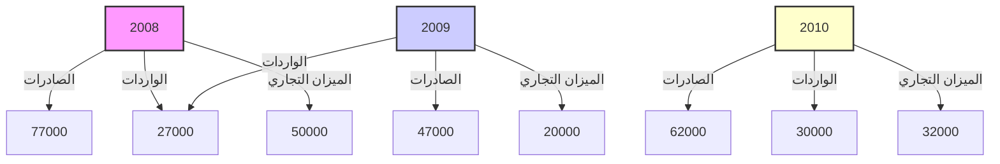

# مصرف ليبيا المركزي

## ميزان المدفوعات

### لعام 2010

إدارة البحوث والإحصاء
---
The image contains Arabic calligraphy in blue ink on a white background. The text is written in a stylized, flowing script typical of Islamic calligraphy. The phrase written is:

بسم الله الرحمن الرحيم

This is the Bismillah, which translates to "In the name of Allah, the Most Gracious, the Most Merciful." This phrase is commonly used at the beginning of chapters in the Quran and is often recited by Muslims before starting any action or task as a way of seeking God's blessing.
---
# المحتويات

| الصفحة | الموضوع |
|--------|---------|
| 1 | تقديم |
| 2 | مصطلحات وتعاريف |
| 12 | ملخص لميزان مدفوعات ليبيا لعام 2010 |
| 12 | أولاً : الحساب الجاري |
| 13 | • الميزان التجاري |
| 13 | • حساب الخدمات ، الدخل والتحويلات الجارية |
| 14 | ثانياً : الحساب الرأسمالي والمالي |
| 14 | ثالثاً : الميزان الكلي |
| 15 | جدول : ميزان مدفوعات ليبيا لعام 2010 |
| 17 | الرسوم البيانية |
| 19 | ملخص منقح لميزان مدفوعات ليبيا 2009/2008 |
---
تقديم

يسر إدارة البحوث والإحصاء بمصرف ليبيا المركزي أن تعلن عن الانتهاء من إعداد كتيب إحصاءات ميزان مدفوعات ليبيا لعام 2010 ، والذي يشتمل على بيانات نقدية ومالية عن قيمة المعاملات الجارية والرأسمالية المتبادلة بين ليبيا والعالم الخارجي خلال عام 2010 ، مبوبة حسب المنهجية والمفاهيم الواردة في الطبعة الخامسة من دليل ميزان المدفوعات الصادر عن صندوق النقد الدولي. كما يتضمن هذا الكتيب بيانات منقحة عن ميزان المدفوعات لعامي 2008 و2009 .

وقد تم الاعتماد في إعداد هذا الميزان على البيانات الواردة من الإدارات التالية بمصرف ليبيا المركزي وهي : إدارة الرقابة على المصارف والنقد ، إدارة الحسابات ، إدارة الاحتياطيات ، إدارة الإصدار ، إدارة العمليات المصرفية ، وكذلك على المعلومات التي تم استلامها من العديد من الهيئات والمؤسسات والشركات المقيمة في ليبيا ومن بينها :

الهيئة العامة للمعلومات ، الهيئة العامة للسياحة ، المؤسسة الوطنية للنفط ، المصارف التجارية،المصرف الليبي الخارجي ، الشركة الليبية للاستثمارات الخارجية ، الشركة الليبية للاستثمارات الأفريقية ، محفظة ليبيا إفريقيا للاستثمار ، المؤسسة الليبية للاستثمار ، المحفظة طويلة المدى، شركات النفط الأجنبية ، شركات التأمين الوطنية، شركات الخطوط الجوية الليبية ، الشركة الوطنية العامة للنقل البحري ، الشركة العامة للبريد والاتصالات السلكية واللاسلكية ، شركات الطيران الأجنبية ، بعثة الأمم المتحدة العاملة بليبيا وغيرها من المصادر المحلية الأخرى .

إدارة البحوث والإحصاء

| 1 | ميزان المدفوعات 2010 |
|---|------------------------|
---
# مصطلحات وتعاريف

تُعد هذه المصطلحات والتعاريف توضيحاً للمفاهيم التي يتم على أساسها تصنيف إحصاءات ميزان المدفوعات وبيان كيفية جمع وتبويب هذه الإحصاءات بما يتمشى مع دليل ميزان المدفوعات للطبعة الخامسة الذي أعده صندوق النقد الدولي في عام 1993 ، والذي وضع بهدف مساعدة الباحثين والمهتمين في فهم طبيعة ونوعية البيانات والأساليب المستخدمة في حسابات ميزان المدفوعات .

## أولاً : الحساب الجاري :-

يشتمل الحساب الجاري على كافة المعاملات التي تتضمن قيماً اقتصادية تمت بين جهات مقيمة في الاقتصاد الوطني وجهات أخرى غير مقيمة به(*)، كذلك يشمل القيود المعادلة للقيم الاقتصادية الجارية المقدمة أو المستلمة دون مقابل . وينقسم الحساب الجاري إلى البنود التالية : السلع والخدمات ، الدخل ، التحويلات الجارية .

### أ- السلع والخدمات :-

#### السلع :

يشمل بند السلع معظم السلع المنقولة المصدرة والمستوردة بين جهات مقيمة وأخرى غير مقيمة وينجم عنها تغير في الملكية . ويشمل بند السلع المرسلة للتجهيز الصادرات أو الواردات إذا كان التجهيز يتم في الاقتصاد القائم بإعداد البيانات من السلع التي تعبر الحدود لأغراض التجهيز في الخارج ، وما يتبع ذلك من إعادة استيراد لهذه السلع أو إعادة تصديرها إذا كان التجهيز يتم في الاقتصاد القائم بإعداد البيانات . وتقيّم السلع المذكورة بالقيم الإجمالية قبل وبعد التجهيز ، ويعتبر هذا البند استثناءً لمبدأ تغير الملكية .

(*) غير المقيم تعنى فرد أو شركة أو مؤسسة أو أي منظمة أخرى تكون مقيمة في بلد غير ليبيا ، أو مقيمة في ليبيا لمدة تقل عن سنة .

2 ميزان المدفوعات 2010
---
كما يشمل بند إصلاح السلع أعمال الإصلاح التي يقوم بها غير المقيمين أو العكس، مثل إصلاح السفن والطائرات وما إلى ذلك.

كما يشمل السلع التي تحصل عليها الناقلات في الموانئ وكافة ما تحصل عليه الناقلات (جوية - بحرية... الخ) المقيمة في الإقتصاد المعد للبيانات من الخارج، وما تحصل عليه الناقلات غير المقيمة من الإقتصاد المعد للبيانات من سلع مثل الوقود والمؤن والمواد الأولية والإمدادات، ولا يشمل ذلك تقديم الخدمات المساعدة (عمليات القطر والصيانة وما شابه ذلك) المشمولة تحت بند النقل. وأخيراً يشمل بند السلع كافة صادرات وواردات الذهب التجاري (غير النقدي) الذي لا يقع ضمن حيازات السلطات كأصل احتياطي (الذهب النقدي)، ويعامل الذهب غير النقدي كأي سلعة أخرى.

الخدمات:

1- النقل

يشتمل بند النقل على نقل السلع والركاب بجميع وسائل النقل (بري، بحري وجوي) والخدمات الأخرى التوزيعية والمساعدة بما في ذلك تأجير معدات النقل مع أطقم التشغيل التي يقدمها مقيمون إلى غير مقيمين والعكس.

2- السفر

يشتمل بند السفر على السلع والخدمات بما فيها تلك المتعلقة بالصحة والتعليم التي يحصل عليها المسافرون غير المقيمين في الإقتصاد المضيف (بمن فيهم المسافرون في رحلات سياحية قصيرة) لأغراض تتعلق بالأعمال أو الاستخدام الشخصي خلال زياراتهم التي تقل مدتها عن عام واحد. ولا يشمل بند السفر خدمات الركاب الدولية التي تدخل في بند النقل، ويعامل الطلاب والمسافرون للعلاج كمسافرين بغض النظر عن مدة إقامتهم، إلا أن هناك فئات أخرى معينة لا تعتبر ضمن المسافرين مثل العسكريين والعاملين في السفارات والعمال غير المقيمين حيث يتم إدراج مصروفات العمال غير المقيمين ضمن بند السفر، في حين تدرج مصروفات العسكريين والعاملين في السفارات ضمن الخدمات الحكومية.

| 3 | ميزان المدفوعات 2010 |
|---|----------------------|
---

### 3- خدمات الاتصالات

يشتمل بند خدمات الاتصالات على المعاملات في مجال الاتصالات بين المقيمين وغير المقيمين وتشمل هذه الخدمات مجالات الخدمات البريدية ونقل وتوزيع المراسلات والاتصالات السلكية واللاسلكية (نقل المعلومات الصوتية والمرئية وغير ذلك من المعلومات بالوسائل المتنوعة وما يرتبط بها من خدمات الصيانة التي يقدمها المقيمون لغير المقيمين أو يتلقونها منهم).

### 4- خدمات التشييد

يشتمل بند خدمات التشييد على أعمال البناء والتشييد ومشروعات التركيب التي تقوم بها مؤسسات مقيمة وعمالها على أساس مؤقت في الخارج أو العكس، أو في المناطق الخاضعة للسيادة الوطنية في الخارج، ولا تشمل تلك الأعمال ما تقوم به المؤسسة الأجنبية المنتسبة لمؤسسة مقيمة (استثمار مباشر).

### 5- خدمات التأمين

يشتمل بند خدمات التأمين على الخدمات التأمينية التي تقدمها مؤسسات التأمين المقيمة إلى المؤسسات غير المقيمة والعكس، ويشمل هذا البند خدمات التأمين على الشحن (على السلع المصدرة والمستوردة) وغير ذلك من خدمات التأمين المباشر (بما في ذلك التأمين على الحياة وغيره من أنواع التأمين الأخرى)، وخدمات إعادة التأمين.

### 6- الخدمات المالية

يشتمل بند الخدمات المالية (عدا الخدمات المرتبطة بمؤسسات التأمين وصناديق المعاشات التقاعدية) على خدمات الوساطة المالية والخدمات المساعدة التي تتم بين المقيمين وغير المقيمين، ويندرج تحت هذا البند العمولات والرسوم المتعلقة بخطابات الاعتماد وخطوط الائتمان وخدمات التأجير المالي، معاملات الصرف الأجنبي، الخدمات الائتمانية للمستهلكين، خدمات رجال الأعمال، خدمات السمسرة، خدمات الضمان ومختلف ترتيبات وأدوات التحوط من تقلبات الأسعار وما إلى ذلك. أما الخدمات المساعدة فتشمل الخدمات

4 ميزان المدفوعات 2010
---
المتعلقة بمجالات تشغيل وتنظيم الأسواق المالية وخدمات حفظ الأوراق المالية وما شابه
ذلك.

## 7- خدمات الحاسوب

يشتمل بند خدمات الحاسب الآلي والمعلومات على المعاملات بين المقيمين وغير المقيمين
في المجالات المتعلقة بالاستشارات في مجال الحاسوب، وتنفيذ البرامج الجاهزة وخدمات
المعلومات (معالجة البيانات وقواعد البيانات ووكالات الأنباء) وصيانة وإصلاح الحواسيب
والمعدات ذات الصلة بأجهزة الحاسوب.

## 8- خدمات رسوم الامتياز

يشتمل بند رسوم الامتياز والتراخيص على متحصلات (صادرات) ومدفوعات
(واردات) الخدمات التالية بين مقيمين وغير مقيمين:

- الاستخدام المرخص به لأصول غير ملموسة غير منتجة وغير مالية، وحقوق الملكية
الفكرية والفنية، مثل العلامات التجارية وحقوق التأليف وبراءات الاختراع والعمليات
المبتكرة، والأساليب الفنية والتصميمات، وحقوق التصنيع وامتيازات حق الاستخدام وما
شابه ذلك.

- استخدام المنتجات الأصلية أو النماذج الأولية، مثل المخطوطات والأفلام وما شابه ذلك
من خلال اتفاقات بالترخيص.

## 9- خدمات أخرى

يشتمل بند خدمات أخرى في مجال الأعمال على الخدمات المتبادلة بين مقيمين وغير مقيمين
في مجالات المتاجرة والخدمات الأخرى المرتبطة بالتجارة وخدمات التأجير التشغيلي
وخدمات أخرى متنوعة في مجال الأعمال والخدمات المهنية والفنية.

## 10- خدمات شخصية وثقافية وترفيهية

يشتمل بند الخدمات الشخصية والثقافية والترفيهية المتبادلة بين مقيمين وغير مقيمين على ما
يلي:

ميزان المدفوعات 2010
---
- الخدمات المرتبطة بوسائل سمعية وبصرية، المتبادلة بين مقيمين وغير مقيمين، وتتضمن الخدمات المرتبطة بالإنتاج السينمائي المسجل على أشرطة الأفلام أو الفيديو وبرامج الراديو والتلفزيون والتسجيلات الموسيقية (ومن أمثلة هذه الخدمات المبالغ والأجور التي يتلقاها الممثلون والمنتجون ومن على شاكلتهم نظير الإنتاج وحقوق التوزيع المباعة لوسائل الإعلام).

- الخدمات الثقافية الأخرى وتشمل الخدمات الشخصية والثقافية والترفيهية الأخرى كتلك المرتبطة بالمكتبات والمتاحف وغير ذلك من الأنشطة الثقافية والرياضية.

## الخدمات الحكومية - 11

تشمل فئة الخدمات الحكومية غير المدرجة في أماكن أخرى على كل الخدمات المرتبطة بقطاعات حكومية أو منظمات دولية أو اقليمية غير المبوبة تحت بنود أخرى (مثال ذلك مصروفات السفارات والقنصليات).

## ب- الدخل:

ويشتمل على ما يلي:

### 1- تعويضات العاملين

يشتمل بند تعويضات العاملين على الأجور والرواتب والمزايا الأخرى النقدية والعينية لعمال الحدود والعمال الموسميين وغيرهم من العمال غير المقيمين (مثل العمال المحليين العاملين في السفارات).

### 2- دخل الإستثمار

يشتمل بند دخل الإستثمار على متحصلات الدخل المرتبطة بحيازات المقيمين لأصول مالية خارجية ومدفوعاتهم المرتبطة بخصوم تجاه غير المقيمين، ويتكون دخل الإستثمار من أنواع الدخل المستمدة من أنشطة الإستثمار المباشر واستثمارات الحافظة واستثمارات أخرى، وينقسم عنصر الإستثمار المباشر إلى دخل حقوق الملكية (الأرباح الموزعة، وأرباح الفروع الموزعة، والعائدات المعاد استثمارها)، والدخل من الدين (الفوائد).

6 ميزان المدفوعات 2010
---
ويتفرع دخل إستثمارات الحافظة إلى الدخل من حقوق الملكية (أرباح موزعة) والدخل من
الدين (فوائد)، ويشمل الدخل من إستثمارات أخرى الفوائد المكتسبة من أنواع أخرى من
رأس المال (قروض وما شابه ذلك)، كما يشمل من حيث المبدأ الدخل المحتسب أو المقدر
للأسر من صافي حقوق ملكيتها في إحتياطيات التأمين على الحياة وصناديق المعاشات
التقاعدية.

## ج- التحويلات الجارية

هي البنود الموازنة للتغيرات في ملكية الموارد الحقيقية أو البنود المالية بين مقيمين وغير
مقيمين دون أن تتضمن المعاملة قيمة إقتصادية مقابلة سواء كان تغير الملكية طوعياً أو
إلزامياً، وتتكون التحويلات الجارية من جميع التحويلات التي لا تتضمن ما يلي:

• تحويلات ملكية أصول ثابتة.
• تحويلات أموال مرتبطة أو مشروطة بحيازة أصول ثابتة أو بالتصرف فيها.
• الإعفاء من الإلتزامات المالية دون تلقي الدائنين لأي مقابل عوضاً عنها. فهذه الأنواع
الثلاثة من المعاملات هي تحويلات رأسمالية أما التحويلات الجارية فتشمل تحويلات
الحكومة العامة (مثل التحويلات الجارية المرتبطة بالتعاون الدولي بين مختلف الحكومات
والمدفوعات الضريبية الجارية على الدخل والثروة وما شابه ذلك)، والتحويلات الأخرى
مثل تحويلات العاملين وأقساط التأمين (مع استبعاد رسوم الخدمة)، واستحقاقات التأمين
بخلاف التأمين على الحياة.

## ثانياً: الحساب الرأسمالي والمالي :-

يضم هذا الحساب عنصرين رئيسيين هما الحساب الرأسمالي والحساب المالي وهما
متوافقان مع ذات الحسابين في نظام الحسابات القومية. وفي هذين الحسابين تعتبر
الاستحقاقات على غير المقيمين أصولاً، وتعتبر الإلتزامات إزاء غير المقيمين خصوماً.

| 7 | ميزان المدفوعات 2010 |
|---|----------------------|
---
وعادة ما يكون طرفا المعاملة في الأصول أو الخصوم هما مقيم وغير مقيم غير أن هناك
حالات محدودة قد يكون فيها كلا الطرفين مقيماً أو قد يكون كلاهما غير مقيم.

وتستبعد من الحساب الرأسمالي والمالي جميع تغييرات التقييم وغيرها من التغييرات التي
تلحق بالأصول والخصوم الأجنبية دون أن يرجع التغيير إلى حدوث معاملات، وتدرج هذه
التغييرات بدلاً من ذلك في وضع الإستثمار الدولي بإستثناء بنود معينة ذات أهمية تحليلية
وذات تأثير على حسابات مختلفة، مثل الخصوم التي تشكل احتياطيات لسلطات أجنبية
ومعاملات التمويل الإستثنائي.

## (أ) الحساب الرأسمالي

يضم الحساب الرأسمالي عنصرين رئيسيين هما حساب التحويلات الرأسمالية وحساب
حيازة الأصول غير المنتجة غير المالية أو التصرف فيها. ويتكون حساب التحويلات
الرأسمالية من التحويلات التي تتضمن تغييراً في ملكية أصول ثابتة أو تحويلات الأموال
المرتبطة أو المشروطة بحيازة أصول ثابتة أو التصرف فيها أو التحويلات الناتجة عن قيام
الدائن بإسقاط خصوم المدين دون تلقي أي مقابل لها. وتشتمل التحويلات الرأسمالية على
عنصرين:

- الحكومة العامة وتنقسم إلى الإعفاء من الدين وتحويلات أخرى.
- القطاعات الأخرى وتنقسم إلى تحويلات المهاجرين والإعفاء من الدين. ويشمل حساب
حيازة الأصول غير المنتجة غير المالية أو التصرف فيها الأصول غير الملموسة مثل
البراءات المرخصة وعقود التأجير وغير ذلك من العقود القابلة للتحويل إلى الغير والشهرة
التجارية وما شابه ذلك. ولا يتضمن هذا البند حيازة الأراضي أو التصرف فيها في إقليم
اقتصادي محدد، لكنه قد يتضمن شراء أو بيع الأراضي من جانب السفارات الأجنبية.

| 8 | ميزان المدفوعات 2010 |
|---|----------------------|
---
(ب) الحساب المالي

يستند تصنيف العناصر الأساسية في الحساب المالي إلى المعايير التالية :

تقسم كل العناصر حسب نوع الإستثمار أو تقسيم وظيفي ( الإستثمار المباشر ، استثمارات الحافظة ، استثمارات أخرى وأصول احتياطية ). يجري التمييز داخل فئة الإستثمار المباشر على أساس اتجاه الإستثمار ( في الخارج أو في الإقتصاد القائم بإعداد البيان ) كما يجري التمييز على أساس الأصول والخصوم في بندي رأس مال (حقوق الملكية) وأنواع أخرى من رأس المال الداخلين في فئة الإستثمار المباشر. أما داخل فئتي إستثمارات الحافظة واستثمارات أخرى ، فيجري التمييز بينهما على أساس المعيار المعتاد أي الأصول والخصوم .

يعتبر التصنيف حسب نوع الأداة ذو أهمية خاصة بالنسبة لاستثمارات الحافظة واستثمارات أخرى ( سندات الملكية أو سندات الدين والإئتمانات التجارية والقروض والعملة والودائع وأصول وخصوم أخرى ) ويشمل استثمار الحافظة الأدوات المالية التقليدية إلى جانب الأدوات الجديدة في السوق النقدية وغير ذلك من الأدوات المالية والمشتقات .

1- الإستثمار المباشر

يعبر الإستثمار المباشر عن مصلحة مستديمة لجهة مقيمة ( المستثمر المباشر ) في جهة مقيمة بإقتصاد آخر ( مؤسسة الإستثمار المباشر ) ويتضمن الإستثمار المباشر كافة المعاملات بين المستثمرين المباشرين ومؤسسات الإستثمار المباشر ، أي أنه لايقتصر فقط على المعاملة المبدئية بين الطرفين بل يشمل كافة المعاملات اللاحقة بينهما وبين المؤسسات المنتسبة سواء كانت مساهمة أو غير مساهمة . وتقسم معاملات الإستثمار المباشر ( في الخارج وفي الإقتصاد القائم بإعداد البيان ) إلى رأسمال (حقوق الملكية) والعائدات المعاد استثمارها وأنواع رأس المال الأخرى ( معاملات بين الشركات ) ، ويجرى التمييز في حالتي رأسمال (حقوق الملكية) وأنواع رأس المال الأخرى بين استحقاقات والتزامات تجاه المؤسسات المنتسبة من جهة ، وبين استحقاقات والتزامات تجاه المستثمرين المباشرين من

9                                    ميزان المدفوعات 2010
---
جهة أخرى وتقتصر المعاملات فيما بين المصارف المنتسبة والمعاملات فيما بين جهات
الوساطة المالية المنتسبة الأخرى على رأسمال
(حقوق الملكية) ورأسمال الدين القائم.

## 2- استثمار الحافظة

تشتمل فئة استثمارات الحافظة على المعاملات في سندات الملكية وسندات الدين، وتنقسم
الأخيرة إلى سندات وأذونات وأدوات السوق النقدية والمشتقات المالية مثل (عقود الاختيار)
إذا تولد عن الأداة المشتقة استحقاقات والتزامات مالية. وتتوزع مختلف أنواع الأدوات
المالية الجديدة على البنود الملائمة لأنواعها في هذا التصنيف (تستبعد المعاملات التي
تشملها فئتا الإستثمار المباشر والأصول الاحتياطية).

## 3- استثمارات أخرى

تشتمل فئة استثمارات أخرى على الإئتمانات التجارية القصيرة الأجل والطويلة الأجل
والقروض (بما في ذلك استخدام ائتمان وقروض صندوق النقد الدولي والقروض المرتبطة
بالتأجير المالي)، والعملة والودائع (القابلة للتحويل وغير ذلك مثل الودائع الادخارية
والودائع لأجل وأسهم المدخرات والقروض وأسهم الإتحادات الإئتمانية وما شابه ذلك)،
وحسابات أخرى مستحقة التحصيل أو الدفع ويستبعد من ذلك المعاملات التي يشملها
الإستثمار المباشر.

## ثالثاً : الإحتياطيات والبنود المتعلقة بها :-

تشتمل فئة الأصول الإحتياطية على المعاملات في الأصول التي تعتبرها السلطات النقدية في
الاقتصاد أصولاً متاحة للاستخدام بغرض الوفاء باحتياجات ميزان المدفوعات وباحتياجات
أخرى في بعض الأحيان. ولا يرتبط توافر هذه الأصول ارتباطاً وثيقاً من حيث المبدأ
بالمعايير الشكلية مثل معيار الملكية أو العملة المحرر بها الأصل، وتشمل الأصول

| 10 | ميزان المدفوعات 2010 |
|----|--------------------|
---
الاحتياطية الذهب النقدي ، حقوق السحب الخاصة ، وضع الاحتياطي لدى صندوق النقد
الدولي ، الأصول من النقد الأجنبي ( عملات وودائع وأوراق مالية ) ، واستحقاقات أخرى .

وتستبعد الطبعة الخامسة لدليل ميزان المدفوعات تغيرات التقييم في الأصول الاحتياطية
والقيود المقابلة لتلك التغيرات ، كما تستبعد أيضاً تخصيص وإلغاء حقوق السحب الخاصة
وإضفاء / إبطال الصفة النقدية للذهب والقيود المقابلة لتلك التغيرات ذلك أن مثل هذه
التغيرات التي لا تنتج عن معاملات تدرج في هذه الطبعة تحت وضع الإستثمار الدولي .

## رابعاً : السهو والخطأ :-

تنص القاعدة الأساسية بدليل ميزان المدفوعات على تسجيل كل معاملة في قيدين متساويين
في القيمة أحدهما دائن بإشارة موجبة والآخر مدين بإشارة سالبة أي أن الرصيد النهائي
الصافي في البيان يجب أن يساوي صفراً ،غير أن ذلك نادراً ما يتحقق في الواقع العملي ،
نظراً لأن البيانات غالباً ما يتم إستخراجها على حدة من مصادر مختلفة ، ولذلك يتبقى رصيد
صافي على الجانب الدائن أو المدين أو بعبارة أخرى صافي السهو والخطأ .

ميزان المدفوعات 2010 | 11
---
# ملخص لوضع ميزان المدفوعات

تأثر الوضع العام لميزان مدفوعات ليبيا خلال عام 2010 بارتفاع الإيرادات النفطية خلال العام نتيجة للارتفاع الملحوظ في أسعار النفط العالمية عما كانت عليه خلال عام 2009 فقد ساهمت عوامل عديدة في ارتفاع تلك الأسعار، منها عوامل عدم الاستقرار الجيوسياسي في العديد من مناطق الإنتاج وارتفاع الطلب على النفط بفعل عوامل الطقس في النصف الشمالي للكرة الأرضية بسبب البرودة الشديدة لشتاء هذا العام ، وانتعاش اقتصادات الدول الصاعدة وخاصة الصين والهند ، إلى جانب العامل الرئيسي المهم المتمثل في تذبذب أسعار العملات والسندات واستمرار تصاعد المضاربات في الأسواق المستقبلية ، والذي كان له الأثر الواضح على وضع الميزان الكلي الذي حقق فائضاً بلغ 5.7 مليار دينار خلال العام (اي مايعادل 5.7% من الناتج المحلي الإجمالي) مقابل 6.5 مليار دينار عام 2009 (اي مايعادل 7.5% من الناتج المحلي الإجمالي) ، وان كان هذا الفائض انخفض عن العام الماضي وذلك نتيجة لزيادة تدفقات رؤوس الأموال للخارج ، والمتمثلة في الاستثمارات الأجنبية المباشرة للخارج واستثمارات الحافظة.

فيما يلي تحليل للبنود الرئيسية المكونة لميزان المدفوعات:-

## أولاً – الحساب الجاري:

أدى الارتفاع الملحوظ في فائض الميزان التجاري لعام 2010 بمقدار 11.9 مليار دينار والبالغ 30.7 مليار دينار عام 2010 مقابل 18.8 مليار دينار عام 2009 وما صاحبه من ارتفاع في عجز حساب الخدمات ، الدخل والتحويلات الجارية ليبلغ 9.5 مليار دينار مقابل 7.1 مليار دينار عام 2009 . إلى ارتفاع الحساب الجاري بمقدار 9.5 مليار دينار ليصل إلى 21.2 مليار دينار عام 2010 (اي مايعادل 21.2% من الناتج المحلي الإجمالي) مقابل 11.7 مليار دينار عام 2009 (اي مايعادل 31.6% من الناتج المحلي الإجمالي).

12 ميزان المدفوعات 2010
---
وفيما يلي عرض لأهم بنود هذا الحساب :-

## 1 - الميزان التجاري :

إن ارتفاع أسعار النفط في أسواق النفط العالمية خلال عام 2010 إنعكس بشكل إيجابي على قيمة الصادرات النفطية التي تعد المحرك الرئيسي للتنمية الإقتصادية والإجتماعية والداعم الرئيسي للإحتياطيات الرسمية للمصرف المركزي من العملات الأجنبية ، حيث بلغ متوسط أسعار النفط الليبي لعام 2010 مسيحي 79.2 دولار للبرميل مقابل 61.4 دولار للبرميل عام 2009 بنسبة ارتفاع قدرها 29.0% ، ولعل بيانات حساب الميزان التجاري لعام 2010 تعطي صورة واضحة للآثار الإيجابية الناجمة عن ارتفاع اسعار النفط خلال العام ، فقد ارتفع فائض الميزان التجاري بنسبة 63.3% ليصل إلى 30.7 مليار دينار عام 2010 مقابل 18.8 مليار دينار عام 2009 نتيجة لارتفاع قيمة الصادرات النفطية بمقدار 7.9 مليار دينار ليصل إلى 54.2 مليار دينار عام 2010 مقابل 46.3 مليار دينار عام 2009.

في حين إرتفعت قيمة الواردات بنسبة 12.4% لتبلغ 30.9 مليار دينار في عام 2010 مقابل 27.5 مليار دينار عام 2009.

## 2 – حساب الخدمات ، الدخل و التحويلات الجارية :

اظهر صافي حساب الخدمات ، الدخل والتحويلات الجارية لعام 2010 عجزاً بلغ 9.5 مليار دينار مقابل 7.1 مليار دينار في عام 2009 ، ويعزى الإرتفاع الملحوظ في عجز هذا الحساب إلى إرتفاع العجز في حساب الخدمات والذي إرتفع بنسبة 24.1% عما كان عليه في العام السابق ليرتفع إلى 7.2 مليار دينار مقابل 5.8 مليار دينار عام 2009 ، وإلى العجز في حساب التحويلات الجارية البالغ 2.3 مليار دينار ، مقابل عجز بلغ 2.0 مليار دينار في عام 2009 ، في حين سجل حساب الدخل عجزا بلغ 37.8 مليون دينار مقابل فائض بلغ 721.0 مليون دينار عام 2009.

ميزان المدفوعات 2010 | 13
---
## ثانياً - الحساب الرأسمالي والمالي

أسفرت حركة المعاملات الرأسمالية والمالية لليبيا مع العالم الخارجي في عام 2010 المتمثلة في التحويلات الرأسمالية ، وحيازة الأصول غير المنتجة غير المالية ، وصافي حركة الاستثمارات المباشرة سواء إلى الداخل أو إلى الخارج ، والتغير في وضع المحافظ الاستثمارية ، وصافي حركة الاستثمارات الأخرى المتمثلة في الائتمانات التجارية والقروض الطويلة والقصيرة الأجل والعملة والودائع لدى السلطات النقدية أو المصارف أو الحكومات العامة أو القطاعات الأخرى تدفقاً للخارج بلغ 12.4 مليار دينار ، مقابل تدفقاً للخارج بلغ 6.9 مليار دينار في عام 2009.

## ثالثاً - الميزان الكلي

حقق الميزان الكلي لميزان مدفوعات ليبيا فائضاً بلغ 5.7 مليار دينار خلال عام 2010 ، مقابل 6.5 مليار دينار خلال عام 2009 . وانخفاض الفائض لهذا العام مقارنة بالعام الماضي يعود أساساً لزيادة التدفقات المالية في الحساب الرأسمالي والمالي للخارج ، نتيجة لزيادة الاستثمار الأجنبي المباشر واستثمارات الحافظة لليبيا في الخارج .

ميزان المدفوعات 2010 14
---
ميزان المدفوعات
لسنة 2010
"مليون دينار"

| 2010 |  |  |  |
|---|---|---|---|
| الرصيد | مدين | دائن | البند |
| 21169.3 | 43926.5 | 65095.8 | أولاً : حساب العمليات الجارية : |
| 30714.5 | 30944.3 | 61658.9 | السلع |
| 30714.5 | 30944.3 | 61658.9 | 1- بضائع |
| 54156.1 | 5693.9 | 59850.0 | ( أ ) قطاع النفط |
| -23441.5 | 25250.4 | 1808.9 | (ب) القطاعات الأخرى |
| 0.0 | 0.0 | 0.0 | 2- ذهب غير نقدي |
| -7203.8 | 7720.0 | 516.2 | الخدمات |
| -2617.9 | 2948.1 | 330.2 | 1- النقل |
| -2238.6 | 2430.9 | 192.3 | ( أ ) النقل البحري |
| -379.3 | 517.2 | 138.0 | (ب) النقل الجوي |
| 0.0 | 0.0 | 0.0 | (ج) نقل آخر |
| -2503.9 | 2579.5 | 75.6 | 2- السفر |
| -46.4 | 61.5 | 15.1 | 3- خدمات الإتصالات |
| -207.4 | 207.4 | 0.0 | 4- خدمات التشييد |
| -725.0 | 820.3 | 95.3 | 5- خدمات التأمين |
| 0.0 | 0.0 | 0.0 | 6- خدمات الإمتياز والترخيص |
| 0.0 | 0.0 | 0.0 | 7- خدمات مالية |
| 0.0 | 0.0 | 0.0 | 8-خدمات الحاسب الآلي |
| 0.0 | 0.0 | 0.0 | 9-خدمات ثقافية وترفيهية |
| -1103.3 | 1103.3 | 0.0 | 10- خدمات حكومية |
| 0.0 | 0.0 | 0.0 | 11-أنواع أخرى من خدمات الأعمال |
| -37.8 | 2958.5 | 2920.7 | الدخل |
| 0.0 | 0.0 | 0.0 | 1- تعويضات العاملين |
| -37.8 | 2958.5 | 2920.7 | 2- دخل الإستثمار |
| -2207.5 | 2958.5 | 751.0 | ( أ ) الإستثمار المباشر |
| 1462.9 | 0.0 | 1462.9 | (ب) إستثمار الحافظة |
| 706.9 | 0.0 | 706.9 | (ج) إستثمارات أخرى |

15                                                     ميزان المدفوعات 2010
---
"مليون دينار"

| 2010 |  |  |  |
|-------|-------|-------|-------|
| الرصيد | مدين | دائن | البنــد |
| -2303.7 | 2303.7 | 0.0 | التحويلات الجارية |
| -276.3 | 276.3 | 0.0 | 1-القطاع الرسمي |
| -2027.3 | 2027.3 | 0.0 | 2- قطاعات أخرى |
| -2027.3 | 2027.3 | 0.0 | ( أ ) تحويلات العاملين |
| 0.0 | 0.0 | 0.0 | (ب) تحويلات أخرى |
| -12356.1 | 14910.3 | 2554.3 | ثانياً : الحساب الرأسمالي والمالي : |
| 0.0 | 0.0 | 0.0 | الحساب الرأسمالي |
| 0.0 | 0.0 | 0.0 | 1- التحويلات الرأسمالية |
| 0.0 | 0.0 | 0.0 | 2- حيازة الأصول غير المنتجة غير المالية |
| -12356.1 | 14910.3 | 2554.3 | الحساب المالي |
| -1182.4 | 3430.2 | 2247.8 | 1- الإستثمار المباشر |
| -3430.2 | 3430.2 | 0.0 | ( أ ) إستثمار مباشر في الخارج |
| 2247.8 | 0.0 | 2247.8 | (ب) إستثمار مباشر في ليبيا |
| 1054.1 | 0.0 | 1054.1 | - قطاع النفط |
| 1193.7 | 0.0 | 1193.7 | - أخرى |
| -5539.0 | 5539.0 | 0.0 | 2-إستثمار الحافظة |
| -5539.0 | 5539.0 | 0.0 | ( أ ) الأصول |
| 0.0 | 0.0 | 0.0 | (ب) الخصوم |
| -5634.7 | 5941.2 | 306.4 | 3-إستثمارات أخرى |
| -5760.8 | 5760.8 | 0.0 | ( أ ) الأصول |
| -3994.2 | 3994.2 | 0.0 | 1- إئتمانات تجارية |
| -230.6 | 230.6 | 0.0 | 2- القروض |
| -1536.1 | 1536.1 | 0.0 | 3- العملة والودائع |
| 0.0 | 0.0 | 0.0 | 4- أصول أخرى |
| 126.1 | 180.3 | 306.4 | ( ب ) الخصوم : |
| 0.0 | 0.0 | 0.0 | 1- إئتمانات تجارية |
| 6.7 | 0.0 | 6.7 | 2- القروض |
| -180.3 | 180.3 | 0.0 | 3- العملة والودائع |
| 299.8 | 0.0 | 299.8 | 4- خصوم أخرى |

ميزان المدفوعات 2010
---
"مليون دينار"

| 2010 |  |  |  |
|---|---|---|---|
| الرصيد | مدين | دائن | البنــد |
| 8813.2 | 58836.8 | 67650.0 | مجموع ( أولاً + ثانياً ) |
| -5671.3 | 5711.1 | 39.9 | ثالثاً : الاصول الاحتياطية : |
| 0.0 | 0.0 | 0.0 | أ- الذهب النقدي |
| 39.9 | 0.0 | 39.9 | ب- حقوق السحب الخاصة |
| -244.6 | 244.6 | 0.0 | ج- وضع الإحتياطي لدى الصندوق |
| -5466.5 | 5466.5 | 0.0 | د- عملات أجنبية |
| -3141.9 | 3141.9 | 0.0 | رابعاً : السهو والخطأ |
| 0.0 | 67689.9 | 67689.9 | المجمــوع |

الميزان التجاري

ميزان المدفوعات 2010 17
---
The image contains two charts in Arabic, which I will translate and present as tables in Markdown format.

## وضع ميزان الحساب الجاري بميزان المدفوعات خلال الفترة 2008 - 2010
(Current Account Balance in the Balance of Payments during the period 2008 - 2010)

| السنوات (Years) | مليون دينار (Million Dinars) |
|-----------------|------------------------------|
| 2008            | 45000                        |
| 2009            | 12000                        |
| 2010            | 22000                        |

## الوضع الكلي لميزان المدفوعات خلال الفترة 2008 - 2010
(Overall Balance of Payments during the period 2008 - 2010)

| السنوات (Years) | مليون دينار (Million Dinars) |
|-----------------|------------------------------|
| 2008            | 20000                        |
| 2009            | 8000                         |
| 2010            | 6000                         |

The first chart shows the current account balance in the balance of payments, which starts high in 2008, drops significantly in 2009, and then partially recovers in 2010.

The second chart displays the overall balance of payments, which shows a steady decline from 2008 to 2010.

At the bottom of the image, there's a footer that reads:

ميزان المدفوعات 2010 18
(Balance of Payments 2010 18)
---
ملخص منقح لميزان مدفوعات ليبيا
لعامي 2008 - 2009
بملايين الدنانير

| البند                                   | 2008    | 2009    |
|----------------------------------------|---------|---------|
| أولاً : الحساب الجارى                    | 45983   | 11724   |
| 1. السلع والخدمات                        | 46409   | 12968   |
| أ. السلع                                | 51089   | 18816   |
| الصادرات (فوب)                          | 77027   | 46319   |
| قطاع الهيدروكربونات                      | 75243   | 44626   |
| صادرات أخرى                             | 1784    | 1693    |
| الواردات (فوب)                          | -25938  | -27503  |
| ب.الخدمات                               | -4680   | -5848   |
| مدين                                   | 284     | 481     |
| دائن                                   | -4964   | -6329   |
| 2. الدخل                                | 863     | 721     |
| دخل الإستثمار المباشر                    | -4041   | -1785   |
| دخل إستثمارات أخرى                       | 4904    | 2506    |
| 3.التحويلات الجارية                      | -1289   | -1965   |
| الحكومة العامة                          | -94     | -264    |
| القطاعات الأخرى                         | -1195   | -1701   |
| قطاع النفط                              | -434    | -625    |
| أخرى ( تشمل تحويلات العاملين )            | -761    | -1076   |
| ثانياً : الحساب الرأسمالي والمالي        | -23905  | -6870   |
| الاستثمار المباشر                       | -3358   | 258     |
| إستثمار الحافظة                         | -13515  | -4190   |
| إستثمارات أخرى                          | -7032   | -2938   |
| ثالثاً : الاصول الاحتياطية               | 19650   | 6453    |
| رابعاً : صافى السهو والخطأ               | -2428   | 1599    |

19                                    ميزان المدفوعات 2010