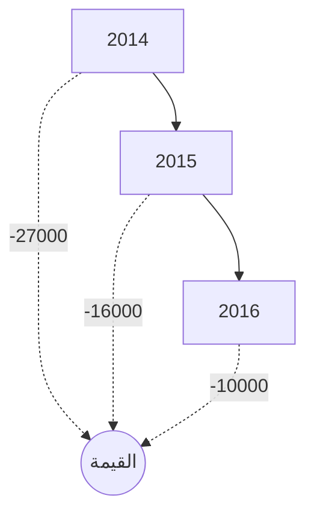

مصرف ليبيا المركزي

# ميزان المدفوعات

## لعام 2016

إدارة البحوث والإحصاء
---
The image contains Arabic calligraphy in blue ink on a white background. The text is written in a stylized, flowing script typical of Islamic calligraphy. The phrase written is:

بسم الله الرحمن الرحيم

This is a common Islamic phrase known as the Bismillah, which translates to "In the name of Allah, the Most Gracious, the Most Merciful." This phrase is often used at the beginning of various actions by Muslims as a way to seek blessings and invoke the name of God.

The calligraphy is elegant and ornate, with the letters flowing into each other in a harmonious design. The blue color stands out clearly against the white background, giving the image a clean and striking appearance.
---
# المحتويات

| الصفحة | الموضوع |
|--------|---------|
| 1 | تقديـم |
| 2 | مصطلحات وتعاريف |
| 22 | ملخص لميزان مدفوعات ليبيا لعام 2016 |
| 22 | أولاً : الحساب الجاري |
| 22 | • الميزان التجاري |
| 23 | • حساب الخدمات ، الدخل والتحويلات الجارية |
| 23 | ثانياً : الحساب الرأسمالي والمالي |
| 23 | ثالثاً : الميزان الكلي |
| 24 | جدول : ميزان مدفوعات ليبيا لعام 2016 |
| 33 | الرسوم البيانية |
| 35 | ملخص منقح لميزان مدفوعات ليبيا 2015/2014 |
---
# تقديم

يسر إدارة البحوث والإحصاء بمصرف ليبيا المركزي أن تعلن عن الانتهاء من إعداد كتيب إحصاءات ميزان مدفوعات ليبيا لعام 2016، والذي يشتمل على بيانات نقدية ومالية عن قيمة المعاملات الجارية والرأسمالية المتبادلة بين ليبيا والعالم الخارجي خلال عام 2016، مبوبة حسب المنهجية والمفاهيم الواردة في الطبعة السادسة من دليل ميزان المدفوعات الصادر عن صندوق النقد الدولي. كما يتضمن هذا الكتيب بيانات منقحة عن ميزان المدفوعات لعامي 2014 و2015.

وقد تم الاعتماد في إعداد هذا الميزان على البيانات الواردة من الإدارات التالية بمصرف ليبيا المركزي وهي: إدارة الرقابة على المصارف والنقد، إدارة الحسابات، إدارة الأسواق المالية، إدارة الإصدار، إدارة العمليات المصرفية، وكذلك على المعلومات التي تضمنتها المسوحات التي تم استلامها من العديد من الهيئات والمؤسسات والشركات ذات العلاقة المقيمة في ليبيا ومن بينها:

مصلحة الاحصاء والتعداد (وزارة التخطيط)، الهيئة العامة للسياحة، المؤسسة الوطنية للنفط، المصارف التجارية، المصرف الليبي الخارجي، الشركة الليبية للاستثمارات الخارجية، محفظة ليبيا أفريقيا للاستثمار، المؤسسة الليبية للاستثمار، المحفظة طويلة المدى، شركات النفط الأجنبية، شركات التأمين الوطنية، شركات الخطوط الجوية الليبية، الشركة الوطنية العامة للنقل البحري، الشركة الليبية للبريد والاتصالات وتقنية المعلومات القابضة، شركات الطيران الأجنبية، بعثة الأمم المتحدة العاملة في ليبيا وغيرها من المصادر المحلية الأخرى، وأيضاً مصادر خارجية كالنشرات والتقارير والمواقع الالكترونية ونظم الإبلاغ عن المعاملات الدولية على الشبكة العنكبوتية.

## إدارة البحوث والإحصاء

1

ميزان المدفوعات 2016
---
# مصطلحات وتعاريف

تُعد هذه المصطلحات والتعاريف توضيحاً للمفاهيم التي يتم على أساسها تصنيف إحصاءات
ميزان المدفوعات وبيان كيفية جمع وتبويب وتصنيف هذه الإحصاءات وفقاً للمنهجية
المتبعة في دليل ميزان المدفوعات الطبعة السادسة الذي أعده صندوق النقد الدولي في عام
2008 ، والذي وضع بهدف توحيد البيانات على المستوى الدولي ومساعدة الباحثين
والمهتمين في فهم طبيعة ونوعية البيانات والأساليب المستخدمة في حسابات ميزان
المدفوعات .

## أولاً : الحساب الجاري :-

يشتمل الحساب الجاري على كافة المعاملات التي تتضمن قيماً اقتصادية تمت بين
الجهات المقيمة في الاقتصاد الوطني وجهات أخرى غير المقيمة به(*)، كذلك يشمل القيود
المعادلة للقيم الاقتصادية الجارية المقدمة أو المستلمة دون مقابل. وينقسم الحساب الجاري
إلى البنود التالية : السلع، الخدمات، الدخل الأولي و الدخل الثانوي .

### أ- السلع والخدمات :-

#### السلع :

تعد السلع بنود مادية منتجة يمكن إثبات حق ملكيتها، كما يمكن نقل هذه الملكية من وحدة
مؤسسية إلى أخرى من خلال التعامل في الأسواق، وقد تستخدم في إشباع حاجات ورغبات
الأسر المعيشية أو المجتمع أو في إنتاج سلع أو خدمات أخرى ، ويشمل بند السلع البضائع
العامة والسلع الأخرى .

**البضائع العامة :** تشمل السلع التي تتغير ملكيتها الاقتصادية فيما بين المقيمين وغير
المقيمين ولا تندرج ضمن السلع قيد المتاجرة والذهب غير النقدي والسلع المدرجة ضمن
السفر والبناء

----

(*) غير المقيم تعني أي فرد أو شركة أو مؤسسة أو أي منظمة أخرى تكون مقيمة في بلد غير ليبيا ، أو مقيمة في ليبيا لمدة
تقل عن سنة.

2

ميزان المدفوعات 2016
---
والسلع والخدمات الحكومية غير المدرجة في مكان آخر، ونجد أن بيانات البضائع العامة

تجمع من عدد من المصادر تشمل إحصاءات التجارة الدولية وبيانات الجمارك ونظم الإبلاغ

عن المعاملات الدولية واستقصاءات الشركات التجارية، وقد يتعين تعديل البيانات

المستخلصة من هذه المصادر بما يتفق مع إرشادات إعداد ميزان المدفوعات من حيث نطاق

التغطية والتوقيت والتقييم والتبويب، ومن البنود التي يتعين إدراجها ضمن البضائع العامة:

- النقود الورقية والمعدنية غير المتداولة في الوقت الحالي والأوراق المالية غير
المصدرة، ويجري تقييمها كسلع أولية وليس بقيمتها الاسمية.

- الكهرباء والغاز والمياه.

- برامج الكمبيوتر المعبأة الجاهزة (النظم والتطبيقات) والتسجيلات السمعية
والبصرية المخزنة على وسائط مادية مثل الأقراص وغيرها من وسائل التخزين
التي تتيح تراخيصها الحق في الاستخدام الدائم لها.

- السلع التي تحصل عليها الناقلات في الموانئ من وقود ومؤن ومخزونات ومواد
تغليف البضائع المنقولة التي تحصل عليها شركات النقل غير المقيمة في الموانئ
من موردين مقيمين.

- السلع التي توردها أو تشتريها الناقلات خارج الإقليم الذي تقيم فيه شركة النقل.

- السلع التي يقتنيها المستأجر بموجب عقد تأجير تمويلي.

- السلع التي ترسل للخارج دون تغير في ملكيتها ثم تباع فيما بعد مثل السلع التي
ترسل من أجل التخزين أو الإصلاح أو العرض أو التجهيز.

- السلع غير المشروعة والسلع المهربة.

- الهبات و المساعدات الإنسانية المقدمة في شكل سلع.

- الطرود البريدية التي ينطوي إرسالها على تغير في الملكية.

- السلع التي تبيعها الحكومة إلى غير المقيمين وتشتريها منهم مثل المعدات
العسكرية.

3

ميزان المدفوعات 2016
---
# السلع الأخرى:

يشمل هذا البند السلع قيد المتاجرة والذهب غير النقدي، فالسلع قيد المتاجرة تعرف بأنها شراء جهة مقيمة (في الاقتصاد القائم بإعداد البيانات) لسلع من جهة غير مقيمة وبيع نفس السلع فيما بعد إلى جهة غير مقيمة أخرى دون تواجد السلع في الاقتصاد القائم بإعداد البيانات. أما الذهب غير النقدي فيشمل جميع أشكال الذهب بخلاف الذهب النقدي الذي تمتلكه السلطات النقدية ويحتفظ به كأصول احتياطية ويمكن أن يكون الذهب غير النقدي في شكل سبائك، أي سبائك الذهب شكل عملات أو قوالب أو سبائك لاتقل نسبة نقائها عن 995 جزء في الألف، بما في ذلك الذهب المحتفظ به في حسابات الذهب المخصص.

# الخدمات:

## 1- خدمات الصناعة التحويلية للمدخلات المادية المملوكة لآخرين:

يتضمن بند خدمات الصناعة التحويلية للمدخلات المادية المملوكة لآخرين عمليات التجهيز والتجميع والتغليف وما شابهها التي تقوم بها مؤسسات لا تمتلك السلع المعنية، حيث يقوم بعمليات الصناعة التحويلية كيان لا يمتلك السلع، وذلك مقابل رسوم يدفعها المالك. في هذه الحالة لاتتغير ملكية السلع وبالتالي لاتقيد المعاملات بين المالك وجهة التجهيز ضمن البضائع العامة، ومن أمثلة ذلك تكرير النفط وتسييل الغاز الطبيعي وتجميع الملبوسات والالكترونيات.

## 2- خدمات الصيانة والإصلاح غير المدرجة في موضع آخر:

تشمل خدمات الصيانة والإصلاح غير المدرجة في موضع آخر أعمال الصيانة والإصلاح التي تجريها جهات مقيمة على سلع تمتلكها جهات غير مقيمة (والعكس) وقد تنفذ خدمات الإصلاح في موقع عمل الجهة مقدمة الخدمة أو في مكان آخر، ويتضمن هذا البند أعمال الصيانة والإصلاح التي تجري على السفن والطائرات، كذلك تتضمن خدمات الصيانة والإصلاح غير المدرجة في مكان آخر الإصلاحات البسيطة التي تحافظ على السلع في حالة صالحة للتشغيل والإصلاحات الكبيرة التي تؤدي إلى زيادة كفاءة السلع وإطالة عمرها.

4

ميزان المدفوعات 2016
---

### 3- النقل:

يشتمل بند النقل على نقل السلع والركاب من مكان لآخر إلى جانب ما يتصل بذلك من خدمات مساندة ومساعدة ، ويشمل هذا البند أيضا خدمات البريد وتوصيل الرسائل ويمكن تبويب خدمات النقل وفقا لما يلي :

أ- طريقة النقل : أي النقل بطريق البحر أو الجو أو طرق أخرى ( ويمكن أن تقسم طرق النقل الأخرى أيضا إلى النقل البري والنقل بطريق السكك الحديدية وعبر المجاري المائية الداخلية وخطوط الأنابيب والنقل الفضائي ونقل الطاقة الكهربائية )

ب- نوع النقل ( نقل ركاب أو سلع ) .

### 4- السفر:

يشتمل بند السفر على شراء السلع والخدمات لاستعمالها الخاص أو لإهدائها بما فيها تلك المتعلقة بالصحة والتعليم التي يحصل عليها المسافرون غير المقيمين في الاقتصاد المضيف لأغراض تتعلق بالأعمال أو الاستخدام الشخصي خلال زياراتهم التي تقل مدتها عن عام واحد ولا يشمل بند السفر خدمات الركاب الدولية التي تدخل في بند النقل ، ويعامل الطلاب والمسافرون للعلاج كمسافرين بغض النظر عن مدة إقامتهم ، إلا أن هناك فئات أخرى معينة لا تعتبر ضمن المسافرين مثل العسكريين والعاملين في السفارات والعمال غير المقيمين حيث يتم إدراج مصروفات العمال غير المقيمين ضمن بند السفر ، في حين تدرج مصروفات العسكريين والعاملين في السفارات ضمن الخدمات الحكومية غير المدرجة في مكان آخر .

### 5- خدمات التشييد:

يشتمل بند خدمات التشييد على إنشاء الأصول الثابتة وتجديدها وإصلاحها ،وتكون هذه الأصول في شكل مبان وتحسينات ذات طبيعة هندسية يتم إدخالها على الأراضي وغير ذلك من الإنشاءات الهندسية مثل الطرق والكباري والسدود ، ويشمل أيضا أعمال التركيب والتجميع ذات الصلة ، وتدرج ضمن بند التشييد أيضا السلع و الخدمات التي تشتريها المؤسسات القائمة بأعمال البناء من الاقتصاد الكائن فيه الموقع الذي تجري فيه أعمال البناء.

5

ميزان المدفوعات 2016
---
وتنقسم خدمات البناء إلى خدمات بناء بالخارج وخدمات بناء في الاقتصاد القائم بإعداد
البيانات .

## 6- خدمات التأمين ومعاشات التقاعد :

يشتمل بند خدمات التأمين على الخدمات التأمينية التي تقدمها مؤسسات التأمين المقيمة إلى
المؤسسات غير المقيمة والعكس ، ويشمل هذا البند خدمات التأمين على الشحن ( السلع
المصدرة والمستوردة ) وغير ذلك من خدمات التأمين المباشر ( بما في ذلك التأمين على
الحياة وغيره من أنواع التأمين الأخرى ) ، وخدمات إعادة التأمين .

## 7- الخدمات المالية :

يشتمل بند الخدمات المالية ( عدا الخدمات المرتبطة بمؤسسات التأمين وصناديق المعاشات
التقاعدية ) على خدمات الوساطة المالية والخدمات المساعدة التي تتم بين المقيمين وغير
المقيمين ، ويندرج تحت هذا البند العمولات و الرسوم المتعلقة بخطابات الاعتماد وخطوط
الائتمان وخدمات التأجير المالي ، معاملات الصرف الأجنبي ، الخدمات الائتمانية
للمستهلكين، خدمات رجال الأعمال ، خدمات السمسرة ، خدمات الضمان ومختلف ترتيبات
وأدوات التحوط من تقلبات الأسعار وما إلى ذلك . أما الخدمات المساعدة فتشمل الخدمات
المتعلقة بمجالات تشغيل وتنظيم الأسواق المالية وخدمات حفظ الأوراق المالية وما شابه
ذلك.

## 8- رسوم استخدام حقوق الملكية الفكرية غير المدرجة في موضع آخر :

يتضمن هذا البند رسوم استخدام الحقوق الحصرية ( مثل براءات الاختراع والعلامات
التجارية ، وحقوق التأليف ، والعمليات والتصميمات الصناعية بما فيها الأسرار التجارية
وحقوق الامتياز ) و الرسوم المدفوعة مقابل تراخيص استنساخ و/ أو توزيع الملكية الفكرية
المتضمنة في المنتجات الأصلية والنماذج الأولية ( مثل حقوق التأليف الخاصة بالكتب
والمخطوطات وبرامج الكمبيوتر وأعمال السينماتوغرافيا والتسجيلات الصوتية ( حقوق
العروض وبرامج التليفزيون المذاعة على الهواء مباشرة والبرامج المنقولة عبر الكابلات
التليفزيونية والإذاعة عبر الأقمار الصناعية .

6

ميزان المدفوعات 2016
---
## 9- خدمات الاتصالات والكمبيوتر والمعلومات:

### أ / خدمات الاتصالات:

تشمل هذه الخدمات إذاعة أو نشر المعلومات الصوتية أو المرئية أو البيانات أو غير ذلك من المعلومات عن طريق الهاتف والتلكس والتلغراف، وبرامج الراديو والتلفزيون المنقولة عبر الكابلات والأقمار الصناعية والبريد الإلكتروني والفاكس، وتتضمن خدمات الاتصالات المتنقلة وخدمات الربط بخطوط الإنترنت الرئيسية.

### ب / خدمات الكمبيوتر:

تتضمن خدمات الكمبيوتر الخدمات ذات الصلة بمعدات وبرامج الكمبيوتر وخدمات معالجة البيانات، وتشتمل خدمات الكمبيوتر على:

- مبيعات برامج الكمبيوتر المعدة حسب الطلب وترخيص الاستخدام الخاصة بها.
- تصميم برامج الكمبيوتر بناء على طلب مستخدمين معينين، بما في ذلك نظم التشغيل وإنتاجها وتقديمها وتوثيقها.
- برامج الكمبيوتر الجاهزة (المنتجة بكميات كبيرة) التي تم الحصول عليها إما بطريقة التحميل أو بأي وسيلة إلكترونية أخرى.
- الترخيص باستخدام برامج الكمبيوتر الجاهزة (المنتجة بكميات كبيرة) المحفوظة على وسائل تخزين، مثل الأقراص المرنة أو الأقراص المدمجة، مقابل دفع رسوم.
- المبيعات والمشتريات من المنتجات الأصلية وحقوق ملكية نظم وتطبيقات برامج الكمبيوتر.
- خدمات الاستشارة والتنفيذ المتعلقة بمعدات وبرامج الكمبيوتر.
- تركيب معدات وبرامج الكمبيوتر بما في ذلك تركيب أجهزة الكمبيوتر الرئيسية ووحدات الكمبيوتر المركزية.
- صيانة وإصلاح أجهزة الكمبيوتر والمعدات الفرعية المتصلة بها.
- خدمات استرجاع البيانات وخدمات تحليل النظم الجاهزة للاستخدام وتصاميمها.
- خدمات برمجتها وخدمات صيانة النظم وخدمات الدعم الأخرى.

7

ميزان المدفوعات 2016
---
- خدمات معالجة البيانات، خدمات استضافة صفحات الإنترنت وتوفير التطبيقات،
تطبيقات العملاء وإدارة مرافق الكمبيوتر.

## 10- خدمات الأعمال الأخرى:

يشمل بند خدمات الأعمال الأخرى على خدمات البحوث والتطوير، والخدمات المهنية
وخدمات الاستشارات الإدارية، الخدمات الفنية والخدمات المرتبطة بالتجارة وخدمات
الأعمال الأخرى، معالجة النفايات وإزالة التلوث والخدمات الزراعية وخدمات التعدين
والتأجير التشغيلي.

## 11- الخدمات الشخصية والثقافية والترويحية:

يشمل بند الخدمات الشخصية والثقافية والترويحية المتبادلة بين المقيمين وغير المقيمين
على ما يلي:

- الخدمات المرتبطة بوسائل سمعية وبصرية والمتبادلة بين المقيمين وغير المقيمين،
وتتضمن الخدمات المرتبطة بالإنتاج السينمائي المسجل على أشرطة الأفلام أو الفيديو
وبرامج الراديو والتلفزيون والتسجيلات الموسيقية (ومن أمثلة هذه الخدمات المبالغ
والأجور التي يتلقاها الممثلون والمنتجون ومن على شاكلتهم نظير الإنتاج وحقوق التوزيع
المباعة لوسائل الإعلام).

- الخدمات الثقافية الأخرى وتشمل الخدمات الشخصية والثقافية والترفيهية الأخرى كذلك
المرتبطة بالمكتبات والمتاحف وغير ذلك من الأنشطة الثقافية والرياضية ذات الصلة.

## 12- السلع والخدمات الحكومية غير المدرجة في موضع آخر:

تشمل فئة الخدمات الحكومية غير المدرجة في أماكن أخرى على كل الخدمات المرتبطة
بقطاعات حكومية أو منظمات دولية أو إقليمية غير المبوبة تحت بنود أخرى (مثال ذلك
مصروفات السفارات والقنصليات والقواعد العسكرية).

## ب- حساب الدخل الأولي:

يبين حساب الدخل الأولي تدفقات الدخل الأولي فيما بين الوحدات المؤسسية المقيمة والغير
مقيمة، ويشتمل على ما يلي:

8

ميزان المدفوعات 2016
---

## 1- تعويضات العاملين:

يشمل بند تعويضات العاملين على الأجور والرواتب والمزايا الأخرى النقدية والعينية لعمال الحدود والعمال الموسميين وغيرهم من العمال غير المقيمين مثل (العمال المحليين العاملين في السفارات).

## 2- دخل الاستثمار:

يشمل بند دخل الإستثمار على متحصلات الدخل المرتبطة بحيازات المقيمين لأصول مالية خارجية ومدفوعاتهم المرتبطة بخصوم تجاه غير المقيمين، ويتكون دخل الإستثمار من أنواع الدخل المستمدة من أنشطة الإستثمار المباشر واستثمارات الحافظة واستثمارات أخرى، وينقسم عنصر الإستثمار المباشر إلى دخل حقوق الملكية وأسهم صناديق الاستثمار وتوزيعات الأرباح والمسحوبات من دخل أشباه الشركات، والعائدات المعاد استثمارها، والدخل من الدين (الفوائد). ويتفرع دخل استثمارات الحافظة إلى الدخل من حقوق الملكية وأسهم صناديق الاستثمار ودخل الاستثمار الذي يعزى إلى حملة أسهم صناديق الاستثمار والأرباح المعاد استثمارها من أسهم صناديق الاستثمار والدخل من الدين (فوائد)، ويشمل الدخل من استثمارات أخرى الفوائد المكتسبة من أنواع أخرى من رأس المال (قروض وما شابه ذلك)، كما يشمل من حيث المبدأ الدخل المحتسب أو المقدر للأسر من صافي حقوق ملكيتها في احتياطيات التأمين على الحياة وصناديق المعاشات التقاعدية.

## ج- حساب الدخل الثانوي:

يبين حساب الدخل الثانوي التحويلات الجارية بين المقيمين وغير المقيمين، حيث يقيد فيه مختلف أنواع التحويلات الجارية لبيان دورها في عملية توزيع الدخل بين الاقتصادات، وتنقسم الى تحويلات شخصية وتحويلات جارية أخرى.

وتشمل التحويلات الشخصية جميع التحويلات الجارية النقدية أو العينية التي تمنحها الأسر المعيشية المقيمة إلى أسر معيشية غير مقيمة أو تتلقاها منها، كذلك تعتبر تحويلات العاملين في الخارج تحويلات جارية يرسلها العاملون المقيمون في اقتصاد آخر.

أما التحويلات الجارية الأخرى فتشمل الضرائب الجارية على الدخل والثروة وغيرها، المساعدات الاجتماعية، المزايا الاجتماعية، صافي أقساط التأمين على غير الحياة

9

ميزان المدفوعات 2016
---
والضمانات الموحدة، مطالبات التأمين على الحياة والمطالبات المشمولة بالضمانات الموحدة

والتحويلات الجارية المرتبطة بالتعاون الدولي والتحويلات الجارية الممنوحة إلى المؤسسات

غير الهادفة للربح التي تخدم الأسر المعيشية .

## ثانياً : الحساب الرأسمالي :-

### أ - المفاهيم ونطاق التغطية :

يعرض الحساب الرأسمالي القيود الدائنة والقيود المدينة للأصول غير المنتجة غير المالية

والتحويلات الرأسمالية بين المقيمين وغير المقيمين ، ويعني ذلك أنه يسجل عمليات اقتناء

الأصول غير المالية غير المنتجة والتصرف فيها ، مثل بيع الأراضي إلى السفارات وبيع

عقود الإيجار والتراخيص ، وكذلك التحويلات الرأسمالية ، أي قيام أحد الأطراف بتوفير

موارد للأغراض الرأسمالية دون حصوله في المقابل على أي قيمة اقتصادية كعائد مباشر

ويبين ميزان الحساب الرأسمالي مجموع القيود الدائنة ناقصا القيود المدينة للتحويلات

الرأسمالية والأصول غير المنتجة غير المالية ، وإضافة إلى ذلك يمكن أن يظهر مجموع

ميزان الحسابين الجاري والرأسمالي كبند موازن ، ويطلق على البند الموازن صافي

الإقراض (+) صافي الاقتراض (-) من الحسابين الرأسمالي والجاري ، وهذا المجموع

يساوي أيضا من ناحية المفاهيم صافي الإقراض (+) / صافي الاقتراض (-) من الحساب

المالي ، بالرغم من أنهما يتساويان من الناحية المفاهيمية ، فقد يختلفان من الناحية العملية ،

فالحسابان الجاري و الرأسمالي يبينان المعاملات غير المالية ويتسبب رصيدهما في صافي

إقراض أو صافي اقتراض ، بينما يبين الحساب المالي كيفية تمويل صافي الإقراض أو

الاقتراض .

ويستخدم مصطلح الحساب الرأسمالي في هذا الدليل ليكون متسق مع نظام الحسابات القومية

الذي يميز بين المعاملات الرأسمالية والمالية ، ويبين الحساب الرأسمالي في نظام الحسابات

القومية التكوين الرأسمالي للمجموعة الكاملة من الأصول المنتجة وغير المنتجة ، ولا تبين

الأجزاء المقابلة في الحسابات الدولية إلا المعاملات في الأصول غير المنتجة غير المالية

وتدرج المعاملات في الأصول المنتجة في حساب السلع والخدمات.

10

ميزان المدفوعات 2016
---
ويسجل اقتناء الأصول غير المنتجة غير المالية والتصرف فيها في وقت تغير الملكية ، ويقيد
اقتناء الأصول غير المنتجة غير المالية والتصرف فيها والتحويلات الرأسمالية مستحقة
القبض ومستحقة الدفع ضمن بنود منفصلة على أساس إجمالي وليس على أساس صافي .

## ب- اقتناء الأصول غير المنتجة غير المالية والتصرف فيها :

وتتألف الأصول غير المنتجة غير المالية مما يلي :

### 1- الموارد الطبيعية :

وتشمل الأراضي ، حقوق التعدين ، حقوق الحراجة ، المياه ، حقوق الصيد ، المجال الجوي ،
والطيف الكهرومغناطيسي .

### 2- عقود الإيجار والتراخيص :

ويشمل بند عقود الإيجار والتراخيص تلك العقود المعترف بها كأصول اقتصادية وهذه
الأصول هي من صنع المجتمع ونظامه القانوني ، ويطلق عليها في بعض الأحيان اسم
الأصول غير الملموسة . ومن أمثلتها عقود التأجير التشغيلي القابلة للتداول ، وتراخيص
استخدام الموارد الطبيعية التي لا تسجل كملكية خالصة لهذه الموارد ، وتراخيص القيام
بأنشطة معينة ( بما في ذلك بعض التراخيص الحكومية ) ، وتسجل المعاملات في هذه
الأصول في الحساب الرأسمالي ، بينما لا تسجل حيازات هذه الأصول في وضع الاستثمار
الدولي لعدم وجود خصوم مقابلة لها .

يمكن نقل ملكية عقد التأجير التشغيلي القابل للتداول أو تأجيره من الباطن ، ولا يمكن أن
يعامل كأصل إلا إذا نص العقد على سعر محدد مسبق لاستخدام أصل ما يختلف عن السعر
الذي كان يمكن تأجير الأصل به في الوقت الحالي . وقد تغطي هذه العقود العقارات والإقامة
بنظام المشاركة بالوقت والمعدات والأصول المنتجة الأخرى ، وتسجل تدفقات أصول عقود
التأجير التشغيلي القابلة للتداول في الحساب الرأسمالي عندما يقوم المستأجر ببيع الحق .

وبعض عقود الإيجار والترخيص لاتعد أصولا غير منتجة غير مالية ، وبالتالي لا تدرج في
الحساب الرأسمالي ومن أمثلتها ما يلي :

- إذا ما تم منح حق استخدام أرض أو مورد طبيعي آخر لأمد قصير مع عدم قابلية
تحويل هذا الحق ، تبوب المبالغ مستحقة الدفع ضمن الريع .

11

ميزان المدفوعات 2016
---
- إذا منحت حكومة ترخيصا للقيام بنشاط ما، لا تتعلق بملكيتها لأصل أساسي أو خدمي وكان الترخيص لا يتفق وتعريف الأصل الاقتصادي تقيد هذه المعاملة ضمن الضرائب، ومثال ذلك عندما تصدر حكومة ما عددا محدودا من تراخيص ممارسة القمار.

- إذا تم منح حق امتلاك منتجات الملكية الفكرية كالبحوث والتطوير وبرامج وقواعد بيانات الحاسب الآلي، والأعمال الترفيهية والأدبية والفنية، تقيد هذه المعاملات ضمن الخدمات.

### 3- الأصول التسويقية (الشهرة):

تتألف الأصول التسويقية من بنود مثل الاسم التجاري، والعلامات التجارية والشعارات واسم النطاق الالكتروني، وعند بيع الأصول التسويقية بصورة منفصلة عن الكيان الذي يمتلكها، فإنها تقيد ضمن اقتناء الأصول غير المنتجة غير المالية والتصرف فيها.

وتقيد أسماء البطاقات الإلكترونية على شبكة الإنترنت ضمن الأصول التسويقية في بعض الحالات، إلا أن رسوم التسجيل العادية مستحقة الدفع إلى الجهات المختصة بالبطاقات الالكترونية تمثل خدمة لأن الرسوم تكون مقابل عمل يؤدى.

إذا شملت القيمة المدفوعة مقابل الحصول على اسم النطاق الالكتروني علاوة بسبب ندرته يعتبر بمثابة ترخيص ويدرج ضمن الأصول التسويقية، وبالمثل، يعد رسم تصميم شعار خدمة تجارية، بينما يدرج المبلغ المدفوع لاقتناء شعار موجود ضمن الأصول التسويقية.

### ج- التحويلات الرأسمالية:

تعد التحويلات الرأسمالية هي التحويلات التي تنتقل فيها ملكية أصل من طرف إلى آخر أو التي تلزم أحد الطرفين أو كليهما باقتناء أصل أو التصرف فيه، أو تنازل عن دين ما للخصم المستحق له، وتشمل التحويلات الرأسمالية أيضا التحويلات النقدية التي لا تنطوي على التصرف في أصول غير نقدية أو اقتنائها.

12

ميزان المدفوعات 2016
---
# 1- الإعفاء من الدين:

الإعفاء من الدين هو الإلغاء الطوعي للدين كليا أو جزئيا بموجب اتفاق تعاقدي بين دائن ومدين. ونتيجة الإعفاء من الدين، يلغى الترتيب التعاقدي أو يسقط كل المبلغ الأصلي القائم أو جزء منه، بما في ذلك متأخرات الفائدة (مدفوعات الفائدة التي استحقت في الماضي) ولا ينشأ الإعفاء من الدين نتيجة إلغاء مدفوعات فائدة مستقبلية لم تستحق بعد.

ويختلف الإعفاء من الدين عن شطب الدين ويعامل باعتباره معاملة تحويل رأسمالي وعلى عكس شطب الدين، ينشأ الإعفاء من الدين نتيجة اتفاق بين أطراف الدين والهدف منه تحويل منفعة وليس اعترافا من جانب الدائن وحده بعدم إمكانية تحصيل المبلغ.

# 2- مطالبات التأمين على غير الحياة:

تبوب مطالبات التأمين على غير الحياة عادة ضمن التحويلات الجارية، وبالنسبة للمطالبات الكبيرة للغاية كالمطالبات عقب كارثة يمكن قيد جزء من المطالبات كتحويلات رأسمالية وليس كتحويلات جارية كما يحدث في الأحوال العادية.

# 3- المنح الاستثمارية:

تتألف المنح الاستثمارية من تحويلات رأسمالية نقدية أو عينية تقدمها الحكومات أو المنظمات الدولية إلى وحدات مؤسسية أخرى لتمويل تكاليف اقتنائها لأصول ثابتة كليا أو جزئيا. وقد يكون متلقو المنح الاستثمارية حكومات أو كيانات أخرى، ويلتزم متلقو المنح الاستثمارية باستخدام المنح التي يتلقونها نقدا في أغراض إجمالي تكوين رأس المال الثابت، وغالبا ما يتم ربط هذه المنح بمشاريع استثمارية محددة كمشاريع البناء الكبرى.

وعلى عكس المنح الاستثمارية قد تقوم حكومة أجنبية أيضا بتمويل مشروع استثماري باعتبارها مستثمر مباشر وفي هذه الحالة يبوب المبلغ المستثمر ضمن حصص الملكية في مؤسسة استثمار مباشر، وتختلف حصة الاستثمار المباشر عن مشروع ممول بتحويل رأسمالي في أن المستثمر المباشر يمتلك قوة تصويتية في المؤسسة ويحق له الحصول على منافع مستقبلية، كتوزيعات الأرباح أو حق بيع الأصول.

وإذا استمر المشروع الاستثماري فترة زمنية طويلة فقد تدفع المنحة الاستثمارية النقدية على أقساط ويظل تبويب مدفوعات الأقساط ضمن التحويلات الرأسمالية، حتى وإن قيدت في

13

ميزان المدفوعات 2016
---
سلسلة متتالية من الفترات المحاسبية المختلفة. وتشمل المنح الاستثمارية العينية تحويلات
على هيئة معدات نقل ، آلات ، ومعدات أخرى تقدمها الحكومات إلى وحدات غير مقيمة.

## 4- الضرائب :

تتكون الضرائب الرأسمالية من ضرائب تفرض على فترات غير منتظمة وغير متكررة
على قيم الأصول أو صافي القيمة المملوكة لوحدات مؤسسية أو على قيم الأصول التي تنتقل
ملكيتها فيما بين وحدات مؤسسية نتيجة لإرث أو هبات متبادلة في حياة الواهب والموهوب
له.

وتشمل الضرائب الآتية :

(1) الضرائب المفروضة على رأس المال وتتكون هذه الضرائب من ضرائب
على قيم الأصول أو صافي القيمة المملوكة لوحدات مؤسسية تفرض على فترات زمنية غير
منتظمة

(2) الضرائب على التحويلات الرأسمالية وتتكون هذه التحويلات من ضرائب تفرض
على قيم الأصول التي تنتقل ملكيتها فيما بين وحدات مؤسسية ، وتتكون من ضرائب الإرث
(ضرائب التركات) والضرائب على الهدايا بما في ذلك ضرائب على هدايا يتبادلها أفراد
أحياء من نفس الأسرة بغرض تجنب دفع ضرائب الإرث أو تخفيضها إلى أدنى حد ممكن
وهذه الضرائب لا تشمل الضرائب على مبيعات الأصول .

## 5- التحويلات الرأسمالية الأخرى :

تدرج المدفوعات الكبيرة غير المتكررة المقدمة تعويضا عن تلف كبير أو إصابات خطيرة
غير مغطاة بوثائق تأمين ضمن التحويلات الرأسمالية .

وتشمل التحويلات الرأسمالية الهبات الكبيرة والتركات بما في ذلك المقدمة إلى مؤسسات
غير هادفة للربح وقد تتم هذه التحويلات الرأسمالية بموجب وصايا أو أثناء حياة المانح .

وتشمل التحويلات الرأسمالية المنح الكبيرة للغاية التي تقدمها أسر معيشية أو مؤسسات إلى
مؤسسات غير هادفة للربح لتمويل إجمالي تكوين رأس المال الثابت ، مثل الهبات المقدمة
إلى الجامعات لتغطية تكاليف بناء سكن جديد داخل الحرم الجامعي ومكتبات ومختبرات .

14

ميزان المدفوعات 2016
---
وتعد المساهمة في رأسمال منظمة دولية أو مؤسسة غير هادفة للربح تحويلاً رأسمالياً إذا لم
ينشأ عنها حصول مقدم المساهمة على حصص ملكية .

ويمكن قيد التحويلات الرأسمالية بين الأسر المعيشية كبند منفصل عندما تكون قيمتها كبيرة
وتدرج ضمن البند التكميلي الخاص بالتحويلات الشخصية من العاملين في الخارج .

### ثالثاً : الحساب المالي :-

#### أ - المفاهيم ونطاق التغطية :

يسجل الحساب المالي المعاملات التي تنطوي على أصول وخصوم مالية وتتم بين المقيمين
وغير المقيمين ، ويشير الحساب المالي إلى الفئات الوظيفية والقطاعات والأدوات وآجال
الاستحقاق المستخدمة في صافي معاملات التمويل الدولية .

وتكون القيود المدرجة في الحساب المالي قيود مقابلة لقيود السلع أو الخدمات أو الدخل أو
الحساب الرأسمالي أو قيود الحساب المالي الأخرى، فعلى سبيل المثال يكون القيد المقابل
لصادرات السلع عادة زيادة في الأصول المالية ، كالعملة والودائع أو الائتمان التجاري وفي
المقابل قد تنطوي معاملة ما على قيدين في الحساب المالي حيث يمكن مبادلة سند بعملة
وودائع .

ويسمى الرصيد الكلي للحساب المالي صافي الإقراض / صافي الاقتراض ، وصافي
الإقراض يعني أن الاقتصاد يقدم أموالاً إلى العالم الخارجي ، آخذاً في الحسبان اقتناء
الأصول المالية والتصرف فيها وتحمل الخصوم وسدادها ، أما صافي الاقتراض فيعني
العكس، ورغم استخدام مصطلحات متعلقة بالإقراض ، فإن رصيد صافي الإقراض / صافي
الاقتراض يأخذ في الحسبان حصص الملكية ، المشتقات المالية والذهب النقدي ، إلى جانب
أدوات الدين . كذلك يشمل صافي الإقراض انخفاض الخصوم كما يشمل صافي الاقتراض
انخفاض الأصول ، ويمكن استخلاص صافي الإقراض / صافي الاقتراض إما من مجموع
رصيدي الحسابين الجاري والرأسمالي أو من رصيد الحساب المالي .

15

ميزان المدفوعات 2016
---
: القيد على أساس صافي

يعني القيد على أساس صافي في الحساب المالي عمليات تجميع يتم بواسطتها ترصيد كل
القيود المدينة الخاصة بأصل معين أو خصم معين مقابل كل القيود الدائنة الخاصة بنفس نوع
الأصل أو نفس نوع الخصم .

: توقيت التسجيل والتقييم

المعاملات المتعلقة بالأصول المالية تسجل عند تغير الملكية الاقتصادية وتسجل معاملات
الحساب المالي بوجه عام بالقيمة السوقية .

: الاستثمار المباشر - ب

الاستثمار المباشر هو فئة من فئات الاستثمار عبر الحدود الذي يرتبط بمقيم في اقتصاد ما
يتمتع بالسيطرة أو درجة عالية من النفوذ في إدارة مؤسسة مقيمة في اقتصاد آخر . وتنشأ
علاقة الاستثمار المباشر عندما يقوم مستثمر مقيم في أحد الاقتصادات باستثمار يمنحه
السيطرة أو درجة كبيرة من النفوذ في إدارة مؤسسة مقيمة في اقتصاد آخر .

وتنشأ علاقات الاستثمار المباشر ذي الملكية المباشرة عندما يمتلك مستثمر مباشر بصورة
مباشرة حقوق ملكية تؤهله للحصول على نسبة 10% أو أكثر من القوة التصويتية في
مؤسسة الاستثمار المباشر وبالنسبة لعلاقة مؤسسة الاستثمار المباشر مع المستثمر المباشر
فإن مؤسسة الاستثمار المباشر تكون إما مؤسسة تابعة أو مؤسسة مرتبطة .

من انواع الاستثمار المباشر (أ) استثمارات مستثمر مباشر في مؤسسة الاستثمار المباشر
التابعة له ، (ب) الاستثمار العكسي الذي تقوم به مؤسسة استثمار مباشر في مستثمرها
المباشر صاحب الملكية المباشرة أو غير المباشرة (ج) الاستثمار بين المؤسسات الزميلة
المقيمة وغير المقيمة .

وينشأ الاستثمار العكسي عندما تقوم مؤسسة استثمار مباشر بإقراض الأموال أو اقتناء
حصص الملكية في مستثمرها المباشر صاحب الملكية المباشرة أو غير المباشرة شريطة
عدم امتلاكها حصص ملكية تشكل 10% أو أكثر من مجموع القوة التصويتية في هذا
المستثمر المباشر .

16

ميزان المدفوعات 2016
---
## ج - استثمار الحافظة :

يعرف استثمار الحافظة بأنه المعاملات والمراكز عبر الحدود التي تنطوي على سندات دين أو حقوق ملكية عدا تلك المتضمنة في الاستثمار المباشر أو الأصول الاحتياطية.

فمحفظة الأوراق المالية هي أدوات دين وحصص ملكية لها السمة المميزة لقابلية التداول، أي أن ملكيتها القانونية يمكن أن تنتقل بسهولة من وحدة إلى أخرى بالتسليم أو التظهير. وتعد قابلية تداول الأوراق المالية طريقة لتيسير تداولها، مما يتيح حيازتها لدى مختلف الأطراف على مدار عمرها.

وتتيح قابلية التداول في الأوراق المالية الفرصة للمستثمرين لتنويع محافظهم الاستثمارية والتمكن من سحب استثماراتهم بسهولة.

وتندرج في استثمارات الحافظة أسهم أو وحدات صناديق الاستثمار (أي تلك الصادرة عن صناديق الاستثمار) المثبتة بأوراق مالية والتي ليست بمثابة أصول احتياطية أو استثمارات مباشرة.

ولا تدرج في استثمار الحافظة حصص الملكية التي لا تأخذ شكل أوراق (على سبيل المثال في الشركات غير المساهمة) انما تدرج تحت بند الاستثمار المباشر أو استثمارات أخرى وحصص الملكية في ترتيبات الإقامة بنظام المشاركة بالوقت والمثبتة بأوراق مالية عادة ما تدرج في استثمار الحافظة (رغم أن الحيازات التي تمنح 10% أو أكثر من القوة التصويتية تعامل كاستثمار مباشر وتقيد الحيازات التي لا تأخذ شكل أوراق مالية وغير مدرجة في الاستثمار المباشر ضمن بند استثمارات أخرى).

ويمكن عرض استثمارات الحافظة حسب الأداة، أو أجل الاستحقاق الأصلي أو حسب القطاع المؤسسي.

### - إعادة استثمار الأرباح في صناديق الاستثمار :

تحتسب الأرباح غير الموزعة لاستثمار الحافظة في صناديق الاستثمار باعتبارها مستحقة الدفع للمالكين ثم باعتبار إعادة استثمارها في الصندوق، ويقيد الحساب المالي الخاص بإعادة استثمار الأرباح هو القيد المقابل لأرباح صناديق الاستثمار المعاد استثمارها في بند حساب الدخل الأولي.

17

ميزان المدفوعات 2016
---
- السندات القابلة للتحويل:

القروض القابلة للتداول من مالك إلى آخر يعدل تبويبها من قروض إلى سندات دين في ظروف معينة ولإجراء هذا التعديل في التبويب ينبغي وجود دليل على تداول هذه القروض في السوق الثانوي، بما في ذلك وجود صانعي السوق، وتواتر تسعير الأداة كما يستدل عليه من الفروق بين سعري الشراء والبيع.

- فسخ الدين:

يتيح فسخ الدين للمدين (الذي تكون ديونه في شكل سندات دين وقروض) استبعاد خصوم معينة من الميزانية العمومية بأن يخصص بشكل غير قابل للإلغاء أصولا مساوية في قيمتها للخصوم.

ويمكن تنفيذ الفسخ (1) بوضع الأصول والخصوم المقترنة في حساب استئماني داخل الوحدة المؤسسية المعينة، أو (2) بتحويل الأصول والخصوم إلى وحدة مؤسسية أخرى. في الحالة الأولى لاتقيد أي معاملات تتعلق بالفسخ ولا ينبغي استبعاد الأصول والخصوم من الميزانية العمومية للوحدة. وفي الحالة الثانية تقيد المعاملات التي تحول بموجبها الأصول والخصوم إلى الوحدة الإحصائية الثانية في الحساب المالي للاقتصادات المعنية، شريطة أن تكون الوحدتان مقيمتان في اقتصادين مختلفين.

- إعادة شراء الأسهم والديون:

إذا اشترت شركة ما أسهمها باعتبارها تخفيضا في خصوم حصص الملكية، وليس اقتناء لأصل، ونظرا لأن الشركة لا يمكنها الحصول على مطالبة على نفسها يعتبر الخصم منقضيا حتى إذا لم تلغ الأسهم وبالمثل يعامل شراء سندات الدين من جانب جهة إصدارها باعتباره استرداد للدين.

- أسهم المنحة:

تقوم الشركات أحيانا بإعادة هيكلة أسهمها وقد تقدم للمساهمين عددا من الأسهم الجديدة مقابل كل سهم سبق حيازته وقد تسمى هذه العملية تجزئة الأسهم أو إصدار أسهم المنحة، وعلى عكس ما يحدث عند إصدار أسهم جديدة مقابل أموال إضافية، لاتقيد في هذه الحالات أي موارد جديدة ولاتسجل أي معاملات.

18

ميزان المدفوعات 2016
---
د- المشتقات المالية (عدا الاحتياطيات) وخيارات الاكتتاب الممنوحة للموظفين:

المشتقات المالية وخيارات الاكتتاب الممنوحة للموظفين هي أصول وخصوم مالية لها نفس عناصر المخاطر.

## 1- المشتقات المالية:

عقد المشتقات المالية هو أداة مالية مرتبطة بأداة مالية أو مؤشر أو سلعة أساسية محددة ويمكن من خلالها تداول مخاطر مالية محددة (كمخاطر أسعار الفائدة ومخاطر أسعار الصرف ومخاطر أسعار الأسهم والسلع الأساسية ومخاطر الائتمان) في الأسواق المالية.

ويمكن تداول المخاطر المتضمنة في عقد المشتقات المالية إما بالمتاجرة في العقد ذاته، كما في حالة عقود الخيار أو بإنشاء عقد جديد له خصائص مخاطر تعادل بشكل تعويضي المخاطر التي ينطوي عليها العقد القائم.

وهناك نوعان رئيسيان من المشتقات المالية هما عقود الخيار والعقود من النوع الآجل.

### ألف- عقود الخيار:

في عقد الخيار يحصل المشتري من البائع على حق شراء أو بيع (إذا كان عقد الخيار للشراء أوللبيع) على سعر تنفيذ معين في تاريخ محدد أو قبل تاريخ محدد. ويدفع مشتري عقد الخيار علاوة لمحرر عقد الخيار، وفي مقابل ذلك يحصل المشتري على حق شراء (خيار الشراء) أو بيع (خيار البيع) بند أساسي محدد (عيني أو مالي) بسعر تعاقدي متفق عليه (سعر التنفيذ) في تاريخ محدد أو قبل التاريخ المحدد، دون أن يترتب عليه التزام في حالة الشراء أو البيع.

### باء- العقود من النوع الآجل:

العقود من النوع الآجل (العقود الآجلة) هي عقود غير مشروطة يتفق بموجبها طرفان على تبادل كمية محددة من بند أساسي (عيني أو مالي) بسعر تعاقدي متفق عليه (سعر التنفيذ) في تاريخ محدد. وتشمل هذه العقود العقود المستقبلية وهذا النوع من العقود يجري تداوله في الأسواق المنظمة وتعمل السوق على تيسير تداول هذه العقود عن طريق تحديد الشروط النمطية للعقد.

19

ميزان المدفوعات 2016
---
وعند إبرام عقد من النوع الآجل يتم تبادل مخاطر ذات قيمة سوقية متساوية لذا تكون قيمة
العقد عند الإبرام صفراً ، ومع تغير سعر البند الأساسي تتغير القيمة السوقية رغم أنه يمكن
إعادتها للصفر بعمل تسوية دورية طوال مدة العقد الآجل .

## -2 خيارات الاكتتاب الممنوحة للموظفين :

خيارات الاكتتاب الممنوحة لموظفين هي عقود خيار شراء أسهم شركة ما تقدم لموظفي
الشركة كشكل من أشكال التعويض ، وفي قليل من الحالات التي تكون فيها الشركة التي
تصدر عقد الخيار مقيمة في اقتصاد يختلف عن اقتصاد إقامة الموظفين ( كأن يكون رب
العمل فرعاً أو شركة تابعة للشركة التي تقدم عقود الخيار ) وتسعر خيارات الاكتتاب
الممنوحة للموظفين بنفس الطريقة التي تسعر بها المشتقات المالية ، ولكنها ذات طبيعة
مختلفة لاشتمالها على ترتيبات تتعلق بتاريخ منح الخيار وتاريخ استحقاق ممارسته ، كما أن
غرضها مختلف ( أي تحفيز الموظفين على المساهمة في زيادة قيمة الشركة وليس تداول
المخاطر ) ، وإذا أمكن تداول خيارات الاكتتاب الممنوحة للموظفين في الأسواق المالية
بدون قيود ، فإنها تبوب ضمن المشتقات المالية .

## هـ- الاستثمارات الأخرى :

الاستثمارات الأخرى هي فئة متبقية تشمل المراكز والمعاملات المالية عدا المدرجة في
الاستثمار المباشر أو استثمارات الحافظة أو المشتقات المالية وخيارات الاكتتاب الممنوحة
للموظفين والأصول الاحتياطية وإذا لم تكن فئات الأصول والخصوم المالية غير مدرجة في
الاستثمار المباشر أو الأصول الاحتياطية فإن الاستثمارات الأخرى ما يلي :

- حصص الملكية الأخرى .
- العملة والودائع .
- القروض (بما في ذلك استخدام ائتمان الصندوق والقروض المقدمة من الصندوق).
- الاحتياطيات الفنية للتأمين على غير الحياة ومستحقات التأمين على الحياة والتأمين
الادخاري .
- الائتمان التجاري والسلف .
- الحسابات الأخرى مستحقة القبض / الدفع .

20

ميزان المدفوعات 2016
---
- مخصصات حقوق السحب الخاصة (حيازات حقوق السحب الخاصة تندرج في الأصول الاحتياطية).

و : الاحتياطيات والبنود المتعلقة بها :-

الأصول الاحتياطية هي الأصول الخارجية الموجودة تحت تصرف السلطات النقدية والخاضعة لسيطرتها لتلبية احتياجات ميزان المدفوعات التمويلية أو التدخل في أسواق الصرف للتأثير على سعر صرف العملة ولابد أن تكون الأصول الاحتياطية أصولا بالعملة الأجنبية وأصولا موجودة بالفعل ويستند مفهوم الأصول الاحتياطية إلى مفهوم السيطرة وإتاحة الاستخدام بالنسبة للسلطات النقدية. وتتألف السلطات النقدية من البنك المركزي، ووفقا لمفهوم الإقامة لابد ان تكون الأصول الاحتياطية عدا سبائك الذهب ، مطالبات على غير المقيمين . فمطالبات السلطات بالعملة الأجنبية على المقيمين بما في ذلك المطالبات على البنوك المقيمة لاتعتبر أصولا احتياطية . لابد أن تكون الأصول الاحتياطية متاحة بسهولة بصورة غير مشروطة إلى أقصى حد ممكن ويكون الأصل الاحتياطي سائلا حيث يمكن شراؤه وبيعه وتصفيته بالنقد الأجنبي (نقدا) بالحد الأدنى من التكلفة وفي أقل وقت ممكن وبدون التأثير في قيمة الأصل بغير داع ويشير هذا المفهوم الى الأصول غير القابلة للتداول كالودائع تحت الطلب ، والأصول القابلة للتداول كالأوراق المالية المتاح لها الدفع ومشترون لديهم الرغبة في تداولها وينبغي أن تكون الاحتياطيات ذات جودة عالية حتى تكون متاحة بسهولة للسلطات لتلبية احتياجات تمويل ميزان المدفوعات .

وتتألف الأصول الاحتياطية من الذهب النقدي وحيازات حقوق السحب الخاصة ومركز الاحتياطي لدى صندوق النقد الدولي والعملة والودائع بالنقد الأجنبي والأوراق المالية والمطالبات الأخرى ( القروض والأدوات المالية الأخرى ).

21

ميزان المدفوعات 2016
---
# ملخص لوضع ميزان المدفوعات لعام 2016

تشير بيانات ميزان مدفوعات ليبيا لعام 2016 بأن الوضع العام للميزان قد تأثر للعام الرابع على التوالي بانخفاض عوائد الصادرات النفطية مما أدى لحدوث عجزاً في الميزان الكلي بلغ 9.5 مليار دينار ، مقابل عجزاً بلغ 16.4 مليار دينار عام 2015 ، ويرجع انخفاض العجز في الميزان الكلي الى استمرار انخفاض عجز الحساب الجاري من 12.7 مليار دينار عام 2015 الى 6.5 مليار دينار عام 2016 ، وذلك بسبب انخفاض العجز في الميزان التجاري الذي بلغ نحو 2.6 مليار دينار في عام 2016 ، مقابل عجز بلغ 7.7 مليار دينار في عام 2015 .

## وفيما يلي تحليلاً موجزاً لأهم بنود ميزان المدفوعات لعام 2016:

### الحساب الجاري :

أظهرت بيانات التدفقات التي نشأت عن المعاملات المتعلقة بالسلع ، الخدمات ، حساب الدخل والتحويلات الجارية مع العالم الخارجي خلال عام 2016 حدوث عجزاً في الحساب الجاري بلغ 6.5 مليار دينار ، متأثراً بالعجز في الميزان التجاري الذي بلغ 2.6 مليار دينار مقابل عجز بلغ 7.7 مليار دينار في عام 2015 ، وانخفاض العجز في صافي العمليات غير المنظورة (خدمات، دخل والتحويلات الجارية) من 5.1 مليار دينار في عام 2015 ، الى 4.0 مليار دينار في عام 2016.

### 1- الميزان التجاري:

شهد الميزان التجاري لعام 2016 انخفاضاً في العجز من 7.7 مليار دينار عام 2015 الى 2.6 مليار دينار في عام 2016 ، نتيجة انخفاض قيمة الصادرات السلعية عموماً من 15.0 مليار دينار في عام 2015 ، الى 9.4 مليار دينار في عام 2016، وذلك بسبب استمرارية انخفاض قيمة الصادرات النفطية من نحو 13.9 مليار دينار في عام 2015 ، الى 8.7 مليار دينار في عام 2016، كما كان لانخفاض قيمة الواردات السلعية من 22.7 مليار دينار عام 2015 ، الى 12.0 مليار دينار عام 2016 أثر مباشر على انخفاض العجز في الميزان التجاري لعام 2016 .

22

ميزان المدفوعات 2016
---
## -2 العمليات غير المنظورة:

أظهر صافي العمليات غير المنظورة (خدمات، دخل والتحويلات الجارية) انخفاضاً في العجز من 5.1 مليار دينار عام 2015 ، الى 4.0 مليار دينار عام 2016، ويعزى هذا لانخفاض العجز في حساب الخدمات ليصل إلى 3.9 مليار دينار في عام 2016 ، مقابل 5.5 مليار دينار عام 2015، والى انخفاض عجز حساب التحويلات الجارية أيضا من 1.2 مليار دينار عام 2015 الى عجز 1.1 مليار دينار عام 2016 وإلى انخفاض الفائض في حساب الدخل من 1.6 مليار دينار عام 2015 الى 1.0 مليار دينار في عام 2016.

## الحساب الرأسمالي والمالي:

أسفرت حركة المعاملات الرأسمالية والمالية مع العالم الخارجي في عام 2016 إلى حدوث تدفقات مالية للخارج بلغت 1.3 مليار دينار في عام 2016، مقابل تدفقات للخارج بلغت 3.9 مليار دينار في عام 2015، وتتمثل هذه التدفقات عموماً في التحويلات الرأسمالية، وحيازة الأصول غير المنتجة غير المالية، وصافي حركة الإستثمارات المباشرة سواء إلى الداخل أو إلى الخارج، والتغير في وضع المحافظ الاستثمارية، وصافي حركة الإستثمارات الأخرى المتمثلة في الإئتمانات التجارية والقروض الطويلة والقصيرة الأجل والعملة والودائع لدى السلطات النقدية أو المصارف التجارية أو الحكومة العامة أو القطاعات الأخرى.

## الميزان الكلي:

نتيجة لانخفاض عوائد الصادرات النفطية خلال عام 2016 واستمرارية الأحداث السياسية والأمنية المتردية التي تشهدها البلاد، حقق الوضع الكلي لميزان المدفوعات لعام 2016 ، عجزاً قدره 9.5 مليار دينار ، مقابل عجز بلغ 16.4 مليار دينار عام 2015 ، ويعزى هذا الانخفاض للإجراءات والسياسات التي اتبعها المصرف المركزي لتنظيم حركة النقد الأجنبي لكافة الأغراض.

23

ميزان المدفوعات 2016
---
# ميزان المدفوعات
## لعام 2016

| " Millions of LYD " | 2016 | " مليون دينار " |
|---------------------|------|-----------------|
| Items | | البند |
| 1-Current Account | -6540.3 | 1-الحساب الجاري |
| - Credit | 11239.8 | - دائن |
| - Debit | 17780.1 | - مدين |
| A-Goods and services | -6533.6 | أ-السلع والخدمات |
| - Credit | 9520.8 | - دائن |
| - Debit | 16054.4 | - مدين |
| 1-Goods | -2645.0 | 1-السلع |
| - Credit | 9402.0 | - دائن |
| - Debit | 12047.0 | - مدين |
| a -General merchandise | -2645.0 | أ-البضاعة العامة |
| -Credit | 9402.0 | - دائن |
| -Debit | 12047.0 | - مدين |
| b- goods under merchanting | 0.0 | ب- السلع قيد المتاجرة |
| -Credit | 0.0 | - دائن |
| -Debit | 0.0 | - مدين |
| c- Nonmonetary gold | 0.0 | ج- الذهب غير النقدي |
| -Credit | 0.0 | - دائن |
| -Debit | 0.0 | - مدين |
| 2-Services | -3888.6 | 2- الخدمات |
| -Credit | 118.8 | - دائن |
| -Debit | 4007.4 | - مدين |
| a-Transport | -1226.0 | أ-النقل |
| -Credit | 45.9 | - دائن |
| -Debit | 1271.9 | - مدين |
| 1-Sea transport | -992.2 | 1-النقل البحري |
| -Credit | 0.0 | - دائن |
| -Debit | 992.2 | - مدين |

24

ميزان المدفوعات 2016
---
| Items | 2016 | البند |
|-------|------|------|
| 2-Air transport | -233.8 | 2-النقل الجوي |
| - Credit | 45.9 | - دائن |
| - Debit | 279.7 | - مدين |
| 3-Other modes of transport | 0.0 | 3-نقل آخر |
| - Credit | 0.0 | - دائن |
| - Debit | 0.0 | - مدين |
| b-Travel | -992.5 | ب - السفر |
| - Credit | 0 | - دائن |
| - Debit | 992.5 | - مدين |
| c-Construction | 0.0 | ج - الإنشاءات |
| - Credit | 0.0 | - دائن |
| - Debit | 0.0 | - مدين |
| d-Insurance and pension services | -962.6 | د - خدمات التأمين ومعاشات التقاعد |
| - Credit | 49.3 | - دائن |
| - Debit | 1011.9 | - مدين |
| e-Financial services | 0.0 | هـ - الخدمات المالية |
| - Credit | 0.0 | - دائن |
| - Debit | 0.0 | - مدين |
| f-Research and development services | 0.0 | و - خدمات الملكية الفكرية |
| - Credit | 0.0 | - دائن |
| - Debit | 0.0 | - مدين |
| g-Telecommunications and computer services | -4.3 | ز - خدمات الاتصالات والحاسب الآلي |
| - Credit | 23.6 | - دائن |
| - Debit | 27.9 | - مدين |
| h-Other business services | 0.0 | ح - خدمات الأعمال الأخرى |
| - Credit | 0.0 | - دائن |
| - Debit | 0.0 | - مدين |

25

ميزان المدفوعات 2016
---
| Items | 2016 | البند |
|-------|------|------|
| f-Personal, cultural& recreational services | 0.0 | ط- الخدمات الشخصية والثقافية والترويحية |
| - Credit | 0.0 | - دائن |
| - Debit | 0.0 | - مدين |
| n-Government goods and services n.i.e. | -703.2 | ي - السلع والخدمات الحكومية غير المدرجة في مكان آخر |
| - Credit | 0.0 | - دائن |
| - Debit | 703.2 | - مدين |
| B-Primary income | 1043.9 | ب - الدخل الأولي |
| - Credit | 1719.0 | - دائن |
| - Debit | 675.1 | - مدين |
| 1-Compensation of employees | 0.0 | 1- تعويضات العاملين |
| - Credit | 0.0 | - دائن |
| - Debit | 0.0 | - مدين |
| 2-Investment income | 1043.9 | 2- دخل الاستثمار |
| - Credit | 1719.0 | - دائن |
| - Debit | 675.1 | - مدين |
| a-Direct investment | -279.7 | أ- الاستثمار المباشر |
| - Credit | 306.9 | - دائن |
| - Debit | 586.6 | - مدين |
| b-Portfolio investment | 676.1 | ب- استثمارات الحافظة |
| - Credit | 760.5 | - دائن |
| - Debit | 84.4 | - مدين |
| c-Other investment | 647.5 | ج - استثمارات أخرى |
| - Credit | 651.6 | - دائن |
| - Debit | 4.1 | - مدين |
| 3-Other primary income | 0.0 | 3- الدخل الأولي الآخر |
| - Credit | 0.0 | - دائن |
| - Debit | 0.0 | - مدين |

26

ميزان المدفوعات 2016
---
| Items | 2016 | البند |
|-------|------|------|
| C-Secondary income | -1050.6 | ج - الدخل الثانوي |
| - Credit | 0.0 | - دائن |
| - Debit | 1050.6 | - مدين |
| 1-General government | 0.0 | 1- الحكومة العامة |
| - Credit | 0.0 | - دائن |
| - Debit | 0.0 | - مدين |
| 2-Other sectors | -1050.6 | 2- القطاعات الأخرى |
| - Credit | 0.0 | - دائن |
| - Debit | 1050.6 | - مدين |
| a- Workers' remittances | -1050.6 | أ- تحويلات العاملين |
| - Credit | 0.0 | - دائن |
| - Debit | 1050.6 | - مدين |
| b-Other current transfers | 0.0 | ب - تحويلات جارية متنوعة |
| - Credit | 0.0 | - دائن |
| - Debit | 0.0 | - مدين |
| 2-Capital account | 0.0 | 2- الحساب الرأسمالي |
| - Credit | 0.0 | - دائن |
| - Debit | 0.0 | - مدين |
| 1-Capital transfers | 0.0 | 1- التحويلات الرأسمالية |
| - Credit | 0.0 | - دائن |
| - Debit | 0.0 | - مدين |
| 2-Financial corporations, nonfinancial corporations,households & NPISHs | 0.0 | 2- حيازة الأصول غير المنتجة غير المالية |
| - Credit | 0.0 | - دائن |
| - Debit | 0.0 | - مدين |
| Net lending (+) / net borrowing (-) current and capital (balance from account | -6540.2 | صافي الإقراض (+) صافي الاقتراض (-) من الحساب الجاري والرأسمالي |

27

ميزان المدفوعات 2016
---
| Items | 2016 | البند |
|-------|------|------|
| 3-Financial account | -8217.2 | 3- الحساب المالي |
| Net lending (+) / net borrowing (-) (financial account (balance from | -8217.2 | صافي الإقراض (+) صافي الاقتراض (-) من الحساب الجاري والمالي |
| A-Direct investment | 610.9 | أ - الاستثمار المباشر |
| Net acquisition of financial assets | 610.9 | صافي حيازة الأصول المالية |
| Equity and investment fund shares | 610.9 | حصص الملكية وأسهم صناديق الاستثمار |
| 1-Equity other than reinvestment of earnings | 610.9 | 1-حصص الملكية بخلاف الأرباح المعاد استثمارها |
| a-Direct investor in direct investment enterprises | 610.9 | أ-مستثمر مباشر في مؤسسات استثمار مباشر |
| b-Direct investment enterprises in direct investor (reverse investment)) | 0.0 | ب-مؤسسات استثمار مباشر في مستثمر مباشر ( استثمار عكسي ) |
| 2-Reinvestment of earnings | 0.0 | 2-الأرباح المعاد استثمارها |
| Debt instruments | 0.0 | أدوات الدين |
| a-Direct investor in direct investment enterprises | 0.0 | أ-مستثمر مباشر في مؤسسات استثمار مباشر |
| b-Direct investment enterprises in direct investor (reverse investment)) | 0.0 | ب-مؤسسات استثمار مباشر في مستثمر مباشر ( استثمار عكسي ) |
| Net incurrence of liabilities | 0.0 | صافي تحمل الالتزامات |
| Equity and investment fund shares | 0.0 | حصص الملكية وأسهم صناديق الاستثمار |
| 1-Equity other than reinvestment of earnings | 0.0 | 1-حصص الملكية بخلاف الأرباح المعاد استثمارها |
| a-Direct investor in direct investment enterprises | 0.0 | أ-مستثمر مباشر في مؤسسات استثمار مباشر |
| b-Direct investment enterprises in direct investor (reverse investment)) | 0.0 | ب-مؤسسات استثمار مباشر في مستثمر مباشر ( استثمار عكسي ) |
| 2-Reinvestment of earnings | 0.0 | 2-الأرباح المعاد استثمارها |
| Debt instruments | 0.0 | أدوات الدين |
| a-Direct investor in direct investment enterprises | 0.0 | أ-مستثمر مباشر في مؤسسات استثمار مباشر |

28

ميزان المدفوعات 2016
---
| Items | 2016 | البند |
|-------|------|------|
| b-Direct investment enterprises in direct investor (reverse investment)) | 0.0 | ب-مؤسسات استثمار مباشر في مستثمر مباشر ( استثمار عكسي ) |
| B-Portfolio investment | -2006.9 | ب-استثمارات الحافظة |
| Net acquisition of financial assets | -2006.9 | صافي حيازة الأصول المالية |
| Equity and investment fund shares | -2006.9 | حصص الملكية وأسهم صناديق الاستثمار |
| Central bank | 0.0 | المصرف المركزي |
| authorities Monetary | 0.0 | السلطات النقدية |
| Deposit-taking corporations | -312.7 | شركات تلقي الودائع |
| General government | -1694.1 | الحكومة العامة |
| Other sectors | 0.0 | القطاعات الأخرى |
| Debt securities | 0.0 | سندات الدين |
| Central bank | 0.0 | المصرف المركزي |
| Monetary authorities | 0.0 | السلطات النقدية |
| Deposit-taking corporations | 0.0 | شركات تلقي الودائع |
| General government | 0.0 | الحكومة العامة |
| Other sectors | 0.0 | القطاعات الأخرى |
| Net incurrence of liabilities | 0.0 | صافي تحمل الالتزامات |
| C-Financial derivatives (other than reserves) | 0.0 | ج-المشتقات المالية ( عدا الاحتياطيات ) |
| Net acquisition of financial assets | 0.0 | صافي حيازة الأصول المالية |
| Net incurrence of liabilities | 0.0 | صافي تحمل الالتزامات |

29

ميزان المدفوعات 2016
---
| Items | 2016 | البند |
|-------|------|------|
| D-Other investment | 2696.3 | د-الاستثمارات الأخرى |
| Net acquisition of financial assets | 2269.5 | صافي حيازة الأصول المالية |
| Net incurrence of liabilities | -426.9 | صافي تحمل الالتزامات |
| 1-Currency and deposits | 21.9 | 1-العملة والودائع |
| Net acquisition of financial assets | 149.8 | صافي حيازة الأصول المالية |
| Central bank | -695.0 | المصرف المركزي |
| Monetary authorities | 0.0 | السلطات النقدية |
| Deposit-taking corporations | 71.3 | شركات تلقي الودائع |
| General government | 773.5 | الحكومة العامة |
| Other sectors | 0 | القطاعات الأخرى |
| Net incurrence of liabilities | 127.9 | صافي تحمل الالتزامات |
| Central bank | 0.0 | المصرف المركزي |
| Monetary authorities | 0.0 | السلطات النقدية |
| Deposit-taking corporations | 127.9 | شركات تلقي الودائع |
| General government | 0.0 | الحكومة العامة |
| Other sectors | 0.0 | القطاعات الأخرى |
| 2-Loans | -56.9 | 2-القروض |
| Net acquisition of financial assets | -73.9 | صافي حيازة الأصول المالية |
| Central bank | 0.0 | المصرف المركزي |
| Monetary authorities | 0.0 | السلطات النقدية |

30

ميزان المدفوعات 2016
---
| Items | 2016 | البند |
|-------|------|------|
| Deposit-taking corporations | -4.1 | شركات تلقي الودائع |
| General government | -69.8 | الحكومة العامة |
| Other sectors | 0.0 | القطاعات الأخرى |
| Net incurrence of liabilities | -17.0 | صافي تحمل الالتزامات |
| Central bank | 0.0 | المصرف المركزي |
| Monetary authorities | 0.0 | السلطات النقدية |
| Deposit-taking corporations | 0.0 | شركات تلقي الودائع |
| General government | -17.0 | الحكومة العامة |
| Other sectors | 0.0 | القطاعات الأخرى |
| 3 -Trade credit and advances | 2731.4 | 3-الائتمانات التجارية والسلف |
| Net acquisition of financial assets | 2193.6 | صافي حيازة الأصول المالية |
| Central bank | 0.0 | المصرف المركزي |
| Monetary authorities | 0.0 | السلطات النقدية |
| Deposit-taking corporations | 0.0 | شركات تلقي الودائع |
| General government | 2193.6 | الحكومة العامة |
| Other sectors | 0.0 | القطاعات الأخرى |
| Net incurrence of liabilities | -537.8 | صافي تحمل الالتزامات |
| Central bank | 0.0 | المصرف المركزي |
| Monetary authorities | 0.0 | السلطات النقدية |
| Deposit-taking corporations | -537.8 | شركات تلقي الودائع |

31

ميزان المدفوعات 2016
---
| Items | 2016 | البند |
|-------|------|------|
| General government | 0.0 | الحكومة العامة |
| Other sectors | 0.0 | القطاعات الأخرى |
| E-Reserve assets | -9517.5 | هـ-الأصول الاحتياطية |
| Monetary gold | 0.0 | الذهب النقدي |
| Special drawing rights | 0.0 | حقوق السحب الخاصة |
| the IMF Reserve position in | 217.1 | وضع الاحتياطي لدى الصندوق |
| Other reserve assets | -9734.6 | أصول احتياطية أخرى |
| Currency and deposits | -3991.2 | العملة والودائع |
| Securities | -5743.3 | الأوراق المالية |
| Debt securities | -5743.3 | سندات الدين |
| 4-Net errors and omissions | -1676.9 | 4-صافي السهو والخطأ |

32

ميزان المدفوعات 2016
---

## الميزان التجاري خلال الفترة من 2014-2016

| السنة | الصادرات | الواردات | الميزان التجاري |
|-------|----------|----------|-----------------|
| 2014  | ~25000   | ~40000   | ~-15000         |
| 2015  | ~17000   | ~23000   | ~-6000          |
| 2016  | ~10000   | ~13000   | ~-3000          |

*Note: Values are approximate based on the bar chart.*

## الحساب الجاري خلال الفترة من 2014-2016

| السنة | القيمة    |
|-------|-----------|
| 2014  | ~-24000   |
| 2015  | ~-12000   |
| 2016  | ~-6000    |

*Note: Values are approximate based on the line graph.*

33

ميزان المدفوعات 2016
---
# الميزان الكلي خلال الفترة من 2014-2016

| السنة | القيمة (تقريبية) |
|-------|-----------------|
| 2014  | -27000         |
| 2015  | -16000         |
| 2016  | -10000         |

الرسم البياني يوضح تحسناً تدريجياً في الميزان الكلي من عام 2014 إلى 2016، حيث ارتفعت القيمة من حوالي -27000 في عام 2014 إلى ما يقارب -10000 في عام 2016.

34

ميزان المدفوعات 2016
---
ملخص منقح لميزان مدفوعات ليبيا لعامي 2014-2015

| "Millions of LYD" | | | "مليون دينار" |
|-------------------|-------|-------|----------------|
| items | 2015 | 2014 | البنود |
| A. Current Account | -12713.6 | -24172.3 | أ- الحساب الجاري |
| Goods: exports f.o.b. | 14996.9 | 24511.0 | السلع: الصادرات (فوب) |
| Goods: imports f.o.b. | 22684.5 | 38631.7 | السلع: الواردات (فوب) |
| Services: credit | 372.5 | 100.6 | الخدمات : الدائن |
| Services: debit | 5880.0 | 9469.2 | الخدمات :مدين |
| 1- Balance on goods and services | -13195.1 | -23489.4 | 1-ميزان السلع والخدمات |
| Primary income: credit | 2274.3 | 2361.1 | الدخل الأولي : الدائن |
| Primary income: debit | 633.2 | 1620.4 | الدخل الأولي :مدين |
| 2- Balance on goods, services, and primary income | -11554.0 | -22748.7 | 2-ميزان السلع والخدمات والدخل الاولي |
| Secondary income: credit | 0.0 | 0.0 | الدخل الثانوي : الدائن |
| Secondary income: debit | 1159.6 | 1423.5 | الدخل الثانوي : المدين |
| B. Capital Account | 0.0 | 0.0 | ب- الحساب الرأسمالي |
| Capital account: credit | 0.0 | 0.0 | الحساب الرأسمالي : الدائن |
| Capital account: debit | 0.0 | 0.0 | الحساب الرأسمالي : المدين |
| Net lending(+)/ net borrowing (-)(balance from current and capital accounts) | -12713.6 | -24172.3 | صافي الإقراض (+) / صافي الإقتراض (-) (من الحساب الجاري والرأسمالي) |
| C. Financial Account | -3938.3 | 534.7 | ج- الحساب المالي |
| Direct investment: assets | 545.3 | -98.6 | الإستثمار المباشر : الأصول |
| Direct investment: liabilities | 0.0 | 0.0 | الإستثمار المباشر : الخصوم |
| Portfolio investment: assets | -2343.5 | 1054.0 | استثمارات الحافظة : الأصول |

35

ميزان المدفوعات 2016
---
| " Millions of LYD" | | | "مليون دينار" |
|----------------------|--------|--------|----------------------------------|
| items | 2015 | 2014 | البنود |
| Equity and investment fund shares | -2343.5 | 1054.0 | حصص الملكية وأسهم صناديق الاستثمار |
| Debt securities | 0.0 | 0.0 | سندات الدين |
| Portfolio investment: liabilities | 0.0 | 0.0 | استثمارات الحافظة: الخصوم |
| Equity and investment fund shares | 0.0 | 0.0 | حصص الملكية وأسهم صناديق الاستثمار |
| Debt securities | 0.0 | 0.0 | سندات الدين |
| Financial derivatives (other than reserves) and employee stock options: net | 0.0 | 0.0 | المشتقات المالية ( عدا الاحتياطيات ) وخيارات الاكتتاب الممنوحة للموظفين: صافي |
| Financial derivatives (other than reserves) and employee stock options: assets | 0.0 | 0.0 | المشتقات المالية ( عدا الاحتياطيات ) وخيارات الاكتتاب الممنوحة للموظفين: الأصول |
| Financial derivatives (other than reserves) and employee stock options: liabilities | 0.0 | 0.0 | المشتقات المالية ( عدا الاحتياطيات ) وخيارات الاكتتاب الممنوحة للموظفين: الخصوم |
| Other investment: assets | 5736.5 | -406.3 | الاستثمارات الأخرى : الأصول |
| Other equity | 0.0 | 0.0 | الأسهم الأخرى |
| Other debt instruments | 5736.5 | -406.3 | سندات الدين الأخرى |
| Central bank | 0.0 | 0.0 | المصرف المركزي |
| Deposit-taking corporations (except the central bank) | 3773.6 | -3464.2 | شركات تلقي الودائع عدا المصرف المركزي |
| General government | 2221.4 | 3057.9 | الحكومة العامة |
| Other sectors | 552.3 | 0.0 | القطاعات الأخرى |
| Other financial corporations | 0.0 | 0.0 | الشركات المالية الأخرى |
| Nonfinancial corporations, households, and NPISHs | 0.0 | 0.0 | الشركات غير المالية والأسر المعيشية |

36

ميزان المدفوعات 2016
---
| " Millions of LYD" | | | "مليون دينار" |
|----------------------|--------|--------|----------------------------------|
| items | 2015 | 2014 | البنود |
| Other investment: liabilities | -33.4 | 14.5 | الاستثمارات الأخرى : الخصوم |
| Other equity | 0.0 | 0.0 | الأسهم الأخرى |
| SDR allocation | 0.0 | 0.0 | مخصصات وحدة حقوق السحب الخاصة |
| Other debt instruments | -33.4 | 14.5 | سندات الدين الأخرى |
| Central bank | 0.0 | 0.0 | المصرف المركزي |
| Deposit-taking corporations (except the central bank) | -20.6 | 18.5 | شركات تلقي الودائع عدا المصرف المركزي |
| General government | -12.8 | -4.1 | الحكومة العامة |
| Other sectors | 0.0 | 0.0 | القطاعات الأخرى |
| Other financial corporations | 0.0 | 0.0 | الشركات المالية الأخرى |
| Nonfinancial corporations, households, and NPISHs | 0.0 | 0.0 | الشركات الغير المالية والأسر المعيشية |
| D. Net Errors and Omissions | 2943.7 | -2697.5 | د-صافي السهو والخطأ |
| E. Reserve assets | -16364.8 | -27404.4 | هـ-الأصول الاحتياطية |

37

ميزان المدفوعات 2016