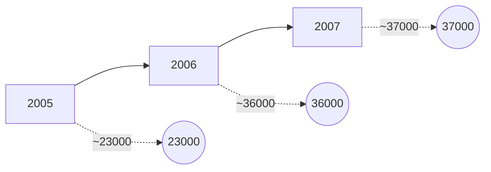

[An image of an official document cover page with the following content:]

[At the top of the page is an emblem featuring an eagle with spread wings, holding a shield with a green center]

مصرف ليبيا المركزي

ميزان المدفوعات لعام
1375 و.ر/ 2007 مسيحي

إدارة البحوث والإحصاء

[Translation of the Arabic text:]

Central Bank of Libya

Balance of Payments for the Year
1375 Libyan Calendar / 2007 AD

Department of Research and Statistics
---
# السلطة والثروة والسلاح

## بيــد الشعب

This appears to be the title page or cover of a document or book in Arabic. The text translates to:

# Power, Wealth, and Weapons

## In the Hands of the People

The text is centered and presented in a simple, bold typeface within a rectangular border on a white background.
---
# المحتويات

| الصفحة | الموضوع |
|--------|---------|
| 1 | تقديــم |
| 2 | مصطلحات وتعاريف |
| 11 | تحليل لميزان مدفوعات الجماهيرية لعام 2007 |
| 11 | أولاً : الحساب الجاري |
| 11 | • الميزان التجاري |
| 12 | • حساب الخدمات ، الدخل والتحويلات الجارية |
| 12 | ثانياً : الحساب الرأسمالي والمالي |
| 12 | ثالثاً : الميزان الكلي |
| 13 | جدول : ميزان مدفوعات الجماهيرية لعام 2007 |
| 16 | الرسوم البيانية |
| 19 | ملخص منقح لميزان مدفوعات الجماهيرية لعامي 2005-2006 |
---
# تقديم

يسر إدارة البحوث والإحصاء بمصرف ليبيا المركزي أن تعلن عن الانتهاء من إعداد كتيب إحصاءات ميزان مدفوعات الجماهيرية العظمى لعام 2007 ، والذي يشتمل على ما أمكن توفيره من بيانات نقدية ومالية عن قيمة المعاملات الجارية والرأسمالية المتبادلة بين الجماهيرية والعالم الخارجي خلال عام 2007 ، مبوبة حسب المنهجية والمفاهيم الواردة في الطبعة الخامسة من دليل ميزان المدفوعات الصادر عن صندوق النقد الدولي . كما يتضمن هذا الكتيب بيانات منقحة عن ميزان المدفوعات لعامي 2005 و 2006 .

وقد تم الاعتماد في إعداد هذا الميزان على البيانات المتوفرة من الإدارات المعنية بمصرف ليبيا المركزي ومنها : إدارة الرقابة على المصارف والنقد ، إدارة الحسابات ، إدارة العمليات المصرفية ، إدارة الإصدار ، إدارة الاحتياطيات ، وكذلك على المعلومات التي تم استلامها من العديد من الهيئات والمؤسسات والشركات المقيمة في الجماهيرية ومن بينها :

الهيئة العامة للمعلومات ، اللجنة الشعبية العامة للسياحة ، المؤسسة الوطنية للنفط ، المصارف التجارية ، المصرف الليبي الخارجي ، الشركة الليبية للاستثمارات الخارجية، الشركة الليبية للاستثمارات الأفريقية ، شركات النفط الأجنبية ، شركات التأمين الوطنية، شركات الخطوط الجوية الليبية ، الشركة الوطنية العامة للنقل البحري ، الشركة العامة للبريد والاتصالات السلكية واللاسلكية ، شركات الطيران الأجنبية ، بعثة الأمم المتحدة وغيرها من المصادر المحلية الأخرى .

## إدارة البحوث والإحصاء

1
---
# مصطلحات وتعاريف

تُعد هذه المصطلحات والتعاريف توضيحاً للمفاهيم التي يتم على أساسها تصنيف
وتبويب هذه الإحصاءات بما يتمشى مع إحصاءات ميزان المدفوعات وبيان كيفية جمع
دليل ميزان المدفوعات للطبعة الخامسة الذي أعده صندوق النقد الدولي في عام
1993 ، والذي وضع بهدف مساعدة الباحثين والمهتمين في فهم طبيعة ونوعية البيانات
والأساليب المستخدمة في حسابات ميزان المدفوعات .

## أولاً : الحساب الجاري :-

يشتمل الحساب الجاري على كافة المعاملات التي تتضمن قيماً إقتصادية تمت بين
جهات مقيمة في الاقتصاد الوطني وجهات أخرى غير مقيمة به(*)، كذلك يشمل القيود
المعادلة للقيم الإقتصادية الجارية المقدمة أو المستلمة دون مقابل . وينقسم الحساب
الجاري إلى البنود التالية : السلع والخدمات ، الدخل ، التحويلات الجارية .

### أ- السلع والخدمات :-
#### السلع :

يشمل بند السلع معظم السلع المنقولة المصدرة والمستوردة بين جهات مقيمة وأخرى
غير مقيمة وينجم عنها تغير في الملكية . ويشمل بند السلع المرسلة للتجهيز الصادرات
(أو الواردات إذا كان التجهيز يتم في الإقتصاد القائم بإعداد البيانات ) من السلع التي تعبر
الحدود لأغراض التجهيز في الخارج ، وما يتبع ذلك من إعادة استيراد لهذه السلع أو )
إعادة تصديرها إذا كان التجهيز يتم في الإقتصاد القائم بإعداد البيانات ) . وتقيّم السلع
المذكورة بالقيم الإجمالية قبل وبعد التجهيز . ويعتبر هذا البند استثناءً لمبدأ تغير الملكية .

كما يشمل بند إصلاح السلع أعمال الإصلاح التي يقوم بها غير المقيمين أو العكس ،
مثل إصلاح السفن والطائرات وما إلى ذلك.

غير المقيم (*) تعني فرد أو شركة أو مؤسسة أو أي منظمة أخرى تكون مقيمة في بلد غير
ليبيا ، أو مقيمة في ليبيا لمدة تقل عن سنة .

{ 2 }
---
كما يشمل السلع التي تحصل عليها الناقلات في الموانئ وكافة مـا تحصـل عليـه
الناقلات ( جوية - بحرية... الخ ) المقيمة في الاقتصاد المعد للبيانات من الخارج ، وما
تحصل عليه الناقلات غير المقيمة من الاقتصاد المعد للبيانات من سـلع مثـل الوقـود
والمؤن والمواد الأولية والإمدادات ، ولا يشمل ذلك تقديم الخدمات المساعدة ( عمليـات
القطر والصيانة وما شابه ذلك ) المشمولة تحت بند النقل. وأخيراً يشمل بند السلع كافـة
صادرات وواردات الذهب التجاري ( غير النقدي ) الذي لا يقع ضمن حيازات السلطات
كأصل احتياطي ( الذهب النقدي ) ، ويعامل الذهب غير النقدي كأي سلعة أخرى .

## الخدمات:

### 1- النقل

يشتمل بند النقل على نقل السلع والركاب بجميع وسائل النقل ( بري وبحـري وجـوي )
والخدمات الأخرى التوزيعية والمساعدة بما في ذلك تأجير معدات النقل مع أطقم التشغيل
التي يقدمها مقيمون إلى غير مقيمين والعكس .

### 2- السفر

يشتمل بند السفر على السلع والخدمات بما فيها تلك المتعلقة بالصحة والتعليم التي يحصل
عليها المسافرون غير المقيمين في الاقتصاد المضيف ( بمن فيهم المسافرون في رحلات
سياحية قصـيرة ) لأغراض تتعلق بالأعمال أو الاستخدام الشخصي خلال زيارتهم التي
تقل مدتها عن عام واحد ولا يشمل بند السفر خدمات الركاب الدولية التي تدخل في بنـد
النقل ، ويعامل الطلاب والمسافرون للعلاج كمسافرين بغض النظر عن مدة إقامتهم ، إلا
أن هناك فئات أخرى معينة لا تعتبر ضمن المسافرين مثل العسـكريين والعـاملين فـي
السفارات والعمال غير المقيمين حيث يتم إدراج مصروفات العمال غير المقيمين ضـمن
بند السفر، في حين تدرج مصروفات العسكريين والعاملين في السفارات ضمن الخدمات
الحكومية .

### 3- خدمات الاتصالات

يشتمل بند خدمات الاتصالات على المعاملات في مجال الاتصالات بين المقيمين وغيـر
المقيمين وتشمل هذه الخدمات مجالات الخدمات البريديـة ونقـل وتوزيـع المراسـلات

3
---
والاتصالات السلكية واللاسلكية ( نقل المعلومات الصوتية والمرئية وغير ذلك من المعلومات بالوسائل المتنوعة وما يرتبط بها من خدمات الصيانة التي يقدمها المقيمون لغير المقيمين أو يتلقونها منهم ) .

## 4- خدمات التشييد

يشتمل بند خدمات التشييد على أعمال البناء والتشييد ومشروعات التركيب التي تقوم بها مؤسسات مقيمة وعمالها على أساس مؤقت في الخارج أو العكس، أو في المناطق الخاضعة للسيادة الوطنية في الخارج، ولا تشمل تلك الأعمال ما تقوم به المؤسسة الأجنبية المقيمة لمؤسسة مقيمة ( استثمار مباشر ) .

## 5- خدمات التأمين

يشتمل بند خدمات التأمين على الخدمات التأمينية التي تقدمها مؤسسات التأمين المقيمة إلى المؤسسات غير المقيمة والعكس، ويشمل هذا البند خدمات التأمين على الشحن ( على السلع المصدرة والمستوردة ) وغير ذلك من خدمات التأمين المباشر ( بما في ذلك التأمين على الحياة وغيره من أنواع التأمين الأخرى ) ، وخدمات إعادة التأمين .

## 6- الخدمات المالية

يشتمل بند الخدمات المالية ( عدا الخدمات المرتبطة بمؤسسات التأمين وصناديق المعاشات التقاعدية ) على خدمات الوساطة المالية والخدمات المساعدة التي تتم بين المقيمين وغير المقيمين، ويندرج تحت هذا البند العمولات والرسوم المتعلقة بخطابات الاعتماد وخطوط الائتمان وخدمات التأجير المالي، معاملات الصرف الأجنبي، الخدمات الائتمانية للمستهلكين، خدمات رجال الأعمال، خدمات السمسرة، خدمات الضمان ومختلف ترتيبات وأدوات التحوط من تقلبات الأسعار وما إلى ذلك . أما الخدمات المساعدة فتشمل الخدمات المتعلقة بمجالات تشغيل وتنظيم الأسواق المالية وخدمات حفظ الأوراق المالية وما شابه ذلك .

## 7- خدمات الحاسوب

يشتمل بند خدمات الحاسب الآلي والمعلومات على المعاملات بين المقيمين وغير المقيمين في المجالات المتعلقة بالاستشارات في مجال الحاسوب، وتنفيذ البرامج الجاهزة وخدمات

4
---
المعلومات ( معالجة البيانات وقواعد البيانات ووكالات الأنباء ) وصيانة وإصلاح
الحواسيب والمعدات ذات الصلة بأجهزة الحاسوب .

## -8 خدمات رسوم الإيجار

يشمل بند رسوم الإيجار والتراخيص على متحصلات ( صادرات ) ومدفوعات
(واردات) الخدمات التالية بين مقيمين وغير مقيمين:

- الاستخدام المرخص به لأصول غير ملموسة غير منتجة وغير مالية، وحقوق الملكية
الفكرية والفنية، مثل العلامات التجارية وحقوق التأليف وبراءات الاختراع والعمليات
المبتكرة ، والأساليب الفنية والتصميمات ، وحقوق التصنيع وامتيازات حق الاستخدام وما
شابه ذلك.

- استخدام المنتجات الأصلية أو النماذج الأولية ، مثل المخطوطات والأفلام وما شابه
ذلك من خلال اتفاقات بالترخيص .

## -9 خدمات أخرى

يشمل بند خدمات أخرى في مجال الأعمال على الخدمات المتبادلة بين مقيمين وغير
مقيمين في مجالات المتاجرة والخدمات الأخرى المرتبطة بالتجارة وخدمات التأجير
التشغيلي وخدمات أخرى متنوعة في مجال الأعمال والخدمات المهنية والفنية .

## -10 خدمات شخصية وثقافية وترفيهية

يشمل بند الخدمات الشخصية والثقافية والترفيهية المتبادلة بين مقيمين وغير مقيمين على
ما يلي :

- الخدمات المرتبطة بوسائل سمعية وبصرية، المتبادلة بين مقيمين وغير مقيمين ،
وتتضمن الخدمات المرتبطة بالإنتاج السينمائي المسجل على أشرطة الأفلام أو الفيديو
وبرامج الراديو والتلفزيون والتسجيلات الموسيقية ( ومن أمثلة هذه الخدمات المبالغ
والأجور التي يتلقاها الممثلون والمنتجون ومن على شاكلتهم نظير الإنتاج وحقوق التوزيع
المباعة لوسائل الإعلام ) .

- الخدمات الثقافية الأخرى وتشمل الخدمات الشخصية والثقافية والترفيهية الأخرى
كتلك المرتبطة بالمكتبات والمتاحف وغير ذلك من الأنشطة الثقافية والرياضية

5
---
## 11- الخدمات الحكومية

تشمل فئة الخدمات الحكومية غير المدرجة في أماكن أخرى على كل الخدمات المرتبطة
بقطاعات حكومية أو منظمات دولية أو إقليمية غير مبوبة تحت بنود أخرى ( مثال ذلك
مصروفات السفارات والقنصليات ) .

## ب- الدخل :
ويشتمل على ما يلي:

### 1- تعويضات العاملين

يشتمل بند تعويضات العاملين على الأجور والرواتب والمزايا الأخرى النقدية والعينية
لعمال الحدود والعمال الموسميين وغيرهم من العمال غير المقيمين ( مثل العمال
المحليين العاملين في السفارات ) .

### 2- دخل الإستثمار

يشتمل بند دخل الإستثمار على متحصلات الدخل المرتبطة بحيازات المقيمين لأصول
مالية خارجية ومدفوعاتهم المرتبطة بخصوم تجاه غير المقيمين . ويتكون دخل الاستثمار
من أنواع الدخل المستمدة من أنشطة الاستثمار المباشر واستثمارات الحافظة واستثمارات
أخرى . وينقسم عنصر الاستثمار المباشر إلى دخل حقوق الملكية ( الأرباح الموزعة ،
وأرباح الفروع الموزعة ، والعائدات المعاد استثمارها ) والدخل من الدين ( الفوائد )
ويتفرع دخل استثمارات الحافظة إلى الدخل من حقوق الملكية ( أرباح موزعة )
والدخل من الدين ( فوائد ) . ويشمل الدخل من إستثمارات أخرى الفوائد المكتسبة من
أنواع أخرى من رأس المال ( قروض وما شابه ذلك ) ، كما يشمل من حيث المبدأ الدخل
المحتسب أو المقدر للأسر من صافي حقوق ملكيتها في احتياطيات التأمين على الحياة
وصناديق المعاشات التقاعدية .

## ج- التحويلات الجارية

هي البنود الموازنة للتغيرات في ملكية الموارد الحقيقية أو البنود المالية بين مقيمين وغير
مقيمين دون أن تتضمن المعاملة قيمة اقتصادية مقابلة سواء كان تغير الملكية طوعياً أو
إلزامياً . وتتكون التحويلات الجارية من جميع التحويلات التي لا تتضمن ما يلي :
• تحويلات ملكية أصول ثابتة .

{ 6 }
---
• تحويلات أموال مرتبطة أو مشروطة بحيازة أصول ثابتة أو بالتصرف فيها.

• الإعفاء من الالتزامات المالية دون تلقي الدائنين لأي مقابل عوضاً عنها . فهذه الأنواع الثلاثة من المعاملات هي تحويلات رأسمالية أما التحويلات الجارية فتشمل تحويلات الحكومة العامة ( مثل التحويلات الجارية المرتبطة بالتعاون الدولي بين مختلف الحكومات والمدفوعات الضريبية الجارية على الدخل والثروة وما شابه ذلك ) والتحويلات الأخرى مثل تحويلات العاملين وأقساط التأمين ( مع استبعاد رسوم الخدمة ) واستحقاقات التأمين بخلاف التأمين على الحياة .

## ثانياً : الحساب الرأسمالي والمالي :-

يضم هذا الحساب عنصرين رئيسيين هما الحساب الرأسمالي والحساب المالي وهما متفقان مع ذات الحسابين في نظام الحسابات القومية . وفي هذين الحسابين تعتبر الاستحقاقات على غير المقيمين أصولاً، وتعتبر الالتزامات إزاء غير المقيمين خصوماً . وعادة ما يكون طرفا المعاملة في الأصول أو الخصوم هما مقيم وغير مقيم غير أن هناك حالات محدودة قد يكون فيها كلا الطرفين مقيماً أو قد يكون كلاهما غير مقيم .

وتستبعد من الحساب الرأسمالي والمالي جميع تغييرات التقييم وغيرها من التغييرات التي تلحق بالأصول والخصوم الأجنبية دون أن يرجع التغيير إلى حدوث معاملات ، وتدرج هذه التغييرات بدلاً من ذلك في وضع الاستثمار الدولي باستثناء بنود معينة ذات أهمية تحليلية وذات تأثير على حسابات مختلفة ، مثل الخصوم التي تشكل احتياطيات لسلطات أجنبية ومعاملات التمويل الاستثنائي .

### (أ) الحساب الرأسمالي

يضم الحساب الرأسمالي عنصرين رئيسيين هما حساب التحويلات الرأسمالية وحساب حيازة الأصول غير المنتجة غير المالية أو التصرف فيها . ويتكون حساب التحويلات الرأسمالية من التحويلات التي تتضمن تغييراً في ملكية أصول ثابتة أو تحويلات الأموال المرتبطة أو المشروطة بحيازة أصول ثابتة أو التصرف فيها أو التحويلات الناتجة عن

7
---
قيام الدائن بإسقاط خصوم المدين دون تلقي أي مقابل لها. وتشمل التحويلات
الرأسمالية على عنصرين :
- الحكومة العامة وتنقسم إلى الإعفاء من الدين وتحويلات أخرى .
- القطاعات الأخرى وتنقسم إلى تحويلات المهاجرين والإعفاء من الدين . ويشمل حساب
حيازة الأصول غير المنتجة غير المالية أو التصرف فيها الأصول غير الملموسة مثل
البراءات المرخصة وعقود التأجير وغير ذلك من العقود القابلة للتحويل إلى الغير
والشهرة التجارية وما شابه ذلك . ولا يتضمن هذا البند حيازة الأراضي أو التصرف فيها
في إقليم اقتصادي محدد ، لكنه قد يتضمن شراء أو بيع الأراضي من جانب السفارات
الأجنبية .

## (ب) الحساب المالي

يستند تصنيف العناصر الأساسية في الحساب المالي إلى المعايير التالية :
تقسم كل العناصر حسب نوع الاستثمار أو تقسيم وظيفي ( الاستثمار المباشر ، استثمارات
الحافظة ، استثمارات أخرى وأصول احتياطية ) . يجري التمييز داخل فئة الاستثمار
المباشر على أساس اتجاه الاستثمار ( في الخارج أو في الاقتصاد القائم بإعداد البيان )
كما يجري التمييز على أساس الأصول والخصوم في بندي رأس المال (حقوق الملكية)
وأنواع أخرى من رأس المال الداخلين في فئة الاستثمار المباشر . أما داخل فئتي
استثمارات الحافظة واستثمارات أخرى ، فيجري التمييز بينهما على أساس المعيار المعتاد
أي الأصول والخصوم .

يعتبر التصنيف حسب نوع الأداة ذو أهمية خاصة بالنسبة لاستثمارات الحافظة
واستثمارات أخرى ( سندات الملكية أو سندات الدين والائتمانات التجارية
والقروض والعملة والودائع وأصول وخصوم أخرى ) ويشمل استثمار الحافظة الأدوات
المالية التقليدية إلى جانب الأدوات الجديدة في السوق النقدية وغير ذلك من الأدوات
المالية والمشتقات .

8
---
# 1- الاستثمار المباشر

يعبر الاستثمار المباشر عن مصلحة مستديمة لجهة مقيمة (المستثمر المباشر) في جهة مقيمة باقتصاد آخر (مؤسسة الاستثمار المباشر) ويتضمن الاستثمار المباشر كافة المعاملات بين المستثمرين المباشرين ومؤسسات الاستثمار المباشر، أي أنه لايقتصر فقط على المعاملة المبدئية بين الطرفين بل يشمل كافة المعاملات اللاحقة بينهما وبين المؤسسات المنتسبة سواء كانت مساهمة أو غير مساهمة. وتنقسم معاملات الاستثمار المباشر (في الخارج وفي الاقتصاد القائم بإعداد البيان) إلى رأسمال (حقوق الملكية)، والعائدات المعاد استثمارها وأنواع رأس المال الأخرى (معاملات بين الشركات). ويجري التمييز في حالتي رأسمال (حقوق الملكية) وأنواع رأس المال الأخرى بين استحقاقات والتزامات المؤسسات المنتسبة من جهة، وبين استحقاقات والتزامات تجاه المستثمرين المباشرين من جهة أخرى وتقتصر المعاملات فيما بين المصارف المنتسبة والمعاملات فيما بين جهات الوساطة المالية المنتسبة الأخرى على رأسمال (حقوق الملكية) ورأسمال الدين القائم.

# 2- استثمار الحافظة

تشتمل فئة استثمارات الحافظة على المعاملات في السندات الملكية وسندات الدين، وتنقسم الأخيرة إلى سندات وأذونات وأدوات السوق النقدية والمشتقات المالية مثل (عقود الاختيار). وتتنوع مختلف أنواع الأداة المشتقة استحقاقات والتزامات مالية. (تستبعد المعاملات في هذا التصنيف لأنواعها الملائمة البنود على الأدوات المالية الجديدة التي تشملها فئتا الاستثمار المباشر والأصول الاحتياطية).

# 3- استثمارات أخرى

تشتمل فئة استثمارات أخرى على الائتمانات التجارية القصيرة الأجل والطويلة الأجل والقروض (بما في ذلك استخدام ائتمان وقروض صندوق النقد الدولي والقروض المرتبطة بالتأجير المالي)، والعملة والودائع (القابلة للتحويل وغير ذلك مثل الودائع الادخارية والودائع لأجل وأسهم المدخرات والقروض وأسهم الاتحادات الائتمانية وما
---
تلاماعملا كلذ نم دعبتسيو .عفدلا وأ ليصحتلا ةقحتسم ىرخأ تاباسحو ، ( كلذ هباش
. رشابملا رامثتسالا اهلمشي يتلا

-: اهب ةقلعتملا دويقلاو تايطايتحالا : اثلاث

ةيدقنلا تاطلسلا اهربتعت يتلا لوصألا يف تالماعملا ىلع ةيطايتحالا لوصألا ةئف لمتشت

تاعوفدملا نازيم تاجايتحإب ءافولا ضرغب مادختسالل ةحاتم الوصأ داصتقالا يف

نم اقيثو اطابترا لوصألا هذه رفوت طبتري الو . نايحألا ضعب يف ىرخأ تاجايتحإبو

لمشتو . لصألا اهب ررحملا ةلمعلا وأ ةيكلملا رايعم لثم ةيلكشلا ريياعملاب أدبملا ثيح

ىدل يطايتحالا عضو ، ةصاخلا بحسلا قوقح ، يدقنلا بهذلا ةيطايتحالا لوصألا

، ( ةيلام قاروأو عئادوو تالمع ) يبنجألا دقنلا نم لوصألا ، يلودلا دقنلا قودنص
. ىرخأ تاقاقحتساو

ةيطايتحالا لوصألا يف مييقتلا تاريغت تاعوفدملا نازيم ليلدل ةسماخلا ةعبطلا دعبتستو

ةصاخلا بحسلا قوقح ءاغلإو صيصخت اضيأ دعبتست امك ، تاريغتلا كلتل ةلباقملا دويقلاو

هذه لثم نأ كلذ .تاريغتلا كلتل ةلباقملا دويقلاو بهذلل ةيدقنلا ةفصلا لاطبإ / ءافضإو
. يلودلا رامثتسالا عضو تحت ةعبطلا هذه يف جردت تالماعم نع جتنت ال يتلا تاريغتلا

-: أطخلا و وهسلا : اعبار

نيديق يف ةلماعم لك ليجست ىلع تاعوفدملا نازيم ليلدب ةيساسألا ةدعاقلا صنت

ديصرلا نأ يأ ةبلاس ةراشإب نيدم رخآلاو ةبجوم ةراشإب نئاد امهدحأ ةميقلا يف نييواستم

عقاولا يف ققحتي ام اردان كلذ نأ ريغ، ارفص يواسي نأ بجي نايبلا يف يفاصلا يئاهنلا

كلذلو ، ةفلتخم رداصم نم ةدح ىلع اهجارختسا متي ام ابلاغ تانايبلا نأل ارظن ، يلمعلا
. أطخلاو وهسلا يفاص ىرخأ ةرابعب وأ نيدملا وأ نئادلا بناجلا ىلع يفاص ديصر ىقبتي

10
---
# ملخص لوضع ميزان المدفوعات

تأثر الوضع العام لميزان مدفوعات الجماهيرية العظمى خلال عام 2007 بإرتفاع الإيرادات النفطية المحققة نتيجة للإرتفاع الملحوظ في أسعار النفط بالأسواق الدولية للعام الثاني على التوالي وذلك لإرتفاع الطلب العالمي على النفط الخام والغاز والتوترات التي شهدتها بعض مناطق الإنتاج الرئيسية بالإضافة إلى المضاربات في الأسواق المستقبلية للنفط والذي كان له الأثر الواضح على وضع الميزان الكلي الذي حقق فائضاً بلغ 24983 مليون دينار خلال العام مقابل 25633 مليون دينار عام 2006 .

وفيما يلي تحليل للبنود الرئيسية المكونة لميزان المدفوعات :-

## أولاً - الحساب الجاري :

حقق الحساب الجاري فائضاً مقداره 37579 مليون دينار في عام 2007 مسجلي مقابل 36803 مليون دينار في عام 2006 مسجلي بزيادة قدرها 776 مليون دينار وبنسبة 2.1% .

وفيما يلي عرض لأهم بنود هذا الحساب :-

### 1 - الميزان التجاري :

إقترن الفائض الذي حققه ميزان المدفوعات لعام 2007 بوجه عام بفائض الميزان التجاري الذي بلغ خلال العام نحو 40028 مليون دينار مقابل 39466 مليون دينار عام 2006 ويعزى هذا الفائض إلى إرتفاع قيمة إجمالي الصادرات خلال العام بنسبة 10.0% لتصل إلى 61726 مليون دينار مقابل 56125 مليون دينار عام 2006 . ويرجع هذا إلى زيادة عائدات الصادرات النفطية التي تمثل حوالي 97.5% من إجمالي الصادرات الكلية لعام 2007 ، نتيجة لإرتفاع متوسط أسعار النفط الليبي في الأسواق العالمية من 63.7 دولار للبرميل خلال عام 2006 إلى 71.6 دولار للبرميل خلال عام 2007 ، رغم إرتفاع الواردات بنسبة 30.2% عن السنة السابقة لتصل إلى 21698 مليون دينار مقابل 16659 مليون دينار خلال عام 2006 .

11
---
## 2 - حساب الخدمات ، الدخل و التحويلات الجارية :

أظهر صافي حساب الخدمات ، الدخل والتحويلات الجارية لعام 2007 مسيحي عجزاً بلغ 2449 مليون دينار مقابل 2663 مليون دينار في عام 2006 مسيحي ، ويعزى عجز هذا الحساب إلى إرتفاع العجز في حساب الخدمات والذي إرتفع بنسبة 5.7% عما كان عليه في العام السابق ليرتفع إلى 3224 مليون دينار مقابل 3049 مليون دينار عام 2006 مسيحي ، وإلى العجز في حساب التحويلات الجارية البالغ 276 مليون دينار ، مقابل فائض بلغ 435 مليون دينار في عام 2006 مسيحي ، في حين إرتفع فائض حساب الدخل ليبلغ 1051 مليون دينار مقابل عجز بلغ 49 مليون دينار عام 2006 مسيحي .

## ثانياً - الحساب الرأسمالي والمالي

أسفرت حركة المعاملات الرأسمالية والمالية للجماهيرية مع العالم الخارجي في عام 2007 مسيحي المتمثلة في التحويلات الرأسمالية ، وحيازة الأصول غير المنتجة غير المالية ، وصافي حركة الاستثمارات المباشرة سواء إلى الداخل أو إلى الخارج ، والتغير في وضع المحافظ الاستثمارية ، وصافي حركة الاستثمارات الأخرى المتمثلة في الائتمانات التجارية والقروض الطويلة والقصيرة الأجل والعملة والودائع لدى السلطات النقدية أو المصارف أو الحكومات العامة أو القطاعات الأخرى تدفقاً للخارج بلغ 11012 مليون دينار ، مقابل تدفقاً للخارج بلغ 9552 مليون دينار في عام 2006 مسيحي .

## ثالثاً - الميزان الكلي

حقق الميزان الكلي لميزان مدفوعات الجماهيرية فائضاً بلغ 24983 مليون دينار خلال عام 2007 مسيحي . مقابل 25633 مليون دينار خلال عام 2006 مسيحي . والسبب يعود للفائض المحقق في جانب الحساب الجاري .
---
ميزان مدفوعات الجماهيرية العظمى
لسنة 2007
(مليون دينار)

| البند | دائن | مدين | الرصيد |
|-------|------|------|--------|
| أولاً : حساب العمليات الجارية : | 68417.0 | 30838.0 | 37579.0 |
| السلع | 61726.0 | 21698.0 | 40028.0 |
| 1- بضائع | 61726.0 | 21684.0 | 40042.0 |
| ( أ ) قطاع النفط | 60253.0 | 2909.0 | 57344.0 |
| (ب) القطاعات الأخرى | 1473.0 | 18775.0 | -17302.0 |
| 2- ذهب غير نقدي | 0.0 | 14.0 | -14.0 |
| الخدمات | 247.0 | 3471.0 | -3224.0 |
| 1- النقل | 104.0 | 1614.0 | -1510.0 |
| ( أ ) النقل البحري | 71.0 | 1218.0 | -1147.0 |
| (ب) النقل الجوي | 33.0 | 396.0 | -363.0 |
| (ج) نقل آخر | 0.0 | 0.0 | 0.0 |
| 2- السفر | 93.0 | 1120.0 | -1027.0 |
| 3- خدمات الإتصالات | 11.0 | 39.0 | -28.0 |
| 4- خدمات التشييد | 0.0 | 110.0 | -110.0 |
| 5- خدمات التأمين | 39.0 | 330.0 | -291.0 |
| 6- خدمات الإمتياز والترخيص | 0.0 | 0.0 | 0.0 |
| 7- خدمات مالية | 0.0 | 0.0 | 0.0 |
| 8-خدمات الحاسب الآلي | 0.0 | 0.0 | 0.0 |
| 9-خدمات ثقافية وترفيهية | 0.0 | 0.0 | 0.0 |
| 10- خدمات حكومية | 0.0 | 213.0 | -213.0 |
| 11-أنواع أخرى من خدمات الأعمال | 0.0 | 45.0 | -45.0 |
| الدخل | 5690.0 | 4639.0 | 1051.0 |
| 1- تعويضات العاملين | 0.0 | 0.0 | 0.0 |
| 2- دخل الإستثمار | 5690.0 | 4639.0 | 1051.0 |
| ( أ ) الإستثمار المباشر | 220.0 | 4639.0 | -4419.0 |
| (ب) إستثمار الحافظة | 1024.0 | 0.0 | 1024.0 |
| (ج) إستثمارات أخرى | 4446.0 | 0.0 | 4446.0 |

(13)
---
(مليون دينار)

| 2007 |  |  |  |
|---|---|---|---|
| الرصيد | مدين | دائن | البند |
| -276.0 | 1030.0 | 754.0 | التحويلات الجارية |
| 685.0 | 69.0 | 754.0 | 1-القطاع الرسمي |
| -961.0 | 961.0 | 0.0 | 2- قطاعات أخرى |
| -961.0 | 961.0 | 0.0 | (أ) تحويلات العاملين |
| 0.0 | 0.0 | 0.0 | (ب) تحويلات أخرى |
| -11012.0 | 15978.0 | 4966.0 | ثانياً : الحساب الرأسمالي والمالي : |
| 0.0 | 0.0 | 0.0 | الحساب الرأسمالي |
| 0.0 | 0.0 | 0.0 | 1- التحويلات الرأسمالية |
| 0.0 | 0.0 | 0.0 | 2- حيازة الأصول غير المنتجة غير المالية |
| -11012.0 | 15978.0 | 4966.0 | الحساب المالي |
| -122.0 | 4973.0 | 4851.0 | 1- الإستثمار المباشر |
| -4973.0 | 4973.0 | 0.0 | (أ) إستثمار مباشر في الخارج |
| 4851.0 | 0.0 | 4851.0 | (ب) إستثمار مباشر في ليبيا |
| 2691.0 | 0.0 | 2691.0 | - قطاع النفط |
| 2160.0 | 0.0 | 2160.0 | - أخرى |
| -6334.0 | 6334.0 | 0.0 | 2-إستثمار الحافظة |
| -6334.0 | 6334.0 | 0.0 | (أ) الأصول |
| 0.0 | 0.0 | 0.0 | (ب) الخصوم |
| -4556.0 | 4671.0 | 115.0 | 3-إستثمارات أخرى |
| -4666.0 | 4671.0 | 5.0 | (أ) الأصول |
| -281.0 | 281.0 | 0.0 | 1- إئتمانات تجارية |
| -902.0 | 902.0 | 0.0 | 2- القروض |
| -3488.0 | 3488.0 | 0.0 | 3- العملة والودائع |
| 5.0 | 0.0 | 5.0 | 4- أصول أخرى |
| 110.0 | 0.0 | 110.0 | (ب) الخصوم : |
| 0.0 | 0.0 | 0.0 | 1- إئتمانات تجارية |
| 63.0 | 0.0 | 63.0 | 2- القروض |
| 0.0 | 0.0 | 0.0 | 3- العملة والودائع |
| 47.0 | 0.0 | 47.0 | 4- خصوم أخرى |

(14)
---
(مليون دينار)

| 2007 |  |  |  |
|---|---|---|---|
| الرصيد | مدين | دائن | البند |
| 26567.0 | 46816.0 | 73383.0 | مجموع (أولاً + ثانياً) |
| -24983.0 | 24983.0 | 0.0 | ثالثاً: الاصول الاحتياطية : |
| 0.0 | 0.0 | 0.0 | أ- الذهب النقدي |
| -114.0 | 114.0 | 0.0 | ب- حقوق السحب الخاصة |
| -37.0 | 37.0 | 0.0 | ج- وضع الإحتياطي لدى الصندوق |
| -24832.0 | 24832.0 | 0.0 | د- عملات أجنبية |
| -1584.0 | 1584.0 | 0.0 | رابعاً : السهو والخطأ |
| 0.0 | 73383.0 | 73383.0 | المجموع |

(15)
---
# الميزان التجاري

| السنة | الصادرات | الواردات | الميزان التجاري |
|-------|----------|----------|-----------------|
| 2005  | 16000    | 38000    | 22000           |
| 2006  | 22000    | 46000    | 24000           |
| 2007  | 28000    | 54000    | 26000           |

*Note: Values are approximate and measured in millions of dinars*

The chart shows the trade balance (الميزان التجاري) for the years 2005, 2006, and 2007. It displays three sets of columns for each year:
1. Exports (الصادرات) in blue
2. Imports (الواردات) in beige
3. Trade balance (الميزان التجاري) in light green

The vertical axis shows values in millions of dinars, ranging from 0 to 62,000 million dinars.

There is a clear trend of growth in all three categories over the three-year period, with imports consistently higher than exports, resulting in a positive trade balance each year.

(16)
---
| وضع الحساب الجاري لميزان المدفوعات |
|:---:|
| خلال الفترة من 2005 - 2007 مسيحي |

| السنوات | القيمة (مليون دينار) |
|:---:|:---:|
| 2005 | ~23000 |
| 2006 | ~36000 |
| 2007 | ~37000 |

Note: The values are approximate based on the graph. The y-axis represents "مليون دينار" (million dinars) and ranges from 0 to 40000.

(17)
---
| الوضع الكلي لميزان المدفوعات خلال الفترة 2005 - 2007 مسيحي |
|:---:|
| ![Graph showing the overall balance of payments from 2005 to 2007] |

| السنوات | القيمة (مليون دينار) |
|:---:|:---:|
| 2005 | ~21000 |
| 2006 | ~26000 |
| 2007 | ~25000 |

*ملاحظة: القيم التقريبية مستنتجة من الرسم البياني*

المحور الأفقي: السنوات
المحور العمودي: مليون دينار (من 0 إلى 40000)

(18)
---
ملخص منقح لميزان مدفوعات الجماهيرية العظمى
لعامي 2005 - 2006

بملايين الدنانير

| البند | 2005 | 2006 |
|-------|------|------|
| أولاً: الحساب الجاري | 22827 | 36803 |
| 1. السلع والخدمات | 24827 | 36417 |
| أ. السلع | 27152 | 39466 |
| الصادرات (فوب) | 42835 | 56125 |
| قطاع الهيدروكربونات | 41655 | 54679 |
| صادرات أخرى | 1180 | 1446 |
| الواردات (فوب) | -15683 | -16659 |
| ب.الخدمات | -2325 | -3049 |
| مدين | -3025 | -3272 |
| دائن | 700 | 223 |
| 2. الدخل | -645 | -49 |
| دخل الإستثمار المباشر | -2758 | -4003 |
| دخل إستثمارات أخرى | 2113 | 3954 |
| 3. التحويلات الجارية | -1355 | 435 |
| الحكومة العامة | -147 | 1602 |
| القطاعات الأخرى | -1208 | -1167 |
| قطاع النفط | -339 | -367 |
| أخرى (تشمل تحويلات العاملين) | -869 | -800 |
| ثانياً: الحساب الرأسمالي والمالي | 1489 | -9552 |
| الاستثمار المباشر | 1192 | 1990 |
| إستثمار الحافظة | -79 | -2568 |
| إستثمارات أخرى | 376 | -8974 |
| ثالثاً: الاصول الاحتياطية | -20959 | -25633 |
| رابعاً: صافى السهو والخطأ | -3357 | -1618 |

(19)