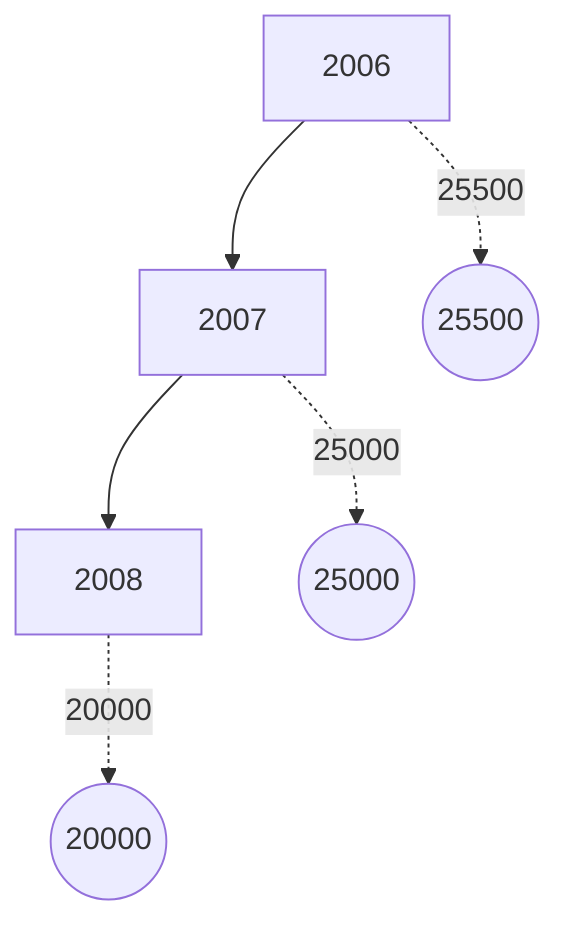

[A document cover page with a gold decorative border and the following content in Arabic:]

[An emblem of a double-headed eagle with a shield]

مصرف ليبيا المركزي

ميزان المدفوعات لعام
1376 و.ر/2008 مسيحي

إدارة البحوث والإحصاء

[Translation of the Arabic text:]

Central Bank of Libya

Balance of Payments for the Year
1376 Libyan Calendar / 2008 AD

Research and Statistics Department
---
# السلطة والثروة والسلاح

## بيــد الشعب

This appears to be the title page or cover of a document or book in Arabic. The text translates to:

# Power, Wealth, and Weapons

## In the Hands of the People

The text is centered and presented in a simple, bold typeface within a rectangular border on a white background.
---
# المحتويات

| الصفحة | الموضوع |
|--------|---------|
| 1 | تقديــم |
| 2 | مصطلحات وتعاريف |
| 11 | تحليل لميزان مدفوعات الجماهيرية لعام 2008 |
| 11 | أولاً : الحساب الجاري |
| 11 | • الميزان التجاري |
| 12 | • حساب الخدمات ، الدخل والتحويلات الجارية |
| 12 | ثانياً : الحساب الرأسمالي والمالي |
| 12 | ثالثاً : الميزان الكلي |
| 13 | جدول : ميزان مدفوعات الجماهيرية لعام 2008 |
| 16 | الرسوم البيانية |
| 19 | ملخص منقح لميزان مدفوعات الجماهيرية لعامي 2007/2006 |
---
# تقديم

يسر إدارة البحوث والإحصاء بمصرف ليبيا المركزي أن تعلن عن الانتهاء من إعداد كتيب إحصاءات ميزان مدفوعات الجماهيرية العظمى لعام 2008 ، والذي يشتمل على بيانات نقدية ومالية عن قيمة المعاملات الجارية والرأسمالية المتبادلة بين الجماهيرية والعالم الخارجي خلال عام 2008 ، مبوبة حسب المنهجية والمفاهيم الواردة في الطبعة الخامسة من دليل ميزان المدفوعات الصادر عن صندوق النقد الدولي . كما يتضمن هذا الكتاب بيانات منقحة عن ميزان المدفوعات لعامي 2006 و2007 .

وقد تم الاعتماد في إعداد هذا الميزان على البيانات الواردة من الإدارات التالية بمصرف ليبيا المركزي وهي : إدارة الرقابة على المصارف والنقد ، إدارة الحسابات ، إدارة الاحتياطيات ، إدارة الإصدار ، إدارة العمليات المصرفية ، وكذلك على المعلومات التي تم استلامها من العديد من الهيئات والمؤسسات والشركات المقيمة في الجماهيرية ومن بينها :

الهيئة العامة للمعلومات ، الهيئة العامة للسياحة ، المؤسسة الوطنية للنفط ، المصارف التجارية،المصرف الليبي الخارجي ، الشركة الليبية للاستثمارات الخارجية ، الشركة الليبية الأفريقية للاستثمارات ، محفظة ليبيا أفريقيا للاستثمار ، المؤسسة الليبية للاستثمار ، المحفظة طويلة المدى، شركات النفط الأجنبية ، شركات التأمين الوطنية ، شركات الخطوط الجوية الليبية ، الشركة الوطنية العامة للنقل البحري ، الشركة العامة للبريد والاتصالات السلكية واللاسلكية ، شركات الطيران الأجنبية ، بعثة الأمم المتحدة العاملة بالجماهيرية وغيرها من المصادر المحلية الأخرى .

## إدارة البحوث والإحصاء

1
---
# مصطلحات وتعاريف

تُعد هذه المصطلحات والتعاريف توضيحاً للمفاهيم التي يتم على أساسها تصنيف
إحصاءات ميزان المدفوعات وبيان كيفية جمع وتبويب هذه الإحصاءات بما يتمشى مع
دليل ميزان المدفوعات للطبعة الخامسة الذي أعده صندوق النقد الدولي في عام
1993 ، والذي وضع بهدف مساعدة الباحثين والمهتمين في فهم طبيعة ونوعية البيانات
والأساليب المستخدمة في حسابات ميزان المدفوعات .

## أولاً : الحساب الجاري :-

يشتمل الحساب الجاري على كافة المعاملات التي تتضمن قيماً إقتصادية تمت بين
جهات مقيمة في الاقتصاد الوطني وجهات أخرى غير مقيمة به(*)، كذلك يشمل القيود
المعادلة للقيم الإقتصادية الجارية المقدمة أو المستلمة دون مقابل . وينقسم الحساب
الجاري إلى البنود التالية : السلع والخدمات ، الدخل ، التحويلات الجارية .

### أ- السلع والخدمات :-
#### السلع :

يشمل بند السلع معظم السلع المنقولة المصدرة والمستوردة بين جهات مقيمة وأخرى
غير مقيمة وينجم عنها تغير في الملكية . ويشمل بند السلع المرسلة للتجهيز الصادرات
أوالواردات إذا كان التجهيز يتم في الإقتصاد القائم بإعداد البيانات من السلع التي تعبر
الحدود لأغراض التجهيز في الخارج ، وما يتبع ذلك من إعادة إستيراد لهذه السلع أو
إعادة تصديرها إذا كان التجهيز يتم في الإقتصاد القائم بإعداد البيانات . وتُقيّم السلع
المذكورة بالقيم الإجمالية قبل وبعد التجهيز ، ويعتبر هذا البند إستثناءً لمبدأ تغير الملكية .

كما يشمل بند إصلاح السلع أعمال الإصلاح التي يقوم بها غير المقيمين أو العكس ،
مثل إصلاح السفن والطائرات وما إلى ذلك.

----

(*) غير المقيم تعني فرد أو شركة أو مؤسسة أو أي منظمة أخرى تكون مقيمة في بلد غير
ليبيا ، أو مقيمة في ليبيا لمدة تقل عن سنة .

{ 2 }
---
كما يشمل السلع التي تحصل عليها الناقلات في الموانئ وكافة ما تحصل عليه
الناقلات (جوية - بحرية... الخ) المقيمة في الاقتصاد المعد للبيانات من الخارج، وما
تحصل عليه الناقلات غير المقيمة من الاقتصاد المعد للبيانات من سلع مثل الوقود
والمؤن والمواد الأولية والإمدادات، ولا يشمل ذلك تقديم الخدمات المساعدة (عمليات
القطر والصيانة وما شابه ذلك) المشمولة تحت بند النقل. وأخيراً يشمل بند السلع كافة
صادرات وواردات الذهب التجاري (غير النقدي) الذي لا يقع ضمن حيازات السلطات
كأصل احتياطي (الذهب النقدي)، ويعامل الذهب غير النقدي كأي سلعة أخرى.

## الخدمات:

### 1- النقل

يشتمل بند النقل على نقل السلع والركاب بجميع وسائل النقل (بري، بحري وجوي)
والخدمات الأخرى التوزيعية والمساعدة بما في ذلك تأجير معدات النقل مع أطقم التشغيل
التي يقدمها مقيمون إلى غير مقيمين والعكس.

### 2- السفر

يشتمل بند السفر على السلع والخدمات بما فيها تلك المتعلقة بالصحة والتعليم التي يحصل
عليها المسافرون غير المقيمين في الاقتصاد المضيف (بمن فيهم المسافرون في رحلات
سياحية قصيرة) لأغراض تتعلق بالأعمال أو الاستخدام الشخصي خلال زيارتهم التي
تقل مدتها عن عام واحد ولا يشمل بند السفر خدمات الركاب الدولية التي تدخل في بند
النقل، ويعامل الطلاب والمسافرون للعلاج كمسافرين بغض النظر عن مدة إقامتهم، إلا
أن هناك فئات أخرى معينة لا تعتبر ضمن المسافرين مثل العسكريين والعاملين في
السفارات والعمال غير المقيمين حيث يتم إدراج مصروفات العمال غير المقيمين ضمن
بند السفر، في حين تدرج مصروفات العسكريين والعاملين في السفارات ضمن الخدمات
الحكومية.

### 3- خدمات الاتصالات

يشتمل بند خدمات الاتصالات على المعاملات في مجال الاتصالات بين المقيمين وغير
المقيمين وتشمل هذه الخدمات مجالات الخدمات البريدية ونقل وتوزيع المراسلات

3
---
والاتصالات السلكية واللاسلكية ( نقل المعلومات الصوتية والمرئية وغير ذلك من المعلومات بالوسائل المتنوعة وما يرتبط بها من خدمات الصيانة التي يقدمها الفنيون لغير المقيمين أو يتلقونها منهم ) .

## 4- خدمات التشييد

يشتمل بند خدمات التشييد على أعمال البناء والتشييد ومشروعات التركيب التي تقوم بها مؤسسات مقيمة وعمالها على أساس مؤقت في الخارج أو العكس، أو في المناطق الخاضعة للسيادة الوطنية في الخارج، ولا تشمل تلك الأعمال ما تقوم به المؤسسة الأجنبية المقيمة لمؤسسة مقيمة ( استثمار مباشر ) .

## 5- خدمات التأمين

يشتمل بند خدمات التأمين على الخدمات التأمينية التي تقدمها مؤسسات التأمين المقيمة إلى المؤسسات غير المقيمة والعكس، ويشمل هذا البند خدمات التأمين على الشحن ( على السلع المصدرة والمستوردة ) وغير ذلك من خدمات التأمين المباشر ( بما في ذلك التأمين على الحياة وغيره من أنواع التأمين الأخرى ) ، وخدمات إعادة التأمين .

## 6- الخدمات المالية

يشتمل بند الخدمات المالية ( عدا الخدمات المرتبطة بمؤسسات التأمين وصناديق المعاشات التقاعدية ) على خدمات الوساطة المالية والخدمات المساعدة التي تتم بين المقيمين وغير المقيمين، ويندرج تحت هذا البند العمولات والرسوم المتعلقة بخطابات الاعتماد وخطوط الائتمان وخدمات التأجير المالي، معاملات الصرف الأجنبي، الخدمات الائتمانية للمستهلكين، خدمات رجال الأعمال، خدمات السمسرة، خدمات الضمان ومختلف ترتيبات وأدوات التحوط من تقلبات الأسعار وما إلى ذلك . أما الخدمات المساعدة فتشمل الخدمات المتعلقة بمجالات تشغيل وتنظيم الأسواق المالية وخدمات حفظ الأوراق المالية وما شابه ذلك .

## 7- خدمات الحاسوب

يشتمل بند خدمات الحاسب الآلي والمعلومات على المعاملات بين المقيمين وغير المقيمين في المجالات المتعلقة بالاستشارات في مجال الحاسوب، وتنفيذ البرامج الجاهزة وخدمات

4
---
المعلومات ( معالجة البيانات وقواعد البيانات ووكالات الأنباء ) وصيانة وإصلاح
الحواسيب والمعدات ذات الصلة بأجهزة الحاسوب .

## -8 خدمات رسوم الإمتياز

يشتمل بند رسوم الامتياز والتراخيص على متحصلات ( صادرات ) ومدفوعات
(واردات) الخدمات التالية بين مقيمين وغير مقيمين:

- الاستخدام المرخص به لأصول غير ملموسة غير منتجة وغير مالية، وحقوق الملكية
الفكرية والفنية، مثل العلامات التجارية وحقوق التأليف وبراءات الاختراع والعمليات
المبتكرة ، والأساليب الفنية والتصميمات ، وحقوق التصنيع وامتيازات حق الاستخدام وما
شابه ذلك.

- استخدام المنتجات الأصلية أو النماذج الأولية ، مثل المخطوطات والأفلام وما شابه
ذلك من خلال اتفاقات بالترخيص .

## -9 خدمات أخرى

يشتمل بند خدمات أخرى في مجال الأعمال على الخدمات المتبادلة بين مقيمين وغير
مقيمين في مجالات المتاجرة والخدمات الأخرى المرتبطة بالتجارة وخدمات التأجير
التشغيلي وخدمات أخرى متنوعة في مجال الأعمال والخدمات المهنية والفنية .

## -10 خدمات شخصية وثقافية وترفيهية

يشتمل بند الخدمات الشخصية والثقافية والترفيهية المتبادلة بين مقيمين وغير مقيمين على
ما يلي :

- الخدمات المرتبطة بوسائل سمعية وبصرية، المتبادلة بين مقيمين وغير مقيمين ،
وتتضمن الخدمات المرتبطة بالإنتاج السينمائي المسجل على أشرطة الأفلام أو الفيديو
وبرامج الراديو والتلفزيون والتسجيلات الموسيقية ( ومن أمثلة هذه الخدمات المبالغ
والأجور التي يتلقاها الممثلون والمنتجون ومن على شاكلتهم نظير الإنتاج وحقوق التوزيع
المباعة لوسائل الإعلام ) .

- الخدمات الثقافية الأخرى وتشمل الخدمات الشخصية والثقافية والترفيهية الأخرى
كذلك المرتبطة بالمكتبات والمتاحف وغير ذلك من الأنشطة الثقافية والرياضية .

5
---
## -11 الخدمات الحكومية

تشمل فئة الخدمات الحكومية غير المدرجة في أماكن أخرى على كل الخدمات المرتبطة
بقطاعات حكومية أو منظمات دولية أو إقليمية غير محلية تحت بنود أخرى ( مثال ذلك
. ( مصروفات السفارات والقنصليات

### ب- الدخل :
ويشتمل على ما يلي:

#### 1- تعويضات العاملين

يشتمل بند تعويضات العاملين على الأجور والرواتب والمزايا الأخرى النقدية والعينية
لعمال الحدود والعمال الموسميين وغيرهم من العمال غير المقيمين (مثل العمال
. ( المحليين العاملين في السفارات

#### 2- دخل الإستثمار

يشتمل بند دخل الإستثمار على متحصلات الدخل المرتبطة بحيازات المقيمين لأصول
مالية خارجية ومدفوعاتهم المرتبطة بخصوم تجاه غير المقيمين ، ويتكون دخل الإستثمار
من أنواع الدخل المستمدة من أنشطة الإستثمار المباشر وإستثمارات الحافظة وإستثمارات
أخرى ، وينقسم عنصر الإستثمار المباشر إلى دخل حقوق الملكية ( الأرباح الموزعة ،
وأرباح الفروع الموزعة ، والعائدات المعاد إستثمارها )، والدخل من الدين ( الفوائد )،
ويتفرع دخل إستثمارات الحافظة إلى الدخل من حقوق الملكية ( أرباح موزعة )
والدخل من الدين ( فوائد ) ، ويشمل الدخل من إستثمارات أخرى الفوائد المكتسبة من
أنواع أخرى من رأس المال ( قروض وما شابه ذلك ) ، كما يشمل من حيث المبدأ الدخل
المحتسب أو المقدر للأسر من صافي حقوق ملكيتها في إحتياطيات التأمين على الحياة
. وصناديق المعاشات التقاعدية

### ج- التحويلات الجارية

هي البنود الموازنة للتغيرات في ملكية الموارد الحقيقية أو البنود المالية بين مقيمين وغير
مقيمين دون أن تتضمن المعاملة قيمة إقتصادية مقابلة سواء كان تغير الملكية طوعياً أو
إلزامياً ، وتتكون التحويلات الجارية من جميع التحويلات التي لا تتضمن ما يلي :
• تحويلات ملكية أصول ثابتة .

{ 6 }
---
• تحويلات أموال مرتبطة أو مشروطة بحيازة أصول ثابتة أو بالتصرف فيها.

• الإعفاء من الالتزامات المالية دون تلقي الدائنين لأي مقابل عوضاً عنها . فهذه الأنواع
الثلاثة من المعاملات هي تحويلات رأسمالية أما التحويلات الجارية فتشمل تحويلات
الحكومة العامة ( مثل التحويلات الجارية المرتبطة بالتعاون الدولي بين مختلف
الحكومات والمدفوعات الضريبية الجارية على الدخل والثروة وما شابه ذلك )،
والتحويلات الأخرى مثل تحويلات العاملين وأقساط التأمين ( مع استبعاد رسوم الخدمة )،
واستحقاقات التأمين بخلاف التأمين على الحياة .

## ثانياً : الحساب الرأسمالي والمالي :-

يضم هذا الحساب عنصرين رئيسيين هما الحساب الرأسمالي والحساب المالي وهما
متفقان مع ذات الحسابين في نظام الحسابات القومية . وفي هذين الحسابين تعتبر
الاستحقاقات على غير المقيمين أصولاً ، وتعتبر الالتزامات إزاء غير المقيمين خصوماً .
وعادة ما يكون طرفا المعاملة في الأصول أو الخصوم هما مقيم وغير مقيم غير أن هناك
حالات محدودة قد يكون فيها كلا الطرفين مقيماً أو قد يكون كلاهما غير مقيم .

وتستبعد من الحساب الرأسمالي والمالي جميع تغييرات التقييم وغيرها من التغييرات التي
تلحق بالأصول والخصوم الأجنبية دون أن يرجع التغيير إلى حدوث معاملات ، وتدرج
هذه التغييرات بدلاً من ذلك في وضع الاستثمار الدولي باستثناء بنود معينة ذات أهمية
تحليلية وذات تأثير على حسابات مختلفة ، مثل الخصوم التي تشكل احتياطيات لسلطات
أجنبية ومعاملات التمويل الاستثنائي .

### (أ) الحساب الرأسمالي

يضم الحساب الرأسمالي عنصرين رئيسيين هما حساب التحويلات الرأسمالية وحساب
حيازة الأصول غير المنتجة غير المالية أو التصرف فيها . ويتكون حساب التحويلات
الرأسمالية من التحويلات التي تتضمن تغييراً في ملكية أصول ثابتة أو تحويلات الأموال
المرتبطة أو المشروطة بحيازة أصول ثابتة أو التصرف فيها أو التحويلات الناتجة عن

{ 7 }
---
قيام الدائن بإسقاط خصوم المدين دون تلقي أي مقابل لها. وتشتمل التحويلات الرأسمالية على عنصرين :

- الحكومة العامة وتنقسم إلى الإعفاء من الدين وتحويلات أخرى.
- القطاعات الأخرى وتنقسم إلى تحويلات المهاجرين والإعفاء من الدين. ويشمل حساب

حيازة الأصول غير المنتجة غير المالية أو التصرف فيها الأصول غير الملموسة مثل
البراءات المرخصة وعقود التأجير وغير ذلك من العقود القابلة للتحويل إلى الغير
والشهرة التجارية وما شابه ذلك. ولا يتضمن هذا البند حيازة الأراضي أو التصرف فيها
في إقليم اقتصادي محدد ، لكنه قد يتضمن شراء أو بيع الأراضي من جانب السفارات
الأجنبية.

## (ب) الحساب المالي

يستند تصنيف العناصر الأساسية في الحساب المالي إلى المعايير التالية :
تقسم كل العناصر حسب نوع الاستثمار أو تقسيم وظيفي ( الاستثمار المباشر ، استثمارات
الحافظة ، استثمارات أخرى وأصول احتياطية ). ويجري التمييز داخل فئة الاستثمار
المباشر على أساس اتجاه الاستثمار ( في الخارج أو في الاقتصاد القائم بإعداد البيان )
كما يجري التمييز على أساس الأصول والخصوم في بندي رأس مال (حقوق الملكية)
وأنواع أخرى من رأس المال الداخلين في فئة الاستثمار المباشر. أما داخل فئتي
استثمارات الحافظة واستثمارات أخرى ، فيجري التمييز بينهما على أساس المعيار المعتاد
أي الأصول والخصوم.

يعتبر التصنيف حسب نوع الأداة ذو أهمية خاصة بالنسبة لاستثمارات الحافظة
واستثمارات أخرى ( سندات الملكية أو سندات الدين والائتمانات التجارية
والقروض والعملة والودائع وأصول وخصوم أخرى ) ويشمل استثمار الحافظة الأدوات
المالية التقليدية إلى جانب الأدوات الجديدة في السوق النقدية وغير ذلك من الأدوات
المالية والمشتقات.

8
---
# 1- الاستثمار المباشر

يعبر الاستثمار المباشر عن مصلحة مستديمة لجهة مقيمة ( المستثمر المباشر ) في جهة مقيمة بإقتصاد آخر ( مؤسسة الاستثمار المباشر ) ويتضمن الاستثمار المباشر كافة المعاملات بين المستثمرين المباشرين ومؤسسات الاستثمار المباشر ، أي أنه لايقتصر فقط على المعاملة المبدئية بين الطرفين بل يشمل كافة المعاملات اللاحقة بينهما وبين المؤسسات المنتسبة سواء كانت مساهمة أو غير مساهمة . وتنقسم معاملات الاستثمار المباشر ( في الخارج وفي الاقتصاد القائم بإعداد البيان ) إلى رأسمال (حقوق الملكية) والعائدات المعاد إستثمارها وأنواع رأس المال الأخرى ( معاملات بين الشركات ) ، ويجري التمييز في حالتي رأسمال (حقوق الملكية) وأنواع رأس المال الأخرى بين إستحقاقات وإلتزامات المؤسسات المنتسبة من جهة ، وبين إستحقاقات وإلتزامات تجاه المستثمرين المباشرين من جهة أخرى وتقتصر المعاملات فيما بين المصارف المنتسبة والمعاملات فيما بين جهات الوساطة المالية المنتسبة الأخرى على رأسمال (حقوق الملكية) ورأسمال الدين القائم .

# 2- استثمار الحافظة

تشتمل فئة إستثمارات الحافظة على المعاملات في السندات الملكية وسندات الدين ، وتنقسم الأخيرة إلى سندات وأذونات وأدوات السوق النقدية والمشتقات المالية مثل ( عقود الاختيار ) إذا تولد عن الأداة المشتقة إستحقاقات وإلتزامات مالية . وتتنوع مختلف أنواع الأدوات المالية الجديدة على البنود الملائمة لأنواعها في هذا التصنيف ( تستبعد المعاملات التي تشملها فئتا الاستثمار المباشر والأصول الاحتياطية ) .

# 3- إستثمارات أخرى

تشتمل فئة إستثمارات أخرى على الائتمانات التجارية القصيرة الأجل والطويلة الأجل والقروض ( بما في ذلك إستخدام إئتمان وقروض صندوق النقد الدولي والقروض المرتبطة بالتأجير المالي ) ، والعملة والودائع ( القابلة للتحويل وغير ذلك مثل الودائع الادخارية والودائع لأجل وأسهم المدخرات والقروض وأسهم الاتحادات الائتمانية وما

{ 9 }
---
شابه ذلك ) ، وحسابات أخرى مستحقة التحصيل أو الدفع ويستبعد من ذلك المعاملات
التي يشملها الاستثمار المباشر .

### ثالثاً : الاحتياطيات والبنود المتعلقة بها :-

تشتمل فئة الأصول الاحتياطية على المعاملات في الأصول التي تعتبرها السلطات النقدية
في الاقتصاد أصولاً متاحة للاستخدام بغرض الوفاء باحتياجات ميزان المدفوعات
وباحتياجات أخرى في بعض الأحيان . ولا يرتبط توافر هذه الأصول ارتباطاً وثيقاً من
حيث المبدأ بالمعايير الشكلية مثل معيار الملكية أو العملة المحرر بها الأصل ، وتشمل
الأصول الاحتياطية الذهب النقدي ، حقوق السحب الخاصة ، وضع الاحتياطي لدى
صندوق النقد الدولي ، الأصول من النقد الأجنبي ( عملات وودائع وأوراق مالية ) ،
واستحقاقات أخرى .

وتستبعد الطبعة الخامسة لدليل ميزان المدفوعات تغيرات التقييم في الأصول الاحتياطية
والقيود المقابلة لتلك التغيرات ، كما تستبعد أيضاً تخصيص وإلغاء حقوق السحب الخاصة
وإضفاء / إبطال الصفة النقدية للذهب والقيود المقابلة لتلك التغيرات. ذلك أن مثل هذه
التغيرات التي لا تنتج عن معاملات تدرج في هذه الطبعة تحت وضع الاستثمار الدولي .

### رابعاً : السهو و الخطأ :-

تنص القاعدة الأساسية بدليل ميزان المدفوعات على تسجيل كل معاملة في قيدين
متساويين في القيمة أحدهما دائن بإشارة موجبة والآخر مدين بإشارة سالبة أي أن الرصيد
النهائي الصافي في البيان يجب أن يساوي صفراً ، غير أن ذلك نادراً ما يتحقق في الواقع
العملي ، نظراً لأن البيانات غالباً ما يتم استخراجها على حدة من مصادر مختلفة ، ولذلك
يتبقى رصيد صافي على الجانب الدائن أو المدين أو بعبارة أخرى صافي السهو والخطأ .

{ 10 }
---
# ملخص لوضع ميزان المدفوعات

لم يتأثر الوضع العام لميزان مدفوعات الجماهيرية العظمى خلال عام 2008 بالأزمة المالية كثيراً وما آلت إليه من انخفاض في أسعار النفط الخام في الأسواق العالمية لأن بروزها في الأشهر الأخيرة من عام 2008 لم يؤثر على متوسط أسعار النفط خلال عام 2008 الذي ارتفع مقارنة بعام 2007 ، وذلك بسبب انتقال رؤوس الأموال المضاربة من العقارات الى أسواق النفط الخام ، حيث بلغ متوسط أسعار النفط الليبي 96.6 دولار للبرميل مقابل 71.6 دولار للبرميل بنسبة زيادة قدرها 34.9% ، والذي كان له الأثر الواضح على وضع الميزان الكلي الذي حقق فائضاً بلغ 19650.0 مليون دينار خلال العام مقابل 24983.0 مليون دينار عام 2007 .وإن كان هذا الفائض انخفض عن العام الماضي وذلك نتيجة لزيادة نفقات رؤوس الأموال للخارج ، والمتمثلة في الاستثمارات الأجنبية المباشرة للخارج واستثمارات المحافظ .

## فيما يلي تحليل للبنود الرئيسية المكونة لميزان المدفوعات :-

### أولاً - الحساب الجاري :

حقق الحساب الجاري فائضاً مقداره 45985.0 مليون دينار في عام 2008 مسجلي مقابل 37579.0 مليون دينار في عام 2007 مسجلي بزيادة قدرها 8406.0 مليون دينار وبنسبة 22.4%

### وفيما يلي عرض لأهم بنود هذا الحساب :-

#### 1 - الميزان التجاري :

إقترن الفائض الذي حققه ميزان المدفوعات لعام 2008 بوجه عام بفائض الميزان التجاري الذي بلغ خلال العام نحو 51089.0 مليون دينار مقابل 40028.0 مليون دينار عام 2007 ويعزى هذا الفائض إلى إرتفاع قيمة إجمالي الصادرات خلال العام بنسبة 24.8% لتصل إلى 77027.0مليون دينار مقابل 61726.0 مليون دينار عام 2007 . ويرجع هذا إلى زيادة عائدات الصادرات النفطية التي تمثل حوالي 97.5% من إجمالي الصادرات الكلية لعام 2008 ، نتيجة لإرتفاع متوسط أسعار النفط الليبي في الأسواق العالمية من 71.6 دولار للبرميل خلال عام 2007 إلى 96.6 دولار للبرميل خلال عام 2008 ، رغم ارتفاع
---
الواردات بنسبة 19.5% عن السنة السابقة لتصل إلى 25938.0 مليون دينار مقابل
21698.0 مليون دينار خلال عام 2007 .

## 2 - حساب الخدمات ، الدخل و التحويلات الجارية :

أظهر صافي حساب الخدمات ، الدخل والتحويلات الجارية لعام 2008 مسيحي عجزاً بلغ
5104.0 مليون دينار مقابل 2449.0 مليون دينار في عام 2007 مسيحي ، ويعزى الإرتفاع
الملحوظ في عجز هذا الحساب إلى إرتفاع العجز في حساب الخدمات والذي إرتفع بنسبة
45.2% عما كان عليه في العام السابق ليرتفع إلى 4680.0 مليون دينار مقابل 3224.0
مليون دينار عام 2007 مسيحي ، وإلى العجز في حساب التحويلات الجارية البالغ 1289.0
مليون دينار ، مقابل عجز بلغ 276 مليون دينار في عام 2007 مسيحي ، في حين انخفض
فائض حساب الدخل ليبلغ 865.0 مليون دينار مقابل 1051.0 مليون دينار عام 2007
مسيحي .

## ثانياً - الحساب الرأسمالي والمالي

أسفرت حركة المعاملات الرأسمالية والمالية للجماهيرية مع العالم الخارجي في عام 2008
مسيحي المتمثلة في التحويلات الرأسمالية ، وحيازة الأصول غير المنتجة غير المالية ،
وصافي حركة الإستثمارات المباشرة سواء إلى الداخل أو إلى الخارج ، والتغير في وضع
المحافظ الإستثمارية ، وصافي حركة الإستثمارات الأخرى المتمثلة في الإئتمانات التجارية
والقروض الطويلة والقصيرة الأجل والعملة والودائع لدى السلطات النقدية أو المصارف أو
الحكومات العامة أو القطاعات الأخرى تدفقاً للخارج بلغ 23906.0 مليون دينار ، مقابل
تدفقاً للخارج بلغ 11012.0 مليون دينار في عام 2007 مسيحي .

## ثالثاً - الميزان الكلي

حقق الميزان الكلي لميزان مدفوعات الجماهيرية فائضاً بلغ 19650.0 مليون دينار خلال
عام 2008 مسيحي ، مقابل 24983.0 مليون دينار خلال عام 2007 مسيحي . وانخفاض
الفائض لهذا العام مقارنة بالعام الماضي يعود أساساً لزيادة التدفقات المالية في الحساب
الرأسمالي والمالي للخارج ، نتيجة لزيادة الإستثمار الأجنبي المباشر واستثمارات المحافظة
لليبيا في الخارج .

12
---
# ميزان مدفوعات الجماهيرية العظمى
## لسنة 2008
(مليون دينار)

| البند | دائن | مدين | الرصيد |
|-------|------|------|--------|
| أولاً : حساب العمليات الجارية : | 82625.0 | 36640.0 | 45985.0 |
| السلع | 77027.0 | 25938.0 | 51089.0 |
| 1- بضائع | 77027.0 | 25938.0 | 51089.0 |
| ( أ ) قطاع النفط | 75243.0 | 4042.0 | 71201.0 |
| (ب) القطاعات الأخرى | 1784.0 | 21896.0 | -20112.0 |
| 2- ذهب غير نقدي | 0.0 | 0.0 | 0.0 |
| الخدمات | 285.0 | 4965.0 | -4680.0 |
| 1- النقل | 146.0 | 1832.0 | -1686.0 |
| ( أ ) النقل البحري | 115.0 | 1467.0 | -1352.0 |
| (ب) النقل الجوي | 31.0 | 365.0 | -334.0 |
| (ج) نقل آخر | 0.0 | 0.0 | 0.0 |
| 2- السفر | 62.0 | 1583.0 | -1521.0 |
| 3- خدمات الإتصالات | 14.0 | 45.0 | -31.0 |
| 4- خدمات التشييد | 0.0 | 658.0 | -658.0 |
| 5- خدمات التأمين | 63.0 | 384.0 | -321.0 |
| 6- خدمات الإمتياز والترخيص | 0.0 | 0.0 | 0.0 |
| 7- خدمات مالية | 0.0 | 0.0 | 0.0 |
| 8-خدمات الحاسب الآلي | 0.0 | 0.0 | 0.0 |
| 9-خدمات ثقافية وترفيهية | 0.0 | 0.0 | 0.0 |
| 10- خدمات حكومية | 0.0 | 463.0 | -463.0 |
| 11-أنواع أخرى من خدمات الأعمال | 0.0 | 0.0 | 0.0 |
| الدخل | 5257.0 | 4392.0 | 865.0 |
| 1- تعويضات العاملين | 0.0 | 0.0 | 0.0 |
| 2- دخل الإستثمار | 5257.0 | 4392.0 | 865.0 |
| ( أ ) الإستثمار المباشر | 308.0 | 4347.0 | -4039.0 |
| (ب) إستثمار الحافظة | 543.0 | 45.0 | 498.0 |
| (ج) إستثمارات أخرى | 4406.0 | 0.0 | 4406.0 |

(13)
---
(مليون دينار)

| البند | دائن | مدين | الرصيد |
|-------|------|------|--------|
| التحويلات الجارية | 56.0 | 1345.0 | -1289.0 |
| 1-القطاع الرسمي | 56.0 | 150.0 | -94.0 |
| 2- قطاعات أخرى | 0.0 | 1195.0 | -1195.0 |
| ( أ ) تحويلات العاملين | 0.0 | 1195.0 | -1195.0 |
| (ب) تحويلات أخرى | 0.0 | 0.0 | 0.0 |
| ثانياً : الحساب الرأسمالي والمالي : | 3943.0 | 27849.0 | -23906.0 |
| الحساب الرأسمالي | 0.0 | 0.0 | 0.0 |
| 1- التحويلات الرأسمالية | 0.0 | 0.0 | 0.0 |
| 2- حيازة الاصول غير المنتجة غير المالية | 0.0 | 0.0 | 0.0 |
| الحساب المالي | 3943.0 | 27849.0 | -23906.0 |
| 1- الإستثمار المباشر | 3943.0 | 7301.0 | -3358.0 |
| ( أ ) إستثمار مباشر في الخارج | 0.0 | 7301.0 | -7301.0 |
| (ب) إستثمار مباشر في ليبيا | 3943.0 | 0.0 | 3943.0 |
| - قطاع النفط | 2768.0 | 0.0 | 2768.0 |
| - أخرى | 1175.0 | 0.0 | 1175.0 |
| 2-إستثمار الحافظة | 0.0 | 13515.0 | -13515.0 |
| ( أ ) الأصول | 0.0 | 13515.0 | -13515.0 |
| (ب) الخصوم | 0.0 | 0.0 | 0.0 |
| 3-إستثمارات أخرى | 0.0 | 7033.0 | -7033.0 |
| ( أ ) الأصول | 0.0 | 6389.0 | -6389.0 |
| 1- إئتمانات تجارية | 0.0 | 5043.0 | -5043.0 |
| 2- القروض | 0.0 | 149.0 | -149.0 |
| 3- العملة والودائع | 0.0 | 1192.0 | -1192.0 |
| 4- أصول أخرى | 0.0 | 5.0 | -5.0 |
| ( ب ) الخصوم : | 0.0 | 644.0 | -644.0 |
| 1- إئتمانات تجارية | 0.0 | 0.0 | 0.0 |
| 2- القروض | 0.0 | 24.0 | -24.0 |
| 3- العملة والودائع | 0.0 | 620.0 | -620.0 |
| 4- خصوم أخرى | 0.0 | 0.0 | 0.0 |

(14)
---
(مليون دينار)

| 2008 |  |  |  |
|---|---|---|---|
| الرصيد | مدين | دائن | البند |
| 22079.0 | 64489.0 | 86568.0 | مجموع (أولاً + ثانياً) |
| -19650.0 | 19650.0 | 0.0 | ثالثاً: الاصول الاحتياطية : |
| 0.0 | 0.0 | 0.0 | أ- الذهب النقدي |
| -46.0 | 46.0 | 0.0 | ب- حقوق السحب الخاصة |
| -3.7 | 3.7 | 0.0 | ج- وضع الإحتياطي لدى الصندوق |
| -19600.3 | 19600.3 | 0.0 | د- عملات أجنبية |
| -2429.0 | 2429.0 | 0.0 | رابعاً : السهو والخطأ |
| 0.0 | 86568.0 | 86568.0 | المجموع |

(15)
---
# الميزان التجاري

| السنوات | الصادرات | الواردات | الميزان التجاري |
|---------|----------|----------|-----------------|
| 2006    | 18000    | 54000    | 36000           |
| 2007    | 24000    | 62000    | 38000           |
| 2008    | 30000    | 76000    | 46000           |

*ملاحظة: القيم في الجدول تقريبية بناءً على الرسم البياني*

الرسم البياني يوضح الميزان التجاري لثلاث سنوات متتالية (2006-2008). يظهر ثلاثة أعمدة لكل سنة:
- العمود البني يمثل الواردات
- العمود الأزرق يمثل الصادرات
- العمود الأخضر الفاتح يمثل الميزان التجاري (الفرق بين الواردات والصادرات)

يلاحظ زيادة في جميع المؤشرات الثلاثة على مدار السنوات الثلاث، مع وجود فجوة كبيرة بين الواردات والصادرات في كل سنة.

المحور الأيسر يشير إلى القيم بملايين الدنانير، ويتراوح من 0 إلى 78000 مليون دينار.

(16)
---
# وضع الحساب الجاري بميزان المدفوعات
## خلال الفترة 2006 - 2008 مسيحي

| السنوات | القيمة (مليون دينار) |
|---------|---------------------|
| 2006    | ~36000              |
| 2007    | ~37000              |
| 2008    | ~45000              |

*ملاحظة: القيم تقريبية بناءً على الرسم البياني*

مليون دينار
50000
45000
40000
35000
30000
25000
20000
15000
10000
5000
0

الرسم البياني يوضح ارتفاعاً تدريجياً في قيمة الحساب الجاري بميزان المدفوعات من عام 2006 إلى 2008، مع زيادة ملحوظة في عام 2008.

(17)
---
| الوضع الكلي لميزان المدفوعات خلال الفترة 2006-2008 مسيحي |
|:---:|
| مليون دينار |

| السنوات | القيمة |
|:---:|:---:|
| 2006 | 25500 |
| 2007 | 25000 |
| 2008 | 20000 |

(18)
---
# ملخص منقح لميزان مدفوعات الجماهيرية العظمى لعامي 2006 - 2007

بملايين الدنانير

| البند | 2006 | 2007 |
|-------|------|------|
| أولاً: الحساب الجاري | 36803 | 37579 |
| 1. السلع والخدمات | 36417 | 36804 |
| أ. السلع | 39466 | 40028 |
| الصادرات (فوب) | 56125 | 61726 |
| قطاع الهيدروكربونات | 54679 | 60253 |
| صادرات أخرى | 1446 | 1473 |
| الواردات (فوب) | -16659 | -21698 |
| ب.الخدمات | -3049 | -3224 |
| مدين | -3272 | -3471 |
| دائن | 223 | 247 |
| 2. الدخل | -49 | 1051 |
| دخل الإستثمار المباشر | -4003 | -4420 |
| دخل إستثمارات أخرى | 3954 | 5471 |
| 3.التحويلات الجارية | 435 | -276 |
| الحكومة العامة | 1602 | 685 |
| القطاعات الأخرى | -1167 | -961 |
| قطاع النفط | -367 | -400 |
| أخرى (تشمل تحويلات العاملين) | -800 | -561 |
| ثانياً: الحساب الرأسمالي والمالي | -9552 | -11012 |
| الاستثمار المباشر | 1990 | -122 |
| إستثمار الحافظة | -2568 | -6334 |
| إستثمارات أخرى | -8974 | -4556 |
| ثالثاً: الاصول الاحتياطية | -25633 | -24983 |
| رابعاً: صافى السهو والخطأ | -1618 | -1584 |

(19)