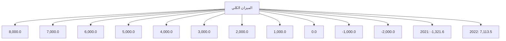

# مصرف ليبيا المركزي

## ميزان المدفوعات

### لعـام 2022

إدارة البحـوث والإحصـاء
---
The image contains Arabic calligraphy in blue ink on a white background. The text is written in a stylized, flowing script typical of Islamic calligraphy. The phrase written is:

بسم الله الرحمن الرحيم

This is a common Islamic phrase known as the Bismillah, which translates to "In the name of Allah, the Most Gracious, the Most Merciful." This phrase is often used at the beginning of various actions by Muslims as a way to seek blessings and invoke the name of God.

The calligraphy is elegant and ornate, with the letters flowing into each other in a harmonious design. The blue color stands out clearly against the white background, giving the image a clean and striking appearance.
---
# المحتويات

| الصفحة | الموضوع |
|--------|---------|
| 1 | تقديـم |
| 2 | مصطلحات وتعاريف |
| 22 | وضع ميزان مدفوعات ليبيا لعام 2022 |
| 22 | أولاً: الحساب الجاري |
| 23 | • الميزان التجاري |
| 25 | • حساب الخدمات، الدخل والتحويلات الجارية |
| 26 | ثانياً: الحساب الرأسمالي والمالي |
| 26 | ثالثاً: الميزان الكلي |
| 27 | جدول: ميزان مدفوعات ليبيا لعام 2022 |
| 36 | ملخص منقح لميزان مدفوعات ليبيا 2021/2020 |
---
# تقديم

يسر إدارة البحوث والإحصاء بمصرف ليبيا المركزي أن تعلن عن الإنتهاء من إعداد كتيب إحصاءات ميزان مدفوعات ليبيا لعام 2022، والذي يشتمل على بيانات نقدية ومالية عن قيمة المعاملات الجارية والرأسمالية المتبادلة بين ليبيا والعالم الخارجي خلال عام 2022، مبوبة حسب المنهجية والمفاهيم الواردة في الطبعة السادسة من دليل ميزان المدفوعات الصادر عن صندوق النقد الدولي. كما يتضمن هذا الكتيب بيانات منقحة عن ميزان مدفوعات ليبيا لعامي 2020 و2021.

وقد تم الاعتماد في إعداد هذا الميزان على البيانات الواردة من الإدارات التالية بمصرف ليبيا المركزي وهي: إدارة الرقابة على المصارف والنقد، إدارة الحسابات، إدارة الأسواق المالية، إدارة الإصدار، إدارة العمليات المصرفية ووحدة المساهمات بالمصرف وكذلك على المعلومات التي تضمنتها المسوحات التي تم استلامها من العديد من الهيئات والمؤسسات والشركات ذات العلاقة المقيمة في ليبيا ومن بينها:

مصلحة الاحصاء والتعداد (وزارة التخطيط)، الهيئة العامة للسياحة، المؤسسة الوطنية للنفط، المصارف التجارية، المصرف الليبي الخارجي، الشركة الليبية للاستثمارات الخارجية، محفظة ليبيا إفريقيا للاستثمار، المؤسسة الليبية للاستثمار، المحفظة طويلة المدى، شركات النفط الأجنبية، هيئة الإشراف والرقابة على التأمين، شركات الخطوط الجوية الليبية، الشركة الوطنية العامة للنقل البحري، الشركة الليبية للبريد والاتصالات وتقنية المعلومات القابضة، شركات الطيران الأجنبية، بعثة الأمم المتحدة العاملة في ليبيا وغيرها من المصادر المحلية الأخرى، وأيضاً مصادر خارجية كالنشرات والتقارير والمواقع الالكترونية ونظم الإبلاغ عن المعاملات الدولية على الشبكة العنكبوتية.

إدارة البحوث والإحصاء  
مصرف ليبيا المركزي

ميزان المدفوعات 2022
---
# مصطلحات وتعاريف

تُعد هذه المصطلحات والتعاريف توضيحاً للمفاهيم التي يتم على أساسها تصنيف
إحصاءات ميزان المدفوعات وبيان كيفية جمع وتبويب وتصنيف هذه الإحصاءات وفقاً
للمنهجية المتبعة في دليل ميزان المدفوعات الطبعة السادسة الذي أعده صندوق النقد
الدولي في عام 2008، والذي وضع بهدف توحيد البيانات على المستوى الدولي ومساعدة
الباحثين والمهتمين في فهم طبيعة ونوعية البيانات والأساليب المستخدمة في حسابات ميزان
المدفوعات.

## أولاً: الحساب الجاري: -

يشتمل الحساب الجاري على كافة المعاملات التي تتضمن قيماً اقتصادية تمت بين
الجهات المقيمة في الاقتصاد الوطني وجهات أخرى غير المقيمة به(*)، كذلك يشمل القيود
المعادلة للقيم الاقتصادية الجارية المقدمة أو المستلمة دون مقابل. وينقسم الحساب الجاري
إلى البنود التالية: السلع، الخدمات، الدخل الأولي والدخل الثانوي.

### أ- السلع والخدمات: -

#### السلع:

تعد السلع بنود مادية منتجة يمكن إثبات حق ملكيتها، كما يمكن نقل هذه الملكية من وحدة
مؤسسية إلى أخرى من خلال التعامل في الأسواق، قد تستخدم في إشباع حاجات ورغبات
الأسر المعيشية أو المجتمع أو في إنتاج سلع أو خدمات أخرى، ويشمل بند السلع البضائع
العامة والسلع الأخرى.

**البضائع العامة:** تشمل السلع التي تتغير ملكيتها الاقتصادية فيما بين المقيمين وغير المقيمين
ولا تدرج ضمن السلع قيد المتاجرة والذهب غير النقدي والسلع المدرجة ضمن السفر والبناء

----

(*) غير المقيم تعني فرد أو شركة أو مؤسسة أو أي منظمة أخرى تكون مقيمة في بلد غير ليبيا، أو مقيمة في ليبيا لمدة
تقل عن سنة

ميزان المدفوعات 2022
---
والسلع والخدمات الحكومية غير المدرجة في مكان آخر، ونجد أن بيانات البضائع العامة

تجمع من عدد من المصادر تشمل إحصاءات التجارة الدولية وبيانات الجمارك ونظم الإبلاغ

عن المعاملات الدولية واستقصاءات الشركات التجارية، وقد يتعين تعديل البيانات

المستخلصة من هذه المصادر بما يتفق مع إرشادات إعداد ميزان المدفوعات من حيث نطاق

التغطية والتوقيت والتقييم والتبويب، ومن البنود التي يتعين إدراجها ضمن البضائع العامة:

- النقود الورقية والمعدنية غير المتداولة في الوقت الحالي والأوراق المالية غير
المصدرة، ويجري تقييمها كسلع أولية وليس بقيمتها الإسمية.

- الكهرباء والغاز والمياه.

- برامج الكمبيوتر المعبأة الجاهزة (النظم والتطبيقات) والتسجيلات السمعية
والبصرية المخزنة على وسائط مادية مثل الأقراص وغيرها من وسائل التخزين
التي تتيح تراخيصها الحق في الإستخدام الدائم لها.

- السلع التي تحصل عليها الناقلات في الموانئ من وقود ومؤن ومخزونات ومواد
تغليف البضائع المنقولة التي تحصل عليها شركات النقل غير المقيمة في الموانئ
من موردين مقيمين.

- السلع التي تستوردها أو تشتريها الناقلات خارج الإقليم الذي تقيم فيه شركة النقل.

- السلع التي يقتنيها المستأجر بموجب عقد تأجير تمويلي.

- السلع التي ترسل للخارج دون تغير في ملكيتها ثم تباع فيما بعد مثل السلع التي
ترسل من أجل التخزين أو الإصلاح أو العرض أو التجهيز.

- السلع غير المشروعة والسلع المهربة.

- الهبات والمساعدات الإنسانية المقدمة في شكل سلع.

- الطرود البريدية التي ينطوي إرسالها على تغير في الملكية.

ميزان المدفوعات 2022

3
---
- السلع التي تبيعها الحكومة إلى غير المقيمين أو تشتريها منهم مثل المعدات العسكرية.

السلع الأخرى: يشمل هذا البند السلع قيد المتاجرة والذهب غير النقدي، فالسلع قيد المتاجرة تعرف بأنها شراء جهة مقيمة (في الاقتصاد القائم بإعداد البيانات) لسلع من جهة غير مقيمة وبيع نفس السلع فيما بعد إلى جهة غير مقيمة أخرى دون تواجد السلع في الاقتصاد القائم بإعداد البيانات. أما الذهب غير النقدي فيشمل جميع أشكال الذهب بخلاف الذهب النقدي الذي تمتلكه السلطات النقدية ويحتفظ به كأصول احتياطية ويمكن أن يكون الذهب غير النقدي في شكل سبائك، أي سبائك ذهب شكل عملات أو قوالب أو سبائك لا تقل نسبة نقائها عن 995 جزء في الألف، بما في ذلك الذهب المحتفظ به في حسابات الذهب المخصص.

الخدمات:

1- خدمات الصناعة التحويلية للمدخلات المادية المملوكة لآخرين:
يتضمن بند خدمات الصناعة التحويلية للمدخلات المادية المملوكة لآخرين عمليات التجهيز والتجميع والتغليف وما شابهها التي تقوم بها مؤسسات لا تمتلك السلع المعنية، حيث يقوم بعمليات الصناعة التحويلية كيان لا يمتلك السلع، وذلك مقابل رسوم يدفعها المالك، في هذه الحالة لا تتغير ملكية السلع وبالتالي لا تقيد المعاملات بين المالك وجهة التجهيز ضمن البضائع العامة، ومن أمثلة ذلك تكرير النفط وتسييل الغاز الطبيعي وتجميع الملبوسات والإلكترونيات.

2- خدمات الصيانة والإصلاح غير المدرجة في موضع آخر:
تشمل خدمات الصيانة والإصلاح غير المدرجة في موضع آخر أعمال الصيانة والإصلاح التي تجريها جهات مقيمة على سلع تمتلكها جهات غير مقيمة والعكس. وقد تنفذ خدمات الإصلاح في موقع عمل الجهة مقدمة الخدمة أو في مكان آخر، ويتضمن هذا البند أعمال الإصلاح والصيانة التي تجري على السفن والطائرات، كذلك تتضمن خدمات الصيانة

4                                                                               ميزان المدفوعات 2022
---
والإصلاح غير المدرجة في مكان آخر الإصلاحات البسيطة التي تحافظ على السلع في حالة
صالحة للتشغيل والإصلاحات الكبيرة التي تؤدي إلى زيادة كفاءة السلع وإطالة عمرها.

## 3- النقل:

يشتمل بند النقل على نقل السلع والركاب من مكان لآخر إلى جانب ما يتصل بذلك من
خدمات مساندة ومساعدة، ويشمل هذا البند أيضا خدمات البريد وتوصيل الرسائل ويمكن
تبويب خدمات النقل وفقا لما يلي:

أ- طريقة النقل: أي النقل بطريق البحر أو الجو أو طرق أخرى (ويمكن أن تقسم طرق
النقل الأخرى أيضا إلى النقل البري والنقل بطريق السكك الحديدية وعبر المجاري
المائية الداخلية وخطوط الأنابيب والنقل الفضائي ونقل الطاقة الكهربائية).

ب- نوع النقل (نقل ركاب أم سلع).

## 4- السفر:

يشتمل بند السفر على شراء السلع والخدمات لاستعمالها الخاص أو لإهدائها بما فيها تلك
المتعلقة بالصحة والتعليم التي يحصل عليها المسافرون غير المقيمين في الاقتصاد المضيف
لأغراض تتعلق بالأعمال أو الاستخدام الشخصي خلال زياراتهم التي تقل مدتها عن عام
واحد ولا يشمل بند السفر خدمات الركاب الدولية التي تدخل في بند النقل، ويعامل الطلاب
والمسافرون للعلاج كمسافرين بغض النظر عن مدة إقامتهم، إلا أن هناك فئات أخرى معينة
لا تعتبر ضمن المسافرين مثل العسكريين والعاملين في السفارات والعمال غير المقيمين
حيث يتم إدراج مصروفات العمال غير المقيمين ضمن بند السفر، في حين تدرج مصروفات
العسكريين والعاملين في السفارات ضمن الخدمات الحكومية غير المدرجة في مكان آخر.

## 5- خدمات التشييد:

يشتمل بند خدمات التشييد على إنشاء الأصول الثابتة وتجديدها وإصلاحها، وتكون هذه
الأصول في شكل مبان وتحسينات ذات طبيعة هندسية يتم إدخالها على الأراضي وغير ذلك
من الإنشاءات الهندسية مثل الطرق والكباري والسدود، ويشمل أيضا أعمال التركيب
والتجميع ذات الصلة، وتدرج ضمن بند التشييد أيضا السلع والخدمات التي تشتريها

ميزان المدفوعات 2022        5
---
المؤسسات القائمة بأعمال البناء من الاقتصاد الكائن فيه الموقع الذي تجري فيه أعمال البناء،
وتنقسم خدمات البناء إلى خدمات بناء بالخارج وخدمات بناء في الاقتصاد القائم بإعداد
البيانات.

## 6- خدمات التأمين ومعاشات التقاعد:

يشتمل بند خدمات التأمين على الخدمات التأمينية التي تقدمها مؤسسات التأمين المقيمة إلى
المؤسسات غير المقيمة والعكس، ويشمل هذا البند خدمات التأمين على الشحن (السلع
المصدرة والمستوردة) وغير ذلك من خدمات التأمين المباشر (بما في ذلك التأمين على
الحياة وغيره من أنواع التأمين الأخرى)، وخدمات إعادة التأمين.

## 7- الخدمات المالية:

يشتمل بند الخدمات المالية (عدا الخدمات المرتبطة بمؤسسات التأمين وصناديق المعاشات
التقاعدية) على خدمات الوساطة المالية والخدمات المساعدة التي تتم بين المقيمين وغير
المقيمين، ويندرج تحت هذا البند العمولات والرسوم المتعلقة بخطابات الاعتماد وخطوط
الائتمان وخدمات التأجير المالي، معاملات الصرف الأجنبي، الخدمات الائتمانية
للمستهلكين، خدمات رجال الأعمال، خدمات السمسرة، خدمات الضمان ومختلف ترتيبات
وأدوات التحوط من تقلبات الأسعار وما إلى ذلك. أما الخدمات المساعدة فتشمل الخدمات
المتعلقة بمجالات تشغيل وتنظيم الأسواق المالية وخدمات حفظ الأوراق المالية وما شابه
ذلك.

## 8- رسوم إستخدام حقوق الملكية الفكرية غير المدرجة في موضع آخر:

يتضمن هذا البند رسوم إستخدام الحقوق الحصرية ( مثل براءات الإختراع والعلامات
التجارية ، وحقوق التأليف ، والعمليات والتصميمات الصناعية بما فيها الأسرار التجارية
وحقوق الامتياز ) و الرسوم المدفوعة مقابل تراخيص استنساخ و/ أو توزيع الملكية الفكرية
المتضمنة في المنتجات الأصلية والنماذج الأولية ( مثل حقوق التأليف الخاصة بالكتب
والمخطوطات وبرامج الكمبيوتر وأعمال السينماتوغرافي والتسجيلات الصوتية ( حقوق
العروض وبرامج التلفزيون المذاعة على الهواء مباشرة والبرامج المنقولة عبر الكابلات
التلفزيونية والإذاعة عبر الأقمار الصناعية .

ميزان المدفوعات 2022
---
## 9- خدمات الاتصالات والكمبيوتر والمعلومات:

### أ / خدمات الاتصالات:

تشمل هذه الخدمات إذاعة أو نشر المعلومات الصوتية أو المرئية أو البيانات أو غير ذلك من المعلومات عن طريق الهاتف والتلكس والتلغراف، وبرامج الراديو والتلفزيون المنقولة عبر الكابلات والأقمار الصناعية والبريد الإلكتروني والفاكس، وتتضمن خدمات الاتصالات المتنقلة وخدمات الربط بخطوط الإنترنت الرئيسية.

### ب / خدمات الكمبيوتر:

تتضمن خدمات الكمبيوتر الخدمات ذات الصلة بمعدات وبرامج الكمبيوتر وخدمات معالجة البيانات، وتشتمل خدمات الكمبيوتر على:

- مبيعات برامج الكمبيوتر المعدة حسب الطلب وترخيص الإستخدام الخاصة بها.
- تصميم برامج الكمبيوتر بناء على طلب مستخدمين معينين، بما في ذلك نظم التشغيل وإنتاجها وتقديمها وتوثيقها.
- برامج الكمبيوتر الجاهزة (المنتجة بكميات كبيرة) التي تم الحصول عليها إما بطريقة التحميل أو بأي وسيلة إلكترونية أخرى.
- الترخيص بإستخدام برامج الكمبيوتر الجاهزة (المنتجة بكميات كبيرة) المحفوظة على وسائل تخزين، مثل الأقراص المرنة أو الأقراص المدمجة، مقابل دفع رسوم.
- المبيعات والمشتريات من المنتجات الأصلية وحقوق ملكية نظم وتطبيقات برامج الكمبيوتر.
- خدمات الإستشارة والتنفيذ المتعلقة بمعدات وبرامج الكمبيوتر.
- تركيب معدات وبرامج الكمبيوتر بما في ذلك تركيب أجهزة الكمبيوتر الرئيسية ووحدات الكمبيوتر المركزية.
- صيانة وإصلاح أجهزة الكمبيوتر والمعدات الفرعية المتصلة بها.
- خدمات استرجاع البيانات وخدمات تحليل النظم الجاهزة للإستخدام وتصاميمها وبرمجتها وخدمات صيانة النظم وخدمات الدعم الأخرى.
- خدمات معالجة البيانات، خدمات استضافة صفحات الإنترنت وتوفير التطبيقات، تطبيقات العملاء وإدارة مرافق الكمبيوتر.

2022 ميزان المدفوعات
---

## 10- خدمات الأعمال الأخرى:

يشتمل بند خدمات الأعمال الأخرى على خدمات البحوث والتطوير، الخدمات المهنية وخدمات الاستشارات الإدارية، الخدمات الفنية والخدمات المرتبطة بالتجارة وخدمات الأعمال الأخرى، معالجة النفايات وإزالة التلوث والخدمات الزراعية وخدمات التعدين والتأجير التشغيلي.

## 11-الخدمات الشخصية والثقافية والترويحية:

يشتمل بند الخدمات الشخصية والثقافية والترويحية المتبادلة بين المقيمين وغير المقيمين على ما يلي:

- الخدمات المرتبطة بوسائل سمعية وبصرية والمتبادلة بين المقيمين وغير المقيمين، وتتضمن الخدمات المرتبطة بالإنتاج السينمائي المسجل على أشرطة الأفلام أو الفيديو وبرامج الراديو والتلفزيون والتسجيلات الموسيقية (ومن أمثلة هذه الخدمات المبالغ والأجور التي يتلقاها الممثلون والمنتجون ومن على شاكلتهم نظير الإنتاج وحقوق التوزيع المباعة لوسائل الإعلام).

- الخدمات الثقافية الأخرى وتشمل الخدمات الشخصية والثقافية والترفيهية الأخرى كذلك المرتبطة بالمكتبات والمتاحف وغير ذلك من الأنشطة الثقافية والرياضية ذات الصلة.

## 12- السلع والخدمات الحكومية غير المدرجة في موضع آخر:

تشمل فئة الخدمات الحكومية غير المدرجة في أماكن أخرى على كل الخدمات المرتبطة بقطاعات حكومية أو منظمات دولية أو إقليمية غير المبوبة تحت بنود أخرى (مثال ذلك مصروفات السفارات والقنصليات والقواعد العسكرية).

## ب- حساب الدخل الأولي:

يبين حساب الدخل الأولي تدفقات الدخل الأولي فيما بين الوحدات المؤسسية المقيمة والغير مقيمة، ويشتمل على ما يلي:

----

ميزان المدفوعات 2022 | 8
---

## 1- تعويضات العاملين:

يشتمل بند تعويضات العاملين على الأجور والرواتب والمزايا الأخرى النقدية والعينية لعمال الحدود والعمال الموسميين وغيرهم من العمال غير المقيمين مثل (العمال المحليين العاملين في السفارات).

## 2- دخل الإستثمار:

يشتمل بند دخل الإستثمار على متحصلات الدخل المرتبطة بحيازات المقيمين لأصول مالية خارجية ومدفوعاتهم المرتبطة بخصومهم تجاه غير المقيمين، ويتكون دخل الإستثمار من أنواع الدخل المستمدة من أنشطة الإستثمار المباشر واستثمارات الحافظة واستثمارات أخرى، وينقسم عنصر الاستثمار المباشر إلى دخل حقوق الملكية وأسهم صناديق الإستثمار وتوزيعات الأرباح والمسحوبات من دخل أشباه الشركات، والعائدات المعاد استثمارها، والدخل من الدين (الفوائد). ويتفرع دخل استثمارات الحافظة إلى الدخل من حقوق الملكية وأسهم صناديق الإستثمار ودخل الإستثمار الذي يعزى إلى حملة أسهم صناديق الإستثمار والأرباح المعاد استثمارها من أسهم صناديق الإستثمار والدخل من الدين (فوائد)، ويشمل الدخل من استثمارات أخرى الفوائد المكتسبة من أنواع أخرى من رأس المال (قروض وما شابه ذلك)، كما يشمل من حيث المبدأ الدخل المحتسب أو المقدر للأسر من صافي حقوق ملكيتها في احتياطيات التأمين على الحياة وصناديق المعاشات التقاعدية.

## ج-حساب الدخل الثانوي:

يبين حساب الدخل الثانوي التحويلات الجارية بين المقيمين وغير المقيمين، حيث يقيد فيه مختلف أنواع التحويلات الجارية لبيان دورها في عملية توزيع الدخل بين الاقتصادات، وتنقسم الى تحويلات شخصية وتحويلات جارية أخرى.

وتشمل التحويلات الشخصية جميع التحويلات الجارية النقدية أو العينية التي تمنحها الأسر المعيشية المقيمة إلى أسر معيشية غير مقيمة أو تتلقاها منها، كذلك تعتبر تحويلات العاملين في الخارج تحويلات جارية يرسلها العاملون المقيمين في اقتصاد آخر.

أما التحويلات الجارية الأخرى فتشمل الضرائب الجارية على الدخل والثروة وغيرهما، المساعدات الإجتماعية، المزايا الإجتماعية، صافي أقساط التأمين على غير الحياة والضمانات الموحدة، مطالبات التأمين على الحياة والمطالبات المشمولة بالضمانات الموحدة.

9
ميزان المدفوعات 2022
---
والتحويلات الجارية المرتبطة بالتعاون الدولي والتحويلات الجارية الممنوحة إلى المؤسسات
غير الهادفة للربح التي تخدم الأسر المعيشية.

## ثانياً: الحساب الرأسمالي: -

### أ - المفاهيم ونطاق التغطية:

يعرض الحساب الرأسمالي القيود الدائنة والقيود المدينة للأصول غير المنتجة غير المالية
والتحويلات الرأسمالية بين المقيمين وغير المقيمين، ويعني ذلك أنه يسجل عمليات إقتناء
الأصول غير المالية غير المنتجة والتصرف فيها، مثل بيع الأراضي إلى السفارات وبيع
عقود الإيجار والتراخيص، وكذلك التحويلات الرأسمالية، أي قيام أحد الأطراف بتوفير
موارد للأغراض الرأسمالية دون حصوله في المقابل على أي قيمة اقتصادية كعائد مباشر.

ويبين ميزان الحساب الرأسمالي مجموع القيود الدائنة ناقصا القيود المدينة للتحويلات
الرأسمالية والأصول غير المنتجة غير المالية، وإضافة إلى ذلك يمكن أن يظهر مجموع
ميزاني الحسابين الجاري والرأسمالي كبند موازن، ويطلق على البند الموازن صافي
الإقراض (+) صافي الاقتراض (-) من الحسابين الرأسمالي والجاري، وهذا المجموع
يساوي أيضا من ناحية المفاهيم صافي الإقراض (+) / صافي الاقتراض (-) من الحساب
المالي، بالرغم من أنهما يتساويان من الناحية المفاهيمية، فقد يختلفان من الناحية العملية،
فالحسابان الجاري و الرأسمالي يبينان المعاملات غير المالية ويتسبب رصيدهما في صافي
إقراض أو صافي اقتراض، بينما يبين الحساب المالي كيفية تمويل صافي الإقراض أو
الاقتراض.

ويستخدم مصطلح الحساب الرأسمالي في هذا الدليل ليكون متسق مع نظام الحسابات القومية
الذي يميز بين المعاملات الرأسمالية والمالية، ويبين الحساب الرأسمالي في نظام الحسابات
القومية التكوين الرأسمالي للمجموعة الكاملة من الأصول المنتجة وغير المنتجة، ولا تبين
الأجزاء المقابلة في الحسابات الدولية إلا المعاملات في الأصول غير المنتجة غير المالية
وتدرج المعاملات في الأصول المنتجة في حساب السلع والخدمات.

| 10 | ميزان المدفوعات 2022 |
|----|--------------------|
---
ويسجل اقتناء الأصول غير المنتجة غير المالية والتصرف فيها في وقت تغير الملكية، ويقيد
اقتناء الأصول غير المنتجة غير المالية والتصرف فيها والتحويلات الرأسمالية مستحقة
القبض ومستحقة الدفع ضمن بنود منفصلة على أساس إجمالي وليس على أساس صافي.

## ب-اقتناء الأصول غير المنتجة غير المالية والتصرف فيها:

وتتألف الأصول غير المنتجة غير المالية مما يلي:

### 1- الموارد الطبيعية:
وتشمل الأراضي، حقوق التعدين، حقوق الحراجة، المياه، حقوق الصيد، المجال الجوي،
والطيف الكهرومغناطيسي.

### 2- عقود الإيجار والتراخيص:
ويشمل بند عقود الإيجار والتراخيص تلك العقود المعترف بها كأصول اقتصادية وهذه
الأصول هي من صنع المجتمع ونظامه القانوني، ويطلق عليها في بعض الأحيان اسم
الأصول غير الملموسة. ومن أمثلتها عقود التأجير التشغيلي القابلة للتداول، وتراخيص
استخدام الموارد الطبيعية التي لا تسجل كملكية خالصة لهذه الموارد، وتراخيص القيام
بأنشطة معينة (بما في ذلك بعض التراخيص الحكومية)، وتسجل المعاملات في هذه
الأصول في الحساب الرأسمالي، بينما لا تسجل حيازات هذه الأصول في وضع الاستثمار
الدولي لعدم وجود خصوم مقابلة لها.

يمكن نقل ملكية عقد التأجير التشغيلي القابل للتداول أو تأجيره من الباطن، ولا يمكن أن
يعامل كأصل إلا إذا نص العقد على سعر محدد مسبق لاستخدام أصل ما يختلف عن السعر
الذي كان يمكن تأجير الأصل به في الوقت الحالي. وقد تغطي هذه العقود العقارات والإقامة
بنظام المشاركة بالوقت والمعدات والأصول المنتجة الأخرى، وتسجل تدفقات أصول عقود
التأجير التشغيلي القابلة للتداول في الحساب الرأسمالي عندما يقوم المستأجر ببيع الحق.

وبعض عقود الإيجار والترخيص لا تعد أصولا غير منتجة غير مالية، وبالتالي لا تدرج في
الحساب الرأسمالي ومن أمثلتها ما يلي:

ميزان المدفوعات 2022 | 11
---
- إذا ما تم منح حق إستخدام أرض أو مورد طبيعي آخر لأمد قصير مع عدم قابلية
تحويل هذا الحق، تبوب المبالغ مستحقة الدفع ضمن الريع.

- إذا منحت حكومة ترخيصا للقيام بنشاط ما، لا تتعلق ملكيتها بأصل أساسي أو
خدمي وكان الترخيص لا يتفق وتعريف الأصل الاقتصادي تقيد هذه المعاملة ضمن
الضرائب، ومثال ذلك عندما تصدر حكومة ما عددا محدودا من تراخيص ممارسة
القمار.

- إذا تم منح حق امتلاك منتجات الملكية الفكرية كالبحوث والتطوير وبرامج وقواعد
بيانات الحاسب الآلي، والأعمال الترفيهية والأدبية والفنية، تقيد هذه المعاملات
ضمن الخدمات.

### 3-الأصول التسويقية (الشهرة):

تتألف الأصول التسويقية من بنود مثل الاسم التجاري، والعلامات التجارية والشعارات واسم
الناطق الإلكتروني، وعند بيع الأصول التسويقية بصورة منفصلة عن الكيان الذي يمتلكها،
فإنها تقيد ضمن اقتناء الأصول غير المنتجة غير المالية والتصرف فيها.

وتقيد أسماء البطاقات الإلكترونية على شبكة الإنترنت ضمن الأصول التسويقية في بعض
الحالات، إلا أن رسوم التسجيل العادية مستحقة الدفع إلى الجهات المختصة بالبطاقات
الإلكترونية تمثل خدمة لأن الرسوم تكون مقابل عمل يؤدى.

إذا شملت القيمة المدفوعة مقابل الحصول على اسم النطاق الإلكتروني علاوة بسبب ندرته
يعتبر بمثابة ترخيص ويدرج ضمن الأصول التسويقية. وبالمثل، يعد رسم تصميم شعار
جديد خدمة تجارية، بينما يدرج المبلغ المدفوع لاقتناء شعار موجود ضمن الأصول
التسويقية.

### ج-التحويلات الرأسمالية:

تعد التحويلات الرأسمالية هي التحويلات التي تنتقل فيها ملكية أصل من طرف إلى آخر أو
التي تلزم أحد الطرفين أو كليهما باقتناء أصل أو التصرف فيه، أو تنازل ما عن الخصم
المستحق له، وتشمل التحويلات الرأسمالية أيضا التحويلات النقدية التي لا تنطوي على
التصرف في أصول غير نقدية أو اقتنائها.

12                                                                              ميزان المدفوعات 2022
---

## 1-الإعفاء من الدين:

الإعفاء من الدين هو الإلغاء الطوعي للدين كلياً أو جزئياً بموجب اتفاق تعاقدي بين دائن ومدين. ونتيجة الإعفاء من الدين، يلغى الترتيب التعاقدي أو يسقط كل المبلغ الأصلي القائم أو جزء منه، بما في ذلك متأخرات الفائدة (مدفوعات الفائدة التي استحقت في الماضي) ولا ينشأ الإعفاء من الدين نتيجة إلغاء مدفوعات فائدة مستقبلية لم تستحق بعد.

ويختلف الإعفاء من الدين عن شطب الدين ويعامل باعتباره معاملة تحويل رأسمالي وعلى عكس شطب الدين، ينشأ الإعفاء من الدين نتيجة اتفاق بين أطراف الدين والهدف منه تحويل منفعة وليس اعترافاً من جانب الدائن وحده بعدم إمكانية تحصيل المبلغ.

## 2-مطالبات التأمين على غير الحياة:

تبوب مطالبات التأمين على غير الحياة عادة ضمن التحويلات الجارية، وبالنسبة للمطالبات الكبيرة للغاية كالمطالبات عقب كارثة يمكن قيد جزء من المطالبات كتحويلات رأسمالية وليس كتحويلات جارية كما يحدث في الأحوال العادية.

## 3-المنح الاستثمارية:

تتألف المنح الاستثمارية من تحويلات رأسمالية نقدية أو عينية تقدمها الحكومات أو المنظمات الدولية إلى وحدات مؤسسية أخرى لتمويل تكاليف اقتنائها لأصول ثابتة كلياً أو جزئياً. وقد يكون متلقو المنح الاستثمارية حكومات أو كيانات أخرى، ويلتزم متلقو المنح الاستثمارية باستخدام المنح التي يتلقونها نقداً في أغراض إجمالي تكوين رأس المال الثابت، وغالبا ما يتم ربط هذه المنح بمشاريع استثمارية محددة كمشاريع البناء الكبرى.

وعلى عكس المنح الاستثمارية، قد تقوم حكومة أجنبية أيضا بتمويل مشروع استثماري باعتبارها مستثمر مباشر وفي هذه الحالة يبوب المبلغ المستثمر ضمن حصص الملكية في مؤسسة استثمار مباشر، وتختلف حصة الاستثمار المباشر عن مشروع يمول بتحويل رأسمالي في أن المستثمر المباشر يمتلك قوة تصويتية في المؤسسة ويحق له الحصول على منافع مستقبلية، كتوزيعات الأرباح أو حق بيع الأصول.

وإذا استمر المشروع الاستثماري فترة زمنية طويلة فقد تدفع المنحة الاستثمارية النقدية على أقساط ويظل تبويب مدفوعات الأقساط ضمن التحويلات الرأسمالية، حتى وإن قيدت في

13                                                                                ميزان المدفوعات 2022
---
سلسلة متتالية من الفترات المحاسبية المختلفة. وتشمل المنح الإستثمارية العينية تحويلات
على هيئة معدات نقل، آلات، ومعدات أخرى تقدمها الحكومات إلى وحدات غير مقيمة.

## 4- الضرائب:

تتكون الضرائب الرأسمالية من ضرائب تفرض على فترات غير منتظمة وغير متكررة
على قيم الأصول أو صافي القيمة المملوكة لوحدات مؤسسية أو على قيم الأصول التي تنتقل
ملكيتها فيما بين وحدات مؤسسية نتيجة لإرث أو هبات متبادلة في حياة الواهب والموهوب
له.

وتشمل الضرائب الآتية:

(1) الضرائب المفروضة على رأس المال وتتكون هذه الضرائب من ضرائب
على قيم الأصول أو صافي القيمة المملوكة لوحدات مؤسسية تفرض على فترات زمنية غير
منتظمة

(2) الضرائب على التحويلات الرأسمالية وتتكون هذه التحويلات من ضرائب تفرض
على قيم الأصول التي تنتقل ملكيتها فيما بين وحدات مؤسسية، وتتكون من ضرائب الإرث
(ضرائب التركات) والضرائب على الهدايا بما في ذلك ضرائب على هدايا يتبادلها أفراد
أحياء من نفس الأسرة بغرض تجنب دفع ضرائب الإرث أو تخفيضها إلى أدنى حد ممكن.
وهذه الضرائب لا تشمل الضرائب على مبيعات الأصول.

## 5-التحويلات الرأسمالية الأخرى:

تدرج المدفوعات الكبيرة غير المتكررة المقدمة تعويضا عن تلف كبير أو إصابات خطيرة
غير مغطاة بوثائق تأمين ضمن التحويلات الرأسمالية.

وتشمل التحويلات الرأسمالية الهبات الكبيرة والتركات بما في ذلك المقدمة إلى مؤسسات
غير هادفة للربح وقد تتم هذه التحويلات الرأسمالية بموجب وصايا أو أثناء حياة المانح.

وتشمل التحويلات الرأسمالية المنح الكبيرة للغاية التي تقدمها أسر معيشية أو مؤسسات إلى
مؤسسات غير هادفة للربح لتمويل إجمالي تكوين رأس المال الثابت، مثل الهبات المقدمة إلى
الجامعات لتغطية تكاليف بناء سكن جديد داخل الحرم الجامعي وسكنيات ومختبرات.

وتعد المساهمة في رأس مال منظمة دولية أو مؤسسة غير هادفة للربح تحويلاً رأسمالياً إذا
لم ينشأ عنها حصول مقدم المساهمة على حصص ملكية.

ميزان المدفوعات 2022
---
ويمكن قيد التحويلات الرأسمالية بين الأسر المعيشية كبند منفصل عندما تكون قيمتها كبيرة
وتندرج ضمن البند التكميلي الخاص بالتحويلات الشخصية من العاملين في الخارج.

### ثالثاً: الحساب المالي:

#### أ - المفاهيم ونطاق التغطية:

يسجل الحساب المالي المعاملات التي تنطوي على أصول وخصوم مالية وتتم بين المقيمين
وغير المقيمين، ويشير الحساب المالي إلى الفئات الوظيفية والقطاعات والأدوات وآجال
الاستحقاق المستخدمة في صافي معاملات التمويل الدولية.

وتكون القيود المدرجة في الحساب المالي قيود مقابلة لقيود السلع أو الخدمات أو الدخل أو
الحساب الرأسمالي أو قيود الحساب المالي الأخرى، فعلى سبيل المثال يكون القيد المقابل
لصادرات السلع عادة زيادة في الأصول المالية، كالعملة والودائع أو الائتمان التجاري وفي
المقابل قد تنطوي معاملة ما على قيدين في الحساب المالي حيث يمكن مبادلة سند بعملة
وودائع.

ويسمى الرصيد الكلي للحساب المالي صافي الإقراض / صافي الإقتراض، وصافي
الإقراض يعني أن الاقتصاد يقدم أموالاً إلى العالم الخارجي، آخذاً في الحسبان إقتناء
الأصول المالية والتصرف فيها وتحمل الخصوم وسدادها، أما صافي الاقتراض فيعني
العكس، ورغم استخدام مصطلحات متعلقة بالإقراض، فإن رصيد صافي الإقراض / صافي
الاقتراض يأخذ في الحسبان حصص الملكية، المشتقات المالية والذهب النقدي، إلى جانب
أدوات الدين. كذلك يشمل صافي الاقراض انخفاض الخصوم كما يشمل صافي الاقتراض
انخفاض الأصول، ويمكن استخلاص صافي الإقراض / صافي الاقتراض إما من مجموع
رصيدي الحسابين الجاري والرأسمالي أو من رصيد الحساب المالي.

#### القيد على أساس صافي:

يعني القيد على أساس صافي في الحساب المالي عمليات تجميع يتم بواسطتها ترصيد كل
القيود المدينة الخاصة بأصل معين أو خصم معين مقابل كل القيود الدائنة الخاصة بنفس نوع
الأصل أو نفس نوع الخصم.

15

ميزان المدفوعات 2022
---
توقيت التسجيل والتقييم:

المعاملات المتعلقة بالأصول المالية تسجل عند تغير الملكية الاقتصادية وتسجل معاملات الحساب المالي بوجه عام بالقيمة السوقية.

## ب - الاستثمار المباشر:

الاستثمار المباشر هو فئة من فئات الإستثمار عبر الحدود الذي يرتبط بمقيم في اقتصاد ما يتمتع بالسيطرة أو درجة عالية من النفوذ في إدارة مؤسسة مقيمة في اقتصاد آخر. وتنشأ علاقة الإستثمار المباشر عندما يقوم مستثمر مقيم في أحد الاقتصادات بإستثمار يمنحه السيطرة أو درجة كبيرة من النفوذ في إدارة مؤسسة مقيمة في اقتصاد آخر.

وتنشأ علاقات الاستثمار المباشر ذي الملكية المباشرة عندما يمتلك مستثمر مباشر بصورة مباشرة حقوق ملكية تؤهله للحصول على نسبة 10% أو أكثر من القوة التصويتية في مؤسسة الاستثمار المباشر. وبالنسبة لعلاقة مؤسسة الاستثمار المباشر مع المستثمر المباشر فإن مؤسسة الاستثمار المباشر تكون إما مؤسسة تابعة أو مؤسسة مرتبطة.

من أنواع الاستثمار المباشر: (أ) استثمارات مستثمر مباشر في مؤسسة الاستثمار المباشر، (ب) الاستثمار العكسي الذي تقوم به مؤسسة استثمار مباشر في مستثمرها المباشر صاحب الملكية المباشرة أو غير المباشرة، (ج) الاستثمار بين المؤسسات الزميلة المقيمة وغير المقيمة.

وينشأ الاستثمار العكسي عندما تقوم مؤسسة استثمار مباشر بإقراض الاموال أو اقتناء حصص الملكية في مستثمرها المباشر صاحب الملكية المباشرة أو غير المباشرة شريطة عدم امتلاكها حصص ملكية تشكل 10% أو أكثر من مجموع القوة التصويتية في هذا المستثمر المباشر.

## ج - استثمار الحافظة:

يعرف استثمار الحافظة بأنه المعاملات والمراكز عبر الحدود التي تنطوي على سندات دين أو حقوق ملكية عدا تلك المتضمنة في الاستثمار المباشر أو الأصول الاحتياطية.

فمحفظة الأوراق المالية هي أدوات دين وحصص ملكية لها السمة المميزة لقابلية التداول، أي أن ملكيتها القانونية يمكن أن تنتقل بسهولة من وحدة إلى أخرى بالتسليم أو التظهير. وتعد

16
ميزان المدفوعات 2022
---
قابلية تداول الأوراق المالية طريقة لتيسير تداولها، مما يتيح حيازتها لدى مختلف الأطراف
على مدار عمرها.

وتتيح قابلية التداول في الأوراق المالية الفرصة للمستثمرين لتنويع محافظهم الاستثمارية
والتمكن من سحب استثماراتهم بسهولة.

وتدرج في استثمارات الحافظة أسهم أو وحدات صناديق الاستثمار (أي تلك الصادرة عن
صناديق الاستثمار) المثبتة بأوراق مالية والتي ليست بمثابة أصول احتياطية أو استثمارات
مباشرة.

ولا تدرج في استثمار الحافظة حصص الملكية التي لا تأخذ شكل أوراق (على سبيل المثال
في الشركات غير المساهمة) إنما تدرج تحت بند الاستثمار المباشر أو استثمارات أخرى
وحصص الملكية في ترتيبات الإقامة بنظام المشاركة بالوقت والمثبتة بأوراق مالية عادة ما
تدرج في استثمار الحافظة (رغم أن الحيازات التي تمنح 10% أو أكثر من القوة التصويتية
تعامل كاستثمار مباشر) وتقيد الحيازات التي لا تأخذ شكل أوراق مالية وغير مدرجة في
الاستثمار المباشر ضمن بند استثمارات أخرى).

ويمكن عرض استثمارات الحافظة حسب الأداة، أو أجل الاستحقاق الأصلي أو حسب القطاع
المؤسسي.

- إعادة استثمار الأرباح في صناديق الاستثمار:

تحتسب الأرباح غير الموزعة لاستثمار الحافظة في صناديق الاستثمار باعتبارها مستحقة
الدفع للمالكين ثم باعتبار إعادة استثمارها في الصندوق، وقيد الحساب المالي الخاص بإعادة
استثمار الأرباح هو القيد المقابل لأرباح صناديق الاستثمار المعاد استثمارها في بند حساب
الدخل الأولي.

- السندات القابلة للتحويل:

القروض القابلة للتداول من مالك إلى آخر يعدل تبويبها من قروض إلى سندات دين في
ظروف معينة ولإجراء هذا التعديل في التبويب ينبغي وجود دليل على تداول هذه القروض
في السوق الثانوي، بما في ذلك وجود صانعي السوق، وتواتر تسعير الأداة كما يستدل عليه
من الفروق بين سعري الشراء والبيع.

ميزان المدفوعات 2022
---
- فسخ الدين:

يتيح فسخ الدين للمدين (الذي تكون ديونه في شكل سندات دين وقروض) استبعاد خصوم
معينة من الميزانية العمومية بأن يخصص بشكل غير قابل للإلغاء أصولاً مساوية في قيمتها
للخصوم.

ويمكن تنفيذ الفسخ (1) بوضع الأصول والخصوم المقترنة في حساب استئماني داخل الوحدة
المؤسسية المعينة، أو (2) بتحويل الأصول والخصوم إلى وحدة مؤسسية أخرى. في الحالة
الأولى لا تقيد أي معاملات تتعلق بالفسخ ولا ينبغي استبعاد الأصول والخصوم من الميزانية
العمومية للوحدة. وفي الحالة الثانية تقيد المعاملات التي تحول بموجبها الأصول والخصوم
إلى الوحدة الإحصائية الثانية في الحساب المالي للاقتصادات المعنية، شريطة أن تكون
الوحدتان مقيمتان في اقتصادين مختلفين.

- إعادة شراء الأسهم والديون:

إذا اشترت شركة ما أسهمها تبوب المعاملة باعتبارها تخفيض في خصوم حصص الملكية،
وليس اقتناء لأصل، ونظرا لان الشركة لا يمكنها الحصول على مطالبة على نفسها يعتبر
الخصم منقضيا حتى إذا لم تلغ الأسهم. وبالمثل يعامل شراء سندات الدين من جانب جهة
اصداره باعتباره استرداد للدين.

- أسهم المنحة:

تقوم الشركات أحياناً بإعادة هيكلة أسهمها وقد تقدم للمساهمين عددا من الأسهم الجديدة مقابل
كل سهم سبق حيازته. وقد تسمى هذه العملية تجزئة الأسهم أو إصدار أسهم المنحة، وعلى
عكس ما يحدث عند إصدار أسهم جديدة مقابل أموال إضافية، لا تقدم في هذه الحالات أي
موارد جديدة ولا تسجل أي معاملات.

د-المشتقات المالية (عدا الاحتياطيات) وخيارات الاكتتاب الممنوحة للموظفين:

المشتقات المالية وخيارات الاكتتاب الممنوحة للموظفين هي أصول وخصوم مالية لها نفس
عناصر المخاطر.

لمشتقات المالية:

18                                    ميزان المدفوعات 2022
---
عقد المشتقات المالية هو أداة مالية مرتبطة بأداة مالية أو مؤشر أو سلعة أساسية محددة أخرى ويمكن من خلالها تداول مخاطر مالية محددة (كمخاطر أسعار الفائدة ومخاطر أسعار الصرف ومخاطر أسعار الأسهم والسلع الأساسية ومخاطر الائتمان) في الأسواق المالية.

ويمكن تداول المخاطر المتضمنة في عقد المشتقات المالية إما بالمتاجرة في العقد ذاته، كما في حالة عقود الخيار أو بإنشاء عقد جديد له خصائص مخاطر تعادل بشكل تعويضي المخاطر التي ينطوي عليها العقد القائم.

وهناك نوعان رئيسيان من المشتقات المالية هما عقود الخيار والعقود من النوع الآجل.

## ألف- عقود الخيار:

في عقد الخيار يحصل المشتري من البائع على حق شراء أو بيع (إذا كان عقد الخيار للشراء أو للبيع) على سعر تنفيذ معين في تاريخ محدد أو قبل تاريخ محدد. ويدفع مشتري عقد الخيار علاوة لمحرر عقد الخيار، وفي مقابل ذلك يحصل المشتري على حق شراء (خيار الشراء) أو بيع (خيار البيع) بند أساسي محدد (عيني أو مالي) بسعر تعاقدي متفق عليه (سعر التنفيذ) في تاريخ محدد أو قبل التاريخ المحدد، دون أن يترتب عليه التزام في حالة الشراء او البيع.

## باء- العقود من النوع الآجل:

العقود من النوع الآجل (العقود الآجلة) هي عقود غير مشروطة يتفق بموجبها طرفان على تبادل كمية محددة من بند أساسي (عيني أو مالي) بسعر تعاقدي متفق عليه (سعر التنفيذ) في تاريخ محدد وتشمل هذه العقود العقود المستقبلية. وهذا النوع من العقود يجري تداوله في الأسواق المنظمة وتعمل السوق على تيسير تداول هذه العقود عن طريق تحديد الشروط النمطية للعقد.

وعند إبرام عقد من النوع الآجل يتم تبادل مخاطر ذات قيمة سوقية متساوية لذا تكون قيمة العقد عند الإبرام صفراً، ومع تغير سعر البند الأساسي تتغير القيمة السوقية رغم أنه يمكن إعادتها للصفر بعمل تسوية دورية طوال مدة العقد الآجل.

## خيارات الإكتتاب الممنوحة للموظفين:

خيارات الإكتتاب الممنوحة للموظفين هي عقود خيار شراء أسهم شركة ما تقدم لموظفي الشركة كشكل من أشكال التعويض ، وفي قليل من الحالات التي تكون فيها الشركة التي

19                                                                              ميزان المدفوعات 2022
---
تصدر عقد الخيار قيمة في اقتصاد يختلف عن اقتصاد إقامة الموظفين (كأن يكون رب العمل فرعاً أو شركة تابعة للشركة التي تقدم عقود الخيار) وتسعر خيارات الاكتتاب الممنوحة للموظفين بنفس الطريقة التي تسعر بها المشتقات المالية ، ولكنها ذات طبيعة مختلفة لاشتمالها على ترتيبات تتعلق بتاريخ منح الخيار وتاريخ استحقاق ممارسته ، كما أن غرضها مختلف (أي تحفيز الموظفين على المساهمة في زيادة قيمة الشركة وليس تداول المخاطر) ، وإذا أمكن تداول خيارات الاكتتاب الممنوحة للموظفين في الأسواق المالية بدون قيود ، فإنها تبوب ضمن المشتقات المالية .

### هـ- الاستثمارات الأخرى:

الاستثمارات الأخرى هي فئة متبقية تشمل المراكز والمعاملات المالية عدا المدرجة في الاستثمار المباشر أو استثمارات الحافظة أو المشتقات المالية وخيارات الاكتتاب الممنوحة للموظفين والأصول الاحتياطية وإذا لم تكن فئات الأصول والخصوم التالية غير مدرجة في الاستثمار المباشر أو الأصول الاحتياطية فإن الاستثمارات الاخرى ما يلي:

- حصص الملكية الأخرى.
- العملة والودائع.
- القروض (بما في ذلك استخدام ائتمان الصندوق والقروض المقدمة من الصندوق).
- الاحتياطيات الفنية للتأمين على غير الحياة ومستحقات التأمين على الحياة والتأمين الادخاري.
- الائتمان التجاري والسلف.
- الحسابات الأخرى مستحقة القبض / الدفع.
- مخصصات حقوق السحب الخاصة (حيازات حقوق السحب الخاصة تدرج في الأصول الاحتياطية).

### و: الاحتياطيات والبنود المتعلقة بها: -

الأصول الاحتياطية هي الأصول الخارجية الموجودة تحت تصرف السلطات النقدية والخاضعة لسيطرتها لتلبية احتياجات ميزان المدفوعات التمويلية أو التدخل في أسواق الصرف للتأثير على سعر صرف العملة ولابد أن تكون الأصول الاحتياطية أصولا بالعملة

ميزان المدفوعات 2022                                                                               20
---
الأجنبية وأصولاً موجودة بالفعل ويستند مفهوم الأصول الاحتياطية إلى مفهوم السيطرة
وإتاحة الاستخدام بالنسبة للسلطات النقدية. وتتألف السلطات النقدية من البنك المركزي،
ووفقاً لمفهوم الإقامة لابد أن تكون الأصول الاحتياطية عدا سبائك الذهب، مطالبات على
غير المقيمين. فمطالبات السلطات بالعملة الأجنبية على المقيمين بما في ذلك المطالبات على
البنوك المقيمة لا تعتبر أصولا احتياطية. لابد أن تكون الأصول الاحتياطية متاحة بسهولة
بصورة غير مشروطة إلى أقصى حد ممكن ويكون الأصل الاحتياطي سائلا حيث يمكن
شراؤه وبيعه وتصفيته بالنقد الأجنبي (نقداً) بالحد الأدنى من التكلفة وفي أقل وقت ممكن
وبدون التأثير في قيمة الأصل بغير داع ويشير هذا المفهوم إلى الأصول غير القابلة للتداول
كالودائع تحت الطلب ، والأصول القابلة للتداول كالأوراق المالية المتاح لها بائعون
ومشترون لديهم الرغبة في تداولها وينبغي أن تكون الاحتياطيات ذات جودة عالية حتى
تكون متاحة بسهولة للسلطات لتلبية احتياجات تمويل ميزان المدفوعات .

وتتألف الأصول الاحتياطية من الذهب النقدي وحيازات حقوق السحب الخاصة ومركز
الاحتياطي لدى صندوق النقد الدولي والعملة والودائع بالنقد الأجنبي والأوراق المالية
والمطالبات الأخرى (القروض والأدوات المالية الأخرى).

ميزان المدفوعات 2022
---
# وضع ميزان مدفوعات ليبيا لعام 2022

يعتمد الاقتصاد الليبي في تمويل الميزانية العامة للدولة على قيمة الصادرات النفطية
والتي تشكل ما نسبته حوالي 96% من قيمة الصادرات السلعية لليبيا ، وبذلك أي
حدث طارئ يؤثر على الإنتاج والصادرات النفطية ، مثل إغلاق موانئ التصدير أو
إقفال الحقول النفطية فإنه ينعكس مباشرة على بنود ميزان المدفوعات الليبي والمتمثلة
في الميزان التجاري أو صافي العمليات الغير منظورة ( الخدمات ، الدخل والتحويلات
المباشرة ) ، والذي بدوره يؤثر على الاحتياطيات الرسمية للدولة التي تمول العجز في
هذه البنود.

تشير بيانات ميزان مدفوعات ليبيا لعام 2022 إلى تأثر الوضع العام لميزان المدفوعات
بإرتفاع الإيرادات النفطية خلال العام نتيجة لإرتفاع أسعار النفط في الأسواق العالمية
مما أدى لحدوث فائض في الميزان الكلي بلغ 7.1 مليار دولار مقابل عجز بلغ 1.3
مليار دولار عام 2021 ويرجع الفائض في الميزان الكلي إلى فائض الحساب الجاري
الذي بلغ 9.2 مليار دولار مقابل فائض بلغ 4.0 مليار دولار عام 2021، وذلك بسبب
فائض الميزان التجاري الذي بلغ نحو 20.1 مليار دولار في عام 2022 مقابل فائض
بلغ 14.5مليار دولار في عام 2021 .

في حين سجل الحساب الرأسمالي والمالي (عدا الاحتياطيات) تدفقاً مالياً للخارج بلغ 3.9
مليار دولار في عام 2022، مقابل تدفقاً مالياً للخارج بلغ 3.1 مليار دولار في عام
2021. مليون دولار.

| البند | 2021 | 2022 | مقدار التغير | نسبة التغير % |
|------|------|------|-------------|---------------|
| رصيد الحساب الجاري | 3,997.4 | 9,187.6 | 5,190.2 | 129.8 |
| الحساب الرأسمالي والمالي | -3,133.1 | -3,889.4 | -756.3 | 24.1 |
| الميزان الكلي | -1,321.6 | 7,113.5 | 8,435.1 | 638.2 |

ميزان المدفوعات 2022
---
وفيما يلي تحليل لأهم بنود ميزان المدفوعات لعام 2022:

الحساب الجاري:

تشير بيانات التدفقات التي نشأت عن المعاملات المتعلقة بالسلع، الخدمات، حساب الدخل والتحويلات الجارية مع العالم الخارجي خلال عام 2022 إلى تحقيق زيادة في الحساب الجاري بمقدار 5.2 مليار دولار عما كانت عليه في العام السابق وبنسبة إرتفاع قدرها 129.8%، ليبلغ الفائض 9.2 مليار دولار مقابل فائض بلغ 4.0 مليار دولار في عام 2021، وذلك بسبب ارتفاع الميزان التجاري من 14.5 مليار دولار خلال عام 2021 إلى 20.1 مليار دولار خلال عام 2022، وأرتفاع العجز في العمليات غير المنظورة (خدمات، دخل والتحويلات الجارية) من 10.5 مليار دولار في عام 2021 الى 10.9 مليار دولار عام 2022.

| مليون دولار |  |  |  |  |
|---|---|---|---|---|
| البند | 2021 | 2022 | مقدار التغير | نسبة التغير % |
| السلع | 14,492.6 | 20,081.4 | 5,588.8 | 38.6 |
| الخدمات | -8,578.1 | -8,122.2 | 455.9 | -5.3 |
| الدخل | -536.8 | -294.5 | 242.3 | -45.1 |
| التحويلات الجارية | -1,380.3 | -2,477.1 | -1,096.8 | 79.5 |
| رصيد الحساب الجاري | 3,997.4 | 9,187.6 | 5,190.2 | 129.8 |

ميزان المدفوعات 2022
---
# الحساب الجاري

| السنة | القيمة (مليار دولار) |
|-------|----------------------|
| 2021  | 3,997.40             |
| 2022  | 9,187.60             |

## 1-الميزان التجاري:

سجل الميزان التجاري خلال عام 2022 فائضاً كبيراً بلغ 20.1 مليار دولار مقابل 14.5 مليار دولار خلال عام 2021، ويعزى ذلك لإرتفاع الصادرات السلعية من 32.3 مليار دولار خلال عام 2021 الى 39.7 مليار دولار خلال عام 2022، وذلك نتيجة لإرتفاع عوائد الصادرات نفطية من 30.9 مليار دولار في عام 2021 الى 37.7 مليار دولار في عام 2022، ففي عام 2022، لم تكتفي أسعار النفط بتعويض خسائرها الحادّة خلال أعوام الوباء، بل صعدت لأعلى مستوياتها هي الأعلى منذ عام 2014 ، فقد شهد عام 2022 إرتفاعا في الطلب على النفط رغم عدم القضاء على فيروس كورونا بشكل نهائي في مختلف أنحاء العالم، وعلى الرغم من تطور فيروس كورونا إلى متحور أوميكرون إلا أنه لم يكن عائقا كبيرا كما كان يُخشى في بداية إنتشار الفيروس.

وعلى الرغم من أن حركة السفر والمطارات لم تصل بعد إلى مستويات ما قبل وباء كورونا، إلا أن الطلب زاد على وقود الطائرات في أوروبا، فيما كانت زيادة أسعار الديزل مدفوعة

ميزان المدفوعات 2022

24
---
أيضاً بزيادة الطلب على زيوت التدفئة وسط إرتفاع أسعار الغاز الطبيعي ووقود النقل
وغيرها.

بالإضافة إلى وجود عوائق أمام زيادة المعروض، حيث أدت الإنقطاعات المفاجئة في
إمدادات النفط في بعض مناطق العالم، إضافة إلى قيام أعضاء منظمة أوبك بشكل تدريجي
على تقليص إنتاج النفط مما أدى إلى تقليل معدل المعروض حالياً من النفط والغاز.

يضاف إلى أسباب إرتفاع أسعار النفط حاجز المائة دولار للبرميل التوترات السياسية في
أنحاء العالم، لا سيما تصاعد التوتر بين روسيا من جهة والولايات المتحدة والدول الأوروبية
من جهة أخرى بسبب الغزو الروسي على أوكرانيا، حيث أدى إستمرار الحرب بين روسيا
وأوكرانيا إلى إرتفاع أسعار الغاز الطبيعي بشكل كبير، إضافة الى ما ذكر أدت زيادات
أسعار الفائدة الى صعود قيمة الدولار، إذ أن إرتفاع الدولار يجعل السلعة المقومة به أكثر
تكلفة لحائزي العملات الأخرى، الأمر الذي ضغط على أسعار النفط وأدى الى إرتفاعه
بشكل ملحوظ. أما قيمة الواردات السلعية فقد شهدت ارتفاع ملحوظ بنسبة 10.5% لتبلغ
19.7 مليار دولار خلال عام 2022، مقابل 17.8 مليار دولار خلال عام 2021.

| مليون دولار |  |  |  |  |
|---|---|---|---|---|
| نسبة التغير % | مقدار التغير | 2022 | 2021 | البند |
| 23.1 | 7,449.9 | 39,746.9 | 32,297.0 | الصادرات ( فوب ) |
| 21.8 | 6,732.7 | 37,664.4 | 30,931.7 | الصادرات النفطية |
| 52.5 | 717.2 | 2,082.5 | 1,365.3 | الصادرات الأخرى |
| 10.5 | 1,861.1 | 19,665.5 | 17,804.4 | الواردات ( فوب ) |
| 38.6 | 5,588.8 | 20,081.4 | 14,492.6 | الميزان التجاري |

ميزان المدفوعات 2022
---
# الميزان التجاري

| القيمة بالمليار دولار | 2021 | 2022 |
|----------------------|------|------|
| الصادرات             | 32,297.00 | 39,746.90 |
| الواردات             | 17,804.40 | 19,665.50 |
| الميزان التجاري       | 14,492.60 | 20,081.40 |

## 2-العمليات غير المنظورة:

أظهر صافي العمليات غير المنظورة (خدمات، دخل والتحويلات الجارية)، إرتفاعاً طفيفاً في العجز من 10.5 مليار دولار عام 2021 إلى عجز قدره 10.9 مليار دولار عام 2022، ويعزى هذا الارتفاع إلى ارتفاع العجز في حساب التحويلات الجارية لتصل إلى 2.5 مليار دولار في عام 2022 مقابل 1.4 مليار دولار في عام 2021، في حين انخفض العجز في حساب الخدمات من 8.6 مليار دولار عام 2021 الى 8.1 مليار دولار في عام 2022 كذلك انخفاض العجز في حساب الدخل من 0.5 مليار دولار عام 2021 إلى 0.3 مليار دور عام 2022.

ميزان المدفوعات 2022
---
*مليون دولار*

| البند | 2021 | 2022 | مقدار التغير | نسبة التغير % |
|-------|------|------|--------------|---------------|
| حساب الخدمات | -8,578.1 | -8,122.2 | 455.9 | -5.3 |
| دائن | 82.8 | 84.2 | 1.4 | 1.7 |
| مدين | 8,660.9 | 8,206.4 | -454.5 | -5.2 |
| حساب الدخل | -536.8 | -294.5 | 242.3 | -45.1 |
| دائن | 871.0 | 1,848.7 | 977.7 | 112.3 |
| مدين | 1,407.8 | 2,143.2 | 735.4 | 52.2 |
| حساب التحويلات الجارية | -1,380.3 | -2,477.1 | -1,096.8 | 79.5 |
| إجمالي العمليات غير المنظورة | -10,495.2 | -10,893.8 | -398.6 | 3.8 |

## 3- الحساب الرأسمالي والمالي ( عدا الإحتياطيات ) :

أسفرت حركة المعاملات الرأسمالية والمالية مع العالم الخارجي في عام 2022 إلى حدوث تدفقات مالية للخارج بلغت 3.9 مليار دولار في عام 2022، مقابل تدفقات للخارج بلغت 3.1 مليار دولار في عام 2021، وتتمثل هذه التدفقات في التحويلات الرأسمالية، وحيازة الأصول غير المنتجة غير المالية، وصافي حركة الاستثمارات المباشرة سواء إلى الداخل أو إلى الخارج، والتغير في وضع المحافظ الاستثمارية، وصافي حركة الاستثمارات الأخرى المتمثلة في الإئتمانات التجارية والقروض الطويلة والقصيرة الأجل والعملة والودائع لدى السلطات النقدية أو المصارف التجارية أو الحكومة العامة أو القطاعات الأخرى.

ميزان المدفوعات 2022
---
## 4- الميزان الكلي:

وللأسباب سالفة الذكر وكنتيجة مباشرة لذلك ، فقد حقق الميزان الكلي لميزان مدفوعات ليبيا
فائضاً بلغ 7.1 مليار دولار عام 2022 مقابل عجزاً بلغ 1.3 مليار دولار في عام 2021

### الميزان الكلي

| السنة | القيمة (مليون دولار) |
|-------|----------------------|
| 2021  | -1,321.6             |
| 2022  | 7,113.5              |

ميزان المدفوعات 2022
---
ميزان مدفوعات ليبيا
لعام 2022

| (In millions of US dollars) | "مليون دولار" |
|---------------------------|-------------|
| Items | 2022 | البند |
|---------------------------|-------------|-------------|
| 1-Current Account | 9,187.6 | 1-الحساب الجاري |
| - Credit | 41,767.8 | - دائن |
| - Debit | 32,580.2 | - مدين |
| A-Goods and services | 11,959.2 | أ-السلع والخدمات |
| - Credit | 39,831.1 | - دائن |
| - Debit | 27,871.9 | - مدين |
| 1-Goods | 20,081.4 | 1- السلع |
| - Credit | 39,746.9 | - دائن |
| - Debit | 19,665.5 | - مدين |
| a -General merchandise | 20,081.4 | أ-البضائع العامة |
| -Credit | 39,746.9 | - دائن |
| -Debit | 19,665.5 | - مدين |
| b- goods under merchanting | 0.0 | ب- السلع قيد المتاجرة |
| -Credit | 0.0 | - دائن |
| -Debit | 0.0 | - مدين |
| c- Nonmonetary gold | 0.0 | ج- الذهب غير النقدي |
| -Credit | 0.0 | - دائن |
| -Debit | 0.0 | - مدين |
| 2-Services | -8,122.2 | 2- الخدمات |
| -Credit | 84.2 | - دائن |
| -Debit | 8,206.4 | - مدين |
| a-Transport | -3,332.2 | أ- النقل |
| -Credit | 0.0 | - دائن |
| -Debit | 3,332.2 | - مدين |
| 1-Sea transport | -2,999.7 | 1-النقل البحري |
| -Credit | 0.0 | - دائن |
| -Debit | 2,999.7 | - مدين |

29 ميزان المدفوعات 2022
---
| Items | 2022 | البند |
|-------|------|------|
| 2-Air transport | -332.5 | 2-النقل الجوي |
| - Credit | 0.0 | - دائن |
| - Debit | 332.5 | - مدين |
| 3-Other modes of transport | 0.0 | 3-نقل آخر |
| - Credit | 0.0 | - دائن |
| - Debit | 0.0 | - مدين |
| b-Travel | -2,205.9 | ب - السفر |
| - Credit | 0.0 | - دائن |
| - Debit | 2,205.9 | - مدين |
| c-Construction | -2.6 | ج - الإنشاءات |
| - Credit | 0.0 | - دائن |
| - Debit | 2.6 | - مدين |
| d-Insurance and pension services | -1,674.9 | د - خدمات التأمين ومعاشات التقاعد |
| - Credit | 55.5 | - دائن |
| - Debit | 1,730.4 | - مدين |
| e-Financial services | -258.7 | هـ - الخدمات المالية |
| - Credit | 0.0 | - دائن |
| - Debit | 258.7 | - مدين |
| f-Research and development services | 0.0 | و - خدمات الملكية الفكرية |
| - Credit | 0.0 | - دائن |
| - Debit | 0.0 | - مدين |
| g-Telecommunications and computer services | -79.6 | ز - خدمات الإتصالات والحاسب الآلي |
| - Credit | 26.6 | - دائن |
| - Debit | 106.2 | - مدين |
| h-Other business services | -44.6 | ح - خدمات الأعمال الأخرى |
| - Credit | 0.0 | - دائن |
| - Debit | 44.6 | - مدين |

ميزان المدفوعات 2022
---
| Items | 2022 | البند |
|-------|------|------|
| f-Personal, cultural& recreational services | 0.0 | ط- الخدمات الشخصية والثقافية والترويحية |
| - Credit | 0.0 | - دائن |
| - Debit | 0.0 | - مدين |
| n-Government goods and services n.i.e. | -523.7 | ي - السلع والخدمات الحكومية غير المدرجة في مكان آخر |
| - Credit | 2.1 | - دائن |
| - Debit | 525.8 | - مدين |
| B-Primary income | -294.5 | ب - الدخل الأولي |
| - Credit | 1,848.7 | - دائن |
| - Debit | 2,143.2 | - مدين |
| 1-Compensation of employees | -19.4 | 1- تعويضات العاملين |
| - Credit | 0.0 | - دائن |
| - Debit | 19.4 | - مدين |
| 2-Investment income | -275.1 | 2- دخل الاستثمار |
| - Credit | 1,848.7 | - دائن |
| - Debit | 2,123.8 | - مدين |
| a-Direct investment | -2,019.4 | أ- الاستثمار المباشر |
| - Credit | 104.4 | - دائن |
| - Debit | 2,123.8 | - مدين |
| b-Portfolio investment | 605.2 | ب- استثمارات الحافظة |
| - Credit | 605.2 | - دائن |
| - Debit | 0.0 | - مدين |
| c-Other investment | 1,139.1 | ج - استثمارات أخرى |
| - Credit | 1,139.1 | - دائن |
| - Debit | 0.0 | - مدين |
| 3-Other primary income | 0.0 | 3- الدخل الأولي الآخر |
| - Credit | 0.0 | - دائن |
| - Debit | 0.0 | - مدين |

31 ميزان المدفوعات 2022
---
| Items | 2022 | البند |
|-------|------|------|
| C-Secondary income | -2,477.1 | ج - الدخل الثانوي |
| - Credit | 88.0 | - دائن |
| - Debit | 2,565.1 | - مدين |
| 1-General government | 22.9 | 1- الحكومة العامة |
| - Credit | 88.0 | - دائن |
| - Debit | 65.1 | - مدين |
| 2-Other sectors | -2,500.0 | 2- القطاعات الأخرى |
| - Credit | 0.0 | - دائن |
| - Debit | 2,500.0 | - مدين |
| a- Workers' remittances | -2,500.0 | أ- تحويلات العاملين |
| - Credit | 0.0 | - دائن |
| - Debit | 2,500.0 | - مدين |
| b-Other current transfers | 0.0 | ب - تحويلات جارية متنوعة |
| - Credit | 0.0 | - دائن |
| - Debit | 0.0 | - مدين |
| 2-Capital account | 0.0 | 2- الحساب الرأسمالي |
| - Credit | 0.0 | - دائن |
| - Debit | 0.0 | - مدين |
| 1-Capital transfers | 0.0 | 1- التحويلات الرأسمالية |
| - Credit | 0.0 | - دائن |
| - Debit | 0.0 | - مدين |
| 2-Financial corporations, nonfinancial corporations,households & NPISHs | 0.0 | 2- حيازة الأصول غير المنتجة غير المالية |
| - Credit | 0.0 | - دائن |
| - Debit | 0.0 | - مدين |
| Net lending (+) / net borrowing (-) current and capital (balance from account | 9,187.6 | صافي الإقراض (+) صافي الاقتراض (-) من الحساب الجاري والرأسمالي |

32 ميزان المدفوعات 2022
---
| Items | 2022 | البند |
|-------|------|------|
| 3-Financial account | 11,002.9 | 3-الحساب المالي |
| Net lending (+) / net borrowing (-) (financial account (balance from | 11,002.9 | صافي الإقراض (+) صافي الاقتراض (-) من الحساب الجاري والمالي |
| A-Direct investment | -641.3 | أ-الاستثمار المباشر |
| Net acquisition of financial assets | 60.7 | صافي حيازة الأصول المالية |
| Equity and investment fund shares | 60.7 | حصص الملكية وأسهم صناديق الاستثمار |
| 1-Equity other than reinvestment of earnings | 60.7 | 1-حصص الملكية بخلاف الأرباح المعاد استثمارها |
| a-Direct investor in direct investment enterprises | 60.7 | أ-مستثمر مباشر في مؤسسات استثمار مباشر |
| b-Direct investment enterprises in direct investor (reverse investment)) | 0.0 | ب-مؤسسات استثمار مباشر في مستثمر مباشر (استثمار عكسي) |
| 2-Reinvestment of earnings | 0.0 | 2-الأرباح المعاد استثمارها |
| Debt instruments | 0.0 | أدوات الدين |
| a-Direct investor in direct investment enterprises | 0.0 | أ-مستثمر مباشر في مؤسسات استثمار مباشر |
| b-Direct investment enterprises in direct investor (reverse investment)) | 0.0 | ب-مؤسسات استثمار مباشر في مستثمر مباشر (استثمار عكسي) |
| Net incurrence of liabilities | 702.0 | صافي تحمل الالتزامات |
| Equity and investment fund shares | 702.0 | حصص الملكية وأسهم صناديق الاستثمار |
| 1-Equity other than reinvestment of earnings | 0.0 | 1-حصص الملكية بخلاف الأرباح المعاد استثمارها |
| a-Direct investor in direct investment enterprises | 0.0 | أ-مستثمر مباشر في مؤسسات استثمار مباشر |
| b-Direct investment enterprises in direct investor (reverse investment)) | 0.0 | ب-مؤسسات استثمار مباشر في مستثمر مباشر (استثمار عكسي) |
| 2-Reinvestment of earnings | 702.0 | 2-الأرباح المعاد استثمارها |
| Debt instruments | 0.0 | أدوات الدين |
| a-Direct investor in direct investment enterprises | 0.0 | أ-مستثمر مباشر في مؤسسات استثمار مباشر |

ميزان المدفوعات 2022
---
| Items | 2022 | البند |
|-------|------|------|
| b-Direct investment enterprises in direct investor (reverse investment)) | 0.0 | ب-مؤسسات استثمار مباشر في مستثمر مباشر (استثمار عكسي) |
| B-Portfolio investment | 393.8 | ب-استثمارات الحافظة |
| Net acquisition of financial assets | 393.8 | صافي حيازة الأصول المالية |
| Equity and investment fund shares | 393.8 | حصص الملكية وأسهم صناديق الاستثمار |
| Central bank | 0.0 | المصرف المركزي |
| authorities Monetary | 0.0 | السلطات النقدية |
| Deposit-taking corporations | 14.5 | شركات تلقي الودائع |
| General government | 379.3 | الحكومة العامة |
| Other sectors | 0.0 | القطاعات الأخرى |
| Debt securities | 0.0 | سندات الدين |
| Central bank | 0.0 | المصرف المركزي |
| Monetary authorities | 0.0 | السلطات النقدية |
| Deposit-taking corporations | 0.0 | شركات تلقي الودائع |
| General government | 0.0 | الحكومة العامة |
| Other sectors | 0.0 | القطاعات الأخرى |
| Net incurrence of liabilities | 0.0 | صافي تحمل الالتزامات |
| C-Financial derivatives (other than reserves) | 0.0 | ج-المشتقات المالية (عدا الاحتياطيات) |
| Net acquisition of financial assets | 0.0 | صافي حيازة الأصول المالية |
| Net incurrence of liabilities | 0.0 | صافي تحمل الالتزامات |

ميزان المدفوعات 2022
---
| Items | 2022 | البند |
|-------|------|------|
| D-Other investment | 4,136.9 | د.الاستثمارات الأخرى |
| Net acquisition of financial assets | 4,170.9 | صافي حيازة الأصول المالية |
| Net incurrence of liabilities | 34.0 | صافي تحمل الإلتزامات |
| 1-Currency and deposits | 3,703.7 | 1-العملة والودائع |
| Net acquisition of financial assets | 3,737.7 | صافي حيازة الأصول المالية |
| Central bank | 0.0 | المصرف المركزي |
| Monetary authorities | 0.0 | السلطات النقدية |
| Deposit-taking corporations | 1,427.3 | شركات تلقي الودائع |
| General government | -1.4 | الحكومة العامة |
| Other sectors | 2,311.8 | القطاعات الأخرى |
| Net incurrence of liabilities | 34.0 | صافي تحمل الإلتزامات |
| Central bank | 0.0 | المصرف المركزي |
| Monetary authorities | 0.0 | السلطات النقدية |
| Deposit-taking corporations | 34.0 | شركات تلقي الودائع |
| General government | 0.0 | الحكومة العامة |
| Other sectors | 0.0 | القطاعات الأخرى |
| 2-Loans | -13.5 | 2-القروض |
| Net acquisition of financial assets | -13.5 | صافي حيازة الأصول المالية |
| Central bank | 0.0 | المصرف المركزي |
| Monetary authorities | 0.0 | السلطات النقدية |
---
| Items | 2022 | البند |
|-------|------|------|
| Deposit-taking corporations | -13.5 | شركات تلقي الودائع |
| General government | 0.0 | الحكومة العامة |
| Other sectors | 0.0 | القطاعات الأخرى |
| Net incurrence of liabilities | 0.0 | صافي تحمل الالتزامات |
| Central bank | 0.0 | المصرف المركزي |
| Monetary authorities | 0.0 | السلطات النقدية |
| Deposit-taking corporations | 0.0 | شركات تلقي الودائع |
| General government | 0.0 | الحكومة العامة |
| Other sectors | 0.0 | القطاعات الأخرى |
| 3 -Trade credit and advances | 446.7 | 3-الائتمانات التجارية والسلف |
| Net acquisition of financial assets | 446.7 | صافي حيازة الأصول المالية |
| Central bank | 0.0 | المصرف المركزي |
| Monetary authorities | 0.0 | السلطات النقدية |
| Deposit-taking corporations | 0.0 | شركات تلقي الودائع |
| General government | 446.7 | الحكومة العامة |
| Other sectors | 0.0 | القطاعات الأخرى |
| Net incurrence of liabilities | 0.0 | صافي تحمل الالتزامات |
| Central bank | 0.0 | المصرف المركزي |
| Monetary authorities | 0.0 | السلطات النقدية |
| Deposit-taking corporations | 0.0 | شركات تلقي الودائع |

ميزان المدفوعات 2022
---
| Items | 2022 | البند |
|-------|------|------|
| General government | 0.0 | الحكومة العامة |
| Other sectors | 0.0 | القطاعات الأخرى |
| E-Reserve assets | 7,113.5 | هـ-الأصول الإحتياطية |
| Monetary gold | 0.0 | الذهب النقدي |
| Special drawing rights | 0.0 | حقوق السحب الخاصة |
| the IMF Reserve position in | 0.0 | وضع الإحتياطي لدى الصندوق |
| Other reserve assets | 7,113.5 | أصول إحتياطية أخرى |
| Currency and deposits | 8,017.2 | العملة والودائع |
| Securities | -903.7 | الأوراق المالية |
| Debt securities | 0.0 | سندات الدين |
| 4-Net errors and omissions | 1,815.3 | 4-صافي السهو والخطأ |

ميزان المدفوعات 2022
---
# جدول ميزان مدفوعات ليبيا لعامي 2020 - 2021

(In millions of US dollars)                                                               "مليون دولار"

| items | 2021 | 2020 | البنود |
|-------|------|------|-------|
| A. Current Account | 3,997.4 | -7,990.7 | أ- الحساب الجاري |
| Goods: exports f.o.b. | 32,297.0 | 9,311.5 | السلع: الصادرات (فوب) |
| Goods: imports f.o.b. | -17,804.4 | -12,423.2 | السلع: الواردات (فوب) |
| Services: credit | 156.1 | 82.8 | الخدمات : دائن |
| Services: debit | 8,660.9 | 5,060.7 | الخدمات :مدين |
| 1- Balance on goods and services | 5,914.5 | -8,016.3 | 1-ميزان السلع والخدمات |
| Primary income: credit | 871.0 | 1,174.5 | الدخل الأولي : دائن |
| Primary income: debit | 1,407.8 | 382.4 | الدخل الأولي : مدين |
| 2- Balance on goods, services, and primary income | 5,377.7 | -7,224.2 | 2-ميزان السلع والخدمات والدخل الأولي |
| Secondary income: credit | 138.0 | 116.0 | الدخل الثانوي : دائن |
| Secondary income: debit | 1,518.3 | 882.5 | الدخل الثانوي : مدين |
| B. Capital Account | 0.0 | 0.0 | ب- الحساب الرأسمالي |
| Capital account: credit | 0.0 | 0.0 | الحساب الرأسمالي : دائن |
| Capital account: debit | 0.0 | 0.0 | الحساب الرأسمالي : مدين |
| Net lending(+)/ net borrowing (-)(balance from current and capital accounts) | 3,997.4 | -7,990.7 | صافي الإقراض (+) / صافي الاقتراض (-) (من الحساب الجاري والرأسمالي) |
| C. Financial Account | 3,133.1 | 1,809.0 | ج- الحساب المالي |
| Direct investment: assets | 225.4 | 350.4 | الاستثمار المباشر : الأصول |
| Direct investment: liabilities | 603.0 | 363.0 | الاستثمار المباشر : الخصوم |
| Portfolio investment: assets | 912.9 | -175.0 | استثمارات الحافظة : الأصول |

38                                                                      ميزان المدفوعات 2022
---
| (In millions of US dollars) | "مليون دولار" |
|--------------------------------|-----------------|

| items | 2021 | 2020 | البنود |
|-------|------|------|-------|
| Equity and investment fund shares | 0.0 | 0.0 | حصص الملكية وأسهم صناديق الإستثمار |
| Debt securities | 0.0 | 0.0 | سندات الدين |
| Portfolio investment: liabilities | 0.0 | 0.0 | استثمارات الحافظة : الخصوم |
| Equity and investment fund shares | 0.0 | 0.0 | حصص الملكية وأسهم صناديق الإستثمار |
| Debt securities | 0.0 | 0.0 | سندات الدين |
| Financial derivatives (other than reserves) and employee stock options: net | 0.0 | 0.0 | المشتقات المالية ( عدا الاحتياطيات ) وخيارات الاكتتاب الممنوحة للموظفين:صافي |
| Financial derivatives (other than reserves) and employee stock options: assets | 0.0 | 0.0 | المشتقات المالية ( عدا الاحتياطيات ) وخيارات الاكتتاب الممنوحة للموظفين:الأصول |
| Financial derivatives (other than reserves) and employee stock options: liabilities | 0.0 | 0.0 | المشتقات المالية ( عدا الاحتياطيات ) وخيارات الاكتتاب الممنوحة للموظفين:الخصوم |
| Other investment: assets | 4,679.1 | 1,981.8 | الاستثمارات الأخرى : الأصول |
| Other equity | 0.0 | 0.0 | الأسهم الأخرى |
| Other debt instruments | 4,679.1 | 1,981.8 | سندات الدين الأخرى |
| Central bank | 0.0 | 0.0 | المصرف المركزي |
| Deposit-taking corporations (except the central bank) | 2,904.2 | 81.0 | شركات تلقي الودائع عدا المصرف المركزي |
| General government | 360.1 | 164.0 | الحكومة العامة |
| Other sectors | 1,414.8 | 1736.8 | القطاعات الأخرى |
| Other financial corporations | 0.0 | 0.0 | الشركات المالية الأخرى |
| Nonfinancial corporations, households, and NPISHs | 0.0 | 0.0 | الشركات الغير المالية والأسر المعيشية |

ميزان المدفوعات 2022
---
| (In millions of US dollars) | "مليون دولار" |
|--------------------------------|-----------------|
| items | 2021 | 2020 | البنود |
|--------------------------------|--------|--------|-----------------|
| Other investment: liabilities | 2,081.3 | -15.5 | الاستثمارات الأخرى : الخصوم |
| Other equity | 0.0 | 0.0 | الأسهم الأخرى |
| SDR allocation | 2,058.0 | 0.0 | مخصصات وحدة حقوق السحب الخاصة |
| Other debt instruments | 23.0 | -15.5 | سندات الدين الأخرى |
| Central bank | 0.0 | 0.0 | المصرف المركزي |
| Deposit-taking corporations (except the central bank) | 23.0 | -15.5 | شركات تلقي الودائع عدا المصرف المركزي |
| General government | 0.0 | 0.0 | الحكومة العامة |
| Other sectors | 0.0 | 0.0 | القطاعات الأخرى |
| Other financial corporations | 0.0 | 0.0 | الشركات المالية الأخرى |
| Nonfinancial corporations, households, and NPISHs | 0.0 | 0.0 | الشركات الغير المالية والأسر المعيشية |
| D. Net Errors and Omissions | -2,185.9 | 1,780.1 | د.صافي السهو والخطأ |
| E. Reserve assets | -1,321.6 | -8,019.6 | هـ-الأصول الاحتياطية |

40 ميزان المدفوعات 2022