# مصرف ليبيا المركزي

## إدارة البحوث والإحصاء

### تطور أهم البيانات والمؤشرات المالية للمصارف التجارية

#### (الربع الأول 2020)

[The image shows a graphical representation of financial data, including a pie chart, bar graph, and an upward trending arrow, all sitting on what appears to be a financial report or spreadsheet.]

1
---
# ملخص لتطور أهم البيانات المالية للمصارف التجارية
## ( الربع الأول 2020 )

شهدت البيانات المالية للمصارف التجارية نهاية الربع الأول 2020 بعض التغيرات مقارنة عما كانت عليه
في نهاية الربع الأول 2019 وذلك على النحو التالي :

- إنخفض إجمالي أصول المصارف التجارية ( باستثناء الحسابات النظامية ) من 116.9 مليار دينار في
نهاية الربع الأول 2019 إلى نحو 112.0 مليار دينار في نهاية الربع الأول 2020 ، أي بمعدل إنخفاض قدره
4.2%، وقـد شكلت الأصـــول الســائلة (البالغة نحو 78.2 مليار دينار) من إجمالي الأصول ما نسبته
69.8%، مقارنة بما نسبته 74.1% عن ما كانت عليه في نهاية الربع الأول 2019.

| إجمالي أصول / خصوم المصارف التجارية |
| (2012 - الربع الأول 2020) |
|:---:|
| Chart showing total assets/liabilities of commercial banks from 2012 to Q1 2020 |

| السنة | القيمة (مليار دينار) |
|:---:|:---:|
| 2012 | 84.4 |
| 2013 | 98.4 |
| 2014 | 95.2 |
| 2015 | 90.2 |
| 2016 | 103.5 |
| 2017 | 116.5 |
| 2018 | 117.2 |
| 2019 | 111.8 |
| الربع الأول 2020 | 112.0 |

- إنخفض إجمالي ودائع المصارف التجارية (تحت الطلب وشهادات الإيداع) لدى المصرف المركزي بما
فيها الاحتياطي الإلزامي من نحو 77.1 مليار دينار في نهاية الربع الأول 2019 إلى نحو 67.6 مليار دينار
في نهاية الربع الأول 2020، أي بمعدل إنخفاض بلغ 12.3% ، والتي يشكل منها الاحتياطي الإلزامي نحو
17.3 مليار دينار.

- إرتفع إجمالي رصيد الائتمان الممنوح من المصارف التجارية من 16.2 مليار دينار في نهاية الربع الأول
2019 إلى 16.8 مليار دينار في نهاية الربع الأول 2020 ، أي بمعدل نمو 3.3%، وقد شكلت القروض
والتسهيلات الائتمانية الممنوحة إلى إجمالي الخصوم الإيداعية ما نسبته 19.4%، كما شكلت من إجمالي
الأصول ما نسبته 15.0% ، وبلغ رصيد القروض الممنوحة للقطاع الخاص في نهاية الربع الأول 2020
ما قيمته 10.7 مليار دينار، وما نسبته 63.7% من إجمالي القروض والتسهيلات الإئتمانية الممنوحة، فيما
شكل رصيد القروض الممنوحة للقطاع العام النسبة الباقية 36.3% والتي بلغت قيمتها 6.1 مليار دينار.

2
---

## إجمالي رصيد القروض الممنوحة من المصارف التجارية
### (2012 - الربع الأول 2020)

| السنة | 2012 | 2013 | 2014 | 2015 | 2016 | 2017 | 2018 | 2019 | الربع الأول 2020 |
|-------|------|------|------|------|------|------|------|------|------------------|
| مليار دينار | 15.9 | 18.2 | 20.0 | 20.2 | 18.8 | 17.5 | 16.4 | 16.9 | 16.8 |

- بلغت نسبة تغطية مخصص الديون المشكوك فيها لإجمالي الإئتمان الممنـوح نسبة 20.7% في نهاية الربع الأول 2020 مقابل نسبة 19.5% في نهاية الربع الأول 2019.

- إنخفضت ودائع العمـلاء لـدى المصارف التجارية من 92.3 مليار دينـار في نهاية الربع الأول 2019، إلى 86.6 مليار دينار في نهاية الربع الأول 2020، أي بمعدل إنخفاض 6.2%، وقد شكلت الودائع تحت الطلب ما نسبته 87.7% من إجمالي الودائع، في حين شكلت الودائع لأجل نسبة 11.8% من إجمالي الودائع، بينما تشكل ودائع الادخار ما نسبته 0.5% فقط من إجمالي الودائع.

وفيما يتعلق بتوزيع هذه الودائع فقد بلغت ودائع القطاع الخاص في نهاية الربع الأول 2020 ما قيمته 45.8 مليار دينار، وما نسبته 52.9% من إجمالي الودائع، فيما شكل رصيد ودائع القطاع العام والحكومي النسبة الباقية وقدرها 48.6% أي ما قيمته 40.8 مليار دينار، منها 29.6 مليار دينار ودائع لشركات ومؤسسات القطاع العام ونحو 11.1 مليار دينار ودائع حكومية.

## إجمالي ودائع العملاء لدى المصارف التجارية
### (2012 - الربع الأول 2020)

| السنة | 2012 | 2013 | 2014 | 2015 | 2016 | 2017 | 2018 | 2019 | الربع الأول 2020 |
|-------|------|------|------|------|------|------|------|------|------------------|
| ودائع تحت الطلب | 68.3 | 83.6 | 79.1 | 71.3 | 83.4 | 95.9 | 93.7 | 88.6 | 86.6 |
| ودائع زمنية | - | - | - | - | - | - | - | - | - |
| ودائع إدخارية | - | - | - | - | - | - | - | - | - |
| إجمالي الودائع | 68.3 | 83.6 | 79.1 | 71.3 | 83.4 | 95.9 | 93.7 | 88.6 | 86.6 |

- إنخفض إجمالي حقوق الملكية في المصـارف التجارية من 6.8 مليار دينار في نهاية الربع الأول 2019 إلى 6.7 مليار دينار في نهاية الربع الأول 2020، وبمعدل 0.6%.

---
- تراجعت أرباح المصارف التجارية قبل خصم المخصصات والضرائب خلال الربع الأول 2020 بمعدل 43.7% لتصل إلى 141.6 مليون دينار، مقارنة عما كانت عليه خلال الربع الأول 2019 والبالغة نحو 251.4 مليون دينار.

## أرباح الفترة قبل خصم المخصصات والضرائب

| الربع الأول 2020 | الربع الأول 2019 |
|------------------|------------------|
| 141.6            | 251.4            |

## أرباح المصارف التجارية قبل خصم المخصصات والضرائب خلال الفترة (2012 - 2019)

| السنة | القيمة (مليون دينار) |
|-------|----------------------|
| 2012  | 527.1                |
| 2013  | 451.1                |
| 2014  | 265.4                |
| 2015  | 213.0                |
| 2016  | 247.1                |
| 2017  | 464.6                |
| 2018  | 1222.2               |
| 2019  | 753.6                |
---
تفرع المصارف التجارية :-

بلغ عدد المصارف العاملة في ليبيا 19 مصرفاً (بما في ذلك وحدة الدينار الليبي التابعة للمصرف الليبي الخارجي) حتى نهاية الربع الأول 2020، وتزاول هذه المصارف نشاطها من خلال 543 فرعاً ووكالة مصرفية مقارنة بنحو 531 فرعاً ووكالة مصرفية في نهاية الربع الأول 2019، والزيادة في عدد الفروع والوكالات المصرفية تركزت في (المصرف التجاري الوطني بزيادة 7 فروع، المصرف الليبي الإسلامي 4 فروع، مصرف السراي 3 فروع و مصرف النوران فرع واحد).

تطور عدد الفروع والوكالات المصرفية والعاملين بها

| السنة | عدد الفروع والوكالات | عدد العاملين بالقطاع المصرفي |
|-------|----------------------|------------------------------|
| 2012  | 498                  | 17,575                       |
| 2013  | 515                  | 18,878                       |
| 2014  | 516                  | 19,183                       |
| 2015  | 516                  | 19,214                       |
| 2016  | 521                  | 19,255                       |
| 2017  | 522                  | 19,324                       |
| 2018  | 527                  | 19,263                       |
| 2019  | 543                  | 19,387                       |
| الربع الأول 2020 | 543      | 19,387                       |

عدد الفروع والوكالات المصرفية
(2012 - الربع الأول 2020)

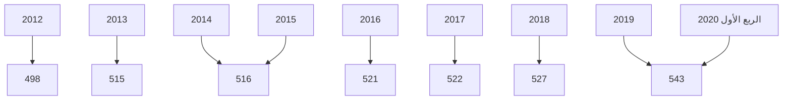
---
# التركز المصرفي:

درجة التركز المصرفي تعني أن عدداً قليلا من المصارف التجارية يستأثر بالنسبة الأكبر من النشاط المصرفي سواءً من حيث الأصول أو الودائع أوالائتمان أو من حيث حجم حقوق الملكية، وفيما يخص الحصة السوقية للمصارف التجارية في ليبيا، فقد شكلت أصول المصارف الأربعة الكبرى (الجمهورية، التجاري الوطني ، الوحدة والصحارى) من أصل 18 مصرفاً مانسبته 75.5% من إجمالي أصول القطاع المصرفي في نهاية الربع الأول 2020، وشكل مصرف الجمهورية وحده ما نسبته 31.3% من إجمالي أصول القطاع المصرفي.

وشكلت ودائع وقروض المصارف الأربعة الكبرى مانسبته 76.1% و 87.8% على التوالي من إجمالي ودائع وقروض القطاع المصرفي في نهاية الربع الأول 2020.

وهذه النسب المرتفعة توضح أن السوق المصرفي الليبي يعاني من تركز مرتفع يحول دون تحقيق المنافسة العادلة بين المصارف المتواجدة به ، وذلك بسبب إستحواذ أحد المصارف أو عدد قليل جداً منها بحصة كبيرة في السوق، في حين أن حصة معظم المصارف الأخرى متدنية للغاية.

إن التركز المصرفي يؤثر على المنافسة في سلوك المصارف وأدائها بطرق غير ملائمة، وينتج عنها خسارة اجتماعية مقترنة بسوء التسعير، ناتجة عن ممارسات المصارف لقوتها السوقية على الأسعار، الأمر الذي يخشى معه أنه كلما ارتفعت درجة الاحتكار في السوق كلما ارتفعت معها أسعار الخدمات المصرفية وتدني مستوى أو جودة الخدمة.

ونتيجة لهذا تزداد الحاجة إلى وضع القوانين والتشريعات التي تساهم في تعزيز ورفع مستويات المنافسة فيما بين المصارف وكذلك الإصلاح المالي، وإنشاء المزيد من المصارف لرفع مستويات المنافسة والكفاءة، ودخول مصارف جديدة سيزيد من المنافسة ويخفض مستويات التركز المصرفي.
---
# التركز المصرفي
(2012 - الربع الأول 2020)

## حسب الأصول:
"نسب مئوية"

| المصارف | 2012 | 2013 | 2014 | 2015 | 2016 | 2017 | 2018 | 2019 | الربع الأول 2020 |
|----------|------|------|------|------|------|------|------|------|------------------|
| أكبر مصرف | 37.9 | 33.0 | 33.1 | 34.9 | 33.8 | 33.6 | 32.7 | 31.9 | 31.2 |
| أكبر ثلاثة مصارف | 71.0 | 63.7 | 62.1 | 67.6 | 67.9 | 66.9 | 65.8 | 64.6 | 63.7 |
| أكبر خمسة مصارف | 89.0 | 81.3 | 79.2 | 87.1 | 86.7 | 85.0 | 84.3 | 84.2 | 83.9 |

## حسب الإئتمان:
"نسب مئوية"

| المصارف | 2012 | 2013 | 2014 | 2015 | 2016 | 2017 | 2018 | 2019 | الربع الأول 2020 |
|----------|------|------|------|------|------|------|------|------|------------------|
| أكبر مصرف | 41.9 | 44.8 | 43.5 | 44.8 | 44.3 | 44.5 | 43.6 | 40.7 | 41.6 |
| أكبر ثلاثة مصارف | 77.0 | 76.7 | 79.1 | 79.4 | 78.5 | 77.7 | 77.7 | 75.8 | 77.2 |
| أكبر خمسة مصارف | 91.0 | 90.2 | 91.1 | 91.4 | 91.3 | 91.2 | 91.5 | 91.4 | 91.3 |

## حسب ودائع العملاء:
"نسب مئوية"

| المصارف | 2012 | 2013 | 2014 | 2015 | 2016 | 2017 | 2018 | 2019 | الربع الأول 2020 |
|----------|------|------|------|------|------|------|------|------|------------------|
| أكبر مصرف | 40.9 | 33.8 | 33.1 | 34.8 | 34.0 | 33.6 | 31.9 | 32.3 | 31.2 |
| أكبر ثلاثة مصارف | 71.5 | 62.7 | 61.3 | 66.5 | 67.2 | 66.5 | 65.2 | 64.4 | 64.4 |
| أكبر خمسة مصارف | 90.1 | 80.9 | 78.6 | 87.8 | 87.5 | 85.7 | 85.4 | 85.6 | 84.9 |
---

## تركز الأصول

| Bank | Percentage |
|------|------------|
| مصرف الجمهورية | 31% |
| المصرف التجاري الوطني | 18% |
| مصرف الوحدة | 15% |
| مصرف الصحارى | 12% |
| باقي المصارف | 24% |

## تركز الائتمان

| Bank | Percentage |
|------|------------|
| مصرف الجمهورية | 42% |
| المصرف التجاري الوطني | 19% |
| مصرف الوحدة | 16% |
| مصرف الصحارى | 11% |
| باقي المصارف | 12% |

## تركز ودائع العملاء

| Bank | Percentage |
|------|------------|
| مصرف الجمهورية | 31% |
| المصرف التجاري الوطني | 18% |
| مصرف الوحدة | 15% |
| مصرف الصحارى | 12% |
| باقي المصارف | 24% |
---
# الميزانية المُجمَعة للمصارف التجارية

شهدت الميزانية المُجمَعة للمصارف التجارية نهاية الربع الأول 2020، تطورات في مُجمل بنودها على جانبي الأصول والخصوم ليبلغ إجمالي الأصول داخل الميزانية المُجمَعة نحو 112,014.6 مليون دينار، مقابل 116,937.7 مليون دينار في نهاية الربع الأول 2019، بإنخفاض قدره 4,923.0 مليون دينار، أي بمعدل 4.2%، وفيما يلي جدول يلخص البنود الرئيسية للميزانية المُجمَعة للمصارف التجارية:

## البنود الرئيسية للميزانية المُجمَعة للمصارف التجارية

### جانب الأصول:

مليون دينار

| البند | الربع الأول 2019 | الربع الأول 2020 | مقدار التغير | معدل التغير % |
|---|---|---|---|---|
| نقدية بالخزائن | 1,598.4 | 2,861.3 | 1,262.8 | 79.0 |
| حسابات المقاصة | 5,027.5 | 5,370.4 | 342.9 | 6.8 |
| أرصدة لدى المصارف | 85,011.7 | 75,317.2 | -9,694.5 | -11.4 |
| الإستثمارات | 985.3 | 1,313.9 | 328.6 | 33.4 |
| القروض والتسهيلات | 16,236.0 | 16,776.0 | 540.0 | 3.3 |
| الأصول الثابتة | 1,643.8 | 1,809.9 | 166.1 | 10.1 |
| الأصول الأخرى | 6,435.0 | 8,565.9 | 2,130.9 | 33.1 |
| إجمالي الأصول | 116,937.7 | 112,014.6 | -4,923.0 | -4.2 |
| الحسابات النظامية | 45,685.4 | 43,324.8 | -2,360.6 | -5.2 |
| إجمالي الميزانية | 162,623.1 | 155,339.4 | -7,283.7 | -4.5 |
---
جانب الخصوم:

مليون دينار

| البند | الربع الأول 2019 | الربع الأول 2020 | مقدار التغير | معدل التغير % |
|-------|-----------------|-----------------|--------------|---------------|
| ودائع العملاء | 92,278.7 | 86,592.2 | -5,686.5 | -6.2 |
| منها : التأمينات النقدية | 10,561.5 | 8,053.8 | -2,507.7 | -23.7 |
| حقوق الملكية | 6,756.2 | 6,718.0 | -38.2 | -0.6 |
| المخصصات | 4,833.8 | 5,482.1 | 648.3 | 13.4 |
| الخصوم الأخرى | 13,069.0 | 13,222.3 | 153.4 | 1.2 |
| إجمالي الخصوم | 116,937.7 | 112,014.6 | -4,923.0 | -4.2 |
| الحسابات النظامية | 45,685.4 | 43,324.8 | -2,360.6 | -5.2 |
| إجمالي الميزانية | 162,623.1 | 155,339.4 | -7,283.7 | -4.5 |

10
---
# الأهمية النسبية للبنود المُكونة للأصول

| البند | الربع الأول 2020 | الربع الأول 2019 |
|-------|------------------|------------------|
| نقدية بالخزائن | 2% | 4% |
| حسابات المقاصة | 5% | 1% |
| أرصدة لدى مصارف | 8% | 6% |
| الإستثمارات | 1% | 1% |
| القروض والتسهيلات | 67% | 73% |
| الأصول الثابتة | 2% | 1% |
| الأصول الأخرى | 15% | 14% |

# الأهمية النسبية للبنود المُكونة للخصوم

| البند | الربع الأول 2020 | الربع الأول 2019 |
|-------|------------------|------------------|
| ودائع العملاء | 77% | 79% |
| حقوق الملكية | 6% | 6% |
| المخصصات | 5% | 4% |
| الخصوم الأخرى | 12% | 11% |

11
---
وفيما يلي تطور الميزانية المُجمَعة للمصارف التجارية خلال الفترة (2012 - 2019):

| جانب الأصول | 2012 | 2013 | 2014 | 2015 | 2016 | 2017 | 2018 | 2019 |
|-------------|------|------|------|------|------|------|------|------|
| نقدية بالخزائن | 1,545.9 | 1,712.3 | 1,642.8 | 752.8 | 606.4 | 547.2 | 1,582.1 | 2,335.5 |
| حسابات المقاصة | 2,024.6 | 7,310.3 | 8,125.4 | 11,444.4 | 12,886.4 | 10,625.8 | 4,671.0 | 6,849.7 |
| أرصدة لدى المصارف | 56,787.6 | 68,094.6 | 62,244.0 | 53,540.0 | 62,306.5 | 84,262.6 | 85,349.3 | 78,057.0 |
| الإستثمارات | 954.9 | 746.7 | 777.5 | 1,787.8 | 1,789.2 | 1,311.5 | 1,456.5 | 1,128.0 |
| القروض والتسهيلات | 15,899.5 | 18,232.3 | 19,959.9 | 20,212.8 | 18,770.3 | 17,446.6 | 16,448.3 | 16,894.0 |
| الأصول الثابتة | 1,038.4 | 1,121.6 | 1,211.6 | 1,365.4 | 1,409.1 | 1,463.2 | 1,608.3 | 1,754.0 |
| الأصول الأخرى | 6,169.5 | 1,157.8 | 1,243.0 | 1,130.2 | 5,687.2 | 5,066.0 | 5,947.1 | 4,830.0 |
| إجمالي الأصول | 84,420.4 | 98,375.6 | 95,204.2 | 90,233.4 | 103,455.1 | 116,477.0 | 117,062.4 | 111,847.5 |
| الحسابات النظامية | 70,747.7 | 71,550.9 | 51,845.0 | 48,299.2 | 46,800.0 | 46,534.9 | 48,160.2 | 34,029.1 |
| إجمالي الميزانية | 155,168.1 | 169,926.5 | 147,049.2 | 138,532.6 | 150,255.1 | 163,011.9 | 165,222.6 | 145,876.1 |

مليون دينار

| جانب الخصوم | 2012 | 2013 | 2014 | 2015 | 2016 | 2017 | 2018 | 2019 |
|-------------|------|------|------|------|------|------|------|------|
| ودائع العملاء | 68,346.2 | 83,562.7 | 78,910.4 | 71,257.1 | 83,407.6 | 95,938.5 | 93,657.5 | 88,715.6 |
| منها: التأمينات النقدية | 6,823.3 | 6,609.0 | 8,080.7 | 9,738.7 | 8,939.7 | 8,845.6 | 11,533.7 | 8,466.3 |
| حقوق الملكية | 4,653.2 | 4,743.7 | 4,886.4 | 5,087.5 | 5,366.5 | 5,561.4 | 6,472.6 | 6,863.8 |
| المخصصات | 3,317.4 | 3,597.2 | 3,765.3 | 3,941.8 | 4,144.9 | 4,473.0 | 4,627.6 | 5,557.3 |
| الخصوم الأخرى | 8,103.6 | 6,472.0 | 7,642.1 | 9,946.9 | 10,536.1 | 10,504.2 | 12,304.7 | 10,710.8 |
| إجمالي الخصوم | 84,420.4 | 98,375.6 | 95,204.2 | 90,233.4 | 103,455.1 | 116,477.0 | 117,062.4 | 111,847.5 |
| الحسابات النظامية | 70,747.7 | 71,550.9 | 51,845.0 | 48,299.2 | 46,800.0 | 46,534.9 | 48,160.2 | 34,028.6 |
| إجمالي الميزانية | 155,168.1 | 169,926.5 | 147,049.2 | 138,532.6 | 150,255.1 | 163,011.9 | 165,222.6 | 145,876.1 |
---
# تحليل البنود المكونة للميزانية المُجمَعة للمصارف التجارية

## أولاً : جانب الأصـــول

### 1- النقدية :

#### أ- النقدية بالخزائن و حسابات المقاصة :

ارتفع رصيد النقدية بالخزائن وحسابات المقاصة بمقدار 1,605.8 مليون دينار وبمعدل نمو 24.2%،
لتصل إلى 8,231.7 مليون دينار في نهاية الربع الأول 2020، مقابل 6,625.9 مليون دينار في نهاية الربع
الأول 2019، حيث تركز هذا الارتفاع في النقدية بالخزائن بالعملة المحلية والتي ارتفعت
بمقدار 1,254.3 مليون دينار، وسجلت حسابات المقاصة إرتفاعا بمقدار 342.9 مليون دينار في نهاية الربع
الأول 2020 ، والجدول التالي يوضح ذلك :

| البيان | الربع الأول 2019 | الربع الأول 2020 | مقدار التغير | معدل التغير% |
|--------|------------------|------------------|---------------|---------------|
| النقدية بالخزائن : | 1,598.4 | 2,861.3 | 1,262.8 | 79.0 |
| عملة محلية | 1,587.4 | 2,841.6 | 1,254.3 | 79.0 |
| عملة أجنبية | 11.1 | 19.6 | 8.6 | 77.5 |
| إجمالي حسابات المقاصة | 5,027.5 | 5,370.4 | 342.9 | 6.8 |
| المقاصة بين المصارف | 2,504.2 | 2,736.5 | 232.3 | 9.3 |
| المقاصة بين الفروع | 2,523.3 | 2,634.0 | 110.7 | 4.4 |
| الإجمالي | 6,625.9 | 8,231.7 | 1,605.8 | 24.2 |

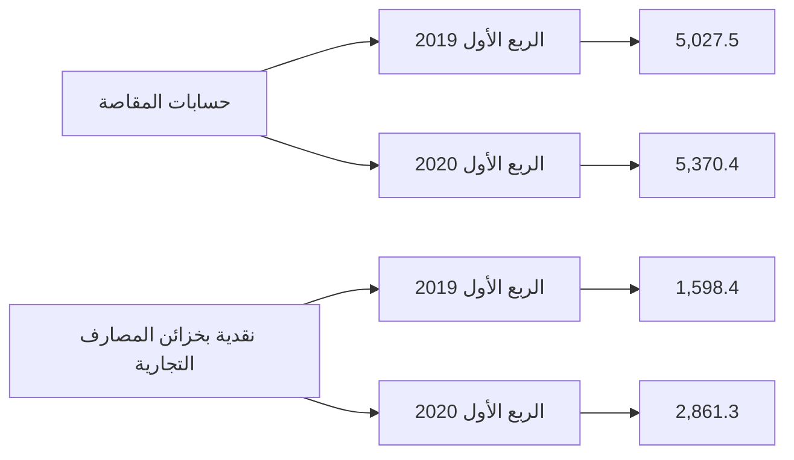

13
---
وفيما يلي تطور بند النقدية في المصارف التجارية خلال الفترة (2012 - 2019):

"مليون دينار"

| البيان | 2012 | 2013 | 2014 | 2015 | 2016 | 2017 | 2018 | 2019 |
|--------|------|------|------|------|------|------|------|------|
| النقدية بالخزائن : | 1,545.9 | 1,712.3 | 1,642.8 | 752.8 | 606.4 | 547.2 | 1,582.1 | 2,335.5 |
| عملة محلية | 1,433.3 | 1,622.6 | 1,619.9 | 743.6 | 594.7 | 537.8 | 1,573.6 | 2,322.7 |
| عملة أجنبية | 112.6 | 89.7 | 22.9 | 9.2 | 11.7 | 9.4 | 8.4 | 12.8 |
| إجمالي حسابات المقاصة : | 2,024.6 | 7,310.3 | 8,125.4 | 11,444.4 | 12,886.4 | 6,379.9 | 4,671.0 | 6,849.7 |
| المقاصة بين المصارف | 1,410.4 | 4,004.6 | 4,836.7 | 7,072.2 | 8,488.9 | 4,245.9 | 2,191.1 | 3,707.3 |
| المقاصة بين الفروع | 614.2 | 3,305.7 | 3,288.7 | 4,372.2 | 4,397.5 | 2,134.0 | 2,479.9 | 3,142.4 |
| الإجمالي | 2,956.3 | 5,716.9 | 6,479.5 | 7,825.0 | 13,492.7 | 6,927.1 | 6,253.0 | 9,185.2 |

نقدية بخزائن المصارف التجارية
( 2012 - 2019 )

| السنة | القيمة (مليون دينار) |
|-------|---------------------|
| 2012 | 1,545.9 |
| 2013 | 1,712.3 |
| 2014 | 1,642.8 |
| 2015 | 752.8 |
| 2016 | 606.4 |
| 2017 | 547.2 |
| 2018 | 1,582.1 |
| 2019 | 2,335.5 |

إجمالي حسابات المقاصة
( 2012 - 2019 )

| السنة | القيمة (مليون دينار) |
|-------|---------------------|
| 2012 | 2,024.6 |
| 2013 | 7,310.3 |
| 2014 | 8,125.4 |
| 2015 | 11,444.4 |
| 2016 | 12,886.4 |
| 2017 | 6,379.9 |
| 2018 | 4,671.0 |
| 2019 | 6,849.7 |
---
ب- الأرصدة والودائع لدى المصرف المركزي والمصارف الأخرى:

بلغ رصيد ودائع المصارف التجارية لدى المصرف المركزي والمصارف الاخرى وفيما بينها نحو 75,317.2 مليون دينار في نهاية الربع الأول 2020، مقابل 85,011.7 مليون دينار في نهاية الربع الأول 2019، أي بمعدل إنخفاض قدره 11.4%، وتركز هذا الإنخفاض في رصيد الودائع لدى المصرف المركزي (تحت الطلب وشهادات الإيداع) بمقدار 9,494.4 مليون دينار.

"مليون دينار"

| البيان | الربع الأول 2019 | الربع الأول 2020 | مقدار التغير | معدل التغير % |
|--------|------------------|------------------|---------------|---------------|
| ودائع تحت الطلب لدى : | 60,871.4 | 59,340.5 | -1,530.9 | -2.5 |
| - المصرف المركزي | 54,030.4 | 52,688.5 | -1,341.9 | -2.5 |
| - المصارف المحلية | 1,158.0 | 1,650.4 | 492.4 | 42.5 |
| - المصرف الليبي الخارجي | 908.3 | 592.9 | -315.4 | -34.7 |
| - لدى المراسلين بالخارج | 4,774.6 | 4,408.7 | -365.9 | -7.7 |
| ودائع زمنية : | 24,140.3 | 15,976.6 | -8,163.6 | -33.8 |
| - المصرف المركزي (شهادات الإيداع) | 23,058.0 | 14,905.5 | -8,152.5 | -35.4 |
| - المصارف المحلية | 0.0 | 0.0 | - | - |
| - المصرف الليبي الخارجي | 242.5 | 0.0 | -242.5 | - |
| - لدى المراسلين بالخارج | 839.8 | 1,071.1 | 231.3 | 27.5 |
| الإجمالي | 85,011.7 | 75,317.2 | -9,694.5 | -11.4 |

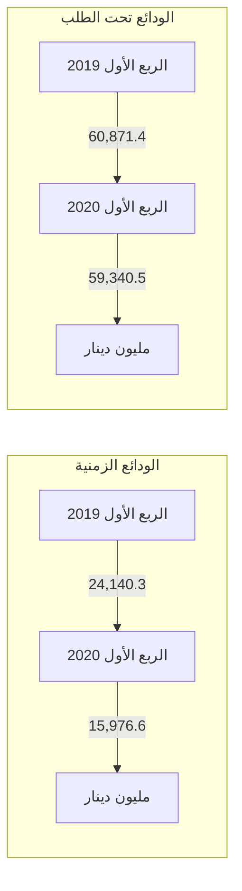

15
---
والجدول التالي يبين تطور أرصدة وودائع للمصارف لدى المصرف المركزي والمصارف الأخرى وفيما بينها خلال
الفترة (2012 - 2019):

| البيان | 2012 | 2013 | 2014 | 2015 | 2016 | 2017 | 2018 | 2019 |
|--------|------|------|------|------|------|------|------|------|
| ودائع تحت الطلب لدى : | 19,352.7 | 22,342.6 | 24,360.7 | 27,870.7 | 38,306.1 | 56,945.4 | 59,454.9 | 60,819.3 |
| - المصرف المركزي | 17,203.4 | 19,364.6 | 19,317.8 | 20,863.2 | 30,627.6 | 53,136.0 | 52,385.4 | 53,981.3 |
| - المصارف المحلية | 329.0 | 347.6 | 408.2 | 1,717.6 | 1,742.4 | 1,012.5 | 1,030.0 | 2,002.8 |
| - المصرف الليبي الخارجي | 664.7 | 848.1 | 1,850.0 | 2,216.8 | 2,396.1 | 874.2 | 1,762.1 | 821.4 |
| - المصارف بالخارج | 1,155.6 | 1,782.3 | 2,784.7 | 3,073.1 | 3,540.0 | 1,922.7 | 4,277.3 | 4,013.7 |
| ودائع زمنية : | 37,434.9 | 45,751.9 | 37,883.3 | 25,669.2 | 24,000.4 | 27,317.8 | 25,894.4 | 17,237.4 |
| - شهادات الإيداع | 35,737.8 | 44,307.3 | 37,074.6 | 24,259.7 | 23,187.1 | 26,415.7 | 24,716.9 | 15,846.9 |
| - المصارف المحلية | 0.0 | 30.0 | 0.0 | 0.0 | 0.0 | 0.0 | 0.0 | 0.0 |
| - المصرف الليبي الخارجي | 58.4 | 37.6 | 206.1 | 107.1 | 224.7 | 0.0 | 459.4 | 0.0 |
| - المصارف بالخارج | 1,638.7 | 1,377.0 | 602.6 | 1,302.4 | 588.6 | 902.1 | 718.1 | 1,390.6 |
| الإجمالي | 56,787.6 | 68,094.6 | 62,244.0 | 53,539.9 | 62,306.5 | 84,263.2 | 85,349.3 | 78,056.7 |

*مليون دينار*


The graph shows the deposits of commercial banks at the Central Bank and other banks from 2012 to 2019. The blue line represents demand deposits, which show an overall increasing trend, particularly sharp from 2015 to 2017. The red line represents time deposits, which peaked in 2013 and then generally decreased over time, with some fluctuations.
---
## 2- الإستثمارات :

سجل إجمالي بند رصيد الإستثمارات في المصارف التجارية نهاية الربع الأول 2020 نحو 1,313.9 مليون دينار، مقابل 985.3 مليون دينار في نهاية الربع الأول 2019، بمعدل نمو 33.4% هذا الإرتفاع جاء نتيجة لزيادة بعض المصارف لإستثماراتها في الشركات الخاصة المساهمة، والجدول التالي يوضح تفاصيل هذا البند:

مليون دينار

| البيان | الربع الأول 2019 | الربع الأول 2020 | مقدار التغير | معدل التغير % |
|--------|------------------|------------------|---------------|---------------|
| سندات وأذونات الخزانة | 0.0 | 0.0 | - | - |
| إستثمارات في الشركات العامة | 562.4 | 562.4 | - | - |
| إستثمارات في الشركات الخاصة المساهمة | 370.0 | 696.7 | 326.7 | 88.3 |
| إستثمارات أخرى | 985.3 | 1,313.9 | 1.9 | 3.6 |
| الإجمالي | 985.3 | 1,313.9 | 328.6 | 33.4 |

### إجمالي رصيد الإستثمارات

| الربع الأول 2019 | الربع الأول 2020 |
|------------------|------------------|
| 985.3 | 1,313.9 |

مليون دينار
1,400.0
1,200.0
1,000.0
800.0
600.0
400.0
200.0
0.0
---
والجدول التالي يبين تطور رصيد بند الإستثمارات للمصارف التجارية خلال الفترة (2012 - 2019):

| البيان | 2012 | 2013 | 2014 | 2015 | 2016 | 2017 | 2018 | 2019 |
|--------|------|------|------|------|------|------|------|------|
| سندات وأذونات الخزانة | 0.0 | 0.0 | 0.0 | 1,000.0 | 1,000.0 | 500.0 | 500.0 | 0.0 |
| إستثمارات أخرى | 954.9 | 746.7 | 777.5 | 787.8 | 789.2 | 811.5 | 956.5 | 1,128.0 |
| الإجمالي | 954.9 | 746.7 | 777.5 | 1,787.8 | 1,789.2 | 1,311.5 | 1,456.5 | 1,128.0 |

مليون دينار

```mermaid
graph LR
    title[الإستثمارات (2012 - 2019)]
    style title fill:#f9f,stroke:#333,stroke-width:4px
    2012[2012] --> 954.9
    2013[2013] --> 746.7
    2014[2014] --> 777.5
    2015[2015] --> 1787.8
    2016[2016] --> 1789.2
    2017[2017] --> 1311.5
    2018[2018] --> 1456.5
    2019[2019] --> 1128.0
```

### 3- القروض والتسهيلات الائتمانية :

إرتفع اجمالي رصيد الإئتمان الممنوح من المصارف التجارية من 16,236.0 مليون دينار في نهاية الربع الأول 2019 إلى 16,776.0 مليون دينار في نهاية الربع الأول 2020 ، أي بمعدل نمو 3.3%، حيث بلغ رصيد القروض الممنوحة للقطاع الخاص في نهاية عام 2019 ما قيمته 10,679.5 مليون دينار، وما نسبته 63.7% من إجمالي القروض والتسهيلات الإئتمانية، فيما شكل رصيد القروض الممنوحة للقطاع العام النسبة الباقية 36.3% والتي بلغت قيمتها 6,096.5 مليون دينار.

وقد شكلت القروض والتسهيلات الائتمانية الممنوحة إلى اجمالي الخصوم الإيداعية ما نسبته 19.4%، كما شكلت من اجمالي الأصول ما نسبته 15.0%

18
---
وبلغت نسبة تغطية مخصص الديون المشكوك فيها لإجمالي القروض والتسهيلات الائتمانية والممنوحة
نسبة 20.7% في نهاية عام 2019 مقابل نسبة 19.5% في نهاية عام 2018.

وفيما يلي بيان تفصيلي لرصيد القروض والتسهيلات الممنوحة من المصارف التجارية :

| البيان | الربع الأول 2019 | الربع الأول 2020 | مقدار التغير | معدل التغير % |
|--------|------------------|------------------|--------------|---------------|
| سلفيات والسحب على المكشوف | 5,110.2 | 4,783.2 | -327.0 | -6.4 |
| السلف الإجتماعية * | 3,335.3 | 3,547.1 | 211.8 | 6.4 |
| القروض الأخرى | 7,790.4 | 8,445.8 | 655.4 | 8.4 |
| إجمالي القروض والتسهيلات | 16,236.0 | 16,776.0 | 540.0 | 3.3 |
| مخصص الديون | 3,166.9 | 3,478.7 | 311.8 | 9.8 |
| صافي القروض والتسهيلات | 13,069.1 | 13,297.3 | 228.2 | 1.7 |

*تشمل رصيد قروض المرابحة للأفراد.

[Two bar charts showing the comparison between Q1 2019 and Q1 2020 for "السلفيات والسحب على المكشوف" and "السلف الاجتماعية" respectively]

| البيان | الربع الأول 2019 | الربع الأول 2020 | مقدار التغير | معدل التغير % |
|--------|------------------|------------------|--------------|---------------|
| القروض الممنوحة للقطاع العام | 4,933.6 | 6,096.5 | 1,162.9 | 23.6 |
| القروض الممنوحة للقطاع الخاص | 11,302.4 | 10,679.5 | -622.9 | -5.5 |
| الإجمالي | 16,236.0 | 16,776.0 | 540.0 | 3.3 |
---
| رصيد القروض الممنوحة للقطاع الخاص | | رصيد القروض الممنوحة للقطاع العام |
|-----------------------------------|-----------------------------------|
| 11,400.0 11,302.4 | 7,000.0 6,096.5 |
| 11,300.0 | 6,000.0 |
| 11,200.0 | 5,000.0 4,933.6 |
| 11,100.0 | 4,000.0 |
| 11,000.0 | 3,000.0 |
| 10,900.0 | 2,000.0 |
| 10,800.0 10,679.5 | 1,000.0 |
| 10,700.0 | 0.0 |
| 10,600.0 | |
| 10,500.0 | |
| 10,400.0 | |
| 10,300.0 | |
| الربع الأول 2019 الربع الأول 2020 | الربع الأول 2019 الربع الأول 2020 |

وفيما يلي رصيد القروض والتسهيلات الممنوحة للقطاعين العام والخاص خلال الفترة (2012 -2019):

مليون دينار

| البيان | 2012 | 2013 | 2014 | 2015 | 2016 | 2017 | 2018 | 2019 |
|--------|------|------|------|------|------|------|------|------|
| القروض الممنوحة للقطاع العام | 5,291.2 | 5,327.1 | 6,195.9 | 5,982.8 | 5,915.9 | 5,578.9 | 5,100.9 | 6,036.8 |
| القروض الممنوحة للقطاع الخاص | 10,608.3 | 12,905.5 | 13,764.0 | 14,230.1 | 12,854.3 | 11,867.7 | 11,347.4 | 10,856.8 |
| الإجمالي | 15,899.5 | 18,232.3 | 19,959.9 | 20,212.8 | 18,770.3 | 17,446.6 | 16,448.3 | 16,893.6 |

رصيد القروض الممنوحة للقطاعين ( العام والخاص )
( 2012 - 2019 )

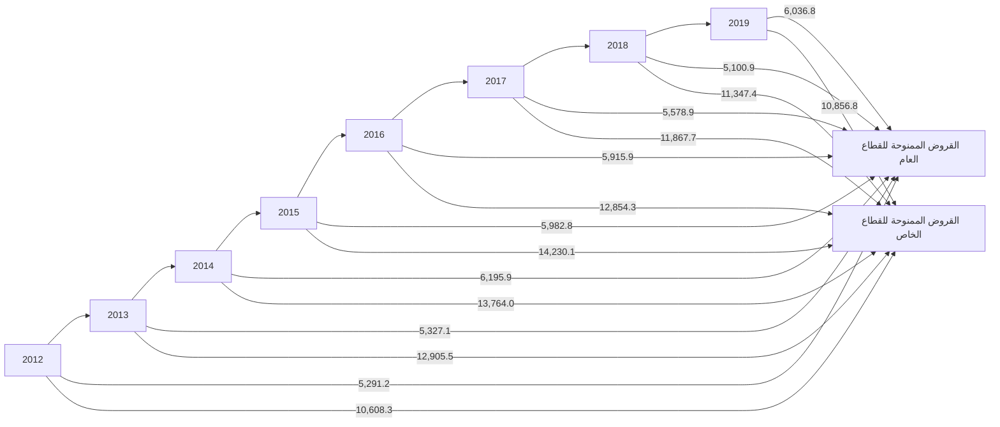
---
وفيما يلي رصيد السلف الاجتماعية والسحب على المكشوف خلال الفترة (2012 -2019):

مليون دينار

| البيان | 2012 | 2013 | 2014 | 2015 | 2016 | 2017 | 2018 | 2019 |
|--------|------|------|------|------|------|------|------|------|
| سلفيات والسحب على المكشوف | 5,522.3 | 4,146.5 | 4,452.1 | 5,440.1 | 4,827.9 | 4,514.5 | 4,354.0 | 5,269.2 |
| السلف الإجتماعية * | 4,973.5 | 6,726.0 | 7,157.9 | 6,608.6 | 5,901.1 | 4,912.5 | 3,988.7 | 3,126.3 |
| القروض الأخرى | 5,403.7 | 3,759.8 | 8,348.9 | 8,164.2 | 8,041.3 | 8,019.6 | 8,105.6 | 8,498.1 |
| إجمالي القروض والتسهيلات | 15,899.5 | 18,232.3 | 19,959.9 | 20,212.8 | 18,770.3 | 17,446.6 | 16,448.3 | 16,893.6 |
| مخصص الديون | 2,348.9 | 2,497.9 | 2,688.1 | 2,779.7 | 2,910.0 | 3,040.8 | 3,126.4 | 3,498.7 |
| صافي القروض والتسهيلات | 13,550.6 | 15,734.4 | 17,271.8 | 17,433.1 | 15,860.3 | 14,405.8 | 13,321.9 | 13,394.9 |

*تشمل رصيد قروض المرابحة للأفراد

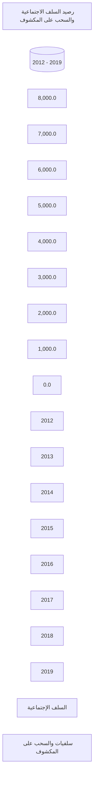

4 - الأصول الثابتة والأصول الأخرى :

بلغ رصيد الأصول الثابتة نحو 1,809.9 مليون دينار في نهاية الربع الأول 2020، مقابل 1,643.8 مليون
دينار في نهاية الربع الأول 2019، فيما بلغ رصيد الأصول الأخرى نحو 8,565.9 مليون دينار في نهاية
الربع الأول 2020، مقابل 56,435.0 مليون دينار في نهاية الربع الأول 2019.

21
---
ثانياً : جانب الخصوم

1- ودائع العملاء لدى المصارف التجارية :

إنخفضت أرصدة ودائع العملاء لدى المصارف التجارية من 92,278.7 مليون دينار في نهاية الربع الأول 2019 إلى 86,592.2 مليون دينار في نهاية الربع الأول 2020، أي بمعدل إنخفاض 6.2%، وقد تركز الإنخفاض في أرصدة الودائع تحت الطلب والودائع لأجل بمقدار 3,689.2 مليون دينار و 1,948.3 مليون دينار، بنسب إنخفاض 4.6% و 16.1% على التوالي، كذلك إنخفضت الودائع الإدخارية بمقدار 49.0 مليون دينار وبنسبة 10.1%.

وفيما يتعلق بتوزيع الودائع لدى المصارف التجارية حسب نوع الوديعة فقد شكلت الودائع تحت الطلب ما نسبته 87.7% من إجمالي الودائع، في حين شكلت الودائع لأجل ما نسبته 11.8% من إجمالي الودائع، وشكلت ودائع الادخار ما نسبته 0.5% فقط من إجمالي الودائع.

| البيان | الربع الأول 2019 | الربع الأول 2020 | مقدار التغير | معدل التغير % |
|---------|------------------|------------------|---------------|---------------|
| الودائع تحت الطلب | 79,654.5 | 75,965.3 | -3,689.2 | -4.6 |
| الودائع لأجل | 12,138.3 | 10,190.0 | -1,948.3 | -16.1 |
| الودائع الإدخارية | 485.9 | 436.9 | -49.0 | -10.1 |
| الإجمالي | 92,278.7 | 86,592.2 | -5,686.5 | -6.2 |

رصيد ودائع العملاء لدى المصارف حسب نوع الوديعة

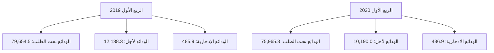
---
# أرصدة الودائع حسب نوع الوديعة لدى المصارف التجارية خلال الفترة (2012 – 2019)

مليون دينار

| البيان | 2012 | 2013 | 2014 | 2015 | 2016 | 2017 | 2018 | 2019 |
|--------|------|------|------|------|------|------|------|------|
| الودائع تحت الطلب | 54,728.8 | 61,834.9 | 56,641.4 | 58,725.9 | 72,192.7 | 84,827.6 | 80,038.6 | 77,648.4 |
| الودائع زمنية | 12,912.1 | 21,064.9 | 21,669.3 | 11,956.7 | 10,644.7 | 10,519.2 | 13,115.5 | 10,620.9 |
| الودائع الإدخارية | 705.3 | 662.9 | 599.8 | 574.5 | 570.2 | 591.7 | 503.4 | 446.3 |
| الإجمالي | 68,346.2 | 83,562.7 | 78,910.4 | 71,257.1 | 83,407.6 | 95,938.5 | 93,657.5 | 88,715.6 |

## إجمالي أرصدة ودائع العملاء لدى المصارف التجارية (2012 - 2019)

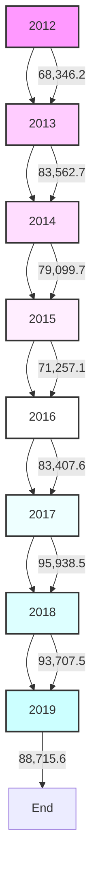

وفيما يتعلق بتوزيع إجمالي ودائع العملاء لدى المصارف التجارية (خاص، حكومة، عام) فقد انخفضت ودائع القطاع الخاص بمقدار 7,017.5 مليون دينار وبنسبة 13.3% في نهاية الربع الأول 2020، لتسجل نحو 45,842.2 مليون دينار، مقارنة بنحو 52,859.7 مليون دينار في نهاية الربع الأول عام 2019، حيث تركز الانخفاض في ودائع الأفراد والتي انخفضت بشكل ملحوظ.

فيما ارتفع رصيد ودائع القطاع العام والقطاع الحكومي في نهاية الربع الأول 2020 بمقدار 1,331.0 مليون دينار لتصل إلى 40,750.0 مليون دينار، منها 11,125.5 مليون دينار كودائع حكومية والتي تتكون من ودائع الوزارات والهيئات والمؤسسات الحكومية وودائع كل من: صندوق الضمان الاجتماعي، صندوق الإنماء الاقتصادي والاجتماعي وودائع الصندوق الليبي للتنمية والاستثمار، مقابل 39,419.0 مليون دينار كودائع للقطاع العام والقطاع الحكومي في نهاية الربع الأول 2019.
---
والجدول التالي يوضح تطور أرصدة الودائع لدى المصارف التجارية :

مليون دينار

| البيان | الربع الأول 2019 | الربع الأول 2020 | مقدار التغير | معدل التغير % |
|--------|------------------|------------------|--------------|---------------|
| ودائع الحكومة والقطاع العام | 39,419.0 | 40,750.0 | 1,331.0 | 3.4 |
| - ودائع حكومية | 10,517.3 | 11,125.5 | 608.2 | 5.8 |
| - ودائع القطاع العام | 28,901.7 | 29,624.5 | 722.8 | 2.5 |
| ودائع القطاع الخاص | 52,859.7 | 45,842.2 | -7,017.5 | -13.3 |
| - الأفراد | 32,947.7 | 28,192.4 | - 4,755.3 | -14.4 |
| - الشركات والمؤسسات | 19,912.0 | 17,649.8 | - 2,262.2 | -11.4 |
| الإجمالي | 92,278.7 | 86,592.2 | - 5,686.5 | -6.2 |

ودائع القطاع الخاص لدى المصارف التجارية:

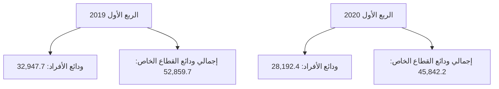

ودائع القطاع العام والحكومي لدى المصارف التجارية:

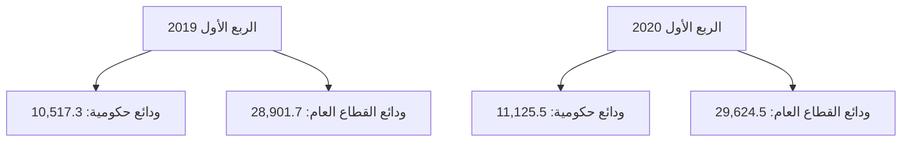
---
وفيما يلي توزيع ودائع العملاء لدى المصارف التجارية خلال الفترة (2012 - 2019):

| البيان | 2012 | 2013 | 2014 | 2015 | 2016 | 2017 | 2018 | 2019 |
|--------|------|------|------|------|------|------|------|------|
| ودائع الحكومة والقطاع العام | 35,469.8 | 52,638.7 | 46,339.9 | 35,139.7 | 39,197.7 | 40,710.8 | 39,747.8 | 41,289.7 |
| - ودائع حكومية | 13,983.3 | 24,285.4 | 21,987.0 | 9,800.6 | 9,100.7 | 9,234.8 | 10,048.5 | 11,702.3 |
| - ودائع القطاع العام | 21,486.5 | 28,353.3 | 24,352.9 | 25,339.1 | 30,097.0 | 31,476.0 | 29,699.3 | 29,587.4 |
| ودائع القطاع الخاص | 32,876.4 | 30,924.0 | 32,570.5 | 36,117.4 | 44,209.9 | 55,227.7 | 53,909.7 | 47,425.9 |
| - الأفراد | 21,026.1 | 19,569.5 | 19,799.0 | 20,477.2 | 27,605.5 | 36,295.4 | 33,717.5 | 28,223.4 |
| - الشركات والمؤسسات | 11,850.3 | 11,345.5 | 12,771.5 | 15,640.2 | 16,604.4 | 18,932.3 | 20,192.2 | 19,202.5 |
| الإجمالي | 68,346.2 | 83,562.7 | 78,910.4 | 71,257.1 | 83,407.6 | 95,938.5 | 93,657.5 | 88,715.6 |

ودائع القطاع العام والقطاع الحكومي لدى المصارف التجارية
(2012 - 2019)

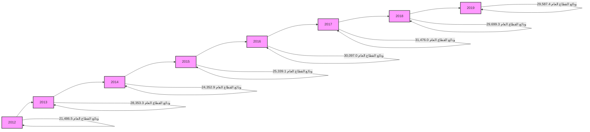

ودائع القطاع الخاص لدى المصارف التجارية
(2012 - 2019)

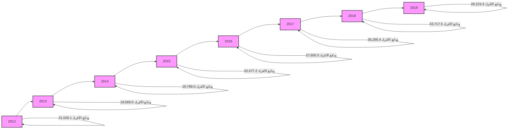
---
## 2- الحسابات المكشوفة لدى المراسلين بالخارج:

بلغ رصيد الحسابات المكشوفة لدى المراسلين بالخارج 163.5 مليون دينار في نهاية الربع الأول 2020،
وهي في معظمها ناتجة عن تأخر تسوية الحسابات لبعض المصارف مع المصارف المراسلة بالخارج،
مقابل 472.2 مليون دينار في نهاية نفس الفترة من عام 2019.

مليون دينار

| البيان | الربع الأول 2019 | الربع الأول 2020 | مقدار التغير | معدل التغير % |
|--------|------------------|------------------|--------------|---------------|
| الحسابات المكشوفة لدى المراسلين بالخارج | 472.2 | 163.5 | -308.7 | -65.4 |

### الحسابات المكشوفة لدى المراسلين بالخارج

```mermaid
bar chart
    title الحسابات المكشوفة لدى المراسلين بالخارج
    x-axis [الربع الأول 2019, الربع الأول 2020]
    y-axis "مليون دينار" 0 --> 500
    bar [472.2, 163.5]
```

وفيما يلي أرصدة الحسابات المكشوفة خلال الفترة (2012 – 2019):

مليون دينار

| البيان | 2012 | 2013 | 2014 | 2015 | 2016 | 2017 | 2018 | 2019 |
|--------|------|------|------|------|------|------|------|------|
| الحسابات المكشوفة لدى المراسلين بالخارج | 139.6 | 74.9 | 432.0 | 955.6 | 429.9 | 368.5 | 503.4 | 113.1 |

### رصيد الحسابات المكشوفة لدى المراسلين بالخارج (2012 - 2019)

```mermaid
line chart
    title رصيد الحسابات المكشوفة لدى المراسلين بالخارج (2012 - 2019)
    x-axis [2012, 2013, 2014, 2015, 2016, 2017, 2018, 2019]
    y-axis "مليون دينار" 0 --> 1500
    line [139.6, 74.9, 432.0, 955.6, 429.9, 368.5, 503.4, 113.1]
```

26
---
### 3- حقوق الملكية والأرباح :

- رأس المال المدفوع: ارتفع رأس المال المدفوع من 4,068.0 مليون دينار في الربع الأول 2019 إلى 4,185.6 مليون دينار في الربع الأول 2020 ، نتيجة لقيام بعض المصارف بزيادة رأس المال المدفوع وهي : مصرفي السراي والإجماع العربي .

- الاحتياطيات والأرباح: انخفض رصيد الاحتياطيات والأرباح المرحلة والقابلة للتوزيع من 2,688.2 مليون دينار في نهاية الربع الأول 2019، ليصل إلى 2,532.4 مليون دينار في نهاية الربع الأول 2020، في حين تراجعت أرباح المصارف التجارية قبل خصم المخصصات والضرائب خلال الربع الأول 2020 بمعدل 43.7% لتسجل إلى 141.6 مليون دينار، مقارنة عما كانت عليه خلال نفس الفترة من العام 2019 والبالغة نحو 251.4 مليون دينار.

| البيان | الربع الأول 2019 | الربع الأول 2020 | مقدار التغير | معدل التغير % |
|--------|------------------|------------------|---------------|---------------|
| رأس المال المدفوع | 4,068.0 | 4,185.6 | 117.7 | 2.9 |
| الاحتياطي القانوني | 500.7 | 542.7 | 42.0 | 8.4 |
| احتياطيات غير مخصصة | 33.1 | 52.4 | 19.4 | 58.6 |
| أرباح العام | 251.4 | 141.6 | -109.8 | -43.7 |
| الأرباح المرحّلة والأرباح القابلة للتوزيع | 2,154.5 | 1,937.2 | -217.2 | -10.1 |
| الإجمالي | 7,007.6 | 6,859.6 | -148.0 | -2.1 |

```mermaid
bar chart
    title أرباح الفترة قبل خصم المخصصات والضرائب
    x-axis ["الربع الأول 2019", "الربع الأول 2020"]
    y-axis "مليون دينار" 0 --> 300
    bar ["251.4", "141.6"]
```
---
# أرباح المصارف التجارية قبل خصم المخصصات والضرائب (2012 - 2019)

| السنة | 2012 | 2013 | 2014 | 2015 | 2016 | 2017 | 2018 | 2019 |
|-------|------|------|------|------|------|------|------|------|
| الأرباح (مليون دينار) | 527.1 | 451.1 | 265.4 | 213.0 | 247.1 | 464.6 | 1222.2 | 753.6 |

وفيما يلي حسابات رأس المال والإحتياطيات في المصارف خلال الفترة (2012 – 2019):

| البيان | 2012 | 2013 | 2014 | 2015 | 2016 | 2017 | 2018 | 2019 |
|--------|------|------|------|------|------|------|------|------|
| رأس المال المدفوع | 3,495.2 | 3,550.2 | 3,566.8 | 3,609.5 | 3,791.4 | 3,806.4 | 3,904.4 | 4,282.9 |
| الإحتياطي القانوني | 181.9 | 323.5 | 335.8 | 335.8 | 342.8 | 346.1 | 352.9 | 527.9 |
| إحتياطيات غير مخصصة | 26.6 | 29.7 | 29.7 | 29.7 | 30.0 | 31.9 | 32.0 | 53.1 |
| أرباح العام | 527.1 | 451.1 | 265.4 | 213.0 | 247.1 | 464.6 | 1,122.2 | 753.6 |
| الأرباح المرحّلة والأرباح القابلة للتوزيع | 422.4 | 389.2 | 688.7 | 899.6 | 955.0 | 912.4 | 1,061.1 | 1,246.3 |
| الإجمالي | 4,653.2 | 4,743.7 | 4,886.4 | 5,087.6 | 5,366.3 | 5,561.4 | 6,472.6 | 6,863.8 |

# إجمالي حقوق الملكية في المصارف التجارية (2012 - 2019)

| السنة | 2012 | 2013 | 2014 | 2015 | 2016 | 2017 | 2018 | 2019 |
|-------|------|------|------|------|------|------|------|------|
| رأس المال | 3495.2 | 3550.2 | 3566.8 | 3609.5 | 3791.4 | 3806.4 | 3904.4 | 4282.9 |
| الإحتياطيات | 1158.1 | 1193.5 | 1391.1 | 1478.0 | 1575.0 | 1755.1 | 2565.1 | 2580.9 |
| إجمالي حقوق الملكية | 4653.3 | 4743.7 | 4957.9 | 5087.5 | 5366.4 | 5561.5 | 6469.5 | 6863.8 |
---
## 4- المخصصات :

سجل رصيد المخصصات ارتفاعاً بمقدار 648.3 مليون دينار في نهاية الربع الأول 2020 ليصل إلى 5,482.1 مليون دينار، مقابل 4,833.8 مليون دينار في نهاية الربع الأول 2019، وتركزت الزيادة في بندي مخصص الديون المشكوك في تحصيلها و المخصصات العامة كما هو موضح بالجدول التالي :

| البيان | الربع الأول 2019 | الربع الأول 2020 | مقدار التغير | معدل التغير % |
|------|----------------|----------------|-------------|--------------|
| مخصص الديون المشكوك في تحصيلها | 3,166.9 | 3,478.7 | 311.8 | 9.8 |
| مخصص استهلاك الأصول الثابتة | 759.0 | 842.3 | 83.3 | 11.0 |
| مخصصات عامة | 906.1 | 1,161.1 | 255.1 | 28.2 |
| مخصص تقييم أسعار الصرف | 1.9 | 0.0 | -1.9 | -100.0 |
| الإجمالي | 4,833.8 | 5,482.1 | 648.3 | 13.4 |

### إجمالي المخصصات

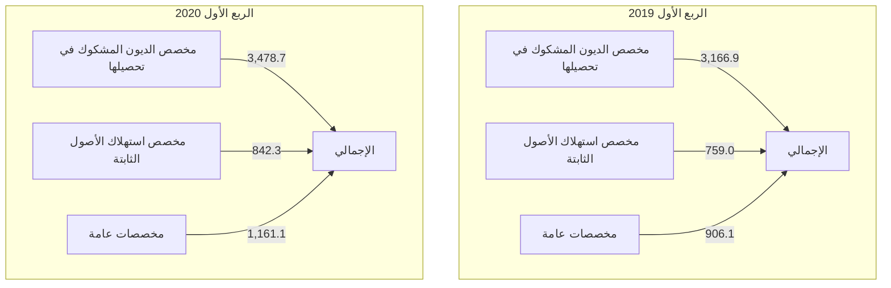
---
وفيما يلي رصيد المخصصات خلال الفترة (2012 – 2019):

| البيان | 2012 | 2013 | 2014 | 2015 | 2016 | 2017 | 2018 | 2019 |
|--------|------|------|------|------|------|------|------|------|
| مخصص الديون المشكوك في تحصيلها | 2,348.9 | 2,497.5 | 2,688.1 | 2,779.7 | 2,910.0 | 3,040.8 | 3,126.4 | 3,498.7 |
| مخصص استهلاك الأصول الثابتة | 424.1 | 473.1 | 539.3 | 592.5 | 634.0 | 687.3 | 745.2 | 789.8 |
| مخصصات عامة | 539.3 | 614.6 | 532.8 | 556.9 | 594.3 | 738.2 | 753.2 | 1,265.8 |
| مخصص تقييم أسعار الصرف | 5.2 | 11.6 | 5.1 | 12.7 | 6.5 | 6.7 | 2.8 | 3.0 |
| الإجمالي | 3,317.5 | 3,597.2 | 3,765.3 | 3,941.8 | 4,144.8 | 4,473.0 | 4,627.6 | 5,557.3 |

رصيد مخصص الديون المشكوك في تحصيلها
(2012 - 2019)

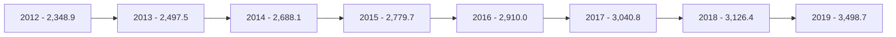

5- متنوعات وخصوم أخرى:
بلغ رصيد متنوعات وخصوم أخرى 13,222.3 مليون دينار في نهاية الربع الأول 2020 مقابل
13,069.0 مليون دينار في نهاية الربع الأول 2019.
---
# مؤشرات السلامة المالية للمصارف التجارية

## مؤشرات السيولة:
تتمتع المصارف التجارية بنسب سيولة جيدة، إذ بلغت نسبة الأصول السائلة لدى المصارف التجارية إلى إجمالي الأصول 69.8% في نهاية الربع الأول 2020، والتي معظمها تمثل ودائع لدى المصرف المركزي (تحت الطلب بما فيها الاحتياطي الإلزامي وكذلك شهادات الإيداع).

وبلغ حجم القروض إلى إجمالي الودائع بالقطاع المصرفي نسبة 19.4% في نهاية الربع الأول 2020، وهى نسبة ضئيلة للغاية، حيث لم تتعدى هذه النسبة 28.4% خلال الفترة (2012 – الربع الأول 2020).

وتجدر الإشارة إلى أن نسبة السيولة القانونية المطلوب من المصارف التجارية الاحتفاظ بها هى 25.0% من إجمالي الخصوم الإيداعية.

| نسب مئوية | | | | | | | | | |
|-----------|---------|-------|-------|-------|-------|-------|-------|-------|-------|
| مؤشرات السيولة | 2012 | 2013 | 2014 | 2015 | 2016 | 2017 | 2018 | 2019 | الربع الأول 2020 |
| الأصول السائلة / الأصول | 68.6 | 71.0 | 67.8 | 60.2 | 60.8 | 72.8 | 74.3 | 71.9 | 69.8 |
| القروض / الودائع | 23.6 | 21.8 | 25.2 | 28.4 | 22.5 | 18.2 | 17.6 | 19.0 | 19.4 |
| الودائع / الأصول | 80.8 | 84.9 | 83.1 | 79.0 | 80.6 | 82.4 | 80.0 | 79.3 | 77.3 |

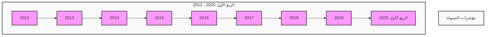

Note: The chart in the image is represented as a simple timeline in the mermaid diagram above. For a more accurate representation of the data, it's better to refer to the table provided earlier.
---
## جودة الأصول

أظهرت البيانات المتوفرة عن نسبة الديون المتعثرة وهي بيانات تقديرية قد لا تعكس الواقع:
أن نسبة الديون المتعثرة إلى إجمالي القروض بلغت في نهاية الربع الأول 2020 نحو 21.0%،
ويدل إرتفاع هذه النسبة على إنخفاض كفاءة إدارة الائتمان، وينبغي أن لا تتجاوز هذه النسبة وفقاً للمعايير
الدولية 5%. وقد سجلت نسبة تغطية مخصص الديون إلى الديون المتعثرة في نهاية الربع الأول 2020
نحو 98.7%.

| نسب مئوية |
|-----------|

| جودة الأصول | 2012 | 2013 | 2014 | 2015 | 2016 | 2017 | 2018 | 2019 | الربع الأول 2020 |
|------------|------|------|------|------|------|------|------|------|-------------------|
| القروض المتعثرة / الأصول | 4.0 | 3.9 | 4.4 | 4.7 | 3.8 | 3.1 | 2.9 | 3.2 | 3.1 |
| القروض المتعثرة/ القروض | 21.0 | 21.0 | 21.0 | 21.0 | 21.0 | 21.0 | 21.0 | 21.0 | 21.0 |
| مخصص الديون / القروض المتعثرة | 70.9 | 65.2 | 64.0 | 65.5 | 73.8 | 83.0 | 90.4 | 98.6 | 98.7 |
| مخصص الديون / القروض | 14.9 | 13.7 | 13.4 | 13.8 | 15.5 | 17.4 | 19.0 | 20.9 | 20.7 |

- بيانات القروض المتعثرة تقديرية منذ 2011

### مؤشرات جودة الأصول (2012 - الربع الأول 2020)

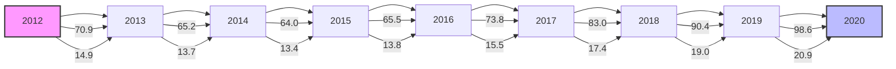

## الربحية

شهد معدل العائد على الأصول لدى القطاع المصرفي في ليبيا إنخفاضاً ملحوظاً خلال السنوات
(2014 - 2016)، حيث بلغ نحو 0.2% في عام 2016، ويعزى سبب الإنخفاض إلى عدة أسباب منها
الوضع الغير ملائم الذي تعمل فيه المصارف التجارية في السنوات الأخيرة وكذلك تطبيق قانون إلغاء
الفوائد الربوية.
---
إلا أنه خلال العام 2018 تحسن معدل الربحية بشكل كبير ، حيث بلغ العائد على إجمالي الأصول نحو
1.0%، وبلغ معدل العائد على حقوق الملكية 20.9%.

وفي عام 2019 بلغ معدل العائد على إجمالي الأصول نحو 0.7 % وبلغ معدل العائد على حقوق الملكية
.12.3%

وفي خلال الربع الأول م عام 2020 بلغ معدل العائد على إجمالي الأصول نحو 0.5 % وبلغ معدل العائد
على حقوق الملكية 8.4%.

هذه الزيادة في الأرباح خاصة في العامين الأخيرين جاءت نتيجة لتحقيق المصارف التجارية لإيرادات
هامة من عَمولات بيع وتحويل العملة الأجنبية ، وكذلك من رفع أسعار الخدمات المصرفية عموماً.

| نسب مئوية |  |  |  |  |  |  |  |  |  |  |
|------------|---------|------|------|------|------|------|------|------|------|------------|
| الربحية | 2012 | 2013 | 2014 | 2015 | 2016 | 2017 | 2018 | 2019 | الربع الأول 2020 |
| العائد / حقوق الملكية | 13.7 | 12.0 | 5.4 | 4.4 | 4.8 | 9.1 | 20.9 | 12.3 | 8.4 |
| العائد / الاصول | 0.7 | 0.5 | 0.3 | 0.2 | 0.2 | 0.4 | 1.0 | 0.7 | 0.5 |

```mermaid
graph LR
    A[العائد / حقوق الملكية<br/>(2012 - الربع الأول 2020)]
    B[العائد / الاصول<br/>(2012 - الربع الأول 2020)]

    style A fill:#f9f,stroke:#333,stroke-width:4px
    style B fill:#bbf,stroke:#333,stroke-width:4px

    A -->|2012| A1[13.7%]
    A -->|2013| A2[12.0%]
    A -->|2014| A3[5.4%]
    A -->|2015| A4[4.4%]
    A -->|2016| A5[4.8%]
    A -->|2017| A6[9.1%]
    A -->|2018| A7[20.9%]
    A -->|2019| A8[12.3%]
    A -->|الربع الأول 2020| A9[8.4%]

    B -->|2012| B1[0.7%]
    B -->|2013| B2[0.5%]
    B -->|2014| B3[0.3%]
    B -->|2015| B4[0.2%]
    B -->|2016| B5[0.2%]
    B -->|2017| B6[0.4%]
    B -->|2018| B7[1.0%]
    B -->|2019| B8[0.7%]
    B -->|الربع الأول 2020| B9[0.5%]
```
---
# كفاية رأس المال

يتمتع القطاع المصرفي الليبي بكفاية رأس مال مرتفعة، كافية لمواجهة أية مخاطر قد تحدث، حيث تراوحت نسبتها مابين 10.7% و 18.4% خلال الفترة (2012 - الربع الأول 2020)، وهي بشكل عام أعلى وبهامش مريح من النسبة المحددة من قبل لجنة بازل (1) والبالغة 8.0%، مما يعزز من الإستقرار المالي.

## نسب مئوية

| نسب رأس المال | 2012 | 2013 | 2014 | 2015 | 2016 | 2017 | 2018 | 2019 | الربع الأول 2020 |
|----------------|------|------|------|------|------|------|------|------|------------------|
| كفاية رأس المال الكلي | 10.7 | 12.4 | 13.9 | 14.3 | 14.6 | 16.7 | 17.8 | 18.4 | 17.6 |
| كفاية رأس المال الأساسي | 9.5 | 11.0 | 12.6 | 13.1 | 13.4 | 15.4 | 16.5 | 17.2 | 16.3 |
| رأس المال المدفوع / الأصول | 4.2 | 3.6 | 3.7 | 4.0 | 3.7 | 3.3 | 3.3 | 3.8 | 3.8 |
| حقوق الملكية / الأصول | 5.1 | 4.4 | 5.1 | 5.4 | 4.9 | 4.8 | 4.6 | 5.5 | 6.0 |
| حقوق الملكية / الودائع | 6.3 | 5.1 | 6.2 | 7.1 | 6.1 | 5.3 | 5.7 | 6.9 | 7.8 |

## كفاية رأس المال الكلي (2012 - الربع الأول 2020)

```mermaid
graph LR
    2012[2012 - 10.7] --> 2013[2013 - 12.4]
    2013 --> 2014[2014 - 13.9]
    2014 --> 2015[2015 - 14.3]
    2015 --> 2016[2016 - 14.6]
    2016 --> 2017[2017 - 16.7]
    2017 --> 2018[2018 - 17.8]
    2018 --> 2019[2019 - 18.4]
    2019 --> 2020[الربع الأول 2020 - 17.6]
```

## مؤشرات رأس المال (2012 - الربع الأول 2020)

```mermaid
graph LR
    2012[2012] --> |رأس المال المدفوع / الأصول: 4.2| 2013[2013]
    2012 --> |حقوق الملكية / الأصول: 5.1| 2013
    2013 --> |رأس المال المدفوع / الأصول: 3.6| 2014[2014]
    2013 --> |حقوق الملكية / الأصول: 4.4| 2014
    2014 --> |رأس المال المدفوع / الأصول: 3.7| 2015[2015]
    2014 --> |حقوق الملكية / الأصول: 5.1| 2015
    2015 --> |رأس المال المدفوع / الأصول: 4.0| 2016[2016]
    2015 --> |حقوق الملكية / الأصول: 5.4| 2016
    2016 --> |رأس المال المدفوع / الأصول: 3.7| 2017[2017]
    2016 --> |حقوق الملكية / الأصول: 4.9| 2017
    2017 --> |رأس المال المدفوع / الأصول: 3.3| 2018[2018]
    2017 --> |حقوق الملكية / الأصول: 4.8| 2018
    2018 --> |رأس المال المدفوع / الأصول: 3.3| 2019[2019]
    2018 --> |حقوق الملكية / الأصول: 4.6| 2019
    2019 --> |رأس المال المدفوع / الأصول: 3.8| 2020[الربع الأول 2020]
    2019 --> |حقوق الملكية / الأصول: 5.5| 2020
    2020 --> |رأس المال المدفوع / الأصول: 3.8|
    2020 --> |حقوق الملكية / الأصول: 6.0|
```
---
# الملاحق

- البيانات المالية الأساسية للمصارف التجارية للربع الأول 2020 مقارنة بالربع الأول 2019.

- جدول مؤشرات السلامة المالية خلال الفترة ( 2012 - الربع الأول 2020 ).

35
---
# الجدول (1)
## البيانات المالية الأساسية للمصارف التجارية

(مليون دينار)

| البيان / الفترة | مارس 2019 | مارس 2020 | معدل التغير % |
|-----------------|------------|------------|---------------|
| إجمالي الميزانية (الأصول + الحسابات النظامية) | 162,623.1 | 155,339.4 | -4.5 |
| إجمالي الأصول | 116,937.7 | 112,014.6 | -4.2 |
| إجمالي النقدية بخزائن المصارف | 1,598.4 | 2,861.3 | 79.0 |
| إجمالي الودائع لدى المصرف المركزي | 77,088.5 | 67,594.0 | -12.3 |
| إجمالي الودائع لدى المصارف | 1,158.0 | 1,650.4 | 42.5 |
| إجمالي الودائع لدى المصرف الليبي الخارجي | 1,150.8 | 592.9 | -48.5 |
| إجمالي الودائع لدى المراسلين بالخارج | 5,614.4 | 5,479.8 | -2.4 |
| إجمالي حسابات المقاصة | 5,027.5 | 5,370.4 | 6.8 |
| إجمالي القروض والسلفيات والتسهيلات | 16,236.0 | 16,776.0 | 3.3 |
| إجمالي الاستثمارات | 985.3 | 1,313.9 | 33.4 |
| إجمالي ودائع العملاء | 92,278.7 | 86,592.2 | -6.2 |
| إجمالي الحسابات المكشوفة لدى المراسلين | 472.2 | 163.5 | -65.4 |
| إجمالي حقوق الملكية | 6,756.2 | 6,718.0 | -0.6 |
| إجمالي المخصصات | 4,833.8 | 5,482.1 | 13.4 |
| أرباح العام | 251.4 | 141.6 | -43.7 |
| عدد الفروع والوكالات | 531 | 542 | 2.1 |
| عدد العاملين | 19,463 | 19,387 | -0.4 |
| الأصول السائلة / إجمالي الأصول % | 74.1 | 69.8 | - |
| إجمالي القروض / إجمالي الأصول % | 13.9 | 15.0 | - |
| حقوق الملكية / إجمالي الأصول % | 5.8 | 6.0 | - |
| إجمالي الأصول / عدد الفروع (مليون دينار) | 220.2 | 206.7 | - |
| إجمالي الأصول / عدد العاملين (مليون دينار) | 6.0 | 5.8 | - |
| إجمالي القروض / إجمالي الودائع % | 17.6 | 19.4 | - |
| إجمالي الربح / الأصول % (*) | 0.2 | 0.1 | - |
| إجمالي الربح / حقوق الملكية % (*) | 3.7 | 2.1 | - |

(*) إجمالي الربح قبل خصم المخصصات والضرائب.
---
# الجدول (2)
## مؤشرات الودائع لدى المصارف التجارية
(مليون دينار)

| البيان / الفترة | مارس 2019 | مارس 2020 | معدل التغير % |
|-----------------|-----------|-----------|---------------|
| 1- ودائع الحكومة والقطاع العام | 39,419.0 | 40,750.0 | 3.4 |
| ــ ودائع الحكومة (الوزارات والهيئات الممولة من الميزانية العامة) | 10,517.3 | 11,125.5 | 5.8 |
| ــ ودائع القطاع العام | 28,901.7 | 29,624.5 | 2.5 |
| 2- ودائع القطاع الخاص | 52,859.7 | 45,842.2 | -13.3 |
| ــ ودائع الأفراد | 32,947.7 | 28,192.4 | -14.4 |
| ــ ودائع الشركات والجهات الأخرى | 19,912.0 | 17,649.8 | -11.4 |
| إجمالي الودائع | 92,278.7 | 86,592.2 | -6.2 |
| الودائع تحت الطلب | 79,654.5 | 75,965.3 | -4.6 |
| الودائع لأجل | 12,138.3 | 10,190.0 | -16.1 |
| ودائع الادخار | 485.9 | 436.9 | -10.1 |
| الودائع تحت الطلب / إجمالي الودائع % | 86.3 | 87.7 | - |
| الودائع لأجل / إجمالي الودائع % | 13.2 | 11.8 | - |
| ودائع الادخار / إجمالي الودائع % | 0.5 | 0.5 | - |
| إجمالي الودائع / إجمالي الخصوم % | 78.9 | 77.3 | - |
---
الجدول (3)
مؤشرات الائتمان لدى المصارف التجارية
(مليون دينار)

| البيان / الفترة | مارس 2019 | مارس 2020 | معدل التغير % |
|-----------------|------------|------------|---------------|
| 1- الائتمان الممنوح للقطاع العام | 4,933.6 | 6,096.5 | 23.6 |
| 2- الائتمان الممنوح للقطاع الخاص | 11,302.4 | 10,679.5 | -5.5 |
| إجمالي الائتمان | 16,236.0 | 16,776.0 | 3.3 |
| السلفيات والسحب على المكشوف | 5,110.2 | 4,783.2 | -6.4 |
| السلف الاجتماعية (*) | 3,335.3 | 3,547.1 | 6.4 |
| السلفيات والسحب على المكشوف والسلف الاجتماعية | 8,445.5 | 8,330.2 | -1.4 |
| القروض الممنوحة للأنشطة الاقتصادية الأخرى | 7,790.4 | 8,445.8 | 8.4 |
| السلف الاجتماعية (*) / إجمالي الائتمان % | 20.5 | 21.1 | 2.9 |
| السلفيات والسحب على المكشوف / إجمالي الائتمان % | 31.5 | 28.5 | -9.4 |
| القروض الممنوحة للأنشطة الاقتصادية الأخرى/إجمالي الائتمان% | 48.0 | 50.3 | 4.9 |
| إجمالي الائتمان / إجمالي الأصول % | 13.9 | 15.0 | 7.9 |
| إجمالي الائتمان / إجمالي الودائع % | 17.6 | 19.4 | 10.1 |

(*) تشمل قروض المرابحة الإسلامية للأفراد ابتداءً من العام 2013.
---
# مؤشرات السلامة المالية للمصارف التجارية
## (2012 - الربع الأول 2020)

نسب مئوية

| المؤشر | 2012 | 2013 | 2014 | 2015 | 2016 | 2017 | 2018 | 2019 | الربع الأول 2020 |
|--------|------|------|------|------|------|------|------|------|------------------|
| **مؤشرات رأس المال:** |
| معدل كفاية رأس المال الكلي % | 10.7 | 12.4 | 13.9 | 14.3 | 14.6 | 16.7 | 17.8 | 18.4 | 17.6 |
| معدل كفاية رأس المال الأساسي % | 9.5 | 11.0 | 12.6 | 13.1 | 13.4 | 15.4 | 16.5 | 17.2 | 16.3 |
| راس المال المدفوع / إجمالي الأصول% | 4.2 | 3.6 | 3.7 | 4.0 | 3.7 | 3.3 | 3.3 | 3.8 | 3.8 |
| حقوق الملكية / إجمالي الأصول% | 5.1 | 4.4 | 5.1 | 5.6 | 4.9 | 4.8 | 4.6 | 5.5 | 6.0 |
| حقوق الملكية / إجمالي الودائع% | 6.3 | 5.1 | 6.2 | 7.1 | 6.1 | 5.3 | 5.7 | 6.9 | 7.8 |
| **مؤشرات جودة الأصول:** |
| القروض المتعثرة (*) / إجمالي الأصول% | 4.0 | 3.9 | 4.4 | 4.7 | 3.8 | 3.1 | 2.9 | 3.2 | 3.1 |
| القروض المتعثرة (*) / إجمالي القروض% | 21.0 | 21.0 | 21.0 | 21.0 | 21.0 | 21.0 | 21.0 | 21.0 | 21.0 |
| مخصص الديون / إجمالي القروض المتعثرة (*)% | 70.9 | 65.2 | 64.0 | 65.5 | 73.8 | 83.0 | 90.4 | 98.6 | 98.7 |
| مخصص الديون / إجمالي القروض % | 14.9 | 13.7 | 13.4 | 13.8 | 15.5 | 17.4 | 19.0 | 20.9 | 20.7 |
| **مؤشرات كفاءة الإدارة:** |
| إجمالي القروض / إجمالي الأصول% | 19.1 | 18.3 | 21.0 | 22.4 | 18.1 | 15.0 | 14.1 | 15.1 | 15.0 |
| المصروفات / الإيرادات% | 57.2 | 62.8 | - | 65.4 | 70.3 | - | - | - | - |
| إجمالي الأصول / عدد العاملين (مليون دينار) | 4.7 | 5.2 | 5.0 | 4.7 | 5.4 | 5.8 | 6.1 | 5.8 | 5.8 |
| الإيرادات / عدد العاملين (ألف دينار) | 76.2 | 73.0 | - | 62.4 | 58.2 | - | - | - | - |
| إجمالي الأصول / عدد الفروع (مليون دينار) | 167.9 | 189.2 | 182.7 | 173.2 | 198.6 | 223.1 | 222.6 | 206.4 | 206.7 |
| **مؤشرات الربحية:** |
| العائد / الاصول% | 0.7 | 0.5 | 0.3 | 0.2 | 0.2 | 0.4 | 1.0 | 0.7 | 0.5 |
| العائد / حقوق الملكية% | 13.7 | 12.0 | 5.4 | 4.4 | 4.8 | 8.5 | 20.9 | 12.3 | 8.4 |
| العائد / الودائع% | 0.7 | 0.6 | 0.3 | 0.3 | 0.3 | 0.5 | 1.3 | 0.8 | 0.7 |
| **مؤشرات السيولة:** |
| الأصول السائلة / إجمالي الأصول% | 68.6 | 71.0 | 67.8 | 60.2 | 60.8 | 72.8 | 74.3 | 71.9 | 69.8 |
| إجمالي القروض / اجمالي الودائع % | 23.6 | 21.8 | 25.2 | 28.4 | 22.5 | 18.2 | 17.6 | 19.0 | 19.4 |
| إجمالي الودائع / إجمالي الأصول% | 80.8 | 84.9 | 83.1 | 79.0 | 80.6 | 82.4 | 80.0 | 79.3 | 77.3 |