مصرف ليبيا المركزي

إدارة البحوث والإحصاء

تطور أهم البيانات والمؤشرات
المالية للمصارف التجارية
"الربع الأول 2021"

[An image showing various financial charts and graphs. There's a green upward arrow indicating growth, along with bar charts in different colors (red, yellow, green, blue) and a pie chart divided into colored sections (green, red, yellow). These charts are overlaid on what appears to be financial data sheets or grids.]
---
# ملخص تطور أهم البيانات المالية للمصارف التجارية
## (للربع الأول 2021)

شهدت البيانات المالية للمصارف التجارية للربع الأول 2021 بعض التغيرات مقارنة عما كانت عليه في الربع الأول 2020 وذلك على النحو التالي:

- إرتفع إجمالي أصول المصارف التجارية (بإستثناء الحسابات النظامية) من 112.1 مليار دينار في نهاية الربع الأول 2020 إلى نحو 142.6 مليار دينار في نهاية الربع الأول 2021، أي بمعدل نمو قدره 27.2%، وقد شكلت الأصول السائلة (البالغة 102.3 مليار دينار) من إجمالي الأصول ما نسبته 71.7%، مقارنة بما نسبته 68.0% عن ما كانت عليه في الربع الأول 2020.

| إجمالي أصول المصارف التجارية (2012 - الربع الأول 2021) |
|--------------------------------------------------------|
| السنة | القيمة (مليار دينار) |
|-------|----------------------|
| 2012  | 84.4                 |
| 2013  | 98.4                 |
| 2014  | 95.2                 |
| 2015  | 90.2                 |
| 2016  | 103.5                |
| 2017  | 116.5                |
| 2018  | 117.2                |
| 2019  | 111.8                |
| 2020  | 126.1                |
| الربع الأول 2021 | 142.6    |

- إرتفع إجمالي ودائع المصارف التجارية (تحت الطلب وشهادات الإيداع) لدى المصرف المركزي بما فيها الإحتياطي الإلزامي من نحو 65.5 مليار دينار في نهاية الربع الأول 2020 إلى نحو 83.8 مليار دينار في نهاية الربع الأول 2021، أي بمعدل بلغ 28.0%، والتي يشكل منها الإحتياطي الإلزامي نحو 20.9 مليار دينار.

- إرتفع اجمالي رصيد الإئتمان الممنوح من المصارف التجارية من 16.8 مليار دينار في نهاية الربع الأول 2020 إلى 17.6 مليار دينار في نهاية الربع الأول 2021، أي بمعدل نمو 5.0%، وقد شكلت القروض والتسهيلات الائتمانية الممنوحة إلى اجمالي الخصوم الإيداعية ما نسبته 16.9%، كما شكلت من اجمالي الأصول ما نسبته 12.4%، وبلغ رصيد القروض الممنوحة للقطاع الخاص في نهاية الربع الأول 2021 ما قيمته 11.4 مليار دينار، وما نسبته 64.8% من إجمالي القروض والتسهيلات الإئتمانية

صفحة 2 من 42
---
الممنوحة، فيما شكل رصيد القروض الممنوحة للقطاع العام النسبة الباقية 35.2% والتي بلغت قيمتها نحو
6.2 مليار دينار.

| إجمالي رصيد القروض الممنوحة من المصارف التجارية |
| (2012 - الربع الأول 2021) |
|:---:|
| Chart showing total loans granted by commercial banks from 2012 to Q1 2021 |

| السنة | القيمة (مليار دينار) |
|------|---------------------|
| 2012 | 15.9 |
| 2013 | 18.2 |
| 2014 | 20.0 |
| 2015 | 20.2 |
| 2016 | 18.8 |
| 2017 | 17.5 |
| 2018 | 16.4 |
| 2019 | 16.9 |
| 2020 | 17.0 |
| الربع الأول 2021 | 17.6 |

- بلغت نسبة تغطية مخصص الديون المشكوك فيها لإجمالي القروض والتسهيلات الممنوحة نسبة
20.2% في الربع الأول 2021 مقابل نسبة 21.4% في الربع الأول 2020.

- إرتفعت ودائع العملاء لدى المصارف التجارية من 87.0 مليار دينار في نهاية الربع الأول 2020، إلى
104.3 مليار دينار في نهاية الربع الأول 2021، أي بمعدل 19.9%، وقد شكلت الودائع تحت الطلب
ما نسبته 79.6% من إجمالي الودائع، في حين شكلت الودائع لأجل نسبة 20.0% من إجمالي الودائع،
بينما شكلت ودائع الادخار ما نسبته 0.4% فقط من إجمالي الودائع.

وفيما يتعلق بتوزيع هذه الودائع فقد بلغت ودائع القطاع الخاص في نهاية الربع الأول 2021 ما قيمته
62.8 مليار دينار، وما نسبته 60.2% من إجمالي الودائع، فيما شكل رصيد ودائع القطاع العام والحكومي
النسبة الباقية وقدرها 39.8% أي ما قيمته 41.5 مليار دينار، منها 28.1 مليار دينار ودائع لشركات
ومؤسسات القطاع العام ونحو 13.4 مليار دينار ودائع حكومية.

| إجمالي ودائع العملاء لدى المصارف التجارية |
| (2012 - الربع الأول 2021) |
|:---:|
| Chart showing total customer deposits in commercial banks from 2012 to Q1 2021 |

| السنة | ودائع تحت الطلب | ودائع زمنية | ودائع إدخارية | إجمالي الودائع |
|-------|-----------------|-------------|---------------|----------------|
| 2012 | - | - | - | 68.3 |
| 2013 | - | - | - | 83.6 |
| 2014 | - | - | - | 79.1 |
| 2015 | - | - | - | 71.3 |
| 2016 | - | - | - | 83.4 |
| 2017 | - | - | - | 95.9 |
| 2018 | - | - | - | 93.7 |
| 2019 | - | - | - | 88.6 |
| 2020 | - | - | - | 102.1 |
| الربع الأول 2021 | - | - | - | 104.3 |

صفحة 3 من 42
---
- انخفض إجمالي حقوق الملكية في المصارف التجارية من 6.6 مليار دينار في نهاية الربع الأول 2020 إلى 6.5 مليار دينار في نهاية الربع الأول 2021، وبمعدل 0.7%.

- إرتفعت أرباح المصارف التجارية (قبل خصم المخصصات والضرائب) خلال الربع الأول 2021 بمعدل 107.9% لتصل إلى 366.5 مليون دينار، مقارنة عما كانت عليه خلال الربع الأول 2020 والتي سجلت نحو 176.3 مليون دينار.

| أرباح الفترة قبل خصم المخصصات والضرائب |       |
|----------------------------------------|-------|
| 400                                    | 366.5 |
| 350                                    |       |
| 300                                    |       |
| 250                                    |       |
| 200                                    | 176.3 |
| 150                                    |       |
| 100                                    |       |
| 50                                     |       |
| 0                                      |       |
| الربع الأول 2020                        | الربع الأول 2021 |

| أرباح المصارف التجارية قبل خصم المخصصات والضرائب (2012 - 2020) |         |
|----------------------------------------------------------------|---------|
| 1,400.0                                                        | 1,222.2 |
| 1,200.0                                                        |         |
| 1,000.0                                                        | 867.7   |
| 800.0                                                          |         |
| 600.0                                                          | 608.7   |
| 527.1                                                          | 464.6   |
| 400.0                                                          | 451.1   |
| 265.4                                                          | 247.1   |
| 200.0                                                          | 213.0   |
| 0.0                                                            |         |
| 2012    2013    2014    2015    2016    2017    2018    2019    2020 |

صفحة 4 من 42
---
تفرع المصارف التجارية :-

بلغ عدد المصارف المشتملة بياناتها في هذا التقرير 18 مصرفاً (بما في ذلك وحدة الدينار الليبي التابعة للمصرف الليبي الخارجي) حتى الربع الأول 2021، وتزاول هذه المصارف نشاطها من خلال 555 فرعاً ووكالة مصرفية مقارنة بنحو 540 فرعاً ووكالة مصرفية في نهاية الربع الأول 2020، والزيادة في عدد الفروع والوكالات المصرفية تركزت في (المصرف التجاري الوطني والمصرف الليبي الإسلامي).

## تطور عدد الفروع والوكالات المصرفية والعاملين بها

| السنة | عدد الفروع والوكالات | عدد العاملين بالقطاع المصرفي |
|-------|----------------------|------------------------------|
| 2012  | 498                  | 17,575                       |
| 2013  | 515                  | 18,878                       |
| 2014  | 516                  | 19,183                       |
| 2015  | 516                  | 19,214                       |
| 2016  | 521                  | 19,255                       |
| 2017  | 522                  | 19,324                       |
| 2018  | 527                  | 19,263                       |
| 2019  | 543                  | 19,387                       |
| 2020  | 553                  | 19,565                       |
| الربع الأول 2021 | 555      | 19,588                       |

## عدد الفروع والوكالات المصرفية (2012 - الربع الأول 2021)

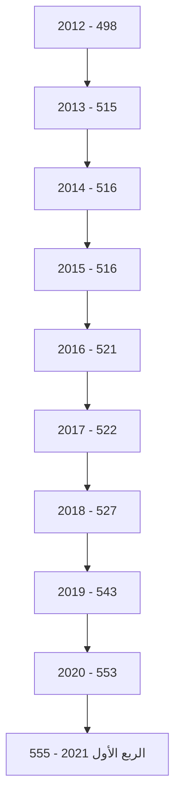

صفحة 5 من 42
---
# الكثافة المصرفية

" بالألف نسمة "

| لكل فرع ووكالة | لكل مصرف | السنة |
|-----------------|------------|-------|
| 12.1 | 389.0 | 2012 |
| 12.2 | 397.0 | 2013 |
| 12.2 | 397.0 | 2014 |
| 12.2 | 393.8 | 2015 |
| 12.5 | 382.4 | 2016 |
| 12.8 | 394.1 | 2017 |
| 13.1 | 383.3 | 2018 |
| 12.9 | 368.4 | 2019 |
| 12.8 | 368.3 | 2020 |
| 12.6 | 388.9 | الربع الأول 2021 |

## التركز المصرفي:

درجة التركز المصرفي تعني أن عدداً قليلا من المصارف التجارية يستأثر بالنسبة الأكبر من النشاط
المصرفي سواءً من حيث الأصول أو الودائع أوالائتمان أو من حيث حجم حقوق الملكية، وفيما يخص
الحصة السوقية للمصارف التجارية في ليبيا، فقد شكلت أصول المصارف الأربعة الكبرى (الجمهورية،
التجاري الوطني، الوحدة والصحاري) من أصل 18 مصرفاً مانسبته 70.7% من إجمالي أصول القطاع
المصرفي في نهاية الربع الأول 2021، وشكل مصرف الجمهورية وحده ما نسبته 29.4% من إجمالي
أصول القطاع المصرفي.

وشكلت ودائع وقروض المصارف الأربعة الكبرى مانسبته 68.9% و 87.8% على التوالي من إجمالي
ودائع وقروض القطاع المصرفي نهاية الربع الأول 2021 .

وهذه النسب المرتفعة توضح أن السوق المصرفي الليبي يعاني من تركز مرتفع يحول دون تحقيق المنافسة
العادلة بين المصارف المتواجدة به ، وذلك بسبب إستحواذ أحد المصارف أو عدد قليل جدا منها بحصة
كبيرة في السوق، في حين أن حصة معظم المصارف الأخرى متدنية للغاية.

صفحة 6 من 42
---
# التركز المصرفي
## (2012 - الربع الأول 2021)

### حسب الأصول:

| "نسب مئوية" |  |  |  |  |  |  |  |  |  |  |
|-------------|-------------|------|------|------|------|------|------|------|------|------|
| المصارف | 2012 | 2013 | 2014 | 2015 | 2016 | 2017 | 2018 | 2019 | 2020 | الربع الأول 2021 |
| أكبر مصرف | 37.9 | 33.0 | 33.1 | 34.9 | 33.8 | 33.6 | 32.7 | 31.9 | 31.2 | 29.4 |
| أكبر ثلاثة مصارف | 71.0 | 63.7 | 62.1 | 67.6 | 67.9 | 66.9 | 65.8 | 64.6 | 63.1 | 60.9 |
| أكبر خمسة مصارف | 89.0 | 81.3 | 79.2 | 87.1 | 86.7 | 85.0 | 84.3 | 84.2 | 82.7 | 79.5 |

### حسب الإئتمان:

| "نسب مئوية" |  |  |  |  |  |  |  |  |  |  |
|-------------|-------------|------|------|------|------|------|------|------|------|------|
| المصارف | 2012 | 2013 | 2014 | 2015 | 2016 | 2017 | 2018 | 2019 | 2020 | الربع الأول 2021 |
| أكبر مصرف | 41.9 | 44.8 | 43.5 | 44.8 | 44.3 | 44.5 | 43.6 | 40.7 | 42.6 | 41.5 |
| أكبر ثلاثة مصارف | 77.0 | 76.7 | 79.1 | 79.4 | 78.5 | 77.7 | 77.7 | 75.8 | 78.3 | 78.1 |
| أكبر خمسة مصارف | 91.0 | 90.2 | 91.1 | 91.4 | 91.3 | 91.2 | 91.5 | 91.4 | 91.4 | 91.3 |

### حسب ودائع العملاء:

| "نسب مئوية" |  |  |  |  |  |  |  |  |  |  |
|-------------|-------------|------|------|------|------|------|------|------|------|------|
| المصارف | 2012 | 2013 | 2014 | 2015 | 2016 | 2017 | 2018 | 2019 | 2020 | الربع الأول 2021 |
| أكبر مصرف | 40.9 | 33.8 | 33.1 | 34.8 | 34.0 | 33.6 | 31.9 | 32.3 | 31.8 | 29.1 |
| أكبر ثلاثة مصارف | 71.5 | 62.7 | 61.3 | 66.5 | 67.2 | 66.5 | 65.2 | 64.4 | 62.9 | 59.2 |
| أكبر خمسة مصارف | 90.1 | 80.9 | 78.6 | 87.8 | 87.5 | 85.7 | 85.4 | 85.6 | 83.7 | 79.9 |

صفحة 7 من 42
---

## تركز الأصول

| Bank | Percentage |
|------|------------|
| مصرف الجمهورية | 29% |
| المصرف التجاري الوطني | 17% |
| مصرف الوحدة | 15% |
| مصرف الصحاري | 10% |
| باقي المصارف | 29% |

## تركز الائتمان

| Bank | Percentage |
|------|------------|
| مصرف الجمهورية | 41% |
| المصرف التجاري الوطني | 19% |
| مصرف الوحدة | 18% |
| مصرف الصحاري | 10% |
| باقي المصارف | 12% |

## تركز ودائع العملاء

| Bank | Percentage |
|------|------------|
| مصرف الجمهورية | 29% |
| المصرف التجاري الوطني | 16% |
| مصرف الوحدة | 14% |
| مصرف الصحاري | 10% |
| باقي المصارف | 31% |

صفحة 8 من 42
---
# الميزانية المُجمَعة للمصارف التجارية

شهدت الميزانية المُجمَعة للمصارف التجارية نهاية الربع الأول 2021، تطورات في مُجمل بنودها على جانبي الأصول والخصوم، ليبلغ إجمالي الأصول داخل الميزانية المُجمَعة نحو 142,629.4 مليون دينار، مقابل 112,137.3 مليون دينار في نهاية الربع الأول 2020، بإرتفاع قدره 30,492.1 مليون دينار، أي بمعدل 27.2%، وفيما يلي جدول يلخص البنود الرئيسية للميزانية المُجمَعة للمصارف التجارية:

## البنود الرئيسية للميزانية المُجمَعة للمصارف التجارية

| جانب الأصول : | الربع الأول 2020 | الربع الأول 2021 | مقدار التغير | معدل التغير % |
|---------------|------------------|------------------|---------------|---------------|
| نقدية بالخزائن | 2,841.9 | 3,607.7 | 765.8 | 26.9 |
| حسابات المقاصة | 5,318.8 | 5,595.3 | 276.5 | 5.2 |
| أرصدة لدى المصارف | 73,403.7 | 98,725.8 | 25,322.1 | 34.5 |
| الإستثمارات | 4,213.9 | 4,480.1 | 266.2 | 6.3 |
| القروض والتسهيلات | 16,772.8 | 17,619.4 | 846.6 | 5.0 |
| الأصول الثابتة | 1,814.8 | 2,038.2 | 223.4 | 12.3 |
| الأصول الأخرى | 7,771.4 | 10,562.8 | 2,791.4 | 35.9 |
| إجمالي الأصول | 112,137.3 | 142,629.4 | 30,492.1 | 27.2 |
| الحسابات النظامية | 42,544.0 | 49,394.8 | 6,850.8 | 16.1 |
| إجمالي الميزانية | 154,681.3 | 192,024.2 | 37,342.9 | 24.1 |

| جانب الخصوم: | الربع الأول 2020 | الربع الأول 2021 | مقدار التغير | معدل التغير % |
|--------------|------------------|------------------|---------------|---------------|
| ودائع العملاء | 87,018.4 | 104,296.2 | 17,277.8 | 19.9 |
| منها : التأمينات النقدية | 7,975.4 | 18,535.9 | 10,560.5 | 132.4 |
| حقوق الملكية | 6,553.0 | 6,506.1 | -46.9 | -0.7 |
| المخصصات | 5,591.7 | 7,312.3 | 1,720.6 | 30.8 |
| الخصوم الأخرى | 12,974.2 | 24,514.8 | 11,540.6 | 89.0 |
| إجمالي الخصوم | 112,137.3 | 142,629.4 | 30,492.1 | 27.2 |
| الحسابات النظامية | 42,544.0 | 49,394.8 | 6,850.8 | 16.1 |
| إجمالي الميزانية | 154,681.3 | 192,024.2 | 37,342.9 | 24.1 |

صفحة 9 من 42
---
# الأهمية النسبية للبنود المكونة للأصول

## الربع الأول 2021

| البند | النسبة |
|-------|--------|
| نقدية بالخزائن | 4% |
| حسابات المقاصة | 3% |
| أرصدة لدى المصارف | 69% |
| الإستثمارات | 3% |
| القروض والتسهيلات | 12% |
| الأصول الثابتة | 7% |
| الأصول الأخرى | 2% |

## الربع الأول 2020

| البند | النسبة |
|-------|--------|
| نقدية بالخزائن | 5% |
| حسابات المقاصة | 2% |
| أرصدة لدى المصارف | 65% |
| الإستثمارات | 4% |
| القروض والتسهيلات | 15% |
| الأصول الثابتة | 7% |
| الأصول الأخرى | 2% |

# الأهمية النسبية للبنود المكونة للخصوم

## الربع الأول 2021

| البند | النسبة |
|-------|--------|
| ودائع العملاء | 73% |
| حقوق الملكية | 5% |
| المخصصات | 5% |
| الخصوم الأخرى | 17% |

## الربع الأول 2020

| البند | النسبة |
|-------|--------|
| ودائع العملاء | 78% |
| حقوق الملكية | 6% |
| المخصصات | 5% |
| الخصوم الأخرى | 11% |

صفحة 10 من 42
---
وفيما يلي تطور الميزانية المجمَعة للمصارف التجارية خلال الفترة (2012 - الربع الأول 2021):

| جانب الأصول | 2012 | 2013 | 2014 | 2015 | 2016 | 2017 | 2018 | 2019 | 2020 | الربع الأول 2021 |
|-------------|------|------|------|------|------|------|------|------|------|------------------|
| نقدية بالخزائن | 1,545.9 | 1,712.3 | 1,642.8 | 752.8 | 606.4 | 547.2 | 1,582.1 | 2,367.4 | 1,146.8 | 3,607.7 |
| حسابات المقاصة | 2,024.6 | 7,310.3 | 8,125.4 | 11,444.4 | 12,886.4 | 10,625.8 | 4,671.0 | 6,304.6 | 5,584.8 | 5,595.3 |
| أرصدة لدى المصارف | 56,787.6 | 68,094.6 | 62,244.0 | 53,540.0 | 62,306.5 | 84,262.6 | 85,349.3 | 77,424.9 | 89,836.6 | 98,725.8 |
| الإستثمارات | 954.9 | 746.7 | 777.5 | 1,787.8 | 1,789.2 | 1,311.5 | 1,456.5 | 1,957.5 | 4,256.6 | 4,480.1 |
| القروض والتسهيلات | 15,899.5 | 18,232.3 | 19,959.9 | 20,212.8 | 18,770.3 | 17,446.6 | 16,448.3 | 16,912.7 | 16,996.9 | 17,619.4 |
| الأصول الثابتة | 1,038.4 | 1,121.6 | 1,211.6 | 1,365.4 | 1,409.1 | 1,463.2 | 1,608.3 | 1,786.7 | 1,986.8 | 2,038.2 |
| الأصول الأخرى | 6,169.5 | 1,157.8 | 1,243.0 | 1,130.2 | 5,687.2 | 5,066.0 | 5,947.1 | 5,871.5 | 6,299.4 | 10,562.8 |
| إجمالي الأصول | 84,420.4 | 98,375.6 | 95,204.2 | 90,233.4 | 103,455.1 | 116,477.0 | 117,062.4 | 112,625.3 | 126,107.9 | 142,629.4 |
| الحسابات النظامية | 70,747.7 | 71,550.9 | 51,845.0 | 48,299.2 | 46,800.0 | 46,534.9 | 48,160.2 | 34,091.2 | 28,611.1 | 49,394.8 |
| إجمالي الميزانية | 155,168.1 | 169,926.5 | 147,049.2 | 138,532.6 | 150,255.1 | 163,011.9 | 165,222.6 | 146,716.6 | 154,719.0 | 192,024.2 |

صفحة 11 من 42
---
| جانب الخصوم | 2012 | 2013 | 2014 | 2015 | 2016 | 2017 | 2018 | 2019 | 2020 | الربع الأول 2021 |
|-----------------|--------|--------|--------|--------|--------|--------|--------|--------|--------|-----------------|
| ودائع العملاء | 68,346.2 | 83,562.7 | 78,910.4 | 71,257.1 | 83,407.6 | 95,938.5 | 93,657.5 | 88,954.0 | 102,194.2 | 104,296.2 |
| منها : التأمينات النقدية | 6,823.3 | 6,609.0 | 8,080.7 | 9,738.7 | 8,939.7 | 8,845.6 | 11,533.7 | 8,427.6 | 7,091.6 | 18,535.9 |
| حقوق الملكية | 4,653.2 | 4,743.7 | 4,886.4 | 5,087.5 | 5,366.5 | 5,561.4 | 6,472.6 | 6,109.2 | 6,237.6 | 6,506.1 |
| المخصصات | 3,317.4 | 3,597.2 | 3,765.3 | 3,941.8 | 4,144.9 | 4,473.0 | 4,627.6 | 5,527.2 | 5,587.2 | 7,312.3 |
| الخصوم الأخرى | 8,103.6 | 6,472.0 | 7,642.1 | 9,946.9 | 10,536.1 | 10,504.2 | 12,304.7 | 12,035.0 | 12,088.9 | 24,514.8 |
| إجمالي الخصوم | 84,420.4 | 98,375.6 | 95,204.2 | 90,233.4 | 103,455.1 | 116,477.0 | 117,062.4 | 112,625.3 | 126,107.9 | 142,629.4 |
| الحسابات النظامية | 70,747.7 | 71,550.9 | 51,845.0 | 48,299.2 | 46,800.0 | 46,534.9 | 48,160.2 | 34,091.2 | 28,611.1 | 49,394.8 |
| إجمالي الميزانية | 155,168.1 | 169,926.5 | 147,049.2 | 138,532.6 | 150,255.1 | 163,011.9 | 165,222.6 | 146,716.6 | 154,719.0 | 192,024.2 |

صفحة 12 من 42
---
# تحليل البنود المكونة للميزانية المُجمَعة للمصارف التجارية

## أولاً : جانب الأصـــول

### 1- النقدية :

#### أ- النقدية بالخزائن و حسابات المقاصة :

إرتفع رصيد النقدية بالخزائن وحسابات المقاصة بمقدار 1,042.3 مليون دينار أي بمعدل 12.8%، لتصل
إلى 9,203.0 مليون دينار في نهاية الربع الأول 2021، مقابل 8,160.7 مليون دينار في نهاية الربع
الأول 2020، حيث إرتفعت النقدية بخزائن المصارف بمقدار 765.8 مليون دينار، وبند حسابات المقاصة
بمقدار 276.5 مليون دينار في نهاية الربع الأول 2021 مقارنة بما كانت عليه في نفس الفترة من عام
2020، والجدول التالي يوضح ذلك :

| البيان | الربع الأول 2020 | الربع الأول 2021 | مقدار التغير | معدل التغير% |
|--------|------------------|------------------|---------------|---------------|
| النقدية بالخزائن : | 2,841.9 | 3,607.7 | 765.8 | 26.9 |
| عملة محلية | 2,822.7 | 3,532.7 | 710.0 | 25.2 |
| عملة أجنبية | 19.2 | 75.0 | 55.8 | 290.6 |
| إجمالي حسابات المقاصة | 5,318.8 | 5,595.3 | 276.5 | 5.2 |
| المقاصة بين المصارف | 2,727.4 | 2,351.7 | -375.7 | -13.8 |
| المقاصة بين الفروع | 2,591.4 | 3,243.6 | 652.2 | 25.2 |
| الإجمالي | 8,160.7 | 9,203.0 | 1,042.3 | 12.8 |

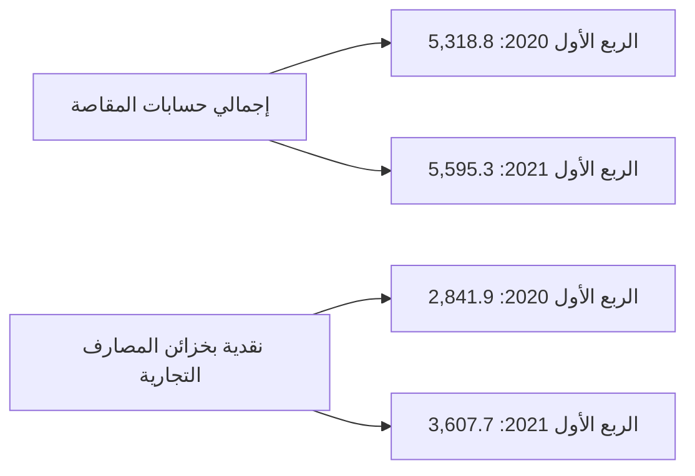

صفحة 13 من 42
---
وفيما يلي تطور بند النقدية في المصارف التجارية خالل الفترة (2012 - الربع الأول 2021):

*مليون دينار*

| البيان | 2012 | 2013 | 2014 | 2015 | 2016 | 2017 | 2018 | 2019 | 2020 | الربع الأول 2021 |
|--------|------|------|------|------|------|------|------|------|------|------------------|
| النقدية بالخزائن: | 1,545.9 | 1,712.3 | 1,642.8 | 752.8 | 606.4 | 547.2 | 1,582.1 | 2,367.4 | 1,146.8 | 3,607.7 |
| عملة محلية | 1,433.3 | 1,622.6 | 1,619.9 | 743.6 | 594.7 | 537.8 | 1,573.6 | 2,355.1 | 1,128.9 | 3,532.7 |
| عملة أجنبية | 112.6 | 89.7 | 22.9 | 9.2 | 11.7 | 9.4 | 8.4 | 12.3 | 17.9 | 75.0 |
| إجمالي حسابات المقاصة: | 2,024.6 | 7,310.3 | 8,125.4 | 11,444.4 | 12,886.4 | 6,379.9 | 4,671.0 | 6,304.6 | 5,584.8 | 5,595.3 |
| المقاصة بين المصارف | 1,410.4 | 4,004.6 | 4,836.7 | 7,072.2 | 8,488.9 | 4,245.9 | 2,191.1 | 3,162.2 | 2,392.8 | 2,351.7 |
| المقاصة بين الفروع | 614.2 | 3,305.7 | 3,288.7 | 4,372.2 | 4,397.5 | 2,134.0 | 2,479.9 | 3,142.4 | 3,192.0 | 3,243.6 |
| الإجمالي | 2,956.3 | 5,716.9 | 6,479.5 | 7,825.0 | 13,492.7 | 6,927.1 | 6,253.0 | 8,672.0 | 6,731.6 | 9,203.0 |

صفحة 14 من 42
---
نقدية بخزائن المصارف التجارية
(2012 - الربع الأول 2021)

| السنة | القيمة (مليون دينار) |
|-------|----------------------|
| 2012  | 1,545.9              |
| 2013  | 1,712.3              |
| 2014  | 1,642.8              |
| 2015  | 752.8                |
| 2016  | 606.4                |
| 2017  | 547.2                |
| 2018  | 1,582.1              |
| 2019  | 2,367.4              |
| 2020  | 1,146.8              |
| الربع الأول 2021 | 3,607.7    |

إجمالي حسابات المقاصة
(2012 - الربع الأول 2021)

| السنة | القيمة (مليون دينار) |
|-------|----------------------|
| 2012  | 2,024.6              |
| 2013  | 7,310.3              |
| 2014  | 8,125.4              |
| 2015  | 11,444.4             |
| 2016  | 12,886.4             |
| 2017  | 6,379.9              |
| 2018  | 4,671.0              |
| 2019  | 6,304.6              |
| 2020  | 5,584.8              |
| الربع الأول 2021 | 5,595.3    |

صفحة 15 من 42
---
ب- الأرصدة والودائع لدى المصرف المركزي والمصارف الأخرى:

بلغ رصيد ودائع المصارف التجارية لدى المصرف المركزي والمصارف الأخرى وفيما بينها نحو 98,725.8 مليون دينار في نهاية الربع الأول 2021، مقابل 73,403.7 مليون دينار في نهاية الربع الأول 2020، أي بمعدل إرتفاع قدره 34.5%، وتركز هذا الإرتفاع في رصيد الودائع تحت الطلب لدى المصرف المركزي التي ارتفعت بمقدار 20,624.6 مليار دينار ، جزء من هذه الزيادة كان نتيجة لإعادة التقييم بعد تعديل سعر الصرف في بداية العام الحالي، كذلك الحال بالنسبة للودائع تحت الطلب لدى المصرف الليبي الخارجي ولدى المراسلين بالخارج، في حين سجلت شهادات إيداع المصارف التجارية لدى المصرف المركزي إنخفاض بمقدار 2,305.7 مليون دينار مقارنة بماكانت عليه في نهاية الربع الأول من عام 2020.

| البيان | الربع الأول 2020 | الربع الأول 2021 | مقدار التغير | معدل التغير % |
|---------|------------------|------------------|---------------|---------------|
| ودائع تحت الطلب لدى : | 59,369.2 | 85,720.6 | 26,351.4 | 44.4 |
| المصرف المركزي | 52,583.7 | 73,208.3 | 20,624.6 | 39.2 |
| المصارف المحلية | 1,863.7 | 1,361.8 | -501.9 | -26.9 |
| المصرف الليبي الخارجي | 584.3 | 1,675.6 | 1,091.3 | 186.8 |
| لدى المراسلين بالخارج | 4,337.4 | 9,474.9 | 5,137.5 | 118.4 |
| ودائع زمنية : | 14,034.5 | 13,005.2 | -1,029.3 | -7.3 |
| المصرف المركزي (شهادات الإيداع) | 12,940.0 | 10,634.3 | -2,305.7 | -17.8 |
| المصارف المحلية | 0.0 | 100.2 | 100.2 | - |
| المصرف الليبي الخارجي | 0.0 | 0.0 | 0.0 | - |
| لدى المراسلين بالخارج | 1,095.0 | 2,270.7 | 1,175.7 | 107.4 |
| الإجمالي | 73,403.7 | 98,725.8 | 25,322.1 | 34.5 |

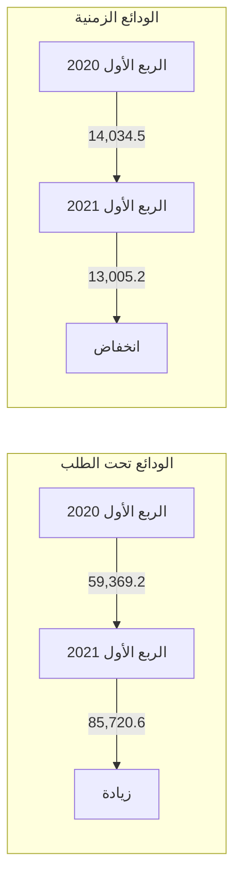

صفحة 16 من 42
---
والجدول التالي يبين تطور أرصدة وودائع المصارف لدى المصرف المركزي والمصارف الأخرى وفيما بينها خلال الفترة (2012 - الربع الأول 2021):

*مليون دينار*

| البيان | 2012 | 2013 | 2014 | 2015 | 2016 | 2017 | 2018 | 2019 | 2020 | الربع الأول 2021 |
|--------|------|------|------|------|------|------|------|------|------|-----------------|
| ودائع تحت الطلب لدى : | 19,352.7 | 22,342.6 | 24,360.7 | 27,870.7 | 38,306.1 | 56,945.4 | 59,454.9 | 60,184.6 | 72,269.0 | 85,720.6 |
| - المصرف المركزي | 17,203.4 | 19,364.6 | 19,317.8 | 20,863.2 | 30,627.6 | 53,136.0 | 52,385.4 | 53,629.1 | 68,245.0 | 73,208.3 |
| - المصارف المحلية | 329.0 | 347.6 | 408.2 | 1,717.6 | 1,742.4 | 1,012.5 | 1,030.0 | 1,750.0 | 1,245.1 | 1,361.8 |
| - المصرف الليبي الخارجي | 664.7 | 848.1 | 1,850.0 | 2,216.8 | 2,396.1 | 874.2 | 1,762.1 | 821.4 | 523.4 | 1,675.6 |
| - المصارف بالخارج | 1,155.6 | 1,782.3 | 2,784.7 | 3,073.1 | 3,540.0 | 1,922.7 | 4,277.3 | 3,984.1 | 2,255.6 | 9,474.9 |
| ودائع زمنية : | 37,434.9 | 45,751.9 | 37,883.3 | 25,669.2 | 24,000.4 | 27,317.8 | 25,894.4 | 17,240.3 | 17,567.6 | 13,005.2 |
| - شهادات الإيداع | 35,737.8 | 44,307.3 | 37,074.6 | 24,259.7 | 23,187.1 | 26,415.7 | 24,716.9 | 15,846.8 | 17,118.2 | 10,634.3 |
| - المصارف المحلية | 0.0 | 30.0 | 0.0 | 0.0 | 0.0 | 0.0 | 0.0 | 0.0 | 17.4 | 100.2 |
| - المصرف الليبي الخارجي | 58.4 | 37.6 | 206.1 | 107.1 | 224.7 | 0.0 | 459.4 | 0.0 | 0.0 | 0.0 |
| - المصارف بالخارج | 1,638.7 | 1,377.0 | 602.6 | 1,302.4 | 588.6 | 902.1 | 718.1 | 1,393.5 | 432.0 | 2,270.7 |
| الإجمالي | 56,787.6 | 68,094.6 | 62,244.0 | 53,539.9 | 62,306.5 | 84,263.2 | 85,349.3 | 77,424.9 | 89,836.6 | 98,725.8 |

صفحة 17 من 42
---
# ودائع المصارف التجارية لدى المصرف المركزي والمصارف الأخرى
## (2012 - الربع الأول 2021)

| السنة | ودائع زمنية | ودائع تحت الطلب لدى |
|-------|-------------|---------------------|
| 2012 | 37,434.9 | 19,352.7 |
| 2013 | 45,751.9 | 22,342.6 |
| 2014 | 37,883.3 | 24,360.7 |
| 2015 | 27,870.7 | 25,669.2 |
| 2016 | 24,000.4 | 38,306.1 |
| 2017 | 27,317.8 | 56,945.4 |
| 2018 | 25,894.4 | 59,454.9 |
| 2019 | 17,240.3 | 60,184.6 |
| 2020 | 17,567.6 | 72,269.0 |
| الربع الأول 2021 | 13,005.2 | 85,720.6 |

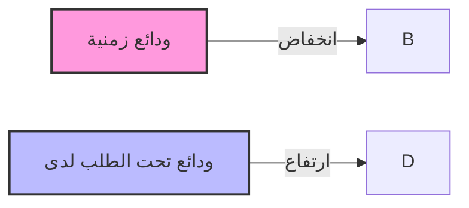

الرسم البياني يوضح اتجاهات الودائع الزمنية والودائع تحت الطلب لدى المصارف التجارية من عام 2012 إلى الربع الأول من عام 2021. يظهر انخفاضًا عامًا في الودائع الزمنية وارتفاعًا كبيرًا في الودائع تحت الطلب خلال هذه الفترة.

صفحة 18 من 42
---
## 2- الإستثمارات :

سجل إجمالي بند رصيد الإستثمارات في المصارف التجارية نهاية الربع الأول 2021 نحو 4,480.1 
مليون دينار، مقابل 4,213.9 مليون دينار في نهاية الربع الأول 2020، بمعدل نمو 6.3% هذا الإرتفاع
جاء نتيجة زيادة الإستثمار في الشركات الخاصة المساهمة ، والجدول التالي يوضح تفاصيل هذا البند:

مليون دينار

| البيان | الربع الأول 2020 | الربع الأول 2021 | مقدار التغير | معدل التغير % |
|--------|------------------|------------------|--------------|---------------|
| سندات وأذونات الخزانة | 3,000.0 | 3,000.0 | 0.0 | 0.0 |
| إستثمارات في الشركات العامة | 562.4 | 560.9 | -1.5 | -0.3 |
| إستثمارات في الشركات الخاصة المساهمة | 596.7 | 832.6 | 235.9 | 39.5 |
| إستثمارات أخرى | 54.9 | 86.7 | 31.8 | 57.9 |
| الإجمالي | 4,213.9 | 4,480.1 | 266.2 | 6.3 |

### إجمالي الإستثمارات

```mermaid
bar chart
    title إجمالي الإستثمارات
    x-axis [الربع الأول 2020, الربع الأول 2021]
    y-axis "مليون دينار" 4050 --> 4550
    bar [4213.9, 4480.1]
```

صفحة 19 من 42
---
والجدول التالي يبين تطور رصيد بند الإستثمارات للمصارف التجارية خلال الفترة (2012 – الربع الأول 2021):

" مليون دينار "

| البيان | 2012 | 2013 | 2014 | 2015 | 2016 | 2017 | 2018 | 2019 | 2020 | الربع الأول 2021 |
|--------|------|------|------|------|------|------|------|------|------|------------------|
| سندات وأذونات الخزانة | 0.0 | 0.0 | 0.0 | 1,000.0 | 1,000.0 | 500.0 | 500.0 | 700.0 | 3,000.0 | 3,000.0 |
| إستثمارات أخرى | 954.9 | 746.7 | 777.5 | 787.8 | 789.2 | 811.5 | 956.5 | 1,257.5 | 1,256.6 | 1,480.1 |
| الإجمالي | 954.9 | 746.7 | 777.5 | 1,787.8 | 1,789.2 | 1,311.5 | 1,456.5 | 1,957.5 | 4,256.6 | 4,480.1 |

إجمالي الإستثمارات في المصارف التجارية
( 2012 - الربع الأول 2021 )

```mermaid
graph LR
    2012[2012] --> 2013[2013]
    2013 --> 2014[2014]
    2014 --> 2015[2015]
    2015 --> 2016[2016]
    2016 --> 2017[2017]
    2017 --> 2018[2018]
    2018 --> 2019[2019]
    2019 --> 2020[2020]
    2020 --> 2021[الربع الأول 2021]
    
    2012 -- 954.9 --> 2013
    2013 -- 746.7 --> 2014
    2014 -- 777.5 --> 2015
    2015 -- 1,787.8 --> 2016
    2016 -- 1,789.2 --> 2017
    2017 -- 1,311.5 --> 2018
    2018 -- 1,456.5 --> 2019
    2019 -- 1,957.50 --> 2020
    2020 -- 4,256.60 --> 2021
    2021 -- 4,480.1 --> End
```

3- القروض والتسهيلات الائتمانية :

إرتفع اجمالي رصيد الإئتمان الممنوح من المصارف التجارية من 16,772.8 مليون دينار في نهاية الربع الأول 2020 إلى 17,619.4 مليون دينار في نهاية الربع الأول 2021، أي بمعدل نمو 5.0%، حيث بلغ رصيد القروض الممنوحة للقطاع الخاص في نهاية الربع الأول 2021 ما قيمته 11,423.4 مليون دينار، وما نسبته 64.8% من إجمالي القروض والتسهيلات الإئتمانية، فيما شكل رصيد القروض الممنوحة للقطاع العام النسبة الباقية 35.2% والتي بلغت قيمتها 6,196.0 مليون دينار.

وقد شكلت القروض والتسهيلات الائتمانية الممنوحة إلى إجمالي الخصوم الإيداعية ما نسبته 16.9%، كما شكلت من اجمالي الأصول ما نسبته 12.4%

وبلغـت نسبة تغطية مخصـص الديون المشكـوك فيها لإجمـالي القروض والتسهيلات الائتمانية والممنوحة نسبة 20.2% في نهاية الربع الأول 2021 مقابل نسبة 21.4% في نهاية الربع الأول 2020.

صفحة 20 من 42
---
وفيما يلي بيان تفصيلي لرصيد القروض والتسهيلات الممنوحة من المصارف التجارية :

| مليون دينار |  |  |  |  |  |
|-------------|-----------------|--------------|--------------|--------------|---------------------------|
| معدل التغير % | مقدار التغير | الربع الأول 2021 | الربع الأول 2020 | البيان |
| -6.2 | -295.7 | 4,487.3 | 4,783.0 | سلفيات والسحب على المكشوف |
| 14.6 | 517.6 | 4,062.3 | 3,544.7 | السلف الإجتماعية * |
| 7.4 | 624.8 | 9,069.8 | 8,445.0 | القروض الأخرى |
| 5.0 | 846.6 | 17,619.4 | 16,772.8 | إجمالي القروض والتسهيلات |
| -0.8 | -29.4 | 3,553.8 | 3,583.2 | مخصص الديون المشكوك في تحصيلها |
| 6.6 | 876.0 | 14,065.6 | 13,189.6 | صافي القروض والتسهيلات |

*تشمل رصيد قروض المرابحة للأفراد.

| السلفيات والسحب على المكشوف | السلف الاجتماعية |
|------------------------------|-------------------|
| 4,850.0 | 4,200.0 |
| 4,800.0 | 4,100.0 |
| 4,750.0 | 4,000.0 |
| 4,700.0 | 3,900.0 |
| 4,650.0 | 3,800.0 |
| 4,600.0 | 3,700.0 |
| 4,550.0 | 3,600.0 |
| 4,500.0 | 3,500.0 |
| 4,450.0 | 3,400.0 |
| 4,400.0 | 3,300.0 |
| 4,350.0 | 3,200.0 |
| 4,300.0 |  |

الربع الأول 2020: 4,783.0
الربع الأول 2021: 4,487.3

الربع الأول 2020: 3,544.7
الربع الأول 2021: 4,062.3

صفحة 21 من 42
---
مليون دينار

| البيان | الربع الأول 2020 | الربع الأول 2021 | مقدار التغير | معدل التغير % |
|--------|------------------|------------------|--------------|---------------|
| القروض الممنوحة للقطاع العام | 6,092.9 | 6,196.0 | 103.1 | 1.7 |
| القروض الممنوحة للقطاع الخاص | 10,679.8 | 11,423.4 | 743.6 | 7.0 |
| الإجمالي | 16,772.8 | 17,619.4 | 846.6 | 5.0 |

رصيد القروض الممنوحة للقطاع الخاص:

| الربع الأول 2020 | الربع الأول 2021 |
|------------------|------------------|
| 10,679.8 | 11,423.4 |

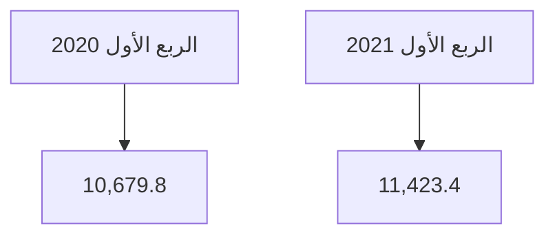

رصيد القروض الممنوحة للقطاع العام:

| الربع الأول 2020 | الربع الأول 2021 |
|------------------|------------------|
| 6,092.9 | 6,196.0 |

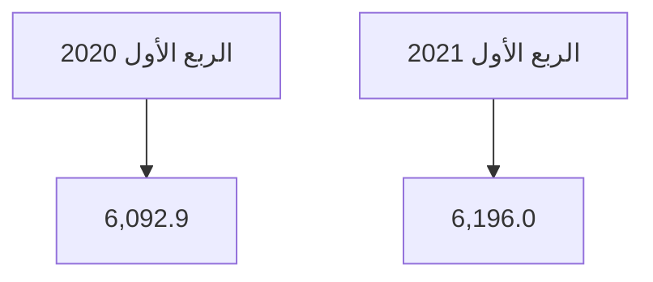

صفحة 22 من 42
---
وفيما يلي رصيد القروض والتسهيلات الممنوحة للقطاعين العام والخاص خلال الفترة (2012 - الربع الأول 2021):

مليون دينار

| البيان | 2012 | 2013 | 2014 | 2015 | 2016 | 2017 | 2018 | 2019 | 2020 | الربع الأول 2021 |
|--------|------|------|------|------|------|------|------|------|------|------------------|
| القروض الممنوحة للقطاع العام | 5,291.2 | 5,327.1 | 6,195.9 | 5,982.8 | 5,915.9 | 5,578.9 | 5,100.9 | 6,057.0 | 5,918.2 | 6,196.0 |
| القروض الممنوحة للقطاع الخاص | 10,608.3 | 12,905.5 | 13,764.0 | 14,230.1 | 12,854.3 | 11,867.7 | 11,347.4 | 10,855.8 | 11,078.7 | 11,423.4 |
| الإجمالي | 15,899.5 | 18,232.3 | 19,959.9 | 20,212.8 | 18,770.3 | 17,446.6 | 16,448.3 | 16,912.7 | 16,996.9 | 17,619.4 |

رصيد القروض الممنوحة للقطاعين ( الخاص والعام )
( 2012 - الربع الأول 2021 )

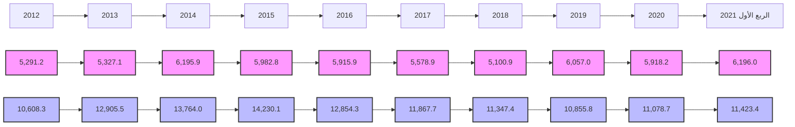

القروض الممنوحة للقطاع العام
القروض الممنوحة للقطاع الخاص

صفحة 23 من 42
---
وفيما يلي رصيد السلف الاجتماعية والسحب على المكشوف خلال الفترة (2012 – الربع الأول 2021):

"مليون دينار"

| البيان | 2012 | 2013 | 2014 | 2015 | 2016 | 2017 | 2018 | 2019 | 2020 | الربع الأول 2021 |
|---|---|---|---|---|---|---|---|---|---|---|
| سلفيات والسحب على المكشوف | 5,522.3 | 4,146.5 | 4,452.1 | 5,440.1 | 4,827.9 | 4,514.5 | 4,354.0 | 5,275.4 | 4,495.7 | 4,487.3 |
| السلف الإجتماعية * | 4,973.5 | 6,726.0 | 7,157.9 | 6,608.6 | 5,901.1 | 4,912.5 | 3,988.7 | 3,125.5 | 3,036.5 | 4,062.3 |
| القروض الأخرى | 5,403.7 | 3,759.8 | 8,348.9 | 8,164.2 | 8,041.3 | 8,019.6 | 8,105.6 | 8,511.8 | 9,464.7 | 9,069.8 |
| إجمالي القروض والتسهيلات | 15,899.5 | 18,232.3 | 19,959.9 | 20,212.8 | 18,770.3 | 17,446.6 | 16,448.3 | 16,912.7 | 16,996.9 | 17,619.4 |
| مخصص الديون | 2,348.9 | 2,497.9 | 2,688.1 | 2,779.7 | 2,910.0 | 3,040.8 | 3,126.4 | 3,503.6 | 3,549.3 | 3,553.8 |
| صافي القروض والتسهيلات | 13,550.6 | 15,734.4 | 17,271.8 | 17,433.1 | 15,860.3 | 14,405.8 | 13,321.9 | 13,409.1 | 13,447.6 | 14,065.6 |

*تشمل رصيد قروض المرابحة للأفراد.

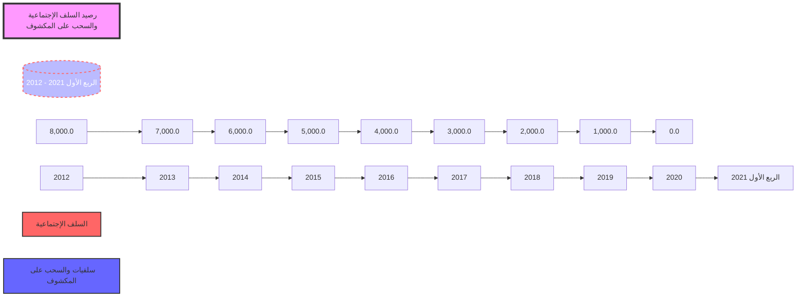

صفحة 24 من 42
---
## 4 - الأصول الثابتة والأصول الأخرى:

بلغ رصيد الأصول الثابتة نحو 2,038.2 مليون دينار في نهاية الربع الأول 2021، مقابل 1,814.8 مليون دينار في نهاية الربع الأول 2020، فيما بلغ رصيد الأصول الأخرى نحو 10,562.8 مليون دينار في نهاية الربع الأول 2021، مقابل 7,771.4 مليون دينار في نهاية الربع الأول 2020.

## ثانياً: جانب الخصوم

### 1-ودائع العملاء لدى المصارف التجارية:

إرتفع إجمالي رصيد ودائع العملاء لدى المصارف التجارية من 87,018.4 مليون دينار في نهاية الربع الأول 2020 إلى 104,296.2 مليون دينار في نهاية الربع الأول 2021، أي بمعدل 19.9%، وقد تركز الإرتفاع في أرصدة الودائع الآجلة بمقدار 10,711.4 مليون دينار نتيجة الزيادة في (بند التأمينات النقدية)، بنسبة 105.9%، كذلك سجل رصيد الودائع تحت الطلب إرتفاعاً مقداره 6,601.8 مليون دينار وبنسبة 8.6% عما كانت عليه في نهاية الربع الأول 2020 ، في حين إنخفضت الودائع الإدخارية بمقدار 35.4 مليون دينار وبنسبة 8.1%. وفيما يتعلق بتوزيع الودائع لدى المصارف التجارية حسب نوع الوديعة فقد شكلت الودائع تحت الطلب ما نسبته 79.6% من إجمالي الودائع، في حين شكلت الودائع لأجل ما نسبته 20.0% من إجمالي الودائع، وشكلت ودائع الادخار ما نسبته 0.4% فقط من إجمالي الودائع.

| البيان | الربع الأول 2020 | الربع الأول 2021 | مقدار التغير | معدل التغير % |
|--------|------------------|------------------|---------------|---------------|
| الودائع تحت الطلب | 76,472.1 | 83,073.9 | 6,601.8 | 8.6 |
| الودائع لأجل | 10,111.6 | 20,823.0 | 10,711.4 | 105.9 |
| الودائع الإدخارية | 434.8 | 399.4 | -35.4 | -8.1 |
| الإجمالي | 87,018.4 | 104,296.2 | 17,277.8 | 19.9 |

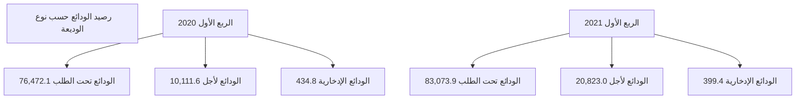

صفحة 25 من 42
---
أرصدة الودائع حسب نوع الوديعة لدى المصارف التجارية خلال الفترة (2012 - الربع الأول 2021)

"مليون دينار"

| البيان | 2012 | 2013 | 2014 | 2015 | 2016 | 2017 | 2018 | 2019 | 2020 | الربع الأول 2021 |
|--------|------|------|------|------|------|------|------|------|------|------------------|
| الودائع تحت الطلب | 54,728.8 | 61,834.9 | 56,641.4 | 58,725.9 | 72,192.7 | 84,827.6 | 80,038.6 | 77,919.6 | 92,530.6 | 83,073.9 |
| الودائع زمنية | 12,912.1 | 21,064.9 | 21,669.3 | 11,956.7 | 10,644.7 | 10,519.2 | 13,115.5 | 10,582.2 | 9,225.9 | 20,823.0 |
| الودائع الإدخارية | 705.3 | 662.9 | 599.8 | 574.5 | 570.2 | 591.7 | 503.4 | 452.3 | 437.6 | 399.4 |
| الإجمالي | 68,346.2 | 83,562.7 | 78,910.4 | 71,257.1 | 83,407.6 | 95,938.5 | 93,657.5 | 88,954.0 | 102,194.2 | 104,296.2 |

إجمالي ودائع العملاء لدى المصارف التجارية
( 2012 - الربع الأول 2021 )

```mermaid
graph TD
    style A fill:#f9f,stroke:#333,stroke-width:4px
    A[إجمالي ودائع العملاء] --> B[ودائع تحت الطلب]
    A --> C[ودائع زمنية]
    A --> D[ودائع إدخارية]
    
    B --> E[2012: 54,728.8]
    B --> F[2013: 61,834.9]
    B --> G[2014: 56,641.4]
    B --> H[2015: 58,725.9]
    B --> I[2016: 72,192.7]
    B --> J[2017: 84,827.6]
    B --> K[2018: 80,038.6]
    B --> L[2019: 77,919.6]
    B --> M[2020: 92,530.6]
    B --> N[الربع الأول 2021: 83,073.9]
    
    C --> O[2012: 12,912.1]
    C --> P[2013: 21,064.9]
    C --> Q[2014: 21,669.3]
    C --> R[2015: 11,956.7]
    C --> S[2016: 10,644.7]
    C --> T[2017: 10,519.2]
    C --> U[2018: 13,115.5]
    C --> V[2019: 10,582.2]
    C --> W[2020: 9,225.9]
    C --> X[الربع الأول 2021: 20,823.0]
    
    D --> Y[2012: 705.3]
    D --> Z[2013: 662.9]
    D --> AA[2014: 599.8]
    D --> AB[2015: 574.5]
    D --> AC[2016: 570.2]
    D --> AD[2017: 591.7]
    D --> AE[2018: 503.4]
    D --> AF[2019: 452.3]
    D --> AG[2020: 437.6]
    D --> AH[الربع الأول 2021: 399.4]
```

صفحة 26 من 42
---
وفيما يتعلق بتوزيع إجمالي ودائع العملاء لدى المصارف التجارية ( خاص ، حكومة، عام ) فقد ارتفعت
ودائع القطاع الخاص بمقدار 16,881.5 مليون دينار وبنسبة 36.8% في نهاية نهاية الربع الأول
2021، لتسجل نحو 62,793.4 مليون دينار، مقارنة بنحو 45,911.9 مليون دينار في نهاية نهاية الربع
الأول 2020. وفيما ارتفع رصيد القطاع الحكومي والقطاع العام في نهاية الربع الأول 2021 بمقدار
396.3 مليون دينار لتصل إلى 41,502.8 مليون دينار، منها 13,381.5 مليون دينار كودائع حكومية
والتي تتكون من ودائع الوزارات والهيئات والمؤسسات الحكومية وودائع كل من: صندوق الضمان
الاجتماعي، صندوق الإنماء الاقتصادي والاجتماعي وودائع الصندوق الليبي للتنمية والاستثمار، مقابل
41,106.5 مليون دينار كودائع للقطاع العام والقطاع الحكومي في نهاية الربع الأول 2020.
والجدول التالي يوضح تطور أرصدة الودائع لدى المصارف التجارية:

| البيان | الربع الأول 2020 | الربع الأول 2021 | مقدار التغير | معدل التغير % |
|--------|------------------|------------------|--------------|---------------|
| ودائع الحكومة والقطاع العام | 41,106.5 | 41,502.8 | 396.3 | 1.0 |
| - ودائع حكومية | 11,109.8 | 13,381.5 | 2,271.7 | 20.4 |
| - ودائع القطاع العام | 29,996.7 | 28,121.4 | -1,875.3 | -6.3 |
| ودائع القطاع الخاص | 45,911.9 | 62,793.4 | 16,881.5 | 36.8 |
| - الأفراد | 28,338.1 | 34,497.8 | 6,159.7 | 21.7 |
| - الشركات والمؤسسات | 17,573.9 | 28,295.6 | 10,721.7 | 61.0 |
| الإجمالي | 87,018.4 | 104,296.2 | 17,277.8 | 19.9 |

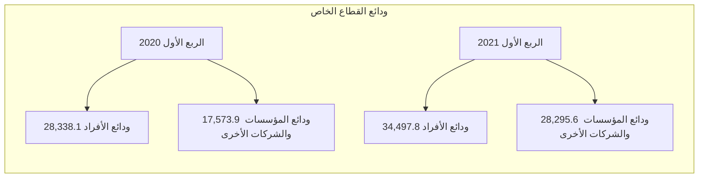

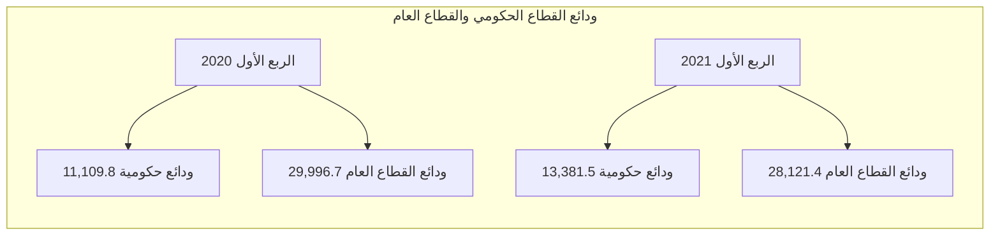

صفحة 27 من 42
---
وفيما يلي توزيع ودائع العملاء لدى المصارف التجارية خلال الفترة (2012 - الربع الأول 2021):

"مليون دينار"

| البيان | 2012 | 2013 | 2014 | 2015 | 2016 | 2017 | 2018 | 2019 | 2020 | الربع الأول 2021 |
|---|---|---|---|---|---|---|---|---|---|---|
| ودائع الحكومة والقطاع العام | 35,469.8 | 52,638.7 | 46,339.9 | 35,139.7 | 39,197.7 | 40,710.8 | 39,747.8 | 42,343.0 | 41,620.7 | 41,502.8 |
| - ودائع حكومية | 13,983.3 | 24,285.4 | 21,987.0 | 9,800.6 | 9,100.7 | 9,234.8 | 10,048.5 | 11,694.6 | 12,093.5 | 13,381.5 |
| - ودائع القطاع العام | 21,486.5 | 28,353.3 | 24,352.9 | 25,339.1 | 30,097.0 | 31,476.0 | 29,699.3 | 30,648.5 | 29,527.2 | 28,121.4 |
| ودائع القطاع الخاص | 32,876.4 | 30,924.0 | 32,570.5 | 36,117.4 | 44,209.9 | 55,227.7 | 53,909.7 | 46,611.0 | 60,573.5 | 62,793.4 |
| - الأفراد | 21,026.1 | 19,569.5 | 19,799.0 | 20,477.2 | 27,605.5 | 36,295.4 | 33,717.5 | 27,402.6 | 38,908.5 | 34,497.8 |
| - الشركات والمؤسسات | 11,850.3 | 11,345.5 | 12,771.5 | 15,640.2 | 16,604.4 | 18,932.3 | 20,192.2 | 19,208.4 | 21,665.0 | 28,295.6 |
| الإجمالي | 68,346.2 | 83,562.7 | 78,910.4 | 71,257.1 | 83,407.6 | 95,938.5 | 93,657.5 | 88,954.0 | 102,194.2 | 104,296.2 |

صفحة 28 من 42
---
ودائع القطاع العام والقطاع الحكومي لدى المصارف التجارية
(2012 - الربع الأول 2021)

| السنة | ودائع حكومية | ودائع القطاع العام |
|-------|--------------|---------------------|
| 2012  | 13,983.3     | 21,486.5            |
| 2013  | 24,285.4     | 28,353.3            |
| 2014  | 21,987.0     | 24,352.9            |
| 2015  | 9,800.6      | 25,339.1            |
| 2016  | 9,100.7      | 30,097.0            |
| 2017  | 9,234.8      | 31,476.0            |
| 2018  | 10,048.5     | 29,699.3            |
| 2019  | 11,694.6     | 30,648.5            |
| 2020  | 12,093.5     | 29,527.2            |
| الربع الأول 2021 | 13,381.5 | 28,121.4    |

رصيد ودائع الأفراد لدى المصارف التجارية
(2012 - الربع الأول 2021)

| السنة | رصيد ودائع الأفراد |
|-------|---------------------|
| 2012  | 21,026.1            |
| 2013  | 19,569.5            |
| 2014  | 19,799.0            |
| 2015  | 20,477.2            |
| 2016  | 27,605.5            |
| 2017  | 36,295.4            |
| 2018  | 33,717.5            |
| 2019  | 27,402.6            |
| 2020  | 38,908.5            |
| الربع الأول 2021 | 34,497.8 |

صفحة 29 من 42
---
## 2- الحسابات المكشوفة لدى المراسلين بالخارج:

بلغ رصيد الحسابات المكشوفة لدى المراسلين بالخارج 1,071.4 مليون دينار في نهاية الربع الأول 2021، وهي في معظمها ناتجة عن تأخر تسوية الحسابات لبعض المصارف مع المصارف المراسلة بالخارج، مقابل 163.5 مليون دينار في نهاية الربع الأول 2020.

| "مليون دينار" |  |  |  |  |
|---|---|---|---|---|
| البيان | الربع الأول 2020 | الربع الأول 2021 | مقدار التغير | معدل التغير % |
| الحسابات المكشوفة لدى المراسلين بالخارج | 163.5 | 1,071.4 | 907.9 | 555.3 |

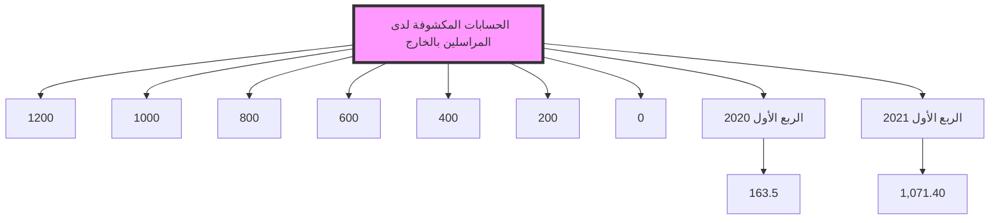

صفحة 30 من 42
---
وفيما يلي أرصدة الحسابات المكشوفة خلال الفترة (2012 - الربع الأول 2021):

"مليون دينار"

| الربع الأول 2021 | 2020 | 2019 | 2018 | 2017 | 2016 | 2015 | 2014 | 2013 | 2012 | البيان |
|------------------|------|------|------|------|------|------|------|------|------|-------|
| 1,071.4 | 220.4 | 113.1 | 503.4 | 368.5 | 429.9 | 955.6 | 432.0 | 74.9 | 139.6 | الحسابات المكشوفة لدى المراسلين بالخارج |

الحسابات المكشوفة لدى المراسلين بالخارج
( 2012 - الربع الأول 2021 )

| السنة | القيمة (مليون دينار) |
|-------|---------------------|
| 2012 | 139.6 |
| 2013 | 74.9 |
| 2014 | 432.0 |
| 2015 | 955.6 |
| 2016 | 429.9 |
| 2017 | 368.5 |
| 2018 | 503.4 |
| 2019 | 113.1 |
| 2020 | 220.4 |
| الربع الأول 2021 | 1,071.4 |

3- حقوق الملكية والأرباح:

- رأس المال المدفوع: إرتفع رأس المال المدفوع من 4,295.9 مليون دينار في نهاية الربع الأول 2020 إلى 4,538.0 مليون دينار في نهاية الربع الأول 2021، نتيجة لقيام بعض المصارف بزيادة رأس مالها المدفوع.

- الإحتياطيات والأرباح: إنخفض رصيد الإحتياطيات والأرباح المرحلة والقابلة للتوزيع من 2,257.0 مليون دينار في نهاية الربع الأول 2020، ليصل إلى 1,968.1 مليون دينار في نهاية الربع الأول 2021، في حين سجلت أرباح المصارف التجارية قبل خصم المخصصات والضرائب خلال الربع

صفحة 31 من 42
---
الأول 2021 إرتفاعاً بمعدل 107.9% لتسجل إلى 366.5 مليون دينار، مقارنة عما كانت عليه
خلال نفس الفترة من عام 2020 والبالغة نحو 176.3 مليون دينار.

"مليون دينار"

| البيان | الربع الأول 2020 | الربع الأول 2021 | مقدار التغير | معدل التغير % |
|--------|------------------|------------------|---------------|---------------|
| رأس المال المدفوع | 4,295.9 | 4,538.0 | 242.1 | 5.6 |
| الإحتياطي القانوني | 542.7 | 676.9 | 134.2 | 24.7 |
| إحتياطيات غير مخصصة | 34.3 | 59.9 | 25.6 | 74.6 |
| أرباح العام | 176.3 | 366.5 | 190.2 | 107.9 |
| الأرباح المرحلة والأرباح القابلة للتوزيع | 1,680.0 | 1,231.3 | -448.7 | -26.7 |
| الإجمالي | 6,729.2 | 6,872.6 | 143.4 | 2.1 |

أرباح الفترة قبل خصم المخصصات والضرائب

```mermaid
bar chart
    title أرباح الفترة قبل خصم المخصصات والضرائب
    x-axis [الربع الأول 2020, الربع الأول 2021]
    y-axis "مليون دينار" 0 --> 400
    bar [176.3, 366.5]
```

أرباح المصارف التجارية قبل خصم المخصصات والضرائب
(2012 - 2020)

```mermaid
line chart
    title أرباح المصارف التجارية قبل خصم المخصصات والضرائب (2012 - 2020)
    x-axis [2012, 2013, 2014, 2015, 2016, 2017, 2018, 2019, 2020]
    y-axis "مليون دينار" 0 --> 1400
    line [527.1, 451.1, 265.4, 213.0, 247.1, 464.6, 1222.2, 867.7, 608.7]
```

صفحة 32 من 42
---
فيما يلي حسابات رأس المال والإحتياطيات في المصارف خلال الفترة (2012 – الربع الأول 2021):

"مليون دينار"

| البيان | 2012 | 2013 | 2014 | 2015 | 2016 | 2017 | 2018 | 2019 | 2020 | الربع الأول 2021 |
|--------|------|------|------|------|------|------|------|------|------|------------------|
| رأس المال المدفوع | 3,495.2 | 3,550.2 | 3,566.8 | 3,609.5 | 3,791.4 | 3,806.4 | 3,904.4 | 4,282.9 | 4,508.0 | 4,538.0 |
| الإحتياطي القانوني | 181.9 | 323.5 | 335.8 | 335.8 | 342.8 | 346.1 | 352.9 | 527.7 | 663.5 | 676.9 |
| إحتياطيات غير مخصصة | 26.6 | 29.7 | 29.7 | 29.7 | 30.0 | 31.9 | 32.0 | 53.1 | 50.3 | 59.9 |
| أرباح العام | 527.1 | 451.1 | 265.4 | 213.0 | 247.1 | 464.6 | 1,122.2 | 867.6 | 608.7 | 366.5 |
| الأرباح المرحّلة والأرباح القابلة للتوزيع | 422.4 | 389.2 | 688.7 | 899.6 | 955.0 | 912.4 | 1,061.1 | 1,245.5 | 1,015.9 | 1,231.3 |
| الإجمالي | 4,653.2 | 4,743.7 | 4,886.4 | 5,087.6 | 5,366.3 | 5,561.4 | 6,472.6 | 6,976.8 | 6,846.3 | 6,872.6 |

إجمالي حقوق الملكية في المصارف التجارية
( 2012 - الربع الأول 2021 )

| السنة | رأس المال | الإحتياطيات | إجمالي حقوق الملكية |
|-------|-----------|-------------|---------------------|
| 2012 | 3495.2 | 1158.1 | 4653.3 |
| 2013 | 3550.2 | 1193.5 | 4743.7 |
| 2014 | 3566.8 | 1391.1 | 4957.9 |
| 2015 | 3609.5 | 1478.0 | 5087.5 |
| 2016 | 3791.4 | 1575.0 | 5366.4 |
| 2017 | 3806.4 | 1755.1 | 5561.5 |
| 2018 | 3904.4 | 2565.1 | 6469.5 |
| 2019 | 4282.9 | 2693.9 | 6976.8 |
| 2020 | 4508.0 | 2338.3 | 6846.3 |
| الربع الأول 2021 | 4538.0 | 2334.6 | 6872.6 |

صفحة 33 من 42
---
٤- المخصصات:

سجل رصيد المخصصات إرتفاعاً بمقدار 1,720.6 مليون دينار في نهاية الربع الأول 2021 ليصل إلى
7,312.3 مليون دينار، مقابل 5,591.7 مليون دينار في نهاية الربع الأول 2020، وتركزت الزيادة في
بند مخصص تقييم أسعار الصرف كما هو موضح بالجدول التالي:

| البيان | الربع الأول 2020 | الربع الأول 2021 | مقدار التغير | معدل التغير % |
|--------|------------------|------------------|---------------|---------------|
| مخصص الديون المشكوك في تحصيلها | 3,583.2 | 3,553.8 | -29.4 | -0.8 |
| مخصص إستهلاك الأصول الثابتة | 808.4 | 878.4 | 70.0 | 8.7 |
| مخصصات عامة | 1,199.3 | 1,519.8 | 320.5 | 26.7 |
| مخصص تقييم أسعار الصرف | 0.8 | 1,360.3 | 1,359.5 | 169,937.5 |
| الإجمالي | 5,591.7 | 7,312.3 | 1,720.6 | 30.8 |

بند المخصصات

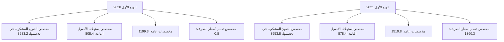

صفحة 34 من 42
---
وفيما يلي رصيد المخصصات خلال الفترة (2012 - الربع الأول 2021):

"مليون دينار"

| البيان | 2012 | 2013 | 2014 | 2015 | 2016 | 2017 | 2018 | 2019 | 2020 | الربع الأول 2021 |
|--------|------|------|------|------|------|------|------|------|------|-----------------|
| مخصص الديون المشكوك في تحصيلها | 2,348.9 | 2,497.5 | 2,688.1 | 2,779.7 | 2,910.0 | 3,040.8 | 3,126.4 | 3,503.6 | 3,549.3 | 3,553.8 |
| مخصص إستهلاك الأصول الثابتة | 424.1 | 473.1 | 539.3 | 592.5 | 634.0 | 687.3 | 745.2 | 795.3 | 862.3 | 878.4 |
| مخصصات عامة | 539.3 | 614.6 | 532.8 | 556.9 | 594.3 | 738.2 | 753.2 | 1,225.5 | 1,171.2 | 1,519.8 |
| مخصص تقييم أسعار الصرف | 5.2 | 11.6 | 5.1 | 12.7 | 6.5 | 6.7 | 2.8 | 2.8 | 4.4 | 1,360.3 |
| الإجمالي | 3,317.5 | 3,597.2 | 3,765.3 | 3,941.8 | 4,144.8 | 4,473.0 | 4,627.6 | 5,527.2 | 5,587.2 | 7,312.3 |

رصيد بند المخصصات
(2012 - الربع الأول 2021)

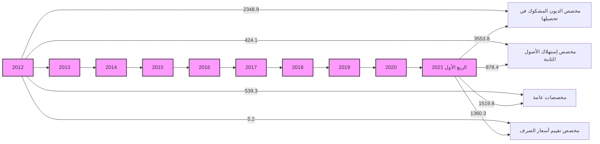

صفحة 35 من 42
---
# مؤشرات السلامة المالية للمصارف التجارية
## (2012 - الربع الأول 2021)

### مؤشرات السيولة:
- بلغت نسبة الأصول السائلة لدى المصارف التجارية إلى إجمالي الأصول 71.7% في نهاية عام 2020، والتي معظمها تمثل ودائع لدى المصرف المركزي (تحت الطلب بما فيها الاحتياطي الإلزامي) وكذلك شهادات الإيداع.

- وبلغ حجم القروض إلى إجمالي الودائع بالقطاع المصرفي نسبة 16.9% في نهاية الربع الأول 2021، وهى نسبة ضئيلة للغاية، حيث لم تتعدى هذه النسبة 28.4% خلال الفترة.

- وتجدر الإشارة إلى أن نسبة السيولة القانونية المطلوب من المصارف التجارية الاحتفاظ بها هى 25.0% من إجمالي الخصوم الإيداعية.

### جدول مؤشرات السيولة (نسب مئوية)

| مؤشرات السيولة | 2012 | 2013 | 2014 | 2015 | 2016 | 2017 | 2018 | 2019 | 2020 | الربع الأول 2021 |
|----------------|------|------|------|------|------|------|------|------|------|-------------------|
| الأصول السائلة / الأصول | 68.6 | 71.0 | 67.8 | 60.2 | 60.8 | 72.8 | 74.3 | 71.9 | 71.4 | 71.7 |
| القروض / الودائع | 23.6 | 21.8 | 25.2 | 28.4 | 22.5 | 18.2 | 17.6 | 19.0 | 16.8 | 16.9 |
| الودائع / الأصول | 80.8 | 84.9 | 83.1 | 79.0 | 80.6 | 82.4 | 80.0 | 79.3 | 80.1 | 73.1 |

### رسم بياني: مؤشرات السيولة (2012 - الربع الأول 2021)

```mermaid
graph LR
    A[2012] --> B[2013] --> C[2014] --> D[2015] --> E[2016] --> F[2017] --> G[2018] --> H[2019] --> I[2020] --> J[الربع الأول 2021]
    
    style A fill:#f9f,stroke:#333,stroke-width:2px
    style B fill:#f9f,stroke:#333,stroke-width:2px
    style C fill:#f9f,stroke:#333,stroke-width:2px
    style D fill:#f9f,stroke:#333,stroke-width:2px
    style E fill:#f9f,stroke:#333,stroke-width:2px
    style F fill:#f9f,stroke:#333,stroke-width:2px
    style G fill:#f9f,stroke:#333,stroke-width:2px
    style H fill:#f9f,stroke:#333,stroke-width:2px
    style I fill:#f9f,stroke:#333,stroke-width:2px
    style J fill:#f9f,stroke:#333,stroke-width:2px
    
    classDef default fill:#f9f,stroke:#333,stroke-width:2px;
```

الرسم البياني يوضح ثلاثة مؤشرات:
1. الأصول السائلة / الأصول
2. الودائع / الأصول
3. القروض / الودائع

يظهر الرسم تطور هذه المؤشرات من عام 2012 حتى الربع الأول من عام 2021، حيث يمكن ملاحظة:
- استقرار نسبي في مؤشر الأصول السائلة / الأصول حول 70-80%
- تذبذب طفيف في نسبة الودائع / الأصول مع انخفاض في الربع الأول من 2021
- انخفاض تدريجي في نسبة القروض / الودائع من حوالي 25% إلى أقل من 20%

صفحة 36 من 42
---
❖ جودة الأصول: أظهرت البيانات المتوفرة عن نسبة الديون المتعثرة وهي بيانات تقديرية قد لا تعكس الواقع
أن نسبة الديون المتعثرة إلى إجمالي القروض بلغت في نهاية عام 2020 نحو 21.0%، ويدل إرتفاع
هذه النسبة على إنخفاض كفاءة إدارة الائتمان، وينبغي أن لا تتجاوز هذه النسبة وفقاً للمعايير الدولية
5%. وقد سجلت نسبة تغطية مخصص الديون إلى الديون المتعثرة في نهاية الربع الأول 2021 نحو
.96.0%

نسب مئوية

| جودة الأصول | 2012 | 2013 | 2014 | 2015 | 2016 | 2017 | 2018 | 2019 | 2020 | الربع الأول 2021 |
|-------------|------|------|------|------|------|------|------|------|------|------------------|
| القروض المتعثرة / الأصول | 4.0 | 3.9 | 4.4 | 4.7 | 3.8 | 3.1 | 2.9 | 3.2 | 2.8 | 2.6 |
| القروض المتعثرة/القروض | 21.0 | 21.0 | 21.0 | 21.0 | 21.0 | 21.0 | 21.0 | 21.0 | 21.0 | 21.0 |
| مخصص الديون / القروض المتعثرة | 70.9 | 65.2 | 64.0 | 65.5 | 73.8 | 83.0 | 90.4 | 98.6 | 101.9 | 96.0 |
| مخصص الديون / القروض | 14.9 | 13.7 | 13.4 | 13.8 | 15.5 | 17.4 | 19.0 | 20.9 | 21.4 | 20.2 |

بيانات القروض المتعثرة تقديرية منذ 2011

```mermaid
graph LR
    A[مؤشرات جودة الأصول]
    B[2012 - الربع الأول 2021]
    C[120.0]
    D[100.0]
    E[80.0]
    F[60.0]
    G[40.0]
    H[20.0]
    I[0.0]
    J[2012]
    K[2013]
    L[2014]
    M[2015]
    N[2016]
    O[2017]
    P[2018]
    Q[2019]
    R[2020]
    S[الربع الأول 2021]
    T[مخصص الديون / القروض المتعثرة]
    U[مخصص الديون / القروض]

    A --> B
    B --> C
    C --> D
    D --> E
    E --> F
    F --> G
    G --> H
    H --> I
    I --> J
    J --> K
    K --> L
    L --> M
    M --> N
    N --> O
    O --> P
    P --> Q
    Q --> R
    R --> S
    T --> U
```

صفحة 37 من 42
---
❖ الربحية : شهد معدل العائد على الأصول لدى القطاع المصرفي في ليبيا انخفاضاً ملحوظاً خلال السنوات
(2014 - 2016)، حيث بلغ نحو 0.2% في عام 2016، ويعزى سبب الانخفاض إلى عدة أسباب منها
الوضع الغير ملائم الذي تعمل فيه المصارف التجارية في السنوات الأخيرة وكذلك تطبيق قانون إلغاء
الفوائد الربوية.

إلا أنه خلال العام 2018 تحسن معدل الربحية بشكل كبير، حيث بلغ العائد على إجمالي الأصول نحو
1.0%، وبلغ معدل العائد على حقوق الملكية 20.9%.

وفي عام 2019 بلغ معدل العائد على إجمالي الأصول نحو 0.7 % وبلغ معدل العائد على حقوق الملكية
.12.3%

وخلال الربع الأول 2021 إرتفعت مؤشرات الربحية ليبلغ معدل العائد إلى إجمالي الأصول نحو 1.0%
وبلغ معدل العائد إلى حقوق الملكية نحو 21.3%.

الزيادة في الأرباح في عامي 2018 و2019 جاءت نتيجة لتحقيق المصارف التجارية لإيرادات هامة
من عَمولات بيع وتحويل العملة الأجنبية ، وكذلك من رفع أسعار الخدمات المصرفية عموماً.

نسب مئوية

| الربحية | 2012 | 2013 | 2014 | 2015 | 2016 | 2017 | 2018 | 2019 | 2020 | الربع الأول 2021 |
|---------|------|------|------|------|------|------|------|------|------|------------------|
| العائد / حقوق الملكية | 13.7 | 12.0 | 5.4 | 4.4 | 4.8 | 9.1 | 20.9 | 12.3 | 4.9 | 21.3 |
| العائد / الاصول | 0.7 | 0.5 | 0.3 | 0.2 | 0.2 | 0.4 | 1.0 | 0.7 | 0.3 | 1.0 |

```mermaid
graph LR
    A[العائد / الاصول<br/>(2012 - الربع الأول 2021)]
    style A fill:#f9f,stroke:#333,stroke-width:4px
    B[2012] --> C[0.7]
    D[2013] --> E[0.5]
    F[2014] --> G[0.3]
    H[2015] --> I[0.2]
    J[2016] --> K[0.2]
    L[2017] --> M[0.4]
    N[2018] --> O[1.0]
    P[2019] --> Q[0.7]
    R[2020] --> S[0.3]
    T[الربع الأول 2021] --> U[1.0]
```

صفحة 38 من 42
---

# العائد / حقوق الملكية (2012 - الربع الثالث 2020)

| السنة | النسبة المئوية |
|-------|----------------|
| 2012  | 13.7           |
| 2013  | 12.0           |
| 2014  | 5.4            |
| 2015  | 4.4            |
| 2016  | 4.8            |
| 2017  | 9.1            |
| 2018  | 20.9           |
| 2019  | 12.3           |
| 2020  | 6.2            |
| الربع الأول 2021 | 21.3 |

*ملاحظة: القيم في الجدول تمثل النسب المئوية للعائد على حقوق الملكية.*

الرسم البياني يوضح تغير العائد على حقوق الملكية من عام 2012 إلى الربع الأول من عام 2021. يظهر تقلبات كبيرة خلال هذه الفترة، مع ارتفاع ملحوظ في عام 2018 وانخفاض في السنوات التالية، ثم ارتفاع حاد مرة أخرى في الربع الأول من 2021.

صفحة 39 من 42
---
❖ كفاية رأس المال: يتمتع القطاع المصرفي الليبي بكفاية رأس مال مرتفعة، كافية لمواجهة أية مخاطر قد تحدث، حيث تراوحت نسبتها مابين 10.7% و 19.2%

خلال الفترة ( 2012- الربع الأول 2021)، وهى بشكل عام أعلى وبهامش مريح من النسبة المحددة من قبل لجنة بازل (1) والبالغة 8.0%، مما يعزز من

الإستقرار المالي.

نسب مئوية

| الربع الأول 2021 | 2020 | 2019 | 2018 | 2017 | 2016 | 2015 | 2014 | 2013 | 2012 | نسب رأس المال |
|------------------|------|------|------|------|------|------|------|------|------|----------------|
| 17.4 | 19.2 | 18.4 | 17.8 | 16.7 | 14.6 | 14.3 | 13.9 | 12.4 | 10.7 | كفاية رأس المال الكلي |
| 16.2 | 17.9 | 17.2 | 16.5 | 15.4 | 13.4 | 13.1 | 12.6 | 11.0 | 9.5 | كفاية رأس المال الأساسي |
| 3.2 | 3.6 | 3.8 | 3.3 | 3.3 | 3.7 | 4.0 | 3.7 | 3.6 | 4.2 | رأس المال المدفوع / الأصول |
| 4.8 | 4.9 | 5.5 | 4.6 | 4.8 | 4.9 | 5.4 | 5.1 | 4.4 | 5.1 | حقوق الملكية / الأصول |
| 6.6 | 6.1 | 6.9 | 5.7 | 5.3 | 6.1 | 7.1 | 6.2 | 5.1 | 6.3 | حقوق الملكية / الودائع |

صفحة 40 من 42
---
# كفاية رأس المال الكلي
## (2012 - الربع الأول 2021)

| السنة | النسبة (%) |
|-------|-----------|
| 2012  | 10.7      |
| 2013  | 12.4      |
| 2014  | 13.9      |
| 2015  | 14.3      |
| 2016  | 14.6      |
| 2017  | 16.7      |
| 2018  | 17.8      |
| 2019  | 18.4      |
| 2020  | 19.2      |
| الربع الأول 2021 | 17.4 |

# مؤشرات رأس المال
## (2012 - الربع الأول 2021)

| السنة | رأس المال المدفوع / الأصول (%) | حقوق الملكية / الأصول (%) |
|-------|--------------------------------|---------------------------|
| 2012  | 4.2                            | 5.1                       |
| 2013  | 3.6                            | 4.4                       |
| 2014  | 3.7                            | 5.1                       |
| 2015  | 4.0                            | 5.4                       |
| 2016  | 3.7                            | 4.9                       |
| 2017  | 3.3                            | 4.8                       |
| 2018  | 3.3                            | 4.6                       |
| 2019  | 3.8                            | 5.5                       |
| 2020  | 3.6                            | 4.9                       |
| الربع الأول 2021 | 3.2                 | 4.8                       |

صفحة 41 من 42
---
# الملحق

❖ البيانات والمؤشرات المالية للمصارف التجارية للربع الأول 2021.

❖ جدول مؤشرات السلامة المالية خلال الفترة ( 2012 - الربع الأول 2021).

صفحة 42 من 42
---
# البيانات المالية الأساسية للمصارف التجارية
(مليون دينار)

| البيان / الفترة | الربع الأول 2020 | الربع الأول 2021 | معدل التغير % |
|-----------------|-------------------|-------------------|---------------|
| إجمالي الميزانية (الأصول + الحسابات النظامية) | 154,681.3 | 192,024.2 | 24.1 |
| إجمالي الأصول | 112,137.3 | 142,629.4 | 27.2 |
| إجمالي النقدية بخزائن المصارف | 2,841.9 | 3,607.7 | 26.9 |
| إجمالي الودائع لدى المصرف المركزي | 65,523.7 | 83,842.6 | 28.0 |
| إجمالي الودائع لدى المصارف | 1,863.7 | 1,461.9 | -21.6 |
| إجمالي الودائع لدى المصرف الليبي الخارجي | 584.3 | 1,675.6 | 186.7 |
| إجمالي الودائع لدى المراسلين بالخارج | 5,431.9 | 11,745.7 | 116.2 |
| إجمالي حسابات المقاصة | 5,318.8 | 5,595.3 | 5.2 |
| إجمالي القروض والسلفيات والتسهيلات | 16,772.8 | 17,619.4 | 5.0 |
| إجمالي الاستثمارات | 4,213.9 | 4,480.1 | 6.3 |
| إجمالي ودائع العملاء | 87,018.4 | 104,296.2 | 19.9 |
| إجمالي الحسابات المكشوفة لدى المراسلين | 163.5 | 1,071.4 | 555.4 |
| إجمالي حقوق الملكية | 6,553.0 | 6,506.1 | -0.7 |
| إجمالي المخصصات | 5,591.7 | 7,312.3 | 30.8 |
| أرباح العام | 176.3 | 366.5 | 107.9 |
| عدد الفروع والوكالات | 535 | 550 | 2.8 |
| عدد العاملين | 19,463 | 19,565 | 0.5 |
| الأصول السائلة / إجمالي الأصول % | 68.0 | 71.7 | - |
| إجمالي القروض / إجمالي الأصول % | 15.0 | 12.4 | - |
| حقوق الملكية / إجمالي الأصول % | 5.8 | 4.6 | - |
| إجمالي الأصول / عدد الفروع (مليون دينار) | 209.6 | 259.3 | - |
| إجمالي الأصول / عدد العاملين (مليون دينار) | 5.8 | 7.3 | - |
| إجمالي القروض / إجمالي الودائع % | 19.3 | 16.9 | - |
| إجمالي الربح / الأصول % (*) | 0.2 | 0.3 | - |
| إجمالي الربح / حقوق الملكية % (*) | 2.7 | 5.6 | - |

(*) إجمالي الربح قبل خصم المخصصات والضرائب.
---
# مؤشرات الودائع لدى المصارف التجارية
(مليون دينار)

| البيان / الفترة | الربع الأول 2020 | الربع الأول 2021 | معدل التغير % |
|-----------------|------------------|------------------|---------------|
| 1- ودائع الحكومة والقطاع العام | 41,106.5 | 41,502.8 | 1.0 |
| ــ ودائع الحكومة (الوزارات والهيئات الممولة من الميزانية العامة) | 11,109.8 | 13,381.5 | 20.4 |
| ــ ودائع القطاع العام | 29,996.7 | 28,121.4 | -6.3 |
| 2- ودائع القطاع الخاص | 45,911.9 | 62,793.4 | 36.8 |
| ــ ودائع الأفراد | 28,338.1 | 34,497.8 | 21.7 |
| ــ ودائع الشركات والجهات الأخرى | 17,573.9 | 28,295.6 | 61.0 |
| إجمالي الودائع | 87,018.4 | 104,296.2 | 19.9 |
| الودائع تحت الطلب | 76,472.1 | 83,073.9 | 8.6 |
| الودائع لأجل | 10,111.6 | 20,823.0 | 105.9 |
| ودائع الادخار | 434.8 | 399.4 | -8.1 |
| الودائع تحت الطلب / إجمالي الودائع % | 87.9 | 79.7 | - |
| الودائع لأجل / إجمالي الودائع % | 11.6 | 20.0 | - |
| ودائع الادخار / إجمالي الودائع % | 0.5 | 0.4 | - |
| إجمالي الودائع / إجمالي الخصوم % | 77.6 | 73.1 | - |
---
# مؤشرات الائتمان لدى المصارف التجارية
(مليون دينار)

| البيان / الفترة | الربع الأول 2020 | الربع الأول 2021 | معدل التغير % |
|-----------------|------------------|------------------|---------------|
| 1- الائتمان الممنوح للقطاع العام | 6,092.9 | 6,196.0 | 1.7 |
| 2- الائتمان الممنوح للقطاع الخاص | 10,679.8 | 11,423.4 | 7.0 |
| إجمالي الائتمان | 16,772.8 | 17,619.4 | 5.0 |
| السلفيات والسحب على المكشوف | 4,783.0 | 4,487.3 | -6.2 |
| السلف الاجتماعية (*) | 3,544.7 | 4,062.3 | 14.6 |
| السلفيات والسحب على المكشوف والسلف الاجتماعية | 8,327.8 | 8,549.6 | 2.7 |
| القروض الممنوحة للأنشطة الاقتصادية الأخرى | 8,445.0 | 9,069.8 | 7.4 |
| السلف الاجتماعية (*) / إجمالي الائتمان % | 21.1 | 23.1 | - |
| السلفيات والسحب على المكشوف / إجمالي الائتمان % | 28.5 | 25.5 | - |
| القروض الممنوحة للأنشطة الاقتصادية الأخرى/إجمالي الائتمان% | 50.3 | 51.5 | - |
| إجمالي الائتمان / إجمالي الأصول % | 15.0 | 12.4 | - |
| إجمالي الائتمان / إجمالي الودائع % | 19.3 | 16.9 | - |

(*) تشمل قروض المرابحة الإسلامية للأفراد ابتداءً من العام 2013.
---
# مؤشرات السلامة المالية للمصارف التجارية
## (2012 - الربع الأول 2021)

نسب مئوية (%)

| المؤشر | 2012 | 2013 | 2014 | 2015 | 2016 | 2017 | 2018 | 2019 | 2020 | الربع الأول 2021 |
|--------|------|------|------|------|------|------|------|------|------|------------------|
| **مؤشرات رأس المال:** |
| معدل كفاية رأس المال الكلي % | 10.7 | 12.4 | 13.9 | 14.3 | 14.6 | 16.7 | 17.8 | 18.4 | 19.2 | 17.4 |
| معدل كفاية رأس المال الأساسي % | 9.5 | 11.0 | 12.6 | 13.1 | 13.4 | 15.4 | 16.5 | 17.2 | 17.9 | 16.2 |
| رأس المال المدفوع / إجمالي الأصول % | 4.2 | 3.6 | 3.7 | 4.0 | 3.7 | 3.3 | 3.3 | 3.8 | 3.6 | 3.2 |
| حقوق الملكية / إجمالي الأصول % | 5.1 | 4.4 | 5.1 | 5.6 | 4.9 | 4.8 | 4.6 | 5.5 | 4.9 | 4.8 |
| حقوق الملكية / إجمالي الودائع % | 6.3 | 5.1 | 6.2 | 7.1 | 6.1 | 5.3 | 5.7 | 6.9 | 6.1 | 6.6 |
| **مؤشرات جودة الأصول:** |
| القروض المتعثرة (*) / إجمالي الأصول % | 4.0 | 3.9 | 4.4 | 4.7 | 3.8 | 3.1 | 2.9 | 3.2 | 2.8 | 2.6 |
| القروض المتعثرة (*) / إجمالي القروض % | 21.0 | 21.0 | 21.0 | 21.0 | 21.0 | 21.0 | 21.0 | 21.0 | 21.0 | 21.0 |
| مخصص الديون / إجمالي القروض المتعثرة (*)% | 70.9 | 65.2 | 64.0 | 65.5 | 73.8 | 83.0 | 90.4 | 98.6 | 99.4 | 96.0 |
| مخصص الديون / إجمالي القروض % | 14.9 | 13.7 | 13.4 | 13.8 | 15.5 | 17.4 | 19.0 | 20.9 | 20.9 | 20.2 |
| **مؤشرات كفاءة الإدارة:** |
| إجمالي القروض / إجمالي الأصول % | 19.1 | 18.3 | 21.0 | 22.4 | 18.1 | 15.0 | 14.1 | 15.1 | 13.5 | 12.4 |
| المصروفات / الإيرادات % | 57.2 | 62.8 | - | 65.4 | 70.3 | - | - | - | - | - |
| إجمالي الأصول / عدد العاملين (مليون دينار) | 4.7 | 5.2 | 5.0 | 4.7 | 5.4 | 5.8 | 6.1 | 5.8 | 6.4 | 7.3 |
| الإيرادات / عدد العاملين (ألف دينار) | 76.2 | 73.0 | - | 62.4 | 58.2 | - | - | - | - | - |
| إجمالي الأصول / عدد الفروع (مليون دينار) | 167.9 | 189.2 | 182.7 | 173.2 | 198.6 | 223.1 | 222.6 | 206.4 | 229.3 | 259.3 |
| **مؤشرات الربحية:** |
| العائد / الأصول % | 0.7 | 0.5 | 0.3 | 0.2 | 0.2 | 0.4 | 1.0 | 0.7 | 0.5 | 1.0 |
| العائد / حقوق الملكية % | 13.7 | 12.0 | 5.4 | 4.4 | 4.8 | 8.5 | 20.9 | 12.3 | 9.8 | 21.3 |
| العائد / الودائع % | 0.7 | 0.6 | 0.3 | 0.3 | 0.3 | 0.5 | 1.3 | 0.8 | 0.6 | 4.4 |
| **مؤشرات السيولة:** |
| الأصول السائلة / إجمالي الأصول % | 68.6 | 71.0 | 67.8 | 60.2 | 60.8 | 72.8 | 74.3 | 71.9 | 72.1 | 71.7 |
| إجمالي القروض / إجمالي الودائع % | 23.6 | 21.8 | 25.2 | 28.4 | 22.5 | 18.2 | 17.6 | 19.0 | 16.6 | 16.9 |
| إجمالي الودائع / إجمالي الأصول % | 80.8 | 84.9 | 83.1 | 79.0 | 80.6 | 82.4 | 80.0 | 79.3 | 81.0 | 73.1 |

* تقديرية ابتداء من 2011.