مصرف ليبيا المركزي

إدارة البحوث والإحصاء

تطور أهم البيانات والمؤشرات
المالية للمصارف التجارية
"الربع الثاني 2021"

[An image of various financial charts and graphs is shown. The image includes:
- A green upward trending arrow
- Colorful bar charts in blue, green, yellow, and orange
- A pie chart with sections in green, yellow, and red
- These graphical elements are positioned on what appears to be a financial spreadsheet or grid]
---
# ملخص تطور أهم البيانات المالية للمصارف التجارية
## (الربع الثاني 2021)

شهدت البيانات المالية للمصارف التجارية في نهاية الربع الثاني 2021 بعض التغيرات مقارنة عما كانت
عليه في نهاية الربع الثاني 2020 وذلك على النحو التالي:

- إرتفع إجمالي أصول المصارف التجارية (بإستثناء الحسابات النظامية) من 120.3 مليار دينار في نهاية
الربع الثاني 2020 إلى نحو 141.8 مليار دينار في نهاية الربع الثاني 2021، أي بمعدل نمو قدره
17.8%؛ وقد شكلت الأصــول الســائلة (البالغة 99.9 مليار دينار) من إجمالي الأصول ما نسبته 70.5%.

| إجمالي أصول المصارف التجارية |
| (2012 - الربع الثاني 2021) |
|:---:|
| Chart showing total assets of commercial banks from 2012 to Q2 2021 |

| السنة | القيمة (مليار دينار) |
|:---:|:---:|
| 2012 | 84.4 |
| 2013 | 98.4 |
| 2014 | 95.2 |
| 2015 | 90.2 |
| 2016 | 103.5 |
| 2017 | 116.5 |
| 2018 | 117.2 |
| 2019 | 111.8 |
| 2020 | 126.1 |
| الربع الثاني 2021 | 141.8 |

- إرتفع إجمالي ودائع المصارف التجارية (تحت الطلب وشهادات الإيداع) لدى المصرف المركزي بما فيها
الإحتياطي الإلزامي من نحو 76.7 مليار دينار في نهاية الربع الثاني 2020 إلى نحو 83.9 مليار دينار في
نهاية الربع الثاني 2021، أي بمعدل بلغ 9.4%، والتي يشكل منها الإحتياطي الإلزامي نحو 20.1 مليار
دينار.

- إرتفع إجمالي رصيد الإئتمان الممنوح من المصارف التجارية من 16.6 مليار دينار في نهاية الربع
الثاني 2020 إلى 17.8 مليار دينار في نهاية الربع الثاني 2021، أي بمعدل نمو 6.8%، وقد شكلت
القروض والتسهيلات الائتمانية الممنوحة إلى اجمالي الخصوم الإيداعية ما نسبته 17.7%، كما شكلت من
اجمالي الأصول ما نسبته 12.5%، وبلغ رصيد القروض الممنوحة للقطاع الخاص في نهاية الربع الثاني
2021 ما قيمته 11.6 مليار دينار، وما نسبته 65.1% من إجمالي القروض والتسهيلات الإئتمانية

صفحة 2 من 41
---
الممنوحة، فيما شكل رصيد القروض الممنوحة للقطاع العام النسبة الباقية 34.9% والتي بلغت قيمتها نحو
6.2 مليار دينار.

| إجمالي رصيد القروض الممنوحة من المصارف التجارية |
| (2012 - الربع الثاني 2021) |
|:---:|
| Chart showing total loans granted by commercial banks from 2012 to Q2 2021 |

| السنة | القيمة (مليار دينار) |
|-------|---------------------|
| 2012  | 15.9                |
| 2013  | 18.2                |
| 2014  | 20.0                |
| 2015  | 20.2                |
| 2016  | 18.8                |
| 2017  | 17.5                |
| 2018  | 16.4                |
| 2019  | 16.9                |
| 2020  | 17.0                |
| الربع الثاني 2021 | 17.8    |

- بلغت نسبة تغطية مخصص الديون المشكوك فيها لإجمالي القروض والتسهيلات الممنوحة نسبة
20.2% في الربع الثاني 2021 مقابل نسبة 21.5% في الربع الثاني 2020.

- ارتفعت ودائع العملاء لدى المصارف التجارية من 94.0 مليار دينار في نهاية الربع الثاني 2020، إلى
100.7 مليار دينار في نهاية الربع الثاني 2021، أي بمعدل 7.0%، وقد شكلت الودائع تحت الطلب ما
نسبته 81.2% من إجمالي الودائع، في حين شكلت الودائع لأجل نسبة 18.4% من إجمالي الودائع، بينما
شكلت ودائع الادخار نسبة 0.4% فقط من إجمالي الودائع.

وفيما يتعلق بتوزيع هذه الودائع فقد بلغت ودائع القطاع الخاص في نهاية الربع الثاني 2021 ما قيمته
59.2 مليار دينار، وما نسبته 58.9% من إجمالي الودائع، فيما شكل رصيد ودائع القطاع العام والحكومي
النسبة الباقية وقدرها 41.1% أي ما قيمته 41.4 مليار دينار، منها 28.6 مليار دينار ودائع لشركات
ومؤسسات القطاع العام ونحو 12.8 مليار دينار ودائع حكومية.

صفحة 3 من 41
---
# إجمالي ودائع العملاء لدى المصارف التجارية
## (2012 - الربع الثاني 2021)

| السنة | ودائع تحت الطلب | ودائع زمنية | ودائع إدخارية | إجمالي الودائع |
|-------|-----------------|-------------|---------------|----------------|
| 2012  | 50.0            | 18.3        | -             | 68.3           |
| 2013  | 58.0            | 25.6        | -             | 83.6           |
| 2014  | 55.0            | 24.1        | -             | 79.1           |
| 2015  | 57.0            | 14.3        | -             | 71.3           |
| 2016  | 68.0            | 15.4        | -             | 83.4           |
| 2017  | 80.0            | 15.9        | -             | 95.9           |
| 2018  | 78.0            | 15.7        | -             | 93.7           |
| 2019  | 73.0            | 15.6        | -             | 88.6           |
| 2020  | 86.0            | 16.1        | -             | 102.1          |
| الربع الثاني 2021 | 84.0 | 16.7        | -             | 100.7          |

- انخفض إجمالي حقوق الملكية في المصارف التجارية من 6.6 مليار دينار في نهاية الربع الثاني 2020 إلى 6.5 مليار دينار في نهاية الربع الثاني 2021، وبمعدل 2.3%.

- ارتفعت أرباح المصارف التجارية (قبل خصم المخصصات والضرائب) خلال الربع الثاني 2021 بمعدل 174.5% لتصل إلى 604.0 مليون دينار، مقارنة عما كانت عليه خلال الربع الثاني 2020 والتي سجلت نحو 220.0 مليون دينار.

## أرباح الفترة قبل خصم المخصصات والضرائب

| الفترة | القيمة (مليون دينار) |
|--------|----------------------|
| الربع الثاني 2020 | 220.0 |
| الربع الثاني 2021 | 604.0 |

## أرباح المصارف التجارية قبل خصم المخصصات والضرائب
### (2012-2020)

| السنة | القيمة (مليون دينار) |
|-------|----------------------|
| 2012  | 527.1               |
| 2013  | 451.1               |
| 2014  | 265.4               |
| 2015  | 213.0               |
| 2016  | 247.1               |
| 2017  | 464.6               |
| 2018  | 1,222.2             |
| 2019  | 867.7               |
| 2020  | 608.7               |

صفحة 4 من 41
---
تفرع المصارف التجارية :-

بلغ عدد المصارف المشتملة بياناتها في هذا التقرير 18 مصرفاً (بما في ذلك وحدة الدينار الليبي التابعة للمصرف الليبي الخارجي) حتى الربع الثاني 2021، وتزاول هذه المصارف نشاطها من خلال 555 فرعاً ووكالة مصرفية مقارنة بنحو 540 فرعاً ووكالة مصرفية في نهاية الربع الثاني 2020، والزيادة في عدد الفروع والوكالات المصرفية تركزت في (المصرف التجاري الوطني والمصرف الليبي الإسلامي).

## تطور عدد الفروع والوكالات المصرفية والعاملين بها

| السنة | عدد الفروع والوكالات | عدد العاملين بالقطاع المصرفي |
|-------|----------------------|------------------------------|
| 2012  | 498                  | 17,575                       |
| 2013  | 515                  | 18,878                       |
| 2014  | 516                  | 19,183                       |
| 2015  | 516                  | 19,214                       |
| 2016  | 521                  | 19,255                       |
| 2017  | 522                  | 19,324                       |
| 2018  | 527                  | 19,263                       |
| 2019  | 543                  | 19,387                       |
| 2020  | 553                  | 19,565                       |
| الربع الثاني 2021 | 555     | 19,588                       |

## عدد الفروع والوكالات المصرفية (2012 - الربع الثاني 2021)

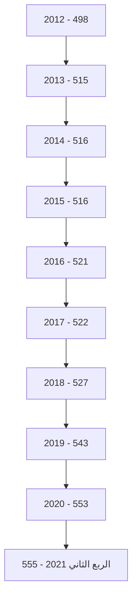

صفحة 5 من 41
---
# الكثافة المصرفية

" بالألف نسمة "

| لكل فرع ووكالة | لكل مصرف | السنة |
|-----------------|------------|-------|
| 12.1 | 389.0 | 2012 |
| 12.2 | 397.0 | 2013 |
| 12.2 | 397.0 | 2014 |
| 12.2 | 393.8 | 2015 |
| 12.5 | 382.4 | 2016 |
| 12.8 | 394.1 | 2017 |
| 13.1 | 383.3 | 2018 |
| 12.9 | 368.4 | 2019 |
| 12.8 | 368.3 | 2020 |
| 12.6 | 388.9 | الربع الثاني 2021 |

## التركز المصرفي:

درجة التركز المصرفي تعني أن عدداً قليلا من المصارف التجارية يستأثر بالنسبة الأكبر من النشاط
المصرفي سواء من حيث الأصول أو الودائع أوالائتمان أو من حيث حجم حقوق الملكية، وفيما يخص
الحصة السوقية للمصارف التجارية في ليبيا، فقد شكلت أصول المصارف الأربعة الكبرى (الجمهورية،
التجاري الوطني، الوحدة والصحاري) من أصل 18 مصرفاً مانسبته 71.5% من إجمالي أصول القطاع
المصرفي في نهاية الربع الثاني 2021، وشكل مصرف الجمهورية وحده ما نسبته 28.1% من إجمالي
أصول القطاع المصرفي.

وشكلت ودائع وقروض المصارف الأربعة الكبرى مانسبته 69.0% و 87.9% على التوالي من إجمالي
ودائع وقروض القطاع المصرفي نهاية الربع الثاني 2021 .

وهذه النسب المرتفعة توضح أن السوق المصرفي الليبي يعاني من تركز مرتفع يحول دون تحقيق المنافسة
العادلة بين المصارف المتواجدة به ، وذلك بسبب إستحواذ أحد المصارف أو عدد قليل جداً منها بحصة
كبيرة في السوق، في حين أن حصة معظم المصارف الأخرى متدنية للغاية.

صفحة 6 من 41
---
# التركز المصرفي
## (2012 - الربع الثاني 2021)

### حسب الأصول:

| "نسب مئوية" |  |  |  |  |  |  |  |  |  |  |
|-------------|-------------|------|------|------|------|------|------|------|------|------|
| المصارف | 2012 | 2013 | 2014 | 2015 | 2016 | 2017 | 2018 | 2019 | 2020 | الربع الثاني 2021 |
| أكبر مصرف | 37.9 | 33.0 | 33.1 | 34.9 | 33.8 | 33.6 | 32.7 | 31.9 | 31.2 | 28.1 |
| أكبر ثلاثة مصارف | 71.0 | 63.7 | 62.1 | 67.6 | 67.9 | 66.9 | 65.8 | 64.6 | 63.1 | 61.6 |
| أكبر خمسة مصارف | 89.0 | 81.3 | 79.2 | 87.1 | 86.7 | 85.0 | 84.3 | 84.2 | 82.7 | 80.5 |

### حسب الإئتمان:

| "نسب مئوية" |  |  |  |  |  |  |  |  |  |  |
|-------------|-------------|------|------|------|------|------|------|------|------|------|
| المصارف | 2012 | 2013 | 2014 | 2015 | 2016 | 2017 | 2018 | 2019 | 2020 | الربع الثاني 2021 |
| أكبر مصرف | 41.9 | 44.8 | 43.5 | 44.8 | 44.3 | 44.5 | 43.6 | 40.7 | 42.6 | 41.8 |
| أكبر ثلاثة مصارف | 77.0 | 76.7 | 79.1 | 79.4 | 78.5 | 77.7 | 77.7 | 75.8 | 78.3 | 77.8 |
| أكبر خمسة مصارف | 91.0 | 90.2 | 91.1 | 91.4 | 91.3 | 91.2 | 91.5 | 91.4 | 91.4 | 90.9 |

### حسب ودائع العملاء:

| "نسب مئوية" |  |  |  |  |  |  |  |  |  |  |
|-------------|-------------|------|------|------|------|------|------|------|------|------|
| المصارف | 2012 | 2013 | 2014 | 2015 | 2016 | 2017 | 2018 | 2019 | 2020 | الربع الثاني 2021 |
| أكبر مصرف | 40.9 | 33.8 | 33.1 | 34.8 | 34.0 | 33.6 | 31.9 | 32.3 | 31.8 | 29.5 |
| أكبر ثلاثة مصارف | 71.5 | 62.7 | 61.3 | 66.5 | 67.2 | 66.5 | 65.2 | 64.4 | 62.9 | 58.6 |
| أكبر خمسة مصارف | 90.1 | 80.9 | 78.6 | 87.8 | 87.5 | 85.7 | 85.4 | 85.6 | 83.7 | 80.5 |

صفحة 7 من 41
---
# تركز الأصول

| البنك | النسبة |
|-------|--------|
| مصرف الجمهورية | 28.1% |
| المصرف التجاري الوطني | 17.8% |
| مصرف الوحدة | 15.7% |
| مصرف الصحاري | 10% |
| باقي المصارف | 28.5% |

# تركز الائتمان

| البنك | النسبة |
|-------|--------|
| مصرف الجمهورية | 41.8% |
| المصرف التجاري الوطني | 19.1% |
| مصرف الوحدة | 16.9% |
| مصرف الصحاري | 9.6% |
| باقي المصارف | 12.6% |

# تركز ودائع العملاء

| البنك | النسبة |
|-------|--------|
| مصرف الجمهورية | 29.5% |
| المصرف التجاري الوطني | 15.2% |
| مصرف الوحدة | 14% |
| مصرف الصحاري | 10.3% |
| باقي المصارف | 31% |

صفحة 8 من 41
---
# الميزانية المُجمَعة للمصارف التجارية

شهدت الميزانية المُجمَعة للمصارف التجارية نهاية الربع الثاني 2021، تطورات في مُجمل بنودها على جانبي الأصول والخصوم، ليبلغ إجمالي الأصول داخل الميزانية المُجمَعة نحو 141,784.8 مليون دينار، مقابل 120,331.9 مليون دينار في نهاية الربع الثاني 2020، بإرتفاع قدره 21,452.9 مليون دينار، أي بمعدل 17.8%، وفيما يلي جدول يلخص البنود الرئيسية للميزانية المُجمَعة للمصارف التجارية:

## البنود الرئيسية للميزانية المُجمَعة للمصارف التجارية

| جانب الأصول : | الربع الثاني 2020 | الربع الثاني 2021 | مقدار التغير | معدل التغير % |
|---------------|-------------------|-------------------|---------------|---------------|
| نقدية بالخزائن | 2,302.0 | 3,725.9 | 1,423.9 | 61.9 |
| حسابات المقاصة | 5,767.7 | 5,735.7 | -32.0 | -0.6 |
| أرصدة لدى المصارف | 82,516.5 | 96,220.8 | 13,704.3 | 16.6 |
| الإستثمارات | 4,216.7 | 4,473.3 | 256.6 | 6.1 |
| القروض والتسهيلات | 16,644.9 | 17,775.0 | 1,130.1 | 6.8 |
| الأصول الثابتة | 1,866.9 | 2,082.6 | 215.7 | 11.6 |
| الأصول الأخرى | 7,017.1 | 11,771.6 | 4,754.5 | 67.8 |
| إجمالي الأصول | 120,331.9 | 141,784.8 | 21,452.9 | 17.8 |
| الحسابات النظامية | 40,979.7 | 49,073.9 | 8,094.2 | 19.8 |
| إجمالي الميزانية | 161,311.6 | 190,858.7 | 29,547.1 | 18.3 |

| جانب الخصوم: | الربع الثاني 2020 | الربع الثاني 2021 | مقدار التغير | معدل التغير % |
|--------------|-------------------|-------------------|---------------|---------------|
| ودائع العملاء | 94,049.1 | 100,673.5 | 6,624.4 | 7.0 |
| منها : التأمينات النقدية | 10,403.8 | 16,243.2 | 5,839.4 | 56.1 |
| حقوق الملكية | 6,610.4 | 6,461.2 | -149.2 | -2.3 |
| المخصصات | 5,537.1 | 7,796.4 | 2,259.3 | 40.8 |
| الخصوم الأخرى | 14,135.3 | 26,853.7 | 12,718.4 | 90.0 |
| إجمالي الخصوم | 120,331.9 | 141,784.8 | 21,452.9 | 17.8 |
| الحسابات النظامية | 40,979.7 | 49,073.9 | 8,094.2 | 19.8 |
| إجمالي الميزانية | 161,311.6 | 190,858.7 | 29,547.1 | 24.1 |

صفحة 9 من 41
---
# الأهمية النسبية للبنود المكونة للأصول

## الربع الثاني 2021

| البند | النسبة |
|-------|--------|
| نقدية بالخزائن | 4% |
| حسابات المقاصة | 3% |
| أرصدة لدى المصارف | 68% |
| الإستثمارات | 3% |
| القروض والتسهيلات | 13% |
| الأصول الثابتة | 1% |
| الأصول الأخرى | 8% |

## الربع الثاني 2020

| البند | النسبة |
|-------|--------|
| نقدية بالخزائن | 2% |
| حسابات المقاصة | 5% |
| أرصدة لدى المصارف | 69% |
| الإستثمارات | 3% |
| القروض والتسهيلات | 14% |
| الأصول الثابتة | 1% |
| الأصول الأخرى | 6% |

# الأهمية النسبية للبنود المكونة للخصوم

## الربع الثاني 2021

| البند | النسبة |
|-------|--------|
| ودائع العملاء | 71% |
| حقوق الملكية | 5% |
| المخصصات | 5% |
| الخصوم الأخرى | 19% |

## الربع الثاني 2020

| البند | النسبة |
|-------|--------|
| ودائع العملاء | 78% |
| حقوق الملكية | 5% |
| المخصصات | 5% |
| الخصوم الأخرى | 12% |

صفحة 10 من 41
---
وفيما يلي تطور الميزانية المُجمَعة للمصارف التجارية خلال الفترة (2012 - الربع الثاني 2021):

| جانب الأصول | 2012 | 2013 | 2014 | 2015 | 2016 | 2017 | 2018 | 2019 | 2020 | الربع الثاني 2021 |
|-------------|------|------|------|------|------|------|------|------|------|-------------------|
| نقدية بالخزائن | 1,545.9 | 1,712.3 | 1,642.8 | 752.8 | 606.4 | 547.2 | 1,582.1 | 2,367.4 | 1,146.8 | 3,725.9 |
| حسابات المقاصة | 2,024.6 | 7,310.3 | 8,125.4 | 11,444.4 | 12,886.4 | 10,625.8 | 4,671.0 | 6,304.6 | 5,584.8 | 5,735.7 |
| أرصدة لدى المصارف | 56,787.6 | 68,094.6 | 62,244.0 | 53,540.0 | 62,306.5 | 84,262.6 | 85,349.3 | 77,424.9 | 89,836.6 | 96,220.8 |
| الإستثمارات | 954.9 | 746.7 | 777.5 | 1,787.8 | 1,789.2 | 1,311.5 | 1,456.5 | 1,957.5 | 4,256.6 | 4,473.3 |
| القروض والتسهيلات | 15,899.5 | 18,232.3 | 19,959.9 | 20,212.8 | 18,770.3 | 17,446.6 | 16,448.3 | 16,912.7 | 16,996.9 | 17,775.0 |
| الأصول الثابتة | 1,038.4 | 1,121.6 | 1,211.6 | 1,365.4 | 1,409.1 | 1,463.2 | 1,608.3 | 1,786.7 | 1,986.8 | 2,082.6 |
| الأصول الأخرى | 6,169.5 | 1,157.8 | 1,243.0 | 1,130.2 | 5,687.2 | 5,066.0 | 5,947.1 | 5,871.5 | 6,299.4 | 11,771.6 |
| إجمالي الأصول | 84,420.4 | 98,375.6 | 95,204.2 | 90,233.4 | 103,455.1 | 116,477.0 | 117,062.4 | 112,625.3 | 126,107.9 | 141,784.8 |
| الحسابات النظامية | 70,747.7 | 71,550.9 | 51,845.0 | 48,299.2 | 46,800.0 | 46,534.9 | 48,160.2 | 34,091.2 | 28,611.1 | 49,073.9 |
| إجمالي الميزانية | 155,168.1 | 169,926.5 | 147,049.2 | 138,532.6 | 150,255.1 | 163,011.9 | 165,222.6 | 146,716.6 | 154,719.0 | 190,858.7 |

صفحة 11 من 41
---
| جانب الخصوم | 2012 | 2013 | 2014 | 2015 | 2016 | 2017 | 2018 | 2019 | 2020 | الربع الثاني 2021 |
|-----------------|--------|--------|--------|--------|--------|--------|--------|--------|--------|------------------|
| ودائع العملاء | 68,346.2 | 83,562.7 | 78,910.4 | 71,257.1 | 83,407.6 | 95,938.5 | 93,657.5 | 88,954.0 | 102,194.2 | 100,673.5 |
| منها : التأمينات النقدية | 6,823.3 | 6,609.0 | 8,080.7 | 9,738.7 | 8,939.7 | 8,845.6 | 11,533.7 | 8,427.6 | 7,091.6 | 16,243.2 |
| حقوق الملكية | 4,653.2 | 4,743.7 | 4,886.4 | 5,087.5 | 5,366.5 | 5,561.4 | 6,472.6 | 6,109.2 | 6,237.6 | 6,461.2 |
| المخصصات | 3,317.4 | 3,597.2 | 3,765.3 | 3,941.8 | 4,144.9 | 4,473.0 | 4,627.6 | 5,527.2 | 5,587.2 | 7,796.4 |
| الخصوم الأخرى | 8,103.6 | 6,472.0 | 7,642.1 | 9,946.9 | 10,536.1 | 10,504.2 | 12,304.7 | 12,035.0 | 12,088.9 | 26,853.7 |
| إجمالي الخصوم | 84,420.4 | 98,375.6 | 95,204.2 | 90,233.4 | 103,455.1 | 116,477.0 | 117,062.4 | 112,625.3 | 126,107.9 | 141,784.8 |
| الحسابات النظامية | 70,747.7 | 71,550.9 | 51,845.0 | 48,299.2 | 46,800.0 | 46,534.9 | 48,160.2 | 34,091.2 | 28,611.1 | 49,073.9 |
| إجمالي الميزانية | 155,168.1 | 169,926.5 | 147,049.2 | 138,532.6 | 150,255.1 | 163,011.9 | 165,222.6 | 146,716.6 | 154,719.0 | 190,858.7 |

صفحة 12 من 41
---
تحليل البنود المكونة للميزانية المُجمَعة للمصارف التجارية

أولاً : جانب الأصـــول
1- النقدية :
أ- النقدية بالخزائن و حسابات المقاصة :

إرتفع رصيد النقدية بالخزائن وحسابات المقاصة بمقدار 1,391.8 مليون دينار أي بمعدل 17.2%، لتصل إلى 9,461.6 مليون دينار في نهاية الربع الثاني 2021، مقابل 8,069.8 مليون دينار في نهاية الربع الثاني 2020، بسبب إرتفاع النقد بخزائن المصارف بمقدار 1,423.9 مليون دينار، فيما إنخفض بند حسابات المقاصة بمقدار 32.0 مليون دينار في نهاية الربع الثاني 2021 مقارنة بما كانت عليه في نفس الفترة من عام 2020، والجدول التالي يوضح ذلك :

| البيان | الربع الثاني 2020 | الربع الثاني 2021 | مقدار التغير | معدل التغير% |
|---------|-------------------|-------------------|---------------|---------------|
| النقدية بالخزائن : | 2,302.0 | 3,725.9 | 1,423.9 | 61.9 |
| عملة محلية | 2,280.7 | 3,642.6 | 1,361.9 | 59.7 |
| عملة أجنبية | 21.3 | 83.3 | 62.0 | 291.1 |
| إجمالي حسابات المقاصة | 5,767.7 | 5,735.7 | -32.0 | -0.6 |
| المقاصة بين المصارف | 2,592.0 | 2,177.1 | -414.9 | -16.0 |
| المقاصة بين الفروع | 3,175.7 | 3,558.5 | 382.8 | 12.1 |
| الإجمالي | 8,069.8 | 9,461.6 | 1,391.8 | 17.2 |

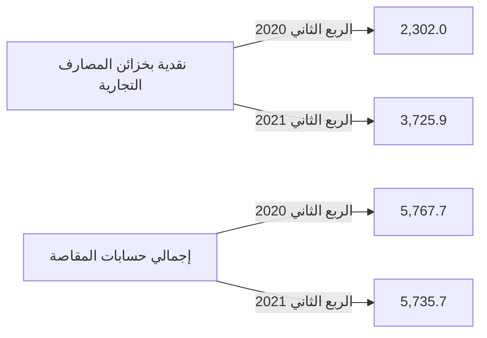

صفحة 13 من 41
---
وفيما يلي تطور بند النقدية في المصارف التجارية خلال الفترة (2012 - الربع الثاني 2021):

*مليون دينار*

| البيان | 2012 | 2013 | 2014 | 2015 | 2016 | 2017 | 2018 | 2019 | 2020 | الربع الثاني 2021 |
|---------|------|------|------|------|------|------|------|------|------|-------------------|
| النقدية بالخزائن: | 1,545.9 | 1,712.3 | 1,642.8 | 752.8 | 606.4 | 547.2 | 1,582.1 | 2,367.4 | 1,146.8 | 3,725.9 |
| عملة محلية | 1,433.3 | 1,622.6 | 1,619.9 | 743.6 | 594.7 | 537.8 | 1,573.6 | 2,355.1 | 1,128.9 | 3,642.6 |
| عملة أجنبية | 112.6 | 89.7 | 22.9 | 9.2 | 11.7 | 9.4 | 8.4 | 12.3 | 17.9 | 83.3 |
| إجمالي حسابات المقاصة: | 2,024.6 | 7,310.3 | 8,125.4 | 11,444.4 | 12,886.4 | 6,379.9 | 4,671.0 | 6,304.6 | 5,584.8 | 5,735.7 |
| المقاصة بين المصارف | 1,410.4 | 4,004.6 | 4,836.7 | 7,072.2 | 8,488.9 | 4,245.9 | 2,191.1 | 3,162.2 | 2,392.8 | 2,177.1 |
| المقاصة بين الفروع | 614.2 | 3,305.7 | 3,288.7 | 4,372.2 | 4,397.5 | 2,134.0 | 2,479.9 | 3,142.4 | 3,192.0 | 3,558.5 |
| الإجمالي | 2,956.3 | 5,716.9 | 6,479.5 | 7,825.0 | 13,492.7 | 6,927.1 | 6,253.0 | 8,672.0 | 6,731.6 | 9,461.6 |

صفحة 14 من 41
---
نقدية بخزائن المصارف التجارية
(2012 - الربع الثاني 2021)

| السنة | القيمة (مليون دينار) |
|-------|---------------------|
| 2012  | 1545.9              |
| 2013  | 1712.3              |
| 2014  | 1642.8              |
| 2015  | 752.8               |
| 2016  | 606.4               |
| 2017  | 547.2               |
| 2018  | 1582.1              |
| 2019  | 2367.4              |
| 2020  | 1146.8              |
| الربع الثاني 2021 | 3725.9   |

إجمالي حسابات المقاصة
(2012 - الربع الثاني 2021)

| السنة | القيمة (مليون دينار) |
|-------|---------------------|
| 2012  | 2024.6              |
| 2013  | 7310.3              |
| 2014  | 8125.4              |
| 2015  | 11444.4             |
| 2016  | 12886.4             |
| 2017  | 6379.9              |
| 2018  | 4671.0              |
| 2019  | 6304.6              |
| 2020  | 5584.8              |
| الربع الثاني 2021 | 5735.7   |

صفحة 15 من 41
---
ب- الأرصدة والودائع لدى المصرف المركزي والمصارف الأخرى:

بلغ رصيد ودائع المصارف التجارية لدى المصرف المركزي والمصارف الأخرى وفيما بينها نحو 96,220.8 مليون دينار في نهاية الربع الثاني 2021، مقابل 82,516.5 مليون دينار في نهاية الربع الثاني 2020، أي بمعدل إرتفاع قدره 16.6%، وتركز هذا الإرتفاع في رصيد الودائع تحت الطلب لدى المصرف المركزي التي ارتفعت بمقدار 12,817.8 مليار دينار ، جزء من هذه الزيادة كان نتيجة لإعادة التقييم بعد تعديل سعر الصرف في بداية العام الحالي، كذلك الحال بالنسبة للودائع تحت الطلب لدى المصرف الليبي الخارجي ولدى المراسلين بالخارج، في حين سجلت الودائع الزمنية إرتفاع بمقدار 886.5 مليون دينار وبنسبة 6% مقارنة بماكانت عليه في نهاية الربع الثاني من عام 2020.

"مليون دينار"

| البيان | الربع الثاني 2020 | الربع الثاني 2021 | مقدار التغير | معدل التغير % |
|--------|-------------------|-------------------|---------------|---------------|
| ودائع تحت الطلب لدى : | 67,836.5 | 80,654.3 | 12,817.8 | 18.9 |
| المصرف المركزي | 62,918.6 | 70,118.5 | 7,199.9 | 11.4 |
| المصارف المحلية | 1,475.7 | 1,335.4 | -140.3 | -9.5 |
| المصرف الليبي الخارجي | 512.9 | 1,496.2 | 983.3 | 191.7 |
| لدى المراسلين بالخارج | 2,929.5 | 7,704.1 | 4,774.6 | 163.0 |
| ودائع زمنية : | 14,680.0 | 15,566.5 | 886.5 | 6.0 |
| المصرف المركزي (شهادات الإيداع) | 13,739.8 | 13,761.4 | 21.6 | 0.2 |
| المصارف المحلية | 0.0 | 0.0 | 0.0 | - |
| المصرف الليبي الخارجي | 0.0 | 0.0 | 0.0 | - |
| لدى المراسلين بالخارج | 940.2 | 1,805.1 | 864.9 | 92.0 |
| الإجمالي | 82,516.5 | 96,220.8 | 13,704.3 | 16.6 |

الودائع الزمنية:

```mermaid
bar chart
    title الودائع الزمنية
    x-axis [الربع الثاني 2020, الربع الثاني 2021]
    y-axis "مليون دينار" 14200 - 15800
    bar [14680.0, 15566.5]
```

الودائع تحت الطلب:

```mermaid
bar chart
    title الودائع تحت الطلب
    x-axis [الربع الثاني 2020, الربع الثاني 2021]
    y-axis "مليون دينار" 60000 - 85000
    bar [67836.5, 80654.3]
```

صفحة 16 من 41
---
والجدول التالي يبين تطور أرصدة وودائع المصارف لدى المصرف المركزي والمصارف الأخرى وفيما بينها خلال الفترة (2012 - الربع الثاني 2021):

*مليون دينار*

| البيان | 2012 | 2013 | 2014 | 2015 | 2016 | 2017 | 2018 | 2019 | 2020 | الربع الثاني 2021 |
|--------|------|------|------|------|------|------|------|------|------|-------------------|
| ودائع تحت الطلب لدى : | 19,352.7 | 22,342.6 | 24,360.7 | 27,870.7 | 38,306.1 | 56,945.4 | 59,454.9 | 60,184.6 | 72,269.0 | 80,654.3 |
| - المصرف المركزي | 17,203.4 | 19,364.6 | 19,317.8 | 20,863.2 | 30,627.6 | 53,136.0 | 52,385.4 | 53,629.1 | 68,245.0 | 70,118.5 |
| - المصارف المحلية | 329.0 | 347.6 | 408.2 | 1,717.6 | 1,742.4 | 1,012.5 | 1,030.0 | 1,750.0 | 1,245.1 | 1,335.4 |
| - المصرف الليبي الخارجي | 664.7 | 848.1 | 1,850.0 | 2,216.8 | 2,396.1 | 874.2 | 1,762.1 | 821.4 | 523.4 | 1,496.2 |
| - المصارف بالخارج | 1,155.6 | 1,782.3 | 2,784.7 | 3,073.1 | 3,540.0 | 1,922.7 | 4,277.3 | 3,984.1 | 2,255.6 | 7,704.1 |
| ودائع زمنية : | 37,434.9 | 45,751.9 | 37,883.3 | 25,669.2 | 24,000.4 | 27,317.8 | 25,894.4 | 17,240.3 | 17,567.6 | 15,566.5 |
| - شهادات الإيداع | 35,737.8 | 44,307.3 | 37,074.6 | 24,259.7 | 23,187.1 | 26,415.7 | 24,716.9 | 15,846.8 | 17,118.2 | 13,761.4 |
| - المصارف المحلية | 0.0 | 30.0 | 0.0 | 0.0 | 0.0 | 0.0 | 0.0 | 0.0 | 17.4 | 0.0 |
| - المصرف الليبي الخارجي | 58.4 | 37.6 | 206.1 | 107.1 | 224.7 | 0.0 | 459.4 | 0.0 | 0.0 | 0.0 |
| - المصارف بالخارج | 1,638.7 | 1,377.0 | 602.6 | 1,302.4 | 588.6 | 902.1 | 718.1 | 1,393.5 | 432.0 | 1,805.1 |
| الإجمالي | 56,787.6 | 68,094.6 | 62,244.0 | 53,539.9 | 62,306.5 | 84,263.2 | 85,349.3 | 77,424.9 | 89,836.6 | 96,220.8 |

صفحة 17 من 41
---
# ودائع المصارف التجارية لدى المصرف المركزي والمصارف الأخرى
## (2012 - الربع الثاني 2021)

| السنة | ودائع زمنية | ودائع تحت الطلب لدى |
|-------|-------------|---------------------|
| 2012  | 37434.9     | 19352.7             |
| 2013  | 45751.9     | 22342.6             |
| 2014  | 37883.3     | 24360.7             |
| 2015  | 27870.7     | 25669.2             |
| 2016  | 24000.4     | 38306.1             |
| 2017  | 27317.8     | 56945.4             |
| 2018  | 25894.4     | 59454.9             |
| 2019  | 17240.3     | 60184.6             |
| 2020  | 17567.6     | 72269.0             |
| الربع الثاني 2021 | 15566.50 | 80654.30 |

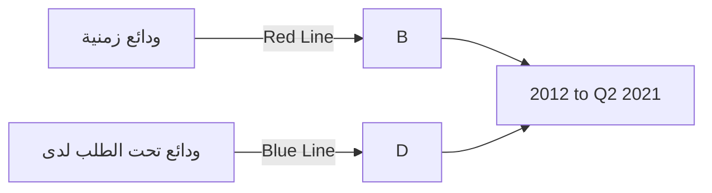

The graph shows the trends of two types of deposits from 2012 to the second quarter of 2021:

1. ودائع زمنية (Time deposits): Represented by the red line, showing a general downward trend over the years.
2. ودائع تحت الطلب لدى (Demand deposits): Represented by the blue line, showing a strong upward trend.

The y-axis represents the amount in million dinars, ranging from 0 to 90,000.0 million dinars.

The time deposits peaked in 2013 at about 45,751.9 million dinars and have since declined to 15,566.50 million dinars by Q2 2021.

In contrast, demand deposits have shown consistent growth, starting from 19,352.7 million dinars in 2012 and reaching 80,654.30 million dinars by Q2 2021.

The graph illustrates a clear shift in the composition of deposits over the period, with demand deposits becoming increasingly dominant while time deposits have decreased.

صفحة 18 من 41
---
## 2- الإستثمارات :

سجل إجمالي بند رصيد الإستثمارات في المصارف التجارية نهاية الربع الثاني 2021 نحو 4,473.3 
مليون دينار، مقابل 4,216.7 مليون دينار في نهاية الربع الثاني 2020، بمعدل نمو 6.1% هذا الإرتفاع
جاء نتيجة زيادة الإستثمار في الشركات الخاصة المساهمة ، والجدول التالي يوضح تفاصيل هذا البند:

مليون دينار

| البيان | الربع الثاني 2020 | الربع الثاني 2021 | مقدار التغير | معدل التغير % |
|--------|-------------------|-------------------|---------------|---------------|
| سندات وأذونات الخزانة | 3,000.0 | 3,000.0 | 0.0 | 0.0 |
| إستثمارات في الشركات العامة | 562.4 | 560.9 | -1.5 | -0.3 |
| إستثمارات في الشركات الخاصة المساهمة | 599.4 | 816.5 | 217.1 | 36.2 |
| إستثمارات أخرى | 54.9 | 95.9 | 41.0 | 74.7 |
| الإجمالي | 4,216.7 | 4,473.3 | 256.6 | 6.1 |

### إجمالي الإستثمارات

```mermaid
bar chart
    title إجمالي الإستثمارات
    x-axis [الربع الثاني 2020, الربع الثاني 2021]
    y-axis "مليون دينار" 4050 --> 4500
    bar [4216.7, 4473.3]
```

صفحة 19 من 41
---
والجدول التالي يبين تطور رصيد بند الإستثمارات للمصارف التجارية خلال الفترة (2012 – الربع الثاني 2021):

" مليون دينار "

| البيان | 2012 | 2013 | 2014 | 2015 | 2016 | 2017 | 2018 | 2019 | 2020 | الربع الثاني 2021 |
|--------|------|------|------|------|------|------|------|------|------|-------------------|
| سندات وأذونات الخزانة | 0.0 | 0.0 | 0.0 | 1,000.0 | 1,000.0 | 500.0 | 500.0 | 700.0 | 3,000.0 | 3,000.0 |
| إستثمارات أخرى | 954.9 | 746.7 | 777.5 | 787.8 | 789.2 | 811.5 | 956.5 | 1,257.5 | 1,256.6 | 1,473.3 |
| الإجمالي | 954.9 | 746.7 | 777.5 | 1,787.8 | 1,789.2 | 1,311.5 | 1,456.5 | 1,957.5 | 4,256.6 | 4,473.3 |

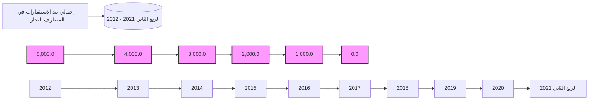

3- القروض والتسهيلات الائتمانية :

إرتفع اجمالي رصيد الإئتمان الممنوح من المصارف التجارية من 16,644.9 مليون دينار في نهاية الربع الثاني 2020 إلى 17,775.0 مليون دينار في نهاية الربع الثاني 2021، أي بمعدل نمو 6.8%، حيث بلغ رصيد القروض الممنوحة للقطاع الخاص في نهاية الربع الثاني 2021 ما قيمته 11,577.9 مليون دينار، وما نسبته 65.1% من إجمالي القروض والتسهيلات الإئتمانية، فيما شكل رصيد القروض الممنوحة للقطاع العام النسبة الباقية 34.9% والتي بلغت قيمتها 6,197.0 مليون دينار.

صفحة 20 من 41
---
وقد شكلت القروض والتسهيلات الائتمانية الممنوحة إلى إجمالي الخصوم الإيداعية ما نسبته 17.7%،
كما شكلت من اجمالي الأصول ما نسبته 12.5%

وبلغت نسبة تغطية مخصص الديون المشكوك فيها لإجمالي القروض والتسهيلات الائتمانية الممنوحة
نسبة 20.2% في نهاية الربع الثاني 2021 مقابل نسبة 21.5% في نهاية الربع الثاني 2020.

وفيما يلي بيان تفصيلي لرصيد القروض والتسهيلات الممنوحة من المصارف التجارية :

| البيان | الربع الثاني 2020 | الربع الثاني 2021 | مقدار التغير | معدل التغير % |
|---|---|---|---|---|
| سلفيات والسحب على المكشوف | 5,231.8 | 4,447.3 | -784.5 | -15.0 |
| السلف الإجتماعية * | 3,435.8 | 4,115.9 | 680.1 | 19.8 |
| القروض الأخرى | 7,977.3 | 9,211.8 | 1,234.5 | 15.5 |
| إجمالي القروض والتسهيلات | 16,644.9 | 17,775.0 | 1,130.1 | 6.8 |
| مخصص الديون المشكوك في تحصيلها | 3,580.6 | 3,589.9 | 9.3 | 0.3 |
| صافي القروض والتسهيلات | 13,064.4 | 14,185.1 | 1,120.7 | 8.6 |

*تشمل رصيد قروض المرابحة للأفراد.

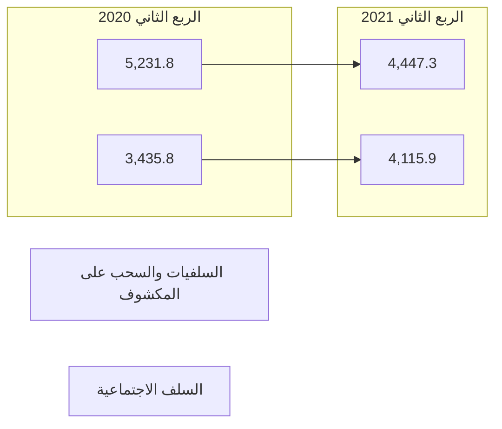

صفحة 21 من 41
---
مليون دينار

| البيان | الربع الثاني 2020 | الربع الثاني 2021 | مقدار التغير | معدل التغير % |
|--------|-------------------|-------------------|--------------|---------------|
| القروض الممنوحة للقطاع العام | 6,110.0 | 6,197.0 | 87.0 | 1.4 |
| القروض الممنوحة للقطاع الخاص | 10,534.9 | 11,577.9 | 1,043.0 | 9.9 |
| الإجمالي | 16,644.9 | 17,775.0 | 1,130.1 | 6.8 |

رصيد القروض الممنوحة للقطاع الخاص:

```mermaid
bar chart
    title رصيد القروض الممنوحة للقطاع الخاص
    x-axis [الربع الثاني 2020, الربع الثاني 2021]
    y-axis "مليون دينار"
    bar [10534.9, 11577.9]
```

رصيد القروض الممنوحة للقطاع العام:

```mermaid
bar chart
    title رصيد القروض الممنوحة للقطاع العام
    x-axis [الربع الثاني 2020, الربع الثاني 2021]
    y-axis "مليون دينار"
    bar [6110.0, 6197.0]
```

صفحة 22 من 41
---
وفيما يلي رصيد القروض والتسهيلات الممنوحة للقطاعين العام والخاص خلال الفترة (2012 - الربع الثاني 2021):

مليون دينار

| البيان | 2012 | 2013 | 2014 | 2015 | 2016 | 2017 | 2018 | 2019 | 2020 | الربع الثاني 2021 |
|--------|------|------|------|------|------|------|------|------|------|------------------|
| القروض الممنوحة للقطاع العام | 5,291.2 | 5,327.1 | 6,195.9 | 5,982.8 | 5,915.9 | 5,578.9 | 5,100.9 | 6,057.0 | 5,918.2 | 6,197.0 |
| القروض الممنوحة للقطاع الخاص | 10,608.3 | 12,905.5 | 13,764.0 | 14,230.1 | 12,854.3 | 11,867.7 | 11,347.4 | 10,855.8 | 11,078.7 | 11,577.9 |
| الإجمالي | 15,899.5 | 18,232.3 | 19,959.9 | 20,212.8 | 18,770.3 | 17,446.6 | 16,448.3 | 16,912.7 | 16,996.9 | 17,775.0 |

رصيد القروض الممنوحة للقطاعين (الخاص والعام)
(2012 - الربع الثاني 2021)

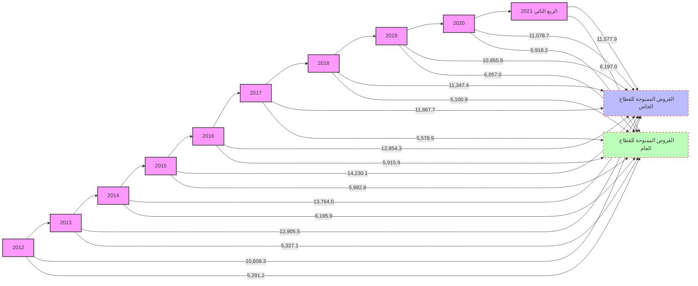

صفحة 23 من 41
---
وفيما يلي رصيد السلف الاجتماعية والسحب على المكشوف خلال الفترة (2012 – الربع الثاني 2021):

"مليون دينار"

| البيان | 2012 | 2013 | 2014 | 2015 | 2016 | 2017 | 2018 | 2019 | 2020 | الربع الثاني 2021 |
|---|---|---|---|---|---|---|---|---|---|---|
| سلفيات والسحب على المكشوف | 5,522.3 | 4,146.5 | 4,452.1 | 5,440.1 | 4,827.9 | 4,514.5 | 4,354.0 | 5,275.4 | 4,495.7 | 4,447.3 |
| السلف الإجتماعية * | 4,973.5 | 6,726.0 | 7,157.9 | 6,608.6 | 5,901.1 | 4,912.5 | 3,988.7 | 3,125.5 | 3,036.5 | 4,115.9 |
| القروض الأخرى | 5,403.7 | 3,759.8 | 8,348.9 | 8,164.2 | 8,041.3 | 8,019.6 | 8,105.6 | 8,511.8 | 9,464.7 | 9,211.8 |
| إجمالي القروض والتسهيلات | 15,899.5 | 18,232.3 | 19,959.9 | 20,212.8 | 18,770.3 | 17,446.6 | 16,448.3 | 16,912.7 | 16,996.9 | 17,775.0 |
| مخصص الديون | 2,348.9 | 2,497.9 | 2,688.1 | 2,779.7 | 2,910.0 | 3,040.8 | 3,126.4 | 3,503.6 | 3,549.3 | 3,589.9 |
| صافي القروض والتسهيلات | 13,550.6 | 15,734.4 | 17,271.8 | 17,433.1 | 15,860.3 | 14,405.8 | 13,321.9 | 13,409.1 | 13,447.6 | 14,185.1 |

*تشمل رصيد قروض المرابحة للأفراد.

رصيد السلف الإجتماعية والسحب على المكشوف
( 2012 - الربع الثاني 2021 )

| السنة | السلف الإجتماعية | سلفيات والسحب على المكشوف |
|---|---|---|
| 2012 | 4973.5 | 5522.3 |
| 2013 | 6726.0 | 4146.5 |
| 2014 | 7157.9 | 4452.1 |
| 2015 | 6608.6 | 5440.1 |
| 2016 | 5901.1 | 4827.9 |
| 2017 | 4912.5 | 4514.5 |
| 2018 | 3988.7 | 4354.0 |
| 2019 | 3125.5 | 5275.4 |
| 2020 | 3036.5 | 4495.7 |
| الربع الثاني 2021 | 4115.9 | 4447.3 |

صفحة 24 من 41
---
# 4 - الأصول الثابتة والأصول الأخرى:

بلغ رصيد الأصول الثابتة نحو 2,082.6 مليون دينار في نهاية الربع الثاني 2021، مقابل 1,866.9 مليون دينار في نهاية الربع الثاني 2020، فيما بلغ رصيد الأصول الأخرى نحو 11,771.6 مليون دينار في نهاية الربع الثاني 2021، مقابل 7,017.1 مليون دينار في نهاية الربع الثاني 2020.

## ثانياً: جانب الخصوم

### 1-ودائع العملاء لدى المصارف التجارية:

إرتفع إجمالي رصيد ودائع العملاء لدى المصارف التجارية من 94,049.1 مليون دينار في نهاية الربع الثاني 2020 إلى 100,673.5 مليون دينار في نهاية الربع الثاني 2021، أي بمعدل 7.0%، وقد تركز الإرتفاع في أرصدة الودائع لأجلة بمقدار 6,067.6 مليون دينار نتيجة الزيادة في (بند التأمينات النقدية)، بنسبة 48.8%، كذلك سجل رصيد الودائع تحت الطلب إرتفاعاً مقداره 588.3 مليون دينار وبنسبة 0.7% عما كانت عليه في نهاية الربع الثاني 2020 ، في حين إنخفضت الودائع الإدخارية بمقدار 31.5 مليون دينار وبنسبة 7.4%.

وفيما يتعلق بتوزيع الودائع لدى المصارف التجارية حسب نوع الوديعة فقد شكلت الودائع تحت الطلب ما نسبته 81.2% من إجمالي الودائع، في حين شكلت الودائع لأجل ما نسبته 18.4% من إجمالي الودائع، وشكلت ودائع الادخار ما نسبته 0.4% فقط من إجمالي الودائع.

| البيان | الربع الثاني 2020 | الربع الثاني 2021 | مقدار التغير | معدل التغير % |
|--------|-------------------|-------------------|---------------|---------------|
| الودائع تحت الطلب | 81,184.7 | 81,773.0 | 588.3 | 0.7 |
| الودائع لأجل | 12,439.8 | 18,507.4 | 6,067.6 | 48.8 |
| الودائع الإدخارية | 424.6 | 393.1 | -31.5 | -7.4 |
| الإجمالي | 94,049.1 | 100,673.5 | 6,624.4 | 7.0 |

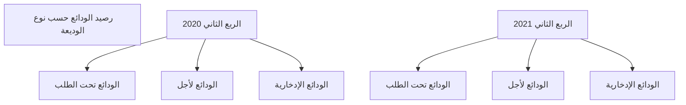

صفحة 25 من 41
---
أرصدة الودائع حسب نوع الوديعة لدى المصارف التجارية خلال الفترة (2012 - الربع الثاني 2021)

"مليون دينار"

| البيان | 2012 | 2013 | 2014 | 2015 | 2016 | 2017 | 2018 | 2019 | 2020 | الربع الثاني 2021 |
|--------|------|------|------|------|------|------|------|------|------|-------------------|
| الودائع تحت الطلب | 54,728.8 | 61,834.9 | 56,641.4 | 58,725.9 | 72,192.7 | 84,827.6 | 80,038.6 | 77,919.6 | 92,530.6 | 81,773.0 |
| الودائع زمنية | 12,912.1 | 21,064.9 | 21,669.3 | 11,956.7 | 10,644.7 | 10,519.2 | 13,115.5 | 10,582.2 | 9,225.9 | 18,507.4 |
| الودائع الإدخارية | 705.3 | 662.9 | 599.8 | 574.5 | 570.2 | 591.7 | 503.4 | 452.3 | 437.6 | 393.1 |
| الإجمالي | 68,346.2 | 83,562.7 | 78,910.4 | 71,257.1 | 83,407.6 | 95,938.5 | 93,657.5 | 88,954.0 | 102,194.2 | 100,673.5 |

إجمالي ودائع العملاء لدى المصارف التجارية
(2012 - الربع الثاني 2021)

```mermaid
graph TD
    style 2012 fill:#f9f,stroke:#333,stroke-width:2px
    style 2013 fill:#f9f,stroke:#333,stroke-width:2px
    style 2014 fill:#f9f,stroke:#333,stroke-width:2px
    style 2015 fill:#f9f,stroke:#333,stroke-width:2px
    style 2016 fill:#f9f,stroke:#333,stroke-width:2px
    style 2017 fill:#f9f,stroke:#333,stroke-width:2px
    style 2018 fill:#f9f,stroke:#333,stroke-width:2px
    style 2019 fill:#f9f,stroke:#333,stroke-width:2px
    style 2020 fill:#f9f,stroke:#333,stroke-width:2px
    style 2021 fill:#f9f,stroke:#333,stroke-width:2px
    2012[2012: 68,346.2]
    2013[2013: 83,562.7]
    2014[2014: 79,099.7]
    2015[2015: 71,257.1]
    2016[2016: 83,407.6]
    2017[2017: 95,938.5]
    2018[2018: 93,707.5]
    2019[2019: 88,600.0]
    2020[2020: 102,127.0]
    2021[الربع الثاني 2021: 100,673.5]
```

مليون دينار

ودائع تحت الطلب
ودائع زمنية
ودائع إدخارية
إجمالي الودائع

صفحة 26 من 41
---
وفيما يتعلق بتوزيع إجمالي ودائع العملاء لدى المصارف التجارية ( خاص ، حكومة، عام ) فقد إرتفعت
ودائع القطاع الخاص بمقدار 8,972.7 مليون دينار وبنسبة 17.8% في نهاية نهاية الربع الثاني 2021،
لتسجل نحو 59,248.5 مليون دينار، مقارنة بنحو 50,275.8 مليون دينار في نهاية نهاية الربع الثاني
2020. وفيما إنخفض رصيد القطاع الحكومي والقطاع العام في نهاية الربع الثاني 2021 بمقدار
2,348.4 مليون دينار لتصل إلى 41,424.9 مليون دينار، منها 12,802.7 مليون دينار كودائع
حكومية والتي تتكون من ودائع الوزارات والهيئات والمؤسسات الحكومية وودائع كل من: صندوق الضمان
الإجتماعي، صندوق الإنماء الإقتصادي والإجتماعي وودائع الصندوق الليبي للتنمية والإستثمار، مقابل
43,773.3 مليون دينار كودائع للقطاع العام والقطاع الحكومي في نهاية الربع الثاني 2020.
والجدول التالي يوضح تطور أرصدة الودائع لدى المصارف التجارية:

| البيان | الربع الثاني 2020 | الربع الثاني 2021 | مقدار التغير | معدل التغير % |
|--------|-------------------|-------------------|--------------|---------------|
| ودائع الحكومة والقطاع العام | 43,773.3 | 41,424.9 | -2,348.4 | - 5.4 |
| - ودائع حكومية | 11,140.8 | 12,802.7 | 1,661.9 | 14.9 |
| - ودائع القطاع العام | 32,632.5 | 28,622.3 | - 4,010.2 | - 12.3 |
| ودائع القطاع الخاص | 50,275.8 | 59,248.5 | 8,972.7 | 17.8 |
| - الأفراد | 30,229.2 | 33,059.8 | 2,830.6 | 9.4 |
| - الشركات والمؤسسات | 20,046.6 | 26,188.7 | 6,142.1 | 30.6 |
| الإجمالي | 94,049.1 | 100,673.5 | 6,624.4 | 7.0 |

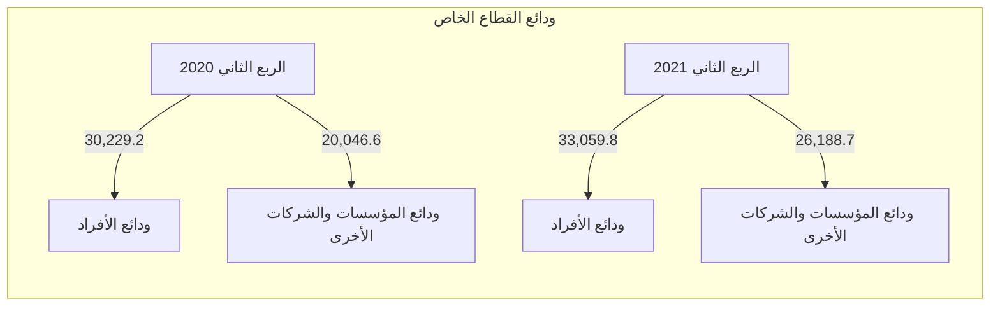

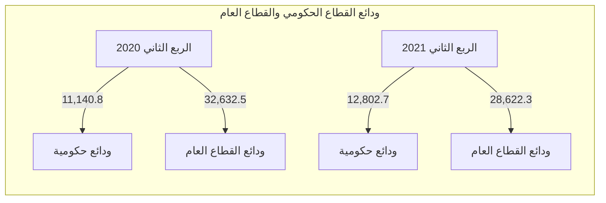

صفحة 27 من 41
---
وفيما يلي توزيع ودائع العملاء لدى المصارف التجارية خلال الفترة (2012 – الربع الثاني 2021):

"مليون دينار"

| البيان | 2012 | 2013 | 2014 | 2015 | 2016 | 2017 | 2018 | 2019 | 2020 | الربع الثاني 2021 |
|---|---|---|---|---|---|---|---|---|---|---|
| ودائع الحكومة والقطاع العام | 35,469.8 | 52,638.7 | 46,339.9 | 35,139.7 | 39,197.7 | 40,710.8 | 39,747.8 | 42,343.0 | 41,620.7 | 41,424.9 |
| - ودائع حكومية | 13,983.3 | 24,285.4 | 21,987.0 | 9,800.6 | 9,100.7 | 9,234.8 | 10,048.5 | 11,694.6 | 12,093.5 | 12,802.7 |
| - ودائع القطاع العام | 21,486.5 | 28,353.3 | 24,352.9 | 25,339.1 | 30,097.0 | 31,476.0 | 29,699.3 | 30,648.5 | 29,527.2 | 28,622.3 |
| ودائع القطاع الخاص | 32,876.4 | 30,924.0 | 32,570.5 | 36,117.4 | 44,209.9 | 55,227.7 | 53,909.7 | 46,611.0 | 60,573.5 | 59,248.5 |
| - الأفراد | 21,026.1 | 19,569.5 | 19,799.0 | 20,477.2 | 27,605.5 | 36,295.4 | 33,717.5 | 27,402.6 | 38,908.5 | 33,059.8 |
| - الشركات والمؤسسات | 11,850.3 | 11,345.5 | 12,771.5 | 15,640.2 | 16,604.4 | 18,932.3 | 20,192.2 | 19,208.4 | 21,665.0 | 26,188.7 |
| الإجمالي | 68,346.2 | 83,562.7 | 78,910.4 | 71,257.1 | 83,407.6 | 95,938.5 | 93,657.5 | 88,954.0 | 102,194.2 | 100,673.5 |

صفحة 28 من 41
---
# ودائع القطاع العام والقطاع الحكومي لدى المصارف التجارية
## (2012 - الربع الثاني 2021)

| السنة | ودائع حكومية | ودائع القطاع العام |
|-------|--------------|---------------------|
| 2012  | 13,983.3     | 21,486.5            |
| 2013  | 24,285.4     | 28,353.3            |
| 2014  | 21,987.0     | 24,352.9            |
| 2015  | 9,800.6      | 25,339.1            |
| 2016  | 9,100.7      | 30,097.0            |
| 2017  | 9,234.8      | 31,476.0            |
| 2018  | 10,048.5     | 29,699.3            |
| 2019  | 11,694.6     | 30,648.5            |
| 2020  | 12,093.5     | 29,527.2            |
| الربع الثاني 2021 | 12,802.7 | 28,622.3    |

# ودائع القطاع الخاص لدى المصارف التجارية
## (2012 - الربع الثاني 2021)

| السنة | ودائع القطاع الخاص |
|-------|---------------------|
| 2012  | 21,026.1            |
| 2013  | 19,569.5            |
| 2014  | 19,799.0            |
| 2015  | 20,477.2            |
| 2016  | 27,605.5            |
| 2017  | 36,295.4            |
| 2018  | 33,717.5            |
| 2019  | 27,402.6            |
| 2020  | 38,908.5            |
| الربع الثاني 2021 | 33,059.8 |

صفحة 29 من 41
---
## 2- الحسابات المكشوفة لدى المراسلين بالخارج:

بلغ رصيد الحسابات المكشوفة لدى المراسلين بالخارج 472.5 مليون دينار في نهاية الربع الثاني 2021،

وهي في معظمها ناتجة عن تأخر تسوية الحسابات لبعض المصارف مع المصارف المراسلة بالخارج،

مقابل 271.2 مليون دينار في نهاية الربع الثاني 2020.

| "مليون دينار" |  |  |  |  |
|---|---|---|---|---|
| معدل التغير % | مقدار التغير | الربع الثاني 2021 | الربع الثاني 2020 | البيان |
| 74.2 | 201.3 | 472.5 | 271.2 | الحسابات المكشوفة لدى المراسلين بالخارج |

### الحسابات المكشوفة لدى المراسلين بالخارج

| الربع الثاني 2020 | الربع الثاني 2021 |
|-------------------|-------------------|
| 271.2 | 472.5 |

```mermaid
bar chart
    title الحسابات المكشوفة لدى المراسلين بالخارج
    x-axis ["الربع الثاني 2020", "الربع الثاني 2021"]
    y-axis "مليون دينار" 0 --> 500
    bar ["271.2", "472.5"]
```

صفحة 30 من 41
---
وفيما يلي أرصدة الحسابات المكشوفة خلال الفترة (2012 - الربع الثاني 2021):

"مليون دينار"

| البيان | 2012 | 2013 | 2014 | 2015 | 2016 | 2017 | 2018 | 2019 | 2020 | الربع الثاني 2021 |
|--------|------|------|------|------|------|------|------|------|------|-------------------|
| الحسابات المكشوفة لدى المراسلين بالخارج | 139.6 | 74.9 | 432.0 | 955.6 | 429.9 | 368.5 | 503.4 | 113.1 | 220.4 | 472.5 |

الحسابات المكشوفة لدى المراسلين بالخارج
( 2012 - الربع الثاني 2021 )

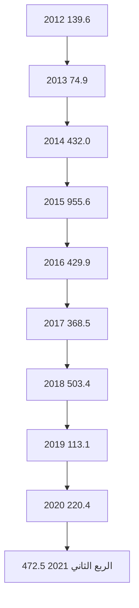

## 3- حقوق الملكية والأرباح:

- رأس المال المدفوع: إرتفع رأس المال المدفوع من 4,295.9 مليون دينار في نهاية الربع الثاني 2020 إلى 4,538.0 مليون دينار في نهاية الربع الثاني 2021، نتيجة لقيام بعض المصارف بزيادة رأس مالها المدفوع.

- الإحتياطيات والأرباح: إنخفض رصيد الإحتياطيات والأرباح المرحلة والقابلة للتوزيع من 2,644.9 مليون دينار في نهاية الربع الثاني 2020، ليصل إلى 2,527.1 مليون دينار في نهاية الربع الثاني 2021، في حين سجلت أرباح المصارف التجارية قبل خصم المخصصات والضرائب خلال الربع الثاني 2021 إرتفاعاً بمعدل 174.5% لتسجل إلى 604.0 مليون دينار، مقارنة عما كانت عليه خلال نفس الفترة من عام 2020 والبالغة نحو 220.0 مليون دينار.

صفحة 31 من 41
---
"مليون دينار"

| البيان | الربع الثاني 2020 | الربع الثاني 2021 | مقدار التغير | معدل التغير % |
|--------|-------------------|-------------------|---------------|---------------|
| رأس المال المدفوع | 4,295.9 | 4,538.0 | 242.1 | 5.6 |
| الإحتياطي القانوني | 542.7 | 676.9 | 134.2 | 24.7 |
| إحتياطيات غير مخصصة | 34.3 | 59.9 | 25.6 | 74.6 |
| أرباح العام | 220.0 | 604.0 | 384.0 | 174.5 |
| الأرباح المرحلة والأرباح القابلة للتوزيع | 1,737.5 | 913.5 | -824.0 | -47.4 |
| الإجمالي | 6,830.4 | 6,792.3 | -38.1 | -0.6 |

أرباح الفترة قبل خصم المخصصات والضرائب

| الربع الثاني 2020 | الربع الثاني 2021 |
|-------------------|-------------------|
| 220.0 | 604.0 |

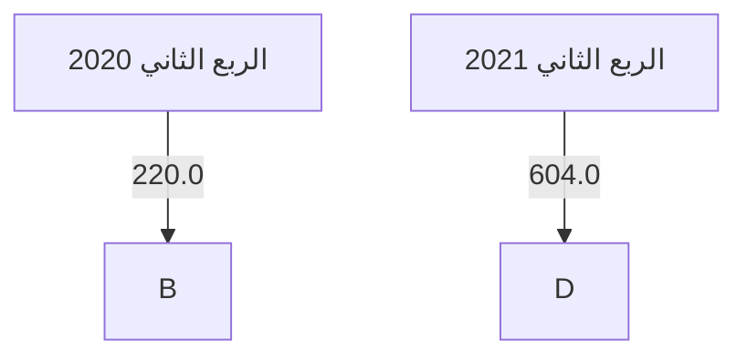

أرباح المصارف التجارية قبل خصم المخصصات والضرائب
( 2012 - 2020 )

| السنة | القيمة |
|-------|--------|
| 2012 | 527.1 |
| 2013 | 451.1 |
| 2014 | 265.4 |
| 2015 | 213.0 |
| 2016 | 247.1 |
| 2017 | 464.6 |
| 2018 | 1222.2 |
| 2019 | 867.7 |
| 2020 | 608.7 |

صفحة 32 من 41
---
فيما يلي حسابات رأس المال والاحتياطيات في المصارف خلال الفترة (2012 - الربع الثاني 2021):

"مليون دينار"

| البيان | 2012 | 2013 | 2014 | 2015 | 2016 | 2017 | 2018 | 2019 | 2020 | الربع الثاني 2021 |
|--------|------|------|------|------|------|------|------|------|------|-------------------|
| رأس المال المدفوع | 3,495.2 | 3,550.2 | 3,566.8 | 3,609.5 | 3,791.4 | 3,806.4 | 3,904.4 | 4,282.9 | 4,508.0 | 4,538.0 |
| الإحتياطي القانوني | 181.9 | 323.5 | 335.8 | 335.8 | 342.8 | 346.1 | 352.9 | 527.7 | 663.5 | 676.9 |
| إحتياطيات غير مخصصة | 26.6 | 29.7 | 29.7 | 29.7 | 30.0 | 31.9 | 32.0 | 53.1 | 50.3 | 59.9 |
| أرباح العام | 527.1 | 451.1 | 265.4 | 213.0 | 247.1 | 464.6 | 1,122.2 | 867.6 | 608.7 | 604.0 |
| الأرباح المرحّلة والأرباح القابلة للتوزيع | 422.4 | 389.2 | 688.7 | 899.6 | 955.0 | 912.4 | 1,061.1 | 1,245.5 | 1,015.9 | 913.5 |
| الإجمالي | 4,653.2 | 4,743.7 | 4,886.4 | 5,087.6 | 5,366.3 | 5,561.4 | 6,472.6 | 6,976.8 | 6,846.3 | 6,792.3 |

إجمالي حقوق الملكية في المصارف التجارية
(2012 - الربع الثاني 2021)

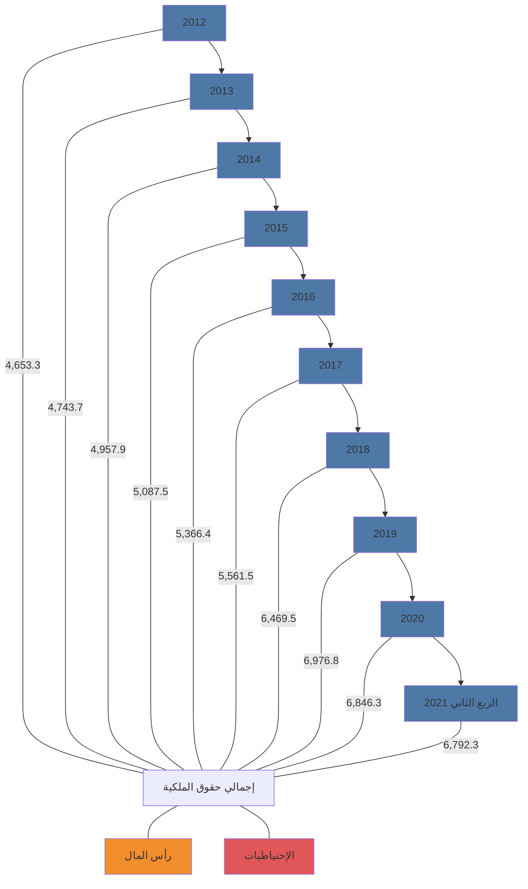

صفحة 33 من 41
---
## 4- المخصصات:

سجل رصيد المخصصات إرتفاعاً بمقدار 2,259.3 مليون دينار في نهاية الربع الثاني 2021 ليصل إلى
7,796.4 مليون دينار، مقابل 5,537.1 مليون دينار في نهاية الربع الثاني 2020، وتركزت الزيادة في
بند مخصص تقييم أسعار الصرف كما هو موضح بالجدول التالي:

| البيان | الربع الثاني 2020 | الربع الثاني 2021 | مقدار التغير | معدل التغير % |
|--------|-------------------|-------------------|---------------|---------------|
| مخصص الديون المشكوك في تحصيلها | 3,580.6 | 3,589.9 | 9.3 | 0.3 |
| مخصص إستهلاك الأصول الثابتة | 823.7 | 893.1 | 69.4 | 8.4 |
| مخصصات عامة | 1,132.0 | 1,435.2 | 303.2 | 26.8 |
| مخصص تقييم أسعار الصرف | 0.8 | 1,878.2 | 1,877.4 | 234,675.0 |
| الإجمالي | 5,537.1 | 7,796.4 | 2,259.3 | 40.8 |

*مليون دينار

### بند المخصصات

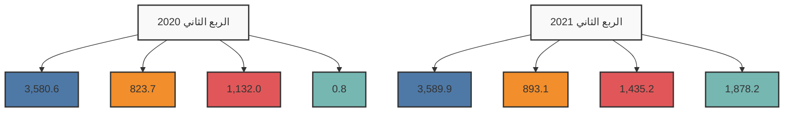

صفحة 34 من 41
---
وفيما يلي رصيد المخصصات خلال الفترة (2012 - الربع الثاني 2021):

"مليون دينار"

| البيان | 2012 | 2013 | 2014 | 2015 | 2016 | 2017 | 2018 | 2019 | 2020 | الربع الثاني 2021 |
|--------|------|------|------|------|------|------|------|------|------|-------------------|
| مخصص الديون المشكوك في تحصيلها | 2,348.9 | 2,497.5 | 2,688.1 | 2,779.7 | 2,910.0 | 3,040.8 | 3,126.4 | 3,503.6 | 3,549.3 | 3,589.9 |
| مخصص إستهلاك الأصول الثابتة | 424.1 | 473.1 | 539.3 | 592.5 | 634.0 | 687.3 | 745.2 | 795.3 | 862.3 | 893.1 |
| مخصصات عامة | 539.3 | 614.6 | 532.8 | 556.9 | 594.3 | 738.2 | 753.2 | 1,225.5 | 1,171.2 | 1,435.2 |
| مخصص تقييم أسعار الصرف | 5.2 | 11.6 | 5.1 | 12.7 | 6.5 | 6.7 | 2.8 | 2.8 | 4.4 | 1,878.2 |
| الإجمالي | 3,317.5 | 3,597.2 | 3,765.3 | 3,941.8 | 4,144.8 | 4,473.0 | 4,627.6 | 5,527.2 | 5,587.2 | 7,796.4 |

رصيد بند المخصصات
(2012 - الربع الثاني 2021)

```mermaid
graph LR
    A[2012] --> B[2013] --> C[2014] --> D[2015] --> E[2016] --> F[2017] --> G[2018] --> H[2019] --> I[2020] --> J[الربع الثاني 2021]
    
    style A fill:#f9f,stroke:#333,stroke-width:2px
    style B fill:#f9f,stroke:#333,stroke-width:2px
    style C fill:#f9f,stroke:#333,stroke-width:2px
    style D fill:#f9f,stroke:#333,stroke-width:2px
    style E fill:#f9f,stroke:#333,stroke-width:2px
    style F fill:#f9f,stroke:#333,stroke-width:2px
    style G fill:#f9f,stroke:#333,stroke-width:2px
    style H fill:#f9f,stroke:#333,stroke-width:2px
    style I fill:#f9f,stroke:#333,stroke-width:2px
    style J fill:#f9f,stroke:#333,stroke-width:2px
    
    classDef default fill:#f9f,stroke:#333,stroke-width:2px;
    
    A --> |مخصص الديون المشكوك في تحصيلها| J
    A --> |مخصص إستهلاك الأصول الثابتة| J
    A --> |مخصصات عامة| J
    A --> |مخصص تقييم أسعار الصرف| J
```

صفحة 35 من 41
---
# مؤشرات السلامة المالية للمصارف التجارية
## ( 2012 - الربع الثاني 2021 )

### مؤشرات السيولة:
بلغت نسبة الأصول السائلة لدى المصارف التجارية إلى إجمالي الأصول 70.5% في نهاية الربع الثاني 2021، والتي معظمها تمثل ودائع لدى المصرف المركزي (تحت الطلب بما فيها الاحتياطي الإلزامي وكذلك شهادات الإيداع).

وبلغ حجم القروض إلى إجمالي الودائع بالقطاع المصرفي نسبة 17.7% في نهاية الربع الثاني 2021، وهى نسبة ضئيلة للغاية، حيث لم تتعدى هذه النسبة 28.4% خلال الفترة.

وتجدر الإشارة إلى أن نسبة السيولة القانونية المطلوب من المصارف التجارية الإحتفاظ بها هى 25.0% من إجمالي الخصوم الإيداعية.

| مؤشرات السيولة | 2012 | 2013 | 2014 | 2015 | 2016 | 2017 | 2018 | 2019 | 2020 | الربع الثاني 2021 |
|----------------|------|------|------|------|------|------|------|------|------|-------------------|
| الأصول السائلة / الأصول | 68.6 | 71.0 | 67.8 | 60.2 | 60.8 | 72.8 | 74.3 | 71.9 | 71.4 | 70.5 |
| القروض / الودائع | 23.6 | 21.8 | 25.2 | 28.4 | 22.5 | 18.2 | 17.6 | 19.0 | 16.8 | 17.7 |
| الودائع / الأصول | 80.8 | 84.9 | 83.1 | 79.0 | 80.6 | 82.4 | 80.0 | 79.3 | 80.1 | 71.0 |

```mermaid
graph TD
    A[مؤشرات السيولة]
    B[2012 - الربع الثاني 2021]
    A --> B
    B --> C[الأصول السائلة / الأصول]
    B --> D[الودائع / الأصول]
    B --> E[القروض / الودائع]
    
    C --> F[2012: 68.6%]
    C --> G[2013: 71.0%]
    C --> H[2014: 67.8%]
    C --> I[2015: 60.2%]
    C --> J[2016: 60.8%]
    C --> K[2017: 72.8%]
    C --> L[2018: 74.3%]
    C --> M[2019: 71.9%]
    C --> N[2020: 71.4%]
    C --> O[الربع الثاني 2021: 70.5%]
    
    D --> P[2012: 80.8%]
    D --> Q[2013: 84.9%]
    D --> R[2014: 83.1%]
    D --> S[2015: 79.0%]
    D --> T[2016: 80.6%]
    D --> U[2017: 82.4%]
    D --> V[2018: 80.0%]
    D --> W[2019: 79.3%]
    D --> X[2020: 80.1%]
    D --> Y[الربع الثاني 2021: 71.0%]
    
    E --> Z[2012: 23.6%]
    E --> AA[2013: 21.8%]
    E --> AB[2014: 25.2%]
    E --> AC[2015: 28.4%]
    E --> AD[2016: 22.5%]
    E --> AE[2017: 18.2%]
    E --> AF[2018: 17.6%]
    E --> AG[2019: 19.0%]
    E --> AH[2020: 16.8%]
    E --> AI[الربع الثاني 2021: 17.7%]
```

### جودة الأصول:
أظهرت البيانات المتوفرة عن نسبة الديون المتعثرة وهي بيانات تقديرية قد لا تعكس الواقع أن نسبة الديون المتعثرة إلى إجمالي القروض بلغت في نهاية عام 2020 نحو 21.0%، ويدل ارتفاع

صفحة 36 من 41
---
هذه النسبة على إنخفاض كفاءة إدارة الائتمان، وينبغي أن لا تتجاوز هذه النسبة وفقاً للمعايير الدولية
5%. وقد سجلت نسبة تغطية مخصص الديون إلى الديون المتعثرة في نهاية الربع الثاني 2021 نحو
96.2%.

نسب مئوية

| جودة الأصول | 2012 | 2013 | 2014 | 2015 | 2016 | 2017 | 2018 | 2019 | 2020 | الربع الثاني 2021 |
|-------------|------|------|------|------|------|------|------|------|------|-------------------|
| القروض المتعثرة / الأصول | 4.0 | 3.9 | 4.4 | 4.7 | 3.8 | 3.1 | 2.9 | 3.2 | 2.8 | 2.6 |
| القروض المتعثرة/القروض | 21.0 | 21.0 | 21.0 | 21.0 | 21.0 | 21.0 | 21.0 | 21.0 | 21.0 | 21.0 |
| مخصص الديون / القروض المتعثرة | 70.9 | 65.2 | 64.0 | 65.5 | 73.8 | 83.0 | 90.4 | 98.6 | 101.9 | 96.2 |
| مخصص الديون / القروض | 14.9 | 13.7 | 13.4 | 13.8 | 15.5 | 17.4 | 19.0 | 20.9 | 21.4 | 20.2 |

بيانات القروض المتعثرة تقديرية منذ 2011

```mermaid
graph LR
    A[مؤشرات جودة الأصول]
    B[2012 - الربع الثاني 2021]
    A --> B
    
    style A fill:#f9f,stroke:#333,stroke-width:4px
    style B fill:#bbf,stroke:#333,stroke-width:2px
```

| السنة | مخصص الديون / القروض المتعثرة | مخصص الديون / القروض |
|-------|--------------------------------|----------------------|
| 2012 | 70.9 | 14.9 |
| 2013 | 65.2 | 13.7 |
| 2014 | 64.0 | 13.4 |
| 2015 | 65.5 | 13.8 |
| 2016 | 73.8 | 15.5 |
| 2017 | 83.0 | 17.4 |
| 2018 | 90.4 | 19.0 |
| 2019 | 98.6 | 20.9 |
| 2020 | 101.9 | 21.4 |
| الربع الثاني 2021 | 96.2 | 20.2 |

صفحة 37 من 41
---
❖ الربحية : شهد معدل العائد على الأصول لدى القطاع المصرفي في ليبيا انخفاضاً ملحوظاً خلال السنوات
(2014 - 2016)، حيث بلغ نحو 0.2% في عام 2016، ويعزى سبب الانخفاض إلى عدة أسباب منها
الوضع الغير ملائم الذي تعمل فيه المصارف التجارية في السنوات الأخيرة وكذلك تطبيق قانون إلغاء
الفوائد الربوية.

إلا أنه خلال العام 2018 تحسن معدل الربحية بشكل كبير، حيث بلغ العائد على إجمالي الأصول نحو
1.0%، وبلغ معدل العائد على حقوق الملكية 20.9%.

وفي عام 2019 بلغ معدل العائد على إجمالي الأصول نحو 0.7 % وبلغ معدل العائد على حقوق الملكية
12.3%.

وخلال الربع الثاني 2021 إرتفعت مؤشرات الربحية ليبلغ معدل العائد إلى إجمالي الأصول نحو 0.9%
وبلغ معدل العائد إلى حقوق الملكية نحو 18.7%.

الزيادة في الأرباح في عامي 2018 و2019 جاءت نتيجة لتحقيق المصارف التجارية لإيرادات هامة من
عمولات بيع وتحويل العملة الأجنبية ، وكذلك من رفع أسعار الخدمات المصرفية عموماً.

نسب مئوية

| الربحية | 2012 | 2013 | 2014 | 2015 | 2016 | 2017 | 2018 | 2019 | 2020 | الربع الثاني 2021 |
|---------|------|------|------|------|------|------|------|------|------|-------------------|
| العائد / حقوق الملكية | 13.7 | 12.0 | 5.4 | 4.4 | 4.8 | 9.1 | 20.9 | 12.3 | 4.9 | 18.7 |
| العائد / الاصول | 0.7 | 0.5 | 0.3 | 0.2 | 0.2 | 0.4 | 1.0 | 0.7 | 0.3 | 0.9 |

العائد / حقوق الملكية
( 2012 - الربع الثاني 2021)

```mermaid
graph LR
    2012[2012] --> 13.7
    2013[2013] --> 12.0
    2014[2014] --> 5.4
    2015[2015] --> 4.4
    2016[2016] --> 4.8
    2017[2017] --> 9.1
    2018[2018] --> 20.9
    2019[2019] --> 12.3
    2020[2020] --> 4.9
    2021[الربع الثاني 2021] --> 18.7
```

العائد / الاصول
( 2012 - الربع الثاني 2021)

```mermaid
graph LR
    2012[2012] --> 0.7
    2013[2013] --> 0.5
    2014[2014] --> 0.3
    2015[2015] --> 0.2
    2016[2016] --> 0.2
    2017[2017] --> 0.4
    2018[2018] --> 1.0
    2019[2019] --> 0.7
    2020[2020] --> 0.3
    2021[الربع الثاني 2021] --> 0.9
```

صفحة 38 من 41
---
❖ كفاية رأس المال: يتمتع القطاع المصرفي الليبي بكفاية رأس مال مرتفعة، كافية لمواجهة أية مخاطر قد تحدث، حيث تراوحت نسبتها مابين 10.7% و 19.2%

خلال الفترة ( 2012- الربع الثاني 2021)، وهى بشكل عام أعلى وبهامش مريح من النسبة المحددة من قبل لجنة بازل (1) والبالغة 8.0%، مما يعزز من

الإستقرار المالي.

نسب مئوية

| الربع الثاني 2021 | 2020 | 2019 | 2018 | 2017 | 2016 | 2015 | 2014 | 2013 | 2012 | نسب رأس المال |
|-------------------|------|------|------|------|------|------|------|------|------|----------------|
| 16.6 | 19.2 | 18.4 | 17.8 | 16.7 | 14.6 | 14.3 | 13.9 | 12.4 | 10.7 | كفاية رأس المال الكلي |
| 15.3 | 17.9 | 17.2 | 16.5 | 15.4 | 13.4 | 13.1 | 12.6 | 11.0 | 9.5 | كفاية رأس المال الأساسي |
| 3.9 | 3.6 | 3.8 | 3.3 | 3.3 | 3.7 | 4.0 | 3.7 | 3.6 | 4.2 | رأس المال المدفوع / الأصول |
| 4.6 | 4.9 | 5.5 | 4.6 | 4.8 | 4.9 | 5.4 | 5.1 | 4.4 | 5.1 | حقوق الملكية / الأصول |
| 6.4 | 6.1 | 6.9 | 5.7 | 5.3 | 6.1 | 7.1 | 6.2 | 5.1 | 6.3 | حقوق الملكية / الودائع |

صفحة 39 من 41
---
# كفاية رأس المال الكلي
## (2012 - الربع الثاني 2021)

| السنة | النسبة (%) |
|-------|------------|
| 2012  | 10.7       |
| 2013  | 12.4       |
| 2014  | 13.9       |
| 2015  | 14.3       |
| 2016  | 14.6       |
| 2017  | 16.7       |
| 2018  | 17.8       |
| 2019  | 18.4       |
| 2020  | 19.2       |
| الربع الثاني 2021 | 16.6 |

# مؤشرات رأس المال
## (2012 - الربع الثاني 2021)

| السنة | رأس المال المدفوع / الأصول (%) | حقوق الملكية / الأصول (%) |
|-------|--------------------------------|---------------------------|
| 2012  | 4.2                            | 5.1                       |
| 2013  | 3.6                            | 4.4                       |
| 2014  | 3.7                            | 5.1                       |
| 2015  | 4.0                            | 5.4                       |
| 2016  | 3.7                            | 4.9                       |
| 2017  | 3.3                            | 4.8                       |
| 2018  | 3.3                            | 4.6                       |
| 2019  | 3.8                            | 5.5                       |
| 2020  | 3.6                            | 4.9                       |
| الربع الثاني 2021 | 3.9                | 4.6                       |

صفحة 40 من 41
---
# الملحق

❖ البيانات والمؤشرات المالية للمصارف التجارية للربع الثاني 2021.

صفحة 41 من 41
---
# الجدول (1)
## البيانات المالية الأساسية للمصارف التجارية
(مليون دينار)

| البيان / الفترة | الربع الثاني 2020 | الربع الثاني 2021 | معدل التغير % |
|-----------------|-------------------|-------------------|---------------|
| إجمالي الميزانية (الأصول + الحسابات النظامية) | 161,311.6 | 190,858.7 | 18.3 |
| إجمالي الأصول | 120,331.9 | 141,784.8 | 17.8 |
| إجمالي النقدية بخزائن المصارف | 2,302.0 | 3,725.9 | 61.9 |
| إجمالي الودائع لدى المصرف المركزي | 76,658.4 | 83,880.0 | 9.4 |
| إجمالي الودائع لدى المصارف | 1,475.7 | 1,335.4 | -9.5 |
| إجمالي الودائع لدى المصرف الليبي الخارجي | 512.9 | 1,496.2 | 191.7 |
| إجمالي الودائع لدى المراسلين بالخارج | 3,869.6 | 9,509.1 | 145.7 |
| إجمالي حسابات المقاصة | 5,767.7 | 5,735.7 | -0.6 |
| إجمالي القروض والسلفيات والتسهيلات | 16,644.9 | 17,775.0 | 6.8 |
| إجمالي الاستثمارات | 4,216.7 | 4,473.3 | 6.1 |
| إجمالي ودائع العملاء | 94,049.1 | 100,673.5 | 7.0 |
| إجمالي الحسابات المكشوفة لدى المراسلين | 271.2 | 472.5 | 74.2 |
| إجمالي حقوق الملكية | 6,610.4 | 6,461.2 | -2.3 |
| إجمالي المخصصات | 5,537.1 | 7,796.4 | 40.8 |
| أرباح العام | 220.0 | 604.0 | 174.5 |
| عدد الفروع والوكالات | 535 | 555 | 3.7 |
| عدد العاملين | 19,463 | 19,565 | 0.5 |
| الأصول السائلة / إجمالي الأصول % | 70.5 | 70.5 | - |
| إجمالي القروض / إجمالي الأصول % | 13.8 | 12.5 | - |
| حقوق الملكية / إجمالي الأصول % | 5.5 | 4.6 | - |
| إجمالي الأصول / عدد الفروع (مليون دينار) | 224.9 | 255.5 | - |
| إجمالي الأصول / عدد العاملين (مليون دينار) | 6.2 | 7.2 | - |
| إجمالي القروض / إجمالي الودائع % | 17.7 | 17.7 | - |
| إجمالي الربح / الأصول % (*) | 0.2 | 0.4 | - |
| إجمالي الربح / حقوق الملكية % (*) | 3.3 | 9.3 | - |

(*) إجمالي الربح قبل خصم المخصصات والضرائب.
---
# الجدول (2)
## مؤشرات الودائع لدى المصارف التجارية
(مليون دينار)

| البيان / الفترة | الربع الثاني 2020 | الربع الثاني 2021 | معدل التغير % |
|-----------------|-------------------|-------------------|---------------|
| 1- ودائع الحكومة والقطاع العام | 43,773.3 | 41,424.9 | -5.4 |
| ــ ودائع الحكومة (الوزارات والهيئات الممولة من الميزانية العامة) | 11,140.8 | 12,802.7 | 14.9 |
| ــ ودائع القطاع العام | 32,632.5 | 28,622.3 | -12.3 |
| 2- ودائع القطاع الخاص | 50,275.8 | 59,248.5 | 17.8 |
| ــ ودائع الأفراد | 30,229.2 | 33,059.8 | 9.4 |
| ــ ودائع الشركات والجهات الأخرى | 20,046.6 | 26,188.7 | 30.6 |
| إجمالي الودائع | 94,049.1 | 100,673.5 | 7.0 |
| الودائع تحت الطلب | 81,184.7 | 81,773.0 | 0.7 |
| الودائع لأجل | 12,439.8 | 18,507.4 | 48.8 |
| ودائع الادخار | 424.6 | 393.1 | -7.4 |
| الودائع تحت الطلب / إجمالي الودائع % | 86.3 | 81.2 | - |
| الودائع لأجل / إجمالي الودائع % | 13.2 | 18.4 | - |
| ودائع الادخار / إجمالي الودائع % | 0.5 | 0.4 | - |
| إجمالي الودائع / إجمالي الخصوم % | 78.2 | 71.0 | - |
---
# الجدول (3)
## مؤشرات الائتمان لدى المصارف التجارية
(مليون دينار)

| البيان / الفترة | الربع الثاني 2020 | الربع الثاني 2021 | معدل التغير % |
|-----------------|-------------------|-------------------|---------------|
| 1- الائتمان الممنوح للقطاع العام | 6,110.0 | 6,197.0 | 1.4 |
| 2- الائتمان الممنوح للقطاع الخاص | 10,534.9 | 11,577.9 | 9.9 |
| إجمالي الائتمان | 16,644.9 | 17,775.0 | 6.8 |
| السلفيات والسحب على المكشوف | 5,231.8 | 4,447.3 | -15.0 |
| السلف الاجتماعية (*) | 3,435.8 | 4,115.9 | 19.8 |
| السلفيات والسحب على المكشوف والسلف الاجتماعية | 8,667.6 | 8,563.2 | -1.2 |
| القروض الممنوحة للأنشطة الاقتصادية الأخرى | 7,977.3 | 9,211.8 | 15.5 |
| السلف الاجتماعية (*) / إجمالي الائتمان % | 20.6 | 23.2 | - |
| السلفيات والسحب على المكشوف / إجمالي الائتمان % | 31.4 | 25.0 | - |
| القروض الممنوحة للأنشطة الاقتصادية الأخرى/إجمالي الائتمان% | 47.9 | 51.8 | - |
| إجمالي الائتمان / إجمالي الأصول % | 13.8 | 12.5 | - |
| إجمالي الائتمان / إجمالي الودائع % | 17.7 | 17.7 | - |

(*) تشمل قروض المرابحة الإسلامية للأفراد ابتداءً من العام 2013.