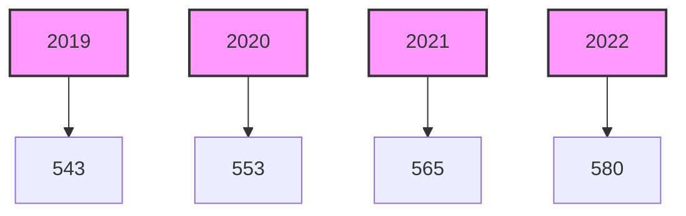
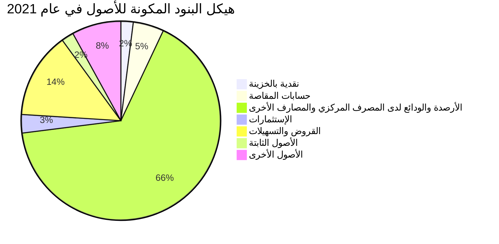
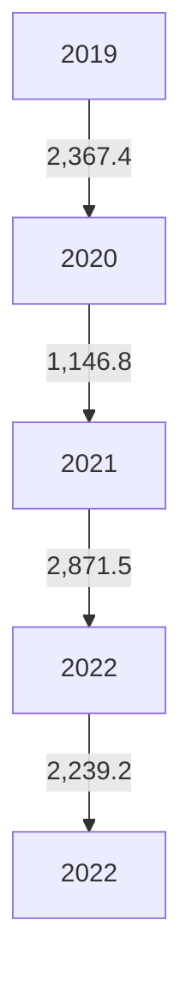
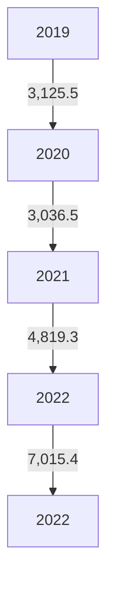
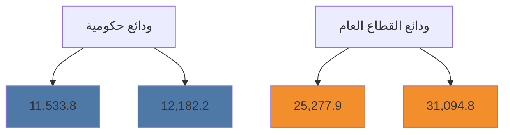

# مصرف ليبيا المركزي
# CENTRAL BANK OF LIBYA

## تقرير
## أهم البيانات والمؤشرات المالية للمصارف
## لعام 2022

[The image shows a colorful bar graph with an upward trending line graph overlaid. The bars are in various colors including blue, yellow, orange, green, and red. The line graph shows an overall upward trend with some fluctuations. At the bottom of the graph, there's a partially rolled paper or scroll, suggesting financial reports or data.]

## إدارة البحوث والإحصاء
---
إدارة البحوث والإحصاء

## المحتويات

ملخص لأداء المصارف خلال العام 2022

تفرع المصارف

الكثافة المصرفية

التركز المصرفي

الميزانية المُجمَعة للمصارف

هيكل البنود المكونة للأصول

هيكل البنود المكونة للخصوم

تحليل البنود المكونة للميزانية المُجمَعة للمصارف

- النقدية بالخزائن وحسابات المقاصة:
- الأرصدة والودائع لدى المصرف المركزي والمصارف الأخرى
- الإستثمارات
- القروض والتسهيلات الائتمانية
- ودائع العملاء لدى المصارف
- الحسابات المكشوفة لدى المراسلين بالخارج
- حقوق الملكية
- المخصصات

مؤشرات السلامة المالية للمصارف

- مؤشرات كفاية رأس المال
- مؤشرات جودة الأصول
- مؤشرات الربحية
- مؤشرات السيولة

صفحة 2 من 66

تقرير أهم البيانات والمؤشرات المالية للمصارف (2022)
---
إدارة البحوث والإحصاء

# تقرير أهم البيانات والمؤشرات المالية للمصارف لعام 2022

## ملخص لأداء المصارف خلال العام 2022 .

شهدت البيانات المالية المجمعة للمصارف في نهاية عام 2022 بعض التغيرات مقارنة عما كانت عليه في نهاية
عام 2021 وذلك على النحو التالي:

▪ إرتفع إجمالي أصول المصارف (بإستثناء الحسابات النظامية) من 136.0 مليار دينار في نهاية عام 2021
إلى نحو 148.5 مليار دينار في نهاية عام 2022، أي بمعدل نمو قدره 9.2%، وقد شكلت الأصول السائلة
(البالغة 99.1 مليار دينار) من إجمالي الأصول ما نسبته 66.7%.

▪ إرتفع إجمالي ودائع المصارف (تحت الطلب وشهادات الإيداع) لدى المصرف المركزي بما فيها الإحتياطي
الإلزامي من نحو 78.6 مليار دينار في نهاية عام 2021 إلى نحو 83.4 مليار دينار في نهاية عام 2022، أي
بمعدل بلغ 6.1%، والتي يشكل منها الإحتياطي الإلزامي نحو 20.4 مليار دينار.

▪ إرتفع إجمالي رصيد الإئتمان الممنوح من المصارف من 19.6 مليار دينار في نهاية عام 2021 إلى نحو 23.0
مليار دينار في نهاية عام 2022، أي بمعدل نمو 17.0%، وقد شكلت القروض والتسهيلات الائتمانية
الممنوحة إلى اجمالي الخصوم الإيداعية ما نسبته 22.5%، كما شكلت من اجمالي الأصول ما نسبته
15.5%، وبلغ رصيد القروض الممنوحة للقطاع الخاص في نهاية عام 2022 ما قيمته 15.5 مليار دينار،
وما نسبته 67.6% من إجمالي القروض والتسهيلات الإئتمانية الممنوحة، فيما شكل رصيد القروض
الممنوحة للقطاع العام النسبة الباقية 32.4% والتي بلغت قيمتها نحو 7.5 مليار دينار.

▪ بلغت نسبة تغطية مخصص الديون المشكوك فيها لإجمالي القروض والتسهيلات الممنوحة نسبة
16.8% في عام 2022 مقابل نسبة 18.7% في عام 2021.

▪ إرتفعت ودائع العملاء لدى المصارف من 92.1 مليار دينار في نهاية عام 2021، إلى 102.1 مليار دينار
في نهاية عام 2022، أي بمعدل 10.8%، وقد شكلت الودائع تحت الطلب ما نسبته 81.7% من إجمالي

صفحة 3 من 66
تقرير أهم البيانات والمؤشرات المالية للمصارف (2022)
---
إدارة البحوث والإحصاء

الودائع، في حين شكلت الودائع لأجل نسبة 17.9% من إجمالي الودائع، بينما شكلت ودائع الادخار
نسبة 0.3% فقط من إجمالي الودائع.

وفيما يتعلق بتوزيع هذه الودائع فقد بلغت ودائع القطاع الخاص في نهاية عام 2022 ما قيمته 58.8
مليار دينار، وما نسبته 57.6% من إجمالي الودائع، فيما شكل رصيد ودائع القطاع العام والحكومي
النسبة الباقية وقدرها 42.4% أي ما قيمته 43.3 مليار دينار، منها 31.1 مليار دينار ودائع لشركات
ومؤسسات القطاع العام ونحو 12.2 مليار دينار ودائع حكومية.

- إرتفع إجمالي حقوق الملكية في المصارف من 7.5 مليار دينار في نهاية عام 2021 إلى 8.6 مليار دينار في
نهاية عام 2022، وبمعدل 13.3%.

- إنخفضت أرباح المصارف خلال عام 2022 بمعدل 29.4% لتصل إلى 849.7 مليون دينار، مقارنة عما
كانت عليه خلال عام 2021 والتي سجلت نحو 1,176.9 مليون دينار.

- إنخفض معدل العائد إلى إجمالي الأصول خلال عام 2022 ليسجل 0.6% ، مقارنة بنحو 0.9% في
عام 2021، نتيجة الإنخفاض في الأرباح خلال عام 2021.

- سجل معدل كفاية رأس المال الكلي للمصارف مجتمعة نحو 15.7% في نهاية عام 2022 منخفضة
عما كانت عليه في عام 2021 والتي سجلت نحو 16.6% ،ويعود ذلك إلى الزيادة في حجم الأصول
المرجحة بالمخاطر والتي نمت بنسبة أعلى من النمو في قاعدة رأس المال. وهي بشكل عام أعلى من
النسبة المحددة من قبل المصرف المركزي والمتوافقة مع متطلبات لجنة بازل (1).

- بلغ عدد المصارف والمشتملة بياناتها في هذا التقرير 20 مصرفاً (بما في ذلك وحدة الدينار الليبي
التابعة للمصرف الليبي الخارجي) في نهاية عام 2022، وتزاول هذه المصارف نشاطها من خلال 580
فرعاً ووكالة.

إدارة البحوث والإحصاء

صفحة 4 من 66
تقرير أهم البيانات والمؤشرات المالية للمصارف (2022)
---
إدارة البحوث والإحصاء

# البيانات المالية الأساسية للمصارف

"مليون دينار"

| معدل التغير% | 2022 | 2021 | البند |
|--------------|------|------|------|
| 6.0 | 192,445.3 | 181,612.8 | إجمالي الميزانية (الأصول + الحسابات النظامية) |
| 9.2 | 148,529.9 | 135,977.2 | إجمالي الأصول |
| -22.0 | 2,239.2 | 2,871.5 | إجمالي النقدية بخزائن المصارف |
| 6.1 | 83,412.5 | 78,625.2 | إجمالي الودائع لدى المصرف المركزي |
| -19.2 | 619.2 | 766.6 | إجمالي الودائع لدى المصارف |
| -3.7 | 1,669.2 | 1,734.1 | إجمالي الودائع لدى المصرف الليبي الخارجي |
| 27.3 | 11,193.5 | 8,790.9 | إجمالي الودائع لدى المراسلين بالخارج |
| 16.4 | 7,034.7 | 6,041.0 | إجمالي حسابات المقاصة |
| 17.0 | 22,971.0 | 19,637.5 | إجمالي القروض والسلفيات والتسهيلات |
| -61.8 | 1,695.8 | 4,445.1 | إجمالي الاستثمارات |
| 10.8 | 102,052.7 | 92,113.7 | إجمالي ودائع العملاء |
| -28.9 | 102.9 | 144.7 | إجمالي الحسابات المكشوفة لدى المراسلين |
| 13.3 | 8,586.7 | 7,578.7 | إجمالي حقوق الملكية |
| 17.5 | 8,676.3 | 7,386.6 | إجمالي المخصصات |
| -29.4 | 849.7 | 1,176.9 | أرباح العام |
| 2.3 | 580 | 565 | عدد الفروع والوكالات |
| 1.8 | 19,888 | 19,463 | عدد العاملين |

## المؤشرات المالية:

| - | 2022 | 2021 | المؤشر |
|---|------|------|--------|
| - | %66.7 | %68.2 | الأصول السائلة / إجمالي الأصول |
| - | %15.5 | %14.4 | إجمالي القروض / إجمالي الأصول |
| - | %5.8 | %5.6 | حقوق الملكية / إجمالي الخصوم |
| - | 258.3 | 242.0 | إجمالي الأصول / عدد الفروع (مليون دينار) |
| - | 7.5 | 7.0 | إجمالي الأصول / عدد العاملين (مليون دينار) |
| - | %22.5 | %21.3 | إجمالي القروض / إجمالي الودائع |
| - | %0.6 | %0.9 | إجمالي الربح / الأصول % |
| - | %9.9 | %15.5 | إجمالي الربح / حقوق الملكية % |

صفحة 5 من 66
تقرير أهم البيانات والمؤشرات المالية للمصارف (2022)
---
إدارة البحوث والإحصاء

## مؤشرات الودائع لدى المصارف
"مليون دينار"

| البند | 2021 | 2022 | معدل التغير% |
|-------|------|------|-------------|
| 1- ودائع الحكومة والقطاع العام | 36,811.6 | 43,276.9 | 17.6 |
| ـ ودائع الحكومة (الوزارات والهيئات الممولة من الميزانية العامة) | 11,533.8 | 12,182.2 | 5.6 |
| ـ ودائع القطاع العام | 25,277.9 | 31,094.8 | 23.0 |
| 2- ودائع القطاع الخاص | 55,302.0 | 58,775.8 | 6.3 |
| ـ ودائع الأفراد | 29,161.3 | 32,922.4 | 12.9 |
| ـ ودائع الشركات والجهات الأخرى | 26,140.7 | 25,853.4 | -1.1 |
| إجمالي الودائع | 92,113.7 | 102,052.7 | 10.8 |
| الودائع تحت الطلب | 73,103.0 | 83,425.0 | 14.1 |
| الودائع لأجل | 18,695.6 | 18,317.3 | -2.0 |
| ودائع الادخار | 315.1 | 310.4 | -1.5 |
| الودائع تحت الطلب / إجمالي الودائع % | 79.4 | 81.7 | - |
| الودائع لأجل / إجمالي الودائع % | 20.3 | 17.9 | - |
| ودائع الادخار / إجمالي الودائع % | 0.3 | 0.3 | - |
| إجمالي الودائع / إجمالي الخصوم % | 67.7 | 68.7 | - |

## مؤشرات الائتمان الممنوح من المصارف
"مليون دينار"

| البند | 2021 | 2022 | معدل التغير% |
|-------|------|------|-------------|
| 1- الائتمان الممنوح للقطاع العام | 6,471.7 | 7,454.0 | 15.2 |
| 2- الائتمان الممنوح للقطاع الخاص | 13,165.8 | 15,516.9 | 17.9 |
| إجمالي الائتمان | 19,637.5 | 22,971.0 | 17.0 |
| السلفيات والسحب على المكشوف | 4,618.6 | 4,166.2 | -9.8 |
| قروض المرابحة (تشمل رصيد السلف الاجتماعية) | 4,819.3 | 7,015.4 | 45.6 |
| القروض الممنوحة للأنشطة الاقتصادية الأخرى | 10,199.6 | 11,789.4 | 15.6 |
| قروض المرابحة / إجمالي الائتمان % | 24.5 | 30.5 | - |
| السلفيات والسحب على المكشوف / إجمالي الائتمان % | 23.5 | 18.1 | - |
| القروض الممنوحة للأنشطة الأخرى/اجمالي الائتمان% | 51.9 | 51.3 | - |
| إجمالي الائتمان / إجمالي الأصول % | 14.4 | 15.5 | - |
| إجمالي الائتمان / إجمالي الودائع % | 21.3 | 22.5 | - |

صفحة 6 من 66
تقرير أهم البيانات والمؤشرات المالية للمصارف (2022)
---
إدارة البحوث والإحصاء

تفرع المصارف:-

بلغ عدد المصارف العاملة في ليبيا والمشتملة بياناتها في هذا التقرير 20 مصرفاً (بما في ذلك وحدة الدينار الليبي
التابعة للمصرف الليبي الخارجي) حتى نهاية عام 2022، وتزاول هذه المصارف نشاطها من خلال 580 فرعاً
ووكالة مصرفية.

تطور عدد الفروع والوكالات المصرفية والعاملين بها

| نهاية | عدد الفروع والوكالات المصرفية | عدد العاملين بالمصارف |
|-------|--------------------------------|------------------------|
| 2019  | 543                            | 19,387                 |
| 2020  | 553                            | 19,565                 |
| 2021  | 565                            | 19,588                 |
| 2022  | 580                            | 19,815                 |

تطور عدد الفروع والوكالات المصرفية



صفحة 7 من 66
تقرير أهم البيانات والمؤشرات المالية للمصارف (2022)
---
إدارة البحوث والإحصاء

- الكثافة المصرفية:

بلغت الكثافة المصرفية خلال عام 2022 نحو 12.1 ألف نسمة لكل فرع أو وكالة مقارنة بنحو 12.6 ألف نسمة لكل فرع أو وكالة في عام 2021.

الكثافة المصرفية
"بالألف نسمة"

| نهاية | لكل مصرف | لكل فرع ووكالة |
|-------|------------|-----------------|
| 2019  | 368.4     | 12.9            |
| 2020  | 368.3     | 12.8            |
| 2021  | 388.9     | 12.6            |
| 2022  | 350.0     | 12.1            |

```mermaid
graph LR
    A[2019] --> B[2020] --> C[2021] --> D[2022]
    A -- 12.9 --> B -- 12.8 --> C -- 12.6 --> D -- 12.1 -->
    style A fill:#f9f,stroke:#333,stroke-width:2px
    style B fill:#f9f,stroke:#333,stroke-width:2px
    style C fill:#f9f,stroke:#333,stroke-width:2px
    style D fill:#f9f,stroke:#333,stroke-width:2px
```

التركز المصرفي:

درجة التركز المصرفي تعني أن عدداً قليلاً من المصارف يستأثر بالنسبة الأكبر من النشاط المصرفي سواءً من حيث الأصول أو الودائع أوالائتمان أو من حيث حجم حقوق الملكية، وفيما يخص الحصة السوقية للمصارف في ليبيا، فقد شكلت أصول المصارف الأربعة الكبرى (الجمهورية، التجاري الوطني، الوحدة والصحاري) من أصل 20 مصرفاً مانسبته 71.4% من إجمالي أصول القطاع المصرفي في نهاية عام 2022، وشكل مصرف الجمهورية وحده ما نسبته 27.5% من إجمالي أصول القطاع المصرفي.

صفحة 8 من 66
تقرير أهم البيانات والمؤشرات المالية للمصارف (2022)
---
إدارة البحوث والإحصاء

وشكلت ودائع وقروض المصارف الأربعة الكبرى مانسبته 71.9% و 82.8% على التوالي من إجمالي ودائع وقروض
القطاع المصرفي نهاية عام 2022.

ومن خلال بيانات التركز في الأصول والإئتمان والخصوم الإيداعية يلاحظ أن هناك تحسن ملحوظ في نسب
التركز في القطاع المصرفي كما هو موضح بالجداول التالية :

تركز الأصول

"نسب مئوية"

| 2022 | 2021 | 2020 | 2019 | نهاية |
|-------|------|------|------|-------|
| 27.5  | 28.0 | 31.2 | 31.9 | أكبر مصرف |
| 61.7  | 62.0 | 63.1 | 64.6 | أكبر ثلاثة مصارف |
| 78.6  | 79.7 | 82.7 | 84.2 | أكبر خمسة مصارف |

تركز الإئتمان

"نسب مئوية"

| 2021 | 2021 | 2020 | 2019 | نهاية |
|-------|------|------|------|-------|
| 38.6  | 40.7 | 42.6 | 40.7 | أكبر مصرف |
| 74.6  | 76.2 | 78.3 | 75.8 | أكبر ثلاثة مصارف |
| 85.2  | 87.6 | 91.4 | 91.4 | أكبر خمسة مصارف |

تركز الخصوم الإيداعية

"نسب مئوية"

| 2021 | 2021 | 2020 | 2019 | نهاية |
|-------|------|------|------|-------|
| 32.1  | 33.8 | 31.8 | 32.3 | أكبر مصرف |
| 60.5  | 62.0 | 62.9 | 64.4 | أكبر ثلاثة مصارف |
| 79.2  | 79.5 | 83.7 | 85.6 | أكبر خمسة مصارف |

صفحة 9 من 66
تقرير أهم البيانات والمؤشرات المالية للمصارف (2022)
---
إدارة البحوث والإحصاء

## تركز الأصول

| السنة | أكبر مصرف | أكبر ثلاثة مصارف | أكبر خمسة مصارف |
|-------|-----------|------------------|------------------|
| 2019  | 31.9      | 64.6             | 84.2             |
| 2020  | 31.2      | 63.1             | 82.7             |
| 2021  | 28.0      | 62.0             | 79.7             |
| 2022  | 27.5      | 61.7             | 78.6             |

## تركز الإئتمان

| السنة | أكبر مصرف | أكبر ثلاثة مصارف | أكبر خمسة مصارف |
|-------|-----------|------------------|------------------|
| 2019  | 40.7      | 75.8             | 91.4             |
| 2020  | 42.6      | 78.3             | 91.4             |
| 2021  | 40.7      | 76.2             | 87.6             |
| 2022  | 38.6      | 74.6             | 85.2             |

## تركز الخصوم الإيداعية

| السنة | أكبر مصرف | أكبر ثلاثة مصارف | أكبر خمسة مصارف |
|-------|-----------|------------------|------------------|
| 2019  | 32.3      | 64.4             | 85.6             |
| 2020  | 31.8      | 62.9             | 83.7             |
| 2021  | 33.8      | 62.0             | 79.5             |
| 2022  | 32.1      | 60.5             | 79.2             |

صفحة 12 من 66
تقرير أهم البيانات والمؤشرات المالية للمصارف (2022)
---
إدارة البحوث والإحصاء

# الميزانية المُجمَعة للمصارف

شهدت الميزانية المُجمَعة للمصارف نهاية عام 2022، تطورات في مجمل بنودها على جانبي الأصول والخصوم،
ليبلغ إجمالي الأصول داخل الميزانية المُجمَعة نحو 148,529.9 مليون دينار، مقابل 135,977.2 مليون دينار في
نهاية عام 2021، بإرتفاع قدره 12,552.7 مليون دينار، أي بمعدل 9.2%، وفيما يلي جدول يلخص البنود
الرئيسية للميزانية المُجمَعة للمصارف:

## مُلخص الميزانية المُجمَعة للمصارف
"مليون دينار"

| البند | 2021 | 2022 | مقدارالتغير | معدل التغير% |
|-------|------|------|-------------|--------------|
| الأصول : |
| 1- نقدية بالخزائن | 2,871.5 | 2,239.2 | -632.3 | -22.0 |
| - عملة محلية | 2,775.1 | 2,013.2 | -761.9 | -27.5 |
| - عملة أجنبية | 96.4 | 226.1 | 129.7 | 134.5 |
| 2- حسابات المقاصة | 6,041.0 | 7,034.7 | 993.7 | 16.4 |
| - المقاصة بين المصارف | 2,432.9 | 3,475.6 | 1,042.7 | 42.9 |
| - المقاصة بين الفروع | 3,608.1 | 3,559.1 | -49.0 | -1.4 |
| 3- الودائع لدى المصارف الأخرى | 89,916.8 | 96,894.4 | 6,977.6 | 7.8 |
| أ- الودائع لدى المصرف المركزي | 78,625.2 | 83,412.5 | 4,787.3 | 6.1 |
| - ودائع تحت الطلب | 64,455.6 | 79,920.0 | 15,464.4 | 24.0 |
| - شهادات الإيداع | 14,169.6 | 3,492.6 | -10,677.0 | -75.4 |
| ب- الودائع لدى المصارف المحلية الأخرى | 766.6 | 619.2 | -147.4 | -19.2 |
| - ودائع تحت الطلب | 766.6 | 619.2 | -147.4 | -19.2 |
| - ودائع زمنية | 0.0 | 0.0 | 0.0 | - |
| ج- الودائع لدى المصرف الليبي الخارجي | 1,734.1 | 1,669.2 | -64.9 | -3.7 |
| - ودائع تحت الطلب | 1,734.1 | 1,669.2 | -64.9 | -3.7 |
| - ودائع زمنية | 0.0 | 0.0 | 0.0 | - |
| د- الودائع لدى المصارف بالخارج | 8,790.9 | 11,193.5 | 2,402.6 | 27.3 |
| - ودائع تحت الطلب | 7,260.4 | 8,631.3 | 1,370.9 | 18.9 |
| - ودائع زمنية | 1,530.6 | 2,562.1 | 1,031.5 | 67.4 |
| 4- الإستثمارات | 4,445.1 | 1,695.8 | -2,749.3 | -61.9 |
| 5- القروض والتسهيلات | 19,637.5 | 22,971.0 | 3,333.5 | 17.0 |
| - السلفيات والسحب على المكشوف | 4,618.6 | 4,166.2 | -452.4 | -9.8 |
| - السلف الإجتماعية (تشمل قروض المرابحة للأفراد) | 4,819.3 | 7,015.4 | 2,196.1 | 45.6 |
| - قروض الأنشطة الإقتصادية الأخرى | 10,199.6 | 11,789.4 | 1,589.8 | 15.6 |
| 6- الأصول الثابتة | 2,287.4 | 2,743.8 | 456.4 | 20.0 |
| 7- الأصول الأخرى | 10,778.0 | 14,951.0 | 4,173.0 | 38.7 |
| إجمالي الأصول | 135,977.2 | 148,529.9 | 12,552.7 | 9.2 |
| الحسابات المقابلة | 45,635.7 | 43,915.4 | -1,720.3 | -3.8 |
| الإجمالي الكلي للأصول | 181,612.8 | 192,445.3 | 10,832.5 | 6.0 |

صفحة 11 من 66
تقرير أهم البيانات والمؤشرات المالية للمصارف (2022)
---
إدارة البحوث والإحصاء

"مليون دينار"

| معدل التغير% | مقدارالتغير | 2022 | 2021 | البند |
|--------------|-------------|------|------|-------|
| | | | | الخصوم |
| 10.8 | 9,939.0 | 102,052.7 | 92,113.7 | 1- ودائع الغير لدى المصارف |
| 13.8 | 9,614.2 | 79,044.0 | 69,429.8 | - الودائع تحت الطلب |
| -5.0 | -108.7 | 2,071.7 | 2,180.4 | - الودائع الزمنية |
| -1.5 | -4.7 | 310.4 | 315.1 | - الودائع الإدخارية |
| 19.3 | 707.9 | 4,381.0 | 3,673.1 | - أوامر الدفع |
| -1.6 | -269.6 | 16,245.6 | 16,515.2 | - التأمينات النقدية |
| 0.0 | 0.0 | 19,884.0 | 19,884.0 | 2- الإقتراض من المصارف والجهات الأخرى |
| -28.9 | -41.8 | 102.9 | 144.7 | 3- الحسابات المكشوفة لدى المراسلين |
| 14.0 | 1,060.0 | 8,638.7 | 7,578.7 | 4- حقوق الملكية |
| 11.0 | 522.6 | 5,295.2 | 4,772.6 | - رأس المال المدفوع |
| 16.8 | 134.7 | 934.5 | 799.8 | - الإحتياطي القانوني |
| 450.0 | 276.3 | 337.7 | 61.4 | - إحتياطيات غير مخصصة |
| -27.8 | -327.2 | 849.7 | 1,176.9 | - أرباح العام |
| 59.0 | 453.5 | 1,221.6 | 768.1 | - الأرباح المرحّلة والقابلة للتوزيع |
| 17.5 | 1,289.7 | 8,676.3 | 7,386.6 | 5- المخصصات |
| 3.4 | 305.9 | 9,175.3 | 8,869.4 | 6- المتنوعات والخصوم الأخرى |
| 9.2 | 12,552.8 | 148,529.9 | 135,977.1 | إجمالي الخصوم |
| -3.8 | -1,720.3 | 43,915.4 | 45,635.7 | الحسابات المقابلة |
| 6.0 | 10,832.5 | 192,445.3 | 181,612.8 | الإجمالي الكلي للخصوم |

صفحة 12 من 66
تقرير أهم البيانات والمؤشرات المالية للمصارف (2022)
---
إدارة البحوث والإحصاء

- هيكل البنود المكونة للأصول في الميزانية المُجمَعة للمصارف:

إستمرت ودائع وأرصدة المصارف لدى المصرف المركزي بما فيه الإحتياطي الإلزامي المطلوب هو المكون
الرئيسي لإصول القطاع المصرفي، حيث تغطي نحو 56.2% من إجمالي الأصول في نهاية عام 2022، في حين
إرتفعت حصة بند القروض والتسهيلات الإئتمانية بشكل طفيف في هيكل الموجودات لتسجل نحو 15.5%
من الإجمالي مقارنة بـ 14.4% في عام 2021 ، وهى نسب ضئيلة جداً تعكس ضعف توظيف المصارف
لأموالها.

جدول هيكل البنود المكونة للأصول

| البند | 2021 | 2022 |
|---|---|---|
| الأصول : |  |  |
| 1-نقدية بالخزائن | 2.1% | 1.5% |
| 2-حسابات المقاصة | 4.4% | 4.7% |
| 3-الودائع لدى المصرف المركزي | 57.8% | 56.2% |
| 4-الودائع لدى المصارف المحلية الأخرى | 0.6% | 0.4% |
| 5-الودائع لدى المصرف الليبي الخارجي | 1.3% | 1.1% |
| 6-الودائع لدى المصارف بالخارج | 6.5% | 7.5% |
| 7-الإستثمارات | 3.3% | 1.1% |
| 8-القروض والتسهيلات | 14.4% | 15.5% |
| 9-الأصول الثابتة | 1.7% | 1.8% |
| 10-الأصول الأخرى | 7.9% | 10.1% |

هيكل البنود المكونة للأصول في عام 2021



صفحة 13 من 66
تقرير أهم البيانات والمؤشرات المالية للمصارف (2022)
---
إدارة البحوث والإحصاء

## هيكل البنود المكونة للأصول في عام 2022

| البند | النسبة |
|-------|--------|
| الأرصدة والودائع لدى المصرف المركزي والمصارف الأخرى | 65% |
| القروض والتسهيلات | 15% |
| الأصول الأخرى | 10% |
| حسابات المقاصة | 5% |
| نقدية بالخزينة | 2% |
| الأصول الثابتة | 2% |
| الإستثمارات | 1% |

## هيكل البنود المكونة للخصوم في الميزانية المُجمَعة للمصارف:

بتحليل هيكل البنود المكونة للخصوم بالميزانية المُجمَعة للمصارف في عام 2022 فإن ودائع الغير لدى المصارف (ودائع العملاء) تمثل المصدر الرئيسي للتمويل مشكلة مانسبته 68.7% من إجمالي مصادر أموال المصارف ، مقارنة بنحو 67.7% في عام 2021.

فيما شكلت حقوق الملكية نحو 5.8% من إجمالي مصادر أموال المصارف في عام 2022 ، مقابل نسبة 5.6% في عام 2021.

### جدول هيكل البنود المكونة للخصوم

| البند | 2021 | 2022 |
|-------|------|------|
| 1- ودائع الغير لدى المصارف | 67.7% | 68.7% |
| 2- الإقتراض من المصرف المركزي | 14.6% | 13.4% |
| 3- الحسابات المكشوفة لدى المراسلين | 0.1% | 0.1% |
| 4- حقوق الملكية | 5.6% | 5.8% |
| 5- المخصصات | 5.4% | 5.8% |
| 6- المتنوعات والخصوم الأخرى | 6.5% | 6.2% |

صفحة 14 من 66
تقرير أهم البيانات والمؤشرات المالية للمصارف (2022)
---
إدارة البحوث والإحصاء

## هيكل البنود المكونة للخصوم في عام 2021

| البند | النسبة |
|-------|--------|
| ودائع الغير لدى المصارف | 68% |
| الاقتراض من المصارف | 15% |
| الحسابات المكشوفة لدى المراسلين | 0% |
| حقوق الملكية | 6% |
| المخصصات | 5% |
| أخرى | 6% |

## هيكل البنود المكونة للخصوم في عام 2022

| البند | النسبة |
|-------|--------|
| ودائع الغير لدى المصارف | 69% |
| الاقتراض من المصارف | 13% |
| الحسابات المكشوفة لدى المراسلين | 0% |
| حقوق الملكية | 6% |
| المخصصات | 6% |
| أخرى | 6% |

صفحة 15 من 66

تقرير أهم البيانات والمؤشرات المالية للمصارف (2022)
---
إدارة البحوث والإحصاء

# تحليل لأهم البنود المكونة للميزانية المُجمَعة للمصارف

## أولاً: جانب الأصول

### 1- النقدية :

#### أ- النقدية بالخزائن وحسابات المقاصة :

ارتفع رصيد النقدية بخزائن المصارف وحسابات المقاصة بمقدار 361.4 مليون دينار أي بمعدل 4.1%، لتصل
إلى 9,273.9 مليون دينار في نهاية عام 2022، مقابل 8,912.5 مليون دينار في نهاية عام 2021، بسبب ارتفاع
بند حسابات المقاصة بين المصارف بمقدار 1,042.6 مليون دينار في نهاية عام 2022 مقارنة بعام 2021، في
حين إنخفض رصيد النقد بخزائن المصارف بمقدار 632.2 مليون دينار في نهاية عام 2022 مقارنة بعام 2021
، والجدول التالي يوضح ذلك :

"مليون دينار"

| البيان | 2021 | 2022 | مقدار التغير | معدل التغير% |
|---|---|---|---|---|
| النقدية بالخزائن : | 2,871.5 | 2,239.2 | -632.2 | -22.0 |
| عملة محلية | 2,775.1 | 2,013.2 | -761.9 | -27.5 |
| عملة أجنبية | 96.4 | 226.1 | 129.7 | 134.6 |
| إجمالي حسابات المقاصة | 6,041.0 | 7,034.7 | 993.6 | 16.4 |
| المقاصة بين المصارف | 2,432.9 | 3,475.6 | 1,042.6 | 42.9 |
| المقاصة بين الفروع | 3,608.1 | 3,559.1 | -49.0 | -1.4 |
| الإجمالي | 8,912.5 | 9,273.9 | 361.4 | 4.1 |

نقدية بخزائن المصارف التجارية



صفحة 16 من 66
تقرير أهم البيانات والمؤشرات المالية للمصارف (2022)
---
إدارة البحوث والإحصاء

## إجمالي حسابات المقاصة

| السنة | القيمة (مليون دينار) |
|-------|----------------------|
| 2019  | 6,304.6              |
| 2020  | 5,584.8              |
| 2021  | 6,041.0              |
| 2022  | 7,034.7              |

## ب-الأرصدة والودائع لدى المصرف المركزي والمصارف الأخرى:

بلغ رصيد أرصدة وودائع المصارف لدى المصرف المركزي والمصارف الأخرى ولدى المصارف الخارجية نحو 96,894.4 مليون دينار في نهاية عام 2022، مقابل 89,916.8 مليون دينار في نهاية عام 2021، مرتفعة بقيمة 6,977.6 مليون دينار، نتيجة لإرتفاع الأرصدة والودائع لدى المصرف المركزي بنحو 4,787.4 مليون دينار كمحصلة لإرتفاع الودائع تحت الطلب بنحو 15,464.4 مليون دينار والذي كان أعلى من الإنخفاض في رصيد شهادات الإيداع الذي إنخفض بنحو 10,677.0 مليون دينار. وكذلك من الإرتفاع في رصيد الودائع تحت الطلب والزمنية لدى المراسلين بالخارج بنحو 2,402.5 مليون دينار، والجدول التالي يوضح تفاصيل هذا البند:

### الأرصدة والودائع لدى المصرف المركزي والمصارف الأخرى
"مليون دينار"

| البند | 2021 | 2022 | مقدار التغير | معدل التغير% |
|-------|------|------|---------------|--------------|
| ودائع تحت الطلب لدى : | 74,216.6 | 90,839.6 | 16,623.0 | 22.4 |
| المصرف المركزي | 64,455.6 | 79,920.0 | 15,464.4 | 24.0 |
| المصارف المحلية | 766.6 | 619.2 | -147.4 | -19.2 |
| المصرف الليبي الخارجي | 1,734.1 | 1,669.2 | -64.9 | -3.7 |
| لدى المراسلين بالخارج | 7,260.4 | 8,631.3 | 1,370.9 | 18.9 |
| ودائع زمنية : | 15,700.2 | 6,054.7 | -9,645.4 | -61.4 |
| المصرف المركزي (شهادات الإيداع) | 14,169.6 | 3,492.6 | -10,677.0 | -75.4 |
| المصارف المحلية | 0.0 | 0.0 | 0.0 | - |
| المصرف الليبي الخارجي | 0.0 | 0.0 | 0.0 | - |
| لدى المراسلين بالخارج | 1,530.6 | 2,562.1 | 1,031.6 | 67.4 |
| الإجمالي | 89,916.8 | 96,894.4 | 6,977.6 | 7.8 |

صفحة 17 من 66
تقرير أهم البيانات والمؤشرات المالية للمصارف (2022)
---
إدارة البحوث والإحصاء

## ودائع المصارف التجارية لدى المصرف المركزي والمصارف الأخرى

| السنة | والودائع تحت الطلب | والودائع الزمنية |
|-------|---------------------|------------------|
| 2019  | 60,184.6            | 17,240.3         |
| 2020  | 72,269.0            | 17,567.6         |
| 2021  | 74,216.6            | 15,700.2         |
| 2022  | 90,839.6            | 6,054.7          |

## 2- الإستثمارات :

سجل إجمالي رصيد الإستثمارات نهاية عام 2022 نحو 1,695.8 مليون دينار، مقابل 4,445.1 مليون دينار
في نهاية عام 2021، منخفض بمقدار 2,749.2 مليون دينار هذا الإنخفاض جاء نتيجة للإنخفاض في
سندات وأذونات الخزانة، والجدول التالي يوضح تفاصيل هذا البند:

"مليون دينار"

| البيان                           | 2021    | 2022    | مقدارالتغير | معدل التغير% |
|----------------------------------|---------|---------|-------------|--------------|
| سندات وأذونات الخزانة            | 3,000.0 | 0.0     | -3,000.0    | -100.0       |
| إستثمارات في الشركات العامة      | 564.7   | 564.2   | -0.5        | -0.1         |
| إستثمارات في الشركات الخاصة المساهمة | 783.5   | 872.0   | 88.5        | 11.3         |
| إستثمارات أخرى                   | 96.9    | 259.7   | 162.8       | 168.1        |
| الإجمالي                         | 4,445.1 | 1,695.8 | -2,749.2    | -61.8        |

### إجمالي بند الإستثمارات

| السنة | القيمة (مليون دينار) |
|-------|----------------------|
| 2019  | 1,957.5              |
| 2020  | 4,256.6              |
| 2021  | 4,445.1              |
| 2022  | 1,695.8              |

صفحة 18 من 66
تقرير أهم البيانات والمؤشرات المالية للمصارف (2022)
---
إدارة البحوث والإحصاء

### 3- القروض والتسهيلات الائتمانية:

ارتفع إجمالي رصيد القروض والتسهيلات الائتمانية الممنوحة من المصارف من 19,637.5 مليون دينار في نهاية عام 2021 إلى 22,971.0 مليون دينار في نهاية عام 2022، أي بمعدل نمو 17.0%، وقد شكلت القروض والتسهيلات الائتمانية الممنوحة إلى إجمالي الخصوم الإيداعية ما نسبته 22.5%، كما شكلت من إجمالي الأصول ما نسبته 15.5%، وبلغ رصيد القروض الممنوحة للقطاع الخاص في نهاية عام 2022 ما قيمته 15,516.9 مليون دينار، وما نسبته 67.6% من إجمالي القروض والتسهيلات الإئتمانية الممنوحة، فيما شكل رصيد القروض الممنوحة للقطاع العام النسبة الباقية 32.4% والتي بلغت قيمتها نحو 7,454.0 مليون دينار.

وبتحليل مكونات المحفظة الائتمانية فقد كان الإرتفاع في إجمالي رصيد الإئتمان الممنوح من المصارف بسبب الزيادة في بندي قروض المرابحة للأفراد (السلف الإجتماعية) و القروض الأخرى.

#### رصيد القروض والتسهيلات الائتمانية الممنوحة من المصارف
"مليون دينار"

| البند | 2021 | 2022 | مقدار التغير | معدل التغير% |
|---|---|---|---|---|
| سلفيات والسحب على المكشوف | 4,618.6 | 4,166.2 | -452.4 | -9.8 |
| قروض المرابحة للأفراد* | 4,819.3 | 7,015.4 | 2,196.1 | 45.6 |
| القروض الأخرى | 10,199.6 | 11,789.4 | 1,589.8 | 15.6 |
| إجمالي القروض والتسهيلات | 19,637.5 | 22,971.0 | 3,333.5 | 17.0 |
| مخصص الديون المشكوك في تحصيلها | 3,680.3 | 3,850.7 | 170.4 | 4.6 |
| صافي القروض والتسهيلات | 15,957.2 | 19,120.3 | 3,163.1 | 19.8 |

(*) يشمل رصيد السلف الإجتماعية.

#### رصيد بند المرابحة والسلف الإجتماعية



صفحة 19 من 66
تقرير أهم البيانات والمؤشرات المالية للمصارف (2022)
---
إدارة البحوث والإحصاء

## السلفيات والسحب على المكشوف

| السنة | القيمة (مليون دينار) |
|-------|----------------------|
| 2019  | 5,275.4              |
| 2020  | 4,495.7              |
| 2021  | 4,618.6              |
| 2022  | 4,166.2              |

## توزيع القروض الممنوحة من المصارف حسب القطاع (خاص وعام)
"مليون دينار"

| البند                        | 2021     | 2022     | مقدار التغير | معدل التغير% |
|-----------------------------|----------|----------|--------------|--------------|
| القروض الممنوحة للقطاع العام  | 6,471.7  | 7,454.0  | 982.4        | 15.2         |
| القروض الممنوحة للقطاع الخاص | 13,165.8 | 15,516.9 | 2,351.1      | 17.9         |
| الإجمالي                     | 19,637.5 | 22,971.0 | 3,333.5      | 17.0         |

## رصيد القروض الممنوحة للقطاع العام

| السنة | القيمة (مليون دينار) |
|-------|----------------------|
| 2019  | 6,057.0              |
| 2020  | 5,918.2              |
| 2021  | 6,471.7              |
| 2022  | 7,454.0              |

صفحة 22 من 66
تقرير أهم البيانات والمؤشرات المالية للمصارف (2022)
---
إدارة البحوث والإحصاء

## رصيد القروض الممنوحة للقطاع الخاص

| السنة | القيمة (مليون دينار) |
|-------|----------------------|
| 2019  | 10,855.8             |
| 2020  | 11,078.7             |
| 2021  | 13,165.8             |
| 2022  | 15,516.9             |

## ثانياً: جانب الخصــوم

### 1- ودائع العمـلاء لدى المصـارف :

ارتفعت ودائع العمـلاء (الخصوم الإيداعية) لدى المصارف بشكل كبير بمقدار 9,939.1 مليون دينار من 92,113.6 مليون دينـار في نهاية عام 2021، إلى 102,052.7 مليون دينار في نهاية عام 2022، أي بمعدل نمو بلغ 10.8%، وقد شكلت الودائع تحت الطلب وأوامر الدفع ما نسبته 81.7% من إجمالي الودائع، في حين شكلت الودائع لأجل والتأمينات النقدية نسبة 17.9% من إجمالي الودائع، بينما شكلت ودائع الادخار نسبة 0.3% فقط من إجمالي الودائع.

### جدول ودائع العمـلاء (الخصوم الإيداعية)
"مليون دينار"

| البند | 2021 | 2022 | مقدار التغير | معدل التغير% |
|-------|------|------|---------------|---------------|
| الودائع تحت الطلب | 69,429.8 | 79,044.0 | 9,614.2 | 13.8 |
| الودائع الزمنية | 2,180.4 | 2,071.7 | -108.7 | -5.0 |
| الودائع الإدخارية | 315.1 | 310.4 | -4.7 | -1.5 |
| أوامر الدفع | 3,673.1 | 4,381.0 | 707.9 | 19.3 |
| التأمينات النقدية | 16,515.2 | 16,245.6 | -269.6 | -1.6 |
| الإجمالي | 92,113.6 | 102,052.7 | 9,939.1 | 10.8 |

صفحة 21 من 66
تقرير أهم البيانات والمؤشرات المالية للمصارف (2022)
---
إدارة البحوث والإحصاء

- الودائع تحت الطلب وأوامر الدفع: إرتفعت الودائع تحت الطلب وأوامر الدفع بشكل كبير في نهاية عام 2022 بمقدار 10,322.1 مليون دينار لتسجل 83,425.0 مليون دينار مقارنة بـ 73,102.9 مليون دينار في عام 2021.

- الودائع لأجل والتأمينات النقدية: إنخفض بند الودائع لأجل والتأمينات النقدية في نهاية عام 2022 بمقدار 378.3 مليون دينار لتسجل 18,317.3 مليون دينار مقابل 18,695.6 مليون دينار في عام 2021. وتجدر الإشارة إلى أن معظم التأمينات النقدية هي مقابل الإعتمادات المستندية.

- الودائع الإدخارية: إنخفض رصيد الودائع الإدخارية في نهاية عام 2022 بمقدار 4.7 مليون دينار لتسجل 310.4 مليون دينار مقابل 315.1 مليون دينار في نهاية عام 2021.

| إجمالي ودائع العملاء لدى المصارف |
|----------------------------------|

| 125,000.0 |
| 105,000.0 | 88,600.0 | 102,194.2 | 92,113.7 | 102,052.7 |
| 85,000.0 | 77,600.0 | | | 83,425.0 |
| | | 92,530.6 | 73,103.0 | |
| 65,000.0 |
| 45,000.0 |
| 25,000.0 | | | 18,695.6 | 18,317.3 |
| | 10,600.0 | 9,225.9 | | |
| 5,000.0 | | 400.0 | 437.6 | 315.1 | 310.4 |
| -15,000.0 | 2019 | 2020 | 2021 | 2022 |
| | ودائع تحت الطلب | ودائع زمنية | ودائع إدخارية | إجمالي الودائع |

وفيما يتعلق بتوزيع ودائع العملاء لدى المصارف حسب القطاع (خاص، عام وحكومة):

فقد إرتفعت ودائع القطاع العام والحكومي في نهاية عام 2022 بمقدار 6,465.3 مليون دينار لتصل إلى 43,276.9 مليون دينار، منها 12,182.2 مليون دينار كودائع حكومية والتي تتكون من ودائع الوزارات والهيئات والمؤسسات الحكومية وودائع كل من: صندوق الضمان الإجتماعي، صندوق الإنماء الإقتصادي والإجتماعي وودائع الصندوق الليبي للتنمية والإستثمار، مقابل 36,811.6 مليون دينار كودائع للقطاع العام والحكومي في نهاية عام 2021.

صفحة 22 من 66
تقرير أهم البيانات والمؤشرات المالية للمصارف (2022)
---
إدارة البحوث والإحصاء

أما فيما يتعلق بودائع القطاع الخاص لدى المصارف فقد أرتفعت أيضاً في نهاية عام 2022 بمقدار 3,473.7
مليون دينار وبنسبة 6.3% لتسجل نحو 58,775.8 مليون دينار مقارنة بنحو 55,302.0 مليون دينار عما كانت
عليه في نهاية عام 2021.

جدول توزيع ودائع العملاء لدى المصارف حسب القطاع (خاص، عام وحكومة)

"مليون دينار"

| البند | 2021 | 2022 | مقدار التغير | معدل التغير% |
|---------------------------|------------|------------|--------------|---------------|
| ودائع الحكومة والقطاع العام | 36,811.6 | 43,276.9 | 6,465.3 | 17.6 |
| - ودائع حكومية | 11,533.8 | 12,182.2 | 648.4 | 5.6 |
| - ودائع القطاع العام | 25,277.9 | 31,094.8 | 5,816.9 | 23.0 |
| ودائع القطاع الخاص | 55,302.0 | 58,775.8 | 3,473.7 | 6.3 |
| - الأفراد | 29,161.3 | 32,922.4 | 3,761.0 | 12.9 |
| - الشركات والمؤسسات | 26,140.7 | 25,853.4 | -287.3 | -1.1 |
| الإجمالي | 92,113.7 | 102,052.7 | 9,939.0 | 10.8 |

ودائع القطاع الحكومي والقطاع العام



صفحة 23 من 66
تقرير أهم البيانات والمؤشرات المالية للمصارف (2022)
---
إدارة البحوث والإحصاء

## ودائع القطاع الخاص

| السنة | الأفراد | الشركات والمؤسسات |
|-------|--------|-------------------|
| 2021  | 29,161.3 | 26,140.7 |
| 2022  | 32,922.4 | 25,853.4 |
| 2021  | 29,161.3 | 26,140.7 |
| 2022  | 32,922.4 | 25,853.4 |

*القيم بالمليون دينار*

## 2- الحسابات المكشوفة لدى المراسلين بالخارج:

بلغ رصيد الحسابات المكشوفة لدى المراسلين بالخارج 102.9 مليون دينار في نهاية عام 2022، منخفضة عما كانت عليه في نهاية عام 2021، وهذه الحسابات المكشوفة لدى المصارف بالخارج ناتجة فقط عن تأخر بعض المصارف في تسوية حساباتها مع المصارف المراسلة.

| البيان | 2021 | 2022 | مقدار التغير | معدل التغير% |
|--------|------|------|---------------|--------------|
| الحسابات المكشوفة لدى المراسلين بالخارج | 144.7 | 102.9 | -41.8 | -28.9 |

*القيم "بالمليون دينار"*

### الحسابات المكشوفة لدى المراسلين بالخارج

| السنة | القيمة (مليون دينار) |
|-------|----------------------|
| 2019  | 113.1 |
| 2020  | 220.4 |
| 2021  | 144.7 |
| 2022  | 102.9 |

صفحة 24 من 66
تقرير أهم البيانات والمؤشرات المالية للمصارف (2022)
---
إدارة البحوث والإحصاء

### 3- حقوق الملكية :

ارتفع رصيد حقوق الملكية في المصارف من 7,578.7 مليون دينار في نهاية عام 2021، ليصل إلى 8,586.7 مليون
دينار في نهاية عام 2022، نتيجة الزيادة في راس المال المدفوع لبعض المصارف وكذلك الاحتياطيات القانونية
والغير مخصصة ، فيما سجلت أرباح المصارف قبل خصم المخصصات والضرائب خلال عام 2022 انخفاضاً
بمعدل 27.8% لتسجل إلى 849.7 مليون دينار، مقارنة عما كانت عليه خلال عام 2021 والبالغة نحو 1,176.9
مليون دينار.

#### حسابات رأس المال
" مليون دينار "

| البيان | 2021 | 2022 | مقدار التغير | معدل التغير% |
|---|---|---|---|---|
| رأس المال المدفوع | 4,772.6 | 5,295.2 | 522.7 | 11.0 |
| الاحتياطي القانوني | 799.8 | 934.5 | 134.7 | 16.8 |
| احتياطيات غير مخصصة | 61.4 | 337.7 | 276.3 | 450.1 |
| أرباح العام | 1,176.9 | 849.7 | -327.2 | -27.8 |
| الأرباح المرحّلة والأرباح القابلة للتوزيع | 768.1 | 1,221.6 | 453.5 | 59.0 |
| الإجمالي | 7,578.7 | 8,638.7 | 1,060.0 | 14.0 |

#### إجمالي حقوق الملكية في المصارف

```mermaid
graph TD
    A[2019] --> B[2020]
    B --> C[2021]
    C --> D[2022]
    
    style A fill:#4e79a7,stroke:#333,stroke-width:2px
    style B fill:#4e79a7,stroke:#333,stroke-width:2px
    style C fill:#4e79a7,stroke:#333,stroke-width:2px
    style D fill:#4e79a7,stroke:#333,stroke-width:2px

    A1[6,976.8] --> B1[6,846.3]
    B1 --> C1[7,578.7]
    C1 --> D1[8,638.7]

    style A1 fill:#f28e2b,stroke:#333,stroke-width:2px
    style B1 fill:#f28e2b,stroke:#333,stroke-width:2px
    style style C1 fill:#f28e2b,stroke:#333,stroke-width:2px
    style D1 fill:#f28e2b,stroke:#333,stroke-width:2px

    E[رأس المال]
    F[الاحتياطيات]
    G[إجمالي حقوق الملكية]

    style E fill:#e15759,stroke:#333,stroke-width:2px
    style F fill:#76b7b2,stroke:#333,stroke-width:2px
    style G fill:#59a14f,stroke:#333,stroke-width:2px
```

صفحة 25 من 66
تقرير أهم البيانات والمؤشرات المالية للمصارف (2022)
---
إدارة البحوث والإحصاء

## أرباح المصارف قبل خصم المخصصات والضرائب

| السنة | القيمة (مليون دينار) |
|-------|----------------------|
| 2019  | 867.7                |
| 2020  | 608.7                |
| 2021  | 1176.9               |
| 2022  | 849.7                |

### 4- المخصصات:

سجل رصيد المخصصات إرتفاعاً بمقدار 1,289.7 مليون دينار في نهاية عام 2022 ليصل إلى 8,676.3 مليون دينار، مقابل 7,386.6 مليون دينار في نهاية عام 2021، وتركزت الزيادة في بند المخصصات العامة كما هو موضح بالجدول التالي:

#### جدول المخصصات
"مليون دينار"

| البند | 2021 | 2022 | مقدار التغير | معدل التغير% |
|-------|------|------|--------------|--------------|
| مخصص الديون المشكوك في تحصيلها | 3,680.3 | 3,850.7 | 170.4 | 4.6 |
| مخصص إستهلاك الأصول الثابتة | 916.4 | 1,030.7 | 114.3 | 12.5 |
| مخصصات عامة | 1,261.3 | 2,462.5 | 1,201.2 | 95.2 |
| مخصص تقييم أسعار الصرف | 1,528.6 | 1,332.3 | -196.3 | -12.8 |
| الإجمالي | 7,386.6 | 8,676.3 | 1,289.7 | 17.5 |

#### بند المخصصات

| البند | 2021 | 2022 |
|-------|------|------|
| مخصص الديون المشكوك في تحصيلها | 3680.3 | 3850.7 |
| مخصص إستهلاك الأصول الثابتة | 916.4 | 1030.7 |
| مخصصات عامة | 1261.3 | 2462.5 |
| مخصص تقييم أسعار الصرف | 1528.6 | 1332.3 |

صفحة 26 من 66
تقرير أهم البيانات والمؤشرات المالية للمصارف (2022)
---
إدارة البحوث والإحصاء

# مؤشـــــــرات السلامة المالية للمصـــارف 2022

تعتبر مؤشرات السلامة المالية مقياس لصحة القطاع المالي ووحداته المؤسسية بصفة عامة وللقطاع المصرفي بصفة خاصة ، وهى إحدى المدخلات المهمة في تحليل وتقييم السلامة الإحترازية الكلية، حيث يتناول هذا الفصل تحليل مؤشرات السلامة المالية للقطاع المصرفي خلال عام 2022.

## 1- مؤشرات رأس المال:

### جدول مؤشرات رأس المال

| المؤشر | 2019 | 2020 | 2021 | 2022 |
|--------|------|------|------|------|
| معدل كفاية رأس المال الكلي % | 18.4 | 19.2 | 16.6 | 15.7 |
| معدل كفاية رأس المال الأساسي % | 17.2 | 17.9 | 15.3 | 14.3 |
| راس المال المدفوع / إجمالي الأصول % | 3.8 | 3.6 | 3.5 | 3.5 |
| حقوق الملكية / إجمالي الأصول % | 5.5 | 4.9 | 4.7 | 5.2 |
| حقوق الملكية / إجمالي الودائع % | 6.9 | 6.1 | 6.9 | 7.6 |

### كفاية رأس المال:

يتمتع القطاع المصرفي الليبي بكفاية رأس مال مرتفعة، كافية لمواجهة أية مخاطر قد تحدث، حيث تراوحت نسبتها مابين 15.7% و 19.2% خلال الفترة (2019- 2022) وهى بشكل عام أعلى وبهامش مريح من النسبة المحددة من قبل المصرف المركزي والمتوافقة مع متطلبات لجنة بازل (1) والبالغة 8.0%، مما يعزز من الإستقرار المالي. ويلاحظ في عام 2022 إنخفاض معدل كفاية رأس المال للمصارف إلى 15.7% مقارنة بنسبة 16.6% في عام 2021 ويعود ذلك إلى الزيادة في حجم الأصول المرجحة بالمخاطر والتي نمت بنسبة 25% مقارنة بنمو أقل في قاعدة رأس المال بنسبة 17%.

وتجدر الإشارة إلى أن المصارف تحتفظ بنوعية جيدة من رأس المال ، حيث تشكل الشريحة الأولى ( رأس المال الأساسي) أكثر من 90% من إجمالي قاعدة رأس المال في نهاية عام 2022. وتراوحت نسبة كفاية رأس المال الأساسي مابين 15.3% و 17.9% خلال الفترة (2019-2022).

صفحة 27 من 66
تقريرأهم البيانات والمؤشرات المالية للمصارف (2022)
---
إدارة البحوث والإحصاء

## كفاية رأس المال

| السنة | معدل كفاية رأس المال الأساسي | معدل كفاية رأس المال الكلي |
|-------|---------------------------|--------------------------|
| 2019  | 17.2                      | 18.4                     |
| 2020  | 17.9                      | 19.2                     |
| 2021  | 15.3                      | 16.6                     |
| 2022  | 14.3                      | 15.7                     |

- رأس المال إلى إجمالي الأصول :

نسبة رأس المال إلى إجمالي الأصول وهى أحدى المؤشرات الأساسية للسلامة المالية والتي تقيس الرفع المالي (أي
نسبة تمويل الأصول بموارد غير مواردها الذاتية) ، ووفقاً لمتطلبات لجنة بازل يجب أن لاتقل هذه النسبة عن
3%. وبشكل عام فقد سجلت المصارف نسب للرفع المالي أعلى من النسبة المشار إليها وفقاً لمتطلبات بازل ،
حيث سجلت نسب 5.5 ، 4.9 ، 4.7 ، 5.2 على التوالي خلال الفترة (2019-2022).

## مؤشرات رأس المال

| السنة | حقوق الملكية/إجمالي الأصول | رأس المال المدفوع/إجمالي الأصول | حقوق الملكية/إجمالي الودائع |
|-------|---------------------------|--------------------------------|----------------------------|
| 2019  | 5.5                       | 3.8                            | 6.9                        |
| 2020  | 4.9                       | 3.6                            | 6.1                        |
| 2021  | 4.7                       | 3.5                            | 6.9                        |
| 2022  | 5.2                       | 3.5                            | 7.6                        |

صفحة 28 من 66
تقرير أهم البيانات والمؤشرات المالية للمصارف (2022)
---
إدارة البحوث والإحصاء

## -2 مؤشرات جودة الأصول:

بتحليل هيكل البنود المكونة للأصول خلال عام 2022 ، يلاحظ إستمرار تدني نسبة القروض والتسهيلات إلى إجمالي الأصول والتي شكلت نحو 15.5%، بينما بلغت نسبة الأستثمارات فقط 1.1% مما يشير إلى أن الأصول المولدة للدخل متدنية جداً ولم تصل حتى إلى 20% من إجمالي قاعدة الأصول للقطاع المصرفي ، في المقابل شكلت النقدية بخزائن المصارف والأرصدة لدى المصرف المركزي نحو 57.7% من إجمالي قاعدة الأصول للقطاع المصرفي مما يعكس ضعف توظيف المصارف لأموالها.

### - القروض المتعثرة إلى إجمالي القروض:

أظهرت البيانات المتوفرة عن الديون المتعثرة وهى مازالت بيانات أولية أن نسبة الديون المتعثرة إلى إجمالي القروض والتسهيلات الإئتمانية بلغت في نهاية عام 2021 نحو 21.0%، ويدل إرتفاع هذه النسبة على إنخفاض كفاءة بعض المصارف خاصة الكبرى في إدارة الائتمان، حيث ينبغي أن لا تتجاوز هذه النسبة وفقاً للمعايير الدولية 5%.

### - نسبة تغطية مخصص الديون إلى القروض المتعثرة:

فيما يخص نسبة تغطية مخصص الديون إلى القروض المتعثرة فقد سجلت في نهاية عام 2022 نحو 79.8%. وخلال السنوات السابقة سجلت مخصصات التغطية نسب مرتفعة تفوق 80% على مستوى القطاع ، أما بتحليل هذه النسب وفق المصارف فقد سجلت بعض المصارف الهامة نسب متدنية، وعليها بإتخاذ إجراءات إحترازية من خلال زيادة مخصصات الديون المتعثرة للوصول إلى نسب ملائمة لمواجهة أية خسائر متوقعة.

### جدول مؤشرات جودة الأصول

| المؤشر | 2019 | 2020 | 2021 | 2022 |
|--------|------|------|------|------|
| القروض المتعثرة (*)/ إجمالي الأصول% | 3.2 | 2.8 | 3.0 | 3.2 |
| القروض المتعثرة(*)/ إجمالي القروض% | 21.0 | 21.0 | 21.0 | 21.0 |
| مخصص الديون / إجمالي القروض المتعثرة(*)% | 98.6 | 99.4 | 89.2 | 79.8 |
| مخصص الديون / إجمالي القروض% | 20.9 | 20.9 | 18.7 | 16.8 |

* بيانات تقديرية.

صفحة 29 من 66
تقرير أهم البيانات والمؤشرات المالية للمصارف (2022)
---
إدارة البحوث والإحصاء

## مؤشرات جودة الأصول

```
|      | 2019 | 2020 | 2021 | 2022 |
|------|------|------|------|------|
| مخصص الديون / إجمالي القروض المتعثرة% | 98.6 | 99.4 | 89.2 | 79.8 |
| القروض المتعثرة / إجمالي القروض% | 21.0 | 21.0 | 21.0 | 21.0 |
| القروض المتعثرة / إجمالي الأصول% | 3.2 | 2.8 | 3.0 | 3.2 |
| مخصص الديون / إجمالي القروض% | 20.9 | 20.9 | 18.7 | 16.8 |
```

## -3 مؤشرات الربحية :

### جدول مؤشرات الربحية

| المؤشر | 2019 | 2020 | 2021 | 2022 |
|--------|------|------|------|------|
| العائد / الأصول% | 0.7 | 0.5 | 0.9 | 0.6 |
| العائد / حقوق الملكية% | 12.3 | 9.8 | 18.5 | 9.9 |
| العائد/ الودائع% | 0.8 | 0.6 | 1.3 | 0.8 |

### - العائد إلى الأصــــــول :

مؤشر العائد إلى إجمالي الأصول من المؤشرات الهامة وذات القيمة التحليلية الكبيرة لقياس كفاءة إستخدام
المصارف لأصولها ، حيث إنخفض معدل العائد إلى إجمالي الأصول خلال عام 2022 ليسجل 0.6% ، مقارنة
بنحو 0.9% في عام 2021 ، نتيجة الإنخفاض في أرباح المصارف قبل خصم المخصصات والضرائب خلال عام
2022 والتي إنخفضت بمعدل 29.4% لتسجل 849.7 مليون دينار، مقارنة عما كانت عليه خلال عام 2021
والبالغة نحو 1,176.9 مليون دينار.

صفحة 32 من 66
تقرير أهم البيانات والمؤشرات المالية للمصارف (2022)
---
إدارة البحوث والإحصاء

| العائد على الأصول |
|-------------------|
| 1.2               |
| 1   |              | 0.9 |
| 0.8 | 0.7          |     | 0.6 |
| % 0.6 |            | 0.5 |     |
| 0.4 |              |     |     |
| 0.2 |              |     |     |
| 0   |              |     |     |
|     | 2019 | 2020  | 2021 | 2022 |

- العائد إلى حقوق الملكية:

إنخفض معدل العائد على حقوق الملكية في عام 2022 ليسجل نحو 9.7% مقارنة بـ 18.5% في عام 2021
ويعتبر هذا المؤشر مقياس لمدى كفاءة المصارف في استخدام رأسمالها.

| العائد على حقوق الملكية |
|--------------------------|
| 22                       |
| 17  | 12.3               | 18.5 |
| 12  |                    | 9.8  | 9.7 |
| % 7 |                    |      |     |
| 2   |                    |      |     |
| -3  | 2019 | 2020        | 2021 | 2022 |

4- مؤشرات السيولة:

مؤشرات السيولة من المؤشرات الهامة والتي تعكس مدى قدرة المصارف على الوفاء بالطلبات المتوقعة وغير
المتوقعة على النقدية وكذلك قدرة المصارف على الوفاء بإلتزاماتها دون التعرض إلى عسر في السيولة ،
ومؤشرات السيولة في القطاع المصرفي الليبي مازالت تشهد نسب سيولة عالية نتيجة ضعف توظيف المصارف
لأموالها وعدم التوسع في منح القروض والتسهيلات الإئتمانية وكذلك ضعف الأستثمار ، مقابل نمو أكبر في
الخصوم الإيداعية،ومن أهم هذه المؤشرات :

صفحة 31 من 66
تقرير أهم البيانات والمؤشرات المالية للمصارف (2022)
---
إدارة البحوث والإحصاء

# جدول مؤشرات السيولة

| المؤشر | 2019 | 2020 | 2021 | 2021 |
|--------|------|------|------|------|
| الأصول السائلة / إجمالي الأصول (%) | 70.8 | 72.1 | 68.2 | 66.7 |
| الأصول السائلة / الخصوم قصيرة الأجل (%) | 83.7 | 86.4 | 91.2 | 86.2 |
| الأصول السائلة / إجمالي الخصوم (%) | 19.0 | 16.6 | 21.3 | 22.5 |
| إجمالي القروض / إجمالي الودائع (%) | 19.0 | 16.6 | 21.3 | 22.5 |

## الأصول السائلة إلى إجمالي الأصول :

بلغت نسبة الأصول السائلة لدى المصارف إلى إجمالي الأصول 66.7% في نهاية عام 2022، والتي معظمها تمثل
ودائع لدى المصرف المركزي (تحت الطلب بما فيها الإحتياطي الإلزامي) مقابل نسبة 68.2% في نهاية عام 2021
، بشكل عام لاتزال الأصول السائلة لدى المصارف تشكل نسب مرتفعة من إجمالي الأصول. حيث تجدر الإشارة
إلى أن حجم القروض والتسهيلات الائتمانية إلى إجمالي الخصوم الإيداعية بالقطاع المصرفي سجل نسبة
22.5% في نهاية عام 2022، وعلى الرغم من إرتفاعها عن العام 2021 إلا أنها مازالت ضئيلة للغاية.

### الأصول السائلة إلى إجمالي الأصول

```
100.0

80.0   70.8        72.1        68.2        66.7

60.0
%
40.0

20.0

0.0
        2019        2020        2021        2022
```

صفحة 32 من 66
تقرير أهم البيانات والمؤشرات المالية للمصارف (2022)
---
إدارة البحوث والإحصاء

- الأصول السائلة إلى الخصوم قصيرة الأجل:

هذا المؤشر لقياس تباين السيولة بين الأصول والخصوم. ويقدم دلالة على قدرة المصارف على الوفاء بطلبات
سحب الأموال قصيرة الأجل ، دون الوقوع في أزمات سيولة ، وقد سجل هذا المؤشر نسبة 86.2% في نهاية عام
2022، مقارنة بنسب 91.2% و 86.4% و 83.7% للأعوام 2019 - 2021 على التوالي.

| الأصول السائلة إلى إجمالي قصيرة الأجل |       |       |       |       |
|---------------------------------------|-------|-------|-------|-------|
| 100.0                                 |       |       |       |       |
| 95.0                                  |       |       | 91.2  |       |
| 90.0                                  |       | 86.4  |       | 86.2  |
| 85.0                                  | 83.7  |       |       |       |
| 80.0                                  |       |       |       |       |
| 75.0                                  |       |       |       |       |
|                                       | 2019  | 2020  | 2021  | 2022  |

صفحة 33 من 66
تقرير أهم البيانات والمؤشرات المالية للمصارف (2022)
---
إدارة البحوث والإحصاء

# مؤشرات أداء المصارف
## (2019-2022)

| المؤشر | 2019 | 2020 | 2021 | 2022 |
|--------|------|------|------|------|
| **مؤشرات رأس المال:** |
| معدل كفاية رأس المال الكلي% | 18.4 | 19.2 | 16.6 | 15.7 |
| معدل كفاية رأس المال الأساسي% | 17.2 | 17.9 | 15.3 | 14.3 |
| راس المال المدفوع / إجمالي الأصول% | 3.8 | 3.6 | 3.5 | 3.5 |
| حقوق الملكية / إجمالي الأصول% | 5.5 | 4.9 | 4.7 | 5.2 |
| حقوق الملكية / إجمالي الودائع% | 6.9 | 6.1 | 6.9 | 7.6 |
| **مؤشرات جودة الأصول:** |
| القروض المتعثرة (*) / إجمالي الأصول% | 3.2 | 2.8 | 3.0 | 3.2 |
| القروض المتعثرة(*) / إجمالي القروض% | 21.0 | 21.0 | 21.0 | 21.0 |
| مخصص الديون / إجمالي القروض المتعثرة(*)% | 98.6 | 99.4 | 89.2 | 79.8 |
| مخصص الديون / إجمالي القروض% | 20.9 | 20.9 | 18.7 | 16.8 |
| **مؤشرات كفاءة الإدارة:** |
| إجمالي القروض / إجمالي الأصول% | 15.1 | 13.5 | 14.4 | 15.5 |
| إجمالي الأصول / عدد العاملين (مليون دينار) | 5.8 | 6.4 | 7.0 | 7.5 |
| إجمالي الأصول / عدد الفروع (مليون دينار) | 206.4 | 229.3 | 245.0 | 258.3 |
| **مؤشرات الربحية:** |
| العائد / الأصول% | 0.7 | 0.5 | 0.9 | 0.6 |
| العائد / حقوق الملكية% | 12.3 | 9.8 | 18.5 | 9.9 |
| العائد/ الودائع% | 0.8 | 0.6 | 1.3 | 0.8 |
| **مؤشرات السيولة:** |
| الأصول السائلة / إجمالي الأصول% | 71.9 | 72.1 | 68.4 | 66.7 |
| إجمالي القروض / اجمالي الودائع% | 19.0 | 16.6 | 21.3 | 22.5 |
| إجمالي الودائع / إجمالي الأصول% | 79.3 | 81.0 | 67.7 | 68.7 |

*بيانات تقديرية.

" إنتهى التقرير"

صفحة 34 من 66
تقرير أهم البيانات والمؤشرات المالية للمصارف (2022)