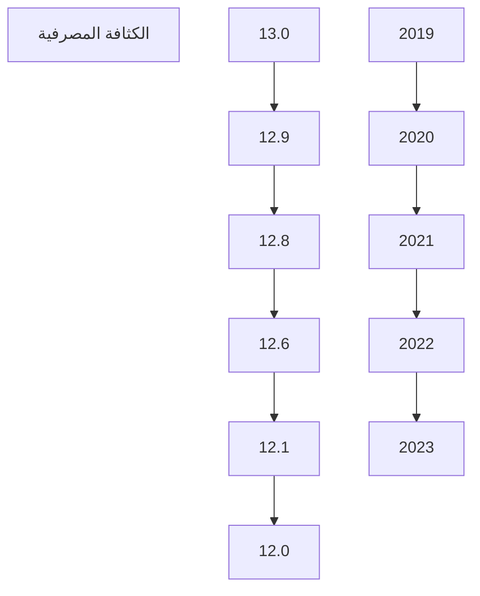
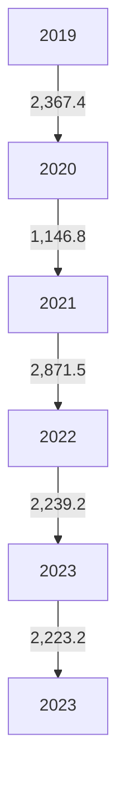
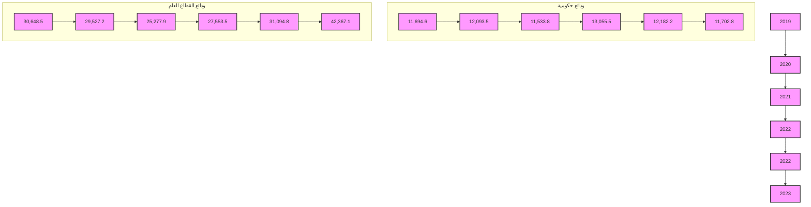
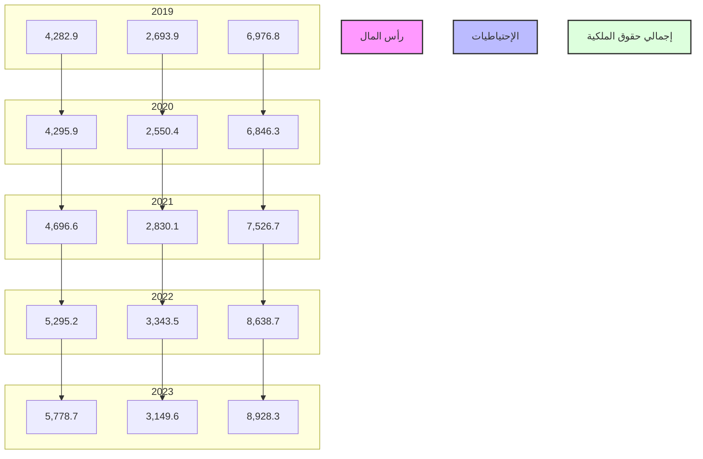
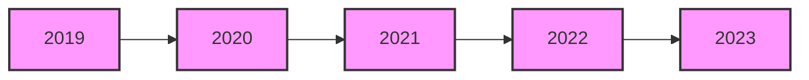

# CENTRAL BANK OF LIBYA

## تقرير
## أهم البيانات والمؤشرات المالية للمصارف
## لعام 2023

[The image shows a graphical representation of financial data with colorful bar charts and a line graph trending upwards, symbolizing growth and financial analysis.]

### إدارة البحوث والإحصاء
---
إدارة البحوث والإحصاء

| الصفحة | المحتويات |
|---------|------------|
| 3 | ملخص لأداء المصارف لعام 2023 |
| 8 | تفرع المصارف |
| 8 | الكثافة المصرفية |
| 9 | التركز المصرفي |
| 11 | المركز المالي المُجمّع للمصارف |
| 13 | هيكل البنود المكونة للأصول |
| 14 | هيكل البنود المكونة للخصوم |
| 16 | تحليل البنود المكونة للمركز المالي المُجمّع للمصارف |
| 16 | - النقدية بالخزائن وحسابات المقاصة |
| 17 | - الأرصدة والودائع لدى المصرف المركزي والمصارف الأخرى |
| 18 | - الإستثمارات |
| 19 | - القروض والتسهيلات الائتمانية |
| 21 | - ودائع العملاء لدى المصارف |
| 24 | - الحسابات المكشوفة لدى المراسلين بالخارج |
| 25 | - حقوق الملكية |
| 26 | - المخصصات |
| 27 | مؤشرات السلامة المالية للمصارف |
| 27 | - مؤشرات كفاية رأس المال |
| 29 | - مؤشرات جودة الأصول |
| 30 | - مؤشرات الربحية |
| 33 | - مؤشرات السيولة |

صفحة 2 من 35

تقرير أهم البيانات والمؤشرات المالية للمصارف - لعام 2023
---
إدارة البحوث والإحصاء

# تقرير أهم البيانات والمؤشرات المالية للمصارف - لعام 2023

## ملخص لأداء المصارف نهاية عام 2023.

شهدت البيانات المالية المجمعة للمصارف في نهاية عام 2023 بعض التغيرات مقارنة عما كانت عليه في نهاية العام 2022 وذلك على النحو التالي:

- ارتفع إجمالي أصول المصارف (باستثناء الحسابات النظامية) من 148.5 مليار دينار في نهاية عام 2022 إلى نحو 158.7 مليار دينار في نهاية عام 2023، بمقدار 10.2 مليار دينار أي بمعدل نمو قدره 6.8%، وقد شكلت الأصول السائلة (البالغة 106.2 مليار دينار) من إجمالي الأصول ما نسبته 66.9%.

- إرتفعت أرصدة ودائع المصارف ( تحت الطلب وشهادات الإيداع ) لدى المصرف المركزي بما فيها الاحتياطي الإلزامي من نحو 83.4 مليار دينار في نهاية عام 2022 إلى نحو 93.4 مليار دينار في نهاية عام 2023، بمقدار 10.0 مليار دينار أي بمعدل بلغ 12.0%، وتجدر الإشارة إلى أن الاحتياطي النقدي الإلزامي المطلوب من المصارف الاحتفاظ به لدى المصرف المركزي شكل نحو 25.2 مليار دينار.

- ارتفع إجمالي رصيد الائتمان الممنوح من المصارف من نحو 23.0 مليار دينار في نهاية عام 2022 إلى نحو 28.5 مليار دينار في نهاية عام 2023، بمقدار 5.5 مليار دينار أي بمعدل نمو 24.1%، هذا الارتفاع جاء نتيجة توسع المصارف الكبرى (الجمهورية ، الوحدة ، التجاري الوطني، الصحاري و مصرف شمال أفريقيا) في منح القروض للأفراد بصيغ المرابحة المختلفة.

- شكلت القروض والتسهيلات الائتمانية الممنوحة إلى اجمالي الأصول ما نسبته 18.0%، كما شكلت من إجمالي الخصوم الإيداعية ما نسبته 22.6%، وبلغ رصيد القروض الممنوحة للقطاع الخاص في نهاية عام 2023 ما قيمته 21.0 مليار دينار، وما نسبته 73.7% من إجمالي القروض والتسهيلات الائتمانية الممنوحة، فيما شكل رصيد القروض الممنوحة للقطاع العام النسبة الباقية 26.3% والتي بلغت قيمتها نحو 7.5 مليار دينار.

صفحة 3 من 35
تقرير أهم البيانات والمؤشرات المالية للمصارف - لعام 2023
---
إدارة البحوث والإحصاء

- أظهرت بيانات الديون المتعثرة في المصارف أن نسبة الديون المتعثرة إلى إجمالي القروض والتسهيلات الائتمانية بلغت في نهاية عام 2023 نحو 21.8%، مسجلة انخفاضاً عن ماكانت عليه عام 2022 والبالغة 24.1%، نتيجة الزيادة الكبيرة في منح الائتمان خلال عام 2023 مقابل زيادة أقل في الديون المتعثرة.

- بلغت نسبة تغطية مخصص الديون المشكوك فيها لإجمالي القروض المتعثرة نسبة 59.8% في نهاية عام 2023، مقابل نسبة 66.8% في نهاية عام 2022.

- ارتفعت ودائع العملاء (الخصوم الإيداعية) لدى المصارف بشكل كبير من 102.1 مليار دينار في نهاية عام 2022، إلى 125.9 مليار دينار في نهاية عام 2023، بمقدار 23.9 مليار دينار أي بمعدل زيادة قدره 23.4%، وقد شكلت الودائع تحت الطلب ما نسبته 81.4% من إجمالي الودائع، في حين شكلت الودائع لأجل نسبة 18.4% من إجمالي الودائع، بينما شكلت ودائع الإدخار نسبة 0.2% فقط من إجمالي الودائع.

  وفيما يتعلق بتوزيع هذه الودائع حسب القطاعين الخاص العام، فقد بلغت ودائع القطاع الخاص لدى المصارف في نهاية عام 2023 ما قيمته 71.9 مليار دينار، وما نسبته 57.1% من إجمالي الودائع، فيما شكل رصيد ودائع القطاع العام والحكومي النسبة الباقية وقدرها 42.9% أي ما قيمته 54.1 مليار دينار، منها 42.4 مليار دينار ودائع لشركات ومؤسسات القطاع العام ونحو 11.7 مليار دينار ودائع حكومية.

  وتجدر الإشارة إلى أن نحو 70% من الخصوم الإيداعية لدى المصارف متركزة في المصارف الأربعة الكبرى (الجمهورية، التجاري الوطني، الوحدة والصحاري).

- ارتفع إجمالي حقوق الملكية في المصارف من 8.7 مليار دينار في نهاية عام 2022 إلى 8.9 مليار دينار في نهاية عام 2023، وبمعدل 2.9% نتيجة الزيادة في راس المال المدفوع لبعض المصارف.

- إرتفعت أرباح المصارف خلال عام 2023 بمعدل 26.2% لتصل إلى 1,048.1 مليون دينار، مقارنة عما كانت عليه في عام 2022 والتي سجلت نحو 830.5 مليون دينار.

صفحة 4 من 35
تقرير أهم البيانات والمؤشرات المالية للمصارف - لعام 2023
---
إدارة البحوث والإحصاء

- إرتفعت نسبة هامش الفائدة إلى إجمالي الدخل خلال عام 2023 إلى 15.9% مقارنة عما كانت عليه في عام 2022 والتي سجلت نحو 12.3% ، هذا التحسن ناتج عن الإيرادات المحققة من الفوائد على الأرصدة والودائع لدى المراسلين والتي حققت نحو 161.4 مليون دينار ، بالإضافة إلى العُمولات المتأتية من خدمات المرابحة والتي حققت نحو 388.1 مليون دينار.

- بلغت نسبة المصروفات إلى إجمالي الإيرادات نحو 61.3% في عام 2023 مقابل نسبة 63.4% في عام 2022.

- بلغ عدد المصارف والمشتملة بياناتها في هذا التقرير 20 مصرفاً (بما في ذلك وحدة الدينار الليبي التابعة للمصرف الليبي الخارجي) في نهاية عام 2023، وتزاول هذه المصارف نشاطها من خلال 650 فرعاً ووكالة.

إدارة البحوث والإحصـــــــــاء

صفحة 5 من 35
تقرير أهم البيانات والمؤشرات المالية للمصارف - لعام 2023
---
إدارة البحوث والإحصاء

# البيانات المالية الأساسية للمصارف

"مليون دينار"

| البند | 2022 | 2023 | معدل التغير% |
|------|------|------|-------------|
| إجمالي الميزانية (الأصول + الحسابات النظامية) | 192,445.3 | 204,128.2 | 6.1 |
| إجمالي الأصول | 148,529.9 | 158,699.5 | 6.8 |
| إجمالي النقدية بخزائن المصارف | 2,239.2 | 2,223.2 | -0.7 |
| إجمالي الودائع لدى المصرف المركزي | 83,412.5 | 93,437.2 | 12.0 |
| إجمالي الودائع لدى المصارف فيما بينها | 619.2 | 540.5 | -12.7 |
| إجمالي الودائع لدى المصرف الليبي الخارجي | 1,669.2 | 1,398.9 | -16.2 |
| إجمالي الودائع لدى المراسلين بالخارج | 11,193.5 | 8,638.9 | -22.8 |
| إجمالي حسابات المقاصة | 7,034.7 | 7,337.1 | 4.3 |
| إجمالي القروض والسلفيات والتسهيلات | 22,971.0 | 28,510.4 | 24.1 |
| إجمالي الاستثمارات | 1,695.8 | 2,859.0 | 68.6 |
| إجمالي ودائع العملاء | 102,052.7 | 125,943.9 | 23.4 |
| إجمالي الحسابات المكشوفة لدى المراسلين | 102.9 | 30.3 | -70.5 |
| إجمالي حقوق الملكية | 8,623.3 | 8,876.3 | 2.9 |
| إجمالي المخصصات | 8,676.3 | 9,525.7 | 9.8 |
| أرباح العام | 830.4 | 1,048.1 | 26.2 |
| عدد الفروع والوكالات | 642 | 650 | 1.2 |
| عدد العاملين | 19,463 | 19,815 | 1.8 |

## المؤشرات المالية:

| المؤشر | 2022 | 2023 |
|--------|------|------|
| الأصول السائلة / إجمالي الأصول % | 66.7 | 66.9 |
| إجمالي القروض / إجمالي الأصول % | 15.5 | 18.0 |
| حقوق الملكية / إجمالي الخصوم % | 5.8 | 5.6 |
| إجمالي الأصول / عدد الفروع (مليون دينار) | 257.0 | 259.3 |
| إجمالي الأصول / عدد العاملين (مليون دينار) | 7.6 | 8.0 |
| إجمالي القروض / إجمالي الودائع % | 22.5 | 22.6 |
| إجمالي الربح / الأصول % | 0.6 | 0.7 |
| إجمالي الربح / حقوق الملكية % | 9.6 | 11.8 |

صفحة 6 من 35
تقرير أهم البيانات والمؤشرات المالية للمصارف - لعام 2023
---
إدارة البحوث والإحصاء

## مؤشرات الودائع لدى المصارف
"مليون دينار"

| البند | 2022 | 2023 | معدل التغير% |
|-------|------|------|-------------|
| 1- ودائع الحكومة والقطاع العام | 43,276.9 | 54,069.8 | 24.9 |
| ـودائع الحكومة (الوزارات والهيئات الممولة من الميزانية العامة) | 12,182.2 | 11,702.8 | -3.9 |
| ــ ودائع القطاع العام | 31,094.8 | 42,367.1 | 36.3 |
| 2- ودائع القطاع الخاص | 58,775.8 | 71,874.1 | 22.3 |
| ــ ودائع الأفراد | 32,922.4 | 39,275.7 | 19.3 |
| ــ ودائع الشركات والجهات الأخرى | 25,853.4 | 32,598.4 | 26.1 |
| إجمالي الودائع | 102,052.7 | 125,943.9 | 23.4 |
| الودائع تحت الطلب | 83,425.0 | 102,484.5 | 22.8 |
| الودائع لأجل | 18,317.3 | 23,176.8 | 26.5 |
| ودائع الادخار | 310.4 | 282.6 | -8.9 |
| الودائع تحت الطلب / إجمالي الودائع % | 81.7 | 81.4 | - |
| الودائع لأجل / إجمالي الودائع % | 17.9 | 18.4 | - |
| ودائع الادخار / إجمالي الودائع % | 0.3 | 0.2 | - |
| إجمالي الودائع / إجمالي الخصوم % | 68.7 | 79.4 | - |

## مؤشرات الائتمان الممنوح من المصارف
"مليون دينار"

| البند | 2022 | 2023 | معدل التغير% |
|-------|------|------|-------------|
| 1- الائتمان الممنوح للقطاع العام | 7,454.0 | 7,498.5 | 0.6 |
| 2- الائتمان الممنوح للقطاع الخاص | 15,516.9 | 21,011.8 | 35.4 |
| إجمالي الائتمان | 22,971.0 | 28,510.4 | 24.1 |
| السلفيات والسحب على المكشوف | 4,166.2 | 4,023.7 | -3.4 |
| قروض المرابحة (تشمل رصيد السلف الاجتماعية) | 7,015.4 | 12,700.2 | 81.0 |
| القروض الممنوحة للأنشطة الاقتصادية الأخرى | 11,789.4 | 11,786.5 | -0.02 |
| قروض المرابحة / إجمالي الائتمان % | 30.5 | 44.5 | - |
| السلفيات والسحب على المكشوف / إجمالي الائتمان % | 18.1 | 14.1 | - |
| القروض الممنوحة للأنشطة الأخرى/اجمالي الائتمان% | 51.3 | 41.3 | - |
| إجمالي الائتمان / إجمالي الأصول % | 15.5 | 18.0 | - |
| إجمالي الائتمان / إجمالي الودائع % | 22.5 | 22.6 | - |

صفحة 2 من 35
تقرير أهم البيانات والمؤشرات المالية للمصارف - لعام 2023
---
إدارة البحوث والإحصاء

## تفرع المصارف:

بلغ عدد المصارف العاملة في ليبيا والمشتملة بياناتها في هذا التقرير 20 مصرفاً (بما في ذلك وحدة الدينار الليبي
التابعة للمصرف الليبي الخارجي) حتى نهاية عام 2023، وتزاول هذه المصارف نشاطها من خلال 650 فرعاً ووكالة
مصرفية.

## الكثافة المصرفية:

بلغت الكثافة المصرفية خلال عام 2023 نحو 12.0 ألف نسمة لكل فرع أو وكالة مقارنة بنحو 12.1 ألف نسمة
لكل فرع أو وكالة في عام 2022.

### الكثافة المصرفية

"بالألف نسمة"

| لكل فرع ووكالة | لكل مصرف | نهاية |
|----------------|-----------|-------|
| 12.9           | 368.4     | 2019  |
| 12.8           | 368.3     | 2020  |
| 12.6           | 388.9     | 2021  |
| 12.1           | 350.0     | 2022  |
| 12.0           | 350.0     | 2023  |

صفحة 8 من 35
تقرير أهم البيانات والمؤشرات المالية للمصارف - لعام 2023
---
إدارة البحوث والإحصاء

# التركز المصرفي:

درجة التركز المصرفي تعني أن عدداً قليلاً من المصارف يستأثر بالنسبة الأكبر من النشاط المصرفي سواءً من حيث الأصول أو الودائع أوالائتمان أو من حيث حجم حقوق الملكية، وفيما يخص الحصة السوقية للمصارف في ليبيا، فقد شكلت أصول المصارف الأربعة الكبرى (الجمهورية، التجاري الوطني، الوحدة والصحاري) من أصل 20 مصرفاً مانسبته 70.0% من إجمالي أصول القطاع المصرفي في نهاية عام 2023، وشكل مصرف الجمهورية وحده ما نسبته 26.7% من إجمالي أصول القطاع المصرفي.

وشكلت الخصوم الإيداعية للمصارف الأربعة الكبرى مانسبته 70.4% من إجمالي الخصوم الإيداعية للقطاع المصرفي وفيما شكلت القروض الممنوحة منهم نحو 85.8% من إجمالي القروض الممنوحة من القطاع المصرفي في نهاية عام 2023.

## تركز الأصول

"نسب مئوية"

| نهاية | 2019 | 2020 | 2021 | 2022 | 2023 |
|-------|------|------|------|------|------|
| أكبر مصرف | 31.9 | 31.2 | 28.0 | 27.5 | 26.7 |
| أكبر ثلاثة مصارف | 64.6 | 63.1 | 62.0 | 61.7 | 59.4 |
| أكبر خمسة مصارف | 84.2 | 82.7 | 79.7 | 78.6 | 76.5 |

## تركز الائتمان

"نسب مئوية"

| نهاية | 2019 | 2020 | 2021 | 2022 | 2023 |
|-------|------|------|------|------|------|
| أكبر مصرف | 40.7 | 42.6 | 40.7 | 38.6 | 38.9 |
| أكبر ثلاثة مصارف | 75.8 | 78.3 | 76.2 | 74.6 | 76.9 |
| أكبر خمسة مصارف | 91.4 | 91.4 | 87.6 | 85.2 | 89.8 |

## تركز الخصوم الإيداعية

"نسب مئوية"

| نهاية | 2019 | 2020 | 2021 | 2022 | 2023 |
|-------|------|------|------|------|------|
| أكبر مصرف | 32.3 | 31.8 | 33.8 | 32.1 | 27.9 |
| أكبر ثلاثة مصارف | 64.4 | 62.9 | 62.0 | 60.5 | 59.6 |
| أكبر خمسة مصارف | 85.6 | 83.7 | 79.5 | 79.2 | 77.7 |

صفحة 9 من 35

تقرير أهم البيانات والمؤشرات المالية للمصارف - لعام 2023
---
إدارة البحوث والإحصاء

## تركز الأصول

| السنة | أكبر مصرف | أكبر ثلاثة مصارف | أكبر خمسة مصارف |
|-------|-----------|------------------|------------------|
| 2019  | 31.9      | 64.6             | 84.2             |
| 2020  | 31.2      | 63.1             | 82.7             |
| 2021  | 28.0      | 62.0             | 79.7             |
| 2022  | 27.5      | 61.7             | 78.6             |
| 2023  | 26.7      | 59.4             | 76.5             |

## تركز الائتمان

| السنة | أكبر مصرف | أكبر ثلاثة مصارف | أكبر خمسة مصارف |
|-------|-----------|------------------|------------------|
| 2019  | 40.7      | 75.8             | 91.4             |
| 2020  | 42.6      | 78.3             | 91.4             |
| 2021  | 40.7      | 76.2             | 87.6             |
| 2022  | 38.6      | 74.6             | 85.2             |
| 2023  | 38.9      | 76.9             | 89.8             |

## تركز الخصوم الإيداعية

| السنة | أكبر مصرف | أكبر ثلاثة مصارف | أكبر خمسة مصارف |
|-------|-----------|------------------|------------------|
| 2019  | 32.3      | 64.4             | 85.6             |
| 2020  | 31.8      | 62.9             | 83.7             |
| 2021  | 33.8      | 62.0             | 79.5             |
| 2022  | 32.1      | 60.5             | 79.2             |
| 2023  | 27.9      | 59.6             | 77.7             |

ومن خلال بيانات التركز يلاحظ أن هناك تحسن ملحوظ في نسب تركز الأصول والخصوم الإيداعية، فيما ارتفعت درجة التركز في الائتمان كما هو موضح بالجداول والرسومات البيانية أعلاه.

صفحة 12 من 35
تقرير أهم البيانات والمؤشرات المالية للمصارف - لعام 2023
---
# إدارة البحوث والإحصاء

## المركز المالي المُجمّع للمصارف

شهد المركز المالي المُجمّع للمصارف نهاية عام 2023، تطورات في مُجمل بنوده على جانبي الأصول والخصوم،
ليبلغ إجمالي أصول المصارف مجتمعة (بإستثناء الحسابات النظامية) نحو 158,699.5 مليون دينار، مقابل
148,529.9 مليون دينار في نهاية عام 2022، بإرتفاع قدره 10,169.6 مليون دينار، أي بمعدل 6.8%، وفيما يلي
جدول يلخص البنود الرئيسية للمركز المالي المُجمّع للمصارف:

### مُلخص المركز المالي المُجمّع للمصارف
"مليون دينار"

| البند | 2022 | 2023 | مقدار التغير | معدل التغير% |
|-------|------|------|---------------|--------------|
| **الأصول:** |
| 1- نقدية بالخزائن | 2,239.2 | 2,223.2 | -16.0 | -0.7 |
| - عملة محلية | 2,013.2 | 1,916.0 | -97.2 | -4.8 |
| - عملة أجنبية | 226.1 | 307.2 | 81.2 | 35.9 |
| 2- حسابات المقاصة | 7,034.7 | 7,337.1 | 302.5 | 4.3 |
| - المقاصة بين المصارف | 3,475.6 | 4,733.3 | 1,257.8 | 36.2 |
| - المقاصة بين الفروع | 3,559.1 | 2,603.8 | -955.3 | -26.8 |
| 3- الودائع لدى المصارف الأخرى | 96,202.3 | 104,015.5 | 7,813.2 | 8.1 |
| أ- الودائع لدى المصرف المركزي | 83,412.5 | 93,437.2 | 10,024.7 | 12.0 |
| - ودائع تحت الطلب | 79,920.0 | 90,237.2 | 10,317.2 | 12.9 |
| - شهادات الإيداع | 3,492.6 | 3,200.0 | -292.6 | -8.4 |
| ب- الودائع لدى المصارف المحلية الأخرى | 619.2 | 540.5 | -78.7 | -12.7 |
| - ودائع تحت الطلب | 619.2 | 540.5 | -78.7 | -12.7 |
| - ودائع زمنية | 0.0 | 0.0 | 0.0 | - |
| ج- الودائع لدى المصرف الليبي الخارجي | 1,669.2 | 1,398.9 | -270.2 | -16.2 |
| - ودائع تحت الطلب | 1,669.2 | 1,007.4 | -661.8 | -39.6 |
| - ودائع زمنية | 0.0 | 391.6 | 391.6 | - |
| د- الودائع لدى المصارف بالخارج | 10,501.4 | 8,638.9 | -1,862.5 | -17.7 |
| - ودائع تحت الطلب | 8,631.3 | 5,272.6 | -3,358.7 | -38.9 |
| - ودائع زمنية | 1,870.1 | 3,366.3 | 1,496.2 | 80.0 |
| 4- الإستثمارات | 1,695.8 | 2,859.0 | 1,163.2 | 68.6 |
| 5- القروض والتسهيلات | 22,971.0 | 28,510.4 | 5,539.4 | 24.1 |
| - السلفيات والسحب على المكشوف | 4,166.2 | 4,023.7 | -142.6 | -3.4 |
| - قروض المرابحة للأفراد (تشمل رصيد السلف الاجتماعية) | 7,015.4 | 12,700.2 | 5,684.8 | 81.0 |
| - قروض الأنشطة الإقتصادية الأخرى | 11,789.4 | 11,786.5 | -2.8 | -0.02 |
| 6- الأصول الثابتة | 2,743.8 | 3,041.3 | 297.5 | 10.8 |
| 7- الأصول الأخرى | 15,643.1 | 10,713.0 | -4,930.1 | -31.5 |
| **إجمالي الأصول** | 148,529.9 | 158,699.5 | 10,169.6 | 6.8 |
| الحسابات المقابلة | 43,915.4 | 45,428.7 | 1,513.3 | 3.4 |
| **الإجمالي الكلي للأصول** | 192,445.3 | 204,128.2 | 11,682.9 | 6.1 |

صفحة 11 من 35
تقرير أهم البيانات والمؤشرات المالية للمصارف - لعام 2023
---
إدارة البحوث والإحصاء

| البند | 2022 | 2023 | مقدار التغير | معدل التغير% |
|-------|------|------|--------------|--------------|
| الخصوم |
| 1- ودائع الغير لدى المصارف | 102,052.7 | 125,943.9 | 23,891.2 | 23.4 |
| - الودائع تحت الطلب | 79,044.0 | 97,866.6 | 18,822.6 | 23.8 |
| - الودائع الزمنية | 2,071.7 | 2,152.5 | 80.8 | 3.9 |
| - الودائع الإدخارية | 310.4 | 282.6 | -27.8 | -8.9 |
| - أوامر الدفع | 4,381.0 | 4,617.8 | 236.8 | 5.4 |
| - التأمينات النقدية | 16,245.6 | 21,024.3 | 4,778.7 | 29.4 |
| 2- الإقتراض من المصارف والجهات الأخرى | 33.3 | 30.7 | -2.6 | -7.8 |
| 3- الحسابات المكشوفة لدى المراسلين | 102.9 | 30.3 | -72.6 | -70.5 |
| 4- حقوق الملكية | 8,619.4 | 8,928.3 | 308.8 | 3.6 |
| - رأس المال المدفوع | 5,295.2 | 5,778.7 | 483.5 | 9.1 |
| - الإحتياطي القانوني | 934.5 | 1,105.6 | 171.1 | 18.3 |
| - إحتياطيات غير مخصصة | 337.7 | 125.1 | -212.6 | -62.9 |
| - أرباح العام | 830.4 | 1048.1 | 217.7 | 26.2 |
| - الأرباح المرحّلة والقابلة للتوزيع | 1,221.6 | 844.3 | -377.3 | -30.9 |
| 5- المخصصات | 8,676.3 | 9,525.7 | 849.5 | 9.8 |
| 6- المتنوعات والخصوم الأخرى | 29,045.3 | 14,240.6 | -14,804.7 | -51.0 |
| إجمالي الخصوم | 148,529.9 | 158,699.5 | 10,169.6 | 6.8 |
| الحسابات المقابلة | 43,915.4 | 45,428.7 | 1,513.3 | 3.4 |
| الإجمالي الكلي للخصوم | 192,445.3 | 204,128.2 | 11,682.9 | 6.1 |

صفحة 12 من 35
تقرير أهم البيانات والمؤشرات المالية للمصارف - لعام 2023
---
# إدارة البحوث والإحصاء

## هيكل البنود المكونة للأصول في المركز المالي المُجمّع للمصارف:

إستمرت ودائع وأرصدة المصارف لدى المصرف المركزي بما فيها الإحتياطي الإلزامي هو المكون الرئيسي لأصول القطاع المصرفي، حيث تغطي نحو 58.9% من إجمالي الأصول في نهاية عام 2023، في حين إرتفعت حصة بند القروض والتسهيلات الإئتمانية في هيكل الموجودات لتسجل نحو 18.0% من الإجمالي مقارنة بـ 15.5% في نهاية عام 2022 ، بينما بلغت نسبة الأستثمارات فقط 1.8% مما يشير إلى أن الأصول المولدة للدخل متدنية جداً ولم تصل حتى إلى 20.0% من إجمالي قاعدة الأصول للقطاع المصرفي وهى مازالت نسب ضئيلة تعكس ضعف توظيف المصارف لأموالها.

### جدول هيكل البنود المكونة للأصول

| البند | 2022 | 2023 |
|-------|------|------|
| **الأصول:** |  |  |
| 1- نقدية بالخزائن | 1.5% | 1.4% |
| 2- حسابات المقاصة | 4.7% | 4.6% |
| 3- الودائع لدى المصرف المركزي | 56.2% | 58.9% |
| 4- الودائع لدى المصارف المحلية الأخرى | 0.4% | 0.3% |
| 5- الودائع لدى المصرف الليبي الخارجي | 1.1% | 0.9% |
| 6- الودائع لدى المصارف بالخارج | 7.1% | 5.4% |
| 7- الإستثمارات | 1.1% | 1.8% |
| 8- القروض والتسهيلات | 15.5% | 18.0% |
| 9- الأصول الثابتة | 1.8% | 1.9% |
| 10- الأصول الأخرى | 10.5% | 6.8% |

### هيكل البنود المكونة للأصول في نهاية عام 2022

| القطاع | النسبة |
|--------|--------|
| نقدية بالخزينة | 1% |
| حسابات المقاصة | 5% |
| الأرصدة والودائع لدى المصرف المركزي والمصارف الأخرى | 65% |
| الإستثمارات | 1% |
| القروض والتسهيلات | 15% |
| الأصول الثابتة | 2% |
| الأصول الأخرى | 11% |

صفحة 13 من 35
تقرير أهم البيانات والمؤشرات المالية للمصارف - لعام 2023
---
إدارة البحوث والإحصاء

| هيكل البنود المكونة للأصول في نهاية عام 2023 |       |
|-------------------------------------------|-------|
| نقدية بالخزينة                              | 1%    |
| حسابات المقاصة                             | 5%    |
| الأرصدة والودائع لدى المصرف المركزي والمصارف الأخرى | 65%   |
| الإستثمارات                                | 2%    |
| القروض والتسهيلات                          | 18%   |
| الأصول الثابتة                             | 2%    |
| الأصول الأخرى                              | 7%    |

- هيكل البنود المكونة للخصوم في المركز المالي المُجمّع للمصارف:

بتحليل هيكل البنود المكونة للخصوم بالمركز المالي المُجمَع للمصارف في نهاية عام 2023، فإن الخصوم
الايداعية لدى المصارف (ودائع العملاء) مازالت تمثل المصدر الرئيسي للتمويل مشكلة مانسبته 79.4%
من إجمالي مصادر أموال المصارف ، مقارنة بنحو 68.7% في نهاية عام 2022، فيما شكلت حقوق الملكية
نحو 5.6% من إجمالي مصادر أموال المصـــــــــارف.

جدول هيكل البنود المكونة للخصوم

| البند                                 | 2022   | 2023   |
|--------------------------------------|--------|--------|
| الخصوم                                |        |        |
| 1- ودائع الغير لدى المصارف             | 68.7%  | 79.4%  |
| 2- الإقتراض من المصارف                 | 0.0%   | 0.0%   |
| 3- الحسابات المكشوفة لدى المراسلين     | 0.1%   | 0.0%   |
| 4- حقوق الملكية                       | 5.8%   | 5.6%   |
| 5- المخصصات                           | 5.8%   | 6.0%   |
| 6- المتنوعات والخصوم الأخرى            | 19.6%  | 9.0%   |

صفحة 14 من 35
تقرير أهم البيانات والمؤشرات المالية للمصارف - لعام 2023
---
إدارة البحوث والإحصاء

## هيكل البنود المكونة للخصوم في نهاية عام 2022

| البند | النسبة |
|-------|--------|
| ودائع الغير لدى المصارف | 69% |
| الإقتراض من المصارف | 0% |
| الحسابات المكشوفة لدى المراسلين | 6% |
| حقوق الملكية | 6% |
| المخصصات | 0% |
| المتنوعات والخصوم الأخرى | 19% |

## هيكل البنود المكونة للخصوم في نهاية عام 2023

| البند | النسبة |
|-------|--------|
| ودائع الغير لدى المصارف | 79% |
| الإقتراض من المصارف | 0% |
| الحسابات المكشوفة لدى المراسلين | 0% |
| حقوق الملكية | 6% |
| المخصصات | 6% |
| المتنوعات والخصوم الأخرى | 9% |

صفحة 13 من 35

تقرير أهم البيانات والمؤشرات المالية للمصارف - لعام 2023
---
إدارة البحوث والإحصاء

تحليل لأهم البنود المكونة للمركز المالي المُجمّع للمصارف

أولاً: جانب الأصول

1- النقدية :

أ- النقدية بالخزائن وحسابات المقاصة :

ارتفع رصيد النقدية بخزائن المصارف وحسابات المقاصة بمقدار 286.5 مليون دينار أي بمعدل 3.1%، ليصل
إلى 9,560.3 مليون دينار في نهاية عام 2023، مقابل 9,273.9 مليون دينار في نهاية عام 2022، بسبب ارتفاع
المقاصة بين المصارف بمقدار 1,257.8 مليون دينار في نهاية عام 2023 مقارنة بالعام 2022، والجدول التالي
يوضح التغيرات في بند النقدية بخزائن المصارف وحسابات المقاصة :

"مليون دينار"

| البيان | 2022 | 2023 | مقدار التغير | معدل التغير% |
|---|---|---|---|---|
| النقدية بالخزائن : | 2,239.2 | 2,223.2 | -16.0 | -0.7 |
| عملة محلية | 2,013.2 | 1,916.0 | -97.2 | -4.8 |
| عملة أجنبية | 226.1 | 307.2 | 81.2 | 35.9 |
| إجمالي حسابات المقاصة | 7,034.7 | 7,337.1 | 302.5 | 4.3 |
| المقاصة بين المصارف | 3,475.6 | 4,733.3 | 1,257.8 | 36.2 |
| المقاصة بين الفروع | 3,559.1 | 2,603.8 | -955.3 | -26.8 |
| الإجمالي | 9,273.9 | 9,560.3 | 286.5 | 3.1 |

نقدية بخزائن المصارف

صفحة 16 من 35
تقرير أهم البيانات والمؤشرات المالية للمصارف - لعام 2023
---
إدارة البحوث والإحصاء

## إجمالي حسابات المقاصة

| السنة | القيمة (مليون دينار) |
|-------|----------------------|
| 2019  | 6,304.6              |
| 2020  | 5,584.8              |
| 2021  | 6,041.0              |
| 2022  | 7,034.7              |
| 2023  | 7,337.1              |

ب- الأرصدة والودائع لدى المصرف المركزي والمصارف الأخرى:

بلغ رصيد ودائع المصارف لدى المصرف المركزي والمصارف المحلية الأخرى ولدى المصارف الخارجية نحو 104,015.5 مليون دينار في نهاية عام 2023، مقابل 96,202.3 مليون دينار في نهاية عام 2022، مرتفعة بقيمة 7,813.2 مليون دينار وبمعدل 8.1%، هذا الإرتفاع جاء نتيجة إرتفاع الأرصدة والودائع تحت الطلب لدى المصرف المركزي بمقدار 10,317.2 مليون دينار، فيما إنخفضت ودائع المصارف لدى المصارف المحلية الأخرى والمصرف الليبي الخارجي وكذلك لدى المراسلين بالخارج كما موضح بالجدول التالي:

### الأرصدة والودائع لدى المصرف المركزي والمصارف الأخرى

"مليون دينار"

| البند | 2022 | 2023 | مقدار التغير | معدل التغير% |
|-------|------|------|---------------|--------------|
| ودائع تحت الطلب لدى : | 90,839.6 | 97,057.6 | 6,218.0 | 6.8 |
| المصرف المركزي | 79,920.0 | 90,237.2 | 10,317.2 | 12.9 |
| المصارف المحلية | 619.2 | 540.5 | -78.7 | -12.7 |
| المصرف الليبي الخارجي | 1,669.2 | 1,007.4 | -661.8 | -39.6 |
| لدى المراسلين بالخارج | 8,631.3 | 5,272.6 | -3,358.7 | -38.9 |
| ودائع زمنية : | 5,362.7 | 6,957.9 | 1,595.2 | 29.7 |
| المصرف المركزي (شهادات الإيداع) | 3,492.6 | 3,200.0 | -292.6 | -8.4 |
| المصارف المحلية | 0.0 | 0.0 | 0.0 | - |
| المصرف الليبي الخارجي | 0.0 | 391.6 | 391.6 | - |
| لدى المراسلين بالخارج | 1,870.1 | 3,366.3 | 1,496.2 | 80.0 |
| الإجمالي | 96,202.3 | 104,015.5 | 7,813.2 | 8.1 |

صفحة 17 من 35
تقرير أهم البيانات والمؤشرات المالية للمصارف - لعام 2023
---
إدارة البحوث والإحصاء

## ودائع المصارف التجارية لدى المصرف المركزي والمصارف الأخرى

| السنة | الودائع تحت الطلب | الودائع الزمنية |
|-------|-------------------|-----------------|
| 2019  | 60,184.6          | 17,240.3        |
| 2020  | 72,269.0          | 17,567.6        |
| 2021  | 74,216.6          | 15,700.2        |
| 2022  | 90,839.6          | 6,054.7         |
| 2023  | 97,057.6          | 6,957.9         |

## 2- الإستثمارات :

سجل إجمالي رصيد إستثمارات المصارف في الشركات العامة والخاصة المساهمة والإستثمارات الأخرى نهاية عام2023 نحو 2,859.0 مليون دينار، مقابل 1,695.8 مليون دينار في نهاية عام2022، مرتفعة بمقدار 1,163.2 مليون دينار هذا الإرتفاع جاء نتيجة للزيادة في بند الإستثمارات الأخرى وكذلك الإستثمارات في الشركات الخاصة المساهمة ، والجدول التالي يوضح تفاصيل هذا البند:

### بند الاستثمارات

"مليون دينار"

| البيان | 2022 | 2023 | مقدار التغير | معدل التغير% |
|--------|------|------|---------------|--------------|
| سندات وأذونات الخزانة | 0.0 | 0.0 | 0.0 | - |
| إستثمارات في الشركات العامة | 564.2 | 568.6 | 4.4 | 0.8 |
| إستثمارات في الشركات الخاصة المساهمة | 872.0 | 1,214.4 | 342.4 | 39.3 |
| إستثمارات أخرى | 259.7 | 1,076.0 | 816.4 | 314.4 |
| الإجمالي | 1,695.8 | 2,859.0 | 1,163.2 | 68.6 |

صفحة 18 من 35
تقرير أهم البيانات والمؤشرات المالية للمصارف - لعام 2023
---
إدارة البحوث والإحصاء

| إجمالي بند الإستثمارات |
|------------------------|
| 6,000.0 |
| 5,000.0 | 4,256.6 4,445.1 |
| 4,000.0 | 2,859.0 |
| 3,000.0 | 1,957.5 1,695.8 |
| مليون دينار 2,000.0 |
| 1,000.0 |
| 0.0 |
| 2019 2020 2021 2022 2023 |

## 3- القروض والتسهيلات الائتمانية:

ارتفع إجمالي رصيد القروض والتسهيلات الإئتمانية الممنوحة من المصارف من 22,971.0 مليون دينار في نهاية عام 2022 إلى 28,510.4 مليون دينار في نهاية عام 2023، بمقدار 5,539.4 مليون دينار أي بمعدل نمو 24.1%،

وقد شكلت القروض والتسهيلات الائتمانية الممنوحة إلى إجمالي الخصوم الإيداعية ما نسبته 22.6%، كما شكلت من إجمالي الأصول ما نسبته 18.0%، وبلغ رصيد القروض الممنوحة للقطاع الخاص في نهاية عام 2023 ما قيمته 21,011.8 مليون دينار، وما نسبته 73.7% من إجمالي القروض والتسهيلات الائتمانية الممنوحة، فيما شكل رصيد القروض الممنوحة للقطاع العام النسبة الباقية 26.3% والتي بلغت قيمتها نحو 7,498.5 مليون دينار. وبتحليل مكونات المحفظة الائتمانية فقد كان الإرتفاع في إجمالي رصيد الإئتمان الممنوح من المصارف بسبب الزيادة الملحوظة في بند قروض المرابحة للأفراد الذي سجل ارتفاع بمقدار 5,684.8 مليون دينار مقارنة بما كان عليه في نهاية العام 2022.

### رصيد القروض والتسهيلات الائتمانية الممنوحة من المصارف
"مليون دينار"

| البند | 2022 | 2023 | مقدار التغير | معدل التغير% |
|-------|------|------|--------------|--------------|
| سلفيات والسحب على المكشوف | 4,166.2 | 4,023.7 | -142.6 | -3.4 |
| قروض المرابحة للأفراد* | 7,015.4 | 12,700.2 | 5,684.8 | 81.0 |
| القروض الأخرى | 11,789.4 | 11,786.5 | -2.8 | -0.02 |
| إجمالي القروض والتسهيلات | 22,971.0 | 28,510.4 | 5,539.4 | 24.1 |
| مخصص الديون المشكوك في تحصيلها | 3,850.7 | 3,912.9 | 62.2 | 1.6 |
| صافي القروض والتسهيلات | 19,120.3 | 24,597.5 | 5,477.2 | 28.6 |

(*) يشمل رصيد السلف الإجتماعية.

صفحة 19 من 35
تقرير أهم البيانات والمؤشرات المالية للمصارف - لعام 2023
---
إدارة البحوث والإحصاء

## رصيد بند المرابحة والسلف الاجتماعية

| السنة | القيمة (مليون دينار) |
|-------|----------------------|
| 2019  | 3,125.5              |
| 2020  | 3,036.5              |
| 2021  | 4,819.3              |
| 2022  | 5,554.1              |
| 2022  | 7,015.4              |
| 2023  | 12,700.2             |

## السلفيات والسحب على المكشوف

| السنة | القيمة (مليون دينار) |
|-------|----------------------|
| 2019  | 5,275.4              |
| 2020  | 4,495.7              |
| 2021  | 4,618.6              |
| 2022  | 4,685.6              |
| 2022  | 4,166.2              |
| 2023  | 4,023.7              |

## توزيع القروض الممنوحة من المصارف حسب القطاع (خاص وعام)

"مليون دينار"

| البند                        | 2022     | 2023     | مقدار التغير | معدل التغير % |
|-----------------------------|----------|----------|--------------|---------------|
| القروض الممنوحة للقطاع العام  | 7,454.0  | 7,498.5  | 44.5         | 0.6           |
| القروض الممنوحة للقطاع الخاص | 15,516.9 | 21,011.8 | 5,494.9      | 35.4          |
| الإجمالي                     | 22,971.0 | 28,510.4 | 5,539.4      | 24.1          |

صفحة 20 من 35
تقرير أهم البيانات والمؤشرات المالية للمصارف - لعام 2023
---
إدارة البحوث والإحصاء

## رصيد القروض الممنوحة للقطاع العام

| السنة | القيمة (مليون دينار) |
|-------|----------------------|
| 2019  | 6,057.0              |
| 2020  | 5,918.2              |
| 2021  | 6,471.7              |
| 2022  | 5,997.5              |
| 2022  | 7,454.0              |
| 2023  | 7,498.5              |

## رصيد القروض الممنوحة للقطاع الخاص

| السنة | القيمة (مليون دينار) |
|-------|----------------------|
| 2019  | 10,855.8             |
| 2020  | 11,078.7             |
| 2021  | 13,165.8             |
| 2022  | 15,170.5             |
| 2022  | 15,516.9             |
| 2023  | 21,011.8             |

## ثانياً: جانب الخصــوم

### 1- ودائع العملاء لدى المصــارف :

ارتفعت الخصوم الإيداعية (ودائع العملاء) لدى المصارف بشكل كبير بمقدار 23,891.2 مليون دينار من 102,052.7 مليون دينار في نهاية عام 2022، إلى 125,943.9 مليون دينار في نهاية عام 2023، أي بمعدل نمو بلغ 23.4%، وقد شكلت الودائع تحت الطلب وأوامر الدفع ما نسبته 81.4% من إجمالي الودائع، في حين شكلت الودائع لأجل والتأمينات النقدية نسبة 18.4% من إجمالي الودائع، بينما شكلت ودائع الادخار نسبة 0.2% فقط من إجمالي الودائع.

صفحة 21 من 35
تقرير أهم البيانات والمؤشرات المالية للمصارف - لعام 2023
---
إدارة البحوث والإحصاء

جدول الخصوم الإيداعية (ودائع العملاء)
"مليون دينار"

| البند | 2022 | 2023 | مقدار التغير | معدل التغير% |
|-------|------|------|--------------|--------------|
| الودائع تحت الطلب | 79,044.0 | 97,866.6 | 18,822.6 | 23.8 |
| الودائع لأجل | 2,071.7 | 2,152.5 | 80.8 | 3.9 |
| الودائع الإدخارية | 310.4 | 282.6 | -27.8 | -8.9 |
| أوامر الدفع | 4,381.0 | 4,617.8 | 236.8 | 5.4 |
| التأمينات النقدية | 16,245.6 | 21,024.3 | 4,778.7 | 29.4 |
| الإجمالي | 102,052.7 | 125,943.9 | 23,891.2 | 23.4 |

- الودائع تحت الطلب وأوامر الدفع: إرتفعت الودائع تحت الطلب وأوامر الدفع بشكل كبير في نهاية عام 2023 بمقدار 19,059.4 مليون دينار لتسجل 102,484.4 مليون دينار مقارنة بـ 83,425.0 مليون دينار في نهاية عام 2022.

- الودائع لأجل والتأمينات النقدية: إرتفع بند الودائع لأجل والتأمينات النقدية في نهاية عام 2023 بمقدار 4,859.5 مليون دينار لتسجل 23,176.8 مليون دينار مقابل 18,317.3 مليون دينار في نهاية عام 2022. وتجدر الإشارة إلى أن معظم التأمينات النقدية هي مقابل الإعتمادات المستندية.

- الودائع الإدخارية: إنخفض رصيد الودائع الإدخارية في نهاية عام 2023 بمقدار 27.8 مليون دينار لتسجل 282.6 مليون دينار مقابل 310.4 مليون دينار في نهاية عام 2022.

```mermaid
graph TD
    A[إجمالي ودائع العملاء لدى المصارف]
    A --> B[2019]
    A --> C[2020]
    A --> D[2021]
    A --> E[2022]
    A --> F[2023]
    
    B --> B1[77,600.0]
    B --> B2[10,600.0]
    B --> B3[400.0]
    B --> B4[88,600.0]
    
    C --> C1[92,530.6]
    C --> C2[9,225.9]
    C --> C3[437.6]
    C --> C4[102,194.2]
    
    D --> D1[73,103.0]
    D --> D2[18,695.6]
    D --> D3[315.1]
    D --> D4[92,113.7]
    
    E --> E1[83,425.0]
    E --> E2[18,317.3]
    E --> E3[310.4]
    E --> E4[102,052.7]
    
    F --> F1[102,484.5]
    F --> F2[23,176.8]
    F --> F3[282.6]
    F --> F4[125,943.9]
    
    style B1 fill:#87CEFA
    style C1 fill:#87CEFA
    style D1 fill:#87CEFA
    style E1 fill:#87CEFA
    style F1 fill:#87CEFA
    
    style B2 fill:#FFA07A
    style C2 fill:#FFA07A
    style D2 fill:#FFA07A
    style E2 fill:#FFA07A
    style F2 fill:#FFA07A
    
    style B3 fill:#98FB98
    style C3 fill:#98FB98
    style D3 fill:#98FB98
    style E3 fill:#98FB98
    style F3 fill:#98FB98
    
    style B4 fill:#FFD700
    style C4 fill:#FFD700
    style D4 fill:#FFD700
    style E4 fill:#FFD700
    style F4 fill:#FFD700
```

صفحة 22 من 35
تقرير أهم البيانات والمؤشرات المالية للمصارف - لعام 2023
---
إدارة البحوث والإحصاء

وفيما يتعلق بتوزيع ودائع العملاء لدى المصارف حسب القطاع (حكومي، عام، خاص):

فقد إرتفعت ودائع القطاع العام والحكومي في نهاية عام 2023 بمقدار 10,792.9 مليون دينار لتصل إلى 54,069.8 مليون دينار، منها 11,702.8 مليون دينار كودائع حكومية والتي تتكون من ودائع الوزارات والهيئات والمؤسسات الحكومية وودائع كل من: صندوق الضمان الإجتماعي، صندوق الإنماء الإقتصادي والإجتماعي وودائع الصندوق الليبي للتنمية والإستثمار، مقابل 43,276.9 مليون دينار كودائع للقطاع العام والحكومي في نهاية عام 2022.

أما فيما يتعلق بودائع القطاع الخاص لدى المصارف فقد أرتفعت بشكل أكبر في نهاية عام 2023 بمقدار 13,098.3 مليون دينار وبنسبة 22.3% لتسجل نحو 71,874.1 مليون دينار مقارنة بنحو 58,775.8 مليون دينار عما كانت عليه في نهاية عام 2022 .

جدول توزيع ودائع العملاء لدى المصارف حسب القطاع (حكومي، عام، خاص)

"مليون دينار"

| البند | 2022 | 2023 | مقدار التغير | معدل التغير% |
|---|---|---|---|---|
| ودائع الحكومة والقطاع العام | 43,276.9 | 54,069.8 | 10,792.9 | 24.9 |
| - ودائع حكومية | 12,182.2 | 11,702.8 | -479.4 | -3.9 |
| - ودائع القطاع العام | 31,094.8 | 42,367.1 | 11,272.3 | 36.3 |
| ودائع القطاع الخاص | 58,775.8 | 71,874.1 | 13,098.3 | 22.3 |
| - الأفراد | 32,922.4 | 39,275.7 | 6,353.3 | 19.3 |
| - الشركات والمؤسسات | 25,853.4 | 32,598.4 | 6,745.0 | 26.1 |
| الإجمالي | 102,052.7 | 125,943.9 | 23,891.2 | 23.4 |

ودائع القطاع الحكومي والقطاع العام

صفحة 23 من 35
تقرير أهم البيانات والمؤشرات المالية للمصارف - لعام 2023
---
إدارة البحوث والإحصاء

## ودائع القطاع الخاص

| السنة | الأفراد | الشركات والمؤسسات |
|-------|--------|-------------------|
| 2019  | 27,402.6 | 19,208.4 |
| 2020  | 38,908.5 | 21,665.0 |
| 2021  | 29,161.3 | 26,140.7 |
| 2022  | 29,707.8 | 26,809.1 |
| 2022  | 32,922.4 | 25,853.4 |
| 2023  | 39,275.7 | 32,598.4 |

## الحسابات المكشوفة لدى المراسلين بالخارج:

بلغ رصيد الحسابات المكشوفة لدى المراسلين بالخارج 30.3 مليون دينار في نهاية عام 2023، منخفضة عما كانت عليه في نهاية عام 2022، وهذه الحسابات المكشوفة لدى المصارف بالخارج ناتجة فقط عن تأخر بعض المصارف في تسوية حساباتها مع المصارف المراسلة.

### جدول الحسابات المكشوفة لدى المراسلين بالخارج
"مليون دينار"

| البيان | 2022 | 2023 | مقدار التغير | معدل التغير% |
|--------|------|------|--------------|--------------|
| الحسابات المكشوفة لدى المراسلين بالخارج | 102.9 | 30.3 | -72.6 | -70.6 |

### الحسابات المكشوفة لدى المراسلين بالخارج

| السنة | القيمة (مليون دينار) |
|-------|----------------------|
| 2019  | 113.1 |
| 2020  | 220.4 |
| 2021  | 144.7 |
| 2022  | 102.9 |
| 2023  | 30.3 |

صفحة 24 من 35
تقرير أهم البيانات والمؤشرات المالية للمصارف - لعام 2023
---
إدارة البحوث والإحصاء

## -3 حقوق الملكية :

ارتفع رصيد حقوق الملكية في المصارف من 8,619.4 مليون دينار في نهاية عام 2022 ، ليصل إلى 8,928.3
مليون دينار في نهاية عام 2023، نتيجة الزيادة في رأس المال المدفوع لبعض المصارف وكذلك الإحتياطيات
القانونية، فيما سجلت أرباح المصارف خلال عام 2023 إرتفاعاً بمعدل 26.2% لتسجل نحو 1,048.1
مليون دينار، مقارنة عما كانت عليه في عام 2022 والبالغة نحو 830.4 مليون دينار. هذا الإرتفاع في الأرباح
جاء نتيجة ارتفاع الإيرادات التي حققتها المصارف بنسبة أعلى من إرتفاع مصروفاتها .

### حسابات رأس المال
" مليون دينار "

| البيان | 2022 | 2023 | مقدار التغير | معدل التغير% |
|---|---|---|---|---|
| رأس المال المدفوع | 5,295.2 | 5,778.7 | 483.5 | 9.1 |
| الإحتياطي القانوني | 934.5 | 1,105.6 | 171.1 | 18.3 |
| إحتياطيات غير مخصصة | 337.7 | 125.1 | -212.6 | -62.9 |
| أرباح العام | 830.4 | 1,048.1 | 217.7 | 26.2 |
| الأرباح المرحّلة والأرباح القابلة للتوزيع | 1,221.6 | 870.7 | -350.9 | -28.7 |
| الإجمالي | 8,619.4 | 8,928.3 | 308.8 | 3.6 |

### إجمالي حقوق الملكية في المصارف

صفحة 25 من 35
تقرير أهم البيانات والمؤشرات المالية للمصارف - لعام 2023
---
إدارة البحوث والإحصاء

## أرباح المصارف

| السنة | القيمة (مليون دينار) |
|-------|----------------------|
| 2019  | 867.7                |
| 2020  | 608.7                |
| 2021  | 1176.9               |
| 2022  | 830.4                |
| 2023  | 1048.1               |

### 4- المخصصات:

سجل رصيد المخصصات إرتفاعاً بمقدار 849.5 مليون دينار في نهاية عام 2023 ليصل إلى 9,525.7 مليون دينار، مقابل 8,676.3 مليون دينار في نهاية عام 2022، وتركزت الزيادة في بند مخصص تقييم أسعار الصرف كما هو موضح بالجدول التالي:

#### جدول المخصصات

| البند                            | 2022    | 2023    | مقدار التغير | معدل التغير% |
|----------------------------------|---------|---------|--------------|--------------|
| مخصص الديون المشكوك في تحصيلها   | 3,850.7 | 3,912.9 | 62.2         | 1.6          |
| مخصص إستهلاك الأصول الثابتة      | 1,030.7 | 1,154.3 | 123.5        | 12.0         |
| مخصصات عامة                      | 2,462.5 | 1,490.4 | -972.1       | -39.5        |
| مخصص تقييم أسعار الصرف           | 1,332.3 | 2,968.2 | 1,635.9      | 122.8        |
| الإجمالي                         | 8,676.3 | 9,525.7 | 849.5        | 9.8          |

#### بند المخصصات

| البند                            | 2022    | 2023    |
|----------------------------------|---------|---------|
| مخصص الديون المشكوك في تحصيلها   | 3,850.7 | 3,912.9 |
| مخصص إستهلاك الأصول الثابتة      | 1,030.7 | 1,154.3 |
| مخصصات عامة                      | 2,462.5 | 1,490.4 |
| مخصص تقييم أسعار الصرف           | 1,332.3 | 2,968.2 |

صفحة 26 من 35

تقرير أهم البيانات والمؤشرات المالية للمصارف - لعام 2023
---
إدارة البحوث والإحصاء

# مؤشـــــــرات السلامة المالية للمصـــارف
## (2019 – 2023)

تعتبر مؤشرات السلامة المالية مقياس لصحة القطاع المالي ووحداته المؤسسية بصفة عامة وللقطاع المصرفي بصفة خاصة ، وهى إحدى المدخلات المهمة في تحليل وتقييم السلامة الاحترازية الكلية، حيث يتناول هذا الفصل تحليل مؤشرات السلامة المالية للقطاع المصرفي خلال الفترة (2019 – 2023).

### 1- مؤشرات رأس المال:

#### جدول مؤشرات رأس المال

| المؤشر | 2019 | 2020 | 2021 | 2022 | 2023 |
|--------|------|------|------|------|------|
| معدل كفاية رأس المال الكلي% | 18.4 | 19.2 | 16.6 | 15.7 | - |
| معدل كفاية رأس المال الأساسي% | 17.2 | 17.9 | 15.3 | 14.3 | - |
| رأس المال المدفوع / إجمالي الأصول% | 3.8 | 3.6 | 3.5 | 3.5 | 3.9 |
| حقوق الملكية / إجمالي الأصول% | 5.5 | 4.9 | 4.7 | 5.2 | 6.1 |
| حقوق الملكية / إجمالي الودائع% | 6.9 | 6.1 | 6.9 | 7.6 | 7.0 |

### - كفاية رأس المال:

تراوحت نسبة كفاية رأس المال مابين 15.7% و19.2% خلال الفترة (2019-2022) وهي بشكل عام أعلى من النسبة التي كانت معمول بها والمحددة من قبل المصرف المركزي والمتوافقة مع متطلبات لجنة بازل (1) والبالغة 8.0%.

وتجدر الإشارة إلى أن إدارة الرقابة على المصارف والنقد قد أعتمدت في الأونة الأخيرة تطبيق أفضل الممارسات الدولية الخاصة بالمتطلبات الصادرة عن لجنة بازل (2) للرقابة المصرفية، وقد أصدر عدة مناشير بهذا الخصوص منها المنشورين رقمي (11و13) 2022 بشأن تعليمات إحتساب ملاءة رأس المال.

ونظراً لعدم قيام معظم المصارف برفع رؤوس أموالها منذ فترة طويلة خاصة وأن هناك مصارف لديها أصول مرجحة بالمخاطر كبيرة ،وبالتالي أصبح رؤوس أموالها، لا يتناسب وحجم أعمالها المصرفية، وخاصة عمليات التمويل المباشرة، وغير المباشرة. وعليه فإن عدة مصارف خاصة المصارف الكبرى ستواجه صعوبة في الوصول

صفحة 27 من 35
تقرير أهم البيانات والمؤشرات المالية للمصارف - لعام 2023
---
إدارة البحوث والإحصاء

إلى نسب الملاءة المطلوبة وفقاً لمنشور إدارة الرقابة على المصارف رقم (11) لسنة 2022، بشأن إحتساب رأس
المال وفقاً لتعليمات لجنة بازل.

## كفاية رأس المال

| السنة | معدل كفاية رأس المال الأساسي | معدل كفاية رأس المال الكلي |
|-------|---------------------------|--------------------------|
| 2019  | 17.2                      | 18.4                     |
| 2020  | 17.9                      | 19.2                     |
| 2021  | 15.3                      | 16.6                     |
| 2022  | 14.3                      | 15.7                     |

## رأس المال إلى إجمالي الأصول :

نسبة رأس المال إلى إجمالي الأصول وهى أحدى المؤشرات الأساسية للسلامة المالية والتي تقيس الرفع المالي (أي
نسبة تمويل الأصول بموارد غير مواردها الذاتية) ، ووفقاً لمتطلبات لجنة بازل يجب أن لاتقل هذه النسبة عن
3%، وبشكل عام فقد سجلت المصارف نسب للرفع المالي أعلى من النسبة المشار إليها وفقاً لمتطلبات بازل ،
حيث سجلت نسب 3.8 ، 3.6 ، 3.5 ، 3.5 ، 3.9 على التوالي خلال الفترة (2019-2023).

## رأس المال إلى إجمالي الأصول

| السنة | النسبة |
|-------|--------|
| 2019  | 3.8    |
| 2020  | 3.6    |
| 2021  | 3.5    |
| 2022  | 3.5    |
| 2023  | 3.9    |

صفحة 28 من 35
تقرير أهم البيانات والمؤشرات المالية للمصارف - لعام 2023
---
إدارة البحوث والإحصاء

## -2 مؤشرات جودة الأصول:

بتحليل هيكل البنود المكونة للأصول في عام 2023، يلاحظ إستمرار تدني نسبة القروض والتسهيلات إلى إجمالي الأصول والتي شكلت نحو 18.0%، بينما بلغت نسبة الأستثمارات فقط 1.8% مما يشير إلى أن الأصول المولدة للدخل متدنية جداً ولم تصل حتى إلى 20.0% من إجمالي قاعدة الأصول للقطاع المصرفي، في المقابل شكلت النقدية بخزائن المصارف والأرصدة لدى المصرف المركزي نحو 60.3% من إجمالي قاعدة الأصول للقطاع المصرفي مما يعكس ضعف توظيف المصارف لأموالها، وفيما يلي أهم مؤشرات جودة الأصول:

### - القروض المتعثرة إلى إجمالي القروض:

أظهرت بيانات الديون المتعثرة في المصارف أن نسبة الديون المتعثرة إلى إجمالي القروض والتسهيلات الإئتمانية بلغت في نهاية عام 2023 نحو 21.7%، وقد سجلت هذه النسبة إنخفاضاً عما كانت عليه عام 2022 والبالغة 24.1%، هذا الإنخفاض جاء نتيجة الزيادة الكبيرة في منح الإئتمان خلال عام 2023 مقابل زيادة أقل في حجم الديون المتعثرة، وكذلك يلاحظ أن الإئتمان الممنوح خلال عامي 2022 و 2023 والذي في معظمه قروض مرابحة للأفراد كانت ذات كفاءة إئتمانية جيدة وهي في معظمها منتظمة السداد.

**ووفقاً للمعايير الدولية ينبغي أن لا تتجاوز نسبة القروض المتعثرة إلى إجمالي القروض نسبة 5%.**

### - نسبة تغطية مخصص الديون إلى القروض المتعثرة:

فيما يخص نسبة تغطية مخصص الديون إلى القروض المتعثرة فقد سجلت في نهاية عام 2023 نحو 59.8%. مقابل نسبة 60.6% في نهاية العام 2022، وخلال السنوات (2019-2021) فقد سجلت مخصصات التغطية نسب في حدود 60% على مستوى القطاع، أما بتحليل هذه النسب وفق المصارف فقد سجلت بعض المصارف الهامة نسب متدنية، وعليها بإتخاذ إجراءات إحترازية من خلال زيادة مخصصات الديون المتعثرة للوصول إلى نسب ملائمة لمواجهة أية خسائر متوقعة.

صفحة 29 من 35
تقرير أهم البيانات والمؤشرات المالية للمصارف - لعام 2023
---
إدارة البحوث والإحصاء

## جدول مؤشرات جودة الأصول

| المؤشر | 2019 | 2020 | 2021 | 2022 | 2023 |
|--------|------|------|------|------|------|
| القروض المتعثرة / إجمالي الأصول% | 5.1 | 4.6 | 4.3 | 3.8 | 3.9 |
| القروض المتعثرة/ إجمالي القروض% | 34.2 | 34.1 | 29.6 | 24.1 | 21.7 |
| مخصص الديون / إجمالي القروض المتعثرة% | 60.5 | 61.3 | 63.3 | 60.6 | 59.8 |
| مخصص الديون / إجمالي القروض % | 20.7 | 20.9 | 18.7 | 16.8 | 13.7 |

### مؤشرات جودة الأصول

| السنة | مخصص الديون / إجمالي القروض المتعثرة% | القروض المتعثرة/ إجمالي القروض% | مخصص الديون / إجمالي القروض % |
|-------|---------------------------------------|----------------------------------|-------------------------------|
| 2019 | 60.5 | 34.2 | 20.7 |
| 2020 | 61.3 | 34.1 | 20.9 |
| 2021 | 63.3 | 29.6 | 18.7 |
| 2022 | 60.6 | 24.1 | 16.8 |
| 2023 | 59.8 | 21.7 | 13.7 |

## -3 مؤشرات الربحية :

### جدول مؤشرات الربحية

| المؤشر | 2019 | 2020 | 2021 | 2022 | 2023 |
|--------|------|------|------|------|------|
| العائد / الأصول% | 0.7 | 0.5 | 0.9 | 0.6 | 0.7 |
| العائد / حقوق الملكية% | 12.3 | 9.8 | 18.5 | 10.7 | 12.1 |
| العائد/ الودائع% | 0.8 | 0.6 | 1.3 | 0.8 | 0.9 |
| نسبة هامش الفائدة إلى إجمالي الدخل % | 6.7 | 17.8 | 12.1 | 12.3 | 15.9 |
| نسبة المصروفات بخلاف الفوائد إلى إجمالي الدخل % | 63.7 | 68.9 | 55.8 | 63.4 | 61.3 |

صفحة 30 من 35

تقرير أهم البيانات والمؤشرات المالية للمصارف - لعام 2023
---
إدارة البحوث والإحصاء

- العائد إلى الأصول:

مؤشر العائد إلى إجمالي الأصول من المؤشرات الهامة وذات القيمة التحليلية الكبيرة لقياس كفاءة إستخدام
المصارف لأصولها ، حيث سجل معدل العائد إلى إجمالي الأصول في عام 2023 نحو 0.7% مرتفعاً عما كان عليه
في العام 2022.

| العائد على الأصول |      |      |      |      |      |
|-------------------|------|------|------|------|------|
| 1.0               |      |      | 0.9  |      |      |
| 0.8               | 0.7  |      |      |      | 0.7  |
| 0.6               |      | 0.5  |      | 0.6  |      |
| 0.4               |      |      |      |      |      |
| 0.2               |      |      |      |      |      |
| 0.0               |      |      |      |      |      |
|                   | 2019 | 2020 | 2021 | 2022 | 2023 |

- العائد إلى حقوق الملكية:

إرتفع معدل العائد على حقوق الملكية خلال عام 2023 ليسجل نحو 12.1% مقارنة بـ 10.7% في عام 2022
ويعتبر هذا المؤشر مقياس لمدى كفاءة المصارف في استخدام رأسمالها.

| العائد على حقوق الملكية |      |      |      |      |      |
|--------------------------|------|------|------|------|------|
| 20.0                     |      |      | 18.5 |      |      |
| 15.0                     | 12.3 |      |      |      | 12.1 |
| 10.0                     |      | 9.8  |      | 10.7 |      |
| 5.0                      |      |      |      |      |      |
| 0.0                      |      |      |      |      |      |
|                          | 2019 | 2020 | 2021 | 2022 | 2023 |

صفحة 31 من 35
تقرير أهم البيانات والمؤشرات المالية للمصارف - لعام 2023
---
إدارة البحوث والإحصاء

- نسبة هامش الفائدة إلى إجمالي الدخل:

يقيس مؤشر نسبة هامش الفائدة إلى إجمالي الدخل حجم الأرباح المتأتية من النشاط الرئيسي للمصارف ،
حيث يلاحظ ضعف مساهمة هامش الفائدة (الإيرادات المقبوضة من الفوائد - المصروفات المدفوعة للفوائد)
إلى إجمالي الدخل ، والذي بلغ في عام 2023 نحو 15.9% متحسنة عن عام 2022 والتي سجلت نحو 12.3% ،
ويعزى ضعف مساهمة هامش الفائدة إلى شبه توقف المصارف عن التعامل بالفوائد الدائنة والمدينة محلياً،
وفقاً للقانون رقم (1) لسنة 2013 بشأن منع المعاملات الربوية.

وتجدر الإشارة إلى أن معظم إيرادات الفوائد المقبوضة كانت نتيجة الإيرادات المحققة من الفوائد على الأرصدة
والودائع لدى المراسلين والتي حققت نحو 161.4 مليون دينار ، بالإضافة إلى العمولات المتأتية من خدمات
المرابحة والتي حققت نحو 388.1 مليون دينار.

| نسبة هامش الفائدة إلى إجمالي الدخل |
|-----------------------------------|
| 20.0 | 17.8 |
| | 15.9 |
| 15.0 | 12.1 12.3 |
| % 10.0 | 6.7 |
| 5.0 | |
| 0.0 | |
| 2019 2020 2021 2022 2023 |

- نسبة المصروفات بخلاف الفوائد إلى إجمالي الدخل:

هذا المؤشر مهم لقياس نسبة حجم المصروفات الإدارية إلى إجمالي الدخل والتي تشمل جميع المصروفات عدا
مصروفات الفائدة مثل مرتبات وتكاليف العاملين ومصروفات التدريب والتأمين والصيانة وغيرها ، والتي يؤثر
ارتفاعها بشكل سلبي على تحقيق الأرباح . وخلال عام 2023 بلغت نسبة المصروفات بخلاف الفوائد إلى إجمالي
الدخل نحو 61.3% مقابل نسبة 63.4% في عام 2022.

صفحة 35 من 53
تقرير أهم البيانات والمؤشرات المالية للمصارف - لعام 2023
---
إدارة البحوث والإحصاء

نسبة المصروفات بخلاف الفوائد إلى إجمالي الدخل

| 2023 | 2022 | 2021 | 2020 | 2019 |
|-------|-------|-------|-------|-------|
| 61.3  | 63.4  | 55.8  | 68.9  | 63.7  |

## 4- مؤشرات السيولة :

مؤشرات السيولة من المؤشرات الهامة والتي تعكس مدى قدرة المصارف على الوفاء بالطلبات المتوقعة وغير المتوقعة على النقدية وكذلك قدرة المصارف على الوفاء بإلتزاماتها دون التعرض إلى عُسر في السيولة ، ومؤشرات السيولة في القطاع المصرفي الليبي مازالت تشهد نسب سيولة عالية نتيجة ضعف توظيف المصارف لأموالها وعدم التوسع في توظيف المصارف لأموالها الفائضة وكذلك ضعف الأستثمار، مقابل نمو أكبر في الخصوم الإيداعية،ومن أهم هذه المؤشرات :

### جدول مؤشرات السيولة

| المؤشر | 2019 | 2020 | 2021 | 2022 | 2023 |
|--------|------|------|------|------|------|
| الأصول السائلة / إجمالي الأصول (%) | 70.8 | 72.1 | 68.2 | 66.7 | 66.9 |
| الأصول عالية السيولة / الخصوم قصيرة الأجل (%) | 83.7 | 86.4 | 91.2 | 103.4 | 94.0 |
| إجمالي القروض / إجمالي الودائع (%) | 19.0 | 16.6 | 21.3 | 22.5 | 22.6 |

### - الأصول السائلة إلى إجمالي الأصول :

بلغت نسبة الأصول السائلة لدى المصارف إلى إجمالي الأصول 66.9% في نهاية عام 2023، والتي مُعظمها تمثل ودائع لدى المصرف المركزي (تحت الطلب بما فيها الاحتياطي الإلزامي) مقابل نسبة 66.7% في نهاية عام 2022 ، بشكل عام لاتزال الأصول السائلة لدى المصارف تشكل نسب مرتفعة من إجمالي الأصول. حيث تجدر الإشارة إلى أن حجم القروض والتسهيلات الائتمانية إلى إجمالي الخصوم الإيداعية بالقطاع المصرفي سجل نسبة 22.6% في نهاية عام 2023.

صفحة 33 من 35
تقرير أهم البيانات والمؤشرات المالية للمصارف - لعام 2023
---
إدارة البحوث والإحصاء

## الأصول السائلة إلى إجمالي الأصول

| السنة | النسبة المئوية |
|-------|----------------|
| 2019  | 70.8           |
| 2020  | 72.1           |
| 2021  | 68.2           |
| 2022  | 66.7           |
| 2023  | 66.9           |

## الأصول السائلة إلى الخصوم قصيرة الأجل:

هذا المؤشر لقياس تباين السيولة بين الأصول والخصوم، ويقدم دلالة على قدرة المصارف على الوفاء بطلبات
سحب الأموال قصيرة الأجل ، دون الوقوع في أزمات سيولة ، وقد سجل هذا المؤشر نسبة 94.0% في نهاية
عام 2023 ، مقارنة بنسب 83.7% ، 86.4% ،91.2% و103.4% للأعوام 2019-2022 على التوالي.

## الأصول السائلة إلى إجمالي الخصوم قصيرة الأجل

| السنة | النسبة المئوية |
|-------|----------------|
| 2019  | 83.7           |
| 2020  | 86.4           |
| 2021  | 91.2           |
| 2022  | 103.4          |
| 2023  | 94.0           |

صفحة 34 من 35
تقرير أهم البيانات والمؤشرات المالية للمصارف - لعام 2023
---
إدارة البحوث والإحصاء

# الجدول العام لمؤشرات أداء المصارف
(2019-2023)

| المؤشر | 2019 | 2020 | 2021 | 2022 | 2023 |
|---------|------|------|------|------|------|
| **مؤشرات رأس المال:** |
| معدل كفاية رأس المال الكلي% | 18.4 | 19.2 | 16.6 | 15.7 | - |
| معدل كفاية رأس المال الأساسي% | 17.2 | 17.9 | 15.3 | 14.3 | - |
| رأس المال المدفوع / إجمالي الأصول% | 3.8 | 3.6 | 3.5 | 3.5 | 3.9 |
| حقوق الملكية / إجمالي الأصول% | 5.5 | 4.9 | 4.7 | 5.2 | 6.1 |
| حقوق الملكية / إجمالي الودائع% | 6.9 | 6.1 | 6.9 | 7.6 | 7.0 |
| **مؤشرات جودة الأصول:** |
| القروض المتعثرة / إجمالي الأصول% | 5.1 | 4.6 | 4.3 | 3.8 | 3.9 |
| القروض المتعثرة / إجمالي القروض% | 34.2 | 34.1 | 29.6 | 24.1 | 21.7 |
| مخصص الديون / إجمالي القروض المتعثرة% | 60.5 | 61.3 | 63.3 | 60.6 | 59.8 |
| مخصص الديون / إجمالي القروض% | 20.7 | 20.9 | 18.7 | 16.8 | 13.7 |
| **مؤشرات كفاءة الإدارة:** |
| إجمالي القروض / إجمالي الأصول% | 15.1 | 13.5 | 14.4 | 15.5 | 18.0 |
| إجمالي الأصول / عدد العاملين(مليون دينار) | 5.8 | 6.4 | 7.0 | 7.5 | 8.0 |
| إجمالي الأصول / عدد الفروع (مليون دينار) | 206.4 | 229.3 | 245.0 | 258.3 | 259.3 |
| **مؤشرات الربحية:** |
| العائد / الأصول% | 0.7 | 0.5 | 0.9 | 0.6 | 0.7 |
| العائد / حقوق الملكية% | 12.3 | 9.8 | 18.5 | 10.7 | 12.1 |
| العائد/ الودائع% | 0.8 | 0.6 | 1.3 | 0.8 | 0.9 |
| نسبة هامش الفائدة إلى إجمالي الدخل % | 6.7 | 17.8 | 12.1 | 12.3 | 15.9 |
| نسبة المصروفات بخلاف الفوائد إلى إجمالي الدخل% | 63.7 | 68.9 | 55.8 | 63.4 | 61.3 |
| **مؤشرات السيولة:** |
| الأصول السائلة / إجمالي الأصول (%) | 70.8 | 72.1 | 68.2 | 66.7 | 66.9 |
| الأصول عالية السيولة / الخصوم قصيرة الأجل (%) | 83.7 | 86.4 | 91.2 | 103.4 | 94.0 |
| إجمالي القروض / اجمالي الودائع (%) | 19.0 | 16.6 | 21.3 | 22.5 | 22.6 |

صفحة 35 من 35
تقرير أهم البيانات والمؤشرات المالية للمصارف - لعام 2023