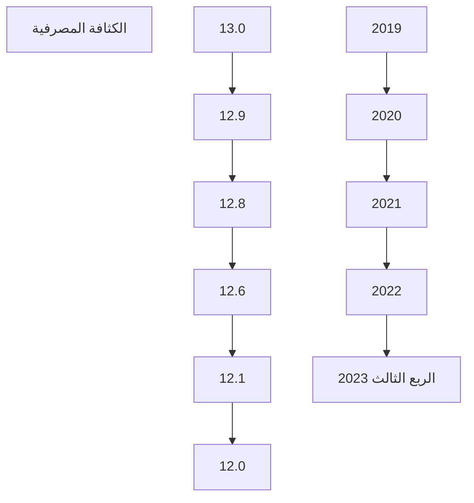
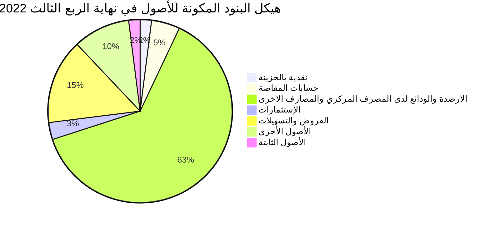
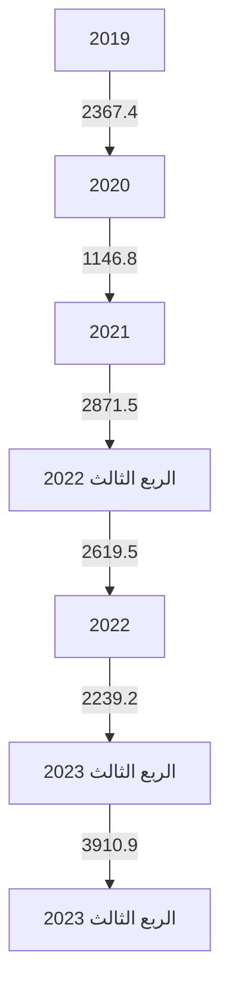
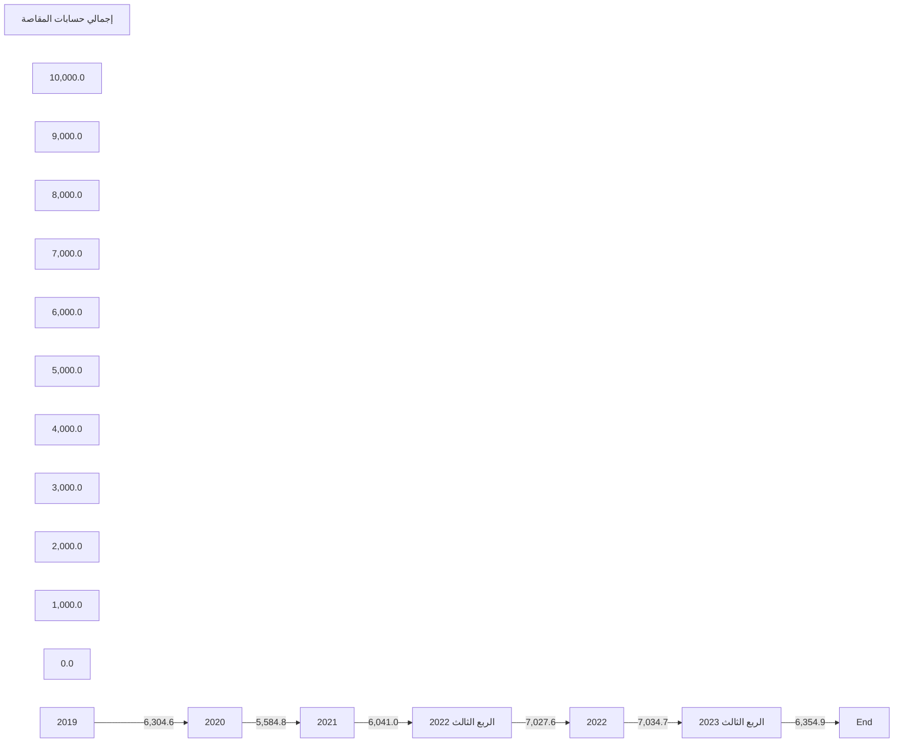
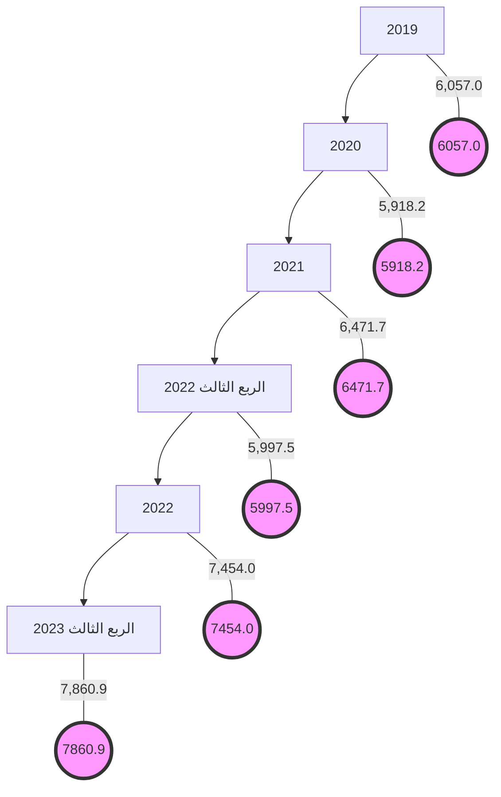
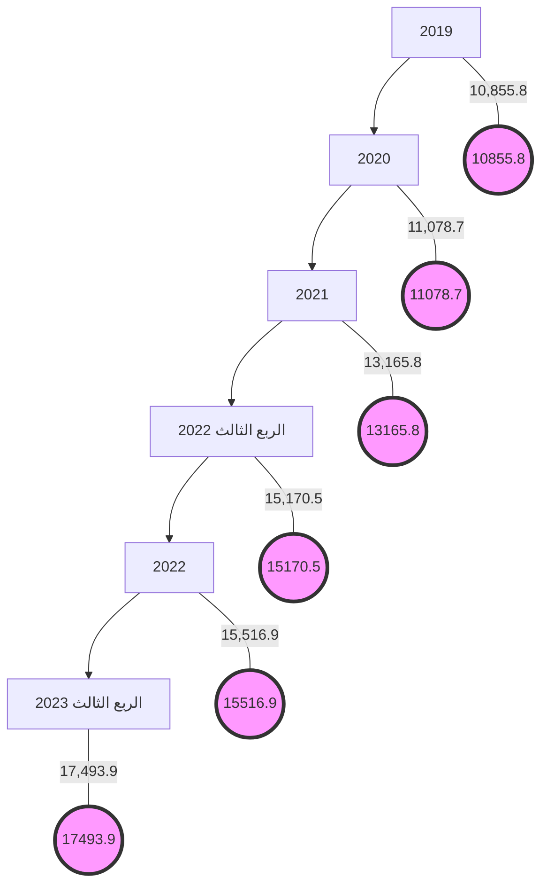

# مصرف ليبيا المركزي
# CENTRAL BANK OF LIBYA

## تقرير
## أهم البيانات والمؤشرات المالية للمصارف
## الربع الثالث 2023

[The image shows a graphical representation of financial data with colorful bar charts and a line graph trending upwards, indicating growth or positive financial indicators]

### إدارة البحوث والإحصاء
---
إدارة البحوث والإحصاء

| الصفحة | المحتويات |
|---------|-----------|
| 3 | ملخص لأداء المصارف خلال الربع الثالث 2023 |
| 7 | تفرع المصارف |
| 7 | الكثافة المصرفية |
| 8 | التركز المصرفي |
| 10 | الميزانية المُجمَعة للمصارف |
| 12 | هيكل البنود المكونة للأصول |
| 13 | هيكل البنود المكونة للخصوم |
| 15 | تحليل البنود المكونة للميزانية المُجمَعة للمصارف |
| 15 | - النقدية بالخزائن وحسابات المقاصة: |
| 16 | - الأرصدة والودائع لدى المصرف المركزي والمصارف الأخرى |
| 17 | - الإستثمارات |
| 18 | - القروض والتسهيلات الائتمانية |
| 21 | - ودائع العملاء لدى المصارف |
| 23 | - الحسابات المكشوفة لدى المراسلين بالخارج |
| 24 | - حقوق الملكية |
| 25 | - المخصصات |
| 26 | مؤشرات السلامة المالية للمصارف |
| 26 | - مؤشرات كفاية رأس المال |
| 28 | - مؤشرات جودة الأصول |
| 29 | - مؤشرات الربحية |
| 31 | - مؤشرات السيولة |

صفحة 2 من 33
تقرير أهم البيانات والمؤشرات المالية للمصارف - الربع الثالث 2023
---
إدارة البحوث والإحصاء

# تقرير أهم البيانات والمؤشرات المالية للمصارف - الربع الثالث 2023

## ملخص لأداء المصارف نهاية الربع الثالث 2023.

شهدت البيانات المالية المجمعة للمصارف في نهاية الربع الثالث 2023 بعض التغيرات مقارنة عما كانت عليه في نفس الفترة من العام 2022 وذلك على النحو التالي:

- ارتفع إجمالي أصول المصارف (بإستثناء الحسابات النظامية) من 144.0 مليار دينار في نهاية الربع الثالث 2022 إلى نحو 145.2 مليار دينار في نهاية الربع الثالث 2023، أي بمعدل نمو قدره 0.8%، وقد شكلت الأصول السائلة (البالغة 94.7 مليار دينار) من إجمالي الأصول ما نسبته 65.2%.

- إنخفضت أرصدة وودائع المصارف (تحت الطلب وشهادات الإيداع) لدى المصرف المركزي بما فيها الإحتياطي الإلزامي من نحو 79.9 مليار دينار في نهاية الربع الثالث 2022 إلى نحو 77.9 مليار دينار في نهاية الربع الثالث 2023، أي بمعدل بلغ 2.5%، وتجدر الإشارة إلى أن الإحتياطي النقدي الإلزامي شكل نحو 22.1 مليار دينار.

- ارتفع اجمالي رصيد الإئتمان الممنوح من المصارف من 21.6 مليار دينار في نهاية الربع الثالث 2022 إلى نحو 26.7 مليار دينار في نهاية الربع الثالث 2023، أي بمعدل نمو 23.7%، وقد شكلت القروض والتسهيلات الائتمانية الممنوحة إلى اجمالي الخصوم الإيداعية ما نسبته 23.4%، كما شكلت من اجمالي الأصول ما نسبته 18.4%. وبلغ رصيد القروض الممنوحة للقطاع الخاص في نهاية الربع الثالث 2023 ما قيمته 19.1 مليار دينار، وما نسبته 71.6% من إجمالي القروض والتسهيلات الإئتمانية الممنوحة، فيما شكل رصيد القروض الممنوحة للقطاع العام النسبة الباقية 28.4% والتي بلغت قيمتها نحو 7.6 مليار دينار.

وبتحليل مكونات المحفظة الائتمانية للمصارف يلاحظ أن الإرتفاع في رصيد الإئتمان الممنوح من المصارف كان في القطاع الخاص حيث إرتفع بمقدار 5.0 مليار دينار في نهاية الربع الثالث 2023 مقارنة بنفس الفترة من العام 2022، حيث تركز هذا الأرتفاع في بند المرابحة للأفراد والقروض الأخرى الممنوحة بالصيغ الإسلامية.

صفحة 3 من 33
تقرير أهم البيانات والمؤشرات المالية للمصارف - الربع الثالث 2023
---
إدارة البحوث والإحصاء

▪ بلغت نسبة تغطية مخصص الديون المشكوك فيها لإجمالي القروض المتعثرة نسبة 63.7% في نهاية 
الربع الثالث 2023 مقابل نسبة 66.8% في نهاية الربع الثالث 2022.

▪ إرتفعت ودائع العملاء (الخصوم الإيداعية) لدى المصارف من 98.2 مليار دينار في نهاية الربع الثالث 
2022، إلى 110.5 مليار دينار في نهاية الربع الثالث 2023، أي بمعدل 12.5%، وقد شكلت الودائع تحت 
الطلب ما نسبته 79.9% من إجمالي الودائع، في حين شكلت الودائع لأجل نسبة 19.8% من إجمالي 
الودائع، بينما شكلت ودائع الادخار نسبة 0.3% فقط من إجمالي الودائع.

وفيما يتعلق بتوزيع هذه الودائع فقد بلغت ودائع القطاع الخاص في نهاية الربع الثالث 2023 ما قيمته 
63.7 مليار دينار، وما نسبته 57.7% من إجمالي الودائع، فيما شكل رصيد ودائع القطاع العام 
والحكومي النسبة الباقية وقدرها 42.3% أي ما قيمته 46.7 مليار دينار، منها 33.5 مليار دينار ودائع 
لشركات ومؤسسات القطاع العام ونحو 13.2 مليار دينار ودائع حكومية.

▪ إرتفع إجمالي حقوق الملكية في المصارف من 8.8 مليار دينار في نهاية الربع الثالث 2022 إلى 8.9 مليار 
دينار في نهاية الربع الثالث 2023، وبمعدل 162.3%. نتيجة الزيادة في راس المال المدفوع لبعض 
المصارف وكذلك في الإحتياطيات.

▪ إنخفضت أرباح المصارف خلال التسعة أشهر الأولى 2023 بمعدل 18.7% لتصل إلى 764.0 مليون 
دينار، مقارنة عما كانت عليه خلال نفس الفترة من العام 2022 والتي سجلت نحو 940.1 مليون دينار.

▪ سجلت نسبة هامش الفائدة إلى إجمالي الدخل خلال التسعة أشهر الأولى من عام 2023 نحو 8.6% 
مقارنة عما كانت عليه في عام 2022 والتي سجلت نحو 12.0% ، حيث يلاحظ ضعف مساهمة هامش 
الفائدة ( الإيرادات المقبوضة من الفوائد – المصروفات المدفوعة للفوائد) إلى إجمالي الدخل ، ويعزى ذلك 
إلى شبه توقف المصارف عن التعامل بالفوائد الدائنة والمدينة محلياً، وفقاً للقانون رقم (1) لسنة 
2013 بشأن منع المعاملات الربوية.

▪ بلغ عدد المصارف والمشتملة بياناتها في هذا التقرير 20 مصرفاً (بما في ذلك وحدة الدينار الليبي التابعة 
للمصرف الليبي الخارجي) في نهاية الربع الثالث 2023، وتزاول هذه المصارف نشاطها من خلال 612 فرعاً 
ووكالة.

صفحة 4 من 33
تقرير أهم البيانات والمؤشرات المالية للمصارف - الربع الثالث 2023
---
إدارة البحوث والإحصاء

# البيانات المالية الأساسية للمصارف

"مليون دينار"

| البند | الربع الثالث 2022 | الربع الثالث 2023 | معدل التغير% |
|------|-----------------|-----------------|------------|
| إجمالي الميزانية ( الأصول + الحسابات النظامية ) | 186,061.7 | 190,497.7 | 2.4 |
| إجمالي الأصول | 144,020.3 | 145,205.5 | 0.8 |
| إجمالي النقدية بخزائن المصارف | 2,619.5 | 3,910.9 | 49.3 |
| إجمالي الودائع لدى المصرف المركزي | 79,925.1 | 77,905.6 | -2.5 |
| إجمالي الودائع لدى المصارف | 1,123.7 | 550.2 | -51.0 |
| إجمالي الودائع لدى المصرف الليبي الخارجي | 1,286.8 | 1,035.1 | -19.6 |
| إجمالي الودائع لدى المراسلين بالخارج | 8,407.5 | 11,285.0 | 34.2 |
| إجمالي حسابات المقاصة | 7,027.6 | 6,354.9 | -9.6 |
| إجمالي القروض والسلفيات والتسهيلات | 21,618.1 | 26,737.4 | 23.7 |
| إجمالي الاستثمارات | 5,253.6 | 2,583.4 | -50.8 |
| إجمالي ودائع العملاء | 98,185.0 | 110,462.5 | 12.5 |
| إجمالي الحسابات المكشوفة لدى المراسلين | 80.1 | 181.2 | 126.1 |
| إجمالي حقوق الملكية | 8,553.1 | 8,752.6 | 2.3 |
| إجمالي المخصصات | 8,418.3 | 9,440.2 | 12.1 |
| أرباح الفترة | 940.1 | 763.9 | -18.7 |
| عدد الفروع والوكالات | 604.0 | 612.0 | 1.3 |
| عدد العاملين | 19,463.0 | 19,815.0 | 1.8 |

المؤشرات المالية :

| المؤشر | الربع الثالث 2022 | الربع الثالث 2023 |
|--------|-----------------|-----------------|
| الأصول السائلة / إجمالي الأصول % | 66.3 | 65.1 |
| إجمالي القروض / إجمالي الأصول % | 14.8 | 17.4 |
| حقوق الملكية / إجمالي الخصوم % | 5.8 | 6.0 |
| إجمالي الأصول / عدد الفروع ( مليون دينار ) | 236.0 | 237.9 |
| إجمالي الأصول / عدد العاملين ( مليون دينار ) | 7.3 | 7.3 |
| إجمالي القروض / إجمالي الودائع % | 21.8 | 23.2 |
| إجمالي الربح / الأصول % | 0.5 | 0.3 |
| إجمالي الربح / حقوق الملكية % | 8.1 | 5.3 |

صفحة 1 من 33
تقرير أهم البيانات والمؤشرات المالية للمصارف - الربع الثالث 2023
---
إدارة البحوث والإحصاء

## مؤشرات الودائع لدى المصارف
"مليون دينار"

| البند | الربع الثالث 2022 | الربع الثالث 2023 | معدل التغير% |
|-------|-------------------|-------------------|--------------|
| 1- ودائع الحكومة والقطاع العام | 41,675.0 | 46,718.9 | 12.1 |
| ـ ودائع الحكومة (الوزارات والهيئات الممولة من الميزانية العامة) | 12,803.5 | 13,175.1 | 2.9 |
| ـ ودائع القطاع العام | 28,871.5 | 33,543.9 | 16.2 |
| 2- ودائع القطاع الخاص | 56,510.1 | 63,743.6 | 12.8 |
| ـ ودائع الأفراد | 30,357.3 | 34,161.9 | 12.5 |
| ـ ودائع الشركات والجهات الأخرى | 26,152.8 | 29,581.7 | 13.1 |
| إجمالي الودائع | 98,185.0 | 110,462.5 | 12.5 |
| الودائع تحت الطلب | 78,975.8 | 88,262.7 | 11.8 |
| الودائع لأجل | 18,890.1 | 21,909.7 | 16.0 |
| ودائع الادخار | 319.2 | 290.1 | -9.1 |
| الودائع تحت الطلب / إجمالي الودائع % | 80.4 | 79.9 | - |
| الودائع لأجل / إجمالي الودائع % | 19.2 | 19.8 | - |
| ودائع الادخار / إجمالي الودائع % | 0.3 | 0.3 | - |
| إجمالي الودائع / إجمالي الخصوم % | 68.2 | 76.1 | - |

## مؤشرات الائتمان الممنوح من المصارف
"مليون دينار"

| البند | الربع الثالث 2022 | الربع الثالث 2023 | معدل التغير% |
|-------|-------------------|-------------------|--------------|
| 1- الائتمان الممنوح للقطاع العام | 7,498.1 | 7,605.5 | 1.4 |
| 2- الائتمان الممنوح للقطاع الخاص | 14,120.0 | 19,131.9 | 35.5 |
| إجمالي الائتمان | 21,618.1 | 26,737.4 | 23.7 |
| السلفيات والسحب على المكشوف | 4,450.7 | 4,206.6 | -5.5 |
| قروض المرابحة (تشمل رصيد السلف الاجتماعية) | 5,975.2 | 10,113.6 | 69.3 |
| القروض الممنوحة للأنشطة الاقتصادية الأخرى | 11,192.2 | 12,417.2 | 10.9 |
| قروض المرابحة / إجمالي الائتمان % | 27.6 | 37.8 | - |
| السلفيات والسحب على المكشوف / إجمالي الائتمان % | 20.6 | 15.7 | - |
| القروض الممنوحة للأنشطة الأخرى/اجمالي الائتمان% | 51.8 | 46.4 | - |
| إجمالي الائتمان / إجمالي الأصول % | 15.0 | 18.4 | - |
| إجمالي الائتمان / إجمالي الودائع % | 22.0 | 24.2 | - |

صفحة 2 من 33
تقرير أهم البيانات والمؤشرات المالية للمصارف - الربع الثالث 2023
---
إدارة البحوث والإحصاء

## تفرع المصارف:

بلغ عدد المصارف العاملة في ليبيا والمشتملة بياناتها في هذا التقرير 20 مصرفاً (بما في ذلك وحدة الدينار الليبي
التابعة للمصرف الليبي الخارجي) حتى نهاية الربع الثالث 2023، وتزاول هذه المصارف نشاطها من خلال 612
فرعاً ووكالة مصرفية.

## الكثافة المصرفية:

بلغت الكثافة المصرفية خلال الربع الثالث 2023 نحو 12.0 ألف نسمة لكل فرع أو وكالة مقارنة بنحو 12.1
ألف نسمة لكل فرع أو وكالة في عام 2022.

### الكثافة المصرفية
"بالألف نسمة"

| نهاية | لكل مصرف | لكل فرع ووكالة |
|-------|-----------|-----------------|
| 2019 | 368.4 | 12.9 |
| 2020 | 368.3 | 12.8 |
| 2021 | 388.9 | 12.6 |
| 2022 | 350.0 | 12.1 |
| الربع الثالث 2023 | 350.0 | 12.0 |



صفحة 7 من 33
تقرير أهم البيانات والمؤشرات المالية للمصارف - الربع الثالث 2023
---
إدارة البحوث والإحصاء

# التركز المصرفي:

درجة التركز المصرفي تعني أن عدداً قليلاً من المصارف يستأثر بالنسبة الأكبر من النشاط المصرفي سواءً من حيث الأصول أو الودائع أوالائتمان أو من حيث حجم حقوق الملكية، وفيما يخص الحصة السوقية للمصارف في ليبيا، فقد شكلت أصول المصارف الأربعة الكبرى (الجمهورية، التجاري الوطني، الوحدة والصحاري) من أصل 20 مصرفاً مانسبته 71.3% من إجمالي أصول القطاع المصرفي في نهاية الربع الثالث 2023، وشكل مصرف الجمهورية وحده ما نسبته 28.8% من إجمالي أصول القطاع المصرفي.

وشكلت ودائع وقروض المصارف الأربعة الكبرى مانسبته 71.9% و84.9% على التوالي من إجمالي ودائع وقروض القطاع المصرفي نهاية الربع الثالث 2023.

## تركز الأصول

"نسب مئوية"

| نهاية | 2019 | 2020 | 2021 | 2022 | الربع الثالث 2023 |
|-------|------|------|------|------|-------------------|
| أكبر مصرف | 31.9 | 31.2 | 28.0 | 27.5 | 28.8 |
| أكبر ثلاثة مصارف | 64.6 | 63.1 | 62.0 | 61.7 | 59.6 |
| أكبر خمسة مصارف | 84.2 | 82.7 | 79.7 | 78.6 | 77.1 |

## تركز الإئتمان

"نسب مئوية"

| نهاية | 2019 | 2020 | 2021 | 2022 | الربع الثالث 2023 |
|-------|------|------|------|------|-------------------|
| أكبر مصرف | 40.7 | 42.6 | 40.7 | 38.6 | 38.3 |
| أكبر ثلاثة مصارف | 75.8 | 78.3 | 76.2 | 74.6 | 76.1 |
| أكبر خمسة مصارف | 91.4 | 91.4 | 87.6 | 85.2 | 89.1 |

## تركز الخصوم الإيداعية

"نسب مئوية"

| نهاية | 2019 | 2020 | 2021 | 2022 | الربع الثالث 2023 |
|-------|------|------|------|------|-------------------|
| أكبر مصرف | 32.3 | 31.8 | 33.8 | 32.1 | 30.2 |
| أكبر ثلاثة مصارف | 64.4 | 62.9 | 62.0 | 60.5 | 59.2 |
| أكبر خمسة مصارف | 85.6 | 83.7 | 79.5 | 79.2 | 78.2 |

صفحة 8 من 33
تقرير أهم البيانات والمؤشرات المالية للمصارف - الربع الثالث 2023
---
إدارة البحوث والإحصاء

## تركز الأصول

| السنة | أكبر مصرف | أكبر ثلاثة مصارف | أكبر خمسة مصارف |
|-------|-----------|------------------|-------------------|
| 2019 | 31.9 | 64.6 | 84.2 |
| 2020 | 31.2 | 63.1 | 82.7 |
| 2021 | 28.0 | 62.0 | 79.7 |
| 2022 | 27.5 | 61.7 | 78.6 |
| الربع الثالث 2023 | 28.8 | 59.6 | 77.1 |

## تركز الائتمان

| السنة | أكبر مصرف | أكبر ثلاثة مصارف | أكبر خمسة مصارف |
|-------|-----------|------------------|-------------------|
| 2019 | 40.7 | 75.8 | 91.4 |
| 2020 | 42.6 | 78.3 | 91.4 |
| 2021 | 40.7 | 76.2 | 87.6 |
| 2022 | 38.6 | 74.6 | 85.2 |
| الربع الثالث 2023 | 38.3 | 76.1 | 89.1 |

## تركز الخصوم الإيداعية

| السنة | أكبر مصرف | أكبر ثلاثة مصارف | أكبر خمسة مصارف |
|-------|-----------|------------------|-------------------|
| 2019 | 32.3 | 64.4 | 85.6 |
| 2020 | 31.8 | 62.9 | 83.7 |
| 2021 | 33.8 | 62.0 | 79.5 |
| 2022 | 32.1 | 60.5 | 79.2 |
| الربع الثالث 2023 | 30.2 | 59.2 | 78.2 |

ومن خلال بيانات التركز في الأصول والائتمان والخصوم الإيداعية يلاحظ أن هناك تحسن ملحوظ في نسب التركز في القطاع المصرفي كما هو موضح بالجداول والرسومات البيانية أعلاه.

صفحة 2 من 33
تقرير أهم البيانات والمؤشرات المالية للمصارف - الربع الثالث 2023
---
إدارة البحوث والإحصاء

# الميزانية المُجمَعة للمصارف

شَهد المركز المالي المُجمَع للمصارف نهاية الربع الثالث 2023، تطورات في مُجمل بنوده على جانبي الأصول والخصوم، ليبلغ إجمالي الأصول داخل الميزانية المُجمعة نحو 145,205.5 مليون دينار، مقابل 144,020.3 مليون دينار في نهاية الربع الثالث 2022، بإرتفاع قدره 1,185.3 مليون دينار، أي بمعدل 0.8%. وفيما يلي جدول يلخص البنود الرئيسية للمركز المالي المُجمَع للمصارف:

## مُلخص المركز المالي المُجمَع للمصارف

"مليون دينار"

| البند | الربع الثالث 2022 | الربع الثالث 2023 | مقدار التغير | معدل التغير% |
|-------|-------------------|-------------------|---------------|---------------|
| الأصول: |  |  |  |  |
| 1- نقدية بالخزائن | 2,619.5 | 3,910.9 | 1,291.4 | 49.3 |
| - عملة محلية | 2,393.2 | 3,597.2 | 1,203.9 | 50.3 |
| - عملة أجنبية | 226.3 | 313.7 | 87.4 | 38.6 |
| 2- حسابات المقاصة | 7,027.6 | 6,354.9 | -672.7 | -9.6 |
| - المقاصة بين المصارف | 3,261.4 | 3,532.4 | 271.1 | 8.3 |
| - المقاصة بين الفروع | 3,766.3 | 2,822.5 | -943.8 | -25.1 |
| 3- الودائع لدى المصارف الأخرى | 90,743.0 | 90,775.9 | 32.9 | 0.0 |
| أ- الودائع لدى المصرف المركزي | 79,925.1 | 77,905.6 | -2,019.5 | -2.5 |
| - ودائع تحت الطلب | 72,407.7 | 75,913.0 | 3,505.3 | 4.8 |
| - شهادات الإيداع | 7,517.3 | 1,992.5 | -5,524.8 | -73.5 |
| ب- الودائع لدى المصارف المحلية الأخرى | 1,123.7 | 550.2 | -573.5 | -51.0 |
| - ودائع تحت الطلب | 1,123.7 | 550.2 | -573.5 | -51.0 |
| - ودائع زمنية | 0.0 | 0.0 | 0.0 | - |
| ج- الودائع لدى المصرف الليبي الخارجي | 1,286.8 | 1,035.1 | -251.7 | -19.6 |
| - ودائع تحت الطلب | 1,286.8 | 741.8 | -545.0 | -42.4 |
| - ودائع زمنية | 0.0 | 293.3 | 293.3 | - |
| د- الودائع لدى المصارف بالخارج | 8,407.5 | 11,285.0 | 2,877.5 | 34.2 |
| - ودائع تحت الطلب | 5,908.9 | 8,090.5 | 2,181.6 | 36.9 |
| - ودائع زمنية | 2,498.5 | 3,194.5 | 695.9 | 27.9 |
| 4- الإستثمارات | 5,253.6 | 2,583.4 | -2,670.2 | -50.8 |
| 5- القروض والتسهيلات | 21,618.1 | 26,737.4 | 5,119.2 | 23.7 |
| - السلفيات والسحب على المكشوف | 4,450.7 | 4,206.6 | -244.1 | -5.5 |
| - السلف الإجتماعية (تشمل قروض المرابحة للأفراد) | 5,975.2 | 10,113.6 | 4,138.4 | 69.3 |
| - قروض الأنشطة الإقتصادية الأخرى | 11,192.2 | 12,417.2 | 1,225.0 | 10.9 |
| 6- الأصول الثابتة | 2,507.4 | 2,797.5 | 290.0 | 11.6 |
| 7- الأصول الأخرى | 14,250.9 | 12,045.7 | -2,205.3 | -15.5 |
| إجمالي الأصول | 144,020.3 | 145,205.5 | 1,185.3 | 0.8 |
| الحسابات المقابلة | 42,041.5 | 45,292.1 | 3,250.6 | 7.7 |
| الإجمالي الكلي للأصول | 186,061.7 | 190,497.7 | 4,435.9 | 2.4 |

صفحة 10 من 33
تقرير أهم البيانات والمؤشرات المالية للمصارف - الربع الثالث 2023
---
إدارة البحوث والإحصاء

| البند | الربع الثالث 2022 | الربع الثالث 2023 | مقدار التغير | معدل التغير% |
|------|-----------------|-----------------|-------------|-------------|
| **الخصوم** |
| 1- ودائع الغير لدى المصارف | 98,185.0 | 110,462.5 | 12,277.4 | 12.5 |
| - الودائع تحت الطلب | 73,765.0 | 84,289.5 | 10,524.5 | 14.3 |
| - الودائع الزمنية | 1,924.7 | 2,106.8 | 182.0 | 9.5 |
| - الودائع الإدخارية | 319.2 | 290.1 | -29.1 | -9.1 |
| - أوامر الدفع | 5,210.8 | 3,973.2 | -1,237.6 | -23.7 |
| - التأمينات النقدية | 16,965.4 | 19,802.9 | 2,837.6 | 16.7 |
| 2- الإقتراض من المصارف والجهات الأخرى | 33.3 | 32.0 | -1.3 | -3.9 |
| 3- الحسابات المكشوفة لدى المراسلين | 80.1 | 181.2 | 101.1 | 126.1 |
| 4- حقوق الملكية | 8,763.9 | 8,906.3 | 142.4 | 1.6 |
| - رأس المال المدفوع | 5,249.5 | 5,473.5 | 224.0 | 4.3 |
| - الإحتياطي القانوني | 852.7 | 1,063.0 | 210.3 | 24.7 |
| - إحتياطيات غير مخصصة | 337.7 | 395.9 | 58.2 | 17.2 |
| - أرباح الفترة | 960.6 | 683.6 | -277.0 | -28.8 |
| - الأرباح المرحّلة والقابلة للتوزيع | 1,363.4 | 1,290.4 | -73.1 | -5.4 |
| 5- المخصصات | 8,436.1 | 9,583.7 | 1,147.6 | 13.6 |
| 6- المتنوعات والخصوم الأخرى | 28,521.8 | 16,039.9 | -12,481.9 | -43.8 |
| إجمالي الخصوم | 144,020.3 | 145,205.5 | 1,185.3 | 0.8 |
| الحسابات المقابلة | 42,041.5 | 45,292.1 | 3,250.6 | 7.7 |
| الإجمالي الكلي للخصوم | 186,061.7 | 190,497.7 | 4,435.9 | 2.4 |

صفحة 11 من 33
تقرير أهم البيانات والمؤشرات المالية للمصارف - الربع الثالث 2023
---
إدارة البحوث والإحصاء

- هيكل البنود المكونة للأصول في الميزانية المُجمَعة للمصارف:

إستمرت ودائع وأرصدة المصارف لدى المصرف المركزي بما فيها الإحتياطي الإلزامي المطلوب هو المكون
الرئيسي لإصول القطاع المصرفي، حيث تغطي نحو 53.7% من إجمالي الأصول في نهاية الربع الثالث 2023،
في حين إرتفعت حصة بند القروض والتسهيلات الإئتمانية في هيكل الموجودات لتسجل نحو 18.4% من
الإجمالي مقارنة بـ 15.0% في نهاية الربع الثالث 2022 ، وهى مازالت نسب ضئيلة تعكس ضعف توظيف
المصارف لأموالها.

جدول هيكل البنود المكونة للأصول

| البند | الربع الثالث 2022 | الربع الثالث 2023 |
|------|------------------|------------------|
| الأصول: |                  |                  |
| 1-نقدية بالخزائن | 1.8% | 2.7% |
| 2-حسابات المقاصة | 4.9% | 4.4% |
| 3-الودائع لدى المصرف المركزي | 55.5% | 53.7% |
| 4-الودائع لدى المصارف المحلية الأخرى | 0.8% | 0.4% |
| 5-الودائع لدى المصرف الليبي الخارجي | 0.9% | 0.7% |
| 6-الودائع لدى المصارف بالخارج | 5.8% | 7.8% |
| 7-الإستثمارات | 3.6% | 1.8% |
| 8-القروض والتسهيلات | 15.0% | 18.4% |
| 9-الأصول الثابتة | 1.7% | 1.9% |
| 10-الأصول الأخرى | 9.9% | 8.3% |



صفحة 12 من 33
تقرير أهم البيانات والمؤشرات المالية للمصارف - الربع الثالث 2023
---
إدارة البحوث والإحصاء

## هيكل البنود المكونة للأصول في نهاية الربع الثالث 2023

| البند | النسبة |
|-------|--------|
| الأرصدة والودائع لدى المصرف المركزي والمصارف الأخرى | 63% |
| القروض والتسهيلات | 18% |
| الأصول الأخرى | 8% |
| حسابات المقاصة | 4% |
| نقدية بالخزينة | 3% |
| الأصول الثابتة | 2% |
| الإستثمارات | 2% |

## هيكل البنود المكونة للخصوم في الميزانية المُجمَعة للمصارف:

بتحليل هيكل البنود المكونة للخصوم بالمركز المالي المُجمع للمصارف في نهاية الربع الثالث 2023، فإن ودائع الغير لدى المصارف (ودائع العملاء) تمثل المصدر الرئيسي للتمويل مشكلة مانسبته 76.2% من إجمالي مصادر أموال المصارف ، مقارنة بنحو 68.2% في نهاية الربع الثالث 2022، فيما شكلت حقوق الملكية نحو 5.6% من إجمالي مصادر أموال المصارف.

### جدول هيكل البنود المكونة للخصوم

| البند | الربع الثالث 2022 | الربع الثالث 2023 |
|-------|-------------------|-------------------|
| الخصوم |                   |                   |
| 1- ودائع الغير لدى المصارف | 68.2% | 76.2% |
| 2- الإقتراض من المصارف | 0.0% | 0.0% |
| 3- الحسابات المكشوفة لدى المراسلين | 0.1% | 0.1% |
| 4- حقوق الملكية | 5.4% | 5.6% |
| 5- المخصصات | 5.9% | 6.6% |
| 6- المتنوعات والخصوم الأخرى | 20.4% | 11.4% |

صفحة 13 من 33
تقرير أهم البيانات والمؤشرات المالية للمصارف - الربع الثالث 2023
---
إدارة البحوث والإحصاء

## هيكل البنود المكونة للخصوم في نهاية الربع الثالث 2022

| البند | النسبة |
|-------|--------|
| ودائع الغير لدى المصارف | 68% |
| المتنوعات والخصوم الأخرى | 21% |
| المخصصات | 6% |
| حقوق الملكية | 5% |
| الحسابات المكشوفة لدى المراسلين | 0% |
| الإقتراض من المصارف | 0% |

## هيكل البنود المكونة للخصوم في نهاية الربع الثالث 2023

| البند | النسبة |
|-------|--------|
| ودائع الغير لدى المصارف | 76% |
| المتنوعات والخصوم الأخرى | 11% |
| المخصصات | 7% |
| حقوق الملكية | 6% |
| الحسابات المكشوفة لدى المراسلين | 0% |
| الإقتراض من المصارف | 0% |

صفحة 14 من 33
تقرير أهم البيانات والمؤشرات المالية للمصارف - الربع الثالث 2023
---
إدارة البحوث والإحصاء

# تحليل لأهم البنود المكونة للميزانية المُجمَعة للمصارف

## أولاً: جانب الأصول

### 1- النقدية :

#### أ- النقدية بالخزائن وحسابات المقاصة :

ارتفع رصيد النقدية بخزائن المصارف وحسابات المقاصة بمقدار 618.6 مليون دينار أي بمعدل 6.4%، ليصل
إلى 10,265.8 مليون دينار في نهاية الربع الثالث 2023، مقابل 9,647.2 مليون دينار في نهاية الربع الثالث 2022،
بسبب إرتفاع بند النقدية بالخزائن بمقدار 1,291.4 مليون دينار، وفي حين أنخفضت حسابات المقاصة
بمقدار 672.7 مليون دينار في نهاية الربع الثالث 2023 مقارنة بالفترة نفسها من العام 2022 ، والجدول التالي
يوضح ذلك :

| البيان | الربع الثالث 2022 | الربع الثالث 2023 | مقدار التغير | معدل التغير% |
|--------|-------------------|-------------------|---------------|---------------|
| النقدية بالخزائن : | 2,619.5 | 3,910.9 | 1,291.4 | 49.3 |
| عملة محلية | 2,393.2 | 3,597.2 | 1,203.9 | 50.3 |
| عملة أجنبية | 226.3 | 313.7 | 87.4 | 38.6 |
| إجمالي حسابات المقاصة | 7,027.6 | 6,354.9 | -672.7 | -9.6 |
| المقاصة بين المصارف | 3,261.4 | 3,532.4 | 271.1 | 8.3 |
| المقاصة بين الفروع | 3,766.3 | 2,822.5 | -943.8 | -25.1 |
| الإجمالي | 9,647.2 | 10,265.8 | 618.6 | 6.4 |

نقدية بخزائن المصارف



صفحة 15 من 33
تقرير أهم البيانات والمؤشرات المالية للمصارف - الربع الثالث 2023
---
إدارة البحوث والإحصاء



ب-الأرصدة والودائع لدى المصرف المركزي والمصارف الأخرى:

بلغ رصيد ودائع المصارف لدى المصرف المركزي والمصارف الأخرى ولدى المصارف الخارجية نحو 90,775.9 مليون دينار في نهاية الربع الثالث 2023، مقابل 90,743.0 مليون دينار في نهاية الربع الثالث 2022، مرتفعة بشكل طفيف وبقيمة 32.9 مليون دينار وبمعدل 0.04%، هذا الإرتفاع الطفيف جاء كمحصلة إلى نتيجة إنخفضت الأرصدة والودائع لدى المصرف المركزي بمقدار 113.0 مليون دينار، كمحصلة لإرتفاع الودائع لدى المراسلين بالخارج وبمقدار 2,877.5 مليون دينار وإنخفاض رصيد الودائع لدى المركزي الذي إنخفض بنحو 2,019.5 مليون دينار، كذلك أنخفاض رصيد ودائع المصارف لدى المصرف الخارجي بمقدار 251.7 مليون دينار، والجدول التالي يوضح تفاصيل هذا البند:

الأرصدة والودائع لدى المصرف المركزي والمصارف الأخرى

"مليون دينار"

| البند | الربع الثالث 2022 | الربع الثالث 2023 | مقدار التغير | معدل التغير% |
|-------|-------------------|-------------------|---------------|---------------|
| ودائع تحت الطلب لدى : | 80,727.1 | 85,295.5 | 4,568.4 | 5.7 |
| المصرف المركزي | 72,407.7 | 75,913.0 | 3,505.3 | 4.8 |
| المصارف المحلية | 1,123.7 | 550.2 | -573.5 | -51.0 |
| المصرف الليبي الخارجي | 1,286.8 | 741.8 | -545.0 | -42.4 |
| لدى المراسلين بالخارج | 5,908.9 | 8,090.5 | 2,181.6 | 36.9 |
| ودائع زمنية : | 10,015.9 | 5,480.4 | -4,535.5 | -45.3 |
| المصرف المركزي (شهادات الإيداع) | 7,517.3 | 1,992.5 | -5,524.8 | -73.5 |
| المصارف المحلية | 0.0 | 0.0 | 0.0 | - |
| المصرف الليبي الخارجي | 0.0 | 293.3 | 293.3 | - |
| لدى المراسلين بالخارج | 2,498.5 | 3,194.5 | 695.9 | 27.9 |
| الإجمالي | 90,743.0 | 90,775.9 | 32.9 | 0.04 |

صفحة 16 من 33
تقرير أهم البيانات والمؤشرات المالية للمصارف - الربع الثالث 2023
---
إدارة البحوث والإحصاء

## ودائع المصارف التجارية لدى المصرف المركزي والمصارف الأخرى

| السنة | الودائع تحت الطلب | الودائع الزمنية |
|-------|-------------------|-----------------|
| 2019 | 60,184.6 | 17,240.3 |
| 2020 | 72,269.0 | 17,567.6 |
| 2021 | 74,216.6 | 15,700.2 |
| الربع الثالث 2022 | 80,727.1 | 10,015.9 |
| 2022 | 90,839.6 | 6,054.7 |
| الربع الثالث 2023 | 85,295.5 | 5,480.4 |

## 2- الإستثمارات :

سجل إجمالي رصيد الإستثمارات نهاية الربع الثالث 2023 نحو 2,583.4 مليون دينار، مقابل 5,253.6 مليون دينار في نهاية الربع الثالث 2022، منخفض بمقدار 2,670.2 مليون دينار هذا الإنخفاض جاء نتيجة لحلول أجل إستحقاق سندات الخزانة ، والجدول التالي يوضح تفاصيل هذا البند:

### بند الإستثمارات

| البيان | الربع الثالث 2022 | الربع الثالث 2023 | مقدار التغير | معدل التغير% |
|--------|-------------------|-------------------|---------------|--------------|
| سندات وأذونات الخزانة | 3,000.0 | 0.0 | -3,000.0 | -100.0 |
| إستثمارات في الشركات العامة | 564.7 | 568.6 | 3.9 | 0.7 |
| إستثمارات في الشركات الخاصة المساهمة | 927.6 | 1,131.8 | 204.2 | 22.0 |
| إستثمارات أخرى | 761.3 | 883.0 | 121.7 | 16.0 |
| الإجمالي | 5,253.6 | 2,583.4 | -2,670.2 | -50.8 |

صفحة 17 من 33
تقرير أهم البيانات والمؤشرات المالية للمصارف - الربع الثالث 2023
---
إدارة البحوث والإحصاء

| إجمالي بند الإستثمارات |        |        |        |        |        |        |
|------------------------|--------|--------|--------|--------|--------|--------|
| 6,000.0                |        |        |        | 5,253.6|        |        |
| 5,000.0                |        | 4,256.6| 4,445.1|        |        |        |
| 4,000.0                |        |        |        |        |        |        |
| 3,000.0                | 1,957.5|        |        |        |        | 2,583.4|
| 2,000.0                |        |        |        |        | 1,695.8|        |
| 1,000.0                |        |        |        |        |        |        |
| 0.0                    |        |        |        |        |        |        |
|                        | 2019   | 2020   | 2021   |الربع الثالث 2022| 2022   |الربع الثالث 2023|

### 3- القروض والتسهيلات الائتمانية:

إرتفع إجمالي رصيد القروض والتسهيلات الإئتمانية الممنوحة من المصارف من 21,618.1 مليون دينار في نهاية الربع الثالث 2022 إلى 26,737.4 مليون دينار في نهاية الربع الثالث 2023 ، أي بمعدل نمو 23.7%، وقد شكلت القروض والتسهيلات الائتمانية الممنوحة إلى اجمالي الخصوم الإيداعية ما نسبته 24.2%، كما شكلت من إجمالي الأصول ما نسبته 18.4%، وبلغ رصيد القروض الممنوحة للقطاع الخاص في نهاية الربع الثالث 2023 ما قيمته 19,131.9 مليون دينار، وما نسبته 71.6% من إجمالي القروض والتسهيلات الإئتمانية الممنوحة، فيما شكل رصيد القروض الممنوحة للقطاع العام النسبة الباقية 28.4% والتي بلغت قيمتها نحو 7,605.5 مليون دينار. وبتحليل مكونات المحفظة الائتمانية فقد كان الإرتفاع في اجمالي رصيد الإئتمان الممنوح من المصارف بسبب الزيادة الملحوظة في بندي قروض المرابحة للأفراد والقروض الأخرى.

رصيد القروض والتسهيلات الإئتمانية الممنوحة من المصارف
" مليون دينار"

| البند                        | الربع الثالث 2022 | الربع الثالث 2023 | مقدار التغير | معدل التغير % |
|-----------------------------|-------------------|-------------------|--------------|---------------|
| سلفيات والسحب على المكشوف    | 4,450.7           | 4,206.6           | -244.1       | -5.5          |
| قروض المرابحة للأفراد*       | 5,975.2           | 10,113.6          | 4,138.4      | 69.3          |
| القروض الأخرى                | 11,192.2          | 12,417.2          | 1,225.0      | 10.9          |
| إجمالي القروض والتسهيلات     | 21,618.1          | 26,737.4          | 5,119.2      | 23.7          |
| مخصص الديون المشكوك في تحصيلها | 3,731.1           | 3,932.5           | 201.4        | 5.4           |
| صافي القروض والتسهيلات       | 17,887.0          | 22,804.8          | 4,917.8      | 27.5          |

(*) يشمل رصيد السلف الإجتماعية.

صفحة 18 من 33
تقرير أهم البيانات والمؤشرات المالية للمصارف - الربع الثالث 2023
---
إدارة البحوث والإحصاء

## رصيد بند المرابحة والسلف الإجتماعية

| السنة | القيمة (مليون دينار) |
|-------|----------------------|
| 2019 | 3,125.5 |
| 2020 | 3,036.5 |
| 2021 | 4,819.3 |
| الربع الثالث 2022 | 5,975.2 |
| 2022 | 7,015.4 |
| الربع الثالث 2023 | 10,113.6 |

## السلفيات والسحب على المكشوف

| السنة | القيمة (مليون دينار) |
|-------|----------------------|
| 2019 | 5,275.4 |
| 2020 | 4,495.7 |
| 2021 | 4,618.6 |
| الربع الثالث 2022 | 4,450.7 |
| 2022 | 4,166.2 |
| الربع الثالث 2023 | 4,206.6 |

صفحة 12 من 33
تقرير أهم البيانات والمؤشرات المالية للمصارف - الربع الثالث 2023
---
إدارة البحوث والإحصاء

توزيع القروض الممنوحة من المصارف حسب القطاع (خاص وعام)
" مليون دينار"

| البند | الربع الثالث 2022 | الربع الثالث 2023 | مقدار التغير | معدل التغير% |
|------|------------------|------------------|--------------|-------------|
| القروض الممنوحة للقطاع العام | 7,498.1 | 7,605.5 | 107.3 | 1.4 |
| القروض الممنوحة للقطاع الخاص | 14,120.0 | 19,131.9 | 5,011.9 | 35.5 |
| الإجمالي | 21,618.1 | 26,737.4 | 5,119.2 | 23.7 |

رصيد القروض الممنوحة للقطاع العام



رصيد القروض الممنوحة للقطاع الخاص



صفحة 20 من 33
تقرير أهم البيانات والمؤشرات المالية للمصارف - الربع الثالث 2023
---
إدارة البحوث والإحصاء

## ثانياً: جانب الخصوم

### 1- ودائع العملاء لدى المصارف :

إرتفعت ودائع العملاء (الخصوم الإيداعية) لدى المصارف بشكل كبير بمقدار 12,277.4 مليون دينار من 98,185.1 مليون دينار في نهاية الربع الثالث 2022، إلى 110,462.5 مليون دينار في نهاية الربع الثالث 2023، أي بمعدل نمو بلغ 12.5%، وقد شكلت الودائع تحت الطلب وأوامر الدفع ما نسبته 79.9% من إجمالي الودائع، في حين شكلت الودائع لأجل والتأمينات النقدية نسبة 19.8% من إجمالي الودائع، بينما شكلت ودائع الادخار نسبة 0.3% فقط من إجمالي الودائع.

#### جدول ودائع العملاء (الخصوم الإيداعية)

| البند | الربع الثالث 2022 | الربع الثالث 2023 | مقدار التغير | معدل التغير% |
|-------|-------------------|-------------------|---------------|---------------|
| الودائع تحت الطلب | 73,765.00 | 84,289.50 | 10,524.5 | 14.3 |
| الودائع لأجل | 1,924.70 | 2,106.80 | 182.1 | 9.5 |
| الودائع الإدخارية | 319.2 | 290.1 | -29.1 | -9.1 |
| أوامر الدفع | 5,210.80 | 3,973.20 | -1,237.6 | -23.8 |
| التأمينات النقدية | 16,965.40 | 19,802.90 | 2,837.5 | 16.7 |
| الإجمالي | 98,185.1 | 110,462.5 | 12,277.4 | 12.5 |

- الودائع تحت الطلب وأوامر الدفع : إرتفعت الودائع تحت الطلب وأوامر الدفع بشكل كبير في نهاية الربع الثالث 2023 بمقدار 9,286.9 مليون دينار لتسجل 88,262.7 مليون دينار مقارنة بـ 78,975.8 مليون دينار في نهاية الربع الثالث 2022.

- الودائع لأجل والتأمينات النقدية : إرتفع بند الودائع لأجل والتأمينات النقدية في نهاية الربع الثالث 2023 بمقدار 3,019.6 مليون دينار لتسجل 21,909.7 مليون دينار مقابل 18,890.1 مليون دينار في نهاية الربع الثالث 2022. وتجدر الإشارة إلى أن معظم التأمينات النقدية هى مقابل الإعتمادات المستندية.

- الودائع الإدخارية : إنخفض رصيد الودائع الإدخارية في نهاية الربع الثالث 2023 بمقدار 29.1 مليون دينار لتسجل 290.1 مليون دينار مقابل 319.2 مليون دينار في نهاية الربع الثالث 2022.

صفحة 21 من 33
تقرير أهم البيانات والمؤشرات المالية للمصارف - الربع الثالث 2023
---
إدارة البحوث والإحصاء

## إجمالي ودائع العملاء لدى المصارف

| السنة | ودائع تحت الطلب | ودائع زمنية | ودائع إدخارية | إجمالي الودائع |
|-------|-----------------|-------------|---------------|----------------|
| 2019 | 77,600.0 | 10,600.0 | 400.0 | 88,600.0 |
| 2020 | 92,530.6 | 9,225.9 | 437.6 | 102,194.2 |
| 2021 | 73,103.0 | 18,695.6 | 315.1 | 92,113.7 |
| الربع الثالث 2022 | 78,975.8 | 18,890.1 | 319.2 | 98,185.1 |
| 2022 | 83,425.0 | 18,317.3 | 310.4 | 102,052.7 |
| الربع الثالث 2023 | 88,262.7 | 21,909.7 | 290.1 | 110,462.5 |

وفيما يتعلق بتوزيع ودائع العملاء لدى المصارف حسب القطاع ( خاص، عام وحكومة ):

فقد إرتفعت ودائع القطاع العام والحكومي في نهاية الربع الثالث 2023 بمقدار 5,043.9 مليون دينار لتصل إلى 46,718.9 مليون دينار، منها 13,175.1 مليون دينار كودائع حكومية والتي تتكون من ودائع الوزارات والهيئات والمؤسسات الحكومية وودائع كل من: صندوق الضمان الإجتماعي، صندوق الإنماء الإقتصادي والإجتماعي وودائع الصندوق الليبي للتنمية والإستثمار، مقابل 41,675.0 مليون دينار كودائع للقطاع العام والحكومي في نهاية الربع الثالث 2022.

أما فيما يتعلق بودائع القطاع الخاص لدى المصارف فقد أرتفعت بشكل أكبر في نهاية الربع الثالث 2023 بمقدار 7,233.5 مليون دينار وبنسبة 12.8% لتسجل نحو 63,743.6 مليون دينار مقارنة بنحو 56,510.1 مليون دينار عما كانت عليه في نهاية الربع الثالث 2022 .

### جدول توزيع ودائع العملاء لدى المصارف حسب القطاع ( خاص، عام وحكومة )

"مليون دينار"

| البند | الربع الثالث 2022 | الربع الثالث 2023 | مقدار التغير | معدل التغير% |
|-------|-------------------|-------------------|---------------|--------------|
| ودائع الحكومة والقطاع العام | 41,675.0 | 46,718.9 | 5,043.9 | 12.1 |
| - ودائع حكومية | 12,803.5 | 13,175.1 | 371.6 | 2.9 |
| - ودائع القطاع العام | 28,871.5 | 33,543.9 | 4,672.4 | 16.2 |
| ودائع القطاع الخاص | 56,510.1 | 63,743.6 | 7,233.5 | 12.8 |
| - الأفراد | 30,357.3 | 34,161.9 | 3,804.6 | 12.5 |
| - الشركات والمؤسسات | 26,152.8 | 29,581.7 | 3,428.9 | 13.1 |
| الإجمالي | 98,185.1 | 110,462.5 | 12,277.4 | 12.5 |

صفحة 22 من 33
تقرير أهم البيانات والمؤشرات المالية للمصارف - الربع الثالث 2023
---
إدارة البحوث والإحصاء

## ودائع القطاع الحكومي والقطاع العام

| السنة | ودائع حكومية | ودائع القطاع العام |
|-------|---------------|---------------------|
| 2019 | 11,694.6 | 30,648.5 |
| 2020 | 12,093.5 | 29,527.2 |
| 2021 | 11,533.8 | 25,277.9 |
| الربع الثالث 2022 | 12,803.5 | 28,871.5 |
| 2022 | 12,182.2 | 31,094.8 |
| الربع الثالث 2023 | 13,175.1 | 33,543.9 |

## ودائع القطاع الخاص

| السنة | الأفراد | الشركات والمؤسسات |
|-------|---------|---------------------|
| 2019 | 27,402.6 | 19,208.4 |
| 2020 | 38,908.5 | 21,665.0 |
| 2021 | 29,161.3 | 26,140.7 |
| الربع الثالث 2022 | 30,357.3 | 26,152.8 |
| 2022 | 32,922.4 | 25,853.4 |
| الربع الثالث 2023 | 34,161.9 | 29,581.7 |

## الحسابات المكشوفة لدى المراسلين بالخارج:

بلغ رصيد الحسابات المكشوفة لدى المراسلين بالخارج 181.2 مليون دينار في نهاية الربع الثالث 2023، مرتفعة عما كانت عليه في نهاية الربع الثالث 2022، وهذه الحسابات المكشوفة لدى المصارف بالخارج ناتجة فقط عن تأخر بعض المصارف في تسوية حساباتها مع المصارف المراسلة.

صفحة 23 من 33
تقرير أهم البيانات والمؤشرات المالية للمصارف - الربع الثالث 2023
---
إدارة البحوث والإحصاء

" مليون دينار "

| البيان | الربع الثالث 2022 | الربع الثالث 2023 | مقدار التغير | معدل التغير% |
|--------|-------------------|-------------------|--------------|---------------|
| الحسابات المكشوفة لدى المراسلين بالخارج | 80.1 | 181.2 | 101.1 | 126.1 |

الحسابات المكشوفة لدى المراسلين بالخارج

```mermaid
graph LR
    2019[2019] --> 2020[2020]
    2020 --> 2021[2021]
    2021 --> 2022Q3[الربع الثالث 2022]
    2022Q3 --> 2022[2022]
    2022 --> 2023Q3[الربع الثالث 2023]

    style 2019 fill:#f9f,stroke:#333,stroke-width:2px
    style 2020 fill:#f9f,stroke:#333,stroke-width:2px
    style 2021 fill:#f9f,stroke:#333,stroke-width:2px
    style 2022Q3 fill:#f9f,stroke:#333,stroke-width:2px
    style 2022 fill:#f9f,stroke:#333,stroke-width:2px
    style 2023Q3 fill:#f9f,stroke:#333,stroke-width:2px

    2019 --> |113.1| 2020
    2020 --> |220.4| 2021
    2021 --> |144.7| 2022Q3
    2022Q3 --> |80.1| 2022
    2022 --> |102.9| 2023Q3
    2023Q3 --> |181.2| 2023Q3
```



## 3- حقوق الملكية :

ارتفع رصيد حقوق الملكية في المصارف من 8,763.9 مليون دينار في نهاية الربع الثالث 2022 ، ليصل إلى
8,906.3 مليون دينار في نهاية الربع الثالث 2023، نتيجة الزيادة في راس المال المدفوع لبعض المصارف وكذلك
الإحتياطيات القانونية والغير مخصصة ، فيما سجلت أرباح المصارف خلال النصف الأول 2023 إنخفاضاً
بمعدل 18.7% لتسجل إلى 763.9 مليون دينار، مقارنة عما كانت عليه خلال نفس الفترة من عام 2022
والبالغة نحو 940.1 مليون دينار.

حسابات رأس المال
" مليون دينار "

| البيان | الربع الثالث 2022 | الربع الثالث 2023 | مقدار التغير | معدل التغير% |
|--------|-------------------|-------------------|--------------|---------------|
| رأس المال المدفوع | 5,249.5 | 5,473.5 | 224.0 | 4.3 |
| الإحتياطي القانوني | 852.7 | 1,063.0 | 210.3 | 24.7 |
| إحتياطيات غير مخصصة | 337.7 | 395.9 | 58.2 | 17.2 |
| أرباح الفترة | 940.1 | 763.9 | -176.2 | -18.7 |
| الأرباح المرحّلة والأرباح القابلة للتوزيع | 1,363.4 | 1,290.4 | -73.1 | -5.4 |
| الإجمالي | 8,763.9 | 8,906.3 | 142.4 | 1.6 |

صفحة 24 من 33
تقرير أهم البيانات والمؤشرات المالية للمصارف - الربع الثالث 2023
---
إدارة البحوث والإحصاء

| إجمالي حقوق الملكية في المصارف |         |         |         |         |         |         |
|--------------------------------|---------|---------|---------|---------|---------|---------|
| 10,000.0                       |         |         |         | 8,763.9 | 8,638.7 | 8,906.3 |
| 8,000.0                        | 6,976.8 | 6,846.3 | 7,526.7 |         |         |         |
| 6,000.0                        |         |         |         | 5,249.5 | 5,295.2 | 5,473.5 |
| 4,000.0                        | 4,282.9 | 4,295.9 | 4,696.6 | 3,514.5 | 3,343.5 | 3,432.9 |
| 2,000.0                        | 2,693.9 | 2,550.4 | 2,830.1 |         |         |         |
| 0.0                            |         |         |         |         |         |         |
|                                | 2019    | 2020    | 2021    | الربع الثالث 2022 | 2022    | الربع الثالث 2023 |
|                                | رأس المال | الاحتياطيات | إجمالي حقوق الملكية |

## 4- المخصصات:

سجل رصيد المخصصات إرتفاعاً بمقدار 1,147.6 مليون دينار في نهاية الربع الثالث 2023 ليصل إلى 9,583.7
مليون دينار، مقابل 8,436.1 مليون دينار في نهاية الربع الثالث 2022، وتركزت الزيادة في بند مخصص تقييم
أسعار الصرف كما هو موضح بالجدول التالي:

### جدول المخصصــــــــــــــات

| البند                              | الربع الثالث 2022 | الربع الثالث 2023 | مقدارالتغير | معدل التغير% |
|-----------------------------------|-------------------|-------------------|-------------|--------------|
| مخصص الديون المشكوك في تحصيلها    | 3,731.1           | 3,932.5           | 201.4       | 5.4          |
| مخصص إستهلاك الأصول الثابتة       | 992.9             | 1,106.5           | 113.6       | 11.4         |
| مخصصات عامة                       | 2,455.0           | 1,416.2           | -1,038.8    | -42.3        |
| مخصص تقييم أسعار الصرف            | 1,257.0           | 3,128.4           | 1,871.5     | 148.9        |
| الإجمالي                          | 8,436.1           | 9,583.7           | 1,147.6     | 13.6         |

| بند المخصصات                      |                |                |
|-----------------------------------|----------------|----------------|
| 4,500.0                           |                |                |
| 4,000.0                           | 3,731.1        | 3,932.5        |
| 3,500.0                           |                | 3,128.4        |
| 3,000.0                           | 2,455.0        |                |
| 2,500.0                           |                |                |
| 2,000.0                           |                | 1,416.2        |
| 1,500.0                           | 1,257.0        | 1,106.5        |
| 1,000.0                           | 992.9          |                |
| 500.0                             |                |                |
| 0.0                               |                |                |
|                                   | الربع الثالث 2022 | الربع الثالث 2023 |
| مخصص الديون المشكوك في تحصيلها    |                |                |
| مخصص إستهلاك الأصول الثابتة       |                |                |
| مخصصات عامة                       |                |                |
| مخصص تقييم أسعارالصرف             |                |                |

صفحة 25 من 33
تقرير أهم البيانات والمؤشرات المالية للمصارف - الربع الثالث 2023
---
إدارة البحوث والإحصاء

# مؤشـــــــرات السلامة المالية للمصـــارف
## (2019 – الربع الثالث 2023)

تعتبر مؤشرات السلامة المالية مقياس لصحة القطاع المالي ووحداته المؤسسية بصفة عامة وللقطاع المصرفي بصفة خاصة ، وهى إحدى المدخلات المهمة في تحليل وتقييم السلامة الإحترازية الكلية ، حيث يتناول هذا الفصل تحليل مؤشرات السلامة المالية للقطاع المصرفي خلال الفترة (2019 – الربع الثالث 2023).

### 1- مؤشرات رأس المال :

#### جدول مؤشرات رأس المال

| المؤشر | 2019 | 2020 | 2021 | 2022 | الربع الثالث 2023 |
|--------|------|------|------|------|-------------------|
| معدل كفاية رأس المال الكلي% | 18.4 | 19.2 | 16.6 | 15.7 | - |
| معدل كفاية رأس المال الأساسي% | 17.2 | 17.9 | 15.3 | 14.3 | - |
| رأس المال المدفوع / إجمالي الأصول% | 3.8 | 3.6 | 3.5 | 3.5 | 3.8 |
| حقوق الملكية / إجمالي الأصول% | 5.5 | 4.9 | 4.7 | 5.2 | 5.7 |
| حقوق الملكية / إجمالي الودائع% | 6.9 | 6.1 | 6.9 | 7.6 | 7.6 |

#### - كفاية رأس المال :

تراوحت نسبة كفاية رأس المال مابين 15.7% و 19.2% خلال الفترة (2019-2022) وهى بشكل عام أعلى من النسبة التي كانت معمول بها والمحددة من قبل المصرف المركزي والمتوافقة مع متطلبات لجنة بازل (1) والبالغة 8.0%.

وتجدر الإشارة إلى أن إدارة الرقابة على المصارف والنقد قد أعتمدت في الأونة الأخيرة تطبيق أفضل الممارسات الدولية الخاصة بالمتطلبات الصادرة عن لجنة بازل (2) للرقابة المصرفية، وقد أصدر عدة مناشير بهذا الخصوص منها المنشورين رقمي (11و13) 2022 بشأن تعليمات إحتساب ملاءة رأس المال.

صفحة 20 من 33
تقرير أهم البيانات والمؤشرات المالية للمصارف - الربع الثالث 2023
---
إدارة البحوث والإحصاء

## كفاية رأس المال

| السنة | معدل كفاية رأس المال الأساسي | معدل كفاية رأس المال الكلي |
|-------|---------------------------|--------------------------|
| 2019  | 17.2                      | 18.4                     |
| 2020  | 17.9                      | 19.2                     |
| 2021  | 15.3                      | 16.6                     |
| 2022  | 14.3                      | 15.7                     |

### رأس المال إلى إجمالي الأصول :

نسبة رأس المال إلى إجمالي الأصول وهى أحدى المؤشرات الأساسية للسلامة المالية والتي تقيس الرفع المالي (أي نسبة تمويل الأصول بموارد غير مواردها الذاتية) ، ووفقاً لمتطلبات لجنة بازل يجب أن لاتقل هذه النسبة عن 3%. وبشكل عام فقد سجلت المصارف نسب للرفع المالي أعلى من النسبة المشار إليها وفقاً لمتطلبات بازل ، حيث سجلت نسب 3.8 ، 3.6 ، 3.5 ، 3.5 ، 3.7 على التوالي خلال الفترة (2019-الربع الثالث 2023).

### رأس المال إلى إجمالي الأصول

| السنة            | النسبة |
|------------------|--------|
| 2019             | 3.8    |
| 2020             | 3.6    |
| 2021             | 3.5    |
| 2022             | 3.5    |
| الربع الثالث 2023 | 3.7    |

صفحة 27 من 33
تقرير أهم البيانات والمؤشرات المالية للمصارف - الربع الثالث 2023
---
إدارة البحوث والإحصاء

## -2 مؤشرات جودة الأصول:

بتحليل هيكل البنود المكونة للأصول خلال الربع الثالث 2023 ، يلاحظ إستمرار تدني نسبة القروض والتسهيلات إلى إجمالي الأصول والتي شكلت نحو 18.4%، بينما بلغت نسبة الأستثمارات فقط 1.8% مما يشير إلى أن الأصول المولدة للدخل متدنية جداً ولم تصل حتى إلى 22% من إجمالي قاعدة الأصول للقطاع المصرفي ، في المقابل شكلت النقدية بخزائن المصارف والأرصدة لدى المصرف المركزي نحو 56.4% من إجمالي قاعدة الأصول للقطاع المصرفي مما يعكس ضعف توظيف المصارف لأموالها.

### - القروض المتعثرة إلى إجمالي القروض:

أظهرت البيانات الأولية للديون المتعثرة في المصارف أن نسبة الديون المتعثرة إلى إجمالي القروض والتسهيلات الائتمانية بلغت في نهاية الربع الثالث 2023 نحو 23.1%، وقد سجلت هذه النسبة إنخفاضاً مستمر منذ العام 2019 هذا الإنخفاض جاء نتيجة الزيادة الكبيرة في منح الإئتمان خلال الفترة منذ 2019 مقابل زيادة طفيفة في الديون المتعثرة وبهذا سجلت نسبة الديون المتعثرة إنخفاضاً ملحوظ ، وكذلك يلاحظ أن الإئتمان الممنوح والذي في معظمه قروض مرابحة للأفراد وقروض مرابحة بصيغ الإسلامية الأخرى كانت ذات كفاءة إئتمانية جيدة وهي في معظمها منتظمة السداد.

### - نسبة تغطية مخصص الديون إلى القروض المتعثرة:

فيما يخص نسبة تغطية مخصص الديون إلى القروض المتعثرة فقد سجلت في نهاية الربع الثالث 2023 نحو 63.7% مقابل نسبة 66.8% في نهاية العام 2022، وخلال السنوات (2019 -2021) فقد سجلت مخصصات التغطية نسب في حدود 60% على مستوى القطاع ، أما بتحليل هذه النسب وفق المصارف فقد سجلت بعض المصارف الهامة نسب متدنية، وعليها بإتخاذ إجراءات إحترازية من خلال زيادة مخصصات الديون المتعثرة للوصول إلى نسب ملائمة لمواجهة أية خسائر متوقعة.

صفحة 28 من 33
تقرير أهم البيانات والمؤشرات المالية للمصارف - الربع الثالث 2023
---
إدارة البحوث والإحصاء

## جدول مؤشرات جودة الأصول

| المؤشر | 2019 | 2020 | 2021 | 2022 | الربع الثالث 2023 |
|--------|------|------|------|------|------------------|
| القروض المتعثرة (*)/ إجمالي الأصول% | 5.1 | 4.6 | 4.3 | 3.9 | 4.3 |
| القروض المتعثرة(*)/ إجمالي القروض% | 34.2 | 34.1 | 29.6 | 25.1 | 23.1 |
| مخصص الديون / إجمالي القروض المتعثرة(*)% | 60.5 | 61.3 | 63.3 | 66.8 | 63.7 |
| مخصص الديون / إجمالي القروض% | 20.7 | 20.9 | 18.7 | 16.8 | 14.7 |

* بيانات أولية .

### مؤشرات جودة الأصول

```mermaid
graph LR
    A[2019] --> B[2020] --> C[2021] --> D[2022] --> E[الربع الثالث 2023]
    
    style A fill:#f9f,stroke:#333,stroke-width:2px
    style B fill:#fcf,stroke:#333,stroke-width:2px
    style C fill:#fff,stroke:#333,stroke-width:2px
    style D fill:#fff,stroke:#333,stroke-width:2px
    style E fill:#eff,stroke:#333,stroke-width:2px

    A --60.5--> B --61.3--> C --63.3--> D --66.8--> E --63.7-->
    A --34.2--> B --34.1--> C --29.6--> D --25.1--> E --23.1-->
    A --20.7--> B --20.9--> C --18.7--> D --16.8--> E --14.7-->
```

## -3 مؤشرات الربحية :

### جدول مؤشرات الربحية

| المؤشر | 2019 | 2020 | 2021 | 2022 | الربع الثالث 2023 |
|--------|------|------|------|------|------------------|
| العائد / الأصول% | 0.7 | 0.5 | 0.9 | 0.6 | 0.7 |
| العائد / حقوق الملكية% | 12.3 | 9.8 | 18.5 | 9.9 | 12.4 |
| العائد/الودائع% | 0.8 | 0.6 | 1.3 | 0.8 | 1.4 |
| نسبة هامش الفائدة إلى إجمالي الدخل % | 6.7 | 17.8 | 12.1 | 12.0 | 8.6 |
| نسبة المصروفات بخلاف الفوائد إلى إجمالي الدخل% | 63.7 | 68.9 | 55.8 | 63.7 | 66.5 |

### - العائد إلى الأصول :

مؤشر العائد إلى إجمالي الأصول من المؤشرات الهامة وذات القيمة التحليلية الكبيرة لقياس كفاءة إستخدام
المصارف لأصولها ، حيث سجل معدل العائد إلى إجمالي الأصول خلال الربع الثالث 2023 نحو 0.7%.

صفحة 29 من 33
تقرير أهم البيانات والمؤشرات المالية للمصارف - الربع الثالث 2023
---
إدارة البحوث والإحصاء

| العائد على الأصول |       |     |     |     |     |
|-------------------|-------|-----|-----|-----|-----|
| 1.0               |       |     | 0.9 |     |     |
|                   | 0.7   |     |     | 0.6 | 0.7 |
| % 0.5             |       | 0.5 |     |     |     |
| 0.0               |       |     |     |     |     |
|                   | 2019  | 2020| 2021| 2022| الربع الثالث 2023 |

- العائد إلى حقوق الملكية :

ارتفع معدل العائد على حقوق الملكية خلال الربع الثالث 2023 ليسجل نحو 12.4% مقارنة بـ 9.9% في عام 2022 ويعتبر هذا المؤشر مقياس لمدى كفاءة المصارف في استخدام رأسمالها.

| العائد على حقوق الملكية |       |     |      |     |     |
|--------------------------|-------|-----|------|-----|-----|
| 20.0                     |       |     | 18.5 |     |     |
| 15.0                     | 12.3  |     |      |     | 12.4|
| % 10.0                   |       | 9.8 |      | 9.9 |     |
| 5.0                      |       |     |      |     |     |
| 0.0                      |       |     |      |     |     |
|                          | 2019  | 2020| 2021 | 2022| الربع الثالث 2023 |

- نسبة هامش الفائدة إلى إجمالي الدخل :

يقيس مؤشر نسبة هامش الفائدة إلى إجمالي الدخل حجم الأرباح المتأتية من النشاط الرئيسي للمصارف ،
حيث يلاحظ ضعف مساهمة هامش الفائدة ( الإيرادات المقبوضة من الفوائد - المصروفات المدفوعة للفوائد)
إلى إجمالي الدخل ، والذي بلغ في حتى الربع الثالث 2023 نحو 8.6% وفي عام 2022 سجل نحو 12.0% ، ويعزى
ذلك إلى شبه توقف المصارف عن التعامل بالفوائد الدائنة والمدينة محلياً، وفقاً للقانون رقم (1) لسنة 2013
بشأن منع المعاملات الربوية.

وتجدر الإشارة إلى أن معظم إيرادات الفوائد المقبوضة كانت نتيجة الإيرادات المحققة من الفوائد على الأرصدة
والودائع لدى المراسلين بالخارج لبعض المصارف .

صفحة 32 من 33
تقرير أهم البيانات والمؤشرات المالية للمصارف - الربع الثالث 2023
---
إدارة البحوث والإحصاء

- نسبة المصروفات بخلاف الفوائد إلى إجمالي الدخل:

هذا المؤشر مهم لقياس نسبة حجم المصروفات الإدارية إلى إجمالي الدخل والتي تشمل جميع المصروفات عدا
مصروفات الفائدة مثل مرتبات وتكاليف العاملين ومصروفات التدريب والتأمين والصيانة وغيرها ، والتي يؤثر
إرتفاعها بشكل سلبي على تحقيق الأرباح ، وخلال التسعة أشهر الأولى من عام 2023 بلغت نسبة المصروفات
بخلاف الفوائد إلى إجمالي الدخل نحو 66.5% مقابل نسبة 63.7% في عام 2022 .

النسب المرتفعة للمصروفات مقابل الإيرادات أثرت على المصارف في تحقيق الأرباح خاصة وأن الزيادة في بند
المصروفات جاءت نتيجة زيادة بند الأجور والمرتبات والمصروفات الأخرى على العاملين .

4- مؤشرات السيولة :

مؤشرات السيولة من المؤشرات الهامة والتي تعكس مدى قدرة المصارف على الوفاء بالطلبات المتوقعة وغير
المتوقعة على النقدية وكذلك قدرة المصارف على الوفاء بإلتزاماتها دون التعرض إلى عسر في السيولة ،
ومؤشرات السيولة في القطاع المصرفي الليبي مازالت تشهد نسب سيولة عالية نتيجة ضعف توظيف المصارف
لأموالها وعدم التوسع في منح القروض والتسهيلات الإئتمانية وكذلك ضعف الأستثمار، مقابل نمو أكبر في
الخصوم الإيداعية،ومن أهم هذه المؤشرات :

جدول مؤشرات السيولة

| المؤشر | 2019 | 2020 | 2021 | 2022 | الربع الثالث 2023 |
|---|---|---|---|---|---|
| الأصول السائلة / إجمالي الأصول (%) | 70.8 | 72.1 | 68.2 | 66.7 | 65.2 |
| الأصول عالية السيولة / الخصوم قصيرة الأجل (%) | 83.7 | 86.4 | 91.2 | 86.2 | 93.3 |
| إجمالي القروض / إجمالي الودائع (%) | 19.0 | 16.6 | 21.3 | 22.5 | 24.2 |

- الأصول السائلة إلى إجمالي الأصول :

بلغت نسبة الأصول السائلة لدى المصارف إلى إجمالي الأصول 65.2% في نهاية الربع الثالث 2023، والتي
معظمها تمثل ودائع لدى المصرف المركزي ( تحت الطلب بما فيها الإحتياطي الإلزامي) مقابل نسبة 66.7% في
نهاية عام 2022 ، بشكل عام لاتزال الأصول السائلة لدى المصارف تشكل نسب مرتفعة من إجمالي الأصول .

صفحة 31 من 33
تقرير أهم البيانات والمؤشرات المالية للمصارف - الربع الثالث 2023
---
إدارة البحوث والإحصاء

حيث تجدر الإشارة إلى أن حجم القروض والتسهيلات الائتمانية إلى إجمالي الخصوم الإيداعية بالقطاع
المصرفي سجل نسبة 23.2% في نهاية الربع الثالث 2023.

| الأصول السائلة إلى إجمالي الأصول |
|-----------------------------------|
| 100                               |
| 80   70.8   72.1   68.2   66.7   65.2 |
| 60                               |
| % 40                               |
| 20                               |
| 0                                |
| 2019   2020   2021   2022   الربع الثالث 2023 |

- الأصول السائلة إلى الخصوم قصيرة الأجل:

هذا المؤشر لقياس تباين السيولة بين الأصول والخصوم، ويقدم دلالة على قدرة المصارف على الوفاء بطلبات
سحب الأموال قصيرة الأجل ، دون الوقوع في أزمات سيولة ، وقد سجل هذا المؤشر نسبة 93.3% في نهاية الربع
الثالث 2023 ، مقارنة بنسب 83.7% ،86.4% ،91.2% و86.2% للأعوام 2019 - 2022 على التوالي.

| الأصول السائلة إلى إجمالي الخصوم قصيرة الأجل |
|----------------------------------------------|
| 100                                          |
| 95                                   93.3    |
|                       91.2                   |
| 90           86.4              86.2          |
| % 85   83.7                                  |
| 80                                           |
| 75                                           |
| 2019   2020   2021   2022   الربع الثالث 2023    |

صفحة 32 من 33
تقرير أهم البيانات والمؤشرات المالية للمصارف - الربع الثالث 2023
---
إدارة البحوث والإحصاء

# مؤشرات أداء المصارف
(2019- الربع الثالث 2023)

| المؤشر | 2019 | 2020 | 2021 | 2022 | الربع الثالث 2023 |
|---------|------|------|------|------|------------------|
| **مؤشرات رأس المال:** |
| معدل كفاية رأس المال الكلي% | 18.4 | 19.2 | 16.6 | 15.7 | - |
| معدل كفاية رأس المال الأساسي% | 17.2 | 17.9 | 15.3 | 14.3 | - |
| رأس المال المدفوع / إجمالي الأصول% | 3.8 | 3.6 | 3.5 | 3.5 | 3.8 |
| حقوق الملكية / إجمالي الأصول% | 5.5 | 4.9 | 4.7 | 5.2 | 5.7 |
| حقوق الملكية / إجمالي الودائع% | 6.9 | 6.1 | 6.9 | 7.6 | 7.6 |
| **مؤشرات جودة الأصول:** |
| القروض المتعثرة(*) / إجمالي الأصول% | 5.1 | 4.6 | 4.3 | 3.9 | 4.3 |
| القروض المتعثرة(*) / إجمالي القروض% | 34.2 | 34.1 | 29.6 | 25.1 | 23.1 |
| مخصص الديون / إجمالي القروض المتعثرة(*)% | 60.5 | 61.3 | 63.3 | 66.8 | 63.7 |
| مخصص الديون / إجمالي القروض% | 20.7 | 20.9 | 18.7 | 16.8 | 14.7 |
| **مؤشرات كفاءة الإدارة:** |
| إجمالي القروض / إجمالي الأصول% | 15.1 | 13.5 | 14.4 | 15.5 | 18.4 |
| إجمالي الأصول / عدد العاملين (مليون دينار) | 5.8 | 6.4 | 7.0 | 7.5 | 7.1 |
| إجمالي الأصول / عدد الفروع (مليون دينار) | 206.4 | 229.3 | 245.0 | 258.3 | 244.5 |
| **مؤشرات الربحية:** |
| العائد / الأصول% | 0.7 | 0.5 | 0.9 | 0.6 | 0.7 |
| العائد / حقوق الملكية% | 12.3 | 9.8 | 18.5 | 9.9 | 12.4 |
| العائد/ الودائع% | 0.8 | 0.6 | 1.3 | 0.8 | 1.4 |
| نسبة هامش الفائدة إلى إجمالي الدخل % | 6.7 | 17.8 | 12.1 | 12.0 | 8.6 |
| نسبة المصروفات بخلاف الفوائد إلى إجمالي الدخل% | 63.7 | 68.9 | 55.8 | 63.7 | 66.5 |
| **مؤشرات السيولة:** |
| الأصول السائلة / إجمالي الأصول (%) | 70.8 | 72.1 | 68.2 | 66.7 | 65.2 |
| الأصول عالية السيولة / الخصوم قصيرة الأجل (%) | 83.7 | 86.4 | 91.2 | 86.2 | 93.3 |
| إجمالي القروض / اجمالي الودائع (%) | 19.0 | 16.6 | 21.3 | 22.5 | 24.2 |

*بيانات أولية.

انتهى التقرير...

صفحة 33 من 33
تقرير أهم البيانات والمؤشرات المالية للمصارف - الربع الثالث 2023