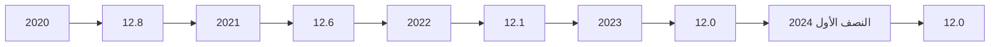
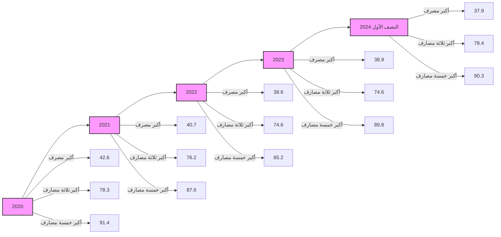
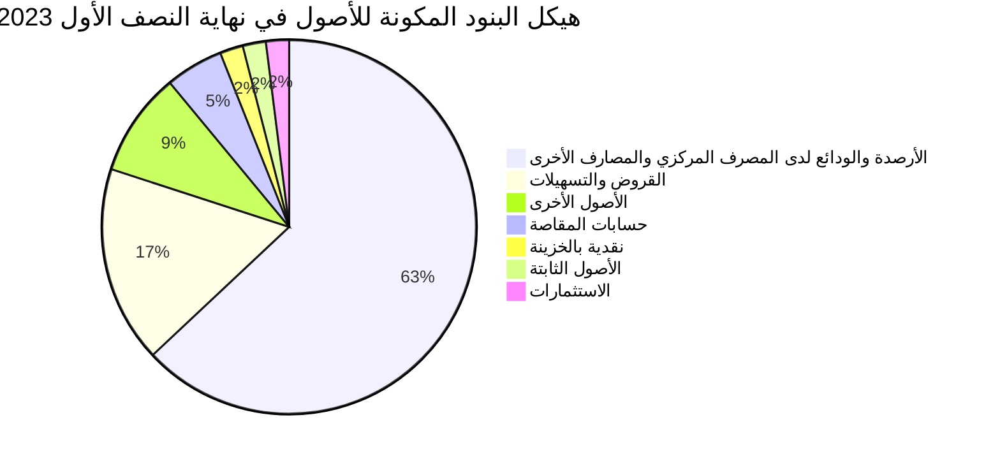
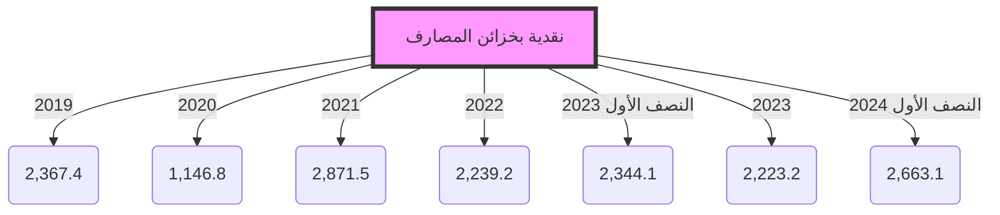
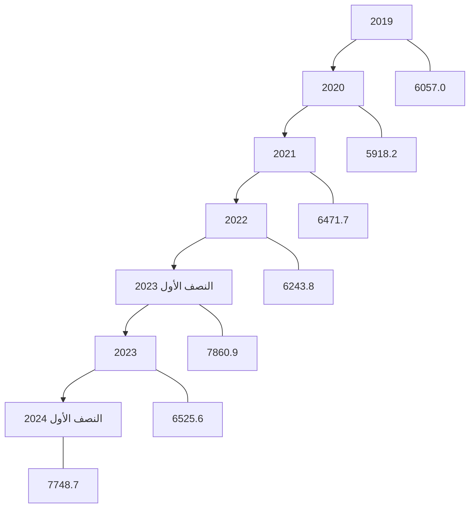
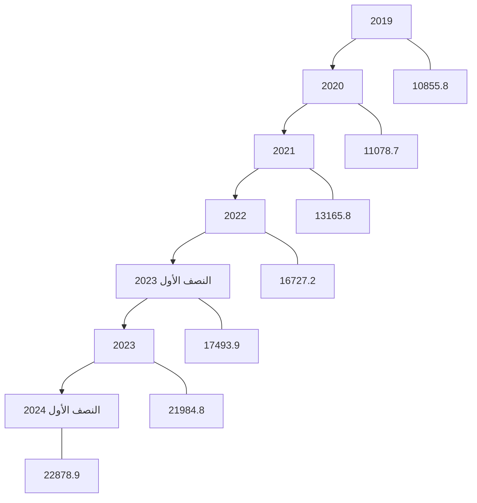
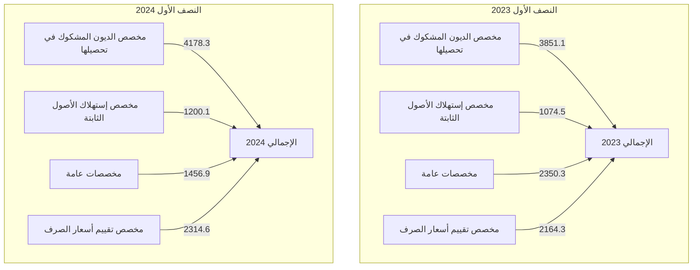
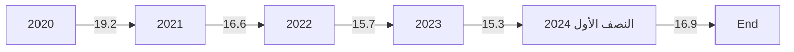
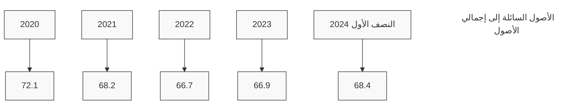

# CENTRAL BANK OF LIBYA

تقرير

## أهم البيانات والمؤشرات المالية للمصارف

### للنصف الأول 2024

[The image shows a graphical representation of financial data with colorful bar charts and a line graph trending upwards, indicating growth or positive financial performance]

إدارة البحوث والإحصاء
---
إدارة البحوث والإحصاء

| الصفحة | المحتويات |
|---------|------------|
| 3 | ملخص لأداء المصارف للنصف الأول 2024 |
| 7 | تفرع المصارف |
| 7 | الكثافة المصرفية |
| 8 | التركز المصرفي |
| 10 | المركز المالي المُجمّع للمصارف |
| 12 | هيكل البنود المكونة للأصول |
| 13 | هيكل البنود المكونة للخصوم |
| 15 | تحليل البنود المكونة للمركز المالي المُجمّع للمصارف |
| 15 | - النقدية بالخزائن وحسابات المقاصة |
| 16 | - الأرصدة والودائع لدى المصرف المركزي والمصارف الأخرى |
| 17 | - الإستثمارات |
| 18 | - القروض والتسهيلات الائتمانية |
| 21 | - ودائع العملاء لدى المصارف |
| 23 | - الحسابات المكشوفة لدى المراسلين بالخارج |
| 24 | - حقوق الملكية |
| 25 | - المخصصات |
| 27 | مؤشرات السلامة المالية للمصارف |
| 27 | - مؤشرات كفاية رأس المال |
| 28 | - مؤشرات جودة الأصول |
| 30 | - مؤشرات الربحية |
| 32 | - مؤشرات السيولة |

صفحة 2 من 35

تقرير أهم البيانات والمؤشرات المالية للمصارف عن النصف الأول 2024
---
# تقرير أهم البيانات والمؤشرات المالية للمصارف - النصف الأول 2024

## ملخص لأداء المصارف نهاية النصف الأول 2024.

شهدت البيانات المالية المُجمّعة للمصارف في نهاية النصف الأول 2024 بعض التغيرات مقارنة عما كانت عليه في نهاية نفس الفترة من عام 2023 وذلك على النحو التالي:

- إرتفع إجمالي أصول المصارف (بإستثناء الحسابات النظامية) من 145.6 مليار دينار في نهاية النصف الأول 2023 إلى نحو 180.3 مليار دينار في نهاية النصف الأول 2024، بمقدار 34.7 مليار دينار، أي بمعدل نمو قدره 23.8%، وقد شكلت الأصول السائلة (البالغة 123.4 مليار دينار) من إجمالي الأصول ما نسبته 68.4%.

- إرتفعت أرصدة ودائع المصارف (تحت الطلب وشهادات الإيداع) لدى المصرف المركزي بما فيها الإحتياطي الإلزامي من نحو 78.3 مليار دينار في نهاية النصف الأول 2023 إلى نحو 105.5 مليار دينار في نهاية النصف الأول 2024، بمقدار 27.1 مليار دينار أي بمعدل بلغ 34.6%، وتجدر الإشارة إلى أن الإحتياطي النقدي الإلزامي المطلوب من المصارف الإحتفاظ به لدى المصرف المركزي شكل نحو 27.7 مليار دينار.

- إرتفع اجمالي رصيد الإئتمان الممنوح من المصارف من نحو 25.4 مليار دينار في نهاية النصف الأول 2023 إلى نحو 30.6 مليار دينار في نهاية النصف الأول 2024، بمقدار 5.3 مليار دينار أي بمعدل نمو 20.8%، هذا الإرتفاع جاء نتيجة توسع المصارف الكبرى (الجمهورية، الوحدة، التجاري الوطني، مصرف شمال أفريقيا ومصرف التجارة والتنمية) في منح التمويلات بصيغ المرابحة المختلفة.

- شكلت القروض والتسهيلات الائتمانية الممنوحة إلى اجمالي الأصول ما نسبته 17.0%، فيما شكلت من اجمالي الخصوم الإيداعية ما نسبته 22.1%، وبلغ رصيد القروض الممنوحة للقطاع الخاص في نهاية النصف الأول 2024 ما قيمته 22.9 مليار دينار، وما نسبته 74.7% من إجمالي القروض والتسهيلات الإئتمانية الممنوحة، فيما شكل رصيد القروض الممنوحة للقطاع العام النسبة الباقية 25.3% والتي بلغت قيمتها نحو 7.7 مليار دينار.

صفحة 3 من 35
تقرير أهم البيانات والمؤشرات المالية للمصارف عن النصف الأول 2024
---
إدارة البحوث والإحصاء

▪ إرتفعت ودائع العملاء (الخصوم الإيداعية) لدى المصارف بشكل كبير من 109.1 مليار دينار في نهاية النصف الأول 2023، إلى 138.7 مليار دينار في نهاية النصف الأول 2024، بمقدار 29.6 مليار دينار أي بمعدل زيادة قدره 27.1%. وقد شكلت الودائع تحت الطلب ما نسبته 79.4% من إجمالي الودائع، في حين شكلت الودائع لأجل نسبة 20.4% من إجمالي الودائع، بينما شكلت ودائع الإدخار نسبة 0.2% فقط من إجمالي الودائع.

وفيما يتعلق بتوزيع هذه الودائع حسب القطاعين الخاص العام، فقد بلغت ودائع القطاع الخاص لدى المصارف في نهاية النصف الأول 2024 ما قيمته 84.2 مليار دينار، وما نسبته 60.7% من إجمالي الودائع، فيما شكل رصيد ودائع القطاع العام والحكومي النسبة الباقية وقدرها 39.3% أي ما قيمته 54.5 مليار دينار، منها 40.6 مليار دينار ودائع لشركات ومؤسسات القطاع العام ونحو 13.9 مليار دينار ودائع حكومية.

وتجدر الإشارة إلى أن نحو 69.1% من الخصوم الإيداعية لدى المصارف متركزة في المصارف الأربعة الكبرى: الجمهورية، التجاري الوطني، الوحدة والصحاري.

▪ إرتفع إجمالي حقوق الملكية في المصارف من 8.8 مليار دينار في نهاية النصف الأول 2023 إلى 11.1 مليار دينار في نهاية النصف الأول 2024، وبمعدل 26.4%. نتيجة الزيادة في رأس مال المدفوع بعض المصارف وفقاً للمتطلبات التي وضعها المصرف المركزي.

▪ إرتفعت أرباح المصارف خلال النصف الأول 2024 بشكل كبير وبمعدل قياسي بلغ 218.4% لتصل إلى 1,468.8 مليون دينار، مقارنة عما كانت عليه خلال نفس الفترة من عام 2023 والتي سجلت نحو 461.2 مليون دينار.

▪ بلغ عدد المصارف والمشتملة بياناتها في هذا التقرير 20 مصرفاً (بما في ذلك وحدة الدينار الليبي التابعة للمصرف الليبي الخارجي) في نهاية النصف الأول 2024، وتزاول هذه المصارف نشاطها من خلال 655 فرعاً ووكالة.

إدارة البحوث والإحصـــــــــاء

صفحة 2 من 35
تقرير أهم البيانات والمؤشرات المالية للمصارف عن النصف الأول 2024
---
إدارة البحوث والإحصاء

# البيانات المالية الأساسية للمصارف
"مليون دينار"

| البند | النصف الأول 2023 | النصف الأول 2024 | معدل التغير% |
|------|-----------------|-----------------|-------------|
| إجمالي الميزانية (الأصول + الحسابات النظامية) | 189,704.3 | 232,050.5 | 22.3 |
| إجمالي الأصول | 145,584.4 | 180,261.2 | 23.8 |
| إجمالي النقدية بخزائن المصارف | 2,344.1 | 2,663.1 | 13.6 |
| إجمالي الودائع لدى المصرف المركزي | 78,339.3 | 105,465.3 | 34.6 |
| إجمالي الودائع لدى المصارف فيما بينها | 628.0 | 633.4 | 0.8 |
| إجمالي الودائع لدى المصرف الليبي الخارجي | 1,360.6 | 808.7 | -40.6 |
| إجمالي الودائع لدى المراسلين بالخارج | 12,121.4 | 13,817.8 | 14.0 |
| إجمالي حسابات المقاصة | 7,406.5 | 4,272.5 | -42.3 |
| إجمالي القروض والسلفيات والتسهيلات | 25,354.8 | 30,627.7 | 20.8 |
| إجمالي الاستثمارات | 2,386.1 | 2,719.2 | 14.0 |
| إجمالي ودائع العملاء | 109,134.2 | 138,706.4 | 27.1 |
| إجمالي الحسابات المكشوفة لدى المراسلين | 62.2 | 649.1 | 942.8 |
| إجمالي حقوق الملكية | 8,292.2 | 9,596.0 | 15.7 |
| إجمالي المخصصات | 9,440.2 | 9,149.9 | -3.1 |
| أرباح العام | 461.2 | 1,468.8 | 218.4 |
| عدد الفروع والوكالات | 642 | 655 | 2.0 |
| عدد العاملين | 19,463 | 19,815 | 1.8 |

## المؤشرات المالية:

| المؤشر | النصف الأول 2023 | النصف الأول 2024 |
|--------|-----------------|-----------------|
| الأصول السائلة / إجمالي الأصول % | 65.1 | 68.4 |
| إجمالي القروض / إجمالي الأصول % | 17.4 | 17.0 |
| حقوق الملكية / إجمالي الخصوم % | 5.7 | 5.3 |
| إجمالي الأصول / عدد الفروع (مليون دينار) | 226.8 | 275.2 |
| إجمالي الأصول / عدد العاملين (مليون دينار) | 7.5 | 9.1 |
| إجمالي القروض / إجمالي الودائع % | 23.2 | 22.1 |
| إجمالي الربح / الأصول % | 0.6 | 1.6 |
| إجمالي الربح / حقوق الملكية % | 11.1 | 30.6 |

صفحة 3 من 35
تقرير أهم البيانات والمؤشرات المالية للمصارف عن النصف الأول 2024
---
إدارة البحوث والإحصاء

## مؤشرات الودائع لدى المصارف
"مليون دينار"

| البند | النصف الأول 2023 | النصف الأول 2024 | معدل التغير% |
|-------|------------------|------------------|-------------|
| 1- ودائع الحكومة والقطاع العام | 43,604.2 | 54,520.8 | 25.0 |
| ـ ودائع الحكومة (الوزارات والهيئات الممولة من الميزانية العامة) | 12,440.7 | 13,901.1 | 11.7 |
| ـ ودائع القطاع العام | 31,163.4 | 40,619.6 | 30.3 |
| 2- ودائع القطاع الخاص | 65,530.0 | 84,185.7 | 28.5 |
| ـ ودائع الأفراد | 35,242.0 | 44,703.2 | 26.8 |
| ـ ودائع الشركات والجهات الأخرى | 30,288.0 | 39,482.5 | 30.4 |
| إجمالي الودائع | 109,134.2 | 138,706.4 | 27.1 |
| الودائع تحت الطلب | 88,325.7 | 110,117.6 | 24.7 |
| الودائع لأجل | 20,512.1 | 28,301.8 | 38.0 |
| ودائع الادخار | 296.4 | 287.0 | -3.2 |
| الودائع تحت الطلب / إجمالي الودائع % | 80.9 | 79.4 | - |
| الودائع لأجل / إجمالي الودائع % | 18.8 | 20.4 | - |
| ودائع الادخار / إجمالي الودائع % | 0.3 | 0.2 | - |
| إجمالي الودائع / إجمالي الخصوم % | 75.0 | 76.9 | - |

## مؤشرات الإئتمان الممنوح من المصارف
"مليون دينار"

| البند | النصف الأول 2023 | النصف الأول 2024 | معدل التغير% |
|-------|------------------|------------------|-------------|
| 1- الائتمان الممنوح للقطاع العام | 7,860.9 | 7,748.7 | -1.4 |
| 2- الائتمان الممنوح للقطاع الخاص | 17,493.9 | 22,878.9 | 30.8 |
| إجمالي الائتمان | 25,354.8 | 30,627.7 | 20.8 |
| السلفيات والسحب على المكشوف | 4,234.6 | 3,973.1 | -6.2 |
| قروض المرابحة (تشمل رصيد السلف الإجتماعية) | 8,514.2 | 14,757.2 | 73.3 |
| القروض الممنوحة للأنشطة الاقتصادية الأخرى | 12,606.0 | 11,897.3 | -5.6 |
| قروض المرابحة / إجمالي الائتمان % | 33.6 | 48.2 | - |
| السلفيات والسحب على المكشوف / إجمالي الائتمان % | 16.7 | 13.0 | - |
| القروض الممنوحة للأنشطة الأخرى/اجمالي الائتمان% | 49.7 | 38.8 | - |
| إجمالي الائتمان / إجمالي الأصول % | 17.4 | 17.0 | - |
| إجمالي الائتمان / إجمالي الودائع % | 23.2 | 22.1 | - |

صفحة 6 من 35
تقرير أهم البيانات والمؤشرات المالية للمصارف عن النصف الأول 2024
---
إدارة البحوث والإحصاء

## تفرع المصارف:

بلغ عدد المصارف العاملة في ليبيا والمشتملة بياناتها في هذا التقرير 20 مصرفاً (بما في ذلك وحدة الدينار الليبي
التابعة للمصرف الليبي الخارجي) حتى نهاية النصف الأول 2024، وتزاول هذه المصارف نشاطها من خلال 655 فرعاً
ووكالة مصرفية.

## الكثافة المصرفية:

بلغت الكثافة المصرفية خلال النصف الأول 2024 نحو 12.0 ألف نسمة لكل فرع أو وكالة.

### الكثافة المصرفية
"بالألف نسمة"

| لكل فرع ووكالة | لكل مصرف | نهاية |
|----------------|-----------|-------|
| 12.9 | 368.4 | 2019 |
| 12.8 | 368.3 | 2020 |
| 12.6 | 388.9 | 2021 |
| 12.1 | 350.0 | 2022 |
| 12.0 | 350.0 | 2023 |
| 12.0 | 350.0 | النصف الأول 2024 |

### الكثافة المصرفية



صفحة 7 من 35
تقرير أهم البيانات والمؤشرات المالية للمصارف عن النصف الأول 2024
---
إدارة البحوث والإحصاء

# التركز المصرفي:

درجة التركز المصرفي تعني أن عدداً قليلاً من المصارف يستأثر بالنسبة الأكبر من النشاط المصرفي سواءً من حيث الأصول أو الودائع أوالائتمان أو من حيث حجم حقوق الملكية، وفيما يخص الحصة السوقية للمصارف في ليبيا، فقد شكلت أصول المصارف الأربعة الكبرى (الجمهورية، التجاري الوطني، الوحدة والصحاري) من أصل 20 مصرفاً مانسبته 67.6% من إجمالي أصول القطاع المصرفي في نهاية النصف الأول 2024، وشكل مصرف الجمهورية وحده ما نسبته 26.6% من إجمالي أصول القطاع المصرفي.

وشكلت الخصوم الإيداعية للمصارف الأربعة الكبرى مانسبته 69.1% من إجمالي الخصوم الإيداعية للقطاع المصرفي وفيما شكلت القروض الممنوحة منهم نحو 86.2% من إجمالي القروض الممنوحة من القطاع المصرفي في نهاية النصف الأول 2024.

ومن خلال بيانات التركز في الجداول والرسومات البيانية أدناه يُلاحظ أن هناك تحسن ملحوظ في نسب تركز الأصول والخصوم الإيداعية ، فيما إرتفعت درجة التركز في الإئتمان كما هو موضح.

## تركز الأصول
"نسب مئوية"

| نهاية | 2020 | 2021 | 2022 | 2023 | النصف الأول 2024 |
|-------|------|------|------|------|-------------------|
| أكبر مصرف | 31.2 | 28.0 | 27.5 | 26.7 | 26.6 |
| أكبر ثلاثة مصارف | 63.1 | 62.0 | 61.7 | 59.4 | 57.7 |
| أكبر خمسة مصارف | 82.7 | 79.7 | 78.6 | 76.5 | 74.7 |

## تركز الإئتمان
"نسب مئوية"

| نهاية | 2020 | 2021 | 2022 | 2023 | النصف الأول 2024 |
|-------|------|------|------|------|-------------------|
| أكبر مصرف | 42.6 | 40.7 | 38.6 | 38.9 | 37.9 |
| أكبر ثلاثة مصارف | 78.3 | 76.2 | 74.6 | 76.9 | 78.4 |
| أكبر خمسة مصارف | 91.4 | 87.6 | 85.2 | 89.8 | 90.3 |

صفحة 8 من 35
تقرير أهم البيانات والمؤشرات المالية للمصارف عن النصف الأول 2024
---
إدارة البحوث والإحصاء

## تركز الخصوم الإيداعية

"نسب مئوية"

| نهاية | 2020 | 2021 | 2022 | 2023 | النصف الأول 2024 |
|-------|------|------|------|------|-----------------|
| أكبر مصرف | 31.8 | 33.8 | 32.1 | 27.9 | 27.5 |
| أكبر ثلاثة مصارف | 62.9 | 62.0 | 60.5 | 59.6 | 58.4 |
| أكبر خمسة مصارف | 83.7 | 79.5 | 79.2 | 77.7 | 76.6 |

### تركز الأصول


### تركز الائتمان



### تركز الخصوم الإيداعية


صفحة 9 من 35

تقرير أهم البيانات والمؤشرات المالية للمصارف عن النصف الأول 2024
---
# المركز المالي المُجمّع للمصارف

شهد المركز المالي المُجمّع للمصارف نهاية النصف الأول 2024، تطورات في مُجمل بنوده على جانبي الأصول والخصوم، ليبلغ إجمالي أصول المصارف مجتمعة (بإستثناء الحسابات النظامية) نحو 180,261.2 مليون دينار، مقابل 145,584.4 مليون دينار في نهاية النصف الأول 2023، بإرتفاع قدره 34,676.9 مليون دينار، أي بمعدل 23.8%، وفيما يلي جدول يلخص البنود الرئيسية للمركز المالي المُجمّع للمصارف:

## مُلخص المركز المالي المُجمّع للمصارف

"مليون دينار"

| البند | النصف الأول 2023 | النصف الأول 2024 | مقدار التغير | معدل التغير% |
|-------|------------------|------------------|---------------|---------------|
| **الأصول:** |
| 1- نقدية بالخزائن | 2,344.1 | 2,663.1 | 318.9 | 13.6 |
| - عملة محلية | 2,089.8 | 2,346.7 | 256.9 | 12.3 |
| - عملة أجنبية | 254.3 | 316.4 | 62.0 | 24.4 |
| 2- حسابات المقاصة | 7,406.5 | 4,272.5 | -3,134.0 | -42.3 |
| - المقاصة بين المصارف | 3,897.3 | 2,346.3 | -1,551.0 | -39.8 |
| - المقاصة بين الفروع | 3,509.3 | 1,926.3 | -1,583.0 | -45.1 |
| 3- الودائع لدى المصارف الأخرى | 92,449.4 | 120,725.2 | 28,275.8 | 30.6 |
| أ- الودائع لدى المصرف المركزي | 78,339.3 | 105,465.3 | 27,126.0 | 34.6 |
| - ودائع تحت الطلب | 74,846.8 | 105,465.3 | 30,618.5 | 40.9 |
| - شهادات الإيداع | 3,492.5 | 0.0 | -3,492.5 | -100.0 |
| ب- الودائع لدى المصارف المحلية الأخرى | 628.0 | 633.4 | 5.3 | 0.8 |
| - ودائع تحت الطلب | 628.0 | 633.4 | 5.3 | 0.8 |
| - ودائع زمنية | 0.0 | 0.0 | 0.0 | - |
| ج- الودائع لدى المصرف الليبي الخارجي | 1,360.6 | 808.7 | -551.9 | -40.6 |
| - ودائع تحت الطلب | 844.9 | 791.7 | -53.2 | -6.3 |
| - ودائع زمنية | 515.7 | 17.1 | -498.7 | -96.7 |
| د- الودائع لدى المصارف بالخارج | 12,121.4 | 13,817.8 | 1,696.4 | 14.0 |
| - ودائع تحت الطلب | 9,603.7 | 9,387.1 | -216.6 | -2.3 |
| - ودائع زمنية | 2,517.8 | 4,430.7 | 1,913.0 | 76.0 |
| 4- الإستثمارات | 2,386.1 | 2,719.2 | 333.1 | 14.0 |
| 5- القروض والتسهيلات | 25,354.8 | 30,627.7 | 5,272.9 | 20.8 |
| - السلفيات والسحب على المكشوف | 4,234.6 | 3,973.1 | -261.5 | -6.2 |
| - قروض المرابحة للأفراد (تشمل رصيد السلف الاجتماعية) | 8,514.2 | 14,757.2 | 6,243.0 | 73.3 |
| - قروض الأنشطة الإقتصادية الأخرى | 12,606.0 | 11,897.3 | -708.7 | -5.6 |
| 6- الأصول الثابتة | 2,737.5 | 3,453.9 | 716.4 | 26.2 |
| 7- الأصول الأخرى | 12,906.0 | 15,799.6 | 2,893.7 | 22.4 |
| **إجمالي الأصول** | 145,584.4 | 180,261.2 | 34,676.9 | 23.8 |
| الحسابات المقابلة | 44,119.9 | 51,789.3 | 1,513.30 | 17.4 |
| **الإجمالي الكلي للأصول** | 189,704.3 | 232,050.5 | 11,682.90 | 22.3 |

صفحة 10 من 35
تقرير أهم البيانات والمؤشرات المالية للمصارف عن النصف الأول 2024
---
إدارة البحوث والإحصاء

| البند | النصف الأول 2023 | النصف الأول 2024 | مقدار التغير | معدل التغير% |
|------|-----------------|-----------------|-------------|-------------|
| **الخصوم** |
| 1- ودائع الغير لدى المصارف | 109,134.2 | 138,706.4 | 29,572.2 | 27.1 |
| - الودائع تحت الطلب | 84,946.2 | 106,931.7 | 21,985.5 | 25.9 |
| - الودائع الزمنية | 2,305.0 | 1,609.0 | -696.0 | -30.2 |
| - الودائع الإدخارية | 296.4 | 287.0 | -9.4 | -3.2 |
| - أوامر الدفع | 3,379.5 | 3,185.9 | -193.7 | -5.7 |
| - التأمينات النقدية | 18,207.1 | 26,692.8 | 8,485.7 | 46.6 |
| 2- الإقتراض من المصارف والجهات الأخرى | 32.0 | 30.7 | -1.3 | -4.1 |
| 3- الحسابات المكشوفة لدى المراسلين | 62.2 | 649.1 | 586.8 | 942.8 |
| 4- حقوق الملكية | 8,753.5 | 12,670.9 | 3,917.4 | 44.8 |
| - رأس المال المدفوع | 5,470.8 | 9,095.1 | 3,624.3 | 66.2 |
| - الإحتياطي القانوني | 1,023.0 | 1,244.4 | 221.5 | 21.7 |
| - إحتياطيات غير مخصصة | 391.8 | 107.6 | -284.3 | -72.5 |
| - أرباح العام | 461.2 | 1,468.8 | 1,007.5 | 218.4 |
| - الأرباح المرحّلة والقابلة للتوزيع | 1,406.7 | 755.0 | -651.7 | -46.3 |
| 5- المخصصات | 9,440.2 | 9,149.9 | -290.3 | -3.1 |
| 6- المتنوعات والخصوم الأخرى | 18,162.3 | 19,054.2 | 892.0 | 4.9 |
| إجمالي الخصوم | 145,584.4 | 180,261.2 | 34,676.9 | 23.8 |
| الحسابات المقابلة | 44,119.9 | 51,789.3 | 7,669.3 | 17.4 |
| الإجمالي الكلي للخصوم | 189,704.3 | 232,050.5 | 42,346.2 | 22.3 |

صفحة 11 من 35
تقرير أهم البيانات والمؤشرات المالية للمصارف عن النصف الأول 2024
---
# إدارة البحوث والإحصاء

## هيكل البنود المكونة للأصول في المركز المالي المُجمّع للمصارف:

استمرت ودائع وأرصدة المصارف لدى المصرف المركزي بما فيها الاحتياطي الإلزامي هي المكوّن الرئيسي لأصول القطاع المصرفي، حيث تغطي نحو 58.5% من إجمالي الأصول في نهاية النصف الأول 2024، في حين سجلت حصة بند القروض والتسهيلات الائتمانية في هيكل الموجودات نسبة 17.0% من الإجمالي مقارنة بـ 17.4% في نهاية النصف الأول 2023، بينما بلغت نسبة الاستثمارات فقط 1.5% مما يشير إلى أن الأصول المولدة للدخل متدنية جدًا ولم تصل حتى إلى 20.0% من إجمالي قاعدة الأصول للقطاع المصرفي وهى مازالت نسب ضئيلة تعكس ضعف توظيف المصارف لأموالها.

### جدول هيكل البنود المكونة للأصول

| البند | النصف الأول 2023 | النصف الأول 2024 |
|-------|------------------|------------------|
| **الأصول:** | | |
| 1- نقدية بالخزائن | 1.6% | 1.5% |
| 2- حسابات المقاصة | 5.1% | 2.4% |
| 3- الودائع لدى المصرف المركزي | 53.8% | 58.5% |
| 4- الودائع لدى المصارف المحلية الأخرى | 0.4% | 0.4% |
| 5- الودائع لدى المصرف الليبي الخارجي | 0.9% | 0.4% |
| 6- الودائع لدى المصارف بالخارج | 8.3% | 7.7% |
| 7- الاستثمارات | 1.6% | 1.5% |
| 8- القروض والتسهيلات | 17.4% | 17.0% |
| 9- الأصول الثابتة | 1.9% | 1.9% |
| 10- الأصول الأخرى | 8.9% | 8.8% |

### هيكل البنود المكونة للأصول في نهاية النصف الأول 2023



صفحة 12 من 35
تقرير أهم البيانات والمؤشرات المالية للمصارف عن النصف الأول 2024
---
إدارة البحوث والإحصاء

## حسابات المقاصة

### هيكل البنود المكونة للأصول في نهاية النصف الأول 2024

| البند | النسبة |
|-------|--------|
| الأرصدة والودائع لدى المصرف المركزي والمصارف الأخرى | 67% |
| القروض والتسهيلات | 17% |
| الأصول الأخرى | 9% |
| الأصول الثابتة | 2% |
| الاستثمارات | 2% |
| نقدية بالخزينة | 1% |
| حسابات المقاصة | 2% |

### هيكل البنود المكونة للخصوم في المركز المالي المُجمّع للمصارف:

بتحليل هيكل البنود المكونة للخصوم بالمركز المالي المُجمَع للمصارف في نهاية النصف الأول 2024، فإن الخصوم الإيداعية لدى المصارف (ودائع العملاء) مازالت تمثل المصدر الرئيسي للتمويل مشكلة مانسبته 76.9% من إجمالي مصادر أموال المصارف، مقارنة بنحو 75.0% في نهاية النصف الأول 2023، فيما إرتفعت حصة حقوق الملكية إلى نحو 7.0% من إجمالي مصادر أموال المصارف مقارنة بـ 6.0% في نهاية النصف الأول 2023.

#### جدول هيكل البنود المكونة للخصوم

| البند | النصف الأول 2023 | النصف الأول 2024 |
|-------|------------------|------------------|
| **الخصوم** |
| 1- ودائع الغير لدى المصارف | 75.0% | 76.9% |
| 2- الإقتراض من المصارف | 0.0% | 0.0% |
| 3- الحسابات المكشوفة لدى المراسلين | 0.0% | 0.4% |
| 4- حقوق الملكية | 6.0% | 7.0% |
| 5- المخصصات | 6.5% | 5.1% |
| 6- المتنوعات والخصوم الأخرى | 12.5% | 10.6% |

صفحة 13 من 35
تقرير أهم البيانات والمؤشرات المالية للمصارف عن النصف الأول 2024
---
إدارة البحوث والإحصاء

## هيكل البنود المكونة للخصوم في نهاية النصف الأول 2023

| البند | النسبة |
|-------|--------|
| ودائع الغير لدى المصارف | 75% |
| المتنوعات والخصوم الأخرى | 12% |
| المخصصات | 7% |
| حقوق الملكية | 6% |
| الحسابات المكشوفة لدى المراسلين | 0% |
| الإقتراض من المصارف | 0% |

## هيكل البنود المكونة للخصوم في نهاية النصف الأول 2024

| البند | النسبة |
|-------|--------|
| ودائع الغير لدى المصارف | 77% |
| المتنوعات والخصوم الأخرى | 11% |
| حقوق الملكية | 7% |
| المخصصات | 5% |
| الحسابات المكشوفة لدى المراسلين | 0% |
| الإقتراض من المصارف | 0% |

صفحة 14 من 35
تقرير أهم البيانات والمؤشرات المالية للمصارف عن النصف الأول 2024
---
إدارة البحوث والإحصاء

# تحليل لأهم البنود المكونة للمركز المالي المجمع للمصارف

## أولاً: جانب الأصول

### 1- النقدية :

#### أ- النقدية بالخزائن وحسابات المقاصة :

إنخفض رصيد النقدية وحسابات المقاصة بمقدار 2,815.0 مليون دينار أي بمعدل 28.9%، ليصل إلى 6,935.6 مليون دينار في نهاية النصف الأول 2024، مقابل 9,750.6 مليون دينار في نهاية النصف الأول 2023، بسبب إنخفاض رصيد حسابات المقاصة بمقدار 3,134.0 مليون دينار مقارنة بنفس الفترة من عام 2023. فيما إرتفع رصيد النقدية بالخزائن بمقدار 318.9 مليون دينار، والجدول التالي يوضح التغيرات في بند النقدية بخزائن المصارف وحسابات المقاصة :

| البيان | النصف الأول 2023 | النصف الأول 2024 | مقدار التغير | معدل التغير% |
|--------|------------------|------------------|---------------|---------------|
| النقدية بالخزائن : | 2,344.1 | 2,663.1 | 318.9 | 13.6 |
| عملة محلية | 2,089.8 | 2,346.7 | 256.9 | 12.3 |
| عملة أجنبية | 254.3 | 316.4 | 62.0 | 24.4 |
| إجمالي حسابات المقاصة | 7,406.5 | 4,272.5 | -3,134.0 | -42.3 |
| المقاصة بين المصارف | 3,897.3 | 2,346.3 | -1,551.0 | -39.8 |
| المقاصة بين الفروع | 3,509.3 | 1,926.3 | -1,583.0 | -45.1 |
| الإجمالي | 9,750.6 | 6,935.6 | -2,815.0 | -28.9 |



صفحة 13 من 35
تقرير أهم البيانات والمؤشرات المالية للمصارف عن النصف الأول 2024
---
إدارة البحوث والإحصاء

## إجمالي حسابات المقاصة

| السنة | القيمة (مليون دينار) |
|-------|----------------------|
| 2019 | 6,304.6 |
| 2020 | 5,584.8 |
| 2021 | 6,041.0 |
| 2022 | 7,034.7 |
| النصف الأول 2023 | 7,406.5 |
| 2023 | 7,337.1 |
| النصف الأول 2024 | 4,272.5 |

## ب- الأرصدة والودائع لدى المصرف المركزي والمصارف الأخرى:

بلغ رصيد ودائع وأرصدة المصارف لدى المصرف المركزي والمصارف المحلية الأخرى ولدى المصارف الخارجية نحو 120,725.2 مليون دينار في نهاية النصف الأول 2024، مقابل 92,449.4 مليون دينار في نهاية النصف الأول 2023، مرتفعة بشكل كبير بقيمة 28,275.8 مليون دينار بمعدل 30.6%، هذا الارتفاع جاء نتيجة إرتفاع الأرصدة والودائع تحت الطلب لدى المصرف المركزي بمقدار 30,618.5 مليون دينار، كذلك إرتفعت ودائع المصارف لدى المصارف المراسلة بالخارج فيما إنخفضت ودائع المصارف لدى المصرف الليبي الخارجي، كما موضح بالجدول التالي:

### الأرصدة والودائع لدى المصرف المركزي والمصارف الأخرى

"مليون دينار"

| البند | النصف الأول 2023 | النصف الأول 2024 | مقدار التغير | معدل التغير% |
|-------|-------------------|-------------------|---------------|---------------|
| ودائع تحت الطلب لدى : | 85,923.4 | 116,277.4 | 30,354.1 | 35.3 |
| المصرف المركزي | 74,846.8 | 105,465.3 | 30,618.5 | 40.9 |
| المصارف المحلية | 628.0 | 633.4 | 5.3 | 0.8 |
| المصرف الليبي الخارجي | 844.9 | 791.7 | -53.2 | -6.3 |
| لدى المراسلين بالخارج | 9,603.7 | 9,387.1 | -216.6 | -2.3 |
| ودائع زمنية : | 6,526.0 | 4,447.8 | -2,078.2 | -31.8 |
| المصرف المركزي (شهادات الإيداع) | 3,492.5 | 0.0 | -3,492.5 | -100.0 |
| المصارف المحلية | 0.0 | 0.0 | 0.0 | - |
| المصرف الليبي الخارجي | 515.7 | 17.1 | -498.7 | -96.7 |
| لدى المراسلين بالخارج | 2,517.8 | 4,430.7 | 1,913.0 | 76.0 |
| الإجمالي | 92,449.4 | 120,725.2 | 28,275.8 | 30.6 |

صفحة 16 من 35
تقرير أهم البيانات والمؤشرات المالية للمصارف عن النصف الأول 2024
---
إدارة البحوث والإحصاء

## ودائع المصارف التجارية لدى المصرف المركزي والمصارف الأخرى

| السنة | الودائع تحت الطلب | الودائع الزمنية | الإجمالي |
|-------|-------------------|-----------------|----------|
| 2019 | 60,184.6 | 17,240.3 | 77,424.9 |
| 2020 | 72,269.0 | 17,567.6 | 89,836.6 |
| 2021 | 74,216.6 | 15,700.2 | 89,916.8 |
| 2022 | 90,839.6 | 6,054.7 | 96,894.4 |
| النصف الأول 2023 | 85,923.4 | 6,526.0 | 92,449.4 |
| 2023 | 97,057.6 | 6,957.9 | 104,015.5 |
| النصف الأول 2024 | 116,277.4 | 4,447.8 | 120,725.2 |

## -2 الإستثمارات :

سجل إجمالي رصيد إستثمارات المصارف في الشركات العامة والخاصة المساهمة والإستثمارات الأخرى نهاية
النصف الأول 2024 نحو 2,719.2 مليون دينار، مقابل 2,386.1 مليون دينار في نهاية النصف الأول 2023،
مرتفعة بمقدار 333.1 مليون دينار هذا الإرتفاع جاء نتيجة للزيادة في بند الإستثمارات في الشركات الخاصة
المساهمة وكذلك الإستثمارات الأخرى ، والجدول التالي يوضح تفاصيل هذا البند:

### بند الإستثمارات

| البيان | النصف الأول 2023 | النصف الأول 2024 | مقدار التغير | معدل التغير% |
|--------|-------------------|-------------------|---------------|---------------|
| سندات وأذونات الخزانة | 0.0 | 0.0 | 0.0 | - |
| إستثمارات في الشركات العامة | 570.7 | 568.6 | -2.1 | -0.4 |
| إستثمارات في الشركات الخاصة المساهمة | 1,093.5 | 1,361.8 | 268.3 | 24.5 |
| إستثمارات أخرى | 721.9 | 788.8 | 66.9 | 9.3 |
| الإجمالي | 2,386.1 | 2,719.2 | 333.1 | 14.0 |

صفحة 17 من 35
تقرير أهم البيانات والمؤشرات المالية للمصارف عن النصف الأول 2024
---
إدارة البحوث والإحصاء

| إجمالي بند الإستثمارات |
|------------------------|
| 6,000.0 |
| 4,000.0 | 4,256.6 4,445.1 |
| مليون دينار 2,000.0 | 1,957.5 2,386.1 2,719.2 2,719.2 |
| | 1,695.8 |
| 0.0 |
| 2019 2020 2021 2022 النصف الأول 2023 2023 النصف الأول 2024 |

### 3- القروض والتسهيلات الائتمانية:

ارتفع إجمالي رصيد القروض والتسهيلات الإئتمانية الممنوحة من المصارف من 25,354.8 مليون دينار في نهاية النصف الأول 2023 إلى 30,627.7 مليون دينار في نهاية النصف الأول 2024، بمقدار 5,272.9 مليون دينار أي بمعدل نمو 20.8%، وقد شكلت القروض والتسهيلات الائتمانية الممنوحة إلى إجمالي الخصوم الإيداعية ما نسبته 22.1%، كما شكلت من إجمالي الأصول ما نسبته 17.0%، وبلغ رصيد القروض الممنوحة للقطاع الخاص في نهاية النصف الأول 2024 ما قيمته 22,878.9 مليون دينار، وما نسبته 74.7% من إجمالي القروض والتسهيلات الإئتمانية الممنوحة، فيما شكل رصيد القروض الممنوحة للقطاع العام النسبة الباقية 25.3% والتي بلغت قيمتها نحو 7,748.7 مليون دينار. وبتحليل مكونات المحفظة الائتمانية فقد كان الإرتفاع في إجمالي رصيد الإئتمان الممنوح من المصارف بسبب الزيادة الملحوظة في بند قروض المرابحة للأفراد الذي سجل إرتفاع بمقدار 6,243.0 مليون دينار مقارنة بما كان عليه في نهاية نفس الفترة من العام الماضي 2023.

| رصيد القروض والتسهيلات الإئتمانية الممنوحة من المصارف |
|--------------------------------------------------------|
| "مليون دينار" |

| معدل التغير% | مقدار التغير | النصف الأول 2024 | النصف الأول 2023 | البند |
|--------------|---------------|-------------------|-------------------|------|
| -6.2 | -261.5 | 3,973.1 | 4,234.6 | سلفيات والسحب على المكشوف |
| 73.3 | 6,243.0 | 14,757.2 | 8,514.2 | قروض المرابحة للأفراد* |
| -5.6 | -708.7 | 11,897.3 | 12,606.0 | القروض الأخرى |
| 20.8 | 5,272.9 | 30,627.7 | 25,354.8 | إجمالي القروض والتسهيلات |
| 8.5 | 327.2 | 4,178.3 | 3,851.1 | مخصص الديون المشكوك في تحصيلها |
| 23.0 | 4,945.6 | 26,449.3 | 21,503.7 | صافي القروض والتسهيلات |

(*) يشمل رصيد السلف الإجتماعية.

صفحة 18 من 35
تقرير أهم البيانات والمؤشرات المالية للمصارف عن النصف الأول 2024
---
إدارة البحوث والإحصاء

## رصيد بند المرابحة والسلف الإجتماعية

| السنة | القيمة (مليون دينار) |
|-------|----------------------|
| 2019 | 3,125.5 |
| 2020 | 3,036.5 |
| 2021 | 4,819.3 |
| 2022 | 7,015.4 |
| النصف الأول 2023 | 8,514.2 |
| 2023 | 12,700.2 |
| النصف الأول 2024 | 14,757.2 |

## السلفيات والسحب على المكشوف

| السنة | القيمة (مليون دينار) |
|-------|----------------------|
| 2019 | 5,275.4 |
| 2020 | 4,495.7 |
| 2021 | 4,618.6 |
| 2022 | 4,166.2 |
| النصف الأول 2023 | 4,234.6 |
| 2023 | 4,023.7 |
| النصف الأول 2024 | 3,973.1 |

صفحة 19 من 35
تقرير أهم البيانات والمؤشرات المالية للمصارف عن النصف الأول 2024
---
إدارة البحوث والإحصاء

توزيع القروض الممنوحة من المصارف حسب القطاع (خاص وعام)

"مليون دينار"

| البند | النصف الأول 2023 | النصف الأول 2024 | مقدار التغير | معدل التغير% |
|------|-----------------|-----------------|-------------|-------------|
| القروض الممنوحة للقطاع العام | 7,860.9 | 7,748.7 | -112.1 | -1.4 |
| القروض الممنوحة للقطاع الخاص | 17,493.9 | 22,878.9 | 5,385.0 | 30.8 |
| الإجمالي | 25,354.8 | 30,627.7 | 5,272.9 | 20.8 |

رصيد القروض الممنوحة للقطاع العام



رصيد القروض الممنوحة للقطاع الخاص



صفحة 20 من 35
تقرير أهم البيانات والمؤشرات المالية للمصارف عن النصف الأول 2024
---
إدارة البحوث والإحصاء

## ثانياً: جانب الخصوم

### 1- ودائع العملاء لدى المصارف :

ارتفعت الخصوم الإيداعية (ودائع العملاء) لدى المصارف بشكل كبير بمقدار 29,572.2 مليون دينار من 109,134.2 مليون دينار في نهاية النصف الأول 2023، إلى 138,706.4 مليون دينار في نهاية النصف الأول 2024 ، أي بمعدل نمو بلغ 27.1%، وقد شكلت الودائع تحت الطلب وأوامر الدفع ما نسبته 79.4% من إجمالي الودائع، في حين شكلت الودائع لأجل والتأمينات النقدية نسبة 20.4% من إجمالي الودائع، بينما شكلت ودائع الادخار نسبة 0.2% فقط من إجمالي الودائع.

#### جدول الخصوم الإيداعية (ودائع العملاء)

| البند | النصف الأول 2023 | النصف الأول 2024 | مقدار التغير | معدل التغير% |
|-------|------------------|------------------|---------------|---------------|
| الودائع تحت الطلب | 84,946.2 | 106,931.7 | 21,985.5 | 25.9 |
| الودائع لأجل | 2,305.0 | 1,609.0 | -696.0 | -30.2 |
| الودائع الإدخارية | 296.4 | 287.0 | -9.4 | -3.2 |
| أوامر الدفع | 3,379.5 | 3,185.9 | -193.7 | -5.7 |
| التأمينات النقدية | 18,207.1 | 26,692.8 | 8,485.7 | 46.6 |
| الإجمالي | 109,134.2 | 138,706.4 | 29,572.2 | 27.1 |

- **الودائع تحت الطلب وأوامر الدفع** : إرتفعت الودائع تحت الطلب وأوامر الدفع بشكل كبير في نهاية النصف الأول 2024 بمقدار 21,791.8 مليون دينار لتسجل 110,117.6 مليون دينار مقارنة بـ 88,325.7 مليون دينار في نهاية نفس الفترة من العام 2023.

- **الودائع لأجل والتأمينات النقدية** : إرتفع بند الودائع لأجل والتأمينات النقدية في نهاية النصف الأول 2024 بمقدار 7,789.8 مليون دينار لتسجل 28,301.8 مليون دينار مقابل 20,512.1 مليون دينار في نهاية النصف الأول 2023. وتجدر الإشارة إلى أن معظم التأمينات النقدية هي مقابل الإعتمادات المستندية.

- **الودائع الإدخارية** : إنخفض رصيد الودائع الإدخارية في نهاية النصف الأول 2024 بمقدار 9.4 مليون دينار لتسجل 287.0 مليون دينار مقابل 296.4 مليون دينار في نهاية نفس الفترة من العام 2023.

صفحة 21 من 35
تقرير أهم البيانات والمؤشرات المالية للمصارف عن النصف الأول 2024
---
إدارة البحوث والإحصاء

## إجمالي ودائع العملاء لدى المصارف

| السنة | ودائع تحت الطلب | ودائع زمنية | ودائع إدخارية | إجمالي الودائع |
|-------|-----------------|-------------|---------------|----------------|
| 2019 | 77,600.0 | 10,600.0 | 400.0 | 88,600.0 |
| 2020 | 92,530.6 | 9,225.9 | 437.6 | 102,194.2 |
| 2021 | 73,103.0 | 18,695.6 | 315.1 | 92,113.7 |
| 2022 | 83,425.0 | 18,317.3 | 310.4 | 102,052.7 |
| النصف الأول 2023 | 88,325.7 | 20,512.1 | 296.4 | 109,134.2 |
| 2023 | 102,484.5 | 23,176.8 | 282.6 | 125,943.9 |
| النصف الأول 2024 | 110,117.6 | 28,301.8 | 287.0 | 138,706.4 |

وفيما يتعلق بتوزيع ودائع العملاء لدى المصارف حسب القطاع (حكومي، عام، خاص):

فقد إرتفعت ودائع القطاع العام والحكومي في نهاية النصف الأول 2024 بمقدار 10,916.6 مليون دينار لتصل
إلى 54,520.8 مليون دينار، منها 13,901.1 مليون دينار كودائع حكومية والتي تتكون من ودائع الوزارات
والهيئات والمؤسسات الحكومية وودائع كل من: صندوق الضمان الإجتماعي، صندوق الإنماء الإقتصادي
والإجتماعي وودائع الصندوق الليبي للتنمية والإستثمار، مقابل 43,604.2 مليون دينار كودائع للقطاع العام
والحكومي في نهاية النصف الأول 2023.

أما فيما يتعلق بودائع القطاع الخاص لدى المصارف فقد أرتفعت بشكل أكبر في نهاية النصف الأول 2024
بمقدار 18,655.7 مليون دينار وبنسبة 28.5% لتسجل نحو 84,185.7 مليون دينار مقارنة بنحو 65,530.0
مليون دينار عما كانت عليه في نهاية نفس الفترة من العام 2023.

### جدول توزيع ودائع العملاء لدى المصارف حسب القطاع (حكومي، عام، خاص)

"مليون دينار"

| البند | النصف الأول 2023 | النصف الأول 2024 | مقدار التغير | معدل التغير% |
|-------|-------------------|-------------------|---------------|---------------|
| ودائع الحكومة والقطاع العام | 43,604.2 | 54,520.8 | 10,916.6 | 25.0 |
| - ودائع حكومية | 12,440.7 | 13,901.1 | 1,460.4 | 11.7 |
| - ودائع القطاع العام | 31,163.4 | 40,619.6 | 9,456.2 | 30.3 |
| ودائع القطاع الخاص | 65,530.0 | 84,185.7 | 18,655.7 | 28.5 |
| - الأفراد | 35,242.0 | 44,703.2 | 9,461.2 | 26.8 |
| - الشركات والمؤسسات | 30,288.0 | 39,482.5 | 9,194.5 | 30.4 |
| الإجمالي | 109,134.2 | 138,706.4 | 29,572.2 | 27.1 |

صفحة 22 من 35
تقرير أهم البيانات والمؤشرات المالية للمصارف عن النصف الأول 2024
---
إدارة البحوث والإحصاء

## ودائع القطاع الحكومي والقطاع العام

| السنة | ودائع حكومية | ودائع القطاع العام |
|-------|---------------|-------------------|
| 2019 | 11,694.6 | 30,648.5 |
| 2020 | 12,093.5 | 29,527.2 |
| 2021 | 11,533.8 | 25,277.9 |
| 2022 | 12,182.2 | 31,094.8 |
| النصف الأول 2023 | 12,440.7 | 31,163.4 |
| 2023 | 11,702.8 | 42,367.1 |
| النصف الأول 2024 | 13,901.1 | 40,619.6 |

## ودائع القطاع الخاص

| السنة | الأفراد | الشركات والمؤسسات |
|-------|--------|-------------------|
| 2019 | 27,402.6 | 19,208.4 |
| 2020 | 38,908.5 | 21,665.0 |
| 2021 | 29,161.3 | 26,140.7 |
| 2022 | 32,922.4 | 25,853.4 |
| النصف الأول 2023 | 35,242.0 | 30,288.0 |
| 2023 | 39,275.7 | 32,598.4 |
| النصف الأول 2024 | 44,703.2 | 39,482.5 |

## الحسابات المكشوفة لدى المراسلين بالخارج:

بلغ رصيد الحسابات المكشوفة لدى المراسلين بالخارج 649.1 مليون دينار في نهاية النصف الأول 2024، مرتفعة عن ماكانت عليه في نهاية نفس الفترة من العام 2023، وهذه الحسابات المكشوفة للمصارف بالخارج ناتجة فقط عن تأخر بعض المصارف في تسوية حساباتها مع المصارف المراسلة.

### جدول الحسابات المكشوفة لدى المراسلين بالخارج

| البيان | النصف الأول 2023 | النصف الأول 2024 | مقدار التغير | معدل التغير% |
|--------|------------------|------------------|---------------|--------------|
| الحسابات المكشوفة لدى المراسلين بالخارج | 62.2 | 649.1 | 586.8 | 942.8 |

صفحة 35 من 53
تقرير أهم البيانات والمؤشرات المالية للمصارف عن النصف الأول 2024
---
إدارة البحوث والإحصاء

| الحسابات المكشوفة لدى المراسلين بالخارج |
|:---:|
| Graph showing overdraft accounts with correspondents abroad |

| السنة | القيمة (مليون دينار) |
|------|---------------------|
| 2019 | 113.1 |
| 2020 | 220.4 |
| 2021 | 144.7 |
| 2022 | 102.9 |
| النصف الأول 2023 | 62.2 |
| 2023 | 30.3 |
| النصف الأول 2024 | 649.1 |

## 3- حقوق الملكية :

ارتفع رصيد حقوق الملكية في المصارف من 8,753.5 مليون دينار في نهاية النصف الأول 2023، ليصل إلى 11,064.7 مليون دينار في نهاية النصف الأول 2024، نتيجة الزيادة في راس المال المدفوع لبعض المصارف وكذلك الإحتياطيات القانونية، فيما سجلت أرباح المصارف خلال الستة أشهر الأولى من هذا العام 2024 ارتفاعاً قياسياً بمعدل 218.4% لتسجل نحو 1,468.8 مليون دينار، مقارنة عما كانت عليه خلال نفس الفترة من العام الماضي 2023 والبالغة نحو 461.2 مليون دينار. هذا الارتفاع في الأرباح جاء نتيجة ارتفاع الإيرادات التي حققتها المصارف بنسبة أعلى من ارتفاع مصروفاتها.

### حسابات رأس المال
" مليون دينار "

| البيان | النصف الأول 2023 | النصف الأول 2024 | مقدارالتغير | معدل التغير% |
|--------|------------------|------------------|--------------|---------------|
| رأس المال المدفوع | 5,470.8 | 7,488.9 | 2,018.2 | 36.9 |
| الإحتياطي القانوني | 1,023.0 | 1,244.4 | 221.5 | 21.7 |
| إحتياطيات غير مخصصة | 391.8 | 107.6 | -284.3 | -72.5 |
| أرباح العام | 461.2 | 1,468.8 | 1,007.5 | 218.4 |
| الأرباح المرحّلة والأرباح القابلة للتوزيع | 1,406.7 | 755.0 | -651.7 | -46.3 |
| الإجمالي | 8,753.5 | 11,064.7 | 2,311.3 | 26.4 |

صفحة 24 من 35
تقرير أهم البيانات والمؤشرات المالية للمصارف عن النصف الأول 2024
---
إدارة البحوث والإحصاء

## إجمالي حقوق الملكية في المصارف

| السنة | رأس المال | الإحتياطيات | إجمالي حقوق الملكية |
|-------|-----------|-------------|---------------------|
| 2019 | 4,282.9 | 2,693.9 | 6,976.8 |
| 2020 | 4,295.9 | 2,550.4 | 6,846.3 |
| 2021 | 4,696.6 | 2,830.1 | 7,526.7 |
| 2022 | 5,295.2 | 3,343.5 | 8,638.7 |
| النصف الأول 2023 | 5,470.8 | 3,282.7 | 8,753.5 |
| 2023 | 5,778.7 | 3,158.3 | 8,937.0 |
| النصف الأول 2024 | 7,488.9 | 3,575.8 | 11,064.7 |

*القيم بالمليون دينار*

## أرباح المصارف

| السنة | الأرباح (مليون دينار) |
|-------|------------------------|
| 2019 | 867.7 |
| 2020 | 608.7 |
| 2021 | 1,176.9 |
| 2022 | 830.5 |
| 2023 | 1,048.1 |
| النصف الأول 2024 | 1,468.8 |

## المخصصات: -4

سجل رصيد المخصصات إنخفاضاً بمقدار 290.3 مليون دينار في نهاية النصف الأول 2024 ليصل إلى 9,149.9 مليون دينار، مقابل 9,440.2 مليون دينار في نهاية نفس الفترة من عام 2023، وتركز الإنخفاض في بند المخصصات العامة ، في حين سجل رصيد بنود مخصص الديون المشكوك في تحصيلها و مخصص إستهلاك الأصول الثابتة ومخصص تقييم أسعار الصرف إرتفاعاً مقارنة بما كان عليه في نفس الفترة من العام الماضي كما هو موضح بالجدول التالي:

صفحة 25 من 35
تقرير أهم البيانات والمؤشرات المالية للمصارف عن النصف الأول 2024
---
إدارة البحوث والإحصاء

# جدول المخصصات

"مليون دينار"

| البند | النصف الأول 2023 | النصف الأول 2024 | مقدار التغير | معدل التغير% |
|-------|------------------|------------------|--------------|--------------|
| مخصص الديون المشكوك في تحصيلها | 3,851.1 | 4,178.3 | 327.2 | 8.5 |
| مخصص إستهلاك الأصول الثابتة | 1,074.5 | 1,200.1 | 125.6 | 11.7 |
| مخصصات عامة | 2,350.3 | 1,456.9 | -893.4 | -38.0 |
| مخصص تقييم أسعار الصرف | 2,164.3 | 2,314.6 | 150.3 | 6.9 |
| الإجمالي | 9,440.2 | 9,149.9 | -290.3 | -3.1 |

## بند المخصصات



صفحة 26 من 35
تقرير أهم البيانات والمؤشرات المالية للمصارف عن النصف الأول 2024
---
إدارة البحوث والإحصاء

# مؤشـــــــرات السلامة المالية للمصـــارف

تعتبر مؤشرات السلامة المالية مقياس لصحة القطاع المالي ووحداته المؤسسية بصفة عامة وللقطاع المصرفي بصفة خاصة، وهى إحدى المدخلات المهمة في تحليل وتقييم السلامة الإحترازية الكلية، حيث يتناول هذا الفصل تحليل مؤشرات السلامة المالية للقطاع المصرفي الليبي خلال الفترة (2020 – النصف الأول 2024).

## 1- مؤشرات رأس المال:

### جدول مؤشرات رأس المال

| المؤشر | 2020 | 2021 | 2022 | 2023 | النصف الأول 2024 |
|--------|------|------|------|------|------------------|
| معدل كفاية رأس المال الكلي% | 19.2 | 16.6 | 15.7 | 15.3 | 16.9 |
| معدل كفاية رأس المال الأساسي% | 17.9 | 15.3 | 14.3 | 13.6 | 15.7 |
| راس المال المدفوع / إجمالي الأصول% | 3.6 | 3.5 | 3.5 | 3.9 | 4.2 |
| حقوق الملكية / إجمالي الأصول% | 4.9 | 4.7 | 5.2 | 6.1 | 5.4 |
| حقوق الملكية / إجمالي الودائع% | 6.1 | 6.9 | 7.6 | 7.0 | 6.9 |

### - كفاية رأس المال:

تراوحت نسبة كفاية رأس المال مابين 15.3% و19.2% خلال الفترة (2020 – النصف الأول 2024) وهى بشكل عام أعلى من النسبة التي كانت معمول بها والمحددة من قبل المصرف المركزي والمتوافقة مع متطلبات لجنة بازل (1) والبالغة 8.0%.

وتجدر الإشارة إلى أن إدارة الرقابة على المصارف والنقد قد أعتمدت في الأونة الأخيرة تطبيق أفضل الممارسات الدولية الخاصة بالمتطلبات الصادرة عن لجنة بازل (2) للرقابة المصرفية، وقد أصدر عدة مناشير بهذا الخصوص منها المنشورين رقمي (11و13) 2022 بشأن تعليمات إحتساب ملاءة رأس المال.

### كفاية رأس المال



صفحة 27 من 35
تقرير أهم البيانات والمؤشرات المالية للمصارف عن النصف الأول 2024
---
إدارة البحوث والإحصاء

- رأس المال إلى إجمالي الأصول:

نسبة رأس المال إلى إجمالي الأصول وهي أحدى المؤشرات الأساسية للسلامة المالية والتي تقيس الرفع المالي (أي نسبة تمويل الأصول بموارد غير مواردها الذاتية)، ووفقاً لمتطلبات لجنة بازل يجب أن لاتقل هذه النسبة عن 3%، وبشكل عام فقد سجلت المصارف نسب للرفع المالي أعلى من النسبة المشار إليها وفقاً لمتطلبات بازل، حيث سجلت نسب 3.6، 3.5، 3.5، 3.9، 4.2 على التوالي خلال الفترة (2020 – النصف الأول 2024).

| رأس المال إلى إجمالي الأصول |       |       |       |       |                   |
|------------------------------|-------|-------|-------|-------|-------------------|
| 6.0                          |       |       |       |       |                   |
| 5.0                          |       |       |       | 3.9   | 4.2               |
| 4.0                          | 3.6   | 3.5   | 3.5   |       |                   |
| % 3.0                        |       |       |       |       |                   |
| 2.0                          |       |       |       |       |                   |
| 1.0                          |       |       |       |       |                   |
| 0.0                          |       |       |       |       |                   |
|                              | 2020  | 2021  | 2022  | 2023  | النصف الأول 2024 |

2- مؤشرات جودة الأصول:

بتحليل هيكل البنود المكونة للأصول في عام 2023، يلاحظ إستمرار تدني نسبة القروض والتسهيلات إلى إجمالي الأصول والتي شكلت نحو 17.0%، بينما بلغت نسبة الأستثمارات فقط 1.5% مما يشير إلى أن الأصول المُولّدة للدخل متدنية جداً، ولم تصل حتى إلى 20.0% من إجمالي قاعدة الأصول للقطاع المصرفي، في المقابل شكلت النقدية بخزائن المصارف والأرصدة لدى المصرف المركزي نحو 60% من إجمالي قاعدة الأصول للقطاع المصرفي مما يعكس ضعف توظيف المصارف لأموالها، وفيما يلي أهم مؤشرات جودة الأصول:

- القروض المتعثرة إلى إجمالي القروض:

أظهرت بيانات الديون المتعثرة في المصارف أن نسبة الديون المتعثرة إلى إجمالي القروض والتسهيلات الإئتمانية الممنوحة بلغت في نهاية النصف الأول 2024 نحو 23.7%، مسجلة إرتفاعاً عما كانت عليه في نهاية عام 2023 والبالغة 22.2%، الأمر الذي يحتاج من بعض المصارف متابعة محافظها الإئتمانية و زيادة كفاءة إدارات الإئتمان بها، ووفقاً للمعايير الدولية ينبغي أن لا تتجاوز نسبة القروض المتعثرة إلى إجمالي القروض نسبة 5%.

صفحة 28 من 35
تقرير أهم البيانات والمؤشرات المالية للمصارف عن النصف الأول 2024
---
إدارة البحوث والإحصاء

- نسبة تغطية مخصص الديون إلى القروض المتعثرة :

فيما يخص نسبة تغطية مخصص الديون إلى القروض المتعثرة فقد سجلت في نهاية النصف الأول 2024 نحو 61.1% مقابل نسبة 59.0% في نهاية عام 2023 ، وخلال السنوات (2019 -2022) فقد سجلت مخصصات التغطية نسب في حدود 60% على مستوى القطاع ، أما بتحليل هذه النسب وفق المصارف فقد سجلت بعض المصارف الهامة نسب متدنية، وعليها إتخاذ إجراءات إحترازية من خلال زيادة مخصصات الديون المتعثرة للوصول إلى نسب ملائمة لمواجهة أية خسائر متوقعة.

## جدول مؤشرات جودة الأصول

| المؤشر | 2020 | 2021 | 2022 | 2023 | النصف الأول 2024 |
|--------|------|------|------|------|------------------|
| القروض المتعثرة / إجمالي الأصول% | 4.6 | 4.3 | 3.8 | 3.9 | 4.0 |
| القروض المتعثرة/ إجمالي القروض% | 34.1 | 29.6 | 24.1 | 22.2 | 23.7 |
| مخصص الديون / إجمالي القروض المتعثرة% | 61.3 | 63.3 | 60.6 | 59.0 | 61.1 |
| مخصص الديون / إجمالي القروض% | 20.9 | 18.7 | 16.8 | 13.9 | 14.5 |

## مؤشرات جودة الأصول

```mermaid
graph LR
    A[2020] --> B[2021] --> C[2022] --> D[2023] --> E[النصف الأول 2024]
    
    style A fill:#f9f,stroke:#333,stroke-width:2px
    style B fill:#fcf,stroke:#333,stroke-width:2px
    style C fill:#fdf,stroke:#333,stroke-width:2px
    style D fill:#fef,stroke:#333,stroke-width:2px
    style E fill:#fff,stroke:#333,stroke-width:2px
    
    A --61.3%--> B
    B --63.3%--> C
    C --60.6%--> D
    D --59.0%--> E
    E --61.1%-->
    
    A --34.1%--> B
    B --29.6%--> C
    C --24.1%--> D
    D --22.2%--> E
    E --23.7%-->
    
    A --20.9%--> B
    B --18.7%--> C
    C --16.8%--> D
    D --13.9%--> E
    E --14.5%-->
```

صفحة 29 من 35
تقرير أهم البيانات والمؤشرات المالية للمصارف عن النصف الأول 2024
---
إدارة البحوث والإحصاء

### -3 مؤشرات الربحية :

جدول مؤشرات الربحية

| المؤشر | 2020 | 2021 | 2022 | 2023 | النصف الأول 2024 |
|---------|------|------|------|------|-----------------|
| العائد / الأصول% | 0.5 | 0.9 | 0.6 | 0.7 | 1.6 |
| العائد / حقوق الملكية% | 9.8 | 18.5 | 10.7 | 12.4 | 30.6 |
| العائد/ الودائع% | 0.6 | 1.3 | 0.8 | 0.9 | 2.1 |
| نسبة هامش الفائدة إلى إجمالي الدخل% | 17.8 | 12.1 | 12.3 | 15.9 | 14.5 |
| نسبة المصروفات بخلاف الفوائد إلى إجمالي الدخل% | 68.9 | 55.8 | 63.4 | 61.3 | 42.4 |

### - العائد إلى الأصول :

مؤشر العائد إلى إجمالي الأصول من المؤشرات الهامة وذات القيمة التحليلية الكبيرة لقياس كفاءة إستخدام المصارف لأصولها ، حيث سجل معدل العائد إلى إجمالي الأصول خلال النصف الأول 2024 نحو 1.6% مرتفعاً عما كان عليه في عام 2023، نتيجة إرتفاع صافي أرباح المصارف المحققة خلال هذا العام بنسبة مرتفعة.

العائد على الأصول

```
2.0
                                                                            1.6
1.5

    1.0                     0.9
                                            0.6           0.7
            0.5
0.5

0.0
           2020            2021            2022           2023         النصف الأول 2024
```

### - العائد إلى حقوق الملكية :

إرتفع معدل العائد على حقوق الملكية خلال النصف الأول 2024 ليسجل نحو 30.6% مقارنة بـ 12.4% خلال عام 2023 ويعتبر هذا المؤشر مقياس لمدى كفاءة المصارف في استخدام رأسمالها.

صفحة 30 من 35
تقرير أهم البيانات والمؤشرات المالية للمصارف عن النصف الأول 2024
---
إدارة البحوث والإحصاء

## العائد على حقوق الملكية

| السنة | النسبة (%) |
|-------|------------|
| 2020  | 9.8        |
| 2021  | 18.5       |
| 2022  | 10.7       |
| 2023  | 12.4       |
| النصف الأول 2024 | 30.6 |

- نسبة هامش الفائدة إلى إجمالي الدخل:

يقيس مؤشر نسبة هامش الفائدة إلى إجمالي الدخل حجم الأرباح المتآتية من النشاط الرئيسي للمصارف،
حيث يلاحظ ضعف مساهمة هامش الفائدة (الإيرادات المقبوضة من الفوائد - المصروفات المدفوعة للفوائد)
إلى إجمالي الدخل خلال الأعوام الماضية، إلا أنه بلغ خلال النصف الأول من هذا العام 2024 سجلت نسبة
هامش الفائدة إلى إجمالي الدخل نحو 14.5% متحسنة بشكل كبير عن الأعوام الماضية، ومن المتوقع أن تسجل
نسبة أكبر في نهاية العام.

وتجدر الإشارة إلى أن معظم إيرادات الفوائد المقبوضة كانت نتيجة الإيرادات المحققة من الفوائد على الأرصدة
والودائع لدى المراسلين، بالإضافة إلى العمولات المتآتية من خدمات المرابحة.

## نسبة هامش الفائدة إلى إجمالي الدخل

| السنة | النسبة (%) |
|-------|------------|
| 2020  | 17.8       |
| 2021  | 12.1       |
| 2022  | 12.3       |
| 2023  | 15.9       |
| النصف الأول 2024 | 14.5 |

صفحة 31 من 35
تقرير أهم البيانات والمؤشرات المالية للمصارف عن النصف الأول 2024
---
إدارة البحوث والإحصاء

- نسبة المصروفات بخلاف الفوائد إلى إجمالي الدخل:

هذا المؤشر مهم لقياس نسبة حجم المصروفات الإدارية إلى إجمالي الدخل والتي تشمل جميع المصروفات عدا
مصروفات الفائدة مثل مرتبات وتكاليف العاملين ومصروفات التدريب والتأمين والصيانة وغيرها، والتي يؤثر
إرتفاعها بشكل سلبي على تحقيق الأرباح، وخلال النصف الأول 2024 بلغت نسبة المصروفات بخلاف الفوائد
إلى إجمالي الدخل نحو 42.4% مقابل نسبة 61.3% في عام 2023.

| نسبة المصروفات بخلاف الفوائد إلى إجمالي الدخل |
|:---:|
| Chart showing the ratio of non-interest expenses to total income |

| السنة | النسبة |
|:---:|:---:|
| 2020 | 68.9% |
| 2021 | 55.8% |
| 2022 | 63.4% |
| 2023 | 61.3% |
| النصف الأول 2024 | 42.4% |

-4 مؤشرات السيولة :

مؤشرات السيولة من المؤشرات الهامة والتي تعكس مدى قدرة المصارف على الوفاء بالطلبات المتوقعة وغير
المتوقعة على النقدية وكذلك قدرة المصارف على الوفاء بإلتزاماتها دون التعرض إلى عُسر في السيولة ،
ومؤشرات السيولة في القطاع المصرفي الليبي مازالت تشهد نسب سيولة عالية نتيجة ضعف توظيف المصارف
لأموالها وعدم التوسع في توظيف المصارف لأموالها الفائضة وكذلك ضعف الأستثمار، مقابل نمو أكبر في
الخصوم الإيداعية، ومن أهم هذه المؤشرات مؤشر الأصول السائلة إلى إجمالي الأصول ومؤشر الأصول السائلة
إلى الخصوم قصيرة الأجل.

صفحة 35 من 53
تقرير أهم البيانات والمؤشرات المالية للمصارف عن النصف الأول 2024
---
إدارة البحوث والإحصاء

# جدول مؤشرات السيولة

| المؤشر | 2020 | 2021 | 2022 | 2023 | النصف الأول 2024 |
|---------|------|------|------|------|-----------------|
| الأصول السائلة / إجمالي الأصول (%) | 72.1 | 68.2 | 66.7 | 66.9 | 68.4 |
| الأصول عالية السيولة / الخصوم قصيرة الأجل (%) | 73.9 | 75.8 | 83.2 | 70.8 | 77.8 |
| إجمالي القروض / إجمالي الودائع (%) | 16.6 | 21.3 | 22.5 | 22.6 | 22.1 |

## الأصول السائلة إلى إجمالي الأصول :

بلغت نسبة الأصول السائلة لدى المصارف إلى إجمالي الأصول 68.4% في نهاية النصف الأول 2024، والتي معظمها تمثل ودائع لدى المصرف المركزي ( تحت الطلب بما فيها الاحتياطي الإلزامي) مقابل نسبة 66.9% في نهاية عام 2023، وبشكل عام لاتزال الأصول السائلة لدى المصارف تشكل نسب مرتفعة من إجمالي الأصول.

حيث تجدر الإشارة إلى أن حجم القروض والتسهيلات الائتمانية إلى إجمالي الخصوم الإيداعية بالقطاع المصرفي سجل نسبة 22.1% في نهاية النصف الأول 2024.



صفحة 33 من 35
تقرير أهم البيانات والمؤشرات المالية للمصارف عن النصف الأول 2024
---

| الأصول السائلة إلى إجمالي الخصوم قصيرة الأجل |
|---------------------------------------------|
| 110                                         |
| 90   73.9     75.8     83.2           77.8  |
| 70                             70.8         |
| 50                                          |
| 30                                          |
| 10                                          |
| -10  2020     2021     2022     2023  النصف الأول 2024 |

---
إدارة البحوث والإحصاء

| مؤشرات كفاءة الإدارة: |  |  |  |  |  |
|---------------------------|-------|-------|-------|-------|-------|
| إجمالي القروض / إجمالي الأصول% | 13.5 | 14.4 | 15.5 | 18.0 | 17.0 |
| إجمالي الأصول / عدد العاملين(مليون دينار) | 6.4 | 7.0 | 7.5 | 8.0 | 9.1 |
| إجمالي الأصول / عدد الفروع (مليون دينار) | 229.3 | 245.0 | 258.3 | 259.3 | 275.2 |

| مؤشرات الربحية: |  |  |  |  |  |
|---------------------------|-------|-------|-------|-------|-------|
| العائد / الأصول% | 0.5 | 0.9 | 0.6 | 0.7 | 1.6 |
| العائد / حقوق الملكية% | 9.8 | 18.5 | 10.7 | 12.4 | 30.6 |
| العائد/ الودائع% | 0.6 | 1.3 | 0.8 | 0.9 | 2.1 |
| نسبة هامش الفائدة إلى إجمالي الدخل % | 17.8 | 12.1 | 12.3 | 15.9 | 14.5 |
| نسبة المصروفات بخلاف الفوائد إلى إجمالي الدخل% | 68.9 | 55.8 | 63.4 | 61.3 | 42.4 |

| مؤشرات السيولة : |  |  |  |  |  |
|---------------------------|-------|-------|-------|-------|-------|
| الأصول السائلة / إجمالي الأصول (%) | 72.1 | 68.2 | 66.7 | 66.9 | 68.4 |
| الأصول عالية السيولة / الخصوم قصيرة الأجل (%) | 73.9 | 75.8 | 83.2 | 70.8 | 77.8 |
| إجمالي القروض / إجمالي الودائع (%) | 16.6 | 21.3 | 22.5 | 22.6 | 22.1 |

انتهى التقرير،،،

صفحة 35 من 35
تقرير أهم البيانات والمؤشرات المالية للمصارف عن النصف الأول 2024