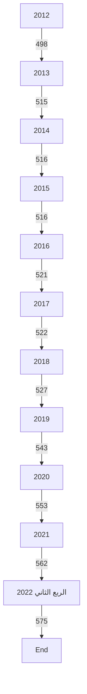
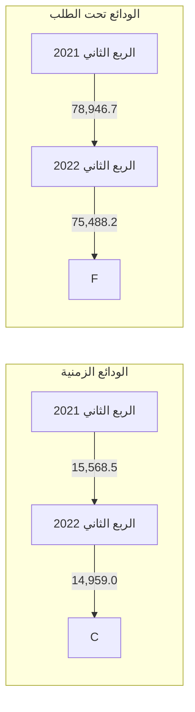
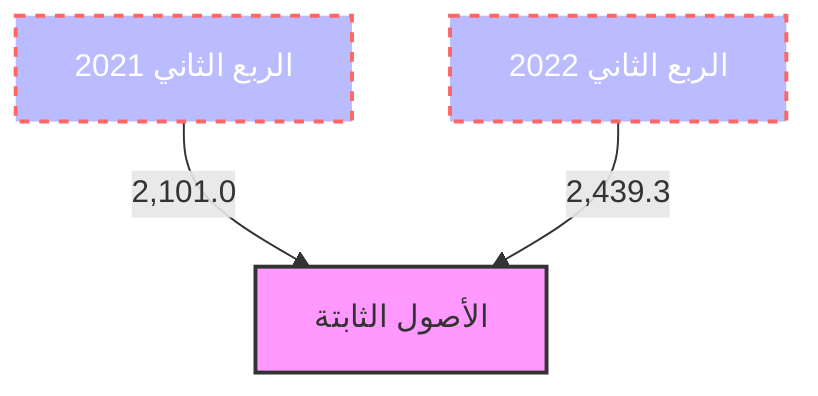
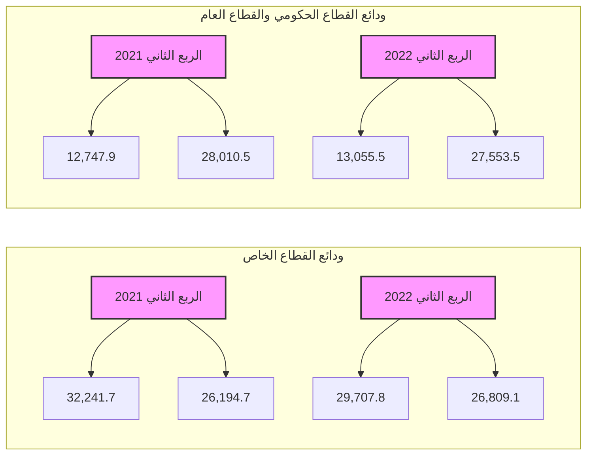
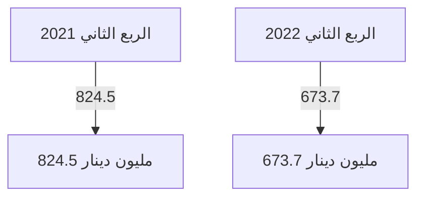

مصرف ليبيا المركزي

إدارة البحوث والإحصاء

تطور أهم البيانات والمؤشرات
المالية للمصارف التجارية

" الربع الثاني 2022 "

[An image showing various colorful 3D charts and graphs, including bar charts, a pie chart, and an upward trending arrow. These are displayed on what appears to be a financial or statistical document background.]
---
# تطور أهم البيانات المالية للمصارف التجارية
## (للربع الثاني 2022)

شهدت البيانات المالية للمصارف التجارية في نهاية الربع الثاني 2022 بعض التغيرات مقارنة عما كانت عليه
في نهاية الربع الثاني 2021 وذلك على النحو التالي :

- إرتفع إجمالي أصول المصارف التجارية (بإستثناء الحسابات النظامية) من 140.6 مليار دينار في نهاية الربع
الثاني 2021 إلى نحو 142.6 مليار دينار في نهاية الربع الثاني 2022، أي بمعدل نمو قدره 1.4%، وقد
شكلت الأصول السائلة (البالغة 94.5 مليار دينار) من إجمالي الأصول ما نسبته 66.3%.

| إجمالي أصول المصارف التجارية |
| (2012 - الربع الثاني 2022) |
|:---:|
| 160.0 | | | | | | | | | 126.1 | 136.0 | 142.7 | 142.6 |
| 140.0 | | | | | 116.5 | 117.2 | 111.8 | | | | |
| 120.0 | | 98.4 | | 103.5 | | | | | | | |
| 100.0 | 84.4 | | 95.2 | 90.2 | | | | | | | |
| 80.0 | | | | | | | | | | | |
| 60.0 | | | | | | | | | | | |
| 40.0 | | | | | | | | | | | |
| 20.0 | | | | | | | | | | | |
| 0.0 | | | | | | | | | | | |
| 2012 | 2013 | 2014 | 2015 | 2016 | 2017 | 2018 | 2019 | 2020 | 2021 | الربع الأول 2022 | الربع الثاني 2022 |

- إنخفض إجمالي ودائع المصارف التجارية ( تحت الطلب وشهادات الإيداع ) لدى المصرف المركزي بما فيها
الإحتياطي الإلزامي من نحو 82.3 مليار دينار في نهاية الربع الثاني 2021 إلى نحو 78.2 مليار دينار في نهاية
الربع الثاني 2022، أي بمعدل بلغ 5.0%.

- إرتفع اجمالي رصيد الإئتمان الممنوح من المصارف التجارية من 17.8 مليار دينار في نهاية الربع الثاني
2021 إلى 21.2 مليار دينار في نهاية الربع الثاني 2022، أي بمعدل نمو 19.1%، وقد شكلت القروض
والتسهيلات الائتمانية الممنوحة إلى اجمالي الخصوم الإيداعية ما نسبته 21.8%، كما شكلت من اجمالي الأصول
ما نسبته 14.8%، وبلغ رصيد القروض الممنوحة للقطاع الخاص في نهاية الربع الثاني 2022 ما قيمته 15.2
مليار دينار، وما نسبته 71.7% من إجمالي القروض والتسهيلات الإئتمانية الممنوحة، فيما شكل رصيد القروض
الممنوحة للقطاع العام النسبة الباقية 28.3% والتي بلغت قيمتها نحو 6.0 مليار دينار.
---
# إجمالي رصيد القروض الممنوحة من المصارف التجارية
## (2012 - الربع الثاني 2022)

| السنة | القيمة (مليار دينار) |
|-------|---------------------|
| 2012  | 15.9                |
| 2013  | 18.2                |
| 2014  | 20.0                |
| 2015  | 20.2                |
| 2016  | 18.8                |
| 2017  | 17.5                |
| 2018  | 16.4                |
| 2019  | 16.9                |
| 2020  | 17.0                |
| 2021  | 19.6                |
| الربع الأول 2022 | 21.5    |
| الربع الثاني 2022 | 21.2   |

- بلغت نسبة تغطية مخصص الديون المشكوك فيها لإجمالي القروض والتسهيلات الممنوحة نسبة 17.7% في الربع الثاني 2022 مقابل نسبة 20.2% في الربع الثاني 2021.

- إنخفضت ودائع العملاء لدى المصارف التجارية من 99.2 مليار دينار في نهاية الربع الثاني 2021، إلى 97.1 مليار دينار في نهاية الربع الثاني 2022، أي بمعدل 2.1%، وقد شكلت الودائع تحت الطلب ما نسبته 80.1% من إجمالي الودائع، في حين شكلت الودائع لأجل نسبة 19.6% من إجمالي الودائع، بينما شكلت ودائع الادخار نسبة 0.3% فقط من إجمالي الودائع.

- وفيما يتعلق بتوزيع هذه الودائع فقد بلغت ودائع القطاع الخاص في نهاية الربع الثاني 2022 ما قيمته 56.5 مليار دينار، وما نسبته 58.2% من إجمالي الودائع، فيما شكل رصيد ودائع القطاع العام والحكومي النسبة الباقية وقدرها 41.8% أي ما قيمته 40.6 مليار دينار، منها 27.6 مليار دينار ودائع لشركات ومؤسسات القطاع العام ونحو 13.1 مليار دينار ودائع حكومية.
---
# إجمالي ودائع العملاء لدى المصارف التجارية
## (2012 - الربع الثاني 2022)

| السنة | ودائع تحت الطلب | ودائع زمنية | ودائع إدخارية | إجمالي الودائع |
|-------|-----------------|-------------|---------------|----------------|
| 2012  | ~55.0          | ~10.0       | ~3.3          | 68.3           |
| 2013  | ~60.0          | ~20.0       | ~3.6          | 83.6           |
| 2014  | ~55.0          | ~20.0       | ~4.1          | 79.1           |
| 2015  | ~60.0          | ~10.0       | ~1.3          | 71.3           |
| 2016  | ~75.0          | ~5.0        | ~3.4          | 83.4           |
| 2017  | ~85.0          | ~7.5        | ~3.4          | 95.9           |
| 2018  | ~80.0          | ~10.0       | ~3.7          | 93.7           |
| 2019  | ~75.0          | ~10.0       | ~3.6          | 88.6           |
| 2020  | ~90.0          | ~7.5        | ~4.7          | 102.2          |
| 2021  | ~75.0          | ~15.0       | ~2.1          | 92.1           |
| الربع الأول 2022 | ~80.0 | ~15.0       | ~2.5          | 97.5           |
| الربع الثاني 2022 | ~80.0 | ~15.0       | ~2.1          | 97.1           |

*القيم بالمليار دينار*

- ارتفع إجمالي حقوق الملكية في المصارف التجارية من 6.7 مليار دينار في نهاية الربع الثاني 2021 إلى 7.9 مليار دينار في نهاية الربع الثاني 2022، وبمعدل 19.1%.

- انخفضت أرباح المصارف التجارية (قبل خصم المخصصات والضرائب) خلال الربع الثاني 2022 بمعدل 18.3% لتصل إلى 673.7 مليون دينار، مقارنة عما كانت عليه خلال الربع الثاني 2021 والتي سجلت نحو 824.5 مليون دينار.

## أرباح الفترة قبل خصم المخصصات والضرائب

| الفترة | الأرباح (مليون دينار) |
|--------|------------------------|
| الربع الثاني 2022 | 673.7 |
| الربع الثاني 2021 | 824.5 |
---
تفرع المصارف التجارية :-

بلغ عدد المصارف العاملة في ليبيا والمشتملة بياناتها في هذا التقرير 20 مصرفاً (بما في ذلك وحدة الدينار الليبي
التابعة للمصرف الليبي الخارجي) حتى الربع الثاني 2022، وتزاول هذه المصارف نشاطها من خلال 580 فرعاً
ووكالة مصرفية .

تطور عدد الفروع والوكالات المصرفية والعاملين بها

| السنة | عدد الفروع والوكالات | عدد العاملين بالقطاع المصرفي |
|-------|----------------------|---------------------------|
| 2012  | 498                  | 17,575                    |
| 2013  | 515                  | 18,878                    |
| 2014  | 516                  | 19,183                    |
| 2015  | 516                  | 19,214                    |
| 2016  | 521                  | 19,255                    |
| 2017  | 522                  | 19,324                    |
| 2018  | 527                  | 19,263                    |
| 2019  | 543                  | 19,387                    |
| 2020  | 553                  | 19,565                    |
| 2021  | 562                  | 19,588                    |
| الربع الثاني 2022 | 575      | 19,815                    |

عدد الفروع والوكالات المصرفية
( 2012 - الربع الثاني 2022 )


---
# الكثافة المصرفية
" بالألف نسمة "

| لكل فرع ووكالة | لكل مصرف | السنة |
|----------------|-----------|-------|
| 12.1 | 389.0 | 2012 |
| 12.2 | 397.0 | 2013 |
| 12.2 | 397.0 | 2014 |
| 12.2 | 393.8 | 2015 |
| 12.5 | 382.4 | 2016 |
| 12.8 | 394.1 | 2017 |
| 13.1 | 383.3 | 2018 |
| 12.9 | 368.4 | 2019 |
| 12.8 | 368.3 | 2020 |
| 12.6 | 388.9 | 2021 |
| 12.3 | 350.0 | الربع الثاني 2022 |

## التركز المصرفي:

درجة التركز المصرفي تعني أن عدداً قليلا من المصارف التجارية يستأثر بالنسبة الأكبر من النشاط المصرفي

سواءً من حيث الأصول أو الودائع أوالائتمان أو من حيث حجم حقوق الملكية، وفيما يخص الحصة السوقية

للمصارف التجارية في ليبيا، فقد شكلت أصول المصارف الأربعة الكبرى (الجمهورية، التجاري الوطني، الوحدة

والصحاري) من أصل 20 مصرفاً مانسبته 71.4% من إجمالي أصول القطاع المصرفي في نهاية الربع الثاني

2022، وشكل مصرف الجمهورية وحده ما نسبته 27.8% من إجمالي أصول القطاع المصرفي.

وشكلت ودائع وقروض المصارف الأربعة الكبرى مانسبته 71.4% و 81.3% على التوالي من إجمالي ودائع

وقروض القطاع المصرفي نهاية الربع الثاني 2022 .
---
# التركز المصرفي
## (2012 - الربع الثاني 2022)

(نسب مئوية)

### حسب الأصول

| الربع الثاني 2022 | 2021 | 2020 | 2019 | 2018 | 2017 | 2016 | 2015 | 2014 | 2013 | 2012 | حسب الأصول |
|-------------------|------|------|------|------|------|------|------|------|------|------|------------|
| 27.8 | 28.0 | 31.2 | 31.9 | 32.7 | 33.6 | 33.8 | 34.9 | 33.1 | 33.0 | 37.9 | أكبر مصرف |
| 62.5 | 62.0 | 63.1 | 64.6 | 65.8 | 66.9 | 67.9 | 67.6 | 62.1 | 63.7 | 71.0 | أكبر ثلاثة مصارف |
| 78.3 | 79.7 | 82.7 | 84.2 | 84.3 | 85.0 | 86.7 | 87.1 | 79.2 | 81.3 | 89.0 | أكبر خمسة مصارف |

### حسب الإئتمان

| الربع الثاني 2022 | 2021 | 2020 | 2019 | 2018 | 2017 | 2016 | 2015 | 2014 | 2013 | 2012 | حسب الإئتمان |
|-------------------|------|------|------|------|------|------|------|------|------|------|--------------|
| 38.1 | 40.7 | 42.6 | 40.7 | 43.6 | 44.5 | 44.3 | 44.8 | 43.5 | 44.8 | 41.9 | أكبر مصرف |
| 73.3 | 76.2 | 78.3 | 75.8 | 77.7 | 77.7 | 78.5 | 79.4 | 79.1 | 76.7 | 77.0 | أكبر ثلاثة مصارف |
| 85.7 | 87.6 | 91.4 | 91.4 | 91.5 | 91.2 | 91.3 | 91.4 | 91.1 | 90.2 | 91.0 | أكبر خمسة مصارف |

### حسب ودائع العملاء

| الربع الثاني 2022 | 2021 | 2020 | 2019 | 2018 | 2017 | 2016 | 2015 | 2014 | 2013 | 2012 | حسب ودائع العملاء |
|-------------------|------|------|------|------|------|------|------|------|------|------|-------------------|
| 31.5 | 33.8 | 31.8 | 32.3 | 31.9 | 33.6 | 34.0 | 34.8 | 33.1 | 33.8 | 40.9 | أكبر مصرف |
| 61.5 | 62.0 | 62.9 | 64.4 | 65.2 | 66.5 | 67.2 | 66.5 | 61.3 | 62.7 | 71.5 | أكبر ثلاثة مصارف |
| 78.0 | 79.5 | 83.7 | 85.6 | 85.4 | 85.7 | 87.5 | 87.8 | 78.6 | 80.9 | 90.1 | أكبر خمسة مصارف |
---
# تركز الأصول

| البنك | النسبة |
|-------|--------|
| مصرف الجمهورية | 28% |
| باقي المصارف | 29% |
| المصرف التجاري الوطني | 18% |
| مصرف الوحدة | 16% |
| مصرف الصحاري | 9% |

# تركز الائتمان

| البنك | النسبة |
|-------|--------|
| مصرف الجمهورية | 38% |
| مصرف الوحدة | 21% |
| باقي المصارف | 19% |
| المصرف التجاري الوطني | 14% |
| مصرف الصحاري | 8% |

# تركز ودائع العملاء

| البنك | النسبة |
|-------|--------|
| مصرف الجمهورية | 31% |
| باقي المصارف | 29% |
| المصرف التجاري الوطني | 17% |
| مصرف الوحدة | 13% |
| مصرف الصحاري | 10% |
---
# الميزانية المُجمَعة للمصارف التجارية

شهدت الميزانية المُجمَعة للمصارف التجارية نهاية الربع الثاني 2022، تطورات في مُجمل بنودها على جانبي الأصول والخصوم، ليبلغ إجمالي الأصول داخل الميزانية المُجمَعة نحو 142,565.3 مليون دينار، مقابل 140,597.1 مليون دينار في نهاية الربع الثاني 2021، بإرتفاع قدره 1,968.2 مليون دينار، أي بمعدل 1.4%، وفيما يلي جدول يلخص البنود الرئيسية للميزانية المُجمَعة للمصارف التجارية:

## البنود الرئيسية للميزانية المُجمَعة للمصارف التجارية

*مليون دينار*

| جانب الأصول : | الربع الثاني 2021 | الربع الثاني 2022 | مقدار التغير | معدل التغير % |
|---------------|-------------------|-------------------|---------------|---------------|
| نقدية بالخزائن | 3,668.2 | 4,085.9 | 417.7 | 11.4 |
| حسابات المقاصة | 5,734.1 | 7,603.4 | 1,869.3 | 32.6 |
| أرصدة لدى المصارف | 94,515.3 | 90,447.3 | -4,068.0 | -4.3 |
| الإستثمارات | 4,473.3 | 4,595.2 | 121.9 | 2.7 |
| القروض والتسهيلات | 17,777.7 | 21,168.1 | 3,390.4 | 19.1 |
| الأصول الثابتة | 2,101.0 | 2,439.3 | 338.3 | 16.1 |
| الأصول الأخرى | 12,327.5 | 12,226.2 | -101.3 | -0.8 |
| إجمالي الأصول | 140,597.1 | 142,565.3 | 1,968.2 | 1.4 |
| الحسابات النظامية | 49,074.1 | 44,325.1 | -4,749.0 | -9.7 |
| إجمالي الميزانية | 189,671.3 | 186,890.4 | -2,780.9 | -1.5 |

| جانب الخصوم: | الربع الثاني 2021 | الربع الثاني 2022 | مقدار التغير | معدل التغير % |
|--------------|-------------------|-------------------|---------------|---------------|
| ودائع العملاء | 99,194.8 | 97,125.9 | -2,068.9 | -2.1 |
| منها : التأمينات النقدية | 16,241.2 | 17,101.6 | 860.4 | 5.3 |
| حقوق الملكية | 6,467.2 | 7,835.1 | 1,368.0 | 21.2 |
| المخصصات | 7,793.4 | 8,418.3 | 624.9 | 8.0 |
| الخصوم الأخرى | 27,141.7 | 29,185.9 | 2,044.2 | 7.5 |
| إجمالي الخصوم | 140,597.1 | 142,565.3 | 1,968.2 | 1.4 |
| الحسابات النظامية | 49,074.1 | 44,325.1 | -4,749.0 | -9.7 |
| إجمالي الميزانية | 189,671.3 | 186,890.4 | -2,780.9 | -1.5 |
---
# الأهمية النسبية للبنود المُكونة للأصول

## الربع الثاني 2022

| البند | النسبة |
|-------|--------|
| نقدية بالخزائن | 5% |
| حسابات المقاصة | 8% |
| أرصدة لدى المصارف | 65% |
| الإستثمارات | 3% |
| القروض والتسهيلات | 15% |
| الأصول الثابتة | 2% |
| الأصول الأخرى | 2% |

## الربع الثاني 2021

| البند | النسبة |
|-------|--------|
| نقدية بالخزائن | 4% |
| حسابات المقاصة | 7% |
| أرصدة لدى المصارف | 69% |
| الإستثمارات | 3% |
| القروض والتسهيلات | 12% |
| الأصول الثابتة | 3% |
| الأصول الأخرى | 2% |

# الأهمية النسبية للبنود المُكونة للخصوم

## الربع الثاني 2022

| البند | النسبة |
|-------|--------|
| ودائع العملاء | 68% |
| حقوق الملكية | 6% |
| المخصصات | 6% |
| الخصوم الأخرى | 20% |

## الربع الثاني 2021

| البند | النسبة |
|-------|--------|
| ودائع العملاء | 73% |
| حقوق الملكية | 5% |
| المخصصات | 5% |
| الخصوم الأخرى | 17% |
---
وفيما يلي تطور الميزانية المُجمَعة للمصارف التجارية خلال الفترة (2012 - الربع الثاني 2022):

"مليون دينار"

| جانب الأصول | 2012 | 2013 | 2014 | 2015 | 2016 | 2017 | 2018 | 2019 | 2020 | 2021 | الربع الثاني 2022 |
|-------------|------|------|------|------|------|------|------|------|------|------|-------------------|
| نقدية بالخزائن | 1,545.9 | 1,712.3 | 1,642.8 | 752.8 | 606.4 | 547.2 | 1,582.1 | 2,367.4 | 1,146.8 | 2,871.5 | 4,085.9 |
| حسابات المقاصة | 2,024.6 | 7,310.3 | 8,125.4 | 11,444.4 | 12,886.4 | 10,625.8 | 4,671.0 | 6,304.6 | 5,584.8 | 6,041.0 | 7,603.4 |
| أرصدة لدى المصارف | 56,787.6 | 68,094.6 | 62,244.0 | 53,540.0 | 62,306.5 | 84,262.6 | 85,349.3 | 77,424.9 | 89,836.6 | 89,916.8 | 90,447.3 |
| الإستثمارات | 954.9 | 746.7 | 777.5 | 1,787.8 | 1,789.2 | 1,311.5 | 1,456.5 | 1,957.5 | 4,256.6 | 4,445.1 | 4,595.2 |
| القروض والتسهيلات | 15,899.5 | 18,232.3 | 19,959.9 | 20,212.8 | 18,770.3 | 17,446.6 | 16,448.3 | 16,912.7 | 16,996.9 | 19,637.5 | 21,168.1 |
| الأصول الثابتة | 1,038.4 | 1,121.6 | 1,211.6 | 1,365.4 | 1,409.1 | 1,463.2 | 1,608.3 | 1,786.7 | 1,986.8 | 2,287.4 | 2,439.3 |
| الأصول الأخرى | 6,169.5 | 1,157.8 | 1,243.0 | 1,130.2 | 5,687.2 | 5,066.0 | 5,947.1 | 5,871.5 | 6,299.4 | 10,778.0 | 12,226.2 |
| إجمالي الأصول | 84,420.4 | 98,375.6 | 95,204.2 | 90,233.4 | 103,455.1 | 116,477.0 | 117,062.4 | 112,625.3 | 126,107.9 | 135,977.2 | 142,565.3 |
| الحسابات النظامية | 70,747.7 | 71,550.9 | 51,845.0 | 48,299.2 | 46,800.0 | 46,534.9 | 48,160.2 | 34,091.2 | 28,611.1 | 45,635.7 | 44,325.1 |
| إجمالي الميزانية | 155,168.1 | 169,926.5 | 147,049.2 | 138,532.6 | 150,255.1 | 163,011.9 | 165,222.6 | 146,716.6 | 154,719.0 | 181,612.8 | 186,890.4 |
---
"مليون دينار"

| جانب الخصوم | 2012 | 2013 | 2014 | 2015 | 2016 | 2017 | 2018 | 2019 | 2020 | 2021 | الربع الثاني 2022 |
|-------------|------|------|------|------|------|------|------|------|------|------|------------------|
| ودائع العملاء | 68,346.2 | 83,562.7 | 78,910.4 | 71,257.1 | 83,407.6 | 95,938.5 | 93,657.5 | 88,954.0 | 102,194.2 | 92,113.7 | 97,125.9 |
| منها : التأمينات النقدية | 6,823.3 | 6,609.0 | 8,080.7 | 9,738.7 | 8,939.7 | 8,845.6 | 11,533.7 | 8,427.6 | 7,091.6 | 16,515 | 17,101.6 |
| حقوق الملكية | 4,653.2 | 4,743.7 | 4,886.4 | 5,087.5 | 5,366.5 | 5,561.4 | 6,472.6 | 6,109.2 | 6,237.6 | 6,349.8 | 7,835.1 |
| المخصصات | 3,317.4 | 3,597.2 | 3,765.3 | 3,941.8 | 4,144.9 | 4,473.0 | 4,627.6 | 5,527.2 | 5,587.2 | 7,386.6 | 8,418.3 |
| الخصوم الأخرى | 8,103.6 | 6,472.0 | 7,642.1 | 9,946.9 | 10,536.1 | 10,504.2 | 12,304.7 | 12,035.0 | 12,088.9 | 30,127.1 | 29,185.9 |
| إجمالي الخصوم | 84,420.4 | 98,375.6 | 95,204.2 | 90,233.4 | 103,455.1 | 116,477.0 | 117,062.4 | 112,625.3 | 126,107.9 | 135,977.2 | 142,565.3 |
| الحسابات النظامية | 70,747.7 | 71,550.9 | 51,845.0 | 48,299.2 | 46,800.0 | 46,534.9 | 48,160.2 | 34,091.2 | 28,611.1 | 45,635.7 | 44,325.1 |
| إجمالي الميزانية | 155,168.1 | 169,926.5 | 147,049.2 | 138,532.6 | 150,255.1 | 163,011.9 | 165,222.6 | 146,716.6 | 154,719.0 | 181,612.8 | 186,890.4 |
---
# تحليل البنود المكونة للميزانية المُجمَعة للمصارف التجارية

## أولاً : جانب الأصول

### 1- النقدية :

#### أ- النقدية بالخزائن و حسابات المقاصة :

إرتفع رصيد النقدية بالخزائن وحسابات المقاصة بمقدار 2,287.0 مليون دينار أي بمعدل 24.3%، لتصل
إلى 11,689.3 مليون دينار في نهاية الربع الثاني 2022، مقابل 9,402.3 مليون دينار في نهاية الربع
الثاني 2021، حيث إرتفع رصيد النقد بخزائن المصارف بمقدار 417.7 مليون دينار، فيما إرتفع بند
حسابات المقاصة بمقدار 1,869.3 مليون دينار في نهاية الربع الثاني 2022 مقارنة بما كانت عليه في
نفس الفترة من الربع الثاني 2021، والجدول التالي يوضح ذلك :

| البيان | الربع الثاني 2021 | الربع الثاني 2022 | مقدار التغير | معدل التغير% |
|--------|-------------------|-------------------|---------------|---------------|
| النقدية بالخزائن : | 3,668.2 | 4,085.9 | 417.7 | 11.4 |
| عملة محلية | 3,584.8 | 3,888.2 | 303.4 | 8.5 |
| عملة أجنبية | 83.4 | 197.6 | 114.2 | 136.9 |
| إجمالي حسابات المقاصة | 5,734.1 | 7,603.4 | 1,869.3 | 32.6 |
| المقاصة بين المصارف | 2,175.6 | 4,031.3 | 1,855.7 | 85.3 |
| المقاصة بين الفروع | 3,558.5 | 3,572.1 | 13.6 | 0.4 |
| الإجمالي | 9,402.3 | 11,689.3 | 2,287.0 | 24.3 |

*مليون دينار

### إجمالي حسابات المقاصة

```mermaid
bar chart
    title إجمالي حسابات المقاصة
    x-axis [الربع الثاني 2021, الربع الثاني 2022]
    y-axis مليون دينار
    bar [5734.1, 7603.4]
```

### نقدية بخزائن المصارف التجارية

```mermaid
bar chart
    title نقدية بخزائن المصارف التجارية
    x-axis [الربع الثاني 2021, الربع الثاني 2022]
    y-axis مليون دينار
    bar [3668.2, 4085.9]
```
---
وفيما يلي تطور بند النقدية في المصارف التجارية خلال الفترة (2012 – الربع الثاني 2022):

## نقدية بخزائن المصارف التجارية
### (2012 - الربع الثاني 2022)

| السنة | القيمة (مليون دينار) |
|-------|---------------------|
| 2012 | 1,545.9 |
| 2013 | 1,712.3 |
| 2014 | 1,642.8 |
| 2015 | 752.8 |
| 2016 | 606.4 |
| 2017 | 547.2 |
| 2018 | 1,582.1 |
| 2019 | 2,367.4 |
| 2020 | 1,146.8 |
| 2021 | 2,871.5 |
| الربع الثاني 2022 | 4,085.9 |

## إجمالي حسابات المقاصة
### (2012 - الربع الثاني 2022)

| السنة | القيمة (مليون دينار) |
|-------|---------------------|
| 2012 | 2,024.6 |
| 2013 | 7,310.3 |
| 2014 | 8,125.4 |
| 2015 | 11,444.4 |
| 2016 | 12,886.4 |
| 2017 | 6,379.9 |
| 2018 | 4,671.0 |
| 2019 | 6,304.6 |
| 2020 | 5,584.8 |
| 2021 | 6,041.0 |
| الربع الثاني 2022 | 7,603.4 |
---
ب- الأرصدة والودائع لدى المصرف المركزي والمصارف الأخرى:

بلغ رصيد ودائع المصارف التجارية لدى المصرف المركزي والمصارف الأخرى وفيما بينها نحو 90,447.3 مليون دينار في نهاية الربع الثاني 2022، مقابل 94,515.3 مليون دينار في نهاية الربع الثاني 2021، منخفضة بقيمة 4,068.0 مليون دينار، نتيجة لانخفاض ودائعها لدى المصرف المركزي وكذلك ودائعها فيما بينها بنحو 356.6 مليون دينار ، بالإضافة إلى انخفاض ودائعها لدى المصرف الليبي الخارجي، والجدول التالي يوضح تفاصيل هذا البند:

| البيان | الربع الثاني 2021 | الربع الثاني 2022 | مقدار التغير | معدل التغير % |
|---------|-------------------|-------------------|---------------|---------------|
| ودائع تحت الطلب لدى : | 78,946.7 | 75,488.2 | -3,458.5 | -4.4 |
| المصرف المركزي | 68,560.2 | 64,889.0 | -3,671.2 | -5.4 |
| المصارف المحلية | 1,302.3 | 945.7 | -356.6 | -27.4 |
| المصرف الليبي الخارجي | 1,499.0 | 1,254.2 | -244.8 | -16.3 |
| لدى المراسلين بالخارج | 7,585.3 | 8,399.3 | 814.0 | 10.7 |
| ودائع زمنية : | 15,568.5 | 14,959.0 | -609.5 | -3.9 |
| المصرف المركزي (شهادات الإيداع) | 13,761.4 | 13,337.3 | -424.1 | -3.1 |
| المصارف المحلية | 0.0 | 0.0 | 0.0 | - |
| المصرف الليبي الخارجي | 0.0 | 0.0 | 0.0 | - |
| لدى المراسلين بالخارج | 1,807.1 | 1,621.8 | -185.3 | -10.3 |
| الإجمالي | 94,515.3 | 90,447.3 | -4,068.0 | -4.3 |


---
والشكل التالي يبين تطور أرصدة وودائع المصارف لدى المصرف المركزي والمصارف الأخرى وفيما بينها خلال الفترة (2012 - الربع الثاني 2022):

ودائع المصارف التجارية لدى المصرف المركزي والمصارف الأخرى
(2012 - الربع الثاني 2022)

| السنة | ودائع زمنية | ودائع تحت الطلب لدى |
|-------|-------------|---------------------|
| 2012 | 37,434.9 | 19,352.7 |
| 2013 | 45,751.9 | 22,342.6 |
| 2014 | 37,883.3 | 24,360.7 |
| 2015 | 27,870.7 | 25,669.2 |
| 2016 | 38,306.1 | 24,000.4 |
| 2017 | 56,945.4 | 27,317.8 |
| 2018 | 59,454.9 | 25,894.4 |
| 2019 | 60,184.6 | 17,240.3 |
| 2020 | 72,269.0 | 17,567.6 |
| 2021 | 74,216.6 | 15,700.2 |
| الربع الثاني 2022 | 75,488.20 | 14,959.00 |

*ملاحظة: القيم معروضة بالمليون دينار*

الرسم البياني يوضح تطور الودائع الزمنية والودائع تحت الطلب لدى المصارف التجارية في المصرف المركزي والمصارف الأخرى من عام 2012 حتى الربع الثاني من عام 2022. يظهر ارتفاع ملحوظ في الودائع الزمنية بشكل عام، بينما تظهر الودائع تحت الطلب تقلبات مع انخفاض في السنوات الأخيرة.
---
## 2- الإستثمارات :

سجل إجمالي بند رصيد الإستثمارات في المصارف التجارية نهاية الربع الثاني 2022 نحو 4,595.2 مليون دينار، مقابل 4,473.3 مليون دينار في نهاية الربع الثاني 2021، بمعدل نمو 2.7% هذا الإرتفاع جاء نتيجة زيادة الإستثمارات الأخرى، والجدول التالي يوضح تفاصيل هذا البند:

| البيان | الربع الثاني 2021 | الربع الثاني 2022 | مقدار التغير | معدل التغير % |
|--------|-------------------|-------------------|---------------|---------------|
| سندات وأذونات الخزانة | 3,000.0 | 3,000.0 | 0.0 | 0.0 |
| إستثمارات في الشركات العامة | 560.9 | 564.7 | 3.8 | 0.7 |
| إستثمارات في الشركات الخاصة المساهمة | 816.5 | 783.0 | -33.5 | -4.1 |
| إستثمارات أخرى | 95.9 | 247.5 | 151.6 | 158.1 |
| الإجمالي | 4,473.3 | 4,595.2 | 121.9 | 2.7 |

### إجمالي الإستثمارات

```mermaid
bar chart
    title إجمالي الإستثمارات
    x-axis [الربع الثاني 2021, الربع الثاني 2022]
    y-axis "مليون دينار" 4400 --> 4620
    bar [4473.3, 4595.2]
```
---
والجدول التالي يبين تطور رصيد بند إستثمارات المصارف التجارية خلال الفترة (2012 – الربع الثاني 2022):

## إجمالي بند إستثمارات المصارف التجارية
### (2012 - الربع الثاني 2022)

| السنة | القيمة (مليون دينار) |
|-------|---------------------|
| 2012  | 954.9               |
| 2013  | 746.7               |
| 2014  | 777.5               |
| 2015  | 1,787.8             |
| 2016  | 1,789.2             |
| 2017  | 1,311.5             |
| 2018  | 1,456.5             |
| 2019  | 1,957.5             |
| 2020  | 4,256.6             |
| 2021  | 4,445.1             |
| الربع الثاني 2022 | 4,595.2 |


الرسم البياني يوضح تطور إجمالي بند إستثمارات المصارف التجارية من عام 2012 حتى الربع الثاني من عام 2022. يظهر ارتفاعاً ملحوظاً في القيم بدءاً من عام 2019، مع وصول القيمة إلى 4,595.2 مليون دينار في الربع الثاني من عام 2022.
---
## 3- القروض والتسهيلات الائتمانية :

إرتفع اجمالي رصيد الإئتمان الممنوح من المصارف التجارية من 17,777.7 مليون دينار في نهاية الربع الثاني 2021 إلى 21,168.1 مليون دينار في نهاية الربع الثاني 2022، أي بمعدل نمو 19.1%، حيث بلغ رصيد القروض الممنوحة للقطاع الخاص في نهاية الربع الثاني 2022 ما قيمته 15,170.5 مليون دينار، وما نسبته 71.7% من إجمالي القروض والتسهيلات الإئتمانية، فيما شكل رصيد القروض الممنوحة للقطاع العام النسبة الباقية 28.3% والتي بلغت قيمتها 5,997.5 مليون دينار.

وقد شكلت القروض والتسهيلات الائتمانية الممنوحة إلى إجمالي الخصوم الإيداعية ما نسبته 21.8%، كما شكلت من اجمالي الأصول ما نسبته 14.8%

| البيان | الربع الثاني 2021 | الربع الثاني 2022 | مقدار التغير | معدل التغير % |
|--------|-------------------|-------------------|---------------|---------------|
| سلفيات والسحب على المكشوف | 4,445.5 | 4,685.6 | 240.1 | 5.4 |
| السلف الإجتماعية * | 4,114.6 | 5,554.1 | 1,439.5 | 35.0 |
| القروض الأخرى | 9,217.6 | 10,928.4 | 1,710.8 | 18.6 |
| إجمالي القروض والتسهيلات | 17,777.7 | 21,168.1 | 3,390.4 | 19.1 |
| مخصص الديون المشكوك في تحصيلها | 3,598.5 | 3,739.3 | 140.8 | 3.9 |
| صافي القروض والتسهيلات | 14,179.2 | 17,428.7 | 3,249.5 | 22.9 |

*تشمل رصيد قروض المرابحة للأفراد

| البيان | الربع الثاني 2021 | الربع الثاني 2022 | مقدار التغير | معدل التغير % |
|--------|-------------------|-------------------|---------------|---------------|
| القروض الممنوحة للقطاع العام | 6,212.4 | 5,997.5 | -214.9 | -3.5 |
| القروض الممنوحة للقطاع الخاص | 11,565.3 | 15,170.5 | 3,605.2 | 31.2 |
| الإجمالي | 17,777.7 | 21,168.1 | 3,390.4 | 19.1 |
---

| السلفيات والسحب على المكشوف | السلف الإجتماعية |
|---------------------------|-----------------|
| 4,750.0 | 6,000.0 |
| 4,700.0 | 5,000.0 |
| 4,650.0 | 4,000.0 |
| 4,600.0 | 3,000.0 |
| 4,550.0 | 2,000.0 |
| 4,500.0 | 1,000.0 |
| 4,450.0 | 0.0 |
| 4,400.0 | |
| 4,350.0 | |
| 4,300.0 | |
| مليون دينار | مليون دينار |
| الربع الثاني 2021: 4,445.5 | الربع الثاني 2021: 4,114.6 |
| الربع الثاني 2022: 4,685.6 | الربع الثاني 2022: 5,554.1 |

| رصيد القروض الممنوحة للقطاع الخاص | رصيد القروض الممنوحة للقطاع العام |
|----------------------------------|----------------------------------|
| 16,000.0 | 6,250.0 |
| 14,000.0 | 6,200.0 |
| 12,000.0 | 6,150.0 |
| 10,000.0 | 6,100.0 |
| 8,000.0 | 6,050.0 |
| 6,000.0 | 6,000.0 |
| 4,000.0 | 5,950.0 |
| 2,000.0 | 5,900.0 |
| 0.0 | 5,850.0 |
| مليون دينار | مليون دينار |
| الربع الثاني 2021: 11,565.3 | الربع الثاني 2021: 6,212.4 |
| الربع الثاني 2022: 15,170.5 | الربع الثاني 2022: 5,997.5 |
---

## رصيد السلف الإجتماعية والسحب على المكشوف
### (2012 - الربع الثاني 2022)

| السنة | السلف الإجتماعية | سلفيات والسحب على المكشوف |
|-------|-------------------|---------------------------|
| 2012  | 4973.5            | 5522.3                    |
| 2013  | 6726.0            | 4146.5                    |
| 2014  | 7157.9            | 4452.1                    |
| 2015  | 6608.6            | 5440.1                    |
| 2016  | 5901.1            | 4827.9                    |
| 2017  | 4912.5            | 4514.5                    |
| 2018  | 3988.7            | 4354.0                    |
| 2019  | 5275.4            | 3125.5                    |
| 2020  | 3036.5            | 4495.7                    |
| 2021  | 4819.3            | 4618.6                    |
| الربع الثاني 2022 | 5554.1 | 4685.6                    |

*القيم بالمليون دينار*

## رصيد القروض الممنوحة للقطاعين (الخاص والعام)
### (2012 - الربع الثاني 2022)

| السنة | القروض الممنوحة للقطاع الخاص | القروض الممنوحة للقطاع العام |
|-------|-------------------------------|------------------------------|
| 2012  | 10608.3                       | 5291.2                       |
| 2013  | 12905.5                       | 5327.1                       |
| 2014  | 13764.0                       | 6195.9                       |
| 2015  | 14230.1                       | 5982.8                       |
| 2016  | 12854.3                       | 5915.9                       |
| 2017  | 11867.7                       | 5578.9                       |
| 2018  | 11347.4                       | 5100.9                       |
| 2019  | 10855.8                       | 6057.0                       |
| 2020  | 11078.7                       | 5918.2                       |
| 2021  | 13165.8                       | 6471.7                       |
| الربع الثاني 2022 | 15170.5           | 5997.5                       |

*القيم بالمليون دينار*
---
## 4 - الأصول الثابتة والأصول الأخرى:

بلغ رصيد الأصول الثابتة نحو 2,397.3 مليون دينار في نهاية الربع الثاني 2022، مقابل 2,038.2 مليون دينار في نهاية الربع الثاني 2021، فيما بلغ رصيد الأصول الأخرى نحو 11,892.0 مليون دينار في نهاية الربع الثاني 2022، مقابل 10,562.8 مليون دينار في نهاية الربع الثاني 2021.

| البيان | الربع الثاني 2021 | الربع الثاني 2022 | مقدار التغير | معدل التغير % |
|--------|-------------------|-------------------|---------------|---------------|
| الأصول الثابتة | 2,101.0 | 2,439.3 | 338.30 | 16.1 |
| الأصول الأخرى | 12,327.5 | 12,226.2 | -101.30 | -0.8 |

### الأصول الثابتة

| الربع الثاني 2021 | الربع الثاني 2022 |
|-------------------|-------------------|
| 2,101.0 | 2,439.3 |


---
ثانياً: جانب الخصوم

1- ودائع العملاء لدى المصارف التجارية:

إنخفض إجمالي رصيد ودائع العملاء لدى المصارف التجارية من 99,194.8 مليون دينار في نهاية الربع الثاني 2021 إلى 97,125.9 مليون دينار في نهاية الربع الثاني 2022، أي بمعدل 2.1%، وقد تركز الإنخفاض في أرصدة الودائع تحت الطلب بمقدار 2,521.9 مليون دينار بنسبة 3.1% عما كانت عليه في نهاية الربع الثاني 2021، فيما إرتفعت الودائع الآجلة بمقدار 524.2 مليون في بند التأمينات النقدية ، أما فيما يخص الودائع الإدخارية فقد إنخفضت بمقدار 71.2 مليون دينار وبنسبة 17.7%.

أما فيما يتعلق بتوزيع الودائع لدى المصارف التجارية حسب نوع الوديعة فقد شكلت الودائع تحت الطلب ما نسبته 80.0% من إجمالي الودائع، في حين شكلت الودائع لأجل ما نسبته 19.6% من إجمالي الودائع، وشكلت ودائع الادخار ما نسبته 0.4% فقط من إجمالي الودائع.

| البيان | الربع الثاني 2021 | الربع الثاني 2022 | مقدار التغير | معدل التغير % |
|--------|-------------------|-------------------|---------------|---------------|
| الودائع تحت الطلب | 80,269.2 | 77,747.3 | -2,521.9 | -3.1 |
| الودائع لأجل | 18,523.5 | 19,047.7 | 524.2 | 2.8 |
| الودائع الإدخارية | 402.1 | 330.9 | -71.2 | -17.7 |
| الإجمالي | 99,194.8 | 97,125.9 | -2,068.9 | -2.1 |

الودائع لدى المصارف التجارية حسب النوع

```mermaid
bar chart
    title الودائع لدى المصارف التجارية حسب النوع
    x-axis [الربع الثاني 2021, الربع الثاني 2022]
    y-axis "مليون دينار" 0 --> 100,000.00
    bar [80269.20, 77747.30]
    bar [18523.50, 19047.70]
    bar [402.1, 330.9]
    legend "الودائع تحت الطلب"
    legend "الودائع لأجل"
    legend "الودائع الإدخارية"
```
---
تطور أرصدة الودائع حسب نوع الوديعة لدى المصارف التجارية خلال الفترة (2012 - الربع الثاني 2022):

إجمالي ودائع العملاء لدى المصارف التجارية
(2012 - الربع الثاني 2022)

| السنة | ودائع تحت الطلب | ودائع زمنية | ودائع إدخارية | إجمالي الودائع |
|-------|-----------------|-------------|---------------|----------------|
| 2012 | 58000.0 | 10000.0 | 346.2 | 68346.2 |
| 2013 | 62000.0 | 21000.0 | 562.7 | 83562.7 |
| 2014 | 58000.0 | 21000.0 | 99.7 | 79099.7 |
| 2015 | 60000.0 | 11000.0 | 257.1 | 71257.1 |
| 2016 | 72000.0 | 11000.0 | 407.6 | 83407.6 |
| 2017 | 84000.0 | 11000.0 | 938.5 | 95938.5 |
| 2018 | 82000.0 | 11000.0 | 707.5 | 93707.5 |
| 2019 | 78000.0 | 10000.0 | 600.0 | 88600.0 |
| 2020 | 92000.0 | 9000.0 | 194.2 | 102194.2 |
| 2021 | 72000.0 | 20000.0 | 113.7 | 92113.7 |
| الربع الثاني 2022 | 78000.0 | 19000.0 | 125.9 | 97125.9 |

ملاحظة: القيم في الجدول بالمليون دينار.

الرسم البياني يوضح تطور الودائع بأنواعها المختلفة (تحت الطلب، زمنية، إدخارية) وإجمالي الودائع على مدار الفترة من 2012 إلى الربع الثاني من 2022. يظهر الرسم زيادة عامة في إجمالي الودائع مع بعض التقلبات، حيث بلغت ذروتها في عام 2020 بقيمة 102,194.2 مليون دينار.
---
وفيما يتعلق بتوزيع إجمالي ودائع العملاء لدى المصارف التجارية (خاص، حكومة، عام) فقد إنخفضت ودائع القطاع الخاص بمقدار 1,919.4 مليون دينار وبنسبة 3.3% في نهاية نهاية الربع الثاني 2022، لتسجل نحو 56,516.9 مليون دينار، مقارنة بنحو 58,436.3 مليون دينار في نهاية الربع الثاني 2021. وفيما إنخفض رصيد القطاع الحكومي والقطاع العام في نهاية الربع الثاني 2022 بمقدار 149.4 مليون دينار لتصل إلى 40,609.0 مليون دينار، منها 13,055.5 مليون دينار كودائع حكومية والتي تتكون من ودائع الوزارات والهيئات والمؤسسات الحكومية وودائع كل من: صندوق الضمان الإجتماعي، صندوق الإنماء الإقتصادي والإجتماعي وودائع الصندوق الليبي للتنمية والإستثمار، مقابل 40,758.4 مليون دينار كودائع للقطاع العام والقطاع الحكومي في نهاية الربع الثاني 2021.

والجدول التالي يوضح تطور أرصدة الودائع لدى المصارف التجارية:

| البيان | الربع الثاني 2021 | الربع الثاني 2022 | مقدار التغير | معدل التغير % |
|--------|-------------------|-------------------|---------------|---------------|
| ودائع الحكومة والقطاع العام | 40,758.4 | 40,609.0 | -149.4 | -0.4 |
| - ودائع حكومية | 12,747.9 | 13,055.5 | 307.6 | 2.4 |
| - ودائع القطاع العام | 28,010.5 | 27,553.5 | -457.0 | -1.6 |
| ودائع القطاع الخاص | 58,436.3 | 56,516.9 | -1,919.4 | -3.3 |
| - الأفراد | 32,241.7 | 29,707.8 | -2,533.9 | -7.9 |
| - الشركات والمؤسسات | 26,194.7 | 26,809.1 | 614.4 | 2.3 |
| الإجمالي | 99,194.8 | 97,125.9 | -2,068.9 | -2.1 |



في الرسم البياني لودائع القطاع الخاص:
- الأعمدة الزرقاء تمثل ودائع الأفراد
- الأعمدة البرتقالية تمثل ودائع المؤسسات والشركات الأخرى

في الرسم البياني لودائع القطاع الحكومي والقطاع العام:
- الأعمدة الزرقاء تمثل الودائع الحكومية
- الأعمدة البرتقالية تمثل ودائع القطاع العام
---
وفيما يلي شكل يوضح توزيع ودائع العملاء لدى المصارف التجارية خلال الفترة (2012 - الربع الثاني 2022):

## ودائع القطاع العام والقطاع الحكومي لدى المصارف التجارية
### (2012 - الربع الثاني 2022)

| السنة | ودائع حكومية | ودائع القطاع العام |
|-------|--------------|---------------------|
| 2012  | 13,983.3     | 21,486.5            |
| 2013  | 24,285.4     | 28,353.3            |
| 2014  | 21,987.0     | 24,352.9            |
| 2015  | 9,800.6      | 30,097.0            |
| 2016  | 9,100.7      | 31,476.0            |
| 2017  | 9,234.8      | 29,699.3            |
| 2018  | 10,048.5     | 30,648.5            |
| 2019  | 11,694.6     | 29,527.2            |
| 2020  | 12,093.5     | 25,277.9            |
| 2021  | 11,533.8     | 27,553.50           |
| الربع الثاني 2022 | 13,055.50 | 27,553.50 |

*القيم بالمليون دينار*

## ودائع الأفراد لدى المصارف التجارية
### (2012 - الربع الثاني 2022)

| السنة | ودائع الأفراد |
|-------|---------------|
| 2012  | 21,026.1      |
| 2013  | 19,569.5      |
| 2014  | 19,799.0      |
| 2015  | 20,477.2      |
| 2016  | 27,605.5      |
| 2017  | 36,295.4      |
| 2018  | 33,717.5      |
| 2019  | 27,402.6      |
| 2020  | 38,908.5      |
| 2021  | 29,161.3      |
| الربع الثاني 2022 | 29,707.80 |

*القيم بالمليون دينار*
---
## 2- الحسابات المكشوفة لدى المراسلين بالخارج:

بلغ رصيد الحسابات المكشوفة لدى المراسلين بالخارج 61.0 مليون دينار في نهاية الربع الثاني 2022،
منخفضة عما كانت عليه في نهاية الربع المقابل من العام الماضي نتيجة تسوية بعض المصارف حساباتها
مع المصارف المراسلة بالخارج.

| البيان | الربع الثاني 2021 | الربع الثاني 2022 | مقدار التغير | معدل التغير % |
|--------|-------------------|-------------------|---------------|---------------|
| الحسابات المكشوفة لدى المراسلين بالخارج | 472.5 | 80.9 | -391.6 | -82.9 |

### الحسابات المكشوفة لدى المراسلين بالخارج

```mermaid
bar chart
    title الحسابات المكشوفة لدى المراسلين بالخارج
    x-axis [الربع الثاني 2021, الربع الثاني 2022]
    y-axis 0 --> 500 مليون دينار
    bar [472.5, 80.9]
```

### الحسابات المكشوفة لدى المراسلين بالخارج
(2012 - الربع الثاني 2022)

```mermaid
line chart
    title الحسابات المكشوفة لدى المراسلين بالخارج (2012 - الربع الثاني 2022)
    x-axis [2012, 2013, 2014, 2015, 2016, 2017, 2018, 2019, 2020, 2021, الربع الثاني 2022]
    y-axis 0 --> 1200.0 مليون دينار
    line [139.6, 74.9, 432.0, 955.6, 429.9, 368.5, 503.4, 113.1, 220.4, 144.7, 80.9]
```
---
## 3- حقوق الملكية والأرباح :

- رأس المال المدفوع: إرتفع رأس المال المدفوع من 4,687.6 مليون دينار في نهاية الربع الثاني 2021 إلى 5,223.2 مليون دينار في نهاية الربع الثاني 2022، نتيجة الزيادة في رأس مال بعض المصارف وكذلك تضمين بيانات مصرفي اليقين والأندلس.

- الإحتياطيات والأرباح: إرتفع رصيد الإحتياطيات والأرباح المرحلة والقابلة للتوزيع من 919.5 مليون دينار في نهاية الربع الثاني 2021، ليصل إلى 1,521.3 مليون دينار في نهاية الربع الثاني 2022، في حين سجلت أرباح المصارف التجارية قبل خصم المخصصات والضرائب خلال الربع الثاني 2022 إنخفاضاً بمعدل 18.3% لتسجل إلى 673.7 مليون دينار، مقارنة عما كانت عليه خلال نفس الفترة من العام الماضي والبالغة نحو 824.5 مليون دينار.

| البيان | الربع الثاني 2021 | الربع الثاني 2022 | مقدار التغير | معدل التغير % |
|--------|-------------------|-------------------|---------------|---------------|
| رأس المال المدفوع | 4,687.6 | 5,223.2 | 535.6 | 11.4 |
| الإحتياطي القانوني | 798.7 | 812.5 | 13.8 | 1.7 |
| إحتياطيات غير مخصصة | 61.4 | 330.2 | 268.8 | 437.8 |
| أرباح العام | 824.5 | 673.7 | -150.8 | -18.3 |
| الأرباح المرحّلة والأرباح القابلة للتوزيع | 919.5 | 1,521.3 | 601.8 | 65.4 |
| الإجمالي | 7,291.7 | 8,560.9 | 1,269.2 | 17.4 |

### الأرباح قبل خصم المخصصات والضرائب


---
فيما يلي تطور حسابات رأس المال والإحتياطيات للمصارف خلال الفترة (2012 – الربع الثاني 2022):

## إجمالي حقوق الملكية للمصارف التجارية
### (2012 - الربع الثاني 2022)

| السنة | رأس المال | الإحتياطيات | إجمالي حقوق الملكية |
|-------|-----------|-------------|---------------------|
| 2012  | 3353.3    | 1300.0      | 4653.3              |
| 2013  | 3443.7    | 1300.0      | 4743.7              |
| 2014  | 3557.9    | 1400.0      | 4957.9              |
| 2015  | 3687.5    | 1400.0      | 5087.5              |
| 2016  | 3766.4    | 1600.0      | 5366.4              |
| 2017  | 3761.5    | 1800.0      | 5561.5              |
| 2018  | 3969.5    | 2500.0      | 6469.5              |
| 2019  | 4276.8    | 2700.0      | 6976.8              |
| 2020  | 4346.3    | 2500.0      | 6846.3              |
| 2021  | 4726.7    | 2800.0      | 7526.7              |
| الربع الثاني 2022 | 5260.9 | 3300.0 | 8560.9          |

*القيم بالمليون دينار*

## أرباح المصارف التجارية قبل خصم المخصصات والضرائب
### (2012 - 2021)

| السنة | الأرباح (مليون دينار) |
|-------|------------------------|
| 2012  | 527.1                  |
| 2013  | 451.1                  |
| 2014  | 265.4                  |
| 2015  | 213.0                  |
| 2016  | 247.1                  |
| 2017  | 464.6                  |
| 2018  | 1222.2                 |
| 2019  | 867.7                  |
| 2020  | 608.7                  |
| 2021  | 1176.9                 |
---
## المخصصات:

سجل رصيد المخصصات إرتفاعاً بمقدار 624.9 مليون دينار في نهاية الربع الثاني 2022 ليصل إلى
8,418.3 مليون دينار، مقابل 7,793.4 مليون دينار في نهاية الربع الثاني 2021، وتركزت الزيادة في
بند المخصصات العامة كما هو موضح بالجدول التالي:

| البيان | الربع الثاني 2021 | الربع الثاني 2022 | مقدار التغير | معدل التغير % |
|--------|-------------------|-------------------|--------------|---------------|
| مخصص الديون المشكوك في تحصيلها | 3,598.5 | 3,739.3 | 140.8 | 3.9 |
| مخصص إستهلاك الأصول الثابتة | 895.3 | 973.8 | 78.5 | 8.8 |
| مخصصات عامة | 1,421.4 | 2,452.3 | 1,030.9 | 72.5 |
| مخصص تقييم أسعار الصرف | 1,878.2 | 1,252.9 | -625.3 | -33.3 |
| الإجمالي | 7,793.4 | 8,418.3 | 624.9 | 8.0 |

### بند المخصصات

```mermaid
bar chart
    title بند المخصصات
    x-axis [الربع الثاني 2021, الربع الثاني 2022]
    y-axis "مليون دينار" 0 --> 4000
    bar [3598.50, 3739.30] "مخصص الديون المشكوك في تحصيلها"
    bar [895.3, 973.8] "مخصص إستهلاك الأصول الثابتة"
    bar [1421.40, 2452.30] "مخصصات عامة"
    bar [1878.20, 1252.90] "مخصص تقييم أسعار الصرف"
```
---
وفيما يلي رصيد المخصصات خلال الفترة (2012 – الربع الثاني 2022):

| رصيد بند المخصصات (2012 - الربع الثاني 2022) |
|-------------------------------------------|

| السنة | مخصص الديون المشكوك في تحصيلها | مخصص استهلاك الأصول الثابتة | مخصصات عامة | مخصص تقييم أسعار الصرف |
|-------|--------------------------------|------------------------------|--------------|--------------------------|
| 2012  | 2348.9                         | ~500                         | ~500         | ~0                       |
| 2013  | 2497.5                         | ~550                         | ~550         | ~0                       |
| 2014  | 2688.1                         | ~600                         | ~600         | ~0                       |
| 2015  | 2779.7                         | ~650                         | ~650         | ~0                       |
| 2016  | 2910.0                         | ~700                         | ~700         | ~0                       |
| 2017  | 3040.8                         | ~750                         | ~750         | ~0                       |
| 2018  | 3126.4                         | ~800                         | ~800         | ~0                       |
| 2019  | 3503.6                         | ~850                         | ~1000        | ~0                       |
| 2020  | 3549.3                         | ~900                         | ~1200        | ~0                       |
| 2021  | 3680.3                         | ~950                         | ~1400        | ~1500                    |
| الربع الثاني 2022 | 3739.3              | ~1000                        | ~2500        | ~1000                    |

ملاحظة: القيم التقريبية مشار إليها بـ "~" حيث أن الرسم البياني لا يوفر القيم الدقيقة لجميع السلاسل.

الوحدة: مليون دينار

يوضح الرسم البياني تطور أربعة أنواع من المخصصات من عام 2012 إلى الربع الثاني من عام 2022:
1. مخصص الديون المشكوك في تحصيلها
2. مخصص استهلاك الأصول الثابتة
3. مخصصات عامة
4. مخصص تقييم أسعار الصرف

يلاحظ ارتفاع مستمر في مخصص الديون المشكوك في تحصيلها على مدار الفترة، مع زيادات أكثر حدة في السنوات الأخيرة. المخصصات العامة شهدت زيادة كبيرة في الفترة الأخيرة، خاصة في عام 2021 والربع الثاني من 2022. مخصص تقييم أسعار الصرف ظهر بشكل ملحوظ في عام 2021 ثم انخفض قليلاً في الربع الثاني من 2022.
---
# مؤشرات السلامة المالية للمصارف التجارية
## (2012 – الربع الثاني 2022)

▪ مؤشرات السيولة : بلغت نسبة الأصول السائلة لدى المصارف التجارية إلى إجمالي الأصول 66.3% في نهاية الربع الثاني 2022، والتي معظمها تمثل ودائع لدى المصرف المركزي ( تحت الطلب بما فيها الإحتياطي الإلزامي وكذلك شهادات الإيداع ) .

وبلغ حجم القروض إلى إجمالي الودائع بالقطاع المصرفي نسبة 21.8% في نهاية الربع الثاني 2022، وهى نسبة ضئيلة للغاية، فيما بلغت نسبة الودائع لدى المصارف إلى إجمالي الأصول 68.1%.

وتجدر الإشارة إلى أن نسبة السيولة القانونية المطلوب من المصارف التجارية الإحتفاظ بها هى 25.0% من إجمالي الخصوم الإيداعية.

| المؤشر | 2018 | 2019 | 2020 | 2021 | الربع الثاني 2022 |
|--------|------|------|------|------|-------------------|
| الأصول السائلة / إجمالي الأصول | 74.3 | 71.9 | 72.1 | 68.4 | 66.3 |
| إجمالي القروض / اجمالي الودائع | 17.6 | 19.0 | 16.6 | 21.3 | 21.8 |
| إجمالي الودائع / إجمالي الأصول | 80.0 | 79.3 | 81.0 | 67.7 | 68.1 |

## مؤشرات السيولة
### ( 2012 - الربع الثاني 2022 )

```mermaid
graph LR
    A[2012] --> B[2013] --> C[2014] --> D[2015] --> E[2016] --> F[2017] --> G[2018] --> H[2019] --> I[2020] --> J[2021] --> K[الربع الثاني 2022]
    
    style A fill:#f9f,stroke:#333,stroke-width:2px
    style B fill:#f9f,stroke:#333,stroke-width:2px
    style C fill:#f9f,stroke:#333,stroke-width:2px
    style D fill:#f9f,stroke:#333,stroke-width:2px
    style E fill:#f9f,stroke:#333,stroke-width:2px
    style F fill:#f9f,stroke:#333,stroke-width:2px
    style G fill:#f9f,stroke:#333,stroke-width:2px
    style H fill:#f9f,stroke:#333,stroke-width:2px
    style I fill:#f9f,stroke:#333,stroke-width:2px
    style J fill:#f9f,stroke:#333,stroke-width:2px
    style K fill:#f9f,stroke:#333,stroke-width:2px
```



| السنة | الأصول السائلة / الأصول | الودائع / الأصول | القروض / الودائع |
|-------|-------------------------|-------------------|-------------------|
| 2012 | 68.6 | 80.8 | 23.6 |
| 2013 | 71.0 | 84.9 | 21.8 |
| 2014 | 67.8 | 83.1 | 25.2 |
| 2015 | 60.2 | 79.0 | 28.4 |
| 2016 | 60.8 | 80.6 | 22.5 |
| 2017 | 72.8 | 82.4 | 18.2 |
| 2018 | 74.3 | 80.0 | 17.6 |
| 2019 | 71.9 | 79.3 | 19.0 |
| 2020 | 72.1 | 81.0 | 16.8 |
| 2021 | 68.4 | 67.7 | 21.3 |
| الربع الثاني 2022 | 66.3 | 68.1 | 21.8 |
---
▪ جودة الأصول: أظهرت البيانات المتوفرة عن نسبة الديون المتعثرة وهي بيانات تقديرية قد لا تعكس الواقع
أن نسبة الديون المتعثرة إلى إجمالي القروض بلغت في نهاية الربع الثاني 2022 نحو 21.0%، ويدل
ارتفاع هذه النسبة على انخفاض كفاءة إدارة الائتمان، وينبغي أن لا تتجاوز هذه النسبة وفقاً للمعايير
الدولية 5%. وقد سجلت نسبة تغطية مخصص الديون إلى الديون المتعثرة في نهاية الربع الثاني 2022
نحو 84.1%.

| "نسب مئوية" |
| --- | --- | --- | --- | --- | --- |
| المؤشر | 2018 | 2019 | 2020 | 2021 | الربع الثاني 2022 |
| القروض المتعثرة* / الأصول | 2.9 | 3.2 | 2.8 | 3.0 | 3.1 |
| القروض المتعثرة* / القروض | 21.0 | 21.0 | 21.0 | 21.0 | 21.0 |
| مخصص الديون / القروض المتعثرة * | 90.4 | 98.6 | 99.4 | 89.2 | 84.1 |
| مخصص الديون / القروض | 19.0 | 20.9 | 20.9 | 18.7 | 17.7 |

*بيانات تقديرية.

مؤشرات جودة الأصول
(2012 - الربع الثاني 2022)

```
120.0
                                                    98.6   101.9
100.0                                   83.0  90.4                 89.2   84.1
        70.9                     73.8
 80.0         65.2   64.0  65.5
 60.0
%40.0                                           19.0   20.9   21.4   18.7
        14.9   13.7   13.4   13.8   15.5  17.4                              17.7
 20.0
  0.0
       2012   2013   2014   2015   2016   2017   2018   2019   2020   2021  الربع
                                                                            الثاني
                                                                            2022

        مخصص الديون / القروض المتعثرة             مخصص الديون / القروض
```

▪ الربحية: شهد معدل العائد على الأصول لدى القطاع المصرفي في ليبيا انخفاضاً ملحوظاً خلال السنوات
(2014 - 2016)، حيث بلغ نحو 0.2% في عام 2016، ويعزى سبب الانخفاض إلى عدة أسباب منها
---
الوضع الغير ملائم الذي تعمل فيه المصارف التجارية في السنوات الأخيرة وكذلك تطبيق قانون إلغاء
الفوائد الربوية.

إلا أنه خلال العام 2018 تحسن معدل الربحية بشكل كبير، حيث بلغ العائد على إجمالي الأصول نحو
1.0%، وبلغ معدل العائد على حقوق الملكية 20.9%.

وفي عام 2019 بلغ معدل العائد على إجمالي الأصول نحو 0.7% وبلغ معدل العائد على حقوق الملكية
.12.3%

وفي عام 2021 بلغ معدل العائد على إجمالي الأصول نحو 0.9% وبلغ معدل العائد على حقوق الملكية
.18.5%

وخلال الربع الثاني 2022 إرتفعت مؤشرات الربحية ليبلغ معدل العائد إلى إجمالي الأصول نحو 1.0%
وبلغ معدل العائد إلى حقوق الملكية نحو 17.0%.

| المؤشر | 2018 | 2019 | 2020 | 2021 | الربع الثاني 2022 |
|--------|------|------|------|------|-------------------|
| العائد / الاصول | 1.0 | 0.7 | 0.5 | 0.9 | 1.0 |
| العائد / حقوق الملكية | 20.9 | 12.3 | 9.8 | 18.5 | 17.0 |
| العائد/ الودائع | 1.3 | 0.8 | 0.6 | 1.3 | 1.4 |

الزيادة في الأرباح في معظمها جاءت نتيجة لتحقيق المصارف التجارية لإيرادات هامة من عمولات بيع
وتحويل العملة الأجنبية ، وكذلك من رفع أسعار الخدمات المصرفية عموماً.
---
| العائد / حقوق الملكية | العائد / الأصول |
|------------------------|------------------|
| (2012 - الربع الثاني 2022) | (2012 - الربع الثاني 2022) |

| العائد / حقوق الملكية | % |
|------------------------|------|
| 2012 | 13.7 |
| 2013 | 12.0 |
| 2014 | 5.4 |
| 2015 | 4.4 |
| 2016 | 4.8 |
| 2017 | 9.1 |
| 2018 | 20.9 |
| 2019 | 12.3 |
| 2020 | 18.5 |
| 2021 | 17.0 |
| الربع الثاني 2022 | 6.2 |

| العائد / الأصول | % |
|------------------|------|
| 2012 | 0.7 |
| 2013 | 0.5 |
| 2014 | 0.3 |
| 2015 | 0.2 |
| 2016 | 0.2 |
| 2017 | 0.4 |
| 2018 | 1.0 |
| 2019 | 0.7 |
| 2020 | 1.0 |
| 2021 | 0.9 |
| الربع الثاني 2022 | 0.3 |

The image shows two line graphs representing financial data from 2012 to the second quarter of 2022. The left graph shows the "Return on Equity" (العائد / حقوق الملكية) while the right graph shows the "Return on Assets" (العائد / الأصول). Both graphs display fluctuations over the years, with notable peaks and troughs.

For the Return on Equity, there's a significant peak in 2018 at 20.9%, followed by a decline and then another rise in 2020-2021. The second quarter of 2022 shows a sharp decline to 6.2%.

The Return on Assets graph shows less dramatic fluctuations, with peaks in 2018 and 2020 at 1.0%, and a slight decline to 0.9% in 2021. The second quarter of 2022 shows a decrease to 0.3%.
---
مؤشرات رأس المال: يتمتع القطاع المصرفي الليبي بكفاية رأس مال مرتفعة، كافية لمواجهة أية مخاطر قد تحدث، حيث تراوحت نسبتها مابين 10.7% و 19.2% خلال الفترة (2012- الربع الثاني 2022)
وهي بشكل عام أعلى وبهامش مريح من النسبة المحددة من قبل لجنة بازل (1) والبالغة 8.0%، مما يعزز من الإستقرار المالي.

*نسب مئوية*

| المؤشر | 2018 | 2019 | 2020 | 2021 | الربع الثاني 2022 |
|--------|------|------|------|------|-------------------|
| كفاية رأس المال الكلي | 17.8 | 18.4 | 19.2 | 16.6 | 17.4 |
| كفاية رأس المال الأساسي | 16.5 | 17.2 | 17.9 | 15.3 | 16.2 |
| رأس المال المدفوع / الأصول | 3.3 | 3.8 | 3.6 | 3.5 | 3.6 |
| حقوق الملكية / الأصول | 4.6 | 5.5 | 4.9 | 4.7 | 5.5 |
| حقوق الملكية / الودائع | 5.7 | 6.9 | 6.1 | 6.9 | 8.1 |

مؤشرات رأس المال
(2012 - الربع الثاني 2022)


رأس المال المدفوع / الأصول
حقوق الملكية / الأصول

كفاية رأس المال الكلي
(2012 - الربع الثاني 2022)

```mermaid
graph LR
    A[2012] --> B[2013] --> C[2014] --> D[2015] --> E[2016] --> F[2017] --> G[2018] --> H[2019] --> I[2020] --> J[2021] --> K[الربع الثاني 2022]
    
    A --10.7--> B --12.4--> C --13.9--> D --14.3--> E --14.6--> F --16.7--> G --17.8--> H --18.4--> I --19.2--> J --16.6--> K --17.4-->
    
    style K fill:#f9f,stroke:#333,stroke-width:4px
```
---
# الملاحق

- البيانات المالية الأساسية المجمعة للمصارف التجارية نهاية الربع الثاني 2022.

- مؤشرات السلامة المالية للمصارف التجارية ( 2012 - الربع الثاني 2022).
---
# الجدول (1)
## البيانات المالية الأساسية للمصارف التجارية
(مليون دينار)

| البيان / الفترة | الربع الثاني 2021 | الربع الثاني 2022 | معدل التغير % |
|-----------------|-------------------|-------------------|---------------|
| إجمالي الميزانية ( الأصول + الحسابات النظامية ) | 189,671.3 | 186,890.4 | -1.5 |
| إجمالي الأصول | 140,597.1 | 142,565.3 | 1.4 |
| إجمالي النقدية بخزائن المصارف | 3,668.2 | 4,085.9 | 11.4 |
| إجمالي الودائع لدى المصرف المركزي | 82,321.6 | 78,226.3 | -5.0 |
| إجمالي الودائع لدى المصارف | 1,302.3 | 945.7 | -27.4 |
| إجمالي الودائع لدى المصرف الليبي الخارجي | 1,499.0 | 1,254.2 | -16.3 |
| إجمالي الودائع لدى المراسلين بالخارج | 9,392.4 | 10,021.0 | 6.7 |
| إجمالي حسابات المقاصة | 5,734.1 | 7,603.4 | 32.6 |
| إجمالي القروض والسلفيات والتسهيلات | 17,777.7 | 21,168.1 | 19.1 |
| إجمالي الاستثمارات | 4,473.3 | 4,595.2 | 2.7 |
| إجمالي ودائع العملاء | 99,194.8 | 97,125.9 | -2.1 |
| إجمالي الحسابات المكشوفة لدى المراسلين | 472.5 | 80.9 | -82.9 |
| إجمالي حقوق الملكية | 6,671.5 | 7,944.9 | 19.1 |
| إجمالي المخصصات | 7,779.8 | 8,394.8 | 7.9 |
| أرباح العام | 824.5 | 673.7 | -18.3 |
| عدد الفروع والوكالات | 562 | 575 | 2.3 |
| عدد العاملين | 19,463 | 19,815 | 1.8 |
| الأصول السائلة / إجمالي الأصول % | 69.8 | 66.3 | - |
| إجمالي القروض / إجمالي الأصول % | 12.6 | 14.8 | - |
| حقوق الملكية / إجمالي الأصول % | 4.7 | 5.6 | - |
| إجمالي الأصول / عدد الفروع ( مليون دينار ) | 250.2 | 247.9 | - |
| إجمالي الأصول / عدد العاملين ( مليون دينار ) | 7.2 | 7.2 | - |
| إجمالي القروض / إجمالي الودائع % | 17.9 | 21.8 | - |
| إجمالي الربح / الأصول % (*) | 0.6 | 0.5 | - |
| إجمالي الربح / حقوق الملكية % (*) | 12.4 | 8.5 | - |

(*) إجمالي الربح قبل خصم المخصصات والضرائب.
---
# الجدول (2)
## مؤشرات الودائع لدى المصارف التجارية
(مليون دينار)

| البيان / الفترة | الربع الثاني 2021 | الربع الثاني 2022 | معدل التغير % |
|-----------------|-------------------|-------------------|---------------|
| 1- ودائع الحكومة والقطاع العام | 40,758.4 | 40,609.0 | -0.4 |
| ــ ودائع الحكومة (الوزارات والهيئات الممولة من الميزانية العامة) | 12,747.9 | 13,055.5 | 2.4 |
| ــ ودائع القطاع العام | 28,010.5 | 27,553.5 | -1.6 |
| 2- ودائع القطاع الخاص | 58,436.3 | 56,516.9 | -3.3 |
| ــ ودائع الأفراد | 32,241.7 | 29,707.8 | -7.9 |
| ــ ودائع الشركات والجهات الأخرى | 26,194.7 | 26,809.1 | 2.3 |
| إجمالي الودائع | 99,194.8 | 97,125.9 | -2.1 |
| الودائع تحت الطلب | 80,269.2 | 77,747.3 | -3.1 |
| الودائع لأجل | 18,523.5 | 19,047.7 | 2.8 |
| ودائع الادخار | 402.1 | 330.9 | -17.7 |
| الودائع تحت الطلب / إجمالي الودائع % | 80.9 | 80.0 | - |
| الودائع لأجل / إجمالي الودائع % | 18.7 | 19.6 | - |
| ودائع الادخار / إجمالي الودائع % | 0.4 | 0.3 | - |
| إجمالي الودائع / إجمالي الخصوم % | 70.6 | 68.1 | - |
---
# الجدول (3)
## مؤشرات الائتمان لدى المصارف التجارية
(مليون دينار)

| البيان / الفترة | الربع الثاني 2021 | الربع الثاني 2022 | معدل التغير % |
|-----------------|-------------------|-------------------|---------------|
| 1- الائتمان الممنوح للقطاع العام | 6,212.4 | 5,997.5 | -3.5 |
| 2- الائتمان الممنوح للقطاع الخاص | 11,565.3 | 15,170.5 | 31.2 |
| إجمالي الائتمان | 17,777.7 | 21,168.1 | 19.1 |
| السلفيات والسحب على المكشوف | 4,445.5 | 4,685.6 | 5.4 |
| السلف الاجتماعية (*) | 4,114.6 | 5,554.1 | 35.0 |
| السلفيات والسحب على المكشوف والسلف الاجتماعية | 8,560.1 | 10,239.7 | 19.6 |
| القروض الممنوحة للأنشطة الاقتصادية الأخرى | 9,217.6 | 10,928.4 | 18.6 |
| السلف الاجتماعية (*) / إجمالي الائتمان % | 23.1 | 26.2 | - |
| السلفيات والسحب على المكشوف / إجمالي الائتمان % | 25.0 | 22.1 | - |
| القروض الممنوحة للأنشطة الاقتصادية الأخرى/إجمالي الائتمان% | 51.8 | 51.6 | - |
| إجمالي الائتمان / إجمالي الأصول % | 12.6 | 14.8 | - |
| إجمالي الائتمان / إجمالي الودائع % | 17.9 | 21.8 | - |

(*) تشمل قروض المرابحة الإسلامية للأفراد ابتداءً من العام 2013.
---
# مؤشرات السلامة المالية للمصارف التجارية
## (2012 - الربع الثاني 2022)
نسب مئوية (%)

| المؤشر | 2012 | 2013 | 2014 | 2015 | 2016 | 2017 | 2018 | 2019 | 2020 | 2021 | الربع الثاني 2022 |
|--------|------|------|------|------|------|------|------|------|------|------|-------------------|
| **مؤشرات رأس المال:** |
| معدل كفاية رأس المال الكلي % | 10.7 | 12.4 | 13.9 | 14.3 | 14.6 | 16.7 | 17.8 | 18.4 | 19.2 | 16.6 | 17.4 |
| معدل كفاية رأس المال الأساسي % | 9.5 | 11.0 | 12.6 | 13.1 | 13.4 | 15.4 | 16.5 | 17.2 | 17.9 | 15.3 | 16.2 |
| رأس المال المدفوع / إجمالي الأصول % | 4.2 | 3.6 | 3.7 | 4.0 | 3.7 | 3.3 | 3.3 | 3.8 | 3.6 | 3.5 | 3.6 |
| حقوق الملكية / إجمالي الأصول % | 5.1 | 4.4 | 5.1 | 5.6 | 4.9 | 4.8 | 4.6 | 5.5 | 4.9 | 4.7 | 5.5 |
| حقوق الملكية / إجمالي الودائع % | 6.3 | 5.1 | 6.2 | 7.1 | 6.1 | 5.3 | 5.7 | 6.9 | 6.1 | 6.9 | 8.1 |
| **مؤشرات جودة الأصول:** |
| القروض المتعثرة (*) / إجمالي الأصول % | 4.0 | 3.9 | 4.4 | 4.7 | 3.8 | 3.1 | 2.9 | 3.2 | 2.8 | 3.0 | 3.1 |
| القروض المتعثرة (*) / إجمالي القروض % | 21.0 | 21.0 | 21.0 | 21.0 | 21.0 | 21.0 | 21.0 | 21.0 | 21.0 | 21.0 | 21.0 |
| مخصص الديون / إجمالي القروض المتعثرة (*)% | 70.9 | 65.2 | 64.0 | 65.5 | 73.8 | 83.0 | 90.4 | 98.6 | 99.4 | 89.2 | 84.1 |
| مخصص الديون / إجمالي القروض % | 14.9 | 13.7 | 13.4 | 13.8 | 15.5 | 17.4 | 19.0 | 20.9 | 20.9 | 18.7 | 17.7 |
| **مؤشرات كفاءة الإدارة:** |
| إجمالي القروض / إجمالي الأصول % | 19.1 | 18.3 | 21.0 | 22.4 | 18.1 | 15.0 | 14.1 | 15.1 | 13.5 | 14.4 | 14.8 |
| المصروفات / الإيرادات % | 57.2 | 62.8 | - | 65.4 | 70.3 | - | - | - | - | - | - |
| إجمالي الأصول / عدد العاملين (مليون دينار) | 4.7 | 5.2 | 5.0 | 4.7 | 5.4 | 5.8 | 6.1 | 5.8 | 6.4 | 7.0 | 7.2 |
| الإيرادات / عدد العاملين (ألف دينار) | 76.2 | 73.0 | - | 62.4 | 58.2 | - | - | - | - | - | - |
| إجمالي الأصول / عدد الفروع (مليون دينار) | 167.9 | 189.2 | 182.7 | 173.2 | 198.6 | 223.1 | 222.6 | 206.4 | 229.3 | 245.0 | 247.9 |
| **مؤشرات الربحية:** |
| العائد / الأصول % | 0.7 | 0.5 | 0.3 | 0.2 | 0.2 | 0.4 | 1.0 | 0.7 | 0.5 | 0.9 | 1.0 |
| العائد / حقوق الملكية % | 13.7 | 12.0 | 5.4 | 4.4 | 4.8 | 8.5 | 20.9 | 12.3 | 9.8 | 18.5 | 17.0 |
| العائد / الودائع % | 0.7 | 0.6 | 0.3 | 0.3 | 0.3 | 0.5 | 1.3 | 0.8 | 0.6 | 1.3 | 1.4 |
| **مؤشرات السيولة:** |
| الأصول السائلة / إجمالي الأصول % | 68.6 | 71.0 | 67.8 | 60.2 | 60.8 | 72.8 | 74.3 | 71.9 | 72.1 | 68.4 | 66.3 |
| إجمالي القروض / إجمالي الودائع % | 23.6 | 21.8 | 25.2 | 28.4 | 22.5 | 18.2 | 17.6 | 19.0 | 16.6 | 21.3 | 21.8 |
| إجمالي الودائع / إجمالي الأصول % | 80.8 | 84.9 | 83.1 | 79.0 | 80.6 | 82.4 | 80.0 | 79.3 | 81.0 | 67.7 | 68.1 |

* بيانات تقديرية