مصرف ليبيا المركزي

إدارة البحوث والإحصاء

تطور أهم البيانات والمؤشرات
المالية للمصارف التجارية
لعام 2019

[An image of financial charts and graphs is shown, including a pie chart, bar graph, and an upward trending arrow, all sitting on what appears to be a financial report or spreadsheet.]

1
---
# ملخص لتطور أهم البيانات المالية للمصارف التجارية

## نهاية عام 2019

شهدت البيانات المالية للمصارف التجارية في نهاية عام 2019 بعض التغيرات مقارنة عما كانت عليه
في نهاية عام 2018 وذلك على النحو التالي:

- إنخفض إجمالي أصول المصارف التجارية (باستثناء الحسابات النظامية) من 117.1 مليار دينار في
نهاية عام 2018 إلى نحو 111.8 مليار دينار في نهاية عام 2019، أي بمعدل إنخفاض قدره 4.5%، وقـد
شكلت الأصـــول الســائلة (البالغة نحو 80.4 مليار دينار من إجمالي الأصول) ما نسبته 71.9%، مقارنة
بما نسبته 74.3% عن ما كانت عليه في عام 2018.

| إجمالي أصول / خصوم المصارف التجارية |
| (2012 - 2019) |
|:---:|
| Chart showing total assets/liabilities of commercial banks from 2012 to 2019 |

| السنة | القيمة (مليار دينار) |
|------:|---------------------:|
|  2012 |                 84.4 |
|  2013 |                 98.4 |
|  2014 |                 95.2 |
|  2015 |                 90.2 |
|  2016 |                103.5 |
|  2017 |                116.5 |
|  2018 |                117.2 |
|  2019 |                111.8 |

- إنخفض إجمالي ودائع المصارف التجارية (تحت الطلب وشهادات الإيداع) لدى المصرف المركزي
بما فيها الاحتياطي الإلزامي من نحو 77.1 مليار دينار في نهاية عام 2018 إلى نحو 69.8 مليار دينار في
نهاية عام 2019، أي بمعدل إنخفاض 9.4%.

- إرتفع اجمالي الائتمان الممنوح من المصارف التجارية من 16.4 مليار دينار في نهاية عام 2018 إلى
16.9 مليار دينار في نهاية عام 2019، أي بمعدل 2.7%، وقد شكلت القروض والتسهيلات الائتمانية
الممنوحة إلى اجمالي الخصوم الإيداعية ما نسبته 19.0%، كما شكلت من اجمالي الأصول ما نسبته
15.1%، وبلغ رصيد القروض الممنوحة للقطاع الخاص في نهاية عام 2019 ما قيمته 10.9 مليار
دينار، وما نسبته 64.3% من إجمالي القروض والتسهيلات الائتمانية، فيما شكل رصيد القروض
الممنوحة للقطاع العام النسبة الباقية 35.7% والتي بلغت قيمتها 6.0 مليار دينار.
---
# إجمالي رصيد القروض الممنوحة من المصارف التجارية
## (2012 - 2019)

| السنة | 2012 | 2013 | 2014 | 2015 | 2016 | 2017 | 2018 | 2019 |
|-------|------|------|------|------|------|------|------|------|
| مليار دينار | 15.9 | 18.2 | 20.0 | 20.2 | 18.8 | 17.5 | 16.4 | 16.9 |

- بلغت نسبة تغطية مخصص الديون المشكوك فيها لإجمالي الإئتمان الممنوح نسبة 20.7% في نهاية عام 2019 مقابل نسبة 18.9% في نهاية عام 2018.

- إنخفضت ودائع العملاء لدى المصارف التجارية من 93.7 مليار دينار في نهاية عام 2018 إلى 88.7 مليار دينار في نهاية عام 2019، أي بمعدل إنخفاض 5.3%، وقد شكلت الودائع تحت الطلب ما نسبته 87.5% من إجمالي الودائع، في حين شكلت الودائع لأجل ما نسبته 12.0% من إجمالي الودائع، بينما شكلت ودائع الادخار ما نسبته 0.5% فقط من إجمالي الودائع.

وفيما يتعلق بتوزيع هذه الودائع حسب القطاعات فقد بلغت ودائع القطاع الخاص في نهاية عام 2019 ما قيمته 47.4 مليار دينار، وما نسبته 53.5% من إجمالي الودائع، فيما شكل رصيد ودائع القطاع العام والحكومي النسبة الباقية وقدرها 46.5% أي ما قيمته 41.3 مليار دينار، منها 29.6 مليار دينار ودائع لشركات ومؤسسات القطاع العام ونحو 11.7 مليار دينار ودائع حكومية.

# إجمالي ودائع العملاء لدى المصارف التجارية
## (2012 - 2019)

| السنة | 2012 | 2013 | 2014 | 2015 | 2016 | 2017 | 2018 | 2019 |
|-------|------|------|------|------|------|------|------|------|
| ودائع تحت الطلب | - | - | - | - | - | - | - | - |
| ودائع زمنية | - | - | - | - | - | - | - | - |
| ودائع إدخارية | - | - | - | - | - | - | - | - |
| إجمالي الودائع | 68.3 | 83.6 | 79.1 | 71.3 | 83.4 | 95.9 | 93.7 | 88.7 |
---
- ارتفع إجمالي حقوق الملكية لدى المصارف التجارية من 5.4 مليار دينار في نهاية عام 2018 إلى 6.1 مليار دينار في نهاية عام 2019، وبمعدل نمو بلغ 14.2%.

- تراجعت أرباح المصارف التجارية قبل خصم المخصصات والضرائب خلال عام 2019 بمعدل 32.8% لتصل إلى 753.6 مليون دينار، مقارنة عما كانت عليه خلال عام 2018 والبالغة نحو 1,122.2 مليون دينار.

| أرباح المصارف التجارية قبل خصم المخصصات والضرائب (2012 - 2019) |
|:---:|
| Chart showing profits of commercial banks before deductions and taxes from 2012 to 2019 |

| السنة | القيمة (مليون دينار) |
|------:|---------------------:|
|  2012 |               527.1 |
|  2013 |               451.1 |
|  2014 |               265.4 |
|  2015 |               213.0 |
|  2016 |               247.1 |
|  2017 |               464.6 |
|  2018 |              1222.2 |
|  2019 |               753.6 |
---
تفرع المصارف التجارية :-

بلغ عدد المصارف التجارية العاملة في ليبيا 18 مصرفاً (بما في ذلك وحدة الدينار الليبي التابعة للمصرف
الليبي الخارجي) حتى نهاية عام 2019، وتزاول هذه المصارف نشاطها من خلال 542 فرعاً ووكالة
مصرفية.

تطور عدد الفروع والوكالات المصرفية والعاملين بها

| السنة | عدد الفروع والوكالات | عدد العاملين بالقطاع المصرفي |
|-------|----------------------|------------------------------|
| 2012  | 498                  | 17,575                       |
| 2013  | 515                  | 18,878                       |
| 2014  | 516                  | 19,183                       |
| 2015  | 516                  | 19,214                       |
| 2016  | 521                  | 19,255                       |
| 2017  | 522                  | 19,324                       |
| 2018  | 527                  | 19,263                       |
| 2019  | 542                  | 19,387                       |

عدد الفروع والوكالات المصرفية
( 2012 - 2019 )

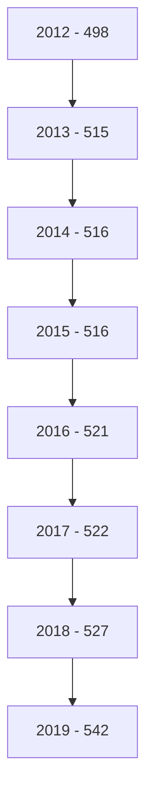
---
# التركز المصرفي:

درجة التركز المصرفي تعني أن عدداً قليلا من المصارف التجارية يستأثر بالنسبة الأكبر من النشاط المصرفي سواءً من حيث الأصول أو الودائع أوالائتمان أو من حيث حجم حقوق المساهمين، وفيما يخص الحصة السوقية للمصارف التجارية في ليبيا، فقد شكلت أصول المصارف الأربعة الكبرى (الجمهورية، التجاري الوطني ، الوحدة والصحارى) من أصل 18 مصرفاً مانسبته 76.6% من إجمالي أصول القطاع المصرفي في نهاية عام 2019، وشكل مصرف الجمهورية وحده ما نسبته 31.9% من إجمالي أصول القطاع المصرفي ككل.

وشكلت ودائع وقروض المصارف الأربعة الكبرى مانسبته 77.9 % و 88.0 % على التوالي من إجمالي ودائع وقروض القطاع المصرفي نهاية عام 2019.

وهذه النسب المرتفعة توضح أن السوق المصرفي الليبي يعاني من تركز عال يحول دون تحقيق المنافسة العادلة بين المصارف المتواجدة به ، وذلك بسبب إستحواذ أحد أو عدد قليل جداً من المصارف بحصة كبيرة في السوق ، في حين أن حصة معظم المصارف الأخرى متدنية للغاية.

إن التركز المصرفي يؤثر على المنافسة في سلوك المصارف وأدائها بطرق غير ملائمة، وينتج عنها خسارة اجتماعية مقترنة بسوء التسعير، ناتجة عن ممارسات المصارف لقوتها السوقية على الأسعار، الأمر الذي يخشى معه أنه كلما إرتفعت درجة الاحتكار في السوق كلما إرتفعت معها أسعار الخدمات المصرفية وتدني مستوى أو جودة الخدمة.

ونتيجة لهذا تزداد الحاجة إلى وضع القوانين والتشريعات التي تساهم في تعزيز ورفع مستويات المنافسة فيما بين المصارف وكذلك الإصلاح المالي، وإنشاء المزيد من المصارف لرفع مستويات المنافسة والكفاءة، ودخول مصارف جديدة سيزيد من المنافسة ويخفض مستويات التركز المصرفي.
---
# التركز المصرفي
## (2012 - 2019)

### حسب الأصول:

| المصارف | 2012 | 2013 | 2014 | 2015 | 2016 | 2017 | 2018 | 2019 |
|---------|------|------|------|------|------|------|------|------|
| أكبر مصرف | % 37.9 | % 33.0 | % 33.1 | % 34.9 | % 33.8 | % 33.6 | % 32.7 | % 31.9 |
| أكبر ثلاثة مصارف | % 71.0 | % 63.7 | % 62.1 | % 67.6 | % 67.9 | % 66.9 | % 65.8 | % 64.6 |
| أكبر خمسة مصارف | % 89.0 | % 81.3 | % 79.2 | % 87.1 | % 86.7 | % 85.0 | % 84.3 | % 84.2 |

### حسب الإئتمان:

| المصارف | 2012 | 2013 | 2014 | 2015 | 2016 | 2017 | 2018 | 2019 |
|---------|------|------|------|------|------|------|------|------|
| أكبر مصرف | % 41.9 | % 44.8 | % 43.5 | % 44.8 | % 44.3 | % 44.5 | % 43.6 | % 40.7 |
| أكبر ثلاثة مصارف | % 77.0 | % 76.7 | % 79.1 | % 79.4 | % 78.5 | % 77.7 | % 77.7 | % 75.8 |
| أكبر خمسة مصارف | % 91.0 | % 90.2 | % 91.1 | % 91.4 | % 91.3 | % 91.2 | % 91.5 | % 91.4 |

### حسب ودائع العملاء:

| المصارف | 2012 | 2013 | 2014 | 2015 | 2016 | 2017 | 2018 | 2019 |
|---------|------|------|------|------|------|------|------|------|
| أكبر مصرف | % 40.9 | % 33.8 | % 33.1 | % 34.8 | % 34.0 | % 33.6 | % 31.9 | % 32.3 |
| أكبر ثلاثة مصارف | % 71.5 | % 62.7 | % 61.3 | % 66.5 | % 67.2 | % 66.5 | % 65.2 | % 64.4 |
| أكبر خمسة مصارف | % 90.1 | % 80.9 | % 78.6 | % 87.8 | % 87.5 | % 85.7 | % 85.4 | % 85.6 |
---
التركز المصرفي نهاية عام 2019

## تركز الأصول

| البنك | النسبة |
|-------|--------|
| مصرف الجمهورية | 32% |
| المصرف التجاري الوطني | 19% |
| مصرف الوحدة | 14% |
| مصرف الصحارى | 12% |
| باقي المصارف | 23% |

## تركز الائتمان

| البنك | النسبة |
|-------|--------|
| مصرف الجمهورية | 41% |
| المصرف التجاري الوطني | 19% |
| مصرف الوحدة | 16% |
| مصرف الصحارى | 12% |
| باقي المصارف | 12% |

## تركز ودائع العملاء

| البنك | النسبة |
|-------|--------|
| مصرف الجمهورية | 32% |
| المصرف التجاري الوطني | 18% |
| مصرف الوحدة | 14% |
| مصرف الصحارى | 13% |
| باقي المصارف | 23% |
---
# الميزانية المُجمَعة للمصارف التجارية

شهدت الميزانية المُجمَعة للمصارف التجارية نهاية عام 2019، تطورات في مُجمل بنودها على جانبي الأصول والخصوم ليبلغ إجمالي الأصول داخل الميزانية المُجمَعة نحو 111,847.5 مليون دينار، مقابل 117,062.4 مليون دينار في نهاية عام 2018، بإنخفاض قدره 5,214.4 مليون دينار، أي بمعدل 4.5%، وفيما يلي جدول يلخص البنود الرئيسية للميزانية المُجمَعة للمصارف التجارية:

## البنود الرئيسية للميزانية المُجمَعة للمصارف التجارية

### جانب الأصول:

| البند | 2018 | 2019 | مقدار التغير | معدل التغير |
|-------|------|------|--------------|-------------|
| نقدية بالخزائن | 1,582.1 | 2,335.5 | 753.9 | 47.7% |
| حسابات المقاصة | 4,671.0 | 6,849.7 | 2,179.0 | 46.6% |
| أرصدة لدى المصارف | 85,349.3 | 78,056.7 | -7,292.3 | -8.5% |
| الإستثمارات | 1,456.5 | 1,128.0 | -328.5 | -22.6% |
| القروض والتسهيلات | 16,448.3 | 16,893.6 | 445.7 | 2.7% |
| الأصول الثابتة | 1,608.3 | 1,754.0 | 145.7 | 9.1% |
| الأصول الأخرى | 5,947.1 | 4,830.1 | -1,117.1 | -18.8% |
| إجمالي الأصول | 117,062.4 | 111,847.5 | -5,214.4 | -4.5% |
| الحسابات النظامية | 48,160.2 | 34,028.6 | -14,131.2 | -29.3% |
| إجمالي الميزانية | 165,222.6 | 145,876.1 | -19,346.6 | -11.7% |

مليون دينار
---
جانب الخصوم:

مليون دينار

| البند | 2018 | 2019 | مقدار التغير | معدل التغير |
|-------|------|------|--------------|-------------|
| ودائع العملاء | 93,657.5 | 88,715.6 | -4,941.9 | -5.3% |
| منها : التأمينات النقدية | 11,533.7 | 8,466.3 | -3,067.4 | -26.6% |
| حقوق الملكية | 6,472.6 | 6,863.8 | 391.2 | 6.0% |
| المخصصات | 4,627.6 | 5,557.3 | 929.7 | 20.1% |
| الخصوم الأخرى | 12,304.7 | 10,710.8 | -1,593.9 | -13.0% |
| إجمالي الخصوم | 117,062.4 | 111,847.5 | -5,214.9 | -4.5% |
| الحسابات النظامية | 48,160.2 | 34,028.6 | -14,131.6 | -29.3% |
| إجمالي الميزانية | 165,222.6 | 145,876.1 | -19,346.5 | -11.7% |
---
# الأهمية النسبية للبنود المُكونة للأصول

## نهاية عام 2019

| البند | النسبة |
|-------|--------|
| نقدية بالخزائن | 6% |
| حسابات المقاصة | 4% |
| أرصدة لدى مصارف | 70% |
| الإستثمارات | 1% |
| القروض والتسهيلات | 15% |
| الأصول الثابتة | 2% |
| الأصول الأخرى | 2% |

## نهاية عام 2018

| البند | النسبة |
|-------|--------|
| نقدية بالخزائن | 4% |
| حسابات المقاصة | 5% |
| أرصدة لدى مصارف | 73% |
| الإستثمارات | 1% |
| القروض والتسهيلات | 14% |
| الأصول الثابتة | 2% |
| الأصول الأخرى | 1% |

# الأهمية النسبية للبنود المُكونة للخصوم

## نهاية عام 2019

| البند | النسبة |
|-------|--------|
| ودائع العملاء | 79% |
| حقوق الملكية | 6% |
| المخصصات | 5% |
| الخصوم الأخرى | 10% |

## نهاية عام 2018

| البند | النسبة |
|-------|--------|
| ودائع العملاء | 80% |
| حقوق الملكية | 6% |
| المخصصات | 4% |
| الخصوم الأخرى | 10% |
---
وفيما يلي تطور الميزانية المُجمَعة للمصارف التجارية خلال الفترة (2012 - 2019):

مليون دينار

| جانب الأصول | 2012 | 2013 | 2014 | 2015 | 2016 | 2017 | 2018 | 2019 |
|-------------|-------|-------|-------|-------|-------|-------|--------|--------|
| نقدية بالخزائن | 1,545.9 | 1,712.3 | 1,642.8 | 752.8 | 606.4 | 547.2 | 1,582.1 | 2,335.5 |
| حسابات المقاصة | 2,024.6 | 7,310.3 | 8,125.4 | 11,444.4 | 12,886.4 | 10,625.8 | 4,671.0 | 6,849.7 |
| أرصدة لدى المصارف | 56,787.6 | 68,094.6 | 62,244.0 | 53,540.0 | 62,306.5 | 84,262.6 | 85,349.3 | 78,057.0 |
| الإستثمارات | 954.9 | 746.7 | 777.5 | 1,787.8 | 1,789.2 | 1,311.5 | 1,456.5 | 1,128.0 |
| القروض والتسهيلات | 15,899.5 | 18,232.3 | 19,959.9 | 20,212.8 | 18,770.3 | 17,446.6 | 16,448.3 | 16,894.0 |
| الأصول الثابتة | 1,038.4 | 1,121.6 | 1,211.6 | 1,365.4 | 1,409.1 | 1,463.2 | 1,608.3 | 1,754.0 |
| الأصول الأخرى | 6,169.5 | 1,157.8 | 1,243.0 | 1,130.2 | 5,687.2 | 5,066.0 | 5,947.1 | 4,830.0 |
| إجمالي الأصول | 84,420.4 | 98,375.6 | 95,204.2 | 90,233.4 | 103,455.1 | 116,477.0 | 117,062.4 | 111,847.5 |
| الحسابات النظامية | 70,747.7 | 71,550.9 | 51,845.0 | 48,299.2 | 46,800.0 | 46,534.9 | 48,160.2 | 34,029.1 |
| إجمالي الميزانية | 155,168.1 | 169,926.5 | 147,049.2 | 138,532.6 | 150,255.1 | 163,011.9 | 165,222.6 | 145,876.1 |

| جانب الخصوم | 2012 | 2013 | 2014 | 2015 | 2016 | 2017 | 2018 | 2019 |
|-------------|-------|-------|-------|-------|-------|-------|--------|--------|
| ودائع العملاء | 68,346.2 | 83,562.7 | 78,910.4 | 71,257.1 | 83,407.6 | 95,938.5 | 93,657.5 | 88,715.6 |
| منها : التأمينات النقدية | 6,823.3 | 6,609.0 | 8,080.7 | 9,738.7 | 8,939.7 | 8,845.6 | 11,533.7 | 8,466.3 |
| حقوق الملكية | 4,653.2 | 4,743.7 | 4,886.4 | 5,087.5 | 5,366.5 | 5,561.4 | 6,472.6 | 6,863.8 |
| المخصصات | 3,317.4 | 3,597.2 | 3,765.3 | 3,941.8 | 4,144.9 | 4,473.0 | 4,627.6 | 5,557.3 |
| الخصوم الأخرى | 8,103.6 | 6,472.0 | 7,642.1 | 9,946.9 | 10,536.1 | 10,504.2 | 12,304.7 | 10,710.8 |
| إجمالي الخصوم | 84,420.4 | 98,375.6 | 95,204.2 | 90,233.4 | 103,455.1 | 116,477.0 | 117,062.4 | 111,847.5 |
| الحسابات النظامية | 70,747.7 | 71,550.9 | 51,845.0 | 48,299.2 | 46,800.0 | 46,534.9 | 48,160.2 | 34,028.6 |
| إجمالي الميزانية | 155,168.1 | 169,926.5 | 147,049.2 | 138,532.6 | 150,255.1 | 163,011.9 | 165,222.6 | 145,876.1 |
---
# تحليل البنود المكونة للميزانية المُجمَعة للمصارف التجارية

## أولاً : جانب الأصول
### 1- النقدية :
#### أ- النقدية بالخزائن و حسابات المقاصة :

ارتفع رصيد النقدية بالخزائن وحسابات المقاصة بمقدار 2,932.2 مليون دينار وبمعدل نمو 59.8%، لتصل إلى 9,185.2 مليون دينار في نهاية عام 2019، مقابل 6,253.0 مليون دينار في نهاية عام 2018، حيث تركز هذا الارتفاع في حسابات المقاصة والتي ارتفعت بمقدار 2,178.7 مليون دينار، وسجلت النقدية بخزائن المصارف إرتفاعاً بمقدار 753.4 مليون دينار في نهاية عام 2019.

| البيان | 2018 | 2019 | مقدار التغير | معدل التغير |
|--------|------|------|--------------|-------------|
| النقدية بالخزائن : | 1,582.1 | 2,335.5 | 753.4 | % 47.6 |
| عملة محلية | 1,573.6 | 2,322.7 | 749.1 | % 47.6 |
| عملة أجنبية | 8.4 | 12.8 | 4.4 | % 52.4 |
| إجمالي حسابات المقاصة | 4,671.0 | 6,849.7 | 2,178.7 | % 46.6 |
| المقاصة بين المصارف | 2,191.1 | 3,707.3 | 1,516.2 | % 69.2 |
| المقاصة بين الفروع | 2,479.9 | 3,142.4 | 662.5 | % 26.7 |
| الإجمالي | 6,253.0 | 9,185.2 | 2,932.2 | % 46.9 |

### نقدية بخزائن المصارف التجارية

```mermaid
bar chart
    title نقدية بخزائن المصارف التجارية
    x-axis [2018, 2019]
    y-axis "مليون دينار" 0 --> 8000
    bar [4671.0, 6849.7]
```

### نقدية بخزائن المصارف التجارية

```mermaid
bar chart
    title نقدية بخزائن المصارف التجارية
    x-axis [2018, 2019]
    y-axis "مليون دينار" 0 --> 2500
    bar [1582.1, 2335.5]
```
---
وفيما يلي تطور بند النقدية في المصارف التجارية خلال الفترة (2012 - 2019):

"مليون دينار"

| البيان | 2012 | 2013 | 2014 | 2015 | 2016 | 2017 | 2018 | 2019 |
|--------|------|------|------|------|------|------|------|------|
| النقدية بالخزائن : | 1,545.9 | 1,712.3 | 1,642.8 | 752.8 | 606.4 | 547.2 | 1,582.1 | 2,335.5 |
| عملة محلية | 1,433.3 | 1,622.6 | 1,619.9 | 743.6 | 594.7 | 537.8 | 1,573.6 | 2,322.7 |
| عملة أجنبية | 112.6 | 89.7 | 22.9 | 9.2 | 11.7 | 9.4 | 8.4 | 12.8 |
| إجمالي حسابات المقاصة : | 2,024.6 | 7,310.3 | 8,125.4 | 11,444.4 | 12,886.4 | 6,379.9 | 4,671.0 | 6,849.7 |
| المقاصة بين المصارف | 1,410.4 | 4,004.6 | 4,836.7 | 7,072.2 | 8,488.9 | 4,245.9 | 2,191.1 | 3,707.3 |
| المقاصة بين الفروع | 614.2 | 3,305.7 | 3,288.7 | 4,372.2 | 4,397.5 | 2,134.0 | 2,479.9 | 3,142.4 |
| الإجمالي | 2,956.3 | 5,716.9 | 6,479.5 | 7,825.0 | 13,492.7 | 6,927.1 | 6,253.0 | 9,185.2 |

نقدية بخزائن المصارف التجارية
( 2012 - 2019 )

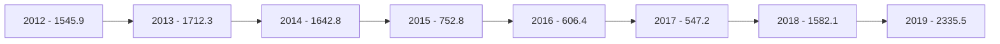

إجمالي حسابات المقاصة
( 2012 - 2019 )

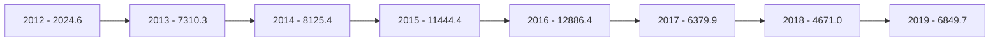
---
ب- الأرصدة والودائع لدى المصرف المركزي والمصارف الأخرى:

بلغ رصيد ودائع المصارف فيما بينها ولدى الغير 78,056.7 مليون دينار في نهاية عام 2019، مقابل
85,349.3 مليون دينار في نهاية عام 2018، أي بمعدل إنخفاض قدره 8.5%، وتركز هذا الإنخفاض
في رصيد الودائع لدى المصرف المركزي (شهادات الإيداع) بمقدار 8,870.0 مليون دينار في نهاية عام
2019 مقارنة بعام 2018.

| البيان | 2018 | 2019 | مقدار التغير | معدل التغير |
|--------|------|------|--------------|------------|
| ودائع تحت الطلب لدى : | 59,454.9 | 60,819.3 | 1,364.4 | 2.3% |
| - المصرف المركزي | 52,385.4 | 53,981.3 | 1,595.9 | 3.0 |
| - المصارف المحلية | 1,030.0 | 2,002.8 | 972.8 | 94.4 |
| - المصرف الليبي الخارجي | 1,762.1 | 821.4 | -940.7 | -53.4% |
| - المصارف بالخارج | 4,277.3 | 4,013.7 | -263.6 | -6.2% |
| ودائع زمنية : | 25,894.4 | 17,237.4 | -8,657.0 | -33.4% |
| - شهادات الإيداع | 24,716.9 | 15,846.9 | -8,870.0 | -35.9% |
| - المصارف المحلية | 0.0 | 0.0 | 0.0 | - |
| - المصرف الليبي الخارجي | 459.4 | 0.0 | -459.4 | -100.0% |
| - المصارف بالخارج | 718.1 | 1,390.6 | 672.5 | 93.6 |
| الإجمالي | 85,349.3 | 78,056.7 | -7,292.6 | -8.5% |

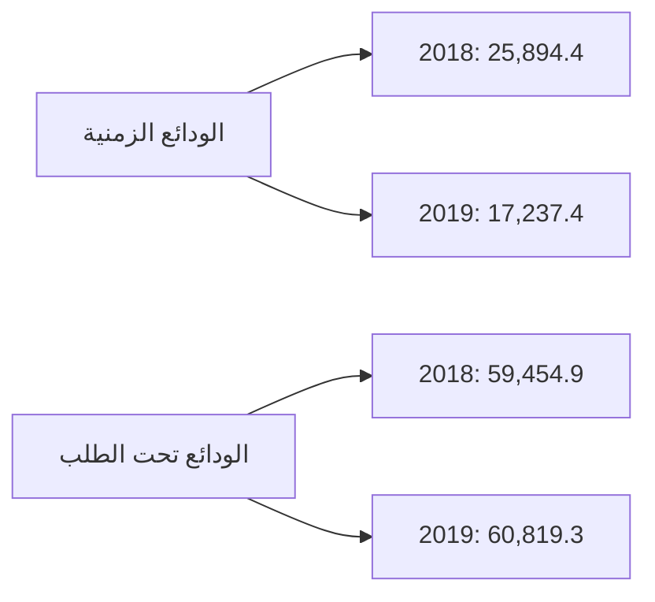
---
والجدول التالي يبين تطور بند الأرصدة والودائع للمصارف التجارية لدى الغير وفيما بينها خلال الفترة
(2012 - 2019):

| البيان | 2012 | 2013 | 2014 | 2015 | 2016 | 2017 | 2018 | 2019 |
|--------|------|------|------|------|------|------|------|------|
| ودائع تحت الطلب لدى : | 19,352.7 | 22,342.6 | 24,360.7 | 27,870.7 | 38,306.1 | 56,945.4 | 59,454.9 | 60,819.3 |
| - المصرف المركزي | 17,203.4 | 19,364.6 | 19,317.8 | 20,863.2 | 30,627.6 | 53,136.0 | 52,385.4 | 53,981.3 |
| - المصارف المحلية | 329.0 | 347.6 | 408.2 | 1,717.6 | 1,742.4 | 1,012.5 | 1,030.0 | 2,002.8 |
| - المصرف الليبي الخارجي | 664.7 | 848.1 | 1,850.0 | 2,216.8 | 2,396.1 | 874.2 | 1,762.1 | 821.4 |
| - المصارف بالخارج | 1,155.6 | 1,782.3 | 2,784.7 | 3,073.1 | 3,540.0 | 1,922.7 | 4,277.3 | 4,013.7 |
| ودائع زمنية : | 37,434.9 | 45,751.9 | 37,883.3 | 25,669.2 | 24,000.4 | 27,317.8 | 25,894.4 | 17,237.4 |
| - شهادات الإيداع | 35,737.8 | 44,307.3 | 37,074.6 | 24,259.7 | 23,187.1 | 26,415.7 | 24,716.9 | 15,846.9 |
| - المصارف المحلية | 0.0 | 30.0 | 0.0 | 0.0 | 0.0 | 0.0 | 0.0 | 0.0 |
| - المصرف الليبي الخارجي | 58.4 | 37.6 | 206.1 | 107.1 | 224.7 | 0.0 | 459.4 | 0.0 |
| - المصارف بالخارج | 1,638.7 | 1,377.0 | 602.6 | 1,302.4 | 588.6 | 902.1 | 718.1 | 1,390.6 |
| الإجمالي | 56,787.6 | 68,094.6 | 62,244.0 | 53,539.9 | 62,306.5 | 84,263.2 | 85,349.3 | 78,056.7 |

ودائع المصارف التجارية لدى المصرف المركزي والمصارف الأخرى
( 2012 - 2019 )

```mermaid
graph LR
    A[2012] --> B[2013] --> C[2014] --> D[2015] --> E[2016] --> F[2017] --> G[2018] --> H[2019]
    
    style A fill:#f9f,stroke:#333,stroke-width:2px
    style B fill:#f9f,stroke:#333,stroke-width:2px
    style C fill:#f9f,stroke:#333,stroke-width:2px
    style D fill:#f9f,stroke:#333,stroke-width:2px
    style E fill:#f9f,stroke:#333,stroke-width:2px
    style F fill:#f9f,stroke:#333,stroke-width:2px
    style G fill:#f9f,stroke:#333,stroke-width:2px
    style H fill:#f9f,stroke:#333,stroke-width:2px

    A -- 19,352.7 --> B
    B -- 22,342.6 --> C
    C -- 24,360.7 --> D
    D -- 27,870.7 --> E
    E -- 38,306.1 --> F
    F -- 56,945.4 --> G
    G -- 59,454.9 --> H
    H -- 60,819.3 --> I[ودائع تحت الطلب لدى]

    A -- 37,434.9 --> B
    B -- 45,751.9 --> C
    C -- 37,883.3 --> D
    D -- 25,669.2 --> E
    E -- 24,000.4 --> F
    F -- 27,317.8 --> G
    G -- 25,894.4 --> H
    H -- 17,237.4 --> J[ودائع زمنية]
```
---
## 2- الإستثمارات :

سجل إجمالي بند رصيد الإستثمارات في المصارف التجارية نهاية عام 2019 نحو 1,128.0 مليون دينار، مقابل 1,456.5 مليون دينار في نهاية عام 2018، حيث سدد مبلغ 500.0 مليون دينار لمصرف الوحدة المستثمرة في سندات الخزانة نهاية عام 2018 ، وتجدر الإشارة إلى قيام مصرفي الوحدة والتجارة والتنمية بالإستثمار في سندات وأذونات الخزانة في العام 2015 والجدول التالي يوضح تفاصيل هذا البند:

| مليون دينار |  |  |  |  |
|---|---|---|---|---|
| معدل التغير | مقدار التغير | 2019 | 2018 | البيان |
| -100.0 | -500.0 | 0.0 | 500.0 | سندات وأذونات الخزانة |
| 17.9 | 171.5 | 1,128.0 | 956.5 | إستثمارات أخرى |
| % -22.6 | -328.5 | 1,128.0 | 1,456.5 | الإجمالي |

### إجمالي الإستثمارات

```mermaid
bar chart
    title إجمالي الإستثمارات
    x-axis [2018, 2019]
    y-axis "مليون دينار" 0 --> 1600
    bar [1456.5, 1128.0]
```
---
والجدول التالي يبين تطور بند الإستثمارات خلال الفترة (2012 - 2019):

| البيان | 2012 | 2013 | 2014 | 2015 | 2016 | 2017 | 2018 | 2019 |
|--------|------|------|------|------|------|------|------|------|
| سندات وأذونات الخزانة | 0.0 | 0.0 | 0.0 | 1,000.0 | 1,000.0 | 500.0 | 500.0 | 0.0 |
| إستثمارات أخرى | 954.9 | 746.7 | 777.5 | 787.8 | 789.2 | 811.5 | 956.5 | 1,128.0 |
| الإجمالي | 954.9 | 746.7 | 777.5 | 1,787.8 | 1,789.2 | 1,311.5 | 1,456.5 | 1,128.0 |

إجمالي الإستثمارات في المصارف التجارية
( 2012 - 2019 )


3- القروض والتسهيلات الائتمانية :

إرتفع اجمالي الإئتمان الممنوح من المصارف التجارية من 16,448.3 مليون دينار في نهاية عام 2018 إلى 16,893.6 مليون دينار في نهاية عام 2019 ، أي بمعدل نمو 2.7%، وقد شكلت القروض والتسهيلات الائتمانية الممنوحة إلى اجمالي الخصوم الإيداعية ما نسبته 19.0%، كما شكلت من اجمالي الأصول ما نسبته 15.1% ، وبلغ رصيد القروض الممنوحة للقطاع الخاص في نهاية عام 2019 ما قيمته 10,856.8 مليون دينار، وما نسبته 64.3% من إجمالي القروض والتسهيلات الإئتمانية، فيما شكل رصيد القروض الممنوحة للقطاع العام النسبة الباقية 35.7% والتي بلغت قيمتها 6,036.8 مليون دينار.

وبلغـت نسبة تغطية مخصـص الديون المشكـوك فيها لإجمـالي الإئتمان الممنـوح نسبة 20.9% في نهاية عام 2019 مقابل نسبة 18.9% في نهاية عام 2018.
---
وفيما يلي بيان تفصيلي لرصيد القروض والتسهيلات الممنوحة من المصارف التجارية :

| مليون دينار |  |  |  |  |
|---|---|---|---|---|
| معدل التغير | مقدار التغير | 2019 | 2018 | البيان |
| 21.0% | 915.2 | 5,269.2 | 4,354.0 | السلفيات والسحب على المكشوف |
| -21.6% | -862.4 | 3,126.3 | 3,988.7 | السلف الإجتماعية * |
| 4.8% | 392.5 | 8,498.1 | 8,105.6 | القروض الأخرى |
| 2.7% | 445.3 | 16,893.6 | 16,448.3 | إجمالي القروض والتسهيلات |
| 11.9% | 372.3 | 3,498.7 | 3,126.4 | مخصص الديون |
| 0.5% | 73.0 | 13,394.9 | 13,321.9 | صافي القروض والتسهيلات |

*تشمل رصيد قروض المرابحة للأفراد.

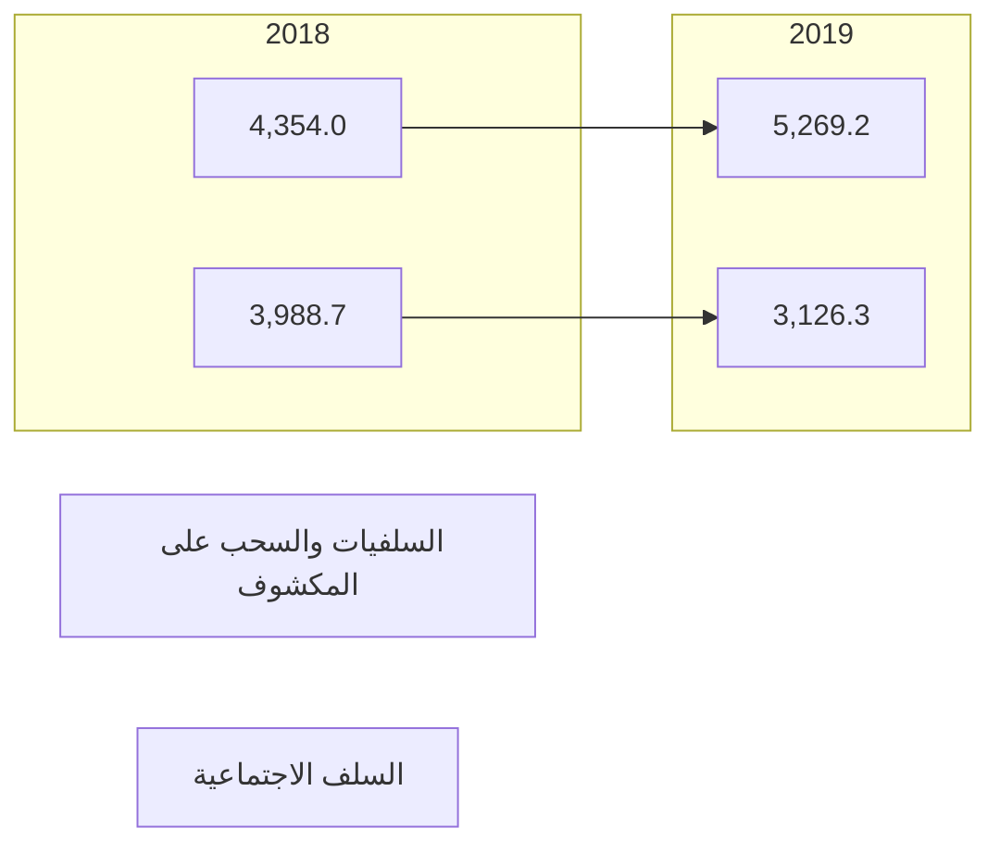

| مليون دينار |  |  |  |  |
|---|---|---|---|---|
| معدل التغير | مقدار التغير | 2019 | 2018 | البيان |
| 18.3 | 935.9 | 6,036.8 | 5,100.9 | القروض الممنوحة للقطاع العام |
| -4.3 | -490.6 | 10,856.8 | 11,347.4 | القروض الممنوحة للقطاع الخاص |
| 2.7 | 445.3 | 16,893.6 | 16,448.3 | الإجمالي |
---
| رصيد القروض الممنوحة للقطاع الخاص | | رصيد القروض الممنوحة للقطاع العام |
|-----------------------------------|-----------------------------------|
| 11,400.0 11,347.4 | 6,200.0 6,036.8 |
| 11,300.0 | 6,000.0 |
| 11,200.0 | 5,800.0 |
| 11,100.0 | 5,600.0 |
| 11,000.0 | 5,400.0 |
| 10,900.0 10,856.8 | 5,200.0 5,100.9 |
| 10,800.0 | 5,000.0 |
| 10,700.0 | 4,800.0 |
| 10,600.0 | 4,600.0 |
| 2018 2019 | 2018 2019 |

وفيما يلي القروض الممنوحة للقطاع العام والقطاع الخاص خلال الفترة (2012 -2019) :

| البيان | 2012 | 2013 | 2014 | 2015 | 2016 | 2017 | 2018 | 2019 |
|--------|------|------|------|------|------|------|------|------|
| القروض الممنوحة للقطاع العام | 5,291.2 | 5,327.1 | 6,195.9 | 5,982.8 | 5,915.9 | 5,578.9 | 5,100.9 | 6,036.8 |
| القروض الممنوحة للقطاع الخاص | 10,608.3 | 12,905.5 | 13,764.0 | 14,230.1 | 12,854.3 | 11,867.7 | 11,347.4 | 10,856.8 |
| الإجمالي | 15,899.5 | 18,232.3 | 19,959.9 | 20,212.8 | 18,770.3 | 17,446.6 | 16,448.3 | 16,893.6 |

```mermaid
graph LR
    A[رصيد القروض الممنوحة للقطاعين ( الخاص والعام )]
    B[( 2012 - 2019 )]
    C[16,000.0]
    D[14,000.0]
    E[12,000.0]
    F[10,000.0]
    G[8,000.0]
    H[6,000.0]
    I[4,000.0]
    J[2,000.0]
    K[0.0]
    L[2012]
    M[2013]
    N[2014]
    O[2015]
    P[2016]
    Q[2017]
    R[2018]
    S[2019]
    T[القروض الممنوحة للقطاع العام]
    U[القروض الممنوحة للقطاع الخاص]
```
---
وفيما يلي رصيد السلف الاجتماعية والسحب على المكشوف خلال الفترة (2012 -2019):

| البيان | 2012 | 2013 | 2014 | 2015 | 2016 | 2017 | 2018 | 2019 |
|--------|------|------|------|------|------|------|------|------|
| سلفيات والسحب على المكشوف | 5,522.3 | 4,146.5 | 4,452.1 | 5,440.1 | 4,827.9 | 4,514.5 | 4,354.0 | 5,269.2 |
| السلف الإجتماعية * | 4,973.5 | 6,726.0 | 7,157.9 | 6,608.6 | 5,901.1 | 4,912.5 | 3,988.7 | 3,126.3 |
| القروض الأخرى | 5,403.7 | 3,759.8 | 8,348.9 | 8,164.2 | 8,041.3 | 8,019.6 | 8,105.6 | 8,498.1 |
| إجمالي القروض والتسهيلات | 15,899.5 | 18,232.3 | 19,959.9 | 20,212.8 | 18,770.3 | 17,446.6 | 16,448.3 | 16,893.6 |
| مخصص الديون | 2,348.9 | 2,497.9 | 2,688.1 | 2,779.7 | 2,910.0 | 3,040.8 | 3,126.4 | 3,498.7 |
| صافي القروض والتسهيلات | 13,550.6 | 15,734.4 | 17,271.8 | 17,433.1 | 15,860.3 | 14,405.8 | 13,321.9 | 13,394.9 |

*تشمل رصيد قروض المرابحة للأفراد


| السنة | السلف الإجتماعية | سلفيات والسحب على المكشوف |
|-------|------------------|---------------------------|
| 2012 | 4973.5 | 5522.3 |
| 2013 | 6726.0 | 4146.5 |
| 2014 | 7157.9 | 4452.1 |
| 2015 | 6608.6 | 5440.1 |
| 2016 | 5901.1 | 4827.9 |
| 2017 | 4912.5 | 4514.5 |
| 2018 | 3988.7 | 4354.0 |
| 2019 | 3126.3 | 5269.2 |

## 4 - الأصول الثابتة والأصول الأخرى :

بلغ رصيد الأصول الثابتة نحو 1,754.0 مليون دينار في نهاية عام 2019، مقابل 1,608.3 مليون دينار في نهاية عام 2018، فيما بلغ رصيد الأصول الأخرى نحو 4,830.1 مليون دينار في نهاية عام 2019، مقابل 5,947.1 مليون دينار في نهاية عام 2018.
---
ثانياً : جانب الخصوم
1- ودائع العملاء :

إنخفضت أرصدة ودائع العملاء لدى المصارف التجارية من 93,657.5 مليون دينار في نهاية عام 2018 إلى 88,715.6 مليون دينار في نهاية عام 2019، أي بمعدل إنخفاض 5.3%، وقد تركز الإنخفاض في أرصدة الودائع تحت الطلب والودائع لأجل بمقدار 2,390.2 مليون دينار و 2,494.6 مليون دينار، بنسب إنخفاض 3.0% و 19.0% على التوالي ، كذلك إنخفضت الودائع الإدخارية بمقدار 57.1 مليون دينار وبنسبة 11.4%.

حيث شكلت الودائع تحت الطلب ما نسبته 87.5% من حجم الودائع، في حين شكلت الودائع لأجل ما نسبته 12.0% من حجم الودائع، وشكلت ودائع الادخار ما نسبته 0.5% فقط من حجم الودائع.

مليون دينار

| البيان | 2018 | 2019 | مقدار التغير | معدل التغير |
|---------|------|------|--------------|-------------|
| الودائع تحت الطلب | 80,038.6 | 77,648.4 | -2,390.2 | -3.0 % |
| الودائع لأجل | 13,115.5 | 10,620.9 | -2,494.6 | -19.0 % |
| الودائع الإدخارية | 503.4 | 446.3 | -57.1 | -11.4 % |
| الإجمالي | 93,657.5 | 88,715.6 | -4,941.9 | -5.3 % |

تصنيف ودائع العملاء لدى المصارف التجارية حسب الغرض

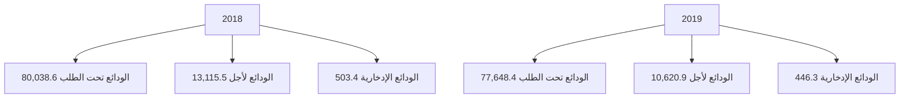

22
---
# تصنيف الودائع حسب نوع الوديعة لدى المصارف التجارية
## خلال الفترة (2012 -2019)

مليون دينار

| البيان | 2012 | 2013 | 2014 | 2015 | 2016 | 2017 | 2018 | 2019 |
|--------|------|------|------|------|------|------|------|------|
| الودائع تحت الطلب | 54,728.8 | 61,834.9 | 56,641.4 | 58,725.9 | 72,192.7 | 84,827.6 | 80,038.6 | 77,648.4 |
| الودائع زمنية | 12,912.1 | 21,064.9 | 21,669.3 | 11,956.7 | 10,644.7 | 10,519.2 | 13,115.5 | 10,620.9 |
| الودائع الإدخارية | 705.3 | 662.9 | 599.8 | 574.5 | 570.2 | 591.7 | 503.4 | 446.3 |
| الإجمالي | 68,346.2 | 83,562.7 | 78,910.4 | 71,257.1 | 83,407.6 | 95,938.5 | 93,657.5 | 88,715.6 |

## إجمالي ودائع العملاء لدى المصارف التجارية
### (2012 - 2019)

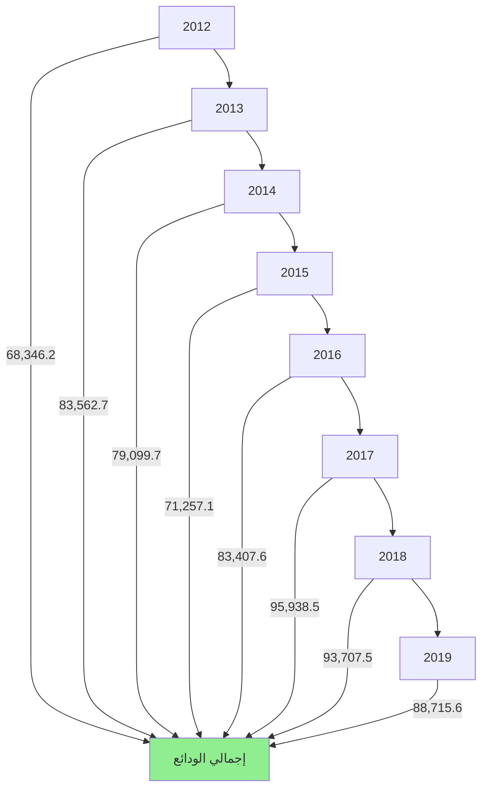

وفيما يتعلق بتوزيع إجمالي الودائع حسب القطاعات ( خاص ، حكومة، عام ) فقد انخفضت ودائع القطاع الخاص بمقدار 12,246.9 مليون دينار وبنسبة 19.6% في نهاية عام 2019، لتسجل في نهاية عام 2019 نحو 50,248.5 مليون دينار، مقارنة بنحو 62,495.4 مليون دينار في نهاية الربع الثالث من عام 2018 ، حيث تركز الانخفاض في ودائع الأفراد والتي انخفضت بشكل ملحوظ.

كما انخفض أيضاً رصيد ودائع القطاع العام والقطاع الحكومي في نهاية عام 2019 بمقدار 2,740.0 مليون دينار لتصل إلى 41,173.3 مليون دينار، منها 10,776.1 مليون دينار كودائع حكومية والتي تتكون من ودائع الوزارات والهيئات والمؤسسات الحكومية وودائع كل من: صندوق الضمان

23
---
الاجتماعي، صندوق الإنماء الاقتصادي وودائع الصندوق الليبي للتنمية والاستثمار، مقابل 43,913.3
مليون دينار كودائع للقطاع العام والقطاع الحكومي في نهاية عام 2018، والجدول التالي يوضح ذلك :

مليون دينار

| البيان | 2018 | 2019 | مقدار التغير | معدل التغير |
|--------|------|------|--------------|------------|
| ودائع الحكومة والقطاع العام | 39,747.8 | 41,289.7 | 1,541.9 | % 3.9 |
| - ودائع حكومية | 10,048.5 | 11,702.3 | 1,653.8 | % 16.5 |
| - ودائع القطاع العام | 29,699.3 | 29,587.4 | -111.9 | % -0.4 |
| ودائع القطاع الخاص | 53,909.7 | 47,425.9 | -6,483.8 | % -12.0 |
| - الأفراد | 33,717.5 | 28,223.4 | -5,494.1 | % -16.3 |
| - أخرى | 20,192.2 | 19,202.5 | -989.7 | % -4.9 |
| الإجمالي | 93,657.5 | 88,715.6 | -4,941.9 | % -5.3 |

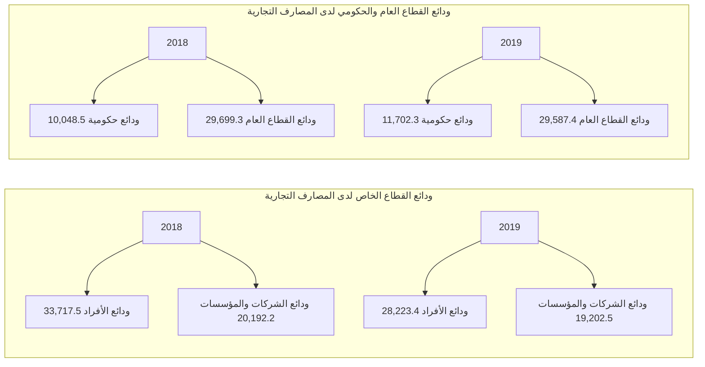
---
وفيما يلي توزيع الودائع لدى المصارف التجارية خلال الفترة (2012 - 2019):

| مليون دينار |  |  |  |  |  |  |  |  |
|---|---|---|---|---|---|---|---|---|
| البيان | 2012 | 2013 | 2014 | 2015 | 2016 | 2017 | 2018 | 2019 |
| ودائع الحكومة والقطاع العام | 35,469.8 | 52,638.7 | 46,339.9 | 35,139.7 | 39,197.7 | 40,710.8 | 39,747.8 | 41,289.7 |
| - ودائع حكومية | 13,983.3 | 24,285.4 | 21,987.0 | 9,800.6 | 9,100.7 | 9,234.8 | 10,048.5 | 11,702.3 |
| - ودائع القطاع العام | 21,486.5 | 28,353.3 | 24,352.9 | 25,339.1 | 30,097.0 | 31,476.0 | 29,699.3 | 29,587.4 |
| ودائع القطاع الخاص | 32,876.4 | 30,924.0 | 32,570.5 | 36,117.4 | 44,209.9 | 55,227.7 | 53,909.7 | 47,425.9 |
| - الأفراد | 21,026.1 | 19,569.5 | 19,799.0 | 20,477.2 | 27,605.5 | 36,295.4 | 33,717.5 | 28,223.4 |
| - أخرى | 11,850.3 | 11,345.5 | 12,771.5 | 15,640.2 | 16,604.4 | 18,932.3 | 20,192.2 | 19,202.5 |
| الإجمالي | 68,346.2 | 83,562.7 | 78,910.4 | 71,257.1 | 83,407.6 | 95,938.5 | 93,657.5 | 88,715.6 |

ودائع القطاع العام والقطاع الحكومي لدى المصارف التجارية
(2012 - 2019)

| مليون دينار | 2012 | 2013 | 2014 | 2015 | 2016 | 2017 | 2018 | 2019 |
|-------------|------|------|------|------|------|------|------|------|
| ودائع حكومية | 13,983.3 | 24,285.4 | 21,987.0 | 9,800.6 | 9,100.7 | 9,234.8 | 10,048.5 | 11,702.3 |
| ودائع القطاع العام | 21,486.5 | 28,353.3 | 24,352.9 | 25,339.1 | 30,097.0 | 31,476.0 | 29,699.3 | 29,587.4 |

ودائع القطاع الخاص لدى المصارف التجارية
(2012 - 2019)

| مليون دينار | 2012 | 2013 | 2014 | 2015 | 2016 | 2017 | 2018 | 2019 |
|-------------|------|------|------|------|------|------|------|------|
| ودائع الشركات والمؤسسات | 11,850.3 | 11,345.5 | 12,771.5 | 15,640.2 | 16,604.4 | 18,932.3 | 20,192.2 | 19,202.5 |
| ودائع الأفراد | 21,026.1 | 19,569.5 | 19,799.0 | 20,477.2 | 27,605.5 | 36,295.4 | 33,717.5 | 28,223.4 |
---
## 2- الحسابات المكشوفة لدى المراسلين بالخارج :

بلغ رصيد الحسابات المكشوفة لدى المراسلين بالخارج 113.1 مليون دينار في نهاية عام 2019، وهي
في معظمها ناتجة عن تأخر تسوية الحسابات لبعض المصارف مع المصارف المراسلة بالخارج، مقابل
503.4 مليون دينار في نهاية عام 2018.

مليون دينار

| البيان | 2018 | 2019 | مقدار التغير | معدل التغير |
|--------|------|------|--------------|-------------|
| الحسابات المكشوفة لدى المراسلين بالخارج | 503.4 | 113.1 | -390.3 | -77.5% |

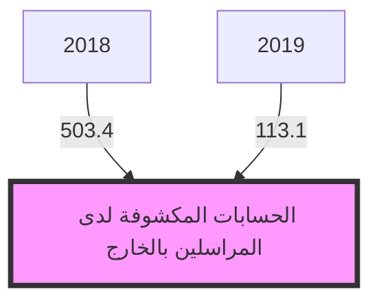

وفيما يلي توزيع رصيد الحسابات المكشوفة خلال الفترة (2012 - 2019):

مليون دينار

| البيان | 2012 | 2013 | 2014 | 2015 | 2016 | 2017 | 2018 | 2019 |
|--------|------|------|------|------|------|------|------|------|
| الحسابات المكشوفة لدى المراسلين بالخارج | 139.6 | 74.9 | 432.0 | 955.6 | 429.9 | 368.5 | 503.4 | 113.1 |

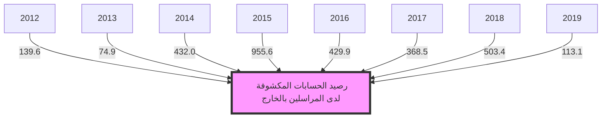
---
### 3- حقوق الملكية والأرباح:

- رأس المال المدفوع: إرتفع رأس المال المدفوع من 3,904.4 مليون دينار في نهاية عام 2018 إلى 4,282.9 مليون دينار في نهاية عام 2019 ، نتيجة لقيام بعض المصارف بزيادة رأس المال المدفوع (التجارة والتنمية ، الأمان ، السراي).

- الإحتياطيات والأرباح: إرتفع رصيد الإحتياطيات والأرباح المرحلة والقابلة للتوزيع من 1,061.1 مليون دينار في نهاية عام 2018، ليصل إلى 1,246.3 مليون دينار في نهاية عام 2019، في حين تراجعت أرباح المصارف التجارية قبل خصم المخصصات والضرائب خلال عام 2019 بمعدل 32.8% لتصل إلى 753.6 مليون دينار، مقارنة عما كانت عليه خلال عام 2018 والبالغة نحو 1,122.2 مليون دينار.

وتجدر الإشارة إلى أن المصارف التجارية خلال العام 2018 سجلت أرباحاً قياسية مقارنة عما كانت عليه في السابق هذه الزيادة في الأرباح نتيجة لتحقيق المصارف التجارية لإيرادات هامة من عمولات بيع وتحويل العملة الأجنبية وكذلك من رفع أسعار الخدمات المصرفية.

مليون دينار

| البيان | 2018 | 2019 | مقدار التغير | معدل التغير |
|--------|------|------|--------------|-------------|
| رأس المال المدفوع | 3,904.4 | 4,282.9 | 378.5 | 9.7% |
| الإحتياطي القانوني | 352.9 | 527.9 | 175.0 | 49.6% |
| إحتياطيات غير مخصصة | 32.0 | 53.1 | 21.1 | 65.9% |
| أرباح العام | 1,122.2 | 753.6 | -368.6 | -32.8% |
| الأرباح المرحّلة والأرباح القابلة للتوزيع | 1,061.1 | 1,246.3 | 185.2 | 17.5% |
| الإجمالي | 6,472.6 | 6,863.8 | 391.2 | 6.1% |
---
أرباح المصارف التجارية قبل خصم المخصصات والضرائب
(2012 - 2019)

| السنة | القيمة (مليون دينار) |
|-------|---------------------|
| 2012  | 527.1               |
| 2013  | 451.1               |
| 2014  | 265.4               |
| 2015  | 213.0               |
| 2016  | 247.1               |
| 2017  | 464.6               |
| 2018  | 1222.2              |
| 2019  | 753.6               |

وفيما يلي حسابات رأس المال والإحتياطيات في المصارف خلال الفترة (2012 - 2019):

| البيان | 2012 | 2013 | 2014 | 2015 | 2016 | 2017 | 2018 | 2019 |
|--------|------|------|------|------|------|------|------|------|
| رأس المال المدفوع | 3,495.2 | 3,550.2 | 3,566.8 | 3,609.5 | 3,791.4 | 3,806.4 | 3,904.4 | 4,282.9 |
| الإحتياطي القانوني | 181.9 | 323.5 | 335.8 | 335.8 | 342.8 | 346.1 | 352.9 | 527.9 |
| إحتياطيات غير مخصصة | 26.6 | 29.7 | 29.7 | 29.7 | 30.0 | 31.9 | 32.0 | 53.1 |
| أرباح العام | 527.1 | 451.1 | 265.4 | 213.0 | 247.1 | 464.6 | 1,122.2 | 753.6 |
| الأرباح المرحّلة والأرباح القابلة للتوزيع | 422.4 | 389.2 | 688.7 | 899.6 | 955.0 | 912.4 | 1,061.1 | 1,246.3 |
| الإجمالي | 4,653.2 | 4,743.7 | 4,886.4 | 5,087.6 | 5,366.3 | 5,561.4 | 6,472.6 | 6,863.8 |

إجمالي حقوق الملكية في المصارف التجارية
(2012 - 2019)

| السنة | رأس المال | الإحتياطيات | إجمالي حقوق الملكية |
|-------|-----------|-------------|---------------------|
| 2012  | 3495.2    | 1158.1      | 4653.3              |
| 2013  | 3550.2    | 1193.5      | 4743.7              |
| 2014  | 3566.8    | 1391.1      | 4957.9              |
| 2015  | 3609.5    | 1478.0      | 5087.5              |
| 2016  | 3791.4    | 1575.0      | 5366.4              |
| 2017  | 3806.4    | 1755.1      | 5561.5              |
| 2018  | 3904.4    | 2565.1      | 6469.5              |
| 2019  | 4282.9    | 2580.9      | 6863.8              |
---
## 4- المخصصات :

سجل رصيد المخصصات إرتفاعاً بمقدار 929.7 مليون دينار خلال الفترة ليصل في نهاية عام 2019
إلى 5,557.3 مليون دينار ، مقابل 4,627.6 مليون دينار في نهاية عام 2018، وتركزت الزيادة في بندي
مخصص الديون المشكوك في تحصيلها و المخصصات العامة كما هو موضح بالجدول التالي :

مليون دينار

| البيان | 2018 | 2019 | مقدار التغير | معدل التغير |
|---|---|---|---|---|
| مخصص الديون المشكوك في تحصيلها | 3,126.4 | 3,498.7 | 372.3 | 11.9% |
| مخصص إستهلاك الأصول الثابتة | 745.2 | 789.8 | 44.6 | 6.0% |
| مخصصات عامة | 753.2 | 1,265.8 | 512.6 | 68.1% |
| مخصص تقييم أسعار الصرف | 2.8 | 3.0 | 0.2 | 7.1% |
| الإجمالي | 4,627.6 | 5,557.3 | 929.7 | 20.1% |

إجمالي المخصصات

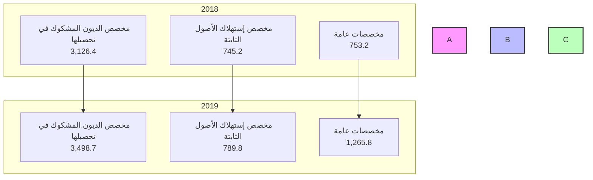
---
وفيما يلي رصيد المخصصات خلال الفترة (2012 - 2019):

مليون دينار

| البيان | 2012 | 2013 | 2014 | 2015 | 2016 | 2017 | 2018 | 2019 |
|--------|------|------|------|------|------|------|------|------|
| مخصص الديون المشكوك في تحصيلها | 2,348.9 | 2,497.5 | 2,688.1 | 2,779.7 | 2,910.0 | 3,040.8 | 3,126.4 | 3,498.7 |
| مخصص إستهلاك الأصول الثابتة | 424.1 | 473.1 | 539.3 | 592.5 | 634.0 | 687.3 | 745.2 | 789.8 |
| مخصصات عامة | 539.3 | 614.6 | 532.8 | 556.9 | 594.3 | 738.2 | 753.2 | 1,265.8 |
| مخصص تقييم أسعار الصرف | 5.2 | 11.6 | 5.1 | 12.7 | 6.5 | 6.7 | 2.8 | 3.0 |
| الإجمالي | 3,317.5 | 3,597.2 | 3,765.3 | 3,941.8 | 4,144.8 | 4,473.0 | 4,627.6 | 5,557.3 |

رصيد مخصص الديون المشكوك في تحصيلها
(2012 - 2019)

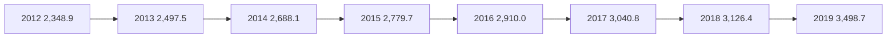

5- متنوعات وخصوم أخرى:
بلغ رصيد متنوعات وخصوم أخرى 10,710.8 مليون دينار في نهاية عام 2019 مقابل 12,304.7
مليون دينار في نهاية عام 2018.
---
# مؤشرات السلامة المالية للمصارف التجارية

## مؤشرات السيولة:
تتمتع المصارف التجارية بسيولة جيدة ، إذ بلغت نسبة النقد والأرصدة لدى المصارف التجارية إلى إجمالي الأصول 71.9% في نهاية عام 2019، والتي معظمها تمثل ودائع لدى المصرف المركزي (تحت الطلب بما فيها الاحتياطي الإلزامي وكذلك شهادات الإيداع).

وبلغ حجم القروض إلى إجمالي الودائع بالقطاع المصرفي نسبة 19.0% في نهاية عام 2019 ، وهى نسبة ضئيلة للغاية، حيث لم تتعدى هذه النسبة 28.4% خلال الفترة موضوع التقرير.

وتجدر الإشارة إلى أن نسبة السيولة القانونية المطلوب من المصارف التجارية الإحتفاظ بها هى 25.0% من إجمالي الخصوم الإيداعية.

| نسب مئوية |  |  |  |  |  |  |  |  |
|-----------|---------|---------|---------|---------|---------|---------|---------|---------|
| مؤشرات السيولة | 2012 | 2013 | 2014 | 2015 | 2016 | 2017 | 2018 | 2019 |
| الأصول السائلة / الأصول | 68.6 | 71.0 | 67.8 | 60.2 | 60.8 | 72.8 | 74.3 | 71.9 |
| القروض / الودائع | 23.6 | 21.8 | 25.2 | 28.4 | 22.5 | 18.2 | 17.6 | 19.0 |
| الودائع / الأصول | 80.8 | 84.9 | 83.1 | 79.0 | 80.6 | 82.4 | 80.0 | 79.3 |

```mermaid
graph TD
    title[مؤشرات السيولة (2012 - 2019)]
    style title fill:#f9f,stroke:#333,stroke-width:4px
    
    A[2012] --> B[2013] --> C[2014] --> D[2015] --> E[2016] --> F[2017] --> G[2018] --> H[2019]
    
    A1[68.6] --> B1[71.0] --> C1[67.8] --> D1[60.2] --> E1[60.8] --> F1[72.8] --> G1[74.3] --> H1[71.9]
    A2[80.8] --> B2[84.9] --> C2[83.1] --> D2[79.0] --> E2[80.6] --> F2[82.4] --> G2[80.0] --> H2[79.3]
    A3[23.6] --> B3[21.8] --> C3[25.2] --> D3[28.4] --> E3[22.5] --> F3[18.2] --> G3[17.6] --> H3[19.0]
    
    classDef default fill:#f9f,stroke:#333,stroke-width:2px;
    class A,B,C,D,E,F,G,H default;
    
    subgraph الأصول السائلة / الأصول
    A1 --> B1 --> C1 --> D1 --> E1 --> F1 --> G1 --> H1
    end
    
    subgraph الودائع / الأصول
    A2 --> B2 --> C2 --> D2 --> E2 --> F2 --> G2 --> H2
    end
    
    subgraph القروض / الودائع
    A3 --> B3 --> C3 --> D3 --> E3 --> F3 --> G3 --> H3
    end
```

31
---
## جودة الأصول

أظهرت البيانات المتوفرة عن نسبة الديون المتعثرة وهي بيانات تقديرية قد لا تعكس الواقع أن نسبة الديون المتعثرة إلى إجمالي القروض بلغت في نهاية عام 2019 نحو 21.0%، ويدل إرتفاع هذه النسبة على إنخفاض كفاءة إدارة الائتمان، وينبغي أن لا تتجاوز هذه النسبة وفقاً للمعايير الدولية 5%. وقد سجلت نسبة تغطية مخصص الديون إلى الديون المتعثرة في نهاية عام 2019 نحو 98.6%.

| نسب مئوية |||||||||
|---|---|---|---|---|---|---|---|---|
| جودة الأصول | 2012 | 2013 | 2014 | 2015 | 2016 | 2017 | 2018 | 2019 |
| القروض المتعثرة / الأصول(*) | 4.0 | 3.9 | 4.4 | 4.7 | 3.8 | 3.1 | 2.9 | 3.2 |
| القروض المتعثرة / القروض(*) | 21.0 | 21.0 | 21.0 | 21.0 | 21.0 | 21.0 | 21.0 | 21.0 |
| مخصص الديون / القروض المتعثرة(*) | 70.9 | 65.2 | 64.0 | 65.5 | 73.8 | 83.0 | 90.4 | 98.6 |
| مخصص الديون / القروض | 14.9 | 13.7 | 13.4 | 13.8 | 15.5 | 17.4 | 19.0 | 20.9 |

(*) بيانات القروض المتعثرة تقديرية منذ 2011

```mermaid
graph TD
    title[مؤشرات جودة الأصول]
    subtitle[(2012 - 2019)]
    style title fill:#f9f,stroke:#333,stroke-width:4px
    style subtitle fill:#bbf,stroke:#f66,stroke-width:2px
    
    A[2012] --> B[2013]
    B --> C[2014]
    C --> D[2015]
    D --> E[2016]
    E --> F[2017]
    F --> G[2018]
    G --> H[2019]
    
    A1[70.9] --> B1[65.2]
    B1 --> C1[64.0]
    C1 --> D1[65.5]
    D1 --> E1[73.8]
    E1 --> F1[83.0]
    F1 --> G1[90.4]
    G1 --> H1[98.6]
    
    A2[14.9] --> B2[13.7]
    B2 --> C2[13.4]
    C2 --> D2[13.8]
    D2 --> E2[15.5]
    E2 --> F2[17.4]
    F2 --> G2[19.0]
    G2 --> H2[20.9]
    
    classDef default fill:#f9f,stroke:#333,stroke-width:2px;
    class A,B,C,D,E,F,G,H default;
    classDef data1 fill:#bbf,stroke:#f66,stroke-width:2px;
    class A1,B1,C1,D1,E1,F1,G1,H1 data1;
    classDef data2 fill:#bfb,stroke:#f66,stroke-width:2px;
    class A2,B2,C2,D2,E2,F2,G2,H2 data2;
```

## الربحية

شهد معدل العائد على الأصول لدى القطاع المصرفي في ليبيا إنخفاضاً ملحوظاً خلال السنوات (2014 - 2016)، حيث بلغ نحو 0.2% في عام 2016، ويعزى سبب الإنخفاض إلى عدة أسباب منها الوضع الغير ملائم الذي تعمل فيه المصارف التجارية في السنوات الأخيرة وكذلك تطبيق قانون إلغاء الفوائد الربوية.
---
إلا أنه خلال العام 2018 تحسن معدل الربحية بشكل كبير، حيث بلغ العائد على إجمالي الأصول نحو 1.0%، وبلغ معدل العائد على حقوق الملكية 20.9%.

وفي عام 2019 بلغ معدل العائد على على إجمالي الاصول نحو 0.7 % وبلغ معدل العائد على حقوق الملكية 12.3%.

هذه الزيادة في الأرباح خاصة من العام 2018 جاءت نتيجة لتحقيق المصارف التجارية لإيرادات هامة من عمولات بيع وتحويل العملة الأجنبية، وكذلك من رفع أسعار الخدمات المصرفية عموماً.

نسب مئوية

| الربحية | 2012 | 2013 | 2014 | 2015 | 2016 | 2017 | 2018 | 2019 |
|---------|------|------|------|------|------|------|------|------|
| العائد / حقوق الملكية | 13.7 | 12.0 | 5.4 | 4.4 | 4.8 | 9.1 | 20.9 | 12.3 |
| العائد / الأصول | 0.7 | 0.5 | 0.3 | 0.2 | 0.2 | 0.4 | 1.0 | 0.7 |

العائد / حقوق الملكية
( 2012 - 2019 )

```mermaid
graph LR
    2012[2012 13.7] --> 2013[2013 12.0]
    2013 --> 2014[2014 5.4]
    2014 --> 2015[2015 4.4]
    2015 --> 2016[2016 4.8]
    2016 --> 2017[2017 9.1]
    2017 --> 2018[2018 20.9]
    2018 --> 2019[2019 12.3]
```

العائد / الأصول
( 2012 - 2019 )

```mermaid
graph LR
    2012[2012 0.7] --> 2013[2013 0.5]
    2013 --> 2014[2014 0.3]
    2014 --> 2015[2015 0.2]
    2015 --> 2016[2016 0.2]
    2016 --> 2017[2017 0.4]
    2017 --> 2018[2018 1.0]
    2018 --> 2019[2019 0.7]
```

▪ كفاية رأس المال: يتمتع القطاع المصرفي الليبي بكفاية رأس مال مرتفعة، كافية لمواجهة أية مخاطر قد تحدث، حيث تراوحت نسبتها مابين 10.7% و 18.4% خلال الفترة (2012 – 2019)، وهى بشكل عام أعلى وبهامش مريح من النسبة المحددة من قبل لجنة بازل (1) والبالغة 8.0%، مما يعزز من الإستقرار المالي.

33
---
نسب مئوية

| نسب رأس المال | 2012 | 2013 | 2014 | 2015 | 2016 | 2017 | 2018 | 2019 |
|---------------|------|------|------|------|------|------|------|------|
| كفاية رأس المال الكلي | 10.7 | 12.4 | 13.9 | 14.3 | 14.6 | 16.7 | 17.8 | 18.4 |
| كفاية رأس المال الأساسي | 9.5 | 11.0 | 12.6 | 13.1 | 13.4 | 15.4 | 16.5 | 17.2 |
| رأس المال المدفوع / الأصول | 4.2 | 3.6 | 3.7 | 4.0 | 3.7 | 3.3 | 3.3 | 3.8 |
| حقوق الملكية / الأصول | 5.1 | 4.4 | 5.1 | 5.4 | 4.9 | 4.8 | 4.6 | 5.5 |
| حقوق الملكية / الودائع | 6.3 | 5.1 | 6.2 | 7.1 | 6.1 | 5.3 | 5.7 | 6.9 |

كفاية رأس المال الكلي
(2012 - 2019)

```mermaid
graph LR
    2012[2012 10.7%] --> 2013[2013 12.4%]
    2013 --> 2014[2014 13.9%]
    2014 --> 2015[2015 14.3%]
    2015 --> 2016[2016 14.6%]
    2016 --> 2017[2017 16.7%]
    2017 --> 2018[2018 17.8%]
    2018 --> 2019[2019 18.4%]
```

مؤشرات رأس المال
(2012 - 2019)

```mermaid
graph LR
    2012[2012] --> 2013[2013]
    2013 --> 2014[2014]
    2014 --> 2015[2015]
    2015 --> 2016[2016]
    2016 --> 2017[2017]
    2017 --> 2018[2018]
    2018 --> 2019[2019]

    style 2012 fill:#f9f,stroke:#333,stroke-width:2px
    style 2013 fill:#f9f,stroke:#333,stroke-width:2px
    style 2014 fill:#f9f,stroke:#333,stroke-width:2px
    style 2015 fill:#f9f,stroke:#333,stroke-width:2px
    style 2016 fill:#f9f,stroke:#333,stroke-width:2px
    style 2017 fill:#f9f,stroke:#333,stroke-width:2px
    style 2018 fill:#f9f,stroke:#333,stroke-width:2px
    style 2019 fill:#f9f,stroke:#333,stroke-width:2px

    2012 -->|4.2%| A2012[رأس المال المدفوع / الأصول]
    2012 -->|5.1%| B2012[حقوق الملكية / الأصول]
    2019 -->|3.8%| A2019[رأس المال المدفوع / الأصول]
    2019 -->|5.5%| B2019[حقوق الملكية / الأصول]
```

34
---
# الملحق

- البيانات المالية الأساسية للمصارف التجارية نهاية عام 2019 مقارنة بعام 2018 .

- جدول مؤشرات السلامة المالية للقطاع المصرفي ( 2012 - 2019 ) .

35
---
# البيانات المالية الأساسية للمصارف التجارية
(مليون دينار)

| البيان / الفترة | 2018 | 2019 | معدل التغير % |
|-----------------|------|------|---------------|
| إجمالي الميزانية (الأصول + الحسابات النظامية) | 165,222.6 | 145,876.1 | -11.7 |
| إجمالي الأصول | 117,062.4 | 111,847.5 | -4.5 |
| إجمالي النقدية بخزائن المصارف | 1,582.1 | 2,335.5 | 47.6 |
| إجمالي الودائع لدى المصرف المركزي | 77,102.3 | 69,828.2 | -9.4 |
| إجمالي الودائع لدى المصارف | 1,030.0 | 2,002.8 | 94.4 |
| إجمالي الودائع لدى المصرف الليبي الخارجي | 2,221.5 | 821.4 | -63.0 |
| إجمالي الودائع لدى المراسلين بالخارج | 4,995.4 | 5,404.2 | 8.2 |
| إجمالي حسابات المقاصة | 4,671.0 | 6,849.7 | 46.6 |
| إجمالي القروض والسلفيات والتسهيلات | 16,448.3 | 16,893.6 | 2.7 |
| إجمالي الاستثمارات | 1,456.5 | 1,128.0 | -22.6 |
| إجمالي ودائع العملاء | 93,657.5 | 88,715.6 | -5.3 |
| إجمالي الحسابات المكشوفة لدى المراسلين | 503.4 | 113.1 | -77.5 |
| إجمالي حقوق الملكية | 5,350.4 | 6,110.2 | 14.2 |
| إجمالي المخصصات | 4,627.6 | 5,557.3 | 20.1 |
| أرباح العام | 1,122.2 | 753.6 | -32.8 |
| عدد الفروع والوكالات | 527 | 542 | 2.8 |
| عدد العاملين | 19,263 | 19,387 | 0.6 |
| الأصول السائلة / إجمالي الأصول % | 74.3 | 71.9 | - |
| إجمالي القروض / إجمالي الأصول % | 14.1 | 15.1 | - |
| حقوق الملكية / إجمالي الأصول % | 4.6 | 5.5 | - |
| إجمالي الأصول / عدد الفروع ( مليون دينار ) | 222.1 | 206.4 | - |
| إجمالي الأصول / عدد العاملين ( مليون دينار ) | 6.1 | 5.8 | - |
| إجمالي القروض / إجمالي الودائع % | 17.6 | 19.0 | - |
| إجمالي الربح / الأصول % (*) | 1.0 | 0.7 | - |
| إجمالي الربح / حقوق الملكية % (*) | 21.0 | 12.3 | - |

(*) إجمالي الربح قبل خصم المخصصات والضرائب.
---
# مؤشرات الودائع لدى المصارف التجارية
(مليون دينار)

| البيان / الفترة | 2018 | 2019 | معدل التغير % |
|-----------------|------|------|---------------|
| 1- ودائع الحكومة والقطاع العام | 39,747.9 | 41,289.7 | 3.9 |
| ــ ودائع الحكومة (الوزارات والهيئات الممولة من الميزانية العامة) | 9,911.0 | 11,702.3 | 18.1 |
| ــ ودائع القطاع العام | 29,836.9 | 29,587.4 | -0.8 |
| 2- ودائع القطاع الخاص | 53,909.7 | 47,425.9 | -12.0 |
| ــ ودائع الأفراد | 33,717.5 | 28,223.4 | -16.3 |
| ــ ودائع الشركات والجهات الأخرى | 20,192.2 | 19,202.5 | -4.9 |
| إجمالي الودائع | 93,657.5 | 88,715.6 | -5.3 |
| الودائع تحت الطلب | 80,038.6 | 77,648.4 | -3.0 |
| الودائع لأجل | 13,115.5 | 10,620.9 | -19.0 |
| ودائع الادخار | 503.4 | 446.3 | -11.4 |
| الودائع تحت الطلب / إجمالي الودائع % | 85.5 | 87.5 | - |
| الودائع لأجل / إجمالي الودائع % | 14.0 | 12.0 | - |
| ودائع الادخار / إجمالي الودائع % | 0.5 | 0.5 | - |
| إجمالي الودائع / إجمالي الخصوم % | 80.0 | 79.3 | - |
---
# مؤشرات الائتمان لدى المصارف التجارية
(مليون دينار)

| البيان / الفترة | 2018 | 2019 | معدل التغير % |
|-----------------|------|------|---------------|
| 1- الائتمان الممنوح للقطاع العام | 5,100.8 | 6,036.8 | 18.3 |
| 2- الائتمان الممنوح للقطاع الخاص | 11,347.5 | 10,856.8 | -4.3 |
| إجمالي الائتمان | 16,448.3 | 16,893.6 | 2.7 |
| السلفيات والسحب على المكشوف | 4,606.4 | 5,275.5 | 14.5 |
| السلف الاجتماعية (*) | 3,988.6 | 3,126.3 | -21.6 |
| السلفيات والسحب على المكشوف والسلف الاجتماعية | 8,595.0 | 8,401.8 | -2.2 |
| القروض الممنوحة للأنشطة الاقتصادية الأخرى | 7,853.3 | 8,491.8 | 8.1 |
| السلف الاجتماعية (*) / إجمالي الائتمان % | 24.2 | 18.5 | -23.7 |
| السلفيات والسحب على المكشوف / إجمالي الائتمان % | 28.0 | 31.2 | 11.5 |
| القروض الممنوحة للأنشطة الاقتصادية الأخرى/اجمالي الائتمان% | 47.7 | 50.3 | 5.3 |
| إجمالي الائتمان / إجمالي الأصول % | 14.1 | 15.1 | 7.5 |
| إجمالي الائتمان/إجمالي الودائع % | 17.6 | 19.0 | 8.4 |

(*) تشمل قروض المرابحة الإسلامية للأفراد ابتداءً من العام 2013.
---
# مؤشرات السلامة المالية للمصارف التجارية
## (2012 - 2019)

نسب مئوية (%)

| المؤشر | 2012 | 2013 | 2014 | 2015 | 2016 | 2017 | 2018 | 2019 |
|--------|------|------|------|------|------|------|------|------|
| **مؤشرات رأس المال:** |
| معدل كفاية رأس المال الكلي % | 10.7 | 12.4 | 13.9 | 14.3 | 14.6 | 16.7 | 17.8 | 18.4 |
| معدل كفاية رأس المال الأساسي % | 9.5 | 11.0 | 12.6 | 13.1 | 13.4 | 15.4 | 16.5 | 17.2 |
| رأس المال المدفوع / إجمالي الأصول% | 4.2 | 3.6 | 3.7 | 4.0 | 3.7 | 3.3 | 3.3 | 3.8 |
| حقوق الملكية / إجمالي الأصول% | 5.1 | 4.4 | 5.1 | 5.6 | 4.9 | 4.8 | 4.6 | 5.5 |
| حقوق الملكية / إجمالي الودائع% | 6.3 | 5.1 | 6.2 | 7.1 | 6.1 | 5.3 | 5.7 | 6.9 |
| **مؤشرات جودة الأصول:** |
| القروض المتعثرة(*) / إجمالي الأصول% | 4.0 | 3.9 | 4.4 | 4.7 | 3.8 | 3.1 | 2.9 | 3.2 |
| القروض المتعثرة(*) / إجمالي القروض% | 21.0 | 21.0 | 21.0 | 21.0 | 21.0 | 21.0 | 21.0 | 21.0 |
| مخصص الديون / إجمالي القروض المتعثرة(*)% | 70.9 | 65.2 | 64.0 | 65.5 | 73.8 | 83.0 | 90.4 | 98.6 |
| مخصص الديون / إجمالي القروض % | 14.9 | 13.7 | 13.4 | 13.8 | 15.5 | 17.4 | 19.0 | 20.9 |
| **مؤشرات كفاءة الإدارة:** |
| إجمالي القروض / إجمالي الأصول% | 19.1 | 18.3 | 21.0 | 22.4 | 18.1 | 15.0 | 14.1 | 15.1 |
| المصروفات / الإيرادات% | 57.2 | 62.8 | - | 65.4 | 70.3 | - | - | - |
| إجمالي الأصول / عدد العاملين (مليون دينار) | 4.7 | 5.2 | 5.0 | 4.7 | 5.4 | 5.8 | 6.1 | 5.8 |
| الإيرادات / عدد العاملين (ألف دينار) | 76.2 | 73.0 | - | 62.4 | 58.2 | - | - | - |
| إجمالي الأصول / عدد الفروع (مليون دينار) | 167.9 | 189.2 | 182.7 | 173.2 | 198.6 | 223.1 | 222.6 | 206.4 |
| **مؤشرات الربحية:** |
| العائد / الأصول% | 0.7 | 0.5 | 0.3 | 0.2 | 0.2 | 0.4 | 1.0 | 0.7 |
| العائد / حقوق الملكية% | 13.7 | 12.0 | 5.4 | 4.4 | 4.8 | 8.5 | 20.9 | 12.3 |
| العائد / الودائع% | 0.7 | 0.6 | 0.3 | 0.3 | 0.3 | 0.5 | 1.3 | 0.8 |
| **مؤشرات السيولة:** |
| الأصول السائلة / إجمالي الأصول% | 68.6 | 71.0 | 67.8 | 60.2 | 60.8 | 72.8 | 74.3 | 71.9 |
| إجمالي القروض / إجمالي الودائع % | 23.6 | 21.8 | 25.2 | 28.4 | 22.5 | 18.2 | 17.6 | 19.0 |
| إجمالي الودائع / إجمالي الأصول% | 80.8 | 84.9 | 83.1 | 79.0 | 80.6 | 82.4 | 80.0 | 79.3 |