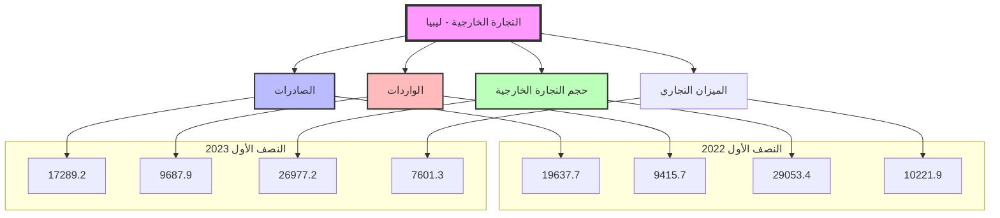
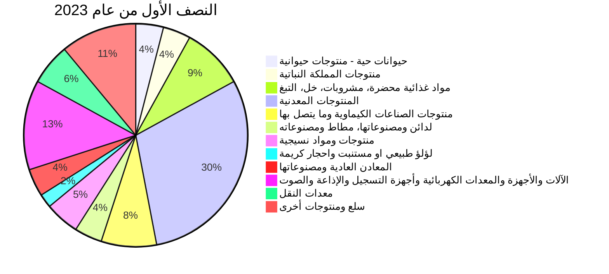

# مصرف ليبيا المركزي
## إدارة البحوث والإحصاء

# أحصاءات التجارة الخارجية
## (النصف الأول 2023)

[The image shows a large container ship in a port. The ship, which belongs to Maersk Line, is heavily loaded with colorful shipping containers. Several large blue cranes are visible in the background, used for loading and unloading containers. The sky is cloudy, giving the scene an industrial and busy atmosphere, representative of international trade and shipping operations.]
---
# التجارة الخارجية لليبيا خلال النصف الأول 2023

تعد التجارة الخارجية من أهم مقومات نجاح وازدهار الإقتصاد لكافة دول العالم، حيث تظهر أهميتها في دورها الذي يدعم إستفادة كل دولة من المميزات التي تقدمها الدول الأخرى، بسبب عدم قدرة الدول على توفير حاجات مجتمعاتها بالإعتماد على مواردها المحلية، كما يمكن الإستفادة من هذه الموارد في حال إستخدامها بطرق جيدة، بهدف تصديرها لدول العالم، وتُوضح أهمية التّجارة الخارجية بشكل دقيق بناء على النقاط الآتية:

- تعد التّجارة الخارجية من اهم الوسائط المُباشرة لتعزيز العلاقات الخارجية، وربط الدول معاً.

- تسهم في توفير الكثير من الخدمات والسلع بالإعتماد على مبدأ التخصص الذي يُوفر المنتوجات بأقل الأسعار.

- قد تدعم القدرة التسويقية، من خلال إنشاء العديد من الأسواق الجديدة للمنتوجات المتنوعة.

- تُسهم في رفع مُعدّل الرفاهية في المجتمع، من خلال توفير العديد من المنتوجات التي تؤدي إلى تنوع خيارات الأفراد سواء للإستهلاك أو الاستثمار.

- تعد من أهم المؤشرات المهمة لقياس القدرات الخاصة بالدول من مبدأ التنافس وتسويق الإنتاج في الأسواق العالمية.

- تشارك الدول في بناء أنظمة اقتصادية قوية.

- تُعزّز من التنمية المستدامة فيها، من خلال توفير المعلومات الرئيسية والوسائط التكنولوجية المناسبة.

- تدعم التنمية الاقتصادية، من خلال تطوُّر الدخل القومي الذي يسهم في تحسين التنمية الخاصة بكل دولة.
---
وفيما يلي تحليل لأهم مؤشرات التجارة الخارجية في الاقتصاد الليبي خلال النصف الأول 2023 :

أولاً: حجم التبادل التجاري:

بلغت التجارة السلعية الإجمالية الليبية خلال النصف الأول من عام 2023 ما قيمته 27.0 مليار دولار مقارنة مع 29.1 مليار دولار خلال نفس الفترة من عام 2022 مُسجلة نسبة إنخفاض قدرها 7.1%، وذلك نظراً لإنخفاض قيمة الصادرات السلعية الإجمالية إلى 17.3 مليار دولار خلال النصف الأول من عام 2023 مقارنة مع 19.6 مليار دولار خلال نفس الفترة من عام 2022 أي بنسبة إنخفاض بلغت نحو 12.0%.

أما أداء الواردات السلعية الإجمالية، فقد شهدت ارتفاعاً خلال النصف الأول من عام 2023 لتسجل ما قيمته 9.7 مليار دولار مقارنة مع نحو 9.4 مليار دولار خلال نفس الفترة من عام 2022.

## حجم التجارة الخارجية خلال النصف الأول من عامي 2022-2023

| البند | النصف الأول 2022 | النصف الأول 2023 | مقدار التغير | معدل التغير % |
|-------|------------------|------------------|---------------|---------------|
| الصادرات | 19,637.7 | 17,289.2 | -2,348.5 | -12.0 |
| الواردات | 9,415.7 | 9,687.9 | 272.3 | 2.9 |
| حجم التجارة الخارجية | 29,053.4 | 26,977.2 | -2,076.2 | -7.1 |
| الميزان التجاري | 10,221.9 | 7,601.3 | -2,620.6 | -25.6 |

*المصدر: الإحصاءات التجارية لتنمية الأعمال الدولية (Trade Map).

## التجارة الخارجية - ليبيا

---
# 1: الصادرات :

يعتمد الإقتصاد الليبي بشكل كبير على مورد طبيعي ناضب وهو النفط كمصدر أساسي للدخل
والذي بدوره يتأثر بظروف الأسواق العالمية للنفط حيث تشكل الصادرات النفطية أكثر من 96.0%
من إجمالي الصادرات، مما قد يعرض الإقتصاد الوطني إلى صدمات قوية نتيجة التغيرات الكبيرة
والمفاجئة في أسواق النفط الدولية.

## التوزيع الجغرافي للصادرات:

أظهرت البيانات المتعلقة بالتوزيع الجغرافي للصادرات الليبية الواردة بالجدول أدناه، الأهمية النسبية
العالية التي تحظى بها الصادرات الليبية لدول الإتحاد الأوروبي، إذ بلغت خلال النصف الأول
من عام 2023 نحو 69.8% من إجمالي الصادرات، ويعود سبب إرتفاع الأهمية النسبية
للصادرات الوطنية لدول الإتحاد الأوروبي (منطقة اليورو)، إلى خصائص إقتصادات هذه البلدان
على إعتبارها بلدان صناعية تعتمد بدرجة كبيرة على النفط الخام، وتأتي الصادرات الليبية للدول
الآسيوية في المرتبة الثانية حيث بلغت خلال الفترة نحو 16.7% من إجمالي الصادرات الليبية ،
فيما سجلت الصادرات إلى دول شمال ووسط وجنوب أمريكا إنخفاضاً ملحوظاً لتصل إلى 3.4%
من إجمالي الصادرات، في حين بلغت حصة باقي دول العالم نحو 10.1% من إجمالي
الصادرات .

## توزيع الصادرات الليبية حسب مجموعات البلدان
### خلال النصف الأول من عامي 2022 -2023
" مليون دولار "

| مجموعات البلدان | النصف الأول 2022 | النصف الأول 2023 | مقدار التغير | معدل التغير % |
|-----------------|-------------------|-------------------|---------------|----------------|
| مجموعة دول الإتحاد الأوروبي | 13,373.1 | 12,073.3 | -1,299.8 | -9.7 |
| أقطار جامعة الدول العربية | 669.3 | 701.0 | 31.7 | 4.7 |
| الدول الآسيوية | 3,393.9 | 2,882.5 | -511.4 | -15.1 |
| دول أوربية أخرى | 810.2 | 903.7 | 93.5 | 11.5 |
| البلدان الأفريقية | 16.3 | 0.0 | -16.3 | - |
| دول شمال ووسط وجنوب أمريكا | 1,254.8 | 584.6 | -670.2 | -53.4 |
| أستراليا ونيوزيلاندا | 120.0 | 144.1 | 24.1 | 20.1 |
| الإجمالي | 19,637.7 | 17,289.2 | -2,348.4 | -12.0 |

*المصدر: الإحصاءات التجارية لتنمية الأعمال الدولية (Trade Map).
---
# الأهمية النسبية لتوزيع الصادرات الليبية
## حسب مجموعات البلدان

### النصف الأول 2022

| المجموعة | النسبة |
|----------|--------|
| مجموعة دول الاتحاد الأوروبي | 68% |
| الدول الآسيوية | 17% |
| دول شمال ووسط وجنوب أمريكا | 6% |
| دول أوروبا أخرى | 4% |
| أقطار جامعة الدول العربية | 4% |
| البلدان الأفريقية | 0% |
| أستراليا ونيوزيلندا | 1% |

### النصف الأول 2023

| المجموعة | النسبة |
|----------|--------|
| مجموعة دول الاتحاد الأوروبي | 70% |
| الدول الآسيوية | 17% |
| دول أوروبا أخرى | 5% |
| أقطار جامعة الدول العربية | 4% |
| دول شمال ووسط وجنوب أمريكا | 3% |
| البلدان الأفريقية | 0% |
| أستراليا ونيوزيلندا | 1% |
---
# قيمة الصادرات حسب أهم البلدان المصدر إليها
## خلال النصف الأول من عامي 2022 - 2023

| البلدان المصدر إليها | النصف الأول 2022 | النصف الأول 2023 | مقدار التغير | معدل التغير % |
|----------------------|------------------|------------------|--------------|---------------|
| إيطاليا              | 5,228.5          | 3,794.1          | -1,434.4     | -27.4         |
| المانيا              | 2,043.2          | 2,424.9          | 381.7        | 18.7          |
| فرنسا                | 1,025.6          | 1,418.2          | 392.6        | 38.3          |
| أسبانيا              | 2,181.9          | 1,375.9          | -806.0       | -36.9         |
| الصين الشعبية        | 1,581.8          | 1,351.6          | -230.2       | -14.6         |
| اليونان              | 1,355.6          | 1,128.0          | -227.6       | -16.8         |
| هولندا               | 718.1            | 776.4            | 58.3         | 8.1           |
| تايلاند              | 1,050.8          | 706.2            | -344.6       | -32.8         |
| النمسا               | 439.9            | 621.3            | 181.4        | 41.2          |
| الولايات المتحدة الأمريكية | 1,254.8    | 584.5            | -670.3       | -53.4         |
| تركيا                | 391.7            | 355.8            | -35.9        | -9.2          |
| سنغافورة             | 128.9            | 150.5            | 21.6         | 16.8          |
| أستراليا             | 120.0            | 144.1            | 24.1         | 20.1          |
| المملكة المتحدة      | 722.8            | 731.2            | 8.4          | 1.2           |
| بلدان أخرى           | 1,394.0          | 1,726.5          | 332.5        | 23.9          |
| الإجمالي             | 19,637.6         | 17,289.2         | -2,348.4     | -12.0         |

*المصدر: الإحصاءات التجارية لتنمية الأعمال الدولية (Trade Map)

من خلال الإطلاع على الجدول أعلاه لقيمة الصادرات حسب أهم البلدان المصدر إليها يتضح أن إيطاليا كانت أهم مستورد من ليبيا حيث بلغ نسبة ما صدر إليها وحدها 21.9% خلال النصف الأول 2023 من إجمالي قيمة الصادرات الليبية، حيث بلغ ما صُدر اليها خلال النصف الأول من العام 2023 نحو 3.8 مليار دولار مقابل 5.2 مليار دولار خلال نفس الفترة من عام 2022، ثم تأتي دول ألمانيا وأسبانيا والصين الشعبية وفرنسا واليونان وهولندا من حيث الأهمية النسبية. حيث بلغ ما صدر إليهم على التوالي 2.4 مليار دولار، 1.4 مليار دولار، 1.4 مليار دولار، 1.4 مليار دولار، 1.1 مليار دولار، 776.4 مليون دولار.
---
# الأهمية النسبية للصادرات حسب أهم البلدان المصدر إليها
## خلال النصف الأول من عامي 2022-2023
"نسب مئوية"

| البلدان المصدر إليها | النصف الأول 2022 | النصف الأول 2023 |
|----------------------|-------------------|-------------------|
| إيطاليا              | 26.6%             | 21.9%             |
| المانيا              | 10.4%             | 14.0%             |
| أسبانيا              | 11.1%             | 8.0%              |
| الصين الشعبية        | 8.1%              | 7.8%              |
| اليونان              | 6.9%              | 6.5%              |
| هولندا               | 3.7%              | 4.5%              |
| فرنسا                | 5.2%              | 8.2%              |
| تايلاند              | 5.4%              | 4.1%              |
| النمسا               | 2.2%              | 3.6%              |
| الولايات المتحدة الأمريكية | 6.4%      | 3.4%              |
| تركيا                | 2.0%              | 2.1%              |
| سنغافورة             | 0.7%              | 0.9%              |
| استراليا             | 0.6%              | 0.8%              |
| المملكة المتحدة      | 3.7%              | 4.2%              |
| بلدان أخرى           | 7.1%              | 10.0%             |

*المصدر: الإحصاءات التجارية لتنمية الأعمال الدولية (Trade Map).*

## التركيب السلعي للصادرات:

أظهرت البيانات المتعلقة بالتركيب السلعي للصادرات الوطنية الواردة بالجدول أدناه مدى إستحواذ صادرات المنتوجات المعدنية على النصيب الأوفر من إجمالي الصادرات خلال النصف الأول من عام 2023، مشكّلة بذلك ما نسبته نحو 96.0% من إجمالي الصادرات، الأمر الذي يبين عدم تنوع الصادرات الوطنية، نتيجة ضعف هيكل الإنتاج المحلي وهو ما يجعل الإقتصاد الوطني عرضة لتقلبات أسعار النفط في الأسواق الدولية.
---
# قيمة الصادرات مصنفة حسب أقسام السلع
## خلال النصف الأول من عامي 2022 -2023
"مليون دولار"

| معدل التغير % | مقدار التغير | النصف الأول 2023 | النصف الأول 2022 | أقسام السلع |
|-------------:|-------------:|----------------:|----------------:|------------:|
| -62.7 | -7.4 | 4.4 | 11.8 | حيوانات حية - منتوجات حيوانية |
| 45.0 | 1.8 | 5.8 | 4.0 | منتوجات المملكة النباتية |
| -66.7 | -0.4 | 0.2 | 0.6 | شحوم ودهون وزيوت حيوانية ونباتية والمنتوجات المشتقة منها |
| -71.4 | -1.0 | 0.4 | 1.4 | مواد غذائية محضرة، مشروبات، خل، التبغ |
| -11.8 | -2,227.7 | 16,606.4 | 18,834.1 | المنتوجات المعدنية |
| -27.3 | -48.1 | 127.8 | 175.9 | منتوجات الصناعات الكيماوية وما يتصل بها |
| 12.5 | 0.1 | 0.9 | 0.8 | لدائن ومصنوعاتها، مطاط ومصنوعاته |
| -5.9 | -0.1 | 1.6 | 1.7 | جلود حيوانات خام وجلود مدبوغة |
| 0.0 | -0.1 | 0 | 0.1 | الخشب ومصنوعاته، الفحم الخشبي، الفلين ومصنوعاته، مصنوعات القش |
| -8.3 | -0.3 | 3.3 | 3.6 | عجائن الخشب، عجائن سلولوزية، ورق وورق مقوى وفضلات الورق |
| -50.0 | -0.4 | 0.4 | 0.8 | منتوجات ومواد نسيجية |
| 0.0 | 0.0 | 0.0 | 0.0 | الأحذية، أغطية الرأس، المظلات، مظلات الشمس، عصي المشي، سياط الفروسية |
| 0.0 | 0.0 | 0.0 | 0.0 | مصنوعات من الحجر والجص والاسمنت والميكا ومنتوجات الخزف والزجاج |
| -53.4 | -40.5 | 35.3 | 75.8 | لؤلؤ طبيعي أو مستنبت وأحجار كريمة أو شبه كريمة ومعادن ثمينة ومصنوعاتها |
| -1.1 | -5.2 | 457.4 | 462.6 | المعادن العادية ومصنوعاتها |
| 19.6 | 1.0 | 6.1 | 5.1 | الآلات والأجهزة والمعدات الكهربائية وأجهزة التسجيل والإذاعة والصوت |
| -33.8 | -18.5 | 36.2 | 54.7 | معدات النقل |
| -83.3 | -0.5 | 0.1 | 0.6 | الأجهزة البصرية والفوتوغرافية والسينمائية وأجهزة قياس الضغط والمعدات الطبية |
| 0.0 | 0.0 | 0.0 | 0.0 | الأسلحة والذخائر، أجزاؤها ولوازمها |
| -29.3 | -1.2 | 2.9 | 4.1 | سلع ومنتوجات متنوعة |
| -12.0 | -2,348.5 | 17,289.2 | 19,637.7 | الإجمالي |

*المصدر: الإحصاءات التجارية لتنمية الأعمال الدولية (Trade Map).
---
# الأهمية النسبية للصادرات الليبية حسب أقسام السلع

## النصف الأول من عام 2022

| القسم | النسبة |
|-------|--------|
| مواد غذائية محضرة؛ مشروبات؛ خل؛ التبغ | 2% |
| المنتوجات المعدنية | 96% |
| منتوجات الصناعات الكيماوية وما يتصل بها | 1% |
| لؤلؤ طبيعي أو مستنبت وأحجار كريمة وشبه كريمة ومعادن ثمينة ومصنوعاتها | 1% |
| المعادن العادية ومصنوعاتها | 0% |
| أخرى | 0% |

## النصف الأول من عام 2023

| القسم | النسبة |
|-------|--------|
| مواد غذائية محضرة؛ مشروبات؛ خل؛ التبغ | 3% |
| المنتوجات المعدنية | 96% |
| منتوجات الصناعات الكيماوية وما يتصل بها | 1% |
| لؤلؤ طبيعي أو مستنبت وأحجار كريمة وشبه كريمة ومعادن ثمينة ومصنوعاتها | 0% |
| المعادن العادية ومصنوعاتها | 0% |
| أخرى | 0% |
---
ثانياً: الواردات

يعتمد السوق المحلي على الأسواق الخارجية في تلبية إحتياجات كافة القطاعات والأفراد من السلع الاستهلاكية والرأسمالية كالآلات والمعدات والمواد الخام والسلع الوسيطة اللازمة للعملية الإنتاجية.

التوزيع الجغرافي للواردات:

تعد بلدان الاتحاد الأوربي المصدر الرئيسي لواردات ليبيا حيث بلغت أهميتها النسبية خلال النصف الأول 2023 حوالي 37.0% من إجمالي الواردات، ويعود ذلك إلى الجوار الجغرافي الذي يلعب دوراً رئيسياً في زيادة حجم المبادلات التجارية بين ليبيا ودول منطقة اليورو، فيما شكلت الدول الآسيوية ما نسبته 35.9% من إجمالي الواردات في حين شكلت الدول العربية ودول شمال ووسط وجنوب أمريكا والدول الأوروبية الأخرى النسبة الباقية، وتشير البيانات إلى ضعف المبادلات التجارية بين ليبيا والدول الإفريقية وأستراليا ونيوزيلندا.

توزيع الواردات الليبية حسب مجموعات البلدان
خلال النصف الأول من عامي 2022-2023
" مليون دولار "

| مجموعات البلدان | النصف الأول 2022 | النصف الأول 2023 | مقدار التغير | معدل التغير % |
|-----------------|-------------------|-------------------|---------------|----------------|
| مجموعة دول الاتحاد الأوروبي | 3,850.4 | 3,584.8 | -265.6 | -6.9 |
| أقطار جامعة الدول العربية | 1,544.7 | 1,884.6 | 339.9 | 22.0 |
| الدول الآسيوية | 3,243.8 | 3,482.1 | 238.3 | 7.3 |
| دول أوربية أخرى | 279.9 | 221.5 | -58.4 | -20.9 |
| البلدان الأفريقية | 7.6 | 5.1 | -2.5 | -32.9 |
| دول شمال ووسط وجنوب أمريكا | 431.3 | 488.4 | 57.1 | 13.2 |
| أستراليا ونيوزيلاندا | 57.9 | 21.4 | -36.5 | -63.0 |
| الإجمالي | 9,415.6 | 9,687.9 | 272.3 | 2.9 |

*المصدر: الإحصاءات التجارية لتنمية الاعمال الدولية (Trade Map).
---
# الأهمية النسبية لتوزيع الواردات الليبية
## حسب مجموعات البلدان

### النصف الأول 2022

| المجموعة | النسبة |
|----------|--------|
| مجموعة دول الاتحاد الأوروبي | 41% |
| الدول الآسيوية | 34% |
| أقطار جامعة الدول العربية | 16% |
| دول شمال ووسط وجنوب أمريكا | 5% |
| دول أوروبا أخرى | 3% |
| البلدان الأفريقية | 1% |
| أستراليا ونيوزيلندا | 0% |

### النصف الأول 2023

| المجموعة | النسبة |
|----------|--------|
| مجموعة دول الاتحاد الأوروبي | 37% |
| الدول الآسيوية | 36% |
| أقطار جامعة الدول العربية | 20% |
| دول شمال ووسط وجنوب أمريكا | 5% |
| دول أوروبا أخرى | 2% |
| البلدان الأفريقية | 0% |
| أستراليا ونيوزيلندا | 0% |
---
# قيمة الواردات حسب أهم البلدان المستورد منها
## خلال النصف الأول من عامي 2022-2023

"مليون دولار"

| البلدان المستورد منها | النصف الأول 2022 | النصف الأول 2023 | مقدار التغير | معدل التغير % |
|------------------------|-------------------|-------------------|---------------|----------------|
| تركيا                  | 1,496.2           | 1,406.9           | -89.3         | -6.0           |
| الصين                  | 1,108.1           | 1,265.1           | 157.0         | 8.7            |
| اليونان                | 870.7             | 946.1             | 75.4          | 14.2           |
| إيطاليا                | 1,012.6           | 914.8             | -97.8         | -9.7           |
| المانيا                | 252.0             | 293.0             | 41            | 16.3           |
| كوريا الجنوبية         | 216.9             | 286.4             | 69.5          | 32.0           |
| بلجيكا                 | 751.4             | 246.3             | -505.1        | -67.2          |
| هولندا                 | 185.3             | 201.7             | 16.4          | 8.9            |
| أسبانيا                | 300.0             | 204.7             | -95.3         | -31.8          |
| الولايات المتحدة الأمريكية | 157.2        | 202.0             | 44.8          | 28.5           |
| قبرص                   | 61.8              | 178.7             | 116.9         | 189.2          |
| تايلند                 | 145.5             | 104.1             | -41.4         | -28.5          |
| الأرجنتين              | 63.3              | 81.9              | 18.6          | 29.4           |
| فرنسا                  | 81.7              | 98.2              | 16.5          | 20.2           |
| المملكة المتحدة        | 69.6              | 91.2              | 21.6          | 31.0           |
| مالطا                  | 16.8              | 11.5              | -5.3          | -31.5          |
| بلدان أخرى             | 2,626.6           | 3,155.3           | 528.7         | 20.1           |
| الإجمالي               | 9,415.7           | 9,687.9           | 272.2         | 2.9            |

*المصدر: الإحصاءات التجارية لتنمية الاعمال الدولية (Trade Map).

من خلال الاطلاع على الجدول أعلاه لقيمة الواردات حسب أهم البلدان المستورد منها يتضح أن
دول تركيا والصين واليونان وإيطاليا تتصدر قائمة أهم البلدان المستورد منها خلال النصف الأول
2023، حيث بلغت نسبة ما أستورد منها حوالي 46.8% من إجمالي قيمة الواردات الليبية.
---
# الأهمية النسبية للواردات حسب أهم البلدان المستورد منها
## خلال النصف الأول من عامي 2022-2023
"نسب مئوية"

| البلدان المستورد منها | النصف الأول 2022 | النصف الأول 2023 |
|------------------------|-------------------|-------------------|
| تركيا                  | 15.9%             | 14.5%             |
| اليونان                | 9.2%              | 9.8%              |
| الصين الشعبية          | 11.8%             | 13.1%             |
| إيطاليا                | 10.8%             | 9.4%              |
| بلجيكا                 | 8.0%              | 2.5%              |
| المانيا                | 2.7%              | 3.0%              |
| كوريا الجنوبية         | 2.3%              | 3.0%              |
| هولندا                 | 2.0%              | 2.1%              |
| أسبانيا                | 3.2%              | 2.1%              |
| الولايات المتحدة الأمريكية | 1.7%          | 2.1%              |
| قبرص                   | 0.7%              | 1.8%              |
| تايلند                 | 1.5%              | 1.1%              |
| الأرجنتين              | 0.7%              | 0.8%              |
| فرنسا                  | 0.9%              | 1.0%              |
| المملكة المتحدة        | 0.7%              | 0.9%              |
| مالطا                  | 0.2%              | 0.1%              |
| بلدان أخرى             | 27.9%             | 32.6%             |

*المصدر: الإحصاءات التجارية لتنمية الأعمال الدولية (Trade Map).

## التركيب السلعي للواردات:

أحتلت واردات المنتجات المعدنية وكذلك واردات الآلات ومنتوجات الصناعات الكيماوية ومعدات النقل والمواد النسيجية والمواد الغذائية المرتبة الأولى من إجمالي الواردات خلال النصف الأول من عام 2023، حيث شكلت نسبة 70.5% من اجمالي الواردات، وهذا يدل على مدى ضعف الإنتاج المحلي وعجز السوق المحلي في توفير العديد من السلع والخدمات التي يحتاجها الأفراد مما يؤدي ذلك إلى زيادة الطلب على النقد الأجنبي، فيما شكلت واردات باقي أقسام السلع الأخرى النسبة الباقية والبالغة حوالي 29.5% من إجمالي الواردات السلعية.
---
# قيمة الواردات مصنفة حسب أقسام السلع
## خلال النصف الأول من عامي 2022-2023
"مليون دولار"

| معدل التغير % | مقدار التغير | النصف الأول 2023 | النصف الأول 2022 | أقسام السلع |
|---------------|--------------|------------------|------------------|-------------|
| -17.5 | -81.1 | 382.6 | 463.7 | حيوانات حية - منتوجات حيوانية |
| 27.0 | 82.3 | 387.4 | 305.1 | منتوجات المملكة النباتية |
| 15.8 | 13.7 | 100.3 | 86.6 | شحوم ودهون وزيوت حيوانية ونباتية والمنتوجات المشتقة منها |
| -21.0 | -214.1 | 803.8 | 1017.9 | مواد غذائية محضرة، مشروبات، خل، التبغ |
| 17.1 | 415.6 | 2,844.0 | 2,428.4 | المنتوجات المعدنية |
| -22.9 | -221.3 | 745.3 | 966.6 | منتوجات الصناعات الكيماوية وما يتصل بها |
| -7.5 | -27.8 | 341.4 | 369.2 | لدائن ومصنوعاتها، مطاط ومصنوعاته |
| -1.8 | -0.4 | 22.4 | 22.8 | جلود حيوانات خام وجلود مدبوغة |
| 0.7 | 0.5 | 76.9 | 76.4 | الخشب ومصنوعاته، الفحم الخشبي، الفلين ومصنوعاته، مصنوعات القش |
| -5.5 | -5.7 | 97.5 | 103.2 | عجائن الخشب، عجائن سلولوزية، ورق مقوى وفضلات الورق |
| -7.1 | -33.5 | 440.6 | 474.1 | منتوجات ومواد نسيجية |
| -9.1 | -6.4 | 63.8 | 70.2 | الأحذية، أغطية الرأس، المظلات، مظلات الشمس، عصي المشي، سياط الفروسية |
| -13.5 | -26.1 | 167.2 | 193.3 | مصنوعات من الحجر والجص والاسمنت والميكا ومنتوجات الخزف والزجاج |
| 6.9 | 12.9 | 199.9 | 187.0 | لؤلؤ طبيعي أو مستنبت وأحجار كريمة أو شبه كريمة ومعادن ثمينة ومصنوعاتها |
| 10.3 | 36.7 | 393.4 | 356.7 | المعادن العادية ومصنوعاتها |
| -5.5 | -72.7 | 1247.6 | 1320.3 | الآلات والأجهزة والمعدات الكهربائية وأجهزة التسجيل والإذاعة والصوت |
| -26.9 | -203.0 | 553.0 | 756.0 | معدات النقل |
| 26.0 | 26.4 | 128.0 | 101.6 | الأجهزة البصرية والفوتوغرافية والسينمائية وأجهزة قياس الضغط والمعدات الطبية |
| 0.0 | -0.1 | 1.3 | 1.4 | الأسلحة والذخائر، أجزاؤها ولوازمها |
| 8.2 | 31.8 | 419.3 | 387.5 | سلع ومنتوجات متنوعة |
| -2.8 | -272.3 | 9,415.7 | 9,688.0 | الإجمالي |

*المصدر: الإحصاءات التجارية لتنمية الأعمال الدولية (Trade Map).
---
الأهمية النسبية لتوزيع الواردات الليبية
حسب أقسام السلع

النصف الأول من عام 2022

| القسم | النسبة |
|-------|--------|
| المنتوجات المعدنية | 25% |
| لؤلؤ طبيعي او مستنبت واحجار كريمة | 13% |
| سلع ومنتوجات أخرى | 11% |
| مواد غذائية محضرة، مشروبات، خل، التبغ | 10% |
| منتوجات الصناعات الكيماوية وما يتصل بها | 10% |
| منتوجات ومواد نسيجية | 8% |
| حيوانات حية - منتوجات حيوانية | 5% |
| الآلات والأجهزة والمعدات الكهربائية وأجهزة التسجيل والإذاعة والصوت | 5% |
| لدائن ومصنوعاتها، مطاط ومصنوعاته | 4% |
| المعادن العادية ومصنوعاتها | 4% |
| منتوجات المملكة النباتية | 3% |
| معدات النقل | 2% |
---
# النصف الأول من عام 2023

| القطاع | النسبة |
|--------|--------|
| حيوانات حية - منتوجات حيوانية | 4% |
| منتوجات المملكة النباتية | 4% |
| مواد غذائية محضرة، مشروبات، خل، التبغ | 9% |
| المنتوجات المعدنية | 30% |
| منتوجات الصناعات الكيماوية وما يتصل بها | 8% |
| لدائن ومصنوعاتها، مطاط ومصنوعاته | 4% |
| منتوجات ومواد نسيجية | 5% |
| لؤلؤ طبيعي او مستنبت واحجار كريمة | 2% |
| المعادن العادية ومصنوعاتها | 4% |
| الآلات والأجهزة والمعدات الكهربائية وأجهزة التسجيل والإذاعة والصوت | 13% |
| معدات النقل | 6% |
| سلع ومنتوجات أخرى | 11% |

---
الملاحق

جداول التجارة الخارجية

| التجارة الخارجية خلال النصف الأول (2022 - 2023). | -1 |
|--------------------------------------------------|-----|
| قيمة الصادرات حسب أقسام وفصول السلع خلال النصف الأول (2022 - 2023 ). | -2 |
| قيمة الواردات حسب أقسام وفصول السلع خلال النصف الأول (2022 - 2023 ). | -3 |
| التوزيع النسبي للتجارة البينية مع التجمعات الدولية التي تتضمن ليبيا خلال النصف الأول (2022 - 2023 ). | -4 |
| التوزيع النسبي للتجارة البينية مع التجمعات الدولية التي لا تتضمن ليبيا خلال النصف الأول (2022 - 2023 ). | -5 |
---
Distribution of Libyan Exports according to country groups the first half of 2022-2023

التوزيع الجغرافي للصادرات الليبية للنصف الأول من عامي 2023-2022

in thousand of USA dollars                                                                                                   القيمة الف دولار

| Country groups | Change (%) rate | Amount Change | The first half of 2023 | The first half of 2022 | المنطقة |
|----------------|-----------------|---------------|------------------------|------------------------|--------|
| European Union Group | -100.0 | -13,373,111 | 0 | 13,373,111 | مجموعة دول الاتحاد الأوربي |
| Countries of the Arab League | 4.7 | 31,738 | 700,998 | 669,261 | أقطار جامعة الدول العربية |
| Asian countries | -15.1 | -511,420 | 2,882,478 | 3,393,898 | دول اسيوية |
| Other European countries | 11.5 | 93,458 | 903,694 | 810,236 | دول اوربية أخرى |
| African countries | -99.9 | -16,300 | 9.0 | 16,309 | بلدان إفريقيا |
| North, Central and South America | -53.4 | -670,240 | 584,601 | 1,254,841 | دول شمال ووسط أمريكا |
| Australia and New Zealand | 20.1 | 24,122 | 144,145 | 120,023 | أستراليا ونيوزيلندا |
| TOTAL | -73.4 | -14,421,753 | 5,215,925 | 19,637,679 | المجموع |

*Source: Trade Statistics for International Business Development (Map Trade)
---
# Distribution of Libyan Imports according to country groups the first half of 2022-2023

التوزيع الجغرافي للواردات الليبية للنصف الأول من عامي 2022-2023

in thousand of USA dollars القيمة الف دولار

| Country groups | Change (%) rate | Amount Change | The first half of 2023 | The first half of 2022 | المنطقة |
|----------------|-----------------|---------------|------------------------|------------------------|--------|
| European Union Group | -6.9 | -265,600 | 3,584,833 | 3,850,433 | مجموعة دول الاتحاد الأوربي |
| Countries of the Arab League | 22.0 | 339,899 | 1,884,613 | 1,544,714 | أقطار جامعة الدول العربية |
| Asian countries | 7.3 | 238,268 | 3,482,112 | 3,243,844 | دول اسيوية |
| Other European countries | -20.9 | -58,385 | 221,513 | 279,898 | دول اوربية أخرى |
| African countries | -33.3 | -2,535 | 5,073 | 7,608 | بلدان إفريقيا |
| North, Central and South America | 13.2 | 57,094 | 488,404 | 431,310 | دول شمال ووسط أمريكا |
| Australia and New Zealand | -63.0 | -36,450 | 21,411 | 57,861 | أستراليا ونيوزيلندا |
| TOTAL | 2.9 | 272,291 | 9,687,959 | 9,415,668 | المجموع |

*Source: Trade Statistics for International Business Development (Map Trade)
---
# European Union Group (Exports)
دول الاتحاد الأوربي ( الصادرات )

in thousand of USA dollars القيمة الف دولار

| Country | Change rate (%) | Amount Change | The first half of 2023 | The first half of 2022 | الدولة |
|---------|-----------------|---------------|------------------------|------------------------|--------|
| Italy | -27.4 | -1,434,470 | 3,794,065 | 5,228,535 | ايطاليا |
| Germany | 18.7 | 381,636 | 2,424,870 | 2,043,234 | المانيا |
| Spain | -36.9 | -806,039 | 1,375,869 | 2,181,908 | اسبانيا |
| France | 38.3 | 392,570 | 1,418,188 | 1,025,618 | فرنسا |
| Austria | 41.2 | 181,420 | 621,292 | 439,872 | النمسا |
| Netherlands | 8.1 | 58,253 | 776,367 | 718,114 | هولندا |
| Greece | -16.8 | -227,585 | 1,128,011 | 1,355,596 | اليونان |
| Denmark | -100.0 | -125,410 | 11 | 125,421 | الدنمارك |
| Bulgaria | -76.9 | -5,825 | 1,750 | 7,575 | بلغاريا |
| Sweden | -21.4 | -28,641 | 105,430 | 134,071 | السويد |
| Malta | 730.8 | 190 | 216 | 26 | مالطا |
| Romania | 1,845,858.8 | 313,796 | 313,813 | 17 | رومانيا |
| Belgium | -52.2 | -51,497 | 47,128 | 98,625 | بلجيكا |
| Slovakia | 0.0 | 56,245 | 56,245 | 0 | سلوفاكيا |
| Poland | 0.0 | 0 | 0 | 0 | بولندا |
| Croatia | -100.0 | -2,617 | 0 | 2,617 | كرواتيا |
| Hungary | 54.5 | 12 | 34 | 22 | المجر |
| Ireland | 0.0 | 0 | 4 | 4 | ايرلندا |
| Czech Republic | 0.0 | 13 | 13 | 0 | التشيك |
| Cyprus | 246.2 | 5,537 | 7,786 | 2,249 | قبرص |
| Lithuania | -100.0 | -11 | 0 | 11 | لتوانيا |
| Portugal | -75.8 | -6,918 | 2,209 | 9,127 | برتغال |
| Finland | 0.0 | 0 | 0 | 0 | فنلندا |
| Latvia | 0.0 | 0 | 0 | 0 | لاتفيا |
| Luxembourg | 0.0 | 0 | 0 | 0 | لوكسمبورج |
| Estonia | 0.0 | 0 | 0 | 0 | استونيا |
| Slovenia | -100.0 | -469 | 0 | 469 | سلوفينيا |
| total | -9.7 | -1,299,810 | 12,073,301 | 13,373,111 | المجموع |
---
# European Union Group (Imports)
دول الاتحاد الأوربي ( الواردات )

in thousand of USA dollars القيمة الف دولار

| Country | Change (%) rate | Amount Change | The first half of 2023 | The first half of 2022 | الدولة |
|---------|-----------------|----------------|------------------------|------------------------|--------|
| Italy | -9.7 | -97,849 | 914,767 | 1,012,616 | إيطاليا |
| Greece | 8.7 | 75,420 | 946,111 | 870,691 | اليونان |
| Netherlands | 8.9 | 16,463 | 201,727 | 185,264 | هولندا |
| Germany | 16.3 | 40,988 | 292,961 | 251,973 | المانيا |
| Spain | -31.7 | -95,232 | 204,736 | 299,968 | اسبانيا |
| Belgium | -67.2 | -505,111 | 246,286 | 751,397 | بلجيكا |
| France | 20.2 | 16,465 | 98,169 | 81,704 | فرنسا |
| Cyprus | 189.0 | 116,858 | 178,680 | 61,822 | قبرص |
| Bulgaria | -55.5 | -66,875 | 53,675 | 120,550 | بلغاريا |
| Romania | 683.1 | 153,131 | 175,548 | 22,417 | رومانيا |
| Malta | -31.3 | -5,250 | 11,540 | 16,790 | مالطا |
| Ireland | -6.1 | -1,393 | 21,302 | 22,695 | ايرلندا |
| Austria | 61.1 | 14,361 | 37,859 | 23,498 | النمسا |
| Poland | 13.5 | 4,953 | 41,678 | 36,725 | بولندا |
| Sweden | 138.2 | 17,673 | 30,465 | 12,792 | السويد |
| Portugal | 57.5 | 11,142 | 30,525 | 19,383 | برتغال |
| Denmark | -5.8 | -790 | 12,838 | 13,628 | دنمارك |
| Lithuania | -23.8 | -2,203 | 7,038 | 9,241 | لتوانيا |
| Czech Republic | 13.0 | 497 | 4,310 | 3,813 | تشيك |
| Slovenia | -27.2 | -3,916 | 10,464 | 14,380 | سلوفينيا |
| Hungary | 174.1 | 9,344 | 14,711 | 5,367 | المجر |
| Latvia | 179.8 | 2,025 | 3,151 | 1,126 | لاتفيا |
| Croatia | -19.5 | -1,811 | 7,454 | 9,265 | كرواتيا |
| Slovakia | 1,985.4 | 34,268 | 35,994 | 1,726 | سلوفاكيا |
| Estonia | 98.1 | 513 | 1,036 | 523 | استونيا |
| Finland | 212.5 | 884 | 1,300 | 416 | فنلندا |
| Luxembourg | -23.4 | -155 | 508 | 663 | لوكسمبورج |
| total | -6.9 | -265,600 | 3,584,833 | 3,850,433 | المجموع |
---
# Countries of the Arab League (Exports)
أقطار جامعة الدول العربية ( الصادرات )

in thousand of USA dollars القيمة ألف دولار

| Country | Change (%) rate | Amount Change | The first half of 2023 | The first half of 2022 | الدولة |
|---------|-----------------|---------------|------------------------|------------------------|--------|
| Algeria | 0.0 | 0 | 0 | 0 | الجزائر |
| Bahrain | 0.0 | 43 | 43 | 0 | البحرين |
| Comoros | 0.0 | 0 | 0 | 0 | جزر القمر |
| Egypt | 0.0 | 9,998 | 49,987 | 39,990 | مصر |
| Jordan | 0.0 | 1,557 | 7,786 | 6,229 | الأردن |
| Kuwait | 0.0 | 0 | 0 | 0 | الكويت |
| Lebanon | 0.0 | 14,873 | 74,365 | 59,492 | لبنان |
| Mauritania | 0.0 | -191 | 0 | 191 | موريتانيا |
| Morocco | -21.3 | -11,864 | 43,889 | 55,753 | المغرب |
| Oman | 0.0 | 0 | 0 | 0 | عمان |
| Qatar | 0.0 | 0 | 0 | 0 | قطر |
| Saudi Arabia | 0.0 | 0 | 0 | 0 | السعودية |
| Sudan | 0.0 | 0 | 0 | 0 | السودان |
| Tunisia | 0.0 | 16,832 | 46,850 | 30,018 | تونس |
| United Arab Emirates | 0.0 | 490 | 478,078 | 477,588 | الإمارات العربية المتحدة |
| total | 4.7 | 31,738 | 700,998 | 669,261 | المجموع |
---
# Countries of the Arab League (Imports)
أقطار جامعة الدول العربية ( الواردات )

in thousand of USA dollars القيمة ألف دولار

| Country | Change (%) rate | Amount Change | The first half of 2023 | The first half of 2022 | الدولة |
|---------|-----------------|---------------|------------------------|------------------------|--------|
| Algeria | 0.0 | -4,529 | 5,738 | 10,267 | الجزائر |
| Bahrain | 4.1 | 1,416 | 35,783 | 34,367 | البحرين |
| Jordan | 156.1 | 11,546 | 18,943 | 7,397 | الأردن |
| Egypt | 292.2 | 263,304 | 353,418 | 90,114 | مصر |
| Kuwait | 0.0 | -14,055 | 0 | 14,055 | الكويت |
| Lebanon | -36.7 | -737 | 1,272 | 2,009 | لبنان |
| Mauritania | 0.0 | -56 | 0 | 56 | موريتانيا |
| Morocco | 14.9 | 5,430 | 41,900 | 36,470 | المغرب |
| Oman | -82.4 | -77,363 | 16,518 | 93,881 | عمان |
| Qatar | -20.9 | -209 | 790 | 999 | قطر |
| Saudi Arabia | 3.0 | 409 | 14,213 | 13,804 | السعودية |
| Sudan | 0.0 | 0 | 0 | 0 | السودان |
| Tunisia | -15.1 | -58,571 | 329,466 | 388,037 | تونس |
| United Arab Emirates | 25.0 | 213,314 | 1,066,572 | 853,258 | الإمارات العربية المتحدة |
| total | 22.0 | 339,899 | 1,884,613 | 1,544,714 | المجموع |
---
# Asian countries (Exports)
الدول الآسيوية ( الصادرات )

in thousand of USA dollars القيمة الف دولار

| Country | Change (%) rate | Amount Change | The first half of 2023 | The first half of 2022 | الدولة |
|---------|-----------------|----------------|------------------------|------------------------|--------|
| Turkey | -9.2 | -35,899 | 355,810 | 391,709 | تركيا |
| China | -14.6 | -230,187 | 1,351,625 | 1,581,812 | الصين |
| Thailand | -32.8 | -344,561 | 706,239 | 1,050,800 | تايلند |
| Singapore | 16.8 | 21,682 | 150,533 | 128,851 | سنغافورة |
| Japan | 0.0 | 0 | 0 | 0 | اليابان |
| Korea, Republic of | -81.2 | -50,407 | 11,701 | 62,108 | كوريا |
| India | 41.1 | 72,487 | 248,790 | 176,303 | الهند |
| Pakistan | -100.0 | -1,214 | 0 | 1,214 | باكستان |
| Indonesia | 9,572.3 | 56,668 | 57,260 | 592 | اندونيسيا |
| Malaysia | -59.6 | -260 | 176 | 436 | ماليزيا |
| Taipei, Chinese | -13.7 | -10 | 63 | 73 | تايبيه ، الصينية |
| Hong Kong, China | 0.0 | 281 | 281 | 0 | هونغ كونغ |
| Azerbaijan | 0.0 | 0 | 0 | 0 | اذربيجان |
| Brunei Darussalam | 0.0 | 0 | 0 | 0 | بروناي |
| Philippines | 0.0 | 0 | 0 | 0 | فلبين |
| Viet Nam | 0.0 | 0 | 0 | 0 | فيتنام |
| Sri Lanka | 0.0 | 0 | 0 | 0 | سريلانكا |
| total | -15.1 | -511,420 | 2,882,478 | 3,393,898 | المجموع |
---
# Asian countries (Imports)
الدول الاسيوية ( الواردات )

in thousand of USA dollars القيمة الف دولار

| Country | Change rate (%) | Amount Change | The first half of 2023 | The first half of 2022 | الدولة |
|---------|-----------------|---------------|------------------------|------------------------|--------|
| China | 14.2 | 157,004 | 1,265,146 | 1,108,142 | الصين |
| Turkey | -6.0 | -89,274 | 1,406,895 | 1,496,169 | تركيا |
| Korea, Republic of | 32.0 | 69,466 | 286,412 | 216,946 | كوريا |
| Thailand | -28.5 | -41,456 | 104,061 | 145,517 | تايلند |
| India | 80.6 | 119,385 | 267,526 | 148,141 | الهند |
| Singapore | 9.7 | 818 | 9,222 | 8,404 | سنغافورة |
| Indonesia | 264.6 | 57,582 | 79,340 | 21,758 | اندونيسية |
| Japan | 1.1 | 252 | 23,952 | 23,700 | اليابان |
| Hong Kong, China | 67.9 | 4,110 | 10,162 | 6,052 | هونغ كونغ |
| Taipei, Chinese | 91.8 | 6,404 | 13,381 | 6,977 | تايبيه ، الصينية |
| Malaysia | 0.0 | 1 | 5,251 | 5,250 | ماليزيا |
| Pakistan | -100.0 | -6,149 | 0 | 6,149 | باكستان |
| Azerbaijan | -100.0 | -27,350 | 0 | 27,350 | اذربيجان |
| Cambodia | 93.1 | 81 | 168 | 87 | كمبوديا |
| Uzbekistan | 0.0 | 0 | 0 | 0 | أوزبكستان |
| Philippines | 0.0 | -142 | 0 | 142 | الفلبين |
| Kazakhstan | 0.0 | 0 | 0 | 0 | كازاخستان |
| Brunei Darussalam | 0.0 | 0 | 0 | 0 | بروناي |
| Myanmar | 0.0 | 0 | 0 | 0 | ميانمار |
| Lao People's Democratic Republic | 0.0 | 0 | 0 | 0 | جمهورية لاو الديمقراطية الشعبية |
| Viet Nam | 0.0 | 0 | 0 | 0 | فيتنام |
| Iran, Islamic Republic of | -100.0 | -2,133 | 0 | 2,133 | ايران |
| Sri Lanka | -49.4 | -10,331 | 10,596 | 20,927 | سريلانكا |
| total | 7.3 | 238,268 | 3,482,112 | 3,243,844 | المجموع |
---
# Other European countries (Exports)
دول اوربية أخرى ( الصادرات )

in thousand of USA dollars

| Country | Change (%) rate | Amount Change | The first half of 2023 | The first half of 2022 | الدولة |
|---------|-----------------|---------------|------------------------|------------------------|--------|
| Switzerland | 28.6 | 16,449 | 73,958 | 57,509 | سويسرا |
| United Kingdom | 1.2 | 8,378 | 731,199 | 722,821 | المملكة المتحدة |
| Ukraine | -99.8 | -24,835 | 58 | 24,893 | أكرانيا |
| Macedonia, North | 0.0 | 0 | 0 | 0 | مقدونيا الشمالية |
| Bosnia and Herzegovina | 0.0 | 0 | 0 | 0 | البوسنة والهرسك |
| Serbia | 1,864.5 | 93,466 | 98,479 | 5,013 | صربيا |
| Moldova, Republic of | 0.0 | 0 | 0 | 0 | جمهورية مولدوفا |
| Norway | 0.0 | 0 | 0 | 0 | النرويج |
| Montenegro | 0.0 | 0 | 0 | 0 | الجبل الأسود |
| Iceland | 0.0 | 0 | 0 | 0 | أيسلندا |
| Russian Federation | 0.0 | 0 | 0 | 0 | الاتحاد الروسي |
| Belarus | 0.0 | 0 | 0 | 0 | بيلاروسيا |
| Albania | 0.0 | 0 | 0 | 0 | البانيا |
| Total | 11.5 | 93,458 | 903,694 | 810,236 | المجموع |
---
# Other European countries (imports)
دول اوربية أخرى ( الواردات )

in thousand of USA dollars القيمة الف دولار

| Country | Change rate (%) | Amount Change | The first half of 2023 | The first half of 2022 | الدولة |
|---------|-----------------|---------------|------------------------|------------------------|--------|
| Ukraine | -74.1 | -118,805 | 41,565 | 160,370 | أوكرانيا |
| United Kingdom | 31.1 | 21,649 | 91,225 | 69,576 | المملكة المتحدة |
| Switzerland | 109.3 | 39,622 | 75,860 | 36,238 | سويسرا |
| Russian Federation | 0.0 | 0 | 0 | 0 | الاتحاد الروسي |
| Serbia | -9.8 | -1,192 | 10,958 | 12,150 | صربيا |
| Georgia | 11.2 | 157 | 1,561 | 1,404 | جورجيا |
| Macedonia, North | 0.0 | 0 | 0 | 0 | مقدونيا الشمالية |
| Montenegro | 0.0 | 0 | 0 | 0 | الجبل الأسود |
| Bosnia and Herzegovina | 0.0 | 0 | 0 | 0 | البوسنة والهرسك |
| Norway | 0.0 | 0 | 0 | 0 | النرويج |
| Moldova, Republic of | 0.0 | 0 | 0 | 0 | جمهورية مولدوفا |
| Belarus | 0.0 | 0 | 0 | 0 | بيلاروسيا |
| Armenia | 0.0 | 184 | 344 | 160 | أرمينيا |
| Total | -20.9 | -58,385 | 221,513 | 279,898 | المجموع |
---
# African countries (Exports)
بلدان افريقية (الصادرات)

in thousand of USA dollars القيمة الف دولار

| Country | نسبة التغير % Change (%) rate | مقدار التغير Amount Change | النصف الأول 2023 The first half of 2023 | النصف الأول 2022 The first half of 2022 | الدولة |
|---------|-------------------------------|---------------------------|---------------------------------------|---------------------------------------|--------|
| Ethiopia | 0.0 | 0 | 0 | 0 | أثيوبيا |
| Nigeria | -100.0 | -86 | 0 | 86 | نيجيريا |
| Senegal | 0.0 | -6 | 0 | 6 | السنغال |
| Congo, | 0.0 | 0 | 0 | 0 | الكونغو الديمقراطية |
| South Africa | -100.0 | -37 | 0 | 37 | جنوب أفريقيا |
| Botswana | 0.0 | 0 | 0 | 0 | بوتسوانا |
| Gambia | 0.0 | 0 | 0 | 0 | غامبيا |
| Madagascar | 0.0 | 0 | 0 | 0 | مدغشقر |
| Mozambique | 0.0 | 0 | 0 | 0 | موزمبيق |
| Namibia | 0.0 | 0 | 0 | 0 | ناميبيا |
| Zimbabwe | 0.0 | 0 | 0 | 0 | زيمبابوي |
| Uganda | -100.0 | -3 | 0 | 3 | أوغندا |
| Angola | 0.0 | 0 | 0 | 0 | أنغولا |
| Cabo Verde | 0.0 | 0 | 0 | 0 | كابو فيردي |
| Congo | 0.0 | 0 | 0 | 0 | الكونغو |
| Benin | 0.0 | 3 | 9 | 6 | بنين |
| Ghana | 0.0 | 0 | 0 | 0 | غانا |
| Côte d'Ivoire | 0.0 | -6,827 | 0 | 6,827 | كوت ديفوار |
| Mali | 0.0 | 0 | 0 | 0 | مالي |
| Niger | -100.0 | -107 | 0 | 107 | نيجر |
| Rwanda | 0.0 | 0 | 0 | 0 | رواندا |
| Togo | -100.0 | -9,237 | 0 | 9,237 | توغو |
| Burkina Faso | 0.0 | 0 | 0 | 0 | بوركينا فاسو |
| Guinea-Bissau | 0.0 | 0 | 0 | 0 | غينيا بيساو |
| Cameroon | 0.0 | 0 | 0 | 0 | كاميرون |
| Tanzania, | 0.0 | 0 | 0 | 0 | جمهورية تنزانيا المتحدة |
| total | -100.0 | -16,300 | 9.0 | 16,309 | المجموع |
---
# African countries (imports)
بلدان أفريقيا (الواردات)

in thousand of USA dollars القيمة الف دولار

| Country | نسبة التغير % | مقدار التغير | النصف الأول 2023 | النصف الأول 2022 | الدولة |
|---------|---------------|---------------|------------------|------------------|--------|
| | Change rate (%) | Amount Change | The first half of 2023 | The first half of 2022 | |
| South Africa | 74.4 | 1,852 | 4,341 | 2,489 | جنوب افريقيا |
| Ethiopia | 0.0 | -2,825 | 0 | 2,825 | أثيوبيا |
| Nigeria | -100.0 | -909 | 0 | 909 | نيجيريا |
| Uganda | 0.0 | 0 | 0 | 0 | اوغندا |
| Botswana | 0.0 | 0 | 0 | 0 | بوتسوانا |
| Zimbabwe | 0.0 | 0 | 0 | 0 | زيمبابوي |
| Madagascar | 0.0 | 0 | 432 | 146 | مدغشقر |
| Namibia | 0.0 | 0 | 0 | 0 | ناميبيا |
| Senegal | 0.0 | 0 | 0 | 0 | السنغال |
| Mozambique | 0.0 | 0 | 0 | 0 | موزمبيق |
| Angola | 0.0 | 0 | 0 | 0 | أنغولا |
| Congo | 0.0 | 0 | 0 | 0 | الكونغو |
| Benin | 0.0 | 0 | 0 | 71 | بنين |
| Ghana | 0.0 | 0 | 0 | 0 | غانا |
| Côte d'Ivoire | 0.0 | 0 | 0 | 697 | كوت ديفوار |
| Kenya | 0.0 | 0 | 300 | 352 | كينيا |
| Mali | 0.0 | 0 | 0 | 0 | مالي |
| Niger | 0.0 | 0 | 0 | 0 | نيجر |
| Rwanda | 0.0 | 0 | 0 | 0 | رواندا |
| Togo | 0.0 | 0 | 0 | 0 | توغو |
| Burkina Faso | 0.0 | 0 | 0 | 119 | بوركينا فاسو |
| Cameroon | 0.0 | 0 | 0 | 0 | الكاميرون |
| Tanzania | 0.0 | 0 | 0 | 0 | جمهورية تنزانيا المتحدة |
| Liberia | 0.0 | 0 | 0 | 0 | ليبيريا |
| total | -33.3 | -2,535 | 5,073 | 7,608 | المجموع |
---
# North, Central and South America ( Exports )

دول شمال ووسط أمريكا ( الصادرات )

in thousand of USA dollars القيمة الف دولار

| Country | Change (%) rate | Amount Change | The first half of 2023 | The first half of 2022 | الدولة |
|---------|-----------------|---------------|------------------------|------------------------|--------|
| United States of America | -53.4 | -670,287 | 584,466 | 1,254,753 | الولايات المتحدة الأمريكية |
| Brazil | 0.0 | 81 | 81 | 0 | البرازيل |
| Argentina | 0.0 | 0 | 0 | 0 | الأرجنتين |
| Canada | -51.1 | -45 | 43 | 88 | كندا |
| Barbados | 0.0 | 0 | 0 | 0 | بربادوس |
| Bolivia | 0.0 | 0 | 0 | 0 | بوليفيا |
| Chile | 0.0 | 0 | 0 | 0 | تشيلي |
| Colombia | 0.0 | 11 | 11 | 0 | كولومبيا |
| Costa Rica | 0.0 | 0 | 0 | 0 | كوستا ريكا |
| Guatemala | 0.0 | 0 | 0 | 0 | غواتيمالا |
| Mexico | 0.0 | 0 | 0 | 0 | المكسيك |
| Uruguay | 0.0 | 0 | 0 | 0 | أوروغواي |
| Dominican Republic | 0.0 | 0 | 0 | 0 | جمهورية الدومينيكان |
| Ecuador | 0.0 | 0 | 0 | 0 | الاكوادور |
| Cuba | 0.0 | 0 | 0 | 0 | كوبا |
| total | -53.4 | -670,240 | 584,601 | 1,254,841 | المجموع |
---
# North, Central and South America (ixports)

دول شمال ووسط أمريكا ( الواردات )

in thousand of USA dollars القيمة الف دولار

| Country | Change rate (%) | Amount Change | The first half of 2023 | The first half of 2022 | الدولة |
|---------|-----------------|---------------|------------------------|------------------------|--------|
| United States of America | 28.5 | 44,782 | 201,988 | 157,206 | الولايات المتحدة الأمريكية |
| Brazil | 3.1 | 4,675 | 156,047 | 151,372 | البرازيل |
| Canada | 2.2 | 566 | 26,322 | 25,756 | كندا |
| Colombia | -41.6 | -2,849 | 3,998 | 6,847 | كولومبيا |
| Paraguay | -50.0 | -854 | 854 | 1,708 | باراغواي |
| Costa Rica | -48.3 | -2,052 | 2,196 | 4,248 | كوستا ريكا |
| Argentina | 29.4 | 18,610 | 81,932 | 63,322 | الأرجنتين |
| Chile | 20.9 | 355 | 2,055 | 1,700 | تشيلي |
| Peru | -100.0 | -825 | 0 | 825 | بيرو |
| Uruguay | 519.6 | 1,138 | 1,357 | 219 | أوروغواي |
| Guatemala | -100.0 | -583 | 0 | 583 | غواتيمالا |
| Bolivia | -25.6 | -110 | 320 | 430 | بوليفيا |
| Barbados | 0.0 | 0 | 0 | 0 | برباد وس |
| Nicaragua | -100.0 | -162 | 0 | 162 | نيكارغوا |
| Mexico | 0.0 | 0 | 0 | 0 | المكسيك |
| Dominican Republic | -100.0 | -724 | 0 | 724 | جمهورية الدومينيكان |
| Ecuador | -30.1 | -4,873 | 11,335 | 16,208 | الاكوادور |
| Panama | 0.0 | 0 | 0 | 0 | بنما |
| total | 13.2 | 57,094 | 488,404 | 431,310 | المجموع |
---
The value of Exports by commodity sections and commodity classes during the first half of 2022-2023
قيمة الصادرات حسب اقسام السلع وفصول السلع خلال النصف الأول من عامي 2023-2022

Unit : US Dollar thousand

| Code | Product label | النصف الأول 2023 The first half of 2023 | النصف الأول 2022 The first half of 2022 | اقسام السلع | البند |
|------|---------------|------------------------------------------------|------------------------------------------------|------------|------|
| 'TOTAL | All products | 19,637,679 | 17,289,226 | اجمالي الواردات | القسم والفصل |
| 1 | LIVE ANIMAL - ANIMAL PRODUCTIS | 11,781 | 4,423 | حيونات حية - منتوجات حيوانية | 1 |
| '01 | Live animals | - | - | حيونات حية | '01 |
| '02 | Meat and edible meat offal | - | - | لحوم واحشاء واطراف صالحة | '02 |
| '03 | Fish and crustaceans, molluscs and other aquatic invertebrates | 11,408 | 4,358 | اسماك وقشريات ورخويات وغيرها | '03 |
| '04 | Dairy produce; birds' eggs; natural honey; edible products of animal origin, not elsewhere | - | - | البان ومنتجات صناعة الالبان ، بيض ، عسل طبيعي ، منتوجات من اصل حيواني | '04 |
| '05 | Products of animal origin, not elsewhere specified or included | 373 | 65 | منتوجات أخرى من اصل حيواني | '05 |
| 2 | THE PRODUCTS OF PLANT KINGDOIN | 4,010 | 5,841 | منتوجات المملكة النباتية | 2 |
| '06 | Live trees and other plants; bulbs, roots and the like; cut flowers and ornamental foliage | - | - | أشجار ونباتات حية ، بصلات وبصيلات وجدور وما شبهها ، ازهار مقطوفة ، اغصان مورقة للزينة | '06 |
| '07 | Edible vegetables and certain roots and tubers | 12 | 132 | خضر ونباتات وجدور ودرنات صالحة للاكل | '07 |
| '08 | Edible fruit and nuts; peel of citrus fruit or melons | 3,955 | 2,558 | فواكه وثمار قشرية صالحة للاكل ، وقشور حمضيات وقشور بطيخ او شمام | '08 |
| '09 | Coffee, tea, maté and spices | - | 5 | بن وشاي ومته وبهارات وتوابل | '09 |
| '10 | Cereals | 17 | - | الحبوب | '10 |
| '11 | Products of the milling industry; malt; starches; inulin; wheat gluten | 11 | - | منتوجات المطاحن ، شعير ناشط ، نشاء حبوب او جدور درنات ، دابوق القمح | '11 |
| '12 | Oil seeds and oleaginous fruits; miscellaneous grains, seeds and fruit; industrial or medicinal plants; straw and fodder | 15 | 3,146 | بدور وثمار زيتية ، حبوب وبدور واثمار متنوعة ، نباتات للصناعة او الطب ، قش وعلف | '12 |
| '13 | Lac; gums, resins and other vegetable saps and extracts | - | - | صمغ وصموغ وراتنجات وغيرها من عصارات وخلاصات نباتية | '13 |
| '14 | Vegetable plaiting materials; vegetable products not elsewhere specified or included | - | - | مواد ضفر نباتية ، منتوجات أخرى من اصل نباتي غير مدكورة في مكان اخر | '14 |
| 3 | ANIMAL OR VEGETABLE FATS AND OILS AND THEIR CLEAVAGE PRODUCTS;PREPREDEDIBLE FATS | 601 | 226 | شحوم ودهون وزيوت حيوانية ونباتية والمنتوجات المشتقة منها | 3 |
| '15 | Animal or vegetable fats and oils and their cleavage products; prepared edible fats; animal | 601 | 226 | شحوم ودهون وزيوت حيوانية ونباتية والمنتوجات المشتقة منها | '15 |
| 4 | PREPARED FOOD PRODUCTS - DRINKS.TOBACCO | 1,395 | 259 | مواد غدائية محضرة ، مشروبات ، خل ، التبغ | 4 |
| '16 | Preparations of meat, of fish or of crustaceans, molluscs or other aquatic invertebrates | 13 | 6 | محضرات لحوم ومحضرات اسماك اوقشريات او رخويات او غيرها | '16 |
| '17 | Sugars and sugar confectionery | 55 | 3 | السكر ومصنوعاته | '17 |
| '18 | Cocoa and cocoa preparations | 547 | - | الكاكاو ومحضراته | '18 |
| '19 | Preparations of cereals, flour, starch or milk; pastrycooks' products | 307 | - | محضرات أساسها الحبوب او الدقيق او النشاء او الحليب، فطائر | '19 |
| '20 | Preparations of vegetables, fruit, nuts or other parts of plants | - | 2 | محضرات خضر ومحضرات اثمار قشرية او فواكه ، محضرات من أجزاء اخر من النباتات | '20 |
| '21 | Miscellaneous edible preparations | 385 | 147 | محضرات غدائية متنوعة | '21 |
| '22 | Beverages, spirits and vinegar | 88 | 61 | مشروبات ، سوائل كحولية ، خل | '22 |
| '23 | Residues and waste from the food industries; prepared animal fodder | - | 40 | بقايا ونفايات صناعات الاغدائية ، اغدية محضرة للحيوانات | '23 |
| '24 | Tobacco and manufactured tobacco substitutes | - | - | تبغ وابدال تبغ مصنعة | '24 |
| 5 | MINERAL PRODUCTS | 18,834,099 | 16,606,393 | المنتوجات المعدانية | 5 |
---
| '25 | Salt; sulphur; earths and stone; plastering materials, lime and cement | 3,704 | 22,600 | ملح ، كبريت ، اتربة واحجار ،مواد جبس ، كلس واسمنت | '25 |
| '26 | Ores, slag and ash | - | 4,396 | خامات المعادن ، خبث ورماد | '26 |
| '27 | Mineral fuels, mineral oils and products of their distillation; bituminous substances; mineral waxes | 18,830,395 | 16,579,397 | وقود معدني (نفط) ، ومنتوجات تقطيرها ، مواد قارية ، شموع | '27 |

## 6 THE PRODUCTS OF CHEMICAL INDUSTRIES | 175,927 | 127,780 | منتوجات الصناعات الكيماوية وما يتصل بها | 6

| '28 | Inorganic chemicals; organic or inorganic compounds of precious metals, of rare-earth metals, of radioactive elements or of isotopes | 86,178 | 113,892 | منتوجات كيماوية غير عضوية ، مركبات عضوية او غير عضوية من معادن ثمينة او من معادن اترية نادرة من عناصر مشعة | '28 |
| '29 | Organic chemicals | 2,586 | 12 | منتوجات كيماوية عضوية | '29 |
| '30 | Pharmaceutical products | 4 | 2 | منتوجات الصيدلة | '30 |
| '31 | Fertilisers | 86,436 | 11,552 | اسمدة | '31 |
| '32 | Tanning or dyeing extracts; tannins and their derivatives; dyes, pigments and other colouring matter; paints and varnishes; putty and other mastics; inks | 8 | - | خلاصات الدباغة والصباغة ومواد الدباغة ومشتقاتها ، اصباغ ، الوان سطحية ومواد ملونة أخرى | '32 |
| '33 | Essential oils and resinoids; perfumery, cosmetic or toilet preparations | 13 | 589 | زيوت عطرية ومحضرات العطور او التجميل | '33 |

| '34 | Soap, organic surface-active agents, washing preparations, lubricating preparations, artificial waxes, prepared waxes, polishing or scouring preparations, candles and similar articles, modelling pastes, 'dental waxes' and dental preparations with a basis of plaster | 356 | 3 | الصابون ، غواسل عضوية ، محضرات التشحيم ، شموع اصطناعية ، شموع اضاءة ، محضرات صقل وتلميع | '34 |
| '35 | Albuminoidal substances; modified starches; glues; enzymes | - | - | مواد زلالية ، منتوجات أساسها النشاء المعدل ، غراء انزيمات | '35 |
| '36 | Explosives; pyrotechnic products; matches; pyrophoric alloys; certain combustible preparations | - | - | بارود ومتفجرات ، منتوجات نارية فنية ، اعواد الثقاب ، خلائط معدنية لاحداث الاشتعال | '36 |
| '37 | Photographic or cinematographic goods | - | - | منتوجات التصوير الفوتوغرافي او السنمائي | '37 |
| '38 | Miscellaneous chemical products | 346 | 1,730 | منتوجات كيماوية أخرى | '38 |

## 7 PLASTICS AND ARTICLES THEREOF .RUBBER AND ARTICLES THEREOF | 759 | 932 | لدائن ومصنوعاتها ، مطاط ومصنوعاته | 7

| '39 | Plastics and articles thereof | 752 | 932 | لدائن ومصنوعاتها | '39 |
| '40 | Rubber and articles thereof | 7 | - | مطاط ومصنوعاته | '40 |

## 8 CRUDE AND TANNED .FURSKING PRODUCTS . ARTICLES OF THEREOF SADDLERY AND HARNESS . TRAVEL GOODS | 1,684 | 1,572 | جلود حيوانات خام وجلود مدبوغة ، جلود بفراء ومصنوعاتها ، أصناف عدة الحيوانات والسراجة ولوازم السفر | 8

| '41 | Raw hides and skins (other than furskins) and leather | 1,681 | 1,572 | جلود خام (عدا الجلود بفراء) | '41 |
| '42 | Articles of leather; saddlery and harness; travel goods, handbags and similar containers; articles of animal gut (other than silkworm gut) | 3 | - | مصنوعات من الجلد ، أصناف عدة الحيوانات والسراجة ، لوازم سفر ، حقائب يد ، مصنوعات من مصارين الحيوانات | '42 |
| '43 | Furskins and artificial fur; manufactures thereof | - | - | جلود بفراء طبيعية وفراء مقلدة (صناعية) | '43 |

## 9 WOOD AND ARTICLES OF WOOD .WOOD CHARCOAL .CORK MANUFACTURES. | 143 | 24 | الخشب ومصنوعاته ، الفحم الخشبي ، الفلين ومصنوعاته ، مصنوعات القش | 9

| '44 | Wood and articles of wood; wood charcoal | 143 | 24 | خشب ومصنوعاته، فحم خشبي | '44 |
| '45 | Cork and articles of cork | - | - | الفلين ومصنوعاته | '45 |
| '46 | Manufactures of straw, of esparto or of other plaiting materials; basketware and wickerwork | - | - | مصنوعات من القش او الحلفاء ، او غيرها من مواد الضفر واصناف صناعتي الحصر والسلال | '46 |

## 10 PULP OF WOOD OR OF OTHER FIBROUS CELLULOSIC MATERIALWASTE AND SCRAP OF PAPER OR PAPERBOARD | 3,594 | 3,331 | عجائن الخشب ، عجائن سليلوزية ، ورق مقوى وفضلات الورق | 10

| '47 | Pulp of wood or of other fibrous cellulosic material; recovered (waste and scrap) paper or paperboard | 3,373 | 3,187 | عجائن الخشب ، عجائن سليلوزية ، ورق مقوى وفضلات الورق | '47 |
| '48 | Paper and paperboard; articles of paper pulp, of paper or of paperboard | 211 | 93 | ورق مقوى مصنوع من عجائن السليولوز | '48 |
| '49 | Printed books, newspapers, pictures and other products of the printing industry; manuscripts, typescripts and plans | 10 | 51 | كتب ، صحف ، صور ، وغيرها من منتوجات الطباعة والنشر ، والمخطوطات اليدوية والمطبوعة والرسومات الهندسية | '49 |

## 11 FABRICS AND FABRIC MATERIALS | 751 | 436 | منتوجات ومواد نسيجية | 11

| '50 | Silk | - | - | الحرير | '50 |
| '51 | Wool, fine or coarse animal hair; horsehair yarn and woven fabric | 631 | 290 | الصوف ، وبر حيواني ناعم او خشن ، نسيج من شعر الخيل | '51 |
| '52 | Cotton | - | - | القطن | '52 |
---
| Code | Description | Value 1 | Value 2 | Arabic Description |
|------|-------------|---------|---------|-------------------|
| '53 | Other vegetable textile fibres; paper yarn and woven fabrics of paper yarn | - | - | خيوط وانسجة من ورق واقمشة منسوجة منها |
| '54 | Man-made filaments; strip and the like of man-made textile materials | 12 | - | شعيرات تركيبية او صناعية |
| '55 | Man-made staple fibres | 17 | 21 | الياف تركيبية او صناعية |
| '56 | Wadding, felt and nonwovens; special yarns; twine, cordage, ropes and cables and articles | - | - | حشو ، لباد واقمشة غير منسوجة ، خيوط غزل خاصة ، خيوط حزم ، أصناف صناعة الحبال |
| '57 | Carpets and other textile floor coverings | 47 | 42 | سجاد واغطية ارضيات من مواد نسجية |
| '58 | Special woven fabrics; tufted textile fabrics; lace; tapestries; trimmings; embroidery | - | - | اقمشة منسوجة |
| '59 | Impregnated, coated, covered or laminated textile fabrics; textile articles of a kind suitable | - | - | نسج مشربة او مطلية ، أصناف فنية من مواد نسبجية |
| '60 | Knitted or crocheted fabrics | - | - | اقمشة مصنرة او كروشية |
| '61 | Articles of apparel and clothing accessories, knitted or crocheted | 6 | - | البسة و توابع البسة من مصنرات او كروشية |
| '62 | Articles of apparel and clothing accessories, not knitted or crocheted | - | 4 | البسة و توابع البسة من غير مصنرات او كروشية |
| '63 | Other made-up textile articles; sets; worn clothing and worn textile articles; rags | 38 | 79 | أصناف أخرى جاهزة من مواد نسجية |
| 12 | FOOTWEAR , HEADGEAR, UMBRLLAS , SUN UMBRELLA , WALKING STICKS ,SEATSTICKS .WHIPS AND RIDING CROPS | 2 | 6 | الأحذية ، اغطية الراس ، المظلات ، مظلات الشمس ، عصي المشي ، سياط الفروسية |
| '64 | Footwear, gaiters and the like; parts of such articles | 2 | 2 | احذية ، واجزاؤها |
| '65 | Headgear and parts thereof | - | 4 | اغطية الراس واجزاؤها |
| '66 | Umbrellas, sun umbrellas, walking sticks, seat-sticks, whips, riding-crops and parts thereof | - | - | مظلات مطر وشمس ، عصي ، عصي بمقاعد ، سياط الفروسية |
| '67 | Prepared feathers and down and articles made of feathers or of down; artificial flowers; ar | - | - | ريش وزغب ، ازهار صناعية ، مصنوعات من شعر بشري |
| 13 | ARTICLES OF STONE, PLASTER , CEMENT , ASBESTOS , MICA OR SIMILAR MATERIALS . CE | 5 | 9 | مصنوعات من الحجر والجص والاسمنت والميكا ومنتوجات الخزف والزجاج |
| '68 | Articles of stone, plaster, cement, asbestos, mica or similar materials | - | - | مصنوعات من حجر او جص او اسمنت او حرير صخري او ميكا او من مواد مماثلة |
| '69 | Ceramic products | 1 | 4 | منتوجات الخزف |
| '70 | Glass and glassware | 4 | 5 | الزجاج ومصنوعاته |
| 14 | NATURAL OR CULTURED PEARLS .PRECIOUS OR SEMI -PRECIOUS STONES .PRECIOUS ME | 75,793 | 35,276 | لؤلؤ طبيعي او مستنبت واحجار كريمة او شبه كريمة ومعادن ثمينة ومصنوعاتها |
| '71 | Natural or cultured pearls, precious or semi-precious stones, precious metals, metals clad with precious metal, and articles thereof; imitation jewellery; coin | 75,793 | 35,276 | لؤلؤ طبيعي او مستنبت واحجار كريمة او شبه كريمة ومعادن ثمينة ومصنوعاتها |
| 15 | BASE METALS PRODUCTS | 462,609 | 457,348 | المعادن العادية ومصنوعاتها |
| '72 | Iron and steel | 327,618 | 324,633 | حديد صب (ظهر) ، حديد صلب (فولاذ) |
| '73 | Articles of iron or steel | 467 | 8,790 | مصنوعات من حديد (ظهر) او حديد صلب |
| '74 | Copper and articles thereof | 75,306 | 72,463 | النحاس ومصنوعاته |
| '75 | Nickel and articles thereof | - | 15 | النيكل ومصنوعاته |
| '76 | Aluminium and articles thereof | 52,974 | 38,643 | الألومنيوم ومصنوعاته |
| '78 | Lead and articles thereof | 5,888 | 12,366 | الرصاص ومصنوعاته |
| '79 | Zinc and articles thereof | 108 | 310 | الزنك ومصنوعاته |
| '80 | Tin and articles thereof | - | - | القصدير ومصنوعاته |
| '81 | Other base metals; cermets; articles thereof | 248 | 128 | معادن أخرى |
| '82 | Tools, implements, cutlery, spoons and forks, of base metal; parts thereof of base metal | - | - | أدوات مائدة من معادن عادية |
| '83 | Miscellaneous articles of base metal | - | - | أصناف متنوعة من معادن عادية |
| 16 | ELECTRICAL MACHINERY AND EQUIPMENT AND PARTS THEREOF; SOUND RECORDERS A | 5,137 | 6,141 | الآلات والأجهزة والمعدات الكهربية وأجهزة التسجيل والاذاعة والصوت |
| '84 | Machinery, mechanical appliances, nuclear reactors, boilers; parts thereof | 596 | 1,080 | مفاعلات نووية ، مراجل ، الآت وأجهزة وأدوات آلية واجزاؤها |
| '85 | Electrical machinery and equipment and parts thereof; sound recorders and reproducers, television image and sound recorders and reproducers, and parts and accessories of such articles | 4,541 | 5,061 | الآلات وأجهزة ومعدات كهربية ، أجهزة تسجيل ، اذاعة الصوت ، أجهزة تسجيل واذاعة الصوت والصورة |
| 17 | MEANS OF TRANSPORTATION | 54,666 | 36,246 | معدات النقل |
---
| | | | |
|---|---|---|---|
| Railway or tramway locomotives, rolling stock and parts thereof; railway or tramway track fixtures and fittings and parts thereof; mechanical (including electromechanical) | - | - | |
| '86 | traffic signalling equipment of all kinds | | | قاطرات وعربات ومعدات للسكك الحديدية ، أجهزة إشارة الية اوكهرو الية لطرق المواصلات | '86 |
| '87 | Vehicles other than railway or tramway rolling stock, and parts and accessories thereof | 149 | 159 | عربات ، سيارات ، جرارات ودرجات ومركبات وعربات أخرى | '87 |
| '88 | Aircraft, spacecraft, and parts thereof | 17 | 20 | طائرات وسفن فضائية واجزاؤها | '88 |
| '89 | Ships, boats and floating structures | 54,500 | 36,067 | سفن وقوارب ومشأت عائمة | '89 |
| 18 | OPTICAL . PHOTOGRAPHIC. CINEMATOGRAPHIC . MEASURING . CHECKING PRECISION MEDICAL OR SURGICAL INSTRUME | 625 | 92 | الأجهزة البصرية والفوتوغرافية والسينمائية وأجهزة قياس الضغط والمعدات الطبية | 18 |
| | Optical, photographic, cinematographic, measuring, checking, precision, medical or | 625 | 87 | أدوات وأجهزة للبصريات او التصوير الفوتوغرافي او السينمائي او للقياس او للفحص وأدوات وأجهزة | |
| '90 | surgical instruments and apparatus; parts and accessories thereof | | | دقيقة للطب والجراحة | '90 |
| '91 | Clocks and watches and parts thereof | - | 5 | صناعة الساعات واجزاؤها | '91 |
| '92 | Musical instruments; parts and accessories of such articles | - | - | أدوات موسيقية واجزاؤها و لوازمها | '92 |
| 19 | ARMS . AMMUNITION . PARTS AND ACCESSORIES | - | - | الأسلحة والذخائر ، اجزاؤها ولوازمها | 19 |
| '93 | Arms and ammunition; parts and accessories thereof | - | - | الأسلحة والذخائر ، اجزاؤها ولوازمها | '93 |
| 20 | GOOD AND PRODUCTS MISCELLANEOUS | 4,098 | 2,891 | سلع ومنتوجات متنوعة | 20 |
---
The value of Imports by commodity sections and commodity classes during the first half of 2022-2023
قيمة الواردات حسب اقسام السلع وفصول السلع خلال النصف الأول من عام 2023-2022

Unit : US Dollar thousand

| Code | Product label | النصف الأول 2023 The first half of 2023 | النصف الأول 2022 The first half of 2022 | اقسام السلع | البند |
|------|---------------|-------------------------------------------|-------------------------------------------|------------|------|
| 'TOTAL | All products | 9,415,668 | 9,687,959 | اجمالي الواردات | القسم والفصل |
| 1 | LIVE ANIMAL - ANIMAL PRODUCTIS | 382,561 | 463,684 | حيوانات حية - منتوجات حيوانية | 1 |
| '01 | Live animals | 83,619 | 119,265 | حيوانات حية | '01 |
| '02 | Meat and edible meat offal | 139,157 | 127,348 | لحوم واحشاء واطراف صالحة | '02 |
| '03 | Fish and crustaceans, molluscs and other aquatic invertebrates | 9,838 | 12,257 | اسماك وقشريات ورخويات وغيرها | '03 |
| '04 | Dairy produce; birds' eggs; natural honey; edible products of animal origin, not elsewhere specified or included | 146,090 | 200,176 | البان ومنتجات صناعة الالبان ، بيض ، عسل طبيعي ، منتوجات من اصل حيواني | '04 |
| '05 | Products of animal origin, not elsewhere specified or included | 3,857 | 4,638 | منتوجات أخرى من اصل حيواني | '05 |
| 2 | THE PRODUCTS OF PLANT KINGDOIN | 387,380 | 305,066 | منتوجات المملكة النباتية | 2 |
| '06 | Live trees and other plants; bulbs, roots and the like; cut flowers and ornamental foliage | 6,885 | 4,746 | أشجار ونباتات حية ، بصلات وبصيلات وجذور وما شبهها ، أزهار مقطوفة ، أغصان مورقة للزينة | '06 |
| '07 | Edible vegetables and certain roots and tubers | 13,194 | 10,786 | خضر ونباتات وجذور ودرنات صالحة للأكل | '07 |
| '08 | Edible fruit and nuts; peel of citrus fruit or melons | 77,314 | 83,311 | فواكه وثمار قشرية صالحة للأكل ، وقشور حمضيات وقشور بطيخ أو شمام | '08 |
| '09 | Coffee, tea, maté and spices | 71,127 | 61,372 | بن وشاي ومته وبهارات وتوابل | '09 |
| '10 | Cereals | 182,741 | 116,883 | الحبوب | '10 |
| '11 | Products of the milling industry; malt; starches; inulin; wheat gluten | 15,479 | 3,122 | منتوجات المطاحن ، شعير ناشط ، نشاء حبوب أو جذور درنات ، دابوق القمح | '11 |
| '12 | Oil seeds and oleaginous fruits; miscellaneous grains, seeds and fruit; industrial or medicinal plants; straw and fodder | 18,879 | 22,116 | بذور وثمار زيتية ، حبوب وبذور وأثمار متنوعة ، نباتات للصناعة أو الطب ، قش وعلف | '12 |
| '13 | Lac; gums, resins and other vegetable saps and extracts | 1,025 | 2,268 | صمغ وصموغ وراتنجات وغيرها من عصارات وخلاصات نباتية | '13 |
| '14 | Vegetable plaiting materials; vegetable products not elsewhere specified or included | 737 | 461 | مواد ضفر نباتية ، منتوجات أخرى من أصل نباتي غير مذكورة في مكان آخر | '14 |
| 3 | ANIMAL OR VEGETABLE FATS AND OILS AND THEIR CLEAVAGE PRODUCTS;PREPREDEDIBLE FATS | 100,331 | 86,581 | شحوم ودهون وزيوت حيوانية ونباتية والمنتوجات المشتقة منها | 3 |
| '15 | Animal or vegetable fats and oils and their cleavage products; prepared edible fats; animal or vegetable waxes | 100,331 | 86,581 | شحوم ودهون وزيوت حيوانية ونباتية والمنتوجات المشتقة منها | '15 |
| 4 | PREPARED FOOD PRODUCTS . DRINKS.TOBACCO | 803,809 | 1,017,947 | مواد غذائية محضرة ، مشروبات ، خل ، التبغ | 4 |
| '16 | Preparations of meat, of fish or of crustaceans, molluscs or other aquatic invertebrates | 98,594 | 87,307 | محضرات لحوم ومحضرات أسماك أوقشريات أو رخويات أو غيرها | '16 |
| '17 | Sugars and sugar confectionery | 89,708 | 166,408 | السكر ومصنوعاته | '17 |
| '18 | Cocoa and cocoa preparations | 62,305 | 65,020 | الكاكاو ومحضراته | '18 |
| '19 | Preparations of cereals, flour, starch or milk; pastrycooks' products | 131,843 | 140,254 | محضرات أساسها الحبوب أو الدقيق أو النشاء أو الحليب، فطائر | '19 |
| '20 | Preparations of vegetables, fruit, nuts or other parts of plants | 90,384 | 94,219 | محضرات خضر ومحضرات أثمار قشرية أو فواكه ، محضرات من أجزاء أخر من النباتات | '20 |
| '21 | Miscellaneous edible preparations | 64,023 | 107,790 | محضرات غذائية متنوعة | '21 |
| '22 | Beverages, spirits and vinegar | 31,451 | 34,918 | مشروبات ، سوائل كحولية ، خل | '22 |
| '23 | Residues and waste from the food industries; prepared animal fodder | 10,609 | 14,783 | بقايا ونفايات صناعات الأغذية ، أغذية محضرة للحيوانات | '23 |
| '24 | Tobacco and manufactured tobacco substitutes | 224,892 | 307,248 | تبغ وأبدال تبغ مصنعة | '24 |
---
| 5 | MINERAL PRODUCTS | 2,844,022 | 2,428,401 | المنتوجات المعدنية | 5 |
|---|-------------------|-----------|-----------|-------------------|---|
| '25 | Salt; sulphur; earths and stone; plastering materials, lime and cement | 11,399 | 5,434 | ملح ، كبريت ، أتربة وأحجار ، مواد جبس ، كلس ( جير ) وأسمنت | '25 |
| '26 | Ores, slag and ash | 59,621 | 79,620 | خامات المعادن ، خبث ورماد | '26 |
| '27 | Mineral fuels, mineral oils and products of their distillation; bituminous substances; mineral waxes | 2,773,002 | 2,343,347 | وقود معدني (نفط) ، ومنتوجات تقطيرها ، مواد قارية ، شموع | '27 |

| 6 | THE PRODUCTS OF CHEMICAL INDUSTRIES | 745,262 | 966,515 | منتوجات الصناعات الكيماوية وما يتصل بها | 6 |
|---|----------------------------------------|---------|---------|----------------------------------------|---|
| '28 | Inorganic chemicals; organic or inorganic compounds of precious metals, of rare-earth metals, of radioactive elements or of isotopes | 8,686 | 6,941 | منتوجات كيماوية غير عضوية ، مركبات عضوية أو غير عضوية من معادن ثمينة أو من معادن أتربة نادرة من عناصر مشعة | '28 |
| '29 | Organic chemicals | 28,236 | 24,724 | منتوجات كيماوية عضوية | '29 |
| '30 | Pharmaceutical products | 214,895 | 289,948 | منتوجات الصيدلة | '30 |
| '31 | Fertilisers | 29,270 | 39,391 | أسمدة | '31 |
| '32 | Tanning or dyeing extracts; tannins and their derivatives; dyes, pigments and other colouring matter; paints and varnishes; putty and other mastics; inks | 24,659 | 19,952 | خلاصات الدباغة والصباغة ومواد الدباغة ومشتقاتها ، أصباغ ، ألوان سطحية ومواد ملونة أخرى | '32 |
| '33 | Essential oils and resinoids; perfumery, cosmetic or toilet preparations | 142,826 | 177,535 | زيوت عطرية ومحضرات العطور أو التجميل | '33 |
| '34 | Soap, organic surface-active agents, washing preparations, lubricating preparations, artificial waxes, prepared waxes, polishing or scouring preparations, candles and similar articles, modelling pastes, 'dental waxes' and dental preparations with a basis of plaster | 230,428 | 325,666 | الصابون ، غواسل عضوية ، محضرات التشحيم ، شموع اصطناعية ، شموع إضاءة ، محضرات صقل وتلميع | '34 |
| '35 | Albuminoidal substances; modified starches; glues; enzymes | 7,311 | 8,641 | مواد زلالية ، منتوجات أساسها النشاء المعدل ، غراء إنزيمات | '35 |
| '36 | Explosives; pyrotechnic products; matches; pyrophoric alloys; certain combustible preparations | 699 | 379 | بارود ومتفجرات ، منتوجات نارية فنية ، أعواد الثقاب ، خلائط معدنية لإحداث الاشتعال | '36 |
| '37 | Photographic or cinematographic goods | 4,102 | 922 | منتوجات التصوير الفوتوغرافي أو السينمائي | '37 |
| '38 | Miscellaneous chemical products | 54,151 | 72,416 | منتوجات كيماوية أخرى | '38 |

| 7 | PLASTICS AND ARTICLES THEREOF .RUBBER AND ARTICLES THEREOF | 341,370 | 369,204 | لدائن ومصنوعاتها ، مطاط ومصنوعاته | 7 |
|---|------------------------------------------------------------|---------|---------|----------------------------------|---|
| '39 | Plastics and articles thereof | 261,117 | 251,014 | لدائن ومصنوعاتها | '39 |
| '40 | Rubber and articles thereof | 80,253 | 118,190 | مطاط ومصنوعاته | '40 |

| 8 | CRUDE AND TANNED .FURSKING PRODUCTS . ARTICLES OF THEREOF SADDLERY AND HARNESS . TRAVEL GOODS | 22,356 | 22,797 | جلود حيوانات خام وجلود مدبوغة ، جلود بفراء ومصنوعاتها ، أصناف عدة الحيوانات والسراجة | 8 |
|---|------------------------------------------------------------------------------------------------|--------|--------|-----------------------------------------------------------------------------|---|
| '41 | Raw hides and skins (other than furskins) and leather | 7 | 4 | جلود خام (عدا الجلود بفراء) | '41 |
| '42 | Articles of leather; saddlery and harness; travel goods, handbags and similar containers; articles of animal gut (other than silkworm gut) | 22,347 | 22,774 | مصنوعات من الجلد ، أصناف عدة الحيوانات والسراجة ، لوازم سفر ، حقائب يد ، مصنوعات من مصارين الحيوانات | '42 |
| '43 | Furskins and artificial fur; manufactures thereof | 2 | 19 | جلود بفراء طبيعية وفراء مقلدة (صناعية) | '43 |

| 9 | WOOD AND ARTICLES OF WOOD .WOOD CHARCOAL .CORK MANUFACTURES. | 76,884 | 76,383 | الخشب ومصنوعاته ، الفحم الخشبي ، الفلين ومصنوعاته ، مصنوعات القش | 9 |
|---|----------------------------------------------------------------|--------|--------|------------------------------------------------------------------|---|
| '44 | Wood and articles of wood; wood charcoal | 76,436 | 76,145 | خشب ومصنوعاته، فحم خشبي | '44 |
| '45 | Cork and articles of cork | 376 | 26 | الفلين ومصنوعاته | '45 |
| '46 | Manufactures of straw, of esparto or of other plaiting materials; basketware and wickerwork | 72 | 212 | مصنوعات من القش أو الحلفاء ، أو غيرها من مواد الضفر وأصناف صناعتي الحصر والسلال | '46 |

| 10 | PULP OF WOOD OR OF OTHER FIBROUS CELLULOSIC MATERIALWASTE AND SCRAP OF PAPER OR PAPERBOARD | 97,545 | 103,154 | عجائن الخشب ، عجائن سليلوزية ، ورق مقوى وفضلات الورق | 10 |
|----|------------------------------------------------------------------------------------------------|--------|---------|------------------------------------------------------|-----|
| '47 | Pulp of wood or of other fibrous cellulosic material; recovered (waste and scrap) paper or paperboard | 979 | 503 | عجائن الخشب ، عجائن سليلوزية ، ورق مقوى وفضلات الورق | '47 |
| '48 | Paper and paperboard; articles of paper pulp, of paper or of paperboard | 69,964 | 74,414 | ورق مقوى مصنوع من عجائن السليلوز | '48 |
| '49 | Printed books, newspapers, pictures and other products of the printing industry; manuscripts, typescripts and plans | 26,603 | 28,237 | كتب ، صحف ، صور ، وغيرها من منتوجات الطباعة والنشر ، والمخطوطات اليدوية والمطبوعة | '49 |
---
| 11 | FABRICS AND FABRIC MATERIALS | 440,594 | 474,053 | منتوجات ومواد نسيجية | 11 |
|----|---------------------------------|---------|---------|------------------------|----| 
| '50 | Silk | 154 | 138 | الحرير | '50 |
| '51 | Wool, fine or coarse animal hair; horsehair yarn and woven fabric | 292 | 104 | الصوف ، وبر حيواني ناعم او خشن ، نسيج من شعر الخيل | '51 |
| '52 | Cotton | 355 | 555 | القطن | '52 |
| '53 | Other vegetable textile fibres; paper yarn and woven fabrics of paper yarn | 525 | 528 | خيوط واقمشة من ورق وانسجة منسوجة منها | '53 |
| '54 | Man-made filaments; strip and the like of man-made textile materials | 23,047 | 23,139 | شعيرات تركيبية او صناعية | '54 |
| '55 | Man-made staple fibres | 5,068 | 4,966 | الياف تركيبية او صناعية | '55 |
| '56 | Wadding, felt and nonwovens; special yarns; twine, cordage, ropes and cables and articles thereof | 7,853 | 4,518 | حشو ، لباد واقمشة غير منسوجة ، خيوط غزل خاصة ، خيوط حزم ، أصناف صناعة الحبال | '56 |
| '57 | Carpets and other textile floor coverings | 62,234 | 58,212 | سجاد واغطية ارضيات من مواد نسجية | '57 |
| '58 | Special woven fabrics; tufted textile fabrics; lace; tapestries; trimmings; embroidery | 2,562 | 2,433 | اقمشة منسوجة | '58 |
| '59 | Impregnated, coated, covered or laminated textile fabrics; textile articles of a kind suitable for industrial use | 2,431 | 2,981 | نسج مشربة او مطلية ، أصناف فنية من مواد نسبجية | '59 |
| '60 | Knitted or crocheted fabrics | 12,467 | 13,171 | اقمشة مصنرة او كروشية | '60 |
| '61 | Articles of apparel and clothing accessories, knitted or crocheted | 162,811 | 183,805 | البسة و توابع البسة من مصنرات او كروشية | '61 |
| '62 | Articles of apparel and clothing accessories, not knitted or crocheted | 118,176 | 143,824 | البسة و توابع البسة من غير مصنرات او كروشية | '62 |
| '63 | Other made-up textile articles; sets; worn clothing and worn textile articles; rags | 42,620 | 35,679 | أصناف أخرى جاهزة من مواد نسجية | '63 |

| 12 | FOOTWEAR, HEADGEAR, UMBRELLAS, SUN UMBRELLA, WALKING STICKS, SEATSTICKS, WHIPS AND RIDING CROPS | 63,814 | 70,230 | الأحذية ، اغطية الرأس ، المظلات ، مظلات الشمس ، عصي المشي ، سياط الفروسية | 12 |
|----|--------------------------------------------------------------------------------------------------------|--------|--------|----------------------------------------------------------------------------|----| 
| '64 | Footwear, gaiters and the like; parts of such articles | 59,412 | 63,913 | احذية ، واجزاؤها | '64 |
| '65 | Headgear and parts thereof | 1,604 | 2,814 | اغطية الرأس واجزاؤها | '65 |
| '66 | Umbrellas, sun umbrellas, walking sticks, seat-sticks, whips, riding-crops and parts thereof | 447 | 796 | مظلات مطر وشمس ، عصي ، عصي بمقاعد ، سياط الفروسية | '66 |
| '67 | Prepared feathers and down and articles made of feathers or of down; artificial flowers; articles of human hair | 2,351 | 2,707 | ريش وزغب ، ازهار صناعية ، مصنوعات من شعر بشري | '67 |

| 13 | ARTICLES OF STONE, PLASTER, CEMENT, ASBESTOS, MICA OR SIMILAR MATERIALS, CERAMIC PRODUCTS | 167,160 | 193,255 | مصنوعات من الحجر والجص والاسمنت والميكا ومنتوجات الخزف والزجاج | 13 |
|----|------------------------------------------------------------------------------------------------|---------|---------|------------------------------------------------------------------|----| 
| '68 | Articles of stone, plaster, cement, asbestos, mica or similar materials | 50,167 | 44,047 | مصنوعات من حجر او جص او اسمنت او حرير صخري او ميكا او من مواد مماثلة | '68 |
| '69 | Ceramic products | 87,570 | 113,915 | منتوجات الخزف | '69 |
| '70 | Glass and glassware | 29,423 | 35,293 | الزجاج ومصنوعاته | '70 |

| 14 | NATURAL OR CULTURED PEARLS, PRECIOUS OR SEMI-PRECIOUS STONES, PRECIOUS METALS | 199,898 | 187,002 | لؤلؤ طبيعي او مستنبت واحجار كريمة او شبه كريمة ومعادن ثمينة ومصنوعاتها | 14 |
|----|--------------------------------------------------------------------------------------|---------|---------|----------------------------------------------------------------------|----| 
| '71 | Natural or cultured pearls, precious or semi-precious stones, precious metals, metals clad with precious metal, and articles thereof; imitation jewellery; coin | 199,898 | 187,002 | لؤلؤ طبيعي او مستنبت واحجار كريمة او شبه كريمة ومعادن ثمينة ومصنوعاتها | '71 |

| 15 | BASE METALS PRODUCTS | 393,366 | 356,660 | المعادن العادية ومصنوعاتها | 15 |
|----|----------------------|---------|---------|---------------------------|----| 
| '72 | Iron and steel | 127,396 | 63,648 | حديد صب (ظهر) ، حديد صلب (فولاذ) | '72 |
| '73 | Articles of iron or steel | 142,381 | 169,508 | مصنوعات من حديد (ظهر) او حديد صلب | '73 |
| '74 | Copper and articles thereof | 6,843 | 4,693 | النحاس ومصنوعاته | '74 |
| '75 | Nickel and articles thereof | 119 | 237 | النيكل ومصنوعاته | '75 |
| '76 | Aluminium and articles thereof | 45,766 | 50,198 | الألومنيوم ومصنوعاته | '76 |
| '78 | Lead and articles thereof | 55 | 46 | الرصاص ومصنوعاته | '78 |
| '79 | Zinc and articles thereof | 5,742 | 2,115 | الزنك ومصنوعاته | '79 |
| '80 | Tin and articles thereof | 142 | 32 | القصدير ومصنوعاته | '80 |
| '81 | Other base metals; cermets; articles thereof | 38 | 118 | معادن أخرى | '81 |
| '82 | Tools, implements, cutlery, spoons and forks, of base metal; parts thereof of base metal | 27,569 | 26,474 | أدوات مائدة من معادن عادية | '82 |
| '83 | Miscellaneous articles of base metal | 37,315 | 39,591 | أصناف متنوعة من معادن عادية | '83 |

| 16 | ELECTRICAL MACHINERY AND EQUIPMENT AND PARTS THEREOF; SOUND RECORDERS AND REPRODUCERS | 1,247,595 | 1,320,332 | الآلات والأجهزة والمعدات الكهربية وأجهزة التسجيل والاذاعة والصوت | 16 |
---
| Code | Description | Value 1 | Value 2 | Arabic Description | Code |
|------|-------------|---------|---------|-------------------|------|
| '84 | Machinery, mechanical appliances, nuclear reactors, boilers; parts thereof | 571,200 | 647,729 | مفاعلات نووية ، مراجل ، الات وأجهزة وأدوات الية واجزاؤها | '84 |
| '85 | Electrical machinery and equipment and parts thereof; sound recorders and reproducers, television image and sound recorders and reproducers, and parts and accessories of such articles | 676,395 | 672,603 | الات وأجهزة ومعدات كهربية ، أجهزة تسجيل ، اداعة الصوت ، أجهزة تسجيل واداعة الصوت والصورة | '85 |
| 17 | MEANS OF TRANSPORTATION | 553,015 | 756,048 | معدات النقل | 17 |
| '86 | Railway or tramway locomotives, rolling stock and parts thereof; railway or tramway track fixtures and fittings and parts thereof; mechanical (including electromechanical) traffic signalling equipment of all kinds | 731 | 231 | قاطرات وعربات ومعدات للسكك الحديدية ، أجهزة إشارة الية اوكهرو الية لطرق المواصلات | '86 |
| '87 | Vehicles other than railway or tramway rolling stock, and parts and accessories thereof | 548,436 | 748,533 | عربات ، سيارات ، جرارات ودرجات ومركبات وعربات أخرى | '87 |
| '88 | Aircraft, spacecraft, and parts thereof | 2,196 | 5,342 | طائرات وسفن فضائية واجزاؤها | '88 |
| '89 | Ships, boats and floating structures | 1,652 | 1,942 | سفن وقوارب ومنشأت عائمة | '89 |
| 18 | OPTICAL . PHOTOGRAPHIC. CINEMATOGRAPHIC . MEASURING . CHECKING PRECISION .MEDICAL OR SURGICAL INSTRUME | 128,063 | 101,734 | الأجهزة البصرية والفوتوغرافية والسينمائية وأجهزة قياس الضغط والمعدات الطبية | 18 |
| '90 | Optical, photographic, cinematographic, measuring, checking, precision, medical or surgical instruments and apparatus; parts and accessories thereof | 125,507 | 97,696 | أدوات وأجهزة للبصريات او التصوير الفوتو غرافي او السينمائي او للقياس او للفحص وأدوات وأجهزة دقيقة للطب والجراحة | '90 |
| '91 | Clocks and watches and parts thereof | 2,437 | 3,888 | صناعة الساعات واجزاؤها | '91 |
| '92 | Musical instruments; parts and accessories of such articles | 119 | 150 | أدوات موسيقية واجزاؤها و لوازمها | '92 |
| 19 | ARMS . AMMUNITION . PARTS AND ACCESSORIES | 1,336 | 1,405 | الأسلحة والذخائر ، اجزاؤها ولوازمها | 19 |
| '93 | Arms and ammunition; parts and accessories thereof | 624 | 1,405 | الأسلحة والذخائر ، اجزاؤها ولوازمها | '93 |
| 20 | GOOD AND PRODUCTS MISCELLANEOUS | 419,305 | 387,508 | سلع ومنتوجات متنوعة | 20 |
---
# التجارة البينية مع التجمعات الدولية التي تتضمن ليبيا

## خلال النصف الأول من عام (2022-2023)

The image shows a large container ship in a port. The ship is loaded with numerous colorful shipping containers stacked high on its deck. It bears the name "MAERSK LINE" on its side, indicating it belongs to the Maersk shipping company. 

In the background, several large gantry cranes can be seen, which are used for loading and unloading containers from ships. The cranes are painted in a light blue color and extend high into the sky.

The scene depicts a busy commercial port, highlighting international trade and shipping operations. This image visually represents the concept of inter-regional trade mentioned in the Arabic title above.
---
التوزيع النسبي للتجارة البينية مع التجمعات الدولية التي تتضمن ليبيا خلال النصف الأول من عامي (2022-2023)
PERCENTAGE DISTRIBUTION OF INTRA-TRADE WITH INTERNATIONAL GATHERINGS THAT LIBYA INCLUDING THE FIRST HALF OF (2022-2023)

| THE GATHERING | percentage % | النسبة % | Exports The first half of 2023 | الصادرات النصف الأول من عام 2022 | التجمع |
|----------------|--------------|----------|-----------------------------------|--------------------------------------|--------|
| ESCWA | 1.3 | 1.0 | 222,920 | 191,673 | الاسكوا |
| SAHEL-SAHARAN | 0.8 | 0.7 | 140,735 | 142,215 | دول الساحل والصحراء |
| COMESA | 0.6 | 0.4 | 96,837 | 70,008 | الكوميسا |
| ARAB FREE TRADE ZONE | 4.2 | 3.5 | 700,998 | 669,261 | منطقة التجارة الحرة العربية |
| THE AFRICAN UNION | 0.6 | 0.5 | 96,837 | 86,496 | الاتحاد الافريقي |
| OrganiSation of Islamic Cooperation | 6.6 | 5.6 | 1,114,244 | 1,072,648 | منظمة التعاون الإسلامي |
| MAGAHREB | 2.2 | 2.3 | 377,104 | 434,830 | دول المغرب العربي |
| OPEK | 2.8 | 0.0 | 478,078 | 477,674 | منظمة الأوبك |

| LIBYA : TOTAL EXPORTS | 16,786,752 | 19,024,350 | مجموع الصادرات الليبية |
|------------------------|------------|------------|--------------------------|

*Values in thousand of USA dollars (القيمة الف دولار)*
---
التوزيع النسبي للتجارة البينية مع التجمعات الدولية التي تتضمن ليبيا خلال النصف الأول من عامي (2022-2023)
PERCENTAGE DISTRIBUTION OF INTRA-TRADE WITH INTERNATIONAL GATHERINGS THAT LIBYA INCLUDING THE FIRST HALF OF (2022-2023)

| THE GATHERING | percentage | النسبة | Imports | الواردات | التجمع |
|---------------|------------|--------|---------|----------|--------|
| | % | % | The first half of 2023 | The first half of 2022 | |
| ESCWA | 28.7 | 21.5 | 3,105,978 | 2,150,204 | الاسكوا |
| SAHEL-SAHARAN | 6.7 | 5.2 | 724,784 | 516,473 | دول الساحل والصحراء |
| COMESA | 6.3 | 4.8 | 683,616 | 481,474 | الكوميسا |
| ARAB FREE TRADE ZONE | 17.4 | 15.4 | 1,884,613 | 1,544,714 | منطقة التجارة الحرة العربية |
| THE AFRICAN UNION | 6.4 | 4.9 | 693,395 | 495,674 | الاتحاد الافريقي |
| Organisation of Islamic Cooperation | 31.2 | 30.7 | 3,376,129 | 3,074,949 | منظمة التعاون الإسلامي |
| MAGAHREB | 3.5 | 4.3 | 377,104 | 434,830 | دول المغرب العربي |
| OPEK | 10.0 | 8.9 | 1,087,313 | 893,292 | منظمة الأوبك |

LIBYA : TOTAL IMPORTES | | | 10,819,643 | 10,016,108 | مجموع الواردات الليبية

*Note: Values are in thousand of USA dollars (القيمة الف دولار)*
---
التوزيع النسبي للتجارة البينية مع الدول الأعضاء في الاسكوا خلال النصف الأول من عامي (2022-2023)

PERCENTAGE DISTRIBUTION OF INTRA-TRADE WITH ESCWA MEMBER COUNTRIES IN FIRST HALF OF (2022-2023)

| COUNTRY | percentage |  | Exports |  | الدول |
|---------|------------|--|---------|--|-------|
|         | % | % | The first half of 2023 | The first half of 2022 |  |
| EGYPT | 0.2 | 0.2 | 49,987 | 39,990 | مصر |
| JORDAN | 0.0 | 0.0 | 7,786 | 6,229 | الأردن |
| SAUDI ARABIA | 0.0 | 0.0 | 0.0 | 0.0 | السعودية |
| SUDAN | 0.0 | 0.0 | 0.0 | 0.0 | السودان |
| YEMEN | 0.0 | 0.0 | 0.0 | 0.0 | اليمن |
| TUNISIA | 0.2 | 0.2 | 46,850 | 30,018 | تونس |
| LEBANON | 0.3 | 0.3 | 74,365 | 59,492 | لبنان |
| MOROCCO | 0.2 | 0.3 | 43,889 | 55,753 | المغرب |
| KUWAIT | 0.0 | 0.0 | 0.0 | 0.0 | الكويت |
| BAHRAIN | 0.0 | 0.0 | 43 | 0.0 | البحرين |
| UNITED ARAB EMIRATES | 0.0 | 0.0 | 0.0 | 0.0 | الإمارات |
| OMAN | 0.0 | 0.0 | 0.0 | 0.0 | سلطنة عمان |
| QATAR | 0.0 | 0.0 | 0.0 | 0.0 | قطر |
| MAURITANIA | 0.0 | 0.0 | 0.0 | 191 | موريتانيا |
| TOTAL | 1.0 | 1.0 | 222,920 | 191,673 | المجموع |

*Values in thousand of USA dollars*
---
التوزيع النسبي للتجارة البينية مع الدول الأعضاء في الاسكوا خلال النصف الأول من عامي (2023-2022)

PERCENTAGE DISTRIBUTION OF INTRA-TRADE WITH ESCWA MEMBER COUNTRIES IN FIRST HALF OF (2022-2023)

| COUNTRY | percentage % | النسبة % | Imports النصف الاول من عام 2023 The first half of 2023 | الواردات النصف الاول من عام 2022 The first half of 2022 | الدول |
|---------|-----------------|-------------|-------------------------------------------------------------|---------------------------------------------------------------|-------|
| EGYPT | 11.4 | 4.2 | 353,418 | 90,114 | مصر |
| JORDAN | 0.6 | 0.3 | 18,943 | 7,397 | الأردن |
| SAUDI ARABIA | 0.5 | 0.6 | 14,213 | 13,804 | السعودية |
| SUDAN | 0.0 | 0.0 | 0.0 | 0.0 | السودان |
| YEMEN | 0.0 | 0.0 | 0.0 | 0.0 | اليمن |
| TUNISIA | 10.6 | 18.0 | 329,466 | 388,037 | تونس |
| LEBANON | 0.0 | 0.1 | 1,272 | 2,009 | لبنان |
| MOROCCO | 1.3 | 1.7 | 41,900 | 36,470 | المغرب |
| KUWAIT | 0.0 | 0.7 | 0.0 | 14,055 | الكويت |
| BAHRAIN | 1.2 | 1.6 | 35,783 | 34,367 | البحرين |
| UNITED ARAB EMIRATES | 73.8 | 68.3 | 2,293,675 | 1,469,015 | الإمارات العربية المتحدة |
| OMAN | 0.5 | 4.4 | 16,518 | 93,881 | سلطنة عمان |
| QATAR | 0.0 | 0.0 | 790 | 999 | قطر |
| MAURITANIA | 0.0 | 0.0 | 0.0 | 56.0 | موريتانيا |
| TOTAL | 100.0 | 100.0 | 3,105,978 | 2,150,204 | المجموع |

*in thousand of USA dollars القيمة الف دولار*
---
# التوزيع النسبي للتجارة البينية مع الدول الأعضاء في مجموعة دول الساحل والصحراء خلال النصف الأول من عامي (2022-2023)

# PERCENTAGE DISTRIBUTION OF INTRA-TRADE WITH SAHEL-SAHARAN MEMBER COUNTRIES IN FIRST HALF OF (2022-2023)

in thousand of USA dollars القيمة الف دولار

| COUNTRY | percentage % | النسبة % | Exports The first half of 2023 النصف الأول من عام 2023 | الصادرات The first half of 2022 النصف الأول من عام 2022 | الدول |
|---------|--------------|----------|--------------------------------------------------|--------------------------------------------------|-------|
| SUDAN | 0.0 | 0.0 | 0.0 | 0.0 | السودان |
| TUNISIA | 0.3 | 0.2 | 46,850 | 30,018 | تونس |
| EGYPT | 0.4 | 0.3 | 49,987 | 39,990 | مصر |
| MOROCCO | 0.3 | 0.4 | 43,889 | 55,753 | المغرب |
| TOGO | 0.0 | 0.1 | 0.0 | 9,237 | التوغو |
| SOMALIA | 0.0 | 0.0 | 0.0 | 0.0 | الصومال |
| CHAD | 0.0 | 0.0 | 0.0 | 0.0 | تشاد |
| CENTRAL AFRICAN | 0.0 | 0.0 | 0.0 | 0.0 | افريقيا الوسطى |
| MALI | 0.0 | 0.0 | 0.0 | 0.0 | مالي |
| SENEGAL | 0.0 | 0.0 | 0.0 | 0.0 | السنغال |
| NIGER | 0.0 | 0.0 | 0.0 | 107 | النيجر |
| BENIN | 0.0 | 0.0 | 9.0 | 6.0 | بنين |
| Cote dlvoire | 0.0 | 0.0 | 0.0 | 6,827 | ساحل العاج |
| BURKINA FASO | 0.0 | 0.0 | 0.0 | 0.0 | بوركينا فاسو |
| MAURITANIA | 0.0 | 0.0 | 0.0 | 191 | موريتانيا |
| SIERRA LEONE | 0.0 | 0.0 | 0.0 | 0.0 | سيراليون |
| GHANA | 0.0 | 0.0 | 0.0 | 0.0 | غانا |
| GUINEA | 0.0 | 0.0 | 0.0 | 0.0 | غينيا |
---
| Country | Column 1 | Column 2 | Column 3 | Column 4 | Arabic Name |
|---------|----------|----------|----------|----------|-------------|
| LIBERIA | 0.0 | 0.0 | 0.0 | 0.0 | ليبيريا |
| NIGERIA | 0.0 | 0.0 | 0.0 | 86 | نيجيريا |
| DJIBUTI | 0.0 | 0.0 | 0.0 | 0.0 | جيبوتي |
| GUINEA BISSAU | 0.0 | 0.0 | 0.0 | 0.0 | غينيا بساو |
| GAMBIA | 0.0 | 0.0 | 0.0 | 0.0 | غامبيا |
| COMOROS | 0.0 | 0.0 | 0.0 | 0.0 | جزر القمر |
| ERITREA | 0.0 | 0.0 | 0.0 | 0.0 | أريتريا |
| SATOMI AND PRINCIPE | 0.0 | 0.0 | 0.0 | 0.0 | ساو تومي و برينسيب |
| TOTAL | 1.0 | 1.0 | 140,735 | 142,215 | المجموع |
---
التوزيع النسبي للتجارة البينية مع الدول الأعضاء في مجموعة دول الساحل والصحراء خلال النصف الأول من عامي (2022-2023)

# PERCENTAGE DISTRIBUTION OF INTRA-TRADE WITH SAHEL-SAHARAN MEMBER COUNTRIES IN FIRST HALF OF (2022-2023)

القيمة ألف دولار in thousand of USA dollars

| COUNTRY | percentage % | النسبة % | Imports الواردات |||
|---------|--------------|----------|---------------------------|---------------------------|
|         |              |          | The first half of 2023 النصف الأول من عام 2023 | The first half of 2022 النصف الأول من عام 2022 | الدول |
| SUDAN | 0.0 | 0.0 | 0.0 | 0.0 | السودان |
| TUNISIA | 45.5 | 75.1 | 329,466 | 388,037 | تونس |
| EGYPT | 48.8 | 17.4 | 353,418 | 90,114 | مصر |
| MOROCCO | 5.8 | 7.1 | 41,900 | 36,470 | المغرب |
| TOGO | 0.0 | 0.0 | 0.0 | 0.0 | التوغو |
| SOMALIA | 0.0 | 0.0 | 0.0 | 0.0 | الصومال |
| CHAD | 0.0 | 0.0 | 0.0 | 0.0 | تشاد |
| CENTRAL AFRICAN | 0.0 | 0.0 | 0.0 | 0.0 | افريقيا الوسطى |
| MALI | 0.0 | 0.0 | 0.0 | 0.0 | مالي |
| SENEGAL | 0.0 | 0.0 | 0.0 | 0.0 | السنغال |
| NIGER | 0.0 | 0.0 | 0.0 | 0.0 | النيجر |
| BENIN | 0.0 | 0.0 | 0.0 | 71 | بنين |
| Cote d'Ivoire | 0.0 | 0.1 | 0.0 | 697 | ساحل العاج |
| BURKINA FASO | 0.0 | 0.0 | 0.0 | 119 | بوركينا فاسو |
| MAURITANIA | 0.0 | 0.0 | 0.0 | 56 | موريتانيا |
| SIERRA LEONE | 0.0 | 0.0 | 0.0 | 0.0 | سيراليون |
| GHANA | 0.0 | 0.0 | 0.0 | 0.0 | غانا |
---
| Country | Column 1 | Column 2 | Column 3 | Column 4 | Arabic Name |
|---------|----------|----------|----------|----------|-------------|
| GUINEA | 0.0 | 0.0 | 0.0 | 0.0 | غينيا |
| LIBERIA | 0.0 | 0.0 | 0.0 | 0.0 | ليبيريا |
| NIGERIA | 0.0 | 0.2 | 0.0 | 909 | نيجيريا |
| DJIBUTI | 0.0 | 0.0 | 0.0 | 0.0 | جيبوتي |
| GUINEA BISSAU | 0.0 | 0.0 | 0.0 | 0.0 | غينيا بيساو |
| GAMBIA | 0.0 | 0.0 | 0.0 | 0.0 | غامبيا |
| COMOROS | 0.0 | 0.0 | 0.0 | 0.0 | جزر القمر |
| ERITREA | 0.0 | 0.0 | 0 | 0.0 | أريتريا |
| SATOMI AND PRINCIPE | 0.0 | 0.0 | 0.0 | 0.0 | ساو تومي و برينسيب |
| TOTAL | 100.0 | 100.0 | 724,784 | 516,473 | المجموع |
---
التوزيع النسبي للتجارة البينية مع الدول الأعضاء في مجموعة الكوميسا خلال النصف الأول من عامي (2023-2022)

PERCENTAGE DISTRIBUTION OF INTRA-TRADE WITH COMESA MEMBER COUNTRIES IN FIRST HALF OF

in thousand of USA dollars القيمة الف دولار

| COUNTRY | percentage % | النسبة % | Exports النصف الاول من عام 2023 The first half of 2023 | الصادرات النصف الاول من عام 2022 The first half of 2022 | الدول |
|---------|--------------|----------|-----------------------------------------------------------|--------------------------------------------------------------|-------|
| SUDAN | 0.0 | 0.0 | 0.0 | 0.0 | السودان |
| TUNISIA | 0.0 | 0.0 | 46,850 | 30,018 | تونس |
| EGYPT | 0.0 | 0.0 | 49,987 | 39,990 | مصر |
| ETHIOPIA | 0.0 | 0.0 | 0.0 | 0.0 | اثيوبيا |
| UGANDA | 0.0 | 0.0 | 0.0 | 0.0 | أوغندا |
| D.R.CONGO | 0.0 | 0.0 | 0.0 | 0.0 | الكونغو الديمقراطية |
| ZIMBABWE | 0.0 | 0.0 | 0.0 | 0.0 | زيمبابوي |
| ZAMBIA | 0.0 | 0.0 | 0.0 | 0.0 | زامبيا |
| MADAGASCAR | 0.0 | 0.0 | 0.0 | 0.0 | مدغشقر |
| KENYA | 0.0 | 0.0 | 0.0 | 0.0 | كينيا |
| MALAWI | 0.0 | 0.0 | 0.0 | 0.0 | مالاوي |
| DJIBUTI | 0.0 | 0.0 | 0.0 | 0.0 | جيبوتي |
| MAURITIUS | 0.0 | 0.0 | 0.0 | 0.0 | موريشيوس |
| SEYCHELLES | 0.0 | 0.0 | 0.0 | 0.0 | سيشل |
| RWANDA | 0.0 | 0.0 | 0.0 | 0.0 | رواندا |
| BURUNDI | 0.0 | 0.0 | 0.0 | 0.0 | بوروندي |
| COMOROS | 0.0 | 0.0 | 0.0 | 0.0 | جزر القمر |
| ERITREA | 0.0 | 0.0 | 0.0 | 0.0 | اريتريا |
| TOTAL | 0.0 | 0.0 | 96,837 | 70,008 | المجموع |
---
التوزيع النسبي للتجارة البينية مع الدول الأعضاء في مجموعة الكوميسا خلال النصف الأول من عامي (2022-2023)
PERCENTAGE DISTRIBUTION OF INTRA-TRADE WITH COMESA MEMBER COUNTRIES IN FIRST HALF OF

| COUNTRY     | percentage | النسبة | Imports                   | الواردات                  | الدول              |
|-------------|------------|--------|---------------------------|---------------------------|-------------------|
|             | %          | %      | النصف الأول من عام 2023   | النصف الأول من عام 2022   |                   |
|             |            |        | The first half of 2023    | The first half of 2022    |                   |
| SUDAN       | 0.0        | 0.0    | 0.0                       | 0.0                       | السودان           |
| TUNISIA     | 48.2       | 80.6   | 329,466                   | 388,037                   | تونس              |
| EGYPT       | 51.7       | 18.7   | 353,418                   | 90,114                    | مصر               |
| ETHIOPIA    | 0.0        | 0.6    | 0.0                       | 2,825                     | اثيوبيا           |
| UGANDA      | 0.0        | 0.0    | 0.0                       | 0.0                       | أوغندا            |
| D.R.CONGO   | 0.0        | 0.0    | 0.0                       | 0.0                       | الكونغو الديمقراطية |
| ZIMBABWE    | 0.0        | 0.0    | 0.0                       | 0.0                       | زيمبابوي          |
| ZAMBIA      | 0.0        | 0.0    | 0.0                       | 0.0                       | زامبيا            |
| MADAGASCAR  | 0.1        | 0.0    | 432                       | 146                       | مدغشقر            |
| KENYA       | 0.0        | 0.1    | 300                       | 352                       | كينيا             |
| MALAWI      | 0.0        | 0.0    | 0.0                       | 0.0                       | ملاوي             |
| DJIBUTI     | 0.0        | 0.0    | 0.0                       | 0.0                       | جيبوتي            |
| MAURITIUS   | 0.0        | 0.0    | 0.0                       | 0.0                       | موريشيوس          |
| SEYCHELLES  | 0.0        | 0.0    | 0.0                       | 0.0                       | سيشل              |
| RWANDA      | 0.0        | 0.0    | 0.0                       | 0.0                       | رواندا            |
| BURUNDI     | 0.0        | 0.0    | 0.0                       | 0.0                       | بوروندي           |
| COMOROS     | 0.0        | 0.0    | 0.0                       | 0.0                       | جزر القمر         |
| ERITREA     | 0.0        | 0.0    | 0.0                       | 0.0                       | اريتريا           |
| SWAZILAND   | 0.0        | 0.0    | 0.0                       | 0.0                       | سوازيلاند         |
| TOTAL       | 100.0      | 100.0  | 683,616                   | 481,474                   | المجموع           |

*Values in thousand of USA dollars / القيمة الف دولار*
---
# التوزيع النسبي للتجارة البينية مع الدول الأعضاء في منظمة التجارة الحرة العربية خلال النصف الأول من عامي (2022-2023)

# PERCENTAGE DISTRIBUTION OF INTRA-TRADE WITH ARAB FREE TRADE ZONE MEMBER COUNTRIES IN FIRST HALF OF (2022-2023)

القيمة الف دولار / in thousand of USA dollars

| COUNTRY | percentage % | النسبة % | Exports The first half of 2023 النصف الأول من عام 2023 | Exports The first half of 2022 النصف الأول من عام 2022 | الدول |
|---------|--------------|----------|--------------------------------------------------|--------------------------------------------------|-------|
| JORDAN | 1.2 | 0.9 | 7,786 | 6,229 | الأردن |
| ALGERIA | 0.0 | 0.0 | 0.0 | 0.0 | الجزائر |
| IRAQ | 0.0 | 0.0 | 0.0 | 0.0 | العراق |
| SAUDI ARABIA | 0.0 | 0.0 | 0.0 | 0.0 | السعودية |
| SUDAN | 0.0 | 0.0 | 0.0 | 0.0 | السودان |
| YEMEN | 0.0 | 0.0 | 0.0 | 0.0 | اليمن |
| TUNISIA | 7.0 | 4.5 | 46,850 | 30,018 | تونس |
| PALESTINE | 0.0 | 0.0 | 0.0 | 0.0 | فلسطين |
| LEBANON | 11.1 | 8.9 | 74,365 | 59,492 | لبنان |
| EGYPT | 7.5 | 6.0 | 49,987 | 39,990 | مصر |
| MOROCCO | 0.0 | 8.3 | 43,889 | 55,753 | المغرب |
| KUWAIT | 0.0 | 0.0 | 0.0 | 0.0 | الكويت |
| BAHRAIN | 0.0 | 0.0 | 43 | 0.0 | البحرين |
| UNITED ARAB EMIRATES | 71.4 | 71.4 | 478,078 | 477,588 | الإمارات العربية المتحدة |
| QATAR | 0.0 | 0.0 | 0.0 | 0.0 | قطر |
| OMAN | 0.0 | 0.0 | 0.0 | 0.0 | عمان |
| SOMALIA | 0.0 | 0.0 | 0.0 | 0.0 | الصومال |
| MAURITANIA | 0.0 | 0.0 | 0.0 | 191.0 | موريتانيا |
| DJIBUTI | 0.0 | 0.0 | 0.0 | 0.0 | جيبوتي |
| COMOROS | 0.0 | 0.0 | 0.0 | 0.0 | جزر القمر |
| TOTAL | 0.0 | 100.0 | 700,998 | 669,261 | المجموع |
---
# التوزيع النسبي للتجارة البينية مع الدول الأعضاء في منظمة التجارة الحرة العربية خلال النصف الأول من عامي (2023-2022)

PERCENTAGE DISTRIBUTION OF INTRA-TRADE WITH ARAB FREE TRADE ZONE MEMBER COUNTRIES
INFIRST HALF OF (2022-2023)

القيمة الف دولار in thousand of USA dollars

| COUNTRY | percentage % | النسبة % | الواردات النصف الأول من عام 2023 The first half of 2023 | الواردات النصف الأول من عام 2022 The first half of 2022 | الدول |
|---------|--------------|----------|-----------------------------------------------------------|-----------------------------------------------------------|-------|
| JORDAN | 0.0 | 0.0 | 18,943 | 7,397 | الأردن |
| ALGERIA | 0.0 | 0.0 | 5,738 | 10,267 | الجزائر |
| IRAQ | 0.0 | 0.0 | 0.0 | 0.0 | العراق |
| SAUDI ARABIA | 0.0 | 0.0 | 14,213 | 13,804 | السعودية |
| SUDAN | 0.0 | 0.0 | 0.0 | 0.0 | السودان |
| YEMEN | 0.0 | 0.0 | 0.0 | 0.0 | اليمن |
| TUNISIA | 0.2 | 0.3 | 329,466 | 388,037 | تونس |
| PALESTINE | 0.0 | 0.0 | 0.0 | 0.0 | فلسطين |
| LEBANON | 0.0 | 0.0 | 1,272 | 2,009 | لبنان |
| EGYPT | 0.2 | 0.1 | 353,418 | 90,114 | مصر |
| MOROCCO | 0.0 | 0.0 | 41,900 | 36,470 | المغرب |
| KUWAIT | 0.0 | 0.0 | 0.0 | 14,055 | الكويت |
| BAHRAIN | 0.0 | 0.0 | 35,783 | 34,367 | البحرين |
| UNITED ARAB EMIRATES | 0.6 | 0.6 | 1,066,572 | 853,258 | الامارات العربية المتحدة |
| QATAR | 0.0 | 0.0 | 790 | 999 | قطر |
| OMAN | 0.0 | 0.1 | 16,518 | 93,881 | عمان |
| SOMALIA | 0.0 | 0.0 | 0.0 | 0.0 | الصومال |
| MAURITANIA | 0.0 | 0.0 | 0.0 | 56 | موريتانيا |
| DJIBUTI | 0.0 | 0.0 | 0.0 | 0.0 | جيبوتي |
| COMOROS | 0.0 | 0.0 | 0.0 | 0.0 | جزر القمر |
| TOTAL | 1.0 | 1.0 | 1,884,613 | 1,544,714 | المجموع |
---
| COUNTRY | percentage % | النسبة % | Exports The first half of 2023 | الصادرات النصف الأول من عام 2022 The first half of 2022 | الدول |
|---------|---------------|-----------|--------------------------------|----------------------------------------------------------|-------|
| Algeria | 0.0 | 0.0 | 0.0 | 0.0 | الجزائر |
| Angola | 0.0 | 0.0 | 0.0 | 0.0 | أنغولا |
| Benin | 0.0 | 0.0 | 0.0 | 0.0 | بنين |
| Botswana | 0.0 | 0.0 | 0.0 | 0.0 | بوتسوانا |
| Burkina Faso | 0.0 | 0.0 | 0.0 | 0.0 | بوركينا فاسو |
| Cabo Verde | 0.0 | 0.0 | 0.0 | 0.0 | الرأس الأخضر |
| Cameroon | 0.0 | 0.0 | 0.0 | 0.0 | الكاميرون |
| Comoros | 0.0 | 0.0 | 0.0 | 0.0 | جزر القمر |
| Congo | 0.0 | 0.0 | 0.0 | 0.0 | كونغو |
| Congo, Democratic | 0.0 | 0.0 | 0.0 | 0.0 | الكونغو الديمقراطية |
| Côte d'Ivoire | 0.0 | 7.9 | 0.0 | 6,827 | ساحل العاج |
| Egypt | 0.0 | 46.2 | 49,987 | 39,990 | مصر |
| Ethiopia | 0.0 | 0.0 | 0.0 | 0.0 | اثيوبيا |
| Gambia | 0.0 | 0.0 | 0.0 | 0.0 | غامبيا |
| Ghana | 0.0 | 0.0 | 0.0 | 0.0 | غانا |
| Guinea | 0.0 | 0.0 | 0.0 | 0.0 | غينيا |
| Guinea-Bissau | 0.0 | 0.0 | 0.0 | 0.0 | غينيا بيساو |
| Madagascar | 0.0 | 0.0 | 0.0 | 0.0 | مدغشقر |
| Mali | 0.0 | 0.0 | 0.0 | 0.0 | مالي |
| Mauritania | 0.0 | 0.2 | 0.0 | 191 | موريتانيا |
| Mauritius | 0.0 | 0.0 | 0.0 | 0.0 | موريشيوس |
| Mozambique | 0.0 | 0.0 | 0.0 | 0.0 | موزمبيق |
| Namibia | 0.0 | 0.0 | 0.0 | 0.0 | ناميبيا |
| Niger | 0.0 | 0.1 | 0.0 | 107 | النيجر |
| Nigeria | 0.0 | 0.1 | 0.0 | 86 | نيجيريا |
| Rwanda | 0.0 | 0.0 | 0.0 | 0.0 | رواندا |
| Senegal | 0.0 | 0.0 | 0.0 | 0.0 | السنغال |
| South Africa | 0.0 | 0.0 | 0.0 | 37 | جنوب افريقيا |
| Sudan | 0.0 | 0.0 | 0.0 | 0.0 | السودان |
| Tanzania, United | 0.0 | 0.0 | 0.0 | 0.0 | تنزانيا |
| Togo | 0.0 | 10.7 | 0.0 | 9,237 | توغو |
| Tunisia | 0.0 | 34.7 | 46,850 | 30,018 | تونس |
| Uganda | 0.0 | 0.0 | 0.0 | 3.0 | اوغندا |
| Zimbabwe | 0.0 | 0.0 | 0.0 | 0.0 | زيمبابوي |
| Kenya | 0.0 | 0.0 | 0.0 | 0.0 | كينيا |
| Malawi | 0.0 | 0.0 | 0.0 | 0.0 | مالاوي |
| Zambia | 0.0 | 0.0 | 0.0 | 0.0 | زامبيا |

PERCENTAGE DISTRIBUTION OF INTRA-TRADE WITH THE AFRICAN UNION MEMBER COUNTRIES IN FIRST HALF OF (2022-2023)

in thousand of USA dollars القيمة الف دولار
---
| Country | | | | | Arabic Name |
|---------|------|------|--------|--------|-------------|
| Chad | 0.0 | 0.0 | 0.0 | 0.0 | تشاد |
| Somalia | 0.0 | 0.0 | 0.0 | 0.0 | الصومال |
| Burundi | 0.0 | 0.0 | 0.0 | 0.0 | بوروندي |
| Sierra Leone | 0.0 | 0.0 | 0.0 | 0.0 | سيراليون |
| Eritrea | 0.0 | 0.0 | 0.0 | 0.0 | اريتريا |
| Central Africa | 0.0 | 0.0 | 0.0 | 0.0 | افريقيا الوسطى |
| Liberia | 0.0 | 0.0 | 0.0 | 0.0 | ليبريا |
| Lesotho | 0.0 | 0.0 | 0.0 | 0.0 | ليسوتو |
| Gabon | 0.0 | 0.0 | 0.0 | 0.0 | الغابون |
| Djibouti | 0.0 | 0.0 | 0.0 | 0.0 | جيبوتي |
| Equatorial Guinea | 0.0 | 0.0 | 0.0 | 0.0 | غينيا الاستوائية |
| Seychelles | 0.0 | 0.0 | 0.0 | 0.0 | سيشل |
| Total | 0.0 | 100.0 | 96,837 | 86,496 | المجموع |
---

التوزيع النسبي للتجارة البينية مع الدول الأعضاء في الاتحاد الافريقي خلال النصف الأول من عامي (2023-2022)

PERCENTAGE DISTRIBUTION OF INTRA-TRADE WITH THE AFRICAN UNION MEMBER COUNTRIES IN FIRST HALF OF (2022-2023)

| in thousand of USA dollars | | | القيمة الف دولار |
|----------------------------|---------------------------|---------------------------|---------------------------|
| COUNTRY | percentage % | النسبة % | Imports الواردات |
| | | | النصف الأول من عام 2023 The first half of 2023 | النصف الأول من عام 2022 The first half of 2022 | الدول |
| Algeria | 0.8 | 2.1 | 5,738 | 10,267 | الجزائر |
| Angola | 0.0 | 0.0 | 0.0 | 0.0 | انغولا |
| Benin | 0.0 | 0.0 | 0.0 | 71 | بنين |
| Botswana | 0.0 | 0.0 | 0.0 | 0.0 | بوتسوانا |
| Burkina Faso | 0.0 | 0.0 | 0.0 | 119 | بوركينا فاسو |
| Cabo Verde | 0.0 | 0.0 | 0.0 | 0.0 | الرأس الأخضر |
| Cameroon | 0.0 | 0.0 | 0.0 | 0.0 | الكاميرون |
| Comoros | 0.0 | 0.0 | 0.0 | 0.0 | جزر القمر |
| Congo | 0.0 | 0.0 | 0.0 | 0.0 | كونغو |
| Congo, Democratic | 0.0 | 0.0 | 0.0 | 0.0 | الكونغو الديمقراطية |
| Côte d'Ivoire | 0.0 | 0.1 | 0.0 | 697 | ساحل العاج |
| Egypt | 51.0 | 18.2 | 353,418 | 90,114 | مصر |
| Ethiopia | 0.0 | 0.6 | 0.0 | 2,825 | اثيوبيا |
| Gambia | 0.0 | 0.0 | 0.0 | 0.0 | غامبيا |
| Ghana | 0.0 | 0.0 | 0.0 | 0.0 | غانا |
| Guinea | 0.0 | 0.0 | 0.0 | 0.0 | غينيا |
| Guinea-Bissau | 0.0 | 0.0 | 0.0 | 0.0 | غينيا بيساو |
| Madagascar | 0.1 | 0.0 | 432 | 146 | مدغشقر |
| Mali | 0.0 | 0.0 | 0.0 | 0.0 | مالي |
| Mauritania | 0.0 | 0.0 | 0.0 | 0.0 | موريتانيا |
| Mauritius | 0.0 | 0.0 | 0.0 | 0.0 | موريشيوس |
| Mozambique | 0.0 | 0.0 | 0.0 | 0.0 | موزمبيق |
| Namibia | 0.0 | 0.0 | 0.0 | 0.0 | ناميبيا |
| Niger | 0.0 | 0.0 | 0.0 | 0.0 | النيجر |
| Nigeria | 0.0 | 0.2 | 0.0 | 909 | نيجيريا |
| Rwanda | 0.0 | 0.0 | 0.0 | 0.0 | رواندا |
| Senegal | 0.0 | 0.0 | 0.0 | 0.0 | السنغال |
| South Africa | 0.6 | 0.5 | 4,341 | 2,489 | جنوب افريقيا |
| Sudan | 0.0 | 0.0 | 0.0 | 0.0 | السودان |
| Tanzania, United | 0.0 | 0.0 | 0.0 | 0.0 | تنزانيا |
| Togo | 0.0 | 0.0 | 0.0 | 0.0 | توغو |
| Tunisia | 47.5 | 78.3 | 329,466 | 388,037 | تونس |
| Uganda | 0.0 | 0.0 | 0.0 | 0.0 | اوغندا |
| Zimbabwe | 0.0 | 0.0 | 0.0 | 0.0 | زيمبابوي |
| Kenya | 0.0 | 0.0 | 0.0 | 0.0 | كينيا |
| Malawi | 0.0 | 0.0 | 0.0 | 0.0 | مالاوي |
| Zambia | 0.0 | 0.0 | 0.0 | 0.0 | زامبيا |
| Chad | 0.0 | 0.0 | 0.0 | 0.0 | تشاد |
---
| Country | | | | | Arabic Name |
|---------|------|------|--------|--------|-------------|
| Somalia | 0.0 | 0.0 | 0.0 | 0.0 | الصومال |
| Burundi | 0.0 | 0.0 | 0.0 | 0.0 | بوروندي |
| Sierra Leone | 0.0 | 0.0 | 0.0 | 0.0 | سيراليون |
| Eritrea | 0.0 | 0.0 | 0.0 | 0.0 | اريتريا |
| Central Africa | 0.0 | 0.0 | 0.0 | 0.0 | افريقيا الوسطى |
| Liberia | 0.0 | 0.0 | 0.0 | 0.0 | ليبريا |
| Lesotho | 0.0 | 0.0 | 0.0 | 0.0 | ليسوتو |
| Gabon | 0.0 | 0.0 | 0.0 | 0.0 | الغابون |
| Djibouti | 0.0 | 0.0 | 0.0 | 0.0 | جيبوتي |
| Equatorial Guinea | 0.0 | 0.0 | 0.0 | 0.0 | غينيا الاستوائية |
| Seychelles | 0.0 | 0.0 | 0.0 | 0.0 | سيشل |
| Total | 100.0 | 100.0 | 693,395 | 495,674 | المجموع |
---
# التوزيع النسبي للتجارة البينية مع الدول الأعضاء في منظمة التعاون الإسلامي خلال النصف الأول من عامي (2022-2023)

# PERCENTAGE DISTRIBUTION OF INTRA-TRADE WITH THE MEMBER STATES OF THE ORGANISATION OF ISLAMIC COOPERATION IN FIRST HALF OF (2022-2023)

القيمة ألف دولار in thousand of USA dollars

| COUNTRY | percentage % | النسبة % | Exports الصادرات |||
|---------|--------------|----------|---------------------------|---------------------------|
|         |              |          | The first half of 2023 النصف الأول من عام 2023 | The first half of 2022 النصف الأول من عام 2022 | الدول |
| INDONESIA | 5.1 | 0.1 | 57,260 | 592 | إندونيسيا |
| JORDAN | 0.7 | 0.6 | 7,786.0 | 6,229.0 | الأردن |
| UNITED ARAB EMIRATES | 42.9 | 44.5 | 478,078 | 477,588 | الإمارات المتحدة |
| PAKISTAN | 0.0 | 0.1 | 0.0 | 1,214 | الباكستان |
| ALBANIA | 0.0 | 0.0 | 0.0 | 0.0 | البانيا |
| TOGO | 0.0 | 0.9 | 0.0 | 9,237 | التوجو |
| ALGERIA | 0.0 | 0.0 | 0.0 | 0.0 | الجزائر |
| BAHRAIN | 0.0 | 0.0 | 43.0 | 0.0 | البحرين |
| SENEGAL | 0.0 | 0.0 | 0.0 | 6.0 | السنغال |
| SUDAN | 0.0 | 0.0 | 0.0 | 0.0 | السودان |
| CAMEROON | 0.0 | 0.0 | 0.0 | 0.0 | الكاميرون |
| KUWAIT | 0.0 | 0.0 | 0.0 | 0.0 | الكويت |
| MOROCCO | 3.9 | 5.2 | 43,889 | 55,753 | المغرب |
| SAUDI ARABIA | 0.0 | 0.0 | 0.0 | 0.0 | السعودية |
| UWGHANDA | 0.0 | 0.0 | 0.0 | 0.0 | أوغندا |
| ALNYJR | 0.0 | 0.0 | 0.0 | 107 | النيجر |
| BININ | 0.0 | 0.0 | 0.0 | 0.0 | بنين |
| TURKEY | 31.9 | 36.5 | 355,810 | 391,709 | تركيا |
| TUNISIA | 4.2 | 2.8 | 46,850 | 30,018 | تونس |
| OMAN | 0.0 | 0.0 | 0.0 | 0.0 | سلطنة عمان |
| QATAR | 0.0 | 0.0 | 0.0 | 0.0 | قطر |
| KAZAKHSTAN | 0.0 | 0.0 | 0.0 | 0.0 | كازاخستان |
| LEBANON | 6.7 | 5.5 | 74,365 | 59,492 | لبنان |
| MALI | 0.0 | 0.0 | 0.0 | 0.0 | مالي |
| MALIZIA | 0.0 | 0.0 | 176 | 436 | ماليزيا |
| EGYPT | 4.5 | 3.7 | 49,987 | 39,990 | مصر |
| NIGERIA | 0.0 | 0.0 | 0.0 | 86 | نيجيريا |
| MOZAMBIQUE | 0.0 | 0.0 | 0.0 | 0.0 | موزمبيق |
| MAURITANIA | 0.0 | 0.0 | 0.0 | 191 | موريتانيا |
| TOTAL | 100.0 | 100.0 | 1,114,244 | 1,072,648 | المجموع |
---
التوزيع النسبي للتجارة البينية مع الدول الأعضاء في منظمة التعاون الإسلامي خلال النصف الأول من عامي (2022-2023)

PERCENTAGE DISTRIBUTION OF INTRA-TRADE WITH THE MEMBER STATES OF THE
ORGANISATION OF ISLAMIC COOPERATION IN FIRST HALF OF (2022-2023)

in thousand of USA dollars | القيمة الف دولار

| COUNTRY | percentage % | النسبة % | Imports الواردات |||
|----------|--------------|----------|---------------------------|---------------------------|
|          |              |          | The first half of 2023 النصف الأول من عام 2023 | The first half of 2022 النصف الأول من عام 2022 | الدول |
| INDONESIA | 2.4 | 0.7 | 79,370 | 21,758 | إندونيسيا |
| JORDAN | 0.6 | 0.2 | 18,943 | 7,397 | الأردن |
| UNITED ARAB | 31.6 | 27.7 | 1,066,572 | 853,258 | الامارات |
| PAKISTAN | 0.0 | 0.2 | 0.0 | 6,149 | الباكستان |
| ALBANIA | 0.0 | 0.0 | 0.0 | 0.0 | البانيا |
| TOGO | 0.0 | 0.0 | 0.0 | 0.0 | التوجو |
| ALGERIA | 0.2 | 0.3 | 5,738 | 10,267 | الجزائر |
| BAHRAIN | 1.1 | 1.1 | 35,783 | 34,367 | البحرين |
| SENEGAL | 0.0 | 0.0 | 0.0 | 0.0 | السنغال |
| SUDAN | 0.0 | 0.0 | 0.0 | 0.0 | السودان |
| CAMEROON | 0.0 | 0.0 | 0.0 | 0.0 | الكاميرون |
| KUWAIT | 0.0 | 0.5 | 0.0 | 14,055 | الكويت |
| MOROCCO | 1.2 | 1.2 | 41,900 | 36,470 | المغرب |
| SAUDI ARABIA | 0.4 | 0.4 | 14,213 | 13,804 | السعودية |
| UWGHANDA | 0.0 | 0.0 | 0.0 | 0.0 | اوغندا |
| NIGER | 0.0 | 0.0 | 0.0 | 0.0 | النيجر |
| BENIN | 0.0 | 0.0 | 0.0 | 0.0 | بنين |
| TURKEY | 41.7 | 48.7 | 1,406,895 | 1,496,169 | تركيا |
| TUNISIA | 9.8 | 12.6 | 329,466 | 388,037 | تونس |
| OMAN | 0.5 | 3.1 | 16,518 | 93,881 | سلطنة عمان |
| QATAR | 0.0 | 0.0 | 790 | 999 | قطر |
| KAZAKHSTAN | 0.0 | 0.0 | 0.0 | 0.0 | كازاخستان |
| LEBANON | 0.0 | 0.1 | 1,272 | 2,009 | لبنان |
| MALI | 0.0 | 0.0 | 0.0 | 0.0 | مالي |
| MALAYSIA | 0.2 | 0.2 | 5,251 | 5,250 | ماليزيا |
| EGYPT | 10.5 | 2.9 | 353,418 | 90,114 | مصر |
| NIGERIA | 0.0 | 0.0 | 0.0 | 909 | نيجيريا |
| MOZAMBIQUE | 0.0 | 0.0 | 0.0 | 0.0 | موزمبيق |
| MAURITANIA | 0.0 | 0.0 | 0.0 | 56 | موريتانيا |
| TOTAL | 100.0 | 100.0 | 3,376,129 | 3,074,949 | المجموع |
---
التوزيع النسبي للتجارة البينية مع الدول الأعضاء في المغرب العربي خلال النصف الأول من عامي (2022-2023)

PERCENTAGE DISTRIBUTION OF INTRA-TRADE WITH MAGAHREB IN FIRST HALF OF (2022-2023)

القيمة مليون دولار
in thousand of USA dollars

| COUNTRY | percentage % | النسبة % | Exports النصف الأول من عام 2023 The first half of 2023 | الصادرات النصف الأول من عام 2022 The first half of 2022 | الدول |
|---------|--------------|----------|-----------------------------------------------------------|--------------------------------------------------------------|-------|
| ALGERIA | 0.0 | 0.0 | 0.0 | 0.0 | الجزائر |
| TUNISIA | 0.0 | 34.9 | 46,850 | 30,018 | تونس |
| MOROCCO | 0.0 | 64.9 | 43,889 | 55,753 | المغرب |
| MAURITANIA | 0.0 | 0.2 | 0.0 | 191 | موريتانيا |
| TOTAL | 0.0 | 100.0 | 90,739 | 85,962 | المجموع |
---
التوزيع النسبي للتجارة البينية مع الدول الأعضاء في المغرب العربي خلال النصف الأول من عامي (2022-2023)

PERCENTAGE DISTRIBUTION OF INTRA-TRADE WITH MAGAHREB IN FIRST HALF OF (2022-2023)

in thousand of USA dollars                                                                                                       القيمة مليون دولار

| COUNTRY    | percentage | النسبة | Imports                   | الواردات                   | الدول      |
|------------|------------|--------|---------------------------|----------------------------|-----------|
|            | %          | %      | النصف الاول من عام 2023   | النصف الاول من عام 2022    |           |
|            |            |        | The first half of 2023    | The first half of 2022     |           |
| TUNISIA    | 87.4       | 89.2   | 329,466                   | 388,037                    | تونس      |
| MOROCCO    | 11.1       | 8.4    | 41,900                    | 36,470                     | المغرب    |
| ALGERIA    | 1.5        | 2.4    | 5,738                     | 10,267                     | الجزائر   |
| MAURITANIA | 0.0        | 0.0    | 0.0                       | 56.0                       | موريتانيا |
| TOTAL      | 100.0      | 100.0  | 377,104                   | 434,830                    | المجموع   |
---
التوزيع النسبي للتجارة البينية مع الدول الأعضاء في منظمة الاوبك خلال النصف الأول من عامي (2023-2022)

PERCENTAGE DISTRIBUTION OF INTRA-TRADE WITH OPEC IN FIRST HALF OF (2022-2023)

| COUNTRY | percentage % | النسبة % | Exports النصف الأول من عام 2023 The first half of 2023 | الصادرات النصف الأول من عام 2022 The first half of 2022 | الدول |
|---------|-----------------|-------------|-----------------------------------------------------------|---------------------------------------------------------------|-------|
| SAUDI ARABIA | 0.0 | 0.0 | 0 | 0 | السعودية |
| NIGERIA | 0.0 | 0.0 | 0 | 86 | نيجيريا |
| ANGOLA | 0.0 | 0.0 | 0 | 0 | أنغولا |
| ECUADOR | 0.0 | 0.0 | 0 | 0 | الأكوادور |
| KUWAIT | 0.0 | 0.0 | 0 | 0 | الكويت |
| QATAR | 0.0 | 0.0 | 0 | 0 | قطر |
| UNITED ARAB EMIRATES | 0.0 | 0.0 | 478,078 | 477,588 | الإمارات العربية المتحدة |
| ALGERIA | 0.0 | 0.0 | 0 | 0 | الجزائر |
| TOTAL | 0.0 | 0.0 | 478,078 | 477,674 | المجموع |

*in thousand of USA dollars القيمة مليون دولار*
---
التوزيع النسبي للتجارة البينية مع الدول الأعضاء في منظمة الأوبك خلال النصف الأول من عامي (2022-2023)

PERCENTAGE DISTRIBUTION OF INTRA-TRADE WITH OPEC IN FIRST HALF OF (2022-2023)

in thousand of USA dollars                                                                                                    القيمة مليون دولار

| COUNTRY | percentage | النسبة | Imports | الواردات | الدول |
|---------|------------|--------|---------|----------|-------|
| | % | % | النصف الأول من عام 2023 The first half of 2023 | النصف الأول من عام 2022 The first half of 2022 | |
| SAUDI ARABIA | 1.3 | 1.5 | 14,213 | 13,804 | السعودية |
| NIGERIA | 0.0 | 0.1 | 0.0 | 909 | نيجيريا |
| ANGOLA | 0.0 | 0.0 | 0.0 | 0.0 | أنغولا |
| ECUADOR | 0.0 | 0.0 | 0.0 | 0.0 | الإكوادور |
| KUWAIT | 0.0 | 1.6 | 0.0 | 14,055 | الكويت |
| QATAR | 0.1 | 0.1 | 790 | 999 | قطر |
| UNITED ARAB EMIRATES | 98.1 | 95.5 | 1,066,572 | 853,258 | الإمارات العربية المتحدة |
| ALGERIA | 0.5 | 1.1 | 5,738 | 10,267 | الجزائر |
| TOTAL | 100.0 | 100.0 | 1,087,313 | 893,292 | المجموع |
---
# التجارة البينية مع التجمعات الدولية التي لا تتضمن ليبيا

## خلال النصف الأول من عام (2022-2023)

[The image shows a large container ship in a port. The ship is loaded with numerous colorful shipping containers and is docked next to large blue cranes used for loading and unloading cargo. The ship's hull is painted blue and white, with "MAERSK LINE" clearly visible on its side. The scene represents international trade and shipping operations at a busy commercial port.]
---
التوزيع النسبي للتجارة البينية مع التجماعات الدولية التي لا تتضمن ليبيا خلال النصف الأول من عامي (2022-2023)

PERCENTAGE DISTRIBUTION OF INTRA-TRADE WITH INTERNATIONAL GATHERINGS THAT NOT LIBYA INCLUDE THE FIRST HALF OF (2022-2023)

| THE GATHERING | percentage | النسبة | Exports | الصادرات | التجمع |
|----------------|------------|--------|---------|----------|--------|
| | % | % | The first half of 2023 | The first half of 2022 | |
| EUROPEAN UNION | 76.3 | 74.1 | 12,804,500 | 14,095,932 | الاتحاد الأوروبي |
| MIDDLE EAST | 5.8 | 5.1 | 966,069 | 975,008 | الشرق الأوسط |
| NAFTA | 3.5 | 6.6 | 584,509 | 1,254,841 | النافتا |
| ASEAN | 5.4 | 6.2 | 914,208 | 1,180,679 | رابطة الأسيان |
| GROUP OF 15 | 2.1 | 1.1 | 356,294 | 217,413 | مجموعة الخمس عشرة |
| GROUP OF EIGHT DEVELOPING ISLAMIC COUNTRIES (D-8) | 2.8 | 2.3 | 463,233 | 434,027 | مجموعة الثماني الإسلامية النامية |
| GOOLF COOPERATION COUNCIL (GCC) | 2.8 | 2.5 | 478,121 | 477,588 | مجلس التعاون الخليجي |
| Organization for Economic Cooperation and Development | 81.3 | 84.0 | 13,651,033 | 15,980,617 | منظمة التعاون الاقتصادي والتنمية |
| G-7 | 53.4 | 54.0 | 8,955,831 | 10,275,049 | مجموعة الدول الصناعية الكبرى السبع |
| MERCOSUR | 0.0 | 0.0 | 81 | 0 | الميركوسور |

| LIBYA : TOTAL EXPORTS | 16,786,752 | 19,024,350 | مجموع الصادرات الليبية |
|------------------------|------------|------------|--------------------------|

*Values in thousand of USA dollars*
---
# التوزيع النسبي للتجارة البينية مع التجماعات الدولية التي لا تتضمن ليبيا خلال النصف الأول من عامي (2022-2023)

PERCENTAGE DISTRIBUTION OF INTRA-TRADE WITH INTERNATIONAL GATHERINGS THAT NOT LIBYA INCLUDE THE FIRST HALF OF (2022-2023)

| THE GATHERING | percentage % | النسبة % | Imports The first half of 2023 | الواردات النصف الأول من عام 2022 | التجمع |
|----------------|--------------|----------|-----------------------------------|--------------------------------------|--------|
| EUROPEAN UNION | 34.0 | 39.1 | 3,676,058 | 3,920,009 | الاتحاد الأوروبي |
| MIDDLE EAST | 26.9 | 26.0 | 2,914,404 | 2,608,186 | الشرق الأوسط |
| NAFTA | 2.1 | 1.8 | 228,310 | 182,962 | النافتا |
| ASEAN | 1.8 | 1.8 | 197,874 | 181,071 | رابطة الأسيان |
| GROUP OF 15 | 8.9 | 5.2 | 962,203 | 517,070 | مجموعة الخمس عشرة |
| GROUP OF EIGHT DEVELOPING ISLAMIC COUNTRIES (D-8) | 17.1 | 16.2 | 1,844,904 | 1,622,482 | مجموعة الثماني الإسلامية النامية |
| GOOLF COOPERATION COUNCIL (GCC) | 10.5 | 10.1 | 1,133,876 | 1,010,364 | مجلس التعاون الخليجي |
| Organization for Economic Cooperation and Development | 48.9 | 56.8 | 5,293,428 | 5,692,119 | منظمة التعاون الاقتصادي والتنمية |
| G-7 | 15.2 | 16.2 | 1,649,384 | 1,622,531 | مجموعة الدول الصناعية الكبرى السبع |
| MERCOSUR | 2.2 | 2.2 | 240,190 | 216,621 | الميركوسور |

LIBYA : TOTAL IMPORTS | | 10,819,643 | 10,016,108 | مجموع الواردات الليبية

*Values in thousand of USA dollars / القيمة ألف دولار*
---
# PERCENTAGE DISTRIBUTION OF INTRA-TRADE WITH EUROPEAN UNION MEMBER COUNTRIES IN FIRST HALF OF (2022-2023)

In thousand of USA dollars القيمة الف دولار

| COUNTRY | percentage % | النسبة % | Exports The first half of 2023 | الصادرات النصف الأول من عام 2022 The first half of 2022 | الدولة |
|---------|--------------|----------|-------------------------------|------------------------------------------------------|--------|
| Italy | 29.6 | 37.1 | 3,794,065 | 5,228,535 | إيطاليا |
| Germany | 18.9 | 14.5 | 2,424,870 | 2,043,234 | المانيا |
| Spain | 10.7 | 15.5 | 1,375,869 | 2,181,908 | اسبانيا |
| France | 11.1 | 7.3 | 1,418,188 | 1,025,618 | فرنسا |
| Austria | 4.9 | 3.1 | 621,292 | 439,872 | النمسا |
| Netherlands | 6.1 | 5.1 | 776,367 | 718,114 | هولندا |
| Greece | 8.8 | 9.6 | 1,128,011 | 1,355,596 | اليونان |
| Denmark | 0.0 | 0.9 | 11 | 125,421 | الدنمارك |
| Bulgaria | 0.0 | 0.1 | 1,750 | 7,575 | بلغاريا |
| Sweden | 0.8 | 1.0 | 105,430 | 134,071 | السويد |
| Malta | 0.0 | 0.0 | 216 | 26 | مالطا |
| Romania | 2.5 | 0.0 | 313,813 | 17 | رومانيا |
| Belgium | 0.4 | 0.7 | 47,128 | 98,625 | بلجيكا |
| Slovakia | 0.4 | 0.0 | 56,245 | 0.0 | سلوفاكيا |
| Poland | 0.0 | 0.0 | 0.0 | 0.0 | بولندا |
| Croatia | 0.0 | 0.0 | 0.0 | 2,617 | كرواتيا |
| Hungary | 0.0 | 0.0 | 34 | 22 | المجر |
| Ireland | 0.0 | 0.0 | 4 | 4 | ايرلندا |
| Czech Republic | 0.0 | 0.0 | 13 | 0 | التشيك |
| Cyprus | 0.1 | 0.0 | 7,786 | 2,249 | قبرص |
| Lithuania | 0.0 | 0.0 | 0 | 11 | لتوانيا |
| Portugal | 0.0 | 0.1 | 2,209 | 9,127 | برتغال |
| Finland | 0.0 | 0.0 | 0.0 | 0.0 | فلندا |
| Latvia | 0.0 | 0.0 | 0.0 | 0.0 | لتافيا |
| Luxembourg | 0.0 | 0.0 | 0.0 | 0.0 | لوكسمبورج |
| Estonia | 0.0 | 0.0 | 0.0 | 0.0 | استونيا |
| Slovenia | 0.0 | 0.0 | 0.0 | 469.0 | سلوفينيا |
| United Kingdom | 5.7 | 5.1 | 731,199 | 722,821 | المملكة المتحدة |
| TOTAL | 100.0 | 100.0 | 12,804,500 | 14,095,932 | المجموع |
---
# التوزيع النسبي للتجارة البينية مع الأعضاء في الاتحاد الأوروبي خلال النصف الأول من عامي (2022-2023)

# PERCENTAGE DISTRIBUTION OF INTRA-TRADE WITH EUROPEAN UNION MEMBER COUNTRIES IN FIRST HALF OF (2022-2023)

القيمة ألف دولار in thousand of USA dollars

| COUNTRY | percentage % | النسبة % | Imports The first half of 2023 | الواردات النصف الأول من عام 2022 The first half of 2022 | الدولة |
|---------|--------------|----------|-------------------------------|------------------------------------------------------|--------|
| Italy | 24.9 | 25.8 | 914,767 | 1,012,616 | إيطاليا |
| Greece | 25.7 | 22.2 | 946,111 | 870,691 | اليونان |
| Netherlands | 5.5 | 4.7 | 201,727 | 185,264 | هولندا |
| Germany | 8.0 | 6.4 | 292,961 | 251,973 | المانيا |
| Spain | 5.6 | 7.7 | 204,736 | 299,968 | اسبانيا |
| Belgium | 6.7 | 19.2 | 246,286 | 751,397 | بلجيكا |
| France | 2.7 | 2.1 | 98,169 | 81,704 | فرنسا |
| Cyprus | 4.9 | 1.6 | 178,680 | 61,822 | قبرص |
| Bulgaria | 1.5 | 3.1 | 53,675 | 120,550 | بلغاريا |
| Romania | 4.8 | 0.6 | 175,548 | 22,417 | رومانيا |
| Malta | 0.3 | 0.4 | 11,540 | 16,790 | مالطا |
| Ireland | 0.6 | 0.6 | 21,302 | 22,695 | ايرلندا |
| Austria | 1.0 | 0.6 | 37,859 | 23,498 | النمسا |
| Poland | 1.1 | 0.9 | 41,678 | 36,725 | بولندا |
| Sweden | 0.8 | 0.3 | 30,465 | 12,792 | السويد |
| Portugal | 0.8 | 0.5 | 30,525 | 19,383 | برتغال |
| Denmark | 0.3 | 0.3 | 12,838 | 13,628 | دنمارك |
| Lithuania | 0.2 | 0.2 | 7,038 | 9,241 | لتوانيا |
| Czech Republic | 0.1 | 0.1 | 4,310 | 3,813 | تشيك |
| Slovenia | 0.3 | 0.4 | 10,464 | 14,380 | سلوفينيا |
| Hungary | 0.4 | 0.1 | 14,711 | 5,367 | المجر |
| Latvia | 0.1 | 0.0 | 3,151 | 1,126 | لتافيا |
| Croatia | 0.2 | 0.2 | 7,454 | 9,265 | كرواتيا |
| Slovakia | 1.0 | 0.0 | 35,994 | 1,726 | سلوفاكيا |
| Estonia | 0.0 | 0.0 | 1,036 | 523 | استونيا |
| Finland | 0.0 | 0.0 | 1,300 | 416 | فنلندا |
| Luxembourg | 0.0 | 0.0 | 508 | 663 | لوكسمبروج |
| United Kingdom | 2.5 | 1.8 | 91,225 | 69,576 | المملكة المتحدة |
| TOTAL | 100.0 | 100.0 | 3,676,058 | 3,920,009 | المجموع |
---
التوزيع النسبي للتجارة البينية مع دول الشرق الاوسط خلال النصف الاول من عامي (2022-2023)

PERCENTAGE DISTRIBUTION OF INTRA-TRADE WITH MIDDLE EAST MEMBER COUNTRIES IN FIRST HALF OF (2022-2023)

in thousand of USA dollars القيمة الف دولار

| COUNTRY | percentage % | النسبة % | Exports The first half of 2023 النصف الاول من عام 2023 | Exports The first half of 2022 النصف الاول من عام 2022 | الدولة |
|---------|--------------|----------|-----------------------------------------------------------|-----------------------------------------------------------|--------|
| Turkey | 36.8 | 40.2 | 355,810 | 391,709 | تركيا |
| Egypt | 5.2 | 4.1 | 49,987 | 39,990 | مصر |
| Saudi Arabia | 0.0 | 0.0 | 0.0 | 0.0 | السعودية |
| Qatar | 0.0 | 0.0 | 0.0 | 0.0 | قطر |
| Bahrain | 0.0 | 0.0 | 43 | 0.0 | البحرين |
| Jordan | 0.8 | 0.6 | 7,786 | 6,229 | الأردن |
| Kuwait | 0.0 | 0.0 | 0.0 | 0.0 | الكويت |
| Lebanon | 7.7 | 6.1 | 74,365 | 59,492 | لبنان |
| United Arab Emirates | 49.5 | 49.0 | 478,078 | 477,588 | الامارات العربية المتحدة |
| Oman | 0.0 | 0.0 | 0.0 | 0.0 | عمان |
| TOTAL | 100.0 | 100.0 | 966,069 | 975,008 | المجموع |
---
# التوزيع النسبي للتجارة البينية مع دول الشرق الأوسط خلال النصف الأول من عامي (2022-2023)

# PERCENTAGE DISTRIBUTION OF INTRA-TRADE WITH MIDDLE EAST MEMBER COUNTRIES IN FIRST HALF OF (2022-2023)

القيمة الف دولار in thousand of USA dollars

| COUNTRY | percentage % | النسبة % | Imports The first half of 2023 النصف الأول من عام 2023 | Imports The first half of 2022 النصف الأول من عام 2022 | الدولة |
|---------|--------------|----------|--------------------------------------------------|--------------------------------------------------|--------|
| Turkey | 48.3 | 57.4 | 1,406,895 | 1,496,169 | تركيا |
| Egypt | 12.1 | 3.5 | 353,418 | 90,114 | مصر |
| Saudi Arabia | 0.5 | 0.5 | 14,213 | 13,804 | السعودية |
| Qatar | 0.0 | 0.0 | 790 | 999 | قطر |
| Bahrain | 1.2 | 1.3 | 35,783 | 34,367 | البحرين |
| Palestine | 0.0 | 0.0 | 0.0 | 0.0 | فلسطين |
| Jordan | 0.6 | 0.3 | 18,943 | 7,397 | الأردن |
| Kuwait | 0.0 | 0.5 | 0.0 | 14,055 | الكويت |
| Lebanon | 0.0 | 0.1 | 1,272 | 2,009 | لبنان |
| United Arab Emirates | 36.6 | 32.7 | 1,066,572 | 853,258 | الإمارات العربية المتحدة |
| Iran, Islamic Republic of | 0.0 | 0.1 | 0.0 | 2,133 | ايران |
| Oman | 0.6 | 3.6 | 16,518 | 93,881 | عمان |
| TOTAL | 100.0 | 100.0 | 2,914,404 | 2,608,186 | المجموع |
---
التوزيع النسبي للتجارة البينية مع الأعضاء في النافتا خلال النصف الأول من عامي (2022-2023)
PERCENTAGE DISTRIBUTION OF INTRA-TRADE WITH NAFTA MEMBER COUNTRIES IN FIRST HALF OF (2022-2023)

in thousand of USA dollars | القيمة الف دولار

| COUNTRY | percentage % | النسبة % | Exports النصف الأول من عام 2023 The first half of 2023 | الصادرات النصف الأول من عام 2022 The first half of 2022 | الدولة |
|---------|--------------|----------|--------------------------------------------------|--------------------------------------------------|--------|
| CANADA | 0.0 | 0.0 | 43 | 88 | كندا |
| USA | 100.0 | 100.0 | 584,466 | 1,254,753 | الولايات المتحدة الأمريكية |
| MEXICO | 0.0 | 0.0 | 0.0 | 0.0 | المكسيك |
| TOTAL | 100.0 | 100.0 | 584,509 | 1,254,841 | المجموع |

التوزيع النسبي للتجارة البينية مع الأعضاء في النافتا خلال النصف الأول من عامي (2022-2023)
PERCENTAGE DISTRIBUTION OF INTRA-TRADE WITH NAFTA MEMBER COUNTRIES IN FIRST HALF OF (2022-2023)

in thousand of USA dollars | القيمة الف دولار

| COUNTRY | percentage % | النسبة % | Imports النصف الأول من عام 2023 The first half of 2023 | الواردات النصف الأول من عام 2022 The first half of 2022 | الدولة |
|---------|--------------|----------|--------------------------------------------------|--------------------------------------------------|--------|
| CANADA | 11.5 | 14.1 | 26,322 | 25,756 | كندا |
| USA | 88.5 | 85.9 | 201,988 | 157,206 | الولايات المتحدة الأمريكية |
| MEXICO | 0.0 | 0.0 | 0.0 | 0.0 | المكسيك |
| TOTAL | 100.0 | 100.0 | 228,310 | 182,962 | المجموع |
---
التوزيع النسبي للتجارة البينية مع الأعضاء في الاسيان خلال النصف الأول من عامي (2022-2023)

PERCENTAGE DISTRIBUTION OF INTRA-TRADE WITH ASEAN MEMBER COUNTRIES IN FIRST HALF OF ( 2022-2023)

in thousand of USA dollars                                                                                         القيمة الف دولار

| COUNTRY | percentage % | النسبة % | Exports النصف الاول من عام 2023 The first half of 2023 | الصادرات النصف الاول من عام 2022 The first half of 2022 | الدولة |
|---------|-----------------|-------------|--------------------------------------------------------------|---------------------------------------------------------------|--------|
| Brunei Darussalam | 0.0 | 0.0 | 0.0 | 0.0 | بروناي دار السلام |
| Cambodia | 0.0 | 0.0 | 0.0 | 0.0 | كمبوديا |
| Indonesia | 6.3 | 0.1 | 57,260 | 592 | إندونيسيا |
| Malaysia | 0.0 | 0.0 | 176 | 436 | ماليزيا |
| Myanmar | 0.0 | 0.0 | 0.0 | 0.0 | ميانمار |
| Philippines | 0.0 | 0.0 | 0.0 | 0.0 | فيلبين |
| Singapore | 16.5 | 10.9 | 150,533 | 128,851 | سنغافورة |
| Thailand | 77.3 | 89.0 | 706,239 | 1,050,800 | تايلاند |
| Viet Nam | 0.0 | 0.0 | 0.0 | 0.0 | فيتنام |
| TOTAL | 100.0 | 100.0 | 914,208 | 1,180,679 | المجموع |
---
التوزيع النسبي للتجارة البينية مع الأعضاء في الاسيان خلال النصف الأول من عامي (2022-2023)

PERCENTAGE DISTRIBUTION OF INTRA-TRADE WITH ASEAN MEMBER COUNTRIES IN FIRST HALF OF ( 2022-2023)

in thousand of USA dollars القيمة الف دولار

| COUNTRY | percentage | النسبة | Imports | الواردات | الدولة |
|---------|------------|--------|---------|----------|--------|
| | % | % | النصف الاول من عام 2023 The first half of 2023 | النصف الاول من عام 2022 The first half of 2022 | |
| Brunei Darussalam | 0.0 | 0.0 | 0.0 | 0.0 | بروناي دار السلام |
| Cambodia | 0.0 | 0.0 | 0.0 | 0.0 | كمبوديا |
| Indonesia | 40.1 | 12.0 | 79,340 | 21,758 | إندونيسيا |
| Malaysia | 2.7 | 2.9 | 5,251 | 5,250 | ماليزيا |
| Myanmar | 0.0 | 0.0 | 0.0 | 0.0 | ميانمار |
| Philippines | 0.0 | 0.1 | 0.0 | 142 | فيلبين |
| Singapore | 4.7 | 4.6 | 9,222 | 8,404 | سنغافورة |
| Thailand | 52.6 | 80.4 | 104,061 | 145,517 | تايلاند |
| Viet Nam | 0.0 | 0.0 | 0.0 | 0.0 | فيتنام |
| TOTAL | 100.0 | 100.0 | 197,874 | 181,071 | المجموع |
---
التوزيع النسبي للتجارة البينية مع مجموعة الثماني الاسلامية خلال النصف الأول من عامي (2022-2023)

PERCENTAGE DISTRIBUTION OF INTRA-TRADE WITH (D-8) MEMBER COUNTRIES IN FIRST HALF OF ( 2022-2023)

| COUNTRY | percentage % | النسبة % | Exports The first half of 2023 النصف الاول من عام 2023 | الصادرات The first half of 2022 النصف الاول من عام 2022 | الدولة |
|---------|-----------------|-------------|-----------------------------------------------------------|---------------------------------------------------------------|--------|
| Turkey | 76.8 | 90.2 | 355,810 | 391,709 | تركيا |
| Pakistan | 0.0 | 0.3 | 0.0 | 1,214 | الباكستان |
| Nigeria | 0.0 | 0.0 | 0.0 | 86 | نيجريا |
| Malaysia | 0.0 | 0.1 | 176 | 436 | ماليزيا |
| Iran, Islamic Republic of | 0.0 | 0.0 | 0.0 | 0.0 | ايران |
| Indonesia | 12.4 | 0.1 | 57,260 | 592 | اندونيسيا |
| Egypt | 10.8 | 9.2 | 49,987 | 39,990 | مصر |
| Bangladesh | 0.0 | 0.0 | 0.0 | 0.0 | بنغلاديش |
| TOTAL | 100.0 | 100.0 | 463,233 | 434,027 | المجموع |

*in thousand of USA dollars القيمة الف دولار*
---
التوزيع النسبي للتجارة البينية مع مجموعة الثماني الاسلامية خلال النصف الأول من عامي (2022-2023)

PERCENTAGE DISTRIBUTION OF INTRA-TRADE WITH (D-8) MEMBER COUNTRIES IN FIRST HALF OF ( 2022-2023)

| COUNTRY | percentage |  | Imports |  | الدولة |
|---------|------------|--|---------|--|--------|
|         | % | % | The first half of 2023 | The first half of 2022 |  |
| Turkey | 76.3 | 92.2 | 1,406,895 | 1,496,169 | تركيا |
| Pakistan | 0.0 | 0.4 | 0.0 | 6,149 | الباكستان |
| Nigeria | 0.0 | 0.1 | 0.0 | 909 | نيجريا |
| Malaysia | 0.3 | 0.3 | 5,251 | 5,250 | ماليزيا |
| Iran, Islamic Republic of | 0.0 | 0.1 | 0.0 | 2,133 | ايران |
| Indonesia | 4.3 | 1.3 | 79,340 | 21,758 | اندونيسيا |
| Egypt | 19.2 | 5.6 | 353,418 | 90,114 | مصر |
| Bangladesh | 0.0 | 0.0 | 0.0 | 0.0 | بنغلاديش |
| TOTAL | 100.0 | 100.0 | 1,844,904 | 1,622,482 | المجموع |

*Values in thousand of USA dollars / القيمة الف دولار*
---
التوزيع النسبي للتجارة البينية مع مجموعة الدول الصناعية السبع خلال النصف الأول من عامي (2022-2023)
PERCENTAGE DISTRIBUTION OF INTRA-TRADE WITH ( G-7) MEMBER COUNTRIES IN FIRST HALF OF (2022-2023)

| COUNTRY | percentage % | النسبة % | Exports النصف الأول من عام 2023 The first half of 2023 | الصادرات النصف الأول من عام 2022 The first half of 2022 | الدولة |
|---------|-----------------|-------------|-------------------------------------------------------------|---------------------------------------------------------------|--------|
| Canada | 0.0 | 0.0 | 43 | 88 | كندا |
| France | 15.8 | 10.0 | 1,418,188 | 1,025,618 | فرنسا |
| Germany | 27.1 | 19.9 | 2,424,870 | 2,043,234 | المانيا |
| Italy | 42.4 | 50.9 | 3,797,065 | 5,228,535 | إيطاليا |
| Japan | 0.0 | 0.0 | 0.0 | 0.0 | اليابان |
| United Kingdom | 8.2 | 7.0 | 731,199 | 722,821 | المملكة المتحدة |
| United States of America | 6.5 | 12.2 | 584,466 | 1,254,753 | الولايات المتحدة الأمريكية |
| TOTAL | 100.0 | 100.0 | 8,955,831 | 10,275,049 | المجموع |

*Values in thousand of USA dollars (القيمة ألف دولار)*
---
التوزيع النسبي للتجارة البينية مع مجموعة الدول الصناعية السبع خلال النصف الأول من عامي (2022-2023)

PERCENTAGE DISTRIBUTION OF INTRA-TRADE WITH ( G-7) MEMBER COUNTRIES IN FIRST HALF OF (2022-2023)

| COUNTRY | percentage | النسبة | Imports |||
|---------|------------|--------|---------|---------|---------|
| | % | % | النصف الأول من عام 2023 The first half of 2023 | النصف الأول من عام 2022 The first half of 2022 | الدولة |
| Canada | 1.6 | 1.6 | 26,322 | 25,756 | كندا |
| France | 6.0 | 5.0 | 98,169 | 81,704 | فرنسا |
| Germany | 17.8 | 15.5 | 292,961 | 251,973 | المانيا |
| Italy | 55.5 | 62.4 | 914,767 | 1,012,616 | إيطاليا |
| Japan | 1.5 | 1.5 | 23,952 | 23,700 | اليابان |
| United Kingdom | 5.5 | 4.3 | 91,225 | 69,576 | المملكة المتحدة |
| United States of America | 12.2 | 9.7 | 201,988 | 157,206 | الولايات المتحدة الأمريكية |
| TOTAL | 100.0 | 100.0 | 1,649,384 | 1,622,531 | المجموع |

*in thousand of USA dollars القيمة ألف دولار*
---
التوزيع النسبي للتجارة البينية مع الأعضاء في السوق المشتركة لأمريكا الجنوبية خلال النصف الأول من عامي (2022-2023)

PERCENTAGE DISTRIBUTION OF INTRA-TRADE WITH MERCOSUR MEMBER COUNTRIES IN FIRST HALF OF ( 2022-2023)

| in thousand of USA dollars |  | القيمة الف دولار |  |  |  |
|----------------------------|--|-------------------|--|--|--|
| COUNTRY | percentage | النسبة | Exports | الصادرات | الدولة |
|  | % | % | The first half of 2023 | The first half of 2022 |  |
| ARGENTINA | 0.0 | 0.0 | 0.0 | 0.0 | الارجنتين |
| URUGUAY | 0.0 | 0.0 | 0.0 | 0.0 | الاوروغواي |
| PARAGUAY | 0.0 | 0.0 | 0.0 | 0.0 | الباراغواي |
| BRAZIL | 100.0 | 0.0 | 81 | 0.0 | البرازيل |
| TOTAL | 100.0 | 0.0 | 81 | 0 | المجموع |
---
التوزيع النسبي للتجارة البينية مع الأعضاء في السوق المشتركة لأمريكا الجنوبية خلال النصف الأول من عامي (2022-2023)

PERCENTAGE DISTRIBUTION OF INTRA-TRADE WITH MERCOSUR MEMBER COUNTRIES IN FIRST HALF OF (2022-2023)

| COUNTRY   | percentage | percentage | Imports                | Imports                | الدولة     |
|-----------|------------|------------|------------------------|------------------------|------------|
|           | %          | %          | The first half of 2023 | The first half of 2022 |            |
| ARGENTINA | 34.1       | 29.2       | 81,932                 | 63,322                 | الأرجنتين  |
| URUGUAY   | 0.6        | 0.1        | 1,357                  | 219                    | الأوروغواي |
| PARAGUAY  | 0.4        | 0.8        | 854                    | 1,708                  | الباراغواي |
| BRAZIL    | 65.0       | 69.9       | 156,047                | 151,372                | البرازيل   |
| TOTAL     | 100.0      | 100.0      | 240,190                | 216,621                | المجموع    |

*Values in thousand of USA dollars / القيمة ألف دولار*
---
التوزيع النسبي للتجارة البينية مع الأعضاء في مجموعة الخمس عشرة خلال النصف الأول من عامي (2022-2023)

PERCENTAGE DISTRIBUTION OF INTRA-TRADE WITH GROUP OF 15 MEMBER COUNTRIES IN FIRST HALF OF ( 2022-2023)

| COUNTRY    | percentage |     | Exports                | الصادرات                |          | الدولة    |
|------------|------------|-----|------------------------|-------------------------|----------|-----------|
|            | %          | %   | النصف الأول من عام 2023 | النصف الأول من عام 2022 |          |           |
|            |            |     | The first half of 2023 | The first half of 2022  |          |           |
| ALGERIA    | 0.0        | 0.0 | 0.0                    | 0.0                     | الجزائر  |           |
| EGYPT      | 14.0       | 18.4| 49,987                 | 39,990                  | مصر      |           |
| MALAYASIA  | 0.0        | 0.2 | 176                    | 436                     | ماليزيا  |           |
| INDIA      | 69.8       | 81.1| 248,790                | 176,303                 | الهند    |           |
| INDONESIA  | 16.1       | 0.3 | 57,260                 | 592                     | أندونيسيا|           |
| IRAN       | 0.0        | 0.0 | 0.0                    | 0.0                     | ايران    |           |
| SRI LANKA  | 0.0        | 0.0 | 0.0                    | 0.0                     | سيريلانكا|           |
| SENEGAL    | 0.0        | 0.0 | 0.0                    | 6.0                     | السنغال  |           |
| ZIMBABWE   | 0.0        | 0.0 | 0.0                    | 0.0                     | زيمبابوي |           |
| KENYA      | 0.0        | 0.0 | 0.0                    | 0.0                     | كينيا    |           |
| NIGERIA    | 0.0        | 0.0 | 0.0                    | 86                      | نيجيريا  |           |
| MEXICO     | 0.0        | 0.0 | 0.0                    | 0.0                     | المكسيك  |           |
| JAMAICA    | 0.0        | 0.0 | 0.0                    | 0.0                     | جامايكا  |           |
| ARGENTINA  | 0.0        | 0.0 | 0.0                    | 0.0                     | الأرجنتين|           |
| BRAZIL     | 0.0        | 0.0 | 81                     | 0.0                     | البرازيل |           |
| PERU       | 0.0        | 0.0 | 0.0                    | 0.0                     | البيرو   |           |
| CHILE      | 0.0        | 0.0 | 0.0                    | 0.0                     | الشيلي   |           |
| VENEZUELA  | 0.0        | 0.0 | 0.0                    | 0.0                     | فنزويلا  |           |
| TOTAL      | 100.0      |100.0| 356,294                | 217,413                 | المجموع  |           |

in thousand of USA dollars القيمة الف دولار
---
# التوزيع النسبي للتجارة البينية مع الأعضاء في مجموعة الخمس عشرة خلال النصف الأول من عامي (2022-2023)

PERCENTAGE DISTRIBUTION OF INTRA-TRADE WITH GROUP OF 15 MEMBER COUNTRIES IN FIRST HALF OF (2022-2023)

القيمة الف دولار in thousand of USA dollars

| COUNTRY | percentage % | النسبة % | Imports النصف الأول من عام 2023 The first half of 2023 | الواردات النصف الأول من عام 2022 The first half of 2022 | الدولة |
|---------|--------------|----------|------------------------------------------------------|-------------------------------------------------------|--------|
| ALGERIA | 0.6 | 2.0 | 5,738 | 10,267 | الجزائر |
| EGYPT | 36.7 | 17.4 | 353,418 | 90,114 | مصر |
| MALAYASIA | 0.5 | 1.0 | 5,251 | 5,250 | ماليزيا |
| INDIA | 27.8 | 28.7 | 267,526 | 148,141 | الهند |
| INDONESIA | 8.2 | 4.2 | 79,340 | 21,758 | أندونيسيا |
| IRAN | 0.0 | 0.4 | 0 | 2,133 | ايران |
| SRI LANKA | 1.1 | 4.0 | 10,596 | 20,927 | سيريلانكا |
| SENEGAL | 0.0 | 0.0 | 0.0 | 0.0 | السنغال |
| ZIMBABWE | 0.0 | 0.0 | 0.0 | 0.0 | زيمبابوي |
| KENYA | 0.0 | 0.1 | 300 | 352 | كينيا |
| NIGERIA | 0.0 | 0.2 | 0.0 | 909 | نيجيريا |
| MEXICO | 0.0 | 0.0 | 0.0 | 0.0 | المكسيك |
| JAMAICA | 0.0 | 0.0 | 0.0 | 0.0 | جامايكا |
| ARGENTINA | 8.5 | 12.2 | 81,932 | 63,322 | الأرجنتين |
| BRAZIL | 16.2 | 29.3 | 156,047 | 151,372 | البرازيل |
| PERU | 0.0 | 0.2 | 0.0 | 825 | البيرو |
| CHILE | 0.2 | 0.3 | 2,055 | 1,700 | الشيلي |
| VENEZUELA | 0.0 | 0.0 | 0.0 | 0.0 | فنزويلا |
| TOTAL | 100.0 | 100.0 | 962,203 | 517,070 | المجموع |
---
التوزيع النسبي للتجارة البينية مع الأعضاء في مجلس التعاون الخليجي خلال النصف الأول من عامي (2022-2023)

PERCENTAGE DISTRIBUTION OF INTRA-TRADE WITH (GCC) MEMBER COUNTRIES IN FIRST HALF OF ( 2022-2023)

| COUNTRY | percentage % | النسبة % | Exports The first half of 2023 النصف الأول من عام 2023 | The first half of 2022 النصف الأول من عام 2022 | الدولة |
|---------|--------------|----------|-----------------------------------------------------------|-----------------------------------------------------|--------|
| Bahrain | 0.0 | 0.0 | 43 | 0.0 | البحرين |
| Kuwait | 0.0 | 0.0 | 0.0 | 0.0 | الكويت |
| Oman | 0.0 | 0.0 | 0.0 | 0.0 | سلطنة عمان |
| Qatar | 0.0 | 0.0 | 0.0 | 0.0 | قطر |
| Saudi Arabia | 0.0 | 0.0 | 0.0 | 0.0 | السعودية |
| United Arab Emirates | 100.0 | 0.0 | 478,078 | 477,588 | الإمارات العربية المتحدة |
| TOTAL | 100.0 | 0.0 | 478,121 | 477,588 | المجموع |

التوزيع النسبي للتجارة البينية مع الأعضاء في مجلس التعاون الخليجي خلال النصف الأول من عامي (2022-2023)

PERCENTAGE DISTRIBUTION OF INTRA-TRADE WITH (GCC) MEMBER COUNTRIES IN FIRST HALF OF ( 2022-2023)

| COUNTRY | percentage % | النسبة % | Imports The first half of 2023 النصف الأول من عام 2023 | The first half of 2022 النصف الأول من عام 2022 | الدولة |
|---------|--------------|----------|-----------------------------------------------------------|-----------------------------------------------------|--------|
| Bahrain | 3.2 | 3.4 | 35,783 | 34,367 | البحرين |
| Kuwait | 0.0 | 1.4 | 0.0 | 14,055 | الكويت |
| Oman | 1.5 | 9.3 | 16,518 | 93,881 | سلطنة عمان |
| Qatar | 0.1 | 0.1 | 790 | 999 | قطر |
| Saudi Arabia | 1.3 | 1.4 | 14,213 | 13,804 | السعودية |
| United Arab Emirates | 94.1 | 84.5 | 1,066,572 | 853,258 | الإمارات العربية المتحدة |
| TOTAL | 100.0 | 100.0 | 1,133,876 | 1,010,364 | المجموع |

Note: All values are in thousand of USA dollars (القيمة الف دولار)
---
# PERCENTAGE DISTRIBUTION OF INTRA-TRADE WITH (OECD) MEMBER COUNTRIES IN FIRST HALF OF (2022-2023)

| COUNTRY | percentage % | النسبة % | Exports The first half of 2023 | الصادرات النصف الأول من عام 2022 | الدولة |
|---------|--------------|----------|-----------------------------------|--------------------------------------|--------|
| Australia | 1.1 | 0.8 | 144,062 | 120,011 | استراليا |
| Austria | 4.6 | 2.8 | 621,292 | 439,872 | النمسا |
| Belgium | 0.3 | 0.6 | 47,128 | 98,625 | بلجيكا |
| Canada | 0.0 | 0.0 | 43 | 88 | كندا |
| Chile | 0.0 | 0.0 | 0.0 | 0.0 | تشيلي |
| Czech Republic | 0.0 | 0.0 | 13 | 0.0 | التشيك |
| Denmark | 0.0 | 0.8 | 11 | 125,421 | الدنمارك |
| Finland | 0.0 | 0.0 | 0.0 | 0.0 | فنلندا |
| France | 10.4 | 6.4 | 1,418,188 | 1,025,618 | فرنسا |
| Germany | 17.8 | 12.8 | 2,424,870 | 2,043,234 | المانيا |
| Greece | 8.3 | 8.5 | 1,128,011 | 1,355,596 | اليونان |
| Hungary | 0.0 | 0.0 | 34 | 22 | المجر |
| Iceland | 0.0 | 0.0 | 0.0 | 0.0 | اسلندا |
| Ireland | 0.0 | 0.0 | 4 | 4 | أيرلندا |
| Italy | 27.8 | 32.7 | 3,794,065 | 5,228,535 | إيطاليا |
| Japan | 0.0 | 0.0 | 6 | 0.0 | اليابان |
| Korea, Republic | 0.1 | 0.4 | 11,701 | 62,108 | كوريا |
| Luxembourg | 0.0 | 0.0 | 0.0 | 0.0 | لوكسمبورغ |
| Mexico | 0.0 | 0.0 | 0.0 | 0.0 | المكسيك |
| Netherlands | 5.7 | 4.5 | 776,367 | 718,114 | هولندا |
| New Zealand | 0.0 | 0.0 | 36 | 0.0 | نيوزيلندا |
| Norway | 0.0 | 0.0 | 16 | 2 | النرويج |
| Poland | 0.0 | 0.0 | 0.0 | 0.0 | بولندا |
| Portugal | 0.0 | 0.1 | 2,209 | 9,127 | البرتغال |
| Slovakia | 0.4 | 0.0 | 56,245 | 0.0 | سلوفاكيا |
| Slovenia | 0.0 | 0.0 | 0.0 | 469 | سلوفينيا |
| Spain | 10.1 | 13.7 | 1,375,869 | 2,181,908 | اسبانيا |
| Sweden | 0.8 | 0.8 | 105,430 | 134,071 | السويد |
| Switzerland | 0.5 | 0.4 | 73,958 | 57,509 | سويسرا |
| Turkey | 2.6 | 2.5 | 355,810 | 391,709 | تركيا |
| United Kingdom | 5.4 | 4.6 | 731,199 | 733,821 | المملكة المتحدة |
| United States of America | 4.3 | 7.9 | 584,466 | 1,254,753 | الولايات المتحدة |
| TOTAL | 100.0 | 100.0 | 13,651,033 | 15,980,617 | المجموع |

*Values are in thousand of USA dollars*
---
# التوزيع النسبي للتجارة البينية مع الأعضاء في منظمة التعاون الاقتصادي والتنمية خلال النصف الأول من عامي (2022-2023)

# PERCENTAGE DISTRIBUTION OF INTRA-TRADE WITH (OECD) MEMBER COUNTRIES IN FIRST HALF OF (2022-2023)

| COUNTRY | percentage % | النسبة % | Imports النصف الأول من عام 2023 The first half of 2023 | الواردات النصف الأول من عام 2022 The first half of 2022 | الدولة |
|---------|--------------|----------|-----------------------------------------------------------|-------------------------------------------------------------|--------|
| Australia | 0.1 | 0.0 | 3,981 | 1,109 | استراليا |
| Austria | 0.7 | 0.4 | 37,859 | 23,498 | النمسا |
| Belgium | 4.7 | 13.2 | 246,286 | 751,397 | بلجيكا |
| Canada | 0.5 | 0.5 | 26,322 | 25,756 | كندا |
| Chile | 0.0 | 0.0 | 2,055 | 1,700 | تشيلي |
| Czech Republic | 0.1 | 0.1 | 4,310 | 3,813 | التشيك |
| Denmark | 0.2 | 0.2 | 12,838 | 13,628 | الدنمارك |
| Finland | 0.0 | 0.0 | 1,300 | 416 | فنلندا |
| France | 1.9 | 1.4 | 98,169 | 81,704 | فرنسا |
| Germany | 5.5 | 4.4 | 292,961 | 251,973 | المانيا |
| Greece | 17.9 | 15.3 | 946,111 | 870,692 | اليونان |
| Hungary | 0.3 | 0.1 | 14,711 | 5,367 | المجر |
| Iceland | 0.0 | 0.0 | 0.0 | 0.0 | اسلندا |
| Ireland | 0.4 | 0.4 | 21,302 | 22,695 | أيرلندا |
| Italy | 17.3 | 17.8 | 914,767 | 1,012,616 | إيطاليا |
| Japan | 0.5 | 0.4 | 23,953 | 23,700 | اليابان |
| Korea, Republic | 5.4 | 3.8 | 286,412 | 216,946 | كوريا |
| Luxembourg | 0.0 | 0.0 | 508 | 663 | لوكسمبورغ |
| Mexico | 0.0 | 0.0 | 0.0 | 0.0 | المكسيك |
| Netherlands | 3.8 | 3.3 | 201,727 | 185,264 | هولندا |
| New Zealand | 0.5 | 1.0 | 26,504 | 54,505 | نيوزيلندا |
| Norway | 0.0 | 0.0 | 1,522 | 514 | النرويج |
| Poland | 0.8 | 0.6 | 41,678 | 36,725 | بولندا |
| Portugal | 0.6 | 0.3 | 30,525 | 19,383 | البرتغال |
| Slovakia | 0.7 | 0.0 | 35,994 | 1,726 | سلوفاكيا |
| Slovenia | 0.2 | 0.3 | 10,464 | 14,380 | سلوفينيا |
| Spain | 3.9 | 5.3 | 204,736 | 299,968 | اسبانيا |
| Sweden | 0.6 | 0.2 | 30,465 | 12,792 | السويد |
| Switzerland | 1.4 | 0.6 | 75,860 | 36,238 | سويسرا |
| Turkey | 26.6 | 26.3 | 1,406,895 | 1,496,169 | تركيا |
| United Kingdom | 1.7 | 1.2 | 91,225 | 69,576 | المملكة المتحدة |
| United States of America | 3.8 | 2.8 | 201,988 | 157,206 | الولايات المتحدة |
| TOTAL | 100.0 | 100.0 | 5,293,428 | 5,692,119 | المجموع |

*القيمة الف دولار (in thousand of USA dollars)*