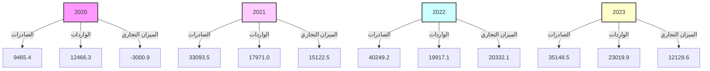
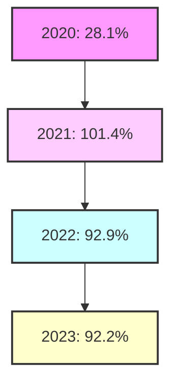
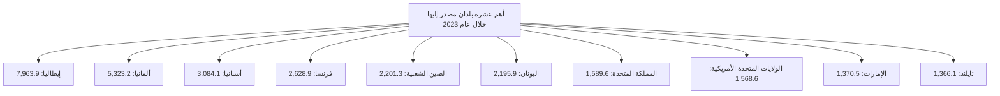
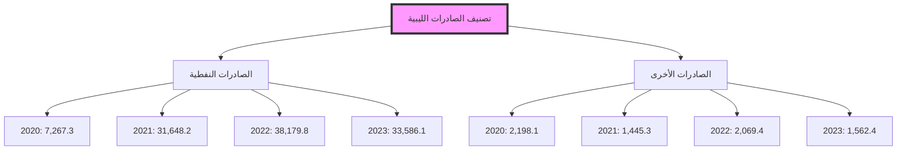
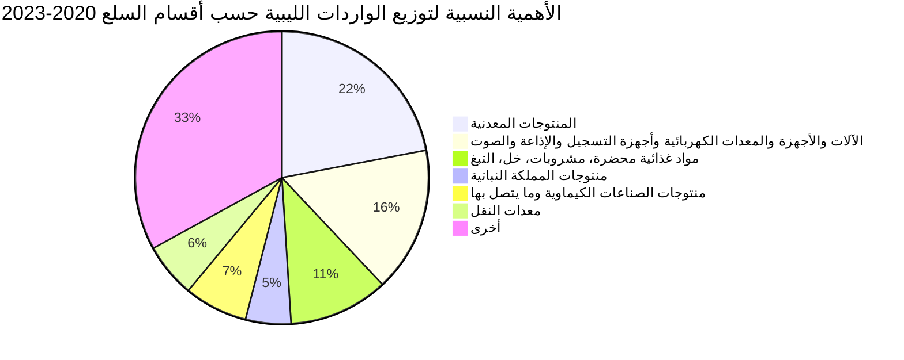

CENTRAL BANK OF LIBYA logo

# تقرير التجارة الخارجية لليبيا
# (2020-2023)

![Image of a large container ship loaded with colorful shipping containers at a port. The ship is docked next to large blue cranes used for loading and unloading cargo. The ship's hull is light blue and bears the name "MAERSK LINE".]

## إدارة البحوث والإحصاء
---
# ملخص موجز عن التجارة الخارجية
## خلال الفترة (2020-2023)

يعتبر قطاع التجارة الخارجية ذو أهمية بالغة بالنسبة للاقتصادات المتقدمة والنامية على حد سواء، حيث يعد خير وسيلة لاستغلال الموارد الاقتصادية المتاحة وتوفير مستلزمات التشغيل اللازمة للعملية الانتاجية، وتدفقات رؤوس الأموال.

لقد شهد قطاع التجارة الخارجية في ليبيا خلال الفترة (2020-2023) تقلبات بسبب الظروف السياسية وحالة الانقسام السياسي، والإيقاف المتكرر لإنتاج وتصدير النفط الخام، وبسبب الظروف التي مر بها الاقتصاد العالمي نتيجة جائحة كورونا وآثارها السلبية على إمدادات وأسعار السلع، كان لها الأثر المباشر على حجم التبادل التجاري لليبيا مع دول العالم.

وفيما يلي تحليل لأهم مؤشرات التجارة الخارجية للاقتصاد الليبي خلال الفترة 2020-2023:

### أولاً: حجم التبادل التجاري:

سجل حجم التبادل التجاري (صادرات + واردات) بين ليبيا والعالم الخارجي خلال الفترة (2020-2023) إرتفاعاً بلغت نسبته في المتوسط نحو 24.0%، ويعود هذا الإرتفاع في حجم التجارة الخارجية إلى نمو حجم الصادرات والتي بلغت في المتوسط نسبة 47.7%، حيث سجل حجم التبادل التجاري لعام 2023 إنخفاضاً بسيط بلغ 3.3% مقارنة بالعام 2022، وذلك بسبب إنخفاض الصادرات النفطية بنسبة 12.6% نتيجة إنخفاض أسعار النفط الخام في الأسواق العالمية، وارتفاع الواردات السلعية بنسبة 15.6%.

وللوقوف على مدى أهمية التجارة الخارجية في الاقتصاد المحلي، أظهر مؤشر نسبة حجم التجارة الخارجية (الصادرات + الواردات) إلى الناتج المحلي الإجمالي (درجة الانكشاف الخارجي) إلى إستمرار إنكشاف الاقتصاد الوطني على العالم الخارجي، حيث سجلت إنخفاضا في عام 2020 بلغت نسبته 28.1%، في حين إرتفعت درجة الانكشاف في عام 2021 إلى 101.4%، ثم إنخفضت إلى 92.9% في عام 2022، ثم إنخفضت إلى 92.2% في عام 2023 مما يدل ذلك على أن الاقتصاد الوطني يتأثر بدرجة كبيرة بالتغيرات والظروف الخارجية.
---
# حجم التجارة الخارجية خلال الفترة (2020-2023)

| البند | 2020 | 2021 | 2022 | 2023 |
|-------|------|------|------|------|
| الصادرات | 9,465.4 | 33,093.5 | 40,249.2 | 35,148.5 |
| الواردات | 12,466.3 | 17,971.0 | 19,917.1 | 23,019.9 |
| الميزان التجاري | -3,000.9 | 15,122.5 | 20,332.1 | 12,128.6 |
| حجم التجارة الخارجية | 21,931.7 | 51,064.5 | 60,166.3 | 58,168.4 |
| الناتج المحلي الإجمالي | 78,151.8 | 50,360.5 | 64,778.9 | 63,119.9 |
| درجة الانكشاف (%) | 28.1 | 101.4 | 92.9 | 92.2 |

*المصدر: الإحصاءات التجارية لتنمية الأعمال الدولية (Trade Map).

## التجارة الخارجية خلال الفترة (2020-2023)

## درجة الانكشاف خلال الفترة (2020-2023)

---
أولاً: الصادرات:

يعتمد الاقتصاد الليبي بشكل كبير على مورد طبيعي ناضب وهو النفط كمصدر أساسي للدخل، والذي بدوره يتأثر بظروف الأسواق العالمية للنفط، حيث تشكل الصادرات النفطية أكثر من 95.0% من إجمالي الصادرات، مما جعل الإقتصاد الوطني عرضة بشكل مستمر إلى صدمات قوية نتيجة التغيرات الكبيرة والمفاجئة في قطاع النفط سواء على المستوى المحلي أو الدولي.

التوزيع الجغرافي للصادرات:

أظهرت البيانات المتعلقة بالتوزيع الجغرافي للصادرات الليبية الواردة بالجدول أدناه، الأهمية النسبية العالية التي تحظى بها الصادرات الليبية لدول الاتحاد الأوروبي، إذ بلغت خلال الفترة في المتوسط نحو 65.4% من إجمالي الصادرات، ويعود سبب إرتفاع الأهمية النسبية للصادرات الوطنية لدول الاتحاد الأوروبي (منطقة اليورو)، إلى خصائص اقتصادات هذه البلدان على إعتبارها بلدان صناعية تعتمد بدرجة كبيرة على النفط الخام، وتأتي الصادرات الليبية للدول الأسيوية في المرتبة الثانية إذ بلغت خلال الفترة في المتوسط نحو 17.5% من إجمالي الصادرات الليبية للخارج.

توزيع الصادرات الليبية حسب مجموعات البلدان
خلال الفترة (2020 – 2023)
"مليون دولار"

| مجموعات البلدان | 2020 | 2021 | 2022 | 2023 |
|-----------------|------|------|------|------|
| مجموعة دول الاتحاد الأوروبي | 4,492.2 | 21,207.9 | 26,631.0 | 24,776.5 |
| أقطار جامعة الدول العربية | 1,112.3 | 1,265.1 | 2,270.3 | 1,796.5 |
| الدول الأسيوية | 3,131.1 | 5,880.8 | 6,752.2 | 4,927.6 |
| دول أوربية أخرى | 317.1 | 2,129.1 | 1,918.2 | 1,864.9 |
| البلدان الأفريقية | 2.0 | 1.5 | 35.8 | 11.9 |
| دول شمال ووسط وجنوب أمريكا | 250.0 | 2,316.9 | 2,245.9 | 1,577.0 |
| أستراليا ونيوزيلاندا | 160.7 | 292.3 | 395.8 | 194.1 |
| الإجمالي | 9,465.4 | 33,093.5 | 40,249.2 | 35,148.5 |

*المصدر: الإحصاءات التجارية لتنمية الاعمال الدولية (Trade Map).
---
# الأهمية النسبية لتوزيع الصادرات الليبية حسب مجموعات البلدان (2020 - 2023)

| المجموعة | النسبة |
|----------|--------|
| مجموعة دول الاتحاد الأوروبي | 65% |
| الدول الآسيوية | 18% |
| أقطار جامعة الدول العربية | 6% |
| دول أوروبية أخرى | 5% |
| دول شمال ووسط وجنوب أمريكا | 5% |
| البلدان الأفريقية | 1% |
| أستراليا ونيوزيلاندا | 0% |

## الصادرات حسب أهم البلدان المصدر إليها:

من خلال الاطلاع على الجداول أدناه لقيم الصادرات حسب أهم البلدان المصدر إليها، يتضح أن:

إيطاليا كانت أهم مستورد، حيث بلغت نسبة ما صدر إليها وحدها في المتوسط 23.7% خلال الفترة (2020-2023) على التوالي من إجمالي قيمة الصادرات الليبية، إذ بلغت قيمة ما صدر إليها خلال عام 2023 نحو 7,963.9 مليون دولار، فيما جاءت دول ألمانيا وأسبانيا وفرنسا والصين الشعبية واليونان من ضمن أهم الدول المستوردة من ليبيا، وتجدر الإشارة إلى أن معظم الصادرات الليبية لتلك الدول هي صادرات نفطية، والجدول أدناه يوضح ذلك:
---
# قيمة الصادرات حسب أهم البلدان المصدر إليها
## خلال الفترة (2020-2023)

"مليون دولار"

| البلدان المصدر إليها | 2020 | 2021 | 2022 | 2023 |
|----------------------|------|------|------|------|
| إيطاليا | 1,970.3 | 7,470.1 | 10,500.5 | 7,963.9 |
| ألمانيا | 849.5 | 3,659.9 | 3,806.9 | 5,323.2 |
| أسبانيا | 705.2 | 3,427.2 | 3,953.8 | 3,084.1 |
| فرنسا | 529.2 | 2,175.8 | 2,230.1 | 2,628.9 |
| الصين الشعبية | 827.1 | 3,271.5 | 2,933.4 | 2,201.3 |
| اليونان | 58.3 | 1,023.2 | 2,545.8 | 2,195.9 |
| المملكة المتحدة | 88.6 | 1,549.1 | 1,608.5 | 1,589.6 |
| الولايات المتحدة الأمريكية | 224.9 | 2,239.7 | 2,245.8 | 1,568.6 |
| الإمارات | 955.2 | 956.2 | 1,784.9 | 1,370.5 |
| تايلند | 326.8 | 1,155.9 | 1,945.1 | 1,366.1 |
| هولندا | 121.1 | 1,692.7 | 1,838.5 | 1,269.8 |
| تركيا | 1,674.3 | 821.8 | 767.0 | 538.0 |
| سنغافورة | 198.0 | 171.2 | 373.4 | 219.0 |
| سويسرا | 144.7 | 302.1 | 117.5 | 75.1 |
| كوريا الجنوبية | 19.7 | 12.5 | 90.9 | 46.3 |
| ماليزيا | 0.6 | 30.3 | 36.9 | 58.0 |
| أندونيسيا | 0.7 | 10.5 | 0.7 | 57.7 |
| بلدان أخرى | 771.2 | 3,123.8 | 3,469.5 | 3,592.5 |
| الإجمالي | 9,465.4 | 33,093.5 | 40,249.2 | 35,148.5 |

*المصدر: الإحصاءات التجارية لتنمية الأعمال الدولية (Trade Map).*

## أهم عشرة بلدان مصدر إليها خلال عام 2023

| البلد | القيمة (مليون دولار) |
|-------|----------------------|
| إيطاليا | 7,963.9 |
| ألمانيا | 5,323.2 |
| أسبانيا | 3,084.1 |
| فرنسا | 2,628.9 |
| الصين الشعبية | 2,201.3 |
| اليونان | 2,195.9 |
| المملكة المتحدة | 1,589.6 |
| الولايات المتحدة الأمريكية | 1,568.6 |
| الإمارات | 1,370.5 |
| تايلند | 1,366.1 |

---
# الأهمية النسبية للصادرات الليبية حسب أهم البلدان المصدر إليها
## خلال الفترة (2020-2023)

"نسب مئوية"

| البلدان المصدر إليها | 2020 | 2021 | 2022 | 2023 |
|----------------------|------|------|------|------|
| إيطاليا              | 20.8 | 22.6 | 26.1 | 22.7 |
| ألمانيا              | 9.0  | 11.1 | 9.5  | 15.1 |
| أسبانيا              | 7.5  | 10.4 | 9.8  | 8.8  |
| فرنسا                | 5.6  | 6.6  | 5.5  | 7.5  |
| الصين الشعبية        | 8.7  | 9.9  | 7.3  | 6.3  |
| اليونان              | 0.6  | 3.1  | 6.3  | 6.2  |
| المملكة المتحدة      | 0.9  | 4.7  | 4.0  | 4.5  |
| الولايات المتحدة الأمريكية | 2.4 | 6.8 | 5.6 | 4.5 |
| الإمارات             | 10.1 | 2.9  | 4.4  | 3.9  |
| تايلند               | 3.5  | 3.5  | 4.8  | 3.9  |
| هولندا               | 1.3  | 5.1  | 4.6  | 3.6  |
| تركيا                | 17.7 | 2.5  | 1.9  | 1.5  |
| سنغافورة             | 2.1  | 0.5  | 0.9  | 0.6  |
| سويسرا               | 1.5  | 0.9  | 0.3  | 0.2  |
| كوريا الجنوبية       | 0.2  | 0.0  | 0.2  | 0.1  |
| ماليزيا              | 0.0  | 0.1  | 0.1  | 0.2  |
| أندونيسيا            | 0.0  | 0.0  | 0.0  | 0.2  |
| بلدان أخرى           | 8.1  | 9.4  | 8.6  | 10.2 |

*المصدر: الإحصاءات التجارية لتنمية الأعمال الدولية (Trade Map).*

## التركيب السلعي للصادرات:

أظهرت البيانات المتعلقة بالتركيب السلعي للصادرات الوطنية الواردة بالجدول أدناه مدى استحواذ صادرات الوقود المعدنية والمحروقات والمواد المتصلة بها على النصيب الأوفر من إجمالي الصادرات خلال الفترة (2020 – 2023)، مشكّلة بذلك ما نسبته 94.0% من إجمالي الصادرات، الأمر الذي يبين عدم تنوع الصادرات الوطنية، نتيجة ضعف هيكل الإنتاج المحلي، وهو ما يجعل الاقتصاد عرضة لتقلبات إنتاج النفط وأسعاره في الأسواق الدولية، فيما سجلت الصادرات الأخرى نسبة 6.0% من إجمالي الصادرات والتي في معظمها صادرات المعادن الثمينة ومصنوعاتها (الذهب) والمعادن العادية (الخردة).
---
# قيمة الصادرات مصنفة حسب أقسام السلع
## خلال الفترة (2020-2023)

"مليون دولار"

| أقسام السلع | 2020 | 2021 | 2022 | 2023 |
|-------------|------|------|------|------|
| المنتوجات المعدنية أهمها النفط الخام | 7,267.3 | 31,648.2 | 38,179.8 | 33,586.1 |
| المعادن العادية ومصنوعاتها | 442.9 | 929.4 | 844.1 | 737.9 |
| لؤلؤ طبيعي او مستنبت واحجار كريمة او شبه كريمة ومعادن ثمينة ومصنوعاتها | 1,659.2 | 237.8 | 747.8 | 521.4 |
| منتوجات الصناعات الكيماوية وما يتصل بها. | 14.9 | 208.1 | 318.9 | 208.5 |
| معدات النقل | 15.6 | 2.0 | 62.6 | 1.3 |
| حيوانات حية - منتوجات حيوانية | 16.4 | 26.0 | 42.8 | 40.0 |
| الآلات والأجهزة والمعدات الكهربائية وأجهزة التسجيل والإذاعة والصوت | 28.3 | 16.9 | 15.1 | 10.0 |
| عجائن الخشب، عجائن سلولوزية، ورق مقوى وفضلات الورق | 2.7 | 8.6 | 12.7 | 10.6 |
| سلع ومنتوجات متنوعة | 1.0 | 1.5 | 5.0 | 4.0 |
| منتوجات المملكة النباتية | 8.2 | 3.7 | 10.2 | 16.6 |
| الأجهزة البصرية والفوتوغرافية والسينمائية وأجهزة قياس الضغط والمعدات الطبية | 1.1 | 3.1 | 1.3 | 0.3 |
| جلود حيوانات خام وجلود مدبوغة | 3.2 | 2.9 | 2.8 | 1.9 |
| مواد غذائية محضرة، مشروبات، خل، التبغ | 1.4 | 1.5 | 1.7 | 2.6 |
| منتوجات ومواد نسيجية | 2.0 | 1.4 | 1.9 | 1.9 |
| لدائن ومصنوعاتها، مطاط ومصنوعاته | 0.8 | 1.7 | 1.3 | 2.2 |
| شحوم ودهون وزيوت حيوانية ونباتية والمنتوجات المشتقة منها | 0.3 | 0.2 | 0.5 | 2.2 |
| الخشب ومصنوعاته، الفحم الخشبي، الفلين ومصنوعاته، مصنوعات القش | 0.0 | 0.2 | 0.1 | 0.1 |
| مصنوعات من الحجر والجص والاسمنت والميكا والزجاج ومنتوجات الخزف | 0.1 | 0.2 | 0.6 | 0.8 |
| الأحذية، أغطية الرأس، المظلات، مظلات الشمس، عصي المشي، سياط الفروسية | 0.0 | 0.1 | 0.0 | 0.1 |
| الأسلحة والذخائر، أجزاؤها ولوازمها | 0.0 | 0.0 | 0.0 | 0.0 |
| الإجمالي | 9,465.4 | 33,093.5 | 40,249.2 | 35,148.5 |

*المصدر: الإحصاءات التجارية لتنمية الأعمال الدولية (Trade Map).
---
تصنيف الصادرات الليبية (نفطية ، صادرات أخرى)
خلال الفترة (2020-2023)

"مليون دولار"

| السنوات | الصادرات النفطية | الصادرات الأخرى* | إجمالي الصادرات |
|---------|-------------------|-------------------|------------------|
| 2020    | 7,267.3           | 2,198.1           | 9,465.4          |
| 2021    | 31,648.2          | 1,445.3           | 33,093.5         |
| 2022    | 38,179.8          | 2,069.4           | 40,249.2         |
| 2023    | 33,586.1          | 1,562.4           | 35,148.5         |

(*) الصادرات الأخرى في معظمها معادن ثمينة ومعادن عادية.

تصنيف الصادرات الليبية (نفطية ، صادرات أخرى)

| السنة | الصادرات النفطية | الصادرات الأخرى* | إجمالي الصادرات |
|-------|-------------------|-------------------|------------------|
| 2020  | 7,267.3           | 2,198.1           | 9,465.4          |
| 2021  | 31,648.2          | 1,445.3           | 33,093.5         |
| 2022  | 38,179.8          | 2,069.4           | 40,249.2         |
| 2023  | 33,586.1          | 1,562.4           | 35,148.5         |

الوحدة: مليون دولار
---
# الأهمية النسبية لتوزيع الصادرات الليبية حسب أقسام السلع 2020-2023

| القسم | النسبة |
|-------|--------|
| المنتوجات المعدنية أهمها النفط الخام | 94% |
| المعادن العادية ومصنوعاتها | 2% |
| لؤلؤ طبيعي أو مستنبت وأحجار كريمة أو شبه كريمة ومعادن ثمينة ومصنوعاتها | 3% |
| منتوجات الصناعات الكيماوية وما يتصل بها | 1% |
| أخرى | 0% |

## أهم الشركاء التجاريين للصادرات الأخرى

أظهرت بيانات الصادرات الأخرى أن دولتي تركيا والإمارات العربية المتحدة هما أهم الدول
المستوردة من ليبيا، والتي تركزت معظم مستورداتها من المعادن الثمينة والمعادن العادية.

### الصادرات - دولة تركيا
"مليون دولار"

| السنوات | المعادن الثمينة | الحديد | النحاس | الألومنيوم | أخرى | الإجمالي |
|---------|-----------------|--------|--------|------------|------|----------|
| 2020    | 1,319.8         | 179.2  | 99.8   | 35.6       | 39.9 | 1,674.3  |
| 2021    | 101.1           | 408.7  | 141.8  | 60.4       | 109.8| 821.8    |
| 2022    | 138.0           | 286.7  | 150.7  | 71.1       | 120.5| 767.0    |
| 2023    | 52.6            | 228.7  | 118.9  | 40.7       | 97.1 | 538.0    |
---
# الصادرات - دولة الإمارات العربية المتحدة

"مليون دولار"

| السنوات | المعادن الثمينة ومصنوعاتها (الذهب) | أخرى* | الإجمالي |
|----------|-----------------------------------|-------|----------|
| 2020     | 338.7                             | 616.5 | 955.2    |
| 2021     | 136.6                             | 819.6 | 956.2    |
| 2022     | 609.7                             | 1175.2| 1,784.9  |
| 2023 (بيانات أولية) | 468.1                  | 902.4 | 1,370.5  |

*معظمها صادرات نفطية.

## ثانياً: الواردات:

يعتمد السوق المحلي بنسبة تتجاوز 85.0% في تلبية إحتياجات كافة القطاعات والأفراد من السلع الاستهلاكية والرأسمالية كالآلات والمعدات والمواد الخام والسلع الوسيطة اللازمة للعملية الإنتاجية، على الأسواق الخارجية.

### التوزيع الجغرافي للواردات:

تعد بلدان الاتحاد الأوروبي المصدر الرئيسي لواردات ليبيا حيث بلغت أهميتها النسبية في المتوسط نحو 35.2% من اجمالي الواردات خلال الفترة (2020-2023) حيث سجلت قيمة واردات ليبيا من دول الاتحاد الأوروبي نحو 4.3 و6.1 و8.0 و7.3 مليار دولار على التوالي خلال الفترة، ويعود ذلك إلى الجوار الجغرافي الذي يلعب دوراً رئيسياً في زيادة حجم المبادلات التجارية بين ليبيا ودول منطقة اليورو، فيما شكلت الدول الأسيوية وأقطار جامعة الدول العربية والدول الأوروبية الأخرى النسب الباقية، وتشير البيانات إلى ضعف المبادلات التجارية بين ليبيا والدول الأفريقية وأستراليا ونيوزيلندا.
---
# توزيع الواردات الليبية حسب مجموعات البلدان
## خلال الفترة (2020-2023)

"مليون دولار"

| مجموعات البلدان | 2020 | 2021 | 2022 | 2023 |
|-----------------|------|------|------|------|
| مجموعة دول الاتحاد الأوروبي | 4,320.8 | 6,134.2 | 8,037.2 | 7,306.9 |
| أقطار جامعة الدول العربية | 2,386.6 | 3,733.6 | 3,942.5 | 5,005.8 |
| الدول الآسيوية | 4,342.7 | 5,940.8 | 6,359.5 | 8,846.2 |
| دول أوربية أخرى | 764.3 | 1,198.7 | 585.0 | 534.4 |
| البلدان الأفريقية | 18.6 | 19.3 | 10.7 | 13.8 |
| دول شمال ووسط وجنوب أمريكا | 572.2 | 879.5 | 895.0 | 1,249.2 |
| أستراليا ونيوزيلاندا | 61.1 | 64.9 | 87.2 | 63.6 |
| الإجمالي | 12,466.3 | 17,971.0 | 19,917.1 | 23,019.9 |

*المصدر: الإحصاءات التجارية لتنمية الأعمال الدولية (Trade Map).*

## الأهمية النسبية لتوزيع الواردات الليبية حسب مجموعات البلدان
### (2020-2023)

| المجموعة | النسبة |
|----------|--------|
| مجموعة دول الاتحاد الأوروبي | 35% |
| أقطار جامعة الدول العربية | 21% |
| الدول الآسيوية | 35% |
| دول أوربية أخرى | 4% |
| البلدان الأفريقية | 0% |
| دول شمال ووسط وجنوب أمريكا | 5% |
| أستراليا ونيوزيلاندا | 0% |

## الواردات حسب أهم البلدان المستورد منها:

من خلال الاطلاع على الجدول أدناه لقيمة الواردات حسب أهم البلدان المستورد منها يتضح أن دول الصين، تركيا، إيطاليا، مصر، الإمارات واليونان لازالت تتصدر قائمة أهم البلدان
---
المستورد منها، حيث بلغت نسبة ما أستورد منها في المتوسط حوالي 58.6% خلال الفترة (2020-2023) من إجمالي قيمة الواردات الليبية.

وتعتبر دولة الصين أهم دولة مستورد منها، وبلغت قيمة ما ورد منها خلال العام 2023 نحو 3.9 مليار دولار ومشكلة ما نسبته 17.0% من الإجمالي، فيما أحتلت تركيا المرتبة الثانية بقيمة 3.3 مليار دولار، وجاءت أيطاليا في المرتبة الثالثة بنحو 1.8 مليار دولار.

والجدول التالي يوضح أهم البلدان المستورد منها خلال الفترة (2020-2023):

قيمة الواردات حسب أهم البلدان المستورد منها
خلال الفترة (2020-2023)
"مليون دولار"

| البلدان المستورد منها | 2020 | 2021 | 2022 | 2023 |
|----------------------|------|------|------|------|
| الصين الشعبية | 1,880.4 | 2,129.0 | 2,373.3 | 3,917.4 |
| تركيا | 1,653.1 | 2,769.4 | 2,841.1 | 3,256.7 |
| إيطاليا | 1,000.6 | 1,434.2 | 2,287.6 | 1,839.6 |
| مصر | 614.3 | 960.8 | 1,214.9 | 1,824.5 |
| الأمارات | 1,003.4 | 1,706.5 | 1,366.4 | 1,745.7 |
| اليونان | 719.4 | 1,189.8 | 1,946.1 | 1,708.1 |
| المانيا | 400.8 | 681.8 | 558.2 | 616.3 |
| كوريا الجنوبية | 338.0 | 428.5 | 366.9 | 572.2 |
| البرازيل | 166.4 | 313.4 | 320.0 | 450.9 |
| الولايات المتحدة الامريكية | 290.0 | 295.3 | 291.0 | 446.3 |
| هولندا | 576.9 | 535.8 | 365.1 | 355.6 |
| فرنسا | 171.3 | 208.2 | 229.7 | 321.5 |
| أسبانيا | 346.8 | 366.7 | 429.4 | 320.7 |
| المملكة المتحدة | 148.9 | 141.2 | 145.6 | 195.3 |
| سويسرا | 127.1 | 216.7 | 154.3 | 195.2 |
| أوكرانيا | 327.8 | 465.0 | 254.5 | 106.9 |
| بلدان أخرى | 2,701.1 | 4,128.7 | 4,773.0 | 5,147.0 |
| الإجمالي | 12,466.3 | 17,971.0 | 19,917.1 | 23,019.9 |

*المصدر: الإحصاءات التجارية لتنمية الاعمال الدولية (Trade Map).
---
# أهم عشرة بلدان مستورد منها خلال عام 2023

| البلد | القيمة (مليون دولار) |
|-------|----------------------|
| الصين الشعبية | 3917.4 |
| تركيا | 3256.7 |
| إيطاليا | 1839.6 |
| مصر | 1824.5 |
| الأمارات | 1745.7 |
| اليونان | 1708.1 |
| ألمانيا | 616.3 |
| كوريا الجنوبية | 572.2 |
| البرازيل | 450.9 |
| الولايات المتحدة الأمريكية | 446.3 |

# الأهمية النسبية للواردات حسب أهم البلدان المستورد منها خلال الفترة (2020-2023)
"نسب مئوية"

| البلدان المستورد منها | 2020 | 2021 | 2022 | 2023 |
|------------------------|------|------|------|------|
| الصين الشعبية | 15.1 | 11.8 | 11.9 | 17.0 |
| تركيا | 13.3 | 15.4 | 14.3 | 14.1 |
| إيطاليا | 8.0 | 8.0 | 11.5 | 8.0 |
| مصر | 4.9 | 5.3 | 6.1 | 7.9 |
| الأمارات | 8.0 | 9.5 | 6.9 | 7.6 |
| اليونان | 5.8 | 6.6 | 9.8 | 7.4 |
| ألمانيا | 3.2 | 3.8 | 2.8 | 2.7 |
| كوريا الجنوبية | 2.7 | 2.4 | 1.8 | 2.5 |
| البرازيل | 1.3 | 1.7 | 1.6 | 2.0 |
| الولايات المتحدة الأمريكية | 2.3 | 1.6 | 1.5 | 1.9 |
| هولندا | 4.6 | 3.0 | 1.8 | 1.5 |
| فرنسا | 1.4 | 1.2 | 1.2 | 1.4 |
| أسبانيا | 2.8 | 2.0 | 2.2 | 1.4 |
| المملكة المتحدة | 1.2 | 0.8 | 0.7 | 0.8 |
| سويسرا | 1.0 | 1.2 | 0.8 | 0.8 |
| أوكرانيا | 2.6 | 2.6 | 1.3 | 0.5 |
| بلدان أخرى | 21.7 | 23.0 | 24.0 | 22.4 |

*المصدر: الإحصاءات التجارية لتنمية الأعمال الدولية (Trade Map).
---
التركيب السلعي للواردات:

احتلت واردات أقسام (المنتجات المعدنية ، الآلات والأجهزة والمعدات الكهربية وأجهزة التسجيل والإذاعة

والصوت، مواد غذائية محضرة، مشروبات، خل، التبغ) المرتبة الأولى من إجمالي الواردات السلعية خلال

الفترة (2020 – 2023)، حيث شكلت 48.2% من إجمالي الواردات السلعية، فيما احتلت واردات

أقسام (منتوجات المملكة النباتية، منتوجات الصناعات الكيماوية وما يتصل بها ، معدات النقل) المرتبة

الثانية من حيث الأهمية النسبية لتشكل 18.4% من إجمالي الواردات السلعية، فيما شكلت

واردات منتجات الأقسام الأخرى النسبة الباقية والتي تمثل 33.4% من إجمالي الواردات السلعية.

وهذا يعكس مدى ضعف وعجز السوق المحلي في توفير العديد من السلع التي يحتاجها الأفراد مما

يؤدي ذلك إلى زيادة درجة الانكشاف الخارجي وزيادة الطلب على النقد الأجنبي.

والجدول التالي يوضح الواردات مصنفة حسب أقسام السلع خلال الفترة (2020 – 2023) :

قيمة الواردات مصنفة حسب أقسام السلع
خلال الفترة (2020-2023)
"مليون دولار"

| أقسام السلع | 2020 | 2021 | 2022 | 2023 |
|-------------|-------|-------|-------|-------|
| المنتوجات المعدنية | 1,910.5 | 3,290.9 | 5,845.5 | 5,186.1 |
| الآلات والأجهزة والمعدات الكهربية وأجهزة التسجيل والإذاعة والصوت | 1,771.9 | 3,034.6 | 2,793.5 | 3,701.5 |
| مواد غذائية محضرة، مشروبات، خل، التبغ | 1,651.0 | 1,840.4 | 1,919.2 | 2,399.4 |
| منتوجات المملكة النباتية | 833.9 | 1,279.1 | 872.5 | 942.5 |
| منتوجات الصناعات الكيماوية وما يتصل بها | 958.2 | 1,363.9 | 1,188.9 | 1,428.0 |
| معدات النقل | 890.8 | 1,136.2 | 1,027.8 | 1,596.0 |
| المعادن العادية ومصنوعاتها | 552.7 | 856.6 | 879.3 | 1,103.7 |
| منتوجات ومواد نسيجية | 743.0 | 833.1 | 862.0 | 1,035.8 |
| لدائن ومصنوعاتها، مطاط ومصنوعاته | 516.5 | 774.4 | 836.1 | 1,138.6 |
| حيوانات حية - منتوجات حيوانية | 735.0 | 871.1 | 779.4 | 905.3 |
---
| سلع ومنتوجات متنوعة | 535.2 | 681.4 | 751.1 | 978.8 |
|----------------------------------|-------|-------|-------|-------|
| مصنوعات من الحجر والجص والاسمنت والميكا ومنتوجات الخزف والزجاج | 336.1 | 541.2 | 540.8 | 811.1 |
| لؤلؤ طبيعي او مستنبت واحجار كريمة او شبه كريمة ومعادن ثمينة ومصنوعاتها | 124.4 | 466.3 | 420.1 | 439.4 |
| شحوم ودهون وزيوت حيوانية ونباتية والمنتوجات المشتقة منها | 162.9 | 258.8 | 350.1 | 248.8 |
| عجائن الخشب، عجائن سلولوزية، ورق مقوى وفضلات الورق | 228.2 | 224.9 | 287.0 | 369.9 |
| الاجهزة البصرية والفوتوغرافية والسينمائية والطبية واجهزة قياس الضغط والمعدات الطبية | 332.4 | 238.3 | 240.5 | 295.6 |
| الخشب ومصنوعاته، الفحم الخشبي، الفلين ومصنوعاته، مصنوعات القش | 73.5 | 133.5 | 149.6 | 168.3 |
| الاحذية، اغطية الراس، المظلات، مظلات الشمس، عصي المشي، سياط الفروسية | 85.5 | 115.8 | 126.5 | 205.4 |
| جلود حيوانات خام وجلود مدبوغة | 23.5 | 29.8 | 45.8 | 65.2 |
| الاسلحة والذخائر، اجزاؤها ولوازمها | 1.0 | 0.8 | 1.5 | 0.5 |
| الإجمالي | 12,466.3 | 17,971.0 | 19,917.1 | 23,019.9 |

*المصدر: الإحصاءات التجارية لتنمية الاعمال الدولية (Trade Map).

## الأهمية النسبية لتوزيع الواردات الليبية حسب أقسام السلع 2020-2023

---
# الملاحق

| الموضوع | الرقم |
|---------|------|
| التجارة الخارجية لدولة ليبيا خلال الفترة (2020-2023) | 1 |
| قيمة الصادرات حسب أقسام السلع وفصول السلع خلال الفترة (2020-2023) | 2 |
| قيمة الواردات حسب أقسام السلع وفصول السلع خلال الفترة (2020-2023) | 3 |
| التوزيع النسبي للتجارة البينية مع التجمعات الدولية التي تتضمن ليبيا خلال الفترة (2020-2023) | 4 |
| التوزيع النسبي للتجارة البينية مع التجمعات الدولية التي لا تتضمن ليبيا خلال الفترة (2020-2023) | 5 |
---
# التوزيع الجغرافي للصادرات الليبية للفترة (2020-2023)
# Distribution of Libyan Exports according to country groups(2020-2023)

القيمة الف دولار
in thousand of USA dollars

| Country groups | 2020 | 2021 | 2022 | 2023 | المنطقة |
|----------------|------|------|------|------|--------|
| European Union Group | 4,492,193 | 21,207,886 | 26,631,030 | 24,776,529 | مجموعة دول الاتحاد الأوربي |
| Countries of the Arab League | 1,112,279 | 1,265,055 | 2,270,250 | 1,796,456 | أقطار جامعة الدول العربية |
| Asian countries | 3,131,144 | 5,880,822 | 6,752,162 | 4,927,622 | دول اسيوية |
| Other European countries | 317,103 | 2,129,094 | 1,918,205 | 1,864,893 | دول اوربية أخرى |
| African countries | 2,016 | 1,505 | 35,827 | 11,922 | بلدان إفريقيا |
| North, Central and South America | 250,011 | 2,316,877 | 2,245,939 | 1,576,977 | دول شمال ووسط أمريكا |
| Australia and New Zealand | 160,700 | 292,275 | 395,810 | 194,067 | أستراليا ونيوزيلندا |
| TOTAL | 9,465,446 | 33,093,514 | 40,249,223 | 35,148,466 | المجموع |

*Source: Trade Statistics for International Business Development (Map Trade)*

35062710
85,756
---
# التوزيع الجغرافي للواردات الليبية للفترة (2020-2023)

# Distribution of Libyan Imports according to country groups (2020-2023)

in thousand of USA dollars                                                                                               القيمة الف دولار

| Country groups | 2020 | 2021 | 2022 | 2023 | المنطقة |
|----------------|------|------|------|------|---------|
| European Union Group | 4,320,820 | 6,134,229 | 8,037,187 | 7,306,910 | مجموعة دول الاتحاد الأوربي |
| Countries of the Arab League | 2,386,641 | 3,733,578 | 3,942,533 | 5,005,765 | أقطار جامعة الدول العربية |
| Asian countries | 4,342,711 | 5,940,848 | 6,359,536 | 8,846,221 | دول اسيوية |
| Other European countries | 764,310 | 1,198,678 | 584,968 | 534,383 | دول اوربية أخرى |
| African countries | 18,610 | 19,292 | 10,716 | 13,759 | بلدان إفريقيا |
| North, Central and South America | 572,167 | 879,461 | 895,042 | 1,249,168 | دول شمال ووسط أمريكا |
| Australia and New Zealand | 61,055 | 64,918 | 87,139 | 63,671 | أستراليا ونيوزيلندا |
| TOTAL | 12,466,314 | 17,971,004 | 19,917,121 | 23,019,877 | المجموع |

*Source: Trade Statistics for International Business Development (Map Trade)
---
# دول الاتحاد الأوروبي خلال الفترة 2020-2023 (الصادرات)
# European Union Group in 2020-2023 (Exports)

القيمة الف دولار
in thousand of USA dollars

| Country | 2020 | 2021 | 2022 | 2023 | الدولة |
|---------|------|------|------|------|--------|
| Italy | 1,970,301 | 7,470,057 | 10,500,545 | 7,963,916 | إيطاليا |
| Germany | 849,480 | 3,659,917 | 3,806,886 | 5,323,155 | المانيا |
| Spain | 705,180 | 3,427,177 | 3,953,770 | 3,084,094 | اسبانيا |
| France | 529,215 | 2,175,808 | 2,230,051 | 2,628,918 | فرنسا |
| Austria | 138,575 | 892,715 | 767,477 | 1,151,737 | النمسا |
| Netherlands | 121,072 | 1,692,680 | 1,838,500 | 1,269,750 | هولندا |
| Greece | 58,317 | 1,023,240 | 2,545,752 | 2,195,902 | اليونان |
| Denmark | 46,252 | 220,541 | 255,317 | 24 | الدنمارك |
| Bulgaria | 25,686 | 61,517 | 18,278 | 2,089 | بلغاريا |
| Sweden | 27,269 | 321,491 | 346,216 | 386,550 | السويد |
| Malta | 9,042 | 15,888 | 27,314 | 27,437 | مالطا |
| Romania | 5,642 | 13,998 | 424 | 657,425 | رومانيا |
| Belgium | 4,158 | 53,595 | 183,786 | 7,446 | بلجيكا |
| Slovakia | 846 | 0 | 520 | 57,531 | سلوفاكيا |
| Poland | 715 | 31 | 55 | 556 | بولندا |
| Croatia | 234 | 23,493 | 2,712 | 2,712 | كرواتيا |
| Hungary | 107 | 17,214 | 5,128 | 155 | المجر |
| Ireland | 96 | 80 | 111 | 104 | ايرلندا |
| Czech Republic | 2 | 89,490 | 121,923 | 1,088 | التشيك |
| Cyprus | 2 | 3,828 | 2,090 | 12,839 | قبرص |
| Lithuania | 1 | 0 | 16 | 3 | لتوانيا |
| Portugal | 1 | 13,671 | 23,399 | 2,365 | برتغال |
| Finland | 0 | 0 | 0 | 2 | فنلندا |
| Latvia | 0 | 0 | 0 | 0 | لاتفيا |
| Luxembourg | 0 | 0 | 0 | 731 | لوكسمبورج |
| Estonia | 0 | 31,455 | 0 | 0 | استونيا |
| Slovenia | 0 | 0 | 760 | 0 | سلوفينيا |
| Total | 4,492,193 | 21,207,886 | 26,631,030 | 24,776,529 | المجموع |
---
# دول الاتحاد الأوروبي خلال الفترة 2020-2023 (الواردات)
# European Union Group in 2020-2023 (Imports)

القيمة ألف دولار
in thousand of USA dollars

| Country | 2020 | 2021 | 2022 | 2023 | الدولة |
|---------|------|------|------|------|--------|
| Italy | 1,000,600 | 1,434,191 | 2,287,623 | 1,839,643 | إيطاليا |
| Greece | 719,366 | 1,189,819 | 1,946,097 | 1,708,138 | اليونان |
| Netherlands | 576,854 | 535,765 | 365,128 | 355,582 | هولندا |
| Germany | 400,816 | 681,788 | 558,183 | 616,348 | المانيا |
| Spain | 346,849 | 366,732 | 429,430 | 320,738 | اسبانيا |
| Belgium | 255,697 | 792,210 | 1,358,188 | 454,606 | بلجيكا |
| France | 171,319 | 208,182 | 229,706 | 321,520 | فرنسا |
| Cyprus | 185,635 | 213,722 | 133,025 | 775,252 | قبرص |
| Bulgaria | 130,965 | 138,633 | 198,910 | 172,673 | بلغاريا |
| Romania | 99,889 | 100,255 | 155,589 | 218,228 | رومانيا |
| Malta | 69,506 | 46,836 | 37,016 | 23,681 | مالطا |
| Ireland | 60,402 | 37,295 | 36,961 | 53,925 | ايرلندا |
| Austria | 59,609 | 60,513 | 51,460 | 66,162 | النمسا |
| Poland | 54,745 | 70,331 | 77,389 | 89,307 | بولندا |
| Sweden | 37,547 | 43,551 | 29,554 | 80,742 | السويد |
| Portugal | 33,825 | 41,769 | 35,881 | 47,427 | برتغال |
| Denmark | 30,886 | 31,727 | 30,440 | 30,074 | دنمارك |
| Lithuania | 29,965 | 62,504 | 14,650 | 16,304 | لتوانيا |
| Czech Republic | 14,061 | 17,314 | 7,761 | 12,107 | تشيك |
| Slovenia | 10,078 | 24,619 | 18,009 | 19,481 | سلوفينيا |
| Hungary | 9,728 | 12,701 | 10,053 | 17,178 | المجر |
| Latvia | 11,169 | 1,983 | 5,309 | 11,493 | لاتفيا |
| Croatia | 5,492 | 11,457 | 10,006 | 8,557 | كرواتيا |
| Slovakia | 3,420 | 6,019 | 6,364 | 40,293 | سلوفاكيا |
| Estonia | 1,268 | 1,047 | 669 | 2,053 | استونيا |
| Finland | 615 | 1,731 | 2,305 | 4,089 | فنلندا |
| Luxembourg | 514 | 1,535 | 1,481 | 1,309 | لوكسمبروج |
| Total | 4,320,820 | 6,134,229 | 8,037,187 | 7,306,910 | المجموع |
---
# أقطار جامعة الدول العربية خلال الفترة 2020-2023 (الصادرات)
# Countries of the Arab League in 2020-2023 (Exports)

القيمة ألف دولار
in thousand of USA dollars

| Country | 2020 | 2021 | 2022 | 2023 | الدولة |
|---------|------|------|------|------|--------|
| Algeria | 0 | 0 | 0 | 0 | الجزائر |
| Bahrain | 6 | 25 | 0 | 0 | البحرين |
| Comoros | 0 | 0 | 0 | 0 | جزر القمر |
| Egypt | 38,760 | 78,312 | 89,260 | 67,248 | مصر |
| Jordan | 5,161 | 16,900 | 17,543 | 17,222 | الأردن |
| Kuwait | 227 | 119 | 24 | 24 | الكويت |
| Lebanon | 32,417 | 98,970 | 96,160 | 97,565 | لبنان |
| Mauritania | 239 | 387 | 326 | 357 | موريتانيا |
| Morocco | 13,703 | 36,434 | 100,018 | 135,369 | المغرب |
| Oman | 399 | 101 | 17 | 17 | عمان |
| Qatar | 0 | 0 | 0 | 0 | قطر |
| Yemen | 0 | 0 | 0 | 0 | اليمن |
| Saudi Arabia | 8,778 | 92 | 252 | 252 | السعودية |
| Sudan | 0 | 0 | 0 | 0 | السودان |
| Tunisia | 57,413 | 77,560 | 181,735 | 107,868 | تونس |
| United Arab Emirates | 955,176 | 956,155 | 1,784,915 | 1,370,535 | الأمارات العربية المتحدة |
| Total | 1,112,279 | 1,265,055 | 2,270,250 | 1,796,456 | المجموع |
---
# أقطار جامعة الدول العربية (الواردات) خلال الفترة 2023-2020
# Countries of the Arab League (Imports) in (2020-2023)

in thousand of USA dollars القيمة ألف دولار

| Country | 2020 | 2021 | 2022 | 2023 | الدولة |
|---------|------|------|------|------|--------|
| Algeria | 0 | 0 | 0 | 0 | الجزائر |
| Bahrain | 1,294 | 56,122 | 64,275 | 60,199 | البحرين |
| Comoros | 0 | 0 | 0 | 0 | جزر القمر |
| Egypt | 614,306 | 960,752 | 1,214,854 | 1,824,508 | مصر |
| Iraq | 0 | 0 | 0 | 0 | العراق |
| Kuwait | 1,017 | 969 | 1,261 | 1,261 | الكويت |
| Jordan | 41,416 | 60,771 | 67,245 | 64,008 | الأردن |
| Lebanon | 14,540 | 18,615 | 19,240 | 18,928 | لبنان |
| Mauritania | 47 | 72 | 83 | 83 | موريتانيا |
| Morocco | 67,964 | 76,750 | 78,767 | 84,810 | المغرب |
| Oman | 54,053 | 32,585 | 172,940 | 180,000 | عمان |
| Palestine State of | 0 | 2 | 0 | 0 | فلسطين |
| Qatar | 5,497 | 5,783 | 4,126 | 4,955 | قطر |
| Saudi Arabia | 133,824 | 172,134 | 159,740 | 165,937 | السعودية |
| Sudan | 0 | 0 | 0 | 0 | السودان |
| Tunisia | 449,564 | 642,507 | 793,602 | 855,397 | تونس |
| United Arab Emirates | 1,003,119 | 1,706,516 | 1,366,400 | 1,745,680 | الامارات العربية المتحدة |
| Yemen | 0 | 0 | 0 | 0 | اليمن |
| Total | 2,386,641 | 3,733,578 | 3,942,533 | 5,005,765 | المجموع |
---
# الدول الاسيوية خلال الفترة 2020-2023 (الصادرات)
# Asian countries in 2020-2023 (Exports)

in thousand of USA dollars | القيمة الف دولار

| Country | 2020 | 2021 | 2022 | 2023 | الدولة |
|---------|------|------|------|------|-------|
| Turkey | 1,674,297 | 821,796 | 767,019 | 538,017 | تركيا |
| China | 827,065 | 3,271,548 | 2,933,438 | 2,201,303 | الصين |
| Thailand | 326,818 | 1,155,874 | 1,945,091 | 1,366,130 | تايلند |
| Singapore | 197,969 | 171,237 | 373,430 | 218,973 | سنغافورة |
| Japan | 66,063 | 33,981 | 0 | 974 | اليابان |
| Korea, Republic of | 19,679 | 12,523 | 90,879 | 46,283 | كوريا |
| India | 12,646 | 368,518 | 590,301 | 432,996 | الهند |
| Pakistan | 4,961 | 4,132 | 14,310 | 6,900 | باكستان |
| Indonesia | 710 | 10,483 | 673 | 57,724 | اندونيسيا |
| Malaysia | 640 | 30,336 | 36,927 | 57,972 | ماليزيا |
| Taipei, Chinese | 268 | 259 | 90 | 63 | تايبيه ، الصينية |
| Hong Kong, China | 27 | 64 | 4 | 282 | هونغ كونغ |
| Azerbaijan | 0 | 0 | 0 | 0 | اذربيجان |
| Brunei Darussalam | 0 | 0 | 0 | 0 | بروناي |
| Philippines | 0 | 0 | 0 | 0 | فلبين |
| Viet Nam | 0 | 0 | 0 | 0 | فيتنام |
| Bangladesh | 0 | 0 | 0 | 0 | بنغلاديش |
| Kyrgyzstan | 1 | 0 | 0 | 0 | قرغيزستان |
| Kazakhstan | 0 | 2 | 0 | 5 | كازاخستان |
| Sri Lanka | 0 | 69 | 0 | 0 | سريلانكا |
| Total | 3,131,144 | 5,880,822 | 6,752,162 | 4,927,622 | المجموع |
---
# الدول الاسيوية خلال الفترة 2020-2023 (الواردات)
# Asian countries in 2020-2023 (Imports)

in thousand of USA dollars | القيمة الف دولار

| Country | 2020 | 2021 | 2022 | 2023 | الدولة |
|---------|------|------|------|------|-------|
| China | 1,880,409 | 2,129,030 | 2,373,287 | 3,917,355 | الصين |
| Turkey | 1,653,078 | 2,769,426 | 2,841,054 | 3,256,726 | تركيا |
| Korea, Republic of | 337,967 | 428,530 | 366,876 | 572,190 | كوريا |
| Thailand | 176,716 | 188,595 | 233,277 | 231,967 | تايلند |
| India | 142,325 | 207,897 | 274,959 | 504,982 | الهند |
| Singapore | 21,530 | 16,563 | 17,835 | 22,824 | سنغافورة |
| Indonesia | 17,584 | 17,475 | 52,897 | 116,436 | اندونيسية |
| Japan | 16,055 | 34,251 | 44,496 | 54,018 | اليابان |
| Hong Kong, China | 15,925 | 16,853 | 9,527 | 33,808 | هونغ كونغ |
| Taipei, Chinese | 15,619 | 13,786 | 14,973 | 29,333 | تايبيه ، الصينية |
| Malaysia | 14,426 | 19,181 | 12,404 | 21,407 | ماليزيا |
| Pakistan | 8,806 | 11,711 | 9,390 | 12,890 | باكستان |
| Azerbaijan | 7,454 | 27,879 | 56,110 | 19,804 | اذربيجان |
| Cambodia | 364 | 112 | 302 | 919 | كمبوديا |
| Uzbekistan | 163 | 380 | 124 | 124 | أوزبكستان |
| Philippines | 67 | 151 | 309 | 219 | الفلبين |
| Kazakhstan | 1 | 51 | 0 | 0 | كازاخستان |
| Bangladesh | 0 | 0 | 0 | 0 | بنغلاديش |
| Brunei Darussalam | 0 | 0 | 0 | 0 | بروناي |
| Myanmar | 0 | 0 | 0 | 0 | ميانمار |
| Maldives | 0 | 269 | 0 | 0 | المالديف |
| Nepal | 0 | 0 | 0 | 0 | نيبال |
| Lao People's Democratic Republic | 0 | 0 | 0 | 0 | جمهورية لاو الديمقراطية الشعبية |
| Viet Nam | 0 | 0 | 0 | 0 | فيتنام |
| Iran, Islamic Republic of | 3,952 | 8,219 | 9,333 | 8,776 | ايران |
| Sri Lanka | 30,270 | 50,489 | 42,383 | 42,443 | سريلانكا |
| Total | 4,342,711 | 5,940,848 | 6,359,536 | 8,846,221 | المجموع |
---
دول اوربية أخرى خلال الفترة 2020-2023 (الصادرات)
Other European countries in 2020-2023 (Exports)

in thousand of USA dollars   القيمة الف دولار

| Country                | 2020    | 2021      | 2022      | 2023      | الدولة              |
|------------------------|---------|-----------|-----------|-----------|---------------------|
| Switzerland            | 144,721 | 302,068   | 117,545   | 75,135    | سويسرا              |
| United Kingdom         | 88,640  | 1,549,149 | 1,608,531 | 1,589,646 | المملكة المتحدة     |
| Ukraine                | 41,973  | 181,475   | 24,893    | 93        | أكرانيا             |
| Macedonia, North       | 1,092   | 809       | 7,037     | 122       | مقدونيا الشمالية    |
| Bosnia and Herzegovina | 351     | 0         | 0         | 26        | البوسنة والهرسك     |
| Serbia                 | 304     | 7,457     | 4,712     | 150,392   | صربيا               |
| Moldova, Republic of   | 194     | 580       | 0         | 0         | جمهورية مولدوفا     |
| Norway                 | 3       | 19        | 124,172   | 27        | النرويج             |
| Montenegro             | 0       | 0         | 0         | 0         | الجبل الأسود        |
| Iceland                | 0       | 0         | 0         | 0         | أيسلندا             |
| Russian Federation     | 0       | 1         | 0         | 0         | الاتحاد الروسي      |
| French Polynesia       | 1       | 0         | 0         | 0         | بولينيزيا الفرنسية  |
| Armenia                | 0       | 0         | 0         | 13,489    | أرمينيا             |
| Georgia                | 0       | 0         | 38        | 4,686     | جورجيا              |
| Belarus                | 0       | 0         | 0         | 0         | بيلاروسيا           |
| Albania                | 39,824  | 87,536    | 31,277    | 31,277    | البانيا             |
| Total                  | 317,103 | 2,129,094 | 1,918,205 | 1,864,893 | المجموع             |
---
دول اوربية أخرى خلال الفترة 2020-2023 ( الواردات )
Other European countries IN 2020-2023 (imports)

in thousand of USA dollars                                                              القيمة الف دولار

| Country | 2020 | 2021 | 2022 | 2023 | الدولة |
|---------|------|------|------|------|--------|
| Ukraine | 327,835 | 468,004 | 254,539 | 106,931 | أوكرانيا |
| United Kingdom | 148,878 | 141,182 | 145,570 | 195,318 | المملكة المتحدة |
| Switzerland | 127,140 | 216,679 | 154,271 | 195,230 | سويسرا |
| Russian Federation | 121,248 | 331,969 | 0 | 0 | الاتحاد الروسي |
| Serbia | 26,082 | 22,911 | 20,635 | 24,799 | صربيا |
| Macedonia, North | 3,112 | 923 | 759 | 697 | مقدونيا الشمالية |
| Montenegro | 1,504 | 3,033 | 0 | 0 | الجبل الأسود |
| Bosnia and Herzegovina | 1,717 | 5,202 | 3,111 | 2,504 | البوسنة والهرسك |
| Norway | 1,494 | 830 | 1,949 | 2,859 | النرويج |
| Moldova, Republic of | 29 | 2,147 | 85 | 1,783 | جمهورية مولدوفا |
| Iceland | 0 | 0 | 73 | 54 | ايسلندا |
| Armenia | 0 | 160 | 412 | 1,209 | أرمينيا |
| Georgia | 221 | 2,620 | 3,378 | 2,813 | جورجيا |
| Belarus | 1,556 | 2,205 | 0 | 0 | بيلاروسيا |
| Albania | 3,494 | 813 | 186 | 186 | ألبانيا |
| Total | 764,310 | 1,198,678 | 584,968 | 534,383 | المجموع |
---
# بلدان افريقيا خلال الفترة 2020-2023 (الصادرات)
# African countries in 2020-2023 (Exports)

القيمة الف دولار
in thousand of USA dollars

| Country | 2020 | 2021 | 2022 | 2023 | الدولة |
|---------|------|------|------|------|--------|
| Ethiopia | 12 | 0 | 0 | 0 | أثيوبيا |
| Nigeria | 5 | 181 | 148 | 10 | نيجيريا |
| Senegal | 5 | 321 | 2,541 | 2,541 | السنغال |
| Congo, Democratic Republic of the | 1 | 0 | 0 | 0 | جمهورية الكونغو الديمقراطية |
| South Africa | 1 | 17 | 17,465 | 53 | جنوب أفريقيا |
| Botswana | 0 | 0 | 0 | 0 | بوتسوانا |
| Gambia | 0 | 95 | 0 | 0 | غامبيا |
| Madagascar | 0 | 0 | 0 | 0 | مدغشقر |
| Mozambique | 0 | 0 | 0 | 0 | موزمبيق |
| Namibia | 0 | 0 | 0 | 0 | ناميبيا |
| Zimbabwe | 0 | 0 | 0 | 0 | زيمبابوي |
| Uganda | 0 | 241 | 3 | 3 | أوغندا |
| Angola | 0 | 0 | 0 | 0 | أنغولا |
| Cabo Verde | 0 | 0 | 0 | 0 | كابو فيردي |
| Congo | 0 | 111 | 0 | 0 | الكونغو |
| Benin | 42 | 45 | 6 | 22 | بنين |
| Ghana | 0 | 56 | 132 | 8,631 | غانا |
| Côte d'Ivoire | 1 | 15 | 6,423 | 7 | كوت ديفوار |
| Mali | 101 | 275 | 342 | 342 | مالي |
| Niger | 400 | 124 | 161 | 161 | نيجر |
| Zambia | 0 | 0 | 0 | 0 | زامبيا |
| Rwanda | 0 | 0 | 0 | 0 | رواندا |
| Togo | 3 | 13 | 8,603 | 22 | توغو |
| Burkina Faso | 111 | 0 | 3 | 55 | بوركينا فاسو |
| Guinea-Bissau | 0 | 0 | 0 | 0 | غينيا بيساو |
| Guinea | 0 | 0 | 0 | 0 | غينيا |
| Lesotho | 0 | 0 | 0 | 0 | ليسوتو |
| Malawi | 0 | 0 | 0 | 0 | مالاوي |
| Mauritius | 0 | 0 | 0 | 0 | موريشيوس |
| Kenya | 1 | 0 | 0 | 75 | كينيا |
| Cameroon | 1,333 | 10 | 0 | 0 | كاميرون |
| Gabon | 0 | 1 | 0 | 0 | الجابون |
| Burundi | 0 | 0 | 0 | 0 | بوروندي |
| Tanzania, United Republic of | 0 | 0 | 0 | 0 | جمهورية تنزانيا المتحدة |
| Total | 2,016 | 1,505 | 35,827 | 11,922 | المجموع |
---
# بلدان افريقيا خلال الفترة 2020-2023 (الواردات)
# African countries IN 2020-2023 ( imports) )

القيمة الف دولار in thousand of USA dollars

| Country | 2020 | 2021 | 2022 | 2023 | الدولة |
|---------|------|------|------|------|-------|
| South Africa | 3,484 | 2,145 | 4,184 | 5,415 | جنوب افريقيا |
| Ethiopia | 3,134 | 5,001 | 2,747 | 1,317 | أثيوبيا |
| Nigeria | 286 | 916 | 985 | 977 | نيجيريا |
| Uganda | 231 | 171 | 131 | 131 | اوغندا |
| Botswana | 47 | 11 | 44 | 44 | بوتسوانا |
| Zimbabwe | 46 | 0 | 31 | 31 | زيمبابوي |
| Zambia | 0 | 575 | 0 | 0 | زامبيا |
| Madagascar | 15 | 68 | 306 | 628 | مدغشقر |
| Namibia | 12 | 182 | 48 | 555 | ناميبيا |
| Seychelles | 0 | 0 | 0 | 0 | السيشيل |
| Senegal | 5 | 0 | 0 | 0 | السنغال |
| Mozambique | 0 | 41 | 0 | 0 | موزمبيق |
| Angola | 1 | 0 | 0 | 0 | أنغولا |
| Congo | 0 | 1 | 88 | 88 | الكونغو |
| Benin | 69 | 162 | 214 | 214 | بنين |
| Ghana | 0 | 81 | 112 | 242 | غانا |
| Côte d'Ivoire | 32 | 548 | 774 | 1,050 | كوت ديفوار |
| Kenya | 528 | 2,041 | 676 | 1,530 | كينيا |
| Mali | 0 | 0 | 0 | 0 | مالي |
| Niger | 163 | 717 | 3 | 3 | نيجر |
| Rwanda | 18 | 0 | 2 | 2 | رواندا |
| Togo | 126 | 39 | 0 | 79 | توغو |
| Burkina Faso | 1 | 5 | 119 | 297 | بوركينا فاسو |
| Gabon | 10,241 | 6,028 | 0 | 0 | الجابون |
| Guinea | 0 | 0 | 0 | 0 | غينيا |
| Burundi | 0 | 0 | 0 | 0 | بوروندي |
| Cape Verde | 0 | 47 | 21 | 41 | الرأس الأخضر |
| Cameroon | 127 | 29 | 0 | 0 | الكاميرون |
| Tanzania | 44 | 476 | 225 | 1,109 | جمهورية تنزانيا المتحدة |
| Liberia | 0 | 8 | 6 | 6 | ليبيريا |
| Total | 18,610 | 19,292 | 10,716 | 13,759 | المجموع |
---
دول شمال ووسط أمريكا خلال الفترة 2020-2023 ( الصادرات )
North, Central and South America IN 2020-2023 ( Exports )

in thousand of USA dollars                                                                      القيمة الف دولار

| Country | 2020 | 2021 | 2022 | 2023 | الدولة |
|---------|------|------|------|------|--------|
| United States of America | 224,895 | 2,239,657 | 2,245,819 | 1,568,565 | الولايات المتحدة الأمريكية |
| Brazil | 24,311 | 21,055 | 0 | 82 | البرازيل |
| Argentina | 726 | 0 | 0 | 0 | الأرجنتين |
| Canada | 46 | 177 | 120 | 113 | كندا |
| Barbados | 0 | 0 | 0 | 0 | بربادوس |
| Bolivia | 0 | 0 | 0 | 0 | بوليفيا |
| Chile | 0 | 0 | 0 | 0 | تشيلي |
| Colombia | 0 | 1 | 0 | 14 | كولومبيا |
| Costa Rica | 0 | 0 | 0 | | كوستا ريكا |
| Guatemala | 0 | 0 | 0 | 0 | غواتيمالا |
| Mexico | 33 | 7,876 | 0 | 8,203 | المكسيك |
| Uruguay | 0 | 0 | 0 | 0 | أوروغواي |
| Dominican Republic | 0 | 6 | 0 | 0 | جمهورية الدومينيكان |
| Peru | 0 | 0 | 0 | 0 | البيرو |
| Nicaragua | 0 | 0 | 0 | 0 | نيكاراجوا |
| Trinidad and Tobago | 0 | 0 | 0 | 0 | ترينيداد وتوباغو |
| Ecuador | 0 | 0 | 0 | 0 | الاكوادور |
| Cuba | 0 | 48,105 | 0 | 0 | كوبا |
| Total | 250,011 | 2,316,877 | 2,245,939 | 1,576,977 | المجموع |
---
دول شمال ووسط أمريكا خلال الفترة 2020-2023 (الواردات)
North, Central and South America IN 2020-2023 (ixports)

in thousand of USA dollars                                                 القيمة الف دولار

| Country | 2020 | 2021 | 2022 | 2023 | الدولة |
|---------|------|------|------|------|-------|
| United States of America | 289,956 | 295,287 | 290,964 | 446,260 | الولايات المتحدة الأمريكية |
| Brazil | 166,445 | 313,404 | 320,013 | 450,877 | البرازيل |
| Canada | 38,522 | 58,434 | 59,814 | 98,640 | كندا |
| Colombia | 5,489 | 14,098 | 9,896 | 5,990 | كولومبيا |
| Paraguay | 5,335 | 6,921 | 1,718 | 4,334 | باراغواي |
| Costa Rica | 4,282 | 9,361 | 8,472 | 8,651 | كوستا ريكا |
| Argentina | 39,538 | 128,876 | 162,383 | 176,006 | الأرجنتين |
| Chile | 2,591 | 2,710 | 2,277 | 3,168 | تشيلي |
| Peru | 1,281 | 1,142 | 1,440 | 724 | بيرو |
| Uruguay | 595 | 2,373 | 500 | 4,318 | أوروغواي |
| Guatemala | 227 | 24,350 | 892 | 631 | غواتيمالا |
| Bolivia | 127 | 0 | 636 | 447 | بوليفيا |
| Honduras | 0 | 0 | 0 | 0 | هندوراس |
| Barbados | 0 | 0 | 0 | 0 | بربادوس |
| Jamaica | 0 | 0 | 0 | 0 | جامايكا |
| Nicaragua | 0 | 218 | 224 | 224 | نيكاراغوا |
| Trinidad and Tobago | 0 | 0 | 0 | 0 | ترينيداد وتوباغو |
| Guyana | 0 | 0 | 0 | 0 | غويانا |
| Mexico | 8,002 | 0 | 0 | 0 | المكسيك |
| Dominican Republic | 1,037 | 823 | 4,120 | 658 | جمهورية الدومينيكان |
| Ecuador | 8,376 | 21,237 | 31,391 | 47,188 | الاكوادور |
| Cambodia | 364 | 112 | 302 | 919 | كمبوديا |
| Panama | 0 | 115 | 0 | 133 | بنما |
| Total | 572,167 | 879,461 | 895,042 | 1,249,168 | المجموع |
---
# قيمة الصادرات حسب أقسام وفصول السلع خلال الفترة 2020-2023

| البند | أقسام السلع | 2020 | 2021 | 2022 | 2023 |
|-------|-------------|------|------|------|------|
| القسم والفصل | المجموع الكلي | 9,465,446 | 33,093,514 | 40,249,223 | 35,148,466 |
| 1 | حيوانات حية - منتوجات حيوانية | 16,388 | 26,069 | 42,847 | 39,958 |
| '01 | حيوانات حية | - | - | - | - |
| '02 | لحوم وأحشاء وأطراف صالحة | - | 77 | - | - |
| '03 | أسماك وقشريات ورخويات وغيرها | 16,069 | 25,607 | 42,409 | 39,856 |
| '04 | ألبان ومنتجات صناعة الألبان ، بيض ، عسل طبيعي ، منتوجات من أصل حيواني | 189 | 219 | 74 | 26 |
| '05 | منتوجات أخرى من أصل حيواني | 130 | 166 | 364 | 76 |
| 2 | منتوجات المملكة النباتية | 8,229 | 3,681 | 10,166 | 16,584 |
| '06 | أشجار ونباتات حية ، بصلات وبصيلات وجذور وما شابهها ، أزهار مقطوفة ، أغصان مورقة للزينة | - | - | 2 | - |
| '07 | خضر ونباتات وجذور ودرنات صالحة للأكل | 2 | 120 | 608 | 3,821 |
| '08 | فواكه وثمار قشرية صالحة للأكل ، وقشور حمضيات وقشور بطيخ أو شمام | 7,974 | 3,505 | 5,996 | 11,354 |
| '09 | بن وشاي ومته وبهارات وتوابل | - | 56 | 40 | 32 |
| '10 | الحبوب | 222 | - | 30 | - |
| '11 | منتوجات المطاحن ، شعير ناشط ، نشاء حبوب أو جذور درنات ، دابوق القمح | - | - | 13 | 274 |
| '12 | بذور وثمار زيتية ، حبوب وبذور وأثمار متنوعة ، نباتات للصناعة أو الطب ، قش وعلف | 31 | - | 3,477 | 1,103 |
| '13 | صمغ وصموغ وراتنجات وغيرها من عصارات وخلاصات نباتية | - | - | - | - |
| '14 | مواد ضفر نباتية ، منتوجات أخرى من أصل نباتي غير مذكورة في مكان آخر | - | - | - | - |
| 3 | شحوم ودهون وزيوت حيوانية ونباتية والمنتوجات المشتقة منها | 341 | 404 | 532 | 2,211 |
| '15 | شحوم ودهون وزيوت حيوانية ونباتية والمنتوجات المشتقة منها | 341 | 404 | 532 | 2,211 |
| 4 | مواد غذائية محضرة ، مشروبات ، خل ، التبغ | 1,417 | 1,498 | 1,707 | 2,594 |
| '16 | محضرات لحوم ومحضرات أسماك أو قشريات أو رخويات أو غيرها | - | - | 13 | 142 |
| '17 | السكر ومصنوعاته | 443 | 60 | 58 | 548 |
| '18 | الكاكاو ومحضراته | - | - | 62 | 109 |
| '19 | محضرات أساسها الحبوب أو الدقيق أو النشاء أو الحليب، فطائر | 22 | 291 | 307 | 52 |
| '20 | محضرات خضر ومحضرات ثمار قشرية أو فواكه ، محضرات من أجزاء أخر من النباتات | 224 | 393 | 168 | 18 |
| '21 | محضرات غذائية متنوعة | 12 | 527 | 861 | 1,459 |
| '22 | مشروبات ، سوائل كحولية ، خل | 18 | 25 | 145 | 223 |
| '23 | بقايا ونفايات صناعات الأغذية ، أغذية محضرة للحيوانات | - | - | 57 | 40 |
| '24 | تبغ وأبدال تبغ مصنعة | 698 | 202 | 36 | 3 |
| 5 | المنتوجات المعدنية | 7,267,313 | 31,648,166 | 38,179,778 | 33,586,055 |
| '25 | ملح ، كبريت ، أتربة وأحجار ،مواد جبس ، كلس (جير) وأسمنت | 5,901 | 18,445 | 27,502 | 11,157 |
| '26 | خامات المعادن ، خبث ورماد | 140 | 13,113 | - | 31,126 |

الف دولار
---
| 33,543,772 | 38,152,276 | 31,616,608 | 7,261,272 | وقود معدني (نفط) ، ومنتوجات تقطيرها ، مواد قارية ، شموع | '27 |
|------------|------------|------------|-----------|---------------------------------------------------|-----|
| 208,499 | 318,930 | 208,067 | 14,923 | منتوجات الصناعات الكيماوية وما يتصل بها . | 6 |
| | | | | منتوجات كيماوية غير عضوية ، مركبات عضوية او غير عضوية من معادن ثمينة او من معادن اترية نادرة من | |
| 163,873 | 200,170 | 84,064 | 3,311 | عناصر مشعة | '28 |
| 3,673 | 2,471 | 38,963 | 7,084 | منتوجات كيماوية عضوية | '29 |
| 14 | 6 | 22 | 126 | منتوجات الصيدلة | '30 |
| 39,308 | 113,360 | 80,544 | 4,112 | اسمدة | '31 |
| 56 | 9 | 22 | | خلاصات الدباغة والصباغة ومواد الدباغة ومشتقاتها ، اصباغ ، الوان سطحية ومواد ملونة أخرى | '32 |
| 24 | 77 | 21 | 86 | زيوت عطرية ومحضرات العطور او التجميل | '33 |
| 62 | 356 | 1,043 | 114 | الصابون ، غواسل عضوية ، محضرات التشحيم ، شموع اصطناعية ، شموع اضاءة ، محضرات صقل وتلميع | '34 |
| 14 | 6 | 11 | | مواد زلالية ، منتوجات أساسها النشاء المعدل ، غراء انزيمات | '35 |
| - | - | - | - | بارود ومتفجرات ، منتوجات نارية فنية ، اعواد الثقاب ، خلائط معدانية لاحداث الاشتعال | '36 |
| - | - | - | - | منتوجات التصوير الفوتوغرافي او السنمائي | '37 |
| 1,475 | 2,475 | 3,377 | 90 | منتوجات كيماوية أخرى | '38 |
| 2,234 | 1,345 | 1,692 | 786 | لدائن ومصنوعاتها ، مطاط ومصنوعاته | 7 |
| 2,192 | 1,313 | 1,634 | 575 | لدائن ومصنوعاتها | '39 |
| 42 | 32 | 58 | 211 | مطاط ومصنوعاته | '40 |
| | | | | جلود حيوانات خام وجلود مدبوغة ، جلود بفراء ومصنوعاتها ، أصناف عدة الحيوانات والسراجة ولوازم | |
| 1,898 | 2,767 | 2,920 | 3,209 | السفر | 8 |
| 1,832 | 2,751 | 2,915 | 3,206 | جلود خام (عدا الجلود بفراء) | '41 |
| | | | | مصنوعات من الجلد ، أصناف عدة الحيوانات والسراجة ، لوازم سفر ، حقائب يد ، مصنوعات من مصارين | |
| 66 | 16 | 5 | 3 | الحيوانات | '42 |
| - | - | - | - | جلود بفراء طبيعية وفراء مقلدة (صناعية) . | '43 |
| 60 | 133 | 179 | 9 | الخشب ومصنوعاته ، الفحم الخشبي ، الفلين ومصنوعاته ، مصنوعات القش . | 9 |
| 60 | 133 | 179 | 9 | خشب ومصنوعاته، فحم خشبي | '44 |
| - | - | - | - | الفلين ومصنوعاته | '45 |
| - | - | - | - | مصنوعات من القش او الحلفاء ، او غيرها من مواد الضفر واصناف صناعتي الحصر والسلال | '46 |
| 10,645 | 12,656 | 8,573 | 2,663 | عجائن الخشب ، عجائن سليلوزية ، ورق مقوى وفضلات الورق | 10 |
| 10,086 | 12,235 | 8,089 | 2,193 | عجائن الخشب ، عجائن سليلوزية ، ورق مقوى وفضلات الورق | '47 |
| 489 | 369 | 470 | 460 | ورق مقوى مصنوع من عجائن السليولوز | '48 |
| | | | | كتب ، صحف ، صور ، وغيرها من منتوجات الطباعة والنشر ، والمخطوطات اليدوية والمطبوعة والرسومات | |
| 70 | 52 | 14 | 10 | الهندسية | '49 |
| 1,860 | 1,869 | 1,445 | 2,023 | منتوجات ومواد نسيجية | 11 |
| - | - | - | - | الحرير | '50 |
| 821 | 1,189 | 982 | 1,592 | الصوف ، وبر حيواني ناعم او خشن ، نسيج من شعر الخيل | '51 |
| - | - | 5 | - | القطن | '52 |
| - | - | 160 | - | خيوط وانسجة من ورق واقمشة منسوجة منها | '53 |
| - | 11 | 28 | - | شعيرات تركيبية او صناعية | '54 |
| 21 | 17 | 21 | 9 | الياف تركيبية او صناعية | '55 |
---
| 2 | 12 | 22 | 6 | حشو ، لباد وأقمشة غير منسوجة ، خيوط غزل خاصة ، خيوط حزم ، أصناف صناعة الحبال | '56 |
| 7 | 190 | 48 | 4 | سجاد وأغطية أرضيات من مواد نسجية | '57 |
| - | - | - | - | أقمشة منسوجة | '58 |
| - | 10 | - | 6 | نسج مشربة أو مطلية ، أصناف فنية من مواد نسجية | '59 |
| - | - | 16 | - | أقمشة مصنرة أو كروشية | 60 |
| 43 | 70 | 73 | 4 | ألبسة و توابع ألبسة من مصنرات أو كروشية | '61 |
| 60 | 49 | 9 | 379 | ألبسة و توابع ألبسة من غير مصنرات أو كروشية | '62 |
| 906 | 321 | 81 | 23 | أصناف أخرى جاهزة من مواد نسجية | '63 |
| 63 | 7 | 63 | 29 | الأحذية ، أغطية الرأس ، المظلات ، مظلات الشمس ، عصي المشي ، سياط الفروسية | 12 |
| 59 | 7 | 4 | 29 | أحذية وأجزاؤها | '64 |
| 4 | - | 4 | - | أغطية الرأس وأجزاؤها | '65 |
| - | - | - | - | مظلات مطر وشمس ، عصي ، عصي بمقاعد ، سياط الفروسية | '66 |
| - | - | 55 | - | ريش وزغب ، أزهار صناعية ، مصنوعات من شعر بشري | '67 |
| 832 | 560 | 171 | 21 | مصنوعات من الحجر والجص والاسمنت والميكا ومنتوجات الخزف والزجاج | 13 |
| 12 | 128 | 24 | 11 | مصنوعات من حجر أو جص أو اسمنت أو حرير صخري أو ميكا أو من مواد مماثلة | '68 |
| 796 | 335 | 75 | 2 | منتوجات الخزف | '69 |
| 24 | 97 | 72 | 8 | الزجاج ومصنوعاته | '70 |
| 521,445 | 747,843 | 237,816 | 1,659,155 | لؤلؤ طبيعي أو مستنبت وأحجار كريمة أو شبه كريمة ومعادن ثمينة ومصنوعاتها | 14 |
| 521,445 | 747,843 | 237,816 | 1,659,155 | لؤلؤ طبيعي أو مستنبت وأحجار كريمة أو شبه كريمة ومعادن ثمينة ومصنوعاتها | '71 |
| 737,907 | 844,088 | 929,367 | 442,915 | المعادن العادية ومصنوعاتها | 15 |
| 506,534 | 582,651 | 682,678 | 295,442 | حديد صب (ظهر) ، حديد صلب (فولاذ) | '72 |
| 553 | 5,000 | 10,459 | 2,352 | مصنوعات من حديد (ظهر) أو حديد صلب | '73 |
| 130,731 | 153,565 | 143,605 | 101,951 | النحاس ومصنوعاته | '74 |
| 15 | - | 72 | 16 | النيكل ومصنوعاته | '75 |
| 73,701 | 89,611 | 82,223 | 40,250 | الألومنيوم ومصنوعاته | '76 |
| 25,665 | 12,831 | 9,759 | 2,637 | الرصاص ومصنوعاته | '78 |
| 551 | 178 | 505 | 137 | الزنك ومصنوعاته | '79 |
| - | - | 44 | - | القصدير ومصنوعاته | '80 |
| 128 | 248 | | 106 | معادن أخرى | '81 |
| 2 | 2 | 22 | 22 | أدوات مائدة من معادن عادية | '82 |
| 27 | 2 | - | 2 | أصناف متنوعة من معادن عادية | '83 |
| 10,040 | 15,066 | 16,883 | 28,304 | الآلات والأجهزة والمعدات الكهربائية وأجهزة التسجيل والإذاعة والصوت | 16 |
| 2,178 | 2,113 | 5,603 | 7,866 | مفاعلات نووية ، مراجل ، آلات وأجهزة وأدوات آلية وأجزاؤها | '84 |
| 7,862 | 12,953 | 11,280 | 20,438 | آلات وأجهزة ومعدات كهربائية ، أجهزة تسجيل ، إذاعة الصوت ، أجهزة تسجيل وإذاعة الصوت والصورة | '85 |
| 1,316 | 62,605 | 1,955 | 15,614 | معدات النقل | 17 |
| - | - | 2 | 14 | قاطرات وعربات ومعدات للسكك الحديدية ، أجهزة إشارة آلية أو كهرو آلية لطرق المواصلات | '86 |
| 1,254 | 1,508 | 569 | 364 | عربات ، سيارات ، جرارات ودرجات ومركبات وعربات أخرى | '87 |
| 61 | 1,042 | 1,230 | 115 | طائرات وسفن فضائية وأجزاؤها | '88 |
| 1 | 60,055 | 154 | 15,121 | سفن وقوارب ومنشآت عائمة | '89 |
| 268 | 1,315 | 3,055 | 1,127 | الأجهزة البصرية والفوتوغرافية والسينمائية وأجهزة قياس الضغط والمعدات الطبية | 18 |
---
| أدوات وأجهزة للبصريات أو التصوير الفوتوغرافي أو السينمائي أو للقياس أو للفحص وأدوات وأجهزة دقيقة للطب والجراحة | 1,127 | 3,054 | 1,315 | 261 | '90 |
|--------------------------------------------------------------------------------------------------|-------|-------|-------|-----|-----|
| صناعة الساعات وأجزاؤها                                                                             | 1     | 1     | -     | 7   | '91 |
| أدوات موسيقية وأجزاؤها ولوازمها                                                                    | -     | -     | -     | -   | '92 |
| الأسلحة والذخائر ، أجزاؤها ولوازمها                                                                | 1     | -     | -     | -   | 19  |
| الأسلحة والذخائر ، أجزاؤها ولوازمها                                                                | 1     | -     | -     | -   | '93 |
| سلع ومنتوجات متنوعة                                                                               | 979   | 1,510 | 5,009 | 3,997 | 20  |
| أثاث ، أصناف أسرة ( حشايا ، حوامل حشايا ، وسائد، أصناف محشوة مماثلة ) أجهزة إنارة غير مذكورة ولا داخلة في مكان آخر | 168   | 202   | 40    | 81  | '94 |
| لعب أطفال ، أصناف للتسلية والرياضة ، أجزاؤها ولوازمها                                              | -     | 14    | 35    | 2   | '95 |
| مصنوعات متنوعة                                                                                    | 1     | 2     | 6     | 565 | '96 |
| الأعمال الفنية والتحف                                                                             | 119   | 604   | 825   | 1,719 | '97 |
| السلع الغير محددة في مكان آخر                                                                     | 691   | 688   | 4,103 | 1,630 | '99 |
---
قيمة الواردات حسب أقسام وفصول السلع خلال الفترة 2020 -2023

| البند | أقسام السلع | 2020 | 2021 | 2022 | 2023 |
|-------|-------------|------|------|------|------|
| القسم والفصل | إجمالي الواردات | 12,466,314 | 17,971,004 | 19,917,121 | 23,019,877 |
| 1 | حيوانات حية - منتوجات حيوانية | 735,027 | 871,123 | 779,369 | 905,300 |
| '01 | حيوانات حية | 179,341 | 92,773 | 62,759 | 92,102 |
| '02 | لحوم وأحشاء وأطراف صالحة | 165,276 | 268,417 | 255,690 | 270,193 |
| '03 | أسماك وقشريات ورخويات وغيرها | 14,823 | 19,468 | 23,672 | 27,610 |
| '04 | ألبان ومنتجات صناعة الألبان ، بيض ، عسل طبيعي ، منتوجات من أصل حيواني | 375,301 | 490,208 | 436,955 | 515,088 |
| '05 | منتوجات أخرى من أصل حيواني | 286 | 257 | 293 | 307 |
| 2 | منتوجات المملكة النباتية | 833,916 | 1,279,061 | 872,515 | 942,478 |
| '06 | أشجار ونباتات حية ، بصلات وبصيلات وجذور وما شابهها ، أزهار مقطوفة ، أغصان مورقة للزينة | 2,201 | 2,362 | 3,746 | 13,381 |
| '07 | خضر ونباتات وجذور ودرنات صالحة للأكل | 38,386 | 56,143 | 82,029 | 98,358 |
| '08 | فواكه وثمار قشرية صالحة للأكل ، وقشور حمضيات وقشور بطيخ أو شمام | 97,355 | 194,556 | 227,005 | 297,399 |
| '09 | بن وشاي ومته وبهارات وتوابل | 95,661 | 142,096 | 157,213 | 186,635 |
| '10 | الحبوب | 552,251 | 827,937 | 327,910 | 271,269 |
| '11 | منتوجات المطاحن ، شعير ناشط ، نشاء حبوب أو جذور درنات ، دابوق القمح | 13,805 | 17,387 | 26,007 | 13,795 |
| '12 | بذور وثمار زيتية ، حبوب وبذور وأثمار متنوعة ، نباتات للصناعة أو الطب ، قش وعلف | 31,867 | 35,322 | 46,288 | 57,427 |
| '13 | صمغ وصموغ وراتنجات وغيرها من عصارات وخلاصات نباتية | 2,020 | 2,624 | 1,849 | 3,495 |
| '14 | مواد ضفر نباتية ، منتوجات أخرى من أصل نباتي غير مذكورة في مكان آخر | 370 | 634 | 468 | 720 |
| 3 | شحوم ودهون وزيوت حيوانية ونباتية والمنتوجات المشتقة منها | 162,896 | 258,766 | 350,082 | 248,806 |
| '15 | شحوم ودهون وزيوت حيوانية ونباتية والمنتوجات المشتقة منها | 162,896 | 258,766 | 350,082 | 248,806 |
| 4 | مواد غذائية محضرة ، مشروبات ، خل ، التبغ | 1,650,962 | 1,840,435 | 1,919,183 | 2,399,357 |
| '16 | محضرات لحوم ومحضرات أسماك أوقشريات أو رخويات أو غيرها | 151,097 | 113,157 | 206,326 | 213,427 |
| '17 | السكر ومصنوعاته | 105,075 | 112,086 | 250,590 | 407,021 |
| '18 | الكاكاو ومحضراته | 84,929 | 123,073 | 132,483 | 145,198 |
| '19 | محضرات أساسها الحبوب أو الدقيق أو النشاء أو الحليب، فطائر | 227,046 | 268,332 | 316,954 | 364,300 |
| '20 | محضرات خضر ومحضرات أثمار قشرية أو فواكه ، محضرات من أجزاء أخر من النباتات | 184,855 | 201,833 | 238,417 | 254,841 |
| '21 | محضرات غذائية متنوعة | 149,864 | 135,069 | 141,577 | 197,671 |
| '22 | مشروبات ، سوائل كحولية ، خل | 85,998 | 90,092 | 78,255 | 71,829 |
| '23 | بقايا ونفايات صناعات الأغذية ، أغذية محضرة للحيوانات | 125,135 | 172,228 | 50,762 | 101,965 |
| '24 | تبغ وأبدال تبغ مصنعة | 536,963 | 624,565 | 503,819 | 643,104 |
---
| المنتوجات المعدنية | 1,910,505 | 3,290,867 | 5,845,468 | 5,186,087 | 5 |
|--------------------------|-----------|-----------|-----------|-----------|---|
| ملح ، كبريت ، أتربة وأحجار ، مواد جبس ، كلس (جير) وأسمنت | 116,695 | 177,783 | 137,690 | 182,328 | '25 |
| خامات المعادن ، خبث ورماد | 28,803 | 143,790 | 281,166 | 303,797 | '26 |
| وقود معدني (نفط) ومنتوجات تقطيرها ، مواد قارية ، شموع | 1,765,007 | 2,969,294 | 5,426,612 | 4,699,962 | '27 |
| منتوجات الصناعات الكيماوية وما يتصل بها. | 958,242 | 1,363,944 | 1,188,861 | 1,428,007 | 6 |
| منتوجات كيماوية غير عضوية ، مركبات عضوية او غير عضوية من معادن ثمينة او من معادن اتربة نادرة من عناصر مشعة | 18,236 | 21,918 | 23,167 | 23,809 | '28 |
| منتوجات كيماوية عضوية | 27,502 | 63,931 | 45,366 | 49,460 | '29 |
| منتوجات الصيدلة | 416,179 | 543,436 | 427,936 | 480,287 | '30 |
| أسمدة | 29,004 | 28,585 | 48,418 | 46,756 | '31 |
| خلاصات الدباغة والصباغة ومواد الدباغة ومشتقاتها ، أصباغ ، ألوان سطحية ومواد ملونة أخرى | 60,360 | 85,458 | 109,879 | 141,050 | '32 |
| زيوت عطرية ومحضرات العطور او التجميل | 176,787 | 334,355 | 280,124 | 365,215 | '33 |
| الصابون ، غواسل عضوية ، محضرات التشحيم ، شموع اصطناعية ، شموع اضاءة ، محضرات صقل وتلميع | 113,440 | 140,823 | 133,245 | 157,732 | '34 |
| مواد زلالية ، منتوجات أساسها النشاء المعدل ، غراء انزيمات | 10,598 | 17,378 | 16,665 | 22,245 | '35 |
| بارود ومتفجرات ، منتوجات نارية فنية ، أعواد الثقاب ، خلائط معدنية لاحداث الاشتعال | 3,103 | 2,127 | 2,039 | 2,664 | '36 |
| منتوجات التصوير الفوتوغرافي او السنمائي | 2,021 | 6,996 | 4,256 | 1,643 | '37 |
| منتوجات كيماوية أخرى | 101,012 | 118,937 | 97,766 | 137,146 | '38 |
| لدائن ومصنوعاتها ، مطاط ومصنوعاته | 516,518 | 774,397 | 836,147 | 1,138,628 | 7 |
| لدائن ومصنوعاتها | 416,746 | 574,767 | 650,092 | 823,810 | '39 |
| مطاط ومصنوعاته | 99,772 | 199,630 | 186,055 | 314,819 | '40 |
| جلود حيوانات خام وجلود مدبوغة ، جلود بفراء ومصنوعاتها ، أصناف عدة الحيوانات والسراجة ولوازم | 23,506 | 29,826 | 45,774 | 65,256 | 8 |
| جلود خام (عدا الجلود بفراء) | 498 | 18 | 3 | 39 | '41 |
| مصنوعات من الجلد ، أصناف عدة الحيوانات والسراجة ، لوازم سفر ، حقائب يد ، مصنوعات من مصارين الحيوانات | 23,004 | 29,736 | 45,538 | 65,198 | '42 |
| جلود بفراء طبيعية وفراء مقلدة (صناعية). | 4 | 72 | 233 | 19 | '43 |
| الخشب ومصنوعاته ، الفحم الخشبي ، الفلين ومصنوعاته ، مصنوعات القش. | 73,529 | 133,473 | 149,607 | 168,300 | 9 |
| خشب ومصنوعاته، فحم خشبي | 72,988 | 132,678 | 149,263 | 166,437 | '44 |
| الفلين ومصنوعاته | 166 | 132 | 74 | 108 | '45 |
| مصنوعات من القش او الحلفاء ، او غيرها من مواد الضفر واصناف صناعتي الحصر والسلال | 375 | 663 | 270 | 1,755 | '46 |
| عجائن الخشب ، عجائن سليلوزية ، ورق مقوى وفضلات الورق | 228,205 | 224,914 | 287,041 | 369,862 | 10 |
| عجائن الخشب ، عجائن سليلوزية ، ورق مقوى وفضلات الورق | 732 | 1,075 | 1,435 | 1,893 | '47 |
| ورق مقوى مصنوع من عجائن السليولوز | 181,125 | 200,778 | 220,156 | 288,472 | '48 |
| كتب ، صحف ، صور ، وغيرها من منتوجات الطباعة والنشر ، والمخطوطات اليدوية والمطبوعة والرسومات الهندسية | 46,348 | 23,061 | 65,450 | 79,497 | '49 |
---
| 1,035,755 | 861,954 | 833,145 | 742,991 | منتوجات ومواد نسيجية | 11 |
|-----------|---------|---------|---------|------------------------|-------|
| 285 | 434 | 243 | 1 | الحرير | '50 |
| 690 | 316 | 269 | 34 | الصوف ، وبر حيوان ناعم او خشن ، نسيج من شعر الخيل | '51 |
| 1,683 | 882 | 1,279 | 2,026 | القطن | '52 |
| 1,539 | 1,084 | 1,830 | 395 | خيوط وانسجة من ورق واقمشة منسوجة منها | '53 |
| 64,212 | 45,354 | 44,851 | 24,971 | شعيرات تركيبية او صناعية | '54 |
| 16,403 | 11,520 | 10,740 | 7,739 | الياف تركيبية او صناعية | '55 |
| 16,007 | 13,543 | 12,032 | 8,699 | حشو ، لباد واقمشة غير منسوجة ، خيوط غزل خاصة ، خيوط حزم ، أصناف صناعة الحبال | '56 |
| 122,384 | 109,005 | 116,652 | 75,359 | سجاد واغطية ارضيات من مواد نسجية | '57 |
| 7,207 | 5,412 | 6,549 | 5,385 | اقمشة منسوجة | '58 |
| 7,151 | 5,407 | 5,336 | 4,211 | نسج مشربة او مطلية ، أصناف فنية من مواد نسبجية | '59 |
| 35,217 | 25,113 | 26,934 | 18,285 | اقمشة مصنرة اوكروشية | '60 |
| 347,616 | 317,466 | 289,368 | 264,768 | البسة و توابع البسة من مصنرات اوكروشية | '61 |
| 300,808 | 234,089 | 202,055 | 220,507 | البسة و توابع البسة من غير مصنرات اوكروشية | '62 |
| 114,552 | 92,329 | 115,007 | 110,611 | أصناف أخرى جاهزة من مواد نسجية | '63 |
| 205,422 | 126,481 | 115,782 | 85,493 | األحذية ، اغطية الراس ، المظالت ، مظالت الشمس ، عصي المشي ، سياط الفروسية | 12 |
| 187,276 | 116,308 | 107,741 | 78,745 | احذية ، واجزاؤها | '64 |
| 6,054 | 3,891 | 3,503 | 2,875 | اغطية الراس واجزاؤها | '65 |
| 2,065 | 1,238 | 954 | 1,340 | مظالت مطر وشمس ، عصي ، عصي بمقاعد ، سياط الفروسية | '66 |
| 10,027 | 5,044 | 3,584 | 2,533 | ريش وزغب ، ازهار صناعية ، مصنوعات من شعر بشري | '67 |
| 811,082 | 540,776 | 541,203 | 336,090 | مصنوعات من الحجر والجص واالسمنت والميكا ومنتوجات الخزف والزجاج | 13 |
| 393,873 | 193,583 | 177,800 | 102,311 | مصنوعات من حجر او جص او اسمنت او حرير صخري او ميكا او من مواد مماثلة | '68 |
| 302,477 | 258,704 | 283,413 | 175,215 | منتوجات الخزف | '69 |
| 114,732 | 88,489 | 79,990 | 58,564 | الزجاج ومصنوعاته | '70 |
| 439,355 | 420,147 | 466,253 | 124,404 | لؤلؤ طبيعي او مستنبت واحجار كريمة او شبه كريمة ومعادن ثمينة ومصنوعاتها | 14 |
| 439,355 | 420,147 | 466,253 | 124,404 | لؤلؤ طبيعي او مستنبت واحجار كريمة او شبه كريمة ومعادن ثمينة ومصنوعاتها | '71 |
| 1,103,694 | 879,298 | 856,602 | 552,724 | المعادن العادية ومصنوعاتها | 15 |
| 238,884 | 272,499 | 260,689 | 114,601 | حديد صب (ظهر) ، حديد صلب (فوالذ) | '72 |
| 513,799 | 319,753 | 321,480 | 251,606 | مصنوعات من حديد (ظهر) او حديد صلب | '73 |
| 10,955 | 13,390 | 9,561 | 6,420 | النحاس ومصنوعاته | '74 |
| 1,109 | 730 | 3,078 | 587 | النيكل ومصنوعاته | '75 |
| 162,446 | 140,100 | 125,521 | 85,574 | األلومنيوم ومصنوعاته | '76 |
| 242 | 1,402 | 171 | 234 | الرصاص ومصنوعاته | '78 |
| 1,027 | 711 | 3,501 | 1,703 | الزنك ومصنوعاته | '79 |
| 691 | 314 | 497 | 251 | القصدير ومصنوعاته | '80 |
| 709 | 139 | 255 | 202 | معادن أخرى | '81 |
| 77,507 | 55,810 | 58,762 | 41,713 | أدوات مائدة من معادن عادية | '82 |
| 96,324 | 74,450 | 73,087 | 49,833 | أصناف متنوعة من معادن عادية | '83 |
---
| الآلات والأجهزة والمعدات الكهربائية وأجهزة التسجيل والاذاعة والصوت | 1,771,970 | 3,034,565 | 2,793,507 | 3,701,535 | 16 |
|---|---|---|---|---|---|
| مفاعلات نووية ، مراجل ، الآت وأجهزة وأدوات آلية وأجزاؤها | 898,667 | 1,428,887 | 1,326,152 | 1,841,956 | '84 |
| الآت وأجهزة ومعدات كهربائية ، أجهزة تسجيل ، اذاعة الصوت ، أجهزة تسجيل واذاعة الصوت والصورة | 873,303 | 1,605,678 | 1,467,355 | 1,859,579 | '85 |
| معدات النقل | 890,787 | 1,136,228 | 1,027,752 | 1,596,001 | 17 |
| قاطرات وعربات ومعدات للسكك الحديدية ، أجهزة إشارة آلية اوكهرو آلية لطرق المواصلات | 988 | 1,299 | 1,554 | 1,248 | '86 |
| عربات ، سيارات ، جرارات ودرجات ومركبات وعربات أخرى | 818,759 | 1,101,324 | 1,012,115 | 1,522,166 | '87 |
| طائرات وسفن فضائية وأجزاؤها | 20,639 | 17,938 | 6,561 | 18,714 | '88 |
| سفن وقوارب ومنشآت عائمة | 50,401 | 15,667 | 7,522 | 53,873 | '89 |
| الأجهزة البصرية والفوتوغرافية والسينمائية وأجهزة قياس الضغط والمعدات الطبية | 332,377 | 238,272 | 240,498 | 295,588 | 18 |
| أدوات وأجهزة للبصريات او التصوير الفوتوغرافي او السينمائي او للقياس او للفحص وأدوات وأجهزة دقيقة للطب والجراحة | 325,348 | 225,725 | 226,977 | 279,165 | '90 |
| صناعة الساعات وأجزاؤها | 6,786 | 12,170 | 13,231 | 15,911 | '91 |
| أدوات موسيقية وأجزاؤها ولوازمها | 243 | 377 | 290 | 512 | '92 |
| الأسلحة والذخائر ، أجزاؤها ولوازمها | 1,013 | 782 | 1,545 | 524 | 19 |
| الأسلحة والذخائر ، أجزاؤها ولوازمها | 1,013 | 782 | 1,545 | 524 | '93 |
| سلع ومنتوجات متنوعة | 535,159 | 681,366 | 751,116 | 978,839 | 20 |
---
# التجارة البينية مع التجمعات الدولية التي تتضمن ليبيا
## (2020-2023)

The image shows a large container ship in a port. The ship, which belongs to the Maersk Line shipping company, is heavily loaded with colorful shipping containers stacked high on its deck. In the background, several large blue gantry cranes can be seen, which are used for loading and unloading containers from ships. The scene depicts a busy commercial port, illustrating international trade and maritime shipping operations.

This image visually represents the concept of international trade mentioned in the Arabic title, which translates to "Intra-trade with international groupings that include Libya (2020-2023)". The container ship and port infrastructure symbolize the global trade networks and economic relationships between Libya and other countries or international trade groups during the specified time period.
---
التوزيع النسبي للتجارة البينية مع التجمعات الدولية التي تتضمن ليبيا خلال الفترة (2020-2023)
PERCENTAGE DISTRIBUTION OF INTRA-TRADE WITH INTERNATIONAL GATHERINGS THAT LIBYA INCLUDING (2020 - 2023)

| THE GATHERING | percentage |  |  |  | exports |  |  |  | التجمع |
|----------------|------------|--|--|--|---------|--|--|--|--------|
|                | % | % | % | % | 2023 | 2022 | 2021 | 2020 |  |
| ESCWA | 5.1 | 5.6 | 3.8 | 11.8 | 1,796,457 | 2,270,250 | 1,265,055 | 1,112,279 | السكوا |
| SAHEL-SAHARAN | 0.9 | 1.0 | 0.6 | 1.2 | 322,633 | 389,698 | 193,818 | 110,783 | دول الساحل والصحراء |
| COMESA | 0.5 | 0.7 | 0.5 | 1.0 | 175,194 | 270,998 | 156,113 | 96,187 | الكوميسا |
| ARAB FREE TRADE ZONE | 5.1 | 5.6 | 3.8 | 11.8 | 1,796,457 | 2,270,250 | 1,265,055 | 1,112,279 | منطقة التجارة الحرة العربية |
| THE AFRICAN UNION | 0.5 | 0.8 | 0.5 | 1.0 | 187,395 | 307,148 | 157,763 | 98,428 | الاتحاد الافريقي |
| OrganiSation of Islamic Cooperation | 7.1 | 7.8 | 6.7 | 29.9 | 2,491,453 | 3,132,260 | 2,220,550 | 2,834,600 | منظمة التعاون الإسلامي |
| MAGAHREB | 0.7 | 0.7 | 0.3 | 0.8 | 243,594 | 282,079 | 114,381 | 71,355 | دول المغرب العربي |
| OPEK | 3.9 | 4.4 | 2.9 | 10.2 | 1,370,821 | 1,785,339 | 956,547 | 964,186 | منظمة الأوبك |

| LIBYA : TOTAL EXPORTS | 35,148,466 | 40,249,223 | 33,093,514 | 9,465,446 | مجموع الصادرات الليبية |
|------------------------|------------|------------|------------|-----------|--------------------------|

*Values in thousand of USA dollars / القيمة "الف دولار"
---
# التوزيع النسبي للتجارة البينية مع التجمعات الدولية التي تتضمن ليبيا خلال الفترة (2020-2023)
# PERCENTAGE DISTRIBUTION OF INTRA-TRADE WITH INTERNATIONAL GATHERINGS THAT LIBYA INCLUDING (2020 - 2023)

in thousand of USA dollars القيمة "الف دولار"

| THE GATHERING | percentage | النسبة | imports | الواردات | التجمع |
|---------------|------------|--------|---------|----------|--------|
| | % | % | % | % | 2023 | 2022 | 2021 | 2020 | |
| ESCWA | 21.7 | 19.8 | 20.8 | 19.1 | 5,005,766 | 3,942,533 | 3,733,576 | 2,386,641 | السكوا |
| SAHEL-SAHARAN | 12.0 | 10.5 | 9.3 | 9.2 | 2,759,850 | 2,087,496 | 1,673,763 | 1,152,665 | دول الساحل والصحراء |
| COMESA | 11.7 | 10.1 | 9.0 | 8.6 | 2,683,632 | 2,012,437 | 1,611,116 | 1,067,842 | الكوميسا |
| ARAB FREE TRADE ZONE | 21.7 | 19.8 | 20.8 | 19.1 | 5,005,766 | 3,942,533 | 3,733,576 | 2,386,641 | منطقة التجارة الحرة العربية |
| THE AFRICAN UNION | 11.7 | 10.1 | 9.0 | 8.7 | 2,692,591 | 2,019,479 | 1,622,107 | 1,082,610 | الاتحاد الافريقي |
| OrganiSation of Islamic Cooperation | 36.6 | 34.4 | 36.5 | 32.8 | 8,414,815 | 6,859,797 | 6,554,279 | 4,084,910 | منظمة التعاون الإسلامي |
| MAGAHREB | 4.1 | 4.4 | 4.0 | 4.2 | 940,290 | 872,452 | 719,329 | 517,575 | دول المغرب العربي |
| OPEK | 8.6 | 7.9 | 10.7 | 9.3 | 1,974,774 | 1,573,236 | 1,915,774 | 1,156,072 | منظمة الأوبك |

| LIBYA : TOTAL IMPORTES | | | | 23,019,877 | 19,917,121 | 17,971,004 | 12,466,314 | مجموع الواردات الليبية |
---
التوزيع النسبي للتجارة البينية مع الدول الأعضاء في الاسكوا خلال الفترة (2020-2023)
PERCENTAGE DISTRIBUTION OF INTRA-TRADE WITH ESCWA MEMBER COUNTRIES IN(2020-2023)

in thousand of USA dollars القيمة "الف دولار"

| COUNTRY | percentage |  |  |  | Exports |  |  |  | البلد |
|---------|------------|--|--|--|---------|--|--|--|------|
|         | % | % | % | % | 2023 | 2022 | 2021 | 2020 |  |
| EGYPT | 3.7 | 3.9 | 8.0 | 6.3 | 67,248 | 89,260 | 78,312 | 38,760 | مصر |
| JORDAN | 1.0 | 0.8 | 0.0 | 0.0 | 17,222 | 17,543 | 16,900 | 5,161 | الأردن |
| SAUDI ARABIA | 0.0 | 0.0 | 0.9 | 0.7 | 252 | 252 | 92 | 8,778 | السعودية |
| SUDAN | 0.0 | 0.0 | 0.0 | 0.3 | 0 | 0 | 0 | 0 | السودان |
| YEMEN | 0.0 | 0.0 | 0.0 | 0.0 | 0 | 0 | 0 | 0 | اليمن |
| TUNISIA | 6.0 | 8.0 | 3.6 | 5.0 | 107,868 | 181,735 | 77,560 | 57,413 | تونس |
| LEBANON | 5.4 | 4.2 | 5.6 | 18.2 | 97,565 | 96,160 | 98,970 | 32,417 | لبنان |
| MOROCCO | 7.5 | 4.4 | 1.0 | 5.2 | 135,369 | 100,018 | 36,434 | 13,703 | المغرب |
| KUWAIT | 0.0 | 0.0 | 0.0 | 0.0 | 24 | 24 | 119 | 227 | الكويت |
| BAHRAIN | 0.0 | 0.0 | 0.0 | 0.0 | 0 | 0 | 25 | 6 | البحرين |
| UNITED ARAB EMIRATES | 76.3 | 78.6 | 80.7 | 64.4 | 1,370,535 | 1,784,915 | 956,155 | 955,176 | الامارات |
| OMAN | 0.0 | 0.0 | 0.0 | 0.0 | 17 | 17 | 101 | 399 | سلطنة عمان |
| QATAR | 0.0 | 0.0 | 0.2 | 0.0 | 0 | 0 | 0 | 0 | قطر |
| MAURITANIA | 0.0 | 0.0 | 0.0 | 0.0 | 357 | 326 | 387 | 239 | موريتانيا |
| TOTAL | 100.0 | 100.0 | 100.0 | 100.0 | 1,796,457 | 2,270,250 | 1,265,055 | 1,112,279 | المجموع |
---
# التوزيع النسبي للتجارة البينية مع الدول الأعضاء في الاسكوا خلال الفترة (2020-2023)
# PERCENTAGE DISTRIBUTION OF INTRA-TRADE WITH ESCWA MEMBER COUNTRIES IN(2020-2023)

القيمة "الف دولار"
in thousand of USA dollars

| COUNTRY | percentage |  |  |  | Imports |  |  |  | البلد |
|---------|------------|--|--|--|---------|--|--|--|------|
|         | % | % | % | % | 2023 | 2022 | 2021 | 2020 |  |
| EGYPT | 36.4 | 30.8 | 27.5 | 25.7 | 1,824,508 | 1,214,854 | 960,752 | 614,306 | مصر |
| JORDAN | 1.3 | 1.7 | 1.4 | 1.7 | 64,008 | 67,245 | 60,771 | 41,416 | الأردن |
| SAUDI ARABIA | 3.3 | 4.1 | 3.5 | 5.6 | 165,937 | 159,740 | 172,134 | 133,824 | السعودية |
| SUDAN | 0.0 | 0.0 | 0.0 | 0.0 | 0 | 0 | 0 | 0 | السودان |
| YEMEN | 0.0 | 0.0 | 0.0 | 0.0 | 0 | 0 | 0 | 0 | اليمن |
| TUNISIA | 17.1 | 20.1 | 17.8 | 18.8 | 855,397 | 793,602 | 642,507 | 449,564 | تونس |
| LEBANON | 0.4 | 0.5 | 0.6 | 0.6 | 18,928 | 19,240 | 18,615 | 14,540 | لبنان |
| MOROCCO | 1.7 | 2.0 | 2.9 | 2.8 | 84,810 | 78,767 | 76,750 | 67,964 | المغرب |
| KUWAIT | 0.0 | 0.0 | 0.1 | 0.0 | 1,261 | 1,261 | 969 | 1,017 | الكويت |
| BAHRAIN | 1.2 | 1.6 | 1.1 | 0.1 | 60,199 | 64,275 | 56,122 | 1,294 | البحرين |
| UNITED ARAB EMIRATES | 34.9 | 34.7 | 44.9 | 42.0 | 1,745,680 | 1,366,400 | 1,706,516 | 1,003,119 | الإمارات |
| OMAN | 3.6 | 4.4 | 0.0 | 2.3 | 180,000 | 172,940 | 32,585 | 54,053 | سلطنة عمان |
| QATAR | 0.1 | 0.1 | 0.2 | 0.2 | 4,955 | 4,126 | 5,783 | 5,497 | قطر |
| MAURITANIA | 0.0 | 0.0 | 0.0 | 0.0 | 83.0 | 83 | 72 | 47 | موريتانيا |
| TOTAL | 100.0 | 100.0 | 100.0 | 100.0 | 5,005,766 | 3,942,533 | 3,733,576 | 2,386,641 | المجموع |
---
# التوزيع النسبي للتجارة البينية مع الدول الأعضاء في مجموعة دول الساحل والصحراء خلال الفترة (2020-2023)
# PERCENTAGE DISTRIBUTION OF INTRA-TRADE WITH SAHEL-SAHARAN MEMBER COUNTRIES IN (2020-2023)

| COUNTRY | percentage |  |  |  | Exports |  |  |  | الدول |
|---------|------------|--|--|--|---------|--|--|--|-------|
|         | % | % | % | % | 2023 | 2022 | 2021 | 2020 |  |
| SUDAN | 0.0 | 0.0 | 0.0 | 0.0 | 0 | 0 | 0 | 0 | السودان |
| TUNISIA | 33.4 | 46.6 | 40.0 | 51.8 | 107,868 | 181,735 | 77,560 | 57,413 | تونس |
| EGYPT | 20.8 | 22.9 | 40.4 | 35.0 | 67,248 | 89,260 | 78,312 | 38,760 | مصر |
| MOROCCO | 42.0 | 25.7 | 18.8 | 12.4 | 135,369 | 100,018 | 36,434 | 13,703 | المغرب |
| TOGO | 0.0 | 2.2 | 0.0 | 0.0 | 22 | 8,603 | 13 | 3 | التوغو |
| SOMALIA | 0.0 | 0.0 | 0.0 | 0.0 | 0 | 0 | 0 | 0 | الصومال |
| CHAD | 0.0 | 0.0 | 0.0 | 0.0 | 0 | 0 | 0 | 0 | تشاد |
| CENTRAL AFRICAN | 0.0 | 0.0 | 0.0 | 0.0 | 0 | 0 | 0 | 0 | افريقيا الوسطى |
| MALI | 0.1 | 0.1 | 0.1 | 0.1 | 342 | 342 | 275 | 101 | مالي |
| SENEGAL | 0.8 | 0.7 | 0.2 | 0.0 | 2,541 | 2,541 | 321 | 5 | السنغال |
| NIGER | 0.0 | 0.0 | 0.1 | 0.4 | 161 | 161 | 124 | 400 | النيجر |
| BENIN | 0.0 | 0.0 | 0.0 | 0.0 | 22 | 6 | 45 | 42 | بنين |
| Cote d'Ivoire | 0.0 | 1.6 | 0.0 | 0.0 | 7 | 6,423 | 15 | 1 | ساحل العاج |
| BURKINA FASO | 0.0 | 0.0 | 0.0 | 0.1 | 55 | 3 | 0 | 111 | بوركينا فاسو |
| MAURITANIA | 0.1 | 0.1 | 0.2 | 0.2 | 357 | 326 | 387 | 239 | موريتانيا |
| SIERRA LEONE | 0.0 | 0.0 | 0.0 | 0.0 | 0 | 0 | 0 | 0 | سيراليون |
| GHANA | 2.7 | 0.0 | 0.0 | 0.0 | 8,631 | 132 | 56 | 0 | غانا |
| GUINEA | 0.0 | 0.0 | 0.0 | 0.0 | 0 | 0 | 0 | 0 | غينيا |
| LIBERIA | 0.0 | 0.0 | 0.0 | 0.0 | 0 | 0 | 0 | 0 | ليبيريا |
| NIGERIA | 0.0 | 0.0 | 0.1 | 0.0 | 10 | 148 | 181 | 5 | نيجيريا |
| DJIBOUTI | 0.0 | 0.0 | 0.0 | 0.0 | 0 | 0 | 0 | 0 | جيبوتي |
| GUINEA BISSAU | 0.0 | 0.0 | 0.0 | 0.0 | 0 | 0 | 0 | 0 | غينيا بساو |
| GAMBIA | 0.0 | 0.0 | 0.0 | 0.0 | 0 | 0 | 95 | 0 | غامبيا |
| COMOROS | 0.0 | 0.0 | 0.0 | 0.0 | 0 | 0 | 0 | 0 | جزر القمر |
| ERITREA | 0.0 | 0.0 | 0.0 | 0.0 | 0 | 0 | 0 | 0 | أريتريا |
| SATOMI AND PRINCIPE | 0.0 | 0.0 | 0.0 | 0.0 | 0 | 0 | 0 | 0 | ساو تومي و برينسيب |
| TOTAL | 100.0 | 100.0 | 100.0 | 100.0 | 322,633 | 389,698 | 193,818 | 110,783 | المجموع |

*Values in thousand of USA dollars / القيمة "الف دولار"*
---
# التوزيع النسبي للتجارة البينية مع الدول الأعضاء في مجموعة دول الساحل والصحراء خلال الفترة (2020-2023)
# PERCENTAGE DISTRIBUTION OF INTRA-TRADE WITH SAHEL-SAHARAN MEMBER COUNTRIES IN (2020-2023)

القيمة "الف دولار"
in thousand of USA dollars

| COUNTRY | percentage |  |  |  | Imports |  |  |  | الدول |
|---------|------------|--|--|--|---------|--|--|--|-------|
|         | % | % | % | % | 2023 | 2022 | 2021 | 2020 |  |
| SUDAN | 0.0 | 0.0 | 0.0 | 0.0 | 0 | 0 | 0 | 0 | السودان |
| TUNISIA | 31.0 | 38.0 | 38.4 | 39.0 | 855,397 | 793,602 | 642,507 | 449,564 | تونس |
| EGYPT | 66.1 | 58.2 | 57.4 | 53.3 | 1,824,508 | 1,214,854 | 960,752 | 614,306 | مصر |
| MOROCCO | 2.8 | 3.7 | 4.1 | 7.6 | 77,000 | 76,750 | 67,964 | 88,066 | المغرب |
| TOGO | 0.0 | 0.0 | 0.0 | 0.0 | 79 | 0 | 39 | 126 | التوغو |
| SOMALIA | 0.0 | 0.0 | 0.0 | 0.0 | 0 | 0 | 0 | 0 | الصومال |
| CHAD | 0.0 | 0.0 | 0.0 | 0.0 | 0 | 0 | 0 | 0 | تشاد |
| CENTRAL AFRICAN | 0.0 | 0.0 | 0.0 | 0.0 | 0 | 0 | 0 | 0 | افريقيا الوسطى |
| MALI | 0.0 | 0.0 | 0.0 | 0.0 | 0 | 0 | 0 | 0 | مالي |
| SENEGAL | 0.0 | 0.0 | 0.0 | 0.0 | 0 | 0 | 0 | 5 | السنغال |
| NIGER | 0.0 | 0.0 | 0.0 | 0.0 | 3 | 3 | 717 | 163 | النيجر |
| BENIN | 0.0 | 0.0 | 0.0 | 0.0 | 214 | 214 | 162 | 69 | بنين |
| Cote d'Ivoire | 0.0 | 0.0 | 0.0 | 0.0 | 1,050 | 774 | 548 | 32 | ساحل العاج |
| BURKINA FASO | 0.0 | 0.0 | 0.0 | 0.0 | 297 | 119 | 5 | 1 | بوركينا فاسو |
| MAURITANIA | 0.0 | 0.0 | 0.0 | 0.0 | 83 | 83 | 72 | 47 | موريتانيا |
| SIERRA LEONE | 0.0 | 0.0 | 0.0 | 0.0 | 0 | 0 | 0 | 0 | سيراليون |
| GHANA | 0.0 | 0.0 | 0.0 | 0.0 | 242 | 112 | 81 | 0 | غانا |
| GUINEA | 0.0 | 0.0 | 0.0 | 0.0 | 0 | 0 | 0 | 0 | غينيا |
| LIBERIA | 0.0 | 0.0 | 0.0 | 0.0 | 0 | 0 | 0 | 0 | ليبيريا |
| NIGERIA | 0.0 | 0.0 | 0.1 | 0.0 | 977 | 985 | 916 | 286 | نيجيريا |
| DJIBUTI | 0.0 | 0.0 | 0.0 | 0.0 | 0 | 0 | 0 | 0 | جيبوتي |
| GUINEA BISSAU | 0.0 | 0.0 | 0.0 | 0.0 | 0 | 0 | 0 | 0 | غينيا بساو |
| GAMBIA | 0.0 | 0.0 | 0.0 | 0.0 | 0 | 0 | 0 | 0 | غامبيا |
| COMOROS | 0.0 | 0.0 | 0.0 | 0.0 | 0 | 0 | 0 | 0 | جزر القمر |
| ERITREA | 0.0 | 0.0 | 0.0 | 0.0 | 0 | 0 | 0 | 0 | أريتريا |
| SATOMI AND PRINCIPE | 0.0 | 0.0 | 0.0 | 0.0 | 0 | 0 | 0 | 0 | ساو تومي و برينسيب |
| TOTAL | 100.0 | 100.0 | 100.0 | 100.0 | 2,759,850 | 2,087,496 | 1,673,763 | 1,152,665 | المجموع |
---
# التوزيع النسبي للتجارة البينية مع الدول الأعضاء في مجموعة الكوميسا خلال الفترة (2020-2023)
# PERCENTAGE DISTRIBUTION OF INTRA-TRADE WITH COMESA MEMBER COUNTRIES IN (2020-2023)

in thousand of USA dollars القيمة "الف دولار"

| COUNTRY | percentage |  |  |  | Exports الصادرات |  |  |  | الدول |
|---------|------------|--|--|--|-------------------|--|--|--|------|
|         | % | % | % | % | 2023 | 2022 | 2021 | 2020 |      |
| SUDAN | 0.0 | 0.0 | 0.0 | 0.0 | 0 | 0 | 0 | 0 | السودان |
| TUNISIA | 61.6 | 67.1 | 49.7 | 59.7 | 107,868 | 181,735 | 77,560 | 57,413 | تونس |
| EGYPT | 38.4 | 32.9 | 50.2 | 40.3 | 67,248 | 89,260 | 78,312 | 38,760 | مصر |
| ETHIOPIA | 0.0 | 0.0 | 0.0 | 0.0 | 0 | 0 | 0 | 12 | اثيوبيا |
| UGANDA | 0.0 | 0.0 | 0.2 | 0.0 | 3 | 3 | 241 | 0 | أوغندا |
| D.R.CONGO | 0.0 | 0.0 | 0.0 | 0.0 | 0 | 0 | 0 | 1 | الكونغو الديمقراطية |
| ZIMBABWE | 0.0 | 0.0 | 0.0 | 0.0 | 0 | 0 | 0 | 0 | زيمبابوي |
| ZAMBIA | 0.0 | 0.0 | 0.0 | 0.0 | 0 | 0 | 0 | 0 | زامبيا |
| MADAGASCAR | 0.0 | 0.0 | 0.0 | 0.0 | 0 | 0 | 0 | 0 | مدغشقر |
| KENYA | 0.0 | 0.0 | 0.0 | 0.0 | 75 | 0 | 0 | 1 | كينيا |
| MALAWI | 0.0 | 0.0 | 0.0 | 0.0 | 0 | 0 | 0 | 0 | مالاوي |
| DJIBUTI | 0.0 | 0.0 | 0.0 | 0.0 | 0 | 0 | 0 | 0 | جيبوتي |
| MAURITIUS | 0.0 | 0.0 | 0.0 | 0.0 | 0 | 0 | 0 | 0 | موريشيوس |
| SEYCHELLES | 0.0 | 0.0 | 0.0 | 0.0 | 0 | 0 | 0 | 0 | سيشل |
| RWANDA | 0.0 | 0.0 | 0.0 | 0.0 | 0 | 0 | 0 | 0 | رواندا |
| BURUNDI | 0.0 | 0.0 | 0.0 | 0.0 | 0 | 0 | 0 | 0 | بوروندي |
| COMOROS | 0.0 | 0.0 | 0.0 | 0.0 | 0 | 0 | 0 | 0 | جزر القمر |
| ERITREA | 0.0 | 0.0 | 0.0 | 0.0 | 0 | 0 | 0 | 0 | اريتريا |
| TOTAL | 100.0 | 100.0 | 100.0 | 100.0 | 175,194 | 270,998 | 156,113 | 96,187 | المجموع |
---
# التوزيع النسبي للتجارة البينية مع الدول الأعضاء في مجموعة الكوميسا خلال الفترة (2020-2023)
# PERCENTAGE DISTRIBUTION OF INTRA-TRADE WITH COMESA MEMBER COUNTRIES IN (2020-2023)

القيمة "الف دولار"
in thousand of USA dollars

| COUNTRY | percentage |  |  |  | Imports |  |  |  | الدول |
|---------|------------|--|--|--|---------|--|--|--|-------|
|         | % | % | % | % | 2023 | 2022 | 2021 | 2020 |  |
| SUDAN | 0.0 | 0.0 | 0.0 | 0.0 | 0.0 | 0 | 0 | 0 | السودان |
| TUNISIA | 31.9 | 39.4 | 39.9 | 42.1 | 855,397 | 793,602 | 642,507 | 449,564 | تونس |
| EGYPT | 68.0 | 60.4 | 59.6 | 57.5 | 1,824,508 | 1,214,854 | 960,752 | 614,306 | مصر |
| ETHIOPIA | 0.0 | 0.1 | 0.3 | 0.3 | 1317 | 2747 | 5001 | 3134 | اثيوبيا |
| UGANDA | 0.0 | 0.0 | 0.0 | 0.0 | 131 | 131 | 171 | 231 | أوغندا |
| D.R.CONGO | 0.0 | 0.0 | 0.0 | 0.0 | 88 | 88 | 1 | 0 | الكونغو الديمقراطية |
| ZIMBABWE | 0.0 | 0.0 | 0.0 | 0.0 | 31 | 31 | 0 | 46 | زيمبابوي |
| ZAMBIA | 0.0 | 0.0 | 0.0 | 0.0 | 0 | 0 | 575 | 0 | زامبيا |
| MADAGASCAR | 0.0 | 0.0 | 0.0 | 0.0 | 628.0 | 306 | 68 | 15 | مدغشقر |
| KENYA | 0.1 | 0.0 | 0.1 | 0.0 | 1530.0 | 676 | 2041 | 528 | كينيا |
| MALAWI | 0.0 | 0.0 | 0.0 | 0.0 | 0 | 0 | 0 | 0 | مالاوي |
| DJIBUTI | 0.0 | 0.0 | 0.0 | 0.0 | 0 | 0 | 0 | 0 | جيبوتي |
| MAURITIUS | 0.0 | 0.0 | 0.0 | 0.0 | 0 | 0 | 0 | 0 | موريشيوس |
| SEYCHELLES | 0.0 | 0.0 | 0.0 | 0.0 | 0 | 0 | 0 | 0 | سيشل |
| RWANDA | 0.0 | 0.0 | 0.0 | 0.0 | 2 | 2 | 0 | 18 | رواندا |
| BURUNDI | 0.0 | 0.0 | 0.0 | 0.0 | 0 | 0 | 0 | 0 | بوروندي |
| COMOROS | 0.0 | 0.0 | 0.0 | 0.0 | 0 | 0 | 0 | 0 | جزر القمر |
| ERITREA | 0.0 | 0.0 | 0.0 | 0.0 | 0 | 0 | 0 | 0 | اريتريا |
| SWAZILAND | 0.0 | 0.0 | 0.0 | 0.0 | 0 | 0 | 0 | 0 | سوازيلاند |
| TOTAL | 100.0 | 100.0 | 100.0 | 100.0 | 2,683,632 | 2,012,437 | 1,611,116 | 1,067,842 | المجموع |
---
# التوزيع النسبي للتجارة البينية مع الدول الأعضاء في منظمة التجارة الحرة العربية خلال الفترة (2023-2020)

# PERCENTAGE DISTRIBUTION OF INTRA-TRADE WITH ARAB FREE TRADE ZONE MEMBER COUNTRIES IN (2020-2023)

القيمة "الف دولار"
in thousand of USA dollars

| COUNTRY | percentage |  |  |  | Exports |  |  |  | الدول |
|---------|------------|--|--|--|---------|--|--|--|------|
|         | % | % | % | % | 2023 | 2022 | 2021 | 2020 |  |
| JORDAN | 1.0 | 0.8 | 1.3 | 0.5 | 17,222 | 17,543 | 16,900 | 5,161 | الأردن |
| ALGERIA | 0.0 | 0.0 | 0.0 | 0.0 | 0 | 0 | 0 | 0 | الجزائر |
| IRAQ | 0.0 | 0.0 | 0.0 | 0.0 | 0 | 0 | 0 | 0 | العراق |
| SAUDI ARABIA | 0.0 | 0.0 | 0.0 | 0.8 | 252 | 252 | 92 | 8,778 | السعودية |
| SUDAN | 0.0 | 0.0 | 0.0 | 0.0 | 0 | 0 | 0 | 0 | السودان |
| YEMEN | 0.0 | 0.0 | 0.0 | 0.0 | 0 | 0 | 0 | 0 | اليمن |
| TUNISIA | 6.0 | 8.0 | 6.1 | 5.2 | 107,868 | 181,735 | 77,560 | 57,413 | تونس |
| PALESTINE | 0.0 | 0.0 | 0.0 | 0.0 |  | 0 | 0 | 0 | فلسطين |
| LEBANON | 5.4 | 4.2 | 7.8 | 2.9 | 97,565 | 96,160 | 98,970 | 32,417 | لبنان |
| EGYPT | 3.7 | 3.9 | 6.2 | 3.5 | 67,248 | 89,260 | 78,312 | 38,760 | مصر |
| MOROCCO | 7.5 | 4.4 | 2.9 | 1.2 | 135,369 | 100,018 | 36,434 | 13,703 | المغرب |
| KUWAIT | 0.0 | 0.0 | 0.0 | 0.0 | 24 | 24 | 119 | 227 | الكويت |
| BAHRAIN | 0.0 | 0.0 | 0.0 | 0.0 | 0 | 0 | 25 | 6 | البحرين |
| UNITED ARAB EMIRATES | 76.3 | 78.6 | 75.6 | 85.9 | 1,370,535 | 1,784,915 | 956,155 | 955,176 | الإمارات العربية المتحدة |
| QATAR | 0.0 | 0.0 | 0.0 | 0.0 | 0 | 0 | 0 | 0 | قطر |
| OMAN | 0.0 | 0.0 | 0.0 | 0.0 | 17 | 17 | 101 | 399 | عمان |
| SOMALIA | 0.0 | 0.0 | 0.0 | 0.0 | 0 | 0 | 0 | 0 | الصومال |
| MAURITANIA | 0.0 | 0.0 | 0.0 | 0.0 | 357 | 326 | 387 | 239 | موريتانيا |
| DJIBUTI | 0.0 | 0.0 | 0.0 | 0.0 | 0 | 0 | 0 | 0 | جيبوتي |
| COMOROS | 0.0 | 0.0 | 0.0 | 0.0 | 0 | 0 | 0 | 0 | جزر القمر |
| TOTAL | 100.0 | 100.0 | 100.0 | 100.0 | 1,796,457 | 2,270,250 | 1,265,055 | 1,112,279 | المجموع |
---
(2023-2020) التوزيع النسبي للتجارة البينية مع الدول الأعضاء في منظمة التجارة الحرة العربية خلال الفترة
PERCENTAGE DISTRIBUTION OF INTRA-TRADE WITH ARAB FREE TRADE ZONE MEMBER COUNTRIES IN (2020-2023)

in thousand of USA dollars | القيمة "الف دولار"

| COUNTRY | percentage | النسبة | Imports | الواردات | الدول |
|---------|------------|--------|---------|----------|-------|
|         | % | % | % | % | 2023 | 2022 | 2021 | 2020 | |
| JORDAN | 1.3 | 1.7 | 1.6 | 1.7 | 64,008 | 67,245 | 60,771 | 41,416 | الأردن |
| ALGERIA | 0.0 | 0.0 | 0.0 | 0.0 | 0 | 0 | 0 | 0 | الجزائر |
| IRAQ | 0.0 | 0.0 | 0.0 | 0.0 | 0 | 0 | 0 | 0 | العراق |
| SAUDI ARABIA | 3.3 | 4.1 | 4.6 | 5.6 | 165,937 | 159,740 | 172,134 | 133,824 | السعودية |
| SUDAN | 0.0 | 0.0 | 0.0 | 0.0 | 0 | 0 | 0 | 0 | السودان |
| YEMEN | 0.0 | 0.0 | 0.0 | 0.0 | 0 | 0 | 0 | 0 | اليمن |
| TUNISIA | 17.1 | 20.1 | 17.2 | 18.8 | 855,397 | 793,602 | 642,507 | 449,564 | تونس |
| PALESTINE | 0.0 | 0.0 | 0.0 | 0.0 | 0 | 0 | 0 | 0 | فلسطين |
| LEBANON | 0.4 | 0.5 | 0.5 | 0.6 | 18,928 | 19,240 | 18,615 | 14,540 | لبنان |
| EGYPT | 36.4 | 30.8 | 25.7 | 25.7 | 1,824,508 | 1,214,854 | 960,752 | 614,306 | مصر |
| MOROCCO | 1.7 | 2.0 | 2.1 | 2.8 | 84,810 | 78,767 | 76,750 | 67,964 | المغرب |
| KUWAIT | 0.0 | 0.0 | 0.0 | 0.0 | 1,261 | 1,261 | 969 | 1,017 | الكويت |
| BAHRAIN | 1.2 | 1.6 | 1.5 | 0.1 | 60,199 | 64,275 | 56,122 | 1,294 | البحرين |
| UNITED ARAB EMIRATES | 34.9 | 34.7 | 45.7 | 42.0 | 1,745,680 | 1,366,400 | 1,706,516 | 1,003,119 | الإمارات العربية المتحدة |
| QATAR | 0.1 | 0.1 | 0.2 | 0.2 | 4,955 | 4,126 | 5,783 | 5,497 | قطر |
| OMAN | 3.6 | 4.4 | 0.9 | 2.3 | 180,000 | 172,940 | 32,585 | 54,053 | عمان |
| SOMALIA | 0.0 | 0.0 | 0.0 | 0.0 | 0 | 0 | 0 | 0 | الصومال |
| MAURITANIA | 0.0 | 0.0 | 0.0 | 0.0 | 83 | 83 | 72 | 47 | موريتانيا |
| DJIBUTI | 0.0 | 0.0 | 0.0 | 0.0 | 0 | 0 | 0 | 0 | جيبوتي |
| COMOROS | 0.0 | 0.0 | 0.0 | 0.0 | 0 | 0 | 0 | 0 | جزر القمر |
| TOTAL | 100.0 | 100.0 | 100.0 | 100.0 | 5,005,766 | 3,942,533 | 3,733,576 | 2,386,641 | المجموع |
---
| COUNTRY | percentage | | | | Exports | | | | الدول |
|-------------------|------------|-------|-------|-------|---------|---------|---------|---------|-------------|
| | % | % | % | % | 2023 | 2022 | 2021 | 2020 | |
| Algeria | 0.0 | 0.0 | 0.0 | 0.0 | 0 | 0 | 0 | 0 | الجزائر |
| Angola | 0.0 | 0.0 | 0.0 | 0.0 | 0 | 0 | 0 | 0 | انغوال |
| Benin | 0.0 | 0.0 | 0.0 | 0.0 | 22 | 6 | 45 | 42 | بنين |
| Botswana | 0.0 | 0.0 | 0.0 | 0.0 | 0 | 0 | 0 | 0 | بوتسوانا |
| Burkina Faso | 0.0 | 0.0 | 0.0 | 0.1 | 55 | 3 | 0 | 111 | بوركينا فاسو |
| Cabo Verde | 0.0 | 0.0 | 0.0 | 0.0 | 0 | 0 | 0 | 0 | الرأس الأخضر |
| Cameroon | 0.0 | 0.0 | 0.0 | 1.4 | 0 | 0 | 10 | 1,333 | الكاميرون |
| Comoros | 0.0 | 0.0 | 0.0 | 0.0 | 0 | 0 | 0 | 0 | جزر القمر |
| Congo | 0.0 | 0.0 | 0.1 | 0.0 | 0 | 0 | 111 | 0 | كونغو |
| Congo, Democratic | 0.0 | 0.0 | 0.0 | 0.0 | 0 | 0 | 0 | 1 | الكونغو الديمقراطية |
| Côte d'Ivoire | 0.0 | 2.1 | 0.0 | 0.0 | 7 | 6,423 | 15 | 1 | ساحل العاج |
| Egypt | 35.9 | 29.1 | 49.6 | 39.4 | 67,248 | 89,260 | 78,312 | 38,760 | مصر |
| Ethiopia | 0.0 | 0.0 | 0.0 | 0.0 | 0 | 0 | 0 | 12 | اثيوبيا |
| Gambia | 0.0 | 0.0 | 0.1 | 0.0 | 0 | 0 | 95 | 0 | غامبيا |
| Ghana | 4.6 | 0.0 | 0.0 | 0.0 | 8,631 | 132 | 56 | 0 | غانا |
| Guinea | 0.0 | 0.0 | 0.0 | 0.0 | 0 | 0 | 0 | 0 | غينيا |
| Guinea-Bissau | 0.0 | 0.0 | 0.0 | 0.0 | 0 | 0 | 0 | 0 | غينيا بيساو |
| Madagascar | 0.0 | 0.0 | 0.0 | 0.0 | 0 | 0 | 0 | 0 | مدغشقر |
| Mali | 0.2 | 0.1 | 0.2 | 0.1 | 342 | 342 | 275 | 101 | مالي |
| Mauritania | 0.2 | 0.1 | 0.2 | 0.2 | 357 | 326 | 387 | 239 | موريتانيا |
| Mauritius | 0.0 | 0.0 | 0.0 | 0.0 | 0 | 0 | 0 | 0 | موريشيوس |
| Mozambique | 0.0 | 0.0 | 0.0 | 0.0 | 0 | 0 | 0 | 0 | موزمبيق |
| Namibia | 0.0 | 0.0 | 0.0 | 0.0 | 0 | 0 | 0 | 0 | ناميبيا |
| Niger | 0.1 | 0.1 | 0.1 | 0.4 | 161 | 161 | 124 | 400 | النيجر |
| Nigeria | 0.0 | 0.0 | 0.1 | 0.0 | 10 | 148 | 181 | 5 | نيجيريا |
| Rwanda | 0.0 | 0.0 | 0.0 | 0.0 | 0 | 0 | 0 | 0 | رواندا |
| Senegal | 1.4 | 0.8 | 0.2 | 0.0 | 2,541 | 2,541 | 321 | 5 | السنغال |
| South Africa | 0.0 | 5.7 | 0.0 | 0.0 | 53 | 17,465 | 17 | 1 | جنوب افريقيا |
| Sudan | 0.0 | 0.0 | 0.0 | 0.0 | 0 | 0 | 0 | 0 | السودان |
| Tanzania, United Republic | 0.0 | 0.0 | 0.0 | 0.0 | 0 | 0 | 0 | 0 | تنزانيا |
| Togo | 0.0 | 2.8 | 0.0 | 0.0 | 22 | 8,603 | 13 | 3 | توغو |
| Tunisia | 57.6 | 59.2 | 49.2 | 58.3 | 107,868 | 181,735 | 77,560 | 57,413 | تونس |
| Uganda | 0.0 | 0.0 | 0.2 | 0.0 | 3 | 3 | 241 | 0 | اوغندا |
| Zimbabwe | 0.0 | 0.0 | 0.0 | 0.0 | 0 | 0 | 0 | 0 | زيمبابوي |
| Kenya | 0.0 | 0.0 | 0.0 | 0.0 | 75 | 0 | 0 | 1 | كينيا |
| Malawi | 0.0 | 0.0 | 0.0 | 0.0 | 0 | 0 | 0 | 0 | مالاوي |
| Zambia | 0.0 | 0.0 | 0.0 | 0.0 | 0 | 0 | 0 | 0 | زامبيا |
| Chad | 0.0 | 0.0 | 0.0 | 0.0 | 0 | 0 | 0 | 0 | تشاد |
| Somalia | 0.0 | 0.0 | 0.0 | 0.0 | 0 | 0 | 0 | 0 | الصومال |
| Burundi | 0.0 | 0.0 | 0.0 | 0.0 | 0 | 0 | 0 | 0 | بوروندي |
| Sierra Leone | 0.0 | 0.0 | 0.0 | 0.0 | 0 | 0 | 0 | 0 | سيراليون |
| Eritrea | 0.0 | 0.0 | 0.0 | 0.0 | 0 | 0 | 0 | 0 | اريتريا |
| Central Africa | 0.0 | 0.0 | 0.0 | 0.0 | 0 | 0 | 0 | 0 | افريقيا الوسطى |
| Liberia | 0.0 | 0.0 | 0.0 | 0.0 | 0 | 0 | 0 | 0 | ليبريا |
| Lesotho | 0.0 | 0.0 | 0.0 | 0.0 | 0 | 0 | 0 | 0 | ليسوتو |
| Gabon | 0.0 | 0.0 | 0.0 | 0.0 | 0 | 0 | 0 | 0 | الغابون |
| Djibouti | 0.0 | 0.0 | 0.0 | 0.0 | 0 | 0 | 0 | 0 | جيبوتي |
| Equatorial Guinea | 0.0 | 0.0 | 0.0 | 0.0 | 0 | 0 | 0 | 0 | غينيا الاستوائية |
| Seychelles | 0.0 | 0.0 | 0.0 | 0.0 | 0 | 0 | 0 | 0 | سيشل |
| Total | 100.0 | 100.0 | 100.0 | 100.0 | 187,395 | 307,148 | 157,763 | 98,428 | المجموع |

التوزيع النسبي للتجارة البينية مع الدول الأعضاء في الاتحاد الافريقي خلال الفترة (2020-2023)
PERCENTAGE DISTRIBUTION OF INTRA-TRADE WITH THE AFRICAN UNION MEMBER COUNTRIES IN( 2020-2023)

in thousand of USA dollars القيمة "الف دولار"
---
| COUNTRY | percentage | النسبة | Imports | الواردات | الدول |
|----------|------------|--------|---------|-----------|-------|
| | % | % | % | % | 2023 | 2022 | 2021 | 2020 | |
| Algeria | 0.0 | 0.0 | 0.0 | 0.0 | 0 | 0 | 0 | 0 | الجزائر |
| Angola | 0.0 | 0.0 | 0.0 | 0.0 | 0 | 0 | 0 | 1 | انغولا |
| Benin | 0.0 | 0.0 | 0.0 | 0.0 | 214 | 214 | 162 | 69 | بنين |
| Botswana | 0.0 | 0.0 | 0.0 | 0.0 | 44 | 44 | 11 | 47 | بوتسوانا |
| Burkina Faso | 0.0 | 0.0 | 0.0 | 0.0 | 297 | 119 | 5 | 1 | بوركينا فاسو |
| Cabo Verde | 0.0 | 0.0 | 0.0 | 0.0 | 0 | 0 | 0 | 0 | الرأس الأخضر |
| Cameroon | 0.0 | 0.0 | 0.0 | 0.0 | 0 | 0 | 0 | 0 | الكاميرون |
| Comoros | 0.0 | 0.0 | 0.0 | 0.0 | 0 | 0 | 0 | 0 | جزر القمر |
| Congo | 0.0 | 0.0 | 0.0 | 0.0 | 88 | 88 | 1 | 0 | كونغو |
| Congo, Democratic | 0.0 | 0.0 | 0.0 | 0.0 | 0 | 0 | 0 | 0 | الكونغو الديمقراطية |
| Côte d'Ivoire | 0.0 | 0.0 | 0.0 | 0.0 | 1,050 | 774 | 548 | 32 | ساحل العاج |
| Egypt | 67.8 | 60.2 | 59.2 | 56.7 | 1,824,508 | 1,214,854 | 960,752 | 614,306 | مصر |
| Ethiopia | 0.0 | 0.1 | 0.3 | 0.3 | 1,317 | 2,747 | 5,001 | 3,134 | اثيوبيا |
| Gambia | 0.0 | 0.0 | 0.0 | 0.0 | 0 | 0 | 0 | 0 | غامبيا |
| Ghana | 0.0 | 0.0 | 0.0 | 0.0 | 242 | 112 | 81 | 0 | غانا |
| Guinea | 0.0 | 0.0 | 0.0 | 0.0 | 0 | 0 | 0 | 0 | غينيا |
| Guinea-Bissau | 0.0 | 0.0 | 0.0 | 0.0 | 0 | 0 | 0 | 0 | غينيا بيساو |
| Madagascar | 0.0 | 0.0 | 0.0 | 0.0 | 628 | 306 | 68 | 15 | مدغشقر |
| Mali | 0.0 | 0.0 | 0.0 | 0.0 | 0 | 0 | 0 | 0 | مالي |
| Mauritania | 0.0 | 0.0 | 0.0 | 0.0 | 83 | 83 | 72 | 47 | موريتانيا |
| Mauritius | 0.0 | 0.0 | 0.0 | 0.0 | 0 | 0 | 0 | 0 | موريشيوس |
| Mozambique | 0.0 | 0.0 | 0.0 | 0.0 | 0 | 0 | 41 | 0 | موزمبيق |
| Namibia | 0.0 | 0.0 | 0.0 | 0.0 | 555 | 48 | 182 | 12 | ناميبيا |
| Niger | 0.0 | 0.0 | 0.0 | 0.0 | 3 | 3 | 717 | 163 | النيجر |
| Nigeria | 0.0 | 0.0 | 0.1 | 0.0 | 977 | 985 | 916 | 286 | نيجيريا |
| Rwanda | 0.0 | 0.0 | 0.0 | 0.0 | 2 | 2 | 0 | 18 | رواندا |
| Senegal | 0.0 | 0.0 | 0.0 | 0.0 | 0 | 0 | 0 | 5 | السنغال |
| South Africa | 0.2 | 0.2 | 0.1 | 0.3 | 5,415 | 4,184 | 2,145 | 3,484 | جنوب افريقيا |
| Sudan | 0.0 | 0.0 | 0.0 | 0.0 | 0 | 0 | 0 | 0 | السودان |
| Tanzania, United Republic | 0.0 | 0.0 | 0.0 | 0.0 | 0 | 476 | 44 | 272 | تنزانيا |
| Togo | 0.0 | 0.0 | 0.0 | 0.0 | 79 | 0 | 39 | 126 | توغو |
| Tunisia | 31.8 | 39.3 | 39.6 | 41.5 | 855,397 | 793,602 | 642,507 | 449,564 | تونس |
| Uganda | 0.0 | 0.0 | 0.0 | 0.0 | 131 | 131 | 171 | 213 | اوغندا |
| Zimbabwe | 0.0 | 0.0 | 0.0 | 0.0 | 31 | 31 | 0 | 46 | زيمبابوي |
| Kenya | 0.1 | 0.0 | 0.1 | 0.0 | 1,530 | 676 | 2,041 | 528 | كينيا |
| Malawi | 0.0 | 0.0 | 0.0 | 0.0 | 0 | 0 | 0 | 0 | مالاوي |
| Zambia | 0.0 | 0.0 | 0.0 | 0.0 | 0 | 0 | 575 | 0 | زامبيا |
| Chad | 0.0 | 0.0 | 0.0 | 0.0 | 0 | 0 | 0 | 0 | تشاد |
| Somalia | 0.0 | 0.0 | 0.0 | 0.0 | 0 | 0 | 0 | 0 | الصومال |
| Burundi | 0.0 | 0.0 | 0.0 | 0.0 | 0 | 0 | 0 | 0 | بوروندي |
| Sierra Leone | 0.0 | 0.0 | 0.0 | 0.0 | 0 | 0 | 0 | 0 | سيراليون |
| Eritrea | 0.0 | 0.0 | 0.0 | 0.0 | 0 | 0 | 0 | 0 | اريتريا |
| Central Africa | 0.0 | 0.0 | 0.0 | 0.0 | 0 | 0 | 0 | 0 | افريقيا الوسطى |
| Liberia | 0.0 | 0.0 | 0.0 | 0.0 | 0 | 0 | 0 | 0 | ليبريا |
| Lesotho | 0.0 | 0.0 | 0.0 | 0.0 | 0 | 0 | 0 | 0 | ليسوتو |
| Gabon | 0.0 | 0.0 | 0.4 | 0.9 | 0 | 0 | 6,028 | 10,241 | الغابون |
| Djibouti | 0.0 | 0.0 | 0.0 | 0.0 | 0 | 0 | 0 | 0 | جيبوتي |
| Equatorial Guinea | 0.0 | 0.0 | 0.0 | 0.0 | 0 | 0 | 0 | 0 | غينيا الاستوائية |
| Seychelles | 0.0 | 0.0 | 0.0 | 0.0 | 0 | 0 | 0 | 0 | سيشل |
| Total | 100.0 | 100.0 | 100.0 | 100.0 | 2,692,591 | 2,019,479 | 1,622,107 | 1,082,610 | المجموع |

The table above shows the percentage distribution of intra-trade with the African Union member countries from 2020 to 2023. The data is presented in thousands of US dollars.
---
| التوزيع النسبي للتجارة البينية مع الدول الأعضاء في منظمة التعاون الإسلامي عام (2020-2023) |
|--------------------------------------------------------------------------------------------------|
| PERCENTAGE DISTRIBUTION OF INTRA-TRADE WITH THE MEMBER STATES OF THE ORGANISATION OF ISLAMIC COOPERATION IN (2020-2023) |

| in thousand of USA dollars                                                                   القيمة "مليون دولار" |
| COUNTRY | percentage |      | النسبة |      | Exports |        |        | الصادرات |      | الدول |
|---------|------------|------|--------|------|---------|--------|--------|-----------|------|-------|
|         | %          | %    | %      | %    | 2023    | 2022   | 2021   | 2020      |      |       |
| INDONESIA | 2.3      | 0.0  | 0.5    | 0.0  | 57,724  | 673    | 10,483 | 710       |      | إندونيسيا |
| JORDAN   | 0.7       | 0.6  | 0.8    | 0.2  | 17,222  | 17,543 | 16,900 | 5161      |      | الأردن |
| UNITED ARAB EMIRATES | 55.0 | 57.0 | 43.1 | 33.7 | 1,370,535 | 1,784,915 | 956,155 | 955,176 | | الإمارات المتحدة |
| PAKISTAN | 0.3       | 0.5  | 0.2    | 0.2  | 6,900   | 14,310 | 4,132  | 4,961     |      | الباكستان |
| ALBANIA  | 1.3       | 1.0  | 3.9    | 1.4  | 31,277  | 31,277 | 87,536 | 39,824    |      | البانيا |
| TOGO     | 0.0       | 0.3  | 0.0    | 0.0  | 22      | 8,603  | 13     | 3         |      | التوجو |
| ALGERIA  | 0.0       | 0.0  | 0.0    | 0.0  | 0       | 0      | 0      | 0         |      | الجزائر |
| BAHRAIN  | 0.0       | 0.0  | 0.0    | 0.0  | 0       | 0      | 25     | 6         |      | البحرين |
| SENEGAL  | 0.1       | 0.1  | 0.0    | 0.0  | 2,541   | 2,541  | 321    | 5         |      | السنغال |
| SUDAN    | 0.0       | 0.0  | 0.0    | 0.0  | 0       | 0      | 0      | 0         |      | السودان |
| CAMEROON | 0.0       | 0.0  | 0.0    | 0.0  | 0       | 0      | 10     | 1,333     |      | الكاميرون |
| KUWAIT   | 0.0       | 0.0  | 0.0    | 0.0  | 24      | 24     | 119    | 227       |      | الكويت |
| MOROCCO  | 5.4       | 3.2  | 1.6    | 0.5  | 135,369 | 100,018| 36,434 | 13,703    |      | المغرب |
| SAUDI ARABIA | 0.0   | 0.0  | 0.0    | 0.3  | 252     | 252    | 92     | 8,778     |      | السعودية |
| UWGHANDA | 0.0       | 0.0  | 0.0    | 0.0  | 3       | 3      | 241    | 0         |      | أوغندا |
| ALNYJR   | 0.0       | 0.0  | 0.0    | 0.0  | 161     | 161    | 124    | 400       |      | النيجر |
| BININ    | 0.0       | 0.0  | 0.0    | 0.0  | 22      | 6      | 45     | 42        |      | بنين |
| TURKEY   | 21.6      | 24.5 | 37.0   | 59.1 | 538,017 | 767,019| 821,796| 1,674,297 |      | تركيا |
| TUNISIA  | 4.3       | 5.8  | 3.5    | 2.0  | 107,868 | 181,735| 77,560 | 57,413    |      | تونس |
| OMAN     | 0.0       | 0.0  | 0.0    | 0.0  | 17      | 17     | 101    | 399       |      | سلطنة عمان |
| QATAR    | 0.0       | 0.0  | 0.0    | 0.0  | 0       | 0      | 0      | 0         |      | قطر |
| KAZAKHSTAN | 0.0     | 0.0  | 0.0    | 0.0  | 5       | 0      | 2      | 0         |      | كازاخستان |
| LEBANON  | 3.9       | 3.1  | 4.5    | 1.1  | 97,565  | 96,160 | 98,970 | 32,417    |      | لبنان |
| MALI     | 0.0       | 0.0  | 0.0    | 0.0  | 342     | 342    | 275    | 101       |      | مالي |
| MALIZIA  | 2.3       | 1.2  | 1.4    | 0.0  | 57,972  | 36,927 | 30,336 | 640       |      | ماليزيا |
| EGYPT    | 2.7       | 2.8  | 3.5    | 1.4  | 67,248  | 89,260 | 78,312 | 38,760    |      | مصر |
| NIGERIA  | 0.0       | 0.0  | 0.0    | 0.0  | 10      | 148    | 181    | 5         |      | نيجيريا |
| MOZAMBIQUE | 0.0     | 0.0  | 0.0    | 0.0  | 0       | 0      | 0      | 0         |      | موزمبيق |
| MAURITANIA | 0.0     | 0.0  | 0.0    | 0.0  | 357     | 326    | 387    | 239       |      | موريتانيا |
| TOTAL    | 100.0     | 100.0| 100.0  | 100.1| 2,491,453| 3,132,260| 2,220,550| 2,834,600 | | المجموع |
---
# التوزيع النسبي للتجارة البينية مع الدول الأعضاء في منظمة التعاون الإسلامي عام (2020-2023)

# PERCENTAGE DISTRIBUTION OF INTRA-TRADE WITH THE MEMBER STATES OF THE ORGANISATION OF ISLAMIC COOPERATION IN (2020-2023)

القيمة "مليون دولار"
in thousand of USA dollars

| COUNTRY | percentage |  |  |  | Imports |  |  |  | الدول |
|----------|------------|------|------|------|---------|---------|---------|---------|-------|
|          | % | % | % | % | 2023 | 2022 | 2021 | 2020 |  |
| INDONESIA | 1.4 | 0.8 | 0.3 | 0.4 | 116,436 | 52,897 | 17,475 | 17,584 | إندونيسيا |
| JORDAN | 0.8 | 1.0 | 0.9 | 1.0 | 64,008 | 67,245 | 60,771 | 41,416 | الأردن |
| UNITED ARAB EMIRATES | 20.7 | 19.9 | 26.0 | 24.6 | 1,745,680 | 1,366,400 | 1,706,516 | 1,003,119 | الامارات |
| PAKISTAN | 0.2 | 0.1 | 0.2 | 0.2 | 12,890 | 9,390 | 11,711 | 8,806 | الباكستان |
| ALBANIA | 0.0 | 0.0 | 0.0 | 0.1 | 186 | 186 | 813 | 3,494 | البانيا |
| TOGO | 0.0 | 0.0 | 0.0 | 0.0 | 79 | 0 | 39 | 126 | التوجو |
| ALGERIA | 0.0 | 0.0 | 0.0 | 0.0 | 0 | 0 | 0 | 0 | الجزائر |
| BAHRAIN | 0.7 | 0.9 | 0.9 | 0.0 | 60,199 | 64,275 | 56,122 | 1,294 | البحرين |
| SENEGAL | 0.0 | 0.0 | 0.0 | 0.0 | 0 | 0 | 0 | 5 | السنغال |
| SUDAN | 0.0 | 0.0 | 0.0 | 0.0 | 0 | 0 | 0 | 0 | السودان |
| CAMEROON | 0.0 | 0.0 | 0.0 | 0.0 | 0 | 0 | 0 | 0 | الكاميرون |
| KUWAIT | 0.0 | 0.0 | 0.0 | 0.0 | 1,261 | 1,261 | 969 | 1,017 | الكويت |
| MOROCCO | 1.0 | 1.1 | 1.2 | 1.7 | 84,810 | 78,767 | 76,750 | 67,964 | المغرب |
| SAUDI ARABIA | 2.0 | 2.3 | 2.6 | 3.3 | 165,937 | 159,740 | 172,134 | 133,824 | السعودية |
| UWGHANDA | 0.0 | 0.0 | 0.0 | 0.0 | 131 | 131 | 171 | 231 | اوغندا |
| NIGER | 0.0 | 0.0 | 0.0 | 0.0 | 3 | 3 | 717 | 163 | النيجر |
| BENIN | 0.0 | 0.0 | 0.0 | 0.0 | 214 | 214 | 162 | 69 | بنين |
| TURKEY | 38.7 | 41.4 | 42.3 | 40.5 | 3,256,726 | 2,841,054 | 2,769,426 | 1,653,078 | تركيا |
| TUNISIA | 10.2 | 11.6 | 9.8 | 11.0 | 855,397 | 793,602 | 642,507 | 449,564 | تونس |
| OMAN | 2.1 | 2.5 | 0.5 | 1.3 | 180,000 | 172,940 | 32,585 | 54,053 | سلطنة عمان |
| QATAR | 0.1 | 0.1 | 0.1 | 0.1 | 4,955 | 4,126 | 5,783 | 5,497 | قطر |
| KAZAKHSTAN | 0.0 | 0.0 | 0.0 | 0.0 | 0 | 0 | 51 | 1 | كازاخستان |
| LEBANON | 0.2 | 0.3 | 0.3 | 0.4 | 18,928 | 19,240 | 18,615 | 14,540 | لبنان |
| MALI | 0.0 | 0.0 | 0.0 | 0.0 | 0 | 0 | 0 | 0 | مالي |
| MALAYSIA | 0.3 | 0.2 | 0.3 | 0.4 | 21,407 | 12,404 | 19,181 | 14,426 | ماليزيا |
| EGYPT | 21.7 | 17.7 | 14.7 | 15.0 | 1,824,508 | 1,214,854 | 960,752 | 614,306 | مصر |
| NIGERIA | 0.0 | 0.0 | 0.0 | 0.0 | 977 | 985 | 916 | 286 | نيجيريا |
| MOZAMBIQUE | 0.0 | 0.0 | 0.0 | 0.0 | 0 | 0 | 41 | 0 | موزمبيق |
| MAURITANIA | 0.0 | 0.0 | 0.0 | 0.0 | 83.0 | 83 | 72 | 47 | موريتانيا |
| TOTAL | 100.0 | 100.0 | 100.0 | 100.0 | 8,414,815 | 6,859,797 | 6,554,279 | 4,084,910 | المجموع |
---
التوزيع النسبي للتجارة البينية مع الدول الأعضاء في المغرب العربي خلال الفترة ( 2020-2023 )
PERCENTAGE DISTRIBUTION OF INTRA-TRADE WITH MAGAHREB IN( 2020-2023 )

in thousand of USA dollars           القيمة "مليون دولار"

| COUNTRY    | percentage |      |      |      | exports |         |         |         | البلد      |
|------------|------------|------|------|------|---------|---------|---------|---------|------------|
|            | %          | %    | %    | %    | 2023    | 2022    | 2021    | 2020    |            |
| ALGERIA    | 0.0        | 0.0  | 0.0  | 0.0  | 0.0     | 0       | 0       | 0       | الجزائر    |
| TUNISIA    | 44.3       | 64.4 | 67.8 | 80.5 | 107,868 | 181,735 | 77,560  | 57,413  | تونس       |
| MOROCCO    | 55.6       | 35.5 | 31.9 | 19.2 | 135,369 | 100,018 | 36,434  | 13,703  | المغرب     |
| MAURITANIA | 0.1        | 0.1  | 0.3  | 0.3  | 357.0   | 326     | 387     | 239     | موريتانيا  |
| TOTAL      | 100.0      | 100.0| 100.0| 100.0| 243,594 | 282,079 | 114,381 | 71,355  | المجموع    |
---
التوزيع النسبي للتجارة البينية مع الدول الأعضاء في المغرب العربي خلال الفترة ( 2020-2023 )
PERCENTAGE DISTRIBUTION OF INTRA-TRADE WITH MAGAHREB IN(2020-2023 )

القيمة "مليون دولار"
in thousand of USA dollars

| COUNTRY    | percentage |      |      |      | imports                                | البلد      |
|------------|------------|------|------|------|----------------------------------------|------------|
|            | %          | %    | %    | %    | 2023    | 2022    | 2021    | 2020    |            |
| TUNISIA    | 91.0       | 91.0 | 89.3 | 86.9 | 855,397 | 793,602 | 642,507 | 449,564 | تونس       |
| MOROCCO    | 9.0        | 9.0  | 10.7 | 13.1 | 84,810  | 78,767  | 76,750  | 67,964  | المغرب     |
| ALGERIA    | 0.0        | 0.0  | 0.0  | 0.0  | 0       | 0       | 0       | 0       | الجزائر    |
| MAURITANIA | 0.0        | 0.0  | 0.0  | 0.0  | 83      | 83      | 72      | 47      | موريتانيا  |
| TOTAL      | 100.0      | 100.0| 100.0| 100.0| 940,290 | 872,452 | 719,329 | 517,575 | المجموع    |
---
التوزيع النسبي للتجارة البينية مع الدول الأعضاء في منظمة الأوبك خلال الفترة ( 2020 - 2023 )
PERCENTAGE DISTRIBUTION OF INTRA-TRADE WITH OPEC IN( 2020-2023 )

in thousand of USA dollars                                                                                 القيمة "مليون دولار"

| COUNTRY | percentage |  |  |  | Exports | الصادرات |  |  | الدول |
|---------|------------|--|--|--|---------|-----------|--|--|-------|
|         | % | % | % | % | 2023 | 2022 | 2021 | 2020 |  |
| SAUDI ARABIA | 0.0 | 0.0 | 0.0 | 0.9 | 252 | 252 | 92 | 8,778 | السعودية |
| NIGERIA | 0.0 | 0.0 | 0.0 | 0.0 | 10 | 148 | 181 | 5 | نيجيريا |
| ANGOLA | 0.0 | 0.0 | 0.0 | 0.0 | 0 | 0 | 0 | 0 | أنغولا |
| ECUADOR | 0.0 | 0.0 | 0.0 | 0.0 | 0 | 0 | 0 | 0 | الأكوادور |
| KUWAIT | 0.0 | 0.0 | 0.0 | 0.0 | 24 | 24 | 119 | 227 | الكويت |
| QATAR | 0.0 | 0.0 | 0.0 | 0.0 | 0 | 0 | 0 | 0 | قطر |
| UNITED ARAB EMIRATES | 76.8 | 100.0 | 100.0 | 99.1 | 1,370,535 | 1,784,915 | 956,155 | 955,176 | الإمارات العربية المتحدة |
| ALGERIA | 0.0 | 0.0 | 0.0 | 0.0 | 0 | 0 | 0 | 0 | الجزائر |
| TOTAL | 76.8 | 100.0 | 100.0 | 100.0 | 1,370,821 | 1,785,339 | 956,547 | 964,186 | المجموع |
---
# التوزيع النسبي للتجارة البينية مع الدول الأعضاء في منظمة الأوبك خلال الفترة ( 2020 - 2023 )
# PERCENTAGE DISTRIBUTION OF INTRA-TRADE WITH OPEC IN( 2020-2023 )

القيمة "مليون دولار"
in thousand of USA dollars

| COUNTRY | percentage |  |  |  | Imports | الواردات |  |  | الدول |
|---------|------------|--|--|--|---------|----------|--|--|------|
|         | % | % | % | % | 2023 | 2022 | 2021 | 2020 |      |
| SAUDI ARABIA | 8.4 | 10.2 | 9.0 | 11.6 | 165,937 | 159,740 | 172,134 | 133,824 | السعودية |
| NIGERIA | 0.0 | 0.1 | 0.0 | 0.0 | 977 | 985 | 916 | 286 | نيجيريا |
| ANGOLA | 0.0 | 0.0 | 0.0 | 0.0 | 0 | 0 | 0 | 1 | أنغولا |
| ECUADOR | 2.4 | 2.0 | 1.1 | 0.7 | 47,188 | 31,391 | 21,237 | 8,376 | الإكوادور |
| KUWAIT | 0.1 | 0.1 | 0.1 | 0.1 | 1,261 | 1,261 | 969 | 1,017 | الكويت |
| QATAR | 0.3 | 0.3 | 0.3 | 0.5 | 4,955 | 4,126 | 5,783 | 5,497 | قطر |
| UNITED ARAB EMIRATES | 88.4 | 86.9 | 89.1 | 86.8 | 1,745,680 | 1,366,400 | 1,706,516 | 1,003,119 | الإمارات العربية المتحدة |
| IRAN | 0.4 | 0.6 | 0.4 | 0.3 | 8,776 | 9,333 | 8,219 | 3,952 | إيران |
| ALGERIA | 0.0 | 0.0 | 0.0 | 0.0 | 0 | 0 | 0 | 0 | الجزائر |
| TOTAL | 100.0 | 100.0 | 100.0 | 100.0 | 1,974,774 | 1,573,236 | 1,915,774 | 1,156,072 | المجموع |
---
# التجارة البينية مع التجمعات الدولية التي لا تتضمن ليبيا

(2020-2023)

The image shows a large container ship in a port. The ship is loaded with numerous colorful shipping containers stacked high on its deck. It bears the name "MAERSK LINE" on its side, indicating it belongs to the Maersk shipping company. In the background, several large gantry cranes used for loading and unloading containers can be seen. The scene depicts a busy commercial port, illustrating international trade and shipping operations.
---
# التوزيع النسبي للتجارة البينية مع التجماعات الدولية التي لا تتضمن ليبيا خلال الفترة (2020-2023)

# PERCENTAGE DISTRIBUTION OF INTRA-TRADE WITH INTERNATIONAL GATHERINGS THAT NOT LIBYA INCLUDE (2020-2023)

القيمة "الف دولار"
in thousand of USA dollars

| THE GATHERING | percentage |  |  |  | Exports الصادرات |  |  |  | التجمع |
|----------------|------------|------|------|------|---------|---------|---------|---------|--------|
|                | %          | %    | %    | %    | 2023    | 2022    | 2021    | 2020    |        |
| EUROPEAN UNION | 70.5       | 66.2 | 64.1 | 47.5 | 24,776,529 | 26,631,030 | 21,207,886 | 4,492,193 | الاتحاد الأوروبي |
| MIDDLE EAST    | 5.9        | 6.8  | 6.0  | 28.7 | 2,090,880 | 2,755,190 | 1,972,470 | 2,715,221 | الشرق الأوسط |
| NAFTA          | 4.5        | 5.6  | 6.8  | 2.4  | 1,576,881 | 2,245,939 | 2,247,710 | 224,974  | النافتا |
| ASEAN          | 4.8        | 5.9  | 4.1  | 5.6  | 1,700,799 | 2,356,121 | 1,367,930 | 526,137  | رابطة الأسيان |
| GROUP OF 15    | 1.8        | 1.8  | 1.6  | 0.8  | 626,851   | 719,850   | 517,151   | 77,836   | مجموعة الخمس عشرة |
| GROUP OF EIGHT DEVELOPING ISLAMIC COUNTRIES (D-8) | 2.1 | 2.3 | 2.9 | 18.2 | 727,871 | 908,337 | 945,240 | 1,719,373 | مجموعة الثماني الإسلامية النامية |
| GOOLF COOPERATION COUNCIL (GCC) | 3.9 | 4.4 | 2.9 | 10.2 | 1,370,828 | 1,785,208 | 956,492 | 964,586 | مجلس التعاون الخليجي |
| Organization for Economic Cooperation and Development | 80.1 | 79.3 | 79.5 | 72.2 | 28,162,073 | 31,929,994 | 26,313,980 | 6,830,657 | منظمة التعاون الاقتصادي والتنمية |
| G-7            | 54.3       | 50.7 | 51.8 | 39.4 | 19,075,287 | 20,391,952 | 17,128,746 | 3,728,640 | مجموعة الدول الصناعية الكبرى السبع |
| MERCOSUR       | 0.0        | 0.0  | 0.1  | 0.3  | 82        | 0         | 21,055    | 25,037   | الميركوسور |

| LIBYA : TOTAL EXPORTS |  |  |  |  | 35,148,466 | 40,249,223 | 33,093,514 | 9,465,446 | مجموع الصادرات الليبية |
---
التوزيع النسبي للتجارة البينية مع التجماعات الدولية التي لا تتضمن ليبيا خلال الفترة (2019-2022)
PERCENTAGE DISTRIBUTION OF INTRA-TRADE WITH INTERNATIONAL GATHERINGS THAT NOT LIBYA INCLUDE (2019-2022)

in thousand of USA dollars | القيمة "الف دولار"

| THE GATHERING | percentage | النسبة | Imports | الواردات | التجمع |
|---------------|------------|--------|---------|----------|--------|
| | % | % | % | % | 2023 | 2022 | 2021 | 2020 | |
| EUROPEAN UNION | 31.7 | 40.4 | 34.1 | 34.7 | 7,306,910 | 8,037,187 | 6,134,229 | 4,320,820 | الاتحاد الأوروبي |
| MIDDLE EAST | 31.8 | 29.7 | 32.2 | 28.3 | 7,330,978 | 5,920,468 | 5,791,892 | 3,526,096 | الشرق الأوسط |
| NAFTA | 2.4 | 1.8 | 2.0 | 2.7 | 544,900 | 350,778 | 353,721 | 336,480 | النافتا |
| ASEAN | 1.7 | 1.6 | 1.3 | 1.9 | 393,772 | 317,024 | 242,077 | 230,687 | رابطة الآسيان |
| GROUP OF 15 | 13.7 | 10.5 | 9.5 | 8.4 | 3,151,865 | 2,094,635 | 1,713,102 | 1,041,585 | مجموعة الخمس عشرة |
| GROUP OF EIGHT DEVELOPING ISLAMIC COUNTRIES (D-8) | 22.8 | 20.8 | 21.1 | 18.5 | 5,241,720 | 4,140,917 | 3,787,680 | 2,312,438 | مجموعة الثماني الإسلامية النامية |
| GOOLF COOPERATION COUNCIL (GCC) | 9.4 | 8.9 | 11.0 | 9.6 | 2,158,032 | 1,768,742 | 1,974,109 | 1,198,804 | مجلس التعاون الخليجي |
| Organization for Economic Cooperation and Development | 47.6 | 57.6 | 53.3 | 51.9 | 10,966,523 | 11,476,440 | 9,570,183 | 6,472,001 | منظمة التعاون الاقتصادي والتنمية |
| G-7 | 15.5 | 18.2 | 15.9 | 16.6 | 3,571,747 | 3,616,356 | 2,853,315 | 2,066,146 | مجموعة الدول الصناعية الكبرى السبع |
| MERCOSUR | 2.8 | 2.4 | 2.5 | 1.7 | 635,535 | 484,614 | 451,574 | 211,913 | الميركوسور |

| LIBYA : TOTAL IMPORTS | | | 23,019,877 | 19,917,121 | 17,971,004 | 12,466,314 | مجموع الواردات الليبية |
---
# التوزيع النسبي للتجارة البينية مع الأعضاء في الاتحاد الأوروبي خلال الفترة (2020-2023)

# PERCENTAGE DISTRIBUTION OF INTRA-TRADE WITH EUROPEAN UNION MEMBER COUNTRIES IN (2020-2023)

in thousand of USA dollars القيمة "الف دولار"

| COUNTRY | percentage |  |  |  | Exports الصادرات |  |  |  | الدولة |
|----------|------------|------|------|------|-------------|-------------|-------------|------------|--------|
|          | % | % | % | % | 2023 | 2022 | 2021 | 2020 |  |
| Italy | 32.1 | 39.4 | 35.2 | 43.9 | 7,963,916 | 10,500,545 | 7,470,057 | 1,970,301 | إيطاليا |
| Germany | 21.5 | 14.3 | 17.3 | 18.9 | 5,323,155 | 3,806,886 | 3,659,917 | 849,480 | المانيا |
| Spain | 12.4 | 14.8 | 16.2 | 15.7 | 3,084,094 | 3,953,770 | 3,427,177 | 705,180 | اسبانيا |
| France | 10.6 | 8.4 | 10.3 | 11.8 | 2,628,918 | 2,230,051 | 2,175,808 | 529,215 | فرنسا |
| Austria | 4.6 | 2.9 | 4.2 | 3.1 | 1,151,737 | 767,477 | 892,715 | 138,575 | النمسا |
| Netherlands | 5.1 | 6.9 | 8.0 | 2.7 | 1,269,750 | 1,838,500 | 1,692,680 | 121,072 | هولندا |
| Greece | 8.9 | 9.6 | 4.8 | 1.3 | 2,195,902 | 2,545,752 | 1,023,240 | 58,317 | اليونان |
| Denmark | 0.0 | 1.0 | 1.0 | 1.0 | 24 | 255,317 | 220,541 | 46,252 | الدنمارك |
| Bulgaria | 0.0 | 0.1 | 0.3 | 0.6 | 2,089 | 18,278 | 61,517 | 25,686 | بلغاريا |
| Sweden | 1.6 | 1.3 | 1.5 | 0.6 | 386,550 | 346,216 | 321,491 | 27,269 | السويد |
| Malta | 0.1 | 0.1 | 0.1 | 0.2 | 27,437 | 27,314 | 15,888 | 9,042 | مالطا |
| Romania | 2.7 | 0.0 | 0.1 | 0.1 | 657,425 | 424 | 13,998 | 5,642 | رومانيا |
| Belgium | 0.0 | 0.7 | 0.3 | 0.1 | 7,446 | 183,786 | 53,595 | 4,158 | بلجيكا |
| Slovakia | 0.2 | 0.0 | 0.0 | 0.0 | 57,531 | 520 | 0 | 846 | سلوفاكيا |
| Poland | 0.0 | 0.0 | 0.0 | 0.0 | 556 | 55 | 31 | 715 | بولندا |
| Croatia | 0.0 | 0.0 | 0.1 | 0.0 | 2,712 | 2,712 | 23,493 | 234 | كرواتيا |
| Hungary | 0.0 | 0.0 | 0.1 | 0.0 | 155 | 5,128 | 17,214 | 107 | المجر |
| Ireland | 0.0 | 0.0 | 0.0 | 0.0 | 104 | 111 | 80 | 96 | ايرلندا |
| Czech Republic | 0.0 | 0.5 | 0.4 | 0.0 | 1,088 | 121,923 | 89,490 | 2 | التشيك |
| Cyprus | 0.1 | 0.0 | 0.0 | 0.0 | 12,839 | 2,090 | 3,828 | 2 | قبرص |
| Lithuania | 0.0 | 0.0 | 0.0 | 0.0 | 3 | 16 | 0 | 1 | لتوانيا |
| Portugal | 0.0 | 0.1 | 0.1 | 0.0 | 2,365 | 23,399 | 13,671 | 1 | برتغال |
| Finland | 0.0 | 0.0 | 0.0 | 0.0 | 2 | 0 | 0 | 0 | فنلندا |
| Latvia | 0.0 | 0.0 | 0.0 | 0.0 | 0 | 0 | 0 | 0 | لاتفيا |
| Luxembourg | 0.0 | 0.0 | 0.0 | 0.0 | 731 | 0 | 0 | 0 | لوكسمبورج |
| Estonia | 0.0 | 0.0 | 0.1 | 0.0 | 0 | 0 | 31,455 | 0 | استونيا |
| Slovenia | 0.0 | 0.0 | 0.0 | 0.0 | 0 | 760 | 0 | 0 | سلوفينيا |
| TOTAL | 100.0 | 100.0 | 100.0 | 100.0 | 24,776,529 | 26,631,030 | 21,207,886 | 4,492,193 | المجموع |
---
# التوزيع النسبي للتجارة البينية مع الأعضاء في الاتحاد الأوروبي خلال الفترة (2020-2023)
# PERCENTAGE DISTRIBUTION OF INTRA-TRADE WITH EUROPEAN UNION MEMBER COUNTRIES IN (2020-2023)

in thousand of USA dollars القيمة "الف دولار"

| COUNTRY | percentage |  |  |  | Imports | الواردات |  |  | الدولة |
|---------|------------|--|--|--|---------|----------|--|--|--------|
|         | % | % | % | % | 2023 | 2022 | 2021 | 2020 |  |
| Italy | 25.2 | 28.5 | 23.4 | 23.2 | 1,839,643 | 2,287,623 | 1,434,191 | 1,000,600 | إيطاليا |
| Greece | 23.4 | 24.2 | 19.4 | 16.6 | 1,708,138 | 1,946,097 | 1,189,819 | 719,366 | اليونان |
| Netherlands | 4.9 | 4.5 | 8.7 | 13.4 | 355,582 | 365,128 | 535,765 | 576,854 | هولندا |
| Germany | 8.4 | 6.9 | 11.1 | 9.3 | 616,348 | 558,183 | 681,788 | 400,816 | المانيا |
| Spain | 4.4 | 5.3 | 6.0 | 8.0 | 320,738 | 429,430 | 366,732 | 346,849 | اسبانيا |
| Belgium | 6.2 | 16.9 | 12.9 | 5.9 | 454,606 | 1,358,188 | 792,210 | 255,697 | بلجيكا |
| France | 4.4 | 2.9 | 3.4 | 4.0 | 321,520 | 229,706 | 208,182 | 171,319 | فرنسا |
| Cyprus | 10.6 | 1.7 | 3.5 | 4.3 | 775,252 | 133,025 | 213,722 | 185,635 | قبرص |
| Bulgaria | 2.4 | 2.5 | 2.3 | 3.0 | 172,673 | 198,910 | 138,633 | 130,965 | بلغاريا |
| Romania | 3.0 | 1.9 | 1.6 | 2.3 | 218,228 | 155,589 | 100,255 | 99,889 | رومانيا |
| Malta | 0.3 | 0.5 | 0.8 | 1.6 | 23,681 | 37,016 | 46,836 | 69,506 | مالطا |
| Ireland | 0.7 | 0.5 | 0.6 | 1.4 | 53,925 | 36,961 | 37,295 | 60,402 | ايرلندا |
| Austria | 0.9 | 0.6 | 1.0 | 1.4 | 66,162 | 51,460 | 60,513 | 59,609 | النمسا |
| Poland | 1.2 | 1.0 | 1.1 | 1.3 | 89,307 | 77,389 | 70,331 | 54,745 | بولندا |
| Sweden | 1.1 | 0.4 | 0.7 | 0.9 | 80,742 | 29,554 | 43,551 | 37,547 | السويد |
| Portugal | 0.6 | 0.4 | 0.7 | 0.8 | 47,427 | 35,881 | 41,769 | 33,825 | برتغال |
| Denmark | 0.4 | 0.4 | 0.5 | 0.7 | 30,074 | 30,440 | 31,727 | 30,886 | دنمارك |
| Lithuania | 0.2 | 0.2 | 1.0 | 0.7 | 16,304 | 14,650 | 62,504 | 29,965 | لتوانيا |
| Czech Republic | 0.2 | 0.1 | 0.3 | 0.3 | 12,107 | 7,761 | 17,314 | 14,061 | تشيك |
| Slovenia | 0.3 | 0.2 | 0.4 | 0.2 | 19,481 | 18,009 | 24,619 | 10,078 | سلوفينيا |
| Hungary | 0.2 | 0.1 | 0.2 | 0.2 | 17,178 | 10,053 | 12,701 | 9,728 | المجر |
| Latvia | 0.2 | 0.1 | 0.0 | 0.3 | 11,493 | 5,309 | 1,983 | 11,169 | لتفيا |
| Croatia | 0.1 | 0.1 | 0.2 | 0.1 | 8,557 | 10,006 | 11,457 | 5,492 | كرواتيا |
| Slovakia | 0.6 | 0.1 | 0.1 | 0.1 | 40,293 | 6,364 | 6,019 | 3,420 | سلوفاكيا |
| Estonia | 0.0 | 0.0 | 0.0 | 0.0 | 2,053 | 669 | 1,047 | 1,268 | استونيا |
| Finland | 0.1 | 0.0 | 0.0 | 0.0 | 4,089 | 2,305 | 1,731 | 615 | فنلندا |
| Luxembourg | 0.0 | 0.0 | 0.0 | 0.0 | 1,309 | 1,481 | 1,535 | 514 | لوكسمبورج |
| TOTAL | 100.0 | 100.0 | 100.0 | 100.0 | 7,306,910 | 8,037,187 | 6,134,229 | 4,320,820 | المجموع |
---
# التوزيع النسبي للتجارة البينية مع دول الشرق الاوسط خلال الفترة (2020-2023)
# PERCENTAGE DISTRIBUTION OF INTRA-TRADE WITH MIDDLE EAST MEMBER COUNTRIES IN(2020-2023)

in thousand of USA dollars القيمة "الف دولار"

| COUNTRY | percentage |  |  |  | Exports الصادرات |  |  |  | الدولة |
|---------|------------|--|--|--|-------------------|--|--|--|--------|
|         | % | % | % | % | 2023 | 2022 | 2021 | 2020 |  |
| Turkey | 25.7 | 27.8 | 41.7 | 61.7 | 538,017 | 767,019 | 821,796 | 1,674,297 | تركيا |
| Egypt | 3.2 | 3.2 | 4.0 | 1.4 | 67,248 | 89,260 | 78,312 | 38,760 | مصر |
| Saudi Arabia | 0.0 | 0.0 | 0.0 | 0.3 | 252 | 252 | 92 | 8,778 | السعودية |
| Qatar | 0.0 | 0.0 | 0.0 | 0.0 | 0 | 0 | 0 | 0 | قطر |
| Bahrain | 0.0 | 0.0 | 0.0 | 0.0 | 0 | 0 | 25 | 6 | البحرين |
| Jordan | 0.8 | 0.6 | 0.9 | 0.2 | 17,222 | 17,543 | 16,900 | 5,161 | الأردن |
| Kuwait | 0.0 | 0.0 | 0.0 | 0.0 | 24 | 24 | 119 | 227 | الكويت |
| Lebanon | 4.7 | 3.5 | 5.0 | 1.2 | 97,565 | 96,160 | 98,970 | 32,417 | لبنان |
| United Arab Emirates | 65.5 | 64.8 | 48.5 | 35.2 | 1,370,535 | 1,784,915 | 956,155 | 955,176 | الإمارات العربية المتحدة |
| Oman | 0.0 | 0.0 | 0.0 | 0.0 | 17 | 17 | 101 | 399 | عمان |
| TOTAL | 100.0 | 100.0 | 100.0 | 100.0 | 2,090,880 | 2,755,190 | 1,972,470 | 2,715,221 | المجموع |
---
# التوزيع النسبي للتجارة البينية مع دول الشرق الاوسط خلال الفترة (2020-2023)

# PERCENTAGE DISTRIBUTION OF INTRA-TRADE WITH MIDDLE EAST MEMBER COUNTRIES IN(2020-2023)

in thousand of USA dollars                                                                                                          القيمة "الف دولار"

| COUNTRY | percentage |  |  |  | Imports | الواردات |  |  | الدولة |
|---------|------------|--|--|--|---------|----------|--|--|--------|
|         | % | % | % | % | 2023 | 2022 | 2021 | 2020 |  |
| Turkey | 44.4 | 48.0 | 47.8 | 46.9 | 3,256,726 | 2,841,054 | 2,769,426 | 1,653,078 | تركيا |
| Egypt | 24.9 | 20.5 | 16.6 | 17.4 | 1,824,508 | 1,214,854 | 960,752 | 614,306 | مصر |
| Saudi Arabia | 2.3 | 2.7 | 3.0 | 3.8 | 165,937 | 159,740 | 172,134 | 133,824 | السعودية |
| Qatar | 0.1 | 0.1 | 0.1 | 0.2 | 4,955 | 4,126 | 5,783 | 5,497 | قطر |
| Bahrain | 0.8 | 1.1 | 1.0 | 0.0 | 60,199 | 64,275 | 56,122 | 1,294 | البحرين |
| Palestine | 0.0 | 0.0 | 0.0 | 0.0 | 0 | 0 | 0 | 0 | فلسطين |
| Jordan | 0.9 | 1.1 | 1.0 | 1.2 | 64,008 | 67,245 | 60,771 | 41,416 | الأردن |
| Kuwait | 0.0 | 0.0 | 0.0 | 0.0 | 1,261 | 1,261 | 969 | 1,017 | الكويت |
| Lebanon | 0.3 | 0.3 | 0.3 | 0.4 | 18,928 | 19,240 | 18,615 | 14,540 | لبنان |
| United Arab Emirates | 23.8 | 23.1 | 29.5 | 28.4 | 1,745,680 | 1,366,400 | 1,706,516 | 1,003,119 | الإمارات العربية المتحدة |
| Iran, Islamic Republic of | 0.1 | 0.2 | 0.1 | 0.1 | 8,776 | 9,333 | 8,219 | 3,952 | ايران |
| Oman | 2.5 | 2.9 | 0.6 | 1.5 | 180,000 | 172,940 | 32,585 | 54,053 | عمان |
| TOTAL | 100.0 | 100.0 | 100.0 | 100.0 | 7,330,978 | 5,920,468 | 5,791,892 | 3,526,096 | المجموع |
---
التوزيع النسبي للتجارة البينية مع الأعضاء في النافتا خلال الفترة (2023-202)
PERCENTAGE DISTRIBUTION OF INTRA-TRADE WITH NAFTA MEMBER COUNTRIES IN (2020-2023)

in thousand of USA dollars | القيمة "الف دولار"

| COUNTRY | percentage |  |  |  | Exports الصادرات |  |  |  | الدولة |
|---------|------------|--|--|--|-------------------|--|--|--|--------|
|         | %          | % | % | % | 2023            | 2022 | 2021 | 2020 |        |
| CANADA  | 0.0        | 0.0 | 0.0 | 0.0 | 113 | 120 | 177 | 46 | كندا |
| USA     | 99.5       | 100.0 | 99.6 | 100.0 | 1,568,565 | 2,245,819 | 2,239,657 | 224,895 | الولايات المتحدة الامريكيا |
| MEXICO  | 0.5        | 0.0 | 0.4 | 0.0 | 8,203 | 0 | 7,876 | 33 | المكسيك |
| TOTAL   | 100.0      | 100.0 | 100.0 | 100.0 | 1,576,881 | 2,245,939 | 2,247,710 | 224,974 | المجموع |

التوزيع النسبي للتجارة البينية مع الأعضاء في النافتا خلال الفترة (2023-202)
PERCENTAGE DISTRIBUTION OF INTRA-TRADE WITH NAFTA MEMBER COUNTRIES IN (2020-2023)

in thousand of USA dollars | القيمة "الف دولار"

| COUNTRY | percentage |  |  |  | Imports الواردات |  |  |  | الدولة |
|---------|------------|--|--|--|-------------------|--|--|--|--------|
|         | %          | % | % | % | 2023            | 2022 | 2021 | 2020 |        |
| CANADA  | 18.1       | 17.1 | 16.5 | 11.4 | 98,640 | 59,814 | 58,434 | 38,522 | كندا |
| USA     | 81.9       | 82.9 | 83.5 | 86.2 | 446,260 | 290,964 | 295,287 | 289,956 | الولايات المتحدة الامريكيا |
| MEXICO  | 0.0        | 0.0 | 0.0 | 2.4 | 0 | 0 | 0 | 8,002 | المكسيك |
| TOTAL   | 100.0      | 100.0 | 100.0 | 100.0 | 544,900 | 350,778 | 353,721 | 336,480 | المجموع |
---
التوزيع النسبي للتجارة البينية مع الأعضاء في الاسيان خلال الفترة (2020-2023)

PERCENTAGE DISTRIBUTION OF INTRA-TRADE WITH ASEAN MEMBER COUNTRIES IN (2020-2023)

in thousand of USA dollars القيمة "الف دولار"

| COUNTRY | percentage | النسبة | Exports | الصادرات | الدولة |
|---------|------------|--------|---------|-----------|--------|
| | % | % | % | % | 2023 | 2022 | 2021 | 2020 | |
|---------|---|------|------|------|--------|--------|--------|--------|--------|
| Brunei Darussalam | 0.0 | 0.0 | 0.0 | 0.0 | 0 | 0 | 0 | 0 | بروناي دار السلام |
| Cambodia | 0.0 | 0.0 | 0.0 | 0.0 | 0 | 0 | 0 | 0 | كمبوديا |
| Indonesia | 3.4 | 0.0 | 0.8 | 0.1 | 57,724 | 673 | 10,483 | 710 | إندونيسيا |
| Malaysia | 3.4 | 1.6 | 2.2 | 0.1 | 57,972 | 36,927 | 30,336 | 640 | ماليزيا |
| Myanmar | 0.0 | 0.0 | 0.0 | 0.0 | 0 | 0 | 0 | 0 | ميانمار |
| Philippines | 0.0 | 0.0 | 0.0 | 0.0 | 0 | 0 | 0 | 0 | فلبين |
| Singapore | 12.9 | 15.8 | 12.5 | 37.6 | 218,973 | 373,430 | 171,237 | 197,969 | سنغافورة |
| Thailand | 80.3 | 82.6 | 84.5 | 62.1 | 1,366,130 | 1,945,091 | 1,155,874 | 326,818 | تايلاند |
| Viet Nam | 0.0 | 0.0 | 0.0 | 0.0 | 0 | 0 | 0 | 0 | فيتنام |
| TOTAL | 100.0 | 100.0 | 100.0 | 100.0 | 1,700,799 | 2,356,121 | 1,367,930 | 526,137 | المجموع |
---
# التوزيع النسبي للتجارة البينية مع الاعضاء في الاسيان خلال الفترة (2020-2023)
# PERCENTAGE DISTRIBUTION OF INTRA-TRADE WITH ASEAN MEMBER COUNTRIES IN (2020-2023)

القيمة "الف دولار"
in thousand of USA dollars

| COUNTRY | percentage |  |  |  | Imports الواردات |  |  |  | الدولة |
|---------|------------|--|--|--|-------------------|--|--|--|--------|
|         | % | % | % | % | 2023 | 2022 | 2021 | 2020 |  |
| Brunei Darussalam | 0.0 | 0.0 | 0.0 | 0.0 | 0 | 0 | 0 | 0 | بروناي دار السلام |
| Cambodia | 0.2 | 0.1 | 0.2 | 0.2 | 919 | 302 | 112 | 364 | كمبوديا |
| Indonesia | 29.6 | 16.7 | 7.6 | 7.6 | 116,436 | 52,897 | 17,475 | 17,584 | إندونيسيا |
| Malaysia | 5.4 | 3.9 | 6.3 | 6.3 | 21,407 | 12,404 | 19,181 | 14,426 | ماليزيا |
| Myanmar | 0.0 | 0.0 | 0.0 | 0.0 | 0 | 0 | 0 | 0 | ميانمار |
| Philippines | 0.1 | 0.1 | 0.0 | 0.0 | 219 | 309 | 151 | 67 | فلبين |
| Singapore | 5.8 | 5.6 | 9.3 | 9.3 | 22,824 | 17,835 | 16,563 | 21,530 | سنغافورة |
| Thailand | 58.9 | 73.6 | 76.6 | 76.6 | 231,967 | 233,277 | 188,595 | 176,716 | تايلاند |
| Viet Nam | 0.0 | 0.0 | 0.0 | 0.0 | 0 | 0 | 0 | 0 | فيتنام |
| TOTAL | 100.0 | 100.0 | 100.0 | 100.0 | 393,772 | 317,024 | 242,077 | 230,687 | المجموع |
---
التوزيع النسبي للتجارة البينية مع مجموعة الثماني الاسلامية خلال الفترة (2020-2023)
PERCENTAGE DISTRIBUTION OF INTRA-TRADE WITH (D-8) MEMBER COUNTRIES IN(2020-2023)

in thousand of USA dollars                                                                                القيمة "الف دولار"

| COUNTRY | percentage |  |  |  | Exports |  |  |  | الدولة |
|---------|------------|--|--|--|---------|--|--|--|--------|
|         | % | % | % | % | 2023 | 2022 | 2021 | 2020 |  |
| Turkey | 73.9 | 84.4 | 86.9 | 97.4 | 538,017 | 767,019 | 821,796 | 1,674,297 | تركيا |
| Pakistan | 0.9 | 1.6 | 0.4 | 0.3 | 6,900 | 14,310 | 4,132 | 4,961 | الباكستان |
| Nigeria | 0.0 | 0.0 | 0.0 | 0.0 | 10 | 148 | 181 | 5 | نيجريا |
| Malaysia | 8.0 | 4.1 | 3.2 | 0.0 | 57,972 | 36,927 | 30,336 | 640 | ماليزيا |
| Iran, Islamic Republic of | 0.0 | 0.0 | 0.0 | 0.0 | 0 | 0 | 0 | 0 | ايران |
| Indonesia | 7.9 | 0.1 | 1.1 | 0.0 | 57,724 | 673 | 10,483 | 710 | اندونيسيا |
| Egypt | 9.2 | 9.8 | 8.3 | 2.3 | 67,248 | 89,260 | 78,312 | 38,760 | مصر |
| Bangladesh | 0.0 | 0.0 | 0.0 | 0.0 | 0 | 0 | 0 | 0 | بنغلاديش |
| TOTAL | 100.0 | 100.0 | 100.0 | 100.0 | 727,871 | 908,337 | 945,240 | 1,719,373 | المجموع |
---
التوزيع النسبي للتجارة البينية مع مجموعة الثماني الاسلامية خلال الفترة (2020-2023)

PERCENTAGE DISTRIBUTION OF INTRA-TRADE WITH (D-8) MEMBER COUNTRIES IN(2020-2023)

in thousand of USA dollars                                                                                                       القيمة "الف دولار"

| COUNTRY | percentage |  |  |  | Imports | الواردات |  |  | الدولة |
|---------|------------|--|--|--|---------|----------|--|--|--------|
|         | % | % | % | % | 2023 | 2022 | 2021 | 2020 |  |
| Turkey | 62.1 | 68.6 | 73.1 | 71.5 | 3,256,726 | 2,841,054 | 2,769,426 | 1,653,078 | تركيا |
| Pakistan | 0.2 | 0.2 | 0.3 | 0.4 | 12,890 | 9,390 | 11,711 | 8,806 | الباكستان |
| Nigeria | 0.0 | 0.0 | 0.0 | 0.0 | 977 | 985 | 916 | 286 | نيجريا |
| Malaysia | 0.4 | 0.3 | 0.5 | 0.6 | 21,407 | 12,404 | 19,181 | 14,426 | ماليزيا |
| Iran, Islamic Republic of | 0.2 | 0.2 | 0.2 | 0.2 | 8,776 | 9,333 | 8,219 | 3,952 | ايران |
| Indonesia | 2.2 | 1.3 | 0.5 | 0.8 | 116,436 | 52,897 | 17,475 | 17,584 | اندونيسيا |
| Egypt | 34.8 | 29.3 | 25.4 | 26.6 | 1,824,508 | 1,214,854 | 960,752 | 614,306 | مصر |
| Bangladesh | 0.0 | 0.0 | 0.0 | 0.0 | 0 | 0 | 0 | 0 | بنغلاديش |
| TOTAL | 100.0 | 100.0 | 100.0 | 100.0 | 5,241,720 | 4,140,917 | 3,787,680 | 2,312,438 | المجموع |
---
التوزيع النسبي للتجارة البينية مع مجموعة الدول الصناعية السبع خلال الفترة (2020-2023)
PERCENTAGE DISTRIBUTION OF INTRA-TRADE WITH ( G-7) MEMBER COUNTRIES IN (2020-2023)

| COUNTRY | percentage |  |  |  | Exports |  |  |  | الدولة |
|---------|------------|--|--|--|---------|--|--|--|--------|
|         | % | % | % | % | 2023 | 2022 | 2021 | 2020 |  |
| Canada | 0.0 | 0.0 | 0.0 | 0.0 | 113 | 120 | 177 | 46 | كندا |
| France | 13.8 | 10.9 | 12.7 | 14.2 | 2,628,918 | 2,230,051 | 2,175,808 | 529,215 | فرنسا |
| Germany | 27.9 | 18.7 | 21.4 | 22.8 | 5,323,155 | 3,806,886 | 3,659,917 | 849,480 | المانيا |
| Italy | 41.7 | 51.5 | 43.6 | 52.8 | 7,963,916 | 10,500,545 | 7,470,057 | 1,970,301 | إيطاليا |
| Japan | 0.0 | 0.0 | 0.2 | 1.8 | 974 | 0 | 33,981 | 66,063 | اليابان |
| United Kingdom | 8.3 | 7.9 | 9.0 | 2.4 | 1,589,646 | 1,608,531 | 1,549,149 | 88,640 | المملكة المتحدة |
| United States of America | 8.2 | 11.0 | 13.1 | 6.0 | 1,568,565 | 2,245,819 | 2,239,657 | 224,895 | الولايات المتحدة الأمريكية |
| TOTAL | 100.0 | 100.0 | 100.0 | 100.0 | 19,075,287 | 20,391,952 | 17,128,746 | 3,728,640 | المجموع |

*Values in thousand of USA dollars / القيمة "الف دولار"*
---
التوزيع النسبي للتجارة البينية مع مجموعة الدول الصناعية السبع خلال الفترة (2020-2023)
PERCENTAGE DISTRIBUTION OF INTRA-TRADE WITH ( G-7) MEMBER COUNTRIES IN (2020-2023)

in thousand of USA dollars                                                                                                            القيمة "الف دولار"

| COUNTRY | percentage |  |  |  | Imports |  |  |  | الدولة |
|---------|------------|--|--|--|---------|--|--|--|--------|
|         | % | % | % | % | 2023 | 2022 | 2021 | 2020 |  |
| Canada | 2.8 | 1.7 | 2.0 | 1.9 | 98,640 | 59,814 | 58,434 | 38,522 | كندا |
| France | 9.0 | 6.4 | 7.3 | 8.3 | 321,520 | 229,706 | 208,182 | 171,319 | فرنسا |
| Germany | 17.3 | 15.4 | 23.9 | 19.4 | 616,348 | 558,183 | 681,788 | 400,816 | المانيا |
| Italy | 51.5 | 63.3 | 50.3 | 48.4 | 1,839,643 | 2,287,623 | 1,434,191 | 1,000,600 | إيطاليا |
| Japan | 1.5 | 1.2 | 1.2 | 0.8 | 54,018 | 44,496 | 34,251 | 16,055 | اليابان |
| United Kingdom | 5.5 | 4.0 | 4.9 | 7.2 | 195,318 | 145,570 | 141,182 | 148,878 | المملكة المتحدة |
| United States of America | 12.5 | 8.0 | 10.3 | 14.0 | 446,260 | 290,964 | 295,287 | 289,956 | الولايات المتحدة الامريكية |
| TOTAL | 100.0 | 100.0 | 100.0 | 100.0 | 3,571,747 | 3,616,356 | 2,853,315 | 2,066,146 | المجموع |
---
التوزيع النسبي للتجارة البينية مع الأعضاء في السوق المشتركة لأميريكيا الجنوبية خلال الفترة (2020-2023)
PERCENTAGE DISTRIBUTION OF INTRA-TRADE WITH MERCOSUR MEMBER COUNTRIES IN (2020-2023)

in thousand of USA dollars | القيمة "الف دولار"

| COUNTRY | percentage | النسبة | Exports | الصادرات | الدولة |
|---------|------------|--------|---------|-----------|--------|
|         | % | % | % | % | 2023 | 2022 | 2021 | 2020 |  |
| ARGENTINA | 0.0 | 0.0 | 0.0 | 2.9 | 0 | 0 | 0 | 726 | الأرجنتين |
| URUGUAY | 0.0 | 0.0 | 0.0 | 0.0 | 0 | 0 | 0 | 0 | الأوروغواي |
| PARAGUAY | 0.0 | 0.0 | 0.0 | 0.0 | 0 | 0 | 0 | 0 | الباراغواي |
| BRAZIL | 0.0 | 0.0 | 100.0 | 97.1 | 82 | 0 | 21,055 | 24,311 | البرازيل |
| TOTAL | 0.0 | 0.0 | 100.0 | 100.0 | 82 | 0 | 21,055 | 25,037 | المجموع |

التوزيع النسبي للتجارة البينية مع الأعضاء في السوق المشتركة لأميريكيا الجنوبية خلال الفترة (2020-2023)
PERCENTAGE DISTRIBUTION OF INTRA-TRADE WITH MERCOSUR MEMBER COUNTRIES IN (2020-2023)

in thousand of USA dollars | القيمة "الف دولار"

| COUNTRY | percentage | النسبة | Imports | الواردات | الدولة |
|---------|------------|--------|---------|-----------|--------|
|         | % | % | % | % | 2023 | 2022 | 2021 | 2020 |  |
| ARGENTINA | 27.7 | 33.5 | 28.5 | 18.7 | 176,006 | 162,383 | 128,876 | 39,538 | الأرجنتين |
| URUGUAY | 0.7 | 0.1 | 0.5 | 0.3 | 4,318 | 500 | 2,373 | 595 | الأوروغواي |
| PARAGUAY | 0.7 | 0.4 | 1.5 | 2.5 | 4,334 | 1,718 | 6,921 | 5,335 | الباراغواي |
| BRAZIL | 70.9 | 66.0 | 69.4 | 78.5 | 450,877 | 320,013 | 313,404 | 166,445 | البرازيل |
| TOTAL | 100.0 | 100.0 | 100.0 | 100.0 | 635,535 | 484,614 | 451,574 | 211,913 | المجموع |
---
# التوزيع النسبي للتجارة البينية مع الأعضاء في مجموعة الخمس عشرة خلال الفترة (2023-202)
# PERCENTAGE DISTRIBUTION OF INTRA-TRADE WITH GROUP OF 15 MEMBER COUNTRIES IN (2020-2023)

in thousand of USA dollars                                                                                                     القيمة "الف دولار"

| COUNTRY | percentage |  |  |  | Exports |  |  |  | الدولة |
|---------|------------|--|--|--|---------|--|--|--|--------|
|         | % | % | % | % | 2023 | 2022 | 2021 | 2020 |  |
| ALGERIA | 0.0 | 0.0 | 0.0 | 0.0 | 0 | 0 | 0 | 0 | الجزائر |
| EGYPT | 10.7 | 12.4 | 15.1 | 49.8 | 67,248 | 89,260 | 78,312 | 38,760 | مصر |
| MALAYASIA | 9.2 | 5.1 | 5.9 | 0.8 | 57,972 | 36,927 | 30,336 | 640 | ماليزيا |
| INDIA | 69.1 | 82.0 | 71.3 | 16.2 | 432,996 | 590,301 | 368,518 | 12,646 | الهند |
| INDONESIA | 9.2 | 0.1 | 2.0 | 0.9 | 57,724 | 673 | 10,483 | 710 | أندونيسيا |
| IRAN | 0.0 | 0.0 | 0.0 | 0.0 | 0 | 0 | 0 | 0 | ايران |
| SRI.LANKA | 0.0 | 0.0 | 0.0 | 0.0 | 0 | 0 | 69 | 0 | سيريلانكا |
| SENEGAL | 0.4 | 0.4 | 0.1 | 0.0 | 2,541 | 2,541 | 321 | 5 | السنغال |
| ZIMBABWE | 0.0 | 0.0 | 0.0 | 0.0 | 0 | 0 | 0 | 0 | زيمبابوي |
| KENYA | 0.0 | 0.0 | 0.0 | 0.0 | 75 | 0 | 0 | 0 | كينيا |
| NIGERIA | 0.0 | 0.0 | 0.0 | 0.0 | 10 | 148 | 181 | 5 | نيجيريا |
| MEXICO | 1.3 | 0.0 | 1.5 | 0.0 | 8,203 | 0 | 7,876 | 33 | المكسيك |
| JAMAICA | 0.0 | 0.0 | 0.0 | 0.0 | 0 | 0 | 0 | 0 | جامايكا |
| ARGENTINA | 0.0 | 0.0 | 0.0 | 0.9 | 0 | 0 | 0 | 726 | الأرجنتين |
| BRAZIL | 0.0 | 0.0 | 4.1 | 31.2 | 82 | 0 | 21,055 | 24,311 | البرازيل |
| PERU | 0.0 | 0.0 | 0.0 | 0.0 | 0 | 0 | 0 | 0 | البيرو |
| CHILE | 0.0 | 0.0 | 0.0 | 0.0 | 0 | 0 | 0 | 0 | الشيلي |
| VENEZUELA | 0.0 | 0.0 | 0.0 | 0.0 | 0 | 0 | 0 | 0 | فنزويلا |
| TOTAL | 100.0 | 100.0 | 100.0 | 100.0 | 626,851 | 719,850 | 517,151 | 77,836 | المجموع |
---
التوزيع النسبي للتجارة البينية مع الأعضاء في مجموعة الخمس عشرة خلال الفترة (2023-202)
PERCENTAGE DISTRIBUTION OF INTRA-TRADE WITH GROUP OF 15 MEMBER COUNTRIES IN (2020-2023)

in thousand of USA dollars                                                                                                     القيمة "الف دولار"

| COUNTRY    | percentage |     |     |     | Imports    |           |           |         | الدولة    |
|------------|------------|-----|-----|-----|------------|-----------|-----------|---------|-----------|
|            | %          | %   | %   | %   | 2023       | 2022      | 2021      | 2020    |           |
| ALGERIA    | 0.0        | 0.0 | 0.0 | 0.0 | 0          | 0         | 0         | 0       | الجزائر   |
| EGYPT      | 57.9       | 58.0| 56.1| 59.0| 1,824,508  | 1,214,854 | 960,752   | 614,306 | مصر       |
| MALAYASIA  | 0.7        | 0.6 | 1.1 | 1.4 | 21,407     | 12,404    | 19,181    | 14,426  | ماليزيا   |
| INDIA      | 16.0       | 13.1| 12.1| 13.7| 504,982    | 274,959   | 207,897   | 142,325 | الهند     |
| INDONESIA  | 3.7        | 2.5 | 1.0 | 1.7 | 116,436    | 52,897    | 17,475    | 17,584  | أندونيسيا |
| IRAN       | 0.3        | 0.4 | 0.5 | 0.4 | 8,776      | 9,333     | 8,219     | 3,952   | ايران     |
| SRI.LANKA  | 1.3        | 2.0 | 2.9 | 2.9 | 42,443     | 42,383    | 50,489    | 30,270  | سيريلانكا |
| SENEGAL    | 0.0        | 0.0 | 0.0 | 0.0 | 0          | 0         | 0         | 5       | السنغال   |
| ZIMBABWE   | 0.0        | 0.0 | 0.0 | 0.0 | 31         | 31        | 0         | 46      | زيمبابوي  |
| KENYA      | 0.0        | 0.0 | 0.1 | 0.1 | 1,530      | 676       | 2,041     | 528     | كينيا     |
| NIGERIA    | 0.0        | 0.0 | 0.1 | 0.0 | 977        | 985       | 916       | 286     | نيجيريا   |
| MEXICO     | 0.0        | 0.0 | 0.0 | 0.8 | 0          | 0         | 0         | 8,002   | المكسيك   |
| JAMAICA    | 0.0        | 0.0 | 0.0 | 0.0 | 0          | 0         | 0         | 0       | جامايكا   |
| ARGENTINA  | 5.6        | 7.8 | 7.5 | 3.8 | 176,006    | 162,383   | 128,876   | 39,538  | الأرجنتين |
| BRAZIL     | 14.3       | 15.3| 18.3| 16.0| 450,877    | 320,013   | 313,404   | 166,445 | البرازيل  |
| PERU       | 0.0        | 0.1 | 0.1 | 0.1 | 724        | 1,440     | 1,142     | 1,281   | البيرو    |
| CHILE      | 0.1        | 0.1 | 0.2 | 0.2 | 3,168      | 2,277     | 2,710     | 2,591   | الشيلي    |
| VENEZUELA  | 0.0        | 0.0 | 0.0 | 0.0 | 0          | 0         | 0         | 0       | فنزويلا   |
| TOTAL      | 100.0      |100.0|100.0|100.0| 3,151,865  | 2,094,635 | 1,713,102 | 1,041,585| المجموع   |
---
التوزيع النسبي للتجارة البينية مع الأعضاء في مجلس التعاون الخليجي خلال الفترة (2020-2023)
PERCENTAGE DISTRIBUTION OF INTRA-TRADE WITH (GCC) MEMBER COUNTRIES IN (2020-2023)

| COUNTRY | percentage |  |  |  | Exports |  |  |  | الدولة |
|---------|------------|--|--|--|---------|--|--|--|--------|
|         | % | % | % | % | 2023 | 2022 | 2021 | 2020 |  |
| Bahrain | 0.0 | 0.0 | 0.0 | 0.0 | 0 | 0 | 25 | 6 | البحرين |
| Kuwait | 0.0 | 0.0 | 0.0 | 0.0 | 24 | 24 | 119 | 227 | الكويت |
| Oman | 0.0 | 0.0 | 0.0 | 0.0 | 17 | 17 | 101 | 399 | سلطنة عمان |
| Qatar | 0.0 | 0.0 | 0.0 | 0.0 | 0 | 0 | 0 | 0 | قطر |
| Saudi Arabia | 0.0 | 0.0 | 0.0 | 0.9 | 252 | 252 | 92 | 8,778 | السعودية |
| United Arab Emirates | 100.0 | 100.0 | 100.0 | 99.0 | 1,370,535 | 1,784,915 | 956,155 | 955,176 | الإمارات العربية المتحدة |
| TOTAL | 100.0 | 100.0 | 100.0 | 100.0 | 1,370,828 | 1,785,208 | 956,492 | 964,586 | المجموع |

التوزيع النسبي للتجارة البينية مع الأعضاء في مجلس التعاون الخليجي خلال الفترة (2020-2023)
PERCENTAGE DISTRIBUTION OF INTRA-TRADE WITH (GCC) MEMBER COUNTRIES IN (2020-2023)

| COUNTRY | percentage |  |  | Imports |  |  |  | الدولة |
|---------|------------|--|--|---------|--|--|--|--------|
|         | % | % | % | 2023 | 2022 | 2021 | 2020 |  |
| Bahrain | 2.8 | 3.6 | 2.8 | 60,199 | 64,275 | 56,122 | 1,294 | البحرين |
| Kuwait | 0.1 | 0.1 | 0.0 | 1,261 | 1,261 | 969 | 1,017 | الكويت |
| Oman | 8.3 | 9.8 | 1.7 | 180,000 | 172,940 | 32,585 | 54,053 | سلطنة عمان |
| Qatar | 0.2 | 0.2 | 0.3 | 4,955 | 4,126 | 5,783 | 5,497 | قطر |
| Saudi Arabia | 7.7 | 9.0 | 8.7 | 165,937 | 159,740 | 172,134 | 133,824 | السعودية |
| United Arab Emirates | 80.9 | 77.3 | 86.4 | 1,745,680 | 1,366,400 | 1,706,516 | 1,003,119 | الإمارات العربية المتحدة |
| TOTAL | 100.0 | 100.0 | 100.0 | 2,158,032 | 1,768,742 | 1,974,109 | 1,198,804 | المجموع |

Note: All values are in thousands of USA dollars.
---
| COUNTRY | percentage |  |  |  | Exports |  |  |  | الدولة |
|----------|------------|--|--|--|---------|--|--|--|--------|
|          | % | % | % | % | 2023 | 2022 | 2021 | 2020 |  |
| Australia | 0.7 | 1.2 | 1.1 | 2.4 | 194,028 | 395,713 | 288,414 | 160,726 | استراليا |
| Austria | 4.1 | 2.4 | 3.4 | 2.0 | 1,151,737 | 767,477 | 893,308 | 138,501 | النمسا |
| Belgium | 0.3 | 0.6 | 0.2 | 0.1 | 74,467 | 183,786 | 53,595 | 4,158 | بلجيكا |
| Canada | 0.0 | 0.0 | 0.0 | 0.0 | 113 | 120 | 177 | 46 | كندا |
| Chile | 0.0 | 0.0 | 0.0 | 0.0 | 0 | 0 | 0 | 0 | تشيلي |
| Czech Republic | 0.0 | 0.4 | 0.3 | 0.0 | 1,088 | 121,923 | 89,490 | 2 | التشيك |
| Denmark | 0.0 | 0.8 | 0.8 | 0.7 | 24 | 255,317 | 220,541 | 46,252 | الدنمارك |
| Finland | 0.0 | 0.0 | 0.0 | 0.0 | 0 | 0 | 0 | 0 | فنلندا |
| France | 9.3 | 7.0 | 8.3 | 7.7 | 2,628,918 | 2,230,051 | 2,175,808 | 529,215 | فرنسا |
| Germany | 18.9 | 11.9 | 13.9 | 12.4 | 5,323,155 | 3,806,886 | 3,659,917 | 849,480 | المانيا |
| Greece | 7.8 | 8.0 | 3.9 | 0.9 | 2,195,902 | 2,545,752 | 1,023,240 | 58,317 | اليونان |
| Hungary | 0.0 | 0.0 | 0.1 | 0.0 | 155 | 5,128 | 17,214 | 107 | المجر |
| Iceland | 0.0 | 0.0 | 0.0 | 0.0 | 0 | 0 | 0 | 0 | اسلندا |
| Ireland | 0.0 | 0.0 | 0.0 | 0.0 | 104 | 111 | 80 | 96 | أيرلندا |
| Italy | 28.3 | 32.9 | 28.4 | 28.8 | 7,963,916 | 10,500,545 | 7,470,057 | 1,970,301 | إيطاليا |
| Japan | 0.0 | 0.0 | 0.1 | 1.0 | 974 | 0 | 33,981 | 66,063 | اليابان |
| Korea, Republic | 0.2 | 0.3 | 0.0 | 0.3 | 46,283 | 90,879 | 12,523 | 19,679 | كوريا |
| Luxembourg | 0.0 | 0.0 | 0.0 | 0.0 | 731 | 0 | 0 | 0 | لوكسمبورغ |
| Mexico | 0.0 | 0.0 | 0.0 | 0.0 | 8,203 | 0 | 7,876 | 33 | المكسيك |
| Netherlands | 4.5 | 5.8 | 6.4 | 1.8 | 1,269,750 | 1,838,500 | 1,692,680 | 121,072 | هولندا |
| New Zealand | 0.0 | 0.0 | 0.0 | 0.0 | 39 | 0 | 20 | 43 | نيوزيلاندا |
| Norway | 0.0 | 0.4 | 0.0 | 0.0 | 27 | 124,172 | 19 | 3 | النرويج |
| Poland | 0.0 | 0.0 | 0.0 | 0.0 | 556 | 55 | 31 | 715 | بولندا |
| Portugal | 0.0 | 0.1 | 0.1 | 0.0 | 2,365 | 23,399 | 13,671 | 0 | البرتغال |
| Slovakia | 0.2 | 0.0 | 0.0 | 0.0 | 57,531 | 520 | 0 | 846 | سلوفاكيا |
| Slovenia | 0.0 | 0.0 | 0.0 | 0.0 | 0 | 760 | 0 | 0 | سلوفينيا |
| Spain | 11.0 | 12.4 | 13.0 | 10.3 | 3,084,094 | 3,953,770 | 3,427,177 | 705,180 | اسبانيا |
| Sweden | 1.4 | 1.1 | 1.2 | 0.4 | 386,550 | 346,216 | 321,491 | 27,269 | السويد |
| Switzerland | 0.3 | 0.4 | 1.1 | 2.1 | 75,135 | 117,545 | 302,068 | 144,721 | سويسرا |
| Turkey | 1.9 | 2.4 | 3.1 | 24.5 | 538,017 | 767,019 | 821,796 | 1,674,297 | تركيا |
| United Kingdom | 5.6 | 5.0 | 5.9 | 1.3 | 1,589,646 | 1,608,531 | 1,549,149 | 88,640 | المملكة المتحدة |
| United States of America | 5.6 | 7.0 | 8.5 | 3.3 | 1,568,565 | 2,245,819 | 2,239,657 | 224,895 | الولايات المتحدة |
| TOTAL | 100.0 | 100.0 | 100.0 | 100.0 | 28,162,073 | 31,929,994 | 26,313,980 | 6,830,657 | المجموع |

التوزيع النسبي للتجارة البينية مع الأعضاء في منظمة التعاون الاقتصادي والتنمية خلال الفترة (2020-2023)
PERCENTAGE DISTRIBUTION OF INTRA-TRADE WITH (OECD) MEMBER COUNTRIES IN (2020-2023)

in thousand of USA dollars القيمة "الف دولار"
---
# التوزيع النسبي للتجارة البينية مع الأعضاء في منظمة التعاون الاقتصادي والتنمية خلال الفترة (2020-2023)
# PERCENTAGE DISTRIBUTION OF INTRA-TRADE WITH (OECD) MEMBER COUNTRIES IN (2020-2023)

القيمة "الف دولار"
in thousand of USA dollars

| COUNTRY | percentage |  |  |  | Imports |  |  |  | الدولة |
|----------|------------|---|---|---|---------|---------|---------|---------|--------|
|          | % | % | % | % | 2023 | 2022 | 2021 | 2020 |  |
| Australia | 0.1 | 0.0 | 0.0 | 0.0 | 8,271 | 4,242 | 2,127 | 583 | استراليا |
| Austria | 0.6 | 0.4 | 0.6 | 0.9 | 66,162 | 51,460 | 60,513 | 59,609 | النمسا |
| Belgium | 4.1 | 11.8 | 8.3 | 4.0 | 454,606 | 1,358,188 | 792,210 | 255,697 | بلجيكا |
| Canada | 0.9 | 0.5 | 0.6 | 0.6 | 98,640 | 59,814 | 58,434 | 38,522 | كندا |
| Chile | 0.0 | 0.0 | 0.0 | 0.0 | 3,168 | 2,277 | 2,710 | 2,591 | تشيلي |
| Czech Republic | 0.1 | 0.1 | 0.2 | 0.2 | 12,107 | 7,761 | 17,314 | 14,061 | التشيك |
| Denmark | 0.3 | 0.3 | 0.3 | 0.5 | 30,074 | 30,440 | 31,727 | 30,886 | الدنمارك |
| Finland | 0.0 | 0.0 | 0.0 | 0.0 | 4,089 | 2,305 | 1,731 | 615 | فنلندا |
| France | 2.9 | 2.0 | 2.2 | 2.6 | 321,520 | 229,706 | 208,182 | 171,319 | فرنسا |
| Germany | 5.6 | 4.9 | 7.1 | 6.2 | 616,348 | 558,183 | 681,788 | 400,816 | المانيا |
| Greece | 15.6 | 17.0 | 12.4 | 11.1 | 1,708,138 | 1,946,097 | 1,189,819 | 719,366 | اليونان |
| Hungary | 0.2 | 0.1 | 0.1 | 0.2 | 17,178 | 10,053 | 12,701 | 9,728 | المجر |
| Iceland | 0.0 | 0.0 | 0.0 | 0.0 | 54 | 73 | 0 | 0 | ايسلندا |
| Ireland | 0.5 | 0.3 | 0.4 | 0.9 | 53,925 | 36,961 | 37,295 | 60,402 | أيرلندا |
| Italy | 16.8 | 19.9 | 15.0 | 15.5 | 1,839,643 | 2,287,623 | 1,434,191 | 1,000,600 | إيطاليا |
| Japan | 0.5 | 0.4 | 0.4 | 0.2 | 54,018 | 44,496 | 34,251 | 16,055 | اليابان |
| Korea, Republic | 5.2 | 3.2 | 4.5 | 5.2 | 572,190 | 366,876 | 428,530 | 337,967 | كوريا |
| Luxembourg | 0.0 | 0.0 | 0.0 | 0.0 | 1,309 | 1,481 | 1,535 | 514 | لوكسمبورغ |
| Mexico | 0.0 | 0.0 | 0.0 | 0.1 | 0 | 0 | 0 | 8,002 | المكسيك |
| Netherlands | 3.2 | 3.2 | 5.6 | 8.9 | 355,582 | 365,128 | 535,765 | 576,854 | هولندا |
| New Zealand | 0.5 | 0.7 | 0.7 | 0.9 | 55,120 | 82,841 | 62,935 | 60,804 | نيوزيلندا |
| Norway | 0.0 | 0.0 | 0.0 | 0.0 | 2,859 | 1,949 | 830 | 1,494 | النرويج |
| Poland | 0.8 | 0.7 | 0.7 | 0.8 | 89,307 | 77,389 | 70,331 | 54,745 | بولندا |
| Portugal | 0.4 | 0.3 | 0.4 | 0.5 | 47,427 | 35,881 | 41,769 | 33,825 | البرتغال |
| Slovakia | 0.4 | 0.1 | 0.1 | 0.1 | 40,293 | 6,364 | 6,019 | 3,420 | سلوفاكيا |
| Slovenia | 0.2 | 0.2 | 0.3 | 0.2 | 19,481 | 18,009 | 24,619 | 10,078 | سلوفينيا |
| Spain | 2.9 | 3.7 | 3.8 | 5.4 | 320,738 | 429,430 | 366,732 | 346,849 | اسبانيا |
| Sweden | 0.7 | 0.3 | 0.5 | 0.6 | 80,742 | 29,554 | 43,551 | 37,547 | السويد |
| Switzerland | 1.8 | 1.3 | 2.3 | 2.0 | 195,230 | 154,271 | 216,679 | 127,140 | سويسرا |
| Turkey | 29.7 | 24.8 | 28.9 | 25.5 | 3,256,726 | 2,841,054 | 2,769,426 | 1,653,078 | تركيا |
| United Kingdom | 1.8 | 1.3 | 1.5 | 2.3 | 195,318 | 145,570 | 141,182 | 148,878 | المملكة المتحدة |
| United States of America | 4.1 | 2.5 | 3.1 | 4.5 | 446,260 | 290,964 | 295,287 | 289,956 | الولايات المتحدة |
| TOTAL | 100.0 | 100.0 | 100.0 | 100.0 | 10,966,523 | 11,476,440 | 9,570,183 | 6,472,001 | المجموع |