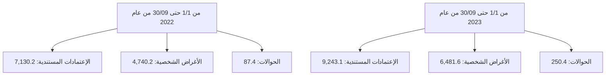
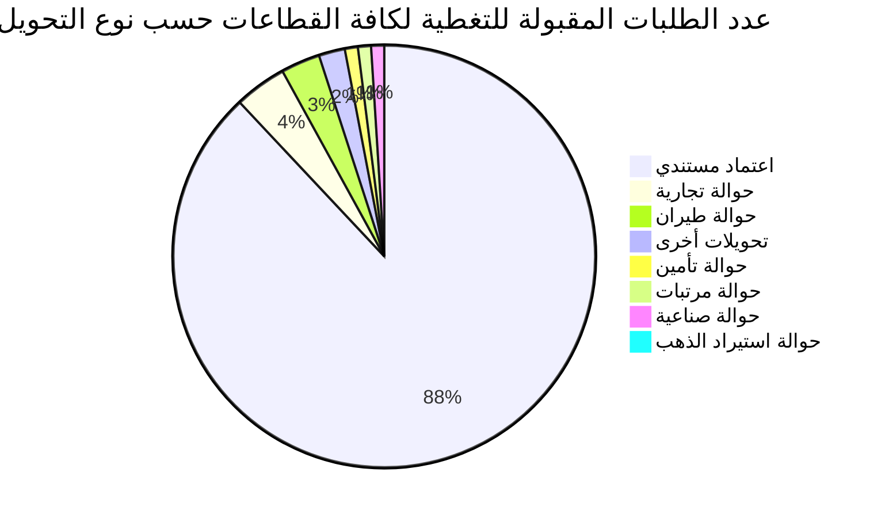

# مصرف ليبيا المركزي

## إستخدامات المصارف للنقد الأجنبي

### خلال الفترة: (1/1 - 30/09/2023)

![Central Bank of Libya image showing financial charts and currency]

إدارة الرقابة على المصارف والنقد
---
إدارة الرقابة على المصارف والنقد

## تحليل حركة إستخدامات المصارف الفعلية من النقد الأجنبي
### خلال الفترة (1/1 - حتى 2023/09/30)

بلغ إجمالي إستخدامات المصارف من النقد الأجنبي خلال الفترة (1/1 - حتى 2023/09/30) نحو 15,975,083,907 دولار، مقابل 11,957,815,645 دولار خلال نفس الفترة من العام الماضي 2022، بزيادة قدرها نحو 4,017,268,262 دولار. أي بمعدل نمو بلغ 33.6%.

حيث شكلت الإعتمادات المستندية ما نسبته 57.9% من إجمالي إستخدامات المصارف من النقد الأجنبي، فيما شكلت الأغراض الشخصية نسبة 40.6% من الإجمالي، في حين لم تشكل الحوالات إلا مانسبته 1.6% من إجمالي الإستخدامات.

### إستخدامات المصارف الفعلية من النقد الأجنبي لكافة الأغراض
"المبالغ بالدولار الأمريكي"

| البند | من 1/1 حتى 09/30 من عام 2022 | من 1/1 حتى 09/30 من عام 2023 | مقدار التغير | نسبة التغير% |
|-------|-------------------------------|-------------------------------|--------------|---------------|
| الإعتمادات المستندية | 7,130,198,565 | 9,243,083,616 | 2,112,885,051 | 29.6 |
| الحوالات | 87,368,035 | 250,427,713 | 163,059,678 | 186.6 |
| الأغراض الشخصية | 4,740,249,044 | 6,481,572,578 | 1,741,323,534 | 36.7 |
| الإجمالي | 11,957,815,645 | 15,975,083,907 | 4,017,268,262 | 33.6 |

### إستخدامات المصارف للنقد الأجنبي لكافة الأغراض

صفحة 2 من 97
---
إدارة الرقابة على المصارف والنقد

المبالغ المُباعة للمصارف من النقد الأجنبي لكافة الأغراض:

في إطار مُتابعة إدارة الرقابة على المصارف والنقد لطلبات الشراء المقبولة للاعتمادات المُستندية والحوالات، المُقدمة من المصارف عبر منظومة مُتابعة طلبات التغطية، وكذلك منظومة مبيعات النقد الأجنبي للأغراض الشخصية، طبقاً لقرار مجلس إدارة مصرف ليبيا المركزي رقم (1) لسنة 2020 بشأن تعديل سعر صرف الدينار الليبي، ومنشور إدارة الرقابة على المصارف والنقد رقم (2020/9).

ومن خلال الإطلاع على الجدول أدناه للقيم المُباعة من النقد الأجنبي حسب المصارف، يتضح أن المصرف التجاري الوطني احتل الترتيب الأول كأكثر المصارف استخداماً للنقد الأجنبي خلال الفترة (1/1 – حتى 2023/09/30) مُسجلاً حصة سوقية بلغت 13.7%، حيث بلغ إجمالي المبالغ نحو 2,182,044,685 دولار، فيما جاء مصرف الوحدة في المرتبة الثانية بقيمة بلغت 1,989,252,365 دولار، ثم مصرف الجمهورية في المرتبة الثالثة بقيمة 1,823,025,459 دولار، ثم مصرف الأمان للتجارة والإستثمار في المرتبة الرابعة بقيمة 1,684,316,499 دولار، ثم تأتي من حيث الأهمية النسبية المصارف التالية حسب الترتيب: مصرف اليقين، مصرف النوران، المصرف الإسلامي الليبي، المصرف المتحد ومصرف الصحاري، إلى آخره من المصارف كما موضح بالجدول أدناه والذي يحتوي أيضاً على الترتيب الذي كانت عليه المصارف خلال نفس الفترة من العام الماضي 2022.

صفحة 3 من 97
---
إدارة الرقابة على المصارف والنقد

## ترتيب المصارف حسب إجمالي المبالغ المُباعة من النقد الأجنبي

| المصرف | من 1/1 حتى 09/30 من عام 2022 |  |  | من 1/1 حتى 09/30 من عام 2023 |  |  |
|---------|---------------------------|------|--------------------------|---------------------------|------|--------------------------|
|         | الترتيب | القيمة بالدولار | الحصة السوقية | الترتيب | القيمة بالدولار | الحصة السوقية |
| المصرف التجاري الوطني | 3 | 1,419,419,872 | %11.9 | 1 | 2,182,044,685 | %13.7 |
| مصرف الوحدة | 7 | 801,971,441 | %6.7 | 2 | 1,989,252,365 | %12.5 |
| مصرف الجمهورية | 2 | 1,615,765,803 | %13.5 | 3 | 1,823,025,459 | %11.4 |
| مصرف الأمان للتجارة والإستثمار | 1 | 1,977,518,303 | %16.5 | 4 | 1,684,316,499 | %10.5 |
| مصرف اليقين | 4 | 1,284,606,725 | %10.7 | 5 | 1,403,211,815 | %8.78 |
| مصرف النوران | 5 | 900,022,782 | %7.5 | 6 | 1,365,872,687 | %8.6 |
| المصرف الإسلامي الليبي | 6 | 878,572,151 | %7.3 | 7 | 1,141,260,655 | %7.1 |
| المصرف المتحد للتجارة والإستثمار | 8 | 768,690,869 | %6.4 | 8 | 1,103,989,914 | %6.9 |
| مصرف الصحاري | 9 | 535,316,073 | %4.5 | 9 | 781,195,162 | %4.9 |
| مصرف شمال أفريقيا | 12 | 299,257,848 | %2.5 | 10 | 508,966,829 | %3.2 |
| مصرف الخليج الأول الليبي | 10 | 416,363,046 | %3.5 | 11 | 469,441,294 | %2.9 |
| مصرف السراي للتجارة والإستثمار | 11 | 324,182,530 | %2.7 | 12 | 333,037,056 | %2.1 |
| مصرف التجارة والتنمية | 19 | 6,903,675 | %0.1 | 13 | 304,760,911 | %1.9 |
| مصرف الأندلس | 16 | 83,643,444 | %0.7 | 14 | 256,553,675 | %1.6 |
| مصرف الوفاء | 15 | 118,125,416 | %1.0 | 15 | 216,160,234 | %1.4 |
| مصرف الواحة | 14 | 139,808,285 | %1.2 | 16 | 153,070,204 | %1.0 |
| مصرف التضامن | 17 | 81,503,492 | %0.7 | 17 | 139,785,177 | %0.9 |
| المصرف الليبي الخارجي | 13 | 263,843,143 | %2.2 | 18 | 79,231,795 | %0.5 |
| مصرف المتوسط | 18 | 42,300,748 | %0.4 | 19 | 39,907,490 | %0.2 |
| مصرف الإجماع العربي | 20 | 0 | %0.0 | 20 | 0 | %0.0 |
| الإجمالي | - | 11,957,815,645 | %100.0 |  | 15,975,083,907 | %100.0 |

صفحة 4 من 97
---
إدارة الرقابة على المصارف والنقد

المبالغ المُباعة للمصارف من النقد الأجنبي (حسب الغرض)
" القيم بالدولار الأمريكي "

| ت | المصرف | الاعتمادات المستندية |  |  الحوالات |  | الأغراض الشخصية |  |
|---|---------|----------------------|----------------------|---------------|---------------|---------------------|---------------------|
|   |         | من 1/1 حتى 09/30 من عام 2022 | من 1/1 حتى 09/30 من عام 2023 | من 1/1 حتى 09/30 من عام 2022 | من 1/1 حتى 09/30 من عام 2023 | من 1/1 حتى 09/30 من عام 2022 | من 1/1 حتى 09/30 من عام 2023 |
| -1 | التجاري الوطني | 538,047,511 | 1,015,256,711 | 521,892 | 5,161,502 | 880,850,469 | 1,161,626,472 |
| -2 | الوحدة | 555,953,849 | 1,714,671,067 | 271,386 | 920,049 | 245,746,206 | 273,661,249 |
| -3 | الجمهورية | 956,733,126 | 989,504,347 | 6,854,177 | 47,146,112 | 652,178,500 | 786,375,000 |
| -4 | الأمان للتجارة والاستثمار | 352,180,711 | 506,992,748 | 0 | 465,540 | 1,625,337,592 | 1,176,858,211 |
| -5 | اليقين | 951,090,534 | 703,242,587 | 2,412,930 | 11,303,112 | 331,103,260 | 688,666,116 |
| -6 | الوطان | 790,918,953 | 1,052,849,496 | 6,378,178 | 23,109,304 | 102,725,652 | 289,913,887 |
| -7 | الإسلامي الليبي | 748,923,543 | 856,055,780 | 14,843,643 | 39,497,432 | 114,804,965 | 245,707,443 |
| -8 | المتحد للتجارة والاستثمار | 357,850,258 | 322,708,209 | 874,789 | 3,374,237 | 409,965,822 | 777,907,468 |
| -9 | الصحاري | 233,574,106 | 283,402,655 | 7,024,925 | 8,871,204 | 294,717,042 | 488,921,303 |
| -10 | شمال أفريقيا | 257,457,722 | 300,952,686 | 25,924,063 | 38,328,917 | 15,876,063 | 169,685,225 |
| -11 | الخليج الأول الليبي | 405,512,846 | 439,431,213 | 10,848,500 | 29,724,596 | 1,700 | 285,485 |
| -12 | السراي للتجارة والاستثمار | 320,735,755 | 309,289,017 | 0 | 14,517,435 | 3,446,775 | 9,230,604 |
| -13 | التجارة والتنمية | 0 | 3,600,000 | 0 | 0 | 6,903,675 | 301,160,911 |
| -14 | الأندلس | 82,931,945 | 231,597,433 | 711,498 | 5,391,934 | 0 | 19,564,307 |
| -15 | الوفاء | 117,102,536 | 213,600,439 | 0 | 0 | 1,022,880 | 2,559,795 |
| -16 | الواحة | 90,043,370 | 70,800,886 | 726,311 | 0 | 49,038,604 | 82,269,318 |
| -17 | التضامن | 81,503,492 | 139,785,177 | 0 | 0 | 0 | 0 |
| -18 | الليبي الخارجي | 253,421,050 | 56,328,068 | 9,975,743 | 22,616,337 | 446,350 | 287,390 |
| -19 | المتوسط | 36,217,259 | 33,015,096 | 0 | 0 | 6,083,489 | 6,892,394 |
| -20 | الإجماع العربي | 0 | 0 | 0 | 0 | 0 | 0 |
| - | الإجمالي الكلي | 7,130,198,565 | 9,243,083,616 | 87,368,035 | 250,427,713 | 4,740,249,044 | 6,481,572,578 |

صفحة 5 من 97
---
إدارة الرقابة على المصارف والنقد

## الأهمية النسبية حسب المصرف لاستخدامات النقد الأجنبي خلال الفترة من 1/1 حتى 09/30 من عام 2022

| المصرف | النسبة |
|---------|--------|
| مصرف الأمان للتجارة والاستثمار | 17% |
| مصرف الجمهورية | 14% |
| المصرف التجاري الوطني | 12% |
| مصرف اليقين | 11% |
| باقي المصارف | 11% |
| مصرف النوران | 8% |
| المصرف الإسلامي الليبي | 7% |
| مصرف الوحدة | 7% |
| المصرف المتحد للتجارة والاستثمار | 6% |
| مصرف الصحاري | 4% |
| مصرف الخليج الأول الليبي | 3% |

## الأهمية النسبية حسب المصرف لاستخدامات النقد الأجنبي خلال الفترة من 1/1 حتى 09/30 من عام 2023

| المصرف | النسبة |
|---------|--------|
| المصرف التجاري الوطني | 16% |
| مصرف الوحدة | 14% |
| مصرف الجمهورية | 13% |
| مصرف الأمان للتجارة والاستثمار | 12% |
| مصرف النوران | 10% |
| مصرف اليقين | 10% |
| المصرف الإسلامي الليبي | 8% |
| المصرف المتحد للتجارة والاستثمار | 8% |
| مصرف الصحاري | 5% |
| مصرف شمال أفريقيا | 4% |

صفحة 6 من 97
---
إدارة الرقابة على المصارف والنقد

ثانياً : طلبات المصارف المقبولة لتغطية الإعتمادات المستندية والحوالات عدا الأغراض الشخصية خلال الفترة (1/1 – حتى 30/09/2023):

بلغ عدد الشركات والمصانع والجهات العامة والجهات الأخرى المستفيدة (1,866) والتي تمت الموافقة على طلباتهم خلال الفترة (1/1 – حتى 30/09/2023) للحصول على النقد الأجنبي ، بعدد طلبات بلغ نحو 12,097 طلب، معظم هذه الطلبات لتغطية الإعتمادات المستندية والتي سجلت 10,698 طلب بنسبة 88.4% من الطلبات، إجمالي كما هو موضح بالجدول التالي :-

| نوع التحويل | القطاع الخاص | القطاع العام | قطاع المصارف | جهات متنوعة | الإجمالي | الأهمية النسبية |
|-------------|---------------|--------------|---------------|--------------|----------|------------------|
| اعتماد مستندي | 10,444 | 246 | 8 | 0 | 10,698 | 88.4% |
| حوالة طيران | 387 | 56 | 0 | 4 | 447 | 3.7% |
| حوالة تجارية | 41 | 319 | 26 | 1 | 387 | 3.2% |
| تحويلات أخرى | 36 | 236 | 2 | 3 | 277 | 2.3% |
| حوالة تأمين | 36 | 87 | 0 | 0 | 123 | 1.0% |
| حوالة مرتبات | 0 | 0 | 0 | 83 | 83 | 0.7% |
| حوالة صناعية | 70 | 0 | 0 | 0 | 70 | 0.6% |
| حوالة استيراد الذهب | 12 | 0 | 0 | 0 | 12 | 0.1% |
| الإجمالي | 11,026 | 944 | 36 | 91 | 12,097 | 100% |

عدد الطلبات المقبولة للتغطية لكافة القطاعات حسب نوع التحويل خلال الفترة (1/1- حتى 30/09/2023)

صفحة 7 من 97
---
إدارة الرقابة على المصارف والنقد

## أولاً: الطلبات لكافة القطاعات :

### طلبات المصارف المقبولة لتغطية الإعتمادات المستندية والحوالات - لكافة القطاعات

#### 1- حسب أهم البلدان المستفيدة :

من خلال الإطلاع على الجدول أدناه لقيم طلبات المصارف لشراء النقد الأجنبي حسب البلدان

المستفيدة خلال الفترة (1/1 – حتى 30/09/2023) لكافة القطاعات، يتضح أن مانسبته 34.0%

من تحويلات المصارف لتغطية الإعتمادات المستندية أو الحوالات الأخرى كانت لدولة الإمارات

العربية المتحدة، ثم جاءت دولة مصر في المرتبة الثانية بنسبة 9.3% ثم تركيا والصين والمملكة

المتحدة بنسب 8.5% ، 5.9% و 5.6% على التوالي، والجدول التالي يوضح أهم عشرون بلد مستفيد.

### طلبات المصارف لتغطية الإعتمادات المستندية والحوالات - لكافة القطاعات
#### (حسب أهم عشرون بلد مستفيد)
#### خلال الفترة (1/1 – حتى 30/09/2023)

| ت | البلد المستفيد | القيمة بالدولار | الأهمية النسبية |
|---|----------------|-----------------|-----------------|
| 1- | الإمارات العربية المتحدة | 3,516,185,127 | 34.0% |
| 2- | مصر | 962,198,845 | 9.3% |
| 3- | تركيا | 882,541,443 | 8.5% |
| 4- | الصين | 606,264,408 | 5.9% |
| 5- | بريطانيا (المملكة المتحدة) | 576,671,166 | 5.6% |
| 6- | سويسرا | 554,629,747 | 5.4% |
| 7- | تونس | 507,052,459 | 4.9% |
| 8- | إيطاليا | 330,726,206 | 3.2% |
| 9- | النمسا | 301,218,531 | 2.9% |
| 10- | إسبانيا | 225,737,568 | 2.2% |
| 11- | هولندا | 196,753,607 | 1.9% |
| 12- | كوريا الجنوبية | 183,925,673 | 1.8% |

صفحة 8 من 97
---
إدارة الرقابة على المصارف والنقد

| -13 | اليابان | 143,336,887 | 1.4% |
|-----|--------|-------------|------|
| -14 | المانيا | 139,790,925 | 1.4% |
| -15 | السويد | 131,845,501 | 1.3% |
| -16 | تايلاند | 113,026,202 | 1.1% |
| -17 | هونج كونج S.A.R. | 99,919,099 | 1.0% |
| -18 | كندا | 87,374,947 | 0.8% |
| -19 | فرنسا | 87,053,875 | 0.8% |
| -20 | الولايات المتحدة | 74,134,701 | 0.7% |

## 2- حسب أهم بلدان منشأ السلع أو الخدمات:

من خلال الإطلاع على الجدول أدناه لقيم طلبات المصارف لشراء النقد الأجنبي حسب بلدان منشأ السلع أو الخدمات خلال الفترة (1/1 – حتى 30 / 09 /2023) لكافة القطاعات ، يتضح أن دولة تركيا قد أحتلت المرتبة الأولى حيث شكلت السلع أو الخدمات ذات المنشأ التركي نسبة 19.5% من الإجمالي طلبات الشراء المقبولة، ثم جاءت واردات السلع أو الخدمات ذات المنشأ المصري في المرتبة الثانية مشكلة مانسبته 13.8% من الإجمالي، وشكلت السلع أوالخدمات ذات المنشأ الصيني نسبة 13.1% محتلة المرتبة الثالثة خلال الفترة ، فيما سجلت السلع والخدمات ذات منشأ دولة روسيا الإتحادية مانسبته 7.2%، وذات المنشأ الهندي نسبة 5.3%، وجاءت السلع أو الخدمات ذات المنشأ التونسي في المرتبة السادسة مشكلة نسبة 4.0% من الإجمالي ، والجدول التالي يوضح أهم عشرون بلد منشأ للسلع أو الخدمات.

صفحة 9 من 97
---
إدارة الرقابة على المصارف والنقد

طلبات المصارف لتغطية الاعتمادات المستندية والحوالات - لكافة القطاعات
(حسب أهم عشرون بلد منشأ للسلع أوالخدمات)

خلال الفترة (1/1 – حتى 30/ 09 /2023)

| ت | بلد منشأ السلع أوالخدمات | القيمة بالدولار | الأهمية النسبية % |
|---:|------------------------:|----------------:|-------------------:|
| 1- | تركيا | 2,019,879,113 | 19.5% |
| 2- | مصر | 1,426,541,786 | 13.8% |
| 3- | الصين | 1,355,870,905 | 13.1% |
| 4- | روسيا الاتحادية | 742,357,977 | 7.2% |
| 5- | الهند | 546,514,647 | 5.3% |
| 6- | تونس | 418,928,473 | 4.0% |
| 7- | البرازيل | 373,533,540 | 3.6% |
| 8- | الإمارات العربية المتحدة | 309,922,437 | 3.0% |
| 9- | إيطاليا | 292,291,452 | 2.8% |
| 10- | ألمانيا | 235,514,274 | 2.3% |
| 11- | هولندا | 197,550,810 | 1.9% |
| 12- | الأرجنتين | 178,746,544 | 1.7% |
| 13- | أوكرانيا | 175,580,200 | 1.7% |
| 14- | تايلاند | 157,058,484 | 1.5% |
| 15- | إسبانيا | 153,849,836 | 1.5% |
| 16- | أيرلندا | 148,939,165 | 1.4% |
| 17- | كوريا الجنوبية | 142,351,659 | 1.4% |
| 18- | السويد | 132,742,026 | 1.3% |
| 19- | الولايات المتحدة | 123,301,178 | 1.2% |
| 20- | بلجيكا | 103,438,005 | 1.0% |

صفحة 11 من 97
---
إدارة الرقابة على المصارف والنقد

## ثانياً: الطلبات حسب القطاعات:

### طلبات المصــــــارف المقبولة لشراء النقد الأجنبي - حسب القطاعات
#### خلال الفترة (1/1 – حتى 30/09/2023)

| القطاع | عدد الشركات أو المصانع أو الجهات |
|--------|----------------------------------|
| القطاع الخاص | 1,733 |
| القطاع العام | 43 |
| قطاع المصارف | 4 |
| حوالات مرتبات الأجانب وجهات متنوعة | 86 |
| الإجمالي | 1,866 |

### 1- القطاع الخاص:

بلغ عدد شركات ومصانع القطاع الخاص (1,733) التي تمت الموافقة على طلباتها للحصول على النقد الأجنبي من المصارف لتغطية الإعتمادات المستندية والحوالات الأخرى خلال الفترة (1/1 – حتى 30/09/2023) حيث أحتلت طلبات شراء النقد الأجنبي من قبل القطاع الخاص لإستيراد مستلزمات الإنتاج والتشغيل المرتبة الأولى من إجمالي طلبات الشراء خلال الفترة، حيث شكلت مانسبته 17.6% من إجمالي طلبات شراء النقد الأجنبي، فيما أحتلت طلبات تغطية إستيراد السلع الغذائية المتنوعة المرتبة الثانية من حيث الأهمية النسبية لتشكل نحو 10.6%، فيما شكلت طلبات تغطية إستيراد مستلزمات إنتاج السلع الأساسية نسبة 10.5%، وإستيراد الأعلاف نسبة 8.4% من الإجمالي، والجدول التالي يوضح كافة طلبات الشراء للسلع أو الخدمات خلال الفترة.

صفحة 11 من 97
---
إدارة الرقابة على المصارف والنقد

# طلبات شراء السلع أو الخدمات - قطاع خاص
## خلال الفترة (1/1 - حتى 2023/09/30)

| ت | تصنيف السلع | القيمة بالدولار | الأهمية النسبية % |
|---:|---:|---:|---:|
| -1 | مستلزمات الإنتاج والتشغيل | 1,653,952,949 | 17.6% |
| -2 | سلع غذائية متنوعة | 995,145,057 | 10.6% |
| -3 | مستلزمات انتاج السلع الأساسية | 992,180,615 | 10.5% |
| -4 | أعلاف | 784,798,987 | 8.4% |
| -5 | مواد البناء ومستلزمات التشييد | 707,995,886 | 7.5% |
| -6 | أجهزة الكترونية | 682,898,606 | 7.3% |
| -7 | وسائل النقل واطارات ونضائد وقطع الغيار | 582,173,947 | 6.2% |
| -8 | الالات والمعدات | 408,748,873 | 4.4% |
| -9 | اللحوم الحية والمجمدة | 378,167,397 | 4.0% |
| -10 | منزلية وكهرومنزلية | 348,417,274 | 3.7% |
| -11 | حليب | 293,392,611 | 3.1% |
| -12 | الغذائية | 221,695,986 | 2.4% |
| -13 | أدوية بشرية | 207,867,247 | 2.2% |
| -14 | الاثاث | 150,541,290 | 1.6% |
| -15 | حليب وحفاظات وأغذية أطفال | 147,814,826 | 1.6% |
| -16 | أجبان | 121,640,790 | 1.3% |
| -17 | مواد التنظيف | 102,996,887 | 1.1% |
| -18 | تبغ بأنواعه ومستلزماته | 91,009,217 | 1.0% |
| -19 | زراعية | 80,375,397 | 0.9% |
| -20 | خدمات اتصالات وتقنية معلومات | 56,227,017 | 0.6% |
| -21 | فواكه وخضروات | 54,244,897 | 0.6% |
| -22 | مواد تنظيف | 36,370,827 | 0.4% |
| -23 | الزراعية | 36,137,214 | 0.4% |
| -24 | خدمات ملاحية متنوعة | 34,151,872 | 0.4% |
| -25 | خدمات انتاج وتشغيل | 25,805,154 | 0.3% |
| -26 | حوالات شركات خطوط الطيران | 25,415,004 | 0.3% |

صفحة 12 من 97
---
إدارة الرقابة على المصارف والنقد

| النسبة | القيمة | البند | الرقم |
|--------|--------|------|------|
| %0.3 | 25,079,654 | الملابس والأحذية | -27 |
| %0.2 | 22,468,488 | مواد صحية | -28 |
| %0.2 | 21,367,031 | طلبيات خاصة بشركة الأجنحة الليبية | -29 |
| %0.2 | 20,880,692 | حوالة استيراد الذهب | -30 |
| %0.2 | 16,904,541 | قرطاسية | -31 |
| %0.1 | 7,679,613 | شركة أويا للطيران | -32 |
| %0.1 | 7,542,548 | شركة غدامس للطيران | -33 |
| %0.1 | 7,326,134 | زبدة | -34 |
| %0.1 | 7,277,013 | أسماك وأحياء بحرية | -35 |
| %0.1 | 7,058,960 | السجاد والمنسوجات | -35 |
| %0.1 | 4,742,203 | الشركة الليبية السريعة للنقل الجوي | -37 |
| %0.05 | 4,689,878 | سمن | -38 |
| %0.04 | 3,423,628 | حوالات شركات التأمين | -39 |
| %0.03 | 3,061,763 | أدوية بطرية | -40 |
| %0.03 | 2,382,497 | شركة سما المتوسط للطيران | -41 |
| %0.02 | 1,530,086 | تكاليف خدمات سياحية | -42 |
| %0.01 | 1,019,922 | شركة المتحدة للتأمين | -43 |
| %0.01 | 884,284 | الطبية | -44 |
| %0.01 | 669,240 | مستلزمات تشغيل مصنع الحديد والصلب | -45 |
| %0.01 | 528,100 | حوالات دورة تدريبية | -46 |
| %0.01 | 485,195 | طلبيات الخطوط الجوية الليبية | -47 |
| %0.00 | 451,793 | متنوعة | -48 |
| %0.00 | 424,315 | سلع خاصة بالخدمات العامة | -49 |
| %0.00 | 28,500 | مستلزمات تشغيل الموانئ | -50 |

صفحة 13 من 97
---
إدارة الرقابة على المصارف والنقد

# طلبات الشراء حسب أهم خمسون شركة - قطاع خاص

خلال الفترة (1/1 - حتى 2023/09/30)

| ت | الشركة أو المصنع | القيمة بالدولار |
|---|-------------------|-----------------|
| 1 | شركة النسيم للصناعات الغذائية | 137,151,284 |
| 2 | شركة تويوتا ليبيا تجارة السيارات وقطع الغيار واستيراد والتصدير | 135,494,700 |
| 3 | شركة طريق القارة لإستيراد المواد الغذائية | 123,691,100 |
| 4 | شركة افريقيا لتعبئة المشروبات | 105,680,350 |
| 5 | شركة وادي الكوف للمطاحن والأعلاف ومضارب الأرز | 95,294,800 |
| 6 | شركة دروب ليبيا لاستيراد وسائل النقل وملحقاتها | 90,542,036 |
| 7 | شركة البنيان لصهر ودرفلة المعادن | 77,581,313 |
| 8 | شركة الشرق الليبي للمطاحن والاعلاف ومضارب الارز | 69,803,517 |
| 9 | شركة ظل التين لصناعة الالبان ومشتقاتها | 67,452,000 |
| 10 | شركة الجيد لإستيراد المواد الغذائية | 63,186,945 |
| 11 | شركة سما الأرياف لإستيراد المواد الغذائية و الخضروات و الفواكه الطازجة | 59,107,764 |
| 12 | شركة الوسام الذهبي لصناعة الدقيق والمطاحن والاعلاف ومضارب الأرز | 58,298,465 |
| 13 | شركة ابتهاج الطبيعة لإستيراد المواد الغذائية | 57,816,120 |
| 14 | شركة الجودة العالمية الاولى لصناعة الاعلاف ومطاحن الدقيق والصناعات الغذائية | 57,758,082 |
| 15 | شركة المصبوبات لصناعة مواد البناء | 54,400,880 |
| 16 | شركة الجاهزة لإستيراد المواد الغذائية | 54,222,090 |
| 17 | الشركة الليبية المتحدة لتعبئة المشروبات | 53,993,000 |
| 18 | شركة الريحان لصناعة المواد الغذائية | 52,400,356 |
| 19 | شركة الرفيق الأمثل لصناعة مواد البناء | 49,815,863 |
| 20 | شركة ألفا للمطاحن والاعلاف والصناعات الغذائية | 48,265,579 |
| 21 | شركة الموسم للصناعات الغذائية ومضارب الأرز | 47,879,095 |
| 22 | شركة الأصالة الذهبية للمطاحن ومضارب الأرز | 46,611,351 |
| 23 | شركة الأنهار لصناعة الدقيق | 45,185,700 |
| 24 | شركة المعمورة لاستيراد وتوزيع المواد الغذائية | 44,296,706 |
| 25 | شركة سلوق لصناعة الاعلاف بجميع انواعها والمطاحن | 43,200,000 |

صفحة 14 من 97
---
إدارة الرقابة على المصارف والنقد

| الرقم | اسم الشركة | القيمة |
|-------|-----------|--------|
| 26 | شركة الفتح الجديد لصناعة مواد التنظيف | 43,119,317 |
| 27 | شركة الاتقان المتقدمة لصناعة الدقيق | 42,609,770 |
| 28 | شركة أنعام ليبيا لاستيراد الاعلاف ومكملاتها | 41,850,000 |
| 29 | شركة أضواء النيزك لاستيراد الأجهزة الالكترونية وملحقاتها وقطع غيارها | 41,612,111 |
| 30 | شركة بسمتي للصناعات الغذائية | 39,877,779 |
| 31 | شركة السواحل الذهبية لاستيراد المواد الغذائية | 37,491,023 |
| 32 | شركة بصمة الجودة لاستيراد المواد الغذائية والمواشي واللحوم والفواكه | 36,345,040 |
| 33 | شركة الجيد للصناعات الغذائية | 35,391,508 |
| 34 | شركة تاجوراء الحياة للصناعات الغذائية | 35,065,300 |
| 35 | شركة البيوت الكاملة لاستيراد الاجهزة الالكترونية | 34,454,855 |
| 36 | شركة السد الحديثة لصناعة الاعلاف | 34,249,992 |
| 37 | مصنع التعاون لصناعة الاعلاف | 33,964,656 |
| 38 | شركة التاج العريقة لاستيراد الاجهزة الالكترونية والكهربائية وملحقاتها وقطع غيارها | 33,665,513 |
| 39 | شركة أضواء أفريقيا لاستيراد المواد الغذائية والمواشي واللحوم | 32,712,249 |
| 40 | شركة الواحة الدولية لطحن الحبوب و صناعة الأعلاف | 31,767,914 |
| 41 | شركة نبراس الخير لصناعة الاعلاف وطحن الحبوب | 31,429,304 |
| 42 | شركة المعمورة الأولى لاستيراد المواد الغذائية | 31,030,084 |
| 43 | شركة حوض شمال افريقيا لصناعة وتحلية وتعبئة مياه الشرب | 30,535,900 |
| 44 | شركة الافاضل المثالية لاستيراد المواد الخام | 29,900,736 |
| 45 | شركة نبض الاطلس لاستيراد المواشي و اللحوم | 29,799,838 |
| 46 | شركة السرايا الراقية لاستيراد المواد الغذائية والخضروات والفواكه والمواشي واللحوم | 29,111,467 |
| 47 | شركة النورس لصناعة الاعلاف والمطاحن ومضارب الارز | 28,962,589 |
| 48 | شركة طرابلس الكبرى لصناعة وتعبئة وتغليف الطماطم و المواد الغذائية | 28,146,618 |
| 49 | شركة المشارق الجديدة لاستيراد المواد الغذائية واللحوم والمجمدة | 27,944,338 |
| 50 | شركة الروابي الذهبية لاستيراد مواد البناء والمواد الصحية | 27,933,516 |

صفحة 15 من 97
---
إدارة الرقابة على المصارف والنقد

## -2 القطاع العام

بلغ عدد جهات القطاع العام التي تمت الموافقة على طلباتها للحصول على النقد الأجنبي لتغطية
الإعتمادات المستندية والحوالات الأخرى 43 جهة خلال الفترة (1/1 – حتى 2023/09/30)، حيث
احتلت متطلبات شركة ليبيانا للهاتف المحمول المرتبة الأولى من إجمالي طلبات الشراء خلال
الفترة، حيث شكلت مانسبته 20.9% من إجمالي طلبات شراء النقد الأجنبي، فيما احتلت الطلبات
لمستلزمات تشغيل مصنع الحديد والصلب المرتبة الثانية من حيث الأهمية النسبية لتشكل نحو
14.0%، فيما شكلت متطلبات شركة المدار الجديد نسبة 12.8%، وطلبات تغطية خدمات
الاتصالات وتقنية معلومات نسبة 11.0% ، فيما شكلت طلبات إستيراد مستلزمات الإنتاج
والتشغيل نسبة 9.8%، والجدول التالي يوضح كل طلبات شراء النقد الأجنبي حسب السلع أو
الخدمات للقطاع عام.

### طلبات الشراء حسب السلع أو الخدمات - قطاع عام
#### خلال الفترة (1/1 – حتى 2023/09/30)

| ت | تصنيف السلع | القيمة بالدولار | الأهمية النسبية |
|---|-------------|-----------------|-----------------|
| -1 | متطلبات شركة ليبيانا للهاتف المحمول | 192,005,941 | 20.9% |
| -2 | مستلزمات تشغيل مصنع الحديد والصلب | 128,182,127 | 14.0% |
| -3 | متطلبات شركة المدار الجديد | 117,607,821 | 12.8% |
| -4 | خدمات اتصالات وتقنية معلومات | 101,013,968 | 11.0% |
| -5 | مستلزمات انتاج وتشغيل | 89,774,458 | 9.8% |
| -6 | الهيئة العامة لصندوق الضمان الاجتماعي | 51,900,000 | 5.7% |
| -7 | أجهزة الالكترونية | 49,599,856 | 5.4% |
| -8 | شركة الاتحاد العربي للمقاولات | 28,941,250 | 3.2% |
| -9 | مستلزمات تشغيل شركة هاتف ليبيا | 26,964,828 | 2.9% |
| -10 | حوالات شركات خطوط الطيران | 14,875,862 | 1.6% |
| -11 | مواد البناء ومستلزمات التشييد | 12,656,945 | 1.4% |

صفحة 16 من 97
---
إدارة الرقابة على المصارف والنقد

| النسبة | المبلغ | البند | الرقم |
|--------|--------|------|------|
| %0.9 | 8,584,149 | حوالات شركات التأمين | -12 |
| %0.9 | 8,425,000 | أعلاف | -13 |
| %0.9 | 8,039,172 | مستلزمات الشركة العامة للكهرباء | -14 |
| %0.9 | 7,928,977 | الخطوط الجوية الأفريقية | -15 |
| %0.8 | 7,491,867 | شركة ليبيا للاتصالات والتقنية | -16 |
| %0.8 | 7,252,964 | صندوق الضمان الاجتماعي | -17 |
| %0.8 | 6,922,203 | الآلات والمعدات | -18 |
| %0.7 | 6,840,189 | خدمات انتاج وتشغيل | -19 |
| %0.6 | 5,906,870 | طلبات الخطوط الجوية الليبية | -20 |
| %0.6 | 5,629,344 | أدوية بشرية | -21 |
| %0.5 | 4,420,000 | الخطوط التونسية | -22 |
| %0.4 | 4,061,781 | جهاز مشروعات الاسكان والمرافق | -23 |
| %0.4 | 3,745,621 | وسائل النقل واطارات وضفائر وقطع الغي | -24 |
| %0.4 | 3,353,351 | احتياجات التشغيل لشركة معاملات | -25 |
| %0.3 | 2,630,976 | متطلبات تشغيل وصيانة الموانئ | -26 |
| %0.2 | 2,013,448 | مستلزمات الشركة العامة لتحلية المياه | -27 |
| %0.2 | 1,994,750 | قرطاسية | -28 |
| %0.2 | 1,809,209 | الشركة الليبية للموانئ | -29 |
| %0.1 | 1,300,694 | صندوق الرعاية الاجتماعية | -30 |
| %0.1 | 1,200,000 | حوالات علاجية | -31 |
| %0.1 | 813,828 | منزلية وكهرومنزلية | -32 |
| %0.1 | 760,581 | الشركة الاهلية للأسمنت | -33 |
| %0.1 | 755,974 | الملابس والاحذية | -34 |
| %0.1 | 675,815 | مستلزمات انتاج سلع أساسية | -35 |
| %0.1 | 578,825 | الشركة العامة لاستيراد السلع الامنية | -36 |
| %0.02 | 182,873 | طلبات شركات التأمين | -37 |
| %0.01 | 114,977 | متنوعة | -38 |
| %0.01 | 93,690 | الاتحاد الليبي لشركات التأمين | -39 |
| %0.01 | 60,000 | حوالات دورة تدريبية | - 40 |
| %0.00 | 15,112 | مستلزمات تشغيل الموانئ | - 41 |

صفحة 17 من 97
---
إدارة الرقابة على المصارف والنقد

# طلبات الشراء حسب الجهات - قطاع عام

خلال الفترة (1/1 - حتى 2023/09/30)

| ت | الجهة | القيمة بالدولار |
|---|-------|-----------------|
| 1 | شركة ليبيانا للهاتف المحمول | 295,961,978 |
| 2 | شركة المدار الجديد | 132,636,736 |
| 3 | الشركة الليبية للحديد والصلب | 130,116,999 |
| 4 | جهاز تنمية و تطوير المراكز الإدارية | 58,928,103 |
| 5 | الهيئة العامة لصندوق التضامن الاجتماعي | 51,900,000 |
| 6 | شركة الإتحاد العربي للمقاولات المساهمة | 44,088,991 |
| 7 | شركة ليبيا للاتصالات والتقنية المساهمة | 32,527,037 |
| 8 | شركة هاتف ليبيا | 31,301,784 |
| 9 | شركة الخطوط الجوية الأفريقية | 20,636,989 |
| 10 | شركة الاتصالات الدولية الليبية | 13,895,596 |
| 11 | شركة الجيل الجديد للتقنية | 11,296,036 |
| 12 | الشركة الوطنية للمطاحن والأعلاف | 8,975,846 |
| 13 | المنطقة الحرة بمصراته | 8,487,117 |
| 14 | الشركة العامة للكهرباء المساهمة | 8,039,172 |
| 15 | شركة الخطوط الجوية الليبية | 8,035,701 |
| 16 | شركة ليبيا للتأمين | 7,912,397 |
| 17 | الشركة الأهلية للأسمنت | 7,439,825 |
| 18 | صندوق الضمان الاجتماعي | 7,252,964 |
| 19 | جهاز تنفيذ مشروعات الإسكان و المرافق | 5,323,320 |
| 20 | شركة معاملات للخدمات المالية | 4,506,319 |
| 21 | فرع شركة الخطوط التونسية | 4,420,000 |
| 22 | شركة العامة لخدمات النظافة العامة طرابلس | 2,742,559 |
| 23 | جهاز إنشاء وصيانة الموانئ ومرافق الصيد البحري | 2,315,300 |
| 24 | شركة الليبية للموانئ | 2,139,997 |

صفحة 18 من 97
---
إدارة الرقابة على المصارف والنقد

| القيمة | الاسم | الرقم |
|--------|------|------|
| 2,013,448 | الشركة العامة لتحلية المياه | 25 |
| 1,994,750 | الشركة العامة للورق والطباعة | 26 |
| 1,949,824 | المفوضية العليا لرعاية ذوي الاحتياجات الخاصة | 27 |
| 1,826,982 | شركة الانماء للاستثمارات الكهربائية | 28 |
| 1,300,694 | صندوق الرعاية الاجتماعية بوزارة الداخلية | 29 |
| 1,200,000 | مستشفى طب وجراحة الأطفال بنغازي | 30 |
| 1,013,636 | مصلحة الاحوال المدنية | 31 |
| 918,112 | الاتحاد الليبي لشركات التأمين | 32 |
| 813,828 | شركة النظم للانشاءات الكهربائية المساهمة | 33 |
| 740,896 | المستشفى الجامعي طرابلس | 34 |
| 578,825 | الشركة العامة لاستيراد السلع الامنية المساهمة | 35 |
| 498,751 | مشروع تنفيذ الطريق السريع الجديد راس اجدير امساعد | 36 |
| 443,290 | المركز الليبي للاعتماد | 37 |
| 394,619 | شركة الليبية للخدمات الأرضية | 38 |
| 245,865 | شركة بريد ليبيا | 39 |
| 174,977 | جامعة بنغازي | 40 |
| 104,001 | شركة الشاحنات والحافلات | 41 |
| 30,203 | شركة النماء الليبية للتأمين المساهمة | 42 |
| 1,829 | الجهاز الوطني للطيران الزراعي | 43 |

صفحة 19 من 97
---
إدارة الرقابة على المصارف والنقد

### 3- قطاع المصارف :

طلبات التغطية المقبولة - قطاع المصارف
خلال الفترة (1/1 - 30/09/2023)
"تنازلياً مرتبة"

| الترتيب | أسم المصرف | القيمة بالدولار الأمريكي |
|---------|------------|-------------------------|
| 1 | مصرف الخليج الأول الليبي | 14,015,551 |
| 2 | المصرف المتحد للتجارة و الإستثمار | 3,193,939 |
| 3 | مصرف الامان للتجارة والاستثمار | 2,784,330 |
| 4 | شركة مصرف الأندلس | 1,631,962 |

حسب السلع والخدمات - قطاع المصارف
"تنازلياً مرتبة"

| الترتيب | السلع أو الخدمات | القيمة بالدولار الأمريكي |
|---------|------------------|-------------------------|
| 1 | حوالة أرباح للشريك الأجنبي - مصرف الخليج الأول الليبي | 14,015,551 |
| 2 | حوالة أرباح للشريك الأجنبي - المصرف المتحد | 3,193,939 |
| 3 | تكاليف منظومة حماية | 993,999 |
| 4 | كروت خام الفيزا | 532,519 |
| 5 | ضمان مالي ماستر كارد | 450,000 |
| 6 | شاشات عرض | 414,033 |
| 7 | شراء تراخيص منظومة | 337,733 |
| 8 | سداد قيمة الضمان | 300,000 |
| 10 | مكينات عد الأوراق | 284,539 |
| 11 | 20 ماكينة ATM قطع غيار | 274,077 |
| 12 | تسديد حوالة خارجية | 200,000 |
| 13 | أجهزة أندرويد | 126,763 |
| 14 | أجهزة POS (400) | 101,410 |
| 15 | خدمات دعم منظومة | 70,000 |
| 16 | مقابل خدمات دعم منظو | 60,000 |
| 17 | عقد خدمات دعم فني | 60,000 |

صفحة 20 من 97
---
إدارة الرقابة على المصارف والنقد

| القيمة | البند | الترتيب |
|--------|------|--------|
| 56,990 | مكيفات | 18 |
| 20,000 | حوالة خارجية | 19 |
| 20,000 | توثيق متعددة - صيانة | 20 |
| 19,496 | تسديد مصاريف سويفت | 21 |
| 19,191 | مقابل برمجيات | 22 |
| 17,158 | تجديد خدمات دعم فني | 23 |
| 12,772 | مقابل تجديد خدمات | 24 |
| 11,750 | بطاقات دفع مسبق | 25 |
| 5,788 | مراجعة نظام السويفت | 26 |
| 4,944 | منتجات وخدمات سوفتوير | 27 |
| 4,944 | حوالة خارجية | 28 |
| 4,944 | رسوم اشتراك | 29 |
| 4,500 | تخصيص برنامج اوراكل | 30 |
| 4,200 | سداد منتجات | 31 |
| 2,237 | مقابل سداد عضوية | 32 |
| 2,000 | بطاقات آلة السحب | 33 |
| 244 | مقابل سوفت وير | 34 |
| 61 | مقابل منتجات أمنية | 35 |

حسب بلد المنشأ - قطاع المصارف
خلال الفترة (1/1 - 30/09/2023)
"تنازلياً مرتبة"

| القيمة بالدولار الأمريكي | بلد المنشأ | الترتيب |
|--------------------------|-----------|--------|
| 14,471,164 | الإمارات العربية المتحدة | 1 |
| 3,193,939 | البحرين | 2 |
| 993,999 | المغرب | 3 |
| 642,206 | الصين | 4 |
| 532,519 | إسبانيا | 5 |
| 500,000 | كندا | 6 |
| 450,000 | الولايات المتحدة | 7 |
| 284,539 | فرنسا | 8 |

صفحة 21 من 97
---
إدارة الرقابة على المصارف والنقد

| 274,077 | المجر | 9 |
|---------|-------|---|
| 144,500 | الهند | 10 |
| 56,990 | كوريا الجنوبية | 11 |
| 38,992 | بلجيكا | 12 |
| 25,788 | لبنان | 13 |
| 17,069 | المتحدة بريطانيا (المملكة) | 14 |

حسب البلد المستفيد - قطاع المصارف
"تنازلياً مرتبة"

| القيمة بالدولار الأمريكي | البلد المستفيد | الترتيب |
|--------------------------|----------------|---------|
| 14,942,187 | الإمارات العربية المتحدة | 1 |
| 3,468,016 | البحرين | 2 |
| 1,222,172 | المغرب | 3 |
| 950,000 | الولايات المتحدة | 4 |
| 532,519 | إسبانيا | 5 |
| 284,539 | فرنسا | 6 |
| 144,500 | الهند | 7 |
| 38,992 | بلجيكا | 8 |
| 25,788 | لبنان | 9 |
| 17,069 | المتحدة بريطانيا (المملكة) | 10 |

صفحة 22 من 97
---
إدارة الرقابة على المصارف والنقد

## 4- جهات متنوعة وحوالات مرتبات الأجانب:

طلبات التغطية المقبولة
جهات متنوعة وحوالات مرتبات للأجانب
خلال الفترة (1/1- 30/09/2023)

| الترتيب | أسم الجهة | القيمة بالدولار الأمريكي |
|---------|-----------|--------------------------|
| 1 | سفارة جمهورية تركيا - رسوم إصدار التأشيرات | 21,612,113 |
| 2 | عدد (83) حوالة أفراد - مرتبات أجانب | 1,241,816 |
| 3 | حوالة طيران - تحويل فائض مبيعات للخطوط التونسية | 1,155,779 |
| 4 | سفارة دولة قطر - تكاليف رسوم تأشيرات | 3,083 |

حسب بلد المستفيد - جهات متنوعة وحوالات أجانب (مرتبات)

| الترتيب | بلد المستفيد | القيمة بالدولار الأمريكي |
|---------|--------------|--------------------------|
| 1 | تركيا | 21,612,113 |
| 2 | تونس | 1,175,323 |
| 3 | أوكرانيا | 207,194 |
| 4 | الهند | 192,707 |
| 5 | بولندا | 156,506 |
| 6 | مصر | 115,850 |
| 7 | بلغاريا | 114,626 |
| 8 | الفلبين | 91,661 |
| 9 | الأردن | 67,680 |
| 10 | كندا | 43,510 |
| 11 | السودان | 41,000 |
| 12 | مولدافيا | 36,610 |
| 13 | الإمارات العربية المتحدة | 34,010 |
| 14 | المانيا | 19,580 |
| 15 | سوريا | 19,500 |
| 16 | بنجلاديش | 18,796 |
| 17 | سلوفاكيا | 14,000 |
| 18 | إيطاليا | 11,402 |
| 19 | قطر | 10,083 |
| 20 | الولايات المتحدة | 10,000 |

صفحة 23 من 97
---
إدارة الرقابة على المصارف والنقد

| 21 | المجر | 9,700 |
|----|---------|----|
| 22 | العراق | 6,740 |
| 23 | فرنسا | 4,200 |

# الملحق

طلبات التغطية المقبولة لكافة القطاعات خلال الفترة (1/1 – حتى 2023/09/30):

- قوائم بكافة الجهات والشركات والمصانع المستفيدة.

- طلبات الشراء حسب تصنيف السلع أو الخدمات.

- طلبات الشراء حسب بلدان منشأ السلع أو الخدمات والبلدان المستفيدة.

صفحة 24 من 97
---
# طلبات التغطية المقبولة
## قائمة بكافة الشركات والمصانع - قطاع خاص
### خلال الفترة (1/1 - 30/09/2023)
"مرتبة تنازلياً"

| الترتيب | اسم الشركة أو المصنع | القيمة بالدولار الأمريكي |
|---------|----------------------|--------------------------|
| 1 | شركة النسيم للصناعات الغذائية | 137,151,284 |
| 2 | شركة تويوتا ليبيا تجارة السيارات وقطع الغيار واستيراد والتصدير | 135,494,700 |
| 3 | شركة طريق القارة لاستيراد المواد الغذائية | 123,691,100 |
| 4 | شركة افريقيا لتعبئة المشروبات | 105,680,350 |
| 5 | شركة وادي الكوف للمطاحن والأعلاف ومضارب الأرز | 95,294,800 |
| 6 | شركة دروب ليبيا لاستراد وسائل النقل وملحقاتها | 90,542,036 |
| 7 | شركة البنيان لصهر ودرفلة المعادن | 77,581,313 |
| 8 | شركة الشرق الليبي للمطاحن والاعلاف ومضارب الارز | 69,803,517 |
| 9 | شركة ظل التين لصناعة الالبان ومشتقاتها | 67,452,000 |
| 10 | شركة الجيد لإستيراد المواد الغذائية | 63,186,945 |
| 11 | شركة سما الارياف لاستيراد المواد الغذائية و الخضروات و الفواكه الطازجة | 59,107,764 |
| 12 | شركة الوسام الذهبي لصناعة الدقيق والمطاحن والاعلاف ومضارب الارز | 58,298,465 |
| 13 | شركة أبتهاج الطبيعة لاستيراد المواد الغذائية | 57,816,120 |
| 14 | شركة الجودة العالمية الاولى لصناعة الاعلاف ومطاحن الدقيق والصناعات الغذائية | 57,758,082 |
| 15 | شركة المصبوبات لصناعة مواد البناء | 54,400,880 |
| 16 | شركة الجاهزة لاستيراد المواد الغذائية | 54,222,090 |
| 17 | شركة الليبية المتحدة لتعبئة المشروبات | 53,993,000 |
| 18 | شركة الريحان لصناعة المواد الغذائية | 52,400,356 |
| 19 | شركة الرفيق الأمثل لصناعة مواد البناء | 49,815,863 |
| 20 | شركة ألفا للمطاحن والاعلاف والصناعات الغذائية | 48,265,579 |
| 21 | شركة الموسم للصناعات الغذائية ومضارب الارز | 47,879,095 |
| 22 | شركة الاصالة الذهبية للمطاحن ومضارب الارز | 46,611,351 |
| 23 | شركة الانهار لصناعة الدقيق | 45,185,700 |
| 24 | شركة المعمورة لاستيراد وتوزيع المواد الغذائية | 44,296,706 |
| 25 | شركة سلوق لصناعة الاعلاف بجميع انواعها والمطاحن | 43,200,000 |
| 26 | شركة الفتح الجديد لصناعة مواد التنظيف | 43,119,317 |
| 27 | شركة الاتقان المتقدمة لصناعة الدقيق | 42,609,770 |
---
| Amount (LYD) | Company Name | No. |
|-------------|---------------|-----|
| 41,850,000 | شركة أنعام ليبيا لاستيراد الاعلاف ومكملاتها | 28 |
| 41,612,111 | شركة أضواء النيزك لاستيراد الأجهزة الألكترونية وملحقاتها وقطع غيارها | 29 |
| 39,877,779 | شركة بسمتي للصناعات الغذائية | 30 |
| 37,491,023 | شركة السواحل الذهبية لاستيراد المواد الغذائية | 31 |
| 36,345,040 | شركة بصمة الجودة لاستيراد المواد الغذائية والمواشي واللحوم والفواكه | 32 |
| 35,391,508 | شركة الجيد للصناعات الغذائية | 33 |
| 35,065,300 | شركة تاجوراء الحياة للصناعات الغذائية | 34 |
| 34,454,855 | شركة البيوت الكاملة لإستيراد الاجهزة الالكترونية | 35 |
| 34,249,992 | شركة السد الحديثة لصناعة الاعلاف | 36 |
| 33,964,656 | مصنع التعاون لصناعة الاعلاف | 37 |
| 33,665,513 | شركة التاج العريقة لاستيراد الاجهزة الالكترونية والكهربائية وملحقاتها وقطع غيارها | 38 |
| 32,712,249 | شركة أضواء افريقيا لاستيراد المواد الغذائية والمواشي واللحوم | 39 |
| 31,767,914 | شركة الواحة الدولية لطحن الحبوب و صناعة الأعلاف | 40 |
| 31,429,304 | شركة نبراس الخير لصناعة الاعلاف وطحن الحبوب | 41 |
| 31,030,084 | شركة المعمورة الأولى لاستيراد المواد الغذائية | 42 |
| 30,535,900 | شركة حوض شمال افريقيا لصناعة وتحلية وتعبئة مياه الشرب | 43 |
| 29,900,736 | شركة الافاضل المثالية لاستيراد المواد الخام | 44 |
| 29,799,838 | شركة نبض الاطلسي لاستيراد المواشي و اللحوم | 45 |
| 29,111,467 | شركة السرايا الراقية لاستيراد المواد الغذائية والخضروات والفواكه والمواشي واللحوم | 46 |
| 28,962,589 | شركة النورس لصناعة الاعلاف والمطاحن ومضارب الارز | 47 |
| 28,146,618 | شركة طرابلس الكبرى لصناعة وتعبئة وتغليف الطماطم و المواد الغذائية | 48 |
| 27,944,338 | شركة المشارق الجديدة لاستيراد المواد الغذائية واللحوم والمجمدة | 49 |
| 27,933,516 | شركة الروابي الذهبية لاستيراد مواد البناء والمواد الصحية | 50 |
| 27,926,982 | شركة اشبيلية لصناعة الاعلاف والدقيق | 51 |
| 27,638,716 | شركة المعمورة للصناعات الغذائية والمطاحن والأعلاف | 52 |
| 26,892,369 | شركة الساحل لاستيراد المواشي واللحوم | 53 |
| 26,808,379 | شركة انوار المدينة لاستيراد الاجهزة والمواد الكهربائية والغير كهربائية وقطع غيارها | 54 |
| 26,278,122 | شركة السواعد للصناعات الخشبية | 55 |
| 25,801,668 | شركة جازان الحديثة لاستيراد الاجهزة والمواد الكهربائية وغير الكهربائية وقطع غيارها والاجهزة الالكترو | 56 |
| 25,576,800 | شركة غذاء النيل لاستيراد المواد الغذائية والخضراوات والفواكه الطازجة والمواشي و اللحوم | 57 |
| 25,543,073 | شركة المستكشف الدولية للخدمات النفطية | 58 |
| 24,944,274 | شركة شمس الوطن الاولى لاستيراد الاجهزة الكهربائية والالكترونية وملحقاتها وقطع غيارها | 59 |
| 24,577,980 | شركة روافد الغذاء لاستيراد المواد الغذائية | 60 |
| 24,574,350 | شركة الثمرات الليبية لاستيراد المواد الغذائية | 61 |
---
| Amount | Company Name | No. |
|---------|---------------|-----|
| 24,462,660 | شركة السراب لصناعة الالمونيوم | 62 |
| 24,036,940 | شركة سما المراعي للمطاحن وصناعة الاعلاف ومضارب الارز | 63 |
| 24,024,742 | شركة الافق لاستيراد مستلزمات الام والطفل | 64 |
| 23,813,784 | شركة الميسم لاستيراد السيارات وصيانتها | 65 |
| 23,664,714 | شركة المتحدة الجديدة لاستيراد التبغ والسجائر ومستلزماتها | 66 |
| 23,659,189 | شركة بيت النجوم لاستيراد الاجهزة والمعدات الكهربائية والالكترونية وقطع غيارها | 67 |
| 23,434,944 | شركة السد العالى لصناعة الاجهزة الالكترونية | 68 |
| 23,340,912 | شركة الليبية الكبرى لصناعة السميد و الدقيق | 69 |
| 22,906,695 | شركة لمسة الحياة لاستيراد المعدات والادوية والمستحضرات الطبية ومستلزمات الام والطفل | 70 |
| 22,753,178 | شركة المكيال لصناعة المطابخ | 71 |
| 22,568,465 | شركة الركن المالكي لصناعة البي في سي | 72 |
| 22,536,234 | شركة مجموعة المتحدة للمطاحن والأعلاف | 73 |
| 22,431,060 | شركة النيزك الخاطف لاستيراد المواد الكهربائية وغير الكهربائية وقطع غيارها والمواد الالكترونية وملحقا | 74 |
| 22,318,259 | شركة هادريان لاستيراد المواد الغذائية المحدودة | 75 |
| 22,264,700 | شركة الظفرة الليبية لصناعة الأعلاف وطحن الحبوب بجميع انواعها | 76 |
| 22,203,656 | شركة شمال المتوسط لإستيراد المواد الغذائية | 77 |
| 22,146,382 | شركة الاجنحة الليبية للطيران المساهمة | 78 |
| 21,885,628 | شركة الشروق الليبية للمطاحن والأعلاف | 79 |
| 21,860,714 | شركة مجموعة الامتياز لاستيراد وسائل النقل وملحقاتها | 80 |
| 21,671,916 | شركة جود الاولى لاستيراد المواد الخام | 81 |
| 21,630,600 | شركة افاق الغد الجديدة لاستيراد الاجهزة والمواد الكهربائية وغير الكهربائية وقطع غيارها | 82 |
| 21,516,263 | شركة ادري لاستيراد وسائل النقل وملحقاتها | 83 |
| 21,504,366 | شركة اشراقة الربيع لصناعة وتجميع المضخات | 84 |
| 21,444,593 | شركة المراعي الخصبة للمطاحن و الاعلاف ومضارب الارز | 85 |
| 21,292,500 | شركة المتألق لصناعة البي في سي | 86 |
| 21,130,600 | شركة صفاء الجودة لصناعة الدقيق | 87 |
| 21,097,493 | شركة المبروكة للصناعات الغذائية | 88 |
| 21,082,223 | شركة سهم قروب لاستيراد المواد الخام | 89 |
| 21,024,797 | شركة برج الرويال لإستيراد التبغ والسجائر ومستلزماتها | 90 |
| 21,019,218 | شركة الرماح لاستيراد المواد الغذائية المساهمة | 91 |
| 20,982,090 | شركة شريان الحياة لاستيراد جميع أنواع الاعلاف ومكملاتها والمعدات الزراعية وبذور الحيوانات وطحن الحبو | 92 |
| 20,844,918 | شركة المذاق الطيب لاستيراد المواد الغذائية والمواشي واللحوم | 93 |
| 20,829,970 | شركة الخمس لصناعة المواد الكهربائية والمنزلية | 94 |
| 20,672,857 | شركة الاتزان المثالي لإستيراد المواد الخام | 95 |
---
| Amount | Company Name | No. |
|---------|---------------|-----|
| 20,340,500 | شركة جودة الموسم لاستيراد المواد الغذائية | 96 |
| 20,003,354 | شركة الركن الالكتروني لصناعة الاجهزة الالكترونية والكهربائية | 97 |
| 19,818,309 | شركة الوطنية لاستيراد التبغ | 98 |
| 19,686,326 | شركة التحدي الصامد للمطاحن والاعلاف | 99 |
| 19,575,500 | شركة وادي الربيع لانتاج الدقيق ومشتقاته | 100 |
| 19,551,469 | مصنع المميزون لصناعة الابواب والنوافذ من الالمونيوم والبي في سي | 101 |
| 19,516,118 | شركة أصيل الحر لصناعة الألمونيوم | 102 |
| 19,455,194 | شركة الميثاق الحديث لصناعة البي في سي | 103 |
| 19,372,770 | شركة ليبيا الخير لتفريخ البيض وإنتاج الدواجن | 104 |
| 19,331,886 | شركة الإشراق الواعد للصناعات الحديدية والبلاستيكية | 105 |
| 19,252,632 | شركة تواصل ليبيا لاستيراد الالكترونيات المساهمة | 106 |
| 19,232,650 | شركة الأكارم لاستيراد الاجهزة والمواد الكهربائية والغير كهربائية وقطع غيارها والاجهزة الالكترونية وم | 107 |
| 19,219,306 | شركة الاختيار لصناعة البي في سي | 108 |
| 18,937,692 | شركة القلعة الذهبية المتميزة لاستيراد مواد البناء | 109 |
| 18,898,818 | شركة التنمية الزراعية لتخصيب البيض وانتاج الدواجن | 110 |
| 18,885,550 | شركة السد لصناعة الاعلاف الحيوانية | 111 |
| 18,810,199 | شركة اجود المحركات لاستيراد السيارات | 112 |
| 18,634,770 | شركة البيت الجديد للصناعات الالكترونية والكهربائية | 113 |
| 18,633,160 | شركة اوراس الجديدة لصناعة الاثاث | 114 |
| 18,265,136 | شركة الطائف لاستيراد المواد الغذائية | 115 |
| 18,104,102 | شركة الخبرة للتوكيلات الملاحية تابعة لشركة ناتكو القابضة | 116 |
| 18,003,903 | شركة الوثاق الاول لصناعة البي في سي | 117 |
| 17,909,809 | شركة المنجد لصناعة البي في سي | 118 |
| 17,877,962 | شركة القلعة المتألقة صناعة مواد البناء والطلاء وصناعة البلاستيك والمواد الخام | 119 |
| 17,835,027 | شركة النخوة الليبية لاستيراد المواد الغذائية | 120 |
| 17,523,489 | شركة غدامس للنقل الجوي المساهمة | 121 |
| 17,486,650 | شركة الأيقونة لصناعة المطابخ | 122 |
| 17,397,554 | شركة زخارف لصناعة الاثاث | 123 |
| 17,353,980 | شركة الأوتار الصناعية لصناعة الاجهزة الالكترونية والكهربائية | 124 |
| 17,343,534 | شركة الخيار الافضل لاستيراد الاجهزة الالكترونية والكهربائية | 125 |
| 17,256,467 | شركة المتقن لصناعة الالمونيوم | 126 |
| 17,253,099 | شركة الاختيار الامثل لصناعة الالمونيوم | 127 |
| 17,077,700 | شركة اوميجا للصناعات الكيماوية ومواد التغليف | 128 |
| 17,043,575 | شركة قرميد لصناعة البي في سي | 129 |
---
| Amount | Company Name | No. |
|---------|---------------|-----|
| 16,920,100 | شركة خيرات الايادي لاستيراد المواد الغذائية | 130 |
| 16,792,247 | شركة الصمود لاستيراد المواد المنزلية | 131 |
| 16,781,110 | شركة المبتكر الحديث لصناعة البي في سي | 132 |
| 16,727,260 | شركة أصايل ليبيا لاستيراد مواد البناء والمواد الصحية وملحقاتها | 133 |
| 16,720,825 | مصنع الديوان للصناعات البلاستيكية | 134 |
| 16,717,220 | شركة نور القمر للصناعات الالكترونية والكهربائية | 135 |
| 16,502,264 | شركة دار التخصص لاستيراد الاجهزة الالكترونية والكهربائية | 136 |
| 16,292,976 | شركة السراج المضئ لاستيراد مواد البناء والمواد الصحية وملحقاتها | 137 |
| 16,131,852 | شركة ركيزة البناء المتميز لاستيراد مواد البناء | 138 |
| 16,052,966 | شركة الايادي الذهبية للصناعات الحديدية | 139 |
| 16,038,279 | شركة المرمر الصافي لاستيراد مواد البناء والمواد الصحية وملحقاتها | 140 |
| 15,993,897 | شركة برنيق لاستيراد التبغ والسجائر ومستلزماتها | 141 |
| 15,834,947 | مصنع صخر لقطع وتشكيل الرخام | 142 |
| 15,817,690 | شركة طرابلس الاولى للمطاحن والأعلاف | 143 |
| 15,740,272 | شركة كيان لصناعة مستلزمات مصانع المياه و الزيوت | 144 |
| 15,657,133 | شركة البرج العالي للصناعات الالكترونية والكهربائية | 145 |
| 15,617,568 | شركة بنيان ليبيا المستقبل لاستيراد الأجهزة والمواد الكهربائية وغير الكهربائية وقطع غيارها والأجهزة ا | 146 |
| 15,565,000 | شركة الماهر الدولي للمطاحن والاعلاف | 147 |
| 15,471,165 | شركة القبطان لاستيراد المواد الغذائية | 148 |
| 15,448,272 | شركة الجواد الابيض لاستيراد المواد الخام | 149 |
| 15,421,000 | شركة البحر الأزرق لتحلية وتعبئة المياه | 150 |
| 15,279,820 | شركة سوبر لصناعة مواد البناء وطلاء والبلاستيك ومواد الخام | 151 |
| 15,138,304 | شركة الدروب لصناعة البيتومين والقطرامين والعوازل | 152 |
| 14,949,335 | شركة صفائح لصناعة الالمونيوم | 153 |
| 14,889,164 | شركة الريشة الذهبية لاستيراد المواد الغذائية ذات مسؤولية محدودة | 154 |
| 14,868,759 | شركة الركن لصناعة الالمونيوم | 155 |
| 14,852,188 | مصنع بيتا بوليمر لصناعة المواد الخام للصناعات الكيماوية | 156 |
| 14,845,842 | شركة المدينة الحديدية لاستيراد مواد البناء | 157 |
| 14,811,725 | شركة الموجة للصناعات الالكترونية | 158 |
| 14,775,000 | شركة يلد لاستيراد المواد الغذائية | 159 |
| 14,762,828 | شركة المحترفين لصناعة الاثاث | 160 |
| 14,721,400 | شركة علامة المتوسط لاستيراد وسائل النقل و ملحقاتها | 161 |
| 14,719,231 | شركة التحدي الاول لصناعة الورق والكرتون | 162 |
| 14,713,907 | شركة الابداع الدائم لصناعة وتجميع الاجهزة الكهربائية والاجهزة الالكترونية | 163 |
---
| Amount (LYD) | Company Name | No. |
|---------------|---------------|-----|
| 14,649,000 | مصنع الربيع لصناعة الاعلاف | 164 |
| 14,574,717 | شركة سند لاستيراد الاجهزة الالكترونية والمواد الكهربائية والغير الكهربائية واجهزة الهاتف النقال | 165 |
| 14,568,085 | شركة الاجواد الحديثة لاستيراد مواد البناء والمواد الصحية وملحقاتها | 166 |
| 14,425,658 | شركة الغويطات لإستيراد الإطارات والنضائد | 167 |
| 14,400,000 | شركة النيل العربي للخدمات النفطية | 168 |
| 14,374,315 | شركة افريقيا الجديدة لاستيراد المواد الغذائية | 169 |
| 14,262,114 | شركة اصيل لصناعة حفاظات الاطفال والمناديل الورقية | 170 |
| 14,213,765 | شركة البحر الازرق لتحلية وتعبئة المياه | 171 |
| 14,209,725 | شركة الارتقاء المميز للصناعات الغذائية و المطاحن مضارب الارز | 172 |
| 14,147,470 | شركة بيلا للصناعات الغذائية | 173 |
| 14,110,151 | شركة ساس لصناعة مواد البناء والطلاء البلاستيك | 174 |
| 14,102,589 | شركة المتمكن لصناعة البي في سي | 175 |
| 13,963,125 | شركة التحدي الاول لصناعة الالكترونات | 176 |
| 13,878,326 | شركة الطليعة لصناعة الأعلاف ذات المسؤولية المحدودة | 177 |
| 13,831,279 | شركة العربان لإستيراد مستلزمات الام والطفل | 178 |
| 13,798,620 | شركة الواحة لاستيراد المواد الغذائية والمواشي واللحوم | 179 |
| 13,774,397 | شركة النجوم البيضاء لاستيراد الاجهزة والمواد الكهربائية وغير الكهربائية وقطع غيارها والاجهزة الالكتر | 180 |
| 13,746,948 | شركة الرائد قروب لاستيراد المواد الخام | 181 |
| 13,741,572 | شركة رويال للصناعات الكيمياوية ومواد الخام | 182 |
| 13,716,243 | شركة الجدار الليبية لاستيراد وسائل النقل وملحقاتها | 183 |
| 13,608,000 | شركة النافورة الرائعة لصناعات المواد الغذائية | 184 |
| 13,500,000 | شركة مراعينا الخضراء لصناعة الاعلاف بجميع انواعها | 185 |
| 13,444,350 | شركة أبواب الخير لصناعة البي في سي | 186 |
| 13,416,301 | شركة الجودة الرائدة لاستيراد المواد الغذائية | 187 |
| 13,415,804 | شركة الاشراق الجديد لصناعة الأثاث | 188 |
| 13,374,879 | شركة الدخيلة للخدمات السياحية | 189 |
| 13,371,780 | شركة بادية الخير للمطاحن والاعلاف والمكرونة | 190 |
| 13,281,450 | شركة المرسى الجديد لتفريخ البيض وتربية وإنتاج الدواجن | 191 |
| 13,236,522 | شركة نوارات ليبيا لاستيراد المواد الغذائية | 192 |
| 13,211,748 | شركة المجد الجديد المتميز لاستيراد مواد البناء والمواد الصحية | 193 |
| 13,142,500 | شركة سلوق لصناعة الدقيق ومشتقاتها | 194 |
| 13,060,800 | شركة النور الطيب لصناعة الاعلاف | 195 |
| 13,058,979 | شركة المتقدمون الليبيون لاستيراد الأجهزة الإلكترونية والكهربائية وملحقاتها وقطع غيارها | 196 |
| 12,995,380 | مصنع بيتا لصناعة مواد التنظيف | 197 |
---
| Amount | Company Name | Number |
|---------|---------------|--------|
| 12,994,725 | شركة ألوان للصناعات الورقية والكرتون | 198 |
| 12,888,000 | شركة وادي غان لصناعة الدقيق والقمح والاعلاف ومشتقاته | 199 |
| 12,833,653 | مصنع اللمسة الاخيرة لصناعة الاثاث من الخشب | 200 |
| 12,780,284 | شركة البراهين قروب لاستيراد المعدات الطبية والمستحضرات الطبية ومستلزمات الأم والطفل | 201 |
| 12,702,670 | شركة المبروكة لاستيراد المواد الغذائية | 202 |
| 12,567,670 | شركة الجودة الراقية الأولى لصناعة الاعلاف ومشتقاتها | 203 |
| 12,556,608 | شركة الاعمدة المضيئة لاستيراد مواد البناء والمواد الصحية | 204 |
| 12,476,077 | شركة الراسخون الجدد لصناعة مواد البناء والمواد الصحية والسيراميك | 205 |
| 12,438,694 | شركة ليبيا الوطنية لصناعة مواد البناء و الاثاث | 206 |
| 12,425,429 | شركة الباقة الذهبية لصناعة وتجميع الالكترونيات وقطع غيارها | 207 |
| 12,388,188 | شركة سما الخير لاستيراد مواد الخام | 208 |
| 12,367,884 | شركة انوار منارة طرابلس لاستيراد المواد المنزلية والاجهزة الكهربائية | 209 |
| 12,356,853 | شركة رواسي الاعمار لاستيراد مواد البناء | 210 |
| 12,332,725 | شركة نجمة الخير للصناعات الورقية | 211 |
| 12,236,655 | شركة بيسان لصناعة وتجميع المعدات الالكترونية والكهربائية والبرمجيات | 212 |
| 12,215,672 | شركة المعمورة للاستثمار الزراعي و الحيواني | 213 |
| 12,175,600 | شركة إشادة لصناعة الأجهزة الإلكترونية والكهربائية | 214 |
| 12,116,181 | شركة المهارة الاولى لصناعة الأثاث | 215 |
| 12,114,876 | شركة المجال الواسع لصناعة الأجهزة الالكترونية والكهربائية | 216 |
| 12,095,846 | شركة الرياض الليبية لاستيراد وسائل النقل وملحقاتها | 217 |
| 12,079,869 | شركة الحصن المتين للصناعات الحديدية | 218 |
| 12,054,793 | شركة الدقة لتجميع وصناعة الالكترونيات والكهربائية والبرمجيات المختلفة والمنظومات الحسابية وقطع غيارها | 219 |
| 12,041,434 | شركة نوافذ قروب لاستيراد المعدات الطبية والمستحضرات الطبية ومستلزمات الأم والطفل | 220 |
| 11,863,145 | شركة دار الكتكوت لتفريغ البيض المخصب وانتاج وتربية الكتاكيت | 221 |
| 11,857,207 | شركة المتين لاستيراد المواد الغذائية | 222 |
| 11,814,395 | شركة الرؤية المميزة لصناعة وتجميع الاجهزة الكهربائية والاجهزة الالكترونية | 223 |
| 11,810,057 | شركة روز لاستيراد الاجهزة الكترونية وملحقاتها وقطع غيارها | 224 |
| 11,745,000 | شركة السلام للصناعات الغذائية | 225 |
| 11,742,491 | شركة السراج العالي لاستيراد مواد البناء والمواد الصحية وملحقاتها | 226 |
| 11,657,849 | مصنع الجوف لصناعة الطلاء و المعاجين | 227 |
| 11,634,975 | شركة مرمرة الاندلس لاستيراد مواد البناء | 228 |
| 11,631,433 | شركة الجزيرة الاولى لاستيراد الاطارات والنضائد | 229 |
| 11,614,215 | شركة نارنج لاستيراد المواد الخام | 230 |
| 11,599,768 | شركة قرطبة للمطاحن و الاعلاف | 231 |
---
| Amount | Company Name | Number |
|---------|---------------|--------|
| 11,542,823 | شركة العمران لاستيراد وسائل النقل وملحقاتها | 232 |
| 11,502,681 | شركة المار بنغازي لصناعة البلاستيك | 233 |
| 11,489,962 | شركة الأمانة لاستيراد مستلزمات الأم والطفل | 234 |
| 11,443,220 | شركة النجم الصاعد لاستيراد الالات و المعدات الثقيلة و مستلزمات و قطع غيارها | 235 |
| 11,416,500 | شركة اليسر الأول لصناعة الألبان ومشتقاتها | 236 |
| 11,381,975 | شركة الافق الازرق لاستيراد الاجهزة والمواد الكهربائية وغير الكهربائية وقطع غيارها والاجهزة الالكترون | 237 |
| 11,246,780 | شركة جينرال لصناعة مواد البناء والطلاء والبلاستيك ومواد الخام | 238 |
| 11,159,150 | شركة الرشيد لصناعة الاجهزة الالكترونية والكهربائية | 239 |
| 11,146,134 | شركة المداد المتقدم لاستيراد الأجهزة الالكترونية وملحقاتها | 240 |
| 11,078,664 | شركة سما الذهبية لصناعة مواد البناء والمواد الصحية والسيراميك | 241 |
| 11,036,891 | شركة الرائدة المتميزة لاستيراد المواد الغذائية و المواشي و اللحوم | 242 |
| 11,022,822 | شركة الاقليمية الجديدة لاستيراد المواد الخام | 243 |
| 10,974,158 | شركة الريادة البحرية للتوكيلات الملاحية | 244 |
| 10,875,644 | شركة سفاري لاستيراد المواد الغذائية المساهمة | 245 |
| 10,851,760 | شركة الرحبة الحديثة لاستيراد الاجهزة و المواد الكهربائية وغير الكهربائية وقطع غيارها | 246 |
| 10,771,395 | شركة عروس البيضاء لاستيراد المواشي و اللحوم | 247 |
| 10,752,804 | شركة مجموعة الرائدون لصناعة مواد البناء | 248 |
| 10,720,605 | شركة جديد الامة لاستيراد السيارات وقطع غيارها ومستلزماتها | 249 |
| 10,696,100 | شركة أجيال العطاء الوافر لاستيراد المواد الغذائية | 250 |
| 10,677,440 | شركة افضل اختيار لاستيراد مستلزمات الام والطفل | 251 |
| 10,632,560 | شركة الأحلام لصناعة الإسفنج والمراتب تابعة لشركة ناتكو القابضة | 252 |
| 10,610,611 | شركة الحلول المتكاملة لاستيراد الادوية والمعدات الطبية | 253 |
| 10,602,980 | شركة المتخصص الحديث لصناعة المواد الغذائية والمشروبات الغازية | 254 |
| 10,572,145 | شركة التنمية الحديثة للصناعات الحديدية | 255 |
| 10,553,830 | شركة السراج العالي لاستيراد الاجهزة و المواد الكهربائية و غير الكهربائية و قطع غيارها | 256 |
| 10,510,902 | شركة الخيرات العالمية لاستيراد وسائل النقل و ملحقاتها | 257 |
| 10,507,500 | شركة بحيرة الشمال لاستيراد التبغ | 258 |
| 10,436,800 | شركة الشوفان لاستيراد الالات والمستلزمات الزراعية وقطع غيارها | 259 |
| 10,434,875 | شركة الورق الأبيض للصناعات الورقية والكرتون | 260 |
| 10,315,076 | شركة التواصل الاول للصناعات الورقية | 261 |
| 10,313,570 | شركة زهرة دمشق لاستيراد وسائل النقل و ملحقاتها | 262 |
| 10,287,718 | شركة اطار الامان لاستيراد وسائل النقل وملحقاتها | 263 |
| 10,274,610 | شركة الدولية لصناعة مواد البناء والطلاء والبلاستيك ومواد الخام | 264 |
| 10,272,165 | شركة التحدي الاول لصناعة الاثاث | 265 |
---
| Amount | Company Name | Number |
|---------|---------------|--------|
| 10,146,355 | شركة الطارق للصناعات الحديدية | 266 |
| 10,133,825 | شركة السنبلة لصناعة المواد الغذائية | 267 |
| 10,129,690 | شركة أرض العطاء للصناعات الغذائية المحدودة | 268 |
| 10,124,980 | شركة المبهر لصناعة المطابخ | 269 |
| 10,109,420 | شركة القلعة للصناعات الخشبية | 270 |
| 10,064,565 | شركة ألفا لاستيراد الادوية والمعدات الطبية والمستحضرات الطبية ومستلزمات الام والطفل | 271 |
| 10,052,212 | شركة العلمية لإستيراد الادوية والمستحضرات الطبية ومستلزمات الام والطفل | 272 |
| 10,025,200 | شركة الكوت الجديد لاستيراد الآلات والمعدات الثقيلة ومستلزماتها وقطع غيارها ومعدات وتجهيزات المصانع و | 273 |
| 9,966,743 | شركة البرق المضئ لاستيراد مستلزمات الام والطفل | 274 |
| 9,965,717 | شركة مكامن الأولى لصناعة الاثاث | 275 |
| 9,930,590 | شركة رؤى الدوليه لصناعة المواد الغذائية والمشروبات وتعبئة المياه | 276 |
| 9,890,778 | شركة شمس المجد لاستيراد مواد البناء | 277 |
| 9,877,170 | شركة الرفيق الدائم للصناعات المعدنية والبلاستيكية | 278 |
| 9,785,415 | شركة الإستفادة لتقنية المعلومات وتركيب أنظمة المراقبة | 279 |
| 9,716,290 | شركة مطلع الفجر لاستيراد مواد الزينة والخردوات ومواد التنظيف | 280 |
| 9,711,000 | شركة اللؤلؤ البراق لصناعة مواد التنظيف | 281 |
| 9,709,226 | شركة الخليج الافريقي لاستيراد الالات والمعدات الثقيلة وقطع غيارها | 282 |
| 9,687,320 | شركة الفخامة الدولية لصناعة الاثاث المعدني | 283 |
| 9,684,963 | شركة القويعة للمطاحن والاعلاف وصناعة المكرونة | 284 |
| 9,642,889 | شركة مجموعة الرواد لصهر وتشكيل المعادن | 285 |
| 9,636,408 | شركة مفازة شمال افريقيا لإستيراد السيارات وقطع غيارها والزيوت وملحقاتها | 286 |
| 9,612,737 | شركة سيران لاستيراد الادوية والمعدات الطبية | 287 |
| 9,603,336 | مصنع جاما لصناعة البلاستيك | 288 |
| 9,600,884 | شركة اللمسة الجديدة لصناعة الاثاث | 289 |
| 9,600,000 | شركة مزايا الغد لصناعة الاوراق | 290 |
| 9,595,979 | شركة مجمع البيان لصناعة مواد البناء والبتروكيماويات | 291 |
| 9,570,183 | شركة النقاط الجديدة لاستيراد الالات و المستلزمات الزراعية وقطع غيارها | 292 |
| 9,567,575 | شركة النجاح الرائدة للصناعات الهندسية | 293 |
| 9,550,640 | شركة أركان ليبيا لصناعة الاثاث | 294 |
| 9,526,433 | شركة الربيع الجديد لإستيراد المواد الغذائية | 295 |
| 9,504,078 | شركة الودق لاستيراد المعدات الطبية ومستلزمات الام والطفل | 296 |
| 9,446,562 | شركة مكاسب لاستيراد الاجهزة الكترونية وملحقاتها وقطع غيارها | 297 |
| 9,429,930 | شركة مجموعة الأتقان لصناعة مواد التنظيف | 298 |
| 9,401,900 | شركة الوادي للمطاحن والاعلاف والغلال | 299 |
---
| المبلغ | اسم الشركة | الرقم |
|--------|------------|------|
| 9,398,000 | شركة ركن المتوسط لصناعة الأجهزة الالكترونية والكهربائية | 300 |
| 9,377,000 | شركة لمسة إبداع لصناعة الملابس والأقمشة والمنسوجات | 301 |
| 9,333,936 | مصنع الخليجية لصناعة مستلزمات مصانع المياه و الزيوت | 302 |
| 9,329,549 | شركة سفاري لصناعة مواد البناء والطلاء والبلاستيك ومواد الخام | 303 |
| 9,324,080 | شركة الربيع لصناعة الاسفنج و المفروشات و المراتب | 304 |
| 9,287,255 | شركة الروضة لصناعة الألمنيوم وبي في سي | 305 |
| 9,259,119 | شركة بلاتينيوم الأولى لإستيراد المواد الخام | 306 |
| 9,217,765 | شركة النور الطيب للصناعات الغذائية وضرب الحبوب | 307 |
| 9,208,789 | شركة البركة الصافية لاستيراد الأدوية والمستحضرات الطبية ومستلزمات الأم والطفل | 308 |
| 9,172,950 | شركة النجمة الذهبية لصناعة الآلات والمعدات الثقيلة | 309 |
| 9,165,823 | مصنع ارمكو لصناعة الطلاء | 310 |
| 9,106,930 | شركة الآمال العظيمة لاستيراد المواد الغذائية | 311 |
| 9,085,000 | شركة الطرق الحديثة لصناعة الأسفلت والمواد العازل | 312 |
| 8,982,012 | شركة الريم الدولية لاستيراد المواد الغذائية | 313 |
| 8,959,911 | شركة السارب لصناعة الألمونيوم | 314 |
| 8,957,727 | شركة الشوف الجديد لاستيراد المواد الغذائية | 315 |
| 8,885,490 | شركة الجودة لصناعة الأعلاف وتربية الدواجن | 316 |
| 8,854,684 | شركة مفاتيح الخير للاستيراد و الأجهزة و المواد الكهربائية | 317 |
| 8,849,579 | شركة الأمل لاستيراد قطع غيار السيارات | 318 |
| 8,812,239 | شركة الصحراء الدولية للصناعات الغذائية | 319 |
| 8,780,500 | شركة البوادي الخضراء لصناعة الأعلاف وطحن الحبوب | 320 |
| 8,775,000 | شركة القمة لصناعة البلاستيك | 321 |
| 8,752,992 | شركة مجموعة الفخامة لصهر وتشكيل المعادن | 322 |
| 8,745,282 | شركة سجاد طرابلس لصناعة السجاد والموكيت | 323 |
| 8,720,115 | شركة حدائق النسيم للصناعات الغذائية | 324 |
| 8,716,309 | شركة خليج السدرة لاستيراد وسائل النقل وملحقاتها | 325 |
| 8,665,549 | شركة نجمة الفرسان لاستيراد المواد الغذائية | 326 |
| 8,659,000 | شركة مجموعة الفنون لصناعة الأثاث | 327 |
| 8,628,265 | شركة القطارات لاستيراد مواد الخام الصناعية | 328 |
| 8,605,920 | شركة البركة لتكرير وتعبئة الزيوت | 329 |
| 8,592,788 | شركة التحدي الخالد الجديد للصناعات الغذائية | 330 |
| 8,558,559 | شركة النجاح لاستيراد مواد البناء والمواد الصحية وملحقاتها | 331 |
| 8,546,238 | شركة الوطنية التفاؤل لتفريغ وتربية الدواجن | 332 |
| 8,502,310 | شركة المشاهد لاستيراد الأجهزة الإلكترونية وملحقاتها وقطع غيارها | 333 |
---
| Amount | Company Name | No. |
|---------|---------------|-----|
| 8,423,286 | شركة خيرات الجود لاستيراد الالات والمستلزمات الزراعية وقطع غيارها | 334 |
| 8,414,538 | شركة اويا الدولية للطيران | 335 |
| 8,413,490 | شركة الامتياز الأفضل لاستيراد الأجهزة والمواد الكهربائية وغير الكهربائية وقطع غيارها | 336 |
| 8,401,725 | شركة راما للمطاحن والاعلاف | 337 |
| 8,400,529 | شركة طرابلس لصناعة مواد العازلة | 338 |
| 8,380,000 | شركة الثقة الدائمة لاستيراد المواد الغذائية | 339 |
| 8,364,586 | شركة الجناح المضيء لاستيراد الأجهزة والمواد الكهربائية وغير الكهربائية وقطع غيارها | 340 |
| 8,360,639 | شركة المقود السريع لاستيراد الزيوت والاطارات والنضائد | 341 |
| 8,321,582 | شركة إدران لاستيراد المواد الغذائية والمواشي واللحوم | 342 |
| 8,244,737 | شركة الرائد الليبية لاستيراد المواد الغذائية والمواشي واللحوم | 343 |
| 8,175,000 | مجمع الخوير للمطاحن والأعلاف والصناعات الغذائية | 344 |
| 8,082,753 | شركة التراب الليبي لاستيراد المواد الغذائيه والمواشي | 345 |
| 8,060,684 | شركة الغذاء الليبي لاستيراد المواد الغذائية و المواشي واللحوم | 346 |
| 8,006,552 | شركة الجيرة العالمية لاستيراد المواد الغذائية و المواشي و اللحوم | 347 |
| 7,992,050 | شركة البوادي للمطاحن والاعلاف | 348 |
| 7,970,000 | شركة المعمورة الكبرى لاستيراد المواد الغذائية والمواشي واللحوم | 349 |
| 7,956,463 | شركة القدرة المعمارية الفائقة لاستيراد مواد البناء الصحية وملحقاتها | 350 |
| 7,910,710 | شركة المنقلة لاستيراد المواد الغذائية | 351 |
| 7,910,413 | شركة السيل بلاست للصناعات البلاستيكية | 352 |
| 7,902,720 | شركة ريادة للصناعات الكيماوية والمواد الخام | 353 |
| 7,871,315 | شركة النهج الامثل للصناعات الغذائية | 354 |
| 7,860,000 | شركة سواعد البركة لصناعة المواد الغذائية | 355 |
| 7,856,223 | شركة الميس لاستيراد الأدوية و المستحضرات الطبية و مستلزمات الأم و الطفل | 356 |
| 7,846,683 | شركة الرؤية العصرية لاستيراد المواد الخام | 357 |
| 7,789,839 | شركة موسم التميز لصناعة الدقيق والاعلاف ومضارب الارز | 358 |
| 7,755,000 | شركة ديباج المدينة لاستيراد الملابس والمنسوجات | 359 |
| 7,750,000 | شركة أجاويد الخير لاستيراد مواد البناء والمواد الصحية | 360 |
| 7,707,161 | شركة الفائدة الذهبية للصناعات الغذائية | 361 |
| 7,702,772 | شركة الشوف لاستيراد المواد الغذائيه | 362 |
| 7,669,012 | شركة نسيم الدولية لاستيراد المواد الغذائية | 363 |
| 7,629,944 | شركة المعمورة لتفريخ الدواجن | 364 |
| 7,617,825 | شركة زهرة الأمل لاستيرد الالات الزراعية ومستلزماتها وقطع غيارها | 365 |
| 7,500,823 | شركة الرمال الأولى لصناعة الاعلاف ومشتقاتها | 366 |
| 7,491,664 | شركة الأساس الثابت للمقاولات العامة والاستثمار العقاري | 367 |
---
| Amount | Company Name | No. |
|---------|---------------|-----|
| 7,484,700 | شركة واحة الخير لاستيراد الاجهزة الالكترونية | 368 |
| 7,455,435 | شركة أمال ميدكال لاستيراد الأدوية والمعدات والمستحضرات الطبية ومستلزمات الأم والطفل | 369 |
| 7,455,000 | شركة النعم العالمية للصناعات الغذائية | 370 |
| 7,423,492 | شركة المحيط الرائدة لاستيراد الأجهزة والمواد الكهربائية وغير الكهربائية وقطع غيارها | 371 |
| 7,399,174 | شركة المحراث الزراعي لاستيراد الآلات والمستلزمات الزراعية وقطع غيارها | 372 |
| 7,353,320 | شركة اضواء القره بوللي لمطاحن الدقيق | 373 |
| 7,350,442 | شركة الاتقان موبايل لاستيراد الالكترونات والمواد الكهربائية وقطع غيارها | 374 |
| 7,339,276 | شركة عماد البلاد لاستيراد مواد البناء | 375 |
| 7,326,267 | شركة غالية للصناعات الغذائية | 376 |
| 7,313,140 | شركة بستان الأمل لاستيراد الآلات الزراعية ومستلزماتها وقطع غيارها | 377 |
| 7,264,531 | شركة دقة الاختيار لاستيراد الاجهزة والمواد الكهربائية والغير الكهربائية وقطع غيارها | 378 |
| 7,210,500 | شركة سيجما لصناعة مواد البناء والطلاء والبلاستيك ومواد الخام | 379 |
| 7,186,644 | شركة رغد الحياة الجديدة لاستيراد المواد المنزلية والاجهزة الكهربائية والالكترونية وملحقاتها | 380 |
| 7,186,585 | شركة القوت للصناعات الغذائية | 381 |
| 7,185,148 | شركة الرحاب لاستيراد السيارات وقطع غيارها | 382 |
| 7,162,829 | شركة الياقوت للانتاج الزراعي و الحيواني | 383 |
| 7,140,940 | شركة خيرات الوادي الخصيب لاستيراد الآلات والمستلزمات الزراعية وملحقاتها | 384 |
| 7,093,050 | شركة اليسر المثالية لاستيراد المواد الخام | 385 |
| 7,061,666 | شركة رياض للصناعات الغذائية | 386 |
| 7,024,000 | شركة الجبال لصناعة الاعلاف | 387 |
| 7,008,596 | شركة الاندلس لتكرير وتعبئة الزيوت النباتية | 388 |
| 6,999,842 | شركة السهل المتقدم لاستيراد المواد الغذائية | 389 |
| 6,988,000 | شركة الادراج العالمية لصناعة مواد البناء | 390 |
| 6,971,902 | شركة نجم التألق الراقي لاستيراد الآلات والمستلزمات الزراعية | 391 |
| 6,948,300 | شركة الاريج المتقدمة لاستيراد مواد البناء | 392 |
| 6,936,024 | شركة مرسين لاستيراد المواد المنزلية والكهربائية | 393 |
| 6,881,010 | شركة رجاس الدولية لصناعة المطابخ | 394 |
| 6,876,683 | شركة الامل لاستيراد الادوية والمعدات الطبية | 395 |
| 6,874,774 | شركة البناء الثابت لصناعة المطابخ والاثاث | 396 |
| 6,867,246 | شركة الحصاد الدائم لاستيراد الآلات والمستلزمات الزراعية وقطع غيارها | 397 |
| 6,849,166 | شركة أدس لاستيراد الاجهزة الكهربائية والالكترونية وملحقاتها | 398 |
| 6,848,321 | شركة التحالف لاستيراد المواشي واللحوم | 399 |
| 6,833,925 | شركة القيصر لاستيراد مواد البناء والمواد الصحية وملحقاتها | 400 |
| 6,821,658 | شركة اتمار المتحدة لاستيراد المواد الغذائية | 401 |
---
| Amount | Company Name | No. |
|---------|---------------|-----|
| 6,811,952 | شركة الرحمة لاستيراد المعدات الطبية والمستحضرات الطبية ومستلزمات الأم والطفل | 402 |
| 6,761,363 | شركة تترا العالمية للصناعات الحديدية | 403 |
| 6,739,875 | شركة تمر هند لاستيراد السيارات وقطع غيارها | 404 |
| 6,682,698 | مجمع البيباص للصناعات البلاستيكية | 405 |
| 6,674,213 | شركة ارم طرابلس لاستيراد المواد الغذائية والمواشي واللحوم | 406 |
| 6,664,863 | شركة الفضيل لاستيراد الاطارات | 407 |
| 6,625,003 | شركة إيلاف الدولية لإستيراد الملابس والأحذية المساهمة التابعة لشركة إيلاف الأولى | 408 |
| 6,609,667 | شركة الاهتمام لاستيراد الادوية والمستحضرات الطبية ومستلزمات الام والطفل | 409 |
| 6,557,367 | شركة الرواد العالمية وسائل النقل | 410 |
| 6,550,105 | شركة سناو الدولية لاستيراد المواد الغذائية | 411 |
| 6,549,717 | شركة هتون لاستيراد المواد الغذائية | 412 |
| 6,532,080 | شركة الفلسبار لصناعة الألمونيوم | 413 |
| 6,506,642 | شركة الوعد المتميز لاستيراد المواد الالكترونية والكهرومنزلية | 414 |
| 6,503,341 | شركة دار العنود الليبية لاستيراد الالات والمستلزمات الزراعية وقطع غيرها | 415 |
| 6,471,551 | مصنع الرفيع لصناعة الأبواب والنوافذ من الألمونيوم والبي في سي | 416 |
| 6,450,000 | شركة المتوسط لصناعة الاعلاف والمطاحن | 417 |
| 6,441,120 | شركة دار السلام لاستيراد مواد الخام | 418 |
| 6,440,256 | شركة البرهان الاول لاستيراد المود الخام | 419 |
| 6,430,036 | شركة الذرة لإستيراد المواد المستلزمات الزراعية وقطع غيارها | 420 |
| 6,419,300 | شركة الساقية الحديثة لتحلية وتعبئة المياه | 421 |
| 6,355,743 | شركة الغذاء المختار لاستيراد المواد الغذائية | 422 |
| 6,330,000 | شركة الحبة الذهبية لانتاج الدقيق ومشتقاته | 423 |
| 6,285,929 | شركة الصافي لاستيراد الاجهزة والمواد الكهربائية وغير الكهربائية وقطع غيارها والاجهزة الالكترونية | 424 |
| 6,272,498 | شركة ريماس الليبية لاستيراد الادوية والمعدات الطبية | 425 |
| 6,262,614 | شركة النقازة الدولية لاستيراد مواد البناء والمواد الصحية وملحقاتها | 426 |
| 6,259,643 | شركة روافد المستقبل لأستيراد المواد الغذائية | 427 |
| 6,254,509 | شركة المران لصناعة الاثاث | 428 |
| 6,236,743 | شركة زهرة الياسمين لاستيراد المعدات الزراعية | 429 |
| 6,229,215 | شركة مرايا الغذاء لاستيراد المواد الغذائية والمواشي واللحوم | 430 |
| 6,166,182 | شركة النبض الجديد لاستيراد المواد الخام | 431 |
| 6,160,524 | شركة الليث الذهبي لصناعة مواد التنظيف | 432 |
| 6,158,180 | شركة العصور لاستيراد الاجهزة والمواد الكهربائية وغير الكهربائية وقطع غيارها | 433 |
| 6,143,709 | شركة الرائد الذهبية لاستيراد المعدات الطبية والمستحضرات الطبية ومستلزمات الأم والطفل | 434 |
| 6,132,682 | شركة كيان المتميز لصناعة الالمونيوم | 435 |
---
| Amount | Company Name | Number |
|---------|---------------|--------|
| 6,117,624 | شركة جواهر افريقيا لاستيراد المواد الغذائية و المواشي و اللحوم | 436 |
| 6,110,850 | شركة الجهد المتواصل لصناعة وتجميع المضخات | 437 |
| 6,045,300 | شركة الاتزان الأول لاستيراد قطع غيار المصانع و مستلزماتها | 438 |
| 6,022,450 | شركة السامق الاخضر لاستيراد الالات والمستلزمات الزراعية وقطع غيارها | 439 |
| 5,997,320 | شركة الزاهر الليبي لاستيراد الحلي والمجوهرات والأحجار الكريمة والمعادن الثمينة | 440 |
| 5,975,000 | شركة بوابة القدس لصناعة الاعلاف والدقيق وطحن الحبوب | 441 |
| 5,969,917 | شركة الأمة المتحدة للطباعة والنشر والإعلام والصناعات الورقية والتعبئة والتغليف | 442 |
| 5,952,000 | شركة النخبة المتألقة لصناعة الالبان ومشتقاتها | 443 |
| 5,949,756 | شركة المقام الفريد لاستيراد المواد الخام | 444 |
| 5,944,002 | شركة دانة الابداع لاستيراد مستلزمات الام والطفل | 445 |
| 5,942,857 | شركة مجموعة المروة للمطاحن و الاعلاف ومضارب الارز | 446 |
| 5,921,236 | مصنع الرفيع للصناعات الخشبية | 447 |
| 5,909,500 | شركة الدليل العالمي للصناعات الغذائية | 448 |
| 5,895,532 | شركة صروح المتوسط لصناعة الأثاث | 449 |
| 5,850,000 | شركة التوافق الدولية لاستيراد الاجهزة الكهربائية والالكترونية وملحقاتها | 450 |
| 5,849,667 | شركة السارب لاستيراد الالات الزراعية وقطع غيارها | 451 |
| 5,846,400 | شركة لوران لاستيراد المواد الغذائية والمواشي واللحوم | 452 |
| 5,816,308 | شركة سما الفخامة لصناعة المطابخ | 453 |
| 5,813,836 | شركة الفتح للمطاحن والاعلاف | 454 |
| 5,795,376 | شركة الهيرة لصناعة الاجهزة الالكترونية والكهربائية | 455 |
| 5,781,980 | شركة زاد لاستيراد المواد الخام | 456 |
| 5,776,943 | شركة الليبية الجديدة لاستيراد السيارات وقطع غيارها | 457 |
| 5,738,306 | شركة كنوز الساحل لاستيراد المواد الغذائية والمواشي واللحوم | 458 |
| 5,722,474 | شركة التكافل لاستيراد المواد الخام | 459 |
| 5,713,483 | شركة علم الامان لاستيراد المواد الغذائية | 460 |
| 5,710,331 | شركة الزهراء لصناعة المواد الغذائية | 461 |
| 5,702,207 | شركة واصل لاستيراد الاجهزة الالكترونية والمواد الكهربائية والغير كهربائية وأجهزة الهاتف النقال | 462 |
| 5,627,621 | شركة الزيتونة الاصيلة لاستيراد المواد الغذائية | 463 |
| 5,577,450 | شركة مجموعة الامتياز لاستيراد الالات و المستلزمات الزراعية وقطع غيارها | 464 |
| 5,563,880 | شركة المنظار الأول لصناعة الأعلاف ومشتقاتها | 465 |
| 5,560,000 | شركة الوصال لصناعة الإسفلت والعوازل النفطية | 466 |
| 5,550,507 | شركة مجموعة التواصل الجديد لاستيراد مواد الخام | 467 |
| 5,546,950 | شركة تيجان لصناعة الاجهزة والمواد الكهربائية والالكترونية | 468 |
| 5,525,550 | شركة المواد الصحية لصناعة القطن الصحي | 469 |
---
| Amount | Company Name | No. |
|---------|---------------|-----|
| 5,522,336 | شركة المقداد لاستيراد المواد الغذائية | 470 |
| 5,508,169 | شركة النجاح لصناعة الالواح العازلة و البيوت الجاهزة | 471 |
| 5,504,199 | شركة التعاون الساطع لاستيراد مواد البناء و المواد الصحية وملحقاتها | 472 |
| 5,504,043 | شركة الاتحاد الوطني لصناعة مواد البناء والمواسير والصناعات الحديدية | 473 |
| 5,492,336 | شركة قطيس لاستيراد الاجهزة و المواد الكهربائية و غير الكهربائية و قطع غيارها و الاجهزة الالكترونية | 474 |
| 5,478,600 | شركة اجاويد لاستيراد الآلات والمستلزمات الزراعية وقطع غيارها | 475 |
| 5,464,490 | شركة المكيال لصناعة وتجميع الاجهزة الالكترونية و الكهربائية والحاسب الآلي | 476 |
| 5,441,566 | شركة عهد المحبة لاستيراد المواد الغذائية | 477 |
| 5,437,420 | شركة دار اليسر للصناعات الغذائية | 478 |
| 5,422,564 | شركة لبيكا لصناعات الغذائية | 479 |
| 5,415,762 | شركة شمال افريقيا لصناعة الصابون ومواد التنظيف | 480 |
| 5,375,000 | شركة الفجر الجديد لطحن الحبوب وصناعة الدقيق ومضارب الارز | 481 |
| 5,368,534 | شركة مفاز للمحركات لاستيراد وسائل النقل وملحقاتها | 482 |
| 5,365,158 | شركة إكليل لاستيراد الأدوية والمعدات الطبية | 483 |
| 5,361,550 | شركة السدادة للإنتاج والاستثمار الزراعي والحيواني | 484 |
| 5,360,459 | شركة الصفوة لاستيراد الاجهزة والمواد الكهربائية وغير الكهربائية وقطع غيارها والاجهزة الاكترونية | 485 |
| 5,355,728 | شركة نجمة الساحل لاستيراد الآلات والمستلزمات الزراعية وقطع غيارها | 486 |
| 5,325,100 | شركة القلعة الحديثة صناعة مواد البناء وصناعة البلاستيك والمواد الخام | 487 |
| 5,320,102 | شركة نهج العاصمة لصناعة الاثاث | 488 |
| 5,315,749 | شركة غرب المتوسط لاستيراد مواد التنظيف | 489 |
| 5,302,645 | شركة الانطلاقة الوطنية لاستيراد معدات الورش والمصانع بجميع انواعها | 490 |
| 5,272,330 | شركة التلال الليبية لاستيراد مواد الغذائية ذات المسؤولية المحدودة | 491 |
| 5,253,451 | شركة تواصل العالم لاستيراد الاجهزة الالكترونية وملحقاتها وقطع غيارها | 492 |
| 5,252,782 | شركة بستان ليبيا لاستيراد المواد الغذائية | 493 |
| 5,234,307 | شركة اليم لاستيراد المواد الغذائية | 494 |
| 5,224,587 | شركة التقدم الدولية لاستراد الاجهزة والمواد الكهربائية والغير الكهربائية وقطع غيارها | 495 |
| 5,215,500 | شركه أنوار العاصمة لصناعه الكرتون بجميع انواعه | 496 |
| 5,203,837 | شركة الوقاية لاستيراد المعدات الطبية و الادوية و المستحضرات الطبية و مستلزمات الام والطفل | 497 |
| 5,168,522 | شركة الحكيم لاستيراد الادوية والمستلزمات الطبية | 498 |
| 5,158,831 | شركة الحداثة لخدمات تقنية المعلومات وتركيب الانظمة | 499 |
| 5,154,406 | شركة قراجي لاستيراد وسائل النقل وملحقاتها | 500 |
| 5,121,331 | شركة الابنوس لصناعة خراطيم المياه | 501 |
| 5,121,300 | شركة صرمان الخير لصناعة الاعلاف و مشتقاتها | 502 |
| 5,104,289 | شركة الياسمين للصناعات الغذائية | 503 |
---
| Amount | Company Name | Number |
|---------|---------------|--------|
| 5,100,921 | شركة الأرض المروية لاستيراد المواد الغذائية | 504 |
| 5,079,784 | شركة ميسان للصناعات الغذائية | 505 |
| 5,062,061 | شركة التماد لتربية الدواجن والتفريخ | 506 |
| 5,032,450 | شركة المثلث للإنشاءات والأعمال الكهربائية المساهمة | 507 |
| 4,982,255 | شركة البدع لاستيراد الأجهزة والمواد الكهربائية وغير الكهربائية وقطع غيارها والأجهزة الالكترونية | 508 |
| 4,973,700 | شركة خطوط أطلس لاستيراد الاجهزة و المواد الكهربائية وغير كهربائية وقطع غيارها و الاجهزة الالكترونية | 509 |
| 4,973,042 | شركة السعادي للانتاج الزراعي والحيواني | 510 |
| 4,960,824 | شركة التسنيم لإستيراد المواد الغذائية | 511 |
| 4,896,162 | شركة التعمير لاستيراد مواد البناء والمواد الصحية وملحقاتها | 512 |
| 4,881,000 | شركة المرونة لاستيراد مواد الخام | 513 |
| 4,879,998 | شركة الواثقون المتقدمون لاستيراد الاجهزة الالكترونية وملحقاتها وقطع غيارها | 514 |
| 4,875,000 | شركة البحر المتوسط لصناعة الاعلاف | 515 |
| 4,864,000 | مصنع المربي لصناعة الاعلاف | 516 |
| 4,846,282 | مصنع النجاح لصناعة الصفائح الشبكية | 517 |
| 4,820,519 | شركة الاروقة للصناعات الغذائية | 518 |
| 4,810,446 | شركة الماسة لاستيراد المواد الغذائية | 519 |
| 4,805,992 | شركة كنوف لصناعة الألمنيوم | 520 |
| 4,785,371 | شركة جود دائم لصناعة المطابخ | 521 |
| 4,776,761 | شركة المعالي الوطنية لصناعة الأثاث والأبواب والنوافذ | 522 |
| 4,757,110 | شركة إفرست للصناعات الغذائية | 523 |
| 4,752,179 | مصنع اليرموك الحديث لصناعة الألمنيوم | 524 |
| 4,750,000 | شركة ايلاف الدولية المتحدة لاستيراد الملابس والاحذية والمنسوجات والمصنوعات الجلدية | 525 |
| 4,736,832 | شركة الفائد للصناعات الورقية | 526 |
| 4,723,618 | شركة مجموعة الخليج الزاهر لاستيراد المواد الغذائية | 527 |
| 4,721,816 | شركة مجموعة الثقة الدائمة لاستيراد المواد الغذائية والمواشي واللحوم | 528 |
| 4,695,889 | شركة القلعة لصناعة الأبواب والنوافذ من الألمنيوم والبي في سي | 529 |
| 4,683,812 | شركة الجوهرة لإستيراد المواد التنظيف ذات المسئولية المحدودة | 530 |
| 4,681,614 | شركة اكنو لاستيراد المواد الغذائية | 531 |
| 4,671,652 | شركة قمة الإبداع لصناعة المطابخ | 532 |
| 4,649,025 | شركة النوران للصناعات الالكترونية والكهربائية | 533 |
| 4,642,857 | شركة مجموعة بيوت العز لاستيراد مواد البناء والمواد الصحية الكهربائية | 534 |
| 4,630,598 | شركة عطور الوادي لاستيراد المواد الغذائية و المواشي و اللحوم | 535 |
| 4,605,667 | شركة الترابط المتين للصناعات الحديدية | 536 |
| 4,596,250 | شركة دروب ليبيا الدولية للصناعات البلاستيكية | 537 |
---
| Amount | Company Name | Number |
|---------|---------------|--------|
| 4,589,083 | شركة العالم المضي لاستيراد الاجهزة والمواد الكهربائية وغير الكهربائية وقطع غيارها | 538 |
| 4,583,350 | شركة السند الأول لصناعة الأثاث | 539 |
| 4,558,559 | شركة المسار الجديد لاستيراد وسائل النقل وملحقاتها | 540 |
| 4,553,358 | شركة الامتياز الحديث لاستيراد مواد البناء والمواد الصحية وملحقاتها | 541 |
| 4,530,831 | شركة الفردوس لاستيراد الجرارات والالات والمعدات الزراعية | 542 |
| 4,522,459 | شركة الصداقة الدولية لاستيراد وسائل النقل المختلفة وقطع غيارها حسب الفئة رقم 7 | 543 |
| 4,512,690 | شركة المركبات المتحدة لاستيراد وسائل النقل وملحقاتها | 544 |
| 4,483,257 | شركة السواعد السمراء لاستيراد مواد البناء والمواد الصحية وملحقاتها | 545 |
| 4,427,997 | شركة الواحات المتجددة لاستيراد المواد الغذائية | 546 |
| 4,420,683 | شركة الزراعي الدولي لاستيراد المعدات والمستلزمات الزراعية | 547 |
| 4,420,000 | شركة وادي بي الكبير لاستيراد البذور والمستلزمات الزراعية | 548 |
| 4,416,972 | شركة الساحل الغربي لاستيراد الآلات والمستلزمات الزراعية وقطع غيارها | 549 |
| 4,405,825 | شركة حقول الأولى لاستيراد الآلات الزراعية ومستلزماتها وقطع غيارها | 550 |
| 4,386,227 | شركة متين لاستيراد مواد التنظيف | 551 |
| 4,319,049 | شركة روان الامل لاستيراد المواد الغذائية والمواشي واللحوم | 552 |
| 4,318,743 | شركة الاسطورة الذهبية لصناعة الالمنيوم | 553 |
| 4,305,000 | شركة حدائق الجبل لتصنيع الاعلاف و طحن الحبوب ومشتقاتها | 554 |
| 4,302,000 | شركة الاستثمارية للصناعات الهندسية وتشكيل المعادن | 555 |
| 4,297,089 | شركة نجمة المجرة لاستيراد المواشي واللحوم | 556 |
| 4,275,111 | شركة العافية لاستيراد الادوية والمعدات الطبية | 557 |
| 4,256,694 | شركة المائدة الجديدة لاستيراد المواد الغذائية | 558 |
| 4,243,709 | شركة البناء المثالي لاستيراد الاجهزة والمواد الكهربائية وغير الكهربائية وقطع غيارها | 559 |
| 4,238,482 | شركة الراوي لصناعة الالبان ومشتقاتها | 560 |
| 4,216,531 | شركة الحدائق الحديثة لاستيراد المعدات الزراعية | 561 |
| 4,198,296 | شركة رياض ليبيا لاستيراد المواد الغذائية | 562 |
| 4,197,737 | شركة المنير لاستيراد السيارات وقطع غيرها | 563 |
| 4,196,839 | شركة جسر الخليج لاستيراد المواشي و اللحوم | 564 |
| 4,185,789 | شركة الخيول الذهبية لاستيراد مواد البناء والمواد الصحية وملحقتها | 565 |
| 4,148,075 | شركة قمة الجبال للصناعات الاكترونية و الكهربائية | 566 |
| 4,140,000 | شركة مائدة بنغازي الخير للصناعات الغذائية و ضرب الحبوب | 567 |
| 4,132,973 | شركة اجياد ليبيا الاولى لاستيراد مواد البناء والمواد الصحية وملحقاتها | 568 |
| 4,125,159 | شركة سلطان للتعهدات و التموين | 569 |
| 4,122,679 | شركة ليبيا الجديدة لاستيراد السيارات وقطع غيارها | 570 |
| 4,108,000 | شركة زهور طرابلس لاستيراد المواد الغذائية والمواشي و اللحوم | 571 |
---
| Amount | Company Name | No. |
|---------|---------------|-----|
| 4,087,638 | شركة المعدن الليبي للصناعات الحديدية والهناقر | 572 |
| 4,081,121 | شركة الحقل الاخضر لاستيرادالالات والمستلزمات الزراعية وقطع غيارها | 573 |
| 4,078,000 | شركة درصاف لصناعة الرخام والجرانيت | 574 |
| 4,069,426 | شركة الانظمة المتقدمة لاستيراد الاجهزة الالكترونية وملحقاتها وقطع غيارها | 575 |
| 4,060,945 | شركة الكفاءة العالية لصناعة الالمونيوم | 576 |
| 4,057,629 | شركة غرغار للاستثمار الزراعي و الحيواني | 577 |
| 4,056,179 | شركة الدولية لاستيراد المواد الكهربائية والمنزلية | 578 |
| 4,052,850 | شركة سما لخدمات التقنية وتكنولوجيا المعلومات | 579 |
| 4,040,877 | شركة الاندلس لصناعة الاعلاف ومشتقاتها | 580 |
| 4,037,773 | شركة الاترج لاستيراد الالكترونية والمواد الكهربائية والغير الكهربائية وأجهزة الهاتف النقال | 581 |
| 3,999,803 | شركة اللؤلؤة الدولية لاستيراد الحلي والمجوهرات والمعادن الثمينة والاحجار الكريمة | 582 |
| 3,999,289 | شركة اليقين الدولية لاستيراد الحلي والمجوهرات والمعادن الثمينة والاحجار الكريمة | 583 |
| 3,995,607 | شركة افنان لاستيراد الحلي والمجوهرات والمعادن الثمينة | 584 |
| 3,986,420 | شركة سما للصناعات الخشبية | 585 |
| 3,983,050 | شركة النخبة الفارقة لصناعة مواد التظيف | 586 |
| 3,977,265 | شركة البادية العريقة لصناعة مواد البناء | 587 |
| 3,967,006 | شركة الركن الهندسي لاستيراد المواد الكهربائية | 588 |
| 3,965,943 | شركة العوافي لإستيراد المواد الغذائية المساهمة | 589 |
| 3,963,646 | شركة تزويد ليبيا لاستيراد المواد الغدائية | 590 |
| 3,960,144 | شركة اونكس لصناعة مواد البناء والطلاء والمعاجين وصناعة البلاستيك والمواد الخام | 591 |
| 3,937,885 | شركة الافق الدولية لاستيراد مواد الزينة والخردوات ومواد التنظيف | 592 |
| 3,935,000 | شركة شعاع الاعمار للمقاولات العامة والاستثمار العقاري | 593 |
| 3,935,000 | شركة الرمال لاستيراد مستلزمات الأم والطفل | 594 |
| 3,933,590 | شركة الطموح العربي لاستيراد المواد الغذائية | 595 |
| 3,928,877 | مصنع التواصل للصناعات الخشبية | 596 |
| 3,922,971 | شركة جبل النور لاستيراد المواد الغدائية | 597 |
| 3,922,109 | شركة الهلال الدولي لاستيراد المواشي و اللحوم | 598 |
| 3,920,978 | شركة الحقول لاستيراد المواد الغذائية | 599 |
| 3,890,072 | شركة البادية العريقة للصناعات الغذائية | 600 |
| 3,861,725 | شركة البديل الممتاز لاستيراد الاجهزة الالكترونية والكهربائية والغير كهربائية وقطع غيارها وملحقاتها | 601 |
| 3,859,762 | شركة التصميم لاستيراد الاجهزة والمواد الكهربائية والغير كهربائية وقطع غيارها | 602 |
| 3,853,050 | شركة النجم القطبي لاستيراد المواد و الاجهزة الكهربائية و المنزلية | 603 |
| 3,851,941 | شركة الابراج العملاقة لصناعة الالمونيوم | 604 |
| 3,840,000 | شركة مراعينا الخضراء للصناعات الغذائية وطحن الحبوب وضرب الأرز | 605 |
---
| Amount | Company Name | Number |
|---------|---------------|--------|
| 3,833,225 | شركة الدار العربية لاستيراد المواد الغذائية والمواشي واللحوم | 606 |
| 3,815,717 | شركة رحبة البركة لإستيراد المواد الغذائية | 607 |
| 3,800,000 | شركة ديوان الحبوب لطحن الحبوب ومضارب الارز | 608 |
| 3,791,600 | شركة الجودة المتقدمة الحديثة للصناعات الغذائية | 609 |
| 3,790,516 | شركة مساحة العمل لصناعة الالمونيوم | 610 |
| 3,783,000 | شركة اعمال ليبيا لطحن الحبوب | 611 |
| 3,768,364 | مصنع اعمار لقص وتشكيل الرخام | 612 |
| 3,738,844 | شركة المجال الزاخر لاستيراد الاجهزة والمواد الكهربائية وغير الكهربائية وقطع غيارها والاجهزة الاكترون | 613 |
| 3,734,054 | شركة المبرمج الحديث لاستيراد الاجهزة الالكترونية والكهربائية وملحقاتها | 614 |
| 3,732,927 | شركة الغيداء لاستيراد المواد الغذائية | 615 |
| 3,717,590 | شركة النجم الريفي لاستيراد الاجهزة الالكترونية والكهربائية | 616 |
| 3,690,000 | شركة الجيرة لاستيراد المواد الغذائية و المواشي و اللحوم | 617 |
| 3,690,000 | شركة الطليعة الجديدة لصناعة الأعلاف ذات المسؤولية المحدودة | 618 |
| 3,668,028 | شركة سما التقدم لصناعة الابواب والنوافذ والديكورات من الالمونيوم والبي في سي والخشب والجبس بورد | 619 |
| 3,647,698 | شركة جنان الخير لاستيراد المواد الغذائية | 620 |
| 3,636,741 | شركة الخبرات الدوائية لاستيراد الادوية والمعدات الطبية | 621 |
| 3,615,171 | الشركة الدولية لاستيراد الادوية والمعدات الطبية | 622 |
| 3,609,500 | شركة رويال الذهبية لاستيراد الاجهزة والمواد الكهربائية وغير الكهربائية وقطع غيارها والاجهزة | 623 |
| 3,608,726 | مصنع الرائس صناعة الاثاث من الخشب | 624 |
| 3,598,560 | شركة القدس ل صناعة الخزانات والمواسير البلاستيكية | 625 |
| 3,583,854 | شركة اليمامة لاستيراد تقنية المعلومات ونظم الاتصالات | 626 |
| 3,570,721 | شركة نسائم ليبيا لاستيراد مواد الزينة والخردوات ومواد التنظيف | 627 |
| 3,543,391 | شركة جنوب المتوسط للتنمية الغذائية | 628 |
| 3,536,426 | شركة القمة الجديدة للصناعات البلاستيكية | 629 |
| 3,534,950 | شركة الانجاز العالمي لاستيراد الالات الثقيلة و قطع غيارها | 630 |
| 3,528,149 | شركة الريحانة للصناعات الغذائية | 631 |
| 3,524,402 | شركة سهول ليبيا لاستيراد المواد الغذائية والمواشي واللحوم | 632 |
| 3,517,795 | شركة تويتر لاستيراد الالكترونات المواد الكهربائية والمنزلية | 633 |
| 3,515,611 | مصنع أبودبوس لصناعة الفوارغ البلاستيكية والمواد المنزلية | 634 |
| 3,502,279 | شركة الصفائح البيضاء لصناعة مواد البناء | 635 |
| 3,494,441 | شركة النبراس لاستيراد المواد الغذائية والمواشي واللحوم | 636 |
| 3,489,310 | شركة رمال ليبيا للإتصالات وتقنية المعلومات | 637 |
| 3,478,565 | شركة الليبي التخصصي للخدمات الطبية | 638 |
| 3,472,951 | شركة العالمية للصناعات الكيميائية | 639 |
---
| Amount | Company Name | No. |
|---------|---------------|-----|
| 3,457,625 | شركة أنابيب مصراتة لصناعة الأنابيب البلاستيكية وملحقاتها | 640 |
| 3,440,460 | شركة نجمة المتوسط لاستيراد المواد الخام | 641 |
| 3,439,400 | شركة سماء بغداد لصناعات المواد الغذائية | 642 |
| 3,423,879 | شركة ابوشنب لإستيراد المواد الغذائية | 643 |
| 3,417,339 | شركة نسيم البحر مصراتة للصناعات الغذائية | 644 |
| 3,390,633 | شركة حقول الوطن لاستيراد الالات الزراعية وقطع غيارها | 645 |
| 3,375,000 | شركة مدارج الخيرات لصناعة المواد الغذائية | 646 |
| 3,345,423 | شركة ريف لاستيراد المواد الغذائية | 647 |
| 3,310,510 | شركة شمس الجزيرة لاستيراد الاجهزة الالكترونية والكهربائية والغير كهربائية وقطع غيارها وملحقاتها | 648 |
| 3,309,548 | شركة المحركات الشاملة لاستيراد وسائل النقل وملحقاتها | 649 |
| 3,297,952 | شركة الافريقية لاستيراد الادوية و المستلزمات والمعدات الطبية | 650 |
| 3,290,136 | شركة التكامل الدائم لاستيراد المواد الغذائية والمواشي واللحوم | 651 |
| 3,286,705 | شركة الامير الليبية للصناعات الغذائية | 652 |
| 3,280,000 | شركة المجرة الذهبية لصناعة وتغليف المواد الغذائية | 653 |
| 3,274,264 | شركة الاصيل للصناعات الغذائية | 654 |
| 3,260,816 | شركة الهيبلو العالمية للتوكيلات الملاحية | 655 |
| 3,256,238 | شركة افاق المجرة لإستيراد المواشي واللحوم | 656 |
| 3,239,677 | شركة المدينة مصراتة لصناعة الطلاء و المعاجين وكميماويات البناء التابعة لشركة المدينة مصراتة القابضة | 657 |
| 3,230,851 | شركة أنوار مصراته لاستيراد الأجهزة والمواد الكهربائية وغير الكهربائية وقطع غيارها | 658 |
| 3,221,732 | شركة تواصل الغد لإستيراد المواد الغذائية | 659 |
| 3,221,208 | شركة المرمر المتألق لاستيراد مواد الخام | 660 |
| 3,216,460 | شركة السد الجديد لصناعة الاعلاف ومشتقاتها | 661 |
| 3,214,830 | شركة جسر الوادي لتقنية وتحلية مياه الشرب | 662 |
| 3,200,000 | شركة الضوء الابيض لاستيراد الالكترونات والمواد الكهربائية | 663 |
| 3,193,130 | شركة تميز لتجميع وصناعة الالكترونات والبرمجيات المختلفة والمنظومات | 664 |
| 3,188,880 | شركة أكسير العافية لإستيراد المعدات الطبية ومستلزمات الأم والطفل | 665 |
| 3,175,680 | شركة الساحل المتحدة لاستيراد الأجهزة والمواد الكهربائية وغير الكهربائية وقطع غيارها | 666 |
| 3,166,057 | شركة تقوى لاستيراد المعدات والأجهزة و المستحضرات الطبية ومستلزمات الأم والطفل | 667 |
| 3,165,835 | شركة الليبية السريعة للطيران المدني والمناولة والشحن الجوي | 668 |
| 3,160,798 | شركة التقنية الدولية لإستيراد الأدوية والمستلزمات الطبية | 669 |
| 3,151,792 | شركة الرسيل لصناعة الاثاث | 670 |
| 3,145,860 | شركة الحبة الذهبية العالمية لاستيراد الالات و المستلزمات الزراعية و البذر و الاسمدة و الحصاد و الحرث | 671 |
| 3,132,667 | شركة المجموعة المتحدة لاستيراد المواد الغذائية | 672 |
| 3,125,655 | شركة فينوس للعمليات النفطية وخدمات حفر الابار | 673 |
---
| Amount | Company Name | No. |
|---------|---------------|-----|
| 3,101,444 | شركة المنارة لتجهيز المستشفيات والفنادق | 674 |
| 3,089,836 | شركة الاستمرار لاستيراد المواد الغذائية | 675 |
| 3,073,770 | شركة برج الريف لاستيراد مواد البناء والمواد الصحية | 676 |
| 3,073,764 | شركة الليبية السريعة لخدمات الطيران | 677 |
| 3,072,000 | شركة قلم المتميزون لاستيراد القرطاسية والادوات المكتبية | 678 |
| 3,062,672 | شركة العين الاولى لاستيراد المواد الغذائية | 679 |
| 3,060,385 | شركة الافق الحديث لاستيراد المواد الخام | 680 |
| 3,052,493 | شركة الاتحاد الفلاحي لاستيراد المواد الكهربائية وقطع غيارها | 681 |
| 3,045,316 | شركة المعول الزراعي لاستيراد الالات الزراعية ومستلزماتها وقطع غيارها | 682 |
| 3,015,136 | شركة الشاملة الطبية المحدودة لاستيراد الادوية والمعدات الطبية | 683 |
| 3,013,723 | شركة الزهرة الليبية للصناعات الغذائية | 684 |
| 3,000,024 | شركة البناء التقني لاستيراد مواد البناء و المواد الصحية و ملحقاتها | 685 |
| 2,996,709 | شركة جبال ليبيا لاستيراد الالات والمعدات الثقيلة وقطع غيارها ومعدات وتجهيزات المصانع | 686 |
| 2,994,498 | شركة الجديد للصناعات الحديدية | 687 |
| 2,985,200 | شركة اللمسة لاستيراد مواد البناء والمواد الصحية وملحقاتها | 688 |
| 2,978,050 | شركة زهرة السدر لصناعة المواد الغذائية | 689 |
| 2,944,000 | شركة البديل الجديد لاستيراد وسائل النقل وملحقاتها | 690 |
| 2,940,000 | شركة الشارقة لاستيراد وتوزيع العطور والخردوات ومواد التجميل | 691 |
| 2,927,080 | شركة اطلال بلادي لاستيراد مواد البناء | 692 |
| 2,924,826 | شركة قصر الحمراية لاستيراد المواد الغذائية والمواشي واللحوم | 693 |
| 2,908,000 | شركة سبيل لصناعة مواد التنظيف | 694 |
| 2,907,248 | شركة جسور النهضة لاستيراد المواد الغذائية والمواشي واللحوم | 695 |
| 2,900,000 | شركة تمام البناء لصناعة مواد البناء | 696 |
| 2,900,000 | شركة كرم الخير لصناعة المشروبات والعصائر | 697 |
| 2,896,800 | شركة جواهر نفيسة لصناعة المواد الغذائية | 698 |
| 2,893,500 | شركة ثمار الموسم لصناعة المعدات الزراعية | 699 |
| 2,884,312 | شركة أعالي سيدرا لصناعة مواد البناء | 700 |
| 2,880,290 | شركة ربوع العاصمة لصناعة البي في سي | 701 |
| 2,877,459 | شركة الارتال لاستيراد مواد الخام الصناعية | 702 |
| 2,876,798 | شركة اجيال المتحدة لاستيراد الالكترونات | 703 |
| 2,873,413 | شركة النجمة لصناعة الصابون ومواد التنظيف | 704 |
| 2,872,923 | شركة الرجاس الزراعى لاستيراد الالات الزراعية ومستلزماتها وقطع غيارها | 705 |
| 2,865,850 | شركة ماس للصناعات البلاستيكية | 706 |
| 2,854,332 | شركة سماء المتوسط للطيران | 707 |
---
| Amount | Company Name | Number |
|---------|---------------|--------|
| 2,850,000 | شركة الميزان الوافي للصناعات الحديدية | 708 |
| 2,840,280 | شركة الزين الدولية لاستيراد المواد الغذائية | 709 |
| 2,834,779 | شركة شهد المدينة للصناعات الغذائية | 710 |
| 2,811,120 | شركة البرج العالمية لاستيراد وسائل النقل وملحقاتها | 711 |
| 2,793,450 | شركة الصرح الليبي لاستيراد الالات والمستلزمات الزراعية وقطع غيارها | 712 |
| 2,772,286 | شركة المزارع الأول لاستيراد المواشي واللحوم | 713 |
| 2,766,251 | شركة الصيادلة لإستيراد الادوية والمستلزمات الطبية | 714 |
| 2,765,321 | شركة القلعة الكبرى لإستيراد المستلزمات الزراعية وقطع غيارها | 715 |
| 2,746,321 | شركة سيول الخير لصناعة الاثاث | 716 |
| 2,742,209 | شركة ضمان الجودة لإستيراد المواد الغذائية والمواشي واللحوم | 717 |
| 2,741,297 | شركة الاستقلال لاستيراد المواد الغذائية | 718 |
| 2,740,000 | شركة بانوراما ليبيا لصناعة الاعلاف | 719 |
| 2,717,855 | شركة دلتا المتحدة لصناعة مواد التعبئة و التغليف | 720 |
| 2,700,000 | شركة عالم الاتقان لصناعة الحديد | 721 |
| 2,684,932 | شركة التواصل الفريد لاستيراد الأجهزة الكهربائية والمواد المنزلية | 722 |
| 2,676,230 | شركة لارين لاستيراد الآلات والمستلزمات الزراعية وقطع غيارها | 723 |
| 2,671,393 | شركة الكوف لاستيراد المواد الغذائية | 724 |
| 2,669,099 | شركة الزهرة لاستيراد المعدات الطبية والأدوية والمستحضرات الطبية ومستلزمات الأم والطفل | 725 |
| 2,666,819 | شركة المستقبل الواضح لاستيراد مستلزمات الام والطفل | 726 |
| 2,665,801 | شركة جودي للصناعات الغذائية | 727 |
| 2,655,635 | شركة الفجر لاستيراد المواد الغذائية | 728 |
| 2,651,342 | شركة التقدم الدولية لصناعة مواد التنظيف | 729 |
| 2,646,872 | الشركة المتحدة للتأمين المساهمة | 730 |
| 2,645,690 | شركة عاصمة الغد المثالية لصناعة الالمنيوم | 731 |
| 2,642,793 | شركة كنوف لصناعة الالمونيوم | 732 |
| 2,635,000 | شركة دروب البيداء لاستيراد الالات والمستلزمات الزراعية وقطع غيارها | 733 |
| 2,633,052 | شركة سيد الطعام لاستيراد المواد الغذائية والمواشي واللحوم | 734 |
| 2,631,902 | شركة واحة الأعمار للمقاولات العامة | 735 |
| 2,631,487 | شركة ليبيانا لاستيراد الادوية والمعدات | 736 |
| 2,629,680 | شركة الابداع لصناعة المنظفات والصابون ومستلزماتها | 737 |
| 2,615,000 | شركة سلطان الخير لإستيراد المواد الغذائية | 738 |
| 2,609,073 | شركة عقار الشفاء لإستيراد الادوية والمعدات الطبية | 739 |
| 2,593,136 | شركة المواشي العالمية لاستيراد المواد الغذائية و المواشي و اللحوم | 740 |
| 2,591,986 | شركة مجموعة المرج لاستيراد المواد الغذائية والمواشي واللحوم | 741 |
---
| Amount | Company Name | Number |
|---------|---------------|--------|
| 2,591,125 | شركة تالية لاستيراد المواد الغذائية | 742 |
| 2,579,163 | شركة النخبة المضيئة لصناعة الاثاث الخشبي والمعدني وملحقاته | 743 |
| 2,572,718 | شركة البرج المتوسط لاستيراد وسائل النقل وملحقاتها | 744 |
| 2,570,001 | شركة سيال لصناعة المواد الغذائية | 745 |
| 2,567,385 | شركة اليقين الخضراء لاستيراد الالات والمستلزمات الزراعية | 746 |
| 2,556,896 | شركة قلعة المختار لاستيراد اجهزة الحاسب الآلي وملحقاتها | 747 |
| 2,556,145 | شركة اويا المتفوقة لاستيراد المعدات الطبية | 748 |
| 2,546,000 | شركة وادي بنور للصناعات الغذائية | 749 |
| 2,531,972 | شركة قمة الازدهار لاستيراد مستلزمات الأم والطفل | 750 |
| 2,529,084 | شركة نور التقدم لاستيراد المواد الغذائية | 751 |
| 2,523,509 | شركة الساقية لاستيراد المواد الغذائية والمواشي واللحوم | 752 |
| 2,522,913 | شركة تيتان لاستيراد الملابس والاحذية والمصنوعات الجلدية والمنسوجات والسجاد | 753 |
| 2,501,368 | شركة العدادات لاستيراد الالات والمعدات الصناعية | 754 |
| 2,495,780 | شركة سلطان البركة لاستيراد المواد الغذائية | 755 |
| 2,484,756 | شركة الصدارة الجديدة لاستيراد المواد الغذائية والفواكه الطازجة | 756 |
| 2,467,978 | شركة الواحة لصناعة الدهانات والمعاجين ومستلزماتها | 757 |
| 2,467,500 | شركة المنصور لصناعة الاسفلت والمشتقات النفطية | 758 |
| 2,463,508 | شركة دليل المتوسط لاستيراد المواشي واللحوم | 759 |
| 2,450,000 | شركة الوصال الليبية للمطاحن والاعلاف | 760 |
| 2,439,744 | شركة الساند للصناعات الخشبية | 761 |
| 2,438,928 | شركة الرمال المضيئة لاستيراد مواد البناء | 762 |
| 2,435,595 | شركة شروق ليبيا لاستيراد المواد الغذائية | 763 |
| 2,428,644 | شركة المائدة الراقية لاستيراد المواد الغذائية | 764 |
| 2,414,162 | شركة قرزه لاستيراد المواد الغذائية والفواكه الطازجة | 765 |
| 2,399,638 | شركة الهازل المتميز لصناعة الاسفنج والمراتب ذات مسؤولية محدودة | 766 |
| 2,381,800 | شركة المطور الشرق الاوسط للاستشارات الادارية والتدريب والتأهيل | 767 |
| 2,345,855 | شركة السهل الاخضر للمطاحن والاعلاف | 768 |
| 2,339,600 | شركة راما الليبية للصناعات البلاستيكية | 769 |
| 2,335,763 | شركة نعيم بلادي لاستيراد المواد الغذائية | 770 |
| 2,329,630 | شركة القلعة لاستيراد المستلزمات الزراعية المساهمة | 771 |
| 2,328,000 | شركة بانوراما المتوسط للمطاحن والاعلاف | 772 |
| 2,300,523 | شركة الجود الدولية لصناعة مواد البناء | 773 |
| 2,296,185 | شركة غرناطة الدولية لاستيراد المواد الغذائية والمواشي واللحوم | 774 |
| 2,286,874 | شركة المثلثات للصناعات الغذائية المساهمة | 775 |
---
| Amount | Company Name | No. |
|---------|---------------|-----|
| 2,271,028 | شركة الانهار لاستيراد الاجهزة والمواد الكهربائية وغير الكهربائية وقطع غيارها والاجهزة الالكترونية وم | 776 |
| 2,266,128 | شركة الربيع لصناعة الحفاظات ولوازم العناية الصحية و المنظمات | 777 |
| 2,243,883 | شركة النوافذ العصرية لصناعة البي في سي والالمنيوم | 778 |
| 2,242,520 | شركة الربيان المثالي لاستيراد المواد الخام ومعدات تشغيل المصانع ومستلزماتها | 779 |
| 2,226,406 | شركة محركات يدر لاستيراد وسائل النقل وملحقاتها | 780 |
| 2,210,736 | شركة بالحاج الدولية وشركاؤه لاستيراد الاجهزة والمواد الكهربائية وغير الكهربائية وقطع غيارها | 781 |
| 2,208,975 | شركة الزين الدولية لاستيراد المستلزمات والمعدات الطبية | 782 |
| 2,208,740 | شركة السندان المتألق لصناعة المواد الغذائية والمشروبات الغازية | 783 |
| 2,190,300 | شركة نور الكناري لتفريخ البيض وتربية وإنتاج الدواجن | 784 |
| 2,180,939 | شركة المسار الليبي لاستيراد المواد الغذائية والمواشي واللحوم | 785 |
| 2,180,564 | شركة حدائق المتوسط لصناعة الاعلاف والمطاحن ومضارب الارز | 786 |
| 2,174,529 | شركة الجديدة لاستيراد مواد الخام | 787 |
| 2,173,536 | شركة أرض الخيرات لصناعة القهوة | 788 |
| 2,164,035 | شركة النسيم لاستيراد المواد المنزلية والكهربائية | 789 |
| 2,154,429 | شركة الكيس للصناعات البلاستيكية | 790 |
| 2,146,835 | شركة المعمار التام لاستيراد الاجهزة و المواد الكهربائية | 791 |
| 2,131,457 | شركة طيور الجنة لاستيراد الكتب والقرطاسية | 792 |
| 2,122,361 | شركة البستان المزدهر لاستيراد المواد الغذائية و المواشي و اللحوم | 793 |
| 2,121,004 | شركة الوفير لصناعة المواد الغذائية | 794 |
| 2,100,000 | شركة البريق الدولي لاستيراد المواد الخام الصناعية | 795 |
| 2,098,888 | شركة الرابية الخضراء لاستيراد المواد الغذائية | 796 |
| 2,085,707 | شركة النخبة للاستثمار الصناعي وصناعة مواد التعبئة والتغليف | 797 |
| 2,071,338 | شركة ارواد لاستيراد الزيوت وشحوم السيارات | 798 |
| 2,067,125 | مصنع الرطيل لصناعة الانابيب البلاستيكية | 799 |
| 2,054,535 | شركة المتحدة العربية لصناعة مواد التنظيف | 800 |
| 2,051,624 | شركة السهم الدولي الحديث لاستيراد المواد الخام | 801 |
| 2,047,600 | شركة القلم لتركيب وصيانة وتطوير المنظومات بأنواعها | 802 |
| 2,037,120 | شركة الليبية المتحدة لصناعة منتجات الاخشاب | 803 |
| 2,030,400 | شركة زين الذهب للمقاولات و الاستثمار العقاري | 804 |
| 2,024,638 | شركة الطرابلسي لاستيراد الملابس والاقمشة والمنسوجات | 805 |
| 2,015,000 | شركة البريق الدولي لصناعة الأجهزة الالكترونية والكهربائية | 806 |
| 2,015,000 | امازون الدولية الاولى لاستيراد الاجهزة الالكترونية و الكهربائية والغير كهربائية و الكماليات | 807 |
| 2,013,611 | شركة صلالة لصناعة الاثاث والابواب والنوافذ | 808 |
| 2,011,734 | مصنع بن طاهر صناعة الاثاث المنزلي و المكتبي | 809 |
---
| Amount | Company Name | Number |
|---------|---------------|--------|
| 2,011,192 | شركة التاج المميز للصناعات الغذائية وطحن الحبوب | 810 |
| 2,005,765 | شركة العين الساهرة لاستيراد المواد الغذائية | 811 |
| 2,000,488 | شركة حوض النيل لصناعة الاعلاف والمطاحن ومضارب الارز | 812 |
| 1,999,928 | شركة قرارة لاستيراد الحلي والمجوهرات والاحجار الكريمة والمعادن الثمينة | 813 |
| 1,992,900 | شركة البرق الساطع العالمي لصناعة مواد البناء والمواد الصحية وملحقاتها | 814 |
| 1,992,640 | شركة الفضاء الذهبي لاستيراد المواد الغذائية | 815 |
| 1,979,214 | شركة النسيج الدولي لصناعة السجاد والموكيت | 816 |
| 1,968,005 | شركة برقة ليبيا القابضة | 817 |
| 1,962,956 | شركة المؤسس لاستيراد الاجهزة والمواد الكهربائية وقطع غيارها ذات المسئولية المحدودة | 818 |
| 1,960,000 | شركة الريشة البيضاء للاستثمار الحيواني والدواجن | 819 |
| 1,954,001 | شركة منارة وازن لصناعة المواد الغذائية والمشروبات | 820 |
| 1,950,732 | شركة التواصل الجديد لصناعة الابواب والنوافذ والديكورات من الالمونيوم والبي في سي والخشب | 821 |
| 1,947,209 | شركة دار التجارة لاستيراد المواد الغذائية والمواشي واللحوم | 822 |
| 1,946,563 | مصنع ابورويلة لصناعة المواد المنزلية من البلاستيك | 823 |
| 1,941,890 | شركة اليسر الأفضل لاستيراد المواد الغذائية و المواشى و اللحوم | 824 |
| 1,938,350 | شركه السفر لاستيراد الآلات والمستلزمات الزراعيه وقطع غيارها | 825 |
| 1,937,274 | شركة الدانية الكبرى لاستيراد المواد المنزلية والكهربائية | 826 |
| 1,931,401 | مصنع الرونق للصناعات الخشبية | 827 |
| 1,922,265 | شركة الرؤية العصرية لاستيراد المواد المنزلية و الأجهزة والمواد الكهربائية وغير الكهربائية وقطع غياره | 828 |
| 1,912,000 | شركة كيان الدولية لتقنية المعلومات ونظم الاتصالات والمنظومات والاستشارات التقنية | 829 |
| 1,908,039 | شركة بابل الحديثة لاستيراد الملابس والمنسوجات والاحذية والمصنوعات الجلدية | 830 |
| 1,900,542 | شركة جبال الاوراس العالمية لصناعة مواد البناء | 831 |
| 1,895,122 | شركة أرزاق المتوسط لإستيراد المواد الغذائية والمواشي واللحوم | 832 |
| 1,886,400 | شركة بشائر الزهراء لصناعة المواد الغذائية والمشروبات | 833 |
| 1,878,100 | شركة لايف فارما لاستيراد المعدات الطبية | 834 |
| 1,877,411 | شركة اليرموك لاستيراد المواد الغذائية | 835 |
| 1,870,217 | شركة قمم الساحل لاستيراد المواد الكهربائية والغير كهربائية وقطع غيارها | 836 |
| 1,869,700 | شركة قمة السحاب لصناعة الأعلاف | 837 |
| 1,860,675 | مصنع الجوهرة لصناعة المواسير البلاستيكية | 838 |
| 1,850,761 | شركة أكمام لاستيراد المعدات الطبية ومستلزمات الام والطفل | 839 |
| 1,832,422 | شركة عطر الحرمين لاستيراد المواد الغذائية والفواكه الطازجة | 840 |
| 1,826,522 | شركة الترابط لصناعة الأبواب و النوافذ و الأشكال الهندسية | 841 |
| 1,821,860 | شركة الفنون لاستيراد الكتب والقرطاسية | 842 |
| 1,816,302 | شركة ثمرات الخير لاستيراد المواد الغذائية المواشي واللحوم | 843 |
---
| Amount | Company Name | Number |
|---------|---------------|--------|
| 1,810,635 | شركة البركة العالمية لاستيراد المواد الغذائية و المواشي و اللحوم | 844 |
| 1,809,139 | شركة الفاخرة لاستيراد المواد الغذائية والفواكه | 845 |
| 1,800,000 | شركة الوصال الحديثة للصناعات الغذائية | 846 |
| 1,799,653 | شركة المدرار لاستيراد الالات والمستلزمات والمعدات الزراعية وقطع غيارها ومنظومات الري والتحلية | 847 |
| 1,799,604 | شركة المتحدة لصناعة الالمنيوم والبي في سي والديكور | 848 |
| 1,799,312 | شركة مجموعة المرشد لاستيراد وسائل النقل وملحقاتها المحدودة | 849 |
| 1,798,175 | شركة بتة لاستيراد الاجهزة والمواد الكهربائية وغير الكهربائية وقطع غيارها والاجهزة الالكترونية | 850 |
| 1,797,400 | شركة احدث المحركات لاستيراد وسائل النقل المختلفة وقطع غيارها | 851 |
| 1,796,175 | شركة الغوط لاستيراد الملابس والمنسوجات والمصنوعات الجلدية | 852 |
| 1,792,766 | شركة العماد لاستيراد الادوية والمعدات والمستحضرات الطبية ومستلزمات الام والطفل | 853 |
| 1,783,600 | شركة المزرعة الدولية لاستيراد المواد الغذائية | 854 |
| 1,781,146 | شركة الرباط الوثيق لاستيراد المواشي واللحوم | 855 |
| 1,764,799 | شركة السرايا العالمية للصناعات الخشبية | 856 |
| 1,763,886 | شركة العالمية لصناعة الحلويات والمواد الغذائية | 857 |
| 1,754,920 | شركة عالم التقنية لصناعة الاكواب الورقية والبلاستيكية | 858 |
| 1,748,961 | شركة أطلس لاستيراد الاجهزة الاكترونية والكهربائية والمنزلية | 859 |
| 1,744,729 | شركة السلطان للصناعات البلاستكية | 860 |
| 1,740,705 | شركة حطين لاستيراد وسائل النقل وملحقاتها | 861 |
| 1,736,030 | شركة دواجن ليبيا لتربية وتغليف وتسويق الدواجن | 862 |
| 1,731,907 | شركة البشائر لاستيراد المواد الكهربائية | 863 |
| 1,730,400 | شركة الافضل لصناعة الاعلاف | 864 |
| 1,722,464 | شركة الاطار الامن لاستيراد الإطارات والنضائد | 865 |
| 1,713,104 | شركة الوسام الصحي لاستيراد المعدات الطبية | 866 |
| 1,707,534 | شركة الرواوس الحديثة لتصنيع مواد البناء | 867 |
| 1,702,648 | شركة الوهاد لاستيراد المعدات الطبية | 868 |
| 1,699,699 | شركة الاطايب لاستيراد المواد الغذائية والمواشي واللحوم | 869 |
| 1,694,298 | شركة الفخامة الذهبية للمطاحن الدقيق وصناعة الأعلاف | 870 |
| 1,691,750 | شركة القويري للصناعات الحديدية | 871 |
| 1,690,844 | شركة مجموعة الاوائل لصناعة الاثاث المنزلي | 872 |
| 1,685,249 | شركة التاج الغذاء الذهبي لاستيراد المواد الغذائية و المواشي و اللحوم | 873 |
| 1,683,357 | شركة الاتجاهات الأربع لاستيراد المعدات الطبية | 874 |
| 1,680,498 | شركة الزاد العالمية لصناعة المواد الغذائية | 875 |
| 1,675,000 | شركة الحبة الفضية لاستيراد الالات و المستلزمات الزراعية وقطع غيارها | 876 |
| 1,667,943 | شركة مطلع الفجر لاستيراد الادوية والمستحضرات الطبية ومستلزمات الام والطفل | 877 |
---
| Amount | Company Name | Number |
|---------|---------------|--------|
| 1,662,463 | شركة دليل الاماكن لإستيراد الاجهزة والمواد الكهربائية وغير الكهربائية وقطع غيارها والاجهزة الالكترون | 878 |
| 1,656,000 | شركة الحبة الفضية العالمية لاستيراد الالات و المستلزمات الزراعية و البذور و الأسمدة و الحصاد و الحرث | 879 |
| 1,654,650 | شركة تبوك لصناعة الاجهزة والمواد الكهربائية والالكترونية | 880 |
| 1,651,296 | شركة السلسال لاستيراد المواد الغذائية والفواكه الطازجه | 881 |
| 1,644,989 | شركة براعم الزهراء لاستيراد المواد الزراعيه والآلات والمستلزمات وقطع غيارها | 882 |
| 1,638,800 | شركة الانفراج للصناعات الغذائية | 883 |
| 1,635,460 | شركة العمران لصناعة الحديد بجميع أنواعه وأشكاله | 884 |
| 1,631,224 | شركة دروب الاصحاء لاستيراد المعدات الطبية | 885 |
| 1,630,380 | شركة السنابل الخضراء للصناعات الحديدية والصاج المضلع | 886 |
| 1,630,348 | شركة صح للتقنية لاستيرادالقرطاسية والادوات | 887 |
| 1,627,266 | شركة الفكرة الحديثة لاستيراد المواد الغذائية | 888 |
| 1,615,785 | شركة الباشا لاستيراد المواد الغذائية والمواشي واللحوم | 889 |
| 1,615,349 | شركة المروج لصناعة المطابخ | 890 |
| 1,615,188 | شركة الزهاء لإستيراد المواد الغذائية | 891 |
| 1,614,366 | شركة اللاحق لاستيراد المواد الكهربائية وغير الكهربائية وقطع غيارها | 892 |
| 1,611,858 | شركة السلوى للصناعات الغذائية وتقنية المياه وصناعة المصبعات البلاستيكية | 893 |
| 1,610,700 | شركة النجع الكبير لاستيراد المواد الغذائية والمواشي واللحوم | 894 |
| 1,608,453 | شركة سديم الدولية لاستيراد المواد الغذائية والمواشي واللحوم | 895 |
| 1,604,557 | شركة القافلة للتأمين المساهمة | 896 |
| 1,604,503 | شركة المثلى الدولية لاستيراد المواشي و اللحوم | 897 |
| 1,600,122 | شركة الاهرام الليبية لصناعة البي في سي | 898 |
| 1,599,902 | شركة العمران الباهر لاستيراد مواد البناء والمواد الصحية وملحقاتها | 899 |
| 1,596,372 | شركة أكاكوس الجنوب لاستيراد المعدات الطبية | 900 |
| 1,593,790 | شركة تنافس الزراعي لاستيراد الالات الزراعية ومستلزماتها وقطع غيارها | 901 |
| 1,588,098 | شركة البسكل لاستراد المواد الكهربائية والمنزلية | 902 |
| 1,588,048 | شركة دروب الرخاء لاستيراد المواد الغذائية | 903 |
| 1,581,640 | شركة دار الجود لصناعة الكرتون والاكياس والمغلفات الورقية | 904 |
| 1,575,000 | شركة الجوهرة لصناعة الاعلاف | 905 |
| 1,572,315 | شركة الكوادر المتجددة لصناعة المطابخ | 906 |
| 1,569,404 | شركة السبل المسومة لإستيراد الآلات الزراعية وقطع غيارها | 907 |
| 1,562,828 | شركة علوم الاحياء للخدمات الطبية والمخبرية المساهمة | 908 |
| 1,554,337 | مصنع أبناء بالحاج لصناعة الأبواب والنوافذ من الالمنيوم والبي في سي | 909 |
| 1,549,224 | شركة اتحاد الالكترونات لاستيراد الاجهزة الالكترونية والكهربائية | 910 |
| 1,545,639 | شركة العين للصناعات الغذائية وتعبئة المياه والعصائر | 911 |
---
| Amount | Company Name | Number |
|---------|---------------|--------|
| 1,544,358 | شركة التجدد لصناعة البي في سي | 912 |
| 1,540,459 | شركة قلب المحيط لاستيراد المواد الغذائية والفواكه والمواشي واللحوم | 913 |
| 1,540,449 | شركة بئر لياس لاستيراد الآلات والمستلزمات الزراعية وقطع غيارها | 914 |
| 1,539,342 | شركة شمس الزهراء لاستراد المواد الغذائية | 915 |
| 1,538,748 | شركة التقنيات العلمية المتقدمة لاستيراد الأجهزة والمعامل والمعدات العلمية | 916 |
| 1,536,560 | شركة الزاوية نفط لاستيراد الزيوت وكماليات السيارات | 917 |
| 1,529,034 | شركة الخير الرفيع لصناعة المطابخ والأثاث | 918 |
| 1,528,225 | شركة فارس للشبكات وتقنية المعلومات | 919 |
| 1,525,999 | شركة الريادة للصناعات الحديدية | 920 |
| 1,525,614 | مصنع العالمية لصناعة البلاط | 921 |
| 1,520,700 | شركة امواج المحيط لصناعة المواد الغذائية | 922 |
| 1,520,000 | شركة اجيال للصناعات الغذائية | 923 |
| 1,518,700 | شركة فارس المتميزة لاستيراد المعدات والادوية والمستحضرات الطبية ومستلزمات الام والطفل | 924 |
| 1,502,431 | شركة درب الصافية لاستيراد المعدات الطبية | 925 |
| 1,500,700 | شركة كستموني للصناعات الخشبية | 926 |
| 1,500,000 | شركة جبل الكوف لاستيراد السيارات و قطع الغيار | 927 |
| 1,492,831 | شركة التميز العربي لاستيراد مواد البناء والمواد الصحية وملحقاتها | 928 |
| 1,478,907 | شركة التنمية لإستيراد الاجهزة و المعدات النفطية | 929 |
| 1,470,000 | شركة مجموعة جسر الذهب للمقاولات العامة والأستثمار العقاري | 930 |
| 1,463,042 | شركة لاثرون لصناعة مستحضرات التجميل و المواد الكيميائية المنزلية | 931 |
| 1,459,195 | شركة الايثار الدائم لاستيراد المواد الغذائية والمواشي واللحوم | 932 |
| 1,458,500 | شركة الجوهرة الصناعية لصناعة الالمونيوم و بي في سي | 933 |
| 1,458,410 | شركة ليبو بلاست لصناعة المصبعات والأغطية ومواد تغليف المواد الغذائية | 934 |
| 1,456,005 | شركة الريماس الطبية لاستيراد المعدات الطبية | 935 |
| 1,443,890 | شركة الكوثر لاستيراد مواد التنظيف ومواد الزينة والخردوات | 936 |
| 1,439,811 | شركة أصيل المتمكن لصناعة البي في سي | 937 |
| 1,437,692 | شركة العالمية للمباني الجاهزة | 938 |
| 1,436,726 | شركة الزهرة البرية لاستيراد المواد الزراعية والالات والمستلزمات وقطع غيارها | 939 |
| 1,430,134 | شركة ذات البروج لصناعة الالمونيوم | 940 |
| 1,429,758 | شركة الخيام لصناعة بي في سي | 941 |
| 1,428,454 | شركة المهام لاستيراد المواد الغذائية | 942 |
| 1,416,472 | شركة الرؤية العالمية الأولى لصناعة المعدات الزراعية والحديدية | 943 |
| 1,412,161 | مصنع راس الماجن لصناعة الابواب والنوافذ والاشكال الهندسية من الالمنيوم والبي في سي | 944 |
| 1,404,854 | شركة الجيل القادم لاستيراد الادوية و المعدات الطبية | 945 |
---
| Amount | Company Name | Number |
|---------|---------------|--------|
| 1,396,575 | مصنع بلادي لصناعة الطلاء | 946 |
| 1,391,130 | شركة آفاق للتجارة العامة | 947 |
| 1,389,948 | شركة الأسرة المثالية للصناعات الغذائية | 948 |
| 1,387,743 | شركة الطارق لاستيراد المستلزمات الزراعية | 949 |
| 1,379,958 | شركة الهرم لصناعة الطلاء والعبوات البلاستيكية المعدنية | 950 |
| 1,336,772 | شركة نور الاستقامة لاستيراد الأدوية والمستحضرات والمعدات الطبية ومستلزمات الأم والطفل | 951 |
| 1,336,242 | شركة الرضوان لاستيراد الأدوية | 952 |
| 1,327,264 | شركة ليبيا العالمية لصناعة الأبواب والنوافذ من الألمنيوم والبي في سي | 953 |
| 1,320,774 | شركة بيت الذرة للصناعات الورقية | 954 |
| 1,317,469 | شركة نور طرابلس لصناعة الأبواب ونوافذ والألمونيوم وبي في سي واكسسواراتها | 955 |
| 1,306,831 | شركة الامكانيات لاستيراد الأجهزة والمواد الكهربائية وغير الكهربائية وقطع غيارها والأجهزة الالكترونية | 956 |
| 1,300,557 | مصنع سيول لصناعات الحديدية | 957 |
| 1,300,532 | شركة البطنان لاستيراد الأدوية البيطرية | 958 |
| 1,293,924 | شركة رؤيا المستقبل لاستيراد المواد الغذائية | 959 |
| 1,284,400 | شركة التداول للوساطة المالية والإلكترونية المساهمة | 960 |
| 1,262,137 | شركة كونا لاستيراد المواد الغذائية | 961 |
| 1,256,945 | شركة الاصدقاء لتجهيز و تجميع المحركات و الشاحنات و المقطورات | 962 |
| 1,246,608 | شركة جود بنغازي لاستيراد المواد الغذائية | 963 |
| 1,246,564 | شركة مرجان البحر لاستيراد الاسماك المجمدة و المواشي واللحوم | 964 |
| 1,244,996 | شركة بادية الصحراء لاستيراد وسائل النقل وملحقاتها | 965 |
| 1,241,194 | شركة الزاوية نفط لخلط وتعبئة الزيوت المعدنية | 966 |
| 1,239,739 | شركة عبر العالم لاستيراد مواد البناء | 967 |
| 1,239,242 | شركة عطر الشرق لاستيراد مواد التنظيف | 968 |
| 1,238,686 | شركة ليبيا الازياء للملابس والخردوات والمصنوعات الجلدية | 969 |
| 1,238,422 | شركة أزاد لاستيراد المعدات الطبية | 970 |
| 1,237,862 | رحمة ليبيا لصناعة الالات والمعدات والمستلزمات الزراعية وتجميع وتركيب المولدات الكهربائية | 971 |
| 1,237,557 | شركة الدقة الامنة لاستيراد وسائل النقل وملحقاتها | 972 |
| 1,235,673 | شركة أبواب الفتح لاستيراد القرطاسية والادوات المكتبية | 973 |
| 1,226,153 | شركة الخليج الزاهر لصناعة المواد الغذائية | 974 |
| 1,223,636 | شركة جوهرة اوريكة لاستيراد المواد الغذائية والمواشي واللحوم | 975 |
| 1,210,266 | شركة الاتجاهات للمطاحن والأعلاف | 976 |
| 1,204,731 | شركة شمس البديه لصناعة الطلاء | 977 |
| 1,200,000 | شركة مزارع الخيرات لصناعة وطحن الأعلاف | 978 |
| 1,189,961 | شركة البحيرة لاستيراد مواد التنظيف | 979 |
---
| Amount | Company Name | Number |
|---------|---------------|--------|
| 1,183,910 | شركة البنيان العالي لصناعة الابواب ونوافذ الاستيل والالمونيوم والبي في سي | 980 |
| 1,182,401 | شركة أرزاق الوطن لاستيراد المواد الغذائية والفواكه والمواشي واللحوم | 981 |
| 1,181,240 | مصنع المجدوب لقص وتشكيل الرخام | 982 |
| 1,179,250 | شركة المجموعة العالمية لاستيراد المعدات الطبية | 983 |
| 1,176,012 | شركة ذات الرمال لإستيراد المواد الغذائية | 984 |
| 1,163,027 | شركة التنمية الهندسية لصناعة المقطورات | 985 |
| 1,158,764 | مصنع الساراي لصناعة الابواب والنوافذ من الالمنيوم | 986 |
| 1,157,100 | شركة صروح ليبيا لاستيراد المواد الغذائية و المواشي و اللحوم | 987 |
| 1,155,388 | شركةالعالمية الاولى للصناعات الغذائية | 988 |
| 1,151,683 | شركة ربيع الدرب لاستيراد وسائل النقل وملحقاتها | 989 |
| 1,131,126 | شركة فيومي لصناعة الأعلاف وطحن الحبوب | 990 |
| 1,130,346 | شركة البيادر الخضراء لاستيراد وسائل النقل المختلفة وملحقاتها | 991 |
| 1,128,449 | مصنع منارة شحات للألمنيوم | 992 |
| 1,125,710 | شركة البرهان العالمية لاستيراد المواد الغذائية والمواشي واللحوم ذات المسؤولية المحدودة | 993 |
| 1,125,000 | شركة نقطة تواصل رقمية للمعلوماتية والتقنية | 994 |
| 1,124,250 | شركة التقدم الوطني لاستيراد مواد البناء والمواد الصحية وملحقاتها | 995 |
| 1,122,309 | شركة الغذاء الصحي لاستيراد المواد الغذائية | 996 |
| 1,116,090 | شركة مفخرة الأرض لاستيراد وسائل النقل وملحقاتها | 997 |
| 1,113,983 | شركة مرحبا لاستيراد المواد الغذائية | 998 |
| 1,105,758 | شركة عبر العالم لصناعة الاثاث | 999 |
| 1,102,574 | شركة جسور التجارة لاستيراد المواد الغذائية والحيوانات الحية | 1000 |
| 1,092,728 | شركة تداول للتقنية الإلكترونية المساهمه المشتركة | 1001 |
| 1,092,533 | شركة المذاق الأخير لاستيراد المواد الغذائية والفواكه والخضروات | 1002 |
| 1,092,209 | شركة روح ليبيا لاستراد الادوية و المعدات و المستحضيرات الطبية و مستلزمات الام والطفل | 1003 |
| 1,090,571 | مصنع الدافنية لصناعة خراطيم الري بالتنقيط | 1004 |
| 1,085,160 | شركة بيت العز لاستيراد الاجهزة الالكترونية | 1005 |
| 1,085,050 | شركة الصانعون المتميزون لصناعة المواد الغذائية | 1006 |
| 1,083,184 | شركة تاج للطيران | 1007 |
| 1,079,115 | شركة المنصور لصناعة حفاظات الاطفال | 1008 |
| 1,078,814 | شركة التبادل لاستيراد وسائل النقل وتجهيز الورش | 1009 |
| 1,078,110 | شركة البرج الغذائي الجديد لاستيراد المواد الغذائية والمواشي واللحوم | 1010 |
| 1,071,625 | شركة السهم اللامع لاستيراد مواد البناء والمواد الصحية | 1011 |
| 1,070,259 | مصنع دانا لصناعة الأثاث المعدني | 1012 |
| 1,065,039 | شركة الساطع لاستيراد وسائل النقل وملحقاتها | 1013 |
---
| Amount | Company Name | Number |
|---------|---------------|--------|
| 1,060,000 | شركة الشمس الساطعة للصناعات الغذائية | 1014 |
| 1,053,081 | شركة ليبيا الوطنية الأولى للصناعات الخشبية وصناعة الأثاث بجميع أنواعه | 1015 |
| 1,050,861 | شركة الرؤية العالمية للطلاء والمعاجين | 1016 |
| 1,050,000 | شركة نجمة الضياء للصناعات الورقية | 1017 |
| 1,050,000 | شركة نجمة الضياء لاستيراد المواد الغذائية | 1018 |
| 1,046,204 | شركة متين لاستيراد مستلزمات الأم والطفل | 1019 |
| 1,036,463 | شركة العبار لصناعة الفايبر والألياف الصناعية والمفروشات | 1020 |
| 1,036,154 | شركة عالم الإبداع للتجهيزات الطبية | 1021 |
| 1,035,848 | شركة خبراء التقنية لاستيراد أجهزة الاتصالات والحاسب الآلي | 1022 |
| 1,033,517 | شركة مجموعة الصفراني لصناعة الأبواب والأثاث المنزلي | 1023 |
| 1,031,550 | شركة الغيران الجديدة لاستيراد الأثاث | 1024 |
| 1,030,125 | شركة ركن الضياء لاستيراد الأجهزة الإلكترونية والمواد الكهربائية | 1025 |
| 1,029,973 | شركة بيوت العز لصناعة مواد البناء | 1026 |
| 1,021,799 | شركة أبراج الذهبية للطلاء والمعاجن | 1027 |
| 1,018,310 | شركة واحات العاصمة لاستيراد المواد الغذائية | 1028 |
| 1,015,588 | شركة الباهرة لصناعة مواد البناء | 1029 |
| 1,011,400 | شركة الكيان للطباعة والصناعات الورقية وصناعة التعبئة والتغليف والدعاية والإعلان | 1030 |
| 1,006,198 | شركة أغذية ليبيا لاستيراد المواشي واللحوم | 1031 |
| 1,003,841 | مصنع بالحاج لصناعة الحصائر وملحقاتها من البلاستيك والألمونيوم | 1032 |
| 1,001,354 | شركة الجسور لاستيراد الآلات والمستلزمات والمعدات الزراعية | 1033 |
| 1,000,550 | شركة كابس لاستيراد المواد الخام | 1034 |
| 1,000,000 | شركة التقسيط المريح لاستيراد مواد البناء | 1035 |
| 995,485 | شركة سلفيوم لاستيراد المعدات الطبية | 1036 |
| 991,064 | مصنع أمجد الثاني لصناعة مواد التنظيف | 1037 |
| 990,215 | شركة المدائن لصناعة البي في سي | 1038 |
| 989,791 | شركة الأساس الراقي الجديد لاستيراد مواد البناء والمواد الصحية وملحقاتها | 1039 |
| 979,209 | شركة النماء الفلاحي لاستيراد المواد والمستلزمات الزراعية وقطع غيارها | 1040 |
| 976,903 | شركة المنصورة لاستيراد المواد الغذائية المساهمة | 1041 |
| 975,000 | شركة المربي لصناعة وطحن الأعلاف ومشتقاتها | 1042 |
| 972,426 | شركة الكوف لصناعة الأثاث بجميع أنواعه | 1043 |
| 972,125 | مصنع الربيع لصناعة مواد التنظيف | 1044 |
| 971,695 | شركة كروتشي لصناعة الألمونيوم والبي في سي | 1045 |
| 956,887 | شركة مجموعة الأمل الطبية لاستيراد الأدوية والمعدات الطبية | 1046 |
| 956,043 | شركة النسر لاستيراد الأدوية والمعدات الطبية | 1047 |
---
| Amount | Company Name | Number |
|---------|---------------|--------|
| 955,105 | شركة مافكو للمقاولات العامة و الاستثمار العقاري | 1048 |
| 953,319 | شركة الانماء الحديث لصناعة الزجاج و الالمونيوم والبي في سي | 1049 |
| 945,000 | شركة العاصمة العالمية لاستيراد السيارات و قطع غيارها | 1050 |
| 943,442 | شركة الفرداس لاستيراد المواد الغدائية | 1051 |
| 941,117 | شركة بالحاج العالمية لصناعة الأبواب والنوافذ ومستلزمات الديكور | 1052 |
| 938,809 | شركة أرغان لاستيراد الادوية والمستحضرات الطبية ومستلزمات الام والطفل | 1053 |
| 938,623 | شركة قصر السدير لاستيراد السيراميك ومواد البناء | 1054 |
| 938,183 | شركة راسل للصناعات الغذائية | 1055 |
| 933,891 | شركة الراسخة لاستيراد مواد البناء والمواد الصحية وملحقاتها | 1056 |
| 933,321 | شركة الزيتونه الخضراء لاستيراد الالات والمستلزمات الزراعية وقطع غيارها | 1057 |
| 932,550 | شركة اندره لتصنيع مواد التنظيف | 1058 |
| 930,979 | شركة القسطاس لاستيراد المواد الغدائية والمواشي واللحوم | 1059 |
| 930,750 | شركة المستكشف الدولية لتقنية المعلومات وانظمة الحماية | 1060 |
| 930,516 | شركة سوفانا لاستيراد المواد الغدائية والمواشي واللحوم | 1061 |
| 930,298 | شركة الرمال لاستيراد المواد الغذائية والمواشي واللحوم | 1062 |
| 925,754 | شركة دار الخبرة لاستيراد السيارات وقطع غيارها | 1063 |
| 923,261 | شركة الملكة الذهبية لاستيراد مستلزمات الأم والطفل | 1064 |
| 919,800 | شركة القصر الملكي لاستيراد المعدات الطبية و الادوية و المستحضرات الطبية و مستلزمات الام و الطفل | 1065 |
| 906,089 | شركة المحاصيل الغدائية لاستيراد المواد الغدائية | 1066 |
| 905,394 | شركة فيرونا لاستيراد المواد الغذائية والمواشي واللحوم | 1067 |
| 892,000 | شركة الضاحية للمطاحن والاعلاف | 1068 |
| 888,931 | شركة الساري الدولية لخدمات الاتصالات والتقنية المحدودة | 1069 |
| 886,366 | شركة وادي أرم الدولية لاستيراد السيارات وقطع غيارها | 1070 |
| 885,062 | شركة الوادي لاستيراد مواد البناء والمواد الصحية | 1071 |
| 880,393 | شركة قصر المحمود لاستيراد المواد الغذائية والمواشي واللحوم | 1072 |
| 875,081 | شركة الشفاء لاستيراد الأدوية والمعدات الطبية | 1073 |
| 873,305 | شركة المتعالية للاتصالات والتقنية | 1074 |
| 870,842 | شركة المنتج الاول لاستيراد المواشي واللحوم | 1075 |
| 858,337 | شركة العزيمة لاستيراد المواد الغذائية المساهمة | 1076 |
| 856,541 | شركة الخليج لاستيراد الملابس والمنسوجات والمصنوعات الجلدية | 1077 |
| 855,028 | شركة التهادن لاستيراد الكتب والقرطاسية | 1078 |
| 852,041 | شركة عصام وشركائه لصناعة القهوة | 1079 |
| 846,370 | شركة الريان الفاخر لاستيراد المواد الغدائية | 1080 |
| 843,031 | شركة الايقونة الجديدة لاستيراد لصناعة الهناقر والبيوت المتنقلة | 1081 |
---
| Amount | Company Name | Number |
|---------|---------------|--------|
| 840,760 | شركة أزكى لاستيراد وسائل النقل وملحقاتها | 1082 |
| 835,442 | شركة الوطنية المتحدة لإستيراد المواد الغذائية | 1083 |
| 834,292 | مصنع الرواد لصناعة الالمونيوم وال P.V.C | 1084 |
| 828,964 | شركة الفتح لاستيراد المستلزمات الزراعية | 1085 |
| 820,563 | شركة المنارة الأولى للصناعات الحديدية | 1086 |
| 820,406 | شركة الهلال لاستيراد الاجهزة والمواد الكهربائية والغير كهربائية وقطع غيارها | 1087 |
| 812,299 | شركة افريقيا الجديدة الاولى لاستيراد المواد الغذائية والمواشي واللحوم | 1088 |
| 812,000 | شركة واحة الغرب لاستيراد الاجهزة الالكترونية واجهزة الهاتف وملحقاتها | 1089 |
| 810,575 | شركة روند لصناعة مواد البناء | 1090 |
| 810,244 | شركة المنارة الدوائية لاستيراد الأدوية والمعدات الطبية ومستلزمات الأم والطفل | 1091 |
| 800,000 | شركة ايلاف الدولية الاولى لاستيراد الملابس والمنسوجات والمصنوعات الجلديه | 1092 |
| 799,566 | شركة المجموعة الليبية لاستيراد منظومات تكييف الهواء والتدفئة | 1093 |
| 796,575 | شركة الأطلس العالمية لاستيراد الادوية | 1094 |
| 795,974 | شركة الاوس لخدمات التقنية والحماية الأمنية | 1095 |
| 795,884 | شركة المجموعة الكونية لاستيراد المواد الغذائية والفواكه واللحوم والمواشي الحية | 1096 |
| 790,700 | شركة بن فرج لاستيراد الاطارات والنضائد المحدودة | 1097 |
| 783,743 | شركة الرؤية الرقمية لاستيراد المواد الغذائية والمواشي واللحوم | 1098 |
| 782,500 | شركة هافانا لتركيب وصيانة المنظومات بجميع انواعها | 1099 |
| 780,302 | شركة دنيا الصحة لاستيراد الادوية والأمصال واللقاحات البيطرية | 1100 |
| 775,841 | شركة زهرة المدينة الجديدة لاستيراد الادوية والمستحضرات الطبية ومستلزمات الام والطفل | 1101 |
| 772,665 | شركة اعمار للصناعات الحديدية و الصاج المضلع | 1102 |
| 770,881 | شركة شمال ليبيا لاستيراد المعدات النفطية | 1103 |
| 769,528 | شركة الكيل الوافي لاستيراد المواد الغذائية والمواشي واللحوم | 1104 |
| 765,000 | شركة الصابة الخضراء لاستيراد المستلزمات والآلات الزراعية | 1105 |
| 756,749 | شركة السنبلة الفارقة لإستيراد المواد الغذائية | 1106 |
| 756,679 | شركة هادريان لاستيراد السيارات وقطع غيارها | 1107 |
| 753,376 | مصنع القندوز لصناعة حصيرة الألمنيوم | 1108 |
| 747,840 | شركة النسر الذهبي المتجدد لاستيراد المواد الكهربائية والمنزلية | 1109 |
| 746,890 | شركة العالمية المتميزة لإستيراد وسائل النقل وملحقاتها | 1110 |
| 743,176 | شركة الرؤية لصناعة المحركات وقطع غيارها | 1111 |
| 741,793 | شركة ميديكا لاستيراد الادوية والمستحضرات الطبية ومستلزمات الام والطفل | 1112 |
| 736,352 | شركة القلعة الحديثة لاستيراد المواد الغذائية | 1113 |
| 727,157 | شركة تقنية ليبيا للبرمجيات و تقنية المعلومات ذات المسؤولية المحدودة | 1114 |
| 723,674 | شركة الظفرة لاستيراد المواد الغذائية والمواشي واللحوم | 1115 |
---
| Amount | Company Name | Number |
|---------|---------------|--------|
| 723,000 | مصنع السرد لصناعة المربع الفارغ وتشريح المعادن | 1116 |
| 715,249 | شركة الغزالة الليبية لاستيراد المواد الغذائية | 1117 |
| 714,936 | شركة القوس العالمية لاستيراد وسائل النقل وملحقاتها والزيوت والشحوم | 1118 |
| 714,733 | شركة المحيط لاستيراد الاجهزة و المواد الكهربائية و الغير كهربائية و قطع غيارها | 1119 |
| 711,955 | شركة الرغيد الدولية لاستيراد المواد الغذائية والفواكه والمواشي واللحوم | 1120 |
| 709,611 | شركة رحمة لاستيراد وسائل النقل و ملحقاتها | 1121 |
| 702,000 | شركة رند للصناعات الغذائية | 1122 |
| 701,918 | شركة العمق للخدمات النفطية | 1123 |
| 701,850 | شركة الانطلاقة الحرة الدائمة لاستيراد السيارات وقطع غيارها | 1124 |
| 700,045 | شركة الابريق لاستيراد الذهب والمعادن الثمينة | 1125 |
| 694,325 | شركة النخبة المضيئة لاستيراد مواد البناء و المواد الصحية و ملحقاتها | 1126 |
| 693,095 | شركة كفالوس للتوكيلات الملاحية | 1127 |
| 692,520 | مصنع النهضة لصناعة الملابس | 1128 |
| 692,244 | شركة المداد لصناعة مواد البناء | 1129 |
| 688,520 | شركة ليبيا بيتنا لاستيراد مواد البناء والمواد الصحية وملحقاتها | 1130 |
| 686,166 | شركة شمس الخليج الذهبية لاستيراد المواد الغذائية والمواشي واللحوم | 1131 |
| 685,421 | شركة رنين الاول للاتصالات والتقنية | 1132 |
| 685,397 | شركة قصر المنارة لاستيراد الأثاث | 1133 |
| 680,000 | شركة مروج ليبيا لاستيراد الالات والمستلزمات الزراعية وقطع غيارها | 1134 |
| 672,535 | شركة الجدوى العالمية لاستيراد الملابس والمنسوجات المصنوعات الجلدية ذات مسئولية محدودة | 1135 |
| 671,284 | شركة الشرق لاستيراد الأجهزة و المواد الكهربائية و غير الكهربائية و قطع غيارها | 1136 |
| 667,750 | شركة المستساغ لاستيراد مستلزمات الام و الطفل | 1137 |
| 666,154 | شركة الاجتهاد لاستيراد الاجهزة الكهربائية وغير الكهربائية وقطع غيارها | 1138 |
| 666,150 | شركة مائدة الرحمن لأستيراد المواد الغدائية | 1139 |
| 662,803 | شركة التقنية الجديدة لاستيراد الادوية والمعدات الطبية ومستلزمات الام والطفل | 1140 |
| 662,180 | شركة الحكمة الاولي لاستيراد الاجهزة والمواد الكهربائية وغير الكهربائية وقطع غيارها | 1141 |
| 660,400 | شركة اشبيلة الجديدة لاستيراد السيارات وقطع غيرها | 1142 |
| 659,801 | شركة الريم لاستيراد الادوية والمعدات الطبية | 1143 |
| 657,868 | شركة فاين لصناعة الاسفنج والصالونات | 1144 |
| 657,000 | شركة الرسالة لاستيراد المواد الغذائية | 1145 |
| 650,000 | شركة البيادر الدولية لاستيراد الأعلاف والآلات والمستلزمات الزراعية وقطع غيارها | 1146 |
| 649,405 | شركة المصدر العالمية لاستيراد المواد الغذائية | 1147 |
| 648,067 | شركة الاتحاد العربي لاستيراد المعدات والمستلزمات الطبية | 1148 |
| 643,796 | شركة الشاملة الاولي لاستيراد المعدات الطبية والمستحضرات الطبية ومستلزمات الام والطفل | 1149 |
---
| Amount | Company Name | Number |
|---------|---------------|--------|
| 641,130 | شركة الإنارة لاستيراد الأجهزة والمواد الكهربائية وغير الكهربائية وقطع غيارها والأجهزة الالكترونية وم | 1150 |
| 639,900 | شركة البدر المضئ لاستيراد المواد الغذائية واللحوم | 1151 |
| 630,460 | شركة ايتال لاستيراد الأجهزة والمواد الكهربائية وغير الكهربائية والالكترونية وملحقاتها وقطع غيارها | 1152 |
| 624,890 | شركة العرجون لاستيراد المواد الغدائية والمواشي واللحوم | 1153 |
| 624,622 | شركة الديوان لاستيراد الأدوية والمعدات والمستلزمات الطبية | 1154 |
| 623,044 | شركة المزن لاستيراد المواد الغذائية والمواشي واللحوم | 1155 |
| 617,270 | شركة الاجماع لاستيراد المواد المنزلية والكهربائية | 1156 |
| 614,714 | شركة المغاربية فارما للادوية والمعدات الطبية | 1157 |
| 612,120 | شركة الدافنية الحديثة للصناعات الحديدية | 1158 |
| 608,750 | مصنع الخليج لصناعة الاحدية | 1159 |
| 607,665 | شركة وادي النماء لاستيراد الآلات والمستلزمات الزراعية وقطع غيارها | 1160 |
| 606,500 | شركة دارات لاستيراد المواد الغدائية والمواشي واللحوم | 1161 |
| 602,430 | شركة الغزالة لاستيراد مواد البناء و المواد الصحية وملحقاتها | 1162 |
| 600,000 | شركة مجموعة الخليج لصناعة مواد البناء وطحن الكلنكر | 1163 |
| 597,000 | شركة سهل الفضيل ابو عمر لاستيراد الالات والمستلزمات الزراعية وقطع غيارها | 1164 |
| 595,870 | شركة أوسلين لاستيراد المعدات والاجهزة والمستحضرات الطبية ومستلزمات الأم والطفل | 1165 |
| 593,824 | شركة باب افريقيا الجديدة للصناعات الغدائية | 1166 |
| 591,458 | مصنع الصلب لصناعة الصاج المضلع | 1167 |
| 590,658 | شركة أدوية ليبيا لاستيراد الأدوية والمعدات الطبية | 1168 |
| 590,402 | شركة مرجانة للصناعات الغدائية | 1169 |
| 588,825 | شركة الليبية العصرية لاستيراد الأدوية والمعدات والمستحضرات الطبية ومستلزمات الأم والطفل | 1170 |
| 586,183 | شركة السمت لاستيراد الادوية والمعدات الطبية والمستحضرات الطبية ومستلزمات الام والطفل | 1171 |
| 584,980 | شركة الرطيل وشركاؤه لصناعة مواد البناء والمواسير البلاستيكية | 1172 |
| 572,342 | شركة الضيافة الليبية الاولي لصناعة وتعبئة وتغليف المواد الغذائية | 1173 |
| 571,570 | شركة الكرم لإستيراد السيارات وقطع غيارها | 1174 |
| 566,352 | شركة المنار لاستيراد الالات والمستلزمات الزراعية المساهمة | 1175 |
| 563,451 | شركة أطيب مذاق للصناعات الغذائية و الاجبان ومشتقاتها | 1176 |
| 559,207 | شركة الاطار لاستيراد وسائل النقل وملحقاتها | 1177 |
| 558,793 | شركة الوادي الذهبي لاستيراد المواد الغدائية والفواكه الطازجة والمواشي | 1178 |
| 558,255 | شركة النواة الاولى لإستيراد الاجهزة الكهربائية وغير الكهربائية وقطع غيارها | 1179 |
| 555,395 | شركة التواصل المتكامل لإستيراد مواد البناء | 1180 |
| 554,295 | شركة الميتال لاستيراد مواد البناء والمواد الصحية | 1181 |
| 551,250 | شركة الامانة الصادقة لاستيراد المواد الغذائية المواشي واللحوم | 1182 |
| 548,680 | شركة عطر الورد لصناعات الكيماوية ومواد التنظيف | 1183 |
---
| Amount | Company Name | Number |
|---------|---------------|--------|
| 545,254 | شركة جاما ليبيا لاستيراد وتوزيع المعدات الكهربائية وقطع غيارها | 1184 |
| 543,731 | شركة التنمية لصناعة الانابيب البلاستيكية | 1185 |
| 540,650 | شركة التحدي الصامد الأول للصناعات الغذائية | 1186 |
| 539,886 | شركة التموين الوطني لصناعة المواد الغذائية | 1187 |
| 535,350 | شركة مرمر ليبيا لاستيراد المواد الغذائية | 1188 |
| 521,141 | شركة الاكليل لاستيراد مواد الزينة والخردوات ومواد التنظيف | 1189 |
| 521,001 | شركة قبطان ليبيا لاستيراد المواد الغذائية و المواشي واللحوم | 1190 |
| 520,943 | شركة الميزان الذهبي الجديد لصناعة مواد البناء | 1191 |
| 518,812 | شركة المجد لاستيراد الاجهزة والمواد الكهربائية وغير الكهربائية وقطع غيارها | 1192 |
| 517,368 | شركة قرطاج العالمية لاستيراد المواد الغذائية | 1193 |
| 516,701 | شركة مفازا للصناعات البتروكيماوية | 1194 |
| 514,900 | شركة خط الاحلام لاستيراد المواد الغذائية | 1195 |
| 505,800 | شركة جبال كردفان لاستيراد المواد الغذائية واللحوم والمواشي | 1196 |
| 503,193 | شركة التقدم للصناعات المعدنية والبلاستيكية | 1197 |
| 502,437 | شركة البناء الراسخ لاستيراد مواد البناء والمواد الصحية وملحقاتها | 1198 |
| 500,776 | شركة الصافنات الأصلية لاستيراد وسائل النقل وملحقاتها | 1199 |
| 500,000 | شركة مديترينيان للملاحة | 1200 |
| 499,080 | شركة التسامي لاستيراد الادوية والمعدات والمستحضرات الطبية ومستلزمات الام والطفل | 1201 |
| 499,020 | شركة مرمر ليبيا الأولى لاستيراد مواد البناء والمواد الصحية | 1202 |
| 498,693 | الشركة الليبية الحرة للخدمات الطبية | 1203 |
| 497,776 | شركة الزاهرة لإستيراد المواد الغذائية | 1204 |
| 497,624 | شركة سمنو لصناعة وتعبئة وتجهيز المواد الغذائية والبقوليات والمكسرات والبن ذات مسؤلية محدودة | 1205 |
| 496,650 | شركة نظم التكنولوجيا الحديثة لخدمات الحاسب الآلي وتقنية المعلومات | 1206 |
| 494,479 | شركة المشرقة لاستيراد الحيوانات والطيور | 1207 |
| 494,187 | شركة الكوادر العالمية لاستيراد اللحوم والمواشي الحية لغرض الدبح | 1208 |
| 492,055 | شركة أرامكس ليبيا للخدمات البريد السريع | 1209 |
| 491,535 | شركة ليبيا العطاء لاستيراد المواد الغذائية | 1210 |
| 491,213 | شركة الموارد المتحدة لاستيراد المواد الغذائية | 1211 |
| 488,000 | شركة اعالي المتوسط للتوكيلات الملاحية | 1212 |
| 486,213 | شركة الابرام لاستيراد المواد الغذائية | 1213 |
| 486,102 | شركة الهودج العالي لاستيراد المستحضرات الطبية | 1214 |
| 484,618 | شركة دار الخبرة لاستيراد الاجهزة والمواد الكهربائية وغير الكهربائية وقطع غيارها والاجهزة الالكترونية | 1215 |
| 482,476 | شركة شمال افريقيا الدولية لاستيراد المولدات الكهربائية وقطع غيارها الأجهزة والمعدات الكهربائية وغير | 1216 |
| 478,536 | شركة الوطنية الدولية لاستيراد الادوية والمعدات الطبية والمستحضرات الطبية ومستلزمات الطبية | 1217 |
---
| Amount | Company Name | Number |
|---------|---------------|--------|
| 477,582 | شركة أطايب الزاد للصناعات الغذائية المساهمة | 1218 |
| 476,900 | شركة قرناب لاستيراد السيارات وقطع غيارها والزيوت والشحوم | 1219 |
| 475,620 | شركة علامة الشرق لاستيراد المواد الغذائية والمواشي واللحوم | 1220 |
| 473,700 | شركة طيف الوفاء لاستيراد المواد الغذائية | 1221 |
| 472,210 | شركة الايادي لصناعة مواد البناء | 1222 |
| 471,387 | شركة يشفين الدولية لاستيراد الأدوية والامصال البيطرية | 1223 |
| 465,601 | شركة الرفيق الدائم لاستيراد السيارات وقطع غيارها | 1224 |
| 463,510 | شركة نسمة لاستيراد منظومات تكييف الهواء والتدفئة | 1225 |
| 463,060 | شركة اعمار المدن لصناعة مواد البناء والطوب الاسمنتي | 1226 |
| 460,096 | شركة ادراك لاستيراد المواد الغذائية | 1227 |
| 458,649 | شركة الشركة الليبية العالمية الاولى للمقاولات العامة والاستثمار العقاري | 1228 |
| 458,159 | شركة هايتي العالمية لإستيراد الادوية والمعدات والمستلزمات الطبية | 1229 |
| 458,150 | شركة الضيافة الليبية لصناعة المواد الغذائية والمشروبات | 1230 |
| 455,993 | شركة سنا لصناعة الأثاث الخشبي والمعدني بجميع أنواعها | 1231 |
| 455,685 | شركة زهرة الاكليل لاستيراد المعدات الطبية والادوية والمستحضرات الطبية ومستلزمات الام والطفل | 1232 |
| 455,100 | شركة المزن لاستيراد الكبريت ومستلزماته والولاعات | 1233 |
| 455,000 | شركة الاتحاد العربي لصناعة الاعلاف وطحن الحبوب | 1234 |
| 452,258 | شركة سايبس ليبيا لصناعة الطلاء المشتركة | 1235 |
| 451,500 | شركة تاج العفة لاستيراد المواد الغذائية والسلع التموينية | 1236 |
| 451,484 | شركة الريادة العالمية لاستيراد مواد البناء | 1237 |
| 448,318 | شركة نوران الدولية الاولي لاستيراد الادوية والمعدات الطبية | 1238 |
| 445,696 | شركة البندقية لاستيراد المواد الغذائية | 1239 |
| 441,991 | شركة مورينا فارما لإستيراد الادوية ومستلزمات الام والطفل والمعدات الطبية | 1240 |
| 440,563 | شركه دادس للمطاحن والاعلاف ومضارب الارز | 1241 |
| 438,265 | شركة القطاعات الحديثة لصناعة الألمنيوم | 1242 |
| 434,688 | شركة الهندسية للخدمات و الاعمال الكهرو ميكانيكية | 1243 |
| 434,475 | شركة مناهل المعمار لاستيراد مواد البناء و المواد الصحية | 1244 |
| 434,097 | شركة جوهرة الساحل الليبية لاستيراد المواد الغذائية و المواشي و اللحوم | 1245 |
| 433,000 | شركة رونق ليبيا لاستيراد المعدات الطبية والادوية والمستلزمات الطبية | 1246 |
| 432,501 | شركة القلعة لصناعة الصابون ومواد التنظيف المساهمة | 1247 |
| 429,614 | شركة سبأ لاستيراد المواد الغذائية | 1248 |
| 428,123 | شركة الاطار الحديث لاستيراد السيارات وقطع غيارها | 1249 |
| 427,963 | شركة الشروق العالمية لاستيراد المواد الغذائية و المواشي و اللحوم | 1250 |
| 427,752 | شركة صمود الابراج لاستيراد مواد البناء والمواد الصحية وملحقاتها | 1251 |
---
| Amount | Company Name | Number |
|---------|---------------|--------|
| 425,153 | مصنع النخيل للصناعات الغذائية | 1252 |
| 422,995 | شركة الكوكب الذهبي لإستيراد الأجهزة الالكترونية وملحقاتها وقطع غيارها | 1253 |
| 422,325 | شركة فكتوريا لاستيراد المواد الغذائية | 1254 |
| 418,694 | شركة المكعب لنظم المعلومات | 1255 |
| 416,407 | شركة دنيا الصحة لاستيراد الأدوية والمستحضرات الطبية ومستلزمات الأم والطفل | 1256 |
| 415,768 | شركة الصفاء الكامل لصناعة الألمنيوم والبي في سي وملحقاتها | 1257 |
| 415,763 | شركة الافق لاستيراد المعدات الطبية والادوية والمستحضرات الطبية ومستلزمات الأم والطفل | 1258 |
| 412,704 | شركة الجوهرة الليبية اللامعة لاستيراد مواد البناء والمواد الصحية وملحقاتها | 1259 |
| 411,750 | شركة الأفضلية الدائمة لاستيراد المواد الغذائية والمواشي واللحوم | 1260 |
| 411,686 | شركة المثالي الحديث لاستيراد الأجهزة والمواد الكهربائية وغير الكهربائية وقطع غيارها | 1261 |
| 410,850 | شركة نوران الجديدة لاستيراد المواد الغذائية | 1262 |
| 410,329 | شركة بدر السماء لاستيراد المواد الغذائية والفواكه والمواشي واللحوم | 1263 |
| 409,826 | شركة شموس الغذاء لاستيراد المواد الغذائية والمواشي واللحوم | 1264 |
| 409,690 | شركة الجود الدولية الحديثة لاستيراد المواد الغذائية والمواشي واللحوم | 1265 |
| 409,593 | شركة خزفية لاستيراد والمواد البناء والمواد الصحية | 1266 |
| 408,847 | شركة لين العالمية لاستيراد المواد الغذائية | 1267 |
| 408,300 | شركة مظلة الغذاء لاستيراد المواد الغذائية و المواشي واللحوم | 1268 |
| 406,915 | شركة الأجنحة الأولى لاستيراد المواد الغذائية والمواشي واللحوم | 1269 |
| 405,308 | شركة السنابل الخضراء لاستيراد المواد الغذائية | 1270 |
| 404,182 | شركة مجموعة مطلع الفجر لاستيراد الأجهزة والمواد الكهربائية وغير الكهربائية وقطع غيارها والأجهزة الآل | 1271 |
| 401,598 | شركة المسار المتحد لاستيراد وسائل النقل وملحقاتها | 1272 |
| 400,665 | شركة الترياق الدوائية لاستيراد المعدات الطبية والادوية والمستحضرات الطبية ومستلزمات الأم والطفل | 1273 |
| 400,395 | شركة الفنية لصناعة الألمونيوم | 1274 |
| 399,514 | شركة الوثيقة الأصلية لاستيراد وسائل النقل وملحقاتها | 1275 |
| 398,648 | شركة اريج الغذاء لاستيراد المواد الغذائية | 1276 |
| 397,653 | شركة المنصورة ليبيا للصناعات الغذائية | 1277 |
| 397,163 | شركة بيت الازدهار لصناعة الأثاث والمطابخ | 1278 |
| 396,483 | شركة اكسير الصحة لاستيراد الأدوية والمعدات الطبية | 1279 |
| 394,296 | شركة الهوجار لاستيراد مواد البناء و المواد الصحية و ملحقاتها | 1280 |
| 393,850 | شركة العنكبوت الليبي لتقنية المعلومات | 1281 |
| 393,330 | شركة ليبتوس لاستيراد المواد المنزلية والكهربائية | 1282 |
| 392,660 | شركة الديار العربية لاستيراد مواد البناء والمواد الصحية وملحقاتها | 1283 |
| 390,000 | شركة واحة الطب لاستيراد المعدات الطبية | 1284 |
| 388,882 | شركة النهضة الوطنية لاستيراد وسائل النقل وملحقاتها | 1285 |
---
| Amount | Company Name | Number |
|---------|---------------|--------|
| 387,720 | شركة المرفأ لاستيراد معدات الصيد البحري | 1286 |
| 387,500 | شركة العملاق الدولية لاستيراد مواد البناء والمواد الصحية وملحقاتها | 1287 |
| 387,000 | شركة روعة الصناعية لصناعة الصابون ومواد التنظيف | 1288 |
| 386,927 | شركة طمطوم لاستيراد المواد الكهربائية والمنزلية | 1289 |
| 386,314 | شركة معمار ليبيا الدولية للمقاولات العامة والاستثمار العقاري | 1290 |
| 383,536 | مصنع العصامي لصناعة الطلاء | 1291 |
| 383,427 | شركة النور الحديثة لاستيراد المواد الغذائية | 1292 |
| 382,885 | شركة سلطانة لاستيراد المواد الغذائية والمواشي واللحوم | 1293 |
| 381,957 | شركة العنفوان لاستيراد الغذائية | 1294 |
| 381,505 | شركة ليبيا حرة لاستيراد المولدات والالات والمعدات الكهربائية وقطع غيارها | 1295 |
| 380,800 | شركة المدى لنقل الركاب | 1296 |
| 377,892 | شركة التاج الليبي لاستيراد المواد الغذائية | 1297 |
| 377,838 | شركة البناء اليقين لاستيراد الأجهزة والمواد الكهربائية وغير الكهربائية وقطع غيارها والأجهزة الالكترو | 1298 |
| 376,824 | شركة مجموعة الصنوبر الجديدة لاستيراد المواد الغذائية والمواشي و اللحوم | 1299 |
| 372,800 | شركة الكوادر لاستيراد مواد البناء ومواد الصحية وملحقاتها التابعة لشركة البستان القابضة | 1300 |
| 372,544 | شركة تينيري الدولية للنفط والغاز | 1301 |
| 371,178 | شركة الطفل الجديد لاستيراد الادوية والمستحضرات الطبية ومستلزمات الام والطفل | 1302 |
| 370,278 | شركة القلتة للصناعات الهندسية | 1303 |
| 370,146 | شركة الممتاز للتوكيلات الملاحية | 1304 |
| 369,791 | شركة السويدي اليكتريك انتر ناشيونال بيزنس الامارتية | 1305 |
| 368,423 | شركة اتحاد الازياء لاستيراد الملابس والمصنوعات والخردوات الجلدية | 1306 |
| 367,133 | شركة سيما المميزة لاستيراد المواد الغذائية والمواشي واللحوم | 1307 |
| 366,150 | شركة النجمة الفضية لاستيراد وسائل النقل و ملحقاتها التابعة لشركة مجموعة النجوم القابضة | 1308 |
| 365,658 | شركة آفاق التطوير لصناعة الألومنيوم و بي في سي | 1309 |
| 365,000 | شركة الفتح المبين لصناعة الكراسات والمنتجات الورقية المحدودة | 1310 |
| 364,786 | شركة شبابيك العاصمة لاستيراد المواد الغذائية | 1311 |
| 363,381 | شركة المشاتل العالمية لاستيراد الأدوية والمستحضرات الطبية ومستلزمات الام والطفل | 1312 |
| 362,368 | شركة الماسة الدولية لاستيراد المعدات الطبية و الادوية و المستحضرات الطبية ومستلزمات الام والطفل | 1313 |
| 362,270 | شركة النبراس لاستيراد الالات والمستلزمات الزراعية وقطع غيارها | 1314 |
| 360,996 | شركة المروج السامية لاستيراد الادوية والمستحضرات الطبية ومستلزمات الأم والطفل | 1315 |
| 360,955 | شركة التقنية للاتصالات و البيانات | 1316 |
| 360,511 | شركة الشذى لاستيراد الادوية والمعدات الطبية | 1317 |
| 360,150 | شركة الاصاله الرائعة لاستيراد الأثاث | 1318 |
| 360,000 | شركة اليمامة العالمية الاولى لاستيراد المواد الغذائية والمواشي واللحوم | 1319 |
---
| 359,263 | شركة سما ليبيا لصناعة الأعلاف | 1320 |
| 359,226 | شركة البشرى لاستيراد المعدات والمستلزمات الطبية ومستلزمات الأم والطفل | 1321 |
| 357,839 | شركة ألماس الجديد لاستيراد المواد الغذائية واللحوم والمواشي | 1322 |
| 357,129 | شركة صولة لاستيراد المضخات والمعدات الزراعية | 1323 |
| 356,425 | شركة النيازك الذهبية لاستيراد المواد الغذائية والمواشي واللحوم والفواكه الطازجة | 1324 |
| 352,000 | شركة المصدر الأكيد لاستيراد المواد الغذائية والمواشي واللحوم | 1325 |
| 349,674 | شركة التنمية الحديثة لصناعة الواح البي في سي والبروفيل والمواسير | 1326 |
| 349,002 | شركة ساندرا لاستيراد المواد الغذائية والمواشي واللحوم | 1327 |
| 348,000 | شركة كريستال الجبل للصناعات الغذائية والمطاحن ومضارب وتكرير الزيوت | 1328 |
| 345,600 | شركة وفيرة الغذاء لاستيراد المواد الغذائية | 1329 |
| 345,247 | شركة المتطور الجديد لاستيراد مواد البناء والمواد الصحية وملحقاتها | 1330 |
| 339,938 | شركة غوط سان فاز للصناعات الغذائية | 1331 |
| 337,686 | مصنع الاخوة لصناعة الأبواب والنوافذ من الألمنيوم | 1332 |
| 337,464 | شركة ورد الغرب لاستيراد مواد الزينة و الخردوات و مواد التنظيف | 1333 |
| 337,374 | شركة الامبراطور الزراعي لاستيراد الآلات والمستلزمات الزراعية | 1334 |
| 336,000 | شركة المحبة للأمن والسلامة | 1335 |
| 335,024 | شركة الهدى لصناعة الاكياس البلاستيكية ذات المسؤولية المحدودة | 1336 |
| 334,156 | شركة راكان المتوسط لاستيراد المواد الغذائية ذات المسؤولية المحدودة | 1337 |
| 333,000 | شركة المتحد للصناعات الكيميائية | 1338 |
| 332,280 | شركة ثمار الجبل لاستيراد المواد الغذائية | 1339 |
| 330,669 | شركة أطلس الدولية لاستيراد وسائل النقل وملحقاتها | 1340 |
| 330,312 | شركة التوفيقية الليبية لاستيراد وسائل النقل المختلفة وملحقاتها | 1341 |
| 330,000 | شركة المهري السريع لنقل البضائع المحدودة | 1342 |
| 329,386 | شركة نجوم بالحاج لاستيراد الآلات و المعدات الثقيلة و مستلزماتها و قطع غيارها و معدات و تجهيزات | 1343 |
| 329,284 | شركة أضواء أكاكوس لاستيراد المواد الغذائية | 1344 |
| 329,259 | شركة الكناري للادوية والمستحضرات الدوائية البيطرية | 1345 |
| 328,950 | مصنع التكامل لصناعة الصاج المضلع | 1346 |
| 325,520 | شركة رؤى التقدم لاستيراد المواد الغذائية والمواشي واللحوم | 1347 |
| 325,500 | شركة وادي الحياة لاستيراد وسائل النقل وملحقاتها | 1348 |
| 324,289 | شركة دانوب لاستيراد الادوية والمستحضرات الطبية ومستلزمات الام والطفل | 1349 |
| 322,254 | شركة وهيبة وشركاؤه لاستيراد المواد الغذائية والمواشي واللحوم | 1350 |
| 321,380 | شركة حديد ليبيا الوطنية للصناعات الحديدية | 1351 |
| 321,077 | شركه النهضة الليبية لصناعة الكرتون والمنتجات الورقية | 1352 |
| 319,873 | شركة الندى لصناعة الالبان ومشتقاتها | 1353 |
---
| Amount | Company Name | Number |
|---------|---------------|--------|
| 319,200 | شركة رحاب المدينة الفاضلة لاستيراد المواد الغدائية والمواشي واللحوم | 1354 |
| 317,326 | شركة الاجنحة المتألقة لاستيراد الاجهزة والمواد الكهربائية وغير الكهربائية وقطع غيارها والأجهزة الإلك | 1355 |
| 315,971 | شركة سلطان للصناعات الغدائية وتعبئة المياه والمشروبات | 1356 |
| 313,162 | شركة اساس العالمية لاستيراد مواد الزينة والخردوات ومواد التنظيف | 1357 |
| 310,581 | شركة ريماس الرائد لاستيراد مواد البناء والمواد الصحية وملحقاتها | 1358 |
| 309,704 | شركة تيبستي الأولى لاستيراد المواد الغذائية | 1359 |
| 309,639 | شركة الفارس الدولى لاستيراد المواد الغدائية | 1360 |
| 309,240 | شركة نافدة أفريقيا لاستيراد الاجهزة والمواد الكهربائية وغير الكهربائية والاجهزة الالكترونيةوملحقاتها | 1361 |
| 309,019 | شركة عين الحقيقة لاستيراد المواد الغذائية | 1362 |
| 306,900 | شركة الصانع لصناعة المواسير | 1363 |
| 306,500 | شركة الرفاه الطبي لاستيراد المستلزمات والمعدات الطبية | 1364 |
| 305,720 | شركة العالمية الحديثة لإستيراد الأدوية والمعدات الطبية | 1365 |
| 305,164 | شركة زاد الاصيل لاستيراد المواد الغدائية | 1366 |
| 301,200 | شركة اليقين الدولي لاستيراد المواد الغذائية والمواشي واللحوم | 1367 |
| 300,000 | شركة الفضائيات لاستيراد الاجهزة الالكترونية | 1368 |
| 290,755 | شركة بريق الادوية لاستيراد الأدوية والمعدات الطبية | 1369 |
| 288,930 | شركة العصور لاستراد الملابس والمنسوجات والمصنوعات الجلدية | 1370 |
| 288,156 | شركة الفتح الذهبية للصناعات الكهربائية | 1371 |
| 286,520 | مصنع راما للصناعات الهندسية من الالمنيوم من البي في سي | 1372 |
| 283,927 | شركة الباقة لإستيراد الملابس والمنسوجات | 1373 |
| 283,500 | شركة السلامة لصناعة الهناقر والصاج المضلع | 1374 |
| 282,500 | مصنع بالحاج لصناعة مبردات السيارات | 1375 |
| 280,961 | شركة قروب زين لاستيراد الأجهزة والمواد الكهربائية | 1376 |
| 280,517 | شركة الاختيار الجميل لإستيراد مواد الزينة والخردوات | 1377 |
| 280,395 | شركة المجد لاستيراد وسائل النقل وملحقاتها | 1378 |
| 280,074 | شركة التقاطع لاستيراد الأجهزة الكهربائية و الالكترونية | 1379 |
| 278,808 | شركة نوي النخلة لاستيراد المواد الغدائية واللحوم ومشتقات الالبان | 1380 |
| 274,880 | شركة المثمرة لاستيراد المواد الغذائية | 1381 |
| 273,517 | شركة اللامعة لاستيراد الادوية و المعدات الطبية ومستلزمات الاسنان | 1382 |
| 271,642 | شركة دلتا المتحدة الاولى لاستيراد الادوية والمستحضرات الطبية ومستلزمات الام والطفل | 1383 |
| 270,498 | شركة بالحاج العالمية لصناعة المبردات | 1384 |
| 270,000 | شركة الملاك الجديد لاستيراد المواد الغدائية والفواكه الطازجة والخضروات والمواشي واللحوم | 1385 |
| 269,927 | شركة بوليميرات لاستيراد المواد الخام | 1386 |
| 269,183 | شركة الخليج لاستيراد وسائل النقل وملحقاتها | 1387 |
---
| Amount | Company Name | Number |
|---------|---------------|--------|
| 268,264 | شركة كرزاز لاستيراد مواد البناء والصحية | 1388 |
| 268,000 | شركة نور الامانة لاستيراد الادوية والمستلزمات | 1389 |
| 264,960 | شركة قوة الفولاد لصناعة الهناجر و البيوت الجاهزة وتشكيل المعادن | 1390 |
| 263,922 | شركة نجمة بلادي لصناعة الألمونيوم وبي في سي والاكسسوارات | 1391 |
| 263,315 | شركة الدلتا لصناعة مواد التنظيف | 1392 |
| 261,301 | شركة التفوق الزاهر لإستيراد وسائل النقل وملحقاتها | 1393 |
| 261,150 | شركة الحزام الزراعى لاستيراد الالات والمستلزمات الزراعية وقطع غيارها | 1394 |
| 258,960 | شركة جبل النور لاستيراد الملابس والمنسوجات والمصنوعات الجلدية | 1395 |
| 257,902 | شركة الصداقة الراقية لاستيراد مواد البناء والمواد الصحية وملحقاتها | 1396 |
| 256,297 | شركة بناء الغد لاستيراد مواد البناء والمواد الصحية وملحقاتها | 1397 |
| 255,725 | شركة قمة مزايا للصناعات البلاستيكية | 1398 |
| 252,924 | شركة الدقة الالية لاستيراد المواد الغذائية لمواشي و اللحوم | 1399 |
| 250,875 | مصنع المستقبل للصناعات البلاستيكيه | 1400 |
| 250,530 | شركة الساقي لتعبئة وتغليف المياه و الزيوت و المشروبات وكافة المواد الغذائية | 1401 |
| 250,077 | شركة إيلاف الدولية لبيع وتوزيع المواد المنزلية والاكسسوارات والملابس والمنسوجات والعطور | 1402 |
| 250,000 | شركة السهم للنقل العام المساهمة | 1403 |
| 249,931 | شركة طرابلس لانتاج الاعلاف الحيوانية | 1404 |
| 248,938 | شركة التطوير لصناعة الأبواب والنوافذ من البي في سي والألمنيوم | 1405 |
| 248,227 | شركة فلادلفيا المتحدة لاستيراد المواد الغذائية والمواشي والفواكه | 1406 |
| 247,329 | شركة البديل الاخر لاستيراد معدات وتجهيزات المصانع والورش ومستلزماتها | 1407 |
| 247,082 | شركة القرية لاستيراد المواد الغذائية | 1408 |
| 245,978 | شركة الموعد الجديد لاستيراد المواد الغذائية | 1409 |
| 245,259 | شركة ادرار اكاكوس لإستيراد الالات و المعدات الثقيلة ذات المسؤولية المحدودة | 1410 |
| 244,120 | شركة المختصة لإستيراد المعدات والمستلزمات الطبية | 1411 |
| 242,976 | شركة الشهور لاستيراد مواد البناء | 1412 |
| 239,460 | شركة مياس لاستيراد وسائل النقل المختلفة و ملحقاتها | 1413 |
| 239,064 | شركة الافضل الذهبي لاستيراد مواد البناء والمواد الصحية | 1414 |
| 237,210 | شركة الخبير المعالج لاستيراد مواد البناء والمواد الصحية وملحقاتها | 1415 |
| 235,680 | شركة بئر حزوا لاستيراد المواد الغذائية والمواشى واللحوم | 1416 |
| 235,648 | شركة المضي لاستيراد المواد المنزلية والكهربائية | 1417 |
| 234,100 | شركة المتاع لاستيراد الأعلاف والحبوب ومستلزمات المطاحن | 1418 |
| 234,059 | شركة الحقول الخضراء لإستيراد المعدات والمستلزمات الزراعية المساهمة | 1419 |
| 234,015 | شركة العمران الساطع لاستيراد المواد الخام | 1420 |
| 232,691 | شركة ابيات المتوسط لاستيراد مواد البناء والمواد الصحية وملحقاتها | 1421 |
---
| Amount | Company Name | Number |
|--------|--------------|--------|
| 232,094 | شركة الليوث لاستيراد المواد الغذائية والمواشي واللحوم | 1422 |
| 231,530 | شركة جنوب المتوسط الاعمال الكهروميكانيكية | 1423 |
| 231,530 | شركة بروفيمي البحر المتوسط لصناعة الاعلاف المساهمة | 1424 |
| 231,507 | شركة كرم الضيافة الليبية للصناعات الغذائية والحلويات | 1425 |
| 231,030 | شركة بابل الجديدة للصناعات البلاستيكية | 1426 |
| 229,750 | شركة المستقبل الراسخ لاستيراد المواد الغذائية | 1427 |
| 229,355 | شركة الوقت الذهبي لاستيراد الساعات ومكملاتها | 1428 |
| 228,000 | شركة الاراضي الخصبة لاستيراد الالات والمستلزمات الزراعية | 1429 |
| 225,355 | شركة الشرق الاوسط لاستيراد مواد البناء ومستلزماتها | 1430 |
| 225,058 | شركة الإسراء الحديثة لاستيراد المواد الغذائية والمواشي واللحوم | 1431 |
| 222,830 | شركة وطن المجد لاستيراد المواد الغذائية | 1432 |
| 220,000 | مصنع حمودة لصناعة الصاج المضلع | 1433 |
| 219,976 | شركة الإنارة البيضاء لاستيراد الأجهزة والمواد الكهربائية وقطع غيارها و الاجهزة الالكترونية وملحقاتها | 1434 |
| 218,093 | شركة دائمة الريادة لاستيراد المعدات والمستلزمات الطبية حسب الفئة رقم 2 | 1435 |
| 217,889 | شركة السنبلة الرفيعة لاستيراد المستلزمات الزراعية | 1436 |
| 215,116 | شركة ازدو لاستيراد المعدات الطبية و الأدوية و المستحضرات الطبية ومستلزمات الأم و الطفل | 1437 |
| 211,850 | شركة الخير الواعيد لعصر وتعبئة زيت الزيتون | 1438 |
| 210,576 | شركة الافضل العالمي للمقاولات العامة والاستثمار العقاري | 1439 |
| 210,000 | شركة لمة الاخوة لاستيراد المواد الغذائية | 1440 |
| 208,378 | شركة المودة الحديثة لاستيراد الاجهزه والمواد الكهربائية وغير الكهربائية وقطع غيارها | 1441 |
| 208,182 | شركة امان الغد لاستيراد المواد الغذائية والمواشى واللحوم | 1442 |
| 207,821 | شركة اليقين المميز لاستيراد المواد الغذائية والمواشي واللحوم | 1443 |
| 207,500 | مصنع مصراته لصناعة الانابيب البلاستيكية | 1444 |
| 206,231 | شركة تمام لاستيراد الملابس والمنسوجات والمصنوعات الجلدية دات المسؤولية المحدودة | 1445 |
| 204,570 | شركة الإخوة المتحدون لاستيراد المواد والمعدات المنزلية والاجهزة والمواد الكهربائية | 1446 |
| 203,098 | شركة ماي بيرفيوم لاستيراد مواد الزينة والخردوات ومواد التنظيف | 1447 |
| 202,647 | شركة الشاطئ لنظم المعلومات | 1448 |
| 200,702 | شركة الفوارس لاستيراد السيارات وقطع غيارها | 1449 |
| 200,200 | شركة اسيا لاستيراد الادوية والمعدات الطبية | 1450 |
| 198,450 | شركة الزيتونة الطيبة لإستيراد المواد الغدائية والمواشي واللحوم | 1451 |
| 197,677 | شركة اكسير العالم لاستيراد المعدات الطبية والادوية والمستحضرات الطبية ومستلزمات الام والطفل | 1452 |
| 197,398 | مصنع السرايا لصناعة الابواب و النوافد من الالومنيوم | 1453 |
| 196,916 | شركة قوت اليوم لصناعة المواد الغذائية | 1454 |
| 195,800 | مصنع توباكتس لصناعة الاسفنج | 1455 |
---
| Amount | Company Name | Number |
|---------|---------------|--------|
| 195,347 | شركة لازورد لاستيراد مواد البناء والمواد الصحية | 1456 |
| 195,283 | شركة النور الأول للصناعات الغذائية | 1457 |
| 195,044 | شركة شمس الخليج لاستيراد المعدات الطبية | 1458 |
| 194,589 | شركة البسمة الطبية لاستيراد الادوية والمستلزمات الطبية | 1459 |
| 193,746 | شركة المرجان لصناعة مواد التعبئة والتغليف | 1460 |
| 192,540 | محطة المراعي للدواجن والأمهات | 1461 |
| 191,392 | شركة راما الدولية لاستيراد مواد البناء و المواد الصحية وملحقاتها | 1462 |
| 190,570 | شركة الدانوب لاستيراد المواد الغذائية | 1463 |
| 189,293 | شركة الزاهية لاستيراد الأدوية و المعدات و المستحضرات الطبية ومستلزمات الام والطفل | 1464 |
| 188,700 | شركة دلاص لاستيراد الذهب والفضة والمعادن الثمينة | 1465 |
| 188,118 | شركة جبال الصفوة لاستيراد مواد البناء والمواد الصحية وملحقاتها | 1466 |
| 186,199 | شركة الخبرات الليبية لاستيراد المعدات النفطية | 1467 |
| 186,167 | شركة الفهد الاسطوري لاستيراد المواد الغذائية والمواشي واللحوم | 1468 |
| 185,587 | شركة التنمية لاستيراد مواد البناء | 1469 |
| 184,140 | شركة المتوكل لصناعة المواد البلاستيكية | 1470 |
| 182,740 | شركه دوكس لأستيراد وسائل النقل وملحقاتها | 1471 |
| 182,506 | شركة ربوة الغرب لاستيراد المواد الغذائية | 1472 |
| 180,640 | مصنع الدردفي لصناعة الصاج المضلع | 1473 |
| 180,000 | شركة العطاء المتقدم لإستيراد المواد الغذائية والمواشي واللحوم | 1474 |
| 179,419 | شركة السبق لاستيراد وسائل النقل وملحقاتها | 1475 |
| 179,333 | شركة العامرة لاستيراد السيارات وقطع غيارها | 1476 |
| 179,224 | شركة المصدر الوحيد لاستيراد الملابس والمنسوجات و المصنوعات الجلدية | 1477 |
| 178,850 | شركة انوار الشعلة لاستيراد المواد الكهربائية | 1478 |
| 178,208 | شركة تاج توباز لاستيراد الادوية والمعدات والمستحضرات الطبية ومستلزمات الام والطفل | 1479 |
| 176,535 | شركة التفوق لاستيراد الاجهزة والمواد الكهربائية وغير الكهربائية وقطع غيارها | 1480 |
| 175,322 | شركة السلامة المهنية للمعدات السلامة وتجهيزات الطرق والبيئة | 1481 |
| 174,680 | شركة النجيلة للصناعات البلاستيكية | 1482 |
| 173,648 | شركة المينا لاستيراد المعدات الطبية | 1483 |
| 172,841 | شركة زهرة الفردوس لاستيراد المواد الغذائية | 1484 |
| 171,000 | شركة الربيع لصناعة الطلاء والمعاجين | 1485 |
| 170,500 | شركة الامل الزاهر للتعبئة والتغليف الغذائي | 1486 |
| 170,006 | شركة ابراج التجارية لاستيراد المواد الغذائية | 1487 |
| 169,672 | شركة مجموعة الهدف الطبية لاستيراد الادوية والمعدات الطبية | 1488 |
| 168,785 | شركة بشائر الفتح لاستيراد السلع و المواد الغذائية | 1489 |
---
| Amount | Company Name | Number |
|---------|---------------|--------|
| 167,758 | شركة العقارية الحديثة لاستيراد مواد البناء والمواد الصحية و ملحقاتها | 1490 |
| 167,377 | شركة الهروج الليبية لإستيراد وسائل النقل وملحقاتها | 1491 |
| 166,611 | الشركة الفنية لإستيراد المعدات الطبية | 1492 |
| 165,880 | مصنع النهضة لصناعة المساكن الجاهزة | 1493 |
| 165,035 | شركة كنوز ليبيا لاستيراد مواد التنظيف | 1494 |
| 164,097 | شركة نور الشرق لاستيراد المواد الغذائية | 1495 |
| 162,894 | شركة المختار للتأمين المساهمة | 1496 |
| 161,492 | شركة أكاكوس ليبيا للخدمات الكهروميكانيكية | 1497 |
| 160,389 | شركة الديار الدولية لاستيراد المواد الغذائية | 1498 |
| 159,612 | شركة التنظيم المعماري لاعمال الالومنيوم | 1499 |
| 155,461 | شركة اثمار لاستيراد الالات و المستلزمات الزراعية وقطع غيارها | 1500 |
| 154,977 | شركة الوفاء الصافي لاستيراد السيارات والآلات وقطع غيارها | 1501 |
| 153,180 | شركة الواحة الجديدة لاستيراد المواد الغذائية | 1502 |
| 152,195 | شركة البيداء الحديثة لاستيراد الأدوية والأمصال البيطرية | 1503 |
| 150,992 | شركة مجموعة الخبرة لانظمة التكييف المركزي وملحقاتها وكافة الاعمال الكهروميكانيكية | 1504 |
| 150,700 | مصنع المتحدة للدهانات | 1505 |
| 150,495 | مصنع اللبــــــــــــأ صناعة الألبان ومشتقاتها | 1506 |
| 150,460 | مصنع ملابس رجب ابراهيم الحاج أحمد | 1507 |
| 149,337 | شركة زحل الجديدة لاستيراد وسائل النقل وملحقاتها | 1508 |
| 148,965 | شركة ليبيا المجد لاستيراد مواد التنظيف والخردوات | 1509 |
| 146,753 | شركة كازا ليبيا لاستيراد المواد الغذائية | 1510 |
| 146,230 | شركة الاكيد الاكيد للخدمات الطبية | 1511 |
| 145,100 | شركة الاوراس التجارية لاستيراد المواد الغذائية والمواشي واللحوم | 1512 |
| 145,000 | شركة مسك المدينة للسفر والسياحة | 1513 |
| 144,896 | شركة شمال افريقيا لاستيراد الادوية والمعدات الطبية ذات المسؤولية المحدودة | 1514 |
| 144,060 | شركة عبر البراري لاستيراد وسائل النقل و ملحقاتها | 1515 |
| 143,259 | شركة العالمية الكبرى لإستيراد الادوية والمستحضرات الطبية | 1516 |
| 142,000 | شركة البستان الراقي لاستيراد المواد الغذائية | 1517 |
| 141,071 | شركة الشروق الليبية لتربية وتفريخ الدواجن | 1518 |
| 140,805 | شركة قصر الخليل لاستيراد الأجهزة والمواد الكهربائية وغير الكهربائية والأجهزة الالكترونية وقطع غيارها | 1519 |
| 139,968 | شركة شمال افريقيا لاستيراد المواد الغذائية والمواشى واللحوم | 1520 |
| 139,685 | شركة المستند الراسخ لاستيراد المواد الغذائية | 1521 |
| 139,338 | شركة روائع الابتكار لاستيراد المواد الغذائية والفواكه الطازجة | 1522 |
| 139,000 | شركة المتجدد لاستيراد الاثاث المنزلي والمكتبي | 1523 |
---
| رقم | اسم الشركة | القيمة |
|------|------------|--------|
| 1524 | شركة داري لاستيراد الاجهزة والمواد الكهربائية وغير الكهربائية وقطع غيارها والاجهزة الالكترونية | 138,686 |
| 1525 | شركة سنافي لاستيراد الاجهزة الكهربائية وغير الكهربائية وقطع غيارها | 138,682 |
| 1526 | شركة البحيرة لاستيراد المواد الغذائية | 138,600 |
| 1527 | شركة كلين الدولية لاستيراد مواد الزينة والخردوات ومواد التنظيف | 138,593 |
| 1528 | شركة المتأصلة الليبية لانتاج والتنمية والاستثمار الزراعي والحيواني | 138,190 |
| 1529 | شركة الترياق الجديد لاستيراد المعدات الطبية والأدوية والمستحضرات الطبية ومستلزمات الأم والطفل | 137,972 |
| 1530 | شركة ساحل ليبيا لاستيراد المواد الغذائية اللحوم ذات المسئولية المحدودة | 137,603 |
| 1531 | شركة دار الكرم لاستيراد المستلزمات والمعدات الطبية | 136,903 |
| 1532 | شركة الملاعب الجديدة لاستيراد المعدات والأدوات الرياضية | 134,560 |
| 1533 | شركة نوار للصناعات الغذائية | 134,538 |
| 1534 | شركة الخصوبة لاستيراد الاسمدة | 132,900 |
| 1535 | شركة المزارع الحديثة لاستيراد الالات والمستلزمات الزراعية وقطع غيارها | 132,300 |
| 1536 | شركة القندوز لصناعة الأثاث و الأبواب و النوافذ و ملحقاتها | 131,360 |
| 1537 | شركة الارتقاء الطبي لاستيراد الادوية والمستحضرات الطبية ومستلزمات الام والطفل | 129,580 |
| 1538 | مصنع الرحمة لصناعة الأبواب و النوافذ من الألمنيوم | 128,614 |
| 1539 | شركة التلال لاستيراد الالات والمستلزمات الزراعية وقطع غيارها | 127,800 |
| 1540 | شركة مجموعة الفخامة لاستيراد الملابس والمنسوجات | 127,792 |
| 1541 | شركة أزهار الربيع لصناعة المناديل الورقية ذات مسئولية محدودة | 126,400 |
| 1542 | شركة الامل لصناعة اللدائن ومشتقاتها | 125,450 |
| 1543 | شركة المنصورة لاستيراد الاثاث | 124,530 |
| 1544 | شركة الريادة لصناعة الاسفنج والمراتب | 124,400 |
| 1545 | شركة دار التقنية لاستيراد مستلزمات الاتصالات وتقنية المعلومات | 124,129 |
| 1546 | شركة الهدف الصيدلانية لاستيراد الادوية والمستحضرات الطبية ومستلزمات الام والطفل | 123,868 |
| 1547 | شركة الليبية المتخصصة لاستيراد الكيماويات والمستلزمات الزراعية | 123,290 |
| 1548 | شركة ايتال الدولية لاستيراد مواد البناء والمواد الصحية وملحقاتها | 122,918 |
| 1549 | شركة البارينا لاستيراد الأدوية والمعدات والمستلزمات والمختبرات والمستحضرات الطبية والام والطفل | 122,157 |
| 1550 | شركة الصنوان الجديد لاستيراد المواد الغذائية والمواشي واللحوم | 122,010 |
| 1551 | شركة الكافي لاستيراد الادوية والمعدات الطبية ومستلزمات الام والطفل | 121,464 |
| 1552 | شركة سوق الخميس لصناعة الاعلاف | 121,390 |
| 1553 | شركة المناطق الحارة لاستيراد الادوية والمعدات الطبية | 120,166 |
| 1554 | شركة المتطورة لاستراد الاجهزة الكهربائية وقطع غيارها | 118,345 |
| 1555 | شركة سما الاندلس لاستيراد وتوزيع الادوية | 118,002 |
| 1556 | شركة الأبريق الذهبي لأستيراد المواد المنزلية | 117,175 |
| 1557 | شركة الطليعة الطبية لاستيراد المعدات والمستلزمات الطبية | 116,720 |
---
| Amount | Company Name | Number |
|--------|--------------|--------|
| 116,325 | مصنع العين للصناعات البلاستيكية | 1558 |
| 114,956 | شركة خيرات المتوسط العالمية لاستيراد المواد الغذائية و المواشي و اللحوم | 1559 |
| 114,885 | شركة الأبار الدولية للخدمات النفطية تابعة لشركة مجموعة ناتكو لتجارة والأستثمارات القابضة | 1560 |
| 114,780 | شركة المرجان الدولية لاستيراد المواد الغذائية | 1561 |
| 114,761 | شركة الشط لاستيراد مواد البناء والمواد الصحية وملحقاتها | 1562 |
| 114,375 | شركة الافق التدريجي لصناعة مواد البناء | 1563 |
| 114,317 | شركة سراج الامثل لاستيراد وسائل النقل وملحقاتها | 1564 |
| 114,255 | شركة أس أر لخدمات الصيانة والحلول البيئية | 1565 |
| 114,091 | شركة الدقة الصحية لاستيراد اجهزة ومعدات العظام والمستلزمات الطبية | 1566 |
| 113,850 | شركة شمس الأصيل الليبي لإستيراد المواد الغدائية والمواشي واللحوم | 1567 |
| 113,358 | شركة الجزيرة الكبرى لصناعة الالومنيوم والشبابيك اللاستيكية | 1568 |
| 113,205 | شركة الراية لاستيراد المختبرات والمعامل الطبية | 1569 |
| 113,127 | شركة العقلة لتصنيع الالمونيوم | 1570 |
| 112,725 | شركة عالم زين للصناعات الغدائية | 1571 |
| 112,500 | شركة سما ليبيا الجديدة لاستراد المواد الغذائية والفواكة الطازجة | 1572 |
| 112,109 | شركة الامل المتالق للصناعات البلاستيكية والالومنيوم | 1573 |
| 111,482 | شركة البستان الاول لاستيراد المواد الغذائية | 1574 |
| 111,319 | شركة الهدف السامي لاستيراد المواد المنزلية والكهربائية | 1575 |
| 110,528 | شركة زين الجواهر لاستيراد المواد الغذائية | 1576 |
| 110,105 | شركة سيرين الطبية لاستيراد المعدات الطبية ومستلزمات الام والطفل | 1577 |
| 109,665 | شركة بصريات طرابلس لاستيراد البصريات وملحقاتها | 1578 |
| 109,454 | شركة أزاريا لصناعة الأثاث والديكورات والمكاتب المختلفة دات المسئولية المحدودة | 1579 |
| 109,110 | شركة الفخامة الجديدة لاستيراد المواد البناء والمواد الصحية وملحقاتها | 1580 |
| 108,627 | شركة الريادة الكبري لاستيراد السيارات الحديثة | 1581 |
| 108,559 | شركة شروق مصراتة لصناعة الهياكل المعدنية والبيوت المتنقلة | 1582 |
| 106,137 | شركة الابداع المتطور لاستيراد المواد الغذائية المواشي واللحوم | 1583 |
| 105,600 | شركة راما للصناعات البلاستيكية | 1584 |
| 105,002 | شركة القصر الدولية لاستيراد المعدات الزراعية | 1585 |
| 101,852 | شركة تماسي العالمية للصناعات الغذائية | 1586 |
| 100,000 | شركة السيرة الطيبة لاستيراد المواد الغذائية | 1587 |
| 99,981 | شركة المائدة الطيبة لاستيراد المواد الغذائية والمواشي واللحوم | 1588 |
| 99,500 | شركة بريما تكس لصناعة الاسفنج الصناعي والمراتب | 1589 |
| 98,650 | شركة الركن الرفيع لاستيراد الاجهزة والمواد الكهربائية ذات المسؤولية المحدودة | 1590 |
| 98,638 | شركة قطاف الماسية للصناعات الحديدية | 1591 |
---
| Amount | Company Name | Number |
|--------|--------------|--------|
| 98,301 | شركة الطيب لصناعة الأعلاف | 1592 |
| 97,798 | شركة الجوهرة الدولية لإستيراد المواد الغذائية والمواشي واللحوم | 1593 |
| 97,665 | مصنع المتخصص لصناعة الابواب و النوافذ من الالمنيوم و البي في سي | 1594 |
| 97,472 | شركة نجوم الغذاء الليبي لاستيراد المواد الغذائية | 1595 |
| 96,780 | شركة الزاجل لاستيراد المواد الغذائية والمواشي واللحوم | 1596 |
| 96,000 | شركة قصور سكرة لاستيراد المواد الغذائية واللحوم والمواشي | 1597 |
| 93,420 | شركة فراسين لاستيراد المواد الغذائية | 1598 |
| 92,800 | شركة زاد البركة لاستيراد المواد الغذائية | 1599 |
| 92,750 | شركة الدولية طرابلس للخدمات التعليمية | 1600 |
| 92,016 | شركة الميسم الدولية لاستيراد الملابس والمنسوجات والمصنوعات الجلدية | 1601 |
| 92,000 | شركة الميزة العالمية لاستيراد مواد البناء | 1602 |
| 89,378 | شركة امطار غيم لاستيراد المواد الغذائية والمواشي واللحوم | 1603 |
| 89,100 | شركة المجموعة الرائدة لصناعة الاكواب ومستلزمات المقاهي | 1604 |
| 88,007 | شركة القوة الزرقاء لاستيراد مستلزمات اللحام ومعدات الورش | 1605 |
| 86,811 | شركة العصر الحديث لاستيراد المواد الغذائية والمواشي واللحوم | 1606 |
| 86,480 | شركة الإتقان لصناعة الالمونيوم والبي في سي | 1607 |
| 86,400 | شركة نافذة أفريقيا لاستيراد المواد الغذائية والمواشي واللحوم | 1608 |
| 86,292 | شركة مدائن سبأ لاستيراد المواد الغذائية والمواشي واللحوم | 1609 |
| 85,782 | شركة كريستال العالمية لصناعة الطلاء ومستلزماته ذات المسؤولية المحدودة | 1610 |
| 85,523 | شركة طرابلس العالمية لاستراد المواد الغذائية | 1611 |
| 84,545 | شركة الاكاديمية الليبية للاتصالات والمعلوماتية التابعة لشركة الليبية للبريد والاتصالات وتقنية المعلو | 1612 |
| 83,339 | شركة الدوما لاستيراد السيارات وقطع غيارها | 1613 |
| 82,724 | شركة دار البنيان لاعمال الديكور | 1614 |
| 82,197 | شركة أعماق المتوسط لاستيراد مواد البناء والمواد الصحية | 1615 |
| 81,350 | مصنع المجدوب صناعة أجزاء عوادم السيارات | 1616 |
| 81,200 | شركة الرابية لاستيراد المواد الغذائية والمواشي واللحوم | 1617 |
| 80,500 | شركة البستان للصناعات الغذائية | 1618 |
| 79,405 | شركة داري التجارية لإستيراد وسائل النقل وملحقاتها | 1619 |
| 78,923 | شركة القيروان الجديد لاستيراد الاثاث | 1620 |
| 78,731 | شركة الاسل الطبية لخدمات التطهير والتعقيم ومكافحة العدوى | 1621 |
| 78,000 | شركة العالم الجديد لاستيراد المواد الغذائية والمواشي واللحوم | 1622 |
| 77,910 | شركة العلامة الوطنية للصناعات الغذائية | 1623 |
| 77,800 | شركة جوهرة الام لاستيراد مستلزمات الام والطفل | 1624 |
| 77,350 | شركة فالكون لاستيراد المواد الغذائية | 1625 |
---
| Amount | Company Name | Number |
|--------|--------------|--------|
| 74,243 | شركة بيادر النعمة للصناعات الغذائية | 1626 |
| 73,995 | شركة مجموعة المعالج لاستيراد المواد العازلة بأنواعها | 1627 |
| 73,980 | شركة بريق العصر الدولية لاستيراد مواد البناء والصحية وملحقاتها | 1628 |
| 73,736 | شركة روبيا لاستيراد المعدات والمستلزمات الطبية | 1629 |
| 73,669 | شركة تعمير المباني لاستيراد مواد البناء والمواد الصحية وملحقاتها | 1630 |
| 72,575 | شركة الحوافر الذهبية لاستيراد الآلات الزراعية وقطع غيارها | 1631 |
| 72,420 | شركة المزارع لاستيراد المواد الغذائية والمواشي واللحوم | 1632 |
| 72,365 | شركة دار طرابلس لاستيراد الملابس والمنسوجات والمصنوعات الجلدية | 1633 |
| 72,200 | شركة الرفاق الجدد لاستيراد المواشي واللحوم | 1634 |
| 71,543 | شركة التفوق لاستيراد الملابس والمنسوجات والمصنوعات الجلدية | 1635 |
| 70,350 | شركة الكفاءة الفائقة لتركيب وصيانة الاجهزة الكهربائية والميكانيكية ذات المسئولية المحدودة | 1636 |
| 70,221 | شركة قطاف لاستيراد المعدات الطبية والمستحضرات الطبية ومستلزمات الأم والطفل 10 | 1637 |
| 69,536 | شركة سواني للصناعات الغذائية | 1638 |
| 69,315 | شركة فضاء ليبيا لخدمات السياحة | 1639 |
| 69,185 | شركة الحديثة لاستيراد المواد الغذائية | 1640 |
| 67,970 | شركة الاتجاه الأول لاستيراد المستلزمات الزراعية | 1641 |
| 67,640 | شركة التلال لصناعة الورق ومستلزمات الطباعة | 1642 |
| 67,396 | شركة اسلاك لاستيراد الاجهزة والمواد الكهربائية وغير الكهربائية والمنزلية وقطع غيارها | 1643 |
| 67,200 | مصنع ابوبكر سالم ملوق لصناعة الورق | 1644 |
| 66,613 | شركة المشارق الدولية لاستيراد الآلات والمعدات الثقيلة ومستلزمات وقطع غيارها | 1645 |
| 66,000 | شركة اقار للخدمات النفطية | 1646 |
| 63,391 | شركة الربيع الاولى لاستيراد الادوية والمعدات الطبية | 1647 |
| 63,069 | شركة الناصرية لاستيراد المعدات الطبية والأدوية والمستحضرات الطبية ومستلزمات الأم والطفل | 1648 |
| 63,050 | شركة تلال الطبية لاستيراد المعدات الطبية والأدوية والمستحضرات الطبية ومستلزمات الأم والطفل | 1649 |
| 62,732 | شركة فوناس ليبيا لاستيراد وبيع الاثاث و مكملاتها | 1650 |
| 62,200 | شركة ايادي الرواد لتعبئة المنظفات وتغليفها | 1651 |
| 61,627 | شـشركة قلب المتوسط الدهبي لاستيراد المواد الغذائية والمواشي واللحوم | 1652 |
| 60,415 | شركة المنصورة لصناعة وتوزيع وتجارة كافة مواد التنظيف | 1653 |
| 60,293 | شركة مشافي لاستيراد الادوية والمعدات والمستلزمات الطبية | 1654 |
| 58,080 | شركة المجموعة المتميزة الحديثة لاستيراد المواد الغذائية والمواشي واللحوم | 1655 |
| 57,812 | شركة طيبة الدولية لاستيراد الاثاث ومكملاته | 1656 |
| 57,812 | شركة التنمية الليبية لإنتاج مستلزمات الانتاج الحيواني والزراعي ذ.م.م | 1657 |
| 57,668 | شركة مجموعة قارة ليبيا لاستيراد وسائل النقل وملحقاتها وقطع غيارها | 1658 |
| 57,466 | شركة ميان الحديثة لاستيراد المواد الغذائية و المواشي و اللحوم | 1659 |
---
| Amount | Company Name | Number |
|---------|---------------|--------|
| 56,950 | شركة البيادر الجديدة لاستيراد الاثاث المنزلي والمكتبي | 1660 |
| 56,876 | شركة المنار للصناعات الغذائية | 1661 |
| 56,500 | شركة الصحاري الجديدة للصناعات الحديدية | 1662 |
| 56,246 | شركة سوائم لاستيراد وسائل النقل وملحقاتها | 1663 |
| 55,800 | شركة كاندي لاستيراد المواد الغذائية والمواشي واللحوم | 1664 |
| 54,513 | شركة التوأم لاستيراد المعدات الطبية و الادوية و المستحضرات الطبية و مستلزمات الام و الطفل | 1665 |
| 54,025 | شركة الرقة لاستيراد المعدات والملابس الرياضية | 1666 |
| 53,591 | شركة المجموعة المتكاملة لاستيراد المواد الغذائية | 1667 |
| 52,695 | شركة المراعي الناعمة لمطاحن الدقيق وصناعة الاعلاف ومضارب الارز | 1668 |
| 52,100 | شركة الشرارة لاستيراد مواد البناء والمواد الصحية | 1669 |
| 51,000 | شركة الطيور اللامعة لتربية الدواجن | 1670 |
| 50,270 | شركة سفينة الغذاء لاستيراد المواد المواد الغذائية | 1671 |
| 50,060 | شركة مسايا الشام للخبيز و الحلويات | 1672 |
| 50,000 | شركة النجم الذهبي لاستيراد المعدات والمستلزمات الطبية | 1673 |
| 48,200 | شركة الأنواف الجديدة لإستيراد وسائل النقل و قطع الغيار و الاطارات والزيوت وجميع ملحقاتها | 1674 |
| 47,556 | شركة البحار السبع لاستيراد المواد الغذائية والمواشي واللحوم والخضروات والفواكه | 1675 |
| 47,104 | شركة نهج الخير لاستيراد المواد الغذائيةوالمواشي واللحوم | 1676 |
| 47,091 | شركة الكفاءة الزراعية لاستيراد الآلات والمستلزمات الزراعية وقطع غيارها | 1677 |
| 46,575 | شركة أويا العالمية لاستيراد المعدات والمستلزمات الطبية | 1678 |
| 46,466 | شركة الليبية المتكاملة للخدمات النفطية | 1679 |
| 45,938 | شركة بوابة الشرق لاستيراد مواد الخام | 1680 |
| 45,791 | شركة جواهر صبراته لاستيراد المواد الغذائية والمواشي واللحوم | 1681 |
| 45,750 | شركة ألفا للصناعات الكيماوية | 1682 |
| 45,000 | شركة جنان الوادي للصناعات الغذائية | 1683 |
| 43,800 | شركة الأرجان لإستراد المواد الغذائية | 1684 |
| 43,750 | شركة المصدر الليبية لإستيراد المواد الخام | 1685 |
| 43,750 | شركة بدر لصناعة المنتجات الورقية والطباعة | 1686 |
| 42,952 | شركة فارم لاستيراد الآلات والمستلزمات الزراعية وقطع غيارها | 1687 |
| 42,642 | شركة جودة الاصناف لاستيراد المواد الغذائية | 1688 |
| 41,460 | شركة الاحياء لخدمات النظافة العامة ومكافحة الافات وتنسيق الحدائق والتموين المساهمة | 1689 |
| 41,443 | شركة السديد لاستيراد المواد الغذائية | 1690 |
| 40,654 | شركة الزي الوطني لاستيراد المواد الغذائية والمواشي واللحوم | 1691 |
| 40,420 | شركة الدرر لاستيراد مستلزمات الام والطفل | 1692 |
| 40,200 | شركة الوفاء للصناعات الكيميائية | 1693 |
---
| Amount | Company Name | Number |
|--------|--------------|--------|
| 40,080 | شركة بوابة البناء لصناعة الالمونيوم والبي في سي | 1694 |
| 39,591 | شركة اراس لاستيراد مواد البناء والمواد الصحية وملحقاتها | 1695 |
| 39,502 | شركة بيت الطعام لاستيراد المواد الغذائية | 1696 |
| 38,900 | شركة الاستبرق الذهبي لاستيراد المواد الخام | 1697 |
| 38,242 | شركة نمارق الخير لاستيراد مواد الزينة والخردوات ومواد التنظيف | 1698 |
| 37,338 | شركة درب الامتياز لاستيراد وسائل النقل وملحقاتها | 1699 |
| 36,000 | شركة هدير الوادي لاستيراد المواد الغذائية والمواشي و اللحوم | 1700 |
| 35,550 | شركة الروافد العربية لاستيراد معدات الورش والمصانع ووسائل النقل المختلفة وقطع غيرها ومواد خام | 1701 |
| 35,074 | شركة شاهين الجبل الدولية لاستيراد مواد البناء | 1702 |
| 34,896 | شركة اليجانت لصناعة الشيكولاتة والحلويات | 1703 |
| 34,780 | شركة الاولى لصناعة المقطورات و هياكل الشاحنات | 1704 |
| 34,405 | شركة نورسين لاستيراد المعدات الطبية | 1705 |
| 33,082 | شركة العلامة الاولى لاستيراد المعدات الطبية والادوية والمستحضرات الطبية ومستلزمات الام والطفل | 1706 |
| 30,690 | شركة السادة المتميزون للصناعات الغذائية | 1707 |
| 30,330 | شركة السبعة لاستيراد الملابس و الاحذية والمصنوعات الجلدية | 1708 |
| 29,374 | شركة الصحن الفضي الذهبية لاستيراد المواد الغذائية والمواشي واللحوم | 1709 |
| 29,227 | شركة تريبولس لخدمات وساطة التامين وإعادة التامين | 1710 |
| 28,500 | شركة بن عيسى لاستيراد المعدات البحرية ولوازم الصيد | 1711 |
| 28,347 | شركة شيهانا لاستيراد مواد التنظيف والعطور ومواد الزينة | 1712 |
| 28,088 | شركة التقنية الثالثية لاستيراد الالات والمستلزمات الزراعية | 1713 |
| 28,024 | شركة جوهرة الصحراء الكبرى لاستيراد قطع غيار حضائر الدواجن ومستلزماتها | 1714 |
| 28,023 | شركة الأمان الدولية لتسويق النفط والغاز وكافة المحروقات | 1715 |
| 27,945 | شركة اسمنت توباكتس لصناعة الخلطات الخرسانية | 1716 |
| 27,055 | شركة أصداف لاستيراد مواد البناء والمواد الصحية وملحقاتها | 1717 |
| 26,325 | شركة الهلال الليبي الطبية لاستيراد المعدات الطبية | 1718 |
| 26,303 | شركة الاضواء اللامعة لاستيراد وسائل النقل وملحقاتها | 1719 |
| 26,265 | شركة التهادن للصناعات الورقية | 1720 |
| 21,222 | شركة الريحان لاستيراد المعدات الطبية والادوية والمستحضرات الطبية ومستلزمات الام والطفل | 1721 |
| 20,790 | شركة دانيه للصناعات الورقية والكرتون | 1722 |
| 20,625 | شركة الكبرى الحديثة لصناعة الأعلاف | 1723 |
| 18,900 | شركة ملكة البحر لاستيراد مواد البناء والمواد الصحية وملحقاتها | 1724 |
| 17,123 | شركة بلادي الخير للصناعات الغذائية | 1725 |
| 16,935 | شركة العلوص للخدمات الطبية | 1726 |
| 16,250 | شركة البحار الدولية لاستيراد المعدات الطبية | 1727 |
---
| 16,119 | شركة اعمار المتوسط لاستيراد مواد البناء والمواد الصحية وملحقاتها | 1728 |
|--------|----------------------------------------------------------|------|
| 16,091 | شركة سواعد القوة لاستيراد المعدات والالات الثقيلة | 1729 |
| 15,886 | شركة منار الغد لاستيراد المواد الغذائية المساهمة | 1730 |
| 13,726 | شركة التارزي الليبي لاستيراد الملابس والمنسوجات والاحذية والمصنوعات الجلدية | 1731 |
| 11,966 | شركة هاي كلاس للاتصالات والتقنية | 1732 |
| 10,800 | شركة الدقة لصناعة الاعلاف ومشتقاته | 1733 |
---
# طلبات التغطية المقبولة
## حسب تصنيف السلع أو الخدمات - قطاع خاص
### خلال الفترة (1/1 - 30/09/2023)

"مرتبة تنازلياً"

| الترتيب | السلع أو الخدمات | القيمة بالدولار الأمريكي |
|---------|-------------------|--------------------------|
| 1 | مستلزمات انتاج وتشغيل | 1,653,952,949 |
| 2 | سلع غذائية متنوعة | 995,145,057 |
| 3 | مستلزمات انتاج سلع أساسية | 992,180,615 |
| 4 | اعلاف | 784,798,987 |
| 5 | مواد البناء ومستلزمات التشييد | 707,995,886 |
| 6 | أجهزة الالكترونية | 682,898,606 |
| 7 | وسائل النقل واطارات ونضائد وقطع الغي | 582,173,947 |
| 8 | الالات والمعدات | 408,748,873 |
| 9 | اللحوم الحية والمجمدة | 378,167,397 |
| 10 | منزلية و كهرومنزلية | 348,417,274 |
| 11 | حليب | 293,392,611 |
| 12 | الغذائية | 221,695,986 |
| 13 | أدوية بشرية | 207,867,247 |
| 14 | الاثاث | 150,541,290 |
| 15 | حليب وحفاظات واغذية أطفال | 147,814,826 |
| 16 | أجبان | 121,640,790 |
| 17 | مواد التنظيف | 102,996,887 |
| 18 | تبغ بأنواعها ومستلزماته | 91,009,217 |
| 19 | زراعية | 80,375,397 |
| 20 | خدمات اتصالات وتقنية معلومات | 56,227,017 |
| 21 | فواكه وخضروات | 54,244,897 |
| 22 | مواد تنظيف | 36,370,827 |
| 23 | الزراعية | 36,137,214 |
| 24 | خدمات ملاحية متنوعة | 34,151,872 |
---
| المبلغ | الوصف | الرقم |
|--------|-------|------|
| 25,805,154 | خدمات انتاج وتشغيل | 25 |
| 25,415,004 | حوالات شركات خطوط الطيران | 26 |
| 25,079,654 | الملابس والأحذية | 27 |
| 22,468,488 | مواد صحية | 28 |
| 21,367,031 | طلبات خاصة بشركة الأجنحة الليبية | 29 |
| 20,880,692 | حوالة استيراد الذهب | 30 |
| 16,904,541 | قرطاسية | 31 |
| 7,679,613 | شركة أويا للطيران | 32 |
| 7,542,548 | شركة غدامس للطيران | 33 |
| 7,326,134 | زبدة | 34 |
| 7,277,013 | أسماك وأحياء بحرية | 35 |
| 7,058,960 | السجاد والمنسوجات | 36 |
| 4,742,203 | الشركة الليبية السريعة للنقل الجوي | 37 |
| 4,689,878 | سمن | 38 |
| 3,423,628 | حوالات شركات التأمين | 39 |
| 3,061,763 | أدوية بيطرية | 40 |
| 2,382,497 | شركة سما المتوسط للطيران | 41 |
| 1,530,086 | تكاليف خدمات سياحية | 42 |
| 1,019,922 | شركة المتحدة للتأمين | 43 |
| 884,284 | الطبية | 44 |
| 669,240 | مستلزمات تشغيل مصنع الحديد والصلب | 45 |
| 528,100 | حوالات دورة تدريبية | 46 |
| 485,195 | طلبات الخطوط الجوية الليبية | 47 |
| 451,793 | متنوعة | 48 |
| 424,315 | سلع خاصة بالخدمات العامة | 49 |
| 28,500 | مستلزمات تشغيل الموانئ | 50 |
---
# طلبات التغطية المقبولة
## حسب بلد المنشأ - قطاع خاص
### خلال الفترة (1/1 - 30/09/2023)
#### "مرتبة تنازلياً"

| الترتيب | بلد المنشأ | القيمة بالدولار الأمريكي |
|---------|-----------|--------------------------|
| 1 | تركيا | 1,946,474,000 |
| 2 | مصر | 1,415,659,544 |
| 3 | الصين | 1,022,803,022 |
| 4 | روسيا الاتحادية | 733,519,977 |
| 5 | الهند | 543,441,126 |
| 6 | تونس | 376,387,340 |
| 7 | البرازيل | 328,199,715 |
| 8 | الإمارات العربية المتحدة | 284,710,236 |
| 9 | إيطاليا | 278,334,048 |
| 10 | المانيا | 228,899,182 |
| 11 | هولندا | 184,952,013 |
| 12 | الأرجنتين | 178,746,544 |
| 13 | أوكرانيا | 175,159,950 |
| 14 | تايلاند | 154,855,936 |
| 15 | إسبانيا | 148,130,438 |
| 16 | أيرلندا | 147,992,927 |
| 17 | بلجيكا | 99,262,727 |
| 18 | الولايات المتحدة | 91,475,318 |
| 19 | كوريا الجنوبية | 90,394,669 |
| 20 | اندونيسيا | 78,857,409 |
| 21 | فرنسا | 68,902,951 |
---
| Number | Country | Value |
|--------|---------|-------|
| 22 | نيوزيلندا | 68,403,270 |
| 23 | المملكة العربية السعودية | 61,862,955 |
| 24 | اليابان | 61,694,038 |
| 25 | إكوادور | 50,628,859 |
| 26 | اوروبا | 48,359,901 |
| 27 | الجزائر | 47,224,025 |
| 28 | اليونان | 33,308,196 |
| 29 | النمسا | 32,676,777 |
| 30 | سويسرا | 31,458,016 |
| 31 | سريلانكا | 30,213,431 |
| 32 | بريطانيا (المملكة المتحدة) | 29,772,131 |
| 33 | بولندا | 27,492,533 |
| 34 | رومانيا | 23,007,825 |
| 35 | عمان | 21,937,366 |
| 36 | السويد | 19,763,717 |
| 37 | الأردن | 18,773,188 |
| 38 | المجر | 18,263,067 |
| 39 | بلغاريا | 17,734,938 |
| 40 | كندا | 15,534,120 |
| 41 | البرتغال | 15,410,688 |
| 42 | كولومبيا | 14,427,032 |
| 43 | تايوان | 14,155,822 |
| 44 | المغرب | 14,149,652 |
| 45 | الدنمارك | 12,213,990 |
| 46 | سلوفينيا | 8,092,093 |
| 47 | فيتنام | 7,459,373 |
| 48 | ليتوانيا | 6,566,659 |
| 49 | آسيا | 6,455,450 |
---
| Number | Country (in Arabic) | Rank |
|---------|---------------------|------|
| 5,504,019 | سلوفاكيا | 50 |
| 5,243,597 | أوروغواي | 51 |
| 4,348,304 | ماليزيا | 52 |
| 3,638,554 | غابون | 53 |
| 3,536,281 | أستراليا | 54 |
| 3,000,000 | كازاخستان | 55 |
| 2,995,877 | فنلندا | 56 |
| 2,407,852 | صربيا | 57 |
| 1,979,919 | كوستاريكا | 58 |
| 1,866,591 | مالطة | 59 |
| 1,772,877 | النرويج | 60 |
| 1,674,000 | مولدافيا | 61 |
| 1,470,000 | باراغوي | 62 |
| 1,300,574 | لبنان | 63 |
| 1,227,500 | لوكسمبورج | 64 |
| 1,088,582 | ناميبيا | 65 |
| 1,052,014 | أروبا | 66 |
| 973,000 | جنوب إفريقيا | 67 |
| 902,549 | البحرين | 68 |
| 896,550 | قطر | 69 |
| 877,455 | غينيا الاستوائية | 70 |
| 842,968 | قبرص | 71 |
| 791,458 | جمهورية التشيك | 72 |
| 531,490 | كرواتيا | 73 |
| 493,227 | البوسنة والهرسك | 74 |
| 482,825 | نيجيريا | 75 |
| 456,877 | بنجلاديش | 76 |
| 368,308 | إستونيا | 77 |
---
| Value | Country | Rank |
|-------|---------|------|
| 366,463 | سنغافورة | 78 |
| 323,448 | لاتفيا | 79 |
| 319,002 | المكسيك | 80 |
| 313,404 | تشيلي | 81 |
| 268,805 | الكونغو | 82 |
| 149,948 | سانت لوسيا | 83 |
| 140,544 | إثيوبيا | 84 |
| 138,030 | باكستان | 85 |
| 52,100 | كينيا | 86 |
| 50,400 | غانا | 87 |
| 26,682 | جمهورية مقدونيا اليوغوسلاف سابقاً | 88 |
| 1,647 | سيراليون | 89 |
---
# طلبات التغطية المقبولة
## حسب البلد المستفيد - قطاع خاص
### خلال الفترة (1/1 - 30/09/2023)
#### "مرتبة تنازلياً"

| الترتيب | البلد المستفيد | القيمة بالدولار الأمريكي |
|---------|----------------|--------------------------|
| 1 | الإمارات العربية المتحدة | 3,486,168,126 |
| 2 | مصر | 951,298,840 |
| 3 | تركيا | 814,811,571 |
| 4 | سويسرا | 548,503,581 |
| 5 | بريطانيا (المملكة المتحدة) | 514,516,339 |
| 6 | تونس | 454,868,695 |
| 7 | إيطاليا | 316,841,521 |
| 8 | الصين | 304,905,501 |
| 9 | النمسا | 282,339,256 |
| 10 | إسبانيا | 212,272,355 |
| 11 | هولندا | 184,172,438 |
| 12 | اليابان | 142,105,887 |
| 13 | كوريا الجنوبية | 132,025,673 |
| 14 | ألمانيا | 131,324,589 |
| 15 | تايلاند | 113,026,202 |
| 16 | كندا | 87,304,917 |
| 17 | فرنسا | 81,912,723 |
| 18 | هونغ كونغ S.A.R. | 61,259,519 |
| 19 | مالطة | 35,187,233 |
| 20 | نيوزيلندا | 33,841,549 |
| 21 | بلجيكا | 28,891,179 |
---
| Number | Country | Rank |
|---------|---------|------|
| 28,769,127 | المغرب | 22 |
| 28,710,303 | الأردن | 23 |
| 27,630,417 | الهند | 24 |
| 26,247,544 | المملكة العربية السعودية | 25 |
| 25,721,538 | اندونيسيا | 26 |
| 25,249,665 | قبرص | 27 |
| 23,862,674 | الولايات المتحدة | 28 |
| 23,531,290 | رومانيا | 29 |
| 23,479,230 | المجر | 30 |
| 20,926,107 | عمان | 31 |
| 17,938,683 | السويد | 32 |
| 17,786,244 | موريشيوس | 33 |
| 17,683,292 | أيرلندا | 34 |
| 17,616,548 | الدنمارك | 35 |
| 16,153,250 | سريلانكا | 36 |
| 14,252,567 | بولندا | 37 |
| 13,178,314 | اليونان | 38 |
| 11,134,001 | سنغافورة | 39 |
| 10,195,470 | البرتغال | 40 |
| 9,952,794 | الجزائر | 41 |
| 9,832,746 | أوكرانيا | 42 |
| 8,009,615 | لوكسمبورج | 43 |
| 6,778,347 | إستونيا | 44 |
| 4,489,716 | البحرين | 45 |
| 4,470,907 | ليتوانيا | 46 |
| 4,072,788 | البرازيل | 47 |
| 3,908,238 | أستراليا | 48 |
| 3,899,509 | سلوفينيا | 49 |
---
| Number | Country | Rank |
|---------|---------|------|
| 3,798,824 | بلغاريا | 50 |
| 3,314,261 | فنلندا | 51 |
| 2,658,174 | فيتنام | 52 |
| 2,535,013 | ماليزيا | 53 |
| 2,407,852 | صربيا | 54 |
| 1,902,490 | قطر | 55 |
| 1,350,794 | لبنان | 56 |
| 1,251,423 | أندورا | 57 |
| 973,000 | جنوب إفريقيا | 58 |
| 604,380 | كولومبيا | 59 |
| 571,224 | ليشتنشتاين | 60 |
| 528,067 | تايوان | 61 |
| 482,825 | نيجيريا | 62 |
| 453,336 | ألبانيا | 63 |
| 434,187 | البوسنة والهرسك | 64 |
| 383,877 | لاتفيا | 65 |
| 267,996 | غابون | 66 |
| 225,990 | كوستاريكا | 67 |
| 214,645 | جمهورية التشيك | 68 |
| 165,138 | كرواتيا | 69 |
| 155,480 | بنغلاديش | 70 |
| 140,544 | إثيوبيا | 71 |
| 116,825 | باكستان | 72 |
| 52,100 | كينيا | 73 |
| 21,375 | سيراليون | 74 |
| 3,467 | النرويج | 75 |
---
# طلبات التغطية المقبولة
## قائمة بكافة الجهات - قطاع عام
### خلال الفترة (1/1 - 30/09/2023)

"مرتبة تنازلياً"

| الترتيب | أسم الجهة | القيمة بالدولار الأمريكي |
|---------|-----------|--------------------------|
| 1 | شركة ليبيانا للهاتف المحمول | 295,961,978 |
| 2 | شركة المدار الجديد | 132,636,736 |
| 3 | الشركة الليبية للحديد والصلب | 130,116,999 |
| 4 | جهاز تنمية و تطوير المراكز الإدارية | 58,928,103 |
| 5 | الهيئة العامة لصندوق التضامن الاجتماعي | 51,900,000 |
| 6 | شركة الإتحاد العربي للمقاولات المساهمة | 44,088,991 |
| 7 | شركة ليبيا للاتصالات والتقنية المساهمة | 32,527,037 |
| 8 | شركة هاتف ليبيا | 31,301,784 |
| 9 | شركة الخطوط الجوية الافريقية | 20,636,989 |
| 10 | شركة الاتصالات الدولية الليبية | 13,895,596 |
| 11 | شركة الجيل الجديد للتقنية | 11,296,036 |
| 12 | الشركة الوطنية للمطاحن والاعلاف | 8,975,846 |
| 13 | المنطقة الحرة بمصراته | 8,487,117 |
| 14 | الشركة العامة للكهرباء المساهمة | 8,039,172 |
| 15 | شركة الخطوط الجوية الليبية | 8,035,701 |
| 16 | شركة ليبيا للتامين | 7,912,397 |
| 17 | الشركة الاهلية للاسمنت | 7,439,825 |
| 18 | صندوق الضمان الاجتماعي | 7,252,964 |
| 19 | جهاز تنفيذ مشروعات الاسكان و المرافق | 5,323,320 |
| 20 | شركة معاملات للخدمات المالية | 4,506,319 |
| 21 | فرع شركة الخطوط التونسية | 4,420,000 |
| 22 | شركة العامة لخدمات النظافة العامة طرابلس | 2,742,559 |
---
| Amount | Organization | No. |
|---------|---------------|-----|
| 2,315,300 | جهاز إنشاء وصيانة الموانئ ومرافئ الصيد البحري | 23 |
| 2,139,997 | شركة الليبية للموانئ | 24 |
| 2,013,448 | الشركة العامة لتحلية المياه | 25 |
| 1,994,750 | الشركة العامة للورق والطباعة | 26 |
| 1,949,824 | المفوضية العليا لرعاية ذوي الاحتياجات الخاصة | 27 |
| 1,826,982 | شركة الانماء للاستثمارات الكهربائية | 28 |
| 1,300,694 | صندوق الرعاية الاجتماعية بوزارة الداخلية | 29 |
| 1,200,000 | مستشفى طب وجراحة الأطفال بنغازي | 30 |
| 1,013,636 | مصلحة الاحوال المدنية | 31 |
| 918,112 | الاتحاد الليبي لشركات التأمين | 32 |
| 813,828 | شركة النظم للانشاءات الكهربائية المساهمة | 33 |
| 740,896 | المستشفى الجامعي طرابلس | 34 |
| 578,825 | الشركة العامة لاستيراد السلع الامنية المساهمة | 35 |
| 498,751 | مشروع تنفيذ الطريق السريع الجديد راس اجدير امساعد | 36 |
| 443,290 | المركز الليبي للاعتماد | 37 |
| 394,619 | شركة الليبية للخدمات الأرضية | 38 |
| 245,865 | شركة بريد ليبيا | 39 |
| 174,977 | جامعة بنغازي | 40 |
| 104,001 | شركة الشاحنات والحافلات | 41 |
| 30,203 | شركة النماء الليبية للتأمين المساهمة | 42 |
| 1,829 | الجهاز الوطني للطيران الزراعي | 43 |
---
طلبات التغطية المقبولة
حسب تصنيف السلع أو الخدمات - قطاع عام
خلال الفترة (1/1 - 30/09/2023)
"مرتبة تنازلياً"

| الترتيب | السلع أوالخدمات | القيمة بالدولار الأمريكي |
|---------|-----------------|-------------------------|
| 1 | متطلبات شركة ليبيانا للهاتف المحمول | 192,005,941 |
| 2 | مستلزمات تشغيل مصنع الحديد والصلب | 128,182,127 |
| 3 | متطلبات شركة المدار الجديد | 117,607,821 |
| 4 | خدمات اتصالات وتقنية معلومات | 101,013,968 |
| 5 | مستلزمات انتاج وتشغيل | 89,774,458 |
| 6 | الهيئة العامة لصندوق التضمان الاجتماعي | 51,900,000 |
| 7 | أجهزة الالكترونية | 49,599,856 |
| 8 | شركة الاتحاد العربي للمقاولات | 28,941,250 |
| 9 | مستلزمات تشغيل شركة هاتف ليبيا | 26,964,828 |
| 10 | حوالات شركات خطوط الطيران | 14,875,862 |
| 11 | مواد البناء ومستلزمات التشييد | 12,656,945 |
| 12 | حوالات شركات التأمين | 8,584,149 |
| 13 | اعلاف | 8,425,000 |
| 14 | مستلزمات الشركة العامة الكهرباء | 8,039,172 |
| 15 | الخطوط الجوية الأفريقية | 7,928,977 |
| 16 | شركة ليبيا للاتصالات والتقنية | 7,491,867 |
| 17 | صندوق الضمان الاجتماعي | 7,252,964 |
| 18 | الالات والمعدات | 6,922,203 |
| 19 | خدمات انتاج وتشغيل | 6,840,189 |
| 20 | طلبات الخطوط الجوية الليبية | 5,906,870 |
| 21 | أدوية بشرية | 5,629,344 |
| 22 | الخطوط التونسية | 4,420,000 |
---
| Amount | Description | Item Number |
|---------|-------------|-------------|
| 4,061,781 | جهاز مشروعات الاسكان والمرافق | 23 |
| 3,745,621 | وسائل النقل واطارات ونضائد وقطع الغي | 24 |
| 3,353,351 | احتياجات التشغيل لشركة معاملات | 25 |
| 2,630,976 | متطلبات تشغيل وصيانة الموانئ | 26 |
| 2,013,448 | مستلزمات الشركة العامة لتحلية المياه | 27 |
| 1,994,750 | قرطاسية | 28 |
| 1,809,209 | الشركة الليبية للموانئ | 29 |
| 1,300,694 | صندوق الرعاية الاجتماعية | 30 |
| 1,200,000 | حوالات علاجية | 31 |
| 813,828 | منزلية و كهرومنزلية | 32 |
| 760,581 | الشركة الاهلية للاسمنت | 33 |
| 755,974 | الملابس والاحذية | 34 |
| 675,815 | مستلزمات انتاج سلع أساسية | 35 |
| 578,825 | الشركة العامة لاستيراد السلع الامنية | 36 |
| 182,873 | طلبات شركات التأمين | 37 |
| 114,977 | متنوعة | 38 |
| 93,690 | الاتحاد الليبي لشركات التأمين | 39 |
| 60,000 | حوالات دورة تدريبية | 40 |
| 15,112 | مستلزمات تشغيل الموانئ | 41 |
---
# طلبات التغطية المقبولة
## حسب بلد المنشأ - قطاع عام
### خلال الفترة (1/1 - 30/09/2023)

"مرتبة تنازلياً"

| الترتيب | بلد المنشأ | القيمة بالدولار الأمريكي |
|---------|-----------|--------------------------|
| 1 | الصين | 332,425,677 |
| 2 | السويد | 112,978,309 |
| 3 | البحرين | 59,353,979 |
| 4 | كوريا الجنوبية | 51,900,000 |
| 5 | تركيا | 51,793,000 |
| 6 | البرازيل | 45,333,825 |
| 7 | تونس | 41,365,810 |
| 8 | بريطانيا (المملكة المتحدة) | 37,972,604 |
| 9 | الولايات المتحدة | 31,375,860 |
| 10 | هونغ كونغ S.A.R. | 26,234,825 |
| 11 | إيطاليا | 13,946,002 |
| 12 | هولندا | 12,598,797 |
| 13 | مصر | 10,756,692 |
| 14 | الإمارات العربية المتحدة | 10,741,037 |
| 15 | فنلندا | 10,298,269 |
| 16 | اوروبا | 9,209,540 |
| 17 | روسيا الاتحادية | 8,838,000 |
| 18 | المانيا | 6,615,092 |
| 19 | إسبانيا | 5,186,879 |
| 20 | المملكة العربية السعودية | 5,087,357 |
---
| Number | Country | Rank |
|---------|---------|------|
| 4,234,993 | فرنسا | 21 |
| 4,136,286 | بلجيكا | 22 |
| 3,085,819 | مالطة | 23 |
| 2,736,314 | الهند | 24 |
| 2,558,718 | الأردن | 25 |
| 2,333,478 | بولندا | 26 |
| 2,202,548 | تايلاند | 27 |
| 1,805,254 | النمسا | 28 |
| 1,570,037 | اليابان | 29 |
| 1,435,519 | سلوفينيا | 30 |
| 1,353,111 | لوكسمبورج | 31 |
| 1,039,304 | اليونان | 32 |
| 946,238 | أيرلندا | 33 |
| 731,746 | موريشيوس | 34 |
| 625,131 | رومانيا | 35 |
| 454,493 | المغرب | 36 |
| 381,399 | سويسرا | 37 |
| 333,731 | البرتغال | 38 |
| 262,141 | لبنان | 39 |
| 225,389 | النرويج | 40 |
| 163,263 | عمان | 41 |
| 119,150 | بلغاريا | 42 |
| 104,357 | الدنمارك | 43 |
| 91,140 | البوسنة والهرسك | 44 |
| 79,219 | قطر | 45 |
| 56,699 | ماليزيا | 46 |
| 26,520 | كندا | 47 |
---
| Value | Country | Rank |
|-------|---------|------|
| 10,400 | كينيا | 48 |
| 4,539 | سيراليون | 49 |
| 2,993 | المجر | 50 |
| 2,902 | السنغال | 51 |
| 911 | غانا | 52 |
---
# طلبات التغطية المقبولة
## حسب البلد المستفيد - قطاع عام
### خلال الفترة (1/1 - 30/09/2023)
"مرتبة تنازلياً"

| الترتيب | بلد المنشأ | القيمة بالدولار الأمريكي |
|---------|-----------|--------------------------|
| 1 | الصين | 301,358,907 |
| 2 | السويد | 113,906,818 |
| 3 | بريطانيا (المملكة المتحدة) | 62,137,758 |
| 4 | البحرين | 59,353,979 |
| 5 | كوريا الجنوبية | 51,900,000 |
| 6 | تونس | 51,008,441 |
| 7 | الولايات المتحدة | 49,312,027 |
| 8 | تركيا | 46,117,759 |
| 9 | هونغ كونغ S.A.R. | 38,659,580 |
| 10 | النمسا | 18,879,275 |
| 11 | الإمارات العربية المتحدة | 15,040,804 |
| 12 | إيطاليا | 13,873,283 |
| 13 | إسبانيا | 12,932,694 |
| 14 | هولندا | 12,581,169 |
| 15 | مصر | 10,784,155 |
| 16 | فنلندا | 9,792,604 |
| 17 | ألمانيا | 8,446,756 |
| 18 | سلوفينيا | 6,505,508 |
| 19 | سويسرا | 6,126,166 |
| 20 | المملكة العربية السعودية | 5,087,357 |
---
| Number | Country | Rank |
|---------|---------|------|
| 4,852,413 | فرنسا | 21 |
| 4,391,662 | بلجيكا | 22 |
| 3,135,598 | مالطة | 23 |
| 2,785,658 | الأردن | 24 |
| 1,625,468 | الهند | 25 |
| 1,282,812 | أيرلندا | 26 |
| 1,231,000 | اليابان | 27 |
| 731,746 | موريشيوس | 28 |
| 697,554 | اليونان | 29 |
| 578,825 | سلوفاكيا | 30 |
| 454,493 | المغرب | 31 |
| 333,731 | البرتغال | 32 |
| 262,141 | لبنان | 33 |
| 225,389 | النرويج | 34 |
| 183,111 | لوكسمبورج | 35 |
| 148,592 | أوروبا | 36 |
| 119,150 | بلغاريا | 37 |
| 79,219 | قطر | 38 |
| 78,405 | سنغافورة | 39 |
| 76,265 | الدنمارك | 40 |
| 26,520 | كندا | 41 |
| 10,400 | كينيا | 42 |
| 4,539 | سيراليون | 43 |
| 2,902 | السنغال | 44 |
| 2,663 | بولندا | 45 |
---
# طلبات التغطية المقبولة - قطاع المصارف

خلال الفترة (1/1 - 30/09/2023)
"مرتبة تنازلياً"

| القيمة بالدولار الأمريكي | اسم المصرف | الترتيب |
|--------------------------|------------|---------|
| 14,015,551 | مصرف الخليج الأول الليبي | 1 |
| 3,193,939 | المصرف المتحد للتجارة و الإستثمار | 2 |
| 2,784,330 | مصرف الامان للتجارة والاستثمار | 3 |
| 1,631,962 | شركة مصرف الأندلس | 4 |

## حسب السلع والخدمات - قطاع المصارف
"مرتبة تنازلياً"

| القيمة بالدولار الأمريكي | السلع أو الخدمات | الترتيب |
|--------------------------|-------------------|---------|
| 14,015,551 | حوالة أرباح للشريك الأجنبي - مصرف الخليج الأول الليبي | 1 |
| 3,193,939 | حوالة أرباح للشريك الأجنبي - المصرف المتحد | 2 |
| 993,999 | تكاليف منظومة حماية | 3 |
| 532,519 | كروت خام الفيزا | 4 |
| 450,000 | ضمان مالي ماستر كارد | 5 |
| 414,033 | شاشات عرض | 6 |
| 337,733 | شراء تراخيص منظومة | 7 |
| 300,000 | سداد قيمة الضمان | 8 |
| 284,539 | مكينات عد الأوراق | 10 |
| 274,077 | 20 ماكينة ATM قطع غيار | 11 |
| 200,000 | تسديد حوالة خارجية | 12 |
| 126,763 | أجهزة أندرويد | 13 |
| 101,410 | أجهزة POS (400) | 14 |
| 70,000 | خدمات دعم منظومة | 15 |
| 60,000 | مقابل خدمات دعم منظو | 16 |
| 60,000 | عقد خدمات دعم فني | 17 |
| 56,990 | مكيفات | 18 |
| 20,000 | حوالة خارجية | 19 |
| 20,000 | توثيق متعددة - صيانة | 20 |
| 19,496 | تسديد مصاريف سويفت | 21 |
| 19,191 | مقابل برمجيات | 22 |
| 17,158 | تجديد خدمات دعم فني | 23 |
| 12,772 | مقابل تجديد خدمات | 24 |
| 11,750 | بطاقات دفع مسبق | 25 |
| 5,788 | مراجعة نظام السويفت | 26 |
| 4,944 | منتجات وخدمات سوفتوي | 27 |
| 4,944 | حوالة خارجية | 28 |
| 4,944 | رسوم اشتراك | 29 |
| 4,500 | تخصيص برنامج أوراكل | 30 |
| 4,200 | سداد منتجات | 31 |
| 2,237 | مقابل سداد عضوية | 32 |
| 2,000 | بطاقات آلة السحب | 33 |
| 244 | مقابل سوفت وير | 34 |
| 61 | مقابل منتجات أمنية | 35 |
---
# حسب بلد المنشأ - قطاع المصارف
خلال الفترة (1/1 - 30/09/2023)
"مرتبة تنازلياً"

| الترتيب | بلد المنشأ | القيمة بالدولار الأمريكي |
|---------|-----------|--------------------------|
| 1 | الإمارات العربية المتحدة | 14,471,164 |
| 2 | البحرين | 3,193,939 |
| 3 | المغرب | 993,999 |
| 4 | الصين | 642,206 |
| 5 | إسبانيا | 532,519 |
| 6 | كندا | 500,000 |
| 7 | الولايات المتحدة | 450,000 |
| 8 | فرنسا | 284,539 |
| 9 | المجر | 274,077 |
| 10 | الهند | 144,500 |
| 11 | كوريا الجنوبية | 56,990 |
| 12 | بلجيكا | 38,992 |
| 13 | لبنان | 25,788 |
| 14 | بريطانيا (المملكة المتحدة) | 17,069 |

# حسب البلد المستفيد - قطاع المصارف
"مرتبة تنازلياً"

| الترتيب | البلد المستفيد | القيمة بالدولار الأمريكي |
|---------|----------------|--------------------------|
| 1 | الإمارات العربية المتحدة | 14,942,187 |
| 2 | البحرين | 3,468,016 |
| 3 | المغرب | 1,222,172 |
| 4 | الولايات المتحدة | 950,000 |
| 5 | إسبانيا | 532,519 |
| 6 | فرنسا | 284,539 |
| 7 | الهند | 144,500 |
| 8 | بلجيكا | 38,992 |
| 9 | لبنان | 25,788 |
| 10 | بريطانيا (المملكة المتحدة) | 17,069 |
---
# طلبات التغطية المقبولة
## جهات متنوعة وحوالات مرتبات للأجانب
### خلال الفترة (1/1- 30/09/2023)

| الترتيب | اسم الجهة | القيمة بالدولار الأمريكي |
|---------|-----------|--------------------------|
| 1 | سفارة جمهورية تركيا - رسوم إصدار التأشيرات | 21,612,113 |
| 2 | عدد (83) حوالة أفراد - مرتبات أجانب | 1,241,816 |
| 3 | حوالة طيران - تحويل فائض مبيعات للخطوط التونسية | 1,155,779 |
| 4 | سفارة دولة قطر - تكاليف رسوم تأشيرات | 3,083 |

### حسب بلد المستفيد - جهات متنوعة وحوالات أجانب (مرتبات)

| الترتيب | بلد المستفيد | القيمة بالدولار الأمريكي |
|---------|--------------|--------------------------|
| 1 | تركيا | 21,612,113 |
| 2 | تونس | 1,175,323 |
| 3 | أوكرانيا | 207,194 |
| 4 | الهند | 192,707 |
| 5 | بولندا | 156,506 |
| 6 | مصر | 115,850 |
| 7 | بلغاريا | 114,626 |
| 8 | الفلبين | 91,661 |
| 9 | الأردن | 67,680 |
| 10 | كندا | 43,510 |
| 11 | السودان | 41,000 |
| 12 | مولدافيا | 36,610 |
| 13 | الإمارات العربية المتحدة | 34,010 |
| 14 | المانيا | 19,580 |
| 15 | سوريا | 19,500 |
| 16 | بنجلاديش | 18,796 |
| 17 | سلوفاكيا | 14,000 |
| 18 | إيطاليا | 11,402 |
| 19 | قطر | 10,083 |
| 20 | الولايات المتحدة | 10,000 |
| 21 | المجر | 9,700 |
| 22 | العراق | 6,740 |
| 23 | فرنسا | 4,200 |