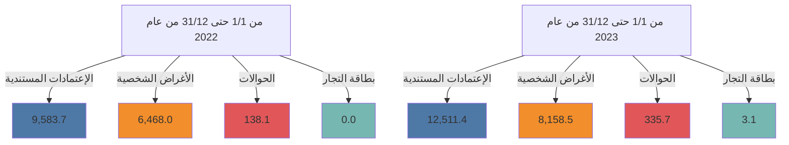
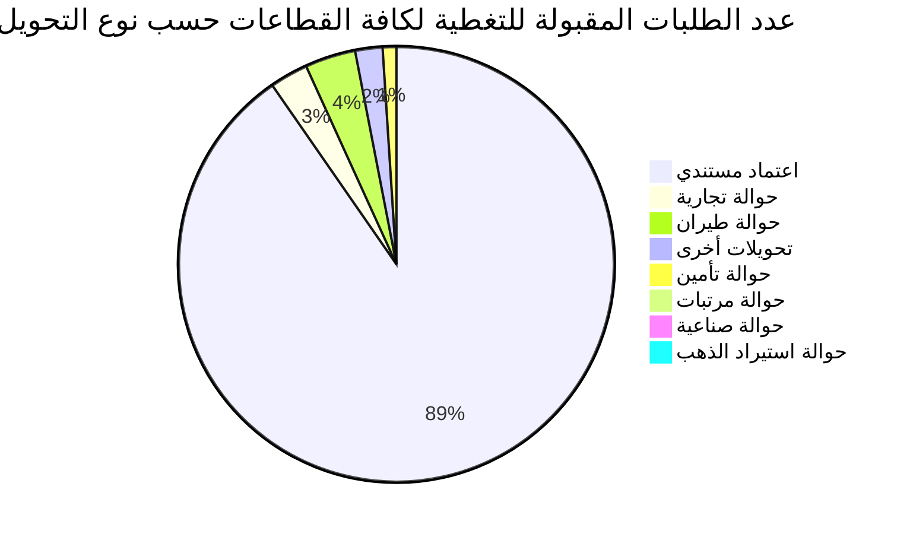

# مصرف ليبيا المركزي

## إستخدامات المصـــارف للنقد الأجنبي

### خلال الفترة: (1/1 - 31/12/2023)

![Central Bank of Libya image showing financial charts and currency]

The image shows a tablet or digital device displaying various financial charts, graphs, and currency notes (including US dollars) emerging from the screen. The logo and name of the Central Bank of Libya (مصرف ليبيا المركزي) are visible at the bottom of the device.

إدارة البحوث والأحصـاء - إدارة الرقابة على المصارف والنقد
---
إدارة البحوث والإحصاء - إدارة الرقابة على المصارف والنقد

## تحليل حركة إستخدامات المصارف الفعلية من النقد الأجنبي
### خلال الفترة (1/1 - حتى 31/12/2023)

بلغ إجمالي إستخدامات المصارف من النقد الأجنبي خلال الفترة (1/1 - حتى 31/12/2023) نحو 21,008,707,177 دولاراً، مقابل 16,189,752,858 دولاراً خلال نفس الفترة من العام الماضي 2022، بزيادة قدرها نحو 4,818,954,319 دولاراً. أي بمعدل نمو بلغ 29.8%.

حيث شكلت الإعتمادات المستندية ما نسبته 59.6% من إجمالي إستخدامات المصارف من النقد الأجنبي، فيما شكلت الأغراض الشخصية نسبة 38.8% من الإجمالي، في حين لم تشكل الحوالات إلا مانسبته 1.6% من إجمالي الإستخدامات.

### إستخدامات المصارف الفعلية من النقد الأجنبي لكافة الأغراض
"المبالغ بالدولار الأمريكي"

| البند | من 1/1 حتى 31/12 من عام 2022 | من 1/1 حتى 31/12 من عام 2023 | مقدار التغير | نسبة التغير |
|-------|-------------------------------|-------------------------------|--------------|-------------|
| الإعتمادات المستندية | 9,583,657,504 | 12,511,393,122 | 2,927,735,618 | 30.5% |
| الحوالات | 138,106,683 | 335,690,316 | 197,583,633 | 143.1% |
| الأغراض الشخصية | 6,467,988,670 | 8,158,523,739 | 1,690,535,069 | 26.1% |
| بطاقات التجار | - | 3,100,000 | 3,100,000 | - |
| الإجمالي | 16,189,752,858 | 21,008,707,177 | 4,818,954,319 | 29.8% |

### إستخدامات المصارف للنقد الأجنبي لكافة الأغراض

صفحة 2 من 166
---
إدارة البحوث والإحصاء - إدارة الرقابة على المصارف والنقد

المبالغ المُباعة للمصارف من النقد الأجنبي لكافة الأغراض:

في إطار مُتابعة إدارة الرقابة على المصارف والنقد لطلبات الشراء المقبولة للإعتمادات المُستندية والحوالات، المُقدمة من المصارف عبر منظومة متابعة طلبات التغطية، وكذلك منظومة مبيعات النقد الأجنبي للأغراض الشخصية، طبقاً لقرار مجلس إدارة مصرف ليبيا المركزي رقم (1) لسنة 2020 بشأن تعديل سعر صرف الدينار الليبي، ومنشور إدارة الرقابة على المصارف والنقد رقم (2020/9).

ومن خلال الإطلاع على الجدول أدناه للقيم المُباعة من النقد الأجنبي حسب المصارف، يتضح أن المصرف التجاري الوطني احتل الترتيب الأول كأكثر المصارف إستخداماً للنقد الأجنبي خلال الفترة (1/1 - حتى 2023/12/31) مُسجلاً حصة سوقية بلغت 13.9%، حيث بلغ إجمالي المبالغ نحو 2,916,536,247 دولار، فيما جاء مصرف الجمهورية في المرتبة الثانية بقيمة بلغت 2,474,861,396 دولار، ثم مصرف الوحدة في المرتبة الثالثة بقيمة 2,393,449,360 دولار، ثم مصرف الأمان للتجارة والإستثمار في المرتبة الرابعة بقيمة 2,102,187,762 دولار، ثم تأتي من حيث الأهمية النسبية المصارف التالية حسب الترتيب : مصرف التجاري، مصرف اليقين، المصرف المتحد، المصرف الإسلامي الليبي، ومصرف الصحاري، إلى آخره من المصارف كما موضح بالجدول أدناه والذي يحتوي أيضاً على الترتيب الذي كانت عليه المصارف خلال نفس الفترة من العام الماضي 2022.

صفحة 3 من 166
---
إدارة البحوث والإحصاء - إدارة الرقابة على المصارف والنقد

## ترتيب المصارف حسب إجمالي المبالغ المُباعة من النقد الأجنبي

| المصرف | من 1/1 حتى 12/31 من عام 2022 |  | من 1/1 حتى 12/31 من عام 2023 |  |  |
|---|---|---|---|---|---|
|  | الترتيب | القيمة بالدولار | الحصة السوقية | الترتيب | القيمة بالدولار | الحصة السوقية |
| المصرف التجاري الوطني | 2 | 2,034,585,577 | 12.6% | 1 | 2,916,536,247 | 13.9% |
| مصرف الجمهورية | 3 | 2,029,331,697 | 12.5% | 2 | 2,474,861,396 | 11.8% |
| مصرف الوحدة | 8 | 1,081,352,095 | 6.7% | 3 | 2,393,449,360 | 11.4% |
| مصرف الأمان للتجارة والإستثمار | 1 | 2,702,660,262 | 16.7% | 4 | 2,102,187,762 | 10.0% |
| مصرف النوران | 5 | 1,287,920,698 | 8.0% | 5 | 1,931,594,985 | 9.19% |
| مصرف اليقين | 4 | 1,759,652,203 | 10.9% | 6 | 1,632,794,918 | 7.8% |
| المصرف المتحد للتجارة والإستثمار | 7 | 1,088,414,262 | 6.7% | 7 | 1,493,331,473 | 7.1% |
| المصرف الإسلامي الليبي | 6 | 1,176,385,451 | 7.3% | 8 | 1,447,552,124 | 6.9% |
| مصرف الصحارى | 9 | 759,834,453 | 4.7% | 9 | 1,075,420,608 | 5.1% |
| مصرف شمال أفريقيا | 12 | 366,955,625 | 2.3% | 10 | 718,732,747 | 3.4% |
| مصرف الخليج الأول الليبي | 10 | 552,339,670 | 3.4% | 11 | 625,512,858 | 3.0% |
| مصرف الأندلس | 16 | 123,330,179 | 0.8% | 12 | 478,769,341 | 2.3% |
| مصرف السراي للتجارة والإستثمار | 11 | 387,199,550 | 2.4% | 13 | 448,530,943 | 2.1% |
| مصرف التجارة والتنمية | 19 | 6,903,675 | 0.0% | 14 | 409,200,382 | 1.9% |
| مصرف الواحة | 15 | 153,407,016 | 0.9% | 15 | 252,070,056 | 1.2% |
| مصرف الوفاء | 14 | 233,171,881 | 1.4% | 16 | 230,763,994 | 1.1% |
| مصرف التضامن | 17 | 116,706,646 | 0.7% | 17 | 225,675,168 | 1.1% |
| المصرف الليبي الخارجي | 13 | 274,362,543 | 1.7% | 18 | 91,179,028 | 0.4% |
| مصرف المتوسط | 18 | 55,239,375 | 0.3% | 19 | 60,543,786 | 0.3% |
| مصرف الإجماع العربي | 20 | 0 | 0.0% | 20 | 0 | 0.0% |
| الإجمالي | - | 16,189,752,858 | 100.0% | - | 21,008,707,177 | 100.0% |

صفحة 4 من 166
---
إدارة البحوث والإحصاء - إدارة الرقابة على المصارف والنقد

المبالغ المُباعة للمصارف من النقد الأجنبي (حسب الغرض)

" القيم بالدولار الأمريكي "

| ت | المصرف | الاعتمادات المستندية |  |  الحوالات |  | الأغراض الشخصية |  | بطاقة التجار |  |
|---|---------|----------------------|--|------------|--|-------------------|--|---------------|--|
|   |         | من 1/1 حتى 12/31 من عام 2022 | من 1/1 حتى 12/31 من عام 2023 | من 1/1 حتى 12/31 من عام 2022 | من 1/1 حتى 12/31 من عام 2023 | من 1/1 حتى 12/31 من عام 2022 | من 1/1 حتى 12/31 من عام 2023 | من 1/1 حتى 12/31 من عام 2022 | من 1/1 حتى 12/31 من عام 2023 |
| -1 | التجاري الوطني | 741,691,107 | 1,528,139,378 | 9,085,532 | 5,467,410 | 1,283,808,938 | 1,380,729,460 | - | 2,200,000 |
| -2 | الجمهورية | 1,238,485,079 | 1,408,973,217 | 9,452,118 | 54,253,179 | 781,394,500 | 1,011,635,000 | - | 0 |
| -3 | مصرف الوحدة | 830,672,461 | 2,016,011,914 | 3,734,378 | 943,419 | 246,945,256 | 376,494,027 | - | 0 |
| -4 | الأمان | 516,509,724 | 694,166,545 | 0 | 5,595,690 | 2,186,150,538 | 1,401,625,527 | - | 800,000 |
| -5 | الواحة | 1,140,075,173 | 1,546,611,754 | 10,183,910 | 38,779,785 | 137,661,615 | 346,203,445 | - | 0 |
| -6 | اليقين | 1,218,852,144 | 812,864,588 | 4,101,570 | 14,105,286 | 536,698,488 | 805,725,045 | - | 100,000 |
| -7 | المتحد | 471,735,002 | 517,607,984 | 4,898,493 | 3,377,258 | 611,780,767 | 972,346,231 | - | 0 |
| -8 | الإسلامي الليبي | 983,338,415 | 1,038,436,315 | 32,440,176 | 50,926,104 | 160,606,859 | 358,189,705 | - | 0 |
| -9 | الصحاري | 322,010,848 | 433,891,766 | 9,054,791 | 12,465,347 | 428,768,814 | 629,063,496 | - | 0 |
| -10 | شمال أفريقيا | 319,756,728 | 376,855,582 | 28,997,535 | 45,455,212 | 18,201,363 | 296,421,952 | - | 0 |
| -11 | الخليج الأول الليبي | 538,427,250 | 592,676,099 | 13,838,320 | 31,563,269 | 74,100 | 1,273,490 | - | 0 |
| -12 | الأندلس | 122,365,446 | 424,173,656 | 964,732 | 8,663,874 | 0 | 45,931,812 | - | 0 |
| -13 | السراي | 382,600,298 | 404,858,400 | 0 | 31,812,119 | 4,599,252 | 11,860,424 | - | 0 |
| -14 | التجارة والتنمية | 0 | 5,700,000 | 0 | 1,977,416 | 6,903,675 | 401,522,966 | - | 0 |
| -15 | الواحة | 98,337,254 | 145,401,797 | 726,311 | 1,882,932 | 54,343,451 | 104,785,327 | - | 0 |
| -16 | الوفاء | 231,454,901 | 226,446,199 | 0 | 0 | 1,716,980 | 4,317,795 | - | 0 |
| -17 | التضامن | 116,706,646 | 225,675,168 | 0 | 0 | 0 | 0 | - | 0 |
| -18 | الليبي الخارجي | 263,173,606 | 61,879,331 | 10,628,817 | 28,422,018 | 560,120 | 877,680 | - | 0 |
| -19 | المتوسط | 47,465,421 | 51,023,430 | 0 | 0 | 7,773,954 | 9,520,357 | - | 0 |
| -20 | الإجماع العربي | 0 | 0 | 0 | 0 | 0 | 0 | - | 0 |
| - | الإجمالي الكلي | 9,583,657,504 | 12,511,393,122 | 138,106,683 | 335,690,316 | 6,467,988,670 | 8,158,523,739 | - | 3,100,000 |

صفحة 5 من 166
---
إدارة البحوث والإحصاء - إدارة الرقابة على المصارف والنقد

## الأهمية النسبية حسب المصرف لاستخدامات النقد الأجنبي خلال الفترة من 1/1 حتى 12/31 من عام 2022

| المصرف | النسبة |
|---------|--------|
| مصرف الأمان للتجارة والاستثمار | 17% |
| المصرف التجاري الوطني | 12% |
| مصرف الجمهورية | 12% |
| مصرف اليقين | 11% |
| باقي المصارف | 11% |
| مصرف النوران | 8% |
| المصرف الإسلامي الليبي | 7% |
| المصرف المتحد للتجارة والاستثمار | 7% |
| مصرف الوحدة | 7% |
| مصرف الصحاري | 5% |
| مصرف الخليج الأول الليبي | 3% |

## الأهمية النسبية حسب المصرف لاستخدامات النقد الأجنبي خلال الفترة من 1/1 حتى 12/31 من عام 2023

| المصرف | النسبة |
|---------|--------|
| المصرف التجاري الوطني | 16% |
| مصرف الجمهورية | 14% |
| مصرف الوحدة | 13% |
| مصرف النوران | 11% |
| مصرف الأمان للتجارة والاستثمار | 11% |
| مصرف اليقين | 9% |
| المصرف الإسلامي الليبي | 8% |
| المصرف المتحد للتجارة والاستثمار | 8% |
| مصرف الصحاري | 6% |
| مصرف شمال أفريقيا | 4% |

صفحة 6 من 166
---
إدارة البحوث والإحصاء - إدارة الرقابة على المصارف والنقد

ثانياً : طلبات المصارف المقبُولة لتغطية الإعتمادات المستندية والحوالات عدا الأغراض
الشخصية خلال الفترة (1/1 – حتى 31/12/2023):

بلغ عدد الشركات والمصانع والجهات العامة والجهات الأخرى المستفيدة (2,198) والتي تمت الموافقة
على طلباتهم خلال الفترة (1/1 – حتى 31/12/2023) للحصول على النقد الأجنبي ، بعدد طلبات بلغ
نحو 16,429 طلب، معظم هذه الطلبات لتغطية الإعتمادات المستندية والتي سجلت 14,627 طلب
بنسبة 89% من الطلبات، إجمالي كما هو موضح بالجدول التالي :-

| نوع التحويل | القطاع الخاص | القطاع العام | قطاع المصارف | جهات متنوعة | الإجمالي | الأهمية النسبية |
|-------------|---------------|--------------|---------------|--------------|----------|------------------|
| اعتماد مستندي | 14,272 | 347 | 8 | - | 14,627 | 89.0% |
| حوالة طيران | 539 | 67 | - | 4 | 610 | 3.7% |
| حوالة تجارية | 49 | 368 | 36 | 2 | 455 | 2.8% |
| تحويلات أخرى | 48 | 278 | 2 | 3 | 331 | 2.0% |
| حوالة تأمين | 42 | 128 | - | - | 170 | 1.0% |
| حوالة مرتبات | - | - | - | 106 | 106 | 0.6% |
| حوالة صناعية | 98 | - | - | - | 98 | 0.6% |
| حوالة استيراد الذهب | 32 | - | - | - | 32 | 0.2% |
| الإجمالي | 15,080 | 1,188 | 46 | 115 | 16,429 | 100% |

عدد الطلبات المقبولة للتغطية لكافة القطاعات حسب نوع التحويل
خلال الفترة (1/1- حتى 31/12/2023)

صفحة 7 من 166
---
إدارة البحوث والإحصاء - إدارة الرقابة على المصارف والنقد

## أولاً: الطلبات لكافة القطاعات :

### طلبات المصارف المقبولة لتغطية الإعتمادات المستندية والحوالات - لكافة القطاعات

#### 1- حسب أهم البلدان المستفيدة :

من خلال الإطلاع على الجدول أدناه لقيم طلبات المصارف لشراء النقد الأجنبي حسب البلدان

المستفيدة خلال عام 2023 لكافة القطاعات ، يتضح أن مانسبته 32.0% من تحويلات المصارف

لتغطية الإعتمادات المستندية أو الحوالات الأخرى كانت لدولة الإمارات العربية المتحدة، ثم جاءت

دولة مصر في المرتبة الثانية بنسبة 9.6% ثم دولة تركيا في المرتبة الثالثة بنسبة 9.5% ، ثم المملكة

المتحدة والصين بنسب 6.1% و 6.0% على التوالي، والجداول التالية توضح أهم عشرون بلد

مستفيد خلال عامي 2022 و 2023 :

### طلبات المصارف لتغطية الإعتمادات المستندية والحوالات - لكافة القطاعات
(حسب أهم عشرون بلد مستفيد)
خلال عامي 2022 و 2023
"دولار أمريكي"

| الترتيب | البلد المستفيد | 2022 | الترتيب | البلد المستفيد | 2023 |
|---------|----------------|------|---------|----------------|------|
| -1 | الإمارات العربية المتحدة | 3,645,405,874 | -1 | الإمارات العربية المتحدة | 4,364,172,569 |
| -2 | تركيا | 1,064,397,455 | -2 | مصر | 1,303,904,882 |
| -3 | سويسرا | 825,079,622 | -3 | تركيا | 1,300,093,491 |
| -4 | تونس | 683,491,785 | -4 | المملكة المتحدة | 834,148,642 |
| -5 | المملكة المتحدة | 429,317,224 | -5 | الصين | 816,147,914 |
| -6 | إيطاليا | 378,531,096 | -6 | سويسرا | 705,460,502 |
| -7 | الصين | 289,925,302 | -7 | تونس | 650,791,522 |
| -8 | النمسا | 281,443,501 | -8 | إيطاليا | 467,755,437 |
| -9 | إسبانيا | 249,184,663 | -9 | النمسا | 349,865,688 |

صفحة 8 من 166
---
إدارة البحوث والإحصاء - إدارة الرقابة على المصارف والنقد

| -10 | إسبانيا | 296,090,662 | -10 | مصر | 167,638,696 |
|-----|---------|-------------|-----|------|-------------|
| -11 | هولندا | 245,679,726 | -11 | الولايات المتحدة | 152,162,797 |
| -12 | كوريا الجنوبية | 230,088,376 | -12 | كوريا الجنوبية | 150,610,511 |
| -13 | المانيا | 189,807,389 | -13 | المانيا | 146,051,595 |
| -14 | اليابان | 185,837,684 | -14 | عمان | 143,483,151 |
| -15 | تايلاند | 161,958,980 | -15 | تايلاند | 132,529,779 |
| -16 | كندا | 148,709,620 | -16 | فرنسا | 122,541,922 |
| -17 | السويد | 138,957,365 | -17 | هولندا | 116,824,424 |
| -18 | فرنسا | 118,545,033 | -18 | اليابان | 103,790,791 |
| -19 | الولايات المتحدة | 116,237,668 | -19 | مالطة | 76,451,716 |
| -20 | هونغ كونغ S.A.R. | 108,239,690 | -20 | البحرين | 73,455,715 |

## 2- حسب أهم بلدان منشأ السلع أو الخدمات:

من خلال الإطلاع على الجدول أدناه لقيم طلبات المصارف لشراء النقد الأجنبي حسب بلدان منشأ السلع أو الخدمات خلال عام 2023 لكافة القطاعات ، يتضح أن دولة تركيا قد أحتلت المرتبة الأولى حيث شكلت السلع أو الخدمات ذات المنشأ التركي نسبة 18.8% من الإجمالي طلبات الشراء المقبولة، ثم جاءت واردات السلع أو الخدمات ذات المنشأ الصيني في المرتبة الثانية مشكلة مانسبته 13.53% من الإجمالي، وشكلت السلع أوالخدمات ذات المنشأ المصري نسبة 13.51% محتلة المرتبة الثالثة خلال الفترة، فيما سجلت السلع والخدمات ذات منشأ دولة روسيا الاتحادية مانسبته 6.7%، وذات المنشأ الهندي نسبة 5.0%، وجاءت السلع أو الخدمات ذات المنشأ البرازيلي في المرتبة السادسة مشكلة نسبة 4.0% من الإجمالي، والجدول التالي يوضح أهم عشرون بلد منشأ للسلع أو الخدمات خلال عامي 2022 و 2023.

صفحة 9 من 166
---
إدارة البحوث والإحصاء - إدارة الرقابة على المصارف والنقد

طلبات المصارف لتغطية الاعتمادات المستندية والحوالات - لكافة القطاعات
(حسب أهم عشرون بلد منشأ للسلع أو الخدمات)
خلال عامي 2022 و 2023
"دولار أمريكي"

| الترتيب | بلد منشأ السلع أو الخدمات | 2022 | بلد منشأ السلع أو الخدمات | 2023 |
|---------|---------------------------|------|---------------------------|------|
| -1 | تركيا | 1,746,495,690 | تركيا | 2,565,308,676 |
| -2 | اوروبا | 1,207,043,816 | الصين | 1,846,591,986 |
| -3 | الصين | 1,021,760,467 | مصر | 1,844,850,377 |
| -4 | تونس | 923,144,819 | روسيا الاتحادية | 914,490,723 |
| -5 | مصر | 747,810,066 | الهند | 688,944,432 |
| -6 | روسيا الاتحادية | 452,524,252 | البرازيل | 540,721,661 |
| -7 | الإمارات العربية المتحدة | 386,618,568 | تونس | 537,012,137 |
| -8 | البرازيل | 342,763,917 | الإمارات العربية المتحدة | 454,691,588 |
| -9 | إيطاليا | 338,059,020 | إيطاليا | 430,021,069 |
| -10 | الهند | 282,764,164 | المانيا | 308,912,892 |
| -11 | عمان | 244,714,148 | هولندا | 261,402,212 |
| -12 | تايلاند | 214,849,032 | تايلاند | 228,498,482 |
| -13 | أوكرانيا | 193,655,249 | أوكرانيا | 207,821,124 |
| -14 | المانيا | 142,828,208 | الأرجنتين | 203,738,910 |
| -15 | الأرجنتين | 126,536,691 | إسبانيا | 198,070,399 |
| -16 | إسبانيا | 125,073,034 | أيرلندا | 189,757,377 |
| -17 | كوريا الجنوبية | 123,838,349 | كوريا الجنوبية | 174,695,747 |
| -18 | الولايات المتحدة | 102,443,977 | الولايات المتحدة | 168,618,176 |
| -19 | هولندا | 76,960,201 | بلجيكا | 155,399,359 |
| -20 | المملكة العربية السعودية | 73,906,573 | السويد | 154,995,547 |

صفحة 10 من 166
---
إدارة البحوث والإحصاء - إدارة الرقابة على المصارف والنقد

## ثانياً: الطلبات حسب القطاعات:

### طلبات المصارف المقبولة لشراء النقد الأجنبي - حسب القطاعات

#### خلال عام 2023

| القطاع | عدد الشركات أو المصانع أو الجهات |
|--------|----------------------------------|
| القطاع الخاص | 2,035 |
| القطاع العام | 49 |
| قطاع المصارف | 5 |
| حوالات مرتبات الأجانب وجهات متنوعة | 115 |
| الإجمالي | 2,198 |

### 1- القطاع الخاص:

بلغ عدد شركات ومصانع القطاع الخاص (2,035) التي تمت الموافقة على طلباتها للحصول على النقد الأجنبي من المصارف لتغطية الإعتمادات المستندية والحوالات الأخرى خلال عام 2023 حيث أحتلت طلبات المصارف لشراء النقد الأجنبي من قبل القطاع الخاص لإستيراد مستلزمات الإنتاج والتشغيل المرتبة الأولى من إجمالي طلبات الشراء خلال الفترة، حيث شكلت مانسبته 18.5% من إجمالي طلبات شراء النقد الأجنبي، فيما أحتلت طلبات تغطية إستيراد السلع الغذائية المتنوعة المرتبة الثانية من حيث الأهمية النسبية لتشكل نحو 10.1%، فيما شكلت طلبات تغطية إستيراد مستلزمات إنتاج السلع الأساسية نسبة 9.3%، وإستيراد الأعلاف نسبة 7.3% من الإجمالي، والجدول التالي يوضح كافة طلبات الشراء للسلع أو الخدمات خلال عامي 2022 و 2023.

صفحة 11 من 166
---
إدارة البحوث والإحصاء - إدارة الرقابة على المصارف والنقد

# طلبات شراء السلع أو الخدمات - قطاع خاص
## خلال عامي 2022 و2023
### "مرتبة تنازلياً حسب العام 2023"
"دولار أمريكي"

| ت | تصنيف السلع | 2022 | 2023 |
|---|-------------|------|------|
| -1 | مستلزمات الإنتاج والتشغيل | 1,135,788,142 | 2,325,955,998 |
| -2 | سلع غذائية متنوعة | 1,354,695,313 | 1,261,642,321 |
| -3 | مستلزمات إنتاج السلع الأساسية | 1,562,383,226 | 1,171,504,990 |
| -4 | أعلاف | 935,700,622 | 910,853,030 |
| -5 | مواد البناء ومستلزمات التشييد | 413,931,450 | 886,531,476 |
| -6 | أجهزة الإلكترونية | 405,284,005 | 831,864,473 |
| -7 | وسائل النقل وإطارات ونضائد وقطع الغيار | 476,795,607 | 791,370,331 |
| -8 | الآلات والمعدات | 274,877,274 | 606,198,053 |
| -9 | الغذائية | 1,780,000 | 595,983,648 |
| -10 | اللحوم الحية والمجمدة | 343,943,273 | 520,337,628 |
| -11 | منزلية وكهرومنزلية | 288,590,997 | 417,418,654 |
| -12 | حليب | 174,315,206 | 355,156,651 |
| -13 | أدوية بشرية | 490,745,402 | 294,121,034 |
| -14 | حليب وحفاظات وأغذية أطفال | 162,000,170 | 194,442,270 |
| -15 | أجبان | 129,139,434 | 165,001,239 |
| -16 | الأثاث | 151,602,146 | 162,247,794 |
| -17 | تبغ بأنواعه ومستلزماته | 95,011,165 | 148,475,217 |
| -18 | مواد التنظيف | 135,947,715 | 134,682,161 |
| -19 | زراعية | 102,224,304 | 93,810,542 |
| -20 | الزراعية | 0 | 92,542,273 |
| -21 | فواكه وخضروات | 57,717,171 | 69,337,736 |
| -22 | خدمات اتصالات وتقنية معلومات | 24,935,843 | 66,465,225 |
| -23 | حوالة استيراد الذهب | 0 | 55,170,912 |
| -24 | الملابس والأحذية | 34,241,341 | 54,923,552 |
| -25 | خدمات ملاحية متنوعة | 92,148,884 | 53,739,482 |

صفحة 12 من 166
---
إدارة البحوث والإحصاء - إدارة الرقابة على المصارف والنقد

| 40,090,932 | 46,447,746 | مواد تنظيف | -26 |
|------------|------------|-----------|-----|
| 0 | 41,850,832 | خدمات انتاج وتشغيل | -27 |
| 1,640,242 | 34,561,356 | حوالات شركات خطوط الطيران | -28 |
| 40,596,548 | 29,918,769 | مواد صحية | -29 |
| 34,505,550 | 28,704,296 | طلبيات خاصة بشركة الأجنحة الليبية | -30 |
| 16,001,136 | 20,743,592 | قرطاسية | -31 |
| 6,361,800 | 9,778,346 | أسماك وأحياء بحرية | -32 |
| 10,824,777 | 9,475,098 | زبدة | -33 |
| 877,394 | 8,724,084 | شركة غدامس للطيران | -34 |
| 5,569,334 | 8,514,587 | شركة أويا للطيران | -35 |
| 13,811,448 | 7,681,992 | السجاد والمنسوجات | -35 |
| 12,705,157 | 7,154,906 | سمن | -37 |
| 0 | 7,140,673 | الشركة الليبية السريعة للنقل الجوي | -38 |
| 208,532 | 4,085,741 | متنوعة | -39 |
| 3,117,445 | 3,856,657 | أدوية بيطرية | -40 |
| 4,197,756 | 3,521,727 | حوالات شركات التأمين | -41 |
| 14,508,802 | 2,382,497 | شركة سما المتوسط للطيران | -42 |
| 3,184,819 | 2,336,211 | تكاليف خدمات سياحية | -43 |
| 0 | 2,058,204 | طلبيات برنيق للطيران | -44 |
| 0 | 1,630,381 | الطبية | -45 |
| 1,946,693 | 1,194,315 | سلع خاصة بالخدمات العامة | -46 |
| 193,456 | 1,019,922 | شركة المتحدة للتأمين | -47 |
| 2,100,469 | 926,994 | مستلزمات تشغيل مصنع الحديد والصلب | -48 |
| 606,600 | 624,710 | حوالات دورة تدريبية | -49 |
| 252,088 | 485,195 | طلبيات الخطوط الجوية الليبية | -50 |
| 340,959 | 175,037 | سلع أخرى | -51 |
| 23,000 | 0 | شركة تطوير للاستثمار العقاري | -52 |
| 2,235,490 | 0 | جهاز حفر وصيانة آبار المياه | -53 |
| 1,506,054 | 0 | طلبيات شركة البراق للطيران | -54 |

صفحة 13 من 166
---
إدارة البحوث والإحصاء - إدارة الرقابة على المصارف والنقد

# طلبات شراء أهم السلع - قطاع خاص
## خلال عامي 2022 و2023
### "مرتبة تنازلياً حسب العام 2023"
"دولار أمريكي"

| ت | أهم السلع | 2022 | 2023 |
|---|-----------|------|------|
| -1 | مواد خام | 999,704,395 | 1,617,460,600 |
| -2 | مستلزمات الإنتاج والتشغيل | 876,728,436 | 687,886,566 |
| -3 | القمح | 417,646,211 | 533,818,602 |
| -4 | السكر | 255,363,002 | 505,509,393 |
| -5 | السيارات | 276,869,824 | 431,023,785 |
| -6 | حليب | 167,568,050 | 379,431,566 |
| -7 | حديد | 130,803,428 | 352,260,060 |
| -8 | أجهزة هاتف محمول وملحقاته | 210,890,091 | 315,475,180 |
| -9 | شعير | 216,227,085 | 298,702,613 |
| -10 | ذرة | 285,504,094 | 260,649,085 |
| -11 | معدات الكترونية | 115,684,276 | 235,481,336 |
| -12 | زيت طهي | 322,748,816 | 232,407,948 |
| -13 | دواجن ولحوم دواجن مجمدة | 200,942,893 | 226,271,611 |
| -14 | أعلاف | 272,985,185 | 220,865,452 |
| -15 | تونة | 194,328,841 | 218,370,856 |
| -16 | مواد بناء | 193,560,384 | 210,754,826 |
| -17 | الات أخرى | 80,011,511 | 198,015,936 |
| -18 | أجهزة كهربية ومنزلية وأجهزة التبريد | 95,235,629 | 197,093,651 |
| -19 | صويا | 159,229,258 | 187,329,064 |
| -20 | إطارات | 74,326,371 | 187,249,426 |
| -21 | أجبان | 125,884,896 | 176,432,760 |
| -22 | معدات ومستلزمات طبية | 398,932,835 | 166,508,953 |
| -23 | آلالات ثقيلة | 29,146,515 | 164,544,432 |
| -24 | أثاث | 151,602,146 | 162,091,642 |
| -25 | لحوم مجمدة | 75,964,589 | 161,633,647 |

صفحة 14 من 166
---
إدارة البحوث والإحصاء - إدارة الرقابة على المصارف والنقد

| الرقم | البند | القيمة الأولى | القيمة الثانية |
|-------|------|---------------|----------------|
| -26 | معجون طماطم | 105,480,363 | 158,040,739 |
| -27 | آلات زراعية وقطع غيارها | 114,047,809 | 149,269,328 |
| -28 | سجائر وتبغ بأنواعه | 95,011,165 | 148,475,217 |
| -29 | أوراق تعبئة وتغليف وورق طباعة | 143,721,164 | 137,428,411 |
| -30 | أخشاب | 8,867,175 | 132,912,669 |
| -31 | أدوية | 91,327,439 | 128,565,276 |
| -32 | أرز | 127,860,768 | 121,252,662 |
| -33 | البسكويت والشكولاطة والحلوة | 90,693,835 | 118,976,198 |
| -34 | مكيفات وأجهزة تبريد | 89,266,869 | 105,140,968 |
| -35 | شاشات | 33,095,021 | 103,698,812 |
| -35 | حليب أطفال | 62,516,261 | 92,200,875 |
| -37 | عجول | 53,537,663 | 85,007,903 |
| -38 | حفاظات | 84,692,019 | 80,612,513 |
| -39 | قطع الغيار | 23,284,719 | 79,720,822 |
| -40 | غسالات | - | 70,654,404 |
| -41 | مصفات | 44,158,379 | 60,502,258 |
| -42 | أجهزة حاسب آلي وملحقاته | 48,007,669 | 59,806,969 |
| -43 | زيوت سيارات | 37,316,471 | 57,775,684 |
| -44 | كرتون | 143,790,344 | 56,408,025 |
| -45 | مواشي حية | 13,096,253 | 55,441,450 |
| -46 | حوالة استيراد الذهب | 0 | 55,170,912 |
| -47 | سيراميك | - | 52,880,948 |
| -48 | مواد تنظيف ومستلزمات تصنيعها | 21,236,931 | 50,165,147 |
| -49 | علب فارغة | 51,266,210 | 43,614,371 |
| -50 | ثلاجات | 17,330,376 | 40,347,867 |
| -51 | مواد خام لصناعة الألبان | 53,721,667 | 35,081,975 |
| -52 | شاي | 45,323,079 | 30,542,764 |
| -53 | مكرونة | 17,008,818 | 21,762,397 |

صفحة 15 من 166
---
إدارة البحوث والإحصاء - إدارة الرقابة على المصارف والنقد

# طلبات الشراء حسب أهم مائة شركة - قطاع خاص
## خلال عامي 2022 و2023
### "مرتبة تنازلياً حسب العام 2023"
"دولار أمريكي"

| ت | الشركة أو المصنع | 2022 | 2023 |
|---|-------------------|------|------|
| 1 | شركة النسيم للصناعات الغذائية | 138,583,524 | 174,870,672 |
| 2 | شركة تويوتا ليبيا تجارة السيارات وقطع الغيار واستيراد والتصدير | 102,329,598 | 173,660,058 |
| 3 | شركة وادي الكوف للمطاحن والأعلاف ومضارب الأرز | 80,880,783 | 142,387,665 |
| 4 | شركة طريق القارة لاستيراد المواد الغذائية | 29,642,854 | 129,730,293 |
| 5 | شركة أفريقيا لتعبئة المشروبات | 131,473,316 | 127,411,954 |
| 6 | شركة دروب ليبيا لاستيراد وسائل النقل وملحقاتها | 73,898,931 | 122,571,464 |
| 7 | شركة المعمورة لاستيراد وتوزيع المواد الغذائية | 105,310,396 | 106,530,900 |
| 8 | شركة الشرق الليبي للمطاحن والأعلاف ومضارب الأرز | 108,340,725 | 105,201,451 |
| 9 | شركة شريان الحياة لاستيراد جميع أنواع الأعلاف ومكملاتها والمعدات الزراعية وبذور الحيوانات وطحن الحبوب | 0 | 95,982,090 |
| 10 | شركة الجيد لاستيراد المواد الغذائية | 81,736,472 | 92,856,865 |
| 11 | شركة البنيان لصهر ودرفلة المعادن | 70,950,397 | 83,482,558 |
| 12 | شركة الريحان لصناعة المواد الغذائية | 43,692,237 | 83,207,869 |
| 13 | شركة طرابلس الكبرى لصناعة وتعبئة وتغليف الطماطم والمواد الغذائية | 15,712,481 | 83,027,012 |
| 14 | شركة الجودة العالية الأولى لصناعة الأعلاف ومطاحن الدقيق والصناعات الغذائية | 18,899,962 | 79,201,882 |
| 15 | شركة الوسام الذهبي لصناعة الدقيق ومضارب الأرز | 45,413,791 | 75,161,300 |
| 16 | شركة ظل اللبن لصناعة الألبان ومشتقاتها | 3,000,000 | 67,452,000 |
| 17 | شركة الليبية المتحدة لتعبئة المشروبات | 10,155,000 | 67,023,763 |
| 18 | شركة المتحدة الجديدة لاستيراد التبغ والسجائر ومستلزماتها | 0 | 62,096,914 |
| 19 | شركة سما الأرياف لاستيراد المواد الغذائية و الخضروات و الفواكه الطازجة و المواشي واللحوم | 0 | 59,107,764 |
| 20 | شركة ابتهاج الطبيعة لاستيراد المواد الغذائية | 0 | 57,816,120 |
| 21 | شركة السرايا الراقية لاستيراد المواد الغذائية والخضروات والفواكهة الطازجة واللحوم | 2,826,768 | 56,699,527 |
| 22 | شركة الأصالة الذهبية للمطاحن ومضارب الأرز | 40,604,308 | 55,311,351 |
| 23 | شركة التاج العربية لاستيراد الأجهزة الالكترونية والكهربائية وملحقاتها وقطع غيارها | 27,373,655 | 55,204,553 |

صفحة 16 من 166
---
إدارة البحوث والإحصاء - إدارة الرقابة على المصارف والنقد

| الرقم | اسم الشركة | القيمة 1 | القيمة 2 |
|-------|------------|----------|----------|
| 24 | شركة المصبوبات لصناعة مواد البناء | 0 | 54,400,880 |
| 25 | شركة الجاهزة لاستيراد المواد الغذائية | 32,830,325 | 54,222,090 |
| 26 | شركة الجيد للصناعات الغذائية | 59,822,952 | 53,856,275 |
| 27 | شركة السواحل الذهبية لاستيراد المواد الغذائية | 32,561,711 | 52,026,513 |
| 28 | شركة سلوق لصناعة الاعلاف بجميع انواعها والمطاحن | 8,890,000 | 50,966,500 |
| 29 | شركة الرفيق الأمثل لصناعة مواد البناء | 0 | 49,815,863 |
| 30 | شركة الانهار لصناعة الدقيق | 0 | 48,492,600 |
| 31 | شركة الموسم للصناعات الغذائية ومضارب الأرز | 27,056,450 | 48,349,737 |
| 32 | شركة ألفا للمطاحن والاعلاف والصناعات الغذائية | 18,808,248 | 48,265,579 |
| 33 | شركة بصمة الجودة لاستيراد المواد الغذائية والمواشي واللحوم والفواكه | 2,837,980 | 47,540,987 |
| 34 | شركة اضواء النيزك لاستيراد الاجهزة الالكترونية والاجهزة والمواد الكهربائية والغير كهربائية وملحقاتها | 22,193,970 | 46,408,159 |
| 35 | شركة الفتح الجديد لصناعة مواد التنظيف | 0 | 46,197,317 |
| 36 | شركة الاتقان المتقدمة لصناعة الدقيق | 0 | 45,860,270 |
| 37 | شركة اضواء افريقيا لاستيراد المواد الغذائية والمواشي واللحوم | 0 | 45,666,569 |
| 38 | شركة نبراس الخير لصناعة الاعلاف وطحن الحبوب | 74,117,016 | 44,996,761 |
| 39 | شركة طرابلس الاولى للمطاحن والاعلاف | 0 | 42,417,490 |
| 40 | شركة أنعام ليبيا لاستيراد الاعلاف ومكملاتها | 0 | 41,850,000 |
| 41 | شركة القوس لصناعة الاعلاف والمطاحن ومضارب الأرز | 18,310,335 | 41,725,854 |
| 42 | شركة نبض الأطلسي لإستيراد المواد الغذائية والمواشي واللحوم | 18,098,210 | 40,888,373 |
| 43 | شركة بسمتي للصناعات الغذائية | 0 | 39,877,779 |
| 44 | شركة الثمرات الليبية لاستيراد المواد الغذائية والفواكه واللحوم | 2,621,789 | 39,543,861 |
| 45 | شركة جودة الموسم لاستيراد المواد الغذائية | 0 | 39,533,500 |
| 46 | شركة الميسم لاستيراد السيارات وقطع غيارها | 22,267,297 | 38,870,302 |
| 47 | شركة تاجوراء الحياة للصناعات الغذائية | 22,750,000 | 38,265,450 |
| 48 | شركة المعمورة للصناعات الغذائية والمطاحن والاعلاف | 1,151,862 | 38,030,651 |
| 49 | شركة الواحة الدولية لطحن الحبوب و صناعة الاعلاف | 34,015,391 | 37,037,202 |
| 50 | شركة المعمورة الأولى لاستيراد المواد الغذائية | 48,153,833 | 36,833,669 |
| 51 | شركة الروابي الذهبية لاستيراد مواد البناء والمواد الصحية | 3,006,234 | 36,662,436 |
| 52 | شركة اشراقة الربيع لصناعة وتجميع المضخات | 0 | 35,029,865 |

صفحة 17 من 166
---
إدارة البحوث والإحصاء - إدارة الرقابة على المصارف والنقد

| رقم | اسم الشركة | القيمة 1 | القيمة 2 |
|-----|------------|----------|----------|
| 53 | شركة الساحل لاستيراد المواشي واللحوم | 17,202,722 | 34,829,985 |
| 54 | شركة مجموعة الامتياز لاستيراد وسائل النقل وملحقاتها | 9,506,132 | 34,614,538 |
| 55 | شركة السد الحديثة لصناعة الاعلاف | 67,490,159 | 34,587,777 |
| 56 | شركة انوار المدينة لاستيراد الاجهزة والمواد الكهربائية وغير الكهربائية وقطع غيارها | 22,299,962 | 34,508,689 |
| 57 | شركة المستكشف الدولية للخدمات النفطية | 0 | 34,503,073 |
| 58 | شركة روافد الغذاء لاستيراد المواد الغذائية | 125,720 | 34,470,473 |
| 59 | شركة البيوت الكاملة لاستيراد الاجهزة الالكترونية | 0 | 34,454,855 |
| 60 | مصنع التعاون لصناعة الاعلاف | 17,635,500 | 33,964,656 |
| 61 | شركة البروكة للصناعات الغذائية | 0 | 32,648,294 |
| 62 | شركة سلوق الجديدة لصناعة الاسمنت ومواد البناء | 0 | 32,500,000 |
| 63 | مصنع جاما لصناعة البلاستيك | 7,012,910 | 32,360,016 |
| 64 | مصنع بيتا لصناعة مواد التنظيف | 11,086,613 | 31,619,784 |
| 65 | شركة صفاء الجودة لصناعة الدقيق | 0 | 31,600,250 |
| 66 | شركة القلعة المتألقة صناعة مواد البناء والطلاء وصناعة البلاستيك والمواد الخام | 6,811,560 | 31,366,412 |
| 67 | شركة المذاق الطيب لاستيراد المواد الغذائية | 31,086,265 | 31,233,938 |
| 68 | شركة المشارق الجديدة لاستيراد المواد الغذائية و المواشي و اللحوم المجمدة | 10,667,375 | 31,029,070 |
| 69 | شركة المعمورة للاستثمار الزراعي و الحيواني | 17,052,606 | 30,842,837 |
| 70 | شركة بستان ليبيا لاستيراد المواد الغذائية والمواشي واللحوم | 31,172,891 | 30,772,743 |
| 71 | شركة حوض شمال افريقيا لصناعة وتحلية وتعبئة مياه الشرب | 18,804,000 | 30,535,900 |
| 72 | شركة جودي للصناعات الغذائية | 0 | 30,476,818 |
| 73 | شركة هادريان لاستيراد المواد الغذائية المحدودة | 29,654,774 | 30,296,717 |
| 74 | شركة الاجنحة الليبية للطيران المساهمة | 34,505,550 | 30,163,597 |
| 75 | شركة الرماح لاستيراد المواد الغذائية المساهمة | 15,603,950 | 30,125,852 |
| 76 | شركة الافاضل الثانية لاستيراد المواد الخام | 0 | 29,900,736 |
| 77 | شركة لمسة الحياة لاستيراد المعدات والادوية والمستحضرات الطبية ومستلزمات الام والطفل | 25,423,618 | 29,893,332 |
| 78 | شركة سما المراعي للمطاحن وصناعة الاعلاف ومضارب الارز | 18,741,115 | 29,286,238 |
| 79 | شركة الطائف لاستيراد المواد الغذائية | 17,448,217 | 29,104,738 |
| 80 | شركة شمال المتوسط لاستيراد المواد الغذائية | 9,383,872 | 28,895,995 |
| 81 | شركة البروكة لاستيراد المواد الغذائية | 0 | 28,887,065 |

صفحة 18 من 166
---
إدارة البحوث والإحصاء - إدارة الرقابة على المصارف والنقد

| الرقم | اسم الشركة | القيمة 1 | القيمة 2 |
|-------|------------|----------|----------|
| 82 | شركة ادري لاستيراد وسائل النقل وملحقاتها | 16,325,705 | 28,851,222 |
| 83 | شركة اشبيلية لصناعة الاعلاف والدقيق | 13,904,437 | 27,926,982 |
| 84 | شركة أجود المحركات لاستيراد السيارات | 6,863,251 | 27,589,134 |
| 85 | شركة الافق لاستيراد مستلزمات الام والطفل | 22,612,756 | 26,890,951 |
| 86 | شركة السد العالي لصناعة الاجهزة الالكترونية | 18,269,941 | 26,814,294 |
| 87 | شركة الفا لاستيراد الادوية والمعدات الطبية و المستحضرات الطبية و مستلزمات الام و الطفل | 12,891,330 | 26,754,491 |
| 88 | شركة غذاء النيل لاستيراد المواد الغذائية والخضراوات والفواكه الطازجة والمواشي و اللحوم | 48,438,332 | 26,544,400 |
| 89 | شركة السواعد للصناعات الخشبية | 18,032,933 | 26,405,629 |
| 90 | شركة ريادة للصناعات الكيماوية والمواد الخام | 0 | 26,351,512 |
| 91 | شركة القطرات لاستيراد مواد الخام الصناعية | 0 | 26,214,991 |
| 92 | شركة جيزان الحديثة لاستيراد الاجهزة والمواد الكهربائية وغير الكهربائية وقطع غيارها والاجهزة الالكترونية | 0 | 25,801,668 |
| 93 | شركة الميثاق الحديث لصناعة الثلج سي | 7,607,560 | 25,527,023 |
| 94 | شركة مجموعة المتحدة للمطاحن والاعلاف | 107,326,840 | 25,427,523 |
| 95 | شركة التحدي الصامد للمطاحن والاعلاف | 3,666,252 | 25,409,660 |
| 96 | شركة الارتقاء المميز للصناعات الغذائية والمطاحن ومضارب الرز | 13,373,186 | 25,341,959 |
| 97 | شركة المعمورة لتفريخ الدواجن | 5,206,416 | 25,008,521 |
| 98 | شركة شمس الوطن الاولى لاستيراد الاجهزة الكهربائية والالكترونية وملحقاتها وقطع غيارها | 0 | 24,944,274 |
| 99 | شركة الصمود لاستيراد المواد المنزلية | 12,213,774 | 24,812,564 |
| 100 | شركة الظفرة الليبية لصناعة الاعلاف وطحن الحبوب بجميع انواعها | 8,640,000 | 24,633,330 |

صفحة 19 من 166
---
إدارة البحوث والإحصاء - إدارة الرقابة على المصارف والنقد

## -2 القطاع العام

بلغ عدد جهات القطاع العام التي تمت الموافقة على طلباتها للحصول على النقد الأجنبي لتغطية
الإعتمادات المستندية والحوالات الأخرى 49 جهة خلال عام 2023، حيث أحتلت متطلبات شركة
ليبيانا للهاتف المحمول المرتبة الأولى من إجمالي طلبات الشراء خلال الفترة، حيث شكلت مانسبته
21.4% من إجمالي طلبات شراء النقد الأجنبي، فيما أحتلت الطلبات لمستلزمات تشغيل مصنع
الحديد والصلب المرتبة الثانية من حيث الأهمية النسبية لتشكل نحو 17.6%، فيما شكلت
متطلبات خدمات الاتصالات وتقنية معلومات نسبة 11.34%، وطلبات تغطية شركة المدار
الجديد نسبة 11.26%، فيما شكلت طلبات إستيراد مستلزمات الإنتاج والتشغيل نسبة 8.6%،
والجدول التالي يوضح كل طلبات شراء النقد الأجنبي حسب السلع أو الخدمات للقطاع عام.

### طلبات الشراء حسب السلع أو الخدمات - قطاع عام
خلال عامي 2022 و2023
"مرتبة تنازلياً حسب العام 2023"

"دولار أمريكي"

| ت | تصنيف السلع | 2022 | 2023 |
|---|-------------|-------|-------|
| 1- | متطلبات شركة ليبيانا للهاتف المحمول | 372,821 | 226,047,103 |
| 2- | مستلزمات تشغيل مصنع الحديد والصلب | 269,049,064 | 186,545,844 |
| 3- | خدمات اتصالات وتقنية معلومات | 54,322,660 | 120,010,793 |
| 4- | متطلبات شركة المدار الجديد | 18,495,995 | 119,160,257 |
| 5- | مستلزمات إنتاج وتشغيل | 101,614,345 | 91,108,840 |
| 6- | أجهزة الالكترونية | 26,860,959 | 56,682,673 |
| 7- | الهيئة العامة لصندوق الضمان الاجتماعي | 0 | 51,900,000 |
| 8- | شركة الاتحاد العربي للمقاولات | 0 | 28,941,250 |
| 9- | مستلزمات تشغيل شركة هاتف ليبيا | 0 | 26,964,828 |
| 10- | حوالات شركات خطوط الطيران | 6,530,922 | 18,955,184 |
| 11- | حوالات شركات التأمين | 8,503,978 | 12,942,050 |
| 12- | مواد البناء ومستلزمات التشييد | 59,021,775 | 12,656,945 |

صفحة 20 من 166
---
إدارة البحوث والإحصاء - إدارة الرقابة على المصارف والنقد

| 10,736,434 | 47,156,122 | شركة ليبيا للاتصالات والتقنية | -13 |
| 9,359,040 | 0 | خدمات انتاج وتشغيل | -14 |
| 8,425,000 | 18,683,735 | اعلاف | -15 |
| 8,365,340 | 16,410,088 | مستلزمات الشركة العامة للكهرباء | -16 |
| 8,305,440 | 100,733,506 | الالات والمعدات | -17 |
| 7,937,269 | 19,658,965 | الخطوط الجوية الأفريقية | -18 |
| 7,252,964 | 17,142,319 | صندوق الضمان الاجتماعي | -19 |
| 6,636,918 | 6,715,998 | طلبات الخطوط الجوية الليبية | -20 |
| 5,629,344 | 1,603,829 | أدوية بشرية | -21 |
| 4,936,418 | 3,418,540 | وسائل النقل واطارات ونضائد وقطع الغي | -22 |
| 4,420,000 | 8,723,688 | الخطوط التونسية | -23 |
| 4,061,781 | 7,938,219 | جهاز مشروعات الاسكان والمرافق | -24 |
| 3,924,351 | 3,883,836 | احتياجات التشغيل لشركة معاملات | -25 |
| 2,653,873 | 0 | متطلبات تشغيل وصيانة الموانئ | -26 |
| 2,013,448 | 0 | مستلزمات الشركة العامة لتحلية المياه | -27 |
| 1,994,750 | 0 | قرطاسية | -28 |
| 1,809,209 | 753,479 | الشركة الليبية للموانئ | -29 |
| 1,300,694 | 0 | صندوق الرعاية الاجتماعية | -30 |
| 1,200,000 | 0 | حوالات علاجية | -31 |
| 1,106,105 | 2,263,569 | الشركة العامة لاستيراد السلع الامنية | -32 |
| 963,807 | 717,826 | الشركة الاهلية للاسمنت | -33 |
| 813,828 | 1,036,583 | منزلية وكهرومنزلية | -34 |
| 755,974 | 24,116 | الملابس والاحذية | -35 |
| 675,815 | 110,422,995 | مستلزمات انتاج سلع أساسية | -36 |
| 456,693 | 0 | الزراعية | -37 |
| 182,873 | 621,826 | طلبات شركات التأمين | -38 |
| 172,348 | 1,180,441 | حولات دورة تدريبية | -39 |
| 114,977 | 0 | متنوعة | -40 |
| 93,690 | 0 | الاتحاد الليبي لشركات التأمين | -41 |
| 15,112 | 30,877 | مستلزمات تشغيل الموانئ | -42 |

صفحة 21 من 166
---
إدارة البحوث والإحصاء - إدارة الرقابة على المصارف والنقد

| 0 | 14,000 | شركة تطوير للاستثمار العقاري | -43 |
|---|--------|------------------------------|-----|
| 0 | 6,116 | الجمعية الليبية للترقيم | -44 |
| 104,486 | 0 | شركة القافلة للتأمين | -45 |
| 8,635,515 | 0 | مصلحة المطارات | -46 |
| 294,043 | 0 | شركة الخدمات العامة | -47 |
| 2,675,187 | 0 | طلبات جهاز مشروعات الاسكان | -48 |
| 5,281 | 0 | رسوم أشتراك منظومة GS1 | -49 |
| 613,273 | 0 | سلع خاصة بالخدمات العامة | -50 |
| 106,650 | 0 | سلع غذائية متنوعة | -51 |
| 249,115 | 0 | زراعية | -52 |
| 1,132,478 | 0 | أدوية بيطرية | -53 |
| 1,084,356 | 0 | الهيئة العامة للأوقاف | -54 |
| 2,450 | 0 | حوالات دراسية | -55 |

## طلبات الشراء حسب الجهات - قطاع عام

خلال عامي 2022 و2023
"مرتبة تنازلياً حسب العام 2023"

"دولار أمريكي"

| 2023 | 2022 | الجهة | ت |
|-------|------|------|---|
| 333,066,651 | 14,710,410 | شركة ليبيانا للهاتف المحمول | 1 |
| 188,568,823 | 411,281,651 | الشركة الليبية للحديد والصلب | 2 |
| 134,189,172 | 39,897,381 | شركة المدار الجديد | 3 |
| 58,928,103 | 55,494,545 | جهاز تنمية و تطوير المراكز الإدارية | 4 |
| 51,900,000 | 0 | الهيئة العامة لصندوق التضامن الاجتماعي | 5 |
| 47,567,566 | 61,322,662 | شركة ليبيا للاتصالات والتقنية | 6 |
| 45,586,990 | 34,729,500 | شركة الإتحاد العربي للمقاولات المساهمة | 7 |
| 38,378,771 | 7,244,936 | شركة هاتف ليبيا | 8 |
| 24,404,383 | 26,293,130 | شركة الخطوط الجوية الأفريقية | 9 |

صفحة 22 من 166
---
إدارة البحوث والإحصاء - إدارة الرقابة على المصارف والنقد

| الشركة/المؤسسة | القيمة 1 | القيمة 2 |
|-----------------|----------|----------|
| شركة الاتصالات الدولية الليبية | 15,440,877 | 15,097,989 |
| شركة الجيل الجديد للتقنية | 8,367,739 | 14,802,960 |
| المنطقة الحرة مصراتة | 13,644,282 | 11,645,834 |
| شركة ليبيا للتأمين | 7,446,855 | 11,095,594 |
| الخطوط الجوية الليبية | 7,048,088 | 9,085,969 |
| شركة الوطنية للمطاحن والاعلاف المساهمة | 41,136,521 | 8,975,846 |
| الشركة العامة للكهرباء المساهمة | 16,215,128 | 8,039,172 |
| شركة الاهلية للاسمنت المساهمة | 12,199,889 | 7,756,102 |
| صندوق الضمان الاجتماعي | 101,664,247 | 7,252,964 |
| جهاز تنفيذ مشروعات الاسكان و المرافق | 10,613,406 | 5,323,320 |
| شركة معاملات للخدمات العامة | 3,883,836 | 5,077,319 |
| فرع شركة الخطوط التونسية | 8,723,688 | 4,420,000 |
| شركة العامة لخدمات النظافة العامة طرابلس | 4,267,272 | 3,639,127 |
| جهاز إنشاء وصيانة الموانئ ومرافق الصيد البحري | 0 | 2,315,300 |
| شركة الليبية للموانئ | 1,605,512 | 2,162,894 |
| شركة الانماء للاستثمارات الكهربائية | 3,831,598 | 2,153,150 |
| الشركة العامة لتحلية المياه | 0 | 2,013,448 |
| الشركة العامة للورق والطباعة | 0 | 1,994,750 |
| المفوضية العليا لرعاية ذوي الاحتياجات الخاصة | 0 | 1,949,824 |
| صندوق الرعاية الاجتماعية بوزارة الداخلية | 0 | 1,300,694 |
| الاتحاد الليبي لشركات التأمين | 1,507,209 | 1,236,960 |
| مستشفى طب وجراحة الأطفال بنغازي | 0 | 1,200,000 |
| الشركة العامة لاستيراد السلع الامنية المساهمة | 2,287,685 | 1,106,105 |
| مصلحة الاحوال المدنية | 0 | 1,013,636 |
| شركة النظم للانشاءات الكهربائية المساهمة | 860,030 | 907,019 |
| شركة القافلة للتأمين | 726,312 | 855,856 |
| المستشفي الجامعي طرابلس | 503,634 | 740,896 |
| مشروع تنفيذ الطريق السريع الجديد رأس اجدير امساعد | 0 | 498,751 |

صفحة 23 من 166
---
إدارة البحوث والإحصاء - إدارة الرقابة على المصارف والنقد

| 456,693 | 355,765 | الشركة العربية للتخزين والاستثمار الزراعي | 38 |
|---------|---------|-------------------------------------------|------|
| 443,290 | 0 | المركز الليبي للاعتماد | 39 |
| 394,619 | 0 | شركة الليبية للخدمات الأرضية | 40 |
| 245,865 | 541,427 | شركة بريد ليبيا | 41 |
| 174,977 | 0 | جامعة بنغازي | 42 |
| 117,120 | 204,898 | شركة الشاحنات والحافلات | 43 |
| 112,348 | 0 | جهاز البحوث التطبيقية والتطوير | 44 |
| 30,203 | 3,600 | شركة النماء الليبية للتأمين المساهمة | 45 |
| 14,000 | 0 | شركة تطوير للاستثمار العقاري والسياحي | 46 |
| 6,116 | 5,018 | الجمعية الليبية للترقيم | 47 |
| 1,829 | 0 | الجهاز الوطني للطيران الزراعي | 48 |
| 380 | 38,364 | شركة الأكاديمية الليبية للاتصالات والمعلوماتية | 49 |
| 0 | 1,084,356 | الهيئة العامة للأوقاف والشؤون الإسلامية | 50 |
| 0 | 25,500 | سوق المال الليبي المساهمة | 51 |
| 0 | 1,603,829 | الهيئة الليبية للبحث العلمي | 52 |
| 0 | 829,877 | المركز الوطني للأرصاد الجوية | 53 |
| 0 | 76,396 | الشركة الليبية للبريد والاتصالات وتقنية المعلومات | 54 |
| 0 | 9,728,921 | مصلحة المطارات | 55 |
| 0 | 1,132,478 | الشركة الوطنية للأدوية البيطرية والمبيدات الزراعية المساهمة | 56 |
| 0 | 217,458 | مجمع الدواجن والأبقار - غوط السلطان | 57 |

صفحة 24 من 166
---
إدارة البحوث والإحصاء - إدارة الرقابة على المصارف والنقد

### 3- قطاع المصارف :

طلبات التغطية المقبولة - قطاع المصارف
خلال عامي 2022 و2023
"تنازلياً حسب العام 2023 مرتبة"

دولار أمريكي

| الترتيب | أسم المصرف | 2022 | 2023 |
|---------|------------|------|------|
| 1 | شركة مصرف الخليج الأول المساهمة المشتركة | 0 | 14,015,551 |
| 2 | المصرف المتحد للتجارة و الإستثمار | 4,005,205 | 3,193,939 |
| 3 | مصرف الأمان للتجارة والاستثمار | 896,763 | 2,784,330 |
| 4 | شركة مصرف الاندلس | 517,080 | 2,214,297 |
| 5 | المصرف الاسلامي الليبي | 382,407 | 944,430 |
| 6 | شركة مصرف الواحة المساهمة | 936,857 | 0 |

حسب تصنيف السلع أو الخدمات
"تنازلياً مرتبة"

دولار أمريكي

| الترتيب | السلع أو الخدمات | 2023 |
|---------|------------------|------|
| 1 | حوالة أرباح للشريك الأجنبي - مصرف الخليج الأول الليبي | 14,015,551 |
| 2 | حوالة أرباح للشريك الأجنبي - المصرف المتحد | 3,193,939 |
| 3 | خدمات تراخيص ودعم فني للمعلومات - مصارف | 1,212,126 |
| 4 | تكاليف منظومة حماية | 993,999 |
| 5 | كروت خام الفيزا | 532,519 |
| 6 | مقابل سداد قيمة ضمان | 500,000 |
| 7 | ضمان مالي ماستر كارد | 450,000 |
| 8 | شاشات عرض | 414,033 |
| 9 | شراء تراخيص منظومة | 337,733 |
| 10 | سداد قيمة الضمان | 300,000 |
| 11 | مكينات عد الأوراق | 284,539 |
| 12 | 20 ماكينة ATM وقطع غ | 274,077 |
| 13 | تسديد حوالة خارجية | 200,000 |

صفحة 25 من 166
---
إدارة البحوث والإحصاء - إدارة الرقابة على المصارف والنقد

| الرقم | البند | القيمة |
|-------|------|--------|
| 14 | أجهزة أندرويد | 126,763 |
| 15 | أجهزة POS (400) | 101,410 |
| 16 | مكيفات | 56,990 |
| 17 | حوالة خارجية | 20,000 |
| 18 | توثيق متعددة - صيانة | 20,000 |
| 19 | تسديد مصاريف سويفت | 19,496 |
| 20 | مقابل برمجيات | 19,191 |
| 21 | تجديد خدمات دعم فني | 17,158 |
| 22 | مقابل تجديد خدمات | 12,772 |
| 23 | بطاقات دفع مسبق | 11,750 |
| 24 | مراجعة نظام السويفت | 5,788 |
| 25 | منتجات وخدمات سوفتوير | 4,944 |
| 26 | رسوم اشتراك | 4,944 |
| 27 | حوالة خارجية | 4,944 |
| 28 | تراخيص منظومة | 4,944 |
| 29 | تخصيص برنامج أوراكل | 4,500 |
| 30 | سداد منتجات | 4,200 |
| 31 | مقابل سداد عضوية | 2,237 |
| 32 | بطاقات آلة السحب | 2,000 |

حسب بلد المنشأ - قطاع المصارف

خلال عام 2023
"تنازلياً مرتبة"

دولار أمريكي

| الترتيب | بلد المنشأ | 2023 |
|---------|-----------|------|
| 1 | الإمارات العربية المتحدة | 14,471,164 |
| 2 | البحرين | 3,193,939 |
| 3 | كندا | 1,000,000 |
| 4 | المغرب | 993,999 |
| 5 | الصين | 642,206 |
| 6 | مصر | 533,162 |
| 7 | إسبانيا | 532,519 |

صفحة 26 من 166
---
إدارة البحوث والإحصاء - إدارة الرقابة على المصارف والنقد

| 527,391 | الولايات المتحدة | 8 |
|---------|------------------|---|
| 284,539 | فرنسا | 9 |
| 274,077 | المجر | 10 |
| 194,401 | المانيا | 11 |
| 144,500 | الهند | 12 |
| 89,600 | هولندا | 13 |
| 88,732 | تونس | 14 |
| 56,990 | كوريا الجنوبية | 15 |
| 38,992 | بلجيكا | 16 |
| 38,535 | سويسرا | 17 |
| 25,788 | لبنان | 18 |
| 22,013 | المتحدة بريطانيا (المملكة) | 19 |

حسب البلد المستفيد - قطاع المصارف
"تنازلياً مرتبة"

دولارأمريكي

| 2023 | البلد المستفيد | الترتيب |
|-------|----------------|---------|
| 15,019,578 | الإمارات العربية المتحدة | 1 |
| 3,468,016 | البحرين | 2 |
| 1,450,000 | الولايات المتحدة | 3 |
| 1,222,172 | المغرب | 4 |
| 533,162 | مصر | 5 |
| 532,519 | إسبانيا | 6 |
| 284,539 | فرنسا | 7 |
| 194,401 | المانيا | 8 |
| 144,500 | الهند | 9 |
| 89,600 | هولندا | 10 |
| 88,732 | تونس | 11 |
| 38,992 | بلجيكا | 12 |
| 38,535 | سويسرا | 13 |
| 25,788 | لبنان | 14 |
| 22,013 | المتحدة بريطانيا (المملكة) | 15 |

صفحة 27 من 166
---
إدارة البحوث والإحصاء - إدارة الرقابة على المصارف والنقد

## 4- جهات متنوعة وحوالات مرتبات الأجانب:

طلبات التغطية المقبولة
جهات متنوعة وحوالات مرتبات للأجانب
خلال عامي 2022 و2023

"تنازلياً حسب العام 2023 مرتبة"

| الترتيب | أسم الجهة | 2022 | 2023 |
|---------|-----------|------|------|
| 1 | سفارة جمهورية تركيا - رسوم إصدار التأشيرات | 0 | 21,731,052 |
| 2 | حوالة أفراد - مرتبات أجانب | 1,694,187 | 1,579,483 |
| 3 | حوالة طيران - تحويل فائض مبيعات للخطوط التونسية | 1,927,131 | 1,155,779 |
| 4 | سفارة دولة قطر - تكاليف رسوم تأشيرات | 0 | 3,083 |

حسب بلد المستفيد - جهات متنوعة وحوالات أجانب (مرتبات)
" تنازلياً مرتبة "

| الترتيب | بلد المستفيد | 2023 |
|---------|--------------|------|
| 1 | تركيا | 21,774,035 |
| 2 | تونس | 1,217,933 |
| 3 | أوكرانيا | 253,432 |
| 4 | الهند | 205,107 |
| 5 | مصر | 200,790 |
| 6 | بولندا | 185,437 |
| 7 | بلغاريا | 135,736 |
| 8 | الأردن | 102,315 |
| 9 | الفلبين | 91,661 |
| 10 | كندا | 43,510 |
| 11 | مولدافيا | 41,340 |
| 12 | السودان | 41,000 |
| 13 | الإمارات العربية المتحدة | 34,010 |
| 14 | المانيا | 19,580 |
| 15 | سوريا | 19,500 |
| 16 | بنجلاديش | 18,796 |
| 17 | سلوفاكيا | 14,000 |
| 18 | الكاميرون | 11,890 |
| 19 | إيطاليا | 11,402 |

صفحة 28 من 166
---
إدارة البحوث والإحصاء - إدارة الرقابة على المصارف والنقد

| الرقم | الدولة | القيمة |
|-------|--------|--------|
| 20 | قطر | 10,083 |
| 21 | الولايات المتحدة | 10,000 |
| 22 | المجر | 9,700 |
| 23 | أوزبكستان | 7,200 |
| 24 | العراق | 6,740 |
| 25 | فرنسا | 4,200 |

## الملحق

### طلبات التغطية المقبولة لكافة القطاعات خلال عامي 2022 و 2023:

- قوائم بكافة الجهات والشركات والمصانع المستفيدة.

- طلبات الشراء حسب تصنيف السلع أو الخدمات.

- طلبات الشراء حسب بلدان منشأ السلع أو الخدمات والبلدان المستفيدة.

صفحة 29 من 166
---
طلبات التغطية المقبولة
قائمة بكافة الشركات والمصانع - قطاع خاص
خلال عامي 2022 و2023
"مرتبة تنازلياً حسب العام 2023"
"القيمة بالدولار الأمريكي"

| الترتيب | اسم الشركة أو المصنع | 2022 | 2023 | مقدار التغير |
|----------|------------------------|-------------|-------------|---------------|
| 1 | شركة النسيم للصناعات الغذائية | 138,583,524 | 174,870,672 | 36,287,148 |
| 2 | شركة تويوتا ليبيا تجارة السيارات وقطع الغيار واستيراد والتصدير | 102,329,598 | 173,660,058 | 71,330,460 |
| 3 | شركة وادي الكوف للمطاحن والأعلاف ومضارب الأرز | 80,880,783 | 142,387,665 | 61,506,882 |
| 4 | شركة طريق القارة لاستيراد المواد الغذائية | 29,642,854 | 129,730,293 | 100,087,439 |
| 5 | شركة افريقيا لتعبئة المشروبات | 131,473,316 | 127,411,954 | -4,061,362 |
| 6 | شركة دروب ليبيا لاستيراد وسائل النقل وملحقاتها | 73,898,931 | 122,571,464 | 48,672,533 |
| 7 | شركة المعمورة لاستيراد وتوزيع المواد الغذائية | 105,310,396 | 106,530,900 | 1,220,504 |
| 8 | شركة الشرق الليبي للمطاحن والاعلاف ومضارب الارز | 108,340,725 | 105,201,451 | -3,139,274 |
| 9 | شركة شريان الحياة لاستيراد جميع أنواع الاعلاف ومكملاتها والمعدات الزراعية وبذور الحيوانات وطحن الحبوب | 0 | 95,982,090 | 95,982,090 |
| 10 | شركة الجيد لاستيراد المواد الغذائية | 81,736,472 | 92,856,865 | 11,120,393 |
| 11 | شركة البنيان لصهر ودرفلة المعادن | 70,950,397 | 83,482,558 | 12,532,161 |
| 12 | شركة الريحان لصناعة المواد الغذائية | 43,692,237 | 83,207,869 | 39,515,632 |
| 13 | شركة طرابلس الكبرى لصناعة وتعبئة وتغليف الطماطم والمواد الغذائية | 15,712,481 | 83,027,012 | 67,314,531 |
| 14 | شركة الجودة العالمية الاولى لصناعة الاعلاف ومطاحن الدقيق والصناعات الغذائية | 18,899,962 | 79,201,882 | 60,301,920 |
| 15 | شركة الوسام الذهبي لصناعة الدقيق ومضارب الارز | 45,413,791 | 75,161,300 | 29,747,509 |
| 16 | شركة ظل التين لصناعة الالبان ومشتقاتها | 3,000,000 | 67,452,000 | 64,452,000 |
| 17 | الشركة الليبية المتحدة لتعبئة المشروبات | 10,155,000 | 67,023,763 | 56,868,763 |
---
| | | | | |
|------------|------------|-----------|--------------------------------------------------------------------------------------------------------------------------------|---|
| 62,096,914 | 62,096,914 | 0 | شركة المتحدة الجديدة لإستيراد التبغ والسجائر ومستلزماتها | 18 |
| 59,107,764 | 59,107,764 | 0 | شركة سما الارياف لاستيراد المواد الغذائية و الخضروات و الفواكه الطازجة و المواشي واللحوم | 19 |
| 57,816,120 | 57,816,120 | 0 | شركة ابتهاج الطبيعة لاستيراد المواد الغذائية | 20 |
| 53,872,759 | 56,699,527 | 2,826,768 | شركة السرايا الراقية لإستيراد المواد الغذائية والخضروات والفواكهة الطازجة واللحوم | 21 |
| 14,707,043 | 55,311,351 | 40,604,308 | شركة الاصالة الذهبية للمطاحن ومضارب الارز | 22 |
| 27,830,898 | 55,204,553 | 27,373,655 | شركة التاج العريقة لاستيراد الاجهزة الالكترونية والكهربائية وملحقاتها وقطع غيارها | 23 |
| 54,400,880 | 54,400,880 | 0 | شركة المصبوبات لصناعة مواد البناء | 24 |
| 21,391,765 | 54,222,090 | 32,830,325 | شركة الجاهزة لاستيراد المواد الغذائية | 25 |
| -5,966,677 | 53,856,275 | 59,822,952 | شركة الجيد للصناعات الغذائية | 26 |
| 19,464,802 | 52,026,513 | 32,561,711 | شركة السواحل الذهبية لاستيراد المواد الغذائية | 27 |
| 42,076,500 | 50,966,500 | 8,890,000 | شركة سلوق لصناعة الاعلاف بجميع انواعها والمطاحن | 28 |
| 49,815,863 | 49,815,863 | 0 | شركة الرفيق الأمثل لصناعة مواد البناء | 29 |
| 48,492,600 | 48,492,600 | 0 | شركة الانهار لصناعة الدقيق | 30 |
| 21,293,287 | 48,349,737 | 27,056,450 | شركة الموسم للصناعات الغذائية ومضارب الارز | 31 |
| 29,457,331 | 48,265,579 | 18,808,248 | شركة ألفا للمطاحن والأعلاف والصناعات الغذائية | 32 |
| 44,703,007 | 47,540,987 | 2,837,980 | شركة بصمة الجودة لاستيراد المواد الغذائية والمواشي واللحوم والفواكه | 33 |
| 24,214,189 | 46,408,159 | 22,193,970 | شركة اضواء النيزك لاستيراد الاجهزة الالكترونية والاجهزة والمواد الكهربائية والغير كهربائية وملحقاتها | 34 |
| 46,197,317 | 46,197,317 | 0 | شركة الفتح الجديد لصناعة مواد التنظيف | 35 |
| 45,860,270 | 45,860,270 | 0 | شركة الاتقان المتقدمة لصناعة الدقيق | 36 |
| 45,666,569 | 45,666,569 | 0 | شركة اضواء افريقيا لاستيراد المواد الغذائية والمواشي واللحوم | 37 |
| -29,120,255 | 44,996,761 | 74,117,016 | شركة نبراس الخير لصناعة الاعلاف وطحن الحبوب | 38 |
| 42,417,490 | 42,417,490 | 0 | شركة طرابلس الاولى للمطاحن والأعلاف | 39 |
| 41,850,000 | 41,850,000 | 0 | شركة أنعام ليبيا لاستيراد الاعلاف ومكملاتها | 40 |
| 23,415,519 | 41,725,854 | 18,310,335 | شركة النورس لصناعة الاعلاف والمطاحن ومضارب الارز | 41 |
| 22,790,163 | 40,888,373 | 18,098,210 | شركة نبض الأطلسي لإستيراد المواد الغذائية والمواشي واللحوم | 42 |
---
| Column 1 | Column 2 | Column 3 | Company Name | No. |
|----------|----------|----------|--------------|-----|
| 39,877,779 | 39,877,779 | 0 | شركة بسمتي للصناعات الغذائية | 43 |
| 36,922,072 | 39,543,861 | 2,621,789 | شركة الثمرات الليبية لاستيراد المواد الغذائية والفواكه واللحوم | 44 |
| 39,533,500 | 39,533,500 | 0 | شركة جودة الموسم لاستيراد المواد الغذائية | 45 |
| 16,603,005 | 38,870,302 | 22,267,297 | شركة الميسم لاستيراد السيارات وقطع غيارها | 46 |
| 15,515,450 | 38,265,450 | 22,750,000 | شركة تاجوراء الحياة للصناعات الغذائية | 47 |
| 36,878,789 | 38,030,651 | 1,151,862 | شركة المعمورة للصناعات الغذائية والمطاحن والأعلاف | 48 |
| 3,021,811 | 37,037,202 | 34,015,391 | شركة الواحة الدولية لطحن الحبوب و صناعة الأعلاف | 49 |
| -11,320,164 | 36,833,669 | 48,153,833 | شركة المعمورة الأولى لاستيراد المواد الغذائية | 50 |
| 33,656,202 | 36,662,436 | 3,006,234 | شركة الروابي الذهبية لاستيراد مواد البناء والمواد الصحية | 51 |
| 35,029,865 | 35,029,865 | 0 | شركة اشراقة الربيع لصناعة وتجميع المضخات | 52 |
| 17,627,263 | 34,829,985 | 17,202,722 | شركة الساحل لاستيراد المواشي واللحوم | 53 |
| 25,108,406 | 34,614,538 | 9,506,132 | شركة مجموعة الامتياز لاستيراد وسائل النقل وملحقاتها | 54 |
| -32,902,382 | 34,587,777 | 67,490,159 | شركة السد الحديثة لصناعة الاعلاف | 55 |
| 12,208,727 | 34,508,689 | 22,299,962 | شركة أنوار المدينة لاستيراد الأجهزة والمواد الكهربائية وغير الكهربائية وقطع غيارها | 56 |
| 34,503,073 | 34,503,073 | 0 | شركة المستكشف الدولية للخدمات النفطية | 57 |
| 34,344,753 | 34,470,473 | 125,720 | شركة روافد الغذاء لاستيراد المواد الغذائية | 58 |
| 34,454,855 | 34,454,855 | 0 | شركة البيوت الكاملة لاستيراد الاجهزة الالكترونية | 59 |
| 16,329,156 | 33,964,656 | 17,635,500 | مصنع التعاون لصناعة الاعلاف | 60 |
| 32,648,294 | 32,648,294 | 0 | شركة المبروكة للصناعات الغذائية | 61 |
| 32,500,000 | 32,500,000 | 0 | شركة سلوق الجديدة لصناعة الاسمنت ومواد البناء | 62 |
| 25,347,106 | 32,360,016 | 7,012,910 | مصنع جاما لصناعة البلاستيك | 63 |
| 20,533,171 | 31,619,784 | 11,086,613 | مصنع بيتا لصناعة مواد التنظيف | 64 |
| 31,600,250 | 31,600,250 | 0 | شركة صفاء الجودة لصناعة الدقيق | 65 |
| 24,554,852 | 31,366,412 | 6,811,560 | شركة القلعة المتألقة صناعة مواد البناء والطلاء وصناعة البلاستيك والمواد الخام | 66 |
| 147,673 | 31,233,938 | 31,086,265 | شركة المذاق الطيب لاستيراد المواد الغذائية | 67 |
---
| 20,361,695 | 31,029,070 | 10,667,375 | شركة المشارق الجديدة لاستيراد المواد الغذائية و المواشي و اللحوم المجمدة | 68 |
| 13,790,231 | 30,842,837 | 17,052,606 | شركة المعمورة للاستثمار الزراعي و الحيواني | 69 |
| -400,148 | 30,772,743 | 31,172,891 | شركة بستان ليبيا لاستيراد المواد الغذائية والمواشي واللحوم | 70 |
| 11,731,900 | 30,535,900 | 18,804,000 | شركة حوض شمال افريقيا لصناعة وتحلية وتعبئة مياه الشرب | 71 |
| 30,476,818 | 30,476,818 | 0 | شركة جودي للصناعات الغذائية | 72 |
| 641,943 | 30,296,717 | 29,654,774 | شركة هادريان لاستيراد المواد الغذائية المحدودة | 73 |
| -4,341,953 | 30,163,597 | 34,505,550 | شركة الاجنحة الليبية للطيران المساهمة | 74 |
| 14,521,902 | 30,125,852 | 15,603,950 | شركة الرماح لاستيراد المواد الغذائية المساهمة | 75 |
| 29,900,736 | 29,900,736 | 0 | شركة الافاضل المثالية لاستيراد المواد الخام | 76 |
| 4,469,714 | 29,893,332 | 25,423,618 | شركة لمسة الحياة لاستيراد المعدات والادوية والمستحضرات الطبية ومستلزمات الام والطفل | 77 |
| 10,545,123 | 29,286,238 | 18,741,115 | شركة سما المراعي للمطاحن وصناعة الاعلاف ومضارب الارز | 78 |
| 11,656,521 | 29,104,738 | 17,448,217 | شركة الطائف لاستيراد المواد الغذائية | 79 |
| 19,512,123 | 28,895,995 | 9,383,872 | شركة شمال المتوسط لاستيراد المواد الغذائية | 80 |
| 28,887,065 | 28,887,065 | 0 | شركة المبروكة لاستيراد المواد الغذائية | 81 |
| 12,525,517 | 28,851,222 | 16,325,705 | شركة ادري لاستيراد وسائل النقل وملحقاتها | 82 |
| 14,022,545 | 27,926,982 | 13,904,437 | شركة اشبيلية لصناعة الاعلاف والدقيق | 83 |
| 20,725,883 | 27,589,134 | 6,863,251 | شركة اجود المحركات لاستيراد السيارات | 84 |
| 4,278,195 | 26,890,951 | 22,612,756 | شركة الافق لاستيراد مستلزمات الام والطفل | 85 |
| 8,544,353 | 26,814,294 | 18,269,941 | شركة السد العالي لصناعة الاجهزة الالكترونية | 86 |
| 13,863,161 | 26,754,491 | 12,891,330 | شركة الفا لاستيراد الادوية والمعدات الطبية و المستحضرات الطبية و مستلزمات الام و الطفل | 87 |
| -21,893,932 | 26,544,400 | 48,438,332 | شركة غذاء النيل لاستيراد المواد الغذائية والخضراوات والفواكه الطازجة والمواشي و اللحوم | 88 |
| 8,372,696 | 26,405,629 | 18,032,933 | شركة السواعد للصناعات الخشبية | 89 |
| 26,351,512 | 26,351,512 | 0 | شركة ريادة للصناعات الكيماوية والمواد الخام | 90 |
| 26,214,991 | 26,214,991 | 0 | شركة القطارات لاستيراد مواد الخام الصناعية | 91 |
| 25,801,668 | 25,801,668 | 0 | شركة جازان الحديثة لاستيراد الاجهزة والمواد الكهربائية وغير الكهربائية وقطع غيارها والاجهزة الالكترو | 92 |
---
| Column 1 | Column 2 | Column 3 | Company Name | No. |
|----------|----------|----------|--------------|-----|
| 17,919,463 | 25,527,023 | 7,607,560 | شركة الميثاق الحديث لصناعة البي في سي | 93 |
| -81,899,317 | 25,427,523 | 107,326,840 | شركة مجموعة المتحدة للمطاحن والأعلاف | 94 |
| 21,743,408 | 25,409,660 | 3,666,252 | شركة التحدي الصامد للمطاحن والاعلاف | 95 |
| 11,968,773 | 25,341,959 | 13,373,186 | شركة الارتقاء المميز للصناعات الغذائية والمطاحن ومضارب الأرز | 96 |
| 19,802,105 | 25,008,521 | 5,206,416 | شركة المعمورة لتفريخ الدواجن | 97 |
| 24,944,274 | 24,944,274 | 0 | شركة شمس الوطن الأولى لاستيراد الأجهزة الكهربائية والالكترونية وملحقاتها وقطع غيارها | 98 |
| 12,598,790 | 24,812,564 | 12,213,774 | شركة الصمود لاستيراد المواد المنزلية | 99 |
| 15,993,330 | 24,633,330 | 8,640,000 | شركة الظفرة الليبية لصناعة الأعلاف وطحن الحبوب بجميع انواعها | 100 |
| -15,439,440 | 24,604,101 | 40,043,541 | شركة الخبرة للتوكيلات الملاحية تابعة لشركة ناتكو القابضة | 101 |
| -1,074,343 | 24,554,428 | 25,628,771 | شركة الشروق الليبية للمطاحن والأعلاف | 102 |
| 18,375,371 | 24,462,660 | 6,087,289 | شركة السراب لصناعة الالمونيوم | 103 |
| 15,582,211 | 24,402,862 | 8,820,651 | شركة أصيل الحر لصناعة الالمونيوم | 104 |
| 17,865,030 | 23,948,744 | 6,083,714 | شركة الليبية الكبرى لصناعة السميد و الدقيق | 105 |
| 23,830,719 | 23,830,719 | 0 | شركة الخيار الافضل لاستيراد الاجهزة الالكترونية والكهربائية | 106 |
| 12,084,284 | 23,659,189 | 11,574,905 | شركة بيت النجوم لأستيراد الأجهزة والمعدات الكهربائية والأكترونية وقطع غيارها | 107 |
| 23,237,109 | 23,237,109 | 0 | الشركة الوطنية لإستيراد التبغ | 108 |
| 5,662,115 | 23,047,221 | 17,385,106 | شركة الركن الملكي لصناعة البي في سي | 109 |
| 15,921,968 | 22,950,673 | 7,028,705 | مصنع ارمكو لصناعة الطلاء | 110 |
| 7,155,855 | 22,866,032 | 15,710,177 | شركة تواصل ليبيا لاستيراد الالكترونيات المساهمة | 111 |
| -10,361,181 | 22,753,178 | 33,114,359 | شركة المكيال لصناعة المطابخ | 112 |
| 22,640,000 | 22,640,000 | 0 | شركة السلام للصناعات الغذائية | 113 |
| 2,034,916 | 22,558,211 | 20,523,295 | شركة كيان لصناعة مستلزمات مصانع المياه و الزيوت | 114 |
| 22,431,060 | 22,431,060 | 0 | شركة النيزك الخاطف لاستيراد المواد الكهربائية وغير الكهربائية وقطع غيارها والمواد الالكترونية وملحقا | 115 |
| 8,357,582 | 22,371,550 | 14,013,968 | شركة السد لصناعة الاعلاف الحيوانية | 116 |
| 7,020,985 | 22,200,726 | 15,179,741 | شركة الاختيار لصناعة البي في سي | 117 |
---
| 22,110,172 | 22,110,172 | 0 | شركة الامال العظيمة لاستيراد المواد الغذائية | 118 |
| 21,671,916 | 21,671,916 | 0 | شركة جود الاولى لاستيراد المواد الخام | 119 |
| -4,472,835 | 21,630,600 | 26,103,435 | شركة افاق الغد الجديدة لاستيراد الاجهزة والمواد الكهربائية وغير الكهربائية وقطع غيارها | 120 |
| 10,640,987 | 21,597,443 | 10,956,456 | شركة دار التخصص لاستيراد الاجهزة الالكترونية والكهربائية | 121 |
| 11,597,919 | 21,555,048 | 9,957,129 | شركة الوتاق الاول لصناعة البي في سي | 122 |
| 2,663,170 | 21,446,026 | 18,782,856 | شركة المدينة الحديدية لاستيراد مواد البناء | 123 |
| -7,372,781 | 21,444,593 | 28,817,374 | شركة المراعي الخصبة للمطاحن و الاعلاف ومضارب الارز | 124 |
| 9,107,651 | 21,367,972 | 12,260,321 | شركة رويال للصناعات الكيمياوية ومواد الخام | 125 |
| 21,292,500 | 21,292,500 | 0 | شركة المتألق لصناعة البي في سي | 126 |
| 6,643,061 | 21,101,052 | 14,457,991 | شركة اوراس الجديدة لصناعة الاثاث | 127 |
| 21,082,223 | 21,082,223 | 0 | شركة سهم قروب لاستيراد المواد الخام | 128 |
| 6,730,625 | 21,034,835 | 14,304,210 | شركة النخوة الليبية لاستيراد المواد الغذائية | 129 |
| -23,700,403 | 21,024,797 | 44,725,200 | شركة برج الرويال لإستيراد التبغ والسجائر ومستلزماتها | 130 |
| 8,501,394 | 20,890,560 | 12,389,166 | شركة الاختيار الامثل لصناعة الالمونيوم | 131 |
| -1,813,513 | 20,829,970 | 22,643,483 | شركة الخمس لصناعة المواد الكهربائية والمنزلية | 132 |
| 20,827,100 | 20,827,100 | 0 | شركة علامة المتوسط لاستيراد وسائل النقل و ملحقاتها | 133 |
| 20,672,857 | 20,672,857 | 0 | شركة الاتزان المثالى لاستيراد مواد الخام | 134 |
| 20,570,520 | 20,570,520 | 0 | شركة البيت الجديد للصناعات الالكترونية والكهربائية | 135 |
| -941,300 | 20,529,497 | 21,470,797 | شركة ليبيا الوطنية لصناعة مواد البناء والاثاث | 136 |
| 20,518,527 | 20,518,527 | 0 | شركة القبطان لاستيراد المواد الغذائية | 137 |
| 15,479,920 | 20,270,241 | 4,790,321 | شركة المبتكر الحديث لصناعة البى فى سى | 138 |
| 12,282,867 | 20,188,346 | 7,905,479 | شركة الايادى الذهبية للصناعات الحديدية | 139 |
| 10,454,485 | 20,129,965 | 9,675,480 | شركة سفاري لصناعة مواد البناء والطلاء والبلاستيك ومواد الخام | 140 |
| 11,002,847 | 20,003,354 | 9,000,507 | شركة الركن الالكتروني لصناعة الاجهزة الالكترونية والكهربائية | 141 |
| 8,050,087 | 19,732,949 | 11,682,862 | شركة الأيقونة لصناعة المطابخ | 142 |
---
| الرصيد | الاعتماد | الحوالة | اسم الشركة | رقم |
|---------|---------|---------|------------|------|
| 19,575,500 | 19,575,500 | 0 | شركة وادي الربيع لإنتاج الدقيق ومشتقاته | 143 |
| 19,551,469 | 19,551,469 | 0 | مصنع المميزون لصناعة الأبواب والنوافذ من الألمنيوم والبي في سي | 144 |
| 12,469,203 | 19,526,503 | 7,057,300 | شركة الغويطات لإستيراد الإطارات والنضائد | 145 |
| 17,364,600 | 19,372,770 | 2,008,170 | شركة ليبيا الخير لتفريغ البيض وانتاج الدواجن | 146 |
| 4,779,515 | 19,331,886 | 14,552,371 | شركة الاشراق الواعد للصناعات الحديدية والبلاستيكية | 147 |
| 14,659,032 | 19,272,588 | 4,613,556 | شركة صفائح لصناعة الألمنيوم | 148 |
| 19,232,650 | 19,232,650 | 0 | شركة الأكارم لاستيراد الأجهزة والمواد الكهربائية والغير كهربائية وقطع غيارها والأجهزة الالكترونية | 149 |
| 12,443,099 | 19,181,760 | 6,738,661 | شركة الموجة للصناعات الالكترونية | 150 |
| 11,703,151 | 19,067,821 | 7,364,670 | شركة المتقن لصناعة الألمنيوم | 151 |
| -15,985,737 | 19,052,848 | 35,038,585 | شركة الريادة البحرية للتوكيلات الملاحية | 152 |
| -2,648,712 | 18,999,995 | 21,648,707 | شركة العربان لإستيراد مستلزمات الأم والطفل | 153 |
| 2,786,515 | 18,937,692 | 16,151,177 | شركة القلعة الذهبية المتميزة لاستيراد مواد البناء | 154 |
| 18,898,818 | 18,898,818 | 0 | شركة التنمية الزراعية لتخصيب البيض وإنتاج الدواجن | 155 |
| 17,775,271 | 18,705,025 | 929,754 | شركة غدامس للنقل الجوي المساهمة | 156 |
| 18,692,038 | 18,692,038 | 0 | شركة الفضاء الذهبي لاستيراد المواد الغذائية | 157 |
| 18,670,205 | 18,670,205 | 0 | شركة السهل الأخضر للمطاحن والأعلاف | 158 |
| 373,950 | 18,543,360 | 18,169,410 | شركة أفريقيا الجديدة لاستيراد المواد الغذائية | 159 |
| 13,389,981 | 18,013,671 | 4,623,690 | شركة قرميد لصناعة البي في سي | 160 |
| 12,088,921 | 17,909,809 | 5,820,888 | شركة المنجد لصناعة البي في سي | 161 |
| 10,900,571 | 17,884,489 | 6,983,918 | شركة الخليج الافريقي لاستيراد الآلات والمعدات الثقيلة وقطع غيارها | 162 |
| 10,612,622 | 17,811,469 | 7,198,847 | شركة اصيل لصناعة حفاظات الأطفال و المناديل الورقية | 163 |
| -9,819,378 | 17,558,041 | 27,377,419 | شركة الطليعة لصناعة الأعلاف ذات المسؤولية المحدودة | 164 |
| 16,203,432 | 17,500,000 | 1,296,568 | شركة جبل الكوف لاستيراد السيارات و قطع الغيار | 165 |
| 11,140,389 | 17,453,974 | 6,313,585 | شركة الجدار الليبية لاستيراد وسائل النقل وملحقاتها | 166 |
| 17,397,554 | 17,397,554 | 0 | شركة زخارف لصناعة الاثاث | 167 |
---
| | | | شركة | رقم |
|----------|-----------|-----------|-------------------------------------------------------|-----|
| 2,984,908 | 17,353,980 | 14,369,072 | شركة الاوتار الصناعية لصناعة الاجهزة الالكترونية والكهربائية | 168 |
| 17,306,280 | 17,306,280 | 0 | شركة سما الخير لاستيراد مواد الخام | 169 |
| 6,622,755 | 17,168,009 | 10,545,254 | شركة الحلول المتكاملة لاستيراد الادوية والمعدات الطبية | 170 |
| 17,077,700 | 17,077,700 | 0 | شركة اوميجا للصناعات الكيماوية ومواد التغليف | 171 |
| 16,998,897 | 16,998,897 | 0 | شركة برنيق لاستيراد التبغ والسجائر ومستلزماتها | 172 |
| -4,304,498 | 16,920,100 | 21,224,598 | شركة خيرات الايادي لاستيراد المواد الغذائية | 173 |
| 5,388,492 | 16,890,844 | 11,502,352 | شركة نوارات ليبيا لاستيراد المواد الغذائية | 174 |
| 8,753,711 | 16,876,230 | 8,122,519 | مصنع اللمسة الاخيرة لصناعة الاثاث من الخشب | 175 |
| 16,818,868 | 16,818,868 | 0 | مصنع بيتا بوليمر لصناعة المواد الخام للصناعات الكيماوية | 176 |
| 4,002,623 | 16,772,621 | 12,769,998 | شركة التنمية الحديثة للصناعات الحديدية | 177 |
| 16,727,260 | 16,727,260 | 0 | شركة أصايل ليبيا لاستيراد مواد البناء والمواد الصحية وملحقاتها | 178 |
| 16,720,825 | 16,720,825 | 0 | مصنع الديوان لصناعة البلاستيك | 179 |
| 16,717,220 | 16,717,220 | 0 | شركة نور القمر للصناعات الالكترونية والكهربائية | 180 |
| 16,716,073 | 16,716,073 | 0 | شركة الابداع الدائم لصناعة وتجميع الاجهزة الكهربائية والاجهزة الالكترونية | 181 |
| 4,211,868 | 16,594,163 | 12,382,295 | شركة المتين لاستيراد المواد الغذائية | 182 |
| 16,511,909 | 16,511,909 | 0 | شركة ميسان للصناعات الغذائية | 183 |
| 16,395,515 | 16,395,515 | 0 | شركة الانجاز العالي لاستيراد الالات الثقيلة و قطع غيارها | 184 |
| 11,505,306 | 16,390,589 | 4,885,283 | شركة رياض للصناعات الغذائية | 185 |
| 3,839,976 | 16,292,976 | 12,453,000 | شركة السراج المضئ لاستيراد مواد البناء والمواد الصحية وملحقاتها | 186 |
| 5,088,815 | 16,292,322 | 11,203,507 | شركة الربيع لصناعة الاسفنج والمفروشات والمراتب | 187 |
| 8,241,863 | 16,285,373 | 8,043,510 | شركة الحصن المتين للصناعات الحديدية | 188 |
| 16,233,833 | 16,233,833 | 0 | شركة بيلا للصناعات الغذائية | 189 |
| -11,011,410 | 16,131,852 | 27,143,262 | شركة ركيزة البناء المتميز لاستيراد مواد البناء | 190 |
| 16,094,307 | 16,094,307 | 0 | شركة مجموعة التواصل الجديد لاستيراد المواد الخام | 191 |
| 13,640,807 | 16,038,279 | 2,397,472 | شركة المرمر الصافي لاستيراد مواد البناء والمواد الصحية وملحقاتها | 192 |
---
| | | | | |
|------------|------------|------------|-----------------------------------------------------------------------|-----|
| 12,803,475 | 15,988,294 | 3,184,819 | شركة الدخيلة للخدمات السياحية | 193 |
| 15,983,340 | 15,983,340 | 0 | شركة هومي للتوزيع والتعبئة والتغليف | 194 |
| 15,838,044 | 15,838,044 | 0 | شركة قمم الساحل لاستيراد المواد الكهربائية والغير كهربائية وقطع غيارها | 195 |
| 10,958,647 | 15,834,947 | 4,876,300 | مصنع صخر لقطع وتشكيل الرخام | 196 |
| 15,816,531 | 15,816,531 | 0 | شركة المحترفين لصناعة الاثاث | 197 |
| 3,891,688 | 15,812,677 | 11,920,989 | شركة العمران لاستيراد السيارات وقطع غيارها | 198 |
| 15,240,385 | 15,793,847 | 553,462 | شركة سفاري لإستيراد المواد الغذائية المساهمة | 199 |
| 15,757,300 | 15,757,300 | 0 | شركة النجوم البيضاء لاستيراد الاجهزة والمواد الكهربائية وغير الكهربائية وقطع غيارها والاجهزة الالكت | 200 |
| 7,960,803 | 15,722,731 | 7,761,928 | شركة التحدي الاول لصناعة الورق والكرتون | 201 |
| 15,657,133 | 15,657,133 | 0 | شركة البرج العالي للصناعات الالكترونية والكهربائية | 202 |
| 15,617,568 | 15,617,568 | 0 | شركة بنيان ليبيا المستقبل لاستيراد الأجهزة والمواد الكهربائية وغير الكهربائية وقطع غيارها والأجهزة ا | 203 |
| 3,708,000 | 15,565,000 | 11,857,000 | شركة الماهر الدولي للمطاحن والاعلاف | 204 |
| 15,507,150 | 15,507,150 | 0 | شركة النجاح لاستيراد مواد البناء والمواد الصحية وملحقاتها | 205 |
| 15,448,272 | 15,448,272 | 0 | شركة الجواد الابيض لاستيراد المواد الخام | 206 |
| 1,062,158 | 15,424,520 | 14,362,362 | شركة النجم الصاعد لاستيراد الالات و المعدات الثقيلة و مستلزمات و قطع غيارها | 207 |
| 15,421,000 | 15,421,000 | 0 | شركة البحر الازرق لتحلية وتعبأة المياه | 208 |
| 3,746,962 | 15,346,329 | 11,599,367 | شركة الرواد العالمية لاستيراد وسائل النقل وملحقاتها ذات المسؤولية المحدودة | 209 |
| 6,082,580 | 15,279,820 | 9,197,240 | شركة سوبر لصناعة مواد البناء وطلاء والبلاستيك ومواد الخام | 210 |
| 15,213,445 | 15,213,445 | 0 | شركة الافق الازرق لاستيراد الاجهزة والمواد الكهربائية وغير الكهربائية وقطع غيارها والاجهزة الالكترون | 211 |
| 9,878,572 | 15,151,137 | 5,272,565 | شركة الرائد الليبية لاستيراد المواد الغذائية والمواشي واللحوم | 212 |
| 15,138,304 | 15,138,304 | 0 | شركة الدروب لصناعة البيتومين والقطرامين والعوازل | 213 |
| 2,539,176 | 15,071,447 | 12,532,271 | شركة أفضل اختيار لاستيراد مستلزمات الأم والطفل | 214 |
| 15,051,609 | 15,051,609 | 0 | شركة الاصالة لاستيراد الملابس والمنسوجات | 215 |
| 1,350,330 | 15,015,490 | 13,665,160 | شركة الأحلام لصناعة الإسفنج والمراتب تابعة لشركة ناتكو القابضة | 216 |
| 6,801,860 | 14,940,457 | 8,138,597 | شركة السارب لصناعة الالمنيوم | 217 |
---
| -14,429,186 | 14,889,164 | 29,318,350 | شركة الريشة الذهبية لاستيراد المواد الغذائية ذات مسؤولية محدودة | 218 |
|-495,110 | 14,868,759 | 15,363,869 | شركة الركن لصناعة الالمونيوم | 219 |
| 1,669,348 | 14,855,865 | 13,186,517 | شركة الجودة الرائدة لاستيراد المواد الغذائية | 220 |
| 14,780,684 | 14,780,684 | 0 | شركة مفاتيح الخير للاسيراد و الاجهزة و المواد الكهربائية | 221 |
| 14,775,000 | 14,775,000 | 0 | شركة يلد لاستيراد المواد الغذائية ذ.م.م تابعة لشركة اكاكوس القابضة | 222 |
| 7,495,279 | 14,680,605 | 7,185,326 | شركة اطار الامان لاستيراد وسائل النقل وملحقاتها | 223 |
| 14,652,481 | 14,652,481 | 0 | شركة الارتال لاستيراد مواد الخام الصناعية | 224 |
| 14,649,000 | 14,649,000 | 0 | مصنع الربيع لصناعة الاعلاف | 225 |
| 14,629,533 | 14,629,533 | 0 | شركة روز لاستيراد الاجهزة الكترونية وملحقاتها وقطع غيارها | 226 |
| 14,574,717 | 14,574,717 | 0 | شركة سند لاستيراد الاجهزة الالكترونية والمواد الكهربائية والغير الكهربائية واجهزة الهاتف النقال | 227 |
| 11,377,365 | 14,568,085 | 3,190,720 | شركة الاجواد الحديثة لاستيراد مواد البناء والمواد الصحية وملحقاتها | 228 |
| -107,290 | 14,548,622 | 14,655,912 | شركة النجاح الرائدة للصناعات الهندسية | 229 |
| 7,744,965 | 14,495,245 | 6,750,280 | شركة الجبال لصناعة الاعلاف | 230 |
| 11,829,190 | 14,468,525 | 2,639,335 | شركة الإستفادة لتقنية المعلومات وتركيب أنظمة المراقبة | 231 |
| 2,651,904 | 14,461,229 | 11,809,325 | شركة الربيع الجديد لإستيراد المواد الغذائية | 232 |
| 14,405,810 | 14,405,810 | 0 | شركة مجموعة الرائدون لصناعة مواد البناء | 233 |
| 14,400,000 | 14,400,000 | 0 | شركة النيل العربي للخدمات النفطية | 234 |
| 4,693,738 | 14,386,307 | 9,692,569 | شركه الأمانه لأستيراد مستلزمات الام والطفل | 235 |
| 14,266,322 | 14,266,322 | 0 | شركة الجهد المتواصل لصناعة وتجميع المضخات | 236 |
| 14,241,695 | 14,241,695 | 0 | شركة الطرق الحديثة لصناعة الاسفلت والمواد العازل | 237 |
| 14,213,765 | 14,213,765 | 0 | شركة البحر الازرق لتحلية وتعبئة المياه | 238 |
| 14,200,022 | 14,200,022 | 0 | شركة الرابية الخضراء لاستيراد المواد الغدائية | 239 |
| 5,742,653 | 14,124,847 | 8,382,194 | شركة المجال الواسع لصناعة الأجهزة الالكترونية والكهربائية | 240 |
| 8,997,711 | 14,110,151 | 5,112,440 | شركة ساس لصناعة مواد البناء والطلاء البلاستيك | 241 |
| 1,316,321 | 14,102,589 | 12,786,268 | شركة المتمكن لصناعة البي في سي | 242 |
---
| 8,942,319 | 13,963,983 | 5,021,664 | شركة االعمدة املضيئة الستيراد مواد البناء واملواد الصحية | 243 |
|-----------|------------|-----------|---------------------------------------------------|-----|
| 13,963,125 | 13,963,125 | 0 | شركة التحدي االول لصناعة االلكترونات | 244 |
| 11,607,342 | 13,947,255 | 2,339,913 | شركة الدقة لتجميع وصناعة االلكترونيات والكهربائية والبرمجيات املختلفة واملنظومات الحسابية وقطع غياره | 245 |
| -12,765,782 | 13,798,620 | 26,564,402 | شركة الواحة الستيراد املواد الغذائية واملواش ي واللحوم | 246 |
| 7,124,680 | 13,746,948 | 6,622,268 | شركة الرائد قروب الستيراد املواد الخام | 247 |
| -937,119 | 13,673,600 | 14,610,719 | شركة السنبلة لصناعة املواد الغدائية | 248 |
| 7,756,248 | 13,639,433 | 5,883,185 | مصنع الجوف لصناعة الطالء و املعاجين | 249 |
| 7,181,000 | 13,608,000 | 6,427,000 | شركة النافورة الرائعة لصناعات املواد الغذائية | 250 |
| 7,325,993 | 13,585,893 | 6,259,900 | شركة التراب الليبي االستيراد املواد الغدائيه واملواش ي | 251 |
| 13,500,000 | 13,500,000 | 0 | شركة مراعينا الخضراء لصناعة االعالف بجميع انواعها | 252 |
| 13,456,105 | 13,456,105 | 0 | شركة الطارق للصناعات الحديدية | 253 |
| 13,444,350 | 13,444,350 | 0 | شركة أبواب الخير لصناعة البي في س ي | 254 |
| -3,006,527 | 13,415,804 | 16,422,331 | شركة االشراق الجديد لصناعة األثاث | 255 |
| 2,945,421 | 13,404,186 | 10,458,765 | مصنع الخليجية لصناعة مستلزمات مصانع املياه و الزيوت | 256 |
| 8,302,054 | 13,403,049 | 5,100,995 | شركة مطلع الفجر الستيراد مواد الزينة والخردوات ومواد التنظيف | 257 |
| 2,376,780 | 13,371,780 | 10,995,000 | شركة بادية الخير للمطاحن واالعالف واملكرونة | 258 |
| 12,426,329 | 13,351,329 | 925,000 | شركة مجمع البيان لصناعة مواد البناء والبتروكيماويات | 259 |
| 6,205,153 | 13,309,728 | 7,104,575 | شركة العلمية إلستيراد االدوية واملستحضرات الطبية ومستلزمات االم والطفل | 260 |
| 6,847,855 | 13,307,298 | 6,459,443 | شركة القلعة للصناعات الخشبية | 261 |
| 9,191,171 | 13,293,136 | 4,101,965 | شركة سيران الستيراد االدوية واملعدات الطبية | 262 |
| 7,099,506 | 13,292,168 | 6,192,662 | شركة الرحبة الحديثة الستراد االجهزة و املواد الكهربائية وغير الكهربائية وقطع غيارها | 263 |
| 13,281,450 | 13,281,450 | 0 | شركة املرس ى الجديد لتفريخ البيض وتربية وانتاج الدواجن | 264 |
| -8,035,398 | 13,211,748 | 21,247,146 | شركة املجد الجديد املتميز الستيراد مواد البناء واملواد الصحية | 265 |
| -6,067,500 | 13,142,500 | 19,210,000 | شركة سلوق لصناعة الدقيق ومشتقاتها | 266 |
| 13,060,800 | 13,060,800 | 0 | شركة النور الطيب لصناعة االعالف | 267 |
---
| رقم | اسم الشركة | القيمة الأولى | القيمة الثانية | القيمة الثالثة |
|-----|------------|--------------|---------------|---------------|
| 268 | شركة المتقدمون الليبيون لإستيراد الأجهزة الإلكترونية والكهربائية وملحقاتها وقطع غيارها | 12,258,167 | 13,058,979 | 800,812 |
| 269 | شركة ألوان للصناعات الورقية والكرتون | 0 | 12,994,725 | 12,994,725 |
| 270 | شركة وادي غان لصناعة الدقيق والقمح والاعلاف ومشتقاته | 11,838,000 | 12,888,000 | 1,050,000 |
| 271 | شركة أجيال العطاء الوافر لاستيراد المواد الغذائية | 53,943,400 | 12,796,100 | -41,147,300 |
| 272 | شركة البراهين قروب لاستيراد المعدات الطبية والمستحضرات الطبية ومستلزمات الام والطفل | 2,503,807 | 12,780,284 | 10,276,477 |
| 273 | شركة رؤى التقدم لإستيراد المواد الغذائية والمواشي واللحوم | 1,539,271 | 12,698,381 | 11,159,110 |
| 274 | شركة جواهر نفيسة لصناعة المواد الغذائية | 0 | 12,647,300 | 12,647,300 |
| 275 | شركة الجودة الراقية الأولى لصناعة الاعلاف ومشتقاتها | 0 | 12,567,670 | 12,567,670 |
| 276 | شركة السهل المتقدم لاستيراد المواد الغذائية | 2,263,150 | 12,552,714 | 10,289,564 |
| 277 | شركة النقاط الجديدة لاستيراد الالات و المستلزمات الزراعية وقطع غيارها | 0 | 12,530,003 | 12,530,003 |
| 278 | شركة المبهر لصناعة المطابخ | 4,203,062 | 12,476,855 | 8,273,793 |
| 279 | شركة الراسخون الجدد لصناعة مواد البناء والمواد الصحية والسيراميك | 0 | 12,476,077 | 12,476,077 |
| 280 | شركة الباقة الذهبية لصناعة وتجميع الالكترونات وقطع غيرها | 0 | 12,425,429 | 12,425,429 |
| 281 | شركة انوار منارة طرابلس لاستيراد المواد المنزلية والاجهزة الكهربائية | 0 | 12,367,884 | 12,367,884 |
| 282 | شركة رواسي الاعمار لاستيراد مواد البناء | 0 | 12,356,853 | 12,356,853 |
| 283 | شركة مكاسب لاستيراد الاجهزة الكترونية وملحقاتها وقطع غيارها | 0 | 12,345,632 | 12,345,632 |
| 284 | شركة الشوفان لاستيراد الالات والمستلزمات الزراعية وقطع غيارها | 5,590,607 | 12,333,253 | 6,742,646 |
| 285 | شركة نجمة الخير للصناعات الورقية | 33,231,338 | 12,332,725 | -20,898,613 |
| 286 | شركة الريم الدولية لاستيراد المواد الغذائية | 27,983,850 | 12,306,366 | -15,677,484 |
| 287 | شركة حدائق النسيم للصناعات الغذائية | 4,942,932 | 12,251,136 | 7,308,204 |
| 288 | شركة بيسان لصناعة وتجميع المعدات الالكترونية والكهربائية والبرمجيات | 0 | 12,236,655 | 12,236,655 |
| 289 | شركة الخيرات العالمية لاستيراد وسائل النقل و ملحقاتها | 2,979,827 | 12,211,446 | 9,231,619 |
| 290 | شركة إشادة لصناعة الأجهزة الإلكترونية والكهربائية | 5,586,445 | 12,175,600 | 6,589,155 |
| 291 | شركة المهارة الاولى لصناعة الأثاث | 0 | 12,116,181 | 12,116,181 |
| 292 | شركة الرياض الليبية لاستيراد وسائل النقل وملحقاتها | 8,835,184 | 12,095,846 | 3,260,662 |
---
| Column 1 | Column 2 | Column 3 | Column 4 | Column 5 |
|----------|----------|----------|----------|----------|
| 12,084,916 | 12,084,916 | 0 | شركة الزاهرة لإستيراد المواد الغذائية | 293 |
| 10,775,539 | 12,064,351 | 1,288,812 | شركة الرائدة المتميزة لاستيراد المواد الغذائية و المواشي و اللحوم | 294 |
| 9,251,158 | 12,051,995 | 2,800,837 | شركة تمر هند لاستيراد السيارات وقطع غيارها | 295 |
| 8,826,047 | 12,041,434 | 3,215,387 | شركة نوافذ قروب لاستيراد المعدات الطبية والمستحضرات الطبية ومستلزمات الام والطفل | 296 |
| 2,835,813 | 11,931,155 | 9,095,342 | شركة المقود السريع لاستيراد الزيوت والاطارات والنضائد | 297 |
| 11,900,680 | 11,900,680 | 0 | شركة الورق الأبيض للصناعات الورقية والكرتون | 298 |
| -1,363,706 | 11,863,145 | 13,226,851 | شركة دار الكتكوت لتفريخ البيض المخصب وانتاج و تربية الكتاكيت | 299 |
| 11,831,937 | 11,831,937 | 0 | شركة الزاهر الليبي لاستيراد الحلي والمجوهرات والأحجار الكريمة والمعادن الثمينة | 300 |
| 11,817,470 | 11,817,470 | 0 | شركة نجمة المتوسط لاستيراد المواد الخام | 301 |
| 11,814,395 | 11,814,395 | 0 | شركة الرؤية المميزة لصناعة وتجميع الاجهزة الكهربائية والاجهزة الالكترونية | 302 |
| 3,982,059 | 11,754,437 | 7,772,378 | شركة البرق المضئ لاستيراد مستلزمات الام والطفل | 303 |
| 11,746,200 | 11,746,200 | 0 | شركة الكوت الجديد لاستيراد الآلات والمعدات الثقيلة ومستلزماتها وقطع غيارها ومعدات وتجهيزات المصانع و | 304 |
| 4,105,121 | 11,742,491 | 7,637,370 | شركة السراج العالي لاستيراد مواد البناء والمواد الصحية وملحقاتها | 305 |
| -3,383,293 | 11,737,252 | 15,120,545 | شركة مفازة شمال افريقيا لإستيراد السيارات وقطع غيارها والزيوت وملحقاتها | 306 |
| 10,766,366 | 11,722,920 | 956,554 | شركة التحدي الاول لصناعة الاثاث | 307 |
| 11,671,080 | 11,671,080 | 0 | شركة مرسين لاستيراد المواد المنزلية والكهربائية | 308 |
| 11,670,000 | 11,670,000 | 0 | شركة سواعد البركة لصناعة المواد الغذائية | 309 |
| 11,634,975 | 11,634,975 | 0 | شركة مرمرة الاندلس لاستيراد مواد البناء | 310 |
| 288,890 | 11,631,433 | 11,342,543 | شركة الجزيرة الاولي لاستيراد الاطارات والنظائد | 311 |
| 8,702,351 | 11,622,351 | 2,920,000 | شركة الوصال لصناعة الإسفلت والعوازل النفطية | 312 |
| 8,443,340 | 11,614,215 | 3,170,875 | شركة نارنج لاستيراد المواد الخام | 313 |
| 11,599,833 | 11,599,833 | 0 | شركة إفرست لصناعات الغذائية | 314 |
| 5,799,768 | 11,599,768 | 5,800,000 | شركة قرطبة للمطاحن و الاعلاف | 315 |
| 1,866,698 | 11,536,759 | 9,670,061 | شركة الغذاء الليبي لاستيراد المواد الغذائية والمواشي واللحوم | 316 |
| 11,502,681 | 11,502,681 | 0 | شركة لامار بنغازي لصناعة البلاستيك | 317 |
---
| الرصيد | الدائن | المدين | اسم الشركة | رقم |
|---------|--------|--------|------------|-----|
| 11,490,676 | 11,490,676 | 0 | شركة المشاهد لاستيراد الأجهزة الكترونية وملحقاتها وقطع غيارها | 318 |
| 11,482,046 | 11,482,046 | 0 | شركة الأترج لاستيراد الالكترونية و المواد الكهربائية و الغير كهربائية واجهزة الهاتف النقال | 319 |
| -2,235,500 | 11,416,500 | 13,652,000 | شركة اليسر الأول للصناعات الغذائية الالبان ومشتقاتها | 320 |
| 3,701,815 | 11,401,690 | 7,699,875 | شركة الجودة لصناعة الأعلاف وتربية الدواجن | 321 |
| -573,421 | 11,401,554 | 11,974,975 | شركة الميس لاستيراد الأدوية و المستحضرات الطبية و مستلزمات الأم و الطفل | 322 |
| 4,337,772 | 11,322,782 | 6,985,010 | شركة سناو الدولية لاستيراد المواد الغذائية | 323 |
| 6,800,500 | 11,260,500 | 4,460,000 | شركة البوادي الخضراء لصناعة الاعلاف وطحن الحبوب | 324 |
| 3,845,640 | 11,246,780 | 7,401,140 | شركة جينرال لصناعة مواد البناء والطلاء والبلاستيك ومواد الخام | 325 |
| 5,640,337 | 11,239,364 | 5,599,027 | شركة أركان ليبيا لصناعة الاثاث | 326 |
| 11,182,800 | 11,182,800 | 0 | شركة القدس ل صناعة الخزانات والمواسير البلاستيكية | 327 |
| 8,999,900 | 11,159,150 | 2,159,250 | شركة الرشيد لصناعة الاجهزة الالكترونية والكهربائية | 328 |
| 4,023,354 | 11,146,134 | 7,122,780 | شركة المداد المتقدم لاستيراد الاجهزة الالكترونية والكهربائية وملحقاتها | 329 |
| 11,078,664 | 11,078,664 | 0 | شركة سما الذهبية لصناعة مواد البناء والمواد الصحية والسيرايك | 330 |
| 11,022,822 | 11,022,822 | 0 | شركة الاقليمية الجديدة لاستيراد المواد الخام | 331 |
| 744,438 | 11,003,312 | 10,258,874 | شركة اللمسة الجديدة لصناعة الاثاث | 332 |
| 3,248,970 | 10,969,592 | 7,720,622 | شركة الذرة لإستيراد المواد المستلزمات الزراعية وقطع غيارها | 333 |
| 8,994,451 | 10,953,088 | 1,958,637 | شركة الامتياز الافضل لاستيراد الأجهزة والمواد الكهربائية وغير الكهربائية وقطع غيارها | 334 |
| 10,935,000 | 10,935,000 | 0 | شركة المروج لاستيراد التبغ ومشتقاته | 335 |
| 10,796,265 | 10,796,265 | 0 | شركة مجموعة الامتياز لاستيراد الالات و المستلزمات الزراعية وقطع غيارها | 336 |
| 10,771,395 | 10,771,395 | 0 | شركة عروس البيضاء لاستيراد المواشي و اللحوم | 337 |
| 4,847,470 | 10,766,338 | 5,918,868 | شركة السيل بلاست للصناعات البلاستيكية | 338 |
| -20,612,220 | 10,720,605 | 31,332,825 | شركة جديد الامة لاستيراد السيارات وقطع غيارها ومستلزماتها | 339 |
| -250,833 | 10,713,862 | 10,964,695 | شركة نسيم الدوليه لإستيراد المواد الغدائية | 340 |
| -11,189,125 | 10,643,349 | 21,832,474 | شركة الثقة الدائمة لاستيراد المواد الغذائية | 341 |
| 10,602,980 | 10,602,980 | 0 | شركة المتخصص الحديث لصناعة المواد الغذائية والمشروبات الغازية | 342 |
---
| 6,104,445 | 10,581,508 | 4,477,063 | شركة النجاح لصناعة الالواح العازلة و البيوت الجاهزة | 343 |
| 10,553,830 | 10,553,830 | 0 | شركة السراج العالي لاستيراد الاجهزة و المواد الكهربائية و غير الكهربائية و قطع غيارها | 344 |
| 4,130,020 | 10,541,820 | 6,411,800 | شركة الساحل المتحدة لاستيراد الأجهزة والمواد الكهربائية وغير الكهربائية وقطع غيارها | 345 |
| 5,833,238 | 10,522,590 | 4,689,352 | شركة خليج السدرة لاستيراد وسائل النقل وملحقاتها | 346 |
| 3,329,451 | 10,514,510 | 7,185,059 | شركة إدران لاستيراد المواد الغذائية والمواشي واللحوم | 347 |
| -30,890,180 | 10,507,500 | 41,397,680 | شركة بحيرة الشمال لاستيراد التبغ | 348 |
| 10,397,703 | 10,397,703 | 0 | شركة شمس المجد لاستيراد مواد البناء | 349 |
| 10,374,050 | 10,374,050 | 0 | شركة الليبية السريعة للطيران المدني والمناولة والشحن الجوي | 350 |
| 10,357,269 | 10,357,269 | 0 | شركة الشوف الجديد لاستيراد المواد الغذائية | 351 |
| -10,879,287 | 10,315,076 | 21,194,363 | شركة التواصل الاول للصناعات الورقية | 352 |
| 10,313,570 | 10,313,570 | 0 | شركة زهرة دمشق لاستيراد وسائل النقل و ملحقاتها | 353 |
| 10,274,610 | 10,274,610 | 0 | شركة الدولية لصناعة مواد البناء والطلاء والبلاستيك ومواد الخام | 354 |
| 6,653,318 | 10,239,418 | 3,586,100 | شركة اتمار المتحدة لاستيراد المواد الغذائية | 355 |
| 4,936,940 | 10,214,070 | 5,277,130 | شركة الجناح المضيء لاستيراد الأجهزة والمواد الكهربائية وغير الكهربائية وقطع غيارها | 356 |
| -22,960,959 | 10,200,000 | 33,160,959 | شركة الوصال الليبية للمطاحن والاعلاف | 357 |
| 4,574,521 | 10,169,127 | 5,594,606 | شركة الاهتمام لاستيراد المعدات الطبية و الادوية و المستحضرات الطبية و مستلزمات الام و الطفل | 358 |
| 10,129,690 | 10,129,690 | 0 | شركة أرض العطاء للصناعات الغذائية المحدودة | 359 |
| 10,010,388 | 10,115,288 | 104,900 | شركة الامل لاستيراد الادوية والمعدات الطبية | 360 |
| -464,333 | 10,114,633 | 10,578,966 | شركة الحكيم لاستيراد الادوية والمستلزمات الطبية | 361 |
| 1,601,875 | 10,047,773 | 8,445,898 | شركة المعالي الوطنية لصناعة الأثاث والابواب والنوافذ | 362 |
| 2,806,753 | 10,005,920 | 7,199,167 | شركة البركة لتكرير وتعبئة الزيوت | 363 |
| 9,998,833 | 9,998,833 | 0 | شركة الفخامة الذهبية للمطاحن الدقيق وصناعة الأعلاف | 364 |
| 9,998,720 | 9,998,720 | 0 | شركة المركبات المتحدة لاستيراد وسائل النقل وملحقاتها | 365 |
| -10,178,722 | 9,965,717 | 20,144,439 | شركة مكامن الاولى لصناعة الاثاث | 366 |
| -23,023,003 | 9,940,000 | 32,963,003 | شركة جوهرة الاعمار لصناعة المطاحن والاعلاف | 367 |
---
| Column 1 | Column 2 | Column 3 | Company Name | Number |
|----------|----------|----------|--------------|--------|
| 4,570,590 | 9,930,590 | 5,360,000 | شركة رؤى الدوليه لصناعة المواد الغذائية والمشروبات وتعبئة المياه | 368 |
| 8,565,770 | 9,917,232 | 1,351,462 | شركة رجاس الدولية لصناعة المطابخ | 369 |
| 9,899,362 | 9,899,362 | 0 | شركة الفتح للمطاحن والأعلاف | 370 |
| 9,897,500 | 9,897,500 | 0 | شركة مجموعة المواشي الحية لاستيراد المواد الغذائية والمواشي واللحوم | 371 |
| -3,787,235 | 9,877,170 | 13,664,405 | شركة الرفيق الدائم للصناعات المعدنية والبلاستيكية | 372 |
| 9,850,640 | 9,850,640 | 0 | شركة النماء الصافي الأول لصناعة الألمونيوم والبي في سي والزجاج | 373 |
| 9,823,972 | 9,823,972 | 0 | شركة افنان لاستيراد الحلي والمجوهرات والمعادن الثمينة | 374 |
| 9,792,697 | 9,792,697 | 0 | شركة اللؤلؤة الدولية لاستيراد الحلي والمجوهرات والمعادن الثمينة والأحجار الكريمة | 375 |
| 4,032,368 | 9,736,732 | 5,704,364 | شركة التعاون الساطع لاستيراد مواد البناء و المواد الصحية وملحقاتها | 376 |
| 9,711,000 | 9,711,000 | 0 | شركة اللؤلؤ البراق لصناعة مواد التنظيف | 377 |
| 9,694,980 | 9,694,980 | 0 | شركة المرونة لاستيراد مواد الخام | 378 |
| 9,687,320 | 9,687,320 | 0 | شركة الفخامة الدولية لصناعة الاثاث المعدني | 379 |
| 9,394,281 | 9,684,963 | 290,682 | شركة القويعة للمطاحن والاعلاف وصناعة المكرونة | 380 |
| 9,662,878 | 9,662,878 | 0 | شركة الاتزان الأول لاستيراد قطع غيار المصانع و مستلزماتها | 381 |
| 9,642,889 | 9,642,889 | 0 | شركة مجموعة الرواد لصهر وتشكيل المعادن | 382 |
| 3,887,158 | 9,610,579 | 5,723,421 | شركة الشوف لاستيراد المواد الغذائيه | 383 |
| 9,604,996 | 9,604,996 | 0 | شركة العدادات لاستيراد الالات والمعدات الصناعية | 384 |
| 9,600,000 | 9,600,000 | 0 | شركة مزايا الغد لصناعة الأوراق | 385 |
| 3,072,104 | 9,588,629 | 6,516,525 | شركة الفضيل لاستيراد الاطارات | 386 |
| -265,582 | 9,557,323 | 9,822,905 | شركة البركة الصافية لاستيراد الادوية والمستحضرات الطبية ومستلزمات الام والطفل | 387 |
| 3,220,155 | 9,556,206 | 6,336,051 | شركة سجاد طرابلس لصناعة السجاد والموكيت | 388 |
| 7,943,716 | 9,544,216 | 1,600,500 | شركة الرمال لاستيراد مستلزمات الأم والطفل | 389 |
| 9,504,078 | 9,504,078 | 0 | شركة الودق لاستيراد المعدات الطبية ومستلزمات الام والطفل | 390 |
| 8,697,400 | 9,485,165 | 787,765 | شركة نجمة الفرسان لاستيراد المواد الغذائية | 391 |
| 9,468,000 | 9,468,000 | 0 | شركة درصاف ليبيا لصناعة السيراميك والبورسلين والمواد الصحية | 392 |
---
| الرصيد | الاعتماد | الحوالة | اسم الشركة | رقم |
|---------|----------|---------|------------|------|
| -3,725,505 | 9,445,130 | 13,170,635 | شركة المنقلة لاستيراد المواد الغذائية | 393 |
| 4,220,030 | 9,429,930 | 5,209,900 | شركة مجموعة الأتقان لصناعة مواد التنظيف | 394 |
| -1,578,318 | 9,411,208 | 10,989,526 | شركة المحيط الرائدة لاستيراد الأجهزة والمواد الكهربائية وغير الكهربائية وقطع غيارها | 395 |
| 8,199,404 | 9,404,261 | 1,204,857 | شركة أدس لاستيراد الاجهزة الكهربائية والالكترونية وملحقاتها | 396 |
| -38,032,118 | 9,401,900 | 47,434,018 | شركة الوادي للمطاحن والاعلاف والغلال | 397 |
| 9,398,000 | 9,398,000 | 0 | شركة ركن المتوسط لصناعة الاجهزة الالكترونية والكهربائية | 398 |
| 4,815,431 | 9,397,445 | 4,582,014 | شركة علم الامان لاستيراد المواد الغذائية | 399 |
| 9,377,000 | 9,377,000 | 0 | شركة لمسة ابداع لصناعة الملابس والاقمشة والمنسوجات | 400 |
| 9,375,504 | 9,375,504 | 0 | شركة المسار الاول لاستيراد المواد الخام | 401 |
| 7,714,750 | 9,321,000 | 1,606,250 | شركة درصاف لصناعة الرخام والجرانيت | 402 |
| 9,319,450 | 9,319,450 | 0 | شركة المتطور الحديث لصناعة أجهزة البرمجيات ومراكز التدريب | 403 |
| -23,298,944 | 9,316,970 | 32,615,914 | شركة اضواء القره بوللي لمطاحن الدقيق | 404 |
| 9,287,255 | 9,287,255 | 0 | شركة الروضة لصناعة الالمنيوم وبي في سي | 405 |
| 6,684,587 | 9,259,901 | 2,575,314 | شركة التلال الليبية لاستيراد مواد الغذائية ذات المسئولية المحدودة | 406 |
| 9,259,119 | 9,259,119 | 0 | شركة بلاتينيوم الأولى لاستيراد المواد الخام | 407 |
| 4,140,301 | 9,258,398 | 5,118,097 | مجمع البيباص للصناعات البلاستيكية | 408 |
| 2,995,083 | 9,249,512 | 6,254,429 | شركة اويا الدولية للطيران | 409 |
| -29,622,235 | 9,217,765 | 38,840,000 | شركة النور الطيب للصناعات الغذائية وضرب الحبوب | 410 |
| 9,172,950 | 9,172,950 | 0 | شركة النجمة الذهبية لصناعة الالات والمعدات الثقيلة | 411 |
| 9,103,356 | 9,103,356 | 0 | شركة الليبية الجديدة لاستيراد السيارات وقطع غيارها | 412 |
| 9,089,800 | 9,089,800 | 0 | شركة تمام البناء لصناعة مواد البناء | 413 |
| 4,114,170 | 9,046,505 | 4,932,335 | شركة الامل لاستيراد وسائل النقل و ملحقاتها ذات المسؤولية المحدودة | 414 |
| 7,763,873 | 9,039,873 | 1,276,000 | شركة الاستثمارية للصناعات وتشكيل المعادن | 415 |
| 3,667,076 | 9,006,107 | 5,339,031 | شركة الزيتونة الاصيلة لاستيراد المواد الغذائية | 416 |
| 8,995,667 | 8,995,667 | 0 | شركة عماد البلاد لاستيراد مواد البناء | 417 |
---
| -18,233,111 | 8,980,601 | 27,213,712 | شركة التحدي الخالد الجديد للصناعات الغذائية | 418 |
| 4,356,669 | 8,970,902 | 4,614,233 | شركة الفلسبار لصناعة الألومنيوم | 419 |
| 2,779,432 | 8,916,824 | 6,137,392 | شركة هتون لاستيراد المواد الغذائية | 420 |
| 8,903,709 | 8,903,709 | 0 | شركة البناء التقني لاستيراد مواد البناء و المواد الصحية و ملحقاتها | 421 |
| 6,688,618 | 8,879,218 | 2,190,600 | شركة الصافي لاستيراد الأجهزة والمواد الكهربائية وغير الكهربائية وقطع غيارها والأجهزة الالكترونية | 422 |
| 6,908,494 | 8,846,049 | 1,937,555 | شركة التقدم الدولية لاستيراد الأجهزة و المواد الكهربائية و غير الكهربائية و قطع غيارها | 423 |
| 8,392,492 | 8,812,239 | 419,747 | شركة الصحراء الدولية للصناعات الغذائية | 424 |
| 8,775,000 | 8,775,000 | 0 | شركة القمة لصناعة البلاستيك | 425 |
| 8,772,914 | 8,772,914 | 0 | شركة التحالف لاستيراد المواشي واللحوم | 426 |
| 8,752,992 | 8,752,992 | 0 | شركة مجموعة الفخامة لصهر وتشكيل المعادن | 427 |
| 8,659,000 | 8,659,000 | 0 | شركة مجموعة الفنون لصناعة الاثاث | 428 |
| -4,270,690 | 8,656,608 | 12,927,298 | شركة رياض ليبيا لاستيراد المواد الغذائية | 429 |
| 8,570,700 | 8,570,700 | 0 | شركة القيصر لاستيراد مواد البناء والمواد الصحية وملحقاتها | 430 |
| 5,552,439 | 8,561,490 | 3,009,051 | مصنع الرفيع للصناعات الخشبية | 431 |
| 3,553,355 | 8,554,149 | 5,000,794 | شركة كنوف لصناعة الألومنيوم | 432 |
| 3,570,168 | 8,552,306 | 4,982,138 | شركة الوعد المتميز لاستيراد المواد الالكترونية والكهرومنزلية | 433 |
| 4,937,538 | 8,546,238 | 3,608,700 | شركة الوطنية التفاؤل لتفريخ وتربية الدواجن | 434 |
| 8,473,300 | 8,473,300 | 0 | شركة واحة الخير لاستيراد الأجهزة الالكترونية | 435 |
| 8,423,286 | 8,423,286 | 0 | شركة خيرات الجود لاستيراد الآلات والمستلزمات الزراعية وقطع غيارها | 436 |
| 8,401,725 | 8,401,725 | 0 | شركة راما للمطاحن والأعلاف | 437 |
| -1,552,471 | 8,400,529 | 9,953,000 | شركة طرابلس لصناعة مواد العازلة | 438 |
| 7,538,524 | 8,399,816 | 861,292 | شركة مجموعة الثقة الدائمة لاستيراد المواد الغذائية والمواشي واللحوم | 439 |
| 8,371,224 | 8,371,224 | 0 | شركة النقازة الدولية لاستيراد مواد البناء والمواد الصحية وملحقاتها | 440 |
| 6,493,096 | 8,363,596 | 1,870,500 | شركة الأندلس لتكرير وتعبئة الزيوت النباتية | 441 |
| 8,260,000 | 8,260,000 | 0 | شركة بانوراما ليبيا لصناعة الأعلاف | 442 |
---
| | | | | |
|------------|------------|------------|-----------------------------------------------------------------------|-----|
| 8,237,145 | 8,237,145 | 0 | شركة الوصل المنير لاستيراد الاجهزة والمواد الكهربائية وغير الكهربائية و قطع غيارها | 443 |
| 8,175,000 | 8,175,000 | 0 | مجمع الخوير للمطاحن والأعلاف والصناعات الغذائية | 444 |
| 5,499,678 | 8,152,909 | 2,653,231 | شركة المواد الصحية لصناعة القطن الصحي | 445 |
| 8,036,887 | 8,036,887 | 0 | شركة وطن المجد لاستيراد المواد الغذائية | 446 |
| 4,100,713 | 8,026,311 | 3,925,598 | شركة كنوز الساحل لاستيراد المواد الغذائية والمواشي واللحوم | 447 |
| 2,119,323 | 8,006,552 | 5,887,229 | شركة الجيرة العالمية لاستيراد المواد الغذائية والمواشي واللحوم | 448 |
| 7,992,050 | 7,992,050 | 0 | شركة البوادي للمطاحن والاعلاف | 449 |
| 4,162,567 | 7,986,475 | 3,823,908 | شركة الزهراء لصناعة المواد الغذائية | 450 |
| 6,187,247 | 7,983,817 | 1,796,570 | شركة تواصل العالم لاستيراد الاجهزة الالكترونية وملحقاتها وقطع غيارها | 451 |
| -37,583,539 | 7,970,000 | 45,553,539 | شركة المعمورة الكبرى لاستيراد المواد الغذائية والمواشي واللحوم | 452 |
| 7,956,463 | 7,956,463 | 0 | شركة القدرة المعمارية الفائقة لاستيراد مواد البناء الصحية وملحقاتها | 453 |
| 6,034,835 | 7,956,298 | 1,921,463 | شركة إكليل لاستيراد الادوية والمعدات الطبية | 454 |
| 7,956,144 | 7,956,144 | 0 | شركة نيبتون لصناعة الطلاء والمعاجين | 455 |
| 4,674,265 | 7,889,457 | 3,215,192 | شركة دقة الاختيار لاستيراد الاجهزة والمواد الكهربائية والغير الكهربائية وقطع غيارها | 456 |
| -7,955,210 | 7,871,315 | 15,826,525 | شركة النهج الامثل للصناعات الغذائية | 457 |
| 7,865,606 | 7,865,606 | 0 | مصنع الرايس لصناعة الاثاث من الخشب | 458 |
| 7,860,186 | 7,860,186 | 0 | شركة اليقين الدولية لاستيراد الحلي والمجوهرات والمعادن الثمينة والاحجار الكريمة | 459 |
| 7,848,750 | 7,848,750 | 0 | شركة تيجان لصناعة الاجهزة والمواد الكهربائية والالكترونية | 460 |
| 1,163,808 | 7,846,683 | 6,682,875 | شركة الرؤية العصرية لاستيراد المواد الخام | 461 |
| -5,957,504 | 7,789,839 | 13,747,343 | شركة موسم التميز لصناعة الدقيق والاعلاف ومضارب الارز | 462 |
| 7,755,000 | 7,755,000 | 0 | شركة ديباج المدينة لاستيراد الملابس والمنسوجات | 463 |
| 7,750,000 | 7,750,000 | 0 | شركة أجاويد الخير لاستيراد مواد البناء والمواد الصحية | 464 |
| -6,287,235 | 7,707,161 | 13,994,396 | شركة الفائدة الذهبية للصناعات الغذائية | 465 |
| 1,110,981 | 7,672,081 | 6,561,100 | شركة روافد المستقبل لأستيراد المواد الغذائية | 466 |
| 7,667,101 | 7,667,101 | 0 | شركة قرارة لاستيراد الحلي والمجوهرات والاحجار الكريمة والمعادن الثمينة | 467 |
---
| رقم | اسم الشركة | القيمة الأولى | القيمة الثانية | القيمة الثالثة |
|-----|------------|--------------|---------------|---------------|
| 468 | شركة أرضنا الخضراء لاستيراد الآلات والمعدات الزراعية | 0 | 7,666,641 | 7,666,641 |
| 469 | شركة زهرة الأمل لاستيرد الالات الزراعية ومستلزماتها وقطع غيارها | 0 | 7,617,825 | 7,617,825 |
| 470 | شركة جنان الخير لاستيراد المواد الغذائية | 13,741,801 | 7,606,691 | -6,135,110 |
| 471 | شركة الرمال الأولى لصناعة الاعلاف ومشتقاتها | 0 | 7,500,823 | 7,500,823 |
| 472 | شركة الأساس الثابت للمقاولات العامة والاستثمار العقاري | 0 | 7,491,664 | 7,491,664 |
| 473 | شركة أمال ميدكال لاستيراد الأدوية والمعدات والمستحضرات الطبية ومستلزمات الأم والطفل | 22,027,366 | 7,455,435 | -14,571,931 |
| 474 | شركة النعم العالمية للصناعات الغذائية | 2,372,500 | 7,455,000 | 5,082,500 |
| 475 | شركة كنوز ليبيا للمطاحن والاعلاف ومضارب الارز | 8,220,000 | 7,430,768 | -789,232 |
| 476 | شركة المحراث الزراعي لاستيراد الآلات والمستلزمات الزراعية وقطع غيارها | 1,603,884 | 7,399,174 | 5,795,290 |
| 477 | شركة النجم القطبي لاستيراد المواد و الاجهزة الكهربائية و المنزلية | 0 | 7,372,780 | 7,372,780 |
| 478 | شركة الاتقان موبايل لاستيراد الالكترونات والمواد الكهربائية وقطع غيارها | 17,216,222 | 7,350,442 | -9,865,780 |
| 479 | شركة ريماس الليبية لاستيراد الادوية والمعدات الطبية | 0 | 7,337,721 | 7,337,721 |
| 480 | مصنع الرفيع لصناعة الأبواب والنوافذ من الألمونيوم والبي في سي | 6,854,736 | 7,331,881 | 477,145 |
| 481 | شركة التماد لتربية الدواجن والتفريخ | 2,720,570 | 7,331,870 | 4,611,300 |
| 482 | شركة غالية للصناعات الغذائية | 0 | 7,326,267 | 7,326,267 |
| 483 | شركة بستان الأمل لاستيراد الالات الزراعية ومستلزماتها وقطع غيارها | 2,837,807 | 7,313,140 | 4,475,333 |
| 484 | شركة الامة المتحدة للطباعة والنشر والاعلام والصناعات الورقية والتعبئة والتغليف | 1,628,381 | 7,275,517 | 5,647,136 |
| 485 | شركة الحدائق الحديثة لاستيراد المعدات الزراعية | 1,230,029 | 7,251,847 | 6,021,818 |
| 486 | شركة الخيول الذهبية لاستيراد مواد البناء والمواد الصحية وملحقاتها | 4,243,511 | 7,245,418 | 3,001,907 |
| 487 | شركة الياقوت للانتاج الزراعي والحيواني | 1,660,000 | 7,232,056 | 5,572,056 |
| 488 | شركة الامتياز الحديث لاستيراد مواد البناء والمواد الصحية وملحقاتها | 1,780,744 | 7,214,994 | 5,434,250 |
| 489 | شركة سيجما لصناعة مواد البناء والطلاء والبلاستيك ومواد الخام | 8,772,414 | 7,210,500 | -1,561,914 |
| 490 | شركة الانطلاقة الوطنية لاستيراد معدات الورش والمصانع بجميع انواعها | 0 | 7,202,821 | 7,202,821 |
| 491 | شركة البارقة البيضاء للخدمات النفطية | 0 | 7,200,000 | 7,200,000 |
| 492 | شركة رغد الحياة الجديدة لاستيراد المواد المنزلية والاجهزة الكهربائية والالكترونية وملحقاتها | 0 | 7,186,644 | 7,186,644 |
---
| الرصيد | الاعتماد | الحوالة | اسم الشركة | رقم |
|---------|---------|---------|------------|------|
| 7,186,585 | 7,186,585 | 0 | شركة القوت للصناعات الغذائية | 493 |
| 5,855,148 | 7,185,148 | 1,330,000 | شركة الرحاب لاستيراد السيارات وقطع غيارها | 494 |
| 7,185,096 | 7,185,096 | 0 | شركة الجبيل لاستيراد المواد الخام | 495 |
| 2,530,973 | 7,147,398 | 4,616,425 | شركة المقداد لاستيراد المواد الغذائية | 496 |
| 7,140,940 | 7,140,940 | 0 | شركة خيرات الوادي الخصيب لاستيراد الآلات والمستلزمات الزراعية وملحقاتها | 497 |
| -9,336,698 | 7,093,050 | 16,429,748 | شركة اليسر المثالية لاستيراد المواد الخام | 498 |
| 7,064,289 | 7,064,289 | 0 | شركة الياسمين للصناعات الغذائية | 499 |
| 7,035,000 | 7,035,000 | 0 | شركة شعاع الإعمار للمقاولات العامة والاستثمار العقاري | 500 |
| 1,004,238 | 7,020,128 | 6,015,890 | مصنع اليرموك الحديث لصناعة الألومنيوم | 501 |
| 2,844,971 | 6,983,412 | 4,138,441 | شركة الأنظمة المتقدمة لاستيراد الأجهزة الإلكترونية وملحقاتها وقطع غيارها | 502 |
| 6,980,535 | 6,980,535 | 0 | شركة البديل الممتاز لاستيراد الأجهزة الإلكترونية والكهربائية والغير كهربائية وقطع غيارها وملحقاتها | 503 |
| 6,971,902 | 6,971,902 | 0 | شركة نجم التألق الراقي لاستيراد الآلات والمستلزمات الزراعية | 504 |
| -2,879,754 | 6,948,300 | 9,828,054 | شركة الأريج المتقدمة لاستيراد مواد البناء | 505 |
| -2,948,393 | 6,940,188 | 9,888,581 | شركة الصفوة لاستيراد الأجهزة والمواد الكهربائية وغير الكهربائية وقطع غيارها والأجهزة الإلكترونية | 506 |
| 3,331,925 | 6,939,658 | 3,607,733 | شركة الراوي لصناعة الألبان ومشتقاتها | 507 |
| 6,891,700 | 6,891,700 | 0 | شركة المحرك الصحراوي الجديد لاستيراد وسائل النقل وملحقاتها | 508 |
| 1,969,394 | 6,877,476 | 4,908,082 | شركة الهيرة لصناعة الأجهزة الإلكترونية والكهربائية | 509 |
| 6,874,774 | 6,874,774 | 0 | شركة البناء الثابت لصناعة المطابخ والأثاث | 510 |
| -9,033,019 | 6,867,246 | 15,900,265 | شركة الحصاد الدائم لاستيراد الآلات والمستلزمات الزراعية وقطع غيارها | 511 |
| 5,037,468 | 6,839,479 | 1,802,011 | شركة اليم للاستيراد المواد الغذائية | 512 |
| 1,340,000 | 6,830,000 | 5,490,000 | شركة وادي بي الكبير لاستيراد البذور والمستلزمات الزراعية | 513 |
| -7,679,222 | 6,829,580 | 14,508,802 | شركة سماء المتوسط للطيران | 514 |
| 1,491,638 | 6,821,509 | 5,329,871 | شركة غرب المتوسط لاستيراد مواد التنظيف | 515 |
| 2,109,977 | 6,811,952 | 4,701,975 | شركة الرحمة لاستيراد المعدات الطبية والمستحضرات الطبية ومستلزمات الأم والطفل | 516 |
| 6,761,363 | 6,761,363 | 0 | شركة تترا العالمية للصناعات الحديدية | 517 |
---
| | | | | |
|----------|-----------|-----------|-----------------------------------------------------------------------|-----|
| 1,388,377 | 6,736,898 | 5,348,521 | شركة مجموعة الخليج الزاهر لاستيراد المواد الغذائية | 518 |
| -8,148,854 | 6,674,213 | 14,823,067 | شركة ارم طرابلس لاستيراد المواد الغذائية والمواشي واللحوم | 519 |
| 3,114,514 | 6,669,000 | 3,554,486 | شركة الجيرة لاستيراد المواد الغذائية و المواشي و اللحوم | 520 |
| 1,527,827 | 6,664,484 | 5,136,657 | شركة الماسة لاستيراد المواد الغذائية | 521 |
| 5,821,667 | 6,658,584 | 836,917 | شركة قراجي لاستيراد وسائل النقل وملحقاتها | 522 |
| -1,738,997 | 6,625,003 | 8,364,000 | شركة إيلاف الدولية لإستيراد الملابس والأحذية المساهمة التابعة لشركة إيلاف الأولى | 523 |
| 6,623,840 | 6,623,840 | 0 | شركة الابداع لصناعة المنظفات والصابون ومستلزماتها | 524 |
| 1,176,024 | 6,594,536 | 5,418,512 | شركة دانة الابداع لاستيراد مستلزمات الام والطفل | 525 |
| -2,182,738 | 6,564,769 | 8,747,507 | شركة القلعة لصناعة الابواب والنوافذ من الالومنيوم والبي في سي | 526 |
| 324,350 | 6,521,254 | 6,196,904 | شركة الترابط المتين للصناعات الحديدية | 527 |
| -260,526 | 6,511,871 | 6,772,397 | شركة نجمة الساحل لإستيراد الآلات والمستلزمات الزراعية وقطع غيارها | 528 |
| 6,511,285 | 6,511,285 | 0 | شركة شمس الجزيرة لاستيراد الاجهزة الالكترونية والكهربائية والغير كهربائية وقطع غيارها وملحقاتها | 529 |
| 6,503,341 | 6,503,341 | 0 | شركة دار العنود الليبية لاستيراد الالات والمستلزمات الزراعية وقطع غيرها | 530 |
| 6,450,000 | 6,450,000 | 0 | شركة المتوسط لصناعة الاعلاف والمطاحن | 531 |
| 6,441,120 | 6,441,120 | 0 | شركة دار السلام لاستيراد مواد الخام | 532 |
| -6,384,312 | 6,440,256 | 12,824,568 | شركة البرهان الاول لاستيراد المود الخام | 533 |
| 6,419,300 | 6,419,300 | 0 | شركة الساقية الحديثة لتحلية وتعبئة المياه | 534 |
| 6,398,207 | 6,398,207 | 0 | شركة قمة الجبال للصناعات الاكترونية و الكهربائية | 535 |
| -1,400,097 | 6,393,735 | 7,793,832 | مصنع النجاح لصناعة الصفائح الشبكية | 536 |
| 1,773,333 | 6,385,954 | 4,612,621 | شركة الوقاية لاستيراد المعدات الطبية والأدوية والمستحضرات الطبية والمختبرات الطبية ومستلزماتها ومستل | 537 |
| -699,689 | 6,367,666 | 7,067,355 | شركة عهد المحبة لاستيراد المواد الغذائية | 538 |
| 6,355,743 | 6,355,743 | 0 | شركة الغذاء المختار لاستيراد المواد الغذائية | 539 |
| 3,764,091 | 6,335,668 | 2,571,577 | شركة اجياد ليبيا الاولى لإستيراد مواد البناء والمواد الصحية وملحقاتها | 540 |
| 3,936,524 | 6,331,643 | 2,395,119 | شركة البناء المثالى لاستيراد الاجهزة الكهربائية والالكترونية والادوات والمعدات المنزلية | 541 |
| 6,330,000 | 6,330,000 | 0 | شركة الحبة الذهبية لانتاج الدقيق ومشتقاته | 542 |
---
| Column 1 | Column 2 | Column 3 | Company Name | Number |
|----------|----------|----------|--------------|--------|
| 4,238,903 | 6,297,523 | 2,058,620 | شركة متين لاستيراد مواد التنظيف | 543 |
| 680,012 | 6,263,944 | 5,583,932 | شركة المجال الزاخر لاستيراد الاجهزة والمواد الكهربائية وغيرالكهربائية وقطع غيارها والاجهزة الالكترون | 544 |
| 1,344,195 | 6,255,526 | 4,911,331 | شركة الرباط الوثيق لاستيراد المواشي واللحوم | 545 |
| 2,804,879 | 6,254,509 | 3,449,630 | شركة المران لصناعة الاثاث | 546 |
| 4,304,083 | 6,250,988 | 1,946,905 | مصنع التواصل للصناعات الخشبية | 547 |
| 6,236,743 | 6,236,743 | 0 | شركة زهرة الياسمين لاستيراد المعدات الزراعية | 548 |
| 3,611,917 | 6,229,215 | 2,617,298 | شركة مرايا الغذاء لاستيراد المواد الغذائية و المواشي واللحوم | 549 |
| 2,817,987 | 6,186,184 | 3,368,197 | شركة الصدارة الجديدة لاستيرادالمواد الغذائية والفواكه الطازجة | 550 |
| 3,605,903 | 6,171,912 | 2,566,009 | شركة البادية العريقة لصناعة مواد البناء | 551 |
| -57,565,696 | 6,166,182 | 63,731,878 | شركة النبض الجديدلاستيراد المواد الخام | 552 |
| -28,113,242 | 6,160,524 | 34,273,766 | شركة الليث الذهبي لصناعة مواد التنظيف | 553 |
| 6,158,180 | 6,158,180 | 0 | شركة العصور لاستيراد الاجهزة والمواد الكهربائية وغير الكهربائية وقطع غيارها | 554 |
| 6,156,698 | 6,156,698 | 0 | شركة سما الليبية لاستيراد المواد الغدائية والمواشي واللحوم | 555 |
| 1,656,347 | 6,145,287 | 4,488,940 | شركة السعادي للانتاج الزراعي والحيواني | 556 |
| 6,143,709 | 6,143,709 | 0 | شركة الرائد الذهبية لاستيراد المعدات الطبية والمستحضرات الطبية ومستلزمات الأم والطفل | 557 |
| 3,698,827 | 6,140,647 | 2,441,820 | شركة الدولية لاستيراد المواد الكهربائية والمنزلية | 558 |
| 6,132,682 | 6,132,682 | 0 | شركة كيان المتميز لصناعة الالمونيوم | 559 |
| 1,430,316 | 6,117,966 | 4,687,650 | شركة مفاز للمحركات لاستيراد وسائل النقل وملحقاتها | 560 |
| 4,763,173 | 6,117,624 | 1,354,451 | شركة جواهر افريقيا لاستيراد المواد الغذائية و المواشي و اللحوم | 561 |
| 2,889,698 | 6,107,175 | 3,217,477 | شركة الزراعي الدولي لاستيراد المعدات والمستلزمات الزراعية | 562 |
| -7,325,855 | 6,062,285 | 13,388,140 | الشركة الدولية لاستيراد الادوية والمعدات الطبية | 563 |
| 6,022,450 | 6,022,450 | 0 | شركة السامق الاخضر لاستيراد الالات والمستلزمات الزراعية وقطع غيارها | 564 |
| 830,571 | 6,018,105 | 5,187,534 | شركة شمال افريقيا لصناعة الصابون ومواد التنطيف | 565 |
| 2,430,892 | 6,012,650 | 3,581,758 | شركة قصر الحمراية لاستيراد المواد الغذائية والمواشي واللحوم | 566 |
| 5,952,000 | 5,952,000 | 0 | شركة النخبة المتألقة لصناعة الالبان ومشتقاتها | 567 |
---
| Column 1 | Column 2 | Column 3 | Company Name | Number |
|----------|----------|----------|--------------|--------|
| -10,437,669 | 5,949,756 | 16,387,425 | شركة المقام الفريد لاستيراد المواد الخام | 568 |
| -1,950,325 | 5,942,857 | 7,893,182 | شركة مجموعة المروة للمطاحن والأعلاف ومضارب الرز | 569 |
| 2,069,631 | 5,918,975 | 3,849,344 | شركة افاق المجرة لإستيراد المواشي واللحوم | 570 |
| -3,718,378 | 5,911,290 | 9,629,668 | شركة اكنو لاستيراد المواد الغذائية | 571 |
| -3,360,500 | 5,909,500 | 9,270,000 | شركة الدليل العالمي للصناعات الغذائية | 572 |
| -2,139,526 | 5,895,532 | 8,035,058 | شركة صروح المتوسط لصناعة الأثاث | 573 |
| 5,889,264 | 5,889,264 | 0 | شركة الزهرة لاستيراد مواد التنظيف و العطور | 574 |
| 968,164 | 5,885,809 | 4,917,645 | شركة العافية لاستيراد الادوية والمعدات الطبية | 575 |
| 5,859,150 | 5,859,150 | 0 | شركة ثمار الموسم لصناعة المعدات الزراعية | 576 |
| 5,850,000 | 5,850,000 | 0 | شركة التوافق الدولية لاستيراد الاجهزة الكهربائية والالكترونية وملحقاتها | 577 |
| -5,439,918 | 5,849,667 | 11,289,585 | شركة السارب لاستيراد الالات الزراعية وقطع غيارها | 578 |
| 5,846,400 | 5,846,400 | 0 | شركة لوران لاستيراد المواد الغدائية والمواشي واللحوم | 579 |
| 2,372,529 | 5,816,308 | 3,443,779 | شركة سما الفخامة لصناعة المطابخ | 580 |
| 3,242,158 | 5,813,723 | 2,571,565 | شركة الزهرة الليبية للصناعات الغدائية | 581 |
| 5,798,274 | 5,798,274 | 0 | شركة ارض الخيرات لصناعة المواد الغذائية و الدقيق | 582 |
| -3,259,105 | 5,791,780 | 9,050,885 | شركة الغيداء لاستيراد المواد الغذائية | 583 |
| -8,270,928 | 5,781,980 | 14,052,908 | شركة زاد لاستيراد المواد الخام | 584 |
| 1,504,542 | 5,763,261 | 4,258,719 | شركة قطيس لأستيراد الأجهزة الألكترونية | 585 |
| -10,486,431 | 5,722,474 | 16,208,905 | شركة التكافل لاستيراد المواد الخام | 586 |
| 5,717,746 | 5,717,746 | 0 | شركة غرغار للاستثمار الزراعي و الحيواني | 587 |
| 5,702,207 | 5,702,207 | 0 | شركة واصل لاستيراد الاجهزة الالكترونية والمواد الكهربائية والغير كهربائية وأجهزة الهاتف النقال | 588 |
| 5,694,203 | 5,694,203 | 0 | شركة المنير لاستيراد السيارات وقطع غيرها | 589 |
| 5,683,975 | 5,683,975 | 0 | شركة النوران للصناعات الالكترونية والكهربائية | 590 |
| 1,826,063 | 5,627,430 | 3,801,367 | شركة رحبة البركة لإستيراد المواد الغذائية | 591 |
| -202,082 | 5,615,700 | 5,817,782 | شركة الميزان الوافي للصناعات الحديدية | 592 |
---
| Column 1 | Column 2 | Column 3 | Company Name | Number |
|----------|----------|----------|--------------|--------|
| 1,931,718 | 5,614,000 | 3,682,282 | مصنع المربي لصناعة الاعلاف | 593 |
| -435,997 | 5,612,054 | 6,048,051 | شركة عطور الوادي لاستيراد المواد الغذائية و المواشي و اللحوم | 594 |
| 5,598,619 | 5,598,619 | 0 | شركة الساقية لإستيراد المواد الغذائية والمواشي واللحوم | 595 |
| 601,151 | 5,593,683 | 4,992,532 | شركة الأفق الدولية لاستيراد مواد الزينة والخردوات ومواد التنظيف | 596 |
| 5,564,549 | 5,564,549 | 0 | شركة روان الامل لاستيراد المواد الغذائية والمواشي واللحوم | 597 |
| 5,563,880 | 5,563,880 | 0 | شركة المنظار الأول لصناعة الأعلاف ومشتقاتها | 598 |
| -1,214,121 | 5,559,921 | 6,774,042 | شركة الارض المروية لاستيراد المواد الغذائية | 599 |
| 3,223,930 | 5,554,210 | 2,330,280 | شركة دروب ليبيا الدولية للصناعات البلاستيكية | 600 |
| 4,368,751 | 5,544,468 | 1,175,717 | شركة العماد لاستيراد الادوية والمعدات والمستحضرات الطبية ومستلزمات الام والطفل | 601 |
| 2,195,784 | 5,538,519 | 3,342,735 | شركة الجوهرة لإستيراد المواد التنظيف ذات المسئولية المحدودة | 602 |
| 5,515,779 | 5,515,779 | 0 | شركة النافذة الصحية لاستيراد المعدات والمستلزمات الطبية | 603 |
| -4,266,709 | 5,504,043 | 9,770,752 | شركة الاتحاد الوطني لصناعة مواد البناء والمواسير والصناعات الحديدية | 604 |
| 5,502,725 | 5,502,725 | 0 | شركة الدار العربية لاستيراد المواد الغذائية والمواشي واللحوم | 605 |
| 3,569,850 | 5,478,600 | 1,908,750 | شركة اجاويد لاستيراد الآلات والمستلزمات الزراعية وقطع غيارها | 606 |
| -25,055,898 | 5,474,427 | 30,530,325 | شركة لبيكا لصناعات الغذائية | 607 |
| 3,952,024 | 5,472,024 | 1,520,000 | شركة الساحل الحديث لاستيرادالمواد الغذائية واللحوم | 608 |
| -6,922,464 | 5,464,490 | 12,386,954 | شركة المكيال لصناعة وتجميع الاجهزة الالكترونية و الكهربائية والحاسب الآلي | 609 |
| -5,148,708 | 5,437,420 | 10,586,128 | شركة دار اليسر للصناعات الغذائية | 610 |
| -679,174 | 5,406,073 | 6,085,247 | شركة مجموعة بيوت العز لاستيراد مواد البناء والمواد الصحية الكهربائية | 611 |
| 5,393,200 | 5,393,200 | 0 | شركة تبوك لصناعة الاجهزة والمواد الكهربائية والالكترونية | 612 |
| 5,029,096 | 5,390,596 | 361,500 | شركة جبل النور الاستيراد المواد الغذائية | 613 |
| -7,546,409 | 5,387,416 | 12,933,825 | شركة الهيبلو العالمية للتوكيلات الملاحية | 614 |
| 5,375,000 | 5,375,000 | 0 | شركة الفجر الجديد لطحن الحبوب وصناعة الدقيق ومضارب الارز | 615 |
| 5,361,550 | 5,361,550 | 0 | شركة السدادة للإنتاج والاستثمار الزراعي والحيواني | 616 |
| -4,761,860 | 5,325,100 | 10,086,960 | شركة القلعة الحديثة صناعة مواد البناء وصناعة البلاستيك والمواد الخام | 617 |
---
| Column 1 | Column 2 | Column 3 | Company Name | Number |
|----------|----------|----------|--------------|--------|
| -7,669,865 | 5,320,605 | 12,990,470 | شركة البركة العالمية لاستيراد المواد الغذائية و المواشي و اللحوم | 618 |
| 427,744 | 5,320,102 | 4,892,358 | شركة نهج العاصمة لصناعة الاثاث | 619 |
| 1,921,598 | 5,316,349 | 3,394,751 | شركة الهلال الدولي لاستيراد المواشي و اللحوم | 620 |
| 5,266,130 | 5,266,130 | 0 | شركة آفاق للتجارة العامة | 621 |
| 2,824,518 | 5,254,347 | 2,429,829 | شركة التعمير لاستيراد مواد البناء والمواد الصحية وملحقاتها | 622 |
| 4,483,124 | 5,233,124 | 750,000 | شركة المنارة لتجهيز المستشفيات والفنادق | 623 |
| 5,215,500 | 5,215,500 | 0 | شركه أنوار العاصمة لصناعه الكرتون بجميع انواعه | 624 |
| 1,119,988 | 5,196,174 | 4,076,186 | شركة الصداقة الدولية لاستيراد وسائل النقل المختلفة و قطع غيارها | 625 |
| 4,591,257 | 5,184,074 | 592,817 | شركة الطموح العربي لاستيراد المواد الغذائية | 626 |
| 5,169,240 | 5,169,240 | 0 | شركة عصر البناء الدولي لاستيراد مواد البناء وملحقاتها | 627 |
| 1,519,253 | 5,166,146 | 3,646,893 | شركة تواصل الغد لاستيراد المواد الغذائية | 628 |
| 1,052,204 | 5,159,115 | 4,106,911 | شركة المدينة مصراتة لصناعة الطلاء و المعاجين وكميماويات البناء التابعة لشركة المدينة مصراتة القابضة | 629 |
| 5,158,831 | 5,158,831 | 0 | شركة الحداثة لخدمات تقنية المعلومات وتركيب الانظمة | 630 |
| 1,421,187 | 5,146,115 | 3,724,928 | شركة سلطان للتعهدات و التموين | 631 |
| -11,682,477 | 5,121,331 | 16,803,808 | شركة الابنوس لصناعة خراطيم المياه | 632 |
| 5,121,300 | 5,121,300 | 0 | شركة صرمان الخير لصناعة الاعلاف و مشتقاتها | 633 |
| 5,104,000 | 5,104,000 | 0 | شركة البديل الجديد لاستيراد وسائل النقل وملحقاتها | 634 |
| 3,035,726 | 5,084,035 | 2,048,309 | شركة تزويد ليبيا لاستيراد المواد الغذائية | 635 |
| 4,898,562 | 5,040,374 | 141,812 | شركة المشرقة لاستيراد الحيوانات والطيور | 636 |
| 1,692,273 | 5,032,450 | 3,340,177 | شركة المثلث للانشاءات والاعمال الكهربائية المساهمة | 637 |
| 4,982,255 | 4,982,255 | 0 | شركة البدع لاستيراد الأجهزة والمواد الكهربائية وغير الكهربائية وقطع غيارها والأجهزة | 638 |
| 3,375,969 | 4,977,195 | 1,601,226 | شركة ريف لاستيراد المواد الغذائية | 639 |
| 558,400 | 4,973,700 | 4,415,300 | شركة خطوط أطلس لاستيراد الاجهزة و المواد الكهربائية وغير كهربائية وقطع غيارها و الاجهزة الالكترونية | 640 |
| 1,087,614 | 4,968,764 | 3,881,150 | شركة العالم المضئ لاستيراد الاجهزة والمواد الكهربائية وغير الكهربائية وقطع غيارها | 641 |
| -12,500,988 | 4,960,824 | 17,461,812 | شركة التسنيم لاستيراد المواد الغدائية | 642 |
---
| Column 1 | Column 2 | Column 3 | Company Name | Number |
|----------|----------|----------|--------------|--------|
| 4,580,076 | 4,944,181 | 364,105 | شركة الساند للصناعات الخشبية | 643 |
| 4,072,458 | 4,936,849 | 864,391 | شركة سما التقدم لصناعة االبواب والنوافذ والديكورات من االملونيوم والبي في س ي والخشب والجبس بورد | 644 |
| 4,931,004 | 4,931,004 | 0 | شركة املبرمج الحديث الستيراد االجهزة االلكترونية والكهربائية وملحقاتها | 645 |
| 3,578,163 | 4,906,121 | 1,327,958 | شركة الحقل االخضر الستيراداالالت واملستلزمات الزراعية وقطع غيارها | 646 |
| 4,900,000 | 4,900,000 | 0 | شركة املعمورة الستيراد وتوزيع واألالت واملستلزمات الزراعية | 647 |
| 267,508 | 4,879,998 | 4,612,490 | شركة الواثقون املتقدمون الستيراد االجهزة االلكترونية وملحقاتها وقطع غيارها | 648 |
| 4,875,000 | 4,875,000 | 0 | شركة البحر املتوسط لصناعة االعالف | 649 |
| 3,892,007 | 4,820,519 | 928,512 | شركة االروقة لصناعات الغذائية | 650 |
| 1,722,449 | 4,785,371 | 3,062,922 | شركة جود دائم لصناعة املطابخ | 651 |
| 1,405,613 | 4,785,117 | 3,379,504 | مصنع الرونق للصناعات الخشبية | 652 |
| 4,750,000 | 4,750,000 | 0 | شركة ايالف الدولية املتحدة الستيراد املالبس واالحدية واملنسوجات واملصنوعات الجلدية | 653 |
| 2,239,618 | 4,747,608 | 2,507,990 | شركة شروق ليبيا الستيراد املواد الغذائية | 654 |
| -2,174,409 | 4,736,832 | 6,911,241 | شركة الفائد للصناعات الورقية | 655 |
| 4,708,000 | 4,708,000 | 0 | شركة أعالي املتوسط الستيراد املواد الغدائية واملواش ي واللحوم | 656 |
| 1,970,000 | 4,675,000 | 2,705,000 | شركة دروب البيداء الستيراد االالت واملستلزمات الزراعية وقطع غيارها | 657 |
| 1,407,460 | 4,671,652 | 3,264,192 | شركة قمة االبداع لصناعة املطابخ | 658 |
| 2,340,810 | 4,658,405 | 2,317,595 | شركة القلعة الكبرى إلستيراد املستلزمات الزراعية وقطع غيارها | 659 |
| 4,638,800 | 4,638,800 | 0 | شركة االنفراج للصناعات الغذائية | 660 |
| -2,550,150 | 4,623,193 | 7,173,343 | شركة انابيب مصراتة لصناعة االنابيب البالستكية وملحقاتها | 661 |
| 4,609,600 | 4,609,600 | 0 | شركة زين الذهب للمقاوالت و االستثمار العقاري | 662 |
| -22,146,395 | 4,583,350 | 26,729,745 | شركة السند األول لصناعة األثاث | 663 |
| -3,272,839 | 4,558,559 | 7,831,398 | شركة املسار الجديد الستيراد وسائل النقل وملحقاتها | 664 |
| 4,543,008 | 4,543,008 | 0 | شركة العين االولي االستيراد املواد الغذائية | 665 |
| 4,530,831 | 4,530,831 | 0 | شركة الفردوس الستيراد الجرارات واالالت واملعدات الزراعية | 666 |
| 1,056,638 | 4,498,489 | 3,441,851 | شركة النسيم الستيراد املواد الكهربائية املساهمة | 667 |
---
| 4,498,450 | 4,498,450 | 0 | شركة الصرح الليبي لاستيراد الالات والمستلزمات الزراعية وقطع غيارها | 668 |
|-----------|-----------|-----------|--------------------------------------------------------------------|-----|
| -1,798,724 | 4,483,257 | 6,281,981 | شركة السواعد السمراء لاستيراد مواد البناء و المواد الصحية و ملحقاتها | 669 |
| -636,982 | 4,439,779 | 5,076,761 | شركة العوافي لاستيراد المواد الغذائية المساهمة | 670 |
| -6,936,554 | 4,427,997 | 11,364,551 | شركة الواحات المتجددة لاستيراد المواد الغذائية | 671 |
| -1,816,390 | 4,416,972 | 6,233,362 | شركة الساحل الغربي لاستيراد الآلات والمستلزمات الزراعية وقطع غيارها | 672 |
| -7,186,321 | 4,405,825 | 11,592,146 | شركة حقول الأولى لاستيراد الآلات الزراعية ومستلزماتها وقطع غيارها | 673 |
| 1,416,903 | 4,377,173 | 2,960,270 | شركة نسائم ليبيا لاستيراد مواد الزينة والخردوات ومواد التنظيف | 674 |
| 793,653 | 4,358,195 | 3,564,542 | شركة صلالة لصناعة الاثاث والابواب والنوافذ | 675 |
| 4,318,743 | 4,318,743 | 0 | شركة الاسطورة الذهبية لصناعة الالمنيوم | 676 |
| 84,854 | 4,318,214 | 4,233,360 | شركة جبال ليبيا لاستيراد الالات والمعدات الثقيلة وقطع غيارها ومعدات وتجهيزات المصانع | 677 |
| 4,305,000 | 4,305,000 | 0 | شركة حدائق الجبل لتصنيع الاعلاف و طحن الحبوب ومشتقاتها | 678 |
| 559,515 | 4,297,089 | 3,737,574 | شركة نجمة المجرة لاستيراد المواشي واللحوم | 679 |
| 3,602,809 | 4,282,830 | 680,021 | شركة ضمان الجودة لاستيراد المواد الغذائية واللحوم | 680 |
| 608,385 | 4,266,985 | 3,658,600 | شركة الامير الليبية للصناعات الغذائية | 681 |
| 4,262,790 | 4,262,790 | 0 | شركة النجم الريفي لاستيراد الاجهزة الالكترونية والكهربائية | 682 |
| 4,256,694 | 4,256,694 | 0 | شركة المائدة الجديدة لاستيراد المواد الغذائية | 683 |
| 471,603 | 4,256,399 | 3,784,796 | شركة التقنية الدولية لاستيراد الادوية والمستلزمات الطبية | 684 |
| 2,482,662 | 4,253,722 | 1,771,060 | شركة سهول ليبيا لاستيراد المواد الغذائية والمواشي واللحوم | 685 |
| 4,242,841 | 4,242,841 | 0 | شركة اويا المتفوقة لاستيراد المعدات الطبية | 686 |
| 4,113,775 | 4,239,129 | 125,354 | شركة الاندلس لصناعة الاعلاف | 687 |
| 4,210,167 | 4,210,167 | 0 | شركة المعدن الليبي للصناعات الحديدية والهناقر | 688 |
| 1,164,540 | 4,203,230 | 3,038,690 | شركة سلطان البركة لاستيراد المواد الغذائية | 689 |
| 282,627 | 4,201,426 | 3,918,799 | شركة جسور النهضة لاستيراد المواد الغذائية والمواشي واللحوم | 690 |
| -31,766,197 | 4,196,839 | 35,963,036 | شركة جسر الخليج لاستيراد المواشي واللحوم | 691 |
| -4,686,830 | 4,178,115 | 8,864,945 | شركة البادية العريقة للصناعات الغذائية | 692 |
---
| Column 1 | Column 2 | Column 3 | Company Name | Number |
|----------|----------|----------|--------------|--------|
| 4,154,445 | 4,154,445 | 0 | شركة السهم الدولي الحديث لاستيراد المواد الخام | 693 |
| 1,682,369 | 4,143,536 | 2,461,167 | شركة أنوار مصراته لاستيراد الأجهزة والمواد الكهربائية وغير الكهربائية وقطع غيارها | 694 |
| -897,000 | 4,140,000 | 5,037,000 | شركة مائدة بنغازي الخير للصناعات الغذائية وضرب الحبوب | 695 |
| 4,122,679 | 4,122,679 | 0 | شركة ليبيا الجديدة لإستيراد السيارات وقطع غيارها | 696 |
| -776,461 | 4,122,623 | 4,899,084 | شركة النجمة لصناعة الصابون ومواد التنظيف | 697 |
| 4,108,000 | 4,108,000 | 0 | شركة زهور طرابلس لاستيراد المواد الغذائية والمواشي و اللحوم | 698 |
| 849,858 | 4,067,641 | 3,217,783 | شركة الشاملة الطبية المحدودة لاستيراد الادوية والمعدات الطبية | 699 |
| 4,060,945 | 4,060,945 | 0 | شركة الكفاءة العالية لصناعة الالمونيوم | 700 |
| -931,170 | 4,058,227 | 4,989,397 | شركة المزارع الاول لاستيراد المواشي واللحوم | 701 |
| 4,052,850 | 4,052,850 | 0 | شركة سما لخدمات التقنية وتكنولوجيا المعلومات | 702 |
| 4,039,660 | 4,039,660 | 0 | شركة المتحدة العربية لاستيراد المعدات والمستلزمات الطبية | 703 |
| -40,469 | 4,038,929 | 4,079,398 | شركة أبوشنب لإستيراد المواد الغدائية | 704 |
| 1,511,563 | 4,013,958 | 2,502,395 | شركة الواحة لصناعة الدهانات | 705 |
| 2,375,032 | 4,009,121 | 1,634,089 | شركة الاتحاد الفلاحي لإستيراد المواد الكهربائية و قطع غيارها | 706 |
| 2,960,047 | 3,999,385 | 1,039,338 | شركة دليل المتوسط لإستيراد المواد الغذائية والمواشي واللحوم | 707 |
| -33,083 | 3,998,589 | 4,031,672 | شركة الاطايب لاستيراد المواد الغدائية والمواشي واللحوم | 708 |
| 191,900 | 3,986,420 | 3,794,520 | شركة سما لاستيراد مواد البناء والمواد الصحية وملحقاتها | 709 |
| -424,411 | 3,986,073 | 4,410,484 | شركة الخبرات الدوائية لاستيراد الادوية والمعدات الطبية | 710 |
| 971,261 | 3,985,192 | 3,013,931 | شركة المجموعة المتحدة لاستيراد المواد الغذائية | 711 |
| -1,351,048 | 3,984,673 | 5,335,721 | مصنع ابودبوس لصناعة الفوارغ البلاستيكيه والمواد المنزليه | 712 |
| -9,179,684 | 3,983,050 | 13,162,734 | شركة النخبة الفارقة لصناعة مواد التظيف | 713 |
| -1,715,168 | 3,982,124 | 5,697,292 | شركة الاصيل للصناعات الغذائية | 714 |
| 1,805,788 | 3,971,388 | 2,165,600 | شركة المائدة الراقية لاستيراد المواد الغذائية | 715 |
| 3,967,006 | 3,967,006 | 0 | شركة الركن الهندسي لاستيراد المواد الكهربائية | 716 |
| -5,857,488 | 3,965,144 | 9,822,632 | شركة أصيل المتمكن لصناعة البي في سي | 717 |
---
| 3,960,144 | 3,960,144 | 0 | شركة اونكس لصناعة مواد البناء والطلاء والمعاجين وصناعة البلاستيك والمواد الخام | 718 |
| 3,953,664 | 3,953,664 | 0 | شركة الكيمياء لصناعة مواد البناء والطلاء والبلاستيك ومواد الخام | 719 |
| 1,577,418 | 3,943,604 | 2,366,186 | شركة الكوف لاستيراد المواد الغذائية | 720 |
| -3,775,519 | 3,920,978 | 7,696,497 | شركة الحقول لاستيراد المواد الغذائية | 721 |
| 489,753 | 3,906,396 | 3,416,643 | شركة النبراس لاستيراد المواد الغذائية والمواشي واللحوم | 722 |
| 1,195,325 | 3,898,010 | 2,702,685 | شركة الكيان للطباعة والصناعات الورقية وصناعة التعبئة والتغليف والدعاية والإعلان | 723 |
| 3,820,761 | 3,887,801 | 67,040 | شركة اليمامة لاستيراد تقنية المعلومات ونظم الاتصالات | 724 |
| 3,882,909 | 3,882,909 | 0 | شركة عاصمة الغد المثالية لصناعة الألمنيوم | 725 |
| 1,933,284 | 3,864,864 | 1,931,580 | شركة أرض الخيرات لصناعة القهوة | 726 |
| 538,225 | 3,859,762 | 3,321,537 | شركة التصميم لاستيراد الأجهزة والمواد الكهربائية والغير كهربائية وقطع غيارها | 727 |
| 3,851,941 | 3,851,941 | 0 | شركة الأبراج العملاقة لصناعة الألمونيوم | 728 |
| 3,134,860 | 3,847,745 | 712,885 | شركة دلتا المتحدة لصناعة مواد التعبئة و التغليف | 729 |
| 3,840,000 | 3,840,000 | 0 | شركة مراعينا الخضراء للصناعات الغذائية وطحن الحبوب وضرب الأرز | 730 |
| 2,155,110 | 3,838,565 | 1,683,455 | شركة قمة الازدهار لاستيراد مستلزمات الأم والطفل | 731 |
| -3,142,561 | 3,831,258 | 6,973,819 | شركة نسيم البحر مصراتة للصناعات الغذائية | 732 |
| 3,806,480 | 3,806,480 | 0 | شركة لارين لاستيراد الآلات والمستلزمات الزراعية وقطع غيارها | 733 |
| 3,800,000 | 3,800,000 | 0 | شركة ديوان الحبوب لطحن الحبوب ومضارب الأرز | 734 |
| 3,797,912 | 3,797,912 | 0 | شركة سيول الخير لصناعة الأثاث | 735 |
| -7,739,981 | 3,793,193 | 11,533,174 | شركة المدرار لاستيراد الآلات والمستلزمات والمعدات الزراعية وقطع غيارها ومنظومات الري والتحلية | 736 |
| 2,557,712 | 3,791,600 | 1,233,888 | شركة الجودة المتقدمة الحديثة للصناعات الغذائية | 737 |
| 3,790,516 | 3,790,516 | 0 | شركة مساحة العمل لصناعة الألمونيوم | 738 |
| 3,784,802 | 3,784,802 | 0 | شركة النخبة المضيئة لصناعة الأثاث الخشبي والمعدني وملحقاته | 739 |
| 3,783,000 | 3,783,000 | 0 | شركة أعمال ليبيا لطحن الحبوب | 740 |
| 2,595,726 | 3,771,101 | 1,175,375 | شركة ليبو بلاست للصناعات البلاستيكية | 741 |
| -13,481,945 | 3,768,364 | 17,250,309 | مصنع اعمار لقص وتشكيل الرخام | 742 |
---
| Column 1 | Column 2 | Column 3 | Company Name | Number |
|----------|----------|----------|--------------|--------|
| -20,318,671 | 3,761,145 | 24,079,816 | شركة سكرة العالمية لاستيراد المواد الغذائية | 743 |
| 3,758,323 | 3,758,323 | 0 | شركة الرمال المضيئة لاستيراد مواد البناء | 744 |
| 2,822,215 | 3,718,915 | 896,700 | شركة الاستقلال لاستيراد المواد الغذائية | 745 |
| 3,691,132 | 3,691,132 | 0 | شركة النوافذ العصرية لصناعة البي في سي والألمونيوم | 746 |
| -5,333,198 | 3,690,000 | 9,023,198 | شركة الطليعة الجديدة لصناعة الاعلاف | 747 |
| 3,689,830 | 3,689,830 | 0 | شركة التواصل الفريد لاستيراد الأجهزة الكهربائية والمواد المنزلية | 748 |
| 3,077,249 | 3,687,624 | 610,375 | شركة الزين الدولية لاستيراد المواد الغذائية | 749 |
| 3,675,000 | 3,675,000 | 0 | شركة الرواد لاستيراد التبغ ومشتقاته | 750 |
| 2,885,000 | 3,665,000 | 780,000 | شركة سلطان الخير لاستيراد المواد الغذائية | 751 |
| 85,949 | 3,646,121 | 3,560,172 | شركة الزين الدولية الجديدة لاستيراد المستلزمات والمعدات الطبية | 752 |
| 3,611,418 | 3,611,418 | 0 | شركة مجموعة المرج لاستيراد المواد الغذائية والمواشي واللحوم | 753 |
| 3,609,530 | 3,609,530 | 0 | شركة الحبة الفضية العالمية لاستيراد الالات والمستلزمات الزراعية والبذور والأسمدة والحصاد والحرث | 754 |
| -14,265,635 | 3,609,500 | 17,875,135 | شركة رويال الذهبية لاستيراد الاجهزة والمواد الكهربائية وغير الكهربائية وقطع غيارها والاجهزة | 755 |
| 3,575,000 | 3,575,000 | 0 | شركة الادراج العالمية لصناعة مواد البناء | 756 |
| 113,129 | 3,562,973 | 3,449,844 | شركة نور التقدم لاستيراد المواد الغذائية | 757 |
| -3,447,693 | 3,543,391 | 6,991,084 | شركة جنوب المتوسط للتنمية الغذائية | 758 |
| -17,297,052 | 3,536,426 | 20,833,478 | شركة القمة الجديدة للصناعات البلاستيكية | 759 |
| 3,535,432 | 3,535,432 | 0 | شركة المنصور لصناعة الاسفلت والمشتقات النفطية | 760 |
| -814,025 | 3,528,149 | 4,342,174 | شركة الريحانة للصناعات الغذائية | 761 |
| 3,517,795 | 3,517,795 | 0 | شركة تويتر لاستيراد الالكترونات المواد الكهربائية والمنزلية | 762 |
| 3,502,279 | 3,502,279 | 0 | شركة الصفائح البيضاء لصناعة مواد البناء | 763 |
| 841,731 | 3,489,310 | 2,647,579 | شركة رمال ليبيا للإتصالات وتقنية المعلومات | 764 |
| 1,020,305 | 3,483,350 | 2,463,045 | شركة تالية لاستيراد المواد الغذائية | 765 |
| 3,481,458 | 3,481,458 | 0 | شركة المناهل الطبية لاستيراد المعدات الطبية والادوية والمستحضرات الطبية ومستلزمات الام والطفل | 766 |
| 2,828,565 | 3,478,565 | 650,000 | شركة الليبي التخصصي للخدمات الطبية | 767 |
---
| Column 1 | Column 2 | Column 3 | Company Name | Number |
|----------|----------|----------|--------------|--------|
| 2,037,465 | 3,472,951 | 1,435,486 | شركة العالمية للصناعات الكيميائية | 768 |
| 2,971,124 | 3,447,860 | 476,736 | شركة الفنون لاستيراد الكتب والقرطاسية | 769 |
| 3,443,375 | 3,443,375 | 0 | شركة مافكو للمقاولات العامة و الاستثمار العقاري | 770 |
| 3,439,400 | 3,439,400 | 0 | شركة سماء بغداد لصناعات المواد الغذائية | 771 |
| 3,433,500 | 3,433,500 | 0 | المتحدة الدولية الاولى لاستيراد الالات و المعدات الثقيلة | 772 |
| -4,744,219 | 3,390,633 | 8,134,852 | شركة حقول الوطن لاستيراد الالات الزراعية وقطع غيارها | 773 |
| 1,894,120 | 3,389,226 | 1,495,106 | شركة المستقبل الواضح لإستيراد مستلزمات الام و الطفل | 774 |
| 3,386,120 | 3,386,120 | 0 | شركة البرج العالمية لاستيراد وسائل النقل وملحقاتها | 775 |
| 743,348 | 3,380,888 | 2,637,540 | شركة الهازل المتميز لصناعة الاسفنج والمراتب ذات مسئولية محدودة | 776 |
| 455,690 | 3,346,921 | 2,891,231 | شركة ارزاق الخير لصناعة المواد الغذائية بجميع انواعها | 777 |
| 1,174,211 | 3,337,842 | 2,163,631 | شركة نعيم بلادي لاستيراد المواد الغذائية | 778 |
| 3,314,440 | 3,314,440 | 0 | شركة التجهيز التام لصناعة مواد البناء | 779 |
| -929,447 | 3,309,548 | 4,238,995 | شركة المحركات الشاملة لاستيراد وسائل النقل وملحقاتها | 780 |
| -217,310 | 3,297,952 | 3,515,262 | شركة الافريقية لاستيراد الادوية و المستلزمات والمعدات الطبية | 781 |
| 3,295,401 | 3,295,401 | 0 | شركة قلب المحيط لاستيراد المواد الغذائية والفواكه والمواشي واللحوم | 782 |
| 3,290,136 | 3,290,136 | 0 | شركة التكامل الدائم لاستيراد المواد الغذائية والمواشي واللحوم | 783 |
| 3,280,000 | 3,280,000 | 0 | شركة المجرة الذهبية لصناعة وتغليف المواد الغذائية | 784 |
| 3,221,208 | 3,221,208 | 0 | شركة المرمر المتألق لاستيراد مواد الخام | 785 |
| 3,216,460 | 3,216,460 | 0 | شركة السد الجديد لصناعة الاعلاف ومشتقاتها | 786 |
| 3,214,830 | 3,214,830 | 0 | شركة جسر الوادي لتقنية وتحلية مياه الشرب | 787 |
| 3,205,400 | 3,205,400 | 0 | شركة اقوات الخير للصناعات الغذائية | 788 |
| 3,200,500 | 3,200,500 | 0 | شركة المنتج البراق لصناعة مواد التنظيف ومواد التجميل | 789 |
| 3,200,000 | 3,200,000 | 0 | شركة الضوء الابيض لاستيراد الالكترونات والمواد الكهربائية | 790 |
| 3,197,400 | 3,197,400 | 0 | شركة الساقية المتحدة لاستيراد مواد الخام | 791 |
| -14,077,658 | 3,193,130 | 17,270,788 | شركة تميز لتجميع وصناعة الالكترونيات والكهربائية والبرمجيات المختلفة والمنظومات الحسابية وقطع غيارها | 792 |
---
| المبلغ المتبقي | إجمالي المبلغ | المبلغ المسدد | اسم الشركة | رقم |
|---------------:|---------------:|---------------:|------------------:|----:|
| 3,188,880 | 3,188,880 | 0 | شركة أكسير العافية لإستيراد المعدات الطبية ومستلزمات الأم والطفل | 793 |
| 2,351,614 | 3,171,634 | 820,020 | شركة السرايا العالمية للصناعات الخشبية | 794 |
| -1,469,856 | 3,166,057 | 4,635,913 | شركة تقوى لاستيراد المعدات والأجهزة و المستحضرات الطبية ومستلزمات الأم والطفل | 795 |
| 2,527,659 | 3,152,817 | 625,158 | شركة الغوط لاستيراد الملابس والمنسوجات والمصنوعات الجلدية | 796 |
| 3,151,792 | 3,151,792 | 0 | شركة الرسيل لصناعة الاثاث | 797 |
| 3,145,906 | 3,145,906 | 0 | شركة الوافدة لاستيراد و سائل النقل وملحقاتها | 798 |
| 3,145,860 | 3,145,860 | 0 | شركة الحبة الذهبية العالمية لاستيراد الالات و المستلزمات الزراعية و البدر و الاسمدة و الحصاد و الحرث | 799 |
| 2,891,650 | 3,144,250 | 252,600 | شركة ماس للصناعات البلاستيكية | 800 |
| 1,935,072 | 3,140,296 | 1,205,224 | شركة المثلثات للصناعات الغذائية المساهمة | 801 |
| -1,689,594 | 3,132,041 | 4,821,635 | مصنع الجوهرة لصناعة المواسير البلاستيكية | 802 |
| 3,125,655 | 3,125,655 | 0 | شركة فينوس للعمليات النفطية وخدمات حفر الابار | 803 |
| 3,108,800 | 3,108,800 | 0 | شركة المتوسط الامثل لاستيراد الالات والمعدات الثقيلة | 804 |
| 3,097,738 | 3,097,738 | 0 | شركة أوسلين لاستيراد المعدات والاجهزة والمستحضرات الطبية ومستلزمات الأم والطفل | 805 |
| 3,089,836 | 3,089,836 | 0 | شركة الاستمرار لاستيراد المواد الغذائية | 806 |
| 3,073,770 | 3,073,770 | 0 | شركة برج الريف لإستيراد مواد البناء والمواد الصحية | 807 |
| 2,821,676 | 3,073,764 | 252,088 | شركة الليبية السريعة لخدمات الطيران | 808 |
| 3,072,000 | 3,072,000 | 0 | شركة قلم المتميزون لاستيراد القرطاسية والادوات المكتبية | 809 |
| 954,522 | 3,070,813 | 2,116,291 | شركة الليبية المتحدة لصناعة منتجات الاخشاب | 810 |
| 940,803 | 3,062,168 | 2,121,365 | شركة طيور الجنة لاستيراد الكتب والقرطاسية | 811 |
| 3,060,385 | 3,060,385 | 0 | شركة الافق الحديث لاستيراد المواد الخام | 812 |
| -4,911,541 | 3,055,521 | 7,967,062 | شركة الرائد لاستيراد الملابس والاحذية الرياضية ذات مسؤولية محدودة | 813 |
| 3,053,330 | 3,053,330 | 0 | شركة محركات يدر لاستيراد وسائل النقل وملحقاتها | 814 |
| -34,452 | 3,045,316 | 3,079,768 | شركة المعول الزراعي لإستيراد الآلات الزراعية ومستلزماتها وقطع غيارها | 815 |
| 3,005,092 | 3,005,092 | 0 | مصنع بن طاهر صناعة الاثاث المنزلي و المكتبي | 816 |
| 2,994,498 | 2,994,498 | 0 | شركة الجديد للصناعات الحديدية | 817 |
---
| Column 1 | Column 2 | Column 3 | Company Name | Number |
|----------|----------|----------|--------------|--------|
| 774,998 | 2,994,008 | 2,219,010 | شركة قلعة المختار لاستيراد اجهزة الحاسب الآلي وملحقاتها | 818 |
| -776,480 | 2,989,345 | 3,765,825 | شركة التقدم الدولية لصناعة مواد التنظيف | 819 |
| 1,762,190 | 2,987,717 | 1,225,527 | شركة الفاخرة لاستيراد المواد الغذائية والفواكه | 820 |
| 2,985,200 | 2,985,200 | 0 | شركة اللمسة لاستيراد مواد البناء والمواد الصحية وملحقاتها | 821 |
| 2,978,050 | 2,978,050 | 0 | شركة زهرة السدر لصناعة المواد الغذائية | 822 |
| -3,510,001 | 2,975,000 | 6,485,001 | شركة بوابة القدس لصناعة الاعلاف والدقيق وطحن الحبوب | 823 |
| 1,015,647 | 2,969,647 | 1,954,000 | شركة الريادة للصناعات الحديدية | 824 |
| 2,381,607 | 2,969,427 | 587,820 | شركة تيتان لاستيراد الملابس والاحذية والمصنوعات الجلدية والمنسوجات والسجاد | 825 |
| -496,954 | 2,967,411 | 3,464,365 | شركة اليرموك لاستيراد المواد الغذائية | 826 |
| 2,371,987 | 2,959,354 | 587,367 | شركة المعمار التام لاستيراد الاجهزة و المواد الكهربائية | 827 |
| 2,940,000 | 2,940,000 | 0 | شركة الشارقة لاستيراد العطور ومواد التجميل | 828 |
| 1,792,573 | 2,933,948 | 1,141,375 | شركة الزاد العالمية لصناعة المواد الغذائية | 829 |
| -10,476,002 | 2,927,080 | 13,403,082 | شركة اطلال بلادي لاستيراد مواد البناء | 830 |
| 2,915,703 | 2,915,703 | 0 | شركة القيصوم لاستيراد المعدات الزراعية وملحقاتها | 831 |
| 2,586,359 | 2,913,754 | 327,395 | شركة التقدم الوطني لاستيراد مواد البناء والمواد الصحية وملحقاتها | 832 |
| 2,908,000 | 2,908,000 | 0 | شركة سبيل لصناعة مواد التنظيف | 833 |
| 116,940 | 2,903,737 | 2,786,797 | شركة الربيع لصناعة الحفاظات ولوازم العناية الصحية والمنظفات | 834 |
| 2,900,000 | 2,900,000 | 0 | شركة كرم الخير لصناعة المشروبات والعصائر | 835 |
| 1,772,500 | 2,893,600 | 1,121,100 | شركة المطور الشرق الاوسط للاستشارات الادارية والتدريب والتاهيل | 836 |
| -215,716 | 2,884,312 | 3,100,028 | شركة أعالي سيدرا لصناعة مواد البناء | 837 |
| -15,920,724 | 2,880,290 | 18,801,014 | شركة ربوع العاصمة لصناعة البي في سي | 838 |
| 707,411 | 2,879,911 | 2,172,500 | شركة الرطيل وشركاؤه لصناعة مواد البناء والمواسير البلاستيكية | 839 |
| 2,876,798 | 2,876,798 | 0 | شركة اجيال المتحدة لاستيراد الالكترونات | 840 |
| -1,620,196 | 2,872,923 | 4,493,119 | شركة الرجاس الزراعي لاستيراد الالات الزراعية ومستلزماتها وقطع غيارها | 841 |
| 2,848,437 | 2,848,437 | 0 | شركة الجوهرة الصناعية لصناعة الالمونيوم و بي في سي | 842 |
---
| Column 1 | Column 2 | Column 3 | Company Name | Number |
|----------|----------|----------|--------------|--------|
| 2,162,055 | 2,842,633 | 680,578 | شركة العين للصناعات الغذائية و تعبئة المياه و العصائر | 843 |
| 2,717,528 | 2,841,260 | 123,732 | شركة الوفير لصناعة المواد الغذائيه | 844 |
| 1,357,874 | 2,834,779 | 1,476,905 | شركة شهد المدينة للصناعات الغذائية | 845 |
| 526,317 | 2,820,467 | 2,294,150 | شركة بابل الحديثة لاستيراد الملابس والمنسوجات والاحذية والمصنوعات الجلدية | 846 |
| 2,521,579 | 2,817,648 | 296,069 | شركة البسكل لاستيراد المواد الكهربائية والمنزلية | 847 |
| 536,090 | 2,816,353 | 2,280,263 | شركة المسار الليبي لاستيراد المواد الغذائية والمواشي واللحوم | 848 |
| 501,199 | 2,807,728 | 2,306,529 | شركة اللاحق لاستيراد المواد الكهربائية وغير الكهربائية وقطع غيارها | 849 |
| -932,107 | 2,799,025 | 3,731,132 | شركة بتة لاستيراد الاجهزة الالكترونية وملحقاتها وقطع غيارها | 850 |
| 2,798,600 | 2,798,600 | 0 | شركة راما الليبية للصناعات البلاستيكية | 851 |
| 1,271,483 | 2,794,428 | 1,522,945 | شركة الغذاء الصحي لاستيراد المواد الغذائية | 852 |
| 1,999,125 | 2,776,125 | 777,000 | شركة القويري للصناعات الحديدية | 853 |
| -475,126 | 2,766,251 | 3,241,377 | شركة الصيادلة لإستيراد الادوية والمستلزمات الطبية | 854 |
| -330,145 | 2,763,180 | 3,093,325 | شركة امواج المحيط لصناعة المواد الغذائية | 855 |
| 2,761,773 | 2,761,773 | 0 | شركة الزاوية نفط لاستيراد الزيوت وكماليات السيارات | 856 |
| -644,350 | 2,758,900 | 3,403,250 | شركة الافضل لصناعة الاعلاف | 857 |
| 2,072,085 | 2,755,640 | 683,555 | شركة مفازا للصناعات البتروكيماوية | 858 |
| 895,984 | 2,753,216 | 1,857,232 | شركة أرزاق المتوسط لإستيراد المواد الغذائية والمواشي واللحوم | 859 |
| 1,176,713 | 2,742,057 | 1,565,344 | شركة الطرابلسي لاستيراد الملابس والمفروشات والاقمشة والمنسوجات | 860 |
| 2,738,890 | 2,738,890 | 0 | شركة الابريق لاستيراد الذهب والمعادن الثمينة | 861 |
| 2,528,545 | 2,721,617 | 193,072 | شركة مجموعة الاوائل لصناعة الاثاث المنزلي | 862 |
| 2,019,029 | 2,710,454 | 691,425 | شركة الكيس للصناعات البلاستيكية | 863 |
| 2,701,785 | 2,701,785 | 0 | شركة النجع الكبير لاستيراد المواد الغذائية والمواشي واللحوم | 864 |
| -1,360,000 | 2,700,000 | 4,060,000 | شركة عالم الاتقان لصناعة الحديد | 865 |
| 1,779,077 | 2,697,076 | 917,999 | شركة الاطار الامن لإستيراد الإطارات والنظائد | 866 |
| 2,696,761 | 2,696,761 | 0 | شركة اهل الدار لاستيراد مواد البناء | 867 |
---
| الرصيد | الدائن | المدين | اسم الشركة | رقم |
|---------|--------|--------|------------|------|
| 1,053,226 | 2,685,997 | 1,632,771 | شركة العين الساهرة لاستيراد المواد الغذائية | 868 |
| -1,087,439 | 2,683,934 | 3,771,373 | شركة بالحاج الدوليه وشركاؤه لاستيراد الأجهزة والمواد الكهربائية وغير الكهربائية وقطع غيارها | 869 |
| 1,190,550 | 2,669,099 | 1,478,549 | شركة الزهرة لاستيراد المعدات الطبية و الأدوية و المستحضرات الطبية و مستلزمات الأم و الطفل | 870 |
| 2,659,700 | 2,659,700 | 0 | شركة التقنيات الراسخة لصناعة الاجهزة والمواد الكهربائية | 871 |
| -16,038,000 | 2,655,635 | 18,693,635 | شركة الفجر لاستيراد المواد الغذائية | 872 |
| -1,575,767 | 2,646,872 | 4,222,639 | الشركة المتحدة للتأمين المساهمة | 873 |
| -254,650 | 2,642,793 | 2,897,443 | شركة كنوف لصناعة الألمونيوم | 874 |
| -1,827,056 | 2,633,052 | 4,460,108 | شركة سيد الطعام لاستيراد المواد الغذائية والمواشي واللحوم | 875 |
| 2,631,902 | 2,631,902 | 0 | شركة واحة الأعمار للمقاولات العامة | 876 |
| 145,273 | 2,631,487 | 2,486,214 | شركة ليبيانا لاستيراد الادوية والمعدات الطبية | 877 |
| 1,150,302 | 2,624,450 | 1,474,148 | شركة عالم التقنية لصناعة الأكواب الورقية والبلاستيكية | 878 |
| -2,353,059 | 2,620,025 | 4,973,084 | شركة التواصل الجديد لصناعة الابواب والنوافذ والديكورات من الالمنيوم والبي في سي والخشب | 879 |
| 500,947 | 2,610,831 | 2,109,884 | شركة المتحدة لصناعة الالمنيوم والبي في سي والديكور | 880 |
| -1,284,052 | 2,609,073 | 3,893,125 | شركة عقار الشفاء لاستيراد الادوية والمعدات الطبية | 881 |
| 2,594,390 | 2,594,390 | 0 | شركة فيزا ليبيا لاستيراد المولدات والاجهزة والمعدات الكهربائية وغير الكهربائية | 882 |
| 2,593,136 | 2,593,136 | 0 | شركة المواشي العالمية لاستيراد المواد الغذائية و المواشي و اللحوم | 883 |
| -405,971 | 2,572,718 | 2,978,689 | شركة البرج المتوسط لاستيراد وسائل النقل وملحقاتها | 884 |
| 1,959,063 | 2,572,481 | 613,418 | شركة الايثار الدائم لاستيراد المواد الغذائية والمواشي واللحوم | 885 |
| 2,570,001 | 2,570,001 | 0 | شركة سيال لصناعة المواد الغذائية | 886 |
| 1,051,346 | 2,567,578 | 1,516,232 | شركة التواصل المتكامل لاستيراد مواد البناء | 887 |
| -2,981,940 | 2,567,385 | 5,549,325 | شركة اليقين الخضراء لاستيراد الالات والمستلزمات الزراعية | 888 |
| 1,304,845 | 2,567,344 | 1,262,499 | شركة العالمية للمباني الجاهزة | 889 |
| 2,553,947 | 2,553,947 | 0 | شركة نور الكناري لتفريخ البيض وتربية وإنتاج الدواجن | 890 |
| -2,748,200 | 2,549,000 | 5,297,200 | شركة حطين العالمية لاستيراد المواد الخام | 891 |
| 2,546,000 | 2,546,000 | 0 | شركة وادي بنور للصناعات الغذائية | 892 |
---
| Column 1 | Column 2 | Column 3 | Company Name | Number |
|----------|----------|----------|--------------|--------|
| 1,823,893 | 2,499,648 | 675,755 | شركة دروب الرخاء لاستيراد المواد الغذائية | 893 |
| 2,494,933 | 2,494,933 | 0 | شركة عفيف لإستيراد المواد الغذائية | 894 |
| 369,500 | 2,467,000 | 2,097,500 | شركة درصاف لاستيراد مواد البناء والمواد الصحية وملحقاتها | 895 |
| 1,798,697 | 2,464,404 | 665,707 | شركة العالمية لصناعة الحلويات والمواد الغذائية | 896 |
| 2,461,600 | 2,461,600 | 0 | شركة الصقور الواعدة لاستيراد المواد الغذائية و الفواكه الطازجة والمواشي واللحوم | 897 |
| 1,657,987 | 2,436,364 | 778,377 | شركة تاج للطيران | 898 |
| -6,976,062 | 2,428,002 | 9,404,064 | شركة دلتا الخير لاستيراد مواد البناء والمواد الصحية وملحقاتها | 899 |
| -7,180,800 | 2,411,700 | 9,592,500 | شركة مزارع الخيرات لصناعة الأعلاف | 900 |
| 2,407,100 | 2,407,100 | 0 | شركة مجموعة الاناقة الدولية لصناعة الملابس والاقمشة والمنسوجات | 901 |
| 1,006,528 | 2,380,619 | 1,374,091 | شركة صح للتقنية لاستراد الكتب والقرطاسية والادوات والمعدات المكتبية | 902 |
| 1,852,344 | 2,360,344 | 508,000 | شركة الكيل الوافي لاستيراد المواد الغذائية والمواشي واللحوم | 903 |
| -474,114 | 2,352,207 | 2,826,321 | مصنع دانا لصناعة الاثاث المعدني | 904 |
| 1,270,105 | 2,347,738 | 1,077,633 | شركة السلوى للصناعات الغذائية وتقنية المياه وصناعة المصبعات البلاستيكية | 905 |
| 2,346,252 | 2,346,252 | 0 | شركة الترابط لصناعة الأبواب و النوافذ و الأشكال الهندسية | 906 |
| -9,431,123 | 2,334,020 | 11,765,143 | شركة الربيان المثالي لاستيراد المواد الخام ومعدات تشغيل المصانع ومستلزماتها | 907 |
| 1,033,614 | 2,329,630 | 1,296,016 | شركة القلعة لاستيراد المستلزمات الزراعية المساهمة | 908 |
| 2,328,000 | 2,328,000 | 0 | شركة بانوراما المتوسط للمطاحن والاعلاف | 909 |
| -185,893 | 2,317,054 | 2,502,947 | شركة بيت الذرة للصناعات الورقية | 910 |
| 1,581,254 | 2,312,722 | 731,468 | مصنع الساراي لصناعة الأبواب و النوافذ من الألمنيوم | 911 |
| -1,900,658 | 2,300,523 | 4,201,181 | شركة الجود الدولية لصناعة مواد البناء | 912 |
| -20,155,340 | 2,296,185 | 22,451,525 | شركة غرناطة الدولية لاستيراد المواد الغذائية والمواشي واللحوم | 913 |
| 1,036,090 | 2,282,325 | 1,246,235 | شركة السلسال لاستيراد المواد الغذائيه والفواكه الطازجه | 914 |
| 2,271,028 | 2,271,028 | 0 | شركة الانهار لاستيراد الاجهزة والمواد الكهربائية وغير الكهربائية وقطع غيارها والاجهزة الالكترونية وم | 915 |
| -3,201,313 | 2,266,898 | 5,468,211 | شركة قرزه لاستيراد المواد الغدائيه والفواكه الطازجة | 916 |
| 2,050,000 | 2,250,000 | 200,000 | شركة ايلاف الدولية الاولى لاستيراد الملابس و المنسوجات و المصنوعات الجلدية | 917 |
---
| 2,243,975 | 2,243,975 | 0 | شركة حطين لاستيراد وسائل النقل وملحقاتها | 918 |
| 2,236,727 | 2,236,727 | 0 | شركة المتوسطية الليبية لاستيراد الأدوية والمستحضرات الطبية | 919 |
| 38,284 | 2,228,083 | 2,189,799 | مصنع ابورويلة لصناعة المواد المنزلية من البلاستيك | 920 |
| 846,016 | 2,222,566 | 1,376,550 | مصنع العالمية لصناعة البلاط | 921 |
| 2,208,740 | 2,208,740 | 0 | شركة السندان المتألق لصناعة المواد الغذائية والمشروبات الغازية | 922 |
| 2,141,380 | 2,199,320 | 57,940 | شركة الماسة الدولية لاستيراد المعدات الطبية و الادوية و المستحضرات الطبية ومستلزمات الام والطفل | 923 |
| -125,501 | 2,190,229 | 2,315,730 | شركة السلطان للصناعات البلاستكية | 924 |
| 2,185,310 | 2,185,310 | 0 | شركة المستكشف الدولية لتقنية المعلومات وانظمة الحماية | 925 |
| 1,924,014 | 2,184,486 | 260,472 | شركة علوم الاحياء للخدمات الطبية والمخبرية المساهمة | 926 |
| -813,370 | 2,181,295 | 2,994,665 | شركة الاجماع لاستيراد المواد المنزلية والكهربائية | 927 |
| 2,181,150 | 2,181,150 | 0 | شركة بشائر الزهراء لصناعة المواد الغذائية والمشروبات الغازية | 928 |
| 2,180,564 | 2,180,564 | 0 | شركة حدائق المتوسط لصناعة الاعلاف والمطاحن ومضارب الارز | 929 |
| 2,180,348 | 2,180,348 | 0 | شركة المجموعة المتحدة لتجميع و تصنيع الاجهزة الالكترونية و الكهربائية | 930 |
| 1,703,308 | 2,174,529 | 471,221 | شركة الجديدة لاستيراد مواد الخام | 931 |
| -113,265 | 2,165,215 | 2,278,480 | شركة مائدة الرحمن لاستيراد المواد الغذائية | 932 |
| 669,990 | 2,145,994 | 1,476,004 | شركة دار الجود لصناعة الكرتون والاكياس والمغلفات الورقية | 933 |
| 1,546,510 | 2,140,649 | 594,139 | شركة النماء الفلاحي لاستيراد المواد والمستلزمات الزراعية وقطع غيارها | 934 |
| 2,131,420 | 2,131,420 | 0 | شركة قرطبة الاولى لصناعة البي في سي والالمونيوم | 935 |
| 2,122,361 | 2,122,361 | 0 | شركة البستان المزدهر لاستيراد المواد الغذائية و المواشي و اللحوم | 936 |
| 2,119,932 | 2,119,932 | 0 | شركة التاج الغذاء الذهبي لاستيراد المواد الغذائية و المواشي و اللحوم | 937 |
| 2,118,500 | 2,118,500 | 0 | شركة الاساس الراقي الجديد لاستيراد مواد البناء والمواد الصحية وملحقاتها | 938 |
| -5,944,979 | 2,105,427 | 8,050,406 | شركة اليسر الافضل لاستيراد المواد الغذائية و المواشي و اللحوم | 939 |
| 2,102,556 | 2,102,556 | 0 | شركة مجموعة المتطورين لصناعة الالومنيوم البي في سي | 940 |
| 2,100,000 | 2,100,000 | 0 | شركة البريق الدولي لاستيراد المواد الخام الصناعية | 941 |
| -300,235 | 2,090,829 | 2,391,064 | شركة الهرم لصناعة الطلاء والعبوات البلاستيكية المعدنية | 942 |
---
| | | | | |
|------------|------------|------------|---------------------------------------------------------------------------------------------------------------|-----|
| 429,053 | 2,089,951 | 1,660,898 | شركة البشائر لاستيراد المواد الكهربائية | 943 |
| 2,088,257 | 2,088,257 | 0 | شركة برنيق للطيران | 944 |
| 1,755,227 | 2,085,707 | 330,480 | شركة النخبة للاستثمار الصناعي ذات المسؤولية المحدودة | 945 |
| 703,639 | 2,075,997 | 1,372,358 | شركة مجموعة المرشد لاستيراد وسائل النقل وملحقاتها ذ.م.م | 946 |
| 2,075,585 | 2,075,585 | 0 | مصنع راس الماجن لصناعة الابواب والنوافذ والاشكال الهندسية من الالمنيوم والبي في سي | 947 |
| 699,335 | 2,071,338 | 1,372,003 | شركة ارواد لاستيراد الزيوت وشحوم السيارات | 948 |
| 1,761,993 | 2,068,113 | 306,120 | شركة دليل الاماكن لاستيراد الاجهزة والمواد الكهربائية وغير الكهربائية وقطع غيارها والاجهزة الالكترون | 949 |
| 2,067,125 | 2,067,125 | 0 | مصنع الرطيل لصناعة الانابيب البلاستيكية | 950 |
| 699,522 | 2,059,355 | 1,359,833 | شركة سديم الدولية لاستيراد المواد الغذائية والمواشي واللحوم | 951 |
| -11,565,105 | 2,054,535 | 13,619,640 | شركة المتحدة العربية لصناعة مواد التنظيف | 952 |
| -590,167 | 2,052,748 | 2,642,915 | شركة التقنيات العلمية المتقدمة لاستيراد الأجهزة والمعامل والمعدات العلمية | 953 |
| 1,976,952 | 2,052,472 | 75,520 | شركة الشفاء لاستيراد الادوية | 954 |
| 1,737,600 | 2,047,600 | 310,000 | شركة القلم لتركيب وصيانة وتطوير المنظومات بأنواعها | 955 |
| 1,389,333 | 2,037,618 | 648,285 | شركة المحيط لاستيراد الاجهزة و المواد الكهربائية و الغير كهربائية و قطع غيارها | 956 |
| 2,033,118 | 2,033,118 | 0 | شركة الغد لتجميع وصناعة الالكترونيات والبرمجيات المختلفة وقطع غيارها | 957 |
| -447,898 | 2,030,422 | 2,478,320 | شركة عطر الحرمين لاستيراد المواد الغذائية والفواكه الطازجة | 958 |
| 2,015,000 | 2,015,000 | 0 | شركة البريق الدولي لصناعة الأجهزة الالكترونية والكهربائية | 959 |
| 2,015,000 | 2,015,000 | 0 | امازون الدولية الاولى لاستيراد الاجهزة الالكترونية و الكهربائية والغير كهربائية و الكماليات | 960 |
| 2,012,678 | 2,012,678 | 0 | شركة الوهاج لاستيراد المواد الغذائية والمواشي واللحوم | 961 |
| -3,438,987 | 2,011,192 | 5,450,179 | شركة التاج المميز للصناعات الغذائية وطحن الحبوب | 962 |
| 2,002,000 | 2,002,000 | 0 | شركة عافية للصناعات الغذائية | 963 |
| 9,843 | 2,000,488 | 1,990,645 | شركة حوض النيل لصناعة الاعلاف والمطاحن ومضارب الارز | 964 |
| 1,997,150 | 1,997,150 | 0 | شركة الليث الاولى لاستيراد الالات والمستلزمات الزراعية وقطع غيارها | 965 |
| -5,372,865 | 1,992,900 | 7,365,765 | شركة البرق الساطع العالمي لصناعة مواد البناء والمواد الصحية وملحقاتها | 966 |
| 1,992,385 | 1,992,385 | 0 | شركة ركن الذهب لاستيراد الحلي والمجوهرات والاحجار الكريمة والمعادن الثمينة | 967 |
---
| -599,738 | 1,990,456 | 2,590,194 | شركة الغيران الجديدة لاستيراد الاثاث | 968 |
| 1,989,000 | 1,989,000 | 0 | شركة الكنوز الذهبية لطحن الدقيق و مشتقاته | 969 |
| 1,985,500 | 1,985,500 | 0 | شركة ليبيا التقدم لاستيراد الادوية و المعدات الطبية | 970 |
| -7,695,626 | 1,979,214 | 9,674,840 | شركة النسيج الدولي لصناعة السجاد والموكيت | 971 |
| -660,500 | 1,969,500 | 2,630,000 | شركة المربي لصناعة وطحن الاعلاف ومشتقاتها | 972 |
| 1,968,005 | 1,968,005 | 0 | شركة برقة ليبيا القابضة | 973 |
| 1,727,504 | 1,965,585 | 238,081 | شركة كونا لاستيراد المواد الغذائية | 974 |
| -2,336,111 | 1,965,569 | 4,301,680 | شركة شمس الزهراء لاستيراد المواد الغذائية | 975 |
| -3,126,309 | 1,962,956 | 5,089,265 | شركة المؤسس لاستيراد الاجهزة والمواد الكهربائية وقطع غيارها ذات المسئولية المحدودة | 976 |
| 1,960,000 | 1,960,000 | 0 | شركة الريشة البيضاء للاستثمار الحيواني والدواجن | 977 |
| -15,843,000 | 1,954,001 | 17,797,001 | شركة منارة وازن لصناعة المواد الغذائية والمشروبات وتعبئة المياه | 978 |
| 1,267,211 | 1,947,209 | 679,998 | شركة دار التجارة لاستيراد المواد الغذائية والمواشي واللحوم | 979 |
| 115,565 | 1,941,069 | 1,825,504 | شركة العمران لصناعة الحديد بجميع انواعة واشكالة | 980 |
| -3,455,850 | 1,938,350 | 5,394,200 | شركة السفر لاستيراد الالات والمستلزمات الزراعية وقطع غيارها | 981 |
| -12,810,360 | 1,937,274 | 14,747,634 | شركة الدانية الكبرى لاستيراد المواد المنزلية والكهربائية | 982 |
| 1,473,403 | 1,933,403 | 460,000 | شركة الطارق لاستيراد المستلزمات الزراعية | 983 |
| 1,930,739 | 1,930,739 | 0 | شركة أطلس لاستيراد الاجهزة الاكترونية والكهربائية والمنزلية | 984 |
| 904,985 | 1,922,265 | 1,017,280 | شركة الرؤية العصرية لاستيراد المواد المنزلية والاجهزة والمواد الكهربائيةوغير الكهربائية وقطع غيارها | 985 |
| 1,917,825 | 1,917,825 | 0 | شركة الحارث لاستيراد الالات والمستلزمات الزراعية وقطع غيارها | 986 |
| 1,039,724 | 1,912,000 | 872,276 | شركة كيان الدولية لتقنية المعلومات ونظم الاتصالات والمنظومات والاستشارات التقنية | 987 |
| -1,028,391 | 1,906,847 | 2,935,238 | مصنع أبناء بالحاج لصناعة الأبواب والنوافذ من الالمنيوم والبي في سي | 988 |
| -8,399,767 | 1,900,542 | 10,300,309 | شركة جبال الاوراس العالمية لصناعة مواد البناء | 989 |
| 1,898,546 | 1,898,546 | 0 | شركة المحيط الليبي لاستيراد مواد البناء والمواد الصحية وملحقاتها | 990 |
| -31,702,199 | 1,884,078 | 33,586,277 | شركة الشهاب لاستيراد المواد الغذائية | 991 |
| 1,881,181 | 1,881,181 | 0 | شركة جسور الحياة للتنمية والاستثمار الزراعي والحيواني | 992 |
---
| رقم | اسم الشركة | القيمة 3 | القيمة 2 | القيمة 1 |
|-----|------------|---------|---------|---------|
| 993 | شركة لايف فارما لاستيراد المعدات الطبية | 0 | 1,878,100 | 1,878,100 |
| 994 | شركة البرهان العالمية لاستيراد المواد الغذائية والمواشي واللحوم ذات المسؤولية المحدودة | 2,520,117 | 1,877,208 | -642,909 |
| 995 | شركة قمة السحاب لصناعة الأعلاف | 7,731,655 | 1,869,700 | -5,861,955 |
| 996 | شركة الاجتهاد لاستيراد الاجهزة الكهربائية وغير الكهربائية وقطع غيارها | 0 | 1,868,751 | 1,868,751 |
| 997 | شركة نجمة الساحل لصناعة المعدات والمستلزمات الزراعية و البلاستيكية و الصاج المصنع | 4,400,676 | 1,863,019 | -2,537,657 |
| 998 | شركة العالمية المتميزة لاستيراد وسائل النقل | 0 | 1,857,500 | 1,857,500 |
| 999 | شركة أكمام لاستيراد المعدات الطبية ومستلزمات الام والطفل | 0 | 1,850,761 | 1,850,761 |
| 1000 | شركة ثمارة للصناعات الغذائية | 0 | 1,839,850 | 1,839,850 |
| 1001 | شركة الجيل القادم لاستيراد الادوية والمعدات الطبية | 1,220,129 | 1,830,259 | 610,130 |
| 1002 | شركة الابانوس لصناعة الاثاث | 0 | 1,830,088 | 1,830,088 |
| 1003 | شركة الفكرة الحديثة لاستيراد المواد الغذائية | 2,496,694 | 1,828,521 | -668,173 |
| 1004 | شركة سهل الفضيل ابو عمر لاستيراد الالات والمستلزمات الزراعية وقطع غيارها | 0 | 1,822,659 | 1,822,659 |
| 1005 | شركة ثمرات الخير لاستيراد المواد الغذائية المواشي واللحوم | 424,000 | 1,816,302 | 1,392,302 |
| 1006 | شركة الرواوس الحديثة لتصنيع مواد البناء | 468,848 | 1,805,934 | 1,337,086 |
| 1007 | شركة اتحاد الالكترونات لاستيراد الاجهزة الالكترونية والكهربائية | 365,740 | 1,804,775 | 1,439,035 |
| 1008 | شركة الوصال الحديثة للصناعات الغذائية | 0 | 1,800,000 | 1,800,000 |
| 1009 | شركة بئر لياس لاستيراد الالات والمستلزمات الزراعية وقطع غيارها | 2,648,325 | 1,799,009 | -849,316 |
| 1010 | شركة احدث المحركات لاستيراد وسائل النقل المختلفة وقطع غيارها | 2,909,940 | 1,797,400 | -1,112,540 |
| 1011 | شركة التنمية الهندسية لصناعة المقطورات | 302,113 | 1,794,972 | 1,492,859 |
| 1012 | شركة المزرعة الدولية لاستيراد المواد الغذائية | 128,951,950 | 1,783,600 | -127,168,350 |
| 1013 | شركة اللمعان الفضي لاستيراد الاجهزة و المواد الكهربائية و الغير كهربائية و قطع غيارها | 0 | 1,761,750 | 1,761,750 |
| 1014 | شركة القصر الملكي لاستيراد المعدات الطبية و الادوية و المستحضرات الطبية و مستلزمات الام و الطفل | 910,363 | 1,760,843 | 850,480 |
| 1015 | شركة المندر الطبية لاستيراد المعدات الطبية | 0 | 1,737,000 | 1,737,000 |
| 1016 | شركة دواجن ليبيا لتربية وتغليف وتسويق الدواجن | 634,885 | 1,736,030 | 1,101,145 |
| 1017 | شركة العمران الباهر لاستيراد مواد البناء والسيراميك والمواد الصحية | 1,741,696 | 1,734,651 | -7,045 |
---
| Column 1 | Column 2 | Column 3 | Company Name | ID |
|----------|----------|----------|--------------|------|
| 1,732,780 | 1,732,780 | 0 | شركة متين لاستيراد مستلزمات الام الطفل | 1018 |
| 1,391,270 | 1,722,173 | 330,903 | شركة جسور التجارة لاستيراد المواد الغذائية والحيوانات الحية | 1019 |
| 740,538 | 1,716,706 | 976,168 | شركة التميز العربي لاستيراد مواد البناء والمواد الصحية وملحقاتها | 1020 |
| -6,580,445 | 1,713,104 | 8,293,549 | شركة الوسام الصحي لاستيراد المعدات الطبية | 1021 |
| 1,705,274 | 1,705,274 | 0 | شركة أرامكس ليبيا للخدمات البريد السريع | 1022 |
| 581,360 | 1,704,935 | 1,123,575 | شركة الامكانيات لاستيراد الأجهزة والمواد الكهربائية وغير الكهربائية وقطع غيارها والاجهزة الالكترونية | 1023 |
| 1,702,801 | 1,702,801 | 0 | شركة شمس الخليج الذهبية لاستيراد المواد الغذائية والمواشي واللحوم | 1024 |
| -7,081,463 | 1,702,648 | 8,784,111 | شركة الوهاد لاستيراد المعدات الطبية | 1025 |
| -10,677,149 | 1,683,357 | 12,360,506 | شركة الاتجاهات الأربع لاستيراد المعدات الطبية | 1026 |
| 1,675,000 | 1,675,000 | 0 | شركة الحبة الفضية لاستيراد الالات و المستلزمات الزراعية وقطع غيارها | 1027 |
| 1,673,207 | 1,673,207 | 0 | شركة نيبال لاستيراد وسائل النقل وملحقاتها | 1028 |
| -1,653,803 | 1,672,320 | 3,326,123 | شركة رؤيا المستقبل لاستيراد المواد الغذائية | 1029 |
| 939,449 | 1,667,943 | 728,494 | شركة مطلع الفجر لاستيراد الادوية والمستحضرات الطبية ومستلزمات الام والطفل | 1030 |
| 1,036,007 | 1,664,843 | 628,836 | شركة الزيتونه الخضراء لإستيراد الالات والمستلزمات الزراعية وقطع غيارها | 1031 |
| 235,842 | 1,658,658 | 1,422,816 | شركة رحمة ليبيا لصناعة الآلات والمعدات والمستلزمات الزراعية وتجميع وتركيب المولدات الكهربائية | 1032 |
| -1,640,565 | 1,654,629 | 3,295,194 | شركة الرغيد الدولية لاستيراد المواد الغذائية والفواكه والمواشي واللحوم | 1033 |
| -4,572,720 | 1,650,750 | 6,223,470 | شركة البناء الفاخر الاول لصناعة مواد البناء | 1034 |
| 1,588,858 | 1,647,898 | 59,040 | شركة ليبيا الوطنية الأولي للصناعات الخشبية وصناعة الاثاث بجميع انواعه | 1035 |
| 481,813 | 1,645,557 | 1,163,744 | شركة ذات الرمال لإستيراد المواد الغذائية | 1036 |
| -9,241,717 | 1,644,989 | 10,886,706 | شركة براعم الزهراء لاستيراد المواد الزراعيه والألات والمستلزمات وقطع غيارها | 1037 |
| 590,522 | 1,639,205 | 1,048,683 | شركة القلعة الحديثة لاستيراد المواد الغذائية | 1038 |
| 669,976 | 1,635,481 | 965,505 | شركة البطنان لاستيراد الادوية البيطرية | 1039 |
| 1,144,664 | 1,634,557 | 489,893 | شركة البيادر الخضراء لاستيراد وسائل النقل المختلفة وملحقاتها | 1040 |
| -23,717,196 | 1,631,224 | 25,348,420 | شركة دروب الاصحاء لاستيراد المعدات الطبية | 1041 |
| -2,069,917 | 1,630,380 | 3,700,297 | شركة السنابل الخضراء للصناعات الحديدية والصاج المضلع | 1042 |
---
| رقم | اسم الشركة | القيمة 3 | القيمة 2 | القيمة 1 |
|-----|------------|---------|---------|---------|
| 1043 | شركة الرضوان لاستيراد الادوية | 977,902 | 1,628,099 | 650,197 |
| 1044 | شركة الباشا لاستيراد المواد الغذائية والمواشي واللحوم | 0 | 1,615,785 | 1,615,785 |
| 1045 | شركة المروج لصناعة المطابخ | 0 | 1,615,349 | 1,615,349 |
| 1046 | شركة الزهاء لإستيراد المواد الغذائية | 0 | 1,615,188 | 1,615,188 |
| 1047 | شركة القافلة للتأمين المساهمة | 0 | 1,604,557 | 1,604,557 |
| 1048 | شركة المثلى الدولية لاستيراد المواشي و اللحوم | 1,899,067 | 1,604,503 | -294,564 |
| 1049 | شركة الاهرام الليبية لصناعة البي في سي | 0 | 1,600,122 | 1,600,122 |
| 1050 | شركة الأسرة المثالية للصناعات الغذائية | 1,470,542 | 1,599,321 | 128,779 |
| 1051 | شركة أكاكوس الجنوب لاستيراد المعدات الطبية | 20,747,904 | 1,596,372 | -19,151,532 |
| 1052 | شركة تنافس الزراعى لاستيراد الالات الزراعية ومستلزماتها وقطع غيارها | 4,473,418 | 1,593,790 | -2,879,628 |
| 1053 | مصنع منارة شحات للألمنيوم | 455,768 | 1,590,785 | 1,135,017 |
| 1054 | شركة النرجس الدولية لاستيراد مستلزمات الام والطفل | 6,733,518 | 1,583,551 | -5,149,967 |
| 1055 | شركة قوة الفولاذ لصناعة الهناجر و البيوت الجاهزة وتشكيل المعادن | 1,465,300 | 1,580,810 | 115,510 |
| 1056 | شركة ليبيا المتميزة لصناعة وتشكيل المعادن | 0 | 1,575,368 | 1,575,368 |
| 1057 | شركة الجوهرة لصناعة الاعلاف | 4,300,560 | 1,575,000 | -2,725,560 |
| 1058 | شركة الكوادر المتجددة لصناعة المطابخ | 0 | 1,572,315 | 1,572,315 |
| 1059 | شركة السبل الموسومة لإستيراد الآلات الزراعية وقطع غيارها | 0 | 1,569,404 | 1,569,404 |
| 1060 | شركة عطر الشرق لإستيراد مواد التنظيف | 1,687,548 | 1,565,654 | -121,894 |
| 1061 | شركة الدقة الامنة لاستيراد وسائل النقل وملحقاتها | 1,692,892 | 1,562,609 | -130,283 |
| 1062 | شركة الاتجاهات للمطاحن والأعلاف | 0 | 1,553,393 | 1,553,393 |
| 1063 | شركة الليبية التركية للورق والطباعة المساهمة | 0 | 1,553,365 | 1,553,365 |
| 1064 | شركة رند للصناعات الغذائية | 88,514 | 1,546,367 | 1,457,853 |
| 1065 | شركة التجدد لصناعة البي في سي | 0 | 1,544,358 | 1,544,358 |
| 1066 | شركة الخير الرفيع لصناعة المطابخ والأثاث | 0 | 1,529,034 | 1,529,034 |
| 1067 | شركة فارس للشبكات وتقنية المعلومات | 99,959 | 1,528,225 | 1,428,266 |
---
| 588,274 | 1,526,095 | 937,821 | شركة كفالوس للتوكيلات الملاحية | 1068 |
|---------:|----------:|---------:|------------------------------------:|------|
| -2,611,065 | 1,520,000 | 4,131,065 | شركة اجيال للصناعات الغذائية | 1069 |
| 1,518,700 | 1,518,700 | 0 | شركة فارس المتميزة لاستيراد المعدات والادوية والمستحضرات الطبية ومستلزمات الام والطفل | 1070 |
| -296,453 | 1,513,415 | 1,809,868 | شركة المنصور لصناعة حفاظات الاطفال | 1071 |
| 676,741 | 1,510,844 | 834,103 | شركة عطر الورد لصناعات الكيماوية ومواد التنظيف | 1072 |
| 921,445 | 1,506,977 | 585,532 | شركة المهام لاستيراد المواد الغدائية | 1073 |
| -9,313,800 | 1,502,431 | 10,816,231 | شركة درب الصافية لاستيراد المعدات الطبية | 1074 |
| 1,500,700 | 1,500,700 | 0 | شركة كستموني للصناعات الخشبية | 1075 |
| 551,051 | 1,491,375 | 940,324 | شركة البحيرة لاستيراد مواد التنظيف | 1076 |
| -1,390,100 | 1,485,918 | 2,876,018 | شركة المنهل لاستيراد الادوية والمستحضرات الطبية ومستلزمات الام والطفل | 1077 |
| 1,482,750 | 1,482,750 | 0 | شركة شاطئ النخيل للصناعات الحديدية | 1078 |
| 172,505 | 1,480,378 | 1,307,873 | شركة عصام وشركائه لصناعة القهوة | 1079 |
| 574,448 | 1,478,907 | 904,459 | شركة التنمية لاستيراد الاجهزة و المعدات النفطية | 1080 |
| -256,101 | 1,477,801 | 1,733,902 | شركة مرحبا لاستيراد المواد الغذائية | 1081 |
| 1,476,004 | 1,476,004 | 0 | شركة الرفاق الجدد لاستيراد الآلات والمستلزمات الزراعية وقطع غيارها | 1082 |
| -5,170,311 | 1,472,411 | 6,642,722 | شركة الخليج الزاهر لصناعة المواد الغذائية | 1083 |
| 1,471,407 | 1,471,407 | 0 | شركة برنيق لخدمات التقنية وتكنولوجيا المعلومات | 1084 |
| -1,128,924 | 1,470,000 | 2,598,924 | شركة مجموعة جسر الذهب للمقاولات العامة والاستثمار العقاري | 1085 |
| 127,500 | 1,465,000 | 1,337,500 | شركة الصابة الخضراء الاستيراد المستلزمات والآلات الزراعية | 1086 |
| 1,463,042 | 1,463,042 | 0 | شركة لاثرون لصناعة مستحضرات التجميل و المواد الكيميائية المنزلية | 1087 |
| 1,456,005 | 1,456,005 | 0 | شركة الريماس الطبية لاستيراد المعدات الطبية | 1088 |
| 1,451,246 | 1,451,246 | 0 | شركة الضياء الدولية الاولى لاستيراد الاجهزة والمواد الكهربائية وغير الكهربائية وقطع غيارها والاج | 1089 |
| 190,158 | 1,449,455 | 1,259,297 | شركة اندره لتصنيع مواد التنظيف | 1090 |
| 424,910 | 1,443,890 | 1,018,980 | شركة الكوثر لاستيراد مواد التنظيف ومواد الزينة والخردوات | 1091 |
| 189,720 | 1,442,064 | 1,252,344 | شركة مرجان البحر لاستيراد الاسماك المجمدة و المواشي واللحوم | 1092 |
---
| المبلغ الأول | المبلغ الثاني | المبلغ الثالث | اسم الشركة | الرقم |
|-------------|---------------|---------------|------------|------|
| 602,314 | 1,442,034 | 839,720 | شركة المجموعة الليبية لاستيراد منظومات تكييف الهواء والتدفئة | 1093 |
| 1,341,490 | 1,441,390 | 99,900 | شركة سوق الخميس لصناعة الاعلاف | 1094 |
| -4,090,328 | 1,436,726 | 5,527,054 | شركة الزهرة البرية لاستيراد المواد الزراعية والالات والمستلزمات وقطع غيارها | 1095 |
| 1,430,134 | 1,430,134 | 0 | شركة ذات البروج لصناعة الالمونيوم | 1096 |
| 1,429,758 | 1,429,758 | 0 | شركة الخيام لصناعة بي في سي | 1097 |
| 1,419,898 | 1,419,898 | 0 | شركة الرمال لاستيراد المواد الغذائية والمواشي واللحوم | 1098 |
| -308,366 | 1,418,730 | 1,727,096 | شركة مفخرة الأرض لاستيراد وسائل النقل وملحقاتها | 1099 |
| 1,416,472 | 1,416,472 | 0 | شركة الرؤية العالمية الأولى لصناعة المعدات الزراعية والحديدية | 1100 |
| 1,236,238 | 1,413,738 | 177,500 | مصنع الخليج لصناعة الاحدية | 1101 |
| -933,486 | 1,396,662 | 2,330,148 | شركة قرناب لاستيراد السيارات وقطع غيارها والزيوت والشحوم | 1102 |
| -2,049,888 | 1,396,575 | 3,446,463 | مصنع بلادي لصناعة الطلاء | 1103 |
| -208,712 | 1,394,633 | 1,603,345 | شركة بيوت العز لصناعة المواد البناء | 1104 |
| 366,377 | 1,394,390 | 1,028,013 | شركة البنيان العالى لصناعة الابواب ونوافذ الاستيل والالومنيوم والبى فى سى | 1105 |
| -123,320 | 1,387,097 | 1,510,417 | شركة التهادن لاستيراد الكتب والقرطاسية | 1106 |
| 1,163,549 | 1,381,799 | 218,250 | شركة السنبلة الفارقة لإستيراد المواد الغذائية | 1107 |
| 1,261,886 | 1,377,386 | 115,500 | شركة الأيقونة الجديدة لصناعة الهناقر والبيوت المتنقلة | 1108 |
| 1,375,000 | 1,375,000 | 0 | شركة كهوف الجبال لصناعة مواد البناء | 1109 |
| 212,274 | 1,373,062 | 1,160,788 | شركة نور طرابلس لصناعة الأبواب ونوافذ والالمونيوم وبي في سي واكسسوراتها | 1110 |
| 1,357,345 | 1,357,345 | 0 | شركة المزرعة الذهبية للاستثمار والانتاج الزراعي والحيواني | 1111 |
| 1,329,424 | 1,354,452 | 25,028 | شركة النهضة الليبية لصناعة الكرتون و المنتجات الورقية | 1112 |
| 425,016 | 1,350,413 | 925,397 | شركة كروتشي لصناعة الالمونيوم والبي في سي | 1113 |
| 760,452 | 1,336,772 | 576,320 | شركة نور الاستقامة لاستيراد الادوية و المستحضرات و المعدات الطبية و مستلزمات الام و الطفل | 1114 |
| 1,226,717 | 1,335,775 | 109,058 | شركة التداول للوساطة المالية والإلكترونية المساهمة | 1115 |
| 1,190,375 | 1,333,040 | 142,665 | مصنع المجدوب لقص وتشكيل الرخام | 1116 |
| 1,023,641 | 1,331,193 | 307,552 | شركة الريم لاستيراد الادوية والمعدات الطبية | 1117 |
---
| Column 1 | Column 2 | Column 3 | Company Name | Number |
|----------|----------|----------|--------------|--------|
| -954,556 | 1,327,264 | 2,281,820 | شركة ليبيا العالمية لصناعة الابواب والنوافذ من الالمنيوم والبي في سي | 1118 |
| 1,322,031 | 1,322,031 | 0 | شركة جوهرة اوريكه لإستيراد المواد الغذائية والمواشي واللحوم | 1119 |
| 1,108,187 | 1,313,958 | 205,771 | شركة الشاملة الأولى لاستيراد المعدات الطبية والمستحضرات الطبية ومستلزمات الأم والطفل | 1120 |
| -617 | 1,311,218 | 1,311,835 | شركة النسر الذهبي المتجدد لاستيراد المواد الكهربائية والمنزلية | 1121 |
| 1,311,174 | 1,311,174 | 0 | شركة البرج الغذائي الجديد لاستيراد المواد الغذائية والمواشي واللحوم | 1122 |
| -799,912 | 1,300,557 | 2,100,469 | مصنع سيول للصناعات الحديدية | 1123 |
| 1,287,784 | 1,287,784 | 0 | شركة شمال افريقيا لصناعة المعادن الثمينة بكافة انواعها | 1124 |
| -2,318,779 | 1,285,156 | 3,603,935 | مصنع بالحاج لصناعة الحصائر وملحقاتها من البلاستيك والألمونيوم | 1125 |
| 1,283,040 | 1,283,040 | 0 | شركة ربيع ليبيا الزاهر لاستيراد وسائل النقل وملحقاتها | 1126 |
| 38,493 | 1,277,220 | 1,238,727 | مصنع امجد الثاني لصناعة مواد التنظيف | 1127 |
| -343,685 | 1,263,095 | 1,606,780 | شركة السهم اللامع لاستيراد مواد البناء و المواد الصحية | 1128 |
| 25,205 | 1,256,945 | 1,231,740 | شركة الأصدقاء لتجهيز وتجميع المحركات والشاحنات والمقطورات | 1129 |
| 169,861 | 1,253,411 | 1,083,550 | شركة فيومي لصناعة الأعلاف وطحن الحبوب | 1130 |
| 665,935 | 1,253,070 | 587,135 | شركة الدانوب لاستيراد المواد الغذائية | 1131 |
| 404,918 | 1,246,608 | 841,690 | شركة جود بنغازي لاستيراد المواد الغذائية | 1132 |
| 1,244,996 | 1,244,996 | 0 | شركة بادية الصحراء لاستيراد وسائل النقل وملحقاتها | 1133 |
| -8,962,009 | 1,241,194 | 10,203,203 | شركة الزاوية نفط لخلط وتعبئة الزيوت المعدنية | 1134 |
| 832,835 | 1,239,739 | 406,904 | شركة عبر العالم لاستيراد مواد البناء | 1135 |
| 781,414 | 1,238,686 | 457,272 | شركة ليبيا الازياء للملابس والخردوات والمصنوعات الجلدية | 1136 |
| -20,669,931 | 1,238,422 | 21,908,353 | شركة ازاد لاستيراد المعدات الطبية | 1137 |
| 641,133 | 1,235,673 | 594,540 | شركة أبواب الفتح لإستيراد القرطاسية والادوات المكتبية | 1138 |
| -177,706 | 1,231,242 | 1,408,948 | شركة فيرونا لاستيراد المواد الغذائية والمواشي واللحوم | 1139 |
| 199,023 | 1,229,691 | 1,030,668 | شركة آفاق التطوير لصناعة الألومنيوم و بي في سي | 1140 |
| 1,229,575 | 1,229,575 | 0 | شركة المصدر الاكيد لاستيراد المواد الغذائية والمواشي واللحوم | 1141 |
| 232,456 | 1,218,497 | 986,041 | شركة دار الخبرة لاستيراد السيارات وقطع غيارها | 1142 |
---
| 1,125,437 | 1,215,876 | 90,439 | شركة مجموعة الامل الطبية لاستيراد الادوية والمعدات الطبية | 1143 |
| 1,206,800 | 1,206,800 | 0 | شركة الفا لاستيراد المواد و المعدات و الكهربائية ومستلزماتها | 1144 |
| 1,204,731 | 1,204,731 | 0 | شركة شمس البديه لصناعة الطلاء | 1145 |
| 1,201,349 | 1,201,349 | 0 | شركة عصر الانطلاقة للصناعات الورقية والكرتون | 1146 |
| 366,254 | 1,196,529 | 830,275 | شركة الجدوى العالمية لاستيراد الملابس والمنسوجات المصنوعات الجلدية ذات مسئولية محدودة | 1147 |
| -2,047,725 | 1,190,231 | 3,237,956 | شركة جاما ليبيا لاستيراد وتوزيع المعدات الكهربائية وقطع غيارها | 1148 |
| 1,182,401 | 1,182,401 | 0 | شركة أرزاق الوطن لاستيراد المواد الغذائية والفواكه والمواشي واللحوم | 1149 |
| 1,179,250 | 1,179,250 | 0 | شركة المجموعة العالمية لاستيراد المعدات الطبية | 1150 |
| 859,296 | 1,176,885 | 317,589 | شركة كوندور ليبيا لاستيراد الاجهزة الكهربائية والغير الكهربائية وقطع غيارها والاجهزة الالكترونية وملح | 1151 |
| 428,244 | 1,173,766 | 745,522 | شركة وادي أرم الدولية لإستيراد السيارات وقطع غيارها | 1152 |
| -1,980,315 | 1,173,500 | 3,153,815 | مصنع مصراته لصناعة الانابيب البلاستيكية | 1153 |
| 824,008 | 1,164,998 | 340,990 | شركة خبراء التقنية لاستيراد أجهزة الاتصالات والحاسب الآلي | 1154 |
| 1,157,650 | 1,157,650 | 0 | شركة ابولونيا فارما لاستيراد الادوية ومستلزمات الام والطفل | 1155 |
| 1,157,100 | 1,157,100 | 0 | شركة صروح ليبيا لاستيراد المواد الغذائية و المواشي و اللحوم | 1156 |
| -650,883 | 1,155,388 | 1,806,271 | شركةالعالمية الاولى للصناعات الغذائية | 1157 |
| -3,906,382 | 1,155,368 | 5,061,750 | شركة البديل الطبي لاستيراد الأدوية والمستحضرات الطبية ومستلزمات الأم والطفل | 1158 |
| 1,152,880 | 1,152,880 | 0 | شركة سبأ لاستيراد المواد الغذائية | 1159 |
| -343,667 | 1,151,683 | 1,495,350 | شركة ربيع الدرب لاستيراد وسائل النقل وملحقاتها | 1160 |
| 660,118 | 1,143,718 | 483,600 | شركة الكوكب الذهبي لاستيراد الاجهزة الالكترونية وملحقاتها وقطع غيارها | 1161 |
| 453,220 | 1,143,179 | 689,959 | شركة الكوف لصناعة الاثاث بجميع انواعه | 1162 |
| -245,030 | 1,130,693 | 1,375,723 | شركة العزيمة لاستيراد المواد الغذائية المساهمة | 1163 |
| 1,130,666 | 1,130,666 | 0 | مصنع الدافنية لصناعة خراطيم الري بالتنقيط وملحقاتها | 1164 |
| 1,130,594 | 1,130,594 | 0 | شركة الفتح لاستيراد المستلزمات الزراعية | 1165 |
| 566,915 | 1,125,815 | 558,900 | شركة عبر العالم لصناعة الاثاث | 1166 |
| 45,000 | 1,125,000 | 1,080,000 | شركة نقطة تواصل رقمية للمعلوماتية والتقنية | 1167 |
---
| 509,366 | 1,109,366 | 600,000 | شركة مجموعة الخليج لصناعة مواد البناء وطحن الكلنكر | 1168 |
| 1,102,768 | 1,102,768 | 0 | مصنع يبقي األمل للصناعات الهندسية وسحب األسالك | 1169 |
| 318,458 | 1,094,418 | 775,960 | شركة قرطاج العالمية الستيراد المواد الغذائية | 1170 |
| -184,310 | 1,093,979 | 1,278,289 | شركة الكهف الستيراد المواد الغدائية والمواشي واللحوم | 1171 |
| 774,458 | 1,092,728 | 318,270 | شركة تداول للتقنية اإللكترونية المساهمه المشتركة | 1172 |
| 1,092,533 | 1,092,533 | 0 | شركة المذاق األخير الستيراد المواد الغذائية والفواكه والخضروات | 1173 |
| 717,968 | 1,092,209 | 374,241 | شركة روح ليبيا الستراد االدوية و المعدات و المستحضيرات الطبية و مستلزمات االم والطفل | 1174 |
| -2,243,668 | 1,090,911 | 3,334,579 | شركة ميغا سبورت الستيراد المالبس واالحذية | 1175 |
| -184,140 | 1,085,160 | 1,269,300 | شركة بيت العز الستيراد االجهزة االلكترونية | 1176 |
| -5,092,200 | 1,085,050 | 6,177,250 | شركة الصانعون المتميزون لصناعة المواد الغذائية | 1177 |
| -728,191 | 1,082,861 | 1,811,052 | شركة النهضة الوطنية الستيراد وسائل النقل وملحقاتها | 1178 |
| 691,752 | 1,081,521 | 389,769 | شركة األيادي لصناعة مواد البناء | 1179 |
| 1,079,672 | 1,079,672 | 0 | شركة الوثيقة األصلية الستيراد وسائل النقل وملحقاتها | 1180 |
| -1,656,237 | 1,078,814 | 2,735,051 | شركة التبادل الستيراد وسائل النقل وتجهيز الورش | 1181 |
| 851,427 | 1,078,003 | 226,576 | شركة المواردالمتحدة الستيراد المواد الغذائية | 1182 |
| 171,141 | 1,072,896 | 901,755 | شركة الشرق الستيراد األجهزة و المواد الكهربائية و غير الكهربائية و قطع غيارها | 1183 |
| -35,680 | 1,065,039 | 1,100,719 | شركة الساطع الستيراد وسائل النقل وملحقاتها | 1184 |
| 1,061,840 | 1,061,840 | 0 | شركة الدافنية الحديثة للصناعات الحديدية | 1185 |
| -1,340,000 | 1,060,000 | 2,400,000 | شركة الشمس الساطعة للصناعات الغذائية | 1186 |
| 613,934 | 1,056,449 | 442,515 | شركة التنمية لصناعة االنابيب البالستيكية | 1187 |
| 1,050,861 | 1,050,861 | 0 | شركة الرؤية العالمية للطالء والمعاجين | 1188 |
| 215,000 | 1,050,000 | 835,000 | شركة نجمة الضياء للصناعات الورقية | 1189 |
| 559,897 | 1,050,000 | 490,103 | شركة نجمة الضياء الستيراد المواد الغدائية | 1190 |
| 1,048,765 | 1,048,765 | 0 | فرع شركة البحر المتوسط للطيران المحدودة/المالطية | 1191 |
| 1,048,674 | 1,048,674 | 0 | شركة ورد الغرب الستيراد مواد الزينة و الخردوات و مواد التنظيف | 1192 |
---
| 598,188 | 1,048,188 | 450,000 | شركة المنصورة لاستيراد المواد الغذائية ذات المسؤولية المحدودة | 1193 |
| 193,960 | 1,042,964 | 849,004 | شركة المحاصيل الغذائية لاستيراد المواد الغذائية | 1194 |
| 1,039,148 | 1,039,148 | 0 | شركة الوليد لاستيراد المواد الغذائية والمواشي واللحوم | 1195 |
| 1,036,463 | 1,036,463 | 0 | شركة العبار لصناعة الفايبر والالياف الصناعية والمفروشات | 1196 |
| 1,036,154 | 1,036,154 | 0 | شركة عالم الابداع للتجهيزات الطبية | 1197 |
| 1,033,517 | 1,033,517 | 0 | شركة مجموعة الصفراني لصناعة الأبواب والأثاث المنزلي | 1198 |
| 1,030,125 | 1,030,125 | 0 | شركة ركن الضياء لاستيراد الاجهزة الاكترونية والمواد الكهربائية | 1199 |
| 1,030,000 | 1,030,000 | 0 | شركة مروج ليبيا لاستيراد الالات والمستلزمات الزراعية وقطع غيارها | 1200 |
| -1,740,425 | 1,029,335 | 2,769,760 | مصنع التكامل لصناعة الصاج المضلع | 1201 |
| 750,714 | 1,028,685 | 277,971 | شركة سوفانا لاستيراد المواد الغذائية والمواشي واللحوم | 1202 |
| 1,027,076 | 1,027,076 | 0 | شركة حطين العالمية لصناعة الذهب و الفضة و المعادن الثمينة | 1203 |
| -980,814 | 1,021,799 | 2,002,613 | شركة ابراج الذهبية للطلاء والمعاجن | 1204 |
| 628,289 | 1,020,441 | 392,152 | شركة الراسخة لاستيراد مواد البناء والمواد الصحية وملحقاتها | 1205 |
| 705,353 | 1,018,310 | 312,957 | شركة واحات العاصمة لإستيراد المواد الغذائية | 1206 |
| -2,601,158 | 1,015,588 | 3,616,746 | شركة الباهرة لصناعة مواد البناء | 1207 |
| 1,011,442 | 1,011,442 | 0 | شركة الظفراء لاستيراد المعدات الطبية والمستلزمات الام والطفل | 1208 |
| 533,872 | 1,011,037 | 477,165 | مصنع الرواد لصناعة الالومنيوم وال p.v.c | 1209 |
| -238,737 | 1,006,198 | 1,244,935 | شركة أغذية ليبيا لإستيراد المواشي واللحوم | 1210 |
| 1,001,354 | 1,001,354 | 0 | شركة الجسور لاستيراد الالات والمستلزمات والمعدات الزراعية | 1211 |
| 1,000,550 | 1,000,550 | 0 | شركة كابس لاستيراد المواد الخام | 1212 |
| 1,000,000 | 1,000,000 | 0 | شركة التقسيط المريح لاستيراد مواد البناء | 1213 |
| 995,906 | 995,906 | 0 | شركة أفاق الغد للصناعات الخشبية | 1214 |
| 751,305 | 995,485 | 244,180 | شركة سلفيوم لإستيراد المعدات الطبية | 1215 |
| 990,215 | 990,215 | 0 | شركة المدائن لصناعة البي في سي | 1216 |
| 990,150 | 990,150 | 0 | شركة المحراث الجديد لاستيراد الالات والمستلزمات الزراعية | 1217 |
---
| المبلغ | المبلغ | الفرق | اسم الشركة | رقم |
|--------|--------|-------|------------|------|
| 987,868 | 987,868 | 0 | شركة بداية المعمار لاستيراد مواد البناء والمواد الصحية وملحقاتها | 1218 |
| 976,473 | 976,473 | 0 | شركة العارف لاستيراد الاجهزة والمواد الكهربائية والغير كهربائية وقطع غيارها والاجهزة الالكترونية ومل | 1219 |
| 975,920 | 975,920 | 0 | شركة هلال القمر لاستيراد الاجهزة الالكترونية والكهربائية والغير الكهربائية وقطع غيارها وملحقاتها | 1220 |
| 972,125 | 972,125 | 0 | مصنع الربيع لصناعة مواد التنظيف | 1221 |
| -763,195 | 971,005 | 1,734,200 | شركة ليبيا الحره لاستيراد المولدات و الالات والمعدات الكهربائية وقطع غيارها | 1222 |
| 971,000 | 971,000 | 0 | شركة الرقم الاول لاستيراد الاجهزة الكهربائية والالكترونية | 1223 |
| -407,742 | 963,821 | 1,371,563 | شركة الأطلس العالمية لاستيراد الادوية | 1224 |
| 962,530 | 962,530 | 0 | شركة الريان الفاخر لاستيراد المواد الغدائية | 1225 |
| 962,481 | 962,481 | 0 | شركة المتطورة لاستراد الاجهزة الكهربائية وقطع غيارها | 1226 |
| 960,184 | 960,184 | 0 | شركة ريماس الدولية لاستيراد الدهب والفضة والمجوهرات والمعادن الثمينة | 1227 |
| 956,043 | 956,043 | 0 | شركة النسر لاستيراد الادوية والمعدات الطبية | 1228 |
| -60,291 | 953,319 | 1,013,610 | شركة الانماء الحديث لصناعة الزجاج و الالمونيوم والبي في سي | 1229 |
| 949,274 | 949,274 | 0 | شركة الميزان الذهبي الجديد لصناعة مواد البناء | 1230 |
| 945,000 | 945,000 | 0 | شركة طوبى لاستيراد وسائل النقل المختلفة وملحقاتها | 1231 |
| 945,000 | 945,000 | 0 | شركة العاصمة العالمية لاستيراد السيارات و قطع غيارها | 1232 |
| 347,116 | 944,891 | 597,775 | شركة الحائس لاستيراد الملابس والمنسوجات والمصنوعات الجلدية | 1233 |
| -16,058 | 943,442 | 959,500 | شركة الفرداس لإستيراد المواد الغدائية | 1234 |
| -620,200 | 941,491 | 1,561,691 | شركة ليبيا بيتنا لاستيراد مواد البناء والمواد الصحية وملحقاتها | 1235 |
| 484,452 | 941,117 | 456,665 | شركة بالحاج العالمية لصناعة الابواب والنوافذ ومستلزمات الديكور | 1236 |
| 616,575 | 938,809 | 322,234 | شركة أرغان لاستيراد الادوية والمستحضرات الطبية ومستلزمات الام والطفل | 1237 |
| -375,325 | 938,623 | 1,313,948 | شركة قصر السدير لاستيراد السيراميك ومواد البناء | 1238 |
| 938,183 | 938,183 | 0 | شركة راسل للصناعات الغذائية | 1239 |
| 699,449 | 930,979 | 231,530 | شركة القسطاس لاستيراد المواد الغدائية والمواشي واللحوم | 1240 |
| -601,325 | 923,261 | 1,524,586 | شركة الملكة الذهبية لاستيراد مستلزمات الأم والطفل | 1241 |
| 631,337 | 920,651 | 289,314 | مصنع النخيل للصناعات الغدائية | 1242 |
---
| -224,906 | 918,551 | 1,143,457 | شركة أضواء أكاكوس لاستيراد المواد الغذائية | 1243 |
| 639,048 | 913,626 | 274,578 | شركة السمت لاستيراد الأدوية والمعدات الطبية والمستحضرات الطبية ومستلزمات الأم والطفل | 1244 |
| 909,727 | 909,727 | 0 | شركة الهندسية للخدمات و الأعمال الكهرو ميكانيكية | 1245 |
| 903,582 | 903,582 | 0 | شركة سنا لصناعة الأثاث الخشبي والمعدني بجميع أنواعها | 1246 |
| -1,364,121 | 903,488 | 2,267,609 | شركة المجموعة الكونية لاستيراد المواد الغذائية والفواكه واللحوم والمواشي الحية | 1247 |
| 902,968 | 902,968 | 0 | شركة الريادة العالمية لاستيراد مواد البناء | 1248 |
| 759,027 | 900,399 | 141,372 | شركة الغزالة الليبية لاستيراد المواد الغذائية | 1249 |
| -702,220 | 900,218 | 1,602,438 | مصنع المرسى لصناعة الأثاث المعدني | 1250 |
| 893,304 | 893,304 | 0 | شركة الريادة الدوائية لاستيراد المعدات الطبية و الادوية | 1251 |
| 892,500 | 892,500 | 0 | شركة الصداقة الراسخة لاستيراد الآلات و المستلزمات الزراعية وقطع غيارها | 1252 |
| -403,000 | 892,000 | 1,295,000 | شركة الضاحية للمطاحن والاعلاف | 1253 |
| 691,522 | 888,931 | 197,409 | شركة الساري لخدمات الاتصالات والتقنية | 1254 |
| -2,684,196 | 885,062 | 3,569,258 | شركة الوادي لاستيراد مواد البناء والمواد الصحية | 1255 |
| 881,833 | 881,833 | 0 | شركة الرواد لاستيراد الملابس والمنسوجات والمصنوعات الجلدية | 1256 |
| 880,393 | 880,393 | 0 | شركة قصر المحمود لاستيراد المواد الغذائية والمواشي واللحوم | 1257 |
| 529,601 | 879,485 | 349,884 | شركة اعمار للصناعات الحديدية و الصاج المضلع | 1258 |
| 873,305 | 873,305 | 0 | شركة المتعالية للاتصالات والتقنية | 1259 |
| -316 | 872,624 | 872,940 | شركة دنيا الصحة لاستيراد الأدوية والمستحضرات الطبية ومستلزمات الأم والطفل | 1260 |
| 871,520 | 871,520 | 0 | مصنع النهضة لصناعة الملابس | 1261 |
| 870,842 | 870,842 | 0 | شركة المنتج الأول لاستيراد المواشي واللحوم | 1262 |
| 755,876 | 864,390 | 108,514 | شركة الزاهية لاستيراد الأدوية و المعدات و المستحضرات الطبية ومستلزمات الام والطفل | 1263 |
| 857,211 | 857,211 | 0 | شركة الوطنية الدولية لاستيراد الادوية والمعدات الطبية والمستحضرات الطبية ومستلزمات الطبية | 1264 |
| 680,111 | 856,541 | 176,430 | شركة الخليج لاستيراد الملابس والمنسوجات والمصنوعات الجلدية | 1265 |
| 853,538 | 853,538 | 0 | شركة سايبس ليبيا لصناعة الطلاء المشتركة | 1266 |
| 842,824 | 842,824 | 0 | شركة المزن لاستيراد المواد الغذائية والمواشي واللحوم | 1267 |
---
| Column 1 | Column 2 | Column 3 | Company Name | Number |
|----------|----------|----------|--------------|--------|
| 374,244 | 840,760 | 466,516 | شركة أزكى لاستيراد وسائل النقل وملحقاتها | 1268 |
| 694,471 | 839,471 | 145,000 | شركة الهدي لصناعة الاكياس البلاستيكية ذات المسؤولية المحدودة | 1269 |
| 838,629 | 838,629 | 0 | شركة مناهل المعمار لاستيراد مواد البناء و المواد الصحية | 1270 |
| -1,700,968 | 835,442 | 2,536,410 | شركة الوطنية المتحدة لإستيراد المواد الغذائية | 1271 |
| 835,040 | 835,040 | 0 | شركة الليبية الجديدة لصناعة المعادن | 1272 |
| 834,716 | 834,716 | 0 | شركة عالم القيادة لاستيراد وسائل النقل وملحقاتها | 1273 |
| 305,007 | 832,120 | 527,113 | شركة القوس العالمية لاستيراد وسائل النقل و ملحقاتها و الزيوت و الشحوم | 1274 |
| 665,904 | 823,159 | 157,255 | شركة الوكيل العالمية الاولي لاستيراد الادوية ومستلزمات الام والطفل والمعدات الطبية | 1275 |
| 820,563 | 820,563 | 0 | شركة المنارة الأولي للصناعات الحديدية | 1276 |
| 518,387 | 820,406 | 302,019 | شركة الهلال لاستيراد الاجهزة والمواد الكهربائية والغير كهربائية وقطع غيارها | 1277 |
| 817,359 | 817,359 | 0 | شركة نجمة بلادي لصناعة الالمونيوم وبي في سي والاكسسوارات | 1278 |
| 595,276 | 812,969 | 217,693 | شركة اريج الغذاء لاستيراد المواد الغذائية | 1279 |
| 440,811 | 812,756 | 371,945 | شركة المروج السامية لإستيراد الادوية والمستحضرات الطبية ومستلزمات الأم والطفل | 1280 |
| 812,299 | 812,299 | 0 | شركة افريقيا الجديدة الاولى لاستيراد المواد الغدائية والمواشي واللحوم | 1281 |
| -107,000 | 812,000 | 919,000 | شركة واحة الغرب لاستيراد الاجهزة الالكترونية وأجهزة الهاتف وملحقاتها | 1282 |
| 696,295 | 811,767 | 115,472 | شركة التقدم للصناعات المعدنية والبلاستيكية | 1283 |
| -4,446,987 | 810,575 | 5,257,562 | شركة روند لصناعة مواد البناء | 1284 |
| 12,247 | 810,244 | 797,997 | شركة المنارة الدوائية لاستيراد الأدوية والمستحضرات الطبية ومستلزمات الأم والطفل | 1285 |
| 611,268 | 809,478 | 198,210 | شركة ربوة الغرب لاستيراد المواد الغذائية | 1286 |
| 72,677 | 806,902 | 734,225 | شركة الرسالة لاستيراد المواد الغذائية | 1287 |
| 33,187 | 801,787 | 768,600 | شركة ألماس الجديد لاستيراد المواد الغذائية واللحوم والمواشي | 1288 |
| 795,974 | 795,974 | 0 | شركة الاوس لخدمات التقنية والحماية الأمنية | 1289 |
| 383,000 | 791,337 | 408,337 | شركة شمال افريقيا الدولية لاستيراد المولدات الكهربائية وقطع غيارها والمعدات الكهربائية والالكترونية | 1290 |
| 56,637 | 790,700 | 734,063 | شركة بن فرج لاستيراد الايطارات والنضائد المحدودة | 1291 |
| 159,209 | 788,550 | 629,341 | شركة باب افريقيا الجديددة للصناعات الغذائية | 1292 |
---
| -57,828 | 787,340 | 845,168 | شركة المغاربية فارما لاستيراد الادوية والمستحضرات الطبية ومستلزمات الام والطفل | 1293 |
|-176,682 | 787,031 | 963,713 | شركة سمنو لصناعة وتعبئة وتجهيز المواد الغذائية والبقوليات والمكسرات والبن ذات مسؤلية محدودة | 1294 |
|-10,194,509 | 786,435 | 10,980,944 | شركة التحدي الصامد الأول للصناعات الغذائية | 1295 |
|-948,913 | 784,384 | 1,733,297 | مصنع الصلب لصناعة الصاج المضلع | 1296 |
|-1,604,891 | 783,743 | 2,388,634 | شركة الرؤية الرقمية لاستيراد المواد الغذائية والمواشي واللحوم | 1297 |
|468,500 | 782,500 | 314,000 | شركة هافانا لتركيب وصيانة المنظومات بجميع انواعها | 1298 |
|780,302 | 780,302 | 0 | شركة دنيا الصحة لاستيراد الادوية والأمصال واللقاحات البيطرية | 1299 |
|775,841 | 775,841 | 0 | شركة زهرة المدينة الجديدة لاستيراد الادوية والمستحضرات الطبية ومستلزمات الام والطفل | 1300 |
|771,000 | 771,000 | 0 | شركة المؤسس الراقي للصناعات الحديدية | 1301 |
|770,881 | 770,881 | 0 | شركة شمال ليبيا لاستيراد المعدات النفطية | 1302 |
|307,111 | 764,762 | 457,651 | شركة الديوان لأستيراد الادوية والمستحضرات الطبية ومستلزمات الأم والطفل | 1303 |
|487,770 | 764,670 | 276,900 | شركة ثمار الجبل لاستيراد المواد الغذائية | 1304 |
|15,514 | 763,150 | 747,636 | شركة الضيافة الليبية لصناعة المواد الغذائية والمشروبات | 1305 |
|299,141 | 761,641 | 462,500 | شركة سواني للصناعات الغذائية | 1306 |
|759,768 | 759,768 | 0 | شركة الحداثة الدولية لاستيراد وسائل النقل وقطع الغيار والاطارات والنضائد | 1307 |
|407,232 | 757,325 | 350,093 | شركة دانية الجديدة لاستيراد المواد الغذائية والمواشي واللحوم | 1308 |
|276,179 | 756,885 | 480,706 | شركة الفوارس لاستيراد السيارات وقطع غيارها | 1309 |
|756,770 | 756,770 | 0 | شركة فكتوريا لاستيراد المواد الغذائية | 1310 |
|-3,641,076 | 756,679 | 4,397,755 | شركة هادريان لاستيراد السيارات وقطع غيارها | 1311 |
|755,146 | 755,146 | 0 | شركة قبطان ليبيا لاستيراد المواد الغذائية و المواشي و اللحوم | 1312 |
|267,000 | 754,000 | 487,000 | شركة مسك المدينة للسفر و السياحة | 1313 |
|544,612 | 753,376 | 208,764 | مصنع القندوز لصناعة حصيرة الألمنيوم | 1314 |
|578,068 | 749,233 | 171,165 | شركة الترياق الدوائية لاستيراد المعدات الطبية والادوية والمستحضرات الطبية ومستلزمات الام والطفل | 1315 |
|743,176 | 743,176 | 0 | شركة الرؤية لصناعة المحركات وقطع غيارها | 1316 |
|71,682 | 741,793 | 670,111 | شركة ميديكا لاستيراد الادوية والمستحضرات الطبية ومستلزمات الام والطفل | 1317 |
---
| 203,862 | 741,475 | 537,613 | شركة البندقية لاستيراد المواد الغذائية | 1318 |
| 737,975 | 737,975 | 0 | شركة الموعد الجديد لاستيراد المواد الغذائية | 1319 |
| 727,157 | 727,157 | 0 | شركة تقنية ليبيا للبرمجيات و تقنية المعلومات ذات المسؤولية المحدودة | 1320 |
| 635,885 | 726,285 | 90,400 | شركة الدقة الالية لاستيراد المواد الغذائية لمواشي و اللحوم | 1321 |
| 406,759 | 724,519 | 317,760 | شركة الانماء التضامنية لاستيراد مواد البناء | 1322 |
| -390,632 | 723,674 | 1,114,306 | شركة الظفرة لاستيراد المواد الغذائية والمواشي واللحوم | 1323 |
| 411,927 | 723,000 | 311,073 | مصنع السرد لصناعة المربع الفارغ وتشريح المعادن | 1324 |
| -1,175,727 | 720,120 | 1,895,847 | شركة العصور لاستيراد الملابس والمنسوجات والمصنوعات الجلدية | 1325 |
| 271,095 | 719,861 | 448,766 | شركة الاكليل لاستيراد مواد الزينة والخردوات ومواد التنظيف | 1326 |
| 709,611 | 709,611 | 0 | شركة رحمة لاستيراد وسائل النقل و ملحقاتها | 1327 |
| 148,278 | 704,828 | 556,550 | شركة التقنية الجديدة لاستيراد الادوية والمعدات الطبية ومستلزمات الام والطفل | 1328 |
| 613,908 | 702,762 | 88,854 | شركة الفهد الاسطوري لاستيراد المواد الغذائية والمواشي واللحوم | 1329 |
| 617,100 | 702,100 | 85,000 | شركة المزن لاستيراد الكبريت ومستلزماتة والولاعات | 1330 |
| 576,751 | 701,918 | 125,167 | شركة العمق للخدمات النفطية | 1331 |
| -613,699 | 701,850 | 1,315,549 | شركة الانطلاقة الحرة الدائمة لاستيراد السيارات وقطع غيارها | 1332 |
| 700,000 | 700,000 | 0 | شركة النور الابيض لاستيراد الالات والمستلزمات الزراعية | 1333 |
| 699,741 | 699,741 | 0 | شركة النيازك الذهبية لاستيراد المواد الغذائية والمواشي واللحوم والفواكة الطازجة | 1334 |
| 354,809 | 696,534 | 341,725 | مصنع العصامي لصناعة الطلاء | 1335 |
| -267,304 | 694,325 | 961,629 | شركة النخبة المضيئة لاستيراد مواد البناء و المواد الصحية و ملحقاتها | 1336 |
| 692,244 | 692,244 | 0 | شركة المداد لصناعة مواد البناء | 1337 |
| 103,513 | 692,022 | 588,509 | شركة يشفين الدولية لاستيراد الأدوية والامصال البيطرية | 1338 |
| 691,732 | 691,732 | 0 | شركة التوافق الدائم لإستيراد المواد الغذائية المساهمة | 1339 |
| 130,808 | 689,535 | 558,727 | شركة ليبيا العطاء لاستيراد المواد الغذائية | 1340 |
| 470,646 | 688,298 | 217,652 | شركة الرفيق الدائم لاستيراد السيارات وقطع غيارها | 1341 |
| 687,120 | 687,120 | 0 | شركة علامة الشرق لاستيراد المواد الغذائية والمواشي واللحوم | 1342 |
---
| رقم | اسم الشركة | القيمة الأولى | القيمة الثانية | الفرق |
|-----|------------|--------------|---------------|-------|
| 1343 | شركة رنين الاول للاتصالات والتقنية | 685,421 | 685,421 | 0 |
| 1344 | شركة قصر المنارة لاستيراد الأثاث | 68,778 | 685,397 | 616,619 |
| 1345 | شركة الاطار لاستيراد وسائل النقل وملحقاتها | 19,000 | 682,756 | 663,756 |
| 1346 | شركة القلعة لصناعة الصابون ومواد التنظيف | -93,648 | 682,461 | 776,109 |
| 1347 | شركة العلامة الوطنية للصناعات الغذائية | 681,522 | 681,522 | 0 |
| 1348 | شركة المستساغ لاستيراد مستلزمات الام و الطفل | 667,750 | 667,750 | 0 |
| 1349 | شركة الحكمة الاولى لاستيراد الاجهزة والمواد الكهربائية وغير الكهربائية وقطع غيارها | 662,180 | 662,180 | 0 |
| 1350 | شركة اشبيلية الجديدة لاستيراد السيارات وقطع غيارها | -873,500 | 660,400 | 1,533,900 |
| 1351 | شركة امان الغد لاستيراد المواد الغذائية والمواشي واللحوم | -195,678 | 660,057 | 855,735 |
| 1352 | شركة فاين لصناعة الاسفنج والصالونات | 131,152 | 657,868 | 526,716 |
| 1353 | شركة النور الحديثة لاستيراد المواد الغذائية | -1,183,075 | 654,254 | 1,837,329 |
| 1354 | شركة شبابيك العاصمة لاستيراد المواد الغذائية | -1,781,771 | 650,026 | 2,431,797 |
| 1355 | شركة البيادر الدولية لاستيراد الأعلاف والآلات والمستلزمات الزراعية وقطع غيارها | 650,000 | 650,000 | 0 |
| 1356 | شركة الاتحاد العربي لاستيراد الادوية والمعدات الطبية والمستحضرات الطبية ومستلزمات الام والطفل | 518,844 | 648,067 | 129,223 |
| 1357 | شركة لازورد لاستيراد مواد البناء والمواد الصحية | 449,524 | 645,942 | 196,418 |
| 1358 | شركة حديد ليبيا الوطنية للصناعات الحديدية | 644,663 | 644,663 | 0 |
| 1359 | شركة الإنارة لاستيراد الأجهزة والمواد الكهربائية وغير الكهربائية وقطع غيارها والأجهزة الالكترونية وم | 641,130 | 641,130 | 0 |
| 1360 | شركة البدر المضئ لاستيراد المواد المواد الغدائية والمواشي واللحوم | -78,180 | 639,900 | 718,080 |
| 1361 | شركة القطاعات الحديثة لصناعة الألمنيوم | 633,586 | 633,586 | 0 |
| 1362 | شركة ايتال لاستيراد الأجهزة والمواد الكهربائية وغير الكهربائية والالكترونية وملحقاتها وقطع غيارها | 394,010 | 630,460 | 236,450 |
| 1363 | شركة ساندرا لاستيراد المواد الغذائية والمواشي واللحوم | 240,070 | 630,320 | 390,250 |
| 1364 | شركة العرجون لاستيراد المواد الغدائية والمواشي واللحوم | 170,590 | 624,890 | 454,300 |
| 1365 | شركة ادراك لاستيراد المواد الغدائية | 460,637 | 614,503 | 153,866 |
| 1366 | شركة تبستي الحديثة لاستيراد السيارات وقطع غيارها | 611,150 | 611,150 | 0 |
| 1367 | شركة وادي النماء لاستيراد الآلات والمستلزمات الزراعية وقطع غيارها | -142,611 | 607,665 | 750,276 |
---
| رقم | اسم الشركة | القيمة الأولى | القيمة الثانية | القيمة الثالثة |
|-----|------------|--------------|---------------|---------------|
| 1368 | شركة الباقة لإستيراد الملابس والمنسوجات | 576,557 | 607,261 | 30,704 |
| 1369 | شركة دارات لإستيراد المواد الغذائية والمواشي واللحوم | 3,955,127 | 606,500 | -3,348,627 |
| 1370 | شركة الغزالة لإستيراد مواد البناء والمواد الصحية وملحقاتها | 163,875 | 602,430 | 438,555 |
| 1371 | شركة راما الدولية لإستيراد مواد البناء و المواد الصحية وملحقاتها | 1,972,452 | 601,608 | -1,370,844 |
| 1372 | شركة المناخ الشرقي لإستيراد المواد الغذائية | 0 | 598,042 | 598,042 |
| 1373 | شركة الوئام التجارية لإستيراد المواد الغذائية | 0 | 594,000 | 594,000 |
| 1374 | شركة راية النصر لإستيراد المواد الغذائية والفواكه الطازجة | 306,240 | 593,883 | 287,643 |
| 1375 | شركة الفتح المبين لصناعة الكراسات والمنتجات الورقية المحدودة | 0 | 592,685 | 592,685 |
| 1376 | شركة الجوهرة الليبية اللامعة لإستيراد مواد البناء والمواد الصحية وملحقاتها | 117,593 | 590,982 | 473,389 |
| 1377 | شركة أدوية ليبيا لإستيراد الأدوية والمعدات الطبية | 0 | 590,658 | 590,658 |
| 1378 | شركة مرجانة للصناعات الغذائية | 0 | 590,402 | 590,402 |
| 1379 | شركة شموس الغذاء لإستيراد المواد الغذائية والمواشي واللحوم | 450,750 | 588,922 | 138,172 |
| 1380 | الشركة الليبية العصرية لإستيراد الأدوية والمعدات والمستحضرات الطبية ومستلزمات الأم والطفل | 503,415 | 588,825 | 85,410 |
| 1381 | شركة الخط المضئ الجديد لإستيراد الأجهزة الإلكترونية والكهربائية والكهرومنزلية وقطع غيارها | 0 | 587,890 | 587,890 |
| 1382 | شركة خط الأحلام لإستيراد المواد الغذائية | 434,262 | 587,764 | 153,502 |
| 1383 | شركة المجال الراقي لإستيراد اللحوم والمواشي الحية لغرض الذبح | 0 | 587,114 | 587,114 |
| 1384 | شركة المنصورة ليبيا للصناعات الغذائية | 390,707 | 586,929 | 196,222 |
| 1385 | مصنع بالحاج لصناعة مبردات السيارات | 420,000 | 583,680 | 163,680 |
| 1386 | شركة الخبير المعالج لإستيراد مواد البناء والمواد الصحية وملحقاتها | 0 | 575,643 | 575,643 |
| 1387 | شركة شموع الإنشاءات و الصناعات المعدنية | 0 | 573,037 | 573,037 |
| 1388 | شركة الضيافة الليبية الأولى لصناعة وتعبئة وتغليف المواد الغذائية | 0 | 572,342 | 572,342 |
| 1389 | شركة الكرم لإستيراد السيارات وقطع غيارها | 1,440,520 | 571,570 | -868,950 |
| 1390 | شركة المنار لإستيراد الآلات والمستلزمات الزراعية المساهمة | 1,333,592 | 566,352 | -767,240 |
| 1391 | شركة ساحل الهنشير لإستيراد الأجهزة والمواد الكهربائية وغير الكهربائية وقطع غيارها | 354,830 | 566,324 | 211,494 |
| 1392 | شركة سلطان للصناعات الغذائية وتعبئة المياه والمشروبات | 146,207 | 566,320 | 420,113 |
---
| Balance | Credit | Debit | Company Name | No. |
|---------|--------|-------|--------------|-----|
| -4,724,053 | 566,084 | 5,290,137 | شركة التقنية للاتصالات والبيانات | 1393 |
| -14,231,261 | 564,000 | 14,795,261 | شركة جنوب ليبيا لاستيراد الفواكه والخضروات والمواد الغذائية والمواشي واللحوم | 1394 |
| 154,455 | 563,553 | 409,098 | شركة البناء الراسخ لاستيراد مواد البناء والمواد الصحية وملحقاتها | 1395 |
| 563,451 | 563,451 | 0 | شركة أطيب مذاق للصناعات الغذائية و الاجبان ومشتقاتها | 1396 |
| -147,901 | 562,485 | 710,386 | شركة نسمة لاستيراد منظومات تكييف الهواء والتدفئة | 1397 |
| 561,000 | 561,000 | 0 | شركة مجموعة الهواتف الذهبية لاستيراد الأجهزة الالكترونية والهاتف النقال | 1398 |
| -525,356 | 558,793 | 1,084,149 | شركة الوادي الذهبي لاستيراد المواد الغذائية والفواكه الطازجة والمواشي | 1399 |
| -774,853 | 558,716 | 1,333,569 | شركة العملاق الدولية لاستيراد مواد البناء و المواد الصحية وملحقاتها | 1400 |
| -717,895 | 558,622 | 1,276,517 | شركة السنابل الخضراء لاستيراد المواد الغذائية | 1401 |
| -869,137 | 558,255 | 1,427,392 | شركة النواة الأولى لإستيراد الاجهزة الكهربائية وغير الكهربائية وقطع غيارها | 1402 |
| 556,830 | 556,830 | 0 | شركة طريق النور لاستيراد مواد البناء والمواد الصحية وملحقاتها | 1403 |
| -625,252 | 555,230 | 1,180,482 | شركة المثمرة لاستيراد المواد الغذائية | 1404 |
| 163,555 | 554,295 | 390,740 | شركة الميتال لاستيراد مواد البناء والمواد الصحية | 1405 |
| 554,093 | 554,093 | 0 | شركة الصداقة الراقية لاستيراد مواد البناء والمواد الصحية وملحقاتها | 1406 |
| 552,244 | 552,244 | 0 | شركة الفنية لصناعة الالمونيوم | 1407 |
| 551,250 | 551,250 | 0 | شركة الامانة الصادقة لاستيراد المواد الغذائية المواشي واللحوم | 1408 |
| 550,363 | 550,363 | 0 | شركة جوهرة الساحل الليبية لاستيراد المواد الغذائية و المواشي و اللحوم | 1409 |
| -368,023 | 548,694 | 916,717 | شركة وهيبة وشركاؤه لاستيراد المواد الغذائية والمواشي واللحوم | 1410 |
| 548,325 | 548,325 | 0 | شركة الديار العربية لإستيراد مواد البناء والمواد الصحية وملحقاتها | 1411 |
| 280,088 | 548,169 | 268,081 | مصنع الاخوة لصناعة الأبواب والنوافذ من الألمنيوم | 1412 |
| 200,663 | 548,016 | 347,353 | شركة أطايب الزاد للصناعات الغذائية المساهمة | 1413 |
| 14,911 | 545,914 | 531,003 | شركة الليوث لاستيراد المواد الغذائية والمواشي واللحوم | 1414 |
| -11,360 | 544,926 | 556,286 | شركة المثالي الحديث لاستيراد الاجهزة والمواد الكهربائية وغير الكهربائية وقطع غيارها | 1415 |
| 542,500 | 542,500 | 0 | شركة وادي الحياة لاستيراد وسائل النقل وملحقاتها | 1416 |
| -579,192 | 539,886 | 1,119,078 | شركة التموين الوطني لصناعة المواد الغذائية | 1417 |
---
| Column 1 | Column 2 | Column 3 | Company Name | Number |
|----------|----------|----------|--------------|--------|
| 538,019 | 538,019 | 0 | شركة ليبيا المجد لاستيراد مواد التنظيف والخردوات | 1418 |
| 116,100 | 535,350 | 419,250 | شركة مرمر ليبيا لاستيراد المواد الغذائية | 1419 |
| 299,531 | 532,679 | 233,148 | شركة سما ليبيا لصناعة الأعلاف | 1420 |
| 532,634 | 532,634 | 0 | شركة المصدر الاكيد لاستيراد المواد المنزلية والكهربائية والالكترونية | 1421 |
| 525,000 | 525,000 | 0 | شركة قبة الجبل لاستيراد مواد البناء | 1422 |
| 524,372 | 524,372 | 0 | شركة العلامة الرياضية لاستيراد المستلزمات الرياضية | 1423 |
| -136,805 | 523,500 | 660,305 | شركة تاج العفة لاستيراد المواد الغذائية والسلع التموينية | 1424 |
| 518,870 | 518,870 | 0 | شركة ندى طرابلس للمواشي واللحوم والمواد الغذائية | 1425 |
| 43,811 | 518,812 | 475,001 | شركة المجد لاستيراد الاجهزة والمواد الكهربائية وغير الكهربائية وقطع غيارها | 1426 |
| -2,525,083 | 516,084 | 3,041,167 | شركة التلال لاستيراد الالات والمستلزمات الزراعية وقطع غيارها | 1427 |
| 515,084 | 515,084 | 0 | شركة تيبستي الأولى لاستيراد المواد الغذائية | 1428 |
| 513,841 | 513,841 | 0 | شركة بناء الغد لاستيراد مواد البناء والمواد الصحية وملحقاتها | 1429 |
| -70,909 | 513,114 | 584,023 | شركة الضيافة الليبية لاستيراد المواد الغذائية | 1430 |
| -253,757 | 512,128 | 765,885 | شركة الشذى لاستيراد الادوية والمعدات الطبية | 1431 |
| -281,103 | 508,725 | 789,828 | شركة المقدام للصناعات الحديدية | 1432 |
| 505,800 | 505,800 | 0 | شركة جبال كردفان لاستيراد المواد الغذائية واللحوم والمواشي | 1433 |
| 501,905 | 501,905 | 0 | شركة الانيس لاستيراد مواد الزينة | 1434 |
| 500,776 | 500,776 | 0 | شركة الصافنات الأصلية لاستيراد وسائل النقل وملحقاتها | 1435 |
| 500,000 | 500,000 | 0 | شركة مديترينيان للملاحة | 1436 |
| -89,326 | 499,924 | 589,250 | شركة خزفية لاستيراد والمواد البناء والمواد الصحية | 1437 |
| 138,484 | 499,080 | 360,596 | شركة التسامي لاستيراد الادوية والمعدات والمستحضرات الطبية ومستلزمات الام والطفل | 1438 |
| 283,226 | 499,020 | 215,794 | شركة مرمر ليبيا الأولى لاستيراد مواد البناء والصحية وملحقاتها | 1439 |
| 498,693 | 498,693 | 0 | الشركة الليبية الحرة للخدمات الطبية | 1440 |
| 497,750 | 497,750 | 0 | شركة ايتال الدولية لاستيراد مواد البناء والمواد الصحية وملحقاتها | 1441 |
| -78,702 | 497,544 | 576,246 | شركة الكناري للادوية والمستحضرات الدوائية البيطرية | 1442 |
---
| Column 1 | Column 2 | Column 3 | Company Name | ID |
|----------|----------|----------|--------------|----|
| 199,093 | 496,650 | 297,557 | شركة نظم التكنولوجيا الحديثة لخدمات الحاسب الآلي وتقنية المعلومات | 1443 |
| -1,673,368 | 494,187 | 2,167,555 | شركة الكوادر العالمية لاستيراد المواشي واللحوم والمواد الغذائية والفواكه والخضروات | 1444 |
| -1,877,650 | 490,780 | 2,368,430 | شركة المصدر العالمية لاستيراد المواد الغذائية | 1445 |
| 488,000 | 488,000 | 0 | شركة اعالي المتوسط للتوكيلات الملاحية | 1446 |
| 105,069 | 487,094 | 382,025 | شركة تعمير المباني لاستيراد مواد البناء والمواد الصحية وملحقاتها | 1447 |
| 486,710 | 486,710 | 0 | شركة اللامعة لاستيراد الأدوية و المعدات الطبية ومستلزمات الاسنان | 1448 |
| 486,213 | 486,213 | 0 | شركة الابرام لاستيراد المواد الغذائية | 1449 |
| 486,102 | 486,102 | 0 | شركة الهودج العالي لاستيراد المستحضرات الطبية | 1450 |
| -1,121,127 | 486,000 | 1,607,127 | مصنع المستقبل للصناعات البلاستيكيه | 1451 |
| 484,618 | 484,618 | 0 | شركة دار الخبرة لاستيراد الاجهزة والمواد الكهربائية وغير الكهربائية وقطع غيارها والاجهزة الالكترونية | 1452 |
| 249,012 | 482,176 | 233,164 | شركة نوى النخلة لاستيراد المواد الغذائية واللحوم ومشتقات الالبان | 1453 |
| -1,574,623 | 481,130 | 2,055,753 | شركة بروفيمي البحر المتوسط لصناعة الاعلاف | 1454 |
| 228,500 | 480,000 | 251,500 | شركة الأولى الحديثه لاستيراد الأجهزة الالكترونية وملحقاتها | 1455 |
| 373,754 | 475,841 | 102,087 | مصنع السرايا لصناعة الابواب و النوافذ من الالومنيوم | 1456 |
| 474,162 | 474,162 | 0 | شركة الممتاز للتوكيلات الملاحية | 1457 |
| 270,150 | 473,700 | 203,550 | شركة طيف الوفاء لاستيراد المواد الغذائية | 1458 |
| 472,608 | 472,608 | 0 | شركة الحديثة المتميزة لطحن البن و الحبوب | 1459 |
| 471,349 | 471,349 | 0 | شركة الرحبة لاستيراد المواد الغذائية | 1460 |
| -48,141 | 468,287 | 516,428 | شركة لين العالمية لاستيراد المواد الغذائية | 1461 |
| 99,851 | 467,806 | 367,955 | شركة نور الشرق لاستيراد المواد الغذائية والمواشي واللحوم | 1462 |
| 466,900 | 466,900 | 0 | شركة الندود الحديثة لصناعة الاجهزة والمواد الكهربائية الالكترونية | 1463 |
| -235,561 | 464,276 | 699,837 | شركه دادس للمطاحن والاعلاف ومضارب الارز | 1464 |
| 463,060 | 463,060 | 0 | شركة اعمار المدن لصناعة مواد البناء والطوب الاسمنتى | 1465 |
| -11,655 | 461,180 | 472,835 | شركة بريق العصر الدولية لاستيراد مواد البناء والصحية وملحقاتها | 1466 |
| 256,589 | 458,649 | 202,060 | شركة الشركة الليبية العالمية الاولى للمقاولات العامة والاستثمار العقاري | 1467 |
---
| رقم | اسم الشركة | المبلغ الثالث | المبلغ الثاني | المبلغ الأول |
|-----|------------|--------------|---------------|---------------|
| 1468 | شركة الاميرال لاستيراد مواد التنظيف والزينة والخردوات | 0 | 458,500 | 458,500 |
| 1469 | شركة هايتي العالمية لإستيراد الادوية والمعدات والمستلزمات الطبية | 877,336 | 458,159 | -419,177 |
| 1470 | شركة الفتح الذهبية للصناعات الكهربائية | 154,037 | 457,855 | 303,818 |
| 1471 | شركة المضي لاستيراد المواد المنزلية والكهربائية | 299,580 | 457,800 | 158,220 |
| 1472 | مصنع الدردفي لصناعة الصاج المضلع | 0 | 457,080 | 457,080 |
| 1473 | شركة زهرة الاكليل لاستيراد المعدات الطبية والادوية والمستحضرات الطبية ومستلزمات الام والطفل | 0 | 455,685 | 455,685 |
| 1474 | شركة التوفيقية الليبية لاستيراد وسائل النقل المختلفة وملحقاتها | 0 | 455,486 | 455,486 |
| 1475 | شركة الاتحاد العربي لصناعة الاعلاف وطحن الحبوب | 3,500,000 | 455,000 | -3,045,000 |
| 1476 | شركه المصدر الامين لأستيراد وسائل النقل وملحقاتها | 133,897 | 454,120 | 320,223 |
| 1477 | الشركة الليبية للتطوير في مجالات النفطية | 0 | 451,484 | 451,484 |
| 1478 | شركة عرار وشركائه لإستيراد المواد الغذائية | 0 | 449,966 | 449,966 |
| 1479 | شركة الملاعب الجديدة لاستيراد المعدات والأدوات الرياضية | 0 | 448,561 | 448,561 |
| 1480 | شركة نوران الدولية الاولي لاستيراد الادوية والمعدات الطبية | 2,758,282 | 448,318 | -2,309,964 |
| 1481 | شركة جومانا للصناعات البلاستيكية والأكياس | 0 | 447,480 | 447,480 |
| 1482 | شركة التقاطع لاستيراد الأجهزة الكهربائية و الالكترونية | 0 | 446,085 | 446,085 |
| 1483 | شركة حقول الغذاء لإستيراد المواشي واللحوم | 1,688,200 | 442,222 | -1,245,978 |
| 1484 | مصنع العين للصناعات البلاستيكية | 0 | 441,450 | 441,450 |
| 1485 | شركة مجموعة الصنوبر الجديدة لاستيراد المواد الغذائية والمواشي و اللحوم | 119,070 | 438,818 | 319,748 |
| 1486 | شركة بابل الجديدة للصناعات البلاستيكية | 0 | 438,188 | 438,188 |
| 1487 | شركة الموجة العالية لاستيراد اجهزة الحاسب الالي و ملحقاته الالكترونية | 4,185,700 | 433,558 | -3,752,142 |
| 1488 | شركة رونق ليبيا لاستيراد المعدات الطبية والادوية والمستلزمات الطبية | 0 | 433,000 | 433,000 |
| 1489 | شركة الطازج لاستيراد المواد الغذائية و المواشي و اللحوم | 3,522,117 | 432,632 | -3,089,485 |
| 1490 | شركة الخط الذهبي لصناعة المواسير والخزنات البلاستيكية | 0 | 432,000 | 432,000 |
| 1491 | شركة الاطار الحديث لاستيراد السيارات وقطع غيارها | 0 | 428,123 | 428,123 |
| 1492 | شركة الشروق العالمية لاستيراد المواد الغذائية و المواشي و اللحوم | 0 | 427,963 | 427,963 |
---
| Column 1 | Column 2 | Column 3 | Column 4 | Column 5 |
|----------|----------|----------|----------|----------|
| 427,752 | 427,752 | 0 | شركة صمود الابراج لاستيراد مواد البناء والمواد الصحية وملحقاتها | 1493 |
| -470,874 | 426,306 | 897,180 | شركة اتحاد الازياء لاستيراد الملابس والمصنوعات والخردوات الجلدية | 1494 |
| 422,140 | 422,140 | 0 | شركة ايلان لاستيراد الالات والمعدات الثقيلة ومستلزماتها وقطع غيارها | 1495 |
| 418,694 | 418,694 | 0 | شركة المكعب لنظم المعلومات | 1496 |
| 416,683 | 416,683 | 0 | شركة ريماس الرائد لاستيراد مواد البناء والمواد الصحية وملحقاتها | 1497 |
| 65,064 | 415,768 | 350,704 | شركة الصفاء الكامل لصناعة الالمنيوم والبي في سي وملحقاتها | 1498 |
| -711,991 | 415,763 | 1,127,754 | شركة الافق لاستيراد المعدات الطبية والادوية والمستحضرات الطبية ومستلزمات الام والطفل | 1499 |
| 48,079 | 413,804 | 365,725 | شركة التطوير لصناعة الأبواب والنوافذ من البي في سي والألمنيوم | 1500 |
| 224,324 | 412,516 | 188,192 | شركة النور الاولى للصناعات الغذائية | 1501 |
| -8,677,830 | 411,750 | 9,089,580 | شركة الافضلية الدائمة لاستيراد المواد الغذائية والمواشي واللحوم | 1502 |
| 410,850 | 410,850 | 0 | شركة نوران الجديدة لاستيراد المواد الغذائية | 1503 |
| 410,329 | 410,329 | 0 | شركة بدر السماء لاستيراد المواد الغذائية والفواكه والمواشي واللحوم | 1504 |
| -536,310 | 409,690 | 946,000 | شركة الجود الدولية الحديثة لاستيراد المواد الغذائية والمواشي واللحوم | 1505 |
| 286,970 | 409,530 | 122,560 | شركة اليقين المميز لاستيراد المواد الغذائية والمواشى واللحوم | 1506 |
| -91,572 | 408,766 | 500,338 | شركة الامبراطور الزراعي لاستيراد الآلات والمستلزمات الزراعية ذات المسؤولية المحدودة | 1507 |
| 408,300 | 408,300 | 0 | شركة مظلة الغذاء لاستيراد المواد الغذائية و المواشي واللحوم | 1508 |
| 12,757 | 408,043 | 395,286 | شركة الحقول الخضراء لإستيراد المعدات والمستلزمات الزراعية المساهمة | 1509 |
| 277,556 | 407,628 | 130,072 | شركة اساس العالمية لاستيراد مواد الزينة والخردوات ومواد التنظيف | 1510 |
| 364,285 | 406,915 | 42,630 | شركة الاجنحة الاولي لاستيراد المواد الغذائية والمواشي واللحوم | 1511 |
| 266,390 | 404,941 | 138,551 | شركة بصريات طرابلس لاستيراد البصريات وملحقاتها | 1512 |
| 404,182 | 404,182 | 0 | شركة مجموعة مطلع الفجر لاستيراد الاجهزة والمواد الكهربائية وغير الكهربائية وقطع غيارها والاجهزة الال | 1513 |
| 24,322 | 401,598 | 377,276 | شركة المسار المتحد لإستيراد وسائل النقل و ملحقاتها | 1514 |
| 398,920 | 398,920 | 0 | شركة العطاء المتواصل لصناعة الاثاث والاسفنج | 1515 |
| -1,207,270 | 397,163 | 1,604,433 | شركة بيت الازدهار لصناعة الاثاث والمطابخ | 1516 |
| 397,125 | 397,125 | 0 | شركة أجواء للسفر والسياحة | 1517 |
---
| 153,933 | 396,483 | 242,550 | شركة اكسير الصحة لاستيراد الادوية والمعدات الطبية | 1518 |
|-1,790,674 | 394,296 | 2,184,970 | شركة الهوجار لاستيراد مواد البناء و المواد الصحية و ملحقاتها | 1519 |
| 393,850 | 393,850 | 0 | شركة العنكبوت الليبي لتقنية المعلومات | 1520 |
| -50,673 | 393,330 | 444,003 | شركة ليبتوس لاستيراد المواد المنزلية والكهربائية | 1521 |
| 391,180 | 391,180 | 0 | شركة المساندة الليبية لاستيراد وسائل النقل وملحقاتها | 1522 |
| 390,000 | 390,000 | 0 | شركة واحة الطب لاستيراد المعدات الطبية | 1523 |
| 12,250 | 387,720 | 375,470 | شركة المرفأ لاستيراد معدات الصيد البحري | 1524 |
|-1,079,400 | 387,000 | 1,466,400 | شركة روعة الصناعية لصناعة الصابون ومواد التنظيف | 1525 |
| 267,643 | 386,927 | 119,284 | شركة طمطوم لاستيراد الأجهزة والمواد الكهربائية و غير الكهربائية وقطع غيارها | 1526 |
| -556,740 | 382,885 | 939,625 | شركة سلطانة لإستيراد المواد الغذائية والمواشي واللحوم | 1527 |
| -267,514 | 381,957 | 649,471 | شركة العنفوان لإستيراد المواد الغذائية والمواشي واللحوم | 1528 |
| 25,300 | 380,800 | 355,500 | شركة المدى لنقل الركاب | 1529 |
| 315,588 | 380,147 | 64,559 | شركة الهمة لاستيراد الادوية والمعدات الطبية | 1530 |
| 378,015 | 378,015 | 0 | شركة لؤلؤة الابداع الطبي لاستيراد الادوية والمعدات الطبية ومستلزمات الام والطفل | 1531 |
| 377,892 | 377,892 | 0 | شركة التاج الليبي لاستيراد المواد الغذائية | 1532 |
| 377,838 | 377,838 | 0 | شركة البناء اليقين لاستيراد الأجهزة والمواد الكهربائية وغير الكهربائية وقطع غيارها والأجهزة الالكترو | 1533 |
| 375,194 | 375,194 | 0 | شركة القطوف الخضراء لاستيراد الالات والمستلزمات الزراعية | 1534 |
| 373,575 | 373,575 | 0 | شركة النعيم للمطاحن والاعلاف والحبوب | 1535 |
| 372,800 | 372,800 | 0 | شركة الكوادر لاستيراد مواد البناء ومواد الصحية وملحقاتها التابعة لشركة البستان القابضة | 1536 |
| 372,544 | 372,544 | 0 | شركة تينيري الدولية للنفط والغاز | 1537 |
| -125,521 | 371,178 | 496,699 | شركة الطفل الجديد لإستيراد الادوية والمستحضرات الطبية ومستلزمات الام والطفل | 1538 |
| 370,278 | 370,278 | 0 | شركة القلتة للصناعات الهندسية | 1539 |
|-1,261,919 | 369,791 | 1,631,710 | شركة السويدي اليكتريك انتر ناشيونال بيزنس الامارتية | 1540 |
| 369,724 | 369,724 | 0 | شركة الملاك الجديد لاستيراد المواد الغدائية والفواكه الطازجة والخضروات والمواشي واللحوم | 1541 |
| 287,333 | 367,133 | 79,800 | شركة سيما المميزة لاستيراد المواد الغدائية و المواشي و اللحوم | 1542 |
---
| Column 1 | Column 2 | Column 3 | Company Name | Number |
|----------|----------|----------|--------------|--------|
| 366,408 | 366,408 | 0 | شركة الطيور المهاجرة لاستيراد المواد الغذائية | 1543 |
| -2,142,685 | 366,150 | 2,508,835 | شركة النجمة الفضية لاستيراد وسائل النقل و ملحقاتها التابعة لشركة مجموعة النجوم القابضة | 1544 |
| -254,557 | 365,616 | 620,173 | شركة الراية للانتاج الزراعي | 1545 |
| 364,762 | 364,762 | 0 | شركة المجرة الوطنية للمطاحن و الاعلاف ومضارب الارز | 1546 |
| -6,532,470 | 363,381 | 6,895,851 | شركة المشاتل العالمية لاستيراد الأدوية والمستحضرات الطبية ومستلزمات الأم والطفل | 1547 |
| 212,727 | 362,270 | 149,543 | شركة النبراس لاستيراد الالات والمستلزمات الزراعية وقطع غيارها | 1548 |
| 361,816 | 361,816 | 0 | شركة الحزام الزراعي لاستيراد الالات والمستلزمات الزراعية وقطع غيارها | 1549 |
| 361,611 | 361,611 | 0 | شركة الإسراء الحديثة لاستيراد المواد الغذائية والمواشي واللحوم | 1550 |
| 361,534 | 361,534 | 0 | شركة زهرة البيت لاستيراد الاثاث | 1551 |
| -442,800 | 360,150 | 802,950 | شركة الاصاله الرائعة لإستيراد الأثاث | 1552 |
| 360,000 | 360,000 | 0 | شركة اليمامة العالمية الاولى لاستيراد المواد الغذائية والمواشي واللحوم | 1553 |
| 268,626 | 359,226 | 90,600 | شركة البشرى لاستيراد المعدات الطبية ومستلزمات الطبية | 1554 |
| 358,005 | 358,005 | 0 | شركة الاخوة لاستيراد وسائل النقل وقطع غيارها | 1555 |
| -360,362 | 357,298 | 717,660 | شركة جبل النور لاستيراد الملابس والمنسوجات والمصنوعات الجلدية | 1556 |
| 357,129 | 357,129 | 0 | شركة صولة لاستيراد المضخات والمعدات الزراعية | 1557 |
| 161,863 | 356,277 | 194,414 | شركة أزاريا لصناعة الأثاث والديكورات والمكاتب المختلفة ذات المسئولية المحدودة | 1558 |
| 349,674 | 349,674 | 0 | شركة التنمية الحديثة لصناعة الواح البي في سي والبروفيل والمواسير | 1559 |
| 349,398 | 349,398 | 0 | شركة الياسمين الدولية لاستيراد المواد الغذائية | 1560 |
| 348,933 | 348,933 | 0 | شركة الإخوة المتحدون لاستيراد المواد والمعدات المنزلية والاجهزة والمواد الكهربائية | 1561 |
| 348,000 | 348,000 | 0 | شركة كريستال الجبل للصناعات الغذائية والمطاحن ومضارب وتكرير الزيوت | 1562 |
| 14,659 | 347,197 | 332,538 | شركة التنمية لاستيراد مواد البناء | 1563 |
| 346,410 | 346,410 | 0 | شركة الاتقان لصناعة الكرتون والتغليف | 1564 |
| 345,600 | 345,600 | 0 | شركة وفيرة الغذاء لاستيراد المواد الغذائية | 1565 |
| 345,247 | 345,247 | 0 | شركة المتطور الجديد لاستيراد مواد البناء والمواد الصحية وملحقاتها | 1566 |
| -12,397,753 | 341,250 | 12,739,003 | شركة منارة الساحل لاستيراد المواد الغذائية | 1567 |
---
| Column 1 | Column 2 | Column 3 | Company Name | Number |
|----------|----------|----------|--------------|--------|
| 104,130 | 340,969 | 236,839 | شركة العقلة لتصنيع الألمونيوم | 1568 |
| 201,279 | 340,700 | 139,421 | مصنع الاتحاد العربي لصناعة الأبواب والنوافذ من الألمنيوم | 1569 |
| 122,578 | 339,938 | 217,360 | شركة غوط سان فاز للصناعات الغذائية | 1570 |
| 16,577 | 338,717 | 322,140 | شركة الاختيار الجميل لإستيراد مواد الزينة والخردوات | 1571 |
| 336,000 | 336,000 | 0 | شركة المحبة للأمن والسلامة | 1572 |
| 334,156 | 334,156 | 0 | شركة راكان المتوسط لاستيراد المواد الغذائية ذات المسؤولية المحدودة | 1573 |
| 334,100 | 334,100 | 0 | شركة المسار الحديث لاستيراد الآلات والمعدات الثقيلة ومستلزماتها وقطع غيارها وتجهيزات المصانع والورش | 1574 |
| 333,000 | 333,000 | 0 | شركة المتحد للصناعات الكيميائية | 1575 |
| 48,937 | 330,669 | 281,732 | شركة أطلس الدولية لاستيراد وسائل النقل وملحقاتها | 1576 |
| 130,000 | 330,000 | 200,000 | شركة المهري السريع لنقل البضائع المحدودة | 1577 |
| 329,386 | 329,386 | 0 | شركة نجوم بالحاج لأستيراد الآلات و المعدات الثقيلة و مستلزماتها و قطع غيارها و معدات و تجهيزات | 1578 |
| 238,430 | 328,113 | 89,683 | شركة الأطوار لاستيراد المنظومات الكهربائية | 1579 |
| 326,846 | 326,846 | 0 | شركة كنوز ليبيا لاستيراد مواد التنظيف | 1580 |
| 326,250 | 326,250 | 0 | مصنع الودان لصناعة الصاج المضلع | 1581 |
| -62,441 | 324,289 | 386,730 | شركة دانوب لاستيراد الادوية والمستحضرات الطبية ومستلزمات الأم والطفل | 1582 |
| 72,804 | 322,248 | 249,444 | شركة السلامة المهنية للمعدات السلامة وتجهيزات الطرق والبيئة | 1583 |
| 41,670 | 320,778 | 279,108 | شركة الديار الدولية لاستيراد المواد الغذائية | 1584 |
| -306,034 | 319,200 | 625,234 | شركة رحاب المدينة الفاضلة لاستيراد المواد الغذائية والمواشي واللحوم | 1585 |
| -400,795 | 317,326 | 718,121 | شركة الأجنحة المتألقة لاستيراد الأجهزة والمواد الكهربائية وغير الكهربائية وقطع غيارها والأجهزة الإلك | 1586 |
| 316,800 | 316,800 | 0 | شركة الامتياز الدائم لصناعة الاسفنج | 1587 |
| 315,121 | 315,121 | 0 | شركة ابيات المتوسط لاستيراد مواد البناء والمواد الصحية وملحقاتها | 1588 |
| 219,374 | 313,144 | 93,770 | شركة جبال الصفوة لاستيراد مواد البناء والمواد الصحية وملحقاتها | 1589 |
| 138,492 | 309,639 | 171,147 | شركة الفارس الدولي لاستيراد المواد الغذائية والمواشي واللحوم | 1590 |
| 119,858 | 309,019 | 189,161 | شركة عين الحقيقة لاستيراد المواد الغذائية | 1591 |
| -794,097 | 308,865 | 1,102,962 | شركة الوصية لاستيراد المواد الغذائية | 1592 |
---
| Column 1 | Column 2 | Column 3 | Company Name | Number |
|----------|----------|----------|--------------|--------|
| 195,361 | 307,850 | 112,489 | شركة الرفاقة لاستيراد مواد البناء والمواد الصحية | 1593 |
| 306,900 | 306,900 | 0 | شركة الصانع لصناعة المواسير | 1594 |
| 306,500 | 306,500 | 0 | شركة الرفاه الطبي لاستيراد المستلزمات والمعدات الطبية | 1595 |
| 257,040 | 305,720 | 48,680 | شركة العالمية الحديثة لإستيراد الأدوية والمعدات الطبية | 1596 |
| -231,847 | 305,164 | 537,011 | شركة زاد الاصيل لاستيراد المواد الغذائية | 1597 |
| 304,769 | 304,769 | 0 | شركة الشمالية لاستيراد الملابس والمنسوجات والمصنوعات الجلدية | 1598 |
| -1,441,125 | 304,500 | 1,745,625 | شركة الضيافة ليبيا لإستيراد الأجهزة الإلكترونية والكهربائية | 1599 |
| 303,865 | 303,865 | 0 | شركة داري التجارية الاستيراد وسائل النقل وملحقاتها | 1600 |
| -67,200 | 301,200 | 368,400 | شركة اليقين الدولي لاستيراد المواد الغذائية والمواشي واللحوم | 1601 |
| 300,001 | 300,001 | 0 | شركة مجموعة الهدف الطبية لاستيراد الادوية والمعدات الطبية | 1602 |
| -1,095,000 | 300,000 | 1,395,000 | شركة الفضائيات لاستيراد الاجهزة الالكترونية | 1603 |
| 299,027 | 299,027 | 0 | شركة المرجان الدولية لاستيراد المواد الغذائية | 1604 |
| 55,486 | 298,674 | 243,188 | شركة زحل الجديدة لاستيراد وسائل النقل وملحقاتها | 1605 |
| 293,833 | 293,833 | 0 | شركة الميسم الدولية لاستيراد الملابس والمنسوجات والمصنوعات الجلدية | 1606 |
| 290,755 | 290,755 | 0 | شركة بريق الادوية لاستيراد الأدوية والمعدات الطبية | 1607 |
| -74,678 | 288,299 | 362,977 | شركة ازدو لاستيراد المعدات الطبية والأدوية والمتحضرات الطبية ومستلزمات الأم والطفل | 1608 |
| 287,806 | 287,806 | 0 | شركة الايثار الجديد لاستيراد المواد الغذائية والمواشى واللحوم | 1609 |
| 161,789 | 286,520 | 124,731 | مصنع راما للصناعات الهندسية من الالمنيوم من البي في سي | 1610 |
| 283,500 | 283,500 | 0 | شركة السلامة لصناعة الهناقر والصاج المضلع | 1611 |
| -87,344 | 282,766 | 370,110 | شركة زهرة الفردوس لاستيراد المواد الغدائية | 1612 |
| 280,961 | 280,961 | 0 | شركة قروب زين لاستيراد الأجهزة والمواد الكهربائية | 1613 |
| -85,011 | 280,395 | 365,406 | شركة المجد لاستيراد وسائل النقل وملحقاتها | 1614 |
| -5,696 | 277,131 | 282,827 | شركة قصر الخليل لاستيراد الأجهزة والمواد الكهربائية وغير الكهربائية والأجهزة الالكترونيةوقطع غيارها | 1615 |
| 274,513 | 274,513 | 0 | شركة الوسيط الليبي لصناعة المواد الغذائية | 1616 |
| 273,627 | 273,627 | 0 | شركة الاتحاد الرائدة لاستيراد الاثاث | 1617 |
---
| | | | شركة | |
|----------|----------|---------|--------------------------------------------------------------------------------------------------------------------------------|------|
| 271,642 | 271,642 | 0 | شركة دلتا المتحدة الأولى لاستيراد الأدوية والمستحضرات الطبية ومستلزمات الأم والطفل | 1618 |
| -149,721 | 270,498 | 420,219 | شركة بالحاج العالمية لصناعة المبردات | 1619 |
| 139,054 | 270,154 | 131,100 | شركة اسد الثغور للصناعات الغذائية وطحن الحبوب | 1620 |
| 269,927 | 269,927 | 0 | شركة بوليميرات لاستيراد المواد الخام | 1621 |
| 269,183 | 269,183 | 0 | شركة الخليج لاستيراد وسائل النقل وملحقاتها | 1622 |
| 268,264 | 268,264 | 0 | شركة كرزاز لاستيراد مواد البناء والصحية | 1623 |
| 268,028 | 268,028 | 0 | شركة الأداء العالي لاستيراد مواد البناء | 1624 |
| -1,079,031 | 268,000 | 1,347,031 | شركة نور الأمانة لاستيراد الأدوية والمستلزمات | 1625 |
| 265,889 | 265,889 | 0 | شركة الريادة لاستيراد المستلزمات الزراعية | 1626 |
| 44,000 | 265,100 | 221,100 | شركة البحيرة لاستيراد المواد الغذائية | 1627 |
| -242,598 | 262,550 | 505,148 | شركة القندوز لصناعة الأثاث و الأبواب و النوافذ و ملحقاتها | 1628 |
| 37,960 | 261,877 | 223,917 | شركة الندي لصناعة الألبان و مشتقاتها | 1629 |
| 58,828 | 261,301 | 202,473 | شركة التفوق الزاهر لاستيراد وسائل النقل وملحقاتها | 1630 |
| 92,420 | 260,993 | 168,573 | شركة المختار للتأمين المساهمة | 1631 |
| -55,600 | 260,115 | 315,715 | شركة سيرين الطبية لاستيراد المعدات الطبية ومستلزمات الأم والطفل | 1632 |
| 259,680 | 259,680 | 0 | شركة معمار ليبيا الدولية للمقاولات العامة والاستثمار العقاري | 1633 |
| 259,584 | 259,584 | 0 | مطحن فتحي علي محمد القربازي | 1634 |
| 187,547 | 258,758 | 71,211 | شركة صحتك الدوائية لاستيراد المعدات الطبية والأدوية والمستحضرات الطبية ومستلزمات الأم والطفل | 1635 |
| 257,860 | 257,860 | 0 | شركة السيول لاستيراد الآلات والمستلزمات الزراعية وقطع غيارها | 1636 |
| 255,725 | 255,725 | 0 | شركة قمة مزايا للصناعات البلاستيكية | 1637 |
| 255,719 | 255,719 | 0 | شركة ديسان الدولية لاستيراد المواد الغذائية والمواشي و اللحوم | 1638 |
| 253,979 | 253,979 | 0 | شركة ابواب المستقبل لاستيراد مواد البناء | 1639 |
| -564,179 | 250,530 | 814,709 | شركة الساقي لتعبئة وتغليف المياه و الزيوت و المشروبات وكافة المواد الغذائية | 1640 |
| 250,077 | 250,077 | 0 | شركة إيلاف الدولية لبيع وتوزيع المواد المنزلية والاكسسوارات والملابس والمنسوجات والعطور | 1641 |
| 250,000 | 250,000 | 0 | شركة السهم للنقل العام المساهمة | 1642 |
---
| 67,211 | 249,931 | 182,720 | شركة طرابلس لانتاج الاعلاف الحيوانية | 1643 |
|--------|---------|---------|------------------------------------------|------|
| 248,227 | 248,227 | 0 | شركة فلادلفيا المتحدة لاستيراد المواد الغذائية والمواشي والفواكه | 1644 |
| 247,329 | 247,329 | 0 | شركة البديل الآخر لاستيراد معدات وتجهيزات المصانع والورش ومستلزماتها | 1645 |
| 247,082 | 247,082 | 0 | شركة القرية لاستيراد المواد الغذائية | 1646 |
| -40,482 | 246,536 | 287,018 | شركة المصدر الوحيد لاستيراد الملابس والمنسوجات والمصنوعات الجلدية | 1647 |
| 160,875 | 246,453 | 85,578 | شركة الغذاء الأفضل لاستيراد المواد الغذائية ذات المسؤولية المحدودة | 1648 |
| 12,695 | 245,259 | 232,564 | شركة ادرار اكاكوس لاستيراد الآلات والمعدات الثقيلة ذات المسؤولية المحدودة | 1649 |
| -60,757 | 244,120 | 304,877 | شركة المختصة لاستيراد المعدات والمستلزمات الطبية | 1650 |
| -111,979 | 242,976 | 354,955 | شركة الشهور لاستيراد مواد البناء | 1651 |
| 239,460 | 239,460 | 0 | شركة مياس لاستيراد وسائل النقل المختلفة وملحقاتها | 1652 |
| 239,100 | 239,100 | 0 | شركه الشهاب المضئ للمشغولات المعدنيه | 1653 |
| 239,064 | 239,064 | 0 | شركة الافضل الذهبي لاستيراد مواد البناء والمواد الصحية | 1654 |
| 114,471 | 235,680 | 121,209 | شركة بئر حزوا لاستيراد المواد الغذائية والمواشى واللحوم | 1655 |
| 234,100 | 234,100 | 0 | شركة المتاع لاستيراد الأعلاف والحبوب ومستلزمات المطاحن | 1656 |
| 234,015 | 234,015 | 0 | شركة العمران الساطع لاستيراد المواد الخام | 1657 |
| 231,530 | 231,530 | 0 | شركة جنوب المتوسط الأعمال الكهروميكانيكية | 1658 |
| 20,389 | 231,507 | 211,118 | شركة كرم الضيافة الليبية للصناعات الغذائية والحلويات | 1659 |
| -52,195 | 231,027 | 283,222 | شركة كلين الدولية لاستيراد مواد الزينة والخردوات ومواد التنظيف | 1660 |
| 230,736 | 230,736 | 0 | شركة زمزم لاستيراد الأدوية والمعدات الطبية | 1661 |
| 229,750 | 229,750 | 0 | شركة المستقبل الراسخ لاستيراد المواد الغذائية | 1662 |
| 20,823 | 229,355 | 208,532 | شركة الوقت الذهبي لاستيراد الساعات ومكملاتها | 1663 |
| 228,000 | 228,000 | 0 | شركة الاراضي الخصبة لاستيراد الآلات والمستلزمات الزراعية | 1664 |
| 226,135 | 226,135 | 0 | شركة الدلتا لصناعة مواد التنظيف | 1665 |
| 156,810 | 226,041 | 69,231 | شركة الربيع الاولى لاستيراد الادوية والمعدات الطبية | 1666 |
| 225,355 | 225,355 | 0 | شركة الشرق الاوسط لاستيراد مواد البناء ومستلزماتها | 1667 |
---
| رقم | اسم الشركة | المبلغ الأول | المبلغ الثاني | المبلغ الثالث |
|-----|------------|-------------|---------------|---------------|
| 1668 | شركة سنابل الزهراء لإستيراد معدات الحظائر و المستلزمات الزراعية | 81,500 | 224,357 | 142,857 |
| 1669 | شركة اسالك لاستيراد الاجهزة والمواد الكهربائية وغير الكهربائية والمنزلية وقطع غيارها | 209,655 | 224,348 | 14,693 |
| 1670 | شركة السادة المتميزون للصناعات الغذائية | 0 | 224,018 | 224,018 |
| 1671 | شركة أضواء الكريستال لاستيراد الأجهزة والمواد الكهربائية وغير الكهربائية وقطع غيارها | 127,681 | 220,901 | 93,220 |
| 1672 | شركة جلوبال لصناعة مواد البناء والطلاء والمعاجين والبلاستيك والمواد الخام | 9,507,454 | 220,000 | -9,287,454 |
| 1673 | مصنع حمودة لصناعة الصاج المضلع | 1,785,250 | 220,000 | -1,565,250 |
| 1674 | شركة الإنارة البيضاء لاستيراد الأجهزة والمواد الكهربائية وقطع غيارها و الاجهزة الالكترونية وملحقاتها | 668,308 | 219,976 | -448,332 |
| 1675 | شركة دائمة الريادة لاستيراد المعدات والمستلزمات الطبية حسب الفئة رقم 2 | 178,019 | 218,093 | 40,074 |
| 1676 | شركة السنبلة الرفيعة لاستيراد المستلزمات الزراعية | 0 | 217,889 | 217,889 |
| 1677 | شركة فراسين لاستيراد المواد الغذائية | 143,976 | 217,452 | 73,476 |
| 1678 | شركة صدى المراعي لاستيراد المواد الغذائية | 0 | 217,350 | 217,350 |
| 1679 | شركة الاعمار العريق لاستيراد مواد البناء والمواد الصحية وملحقاتها | 0 | 216,525 | 216,525 |
| 1680 | شركة الراية لاستيراد المختبرات والمعامل الطبية | 0 | 212,664 | 212,664 |
| 1681 | شركة الشط لاستيراد مواد البناء والمواد الصحية وملحقاتها | 0 | 212,302 | 212,302 |
| 1682 | شركة الخير الواعيد لعصر وتعبئة زيت الزيتون | 0 | 211,850 | 211,850 |
| 1683 | شركة الضياء اللامع للخدمات النفطية | 0 | 211,618 | 211,618 |
| 1684 | شركة الافضل العالمي للمقاولات العامة والاستثمار العقاري | 0 | 210,576 | 210,576 |
| 1685 | شركة لمة الاخوة لاستيراد المواد الغذائية | 0 | 210,000 | 210,000 |
| 1686 | شركة القمة اللامعة لاستيراد مواد البناء و المواد الصحية وملحقاتها | 0 | 209,813 | 209,813 |
| 1687 | شركة المودة الحديثة لاستيراد الاجهزة والمواد الكهربائية وغير الكهربائية وقطع غيارها | 413,594 | 208,378 | -205,216 |
| 1688 | شركة تمام لاستيراد الملابس والمنسوجات والمصنوعات الجلدية ذات المسؤولية المحدودة | 0 | 206,231 | 206,231 |
| 1689 | شركة الحديثة لاستيراد المواد الغذائية | 78,582 | 204,735 | 126,153 |
| 1690 | شركة الرائد الحديث لاستيراد وسائل النقل وملحقاتها | 0 | 204,340 | 204,340 |
| 1691 | شركة بريما تكس لصناعة الاسفنج الصناعي والمراتب | 0 | 203,618 | 203,618 |
| 1692 | شركة ماي بيرفيوم لاستيراد مواد الزينة والخردوات ومواد التنظيف | 0 | 203,098 | 203,098 |
---
| -1,904 | 202,647 | 204,551 | شركة الشاطئ لنظم المعلومات | 1693 |
| -151,762 | 202,525 | 354,287 | شركة زين الجواهر لاستيراد المواد الغذائية | 1694 |
| -3,135,135 | 201,152 | 3,336,287 | شركة الشفاء العافي لاستيراد المعدات و المستلزمات الزراعية | 1695 |
| -15,836 | 200,831 | 216,667 | مصنع المتخصص لصناعة الابواب و النوافذ من الالمنيوم و البي في سي | 1696 |
| -332,990 | 200,200 | 533,190 | شركة اسيا لاستيراد الادوية والمعدات الطبية | 1697 |
| 200,200 | 200,200 | 0 | شركة راما للصناعات البلاستيكية | 1698 |
| 200,000 | 200,000 | 0 | شركة الواثقون المتميزون لاستيراد الاجهزة والمواد الكهربائية وقطع غيارها | 1699 |
| 200,000 | 200,000 | 0 | شركة الثريا لاستيراد مواد البناء والمواد الصحية وملحقاتها | 1700 |
| 198,450 | 198,450 | 0 | شركة الزيتونة الطيبة لإستيراد المواد الغذائية والمواشي واللحوم | 1701 |
| 197,677 | 197,677 | 0 | شركة اكسير العالم لاستيراد المعدات الطبية والادوية والمستحضرات الطبية ومستلزمات الام والطفل | 1702 |
| -1,422,253 | 196,916 | 1,619,169 | شركة قوت اليوم لصناعة المواد الغذائية | 1703 |
| 195,800 | 195,800 | 0 | مصنع توباكتس لصناعة الاسفنج | 1704 |
| -304,757 | 195,044 | 499,801 | شركة شمس الخليج لاستيراد المعدات الطبية | 1705 |
| 194,853 | 194,853 | 0 | شركة جسر افريقيا لاستيراد المعدات والمستلزمات الزراعية | 1706 |
| -3,769 | 194,589 | 198,358 | شركة البسمة الطبية لاستيراد المعدات الطبية والادوية والمستحضرات الطبية ومستلزمات الام والطفل | 1707 |
| 99,738 | 194,492 | 94,754 | شركة أكاكوس ليبيا للخدمات الكهروميكانيكية | 1708 |
| 193,746 | 193,746 | 0 | شركة المرجان لصناعة مواد التعبئة والتغليف | 1709 |
| -95,470 | 192,758 | 288,228 | شركة عنابة الدولية لاستيراد المواد الغذائية والمواشي واللحوم | 1710 |
| -4,087 | 192,601 | 196,688 | شركة شروق مصراتة لصناعة الهياكل المعدنية والبيوت الجاهزة المتنقلة | 1711 |
| 62,032 | 192,540 | 130,508 | محطة المراعي للدواجن والامهات | 1712 |
| 188,700 | 188,700 | 0 | شركة دلاص لاستيراد الذهب والفضة والمعادن الثمينة | 1713 |
| 188,186 | 188,186 | 0 | شركة ميناء الدولية لإستيراد المواد الغذائية | 1714 |
| 121,634 | 188,036 | 66,402 | شركة دار الكرم لاستيراد المستلزمات والمعدات الطبية | 1715 |
| -327,924 | 187,556 | 515,480 | شركة الصحاري الجديدة للصناعات الحديدية | 1716 |
| -37,150 | 187,200 | 224,350 | مصنع ابوبكر سالم ملوق لصناعة الورق | 1717 |
---
| Column 1 | Column 2 | Column 3 | Column 4 | Column 5 |
|----------|----------|----------|----------|----------|
| 186,984 | 186,984 | 0 | شركة تطوير ليبيا لاستيراد مواد البناء والمواد الصحية وملحقاتها | 1718 |
| 33,374 | 186,199 | 152,825 | شركة الخبرات الليبية لاستيراد المعدات النفطية | 1719 |
| 184,617 | 184,617 | 0 | شركة الديمومة المثالية لاستيراد المواد الغذائية والمواشي واللحوم | 1720 |
| 184,140 | 184,140 | 0 | شركة المتوكل لصناعة المواد البلاستيكية | 1721 |
| 182,740 | 182,740 | 0 | شركه دوكس لاستيراد وسائل النقل وملحقاتها | 1722 |
| 182,340 | 182,340 | 0 | شركة الدرب لاستيراد مواد البناء والمواد الصحية وملحقاتها | 1723 |
| 182,080 | 182,080 | 0 | شركة شعاع الأولى لصناعة مواد البناء والمواد الصحية | 1724 |
| 89,761 | 181,155 | 91,394 | شركة الاكاديمية الليبية للاتصالات والمعلوماتية التابعة للشركة الليبية للبريد والاتصالات وتقنية المعلو | 1725 |
| 180,480 | 180,480 | 0 | شركة الرحبة الجديدة لاستيراد المواد الغذائية | 1726 |
| 39,150 | 180,450 | 141,300 | شركة شمس الأصيل الليبي لإستيراد المواد الغذائية والمواشي واللحوم | 1727 |
| -2,060,000 | 180,000 | 2,240,000 | شركة العطاء المتقدم لإستيراد المواد الغذائية والمواشي واللحوم | 1728 |
| 179,419 | 179,419 | 0 | شركة السبق لاستيراد وسائل النقل وملحقاتها | 1729 |
| 179,333 | 179,333 | 0 | شركة العامرة لاستيراد السيارات وقطع غيارها | 1730 |
| -10,990 | 178,990 | 189,980 | شركة الافق التدريجي لصناعة مواد البناء | 1731 |
| 178,850 | 178,850 | 0 | شركة انوار الشعلة لاستيراد المواد الكهربائية | 1732 |
| 178,756 | 178,756 | 0 | شركة ايثران الدولية لإستيراد اللحوم والمواشي الحية لغرض الذبح | 1733 |
| 178,208 | 178,208 | 0 | شركة تاج توباز لاستيراد الادوية والمعدات والمستحضرات الطبية ومستلزمات الام والطفل | 1734 |
| -475,555 | 176,535 | 652,090 | شركة التفوق لاستيراد الاجهزة والمواد الكهربائية وغير الكهربائية وقطع غيارها | 1735 |
| 175,037 | 175,037 | 0 | شركة سما ليبيا الدولية للاستثمار الحيواني و الزراعي | 1736 |
| 174,680 | 174,680 | 0 | شركة النجيلة للصناعات البلاستيكية | 1737 |
| 174,376 | 174,376 | 0 | شركة منار الغد لاستيراد المواد الغذائية | 1738 |
| 173,648 | 173,648 | 0 | شركة المينا لاستيراد المعدات الطبية | 1739 |
| 172,840 | 172,840 | 0 | شركة ساحل ليبيا لاستيراد المواد الغذائية اللحوم ذات المسئولية المحدودة | 1740 |
| 26,412 | 172,211 | 145,799 | شركة سراج الامثل لاستيراد وسائل النقل وملحقاتها | 1741 |
| -15,066 | 171,627 | 186,693 | شركة القوة الزرقاء لاستيراد مستلزمات اللحام ومعدات الورش | 1742 |
---
| رقم | اسم الشركة | القيمة الأولى | القيمة الثانية | القيمة الثالثة |
|-----|------------|--------------|---------------|---------------|
| 1743 | شركة الامتياز الاخير لاستيراد المواد الغذائية | 171,600 | 171,600 | 0 |
| 1744 | مصنع الهندسية لصناعة المشغولات المعدنية وتجهيز الهناجر | 171,292 | 171,292 | 0 |
| 1745 | شركة الربيع لصناعة الطلاء والمعاجين | -360,330 | 171,000 | 531,330 |
| 1746 | شركة الامتياز الجديدة لاستيراد وسائل النقل وملحقاتها | 170,883 | 170,883 | 0 |
| 1747 | شركة الامل الزاهر للتعبئة والتغليف الغذائي | -283,580 | 170,500 | 454,080 |
| 1748 | شركة ابراج التجارية لاستيراد المواد الغذائية | 170,006 | 170,006 | 0 |
| 1749 | شركة بشائر الفتح لاستيراد الذهب والفضة والمجوهرات والمعادن الثمينة | -432,915 | 168,785 | 601,700 |
| 1750 | شركة سما ليبيا الجديدة لاستراد المواد الغذائية والفواكة الطازجة | 167,820 | 167,820 | 0 |
| 1751 | شركة العقارية الحديثة لاستيراد مواد البناء والمواد الصحية وملحقاتها | -3,153,670 | 167,758 | 3,321,428 |
| 1752 | شركة الهروج الليبية لاستيراد وسائل النقل وملحقاتها | -116,785 | 167,377 | 284,162 |
| 1753 | الشركة الفنية لإستيراد المعدات الطبية | 68,734 | 166,611 | 97,877 |
| 1754 | مصنع النهضة لصناعة المساكن الجاهزة | -163,580 | 165,880 | 329,460 |
| 1755 | شركة استيل الدولية للصناعات الحديدية | -329,405 | 164,290 | 493,695 |
| 1756 | شركة الريحان الحديثة لاستيراد المواد الغدائية والفواكة الطازجة والمواشي واللحوم | 161,140 | 161,140 | 0 |
| 1757 | شركة الطيب لصناعة الأعلاف | 160,716 | 160,716 | 0 |
| 1758 | شركة الامل المتألق للصناعات البلاستيكية والالومنيوم | 32,516 | 160,667 | 128,151 |
| 1759 | شركة التنظيم المعماري لأعمال الألومنيوم | -54,400 | 159,612 | 214,012 |
| 1760 | شركة بلادي الخير للصناعات الغذائية | 30,304 | 158,573 | 128,269 |
| 1761 | شركة إثمار لاستيراد الالات والمستلزمات الزراعية | 109,621 | 155,461 | 45,840 |
| 1762 | شركة الوفاء الصافي لاستيراد السيارات والآلات وقطع غيارها | 154,977 | 154,977 | 0 |
| 1763 | شركة الاكيل لاستيراد المواد الغذائية | 154,126 | 154,126 | 0 |
| 1764 | شركة اتحاد ليبيا لاستيراد وتوزيع الاثاث | 153,857 | 153,857 | 0 |
| 1765 | شركة مجموعة العاديات الدولية لاستيراد وسائل النقل وملحقاتها | 153,437 | 153,437 | 0 |
| 1766 | شركة الواحة الجديدة لاستيراد المواد الغدائية | 153,180 | 153,180 | 0 |
| 1767 | شركة البيداء الحديثة لاستيراد الأدوية والأمصال البيطرية | 152,195 | 152,195 | 0 |
---
| 150,992 | 150,992 | 0 | شركة مجموعة الخبرة لانظمة التكييف المركزي وملحقاتها وكافة الاعمال الكهروميكانيكية | 1768 |
|---------|---------|------|------------------------------------------------------------------|------|
| -123,574 | 150,700 | 274,274 | مصنع المتحدة للدهانات لصناعة طلاء الجدران والمعاجين | 1769 |
| 150,495 | 150,495 | 0 | مصنع اللبــــــــــــأ صناعة الألبان ومشتقاتها | 1770 |
| 150,460 | 150,460 | 0 | مصنع ملابس رجب ابراهيم الحاج أحمد | 1771 |
| 149,812 | 149,812 | 0 | شركة تماسي العالمية للصناعات الغذائية | 1772 |
| -8,606 | 149,175 | 157,781 | شركه الاشقاء للصناعات البلاستيكية | 1773 |
| 148,176 | 148,176 | 0 | شركة الجفارة للصناعات الغذائية | 1774 |
| 146,753 | 146,753 | 0 | شركة كازا ليبيا لاستيراد المواد الغدائية | 1775 |
| 146,680 | 146,680 | 0 | شركة الاندلس لصناعة المثلجات | 1776 |
| 146,230 | 146,230 | 0 | شركة الاكيد الاكيد للخدمات الطبية | 1777 |
| 145,100 | 145,100 | 0 | شركة الاوراس التجارية لاستيراد المواد الغدائية والمواشي واللحوم | 1778 |
| 35,919 | 144,896 | 108,977 | شركة شمال افريقيا لاستيراد الادوية والمعدات الطبية | 1779 |
| 144,840 | 144,840 | 0 | شركة الياقوت للصناعات البلاستيكية التابعة لشركة المدينة مصراتة القابضة | 1780 |
| 144,200 | 144,200 | 0 | شركة الرصانة لإستيراد الالات والمعدات الثقيلة ومستلزماتها وقطع غيارها ومعدات وتجهيزات المصانع والور | 1781 |
| 144,060 | 144,060 | 0 | شركة عبر البراري لاستيراد وسائل النقل و ملحقاتها | 1782 |
| 143,844 | 143,844 | 0 | شركة المجموعة المتكاملة لاستيراد المواد الغدائية | 1783 |
| 143,500 | 143,500 | 0 | شركة الحوافر الذهبية لاستيراد المعدات الزراعية وقطع غيارها | 1784 |
| -63,671 | 143,259 | 206,930 | شركة العالمية الكبرى لإستيراد الادوية والمستحضرات الطبية | 1785 |
| 142,968 | 142,968 | 0 | شركة التوكل لاستيراد المواد المنزلية والكهربائية | 1786 |
| 142,000 | 142,000 | 0 | شركة البستان الراقي لاستيراد المواد الغذائية | 1787 |
| 141,071 | 141,071 | 0 | شركة الشروق الليبية لتربية وتفريخ الدواجن | 1788 |
| 139,968 | 139,968 | 0 | شركة شمال افريقيا لاستيراد المواد الغذائية والمواشى واللحوم | 1789 |
| -20,915 | 139,685 | 160,600 | شركة المستند الراسخ لاستيراد المواد الغذائية | 1790 |
| 139,338 | 139,338 | 0 | شركة روائع الابتكار لاستيراد المواد الغدائية والفواكه الطازجة | 1791 |
| 139,000 | 139,000 | 0 | شركة المتجدد لاستيراد الاثاث المنزلي والمكتبي | 1792 |
---
| -240,921 | 138,686 | 379,607 | شركة داري لاستيراد الأجهزة والمواد الكهربائية وغير الكهربائية وقطع غيارها والأجهزة الالكترونية وملحق | 1793 |
|----------|---------|---------|----------------------------------------------------------------------------------------------------------|------|
| 138,682 | 138,682 | 0 | شركة سنافي لاستيراد الاجهزة الكهربائية وغير الكهربائية وقطع غيارها | 1794 |
| 138,248 | 138,248 | 0 | شركة ادرار ليبيا لاستيراد مواد التنظيف ومواد الزينة والخردوات | 1795 |
| 138,190 | 138,190 | 0 | شركة المتأصلة الليبية للإنتاج والتنمية والاستثمار الزراعي والحيواني | 1796 |
| 137,972 | 137,972 | 0 | شركة الترياق الجديد لاستيراد المعدات الطبية والأدوية والمستحضرات الطبية ومستلزمات الأم والطفل | 1797 |
| 136,182 | 136,182 | 0 | شركة كريستال العالمية لصناعة الطلاء ومستلزماته ذات المسؤولية المحدودة | 1798 |
| -881,272 | 134,538 | 1,015,810 | شركة نوار للصناعات الغذائية | 1799 |
| -14,075 | 134,500 | 148,575 | شركة جوهرة الام لاستيراد مستلزمات الام والطفل | 1800 |
| 133,208 | 133,208 | 0 | شركة التطور الزراعي لاستيراد الالات و المستلزمات الزراعية وقطع غيارها | 1801 |
| -185,863 | 132,900 | 318,763 | شركة الخصوبة لاستيراد الاسمدة | 1802 |
| 132,300 | 132,300 | 0 | شركة المزارع الحديثة لاستيراد الالات والمستلزمات الزراعية وقطع غيارها | 1803 |
| 131,418 | 131,418 | 0 | شركة اسيل الخير لاستيراد المواد الغذائية | 1804 |
| 130,358 | 130,358 | 0 | شركة البحر الكبير لاستيراد المواد الكهربائية | 1805 |
| 130,000 | 130,000 | 0 | شركة المهارة العالمية لاستيراد المواد الغذائية | 1806 |
| 129,580 | 129,580 | 0 | شركة الارتقاء الطبي لاستيراد الادوية والمستحضرات الطبية ومستلزمات الام والطفل | 1807 |
| 128,922 | 128,922 | 0 | شركة القيروان الجديد لاستيراد الاثاث | 1808 |
| -127,325 | 128,614 | 255,939 | مصنع الرحمة لصناعة الأبواب و النوافذ من الألمنيوم | 1809 |
| 128,465 | 128,465 | 0 | شركة الفيروز لإستيراد المواد الغذائية المساهمة | 1810 |
| -150,205 | 128,166 | 278,371 | شركة عطر الصنوبر لاستيراد مواد التنظيف ومواد الزينة | 1811 |
| -47,519 | 127,792 | 175,311 | شركة مجموعة الفخامة لاستيراد الملابس والمنسوجات | 1812 |
| -48,600 | 126,400 | 175,000 | شركة إزهار الربيع لصناعة المناديل الورقية | 1813 |
| -3,577,794 | 126,028 | 3,703,822 | شركة تعزيز لصناعة مواد البناء | 1814 |
| 125,859 | 125,859 | 0 | شركة قوة الرياح لاستيراد الالات والمعدات الثقيلة وتجهيزات المصانع والورش | 1815 |
| 125,450 | 125,450 | 0 | شركة الامل لصناعة اللدائن ومشتقاتها | 1816 |
| -84,031 | 124,530 | 208,561 | شركة المنصورة لاستيراد الاثاث | 1817 |
---
| Column 1 | Column 2 | Column 3 | Company Name | Number |
|----------|----------|----------|--------------|--------|
| 124,400 | 124,400 | 0 | شركة الريادة لصناعة الاسفنج والمراتب | 1818 |
| 124,129 | 124,129 | 0 | شركة دار التقنية لاستيراد مستلزمات الاتصالات وتقنية المعلومات | 1819 |
| -7,381 | 123,868 | 131,249 | شركة الهدف الصيدلانية لاستيراد الادوية والمستحضرات الطبية ومستلزمات الام والطفل | 1820 |
| 16,786 | 123,290 | 106,504 | شركة الليبية المتخصصة لاستيراد الكيماويات والمستلزمات الزراعية | 1821 |
| 122,157 | 122,157 | 0 | شركة البارينا لاستيراد الأدوية والمعدات والمستلزمات والمختبرات والمستحضرات الطبية والام والطفل | 1822 |
| 41,567 | 122,010 | 80,443 | شركة الصنوان الجديد لاستيراد المواد الغذائية والمواشي واللحوم | 1823 |
| 25,114 | 121,464 | 96,350 | شركة الكافي لاستيراد الادوية والمعدات الطبية ومستلزمات الام والطفل | 1824 |
| -2,360 | 120,166 | 122,526 | شركة المناطق الحارة لاستيراد الادوية والمعدات الطبية | 1825 |
| 119,456 | 119,456 | 0 | شركة سترين لاستيراد الأجهزة والمواد الكهربائية وغير الكهربائية وقطع غيارها والأجهزة الالكترونية وملح | 1826 |
| 18,480 | 118,877 | 100,397 | شركة ميان الحديثة لاستيراد المواد الغذائية و المواشي و اللحوم | 1827 |
| 118,700 | 118,700 | 0 | شركة اغادير الشرق لاستيراد المواد الغذائية والمواشي واللحوم | 1828 |
| -153,560 | 118,002 | 271,562 | شركة سما الاندلس لاستيراد وتوزيع الادوية | 1829 |
| -32,813 | 117,175 | 149,988 | شركة الأبريق الذهبي لأستيراد المواد المنزلية | 1830 |
| 116,720 | 116,720 | 0 | شركة الطليعة الطبية لاستيراد المعدات والمستلزمات الطبية | 1831 |
| 115,819 | 115,819 | 0 | شركة دار البنيان لاعمال الديكور | 1832 |
| -446,339 | 114,956 | 561,295 | شركة خيرات المتوسط العالمية لاستيراد المواد الغذائية و المواشي و اللحوم | 1833 |
| -172,450 | 114,885 | 287,335 | شركة الأبار الدولية للخدمات النفطية تابعة لشركة مجموعة ناتكو لتجارة والأستثمارات القابضة | 1834 |
| 114,255 | 114,255 | 0 | شركة أس أر لخدمات الصيانة والحلول البيئية | 1835 |
| -427,865 | 114,091 | 541,956 | شركة الدقة الصحية لاستيراد اجهزة و معدات العظام و المستلزمات الطبية | 1836 |
| -366,145 | 113,732 | 479,877 | شركة بيادر النعمة للصناعات الغذائية | 1837 |
| 113,358 | 113,358 | 0 | شركة الجزيرة الكبرى لصناعة الالومنيوم والشبابيك اللاستيكية | 1838 |
| 112,725 | 112,725 | 0 | شركة عالم زين للصناعات الغذائية | 1839 |
| -606,050 | 112,352 | 718,402 | شركة المزارع الليبي للدواجن | 1840 |
| 112,055 | 112,055 | 0 | شركة اراس لاستيراد مواد البناء والمواد الصحية وملحقاتها | 1841 |
| -58,018 | 111,482 | 169,500 | شركة البستان الاول لاستيراد المواد الغذائية | 1842 |
---
| | | | | |
|----------|----------|---------|-----------------------------------------------------------------------|------|
| 111,396 | 111,396 | 0 | شركة المنار للصناعات الغذائية | 1843 |
| -231,783 | 111,319 | 343,102 | شركة الهدف السامي لاستيراد المواد المنزلية والكهربائية | 1844 |
| 111,000 | 111,000 | 0 | شركة وادي نالوت لتعبئة المياه و المشروبات و المواد الغذائية | 1845 |
| 111,000 | 111,000 | 0 | شركة الأمواج الحديثة لاستيراد مواد البناء والمواد الصحية وملحقاتها | 1846 |
| 110,000 | 110,000 | 0 | شركة مجمع الفردوس لاستيراد الاجهزة الالكترونية والكهربائية وغير الكهربائية وقطع غيارها | 1847 |
| 109,906 | 109,906 | 0 | شركة عافية الحديثة لاستيراد تجهيزات المطاعم والمقاهي ومستلزماتها | 1848 |
| 109,110 | 109,110 | 0 | شركة الفخامة الجديدة لاستيراد المواد البناء والمواد الصحية وملحقاتها | 1849 |
| 31,064 | 108,627 | 77,563 | شركة الريادة الكبرى لاستيراد السيارات الحديثة | 1850 |
| 108,159 | 108,159 | 0 | شركة التألق الليبي لاستيراد الاثاث ومكملاته | 1851 |
| 108,105 | 108,105 | 0 | شركة الحياة الجديدة الاولى لاستيراد الاثاث المنزلي والمكتبي | 1852 |
| 108,000 | 108,000 | 0 | شركة الأندلس هوم لاستيراد الأثاث | 1853 |
| 108,000 | 108,000 | 0 | شركة الوصل الدولية مواد البناء والمواد الصحية وملحقتها المحدودة | 1854 |
| 106,137 | 106,137 | 0 | شركة الابداع المتطور لاستيراد المواد الغذائية المواشي واللحوم | 1855 |
| 105,002 | 105,002 | 0 | شركة القصر الدولية لاستيراد المعدات الزراعية | 1856 |
| 101,975 | 101,975 | 0 | شركة التكافؤ لاستيراد ومواد البناء والمواد الصحية | 1857 |
| 100,800 | 100,800 | 0 | شركة المعمورة الجديدة للمطاحن والاعلاف ومضارب الارز | 1858 |
| 100,201 | 100,201 | 0 | شركة شاهين الجبل الدولية لاستيراد مواد البناء | 1859 |
| -198,750 | 100,000 | 298,750 | شركة السيرة الطيبة لاستيراد المواد الغذائية | 1860 |
| 57,372 | 99,981 | 42,609 | شركة المائدة الطيبة لاستيراد المواد الغذائية والمواشي واللحوم | 1861 |
| 99,872 | 99,872 | 0 | شركة الاندلس الاولى لاستيراد المواد الخام | 1862 |
| 98,650 | 98,650 | 0 | شركة الركن الرفيع لاستيراد الاجهزة والمواد الكهربائية ذات المسؤولية المحدودة | 1863 |
| -295,701 | 98,638 | 394,339 | شركة قطاف الماسية للصناعات الحديدية | 1864 |
| 98,353 | 98,353 | 0 | شركة البعد الجديد لاستيراد زيوت وشحوم السيارات والشاحنات | 1865 |
| -30,512 | 98,246 | 128,758 | شركة ديكور لاستيراد مواد البناء و المواد الصحية و ملحقاتها التابعة لشركة المدينة مصراتة القابضة | 1866 |
| -319,451 | 97,798 | 417,249 | شركة الجوهرة الدولية لإستيراد المواد الغذائية والمواشي واللحوم | 1867 |
---
| Column 1 | Column 2 | Column 3 | Column 4 | Column 5 |
|----------|----------|----------|--------------------------------------------------------------------------------------------------|------|
| 97,472   | 97,472   | 0        | شركة نجوم الغذاء الليبي لاستيراد المواد الغذائية                                                 | 1868 |
| 96,780   | 96,780   | 0        | شركة الزاجل لاستيراد المواد الغذائية والمواشي واللحوم                                            | 1869 |
| 96,000   | 96,000   | 0        | شركة قصور سكرة لاستيراد المواد الغذائية واللحوم والمواشي                                         | 1870 |
| 93,050   | 93,050   | 0        | شركة صرح مصراتة لاستيراد وسائل النقل وملحقاتها                                                   | 1871 |
| 38,800   | 92,800   | 54,000   | شركة زاد البركة لاستيراد المواد الغذائية                                                         | 1872 |
| 92,750   | 92,750   | 0        | شركة الدولية طرابلس للخدمات التعليمية                                                            | 1873 |
| -170,484 | 92,512   | 262,996  | شركة نمارق الخير لاستيراد مواد الزينة والخردوات ومواد التنظيف                                    | 1874 |
| -19,473  | 92,000   | 111,473  | شركة الميزة العالمية لاستيراد مواد البناء                                                        | 1875 |
| 89,700   | 89,700   | 0        | شركة أنوار الطيف لاستيراد المواد الكهربائية                                                      | 1876 |
| 89,378   | 89,378   | 0        | شركة امطار غيم لاستيراد المواد الغذائية والمواشي واللحوم                                         | 1877 |
| -346,125 | 89,100   | 435,225  | شركة المجموعة الرائدة لصناعة الاكواب ومستلزمات المقاهي                                           | 1878 |
| 88,500   | 88,500   | 0        | شركة صحاري العربية لاستيراد الاجهزة الذكية والالكترونية والكهربائية وملحقاتها                    | 1879 |
| 86,811   | 86,811   | 0        | شركة العصر الحديث لاستيراد المواد الغذائية والمواشي واللحوم                                      | 1880 |
| 22,280   | 86,480   | 64,200   | شركة الإتقان لصناعة الألمونيوم والبي في سي                                                      | 1881 |
| -1,652,103| 86,400   | 1,738,503| شركة نافذة أفريقيا لاستيراد المواد الغذائية والمواشي واللحوم                                    | 1882 |
| -185,008 | 86,292   | 271,300  | شركة مدائن سبأ لاستيراد المواشي واللحوم                                                          | 1883 |
| 86,000   | 86,000   | 0        | شركة بوابة افريقيا لاستيراد وسائل النقل وملحقاتها                                                | 1884 |
| 85,523   | 85,523   | 0        | شركة طرابلس العالمية لاستراد المواد الغذائية                                                     | 1885 |
| 85,500   | 85,500   | 0        | شركة الركن الجديد لاستيراد مواد البناء والمواد الصحية                                            | 1886 |
| -223,813 | 83,339   | 307,152  | شركة الدوما لاستيراد السيارات وقطع غيارها                                                        | 1887 |
| 82,508   | 82,508   | 0        | شركة قصر الفن لاستيراد الاثاث                                                                    | 1888 |
| -813,300 | 82,387   | 895,687  | شركة صخرة غات لاستيراد مواد البناء والمواد الصحية وملحقاتها                                      | 1889 |
| 82,197   | 82,197   | 0        | شركة أعماق المتوسط لاستيراد مواد البناء والمواد الصحية                                           | 1890 |
| -74,120  | 81,480   | 155,600  | شركة الطيور اللامعة لتربية الدواجن                                                               | 1891 |
| 81,350   | 81,350   | 0        | مصنع المجدوب صناعة أجزاء عوادم السيارات                                                          | 1892 |
---
| المبلغ | الرصيد | الاعتماد | اسم الشركة | رقم الشركة |
|-------|--------|---------|------------|-------------|
| 81,200 | 81,200 | 0 | شركة الرابية لاستيراد المواد الغذائية والمواشي واللحوم | 1893 |
| -28,913 | 80,500 | 109,413 | شركة البستان للصناعات الغذائية | 1894 |
| 78,731 | 78,731 | 0 | شركة الاسل الطبية لخدمات التطهير والتعقيم ومكافحة العدوى | 1895 |
| -1,917,678 | 78,000 | 1,995,678 | شركة العالم الجديد لاستيراد المواد الغذائية والمواشي واللحوم | 1896 |
| 77,350 | 77,350 | 0 | شركة فالكون لاستيراد المواد الغذائية | 1897 |
| 77,000 | 77,000 | 0 | شركة الشاهد المميز لاستيراد المواد الغذائية | 1898 |
| -44,652 | 76,598 | 121,250 | شركة بن سليمان لاستيراد الموكيت والمفروشات | 1899 |
| 74,500 | 74,500 | 0 | شركة عابرة الصحراء للاتصالات والمعلوماتية | 1900 |
| 73,995 | 73,995 | 0 | شركة مجموعة المعالج لاستيراد المواد العازلة بأنواعها | 1901 |
| -233,583 | 73,736 | 307,319 | شركة روبيا لاستيراد المعدات والمستلزمات الطبية | 1902 |
| 72,420 | 72,420 | 0 | شركة المزارع لاستيراد المواد الغذائية والمواشي واللحوم | 1903 |
| -43,600 | 72,365 | 115,965 | شركة دار طرابلس لاستيراد الملابس والمنسوجات والمصنوعات الجلدية | 1904 |
| -1,458,371 | 72,200 | 1,530,571 | شركة الرفاق الجدد لاستيراد المواشي واللحوم | 1905 |
| 71,891 | 71,891 | 0 | شركة العود الطيب لاستيراد مواد الزينة و الخردوات و مواد التنظيف | 1906 |
| 71,774 | 71,774 | 0 | شركة تابكت لاستيراد المواد الكهربائية و المنزلية | 1907 |
| 71,699 | 71,699 | 0 | شركة الحصاد لتربية الدواجن والانتاج الزراعي والحيواني | 1908 |
| 71,543 | 71,543 | 0 | شركة التفوق لاستيراد الملابس والمنسوجات والمصنوعات الجلدية | 1909 |
| 31,475 | 71,025 | 39,550 | شركة القلعة العليا لاستيراد الأدوية والأمصال البيطرية | 1910 |
| -123,852 | 70,827 | 194,679 | شركة رواسي الصحراء لاستيراد الزيوت والشحوم ووسائل النقل وملحقاتها | 1911 |
| -228,500 | 70,350 | 298,850 | شركة الكفاءة الفائقة لتركيب وصيانة الاجهزة الكهربائية والميكانيكية ذات المسؤولية المحدودة | 1912 |
| 70,221 | 70,221 | 0 | شركة قطاف لاستيراد المعدات الطبية والمستحضرات الطبية ومستلزمات الأم والطفل 10 | 1913 |
| -42,850 | 70,000 | 112,850 | شركة قريش لاستيراد المواد البناء | 1914 |
| 69,575 | 69,575 | 0 | شركة مسك الغابة لاستيراد المواد الغذائية والمواشي | 1915 |
| -268,059 | 69,315 | 337,374 | شركة فضاء ليبيا لخدمات السياحة | 1916 |
| 67,970 | 67,970 | 0 | شركة الاتجاه الأول لاستيراد المستلزمات الزراعية | 1917 |
---
| 67,725 | 67,725 | 0 | شركة الحياة الافضل لاستيراد مواد التنظيف | 1918 |
| 67,640 | 67,640 | 0 | شركة التلال لصناعة الورق ومستلزمات الطباعة | 1919 |
| 66,613 | 66,613 | 0 | شركة المشارق الدولية لاستيراد الآلات والمعدات الثقيلة ومستلزمات وقطع غيارها | 1920 |
| 66,000 | 66,000 | 0 | شركة اقار للخدمات النفطية | 1921 |
| 65,975 | 65,975 | 0 | شركة الربيع الدولية لاستيراد مستلزمات الام والطفل | 1922 |
| 3,665 | 64,925 | 61,260 | شركة البردي لصناعة الورق الناعم والصحي | 1923 |
| 64,512 | 64,512 | 0 | شركة الجهد المثمر لصناعة البي في سي | 1924 |
| 64,150 | 64,150 | 0 | شركة عالم المتحد لنظم التقنية | 1925 |
| 63,835 | 63,835 | 0 | شركة الامتعة لاستيراد المصنوعات الجلدية و الملابس | 1926 |
| 63,264 | 63,264 | 0 | شركة نبراس البناء الحديث لاستيراد مواد البناء والمواد الصحية وملحقاتها | 1927 |
| 63,069 | 63,069 | 0 | شركة الناصرية لاستيراد المعدات الطبية والأدوية والمستحضرات الطبية ومستلزمات الأم والطفل | 1928 |
| 63,050 | 63,050 | 0 | شركة تلال الطبية لاستيراد المعدات الطبية والأدوية والمستحضرات الطبية ومستلزمات الأم والطفل | 1929 |
| 62,732 | 62,732 | 0 | شركة فوناس ليبيا لاستيراد وبيع الاثاث و مكملاتها | 1930 |
| 62,200 | 62,200 | 0 | شركة ايادي الرواد لتعبئة المنظفات وتغليفها | 1931 |
| 61,627 | 61,627 | 0 | شششركة قلب المتوسط الدهبي لاستيراد المواد الغدائية والمواشي واللحوم | 1932 |
| 60,415 | 60,415 | 0 | شركة المنصورة لصناعة وتوزيع وتجارة كافة مواد التنظيف | 1933 |
| 60,293 | 60,293 | 0 | شركة مشافي لاستيراد الادوية والمعدات والمستلزمات الطبية | 1934 |
| 58,780 | 58,780 | 0 | شركة الوطن لإستيراد مواد الزينة والخردوات ومواد التنظيف | 1935 |
| 58,201 | 58,201 | 0 | شركة برقان الحديثة لاستيراد وسائل النقل وملحقاتها | 1936 |
| 58,131 | 58,131 | 0 | مصنع الأصيل لصناعة الأبواب والنوافذ من الألمنيوم | 1937 |
| 58,080 | 58,080 | 0 | شركة المجموعة المتميزة الحديثة لاستيراد المواد الغدائية والمواشي واللحوم | 1938 |
| 57,812 | 57,812 | 0 | شركة طيبة الدولية لاستيراد الاثاث ومكملاته | 1939 |
| 57,812 | 57,812 | 0 | شركة التنمية الليبية لإنتاج مستلزمات الانتاج الحيواني والزراعي ذ.م.م | 1940 |
| -54,331 | 57,699 | 112,030 | شركة الابتسامة الصافية لاستيراد المعدات الطبية | 1941 |
| -284,716 | 57,668 | 342,384 | شركة مجموعة قارة ليبيا لاستيراد وسائل النقل وملحقاتها وقطع غيارها | 1942 |
---
| Column 1 | Column 2 | Column 3 | Company Name | Number |
|----------|----------|----------|--------------|--------|
| 56,950 | 56,950 | 0 | شركة البيادر الجديدة لاستيراد الاثاث المنزلي والمكتبي | 1943 |
| 56,356 | 56,356 | 0 | شركة الماسة الذهبية لصناعة الاسفنج والمراتب | 1944 |
| -36,974 | 56,246 | 93,220 | شركة سوائم لاستيراد وسائل النقل وملحقاتها | 1945 |
| -564,600 | 55,800 | 620,400 | شركة كاندي لاستيراد المواد الغذائية والمواشي واللحوم | 1946 |
| 55,185 | 55,185 | 0 | شركة النهي الرائدة لاستيراد المواد الغذائية | 1947 |
| 55,007 | 55,007 | 0 | شركة تارسين الأولى لاستيراد الأثاث | 1948 |
| 54,513 | 54,513 | 0 | شركة التوأم لاستيراد المعدات الطبية و الادوية و المستحضرات الطبية و مستلزمات الام و الطفل | 1949 |
| 54,025 | 54,025 | 0 | شركة الرقة لاستيراد المعدات والملابس الرياضية | 1950 |
| 53,938 | 53,938 | 0 | شركة البراق الدولية لاستيراد وسائل النقل والزيوت وملحقاتها | 1951 |
| -1,517,835 | 52,695 | 1,570,530 | شركة المراعي الناعمة لمطاحن الدقيق وصناعة الاعلاف ومضارب الارز | 1952 |
| 52,100 | 52,100 | 0 | شركة الشرارة لاستيراد مواد البناء والمواد الصحية | 1953 |
| -564,434 | 51,013 | 615,447 | شركة الظبي للصناعات الغذائية والمطاحن والاعلاف ومضارب الارز | 1954 |
| 50,636 | 50,636 | 0 | شركة المشهر لاستيراد مواد البناء والمواد الصحية وملحقاتها | 1955 |
| -916,780 | 50,270 | 967,050 | شركة سفينة الغذاء لاستيراد المواد المواد الغذائية | 1956 |
| 50,060 | 50,060 | 0 | شركة مسايا الشام للخبيز و الحلويات | 1957 |
| -24,660 | 50,000 | 74,660 | شركة النجم الذهبى لاستيراد المعدات والمستلزمات الطبية | 1958 |
| 48,896 | 48,896 | 0 | شركة المتحدة لإستيراد الألعاب والأدوات الرياضية | 1959 |
| -124,138 | 48,200 | 172,338 | شركة الأنواف الجديدة لإستيراد وسائل النقل و قطع الغيار و الاطارات والزيوت وجميع ملحقاتها | 1960 |
| -134,954 | 47,556 | 182,510 | شركة البحار السبع لاستيراد المواد الغذائية والمواشي واللحوم والخضروات والفواكه | 1961 |
| 47,104 | 47,104 | 0 | شركة نهج الخير لاستيراد المواد الغذائيةوالمواشي واللحوم | 1962 |
| -11,773 | 47,091 | 58,864 | شركة الكفاءة الزراعية لاستيراد الآلات والمستلزمات الزراعية وقطع غيارها | 1963 |
| -33,601 | 46,954 | 80,555 | شركة سنابل الاندلس لاستيراد المواد الغذائية | 1964 |
| -113,575 | 46,575 | 160,150 | شركة أويا العالمية لاستيراد المعدات والمستلزمات الطبية | 1965 |
| 46,466 | 46,466 | 0 | شركة الليبية المتكاملة للخدمات النفطية | 1966 |
| 45,938 | 45,938 | 0 | شركة بوابة الشرق لاستيراد مواد الخام | 1967 |
---
| المبلغ | الرصيد | الفرق | اسم الشركة | رقم |
|-------|--------|------|------------|-----|
| 45,791 | 45,791 | 0 | شركة جواهر صبراته لاستيراد المواد الغذائية والمواشي واللحوم | 1968 |
| 45,750 | 45,750 | 0 | شركة ألفا للصناعات الكيماوية | 1969 |
| 45,000 | 45,000 | 0 | شركة جنان الوادي للصناعات الغذائية | 1970 |
| 44,880 | 44,880 | 0 | شركة لبدة لصناعة مواد التنظيف | 1971 |
| -1,987,430 | 44,400 | 2,031,830 | شركة شمال افريقيا العالمية للأجهزة والمواد الكهربائية وغير الكهربائية وقطع غيارها | 1972 |
| 44,360 | 44,360 | 0 | شركة غيداء لاستيراد المواد الكيميائية | 1973 |
| 43,800 | 43,800 | 0 | شركة الأرجان لاستيراد المواد الغذائية | 1974 |
| -1,209,481 | 43,750 | 1,253,231 | شركة بدر لصناعة المنتجات الورقية و الطباعة | 1975 |
| 43,750 | 43,750 | 0 | شركة المصدر الليبية لاستيراد المواد الخام | 1976 |
| 17,308 | 42,952 | 25,644 | شركة فارم لاستيراد الآلات والمستلزمات الزراعية وقطع غيارها | 1977 |
| -256,000 | 42,642 | 298,642 | شركة جودة الاصناف لاستيراد المواد الغذائية | 1978 |
| -179,280 | 42,390 | 221,670 | شركة البناء الراقي الجديد لاستيراد مواد البناء والمواد والصحية وملحقاتها | 1979 |
| 41,988 | 41,988 | 0 | شركة الريادة العالمية الاولى لاستيراد الحبوب والبذور والاعلاف والمستلزمات الزراعية | 1980 |
| 41,460 | 41,460 | 0 | شركة الاحياء لخدمات النظافة العامة ومكافحة الافات وتنسيق الحدائق والتموين المساهمة | 1981 |
| 41,443 | 41,443 | 0 | شركة السديد لاستيراد المواد الغذائية | 1982 |
| 40,654 | 40,654 | 0 | شركة الزي الوطني لاستيراد المواد الغذائية والمواشي واللحوم | 1983 |
| -54,470 | 40,420 | 94,890 | شركة الدرر لاستيراد مستلزمات الام والطفل | 1984 |
| -169,490 | 40,200 | 209,690 | شركة الوفاء للصناعات الكيميائية | 1985 |
| 40,080 | 40,080 | 0 | شركة بوابة البناء لصناعة الالمونيوم والبي في سي | 1986 |
| 40,000 | 40,000 | 0 | شركة ميزران لاستيراد الاجهزة الكهربائية و غير الكهربائية و قطع غيارها | 1987 |
| 39,502 | 39,502 | 0 | شركة بيت الطعام لاستيراد المواد الغذائية | 1988 |
| -63,100 | 38,900 | 102,000 | شركة الاستبرق الذهبي لاستيراد المواد الخام | 1989 |
| 3,781 | 37,338 | 33,557 | شركة درب الامتياز لاستيراد وسائل النقل وملحقاتها | 1990 |
| 36,300 | 36,300 | 0 | شركة اريس العالمية لاستيراد المواد الغذائية | 1991 |
| -799,757 | 36,000 | 835,757 | شركة هدير الوادي لاستيراد المواد الغذائية و المواشي و اللحوم | 1992 |
---
| 35,550 | 35,550 | 0 | شركة الروافد العربية لاستيراد معدات الورش والمصانع ووسائل النقل المختلفة وقطع غيرها ومواد خام | 1993 |
| -150,981 | 34,896 | 185,877 | شركة اليجانت لصناعة الشيكولاتة والحلويات | 1994 |
| 34,780 | 34,780 | 0 | شركة الأولى لصناعة المقطورات و هياكل الشاحنات | 1995 |
| 15,787 | 34,405 | 18,618 | شركة نورسين لاستيراد المعدات الطبية | 1996 |
| 33,558 | 33,558 | 0 | شركة كرزاز الدولية لاستيراد وسائل النقل وملحقاتها | 1997 |
| 33,082 | 33,082 | 0 | شركة العلامة الأولى لاستيراد المعدات الطبية والأدوية والمستحضرات الطبية ومستلزمات الأم والطفل | 1998 |
| 32,700 | 32,700 | 0 | شركة المسبار الدولية للاتصالات و تقنية المعلومات | 1999 |
| 32,653 | 32,653 | 0 | شركة المعافاة للخدمات الطبية والصحية | 2000 |
| 31,104 | 31,104 | 0 | شركة أرض الخيرات الأولى لاستيراد المواد الغذائية والمواشي واللحوم | 2001 |
| 30,500 | 30,500 | 0 | شركة الودق الدولية لاستيراد المواد الغذائية | 2002 |
| 30,330 | 30,330 | 0 | شركة السبعة لاستيراد الملابس و الأحذية والمصنوعات الجلدية | 2003 |
| 30,040 | 30,040 | 0 | شركة مرمرة الليبية لاستيراد المواد الغذائية | 2004 |
| 29,374 | 29,374 | 0 | شركة الصحن الفضي الذهبية لاستيراد المواد الغذائية والمواشي واللحوم | 2005 |
| 29,227 | 29,227 | 0 | شركة تريبولس لخدمات وساطة التأمين وإعادة التأمين | 2006 |
| 29,109 | 29,109 | 0 | شركة الصدارة لاستيراد المعدات و المستلزمات الطبية | 2007 |
| 29,057 | 29,057 | 0 | شركة دوجال الدولية للخدمات النفطية | 2008 |
| 28,347 | 28,347 | 0 | شركة شيهانا لاستيراد مواد التنظيف والعطور ومواد الزينة | 2009 |
| 28,088 | 28,088 | 0 | شركة التقنية الثلاثية لاستيراد الآلات والمستلزمات الزراعية | 2010 |
| 28,024 | 28,024 | 0 | شركة جوهرة الصحراء الكبرى لاستيراد قطع غيار حظائر الدواجن ومستلزماتها | 2011 |
| 28,023 | 28,023 | 0 | شركة الأمان الدولية لتسويق النفط والغاز وكافة المحروقات | 2012 |
| 27,945 | 27,945 | 0 | شركة اسمنت توباكتس لصناعة الخلطات الخرسانية | 2013 |
| 27,055 | 27,055 | 0 | شركة أصداف لاستيراد مواد البناء والمواد الصحية وملحقاتها | 2014 |
| 1,181 | 26,325 | 25,144 | شركة الهلال الليبي الطبية لاستيراد المعدات الطبية | 2015 |
| -9,990 | 26,303 | 36,293 | شركة الأضواء اللامعة لاستيراد وسائل النقل وملحقاتها | 2016 |
| 26,265 | 26,265 | 0 | شركة التهادن للصناعات الورقية | 2017 |
---
| | | | | |
|----------|----------|----------|-----------------------------------------------------------------------|------|
| 25,150 | 25,150 | 0 | مصنع المجد صناعة الاكياس البلاستيكية | 2018 |
| 25,000 | 25,000 | 0 | شركة نايا لاستيراد مواد البناء ومستلزماتها | 2019 |
| -442,339 | 21,222 | 463,561 | شركة الريحان لاستيراد المعدات الطبية والادوية والمستحضرات الطبية ومستلزمات الام والطفل | 2020 |
| 21,086 | 21,086 | 0 | شركة طيبة لاستيراد المواد الغذائية | 2021 |
| -1,705,625 | 20,625 | 1,726,250 | شركة الكبرى الحديثة لصناعة الاعلاف | 2022 |
| 20,150 | 20,150 | 0 | شركة المدد لصناعة الاسفنج ومكملاته ولوازمه | 2023 |
| -352,933 | 19,000 | 371,933 | شركة دقة الفردوس لاستيراد المواد الغذائية والمواشي واللحوم | 2024 |
| 18,900 | 18,900 | 0 | شركة ملكة البحر لاستيراد مواد البناء والمواد الصحية وملحقاتها | 2025 |
| 17,947 | 17,947 | 0 | شركة الرفيع العربي لاستيراد المواد الغذائية والمواشي واللحوم | 2026 |
| 16,935 | 16,935 | 0 | شركة العلوص للخدمات الطبية | 2027 |
| -2,095,350 | 16,250 | 2,111,600 | شركة البحار الدولية لاستيراد المعدات الطبية | 2028 |
| 16,119 | 16,119 | 0 | شركة اعمار المتوسط لاستيراد مواد البناء والمواد الصحية وملحقاتها | 2029 |
| -1,030,482 | 16,091 | 1,046,573 | شركة سواعد القوة لاستيراد المعدات والالات الثقيلة | 2030 |
| 15,327 | 15,327 | 0 | شركة الحمد لصناعة الوحدات السكنية المتنقلة | 2031 |
| 13,726 | 13,726 | 0 | شركة التارزي الليبي لاستيراد الملابس والمنسوجات والاحذية والمصنوعات الجلدية | 2032 |
| 12,837 | 12,837 | 0 | شركة العطاء الراقي لاستيراد الملابس و المنسوجات و المصنوعات الجلدية | 2033 |
| 11,966 | 11,966 | 0 | شركة هاي كلاس للاتصالات والتقنية | 2034 |
| 10,800 | 10,800 | 0 | شركة الدقة لصناعة الاعلاف ومشتقاته | 2035 |
| -43,653,670 | 0 | 43,653,670 | شركة المحصول الاخضر للاستثمار الزراعي والحيواني | 2036 |
| -42,489,790 | 0 | 42,489,790 | شركة المحصول الاخضر لمضارب الارز والصناعات الغذائية وطحن الدقيق ومشتقاته | 2037 |
| -34,578,490 | 0 | 34,578,490 | شركة دوريفا الجديدة لاستيراد الأجهزة والمواد الكهربائية وغير الكهربائية وقطع غيارها والأجهزة الالكتر | 2038 |
| -32,852,312 | 0 | 32,852,312 | شركة السنابل العامرة للصناعات الغذائية والمطاحن ومضارب الأرز | 2039 |
| -31,069,000 | 0 | 31,069,000 | شركة سنابل السهول لصناعة العصائر والمشروبات | 2040 |
| -29,389,454 | 0 | 29,389,454 | شركة سنابل المحبة لصناعة الدقيق والقمح والاعلاف | 2041 |
| -27,949,114 | 0 | 27,949,114 | شركة المرجان الذهبي لاستراد المواد الكهربائية | 2042 |
---
| -27,132,450 | 0 | 27,132,450 | شركة النهر الأبيض لصناعة الألبان ومشتقاتها | 2043 |
|-------------|---|-----------|------------------------------------------|------|
| -26,698,897 | 0 | 26,698,897 | شركة العطاء الزاهر لصناعة الأكواب الورقية والبلاستيكية | 2044 |
| -26,643,840 | 0 | 26,643,840 | شركة السند المتين لاستيراد المواد الخام | 2045 |
| -25,324,989 | 0 | 25,324,989 | شركة رونق الحياة لاستيراد المعدات الطبية | 2046 |
| -25,190,775 | 0 | 25,190,775 | شركة المزارع الأفريقي لصناعة المواد الغذائية | 2047 |
| -24,423,679 | 0 | 24,423,679 | شركة إيوان المستقبل للصناعات الورقية والكرتون | 2048 |
| -23,685,471 | 0 | 23,685,471 | شركة فضاء السرور لاستيراد المعدات الطبية | 2049 |
| -23,350,000 | 0 | 23,350,000 | شركة الحصاد العالمي الأول للمطاحن والأعلاف | 2050 |
| -23,246,579 | 0 | 23,246,579 | شركة المستدامة الباهرة لاستيراد المواد الغذائية والمواشي واللحوم | 2051 |
| -23,045,842 | 0 | 23,045,842 | شركة أيقونة العاصمة لصناعة العصائر والمشروبات الغازية | 2052 |
| -22,724,197 | 0 | 22,724,197 | شركة أوال الجديدة لاستيراد المعدات الطبية | 2053 |
| -21,405,966 | 0 | 21,405,966 | شركة بدر مصراتة لاستيراد والمواشي واللحوم | 2054 |
| -21,248,284 | 0 | 21,248,284 | شركة المد العالي لاستيراد المواد الخام | 2055 |
| -21,219,000 | 0 | 21,219,000 | شركة الإنجاز السابع لصناعة الدقيق والأعلاف | 2056 |
| -20,543,744 | 0 | 20,543,744 | شركة المجرة المتألقة لصناعة الدقيق و الأعلاف ومضارب الأرز | 2057 |
| -19,772,500 | 0 | 19,772,500 | شركة الدافنية للصناعات الغذائية ومضارب الأرز وتكرير و تعبئة الزيوت النباتية | 2058 |
| -19,694,738 | 0 | 19,694,738 | شركة الوعد الصافي لصناعة الأثاث المكتبي والمنزلي | 2059 |
| -19,552,746 | 0 | 19,552,746 | شركة الدقة المتكاملة للصناعات الحديدية والبلاستيكية | 2060 |
| -18,763,297 | 0 | 18,763,297 | شركة حوض الكوثر لصناعة الألبان ومشتقاته | 2061 |
| -18,269,153 | 0 | 18,269,153 | شركة فالكون باك لصناعة مواد تعبئة وتغليف الاغذية | 2062 |
| -17,979,184 | 0 | 17,979,184 | شركة ثقة المربي لتربية وذبح الدواجن | 2063 |
| -17,135,426 | 0 | 17,135,426 | شركة علم دار للصناعات الغذائية | 2064 |
| -17,013,255 | 0 | 17,013,255 | شركة المتميز الحديث لصناعة الورق والكرتون | 2065 |
| -16,920,000 | 0 | 16,920,000 | شركة المذاق الرائع لصناعة العصائر و المشروبات | 2066 |
| -16,871,075 | 0 | 16,871,075 | شركة الرمال المميز للصناعات الغذائية والمطاحن ومضارب الأرز | 2067 |
---
| -16,576,887 | 0 | 16,576,887 | شركة ضفاف الهمام لاستيراد الالات والمستلزمات الزراعية وقطع غيارها | 2068 |
|------------|---|-----------|------------------------------------------------------------------|------|
| -15,697,252 | 0 | 15,697,252 | شركة قمة الانجاز لصناعة وتجميع الاجهزة الالكترونية والكهربائية والبرمجيات | 2069 |
| -15,468,146 | 0 | 15,468,146 | شركة الحكمة الناصعة الاولى لاستيراد المعدات الطبية | 2070 |
| -15,078,651 | 0 | 15,078,651 | شركة أمجاد الساحل لإستيراد الأجهزة والمواد الكهربائية والغير كهربائية وقطع غيارها | 2071 |
| -14,869,750 | 0 | 14,869,750 | شركة اليسر الساطع لتعبئة وتنقية المياه المعدنية والمشروبات الغازية | 2072 |
| -14,677,282 | 0 | 14,677,282 | شركة طليطلة للصناعات الغذائية | 2073 |
| -14,535,368 | 0 | 14,535,368 | شركة المارستان لإستيراد المعدات الطبية | 2074 |
| -14,479,984 | 0 | 14,479,984 | شركة الوداد لاستيراد المواد الغذائية والمواشي واللحوم | 2075 |
| -14,437,601 | 0 | 14,437,601 | شركة زاجل للصناعات الورقية والكرتون | 2076 |
| -14,400,001 | 0 | 14,400,001 | شركة دريم الحياة للصناعات الغذائية | 2077 |
| -13,560,250 | 0 | 13,560,250 | شركة خيرات الساحل لاستيراد المواشي و اللحوم | 2078 |
| -13,535,907 | 0 | 13,535,907 | شركة التطور الطبي الحديث للتجهيزات الطبية | 2079 |
| -13,231,452 | 0 | 13,231,452 | شركة بيتا للمطاحن والاعلاف ومضارب الأرز ومشتقاتها | 2080 |
| -12,609,044 | 0 | 12,609,044 | شركة زهرة السلام لاستيراد المعدات الطبية | 2081 |
| -12,393,428 | 0 | 12,393,428 | شركة الريادة العالية لصناعة الأثاث المنزلي والمكتبي | 2082 |
| -11,689,000 | 0 | 11,689,000 | شركة منارة الغرب لصناعة المواد الغذائية | 2083 |
| -11,342,418 | 0 | 11,342,418 | شركة العلالي للصناعات الغذائية والمطاحن ومضارب الارز | 2084 |
| -11,177,235 | 0 | 11,177,235 | شركة التكامل الافضل لاستيراد الالات والمستلزمات الزراعية وقطع غيارها | 2085 |
| -11,043,761 | 0 | 11,043,761 | شركة المؤشر لاستيراد المعدات الطبية والمستحضرات الطبية ومستلزمات الأم والطفل | 2086 |
| -11,026,115 | 0 | 11,026,115 | شركة اللؤلؤة المضيئة لاستيراد الأجهزة والمواد الكهربائية وغير الكهربائية وقطع غيارها والأجهزة الالكت | 2087 |
| -10,785,200 | 0 | 10,785,200 | شركة الوقاية التعقيمية لصناعة مواد التنظيف | 2088 |
| -10,512,457 | 0 | 10,512,457 | شركة الوعد الطيب لصناعة الاجهزة الالكترونية والكهربائية | 2089 |
| -10,369,945 | 0 | 10,369,945 | شركة البديل المتوسط لاستيراد الأجهزة والمواد الكهربائية وغير الكهربائية وقطع غيارها | 2090 |
| -9,858,848 | 0 | 9,858,848 | شركة المتميز لصناعة الاجهزة الالكترونية | 2091 |
| -9,551,981 | 0 | 9,551,981 | شركة تاكنس الدولية لاستيراد المعدات الطبية | 2092 |
---
| -9,526,800 | 0 | 9,526,800 | شركة المحركات اليابانية لاستيراد وسائل النقل وملحقاتها | 2093 |
|-----------|---|----------|---------------------------------------------------|------|
| -9,449,900 | 0 | 9,449,900 | شركة الخليجية للصناعات الغذائية والمطاحن ومضارب الأرز | 2094 |
| -9,379,513 | 0 | 9,379,513 | شركة شمال القارة لصناعة الأثاث والأبواب والنوافذ | 2095 |
| -9,309,019 | 0 | 9,309,019 | شركة الحدائق الذهبية للاستثمار الزراعي والحيواني | 2096 |
| -9,051,485 | 0 | 9,051,485 | شركة نهضة ليبيا للاستثمار الزراعي والحيواني | 2097 |
| -8,888,285 | 0 | 8,888,285 | شركة اليمامة لاستيراد التبغ و السجائر و مستلزماتها | 2098 |
| -8,685,000 | 0 | 8,685,000 | شركة واجهة ليبيا لاستيراد مواد التنظيف | 2099 |
| -8,550,000 | 0 | 8,550,000 | شركة المتحدة الباهرة للصناعات الغذائية ذات المسؤولية المحدودة | 2100 |
| -8,544,690 | 0 | 8,544,690 | شركة اندر الأولى لاستيراد الأجهزة والمواد الكهربائية وغير الكهربائية وقطع غيارها والأجهزة الالكترونية | 2101 |
| -8,481,600 | 0 | 8,481,600 | شركة اروى المميزة للصناعات الغذائية | 2102 |
| -8,375,450 | 0 | 8,375,450 | شركة الهضبة لصناعة الاعلاف | 2103 |
| -8,252,160 | 0 | 8,252,160 | شركة اتجاه القمة الدولية لاستيراد المواد الغذائية | 2104 |
| -8,235,606 | 0 | 8,235,606 | شركة قصر الشعلة لاستيراد المعدات الطبية | 2105 |
| -8,152,893 | 0 | 8,152,893 | شركة الاستثمار الجديد لاستيراد المواد الخام | 2106 |
| -7,998,021 | 0 | 7,998,021 | شركة نافذة أفريقيا لاستيراد الاجهزة والمواد الكهربائية وغير الكهربائية والاجهزة الالكترونية | 2107 |
| -7,885,045 | 0 | 7,885,045 | شركة الادغال لاستيراد الاعلاف والمستلزمات الزراعية وقطع غيارها | 2108 |
| -7,576,639 | 0 | 7,576,639 | مصنع الاصدقاء للصناعات البلاستيكية | 2109 |
| -7,529,061 | 0 | 7,529,061 | شركة تاج السلام لاستيراد المعدات الطبية | 2110 |
| -7,290,373 | 0 | 7,290,373 | شركة السدرة الاولى لصناعة مواد البناء والصناعات الحديدية وتصنيع المواسير والخزانات وتجهيز المصانع | 2111 |
| -7,241,880 | 0 | 7,241,880 | شركة الركائز الجديدة لاستيراد المعدات الطبية | 2112 |
| -7,128,810 | 0 | 7,128,810 | شركة نبض الكتاب لاستيراد القرطاسية والكتب | 2113 |
| -7,101,261 | 0 | 7,101,261 | شركة الخيول البيضاء لصناعة الأعلاف والمطاحن | 2114 |
| -7,054,900 | 0 | 7,054,900 | شركة وادي بي لصناعة الاعلاف والمستلزمات الزراعية | 2115 |
| -6,768,977 | 0 | 6,768,977 | شركة الكفاءة العالية لصناعة الأجهزة الالكترونية والكهربائية | 2116 |
| -6,659,929 | 0 | 6,659,929 | شركة الاثير الاول لاستيراد المعدات الطبية | 2117 |
---
| -6,642,976 | 0 | 6,642,976 | شركة الريف العالمي للمطاحن والاعلاف ومضارب الأرز ومشتقاتها | 2118 |
|-----------|---|----------|----------------------------------------------------------|------|
| -6,567,500 | 0 | 6,567,500 | شركة الأيادي الذهبية للمطاحن وصناعة الاعلاف | 2119 |
| -6,531,624 | 0 | 6,531,624 | شركة شمال الصحراء لاستيراد مواد البناء والمواد الصحية | 2120 |
| -6,406,445 | 0 | 6,406,445 | شركة درب السلام لاستيراد المعدات الطبية | 2121 |
| -6,266,550 | 0 | 6,266,550 | شركة الواثقون الجدد لاستيراد الالات والمستلزمات الزراعية وقطع غيارها | 2122 |
| -6,218,672 | 0 | 6,218,672 | شركة الدانوب لاستيراد الأدوية والمستحضرات الطبية ومستلزمات الأم والطفل | 2123 |
| -6,213,050 | 0 | 6,213,050 | شركة ون مليون موبايل لاستيراد الاجهزة والمواد الكهربائية وغير الكهربائية والالكترونية | 2124 |
| -6,153,000 | 0 | 6,153,000 | شركة السدرة الكبرى المتحدة للمطاحن والاعلاف و مضارب الأرز و مشتقاتها | 2125 |
| -6,068,194 | 0 | 6,068,194 | شركة نبض السلام لاستيراد المعدات الطبية | 2126 |
| -6,018,560 | 0 | 6,018,560 | شركة المزرعة الليبية المتجددة لاستيراد الالات والمستلزمات الزراعية | 2127 |
| -5,965,000 | 0 | 5,965,000 | شركة علامة الساحل لصناعة مواد التنظيف | 2128 |
| -5,830,000 | 0 | 5,830,000 | شركة زين الماسة لصناعة المواد الغذائية والمشروبات وتعبئة المياه | 2129 |
| -5,667,001 | 0 | 5,667,001 | شركة رواد العطاء لصناعة المواد الغذائية | 2130 |
| -5,663,000 | 0 | 5,663,000 | شركة جوبا الدولية لاستيراد مواد البناء والمواد الصحية | 2131 |
| -5,620,678 | 0 | 5,620,678 | شركة وابل لاستيراد المعدات الطبية | 2132 |
| -5,611,810 | 0 | 5,611,810 | شركة رفال لاستيراد المعدات الطبية والمستحضرات الطبية ومستلزمات الأم والطفل | 2133 |
| -5,561,406 | 0 | 5,561,406 | شركة النيزك المشع لاستيراد مواد البناء والمواد الصحية وملحقاتها | 2134 |
| -5,320,955 | 0 | 5,320,955 | شركة ديره لاستيراد الاجهزة الالكترونية وملحقاتها | 2135 |
| -5,150,020 | 0 | 5,150,020 | شركة اصدقاء الماسة لاستيراد مواد البناء | 2136 |
| -5,135,815 | 0 | 5,135,815 | شركة سباق الرمال لاستيراد الأجهزة والمواد الكهربائية وغير الكهربائية وقطع غيارها | 2137 |
| -4,795,704 | 0 | 4,795,704 | شركة مجموعة الديوان لاستيراد الأجهزة والمواد الكهربائية | 2138 |
| -4,761,033 | 0 | 4,761,033 | شركة رواق التطوير الجديد لاستيراد مواد بناء والمواد الصحية وملحقاتها | 2139 |
| -4,742,594 | 0 | 4,742,594 | شركة خطوط المتوسط لاستيراد السيارات وقطع غيارها | 2140 |
| -4,685,272 | 0 | 4,685,272 | شركة عالم الاتقان الاول لتقنية المعلومات | 2141 |
| -4,639,250 | 0 | 4,639,250 | شركة الأنارة قروب للطاقة المتجددة | 2142 |
---
| -4,474,459 | 0 | 4,474,459 | شركة الهواتف المتحركة لاستيراد الاجهزة الالكترونية وملحقاتها وقطع غيارها | 2143 |
|-----------|---|---------|------------------------------------------------------------------|------|
| -4,366,000 | 0 | 4,366,000 | شركة نماء الشرق القابضة | 2144 |
| -4,329,611 | 0 | 4,329,611 | شركة ندى ليبيا للمطاحن والاعلاف | 2145 |
| -4,300,000 | 0 | 4,300,000 | شركة طلميثة الجديدة لاستيراد المواد المنزلية | 2146 |
| -4,250,168 | 0 | 4,250,168 | شركة فال المتوسط لاستيراد المواد الغذائية والمواشي واللحوم | 2147 |
| -3,990,526 | 0 | 3,990,526 | شركة مسارات العلم للاتصالات وتقنية المعلومات | 2148 |
| -3,853,125 | 0 | 3,853,125 | شركة دلما العالمية لاستيراد الاغذية | 2149 |
| -3,839,898 | 0 | 3,839,898 | شركة الماسة الفريدة لصناعة الاجهزة الإلكترونية والكهربائية | 2150 |
| -3,773,432 | 0 | 3,773,432 | شركة أجواء للاستثمارات الزراعية والحيوانية | 2151 |
| -3,760,000 | 0 | 3,760,000 | شركة الرخاء لصناعة الدقيق ومشتقاته | 2152 |
| -3,731,965 | 0 | 3,731,965 | شركة الثوابت المتحدة لتقنية المعلومات ونظم الاتصالات | 2153 |
| -3,705,000 | 0 | 3,705,000 | شركة زين للصناعات الغذائية | 2154 |
| -3,580,000 | 0 | 3,580,000 | شركة السواني للمطاحن والأعلاف المساهمة | 2155 |
| -3,576,572 | 0 | 3,576,572 | شركة أشاهر لاستيراد المعدات الطبية | 2156 |
| -3,529,523 | 0 | 3,529,523 | شركة خطوط الغذاء المتحدة لاستيراد المواد الغذائية والمواشي واللحوم | 2157 |
| -3,463,689 | 0 | 3,463,689 | شركة الجنوب للمطاحن والاعلاف | 2158 |
| -3,390,425 | 0 | 3,390,425 | شركة المحرك الياباني لاستيراد وسائل النقل وملحقاتها | 2159 |
| -3,375,056 | 0 | 3,375,056 | شركة الركيزة الاولى لصناعة مواد البناء | 2160 |
| -3,290,779 | 0 | 3,290,779 | شركة قرطاج للصناعات الغذائية | 2161 |
| -3,284,721 | 0 | 3,284,721 | شركة بلقيس لاستيراد مواد الخام | 2162 |
| -3,261,025 | 0 | 3,261,025 | شركة بروج السلام لصناعة الاعلاف والطحين | 2163 |
| -3,234,181 | 0 | 3,234,181 | شركة الايثار لاستيراد المواد المنزلية والكهربائية | 2164 |
| -3,231,236 | 0 | 3,231,236 | شركة قوة الاتحاد لاستيراد السيارات وقطع غيارها | 2165 |
| -3,207,600 | 0 | 3,207,600 | شركة قوس المجرة لاستيراد مواد البناء | 2166 |
| -3,196,437 | 0 | 3,196,437 | شركة بريما لاستيراد المواد الغذائية | 2167 |
---
| -3,163,290 | 0 | 3,163,290 | شركة البديل الجديد لاستيراد الاجهزة الالكترونية | 2168 |
|------------|---|----------|--------------------------------------------|------|
| -3,122,399 | 0 | 3,122,399 | شركة السلالم الذكية لصناعة البلاط | 2169 |
| -3,113,390 | 0 | 3,113,390 | شركة فضاء التقنية لاستيراد الاجهزة الالكترونية | 2170 |
| -3,006,357 | 0 | 3,006,357 | شركة التواصل المضئ لاستيراد مواد البناء و المواد الصحية و ملحقاتها | 2171 |
| -2,996,175 | 0 | 2,996,175 | شركة الابداع القاري لاستيراد المواد الغذائية | 2172 |
| -2,974,072 | 0 | 2,974,072 | شركة ممتاز الغذائية لاستيراد المواد الغذائية | 2173 |
| -2,950,000 | 0 | 2,950,000 | شركة سما الاولى لصناعة الاعلاف والدقيق و مضارب الارز | 2174 |
| -2,950,000 | 0 | 2,950,000 | شركة الكترون أويا لخدمات الحاسب الآلي وتقنية المعلومات | 2175 |
| -2,915,575 | 0 | 2,915,575 | شركة قصرين الدواء لاستيراد المعدات الطبية والادوية والمستحضرات الطبية | 2176 |
| -2,891,290 | 0 | 2,891,290 | شركة البركة الطبية للخدمات الطبية | 2177 |
| -2,834,334 | 0 | 2,834,334 | شركة ذات الشاطئين لاستيراد الاجهزة والمواد الكهربائية وقطع غيارها | 2178 |
| -2,822,298 | 0 | 2,822,298 | شركة شهد الخير الدائم لاستيراد المواد الغذائية | 2179 |
| -2,792,715 | 0 | 2,792,715 | شركة رياض المدينة لاستيراد وسائل النقل وملحقاتها | 2180 |
| -2,728,320 | 0 | 2,728,320 | شركة دروب النماء لصناعة مواد البناء والصناعات والصناعات الحديدية وسحب الاسلاك | 2181 |
| -2,694,850 | 0 | 2,694,850 | شركة دار قرطبة لاستيراد المعدات الطبية والأدوية والمستحضرات الطبية ومستلزمات الام والطفل | 2182 |
| -2,676,000 | 0 | 2,676,000 | شركة ينبوع دجلة لصناعة الألبان ومشتقاته | 2183 |
| -2,610,831 | 0 | 2,610,831 | شركة مجموعة الوطنية لاستيراد مواد البناء | 2184 |
| -2,550,354 | 0 | 2,550,354 | شركة القطعة الذهبية لصناعة الاقمشة والمنسوجات والملابس والمفروشات | 2185 |
| -2,533,563 | 0 | 2,533,563 | شركة مجموعة الوطنية المتحدة لاستيراد المواد الكهربائية | 2186 |
| -2,493,731 | 0 | 2,493,731 | شركة النوارات لصناعة الحلويات والمثلجات والمواد الغذائية | 2187 |
| -2,452,235 | 0 | 2,452,235 | شركة سيارات المتوسط لاستيراد وسائل النقل وملحقاتها المساهمة | 2188 |
| -2,450,998 | 0 | 2,450,998 | شركة الخيمة الاولى لاستيراد المعدات الطبية والادوية والمستحضرات الطبية ومستلزمات الام والطفل | 2189 |
| -2,431,182 | 0 | 2,431,182 | شركة اللحلاحية لاستيراد المواد الغذائية والمواشي واللحوم | 2190 |
| -2,403,213 | 0 | 2,403,213 | شركة مسارات الاجنحة للاتصالات وتقنية المعلومات | 2191 |
| -2,376,000 | 0 | 2,376,000 | شركة ليبيا الشرق لاستيراد الادوية و المعدات الطبية | 2192 |
---
| رقم | اسم الشركة | القيمة | 0 | القيمة السالبة |
|------|------------|--------|---|----------------|
| 2193 | شركة طيبات البحر للصيد البحري | 2,350,030 | 0 | -2,350,030 |
| 2194 | شركة اسدام لاستيراد المعدات الطبية | 2,319,972 | 0 | -2,319,972 |
| 2195 | مصنع الحرية لصناعة الصفائح الشبكية | 2,243,605 | 0 | -2,243,605 |
| 2196 | شركة المواصفات الذكية للمقاولات العامة والاستثمار العقاري | 2,235,490 | 0 | -2,235,490 |
| 2197 | شركة تيسير الدوائية لاستيراد المعدات الطبية والأدوية والمستحضرات الطبية ومستلزمات الام والطفل | 2,223,750 | 0 | -2,223,750 |
| 2198 | شركة السراج العالي المحدودة للصناعات الحديدية وتصنيع المواسير والخزانات | 2,150,645 | 0 | -2,150,645 |
| 2199 | شركة التنارة لصيد وتعليب الاسماك | 2,150,000 | 0 | -2,150,000 |
| 2200 | شركة رياض المدينة لاستيراد المواد الغذائية | 2,144,472 | 0 | -2,144,472 |
| 2201 | شركة الربان العالمية للتوكيلات الملاحية | 2,140,625 | 0 | -2,140,625 |
| 2202 | شركة الابيار للإنتاج الدقيق و مشتقاته | 2,100,000 | 0 | -2,100,000 |
| 2203 | شركة الحزام الاخضر لاستيراد الأعلاف | 2,083,770 | 0 | -2,083,770 |
| 2204 | شركة زاد الخير الدائم لصناعة المواد الغذائية والمشروبات وتعبئة المياه | 2,083,770 | 0 | -2,083,770 |
| 2205 | شركة ماتيريال لاستيراد المواد الغذائية و المواشي واللحوم | 2,080,181 | 0 | -2,080,181 |
| 2206 | شركة السنابل المتميزة لطحن الحبوب وضرب الارز | 2,075,000 | 0 | -2,075,000 |
| 2207 | شركة صحراء زليتن لصناعة الاسمنت | 2,068,505 | 0 | -2,068,505 |
| 2208 | شركة الربيع الأول لانتاج الدقيق و الأرز والصناعات الغذائية | 2,050,000 | 0 | -2,050,000 |
| 2209 | شركة الاسناد الهندسي لصناعة مواد البناء | 2,000,532 | 0 | -2,000,532 |
| 2210 | شركة الاصدقاء الجدد لاستيراد المستلزمات الزراعية وقطع غيارها | 2,000,000 | 0 | -2,000,000 |
| 2211 | شركة هلال الغدائية لاستيراد المواشي واللحوم | 1,953,790 | 0 | -1,953,790 |
| 2212 | شركة الحبة الذهبية لتصفية الارز وطحن الحبوب | 1,875,000 | 0 | -1,875,000 |
| 2213 | شركة البراق لنقل الجوي | 1,838,841 | 0 | -1,838,841 |
| 2214 | شركة الصعود المثالي لاستراد وسائل النقل وملحقاتها | 1,800,086 | 0 | -1,800,086 |
| 2215 | شركة واحة ربيانة الدولية لاستيراد المواد الغدائية | 1,756,448 | 0 | -1,756,448 |
| 2216 | شركة سما المراعي للاستثمار الزراعي والحيواني | 1,733,000 | 0 | -1,733,000 |
| 2217 | شركة كنزي لاستيراد المعدات الطبية و الادوية و المستحضرات الطبية ومستلزمات الام و الطفل | 1,716,104 | 0 | -1,716,104 |
---
| -1,712,735 | 0 | 1,712,735 | شركة الزهراء الأولى الليبية لاستيراد المعدات والمستلزمات الطبية | 2218 |
|-----------|---|----------|----------------------------------------------------------|------|
| -1,707,821 | 0 | 1,707,821 | شركة المركز الليبي للحاسب الآلي | 2219 |
| -1,700,366 | 0 | 1,700,366 | شركة وادي الحياة لاستيراد مواد الخام | 2220 |
| -1,662,204 | 0 | 1,662,204 | شركة الفضول لاستيراد الالكترونات والمواد المنزلية | 2221 |
| -1,638,596 | 0 | 1,638,596 | مصنع الوطنية للصناعات الحديدية | 2222 |
| -1,634,125 | 0 | 1,634,125 | شركة دار الوفاء لاستيراد المواد الغذائية | 2223 |
| -1,568,000 | 0 | 1,568,000 | شركة الواردات لاستيراد المواد الغذائية والمواشي واللحوم | 2224 |
| -1,537,500 | 0 | 1,537,500 | شركة اطلس الفنية للصناعات الغذائية | 2225 |
| -1,512,300 | 0 | 1,512,300 | شركة الرمال الصحيح لصناعة الاعلاف وطحن الحبوب | 2226 |
| -1,510,480 | 0 | 1,510,480 | شركة اعمار البادية لاستيراد مواد البناء والمواد الصحية وملحقاتها | 2227 |
| -1,490,839 | 0 | 1,490,839 | شركة المضمونة لاستيراد مواد البناء والمواد الصحية | 2228 |
| -1,480,541 | 0 | 1,480,541 | شركة الوفاق المتجدد لاستيراد المواد الغذائية والألبان ومشتقاتها | 2229 |
| -1,430,287 | 0 | 1,430,287 | شركة المستقبل لصناعة وتجميع المضخات | 2230 |
| -1,375,600 | 0 | 1,375,600 | شركه فناس لطباعه مواد التغليف والتعبئه | 2231 |
| -1,368,515 | 0 | 1,368,515 | شركة القمة الذهبية لصناعة الطوب الاسمنتي | 2232 |
| -1,355,000 | 0 | 1,355,000 | شركة النجمة الدولية لاستيراد مواد صناعة والمواد الخام | 2233 |
| -1,353,307 | 0 | 1,353,307 | شركة السهول الشمالية لاستيراد مواد البناء والمواد الصحية | 2234 |
| -1,343,714 | 0 | 1,343,714 | شركة الدعم الدولي للمقاولات والاستثمار العقاري | 2235 |
| -1,334,363 | 0 | 1,334,363 | شركه الجدار لإستيراد السيارات وقطع غيارها | 2236 |
| -1,322,719 | 0 | 1,322,719 | شركة زار لصناعة بي في سي والألمنيوم | 2237 |
| -1,322,392 | 0 | 1,322,392 | مصنع سما التقدم لصناعة الأبواب والنوافذ و درابزين من الألمنيوم | 2238 |
| -1,320,000 | 0 | 1,320,000 | شركة أكستريم للرياضة و الترفيه | 2239 |
| -1,320,000 | 0 | 1,320,000 | شركة مراعي البطنان لصناعة الاعلاف | 2240 |
| -1,317,176 | 0 | 1,317,176 | شركة الجديدة لصناعة المواد الغذائية | 2241 |
| -1,303,294 | 0 | 1,303,294 | شركة نات ليبيا لإستيراد المواشي واللحوم | 2242 |
---
| -1,279,200 | 0 | 1,279,200 | شركة الخطوة الاولى لصناعة الالواح والمواد العازلة | 2243 |
|------------|---|-----------|-------------------------------------------|------|
| -1,248,000 | 0 | 1,248,000 | شركة الناصعة لصناعة مواد التنظيف | 2244 |
| -1,245,734 | 0 | 1,245,734 | شركة السند الأمن لاستيراد المعدات الطبية والأدوية والمستحضرات الطبية ومستلزمات الام والطفل | 2245 |
| -1,221,300 | 0 | 1,221,300 | شركة رواد الجزيرة لاستيراد المواد الغذائية ذات المسؤولية المحدودة | 2246 |
| -1,212,200 | 0 | 1,212,200 | شركة امواج الطيف لاستيراد الاجهزة الالكترونية والكهربائية | 2247 |
| -1,211,813 | 0 | 1,211,813 | شركة الغدق لصناعة غرف التبريد والتجميد والتكييف | 2248 |
| -1,189,821 | 0 | 1,189,821 | شركة مجموعة الأمل لاستيراد مواد التنظيف | 2249 |
| -1,186,591 | 0 | 1,186,591 | شركة التحرير لصناعة الحديد والصلب | 2250 |
| -1,175,000 | 0 | 1,175,000 | شركة الحافظة الدولية لاستيراد المواد الغذائية و المواشي و اللحوم | 2251 |
| -1,174,588 | 0 | 1,174,588 | شركة راما الأصلية لاستيراد مواد البناء والمواد الصحية وملحقاتها | 2252 |
| -1,152,287 | 0 | 1,152,287 | شركة نافذة العالم الجديد لاستيراد المواد الغذائية | 2253 |
| -1,130,600 | 0 | 1,130,600 | شركة تندميرة للصناعات الحديدية | 2254 |
| -1,125,429 | 0 | 1,125,429 | شركة الأروقة المتقدمة للاستيراد الملابس والمنسوجات والمصنوعات الجلدية | 2255 |
| -1,107,600 | 0 | 1,107,600 | شركة الاعمار الحديثة لصناعة مواد البناء والاسمنت والاجر | 2256 |
| -1,100,000 | 0 | 1,100,000 | شركة الخيرات ليبيا لصناعة المواد الغذائية | 2257 |
| -1,075,143 | 0 | 1,075,143 | شركة ابوالطفل للخدمات الزراعية | 2258 |
| -1,057,998 | 0 | 1,057,998 | شركة كيان الطب لاستيراد المعدات الطبية والادوية ومستلزمات الام والطفل التابعة لشركة كيان القابضة | 2259 |
| -1,057,080 | 0 | 1,057,080 | شركة لبدة المحلية لاستيراد الاجهزة والمواد الكهربائية وقطع غيارها والاجهزة الالكترونية وملحقاتها | 2260 |
| -1,056,380 | 0 | 1,056,380 | شركة نيون الليبية الدولية لاستيراد المواد الغذائية | 2261 |
| -1,055,700 | 0 | 1,055,700 | شركة رتيل الجبل للمقاولات العامة والاستثمار العقاري | 2262 |
| -1,051,198 | 0 | 1,051,198 | شركة بيت المعدات لاستيراد الاجهزة والمواد الكهربائية وغير الكهربائية وقطع غيارها | 2263 |
| -1,046,053 | 0 | 1,046,053 | شركة الذهبية لتربية الدواجن وانتاج وتفريخ البيض وتصنيع الاعلاف | 2264 |
| -1,041,034 | 0 | 1,041,034 | شركة الخطوط المتوازية لاستيراد المواد الغذائية والفواكه الطازجة | 2265 |
| -1,029,000 | 0 | 1,029,000 | شركة محاصيل ليبيا الدولية للصناعات الغذائية | 2266 |
| -1,017,618 | 0 | 1,017,618 | شركة ام الربيع لصناعة العصائر والمشروبات | 2267 |
---
| -1,013,031 | 0 | 1,013,031 | شركة البراري للصناعات الهندسية | 2268 |
|-----------|---|----------|----------------------------------------|------|
| -1,012,365 | 0 | 1,012,365 | شركة المختار الجديد لاستيراد المواد الغذائية والمواشي واللحوم | 2269 |
| -1,000,000 | 0 | 1,000,000 | شركة أعالي الاندلس للصناعات الغذائية | 2270 |
| -998,965 | 0 | 998,965 | شركة مدرار الهندسية للمقاولات العامة | 2271 |
| -986,804 | 0 | 986,804 | شركة جوهرة بابل لاستيراد الاجهزة الالكترونية والكهربائية والغير كهربائية وقطع غيارها وملحقاتها | 2272 |
| -979,364 | 0 | 979,364 | شركة الدراق لاستيراد المواد الغذائية و الفواكه الطازجة و المواشي و اللحوم والتبغ و مشتقاته | 2273 |
| -973,420 | 0 | 973,420 | شركة حجر ليبيا لصناعة الرخام | 2274 |
| -972,148 | 0 | 972,148 | شركة ارياف بلادي لاستيراد المواد الغذائية | 2275 |
| -952,053 | 0 | 952,053 | شركة معدات افريقيا لاستيراد الأجهزة و المواد الكهربائية وغير الكهربائية وقطع غيارها | 2276 |
| -942,052 | 0 | 942,052 | شركة ليبيا الوطنية لاستيراد مواد البناء | 2277 |
| -932,750 | 0 | 932,750 | شركة الهاتف الممتاز لاستيراد الاجهزة الالكترونية وملحقاتها | 2278 |
| -930,600 | 0 | 930,600 | شركة تبر ليبيا للصناعات البلاستيكية | 2279 |
| -925,127 | 0 | 925,127 | شركة حنين البوادي لاستيراد المواد الغذائية واللحوم والمواشي الحية لغرض الذبح | 2280 |
| -905,350 | 0 | 905,350 | شركة الزمان ليبيا لصناعة وتجميع الاجهزة الالكترونية والكهربائية | 2281 |
| -903,923 | 0 | 903,923 | شركة غريان الدولية لاستيراد الاجهزة والمواد الكهربائية والالكترونية | 2282 |
| -902,967 | 0 | 902,967 | شركة العالمية الجديدة لاستيراد مواد البناء | 2283 |
| -868,758 | 0 | 868,758 | شركة الفتح الذهبية لاستيراد الاجهزة الكهربائية والغير كهربائية وقطع غيارها | 2284 |
| -852,355 | 0 | 852,355 | شركة تاجوراء للصناعات الغذائية المساهمة | 2285 |
| -837,280 | 0 | 837,280 | شركة السهم الأبيض للمطاحن والأعلاف | 2286 |
| -832,327 | 0 | 832,327 | شركة البيضان لاستيراد وسائل النقل والاطارات | 2287 |
| -824,610 | 0 | 824,610 | شركة البديل لاستيراد الاجهزة الالكترونية وملحقاتها | 2288 |
| -821,000 | 0 | 821,000 | شركة كريستال الساحلية لاستيراد المواد الغذائية والفواكه | 2289 |
| -818,124 | 0 | 818,124 | شركة الحارث لصناعة الاعلاف | 2290 |
| -817,329 | 0 | 817,329 | شركة غرناطة لاستيراد الالات الزراعية و المعاصر و ملحقاتها و الات الرش و الري | 2291 |
| -792,416 | 0 | 792,416 | شركة نور لبلاد لاستيراد المواد الغذائية والمواشي واللحوم | 2292 |
---
| -754,518 | 0 | 754,518 | شركة الواحة فارما لاستيراد الأدوية ومستلزمات الأم والطفل | 2293 |
| -750,453 | 0 | 750,453 | شركة اوبال العالمية لاستيراد مواد البناء والمواد الصحية وملحقاتها | 2294 |
| -745,975 | 0 | 745,975 | شركة ألفا الدولية لاستيراد المواد الغذائية | 2295 |
| -740,000 | 0 | 740,000 | شركة الشاهين الليبية لنقل الركاب الداخلي والخارجي المحدودة | 2296 |
| -733,478 | 0 | 733,478 | شركة سكرة للصناعات الغذائية | 2297 |
| -733,452 | 0 | 733,452 | مصنع برنيق الحديث لصناعة الالمونيوم والبي في سي | 2298 |
| -731,403 | 0 | 731,403 | شركة شمس الربيع لصناعة الألبان و مشتقاتها | 2299 |
| -728,402 | 0 | 728,402 | شركة ربيانة المتحدة لاستيراد مستلزمات العناية الشخصية | 2300 |
| -712,088 | 0 | 712,088 | شركة نفوذ المتحدة لاستيراد المواد الغذائية | 2301 |
| -706,335 | 0 | 706,335 | مصنع السارية لصناعة الإسفنج | 2302 |
| -701,910 | 0 | 701,910 | شركة العربية الدائمة لإستيراد الاجهزة الالكترونية والكهربائية | 2303 |
| -698,416 | 0 | 698,416 | شركة رقمار للخدمات النفطية والفنية | 2304 |
| -696,815 | 0 | 696,815 | شركة مجموعة الياقوت لاستيراد الأجهزة والمواد الكهربائية وغير الكهربائية وقطع غيارها والأجهزة الالكتر | 2305 |
| -695,285 | 0 | 695,285 | شركة التنمية الحديثة لاستيراد الآلآت والمستلزمات الزراعية وقطع غيارها | 2306 |
| -681,700 | 0 | 681,700 | شركة القطمير لتعبئة المياه والمشروبات الغازية | 2307 |
| -670,915 | 0 | 670,915 | شركة تماسي لاستيراد مستلزمات الام والطفل ذات المسؤولية المحدودة | 2308 |
| -667,300 | 0 | 667,300 | شركة الرواسن الحديثة لإستيراد المواد الغذائية والمواشي واللحوم | 2309 |
| -664,186 | 0 | 664,186 | شركة مسارات لتقنية المعلومات والخدمات المالية المساهمة | 2310 |
| -632,037 | 0 | 632,037 | شركة النجوم الجديدة لصناعة المواد الغذائية | 2311 |
| -617,002 | 0 | 617,002 | شركة الارتباط الدائم لصناعات البلاستيكية | 2312 |
| -614,811 | 0 | 614,811 | شركة الأصل التمين لاستيراد وسائل النقل وقطع غيارها والنضائد والاطارات | 2313 |
| -604,794 | 0 | 604,794 | شركة العمران الجديد لصناعة وتشكيل الالمونيوم والبي في سي | 2314 |
| -604,310 | 0 | 604,310 | شركة السريع لاستيراد المواد الغذائية | 2315 |
| -591,400 | 0 | 591,400 | شركة السدرة المتحدة لاستيراد المواد الغذائية والمواشي واللحوم | 2316 |
| -585,035 | 0 | 585,035 | شركة الركن الذهبي لاستيراد المواد الغذائية والمواشي واللحوم | 2317 |
---
| -579,028 | 0 | 579,028 | شركة ليبيانا الدولية للتوكيالت الملاحية | 2318 |
|----------|---|--------|------------------------------------------|------|
| -574,448 | 0 | 574,448 | شركة البطريق لاستيراد مواد البناء والمواد الصحية وملحقاتها | 2319 |
| -572,478 | 0 | 572,478 | شركة شهبندر لاستيراد المواد الغذائية والمواشي واللحوم | 2320 |
| -570,745 | 0 | 570,745 | شركة الجودة المتميزة لصناعة الاسفنج | 2321 |
| -564,244 | 0 | 564,244 | شركة صواري للخدمات النفطية | 2322 |
| -558,279 | 0 | 558,279 | شركة أنوار القنديل لاستيراد الاجهزة و المواد الكهربائية وغير الكهربائية و الاجهزة الالكترونية وملحقا | 2323 |
| -551,978 | 0 | 551,978 | شركة أكيدة لاستيراد المواد الكهربائية | 2324 |
| -547,730 | 0 | 547,730 | شركة الهلال الصناعي للصناعات الحديدية | 2325 |
| -546,815 | 0 | 546,815 | شركة بحيرة السرايا لاستيراد الاجهزة والمواد الكهربائية وغير الكهربائية وقطع غيارها | 2326 |
| -545,000 | 0 | 545,000 | شركة الأحلام السعيدة لاستيراد الملابس والمصنوعات الجلدية | 2327 |
| -530,326 | 0 | 530,326 | شركة فن الشحن للتوكيلات الملاحية | 2328 |
| -529,489 | 0 | 529,489 | شركة التواصل لصناعة المساكن الجاهزة والهناقر وغرف التبريد | 2329 |
| -527,200 | 0 | 527,200 | شركة مليون موبايل لاستيراد الاجهزة الكهربائية والغير كهربائية والالكترونية وملحقاتها | 2330 |
| -524,000 | 0 | 524,000 | شركة المنارة المتالقة لصناعة مواد التنظيف | 2331 |
| -519,219 | 0 | 519,219 | شركة الاسلاك الذهبية لاستيراد الاجهزة الكهربائية وغير كهربائية وقطع غيارها والاجهزة الالكترونية | 2332 |
| -519,050 | 0 | 519,050 | شركة مصدر ليبيا لاستيراد مواد البناء | 2333 |
| -515,295 | 0 | 515,295 | شركة الرواق للصناعات البلاستيكية | 2334 |
| -511,129 | 0 | 511,129 | شركه ركن الجزيره لإستيراد مواد التنظيف | 2335 |
| -506,094 | 0 | 506,094 | شركة التضامن العربي للصناعات الغذائية | 2336 |
| -502,524 | 0 | 502,524 | شركة الوفاء الأمثل لاستيراد المواد الغدائية | 2337 |
| -500,000 | 0 | 500,000 | شركة نجم البحر للنقل البحري | 2338 |
| -500,000 | 0 | 500,000 | شركة الجودة المتكاملة لاستيراد الالات والمستلزمات الزراعية وقطع غيارها | 2339 |
| -494,550 | 0 | 494,550 | شركة روابط العطاء لصناعة مواد البناء | 2340 |
| -480,575 | 0 | 480,575 | شركة البهجة لاستيراد المواد المنزلية | 2341 |
| -478,968 | 0 | 478,968 | شركة حدائق جنات لاستيراد الالات و المستلزمات الزراعية وقطع غيارها | 2342 |
---
| -475,579 | 0 | 475,579 | شركة الرمال الليبية لاستيراد وسائل النقل وملحقاتها | 2343 |
|----------|---|---------|--------------------------------------------------|------|
| -471,205 | 0 | 471,205 | شركة الاسطورة الليبية لاستيراد المواد الغذائية | 2344 |
| -469,715 | 0 | 469,715 | شركة غذاء العوافي لاستيراد المواد الغذائية والمواشي واللحوم | 2345 |
| -467,470 | 0 | 467,470 | شركة الجبل الابيض لاستيراد مواد البناء و المواد الصحية وملحقاتها | 2346 |
| -463,222 | 0 | 463,222 | شركة مزايا الغذاء الاولي لاستيراد المواد الغذائية والمواشي واللحوم | 2347 |
| -462,691 | 0 | 462,691 | شركة أعمدة الطاقة لاستيراد الأجهزة والمواد الكهربائية وغير الكهربائية وقطع غيارها والأجهزة الالكتروني | 2348 |
| -460,000 | 0 | 460,000 | شركة الأصالة الدائمة لصناعة الرخام والجرانيت | 2349 |
| -451,060 | 0 | 451,060 | شركة الواحة العصرية لاستيراد الاجهزة الكهربائية وغير الكهربائية وقطع غيارها والاجهزة الالكترونية | 2350 |
| -448,000 | 0 | 448,000 | شركة النكهة الرفيعة لاستيراد المواد الغذائية والمواشي واللحوم | 2351 |
| -447,625 | 0 | 447,625 | شركة الشمس المشرقة لإستيراد المعدات الطبية والأدوية والمستحضرات | 2352 |
| -443,982 | 0 | 443,982 | شركة مجموعة الشريف لاستيراد مواد البناء والمواد الصحية وملحقاتها | 2353 |
| -438,981 | 0 | 438,981 | شركة نبتون التعاونية لاستيراد المواد الغذائية والمواشي واللحوم | 2354 |
| -431,340 | 0 | 431,340 | شركة منارة الامراء لاستيراد المواد الغذائية والمواشي واللحوم | 2355 |
| -429,345 | 0 | 429,345 | شركة الانظمة الكهربائية المتقدمة للاتصالات وتقنية المعلومات ونظم الامن والسلامة | 2356 |
| -417,250 | 0 | 417,250 | شركة صنوان الالكترونية لاستيراد الاجهزة الالكترونية والمواد الكهربائية وغير كهربائية | 2357 |
| -411,042 | 0 | 411,042 | شركة زاد السفر لاستيراد وسائل النقل وملحقاتها و الاطارات والنضائد وقطع الغيار | 2358 |
| -408,000 | 0 | 408,000 | شركة السلسة المثيلة لاستيراد مواد البناء والمواد الصحية | 2359 |
| -406,352 | 0 | 406,352 | شركة اليمامة البيضاء لاستيراد المواد الغذائية | 2360 |
| -401,595 | 0 | 401,595 | شركة أيار للأعمال الكهروميكانيكية | 2361 |
| -398,368 | 0 | 398,368 | شركة دار السلام لاستيراد المواد الغذائية | 2362 |
| -397,874 | 0 | 397,874 | مصنع الشموس لصناعة الابواب والنوافذ من الالمنيوم والبي في سي | 2363 |
| -390,707 | 0 | 390,707 | شركة العربية لاستيراد مواد البناء والمواد الصحية وملحقاتها | 2364 |
| -389,248 | 0 | 389,248 | مصنع الاهرام لصناعة البلاط الارضي | 2365 |
| -385,000 | 0 | 385,000 | شركة الانتماء الحضاري لاستيراد مواد البناء والمواد الصحية وملحقاتها | 2366 |
| -380,908 | 0 | 380,908 | شركة ميديكو لاستيراد الادوية والمعدات والمستحضرات الطبية ومستلزمات الام والطفل | 2367 |
---
| -373,921 | 0 | 373,921 | شركة المقاول لصناعة مواد البناء وصناعة الآجر | 2368 |
|----------|---|--------|-------------------------------------------|------|
| -371,606 | 0 | 371,606 | شركة صلالة لإستيراد مواد البناء والمواد الصحية وملحقاتها والاسمنت والحديد واخشاب البناء | 2369 |
| -370,944 | 0 | 370,944 | شركة جنة الخيرات لاستيراد المواد الغذائية | 2370 |
| -369,424 | 0 | 369,424 | شركة المختار وشركاؤه لاستيراد السيارات وقطع غيارها | 2371 |
| -360,603 | 0 | 360,603 | شركه العماد الباهره لأستيراد المواد الغدائيه | 2372 |
| -356,201 | 0 | 356,201 | شركة النهر الجاري لتربية الدواجن و إنتاج البيض | 2373 |
| -352,628 | 0 | 352,628 | شركة التألق الباهر الأول لاستيراد المواد الالكترونية والمنزلية والكهربائية وملحقاتها | 2374 |
| -350,413 | 0 | 350,413 | شركة المجموعة المتحدة العالمية لاستيراد الاجهزة الكهربائية | 2375 |
| -348,731 | 0 | 348,731 | شركة فارماليس ليبيا لاستيراد الادوية والمستحضرات الطبية ومستلزمات الام والطفل | 2376 |
| -348,380 | 0 | 348,380 | شركة الليبية للصناعات البلاستيكية المساهمة | 2377 |
| -348,320 | 0 | 348,320 | شركة فريش لاستيراد المواد الغذائية والمواشي واللحوم | 2378 |
| -347,295 | 0 | 347,295 | شركة ربيع المتوسط للصناعات والمشغولات المعدنية والكهربائية | 2379 |
| -347,200 | 0 | 347,200 | شركة الاوس الليبية لاستيراد المواد الغذائية | 2380 |
| -346,150 | 0 | 346,150 | شركة مجموعة الريادة الأولى لاستيراد المواد الغذائية والمواشي واللحوم | 2381 |
| -346,080 | 0 | 346,080 | شركة الدفة العريقة لاستيراد الملابس والمنسوجات والمصنوعات الجلدية | 2382 |
| -343,504 | 0 | 343,504 | شركة طعمة الحرية لاستيراد الاجهزة الكهربائية | 2383 |
| -338,579 | 0 | 338,579 | شركة مجموعة الجوري لاستيراد المواد الغذائية | 2384 |
| -336,960 | 0 | 336,960 | شركة ابو البنت لتعبئة وتكييس وتغليف الحبوب والبقوليات والمكسرات | 2385 |
| -336,000 | 0 | 336,000 | شركة مجموعة العربي لاستيراد المعدات الطبية | 2386 |
| -335,142 | 0 | 335,142 | شركة اطلالة الخير لصناعة الاعلاف والدقيق | 2387 |
| -334,138 | 0 | 334,138 | شركة الغداء الصحي لإستيراد المواد الغدائية والمواشي واللحوم | 2388 |
| -333,125 | 0 | 333,125 | شركة ثمر لاستيراد المواد الغذائية | 2389 |
| -331,369 | 0 | 331,369 | شركة تاج الحياة لاستيراد الاجهزة الكهربائية والالكترونية وملحقاتها | 2390 |
| -330,780 | 0 | 330,780 | شركة نخبة المهندسين للمطاحن و المعكرونة و الاعلاف | 2391 |
| -329,600 | 0 | 329,600 | شركة المتفوقة لاستيراد الالكترونات | 2392 |
---
| -329,558 | 0 | 329,558 | شركة متانة الجودة لاستيراد وسائل النقل وملحقاتها | 2393 |
|----------|---|--------|-------------------------------------------|------|
| -318,626 | 0 | 318,626 | شركة مجموعة الجوري لاستيراد مواد التنظيف ومواد الزينة والخردوات | 2394 |
| -314,405 | 0 | 314,405 | شركة الياقوت الازرق لاستيراد مواد البناء والمواد الصحية | 2395 |
| -313,121 | 0 | 313,121 | شركة التجارية المتميزة لاستيراد المواد الغذائية | 2396 |
| -312,566 | 0 | 312,566 | شركة صرمان الحديثة لصناعة مواد البناء و السيراميك | 2397 |
| -308,275 | 0 | 308,275 | شركة الميثاق الدولي الجديد لاستيراد الاجهزة الالكترونية و المواد الكهربائية والمولدات الكهربائية | 2398 |
| -306,395 | 0 | 306,395 | شركة المتجر الرياضي لاستيراد المعدات الرياضيه والترفيهية والألعاب | 2399 |
| -303,133 | 0 | 303,133 | شركة نجوم بالحاج لاستيراد الأجهزة والمواد الكهربائية وغير الكهربائية وقطع غيارها والأجهزة الالكتروني | 2400 |
| -302,286 | 0 | 302,286 | شركة باب الوادي الاول للمقاولات العامة والاستثمار العقاري | 2401 |
| -302,178 | 0 | 302,178 | شركة العزم لاستيراد الادوية والمستحضرات الطبية ومستلزمات الام والطفل | 2402 |
| -300,173 | 0 | 300,173 | شركة الكرام لاستيراد مواد التنظيف | 2403 |
| -300,000 | 0 | 300,000 | شركة الواحات الليبية لإستيراد المواد الغدائية والمواشي واللحوم | 2404 |
| -294,945 | 0 | 294,945 | شركة وابل الخير المتحدة لاستيراد المواد الغذائية والمواشي واللحوم | 2405 |
| -293,142 | 0 | 293,142 | شركة القمر لاستيراد البذور و المستلزمات الزراعية وقطع غيارها | 2406 |
| -291,570 | 0 | 291,570 | شركة قرارة لصناعة الرخام والجرانيت و مواد البناء | 2407 |
| -286,500 | 0 | 286,500 | شركة الدار الليبية لاستيراد المواد الغذائية والفواكه واللحوم والمواشي | 2408 |
| -286,379 | 0 | 286,379 | شركة افنان الجديدةلاستيراد المواد الغذائية والمواشي واللحوم | 2409 |
| -285,800 | 0 | 285,800 | شركة الطريق الدولي لا ستيراد المواد الغذائية والمواشي واللحوم | 2410 |
| -283,624 | 0 | 283,624 | شركة الهلال للصناعات الغذائية | 2411 |
| -283,500 | 0 | 283,500 | شركة المجموعة المتحدة العالمية لاستيراد المعدات الثقيلة | 2412 |
| -282,617 | 0 | 282,617 | شركة هال لصناعة الرخام والجرانيت | 2413 |
| -280,400 | 0 | 280,400 | شركة الحصاد العالمي الفاخر لاستيراد المواد الغذائية والحبوب | 2414 |
| -277,085 | 0 | 277,085 | شركة الوسط الليبي لاستيراد المواد الغذائية ذات المسؤولية المحدودة | 2415 |
| -275,410 | 0 | 275,410 | شركة جلنار لاستيراد الادوية والمعدات الطبية | 2416 |
| -275,089 | 0 | 275,089 | شركة القدره لاستيراد الادويه و الامصال البيطرية | 2417 |
---
| -267,150 | 0 | 267,150 | شركة زلوزا لاستيراد المواد الغذائية | 2418 |
|----------|---|---------|----------------------------------------|------|
| -265,020 | 0 | 265,020 | شركة القمر نور لاستيراد المواد الغذائية | 2419 |
| -263,944 | 0 | 263,944 | شركة المختص لاستيراد مواد البناء و المواد الصحية و ملحقاتها | 2420 |
| -263,886 | 0 | 263,886 | شركة الجودة المطلقة لاستيراد المواد الغذائية و الفواكه و المواشي و اللحوم | 2421 |
| -263,365 | 0 | 263,365 | شركة عبور لحلول الدفع الإلكتروني المساهمة | 2422 |
| -256,252 | 0 | 256,252 | شركة الصلصال لصناعة مواد البناء | 2423 |
| -252,000 | 0 | 252,000 | شركة بنة لاستيراد المواد الغذائية | 2424 |
| -251,500 | 0 | 251,500 | شركة وادي البوانيس للمطاحن والأعلاف | 2425 |
| -248,725 | 0 | 248,725 | شركة أبواب الإعمار لاستيراد الأجهزة الكهربائية والغير كهربائية | 2426 |
| -245,384 | 0 | 245,384 | شركة النبق لاستيراد الأدوية والمستحضرات الطبية ومستلزمات الأم والطفل | 2427 |
| -245,125 | 0 | 245,125 | شركة الاستشاري لاستيراد الحاسب الآلي وملحقاته | 2428 |
| -244,033 | 0 | 244,033 | شركة المبدعون لصناعة السجاد والموكيت | 2429 |
| -240,479 | 0 | 240,479 | شركة مجموعة الزاد النافع لاستيراد المواد الغذائية | 2430 |
| -240,000 | 0 | 240,000 | شركة ابو جرادة وشركاؤه لاستيراد المفروشات والسجاد | 2431 |
| -239,820 | 0 | 239,820 | شركة اكليل القرية لاستيراد مواد التنظيف ومواد الزينة والخردوات | 2432 |
| -237,503 | 0 | 237,503 | شركة اللبيب لاستيراد المعدات الطبية والأدوية والمستحضرات الطبية ومستلزمات الأم والطفل | 2433 |
| -235,045 | 0 | 235,045 | شركة أرجان العالمية لاستيراد مواد البناء | 2434 |
| -234,000 | 0 | 234,000 | شركة أيقونة المتوسط العالمية لاستيراد المواد الغذائية والمواشي | 2435 |
| -232,124 | 0 | 232,124 | شركة الشركاء لاستيراد الأجهزة و المواد الكهربائية وقطع غيارها و الأجهزة الإلكترونية وملحقاتها | 2436 |
| -229,313 | 0 | 229,313 | شركة البداية الليبية للصناعات البلاستيكية | 2437 |
| -228,761 | 0 | 228,761 | شركة قورينا التجارية لاستيراد مواد البناء | 2438 |
| -228,480 | 0 | 228,480 | شركة المدينة باك لصناعة العبوات والفوارغ المعدنية | 2439 |
| -228,250 | 0 | 228,250 | شركة التعاونية للصناعات الحديدية | 2440 |
| -227,827 | 0 | 227,827 | شركة الوان السماء لصناعة الأثاث | 2441 |
| -227,732 | 0 | 227,732 | شركة انسياب لاستيراد منظومات الطاقة الشمسية | 2442 |
---
| -227,253 | 0 | 227,253 | شركة المتحدة الطبية لاستيراد الادوية و المستلزمات الطبية | 2443 |
| -226,230 | 0 | 226,230 | شركة ارض الخير لاستيرد الالات المستلزمات الزراعية وقطع غيارها | 2444 |
| -225,742 | 0 | 225,742 | شركة السانية لصناعة وتعبئة وتغليف معجون الطماطم | 2445 |
| -224,533 | 0 | 224,533 | شركة دانا الدولية لاستيراد الأدوية الطبية والمستحضرات الطبية ومستلزمات الأم والطفل | 2446 |
| -224,287 | 0 | 224,287 | شركة النعمة لاستيراد اجهزة ومعدات تجهيز المطاعم والفنادق والمقاهي والمخابز | 2447 |
| -220,091 | 0 | 220,091 | شركة النجوم المضيئة لاستيراد مواد البناء والمواد الصحية والكهربائية | 2448 |
| -218,228 | 0 | 218,228 | شركة العامر لاستيراد المواد الغذائية | 2449 |
| -213,658 | 0 | 213,658 | شركة عطور الوادي لاستيراد المعدات الطبية والمستحضرات الطبية ومستلزمات الام والطفل | 2450 |
| -212,767 | 0 | 212,767 | شركة السند للصناعات الخشبية | 2451 |
| -211,584 | 0 | 211,584 | شركة بزوغ لاستيراد المواد الغدائية | 2452 |
| -211,200 | 0 | 211,200 | شركة برج المرجان لاستيراد المواد الغذائية والمواشي واللحوم ذ.م.م | 2453 |
| -211,000 | 0 | 211,000 | شركة امجاد الاولى لصناعة المواد الغذائية والمشروبات وتعبئة المياه | 2454 |
| -209,334 | 0 | 209,334 | شركة اركان المدينة لاستيراد الاجهزة والمواد الكهربائية والغير كهربائية وقطع غيارها والاجهزة الالكترو | 2455 |
| -205,140 | 0 | 205,140 | شركة القلعة الذهبية لاستيراد السيارات وقطع غيارها | 2456 |
| -201,285 | 0 | 201,285 | شركة الشرق المضي لاستيراد المواد الغدائية والمواشي واللحوم | 2457 |
| -200,802 | 0 | 200,802 | شركة المنتصر الطبية لاستيراد الادوية والمستحضرات الطبية ومستلزمات الام والطفل | 2458 |
| -199,837 | 0 | 199,837 | شركة العلامة لاستيراد الادوية والمستحضرات الطبية ومستلزمات الام الطفل | 2459 |
| -196,778 | 0 | 196,778 | شركة ابورحاب لصناعة غرف التبريد وحافظات النقل المبرد | 2460 |
| -195,399 | 0 | 195,399 | شركة المنير الليبي لاستيراد المعدات والمستلزمات الطبية | 2461 |
| -194,564 | 0 | 194,564 | شركة الهلال لاستيراد السيارات وقطع غيار | 2462 |
| -193,062 | 0 | 193,062 | شركة يزن لإستيراد مواد الزينة والخردوات ومواد التنظيف | 2463 |
| -192,500 | 0 | 192,500 | شركة نصف القمر لصناعة الاكياس البلاستيكية و الورقية و النسيجية | 2464 |
| -191,924 | 0 | 191,924 | شركة الزاوية الزراعية لاستيراد الجرارات والمستلزمات الزراعية | 2465 |
| -190,000 | 0 | 190,000 | شركة اليراع الطبي لاستيراد المعدات الطبية و الادوية و المستحضرات الطبية و مستلزمات الام و الطفل | 2466 |
| -189,504 | 0 | 189,504 | شركة وادي العلوس لاستراد المواد الغدائية والمواشي واللحوم | 2467 |
---
| -189,000 | 0 | 189,000 | شركة خير البراري لصناعة الأعلاف | 2468 |
|----------|---|--------|----------------------------------|------|
| -187,023 | 0 | 187,023 | شركة صرواح لاستيراد المواد الغذائية والمواشي واللحوم | 2469 |
| -187,010 | 0 | 187,010 | شركة بن زاهية وشركاؤه لاستيراد الملابس والمنسوجات والمصنوعات الجلدية | 2470 |
| -186,780 | 0 | 186,780 | شركة كرم الضيافة لإستيراد المواشي واللحوم | 2471 |
| -186,257 | 0 | 186,257 | شركة جيت لاستيراد مواد البناء والمواد الصحية | 2472 |
| -186,219 | 0 | 186,219 | شركة التقنية المتقدمة لإستيراد الآلات والمعدات الزراعية | 2473 |
| -185,682 | 0 | 185,682 | شركة النور الجديدة لاستيراد المواد الغذائية | 2474 |
| -184,400 | 0 | 184,400 | شركة الكان لاستيراد المواد الغذائية | 2475 |
| -182,651 | 0 | 182,651 | شركة المستقبل المضئ للطاقة الكهربائية | 2476 |
| -182,228 | 0 | 182,228 | شركة تكنو مجد لاستيراد الأجهزة و المواد الكهربائية و غير الكهربائية وقطع غيارها والاجهزة الالكترونية | 2477 |
| -181,139 | 0 | 181,139 | شركة الطاقة اللامحدودة للطاقات المتجددة ذات المسؤلية محدودة | 2478 |
| -180,233 | 0 | 180,233 | شركة الرميلة الحديثة للصناعات المعدنية | 2479 |
| -179,799 | 0 | 179,799 | شركة روثانة الجديدة لاستيراد الملابس والمنسوجات والمصنوعات الجلدية | 2480 |
| -177,865 | 0 | 177,865 | شركة المثمر الاول لاستيراد المواد والمعدات والمستلزمات الزراعية | 2481 |
| -176,211 | 0 | 176,211 | شركة بابل الخير لاستيراد المواد الغذائية والمواشي واللحوم | 2482 |
| -175,495 | 0 | 175,495 | شركة الشفق الأحمر لاستيراد الأدوية والمستحضرات الطبية ومستلزمات الأم والطفل | 2483 |
| -170,263 | 0 | 170,263 | شركة لورد العالمية لاستيراد مواد الزينة ومواد التنظيف ذات مسؤولية محدودة | 2484 |
| -168,918 | 0 | 168,918 | شركة الثبة الشاهقة لاستيراد لاستيراد المواد الغذائية والمواشي واللحوم | 2485 |
| -167,840 | 0 | 167,840 | شركة بنان لاستيراد العطور و مواد الزينة و الخردوات و مواد التنظيف | 2486 |
| -166,140 | 0 | 166,140 | شركة الافضل للصناعات الغذائية | 2487 |
| -165,640 | 0 | 165,640 | شركة متر العلامة لاستيراد الأجهزة والمواد الكهربائية وغير الكهربائية وقطع غيارها | 2488 |
| -165,190 | 0 | 165,190 | شركة الجديدة لإستيراد المواد الغذائية | 2489 |
| -164,644 | 0 | 164,644 | شركة تاج ليبيا لاستيراد الادوية والمعدات الطبية | 2490 |
| -159,840 | 0 | 159,840 | شركة الصحن الذهبى لاستيراد المواد الغذائية | 2491 |
| -159,246 | 0 | 159,246 | شركة المرسى العامر للصناعات الغذائية | 2492 |
---
| -159,185 | 0 | 159,185 | شركة سنابل المدينة لاستيراد المواد الغذائية | 2493 |
|----------|---|--------|------------------------------------------|------|
| -159,075 | 0 | 159,075 | شركة يدر الملاحية للتوكيلات الملاحية | 2494 |
| -157,500 | 0 | 157,500 | شركة البركة الدائمة للصناعات الغذائية | 2495 |
| -155,250 | 0 | 155,250 | شركة السرايا الحمراء لاستيراد المواد الغذائية | 2496 |
| -154,500 | 0 | 154,500 | شركة اثمار لاستيراد الالات الثقيلة | 2497 |
| -154,437 | 0 | 154,437 | شركة المجد المطور لاستيراد الملابس العربية والمنسوجات | 2498 |
| -152,029 | 0 | 152,029 | شركة روافد طرابلس لاستيراد الملابس والاحذية | 2499 |
| -148,920 | 0 | 148,920 | شركة المسيرة الكبرى لاستيراد المواد الغذائية | 2500 |
| -147,330 | 0 | 147,330 | شركة ايكو لصناعة مواد التنظيف والكوزمات | 2501 |
| -145,650 | 0 | 145,650 | شركة السلوى لاستيراد المعدات الطبية | 2502 |
| -145,400 | 0 | 145,400 | شركة الشط الجديد لاستيراد المواد الغذائية | 2503 |
| -145,000 | 0 | 145,000 | شركة الحياة للمقاولات العامة والاستثمار العقاري | 2504 |
| -144,562 | 0 | 144,562 | شركة قندي و شركاؤه لاستيراد السيارات وقطع غيارها وكمالياتها | 2505 |
| -141,567 | 0 | 141,567 | شركة سردليس للصناعات الغذائية | 2506 |
| -140,584 | 0 | 140,584 | شركة مكناس لاستيراد مواد البناء والمواد الصحية وملحقاتها | 2507 |
| -139,796 | 0 | 139,796 | شركة الشوفان للصناعات البلاستيكية | 2508 |
| -139,191 | 0 | 139,191 | شركة الأوراس التجارية لاستيراد المواد الغذائية والمواشي واللحوم | 2509 |
| -136,679 | 0 | 136,679 | شركة مجموعة الوميض لإستيراد الأدوية والمعدات الطبية | 2510 |
| -136,224 | 0 | 136,224 | شركة المحصول الغذائي الأول لاستيراد الغذائية والمواشي واللحوم | 2511 |
| -135,860 | 0 | 135,860 | شركة الالوان السبع لصناعة الاثاث | 2512 |
| -133,130 | 0 | 133,130 | مطبعة الأفريقية | 2513 |
| -132,343 | 0 | 132,343 | شركة الغصن الفضي لاستيراد المواد الغذائية | 2514 |
| -130,647 | 0 | 130,647 | شركة كنوز روبيا لاستيراد الادوية والمستحضرات ومستلزممات الام الطفل | 2515 |
| -130,525 | 0 | 130,525 | شركة الاطار لاستيراد مواد البناء و المواد الصحية و ملحقاتها | 2516 |
| -130,222 | 0 | 130,222 | شركة العلاج الأكيد لاستيراد الأدوية والمستحضرات الطبية ومستلزمات الأم والطفل | 2517 |
---
| -129,000 | 0 | 129,000 | شركة الهوية الالكترونية لتقنية المعلومات والاتصالات | 2518 |
|----------|---|---------|--------------------------------------------------|------|
| -127,283 | 0 | 127,283 | شركة المتوسط الزاهر لاستيراد المواد الغذائية | 2519 |
| -127,038 | 0 | 127,038 | شركة الموسم الزراعي لاستيراد الالات و المستلزمات الزراعية و قطع غيارها | 2520 |
| -125,610 | 0 | 125,610 | شركة المربين للانتاج الحيواني | 2521 |
| -125,142 | 0 | 125,142 | شركة الحصاد العالي لاستيراد المواد الغذائية | 2522 |
| -125,093 | 0 | 125,093 | شركة الحياة الطيبة لاستيراد المواد الغذائية | 2523 |
| -124,860 | 0 | 124,860 | شركة شجرة طيبة لاستيراد المواد الغذائية | 2524 |
| -123,255 | 0 | 123,255 | شركة عين دوارة لاستيراد المواد الغذائية | 2525 |
| -121,672 | 0 | 121,672 | شركة أعمار لصناعة الأثاث والألمونيوم والبي في سي | 2526 |
| -120,450 | 0 | 120,450 | شركة العقارية الليبية الحديثة لاستيراد الاجهزة الكهرومنزلية | 2527 |
| -120,000 | 0 | 120,000 | شركة بداية المستقبل لإستيراد الموادالغذائية والمواشي واللحوم | 2528 |
| -117,832 | 0 | 117,832 | شركة اعمار الفن لاستيرات مواد البناء | 2529 |
| -117,728 | 0 | 117,728 | شركة الميار المستقبلية لاستيراد المواد الغذائية والمواشي واللحوم | 2530 |
| -116,524 | 0 | 116,524 | شركة الصافية لتعبئة المياه | 2531 |
| -115,923 | 0 | 115,923 | شركة النجع لاستيراد الادوية و المعدات الطبية و البيطرية | 2532 |
| -115,900 | 0 | 115,900 | شركة الاضواء البراقة الاولى لاستيراد الاجهزة الكهرومنزلية والمواد الكهربائية وغير الكهربائية وقطع غي | 2533 |
| -115,403 | 0 | 115,403 | شركة الاناء الرفيع لاستيراد الاجهزة والمواد الكهربائية وغير الكهربائية وقطع غيارها والاجهزة الالكترون | 2534 |
| -114,607 | 0 | 114,607 | شركة المجسم لصناعة الاثاث والمطابخ | 2535 |
| -112,676 | 0 | 112,676 | شركة النخبة لاستيراد الادوات والمعدات الرياضية والترفيهية | 2536 |
| -112,073 | 0 | 112,073 | شركة المحور لاستيراد الادوية و المستحضرات الطبية و مستلزمات الام و الطفل | 2537 |
| -111,742 | 0 | 111,742 | شركة واحة النخيل العريقة لاستيراد المواد الغذائية | 2538 |
| -110,400 | 0 | 110,400 | شركة زين الجواهر لاستيراد المواد الخام | 2539 |
| -108,900 | 0 | 108,900 | شركة السند المتين لاستيراد المعدات الطبية | 2540 |
| -108,884 | 0 | 108,884 | شركة رامسا لاستيراد الادوية والمستلزمات والمعدات الطبية | 2541 |
| -108,825 | 0 | 108,825 | شركة الطيور المميزة لاستيراد الاجهزة الالكترونية وملحقاتها | 2542 |
---
| -108,210 | 0 | 108,210 | شركة سلين فارما لاستيراد الادوية ومستلزمات الام والطفل والمعدات الطبية | 2543 |
|----------|---|--------|------------------------------------------------------------------|------|
| -107,302 | 0 | 107,302 | شركة المتحدة البراقة لاستيراد الادوية والمعدات الطبية | 2544 |
| -106,449 | 0 | 106,449 | شركة الشقيق الدولية لاستيراد المواد الغذائية والمواشي واللحوم | 2545 |
| -104,649 | 0 | 104,649 | شركة الزهر لا ستيراد الادوية و المعدات الطبية المساهمة | 2546 |
| -104,223 | 0 | 104,223 | شركة الجودة الراقية للصناعات الغذائية | 2547 |
| -104,095 | 0 | 104,095 | شركة الفوارس الجديدة لاستيراد المواد الغذائية | 2548 |
| -104,058 | 0 | 104,058 | شركة غصن الزيتون لاستيراد المواد الغذائية | 2549 |
| -103,235 | 0 | 103,235 | شركة الميزان لصناعة المواد الغذائية | 2550 |
| -100,762 | 0 | 100,762 | شركة الواحة لاستيراد الادوية والمعدات الطبية والمستحضرات | 2551 |
| -100,250 | 0 | 100,250 | شركة مجموعة المهاري لاستيراد الأجهزة والمواد الكهربائية | 2552 |
| -100,089 | 0 | 100,089 | شركة لينة الدولية لاستيراد معدات وتجهيز المصانع والورش ومستلزماتها | 2553 |
| -99,300 | 0 | 99,300 | شركة البراري العالمية لاستيراد الآلات والمعدات الثقيلة ومستلزماتها وقطع غيارها ومعدات وتجهيز المصانع | 2554 |
| -99,187 | 0 | 99,187 | شركة الاساور لاستيراد المواد الغذائية و الفواكه و المواشي و اللحوم | 2555 |
| -98,579 | 0 | 98,579 | شركة الوادى الكبير لاستيراد المستلزمات الزراعية والحيوانية | 2556 |
| -98,540 | 0 | 98,540 | شركة اروقة التميز لاستيراد المواد الغذائية | 2557 |
| -98,264 | 0 | 98,264 | شركة الريماس للخدمات النفطية | 2558 |
| -97,947 | 0 | 97,947 | شركة الزمردة الزرقاء لاستيراد مواد التنظيف ومواد الزينة والخردوات | 2559 |
| -97,800 | 0 | 97,800 | شركة البرج العالمية للاستثمار الزراعي والحيواني | 2560 |
| -93,935 | 0 | 93,935 | شركة رمال طرابلس لاستيراد وسائل النقل وملحقاتها | 2561 |
| -93,591 | 0 | 93,591 | شركة الماسة الوطنية لاستيراد طلاء الجدران ومعداته | 2562 |
| -92,441 | 0 | 92,441 | شركة الزيتونة الصحية لاستيراد المعدات الطبية والادوية والمستحضرات الطبية ومستلزمات الام والطفل | 2563 |
| -91,629 | 0 | 91,629 | شركة الجسور لاستيراد المواد الغذائية | 2564 |
| -91,200 | 0 | 91,200 | شركة الإرادة الحرة للمقاولات العامة والاستثمار العقاري | 2565 |
| -90,644 | 0 | 90,644 | شركة كراكاس لاستيراد المواد الغذائية | 2566 |
| -90,216 | 0 | 90,216 | شركة الامتياز الافضل للخدمات النفطية | 2567 |
---
| -89,563 | 0 | 89,563 | شركة جبال تارسو لاستيراد المواد الغذائية والمواشي واللحوم | 2568 |
|---------|---|-------|---------------------------------------------------|------|
| -89,400 | 0 | 89,400 | شركة المسارات الباهرة لاستيراد المواد الغذائية والمواشى واللحوم | 2569 |
| -88,400 | 0 | 88,400 | شركة ريان لاستيراد الادوية | 2570 |
| -87,228 | 0 | 87,228 | شركة الطبيعة الصافية للصناعات الغذائية | 2571 |
| -85,971 | 0 | 85,971 | شركة النهضة المتميزة لاستيراد الادوية والمستحضرات الطبية ومستلزمات الام والطفل | 2572 |
| -84,630 | 0 | 84,630 | شركة الهرم للصناعات الورقية والكرتون ذات المسؤولية المحدودة | 2573 |
| -82,931 | 0 | 82,931 | شركة المجد لإستيراد معدات الأسنان | 2574 |
| -82,500 | 0 | 82,500 | شركة النجمة الذهبية لاستيراد المواد الغذائية والمواشي واللحوم | 2575 |
| -80,550 | 0 | 80,550 | شركة روح العود لاستيراد العطور و الروائح | 2576 |
| -80,416 | 0 | 80,416 | شركة المتخصص الليبي لاستيراد مواد البناء والمواد الصحية وملحقاتها | 2577 |
| -80,000 | 0 | 80,000 | شركة قروب جوري للصناعات الغذائية | 2578 |
| -79,873 | 0 | 79,873 | شركة الكفاءة العالمية لاستيراد وسائل النقل وملحقاتها ذات مسؤولية محدودة | 2579 |
| -79,212 | 0 | 79,212 | شركة أمل الهدى لاستيراد المواد الغذائية والمواشي واللحوم | 2580 |
| -77,684 | 0 | 77,684 | مصنع صحة لتعبئة المياه | 2581 |
| -77,220 | 0 | 77,220 | شركة ارين الحياة لاستيراد المواد الغذائية والمواشي واللحوم | 2582 |
| -77,065 | 0 | 77,065 | شركة منافع لاستيراد المواد الغذائية | 2583 |
| -77,000 | 0 | 77,000 | شركة الصناعة المتقنة لاستيراد مواد البناء ولوازم الانتاج | 2584 |
| -75,839 | 0 | 75,839 | شركة الشركاء لاستيراد معدات الورش والالات والمستلزمات الصناعية | 2585 |
| -75,642 | 0 | 75,642 | شركة سيما لاستيراد الادوية والمستحضرات الطبية ومستلزمات الام والطفل | 2586 |
| -74,372 | 0 | 74,372 | شركة الوقاية المميزة لإستيراد المعدات الطبية والمستحضرات الطبية ومستلزمات الام و الطفل | 2587 |
| -73,300 | 0 | 73,300 | شركة الجيل العاشر لاستيراد الأجهزة والمواد الكهربائية وغير الكهربائية وقطع غيارها | 2588 |
| -73,030 | 0 | 73,030 | شركة السيل الخير القابضة | 2589 |
| -72,304 | 0 | 72,304 | شركة إمداكم لاستيراد مواد البناء | 2590 |
| -71,520 | 0 | 71,520 | شركة الربيع الصاعد لاستيراد مواد البناء والصحية وملحقاتها | 2591 |
| -71,138 | 0 | 71,138 | شركة جبال اكاكوس لاستيراد وسائل النقل وملحقاتها | 2592 |
---
| -70,421 | 0 | 70,421 | مصنع النصر لصناعة الفوارغ البلاستيكية | 2593 |
|---------|---|-------|------------------------------------------|------|
| -68,725 | 0 | 68,725 | مصنع الفولاذ لصناعة الصاج المضلع | 2594 |
| -67,800 | 0 | 67,800 | شركة جادة التميز لاستيراد مواد البناء والمواد الصحية | 2595 |
| -67,326 | 0 | 67,326 | شركة المدينة الحديثة لصناعة الألومنيوم والأسقف المعلقة والديكورات | 2596 |
| -67,144 | 0 | 67,144 | شركة الخماسية للصناعات الخشبية | 2597 |
| -66,817 | 0 | 66,817 | شركة الشاهين الأولى لاستيراد وسائل النقل وملحقاتها | 2598 |
| -66,700 | 0 | 66,700 | شركة عيون جبل نفوسة لاستيراد المواد الغذائية | 2599 |
| -64,434 | 0 | 64,434 | شركة الترحاب المميز لاستيراد الأدوية ومستلزمات الأم والطفل | 2600 |
| -64,082 | 0 | 64,082 | شركة تقنيات المعمار لاستيراد مستلزمات التشغيل | 2601 |
| -63,882 | 0 | 63,882 | شركة العلامة البيضاء لاستيراد المواد الغذائية | 2602 |
| -63,529 | 0 | 63,529 | شركة اللؤلؤة لاستيراد العطور والمواد الزينة | 2603 |
| -59,985 | 0 | 59,985 | شركة ميسك لاستيراد المواد الغذائية والمواشي واللحوم | 2604 |
| -59,790 | 0 | 59,790 | شركة تيدوا لاستيراد الأدوية والمعدات الطبية | 2605 |
| -59,612 | 0 | 59,612 | شركة الأندلس للاستيراد الأدوية والمعدات الطبيه | 2606 |
| -57,205 | 0 | 57,205 | شركة مؤيد الليبي لاستيراد مواد البناء | 2607 |
| -56,580 | 0 | 56,580 | شركة القلعة الحصينة لاستيراد مواد البناء والمواد الصحية وملحقاتها | 2608 |
| -56,458 | 0 | 56,458 | شركة محاصيل شمال افريقيا لاستيراد المواد الغذائية المواشي واللحوم | 2609 |
| -56,428 | 0 | 56,428 | شركة الماسة الذهبية لإستيراد الأدوية والمعدات والمستحضرات الطبية ومستلزمات الأم والطفل | 2610 |
| -56,347 | 0 | 56,347 | شركة الطريق الذهبي لاستيراد وسائل النقل وقطع غيارها والإطارات والنضائد | 2611 |
| -56,144 | 0 | 56,144 | شركة الإبداع الأولى لاستراد الطلاء ومستلزماته | 2612 |
| -56,091 | 0 | 56,091 | شركة مفتاح الأمان لاستيراد الخزائن والمفاتيح والأقفال | 2613 |
| -54,933 | 0 | 54,933 | شركة شموس الخير لاستيراد المواد الغذائية | 2614 |
| -54,663 | 0 | 54,663 | شركة سهول القرضابية لاستيراد المواد الغذائية | 2615 |
| -54,560 | 0 | 54,560 | شركة بياض الكوماء لاستيراد مستلزمات المطاعم والمقاهي | 2616 |
| -54,550 | 0 | 54,550 | شركة الريان قروب لاستيراد مواد البناء والمواد الصحية وملحقاتها | 2617 |
---
| -53,406 | 0 | 53,406 | شركة الرفيق الطبي لاستيراد الادوية والمعدات الطبية | 2618 |
|---------|---|--------|---------------------------------------------------|------|
| -53,150 | 0 | 53,150 | شركة حدائق بنغازي لاستيراد الالات والمعدات الزراعية الخفيفة | 2619 |
| -52,949 | 0 | 52,949 | شركة افرست لاستيراد المواد الغذائية | 2620 |
| -51,660 | 0 | 51,660 | شركة رفال لاستيراد الملابس والمنسوجات والمصنوعات الجلدية | 2621 |
| -51,609 | 0 | 51,609 | شركة سيمات للدعاية و الاعلان | 2622 |
| -50,600 | 0 | 50,600 | شركة روثانة المدينة لاستيراد مواد التنظيف | 2623 |
| -50,515 | 0 | 50,515 | مطحن بن العمدة لطحن الحبوب | 2624 |
| -50,375 | 0 | 50,375 | شركة الابداع المميز لاستيراد مواد البناء | 2625 |
| -50,000 | 0 | 50,000 | شركة الماسة الفاخرة لاستيراد الاثاث | 2626 |
| -48,995 | 0 | 48,995 | شركة دار الدواء الدولية لاستيراد الأدوية والأمصال البيطرية | 2627 |
| -47,860 | 0 | 47,860 | شركة الجزيرة الدولية لاستيراد الملابس والمنسوجات والمصنوعات الجلدية | 2628 |
| -47,706 | 0 | 47,706 | شركة جبل الجليد لاستيراد الأجهزة والمواد الكهربائية والالكترونية وملحقاتها | 2629 |
| -46,750 | 0 | 46,750 | شركة فرح لاستيراد المواد الغذائية و الملابس و المنسوجات و مواد التنظيف و الزينة و الخردوات و الأثاث | 2630 |
| -46,735 | 0 | 46,735 | شركة الامتياز لاستيراد مواد التنظيف | 2631 |
| -46,676 | 0 | 46,676 | شركة بريق الشمس لاستيراد المواد الغذائية | 2632 |
| -45,837 | 0 | 45,837 | شركة الطرق الليبية لاستيراد وسائل النقل وملحقاتها | 2633 |
| -44,840 | 0 | 44,840 | شركة النقاء الابيض لصناعة المناديل الورقية | 2634 |
| -44,538 | 0 | 44,538 | شركة الجبل الفضي لاستيراد الأدوية والمستحضرات الطبية ومستلزمات الام والطفل | 2635 |
| -44,300 | 0 | 44,300 | شركة مجموعة الغد لاستيراد المواد الغذائية | 2636 |
| -42,000 | 0 | 42,000 | شركة الاجماع الجديد لاستيراد المواد الكهربائية والالكترونية وملحقاتها | 2637 |
| -41,678 | 0 | 41,678 | شركة الهاشمي الحديثة لاستيراد قطع غيار السيارات | 2638 |
| -41,187 | 0 | 41,187 | مصنع امواج للصناعات البلاستيكية والتعبئة والتغليف | 2639 |
| -40,881 | 0 | 40,881 | شركة الكفاح الدولية للأستيراد الابواب والنوافذ وملحقاتها والاكسوارات وقطع غيارها | 2640 |
| -40,384 | 0 | 40,384 | شركة مجموعة الامان العالمية لاستيراد مستلزمات الام والطفل | 2641 |
| -39,941 | 0 | 39,941 | شركه التكافل لأستيراد الالات والمستلزمات الزراعيه وقطع غيارها | 2642 |
---
| -38,883 | 0 | 38,883 | شركة الكتلة الصفراء لاستيراد الالات والمستلزمات الزراعية وقطع غيارها | 2643 |
|---------|---|-------|------------------------------------------------------------------|------|
| -38,804 | 0 | 38,804 | شركة تاج ليبيا لاستيراد طلاء السيارات | 2644 |
| -38,492 | 0 | 38,492 | شركة مجموعة الهدف لتصنيع وتغليف مواد البناء | 2645 |
| -38,400 | 0 | 38,400 | شركة الأرض البكر لاستيراد المواد الغذائية والمواشي واللحوم | 2646 |
| -37,971 | 0 | 37,971 | شركة الدويسة لاستيراد معدات الامن والسلامة المهنية وتجهيزات الطرق | 2647 |
| -36,928 | 0 | 36,928 | شركة نور الصباح لصناعة مواد التنظيف | 2648 |
| -36,283 | 0 | 36,283 | شركة ابناء العابر لاستيراد الاجهزة والمواد الكهربائية وغير كهربائية وقطع غيارها | 2649 |
| -35,600 | 0 | 35,600 | شركة ابناء المختار لإستيراد مواد البناء والمواد الصحية وملحقاتها | 2650 |
| -34,994 | 0 | 34,994 | شركة المزن الوطنية لاستيراد المواد الغذائية | 2651 |
| -34,730 | 0 | 34,730 | شركة أسهم التوفيق لإستراد أجهزة والموادالكهروميكانيكيةوالمواد الكهربائية غير الكهربائية | 2652 |
| -34,510 | 0 | 34,510 | شركة السيلفيوم لاستراد الأدوية والمستلزمات والمعدات الطبية | 2653 |
| -33,488 | 0 | 33,488 | مصنع أبوفارس للصناعات الهندسية | 2654 |
| -33,187 | 0 | 33,187 | شركة مروة النقاء لاستيراد مستلزمات التشغيل والمواد الخام | 2655 |
| -31,632 | 0 | 31,632 | شركة البازة لاستيراد الآلات والمستلزمات الزراعية | 2656 |
| -31,275 | 0 | 31,275 | شركة ابراج سبأ لاستيراد مواد البناء | 2657 |
| -30,200 | 0 | 30,200 | شركة طريق المستقبل الاولى للمقاولات العامة والاستثمار العقاري | 2658 |
| -29,375 | 0 | 29,375 | شركة العقار الطبي لاستيراد المعدات والادوية والمستحضرات الطبية ومستلزمات الأم والطفل | 2659 |
| -28,523 | 0 | 28,523 | شركة الأوسط الجديد لاستيراد مواد البناء والمواد الصحية وملحقاتها | 2660 |
| -27,205 | 0 | 27,205 | شركة بيت الدواء لإستيراد المعدات الطبية والأدوية والمستحضرات الطبية ومستلزمات الأم والطفل | 2661 |
| -26,800 | 0 | 26,800 | شركة النفحات لاستيراد المواد الغذائية | 2662 |
| -26,566 | 0 | 26,566 | شركة تزويد لاستيراد وسائل النقل وملحقاتها | 2663 |
| -26,500 | 0 | 26,500 | شركة المدينة الدولية للصناعات الغذائية و طحن الحبوب | 2664 |
| -25,350 | 0 | 25,350 | شركة الواثقون الحديثة لاستيراد المواد الخام | 2665 |
| -23,655 | 0 | 23,655 | شركة السندان لتجميع الثلاجات والتكييف المركزى والصيانة الميكانيكية والخراطة العامة | 2666 |
| -23,600 | 0 | 23,600 | شركة الهضاب الفسيحة لاستيراد مستلزمات الأم والطفل | 2667 |
---
| -23,000 | 0 | 23,000 | شركة تطوير للاستثمار العقاري والسياحي المساهمة | 2668 |
|---------|---|-------|-------------------------------------------|------|
| -21,645 | 0 | 21,645 | شركة الجزيرة العقارية للمقاولات العامة و الاستثمار العقارية | 2669 |
| -20,000 | 0 | 20,000 | شركة درب الشعلة لاستيراد الاجهزة الكهربائية والغير الكهربائية والالكترونية وملحقاتها | 2670 |
| -19,811 | 0 | 19,811 | شركة أكنو لاستيراد مواد التنظيف | 2671 |
| -19,690 | 0 | 19,690 | شركة المدد العصري لاستيراد مواد البناء | 2672 |
| -18,867 | 0 | 18,867 | شركة زهرة الليلك الجديدة لاستيراد المواد الغذائية | 2673 |
| -11,602 | 0 | 11,602 | شركة الحمد الدائم لاستيراد وسائل النقل وملحقاتها | 2674 |
| -8,800 | 0 | 8,800 | شركة الاقية لاستيراد المواد الغذائية والمواشي واللحوم | 2675 |
| -6,300 | 0 | 6,300 | شركة رواد الخير لاستيراد مواد البناء و المواد الصحية | 2676 |
---
# طلبات التغطية المقبولة
## حسب تصنيف السلع أو الخدمات - قطاع خاص
### خلال عامي 2022 و 2023

"مرتبة تنازلياً حسب العام 2023"

"القيمة بالدولار الأمريكي"

| الترتيب | السلع أو الخدمات | 2022 | 2023 | مقدار التغير |
|---------|-------------------|------|------|--------------|
| 1 | مستلزمات انتاج وتشغيل | 1,135,788,142 | 2,325,955,998 | 1,190,167,856 |
| 2 | سلع غذائية متنوعة | 1,354,695,313 | 1,261,642,321 | -93,052,992 |
| 3 | مستلزمات انتاج سلع أساسية | 1,562,383,226 | 1,171,504,990 | -390,878,236 |
| 4 | اعلاف | 935,700,622 | 910,853,030 | -24,847,592 |
| 5 | مواد البناء ومستلزمات التشييد | 413,931,450 | 886,531,476 | 472,600,026 |
| 6 | أجهزة الالكترونية | 405,284,005 | 831,864,473 | 426,580,468 |
| 7 | وسائل النقل واطارات ونضائد وقطع الغيار | 476,795,607 | 791,370,331 | 314,574,724 |
| 8 | الالات والمعدات | 274,877,274 | 606,198,053 | 331,320,779 |
| 9 | الغذائية | 1,780,000 | 595,983,648 | 594,203,648 |
| 10 | اللحوم الحية والمجمدة | 343,943,273 | 520,337,628 | 176,394,355 |
| 11 | منزلية و كهرومنزلية | 288,590,997 | 417,418,654 | 128,827,657 |
| 12 | حليب | 174,315,206 | 355,156,651 | 180,841,445 |
| 13 | أدوية بشرية | 490,745,402 | 294,121,034 | -196,624,368 |
---
| 32,442,100 | 194,442,270 | 162,000,170 | حليب وحفاظات وأغذية أطفال | 14 |
|------------|-------------|-------------|---------------------------|------|
| 35,861,805 | 165,001,239 | 129,139,434 | أجبان | 15 |
| 10,645,648 | 162,247,794 | 151,602,146 | الأثاث | 16 |
| 53,464,052 | 148,475,217 | 95,011,165 | تبغ بأنواعها ومستلزماته | 17 |
| -1,265,554 | 134,682,161 | 135,947,715 | مواد التنظيف | 18 |
| -8,413,762 | 93,810,542 | 102,224,304 | زراعية | 19 |
| 92,542,273 | 92,542,273 | 0 | الزراعية | 20 |
| 11,620,565 | 69,337,736 | 57,717,171 | فواكه وخضروات | 21 |
| 41,529,382 | 66,465,225 | 24,935,843 | خدمات اتصالات وتقنية معلومات | 22 |
| 55,170,912 | 55,170,912 | 0 | حوالة استيراد الذهب | 23 |
| 20,682,211 | 54,923,552 | 34,241,341 | الملابس والأحذية | 24 |
| -38,409,402 | 53,739,482 | 92,148,884 | خدمات ملاحية متنوعة | 25 |
| 6,356,814 | 46,447,746 | 40,090,932 | مواد تنظيف | 26 |
| 41,850,832 | 41,850,832 | 0 | خدمات انتاج وتشغيل | 27 |
| 32,921,114 | 34,561,356 | 1,640,242 | حوالات شركات خطوط الطيران | 28 |
| -10,677,779 | 29,918,769 | 40,596,548 | مواد صحية | 29 |
| -5,801,254 | 28,704,296 | 34,505,550 | طلبات خاصة بشركة الأجنحة الليبية | 30 |
| 4,742,456 | 20,743,592 | 16,001,136 | قرطاسية | 31 |
| 3,416,546 | 9,778,346 | 6,361,800 | أسماك وأحياء بحرية | 32 |
| -1,349,679 | 9,475,098 | 10,824,777 | زبدة | 33 |
---
| 7,846,690 | 8,724,084 | 877,394 | شركة غدامس للطيران | 34 |
|-----------|-----------|---------|----------------------|------|
| 2,945,253 | 8,514,587 | 5,569,334 | شركة أويا للطيران | 35 |
| -6,129,456 | 7,681,992 | 13,811,448 | السجاد والمنسوجات | 36 |
| -5,550,251 | 7,154,906 | 12,705,157 | سمن | 37 |
| 7,140,673 | 7,140,673 | 0 | الشركة الليبية السريعة للنقل الجوي | 38 |
| 3,877,209 | 4,085,741 | 208,532 | متنوعة | 39 |
| 739,212 | 3,856,657 | 3,117,445 | أدوية بطرية | 40 |
| -676,029 | 3,521,727 | 4,197,756 | حوالات شركات التأمين | 41 |
| -12,126,305 | 2,382,497 | 14,508,802 | شركة سما المتوسط للطيران | 42 |
| -848,608 | 2,336,211 | 3,184,819 | تكاليف خدمات سياحية | 43 |
| 2,058,204 | 2,058,204 | 0 | طلبات برنيق للطيران | 44 |
| 1,630,381 | 1,630,381 | 0 | الطبية | 45 |
| -752,378 | 1,194,315 | 1,946,693 | سلع خاصة بالخدمات العامة | 46 |
| 826,466 | 1,019,922 | 193,456 | شركة المتحدة للتأمين | 47 |
| -1,173,475 | 926,994 | 2,100,469 | مستلزمات تشغيل مصنع الحديد والصلب | 48 |
| 18,110 | 624,710 | 606,600 | حوالات دورة تدريبية | 49 |
| 233,107 | 485,195 | 252,088 | طلبات الخطوط الجوية الليبية | 50 |
| -165,922 | 175,037 | 340,959 | سلع اخرى | 51 |
| -23,000 | 0 | 23,000 | شركة تطوير للاستثمار العقاري | 52 |
| -2,235,490 | 0 | 2,235,490 | جهاز حفر وصيانة آبار المياه | 53 |
---
| -1,506,054 | 0 | 1,506,054 | طلبات شركة البراق للطيران | 54 |
|------------|---|----------|--------------------------|------|

This table represents financial data related to "طلبات شركة البراق للطيران" (Al-Buraq Aviation Company Requests). The columns show different financial figures, with the last column containing the number 54, which could be an identifier or reference number. The financial amounts are in the millions, suggesting significant transactions or budget allocations for this aviation company.
---
طلبات التغطية المقبولة
حسب بلد المنشأ - قطاع خاص
خلال عامي 2022 و 2023
"مرتبة تنازلياً"

القيمة بالدولار الأمريكي                                                       القيمة بالدولار الأمريكي

| الترتيب | بلد المنشأ | 2023 | الترتيب | بلد المنشأ | 2022 |
|---------|-----------|------|---------|-----------|------|
| 1 | تركيا | 2,489,623,243 | 1 | تركيا | 1,695,859,636 |
| 2 | مصر | 1,831,246,192 | 2 | اوروبا | 1,188,064,704 |
| 3 | الصين | 1,450,452,725 | 3 | الصين | 913,308,430 |
| 4 | روسيا الاتحادية | 905,652,723 | 4 | تونس | 783,526,188 |
| 5 | الهند | 683,835,706 | 5 | مصر | 735,937,245 |
| 6 | تونس | 491,796,426 | 6 | روسيا الاتحادية | 421,586,564 |
| 7 | البرازيل | 466,694,043 | 7 | الإمارات العربية المتحدة | 355,443,676 |
| 8 | الإمارات العربية المتحدة | 426,544,351 | 8 | إيطاليا | 310,939,879 |
| 9 | إيطاليا | 415,990,953 | 9 | البرازيل | 279,341,208 |
| 10 | المانيا | 296,002,668 | 10 | الهند | 276,103,449 |
| 11 | هولندا | 248,333,093 | 11 | تايلاند | 212,888,472 |
| 12 | تايلاند | 226,295,934 | 12 | أوكرانيا | 173,126,940 |
| 13 | أوكرانيا | 207,299,705 | 13 | الأرجنتين | 126,536,691 |
| 14 | الأرجنتين | 203,738,910 | 14 | المانيا | 122,809,986 |
| 15 | إسبانيا | 191,903,505 | 15 | كوريا الجنوبية | 117,384,209 |
---
| Value | Country | Rank | Value | Country | Rank |
|-------|---------|------|-------|---------|------|
| 185,820,721 | أيرلندا | 16 | 106,524,019 | إسبانيا | 16 |
| 151,072,653 | بلجيكا | 17 | 97,676,865 | الولايات المتحدة | 17 |
| 136,643,083 | الولايات المتحدة | 18 | 74,202,607 | هولندا | 18 |
| 122,738,757 | كوريا الجنوبية | 19 | 73,065,103 | بولندا | 19 |
| 102,843,296 | نيوزيلندا | 20 | 70,802,177 | المملكة العربية السعودية | 20 |
| 101,357,805 | المملكة العربية السعودية | 21 | 66,258,457 | اندونيسيا | 21 |
| 96,315,702 | اندونيسيا | 22 | 65,534,030 | أيرلندا | 22 |
| 93,548,227 | فرنسا | 23 | 57,576,972 | نيوزيلندا | 23 |
| 77,579,013 | اليابان | 24 | 53,288,427 | إكوادور | 24 |
| 69,761,726 | اوروبا | 25 | 53,018,954 | اليابان | 25 |
| 69,656,366 | الجزائر | 26 | 52,815,599 | فرنسا | 26 |
| 64,312,494 | إكوادور | 27 | 49,417,926 | كندا | 27 |
| 59,650,267 | بولندا | 28 | 35,354,067 | بلجيكا | 28 |
| 54,881,199 | النمسا | 29 | 35,027,797 | النمسا | 29 |
| 44,124,057 | المغرب | 30 | 34,255,982 | المغرب | 30 |
| 41,898,258 | السويد | 31 | 33,609,834 | آسيا | 31 |
| 41,061,403 | سويسرا | 32 | 32,031,767 | بلغاريا | 32 |
| 40,598,876 | بريطانيا (المملكة المتحدة) | 33 | 31,674,120 | سريلانكا | 33 |
| 40,437,814 | سريلانكا | 34 | 30,687,509 | عمان | 34 |
| 39,596,737 | اليونان | 35 | 27,149,099 | بريطانيا (المملكة المتحدة) | 35 |
| 39,528,970 | عمان | 36 | 24,535,459 | اليونان | 36 |
| 39,008,836 | رومانيا | 37 | 23,961,476 | فيتنام | 37 |
---
| Number | Country (Arabic) | Rank | Number | Country (Arabic) | Rank |
|---------|-----------------|------|--------|-----------------|------|
| 32,005,271 | المجر | 38 | 20,766,311 | سويسرا | 38 |
| 26,910,243 | الأردن | 39 | 19,687,251 | البرتغال | 39 |
| 21,639,532 | البرتغال | 40 | 18,821,483 | آروبا | 40 |
| 19,183,776 | الدنمارك | 41 | 15,815,858 | الجزائر | 41 |
| 18,922,008 | بلغاريا | 42 | 14,638,890 | المجر | 42 |
| 18,589,638 | تايوان | 43 | 14,630,822 | رومانيا | 43 |
| 18,045,270 | فيتنام | 44 | 13,846,064 | السويد | 44 |
| 16,448,602 | كندا | 45 | 13,563,036 | الأردن | 45 |
| 15,420,308 | كولومبيا | 46 | 11,748,001 | الدنمارك | 46 |
| 13,845,654 | سلوفينيا | 47 | 8,105,027 | أستراليا | 47 |
| 7,880,648 | غابون | 48 | 7,785,217 | ماليزيا | 48 |
| 7,550,656 | ليتوانيا | 49 | 7,120,342 | سلوفينيا | 49 |
| 6,793,563 | سلوفاكيا | 50 | 5,047,444 | كولومبيا | 50 |
| 6,707,137 | ماليزيا | 51 | 4,900,648 | باكستان | 51 |
| 6,455,450 | آسيا | 52 | 4,415,914 | جنوب إفريقيا | 52 |
| 5,849,222 | أوروغواي | 53 | 3,972,142 | قطر | 53 |
| 5,242,513 | مالطة | 54 | 3,895,133 | مالطة | 54 |
| 5,105,834 | أستراليا | 55 | 3,630,530 | غابون | 55 |
| 4,741,500 | باراغوي | 56 | 3,541,091 | سلوفاكيا | 56 |
| 4,325,962 | فنلندا | 57 | 3,387,525 | قبرص | 57 |
| 3,370,880 | صربيا | 58 | 2,450,147 | ليتوانيا | 58 |
| 3,048,214 | كوستاريكا | 59 | 1,931,022 | صربيا | 59 |
---
| Number | Country (Arabic) | Rank | Number | Country (Arabic) | Rank |
|---------|-----------------|------|--------|-----------------|------|
| 2,566,037 | البحرين | 60 | 1,755,000 | بيلاروسيا | 60 |
| 2,206,096 | قبرص | 61 | 1,283,400 | كوستاريكا | 61 |
| 1,898,251 | جنوب أفريقيا | 62 | 1,238,686 | مولدافيا | 62 |
| 1,850,208 | النرويج | 63 | 1,145,759 | غينيا الاستوائية | 63 |
| 1,674,000 | مولدافيا | 64 | 1,063,401 | لبنان | 64 |
| 1,656,384 | كرواتيا | 65 | 993,531 | لوكسمبورج | 65 |
| 1,608,024 | غينيا الاستوائية | 66 | 968,185 | جمهورية التشيك | 66 |
| 1,599,160 | لبنان | 67 | 741,400 | العراق | 67 |
| 1,376,850 | قطر | 68 | 695,452 | الكويت | 68 |
| 1,374,436 | باكستان | 69 | 529,200 | تشيلي | 69 |
| 1,227,500 | لوكسمبورج | 70 | 478,572 | ناميبيا | 70 |
| 1,088,582 | ناميبيا | 71 | 474,144 | النرويج | 71 |
| 1,052,014 | آروبا | 72 | 401,875 | النيجر | 72 |
| 881,818 | جمهورية التشيك | 73 | 389,696 | البوسنة والهرسك | 73 |
| 878,400 | غواتيمالا | 74 | 386,706 | تايوان | 74 |
| 729,877 | جزر مارشال | 75 | 370,448 | سانت مارينو | 75 |
| 675,563 | البوسنة والهرسك | 76 | 369,777 | هونغ كونغ S.A.R. | 76 |
| 629,002 | المكسيك | 77 | 363,106 | سنغافورة | 77 |
| 612,803 | نيجيريا | 78 | 331,594 | نيجيريا | 78 |
| 516,532 | إستونيا | 79 | 285,565 | فنلندا | 79 |
| 456,877 | بنغلاديش | 80 | 275,521 | الكونغو | 80 |
| 431,850 | لاتفيا | 81 | 208,761 | سيراليون | 81 |
---
| القيمة | الدولة | الترتيب | القيمة | الدولة | الترتيب |
|--------|--------|---------|--------|--------|---------|
| 366,463 | سنغافورة | 82 | 200,000 | البحرين | 82 |
| 313,404 | تشيلي | 83 | 196,801 | كرواتيا | 83 |
| 284,053 | إثيوبيا | 84 | 150,957 | بنجلاديش | 84 |
| 268,805 | الكونغو | 85 | 124,200 | اليمن | 85 |
| 149,948 | سانت لوسيا | 86 | 122,500 | كازاخستان | 86 |
| 132,919 | ألبانيا | 87 | 121,209 | بوركينا فاسو | 87 |
| 122,500 | بنين | 88 | 121,000 | أوروغواي | 88 |
| 57,100 | كينيا | 89 | 109,026 | إثيوبيا | 89 |
| 50,400 | غانا | 90 | 103,468 | لاتفيا | 90 |
| 40,040 | تنزانيا | 91 | 71,538 | تنزانيا | 91 |
| 38,015 | ماكاو | 92 | 69,570 | الكاميرون | 92 |
| 26,682 | جمهورية مقدونيا اليوغوسلاف سابقاً | 93 | 38,224 | إستونيا | 93 |
| 1,647 | سيراليون | 94 | 1,478 | السنغال | 94 |
---
# طلبات التغطية المقبولة
## حسب البلد المستفيد - قطاع خاص
### خلال عامي 2022 و2023
#### "مرتبة تنازلياً"

القيمة بالدولار الأمريكي

| الترتيب | البلد المستفيد | 2023 | الترتيب | البلد المستفيد | 2022 |
|----------|-----------------|------|----------|-----------------|------|
| 1 | الإمارات العربية المتحدة | 4,331,066,441 | 1 | الإمارات العربية المتحدة | 3,616,841,452 |
| 2 | مصر | 1,290,294,824 | 2 | تركيا | 987,887,950 |
| 3 | تركيا | 1,230,057,299 | 3 | سويسرا | 747,945,233 |
| 4 | بريطانيا (المملكة المتحدة) | 768,833,682 | 4 | تونس | 535,686,673 |
| 5 | سويسرا | 693,123,124 | 5 | بريطانيا (المملكة المتحدة) | 384,279,311 |
| 6 | تونس | 595,135,428 | 6 | إيطاليا | 350,777,572 |
| 7 | الصين | 463,026,404 | 7 | النمسا | 238,555,832 |
| 8 | إيطاليا | 453,798,040 | 8 | إسبانيا | 230,160,727 |
| 9 | النمسا | 330,097,873 | 9 | الصين | 229,168,613 |
| 10 | إسبانيا | 278,588,986 | 10 | مصر | 155,796,245 |
| 11 | هولندا | 232,628,235 | 11 | كوريا الجنوبية | 144,156,371 |
| 12 | اليابان | 184,606,684 | 12 | تايلاند | 132,529,779 |
| 13 | كوريا الجنوبية | 178,188,376 | 13 | ألمانيا | 127,249,842 |
| 14 | ألمانيا | 175,846,206 | 14 | فرنسا | 118,355,806 |
| 15 | تايلاند | 161,958,980 | 15 | هولندا | 113,966,683 |
---
| القيمة | الدولة | الترتيب | | القيمة | الدولة | الترتيب |
|---------|--------|---------|---------|--------|---------|
| 148,639,590 | كندا | 16 | 103,578,641 | اليابان | 16 |
| 112,943,134 | فرنسا | 17 | 75,200,746 | مالطة | 17 |
| 64,533,113 | هونج كونج S.A.R. | 18 | 71,867,750 | إستونيا | 18 |
| 60,471,989 | نيوزيلندا | 19 | 50,552,045 | قبرص | 19 |
| 53,348,912 | مالطة | 20 | 50,393,534 | كندا | 20 |
| 51,024,914 | الهند | 21 | 49,607,257 | الولايات المتحدة | 21 |
| 43,547,813 | المغرب | 22 | 45,634,077 | سنغافورة | 22 |
| 39,484,689 | بلجيكا | 23 | 43,778,133 | نيوزيلندا | 23 |
| 39,427,408 | الأردن | 24 | 41,888,888 | بلجيكا | 24 |
| 38,053,595 | عمان | 25 | 33,042,508 | هونج كونج S.A.R. | 25 |
| 37,651,539 | اندونيسيا | 26 | 32,937,170 | المغرب | 26 |
| 36,653,141 | الولايات المتحدة | 27 | 29,715,345 | المملكة العربية السعودية | 27 |
| 34,893,386 | المملكة العربية السعودية | 28 | 26,167,951 | الدنمارك | 28 |
| 34,795,718 | المجر | 29 | 25,722,674 | الأردن | 29 |
| 30,784,327 | أيرلندا | 30 | 21,538,245 | أيرلندا | 30 |
| 27,598,891 | الدنمارك | 31 | 20,121,803 | الهند | 31 |
| 27,385,880 | قبرص | 32 | 19,193,819 | موريشيوس | 32 |
| 24,931,567 | السويد | 33 | 17,673,749 | البحرين | 33 |
| 24,891,290 | رومانيا | 34 | 17,127,005 | أوكرانيا | 34 |
| 21,322,633 | سريلانكا | 35 | 16,801,415 | سريلانكا | 35 |
| 19,264,852 | بولندا | 36 | 16,268,368 | بولندا | 36 |
| 19,138,959 | موريشيوس | 37 | 15,860,857 | المجر | 37 |
---
| القيمة | الدولة | الترتيب | القيمة | الدولة | الترتيب |
|------:|------:|------:|------:|------:|------:|
| 19,010,442 | سنغافورة | 38 | 14,305,617 | الكويت | 38 |
| 17,389,943 | الجزائر | 39 | 14,139,650 | عمان | 39 |
| 17,264,783 | أوكرانيا | 40 | 13,813,247 | السويد | 40 |
| 15,723,204 | اليونان | 41 | 11,734,382 | اليونان | 41 |
| 15,570,001 | البرتغال | 42 | 11,298,566 | رومانيا | 42 |
| 14,605,500 | سلوفاكيا | 43 | 8,284,112 | الجزائر | 43 |
| 11,827,994 | سلوفينيا | 44 | 8,258,213 | البرتغال | 44 |
| 10,771,050 | لوكسمبورج | 45 | 5,305,782 | بلغاريا | 45 |
| 7,006,769 | إستونيا | 46 | 4,793,740 | لوكسمبورج | 46 |
| 6,201,983 | البحرين | 47 | 3,972,142 | قطر | 47 |
| 5,686,412 | بلغاريا | 48 | 3,811,959 | فيتنام | 48 |
| 5,353,031 | ليتوانيا | 49 | 2,896,579 | اوروبا | 49 |
| 5,207,734 | أستراليا | 50 | 2,565,106 | سوازيلند | 50 |
| 4,637,788 | البرازيل | 51 | 2,536,672 | سلوفينيا | 51 |
| 4,478,286 | فيتنام | 52 | 2,423,367 | ماليزيا | 52 |
| 4,010,871 | فنلندا | 53 | 1,843,156 | صربيا | 53 |
| 3,798,794 | ماليزيا | 54 | 1,751,923 | لبنان | 54 |
| 3,370,880 | صربيا | 55 | 1,600,027 | أستراليا | 55 |
| 2,505,290 | قطر | 56 | 1,402,565 | جنوب إفريقيا | 56 |
| 1,723,943 | جنوب إفريقيا | 57 | 1,196,460 | سلوفاكيا | 57 |
| 1,432,763 | لبنان | 58 | 958,515 | ليتوانيا | 58 |
| 1,353,231 | باكستان | 59 | 713,853 | فنلندا | 59 |
---
| الرقم | الدولة | القيمة |
|------|--------|--------|
| 60 | أندورا | 1,251,423 |
| 61 | تايوان | 870,527 |
| 62 | ليشتنشتاين | 850,439 |
| 63 | أوروغواي | 605,625 |
| 64 | كولومبيا | 604,380 |
| 65 | ألبانيا | 586,255 |
| 66 | البوسنة والهرسك | 574,327 |
| 67 | نيجيريا | 482,825 |
| 68 | كوستاريكا | 443,718 |
| 69 | لاتفيا | 429,349 |
| 70 | غابون | 267,996 |
| 71 | جمهورية التشيك | 214,645 |
| 72 | كرواتيا | 165,138 |
| 73 | بنغلاديش | 155,480 |
| 74 | إثيوبيا | 140,544 |
| 75 | النرويج | 80,798 |
| 76 | كينيا | 57,100 |
| 77 | سيراليون | 21,375 |

| الرقم | الدولة | القيمة |
|------|--------|--------|
| 60 | تايوان | 498,692 |
| 61 | النرويج | 474,144 |
| 62 | البوسنة والهرسك | 430,382 |
| 63 | النيجر | 401,875 |
| 64 | سانت مارينو | 370,448 |
| 65 | البرازيل | 286,290 |
| 66 | سيراليون | 208,761 |
| 67 | موناكو | 158,058 |
| 68 | بنغلاديش | 150,957 |
| 69 | بوركينا فاسو | 121,209 |
| 70 | ناميبيا | 112,871 |
| 71 | لاتفيا | 103,468 |
| 72 | إكوادور | 73,710 |
| 73 | تنزانيا | 71,538 |
| 74 | غابون | 64,180 |
| 75 | إندونيسيا | 41,408 |
| 76 | السنغال | 1,478 |
---
# طلبات التغطية المقبولة
## قائمة بكافة الجهات - قطاع عام
### خلال عامي 2022 و 2023
#### " مرتبة تنازلياً حسب العام 2023 "

"القيمة بالدولار الأمريكي"

| الترتيب | أسم الجهة | 2022 | 2023 | مقدارالتغير |
|---------|-----------|------|------|-------------|
| 1 | شركة ليبيانا للهاتف المحمول | 14,710,410 | 333,066,651 | 318,356,241 |
| 2 | الشركة الليبية للحديد والصلب | 411,281,651 | 188,568,823 | -222,712,828 |
| 3 | شركة المدار الجديد | 39,897,381 | 134,189,172 | 94,291,791 |
| 4 | جهاز تنمية و تطوير المراكز الإدارية | 55,494,545 | 58,928,103 | 3,433,558 |
| 5 | الهيئة العامة لصندوق التضامن الاجتماعي | 0 | 51,900,000 | 51,900,000 |
| 6 | شركة ليبيا للإتصالات والتقنية | 61,322,662 | 47,567,566 | -13,755,096 |
| 7 | شركة الاتحاد العربي للمقاولات المساهمة | 34,729,500 | 45,586,990 | 10,857,490 |
| 8 | شركة هاتف ليبيا | 7,244,936 | 38,378,771 | 31,133,835 |
| 9 | شركة الخطوط الجوية الافريقية | 26,293,130 | 24,404,383 | -1,888,747 |
| 10 | شركة الاتصالات الدولية الليبية | 15,440,877 | 15,097,989 | -342,888 |
| 11 | شركة الجيل الجديد للتقنية | 8,367,739 | 14,802,960 | 6,435,221 |
| 12 | المنطقة الحرة مصراتة | 13,644,282 | 11,645,834 | -1,998,448 |
| 13 | شركة ليبيا للتامين | 7,446,855 | 11,095,594 | 3,648,739 |
| 14 | الخطوط الجوية الليبية | 7,048,088 | 9,085,969 | 2,037,881 |
| 15 | شركة الوطنية للمطاحن والاعلاف المساهمة | 41,136,521 | 8,975,846 | -32,160,675 |
---
| -8,175,956 | 8,039,172 | 16,215,128 | الشركة العامة للكهرباء المساهمة | 16 |
|------------|-----------|------------|--------------------------------|-------|
| -4,443,787 | 7,756,102 | 12,199,889 | شركة الاهلية للاسمنت المساهمة | 17 |
| -94,411,283 | 7,252,964 | 101,664,247 | صندوق الضمان الاجتماعي | 18 |
| -5,290,086 | 5,323,320 | 10,613,406 | جهاز تنفيذ مشروعات الاسكان و المرافق | 19 |
| 1,193,483 | 5,077,319 | 3,883,836 | شركة معاملات للخدمات العامة | 20 |
| -4,303,688 | 4,420,000 | 8,723,688 | فرع شركة الخطوط التونسية | 21 |
| -628,145 | 3,639,127 | 4,267,272 | شركة العامة لخدمات النظافة العامة طرابلس | 22 |
| 2,315,300 | 2,315,300 | 0 | جهاز إنشاء وصيانة الموانئ ومرافئ الصيد البحري | 23 |
| 557,382 | 2,162,894 | 1,605,512 | شركة الليبية للمواني | 24 |
| -1,678,448 | 2,153,150 | 3,831,598 | شركة الانماء للاستثمارات الكهربائية | 25 |
| 2,013,448 | 2,013,448 | 0 | الشركة العامة لتحلية المياه | 26 |
| 1,994,750 | 1,994,750 | 0 | الشركة العامة للورق والطباعة | 27 |
| 1,949,824 | 1,949,824 | 0 | المفوضية العليا لرعاية ذوي الاحتياجات الخاصة | 28 |
| 1,300,694 | 1,300,694 | 0 | صندوق الرعاية الاجتماعية بوزارة الداخلية | 29 |
| -270,249 | 1,236,960 | 1,507,209 | الاتحاد الليبى لشركات التامين | 30 |
| 1,200,000 | 1,200,000 | 0 | مستشفى طب وجراحة الأطفال بنغازي | 31 |
| -1,181,580 | 1,106,105 | 2,287,685 | الشركة العامة لاستيراد السلع الامنية المساهمة | 32 |
| 1,013,636 | 1,013,636 | 0 | مصلحة الاحوال المدنية | 33 |
| 46,989 | 907,019 | 860,030 | شركة النظم للانشاءات الكهربائية المساهمة | 34 |
| 129,544 | 855,856 | 726,312 | شركة القافلة للتأمين | 35 |
| 237,262 | 740,896 | 503,634 | المستشفي الجامعي طرابلس | 36 |
| 498,751 | 498,751 | 0 | مشروع تنفيذ الطريق السريع الجديد راس اجدير امساعد | 37 |
---
| | | | | |
|----------|----------|----------|-----------------------------------------------|---|
| 100,928 | 456,693 | 355,765 | الشركة العربية للتخزين والاستثمار الزراعى | 38 |
| 443,290 | 443,290 | 0 | المركز الليبي للاعتماد | 39 |
| 394,619 | 394,619 | 0 | شركة الليبية للخدمات الأرضية | 40 |
| -295,562 | 245,865 | 541,427 | شركة بريد ليبيا | 41 |
| 174,977 | 174,977 | 0 | جامعة بنغازي | 42 |
| -87,778 | 117,120 | 204,898 | شركة الشاحنات والحافلات | 43 |
| 112,348 | 112,348 | 0 | جهاز البحوث التطبيقية والتطوير | 44 |
| 26,603 | 30,203 | 3,600 | شركة النماء الليبية للتأمين المساهمة | 45 |
| 14,000 | 14,000 | 0 | شركة تطوير للاستثمار العقاري والسياحي | 46 |
| 1,098 | 6,116 | 5,018 | الجمعية الليبية للترقيم | 47 |
| 1,829 | 1,829 | 0 | الجهاز الوطني للطيران الزراعي | 48 |
| -37,984 | 380 | 38,364 | شركة الأكاديمية الليبية للاتصالات والمعلوماتية | 49 |
| -1,084,356 | 0 | 1,084,356 | الهيئة العامة للأوقاف والشؤون الأسلامية | 50 |
| -25,500 | 0 | 25,500 | سوق المال الليبي المساهمة | 51 |
| -1,603,829 | 0 | 1,603,829 | الهيئة الليبية للبحث العلمي | 52 |
| -829,877 | 0 | 829,877 | المركز الوطني للارصاد الجوية | 53 |
| -76,396 | 0 | 76,396 | الشركة الليبية للبريد والاتصالات وتقنية المعلومات | 54 |
| -9,728,921 | 0 | 9,728,921 | مصلحة المطارات | 55 |
| -1,132,478 | 0 | 1,132,478 | الشركة الوطنية للادوية البيطرية والمبيدات الزراعية المساهمة | 56 |
| -217,458 | 0 | 217,458 | مجمع الدواجن والابقار - غوط السلطان | 57 |
---
طلبات التغطية المقبولة
حسب تصنيف السلع أو الخدمات - قطاع عام
خلال عامي 2022 و2023
"مرتبة تنازلياً حسب العام 2023"

"القيمة بالدولار الأمريكي"

| الترتيب | السلع أو الخدمات | 2022 | 2023 | مقدار التغير |
|----------|-------------------|-------|------|--------------|
| 1 | متطلبات شركة ليبيانا للهاتف المحمول | 372,821 | 226,047,103 | 225,674,282 |
| 2 | مستلزمات تشغيل مصنع الحديد والصلب | 269,049,064 | 186,545,844 | -82,503,220 |
| 3 | خدمات اتصالات وتقنية معلومات | 54,322,660 | 120,010,793 | 65,688,133 |
| 4 | متطلبات شركة المدار الجديد | 18,495,995 | 119,160,257 | 100,664,262 |
| 5 | مستلزمات انتاج وتشغيل | 101,614,345 | 91,108,840 | -10,505,505 |
| 6 | أجهزة الالكترونية | 26,860,959 | 56,682,673 | 29,821,714 |
| 7 | الهيئة العامة لصندوق التضمان الاجتماعي | 0 | 51,900,000 | 51,900,000 |
| 8 | شركة الاتحاد العربي للمقاولات | 0 | 28,941,250 | 28,941,250 |
| 9 | مستلزمات تشغيل شركة هاتف ليبيا | 0 | 26,964,828 | 26,964,828 |
| 10 | حوالات شركات خطوط الطيران | 6,530,922 | 18,955,184 | 12,424,262 |
| 11 | حوالات شركات التأمين | 8,503,978 | 12,942,050 | 4,438,072 |
| 12 | مواد البناء ومستلزمات التشييد | 59,021,775 | 12,656,945 | -46,364,830 |
| 13 | شركة ليبيا للاتصالات والتقنية | 47,156,122 | 10,736,434 | -36,419,688 |
| 14 | خدمات انتاج وتشغيل | 0 | 9,359,040 | 9,359,040 |
| 15 | اعلاف | 18,683,735 | 8,425,000 | -10,258,735 |
---
| -8,044,748 | 8,365,340 | 16,410,088 | مستلزمات الشركة العامة الكهرباء | 16 |
|------------|-----------|------------|--------------------------------|-------|
| -92,428,066 | 8,305,440 | 100,733,506 | الالات والمعدات | 17 |
| -11,721,696 | 7,937,269 | 19,658,965 | الخطوط الجوية الأفريقية | 18 |
| -9,889,355 | 7,252,964 | 17,142,319 | صندوق الضمان الاجتماعي | 19 |
| -79,080 | 6,636,918 | 6,715,998 | طلبات الخطوط الجوية الليبية | 20 |
| 4,025,515 | 5,629,344 | 1,603,829 | أدوية بشرية | 21 |
| 1,517,878 | 4,936,418 | 3,418,540 | وسائل النقل واطارات ونضائد وقطع الغي | 22 |
| -4,303,688 | 4,420,000 | 8,723,688 | الخطوط التونسية | 23 |
| -3,876,438 | 4,061,781 | 7,938,219 | جهاز مشروعات الاسكان والمرافق | 24 |
| 40,515 | 3,924,351 | 3,883,836 | احتياجات التشغيل لشركة معاملات | 25 |
| 2,653,873 | 2,653,873 | 0 | متطلبات تشغيل وصيانة الموانئ | 26 |
| 2,013,448 | 2,013,448 | 0 | مستلزمات الشركة العامة لتحلية المياه | 27 |
| 1,994,750 | 1,994,750 | 0 | قرطاسية | 28 |
| 1,055,730 | 1,809,209 | 753,479 | الشركة الليبية للموانئ | 29 |
| 1,300,694 | 1,300,694 | 0 | صندوق الرعاية الاجتماعية | 30 |
| 1,200,000 | 1,200,000 | 0 | حوالات علاجية | 31 |
| -1,157,464 | 1,106,105 | 2,263,569 | الشركة العامة لاستيراد السلع الامنية | 32 |
| 245,981 | 963,807 | 717,826 | الشركة الاهلية للاسمنت | 33 |
| -222,755 | 813,828 | 1,036,583 | منزلية و كهرومنزلية | 34 |
| 731,858 | 755,974 | 24,116 | الملابس والاحذية | 35 |
| -109,747,180 | 675,815 | 110,422,995 | مستلزمات انتاج سلع أساسية | 36 |
---
| | | | | |
|----------|----------|----------|---------------------------------------|---|
| 456,693 | 456,693 | 0 | الزراعية | 37 |
| -438,953 | 182,873 | 621,826 | طلبات شركات التأمين | 38 |
| -1,008,093 | 172,348 | 1,180,441 | حوالات دورة تدريبية | 39 |
| 114,977 | 114,977 | 0 | متنوعة | 40 |
| 93,690 | 93,690 | 0 | الاتحاد الليبي لشركات التأمين | 41 |
| -15,765 | 15,112 | 30,877 | مستلزمات تشغيل الموانئ | 42 |
| 14,000 | 14,000 | 0 | شركة تطوير للاستثمار العقاري | 43 |
| 6,116 | 6,116 | 0 | الجمعية الليبية للترقيم | 44 |
| -104,486 | 0 | 104,486 | شركة القافلة للتأمين | 45 |
| -8,635,515 | 0 | 8,635,515 | مصلحة المطارات | 46 |
| -294,043 | 0 | 294,043 | شركة الخدمات العامة | 47 |
| -2,675,187 | 0 | 2,675,187 | طلبات جهاز مشروعات الإسكان | 48 |
| -5,281 | 0 | 5,281 | رسوم اشتراك منظومة GS1 | 49 |
| -613,273 | 0 | 613,273 | سلع خاصة بالخدمات العامة | 50 |
| -106,650 | 0 | 106,650 | سلع غذائية متنوعة | 51 |
| -249,115 | 0 | 249,115 | زراعية | 52 |
| -1,132,478 | 0 | 1,132,478 | أدوية بيطرية | 53 |
| -1,084,356 | 0 | 1,084,356 | الهيئة العامة للأوقاف | 54 |
| -2,450 | 0 | 2,450 | حوالات دراسية | 55 |
---
طلبات التغطية المقبولة
حسب بلد المنشأ - قطاع عام
خلال عامي 2022 و2023
"مرتبة تنازلياً"

القيمة بالدولار الأمريكي                                                         القيمة بالدولار الأمريكي

| الترتيب | بلد المنشأ | 2023 | الترتيب | بلد المنشأ | 2022 |
|----------|------------|-------------|----------|------------|-------------|
| 1 | الصين | 395,497,055 | 1 | عمان | 214,026,639 |
| 2 | السويد | 113,097,289 | 2 | تونس | 137,691,500 |
| 3 | البحرين | 77,482,709 | 3 | الصين | 108,381,999 |
| 4 | البرازيل | 74,027,618 | 4 | البرازيل | 63,422,709 |
| 5 | تركيا | 53,937,398 | 5 | البحرين | 51,776,761 |
| 6 | كوريا الجنوبية | 51,900,000 | 6 | تركيا | 50,636,054 |
| 7 | تونس | 44,135,798 | 7 | بريطانيا (المملكة المتحدة) | 44,679,197 |
| 8 | بريطانيا (المملكة المتحدة) | 40,819,986 | 8 | روسيا الاتحادية | 30,917,688 |
| 9 | الولايات المتحدة | 31,494,567 | 9 | الإمارات العربية المتحدة | 30,876,179 |
| 10 | هونغ كونغ S.A.R. | 27,229,705 | 10 | إيطاليا | 27,119,141 |
| 11 | إيطاليا | 14,018,714 | 11 | أوكرانيا | 20,119,090 |
| 12 | الإمارات العربية المتحدة | 13,676,073 | 12 | السويد | 20,112,725 |
| 13 | هولندا | 12,979,519 | 13 | المانيا | 20,018,222 |
| 14 | مصر | 12,848,643 | 14 | اوروبا | 18,979,112 |
| 15 | المانيا | 12,715,823 | 15 | إسبانيا | 18,549,015 |
---
| القيمة | الدولة | الترتيب | القيمة | الدولة | الترتيب |
|------:|--------------------:|--------:|------:|--------------------:|--------:|
| 10,298,269 | فنلندا | 16 | 11,582,428 | مصر | 16 |
| 9,209,540 | أوروبا | 17 | 8,030,000 | الجزائر | 17 |
| 8,838,000 | روسيا الاتحادية | 18 | 6,454,140 | كوريا الجنوبية | 18 |
| 5,634,375 | إسبانيا | 19 | 6,362,248 | النمسا | 19 |
| 5,596,386 | المملكة العربية السعودية | 20 | 6,350,319 | هونج كونج S.A.R. | 20 |
| 4,759,119 | الهند | 21 | 6,282,968 | الهند | 21 |
| 4,695,740 | فرنسا | 22 | 4,767,112 | الولايات المتحدة | 22 |
| 4,287,714 | بلجيكا | 23 | 3,104,396 | المملكة العربية السعودية | 23 |
| 3,936,656 | أيرلندا | 24 | 2,811,848 | فرنسا | 24 |
| 3,256,181 | مالطة | 25 | 2,344,876 | بلجيكا | 25 |
| 2,968,378 | بولندا | 26 | 2,066,403 | هولندا | 26 |
| 2,920,610 | الأردن | 27 | 1,960,560 | تايلاند | 27 |
| 2,693,794 | النمسا | 28 | 1,320,541 | اليونان | 28 |
| 2,202,548 | تايلاند | 29 | 1,172,719 | الأردن | 29 |
| 1,570,037 | اليابان | 30 | 1,019,121 | المغرب | 30 |
| 1,435,519 | سلوفينيا | 31 | 872,453 | مالطة | 31 |
| 1,353,111 | لوكسمبورج | 32 | 778,016 | البرتغال | 32 |
| 1,039,304 | اليونان | 33 | 707,388 | سلوفينيا | 33 |
| 774,468 | أستراليا | 34 | 608,946 | سويسرا | 34 |
| 731,746 | موريشيوس | 35 | 401,044 | صربيا | 35 |
| 625,131 | رومانيا | 36 | 373,088 | بولندا | 36 |
| 561,050 | الدنمارك | 37 | 363,615 | الدنمارك | 37 |
---
| Number | Country | Rank | Number | Country | Rank |
|--------|---------|------|--------|---------|------|
| 486,014 | المغرب | 38 | 264,269 | فنلندا | 38 |
| 415,455 | ماليزيا | 39 | 248,655 | باكستان | 39 |
| 406,867 | سويسرا | 40 | 230,295 | المجر | 40 |
| 333,731 | البرتغال | 41 | 212,150 | اليابان | 41 |
| 294,538 | بلغاريا | 42 | 174,914 | سنغافورة | 42 |
| 262,141 | لبنان | 43 | 142,073 | لوكسمبورج | 43 |
| 259,262 | النرويج | 44 | 109,672 | لبنان | 44 |
| 163,263 | عمان | 45 | 104,486 | ليبيا | 45 |
| 110,850 | الجزائر | 46 | 82,186 | بلغاريا | 46 |
| 91,140 | البوسنه والهرسك | 47 | 73,904 | ساحل العاج | 47 |
| 79,219 | قطر | 48 | 29,608 | أيرلندا | 48 |
| 46,651 | آروبا | 49 | 26,500 | موريشيوس | 49 |
| 26,520 | كندا | 50 | 25,468 | سوازيلند | 50 |
| 10,400 | كينيا | 51 | 17,220 | سلوفاكيا | 51 |
| 4,539 | سيراليون | 52 | 10,400 | كينيا | 52 |
| 3,409 | سنغافورة | 53 | 3,850 | كندا | 53 |
| 2,993 | المجر | 54 |
| 2,902 | السنغال | 55 |
| 911 | غانا | 56 |
---
طلبات التغطية المقبولة
حسب البلد المستفيد- قطاع عام
خلال عامي 2022 و 2023
"مرتبة تنازلياً"

| القيمة بالدولار الأمريكي |                    |        | القيمة بالدولار الأمريكي |                    |        |
|---------------------------|--------------------|----|---------------------------|--------------------|----|
| 2023                      | البلد المستفيد    | الترتيب | 2022                      | البلد المستفيد    | الترتيب |
| 353,121,510               | الصين             | 1  | 145,733,981               | تونس              | 1  |
| 114,025,798               | السويد            | 2  | 129,343,501               | عمان              | 2  |
| 78,124,527                | الولايات المتحدة  | 3  | 102,536,217               | الولايات المتحدة  | 3  |
| 77,482,709                | البحرين           | 4  | 76,888,723                | سويسرا            | 4  |
| 65,292,947                | بريطانيا (المملكة المتحدة) | 5  | 76,388,021                | تركيا             | 5  |
| 54,349,429                | تونس              | 6  | 60,756,689                | الصين             | 6  |
| 51,900,000                | كوريا الجنوبية    | 7  | 51,776,761                | البحرين           | 7  |
| 48,262,157                | تركيا             | 8  | 44,672,008                | بريطانيا (المملكة المتحدة) | 8  |
| 43,706,577                | هونغ كونغ S.A.R.  | 9  | 42,887,669                | النمسا            | 9  |
| 19,767,815                | النمسا            | 10 | 32,638,229                | هونغ كونغ S.A.R.  | 10 |
| 18,052,540                | الإمارات العربية المتحدة | 11 | 28,193,529                | الإمارات العربية المتحدة | 11 |
| 16,969,157                | إسبانيا           | 12 | 27,753,524                | إيطاليا           | 12 |
| 13,945,995                | إيطاليا           | 13 | 19,690,183                | السويد            | 13 |
| 13,747,202                | المانيا           | 14 | 19,023,936                | إسبانيا           | 14 |
---
| Number | Country | Rank | Number | Country | Rank |
|---------|---------|------|--------|---------|------|
| 12,961,891 | هولندا | 15 | 18,778,863 | المانيا | 15 |
| 12,876,106 | مصر | 16 | 11,578,828 | مصر | 16 |
| 12,298,843 | سويسرا | 17 | 8,030,000 | الجزائر | 17 |
| 9,792,604 | فنلندا | 18 | 6,454,140 | كوريا الجنوبية | 18 |
| 6,505,508 | سلوفينيا | 19 | 4,797,968 | الهند | 19 |
| 5,519,686 | المملكة العربية السعودية | 20 | 3,723,345 | فرنسا | 20 |
| 5,313,160 | فرنسا | 21 | 3,127,515 | المملكة العربية السعودية | 21 |
| 4,543,090 | بلجيكا | 22 | 2,746,070 | بلجيكا | 22 |
| 3,648,273 | الهند | 23 | 2,096,512 | هولندا | 23 |
| 3,465,716 | مالطة | 24 | 1,320,541 | اليونان | 24 |
| 3,147,550 | الأردن | 25 | 1,250,970 | مالطة | 25 |
| 2,030,957 | الدنمارك | 26 | 1,172,719 | الأردن | 26 |
| 1,282,812 | أيرلندا | 27 | 1,068,276 | المغرب | 27 |
| 1,231,000 | اليابان | 28 | 707,388 | سلوفينيا | 28 |
| 731,746 | موريشيوس | 29 | 634,724 | صربيا | 29 |
| 697,554 | اليونان | 30 | 519,122 | الدنمارك | 30 |
| 578,825 | سلوفاكيا | 31 | 513,735 | بلغاريا | 31 |
| 489,904 | النرويج | 32 | 405,902 | فنلندا | 32 |
| 486,014 | المغرب | 33 | 346,467 | البرتغال | 33 |
| 358,756 | ماليزيا | 34 | 248,655 | باكستان | 34 |
| 333,731 | البرتغال | 35 | 212,150 | اليابان | 35 |
---
| Number | Country | Rank | Number | Country | Rank |
|---------|---------|------|--------|---------|------|
| 294,538 | بلغاريا | 36 | 174,914 | سنغافورة | 36 |
| 262,141 | لبنان | 37 | 142,073 | لوكسمبورج | 37 |
| 183,111 | لوكسمبورج | 38 | 116,873 | سانت مارينو | 38 |
| 148,592 | اوروبا | 39 | 100,749 | لبنان | 39 |
| 110,850 | الجزائر | 40 | 73,904 | ساحل العاج | 40 |
| 81,814 | سنغافورة | 41 | 42,874 | سيراليون | 41 |
| 79,219 | قطر | 42 | 36,082 | موريشيوس | 42 |
| 26,520 | كندا | 43 | 29,608 | أيرلندا | 43 |
| 10,400 | كينيا | 44 | 25,468 | سوازيلند | 44 |
| 4,539 | سيراليون | 45 | 17,596 | المجر | 45 |
| 2,902 | السنغال | 46 | 10,400 | كينيا | 46 |
| 2,663 | بولندا | 47 | 3,850 | كندا | 47 |
|  |  |  | 2,875 | السنغال | 48 |
|  |  |  | 1,783 | بولندا | 49 |
---
# طلبات التغطية المقبولة - قطاع المصارف

خلال عامي 2022 و2023
"مرتبة تنازلياً حسب العام 2023"

دولار أمريكي

| الترتيب | اسم المصرف | 2022 | 2023 |
|---------|------------|------|------|
| 1 | شركة مصرف الخليج الأول المساهمة المشتركة | 0 | 14,015,551 |
| 2 | المصرف المتحد للتجارة و الإستثمار | 4,005,205 | 3,193,939 |
| 3 | مصرف الامان للتجارة والاستثمار | 896,763 | 2,784,330 |
| 4 | شركة مصرف الأندلس | 517,080 | 2,214,297 |
| 5 | المصرف الاسلامي الليبي | 382,407 | 944,430 |
| 6 | شركة مصرف النوران المساهمة | 936,857 | 0 |

## حسب تصنيف السلع أو الخدمات
"مرتبة تنازلياً"

دولار أمريكي

| الترتيب | السلع أو الخدمات | 2023 |
|---------|------------------|------|
| 1 | حوالة أرباح للشريك الأجنبي - مصرف الخليج الأول الليبي | 14,015,551 |
| 2 | حوالة أرباح للشريك الأجنبي - المصرف المتحد | 3,193,939 |
| 3 | خدمات تراخيص ودعم فني للمنظومات - مصارف | 1,212,126 |
| 4 | تكاليف منظومة حماية | 993,999 |
| 5 | كروت خام الفيزا | 532,519 |
| 6 | مقابل سداد قيمة ضمان | 500,000 |
| 7 | ضمان مالي ماستر كارد | 450,000 |
| 8 | شاشات عرض | 414,033 |
| 9 | شراء تراخيص منظومة | 337,733 |
| 10 | سداد قيمة الضمان | 300,000 |
| 11 | مكينات عد الأوراق | 284,539 |
| 12 | 20 ماكينة ATM وقطع غ | 274,077 |
| 13 | تسديد حوالة خارجية | 200,000 |
| 14 | أجهزة أندرويد | 126,763 |
| 15 | أجهزة POS (400) | 101,410 |
| 16 | مكيفات | 56,990 |
| 17 | حوالة خارجية | 20,000 |
| 18 | توثيق متعددة - صيانة | 20,000 |
| 19 | تسديد مصاريف سويفت | 19,496 |
| 20 | مقابل برمجيات | 19,191 |
| 21 | تجديد خدمات دعم فني | 17,158 |
| 22 | مقابل تجديد خدمات | 12,772 |
| 23 | بطاقات دفع مسبق | 11,750 |
| 24 | مراجعة نظام السويفت | 5,788 |
| 25 | منتجات وخدمات سوفتوي | 4,944 |
| 26 | رسوم اشتراك | 4,944 |
| 27 | حوالة خارجية | 4,944 |
| 28 | تراخيص منظومة | 4,944 |
| 29 | تخصيص برنامج اوراكل | 4,500 |
| 30 | سداد منتجات | 4,200 |
| 31 | مقابل سداد عضوية | 2,237 |
| 32 | بطاقات آلة السحب | 2,000 |
---
حسب بلد المنشأ - قطاع المصارف
خلال عام 2023
"مرتبة تنازلياً"

| دولار أمريكي 2023 | بلد المنشأ | الترتيب |
|-------------------|-----------|---------|
| 14,471,164 | الإمارات العربية المتحدة | 1 |
| 3,193,939 | البحرين | 2 |
| 1,000,000 | كندا | 3 |
| 993,999 | المغرب | 4 |
| 642,206 | الصين | 5 |
| 533,162 | مصر | 6 |
| 532,519 | إسبانيا | 7 |
| 527,391 | الولايات المتحدة | 8 |
| 284,539 | فرنسا | 9 |
| 274,077 | المجر | 10 |
| 194,401 | المانيا | 11 |
| 144,500 | الهند | 12 |
| 89,600 | هولندا | 13 |
| 88,732 | تونس | 14 |
| 56,990 | كوريا الجنوبية | 15 |
| 38,992 | بلجيكا | 16 |
| 38,535 | سويسرا | 17 |
| 25,788 | لبنان | 18 |
| 22,013 | بريطانيا (المملكة المتحدة) | 19 |

حسب البلد المستفيد - قطاع المصارف
"مرتبة تنازلياً"

| دولار أمريكي 2023 | البلد المستفيد | الترتيب |
|-------------------|----------------|---------|
| 15,019,578 | الإمارات العربية المتحدة | 1 |
| 3,468,016 | البحرين | 2 |
| 1,450,000 | الولايات المتحدة | 3 |
| 1,222,172 | المغرب | 4 |
| 533,162 | مصر | 5 |
| 532,519 | إسبانيا | 6 |
| 284,539 | فرنسا | 7 |
| 194,401 | المانيا | 8 |
| 144,500 | الهند | 9 |
| 89,600 | هولندا | 10 |
| 88,732 | تونس | 11 |
---
| العدد | الدولة | الترتيب |
|-------|--------|---------|
| 38,992 | بلجيكا | 12 |
| 38,535 | سويسرا | 13 |
| 25,788 | لبنان | 14 |
| 22,013 | بريطانيا (المملكة المتحدة) | 15 |
---
# طلبات التغطية المقبولة
## جهات متنوعة وحوالات مرتبات للأجانب
### خلال عامي 2022 و2023
#### "مرتبة تنازلياً حسب العام 2023"

دولار أمريكي

| الترتيب | أسم الجهة | 2022 | 2023 |
|---------|-----------|------|------|
| 1 | سفارة جمهورية تركيا - رسوم إصدار التأشيرات | 0 | 21,731,052 |
| 2 | حوالة أفراد - مرتبات أجانب | 1,694,187 | 1,579,483 |
| 3 | حوالة طيران - تحويل فائض مبيعات للخطوط التونسية | 1,927,131 | 1,155,779 |
| 4 | سفارة دولة قطر - تكاليف رسوم تأشيرات | 0 | 3,083 |

### حسب بلد المستفيد - جهات متنوعة وحوالات أجانب (مرتبات)
#### "مرتبة تنازلياً"

دولار أمريكي

| الترتيب | بلد المستفيد | 2023 |
|---------|--------------|------|
| 1 | تركيا | 21,774,035 |
| 2 | تونس | 1,217,933 |
| 3 | أوكرانيا | 253,432 |
| 4 | الهند | 205,107 |
| 5 | مصر | 200,790 |
| 6 | بولندا | 185,437 |
| 7 | بلغاريا | 135,736 |
| 8 | الأردن | 102,315 |
| 9 | الفلبين | 91,661 |
| 10 | كندا | 43,510 |
| 11 | مولدافيا | 41,340 |
| 12 | السودان | 41,000 |
| 13 | الإمارات العربية المتحدة | 34,010 |
| 14 | المانيا | 19,580 |
| 15 | سوريا | 19,500 |
| 16 | بنجلاديش | 18,796 |
| 17 | سلوفاكيا | 14,000 |
| 18 | الكاميرون | 11,890 |
| 19 | إيطاليا | 11,402 |
| 20 | قطر | 10,083 |
| 21 | الولايات المتحدة | 10,000 |
| 22 | المجر | 9,700 |
| 23 | أوزبكستان | 7,200 |
| 24 | العراق | 6,740 |
| 25 | فرنسا | 4,200 |