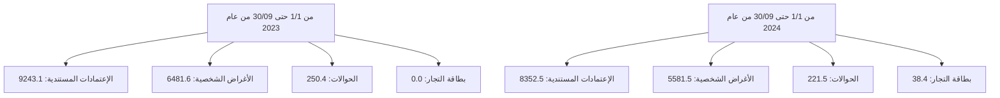

# مصرف ليبيا المركزي

## إستخدامات المصارف للنقد الأجنبي

### خلال الفترة: (1/1 - 30/09/2024)

![Central Bank of Libya image showing financial charts and currency]

إدارة البحوث والإحصاء - إدارة الرقابة على المصارف والنقد
---
إدارة البحوث والإحصاء - إدارة الرقابة على المصارف والنقد

## تحليل حركة إستخدامات المصارف الفعلية من النقد الأجنبي
### خلال الفترة (1/1 - حتى 30/09/2024)

بلغ إجمالي إستخدامات المصارف من النقد الأجنبي خلال الفترة (1/1 - حتى 30/09/2024) نحو 14,193,931,082 دولار، مقابل 15,975,083,907 دولار خلال نفس الفترة من العام الماضي 2023، بإنخفاض قدره نحو 1,781,152,825 دولار. أي بمعدل بلغ 11.1%.

حيث شكلت الإعتمادات المستندية ما نسبته 58.8% من إجمالي إستخدامات المصارف من النقد الأجنبي، فيما شكلت الأغراض الشخصية نسبة 39.3% من الإجمالي، في حين شكلت الحوالات وبطاقات التجار مانسبته 1.9% من إجمالي الإستخدامات.

### إستخدامات المصارف الفعلية من النقد الأجنبي لكافة الأغراض
"المبالغ بالدولار الأمريكي"

| البند | من 1/1 حتى 30/09 من عام 2023 | من 1/1 حتى 30/09 من عام 2024 | مقدار التغير | نسبة التغير |
|-------|-------------------------------|-------------------------------|---------------|-------------|
| - الإعتمادات المستندية | 9,243,083,616 | 8,352,545,809 | -890,537,807 | -9.6 |
| - الحوالات | 250,427,713 | 221,509,473 | -28,918,240 | -11.5 |
| - الأغراض الشخصية | 6,481,572,578 | 5,581,450,800 | -900,121,778 | -13.9 |
| - بطاقات التجار | - | 38,425,000 | - | - |
| الإجمالي | 15,975,083,907 | 14,193,931,082 | -1,781,152,825 | -11.1 |

### إستخدامات المصارف للنقد الأجنبي لكافة الأغراض

صفحة 1 من 103
---
إدارة البحوث والإحصاء - إدارة الرقابة على المصارف والنقد

# المبالغ المُباعة للمصارف من النقد الأجنبي لكافة الأغراض:

ومن خلال الإطلاع على الجدول أدناه للقيم المُباعة من النقد الأجنبي حسب المصارف، يتضح أن

المصرف التجاري الوطني قد حافظ على الترتيب الأول كأكثر المصارف إستخداماً للنقد الأجنبي

خلال الفترة (1/1 - حتى 2024/09/30) مسجلاً حصة سوقية بلغت 16.4%، حيث بلغ إجمالي

المبالغ نحو 2,328,442,913 دولار، فيما جاء مصرف الأمان للتجارة والإستثمار في المرتبة الثانية

بحصة سوقية بلغت 14.6% وبقيمة بلغت 2,070,723,542 دولار، ثم مصرف الجمهورية في المرتبة

الثالثة بقيمة 1,602,096,675 دولار، ثم مصرف السراي في المرتبة الرابعة بقيمة

1,266,367,553 دولار، وتراجع مصرف الوحدة إلى الترتيب الخامس بقيمة 1,229,998,646 دولار

، ثم تأتي من حيث الأهمية النسبية المصارف التالية حسب الترتيب: المصرف الإسلامي الليبي،

المصرف المتحد، مصرف التجارة والتنمية، مصرف الصحاري ومصرف الأندلس إلى آخره من

المصارف كما موضح بالجدول أدناه والذي يحتوي أيضاً على الترتيب الذي كانت عليه المصارف

خلال نفس الفترة من العام الماضي 2023.

صفحة 2 من 103
---
إدارة البحوث والإحصاء - إدارة الرقابة على المصارف والنقد

## ترتيب المصارف حسب إجمالي المبالغ المُباعة من النقد الأجنبي

| المصرف | من 1/1 حتى 09/30 من عام 2023 |  | من 1/1 حتى 09/30 من عام 2024 |  |  |
|---------|---------------------------|--|---------------------------|--|--|
|  | الترتيب | القيمة بالدولار | الحصة السوقية | الترتيب | القيمة بالدولار | الحصة السوقية |
| المصرف التجاري الوطني | 1 | 2,182,044,685 | %13.7 | 1 | 2,328,442,913 | 16.4% |
| مصرف الأمان للتجارة والإستثمار | 4 | 1,684,316,499 | %10.5 | 2 | 2,070,723,542 | 14.6% |
| مصرف الجمهورية | 3 | 1,823,025,459 | %11.4 | 3 | 1,602,096,675 | 11.3% |
| مصرف الديوان | 6 | 1,365,872,687 | %8.6 | 4 | 1,266,367,553 | 8.9% |
| مصرف الوحدة | 2 | 1,989,252,365 | %12.5 | 5 | 1,229,998,646 | 8.7% |
| المصرف الإسلامي الليبي | 7 | 1,141,260,655 | %7.1 | 6 | 872,733,684 | 6.1% |
| المصرف المتحد للتجارة والإستثمار | 8 | 1,103,989,914 | %6.9 | 7 | 864,058,920 | 6.1% |
| مصرف التجارة والتنمية | 13 | 304,760,911 | %1.9 | 8 | 759,435,349 | 5.4% |
| مصرف الصحاري | 9 | 781,195,162 | %4.9 | 9 | 664,001,404 | 4.7% |
| مصرف الأندلس | 14 | 256,553,675 | %1.6 | 10 | 587,668,884 | 4.1% |
| مصرف شمال أفريقيا | 10 | 508,966,829 | %3.2 | 11 | 537,833,056 | 3.8% |
| مصرف السراي للتجارة والإستثمار | 12 | 333,037,056 | %2.1 | 12 | 420,789,244 | 3.0% |
| مصرف الخليج الأول الليبي | 11 | 469,441,294 | %2.9 | 13 | 404,131,757 | 2.8% |
| المصرف الليبي الخارجي | 18 | 79,231,795 | %0.5 | 14 | 144,943,902 | 1.0% |
| مصرف الواحة | 16 | 153,070,204 | 1.0% | 15 | 130,651,232 | 0.9% |
| مصرف التضامن | 17 | 139,785,177 | %0.9 | 16 | 124,144,096 | 0.9% |
| مصرف المتوسط | 19 | 39,907,490 | %0.2 | 17 | 91,089,830 | 0.6% |
| مصرف اليقين | 5 | 1,403,211,815 | %8.8 | 18 | 66,777,979 | 0.5% |
| مصرف الوفاء | 15 | 216,160,234 | %1.4 | 19 | 24,314,646 | 0.2% |
| مصرف الاستثمار العربي الإسلامي | - | - | - | 20 | 3,723,768 | 0.03% |
| مصرف الإتحاد الوطني | 20 | 0 | %0.0 | 21 | 4,000 | 0.0% |
| الإجمالي | - | 15,975,083,907 | % 100 | - | 14,193,931,082 | % 100 |

صفحة 3 من 103
---
إدارة البحوث والإحصاء - إدارة الرقابة على المصارف والنقد

المبالغ المُباعة للمصارف من النقد الأجنبي (حسب الغرض)

"القيم بالدولار الأمريكي"

| ت | المصرف | الإعتمادات المستندية | الحوالات المتنوعة | الأغراض الشخصية | بطاقة التجار |
|---|---------|----------------------|-------------------|-------------------|---------------|
| | | من 1/1 حتى 09/30 من عام 2023 | من 1/1 حتى 09/30 من عام 2023 | من 1/1 حتى 09/30 من عام 2023 | من 1/1 حتى 09/30 من عام 2023 |
| | | من 1/1 حتى 09/01 من عام 2024 | من 1/1 حتى 09/01 من عام 2024 | من 1/1 حتى 09/01 من عام 2024 | من 1/1 حتى 09/01 من عام 2024 |
|-1| التجاري الوطني | 1,015,256,711 | 5,161,502 | 1,161,626,472 | - |
| | | 1,413,175,776 | 2,434,137 | 900,683,000 | 12,150,000 |
|-2| الأمان | 506,992,748 | 465,540 | 1,176,858,211 | - |
| | | 653,133,705 | 1,729,438 | 1,397,864,900 | 17,995,500 |
|-3| الجمهورية | 989,504,346.940 | 47,146,112 | 786,375,000 | - |
| | | 1,008,733,993 | 5,172,282 | 588,190,400 | 0 |
|-4| الصحاري | 1,052,849,496 | 23,109,304 | 289,913,887 | - |
| | | 1,015,715,781 | 19,939,773 | 223,572,500 | 7,139,500 |
|-5| الوحدة | 1,714,671,067 | 920,049 | 273,661,249 | - |
| | | 625,248,926 | 446,220 | 604,303,500 | 0 |
|-6| الإسلامي الليبي | 856,055,780 | 39,497,432 | 245,707,443 | - |
| | | 602,747,999 | 14,074,685 | 255,911,000 | 0 |
|-7| المتحد | 322,708,209 | 3,374,237 | 777,907,468 | - |
| | | 458,152,820 | 0 | 405,906,100 | 0 |
|-8| التجارة والتنمية | 3,600,000 | 0 | 301,160,911 | - |
| | | 322,932,972 | 60,236,077 | 375,766,300 | 500,000 |
|-9| الصحاري | 283,402,655 | 8,871,204 | 488,921,303 | - |
| | | 361,780,928 | 12,811,476 | 289,409,000 | 0 |
|-10| الأندلس | 231,597,433 | 5,391,934 | 19,564,307 | - |
| | | 501,208,415 | 13,901,269 | 72,559,200 | 0 |
|-11| شمال أفريقيا | 300,952,686 | 38,328,917 | 169,685,225 | - |
| | | 300,437,283 | 24,900,573 | 212,055,200 | 440,000 |
|-12| السراي | 309,289,017 | 14,517,435 | 9,230,604 | - |
| | | 356,523,003 | 58,741 | 64,207,500 | 0 |
|-13| الخليج الأول الليبي | 439,431,213 | 29,724,596 | 285,485 | - |
| | | 383,879,758 | 19,280,399 | 971,600 | 0 |
|-14| الليبي الخارجي | 56,328,068 | 22,616,337 | 287,390 | - |
| | | 101,897,765 | 42,444,637 | 601,500 | 0 |
|-15| الواحة | 70,800,886 | 0 | 82,269,318 | - |
| | | 50,371,388 | 1,977,244 | 78,302,600 | 0 |
|-16| الضمان | 139,785,177 | 0 | 0 | - |
| | | 107,935,796 | 2,000,000 | 14,208,300 | 0 |
|-17| المتوسط | 33,015,096 | 0 | 6,892,394 | - |
| | | 73,000,907 | 102,523 | 17,986,400 | 0 |
|-18| اليقين | 703,242,587 | 11,303,112 | 688,666,116 | - |
| | | -1,836,621 | 0 | 68,414,600 | 200,000 |
|-19| الوفاء | 213,600,439 | 0 | 2,559,795 | - |
| | | 13,781,446 | 0 | 10,533,200 | 0 |
|-20| الاستثمار العربي | - | - | - | - |
| | | 3,723,768 | 0 | 0 | 0 |
|-21| الاتحاد الوطني | 0 | 0 | 0 | - |
| | | 0 | 0 | 4,000 | 0 |
|-| الإجمالي الكلي | 9,243,083,616 | 250,427,713 | 6,481,572,578 | - |
| | | 8,352,545,809 | 221,509,473 | 5,581,450,800 | 38,425,000 |

صفحة 4 من 103
---
إدارة البحوث والإحصاء - إدارة الرقابة على المصارف والنقد

## الأهمية النسبية حسب المصرف لاستخدامات النقد الأجنبي
### خلال الفترة من 1/1 حتى 30/09 من عام 2023

| المصرف | النسبة |
|---------|--------|
| المصرف التجاري الوطني | 14% |
| مصرف الوحدة | 12% |
| مصرف الجمهورية | 11% |
| مصرف الأمان للتجارة والاستثمار | 11% |
| مصرف اليقين | 9% |
| مصرف النوران | 9% |
| المصرف الإسلامي الليبي | 7% |
| المصرف المتحد للتجارة والاستثمار | 7% |
| مصرف الصحاري | 5% |
| مصرف شمال أفريقيا | 3% |
| باقي المصارف | 12% |

## الأهمية النسبية حسب المصرف لاستخدامات النقد الأجنبي
### خلال الفترة من 1/1 حتى 30/09 من عام 2024

| المصرف | النسبة |
|---------|--------|
| المصرف التجاري الوطني | 19% |
| مصرف الأمان للتجارة والاستثمار | 17% |
| مصرف الجمهورية | 13% |
| مصرف الوحدة | 10% |
| مصرف النوران | 10% |
| المصرف الإسلامي الليبي | 7% |
| المصرف المتحد للتجارة والاستثمار | 7% |
| مصرف التجارة والتنمية | 6% |
| مصرف الصحاري | 6% |
| مصرف الأندلس | 5% |

صفحة 6 من 103
---
إدارة البحوث والإحصاء - إدارة الرقابة على المصارف والنقد

طلبات المصارف المقبولة لتغطية الإعتمادات المستندية والحوالات المتنوعة عدا الأغراض الشخصية خلال الفترة (1/1 - حتى 30/09/2024):

بلغ عدد الشركات والمصانع والجهات العامة والجهات الأخرى المستفيدة (2,151) والتي تمت الموافقة على طلباتهم حصولهم على النقد الأجنبي خلال الفترة (1/1 - حتى 30/09/2024)، بعدد طلبات بلغ نحو 12,323 طلب، معظم هذه الطلبات لتغطية الإعتمادات المستندية والتي سجلت 10,795 طلب بنسبة 87.6% من الطلبات، كما هو موضح بالجداول التالية أدناه:-

عدد الطلبات المقبولة لشراء النقد الأجنبي - حسب القطاعات

| القطاع | عدد الشركات أو المصانع أو الجهات |
|--------|----------------------------------|
| القطاع الخاص | 2,043 |
| القطاع العام | 33 |
| جهات متنوعة | 75 |
| الإجمالي | 2,151 |

عدد الطلبات المقبولة لشراء النقد الأجنبي حسب نوع التحويل

| نوع التحويل | القطاع الخاص | القطاع العام | جهات متنوعة | الإجمالي | الأهمية النسبية |
|-------------|---------------|--------------|--------------|----------|------------------|
| اعتماد مستندي | 10,560 | 222 | 13 | 10,795 | 87.6% |
| حوالة طيران | 742 | 61 | 8 | 811 | 6.6% |
| حوالة تجارية | 16 | 244 | 32 | 292 | 2.4% |
| تحويلات أخرى | 28 | 190 | 12 | 230 | 1.9% |
| حوالة تأمين | 21 | 72 | 0 | 93 | 0.8% |
| حوالة مرتبات | 0 | 0 | 63 | 63 | 0.5% |
| حوالة صناعية | 35 | 4 | 0 | 39 | 0.3% |
| الإجمالي | 11,402 | 793 | 128 | 12,323 | 100% |

صفحة 7 من 103
---
إدارة البحوث والإحصاء - إدارة الرقابة على المصارف والنقد

## 1- القطاع الخاص:

بلغ عدد شركات ومصانع القطاع الخاص (2,043) التي تمت الموافقة على طلباتها للحصول على
النقد الأجنبي من المصارف لتغطية الاعتمادات المستندية والحوالات الأخرى خلال الفترة (1/1 -
حتى 30/09/2024) حيث أحتلت طلبات شراء النقد الأجنبي من قبل القطاع الخاص لإستيراد
السلع الغذائية المتنوعة المرتبة الأولى من إجمالي طلبات الشراء خلال الفترة، حيث شكلت مانسبته
25.2% من إجمالي طلبات شراء النقد الأجنبي.

وبالنسبة لشركات القطاع الخاص فقد إحتلت شركة النسيم للصناعات الغذائية الترتيب الأول،
والجداول التالية توضح طلبات شراء السلع أو الخدمات وكذلك طلبات الشراء حسب أهم مائة
شركة خلال الفترة (1/1 - حتى 30/09/2024).

### طلبات شراء السلع أو الخدمات - قطاع خاص
### خلال الفترة (1/1 - حتى 30/09/2024)
"مرتبة تنازلياً"

| ت | تصنيف السلع | القيمة بالدولار | الأهمية النسبية % |
|---|-------------|-----------------|-------------------|
| -1 | سلع غذائية متنوعة | 1,983,234,182 | 25.2% |
| -2 | مستلزمات انتاج وتشغيل | 1,601,546,247 | 20.3% |
| -3 | وسائل النقل واطارات ونضائد وقطع الغيار | 549,772,663 | 7.0% |
| -4 | مواد البناء ومستلزمات التشييد | 420,641,894 | 5.3% |
| -5 | أعلاف | 413,067,055 | 5.2% |
| -6 | مستلزمات انتاج سلع أساسية | 385,655,152 | 4.9% |
| -7 | الآلات والمعدات | 354,693,181 | 4.5% |
| -8 | اللحوم الحية والمجمدة | 334,029,863 | 4.2% |
| -9 | الأجهزة الإلكترونية | 276,972,379 | 3.5% |
| -10 | أدوية بشرية | 248,961,343 | 3.2% |
| -11 | الزراعية | 206,980,024 | 2.6% |
| -12 | منزلية وكهرومنزلية | 191,593,769 | 2.4% |
| -13 | حليب وحفاظات وأغذية أطفال | 151,978,294 | 1.9% |
| -14 | مواد التنظيف | 100,726,974 | 1.3% |
| -15 | حليب | 86,524,745 | 1.1% |
| -16 | طلبات برنيق للطيران | 75,299,811 | 1.0% |

صفحة 8 من 103
---
إدارة البحوث والإحصاء - إدارة الرقابة على المصارف والنقد

| النسبة المئوية | القيمة | البند | الرقم |
|----------------|--------|------|------|
| %0.9 | 74,100,882 | أجبان | -17 |
| %0.6 | 46,447,950 | حوالات شركات خطوط الطيران | -18 |
| %0.6 | 44,824,076 | الملابس والأحذية | -19 |
| %0.5 | 38,492,772 | الأثاث | -20 |
| %0.5 | 35,899,090 | زراعية | -21 |
| %0.4 | 34,482,054 | خدمات ملاحية متنوعة | -22 |
| %0.3 | 25,569,905 | قرطاسية | -23 |
| %0.3 | 22,669,057 | مواد صحية | -24 |
| %0.3 | 21,307,090 | فواكه وخضروات | -25 |
| %0.2 | 18,979,280 | طلبات خاصة بشركة الأجنحة الليبية | -26 |
| %0.2 | 16,625,823 | مواد تنظيف | -27 |
| %0.2 | 15,338,030 | سمن | -28 |
| %0.2 | 14,885,285 | خدمات اتصالات وتقنية معلومات | -29 |
| %0.2 | 14,640,482 | متنوعة | -30 |
| %0.2 | 13,259,856 | أدوية بيطرية | -31 |
| %0.2 | 13,189,589 | خدمات إنتاج وتشغيل | -32 |
| %0.1 | 10,881,994 | الشركة الليبية السريعة للنقل الجوي | -33 |
| %0.1 | 7,709,188 | أسماك وأحياء بحرية | -34 |
| %0.1 | 4,771,360 | شركة أويا للطيران | -35 |
| %0.05 | 3,720,488 | زبدة | -36 |
| %0.04 | 3,400,500 | تبغ بأنواعها ومستلزماته | -37 |
| %0.04 | 3,306,394 | السجاد والمنسوجات | -38 |
| %0.03 | 2,326,931 | سلع أخرى | -39 |
| %0.02 | 1,750,692 | شركة غدامس للطيران | -40 |
| %0.02 | 1,618,347 | شركة سما المتوسط للطيران | -41 |
| %0.02 | 1,526,137 | مستلزمات تشغيل مصنع الحديد والصلب | -42 |
| %0.01 | 784,513 | حوالات شركات التأمين | -43 |
| %0.01 | 711,461 | الطبية | -44 |
| %0.01 | 610,500 | رسوم اشتراك منظومة | -45 |
| %0.01 | 565,391 | تكاليف خدمات سياحية | -46 |
| %0.00 | 266,962 | سلع خاصة بالخدمات العامة | -47 |
| %0.00 | 175,517 | مستلزمات تشغيل الموانئ | -48 |
| %0.00 | 76,485 | تكاليف رسوم تأشيرات | -49 |

صفحة 9 من 103
---
إدارة البحوث والإحصاء - إدارة الرقابة على المصارف والنقد

# طلبات الشراء حسب أهم مائة شركة - قطاع خاص
## خلال الفترة (1/1 حتى 2024/09/30)
### "مرتبة تنازلياً"

"دولار أمريكي"

| ت | الشركة أو المصنع | القيمة |
|---|-------------------|--------|
| 1 | شركة النسيم للصناعات الغذائية | 134,288,633 |
| 2 | شركة وادي الكوف للمطاحن والأعلاف ومضارب الأرز | 122,943,808 |
| 3 | شركة الشرق الليبي للمطاحن والاعلاف ومضارب الارز | 118,005,115 |
| 4 | شركة تويوتا ليبيا تجارة السيارات وقطع الغيار واستيراد والتصدير | 93,662,388 |
| 5 | شركة برنيق للطيران | 90,876,284 |
| 6 | الشركة الليبية المتحدة لتعبئة المشروبات | 86,140,421 |
| 7 | شركة الجيد لاستيراد المواد الغذائية | 78,833,094 |
| 8 | شركة شريان الحياة لاستيراد جميع أنواع الاعلاف ومكملاتها والمعدات الزراعية وبذور الحيوانات وطحن الحبوب | 75,000,000 |
| 9 | شركة المتوكة لاستيراد المواد الغذائية | 74,839,242 |
| 10 | الشركة الليبية الكبرى لصناعة السميد والدقيق | 68,811,427 |
| 11 | شركة المعمورة للصناعات الغذائية والمطاحن والاعلاف | 68,337,182 |
| 12 | شركة افريقيا لتعبئة المشروبات | 64,650,816 |
| 13 | شركة جودي للصناعات الغذائية | 62,885,541 |
| 14 | شركة الماهر الدولي للمطاحن والأعلاف | 57,664,421 |
| 15 | شركة الجاهزة لاستيراد المواد الغذائية | 54,392,000 |
| 16 | شركة سما الليبية لاستيراد المواد الغذائية والمواشي واللحوم | 54,263,097 |
| 17 | شركة بلد لاستراد المواد الغذائية | 53,414,375 |
| 18 | شركة جبل الكوف لاستيراد السيارات و قطع الغيار | 50,927,091 |
| 19 | شركة خيرات الأيادي لاستيراد المواد الغذائية | 50,327,500 |
| 20 | شركة جودة الموسم لاستراد المواد الغذائية | 48,931,500 |
| 21 | المجموعة الليبية للخدمات النفطية والطاقة | 48,620,320 |
| 22 | شركة دروب ليبيا لاستيراد وسائل النقل وملحقاتها | 47,141,832 |
| 23 | شركة مجموعة الامتياز لاستيراد وسائل النقل المختلفة وملحقاتها | 45,769,749 |
| 24 | شركة الريحان لصناعة المواد الغذائية | 44,418,514 |

صفحة 10 من 103
---
إدارة البحوث والإحصاء - إدارة الرقابة على المصارف والنقد

| المبلغ | اسم الشركة | الرقم |
|--------|------------|-------|
| 44,165,185 | شركة بصمة الجودة لاستيراد المواد الغذائية والمواشي واللحوم | 25 |
| 42,272,200 | شركة عروس البيضاء لاستيراد المواشي واللحوم التابعة لشركة أكاكوس القابضه | 26 |
| 41,789,327 | شركة مجموعة الرائدون لصناعة مواد البناء | 27 |
| 41,727,713 | شركة السرايا الراقية لاستيراد المواد الغذائية و الخضروات و الفواكه الطازجة و المواشي واللحوم | 28 |
| 40,413,371 | شركة بستان ليبيا لاستيرادالمواد الغذائية والمواشي واللحوم | 29 |
| 40,107,707 | شركة الفا لاستيراد الادوية والمعدات الطبية و المستحضرات الطبية و مستلزمات الام و الطفل | 30 |
| 39,879,550 | شركة مجموعة الامتياز للمطاحن ومضارب الارز وتعبئة الزيوت النباتية | 31 |
| 38,017,680 | شركة المعمورة للاستثمار الزراعي والحيواني | 32 |
| 37,907,555 | شركة المروكة للصناعات الغذائية | 33 |
| 36,119,910 | شركة ريادة لصناعات الكيماوية والمواد الخام | 34 |
| 33,540,422 | شركة الجيد للصناعات الغذائية | 35 |
| 33,339,103 | شركة أضواء النيزك لاستيراد الأجهزة الألكترونية وملحقاتها وقطع غيارها | 36 |
| 33,243,705 | شركة الثمرات الليبية لاستيراد المواد الغذائية | 37 |
| 32,927,660 | شركة الابداع لصناعة المنظفات والصابون ومستلزماتها | 38 |
| 32,874,766 | الشركة الاستثمارية للصناعات الهندسية وتشكيل المعادن | 39 |
| 32,282,620 | شركة الوصل الممتاز لاستيراد لاستيراد المواد الغذائية والمواشي واللحوم | 40 |
| 32,215,898 | شركة مجموعة التواصل المميز لاستيراد المواد الخام | 41 |
| 32,009,781 | شركة تمر هند لاستيراد السيارات وقطع غيارها | 42 |
| 31,499,547 | شركة الاجنحة الليبية للطيران المساهمة | 43 |
| 31,310,092 | شركة وطن المجد لاستيراد المواد الغذائية | 44 |
| 31,051,803 | شركة طريق القارة لاستيراد المواد الغذائية | 45 |
| 30,636,417 | شركة الزرقاء الدولية للصناعات الغذائية | 46 |
| 30,447,844 | شركة الجبال لصناعة الاعلاف | 47 |
| 29,185,550 | شركة الوسام الذهبي لصناعة الدقيق ومضارب الارز | 48 |
| 29,073,760 | شركة القدس ل صناعة الخزانات والمواسير البلاستيكية | 49 |
| 28,616,261 | شركة المعمورة لاستيراد وتوزيع المواد الغذائية | 50 |
| 27,247,893 | شركة لمسة الحياة لاستيراد المعدات الطبية والادوية والمستحضرات الطبية ومستلزمات الام والطفل | 51 |
| 26,877,465 | شركة أعالي الاندلس للصناعات الغذائية | 52 |
| 26,135,200 | مصنع اريكو لصناعة الطلاء | 53 |
| 26,042,100 | شركة الجودة العالمية الاولى لصناعة الاعلاف ومطاحن الدقيق والصناعات الغذائية | 54 |

صفحة 11 من 103
---
إدارة البحوث والإحصاء - إدارة الرقابة على المصارف والنقد

| الرقم | اسم الشركة | القيمة |
|-------|------------|--------|
| 55 | شركة ادري لاستيراد وسائل النقل وملحقاتها | 25,886,646 |
| 56 | شركة اونكس لصناعة مواد البناء والطلاء والمعاجين وصناعة البلاستيك والمواد الخام | 25,562,000 |
| 57 | شركة طرابلس الكبرى لصناعة وتعبئة الطماطم والمواد الغذائية | 25,421,440 |
| 58 | شركة الرفيق الأمثل لصناعة مواد البناء | 24,361,484 |
| 59 | شركة المصبوبات لصناعة مواد البناء | 24,310,304 |
| 60 | مصنع جاما لصناعة البلاستيك | 23,479,322 |
| 61 | شركة الشمس الساطعة للصناعات الغذائية | 23,112,509 |
| 62 | شركة الساحل لاستيراد المواشي واللحوم | 22,852,371 |
| 63 | شركة اضواء افريقيا لاستيراد المواد الغذائية والمواشي واللحوم | 21,913,444 |
| 64 | شركة القيض لصناعة مواد التنظيف | 21,813,125 |
| 65 | شركة السواحل الذهبية لاستيراد المواد الغذائية | 21,702,544 |
| 66 | شركة قرطاج للصناعات الغذائية | 21,629,500 |
| 67 | شركة مفاتيح الخير لاستيراد الاجهزة والمواد الكهربائية وقطع غيارها والاجهزة الالكترونية وملحقاتها وقطع | 20,566,082 |
| 68 | شركة أصول التكنولوجيا لصناعة الاجهزة الالكترونية والكهربائية | 20,547,750 |
| 69 | شركة المراعي الخصبة للمطاحن والاعلاف ومضارب الارز | 20,513,760 |
| 70 | مصنع التعاون لصناعة الاعلاف | 20,447,900 |
| 71 | شركة المذاق الطيب لاستيراد المواد الغذائية والمواشي واللحوم | 20,237,423 |
| 72 | شركة السهل الاخضر للمطاحن والاعلاف | 20,231,082 |
| 73 | شركة كنوز ليبيا للمطاحن والاعلاف ومضارب الارز | 20,112,805 |
| 74 | شركة المعمورة الأولى لاستيراد المواد الغذائية | 19,394,548 |
| 75 | مصنع بيتا لصناعة مواد التنظيف | 19,378,000 |
| 76 | شركة الطرق الحديثة لصناعة الاسفلت والمواد العازل | 18,862,587 |
| 77 | شركة سوبر لصناعة مواد البناء وطلاء والبلاستيك ومواد الخام | 18,741,300 |
| 78 | الشركة الدولية لصناعة مواد البناء والطلاء والبلاستيك ومواد الخام | 18,691,050 |
| 79 | شركة سما المراعي للمطاحن وصناعة الاعلاف ومضارب الأرز | 18,596,697 |
| 80 | شركة التقنية الخضراء لاستيراد الاجهزة الكهربائية والالكترونية | 18,456,947 |
| 81 | شركة جلوبال لصناعة مواد البناء والطلاء والمعاجين والبلاستيك والمواد الخام | 18,433,920 |
| 82 | شركة الدروب لصناعة البيتومين والقطرانين والعوازل | 18,345,932 |
| 83 | شركة الطائف لإستيراد المواد الغذائية | 18,341,575 |
| 84 | شركة الاصالة الذهبية للمطاحن ومضارب الأرز | 18,301,083 |
| 85 | شركة النجع الكبير لاستيراد المواد الغذائية والمواشي واللحوم | 18,293,421 |
| 86 | شركة أجيال العطاء الوافر لاستيراد المواد الغذائية | 18,288,000 |

صفحة 12 من 103
---
إدارة البحوث والإحصاء - إدارة الرقابة على المصارف والنقد

| الرقم | اسم الشركة | القيمة |
|-------|------------|--------|
| 87 | شركة اوميجا للصناعات الكيماوية ومواد التغليف | 18,156,900 |
| 88 | شركة النخوة الليبية لاستيراد المواد الغذائية | 18,121,174 |
| 89 | شركة السد الحديثة للمطاحن وصناعة الاعلاف للمطاحن و الاعلاف و المكرونة | 17,942,280 |
| 90 | شركة الغذاء الذهبي لصناعة وتعبئة معجون الطماطم والصناعات الغذائية | 17,866,250 |
| 91 | شركة الفلك الأول لاستيراد وسائل النقل وقطع غياره وكمالياته | 17,612,149 |
| 92 | شركة المتحدة العربية لصناعة مواد التنظيف | 17,309,500 |
| 93 | شركة أجود المحركات لاستيراد السيارات | 17,297,161 |
| 94 | شركة المبتكر الحديث لصناعة البي في سي | 17,240,313 |
| 95 | شركة الشجرة الشامخة لاستيراد المواد الغذائية والمواشي واللحوم | 16,849,135 |
| 96 | شركة ابتهاج الطبيعة لاستيراد المواد الغذائية | 16,741,106 |
| 97 | شركة الليبية الجديدة لصناعة المعادن | 16,675,684 |
| 98 | شركة العلمية لإستيراد الادوية والمستحضرات الطبية ومستلزمات الام والطفل | 16,620,319 |
| 99 | شركة الشروق العالمي للصناعات الغذائية | 16,608,600 |
| 100 | شركة الامال العظيمة لاستيراد المواد الغذائية | 16,602,000 |

## طلبات المصارف لتغطية الاعتمادات المستندية والحوالات - قطاع خاص

### (حسب أهم البلدان المستفيدة)

من خلال الإطلاع على الجدول أدناه لقيم طلبات المصارف لشراء النقد الأجنبي حسب البلدان المستفيدة خلال الفترة (1/1 - حتى 30/09/2024) للقطاع الخاص، يتضح أن مانسبته 22.2% من تحويلات المصارف لتغطية الإعتمادات المستندية أوالحوالات الأخرى كانت لدولة تركيا، تم جاءت دولة الإمارات العربية المتحدة في المرتبة الثانية بنسبة 13.5% ثم سويسرا والمملكة المتحدة بنسب 7.9% و 7.0% على التوالي، والجدول التالي يوضح أهم عشرون بلد مستفيد.

صفحة 13 من 103
---
إدارة البحوث والإحصاء - إدارة الرقابة على المصارف والنقد

طلبات المصارف لتغطية الاعتمادات المستندية والحوالات - قطاع خاص
(حسب أهم البلدان المستفيدة)
خلال الفترة (1/1 - حتى 30/09/2024)

| ت | البلد المستفيد | القيمة بالدولار | الأهمية النسبية |
|---|----------------|-----------------|-----------------|
| -1 | تركيا | 1,748,929,252 | 22.2% |
| -2 | الإمارات العربية المتحدة | 1,065,536,648 | 13.5% |
| -3 | سويسرا | 620,407,107 | 7.9% |
| -4 | بريطانيا ( المملكة المتحدة) | 549,632,464 | 7.0% |
| -5 | مصر | 515,647,036 | 6.5% |
| -6 | الصين | 417,388,594 | 5.3% |
| -7 | إيطاليا | 371,683,727 | 4.7% |
| -8 | تونس | 313,501,029 | 4.0% |
| -9 | إسبانيا | 264,435,157 | 3.4% |
| -10 | كندا | 179,042,287 | 2.3% |
| -11 | الأردن | 162,280,616 | 2.1% |
| -12 | النمسا | 154,156,994 | 2.0% |
| -13 | اليابان | 125,693,244 | 1.6% |
| -14 | تايلاند | 124,979,052 | 1.6% |
| -15 | فرنسا | 121,647,490 | 1.5% |
| -16 | هولندا | 116,470,711 | 1.5% |
| -17 | كوريا الجنوبية | 103,463,844 | 1.3% |
| -18 | المانيا | 97,285,010 | 1.2% |
| -19 | نيوزيلندا | 64,187,241 | 0.8% |
| -20 | الهند | 50,191,835 | 0.6% |

صفحة 14 من 103
---
إدارة البحوث والإحصاء - إدارة الرقابة على المصارف والنقد

# طلبات المصارف لتغطية الإعتمادات المستندية والحوالات - قطاع خاص

## (حسب أهم بلدان منشأ السلع أو الخدمات)

من خلال الإطلاع على الجدول أدناه لقيم طلبات المصارف لشراء النقد الأجنبي حسب بلدان منشأ السلع أو الخدمات خلال الفترة (1/1 - حتى 30/09/2024) للقطاع الخاص ، يتضح أن دولة تركيا قد أحتلت المرتبة الأولى حيث شكلت السلع أو الخدمات ذات المنشأ التركي نسبة 20.2% من إجمالي طلبات الشراء المقبولة، ثم جاءت واردات السلع أو الخدمات ذات المنشأ الصيني في المرتبة الثانية مشكلة مانسبته 11.1% من الإجمالي، وشكلت السلع أوالخدمات ذات المنشأ المصري نسبة 9.6% محتلة المرتبة الثالثة خلال الفترة ، فيما سجلت السلع والخدمات ذات منشأ دولة روسيا الاتحادية مانسبته 6.9% ، وذات المنشأ البرازيلي نسبة 5.2%، والجدول التالي يوضح أهم عشرون بلد منشأ للسلع أو الخدمات.

## طلبات المصارف لتغطية الإعتمادات المستندية والحوالات - قطاع خاص
### (حسب أهم بلدان منشأ السلع أو الخدمات)
### خلال الفترة (1/1 - حتى 30/09/2024)

| ت | بلد منشأ السلع أوالخدمات | القيمة بالدولار | الاهمية النسبية |
|---|---------------------------|-----------------|------------------|
| 1- | تركيا | 1,589,328,529 | 20.2% |
| 2- | الصين | 877,154,222 | 11.1% |
| 3- | مصر | 756,880,294 | 9.6% |
| 4- | روسيا الاتحادية | 540,428,256 | 6.9% |
| 5- | البرازيل | 407,338,706 | 5.2% |
| 6- | الهند | 394,025,038 | 5.0% |
| 7- | إيطاليا | 364,482,950 | 4.6% |
| 8- | تونس | 264,609,976 | 3.4% |
| 9- | أوكرانيا | 211,857,422 | 2.7% |
| 10- | إسبانيا | 187,425,048 | 2.4% |

صفحة 15 من 103
---
إدارة البحوث والإحصاء - إدارة الرقابة على المصارف والنقد

| -   | الدولة                  | القيمة       | النسبة |
|-----|------------------------|-------------|-------|
| -11 | تايلاند                 | 179,645,221 | 2.3%  |
| -12 | الأرجنتين               | 176,789,081 | 2.2%  |
| -13 | فرنسا                   | 143,554,258 | 1.8%  |
| -14 | المانيا                 | 140,939,885 | 1.8%  |
| -15 | هولندا                  | 122,408,193 | 1.6%  |
| -16 | الإمارات العربية المتحدة | 113,417,974 | 1.4%  |
| -17 | المملكة العربية السعودية | 111,811,584 | 1.4%  |
| -18 | الولايات المتحدة         | 106,430,923 | 1.4%  |
| -19 | بلجيكا                  | 102,816,870 | 1.3%  |
| -20 | أيرلندا                 | 92,232,896  | 1.2%  |

## 2- القطاع العام

بلغ عدد جهات القطاع العام التي تمت الموافقة على طلباتها للحصول على النقد الأجنبي لتغطية الاعتمادات المستندية والحوالات الأخرى 33 جهة خلال الفترة (1/1 - حتى 30/09/2024)، حيث أحتلت مستلزمات تشغيل مصنع الحديد والصلب المرتبة الأولى من إجمالي طلبات الشراء خلال الفترة، حيث شكلت مانسبته 42.3% من إجمالي طلبات شراء النقد الأجنبي، فيما أحتلت متطلبات مستلزمات الإنتاج والتشغيل المرتبة الثانية من حيث الأهمية النسبية لتشكل نحو 10.6%، وبالتالي فقد إحتلت الشركة الليبية للحديد والصلب الترتيب الأول ، حيث سجلت طلباتها المقبولة لشراء النقد الأجنبي نحو 358.5 مليون دولار خلال الفترة يليها شركة ليبيانا للهاتف المحمول بإجمالي طلبات مقبولة بلغ نحو 88.7 مليون دولار. والجداول التالية توضح طلبات شراء السلع أو الخدمات وكذلك طلبات الشراء حسب الجهات العامة خلال الفترة (1/1 - حتى 30/09/2024).

صفحة 16 من 103
---
إدارة البحوث والإحصاء - إدارة الرقابة على المصارف والنقد

# طلبات شراء حسب السلعة أو الخدمات - قطاع عام

خلال الفترة (1/1 - حتى 30/09/2024)

"مرتبة تنازلياً"

| ت | تصنيف السلع | القيمة بالدولار | الأهمية النسبية % |
|---|-------------|------------------|-------------------|
| -1 | مستلزمات تشغيل مصنع الحديد والصلب | 340,504,682 | 42.3% |
| -2 | مستلزمات انتاج وتشغيل | 85,589,092 | 10.6% |
| -3 | طلبات جهاز تنفيذ مشروعات المواصلات | 64,300,000 | 8.0% |
| -4 | متطلبات شركة ليبيانا للهاتف المحمول | 60,499,763 | 7.5% |
| -5 | خدمات اتصالات وتقنية معلومات | 55,413,632 | 6.9% |
| -6 | شركة الاتحاد العربي للمقاولات | 41,119,610 | 5.1% |
| -7 | شركة المدار الجديد | 30,988,149 | 3.8% |
| -8 | حوالات شركات خطوط الطيران | 20,653,677 | 2.6% |
| -9 | شركة ليبيا للاتصالات والتقنية | 19,276,729 | 2.4% |
| -10 | مستلزمات تشغيل الموانئ | 14,848,533 | 1.8% |
| -11 | حوالات شركات التأمين | 9,324,318 | 1.2% |
| -12 | الآلات والمعدات | 9,311,465 | 1.2% |
| -13 | سلع غذائية متنوعة | 8,064,000 | 1.0% |
| -14 | الخطوط الجوية الأفريقية | 6,402,131 | 0.8% |
| -15 | طلبات جهاز مشروعات الاسكان | 5,721,046 | 0.7% |
| -16 | مواد البناء ومستلزمات التشييد | 4,761,896 | 0.6% |
| -17 | الغذائية | 4,317,050 | 0.5% |
| -18 | الشركة الاهلية للاسمنت | 4,113,849 | 0.5% |
| -19 | متطلبات تشغيل وصيانة الموانئ | 3,709,988 | 0.5% |
| -20 | خدمات انتاج وتشغيل | 3,244,958 | 0.4% |
| -21 | طلبات الخطوط الجوية الليبية | 2,189,298 | 0.3% |
| -22 | الهيئة العامة للأوقاف | 2,108,454 | 0.3% |
| -23 | متنوعة | 2,030,750 | 0.3% |
| -24 | أجهزة الكترونية | 1,948,376 | 0.2% |
| -25 | الشركة العامة لاستيراد السلع الامنية | 1,465,100 | 0.2% |
| -26 | مستلزمات الشركة العامة للكهرباء | 1,090,179 | 0.1% |
| -27 | حوالات دورة تدريبية | 821,882 | 0.1% |

صفحة 17 من 103
---
إدارة البحوث والإحصاء - إدارة الرقابة على المصارف والنقد

| وسائل النقل واطارات ونضائد وقطع الغي | 632,347 | %0.1 |
|--------------------------------------|---------|------|
| الشركة الليبية للموانئ               | 486,619 | %0.1 |
| احتياجات التشغيل لشركة معاملات        | 310,977 | %0.04 |
| سلع خاصة بالخدمات العامة              | 66,625  | %0.01 |
| مستلزمات تشغيل شركة هاتف ليبيا        | 15,178  | %0.00 |

## طلبات الشراء حسب الجهات - قطاع عام
خلال الفترة (1/1 - حتى 30/09/2024)
"مرتبة تنازلياً"

| ت | الجهة                                    | القيمة بالدولار |
|---|-----------------------------------------|----------------|
| 1 | الشركه الليبيه للحديد والصلب             | 358,453,529    |
| 2 | شركة ليبيانا للهاتف المحمول              | 88,703,364     |
| 3 | الجهاز الوطني للتنمية                    | 70,300,000     |
| 4 | جهاز تنمية و تطوير المراكز الإدارية      | 50,499,805     |
| 5 | شركة الاتحاد العربي للمقاولات المساهمة   | 45,925,517     |
| 6 | شركة المدار الجديد                       | 44,800,990     |
| 7 | المنطقة الحرة بمصراته                    | 25,250,069     |
| 8 | شركة الخطوط الجوية الافريقية             | 23,074,282     |
| 9 | شركة ليبيا للاتصالات والتقنية المساهمة   | 22,448,313     |
| 10 | الشركة الاهلية للاسمنت                   | 13,584,190     |
| 11 | شركة تطوير للاستثمار الصناعي المساهمة    | 11,968,000     |
| 12 | شركة ليبيا للتأمين                       | 10,660,088     |
| 13 | شركة هاتف ليبيا                          | 9,401,655      |
| 14 | شركة الاتصالات الدولية الليبية           | 5,863,552      |
| 15 | جهاز تنفيذ مشروعات الاسكان و المرافق     | 5,721,046      |
| 16 | شركة الخطوط الجوية الليبية               | 4,079,035      |
| 17 | شركة المناهج للطباعة والنشر              | 1,945,321      |
| 18 | شركة الانماء للاستثمارات الكهربائية      | 1,869,824      |
| 19 | شركة تطوير للاستثمار الصناعي             | 1,501,155      |

صفحة 18 من 103
---
إدارة البحوث والإحصاء - إدارة الرقابة على المصارف والنقد

| القيمة | الاسم | الرقم |
|--------|------|------|
| 1,465,100 | شركة العامة لاستيراد السلع الأمنية المساهمة | 20 |
| 1,104,509 | شركة الليبية للموانئ | 21 |
| 2,108,454 | الهيئة العامة للأوقاف والشؤون الإسلامية | 22 |
| 892,000 | شركة العامة لخدمات النظافة العامة طرابلس | 23 |
| 822,644 | الاتحاد الليبي لشركات التأمين | 24 |
| 807,382 | شركة الأكاديمية الليبية للاتصالات والمعلوماتية | 25 |
| 768,951 | المركز الوطني للأرصاد الجوية | 26 |
| 629,977 | شركة معاملات للخدمات المالية | 27 |
| 413,050 | شركة الثقة لاستيراد اللحوم والمواد الغذائية المساهمة | 28 |
| 107,300 | شركة الشاحنات والحافلات | 29 |
| 85,429 | جامعة بنغازي | 30 |
| 50,144 | شركة الجيل الجديد للتقنية | 31 |
| 15,178 | شركة بريد ليبيا | 32 |
| 10,500 | هيئة الإشراف على التأمين | 33 |

صفحة 19 من 103
---
إدارة البحوث والإحصاء - إدارة الرقابة على المصارف والنقد

### 3- جهات متنوعة:

طلبات التغطية المقبولة
جهات متنوعة وحوالات مرتبات للأجانب
خلال الفترة (1/1 - 30/09/2024)

| الترتيب | اسم الجهة | القيمة بالدولار الأمريكي |
|---------|-----------|--------------------------|
| 1 | شركة مصر للطيران | 8,620,569 |
| 2 | مصرف الامان للتجارة والاستثمار | 7,597,976 |
| 3 | فرع شركة الخطوط الجوية التونسية | 5,655,208 |
| 4 | مصرف التجارة والتنمية | 4,137,738 |
| 5 | شركة مصرف الأندلس | 2,238,815 |
| 6 | شركة مصرف التضامن | 2,000,000 |
| 7 | عدد (63) حوالة أفراد - مرتبات أجانب | 1,087,646 |
| 8 | مصرف الاستثمار العربي الاسلامي | 852,584 |
| 9 | النادي الاهلي الرياضي | 431,769 |
| 10 | مصرف المتوسط | 427,021 |
| 11 | شركة الخطوط الجوية الألمانية | 160,950 |
| 12 | فرع شركة الخطوط الملكية الاردنية | 151,678 |
| 13 | سفارة دولة قطر | 4,665 |

صفحة 20 من 103
---
إدارة البحوث والإحصاء - إدارة الرقابة على المصارف والنقد

حسب بلد المستفيد - جهات متنوعة وحوالات أجانب (مرتبات)

| القيمة بالدولار الأمريكي | بلد المستفيد | الترتيب |
|--------------------------|--------------|---------|
| 8,747,969 | مصر | 1 |
| 6,018,412 | تونس | 2 |
| 4,015,000 | الولايات المتحدة | 3 |
| 3,409,551 | المتحدة بريطانيا ( المملكة) | 4 |
| 3,262,008 | إسبانيا | 5 |
| 1,315,655 | المغرب | 6 |
| 1,201,730 | الهند | 7 |
| 1,044,553 | الإمارات العربية المتحدة | 8 |
| 791,189 | هولندا | 9 |
| 759,094 | الصين | 10 |
| 592,596 | الأردن | 11 |
| 552,207 | موريشيوس | 12 |
| 281,836 | تركيا | 13 |
| 274,077 | مالطة | 14 |
| 189,120 | بلجيكا | 15 |
| 179,406 | فرنسا | 16 |
| 160,950 | المانيا | 17 |
| 104,245 | أوكرانيا | 18 |
| 97,735 | بولندا | 19 |
| 72,625 | مالي | 20 |
| 67,800 | بلغاريا | 21 |
| 66,030 | الفلبين | 22 |
| 56,630 | إيطاليا | 23 |
| 35,330 | لبنان | 24 |
| 34,500 | السودان | 25 |

صفحة 21 من 103
---
إدارة البحوث والإحصاء - إدارة الرقابة على المصارف والنقد

| | أوزبكستان | 13,842 |
|---|------------|--------|
| 27 | مولدافيا | 11,864 |
| 28 | باكستان | 6,000 |
| 29 | قطر | 4,665 |

### الملحق

طلبات التغطية المقبولة لكافة القطاعات خلال الفترة (1/1 – حتى 30/09/2024):

- قوائم بكافة الجهات والشركات والمصانع المستفيدة.
- طلبات الشراء حسب تصنيف السلع أو الخدمات.
- طلبات الشراء حسب بلدان منشأ السلع أو الخدمات والبلدان المستفيدة.

صفحة 22 من 103
---
# طلبات التغطية المقبولة

قائمة بكافة الشركات والمصانع - قطاع خاص

خلال الفترة (1/1 - 30/09/2024)

"مرتبة تنازلياً"

| الترتيب | اسم الشركة أو المصنع | القيمة بالدولار الأمريكي |
|---------|------------------------|--------------------------|
| 1 | شركة النسيم للصناعات الغذائية | 134,288,633 |
| 2 | شركة وادي الكوف للمطاحن والأعلاف ومضارب الأرز | 122,943,808 |
| 3 | شركة الشرق الليبي للمطاحن والاعلاف ومضارب الارز | 118,005,115 |
| 4 | شركة تويوتا ليبيا تجارة السيارات وقطع الغيار واستيراد والتصدير | 93,662,388 |
| 5 | شركة برنيق للطيران | 90,876,284 |
| 6 | شركة الليبية المتحدة لتعبئة المشروبات | 86,140,421 |
| 7 | شركة الجيد لاستيراد المواد الغذائية | 78,833,094 |
| 8 | شركة شريان الحياة لاستيراد جميع أنواع الاعلاف ومكملاتها والمعدات الزراعية وبذور الحيوانات وطحن الحبوب | 75,000,000 |
| 9 | شركة المبروكة لاستيراد المواد الغذائية | 74,839,242 |
| 10 | شركة الليبية الكبرى لصناعة السميد والدقيق | 68,811,427 |
| 11 | شركة المعمورة للصناعات الغذائية والمطاحن والاعلاف | 68,337,182 |
| 12 | شركة افريقيا لتعبئة المشروبات | 64,650,816 |
| 13 | شركة جودي للصناعات الغذائية | 62,885,541 |
| 14 | شركة الماهر الدولي للمطاحن والأعلاف | 57,664,421 |
| 15 | شركة الجاهزة لاستيراد المواد الغذائية | 54,392,000 |
| 16 | شركة سما الليبية لاستيراد المواد الغذائية والمواشي واللحوم | 54,263,097 |
| 17 | شركة يلد لاستيراد المواد الغذائية | 53,414,375 |
| 18 | شركة جبل الكوف لاستيراد السيارات و قطع الغيار | 50,927,091 |
| 19 | شركة خيرات الأيادي لاستيراد المواد الغذائية | 50,327,500 |
| 20 | شركة جودة الموسم لاستيراد المواد الغذائية | 48,931,500 |
| 21 | المجموعة الليبية للخدمات النفطية والطاقة | 48,620,320 |
| 22 | شركة دروب ليبيا لاستيراد وسائل النقل وملحقاتها | 47,141,832 |
| 23 | شركة مجموعة الامتياز لاستيراد وسائل النقل المختلفة وملحقاتها | 45,769,749 |
| 24 | شركة الريحان لصناعة المواد الغذائية | 44,418,514 |
| 25 | شركة بصمة الجودة لاستيراد المواد الغذائية والمواشي واللحوم | 44,165,185 |
| 26 | شركة عروس البيضاء لاستيراد المواشي واللحوم التابعة لشركة أكاكوس القابضة | 42,272,200 |
| 27 | شركة مجموعة الرائدون لصناعة مواد البناء | 41,789,327 |
---
| Amount | Company Name | No. |
|---------|---------------|-----|
| 41,727,713 | شركة السرايا الراقية لاستيراد المواد الغذائية و الخضروات و الفواكه الطازجة و المواشي واللحوم | 28 |
| 40,413,371 | شركة بستان ليبيا لاستيرادالمواد الغذائية والمواشي واللحوم | 29 |
| 40,107,707 | شركة الفا لاستيراد الادوية والمعدات الطبية و المستحضرات الطبية و مستلزمات الام و الطفل | 30 |
| 39,879,550 | شركة مجموعة الامتياز للمطاحن ومضارب الارز وتعبئة الزيوت النباتية | 31 |
| 38,017,680 | شركة المعمورة للاستثمار الزراعي والحيواني | 32 |
| 37,907,555 | شركة المبروكة للصناعات الغذائية | 33 |
| 36,119,910 | شركة ريادة لصناعات الكيماوية والمواد الخام | 34 |
| 33,540,422 | شركة الجيد للصناعات الغذائية | 35 |
| 33,339,103 | شركة أضواء النيزك لاستيراد الأجهزة الألكترونية وملحقاتها وقطع غيارها | 36 |
| 33,243,705 | شركة الثمرات الليبية لاستيراد المواد الغذائية | 37 |
| 32,927,660 | شركة الابداع لصناعة المنظفات والصابون ومستلزماتها | 38 |
| 32,874,766 | شركة الاستثمارية للصناعات الهندسية وتشكيل المعادن | 39 |
| 32,282,620 | شركة الوصل المنير لاستيراد لاستيراد المواد الغذائية والمواشي واللحوم | 40 |
| 32,215,898 | شركة مجموعة التواصل المميز لاستيراد المواد الخام | 41 |
| 32,009,781 | شركة تمر هند لاستيراد السيارات وقطع غيارها | 42 |
| 31,499,547 | شركة الاجنحة الليبية للطيران المساهمة | 43 |
| 31,310,092 | شركة وطن المجد لاستيراد المواد الغذائية | 44 |
| 31,051,803 | شركة طريق القارة لاستيراد المواد الغذائية | 45 |
| 30,636,417 | شركة الزرقاء الدولية للصناعات الغذائية | 46 |
| 30,447,844 | شركة الجبال لصناعة الاعلاف | 47 |
| 29,185,550 | شركة الوسام الذهبي لصناعة الدقيق ومضارب الارز | 48 |
| 29,073,760 | شركة القدس ل صناعة الخزانات والمواسير البلاستيكية | 49 |
| 28,616,261 | شركة المعمورة لاستيراد وتوزيع المواد الغذائية | 50 |
| 27,247,893 | شركة لمسة الحياة لاستيراد المعدات الطبية والادوية والمستحضرات الطبية ومستلزمات الام والطفل | 51 |
| 26,877,465 | شركة أعالي الاندلس للصناعات الغذائية | 52 |
| 26,135,200 | مصنع اركمو لصناعة الطلاء | 53 |
| 26,042,100 | شركة الجودة العالمية الأولى لصناعة الاعلاف ومطاحن الدقيق والصناعات الغذائية | 54 |
| 25,886,646 | شركة ادري لاستيراد وسائل النقل وملحقاتها | 55 |
| 25,562,000 | شركة اونكس لصناعة مواد البناء والطلاء والمعاجين وصناعة البلاستيك والمواد الخام | 56 |
| 25,421,440 | شركة طرابلس الكبرى لصناعة وتعبئة الطماطم والمواد الغذائية | 57 |
| 24,361,484 | شركة الرفيق الأمثل لصناعة مواد البناء | 58 |
| 24,310,304 | شركة المصبوبات لصناعة مواد البناء | 59 |
| 23,479,322 | مصنع جاما لصناعة البلاستيك | 60 |
| 23,112,509 | شركة الشمس الساطعة للصناعات الغذائية | 61 |
---
| Amount | Company Name | No. |
|---------|---------------|-----|
| 22,852,371 | شركة الساحل لإستيراد المواشي واللحوم | 62 |
| 21,913,444 | شركة اضواء افريقيا لإستيراد المواد الغذائية والمواشي واللحوم | 63 |
| 21,813,125 | شركة القيصر لصناعة مواد التنظيف | 64 |
| 21,702,544 | شركة السواحل الذهبية لإستيراد المواد الغذائية | 65 |
| 21,629,500 | شركة قرطاج للصناعات الغذائية | 66 |
| 20,566,082 | شركة مفاتيح الخير لإستيراد الأجهزة والمواد الكهربائية وقطع غيارها والأجهزة الالكترونية وملحقاتها وقط | 67 |
| 20,547,750 | شركة أصول التكنولوجيا لصناعة الأجهزة الالكترونية والكهربائية | 68 |
| 20,513,760 | شركة المراعي الخصبة للمطاحن و الاعلاف ومضارب الأرز | 69 |
| 20,447,900 | مصنع التعاون لصناعة الاعلاف | 70 |
| 20,237,423 | شركة المذاق الطيب لإستيراد المواد الغذائية والمواشي واللحوم | 71 |
| 20,231,082 | شركة السهل الاخضر للمطاحن والاعلاف | 72 |
| 20,112,805 | شركة كنوز ليبيا للمطاحن والاعلاف ومضارب الأرز | 73 |
| 19,394,548 | شركة المعمورة الأولى لإستيراد المواد الغذائية | 74 |
| 19,378,000 | مصنع بيتا لصناعة مواد التنظيف | 75 |
| 18,862,587 | شركة الطرق الحديثة لصناعة الاسفلت والمواد العازل | 76 |
| 18,741,300 | شركة سوبر لصناعة مواد البناء وطلاء والبلاستيك ومواد الخام | 77 |
| 18,691,050 | شركة الدولية لصناعة مواد البناء والطلاء والبلاستيك ومواد الخام | 78 |
| 18,596,697 | شركة سما المراعي للمطاحن وصناعة الاعلاف ومضارب الأرز | 79 |
| 18,456,947 | شركة التقنية الخضراء لإستيراد الأجهزة الكهربائية والالكترونية | 80 |
| 18,433,920 | شركة جلوبال لصناعة مواد البناء والطلاء والمعاجين والبلاستيك والمواد الخام | 81 |
| 18,345,932 | شركة الدروب لصناعة البيتومين والقطرامين والعوازل | 82 |
| 18,341,575 | شركة الطائف لإستيراد المواد الغذائية | 83 |
| 18,301,083 | شركة الاصالة الذهبية للمطاحن ومضارب الأرز | 84 |
| 18,293,421 | شركة النجع الكبير لإستيراد المواد الغذائية والمواشي واللحوم | 85 |
| 18,288,000 | شركة أجيال العطاء الوافر لإستيراد المواد الغذائية | 86 |
| 18,156,900 | شركة اوميجا للصناعات الكيماوية ومواد التغليف | 87 |
| 18,121,174 | شركة النخوة الليبية لإستيراد المواد الغذائية | 88 |
| 17,942,280 | شركة السد الحديثة للمطاحن وصناعة الاعلاف للمطاحن و الاعلاف و المكرونة | 89 |
| 17,866,250 | شركة الغذاء الذهبي لصناعة وتعبئة معجون الطماطم والصناعات الغذائية | 90 |
| 17,612,149 | شركة الفلك الأول لإستيراد وسائل النقل وقطع غياره وكمالياته | 91 |
| 17,309,500 | شركة المتحدة العربية لصناعة مواد التنظيف | 92 |
| 17,297,161 | شركة أجود المحركات لإستيراد السيارات | 93 |
| 17,240,313 | شركة المبتكر الحديث لصناعة البي في سي | 94 |
| 16,849,135 | شركة الشجرة الشامخة لإستيراد المواد الغذائية والمواشي واللحوم | 95 |
---
| Amount | Company Name | No. |
|---------|---------------|-----|
| 16,741,106 | شركة أبتهاج الطبيعة لاستيراد المواد الغدائية | 96 |
| 16,675,684 | شركة الليبية الجديدة لصناعة المعادن | 97 |
| 16,620,319 | شركة العلمية لإستيراد الادوية والمستحضرات الطبية ومستلزمات الام والطفل | 98 |
| 16,608,600 | شركة الشروق العالمي للصناعات الغذائية | 99 |
| 16,602,000 | شركة الامال العظيمة لاستيراد المواد الغدائية | 100 |
| 16,504,309 | شركة الكوت الجديد لاستيراد الآلات والمعدات الثقيلة ومستلزماتها وقطع غيارها ومعدات وتجهيزات المصانع | 101 |
| 16,151,251 | شركة الأمانة لإستيراد مستلزمات الأم والطفل | 102 |
| 16,102,347 | شركة لامار بنغازي لصناعة البلاستيك | 103 |
| 15,891,544 | شركة أرض العطاء للصناعات الغذائية المحدودة | 104 |
| 15,446,405 | شركة التراب الليبي الاستيراد المواد الغدائيه والمواشي | 105 |
| 15,386,376 | شركة مرسين لاستيراد المواد المنزلية و الكهربائية | 106 |
| 15,354,915 | شركة البنيان لصهر ودرفلة المعادن | 107 |
| 15,354,147 | شركة جسر الخليج لاستيراد المواشي و اللحوم | 108 |
| 15,322,274 | شركة العمران لاستيراد السيارات وقطع غيارها | 109 |
| 15,234,021 | شركة الأيادي البيضاء لصناعة البي في سي | 110 |
| 15,029,500 | شركة ساس لصناعة مواد البناء والطلاء البلاستيك و مواد الخام | 111 |
| 14,922,749 | مصنع النجاح لصناعة الصفائح الشبكية | 112 |
| 14,812,892 | شركة تنافس الزراعي لإستيراد الالات الزراعية ومستلزماتها وقطع غيارها | 113 |
| 14,781,396 | شركة غرغار للاستثمار الزراعي و الحيواني | 114 |
| 14,744,100 | شركة المنصور لصناعة الاسفلت والمشتقات النفطية | 115 |
| 14,730,158 | شركة النافذة الصحية لاستيراد المعدات والمستلزمات الطبية | 116 |
| 14,522,545 | شركة الفضاء الذهبي لاستيراد المواد الغذائية | 117 |
| 14,465,489 | شركة السهل المتقدم لاستيراد المواد الغذائية | 118 |
| 14,325,500 | شركة انعام ليبيا لأستيراد الاعلاف ومكملاتها | 119 |
| 14,314,093 | شركة الرواد العالمية لاستيراد وسائل النقل وملحقاتها | 120 |
| 13,976,882 | مصنع الخليجية لصناعة مستلزمات مصانع المياه و الزيوت | 121 |
| 13,965,472 | شركة سماء المتوسط للطيران | 122 |
| 13,755,004 | شركة حقول الوطن لاستيراد الالات الزراعية وقطع غيارها | 123 |
| 13,635,722 | شركة الغذاء الصحي لاستيراد المواد الغذائية | 124 |
| 13,547,570 | شركة الخليج الافريقي لاستيراد الالات والمعدات الثقيلة وقطع غيارها | 125 |
| 13,497,500 | شركة النعيم للمطاحن والاعلاف والحبوب | 126 |
| 13,496,518 | شركة إطار الامان لاستيراد وسائل النقل وملحقاتها | 127 |
| 13,390,144 | شركة الرجاس الزراعي لإستيراد الالات الزراعية ومستلزماتها وقطع غيارها | 128 |
| 13,338,000 | شركة طرابلس الاولي للمطاحن والاعلاف | 129 |
---
| Amount | Company Name | Number |
|---------|---------------|--------|
| 13,325,079 | شركة انوار المدينة لاستيراد الأجهزة والمواد الكهربائية وغير الكهربائية | 130 |
| 13,196,349 | شركة الجدار الليبية لاستيراد وسائل النقل وملحقاتها ذات المسؤولية المحدودة | 131 |
| 12,982,281 | شركة الرابية الخضراء لاستيراد المواد الغذائية | 132 |
| 12,967,851 | شركة التنمية الحديثة للصناعات الحديدية | 133 |
| 12,923,287 | شركة الواحات المتجددة لاستيراد المواد الغذائية | 134 |
| 12,914,500 | شركة السد للمطاحن و الاعلاف و المكرونة | 135 |
| 12,903,777 | شركة أشراقة الأمل للأستثمار الزراعي والحيواني وتربية الدواجن | 136 |
| 12,773,114 | شركة التقدم الدولية لاستيراد الاجهزة والمواد الكهربائية وغير الكهربائية وقطع الغيار | 137 |
| 12,741,000 | شركة فرداس لصناعة المكرونة والكسكسي | 138 |
| 12,649,302 | شركة اصيل لصناعة حفاظات الاطفال والمناديل الورقية | 139 |
| 12,617,292 | شركة ليبيا الوطنية لصناعة مواد البناء والاثاث | 140 |
| 12,579,525 | شركة رؤى التقدم لإستيراد المواد الغذائية والمواشي واللحوم | 141 |
| 12,517,956 | شركة النورس لصناعة الاعلاف والمطاحن ومضارب الارز | 142 |
| 12,400,327 | شركة الاترج لاستيراد الاجهزة الالكترونية والمواد الكهربائية واجهزة النقال | 143 |
| 12,072,402 | شركة مجموعة المروة للمطاحن و الاعلاف ومضارب الارز | 144 |
| 12,070,347 | شركة تيسير الدوائية لاستيراد المعدات الطبية و الادوية و المستحضرات الطبية ومستلزمات الام و الطفل | 145 |
| 12,004,250 | شركة بانوراما ليبيا لصناعة الاعلاف | 146 |
| 11,890,212 | شركة الأفق لاستيراد مستلزمات الام والطفل | 147 |
| 11,823,924 | شركة الرباط الوثيق لاستيراد المواد الغذائية والمواشي واللحوم | 148 |
| 11,750,306 | شركة الليبية السريعة للطيران المدني والمناولة والشحن الجوي | 149 |
| 11,712,978 | شركة لؤلؤة الارض لاستيراد الالات الزراعية وقطع غيارها | 150 |
| 11,709,129 | شركة الليبية الجديدة لاستيراد السيارات وقطع غيارها | 151 |
| 11,605,300 | شركة مجموعة المواشي الحية لاستيراد المواد الغذائية والمواشي واللحوم | 152 |
| 11,518,123 | شركة الأحلام لصناعة الإسفنج والمراتب تابعة لشركة ناتكو القابضة | 153 |
| 11,514,420 | شركة الخبرة للتوكيلات الملاحية تابعة لشركة ناتكو القابضة | 154 |
| 11,500,958 | شركة روافد الغذاء لاستيراد المواد الغذائية | 155 |
| 11,412,831 | شركة المتين لاستيراد المواد الغذائية | 156 |
| 11,339,000 | شركة راجحا الدولية لاستيراد الالات والمعدات الثقيلة ومستلزماتهاومعدات وتجهيز المصانع | 157 |
| 11,317,499 | شركة الرماح لاستيراد المواد الغذائية | 158 |
| 11,312,601 | شركة البوادي الخضراء لصناعة الاعلاف وطحن الحبوب | 159 |
| 11,304,321 | شركة اصحاب النماء استيراد المستلزمات والبذور الزراعية | 160 |
| 11,274,690 | شركة الهيبلو العالمية للتوكيلات الملاحية | 161 |
| 11,220,000 | شركة الابراج العتيقة لاستيراد المواد الغذائية | 162 |
| 11,189,550 | شركة القلعة الحديثة صناعة مواد البناء وصناعة البلاستيك والمواد الخام | 163 |
---
| Amount | Company Name | No. |
|---------|---------------|-----|
| 11,129,675 | شركة الامل لاستيراد وسائل النقل وملحقاتها | 164 |
| 10,966,701 | شركة الحلول المتكاملة لاستيراد الادوية والمعدات الطبية | 165 |
| 10,927,918 | شركة الاندلس لصناعة الاعلاف ومشتقاتها | 166 |
| 10,912,297 | شركة السلوى للصناعات الغذائية وتقنية المياه وصناعة المصبعات البلاستيكية | 167 |
| 10,759,423 | شركة الصمود لاستيراد المواد المنزلية | 168 |
| 10,754,582 | شركة سما الوطن لاستيراد الاجهزة والمواد الكهربائية وغير الكهربائية وقطع غيارها والاجهزة الالكترونية | 169 |
| 10,698,600 | مصنع بيتا بوليمر لصناعة المواد الخام للصناعات الكيماوية | 170 |
| 10,679,494 | شركة الجودة الرائدة لاستيراد المواد الغذائية | 171 |
| 10,676,982 | شركة الربيع لصناعة الاسفنج والمفروشات والمراتب | 172 |
| 10,630,250 | شركة الوصال لصناعة الإسفلت والعوازل النفطية | 173 |
| 10,542,116 | شركة هادريان لاستيراد المواد الغذائية المحدودة | 174 |
| 10,494,092 | شركة الحصن المتين للصناعات الحديدية | 175 |
| 10,357,793 | شركة نوارات ليبيا لاستيراد المواد الغذائية | 176 |
| 10,322,510 | شركة النبق لاستيراد الادوية والمستحضرات الطبية ومستلزمات الام والطفل | 177 |
| 10,278,851 | شركة تواصل ليبيا لاستيراد الالكترونيات المساهمة | 178 |
| 10,054,852 | شركة الفتح للمطاحن والاعلاف | 179 |
| 9,968,607 | شركة الزاهرة لاستيراد المواد الغذائية | 180 |
| 9,963,946 | شركة القمة الدولية لصناعة الالمونيوم بجميع انواعه | 181 |
| 9,959,991 | شركة نجمة الفرسان لاستيراد المواد الغذائية | 182 |
| 9,957,199 | شركة كارمن التجارية لاستيراد المعدات الطبية والأدوية والمستحضرات الطبية ومستلزمات الام والطفل | 183 |
| 9,935,782 | شركة افاق الغد للصناعات الخشبية | 184 |
| 9,897,930 | شركة مجمع البيان لصناعة مواد البناء والبتر وكيماويات | 185 |
| 9,896,595 | شركة بساتين الجنة لصناعات الغذائية | 186 |
| 9,600,000 | شركة الفجر الجديد لطحن الحبوب وصناعة الدقيق ومضارب الارز | 187 |
| 9,566,793 | شركة مجموعة المزراع لاستيراد الالات الزراعية | 188 |
| 9,533,401 | شركة الخير الرفيع لصناعة المطابخ والأثاث | 189 |
| 9,494,912 | شركة نيبال لاستيراد وسائل النقل وملحقاتها | 190 |
| 9,466,399 | شركة نبراس الخير لصناعة الاعلاف وطحن الحبوب | 191 |
| 9,456,154 | شركة الربيع الجديد لاستيراد المواد الغذائية | 192 |
| 9,402,879 | شركة الطموح العربي لاستيراد المواد الغذائية والفواكه الطازجة | 193 |
| 9,371,960 | شركة باب المدينة لصناعة المطابخ واكسسواراتها بجميع انواعها | 194 |
| 9,340,129 | شركة مجموعة الثقة الدائمة لاستيراد المواد الغذائية والمواشي واللحوم | 195 |
| 9,309,520 | شركة الميتاق الحديث لصناعة البي في سي | 196 |
| 9,281,193 | شركة اويا الدولية للطيران | 197 |
---
| Amount | Company Name | Number |
|---------|---------------|--------|
| 9,269,460 | شركة إفرست لصناعات الغذائية | 198 |
| 9,160,074 | شركة مطلع الفجر لاستيراد مواد الزينة والخردوات ومواد التنظيف | 199 |
| 9,140,000 | شركة المتوسط لصناعة الاعلاف | 200 |
| 9,138,225 | شركة جنوب ليبيا لاستيراد الفواكه والخضروات والمواد الغذائية والمواشي واللحوم | 201 |
| 9,028,644 | شركة الشوفان لاستيراد الالات والمستلزمات الزراعية وقطع غيارها | 202 |
| 8,990,000 | مصنع الربيع لصناعة الاعلاف | 203 |
| 8,953,192 | شركة العربان لاستيراد المعدات الطبية والادوية والمستحضرات الطبية ومستلزمات الام والطفل | 204 |
| 8,897,050 | شركة أعالي المتوسط لاستيراد المواد الغذائية والمواشي واللحوم | 205 |
| 8,824,395 | شركة الرائد لاستيراد الملابس والاحذية الرياضية ذات مسؤولية محدودة | 206 |
| 8,797,136 | شركة الدار العربية لاستيراد المواد الغذائية والمواشي واللحوم | 207 |
| 8,770,144 | شركة حطين العالمية لاستيراد مواد الخام | 208 |
| 8,741,980 | شركة افريقيا الجديدة لاستيراد المواد الغذائية | 209 |
| 8,712,000 | شركة السلام للصناعات الغذائية | 210 |
| 8,711,801 | شركة الحارث لاستيراد الالات والمستلزمات الزراعية وقطع غيارها | 211 |
| 8,697,266 | شركة أرض الزعفران لاستيراد المواد الغذائية | 212 |
| 8,691,865 | شركة الهضبة لصناعة الاعلاف | 213 |
| 8,647,189 | شركة الطليعة الجديدة لصناعة الأعلاف ذات المسؤولية المحدودة | 214 |
| 8,638,320 | شركة واصل الليبية للنقل | 215 |
| 8,623,903 | شركة الوثاق الاول لصناعة البي في سي | 216 |
| 8,611,236 | شركة قصرين الدواء لاستيراد المعدات الطبية والادوية و المستحضرات الطبية ومستلزمات الام و الطفل | 217 |
| 8,488,276 | شركة ميسان للصناعات الغذائية | 218 |
| 8,451,304 | شركة الجيرة العالمية لاستيراد المواد الغذائية و المواشي و اللحوم | 219 |
| 8,448,286 | شركة كيان لصناعة مستلزمات مصانع المياه و الزيوت | 220 |
| 8,405,102 | شركة البركة الصافية لاستيراد الادوية والمستحضرات الطبية ومستلزمات الام والطفل | 221 |
| 8,398,587 | شركة الماسة لاستيراد المواد الغذائية | 222 |
| 8,300,040 | شركة اطلس الفنية للصناعات الغذائية | 223 |
| 8,209,971 | شركة علم الامان لاستيراد المواد الغذائية | 224 |
| 8,190,461 | شركة حقول الاولى لاستيراد الالات الزراعية ومستلزماتها وقطع غيارها | 225 |
| 8,176,605 | شركة تاج الوقار لاستيراد المواد الكهربائية وغير الكهربائية | 226 |
| 8,080,159 | شركة المروج لصناعة المطابخ | 227 |
| 8,048,039 | شركة هتون لاستيراد المواد الغذائية | 228 |
| 8,042,227 | مصنع الرفيع للصناعات الخشبية | 229 |
| 8,040,687 | شركة تواصل العالم لاستيراد الاجهزة الالكترونية وملحقاتها وقطع غيارها | 230 |
| 8,025,735 | شركة هومي للتوزيع والتعبئة والتغليف | 231 |
---
| رقم | اسم الشركة | القيمة |
|-----|------------|--------|
| 232 | شركة الفوالذ لصناعة الألمونيوم بجميع أنواعه | 7,968,603 |
| 233 | شركة قمم الساحل لاستيراد المواد الكهربائية والغير كهربائية وقطع غيارها | 7,918,428 |
| 234 | شركة الريشة الذهبية لاستيراد المواد الغذائية | 7,911,421 |
| 235 | شركة الزهراء لصناعة المواد الغذائية | 7,908,892 |
| 236 | شركة النور الطيب لصناعة الاعلاف | 7,906,800 |
| 237 | شركة الفخامة الذهبية لمطاحن الدقيق وصناعة الاعلاف | 7,811,600 |
| 238 | شركة أجياد ليبيا الأولى لاستيراد مواد البناء والمواد الصحية وملحقاتها | 7,800,611 |
| 239 | شركة الاهتمام لاستيراد الادوية والمستحضرات الطبية ومستلزمات الام والطفل | 7,783,442 |
| 240 | شركة سيران لاستيراد الأدوية والمعدات الطبية | 7,761,388 |
| 241 | شركة المدائن لصناعة البي في سي | 7,736,040 |
| 242 | شركة أمان الغد لاستيراد المواد الغذائية والمواشي واللحوم | 7,689,818 |
| 243 | شركة الأعمدة الدولية لصناعة الحديد بجميع أنواعها | 7,686,952 |
| 244 | شركة النجم الصاعد لاستيراد الالات والمعدات الثقيلة ومستلزمات وقطع غيارها | 7,646,258 |
| 245 | شركة الرئاس الليبي لاستيراد المعدات الطبية والادوية والمستحضرات الطبية | 7,565,350 |
| 246 | شركة الدقة الدولية لصناعة البي في سي ومشتقاته | 7,565,264 |
| 247 | شركة البيت البسيط لاستيراد الأجهزة الكهربائية | 7,560,709 |
| 248 | شركة الوصال الليبية للمطاحن والاعلاف | 7,557,577 |
| 249 | شركة الصافي لاستيراد الأجهزة والمواد الكهربائية وغير الكهربائية وقطع غيارها والأجهزة الالكترونية ومل | 7,553,253 |
| 250 | شركة إدران لاستيراد المواد الغذائية والمواشي واللحوم | 7,539,110 |
| 251 | شركة خيرات الجود لاستيراد الالات والمستلزمات الزراعية وقطع غيارها | 7,538,706 |
| 252 | شركة اختيارك الافضل لصناعة البي في سي بجميع انواعه | 7,493,879 |
| 253 | شركة البناء التقني لاستيراد مواد البناء | 7,486,400 |
| 254 | شركةالاكليل العالمية لاستراد الاجهزة الكهربائية والاجهزة الالكترونية وملحقاتها | 7,479,473 |
| 255 | شركة شعاع الأولى لصناعة مواد البناء والمواد الصحية | 7,456,301 |
| 256 | شركة التعاون الساطع لاستيراد مواد البناء و المواد الصحية وملحقاتها | 7,433,717 |
| 257 | شركة دلتا الخير لاستيراد مواد البناء والمواد الصحية وملحقاتها | 7,417,209 |
| 258 | شركة الثقة الدائمة لاستيراد المواد الغذائية | 7,407,979 |
| 259 | شركة أقار المتميز لصناعة الألمنيوم | 7,404,262 |
| 260 | شركة الليث الأولى لاستيراد الالات والمستلزمات الزراعية وقطع غيارها | 7,397,276 |
| 261 | شركة ساندرا لاستيراد المواد الغذائية والمواشي واللحوم | 7,388,893 |
| 262 | شركة الصدى لاستيراد المعدات و الأدوات الطبية | 7,320,382 |
| 263 | مصنع يبقى الأمل للصناعات الهندسية وسحب الأسلاك | 7,301,071 |
| 264 | شركة القلعة المتألقة صناعة مواد البناء والطلاء وصناعة البلاستيك والمواد الخام | 7,260,900 |
| 265 | شركة مرمرة الاندلس لاستيراد مواد البناء والمواد الصحية | 7,259,425 |
---
| المبلغ | اسم الشركة | الرقم |
|--------|------------|------|
| 7,225,626 | شركة الإقليمية الجديدة لإستيراد المواد الخام | 266 |
| 7,165,500 | مصنع الجوف لصناعة الطلاء و المعاجين | 267 |
| 7,161,300 | شركة الكيمياء لصناعة مواد البناء والطلاء والبلاستيك ومواد الخام | 268 |
| 7,139,313 | شركة الخيرات العالمية لاستيراد وسائل النقل وملحقاتها | 269 |
| 7,132,153 | مصنع الرفيع لصناعة الأبواب والنوافذ من الألمونيوم والبي في سي | 270 |
| 7,121,406 | شركة الخيول الذهبية لإستيراد مواد البناء والمواد الصحية وملحقاتها | 271 |
| 7,120,200 | شركة نيبتون لصناعة الطلاء والمعاجين | 272 |
| 7,079,284 | شركة الزهرة الليبية للصناعات الغذائية | 273 |
| 7,075,597 | شركة بروفيمي البحر المتوسط لصناعة الاعلاف المساهمة | 274 |
| 7,072,500 | شركة البروج المتحدة الأولى لصناعة الاعلاف والحبوب | 275 |
| 6,994,506 | شركة القلعة للصناعات الخشبية | 276 |
| 6,987,500 | شركة بسمتي للصناعات الغذائية | 277 |
| 6,987,133 | شركة الرمال الأولى لصناعة الاعلاف ومشتقاتها | 278 |
| 6,969,448 | شركة الترابط المتين للصناعات الحديدية | 279 |
| 6,952,692 | شركة ليبو بلاست لصناعة المصبعات والأغطية ومواد تغليف المواد الغذائية | 280 |
| 6,951,513 | شركة البذور الاولى لصناعة الاعلاف ومشتقاتها | 281 |
| 6,918,307 | شركة شمال المتوسط لإستيراد المواد الغذائية | 282 |
| 6,892,951 | شركة المقود السريع لإستيراد الزيوت والاطارات والنضائد | 283 |
| 6,887,886 | شركة وادى بنور للصناعات الغذائية | 284 |
| 6,881,655 | شركة الامتياز الجديدة لاستيراد وسائل النقل وملحقاتها | 285 |
| 6,851,057 | شركة الاندلس لتكرير وتعبئة الزيوت النباتية | 286 |
| 6,849,520 | شركة الزين الدولية الجديدة لاستيراد المستلزمات والمعدات الطبية | 287 |
| 6,841,910 | شركة الحكيم لاستيراد الادوية والمستلزمات الطبية | 288 |
| 6,750,000 | شركة المحصول الاخضر لمضارب الارز والصناعات الغذائية وطحن الدقيق ومشتقاته | 289 |
| 6,625,648 | شركة السنبلة لصناعة المواد الغذائية | 290 |
| 6,625,000 | شركة فرح لصناعة المواد الغذائية | 291 |
| 6,617,944 | شركة التواصل الجديد لصناعة الابواب والنوافذ والديكورات من الالمونيوم والبي في سي والخشب | 292 |
| 6,582,408 | شركة البناء المثالي لاستيراد الاجهزة والمواد الكهربائية وغير الكهربائية وقطع غيارها | 293 |
| 6,560,372 | شركة الصفوة لاستيراد الأجهزة والمواد الكهربائية وغير الكهربائية وقطع غيارها والأجهزة الالكترونية | 294 |
| 6,548,283 | شركة اطار التعمير القابضة | 295 |
| 6,511,529 | شركة البركة العالمية لاستيراد المواد الغذائية والمواشي واللحوم | 296 |
| 6,510,124 | شركة الجمعية الاستهلاكية لاستيراد المواد الغذائية والمواشى واللحوم | 297 |
| 6,507,344 | شركة محركات يدر لاستيراد وسائل النقل وملحقاتها | 298 |
| 6,443,370 | شركة الارتقاء المميز للصناعات الغذائية والمطاحن ومضارب الارز | 299 |
---
| Amount | Company Name | Number |
|---------|---------------|--------|
| 6,434,302 | شركة الشروق الليبية للمطاحن والأعلاف | 300 |
| 6,432,508 | شركة البركة لتكرير وتعبئة الزيوت | 301 |
| 6,431,643 | شركة النجاح لاستيراد مواد البناء والمواد الصحية وملحقاتها | 302 |
| 6,414,749 | شركة مجموعة الخليج الزاهر لاستيراد المواد الغذائية | 303 |
| 6,407,454 | شركة المجال الزاخر لاستيراد الاجهزة والمواد الكهربائية وغيرالكهربائية وقطع غيارها والاجهزة الالكترون | 304 |
| 6,381,251 | شركة المحيط الرائدة لاستيراد الاجهزة والمواد الكهربائية والغير كهربائية وقطع غيارها والاجهزة الالكتر | 305 |
| 6,344,422 | شركة الخبرات الدوائية لاستيراد الادوية والمعدات الطبية | 306 |
| 6,331,925 | شركة التلال الليبية لاستيراد المواد الغذائية | 307 |
| 6,320,600 | شركة الجودة لصناعة الأعلاف وتربية الدواجن | 308 |
| 6,306,901 | مصنع اللمسة الاخيرة لصناعة الاثاث من الخشب | 309 |
| 6,302,355 | شركة إيماكس ألكترو لاستيراد الأجهزة الكهربائية والالكترونية | 310 |
| 6,247,731 | شركة الغذاء الليبي لاستيراد المواد الغذائية والمواشي واللحوم | 311 |
| 6,247,489 | شركة لبيكا لصناعات الغذائية | 312 |
| 6,240,000 | شركة بوابة القدس لصناعة الاعلاف والدقيق وطحن الحبوب | 313 |
| 6,210,715 | شركة السيل بلاست للصناعات البلاستيكية | 314 |
| 6,201,984 | شركة زهرة الياسمين لاستيراد المعدات الزراعية | 315 |
| 6,148,164 | شركة قمة الجبال للصناعات الاكترونية و الكهربائية | 316 |
| 6,117,939 | شركة المجموعة المتحدة لتجميع و تصنيع الاجهزة الالكترونية و الكهربائية | 317 |
| 6,094,614 | شركة الرحبة الحديثة لإستيراد الاجهزة والمواد الكهربائية وغير الكهربائية وقطع غيارها | 318 |
| 6,077,136 | شركة الاستمرار لاستيراد المواد الغذائية | 319 |
| 6,028,574 | شركة الساقية لإستيراد المواد الغدائية والمواشي واللحوم | 320 |
| 5,987,519 | شركة الوتد المنير للصناعات الكهربائية والالكترونية وملحقاتها | 321 |
| 5,965,139 | شركة المنتج الاول لاستيراد المواشي واللحوم | 322 |
| 5,952,967 | شركة الأفق الدولية لاستيراد مواد الزينة والخردوات ومواد التنظيف | 323 |
| 5,896,460 | شركة درصاف ليبيا لصناعة السيراميك والبورسلين والمواد الصحية | 324 |
| 5,865,000 | شركة تريبوليس للمطاحن والاعلاف | 325 |
| 5,850,000 | شركة الموسم للصناعات الغذائية و مضارب الارز | 326 |
| 5,849,963 | شركة تاجوراء الحياة للصناعات الغذائية | 327 |
| 5,848,800 | شركة عالم الغذاء لاستيراد المواد الغذائية | 328 |
| 5,845,216 | شركة حدائق النسيم للصناعات الغدائية | 329 |
| 5,827,344 | شركة الغذاء الجديد لاستيراد المعدات والالات الزراعية | 330 |
| 5,814,761 | شركة الصنوبر لصناعة الالمونيوم بجميع انواعه | 331 |
| 5,811,642 | شركة مجموعة الفخامة لصهر وتشكيل المعادن | 332 |
| 5,805,194 | شركة افضل اختيار لاستيراد مستلزمات الام والطفل | 333 |
---
| رقم | اسم الشركة | القيمة |
|-----|------------|--------|
| 334 | شركة الامان التخصصي لاستيراد الاجهزة و المواد الكهربائية و الغير كهربائية و الاجهزة الالكترونية و مل | 5,797,602 |
| 335 | شركة الميس لاستيراد الأدوية و المستحضرات الطبية و مستلزمات الأم و الطفل | 5,742,209 |
| 336 | مصنع دانا لصناعة الاثاث المعدني | 5,734,848 |
| 337 | شركة الجسور لاستيراد الالات والمستلزمات والمعدات الزراعية | 5,724,508 |
| 338 | شركة الرمال لاستيراد مستلزمات الأم والطفل | 5,705,000 |
| 339 | شركة الكوادر المتجددة لصناعة المطابخ | 5,685,970 |
| 340 | شركة مفازة شمال افريقيا لإستيراد السيارات وقطع غيارها والزيوت وملحقاتها | 5,645,716 |
| 341 | شركة اقوات الخير للصناعات الغذائية | 5,637,320 |
| 342 | شركة بذور الخير الاولى لاستيراد المواد والمعدات والالات الزراعية | 5,633,080 |
| 343 | شركة القبطان لاستيراد المواد الغذائية | 5,601,900 |
| 344 | مصنع الرائس صناعة الأثاث من الخشب | 5,585,245 |
| 345 | شركة اتمار المتحدة لاستيراد المواد الغذائية | 5,568,622 |
| 346 | شركة الخيام لصناعة بي في سي | 5,566,570 |
| 347 | شركة الجذور لاستيراد مواد البناء والصحية و ملحقاتها | 5,564,613 |
| 348 | شركة المدينة مصراتة لصناعة الطلاء والمعاجين وكيماويات البناء التابعة لشركة المدينة مصراتة القابضة | 5,543,875 |
| 349 | شركة قراجي لاستيراد وسائل النقل وملحقاتها | 5,515,307 |
| 350 | شركة نور الكناري لتفريخ البيض وتربية وإنتاج الدواجن | 5,505,973 |
| 351 | شركة النجاح الرائدة للصناعات الهندسية | 5,457,705 |
| 352 | شركة خليج السدرة لاستيراد وسائل النقل وملحقاتها | 5,456,774 |
| 353 | شركة وكيل زلطن لاستيراد المواد الغذائية و الفواكه و اللحوم | 5,452,750 |
| 354 | شركة الافضلية الدائمة لاستيراد المواد الغذائية و المواشي و اللحوم | 5,452,302 |
| 355 | شركة سناو الدولية لاستيراد المواد الغذائية | 5,447,450 |
| 356 | شركة الافق الساطع لاستيراد المواد الخام | 5,436,213 |
| 357 | شركة الدولية لاستيراد المواد الكهربائية والمنزلية | 5,426,796 |
| 358 | شركة الوعد المتميز لاستيراد المواد الالكترونية والكهرومنزلية | 5,398,836 |
| 359 | شركة الباهرة لصناعة مواد البناء | 5,371,645 |
| 360 | شركة المائدة الراقية لاستيراد المواد الغذائية | 5,335,769 |
| 361 | شركة السد الجديد لصناعة الاعلاف ومشتقاتها | 5,310,000 |
| 362 | شركة مجموعة التواصل الجديد لاستيراد المواد الخام | 5,291,808 |
| 363 | شركة وادي الامل لصناعة المواد الغذائية | 5,291,426 |
| 364 | مصنع اليرموك الحديث لصناعة الالمونيوم والبي في سي | 5,244,150 |
| 365 | شركة النجاح لصناعة الالواح العازلة والبيوت الجاهزة | 5,186,658 |
| 366 | شركة عفيف لإستيراد المواد الغذائية | 5,185,880 |
| 367 | شركة البناء الثابت لصناعة المطابخ والاثاث | 5,185,600 |
---
| Amount | Company Name | Number |
|---------|---------------|--------|
| 5,183,871 | شركة سفاري لاستيراد المواد الغذائية | 368 |
| 5,179,166 | شركة البرق المضى لاستيراد مستلزمات الام والطفل | 369 |
| 5,175,108 | شركة الامل لاستيراد الادوية والمعدات الطبية | 370 |
| 5,160,267 | شركة دار التخصص لاستيراد الاجهزة الالكترونية والكهربائية | 371 |
| 5,153,675 | شركة التواصل المتكامل لإستيراد مواد البناء | 372 |
| 5,146,000 | شركة المتين الأول لإستيراد السيارات وقطع غيارها | 373 |
| 5,129,860 | شركة التساخير الدولية لاستيراد الالات والمستلزمات الزراعية وقطع غيارها | 374 |
| 5,118,674 | شركة التماد لتربية الدواجن والتفريخ | 375 |
| 5,108,039 | شركة الميس للصناعات الغذائية | 376 |
| 5,093,100 | شركة سكرة العالمية لاستيراد المواد الغذائية | 377 |
| 5,061,771 | شركة الشوف لاستيراد المواد الغذائيه | 378 |
| 5,047,551 | شركة دار قرطبة لاستيراد المعدات الطبية والادوية و المستحضرات الطبية ومستلزمات الام والطفل | 379 |
| 5,006,065 | شركة نجمة الساحل لإستيراد الآلات والمستلزمات الزراعية وقطع غيارها | 380 |
| 4,997,959 | شركة مفازا للصناعات البتروكيماوية | 381 |
| 4,990,065 | شركة السعادي للإنتاج الزراعي والحيواني | 382 |
| 4,983,897 | شركة الفنون لاستيراد الكتب والقرطاسية | 383 |
| 4,967,563 | شركة أعالي سيدرا لصناعة مواد البناء | 384 |
| 4,967,477 | شركة السانية لصناعة وتعبئة وتغليف معجون الطماطم | 385 |
| 4,912,034 | شركة السندان المتألق لصناعة المواد الغذائية والمشروبات الغازية | 386 |
| 4,910,536 | شركة الدانية الكبرى لاستيراد المواد المنزلية والكهربائية | 387 |
| 4,909,003 | شركة فارماليس ليبيا لاستيراد الادوية والمستحضرات الطبية ومستلزمات الام والطفل | 388 |
| 4,899,000 | شركة الاستثمارية للمطاحن ومضارب الأرز والاعلاف | 389 |
| 4,870,022 | شركة الأمير الليبية للصناعات الغذائية | 390 |
| 4,849,577 | شركة الرطيل وشركاؤه لصناعة مواد البناء والمواسير البلاستيكية | 391 |
| 4,821,752 | شركة عالم الابداع للتجهيزات الطبية | 392 |
| 4,812,008 | شركة النجم الساطع الفضى لاستيراد الالات والمستلزمات الزراعية وقطع غيارها | 393 |
| 4,809,741 | شركة روافد المستقبل لإستيراد مواد الغذائية | 394 |
| 4,791,364 | شركة الوهاج لاستيراد المواد الغذائية والمواشي واللحوم | 395 |
| 4,765,986 | شركة الغوط لاستيراد الملابس والمنسوجات والمصنوعات الجلدية | 396 |
| 4,765,985 | مجمع البيباص للصناعات البلاستيكية | 397 |
| 4,760,047 | شركة رياض للصناعات الغذائية | 398 |
| 4,738,245 | شركة الرحاب لاستيراد السيارات وقطع غيارها | 399 |
| 4,732,706 | شركة تبوك لصناعة الاجهزة و المواد الكهربائية و الالكترونية | 400 |
| 4,728,075 | شركة تمار الموسم لصناعة المعدات الزراعية | 401 |
---
| Amount | Company Name | Number |
|---------|---------------|--------|
| 4,708,704 | شركة نور التقدم لاستيراد المواد الغذائية | 402 |
| 4,639,204 | شركة مجموعة المتطورين لصناعة الالومنيوم البي في سي | 403 |
| 4,637,209 | شركة رياض ليبيا لاستيراد المواد الغذائية | 404 |
| 4,614,360 | شركة مفاز للمحركات لاستيراد وسائل النقل وملحقاتها | 405 |
| 4,614,037 | شركة العلامة الدولية لاستيراد المواشي واللحوم | 406 |
| 4,608,000 | شركة قلم المتميزون لاستيراد القرطاسية | 407 |
| 4,603,400 | شركة لمسة ابداع لصناعة الملابس والاقمشة والمنسوجات | 408 |
| 4,601,967 | شركة جنان الخير لاستيراد المواد الغذائية | 409 |
| 4,600,341 | شركة رياض المدينة لاستيراد المواد الغذائية | 410 |
| 4,598,575 | شركة ألوان للصناعات الورقية والكرتون | 411 |
| 4,585,815 | شركة القيصر لاستيراد مواد البناء والمواد الصحية وملحقاتها | 412 |
| 4,580,671 | شركة نجوم طرابلس لاستيراد الاجهزة الكهربائية الالكترونية والمنزلية وملحقاتها | 413 |
| 4,575,321 | شركة روان الامل لاستيراد المواد الغذائية والمواشي واللحوم | 414 |
| 4,574,387 | شركة الشاملة الطبية المحدودة لاستيراد الادوية والمعدات الطبية | 415 |
| 4,547,860 | شركة البديل الطبي لإستيراد الادوية والمعدات الطبية | 416 |
| 4,521,500 | شركة سوق الخميس لصناعة الاعلاف | 417 |
| 4,510,404 | شركة الامتياز الحديث لاستيراد مواد البناء والمواد الصحية وملحقاتها | 418 |
| 4,493,484 | شركة الساقية المتحدة لاستيراد مواد الخام | 419 |
| 4,473,657 | شركة الساحل الحديث لاستيراد المواشي واللحوم | 420 |
| 4,472,855 | شركة عالم الاتقان الاول لتقنية المعلومات | 421 |
| 4,455,357 | شركة الدانوب لاستيراد المواد الغذائية | 422 |
| 4,449,316 | شركه الجهاد الاولى لاستيراد الاجهزه والمواد الكهربائيه وغير الكهربائيه وقطع غيارها والاجهزه الالكترو | 423 |
| 4,449,080 | شركة التواصل الفريد لاستيراد الأجهزة الكهربائية والمواد المنزلية | 424 |
| 4,443,240 | شركة المبهرة للصناعة الرقايق المعدنية والالكترونية | 425 |
| 4,443,050 | شركة نجمة المتوسط لاستيراد المواد الخام | 426 |
| 4,438,400 | شركة البريق الدولي لصناعة الأجهزة الالكترونية والكهربائية | 427 |
| 4,427,757 | شركة الليبية الدولية لاستيراد المواد الغذائية | 428 |
| 4,412,456 | شركة العافية لاستيراد الادوية والمعدات الطبية | 429 |
| 4,405,180 | شركة الدفاتر لصناعة الورق والبلاستيك | 430 |
| 4,395,862 | شركة الغويطات لإستيراد الإطارات والنضائد | 431 |
| 4,394,600 | شركة النور لطحن الحبوب وضرب الارز | 432 |
| 4,380,966 | شركة الخليج الزاهر لصناعة المواد الغذائية | 433 |
| 4,377,536 | شركة نجم التألق الراقى لاستيراد الالات والمستلزمات الزرعية | 434 |
| 4,376,259 | شركة الريف لاستيراد المواد الغذائية | 435 |
---
| Amount | Company Name | Number |
|---------|---------------|--------|
| 4,368,988 | شركة الحصاد الدائم لاستيراد الألات والمستلزمات الزراعية وقطع غيارها | 436 |
| 4,346,415 | شركة الروابي الذهبية لاستيراد مواد البناء والمواد الصحية | 437 |
| 4,328,678 | شركة الطليعة لصناعة الأعلاف ذات المسؤولية المحدودة | 438 |
| 4,296,644 | شركة المعالي الوطنية لصناعة الأثاث والابواب والنوافذ | 439 |
| 4,259,807 | شركة كنوز الساحل لاستيراد المواد الغذائية والمواشي واللحوم | 440 |
| 4,240,100 | شركة النرجس الدولية لاستيراد مستلزمات الام والطفل | 441 |
| 4,234,476 | شركة الصلابة الليبية للصناعات الحديدية | 442 |
| 4,220,722 | شركة غرب المتوسط لإستيراد مواد التنظيف | 443 |
| 4,214,702 | شركة المواد الصحية لصناعة القطن الصحي | 444 |
| 4,206,631 | شركة الزيتونة الاصيلة لاستيراد المواد الغذائية | 445 |
| 4,201,831 | شركة نسائم ليبيا لاستيراد مواد الزينة والخردوات ومواد التنظيف | 446 |
| 4,189,556 | شركة سهل الفضيل ابو عمر لاستيراد الالات و المستلزمات الزراعية و قطع غيارها | 447 |
| 4,175,244 | شركة بلاتينيوم الأولي لإستيراد المواد الخام | 448 |
| 4,174,000 | شركة نقوش ليبيا لاستيراد مواد البناء ومواد الصحية | 449 |
| 4,173,603 | شركة الماسة الدولية لاستيراد المعدات الطبية والادوية والمستحضرات الطبية ومستلزمات الام والطفل | 450 |
| 4,165,771 | شركة ليبيا الجديدة لإستيراد السيارات وقطع غيارها | 451 |
| 4,161,585 | شركة الوطنية للصناعات البلاستيكية ومواد التعبئة والتغليف | 452 |
| 4,152,125 | شركة المزرعة الليبية الاولى لاستيراد المواد الغذائية والمواشي واللحوم | 453 |
| 4,133,262 | شركة جبال ليبيا لاستيراد الالات والمعدات الثقيلة وقطع غيارها ومعدات وتجهيزات المصانع | 454 |
| 4,100,100 | شركة مزارع الخيرات لصناعة وطحن الأعلاف | 455 |
| 4,095,221 | مصنع المرسى لصناعة الاثاث المعدني | 456 |
| 4,080,704 | شركة أمواج المحيط لصناعة المواد الغذائية | 457 |
| 4,075,883 | شركة افاق المجرة لاستيراد المواشي واللحوم | 458 |
| 4,074,048 | شركة السفير الراقي لاستيراد المواد المنزلية والاجهزة الكهربائية وملحقاتها | 459 |
| 4,072,400 | شركة الضوء الأبيض لاستيراد الالكترونات و المواد الكهربائية و قطع غيارها | 460 |
| 4,069,475 | شركة لمس الوقاية لإستيراد مستلزمات الام والطفل | 461 |
| 4,055,485 | شركة التحدي الخالد الجديد للصناعات الغذائية | 462 |
| 4,055,264 | شركة المثلث للصناعات الكهربائية ذات المسئولية المحدودة | 463 |
| 4,053,176 | مصنع الرونق للصناعات الخشبية | 464 |
| 4,034,145 | شركة جنوب المتوسط للتنمية الغذائية | 465 |
| 4,016,512 | شركة قمة التواصل لاستيراد وسائل النقل وملحقاتها | 466 |
| 4,013,181 | شركة الجزيرة الاولى لاستيراد الاطارات والنضائد | 467 |
| 4,002,669 | شركة مكامن الاولى لصناعة الاثاث | 468 |
| 3,993,748 | شركة رحبة البركة لإستيراد المواد الغذائية | 469 |
---
| Amount | Company Name | Number |
|---------|---------------|--------|
| 3,990,297 | شركة الفضيل لاستيراد الاطارات | 470 |
| 3,989,189 | شركة الغيداء لاستيراد المواد الغذائية | 471 |
| 3,978,087 | شركة عابرة البحار لاستيراد المواد الغذائية والمواشي واللحوم | 472 |
| 3,978,036 | شركة النخبة المضيئة لصناعة الاثاث الخشبي والمعدني وملحقاته | 473 |
| 3,959,910 | شركة الزاوية نفط لاستيراد الزيوت وكماليات السيارات | 474 |
| 3,948,112 | الشركة الدولية لاستيراد الادوية والمعدات الطبية | 475 |
| 3,940,882 | شركة القطاع الثابت لصناعة الالمنيوم | 476 |
| 3,932,955 | شركة التميز العربي لاستيراد مواد البناء والمواد الصحية وملحقاتها | 477 |
| 3,922,000 | شركة نجمة الفرسان للصناعات الغذائية | 478 |
| 3,919,062 | شركة درصاف لصناعة الرخام والجرانيت | 479 |
| 3,899,322 | شركة الروضة لصناعة الالمنيوم وبي في سي | 480 |
| 3,875,000 | شركة الطارق للصناعات الحديدية | 481 |
| 3,858,452 | شركة انوار مصراته لاستيراد الاجهزة والمواد الكهربائية وغير الكهربائية وقطع غيارها | 482 |
| 3,822,224 | شركة طيور الجنة لاستيراد الكتب والقرطاسية | 483 |
| 3,790,230 | شركة المقداد لاستيراد المواد الغذائية | 484 |
| 3,780,536 | شركة شمال افريقيا لصناعة الصابون ومواد التنظيف | 485 |
| 3,774,845 | شركة سند الاعمار لاستيراد مواد البناء والمواد الصحية | 486 |
| 3,757,032 | شركة التاج العريقة لاستيراد الاجهزة الالكترونية والكهربائية وملحقاتها وقطع غيارها | 487 |
| 3,754,800 | شركة بوليزان لصناعة الطلاء و المعاجين والمواد الكيماوية | 488 |
| 3,726,380 | شركة القلعة لصناعة الابواب والنوافذ من الالومنيوم والبي في سي | 489 |
| 3,725,000 | شركة جواهر نفيسة لصناعة المواد الغذائية | 490 |
| 3,714,880 | شركة المتطور الحديث لصناعة اجهزة البرمجيات ومراكز البيانات | 491 |
| 3,700,000 | شركة سبيل لصناعة مواد التنظيف | 492 |
| 3,693,266 | شركة المزرعة الجديدة لاستيراد المواشي واللحوم والمواد الغذائية | 493 |
| 3,690,194 | مصنع الحداثة العصرية للصناعات الحديدية | 494 |
| 3,684,930 | شركة دروب ليبيا الدولية للصناعات البلاستيكية | 495 |
| 3,650,494 | شركة عاصمة الامل لاستيراد المواد الغذائية | 496 |
| 3,643,376 | شركة ماس للصناعات البلاستيكية | 497 |
| 3,635,870 | شركة الريادة البحرية للتوكيلات الملاحية | 498 |
| 3,627,000 | شركة الرواد لصناعة الاسفنج والرواتب | 499 |
| 3,619,062 | شركة أصيل الحر لصناعة الالمونيوم | 500 |
| 3,611,813 | شركة الصداقة الدولية لاستيراد وسائل النقل المختلفة و قطع غيارها | 501 |
| 3,592,000 | الشرق الاوسط لصناعة الالات الثقيلة | 502 |
| 3,586,805 | شركة الوقاية لاستيراد المعدات الطبية والادوية والمستحضرات الطبية ومستلزمات الام والطفل | 503 |
---
| Amount | Company Name | Number |
|---------|---------------|--------|
| 3,585,177 | مصنع المجدوب لقص وتشكيل الرخام | 504 |
| 3,580,250 | شركة أساريا الذهبية لاستيراد المواد الغذائية | 505 |
| 3,569,155 | شركة السند الأول لصناعة الأثاث | 506 |
| 3,544,175 | شركة البرج الفضي لاستيراد الالكترونات والمواد المنزلية | 507 |
| 3,515,452 | شركة الممتاز للتوكيلات الملاحية | 508 |
| 3,498,941 | شركة تاج للطيران | 509 |
| 3,486,886 | شركة العلامة الوطنية للصناعات الغذائية | 510 |
| 3,468,771 | شركة قطيس لاستيراد الاجهزة والمواد الكهربائية وغير الكهربائية وقطع غيارها والاجهزة الالكترونية | 511 |
| 3,464,502 | شركة التحالف لاستيراد المواشي واللحوم | 512 |
| 3,462,272 | شركة تنافس البناء لاستيراد مواد البناء والمواد الصحية وملحقاتها | 513 |
| 3,456,100 | شركة نبض الاطلسي لإستيراد المواد الغذائية والمواشي واللحوم | 514 |
| 3,448,939 | شركة الاتقان موبايل لاستيراد الالكترونات والمواد الكهربائية وقطع غيارها | 515 |
| 3,440,159 | شركة العقارية الحديثة لاستيراد مواد البناء والمواد الصحية و ملحقاتها | 516 |
| 3,417,061 | شركة الساند للصناعات الخشبية | 517 |
| 3,416,738 | شركة أنابيب مصراتة لصناعة الانابيب البلاستيكية وملحقاتها | 518 |
| 3,410,625 | شركة اضواء القره بوللي لمطاحن الدقيق | 519 |
| 3,400,500 | شركة السفير العالمي لاستيراد التبغ والسجائر ومستلزماتها | 520 |
| 3,400,088 | شركة النسيم لاستيراد المواد المنزلية والكهربائية | 521 |
| 3,393,401 | شركة الكوف لاستيراد المواد الغذائية | 522 |
| 3,377,840 | شركة إيلاف الياسمين لاستيراد مستلزمات الام والطفل | 523 |
| 3,364,721 | شركة الخط المضئ الجديد لاستيراد الاجهزة الالكترونية والكهربائية والكهرومنزلية وقطع غيارها | 524 |
| 3,358,195 | مصنع مصراته لصناعة الانابيب البلاستيكية | 525 |
| 3,348,621 | شركة الواحة لصناعة الدهانات | 526 |
| 3,343,946 | شركة ارواد لاستيراد الزيوت وشحوم السيارات | 527 |
| 3,339,684 | شركة الزراعي الدولي لاستيراد المعدات والمستلزمات الزراعية | 528 |
| 3,328,785 | شركة الإقليم لاستيراد المواد الغذائية واللحوم ذات | 529 |
| 3,321,352 | شركة الترابط لصناعة الأبواب و النوافذ و الأشكال الهندسية | 530 |
| 3,314,210 | شركة المباركة للصناعات الغذائية | 531 |
| 3,308,380 | شركة الأخشاب الملكية لاستيراد مواد البناء و المواد الصحية وملحقاتها | 532 |
| 3,307,752 | شركة أسيل لاستيراد مواد التنظيف | 533 |
| 3,302,500 | شركة الرائد الليبية لاستيراد المواد الغذائية والمواشي واللحوم | 534 |
| 3,277,784 | شركة المنهل لاستيراد الادوية والمستحضرات الطبية ومستلزمات الام والطفل | 535 |
| 3,273,980 | شركة العين الاولي الاستيراد المواد الغذائية | 536 |
| 3,262,400 | شركة القرطاس لصناعة الورق والكرتون | 537 |
---
| Amount | Company Name | Number |
|---------|---------------|--------|
| 3,236,700 | شركة الاصيل لصناعة الاعلاف | 538 |
| 3,213,379 | شركة المسار الجديد لاستيراد وسائل النقل وملحقاتها | 539 |
| 3,200,000 | شركة الفائق المتميز للصناعات الفنية | 540 |
| 3,194,900 | شركة إيلاف الدولية لإستيراد الملابس والأحذية المساهمة التابعة لشركة إيلاف الأولى القابضة | 541 |
| 3,194,511 | شركة المحيط لاستيراد الاجهزة و المواد الكهربائية و الغير كهربائية و قطع غيارها | 542 |
| 3,187,546 | شركة الليبية المتحدة لصناعة منتجات الاخشاب | 543 |
| 3,175,386 | شركة اليم لاستيراد المواد الغذائية | 544 |
| 3,169,050 | شركة الهواتف المتحركة لاستيراد الاجهزة الالكترونية وملحقاتها وقطع غيارها 10 | 545 |
| 3,160,280 | شركة الاوتار الصناعية لصناعة الاجهزة الالكترونية والكهربائية | 546 |
| 3,159,524 | شركة جسور النهضة لاستيراد المواد الغذائية والمواشي واللحوم | 547 |
| 3,152,394 | شركة المبرمج الحديث لاستيراد الاجهزة الالكترونية والكهربائية وملحقاتها | 548 |
| 3,135,215 | مصنع بن طاهر صناعة الأثاث المنزلي و المكتبي | 549 |
| 3,130,000 | شركة ايلاف الدولية المتحدة لاستيراد الملابس والاحذية والمنسوجات والمصنوعات الجلدية | 550 |
| 3,118,508 | شركة الريادة للصناعات الحديدية | 551 |
| 3,110,000 | شركة المصمم المتميز لصناعة مواد البناء والمواد الصحية | 552 |
| 3,109,321 | شركة اركان ليبيا لصناعة الاثاث | 553 |
| 3,107,289 | شركة الذرة لاستيراد المواد والمستلزمات الزراعية وقطع غيرها | 554 |
| 3,103,286 | شركة التحدي الاول لصناعة الالكترونات | 555 |
| 3,102,461 | مصنع التواصل للصناعات الخشبية | 556 |
| 3,100,000 | شركة المنتج البراق لصناعة مواد التنظيف ومواد التجميل | 557 |
| 3,084,268 | شركة رونق ليبيا لاستيراد المعدات الطبية والأدوية والمستحضرات الطبية ومستلزمات الأم والطفل | 558 |
| 3,076,667 | شركة زخارف لصناعة الاثاث | 559 |
| 3,076,501 | شركة الرقم الاول لاستيراد الاجهزة الكهربائية والالكترونية | 560 |
| 3,071,755 | شركة الاطايب لاستيراد المواد الغذائية والمواشي واللحوم | 561 |
| 3,054,000 | شركة الشوف لصناعة مواد البناء | 562 |
| 2,973,204 | شركة المسار الاول لاستيراد المواد الخام | 563 |
| 2,967,266 | شركة الحائس لاستيراد الملابس والمنسوجات والمصنوعات الجلدية | 564 |
| 2,965,348 | شركة السلطان للصناعات البلاستيكية | 565 |
| 2,963,345 | شركة السواعد العالمية لاستيراد المواد الغذائية والمواشي واللحوم | 566 |
| 2,960,521 | شركة محركات ألفا لاستيراد السيارات و قطع غيارها ش.م.ل | 567 |
| 2,952,508 | شركة قلب المحيط لاستيراد المواد الغذائية والفواكه والمواشي واللحوم | 568 |
| 2,945,600 | شركة طريق النعيم لاستيراد الالات و المعدات الزراعية | 569 |
| 2,939,400 | شركة سلوق لصناعة الاعلاف بجميع انواعها والمطاحن | 570 |
| 2,938,848 | شركة المرونة لاستيراد مواد الخام | 571 |
---
| Amount | Company Name | Number |
|---------|---------------|--------|
| 2,926,100 | شركة المحراث الجديد لاستيراد الالات والمستلزمات الزراعية | 572 |
| 2,905,603 | شركة مجموعة الوافي لاستيراد الالات والمستلزمات الزراعية وقطع غيارها | 573 |
| 2,902,500 | شركة العالم الجديد لصناعة الالكترونات | 574 |
| 2,886,000 | شركة الصدى الطبية لاستيراد الادوية و المعدات و المستلزمات الطبية و الصيدلانية | 575 |
| 2,878,460 | شركة التقنية الدولية لاستيراد الادوية والمستلزمات الطبية | 576 |
| 2,860,070 | مصنع التكامل لصناعة الصاج المضلع | 577 |
| 2,858,500 | شركة أساس البرمجة لصناعة البرمجيات | 578 |
| 2,843,164 | شركة دقة الاختيار لاستيراد الاجهزة والمواد الكهربائية والغير الكهربائية وقطع غيارها | 579 |
| 2,841,725 | شركة سما للصناعات الخشبية | 580 |
| 2,836,225 | شركة المعمار التام لاستيراد الاجهزة و المواد الكهربائية | 581 |
| 2,831,910 | شركة سما التقدم لصناعة الابواب والنوافذ والديكورات من الالمونيوم والبي في سي والخشب والجبس بورد | 582 |
| 2,826,453 | شركة الفا لاستيراد المواد و المعدات و الكهربائية ومستلزماتها | 583 |
| 2,823,564 | شركة سجاد طرابلس لصناعة الموكيت | 584 |
| 2,814,914 | شركة المهندسون المتحدون للانشاءات والأعمال الهندسية | 585 |
| 2,800,000 | شركة بتول الجبل لصناعة الاجر ومواد البناء ومكملاته | 586 |
| 2,791,700 | شركة اكنو لاستيراد المواد الغذائية | 587 |
| 2,786,204 | شركة أوسلين لاستيراد المعدات والاجهزة والمستحضرات الطبية ومستلزمات الأم والطفل | 588 |
| 2,785,000 | شركة سكرة للصناعات الغذائية | 589 |
| 2,762,537 | شركة العين للصناعات الغذائية وتعبئة المياه والعصائر | 590 |
| 2,750,905 | شركة الرؤية العالمية للطلاء والمعاجين | 591 |
| 2,750,048 | شركة المجرة لاستيراد المواد الغذائية | 592 |
| 2,750,000 | شركة البديل الجديد لاستيراد وسائل النقل و ملحقاتها | 593 |
| 2,728,128 | شركة المحترفين لصناعة الاثاث | 594 |
| 2,720,762 | شركة مجموعة المرج لاستيراد المواد الغذائية والمواشي واللحوم | 595 |
| 2,712,116 | شركة نوارة الشرق لاستيراد المواد الغذائية | 596 |
| 2,703,250 | شركة السفر لاستيراد الالات والمستلزمات الزراعية وقطع غيارها | 597 |
| 2,703,050 | شركة الاكليل لاستيراد مواد الزينة والخردوات ومواد التنظيف | 598 |
| 2,700,000 | شركة المستكشف الدولية لتقنية المعلومات وانظمة الحماية | 599 |
| 2,687,074 | شركة وفيرة الغذاء لاستيراد المواد الغذائية | 600 |
| 2,686,629 | شركة الفروج المميز لاستيراد المواد الغذائية والمواشي واللحوم | 601 |
| 2,684,300 | مصنع المربي لصناعة الاعلاف | 602 |
| 2,682,740 | شركة أبوشنب لإستيراد المواد الغذائية | 603 |
| 2,671,214 | شركة ألفا للصناعات الغذائية و المطاحن و الاعلاف ذات المسؤولية المحدودة | 604 |
| 2,661,780 | شركة الإجماع لاستيراد المواد المنزلية والكهربائية | 605 |
---
| Amount | Company Name | Number |
|---------|---------------|--------|
| 2,661,038 | شركة اسلنطا لاستيراد المواد الغذائية والمواشي واللحوم | 606 |
| 2,659,462 | شركة صلالة لصناعة الاثاث والابواب والنوافذ | 607 |
| 2,658,996 | شركة المجموعة المتحدة لاستيراد المواد الغذائية | 608 |
| 2,655,790 | شركة سلطان البركة لاستيراد المواد الغذائية | 609 |
| 2,651,700 | شركة الكترون التجارية لاستيراد الاجهزة والمواد الكهربائية وغير الكهربائية وقطع | 610 |
| 2,650,114 | شركة إكليل لإستيراد الأدوية والمعدات الطبية | 611 |
| 2,649,349 | شركة القوس العالمية لاستيراد وسائل النقل وملحقاتها والزيوت والشحوم | 612 |
| 2,641,687 | شركة النبراس لاستيراد المواد الغذائية والمواشي واللحوم | 613 |
| 2,640,085 | شركة تواصل الغد لإستيراد المواد الغذائية | 614 |
| 2,638,070 | شركة الطارق لاستيراد المستلزمات الزراعية | 615 |
| 2,616,736 | شركة الصحراء الدولية للصناعات الغذائية | 616 |
| 2,616,630 | شركة افضل الاشكال لصناعة الاجهزة الالكترونية والكهربائية | 617 |
| 2,607,467 | شركة الصيادلة لإستيراد الادوية والمستلزمات الطبية | 618 |
| 2,595,802 | شركة المعمورة لتفريخ الدواجن | 619 |
| 2,595,115 | شركة متين لاستيراد مواد التنظيف | 620 |
| 2,592,050 | شركة الابهار الفنى لاستيراد المواد الغذائية والمواشى واللحوم | 621 |
| 2,583,865 | شركة الامير الليبية لاستيراد المواد الغذائية والمواشي واللحوم | 622 |
| 2,573,592 | شركة المستقبل الواضح لاستيراد مستلزمات الام والطفل | 623 |
| 2,562,536 | شركة التقدم الدولية لصناعة مواد التنظيف | 624 |
| 2,560,996 | شركة الانظمة المتقدمة لاستيراد الاجهزة الالكترونية وملحقاتها وقطع غيارها | 625 |
| 2,556,237 | شركة كوندور ليبيا لاستيراد الاجهزة الكهربائية والغير الكهربائية وقطع غيارها والاجهزة الالكترونية وملح | 626 |
| 2,555,770 | شركة لارين لاستيراد الآلات والمستلزمات الزراعية وقطع غيارها | 627 |
| 2,549,136 | شركة دانة الابداع لاستيراد مستلزمات الام والطفل | 628 |
| 2,547,200 | شركة الجوهرة لإستيراد المواد التنظيف ذات المسئولية المحدودة | 629 |
| 2,539,550 | شركة التواصل الاول للصناعات الورقية | 630 |
| 2,538,732 | شركة المضمونة لاستيراد مواد البناء والمواد الصحية | 631 |
| 2,537,929 | شركة العارف لاستيراد الاجهزة والمواد الكهربائية والغيركهربائية وقطع غيارها والاجهزة الالكترونية | 632 |
| 2,505,000 | شركة اسمران لصناعة الاسفلت و المشتقات النفطية | 633 |
| 2,475,041 | شركة الغزالة الليبية لاستيراد المواد الغذائية | 634 |
| 2,462,340 | شركة الاتحاد الفلاحي لاستيراد المواد الكهربائية وقطع غيارها | 635 |
| 2,461,307 | شركة قصر الحمراية لاستيراد المواد الغذائية والمواشي واللحوم | 636 |
| 2,450,025 | شركة وابل الحديثة لاستيراد المعدات والمستلزمات الطبية | 637 |
| 2,449,911 | شركة الصدارة الجديدة لإستيرادالمواد الغذائية والفواكه الطازجة | 638 |
| 2,410,000 | شركة الهدف لمضارب الأرز والدقيق ومشتقاتة | 639 |
---
| Amount | Company Name | Number |
|---------|---------------|--------|
| 2,404,869 | شركة العوافي لاستيراد المواد الغذائية | 640 |
| 2,388,394 | شركة النجمة لصناعة الصابون ومواد التنظيف | 641 |
| 2,387,493 | شركة الاستقلال لاستيراد المواد الغذائية | 642 |
| 2,376,786 | شركة الزاد العالمية لصناعة المواد الغذائية | 643 |
| 2,376,611 | شركة البطنان لاستيراد الادوية البيطرية | 644 |
| 2,362,368 | شركة أرض الخيرات لصناعة القهوة | 645 |
| 2,347,768 | شركة نسيم الدولية لاستيراد المواد الغذائية | 646 |
| 2,344,168 | شركة تويتر لاستيراد الالكترونات المواد الكهربائية والمنزلية | 647 |
| 2,339,987 | شركة الايثار الدائم لاستيراد المواد الغذائية والمواشي واللحوم | 648 |
| 2,337,258 | شركة القوت للصناعات الغذائية | 649 |
| 2,334,300 | شركة البرج العالي للصناعات الالكترونية والكهربائية | 650 |
| 2,327,582 | شركة رند للصناعات الغذائية | 651 |
| 2,303,752 | شركة التاج المميز للصناعات الغذائية وطحن الحبوب | 652 |
| 2,301,000 | شركة التلال الخضراء لإستيراد المواد الغذائية | 653 |
| 2,300,455 | شركة البيت الجديد للصناعات الالكترونية والكهربائية | 654 |
| 2,298,110 | شركة تالية لاستيراد المواد الغذائية | 655 |
| 2,281,957 | شركة قرناب لاستيراد السيارات وقطع غيارها والزيوت والشحوم | 656 |
| 2,275,826 | شركة التألق الباهر الأول لاستيراد المواد الالكترونية والمنزلية والكهربائية وملحقاتها | 657 |
| 2,270,025 | شركة رواسي الاعمار لاستيراد مواد البناء | 658 |
| 2,265,651 | شركة القلعة الكبرى لإستيراد المستلزمات الزراعية وقطع غيارها | 659 |
| 2,258,618 | شركة الزين الدولية لاستيراد المواد الغذائية | 660 |
| 2,255,075 | شركة الدقة الذهبية للصناعات الغذائية | 661 |
| 2,254,455 | شركة امواج الطيف لاستيراد الاجهزة الالكترونية والكهربائية | 662 |
| 2,251,270 | شركة الجديد للصناعات الحديدية | 663 |
| 2,250,368 | شركة التعمير لاستيراد مواد البناء والمواد الصحية وملحقاتها | 664 |
| 2,246,160 | شركة ركن الضياء لاستيراد الاجهزة و المواد الكهربائية وغير الكهربائية وقطع غيارها والاجهزة الالكتروني | 665 |
| 2,242,630 | شركة الهازل المتميز لصناعة الاسفنج والمراتب ذات مسؤولية محدودة | 666 |
| 2,239,697 | شركة البرج الدولية لصناعة وقص الرخام والجرانيت ومواد البناء | 667 |
| 2,236,912 | شركة بشائر الزهراء لصناعة المواد الغذائية والمشروبات الغازية | 668 |
| 2,232,665 | شركة المران لصناعة الاثاث | 669 |
| 2,231,509 | شركة قرطاج الدولية لإستيراد المواد الغذائية والفواكه الطازجة | 670 |
| 2,221,900 | شركة منارة الساحل لاستيراد المواد الغذائية | 671 |
| 2,219,113 | مصنع الساراي لصناعة الابواب والنوافذ من الالمنيوم | 672 |
| 2,216,456 | شركة عالم التقنية لصناعة الاكواب الورقية والبلاستيكية | 673 |
---
| Amount | Company Name | Number |
|---------|---------------|--------|
| 2,204,000 | شركة الأيادي الذهبية للصناعات الحديدية | 674 |
| 2,200,609 | شركة جوهرة أوريكه لإستيراد المواد الغذائية والمواشي واللحوم | 675 |
| 2,199,286 | شركة الهرم لصناعة الطلاء والعبوات البلاستيكية والمعدنية | 676 |
| 2,199,167 | شركة المزارع الأول لاستيراد المواشي واللحوم | 677 |
| 2,188,162 | شركة عهد المحبة لاستيراد المواد الغذائية | 678 |
| 2,184,950 | شركة الطيور المهاجرة لاستيراد المواد الغذائية | 679 |
| 2,181,468 | شركة الأوراس التجارية لاستيراد المواد الغذائية والمواشي واللحوم | 680 |
| 2,171,964 | شركة المثلثات للصناعات الغذائية المساهمة | 681 |
| 2,165,000 | شركة تساهيل الذهبية لاستيراد الأجهزة الالكترونية والكهربائية | 682 |
| 2,160,595 | مصنع أبناء بالحاج لصناعة الأبواب والنوافذ من الألمنيوم والبي في سي | 683 |
| 2,149,065 | شركة عصر البناء الدولي لاستيراد مواد البناء وملحقاتها | 684 |
| 2,147,235 | شركة العين الساهرة لاستيراد المواد الغذائية | 685 |
| 2,147,073 | شركة مراعي دوفان لاستيراد المواد الغذائية والمواشي واللحوم | 686 |
| 2,146,359 | شركة جود ليبيا لاستيراد الآلات والمستلزمات الزراعية وقطع غيارها | 687 |
| 2,145,102 | شركة عالم الإبداع للمقاولات العامة والاستثمار العقاري | 688 |
| 2,136,040 | شركة واحة الخير لاستيراد الأجهزة الالكترونية | 689 |
| 2,126,932 | شركة تزويد ليبيا لاستيراد المواد الغذائية | 690 |
| 2,112,494 | شركة مجموعة المرشد لاستيراد وسائل النقل وملحقاتها المحدودة | 691 |
| 2,108,112 | شركة المشرقة لاستيراد الحيوانات والطيور | 692 |
| 2,107,059 | مصنع ابودبوس لصناعة الفوارغ البلاستيكيه والمواد المنزليه | 693 |
| 2,102,602 | شركة الضياء الدولية الأولى لاستيراد الأجهزة والمواد الكهربائية وغير الكهربائية وقطع غيارها والأجهزة | 694 |
| 2,100,000 | شركة مجموعة المروة للمطاحن والأعلاف ومضارب الأرز | 695 |
| 2,086,101 | مصنع راس الماجن لصناعة الأبواب والنوافذ والأشكال الهندسية من الألمنيوم والبي في سي | 696 |
| 2,076,675 | شركة الخبير المعالج لاستيراد مواد البناء والمواد الصحية وملحقاتها | 697 |
| 2,073,548 | شركة الكيس للصناعات البلاستيكية | 698 |
| 2,064,860 | شركة نجمة المجرة لاستيراد المواشي واللحوم | 699 |
| 2,061,772 | شركة دار العمارة لصناعة مواد البناء | 700 |
| 2,061,080 | شركة رؤيا المستقبل لاستيراد المواد الغذائية | 701 |
| 2,045,840 | شركة التحدي الأول لصناعة الأثاث | 702 |
| 2,042,995 | شركة اللاحق لاستيراد الأجهزة والمواد الكهربائية وغير الكهربائية وقطع غيارها | 703 |
| 2,036,112 | شركة أعالي المتوسط للتوكيلات الملاحية | 704 |
| 2,032,952 | شركة الاجتهاد لاستيراد الأجهزة الكهربائية وغير الكهربائية وقطع غيارها | 705 |
| 2,029,512 | شركة دار الخبرة لاستيراد السيارات وقطع غيارها | 706 |
| 2,029,000 | شركة كرم الخير لصناعة المشروبات والعصائر | 707 |
---
| Amount | Company Name | Number |
|---------|---------------|--------|
| 2,027,693 | شركة القويري للصناعات الحديدية | 708 |
| 2,020,000 | شركة الرخاء لصناعة الدقيق ومشتقاته | 709 |
| 2,015,176 | شركة الطرابلسى لاستيراد الملابس والاقمشة والمنسوجات | 710 |
| 2,014,155 | شركة النوران للصناعات الالكترونية والكهربائية | 711 |
| 2,009,325 | شركة المجال الواسع لصناعة الأجهزة الالكترونية والكهربائية | 712 |
| 2,007,188 | شركة كونا لاستيراد المواد الغذائية | 713 |
| 2,006,600 | شركة الوداد لاستيراد المواد الغذائية و المواشي و اللحوم | 714 |
| 2,004,279 | شركة نهج العاصمة لصناعة الاثاث | 715 |
| 2,001,063 | شركة التقنية الحديثة لصناعة البي في سي ومشتقاته | 716 |
| 1,986,735 | شركة مجموعة الارتقاء المتحدة لاستيراد وسائل النقل وملحقاتها | 717 |
| 1,961,837 | شركة وادي الحياة لاستيراد المواد الخام | 718 |
| 1,960,268 | شركة الشاهين الدولية لاستيراد المواد الغذائية | 719 |
| 1,952,128 | شركة الفردوس الخضراء لاستيراد الجرارات والالات والمعدات والمواد الزراعية | 720 |
| 1,950,256 | شركة المنصور لصناعة حفاظات الاطفال | 721 |
| 1,948,064 | شركة الاختيار الامثل لصناعة الالمونيوم | 722 |
| 1,945,000 | شركة سلطان الخير لاستيراد المواد الغذائية | 723 |
| 1,944,797 | شركة الاهرام المثالية الاولى للمقاولات العامة والاستثمار العقاري | 724 |
| 1,939,617 | شركة شروق ليبيا لاستيراد المواد الغذائية | 725 |
| 1,936,858 | شركة الوادي لاستيراد مواد البناء والمواد الصحية | 726 |
| 1,924,651 | شركة الفاخرة لاستيراد المواد الغذائية والفواكه | 727 |
| 1,914,715 | شركة افنان الجديدة لاستيراد المواد الغذائية والمواشي واللحوم | 728 |
| 1,906,489 | شركة كرزاز لاستيراد مواد البناء والمواد الصحية وملحقاتها | 729 |
| 1,906,440 | شركة الاطار لاستيراد وسائل النقل وملحقاتها | 730 |
| 1,901,875 | شركة ارض الخيرات لاستيراد المواد الخام | 731 |
| 1,900,563 | شركة المتحدة الليبية لاستيراد الاجهزة الالكترونية والكهربائية وغير الكهربائية وقطع غيارها و ملحقاتها | 732 |
| 1,896,380 | شركة المداد المتقدم لاستيراد الاجهزة الالكترونية والكهربائية وملحقاتها | 733 |
| 1,889,669 | شركة مرحبا لاستيراد المواد الغذائية | 734 |
| 1,886,480 | مصنع ابورويلة لصناعة المواد المنزلية من البلاستيك | 735 |
| 1,885,708 | شركة ادرار ليبيا لاستيراد مواد التنظيف ومواد الزينة والخردوات | 736 |
| 1,874,062 | شركة الانماء التضامنية لاستيراد مواد البناء | 737 |
| 1,871,008 | شركة الهلال الدولي لاستيراد المواشي و اللحوم | 738 |
| 1,866,285 | شركة الرائدة لصناعة مواد البناء | 739 |
| 1,866,150 | شركة درصاف لاستيراد مواد البناء والمواد الصحية وملحقاتها | 740 |
| 1,853,731 | شركة البيادر الخضراء لاستيراد قطع غيار وسائل النقل المختلفة ولوازمها | 741 |
---
| Amount | Company Name | Number |
|---------|---------------|--------|
| 1,852,080 | شركة غدامس للنقل الجوي المساهمة | 742 |
| 1,840,316 | شركة الاطلالة المتميزة لتجميع وصناعة الالكترونية والبرمجيات المختلفة وقطع غيارها | 743 |
| 1,825,000 | شركة الابرار العالمية للمقاولات العامة والاستثمار العقاري | 744 |
| 1,821,196 | شركة ليبيا الوطنية الأولى للصناعات الخشبية وصناعة الاثاث بجميع انواعه | 745 |
| 1,814,348 | شركة عطر الحرمين لاستيراد المواد الغذائية والفواكه الطازجة | 746 |
| 1,806,000 | شركة جوهرة الصناعية لصناعة الألمونيوم وبي في سي | 747 |
| 1,803,531 | شركة الريحانة للصناعات الغذائية | 748 |
| 1,797,843 | شركة العمق للخدمات النفطية | 749 |
| 1,793,800 | شركة العاصمة الأولى لاستيراد المواشي واللحوم | 750 |
| 1,787,750 | شركة الورق الأبيض للصناعات الورقية والكرتون | 751 |
| 1,780,248 | شركة التلال لاستيراد الالات والمستلزمات الزراعية وقطع غيارها | 752 |
| 1,774,968 | شركة البشائر لاستيراد المواد الكهربائية | 753 |
| 1,765,500 | مصنع ابوبكر سالم ملوق لصناعة الورق | 754 |
| 1,761,760 | شركة الدقة الالية لاستيراد المواد الغذائية المواشي و اللحوم | 755 |
| 1,755,000 | شركة سما الخير لاستيراد مواد الخام | 756 |
| 1,752,503 | شركة النخبة لاستيراد المواد الغذائية | 757 |
| 1,740,000 | شركة سهول الربيع لانتاج الدقيق والارز و الصناعات الغذائية | 758 |
| 1,739,678 | شركة نسيم البحر مصراتة للصناعات الغذائية | 759 |
| 1,738,750 | شركة اعالي الشرق لاستيراد المواد الغذائية والمواشي واللحوم | 760 |
| 1,731,800 | شركة ابواب المستقبل لاستيراد مواد البناء | 761 |
| 1,721,995 | شركة فيومي لصناعة الأعلاف وطحن الحبوب | 762 |
| 1,714,858 | شركة دار الوفاء لاستيراد المواد الغذائية | 763 |
| 1,700,576 | شركة ديزاين الحديثة لاستيراد المواد الغذائية المواشي واللحوم | 764 |
| 1,699,920 | شركة المتحدة الدولية الأولى لاستيراد الالات والمعدات الثقيلة | 765 |
| 1,692,321 | شركة النجوم الذهبية لاستراد السيارات وقطع الغيار | 766 |
| 1,691,800 | شركة المنقلة لاستيراد المواد الغذائية | 767 |
| 1,689,626 | شركة دليل الاماكن لاستيراد الاجهزة والمواد الكهربائية وغير الكهربائية وقطع غيارها والاجهزة الالكترون | 768 |
| 1,685,017 | شركة قلعة المختار لاستيراد اجهزة الحاسب الالي وملحقاتها | 769 |
| 1,682,496 | شركة الشروق الملكية لاستيراد مواد الخام | 770 |
| 1,680,192 | شركة النسر الذهبي المتجدد لاستيراد المواد الكهربائية والمنزلية | 771 |
| 1,680,000 | شركة اعمال ليبيا لطحن الحبوب | 772 |
| 1,678,155 | شركة بحيرة السرايا لاستيراد الاجهزة والمواد الكهربائية وغير الكهربائية وقطع غيارها | 773 |
| 1,677,900 | شركة برنيق لاستيراد الالات والمعدات الصناعية | 774 |
| 1,673,880 | شركة المشارق الجديدة لاستيراد المواد الغذائية و المواشي و اللحوم المجمدة | 775 |
---
| Amount | Company Name | Number |
|---------|---------------|--------|
| 1,672,383 | شركة الرؤية الرقمية لاستيراد المواد الغذائية و المواشي و اللحوم | 776 |
| 1,671,860 | شركة التنارة لصيد وتعليب الاسماك | 777 |
| 1,671,375 | شركة التحدي الاول لصناعة الورق والكرتون | 778 |
| 1,670,181 | شركة ثمارة للصناعات الغذائية | 779 |
| 1,655,361 | شركة جيل العمل لاستيراد المواشي واللحوم | 780 |
| 1,651,414 | شركة الراوي لصناعة الالبان ومشتقاتها | 781 |
| 1,650,000 | شركة الشارقة لاستيراد العطور ومواد التجميل | 782 |
| 1,643,262 | شركة اوراس الجديدة لصناعة الاثاث | 783 |
| 1,635,070 | شركة البديل لاستيراد الاجهزة الالكترونية وملحقاتها | 784 |
| 1,635,052 | شركة النسر الذهبي الأولى لاستيراد المواد الكهربائية والالكترونية | 785 |
| 1,630,380 | شركة طيب الأندلس لاستيراد المواد الغذائية والمواشي واللحوم | 786 |
| 1,628,197 | شركة سهول ليبيا لاستيراد المواد الغذائية والمواشي واللحوم | 787 |
| 1,616,675 | شركة البسكل لاستراد المواد الكهربائية والمنزلية | 788 |
| 1,614,889 | شركة المحركات الليبية لاستيراد السيارات وقطع غيارها | 789 |
| 1,604,000 | شركة زهرة السدر لصناعة المواد الغذائية | 790 |
| 1,601,457 | شركة الأبراج الحديثة لاستيراد الاجهزة والمواد الكهربائية وغير الكهربائية وقطع غيارها والاجهزة الالكت | 791 |
| 1,600,872 | مصنع سيول لصناعات الحديدية | 792 |
| 1,600,000 | شركة مجموعة الاناقة الدولية لصناعة الملابس والاقمشة والمنسوجات | 793 |
| 1,599,906 | شركة صح للتقنية لاستراد الكتب والقرطاسية والادوات والمعدات المكتبية | 794 |
| 1,599,200 | شركة صفاء الجودة لصناعة الدقيق | 795 |
| 1,585,403 | شركة الرويس لاستيراد الأجهزة و المواد الكهربائية و قطع غيارها و الأجهزة الالكترونية و ملحقاتها و قطع | 796 |
| 1,575,238 | شركة السراج العالي لاستيراد الأجهزة والمواد الكهربائية وغير الكهربائية وقطع غيارها والأجهزة الالكترو | 797 |
| 1,573,234 | شركة نجمة بلادي لصناعة الالمونيوم وبي في سي والاكسسوارات | 798 |
| 1,568,951 | شركة الطازج لاستيراد المواد الغذائية والمواشي واللحوم | 799 |
| 1,565,565 | شركة المؤسس الراقي للصناعات الحديدية | 800 |
| 1,565,400 | شركة الامة المتحدة للطباعة والنشر والاعلام والصناعات الورقية والتعبئة والتغليف | 801 |
| 1,562,333 | شركة صفاء الطريق لاستيراد المواد الغذائية والمواشي واللحوم | 802 |
| 1,560,485 | شركة كفالوس للتوكيلات الملاحية | 803 |
| 1,555,562 | شركة تبستي الحديثة لاستيراد السيارات وقطع غيارها | 804 |
| 1,550,000 | شركة وادي بي الكبير لاستيراد البذور والمستلزمات الزراعية | 805 |
| 1,546,334 | شركة المسار الليبي لاستيراد المواد الغذائية والمواشي واللحوم | 806 |
| 1,544,426 | شركة العالمية لصناعة الحلويات والمواد الغذائية | 807 |
| 1,536,000 | شركة الحبة الذهبية الفاخرة لتصفية الأرز وطحن الحبوب | 808 |
| 1,534,313 | شركة دلتا المتحدة لصناعة مواد التعبئة و التغليف | 809 |
---
| المبلغ | اسم الشركة | الرقم |
|--------|------------|------|
| 1,533,013 | مصنع الخليج لصناعة الأحذية | 810 |
| 1,526,343 | شركة بريق العصر الدولية لاستيراد مواد البناء والمواد الصحية وملحقاتها | 811 |
| 1,525,103 | شركة الاصيل للصناعات الغذائية | 812 |
| 1,515,880 | شركة الرواد لاستيراد الملابس والمنسوجات والمصنوعات الجلدية | 813 |
| 1,509,426 | شركة نسمة لاستيراد منظومات تكييف الهواء والتدفئة | 814 |
| 1,506,841 | شركة الأسرة المثالية للصناعات الغذائية | 815 |
| 1,505,591 | شركة برقة لاستيراد المستلزمات الزراعية | 816 |
| 1,500,930 | شركة الثوب الراقي لإستيراد الملابس و المنسوجات و المصنوعات الجلدية | 817 |
| 1,500,542 | شركة مجموعة بيوت العز لاستيراد مواد البناء والمواد الصحية الكهربائية | 818 |
| 1,492,582 | شركة عصام وشركائه لصناعة القهوة | 819 |
| 1,487,347 | شركة فاين لصناعة الاسفنج والصالونات | 820 |
| 1,487,147 | شركة قصر السدير لاستيراد السيراميك ومواد البناء | 821 |
| 1,485,188 | شركة مسارات العلم للاتصالات وتقنية المعلومات | 822 |
| 1,466,440 | شركة عطر الورد لصناعات الكيماوية ومواد التنظيف | 823 |
| 1,459,000 | شركة البرج العالمية لاستيراد وسائل النقل وملحقاتها | 824 |
| 1,455,219 | شركة الوثيقة الأصلية لاستيراد وسائل النقل وملحقاتها | 825 |
| 1,451,000 | شركة قافلة الشاطئ لاستيراد المواد الغذائية | 826 |
| 1,447,205 | شركة باب افريقيا الجديدة للصناعات الغذائية | 827 |
| 1,445,000 | شركة الكيان للطباعة و الصناعات الورقية و صناعة التعبئة و التغليف و الدعاية و الاعلان | 828 |
| 1,444,545 | شركة قرطاج العالمية لاستيراد المواد الغذائية | 829 |
| 1,443,824 | شركة العمران لصناعة الحديد بجميع انواعه واشكاله | 830 |
| 1,443,275 | شركة منازل لاستيراد الاجهزة والمواد الكهربائية وغير الكهربائية وقطع غيرها | 831 |
| 1,429,917 | شركة الكوكب الذهبي لاستيراد الاجهزة الالكترونية وملحقاتها وقطع غيارها | 832 |
| 1,424,907 | شركة الغيران الجديدة لاستيراد الاثاث | 833 |
| 1,423,209 | شركة القصر الملكي لاستيراد المعدات الطبية والادوية والمستحضرات الطبية ومستلزمات الام والطفل | 834 |
| 1,421,596 | شركة أرين الاولى لاستيراد المواد الغذائية والمواشي واللحوم | 835 |
| 1,418,578 | شركة التنمية الهندسية لصناعة المقطورات | 836 |
| 1,412,133 | شركة أضواء الشمال لاستيراد المواد الكهربائية | 837 |
| 1,411,006 | شركة الريادة الدوائية لاستيراد المعدات الطبية و الادوية | 838 |
| 1,401,725 | شركة نور القمر للصناعات الالكترونية والكهربائية | 839 |
| 1,392,462 | شركة قمة الازدهار لاستيراد مستلزمات الام و الطفل | 840 |
| 1,389,007 | شركة مجموعة الامل الطبية لاستيراد الادوية والمعدات الطبية والمعدات الطبية | 841 |
| 1,378,318 | شركة الاتحاد الرائدة لاستيراد الاثاث | 842 |
| 1,377,487 | شركة المتطورة لاستراد الاجهزة الكهربائية وقطع غيارها | 843 |
---
| Amount | Company Name | Number |
|---------|---------------|--------|
| 1,377,306 | شركة العالمية المتميزة لاستيراد وسائل النقل | 844 |
| 1,375,000 | شركة كهوف الجبال لصناعة مواد البناء | 845 |
| 1,374,819 | شركة جديد الامة لاستيراد السيارات وقطع غيارها ومستلزماتها | 846 |
| 1,374,800 | شركة إنجاز الوطنية لصناعة مواد البناء | 847 |
| 1,371,809 | شركة جسور التجارة لاستيراد المواد الغذائية والحيوانات الحية | 848 |
| 1,367,443 | شركة النور لاستيراد مواد الغذائية | 849 |
| 1,360,995 | مصنع بالحاج لصناعة الحصائر وملحقاتها من البلاستيك والألمونيوم | 850 |
| 1,354,900 | شركة السد العالي لصناعة الأجهزة الالكترونية | 851 |
| 1,354,123 | شركة بيان الخير المتواصل لاستيراد مواد البناء والمواد الصحية وملحقاتها | 852 |
| 1,352,849 | شركة المتحدة لصناعة الألمنيوم والبي في سي والديكور | 853 |
| 1,349,270 | شركة رحمة ليبيا لصناعة الآلات والمعدات والمستلزمات الزراعية وتجميع وتركيب المولدات الكهربائية | 854 |
| 1,345,969 | شركة الاطلس العالمية لاستيراد الادوية والمستحضرات الطبية ومستلزمات الام والطفل | 855 |
| 1,344,393 | شركة ذات الرمال لاستيراد المواد الغذائية | 856 |
| 1,337,250 | شركة الثقة الدولية للأعمال الكهروميكانية | 857 |
| 1,336,028 | شركة السواعد للصناعات الخشبية | 858 |
| 1,335,311 | شركة الاميرال لاستيراد مواد التنظيف والزينة والخردوات | 859 |
| 1,332,098 | شركة الشاهين لاستيراد الادوية البيطرية | 860 |
| 1,326,140 | شركة الثريا لاستيراد مواد البناء والمواد الصحية وملحقاتها | 861 |
| 1,321,219 | شركة شبابيك العاصمة لاستيراد المواد الغذائية | 862 |
| 1,318,956 | شركة المهام لاستيراد المواد الغذائية | 863 |
| 1,318,720 | شركة فيرونا لاستيراد المواد الغذائية والمواشي واللحوم | 864 |
| 1,315,800 | شركة الأمين لصناعة مواد التنظيف | 865 |
| 1,315,626 | شركة الصداقة الراقية لاستيراد مواد البناء والمواد الصحية وملحقاتها | 866 |
| 1,315,127 | شركة سبأ لاستيراد المواد الغذائية | 867 |
| 1,304,900 | شركة مرجان البحر لاستيراد الاسماك المجمدة والمواشي و اللحوم | 868 |
| 1,304,610 | شركة تيتان لاستيراد الملابس والأحذية والمصنوعات الجلدية | 869 |
| 1,300,921 | شركة صلة للاتصالات وتقنية المعلومات | 870 |
| 1,300,540 | شركة الركن الالكتروني لصناعة الاجهزة الالكترونية والكهربائية | 871 |
| 1,293,695 | شركة ميديكو لاستيراد الادوية والمعدات والمستحضرات الطبية ومستلزمات الام والطفل | 872 |
| 1,288,047 | شركة ايتال الدولية لاستيراد مواد البناء والمواد الصحية وملحقاتها | 873 |
| 1,284,960 | شركة رحمة لاستيراد وسائل النقل وملحقاتها | 874 |
| 1,284,318 | شركة القلعة لاستيراد المستلزمات الزراعية المساهمة | 875 |
| 1,281,825 | شركة شمس المجد لاستيراد مواد البناء | 876 |
| 1,281,254 | مصنع الربيعي لصناعة الحلويات وتعبئة وتغليف البقوليات | 877 |
---
| Amount | Company Name | Number |
|---------|---------------|--------|
| 1,280,863 | مصنع التميز لصناعة الالمونيوم وبي في سي | 878 |
| 1,279,016 | شركة المباني الذهبية للمقاولات العامة | 879 |
| 1,273,663 | شركة الربيع لصناعة الحفاظات ولوازم العناية الصحية والمنظفات | 880 |
| 1,271,714 | مصنع الجوهرة صناعة المواسير البلاستيكية | 881 |
| 1,268,286 | شركة الساطع لاستيراد وسائل النقل وملحقاتها | 882 |
| 1,268,089 | شركة الديار العربية لإستيراد مواد البناء والمواد الصحية وملحقاتها | 883 |
| 1,261,164 | شركة بئر لياس لاستيراد الالات والمستلزمات الزراعية وقطع غيارها | 884 |
| 1,260,400 | شركة أبين لاستيراد الالات والمعدات الثقيلة ومستلزماتها وقطع غيارها ومعدات وتجهيزات المصانع والورش | 885 |
| 1,255,665 | شركة الغزالة لإستيراد مواد البناء والمواد الصحية وملحقاتها | 886 |
| 1,253,875 | شركة الافضل لصناعة الاعلاف | 887 |
| 1,249,919 | شركة السلامة لإستيراد الاقمشة والمنسوجات | 888 |
| 1,249,637 | شركة الأفضلية لإستيراد الأجهزة الكهربائية وغير الكهربائية | 889 |
| 1,241,275 | شركة مجموعة الاوائل لصناعة الاثاث المنزلي | 890 |
| 1,229,738 | شركة التوافق الدائم لاستيراد المواد الغذائية | 891 |
| 1,227,712 | شركة سديم الدولية لاستيراد المواد الغذائية والمواشي واللحوم | 892 |
| 1,225,954 | شركة أبواب الفتح لإستيراد القرطاسية والادوات المكتبية | 893 |
| 1,225,631 | شركة السنبلة الفارقة لإستيراد المواد الغذائية | 894 |
| 1,225,550 | شركة النجم الريفي لاستيراد الأجهزة الالكترونية و الكهربائية | 895 |
| 1,225,470 | شركة الشفاء لإستيراد الأدوية | 896 |
| 1,224,450 | شركة فخر ليبيا الاول لاستيراد السيارات وقطع غيارها | 897 |
| 1,224,152 | مصنع الرواد الدولي لصناعة الملابس | 898 |
| 1,223,220 | شركة الجيرة لاستيراد المواد الغذائية و المواشي و اللحوم | 899 |
| 1,221,976 | شركة المتجدد لاستيراد الاثاث المنزلي والمكتبي | 900 |
| 1,220,180 | شركة البراق الاول لإستيراد مولدات الكهرباء والاجهزة والمواد الكهربائية وغير الكهربائية وقطع غيارها و | 901 |
| 1,219,500 | شركة احدث المحركات لاستيراد وسائل النقل المختلفة وقطع غيارها | 902 |
| 1,218,844 | شركة الرهاء لاستيراد المواد الغذائية والمواشي واللحوم | 903 |
| 1,215,661 | مصنع الرواد لصناعة الالمونيوم وال P.V.C | 904 |
| 1,212,366 | شركة ربيانة المتحدة لاستيراد مستلزمات العناية الشخصية | 905 |
| 1,210,630 | شركة الزيتونه الخضراء لإستيراد الالات والمستلزمات الزراعية وقطع غيارها | 906 |
| 1,208,246 | شركة اطار الافضل لاستيراد وسائل النقل وملحقاتها | 907 |
| 1,207,890 | شركة الراسخة لاستيراد مواد البناء والمواد الصحية وملحقاتها | 908 |
| 1,206,089 | شركة هرم الشفاء لاستيراد المعدات الطبية ومستلزمات الام والطفل | 909 |
| 1,201,460 | شركة التنمية لإستيراد الاجهزة و المعدات النفطية | 910 |
| 1,198,562 | شركة السمت لاستيراد الادوية والمعدات الطبية والمستحضرات الطبية ومستلزمات الام والطفل | 911 |
---
| Amount | Company Name | Number |
|---------|---------------|--------|
| 1,195,918 | شركة الموارد المتحدة لاستيراد المواد الغذائية | 912 |
| 1,195,442 | شركة التقدم الوطني لاستيراد مواد البناء والمواد الصحية وملحقاتها | 913 |
| 1,193,558 | شركة زحل الجديدة لاستيراد وسائل النقل وملحقاتها | 914 |
| 1,187,700 | شركة دار اليسر للصناعات الغذائية | 915 |
| 1,184,994 | شركة دار الجود لصناعة الكرتون والاكياس والمغلفات الورقية | 916 |
| 1,182,367 | شركة نعيم بلادي لاستيراد المواد الغذائية | 917 |
| 1,179,488 | شركة ليبيا المتميزة لصناعة وتشكيل المعادن | 918 |
| 1,178,409 | شركة الجودة لصناعة وتجميع المواد الكهربائية والمنزلية والمواد الالكترونية | 919 |
| 1,176,067 | شركة الرسالة لاستيراد المواد الغذائية | 920 |
| 1,169,363 | شركة الميسم الدولية لاستيراد الملابس والمنسوجات والمصنوعات الجلدية | 921 |
| 1,167,760 | شركة النوافذ العصرية لصناعة البي في سي والألمونيوم | 922 |
| 1,164,475 | شركة مفتاح لاستيراد الملابس و المنسوجات و المصنوعات الجلدية | 923 |
| 1,160,858 | شركة سلطان للصناعات الغذائية وتعبئة المياه والمشروبات | 924 |
| 1,158,840 | شركة حقول الغذاء لاستيراد المواشي واللحوم | 925 |
| 1,158,480 | شركة عمبسة لاستيراد مواد البناء بجميع انواعها | 926 |
| 1,157,060 | شركة الزيتونة للصناعات البلاستيكية | 927 |
| 1,155,311 | شركة الفكرة الحديثة لاستيراد المواد الغذائية | 928 |
| 1,153,794 | شركة المربي لصناعة وطحن الاعلاف ومشتقاتها | 929 |
| 1,147,378 | شركة تاج العالمية المميز للاستيراد الأجهزة والمواد الكهربائية وغير الكهربائية وقطع غيارها | 930 |
| 1,147,020 | شركة شمال افريقيا الدولية لاستيراد المولدات الكهربائية وقطع غيارها الأجهزة والمعدات الكهربائية وغير | 931 |
| 1,145,964 | شركة غالية للصناعات الغذائية | 932 |
| 1,144,394 | شركة المجموعة الليبية لاستيراد منظومات تكييف الهواء والتدفئة | 933 |
| 1,143,188 | شركة الرفاق الجدد لاستيراد المواشي واللحوم | 934 |
| 1,137,766 | شركة السادة المتميزون للصناعات الغذائية | 935 |
| 1,130,856 | شركة المثمرة لاستيراد المواد الغذائية | 936 |
| 1,125,232 | شركة كنزي لاستيراد المعدات الطبية و الادوية و المستحضرات الطبية ومستلزمات الام و الطفل | 937 |
| 1,124,665 | شركة الهمة لاستيراد الادوية والمعدات الطبية | 938 |
| 1,123,600 | شركة دروب الرخاء لاستيراد المواد الغذائية | 939 |
| 1,122,409 | شركة ارزاق المتوسط لاستيراد المواد الغذائية والمواشي واللحوم | 940 |
| 1,120,900 | شركة سلوق لتربية وانتاج الدواجن | 941 |
| 1,119,000 | شركة ميار الأولى العالمية لاستيراد المواد الغذائية والمواشى واللحوم | 942 |
| 1,113,944 | شركة انارات المتوسط لاستيراد الاجهزة والمواد الكهربائية وغير كهربائية | 943 |
| 1,112,610 | شركة الليبية العصرية لاستيراد الأجهزة والمواد الكهربائية والغير الكهربائية والأجهزة الالكترونية وملح | 944 |
| 1,107,451 | شركة عطر الشرق لاستيراد مواد التنظيف | 945 |
---
| Amount | Company Name | Number |
|---------|---------------|--------|
| 1,106,000 | شركة عبير الوطن لصناعة مواد البناء | 946 |
| 1,099,575 | شركة البرج الغذائي الجديد لاستيراد المواد الغذائية والمواشي واللحوم | 947 |
| 1,093,289 | شركة الحقل الاخضر لاستيرادالالات والمستلزمات الزراعية وقطع غيارها | 948 |
| 1,089,779 | شركة روح ليبيا لاستيراد الادوية والمستحضرات الطبية ومستلزمات الام والطفل | 949 |
| 1,085,422 | شركة ماغديت للصناعات الغذائية | 950 |
| 1,076,265 | شركة الجدوي العالمية لاستيراد الملابس والمنسوجات والمصنوعات الجلدية | 951 |
| 1,073,514 | شركة الشاملة التقنية لاستيراد الاجهزة الالكترونية والكهربائية | 952 |
| 1,070,961 | شركة وادي زين لاستيراد الادوية والمستحضرات الطبية ومستلزمات الام والطفل | 953 |
| 1,063,000 | شركة أفاق المستقبل لصناعة الادوات البلاستيكية | 954 |
| 1,062,597 | شركة طلميثة الجديدة لاستيراد المواد المنزلية | 955 |
| 1,055,856 | شركة الدقة الامنة لاستيراد وسائل النقل وملحقاتها | 956 |
| 1,051,574 | شركة التحدى الصامد للمطاحن والاعلاف | 957 |
| 1,051,540 | شركة الديار العالمية لاستيراد مواد البناء والمواد الصحية وملحقاتها | 958 |
| 1,050,000 | شركة الريادة العالمية الاولى لاستيراد الحبوب والبذور والاعلاف والمستلزمات الزراعية | 959 |
| 1,045,550 | شركة المرساة للتوكيلات الملاحية | 960 |
| 1,036,378 | شركة العربية لاستيراد الكتب والقرطاسية | 961 |
| 1,033,120 | شركة الجديدة لصناعة المواد الغذائية | 962 |
| 1,023,992 | شركة النور الحديثة لاستيراد المواد الغذائية | 963 |
| 1,023,750 | شركة الرائدة المتميزة لاستيراد المواد الغذائية و المواشي و اللحوم | 964 |
| 1,023,000 | شركة واحة الطب لاستيراد المعدات الطبية | 965 |
| 1,022,457 | شركة الوكيل العالمية الاولى لاستيراد الادوية ومستلزمات الام والطفل والمعدات الطبية | 966 |
| 1,020,000 | شركة دروب البيداء لاستيراد الالات والمستلزمات الزراعية وقطع غيارها | 967 |
| 1,019,683 | شركة التاج الغذاء الذهبي لاستيراد المواد الغذائية و المواشي و اللحوم | 968 |
| 1,018,260 | شركة تيتل التجارية لاستيراد المعدات الطبية والأدوية والمستحضرات الطبية ومستلزمات الأم والطفل | 969 |
| 1,008,372 | شركة سنابل الزهراء لإستيراد معدات الحظائر و المستلزمات الزراعية | 970 |
| 1,007,706 | شركة يافا التجارية لاستيراد المعدات الطبية والأدوية والمستحضرات الطبية ومستلزمات الأم والطفل | 971 |
| 1,000,800 | شركة الرائدة الاولى لاستيراد المواد الغذائية و المواشي و اللحوم | 972 |
| 998,167 | شركة الطبيعة الليبية لإستيراد المواد الخام | 973 |
| 995,562 | شركة التعاونية للصناعات الحديدية | 974 |
| 995,000 | شركة الاصول الاساسية لصناعة الاجهزة و المنظومات الالكترونية و الاجهزة | 975 |
| 993,216 | شركة النجوم الجديدة لإستيراد المواد الغذائية والمواشي واللحوم | 976 |
| 991,575 | شركة الاعمدة المضيئة لاستيراد مواد البناء والمواد الصحية | 977 |
| 990,206 | شركة البادية العريقة لصناعة مواد البناء | 978 |
| 988,502 | شركة القلعة لصناعة الصابون ومواد التنظيف المساهمة | 979 |
---
| Amount | Company Name | Number |
|---------|---------------|--------|
| 987,709 | شركة أفاق التطوير لصناعة الألومنيوم و بي في سي | 980 |
| 985,512 | شركة شموس الغذاء لاستيراد المواد الغذائية و المواشي و اللحوم | 981 |
| 984,891 | شركة ليبيانا لاستيراد الادوية والمعدات الطبية | 982 |
| 978,576 | شركة تارسو للخدمات النفطية | 983 |
| 976,710 | شركة ليبيا حرة لاستيراد المولدات والالات والمعدات الكهربائية وقطع غيارها | 984 |
| 976,681 | شركة الايادي لصناعة مواد البناء | 985 |
| 976,164 | شركة السهم اللامع لاستيراد مواد البناء والمواد الصحية | 986 |
| 975,785 | شركة عالم القيادة لاستيراد وسائل النقل | 987 |
| 975,294 | شركة ابراج الذهبية للطلاء والمعاجن | 988 |
| 970,930 | مصنع منارة شحات للالمنيوم | 989 |
| 970,899 | شركة الحدائق الحديثة لاستيراد الالات والمستلزمات الزراعية وقطع غيرها | 990 |
| 970,562 | شركة الصلالة لاستيراد الالات والمستلزمات الزراعية وقطع غيراها | 991 |
| 970,181 | مصنع المستقبل لصناعة الجبس والديكور | 992 |
| 967,300 | شركة بابل الحديثة لاستيراد الملابس والمنسوجات والاحذية والمصنوعات الجلدية | 993 |
| 965,150 | شركة خطوط أطلس لاستيراد الاجهزة و المواد الكهربائية وغير كهربائية وقطع غيارها و الاجهزة الالكترونية | 994 |
| 955,339 | شركة اسلنطة لاستيراد الاجهزة الالكترونية | 995 |
| 950,000 | شركة أغادير الذهبية لإستيراد المواد الكهربائية والأجهزة الالكترونية وأجهزة الهاتف | 996 |
| 950,000 | شركة المهري السريع لنقل البضائع المحدودة | 997 |
| 948,423 | شركة اللمسة لاستيراد الاثاث ومكملاته | 998 |
| 945,865 | شركة الوطنية لاستيراد الآلات و المعدات الثقيلة و مستلزماتها و قطع غيارها ومعدات وتجهيزات المصانع | 999 |
| 943,976 | شركة الاطلس الدولي لاستراد مواد البناء و المواد الصحية و ملحقاتها | 1000 |
| 943,929 | شركة الضيافة الليبية لاستيراد المواد الغذائية | 1001 |
| 942,951 | شركة الامكانيات لاستيراد الاجهزة والمواد الكهربائية وغير الكهربائية وقطع غيارها والاجهزة الالكترونية | 1002 |
| 938,268 | شركة التواصل المضىء لاستيراد المواد الغذائية والمواشي واللحوم | 1003 |
| 937,267 | شركة البندقية لاستيراد المواد الغذائية | 1004 |
| 935,000 | شركة الساطعة الاولى لإستيراد المواد الكهربائية والالكترونية | 1005 |
| 932,400 | شركة سيدة الغداء لاستيراد المواد الغدائية والمواشي واللحوم | 1006 |
| 931,479 | شركة الابانوس لصناعة الاثاث | 1007 |
| 926,300 | شركة مفخرة الارض لاستيراد وسائل النقل وملحقاتها | 1008 |
| 919,660 | شركة البرج المتوسط لاستيراد وسائل النقل وملحقاتها | 1009 |
| 918,747 | شركة تطور ليبيا لاستيراد مواد البناء والمواد الصحية وملحقاتها | 1010 |
| 917,500 | شركة النجم القطبي لاستيراد المواد و الاجهزة الكهربائية و المنزلية | 1011 |
| 905,449 | مصنع الربيع لصناعة مواد التنظيف | 1012 |
| 902,736 | شركة اتحاد الالكترونات لاستيراد الاجهزة الالكترونية والكهربائية | 1013 |
---
| Amount | Company Name | Number |
|--------|--------------|--------|
| 902,200 | شركة قمة العراقة لاستيراد الملابس | 1014 |
| 900,222 | شركة الاطار الحديث لاستيراد السيارات وقطع غيارها | 1015 |
| 899,994 | شركة عنود الجبل لاستيراد المواد الغذائية | 1016 |
| 896,912 | مصنع الرحمة صناعة الأبواب والنوافذ من الألمنيوم | 1017 |
| 892,923 | شركة المجد لاستيراد معدات الأسنان | 1018 |
| 892,816 | شركة بن فرج لاستيراد الاطارات والنضائد المحدودة | 1019 |
| 890,563 | شركة عطور الوادي لاستيراد المواد الغذائية و المواشي و اللحوم | 1020 |
| 890,075 | شركة الصداقة الحديثة لخدمات الاتصالات وتقنية المعلومات والبرمجة | 1021 |
| 887,251 | شركة ميديكا لاستيراد الادوية والمستحضرات الطبية ومستلزمات الام والطفل | 1022 |
| 885,998 | شركة جبل الشرق لتربية الدواجن وانتاج البيض واللحوم | 1023 |
| 883,100 | شركة هافانا لتركيب وصيانة المنظومات بجميع انواعها | 1024 |
| 882,443 | شركة السرايا العالمية للصناعات الخشبية | 1025 |
| 881,760 | شركة النماء الفلاحي لاستيراد المواد والمستلزمات الزراعية وقطع غيارها | 1026 |
| 881,347 | شركة بيت الازدهار لصناعة الاثاث والمطابخ | 1027 |
| 871,154 | مصنع النماء للصناعات الهندسية | 1028 |
| 867,375 | شركة الاولى الحديثة لاستيراد الاجهزة الالكترونية وملحقاتها | 1029 |
| 866,738 | شركة قبطان ليبيا لاستيراد الغذائية والمواشي واللحوم | 1030 |
| 862,366 | شركة الرائد الحديث لاستيراد وسائل النقل وملحقاتها | 1031 |
| 862,300 | شركة ريماس ليبيا للخدمات النفطية | 1032 |
| 861,393 | شركة أضواء أكاكوس لاستيراد المواد الغذائية | 1033 |
| 860,645 | شركة بالحاج العالمية لصناعة الابواب والنوافذ ومستلزمات الديكور | 1034 |
| 859,618 | شركة التنمية الحديثة لصناعة الواح البي في سي والبروفيل والمواسير | 1035 |
| 857,655 | شركة البحيرة لاستيراد مواد التنظيف | 1036 |
| 857,400 | شركة الضيافة الليبية لصناعة المواد الغذائية والمشروبات | 1037 |
| 856,613 | شركة كاندي لاستيراد المواد الغذائية والمواشي واللحوم | 1038 |
| 854,730 | شركة نسيم الدولية لاستيرادالمواد الغذائية | 1039 |
| 848,750 | شركة الهيرة لصناعة الاجهزة الالكترونية والكهربائية | 1040 |
| 846,381 | شركة الديوان لاستيراد الأدوية والمعدات والمستلزمات الطبية | 1041 |
| 840,389 | شركة مناهل المعمار لاستيراد مواد البناء و المواد الصحية | 1042 |
| 839,800 | شركة الرضوان لاستيراد الادوية | 1043 |
| 839,500 | شركة نافذة العالم الجديد لاستيراد المواد الغذائية | 1044 |
| 838,585 | شركة ساحل الهنشير لاستيراد الاجهزةوالمواد الكهربائية وقطع غيارها والاجهزة الالكترونية وملحقاتها | 1045 |
| 836,915 | شركة مجموعة قارة ليبيا لاستيراد وسائل النقل وملحقاتها وقطع غيارها | 1046 |
| 835,275 | شركة الطيبات الليبية لاستيرادالمستحضرات الطبية و مستلزمات الام والطفل | 1047 |
---
| Amount | Company Name | Number |
|---------|---------------|--------|
| 833,283 | شركة يشفين الدولية لاستيراد الأدوية والأمصال البيطرية | 1048 |
| 830,000 | شركة وادي الحياة لاستيراد وسائل النقل وملحقاتها | 1049 |
| 829,745 | شركة البنيان العالي لصناعة الابواب ونوافذ الاستيل والألمنيوم والبي في سي | 1050 |
| 829,332 | شركة راما الليبية للصناعات البلاستيكية | 1051 |
| 825,694 | شركة التقدم للصناعات المعدنية والبلاستيكية | 1052 |
| 824,792 | شركة المستساغ لاستيراد مستلزمات الأم و الطفل | 1053 |
| 821,432 | شركة التوفيقية الليبية لاستيراد وسائل النقل المختلفة و ملحقاتها | 1054 |
| 814,794 | شركة لمسة المرح لاستيراد الكتب والقرطاسية | 1055 |
| 814,369 | شركة اريج الغذاء لاستيراد المواد الغذائية | 1056 |
| 812,629 | شركة الزاهية لاستيراد الادوية والمعدات الطبية و المستحضرات الطبية ومستلزمات الام و الطفل | 1057 |
| 810,024 | شركة المزارع الوطني لاستيراد الالات والمستلزمات الزراعية وقطع غيارها | 1058 |
| 808,240 | شركة فيزا ليبيا لاستيراد المولدات والاجهزة والمعدات الكهربائية وغير كهربائية | 1059 |
| 805,950 | شركة مائدة الرحمن لاستيراد المواد الغذائية | 1060 |
| 805,650 | شركة الشاهد المميز لاستيراد المواد الغذائية | 1061 |
| 804,258 | شركة الزمردة الجديدة لإستيراد مواد الخام | 1062 |
| 800,000 | شركة الأكيد الأكيد للخدمات الطبية | 1063 |
| 798,312 | شركة البادية العريقة للصناعات الغذائية | 1064 |
| 796,517 | شركة ابولونيا فارما لاستيراد الادوية ومستلزمات الام والطفل | 1065 |
| 795,445 | مصنع بلادي لصناعة الطلاء | 1066 |
| 794,414 | شركة باب المستقبل لاستيراد قطع غيار السيارات وكماليتها | 1067 |
| 793,328 | شركة كلين الدولية لإستيراد مواد الزينة والخردوات ومواد التنظيف | 1068 |
| 789,178 | شركة التحكم للصناعة البي في سي و الالمونيوم و الزجاج | 1069 |
| 783,991 | شركة صحارينا لاستيراد مواد التنظيف ذات المسئولية المحدودة | 1070 |
| 780,100 | شركة رمال ليبيا للإتصالات وتقنية المعلومات | 1071 |
| 778,998 | شركة الاساس الراقي الجديد لاستيراد مواد البناء والمواد الصحية وملحقاتها | 1072 |
| 774,564 | شركة ضمان الجودة لإستيراد المواد الغذائية والمواشي واللحوم | 1073 |
| 774,537 | شركة اساس الاتحاد لصناعة الزجاج ومستلزماتها | 1074 |
| 773,150 | شركة مجموعة الشاهد لاستيراد المواد الغذائية | 1075 |
| 772,500 | شركة سلوق لصناعة مواد البناء بجميع أنواعها | 1076 |
| 771,004 | شركة الرفاقة لاستيراد مواد البناء والمواد الصحية | 1077 |
| 765,445 | شركة معمار ليبيا الدولية للمقاولات العامة والاستثمار العقاري | 1078 |
| 761,940 | شركة المتفوقة لاستيراد الالكترونات | 1079 |
| 761,619 | شركة رواسي الصحراء لاستيراد الزيوت و الشحوم ووسائل النقل و ملحقاتها | 1080 |
| 761,229 | شركة جبل النور لاستيراد الملابس والمنسوجات والمصنوعات الجلدية | 1081 |
---
| Amount | Company Name | Number |
|---------|---------------|--------|
| 760,624 | شركة الاتحاد العربي لاستيراد المعدات والمستلزمات الطبية | 1082 |
| 753,933 | شركة الغد لتجميع وصناعة الالكترونيات والبرمجيات المختلفة وقطع غيارها | 1083 |
| 753,458 | شركه المصدر الامين لأستيراد وسائل النقل وملحقاتها | 1084 |
| 751,879 | شركة بالحاج الدولية وشركاؤه لاستيراد الاجهزة والمواد الكهربائية وغير الكهربائية وقطع غيارها | 1085 |
| 751,400 | شركة بدر النور لإستيراد المواد الغذائية | 1086 |
| 746,779 | شركة كنوز ليبيا لاستيراد مواد التنظيف | 1087 |
| 744,520 | شركة النور لاستيراد وسائل النقل وملحقاتها | 1088 |
| 743,768 | شركة الرضوان لاستيراد المواد الكهربائية والمنزلية | 1089 |
| 742,648 | شركة شمس الأصيل لاستيراد الأجهزة والمواد الكهربائية وغير الكهربائية وقطع غيارها والأجهزة الالكترونية | 1090 |
| 736,000 | شركة مجموعة الربيع لاستيراد الاجهزة والمواد الكهربائية والالكترونية وملحقاتها | 1091 |
| 733,842 | شركة خط الاحلام لاستيراد المواد الغذائية | 1092 |
| 729,764 | شركة بنان لاستيراد العطور و مواد الزينة و الخردوات ومواد التنظيف | 1093 |
| 726,862 | شركة خلف البحار لاستيراد المواشي واللحوم | 1094 |
| 723,800 | شركة التنمية الدولية لاستيراد وسائل النقل المختلفة وملحقاتها | 1095 |
| 722,685 | شركة البناء اليقين لاستيراد الأجهزة والمواد الكهربائية وغير الكهربائية وقطع غيارها والأجهزة الالكترو | 1096 |
| 720,473 | شركة البارينا لاستيراد الادوية والمعدات والمستلزمات والمختبرات والمستحضرات الطبية ومستلزمات الطفل | 1097 |
| 714,345 | شركة الاصاله الرائعة لإستيراد الأثاث | 1098 |
| 711,947 | شركة سوفانا لاستيراد المواد الغدائية والمواشي واللحوم | 1099 |
| 710,407 | شركة الشروق الليبية لتربية وتفريخ الدواجن | 1100 |
| 707,912 | شركة بشائر التحرير لاستيراد المواد الغذائية والمواشي واللحوم | 1101 |
| 705,202 | شركة المساندة الليبية لاستيراد وسائل النفل وملحقاتها | 1102 |
| 704,950 | شركة كراكاس لاستيراد المواد الغذائية | 1103 |
| 703,803 | شركة الدفة العريقة لاستيراد الملابس والمنسوجات والمصنوعات الجلدية | 1104 |
| 703,648 | شركة اليقين المميز لاستيراد المواد الغذائية والمواشي واللحوم | 1105 |
| 702,550 | مصنع النهضة لصناعة الملابس | 1106 |
| 701,770 | شركة استيل الدولية للصناعات الحديدية | 1107 |
| 700,849 | شركة المراعي الاولي لاستيراد المواد الغذائية والمواشي واللحوم | 1108 |
| 700,745 | شركة المتعالية للاتصالات والتقنية | 1109 |
| 700,044 | شركة الميزان الذهبي لاستيراد مواد البناء والمواد الصحية وملحقاتها | 1110 |
| 698,985 | شركة الهدي لصناعة الاكياس البلاستيكية ذات المسؤولية المحدودة | 1111 |
| 698,360 | شركة النيل العربي للخدمات النفطية | 1112 |
| 697,950 | شركة الخليج لصناعة الألواح العازلة | 1113 |
| 694,756 | شركة الإبداع الحر لاستيراد الملابس والمنسوجات والمصنوعات الجلدية | 1114 |
| 694,542 | شركة التضامن العربي للصناعات الغذائية | 1115 |
---
| Amount | Company Name | Number |
|--------|--------------|--------|
| 693,791 | شركة بيوت العز لصناعة مواد البناء | 1116 |
| 693,500 | شركة الهمم العالية للصناعات الحديدية | 1117 |
| 692,232 | مصنع النخيل للصناعات الغذائية | 1118 |
| 691,864 | شركة العالمة الاولى لاستيراد المعدات الطبية والادوية والمستحضرات الطبية ومستلزمات الام والطفل | 1119 |
| 691,815 | شركة النخبة للاستثمار الصناعي ذات المسؤولية المحدودة | 1120 |
| 690,100 | شركة الخليل لإستيراد وسائل النقل وملحقاتها | 1121 |
| 690,082 | شركة شموع الانشاءات و الصناعات المعدنية | 1122 |
| 689,304 | شركة الانطلاقة الوطنية لاستيراد معدات الورش والمصانع بجميع انواعها | 1123 |
| 688,385 | شركة أرياف بلادي لاستيراد المواد الغذائية | 1124 |
| 687,302 | شركة البسمة الطبية الدولية لاستيراد الادوية والمعدات الطبية | 1125 |
| 686,519 | شركة ليبيا بيتنا لاستيراد مواد البناء والمواد الصحية وملحقاتها | 1126 |
| 685,835 | شركة وادي أرم الدولية لإستيراد السيارات وقطع غيارها | 1127 |
| 682,042 | الشركة المتحدة للتأمين المساهمة | 1128 |
| 680,533 | شركة الياقوت للانتاج الزراعي و الحيواني | 1129 |
| 680,014 | شركة الاطار الامن لاستيراد الاطارات والنضائد ومكملات السيارات | 1130 |
| 680,000 | شركة الجودة المتكاملة لاستيراد الالات والمستلزمات الزراعية وقطع غيرها | 1131 |
| 680,000 | شركة ناردين الحياة لاستيراد الملابس والمنسوجات والمصنوعات الجلدية | 1132 |
| 680,000 | شركة الدولية لاستيراد المواد والمستلزمات الزراعية | 1133 |
| 680,000 | شركة وادي بي لصناعة الاعلاف والمستلزمات الزراعية | 1134 |
| 679,500 | شركة لبيكا لاستيراد المواد الغذائية والخضروات والفواكه والمواشي واللحوم | 1135 |
| 677,640 | شركة الامتياز الاخير لاستيراد المواد الغذائية | 1136 |
| 674,383 | شركة الصواب المنير لاستيراد الاجهزة والمواد الكهربائية وغير الكهربائية وقطع غيارها | 1137 |
| 671,333 | شركة عرار وشركائه لإستيراد المواد الغذائية | 1138 |
| 670,456 | شركة بوابة ليبيا لاستيراد المعدات الطبية والمستحضرات الطبية ومستلزمات الام والطفل | 1139 |
| 670,000 | شركة الغزل لاستيراد الملابس و المنسوجات والمصنوعات الجلدية | 1140 |
| 667,779 | شركة علامة الشرق لاستيراد المواد الغذائية والمواشي واللحوم | 1141 |
| 663,546 | شركة سنابل الاندلس لاستيراد المواد الغذائية | 1142 |
| 660,848 | شركة دار التجارة لاستيراد المواد الغذائية والمواشي واللحوم | 1143 |
| 659,359 | شركة السهيلة لإستيراد المواد الغذائية | 1144 |
| 658,870 | شركة الإخوة المتحدون لاستيراد المواد المعدات المنزلية والأجهزة والمواد الكهربائية | 1145 |
| 658,136 | شركة المنارة العالمية لاستيراد وسائل النقل وملحقاتها | 1146 |
| 657,673 | شركة واحات العاصمة لإستيراد المواد الغذائية | 1147 |
| 656,820 | مصنع القندوز لصناعة حصيرة الألمنيوم | 1148 |
| 656,432 | شركة الانماء الحديث لصناعة الزجاج و الالمونيوم والبي في سي | 1149 |
---
| Amount | Company Name | Number |
|---------|---------------|--------|
| 655,540 | شركة التوكل لاستيراد المواد المنزلية والكهربائية | 1150 |
| 653,600 | شركة المزن لاستيراد الكبريت و مستلزماته و الولاعات | 1151 |
| 651,000 | شركة الجودة المتقدمة الحديثة للصناعة الغذائية | 1152 |
| 650,726 | شركة الشاملة الاولي لاستيراد المعدات الطبية والمستحضرات الطبية ومستلزمات الام والطفل | 1153 |
| 650,700 | شركة الأيقونة الجديدة لصناعة الهناقر والبيوت المتنقلة | 1154 |
| 650,000 | شركة براعة لتقنية المعلومات | 1155 |
| 650,000 | شركة الجدار الجديد لاستيراد الالات والمعدات الثقيلة ومستلزمات وقطع غيارها | 1156 |
| 648,397 | شركة الياسمين لصناعة الخبيز و الخبيز والسكريات | 1157 |
| 645,373 | مصنع بالحاج لصناعة مبردات السيارات | 1158 |
| 645,000 | شركة الشفق لتقنية المعلومات | 1159 |
| 643,765 | شركة الشرق لاستيراد الأجهزة و المواد الكهربائية و غير الكهربائية و قطع غيارها | 1160 |
| 643,750 | شركة أماسي لاستيراد المواد الغذائية | 1161 |
| 636,100 | شركة الضيافة ليبيا لاستيراد الأجهزة الإلكترونية والكهربائية | 1162 |
| 633,749 | شركة بيات ليبيا للصناعات البلاستيكية | 1163 |
| 633,714 | شركة الملكة الدهبية لاستيراد مستلزمات الأم و الطفل | 1164 |
| 633,200 | شركة الحداثة الدولية لاستيراد وسائل النقل وقطع الغيار والاطارات والنضائد | 1165 |
| 631,890 | شركة نور الاستقامة لاستيراد الادوية والمستحضرات والمعدات الطبية ومستلزمات الام والطفل | 1166 |
| 630,074 | شركة فكتوريا لاستيراد المواد الغذائية | 1167 |
| 630,000 | شركة رحلة الشتاء لاستيراد الالات والمستلزمات الزراعية والبيض المخصب | 1168 |
| 629,981 | شركة مافكو للمقاولات العامة و الاستثمار العقاري | 1169 |
| 627,750 | مصنع المدينة مصراتة لصناعة الطلاء و المعاجين | 1170 |
| 626,970 | شركة المعدن الليبي للصناعات الحديدية والهناقر | 1171 |
| 625,500 | مصنع المستقبل للصناعات البلاستيكية | 1172 |
| 623,628 | شركة اعمار المدن لصناعة مواد البناء والطوب الاسمنتى | 1173 |
| 621,378 | شركة الفهد الاسطوري لاستيراد المواد الغذائية والمواشي واللحوم | 1174 |
| 618,960 | شركة عطور الوادي لاستيراد المعدات الطبية والمستحضرات الطبية ومستلزمات الام والطفل | 1175 |
| 616,512 | شركة لين العالمية لاستيراد المواد الغدائية | 1176 |
| 612,551 | شركة الترياق الدوائية لاستيراد المعدات الطبية والادوية والمستحضرات الطبية ومستلزمات الام والطفل | 1177 |
| 610,821 | شركة القصر الدولية لاستيراد المعدات الزراعية | 1178 |
| 610,500 | شركة نقطة تواصل رقمية للمعلوماتية والتقنية | 1179 |
| 610,000 | شركة أشغال تونس للمقاولات واعمال البناء والتشييد | 1180 |
| 608,989 | شركة الجيل القادم لاستيراد الادوية و المعدات الطبية | 1181 |
| 608,535 | شركة الضياء الراقي للصناعات الحديدية | 1182 |
| 607,788 | شركة النهضة الوطنية لاستيراد وسائل النقل وملحقاتها | 1183 |
---
| Amount | Company Name | Number |
|---------|---------------|--------|
| 605,875 | شركة ركن المتوسط لصناعة الاجهزة الالكترونية والكهربائية | 1184 |
| 604,800 | شركة شيبا لتركيب وصيانة المنظومات بجميع أنواعها | 1185 |
| 604,230 | شركة بتة لاستيراد الاجهزة والمواد الكهربائية وغير الكهربائية وقطع غيارها والاجهزة الالكترونية | 1186 |
| 603,383 | شركة دنيا الصحة لاستيراد الادوية والمستحضرات الطبية ومستلزمات الام والطفل | 1187 |
| 600,000 | شركة ايلاف الدولية الاولي لاستيراد الملابس والمنسوجات والمصنوعات الجلديه | 1188 |
| 599,550 | شركة القلعة الحديثة لاستيراد المواد الغذائية | 1189 |
| 595,666 | شركة مرافي للصناعات الغذائية والزيوت النباتية | 1190 |
| 595,475 | شركه النهضة الليبية لصناعة الكرتون والمنتجات الورقية | 1191 |
| 595,300 | شركة القلم لتركيب وصيانة وتطوير المنظومات بأنواعها | 1192 |
| 595,109 | شركة الانطلاقه الجديده لاستيراد الاطارات والنظائد وقطع غيار السيارات | 1193 |
| 594,517 | شركة الكهرمان المنير لاستيراد الأجهزة و المواد الكهربائية | 1194 |
| 592,700 | شركة سنابل لصناعة الاكياس المنسوجة | 1195 |
| 591,710 | شركة السلامة لصناعة الهناقر والصاج المضلع | 1196 |
| 588,450 | شركة دانوب لاستيراد الادوية والمستحضرات الطبية ومستلزمات الام والطفل | 1197 |
| 587,900 | شركة العزم لاستيراد الادوية والمستحضرات الطبية ومستلزمات الام والطفل | 1198 |
| 586,900 | شركة اللمسة الملكية لاستيراد الالات والمستلزمات الزراعية وقطع غيارها | 1199 |
| 586,574 | شركة ايثران الدولية لإستيراد اللحوم والمواشي الحية لغرض الذبح | 1200 |
| 584,055 | شركة الجودة العالية للاستثمار الزراعي والحيواني | 1201 |
| 583,686 | شركة الصفوة الرائدة للصناعات البلاستيكية | 1202 |
| 582,881 | شركة اويا المتفوقة لاستيراد المعدات الطبية | 1203 |
| 581,480 | الشركة العالمية للمباني الجاهزة | 1204 |
| 580,848 | شركة قرزه لاستيراد المواد الغذائيه والفواكه الطازجة | 1205 |
| 579,420 | شركة الهودج العالي لاستيراد المستحضرات الطبية ومستلزمات الام والطفل | 1206 |
| 577,133 | شركة مجموعة أفاق للمطاحن والأعلاف ومضارب الأرز | 1207 |
| 575,210 | شركة البرهان العالمية لاستيراد المواد الغذائية والمواشي واللحوم | 1208 |
| 573,554 | شركة مدرار الارض لاستراد المواد الغذائية | 1209 |
| 571,737 | شركة القرية لاستيراد المواد الغذائية | 1210 |
| 571,354 | شركة الاجواد الدوائية لاستيراد الادوية والمعدات الطبية والمستلزمات الطبية ومشغلات المعامل | 1211 |
| 570,315 | شركة الدلتا لصناعة مواد التنظيف | 1212 |
| 570,145 | شركة مجموعة المودة لاستيراد مواد الزينة و الخردوات و مواد التنظيف | 1213 |
| 567,800 | شركة بحيرة السرايا لاستيراد الالات والمعدات الثقيلة ومستلزماتها وقطع غيارها ومعدات تجهيزات المصانع و | 1214 |
| 564,870 | شركة متين لاستيراد مستلزمات الام الطفل | 1215 |
| 564,052 | شركة ليبيا العطاء لاستيراد المواد الغذائية | 1216 |
| 562,882 | شركة البشرى لاستيراد المعدات الطبية ومستلزمات الطبية | 1217 |
---
| Amount | Company Name | Number |
|--------|--------------|--------|
| 561,830 | شركة الحديثة لاستيراد المواد الغذائية | 1218 |
| 561,600 | شركه بين النهرين لاستيراد الموادالغدائية | 1219 |
| 557,808 | شركة مزايا المنازل لاستيراد الاجهزة و المواد الكهربائية و غير الكهربائية | 1220 |
| 554,343 | شركة طيبة الدولية لاستيراد الاثاث ومكملاتها | 1221 |
| 552,381 | شركة سلطان للتعهدات و التموين | 1222 |
| 551,454 | مصنع الإزدهار للصناعات الخشبية | 1223 |
| 550,186 | شركة أيادي الشفاء لإستيراد الأدوية و المعدات و المستلزمات الطبية | 1224 |
| 547,388 | شركة اصيلة الفضية لاستيراد مواد البناء والمواد الصحية وملحقاتها | 1225 |
| 545,082 | شركة الغذاء الافضل لاستيراد المواد الغدائية ذات المسؤولية المحدودة | 1226 |
| 543,927 | شركة التهادن لاستيراد الكتب والقرطاسية | 1227 |
| 541,219 | شركة الأرض الباهرة لاستيراد الالات والمستلزمات الزراعية وقطع غيارها | 1228 |
| 540,187 | شركة دار السلام لاستيراد المواد الغدائية | 1229 |
| 538,722 | شركة ورد الغرب لاستيراد مواد الزينة و الخردوات و مواد التنظيف | 1230 |
| 535,950 | شركة الفارس الدولي لاستيراد المواد الغدائية والمواشي واللحوم | 1231 |
| 534,265 | شركة شمال افريقيا العالمية الاجهزة والمواد الكهربائية وغير الكهربائية وقطع غيارها والاجهزة | 1232 |
| 532,423 | شركة زهرة الفردوس لاستيراد المواد الغدائية | 1233 |
| 532,384 | شركة واحات ليبيا لاستيراد المواد الغذائية | 1234 |
| 532,000 | شركة نور ليبيا الحرة لاستيراد الكتب والقرطاسية | 1235 |
| 530,932 | شركة الريم لاستيراد الادوية و المعدات الطبية | 1236 |
| 530,430 | شركة ميناء الدولية لإستيراد المواد الغذائية | 1237 |
| 529,099 | شركة أطلس لاستيراد الاجهزة الاكترونية والكهربائية والمنزلية | 1238 |
| 527,894 | شركة قروب سما لاستيراد الأجهزة والمواد الكهربائية وغير الكهربائية وقطع غيارها | 1239 |
| 525,750 | شركة العلاج الأكيد لاستيراد الأدوية والمستحضرات الطبية ومستلزمات الأم والطفل | 1240 |
| 524,583 | شركة الإسراء الحديثة لاستيراد المواد الغذائية والمواشي واللحوم | 1241 |
| 523,653 | شركة زهرة العرب لاستيراد مواد الزينة والخردوات | 1242 |
| 521,656 | شركة زاد الاصيل لاستيراد المواد الغدائية | 1243 |
| 521,478 | شركة المنصورة ليبيا للصناعات الغدائية | 1244 |
| 519,500 | شركة البديل العالمية لاستيراد وسائل النقل وملحقلتها | 1245 |
| 518,301 | شركة الظفرة لاستيراد المواد الغدائية والمواشي واللحوم | 1246 |
| 517,667 | شركة القسطاس لاستيراد المواد الغدائية والمواشي واللحوم | 1247 |
| 515,754 | شركة المصدر العالمية لاستيراد المواد الغذائية | 1248 |
| 515,624 | شركة ايتال لاستراد الأجهزة والمواد الكهربائية وغير الكهربائية | 1249 |
| 515,574 | شركة الجهد المثمر لصناعة البي في سي | 1250 |
| 515,495 | شركة النساجون الليبيون لصناعة السجاد والموكيت | 1251 |
---
| Amount | Company Name | Number |
|---------|---------------|--------|
| 515,400 | مصنع توباكتس لصناعة الاسفنج | 1252 |
| 513,649 | شركة الياسمين الجديدة لاستيراد مواد التنظيف | 1253 |
| 513,249 | شركة ركن الجزيرة لاستيراد مواد التنظيف | 1254 |
| 513,195 | شركة العلامة الرياضية لاستيراد المستلزمات الرياضية | 1255 |
| 510,990 | شركة الواحة الجديدة لاستيراد المواد الغذائية | 1256 |
| 510,808 | شركة جاما ليبيا لاستيراد وتوزيع المعدات الكهربائية وقطع غيارها | 1257 |
| 510,800 | شركة المطور الشرق الاوسط للاستشارات الادارية والتدريب والتاهيل | 1258 |
| 510,745 | مصنع المتخصص لصناعة الابواب و النوافذ من الالمنيوم و البي في سي | 1259 |
| 508,858 | شركة مجموعة القاضي لاستيراد الاثاث | 1260 |
| 508,260 | شركة التداول الاولى لاستيراد المواد الغذائية | 1261 |
| 507,840 | شركة حطين لاستيراد وسائل النقل وملحقاتها | 1262 |
| 507,117 | شركة الاكيل لاستيراد المواد الغذائية | 1263 |
| 506,054 | مصنع الشموس لصناعة الابواب و النوافذ من الألمنيوم و البي في سي | 1264 |
| 505,963 | شركة شمال افريقيا لاستيراد الادوية والمعدات الطبية ذات المسؤولية المحدودة | 1265 |
| 504,604 | مصنع امجد الثاني للصناعة مواد التنظيف | 1266 |
| 504,436 | شركة التقنية للاتصالات و البيانات | 1267 |
| 504,310 | شركة علوم الاحياء للخدمات الطبية والمخبرية المساهمة | 1268 |
| 503,904 | شركة المجموعة الرائدة لصناعة الاكواب ومستلزمات المقاهي | 1269 |
| 502,676 | شركة الوفاق لاستيراد وسائل النقل وملحقاتها | 1270 |
| 502,287 | شركة الصافنات الأصلية لاستيراد وسائل النقل وملحقاتها | 1271 |
| 502,165 | شركة قطاف الماسية للصناعات الحديدية | 1272 |
| 501,000 | شركة المقدام للصناعات الحديدية | 1273 |
| 500,827 | شركة جواد النعيم لاستيراد المواد الغذائية | 1274 |
| 500,751 | شركة السرايا الحمراء لاستيراد و قطع الرخام | 1275 |
| 500,371 | شركة مواسم دوائر الخير للخدمات الزراعية والاستثمار الزراعي | 1276 |
| 499,801 | شركة العطاء المتواصل لصناعة الاثاث والاسفنج | 1277 |
| 498,115 | شركة العالم المضي لاستيراد الاجهزة والمواد الكهربائية وغير الكهربائية وقطع غيارها | 1278 |
| 495,839 | شركة انوار الشعلة لاستيراد المواد الكهربائية | 1279 |
| 491,800 | شركة النبض الجديد لتقنية الاتصالات والمعلومات | 1280 |
| 491,530 | شركة المخزون الطيب لاستيراد مستلزمات الأم والطفل | 1281 |
| 490,298 | شركة خزفية لاستراد والمواد البناء والمواد الصحية | 1282 |
| 489,726 | شركة مجموعة الصفراني لصناعة الابواب والاثاث المنزلي | 1283 |
| 489,211 | شركة ادرار اكاكوس لإستيراد الالات و المعدات التقيلة ذات المسؤولية المحدودة | 1284 |
| 488,760 | شركة عطر الصنوبر لاستيراد مواد التنظيف ومواد الزينة | 1285 |
---
| Amount | Company Name | Number |
|---------|---------------|--------|
| 487,349 | شركة دلتا المتحدة الاولى لاستيراد الادوية والمستحضرات الطبية ومستلزمات الام والطفل | 1286 |
| 487,206 | شركة المناخ الشرقى لاستيراد المواد الغذائية | 1287 |
| 485,011 | شركة القطاعات الحديثة لصناعة الألمنيوم | 1288 |
| 484,950 | شركة هلال القمر لاستيراد الاجهزة الالكترونية والكهربائية والغير الكهربائية وقطع غيارها وملحقاتها | 1289 |
| 484,814 | شركة العز الدولية للصناعات الغذائية | 1290 |
| 484,731 | شركة اثمار لاستيراد الآلات والمستلزمات الزراعية وقطع غيارها | 1291 |
| 483,384 | شركة شاهين المستقبل لاستيراد المواد الغذائية والمواشي واللحوم | 1292 |
| 482,916 | شركة الدولية الحديثة لاستيراد وسائل النقل المختلفة | 1293 |
| 482,220 | شركة لمسة الاولى لاستيراد المواد المنزلية والكهربائية والاجهزة الالكترونية | 1294 |
| 481,436 | شركة التقدم المستدام لصناعة المراتب والاسفنج | 1295 |
| 477,859 | شركة ربوة الغرب لاستيراد المواد الغذائية | 1296 |
| 474,353 | شركة ليبيا العالمية لصناعة الابواب و النوافذ من الالمنيوم و البي في سي والاثاث والديكور | 1297 |
| 473,981 | شركة قطرات الندى الأولي لاستيراد المضخات ومواد البناء | 1298 |
| 472,017 | شركة ألماس الجديد لاستيراد المواد الغذائية واللحوم والمواشي | 1299 |
| 469,563 | شركة شمس لصناعة الاعمال المعدنية والبيوت المتنقلة | 1300 |
| 468,223 | شركة اساس العالمية لاستيراد مواد الزينة والخردوات ومواد التنظيف | 1301 |
| 466,824 | شركة أرغان لاستيراد الادوية والمستحضرات الطبية ومستلزمات الام والطفل | 1302 |
| 466,069 | شركة ملامح النور للصناعات الغذائية | 1303 |
| 465,581 | شركة المثمر الاول لاستيراد المواد والمعدات والمستلزمات الزراعية | 1304 |
| 465,061 | شركة تماسي العالمية للصناعات الغذائية | 1305 |
| 465,000 | مصنع كرزاز الصناعات البلاستيكية | 1306 |
| 464,927 | شركة النخيل الدولية لإستيراد وسائل النقل المختلفة و الالات و المعدات و قطع غيارها | 1307 |
| 464,100 | شركه الاشقاء للصناعات البلاستيكية | 1308 |
| 462,191 | شركة بيادر النعمة للصناعات الغذائية | 1309 |
| 461,651 | شركة الواحة لصناعة المواد الغذائية | 1310 |
| 458,350 | شركة وادي النماء لاستيراد الآلات والمستلزمات الزراعية وقطع غيارها | 1311 |
| 457,845 | شركة حديد ليبيا الوطنية للصناعات الحديدية | 1312 |
| 457,628 | شركة سابق لإستيراد وسائل النقل وملحقاتها | 1313 |
| 456,200 | شركة عالم زين للصناعات الغذائية | 1314 |
| 455,783 | شركة الجليد الابيض لخدمات التبريد والتكيف والمصاعد | 1315 |
| 454,105 | شركة مدخل البيداء لاستيراد المعدات وتجهيزات المصانع والورش ومستلزماتها | 1316 |
| 453,390 | شركة الجرف للصناعات البلاستيكية والاكياس بمختلف انواعها واحجامها | 1317 |
| 452,901 | الشركة الليبية الحرة للخدمات الطبية | 1318 |
| 452,343 | شركة الانيس لاستيراد مواد الزينة | 1319 |
---
| Amount | Company Name | Number |
|---------|---------------|--------|
| 448,514 | شركة الريادة العالمية لاستيراد مواد البناء | 1320 |
| 448,005 | شركة شاطئ النخيل للصناعات الحديدية | 1321 |
| 447,397 | شركة الامثال لاستيراد الادوية والمعدات الطبية والمستحضرات الطبية ومستلزمات الام والطفل | 1322 |
| 447,099 | شركة الهلال لاستيراد الاجهزة والمواد الكهربائية والغير كهربائية وقطع غيارها | 1323 |
| 445,526 | شركة المائدة الجديدة لاستيراد المواد الغذائية | 1324 |
| 445,523 | شركة العزيمة لاستيراد المواد الغذائية المساهمة | 1325 |
| 444,960 | شركة الأرياف الفضية لاستيرادمواد الزينة و الخردوات ومواد التنظيف | 1326 |
| 442,407 | شركة قندي و شركاؤه لاستيراد السيارات وقطع غيارها وكمالياتها | 1327 |
| 441,390 | شركة العالمية الكبرى لاستيراد الادوية والمستحضرات الطبية | 1328 |
| 438,812 | شركة العمران الباهر لاستيراد مواد البناء والمواد الصحية وملحقاتها | 1329 |
| 437,574 | شركة الفوارس لاستيراد السيارات وقطع غيارها | 1330 |
| 437,055 | شركة الراية للانتاج الزراعي ذات مسؤولية محدودة | 1331 |
| 435,738 | شركة المناهل الطبية لاستيراد الادوية و المواد و المستلزمات الطبية | 1332 |
| 432,710 | شركة اعمار للصناعات الحديدية و الصاج المضلع | 1333 |
| 429,472 | شركة نظم التكنولوجيا الحديثة لخدمات الحاسب الآلي وتقنية المعلومات | 1334 |
| 428,490 | شركة الصراحة لاستيراد وسائل النقل وملحقاتها | 1335 |
| 427,610 | شركة جبل أكاكوس لصناعة الأثاث | 1336 |
| 426,790 | شركة التنمية لصناعة الانابيب البلاستيكية | 1337 |
| 426,196 | شركة الاتجاهات للمطاحن والاعلاف | 1338 |
| 424,155 | شركة أنوار مسلاتة لاستيراد المواد الغذائية واللحوم والمواشي | 1339 |
| 422,864 | شركة الحلول الطبية لاستيراد وتركيب المعدات و المختبرات الطبية | 1340 |
| 422,482 | شركة الراوي لاستيراد الآلات والمستلزمات الزراعية وقطع غيارها | 1341 |
| 418,470 | شركة الرمال لاستيراد المواد الغذائية والمواشي واللحوم | 1342 |
| 417,745 | الشركة المتحدة لصناعة المواد البلاستكية | 1343 |
| 416,119 | شركة اوراس لاستيراد الاثاث | 1344 |
| 413,960 | شركة الاروقة للصناعات الغذائية | 1345 |
| 413,238 | شركة صبا المزدهرة لاستيراد مواد البناء والمواد الصحية وملحقاتها | 1346 |
| 411,270 | شركة الفتح لاستيراد المستلزمات الزراعية | 1347 |
| 410,670 | شركة المزن لاستيراد المواد الغذائية و المواشي و اللحوم | 1348 |
| 410,002 | شركة شهد المدينة للصناعات الغذائية | 1349 |
| 409,373 | شركة نوار للصناعات الغذائية | 1350 |
| 408,960 | شركة ركان الخير لاستيراد المواد الغذائية و المواشي و اللحوم | 1351 |
| 408,546 | شركة مطلع الفجر لاستيراد الادوية والمستحضرات الطبية ومستلزمات الام والطفل | 1352 |
| 407,740 | شركة صمود الابراج لاستيراد مواد البناء والمواد الصحيه وملحقاتها | 1353 |
---
| Amount | Company Name | Number |
|--------|--------------|--------|
| 407,000 | شركة القمة المثالية لإستيراد مواد البناء والمواد الصحية وملحقاتها | 1354 |
| 402,500 | شركة الفيحاء العالمية لاستيراد الأدوية والمعدات والمستحضرات الطبية ومستلزمات الأم والطفل | 1355 |
| 402,043 | شركة الماسة الذهبية لإستيراد الادوية والمعدات والمستحضرات الطبية ومستلزمات الام والطفل | 1356 |
| 400,562 | شركة نالة لاستيراد المواد الغذائية | 1357 |
| 400,364 | شركة مرمر ليبيا لاستيراد المواد الغذائية | 1358 |
| 400,050 | شركة سايبس ليبيا لصناعة الطلاء المشتركة | 1359 |
| 400,000 | شركة ادراج البستان لصناعة مواد التنظيف | 1360 |
| 396,426 | شركة الاتحاد العربي لصناعة الاعلاف وطحن الحبوب | 1361 |
| 395,214 | شركة سنا لصناعة الأثاث الخشبي و المعدني بجميع أنواعها | 1362 |
| 394,368 | شركة الغزارة لاستيراد المواد الغذائية والمواشي واللحوم | 1363 |
| 393,731 | شركة غوط سان فاز للصناعات الغذائية | 1364 |
| 392,718 | مصنع الكردون لقص وجلي الرخام | 1365 |
| 391,921 | مصنع البنيان لصناعة المباني الجاهزة | 1366 |
| 391,836 | شركة رامسا لاستيراد الادوية والمستلزمات والمعدات الطبية | 1367 |
| 388,810 | شركة عالم الريادة لاستيراد الاثاث والمفروشات | 1368 |
| 387,567 | شركة الايثار الجديد لاستيراد المواد الغذائية والمواشي واللحوم | 1369 |
| 387,435 | شركة سما بنغازي لصناعة المربع الفارغ و الهناقر و البيوت الجاهزة | 1370 |
| 387,017 | شركة هانيبال لاستيراد مواد الزينة والخردوات ذ.م.م | 1371 |
| 386,566 | شركة المروج السامية لإستيراد الادوية والمستحضرات الطبية ومستلزمات الأم والطفل | 1372 |
| 384,145 | شركة الأنواف الجديدة لإستيراد وسائل النقل و قطع الغيار و الاطارات والزيوت وجميع ملحقاتها | 1373 |
| 381,232 | شركة ركن الابداع للصناعات الغذائية | 1374 |
| 379,181 | شركة الحزام الزراعي لاستيراد الالات والمستلزمات الزراعية وقطع غيارها | 1375 |
| 377,405 | شركة الإنارة البيضاء لاستيراد الأجهزة والمواد الكهربائية وقطع غيارها و الاجهزة الالكترونية وملحقاتها | 1376 |
| 375,960 | شركة الرائد لاستيراد وسائل النقل وملحقاتها | 1377 |
| 375,220 | مصنع السارية لصناعة الإسفنج والمراتب الطبية | 1378 |
| 374,400 | شركة تكيان لاستيراد المواد الغذائية والمواشي واللحوم | 1379 |
| 372,346 | شركة ذوو الهمم لاستيراد المعدات الطبية | 1380 |
| 372,276 | شركة الامتعة لاستيراد المصنوعات الجلدية و الملابس | 1381 |
| 372,018 | مصنع الصلب لصناعة الصاج المضلع | 1382 |
| 371,526 | شركة عبر العالم لاستيراد مواد البناء | 1383 |
| 371,260 | شركة ماجلان لإستيراد الكتب والقرطاسية | 1384 |
| 370,618 | شركة المجد لاستيراد وسائل النقل وملحقاتها | 1385 |
| 370,185 | شركة الربيع للاستثمار الزراعي والحيواني | 1386 |
| 369,514 | شركة طرابلس العالمية لاستيراد المواد الغذائية | 1387 |
---
| Amount | Company Name | Number |
|---------|---------------|--------|
| 367,539 | شركة الركن الذهبي لاستيراد المواد الغذائية والمواشي واللحوم | 1388 |
| 366,832 | شركة بلادي الخير للصناعات الغذائية | 1389 |
| 366,202 | شركة الصحاري الجديدة للصناعات الحديدية | 1390 |
| 363,938 | شركة المثالية الفنية للمقاولات العامة | 1391 |
| 360,000 | شركة الشعائر للخدمات السياحية | 1392 |
| 359,864 | شركة مياس لاستيراد وسائل النقل المختلفة و ملحقاتها | 1393 |
| 358,519 | شركة مجموعة الجليد لاستيراد الاجهزة و المواد الكهربائية | 1394 |
| 358,400 | شركة النقاء العالي للمقاولات العامة والاستثمار العقاري | 1395 |
| 358,213 | شركة بريق الأدوية لاستيراد الادوية والمعدات الطبية | 1396 |
| 357,336 | شركة الجرابة لاستيراد المعدات الطبية والمستحضرات الطبية ومستلزمات الام والطفل | 1397 |
| 357,280 | شركة اكاكوس الجنوب لاستراد الاجهزة الالكترونية | 1398 |
| 354,252 | شركة الكنار لاستيراد وسائل النقل وملحقاتها | 1399 |
| 353,597 | شركة دار الكرم لاستيراد المستلزمات والمعدات الطبية | 1400 |
| 353,011 | شركة النجمة الأولى لاستيراد أجهزة ومعدات تجهيز المطاعم والفنادق والمقاهى | 1401 |
| 351,768 | شركة القلعة الحصينة لاستيراد مواد البناء والمواد الصحية وملحقاتها | 1402 |
| 351,058 | شركة الخليج لاستيراد الملابس والمنسوجات والمصنوعات الجلدية | 1403 |
| 350,738 | شركة سفينة الغداء لإستيراد المواد الغذائية | 1404 |
| 350,654 | شركة جيت لاستيراد مواد البناء والمواد الصحية | 1405 |
| 350,300 | شركة الريادة التجارية لاستيراد مواد التنظيف والزينة والخردوات | 1406 |
| 350,000 | شركة المجموعة الرياض الدولية لاستيراد المواد الخام للمصانع ومستلزمات التشغيل | 1407 |
| 349,075 | شركة مجموعة الجوري لاستيراد مواد التنظيف ومواد الزينة والخردوات | 1408 |
| 348,785 | شركة التطور الزراعي لاستيراد المستلزمات الزراعية | 1409 |
| 348,710 | شركة الياسمين الدولية لاستيراد المواد الغذائية | 1410 |
| 348,150 | شركة دروب الفرات للصناعات الغذائية | 1411 |
| 347,661 | مصنع الضحى بنغازي لصناعة الألمونيوم | 1412 |
| 345,419 | شركة ايلان لاستيراد الالات والمعدات الثقيلة ومستلزماتها وقطع غيارها | 1413 |
| 345,174 | شركة الجوهرة الليبية اللامعة لاستيراد مواد البناء والمواد الصحية وملحقاتها | 1414 |
| 344,985 | شركة خبراء التقنية لاستيراد أجهزة الاتصالات والحاسب الالي | 1415 |
| 344,945 | مصنع برنيق الحديث لصناعة الالمونيوم والبي في سي | 1416 |
| 344,231 | شركة الاطراء القديم لاستيراد الحاسب الالي | 1417 |
| 343,692 | شركة راس الطوبة للمقاولات العامة والاستثمار العقاري | 1418 |
| 342,926 | شركة الفوارس الجديدة لاستيراد المواد الغذائية | 1419 |
| 341,431 | شركة الإتقان لصناعة الالمونيوم والبي في سي | 1420 |
| 341,225 | شركة سلة الغذاء لاستيراد المواد الغذائية | 1421 |
---
| Amount | Company Name | Number |
|--------|--------------|--------|
| 340,069 | مصنع الاتحاد العربي لصناعة الابواب والنوافذ من الالمنيوم | 1422 |
| 340,000 | شركة النور الأبيض لاستيراد الالات والمستلزمات الزراعية | 1423 |
| 340,000 | شركة مروج ليبيا لاستيراد الالات والمستلزمات الزراعية وقطع غيارها | 1424 |
| 340,000 | شركة الصابة الخضراء الاستيراد المستلزمات والآلات الزراعية | 1425 |
| 339,563 | شركة الوليد لاستيراد المواد الغذائية والمواشي واللحوم | 1426 |
| 339,283 | شركة الهروج الرائدة لسحب الأسلاك وصناعة المسامير | 1427 |
| 337,413 | شركة التقنية الجديدة لاستيراد الادوية والمعدات الطبية ومستلزمات الام والطفل | 1428 |
| 336,835 | شركة الربيع الاولى لاستيراد الادوية والمعدات الطبية | 1429 |
| 334,982 | شركة صرح مصراتة لاستيراد وسائل النقل وملحقاتها | 1430 |
| 334,325 | شركة الابرام لاستيراد المواد الغذائية | 1431 |
| 334,223 | شركة بيانكي لاستيراد الملابس | 1432 |
| 333,509 | مصنع ملابس رجب ابراهيم الحاج أحمد | 1433 |
| 333,402 | شركة ملة الاخوة لاستيراد المواد الغذائية | 1434 |
| 331,728 | شركة العقلة لتصنيع الالمنيوم | 1435 |
| 331,625 | شركة تيبستى العالمية لاستيراد الاجهزة الكهربائية والالكترونية وقطع غيارها | 1436 |
| 331,540 | شركة الممتاز لاستيراد الطلاء ومعداته | 1437 |
| 330,448 | شركة القناص لإستيراد وسائل النقل وملحقاتها | 1438 |
| 328,185 | شركة الياقوت للصناعات البلاستيكية التابعة لشركة المدينة مصراتة القابضة | 1439 |
| 328,164 | شركة الفتح الذهبية للصناعات الكهربائية | 1440 |
| 327,870 | شركة مجموعة الياقوت لاستيراد الأجهزة والمواد الكهربائية وغير الكهربائية وقطع غيارها والأجهزة الالكتر | 1441 |
| 326,683 | شركة الريحانة العالمية لإستيراد مواد التنظيف | 1442 |
| 326,406 | شركة السلالة الجديدة لاستيراد مواد البناء والمواد الصحية وملحقاتها | 1443 |
| 325,838 | شركة الشروق لإستيراد معدات وتجهيزات المصانع والورش ومستلزماتها | 1444 |
| 323,298 | شركة بشائر الخير لتربية الدواجن | 1445 |
| 323,238 | شركة أثال الدولية لاستيراد الادوية والمعدات الطبية ومستلزمات الام والطفل | 1446 |
| 323,200 | شركة اطلس لاستيراد الالات والمستلزمات الزراعية والاعلاف بانواعها واضافاتها | 1447 |
| 322,213 | شركة ايان لاستيراد الملابس والاحذية الرياضية | 1448 |
| 322,066 | شركة شجرة طيبة لاستيراد المواد الغذائية | 1449 |
| 320,362 | شركة الوفاء الأمثل لاستيراد المواد الغذائية | 1450 |
| 319,058 | شركة زهرة البيت لاستيراد الاثاث | 1451 |
| 318,456 | شركة الأداء العالي لإستيراد مواد البناء | 1452 |
| 318,100 | شركة عالم الابداع لإستيراد المواد الخام والطلاء والعبوات البلاستيكة | 1453 |
| 317,022 | شركة أسيل الخير لاستيراد المواد الغذائية | 1454 |
| 316,685 | شركة الارتقاء المتجدد لاستيراد مواد البناء و المواد الصحية و ملحقاتها | 1455 |
---
| Amount | Company Name | Number |
|---------|---------------|--------|
| 315,319 | شركة مجموعة الأناضول لاستيراد مواد البناء والمواد الصحية وملحقاتها | 1456 |
| 315,000 | شركة الدافنية الحديثة للصناعات الحديدية | 1457 |
| 315,000 | شركة زهرة العالم لاستيراد المواد الغذائية | 1458 |
| 312,732 | شركة مجموعة الشريف لاستيراد مواد البناء والمواد الصحية وملحقاتها | 1459 |
| 312,609 | شركة روبيا للمعدات و المستلزمات الطبية | 1460 |
| 312,437 | شركة أكاكوس ليبيا للخدمات الكهروميكانيكية | 1461 |
| 309,998 | شركة اندره لتصنيع مواد التنظيف | 1462 |
| 309,595 | شركة المجد لاستيراد الاجهزة والمواد الكهربائية وغير الكهربائية وقطع غيارها | 1463 |
| 309,225 | شركة وهيبة وشركائه لاستيراد المواد الغذائية والمواشي واللحوم | 1464 |
| 309,160 | شركة جبال تيبستي لصناعة الرخام | 1465 |
| 308,541 | شركة الجزيرة الكبرى لصناعة الالومنيوم والشبابيك البلاستيكية | 1466 |
| 307,050 | شركة سترين لاستيراد الأجهزة والمواد الكهربائية وغير الكهربائية وقطع غيارها والأجهزة الالكترونية وملح | 1467 |
| 307,030 | شركة البحار الدولية لاستيراد المعدات الطبية | 1468 |
| 306,500 | شركة داري التجارية الاستيراد وسائل النقل وملحقاتها | 1469 |
| 306,196 | شركة التطوير لاستيراد معدات الورش والمصانع | 1470 |
| 306,139 | شركة مجموعة النعمان لاستيراد الادوية والمعدات الطبية ومستلزماتها | 1471 |
| 304,560 | شركة نور ليبيا الحرة لاستيراد الكتب والقرطاسية | 1472 |
| 304,300 | شركة مجموعة الزهور لاستيراد المواد الغذائية | 1473 |
| 302,614 | شركة تابكت لاستيراد المواد الكهربائية و المنزلية | 1474 |
| 302,585 | شركة الأمانة الدولية لاستيراد مواد الزينة والخردوات | 1475 |
| 302,328 | شركة جوهرة الساحل الليبية لاستيراد المواد الغذائية و المواشي و اللحوم | 1476 |
| 301,983 | شركة الحلول الدقيقة لتقنية المعلومات | 1477 |
| 300,953 | شركة الاسيل الدوائية لاستيراد الادوية والمستحضرات والمعدات الطبية ومستلزمات الام والطفل | 1478 |
| 300,563 | شركة الصدارة لصناعة و تعبئة و تجهيز المواد الغذائية و البقوليات و المكسرات و البن | 1479 |
| 300,326 | شركة الارض الخضراء لاستيراد المواد الغذائية والمواشي واللحوم | 1480 |
| 297,967 | شركة أركان الشرق لاستيراد الارضيات والسجاد | 1481 |
| 297,816 | شركة العصور لاستيراد الملابس والمنسوجات والمصنوعات الجلدية | 1482 |
| 296,975 | شركة المجموعة الدولية لاستيراد الادوية والمعدات الطبية | 1483 |
| 295,259 | شركة النيازك الذهبية لاستيراد المواد الغذائية والمواشي واللحوم والفواكه الطازجة | 1484 |
| 295,170 | شركة راما الوطنية لاستيراد الأدوية والمعدات الطبية | 1485 |
| 295,079 | شركة ازدو لاستيراد المعدات الطبية و الأدوية و المستحضرات الطبية ومستلزمات الأم و الطفل | 1486 |
| 294,764 | شركة أيار للأعمال الكهروميكانيكية | 1487 |
| 294,531 | شركة مجموعة مطلع الفجر لاستيراد الاجهزة والمواد الكهربائية وغير الكهربائية وقطع غيارها والاجهزة الال | 1488 |
| 291,331 | شركة بوشرقية لاستيراد المواد الكهربائية | 1489 |
---
| Amount | Company Name | Number |
|--------|--------------|--------|
| 290,220 | شركة الطود الجديد لاستيراد الالات والمعدات الثقيلة ومستلزماتها وقطع غيارها ومعدات وتجهيزات المصانع | 1490 |
| 289,934 | شركة مجموعة دانة لاستيراد الالات والمعدات الثقيلة | 1491 |
| 289,230 | مصنع العين للصناعات البلاستيكية | 1492 |
| 288,422 | شركة ليبيا المجد لإستيراد مواد التنظيف و الخردوات | 1493 |
| 287,398 | شركة بناء الغد لاستيراد مواد البناء والمواد الصحية وملحقاتها | 1494 |
| 287,157 | شركة الحقول الخضراء لإستيراد المعدات والمستلزمات الزراعية | 1495 |
| 287,075 | شركة المسار الحديث لاستيراد الالات والمعدات الثقيلة ومستلزماتها وقطع غيارها وتجهيزات المصانع والورش | 1496 |
| 286,985 | شركة منار الغد لاستيراد المواد الغذائية | 1497 |
| 286,976 | شركة السرور لصناعة البي في سي والألمونيوم | 1498 |
| 286,491 | شركة العلامة الجديدة لاستيراد المعدات و المستلزمات الطبية | 1499 |
| 286,076 | شركة الطليعة الباهرة لاستيراد مواد البناء والمواد الصحية وملحقاتها | 1500 |
| 282,874 | شركة صحراء ليبيا لاستيراد السيارات وقطع غيارها | 1501 |
| 282,240 | شركة كلبس ليبيا لاستيراد الكتب والقرطاسية | 1502 |
| 277,000 | شركة البحيرة لإستيراد المواد الغذائية | 1503 |
| 276,705 | شركة الدرر لاستيراد مستلزمات الام والطفل | 1504 |
| 275,115 | مصنع أبناء بالحاج لصناعة مبردات السيارات | 1505 |
| 274,385 | شركة العماد الحديثة لإستيراد الاثاث | 1506 |
| 273,865 | شركة البروج لاستيراد مواد البناء والمواد الصحية وملحقاتها | 1507 |
| 273,186 | شركة دنيا الصحة لاستيراد الادوية والأمصال واللقاحات البيطرية | 1508 |
| 272,594 | شركة البطريق لاستيراد مواد البناء والمواد الصحية وملحقاتها | 1509 |
| 272,041 | شركة قوت لاستيراد المواد الغذائية والمواشي واللحوم | 1510 |
| 272,000 | شركة الرواق للصناعات البلاستيكية | 1511 |
| 270,325 | شركة الخبرة العالمية لاستيراد الطبية والادوية والمستحضرات الطبية | 1512 |
| 270,278 | شركة النهضة لاستيراد مواد البناء والمواد الصحية وملحقاتها | 1513 |
| 269,666 | شركة تجهيزات العبور لاستيراد قطع غيار السيارات | 1514 |
| 267,220 | شركة بئر حزوا لاستيراد المواد الغذائية والمواشى واللحوم | 1515 |
| 266,997 | شركة الضياء العالي لاستيراد الادوية والمعدات الطبية | 1516 |
| 266,962 | شركة الشاطئ لنظم المعلومات | 1517 |
| 265,100 | شركة الرسوة للصناعات البلاستيكية | 1518 |
| 264,348 | شركة سما ليبيا الجديدة لاستيراد المواد الغذائية والفواكه الطازجة | 1519 |
| 263,088 | شركة بالحاج العالمية لصناعة المبردات | 1520 |
| 260,210 | شركة وادي جمهور لاستيراد الالعاب والادوات الرياضية | 1521 |
| 260,175 | شركة قصر المنارة لاستيراد الأثاث | 1522 |
| 260,000 | شركة الأصالة الدائمة لصناعة الرخام والجرانيت | 1523 |
---
| Amount | Company Name | Number |
|--------|---------------|--------|
| 259,434 | الشركة الذهبية لصناعة الزجاج | 1524 |
| 256,569 | شركة السلامة المهنية للمعدات السلامة وتجهيزات الطرق والبيئة | 1525 |
| 256,423 | شركة الصفوة المذهلة لاستيراد مواد التنظيف | 1526 |
| 255,547 | شركة أطايب الزاد للصناعات الغذائية المساهمة | 1527 |
| 254,856 | شركة تيبستي الأولى لاستيراد المواد الغذائية | 1528 |
| 254,152 | شركة الساقي لتعبئة وتغليف المياه و الزيوت و المشروبات وكافة المواد الغذائية | 1529 |
| 253,732 | شركة أضواء الكريستال لاستيراد الأجهزة والمواد الكهربائية والغير كهربائية وقطع غيارها | 1530 |
| 253,186 | شركة دار الخليل للخدمات الطبية المساهمة | 1531 |
| 252,158 | شركة كلدة لاستيراد الادوية والاجهزة والمعدات الطبية ومستلزمات الام والطفل | 1532 |
| 251,906 | شركة التسامي لاستيراد الادوية والمعدات والمستحضرات الطبية ومستلزمات الام والطفل | 1533 |
| 250,852 | شركة تداول للتقنية الإلكترونية المساهمه المشتركة | 1534 |
| 250,009 | شركة الرحبة لاستيراد المواد الغذائية | 1535 |
| 250,000 | شركة مجمع الفردوس لاستيراد الاجهزة الالكترونية والكهربائية وقطع غيارها | 1536 |
| 247,649 | شركة الصافي لاستيراد مواد البناء والمواد الصحية وملحقاتها | 1537 |
| 246,766 | شركة الزهرة لاستيراد المعدات الطبية والأدوية والمستحضرات الطبية ومستلزمات الأم والطفل | 1538 |
| 245,675 | شركة زليتن للصناعات الحديدية | 1539 |
| 245,481 | مصنع السرايا لصناعة الأبواب والنوافذ الالمنيوم | 1540 |
| 245,344 | شركة الروافد العربية لاستيراد معدات الورش والمصانع ووسائل النقل المختلفة وقطع غيرها ومواد خام | 1541 |
| 244,606 | شركة الدلتا الذهبية لاستيراد الملابس و المنسوجات و المصنوعات الجلدية | 1542 |
| 244,600 | شركة الشركة الليبية العالمية الاولى للمقاولات العامة والاستثمار العقاري | 1543 |
| 244,031 | شركة الاتجاه الاول لاستيراد المستلزمات الزراعية | 1544 |
| 243,427 | شركة الصناعة المتقنة لاستيراد معدات وتجهيزات البضائع والورش | 1545 |
| 242,358 | شركة مجموعة الخليج لصناعة مواد البناء وطحن الكلنكر | 1546 |
| 241,671 | شركة ابراج التجارية لاستيراد المواد الغذائية | 1547 |
| 241,464 | شركة البعد التاسع لتقنية المعلومات والاتصالات تابعة لمركز الاعمال القابضة | 1548 |
| 241,436 | شركه متوسط القاره لأستيراد مواد البناء والمواد الصحيه وملحقاتها | 1549 |
| 240,000 | شركة القرية المتحدة لصناعة وتعليب المواد الغذائية | 1550 |
| 239,676 | شركة العالم الجديد لاستيراد المواد الغذائية والمواشي واللحوم | 1551 |
| 238,858 | شركة الربيع الأبيض لاستيراد الاثاث ومكملاته | 1552 |
| 238,517 | شركة جبال اكاكوس لاستيراد وسائل النقل وملحقاتها | 1553 |
| 238,080 | مصنع الدردفي لصناعة الصاج المضلع | 1554 |
| 237,872 | شركة المرفأ لاستيراد وسائل النقل وملحقاتها | 1555 |
| 237,096 | شركة النور لاستيراد المواد الغذائية | 1556 |
| 237,087 | شركة العنفوان لاستيراد الغذائية | 1557 |
---
| Amount | Company Name | Number |
|---------|---------------|--------|
| 236,931 | شركة دار الخبرة لاستيراد الاجهزة والمواد الكهربائية وغير الكهربائية وقطع غيارها والاجهزة الالكترونية | 1558 |
| 236,338 | شركة عين دوارة لاستيراد المواد الغذائية | 1559 |
| 236,304 | شركة المائدة الطيبة لاستيراد المواد الغذائية والمواشي واللحوم | 1560 |
| 236,051 | شركة المتوكل لصناعة الابواب والنوافذ من الالمنيوم و البي في سي | 1561 |
| 235,235 | شركة الندى لصناعة الالبان ومشتقاتها | 1562 |
| 235,212 | شركة الهبارة لاستيراد مستلزمات الأم والطفل والمعدات الطبية والمستحضرات الطبية | 1563 |
| 232,882 | شركة أدوات الصحة لاستيراد المعدات الطبية | 1564 |
| 232,695 | شركة غريان الدولية لاستيراد الاجهزة والمواد الكهربائية والالكترونية | 1565 |
| 232,522 | شركة الكناري للادوية والمستحضرات الدوائية البيطرية | 1566 |
| 231,530 | شركة الصنوان الجديد لاستيراد المواد الغذائية والمواشي واللحوم | 1567 |
| 230,996 | شركة المتوسطية الليبية لاستيراد الأدوية والمستحضرات الطبية | 1568 |
| 230,771 | شركة الديرة الذهبية لاستيراد الاجهزة الالكترونية والكهربائية | 1569 |
| 230,335 | شركة جسر افريقيا لاستيراد المعدات والمستلزمات الزراعية | 1570 |
| 230,000 | شركة الفضائيات لاستيراد الاجهزة الالكترونية | 1571 |
| 229,350 | شركة المرجان الدولية لاستيراد المواد الغذائية | 1572 |
| 226,612 | مصنع النهضة لصناعة المساكن الجاهزة | 1573 |
| 226,589 | شركة الندى للصناعات و تعبئة المياه المعدنية والعصائر و المشروبات الغازية | 1574 |
| 225,237 | شركة الاجنحة المتالقة لاستراد الاجهزة الكهربائية | 1575 |
| 225,150 | شركة البراق الدولية لاستيراد وسائل النقل والزيوت وملحقاتها | 1576 |
| 225,000 | شركة قطر الندي لاستيراد المواد الغذائية | 1577 |
| 223,440 | شركة رحاب المدينة الفاضلة لاستيراد المواد الغذائية والمواشي واللحوم | 1578 |
| 223,284 | مصنع العصامي لصناعة الطلاء | 1579 |
| 222,250 | شركة الهدف للصناعات الورقية | 1580 |
| 221,209 | شركة الرخاء الدائم لصناعة الالمنيوم والبي في سي | 1581 |
| 221,040 | شركة تبارك الخير لاستيراد المواد الغذائية والمواشي واللحوم | 1582 |
| 220,644 | شركة اللؤلؤ المميزة لاستيراد المواد الغذائية و المواشي و اللحوم و الفواكه الطازجة | 1583 |
| 220,599 | شركة الجرف لاستيراد المواد الغذائية | 1584 |
| 219,965 | شركة طب الاسرة لاستيراد المعدات الطبية والادوية والمستلزمات الطبية ومستلزمات الام والطفل | 1585 |
| 219,824 | شركة بانوراما ليبيا لاستيراد المواد الغذائية | 1586 |
| 219,792 | شركة مجموعة المهاري لاستيراد الأجهزة والمواد الكهربائية | 1587 |
| 219,185 | شركة لياس لاستيراد الاقمشة والمنسوجات | 1588 |
| 218,681 | شركة المصدر الحديث لصناعة مواد البناء والمواد الصحية | 1589 |
| 218,458 | شركة الامتياز لاستيراد مواد التنظيف | 1590 |
| 217,862 | شركة نبراس البناء الحديث لاستيراد مواد البناء والمواد الصحية وملحقاتها | 1591 |
---
| المبلغ | اسم الشركة | الرقم |
|-------|------------|------|
| 217,750 | شركة التعاون الدائم لاستيراد الملابس و المنسوجات و المصنوعات الجلدية | 1592 |
| 217,649 | شركة التبادل لاستيراد وسائل النقل وتجهيز الورش | 1593 |
| 216,769 | شركة البحر الكبير لاستيراد المواد الكهربائية | 1594 |
| 216,240 | شركة الزيتونة الطيبة لاستيراد المواد الغذائية والمواشي واللحوم | 1595 |
| 214,400 | شركة ليبيا المتحدة لاستيراد وسائل النقل وملحقاتها | 1596 |
| 213,921 | شركة المنار للصناعات الغذائية | 1597 |
| 213,420 | شركة سماء التقنية لخدمات الانترنت وتقنية المعلومات | 1598 |
| 213,227 | محطة المراعي للدواجن والأمهات | 1599 |
| 212,500 | شركة المبادلة لاستيراد الأدوية والمعدات الطبية | 1600 |
| 212,207 | شركة الدليل العالمي لاستيراد وسائل النقل وملحقاتها وقطع غيارها والإطارات والنضائد والزيوت | 1601 |
| 212,189 | شركة المتحدة لاستيراد الالعاب والأدوات الرياضية | 1602 |
| 210,125 | شركة دارات لاستيراد المواد الغذائية و المواشي و اللحوم | 1603 |
| 210,000 | شركة المتأصلة الليبية للإنتاج والتنمية والاستثمار الزراعي والحيواني | 1604 |
| 209,188 | شركة المزارعون العرب لاستيراد المعدات والمستلزمات الزراعية | 1605 |
| 208,783 | شركة مياه النبع للمياه المعدنية | 1606 |
| 208,360 | شركة الركن الجديد لاستيراد مواد البناء والمواد الصحية | 1607 |
| 208,070 | شركة النور الجديدة لاستيراد المواد الغذائية والمواشي واللحوم | 1608 |
| 208,000 | شركة مصراتة الغد لاستيراد وسائل النقل وملحقاتها | 1609 |
| 207,337 | شركة التفوق الزاهر لاستيراد وسائل النقل وملحقاتها | 1610 |
| 205,994 | شركة التساهيل لاستيراد المعدات الطبية والادوية والمستحضرات الطبية ومستلزمات الام والطفل | 1611 |
| 205,275 | شركة الاستشاري لاستيراد الحاسب الآلي وملحقاته | 1612 |
| 203,512 | شركة الوفير لصناعة المواد الغذائية | 1613 |
| 203,293 | شركة العزوم للمقاولات العامة والاستثمار العقاري | 1614 |
| 203,148 | شركة الريادة الكبرى لاستيراد السيارات الحديثة | 1615 |
| 202,720 | شركة دواجن ليبيا لتربية وتغليف وتسويق الدواجن | 1616 |
| 201,700 | شركة الامتياز الدولية للصناعات البلاستيكية والورقية | 1617 |
| 201,650 | شركة الابتسامة الصافية لاستيراد المعدات الطبية | 1618 |
| 201,299 | شركة صحتك الدوائية لاستيراد المعدات الطبية والادوية والمستحضرات الطبية ومستلزمات الام والطفل | 1619 |
| 201,226 | شركة عوافي الخير لاستيراد المعدات الطبية والادوية والمستحضرات الطبية ومستلزمات الأم والطفل | 1620 |
| 201,119 | شركة النبراس لاستيراد الالات والمستلزمات الزراعية وقطع غيارها | 1621 |
| 201,080 | شركة الحدائق المذهلة لاستيراد المواد الغذائية والمواشي واللحوم | 1622 |
| 200,760 | مصنع المجدوب صناعة أجزاء عوادم السيارات | 1623 |
| 200,000 | شركة اصداء ليبيا لاستيراد الاجهزة والمواد الكهربائية وقطع غيارها | 1624 |
| 200,000 | شركة الخليل العالمية لاستيراد الملابس والمنسوجات | 1625 |
---
| Amount | Company Name | Number |
|---------|---------------|--------|
| 199,816 | شركة العين لاستيراد المعدات والمستلزمات الزراعية | 1626 |
| 199,395 | شركة التنمية لاستيراد مواد البناء | 1627 |
| 199,204 | شركة اشادة لاستيراد الملابس والمنسوجات والاحذية | 1628 |
| 199,196 | شركة العالم المتجدد الدولية لاستيراد المواد الغذائية والمواشي واللحوم | 1629 |
| 197,760 | مطحن فتحي علي محمد القربازي | 1630 |
| 196,750 | شركة الخليج الشرقي لاستيراد الادوية | 1631 |
| 196,681 | شركة أمان ليبيا لاستيراد الخزائن والأثاث | 1632 |
| 196,469 | شركة سيما المميزة لاستيراد المواد الغذائية و المواشي و اللحوم | 1633 |
| 195,877 | مصنع تكنو لبدة للألومنيوم وبي في سي وأسقف المعلقة | 1634 |
| 194,979 | شركة تأنيت لاستيراد المواد الغذائية | 1635 |
| 194,509 | شركة الريان الفاخر لاستيراد المواد الغذائية | 1636 |
| 192,040 | شركة البيداء الحديثة لاستيراد الأدوية والأمصال البيطرية | 1637 |
| 191,607 | شركة الألعاب الذهبية لاستيراد المعدات الرياضية و الترفيهية و الألعاب | 1638 |
| 189,570 | شركة القلعة الذهبية لإستيراد السيارات وقطع غيارها | 1639 |
| 187,545 | شركة فخامة الجبال لصناعة مواد البناء | 1640 |
| 185,336 | شركة المثالي الحديث لاستيراد الاجهزة والمواد الكهربائية وغير الكهربائية وقطع غيارها | 1641 |
| 182,962 | شركة الأبريق الذهبي لأستيراد المواد المنزلية | 1642 |
| 182,906 | شركة القوة الزرقاء لاستيراد مستلزمات اللحام ومعدات الورش | 1643 |
| 180,908 | شركة شروق مصراتة لصناعة الهياكل المعدنية والبيوت المتنقلة | 1644 |
| 180,027 | الشركة الليبية الحديثة لاستيراد المعدات الطبية والأدوية والمستحضرات الطبية ومستلزمات الأم والطفل | 1645 |
| 179,910 | شركة محرك ليبيا لاستيراد الأجهزة والمواد الكهربائية وغير الكهربائية وقطع غيارها والاجهزة الالكترونية | 1646 |
| 179,821 | شركة ثاسس لصناعة الرخام والجرانيت | 1647 |
| 179,582 | شركة فراسين لاستيراد المواد الغذائية | 1648 |
| 179,516 | شركة قصر الخليل لاستيراد الأجهزة والمواد الكهربائية وغير الكهربائية وقطع غيارها والأجهزة الالكترونية | 1649 |
| 179,300 | شركة بيت الملوك لاستيراد الاثاث المنزلي والمكتبي | 1650 |
| 178,776 | شركة المحاصيل الغذائية لاستيراد المواد الغذائية | 1651 |
| 178,000 | شركة أنسام الاندلس لاستيراد الادوية والمستحضرات الطبية ومستلزمات الام والطفل | 1652 |
| 177,752 | شركة الواحة فارما لاستيراد الادوية ومستلزمات الام والطفل | 1653 |
| 177,071 | شركة الاصيل الحديث لاستيراد المعدات الطبية | 1654 |
| 177,030 | شركة مجموعة السمت لاستيراد الادوية والمعدات الطبية | 1655 |
| 176,373 | شركة الدوما لاستيراد السيارات وقطع غيارها | 1656 |
| 176,203 | شركة أفريقيا الجديدة لاستيراد مواد البناء والمواد الصحية وملحقاتها | 1657 |
| 175,868 | شركة الفنية لصناعة الالمنيوم | 1658 |
| 174,613 | شركة المصدر الحديث لاستيراد القرطاسية والادوات المكتبية | 1659 |
---
| Amount | Company Name | Number |
|---------|---------------|--------|
| 173,938 | شركة مجموعة الفهد لاستيراد المواد الغذائية واللحوم والمواشي | 1660 |
| 173,654 | شركة واحة النخيل العريقة لاستيراد المواد الغذائية | 1661 |
| 173,619 | مصنع العالمية للرخام | 1662 |
| 173,592 | شركة الدليل الطبي لاستيراد الادوية و المستحضرات الطبية | 1663 |
| 171,895 | شركة العمران الساطع لاستيراد مواد البناء والمواد الصحية | 1664 |
| 171,895 | مصنع ركاز للصناعات البلاستيكية | 1665 |
| 171,782 | شركة المضي لاستيراد المواد المنزلية والكهربائية | 1666 |
| 171,680 | شركة ايميزا للخدمات السياحية | 1667 |
| 171,525 | شركة سيرين الطبية لاستيراد المعدات الطبية ومستلزمات الام والطفل | 1668 |
| 171,269 | شركة التفوق لاستيراد المعدات والمستلزمات الطبية | 1669 |
| 170,003 | شركة الواثقون المتميزون لاستيراد الاجهزة والمواد الكهربائية وقطع غيارها | 1670 |
| 170,000 | شركة اوبال لاستيراد المواد الغذائية | 1671 |
| 168,821 | شركة البناء الراسخ لاستيراد مواد البناء والمواد الصحية وملحقاتها | 1672 |
| 168,461 | شركة اتحاد الازياء لاستيراد الملابس والمصنوعات والخردوات الجلدية | 1673 |
| 166,896 | شركة القواعد للصناعات الهندسية | 1674 |
| 166,852 | شركة جبال الصفوة لاستيراد مواد البناء والمواد الصحية وملحقاتها | 1675 |
| 166,721 | شركة باب الحرية لاستيراد معدات الورش | 1676 |
| 166,228 | شركة النور الاولي للصناعات الغذائية | 1677 |
| 166,166 | شركة الهدف السامي لاستيراد المواد المنزلية والكهربائية | 1678 |
| 165,818 | شركة التقنية المتقدمة لاستيراد الآلات والمعدات الزراعية | 1679 |
| 163,827 | مصنع حطين لصهر وتشكيل المعادن | 1680 |
| 163,563 | شركة المنارة لتجهيز المستشفيات والفنادق | 1681 |
| 163,523 | شركة التداول للوساطة المالية والإلكترونية المساهمة | 1682 |
| 162,774 | شركة سلفيوم ليبيا لاستيراد المواد الغذائية والمواشي واللحوم والملابس والاثاث والاجهزة الالكترونية و | 1683 |
| 161,750 | شركة القوارير الذهبية لاستيراد المواد المنزلية و الكهربائية و المواد الغذائية و الملابس و القرطاسية | 1684 |
| 161,182 | شركة يشفين لاستيراد المعدات الطبية والأدوية والمستحضرات الطبية ومستلزمات الام والطفل | 1685 |
| 160,798 | شركة رويال لصناعة الأثاث والمطابخ وأعمال النجارة والديكور | 1686 |
| 160,045 | شركة المشهر لاستيراد مواد البناء والمواد الصحية وملحقاتها | 1687 |
| 159,585 | شركة الوسيط الليبي لصناعة المواد الغذائية | 1688 |
| 159,445 | شركة البردي لصناعة الورق الناعم والصحى | 1689 |
| 159,259 | مصنع الاميرة لصناعات المواد الغذائية | 1690 |
| 158,717 | شركة الوصية لاستيراد المواد الغذائية | 1691 |
| 158,119 | شركة التطوير الجديد للاستثمار السياحى | 1692 |
| 157,088 | شركة الراية الحديثة لاستيراد الادوية والمعدات الطبية | 1693 |
---
| Amount | Company Name | Number |
|--------|--------------|--------|
| 156,000 | شركة بوابة الجبل لاستيراد المواد الغذائية والمواشي واللحوم | 1694 |
| 155,160 | مصنع المجد صناعة الاكياس البلاستيكية | 1695 |
| 154,964 | شركة الاعمار العريق لاستيراد مواد البناء والمواد الصحية وملحقاتها | 1696 |
| 154,782 | شركة الخط الذهبي لصناعة المواسير والخزانات البلاستيكية | 1697 |
| 154,705 | شركة عطاء الفلاح المتميز لاستيراد الالات الزراعية | 1698 |
| 154,363 | شركة المودة الوسطى لاستيراد المواد الغذائية المواشي واللحوم | 1699 |
| 153,574 | شركة ريماس الرائدة لاستيراد مواد البناء و المواد الصحية و ملحقاتها | 1700 |
| 153,213 | شركة الميثاق الدولية لاستيراد الآلات و المستلزمات الزراعية وقطع غيارها | 1701 |
| 153,109 | شركة الحافظة الذهبية لاستيراد المواد الغذائية | 1702 |
| 151,935 | شركة المصدر الوحيد لاستيراد الملابس والمنسوجات و المصنوعات الجلدية | 1703 |
| 151,800 | شركة البركة الجديدة لاستيراد المواد الغذائية و المواشي واللحوم | 1704 |
| 151,358 | شركة الاولى لصناعة المقطورات و هياكل الشاحنات | 1705 |
| 151,000 | شركة شيماء للصناعات الغذائية | 1706 |
| 150,912 | شركة تعمير المباني لاستيراد مواد البناء والمواد الصحية وملحقاتها | 1707 |
| 150,875 | شركة النجم المثالي لاستيراد الملابس والمنسوجات والمصنوعات الجلدية | 1708 |
| 150,220 | شركة الامتياز الاول لاستيراد المعدات والمستلزمات الطبية | 1709 |
| 149,974 | شركة مجموعة الوميض لاستيراد الأدوية والمعدات الطبية | 1710 |
| 147,975 | شركة روبينا لصناعة الرخام و الجرانيت | 1711 |
| 147,767 | شركة ابيات المتوسط لاستيراد مواد البناء والمواد الصحية وملحقاتها | 1712 |
| 147,001 | شركة جنوب المتوسط الاعمال الكهروميكانيكية | 1713 |
| 145,590 | مصنع العالمية لصناعة البلاط | 1714 |
| 145,294 | شركة ينبوع المحيط لاستيراد وسائل النقل وقطع الغيار وملحقاتها | 1715 |
| 145,141 | شركة الاطار لاستيراد مواد البناء | 1716 |
| 145,109 | شركة صنوان لاستيراد المواد الكهربائية والالكترونية | 1717 |
| 144,856 | شركة تيبستي الدولية لاستيراد المواد الكهربائية وقطع غيارها | 1718 |
| 143,640 | شركة المشيرقى لاستيراد الادوية و المعدات الطبية و مستلزمات الام و الطفل | 1719 |
| 143,513 | شركة المثلث لصناعة البي في سي والالمنيوم | 1720 |
| 142,797 | شركة الأخيار لاستيراد المواد الغذائية | 1721 |
| 142,314 | شركة ميغا سبورت لاستيراد الملابس والاحذية | 1722 |
| 141,782 | شركة أبناء المختار لاستيراد مواد البناء والمواد الصحية وملحقاتها | 1723 |
| 141,739 | شركة الحصاد لتربية الدواجن والانتاج والزراعي والحيواني | 1724 |
| 140,625 | شركة جبل نفوسة لاستيراد المواد الخام | 1725 |
| 140,599 | شركة التوحيد للطباعة و النشر | 1726 |
| 140,250 | شركة الظهيرة المثالية لاستيراد الاجهزة الكهربائية وغير الكهربائية وقطع غيارها | 1727 |
---
| Amount | Company Name | Number |
|---------|---------------|--------|
| 139,930 | شركة الليبية العصرية لاستيراد الأدوية والمعدات والمستحضرات الطبية ومستلزمات الأم والطفل | 1728 |
| 139,584 | شركة السلامة الصمود لاستيراد مواد البناء والمواد الصحية وملحقاتها | 1729 |
| 139,529 | شركة أكسير العالم لاستيراد الادوية والمعدات الطبية | 1730 |
| 138,954 | شركة القطوف الخضراء لاستيراد الالات والمستلزمات الزراعية | 1731 |
| 138,866 | شركة التألق الليبي لاستيراد الاثاث ومكملاته | 1732 |
| 138,825 | شركة المختصة لإستيراد المعدات والمستلزمات الطبية | 1733 |
| 138,210 | شركة المدينة باك لصناعة العبوات والفوارغ المعدنية التابعة لشركة المدينة مصراتة القابضة | 1734 |
| 137,360 | شركة السنابل الخضراء لاستيراد المواد الغذائية | 1735 |
| 136,400 | شركة اقار للخدمات النفطية | 1736 |
| 135,600 | شركة قمة الإستبرق لاستيراد الملابس والمنسوجات والمصنوعات الجلدية | 1737 |
| 135,314 | شركة اليجانت لصناعة الشوكولاتة و الحلويات | 1738 |
| 135,012 | شركة بيت الطعام لاستيراد المواد الغذائية | 1739 |
| 134,960 | شركة ديسان الدولية لاستيراد المواد الغذائية والمواشي و اللحوم | 1740 |
| 133,782 | شركة استدامة لاستيراد مواد التنظيف | 1741 |
| 131,940 | شركة النورين التجارية لاستيراد المواد الغذائية والمواشي واللحوم | 1742 |
| 131,250 | مصنع ابناء الزبيدي لصناعة البلاط الارضي | 1743 |
| 130,650 | شركة سما جلوبل لاستيراد المواد الغذائية والمواشي واللحوم | 1744 |
| 130,366 | شركة المسبار الدولية للاتصالات و تقنية المعلومات | 1745 |
| 130,181 | شركة الشرارة لاستيراد مواد البناء والمواد الصحية | 1746 |
| 130,000 | شركة اجيال لصناعة الورق الناعم والحافظات الصحية | 1747 |
| 130,000 | شركة العملاق الدولية لاستيراد مواد البناء والمواد الصحية وملحقاتها | 1748 |
| 128,760 | شركة بيوت الرحمة لاستيراد مواد البناء ذ.م.م | 1749 |
| 128,545 | شركة ارياف المتوسط لاستيراد قطع غيار السيارات | 1750 |
| 128,296 | شركة الشقيق لاستيراد الالات والمستلزمات الزراعية وقطع غيارها | 1751 |
| 127,646 | شركة بالحاج الدولية لصناعة الأبواب والنوافذ من الألمونيوم والبي في سي | 1752 |
| 126,992 | شركة الدسر الأولى لاستيراد مواد البناء والمواد الصحية وملحقاتها | 1753 |
| 126,748 | شركة نور الشرق لاستيراد المواد الغذائية والمواشي واللحوم | 1754 |
| 125,320 | شركة المختار لصناعة الحلويات والمواد الغذائية | 1755 |
| 125,248 | شركة الوادي الدائم لصناعة الالمونيوم والبي في سي والاكسسورات | 1756 |
| 125,171 | شركة فرست لاستيراد الأجهزة والمواد الكهربائية وغير الكهربائية وقطع غيارها والأجهزة الالكترونية وملح | 1757 |
| 124,637 | شركة اسناد الدولية لاستيراد الادوية والمعدات الطبية ومستلزمات المعامل والمختبرات | 1758 |
| 124,140 | شركةالاوائل العالمية لاستيراد مواد التنظيف | 1759 |
| 123,395 | شركة اعمار الفن لاستيرات مواد البناء | 1760 |
| 123,000 | شركة ألفا للصناعات الكيماوية | 1761 |
---
| Amount | Company Name | Number |
|--------|--------------|--------|
| 122,976 | شركة مجموعة الاذواق لاستيراد المواد الغذائية والمواشي واللحوم | 1762 |
| 122,564 | شركة النمارق المثالية لاستيراد الأثاث | 1763 |
| 122,317 | شركة ميزران لاستيراد الاجهزة الكهربائية و غير الكهربائية و قطع غيارها | 1764 |
| 122,263 | شركة الجزيرة الدولية لاستيراد الملابس والمنسوجات والمصنوعات الجلدية | 1765 |
| 121,875 | شركة سما ليبيا الدولية للاستثمار الحيواني و الزراعي | 1766 |
| 121,535 | شركة تالين لصناعة البي في سي والالومينيوم وستنالي ستيل والزجاج ذات المسئولية المحدودة | 1767 |
| 121,300 | شركة الطيب لصناعة الأعلاف | 1768 |
| 121,259 | شركة مجموعة الهدف الطبية لاستيراد الادوية والمعدات الطبية | 1769 |
| 120,000 | شركة رواد المتوسط لاستيراد وسائل النقل والسيارات وقطع غيارها | 1770 |
| 120,000 | شركة المتطور الجديد لاستيراد مواد البناء والمواد الصحية وملحقاتها | 1771 |
| 120,000 | شركة المستقبل العمراني لاستيراد وسائل النقل و ملحقاتها | 1772 |
| 119,485 | شركة المدينة الحديثة لصناعة الالومنيوم و الاسقف المعلقة و الديكورات | 1773 |
| 118,575 | شركة رباح للصناعات البلاستيكية | 1774 |
| 118,500 | شركة الجيل العاشر لاستيراد الأجهزة والمواد الكهربائية وغير الكهربائية وقطع غيارها | 1775 |
| 118,320 | شركة الاتحاد للصناعات البلاستيكية المساهمة | 1776 |
| 118,315 | شركة المسار المتحد لإستيراد وسائل النقل و ملحقاتها | 1777 |
| 117,800 | شركة العوافي المتميزة لاستيراد المواد الغذائية والمواشي واللحوم | 1778 |
| 117,184 | شركة الريادة لصناعة الاسفنج والمراتب | 1779 |
| 116,750 | شركة المجرة الجديدة لاستيراد الاجهزة الالكترونية وقطع غيارها وملحقاتها وأجهزة الهاتف النقال ومستلزماتها | 1780 |
| 116,696 | شركة قصر الفن لاستيراد الاثاث | 1781 |
| 116,470 | شركة دانا الدولية لاستيراد الأدوية الطبية والمستحضرات الطبية ومستلزمات الأم والطفل | 1782 |
| 116,152 | شركة اكسير الصحة لاستيراد الادوية والمعدات الطبية | 1783 |
| 116,050 | شركة الياقوت الصافي لإستيراد الآلات والمعدات الثقيلة ومستلزماتها وقطع غيارها ومعدات وتجهيزات المصانع | 1784 |
| 115,200 | شركة السنبلة الرفيعة لاستيراد المستلزمات الزراعية | 1785 |
| 115,050 | شركة تاج ابوجرادة لاستيراد المواد الغذائية والمواشى واللحوم | 1786 |
| 115,000 | شركة الراشد للصناعات البلاستيكية | 1787 |
| 114,674 | شركة رويال العالمية لاستراد الملابس والمفروشات | 1788 |
| 114,599 | شركة سواني للصناعات الغدائية | 1789 |
| 114,524 | شركة الديك لاستيراد وسائل النقل وملحقاتها | 1790 |
| 113,950 | شركة الزهرة الشرقية لاستيراد الأجهزة والمواد الكهربائية وغير الكهربائية وقطع غيارها والأجهزة الالكتر | 1791 |
| 113,315 | شركة الميزة العالمية لاستيراد مواد البناء | 1792 |
| 112,772 | شركة نسيم المزرعة لاستيراد المواد الغذائية | 1793 |
| 112,444 | شركة البرج الأبيض العالمية استيراد مواد البناء والمواد الصحية وملحقاتها | 1794 |
| 111,592 | شركة مسك الغابة لاستيراد المواد الغذائية والمواشي | 1795 |
---
| رقم | اسم الشركة | القيمة |
|------|------------|--------|
| 1796 | شركة الحياة الافضل لاستيراد مواد التنظيف | 111,382 |
| 1797 | شركة ارام لاستيراد الادوية والمعدات الطبية | 110,859 |
| 1798 | شركة المندرة الدولية لاستيراد وسائل النقل المختلفة ومستلزماتها وقطع غيارها | 110,501 |
| 1799 | شركة الامل لصناعة اللدائن ومشتقاتها | 110,492 |
| 1800 | شركة الصداقة المثالية لصناعة المشروبات والمواد الغذائية | 110,487 |
| 1801 | شركة مدينتي الذهبية لصناعة الألمونيوم وال بي في سي | 109,992 |
| 1802 | شركة الواصلة لاستيراد مواد البناء والمواد العازلة بأنواعها | 109,932 |
| 1803 | شركة المرجان لصناعة مواد التعبئة والتغليف | 109,680 |
| 1804 | شركة الصدارة لإستيراد المعدات والمستلزمات الطبية | 109,134 |
| 1805 | شركة مجموعة غنيمة لاستيراد المواد الغذائية والمواشي واللحوم | 108,325 |
| 1806 | شركة شبوب الخير لإستيراد المواد الغذائية واللحوم والمواشي | 107,800 |
| 1807 | شركة الاندلس لصناعة المثلجات | 107,601 |
| 1808 | شركة الافضل الذهبي لاستيراد مواد البناء والمواد الصحية | 107,300 |
| 1809 | شركه دوكس لأستيراد وسائل النقل وملحقاتها | 106,742 |
| 1810 | شركة نجم البحر للنقل البحري ذات مسؤلية محدودة | 105,000 |
| 1811 | شركة الدوم للخدمات النفطية | 104,760 |
| 1812 | شركة الأمواج الحديثة لاستيراد مواد البناء والمواد الصحية وملحقاتها | 104,081 |
| 1813 | شركة الاخاء الليبي الاول لاستيراد المواد الغذائية و المواشي و اللحوم | 103,680 |
| 1814 | شركة العامر لاستيراد المواد الغذائية | 103,014 |
| 1815 | شركة مجموعة التوفيق للاستثمار و الخدمات السياحية | 102,714 |
| 1816 | شركة الرفيق الدائم لاستيراد السيارات وقطع غيارها | 102,607 |
| 1817 | شركة رمال البحر لاستيراد الادوية والمعدات الطبية ومستلزمات الام والطفل | 102,472 |
| 1818 | شركة الرباعية الدولية لاستيراد الملابس والمنسوجات والمصنوعات الجلدية | 101,937 |
| 1819 | شركة ملة لتقنية المعلومات | 101,750 |
| 1820 | شركة ناصية الخير لاستيراد الآلات والمستلزمات الزراعية وقطع غيارها | 101,351 |
| 1821 | شركة الساحل لصناعة الورق | 101,349 |
| 1822 | شركة الخبرات الليبية لاستيراد المعدات النفطية | 101,300 |
| 1823 | شركة الناشئة الدولية لاستيراد المواد الغذائية | 101,250 |
| 1824 | شركة اطلس الاولي لاستيراد وسائل النقل و ملحقاتها | 101,208 |
| 1825 | شركة الامل المتالق لصناعة الابواب ونوافذ البي في سي والالمونيوم | 101,027 |
| 1826 | شركة البداية الاولي لاستيراد المواد الغذائية | 100,981 |
| 1827 | شركة الاستبرق الذهبي لاستيراد المواد الخام | 100,800 |
| 1828 | شركة نوى النخلة لاستيراد المواد الغذائية والمواشي واللحوم ومشتقات الالبان | 100,800 |
| 1829 | شركة راما للصناعات البلاستيكية | 100,760 |
---
| Amount | Company Name | Number |
|--------|--------------|--------|
| 100,340 | شركة فضاء البراءة لاستيراد مستلزمات الام والطفل | 1830 |
| 100,247 | شركة البهجة لاستيراد المواد المنزلية | 1831 |
| 100,050 | شركة العاصمة العالمية لاستيراد السيارات و قطع غيارها | 1832 |
| 100,000 | شركة الكون الطبية لاستيراد الادوية والمعدات الطبية | 1833 |
| 99,972 | شركة التكافل لاستيراد الالات والمستلزمات الزراعية وقطع غيارها | 1834 |
| 99,633 | شركة التيجان لاستيراد المعدات الطبية ومستلزمات طب الاسنان | 1835 |
| 99,278 | شركة زين الجواهر لاستيراد المواد الغذائية | 1836 |
| 99,227 | شركة النهضة المتميزة لاستيراد الادوية والمستحضرات الطبية ومستلزمات الام والطفل | 1837 |
| 99,129 | شركة الكفاءة العالمية لاستيراد وسائل النقل وملحقاتها | 1838 |
| 98,750 | شركة الوطنية لاستيراد وسائل النقل وملاحقاتها | 1839 |
| 98,560 | شركة الارتقاء الطبي لاستيراد الادوية والمستحضرات الطبية ومستلزمات الام والطفل | 1840 |
| 98,397 | شركة الامتياز المركزية لصناعة الاعلاف | 1841 |
| 97,200 | شركة قروب زين لاستيراد الأجهزة والمواد الكهربائية | 1842 |
| 96,336 | شركة طيبة لاستيراد المواد الغذائية | 1843 |
| 96,248 | شركة الصروح الوطنية لاستيراد المواد الغذائية و المواشي و اللحوم | 1844 |
| 96,000 | شركة بنه لاستيراد المواد الغذائية | 1845 |
| 95,497 | شركة الليبية المتخصصة لاستيراد الكيماويات والمستلزمات الزراعية | 1846 |
| 95,143 | شركة المحيط الجديد لاستيراد المواد الغذائية | 1847 |
| 94,236 | شركة الاطوار لاستيراد المنظومات الكهربائية | 1848 |
| 93,973 | شركة المشارق الدولية لاستيراد الآلات والمعدات الثقيلة ومستلزمات وقطع غيارها | 1849 |
| 92,186 | شركة رواسم لصناعة مواد الدعاية والاعلام | 1850 |
| 91,427 | شركة طائر السلام لإستيراد الآلات والمستلزمات الزراعية والامصال البطرية | 1851 |
| 90,450 | شركة السيول لاستيراد الالات والمستلزمات الزراعية وقطع غيارها | 1852 |
| 90,000 | شركة الاوس لخدمات التقنية والحماية الأمنية | 1853 |
| 89,598 | شركة اليرموك الجديدة لاستيراد مواد البناء والمواد الصحية | 1854 |
| 88,847 | شركة الزاج لاعمال الزجاج والالمونيوم | 1855 |
| 88,800 | شركة دار الجود لاستيراد المولدات وقطع غيارها والمواد الكهربائية والاجهزة الالكترونية | 1856 |
| 88,650 | شركة القيروان الجديد لاستيراد الاثاث | 1857 |
| 88,200 | شركة جبال كردفان لاستيراد المواد الغذائية والمواشي واللحوم | 1858 |
| 88,015 | شركة الياف ليبيا لصناعة الألياف الزجاجية | 1859 |
| 87,786 | شركة التنمية الليبية لاستيراد مواد البناء و المواد الصحية و ملحقاتها | 1860 |
| 87,383 | شركة ضلال ليبيا الاولى لصناعة المضلات والخيام | 1861 |
| 86,914 | شركة المدى لنقل الركاب | 1862 |
| 86,909 | شركة العود الطيب لاستيراد مواد الزينة والخردوات ومواد التنظيف | 1863 |
---
| Amount | Company Name | Number |
|--------|--------------|--------|
| 86,592 | شركة القدره الستيراد االدويه و االمصال البيطرية | 1864 |
| 86,500 | شركةالريان الدولية االولي الستيراد مواد البناء | 1865 |
| 85,952 | شركة اطاللة للصناعات الهندسية | 1866 |
| 85,840 | شركة ليبيا الستيراد البصريات وملحقاتها | 1867 |
| 85,753 | شركة مفتاح األمان الستيراد الخزائن والمفاتيح واإلقفال | 1868 |
| 85,750 | شركة المعمورة الجديدة للمطاحن واالعالف ومضارب االرز | 1869 |
| 85,704 | الراقي الدولية الستيراد المواد الخام | 1870 |
| 85,690 | شركة ديكور الستيراد مواد البناء و المواد الصحية و ملحقاتها التابعة لشركة المدينة مصراتة القابضة | 1871 |
| 85,488 | مصنع راما للصناعات الهندسية من االلمنيوم من البي في سي | 1872 |
| 85,092 | شركة حدائق جنات الستيراد االالت و المستلزمات الزراعية وقطع غيارها | 1873 |
| 84,697 | شركة المراس الوطنية الستيراد الكتب و القرطاسية | 1874 |
| 84,240 | شركة سهول القرضابية الستيراد المواد الغذائية | 1875 |
| 83,097 | شركة الجديدة إلستيراد المواد الغذائية | 1876 |
| 82,908 | شركة المدهش الستيراد مواد البناء والمواد الصحية وملحقاتها | 1877 |
| 82,587 | شركة اركان المدينة الستيراد االثاث | 1878 |
| 82,576 | شركة المنصورة الستيراد االثاث | 1879 |
| 82,502 | مصنع االمتياز لصناعة األبواب والنوافذ من األلومنيوم والبي في سي | 1880 |
| 81,900 | شركة مارينا الدوائية الستيراد االدوية والمعدات والمستلزمات الطبية | 1881 |
| 81,595 | شركة الجوهرة البيضاء للصناعات الغدائية | 1882 |
| 81,499 | شركة دادس للمطاحن واالعالف ومضارب االرز | 1883 |
| 81,400 | شركة المجموعة المتميزة الحديثة الستيراد المواد الغدائية والمواشي واللحوم | 1884 |
| 81,286 | شركة االشبال السعيدة الستيراد المواد الغدائية | 1885 |
| 81,000 | شركة بن زاهية وشركاؤه الستيراد المالبس والمنسوجات والمصنوعات الجلدية | 1886 |
| 80,466 | شركة صرواح الستيراد المواد الغذائية والمواشي واللحوم | 1887 |
| 80,101 | شركة بروج السالم لصناعة االعالف والطحين | 1888 |
| 79,910 | شركة الطيور الالمعة لتربية الدواجن | 1889 |
| 79,821 | شركة التعاون الراقي الستيراد مواد البناء والمواد الصحية وملحقتها | 1890 |
| 79,570 | شركة النوارات لصناعة الحلويات والمثلجات والمواد الغذائية | 1891 |
| 79,250 | شركة الوطن إلستيراد مواد الزينة والخردوات ومواد التنظيف | 1892 |
| 78,643 | شركة نافده لصناعة واعمال االلومنيوم والبي في سي | 1893 |
| 78,618 | شركة كازا ليبيا الستيراد المواد الغدائية | 1894 |
| 78,095 | شركة الحارس الدولية الستيراد السجاد والمفروشات | 1895 |
| 77,948 | شركة المختار للتأمين | 1896 |
| 77,707 | شركة االصيل الستيراد الكتب والقرطاسية واالدوات المكتبية | 1897 |
---
| Amount | Company Name | Number |
|--------|--------------|--------|
| 77,592 | شركة المنير الليبي لاستيراد المعدات والمستلزمات الطبية | 1898 |
| 76,500 | شركة لازورد لاستيراد مواد البناء والمواد الصحية | 1899 |
| 76,485 | شركة فضاء ليبيا لخدمات السياحة | 1900 |
| 76,400 | شركة تاج ليبيا لاستيراد الادوية | 1901 |
| 75,502 | شركة التوحيد لإستيراد المواد الغدائية | 1902 |
| 75,196 | شركة سدرة الطيبة لإستيراد الأدوية والمعدات الطبية | 1903 |
| 74,880 | شركة العرجون لاستيراد المواد الغدائية والمواشي واللحوم | 1904 |
| 74,331 | شركة العالم المتحد لنظم التقنية | 1905 |
| 74,100 | شركة اغادير الشرق لاستيراد المواد الغذائية والمواشي واللحوم | 1906 |
| 73,860 | شركة المهارة العالمية لاستيراد المواد الغذائية | 1907 |
| 73,395 | شركة تاج العفة لاستيراد المواد الغذائية والسلع التموينية | 1908 |
| 73,305 | شركة نجمة الدواء لاستيراد الادوية والمعدات الطبية والمستحضرات الطبية وملحقاتها | 1909 |
| 73,297 | شركة روز ليبيا لاستيراد المواد الغذائية | 1910 |
| 72,951 | شركة الوكلاء لاستيراد السيارات وقطع غيارها | 1911 |
| 71,750 | شركة وادي نالوت لتعبئة المياه و المشروبات و المواد الغذائية | 1912 |
| 71,100 | شركة النجوم الليبية لاستيراد المواد الغذائية | 1913 |
| 71,033 | شركة العالمية لاستيراد اجهزة التكييف والتبريد وملحقاتها وقطع غيارها | 1914 |
| 71,002 | شركه أبراج مصراته لإستيراد مواد البناء والمواد الصحيه وملحقاتها | 1915 |
| 70,640 | شركة بيان للصناعات الورقية والبلاستيكية | 1916 |
| 70,432 | شركة الأنعام لإستيراد الأدوية والمعدات الطبية | 1917 |
| 70,331 | شركة ابطالنا لاستراد الملابس و المعدات الرياضية | 1918 |
| 70,000 | شركة الفانوس الوطنية لاستيراد المواد المنزلية و الكهربائية | 1919 |
| 69,007 | شركة نهج الخير لاستيراد المواد الغذائية والمواشي واللحوم ذات المسؤولية محدودة | 1920 |
| 68,920 | شركة المسبار لإستيراد الاسلاك والكوابل والمواد الكهربائية | 1921 |
| 68,714 | شركة المتحدة الشمالية لأستيراد المستلزمات الزراعية والحيوانية والدواجن | 1922 |
| 68,404 | شركة الوطنية الدولية لاستيراد الادوية والمعدات الطبية والمستحضرات الطبية ومستلزمات الطبية | 1923 |
| 68,000 | شركة امواج البركة العالمية لاستيراد المواد الغذائية والمواشي | 1924 |
| 67,997 | شركة الموعد الجديد لاستيراد المواد الغذائية | 1925 |
| 67,987 | شركة الميزان لصناعة المواد الغذائية | 1926 |
| 67,800 | شركة الاتقان لصناعة الكرتون والتغليف | 1927 |
| 67,599 | شركة بشائر ليبيا الدولية لإستيراد المواد الغدائية والمواشي واللحوم | 1928 |
| 67,508 | شركة أجياد لاستيراد مواد البناء | 1929 |
| 66,363 | شركة البياض الجديدة لاستيراد مستلزمات المطاعم والمقاهي | 1930 |
| 65,790 | مصنع الهلال لصناعة المواد البلاستيكية | 1931 |
---
| Amount | Company Name | Number |
|--------|--------------|--------|
| 65,452 | شركة مورد الامل لاستيراد زيت وشحوم السيارات | 1932 |
| 65,272 | شركة ليبيا لتصنيع كيماويات مواد البناء | 1933 |
| 65,100 | شركة الثقيل الدولية لاستيراد وسائل النقل وملحقاتها | 1934 |
| 64,400 | شركة رال لاستيراد المواد الغذائية | 1935 |
| 64,350 | شركة المستند الراسخ لصناعة المواد الغذائية | 1936 |
| 63,877 | شركة مجموعة الخليج لاستيراد مواد البناء والمواد الصحية | 1937 |
| 63,442 | شركة المواقد لتركيب وصيانة التدفئة المركزية | 1938 |
| 63,307 | شركة الحامية لاستيراد مواد البناء والمواد الصحية وملحقاتها | 1939 |
| 61,592 | شركة ليبتوس لاستيراد المواد المنزلية والكهربائية | 1940 |
| 61,500 | شركة قنوات التقنية لتقنية المعلومات والاتصالات | 1941 |
| 60,260 | شركة ألوان المتوسط لاستيراد مواد البناء والصحية وملحقاتها | 1942 |
| 59,900 | شركة امجاد المتميزة لاستيراد المواد الغذائية | 1943 |
| 59,690 | مصنع رمضان فتحي علي الأرقط | 1944 |
| 59,560 | شركة الاختيار الصحيح لاستراد الأثاث | 1945 |
| 59,323 | شركة الوفاء الصافي لاستيراد السيارات والالات وقطع غيارها | 1946 |
| 58,933 | شركة جيم لاستيراد وسائل النقل وملحقاتها | 1947 |
| 58,850 | شركة الصراحة لاستيراد أجهزة الحاسوب والالكترونيات | 1948 |
| 58,800 | شركة جوهرة الام لاستيراد مستلزمات الام والطفل | 1949 |
| 58,529 | مصنع اجوان لصناعة نسيج آلي | 1950 |
| 58,425 | شركة المنصورة لصناعة مواد التنظيف | 1951 |
| 58,104 | شركة سراج الامثل لاستيراد وسائل النقل وملحقاتها | 1952 |
| 57,300 | شركة ماراثون بنغازي لاستيراد الملابس والاحذية الطبية | 1953 |
| 56,976 | شركة ساحل ليبيا لاستيراد المواد الغدائية اللحوم ذات المسئولية المحدودة | 1954 |
| 56,699 | شركة التواصل لصناعة المساكن الجاهزة و الهناقر و غرف التبريد | 1955 |
| 56,217 | شركة المشتل لاستيراد المستلزمات الزراعية | 1956 |
| 55,680 | مصنع توباكتس ليبيا لصناعة المواسير البلاستكية | 1957 |
| 55,360 | شركة أويا لاعادة تدوير المعادن | 1958 |
| 55,333 | شركة المتميز الاول لاستيراد الأدوية والمعدات الطبية ومستلزمات الأم والطفل | 1959 |
| 55,025 | شركة الاندلس الدولية لاستيراد مواد البناء ومواد الصحية وملحقاتها | 1960 |
| 54,750 | شركة اسيا لاستيراد الادوية والمعدات الطبية | 1961 |
| 54,705 | شركة الراشد لاستيراد مواد البناء | 1962 |
| 54,618 | شركة الإنارة لاستيراد الأجهزة والمواد الكهربائية وغير الكهربائية وقطع غيارها والأجهزة الالكترونية وم | 1963 |
| 53,338 | شركة اساريا لإستيراد مواد التنظيف | 1964 |
| 53,307 | شركة التقنيات الحديثة الاولي لاستيراد الالات و مستلزمات الزراعية و ملحقاتها | 1965 |
---
| رقم | اسم الشركة | القيمة |
|------|------------|--------|
| 1966 | شركة تجميع جود لاستيراد الاجهزة والمواد الكهربائية | 53,184 |
| 1967 | شركه العطاء المتطوره لإستيراد الاطارات والنضائد ومستلزماتها والسيارات وقطع غيارها | 52,817 |
| 1968 | شركة الخليل الدولية للصناعات الحديدية | 52,528 |
| 1969 | شركة افرست لاستيراد المواد الغذائية | 52,328 |
| 1970 | شركة مجموعة النعمان لصناعة النظارات والعدسات | 52,011 |
| 1971 | شركة الجود الدولية الحديثة لاستيراد المواد الغذائية والمواشي واللحوم | 51,840 |
| 1972 | شركة الزي الوطني لاستيراد المواد الغذائية والمواشي واللحوم | 51,616 |
| 1973 | مصنع افنان لصناعة الطلاء ومعاجين الجدران | 51,506 |
| 1974 | شركة فوانيس الخير الدولية لاستيراد الملابس والمنسوجات والمصنوعات الجلدية | 51,212 |
| 1975 | شركة ديار الفخامة لاستيراد الاثاث المنزلي والمكتبي والمفروشات | 49,840 |
| 1976 | شركة جنت لاستيراد المعدات الطبية | 49,495 |
| 1977 | شركة الأحلام السعيدة لاستيراد الملابس والمصنوعات الجلدية | 49,482 |
| 1978 | شركة مجموعة الرشيد الليبية للمقاولات العامة والاستثمار العقاري | 49,200 |
| 1979 | شركة يمامة الشرق لاستيراد المواد الغذائية | 49,090 |
| 1980 | شركة الوقت الذهبي لاستيراد الساعات ومكملاتها | 48,938 |
| 1981 | شركة دروب القمة لتجهيز الفنادق والمطاعم والمقاهي | 48,810 |
| 1982 | شركة نمارق الخير لاستيراد مواد الزينة والخردوات ومواد التنظيف | 48,675 |
| 1983 | شركة تاج ليبيا لاستيراد الطلاء السيارات | 48,111 |
| 1984 | الشركة الفنية لإستيراد المعدات الطبية | 48,080 |
| 1985 | شركة الدلتا الدولية لاستيراد الادوات المنزلية والكهربائية | 47,981 |
| 1986 | شركة الشرارة لاستيراد وسائل النقل وملحقاتها | 47,976 |
| 1987 | شركة الركو للصناعات الغذائية | 47,792 |
| 1988 | شركة اسمنت توباكتس لصناعة الخلطات الخرسانية | 47,631 |
| 1989 | شركة النخبة لاستيراد المعدات الرياضية والترفيه والالعاب | 47,600 |
| 1990 | شركة الصراحة الدولية لاستيراد وسائل النقل وملحقاتها | 47,405 |
| 1991 | شركة تارسين الأولى لاستيراد الأثاث | 47,329 |
| 1992 | شركة الفرسان الاولي لاستيراد المواد الغذائية والسلع التموينية والمواشي واللحوم | 47,300 |
| 1993 | شركة الغصن الفضي لاستيراد المواد الغذائية | 46,791 |
| 1994 | شركة النجوم العالمية لاستيراد المواد الغذائية والمواشي واللحوم | 46,500 |
| 1995 | شركة العميد لإستيراد المواد الغذائية | 46,010 |
| 1996 | شركة الظبي للصناعات الغذائية والمطاحن والاعلاف ومضارب الارز | 45,367 |
| 1997 | شركة الدرع العربي لاستيراد مواد البناء والمواد الصحية وملحقاتها | 44,616 |
| 1998 | شركة اكاكوس الدولية الطبية لاستيراد المعدات و المستحضرات الطبية ومستلزمات الام و الطفل | 44,550 |
| 1999 | شركة شمس الأصيل الليبي لإستيراد المواد الغذائية والمواشي واللحوم | 44,400 |
---
| Amount | Company Name | ID |
|--------|--------------|------|
| 44,093 | شركة أس أر لخدمات الصيانة والحلول البيئية | 2000 |
| 43,957 | شركة السديد لاستيراد المواد الغذائية | 2001 |
| 42,051 | شركة الكفاح للخراطة العامة والصناعات والمعدنية وتصنيع الحصار المعدنية والاثاث المعدني وابواب السحب | 2002 |
| 40,054 | شركة المصدر المتميز لاستيراد المواد الصحية ومواد البناء | 2003 |
| 39,515 | شركة الكتلة الصفراء لاستيراد الآلات والمستلزمات الزراعية وقطع غيارها | 2004 |
| 39,114 | شركة موازين ليبيا للانظمة والموازين الالكترونية | 2005 |
| 37,615 | شركة القمة اللامعة لاستيراد مواد البناء و المواد الصحية وملحقاتها | 2006 |
| 37,400 | شركة السيف المهند لاستيراد المواد الغذئية والمواشي واللحوم | 2007 |
| 37,216 | شركة قطوف لاستيراد مواد البناء والمواد الصحية | 2008 |
| 36,844 | شركة الربيع الدولية لاستيراد مستلزمات الام والطفل | 2009 |
| 36,585 | شركة الهدف الصيدلانية لاستيراد الادوية والمستحضرات الطبية ومستلزمات الام والطفل | 2010 |
| 36,251 | مصنع الأصيل لصناعة الأبواب والنوافذ من الألمونيوم والبي في سي | 2011 |
| 36,250 | شركة الودق الدولية لاستيراد المواد الغذائية | 2012 |
| 35,811 | شركة بلد الربيع لاستيراد مواد البناء والمواد الصحية وملحقاتها | 2013 |
| 35,141 | شركة اراس لاستيراد مواد البناء والمواد الصحية وملحقاتها | 2014 |
| 35,005 | شركة الفرس لاستيراد وسائل النقل وملحقاتها | 2015 |
| 34,565 | شركة درب الامتياز لأستيراد وسائل النقل وملحقاتها | 2016 |
| 33,711 | شركة باريس للخدمات السياحية | 2017 |
| 33,372 | شركة مسافي لاستيراد المواد الغذائية | 2018 |
| 32,018 | شركة ابناء العابر لاستيراد الاجهزة والمواد الكهربائية وغير كهربائية وقطع غيارها | 2019 |
| 31,787 | شركة المجرة الوطنية للمطاحن والاعلاف ومضاربة الارز | 2020 |
| 30,780 | مصنع نور الهدي لصناعة مواد التنظيف والمكانس ومستلزماتها | 2021 |
| 30,274 | شركة زريق لاستيراد الاجهزة الالكترونية والكهربائية | 2022 |
| 29,194 | شركة قريش لاستيراد المواد البناء | 2023 |
| 29,092 | شركة الجودة لاستيراد الادوية و المعدات الطبية والمستحضرات الطبية ومستلزمات الام والطفل | 2024 |
| 28,971 | شركة الاختيار المميز لاستيراد مواد البناء والمواد الصحية | 2025 |
| 28,080 | شركة ماس الجودة لاستيراد مواد الزينة والخردوات ومواد التنظيف | 2026 |
| 27,657 | شركة الأرض الذهبية للصناعات الغذائية | 2027 |
| 27,194 | شركة كليمنجارو لاستيراد الاثاث | 2028 |
| 26,800 | شركة تكنو مجد لاستيراد الأجهزة و المواد الكهربائية و غير الكهربائية وقطع غيارها والاجهزة الالكترونية | 2029 |
| 26,691 | شركة الروبيان للصناعات الملحية | 2030 |
| 25,388 | شركة لبدة لصناعة مواد التنظيف | 2031 |
| 24,800 | شركة الأضواء الجديدة لاستيراد مواد البناء والمواد الصحية وملحقاتها | 2032 |
| 23,817 | شركة فارم لاستيراد الآلات والمستلزمات الزراعية وقطع غيارها | 2033 |
---
| Amount | Company Name | ID |
|--------|--------------|------|
| 23,266 | شركة المختار المثالية لاستيراد وسائل النقل وملحقاتها | 2034 |
| 21,423 | الشركة الاتحادية للتأمين | 2035 |
| 20,034 | شركة تصاميم الاعمار لاستيراد مواد البناء والمواد الصحية وملحقاتها | 2036 |
| 19,419 | شركة القلعة العليا لإستيراد الأدوية والأمصال البيطرية | 2037 |
| 19,024 | شركة شاهين الجبل الدولية لاستيراد مواد البناء | 2038 |
| 15,821 | مصنع الهندسية لصناعة المشغولات المعدنية وتجهيز الهناجر | 2039 |
| 13,500 | شركة سنابل المدينة استيراد المواد الغذائية | 2040 |
| 12,699 | شركة رفاق العاصمة لاستيراد المواد الغذائية | 2041 |
| 11,820 | شركة فطر بنغازي لزراعة الفطر وإنتاج التربة | 2042 |
| 3,100 | شركة المجموعة الدولية للتأمين | 2043 |
---
# طلبات التغطية المقبولة
## حسب تصنيف السلع أو الخدمات - قطاع خاص
### خلال الفترة (1/1 - 30/09/2024)

"مرتبة تنازلياً"

| الترتيب | السلع أو الخدمات | القيمة بالدولار الأمريكي |
|---------|-------------------|--------------------------|
| 1 | سلع غذائية متنوعة | 1,983,234,182 |
| 2 | مستلزمات انتاج وتشغيل | 1,601,546,247 |
| 3 | وسائل النقل واطارات ونضائد وقطع الغيار | 549,772,663 |
| 4 | مواد البناء ومستلزمات التشييد | 420,641,894 |
| 5 | أعلاف | 413,067,055 |
| 6 | مستلزمات انتاج سلع أساسية | 385,655,152 |
| 7 | الآلات والمعدات | 354,693,181 |
| 8 | اللحوم الحية والمجمدة | 334,029,863 |
| 9 | الأجهزة الالكترونية | 276,972,379 |
| 10 | أدوية بشرية | 248,961,343 |
| 11 | الزراعية | 206,980,024 |
| 12 | منزلية وكهرومنزلية | 191,593,769 |
| 13 | حليب وحفاظات وأغذية أطفال | 151,978,294 |
| 14 | مواد التنظيف | 100,726,974 |
| 15 | حليب | 86,524,745 |
| 16 | طلبات برنيق للطيران | 75,299,811 |
| 17 | أجبان | 74,100,882 |
| 18 | حوالات شركات خطوط الطيران | 46,447,950 |
| 19 | الملابس والأحذية | 44,824,076 |
| 20 | الأثاث | 38,492,772 |
| 21 | زراعية | 35,899,090 |
| 22 | خدمات ملاحية متنوعة | 34,482,054 |
| 23 | قرطاسية | 25,569,905 |
| 24 | مواد صحية | 22,669,057 |
---
| Amount | Description | Number |
|---------|-------------|--------|
| 21,307,090 | فواكه وخضروات | 25 |
| 18,979,280 | طلبات خاصة بشركة الأجنحة الليبية | 26 |
| 16,625,823 | مواد تنظيف | 27 |
| 15,338,030 | سمن | 28 |
| 14,885,285 | خدمات اتصالات وتقنية معلومات | 29 |
| 14,640,482 | متنوعة | 30 |
| 13,259,856 | أدوية بيطرية | 31 |
| 13,189,589 | خدمات انتاج وتشغيل | 32 |
| 10,881,994 | الشركة الليبية السريعة للنقل الجوي | 33 |
| 7,709,188 | أسماك وأحياء بحرية | 34 |
| 4,771,360 | شركة أويا للطيران | 35 |
| 3,720,488 | زبدة | 36 |
| 3,400,500 | تبغ بأنواعه ومستلزماته | 37 |
| 3,306,394 | السجاد والمنسوجات | 38 |
| 2,326,931 | سلع أخرى | 39 |
| 1,750,692 | شركة غدامس للطيران | 40 |
| 1,618,347 | شركة سما المتوسط للطيران | 41 |
| 1,526,137 | مستلزمات تشغيل مصنع الحديد والصلب | 42 |
| 784,513 | حوالات شركات التأمين | 43 |
| 711,461 | الطبية | 44 |
| 610,500 | رسوم اشتراك منظومة | 45 |
| 565,391 | تكاليف خدمات سياحية | 46 |
| 266,962 | سلع خاصة بالخدمات العامة | 47 |
| 175,517 | مستلزمات تشغيل الموانئ | 48 |
| 76,485 | تكاليف رسوم تأشيرات | 49 |
---
# طلبات التغطية المقبولة
## حسب بلد المنشأ - قطاع خاص
### خلال الفترة (1/1 - 30/09/2024)
#### "مرتبة تنازلياً"

| الترتيب | بلد المنشأ | القيمة بالدولار الأمريكي |
|---------|-----------|--------------------------|
| 1 | تركيا | 1,589,328,529 |
| 2 | الصين | 877,154,222 |
| 3 | مصر | 756,880,294 |
| 4 | روسيا الاتحادية | 540,428,256 |
| 5 | البرازيل | 407,338,706 |
| 6 | الهند | 394,025,038 |
| 7 | إيطاليا | 364,482,950 |
| 8 | تونس | 264,609,976 |
| 9 | أوكرانيا | 211,857,422 |
| 10 | إسبانيا | 187,425,048 |
| 11 | تايلاند | 179,645,221 |
| 12 | الأرجنتين | 176,789,081 |
| 13 | فرنسا | 143,554,258 |
| 14 | المانيا | 140,939,885 |
| 15 | هولندا | 122,408,193 |
| 16 | الإمارات العربية المتحدة | 113,417,974 |
| 17 | المملكة العربية السعودية | 111,811,584 |
| 18 | الولايات المتحدة | 106,430,923 |
| 19 | بلجيكا | 102,816,870 |
| 20 | أيرلندا | 92,232,896 |
| 21 | رومانيا | 84,130,235 |
---
| Number | Country | Value |
|--------|---------|-------|
| 22 | كوريا الجنوبية | 83,377,081 |
| 23 | بولندا | 74,426,225 |
| 24 | نيوزيلندا | 71,533,619 |
| 25 | اليابان | 64,754,741 |
| 26 | فيتنام | 55,667,559 |
| 27 | اندونيسيا | 48,527,153 |
| 28 | اليونان | 45,628,701 |
| 29 | سريلانكا | 40,366,488 |
| 30 | بريطانيا (المملكة المتحدة) | 31,099,646 |
| 31 | إكوادور | 29,905,622 |
| 32 | الأردن | 28,513,896 |
| 33 | النمسا | 28,471,254 |
| 34 | سويسرا | 26,030,433 |
| 35 | المغرب | 24,170,839 |
| 36 | السويد | 24,040,796 |
| 37 | الدنمارك | 22,163,742 |
| 38 | المجر | 22,151,135 |
| 39 | عمان | 21,106,048 |
| 40 | الكويت | 14,099,534 |
| 41 | سلوفاكيا | 13,154,978 |
| 42 | البرتغال | 12,643,782 |
| 43 | البحرين | 8,817,865 |
| 44 | أستراليا | 8,350,776 |
| 45 | الجزائر | 7,815,444 |
| 46 | ليتوانيا | 7,693,057 |
| 47 | ماليزيا | 7,606,651 |
| 48 | مالطة | 7,333,657 |
| 49 | غابون | 6,221,967 |
---
| Number | Country | Rank |
|---------|---------|------|
| 5,679,237 | مولدافيا | 50 |
| 4,651,016 | سلوفينيا | 51 |
| 4,646,320 | كوستاريكا | 52 |
| 4,529,784 | اوروبا | 53 |
| 4,314,480 | كولومبيا | 54 |
| 4,119,025 | فنلندا | 55 |
| 3,720,477 | بلغاريا | 56 |
| 3,362,742 | المكسيك | 57 |
| 3,136,230 | باكستان | 58 |
| 2,602,300 | قطر | 59 |
| 2,499,770 | لبنان | 60 |
| 2,434,390 | كرواتيا | 61 |
| 2,267,800 | العراق | 62 |
| 2,158,487 | جزر الكايمن | 63 |
| 2,092,987 | جمهورية التشيك | 64 |
| 1,954,978 | إستونيا | 65 |
| 1,844,220 | قبرص | 66 |
| 1,603,940 | كندا | 67 |
| 1,527,482 | صربيا | 68 |
| 1,467,279 | غواتيمالا | 69 |
| 1,286,771 | جنوب إفريقيا | 70 |
| 1,058,960 | غينيا الاستوائية | 71 |
| 918,806 | لوكسمبورج | 72 |
| 795,465 | النرويج | 73 |
| 730,354 | تايوان | 74 |
| 640,000 | أوروغواي | 75 |
| 625,526 | كوريا، شمال | 76 |
| 566,089 | بنجلاديش | 77 |
---
| القيمة | الدولة | الترتيب |
|--------|--------|---------|
| 563,255 | نيجيريا | 78 |
| 557,198 | جمهورية مقدونيا اليوغوسلاف سابقاً | 79 |
| 527,857 | البوسنة والهرسك | 80 |
| 498,763 | هونج كونج S.A.R | 81 |
| 496,883 | سنغافورة | 82 |
| 440,316 | تشيلي | 83 |
| 436,200 | ألبانيا | 84 |
| 414,212 | إثيوبيا | 85 |
| 388,210 | لاتفيا | 86 |
| 260,000 | اليمن | 87 |
| 254,415 | أروبا | 88 |
| 251,082 | ناميبيا | 89 |
| 242,069 | بويرتوريكو (الولايات المتحدة) | 90 |
| 213,200 | تنزانيا | 91 |
| 110,800 | غانا | 92 |
| 106,990 | كوبا | 93 |
| 90,559 | جمهورية الدومينيك | 94 |
| 61,250 | بيلاروسيا | 95 |
| 60,151 | سوريا | 96 |
| 3,082 | سيراليون | 97 |
---
# طلبات التغطية المقبولة
## حسب البلد المستفيد - قطاع خاص
### خلال الفترة (1/1 - 30/09/2024)
### "مرتبة تنازلياً"

| الترتيب | البلد المستفيد | القيمة بالدولار الأمريكي |
|---------|----------------|--------------------------|
| 1 | تركيا | 1,748,929,252 |
| 2 | الإمارات العربية المتحدة | 1,065,536,648 |
| 3 | سويسرا | 620,407,107 |
| 4 | بريطانيا (المملكة المتحدة) | 549,632,464 |
| 5 | مصر | 515,647,036 |
| 6 | الصين | 417,388,594 |
| 7 | إيطاليا | 371,683,727 |
| 8 | تونس | 313,501,029 |
| 9 | إسبانيا | 264,435,157 |
| 10 | كندا | 179,042,287 |
| 11 | الأردن | 162,280,616 |
| 12 | النمسا | 154,156,994 |
| 13 | اليابان | 125,693,244 |
| 14 | تايلاند | 124,979,052 |
| 15 | فرنسا | 121,647,490 |
| 16 | هولندا | 116,470,711 |
| 17 | كوريا الجنوبية | 103,463,844 |
| 18 | ألمانيا | 97,285,010 |
| 19 | نيوزيلندا | 64,187,241 |
| 20 | الهند | 50,191,835 |
| 21 | سلوفاكيا | 48,079,514 |
---
| Number | Country | Rank |
|-------:|:-------|-----:|
| 45,889,502 | بلجيكا | 22 |
| 44,695,016 | المملكة العربية السعودية | 23 |
| 39,092,057 | الولايات المتحدة | 24 |
| 37,172,577 | المغرب | 25 |
| 34,718,210 | سنغافورة | 26 |
| 34,040,265 | مالطة | 27 |
| 32,269,527 | أوكرانيا | 28 |
| 30,582,228 | الدنمارك | 29 |
| 26,417,946 | اندونيسيا | 30 |
| 26,231,660 | رومانيا | 31 |
| 25,750,852 | موريشيوس | 32 |
| 23,544,862 | السويد | 33 |
| 23,003,407 | عمان | 34 |
| 22,539,988 | سريلانكا | 35 |
| 20,269,840 | هونغ كونغ S.A.R. | 36 |
| 19,015,129 | أيرلندا | 37 |
| 18,751,117 | البرازيل | 38 |
| 14,099,534 | الكويت | 39 |
| 13,533,859 | بولندا | 40 |
| 13,253,202 | البرتغال | 41 |
| 11,149,741 | اليونان | 42 |
| 9,442,822 | المجر | 43 |
| 9,335,136 | البحرين | 44 |
| 8,547,800 | سوازيلند | 45 |
| 7,624,235 | الجزائر | 46 |
| 7,213,653 | لوكسمبورج | 47 |
| 6,896,470 | قطر | 48 |
| 6,227,542 | سلوفينيا | 49 |
---
| Number | Country | Value |
|--------|---------|-------|
| 50 | الأرجنتين | 5,085,640 |
| 51 | فيتنام | 4,378,002 |
| 52 | قبرص | 4,305,883 |
| 53 | ليتوانيا | 4,190,773 |
| 54 | بلغاريا | 3,980,462 |
| 55 | إكوادور | 3,745,108 |
| 56 | فنلندا | 3,528,871 |
| 57 | ماليزيا | 3,297,160 |
| 58 | جزر الكايمن | 2,158,487 |
| 59 | لبنان | 2,138,942 |
| 60 | صربيا | 1,527,482 |
| 61 | جنوب أفريقيا | 1,452,589 |
| 62 | جورجيا | 1,230,920 |
| 63 | باكستان | 1,110,423 |
| 64 | أستراليا | 1,064,566 |
| 65 | ليشتنشتاين | 1,061,043 |
| 66 | مولدافيا | 1,000,800 |
| 67 | تايوان | 842,950 |
| 68 | كرواتيا | 693,394 |
| 69 | بنجلاديش | 671,434 |
| 70 | جمهورية التشيك | 564,006 |
| 71 | نيجيريا | 563,255 |
| 72 | البوسنة والهرسك | 527,857 |
| 73 | موناكو | 445,676 |
| 74 | ألبانيا | 388,977 |
| 75 | لاتفيا | 388,210 |
| 76 | إستونيا | 156,510 |
| 77 | جيبوتي | 72,620 |
---
| Number | Country/Region | Rank |
|--------|----------------|------|
| 53,415 | جمهورية مقدونيا اليوغوسلاف سابقاً | 78 |
| 15,365 | النرويج | 79 |
| 3,082 | سيراليون | 80 |
| 726 | اوروبا | 81 |
---
# طلبات التغطية المقبولة
## قائمة بكافة الجهات - قطاع عام
### خلال الفترة (1/1 - 30/09/2024)

"مرتبة تنازلياً"

| الترتيب | أسم الجهة | القيمة بالدولار الأمريكي |
|---------|-----------|--------------------------|
| 1 | الشركه الليبيه للحديد والصلب | 358,453,529 |
| 2 | شركة ليبيانا للهاتف المحمول | 88,703,364 |
| 3 | الجهاز الوطني للتنمية | 70,300,000 |
| 4 | جهاز تنمية و تطوير المراكز الإدارية | 50,499,805 |
| 5 | شركة الإتحاد العربي للمقاولات المساهمة | 45,925,517 |
| 6 | شركة المدار الجديد | 44,800,990 |
| 7 | المنطقة الحرة بمصراته | 25,250,069 |
| 8 | شركة الخطوط الجوية الافريقية | 23,074,282 |
| 9 | شركة ليبيا للاتصالات والتقنية المساهمة | 22,448,313 |
| 10 | الشركة الاهلية للاسمنت | 13,584,190 |
| 11 | شركة تطوير للاستثمار الصناعي المساهمة | 11,968,000 |
| 12 | شركة ليبيا للتامين | 10,660,088 |
| 13 | شركة هاتف ليبيا | 9,401,655 |
| 14 | شركة الاتصالات الدولية الليبية | 5,863,552 |
| 15 | جهاز تنفيذ مشروعات الاسكان و المرافق | 5,721,046 |
| 16 | شركة الخطوط الجوية الليبية | 4,079,035 |
| 17 | شركة المناهج للطباعة والنشر | 1,945,321 |
| 18 | شركة الانماء للاستثمارات الكهربائية | 1,869,824 |
| 19 | شركة تطوير للاستثمار الصناعي | 1,501,155 |
| 20 | شركة العامة لاستيراد السلع الامنية المساهمة | 1,465,100 |
---
| Amount | Company/Organization | No. |
|---------|------------------------|-----|
| 1,104,509 | شركة الليبية للمواني | 21 |
| 2,108,454 | الهيئة العامة للأوقاف والشؤون الإسلامية | 22 |
| 892,000 | شركة العامة لخدمات النظافة العامة طرابلس | 23 |
| 822,644 | الاتحاد الليبي لشركات التأمين | 24 |
| 807,382 | شركة الأكاديمية الليبية للاتصالات والمعلوماتية | 25 |
| 768,951 | مركز الوطني للأرصاد الجوية | 26 |
| 629,977 | شركة معاملات للخدمات المالية | 27 |
| 413,050 | شركة الثقة لاستيراد اللحوم والمواد الغذائية المساهمة | 28 |
| 107,300 | شركة الشاحنات والحافلات | 29 |
| 85,429 | جامعة بنغازي | 30 |
| 50,144 | شركة الجيل الجديد للتقنية | 31 |
| 15,178 | شركة بريد ليبيا | 32 |
| 10,500 | هيئة الاشراف على التأمين | 33 |
---
# طلبات التغطية المقبولة
## حسب تصنيف السلع أو الخدمات - قطاع عام
### خلال الفترة (1/1 - 30/09/2024)
"مرتبة تنازلياً"

| الترتيب | السلع أوالخدمات | القيمة بالدولار الأمريكي |
|---------|-----------------|-------------------------|
| 1 | مستلزمات تشغيل مصنع الحديد والصلب | 340,504,682 |
| 2 | مستلزمات انتاج وتشغيل | 85,589,092 |
| 3 | طلبات جهاز تنفيذ مشروعات المواصلات | 64,300,000 |
| 4 | متطلبات شركة ليبيانا للهاتف المحمول | 60,499,763 |
| 5 | خدمات اتصالات وتقنية معلومات | 55,413,632 |
| 6 | شركة الاتحاد العربي للمقاولات | 41,119,610 |
| 7 | شركة المدار الجديد | 30,988,149 |
| 8 | حوالات شركات خطوط الطيران | 20,653,677 |
| 9 | شركة ليبيا للاتصالات والتقنية | 19,276,729 |
| 10 | مستلزمات تشغيل الموانئ | 14,848,533 |
| 11 | حوالات شركات التأمين | 9,324,318 |
| 12 | الالات والمعدات | 9,311,465 |
| 13 | سلع غذائية متنوعة | 8,064,000 |
| 14 | الخطوط الجوية الأفريقية | 6,402,131 |
| 15 | طلبات جهاز مشروعات الاسكان | 5,721,046 |
| 16 | مواد البناء ومستلزمات التشييد | 4,761,896 |
| 17 | الغذائية | 4,317,050 |
| 18 | الشركة الاهلية للاسمنت | 4,113,849 |
| 19 | متطلبات تشغيل وصيانة الموانئ | 3,709,988 |
| 20 | خدمات انتاج وتشغيل | 3,244,958 |
---
| Amount | Description | Item Number |
|---------|-------------|-------------|
| 2,189,298 | طلبات الخطوط الجوية الليبية | 21 |
| 2,108,454 | الهيئة العامة للأوقاف | 22 |
| 2,030,750 | متنوعة | 23 |
| 1,948,376 | أجهزة الالكترونية | 24 |
| 1,465,100 | الشركة العامة لاستيراد السلع الامنية | 25 |
| 1,090,179 | مستلزمات الشركة العامة الكهرباء | 26 |
| 821,882 | حوالات دورة تدريبية | 27 |
| 632,347 | وسائل النقل واطارات ونضائد وقطع الغي | 28 |
| 486,619 | الشركة الليبية للموانئ | 29 |
| 310,977 | احتياجات التشغيل لشركة معاملات | 30 |
| 66,625 | سلع خاصة بالخدمات العامة | 31 |
| 15,178 | مستلزمات تشغيل شركة هاتف ليبيا | 32 |
---
# طلبات التغطية المقبولة
## حسب بلد المنشأ - قطاع عام
### خلال الفترة (1/1 - 30/09/2024)
"مرتبة تنازلياً"

| الترتيب | بلد المنشأ | القيمة بالدولار الأمريكي |
|---------|-----------|--------------------------|
| 1 | البرازيل | 223,545,675 |
| 2 | الصين | 179,938,968 |
| 3 | الإمارات العربية المتحدة | 70,230,337 |
| 4 | البحرين | 67,461,929 |
| 5 | تركيا | 37,444,520 |
| 6 | بريطانيا ( المملكة المتحدة) | 32,533,238 |
| 7 | إيطاليا | 28,902,231 |
| 8 | الولايات المتحدة | 24,987,848 |
| 9 | المانيا | 19,948,218 |
| 10 | إسبانيا | 19,703,560 |
| 11 | السويد | 14,464,406 |
| 12 | مصر | 11,528,895 |
| 13 | النمسا | 8,561,524 |
| 14 | الهند | 8,332,686 |
| 15 | تونس | 8,311,639 |
| 16 | المملكة العربية السعودية | 7,200,129 |
| 17 | فرنسا | 5,821,571 |
| 18 | بلجيكا | 5,340,941 |
| 19 | هونغ كونغ S.A.R. | 4,348,865 |
| 20 | فنلندا | 3,927,045 |
| 21 | اوروبا | 3,909,583 |
| 22 | سنغافورة | 3,209,259 |
| 23 | الدنمارك | 2,893,146 |
| 24 | هولندا | 2,028,092 |
| 25 | الأردن | 1,835,088 |
---
| Number | Country | Rank |
|---------|---------|------|
| 1,514,409 | مالطة | 26 |
| 1,125,487 | لبنان | 27 |
| 934,274 | البرتغال | 28 |
| 728,050 | تايلاند | 29 |
| 675,255 | سلوفينيا | 30 |
| 608,391 | المكسيك | 31 |
| 597,071 | غابون | 32 |
| 563,325 | جمهورية التشيك | 33 |
| 506,456 | الكاميرون | 34 |
| 380,072 | بلغاريا | 35 |
| 302,531 | اليونان | 36 |
| 290,217 | بولندا | 37 |
| 286,103 | المغرب | 38 |
| 141,636 | سويسرا | 39 |
| 109,897 | أوكرانيا | 40 |
| 58,529 | كندا | 41 |
| 56,574 | لوكسمبورج | 42 |
| 17,038 | إستونيا | 43 |
| 13,413 | ليتوانيا | 44 |
| 9,657 | لاتفيا | 45 |
| 2,575 | رومانيا | 46 |
---
طلبات التغطية المقبولة
حسب البلد المستفيد - قطاع عام
خلال الفترة (1/1 - 30/09/2024)

"مرتبة تنازلياً"

| الترتيب | بلد المنشأ | القيمة بالدولار الأمريكي |
|---------|-----------|--------------------------|
| 1 | الصين | 171,999,536 |
| 2 | الولايات المتحدة | 155,621,088 |
| 3 | الإمارات العربية المتحدة | 74,559,103 |
| 4 | البحرين | 68,473,533 |
| 5 | البرازيل | 58,557,166 |
| 6 | تركيا | 54,189,207 |
| 7 | بريطانيا ( المملكة المتحدة) | 33,025,042 |
| 8 | إيطاليا | 30,713,938 |
| 9 | تونس | 23,843,976 |
| 10 | السويد | 16,321,116 |
| 11 | إسبانيا | 14,985,338 |
| 12 | النمسا | 13,872,909 |
| 13 | فرنسا | 13,123,922 |
| 14 | ألمانيا | 10,690,607 |
| 15 | سويسرا | 9,238,530 |
| 16 | مصر | 8,528,895 |
| 17 | الأردن | 7,835,088 |
| 18 | الهند | 6,875,217 |
| 19 | المملكة العربية السعودية | 6,213,700 |
| 20 | الدنمارك | 5,292,759 |
| 21 | هونج كونج S.A.R. | 4,690,978 |
| 22 | فنلندا | 3,927,045 |
| 23 | سنغافورة | 3,209,259 |
| 24 | بلجيكا | 2,384,360 |
| 25 | هولندا | 2,028,092 |
| 26 | مالطة | 1,514,409 |
| 27 | لبنان | 1,116,994 |
---
| Value | Country (Arabic) | Rank |
|-------|-----------------|------|
| 675,255 | سلوفينيا | 28 |
| 413,050 | تايلاند | 29 |
| 380,072 | بلغاريا | 30 |
| 302,531 | اليونان | 31 |
| 286,103 | المغرب | 32 |
| 190,749 | البرتغال | 33 |
| 93,000 | بولندا | 34 |
| 58,529 | كندا | 35 |
| 56,574 | لوكسمبورج | 36 |
| 17,038 | إستونيا | 37 |
| 13,413 | ليتوانيا | 38 |
| 9,657 | لاتفيا | 39 |
| 2,575 | رومانيا | 40 |
---
# طلبات التغطية المقبولة
## جهات متنوعة وحوالات مرتبات للأجانب
### خلال الفترة (1/1- 30/09/2024)

| الترتيب | اسم الجهة | القيمة بالدولار الأمريكي |
|---------|-----------|--------------------------|
| 1 | شركة مصر للطيران | 8,620,569 |
| 2 | مصرف الامان للتجارة والاستثمار | 7,597,976 |
| 3 | فرع شركة الخطوط الجوية التونسية | 5,655,208 |
| 4 | مصرف التجارة والتنمية | 4,137,738 |
| 5 | شركة مصرف الأندلس | 2,238,815 |
| 6 | شركة مصرف التضامن | 2,000,000 |
| 7 | عدد (63) حوالة أفراد - مرتبات أجانب | 1,087,646 |
| 8 | مصرف الاستثمار العربي الاسلامي | 852,584 |
| 9 | النادي الاهلي الرياضي | 431,769 |
| 10 | مصرف المتوسط | 427,021 |
| 11 | شركة الخطوط الجوية الألمانية | 160,950 |
| 12 | فرع شركة الخطوط الملكية الاردنية | 151,678 |
| 13 | سفارة دولة قطر | 4,665 |

### حسب بلد المستفيد - جهات متنوعة وحوالات أجانب (مرتبات)

| الترتيب | بلد المستفيد | القيمة بالدولار الأمريكي |
|---------|--------------|--------------------------|
| 1 | مصر | 8,747,969 |
| 2 | تونس | 6,018,412 |
| 3 | الولايات المتحدة | 4,015,000 |
---
| Number | Country | Value |
|--------|---------|-------|
| 4 | بريطانيا (المملكة المتحدة) | 3,409,551 |
| 5 | إسبانيا | 3,262,008 |
| 6 | المغرب | 1,315,655 |
| 7 | الهند | 1,201,730 |
| 8 | الإمارات العربية المتحدة | 1,044,553 |
| 9 | هولندا | 791,189 |
| 10 | الصين | 759,094 |
| 11 | الأردن | 592,596 |
| 12 | موريشيوس | 552,207 |
| 13 | تركيا | 281,836 |
| 14 | مالطة | 274,077 |
| 15 | بلجيكا | 189,120 |
| 16 | فرنسا | 179,406 |
| 17 | المانيا | 160,950 |
| 18 | أوكرانيا | 104,245 |
| 19 | بولندا | 97,735 |
| 20 | مالي | 72,625 |
| 21 | بلغاريا | 67,800 |
| 22 | الفلبين | 66,030 |
| 23 | إيطاليا | 56,630 |
| 24 | لبنان | 35,330 |
| 25 | السودان | 34,500 |
| 26 | أوزبكستان | 13,842 |
| 27 | مولدافيا | 11,864 |
| 28 | باكستان | 6,000 |
| 29 | قطر | 4,665 |