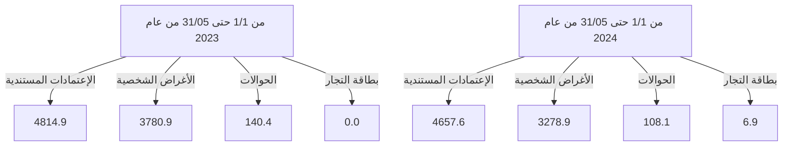

# مصرف ليبيا المركزي

## إستخدامات المصارف للنقد الأجنبي

### خلال الفترة: (1/1 - 31/05/2024)

![Central Bank of Libya image showing financial charts and currency]

إدارة البحوث والإحصاء - إدارة الرقابة على المصارف والنقد
---
إدارة البحوث والإحصاء - إدارة الرقابة على المصارف والنقد

# تحليل حركة إستخدامات المصارف الفعلية من النقد الأجنبي
## خلال الفترة (1/1 - حتى 31/05/2024)

بلغ إجمالي إستخدامات المصارف من النقد الأجنبي خلال الفترة (1/1 - حتى 31/05/2024) نحو 8,051,445,945 دولار، مُقابل 8,736,159,886 دولار خلال نفس الفترة من العام الماضي 2023، بإنخفاض قدره نحو 684,713,941 دولار. أي بمعدل بلغ 7.8%.

حيث شكلت الإعتمادات المستندية ما نسبته 57.8% من إجمالي إستخدامات المصارف من النقد الأجنبي، فيما شكلت الأغراض الشخصية نسبة 40.7% من الإجمالي، في حين شكلت الحوالات وبطاقات التجار مانسبته 1.4% من إجمالي الإستخدامات.

## إستخدامات المصارف الفعلية من النقد الأجنبي لكافة الأغراض
"المبالغ بالدولار الأمريكي"

| البند | من 1/1 حتى 31/05 من عام 2023 | من 1/1 حتى 31/05 من عام 2024 | مقدار التغير | نسبة التغير |
|-------|-------------------------------|-------------------------------|---------------|--------------|
| الإعتمادات المستندية | 4,814,914,898 | 4,657,554,123 | -157,360,775 | -3.3 |
| الحوالات | 140,366,960 | 108,075,622 | -32,291,338 | -23.0 |
| الأغراض الشخصية | 3,780,878,028 | 3,278,891,200 | -501,986,828 | -13.3 |
| بطاقات التجار | - | 6,925,000 | - | - |
| الإجمالي | 8,736,159,886 | 8,051,445,945 | -684,713,941 | -7.8 |

## إستخدامات المصارف للنقد الأجنبي لكافة الأغراض

صفحة 1 من 86
---
إدارة البحوث والإحصاء - إدارة الرقابة على المصارف والنقد

# المبالغ المُباعة للمصارف من النقد الأجنبي لكافة الأغراض:

ومن خلال الإطلاع على الجدول أدناه للقيم المباعة من النقد الأجنبي حسب المصارف، يتضح أن

المصرف التجاري الوطني قد حافظ على الترتيب الأول كأكثر المصارف استخداماً للنقد الأجنبي

خلال الفترة (1/1 - حتى 31/05/2024) مسجلاً حصة سوقية بلغت 16.6%، حيث بلغ إجمالي

المبالغ نحو 1,335,338,372 دولار، فيما جاء الأمان للتجارة والاستثمار في المرتبة الثانية بقيمة

بلغت 1,053,861,178 دولار، ثم مصرف الجمهورية في المرتبة الثالثة بقيمة 1,043,533,023

دولار، ثم مصرف الوحدة في المرتبة الرابعة بقيمة 736,769,468 دولار، ثم تأتي من حيث الأهمية

النسبية المصارف التالية حسب الترتيب: مصرف السودان، المصرف المتحد، المصرف الإسلامي

الليبي، مصرف التجارة والتنمية ومصرف الصحاري إلى آخره من المصارف كما موضح بالجدول

أدناه والذي يحتوي أيضاً على الترتيب الذي كانت عليه المصارف خلال نفس الفترة من العام

الماضي 2023.

صفحة 2 من 68
---
إدارة البحوث والإحصاء - إدارة الرقابة على المصارف والنقد

# ترتيب المصارف حسب إجمالي المبالغ المُباعة من النقد الأجنبي

| المصرف | من 1/1 حتى 05/31 من عام 2023 |  |  | من 1/1 حتى 05/31 من عام 2024 |  |  |
|---------|---------------------------|-----------------|------------|---------------------------|-----------------|------------|
|         | الترتيب | القيمة بالدولار | الحصة السوقية | الترتيب | القيمة بالدولار | الحصة السوقية |
| المصرف التجاري الوطني | 1 | 1,273,402,000 | 14.6% | 1 | 1,335,338,372 | 16.6% |
| مصرف الأمان للتجارة والإستثمار | 3 | 994,647,146 | 11.4% | 2 | 1,053,861,178 | 13.1% |
| مصرف الجمهورية | 4 | 990,946,549 | 11.3% | 3 | 1,043,533,023 | 13.0% |
| مصرف الوحدة | 2 | 1,024,599,749 | 11.7% | 4 | 736,769,468 | 9.2% |
| مصرف النوران | 6 | 727,121,408 | 8.3% | 5 | 710,301,621 | 8.8% |
| المصرف المتحد للتجارة والإستثمار | 7 | 641,539,203 | 7.3% | 6 | 537,354,661 | 6.7% |
| المصرف الإسلامي الليبي | 8 | 605,067,677 | 6.9% | 7 | 494,230,162 | 6.1% |
| مصرف التجارة والتنمية | 15 | 98,345,080 | 1.1% | 8 | 430,477,950 | 5.3% |
| مصرف الصحاري | 9 | 437,171,105 | 5.0% | 9 | 399,589,933 | 5.0% |
| مصرف الأندلس | 14 | 104,661,381 | 1.2% | 10 | 328,476,292 | 4.08% |
| مصرف شمال أفريقيا | 11 | 228,218,791 | 2.6% | 11 | 294,597,679 | 3.7% |
| مصرف الخليج الأول الليبي | 10 | 251,238,577 | 2.9% | 12 | 239,334,549 | 3.0% |
| مصرف السراي للتجارة والإستثمار | 13 | 115,118,775 | 1.3% | 13 | 197,010,222 | 2.4% |
| مصرف الواحة | 17 | 46,077,126 | 0.5% | 14 | 90,255,395 | 1.1% |
| مصرف التضامن | 16 | 71,232,677 | 0.8% | 15 | 71,966,357 | 0.9% |
| مصرف المتوسط | 18 | 29,705,017 | 0.3% | 16 | 49,414,944 | 0.6% |
| المصرف الليبي الخارجي | 19 | 22,046,440 | 0.3% | 17 | 24,178,203 | 0.3% |
| مصرف الوفاء | 12 | 190,514,712 | 2.2% | 18 | 16,317,900 | 0.2% |
| مصرف الإجماع العربي | 20 | 0 | 0.0% | 19 | 0 | 0.0% |
| مصرف اليقين | 5 | 884,506,473 | 10.1% | 20 | -1,561,962 | 0.0% |
| الإجمالي | - | 8,736,159,886 | 100.0% | - | 8,051,445,945 | 100.0% |

صفحة 3 من 86
---
إدارة البحوث والإحصاء - إدارة الرقابة على المصارف والنقد

المبالغ المُباعة للمصارف من النقد الأجنبي (حسب الغرض)

"القيم بالدولار الأمريكي"

| ت | المصرف | الاعتمادات المستندية |  |  الحوالات المتنوعة |  | الأغراض الشخصية |  | بطاقة التجار |  |
|---|---------|----------------------|----------------------|---------------------|---------------------|---------------------|---------------------|----------------|----------------|
|   |         | من 1/1 حتى 05/31 من عام 2023 | من 1/1 حتى 05/31 من عام 2024 | من 1/1 حتى 05/31 من عام 2023 | من 1/1 حتى 05/31 من عام 2024 | من 1/1 حتى 05/31 من عام 2023 | من 1/1 حتى 05/31 من عام 2024 | من 1/1 حتى 05/31 من عام 2023 | من 1/1 حتى 05/31 من عام 2024 |
| -1 | التجاري الوطني | 533,554,699 | 898,513,550 | 4,228,701 | 2,292,122 | 735,618,600 | 432,932,700 | - | 1,600,000 |
| -2 | الأمان | 265,117,362 | 310,385,078 | 18,116 | 842,200 | 729,511,668 | 738,633,900 | - | 4,000,000 |
| -3 | الجمهورية | 478,239,832 | 631,985,626 | 35,461,408 | 3,761,897 | 477,245,310 | 407,785,500 | - | 0 |
| -4 | الوحدة | 880,683,841 | 371,208,405 | 774398.06 | 273,163 | 143,141,510 | 365,287,900 | - | 0 |
| -5 | الواحة | 541,757,415 | 547,956,880 | 6,776,837 | 11,871,841 | 178,587,155 | 149,147,900 | - | 1,325,000 |
| -6 | المتحد | 164,681,141 | 255,734,161 | 3,193,939 | 0 | 473,664,124 | 281,620,500 | - | 0 |
| -7 | الإسلامي الليبي | 472,241,348 | 312,673,768 | 23,857,164 | 7,576,294 | 108,969,165 | 173,980,100 | - | 0 |
| -8 | التجارة والتنمية | 0 | 166,241,843 | 0 | 20,344,707 | 98,345,080 | 243,891,400 | - | 0 |
| -9 | الصحاري | 107,683,160 | 229,786,415 | 5,275,427 | 4,962,718 | 324,212,518 | 164,840,800 | - | 0 |
| -10 | الأندلس | 99,246,999 | 271,492,860 | 4,441,828 | 13,607,332 | 972,554 | 43,376,100 | - | 0 |
| -11 | شمال أفريقيا | 165272622.2 | 132,409,082 | 18769182.67 | 11,840,497 | 44,176,986 | 150,348,100 | - | 0 |
| -12 | الخليج الأول الليبي | 239,957,789 | 222,997,836 | 11,129,547 | 15,409,513 | 151,240 | 927,200 | - | 0 |
| -13 | السراي | 108,613,319 | 150,391,558 | 1997747.2 | 9363.6 | 4,507,709 | 46,609,300 | - | 0 |
| -14 | الواحة | 7,248,569 | 34,759,274 | 0 | 1,955,821 | 38,828,557 | 53,540,300 | - | 0 |
| -15 | التضامن | 71,232,677 | 65,637,657 | 0 | 0 | 0 | 6,328,700 | - | 0 |
| -16 | المتوسط | 25,432,959 | 37,705,544 | 0 | 14,000 | 4,272,058 | 11,695,400 | - | 0 |
| -17 | الليبي الخارجي | 6,981,876 | 10,262,550 | 14892034.18 | 13314152.96 | 172,530 | 601,500 | - | 0 |
| -18 | الوفاء | 189,333,997 | 8,974,000 | 0 | 0 | 1180715 | 7,343,900 | - | 0 |
| -19 | الإجماع العربي | 0 | 0 | 0 | 0 | 0 | 0 | - | 0 |
| -20 | اليقين | 457,635,292 | -1561962.38 | 9,550,631 | 0 | 417,320,549 | 0 | - | 0 |
| - | الإجمالي الكلي | 4,814,914,898 | 4,657,554,123 | 140,366,960 | 108,075,622 | 3,780,878,028 | 3,278,891,200 | - | 6,925,000 |

صفحة 4 من 86
---
إدارة البحوث والإحصاء - إدارة الرقابة على المصارف والنقد

## الأهمية النسبية حسب المصرف لاستخدامات النقد الأجنبي خلال الفترة من 1/1 حتى 31/05 من عام 2023

| المصرف | النسبة |
|---------|--------|
| المصرف التجاري الوطني | 15% |
| مصرف الوحدة | 12% |
| مصرف الأمان للتجارة والاستثمار | 12% |
| مصرف الجمهورية | 11% |
| مصرف اليقين | 10% |
| باقي المصارف | 10% |
| مصرف النوران | 8% |
| المصرف الإسلامي الليبي | 7% |
| المصرف المتحد للتجارة والاستثمار | 7% |
| مصرف الصحارى | 5% |
| مصرف الخليج الأول الليبي | 3% |

## الأهمية النسبية حسب المصرف لاستخدامات النقد الأجنبي خلال الفترة من 1/1 حتى 31/05 من عام 2024

| المصرف | النسبة |
|---------|--------|
| المصرف التجاري الوطني | 19% |
| مصرف الأمان للتجارة والاستثمار | 15% |
| مصرف الجمهورية | 15% |
| مصرف الوحدة | 10% |
| مصرف النوران | 10% |
| المصرف الإسلامي الليبي | 7% |
| المصرف المتحد للتجارة والاستثمار | 7% |
| مصرف الصحارى | 6% |
| مصرف التجارة والتنمية | 6% |
| مصرف الأندلس | 5% |

صفحة 5 من 68
---
إدارة البحوث والإحصاء - إدارة الرقابة على المصارف والنقد

طلبات المصارف المقبولة لتغطية الإعتمادات المستندية والحوالات المتنوعة عدا الأغراض الشخصية خلال الفترة (1/1 - حتى 31/05/2024):

بلغ عدد الشركات والمصانع والجهات العامة والجهات الأخرى المستفيدة (1,634) والتي تمت الموافقة على طلباتهم حصولهم على النقد الأجنبي خلال الفترة (1/1 - حتى 31/05/2024)، بعدد طلبات بلغ نحو 6,498 طلب، معظم هذه الطلبات لتغطية الاعتمادات المستندية والتي سجلت 5,789 طلب بنسبة 89.1% من الطلبات، كما هو موضح بالجداول التالية:-

عدد الطلبات المقبولة لشراء النقد الأجنبي - حسب القطاعات

| القطاع | عدد الشركات أو المصانع أو الجهات |
|--------|----------------------------------|
| القطاع الخاص | 1,556 |
| القطاع العام | 28 |
| جهات متنوعة | 50 |
| الإجمالي | 1,634 |

عدد الطلبات المقبولة لشراء النقد الأجنبي حسب نوع التحويل

| نوع التحويل | القطاع الخاص | القطاع العام | جهات متنوعة | الإجمالي | الأهمية النسبية |
|-------------|---------------|--------------|---------------|----------|-----------------|
| اعتماد مستندي | 5,643 | 136 | 10 | 5,789 | 89.1% |
| حوالة طيران | 297 | 29 | 4 | 330 | 5.1% |
| حوالة تجارية | 5 | 124 | 0 | 129 | 2.0% |
| تحويلات أخرى | 27 | 123 | 15 | 165 | 2.5% |
| حوالة تأمين | 14 | 25 | 0 | 39 | 0.6% |
| حوالة مرتبات | 0 | 0 | 44 | 44 | 0.7% |
| حوالة صناعية | 2 | 0 | 0 | 2 | 0.0% |
| الإجمالي | 5,988 | 437 | 73 | 6,498 | 100% |

صفحة 6 من 86
---
إدارة البحوث والإحصاء - إدارة الرقابة على المصارف والنقد

## 1- القطاع الخاص:

بلغ عدد شركات ومصانع القطاع الخاص (1,556) التي تمت الموافقة على طلباتها للحصول على
النقد الأجنبي من المصارف لتغطية الإعتمادات المستندية والحوالات الأخرى خلال الفترة (1/1 -
حتى 31/ 05 /2024) حيث أحتلت طلبات شراء النقد الأجنبي من قبل القطاع الخاص لإستيراد
السلع الغذائية المتنوعة المرتبة الأولى من إجمالي طلبات الشراء خلال الفترة، حيث شكلت مانسبته
30.9% من إجمالي طلبات شراء النقد الأجنبي.

وبالنسبة لشركات القطاع الخاص فقد احتلت الشركة الليبية المتحدة لتعبئة المشروبات الترتيب
الأول، والجداول التالية توضح طلبات شراء أهم خمسون سلعة أو خدمة وكذلك طلبات الشراء
حسب أهم مائة شركة خلال الفترة (1/1 - حتى 31/05/2024).

### طلبات شراء السلع أو الخدمات - قطاع خاص
### خلال الفترة (1/1 - حتى 31/05/2024)
"مرتبة تنازلياً"

| ت | تصنيف السلع | القيمة بالدولار | الأهمية النسبية % |
|---|-------------|-----------------|-------------------|
| 1- | سلع غذائية متنوعة | 1,386,222,970 | 30.9% |
| 2- | مستلزمات انتاج وتشغيل | 784,953,255 | 17.5% |
| 3- | وسائل النقل واطارات ونضائد وقطع الغيار | 275,198,263 | 6.1% |
| 4- | مستلزمات انتاج سلع أساسية | 255,979,929 | 5.7% |
| 5- | أعلاف | 232,844,777 | 5.2% |
| 6- | اللحوم الحية والمجمدة | 214,557,229 | 4.8% |
| 7- | الآلات والمعدات | 186,096,861 | 4.1% |
| 8- | مواد البناء ومستلزمات التشييد | 166,932,805 | 3.7% |
| 9- | أدوية بشرية | 144,168,473 | 3.2% |
| 10- | أجهزة الإلكترونية | 140,527,345 | 3.1% |
| 11- | حليب وحفاظات وأغذية أطفال | 94,682,946 | 2.1% |
| 12- | الزراعية | 93,469,016 | 2.1% |
| 13- | منزلية و كهرومنزلية | 93,126,290 | 2.1% |

صفحة 7 من 86
---
إدارة البحوث والإحصاء - إدارة الرقابة على المصارف والنقد

| النسبة | القيمة | البند | الرقم |
|--------|--------|------|------|
| %1.5 | 68,406,798 | مواد التنظيف | -14 |
| %1.3 | 56,799,230 | حليب | -15 |
| %1.2 | 53,721,618 | أجبان | -16 |
| %0.6 | 25,655,839 | حوالات شركات خطوط الطيران | -17 |
| %0.5 | 21,711,597 | الملابس والأحذية | -18 |
| %0.4 | 19,164,825 | الأثاث | -19 |
| %0.4 | 18,060,276 | خدمات ملاحية متنوعة | -20 |
| %0.4 | 17,585,653 | قرطاسية | -21 |
| %0.4 | 16,481,383 | زراعية | -22 |
| %0.3 | 14,716,696 | طلبات خاصة بشركة الأجنحة الليبية | -23 |
| %0.3 | 14,209,484 | فواكه وخضروات | -24 |
| %0.3 | 11,397,310 | مواد صحية | -25 |
| %0.2 | 11,035,454 | أدوية بيطرية | -26 |
| %0.2 | 10,874,195 | الشركة الليبية السريعة للنقل الجوي | -27 |
| %0.2 | 9,151,789 | سمن | -28 |
| %0.2 | 8,394,517 | مواد تنظيف | -29 |
| %0.2 | 8,332,838 | خدمات اتصالات وتقنية معلومات | -30 |
| %0.2 | 7,673,165 | متنوعة | -31 |
| %0.2 | 7,300,179 | خدمات إنتاج وتشغيل | -32 |
| %0.1 | 4,238,022 | شركة أويا للطيران | -33 |
| %0.1 | 3,374,213 | أسماك وأحياء بحرية | -34 |
| %0.1 | 2,350,732 | طلبات برنيق للطيران | -35 |
| %0.04 | 1,865,701 | سلع أخرى | -36 |
| %0.04 | 1,718,578 | زبدة | -37 |
| %0.04 | 1,618,347 | شركة سما المتوسط للطيران | -38 |
| %0.03 | 1,510,635 | السجاد والمنسوجات | -39 |
| %0.02 | 859,824 | شركة غدامس للطيران | -40 |
| %0.02 | 726,116 | حوالات شركات التأمين | -41 |
| 0.01% | 610,500 | رسوم اشتراك منظومة | -42 |
| %0.01 | 565,391 | تكاليف خدمات سياحية | -43 |
| %0.01 | 518,070 | مستلزمات تشغيل مصنع الحديد والصلب | -44 |
| %0.01 | 307,235 | الطبية | -45 |

صفحة 8 من 86
---
إدارة البحوث والإحصاء - إدارة الرقابة على المصارف والنقد

| -46 | سلع خاصة بالخدمات العامة | 266,962 | 0.01% |
| -47 | تكاليف رسوم تأشيرات | 76,485 | 0.00% |

## طلبات الشراء حسب أهم مائة شركة - قطاع خاص
خلال الفترة (1/1 – حتى 31/05/2024)
"مرتبة تنازلياً"

"دولار أمريكي"

| ت | الشركة أو المصنع | القيمة |
|---|-------------------|--------|
| 1 | شركة الليبية المتحدة لتعبئة المشروبات | 82,402,262 |
| 2 | شركة وادي الكوف للمطاحن والأعلاف ومضارب الأرز | 78,540,508 |
| 3 | شركة المعمورة للصناعات الغذائية والمطاحن والاعلاف | 68,337,182 |
| 4 | الشركة الليبية الكبرى لصناعة السميد والدقيق | 63,759,260 |
| 5 | شركة الشرق الليبي للمطاحن والأعلاف ومضارب الأرز | 55,643,115 |
| 6 | شركة الجاهزة لاستيراد المواد الغذائية | 54,392,000 |
| 7 | شركة بلد لاستيراد المواد الغذائية | 53,414,375 |
| 8 | شركة البروكة لاستيراد المواد الغذائية | 52,514,913 |
| 9 | شركة الجيد لاستيراد المواد الغذائية | 51,880,588 |
| 10 | شركة النسيم للصناعات الغذائية | 50,655,495 |
| 11 | شركة خيرات الأيادي لاستيراد المواد الغذائية | 50,327,500 |
| 12 | شركة تويوتا ليبيا تجارة السيارات وقطع الغيار واستيراد والتصدير | 49,475,877 |
| 13 | شركة جودة الموسم لاستيراد المواد الغذائية | 48,931,500 |
| 14 | شركة جودي للصناعات الغذائية | 48,669,659 |
| 15 | المجموعة الليبية للخدمات النفطية والطاقة | 48,620,320 |
| 16 | شركة مجموعة الامتياز للمطاحن ومضارب الأرز وتعبئة الزيوت النباتية | 39,879,550 |
| 17 | شركة الماهر الدولي للمطاحن والأعلاف | 38,690,221 |
| 18 | شركة عروس البيضاء لاستيراد المواشي واللحوم التابعه لشركة أكاكوس القابضه | 35,470,200 |
| 19 | شركة أفريقيا لتعبئة المشروبات | 33,956,190 |
| 20 | شركة الريحان لصناعة المواد الغذائية | 33,648,640 |
| 21 | شركة البروكة للصناعات الغذائية | 31,585,924 |

صفحة 9 من 86
---
إدارة البحوث والإحصاء - إدارة الرقابة على المصارف والنقد

| الرقم | اسم الشركة | رأس المال (بالدينار الليبي) |
|-------|------------|---------------------------|
| 22 | شركة بصمة الجودة لاستيراد المواد الغذائية والمواشي واللحوم | 30,870,335 |
| 23 | شركة السرايا الراقية لاستيراد المواد الغذائية و الخضروات و الفواكه الطازجة و المواشي واللحوم | 30,496,537 |
| 24 | شركة الفا لاستيراد الادوية والمعدات الطبية و المستحضرات الطبية و مستلزمات الام والطفل | 30,081,629 |
| 25 | شركة مجموعة الامتياز لاستيراد وسائل النقل وملحقاتها | 29,416,719 |
| 26 | شركة الوسام الذهبي لصناعة الدقيق والمطاحن والاعلاف ومضارب الأرز | 29,185,550 |
| 27 | شركة سما الليبية لاستيراد المواد الغذائية والمواشي واللحوم | 28,929,665 |
| 28 | شركة المعمورة لاستيراد وتوزيع المواد الغذائية | 28,616,261 |
| 29 | شركة بستان ليبيا لاستيراد المواد الغذائية والمواشي واللحوم | 27,532,422 |
| 30 | الشركة الاستثمارية للصناعات الهندسية وتشكيل المعادن | 24,960,000 |
| 31 | شركة طرابلس الكبرى لصناعة وتعبئة الطماطم والمواد الغذائية | 24,418,440 |
| 32 | شركة الشمس الساطعة للصناعات الغذائية | 23,112,509 |
| 33 | شركة القيصر لصناعة مواد التنظيف | 21,700,000 |
| 34 | شركة مفاتيح الخير لاستيراد الاجهزة والمواد الكهربائية وقطع غيارها والاجهزة الالكترونية وملحقاتها | 20,566,082 |
| 35 | شركة كنوز ليبيا للمطاحن والاعلاف ومضارب الأرز | 20,112,805 |
| 36 | شركة الثمرات الليبية لاستيراد المواد الغذائية | 19,806,010 |
| 37 | شركة الزرقاء الدولية للصناعات الغذائية | 19,639,397 |
| 38 | شركة جبل الكوف لاستيراد السيارات و قطع الغيار | 19,561,112 |
| 39 | شركة تمر هند لاستيراد السيارات وقطع غيارها | 19,014,131 |
| 40 | شركة دروب ليبيا لاستيراد وسائل النقل وملحقاتها | 18,820,825 |
| 41 | شركة جلوبال لصناعة مواد البناء والطلاء والمعاجين والبلاستيك والمواد الخام | 18,433,920 |
| 42 | شركة أجيال العطاء الوافر لاستيراد المواد الغذائية | 18,288,000 |
| 43 | شركة الجيد للصناعات الغذائية | 18,256,416 |
| 44 | شركة الابداع لصناعة المنظفات والصابون ومستلزماتها | 18,238,560 |
| 45 | شركة أعالي الاندلس للصناعات الغذائية | 17,989,715 |
| 46 | شركة بريق للطيران | 17,927,205 |
| 47 | شركة الغذاء الذهبي لصناعة وتعبئة معجون الطماطم والصناعات الغذائية | 17,866,250 |
| 48 | شركة ريادة لصناعة الكيماوية والمواد الخام | 17,475,970 |
| 49 | شركة المعمورة للاستثمار الزراعي والحيواني. | 17,383,060 |

صفحة 11 من 86
---
إدارة البحوث والإحصاء - إدارة الرقابة على المصارف والنقد

| الرقم | اسم الشركة | القيمة |
|-------|------------|--------|
| 50 | شركة الأجنحة الليبية للطيران المساهمة | 16,935,947 |
| 51 | شركة الآمال العظيمة لاستيراد المواد الغذائية | 16,602,000 |
| 52 | شركة لمسة الحياة لاستيراد المعدات الطبية والادوية والمستحضرات الطبية ومستلزمات الأم والطفل | 16,028,781 |
| 53 | شركة مجموعة الرائدون لصناعة مواد البناء | 15,799,608 |
| 54 | شركة أبهاج الطبيعة لاستيراد المواد الغذائية | 15,288,556 |
| 55 | شركة قرطاج للصناعات الغذائية | 15,035,896 |
| 56 | شركة الجودة العالية الأولى لصناعة الأعلاف ومطاحن الدقيق والصناعات الغذائية | 15,021,100 |
| 57 | مصنع اريكو لصناعة الطلاء | 14,673,960 |
| 58 | شركة السواحل الذهبية لاستيراد المواد الغذائية | 14,639,695 |
| 59 | شركة الساحل لاستيراد المواشي واللحوم | 14,612,884 |
| 60 | شركة الفضاء الذهبي لاستيراد المواد الغذائية | 14,522,545 |
| 61 | شركة القدس لصناعة الخزانات والمواسير البلاستيكية | 14,403,360 |
| 62 | مصنع التعاون لصناعة الاعلاف | 14,302,400 |
| 63 | شركة أرض العطاء للصناعات الغذائية المحدودة | 13,956,023 |
| 64 | شركة انعاش ليبيا لاستيراد الاعلاف ومكملاتها | 13,555,500 |
| 65 | شركة طرابلس الاولى للمطاحن والاعلاف | 13,338,000 |
| 66 | شركة المراعي الخصبة للمطاحن و الأعلاف ومضارب الأرز | 13,317,500 |
| 67 | شركة الرابية الخضراء لاستيراد المواد الغذائية | 12,982,281 |
| 68 | شركة الاترج لاستيراد الاجهزة الالكترونية والمواد الكهربائية وأجهزة النقال | 12,400,327 |
| 69 | شركة طريق القارة لاستيراد المواد الغذائية | 12,364,874 |
| 70 | شركة السد الحديثة للمطاحن وصناعة الاعلاف | 12,135,000 |
| 71 | شركة النعيم للمطاحن والاعلاف والحبوب | 12,117,500 |
| 72 | شركة أضواء أفريقيا لاستيراد المواد الغذائية والمواشي واللحوم | 12,083,050 |
| 73 | شركة الوصل المنير لاستيراد لاستيراد المواد الغذائية والمواشي واللحوم | 11,997,093 |
| 74 | شركة الشجرة الشامخة لاستيراد المواد الغذائية والمواشي واللحوم | 11,862,940 |
| 75 | الشركة الليبية السريعة للطيران المدني والمناولة والشحن الجوي | 11,742,507 |
| 76 | شركة مجموعة المواشي الحية لاستيراد المواد الغذائية والمواشي واللحوم | 11,605,300 |
| 77 | شركة ادري لاستيراد وسائل النقل وملحقاتها | 11,425,341 |
| 78 | شركة التراب الليبي لاستيراد المواد الغذائيه والمواشي | 11,382,976 |
| 79 | الشركة العلمية لاستيراد الادوية والمستحضرات الطبية ومستلزمات الام والطفل | 11,040,923 |

صفحة 11 من 86
---
إدارة البحوث والإحصاء - إدارة الرقابة على المصارف والنقد

| رقم | اسم الشركة | القيمة |
|-----|------------|--------|
| 80 | مصنع جاما لصناعة البلاستيك | 11,030,172 |
| 81 | شركة أوميجا للصناعات الكيماوية ومواد التغليف | 10,886,100 |
| 82 | شركة أجود المحركات لاستيراد السيارات | 10,784,889 |
| 83 | مصنع بيتا بوليمر لصناعة المواد الخام للصناعات الكيماوية | 10,698,600 |
| 84 | شركة الليبية الجديدة لصناعة المعادن | 10,678,530 |
| 85 | شركة أصول التكنولوجيا لصناعة الأجهزة الالكترونية والكهربائية | 10,499,400 |
| 86 | شركة النجع الكبير لاستيراد المواد الغذائية والمواشي واللحوم | 10,284,471 |
| 87 | شركة النخوة الليبية لاستيراد المواد الغذائية | 10,107,613 |
| 88 | شركة كارمن التجارية لاستيراد المعدات الطبية والأدوية والمستحضرات الطبية ومستلزمات الأم والطفل | 9,957,199 |
| 89 | شركة التقدم الدولية لاستيراد الاجهزة والمواد الكهربائية وغير الكهربائية وقطع الغيار | 9,913,889 |
| 90 | شركة مجمع البيان لصناعة مواد البناء والبتر و كيماويات | 9,897,930 |
| 91 | شركة المذاق الطيب لاستيراد المواد الغذائية والمواشي واللحوم | 9,869,330 |
| 92 | شركة إشراقة الأمل للأستثمار الزراعي والحيواني وتربية الدواجن | 9,807,987 |
| 93 | شركة تنافس الزراعي لإستيراد الآلات الزراعية ومستلزماتها وقطع غيارها | 9,776,912 |
| 94 | شركة الجودة الرائدة لاستيراد المواد الغذائية | 9,750,359 |
| 95 | شركة الرجاس الزراعي لإستيراد الآلات الزراعية ومستلزماتها وقطع غيارها | 9,678,316 |
| 96 | شركة جسر الخليج لاستيراد المواشي و اللحوم | 9,616,134 |
| 97 | شركة الطائف لإستيراد المواد الغذائية | 9,558,162 |
| 98 | شركة وطن المجد لاستيراد المواد الغذائية | 9,450,000 |
| 99 | شركة الطرق الحديثة لصناعة الاسفلت والمواد العازل | 9,410,787 |
| 100 | شركة المبتكر الحديث لصناعة البي في سي | 9,271,997 |

طلبات المصارف لتغطية الاعتمادات المستندية والحوالات - قطاع خاص

(حسب أهم البلدان المستفيدة)

من خلال الإطلاع على الجدول أدناه لقيم طلبات المصارف لشراء النقد الأجنبي حسب البلدان المستفيدة خلال الفترة (1/1 - حتى 31/05/2024) للقطاع الخاص، يتضح أن مانسبته 19.9% من تحويلات المصارف لتغطية الإعتمادات المستندية أوالحوالات الأخرى كانت لدولة تركيا، تم

صفحة 12 من 86
---
إدارة البحوث والإحصاء - إدارة الرقابة على المصارف والنقد

جاءت دولة الإمارات العربية المتحدة في المرتبة الثانية بنسبة 13.0% ثم المملكة المتحدة وسويسرا
بنسب 9.7% و8.2% على التوالي، والجدول التالي يوضح أهم عشرون بلد مستفيد.

طلبات المصارف لتغطية الإعتمادات المستندية والحوالات - قطاع خاص
(حسب أهم البلدان المستفيدة)
خلال الفترة (1/1 - حتى 31/05/2024)

| ت | البلد المستفيد | القيمة بالدولار | الأهمية النسبية |
|---|----------------|------------------|------------------|
| 1- | تركيا | 894,906,256 | 19.9% |
| 2- | الإمارات العربية المتحدة | 585,164,012 | 13.0% |
| 3- | بريطانيا (المملكة المتحدة) | 435,641,573 | 9.7% |
| 4- | سويسرا | 367,460,918 | 8.2% |
| 5- | إيطاليا | 211,520,974 | 4.7% |
| 6- | الصين | 210,187,874 | 4.7% |
| 7- | مصر | 205,265,003 | 4.6% |
| 8- | تونس | 187,949,351 | 4.2% |
| 9- | إسبانيا | 177,545,701 | 4.0% |
| 10- | كندا | 163,077,574 | 3.6% |
| 11- | الأردن | 96,689,233 | 2.2% |
| 12- | تايلاند | 87,224,007 | 1.9% |
| 13- | فرنسا | 77,423,423 | 1.7% |
| 14- | النمسا | 73,062,728 | 1.6% |
| 15- | اليابان | 67,299,705 | 1.5% |
| 16- | هولندا | 58,475,876 | 1.3% |
| 17- | ألمانيا | 54,879,040 | 1.2% |
| 18- | كوريا الجنوبية | 50,973,707 | 1.1% |
| 19- | سلوفاكيا | 41,354,569 | 0.9% |
| 20- | سنغافورة | 33,809,278 | 0.8% |

صفحة 13 من 86
---
إدارة البحوث والإحصاء - إدارة الرقابة على المصارف والنقد

# طلبات المصارف لتغطية الاعتمادات المستندية والحوالات - قطاع خاص

## (حسب أهم بلدان منشأ السلع أو الخدمات)

من خلال الإطلاع على الجدول أدناه لقيم طلبات المصارف لشراء النقد الأجنبي حسب بلدان منشأ السلع أو الخدمات خلال الفترة (1/1 - حتى 31/05/2024) للقطاع الخاص، يتضح أن دولة تركيا قد احتلت المرتبة الأولى حيث شكلت السلع أو الخدمات ذات المنشأ التركي نسبة 18.9% من إجمالي طلبات الشراء المقبولة، ثم جاءت واردات السلع أو الخدمات ذات المنشأ الصيني في المرتبة الثانية مشكلة مانسبته 11.1% من الإجمالي، وشكلت السلع أوالخدمات ذات منشأ دولة روسيا الاتحادية نسبة 7.4% محتلة المرتبة الثالثة خلال الفترة، فيما سجلت السلع والخدمات ذات المنشأ المصري مانسبته 6.9%، وذات المنشأ البرازيلي نسبة 6.5%. والجدول التالي يوضح أهم عشرون بلد منشأ للسلع أو الخدمات.

## طلبات المصارف لتغطية الاعتمادات المستندية والحوالات - قطاع خاص
### (حسب أهم بلدان منشأ السلع أو الخدمات)

خلال الفترة (1/1 - حتى 31/05/2024)

| ت | بلد منشأ السلع أو الخدمات | القيمة بالدولار | الأهمية النسبية |
|---|---------------------------|-----------------|-----------------|
| 1- | تركيا | 847,785,707 | 18.9% |
| 2- | الصين | 499,800,324 | 11.1% |
| 3- | روسيا الاتحادية | 332,625,824 | 7.4% |
| 4- | مصر | 309,407,803 | 6.9% |
| 5- | البرازيل | 291,722,894 | 6.5% |
| 6- | الهند | 291,637,418 | 6.5% |
| 7- | إيطاليا | 214,878,884 | 4.8% |
| 8- | تونس | 154,723,822 | 3.4% |
| 9- | أوكرانيا | 129,262,818 | 2.9% |
| 10- | إسبانيا | 116,426,641 | 2.6% |

صفحة 14 من 86
---
إدارة البحوث والإحصاء - إدارة الرقابة على المصارف والنقد

| -   | الدولة                  | القيمة       | النسبة |
|-----|------------------------|-------------|--------|
| -11 | الأرجنتين              | 105,826,210 | 2.4%   |
| -12 | تايلاند                | 102,014,271 | 2.3%   |
| -13 | المملكة العربية السعودية | 78,396,745  | 1.7%   |
| -14 | فرنسا                  | 76,002,147  | 1.7%   |
| -15 | ألمانيا                | 71,722,071  | 1.6%   |
| -16 | رومانيا               | 71,039,499  | 1.6%   |
| -17 | هولندا                | 65,653,427  | 1.5%   |
| -18 | الإمارات العربية المتحدة | 62,582,750  | 1.4%   |
| -19 | بولندا                | 52,717,287  | 1.2%   |
| -20 | فيتنام                | 52,504,219  | 1.2%   |

## 2- القطاع العام

بلغ عدد جهات القطاع العام التي تمت الموافقة على طلباتها للحصول على النقد الأجنبي لتغطية الاعتمادات المستندية والحوالات الأخرى 28 جهة خلال الفترة (1/1 – حتى 31/05/2024)، حيث احتلت مستلزمات تشغيل مصنع الحديد والصلب المرتبة الأولى من إجمالي طلبات الشراء خلال الفترة، حيث شكلت مانسبته 41.3% من إجمالي طلبات شراء النقد الأجنبي، فيما احتلت متطلبات شركة ليبيانا للهاتف المحمول المرتبة الثانية من حيث الأهمية النسبية لتشكل نحو 13.0%، وبالتالي فقد احتلت الشركة الليبية للحديد والصلب الترتيب الأول ، حيث سجلت طلباتها المقبولة لشراء النقد الأجنبي نحو 195.3 مليون دولار خلال يليها شركة ليبيانا للهاتف المحمول بإجمالي طلبات مقبولة بلغ نحو 61.7 مليون دولار ،والجداول التالية توضح طلبات شراء السلع أو الخدمات وكذلك طلبات الشراء حسب الجهات العامة خلال الفترة (1/1 – حتى 31/05/2024).

صفحة 15 من 86
---
إدارة البحوث والإحصاء - إدارة الرقابة على المصارف والنقد

# طلبات شراء حسب السلعة أو الخدمات - قطاع عام

خلال الفترة (1/1 - حتى 31/05/2024)

"مرتبة تنازلياً"

| ت | تصنيف السلع | القيمة بالدولار | الأهمية النسبية % |
|---|-------------|------------------|-------------------|
| -1 | مستلزمات تشغيل مصنع الحديد والصلب | 189,175,159 | 41.3% |
| -2 | متطلبات شركة ليبيانا للهاتف المحمول | 59,563,004 | 13.0% |
| -3 | مستلزمات إنتاج وتشغيل | 58,523,426 | 12.8% |
| -4 | شركة الاتحاد العربي للمقاولات | 26,825,000 | 5.9% |
| -5 | شركة المدار الجديد | 22,138,859 | 4.8% |
| -6 | خدمات اتصالات وتقنية معلومات | 19,051,133 | 4.2% |
| -7 | مستلزمات تشغيل الموانئ | 14,811,421 | 3.2% |
| -8 | شركة ليبيا للاتصالات والتقنية | 13,065,424 | 2.9% |
| -9 | حوالات شركات خطوط الطيران | 11,268,987 | 2.5% |
| -10 | سلع غذائية متنوعة | 12,381,050 | 2.7% |
| -11 | طلبات جهاز مشروعات الإسكان | 4,634,806 | 1.0% |
| -12 | الآلات والمعدات | 3,902,878 | 0.9% |
| -13 | متطلبات تشغيل وصيانة الموانئ | 3,554,551 | 0.8% |
| -14 | الشركة الأهلية للأسمنت | 3,543,784 | 0.8% |
| -15 | الخطوط الجوية الأفريقية | 3,479,620 | 0.8% |
| -16 | حوالات شركات التأمين | 2,389,326 | 0.5% |
| -17 | الهيئة العامة للأوقاف | 2,108,454 | 0.5% |
| -18 | متنوعة | 2,030,750 | 0.4% |
| -19 | أجهزة الكترونية | 1,948,376 | 0.4% |
| -20 | مستلزمات الشركة العامة للكهرباء | 1,090,179 | 0.2% |
| -21 | طلبات الخطوط الجوية الليبية | 727,758 | 0.2% |
| -22 | وسائل النقل وإطارات وضفائر وقطع الغيار | 595,327 | 0.1% |
| -23 | حوالات دورة تدريبية | 542,380 | 0.1% |
| -24 | احتياجات التشغيل لشركة معاملات | 291,277 | 0.1% |
| -25 | مواد البناء ومستلزمات التشييد | 197,217 | 0.0% |
| -26 | سلع خاصة بالخدمات العامة | 66,625 | 0.0% |

صفحة 16 من 86
---
إدارة البحوث والإحصاء - إدارة الرقابة على المصارف والنقد

# طلبات الشراء حسب الجهات - قطاع عام
خلال الفترة (1/1 - حتى 31/05/2024)
"مرتبة تنازلياً"

| ت | الجهة | القيمة بالدولار |
|---|-------|-----------------|
| 1 | الشركة الليبية للحديد والصلب | 195,278,185 |
| 2 | شركة ليبيانا للهاتف المحمول | 61,734,574 |
| 3 | جهاز تنمية و تطوير المراكز الإدارية | 41,609,409 |
| 4 | شركة الاتحاد العربي للمقاولات المساهمة | 31,630,907 |
| 5 | شركة المدار الجديد | 25,527,255 |
| 6 | المنطقة الحرة مصراتة | 18,945,299 |
| 7 | شركة ليبيا للاتصالات والتقنية المساهمة | 18,769,579 |
| 8 | شركة تطوير للاستثمار الصناعي المساهمة | 11,968,000 |
| 9 | شركة الخطوط الجوية الافريقية | 11,254,184 |
| 10 | شركة الاهلية للاسمنت المساهمة | 10,336,744 |
| 11 | شركة هاتف ليبيا | 7,038,353 |
| 12 | جهاز تنفيذ مشروعات الاسكان و المرافق | 4,634,806 |
| 13 | شركة ليبيا للتامين | 4,155,092 |
| 14 | شركة الاتصالات الدولية الليبية | 3,445,901 |
| 15 | الهيئة العامة للأوقاف والشؤون الإسلامية | 3,120,058 |
| 16 | شركة الخطوط الجوية الليبية | 2,130,392 |
| 17 | شركة المناهج للطباعة والنشر | 1,945,321 |
| 18 | شركة الانماء للاستثمارات الكهربائية | 1,365,940 |
| 19 | مركز الوطني للارصاد الجوية | 768,951 |
| 20 | شركة العامة لخدمات النظافة العامة طرابلس | 687,000 |
| 21 | شركة معاملات للخدمات المالية | 610,277 |
| 22 | شركة الأكاديمية الليبية للاتصالات والمعلوماتية | 527,880 |
| 23 | الشركة الليبية للموانئ | 425,341 |
| 24 | شركة الثقة لاستيراد اللحوم والمواد الغذائية المساهمة | 413,050 |

صفحة 17 من 86
---
إدارة البحوث والإحصاء - إدارة الرقابة على المصارف والنقد

| | |
|---|---|
| الاتحاد الليبي لشركات التأمين | 392,648 |
| شركة الشاحنات والحافلات | 107,300 |
| جامعة بنغازي | 85,429 |
| هيئة الاشراف على التأمين | 10,500 |

### 3- جهات متنوعة :

طلبات التغطية المقبولة
جهات متنوعة وحوالات مرتبات للأجانب
خلال الفترة (1/1 - 31/05/2024)

| الترتيب | اسم الجهة | القيمة بالدولار الأمريكي |
|---|---|---|
| 1 | حوالة طيران - فرع شركة الخطوط الجوية التونسية | 5,655,208 |
| 2 | مصرف التجارة والتنمية | 3,568,922 |
| 3 | شركة مصرف الأندلس | 2,238,815 |
| 4 | مصرف الأمان للتجارة والاستثمار | 4,184,402 |
| 5 | عدد (44) حوالة أفراد - مرتبات أجانب | 923,198 |
| 6 | النادي الأهلي الرياضي | 431,769 |
| 7 | سفارة دولة قطر | 4,665 |

حسب بلد المستفيد - جهات متنوعة وحوالات أجانب (مرتبات)

| الترتيب | بلد المستفيد | القيمة بالدولار الأمريكي |
|---|---|---|
| 1 | تونس | 6,018,412 |
| 2 | المملكة المتحدة | 2,840,735 |
| 3 | إسبانيا | 2,198,717 |
| 4 | الولايات المتحدة | 2,015,000 |

صفحة 18 من 86
---
إدارة البحوث والإحصاء - إدارة الرقابة على المصارف والنقد

| القيمة | الدولة | الترتيب |
|--------|--------|---------|
| 1,149,030 | الهند | 5 |
| 552,207 | موريشيوس | 6 |
| 538,028 | المغرب | 7 |
| 277,705 | تركيا | 8 |
| 274,077 | مالطة | 9 |
| 244,553 | الإمارات العربية المتحدة | 10 |
| 179,406 | فرنسا | 11 |
| 123,400 | مصر | 12 |
| 122,396 | الأردن | 13 |
| 90,000 | أوكرانيا | 14 |
| 72,625 | مالي | 15 |
| 67,800 | بلغاريا | 16 |
| 56,630 | إيطاليا | 17 |
| 51,720 | بولندا | 18 |
| 40,994 | بلجيكا | 19 |
| 40,673 | الفلبين | 20 |
| 16,500 | السودان | 21 |
| 13,842 | أوزبكستان | 22 |
| 11,864 | مولدافيا | 23 |
| 6,000 | باكستان | 24 |
| 4,665 | قطر | 25 |

صفحة 19 من 86
---
إدارة البحوث والإحصاء - إدارة الرقابة على المصارف والنقد

# الملحق

طلبات التغطية المقبولة لكافة القطاعات خلال الفترة (1/1 – حتى 31/05/2024):

- قوائم بكافة الجهات والشركات والمصانع المستفيدة.

- طلبات الشراء حسب تصنيف السلع أو الخدمات.

- طلبات الشراء حسب بلدان منشأ السلع أو الخدمات والبلدان المستفيدة.

صفحة 20 من 86
---
# طلبات التغطية المقبولة
## قائمة بكافة الشركات والمصانع - قطاع خاص
### خلال الفترة (1/1 - 31/05/2024)
"مرتبة تنازلياً"

| الترتيب | اسم الشركة أو المصنع | القيمة بالدولار الأمريكي |
|---------|----------------------|--------------------------|
| 1 | شركة الليبية المتحدة لتعبئة المشروبات | 82,402,262 |
| 2 | شركة وادي الكوف للمطاحن والأعلاف ومضارب الأرز | 78,540,508 |
| 3 | شركة المعمورة للصناعات الغذائية والمطاحن والاعلاف | 68,337,182 |
| 4 | شركة الليبية الكبرى لصناعة السميد والدقيق | 63,759,260 |
| 5 | شركة الشرق الليبي للمطاحن والاعلاف ومضارب الارز | 55,643,115 |
| 6 | شركة الجاهزة لاستيراد المواد الغذائية | 54,392,000 |
| 7 | شركة يلد لاستيراد المواد الغذائية | 53,414,375 |
| 8 | شركة المبروكة لاستيراد المواد الغذائية | 52,514,913 |
| 9 | شركة الجيد لاستيراد المواد الغذائية | 51,880,588 |
| 10 | شركة النسيم للصناعات الغذائية | 50,655,495 |
| 11 | شركة خيرات الايادي لاستيراد المواد الغذائية | 50,327,500 |
| 12 | شركة تويوتا ليبيا تجارة السيارات وقطع الغيار واستيراد والتصدير | 49,475,877 |
| 13 | شركة جودة الموسم لاستيراد المواد الغذائية | 48,931,500 |
| 14 | شركة جودي للصناعات الغذائية | 48,669,659 |
| 15 | المجموعة الليبية للخدمات النفطية والطاقة | 48,620,320 |
| 16 | شركة مجموعة الامتياز للمطاحن ومضارب الارز وتعبئة الزيوت النباتية | 39,879,550 |
| 17 | شركة الماهر الدولي للمطاحن والأعلاف | 38,690,221 |
| 18 | شركة عروس البيضاء لاستيراد المواشي واللحوم التابعه لشركة أكاكوس القابضه | 35,470,200 |
| 19 | شركة افريقيا لتعبئة المشروبات | 33,956,190 |
| 20 | شركة الريحان لصناعة المواد الغذائية | 33,648,640 |
| 21 | شركة المبروكة للصناعات الغذائية | 31,585,924 |
| 22 | شركة بصمة الجودة لاستيراد المواد الغذائية والمواشي واللحوم | 30,870,335 |
| 23 | شركة السرايا الراقية لاستيراد المواد الغذائية و الخضروات و الفواكه الطازجة و المواشي واللحوم | 30,496,537 |
| 24 | شركة الفا لاستيراد الادوية والمعدات الطبية و المستحضرات الطبية و مستلزمات الام و الطفل | 30,081,629 |
| 25 | شركة مجموعة الامتياز لاستيراد وسائل النقل وملحقاتها | 29,416,719 |
| 26 | شركة الوسام الذهبي لصناعة الدقيق والمطاحن والاعلاف ومضارب الارز | 29,185,550 |
| 27 | شركة سما الليبية لاستيراد المواد الغذائية والمواشي واللحوم | 28,929,665 |
---
| Amount | Company Name | No. |
|---------|---------------|-----|
| 28,616,261 | شركة المعمورة لاستيراد وتوزيع المواد الغذائية | 28 |
| 27,532,422 | شركة بستان ليبيا لاستيرادالمواد الغذائية والمواشي واللحوم | 29 |
| 24,960,000 | شركة الاستثمارية للصناعات الهندسية وتشكيل المعادن | 30 |
| 24,418,440 | شركة طرابلس الكبرى لصناعة وتعبئة الطماطم والمواد الغذائية | 31 |
| 23,112,509 | شركة الشمس الساطعة للصناعات الغذائية | 32 |
| 21,700,000 | شركة القيصر لصناعة مواد التنظيف | 33 |
| 20,566,082 | شركة مفاتيح الخير لاستيراد الاجهزة والمواد الكهربائية وقطع غيارها والاجهزة الالكترونية وملحقاتها وقط | 34 |
| 20,112,805 | شركة كنوز ليبيا للمطاحن والاعلاف ومضارب الارز | 35 |
| 19,806,010 | شركة الثمرات الليبية لاستيراد المواد الغذائية | 36 |
| 19,639,397 | شركة الزرقاء الدولية للصناعات الغذائية | 37 |
| 19,561,112 | شركة جبل الكوف لاستيراد السيارات و قطع الغيار | 38 |
| 19,014,131 | شركة تمر هند لاستيراد السيارات وقطع غيارها | 39 |
| 18,820,825 | شركة دروب ليبيا لاستيراد وسائل النقل وملحقاتها | 40 |
| 18,433,920 | شركة جلوبال لصناعة مواد البناء والطلاء والمعاجين والبلاستيك والمواد الخام | 41 |
| 18,288,000 | شركة أجيال العطاء الوافر لاستيراد المواد الغذائية | 42 |
| 18,256,416 | شركة الجيد للصناعات الغذائية | 43 |
| 18,238,560 | شركة الابداع لصناعة المنظفات والصابون ومستلزماتها | 44 |
| 17,989,715 | شركة أعالي الاندلس للصناعات الغذائية | 45 |
| 17,927,205 | شركة برنيق للطيران | 46 |
| 17,866,250 | شركة الغذاء الذهبي لصناعة وتعبئة معجون الطماطم والصناعات الغذائية | 47 |
| 17,475,970 | شركة ريادة لصناعات الكيماوية والمواد الخام | 48 |
| 17,383,060 | شركة المعمورة للاستثمار الزارعي والحيواني | 49 |
| 16,935,947 | شركة الاجنحة الليبية للطيران المساهمة | 50 |
| 16,602,000 | شركة الامال العظيمة لاستيراد المواد الغذائية | 51 |
| 16,028,781 | شركة لمسة الحياة لاستيراد المعدات الطبية والادوية والمستحضرات الطبية ومستلزمات الام والطفل | 52 |
| 15,799,608 | شركة مجموعة الرائدون لصناعة مواد البناء | 53 |
| 15,288,556 | شركة أبتهاج الطبيعة لاستيراد المواد الغذائية | 54 |
| 15,035,896 | شركة قرطاج للصناعات الغذائية | 55 |
| 15,021,100 | شركة الجودة العالمية الأولى لصناعة الاعلاف ومطاحن الدقيق والصناعات الغذائية | 56 |
| 14,673,960 | مصنع ارمكو لصناعة الطلاء | 57 |
| 14,639,695 | شركة السواحل الذهبية لاستيراد المواد الغذائية | 58 |
| 14,612,884 | شركة الساحل لاستيراد المواشي واللحوم | 59 |
| 14,522,545 | شركة الفضاء الذهبي لاستيراد المواد الغذائية | 60 |
| 14,403,360 | شركة القدس ل صناعة الخزانات والمواسير البلاستيكية | 61 |
---
| Amount | Company Name | No. |
|---------|---------------|-----|
| 14,302,400 | مصنع التعاون لصناعة الاعلاف | 62 |
| 13,956,023 | شركة أرض العطاء للصناعات الغذائية المحدودة | 63 |
| 13,555,500 | شركة انعام ليبيا لأستيراد الاعلاف ومكملاتها | 64 |
| 13,338,000 | شركة طرابلس الاولى للمطاحن والاعلاف | 65 |
| 13,317,500 | شركة المراعي الخصبة للمطاحن و الاعلاف ومضارب الارز | 66 |
| 12,982,281 | شركة الرابية الخضراء لاستيراد المواد الغذائية | 67 |
| 12,400,327 | شركة الاترج لاستيراد الاجهزة الالكترونية والمواد الكهربائية واجهزة النقال | 68 |
| 12,364,874 | شركة طريق القارة لاستيراد المواد الغذائية | 69 |
| 12,135,000 | شركة السد الحديثة للمطاحن وصناعة الاعلاف | 70 |
| 12,117,500 | شركة النعيم للمطاحن والاعلاف والحبوب | 71 |
| 12,083,050 | شركة اضواء افريقيا لاستيراد المواد الغذائية والمواشي واللحوم | 72 |
| 11,997,093 | شركة الوصل المنير لاستيراد لاستيراد المواد الغذائية والمواشي واللحوم | 73 |
| 11,862,940 | شركة الشجرة الشامخة لاستيراد المواد الغذائية والمواشي واللحوم | 74 |
| 11,742,507 | شركة الليبية السريعة للطيران المدني والمناولة والشحن الجوي | 75 |
| 11,605,300 | شركة مجموعة المواشي الحية لاستيراد المواد الغذائية والمواشي واللحوم | 76 |
| 11,425,341 | شركة ادري لاستيراد وسائل النقل وملحقاتها | 77 |
| 11,382,976 | شركة التراب الليبي الاستيراد المواد الغدائيه والمواشي | 78 |
| 11,040,923 | شركة العلمية لإستيراد الادوية والمستحضرات الطبية ومستلزمات الام والطفل | 79 |
| 11,030,172 | مصنع جاما لصناعة البلاستيك | 80 |
| 10,886,100 | شركة اوميجا للصناعات الكيماوية ومواد التغليف | 81 |
| 10,784,889 | شركة أجود المحركات لاستيراد السيارات | 82 |
| 10,698,600 | مصنع بيتا بوليمر لصناعة المواد الخام للصناعات الكيماوية | 83 |
| 10,678,530 | شركة الليبية الجديدة لصناعة المعادن | 84 |
| 10,499,400 | شركة أصول التكنولوجيا لصناعة الاجهزة الالكترونية والكهربائية | 85 |
| 10,284,471 | شركة النجع الكبير لاستيراد المواد الغذائية والمواشي واللحوم | 86 |
| 10,107,613 | شركة النخوة الليبية لاستيراد المواد الغذائية | 87 |
| 9,957,199 | شركة كارمن التجارية لاستيراد المعدات الطبية والأدوية والمستحضرات الطبية ومستلزمات الام والطفل | 88 |
| 9,913,889 | شركة التقدم الدولية لاستيراد الاجهزة والمواد الكهربائية وغير الكهربائية وقطع الغيار | 89 |
| 9,897,930 | شركة مجمع البيان لصناعة مواد البناء والبتر و كيماويات | 90 |
| 9,869,330 | شركة المذاق الطيب لاستيراد المواد الغذائية والمواشي واللحوم | 91 |
| 9,807,987 | شركة أشراقة الأمل للأستثمار الزراعي والحيواني وتربية الدواجن | 92 |
| 9,776,912 | شركة تنافس الزراعي لإستيراد الالات الزراعية ومستلزماتها وقطع غيارها | 93 |
| 9,750,359 | شركة الجودة الرائدة لاستيراد المواد الغذائية | 94 |
| 9,678,316 | شركة الرجاس الزراعي لإستيراد الالات الزراعية ومستلزماتها وقطع غيارها | 95 |
---
| Amount | Company Name | No. |
|---------|---------------|-----|
| 9,616,134 | شركة جسر الخليج لاستيراد المواشي و اللحوم | 96 |
| 9,558,162 | شركة الطائف لإستيراد المواد الغذائية | 97 |
| 9,450,000 | شركة وطن المجد لاستيراد المواد الغذائية | 98 |
| 9,410,787 | شركة الطرق الحديثة لصناعة الاسفلت والمواد العازلة | 99 |
| 9,271,997 | شركة المبتكر الحديث لصناعة البي في سي | 100 |
| 9,033,723 | شركة الأحلام لصناعة الإسفنج والمراتب تابعة لشركة ناتكو القابضة | 101 |
| 9,021,909 | شركة أضواء النيزك لاستيراد الأجهزة الألكترونية وملحقاتها وقطع غيارها | 102 |
| 8,990,000 | مصنع الربيع لصناعة الاعلاف | 103 |
| 8,897,050 | شركة أعالي المتوسط لاستيراد المواد الغذائية والمواشي واللحوم | 104 |
| 8,789,568 | شركة مجموعة التواصل المميز لاستيراد المواد الخام | 105 |
| 8,754,582 | شركة سما الوطن لاستيراد الاجهزة والمواد الكهربائية وغير الكهربائية وقطع غيارها والاجهزة الالكترونية | 106 |
| 8,747,984 | شركة نوارات ليبيا لاستيراد المواد الغذائية | 107 |
| 8,547,189 | شركة الطليعة الجديدة لصناعة الأعلاف ذات المسؤولية المحدودة | 108 |
| 8,486,852 | شركة الواحات المتجددة لاستيراد المواد الغذائية | 109 |
| 8,329,731 | شركة الاصالة الذهبية للمطاحن ومضارب الارز | 110 |
| 8,218,900 | شركة الاندلس لصناعة الاعلاف ومشتقاتها | 111 |
| 8,207,814 | شركة تيسير الدوائية لاستيراد المعدات الطبية و الادوية و المستحضرات الطبية ومستلزمات الام و الطفل | 112 |
| 8,200,940 | شركة الهيبلو العالمية للتوكيلات الملاحية | 113 |
| 8,124,550 | شركة الأمانة لإستيراد مستلزمات الأم والطفل | 114 |
| 8,039,471 | شركة مرسين لاستيراد المواد المنزلية و الكهربائية | 115 |
| 8,025,735 | شركة هومي للتوزيع والتعبئة والتغليف | 116 |
| 8,003,425 | شركة حقول الوطن لاستيراد الالات الزراعية وقطع غيارها | 117 |
| 7,992,832 | شركة غرغار للاستثمار الزراعي و الحيواني | 118 |
| 7,991,750 | شركة بانوراما ليبيا لصناعة الاعلاف | 119 |
| 7,918,428 | شركة قمم الساحل لاستيراد المواد الكهربائية والغير كهربائية وقطع غيارها | 120 |
| 7,917,237 | شركة انوار المدينة لاستيراد الأجهزة والمواد الكهربائية وغير الكهربائية | 121 |
| 7,811,600 | شركة الفخامة الذهبية لمطاحن الدقيق وصناعة الاعلاف | 122 |
| 7,807,371 | شركة رؤى التقدم لإستيراد المواد الغذائية والمواشي واللحوم | 123 |
| 7,758,721 | شركة الأيادي البيضاء لصناعة البي في سي | 124 |
| 7,752,557 | مصنع الخليجية لصناعة مستلزمات مصانع المياه و الزيوت | 125 |
| 7,711,299 | شركة الليبية الجديدة لاستيراد السيارات وقطع غيارها | 126 |
| 7,669,085 | شركة النبق لإستيراد الادوية والمستحضرات الطبية ومستلزمات الام والطفل | 127 |
| 7,598,748 | شركة السلوى للصناعات الغذائية وتقنية المياه وصناعة المصبعات البلاستيكية | 128 |
| 7,567,350 | شركة القلعة الحديثة صناعة مواد البناء وصناعة البلاستيك والمواد الخام | 129 |
---
| Amount | Company Name | Number |
|---------|---------------|--------|
| 7,565,350 | شركة الرئاس الليبي لاستيراد المعدات الطبية والادوية والمستحضرات الطبية | 130 |
| 7,551,915 | شركة السهل المتقدم لاستيراد المواد الغذائية | 131 |
| 7,456,301 | شركة شعاع الأولى لصناعة مواد البناء والمواد الصحية | 132 |
| 7,413,821 | شركة سماء المتوسط للطيران | 133 |
| 7,407,979 | شركة الثقة الدائمة لاستيراد المواد الغذائية | 134 |
| 7,368,555 | شركة سما المراعي للمطاحن وصناعة الاعلاف ومضارب الارز | 135 |
| 7,355,398 | شركة ليبيا الوطنية لصناعة مواد البناء والاثاث | 136 |
| 7,333,101 | شركة الطموح العربي لاستيراد المواد الغذائية | 137 |
| 7,280,012 | شركة العمران لاستيراد السيارات وقطع غيارها | 138 |
| 7,265,609 | شركة الكوت الجديد لاستيراد الالات والمعدات الثقيلة ومستلزماتها وقطع غيارها ومعدات وتجهيزات المصانع | 139 |
| 7,261,399 | شركة نبراس الخير لصناعة الاعلاف وطحن الحبوب | 140 |
| 7,243,911 | شركة تواصل ليبيا لاستيراد الالكترونيات المساهمة | 141 |
| 7,233,732 | شركة الدروب لصناعة البيتومين والقطرامين والعوازل | 142 |
| 7,165,500 | مصنع الجوف لصناعة الطلاء و المعاجين | 143 |
| 7,089,300 | مصنع بيتا لصناعة مواد التنظيف | 144 |
| 7,079,284 | شركة الزهرة الليبية للصناعات الغذائية | 145 |
| 7,075,597 | شركة بروفيمي البحر المتوسط لصناعة الاعلاف المساهمة | 146 |
| 7,036,310 | شركة الحلول المتكاملة لاستيراد الادوية والمعدات الطبية | 147 |
| 7,036,261 | شركة علم الامان لاستيراد المواد الغذائية | 148 |
| 6,988,777 | شركة الأفق لاستيراد مستلزمات الام والطفل | 149 |
| 6,987,500 | شركة بسمتي للصناعات الغذائية | 150 |
| 6,987,133 | شركة الرمال الأولى لصناعة الاعلاف ومشتقاتها | 151 |
| 6,951,513 | شركة البذور الاولى لصناعة الاعلاف ومشتقاتها | 152 |
| 6,775,830 | شركة بساتين الجنة لصناعات الغذائية | 153 |
| 6,750,000 | شركة المحصول الاخضر لمضارب الارز والصناعات الغذائية وطحن الدقيق ومشتقاته | 154 |
| 6,732,000 | شركة السد للمطاحن وصناعة الاعلاف | 155 |
| 6,703,544 | شركة الاندلس لتكرير وتعبئة الزيوت النباتية | 156 |
| 6,663,259 | شركة الحصن المتين للصناعات الحديدية | 157 |
| 6,650,405 | شركة الوتاق الاول لصناعة البي في سي | 158 |
| 6,625,000 | شركة فرح لصناعة المواد الغذائية | 159 |
| 6,617,540 | شركة الخليج الافريقي لاستيراد الالات والمعدات الثقيلة وقطع غيارها | 160 |
| 6,616,846 | شركة النافذة الصحية لاستيراد المعدات والمستلزمات الطبية | 161 |
| 6,600,000 | شركة الابراج العتيقة لاستيراد المواد الغذائية | 162 |
| 6,582,270 | شركة اويا الدولية للطيران | 163 |
---
| Amount | Company Name | Number |
|---------|---------------|--------|
| 6,581,377 | شركة مطلع الفجر لاستيراد مواد الزينة والخردوات ومواد التنظيف | 164 |
| 6,570,922 | شركة البركة الصافية لاستيراد الادوية والمستحضرات الطبية ومستلزمات الام والطفل | 165 |
| 6,531,250 | شركة المتحدة العربية لصناعة مواد التنظيف | 166 |
| 6,443,370 | شركة الارتقاء المميز للصناعات الغذائية والمطاحن ومضارب الارز | 167 |
| 6,357,500 | شركة البوادي الخضراء لصناعة الاعلاف وطحن الحبوب | 168 |
| 6,330,780 | شركة اطلس الفنية للصناعات الغذائية | 169 |
| 6,240,000 | شركة البروج المتحدة الاولى لصناعة الاعلاف والحبوب | 170 |
| 6,239,188 | شركة الغذاء الصحي لاستيراد المواد الغذائية | 171 |
| 6,197,637 | شركة اصيل لصناعة حفاظات الاطفال والمناديل الورقية | 172 |
| 6,103,975 | شركة العربان لإستيراد مستلزمات الام والطفل | 173 |
| 6,063,640 | شركة لبيكا لصناعات الغذائية | 174 |
| 5,975,983 | شركة الربيع لصناعة الاسفنج والمفروشات والمراتب | 175 |
| 5,965,139 | شركة المنتج الاول لاستيراد المواشي واللحوم | 176 |
| 5,894,123 | شركة هادريان لاستيراد المواد الغذائية المحدودة | 177 |
| 5,875,766 | شركة إدران لاستيراد المواد الغذائية والمواشي واللحوم | 178 |
| 5,869,884 | شركة الجبال لصناعة الاعلاف | 179 |
| 5,865,000 | شركة تريبوليس للمطاحن والاعلاف | 180 |
| 5,862,956 | شركة النورس لصناعة الاعلاف والمطاحن ومضارب الارز | 181 |
| 5,850,000 | شركة الموسم للصناعات الغذائية و مضارب الارز | 182 |
| 5,828,158 | شركة الجدار الليبية لاستيراد وسائل النقل وملحقاتها ذات المسؤولية المحدودة | 183 |
| 5,806,595 | شركة البناء المثالي لاستيراد الاجهزة والمواد الكهربائية وغير الكهربائية وقطع غيارها | 184 |
| 5,789,858 | شركة التنمية الحديثة للصناعات الحديدية | 185 |
| 5,780,794 | شركة حطين العالمية لاستيراد مواد الخام | 186 |
| 5,772,970 | شركة الرواد العالمية لاستيراد وسائل النقل وملحقاتها ذات المسؤولية المحدودة | 187 |
| 5,754,225 | شركة جنوب ليبيا لاستيراد الفواكه والخضروات والمواد الغدائية والمواشي واللحوم | 188 |
| 5,723,742 | شركة الربيع الجديد لإستيراد المواد الغذائية | 189 |
| 5,715,906 | شركة افاق الغد للصناعات الخشبية | 190 |
| 5,637,320 | شركة اقوات الخير للصناعات الغذائية | 191 |
| 5,630,382 | شركة الماسة لاستيراد المواد الغدائية | 192 |
| 5,628,617 | شركة نيبال لاستيراد وسائل النقل وملحقاتها | 193 |
| 5,601,900 | شركة القبطان لاستيراد المواد الغذائية | 194 |
| 5,572,475 | شركة الميثاق الحديث لصناعة البي في سي | 195 |
| 5,562,591 | شركة المتين لاستيراد المواد الغدائية | 196 |
| 5,524,234 | شركة شمال المتوسط لإستيراد المواد الغذائية | 197 |
---
| Amount | Company Name | Number |
|---------|---------------|--------|
| 5,520,578 | شركة حدائق النسيم للصناعات الغذائية | 198 |
| 5,490,391 | شركة أمان الغد لاستيراد المواد الغذائية والمواشي واللحوم | 199 |
| 5,452,750 | شركة وكيل زلطن لاستيراد المواد الغذائية و الفواكه و اللحوم | 200 |
| 5,447,450 | شركة سناو الدولية لاستيراد المواد الغذائية | 201 |
| 5,414,978 | مصنع دانا لصناعة الاثاث المعدني | 202 |
| 5,343,000 | شركة فرداس لصناعة المكرونة والكسكسي | 203 |
| 5,308,817 | شركة الامل لاستيراد وسائل النقل و ملحقاتها ذات المسؤولية المحدودة | 204 |
| 5,291,808 | شركة مجموعة التواصل الجديد لاستيراد المواد الخام | 205 |
| 5,166,300 | شركة المنصور لصناعة الاسفلت والمشتقات النفطية | 206 |
| 5,138,094 | شركة الزهراء لصناعة المواد الغذائية | 207 |
| 5,106,504 | شركة الخبرة للتوكيلات الملاحية تابعة لشركة ناتكو القابضة | 208 |
| 5,100,257 | شركةالاكليل العالمية لاستراد الاجهزة الكهربائية والاجهزة الالكترونية وملحقاتها | 209 |
| 5,070,900 | شركة الجيرة العالمية لاستيراد المواد الغذائية و المواشي و اللحوم | 210 |
| 5,048,998 | شركة الاستمرار لاستيراد المواد الغذائية | 211 |
| 5,047,551 | شركة دار قرطبة لاستيراد المعدات الطبية والادوية و المستحضرات الطبية ومستلزمات الام والطفل | 212 |
| 5,029,142 | شركة الصمود لاستيراد المواد المنزلية | 213 |
| 5,014,752 | شركة هتون لاستيراد المواد الغذائية | 214 |
| 4,967,477 | شركة السانية لصناعة وتعبئة وتغليف معجون الطماطم | 215 |
| 4,942,917 | شركة المصبوبات لصناعة مواد البناء | 216 |
| 4,921,538 | شركة سيران لاستيراد الادوية والمعدات الطبية | 217 |
| 4,899,000 | شركة الاستثمارية للمطاحن ومضارب الأرز والاعلاف | 218 |
| 4,870,022 | شركة الأمير الليبية للصناعات الغذائية | 219 |
| 4,772,092 | شركة الحكيم لاستيراد الادوية والمستلزمات الطبية | 220 |
| 4,752,355 | شركة الإهتمام لإستيراد المعدات الطبية والأدوية والمستحضرات الطبية ومستلزمات الأم والطفل | 221 |
| 4,750,288 | مصنع الرفيع للصناعات الخشبية | 222 |
| 4,738,245 | شركة الرحاب لاستيراد السيارات وقطع غيارها | 223 |
| 4,736,699 | شركة الشروق الليبية للمطاحن والأعلاف | 224 |
| 4,692,880 | شركة الهضبة لصناعة الاعلاف | 225 |
| 4,656,561 | شركة عفيف لإستيراد المواد الغذائية | 226 |
| 4,650,305 | مصنع يبقى الأمل للصناعات الهندسية وسحب الأسلاك | 227 |
| 4,614,037 | شركة العلامة الدولية لاستيراد المواشي واللحوم ذات المسئولية المحدودة | 228 |
| 4,608,000 | شركة قلم المتميزون لاستيراد القرطاسية | 229 |
| 4,607,291 | شركة الحارث لاستيراد الآلات والمستلزمات الزراعية وقطع غيارها | 230 |
| 4,603,400 | شركة لمسة ابداع لصناعة الملابس والاقمشة والمنسوجات | 231 |
---
| Amount | Company Name | Number |
|---------|---------------|--------|
| 4,521,740 | شركة الدانية الكبرى لاستيراد المواد المنزلية والكهربائية | 232 |
| 4,445,258 | شركة الافضلية الدائمة لاستيراد المواد الغذائية و المواشي و اللحوم | 233 |
| 4,420,197 | شركة الرائد لاستيراد الملابس والاحذية الرياضية ذات مسؤولية محدودة | 234 |
| 4,394,600 | شركة النور لطحن الحبوب وضرب الارز | 235 |
| 4,391,969 | شركة البركة العالمية لاستيراد المواد الغذائية والمواشي واللحوم | 236 |
| 4,385,904 | شركة روافد الغذاء لاستيراد المواد الغذائية | 237 |
| 4,371,660 | شركة سكرة العالمية لاستيراد المواد الغذائية | 238 |
| 4,352,655 | شركة مجموعة الثقة الدائمة لاستيراد المواد الغذائية والمواشي واللحوم | 239 |
| 4,340,453 | شركة افريقيا الجديدة لاستيراد المواد الغذائية | 240 |
| 4,337,070 | شركة الخبرات الدوائية لاستيراد الادوية والمعدات الطبية | 241 |
| 4,304,750 | شركة الساقية لإستيراد المواد الغذائية والمواشي واللحوم | 242 |
| 4,303,279 | شركة الجهاد الأولى لاستيراد الأجهزة والمواد الكهربائية وغير الكهربائية وقطع غيارها والأجهزة الالكترو | 243 |
| 4,262,906 | شركة تاج الوقار لاستيراد المواد الكهربائية وغير الكهربائية | 244 |
| 4,240,100 | شركة النرجس الدولية لاستيراد مستلزمات الام والطفل | 245 |
| 4,239,935 | شركة حقول الاولى لاستيراد الالات الزراعية ومستلزماتها وقطع غيارها | 246 |
| 4,154,254 | شركة محركات يدر لاستيراد وسائل النقل وملحقاتها | 247 |
| 4,150,452 | شركة عالم الابداع للتجهيزات الطبية | 248 |
| 4,117,436 | شركة التماد لتربية الدواجن والتفريخ | 249 |
| 4,095,221 | مصنع المرسى لصناعة الاثاث المعدني | 250 |
| 4,084,205 | شركة المحيط الرائدة لاستيراد الأجهزة والمواد الكهربائية وغير الكهربائية وقطع غيارها | 251 |
| 4,080,000 | شركة المتوسط لصناعة الاعلاف والمطاحن | 252 |
| 4,049,213 | شركة الريشة الذهبية لاستيراد المواد الغذائية ذات مسؤولية محدودة | 253 |
| 4,045,846 | شركة لؤلؤة الارض لاستيراد الالات الزراعية وقطع غيارها | 254 |
| 4,040,402 | شركة مجموعة المروة للمطاحن و الاعلاف ومضارب الارز | 255 |
| 4,032,163 | شركة اصحاب النماء استيراد المستلزمات والبذور الزراعية | 256 |
| 4,013,138 | شركة التعاون الساطع لاستيراد مواد البناء و المواد الصحية وملحقاتها | 257 |
| 4,009,713 | شركة الدار العربية لاستيراد المواد الغذائية والمواشي واللحوم | 258 |
| 3,984,509 | شركة البيت البسيط لاستيراد الاجهزة الكهربائية | 259 |
| 3,960,402 | شركة الفتح للمطاحن والاعلاف | 260 |
| 3,932,955 | شركة التميز العربي لاستيراد مواد البناء والمواد الصحية وملحقاتها | 261 |
| 3,931,471 | شركة الفنون لاستيراد الكتب والقرطاسية | 262 |
| 3,922,000 | شركة نجمة الفرسان للصناعات الغذائية | 263 |
| 3,910,233 | شركة الافق الساطع لاستيراد المواد الخام | 264 |
| 3,875,000 | شركة الطارق للصناعات الحديدية | 265 |
---
| Amount | Company Name | Number |
|---------|---------------|--------|
| 3,865,021 | شركة المثلث للصناعات الكهربائية ذات المسئولية المحدودة | 266 |
| 3,840,862 | شركة التحدي الخالد الجديد للصناعات الغذائية | 267 |
| 3,838,570 | شركة ميسان للصناعات الغذائية | 268 |
| 3,826,681 | شركة إطار الامان لاستيراد وسائل النقل وملحقاتها | 269 |
| 3,791,868 | شركة الوهاج لاستيراد المواد الغذائية والمواشي واللحوم | 270 |
| 3,789,942 | شركة إفرست لصناعات الغذائية | 271 |
| 3,770,847 | شركة جبال ليبيا لاستيراد الآلات والمعدات الثقيلة وقطع غيارها ومعدات وتجهيزات المصانع | 272 |
| 3,754,800 | شركة بوليزان لصناعة الطلاء و المعاجين والمواد الكيماوية | 273 |
| 3,751,500 | شركة الجمعية الاستهلاكية لاستيراد المواد الغذائية والمواشى واللحوم | 274 |
| 3,740,587 | شركة افضل اختيار لاستيراد مستلزمات الام والطفل | 275 |
| 3,736,023 | شركة الماسة الدولية لاستيراد المعدات الطبية والادوية والمستحضرات الطبية ومستلزمات الام والطفل | 276 |
| 3,725,000 | شركة جواهر نفيسة لصناعة المواد الغذائية | 277 |
| 3,724,868 | مصنع الرفيع لصناعة الأبواب والنوافذ من الألمنيوم والبي في سي | 278 |
| 3,722,100 | شركة اونكس لصناعة مواد البناء والطلاء والمعاجين وصناعة البلاستيك والمواد الخام | 279 |
| 3,714,880 | شركة المتطور الحديث لصناعة اجهزة البرمجيات ومراكز البيانات | 280 |
| 3,703,832 | شركة الشاملة الطبية المحدودة لاستيراد الادوية والمعدات الطبية | 281 |
| 3,700,000 | شركة سبيل لصناعة مواد التنظيف | 282 |
| 3,690,194 | مصنع الحداثة العصرية للصناعات الحديدية | 283 |
| 3,685,376 | شركة المدينة مصراتة لصناعة الطلاء و المعاجين وكميماويات البناء التابعة لشركة المدينة مصراتة القابضة | 284 |
| 3,674,700 | شركة نيبتون لصناعة الطلاء والمعاجين | 285 |
| 3,659,107 | مصنع الرائس صناعة الأثاث من الخشب | 286 |
| 3,652,876 | شركة الزين الدولية الجديدة لاستيراد المستلزمات والمعدات الطبية | 287 |
| 3,652,228 | شركة الخيول الذهبية لاستيراد مواد البناء والمواد الصحية وملحقتها | 288 |
| 3,651,530 | شركة القلعة للصناعات الخشبية | 289 |
| 3,650,494 | شركة عاصمة الامل لاستيراد المواد الغذائية | 290 |
| 3,623,100 | شركة الكيمياء لصناعة مواد البناء والطلاء والبلاستيك ومواد الخام | 291 |
| 3,619,062 | شركة أصيل الحر لصناعة الالمنيوم | 292 |
| 3,616,500 | شركة القلعة المتألقة صناعة مواد البناء والطلاء وصناعة البلاستيك والمواد الخام | 293 |
| 3,614,042 | شركة ليبو بلاست لصناعة المصبعات والأغطية ومواد تغليف المواد الغذائية | 294 |
| 3,600,456 | شركة وادي الامل لصناعة المواد الغذائية | 295 |
| 3,592,000 | الشرق الاوسط لصناعة الالات الثقيلة | 296 |
| 3,572,342 | شركة المقود السريع لاستيراد الزيوت والاطارات والنضائد | 297 |
| 3,557,058 | شركة المزرعة الليبية الاولى لاستيراد المواد الغذائية والمواشي واللحوم | 298 |
| 3,536,446 | شركة الشوفان لاستيراد الالات والمستلزمات الزراعية وقطع غيارها | 299 |
---
| Amount | Company Name | No. |
|---------|---------------|-----|
| 3,534,361 | شركة زهرة الياسمين لاستيراد المعدات الزراعية | 300 |
| 3,504,731 | شركة المجال الزاخر لاستيراد الاجهزة والمواد الكهربائية وغيرالكهربائية وقطع غيارها والاجهزة الالكترون | 301 |
| 3,441,000 | شركة ساس لصناعة مواد البناء والطلاء البلاستيك و مواد الخام | 302 |
| 3,433,712 | شركة الترابط المتين للصناعات الحديدية | 303 |
| 3,427,500 | شركة الدولية لصناعة مواد البناء والطلاء والبلاستيك ومواد الخام | 304 |
| 3,427,430 | شركة المائدة الراقية لاستيراد المواد الغذائية | 305 |
| 3,410,625 | شركة اضواء القره بوللي لمطاحن الدقيق | 306 |
| 3,403,986 | شركة الشوف لاستيراد المواد الغذائيه | 307 |
| 3,355,354 | مصنع اللمسة الاخيرة لصناعة الاثاث من الخشب | 308 |
| 3,352,219 | شركة مجموعة الخليج الزاهر لاستيراد المواد الغذائية | 309 |
| 3,334,366 | شركة الوعد المتميز لاستيراد المواد الالكترونية والكهرومنزلية | 310 |
| 3,321,379 | شركة الزاهرة لإستيراد المواد الغذائية | 311 |
| 3,314,210 | شركة المباركة للصناعات الغذائية | 312 |
| 3,300,499 | شركة كيان لصناعة مستلزمات مصانع المياه و الزيوت | 313 |
| 3,284,425 | شركة الجزيرة الاولي لاستيراد الاطارات والنظائد | 314 |
| 3,268,860 | شركة الجسور لاستيراد الالات والمستلزمات والمعدات الزراعية | 315 |
| 3,244,642 | شركة النجاح الرائدة للصناعات الهندسية | 316 |
| 3,239,840 | شركة سفاري لاستيراد المواد الغذائية | 317 |
| 3,236,700 | شركة الاصيل لصناعة الاعلاف | 318 |
| 3,224,016 | شركة الصلابة الليبية للصناعات الحديدية | 319 |
| 3,211,546 | شركة اتمار المتحدة لاستيراد المواد الغذائية | 320 |
| 3,200,000 | شركة الفايق المتميز للصناعات الفنية | 321 |
| 3,191,500 | شركة راجحا الدولية لاستيراد الالات والمعدات الثقيلة ومستلزماتهاومعدات وتجهيز المصانع | 322 |
| 3,190,223 | شركة افاق المجرة لاستيراد المواشي واللحوم | 323 |
| 3,154,112 | شركة التواصل الجديد لصناعة الابواب والنوافذ والديكورات من الالمونيوم والبي في سي والخشب | 324 |
| 3,135,078 | شركة التقنية الخضراء لاستيراد الاجهزة الكهربائية والالكترونية | 325 |
| 3,122,442 | شركة روان الامل لاستيراد المواد الغذائية والمواشي واللحوم | 326 |
| 3,117,768 | شركة الرماح لاستيراد المواد الغذائية | 327 |
| 3,110,000 | شركة المصمم المتميز لصناعة مواد البناء والمواد الصحية | 328 |
| 3,106,539 | شركة جنان الخير لاستيراد المواد الغذائية | 329 |
| 3,100,000 | شركة المنتج البراق لصناعة مواد التنظيف ومواد التجميل | 330 |
| 3,090,294 | شركة البرق المضئ لاستيراد مستلزمات الام والطفل | 331 |
| 3,090,181 | شركة دار التخصص لاستيراد الاجهزة الالكترونية والكهربائية | 332 |
| 3,080,435 | شركة نجوم طرابلس لاستيراد الاجهزة الكهربائية الالكترونيةوالمنزلية وملحقاتها | 333 |
---
| Amount | Company Name | Number |
|---------|---------------|--------|
| 3,079,667 | شركة أجياد ليبيا الأولى لاستيراد مواد البناء والمواد الصحية وملحقاتها | 334 |
| 3,061,589 | شركة البديل الطبي لإستيراد الادوية والمعدات الطبية | 335 |
| 3,026,740 | شركة المقداد لاستيراد المواد الغذائية | 336 |
| 3,015,130 | شركة الرباط الوثيق لاستيراد المواد الغذائية والمواشي واللحوم | 337 |
| 3,006,846 | شركة النجاح لصناعة الالواح العازلة والبيوت الجاهزة | 338 |
| 3,004,673 | شركة مفازا للصناعات البتروكيماوية | 339 |
| 3,002,582 | شركة التاج العريقة لاستيراد الاجهزة الالكترونية والكهربائية وملحقاتها وقطع غيارها | 340 |
| 3,002,248 | شركة الزاوية نفط لاستيراد الزيوت وكماليات السيارات | 341 |
| 3,001,777 | شركة الساند للصناعات الخشبية | 342 |
| 2,990,550 | شركة نجمة المتوسط لاستيراد المواد الخام | 343 |
| 2,990,106 | شركة رياض المدينة لاستيراد المواد الغذائية | 344 |
| 2,973,204 | شركة المسار الاول لاستيراد المواد الخام | 345 |
| 2,960,521 | شركة محركات ألفا لاستيراد السيارات و قطع غيارها ش.م.ل | 346 |
| 2,949,526 | شركة جنوب المتوسط للتنمية الغذائية | 347 |
| 2,944,985 | شركة الصفوة لاستيراد الاجهزة والمواد الكهربائية وغير الكهربائية وقطع غيارها والاجهزة الالكترونية | 348 |
| 2,939,400 | شركة سلوق لصناعة الاعلاف بجميع انواعها والمطاحن | 349 |
| 2,938,848 | شركة المرونة لاستيراد مواد الخام | 350 |
| 2,921,310 | مصنع النجاح لصناعة الصفائح الشبكية | 351 |
| 2,897,159 | شركة طيور الجنة لاستيراد الكتب والقرطاسية | 352 |
| 2,893,856 | شركة الدولية لاستيراد المواد الكهربائية والمنزلية | 353 |
| 2,885,188 | شركة نور الكناري لتفريخ البيض وتربية وإنتاج الدواجن | 354 |
| 2,881,549 | شركة أنابيب مصراتة لصناعة الانابيب البلاستيكية وملحقاتها | 355 |
| 2,865,853 | شركة ساندرا لاستيراد المواد الغذائية والمواشي واللحوم | 356 |
| 2,858,500 | شركة اساس البرمجة لصناعة البرمجيات | 357 |
| 2,855,529 | شركة النجاح لاستيراد مواد البناء والمواد الصحية وملحقاتها | 358 |
| 2,821,448 | شركة السنبلة لصناعة المواد الغذائية | 359 |
| 2,801,799 | مصنع اليرموك الحديث لصناعة الالومنيوم | 360 |
| 2,750,048 | شركة المجرة لاستيراد المواد الغذائية | 361 |
| 2,750,000 | شركة البديل الجديد لاستيراد وسائل النقل و ملحقاتها | 362 |
| 2,739,172 | شركة الذرة لاستيراد المواد والمستلزمات الزراعية وقطع غيرها | 363 |
| 2,737,879 | شركة التلال الليبية لاستيراد المواد الغذائية | 364 |
| 2,728,128 | شركة المحترفين لصناعة الاثاث | 365 |
| 2,713,785 | شركة الإقليم لاستيراد المواد الغذائية واللحوم ذات | 366 |
| 2,706,800 | شركة النور الطيب لصناعة الاعلاف | 367 |
---
| Amount | Company Name | Number |
|---------|---------------|--------|
| 2,703,250 | شركة السفير لاستيراد الآلات والمستلزمات الزراعية وقطع غيارها | 368 |
| 2,699,404 | شركة سهل الفضيل ابو عمر لاستيراد الآلات والمستلزمات الزراعية وقطع غيارها | 369 |
| 2,694,110 | شركة الصافي لاستيراد الأجهزة والمواد الكهربائية وغير الكهربائية وقطع غيارها والأجهزة الالكترونية ومل | 370 |
| 2,686,862 | شركة المسار الجديد لاستيراد وسائل النقل وملحقاتها | 371 |
| 2,682,459 | شركة نور التقدم لاستيراد المواد الغذائية | 372 |
| 2,671,214 | شركة ألفا للصناعات الغذائية و المطاحن و الاعلاف ذات المسؤولية المحدودة | 373 |
| 2,661,984 | شركة الساحل الحديث لاستيراد المواشي واللحوم | 374 |
| 2,661,038 | شركة اسلنطا لاستيراد المواد الغذائية والمواشي واللحوم | 375 |
| 2,644,452 | شركة الحائس لاستيراد الملابس والمنسوجات والمصنوعات الجلدية | 376 |
| 2,635,300 | شركة الجودة لصناعة الأعلاف وتربية الدواجن | 377 |
| 2,625,946 | شركة الريف لاستيراد المواد الغذائية | 378 |
| 2,619,837 | شركة الدانوب لاستيراد المواد الغذائية | 379 |
| 2,603,173 | شركة تاجوراء الحياة للصناعات الغذائية | 380 |
| 2,592,050 | شركة الابهار الفني لاستيراد المواد الغذائية والمواشي واللحوم | 381 |
| 2,581,393 | شركة المحيط لاستيراد الاجهزة و المواد الكهربائية و الغير كهربائية و قطع غيارها | 382 |
| 2,574,094 | شركة المبرمج الحديث لاستيراد الأجهزة الالكترونية والكهربائية وملحقاتها | 383 |
| 2,571,003 | شركة الغذاء الليبي لاستيراد المواد الغذائية والمواشي واللحوم | 384 |
| 2,559,970 | شركة سجاد طرابلس لصناعة الموكيت | 385 |
| 2,555,770 | شركة لارين لاستيراد الآلات والمستلزمات الزراعية وقطع غيارها | 386 |
| 2,551,250 | شركة الوصال لصناعة الإسفلت والعوازل النفطية | 387 |
| 2,519,723 | شركة خليج السدرة لاستيراد وسائل النقل وملحقاتها | 388 |
| 2,516,568 | شركة بلاتينيوم الأولى لاستيراد المواد الخام | 389 |
| 2,513,733 | شركة تواصل العالم لاستيراد الاجهزة الالكترونية وملحقاتها وقطع غيارها | 390 |
| 2,486,444 | شركة التواصل الفريد لاستيراد الأجهزة الكهربائية والمواد المنزلية | 391 |
| 2,450,025 | شركة وابل الحديثة لاستيراد المعدات والمستلزمات الطبية | 392 |
| 2,445,110 | شركة الامتياز الحديث لاستيراد مواد البناء والمواد الصحية وملحقاتها | 393 |
| 2,442,197 | شركة كوندور ليبيا لاستيراد الاجهزة الكهربائية والغير الكهربائية وقطع غيارها والاجهزة الالكترونية وملح | 394 |
| 2,423,092 | شركة رياض للصناعات الغذائية | 395 |
| 2,422,328 | شركة المدائن لصناعة البي في سي | 396 |
| 2,410,500 | شركة سوق الخميس لصناعة الاعلاف | 397 |
| 2,410,000 | شركة الهدف لمضارب الأرز والدقيق ومشتقاته | 398 |
| 2,408,434 | مصنع التواصل للصناعات الخشبية | 399 |
| 2,358,968 | مصنع بن طاهر صناعة الأثاث المنزلي و المكتبي | 400 |
| 2,349,359 | شركة شمال افريقيا لصناعة الصابون ومواد التنظيف | 401 |
---
| Amount | Company Name | Number |
|---------|---------------|--------|
| 2,348,198 | مجمع البيباص للصناعات البلاستيكية | 402 |
| 2,347,768 | شركة نسيم الدولية لاستيراد المواد الغذائية | 403 |
| 2,343,479 | شركة أقار المتميز لصناعة الألمنيوم | 404 |
| 2,313,670 | شركة النجم الساطع الفضي لاستيراد الالات والمستلزمات الزراعية وقطع غيارها | 405 |
| 2,309,287 | شركة قراجي لاستيراد وسائل النقل وملحقاتها ذات المسؤولية المحدودة | 406 |
| 2,304,995 | شركة ارواد لاستيراد الزيوت وشحوم السيارات | 407 |
| 2,303,752 | شركة التاج المميز للصناعات الغذائية وطحن الحبوب | 408 |
| 2,301,000 | شركة التلال الخضراء لإستيراد المواد الغذائية | 409 |
| 2,289,190 | شركة سلطان البركة لاستيراد المواد الغذائية | 410 |
| 2,271,027 | شركة نجمة الفرسان لاستيراد المواد الغذائية | 411 |
| 2,270,025 | شركة رواسي الاعمار لاستيراد مواد البناء | 412 |
| 2,261,096 | شركة التواصل المتكامل لإستيراد مواد البناء | 413 |
| 2,241,250 | شركة الصيادلة لإستيراد الادوية والمستلزمات الطبية | 414 |
| 2,236,251 | شركة رحبة البركة لإستيراد المواد الغذائية | 415 |
| 2,231,509 | شركة قرطاج الدولية لإستيراد المواد الغذائية والفواكه الطازجة | 416 |
| 2,221,900 | شركة منارة الساحل لاستيراد المواد الغذائية | 417 |
| 2,218,026 | شركة مجموعة المتطورين لصناعة الالومنيوم البي في سي | 418 |
| 2,215,341 | شركة القمة الدولية لصناعة الالمنيوم بجميع انواعه | 419 |
| 2,214,228 | شركة المواد الصحية لصناعة القطن الصحي | 420 |
| 2,212,650 | شركة درصاف ليبيا لصناعة السيراميك والبورسلين والمواد الصحية | 421 |
| 2,208,309 | شركة الوصال الليبية للمطاحن والاعلاف | 422 |
| 2,208,104 | شركة الصداقة الدولية لاستيراد وسائل النقل المختلفة و قطع غيارها | 423 |
| 2,204,000 | شركة الايادي الذهبية للصناعات الحديدية | 424 |
| 2,199,167 | شركة المزارع الاول لاستيراد المواشي واللحوم | 425 |
| 2,191,531 | شركة الكوف لاستيراد المواد الغذائية | 426 |
| 2,181,460 | شركة التساخير الدولية لاستيراد الالات والمستلزمات الزراعية وقطع غيارها | 427 |
| 2,170,993 | شركة انوار مصراته لاستيراد الاجهزة والمواد الكهربائية وغير الكهربائية وقطع غيارها | 428 |
| 2,167,277 | شركة كنوز الساحل لاستيراد المواد الغذائية والمواشي واللحوم | 429 |
| 2,165,274 | شركة الغوط لاستيراد الملابس والمنسوجات والمصنوعات الجلدية | 430 |
| 2,147,073 | شركة مراعي دوفان لاستيراد المواد الغذائية والمواشي واللحوم | 431 |
| 2,145,102 | شركة عالم الابداع للمقاولات العامة والاستثمار العقاري | 432 |
| 2,137,446 | شركة القلعة لصناعة الابواب والنوافذ من الالومنيوم والبي في سي | 433 |
| 2,136,040 | شركة واحة الخير لاستيراد الاجهزة الالكترونية | 434 |
| 2,134,445 | شركة الفضيل لاستيراد الاطارات | 435 |
---
| Amount | Company Name | Number |
|---------|---------------|--------|
| 2,125,035 | شركة دلتا الخير لاستيراد مواد البناء والمواد الصحية وملحقاتها | 436 |
| 2,108,725 | شركة السعادي للانتاج الزراعي والحيواني | 437 |
| 2,104,598 | شركة الغويطات لاستيراد الإطارات والنضائد | 438 |
| 2,099,890 | شركة قمة التواصل لاستيراد وسائل النقل وملحقاتها | 439 |
| 2,076,868 | شركة القوس العالمية لاستيراد وسائل النقل وملحقاتها والزيوت والشحوم | 440 |
| 2,075,766 | شركة النسيم لاستيراد المواد المنزلية والكهربائية | 441 |
| 2,065,429 | شركة روافد المستقبل لاستيراد مواد الغذائية | 442 |
| 2,064,480 | شركة السيل بلاست للصناعات البلاستيكية | 443 |
| 2,046,264 | شركة المشرقة لاستيراد الحيوانات والطيور | 444 |
| 2,038,547 | شركة جوهرة اوريكة لاستيراد المواد الغذائية والمواشي واللحوم | 445 |
| 2,017,636 | شركة الاوراس التجارية لاستيراد المواد الغذائية والمواشي واللحوم | 446 |
| 2,017,400 | شركة القرطاس لصناعة الورق والكرتون | 447 |
| 2,006,600 | شركة الوداد لاستيراد المواد الغذائية و المواشي و اللحوم | 448 |
| 2,000,000 | شركة الشوف لصناعة مواد البناء | 449 |
| 2,000,000 | شركة الرمال لاستيراد مستلزمات الأم والطفل | 450 |
| 1,996,460 | شركة نجمة الساحل لاستيراد الالات والمعدات الزراعية | 451 |
| 1,986,735 | شركة مجموعة الارتقاء المتحدة لاستيراد وسائل النقل وملحقاتها | 452 |
| 1,985,000 | شركة تساهيل الذهبية لاستيراد الاجهزة الالكترونية والكهربائية | 453 |
| 1,979,807 | شركة قصر الحمراية لاستيراد المواد الغذائية والمواشي واللحوم | 454 |
| 1,976,164 | مصنع الرونق للصناعات الخشبية | 455 |
| 1,974,872 | شركة العلامة الوطنية للصناعات الغذائية | 456 |
| 1,972,067 | شركة الرطيل وشركاؤه لصناعة مواد البناء والمواسير البلاستيكية | 457 |
| 1,960,000 | شركة دار العمارة لصناعة مواد البناء | 458 |
| 1,949,072 | شركة مفازة شمال افريقيا لاستيراد السيارات وقطع غيارها والزيوت وملحقاتها | 459 |
| 1,947,543 | شركة إكليل لاستيراد الأدوية والمعدات الطبية | 460 |
| 1,945,588 | شركة العارف لاستيراد الاجهزة والمواد الكهربائية والغيركهربائية وقطع غيارها والاجهزة الالكترونية | 461 |
| 1,936,313 | شركة كونا لاستيراد المواد الغذائية | 462 |
| 1,934,588 | مصنع راس الماجن لصناعة الابواب والنوافذ والاشكال الهندسية من الالمنيوم والبي في سي | 463 |
| 1,931,100 | شركة المحراث الجديد لاستيراد الالات والمستلزمات الزراعية | 464 |
| 1,930,579 | شركة نسائم ليبيا لاستيراد مواد الزينة والخردوات ومواد التنظيف | 465 |
| 1,914,607 | شركة الميس لاستيراد الأدوية و المستحضرات الطبية و مستلزمات الأم و الطفل | 466 |
| 1,914,267 | شركة الغذاء الجديد لاستيراد المعدات والالات الزراعية | 467 |
| 1,912,455 | شركة الاطايب لاستيراد المواد الغذائية والمواشي واللحوم | 468 |
| 1,906,205 | شركة الباهرة لصناعة مواد البناء | 469 |
---
| Amount | Company Name | Number |
|---------|---------------|--------|
| 1,903,555 | شركة عالم الاتقان الاول لتقنية المعلومات | 470 |
| 1,901,875 | شركة ارض الخيرات لاستيراد المواد الخام | 471 |
| 1,901,391 | شركة تنافس البناء لاستيراد مواد البناء والمواد الصحية وملحقاتها | 472 |
| 1,896,380 | شركة المداد المتقدم لاستيراد الاجهزة الالكترونية والكهربائية وملحقاتها | 473 |
| 1,892,594 | شركة عهد المحبة لاستيراد المواد الغذائية | 474 |
| 1,889,525 | شركة سما للصناعات الخشبية | 475 |
| 1,887,585 | شركة الوطنية للصناعات البلاستيكية ومواد التعبئة والتغليف | 476 |
| 1,883,974 | شركة الاكليل لاستيراد مواد الزينة والخردوات ومواد التنظيف | 477 |
| 1,877,798 | شركة الامل لاستيراد الادوية والمعدات الطبية | 478 |
| 1,876,240 | شركة الاوتار الصناعية لصناعة الاجهزة الالكترونية والكهربائية | 479 |
| 1,876,220 | شركة النخبة المضيئة لصناعة الاثاث الخشبي والمعدني وملحقاته | 480 |
| 1,871,908 | شركة الغيداء لاستيراد المواد الغذائية | 481 |
| 1,866,730 | شركة اليم لاستيراد المواد الغذائية | 482 |
| 1,856,366 | شركة نوارة الشرق لاستيراد المواد الغذائية | 483 |
| 1,853,481 | شركة الزين الدولية لاستيراد المواد الغذائية | 484 |
| 1,850,150 | شركة السند الأول لصناعة الأثاث | 485 |
| 1,844,570 | شركة الطارق لاستيراد المستلزمات الزراعية | 486 |
| 1,843,072 | مصنع المربي لصناعة الاعلاف | 487 |
| 1,836,568 | شركة الجوهرة لاستيراد المواد التنظيف ذات المسئولية المحدودة | 488 |
| 1,824,372 | شركة النبراس لاستيراد المواد الغذائية والمواشي واللحوم | 489 |
| 1,824,258 | شركة بذور الخير الاولى لاستيراد المواد والمعدات والالات الزراعية | 490 |
| 1,820,203 | شركة تاج للطيران | 491 |
| 1,814,348 | شركة عطر الحرمين لاستيراد المواد الغذائية والفواكه الطازجة | 492 |
| 1,813,298 | شركة الصنوبر لصناعة الالمونيوم بجميع انواعه | 493 |
| 1,806,000 | شركة المبهرة للصناعة الرقايق المعدنية والالكترونية | 494 |
| 1,803,551 | شركة مفاز للمحركات لاستيراد وسائل النقل وملحقاتها | 495 |
| 1,799,782 | شركة الخيرات العالمية لاستيراد وسائل النقل وملحقاتها | 496 |
| 1,794,631 | شركة اختيارك الافضل لصناعة البي في سي بجميع انواعه | 497 |
| 1,793,800 | شركة العاصمة الاولى لاستيراد المواشي واللحوم | 498 |
| 1,792,796 | شركة الرحبة الحديثة لاستيراد الاجهزة والمواد الكهربائية وغير الكهربائية وقطع غيارها | 499 |
| 1,782,136 | شركة باب المدينة لصناعة المطابخ واكسسواراتها بجميع انواعها | 500 |
| 1,777,346 | شركة النجم الصاعد لاستيراد الالات والمعدات الثقيلة ومستلزمات وقطع غيارها | 501 |
| 1,773,552 | مصنع المجدوب لقص وتشكيل الرخام | 502 |
| 1,756,800 | شركة السفير الراقي لاستيراد المواد المنزلية والاجهزة الكهربائية وملحقاتها | 503 |
---
| Amount | Company Name | Number |
|---------|---------------|--------|
| 1,755,000 | شركة سما الخير لاستيراد مواد الخام | 504 |
| 1,750,176 | شركة الساقية المتحدة لاستيراد مواد الخام | 505 |
| 1,740,000 | شركة سهول الربيع لانتاج الدقيق والأرز و الصناعات الغذائية | 506 |
| 1,735,935 | شركة العافية لاستيراد الادوية والمعدات الطبية | 507 |
| 1,735,616 | شركة قلب المحيط لاستيراد المواد الغذائية والفواكه والمواشي واللحوم | 508 |
| 1,734,498 | شركة الدقة الدولية لصناعة البي في سي ومشتقاته | 509 |
| 1,727,257 | شركة الواحة لصناعة الدهانات | 510 |
| 1,725,100 | شركة مزارع الخيرات لصناعة وطحن الأعلاف | 511 |
| 1,721,199 | شركة المنهل لاستيراد الادوية والمستحضرات الطبية ومستلزمات الام والطفل | 512 |
| 1,716,979 | شركة الليبية الدولية لاستيراد المواد الغذائية | 513 |
| 1,712,308 | شركة الوتد المنير للصناعات الكهربائية والالكترونية وملحقاتها | 514 |
| 1,702,117 | شركة شروق ليبيا لاستيراد المواد الغذائية | 515 |
| 1,700,576 | شركة ديزاين الحديثة لاستيراد المواد الغذائية المواشي واللحوم | 516 |
| 1,699,834 | شركة الترابط لصناعة الأبواب و النوافذ و الأشكال الهندسية | 517 |
| 1,682,496 | شركة الشروق الملكية لاستيراد مواد الخام | 518 |
| 1,680,000 | شركة اعمال ليبيا لطحن الحبوب | 519 |
| 1,673,880 | شركة المشارق الجديدة لاستيراد المواد الغذائية و المواشي و اللحوم المجمدة | 520 |
| 1,671,375 | شركة التحدي الاول لصناعة الورق والكرتون | 521 |
| 1,670,181 | شركة ثمارة للصناعات الغذائية | 522 |
| 1,662,649 | شركة غرب المتوسط لإستيراد مواد التنظيف | 523 |
| 1,654,514 | شركة رؤيا المستقبل لاستيراد المواد الغذائية | 524 |
| 1,650,586 | شركة قمة الجبال للصناعات الاكترونية و الكهربائية | 525 |
| 1,650,000 | شركة الشارقة لاستيراد العطور ومواد التجميل | 526 |
| 1,643,262 | شركة اوراس الجديدة لصناعة الاثاث | 527 |
| 1,636,835 | شركة الاجماع لاستيراد المواد المنزلية والكهربائية | 528 |
| 1,635,070 | شركة البديل لاستيراد الاجهزة الالكترونية وملحقاتها | 529 |
| 1,630,822 | شركة متين لاستيراد مواد التنظيف | 530 |
| 1,628,438 | شركة تزويد ليبيا لاستيراد المواد الغذائية | 531 |
| 1,628,197 | شركة سهول ليبيا لاستيراد المواد الغذائية والمواشي واللحوم | 532 |
| 1,628,065 | شركة المنصور لصناعة حفاظات الاطفال | 533 |
| 1,621,801 | شركة الزاد العالمية لصناعة المواد الغذائية | 534 |
| 1,614,538 | شركة الخليج الزاهر لصناعة المواد الغذائية | 535 |
| 1,614,000 | شركة الإقليمية الجديدة لإستيراد المواد الخام | 536 |
| 1,612,105 | شركة اكنو لاستيراد المواد الغذائية | 537 |
---
| Amount | Company Name | Number |
|---------|---------------|--------|
| 1,606,494 | شركة الهازل المتميز لصناعة الاسفنج والمراتب ذات مسئولية محدودة | 538 |
| 1,604,784 | شركة صلالة لصناعة الاثاث والابواب والنوافذ | 539 |
| 1,604,000 | شركة زهرة السدر لصناعة المواد الغذائية | 540 |
| 1,602,150 | شركة درصاف لاستيراد مواد البناء والمواد الصحية وملحقاتها | 541 |
| 1,600,872 | مصنع سيول لصناعات الحديدية | 542 |
| 1,600,000 | شركة مجموعة الاناقة الدولية لصناعة الملابس والاقمشة والمنسوجات | 543 |
| 1,598,935 | شركة الليبية المتحدة لصناعة منتجات الاخشاب | 544 |
| 1,576,540 | شركة رند للصناعات الغذائية | 545 |
| 1,568,951 | شركة الطازج لاستيراد المواد الغذائية والمواشي واللحوم | 546 |
| 1,565,755 | شركة الايثار الدائم لاستيراد المواد الغذائية والمواشي واللحوم | 547 |
| 1,560,485 | شركة كفالوس للتوكيلات الملاحية | 548 |
| 1,556,741 | شركة الريحانة للصناعات الغذائية | 549 |
| 1,550,000 | شركة الدقة الذهبية للصناعات الغذائية | 550 |
| 1,549,152 | شركة الصدارة الجديدة لإستيرادالمواد الغذائية والفواكه الطازجة | 551 |
| 1,548,235 | شركة سما التقدم لصناعة الابواب والنوافذ والديكورات من الالمونيوم والبي في سي والخشب والجبس بورد | 552 |
| 1,547,000 | شركة الرائد الليبية لاستيراد المواد الغذائية والمواشي واللحوم | 553 |
| 1,536,000 | شركة الحبة الذهبية الفاخرة لتصفية الأرز وطحن الحبوب | 554 |
| 1,531,980 | شركة الريادة للصناعات الحديدية | 555 |
| 1,524,012 | شركة الأفق الدولية لاستيراد مواد الزينة والخردوات ومواد التنظيف | 556 |
| 1,522,887 | شركة مجموعة المرج لاستيراد المواد الغذائية والمواشي واللحوم | 557 |
| 1,515,280 | شركة الزيتونة الاصيلة لاستيراد المواد الغذائية | 558 |
| 1,510,950 | شركة العالم الجديد لصناعة الالكترونات | 559 |
| 1,502,833 | شركة الفاخرة لاستيراد المواد الغذائية والفواكه | 560 |
| 1,496,664 | شركة الوقاية لاستيراد المعدات الطبية والادوية والمستحضرات الطبية ومستلزمات الام والطفل | 561 |
| 1,494,646 | شركة الزراعي الدولي لاستيراد المعدات والمستلزمات الزراعية | 562 |
| 1,493,195 | شركة رياض ليبيا لاستيراد المواد الغذائية | 563 |
| 1,492,110 | شركة تالية لاستيراد المواد الغذائية | 564 |
| 1,491,216 | شركة المجموعة المتحدة لتجميع و تصنيع الاجهزة الالكترونية و الكهربائية | 565 |
| 1,485,188 | شركة مسارات العلم للاتصالات وتقنية المعلومات | 566 |
| 1,481,374 | شركة تواصل الغد لإستيراد المواد الغذائية | 567 |
| 1,479,500 | مصنع ابورويلة لصناعة المواد المنزلية من البلاستيك | 568 |
| 1,477,470 | مصنع أبناء بالحاج لصناعة الأبواب والنوافذ من الالمنيوم والبي في سي | 569 |
| 1,477,335 | شركة فيومي لصناعة الأعلاف وطحن الحبوب | 570 |
| 1,476,848 | شركة الاتقان موبايل لاستيراد الالكترونات والمواد الكهربائية وقطع غيارها | 571 |
---
| Amount | Company Name | Number |
|---------|---------------|--------|
| 1,476,537 | شركة لميس الوقاية لإستيراد مستلزمات الأم والطفل | 572 |
| 1,462,335 | شركة الميزان لصناعة الاثاث | 573 |
| 1,461,933 | شركة القوت للصناعات الغذائية | 574 |
| 1,460,592 | شركة البنيان لصهر ودرفلة المعادن | 575 |
| 1,451,050 | شركة الجذور لإستيراد مواد البناء والصحية وملحقاتها | 576 |
| 1,451,000 | شركة قافلة الشاطئ لإستيراد المواد الغذائية | 577 |
| 1,450,275 | شركة اركان ليبيا لصناعة الاثاث | 578 |
| 1,445,000 | شركة الكيان للطباعة والصناعات الورقية وصناعة التعبئة والتغليف والدعاية والاعلان | 579 |
| 1,444,991 | شركة الفا لإستيراد المواد والمعدات والكهربائية ومستلزماتها | 580 |
| 1,443,275 | شركة منازل لإستيراد الاجهزة والمواد الكهربائية وغير الكهربائية وقطع غيرها | 581 |
| 1,427,905 | شركة الراوي لصناعة الالبان ومشتقاتها | 582 |
| 1,415,000 | شركة نقوش ليبيا لإستيراد مواد البناء ومواد الصحية | 583 |
| 1,414,843 | شركة قطيس لإستيراد الاجهزة والمواد الكهربائية وغير الكهربائية وقطع غيارها والاجهزة الالكترونية | 584 |
| 1,406,208 | شركة أرض الخيرات لصناعة القهوة | 585 |
| 1,401,725 | شركة نور القمر للصناعات الالكترونية والكهربائية | 586 |
| 1,401,444 | شركة الأخشاب الملكية لإستيراد مواد البناء والمواد الصحية وملحقاتها | 587 |
| 1,400,036 | شركة مجموعة الوافي لإستيراد الالات والمستلزمات الزراعية وقطع غيارها | 588 |
| 1,400,000 | شركة ايلاف الدولية المتحدة لإستيراد الملابس والاحذية والمنسوجات والمصنوعات الجلدية | 589 |
| 1,399,091 | شركة العين للصناعات الغذائية وتعبئة المياه والعصائر | 590 |
| 1,394,165 | شركة الحصاد الدائم لإستيراد الألآت والمستلزمات الزراعية وقطع غيارها | 591 |
| 1,390,513 | شركة السلطان للصناعات البلاستيكية | 592 |
| 1,385,631 | شركة النجمة لصناعة الصابون ومواد التنظيف | 593 |
| 1,380,607 | شركة زخارف لصناعة الاثاث | 594 |
| 1,375,000 | شركة كهوف الجبال لصناعة مواد البناء | 595 |
| 1,374,819 | شركة جديد الامة لإستيراد السيارات وقطع غيارها ومستلزماتها | 596 |
| 1,374,800 | شركة إنجاز الوطنية لصناعة مواد البناء | 597 |
| 1,373,103 | شركة المتحدة الليبية لإستيراد الاجهزة الالكترونية والكهربائية وغير الكهربائية وقطع غيارها وملحقاتها | 598 |
| 1,370,500 | شركة المجال الواسع لصناعة الأجهزة الالكترونية والكهربائية | 599 |
| 1,351,208 | شركة عالم التقنية لصناعة الاكواب الورقية والبلاستيكية | 600 |
| 1,350,863 | شركة العوافي لإستيراد المواد الغذائية | 601 |
| 1,348,633 | شركة المعمار التام لإستيراد الاجهزة والمواد الكهربائية | 602 |
| 1,337,687 | شركة الطرابلسي لإستيراد الملابس والاقمشة والمنسوجات | 603 |
| 1,332,906 | شركة البطنان لإستيراد الادوية البيطرية | 604 |
| 1,332,098 | شركة الشاهين لإستيراد الادوية البيطرية | 605 |
---
| Amount | Company Name | Number |
|---------|---------------|--------|
| 1,326,835 | شركة دقة الاختيار لاستيراد الاجهزة والمواد الكهربائية والغير الكهربائية وقطع غيارها | 606 |
| 1,317,283 | شركة الاطار لاستيراد وسائل النقل وملحقاتها | 607 |
| 1,309,858 | شركة دار الوفاء لاستيراد المواد الغذائية | 608 |
| 1,304,900 | شركة مرجان البحر لاستيراد الاسماك المجمدة و المواشي واللحوم | 609 |
| 1,300,300 | شركة درصاف لصناعة الرخام والجرانيت | 610 |
| 1,294,197 | شركة التقدم الدولية لصناعة مواد التنظيف | 611 |
| 1,291,875 | شركة أبوشنب لإستيراد المواد الغذائية | 612 |
| 1,290,044 | شركة ليبيا الجديدة لإستيراد السيارات وقطع غيارها | 613 |
| 1,284,491 | شركة العقارية الحديثة لاستيراد مواد البناء والمواد الصحية و ملحقاتها | 614 |
| 1,284,372 | شركة المضمونة لاستيراد مواد البناء والمواد الصحية | 615 |
| 1,280,870 | شركة الريادة البحرية للتوكيلات الملاحية | 616 |
| 1,277,858 | شركة المهام لاستيراد المواد الغذائية | 617 |
| 1,271,714 | مصنع الجوهرة صناعة المواسير البلاستيكية | 618 |
| 1,268,286 | شركة الساطع لاستيراد وسائل النقل وملحقاتها | 619 |
| 1,265,625 | شركة القيصر لاستيراد مواد البناء والمواد الصحية وملحقاتها | 620 |
| 1,265,448 | شركة التلال لاستيراد الالات والمستلزمات الزراعية وقطع غيارها | 621 |
| 1,263,342 | شركة الاستقلال لاستيراد المواد الغذائية | 622 |
| 1,261,060 | شركة ماس للصناعات البلاستيكية | 623 |
| 1,253,875 | شركة الافضل لصناعة الاعلاف | 624 |
| 1,249,637 | شركة الأفضلية لإستيراد الأجهزة الكهربائية وغير الكهربائية | 625 |
| 1,245,327 | شركة جسور النهضة لاستيراد المواد الغذائية والمواشي واللحوم | 626 |
| 1,242,915 | مصنع مصراته لصناعة الانابيب البلاستيكية | 627 |
| 1,241,275 | شركة مجموعة الاوائل لصناعة الاثاث المنزلي | 628 |
| 1,223,220 | شركة الجيرة لاستيراد المواد الغذائية و المواشي و اللحوم | 629 |
| 1,212,366 | شركة ربيانة المتحدة لاستيراد مستلزمات العناية الشخصية | 630 |
| 1,206,089 | شركة هرم الشفاء لاستيراد المعدات الطبية ومستلزمات الام والطفل | 631 |
| 1,199,480 | شركة أمواج المحيط لصناعة المواد الغذائية | 632 |
| 1,198,438 | شركة التقنية الدولية لاستيراد الادوية والمستلزمات الطبية | 633 |
| 1,194,169 | شركة عصام وشركائه لصناعة القهوة | 634 |
| 1,193,558 | شركة زحل الجديدة لاستيراد وسائل النقل وملحقاتها | 635 |
| 1,185,096 | مصنع الساراي لصناعة الابواب والنوافذ من الالمنيوم | 636 |
| 1,172,806 | شركة الكيس للصناعات البلاستيكية | 637 |
| 1,169,440 | شركة عطر الورد لصناعات الكيماوية ومواد التنظيف | 638 |
| 1,161,750 | شركة التواصل الاول للصناعات الورقية | 639 |
---
| Amount | Company Name | Number |
|---------|---------------|--------|
| 1,158,840 | شركة حقول الغذاء لإستيراد المواشي واللحوم | 640 |
| 1,154,961 | شركة دانة الابداع لاستيراد مستلزمات الأم والطفل | 641 |
| 1,154,274 | شركة برقة لاستيراد المستلزمات الزراعية | 642 |
| 1,150,875 | شركة الروابي الذهبية لاستيراد مواد البناء والمواد الصحية | 643 |
| 1,148,218 | شركة المستقبل الواضح لاستيراد مستلزمات الأم والطفل | 644 |
| 1,145,964 | شركة غالية للصناعات الغذائية | 645 |
| 1,144,866 | شركة العالمية المتميزة لاستيراد وسائل النقل | 646 |
| 1,144,125 | شركة عصر البناء الدولي لاستيراد مواد البناء وملحقاتها | 647 |
| 1,142,294 | شركة السلامة لإستيراد الاقمشة والمنسوجات | 648 |
| 1,137,766 | شركة السادة المتميزون للصناعات الغذائية | 649 |
| 1,130,018 | شركة المجموعة المتحدة لاستيراد المواد الغذائية | 650 |
| 1,125,471 | شركة الموارد المتحدة لاستيراد المواد الغذائية | 651 |
| 1,124,040 | شركة دروب ليبيا الدولية للصناعات البلاستيكية | 652 |
| 1,122,409 | شركة ارزاق المتوسط لاستيراد المواد الغذائية والمواشي واللحوم | 653 |
| 1,120,900 | شركة سلوق لتربية وانتاج الدواجن | 654 |
| 1,116,337 | شركة شبابيك العاصمة لاستيراد المواد الغذائية | 655 |
| 1,114,237 | شركة قمة الازدهار لاستيراد مستلزمات الأم و الطفل | 656 |
| 1,112,610 | شركة الليبية العصرية لاستيراد الأجهزة والمواد الكهربائية والغير الكهربائية والأجهزة الالكترونية وملح | 657 |
| 1,105,604 | شركة تويتر لاستيراد الالكترونات المواد الكهربائية والمنزلية | 658 |
| 1,103,000 | شركة إيلاف الدولية لإستيراد الملابس والأحذية المساهمة التابعة لشركة إيلاف الأولى | 659 |
| 1,101,896 | شركة الفكرة الحديثة لاستيراد المواد الغذائية | 660 |
| 1,101,475 | شركة القلعة الكبرى لإستيراد المستلزمات الزراعية وقطع غيارها | 661 |
| 1,098,500 | شركة الرقم الاول لاستيراد الاجهزة الكهربائية والالكترونية | 662 |
| 1,095,671 | شركة سبأ لاستيراد المواد الغذائية | 663 |
| 1,085,422 | شركة ماغديت للصناعات الغذائية | 664 |
| 1,085,200 | شركة الريادة الدوائية لاستيراد المعدات الطبية و الادوية | 665 |
| 1,077,750 | شركة المؤسس الراقي للصناعات الحديدية | 666 |
| 1,075,954 | شركة أبواب الفتح لإستيراد القرطاسية والادوات المكتبية | 667 |
| 1,075,000 | شركة كرم الخير لصناعة المشروبات والعصائر | 668 |
| 1,071,947 | شركة المثلثات للصناعات الغذائية المساهمة | 669 |
| 1,063,000 | شركة آفاق المستقبل لصناعة الادوات البلاستيكية | 670 |
| 1,062,597 | شركة طلميثة الجديدة لاستيراد المواد المنزلية | 671 |
| 1,061,688 | شركة القطاع الثابت لصناعة الألمنيوم | 672 |
| 1,055,432 | شركة الوادي لاستيراد مواد البناء والمواد الصحية | 673 |
---
| Amount | Company Name | Number |
|---------|---------------|--------|
| 1,051,540 | شركة الديار العالمية لاستيراد مواد البناء والمواد الصحية وملحقاتها | 674 |
| 1,050,000 | شركة الريادة العالمية الاولى لاستيراد الحبوب والبذور والاعلاف والمستلزمات الزراعية | 675 |
| 1,046,027 | شركة السنبلة الفارقة لاستيراد المواد الغذائية | 676 |
| 1,045,550 | شركة المرساة للتوكيلات الملاحية | 677 |
| 1,043,788 | شركة الرسالة لاستيراد المواد الغذائية | 678 |
| 1,040,078 | شركة الخبير المعالج لاستيراد مواد البناء والمواد الصحية وملحقاتها | 679 |
| 1,033,120 | شركة الجديدة لصناعة المواد الغذائية | 680 |
| 1,029,635 | شركة قرناب لاستيراد السيارات وقطع غيارها والزيوت والشحوم | 681 |
| 1,028,559 | شركة الاجتهاد لاستيراد الاجهزة الكهربائية وغير الكهربائية وقطع غيارها | 682 |
| 1,023,750 | شركة الرائدة المتميزة لاستيراد المواد الغذائية و المواشي و اللحوم | 683 |
| 1,021,981 | شركة التنمية الهندسية لصناعة المقطورات | 684 |
| 1,020,419 | شركة ركن الضياء لاستيراد الاجهزة و المواد الكهربائية وغير الكهربائية وقطع غيارها والاجهزة الالكتروني | 685 |
| 1,020,050 | شركة البرج العالي للصناعات الالكترونية والكهربائية | 686 |
| 1,020,000 | شركة دروب البيداء لاستيراد الالات والمستلزمات الزراعية وقطع غيارها | 687 |
| 1,018,260 | شركة تيتل التجارية لاستيراد المعدات الطبية والأدوية والمستحضرات الطبية ومستلزمات الأم والطفل | 688 |
| 1,017,694 | شركة باب افريقيا الجديدة للصناعات الغذائية | 689 |
| 1,016,250 | شركة رونق ليبيا لاستيراد المعدات الطبية والأدوية والمستحضرات الطبية ومستلزمات الأم والطفل | 690 |
| 1,010,950 | شركة الرؤية الرقمية لاستيراد المواد الغذائية و المواشي و اللحوم | 691 |
| 1,000,921 | شركة مجموعة المرشد لاستيراد وسائل النقل وملحقاتها المحدودة | 692 |
| 1,000,800 | شركة الرائدة الاولى لاستيراد المواد الغذائية و المواشي و اللحوم | 693 |
| 999,396 | شركة أسيل لاستيراد مواد التنظيف | 694 |
| 994,900 | شركة البرج الفضي لاستيراد الالكترونات والمواد المنزلية | 695 |
| 990,000 | شركة سلطان الخير لاستيراد المواد الغذائية | 696 |
| 980,485 | شركة وادي الحياة لاستيراد المواد الخام | 697 |
| 977,481 | شركة جسور التجارة لاستيراد المواد الغذائية والحيونات الحية | 698 |
| 976,430 | شركة بريق العصر الدولية لاستيراد مواد البناء والمواد الصحية وملحقاتها | 699 |
| 975,785 | شركة عالم القيادة لاستيراد وسائل النقل | 700 |
| 973,176 | شركة نهج العاصمة لصناعة الاثاث | 701 |
| 964,582 | شركة السهل الاخضر للمطاحن والاعلاف | 702 |
| 955,952 | شركة العمق للخدمات النفطية | 703 |
| 954,742 | شركة العمران لصناعة الحديد بجميع أنواعه وأشكاله | 704 |
| 951,702 | شركة العين الساهرة لاستيراد المواد الغذائية | 705 |
| 949,953 | شركة الهمة لاستيراد الادوية والمعدات الطبية | 706 |
| 948,923 | شركة البرج الدولية لصناعة وقص الرخام والجرانيت ومواد البناء | 707 |
---
| Amount | Company Name | Number |
|---------|---------------|--------|
| 947,524 | شركة الرواد لاستيراد الملابس والمنسوجات والمصنوعات الجلدية | 708 |
| 946,386 | شركة المباني الذهبية للمقاولات العامة | 709 |
| 942,288 | شركة الصداقة الراقية لاستيراد مواد البناء والمواد الصحية وملحقاتها | 710 |
| 940,000 | شركة المستكشف الدولية لتقنية المعلومات وانظمة الحماية | 711 |
| 938,268 | شركة التواصل المضيء لاستيراد المواد الغذائية والمواشي واللحوم | 712 |
| 933,390 | شركة المثمرة لاستيراد المواد الغذائية | 713 |
| 932,400 | شركة سيدة الغداء لاستيراد المواد الغذائية والمواشي واللحوم | 714 |
| 931,479 | شركة الابانوس لصناعة الاثاث | 715 |
| 931,208 | شركة ادرار ليبيا لاستيراد مواد التنظيف ومواد الزينة والخردوات | 716 |
| 923,418 | شركة مرحبا لاستيراد المواد الغذائية | 717 |
| 921,284 | شركة سديم الدولية لاستيراد المواد الغذائية والمواشي واللحوم | 718 |
| 919,660 | شركة البرج المتوسط لاستيراد وسائل النقل وملحقاتها | 719 |
| 918,770 | شركة اللاحق لاستيراد الاجهزة والمواد الكهربائية وغير الكهربائية وقطع غيارها | 720 |
| 917,500 | شركة النجم القطبي لاستيراد المواد و الاجهزة الكهربائية و المنزلية | 721 |
| 917,015 | شركة العين الاولي الاستيراد المواد الغذائية | 722 |
| 904,527 | شركة صح للتقنية لاستراد الكتب والقرطاسية والادوات والمعدات المكتبية | 723 |
| 903,188 | شركة الرفاق الجدد لاستيراد المواشي واللحوم | 724 |
| 902,393 | شركة ذات الرمال لإستيراد المواد الغذائية | 725 |
| 900,861 | شركة الضياء الدولية الاولى لاستيراد الاجهزة والمواد الكهربائية وغير الكهربائية وقطع غيارها والاجهزة | 726 |
| 899,994 | شركة عنود الجبل لاستيراد المواد الغذائية | 727 |
| 893,912 | شركة جود ليبيا لاستيراد الآلات والمستلزمات الزراعية وقطع غيارها | 728 |
| 891,556 | شركة المعالي الوطنية لصناعة الأثاث والابواب والنوافذ | 729 |
| 888,034 | شركة أوسلين لاستيراد المعدات والاجهزة والمستحضرات الطبية ومستلزمات الأم والطفل | 730 |
| 884,930 | شركة ايتال الدولية لاستيراد مواد البناء والمواد الصحية وملحقاتها | 731 |
| 883,100 | شركة هافانا لتركيب وصيانة المنظومات بجميع انواعها | 732 |
| 882,443 | شركة السرايا العالمية للصناعات الخشبية | 733 |
| 880,075 | شركة الانظمة المتقدمة لاستيراد الاجهزة الالكترونية وملحقاتها وقطع غيارها | 734 |
| 877,740 | شركة ليبيا حرة لاستيراد المولدات والالات والمعدات الكهربائية وقطع غيارها | 735 |
| 874,800 | شركة البركة لتكرير وتعبئة الزيوت | 736 |
| 866,091 | شركة غدامس للنقل الجوي المساهمة | 737 |
| 863,677 | شركة المتحدة لصناعة الالمنيوم والبي في سي والديكور | 738 |
| 862,300 | شركة ريماس ليبيا للخدمات النفطية | 739 |
| 842,224 | مصنع منارة شحات للالمنيوم | 740 |
| 829,332 | شركة راما الليبية للصناعات البلاستيكية | 741 |
---
| Amount | Company Name | Number |
|--------|--------------|--------|
| 824,792 | شركة المستساغ لاستيراد مستلزمات الام و الطفل | 742 |
| 820,295 | شركة النخبة لاستيراد المواد الغذائية | 743 |
| 811,348 | شركة الأسرة المثالية للصناعات الغذائية | 744 |
| 805,759 | شركة الاطلس العالمية لاستيراد الادوية والمستحضرات الطبية ومستلزمات الام والطفل | 745 |
| 805,650 | شركة الشاهد المميز لاستيراد المواد الغذائية | 746 |
| 805,049 | شركة التعمير لاستيراد مواد البناء والمواد الصحية وملحقاتها | 747 |
| 804,258 | شركة الزمردة الجديدة لاستيراد مواد الخام | 748 |
| 804,062 | شركة افنان الجديدة لاستيراد المواد الغذائية والمواشي واللحوم | 749 |
| 801,216 | شركة الميسم الدولية لاستيراد الملابس والمنسوجات والمصنوعات الجلدية | 750 |
| 800,900 | شركة برنيق لاستيراد الالات والمعدات الصناعية | 751 |
| 800,000 | شركة الأكيد الأكيد للخدمات الطبية | 752 |
| 798,312 | شركة البادية العريقة للصناعات الغذائية | 753 |
| 796,927 | شركة السمت لاستيراد الادوية والمعدات الطبية والمستحضرات الطبية ومستلزمات الام والطفل | 754 |
| 796,517 | شركة ابولونيا فارما لاستيراد الادوية ومستلزمات الام والطفل | 755 |
| 795,445 | مصنع بلادي لصناعة الطلاء | 756 |
| 774,270 | شركة نعيم بلادي لاستيراد المواد الغذائية | 757 |
| 772,500 | شركة سلوق لصناعة مواد البناء بجميع أنواعها | 758 |
| 769,921 | شركة قرطاج العالمية لاستيراد المواد الغذائية | 759 |
| 761,882 | شركة الغزالة الليبية لاستيراد المواد الغذائية | 760 |
| 761,229 | شركة جبل النور لاستيراد الملابس والمنسوجات والمصنوعات الجلدية | 761 |
| 759,891 | شركة الانماء التضامنية لاستيراد مواد البناء | 762 |
| 756,575 | شركة دروب الرخاء لاستيراد المواد الغذائية | 763 |
| 753,933 | شركة الغد لتجميع وصناعة الالكترونيات والبرمجيات المختلفة وقطع غيارها | 764 |
| 752,777 | شركة الدقة الالية لاستيراد المواد الغذائية المواشي و اللحوم | 765 |
| 752,703 | مصنع الربيع لصناعة مواد التنظيف | 766 |
| 751,400 | شركة بدر النور لاستيراد المواد الغذائية | 767 |
| 751,130 | شركة التنمية الحديثة لصناعة الواح البي في سي والبروفيل والمواسير | 768 |
| 750,394 | شركة الاتحاد الرائدة لاستيراد الاثاث | 769 |
| 746,657 | شركة البشائر لاستيراد المواد الكهربائية | 770 |
| 743,768 | شركة الرضوان لاستيراد المواد الكهربائية والمنزلية | 771 |
| 739,491 | شركة الغزالة لاستيراد مواد البناء والمواد الصحية وملحقاتها | 772 |
| 739,269 | شركة الديوان لاستيراد الأدوية والمعدات والمستلزمات الطبية | 773 |
| 738,820 | شركة مائدة الرحمن لاستيراد المواد الغذائية | 774 |
| 738,606 | شركة الوكيل العالمية الاولى لاستيراد الادوية ومستلزمات الام والطفل والمعدات الطبية | 775 |
---
| Amount | Company Name | Number |
|---------|---------------|--------|
| 736,452 | شركة الممتاز للتوكيلات الملاحية | 776 |
| 736,047 | شركة قصر السدير لاستيراد السيراميك ومواد البناء | 777 |
| 735,700 | شركة الهواتف المتحركة لاستيراد الاجهزة الالكترونية وملحقاتها وقطع غيارها 10 | 778 |
| 734,827 | شركة الوثيقة الأصلية لاستيراد وسائل النقل وملحقاتها | 779 |
| 729,374 | شركة مجموعة قارة ليبيا لاستيراد وسائل النقل وملحقاتها وقطع غيارها | 780 |
| 727,112 | شركة الدقة الامنة لاستيراد وسائل النقل وملحقاتها | 781 |
| 725,000 | شركة المهري السريع لنقل البضائع المحدودة | 782 |
| 722,685 | شركة البناء اليقين لاستيراد الأجهزة والمواد الكهربائية وغير الكهربائية وقطع غيارها والاجهزة الاكترون | 783 |
| 721,600 | شركة النجم الريفى لاستيراد الأجهزة الالكترونية و الكهربائية | 784 |
| 715,292 | شركة ميديكا لاستيراد الادوية والمستحضرات الطبية ومستلزمات الام والطفل | 785 |
| 711,269 | شركة نسيم البحر مصراتة للصناعات الغذائية | 786 |
| 710,407 | شركة الشروق الليبية لتربية وتفريخ الدواجن | 787 |
| 710,132 | شركة سنابل الزهراء لإستيراد معدات الحظائر و المستلزمات الزراعية | 788 |
| 707,912 | شركة بشائر التحرير لاستيراد المواد الغذائية والمواشي واللحوم | 789 |
| 704,950 | شركة كراكاس لاستيراد المواد الغذائية | 790 |
| 703,316 | شركة كنزي لاستيراد المعدات الطبية و الادوية و المستحضرات الطبية ومستلزمات الام و الطفل | 791 |
| 702,144 | شركة دار الجود لصناعة الكرتون والاكياس والمغلفات الورقية | 792 |
| 702,000 | شركة فخر ليبيا الاول لاستيراد السيارات وقطع غيارها | 793 |
| 701,770 | شركة استيل الدولية للصناعات الحديدية | 794 |
| 700,745 | شركة المتعالية للاتصالات والتقنية | 795 |
| 697,950 | شركة الخليج لصناعة الألواح العازلة | 796 |
| 696,265 | شركة التقدم الوطني لاستيراد مواد البناء والمواد الصحية وملحقاتها | 797 |
| 694,542 | شركة التضامن العربي للصناعات الغذائية | 798 |
| 691,815 | شركة النخبة للاستثمار الصناعي ذات المسؤولية المحدودة | 799 |
| 690,824 | شركة كرزاز لاستيراد مواد البناء والمواد الصحية وملحقاتها | 800 |
| 690,100 | شركة الخليل لإستيراد وسائل النقل وملحقاتها | 801 |
| 684,411 | شركة الاميرال لاستيراد مواد التنظيف والزينة والخردوات | 802 |
| 682,042 | الشركة المتحدة للتأمين المساهمة | 803 |
| 680,000 | شركة ناردين الحياة لاستيراد الملابس والمنسوجات والمصنوعات الجلدية | 804 |
| 680,000 | شركة وادي بي الكبير لإستيراد البذور والمستلزمات الزراعية | 805 |
| 678,523 | شركة الاتحاد الفلاحي لاستيراد المواد الكهربائية وقطع غيارها | 806 |
| 678,089 | شركة التاج الغذاء الذهبي لاستيراد المواد الغذائية و المواشي و اللحوم | 807 |
| 672,794 | شركة مجموعة بيوت العز لاستيراد مواد البناء والمواد الصحية الكهربائية | 808 |
| 672,472 | شركة نجمة بلادي لصناعة الالمونيوم وبي في سي والاكسسوارات | 809 |
---
| Amount | Company Name | Number |
|--------|--------------|--------|
| 671,333 | شركة عرار وشركائه لإستيراد المواد الغذائية | 810 |
| 670,764 | شركة ضمان الجودة لإستيراد المواد الغذائية والمواشي واللحوم | 811 |
| 670,456 | شركة بوابة ليبيا لاستيراد المعدات الطبية والمستحضرات الطبية ومستلزمات الأم والطفل | 812 |
| 668,434 | شركة المسار الليبي لاستيراد المواد الغذائية والمواشي واللحوم | 813 |
| 660,848 | شركة دار التجارة لاستيراد المواد الغذائية والمواشي واللحوم | 814 |
| 660,000 | شركة عميسة لاستيراد مواد البناء بجميع انواعها | 815 |
| 658,136 | شركة المنارة العالمية لاستيراد وسائل النقل وملحقاتها | 816 |
| 656,360 | شركة اسلنطة لاستيراد الاجهزة الالكترونية | 817 |
| 655,540 | شركة التوكل لاستيراد المواد المنزلية والكهربائية | 818 |
| 655,000 | شركة نافذة العالم الجديد لاستيراد المواد الغذائية | 819 |
| 653,942 | شركة البسكل لاستيراد المواد الكهربائية والمنزلية | 820 |
| 651,000 | شركة الجودة المتقدمة الحديثة للصناعة الغذائية | 821 |
| 650,808 | شركة اريج الغذاء لاستيراد المواد الغذائية | 822 |
| 650,700 | شركة الأيقونة الجديدة لصناعة الهناقر والبيوت المتنقلة | 823 |
| 650,274 | شركة الربيع لصناعة الحفاظات ولوازم العناية الصحية والمنظفات | 824 |
| 650,000 | شركة براعة لتقنية المعلومات | 825 |
| 648,579 | شركة البنيان العالي لصناعة الابواب ونوافذ الاستيل والالمونيوم والبي في سي | 826 |
| 648,397 | شركة الياسمين لصناعة الخبيز و الخبيز والسكريات | 827 |
| 645,613 | شركة عطور الوادي لاستيراد المواد الغذائية و المواشي و اللحوم | 828 |
| 645,000 | شركة الشفق لتقنية المعلومات | 829 |
| 643,765 | شركة الشرق لاستيراد الأجهزة و المواد الكهربائية و غير الكهربائية و قطع غيارها | 830 |
| 643,750 | شركة أماسي لاستيراد المواد الغذائية | 831 |
| 636,310 | شركة القصر الملكي لاستيراد المعدات الطبية والادوية والمستحضرات الطبية ومستلزمات الام والطفل | 832 |
| 633,660 | شركة تاج العالمية المميز للاستيراد الأجهزة والمواد الكهربائيةوغير الكهربائية وقطع غيارها | 833 |
| 633,200 | شركة الحداثة الدولية لاستيراد وسائل النقل وقطع الغيار والاطارات والنضائد | 834 |
| 630,074 | شركة فكتوريا لاستيراد المواد الغذائية | 835 |
| 629,981 | شركة مافكو للمقاولات العامة و الاستثمار العقاري | 836 |
| 628,084 | شركة سنابل الاندلس لاستيراد المواد الغذائية | 837 |
| 627,481 | مصنع الخليج لصناعة الأحذية | 838 |
| 624,279 | شركة الرهاء لاستيراد المواد الغذائية والمواشي واللحوم | 839 |
| 622,460 | شركة دليل الاماكن لإستيراد الاجهزة والمواد الكهربائية وغير الكهربائية وقطع غيارها والاجهزة الالكترون | 840 |
| 620,930 | شركة الراسخة لاستيراد مواد البناء والمواد الصحية وملحقاتها | 841 |
| 618,960 | شركة عطور الوادي لاستيراد المعدات الطبية والمستحضرات الطبية ومستلزمات الام والطفل | 842 |
| 618,076 | شركة المزارع الوطني لاستيراد الالات والمستلزمات الزراعية وقطع غيارها | 843 |
---
| Amount | Company Name | Number |
|---------|---------------|--------|
| 617,470 | شركة القلعة لصناعة الصابون ومواد التنظيف المساهمة | 844 |
| 616,512 | شركة لين العالمية لاستيراد المواد الغذائية | 845 |
| 612,551 | شركة الترياق الدوائية لاستيراد المعدات الطبية والادوية والمستحضرات الطبية ومستلزمات الام والطفل | 846 |
| 611,868 | شركة جيل العمل لاستيراد المواشي واللحوم | 847 |
| 610,821 | شركة القصر الدولية لاستيراد المعدات الزراعية | 848 |
| 610,500 | شركة نقطة تواصل رقمية للمعلوماتية والتقنية | 849 |
| 608,138 | شركة القويري للصناعات الحديدية | 850 |
| 607,480 | شركة بابل الحديثة لاستيراد الملابس والمنسوجات والاحذية والمصنوعات الجلدية | 851 |
| 604,800 | شركة شيبا لتركيب وصيانة المنظومات بجميع أنواعها | 852 |
| 604,230 | شركة بتة لاستيراد الاجهزة والمواد الكهربائية وغير الكهربائية وقطع غيارها والاجهزة الالكترونية | 853 |
| 603,443 | شركة اللمسة لاستيراد الاثاث ومكملاته | 854 |
| 600,000 | شركة ايلاف الدولية الاولى لاستيراد الملابس والمنسوجات والمصنوعات الجلديه | 855 |
| 599,504 | شركة فاين لصناعة الاسفنج والصالونات | 856 |
| 599,400 | شركة سند الاعمار لاستيراد مواد البناء والمواد الصحية | 857 |
| 595,666 | شركة مرافي للصناعات الغذائية والزيوت النباتية | 858 |
| 595,300 | شركة القلم لتركيب وصيانة وتطوير المنظومات بأنواعها | 859 |
| 594,000 | شركة وادي الحياة لاستيراد وسائل النقل وملحقاتها | 860 |
| 591,437 | شركة الغيران الجديدة لاستيراد الاثاث | 861 |
| 586,928 | شركة بيان الخير المتواصل لاستيراد مواد البناء والمواد الصحية وملحقاتها | 862 |
| 586,900 | شركة اللمسة الملكية لاستيراد الالات والمستلزمات الزراعية وقطع غيارها | 863 |
| 586,574 | شركة ايثران الدولية لإستيراد اللحوم والمواشي الحية لغرض الذبح | 864 |
| 585,585 | شركة التوافق الدائم لاستيراد المواد الغذائية | 865 |
| 584,055 | شركة الجودة العالية للاستثمار الزراعي والحيواني | 866 |
| 583,978 | شركة بئر لياس لاستيراد الالات والمستلزمات الزراعية وقطع غيارها | 867 |
| 583,871 | شركة الشفاء لإستيراد الأدوية | 868 |
| 583,504 | شركة التألق الباهر الأول لاستيراد المواد الالكترونية والمنزلية والكهربائية وملحقاتها | 869 |
| 576,598 | شركة البحيرة لاستيراد مواد التنظيف | 870 |
| 576,175 | شركة الامكانيات لاستيراد الاجهزة والمواد الكهربائية وغير الكهربائية وقطع غيارها والاجهزة الالكترونية | 871 |
| 575,210 | شركة البرهان العالمية لاستيراد المواد الغذائية والمواشي واللحوم | 872 |
| 573,554 | شركة مدرار الارض لاستراد المواد الغذائية | 873 |
| 570,950 | شركة لمسة المرح لاستيراد الكتب والقرطاسية | 874 |
| 570,601 | شركة الاصيل للصناعات الغذائية | 875 |
| 570,315 | شركة الدلتا لصناعة مواد التنظيف | 876 |
| 569,820 | شركة التحكم للصناعة البي في سي و الالمونيوم و الزجاج | 877 |
---
| Amount | Company Name | Number |
|--------|--------------|--------|
| 567,800 | شركة بحيرة السرايا لاستيراد الالات والمعدات الثقيلة ومستلزماتها وقطع غيارها ومعدات تجهيزات المصانع و | 878 |
| 565,096 | شركة الضيافة الليبية لاستيراد المواد الغذائية | 879 |
| 561,600 | شركه بين النهرين لاستيراد الموادالغدائية | 880 |
| 560,153 | شركة الامتياز الاخير لاستيراد المواد الغذائية | 881 |
| 556,927 | شركة اطار الافضل لاستيراد وسائل النقل وملحقاتها | 882 |
| 556,888 | شركة البندقية لاستيراد المواد الغذائية | 883 |
| 555,925 | مصنع التميز لصناعة الالمونيوم وبي في سي | 884 |
| 555,756 | شركة سلطان للصناعات الغدائية وتعبئة المياه والمشروبات | 885 |
| 555,136 | شركة المساندة الليبية لاستيراد وسائل النقل وملحقاتها | 886 |
| 552,381 | شركة سلطان للتعهدات و التموين | 887 |
| 549,827 | شركة معمار ليبيا للمقاولات العامة والاستثمار العقاري | 888 |
| 549,707 | مصنع بالحاج لصناعة الحصائر وملحقاتها من البلاستك والالمونيوم | 889 |
| 547,862 | شركة شموع الانشاءات و الصناعات لمعدنية | 890 |
| 546,750 | شركة البرج الغذائي الجديد لاستيراد المواد الغذائية والمواشي واللحوم | 891 |
| 546,027 | شركة انارات المتوسط لاستيراد الاجهزة والمواد الكهربائية وغير كهربائية | 892 |
| 545,082 | شركة الغذاء الافضل لاستيراد المواد الغدائية ذات المسؤولية المحدودة | 893 |
| 542,133 | شركة تطور ليبيا لاستيراد مواد البناء والمواد الصحية وملحقاتها | 894 |
| 538,056 | شركة ميديكو لاستيراد الادوية والمعدات والمستحضرات الطبية ومستلزمات الام والطفل | 895 |
| 536,507 | شركة واحات العاصمة لإستيراد المواد الغذائية | 896 |
| 535,923 | شركة صفاء الطريق لاستيراد المواد الغدائية والمواشي واللحوم | 897 |
| 535,531 | شركة القلعة لاستيراد المستلزمات الزراعية المساهمة | 898 |
| 533,747 | شركة الرفاقة لاستيراد مواد البناء والمواد الصحية | 899 |
| 533,205 | شركة الاتحاد العربي لاستيراد الادوية والمعدات الطبية والمستحضرات الطبية ومستلزمات الام والطفل | 900 |
| 532,505 | شركة عطر الشرق لاستيراد مواد التنظيف | 901 |
| 531,581 | شركة النور لإستيراد مواد الغذائية | 902 |
| 530,430 | شركة ميناء الدولية لإستيراد المواد الغذائية | 903 |
| 529,498 | مصنع الرواد لصناعة الالمونيوم وال P.V.C | 904 |
| 528,252 | شركة علامة الشرق لاستيراد المواد الغدائية والمواشي واللحوم | 905 |
| 527,894 | شركة قروب سما لاستيراد الأجهزة والمواد الكهربائية وغير الكهربائية وقطع غيارها | 906 |
| 525,750 | شركة العلاج الأكيد لاستيراد الأدوية والمستحضرات الطبية ومستلزمات الأم والطفل | 907 |
| 523,494 | شركة بحيرة السرايا لاستيراد الاجهزة والمواد الكهربائية وغير الكهربائية وقطع غيارها | 908 |
| 519,672 | شركة النور لاستيراد وسائل النقل وملحقاتها | 909 |
| 519,500 | شركة البديل العالمية لاستيراد وسائل النقل وملحقلتها | 910 |
| 517,667 | شركة القسطاس لاستيراد المواد الغدائية والمواشي واللحوم | 911 |
---
| Amount | Company Name | Number |
|--------|--------------|--------|
| 515,754 | شركة المصدر العالمية لاستيراد المواد الغذائية | 912 |
| 515,400 | مصنع توباكتس لصناعة الاسفنج | 913 |
| 513,649 | شركة الياسمين الجديدة لاستيراد مواد التنظيف | 914 |
| 513,032 | شركة مناهل المعمار لاستيراد مواد البناء و المواد الصحية | 915 |
| 510,800 | شركة المطور الشرق الاوسط للاستشارات الادارية والتدريب والتاهيل | 916 |
| 510,052 | شركة ليبيا العطاء لاستيراد المواد الغذائية | 917 |
| 508,260 | شركة التداول الاولى لاستيراد المواد الغذائية | 918 |
| 506,060 | شركة فيرونا لاستيراد المواد الغذائية والمواشي واللحوم | 919 |
| 505,963 | شركة ابواب المستقبل لاستيراد مواد البناء | 920 |
| 505,963 | شركة شمال افريقيا لاستيراد الادوية والمعدات الطبية ذات المسؤولية المحدودة | 921 |
| 504,517 | شركة الكهرمان المنير لاستيراد الأجهزة و المواد الكهربائية | 922 |
| 504,310 | شركة علوم الاحياء للخدمات الطبية والمخبرية المساهمة | 923 |
| 502,260 | مصنع التكامل لصناعة الصاج المضلع | 924 |
| 501,000 | شركة المقدام للصناعات الحديدية | 925 |
| 500,979 | شركة القرية لاستيراد المواد الغذائية | 926 |
| 500,696 | شركة الاطلس الدولي لاستراد مواد البناء و المواد الصحية و ملحقاتها | 927 |
| 499,801 | شركة العطاء المتواصل لصناعة الاثاث والاسفنج | 928 |
| 497,585 | شركة ليبيا الوطنية الأولي للصناعات الخشبية وصناعة الاثاث بجميع انواعه | 929 |
| 496,145 | شركة اتحاد الالكترونات لاستيراد الاجهزة الالكترونية والكهربائية | 930 |
| 495,100 | شركة مفخرة الارض لاستيراد وسائل النقل وملحقاتها | 931 |
| 494,000 | شركة الثريا لاستيراد مواد البناء والمواد الصحية وملحقاتها | 932 |
| 492,750 | شركة ساحل الهنشير لا ستيراد الاجهزةوالمواد الكهربائية وقطع غيارها والاجهزة الالكترونية وملحقاتها | 933 |
| 492,097 | شركة التوفيقية الليبية لاستيراد وسائل النقل المختلفة وملحقاتها | 934 |
| 491,859 | شركة الكوكب الذهبي لاستيراد الاجهزة الالكترونية وملحقاتها وقطع غيارها | 935 |
| 491,530 | شركة المخزون الطيب لاستيراد مستلزمات الأم والطفل | 936 |
| 490,500 | مصنع المستقبل للصناعات البلاستيكية | 937 |
| 487,470 | شركة اساس الاتحاد لصناعة الزجاج ومستلزماتها | 938 |
| 487,349 | شركة دلتا المتحدة الاولى لاستيراد الادوية والمستحضرات الطبية ومستلزمات الام والطفل | 939 |
| 487,206 | شركة المناخ الشرقى لاستيراد المواد الغذائية | 940 |
| 486,155 | شركة سوفانا لاستيراد المواد الغذائية والمواشي واللحوم | 941 |
| 486,000 | شركة الاولى الحديثة لاستيراد الاجهزة الالكترونية وملحقاتها | 942 |
| 485,624 | شركة أضواء أكاكوس لاستيراد المواد الغذائية | 943 |
| 484,642 | شركة المتطورة لاستراد الاجهزة الكهربائية وقطع غيارها | 944 |
| 478,020 | شركة المراعي الاولي لاستيراد المواد الغذائية والمواشي واللحوم | 945 |
---
| Amount | Company Name | Number |
|---------|---------------|--------|
| 477,549 | شركة الجديد للصناعات الحديدية | 946 |
| 473,981 | شركة قطرات الندى الأولى لاستيراد المضخات ومواد البناء | 947 |
| 472,881 | شركة التنمية لاستيراد الأجهزة و المعدات النفطية | 948 |
| 472,017 | شركة ألماس الجديد لاستيراد المواد الغذائية واللحوم والمواشي | 949 |
| 469,981 | شركة المتجدد لاستيراد الاثاث المنزلي والمكتبي | 950 |
| 467,106 | شركة الديار العربية لاستيراد مواد البناء والمواد الصحية وملحقاتها | 951 |
| 466,834 | شركة النماء الفلاحي لاستيراد المواد والمستلزمات الزراعية وقطع غيارها | 952 |
| 464,100 | شركة الأشقاء للصناعات البلاستيكية | 953 |
| 461,651 | شركة الواحة لصناعة المواد الغذائية | 954 |
| 460,767 | شركة يافا التجارية لاستيراد المعدات الطبية والأدوية والمستحضرات الطبية ومستلزمات الأم والطفل | 955 |
| 457,628 | شركة سابق لاستيراد وسائل النقل وملحقاتها | 956 |
| 457,153 | شركة زهرة العرب لاستيراد مواد الزينة والخردوات | 957 |
| 454,377 | شركة الرضوان لاستيراد الادوية | 958 |
| 454,168 | شركة زاد الاصيل لاستيراد المواد الغذائية | 959 |
| 453,390 | شركة الجرف للصناعات البلاستيكية والاكياس بمختلف انواعها واحجامها | 960 |
| 452,543 | شركة السهم اللامع لاستيراد مواد البناء والمواد الصحية | 961 |
| 448,514 | شركة الريادة العالمية لاستيراد مواد البناء | 962 |
| 447,397 | شركة الامثال لاستيراد الادوية والمعدات الطبية والمستحضرات الطبية ومستلزمات الام والطفل | 963 |
| 447,203 | شركة البسمة الطبية الدولية لاستيراد الادوية والمعدات الطبية | 964 |
| 445,526 | شركة المائدة الجديدة لاستيراد المواد الغذائية | 965 |
| 440,571 | شركة المجد لاستيراد معدات الأسنان | 966 |
| 439,296 | شركة الجودة لصناعة وتجميع المواد الكهربائية والمنزلية والمواد الالكترونية | 967 |
| 438,812 | شركة العمران الباهر لاستيراد مواد البناء والمواد الصحية وملحقاتها | 968 |
| 438,023 | شركة دار الخبرة لاستيراد السيارات وقطع غيارها | 969 |
| 437,055 | شركة الراية للانتاج الزراعي ذات مسؤولية محدودة | 970 |
| 436,211 | شركة القطاعات الحديثة لصناعة الألمنيوم | 971 |
| 435,738 | شركة المناهل الطبية لاستيراد الادوية و المواد و المستلزمات الطبية | 972 |
| 435,240 | شركة بن فرج لاستيراد الاطارات والنضائد المحدودة | 973 |
| 435,134 | شركة الانماء الحديث لصناعة الزجاج و الالمونيوم والبي في سي | 974 |
| 432,641 | شركة نسمة لاستيراد منظومات تكييف الهواء والتدفئة | 975 |
| 431,389 | شركة بيوت العز لصناعة مواد البناء | 976 |
| 425,534 | شركة البيادر الخضراء لاستيراد قطع غيار وسائل النقل المختلفة ولوازمها | 977 |
| 425,350 | مصنع النهضة لصناعة الملابس | 978 |
| 421,252 | شركة كلين الدولية لاستيراد مواد الزينة والخردوات ومواد التنظيف | 979 |
---
| Amount | Company Name | Number |
|--------|--------------|--------|
| 420,209 | شركة األرض الباهرة لاستيراد الالات والمستلزمات الزراعية وقطع غيارها | 980 |
| 418,470 | شركة الرمال لاستيراد المواد الغذائية والمواشي واللحوم | 981 |
| 417,001 | شركة الظفرة لاستيراد المواد الغذائية والمواشي واللحوم | 982 |
| 413,600 | شركة نور ليبيا الحرة لاستيراد الكتب والقرطاسية | 983 |
| 413,238 | شركة صبا المزدهرة لاستيراد مواد البناء والمواد الصحية وملحقاتها | 984 |
| 410,002 | شركة شهد المدينة للصناعات الغذائية | 985 |
| 408,595 | شركة التقدم للصناعات المعدنية والبلاستيكية | 986 |
| 407,903 | شركة الياقوت للانتاج الزراعي و الحيواني | 987 |
| 404,734 | شركة الاطار الحديث لاستيراد السيارات وقطع غيارها | 988 |
| 404,150 | شركة الاصاله الرائعة لاستيراد الأثاث | 989 |
| 404,100 | شركة أبين لاستيراد الالات والمعدات الثقيلة ومستلزماتها وقطع غيارها ومعدات وتجهيزات المصانع والورش | 990 |
| 402,500 | شركة الفيحاء العالمية لاستيراد الأدوية والمعدات والمستحضرات الطبية ومستلزمات الأم والطفل | 991 |
| 401,581 | شركة الريم لاستيراد الادوية و المعدات الطبية | 992 |
| 400,050 | شركة سايبس ليبيا لصناعة الطلاء المشتركة | 993 |
| 400,000 | شركة ادراج البستان لصناعة مواد التنظيف | 994 |
| 397,478 | شركة الهدي لصناعة الاكياس البلاستيكية ذات المسؤولية المحدودة | 995 |
| 396,751 | شركة وادي زين لاستيراد الادوية والمستحضرات الطبية ومستلزمات الام والطفل | 996 |
| 395,679 | شركة أرغان لاستيراد الادوية والمستحضرات الطبية ومستلزمات الام والطفل | 997 |
| 393,731 | شركة غوط سان فاز للصناعات الغذائية | 998 |
| 393,433 | شركة التقنية للاتصالات و البيانات | 999 |
| 393,363 | شركة أرياف بلادي لاستيراد المواد الغذائية | 1000 |
| 390,210 | شركة رحمة لاستيراد وسائل النقل وملحقاتها | 1001 |
| 388,500 | مصنع ابوبكر سالم ملوق لصناعة الورق | 1002 |
| 387,839 | شركة رحمة ليبيا لصناعة الالات والمعدات والمستلزمات الزراعية وتجميع وتركيب المولدات الكهربائية | 1003 |
| 387,567 | شركة الايثار الجديد لاستيراد المواد الغذائية والمواشى واللحوم | 1004 |
| 386,566 | شركة المروج السامية لاستيراد الادوية والمستحضرات الطبية ومستلزمات الأم والطفل | 1005 |
| 386,046 | شركة تيتان لاستيراد الملابس والأحذية والمصنوعات الجلدية | 1006 |
| 385,470 | شركة بالحاج العالمية لصناعة الابواب والنوافذ ومستلزمات الديكور | 1007 |
| 385,000 | شركة ميار الاولى العالمية لاستيراد المواد الغذائية والمواشى واللحوم | 1008 |
| 384,470 | شركة الجليد الابيض لخدمات التبريد والتكيف والمصاعد | 1009 |
| 384,145 | شركة الأنواف الجديدة لاستيراد وسائل النقل و قطع الغيار و الاطارات والزيوت وجميع ملحقاتها | 1010 |
| 383,514 | شركة شمال افريقيا العالمية الاجهزة والمواد الكهربائية وغير الكهربائية وقطع غيارها والاجهزة | 1011 |
| 377,679 | شركة صحارينا لاستيراد مواد التنظيف ذات المسئولية المحدودة | 1012 |
| 376,233 | شركة بيادر النعمة للصناعات الغذائية | 1013 |
---
| Amount | Company Name | Number |
|--------|--------------|--------|
| 375,220 | مصنع السارية لصناعة الإسفنج والمراتب الطبية | 1014 |
| 374,916 | شركة ورد الغرب لاستيراد مواد الزينة و الخردوات و مواد التنظيف | 1015 |
| 374,400 | شركة تكيان لاستيراد المواد الغذائية والمواشي واللحوم | 1016 |
| 372,475 | شركة المتفوقة لاستيراد الالكترونات | 1017 |
| 372,346 | شركة ذوو الهمم لاستيراد المعدات الطبية | 1018 |
| 372,261 | شركة رامسا لاستيراد الادوية والمستلزمات والمعدات الطبية | 1019 |
| 371,696 | شركة مجموعة الصفراني لصناعة الابواب والاثاث المنزلي | 1020 |
| 371,071 | شركة رواسي الصحراء لاستيراد الزيوت و الشحوم ووسائل النقل و ملحقاتها | 1021 |
| 370,983 | مصنع القندوز لصناعة حصيرة الألمنيوم | 1022 |
| 370,185 | شركة الربيع للاستثمار الزراعي والحيواني | 1023 |
| 369,390 | شركة الإخوة المتحدون لاستيراد المواد المعدات المنزلية والأجهزة والمواد الكهربائية | 1024 |
| 365,775 | شركة قلعة المختار لاستيراد اجهزة الحاسب الالي وملحقاتها | 1025 |
| 365,200 | شركة دانوب لاستيراد الادوية والمستحضرات الطبية ومستلزمات الام والطفل | 1026 |
| 364,574 | شركة الفوارس لاستيراد السيارات وقطع غيارها | 1027 |
| 363,938 | شركة المثالية الفنية للمقاولات العامة | 1028 |
| 362,588 | شركة الفارس الدولي لاستيراد المواد الغدائية والمواشي واللحوم | 1029 |
| 361,900 | شركة الانيس لاستيراد مواد الزينة | 1030 |
| 361,200 | شركة مرمر ليبيا لاستيراد المواد الغذائية | 1031 |
| 360,000 | شركة الشعائر للخدمات السياحية | 1032 |
| 358,400 | شركة النقاء العالي للمقاولات العامة والاستثمار العقاري | 1033 |
| 358,213 | شركة بريق الأدوية لاستيراد الادوية والمعدات الطبية | 1034 |
| 358,056 | شركة اليقين المميز لاستيراد المواد الغذائية والمواشي واللحوم | 1035 |
| 357,650 | شركة القلعة الحديثة لاستيراد المواد الغذائية | 1036 |
| 355,190 | شركة قبطان ليبيا لاستيراد الغذائية والمواشي واللحوم | 1037 |
| 351,768 | شركة القلعة الحصينة لاستيراد مواد البناء والمواد الصحية وملحقاتها | 1038 |
| 350,300 | شركة الريادة التجارية لاستيراد مواد التنظيف والزينة والخردوات | 1039 |
| 350,000 | شركة المجموعة الرياض الدولية لاستيراد المواد الخام للمصانع ومستلزمات التشغيل | 1040 |
| 350,000 | مصنع بالحاج لصناعة مبردات السيارات | 1041 |
| 349,075 | شركة مجموعة الجوري لاستيراد مواد التنظيف ومواد الزينة والخردوات | 1042 |
| 347,661 | مصنع الضحى بنغازي لصناعة الألمونيوم | 1043 |
| 345,419 | شركة ايلان لاستيراد الالات والمعدات الثقيلة ومستلزماتها وقطع غيارها | 1044 |
| 344,985 | شركة خبراء التقنية لاستيراد أجهزة الاتصالات والحاسب الالي | 1045 |
| 344,231 | شركة الاطراء القديم لاستيراد الحاسب الالي | 1046 |
| 344,009 | شركة شمس لصناعة الاعمال المعدنية والبيوت المتنقلة | 1047 |
---
| Amount | Company Name | Number |
|---------|---------------|--------|
| 343,995 | شركة البراق الأول لإستيراد مولدات الكهرباء والأجهزة والمواد الكهربائية وغير الكهربائية وقطع غيارها و | 1048 |
| 343,692 | شركة راس الطوبة للمقاولات العامة والاستثمار العقاري | 1049 |
| 343,099 | شركة الحديثة لاستيراد المواد الغذائية | 1050 |
| 341,225 | شركة سلة الغذاء لاستيراد المواد الغذائية | 1051 |
| 340,450 | شركة وفيرة الغذاء لاستيراد المواد الغذائية | 1052 |
| 340,000 | شركة الجودة المتكاملة لاستيراد الالات والمستلزمات الزراعية وقطع غيرها | 1053 |
| 340,000 | شركة النور الأبيض لاستيراد الالات والمستلزمات الزراعية | 1054 |
| 340,000 | شركة الصابة الخضراء الاستيراد المستلزمات والآلات الزراعية | 1055 |
| 339,666 | شركة الإبداع الحر لاستيراد الملابس والمنسوجات والمصنوعات الجلدية | 1056 |
| 339,283 | شركة البروج الرائدة لسحب الأسلاك وصناعة المسامير | 1057 |
| 336,521 | مصنع البنيان لصناعة المباني الجاهزة | 1058 |
| 334,982 | شركة صرح مصراتة لاستيراد وسائل النقل وملحقاتها | 1059 |
| 334,325 | شركة الابرام لاستيراد المواد الغذائية | 1060 |
| 333,106 | شركة بيت الازدهار لصناعة الاثاث والمطابخ | 1061 |
| 333,000 | شركة الهرم لصناعة الطلاء والعبوات البلاستيكية والمعدنية | 1062 |
| 332,800 | شركة واحات ليبيا لاستيراد المواد الغذائية | 1063 |
| 332,754 | شركة خزفية لاستراد والمواد البناءوالمواد الصحية | 1064 |
| 332,500 | شركة الضيافة ليبيا لإستيراد الأجهزة الإلكترونية والكهربائية | 1065 |
| 331,625 | شركة تيبستى العالمية لاستيراد الاجهزة الكهربائية والالكترونية وقطع غيارها | 1066 |
| 331,589 | شركة ليبيا المتميزة لصناعة وتشكيل المعادن | 1067 |
| 330,780 | شركة ايتال لاستراد الأجهزة والمواد الكهربائية وغير الكهربائية | 1068 |
| 330,010 | شركة الضياء الراقي للصناعات الحديدية | 1069 |
| 329,550 | شركة كاندي لاستيراد المواد الغذائية والمواشي واللحوم | 1070 |
| 328,164 | شركة الفتح الذهبية للصناعات الكهربائية | 1071 |
| 327,870 | شركة مجموعة الياقوت لاستيراد الأجهزة والمواد الكهربائية وغير الكهربائية وقطع غيارها والأجهزة الالكتر | 1072 |
| 327,855 | شركة الإسراء الحديثة لاستيراد المواد الغذائية والمواشي واللحوم | 1073 |
| 326,683 | شركة الريحانة العالمية لإستيراد مواد التنظيف | 1074 |
| 326,250 | شركة السلامة لصناعة الهناقر والصاج المضلع | 1075 |
| 325,900 | شركة الضيافة الليبية لصناعة المواد الغذائية والمشروبات | 1076 |
| 323,200 | شركة اطلس لاستيراد الالات والمستلزمات الزراعية والاعلاف بانواعها واضافاتها | 1077 |
| 322,544 | شركة العالمية لصناعة الحلويات والمواد الغذائية | 1078 |
| 322,300 | شركة لمسة الاولى لاستيراد المواد المنزلية والكهربائية والاجهزة الالكترونية | 1079 |
| 322,226 | شركة الماسة الذهبية لإستيراد الادوية والمعدات والمستحضرات الطبية ومستلزمات الام والطفل | 1080 |
| 322,066 | شركة شجرة طيبة لاستيراد المواد الغذائية | 1081 |
---
| Amount | Company Name | Number |
|--------|--------------|--------|
| 320,850 | شركة خط الاحلام لاستيراد المواد الغذائية | 1082 |
| 320,362 | شركة الوفاء الأمثل لاستيراد المواد الغذائية | 1083 |
| 320,272 | شركة بالحاج الدولية وشركاؤه لاستيراد الاجهزة والمواد الكهربائية وغير الكهربائية وقطع غيارها | 1084 |
| 320,250 | مصنع المتخصص لصناعة الابواب و النوافذ من الالمنيوم و البي في سي | 1085 |
| 320,000 | شركة مجموعة الامل الطبية لاستيراد الادوية والمعدات الطبية والمعدات الطبية | 1086 |
| 318,779 | شركة دلتا المتحدة لصناعة مواد التعبئة و التغليف | 1087 |
| 318,456 | شركة الأداء العالي لإستيراد مواد البناء | 1088 |
| 315,340 | شركة جبل أكاكوس لصناعة الأثاث | 1089 |
| 315,000 | شركة الدافنية الحديثة للصناعات الحديدية | 1090 |
| 315,000 | شركة زهرة العالم لإستيراد المواد الغذائية | 1091 |
| 315,000 | شركة الطيبات الليبية لاستيرادالمستحضرات الطبيةو مستلزمات الام والطفل | 1092 |
| 313,286 | شركة ركن الجزيرة لاستيراد مواد التنظيف | 1093 |
| 311,190 | شركة النسر الذهبي المتجدد لاستيراد المواد الكهربائية والمنزلية | 1094 |
| 311,180 | شركة الزاهية لاستيراد الادوية والمعدات الطبية و المستحضرات الطبية ومستلزمات الام و الطفل | 1095 |
| 310,247 | شركة ادرار اكاكوس لإستيراد الالات و المعدات الثقيلة ذات المسؤولية المحدودة | 1096 |
| 307,030 | شركة البحار الدولية لاستيراد المعدات الطبية | 1097 |
| 306,500 | شركة داري التجارية الاستيراد وسائل النقل وملحقاتها | 1098 |
| 306,139 | شركة مجموعة النعمان لاستيراد الادوية والمعدات الطبية ومستلزماتها | 1099 |
| 306,077 | شركة الوفاق لاستيراد وسائل النقل وملحقاتها | 1100 |
| 305,246 | شركة ليبيا بيتنا لاستيراد مواد البناء والمواد الصحية وملحقاتها | 1101 |
| 304,560 | شركة نور ليبيا الحرة لاستيراد الكتب والقرطاسية | 1102 |
| 304,431 | شركة الإتقان لصناعة الالمونيوم والبي في سي | 1103 |
| 304,228 | شركة النجمة الأولى لاستيراد أجهزة ومعدات تجهيز المطاعم والفنادق والمقاهي | 1104 |
| 303,315 | شركة الاطار الامن لاستيراد الاطارات والنضائد ومكملات السيارات | 1105 |
| 302,614 | شركة تابكت لاستيراد المواد الكهربائية و المنزلية | 1106 |
| 301,983 | شركة الحلول الدقيقة لتقنية المعلومات | 1107 |
| 300,563 | شركة الصدارة لصناعة و تعبئة و تجهيز المواد الغذائية و البقوليات و المكسرات و البن | 1108 |
| 300,326 | شركة الارض الخضراء لاستيراد المواد الغذائية والمواشي واللحوم | 1109 |
| 298,016 | شركة مطلع الفجر لاستيراد الادوية والمستحضرات الطبية ومستلزمات الام والطفل | 1110 |
| 297,816 | شركة العصور لاستيراد الملابس والمنسوجات والمصنوعات الجلدية | 1111 |
| 296,658 | شركة النوافذ العصرية لصناعة البي في سي والالمونيوم | 1112 |
| 295,170 | شركة راما الوطنية لاستيراد الأدوية والمعدات الطبية | 1113 |
| 294,764 | شركة أيار للأعمال الكهروميكانيكية | 1114 |
| 293,573 | شركة مجموعة المودة لاستيراد مواد الزينة و الخردوات و مواد التنظيف | 1115 |
---
| Amount | Company Name | Number |
|--------|--------------|--------|
| 290,220 | شركة الطود الجديد لاستيراد الالات والمعدات الثقيلة ومستلزماتها وقطع غيارها ومعدات وتجهيزات المصانع | 1116 |
| 289,900 | شركة بيات ليبيا للصناعات البلاستيكية | 1117 |
| 289,795 | مصنع المستقبل لصناعة الجبس والديكور | 1118 |
| 289,230 | مصنع العين للصناعات البلاستيكية | 1119 |
| 286,491 | شركة العلامة الجديدة لاستيراد المعدات و المستلزمات الطبية | 1120 |
| 282,240 | شركة كلبس ليبيا لاستيراد الكتب والقرطاسية | 1121 |
| 280,936 | شركة طيبة الدولية لاستيراد الاثاث ومكملاتها | 1122 |
| 275,115 | مصنع أبناء بالحاج لصناعة مبردات السيارات | 1123 |
| 274,636 | شركة النور الحديثة لاستيراد المواد الغذائية | 1124 |
| 274,212 | مصنع الرحمة صناعة الأبواب والنوافذ من الألمنيوم | 1125 |
| 274,125 | شركة الياقوت للصناعات البلاستيكية التابعة لشركة المدينة مصراتة القابضة | 1126 |
| 273,186 | شركة دنيا الصحة لاستيراد الادوية والأمصال واللقاحات البيطرية | 1127 |
| 272,594 | شركة البطريق لاستيراد مواد البناء والمواد الصحية وملحقاتها | 1128 |
| 272,395 | شركة الجهد المثمر لصناعة البي في سي | 1129 |
| 272,041 | شركة قوت لاستيراد المواد الغذائية والمواشي واللحوم | 1130 |
| 271,766 | شركة روح ليبيا لاستيراد الادوية والمستحضرات الطبية ومستلزمات الام والطفل | 1131 |
| 270,325 | شركة الخبرة العالمية لاستيراد الطبية والادوية والمستحضرات الطبية | 1132 |
| 270,043 | شركة يشفين الدولية لاستيراد الأدوية والامصال البيطرية | 1133 |
| 269,871 | شركة الرائد الحديث لاستيراد وسائل النقل وملحقاتها | 1134 |
| 269,666 | شركة تجهيزات العبور لاستيراد قطع غيار السيارات | 1135 |
| 269,340 | شركه النهضة الليبية لصناعة الكرتون والمنتجات الورقية | 1136 |
| 268,572 | شركة الملكة الذهبية لاستيراد مستلزمات الأم و الطفل | 1137 |
| 268,310 | شركة اعمار للصناعات الحديدية و الصاج المضلع | 1138 |
| 266,997 | شركة الضياء العالي لاستيراد الادوية والمعدات الطبية | 1139 |
| 266,962 | شركة الشاطئ لنظم المعلومات | 1140 |
| 265,199 | شركة تماسي العالمية للصناعات الغذائية | 1141 |
| 265,122 | شركة المثمر الاول لاستيراد المواد والمعدات والمستلزمات الزراعية | 1142 |
| 265,100 | شركة الرسوة للصناعات البلاستيكية | 1143 |
| 263,958 | شركة الهلال الدولي لاستيراد المواشي و اللحوم | 1144 |
| 263,297 | شركة الفهد الاسطوري لاستيراد المواد الغذائية والمواشي واللحوم | 1145 |
| 263,088 | شركة بالحاج العالمية لصناعة المبردات | 1146 |
| 262,288 | شركة الصحاري الجديدة للصناعات الحديدية | 1147 |
| 262,080 | شركة النخيل الدولية لإستيراد وسائل النقل المختلفة و الالات و المعدات و قطع غيارها | 1148 |
| 260,792 | شركة الزيتونه الخضراء لإستيراد الالات والمستلزمات الزراعية وقطع غيارها | 1149 |
---
| Amount | Company Name | Number |
|---------|---------------|--------|
| 260,738 | شركة نوار للصناعات الغذائية | 1150 |
| 260,300 | شركة مجموعة الزهور لاستيراد المواد الغذائية | 1151 |
| 259,803 | شركة العلامة الاولى لاستيراد المعدات الطبية والادوية والمستحضرات الطبية ومستلزمات الام والطفل | 1152 |
| 254,856 | شركة تيبستي الأولى لاستيراد المواد الغذائية | 1153 |
| 254,485 | شركة التنمية لصناعة الانابيب البلاستيكية | 1154 |
| 254,152 | شركة الساقي لتعبئة وتغليف المياه و الزيوت و المشروبات وكافة المواد الغذائية | 1155 |
| 251,597 | شركة الاتجاهات للمطاحن والاعلاف | 1156 |
| 250,990 | شركة الايادي لصناعة مواد البناء | 1157 |
| 250,688 | شركة الصافنات الأصلية لاستيراد وسائل النقل وملحقاتها | 1158 |
| 250,282 | شركة جواد النعيم لاستيراد المواد الغذائية | 1159 |
| 250,241 | شركة مجموعة الأناضول لاستيراد مواد البناء والمواد الصحية وملحقاتها | 1160 |
| 250,000 | شركة مجمع الفردوس لاستيراد الاجهزة الالكترونية والكهربائية وقطع غيارها | 1161 |
| 245,344 | شركة الروافد العربية لاستيراد معدات الورش والمصانع ووسائل النقل المختلفة وقطع غيرها ومواد خام | 1162 |
| 244,600 | شركة الشركة الليبية العالمية الاولى للمقاولات العامة والاستثمار العقاري | 1163 |
| 243,230 | شركة اكاكوس الجنوب لاستيراد الاجهزة الالكترونية | 1164 |
| 242,099 | شركه المصدر الامين لأستيراد وسائل النقل وملحقاتها | 1165 |
| 239,760 | شركة النهضة الوطنية لاستيراد وسائل النقل وملحقاتها | 1166 |
| 239,676 | شركة العالم الجديد لاستيراد المواد الغذائية والمواشي واللحوم | 1167 |
| 239,548 | شركة مجموعة القاضي لاستيراد الاثاث | 1168 |
| 238,517 | شركة جبال اكاكوس لاستيراد وسائل النقل وملحقاتها | 1169 |
| 238,080 | مصنع الدردفي لصناعة الصاج المضلع | 1170 |
| 237,872 | شركة المرفأ لاستيراد وسائل النقل وملحقاتها | 1171 |
| 236,931 | شركة دار الخبرة لاستيراد الاجهزة والمواد الكهربائية وغير الكهربائية وقطع غيارها والاجهزة الالكترونية | 1172 |
| 236,040 | مصنع الرواد الدولي لصناعة الملابس | 1173 |
| 235,212 | شركة الهبارة لاستيراد مستلزمات الأم والطفل والمعدات الطبية والمستحضرات الطبية | 1174 |
| 234,920 | شركة المجموعة الرائدة لصناعة الاكواب ومستلزمات المقاهي | 1175 |
| 234,341 | مصنع الصلب لصناعة الصاج المضلع | 1176 |
| 233,250 | شركة عالم زين للصناعات الغذائية | 1177 |
| 232,882 | شركة أدوات الصحة لاستيراد المعدات الطبية | 1178 |
| 232,695 | شركة غريان الدولية لاستيراد الاجهزة والمواد الكهربائية والالكترونية | 1179 |
| 230,996 | شركة المتوسطية الليبية لاستيراد الأدوية والمستحضرات الطبية | 1180 |
| 230,238 | شركة دار الكرم لاستيراد المستلزمات والمعدات الطبية | 1181 |
| 229,500 | شركة لبيكا لاستيراد المواد الغذائية والخضروات والفواكه والمواشي واللحوم | 1182 |
| 228,660 | شركة النساجون الليبيون لصناعة السجاد والموكيت | 1183 |
---
| Amount | Company Name | Number |
|---------|---------------|--------|
| 227,680 | شركة الجوهرة الليبية الالمعة الستيراد مواد البناء والمواد الصحية وملحقاتها | 1184 |
| 226,572 | شركة الحلول الطبية الستيراد وتركيب المعدات و المختبرات الطبية | 1185 |
| 225,000 | شركة االمير الليبية الستيراد المواد الغدائية والمواشي واللحوم | 1186 |
| 223,800 | شركة العزم الستيراد االدوية والمستحضرات الطبية ومستلزمات االم والطفل | 1187 |
| 223,440 | شركة رحاب المدينة الفاضلة الستيراد المواد الغدائية والمواشي واللحوم | 1188 |
| 222,825 | شركة هانيبال الستيراد مواد الزينة والخردوات ذ.م.م | 1189 |
| 222,250 | شركة الهدف للصناعات الورقية | 1190 |
| 220,644 | شركة اللؤلؤ المميزة الستيراد المواد الغذائية و المواشي و اللحوم و الفواكه الطازجة | 1191 |
| 219,792 | شركة مجموعة المهاري الستيراد األجهزة والمواد الكهربائية | 1192 |
| 217,649 | شركة التبادل الستيراد وسائل النقل وتجهيز الورش | 1193 |
| 217,157 | شركة النهضة الستيراد مواد البناء والمواد الصحية وملحقاتها | 1194 |
| 216,769 | شركة البحر الكبير الستيراد المواد الكهربائية | 1195 |
| 216,047 | شركة االكيل الستيراد المواد الغذائية | 1196 |
| 215,814 | شركة زهرة الفردوس الستيراد المواد الغدائية | 1197 |
| 214,436 | شركة الحزام الزراعى الستيراد االالت والمستلزمات الزراعية وقطع غيارها | 1198 |
| 213,317 | شركة ازدو الستيراد المعدات الطبية و األدوية و المستحضرات الطبية ومستلزمات األم و الطفل | 1199 |
| 213,227 | محطة المراعي للدواجن واالمهات | 1200 |
| 212,704 | شركة دنيا الصحة الستيراد االدوية والمستحضرات الطبية ومستلزمات االم والطفل | 1201 |
| 212,207 | شركة الدليل العالمي الستيراد وسائل النقل وملحقاتها وقطع غيارها واإلطارات والنضائد والزيوت | 1202 |
| 210,799 | شركة أضواء الكريستال الستيراد األجهزة والمواد الكهربائية والغير كهربائية وقطع غيارها | 1203 |
| 210,000 | شركة المتأصلة الليبية لإلنتاج والتنمية واالستثمار الزراعي والحيواني | 1204 |
| 206,850 | شركة سفينة الغداء إلستيراد المواد الغذائية | 1205 |
| 206,580 | شركة العالمة الرياضية الستيراد المستلزمات الرياضية | 1206 |
| 206,040 | مصنع الشموس لصناعة االبواب و النوافذ من األلمنيوم و البي في سي | 1207 |
| 205,994 | شركة التساهيل الستيراد المعدات الطبية واالدوية والمستحضرات الطبية ومستلزمات االم والطفل | 1208 |
| 204,699 | شركة الهالل الستيراد االجهزة والمواد الكهربائية والغير كهربائية وقطع غيارها | 1209 |
| 202,797 | شركة نالة الستيراد المواد الغذائية | 1210 |
| 202,720 | شركة دواجن ليبيا لتربية وتغليف وتسويق الدواجن | 1211 |
| 201,700 | شركة االمتياز الدولية للصناعات البالستيكية والورقية | 1212 |
| 201,226 | شركة عوافي الخير الستيراد المعدات الطبية واالدوية والمستحضرات الطبية ومستلزمات األم والطفل | 1213 |
| 201,119 | شركة النبراس الستيراد االالت والمستلزمات الزارعية وقطع غيارها | 1214 |
| 201,085 | شركة منار الغد الستيراد المواد الغدائية | 1215 |
| 200,659 | شركة المجموعة الليبية الستيراد منظومات تكييف الهواء والتدفئة | 1216 |
| 200,165 | شركة اثمار الستيراد االالت والمستلزمات الزراعية وقطع غيارها | 1217 |
---
| Amount | Company Name | Number |
|--------|--------------|--------|
| 200,000 | شركة اصداء ليبيا لاستيراد الاجهزة والمواد الكهربائية وقطع غيارها | 1218 |
| 200,000 | شركة الخليل العالمية لاستيراد الملابس والمنسوجات | 1219 |
| 200,000 | شركة الغزل لاستيراد الملابس و المنسوجات والمصنوعات الجلدية | 1220 |
| 199,796 | شركة النور لاستيراد المواد الغذائية | 1221 |
| 199,204 | شركة اشادة لاستيراد الملابس والمنسوجات والاحذية | 1222 |
| 198,937 | شركة اوراس لاستيراد الاثاث | 1223 |
| 197,760 | مطحن فتحي علي محمد القربازي | 1224 |
| 196,750 | شركة الخليج الشرقي لاستيراد الادوية | 1225 |
| 195,740 | شركة وادي النماء لاستيراد الآلات والمستلزمات الزراعية وقطع غيارها | 1226 |
| 192,500 | الشركة العالمية للمباني الجاهزة | 1227 |
| 189,570 | شركة القلعة الذهبية لإستيراد السيارات وقطع غيارها | 1228 |
| 187,014 | شركة سترين لاستيراد الأجهزة والمواد الكهربائية وغير الكهربائية وقطع غيارها والأجهزة الالكترونية وملح | 1229 |
| 185,994 | شركة العز الدولية للصناعات الغذائية | 1230 |
| 185,483 | شركة مواسم دوائر الخير للخدمات الزراعية والاستثمار الزراعي | 1231 |
| 185,112 | شركة آفاق التطوير لصناعة الألومنيوم و بي في سي | 1232 |
| 184,555 | شركة التقنية الجديدة لاستيراد الادوية والمعدات الطبية ومستلزمات الام والطفل | 1233 |
| 183,870 | شركة العالمية الكبرى لإستيراد الادوية والمستحضرات الطبية | 1234 |
| 183,820 | شركة الربيع الاولى لاستيراد الادوية والمعدات الطبية | 1235 |
| 180,952 | شركة مياس لاستيراد وسائل النقل المختلفة و ملحقاتها | 1236 |
| 180,027 | شركة الليبية الحديثة لاستيراد المعدات الطبية والأدوية والمستحضرات الطبية ومستلزمات الأم والطفل | 1237 |
| 179,910 | شركة محرك ليبيا لاستيراد الأجهزة والمواد الكهربائية وغير الكهربائية وقطع غيارها والاجهزة الالكترونية | 1238 |
| 179,516 | شركة قصر الخليل لاستيراد الأجهزة والمواد الكهربائية وغير الكهربائية وقطع غيارها والأجهزة الالكترونية | 1239 |
| 178,000 | شركة المزن لاستيراد الكبريت و مستلزماته و الولاعات | 1240 |
| 177,030 | شركة مجموعة السمت لاستيراد الادوية والمعدات الطبية | 1241 |
| 176,203 | شركة أفريقيا الجديدة لاستيراد مواد البناء والمواد الصحية وملحقاتها | 1242 |
| 175,868 | شركة الفنية لصناعة الالمونيوم | 1243 |
| 175,628 | شركة العزوم للمقاولات العامة والاستثمار العقاري | 1244 |
| 175,597 | شركة المجد لاستيراد وسائل النقل وملحقاتها | 1245 |
| 174,665 | شركة الجرابة لاستيراد المعدات الطبية والمستحضرات الطبية ومستلزمات الام والطفل | 1246 |
| 174,652 | شركة الشاملة الاولي لاستيراد المعدات الطبية والمستحضرات الطبية ومستلزمات الام والطفل | 1247 |
| 174,367 | شركة الفوارس الجديدة لاستيراد المواد الغذائية | 1248 |
| 173,938 | شركة مجموعة الفهد لاستيراد المواد الغدائية واللحوم والمواشي | 1249 |
| 173,654 | شركة واحة النخيل العريقة لاستيراد المواد الفذائية | 1250 |
| 173,619 | مصنع العالمية للرخام | 1251 |
---
| Amount | Company Name | Number |
|---------|---------------|--------|
| 171,895 | مصنع ركاز للصناعات البلاستيكية | 1252 |
| 171,680 | شركة ايميزا للخدمات السياحية | 1253 |
| 170,178 | شركة الطليعة لصناعة الأعلاف ذات المسؤولية المحدودة | 1254 |
| 170,000 | شركة الأصالة الدائمة لصناعة الرخام والجرانيت | 1255 |
| 168,461 | شركة اتحاد الازياء لاستيراد الملابس والمصنوعات والخردوات الجلدية | 1256 |
| 167,670 | شركة المزن لاستيراد المواد الغذائية و المواشي و اللحوم | 1257 |
| 167,550 | شركة سنا لصناعة الأثاث الخشبي و المعدني بجميع أنواعها | 1258 |
| 166,932 | مصنع تكنو لبدة للألومنيوم وبي في سي وأسقف المعلقة | 1259 |
| 166,896 | شركة القواعد للصناعات الهندسية | 1260 |
| 166,852 | شركة جبال الصفوة لاستيراد مواد البناء والمواد الصحية وملحقاتها | 1261 |
| 166,721 | شركة باب الحرية لاستيراد معدات الورش | 1262 |
| 165,772 | شركة انوار الشعلة لاستيراد المواد الكهربائية | 1263 |
| 165,600 | شركة الإنارة البيضاء لاستيراد الأجهزة والمواد الكهربائية وقطع غيارها و الاجهزة الالكترونية وملحقاتها | 1264 |
| 164,000 | شركة عالم الابداع لإستيراد المواد الخام والطلاء والعبوات البلاستيكة | 1265 |
| 163,563 | شركة المنارة لتجهيز المستشفيات والفنادق | 1266 |
| 163,548 | شركة سما ليبيا الجديدة لاستيراد المواد الغذائية والفواكه الطازجة | 1267 |
| 163,523 | شركة التداول للوساطة المالية والإلكترونية المساهمة | 1268 |
| 163,458 | شركة روبيا للمعدات و المستلزمات الطبية | 1269 |
| 162,242 | شركة مجموعة الشريف لاستيراد مواد البناء والمواد الصحية وملحقاتها | 1270 |
| 161,750 | شركة القوارير الذهبية لاستيراد المواد المنزلية و الكهربائية و المواد الغذائية و الملابس و القرطاسية | 1271 |
| 161,675 | شركة ابراج التجارية لاستيراد المواد الغذائية | 1272 |
| 161,350 | مصنع امجد الثاني للصناعة مواد التنظيف | 1273 |
| 161,040 | شركة الواحة الجديدة لاستيراد المواد الغذائية | 1274 |
| 160,798 | شركة رويال لصناعة الأثاث والمطابخ وأعمال النجارة والديكور | 1275 |
| 158,717 | شركة الوصية لاستيراد المواد الغذائية | 1276 |
| 158,119 | شركة التطوير الجديدة للاستثمار السياحي | 1277 |
| 157,737 | شركة الاجنحة المتألقة لاستراد الاجهزة الكهرابية | 1278 |
| 157,088 | شركة الراية الحديثة لاستيراد الادوية والمعدات الطبية | 1279 |
| 156,150 | شركة المرجان الدولية لاستيراد المواد الغذائية | 1280 |
| 155,425 | شركة البروج لاستيراد مواد البناء والمواد الصحية وملحقاتها | 1281 |
| 155,184 | شركة قطاف الماسية للصناعات الحديدية | 1282 |
| 154,964 | شركة الاعمار العريق لاستيراد مواد البناء والمواد الصحية وملحقاتها | 1283 |
| 154,782 | شركة الخط الذهبي لصناعة المواسير والخزنات البلاستيكية | 1284 |
| 154,363 | شركة المودة الوسطى لاستيراد المواد الغذائية المواشي واللحوم | 1285 |
---
| 153,574 | شركة ريماس الرائدة لاستيراد مواد البناء و المواد الصحية و ملحقاتها | 1286 |
| 153,511 | شركة وهيبة وشركائه لاستيراد المواد الغذائية والمواشي واللحوم | 1287 |
| 152,040 | شركة الرائد لاستيراد وسائل النقل وملحقاتها | 1288 |
| 151,800 | شركة البركة الجديدة لاستيراد المواد الغذائية و المواشي واللحوم | 1289 |
| 151,477 | شركة الممتاز لاستيراد الطلاء ومعداته | 1290 |
| 151,025 | شركة الاتجاه الاول لاستيراد المستلزمات الزراعية | 1291 |
| 150,864 | شركة أمان ليبيا لاستيراد الخزائن والأثاث | 1292 |
| 150,649 | شركة السلالة الجديدة لاستيراد مواد البناء والمواد الصحية وملحقاتها | 1293 |
| 149,974 | شركة مجموعة الوميض لإستيراد الأدوية والمعدات الطبية | 1294 |
| 147,767 | شركة ابيات المتوسط لاستيراد مواد البناء والمواد الصحية وملحقاتها | 1295 |
| 147,001 | شركة جنوب المتوسط الاعمال الكهروميكانيكية | 1296 |
| 145,294 | شركة ينبوع المحيط لاستيراد وسائل النقل وقطع الغيار وملحقاتها | 1297 |
| 145,196 | شركة العالم المتجدد الدولية لاستيراد المواد الغذائية والمواشي واللحوم | 1298 |
| 145,141 | شركة الاطار لاستيراد مواد البناء | 1299 |
| 144,856 | شركة تيبستي الدولية لاستيراد المواد الكهربائية وقطع غيارها | 1300 |
| 144,750 | شركة الامتياز لاستيراد مواد التنظيف | 1301 |
| 144,223 | شركة مجموعة أفاق للمطاحن والأعلاف ومضارب الأرز | 1302 |
| 143,047 | شركة متين لاستيراد مستلزمات الام الطفل | 1303 |
| 142,797 | شركة الأخيار لاستيراد المواد الغذائية | 1304 |
| 141,739 | شركة الحصاد لتربية الدواجن والانتاج والزراعي والحيواني | 1305 |
| 141,420 | شركة البراق الدولية لاستيراد وسائل النقل والزيوت وملحقاتها | 1306 |
| 141,171 | شركة الصافي لاستيراد مواد البناء والمواد الصحية وملحقاتها | 1307 |
| 139,529 | شركة أكسير العالم لاستيراد الادوية والمعدات الطبية | 1308 |
| 139,448 | مصنع السرايا لصناعة الابواب و النوافذ من الالومنيوم | 1309 |
| 138,210 | شركة المدينة باك لصناعة العبوات والفوارغ المعدنية التابعة لشركة المدينة مصراتة القابضة | 1310 |
| 138,095 | شركة الندى لصناعة الالبان ومشتقاتها | 1311 |
| 136,400 | شركة اقار للخدمات النفطية | 1312 |
| 136,320 | شركة اساس العالمية لاستيراد مواد الزينة والخردوات ومواد التنظيف | 1313 |
| 135,402 | شركة الزهرة لاستيراد المعدات الطبية والأدوية والمستحضرات الطبية ومستلزمات الأم والطفل | 1314 |
| 135,314 | شركة اليجانت لصناعة الشوكولاتة و الحلويات | 1315 |
| 134,540 | شركة ربوة الغرب لاستيراد المواد الغذائية | 1316 |
| 134,193 | شركة المتوكل لصناعة الابواب والنوافذ من الالمنيوم و البي في سي | 1317 |
| 134,070 | شركة أسيل الخير لاستيراد المواد الغذائية | 1318 |
| 133,602 | شركة ايان لاستيراد الملابس والاحذية الرياضية | 1319 |
---
| Amount | Company Name | Number |
|--------|--------------|--------|
| 133,000 | شركة ركن الابداع للصناعات الغذائية | 1320 |
| 132,635 | شركة نبراس البناء الحديث لاستيراد مواد البناء والمواد الصحية وملحقاتها | 1321 |
| 131,522 | شركة الصلالة لاستيراد الالات والمستلزمات الزراعية وقطع غيارها | 1322 |
| 131,250 | مصنع ابناء الزبيدي لصناعة البلاط الارضي | 1323 |
| 130,650 | شركة سما جلوبل لاستيراد المواد الغذائية والمواشي واللحوم | 1324 |
| 130,000 | شركة اجيال لصناعة الورق الناعم والحافظات الصحية | 1325 |
| 130,000 | شركة العملاق الدولية لاستيراد مواد البناء والمواد الصحية وملحقاتها | 1326 |
| 129,191 | شركة صحراء ليبيا لاستيراد السيارات وقطع غيارها | 1327 |
| 128,760 | شركة بيوت الرحمة لاستيراد مواد البناء ذ.م.م | 1328 |
| 128,559 | شركة مياه النبع للمياه المعدنية | 1329 |
| 128,545 | شركة ارياف المتوسط لاستيراد قطع غيار السيارات | 1330 |
| 128,296 | شركة الشقيق لاستيراد الالات والمستلزمات الزراعية وقطع غيارها | 1331 |
| 128,098 | شركة أكاكوس ليبيا للخدمات الكهروميكانيكية | 1332 |
| 127,646 | شركة بالحاج الدولية لصناعة الأبواب والنوافذ من الألمونيوم والبي في سي | 1333 |
| 127,352 | شركة تداول للتقنية الإلكترونية المساهمه المشتركة | 1334 |
| 127,111 | شركة بوشرقية لاستيراد المواد الكهربائية | 1335 |
| 126,996 | شركة الجرف لاستيراد المواد الغذائية | 1336 |
| 126,507 | شركة شمال افريقيا الدولية لاستيراد المولدات الكهربائية وقطع غيارها الأجهزة والمعدات الكهربائية وغير | 1337 |
| 125,248 | شركة الوادي الدائم لصناعة الالمونيوم والبي في سي والاكسسورات | 1338 |
| 124,156 | شركة المتحدة لاستيراد الالعاب والأدوات الرياضية | 1339 |
| 123,395 | شركة اعمار الفن لاستيرات مواد البناء | 1340 |
| 122,976 | شركة مجموعة الاذواق لاستيراد المواد الغذائية والمواشي واللحوم | 1341 |
| 122,960 | شركة قصر المنارة لاستيراد الأثاث | 1342 |
| 122,523 | شركة صحتك الدوائية لاستيراد المعدات الطبية والادوية والمستحضرات الطبية ومستلزمات الام والطفل | 1343 |
| 122,100 | شركة مجموعة مطلع الفجر لاستيراد الاجهزة والمواد الكهربائية وغير الكهربائية وقطع غيارها والاجهزة الال | 1344 |
| 121,485 | مصنع العصامي لصناعة الطلاء | 1345 |
| 121,300 | شركة الطيب لصناعة الأعلاف | 1346 |
| 121,259 | شركة مجموعة الهدف الطبية لاستيراد الادوية والمعدات الطبية | 1347 |
| 120,000 | شركة المتطور الجديد لاستيراد مواد البناء والمواد الصحية وملحقاتها | 1348 |
| 120,000 | شركة الرائدة لصناعة مواد البناء | 1349 |
| 119,485 | شركة المدينة الحديثة لصناعة الالومنيوم و الاسقف المعلقة و الديكورات | 1350 |
| 118,908 | شركة الدوما لاستيراد السيارات وقطع غيارها | 1351 |
| 118,794 | شركة عطر الصنوبر لاستيراد مواد التنظيف ومواد الزينة | 1352 |
| 118,315 | شركة المسار المتحد لإستيراد وسائل النقل و ملحقاتها | 1353 |
---
| Amount | Company Name | Number |
|--------|--------------|--------|
| 118,171 | شركة التقدم المستدام لصناعة المراتب والاسفنج | 1354 |
| 117,846 | شركة المثلث لصناعة البي في سي والالمنيوم | 1355 |
| 117,295 | شركة وادي أرم الدولية لإستيراد السيارات وقطع غيارها | 1356 |
| 116,750 | شركة المجرة الجديدة لاستيراد الاجهزة الالكترونية وقطع غيارها وملحقاتها وأجهزة الهاتف النقال ومستلزماتها | 1357 |
| 116,696 | شركة قصر الفن لاستيراد الاثاث | 1358 |
| 115,050 | شركة تاج ابوجرادة لاستيراد المواد الغذائية والمواشي واللحوم | 1359 |
| 114,705 | شركة الدرر لاستيراد مستلزمات الام والطفل | 1360 |
| 112,772 | شركة نسيم المزرعة لاستيراد المواد الغذائية | 1361 |
| 112,596 | شركة الامتعة لاستيراد المصنوعات الجلدية و الملابس | 1362 |
| 112,444 | شركة البرج الأبيض العالمية استيراد مواد البناء والمواد الصحية وملحقاتها | 1363 |
| 111,382 | شركة الحياة الافضل لاستيراد مواد التنظيف | 1364 |
| 110,717 | شركة السلامة الصمود لاستيراد مواد البناء والمواد الصحية وملحقاتها | 1365 |
| 110,492 | شركة الامل لصناعة اللدائن ومشتقاتها | 1366 |
| 110,487 | شركة الصداقة المثالية لصناعة المشروبات والمواد الغذائية | 1367 |
| 110,009 | شركة النيازك الذهبية لاستيراد المواد الغذائية والمواشي واللحوم والفواكه الطازجة | 1368 |
| 109,992 | شركة مدينتي الذهبية لصناعة الألمونيوم وال بي في سي | 1369 |
| 109,932 | شركة الواصلة لاستيراد مواد البناء والمواد العازلة بأنواعها | 1370 |
| 109,680 | شركة المرجان لصناعة مواد التعبئة والتغليف | 1371 |
| 109,550 | شركة أركان الشرق لاستيراد الارضيات والسجاد | 1372 |
| 109,237 | شركة الواحة فارما لاستيراد الادوية ومستلزمات الام والطفل | 1373 |
| 109,072 | شركة روبينا لصناعة الرخام و الجرانيت | 1374 |
| 108,423 | شركة مجموعة الخليج لصناعة مواد البناء وطحن الكلنكر | 1375 |
| 108,158 | شركة أطايب الزاد للصناعات الغذائية المساهمة | 1376 |
| 107,601 | شركة الاندلس لصناعة المثلجات | 1377 |
| 107,300 | شركة العمران الساطع لاستيراد مواد البناء والمواد الصحية | 1378 |
| 107,300 | شركة سواني للصناعات الغذائية | 1379 |
| 105,822 | شركة بيانكي لاستيراد الملابس | 1380 |
| 105,470 | شركة القوة الزرقاء لاستيراد مستلزمات اللحام ومعدات الورش | 1381 |
| 105,000 | شركة نجم البحر للنقل البحري ذات مسؤلية محدودة | 1382 |
| 105,000 | شركة المجد لاستيراد الاجهزة والمواد الكهربائية وغير الكهربائية وقطع غيارها | 1383 |
| 104,760 | شركة الدوم للخدمات النفطية | 1384 |
| 104,081 | شركة الأمواج الحديثة لاستيراد مواد البناء والمواد الصحية وملحقاتها | 1385 |
| 103,989 | شركة سيما المميزة لاستيراد المواد الغذائية و المواشي و اللحوم | 1386 |
| 103,014 | شركة العامر لاستيراد المواد الغذائية | 1387 |
---
| Amount | Company Name | Number |
|--------|--------------|--------|
| 102,714 | شركة مجموعة التوفيق للاستثمار و الخدمات السياحية | 1388 |
| 102,607 | شركة الرفيق الدائم لاستيراد السيارات وقطع غيارها | 1389 |
| 101,750 | شركة ملة لتقنية المعلومات | 1390 |
| 101,554 | مصنع النماء للصناعات الهندسية | 1391 |
| 100,800 | شركة الاستبرق الذهبي لاستيراد المواد الخام | 1392 |
| 100,760 | شركة راما للصناعات البلاستيكية | 1393 |
| 100,340 | شركة فضاء البراءة لاستيراد مستلزمات الام والطفل | 1394 |
| 100,235 | شركة أطلس لاستيراد الاجهزة الاكترونية والكهربائية والمنزلية | 1395 |
| 100,000 | شركة الركن الجديد لاستيراد مواد البناء والمواد الصحية | 1396 |
| 99,972 | شركة التكافل لاستيراد الالات والمستلزمات الزراعية وقطع غيارها | 1397 |
| 99,633 | شركة التيجان لاستيراد المعدات الطبية ومستلزمات طب الاسنان | 1398 |
| 99,278 | شركة زين الجواهر لاستيراد المواد الغذائية | 1399 |
| 99,227 | شركة النهضة المتميزة لاستيراد الادوية والمستحضرات الطبية ومستلزمات الام والطفل | 1400 |
| 98,750 | شركة الوطنية لاستيراد وسائل النقل وملاحقاتها | 1401 |
| 98,397 | شركة الامتياز المركزية لصناعة الاعلاف | 1402 |
| 96,248 | شركة الصروح الوطنية لاستيراد المواد الغذائية و المواشي و اللحوم | 1403 |
| 96,034 | شركة القطوف الخضراء لاستيراد الالات والمستلزمات الزراعية | 1404 |
| 95,712 | شركة الريادة الكبرى لاستيراد السيارات الحديثة | 1405 |
| 95,143 | شركة المحيط الجديد لاستيراد المواد الغذائية | 1406 |
| 94,537 | شركة العنفوان لاستيراد الغذائية | 1407 |
| 94,236 | شركة الاطوار لاستيراد المنظومات الكهربائية | 1408 |
| 94,035 | شركة الهدف السامي لاستيراد المواد المنزلية والكهربائية | 1409 |
| 93,840 | شركة المثالي الحديث لاستيراد الاجهزة والمواد الكهربائية وغير الكهربائية وقطع غيارها | 1410 |
| 92,989 | شركة المنار للصناعات الغذائية | 1411 |
| 92,826 | شركة السرايا الحمراء لاستيراد و قطع الرخام | 1412 |
| 92,186 | شركة رواسم لصناعة مواد الدعاية والاعلام | 1413 |
| 92,180 | شركة الزيتونة للصناعات البلاستكية | 1414 |
| 91,427 | شركة طائر السلام لإستيراد الآلات والمستلزمات الزراعية والامصال البطرية | 1415 |
| 90,936 | شركة دانا الدولية لاستيراد الأدوية الطبية والمستحضرات الطبية ومستلزمات الأم والطفل | 1416 |
| 90,588 | شركة النور الجديدة لاستيراد المواد الغذائية والمواشي واللحوم | 1417 |
| 90,143 | شركة السرور لصناعة البي في سي والالمونيوم | 1418 |
| 89,598 | شركة اليرموك الجديدة لاستيراد مواد البناء والمواد الصحية | 1419 |
| 88,952 | شركة الشرارة لاستيراد مواد البناء والمواد الصحية | 1420 |
| 88,650 | شركة القيروان الجديد لاستيراد الاثاث | 1421 |
---
| Amount | Company Name | Number |
|--------|--------------|--------|
| 88,415 | شركة التفوق لاستيراد المعدات والمستلزمات الطبية | 1422 |
| 88,200 | شركة جبال كردفان لاستيراد المواد الغذائية والمواشي واللحوم | 1423 |
| 88,015 | شركة ألياف ليبيا لصناعة الألياف الزجاجية | 1424 |
| 87,916 | شركة العزيمة لاستيراد المواد الغذائية المساهمة | 1425 |
| 87,383 | شركة ضلال ليبيا الاولى لصناعة المضلات والخيام | 1426 |
| 87,304 | شركة التألق الليبي لاستيراد الاثاث ومكملاته | 1427 |
| 86,914 | شركة المدى لنقل الركاب | 1428 |
| 85,952 | شركة اطلالة للصناعات الهندسية | 1429 |
| 85,750 | شركة المعمورة الجديدة للمطاحن والاعلاف ومضارب الأرز | 1430 |
| 85,704 | الراقي الدولية لاستيراد المواد الخام | 1431 |
| 85,690 | شركة ديكور لاستيراد مواد البناء و المواد الصحية و ملحقاتها التابعة لشركة المدينة مصراتة القابضة | 1432 |
| 85,523 | شركة السلامة المهنية للمعدات السلامة وتجهيزات الطرق والبيئة | 1433 |
| 85,488 | مصنع راما للصناعات الهندسية من الالمنيوم من البي في سي | 1434 |
| 84,697 | شركة المراس الوطنية لاستيراد الكتب و القرطاسية | 1435 |
| 84,366 | شركة الدولية الحديثة لاستيراد وسائل النقل المختلفة | 1436 |
| 84,240 | شركة سهول القرضابية لاستيراد المواد الغذائية | 1437 |
| 83,400 | شركة المصدر الحديث لصناعة مواد البناء والمواد الصحية | 1438 |
| 82,587 | شركة اركان المدينة لاستيراد الاثاث | 1439 |
| 82,502 | مصنع الامتياز لصناعة الأبواب والنوافذ من الألومنيوم والبي في سي | 1440 |
| 82,500 | شركة شيماء للصناعات الغذائية | 1441 |
| 82,225 | شركة البردي لصناعة الورق الناعم والصحي | 1442 |
| 81,158 | شركة شروق مصراتة لصناعة الهياكل المعدنية والبيوت المتنقلة | 1443 |
| 80,466 | شركة صرواح لاستيراد المواد الغذائية والمواشي واللحوم | 1444 |
| 80,204 | شركة النور الاولى للصناعات الغذائية | 1445 |
| 79,910 | شركة الطيور اللامعة لتربية الدواجن | 1446 |
| 79,000 | شركة سما بنغازي لصناعة المربع الفارغ و الهناقر و البيوت الجاهزة | 1447 |
| 78,850 | مصنع المجدوب صناعة أجزاء عوادم السيارات | 1448 |
| 78,750 | شركة شموس الغذاء لاستيراد المواد الغذائية و المواشي و اللحوم | 1449 |
| 78,618 | شركة كازا ليبيا لاستيراد المواد الغذائية | 1450 |
| 78,222 | شركة العقلة لتصنيع الالمنيوم | 1451 |
| 78,000 | شركة التحدي الصامد للمطاحن والاعلاف | 1452 |
| 77,592 | شركة المنير الليبي لاستيراد المعدات والمستلزمات الطبية | 1453 |
| 77,520 | شركة التنارة لصيد وتعليب الاسماك | 1454 |
| 76,485 | شركة فضاء ليبيا لخدمات السياحة | 1455 |
---
| Amount | Company Name | Number |
|--------|--------------|--------|
| 76,400 | شركة تاج ليبيا لاستيراد الادوية | 1456 |
| 76,250 | شركة النجوم الجديدة لإستيراد المواد الغذائية والمواشي واللحوم | 1457 |
| 75,502 | شركة التوحيد لإستيراد المواد الغذائية | 1458 |
| 75,300 | مصنع ملابس رجب ابراهيم الحاج أحمد | 1459 |
| 74,880 | شركة العرجون لاستيراد المواد الغذائية والمواشي واللحوم | 1460 |
| 74,331 | شركة العالم المتحد لنظم التقنية | 1461 |
| 74,100 | شركة اغادير الشرق لاستيراد المواد الغذائية والمواشي واللحوم | 1462 |
| 73,395 | شركة تاج العفة لاستيراد المواد الغذائية والسلع التموينية | 1463 |
| 72,792 | شركة الأبريق الذهبي لأستيراد المواد المنزلية | 1464 |
| 72,620 | شركة بئر حزوا لاستيراد المواد الغذائية والمواشى واللحوم | 1465 |
| 72,317 | شركة ميزران لاستيراد الاجهزة الكهربائية و غير الكهربائية و قطع غيارها | 1466 |
| 72,000 | شركة بوابة الجبل لاستيراد المواد الغذائية والمواشي واللحوم | 1467 |
| 71,100 | شركة النجوم الليبية لاستيراد المواد الغذائية | 1468 |
| 71,033 | شركة العالمية لاستيراد اجهزة التكييف والتبريد وملحقاتها وقطع غيارها | 1469 |
| 68,920 | شركة المسبار لإستيراد الاسلاك والكوابل والمواد الكهربائية | 1470 |
| 68,404 | شركة الوطنية الدولية لاستيراد الادوية والمعدات الطبية والمستحضرات الطبية ومستلزمات الطبية | 1471 |
| 67,997 | شركة الموعد الجديد لاستيراد المواد الغذائية | 1472 |
| 67,987 | شركة الميزان لصناعة المواد الغذائية | 1473 |
| 67,800 | شركة الاتقان لصناعة الكرتون والتغليف | 1474 |
| 67,599 | شركة بشائر ليبيا الدولية لإستيراد المواد الغذائية والمواشي واللحوم | 1475 |
| 66,027 | شركة الطليعة الباهرة لاستيراد مواد البناء والمواد الصحية وملحقاتها | 1476 |
| 65,100 | شركة الثقيل الدولية لاستيراد وسائل النقل وملحقاتها | 1477 |
| 65,008 | شركة بيت الطعام لاستيراد المواد الغذائية | 1478 |
| 64,400 | شركة رال لاستيراد المواد الغذائية | 1479 |
| 61,592 | شركة ليبتوس لاستيراد المواد المنزلية والكهربائية | 1480 |
| 60,260 | شركة ألوان المتوسط لاستيراد مواد البناء والصحية وملحقاتها | 1481 |
| 59,962 | شركة المضي لاستيراد المواد المنزلية والكهربائية | 1482 |
| 59,560 | شركة الاختيار الصحيح لاستراد الأثاث | 1483 |
| 58,976 | شركة طرابلس العالمية لاستيراد المواد الغذائية | 1484 |
| 58,630 | شركة الصنوان الجديد لاستيراد المواد الغذائية والمواشي واللحوم | 1485 |
| 58,529 | مصنع اجوان لصناعة نسيج آلي | 1486 |
| 58,425 | شركة المنصورة لصناعة مواد التنظيف | 1487 |
| 58,104 | شركة سراج الامثل لاستيراد وسائل النقل وملحقاتها | 1488 |
| 57,300 | شركة ماراثون بنغازي لاستيراد الملابس والاحذية الطبية | 1489 |
---
| Amount | Company Name | Number |
|--------|--------------|--------|
| 56,976 | شركة ساحل ليبيا لاستيراد المواد الغدائية اللحوم ذات المسئولية المحدودة | 1490 |
| 55,840 | شركة ملة الاخوة لاستيراد المواد الغذائية | 1491 |
| 55,360 | شركة أويا لاعادة تدوير المعادن | 1492 |
| 55,333 | شركة المتميز الأول لاستيراد الأدوية والمعدات الطبية ومستلزمات الأم والطفل | 1493 |
| 54,154 | شركة مزايا المنازل لاستيراد الاجهزة و المواد الكهربائية و غير الكهربائية | 1494 |
| 53,795 | شركة المائدة الطيبة لاستيراد المواد الغذائية والمواشي واللحوم | 1495 |
| 53,515 | شركة ثاسيس لصناعة الرخام والجرانيت | 1496 |
| 52,817 | شركه العطاء المتطوره لاستيراد الاطارات والنضائد ومستلزماتها والسيارات وقطع غيارها | 1497 |
| 52,328 | شركة افرست لاستيراد المواد الغدائية | 1498 |
| 52,011 | شركة مجموعة النعمان لصناعة النظارات والعدسات | 1499 |
| 51,843 | مصنع الاميرة لصناعات المواد الغذائية | 1500 |
| 51,840 | شركة الجود الدولية الحديثة لاستيراد المواد الغذائية والمواشي واللحوم | 1501 |
| 51,616 | شركة الزي الوطني لاستيراد المواد الغذائية والمواشي واللحوم | 1502 |
| 51,506 | مصنع افنان لصناعة الطلاء ومعاجين الجدران | 1503 |
| 51,212 | شركة فوانيس الخير الدولية لاستيراد الملابس والمنسوجات والمصنوعات الجلدية | 1504 |
| 49,840 | شركة ديار الفخامة لاستيراد الاثاث المنزلي والمكتبي والمفروشات | 1505 |
| 49,090 | شركة يمامة الشرق لاستيراد المواد الغذائية | 1506 |
| 48,938 | شركة الوقت الذهبي لاستيراد الساعات ومكملاتها | 1507 |
| 48,718 | شركة اطلس الاولي لاستيراد وسائل النقل و ملحقاتها | 1508 |
| 48,675 | شركة نمارق الخير لاستيراد مواد الزينة والخردوات ومواد التنظيف | 1509 |
| 48,611 | شركة الرباعية الدولية لاستيراد الملابس والمنسوجات والمصنوعات الجلدية | 1510 |
| 47,631 | شركة اسمنت توباكتس لصناعة الخلطات الخرسانية | 1511 |
| 47,600 | شركة النخبة لاستيراد المعدات الرياضية والترفيه والالعاب | 1512 |
| 47,329 | شركة تارسين الأولى لاستيراد الأثاث | 1513 |
| 47,300 | شركة الفرسان الاولي لاستيراد المواد الغدائية والسلع التموينية والمواشي واللحوم | 1514 |
| 46,933 | شركة المشهر لاستيراد مواد البناء والمواد الصحية وملحقاتها | 1515 |
| 46,284 | شركة النمارق المثالية لاستيراد الأثاث | 1516 |
| 45,632 | شركة نهج الخير لاستيراد المواد الغذائية والمواشي واللحوم ذات المسؤولية محدودة | 1517 |
| 43,944 | شركة شمس الأصيل لاستيراد الأجهزة والمواد الكهربائية وغير الكهربائية وقطع غيارها والأجهزة الالكترونية | 1518 |
| 42,120 | شركة حديد ليبيا الوطنية للصناعات الحديدية | 1519 |
| 42,051 | شركة الكفاح للخراطة العامة والصناعات والمعدنية وتصنيع الحصار المعدنية والاثاث المعدني وابواب السحابة | 1520 |
| 40,974 | شركة المختار للتأمين | 1521 |
| 39,890 | شركة الحارس الدولية لاستيراد السجاد والمفروشات | 1522 |
| 39,515 | شركة الكتلة الصفراء لاستيراد الالات والمستلزمات الزراعية وقطع غيارها | 1523 |
---
| Amount | Company Name | Number |
|--------|--------------|--------|
| 39,114 | شركة موازين ليبيا للانظمة والموازين الالكترونية | 1524 |
| 39,022 | مصنع النهضة لصناعة المساكن الجاهزة | 1525 |
| 38,678 | شركة مفتاح الأمان لاستيراد الخزائن والمفاتيح والأقفال | 1526 |
| 38,608 | شركة المختار لصناعة الحلويات والمواد الغذائية | 1527 |
| 38,263 | شركة الارتقاء الطبي لاستيراد الادوية والمستحضرات الطبية ومستلزمات الام والطفل | 1528 |
| 37,615 | شركة القمة اللامعة لاستيراد مواد البناء و المواد الصحية وملحقاتها | 1529 |
| 37,216 | شركة قطوف لاستيراد مواد البناء والمواد الصحية | 1530 |
| 36,844 | شركة الربيع الدولية لاستيراد مستلزمات الام والطفل | 1531 |
| 36,250 | شركة الودق الدولية لاستيراد المواد الغذائية | 1532 |
| 35,811 | شركة بلد الربيع لاستيراد مواد البناء والمواد الصحية وملحقاتها | 1533 |
| 35,027 | شركة الحقول الخضراء لإستيراد المعدات والمستلزمات الزراعية | 1534 |
| 35,005 | شركة الفرس لاستيراد وسائل النقل وملحقاتها | 1535 |
| 33,711 | شركة باريس للخدمات السياحية | 1536 |
| 32,025 | شركة الاندلس الدولية لاستيراد مواد البناء ومواد الصحية وملحقاتها | 1537 |
| 32,018 | شركة ابناء العابر لاستيراد الاجهزة والمواد الكهربائية وغير كهربائية وقطع غيارها | 1538 |
| 31,787 | شركة المجرة الوطنية للمطاحن والاعلاف ومضاربة الارز | 1539 |
| 29,194 | شركة قريش لاستيراد المواد البناء | 1540 |
| 29,092 | شركة الجودة لاستيراد الادوية و المعدات الطبية والمستحضرات الطبية ومستلزمات الام والطفل | 1541 |
| 28,971 | شركة الاختيار المميز لاستيراد مواد البناء والمواد الصحية | 1542 |
| 28,800 | شركة البياض الجديدة لاستيراد مستلزمات المطاعم والمقاهي | 1543 |
| 27,194 | شركة كليمنجارو لاستيراد الاثاث | 1544 |
| 26,800 | شركة تكنو مجد لاستيراد الأجهزة و المواد الكهربائية و غير الكهربائية وقطع غيارها والاجهزة الالكترونية | 1545 |
| 26,691 | شركة الروبيان للصناعات الملحية | 1546 |
| 24,800 | شركة الأضواء الجديدة لاستيراد مواد البناء والمواد الصحية وملحقاتها | 1547 |
| 23,817 | شركة فارم لاستيراد الآلات والمستلزمات الزراعية وقطع غيارها | 1548 |
| 20,034 | شركة تصاميم الاعمار لاستيراد مواد البناء والمواد الصحية وملحقاتها | 1549 |
| 19,690 | شركة اراس لاستيراد مواد البناء والمواد الصحية وملحقاتها | 1550 |
| 19,419 | شركة القلعة العليا لإستيراد الأدوية والأمصال البيطرية | 1551 |
| 19,024 | شركة شاهين الجبل الدولية لاستيراد مواد البناء | 1552 |
| 16,480 | شركة المنصورة لاستيراد الاثاث | 1553 |
| 13,500 | شركة سنابل المدينة استيراد المواد الغذائية | 1554 |
| 11,820 | شركة فطر بنغازي لزراعة الفطر وإنتاج التربة | 1555 |
| 3,100 | شركة المجموعة الدولية للتأمين | 1556 |
---
# طلبات التغطية المقبولة
## حسب تصنيف السلع أو الخدمات - قطاع خاص
### خلال الفترة (1/1 - 31/05/2024)

"مرتبة تنازلياً"

| الترتيب | السلع أو الخدمات | القيمة بالدولار الأمريكي |
|---------|-------------------|--------------------------|
| 1 | سلع غذائية متنوعة | 1,386,222,970 |
| 2 | مستلزمات انتاج وتشغيل | 784,953,255 |
| 3 | وسائل النقل واطارات ونضائد وقطع الغي | 275,198,263 |
| 4 | مستلزمات انتاج سلع أساسية | 255,979,929 |
| 5 | اعلاف | 232,844,777 |
| 6 | اللحوم الحية والمجمدة | 214,557,229 |
| 7 | الالات والمعدات | 186,096,861 |
| 8 | مواد البناء ومستلزمات التشييد | 166,932,805 |
| 9 | أدوية بشرية | 144,168,473 |
| 10 | أجهزة الالكترونية | 140,527,345 |
| 11 | حليب وحفاظات واغذية أطفال | 94,682,946 |
| 12 | الزراعية | 93,469,016 |
| 13 | منزلية و كهرومنزلية | 93,126,290 |
| 14 | مواد التنظيف | 68,406,798 |
| 15 | حليب | 56,799,230 |
| 16 | أجبان | 53,721,618 |
| 17 | حوالات شركات خطوط الطيران | 25,655,839 |
| 18 | الملابس والاحذية | 21,711,597 |
| 19 | الاثاث | 19,164,825 |
| 20 | خدمات ملاحية متنوعة | 18,060,276 |
| 21 | قرطاسية | 17,585,653 |
| 22 | زراعية | 16,481,383 |
| 23 | طلبات خاصة بشركة الاجنحة الليبية | 14,716,696 |
| 24 | فواكه وخضروات | 14,209,484 |
---
| Amount | Description | Number |
|---------|-------------|--------|
| 11,397,310 | مواد صحية | 25 |
| 11,035,454 | أدوية بطرية | 26 |
| 10,874,195 | الشركة الليبية السريعة للنقل الجوي | 27 |
| 9,151,789 | سمن | 28 |
| 8,394,517 | مواد تنظيف | 29 |
| 8,332,838 | خدمات اتصالات وتقنية معلومات | 30 |
| 7,673,165 | متنوعة | 31 |
| 7,300,179 | خدمات انتاج وتشغيل | 32 |
| 4,238,022 | شركة أويا للطيران | 33 |
| 3,374,213 | أسماك وأحياء بحرية | 34 |
| 2,350,732 | طلبات برنيق للطيران | 35 |
| 1,865,701 | سلع اخرى | 36 |
| 1,718,578 | زبدة | 37 |
| 1,618,347 | شركة سما المتوسط للطيران | 38 |
| 1,510,635 | السجاد والمنسوجات | 39 |
| 859,824 | شركة غدامس للطيران | 40 |
| 726,116 | حوالات شركات التأمين | 41 |
| 610,500 | رسوم أشتراك منظومة GS1 | 42 |
| 565,391 | تكاليف خدمات سياحية | 43 |
| 518,070 | مستلزمات تشغيل مصنع الحديد والصلب | 44 |
| 307,235 | الطبية | 45 |
| 266,962 | سلع خاصة بالخدمات العامة | 46 |
| 76,485 | تكاليف رسوم تأشيرات | 47 |
---
طلبات التغطية المقبولة
حسب بلد المنشأ - قطاع خاص
خلال الفترة (1/1 - 31/05/2024)
"مرتبة تنازلياً"

| الترتيب | بلد المنشأ | القيمة بالدولار الأمريكي |
|---------|-----------|--------------------------|
| 1 | تركيا | 847,785,707 |
| 2 | الصين | 499,800,324 |
| 3 | روسيا الاتحادية | 332,625,824 |
| 4 | مصر | 309,407,803 |
| 5 | البرازيل | 291,722,894 |
| 6 | الهند | 291,637,418 |
| 7 | إيطاليا | 214,878,884 |
| 8 | تونس | 154,723,822 |
| 9 | أوكرانيا | 129,262,818 |
| 10 | إسبانيا | 116,426,641 |
| 11 | الأرجنتين | 105,826,210 |
| 12 | تايلاند | 102,014,271 |
| 13 | المملكة العربية السعودية | 78,396,745 |
| 14 | فرنسا | 76,002,147 |
| 15 | ألمانيا | 71,722,071 |
| 16 | رومانيا | 71,039,499 |
| 17 | هولندا | 65,653,427 |
| 18 | الإمارات العربية المتحدة | 62,582,750 |
| 19 | بولندا | 52,717,287 |
| 20 | فيتنام | 52,504,219 |
| 21 | أيرلندا | 48,140,010 |
---
| Number | Country | Rank |
|-------:|:---------|-----:|
| 45,548,568 | بلجيكا | 22 |
| 41,925,508 | كوريا الجنوبية | 23 |
| 39,635,953 | الولايات المتحدة | 24 |
| 37,012,158 | نيوزيلندا | 25 |
| 36,390,500 | اليابان | 26 |
| 29,751,420 | سريلانكا | 27 |
| 22,374,329 | اندونيسيا | 28 |
| 18,559,312 | المغرب | 29 |
| 17,129,145 | اليونان | 30 |
| 16,612,640 | الأردن | 31 |
| 16,038,299 | سويسرا | 32 |
| 15,541,458 | النمسا | 33 |
| 15,467,088 | إكوادور | 34 |
| 13,625,800 | الكويت | 35 |
| 13,068,266 | سلوفاكيا | 36 |
| 12,360,461 | عمان | 37 |
| 11,064,440 | السويد | 38 |
| 10,456,429 | المجر | 39 |
| 10,227,672 | الدنمارك | 40 |
| 10,100,409 | بريطانيا (المملكة المتحدة) | 41 |
| 8,918,366 | البرتغال | 42 |
| 7,641,786 | أستراليا | 43 |
| 5,679,237 | مولدافيا | 44 |
| 5,570,238 | مالطة | 45 |
| 5,020,783 | الجزائر | 46 |
| 4,925,801 | ليتوانيا | 47 |
| 4,879,618 | ماليزيا | 48 |
| 4,532,797 | البحرين | 49 |
---
| Value | Country | Rank |
|-------|---------|------|
| 3,407,360 | كولومبيا | 50 |
| 2,966,380 | كوستاريكا | 51 |
| 2,935,489 | فنلندا | 52 |
| 2,904,795 | اوروبا | 53 |
| 2,611,146 | غابون | 54 |
| 2,243,010 | سلوفينيا | 55 |
| 2,178,450 | بلغاريا | 56 |
| 1,678,100 | قطر | 57 |
| 1,658,982 | المكسيك | 58 |
| 1,388,542 | لبنان | 59 |
| 1,312,780 | جمهورية التشيك | 60 |
| 1,004,740 | قبرص | 61 |
| 991,160 | كندا | 62 |
| 923,310 | صربيا | 63 |
| 625,526 | كوريا، شمال | 64 |
| 566,645 | غينيا الاستوائية | 65 |
| 536,892 | تايوان | 66 |
| 506,421 | بنجلاديش | 67 |
| 499,896 | غواتيمالا | 68 |
| 494,383 | باكستان | 69 |
| 440,316 | تشيلي | 70 |
| 400,654 | لوكسمبورج | 71 |
| 389,499 | كرواتيا | 72 |
| 327,212 | إثيوبيا | 73 |
| 282,198 | نيجيريا | 74 |
| 251,082 | ناميبيا | 75 |
| 246,883 | سنغافورة | 76 |
| 242,069 | بويرتوريكو (الولايات المتحدة) | 77 |
---
| القيمة | الدولة | الترتيب |
|--------|-------|--------|
| 224,229 | البوسنة والهرسك | 78 |
| 156,122 | لاتفيا | 79 |
| 111,065 | جمهورية مقدونيا اليوغوسلاف سابقاً | 80 |
| 110,800 | غانا | 81 |
| 106,990 | كوبا | 82 |
| 105,560 | تنزانيا | 83 |
| 95,763 | جنوب إفريقيا | 84 |
| 63,171 | ألبانيا | 85 |
| 61,250 | بيلاروسيا | 86 |
| 60,151 | سوريا | 87 |
| 1,543 | سيراليون | 88 |
---
# طلبات التغطية المقبولة
## حسب البلد المستفيد - قطاع خاص
### خلال الفترة (1/1 - 31/05/2024)
### "مرتبة تنازلياً"

| الترتيب | البلد المستفيد | القيمة بالدولار الأمريكي |
|---------|----------------|--------------------------|
| 1 | تركيا | 894,906,256 |
| 2 | الإمارات العربية المتحدة | 585,164,012 |
| 3 | بريطانيا (المملكة المتحدة) | 435,641,573 |
| 4 | سويسرا | 367,460,918 |
| 5 | إيطاليا | 211,520,974 |
| 6 | الصين | 210,187,874 |
| 7 | مصر | 205,265,003 |
| 8 | تونس | 187,949,351 |
| 9 | إسبانيا | 177,545,701 |
| 10 | كندا | 163,077,574 |
| 11 | الأردن | 96,689,233 |
| 12 | تايلاند | 87,224,007 |
| 13 | فرنسا | 77,423,423 |
| 14 | النمسا | 73,062,728 |
| 15 | اليابان | 67,299,705 |
| 16 | هولندا | 58,475,876 |
| 17 | المانيا | 54,879,040 |
| 18 | كوريا الجنوبية | 50,973,707 |
| 19 | سلوفاكيا | 41,354,569 |
| 20 | سنغافورة | 33,809,278 |
| 21 | نيوزيلندا | 32,460,460 |
---
| Number | Country | Value |
|--------|---------|-------|
| 22 | الهند | 26,926,655 |
| 23 | المغرب | 26,502,750 |
| 24 | المملكة العربية السعودية | 21,975,730 |
| 25 | أوكرانيا | 21,319,149 |
| 26 | مالطة | 20,552,740 |
| 27 | بلجيكا | 17,741,712 |
| 28 | عمان | 16,684,131 |
| 29 | رومانيا | 16,307,118 |
| 30 | الدنمارك | 15,699,710 |
| 31 | البرازيل | 15,359,399 |
| 32 | الكويت | 13,625,800 |
| 33 | الولايات المتحدة | 13,382,903 |
| 34 | السويد | 12,403,445 |
| 35 | سريلانكا | 11,924,920 |
| 36 | موريشيوس | 11,482,734 |
| 37 | اندونيسيا | 10,942,224 |
| 38 | أيرلندا | 10,697,973 |
| 39 | بولندا | 10,441,755 |
| 40 | البرتغال | 9,788,198 |
| 41 | هونج كونج S.A.R. | 9,231,700 |
| 42 | سوازيلند | 8,547,800 |
| 43 | اليونان | 5,703,691 |
| 44 | المجر | 5,455,221 |
| 45 | الجزائر | 5,020,783 |
| 46 | الأرجنتين | 5,005,823 |
| 47 | البحرين | 4,532,797 |
| 48 | لوكسمبورج | 3,564,647 |
| 49 | سلوفينيا | 2,718,081 |
---
| Number | Country (Arabic) | Rank |
|---------|-----------------|------|
| 2,578,984 | قبرص | 50 |
| 2,394,890 | فيتنام | 51 |
| 2,348,558 | فنلندا | 52 |
| 2,344,740 | ماليزيا | 53 |
| 2,178,450 | بلغاريا | 54 |
| 1,678,100 | قطر | 55 |
| 1,563,865 | ليتوانيا | 56 |
| 1,280,103 | لبنان | 57 |
| 1,230,920 | جورجيا | 58 |
| 1,000,800 | مولدافيا | 59 |
| 923,310 | صربيا | 60 |
| 651,859 | بنجلاديش | 61 |
| 649,488 | تايوان | 62 |
| 502,385 | ليشتنشتاين | 63 |
| 468,386 | باكستان | 64 |
| 460,786 | أستراليا | 65 |
| 389,499 | كرواتيا | 66 |
| 361,108 | إكوادور | 67 |
| 282,198 | نيجيريا | 68 |
| 226,362 | موناكو | 69 |
| 224,229 | البوسنة والهرسك | 70 |
| 156,122 | لاتفيا | 71 |
| 95,763 | جنوب إفريقيا | 72 |
| 72,620 | جيبوتي | 73 |
| 63,171 | ألبانيا | 74 |
| 1,543 | سيراليون | 75 |
| 726 | أوروبا | 76 |
---
# طلبات التغطية المقبولة
## قائمة بكافة الجهات - قطاع عام
### خلال الفترة (1/1 - 31/05/2024)

"مرتبة تنازلياً"

| الترتيب | أسم الجهة | القيمة بالدولار الأمريكي |
|---------|-----------|--------------------------|
| 1 | الشركة الليبية للحديد والصلب | 195,278,185 |
| 2 | شركة ليبيانا للهاتف المحمول | 61,734,574 |
| 3 | جهاز تنمية و تطوير المراكز الإدارية | 41,609,409 |
| 4 | شركة الإتحاد العربي للمقاولات المساهمة | 31,630,907 |
| 5 | شركة المدار الجديد | 25,527,255 |
| 6 | المنطقة الحرة مصراتة | 18,945,299 |
| 7 | شركة ليبيا للاتصالات والتقنية المساهمة | 18,769,579 |
| 8 | شركة تطوير للاستثمار الصناعي المساهمة | 11,968,000 |
| 9 | شركة الخطوط الجوية الافريقية | 11,254,184 |
| 10 | شركة الاهلية للاسمنت المساهمة | 10,336,744 |
| 11 | شركة هاتف ليبيا | 7,038,353 |
| 12 | جهاز تنفيذ مشروعات الاسكان و المرافق | 4,634,806 |
| 13 | شركة ليبيا للتامين | 4,155,092 |
| 14 | شركة الاتصالات الدولية الليبية | 3,445,901 |
| 15 | شركة الخطوط الجوية الليبية | 2,130,392 |
| 18 | الهيئة العامة للأوقاف والشؤون الإسلامية | 2,108,454 |
| 16 | شركة المناهج للطباعة والنشر | 1,945,321 |
| 17 | شركة الانماء للاستثمارات الكهربائية | 1,365,940 |
| 19 | مركز الوطني للارصاد الجوية | 768,951 |
| 20 | شركة العامة لخدمات النظافة العامة طرابلس | 687,000 |
---
| Amount | Company Name | Number |
|--------|--------------|--------|
| 610,277 | شركة معاملات للخدمات المالية | 21 |
| 527,880 | شركة الأكاديمية الليبية للاتصالات والمعلوماتية | 22 |
| 425,341 | شركة الليبية للمواني | 23 |
| 413,050 | شركة الثقة لاستيراد اللحوم والمواد الغذائية المساهمة | 24 |
| 392,648 | الاتحاد الليبي لشركات التأمين | 25 |
| 107,300 | شركة الشاحنات والحافلات | 26 |
| 85,429 | جامعة بنغازي | 27 |
| 10,500 | هيئة الاشراف على التأمين | 28 |
---
# طلبات التغطية المقبولة
## حسب تصنيف السلع أو الخدمات - قطاع عام
### خلال الفترة (1/1 - 31/05/2024)
"مرتبة تنازلياً"

| الترتيب | السلع أوالخدمات | القيمة بالدولار الأمريكي |
|---------|-----------------|-------------------------|
| 1 | مستلزمات تشغيل مصنع الحديد والصلب | 189,175,159 |
| 2 | متطلبات شركة ليبيانا للهاتف المحمول | 59,563,004 |
| 3 | مستلزمات انتاج وتشغيل | 58,523,426 |
| 4 | شركة الاتحاد العربي للمقاولات | 26,825,000 |
| 5 | شركة المدار الجديد | 22,138,859 |
| 6 | خدمات اتصالات وتقنية معلومات | 19,051,133 |
| 7 | مستلزمات تشغيل الموانئ | 14,811,421 |
| 8 | شركة ليبيا للاتصالات والتقنية | 13,065,424 |
| 9 | حوالات شركات خطوط الطيران | 11,268,987 |
| 10 | سلع غذائية متنوعة | 12,381,050 |
| 11 | طلبات جهاز مشروعات الاسكان | 4,634,806 |
| 12 | الالات والمعدات | 3,902,878 |
| 13 | متطلبات تشغيل وصيانة الموانئ | 3,554,551 |
| 14 | الشركة الاهلية للاسمنت | 3,543,784 |
| 15 | الخطوط الجوية الأفريقية | 3,479,620 |
| 16 | حوالات شركات التأمين | 2,389,326 |
| 17 | الهيئة العامة للاوقاف | 2,108,454 |
| 18 | متنوعة | 2,030,750 |
| 19 | أجهزة الالكترونية | 1,948,376 |
| 20 | مستلزمات الشركة العامة الكهرباء | 1,090,179 |
---
| Amount | Description | Item Number |
|--------|-------------|-------------|
| 727,758 | طلبات الخطوط الجوية الليبية | 21 |
| 595,327 | وسائل النقل واطارات ونضائد وقطع الغي | 22 |
| 542,380 | حوالات دورة تدريبية | 23 |
| 291,277 | احتياجات التشغيل لشركة معاملات | 24 |
| 197,217 | مواد البناء ومستلزمات التشييد | 25 |
| 66,625 | سلع خاصة بالخدمات العامة | 26 |
---
طلبات التغطية المقبولة
حسب بلد المنشأ - قطاع عام
خلال الفترة (1/1 - 31/05/2024)
"مرتبة تنازلياً"

| الترتيب | بلد المنشأ | القيمة بالدولار الأمريكي |
|---------|-----------|--------------------------|
| 1 | البرازيل | 106,952,540 |
| 2 | الصين | 51,516,156 |
| 3 | البحرين | 36,659,164 |
| 4 | تركيا | 23,269,867 |
| 5 | إيطاليا | 23,111,040 |
| 6 | السويد | 14,439,755 |
| 7 | إسبانيا | 8,023,516 |
| 8 | مصر | 4,413,466 |
| 9 | فرنسا | 4,171,380 |
| 10 | اوروبا | 3,909,583 |
| 11 | المملكة العربية السعودية | 3,710,789 |
| 12 | سنغافورة | 3,209,259 |
| 13 | تونس | 2,889,084 |
| 14 | النمسا | 2,829,391 |
| 15 | هونج كونج S.A.R. | 2,826,059 |
| 16 | بريطانيا ( المملكة المتحدة) | 2,795,597 |
| 17 | المانيا | 2,415,251 |
| 18 | فنلندا | 2,052,828 |
| 19 | الولايات المتحدة | 1,754,557 |
| 20 | الهند | 1,709,583 |
| 21 | بلجيكا | 1,248,129 |
| 22 | لبنان | 1,116,994 |
| 23 | الإمارات العربية المتحدة | 1,091,709 |
| 24 | الأردن | 510,648 |
| 25 | الدنمارك | 424,624 |
---
| Number | Country (in Arabic) | Ranking |
|--------|-------------------|---------|
| 413,050 | تايلاند | 26 |
| 260,351 | المغرب | 27 |
| 211,585 | بلغاريا | 28 |
| 197,217 | بولندا | 29 |
| 92,659 | مالطة | 30 |
| 83,873 | البرتغال | 31 |
| 70,818 | سويسرا | 32 |
| 56,574 | لوكسمبورج | 33 |
| 47,752 | كندا | 34 |
| 31,117 | اليونان | 35 |
| 21,511 | هولندا | 36 |
| 13,413 | ليتوانيا | 37 |
| 9,657 | لاتفيا | 38 |
---
# طلبات التغطية المقبولة
## حسب البلد المستفيد - قطاع عام
### خلال الفترة (1/1 - 31/05/2024)

"مرتبة تنازلياً"

| الترتيب | بلد المنشأ | القيمة بالدولار الأمريكي |
|---------|-----------|--------------------------|
| 1 | الولايات المتحدة | 127,510,323 |
| 2 | الصين | 98,601,691 |
| 3 | البحرين | 37,850,748 |
| 4 | تركيا | 35,678,776 |
| 5 | بريطانيا (المملكة المتحدة) | 29,931,912 |
| 6 | إيطاليا | 24,154,239 |
| 7 | إسبانيا | 14,902,760 |
| 8 | السويد | 14,482,862 |
| 9 | النمسا | 12,383,555 |
| 10 | فرنسا | 11,819,252 |
| 11 | المانيا | 7,628,239 |
| 12 | الإمارات العربية المتحدة | 6,278,452 |
| 13 | مصر | 5,619,641 |
| 14 | هونج كونج S.A.R. | 4,636,760 |
| 15 | تونس | 4,342,871 |
| 16 | الدنمارك | 3,908,267 |
| 17 | سنغافورة | 3,209,259 |
| 18 | المملكة العربية السعودية | 2,833,058 |
| 19 | الهند | 2,460,273 |
| 20 | فنلندا | 2,052,828 |
| 21 | بلجيكا | 1,398,130 |
| 22 | الأردن | 1,359,168 |
| 23 | مالطة | 1,345,529 |
| 24 | لبنان | 1,116,994 |
| 25 | سلوفينيا | 675,255 |
| 26 | تايلاند | 413,050 |
| 27 | بلغاريا | 296,386 |
---
| Number | Country | Value |
|--------|---------|-------|
| 28 | المغرب | 286,103 |
| 29 | اليونان | 251,564 |
| 30 | هولندا | 101,164 |
| 31 | بولندا | 93,000 |
| 32 | البرتغال | 83,873 |
| 33 | سويسرا | 70,818 |
| 34 | لوكسمبورج | 56,574 |
| 35 | كندا | 47,752 |
| 36 | ليتوانيا | 13,413 |
| 37 | لاتفيا | 9,657 |
| 38 | رومانيا | 2,575 |
---
طلبات التغطية المقبولة
جهات متنوعة وحوالات مرتبات للأجانب
خلال الفترة (1/1- 31/05/2024)

| الترتيب | اسم الجهة | القيمة بالدولار الأمريكي |
|---------|-----------|--------------------------|
| 1 | حوالة طيران - فرع شركة الخطوط الجوية التونسية | 5,655,208 |
| 2 | مصرف التجارة والتنمية | 3,568,922 |
| 3 | شركة مصرف الأندلس | 2,238,815 |
| 4 | مصرف الآمان للتجارة والاستثمار | 4,184,402 |
| 5 | عدد (44) حوالة أفراد - مرتبات أجانب | 923,198 |
| 6 | النادي الأهلي الرياضي | 431,769 |
| 7 | سفارة دولة قطر | 4,665 |

حسب بلد المستفيد - جهات متنوعة وحوالات أجانب (مرتبات)

| الترتيب | بلد المستفيد | القيمة بالدولار الأمريكي |
|---------|--------------|--------------------------|
| 1 | تونس | 6,018,412 |
| 2 | بريطانيا ( المملكة المتحدة) | 2,840,735 |
| 3 | إسبانيا | 2,198,717 |
| 4 | الولايات المتحدة | 2,015,000 |
| 5 | الهند | 1,149,030 |
| 6 | موريشيوس | 552,207 |
| 7 | المغرب | 538,028 |
| 8 | تركيا | 277,705 |
| 9 | مالطة | 274,077 |
| 10 | الإمارات العربية المتحدة | 244,553 |
| 11 | فرنسا | 179,406 |
---
| Number | Country | Rank |
|--------|---------|------|
| 123,400 | مصر | 12 |
| 122,396 | الأردن | 13 |
| 90,000 | أوكرانيا | 14 |
| 72,625 | مالي | 15 |
| 67,800 | بلغاريا | 16 |
| 56,630 | إيطاليا | 17 |
| 51,720 | بولندا | 18 |
| 40,994 | بلجيكا | 19 |
| 40,673 | الفلبين | 20 |
| 16,500 | السودان | 21 |
| 13,842 | أوزبكستان | 22 |
| 11,864 | مولدافيا | 23 |
| 6,000 | باكستان | 24 |
| 4,665 | قطر | 25 |