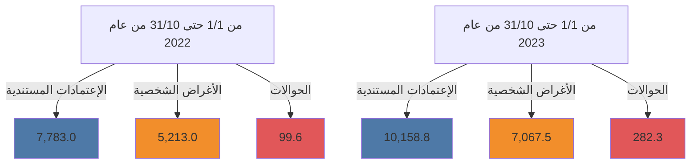
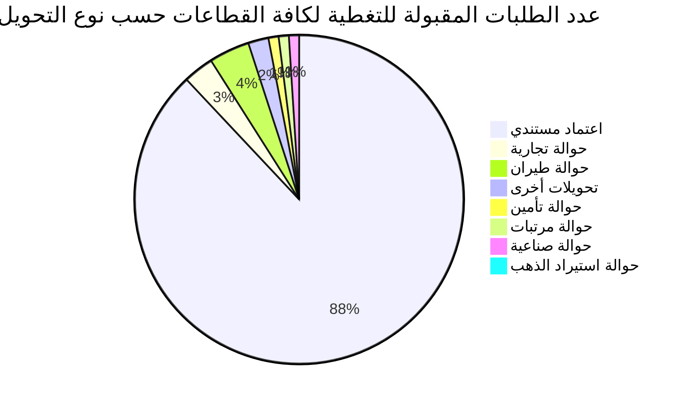

# مصرف ليبيا المركزي

## إستخدامات المصـــــــارف للنقد الأجنبي

### خلال الفترة: (1/1 - 31/10/2023)

![An image showing a tablet displaying financial charts, graphs, and US dollar bills. The logo of the Central Bank of Libya is visible at the bottom of the tablet.]

إدارة الرقابة على المصارف والنقد
---
إدارة الرقابة على المصارف والنقد

## تحليل حركة إستخدامات المصارف الفعلية من النقد الأجنبي
### خلال الفترة (1/1 – حتى 31/10/2023)

بلغ إجمالي إستخدامات المصارف من النقد الأجنبي خلال الفترة (1/1 – حتى 31/10/2023) نحو 17,508,624,870 دولاراً، مقابل 13,095,650,102 دولاراً خلال نفس الفترة من العام الماضي 2022، بزيادة قدرها نحو 4,412,974,768 دولاراً. أي بمعدل نمو بلغ 33.7%.

حيث شكلت الإعتمادات المستندية ما نسبته 58.0% من إجمالي إستخدامات المصارف من النقد الأجنبي، فيما شكلت الأغراض الشخصية نسبة 40.4% من الإجمالي، في حين لم تشكل الحوالات إلا مانسبته 1.6% من إجمالي الإستخدامات.

### إستخدامات المصارف الفعلية من النقد الأجنبي لكافة الأغراض
"المبالغ بالدولار الأمريكي"

| البند | من 1/1 حتى 31/10 من عام 2022 | من 1/1 حتى 31/10 من عام 2023 | مقدار التغير | نسبة التغير% |
|-------|-------------------------------|-------------------------------|---------------|---------------|
| - الإعتمادات المستندية | 7,783,041,888 | 10,158,839,128 | 2,375,797,241 | 30.5 |
| - الحوالات | 99,571,467 | 282,320,501 | 182,749,034 | 183.5 |
| - الأغراض الشخصية | 5,213,036,747 | 7,067,465,241 | 1,854,428,494 | 35.6 |
| الإجمالي | 13,095,650,102 | 17,508,624,870 | 4,412,974,768 | 33.7 |

### إستخدامات المصارف للنقد الأجنبي لكافة الأغراض

صفحة 2 من 100
---
إدارة الرقابة على المصارف والنقد

# المبالغ المُباعة للمصارف من النقد الأجنبي لكافة الأغراض:

في إطار مُتابعة إدارة الرقابة على المصارف والنقد لطلبات الشراء المقبولة للاعتمادات المُستندية والحوالات، المُقدمة من المصارف عبر منظومة مُتابعة طلبات التغطية، وكذلك منظومة مبيعات النقد الأجنبي للأغراض الشخصية، طبقاً لقرار مجلس إدارة مصرف ليبيا المركزي رقم (1) لسنة 2020 بشأن تعديل سعر صرف الدينار الليبي، ومنشور إدارة الرقابة على المصارف والنقد رقم (2020/9).

ومن خلال الإطلاع على الجدول أدناه للقيم المُباعة من النقد الأجنبي حسب المصارف، يتضح أن المصرف التجاري الوطني احتل الترتيب الأول كأكثر المصارف استخداماً للنقد الأجنبي خلال الفترة (1/1 – حتى 2023/10/31) مُسجلاً حصة سوقية بلغت 13.2%، حيث بلغ إجمالي المبالغ نحو 2,308,106,031 دولار، فيما جاء مصرف الوحدة في المرتبة الثانية بقيمة بلغت 2,154,580,997 دولار، ثم مصرف الجمهورية في المرتبة الثالثة بقيمة 2,059,282,749 دولار، ثم مصرف الأمان للتجارة والاستثمار في المرتبة الرابعة بقيمة 1,819,876,024 دولار، ثم تأتي من حيث الأهمية النسبية المصارف التالية حسب الترتيب: مصرف الواحة، مصرف اليقين، المصرف الإسلامي الليبي، المصرف المتحد ومصرف الصحاري، إلى آخره من المصارف كما موضح بالجدول أدناه والذي يحتوي أيضاً على الترتيب الذي كانت عليه المصارف خلال نفس الفترة من العام الماضي 2022.

صفحة 3 من 100
---
إدارة الرقابة على المصارف والنقد

## ترتيب المصارف حسب إجمالي المبالغ المُباعة من النقد الأجنبي

| المصرف | من 1/1 حتى 10/31 من عام 2022 |  |  | من 1/1 حتى 10/31 من عام 2023 |  |  |
|---------------------------|--------------------------------:|---:|----:|--------------------------------:|---:|----:|
|                           |                    القيمة بالدولار | الترتيب | الحصة السوقية |                    القيمة بالدولار | الترتيب | الحصة السوقية |
| المصرف التجاري الوطني     |                    1,612,153,378 | 3   | 12.3% |                    2,308,106,031 | 1   | 13.2% |
| مصرف الوحدة               |                      891,384,960 | 7   | 6.8%  |                    2,154,580,997 | 2   | 12.3% |
| مصرف الجمهورية            |                    1,687,250,678 | 2   | 12.9% |                    2,059,282,749 | 3   | 11.8% |
| مصرف الأمان للتجارة والإستثمار |                    2,160,317,800 | 1   | 16.5% |                    1,819,876,024 | 4   | 10.4% |
| مصرف النوران              |                    1,015,657,893 | 5   | 7.8%  |                    1,522,863,611 | 5   | 8.7%  |
| مصرف اليقين               |                    1,425,687,478 | 4   | 10.9% |                    1,476,546,377 | 6   | 8.4%  |
| المصرف الإسلامي الليبي    |                      971,487,735 | 6   | 7.4%  |                    1,252,480,030 | 7   | 7.2%  |
| المصرف المتحد للتجارة والإستثمار |                      840,330,801 | 8   | 6.4%  |                    1,223,588,796 | 8   | 6.99% |
| مصرف الصحارى              |                      596,363,527 | 9   | 4.6%  |                      863,987,338 | 9   | 4.9%  |
| مصرف شمال أفريقيا         |                      316,118,881 | 12  | 2.4%  |                      573,178,889 | 10  | 3.3%  |
| مصرف الخليج الأول الليبي  |                      450,134,819 | 10  | 3.4%  |                      531,664,716 | 11  | 3.0%  |
| مصرف السراي للتجارة والإستثمار |                      333,178,630 | 11  | 2.5%  |                      361,932,620 | 12  | 2.1%  |
| مصرف التجارة والتنمية     |                        6,903,675 | 19  | 0.1%  |                      334,763,061 | 13  | 1.9%  |
| مصرف الأندلس              |                       98,663,560 | 16  | 0.8%  |                      326,300,550 | 14  | 1.9%  |
| مصرف الوفاء               |                      135,846,517 | 15  | 1.0%  |                      224,250,857 | 15  | 1.3%  |
| مصرف الواحة               |                      140,132,412 | 14  | 1.1%  |                      179,015,699 | 16  | 1.0%  |
| مصرف التضامن              |                       92,927,396 | 17  | 0.7%  |                      167,983,483 | 17  | 1.0%  |
| المصرف الليبي الخارجي     |                      273,929,758 | 13  | 2.1%  |                       83,093,088 | 18  | 0.5%  |
| مصرف المتوسط              |                       47,180,203 | 18  | 0.4%  |                       45,129,954 | 19  | 0.3%  |
| مصرف الإجماع العربي       |                                0 | 20  | 0.0%  |                                0 | 20  | 0.0%  |
| الإجمالي                  |                   13,095,650,102 | -   | 100.0% |                   17,508,624,870 | -   | 100.0% |

صفحة 4 من 100
---
إدارة الرقابة على المصارف والنقد

# المبالغ المُباعة للمصارف من النقد الأجنبي (حسب الغرض)

"القيم بالدولار الأمريكي"

| ت | المصرف | الاعتمادات المستندية |  | الحوالات |  | الأغراض الشخصية |  |
|---|---------|----------------------|------------------|-----------|------------------|-------------------|------------------|
|   |         | من 1/1 حتى 10/31 من عام 2022 | من 1/1 حتى 10/31 من عام 2023 | من 1/1 حتى 10/31 من عام 2022 | من 1/1 حتى 10/31 من عام 2023 | من 1/1 حتى 10/31 من عام 2022 | من 1/1 حتى 10/31 من عام 2023 |
| 1 | المصرف التجاري الوطني | 574,788,977 | 1,065,413,901 | 770,652 | 5,316,480 | 1,036,593,749 | 1,237,375,650 |
| 2 | مصرف الوحدة | 644,962,188 | 1,844,066,826 | 277,466.22 | 928,779.05 | 246,145,306 | 309,585,392 |
| 3 | مصرف الجمهورية | 1,025,368,011 | 1,137,193,646 | 7,030,667 | 53,795,104 | 654,852,000 | 868,294,000 |
| 4 | مصرف الأمان للتجارة والاستثمار | 374,610,730 | 560,002,845 | 0 | 1,467,392 | 1,785,707,070 | 1,258,405,786 |
| 5 | مصرف النوران | 897,548,778 | 1,185,001,069 | 8439371.84 | 27,475,446 | 109,669,744 | 310,387,095 |
| 6 | مصرف اليقين | 1,034,809,801 | 735,770,027 | 2432709.65 | 13961525.42 | 388,444,968 | 726,814,825 |
| 7 | المصرف الاسلامي الليبي | 825,649,695 | 923,533,099 | 21,210,520 | 42,419,871 | 124,627,519 | 286,527,060 |
| 8 | المصرف المتحد للتجارة والاستثمار | 383,336,390 | 373,200,641 | 893,289 | 3,377,258 | 456,101,122 | 847,010,897 |
| 9 | مصرف الصحارى | 262313016.8 | 313126572.9 | 7064977.57 | 10853700.07 | 326,985,533 | 540,007,065 |
| 10 | مصرف شمال افريقيا | 272,459,000 | 321,732,440 | 27,721,718 | 40,098,558 | 15,938,163 | 211,347,891 |
| 11 | مصرف الخليج الأول الليبي | 438,446,814 | 500,898,510 | 11,682,306 | 30,316,422 | 5,700 | 449,785 |
| 12 | مصرف السراي للتجارة والاستثمار | 329,451,792 | 331,517,824 | 0 | 20,232,853 | 3,726,838 | 10,181,944 |
| 13 | مصرف التجارة والتنمية | 0 | 3,600,000 | 0 | 0 | 6,903,675 | 331,163,061 |
| 14 | مصرف الأندلس | 97707824.68 | 290702250.6 | 955735.17 | 7565960.99 | 0 | 28032338 |
| 15 | مصرف الوفاء | 134,695,087 | 221,052,562 | 0 | 0 | 1,151,430 | 3,198,295 |
| 16 | مصرف الواحة | 90,043,370 | 88,529,266 | 726,311 | 0 | 49362731 | 90,486,433 |
| 17 | مصرف التضامن | 92,927,396 | 167,983,483 | 0 | 0 | 0 | 0 |
| 18 | المصرف الليبي الخارجي | 263,096,465 | 58,219,756 | 10365742.8 | 24,511,152 | 467,550 | 362,180 |
| 19 | مصرف المتوسط | 40,826,554 | 37,294,410 | 0 | 0 | 6,353,649 | 7,835,544 |
| 20 | مصرف الاجماع العربي | 0 | 0 | 0 | 0 | 0 | 0 |
| - | الإجمالي الكلي | 7,783,041,888 | 10,158,839,128 | 99,571,467 | 282,320,501 | 5,213,036,747 | 7,067,465,241 |

صفحة 5 من 100
---
إدارة الرقابة على المصارف والنقد

## الأهمية النسبية حسب المصرف لأستخدامات النقد الأجنبي خلال الفترة من 1/1 حتى 10/31 من عام 2022

| المصرف | النسبة |
|---------|-------|
| مصرف الأمان للتجارة والإستثمار | 17% |
| مصرف الجمهورية | 13% |
| المصرف التجاري الوطني | 12% |
| مصرف اليقين | 11% |
| باقي المصارف | 11% |
| مصرف النوران | 8% |
| المصرف الإسلامي الليبي | 7% |
| مصرف الوحدة | 7% |
| المصرف المتحد للتجارة والإستثمار | 6% |
| مصرف الصحاري | 5% |
| مصرف الخليج الأول الليبي | 3% |

## الأهمية النسبية حسب المصرف لأستخدامات النقد الأجنبي خلال الفترة من 1/1 حتى 10/31 من عام 2023

| المصرف | النسبة |
|---------|-------|
| المصرف التجاري الوطني | 15% |
| مصرف الوحدة | 14% |
| مصرف الجمهورية | 13% |
| مصرف الأمان للتجارة والإستثمار | 12% |
| مصرف النوران | 10% |
| مصرف اليقين | 10% |
| المصرف الإسلامي الليبي | 8% |
| المصرف المتحد للتجارة والإستثمار | 8% |
| مصرف الصحاري | 6% |
| مصرف شمال أفريقيا | 4% |

صفحة 6 من 100
---
إدارة الرقابة على المصارف والنقد

ثانياً : طلبات المصارف المقبولة لتغطية الإعتمادات المستندية والحوالات عدا الأغراض الشخصية خلال الفترة (1/1 – حتى 31/10/2023):

بلغ عدد الشركات والمصانع والجهات العامة والجهات الأخرى المستفيدة (1,941) والتي تمت الموافقة على طلباتهم خلال الفترة (1/1 – حتى 31/10/2023) للحصول على النقد الأجنبي ، بعدد طلبات بلغ نحو 13,273 طلب، معظم هذه الطلبات لتغطية الإعتمادات المستندية والتي سجلت 11,731 طلب بنسبة 88.4% من الطلبات، إجمالي كما هو موضح بالجدول التالي:-

| نوع التحويل | القطاع الخاص | القطاع العام | قطاع المصارف | جهات متنوعة | الإجمالي | الأهمية النسبية |
|-------------|---------------|--------------|---------------|--------------|----------|------------------|
| اعتماد مستندي | 11,440 | 283 | 8 | 0 | 11,731 | 88.4% |
| حوالة طيران | 435 | 61 | 0 | 4 | 500 | 3.8% |
| حوالة تجارية | 47 | 336 | 28 | 1 | 412 | 3.1% |
| تحويلات أخرى | 37 | 255 | 2 | 3 | 297 | 2.2% |
| حوالة تأمين | 40 | 106 | 0 | 0 | 146 | 1.1% |
| حوالة مرتبات | 0 | 0 | 0 | 92 | 92 | 0.7% |
| حوالة صناعية | 77 | 0 | 0 | 0 | 77 | 0.6% |
| حوالة استيراد الذهب | 18 | 0 | 0 | 0 | 18 | 0.1% |
| الإجمالي | 12,094 | 1,041 | 38 | 100 | 13,273 | 100% |

عدد الطلبات المقبولة للتغطية لكافة القطاعات حسب نوع التحويل خلال الفترة (1/1 - حتى 31/10/2023)

صفحة 7 من 100
---
إدارة الرقابة على المصارف والنقد

## أولاً: الطلبات لكافة القطاعات :

### طلبات المصارف المقبولة لتغطية الإعتمادات المستندية والحوالات - لكافة القطاعات

#### 1- حسب أهم البلدان المستفيدة :

من خلال الإطلاع على الجدول أدناه لقيم طلبات المصارف لشراء النقد الأجنبي حسب البلدان

المستفيدة خلال الفترة (1/1 – حتى 31/10/2023) لكافة القطاعات، يتضح أن مانسبته 33.5%

من تحويلات المصارف لتغطية الإعتمادات المستندية أو الحوالات الأخرى كانت لدولة الإمارات

العربية المتحدة، ثم جاءت دولة مصر في المرتبة الثانية بنسبة 9.5% ثم تركيا والصين والمملكة

المتحدة بنسب 8.7%، 5.8% و5.5% على التوالي، والجدول التالي يوضح أهم عشرون بلد مستفيد.

### طلبات المصارف لتغطية الإعتمادات المستندية والحوالات - لكافة القطاعات
#### (حسب أهم عشرون بلد مستفيد)
#### خلال الفترة (1/1 – حتى 31/10/2023)

| ت | البلد المستفيد | القيمة بالدولار | الأهمية النسبية |
|---|----------------|-----------------|-----------------|
| 1- | الإمارات العربية المتحدة | 3,735,064,799 | 33.5% |
| 2- | مصر | 1,052,790,017 | 9.5% |
| 3- | تركيا | 973,036,840 | 8.7% |
| 4- | الصين | 648,709,039 | 5.8% |
| 5- | بريطانيا (المملكة المتحدة) | 611,386,234 | 5.5% |
| 6- | سويسرا | 603,819,433 | 5.4% |
| 7- | تونس | 548,147,822 | 4.9% |
| 8- | إيطاليا | 365,009,956 | 3.3% |
| 9- | النمسا | 318,609,801 | 2.9% |
| 10- | إسبانيا | 236,836,341 | 2.1% |
| 11- | هولندا | 207,651,071 | 1.9% |
| 12- | كوريا الجنوبية | 195,535,054 | 1.8% |

صفحة 8 من 100
---
إدارة الرقابة على المصارف والنقد

| -   | البلد                | القيمة       | النسبة |
|-----|---------------------|-------------|-------|
| -13 | المانيا              | 150,047,259 | 1.3%  |
| -14 | اليابان             | 148,372,325 | 1.3%  |
| -15 | تايلاند             | 135,628,205 | 1.2%  |
| -16 | السويد              | 133,272,530 | 1.2%  |
| -17 | S.A.R. هونج كونج    | 105,725,322 | 0.9%  |
| -18 | كندا                | 98,747,109  | 0.9%  |
| -19 | فرنسا               | 94,912,025  | 0.9%  |
| -20 | الولايات المتحدة    | 76,350,351  | 0.7%  |

## -2 حسب أهم بلدان منشأ السلع أو الخدمات:

من خلال الإطلاع على الجدول أدناه لقيم طلبات المصارف لشراء النقد الأجنبي حسب بلدان منشأ السلع أو الخدمات خلال الفترة (1/1 – حتى 31/10/2023) لكافة القطاعات ، يتضح أن دولة تركيا قد أحتلت المرتبة الأولى حيث شكلت السلع أو الخدمات ذات المنشأ التركي نسبة 19.3% من الإجمالي طلبات الشراء المقبولة، ثم جاءت واردات السلع أو الخدمات ذات المنشأ المصري في المرتبة الثانية مشكلة مانسبته 14.0% من الإجمالي، وشكلت السلع أوالخدمات ذات المنشأ الصيني نسبة 13.3% محتلة المرتبة الثالثة خلال الفترة ، فيما سجلت السلع والخدمات ذات منشأ دولة روسيا الإتحادية مانسبته 7.0%، وذات المنشأ الهندي نسبة 5.2%، وجاءت السلع أو الخدمات ذات المنشأ التونسي في المرتبة السادسة مشكلة نسبة 4.1% من الإجمالي ، والجدول التالي يوضح أهم عشرون بلد منشأ للسلع أو الخدمات.

صفحة 9 من 100
---
إدارة الرقابة على المصارف والنقد

طلبات المصارف لتغطية الاعتمادات المستندية والحوالات - لكافة القطاعات
(حسب أهم عشرون بلد منشأ للسلع أوالخدمات)

خلال الفترة (1/1 – حتى 31/10/2023)

| ت | بلد منشأ السلع أوالخدمات | القيمة بالدولار | الأهمية النسبية % |
|---:|--------------------------|---------------:|------------------:|
| 1- | تركيا                   | 2,149,692,872  | 19.3%             |
| 2- | مصر                     | 1,558,909,134  | 14.0%             |
| 3- | الصين                   | 1,475,519,234  | 13.3%             |
| 4- | روسيا الاتحادية         | 779,254,107    | 7.0%              |
| 5- | الهند                   | 574,797,536    | 5.2%              |
| 6- | تونس                    | 457,875,340    | 4.1%              |
| 7- | البرازيل                | 381,983,672    | 3.4%              |
| 8- | الإمارات العربية المتحدة | 352,907,798    | 3.2%              |
| 9- | إيطاليا                 | 325,360,859    | 2.9%              |
| 10- | ألمانيا                 | 253,136,814    | 2.3%              |
| 11- | هولندا                  | 213,303,673    | 1.9%              |
| 12- | أوكرانيا                | 184,876,380    | 1.7%              |
| 13- | تايلاند                 | 183,091,480    | 1.6%              |
| 14- | الأرجنتين               | 176,753,644    | 1.6%              |
| 15- | أيرلندا                 | 161,552,219    | 1.5%              |
| 16- | إسبانيا                 | 160,934,237    | 1.4%              |
| 17- | كوريا الجنوبية          | 153,859,997    | 1.4%              |
| 18- | السويد                  | 134,169,055    | 1.2%              |
| 19- | الولايات المتحدة        | 128,681,533    | 1.2%              |
| 20- | بلجيكا                  | 107,044,632    | 1.0%              |

صفحة 10 من 100
---
إدارة الرقابة على المصارف والنقد

## ثانياً: الطلبات حسب القطاعات:

### طلبات المصارف المقبولة لشراء النقد الأجنبي - حسب القطاعات

خلال الفترة (1/1 – حتى 31/10/2023)

| القطاع | عدد الشركات أو المصانع أو الجهات |
|--------|----------------------------------|
| القطاع الخاص | 1,797 |
| القطاع العام | 45 |
| قطاع المصارف | 4 |
| حوالات مرتبات الأجانب وجهات متنوعة | 95 |
| الإجمالي | 1,941 |

### 1- القطاع الخاص:

بلغ عدد شركات ومصانع القطاع الخاص (1,797) التي تمت الموافقة على طلباتها للحصول على النقد الأجنبي من المصارف لتغطية الإعتمادات المستندية والحوالات الأخرى خلال الفترة (1/1 – حتى 31/10/2023) حيث أحتلت طلبات شراء النقد الأجنبي من قبل القطاع الخاص لإستيراد مستلزمات الإنتاج والتشغيل المرتبة الأولى من إجمالي طلبات الشراء خلال الفترة، حيث شكلت مانسبته 18.1% من إجمالي طلبات شراء النقد الأجنبي، فيما أحتلت طلبات تغطية إستيراد السلع الغذائية المتنوعة المرتبة الثانية من حيث الأهمية النسبية لتشكل نحو 10.4%، فيما شكلت طلبات تغطية إستيراد مستلزمات إنتاج السلع الأساسية نسبة 10.2%، وإستيراد الأعلاف نسبة 8.0% من الإجمالي، والجدول التالي يوضح كافة طلبات الشراء للسلع أو الخدمات خلال الفترة.

صفحة 11 من 100
---
إدارة الرقابة على المصارف والنقد

طلبات شراء السلع أو الخدمات - قطاع خاص
خلال الفترة (1/1 - حتى 31/10/2023)

| ت | تصنيف السلع | القيمة بالدولار | الأهمية النسبية % |
|---|-------------|-----------------|-------------------|
| -1 | مستلزمات الإنتاج والتشغيل | 1,832,651,976 | 18.1% |
| -2 | سلع غذائية متنوعة | 1,053,004,953 | 10.4% |
| -3 | مستلزمات انتاج السلع الأساسية | 1,031,730,317 | 10.2% |
| -4 | أعلاف | 806,015,217 | 8.0% |
| -5 | مواد البناء ومستلزمات التشييد | 758,909,461 | 7.5% |
| -6 | أجهزة الكترونية | 730,835,206 | 7.2% |
| -7 | وسائل النقل واطارات ونضائد وقطع الغيار | 630,936,601 | 6.2% |
| -8 | الالات والمعدات | 458,665,129 | 4.5% |
| -9 | اللحوم الحية والمجمدة | 389,360,321 | 3.8% |
| -10 | منزلية وكهرومنزلية | 365,898,553 | 3.6% |
| -11 | حليب | 303,997,465 | 3.0% |
| -12 | الغذائية | 292,240,358 | 2.9% |
| -13 | أدوية بشرية | 228,276,428 | 2.3% |
| -14 | حليب وحفاظات واغذية أطفال | 161,136,935 | 1.6% |
| -15 | الاثاث | 155,851,275 | 1.5% |
| -16 | أجبان | 137,778,256 | 1.4% |
| -17 | مواد التنظيف | 111,994,464 | 1.1% |
| -18 | تبغ بأنواعه ومستلزماته | 110,823,017 | 1.1% |
| -19 | زراعية | 85,009,064 | 0.8% |
| -20 | خدمات اتصالات وتقنية معلومات | 59,651,278 | 0.6% |
| -21 | فواكه وخضروات | 57,559,288 | 0.6% |
| -22 | الزراعية | 51,948,195 | 0.5% |
| -23 | خدمات ملاحية متنوعة | 39,050,324 | 0.4% |
| -24 | مواد تنظيف | 37,060,822 | 0.4% |
| -25 | حوالة استيراد الذهب | 31,473,968 | 0.3% |
| -26 | حوالات شركات خطوط الطيران | 30,909,454 | 0.3% |

صفحة 12 من 100
---
إدارة الرقابة على المصارف والنقد

| النسبة | القيمة | البيان | الرقم |
|--------|--------|-------|------|
| 0.3% | 29,987,015 | خدمات انتاج وتشغيل | -27 |
| 0.3% | 26,170,739 | الملابس والأحذية | -28 |
| 0.2% | 23,502,467 | مواد صحية | -29 |
| 0.2% | 22,796,416 | طلبات خاصة بشركة الأجنحة الليبية | -30 |
| 0.2% | 17,477,501 | قرطاسية | -31 |
| 0.1% | 8,096,418 | أسماك وأحياء بحرية | -32 |
| 0.1% | 7,911,046 | شركة غدامس للطيران | -33 |
| 0.1% | 7,679,613 | شركة أويا للطيران | -34 |
| 0.1% | 7,549,884 | زبدة | -35 |
| 0.1% | 7,382,294 | السجاد والمنسوجات | -35 |
| 0.1% | 6,193,151 | الشركة الليبية السريعة للنقل الجوي | -37 |
| 0.05% | 4,857,762 | سمن | -38 |
| 0.03% | 3,469,023 | حوالات شركات التأمين | -39 |
| 0.03% | 3,061,763 | أدوية بيطرية | -40 |
| 0.02% | 2,382,497 | شركة سما المتوسط للطيران | -41 |
| 0.02% | 1,530,086 | تكاليف خدمات سياحية | -42 |
| 0.01% | 1,019,922 | شركة المتحدة للتأمين | -43 |
| 0.01% | 994,315 | سلع خاصة بالخدمات العامة | -44 |
| 0.01% | 884,284 | الطبية | -45 |
| 0.01% | 669,240 | مستلزمات تشغيل مصنع الحديد والصلب | -46 |
| 0.01% | 596,693 | متنوعة | -47 |
| 0.01% | 540,100 | حوالات دورة تدريبية | -48 |
| 0.00% | 485,195 | طلبات الخطوط الجوية الليبية | -49 |
| 0.00% | 28,500 | مستلزمات تشغيل الموانئ | -50 |

صفحة 13 من 100
---
إدارة الرقابة على المصارف والنقد

# طلبات الشراء حسب أهم خمسون شركة - قطاع خاص

خلال الفترة (1/1 - حتى 2023/10/31)

| ت | الشركة أو المصنع | القيمة بالدولار |
|---|-------------------|-----------------|
| 1 | شركة النسيم للصناعات الغذائية | 143,660,650 |
| 2 | شركة تويوتا ليبيا تجارة السيارات وقطع الغيار واستيراد والتصدير | 138,517,212 |
| 3 | شركة طريق القارة لاستيراد المواد الغذائية | 128,413,490 |
| 4 | شركة افريقيا لتعبئة المشروبات | 111,617,533 |
| 5 | شركة وادي الكوف للمطاحن والأعلاف ومضارب الأرز | 95,632,834 |
| 6 | شركة دروب ليبيا لاستيراد وسائل النقل وملحقاتها | 92,667,673 |
| 7 | شركة البنيان لصهر ودرفلة المعادن | 83,482,558 |
| 8 | شركة الجيد لاستيراد المواد الغذائية | 73,595,031 |
| 9 | شركة الشرق الليبي للمطاحن والاعلاف ومضارب الارز | 69,834,426 |
| 10 | شركة ظل العين لصناعة الألبان ومشتقاتها | 67,452,000 |
| 11 | شركة الوسام الذهبي لصناعة الدقيق والمطاحن والاعلاف ومضارب الارز | 63,039,465 |
| 12 | شركة سما الأرياف لاستيراد المواد الغذائية و الخضروات و الفواكه الطازجة | 59,107,764 |
| 13 | شركة ابتهاج الطبيعة لاستيراد المواد الغذائية | 57,816,120 |
| 14 | شركة الجودة العالمية الأولى لصناعة الاعلاف ومطاحن الدقيق والصناعات الغذائية | 57,758,082 |
| 15 | الشركة الليبية المتحدة لتعبئة المشروبات | 56,995,064 |
| 16 | شركة الريحان لصناعة المواد الغذائية | 56,111,126 |
| 17 | شركة المصبوبات لصناعة مواد البناء | 54,400,880 |
| 18 | شركة الجاهزة لاستيراد المواد الغذائية | 54,222,090 |
| 19 | شركة سلوق لصناعة الاعلاف بجميع انواعها والمطاحن | 50,966,500 |
| 20 | شركة الرفيق الأمثل لصناعة مواد البناء | 49,815,863 |
| 21 | شركة الانهار لصناعة الدقيق | 48,492,600 |
| 22 | شركة الفا للمطاحن والاعلاف والصناعات الغذائية | 48,265,579 |
| 23 | شركة الموسم للصناعات الغذائية ومضارب الأرز | 47,879,095 |
| 24 | شركة الجيد للصناعات الغذائية | 47,506,935 |
| 25 | شركة الأصالة الذهبية للمطاحن ومضارب الأرز | 46,611,351 |

صفحة 14 من 100
---
إدارة الرقابة على المصارف والنقد

| الرقم | اسم الشركة | القيمة |
|-------|-----------|--------|
| 26 | شركة الفتح الجديد لصناعة مواد التنظيف | 46,197,317 |
| 27 | شركة طرابلس الكبرى لصناعة وتعبئة وتغليف الطماطم و المواد الغذائية | 45,701,468 |
| 28 | شركة المعمورة لاستيراد وتوزيع المواد الغذائية | 45,110,679 |
| 29 | شركة نبراس الخير لصناعة الاعلاف وطحن الحبوب | 44,996,761 |
| 30 | شركة أضواء النيزك لاستيراد الأجهزة الألكترونية وملحقاتها وقطع غيارها | 42,849,071 |
| 31 | شركة الاتقان المتقدمة لصناعة الدقيق | 42,609,770 |
| 32 | شركة التاج العريقة لاستيراد الاجهزة الالكترونية والكهربائية وملحقاتها وقطع غيارها | 41,907,123 |
| 33 | شركة أنعام ليبيا لاستيراد الاعلاف ومكملاتها | 41,850,000 |
| 34 | شركة بسمتي للصناعات الغذائية | 39,877,779 |
| 35 | شركة المتحدة الجديدة لاستيراد التبغ والسجائر ومستلزماتها | 39,054,714 |
| 36 | شركة السواحل الذهبية لاستيراد المواد الغذائية | 38,657,934 |
| 37 | شركة بصمة الجودة لاستيراد المواد الغذائية والمواشي واللحوم والفواكه | 38,123,769 |
| 38 | شركة أضواء أفريقيا لاستيراد المواد الغذائية والمواشي واللحوم | 35,358,249 |
| 39 | شركة تاجوراء الحياة للصناعات الغذائية | 35,065,300 |
| 40 | شركة البيوت الكاملة لاستيراد الأجهزة الالكترونية | 34,454,855 |
| 41 | شركة السد الحديثة لصناعة الاعلاف | 34,249,992 |
| 42 | شركة الواحة الدولية لطحن الحبوب و صناعة الأعلاف | 34,014,602 |
| 43 | مصنع التعاون لصناعة الاعلاف | 33,964,656 |
| 44 | شركة الميسم لاستيراد السيارات وصيانتها | 33,791,820 |
| 45 | شركة الروابي الذهبية لاستيراد مواد البناء والمواد الصحية | 33,332,436 |
| 46 | شركة المستكشف الدولية للخدمات النفطية | 32,743,073 |
| 47 | شركة المعمورة الأولى لاستيراد المواد الغذائية | 32,121,169 |
| 48 | شركة اشراقة الربيع لصناعة وتجميع المضخات | 31,814,571 |
| 49 | شركة حوض شمال أفريقيا لصناعة وتحلية وتعبئة مياه الشرب | 30,535,900 |
| 50 | شركة السرايا الراقية لاستيراد المواد الغذائية والخضروات والفواكه والمواشي واللحوم | 30,509,521 |

صفحة 15 من 100
---
إدارة الرقابة على المصارف والنقد

## -2 القطاع العام

بلغ عدد جهات القطاع العام التي تمت الموافقة على طلباتها للحصول على النقد الأجنبي لتغطية الإعتمادات المستندية والحوالات الأخرى 45 جهة خلال الفترة (1/1 – حتى 31/10/2023)، حيث أحتلت متطلبات شركة ليبيانا للهاتف المحمول المرتبة الأولى من إجمالي طلبات الشراء خلال الفترة، حيث شكلت مانسبته 21.5% من إجمالي طلبات شراء النقد الأجنبي، فيما أحتلت الطلبات لمستلزمات تشغيل مصنع الحديد والصلب المرتبة الثانية من حيث الأهمية النسبية لتشكل نحو 13.6%، فيما شكلت متطلبات شركة المدار الجديد نسبة 12.5%، وطلبات تغطية خدمات الاتصالات وتقنية معلومات نسبة 11.8% ، فيما شكلت طلبات استيراد مستلزمات الإنتاج والتشغيل نسبة 9.6%. والجدول التالي يوضح كل طلبات شراء النقد الأجنبي حسب السلع أو الخدمات للقطاع عام.

### طلبات الشراء حسب السلع أو الخدمات - قطاع عام

خلال الفترة (1/1 – حتى 31/10/2023)

| ت | تصنيف السلع | القيمة بالدولار | الأهمية النسبية |
|---|-------------|-----------------|-----------------|
| 1 | متطلبات شركة ليبيانا للهاتف المحمول | 204,502,914 | 21.5% |
| 2 | مستلزمات تشغيل مصنع الحديد والصلب | 128,609,734 | 13.6% |
| 3 | متطلبات شركة المدار الجديد | 118,304,285 | 12.5% |
| 4 | خدمات اتصالات وتقنية معلومات | 111,676,004 | 11.8% |
| 5 | مستلزمات إنتاج وتشغيل | 90,673,384 | 9.6% |
| 6 | الهيئة العامة لصندوق الضمان الاجتماعي | 51,900,000 | 5.5% |
| 7 | أجهزة الالكترونية | 49,599,856 | 5.2% |
| 8 | شركة الاتحاد العربي للمقاولات | 28,941,250 | 3.0% |
| 9 | مستلزمات تشغيل شركة هاتف ليبيا | 26,964,828 | 2.8% |
| 10 | حوالات شركات خطوط الطيران | 16,447,733 | 1.7% |
| 11 | مواد البناء ومستلزمات التشييد | 12,656,945 | 1.3% |
| 12 | حوالات شركات التأمين | 10,806,925 | 1.1% |
| 13 | أعلاف | 8,425,000 | 0.9% |

صفحة 16 من 100
---
إدارة الرقابة على المصارف والنقد

| النسبة | القيمة | البند | الرقم |
|--------|--------|------|------|
| 0.9% | 8,181,274 | مستلزمات الشركة العامة للكهرباء | -14 |
| 0.8% | 7,928,977 | الخطوط الجوية الأفريقية | -15 |
| 0.8% | 7,861,257 | شركة ليبيا للاتصالات والتقنية | -16 |
| 0.8% | 7,645,734 | الآلات والمعدات | -17 |
| 0.8% | 7,252,964 | صندوق الضمان الاجتماعي | -18 |
| 0.7% | 6,840,189 | خدمات انتاج وتشغيل | -19 |
| 0.7% | 6,431,690 | طلبات الخطوط الجوية الليبية | -20 |
| 0.6% | 5,629,344 | أدوية بشرية | -21 |
| 0.5% | 4,420,000 | الخطوط التونسية | -22 |
| 0.5% | 4,335,660 | وسائل النقل واطارات وضفائر وقطع الغيار | -23 |
| 0.4% | 4,061,781 | جهاز مشروعات الإسكان والمرافق | -24 |
| 0.4% | 3,924,351 | احتياجات التشغيل لشركة معاملات | -25 |
| 0.3% | 2,630,976 | متطلبات تشغيل وصيانة الموانئ | -26 |
| 0.2% | 2,013,448 | مستلزمات الشركة العامة لتحلية المياه | -27 |
| 0.2% | 1,994,750 | قرطاسية | -28 |
| 0.2% | 1,809,209 | الشركة الليبية للموانئ | -29 |
| 0.1% | 1,300,694 | صندوق الرعاية الاجتماعية | -30 |
| 0.1% | 1,200,000 | حوالات علاجية | -31 |
| 0.1% | 813,828 | منزلية وكهرومنزلية | -32 |
| 0.1% | 760,581 | الشركة الاهلية للأسمنت | -33 |
| 0.1% | 755,974 | الملابس والاحذية | -34 |
| 0.1% | 675,815 | مستلزمات انتاج سلع أساسية | -35 |
| 0.1% | 578,825 | الشركة العامة لاستيراد السلع الامنية | -36 |
| 0.02% | 182,873 | طلبات شركات التأمين | -37 |
| 0.02% | 172,348 | حوالات دورة تدريبية | -38 |
| 0.01% | 114,977 | متنوعة | -39 |
| 0.01% | 93,690 | الاتحاد الليبي لشركات التأمين | -40 |
| 0.00% | 15,112 | مستلزمات تشغيل الموانئ | -41 |
| 0.00% | 14,000 | شركة تطوير للاستثمار العقاري | -42 |

صفحة 17 من 100
---
إدارة الرقابة على المصارف والنقد

## طلبات الشراء حسب الجهات - قطاع عام

خلال الفترة (1/1 – حتى 31/10/2023)

| ت | الجهة | القيمة بالدولار |
|---|-------|-----------------|
| 1 | شركة ليبيانا للهاتف المحمول | 308,494,304 |
| 2 | شركة المدار الجديد | 133,333,200 |
| 3 | الشركة الليبية للحديد والصلب | 130,632,713 |
| 4 | جهاز تنمية و تطوير المراكز الإدارية | 58,928,103 |
| 5 | الهيئة العامة لصندوق التضامن الاجتماعي | 51,900,000 |
| 6 | شركة الإتحاد العربي للمقاولات المساهمة | 45,586,990 |
| 7 | شركة ليبيا للاتصالات والتقنية | 40,228,480 |
| 8 | شركة هاتف ليبيا | 33,964,591 |
| 9 | شركة الخطوط الجوية الأفريقية | 22,208,860 |
| 10 | شركة الاتصالات الدولية الليبية | 14,527,419 |
| 11 | شركة الجيل الجديد للتقنية | 11,296,036 |
| 12 | شركة ليبيا للتأمين | 10,030,775 |
| 13 | الشركة الوطنية للمطاحن والأعلاف | 8,975,846 |
| 14 | شركة الخطوط الجوية الليبية | 8,560,521 |
| 15 | المنطقة الحرة بمصراته | 8,516,469 |
| 16 | الشركة العامة للكهرباء المساهمة | 8,039,172 |
| 17 | الشركة الاهلية للاسمنت | 7,476,176 |
| 18 | صندوق الضمان الاجتماعي | 7,252,964 |
| 19 | جهاز تنفيذ مشروعات الاسكان و المرافق | 5,323,320 |
| 20 | شركة معاملات للخدمات المالية | 5,077,319 |
| 21 | فرع شركة الخطوط التونسية | 4,420,000 |
| 22 | شركة العامة لخدمات النظافة العامة طرابلس | 3,290,127 |
| 23 | جهاز إنشاء وصيانة الموانئ ومرافق الصيد البحري | 2,315,300 |
| 24 | شركة الليبية للموانئ | 2,139,997 |

صفحة 18 من 100
---
إدارة الرقابة على المصارف والنقد

| القيمة | الاسم | الرقم |
|--------|------|------|
| 2,013,448 | الشركة العامة لتحلية المياه | 25 |
| 1,994,750 | الشركة العامة للورق والطباعة | 26 |
| 1,969,084 | شركة الإنماء للاستثمارات الكهربائية | 27 |
| 1,949,824 | المفوضية العليا لرعاية ذوي الاحتياجات الخاصة | 28 |
| 1,300,694 | صندوق الرعاية الاجتماعية بوزارة الداخلية | 29 |
| 1,200,000 | مستشفى طب وجراحة الأطفال بنغازي | 30 |
| 1,022,510 | الاتحاد الليبي لشركات التأمين | 31 |
| 1,013,636 | مصلحة الأحوال المدنية | 32 |
| 813,828 | شركة النظم للإنشاءات الكهربائية المساهمة | 33 |
| 740,896 | المستشفى الجامعي طرابلس | 34 |
| 578,825 | الشركة العامة لاستيراد السلع الأمنية المساهمة | 35 |
| 498,751 | مشروع تنفيذ الطريق السريع الجديد رأس اجدير امساعد | 36 |
| 443,290 | المركز الليبي للاعتماد | 37 |
| 394,619 | شركة الليبية للخدمات الأرضية | 38 |
| 245,865 | شركة بريد ليبيا | 39 |
| 174,977 | جامعة بنغازي | 40 |
| 117,120 | شركة الشاحنات والحافلات | 41 |
| 112,348 | جهاز البحوث التطبيقية والتطوير | 42 |
| 30,203 | شركة النماء الليبية للتأمين المساهمة | 43 |
| 14,000 | شركة تطوير للاستثمار العقاري والسياحي | 44 |
| 1,829 | الجهاز الوطني للطيران الزراعي | 45 |

صفحة 19 من 100
---
إدارة الرقابة على المصارف والنقد

### 3- قطاع المصارف :

طلبات التغطية المقبولة - قطاع المصارف
خلال الفترة (1/1 - 31/10/2023)
"تنازلياً مرتبة"

| الترتيب | أسم المصرف | القيمة بالدولار الأمريكي |
|---------|------------|--------------------------|
| 1 | شركة مصرف الخليج الأول المساهمة المشتركة | 14,015,551 |
| 2 | المصرف المتحد للتجارة و الإستثمار | 3,193,939 |
| 3 | مصرف الأمان للتجارة والاستثمار | 2,784,330 |
| 4 | شركة مصرف الأندلس | 2,136,906 |

حسب السلع والخدمات - قطاع المصارف
"تنازلياً مرتبة"

| الترتيب | السلع أوالخدمات | القيمة بالدولار الأمريكي |
|---------|-----------------|--------------------------|
| 1 | حوالة أرباح للشريك الأجنبي - مصرف الخليج الأول الليبي | 14,015,551 |
| 2 | حوالة أرباح للشريك الأجنبي - المصرف المتحد | 3,193,939 |
| 3 | تكاليف منظومة حماية | 993,999 |
| 4 | كروت خام الفيزا | 532,519 |
| 5 | مقابل سداد قيمة ضمان | 500,000 |
| 6 | ضمان مالي ماستر كارد | 450,000 |
| 7 | شاشات عرض | 414,033 |
| 8 | شراء تراخيص منظومة | 337,733 |
| 10 | سداد قيمة الضمان | 300,000 |
| 11 | مكينات عد الأوراق | 284,539 |
| 12 | 20 ماكينة ATM وقطع غ | 274,077 |
| 13 | تسديد حوالة خارجية | 200,000 |
| 14 | أجهزة أندرويد | 126,763 |
| 15 | أجهزة POS (400) | 101,410 |
| 16 | خدمات دعم منظومة | 70,000 |
| 17 | مقابل خدمات دعم منظو | 60,000 |

صفحة 20 من 100
---
إدارة الرقابة على المصارف والنقد

| المبلغ | البند | الرقم |
|--------|------|------|
| 60,000 | عقد خدمات دعم فني | 18 |
| 56,990 | مكيفات | 19 |
| 20,000 | حوالة خارجية | 20 |
| 20,000 | توثيق متعدد - صيانة | 21 |
| 19,496 | تسديد مصاريف سويفت | 22 |
| 19,191 | مقابل برمجيات | 23 |
| 17,158 | تجديد خدمات دعم فني | 24 |
| 12,772 | مقابل تجديد خدمات | 25 |
| 11,750 | بطاقات دفع مسبق | 26 |
| 5,788 | مراجعة نظام السويفت | 27 |
| 4,944 | منتجات وخدمات سوفتوي | 28 |
| 4,944 | حوالة خارجية | 29 |
| 4,944 | تراخيص منظومة | 30 |
| 4,944 | رسوم اشتراك | 31 |
| 4,500 | تخصيص برنامج أوراكل | 32 |
| 4,200 | سداد منتجات | 33 |
| 2,237 | مقابل سداد عضوية | 34 |
| 2,000 | بطاقات آلة السحب | 35 |

صفحة 21 من 100
---
إدارة الرقابة على المصارف والنقد

## حسب بلد المنشأ - قطاع المصارف
خلال الفترة (1/1 - 31/10/2023)
"تنازلياً مرتبة"

| الترتيب | بلد المنشأ | القيمة بالدولار الأمريكي |
|---------|-----------|--------------------------|
| 1 | الإمارات العربية المتحدة | 14,471,164 |
| 2 | البحرين | 3,193,939 |
| 3 | كندا | 1,000,000 |
| 4 | المغرب | 993,999 |
| 5 | الصين | 642,206 |
| 6 | إسبانيا | 532,519 |
| 7 | الولايات المتحدة | 450,000 |
| 8 | فرنسا | 284,539 |
| 9 | المجر | 274,077 |
| 10 | الهند | 144,500 |
| 11 | كوريا الجنوبية | 56,990 |
| 12 | بلجيكا | 38,992 |
| 13 | لبنان | 25,788 |
| 14 | المتحدة بريطانيا (المملكة) | 22,013 |

## حسب البلد المستفيد - قطاع المصارف
"تنازلياً مرتبة"

| الترتيب | البلد المستفيد | القيمة بالدولار الأمريكي |
|---------|----------------|--------------------------|
| 1 | الإمارات العربية المتحدة | 14,942,187 |
| 2 | البحرين | 3,468,016 |
| 3 | الولايات المتحدة | 1,450,000 |
| 4 | المغرب | 1,222,172 |
| 5 | إسبانيا | 532,519 |
| 6 | فرنسا | 284,539 |
| 7 | الهند | 144,500 |
| 8 | بلجيكا | 38,992 |
| 9 | لبنان | 25,788 |
| 10 | المتحدة بريطانيا (المملكة) | 22,013 |

صفحة 22 من 100
---
إدارة الرقابة على المصارف والنقد

## -4 جهات متنوعة وحوالات مرتبات الأجانب:

طلبات التغطية المقبولة
جهات متنوعة وحوالات مرتبات للأجانب
خلال الفترة (1/1 - 31/10/2023)

| القيمة بالدولار الأمريكي | اسم الجهة | الترتيب |
|---------------------------|-----------|---------|
| 21,612,113 | سفارة جمهورية تركيا - رسوم إصدار التأشيرات | 1 |
| 1,349,877 | عدد (92) حوالة أفراد - مرتبات أجانب | 2 |
| 1,155,779 | حوالة طيران - تحويل فائض مبيعات للخطوط التونسية | 3 |
| 3,083 | سفارة دولة قطر - تكاليف رسوم تأشيرات | 4 |

حسب بلد المستفيد - جهات متنوعة وحوالات أجانب (مرتبات)

| القيمة بالدولار الأمريكي | بلد المستفيد | الترتيب |
|---------------------------|--------------|---------|
| 21,644,096 | تركيا | 1 |
| 1,175,323 | تونس | 2 |
| 253,432 | أوكرانيا | 3 |
| 192,707 | الهند | 4 |
| 156,506 | بولندا | 5 |
| 135,736 | بلغاريا | 6 |
| 115,850 | مصر | 7 |
| 91,661 | الفلبين | 8 |
| 76,410 | الأردن | 9 |
| 43,510 | كندا | 10 |
| 41,000 | السودان | 11 |
| 36,610 | مولدافيا | 12 |
| 34,010 | الإمارات العربية المتحدة | 13 |
| 19,580 | المانيا | 14 |
| 19,500 | سوريا | 15 |
| 18,796 | بنجلاديش | 16 |
| 14,000 | سلوفاكيا | 17 |
| 11,402 | إيطاليا | 18 |
| 10,083 | قطر | 19 |
| 10,000 | الولايات المتحدة | 20 |
| 9,700 | المجر | 21 |
| 6,740 | العراق | 22 |
| 4,200 | فرنسا | 23 |

صفحة 23 من 100
---
إدارة الرقابة على المصارف والنقد

# الملحق

طلبات التغطية المقبولة لكافة القطاعات خلال الفترة (1/1 - حتى 2023/10/31):

- قوائم بكافة الجهات والشركات والمصانع المستفيدة.

- طلبات الشراء حسب تصنيف السلع أو الخدمات.

- طلبات الشراء حسب بلدان منشأ السلع أو الخدمات والبلدان المستفيدة.

صفحة 24 من 100
---
# طلبات التغطية المقبولة
## قائمة بكافة الشركات والمصانع - قطاع خاص
### خلال الفترة (1/1-31/10/2023)
"مرتبة تنازلياً"

| الترتيب | اسم الشركة أو المصنع | القيمة بالدولار الأمريكي |
|---------|----------------------|--------------------------|
| 1 | شركة النسيم للصناعات الغذائية | 143,660,650 |
| 2 | شركة تويوتا ليبيا تجارة السيارات وقطع الغيار واستيراد والتصدير | 138,517,212 |
| 3 | شركة طريق القارة لاستيراد المواد الغذائية | 128,413,490 |
| 4 | شركة افريقيا لتعبئة المشروبات | 111,617,533 |
| 5 | شركة وادي الكوف للمطاحن والأعلاف ومضارب الأرز | 95,632,834 |
| 6 | شركة دروب ليبيا لاستيراد وسائل النقل وملحقاتها | 92,667,673 |
| 7 | شركة البنيان لصهر ودرفلة المعادن | 83,482,558 |
| 8 | شركة الجيد لإستيراد المواد الغذائية | 73,595,031 |
| 9 | شركة الشرق الليبي للمطاحن والاعلاف ومضارب الارز | 69,834,426 |
| 10 | شركة ظل التين لصناعة الالبان ومشتقاتها | 67,452,000 |
| 11 | شركة الوسام الذهبي لصناعة الدقيق والمطاحن والاعلاف ومضارب الارز | 63,039,465 |
| 12 | شركة سما الارياف لاستيراد المواد الغذائية و الخضروات و الفواكه الطازجة | 59,107,764 |
| 13 | شركة ابتهاج الطبيعة لاستيراد المواد الغذائية | 57,816,120 |
| 14 | شركة الجودة العالمية الاولى لصناعة الاعلاف ومطاحن الدقيق والصناعات الغذائية | 57,758,082 |
| 15 | الشركة الليبية المتحدة لتعبئة المشروبات | 56,995,064 |
| 16 | شركة الريحان لصناعة المواد الغذائية | 56,111,126 |
| 17 | شركة المصبوبات لصناعة مواد البناء | 54,400,880 |
| 18 | شركة الجاهزة لاستيراد المواد الغذائية | 54,222,090 |
| 19 | شركة سلوق لصناعة الاعلاف بجميع انواعها والمطاحن | 50,966,500 |
| 20 | شركة الرفيق الأمثل لصناعة مواد البناء | 49,815,863 |
| 21 | شركة الانهار لصناعة الدقيق | 48,492,600 |
| 22 | شركة الفا للمطاحن والاعلاف والصناعات الغذائية | 48,265,579 |
| 23 | شركة الموسم للصناعات الغذائية ومضارب الارز | 47,879,095 |
| 24 | شركة الجيد للصناعات الغذائية | 47,506,935 |
| 25 | شركة الاصالة الذهبية للمطاحن ومضارب الارز | 46,611,351 |
| 26 | شركة الفتح الجديد لصناعة مواد التنظيف | 46,197,317 |
| 27 | شركة طرابلس الكبرى لصناعة وتعبئة وتغليف الطماطم و المواد الغذائية | 45,701,468 |
---
| Amount (LYD) | Company Name | No. |
|-------------|---------------|-----|
| 45,110,679 | شركة المعمورة لاستيراد وتوزيع المواد الغذائية | 28 |
| 44,996,761 | شركة نبراس الخير لصناعة الاعلاف وطحن الحبوب | 29 |
| 42,849,071 | شركة أضواء النيزك لاستيراد الأجهزة الألكترونية وملحقاتها وقطع غيارها | 30 |
| 42,609,770 | شركة الاتقان المتقدمة لصناعة الدقيق | 31 |
| 41,907,123 | شركة التاج العريقة لاستيراد الاجهزة الالكترونية والكهربائية وملحقاتها وقطع غيارها | 32 |
| 41,850,000 | شركة أنعام ليبيا لاستيراد الاعلاف ومكملاتها | 33 |
| 39,877,779 | شركة بسمتي للصناعات الغذائية | 34 |
| 39,054,714 | شركة المتحدة الجديدة لإستيراد التبغ والسجائر ومستلزماتها | 35 |
| 38,657,934 | شركة السواحل الذهبية لاستيراد المواد الغذائية | 36 |
| 38,123,769 | شركة بصمة الجودة لاستيراد المواد الغذائية والمواشي واللحوم والفواكه | 37 |
| 35,358,249 | شركة أضواء افريقيا لاستيراد المواد الغذائية والمواشي واللحوم | 38 |
| 35,065,300 | شركة تاجوراء الحياة للصناعات الغذائية | 39 |
| 34,454,855 | شركة البيوت الكاملة لإستيراد الاجهزة الالكترونية | 40 |
| 34,249,992 | شركة السد الحديثة لصناعة الاعلاف | 41 |
| 34,014,602 | شركة الواحة الدولية لطحن الحبوب و صناعة الأعلاف | 42 |
| 33,964,656 | مصنع التعاون لصناعة الاعلاف | 43 |
| 33,791,820 | شركة الميسم لاستيراد السيارات وصيانتها | 44 |
| 33,332,436 | شركة الروابي الذهبية لاستيراد مواد البناء والمواد الصحية | 45 |
| 32,743,073 | شركة المستكشف الدولية للخدمات النفطية | 46 |
| 32,121,169 | شركة المعمورة الأولى لاستيراد المواد الغذائية | 47 |
| 31,814,571 | شركة اشراقة الربيع لصناعة وتجميع المضخات | 48 |
| 30,535,900 | شركة حوض شمال أفريقيا لصناعة وتحلية وتعبئة مياه الشرب | 49 |
| 30,509,521 | شركة السرايا الراقية لاستيراد المواد الغذائية والخضروات والفواكه والمواشي واللحوم | 50 |
| 29,900,736 | شركة الافاضل المثالية لاستيراد المواد الخام | 51 |
| 29,799,838 | شركة نبض الاطلسي لاستيراد المواشي و اللحوم | 52 |
| 29,620,172 | شركة روافد الغذاء لاستيراد المواد الغذائية | 53 |
| 29,396,954 | شركة النورس لصناعة الاعلاف والمطاحن ومضارب الارز | 54 |
| 29,094,012 | شركة الساحل لاستيراد المواشي واللحوم | 55 |
| 28,660,127 | شركة الثمرات الليبية لاستيراد المواد الغذائية | 56 |
| 28,019,650 | شركة صفاء الجودة لصناعة الدقيق | 57 |
| 27,944,338 | شركة المشارق الجديدة لاستيراد المواد الغذائية واللحوم والمجمدة | 58 |
| 27,926,982 | شركة اشبيلية لصناعة الاعلاف والدقيق | 59 |
| 27,859,857 | شركة انوار المدينة لاستيراد الاجهزة والمواد الكهربائية والغير كهربائية وقطع غيارها | 60 |
| 27,638,716 | شركة المعمورة للصناعات الغذائية والمطاحن والأعلاف | 61 |
---
| Amount | Company Name | No. |
|---------|---------------|-----|
| 26,278,122 | شركة السواعد للصناعات الخشبية | 62 |
| 26,238,305 | شركة مجموعة الامتياز لاستيراد وسائل النقل وملحقاتها | 63 |
| 25,801,668 | شركة جازان الحديثة لاستيراد الاجهزة والمواد الكهربائية وغير الكهربائية وقطع غيارها والاجهزة الالكترو | 64 |
| 25,576,800 | شركة غذاء النيل لاستيراد المواد الغذائية والخضراوات والفواكه الطازجة والمواشي و اللحوم | 65 |
| 25,440,102 | شركة الافق لاستيراد مستلزمات الام والطفل | 66 |
| 25,217,119 | شركة السد العالى لصناعة الاجهزة الالكترونية | 67 |
| 24,944,274 | شركة شمس الوطن الاولى لاستيراد الاجهزة الكهربائية والالكترونية وملحقاتها وقطع غيارها | 68 |
| 24,691,188 | شركة سما المراعي للمطاحن وصناعة الاعلاف ومضارب الارز | 69 |
| 24,650,919 | شركة هادريان لاستيراد المواد الغذائية المحدودة | 70 |
| 24,633,330 | شركة الظفرة الليبية لصناعة الأعلاف وطحن الحبوب بجميع انواعها | 71 |
| 24,462,660 | شركة السراب لصناعة الالمنيوم | 72 |
| 23,795,643 | شركة المذاق الطيب لاستيراد المواد الغذائية والمواشي واللحوم | 73 |
| 23,742,493 | شركة المبروكة للصناعات الغذائية | 74 |
| 23,675,144 | شركة الليبية الكبرى لصناعة السميد و الدقيق | 75 |
| 23,670,717 | شركة الاجنحة الليبية للطيران المساهمة | 76 |
| 23,659,189 | شركة بيت النجوم لأستيراد الأجهزة والمعدات الكهربائية والأكترونية وقطع غيارها | 77 |
| 23,599,150 | شركة الرماح لاستيراد المواد الغذائية المساهمة | 78 |
| 23,375,469 | شركة ادري لاستيراد وسائل النقل وملحقاتها | 79 |
| 23,237,109 | شركة الوطنية لإستيراد التبغ | 80 |
| 23,152,868 | شركة اجود المحركات لاستيراد السيارات | 81 |
| 22,926,717 | شركة الطائف لاستيراد المواد الغذائية | 82 |
| 22,906,695 | شركة لمسة الحياة لاستيراد المعدات والادوية والمستحضرات الطبية ومستلزمات الام والطفل | 83 |
| 22,753,178 | شركة المكيال لصناعة المطابخ | 84 |
| 22,640,000 | شركة السلام للصناعات الغذائية | 85 |
| 22,568,465 | شركة الركن الملكي لصناعة البي في سي | 86 |
| 22,536,234 | شركة مجموعة المتحدة للمطاحن والأعلاف | 87 |
| 22,431,060 | شركة النيزك الخاطف لاستيراد المواد الكهربائية وغير الكهربائية وقطع غيارها والمواد الالكترونية وملحقا | 88 |
| 22,200,726 | شركة الاختيار لصناعة البى فى سى | 89 |
| 22,054,428 | شركة الشروق الليبية للمطاحن والأعلاف | 90 |
| 21,671,916 | شركة جود الاولي لاستيراد المواد الخام | 91 |
| 21,630,600 | شركة افاق الغد الجديدة لاستيراد الاجهزة والمواد الكهربائية وغير الكهربائية وقطع غيارها | 92 |
| 21,495,123 | شركة الميثاق الحديث لصناعة البى فى سى | 93 |
| 21,446,603 | شركة اصيل الحر لصناعة الالمنيوم | 94 |
| 21,444,593 | شركة المراعي الخصبة للمطاحن و الاعلاف ومضارب الارز | 95 |
---
| Amount | Company Name | No. |
|---------|---------------|-----|
| 21,292,500 | شركة المتألق لصناعة البي في سي | 96 |
| 21,103,872 | شركة شمال المتوسط لإستيراد المواد الغذائية | 97 |
| 21,082,223 | شركة سهم قروب لإستيراد المواد الخام | 98 |
| 21,024,797 | شركة برج الرويال لإستيراد التبغ والسجائر ومستلزماتها | 99 |
| 20,982,090 | شركة شريان الحياة لاستيراد جميع أنواع الاعلاف ومكملاتها والمعدات الزراعية وبذور الحيوانات وطحن الحبوب | 100 |
| 20,829,970 | شركة الخمس لصناعة المواد الكهربائية والمنزلية | 101 |
| 20,760,693 | شركة الخيار الافضل لاستيراد الأجهزة الالكترونية والكهربائية | 102 |
| 20,672,857 | شركة الاتزان المثالي لإستيراد المواد الخام | 103 |
| 20,625,332 | شركة تواصل ليبيا لاستيراد الالكترونيات المساهمة | 104 |
| 20,462,747 | شركة الصمود لاستيراد المواد المنزلية | 105 |
| 20,340,500 | شركة جودة الموسم لاستيراد المواد الغذائية | 106 |
| 20,325,512 | شركة القلعة المتألقة صناعة مواد البناء والطلاء وصناعة البلاستيك والمواد الخام | 107 |
| 20,003,354 | شركة الركن الالكتروني لصناعة الاجهزة الالكترونية والكهربائية | 108 |
| 19,866,287 | شركة النخوة الليبية لاستيراد المواد الغذائية | 109 |
| 19,686,326 | شركة التحدي الصامد للمطاحن والاعلاف | 110 |
| 19,615,420 | شركة البيت الجديد للصناعات الالكترونية والكهربائية | 111 |
| 19,601,268 | شركة الخبرة للتوكيلات الملاحية تابعة لشركة ناتكو القابضة | 112 |
| 19,575,500 | شركة وادي الربيع لإنتاج الدقيق ومشتقاته | 113 |
| 19,551,469 | مصنع المميزون لصناعة الأبواب والنوافذ من الألمنيوم والبي في سي | 114 |
| 19,372,770 | شركة ليبيا الخير لتفريخ البيض وإنتاج الدواجن | 115 |
| 19,331,886 | شركة الإشراق الواعد للصناعات الحديدية والبلاستيكية | 116 |
| 19,232,650 | شركة الأكارم لاستيراد الاجهزة والمواد الكهربائية والغير كهربائية وقطع غيارها والاجهزة الالكترونية وم | 117 |
| 19,067,821 | شركة المتقن لصناعة الالمونيوم | 118 |
| 19,007,341 | شركة دار التخصص لاستيراد الاجهزة الالكترونية والكهربائية | 119 |
| 18,937,692 | شركة القلعة الذهبية المتميزة لاستيراد مواد البناء | 120 |
| 18,898,818 | شركة التنمية الزراعية لتخصيب البيض وإنتاج الدواجن | 121 |
| 18,885,550 | شركة السد لصناعة الاعلاف الحيوانية | 122 |
| 18,633,160 | شركة اوراس الجديدة لصناعة الاثاث | 123 |
| 18,307,218 | شركة المبروكة لاستيراد المواد الغذائية | 124 |
| 18,250,929 | شركة الاختيار الامثل لصناعة الالمونيوم | 125 |
| 18,003,903 | شركة الوثاق الاول لصناعة البي في سي | 126 |
| 17,909,809 | شركة المنجد لصناعة البي في سي | 127 |
| 17,899,326 | شركة المدينة الحديدية لاستيراد مواد البناء | 128 |
| 17,891,987 | شركة غدامس للنقل الجوي المساهمة | 129 |
---
| Amount | Company Name | No. |
|---------|---------------|-----|
| 17,839,965 | شركة القبطان لاستيراد المواد الغذائية | 130 |
| 17,765,025 | شركة الموجة للصناعات الالكترونية | 131 |
| 17,652,540 | شركة افريقيا الجديدة لاستيراد المواد الغذائية | 132 |
| 17,486,650 | شركة الأيقونة لصناعة المطابخ | 133 |
| 17,397,554 | شركة زخارف لصناعة الاثاث | 134 |
| 17,353,980 | شركة الاوتار الصناعية لصناعة الاجهزة الالكترونية والكهربائية | 135 |
| 17,209,466 | شركة الايادي الذهبية للصناعات الحديدية | 136 |
| 17,077,700 | شركة اوميجا للصناعات الكيماوية ومواد التغليف | 137 |
| 17,043,575 | شركة قرميد لصناعة البي في سي | 138 |
| 16,998,897 | شركة برنيق لاستيراد التبغ والسجائر ومستلزماتها | 139 |
| 16,920,100 | شركة خيرات الايادي لاستيراد المواد الغذائية | 140 |
| 16,828,084 | مصنع بيتا لصناعة مواد التنظيف | 141 |
| 16,781,110 | شركة المبتكر الحديث لصناعة البي في سي | 142 |
| 16,727,260 | شركة أصايل ليبيا لاستيراد مواد البناء والمواد الصحية وملحقاتها | 143 |
| 16,720,825 | مصنع الديوان لصناعة البلاستيك | 144 |
| 16,717,220 | شركة نور القمر للصناعات الالكترونية والكهربائية | 145 |
| 16,716,073 | شركة الابداع الدائم لصناعة وتجميع الاجهزة الكهربائية والاجهزة الالكترونية | 146 |
| 16,704,512 | شركة ألفا لاستيراد الادوية والمعدات الطبية والمستحضرات الطبية ومستلزمات الام والطفل | 147 |
| 16,292,976 | شركة السراج المضي لاستيراد مواد البناء والمواد الصحية وملحقاتها | 148 |
| 16,179,899 | شركة الغويطات لإستيراد الإطارات والنضائد | 149 |
| 16,131,852 | شركة ركيزة البناء المتميز لاستيراد مواد البناء | 150 |
| 16,038,279 | شركة المرمر الصافي لاستيراد مواد البناء والمواد الصحية وملحقاتها | 151 |
| 15,988,294 | شركة الدخيلة للخدمات السياحية | 152 |
| 15,834,947 | مصنع صخر لقطع وتشكيل الرخام | 153 |
| 15,825,168 | شركة ريادة للصناعات الكيماوية والمواد الخام | 154 |
| 15,817,690 | شركة طرابلس الاولى للمطاحن والأعلاف | 155 |
| 15,740,272 | شركة كيان لصناعة مستلزمات مصانع المياه و الزيوت | 156 |
| 15,657,133 | شركة البرج العالي للصناعات الالكترونية والكهربائية | 157 |
| 15,633,349 | مصنع ارمكو لصناعة الطلاء | 158 |
| 15,617,568 | شركة بنيان ليبيا المستقبل لاستيراد الأجهزة والمواد الكهربائية وغير الكهربائية وقطع غيارها والأجهزة ا | 159 |
| 15,605,268 | شركة سما الخير لاستيراد مواد الخام | 160 |
| 15,600,715 | شركة الجدار الليبية لاستيراد وسائل النقل وملحقاتها | 161 |
| 15,565,000 | شركة الماهر الدولي للمطاحن والاعلاف | 162 |
| 15,561,184 | شركة ليبيا الوطنية لصناعة مواد البناء والاثاث | 163 |
---
| Amount | Company Name | No. |
|---------|---------------|-----|
| 15,476,951 | شركة النجوم البيضاء لاستيراد الاجهزة والمواد الكهربائية وغير الكهربائية وقطع غيارها والاجهزة الالكتر | 164 |
| 15,448,272 | شركة الجواد الابيض لاستيراد المواد الخام | 165 |
| 15,421,000 | شركة البحر الأزرق لتحلية وتعبئة المياه | 166 |
| 15,279,820 | شركة سوبر لصناعة مواد البناء وطلاء والبلاستيك ومواد الخام | 167 |
| 15,138,304 | شركة الدروب لصناعة البيتومين والقطرامين والعوازل | 168 |
| 15,032,431 | شركة نوارات ليبيا لاستيراد المواد الغذائية | 169 |
| 15,006,404 | شركة العربان لاستيراد مستلزمات الام والطفل | 170 |
| 14,949,335 | شركة صفائح لصناعة الالمونيوم | 171 |
| 14,889,164 | شركة الريشة الذهبية لاستيراد المواد الغذائية ذات مسؤولية محدودة | 172 |
| 14,868,759 | شركة الركن لصناعة الالمونيوم | 173 |
| 14,852,188 | مصنع بيتا بوليمر لصناعة المواد الخام للصناعات الكيماوية | 174 |
| 14,775,000 | شركة يلد لاستيراد المواد الغذائية | 175 |
| 14,762,828 | شركة المحترفين لصناعة الاثاث | 176 |
| 14,721,400 | شركة علامة المتوسط لاستيراد وسائل النقل و ملحقاتها | 177 |
| 14,719,231 | شركة التحدي الاول لصناعة الورق والكرتون | 178 |
| 14,649,000 | مصنع الربيع لصناعة الاعلاف | 179 |
| 14,574,717 | شركة سند لاستيراد الاجهزة الالكترونية والمواد الكهربائية والغير الكهربائية واجهزة الهاتف النقال | 180 |
| 14,568,085 | شركة الاجواد الحديثة لاستيراد مواد البناء والمواد الصحية وملحقاتها | 181 |
| 14,495,245 | شركة الجبال لصناعة الاعلاف | 182 |
| 14,400,000 | شركة النيل العربي للخدمات النفطية | 183 |
| 14,262,114 | شركة اصيل لصناعة حفاظات الاطفال والمناديل الورقية | 184 |
| 14,213,765 | شركة البحر الازرق لتحلية وتعبئة المياه | 185 |
| 14,209,725 | شركة الارتقاء المميز للصناعات الغذائية و المطاحن مضارب الارز | 186 |
| 14,147,470 | شركة بيلا للصناعات الغذائية | 187 |
| 14,110,151 | شركة ساس لصناعة مواد البناء والطلاء البلاستيك | 188 |
| 14,102,589 | شركة المتمكن لصناعة البي في سي | 189 |
| 13,963,125 | شركة التحدي الاول لصناعة الالكترونات | 190 |
| 13,952,609 | شركة الطليعة لصناعة الأعلاف ذات المسؤولية المحدودة | 191 |
| 13,798,620 | شركة الواحة لاستيراد المواد الغذائية والمواشي واللحوم | 192 |
| 13,746,948 | شركة الرائد قروب لاستيراد المواد الخام | 193 |
| 13,742,468 | مصنع اللمسة الاخيرة لصناعة الاثاث من الخشب | 194 |
| 13,741,572 | شركة رويال للصناعات الكيمياوية ومواد الخام | 195 |
| 13,682,010 | شركة سفاري لإستيراد المواد الغذائية المساهمة | 196 |
| 13,678,551 | شركة المتين لاستيراد المواد الغذائية | 197 |
---
| القيمة | اسم الشركة | الرقم |
|--------|------------|------|
| 13,645,431 | شركة الجودة الرائدة لاستيراد المواد الغذائية | 198 |
| 13,608,000 | شركة النافورة الرائعة لصناعات المواد الغذائية | 199 |
| 13,531,847 | شركة الأمانة لإستيراد مستلزمات الأم والطفل | 200 |
| 13,500,000 | شركة مراعينا الخضراء لصناعة الاعلاف بجميع انواعها | 201 |
| 13,463,256 | مصنع جاما لصناعة البلاستيك | 202 |
| 13,444,350 | شركة أبواب الخير لصناعة البي في سي | 203 |
| 13,415,804 | شركة الاشراق الجديد لصناعة الأثاث | 204 |
| 13,371,780 | شركة بادية الخير للمطاحن والاعلاف والمكرونة | 205 |
| 13,281,450 | شركة المرسى الجديد لتفريخ البيض وتربية وإنتاج الدواجن | 206 |
| 13,211,748 | شركة المجد الجديد المتميز لاستيراد مواد البناء والمواد الصحية | 207 |
| 13,142,500 | شركة سلوق لصناعة الدقيق ومشتقاتها | 208 |
| 13,060,800 | شركة النور الطيب لصناعة الاعلاف | 209 |
| 13,058,979 | شركة المتقدمون الليبيون لاستيراد الأجهزة الإلكترونية والكهربائية وملحقاتها وقطع غيارها | 210 |
| 12,994,725 | شركة ألوان للصناعات الورقية والكرتون | 211 |
| 12,888,000 | شركة وادي غان لصناعة الدقيق والقمح والاعلاف ومشتقاته | 212 |
| 12,804,316 | شركة الريادة البحرية للتوكيلات الملاحية | 213 |
| 12,780,284 | شركة البراهين قروب لاستيراد المعدات الطبية والمستحضرات الطبية ومستلزمات الأم والطفل | 214 |
| 12,730,589 | شركة الحصن المتين للصناعات الحديدية | 215 |
| 12,567,670 | شركة الجودة الراقية الأولى لصناعة الاعلاف ومشتقاتها | 216 |
| 12,556,608 | شركة الاعمدة المضيئة لاستيراد مواد البناء والمواد الصحية | 217 |
| 12,476,855 | شركة المبهر لصناعة المطابخ | 218 |
| 12,476,077 | شركة الراسخون الجدد لصناعة مواد البناء والمواد الصحية والسيراميك | 219 |
| 12,449,562 | شركة الخليج الافريقي لاستيراد الالات والمعدات الثقيلة وقطع غيارها | 220 |
| 12,425,429 | شركة الباقة الذهبية لصناعة وتجميع الالكترونيات وقطع غيارها | 221 |
| 12,412,514 | شركة افضل اختيار لاستيراد مستلزمات الام والطفل | 222 |
| 12,411,744 | شركة العلمية لإستيراد الادوية والمستحضرات الطبية ومستلزمات الام والطفل | 223 |
| 12,367,884 | شركة انوار منارة طرابلس لاستيراد المواد المنزلية والاجهزة الكهربائية | 224 |
| 12,356,853 | شركة رواسي الاعمار لاستيراد مواد البناء | 225 |
| 12,332,725 | شركة نجمة الخير للصناعات الورقية | 226 |
| 12,308,842 | شركة اطار الامان لاستيراد وسائل النقل وملحقاتها | 227 |
| 12,306,366 | شركة الريم الدولية لاستيراد المواد الغذائية | 228 |
| 12,236,655 | شركة بيسان لصناعة وتجميع المعدات الالكترونية والكهربائية والبرمجيات | 229 |
| 12,216,989 | شركة النجاح الرائدة للصناعات الهندسية | 230 |
| 12,215,672 | شركة المعمورة للاستثمار الزراعي و الحيواني | 231 |
---
| Amount | Company Name | No. |
|---------|---------------|-----|
| 12,194,152 | شركة الحلول المتكاملة لاستيراد الادوية والمعدات الطبية | 232 |
| 12,175,600 | شركة إشادة لصناعة الأجهزة الإلكترونية والكهربائية | 233 |
| 12,158,484 | شركة التنمية الحديثة للصناعات الحديدية | 234 |
| 12,152,220 | شركة النجم الصاعد لاستيراد الالات و المعدات الثقيلة و مستلزمات و قطع غيارها | 235 |
| 12,116,181 | شركة المهارة الاولى لصناعة الأثاث | 236 |
| 12,114,876 | شركة المجال الواسع لصناعة الأجهزة الالكترونية والكهربائية | 237 |
| 12,095,846 | شركة الرياض الليبية لاستيراد وسائل النقل وملحقاتها | 238 |
| 12,054,793 | شركة الدقة لتجميع وصناعة الالكترونيات والكهربائية والبرمجيات المختلفة والمنظومات الحسابية وقطع غيارها | 239 |
| 12,041,434 | شركة نوافذ قروب لاستيراد المعدات الطبية والمستحضرات الطبية ومستلزمات الأم والطفل | 240 |
| 11,863,145 | شركة دار الكتكوت لتفريغ البيض المخصب وانتاج وتربية الكتاكيت | 241 |
| 11,814,395 | شركة الرؤية المميزة لصناعة وتجميع الاجهزة الكهربائية والاجهزة الالكترونية | 242 |
| 11,810,057 | شركة روز لاستيراد الاجهزة الكترونية وملحقاتها وقطع غيارها | 243 |
| 11,746,415 | شركة الإستفادة لتقنية المعلومات وتركيب أنظمة المراقبة | 244 |
| 11,746,200 | شركة الكوت الجديد لاستيراد الآلات والمعدات الثقيلة ومستلزماتها وقطع غيارها ومعدات وتجهيزات المصانع و | 245 |
| 11,742,491 | شركة السراج العالي لاستيراد مواد البناء والمواد الصحية وملحقاتها | 246 |
| 11,722,920 | شركة التحدي الاول لصناعة الاثاث | 247 |
| 11,712,425 | شركة الرحبة الحديثة لاستراد الاجهزة و المواد الكهربائية وغير الكهربائية وقطع غيارها | 248 |
| 11,670,000 | شركة سواعد البركة لصناعة المواد الغذائية | 249 |
| 11,657,849 | مصنع الجوف لصناعة الطلاء و المعاجين | 250 |
| 11,634,975 | شركة مرمرة الاندلس لاستيراد مواد البناء | 251 |
| 11,631,433 | شركة الجزيرة الاولى لاستيراد الاطارات والنضائد | 252 |
| 11,614,215 | شركة نارنج لاستيراد المواد الخام | 253 |
| 11,599,768 | شركة قرطبة للمطاحن و الاعلاف | 254 |
| 11,584,265 | شركة القطارات لاستيراد مواد الخام الصناعية | 255 |
| 11,542,823 | شركة العمران لاستيراد وسائل النقل وملحقاتها | 256 |
| 11,502,681 | شركة لامار بنغازي لصناعة البلاستيك | 257 |
| 11,416,500 | شركة اليسر الاول لصناعة الالبان ومشتقاتها | 258 |
| 11,389,311 | مصنع الخليجية لصناعة مستلزمات مصانع المياه و الزيوت | 259 |
| 11,381,975 | شركة الافق الازرق لاستيراد الاجهزة والمواد الكهربائية وغير الكهربائية وقطع غيارها والاجهزة الالكترون | 260 |
| 11,378,141 | شركة الرائدة المتميزة لاستيراد المواد الغدائية و المواشي و اللحوم | 261 |
| 11,320,816 | شركة السارب لصناعة الالمونيوم | 262 |
| 11,251,684 | شركة الخيرات العالمية لاستيراد وسائل النقل و ملحقاتها | 263 |
| 11,246,780 | شركة جينرال لصناعة مواد البناء والطلاء والبلاستيك ومواد الخام | 264 |
| 11,159,150 | شركة الرشيد لصناعة الاجهزة الالكترونية والكهربائية | 265 |
---
| Amount | Company Name | Number |
|---------|---------------|--------|
| 11,146,134 | شركة المداد المتقدم لاستيراد الأجهزة الالكترونية وملحقاتها | 266 |
| 11,078,664 | شركة سما الذهبية لصناعة مواد البناء والمواد الصحية والسيراميك | 267 |
| 11,063,995 | شركة الربيع الجديد لاستيراد المواد الغذائية | 268 |
| 11,040,560 | شركة الأحلام لصناعة الإسفنج والمراتب تابعة لشركة ناتكو القابضة | 269 |
| 11,022,822 | شركة الاقليمية الجديدة لاستيراد المواد الخام | 270 |
| 11,013,881 | شركة النجاح لاستيراد مواد البناء والمواد الصحية وملحقاتها | 271 |
| 11,003,312 | شركة اللمسة الجديدة لصناعة الاثاث | 272 |
| 10,894,037 | شركة الرائد الليبية لاستيراد المواد الغذائية والمواشي واللحوم | 273 |
| 10,830,615 | شركة المعمورة لتفريخ الدواجن | 274 |
| 10,771,395 | شركة عروس البيضاء لاستيراد المواشي و اللحوم | 275 |
| 10,752,804 | شركة مجموعة الرائدون لصناعة مواد البناء | 276 |
| 10,720,605 | شركة جديد الامة لاستيراد السيارات وقطع غيارها ومستلزماتها | 277 |
| 10,711,864 | شركة مطلع الفجر لاستيراد مواد الزينة والخردوات ومواد التنظيف | 278 |
| 10,696,100 | شركة أجيال العطاء الوافر لاستيراد المواد الغذائية | 279 |
| 10,672,263 | شركة مفازة شمال افريقيا لإستيراد السيارات وقطع غيارها والزيوت وملحقاتها | 280 |
| 10,602,980 | شركة المتخصص الحديث لصناعة المواد الغذائية والمشروبات الغازية | 281 |
| 10,571,849 | شركة الغذاء الليبي لاستيراد المواد الغذائية و المواشي واللحوم | 282 |
| 10,553,830 | شركة السراج العالي لاستيراد الاجهزة و المواد الكهربائية و غير الكهربائية و قطع غيارها | 283 |
| 10,534,338 | شركة الشوفان لإستيراد الالات والمستلزمات الزراعية وقطع غيارها | 284 |
| 10,507,500 | شركة بحيرة الشمال لإستيراد التبغ | 285 |
| 10,434,875 | شركة الورق الأبيض للصناعات الورقية والكرتون | 286 |
| 10,397,703 | شركة شمس المجد لاستيراد مواد البناء | 287 |
| 10,357,269 | شركة الشوف الجديد لاستيراد المواد الغذائية | 288 |
| 10,348,400 | شركة السنبلة لصناعة المواد الغذائية | 289 |
| 10,315,076 | شركة التواصل الاول للصناعات الورقية | 290 |
| 10,313,570 | شركة زهرة دمشق لاستيراد وسائل النقل و ملحقاتها | 291 |
| 10,274,610 | شركة الدولية لصناعة مواد البناء والطلاء والبلاستيك ومواد الخام | 292 |
| 10,200,000 | شركة الوصال الليبية للمطاحن والاعلاف | 293 |
| 10,146,355 | شركة الطارق للصناعات الحديدية | 294 |
| 10,132,351 | شركة البرق المضئ لاستيراد مستلزمات الام والطفل | 295 |
| 10,129,690 | شركة أرض العطاء للصناعات الغذائية المحدودة | 296 |
| 10,109,420 | شركة القلعة للصناعات الخشبية | 297 |
| 9,965,717 | شركة مكامن الاولى لصناعة الاثاث | 298 |
| 9,940,615 | شركة الامتياز الافضل لاستيراد الأجهزة والمواد الكهربائية وغير الكهربائية وقطع غيارها | 299 |
---
| Amount | Company Name | Number |
|---------|---------------|--------|
| 9,930,590 | شركة رؤى الدوليه لصناعة المواد الغذائية والمشروبات وتعبئة المياه | 300 |
| 9,917,232 | شركة رجاس الدولية لصناعة المطابخ | 301 |
| 9,877,170 | شركة الرفيق الدائم للصناعات المعدنية والبلاستيكية | 302 |
| 9,711,000 | شركة اللؤلؤ البراق لصناعة مواد التنظيف | 303 |
| 9,687,320 | شركة الفخامة الدولية لصناعة الاثاث المعدني | 304 |
| 9,684,963 | شركة القويعة للمطاحن والاعلاف وصناعة المكرونة | 305 |
| 9,642,889 | شركة مجموعة الرواد لصهر وتشكيل المعادن | 306 |
| 9,624,124 | شركة رياض للصناعات الغذائية | 307 |
| 9,612,737 | شركة سيران لاستيراد الادوية والمعدات الطبية | 308 |
| 9,600,000 | شركة مزايا الغد لصناعة الاوراق | 309 |
| 9,595,979 | شركة مجمع البيان لصناعة مواد البناء والبتروكيماويات | 310 |
| 9,585,337 | شركة الرواد العالمية وسائل النقل | 311 |
| 9,570,183 | شركة النقاط الجديدة لاستيراد الالات و المستلزمات الزراعية وقطع غيارها | 312 |
| 9,557,323 | شركة البركة الصافية لاستيراد الادوية والمستحضرات الطبية ومستلزمات الام والطفل | 313 |
| 9,550,640 | شركة أركان ليبيا لصناعة الاثاث | 314 |
| 9,544,080 | شركة الربيع لصناعة الاسفنج و المفروشات و المراتب | 315 |
| 9,504,078 | شركة الودق لاستيراد المعدات الطبية ومستلزمات الام والطفل | 316 |
| 9,446,562 | شركة مكاسب لاستيراد الاجهزة الكترونية وملحقاتها وقطع غيارها | 317 |
| 9,429,930 | شركة مجموعة الأتقان لصناعة مواد التنظيف | 318 |
| 9,404,261 | شركة أدس لاستيراد الاجهزة الكهربائية والالكترونية وملحقاتها | 319 |
| 9,401,900 | شركة الوادي للمطاحن والاعلاف والغلال | 320 |
| 9,398,000 | شركة ركن المتوسط لصناعة الاجهزة الالكترونية والكهربائية | 321 |
| 9,377,000 | شركة لمسة ابداع لصناعة الملابس والاقمشة والمنسوجات | 322 |
| 9,331,695 | شركة الطرق الحديثة لصناعة الاسفلت والمواد العازل | 323 |
| 9,329,549 | شركة سفاري لصناعة مواد البناء والطلاء والبلاستيك ومواد الخام | 324 |
| 9,296,746 | شركة المقود السريع لاستيراد الزيوت والاطارات والنضائد | 325 |
| 9,287,255 | شركة الروضة لصناعة الالمنيوم وبي في سي | 326 |
| 9,259,119 | شركة بلاتينيوم الأولى لإستيراد المواد الخام | 327 |
| 9,224,869 | شركة خليج السدرة لاستيراد وسائل النقل وملحقاتها | 328 |
| 9,217,765 | شركة النور الطيب للصناعات الغذائية وضرب الحبوب | 329 |
| 9,173,682 | شركة سجاد طرابلس لصناعة السجاد والموكيت | 330 |
| 9,172,950 | شركة النجمة الذهبية لصناعة الالات والمعدات الثقيلة | 331 |
| 9,170,524 | شركة جودي للصناعات الغذائية | 332 |
| 9,106,930 | شركة الامال العظيمة لاستيراد المواد الغذائية | 333 |
---
| Amount | Company Name | Number |
|---------|---------------|--------|
| 9,067,644 | شركة الثقة الدائمة لاستيراد المواد الغذائية | 334 |
| 8,995,667 | شركة عماد البلاد لاستيراد مواد البناء | 335 |
| 8,970,902 | شركة الفلسبار لصناعة الألمونيوم | 336 |
| 8,948,455 | شركة سناو الدولية لاستيراد المواد الغذائية | 337 |
| 8,885,490 | شركة الجودة لصناعة الأعلاف وتربية الدواجن | 338 |
| 8,855,080 | شركة الوصال لصناعة الإسفلت والعوازل النفطية | 339 |
| 8,854,684 | شركة مفاتيح الخير للاستيراد و الأجهزة و المواد الكهربائية | 340 |
| 8,849,579 | شركة الامل لاستيراد قطع غيار السيارات | 341 |
| 8,843,744 | شركة حدائق النسيم للصناعات الغذائية | 342 |
| 8,812,239 | شركة الصحراء الدولية للصناعات الغذائية | 343 |
| 8,780,500 | شركة البوادي الخضراء لصناعة الاعلاف وطحن الحبوب | 344 |
| 8,777,194 | شركة إدران لاستيراد المواد الغذائية والمواشي واللحوم | 345 |
| 8,775,000 | شركة القمة لصناعة البلاستيك | 346 |
| 8,752,992 | شركة مجموعة الفخامة لصهر وتشكيل المعادن | 347 |
| 8,665,549 | شركة نجمة الفرسان لاستيراد المواد الغذائية | 348 |
| 8,659,000 | شركة مجموعة الفنون لصناعة الاثاث | 349 |
| 8,635,753 | شركة التراب الليبي لاستيراد المواد الغذائية والمواشي | 350 |
| 8,628,526 | شركة راما للمطاحن والاعلاف | 351 |
| 8,621,350 | شركة المنقلة لاستيراد المواد الغذائية | 352 |
| 8,605,920 | شركة البركة لتكرير وتعبئة الزيوت | 353 |
| 8,592,788 | شركة التحدي الخالد الجديد للصناعات الغذائية | 354 |
| 8,546,238 | شركة الوطنية التفاؤل لتفريغ وتربية الدواجن | 355 |
| 8,535,408 | شركة الذرة لاستيراد المواد المستلزمات الزراعية وقطع غيارها | 356 |
| 8,535,066 | شركة السهل المتقدم لاستيراد المواد الغذائية | 357 |
| 8,518,032 | شركة تمر هند لاستيراد السيارات وقطع غيارها | 358 |
| 8,502,310 | شركة المشاهد لاستيراد الأجهزة الكترونية وملحقاتها وقطع غيارها | 359 |
| 8,423,286 | شركة خيرات الجود لاستيراد الالات والمستلزمات الزراعية وقطع غيارها | 360 |
| 8,417,425 | شركة السيل بلاست للصناعات البلاستيكية | 361 |
| 8,414,538 | شركة اويا الدولية للطيران | 362 |
| 8,400,529 | شركة طرابلس لصناعة مواد العازلة | 363 |
| 8,371,224 | شركة النقازة الدولية لاستيراد مواد البناء والمواد الصحية وملحقاتها | 364 |
| 8,364,586 | شركة الجناح المضيء لاستيراد الأجهزة والمواد الكهربائية وغير الكهربائية وقطع غيارها | 365 |
| 8,363,596 | شركة الاندلس لتكرير وتعبئة الزيوت النباتية | 366 |
| 8,342,523 | شركة مجموعة التواصل الجديد لاستيراد المواد الخام | 367 |
---
| Amount | Company Name | Number |
|---------|---------------|--------|
| 8,252,012 | شركة نسيم الدولية لاستيراد المواد الغذائية | 368 |
| 8,221,678 | شركة المحيط الرائدة لإستيراد الأجهزة والمواد الكهربائية وغير الكهربائية وقطع غيارها | 369 |
| 8,175,000 | مجمع الخوير للمطاحن والأعلاف والصناعات الغذائية | 370 |
| 8,162,787 | شركة الامل لاستيراد الادوية والمعدات الطبية | 371 |
| 8,006,552 | شركة الجيرة العالمية لاستيراد المواد الغذائية و المواشي و اللحوم | 372 |
| 7,992,050 | شركة البوادي للمطاحن والاعلاف | 373 |
| 7,970,000 | شركة المعمورة الكبرى لاستيراد المواد الغذائية والمواشي واللحوم | 374 |
| 7,956,463 | شركة القدرة المعمارية الفائقة لاستيراد مواد البناء الصحية وملحقاتها | 375 |
| 7,896,073 | شركة الزاهر الليبي لاستيراد الحلي والمجوهرات والأحجار الكريمة والمعادن الثمينة | 376 |
| 7,871,315 | شركة النهج الامثل للصناعات الغذائية | 377 |
| 7,863,598 | شركة الرابية الخضراء لاستيراد المواد الغذائية | 378 |
| 7,859,378 | شركة الفضيل لاستيراد الاطارات | 379 |
| 7,856,223 | شركة الميس لاستيراد الأدوية و المستحضرات الطبية و مستلزمات الأم و الطفل | 380 |
| 7,848,750 | شركة تيجان لصناعة الاجهزة والمواد الكهربائية والالكترونية | 381 |
| 7,846,683 | شركة الرؤية العصرية لاستيراد المواد الخام | 382 |
| 7,789,839 | شركة موسم التميز لصناعة الدقيق والاعلاف ومضارب الارز | 383 |
| 7,787,136 | شركة كنوف لصناعة الالمنيوم | 384 |
| 7,755,000 | شركة ديباج المدينة لاستيراد الملابس والمنسوجات | 385 |
| 7,750,000 | شركة أجاويد الخير لاستيراد مواد البناء والمواد الصحية | 386 |
| 7,749,205 | شركة إفرست للصناعات الغذائية | 387 |
| 7,707,161 | شركة الفائدة الذهبية للصناعات الغذائية | 388 |
| 7,702,772 | شركة الشوف لاستيراد المواد الغذائيه | 389 |
| 7,652,475 | شركة مرسين لاستيراد المواد المنزلية والكهربائية | 390 |
| 7,630,224 | مجمع البيباص للصناعات البلاستيكية | 391 |
| 7,617,825 | شركة زهرة الأمل لإستيرد الالات الزراعية ومستلزماتها وقطع غيارها | 392 |
| 7,595,149 | شركة الاهتمام لاستيراد الادوية والمستحضرات الطبية ومستلزمات الام والطفل | 393 |
| 7,548,744 | شركة ميسان للصناعات الغذائية | 394 |
| 7,500,823 | شركة الرمال الأولى لصناعة الاعلاف ومشتقاتها | 395 |
| 7,491,664 | شركة الأساس الثابت للمقاولات العامة والاستثمار العقاري | 396 |
| 7,484,700 | شركة واحة الخير لاستيراد الاجهزة الالكترونية | 397 |
| 7,470,989 | شركة اتمار المتحدة لاستيراد المواد الغذائية | 398 |
| 7,455,435 | شركة أمال ميدكال لاستيراد الأدوية والمعدات والمستحضرات الطبية ومستلزمات الأم والطفل | 399 |
| 7,455,000 | شركة النعم العالمية للصناعات الغذائية | 400 |
| 7,399,174 | شركة المحراث الزراعي لاستيراد الالات الزراعية ومستلزماتها وقطع غيارها | 401 |
---
| Amount | Company Name | Number |
|---------|---------------|--------|
| 7,364,979 | شركة علم الامان لاستيراد المواد الغذائية | 402 |
| 7,364,950 | شركة مجموعة الامتياز لاستيراد الالات و المستلزمات الزراعية وقطع غيارها | 403 |
| 7,353,320 | شركة اضواء القره بوللي لمطاحن الدقيق | 404 |
| 7,350,442 | شركة الاتقان موبايل لاستيراد الالكترونات والمواد الكهربائية وقطع غيارها | 405 |
| 7,337,721 | شركة ريماس الليبية لاستيراد الادوية والمعدات الطبية | 406 |
| 7,333,566 | شركة دقة الاختيار لاستيراد الاجهزة والمواد الكهربائية والغير الكهربائية وقطع غيارها | 407 |
| 7,332,481 | شركة التقدم الدولية لاستراد الاجهزة والمواد الكهربائية والغير الكهربائية وقطع غيارها | 408 |
| 7,326,267 | شركة غالية للصناعات الغذائية | 409 |
| 7,313,140 | شركة بستان الأمل لاستيراد الالات الزراعية ومستلزماتها وقطع غيارها | 410 |
| 7,275,517 | شركة الأمة المتحدة للطباعة والنشر والإعلام والصناعات الورقية والتعبئة والتغليف | 411 |
| 7,221,143 | شركة هتون لاستيراد المواد الغذائية | 412 |
| 7,210,500 | شركة سيجما لصناعة مواد البناء والطلاء والبلاستيك ومواد الخام | 413 |
| 7,200,000 | شركة البارقة البيضاء للخدمات النفطية | 414 |
| 7,186,644 | شركة رغد الحياة الجديدة لاستيراد المواد المنزلية والاجهزة الكهربائية والالكترونية وملحقاتها | 415 |
| 7,186,585 | شركة القوت للصناعات الغدائية | 416 |
| 7,185,148 | شركة الرحاب لاستيراد السيارات وقطع غيارها | 417 |
| 7,162,829 | شركة الياقوت للانتاج الزراعي و الحيواني | 418 |
| 7,140,940 | شركة خيرات الوادى الخصيب لاستيراد الالات والمستلزمات الزراعية وملحقاتها | 419 |
| 7,093,050 | شركة اليسر المثالية لاستيراد المواد الخام | 420 |
| 7,064,289 | شركة الياسمين للصناعات الغذائية | 421 |
| 7,048,988 | شركة الرمال لاستيراد مستلزمات الأم والطفل | 422 |
| 7,035,000 | شركة شعاع الاعمار للمقاولات العامة والاستثمار العقاري | 423 |
| 6,990,038 | مصنع الرفيع للصناعات الخشبية | 424 |
| 6,971,902 | شركة نجم التألق الراقى لاستيراد الالات والمستلزمات الزرعية | 425 |
| 6,948,300 | شركة الاريج المتقدمة لاستيراد مواد البناء | 426 |
| 6,946,587 | شركة الوعد المتميز لاستيراد المواد الالكترونية والكهرومنزلية | 427 |
| 6,877,476 | شركة الهيرة لصناعة الاجهزة الالكترونية والكهربائية | 428 |
| 6,874,774 | شركة البناء الثابت لصناعة المطابخ والاثاث | 429 |
| 6,871,261 | شركة الانطلاقة الوطنية لاستيراد معدات الورش والمصانع بجميع انواعها | 430 |
| 6,867,246 | شركة الحصاد الدائم لاستيراد الألأت والمستلزمات الزراعية وقطع غيارها | 431 |
| 6,860,606 | شركة كنوز الساحل لاستيراد المواد الغذائية والمواشي واللحوم | 432 |
| 6,848,321 | شركة التحالف لاستيراد المواشي واللحوم | 433 |
| 6,833,925 | شركة القيصر لاستيراد مواد البناء والمواد الصحية وملحقاتها | 434 |
| 6,811,952 | شركة الرحمة لاستيراد المعدات الطبية والمستحضرات الطبية ومستلزمات الأم والطفل | 435 |
---
| Amount | Company Name | No. |
|---------|---------------|-----|
| 6,792,413 | شركة الزهراء لصناعة المواد الغذائية | 436 |
| 6,761,363 | شركة تترا العالمية للصناعات الحديدية | 437 |
| 6,752,913 | شركة روافد المستقبل لأستيراد المواد الغذائية | 438 |
| 6,718,000 | شركة درصاف ليبيا لصناعة السيراميك والبورسلين والمواد الصحية | 439 |
| 6,675,910 | شركة الانجاز العالمي لاستيراد الالات الثقيلة و قطع غيارها | 440 |
| 6,674,213 | شركة ارم طرابلس لاستيراد المواد الغذائية والمواشي واللحوم | 441 |
| 6,637,691 | مصنع الرفيع لصناعة الأبواب والنوافذ من الألمونيوم والبي في سي | 442 |
| 6,625,003 | شركة إيلاف الدولية لإستيراد الملابس والأحذية المساهمة التابعة لشركة إيلاف الأولى | 443 |
| 6,623,840 | شركة الابداع لصناعة المنظفات والصابون ومستلزماتها | 444 |
| 6,598,750 | شركة المركبات المتحدة لاستيراد وسائل النقل وملحقاتها | 445 |
| 6,503,341 | شركة دار العنود الليبية لاستيراد الالات والمستلزمات الزراعية وقطع غيرها | 446 |
| 6,450,000 | شركة المتوسط لصناعة الاعلاف والمطاحن | 447 |
| 6,441,120 | شركة دار السلام لاستيراد مواد الخام | 448 |
| 6,440,256 | شركة البرهان الاول لاستيراد المود الخام | 449 |
| 6,419,300 | شركة الساقية الحديثة لتحلية وتعبئة المياه | 450 |
| 6,355,743 | شركة الغذاء المختار لاستيراد المواد الغذائية | 451 |
| 6,331,643 | شركة البناء المثالي لاستيراد الاجهزة والمواد الكهربائية وغير الكهربائية وقطع غيارها | 452 |
| 6,330,000 | شركة الحبة الذهبية لانتاج الدقيق ومشتقاته | 453 |
| 6,290,489 | شركة التعاون الساطع لاستيراد مواد البناء و المواد الصحية وملحقاتها | 454 |
| 6,285,929 | شركة الصافي لاستيراد الاجهزة والمواد الكهربائية وغير الكهربائية وقطع غيارها والاجهزة الالكترونية | 455 |
| 6,284,448 | شركة المقداد لاستيراد المواد الغذائية | 456 |
| 6,254,509 | شركة المران لصناعة الاثاث | 457 |
| 6,236,743 | شركة زهرة الياسمين لاستيراد المعدات الزراعية | 458 |
| 6,234,208 | شركة الاستثمارية للصناعات الهندسية وتشكيل المعادن | 459 |
| 6,229,215 | شركة مرايا الغذاء لاستيراد المواد الغذائية والمواشي واللحوم | 460 |
| 6,226,493 | شركة الحكيم لاستيراد الادوية والمستلزمات الطبية | 461 |
| 6,226,281 | شركة الصفوة لاستيراد الاجهزة والمواد الكهربائية وغير الكهربائية وقطع غيارها والاجهزة الالكترونية | 462 |
| 6,211,704 | شركة المسار الاول لاستيراد المواد الخام | 463 |
| 6,166,182 | شركة النبض الجديد لاستيراد المواد الخام | 464 |
| 6,160,524 | شركة الليث الذهبي لصناعة مواد التنظيف | 465 |
| 6,158,180 | شركة العصور لاستيراد الاجهزة والمواد الكهربائية وغير الكهربائية وقطع غيارها | 466 |
| 6,143,709 | شركة الرائد الذهبية لاستيراد المعدات الطبية والمستحضرات الطبية ومستلزمات الأم والطفل | 467 |
| 6,132,682 | شركة كيان المتميز لصناعة الالمونيوم | 468 |
| 6,122,007 | مصنع اليرموك الحديث لصناعة الالمونيوم | 469 |
---
| Amount | Company Name | Number |
|---------|---------------|--------|
| 6,117,624 | شركة جواهر افريقيا لاستيراد المواد الغذائية و المواشي و اللحوم | 470 |
| 6,110,850 | شركة الجهد المتواصل لصناعة وتجميع المضخات | 471 |
| 6,103,121 | شركة الزيتونة الاصيلة لاستيراد المواد الغذائية | 472 |
| 6,045,300 | شركة الاتزان الاول لاستيراد قطع غيار المصانع و مستلزماتها | 473 |
| 6,024,293 | شركة غرب المتوسط لاستيراد مواد التنظيف | 474 |
| 6,022,450 | شركة السامق الاخضر لاستيراد الالات والمستلزمات الزراعية وقطع غيارها | 475 |
| 5,995,419 | شركة افنان لاستيراد الحلي والمجوهرات والمعادن الثمينة | 476 |
| 5,952,000 | شركة النخبة المتألقة لصناعة الالبان ومشتقاتها | 477 |
| 5,949,756 | شركة المقام الفريد لاستيراد المواد الخام | 478 |
| 5,944,002 | شركة دانة الابداع لاستيراد مستلزمات الام والطفل | 479 |
| 5,942,857 | شركة مجموعة المروة للمطاحن و الاعلاف ومضارب الارز | 480 |
| 5,909,500 | شركة الدليل العالمي للصناعات الغذائية | 481 |
| 5,895,733 | شركة اللؤلؤة الدولية لاستيراد الحلي والمجوهرات والمعادن الثمينة والاحجار الكريمة | 482 |
| 5,895,532 | شركة صروح المتوسط لصناعة الأثاث | 483 |
| 5,889,800 | شركة تمام البناء لصناعة مواد البناء | 484 |
| 5,877,147 | شركة اليقين الدولية لاستيراد الحلي والمجوهرات والمعادن الثمينة والاحجار الكريمة | 485 |
| 5,866,800 | شركة جواهر نفيسة لصناعة المواد الغدائية | 486 |
| 5,859,150 | شركة ثمار الموسم لصناعة المعدات الزراعية | 487 |
| 5,850,000 | شركة التوافق الدولية لاستيراد الاجهزة الكهربائية والالكترونية وملحقاتها | 488 |
| 5,849,667 | شركة السارب لاستيراد الالات الزراعية وقطع غيارها | 489 |
| 5,846,400 | شركة لوران لاستيراد المواد الغدائية والمواشي واللحوم | 490 |
| 5,820,168 | شركة مفاز للمحركات لإستيراد وسائل النقل وملحقاتها | 491 |
| 5,816,308 | شركة سما الفخامة لصناعة المطابخ | 492 |
| 5,813,836 | شركة الفتح للمطاحن والاعلاف | 493 |
| 5,805,251 | شركة تواصل العالم لاستيراد الاجهزة الالكترونية وملحقاتها وقطع غيارها | 494 |
| 5,787,206 | شركة المواد الصحية لصناعة القطن الصحي | 495 |
| 5,781,980 | شركة زاد لاستيراد المواد الخام | 496 |
| 5,776,943 | شركة الليبية الجديدة لاستيراد السيارات وقطع غيارها | 497 |
| 5,764,966 | شركة عهد المحبة لاستيراد المواد الغذائية | 498 |
| 5,754,459 | شركة الارتال لاستيراد مواد الخام الصناعية | 499 |
| 5,724,877 | شركة قراجي لاستيراد وسائل النقل وملحقاتها | 500 |
| 5,722,474 | شركة التكافل لاستيراد المواد الخام | 501 |
| 5,718,169 | شركة النجاح لصناعة الالواح العازلة و البيوت الجاهزة | 502 |
| 5,702,207 | شركة واصل لاستيراد الاجهزة الالكترونية والمواد الكهربائية والغير كهربائية وأجهزة الهاتف النقال | 503 |
---
| رقم | اسم الشركة | القيمة |
|------|------------|--------|
| 504 | شركة النوران للصناعات الالكترونية والكهربائية | 5,683,975 |
| 505 | شركة اليم لاستيراد المواد الغذائية | 5,683,608 |
| 506 | شركة الليبية السريعة للطيران المدني والمناولة والشحن الجوي | 5,643,490 |
| 507 | شركة شمال افريقيا لصناعة الصابون ومواد التنظيف | 5,641,043 |
| 508 | شركة السعادي للانتاج الزراعي والحيواني | 5,633,180 |
| 509 | شركة المعالي الوطنية لصناعة الأثاث والأبواب والنوافذ | 5,610,269 |
| 510 | شركة المنظار الأول لصناعة الأعلاف ومشتقاتها | 5,563,880 |
| 511 | شركة قطيس لاستيراد الاجهزة و المواد الكهربائية و غير الكهربائية و قطع غيارها و الاجهزة الالكترونية | 5,561,371 |
| 512 | شركة التلال الليبية لاستيراد مواد الغذائية ذات المسؤولية المحدودة | 5,519,582 |
| 513 | شركة الاتحاد الوطني لصناعة مواد البناء والمواسير والصناعات الحديدية | 5,504,043 |
| 514 | شركة الماسة لاستيراد المواد الغذائية | 5,495,046 |
| 515 | شركة اجاويد لاستيراد الآلات والمستلزمات الزراعية وقطع غيارها | 5,478,600 |
| 516 | شركة البديل الممتاز لاستيراد الاجهزة الالكترونية والكهربائية والغير كهربائية وقطع غيارها وملحقاتها | 5,476,785 |
| 517 | شركة لبيكا لصناعات الغذائية | 5,474,427 |
| 518 | شركة المكيال لصناعة وتجميع الاجهزة الالكترونية و الكهربائية والحاسب الآلي | 5,464,490 |
| 519 | شركة دار اليسر للصناعات الغذائية | 5,437,420 |
| 520 | شركة مجموعة الثقة الدائمة لاستيراد المواد الغذائية والمواشي واللحوم | 5,396,991 |
| 521 | شركة تبوك لصناعة الاجهزة والمواد الكهربائية والالكترونية | 5,393,200 |
| 522 | شركة الفجر الجديد لطحن الحبوب وصناعة الدقيق ومضارب الأرز | 5,375,000 |
| 523 | شركة إكليل لإستيراد الأدوية والمعدات الطبية | 5,365,158 |
| 524 | شركة السدادة للإنتاج والاستثمار الزراعي والحيواني | 5,361,550 |
| 525 | شركة نجمة الساحل لإستيراد الآلات والمستلزمات الزراعية وقطع غيارها | 5,355,728 |
| 526 | شركة القلعة لصناعة الابواب والنوافذ من الالومنيوم والبي في سي | 5,328,365 |
| 527 | شركة القلعة الحديثة صناعة مواد البناء وصناعة البلاستيك والمواد الخام | 5,325,100 |
| 528 | شركة نهج العاصمة لصناعة الاثاث | 5,320,102 |
| 529 | شركة الجوهرة لإستيراد المواد التنظيف ذات المسؤولية المحدودة | 5,279,877 |
| 530 | شركة بستان ليبيا لاستيراد المواد الغذائية | 5,252,782 |
| 531 | شركة مجموعة بيوت العز لاستيراد مواد البناء والمواد الصحية الكهربائية | 5,250,624 |
| 532 | شركة المجال الزاخر لاستيراد الاجهزة والمواد الكهربائية وغير الكهربائية وقطع غيارها والاجهزة الالكترون | 5,250,600 |
| 533 | شركة الترابط المتين للصناعات الحديدية | 5,245,041 |
| 534 | شركه أنوار العاصمة لصناعه الكرتون بجميع انواعه | 5,215,500 |
| 535 | شركة رياض ليبيا لاستيراد المواد الغذائية | 5,163,356 |
| 536 | شركة الحداثة لخدمات تقنية المعلومات وتركيب الانظمة | 5,158,831 |
| 537 | شركة الابنوس لصناعة خراطيم المياه | 5,121,331 |
---
| Amount | Company Name | No. |
|---------|---------------|-----|
| 5,100,921 | شركة الارض المروية لاستيراد المواد الغذائية | 538 |
| 5,083,774 | شركة الصداقة الدولية لاستيراد وسائل النقل المختلفة وقطع غيارها حسب الفئة رقم 7 | 539 |
| 5,064,906 | شركة العافية لاستيراد الادوية والمعدات الطبية | 540 |
| 5,062,061 | شركة التماد لتربية الدواجن والتفريخ | 541 |
| 5,060,585 | شركة شمس الجزيرة لاستيراد الاجهزة الالكترونية والكهربائية والغير كهربائية وقطع غيارها وملحقاتها | 542 |
| 5,050,000 | شركة الجيرة لاستيراد المواد الغذائية و المواشي و اللحوم | 543 |
| 5,032,450 | شركة المثلث للانشاءات والاعمال الكهربائية المساهمة | 544 |
| 5,011,324 | شركة روان الامل لاستيراد المواد الغذائية والمواشي واللحوم | 545 |
| 5,008,830 | مصنع النجاح لصناعة الصفائح الشبكية | 546 |
| 4,983,757 | شركة عطور الوادي لاستيراد المواد الغذائية و المواشي و اللحوم | 547 |
| 4,982,255 | شركة البدع لاستيراد الأجهزة والمواد الكهربائية وغير الكهربائية وقطع غيارها والاجهزة الالكترونية | 548 |
| 4,973,700 | شركة خطوط أطلس لاستيراد الاجهزة و المواد الكهربائية وغير كهربائية وقطع غيارها و الاجهزة الالكترونية | 549 |
| 4,970,798 | شركة الزراعي الدولي لاستيراد المعدات والمستلزمات الزراعية | 550 |
| 4,960,824 | شركة التسنيم لإستيراد المواد الغذائية | 551 |
| 4,958,274 | مصنع الرائس صناعة الاثاث من الخشب | 552 |
| 4,925,303 | شركة الدولية لاستيراد المواد الكهربائية والمنزلية | 553 |
| 4,896,162 | شركة التعمير لاستيراد مواد البناء والمواد الصحية وملحقاتها | 554 |
| 4,881,000 | شركة المرونة لاستيراد مواد الخام | 555 |
| 4,879,998 | شركة الواثقون المتقدمون لاستيراد الاجهزة الالكترونية وملحقاتها وقطع غيارها | 556 |
| 4,875,000 | شركة البحر المتوسط لصناعة الاعلاف | 557 |
| 4,864,000 | مصنع المربي لصناعة الاعلاف | 558 |
| 4,858,716 | شركة الوقاية لاستيراد المعدات الطبية و الادوية و المستحضرات الطبية و مستلزمات الام والطفل | 559 |
| 4,842,259 | شركة اكنو لاستيراد المواد الغذائية | 560 |
| 4,820,519 | شركة الاروقة لصناعات الغذائية | 561 |
| 4,785,371 | شركة جود دائم لصناعة المطابخ | 562 |
| 4,770,000 | شركة وادي بي الكبير لإستيراد البذور والمستلزمات الزراعية | 563 |
| 4,769,826 | شركة الانظمة المتقدمة لاستيراد الاجهزة الالكترونية وملحقاتها وقطع غيارها | 564 |
| 4,750,000 | شركة ايلاف الدولية المتحدة لاستيراد الملابس والاحذية والمنسوجات والمصنوعات الجلدية | 565 |
| 4,736,832 | شركة الفائد للصناعات الورقية | 566 |
| 4,723,618 | شركة مجموعة الخليج الزاهر لاستيراد المواد الغذائية | 567 |
| 4,671,652 | شركة قمة الابداع لصناعة المطابخ | 568 |
| 4,638,800 | شركة الانفراج للصناعات الغذائية | 569 |
| 4,618,547 | شركة الحدائق الحديثة لاستيراد المعدات الزراعية | 570 |
| 4,609,600 | شركة زين الذهب للمقاولات و الاستثمار العقاري | 571 |
---
| Amount | Company Name | No. |
|---------|---------------|-----|
| 4,602,616 | شركة العدادات لاستيراد الآلات والمعدات الصناعية | 572 |
| 4,601,530 | شركة اجياد ليبيا الاولى لإستيراد مواد البناء والمواد الصحية وملحقاتها | 573 |
| 4,596,250 | شركة دروب ليبيا الدولية للصناعات البلاستيكية | 574 |
| 4,591,652 | شركة سماء المتوسط للطيران | 575 |
| 4,589,083 | شركة العالم المضئ لاستيراد الاجهزة والمواد الكهربائية وغير الكهربائية وقطع غيارها | 576 |
| 4,586,750 | شركة النجم القطبي لاستيراد المواد و الاجهزة الكهربائية و المنزلية | 577 |
| 4,583,350 | شركة السند الأول لصناعة الأثاث | 578 |
| 4,558,559 | شركة المسار الجديد لاستيراد وسائل النقل وملحقاتها | 579 |
| 4,553,358 | شركة الامتياز الحديث لاستيراد مواد البناء والمواد الصحية وملحقاتها | 580 |
| 4,548,628 | شركة سلطان للتعهدات و التموين | 581 |
| 4,530,831 | شركة الفردوس لاستيراد الجرارات والآلات والمعدات الزراعية | 582 |
| 4,483,257 | شركة السواعد السمراء لإستيراد مواد البناء والمواد الصحية وملحقاتها | 583 |
| 4,427,997 | شركة الواحات المتجددة لاستيراد المواد الغذائية | 584 |
| 4,416,972 | شركة الساحل الغربي لاستيراد الآلات والمستلزمات الزراعية وقطع غيارها | 585 |
| 4,409,084 | شركة متين لاستيراد مواد التنظيف | 586 |
| 4,405,825 | شركة حقول الاولى لاستيراد الآلات الزراعية ومستلزماتها وقطع غيارها | 587 |
| 4,403,409 | شركة الصدارة الجديدة لإستيرادالمواد الغذائية والفواكه الطازجة | 588 |
| 4,391,427 | شركة الغيداء لاستيراد المواد الغذائية | 589 |
| 4,388,929 | شركة جنان الخير لاستيراد المواد الغذائية | 590 |
| 4,328,775 | شركة الدار العربية لاستيراد المواد الغذائية والمواشي واللحوم | 591 |
| 4,318,743 | شركة الاسطورة الذهبية لصناعة الالمنيوم | 592 |
| 4,305,000 | شركة حدائق الجبل لتصنيع الاعلاف و طحن الحبوب ومشتقاتها | 593 |
| 4,297,089 | شركة نجمة المجرة لاستيراد المواشي واللحوم | 594 |
| 4,271,123 | شركة افاق المجرة لإستيراد المواشي واللحوم | 595 |
| 4,261,771 | شركة تزويد ليبيا لاستيراد المواد الغدائية | 596 |
| 4,256,694 | شركة المائدة الجديدة لاستيراد المواد الغذائية | 597 |
| 4,242,841 | شركة اويا المتفوقة لاستيراد المعدات الطبية | 598 |
| 4,238,482 | شركة الراوي لصناعة الالبان ومشتقاتها | 599 |
| 4,234,810 | شركة قمم الساحل لاستيراد المواد الكهربائية والغير كهربائية وقطع غيارها | 600 |
| 4,197,737 | شركة المنير لاستيراد السيارات وقطع غيرها | 601 |
| 4,196,839 | شركة جسر الخليج لاستيراد المواشي و اللحوم | 602 |
| 4,188,843 | شركة الطموح العربي لاستيراد المواد الغذائية والفواكه الطازجة | 603 |
| 4,185,789 | شركة الخيول الدهبية لاستيراد مواد البناء والمواد الصحية وملحقتها | 604 |
| 4,154,445 | شركة السهم الدولي الحديث لاستيراد المواد الخام | 605 |
---
| Amount | Company Name | No. |
|---------|---------------|-----|
| 4,148,313 | شركة الافق الدولية لاستيراد مواد الزينة والخردوات ومواد التنظيف | 606 |
| 4,148,075 | شركة قمة الجبال للصناعات الاكترونية و الكهربائية | 607 |
| 4,144,000 | شركة البديل الجديد لاستيراد وسائل النقل وملحقاتها | 608 |
| 4,140,000 | شركة مائدة بنغازي الخير للصناعات الغذائية و ضرب الحبوب | 609 |
| 4,132,594 | مصنع التواصل للصناعات الخشبية | 610 |
| 4,122,679 | شركة ليبيا الجديدة لإستيراد السيارات وقطع غيارها | 611 |
| 4,108,000 | شركة زهور طرابلس لاستيراد المواد الغذائية والمواشي و اللحوم | 612 |
| 4,087,638 | شركة المعدن الليبي للصناعات الحديدية والهناقر | 613 |
| 4,081,121 | شركة الحقل الاخضر لاستيرادالالات والمستلزمات الزراعية وقطع غيارها | 614 |
| 4,078,000 | شركة درصاف لصناعة الرخام والجرانيت | 615 |
| 4,060,945 | شركة الكفاءة العالية لصناعة الالمونيوم | 616 |
| 4,057,629 | شركة غرغار للاستثمار الزراعي و الحيواني | 617 |
| 4,052,850 | شركة سما لخدمات التقنية وتكنولوجيا المعلومات | 618 |
| 4,043,993 | شركة الشاملة الطبية المحدودة لاستيراد الادوية والمعدات الطبية | 619 |
| 4,040,877 | شركة الاندلس لصناعة الاعلاف ومشتقاتها | 620 |
| 4,037,773 | شركة الاترج لاستيراد الالكترونية والمواد الكهربائية والغير الكهربائية وأجهزة الهاتف النقال | 621 |
| 4,023,793 | شركة أنابيب مصراتة لصناعة الانابيب البلاستيكية وملحقاتها | 622 |
| 3,999,385 | شركة دليل المتوسط لاستيراد المواشي واللحوم | 623 |
| 3,987,360 | شركة نيبتون لصناعة الطلاء والمعاجين | 624 |
| 3,986,420 | شركة سما للصناعات الخشبية | 625 |
| 3,986,073 | شركة الخبرات الدوائية لاستيراد الادوية والمعدات الطبية | 626 |
| 3,984,673 | مصنع أبودبوس لصناعة الفوارغ البلاستيكية والمواد المنزلية | 627 |
| 3,983,050 | شركة النخبة الفارقة لصناعة مواد التظيف | 628 |
| 3,977,265 | شركة البادية العريقة لصناعة مواد البناء | 629 |
| 3,975,000 | شركة دروب البيداء لاستيراد الالات والمستلزمات الزراعية وقطع غيارها | 630 |
| 3,967,006 | شركة الركن الهندسي لاستيراد المواد الكهربائية | 631 |
| 3,965,943 | شركة العوافي لإستيراد المواد الغذائية المساهمة | 632 |
| 3,960,144 | شركة اونكس لصناعة مواد البناء والطلاء والمعاجين وصناعة البلاستيك والمواد الخام | 633 |
| 3,953,664 | شركة الكيمياء لصناعة مواد البناء والطلاء والبلاستيك ومواد الخام | 634 |
| 3,922,109 | شركة الهلال الدولي لاستيراد المواشي و اللحوم | 635 |
| 3,920,978 | شركة الحقول لاستيراد المواد الغذائية | 636 |
| 3,920,662 | شركة قرارة لاستيراد الحلي والمجوهرات والاحجار الكريمة والمعادن الثمينة | 637 |
| 3,911,077 | شركة قصر الحمراية لاستيراد المواد الغذائية والمواشي واللحوم | 638 |
| 3,902,630 | شركة التقنية الدولية لإستيراد الأدوية والمستلزمات الطبية | 639 |
---
| المبلغ | اسم الشركة | الرقم |
|--------|------------|------|
| 3,893,802 | شركة العين الاولى لاستيراد المواد الغذائية | 640 |
| 3,890,072 | شركة البادية العريقة للصناعات الغذائية | 641 |
| 3,887,801 | شركة اليمامة لاستيراد تقنية المعلومات ونظم الاتصالات | 642 |
| 3,887,317 | شركة سما التقدم لصناعة الابواب والنوافذ والديكورات من الالمنيوم والبي في سي والخشب والجبس بورد | 643 |
| 3,882,909 | شركة عاصمة الغد المثالية لصناعة الالمنيوم | 644 |
| 3,874,410 | شركة النبراس لاستيراد المواد الغذائية والمواشي واللحوم | 645 |
| 3,859,762 | شركة التصميم لاستيراد الاجهزة والمواد الكهربائية والغير كهربائية وقطع غيارها | 646 |
| 3,851,941 | شركة الابراج العملاقة لصناعة الالمونيوم | 647 |
| 3,840,000 | شركة مراعينا الخضراء للصناعات الغذائية وطحن الحبوب وضرب الأرز | 648 |
| 3,815,717 | شركة رحبة البركة لاستيراد المواد الغذائية | 649 |
| 3,815,678 | شركة تواصل الغد لاستيراد المواد الغذائية | 650 |
| 3,800,000 | شركة ديوان الحبوب لطحن الحبوب ومضارب الارز | 651 |
| 3,797,912 | شركة سهول الخير لصناعة الاثاث | 652 |
| 3,793,193 | شركة المدرار لاستيراد الالات والمستلزمات والمعدات الزراعية وقطع غيارها ومنظومات الري والتحلية | 653 |
| 3,792,750 | شركة نسيم البحر مصراتة للصناعات الغذائية | 654 |
| 3,791,600 | شركة الجودة المتقدمة الحديثة للصناعات الغذائية | 655 |
| 3,790,516 | شركة مساحة العمل لصناعة الالمونيوم | 656 |
| 3,783,000 | شركة اعمال ليبيا لطحن الحبوب | 657 |
| 3,771,402 | شركة الواحة لصناعة الدهانات والمعاجين ومستلزماتها | 658 |
| 3,768,364 | مصنع اعمار لقص وتشكيل الرخام | 659 |
| 3,758,323 | شركة الرمال المضيئة لاستيراد مواد البناء | 660 |
| 3,751,135 | شركة الامير الليبية للصناعات الغذائية | 661 |
| 3,734,054 | شركة المبرمج الحديث لاستيراد الاجهزة الالكترونية والكهربائية وملحقاتها | 662 |
| 3,717,590 | شركة النجم الريفي لاستيراد الاجهزة الالكترونية والكهربائية | 663 |
| 3,715,621 | شركة نسائم ليبيا لاستيراد مواد الزينة والخردوات ومواد التنظيف | 664 |
| 3,712,422 | شركة ريف لاستيراد المواد الغذائية | 665 |
| 3,707,913 | شركة جبل النور لاستيراد المواد الغذائية | 666 |
| 3,690,000 | شركة الطليعة الجديدة لصناعة الأعلاف ذات المسؤولية المحدودة | 667 |
| 3,687,624 | شركة الزين الدولية لاستيراد المواد الغذائية | 668 |
| 3,655,295 | شركة ابوشنب لاستيراد المواد الغذائية | 669 |
| 3,646,121 | شركة الزين الدولية لاستيراد المستلزمات والمعدات الطبية | 670 |
| 3,616,516 | شركة الهيبلو العالمية للتوكيلات الملاحية | 671 |
| 3,615,171 | الشركة الدولية لاستيراد الادوية والمعدات الطبية | 672 |
| 3,609,500 | شركة رويال الذهبية لاستيراد الاجهزة والمواد الكهربائية وغير الكهربائية وقطع غيارها والاجهزة | 673 |
---
| Amount | Company Name | No. |
|---------|---------------|-----|
| 3,598,560 | شركة القدس ل صناعة الخزانات والمواسير البلاستيكية | 674 |
| 3,583,740 | شركة الميزان الوافي للصناعات الحديدية | 675 |
| 3,575,000 | شركة الادراج العالمية لصناعة مواد البناء | 676 |
| 3,543,391 | شركة جنوب المتوسط للتنمية الغذائية | 677 |
| 3,536,426 | شركة القمة الجديدة للصناعات البلاستيكية | 678 |
| 3,528,149 | شركة الريحانة للصناعات الغذائية | 679 |
| 3,524,402 | شركة سهول ليبيا لاستيراد المواد الغذائية والمواشي واللحوم | 680 |
| 3,517,795 | شركة تويتر لاستيراد الالكترونات المواد الكهربائية والمنزلية | 681 |
| 3,502,279 | شركة الصفائح البيضاء لصناعة مواد البناء | 682 |
| 3,489,310 | شركة رمال ليبيا للإتصالات وتقنية المعلومات | 683 |
| 3,478,565 | شركة الليبي التخصصي للخدمات الطبية | 684 |
| 3,472,951 | شركة العالمية للصناعات الكيميائية | 685 |
| 3,470,640 | شركة النماء الصافي الاول لصناعة الالمونيوم والبي في سي والزجاج | 686 |
| 3,451,364 | شركة الاصيل للصناعات الغذائية | 687 |
| 3,440,460 | شركة نجمة المتوسط لاستيراد المواد الخام | 688 |
| 3,439,400 | شركة سماء بغداد لصناعات المواد الغذائية | 689 |
| 3,411,457 | شركة الاتحاد الفلاحي لاستيراد المواد الكهربائية وقطع غيارها | 690 |
| 3,394,837 | شركة المدينة مصراتة لصناعة الطلاء و المعاجين وكميماويات البناء التابعة لشركة المدينة مصراتة القابضة | 691 |
| 3,390,633 | شركة حقول الوطن لإستيراد الالات الزراعية وقطع غيارها | 692 |
| 3,389,835 | شركة البركة العالمية لاستيراد المواد الغذائية و المواشي و اللحوم | 693 |
| 3,387,635 | شركة المجموعة المتحدة لاستيراد المواد الغذائية | 694 |
| 3,377,019 | شركة أنوار مصراته لاستيراد الأجهزة والمواد الكهربائية وغير الكهربائية وقطع غيارها | 695 |
| 3,327,321 | شركة القلعة الكبرى لإستيراد المستلزمات الزراعية وقطع غيارها | 696 |
| 3,314,440 | شركة التجهيز التام لصناعة مواد البناء | 697 |
| 3,309,548 | شركة المحركات الشاملة لاستيراد وسائل النقل وملحقاتها | 698 |
| 3,297,952 | شركة الافريقية لاستيراد الادوية و المستلزمات والمعدات الطبية | 699 |
| 3,290,136 | شركة التكامل الدائم لاستيراد المواد الغدائية والمواشي واللحوم | 700 |
| 3,280,000 | شركة المجرة الذهبية لصناعة وتغليف المواد الغذائية | 701 |
| 3,221,208 | شركة المرمر المتألق لاستيراد مواد الخام | 702 |
| 3,220,883 | شركة شروق ليبيا لاستيراد المواد الغذائية | 703 |
| 3,216,460 | شركة السد الجديد لصناعة الاعلاف ومشتقاتها | 704 |
| 3,214,830 | شركة جسر الوادي لتقنية وتحلية مياه الشرب | 705 |
| 3,213,736 | شركة مجموعة المرج لاستيراد المواد الغدائية والموشي واللحوم | 706 |
| 3,205,400 | شركة اقوات الخير للصناعات الغذائية | 707 |
---
| Amount | Company Name | No. |
|---------|---------------|-----|
| 3,200,000 | شركة الضوء الابيض لاستيراد الالكترونات والمواد الكهربائية | 708 |
| 3,195,509 | شركة الساقية لاستيراد المواد الغذائية والمواشي واللحوم | 709 |
| 3,193,130 | شركة تميز لتجميع وصناعة الالكترونات والبرمجيات المختلفة والمنظومات | 710 |
| 3,188,880 | شركة أكسير العافية لاستيراد المعدات الطبية ومستلزمات الأم والطفل | 711 |
| 3,181,300 | شركة التواصل الفريد لاستيراد الأجهزة الكهربائية والمواد المنزلية | 712 |
| 3,180,582 | شركة أصيل المتمكن لصناعة البي في سي | 713 |
| 3,178,400 | شركة جسور النهضة لاستيراد المواد الغذائية والمواشي واللحوم | 714 |
| 3,175,680 | شركة الساحل المتحدة لاستيراد الأجهزة والمواد الكهربائية وغير الكهربائية وقطع غيارها | 715 |
| 3,166,057 | شركة تقوى لاستيراد المعدات والأجهزة و المستحضرات الطبية ومستلزمات الأم والطفل | 716 |
| 3,151,792 | شركة الرسيل لصناعة الاثاث | 717 |
| 3,145,860 | شركة الحبة الذهبية العالمية لاستيراد الالات و المستلزمات الزراعية و البذور و الاسمدة و الحصاد و الحرث | 718 |
| 3,125,655 | شركة فينوس للعمليات النفطية وخدمات حفر الابار | 719 |
| 3,108,800 | شركة المتوسط الامثل لاستيراد الالات والمعدات الثقيلة | 720 |
| 3,108,475 | شركة النوافذ العصرية لصناعة البي في سي والالمونيوم | 721 |
| 3,101,444 | شركة المنارة لتجهيز المستشفيات والفنادق | 722 |
| 3,089,836 | شركة الاستمرار لاستيراد المواد الغذائية | 723 |
| 3,076,913 | شركة صلالة لصناعة الاثاث والابواب والنوافذ | 724 |
| 3,073,770 | شركة برج الريف لاستيراد مواد البناء والمواد الصحية | 725 |
| 3,073,764 | شركة الليبية السريعة لخدمات الطيران | 726 |
| 3,072,000 | شركة قلم المتميزون لاستيراد القرطاسية والادوات المكتبية | 727 |
| 3,060,385 | شركة الافق الحديث لاستيراد المواد الخام | 728 |
| 3,053,330 | شركة محركات يدر لاستيراد وسائل النقل وملحقاتها | 729 |
| 3,045,316 | شركة المعول الزراعي لاستيراد الآلات الزراعية ومستلزماتها وقطع غيارها | 730 |
| 3,013,723 | شركة الزهرة الليبية للصناعات الغذائية | 731 |
| 3,000,024 | شركة البناء التقني لاستيراد مواد البناء و المواد الصحية و ملحقاتها | 732 |
| 2,996,709 | شركة جبال ليبيا لاستيراد الالات والمعدات الثقيلة وقطع غيارها ومعدات وتجهيزات المصانع | 733 |
| 2,994,498 | شركة الجديد للصناعات الحديدية | 734 |
| 2,985,200 | شركة اللمسة لاستيراد مواد البناء والمواد الصحية وملحقاتها | 735 |
| 2,978,050 | شركة زهرة السدر لصناعة المواد الغذائية | 736 |
| 2,975,000 | شركة بوابة القدس لصناعة الاعلاف والدقيق وطحن الحبوب | 737 |
| 2,961,255 | شركة دلتا المتحدة لصناعة مواد التعبئة و التغليف | 738 |
| 2,959,134 | شركة نور التقدم لاستيراد المواد الغذائية | 739 |
| 2,947,634 | شركة الساند للصناعات الخشبية | 740 |
| 2,945,427 | شركة الريادة للصناعات الحديدية | 741 |
---
| Amount | Company Name | Number |
|---------|---------------|--------|
| 2,940,000 | شركة الشارقة لاستيراد وتوزيع العطور والخردوات ومواد التجميل | 742 |
| 2,927,080 | شركة اطلال بلادي لاستيراد مواد البناء | 743 |
| 2,911,565 | شركة الكوف لاستيراد المواد الغذائية | 744 |
| 2,908,000 | شركة سبيل لصناعة مواد التنظيف | 745 |
| 2,905,539 | شركة الاطايب لاستيراد المواد الغذائية والمواشي واللحوم | 746 |
| 2,900,000 | شركة كرم الخير لصناعة المشروبات والعصائر | 747 |
| 2,884,312 | شركة أعالي سيدرا لصناعة مواد البناء | 748 |
| 2,880,290 | شركة ربوع العاصمة لصناعة البي في سي | 749 |
| 2,876,798 | شركة اجيال المتحدة لاستيراد الالكترونات | 750 |
| 2,873,413 | شركة النجمة لصناعة الصابون ومواد التنظيف | 751 |
| 2,872,923 | شركة الرجاس الزراعي لاستيراد الالات الزراعية ومستلزماتها وقطع غيارها | 752 |
| 2,865,850 | شركة ماس للصناعات البلاستيكية | 753 |
| 2,848,437 | شركة الجوهرة الصناعية لصناعة الالمنيوم و بي في سي | 754 |
| 2,834,779 | شركة شهد المدينة للصناعات الغذائية | 755 |
| 2,811,754 | شركة المعمار التام لاستيراد الاجهزة و المواد الكهربائية | 756 |
| 2,811,120 | شركة البرج العالمية لاستيراد وسائل النقل وملحقاتها | 757 |
| 2,793,450 | شركة الصرح الليبي لاستيراد الالات والمستلزمات الزراعية وقطع غيارها | 758 |
| 2,780,042 | شركة التقدم الدولية لصناعة مواد التنظيف | 759 |
| 2,772,286 | شركة المزارع الاول لاستيراد المواشي واللحوم | 760 |
| 2,768,780 | شركة سلطان البركة لاستيراد المواد الغذائية | 761 |
| 2,766,251 | شركة الصيادلة لاستيراد الادوية والمستلزمات الطبية | 762 |
| 2,757,891 | شركة المثلثات للصناعات الغذائية المساهمة | 763 |
| 2,742,209 | شركة ضمان الجودة لاستيراد المواد الغذائية والمواشي واللحوم | 764 |
| 2,741,297 | شركة الاستقلال لاستيراد المواد الغذائية | 765 |
| 2,740,000 | شركة بانوراما ليبيا لصناعة الاعلاف | 766 |
| 2,718,625 | شركة تالية لاستيراد المواد الغذائية | 767 |
| 2,711,038 | شركة الهازل المتميز لصناعة الاسفنج والمراتب ذات مسؤولية محدودة | 768 |
| 2,704,417 | شركة طيور الجنة لاستيراد الكتب والقرطاسية | 769 |
| 2,700,000 | شركة عالم الاتقان لصناعة الحديد | 770 |
| 2,683,934 | شركة بالحاج الدولية وشركاؤه لاستيراد الاجهزة والمواد الكهربائية وغير الكهربائية وقطع غيارها | 771 |
| 2,676,230 | شركة لارين لاستيراد الآلات والمستلزمات الزراعية وقطع غيارها | 772 |
| 2,669,099 | شركة الزهرة لاستيراد المعدات الطبية والأدوية والمستحضرات الطبية ومستلزمات الأم والطفل | 773 |
| 2,666,819 | شركة المستقبل الواضح لاستيراد مستلزمات الام والطفل | 774 |
| 2,655,635 | شركة الفجر لاستيراد المواد الغذائية | 775 |
---
| Amount | Company Name | No. |
|---------|---------------|-----|
| 2,651,692 | شركة نعيم بالدي لاستيراد المواد الغذائية | 776 |
| 2,646,872 | الشركة المتحدة للتأمين المساهمة | 777 |
| 2,642,793 | شركة كنوف لصناعة الالمونيوم | 778 |
| 2,633,052 | شركة سيد الطعام لاستيراد المواد الغذائية والمواشي واللحوم | 779 |
| 2,631,902 | شركة واحة الأعمار للمقاولات العامة | 780 |
| 2,631,487 | شركة ليبيانا لاستيراد الادوية والمعدات | 781 |
| 2,615,000 | شركة سلطان الخير لاستيراد المواد الغذائية | 782 |
| 2,609,073 | شركة عقار الشفاء لاستيراد الادوية والمعدات الطبية | 783 |
| 2,593,136 | شركة المواشي العالمية لاستيراد المواد الغذائية و المواشي و اللحوم | 784 |
| 2,579,163 | شركة النخبة المضيئة لصناعة الاثاث الخشبي والمعدني وملحقاته | 785 |
| 2,572,718 | شركة البرج المتوسط لاستيراد وسائل النقل وملحقاتها | 786 |
| 2,570,001 | شركة سيال لصناعة المواد الغذائية | 787 |
| 2,567,385 | شركة اليقين الخضراء لاستيراد الالات والمستلزمات الزراعية وقطع غيارها | 788 |
| 2,563,942 | شركة بابل الحديثة لاستيراد الملابس والمنسوجات والاحذية والمصنوعات الجلدية | 789 |
| 2,556,896 | شركة قلعة المختار لاستيراد اجهزة الحاسب الالي وملحقاتها | 790 |
| 2,553,947 | شركة نور الكناري لتفريخ البيض وتربية وإنتاج الدواجن | 791 |
| 2,553,065 | شركة التواصل الجديد لصناعة الابواب والنوافذ والديكورات من الالمونيوم والبي في سي والخشب | 792 |
| 2,546,000 | شركة وادي بنور للصناعات الغذائية | 793 |
| 2,531,972 | شركة قمة الازدهار لاستيراد مستلزمات الأم والطفل | 794 |
| 2,530,944 | شركة المائدة الراقية لاستيراد المواد الغذائية | 795 |
| 2,522,913 | شركة تيتان لاستيراد الملابس والاحذية والمصنوعات الجلدية والمنسوجات والسجاد | 796 |
| 2,522,708 | شركة الوصل المنير لاستيراد الاجهزة والمواد الكهربائية وغير الكهربائية و قطع غيارها | 797 |
| 2,509,762 | شركة المشرقة لاستيراد الحيوانات والطيور | 798 |
| 2,467,500 | شركة المنصور لصناعة الاسفلت والمشتقات النفطية | 799 |
| 2,459,052 | شركة النسيم لاستيراد المواد المنزلية والكهربائية | 800 |
| 2,428,921 | مصنع الرونق للصناعات الخشبية | 801 |
| 2,391,049 | شركة المسار الليبي لاستيراد المواد الغذائية والمواشي واللحوم | 802 |
| 2,381,800 | شركة المطور الشرق الاوسط للاستشارات الادارية والتدريب والتاهيل | 803 |
| 2,370,000 | شركة مزارع الخيرات لصناعة وطحن الأعلاف | 804 |
| 2,351,688 | شركة الزاهرة لاستيراد المواد الغذائية | 805 |
| 2,345,855 | شركة السهل الاخضر للمطاحن والاعلاف | 806 |
| 2,339,600 | شركة راما الليبية للصناعات البلاستيكية | 807 |
| 2,334,020 | شركة الربيان المثالي لاستيراد المواد الخام ومعدات تشغيل المصانع ومستلزماتها | 808 |
| 2,333,340 | شركة مجموعة الاوائل لصناعة الاثاث المنزلي | 809 |
---
| Amount | Company Name | No. |
|---------|---------------|-----|
| 2,331,124 | شركة الربيع لصناعة الحفاظات ولوازم العناية الصحية و المنظفات | 810 |
| 2,329,630 | شركة القلعة لاستيراد المستلزمات الزراعية المساهمة | 811 |
| 2,328,000 | شركة بانوراما المتوسط للمطاحن والاعلاف | 812 |
| 2,320,244 | شركة الفاخرة لاستيراد المواد الغذائية والفواكه | 813 |
| 2,300,523 | شركة الجود الدولية لصناعة مواد البناء | 814 |
| 2,296,185 | شركة غرناطة الدولية لاستيراد المواد الغذائية والمواشي واللحوم | 815 |
| 2,272,239 | شركة الكيس للصناعات البلاستيكية | 816 |
| 2,271,028 | شركة الانهار لاستيراد الاجهزة والمواد الكهربائية وغير الكهربائية وقطع غيارها والاجهزة الالكترونية وم | 817 |
| 2,266,898 | شركة قرزه لاستيراد المواد الغذائيه والفواكه الطازجة | 818 |
| 2,253,304 | شركة الوفير لصناعة المواد الغذائية | 819 |
| 2,208,740 | شركة السندان المتألق لصناعة المواد الغذائية والمشروبات الغازية | 820 |
| 2,181,150 | شركة بشائر الزهراء لصناعة المواد الغذائية والمشروبات | 821 |
| 2,180,564 | شركة حدائق المتوسط لصناعة الاعلاف والمطاحن ومضارب الارز | 822 |
| 2,174,529 | شركة الجديدة لاستيراد مواد الخام | 823 |
| 2,173,536 | شركة أرض الخيرات لصناعة القهوة | 824 |
| 2,146,356 | الشركة الليبية المتحدة لصناعة منتجات الاخشاب | 825 |
| 2,137,472 | شركة العين للصناعات الغذائية وتعبئة المياه والعصائر | 826 |
| 2,132,872 | شركة الترابط لصناعة الأبواب و النوافذ و الأشكال الهندسية | 827 |
| 2,122,758 | شركة العالمية لصناعة الحلويات والمواد الغذائية | 828 |
| 2,122,361 | شركة البستان المزدهر لاستيراد المواد الغذائية و المواشي و اللحوم | 829 |
| 2,118,500 | شركة الاساس الراقي الجديد لاستيراد مواد البناء والمواد الصحية وملحقاتها | 830 |
| 2,102,556 | شركة مجموعة المتطورين لصناعة الالومنيوم البي في سي | 831 |
| 2,100,000 | شركة البريق الدولي لاستيراد المواد الخام الصناعية | 832 |
| 2,085,707 | شركة النخبة للاستثمار الصناعى وصناعة مواد التعبئة والتغليف | 833 |
| 2,071,338 | شركة ارواد لاستيراد الزيوت وشحوم السيارات | 834 |
| 2,067,125 | مصنع الرطيل لصناعة الانابيب البلاستكية | 835 |
| 2,054,535 | شركة المتحدة العربية لصناعة مواد التنظيف | 836 |
| 2,048,705 | شركة حطين لاستيراد وسائل النقل وملحقاتها | 837 |
| 2,047,600 | شركة القلم لتركيب وصيانة وتطوير المنظومات بأنواعها | 838 |
| 2,044,615 | شركة الايثار الدائم لاستيراد المواد الغذائية والمواشي واللحوم | 839 |
| 2,024,638 | شركة الطرابلسى لاستيراد الملابس والاقمشة والمنسوجات | 840 |
| 2,016,529 | شركة السلسال لاستيراد المواد الغذائيه والفواكه الطازجه | 841 |
| 2,015,000 | شركة البريق الدولي لصناعة الأجهزة الالكترونية والكهربائية | 842 |
| 2,015,000 | امازون الدولية الاولي لاستيراد الاجهزة الالكترونية و الكهربائية والغير كهربائية و الكماليات | 843 |
---
| Amount | Company Name | No. |
|---------|---------------|-----|
| 2,011,734 | مصنع بن طاهر صناعة الاثاث المنزلي و المكتبي | 844 |
| 2,011,192 | شركة التاج المميز للصناعات الغذائية وطحن الحبوب | 845 |
| 2,005,765 | شركة العين الساهرة لاستيراد المواد الغذائية | 846 |
| 2,000,488 | شركة حوض النيل لصناعة الاعلاف والمطاحن ومضارب الارز | 847 |
| 1,997,150 | شركة الليث الاولى لاستيراد الالات والمستلزمات الزراعية وقطع غيارها | 848 |
| 1,992,900 | شركة البرق الساطع العالمي لصناعة مواد البناء والمواد الصحية وملحقاتها | 849 |
| 1,992,640 | شركة الفضاء الذهبي لاستيراد المواد الغذائية | 850 |
| 1,983,787 | شركة المتحدة لصناعة الالمنيوم والبي في سي والديكور | 851 |
| 1,979,436 | شركة عالم التقنية لصناعة الاكواب الورقية والبلاستيكية | 852 |
| 1,979,214 | شركة النسيج الدولي لصناعة السجاد والموكيت | 853 |
| 1,969,500 | شركة المربي لصناعة وطحن الاعلاف ومشتقاتها | 854 |
| 1,968,005 | شركة برقة ليبيا القابضة | 855 |
| 1,962,956 | شركة المؤسس لاستيراد الاجهزة والمواد الكهربائية وقطع غيارها ذات المسئولية المحدودة | 856 |
| 1,960,000 | شركة الريشة البيضاء للاستثمار الحيواني والدواجن | 857 |
| 1,954,001 | شركة منارة وازن لصناعة المواد الغذائية والمشروبات | 858 |
| 1,948,243 | مصنع راس الماجن لصناعة الابواب والنوافذ والاشكال الهندسية من الالمنيوم والبي في سي | 859 |
| 1,947,209 | شركة دار التجارة لاستيراد المواد الغذائية والمواشي واللحوم | 860 |
| 1,946,563 | مصنع ابورويلة لصناعة المواد المنزلية من البلاستيك | 861 |
| 1,941,890 | شركة اليسر الأفضل لاستيراد المواد الغذائية و المواشى و اللحوم | 862 |
| 1,938,350 | شركة السفر لاستيراد الالات والمستلزمات الزراعية وقطع غيارها | 863 |
| 1,937,274 | شركة الدانية الكبرى لاستيراد المواد المنزلية والكهربائية | 864 |
| 1,930,633 | شركة السرايا العالمية للصناعات الخشبية | 865 |
| 1,922,265 | شركة الرؤية العصرية لاستيراد المواد المنزلية و الأجهزة والمواد الكهربائية وغير الكهربائية وقطع غياره | 866 |
| 1,912,000 | شركة كيان الدولية لتقنية المعلومات و نظم الاتصالات و المنظومات و الاستشارات التقنية | 867 |
| 1,906,847 | مصنع أبناء بالحاج لصناعة الأبواب والنوافذ من الالمنيوم والبي في سي | 868 |
| 1,900,542 | شركة جبال الاوراس العالمية لصناعة مواد البناء | 869 |
| 1,895,122 | شركة أرزاق المتوسط لإستيراد المواد الغذائية والمواشي واللحوم | 870 |
| 1,886,286 | شركة التاج الغذاء الذهبي لاستيراد المواد الغذائية و المواشي و اللحوم | 871 |
| 1,884,848 | شركة دروب الرخاء لاستيراد المواد الغذائية | 872 |
| 1,878,100 | شركة لايف فارما لاستيراد المعدات الطبية | 873 |
| 1,877,411 | شركة اليرموك لاستيراد المواد الغذائية | 874 |
| 1,869,700 | شركة قمة السحاب لصناعة الأعلاف | 875 |
| 1,860,675 | مصنع الجوهرة لصناعة المواسير البلاستيكية | 876 |
| 1,850,761 | شركة أكمام لاستيراد المعدات الطبية ومستلزمات الام والطفل | 877 |
---
| Amount | Company Name | Number |
|---------|---------------|--------|
| 1,833,233 | شركة الفخامة الذهبية للمطاحن الدقيق وصناعة الأعلاف | 878 |
| 1,832,422 | شركة عطر الحرمين لاستيراد المواد الغذائية والفواكه الطازجة | 879 |
| 1,821,860 | شركة الفنون لاستيراد الكتب والقرطاسية | 880 |
| 1,816,302 | شركة ثمرات الخير لاستيراد المواد الغذائية المواشي واللحوم | 881 |
| 1,805,934 | شركة الرواوس الحديثة لتصنيع مواد البناء | 882 |
| 1,800,000 | شركة الوصال الحديثة للصناعات الغذائية | 883 |
| 1,799,312 | شركة مجموعة المرشد لاستيراد وسائل النقل وملحقاتها المحدودة | 884 |
| 1,798,175 | شركة بتة لاستيراد الاجهزة والمواد الكهربائية وغير الكهربائية وقطع غيارها والاجهزة الالكترونية | 885 |
| 1,797,400 | شركة احدث المحركات لاستيراد وسائل النقل المختلفة وقطع غيارها | 886 |
| 1,796,175 | شركة الغوط لاستيراد الملابس والمنسوجات والمصنوعات الجلدية | 887 |
| 1,792,766 | شركة العماد لاستيراد الادوية والمعدات والمستحضرات الطبية ومستلزمات الام والطفل | 888 |
| 1,783,600 | شركة المزرعة الدولية لاستيراد المواد الغذائية | 889 |
| 1,781,146 | شركة الرباط الوثيق لاستيراد المواشي واللحوم | 890 |
| 1,761,750 | شركة اللمعان الفضي لاستيراد الاجهزة و المواد الكهربائية و الغير كهربائية و قطع غيارها | 891 |
| 1,759,696 | شركة العالمية للمباني الجاهزة | 892 |
| 1,758,900 | شركة الافضل لصناعة الاعلاف | 893 |
| 1,750,025 | شركة الزاوية نفط لاستيراد الزيوت وكماليات السيارات | 894 |
| 1,748,961 | شركة أطلس لاستيراد الاجهزة الاكترونية والكهربائية والمنزلية | 895 |
| 1,744,729 | شركة السلطان للصناعات البلاستكية | 896 |
| 1,736,030 | شركة دواجن ليبيا لتربية وتغليف وتسويق الدواجن | 897 |
| 1,731,907 | شركة البشائر لاستيراد المواد الكهربائية | 898 |
| 1,713,104 | شركة الوسام الصحي لاستيراد المعدات الطبية | 899 |
| 1,707,021 | شركة العمران لصناعة الحديد بجميع أنواعه وأشكاله | 900 |
| 1,705,274 | شركة أرامكس ليبيا للخدمات البريد السريع | 901 |
| 1,702,648 | شركة الوهاد لاستيراد المعدات الطبية | 902 |
| 1,700,234 | شركة الابريق لاستيراد الذهب والمعادن الثمينة | 903 |
| 1,696,500 | شركة الكيان للطباعة والصناعات الورقية وصناعة التعبئة والتغليف والدعاية والإعلان | 904 |
| 1,691,750 | شركة القويري للصناعات الحديدية | 905 |
| 1,683,357 | شركة الاتجاهات الأربع لاستيراد المعدات الطبية | 906 |
| 1,680,498 | شركة الزاد العالمية لصناعة المواد الغذائية | 907 |
| 1,675,000 | شركة الحبة الفضية لاستيراد الالات و المستلزمات الزراعية وقطع غيارها | 908 |
| 1,672,320 | شركة رؤيا المستقبل لاستيراد المواد الغذائية | 909 |
| 1,668,101 | شركة سديم الدولية لاستيراد المواد الغذائية والمواشي واللحوم | 910 |
| 1,667,943 | شركة مطلع الفجر لاستيراد الادوية والمستحضرات الطبية ومستلزمات الام والطفل | 911 |
---
| رقم | اسم الشركة | القيمة |
|------|------------|--------|
| 912 | شركة دليل الاماكن لإستيراد الاجهزة والمواد الكهربائية وغير الكهربائية وقطع غيارها والاجهزة الالكترون | 1,662,463 |
| 913 | شركة الحبة الفضية العالمية لاستيراد الالات و المستلزمات الزراعية و البذور و الأسمدة و الحصاد و الحرث | 1,656,000 |
| 914 | شركة تاج للطيران | 1,653,184 |
| 915 | شركة براعم الزهراء لاستيراد المواد الزراعيه والآلات والمستلزمات وقطع غيارها | 1,644,989 |
| 916 | شركة دروب الاصحاء لاستيراد المعدات الطبية | 1,631,224 |
| 917 | شركة السنابل الخضراء للصناعات الحديدية والصاج المضلع | 1,630,380 |
| 918 | شركة صح للتقنية لاستيرادالقرطاسية والادوات | 1,630,348 |
| 919 | شركة الفكرة الحديثة لاستيراد المواد الغذائية | 1,627,266 |
| 920 | شركة الباشا لاستيراد المواد الغدائية والمواشي واللحوم | 1,615,785 |
| 921 | شركة المروج لصناعة المطابخ | 1,615,349 |
| 922 | شركة الزهاء لإستيراد المواد الغدائية | 1,615,188 |
| 923 | شركة اللاحق لاستيراد المواد الكهربائية وغير الكهربائية وقطع غيارها | 1,614,366 |
| 924 | شركة السلوى للصناعات الغذائية وتقنية المياه وصناعة المصبعات البلاستيكية | 1,611,858 |
| 925 | شركة الطارق لاستيراد المستلزمات الزراعية | 1,610,743 |
| 926 | شركة النجع الكبير لاستيراد المواد الغذائية والمواشي واللحوم | 1,610,700 |
| 927 | شركة القافلة للتأمين المساهمة | 1,604,557 |
| 928 | شركة المثلى الدولية لاستيراد المواشي و اللحوم | 1,604,503 |
| 929 | شركة الاهرام الليبية لصناعة البي في سي | 1,600,122 |
| 930 | شركة العمران الباهر لاستيراد مواد البناء والمواد الصحية وملحقاتها | 1,599,902 |
| 931 | شركة الأسرة المثالية للصناعات الغذائية | 1,599,321 |
| 932 | شركة أكاكوس الجنوب لاستيراد المعدات الطبية | 1,596,372 |
| 933 | شركة تنافس الزراعى لاستيراد الالات الزراعية ومستلزماتها وقطع غيارها | 1,593,790 |
| 934 | شركة البسكل لاستراد المواد الكهربائية والمنزلية | 1,588,098 |
| 935 | شركة النرجس الدولية لاستيراد مستلزمات الام والطفل | 1,583,551 |
| 936 | شركة دار الجود لصناعة الكرتون والاكياس والمغلفات الورقية | 1,581,640 |
| 937 | شركة الجوهرة لصناعة الاعلاف | 1,575,000 |
| 938 | شركة الكوادر المتجددة لصناعة المطابخ | 1,572,315 |
| 939 | شركة السبل المسومة لإستيراد الآلات الزراعية وقطع غيارها | 1,569,404 |
| 940 | شركة علوم الاحياء للخدمات الطبية والمخبرية المساهمة | 1,562,828 |
| 941 | شركة الرطيل وشركاؤه لصناعة مواد البناء والمواسير البلاستيكية | 1,550,355 |
| 942 | شركة اتحاد الالكترونات لاستيراد الاجهزة الالكترونية والكهربائية | 1,549,224 |
| 943 | رحمة ليبيا لصناعة الالات والمعدات والمستلزمات الزراعية وتجميع وتركيب المولدات الكهربائية | 1,548,065 |
| 944 | شركة الهرم لصناعة الطلاء والعبوات البلاستيكية المعدنية | 1,546,458 |
| 945 | شركة التجدد لصناعة البي في سي | 1,544,358 |
---
| Amount | Company Name | No. |
|---------|---------------|-----|
| 1,540,459 | شركة قلب المحيط لاستيراد المواد الغذائية والفواكه والمواشي واللحوم | 946 |
| 1,540,449 | شركة بئر لياس لاستيراد الالات والمستلزمات الزراعية وقطع غيارها | 947 |
| 1,539,342 | شركة شمس الزهراء لاستيراد المواد الغذائية | 948 |
| 1,538,748 | شركة التقنيات العلمية المتقدمة لاستيراد الأجهزة والمعامل والمعدات العلمية | 949 |
| 1,529,034 | شركة الخير الرفيع لصناعة المطابخ والأثاث | 950 |
| 1,528,225 | شركة فارس للشبكات وتقنية المعلومات | 951 |
| 1,525,614 | مصنع العالمية لصناعة البلاط | 952 |
| 1,520,700 | شركة امواج المحيط لصناعة المواد الغذائية | 953 |
| 1,520,000 | شركة اجيال للصناعات الغذائية | 954 |
| 1,518,700 | شركة فارس المتميزة لاستيراد المعدات والادوية والمستحضرات الطبية ومستلزمات الام والطفل | 955 |
| 1,502,431 | شركة درب الصافية لاستيراد المعدات الطبية | 956 |
| 1,500,700 | شركة كستموني للصناعات الخشبية | 957 |
| 1,500,000 | شركة جبل الكوف لاستيراد السيارات و قطع الغيار | 958 |
| 1,492,831 | شركة التميز العربي لاستيراد مواد البناء والمواد الصحية وملحقاتها | 959 |
| 1,482,250 | شركة الغيران الجديدة لاستيراد الاثاث | 960 |
| 1,478,907 | شركة التنمية لإستيراد الاجهزة و المعدات النفطية | 961 |
| 1,474,010 | شركة العالمية المتميزة لإستيراد وسائل النقل وملحقاتها | 962 |
| 1,472,411 | شركة الخليج الزاهر لصناعة المواد الغذائية | 963 |
| 1,470,000 | شركة مجموعة جسر الذهب للمقاولات العامة والأستثمار العقاري | 964 |
| 1,463,042 | شركة لاثرون لصناعة مستحضرات التجميل و المواد الكيميائية المنزلية | 965 |
| 1,458,410 | شركة ليبو بلاست لصناعة المصبعات والأغطية ومواد تغليف المواد الغذائية | 966 |
| 1,456,005 | شركة الريماس الطبية لاستيراد المعدات الطبية | 967 |
| 1,451,246 | شركة الضياء الدولية الاولى لاستيراد الاجهزة والمواد الكهربائية وغير الكهربائية وقطع غيارها والاج | 968 |
| 1,443,890 | شركة الكوثر لاستيراد مواد التنظيف ومواد الزينة والخردوات | 969 |
| 1,436,726 | شركة الزهرة البرية لاستيراد المواد الزراعية والالات والمستلزمات وقطع غيارها | 970 |
| 1,430,134 | شركة ذات البروج لصناعة الالمونيوم | 971 |
| 1,429,758 | شركة الخيام لصناعة بي في سي | 972 |
| 1,428,454 | شركة المهام لاستيراد المواد الغذائية | 973 |
| 1,416,472 | شركة الرؤية العالمية الأولى لصناعة المعدات الزراعية والحديدية | 974 |
| 1,415,178 | شركة أوسلين لاستيراد المعدات والاجهزة والمستحضرات الطبية ومستلزمات الأم والطفل | 975 |
| 1,405,634 | شركة ذات الرمال لإستيراد المواد الغذائية | 976 |
| 1,404,854 | شركة الجيل القادم لاستيراد الادوية و المعدات الطبية | 977 |
| 1,396,575 | مصنع بلادي لصناعة الطلاء | 978 |
| 1,392,254 | مصنع الساراي لصناعة الابواب والنوافذ من الالمنيوم | 979 |
---
| Amount | Company Name | Number |
|---------|---------------|--------|
| 1,391,130 | شركة أفاق للتجارة العامة | 980 |
| 1,388,052 | شركة التقدم الوطني لاستيراد مواد البناء والمواد الصحية وملحقاتها | 981 |
| 1,382,355 | شركة متين لاستيراد مستلزمات الام الطفل | 982 |
| 1,373,062 | شركة نور طرابلس لصناعة الأبواب ونوافذ والألمونيوم وبي في سي واكسسوراتها | 983 |
| 1,351,191 | شركة التنمية الهندسية لصناعة المقطورات | 984 |
| 1,336,772 | شركة نور الاستقامة لاستيراد الأدوية والمستحضرات والمعدات الطبية ومستلزمات الام والطفل | 985 |
| 1,336,242 | شركة الرضوان لاستيراد الادوية | 986 |
| 1,327,264 | شركة ليبيا العالمية لصناعة الابواب والنوافذ من الالمنيوم والبي في سي | 987 |
| 1,320,774 | شركة بيت الذرة للصناعات الورقية | 988 |
| 1,315,829 | شركة الشفاء لاستيراد الأدوية والمعدات الطبية | 989 |
| 1,311,218 | شركة النسر الذهبي المتجدد لاستيراد المواد الكهربائية والمنزلية | 990 |
| 1,311,174 | شركة البرج الغذائي الجديد لاستيراد المواد الغذائية والمواشي واللحوم | 991 |
| 1,306,831 | شركة الامكانيات لاستيراد الاجهزة والمواد الكهربائية وغير الكهربائية وقطع غيارها والاجهزة الالكترونية | 992 |
| 1,300,557 | مصنع سيول لصناعات الحديدية | 993 |
| 1,300,532 | شركة البطنان لاستيراد الادوية البيطرية | 994 |
| 1,284,400 | شركة التداول للوساطة المالية والإلكترونية المساهمة | 995 |
| 1,262,137 | شركة كونا لاستيراد المواد الغذائية | 996 |
| 1,260,276 | شركة المجموعة الليبية لاستيراد منظومات تكييف الهواء والتدفئة | 997 |
| 1,256,945 | شركة الاصدقاء لتجهيز و تجميع المحركات و الشاحنات و المقطورات | 998 |
| 1,253,411 | شركة فيومي لصناعة الأعلاف وطحن الحبوب | 999 |
| 1,252,139 | شركة الغذاء الصحي لاستيراد المواد الغذائية | 1000 |
| 1,246,608 | شركة جود بنغازي لاستيراد المواد الغذائية | 1001 |
| 1,246,564 | شركة مرجان البحر لاستيراد الاسماك المجمدة و المواشي واللحوم | 1002 |
| 1,244,996 | شركة بادية الصحراء لاستيراد وسائل النقل وملحقاتها | 1003 |
| 1,241,194 | شركة الزاوية نفط لخلط وتعبئة الزيوت المعدنية | 1004 |
| 1,240,700 | شركة اهل الدار لاستيراد مواد البناء | 1005 |
| 1,239,739 | شركة عبر العالم لاستيراد مواد البناء | 1006 |
| 1,239,242 | شركة عطر الشرق لاستيراد مواد التنظيف | 1007 |
| 1,238,686 | شركة ليبيا الازياء للملابس والخردوات والمصنوعات الجلدية | 1008 |
| 1,238,422 | شركة أزاد لاستيراد المعدات الطبية | 1009 |
| 1,237,557 | شركة الدقة الامنة لاستيراد وسائل النقل وملحقاتها | 1010 |
| 1,236,570 | شركة مفخرة الأرض لاستيراد وسائل النقل وملحقاتها | 1011 |
| 1,235,673 | شركة أبواب الفتح لاستيراد القرطاسية والادوات المكتبية | 1012 |
| 1,223,676 | شركة ليبيا الوطنية الأولى للصناعات الخشبية وصناعة الاثاث بجميع انواعه | 1013 |
---
| Amount | Company Name | Number |
|---------|---------------|--------|
| 1,223,636 | شركة جوهرة اوريكة لاستيراد المواد الغذائية والمواشي واللحوم | 1014 |
| 1,221,061 | مصنع منارة شحات للألمنيوم | 1015 |
| 1,215,876 | شركة مجموعة الامل الطبية لاستيراد الادوية والمعدات الطبية | 1016 |
| 1,210,266 | شركة الاتجاهات للمطاحن والأعلاف | 1017 |
| 1,204,731 | شركة شمس البديه لصناعة الطلاء | 1018 |
| 1,189,961 | شركة البحيرة لاستيراد مواد التنظيف | 1019 |
| 1,183,910 | شركة البنيان العالي لصناعة الابواب ونوافذ الاستيل والالمونيوم والبي في سي | 1020 |
| 1,182,401 | شركة أرزاق الوطن لاستيراد المواد الغذائية والفواكه والمواشي واللحوم | 1021 |
| 1,181,240 | مصنع المجدوب لقص وتشكيل الرخام | 1022 |
| 1,180,803 | شركة الرغيد الدولية لاستيراد المواد الغذائية والفواكه والمواشي واللحوم | 1023 |
| 1,179,250 | شركة المجموعة العالمية لاستيراد المعدات الطبية | 1024 |
| 1,158,322 | شركة المنهل لاستيراد الادوية و المستحضرات الطبية ومستلزمات الام و الطفل | 1025 |
| 1,157,100 | شركة صروح ليبيا لاستيراد المواد الغذائية و المواشي و اللحوم | 1026 |
| 1,155,388 | شركةالعالمية الاولي للصناعات الغذائية | 1027 |
| 1,153,271 | شركة الايقونة الجديدة لاستيراد لصناعة الهناقر والبيوت المتنقلة | 1028 |
| 1,151,683 | شركة ربيع الدرب لاستيراد وسائل النقل وملحقاتها | 1029 |
| 1,146,369 | شركة السنبلة الفارقة لإستيراد المواد الغذائية | 1030 |
| 1,143,179 | شركة الكوف لصناعة الاثاث بجميع انواعه | 1031 |
| 1,134,900 | شركة الاجماع لاستيراد المواد المنزلية والكهربائية | 1032 |
| 1,130,346 | شركة البيادر الخضراء لاستيراد وسائل النقل المختلفة وملحقاتها | 1033 |
| 1,125,710 | شركة البرهان العالمية لاستيراد المواد الغذائية والمواشي واللحوم ذات المسؤولية المحدودة | 1034 |
| 1,125,000 | شركة نقطة تواصل رقمية للمعلوماتية والتقنية | 1035 |
| 1,113,983 | شركة مرحبا لاستيراد المواد الغذائية | 1036 |
| 1,109,366 | شركة مجموعة الخليج لصناعة مواد البناء وطحن الكلنكر | 1037 |
| 1,102,574 | شركة جسور التجارة لاستيراد المواد الغذائية والحيوانات الحية | 1038 |
| 1,092,728 | شركة تداول للتقنية الإلكترونية المساهمه المشتركة | 1039 |
| 1,092,533 | شركة المذاق الأخير لاستيراد المواد الغذائية والفواكه والخضروات | 1040 |
| 1,092,209 | شركة روح ليبيا لاستيراد الادوية و المعدات و المستحضيرات الطبية و مستلزمات الام والطفل | 1041 |
| 1,090,571 | مصنع الدافنية لصناعة خراطيم الري بالتنقيط | 1042 |
| 1,085,160 | شركة بيت العز لاستيراد الاجهزة الالكترونية | 1043 |
| 1,085,050 | شركة الصانعون المتميزون لصناعة المواد الغذائية | 1044 |
| 1,079,115 | شركة المنصور لصناعة حفاظات الاطفال | 1045 |
| 1,078,814 | شركة التبادل لاستيراد وسائل النقل وتجهيز الورش | 1046 |
| 1,071,625 | شركة السهم اللامع لاستيراد مواد البناء والمواد الصحية | 1047 |
---
| Amount | Company Name | Number |
|---------|---------------|--------|
| 1,070,259 | مصنع دانا لصناعة الأثاث المعدني | 1048 |
| 1,065,039 | شركة الساطع لاستيراد وسائل النقل وملحقاتها | 1049 |
| 1,063,671 | شركة الشهاب لاستيراد المواد الغذائية | 1050 |
| 1,061,432 | شركة عصام وشركائه لصناعة القهوة | 1051 |
| 1,060,000 | شركة الشمس الساطعة للصناعات الغذائية | 1052 |
| 1,050,861 | شركة الرؤية العالمية للطلاء والمعاجين | 1053 |
| 1,050,000 | شركة نجمة الضياء للصناعات الورقية | 1054 |
| 1,050,000 | شركة نجمة الضياء لاستيراد المواد الغذائية | 1055 |
| 1,048,765 | فرع شركة البحر المتوسط للطيران المحدودة/المالطية | 1056 |
| 1,046,516 | شركة أرزاق الخير لصناعة المواد الغذائية | 1057 |
| 1,036,463 | شركة العبار لصناعة الفايبر والالياف الصناعية والمفروشات | 1058 |
| 1,036,154 | شركة عالم الابداع للتجهيزات الطبية | 1059 |
| 1,035,848 | شركة خبراء التقنية لاستيراد أجهزة الاتصالات والحاسب الآلي | 1060 |
| 1,033,517 | شركة مجموعة الصفراني لصناعة الأبواب والأثاث المنزلي | 1061 |
| 1,030,125 | شركة ركن الضياء لاستيراد الاجهزة الاكترونية والمواد الكهربائية | 1062 |
| 1,029,973 | شركة بيوت العز لصناعة مواد البناء | 1063 |
| 1,026,624 | شركة الاجتهاد لاستيراد الاجهزة الكهربائية وغير الكهربائية وقطع غيارها | 1064 |
| 1,021,799 | شركة أبراج الذهبية للطلاء والمعاجن | 1065 |
| 1,018,310 | شركة واحات العاصمة لإستيراد المواد الغذائية | 1066 |
| 1,015,588 | شركة الباهرة لصناعة مواد البناء | 1067 |
| 1,006,198 | شركة أغذية ليبيا لإستيراد المواشي واللحوم | 1068 |
| 1,003,841 | مصنع بالحاج لصناعة الحصائر وملحقاتها من البلاستيك والألمونيوم | 1069 |
| 1,001,354 | شركة الجسور لاستيراد الالات والمستلزمات والمعدات الزراعية | 1070 |
| 1,000,550 | شركة كابس لاستيراد المواد الخام | 1071 |
| 1,000,000 | شركة التقسيط المريح لاستيراد مواد البناء | 1072 |
| 995,485 | شركة سلفيوم لإستيراد المعدات الطبية | 1073 |
| 995,347 | شركة المحيط لاستيراد الاجهزة و المواد الكهربائية و الغير كهربائية و قطع غيارها | 1074 |
| 992,650 | شركة قرناب لاستيراد السيارات وقطع غيارها والزيوت والشحوم | 1075 |
| 992,106 | شركة عبر العالم لصناعة الاثاث | 1076 |
| 991,064 | مصنع امجد الثاني لصناعة مواد التنظيف | 1077 |
| 990,215 | شركة المدائن لصناعة البي في سي | 1078 |
| 979,209 | شركة النماء الفلاحي لاستيراد المواد والمستلزمات الزراعية وقطع غيارها | 1079 |
| 976,903 | شركة المنصورة لاستيراد المواد الغذائية المساهمة | 1080 |
| 972,125 | مصنع الربيع لصناعة مواد التنظيف | 1081 |
---
| Amount | Company Name | Number |
|---------|---------------|--------|
| 971,695 | شركة كروتشي لصناعة الالمونيوم والبي في سي | 1082 |
| 967,852 | شركة التواصل المتكامل لإستيراد مواد البناء | 1083 |
| 963,821 | شركة الأطلس العالمية لإستيراد الادوية | 1084 |
| 956,562 | شركة فيرونا لإستيراد المواد الغذائية والمواشي واللحوم | 1085 |
| 956,043 | شركة النسر لإستيراد الادوية والمعدات الطبية | 1086 |
| 955,105 | شركة مافكو للمقاولات العامة و الاستثمار العقاري | 1087 |
| 953,319 | شركة الانماء الحديث لصناعة الزجاج و الالمونيوم والبي في سي | 1088 |
| 949,274 | شركة الميزان الذهبي الجديد لصناعة مواد البناء | 1089 |
| 945,000 | شركة العاصمة العالمية لإستيراد السيارات و قطع غيارها | 1090 |
| 943,442 | شركة الفرداس لإستيراد المواد الغذائية | 1091 |
| 941,117 | شركة بالحاج العالمية لصناعة الأبواب والنوافذ ومستلزمات الديكور | 1092 |
| 938,809 | شركة أرغان لإستيراد الادوية والمستحضرات الطبية ومستلزمات الأم والطفل | 1093 |
| 938,623 | شركة قصر السدير لإستيراد السيراميك ومواد البناء | 1094 |
| 938,183 | شركة راسل للصناعات الغذائية | 1095 |
| 933,891 | شركة الراسخة لإستيراد مواد البناء والمواد الصحية وملحقاتها | 1096 |
| 933,321 | شركة الزيتونه الخضراء لإستيراد الآلات والمستلزمات الزراعية وقطع غيارها | 1097 |
| 932,550 | شركة اندره لتصنيع مواد التنظيف | 1098 |
| 930,979 | شركة القسطاس لإستيراد المواد الغذائية والمواشي واللحوم | 1099 |
| 930,750 | شركة المستكشف الدولية لتقنية المعلومات وانظمة الحماية | 1100 |
| 930,516 | شركة سوفانا لإستيراد المواد الغذائية والمواشي واللحوم | 1101 |
| 930,298 | شركة الرمال لإستيراد المواد الغذائية والمواشي واللحوم | 1102 |
| 925,754 | شركة دار الخبرة لإستيراد السيارات وقطع غيارها | 1103 |
| 923,261 | شركة الملكة الذهبية لإستيراد مستلزمات الأم والطفل | 1104 |
| 922,096 | شركة الشرق لإستيراد الأجهزة و المواد الكهربائية و غير الكهربائية و قطع غيارها | 1105 |
| 919,800 | شركة القصر الملكي لإستيراد المعدات الطبية و الادوية و المستحضرات الطبية و مستلزمات الام و الطفل | 1106 |
| 906,089 | شركة المحاصيل الغذائية لإستيراد المواد الغذائية | 1107 |
| 905,219 | شركة الاطار الامن لإستيراد الإطارات والنضائد | 1108 |
| 892,500 | شركة الصداقة الراسخة لإستيراد الآلات و المستلزمات الزراعية وقطع غيارها | 1109 |
| 892,000 | شركة الضاحية للمطاحن والاعلاف | 1110 |
| 888,931 | شركة الساري الدولية لخدمات الاتصالات والتقنية المحدودة | 1111 |
| 886,366 | شركة وادي أرم الدولية لإستيراد السيارات وقطع غيارها | 1112 |
| 885,062 | شركة الوادي لإستيراد مواد البناء والمواد الصحية | 1113 |
| 884,633 | شركة مفازا للصناعات البتروكيماوية | 1114 |
| 880,393 | شركة قصر المحمود لإستيراد المواد الغذائية والمواشي واللحوم | 1115 |
---
| Amount | Company Name | Number |
|---------|---------------|--------|
| 873,305 | شركة المتعالية للاتصالات والتقنية | 1116 |
| 872,624 | شركة دنيا الصحة لاستيراد الادوية والمستحضرات الطبية ومستلزمات الام والطفل | 1117 |
| 870,842 | شركة المنتج الأول لاستيراد المواشي واللحوم | 1118 |
| 856,541 | شركة الخليج لاستيراد الملابس والمنسوجات والمصنوعات الجلدية | 1119 |
| 855,028 | شركة التهادن لاستيراد الكتب والقرطاسية | 1120 |
| 846,370 | شركة الريان الفاخر لاستيراد المواد الغذائية | 1121 |
| 840,760 | شركة أزكى لاستيراد وسائل النقل وملحقاتها | 1122 |
| 835,442 | شركة الوطنية المتحدة لإستيراد المواد الغذائية | 1123 |
| 834,292 | مصنع الرواد لصناعة الالمونيوم وال P.V.C | 1124 |
| 832,120 | شركة القوس العالمية لاستيراد وسائل النقل وملحقاتها والزيوت والشحوم | 1125 |
| 828,964 | شركة الفتح لاستيراد المستلزمات الزراعية | 1126 |
| 820,563 | شركة المنارة الأولى للصناعات الحديدية | 1127 |
| 820,406 | شركة الهلال لاستيراد الاجهزة والمواد الكهربائية والغير كهربائية وقطع غيارها | 1128 |
| 812,299 | شركة افريقيا الجديدة الاولى لاستيراد المواد الغذائية والمواشي واللحوم | 1129 |
| 812,000 | شركة واحة الغرب لاستيراد الاجهزة الالكترونية واجهزة الهاتف وملحقاتها | 1130 |
| 810,575 | شركة روند لصناعة مواد البناء | 1131 |
| 810,244 | شركة المنارة الدوائية لاستيراد الأدوية والمعدات الطبية ومستلزمات الأم والطفل | 1132 |
| 806,645 | شركة آفاق الغد للصناعات الخشبية | 1133 |
| 800,000 | شركة ايلاف الدولية الاولى لاستيراد الملابس والمنسوجات والمصنوعات الجلديه | 1134 |
| 795,974 | شركة الاوس لخدمات التقنية والحماية الأمنية | 1135 |
| 795,884 | شركة المجموعة الكونية لاستيراد المواد الغذائية والفواكه واللحوم والمواشي الحية | 1136 |
| 791,337 | شركة شمال افريقيا الدولية لاستيراد المولدات الكهربائية وقطع غيارها الأجهزة والمعدات الكهربائية وغير | 1137 |
| 790,700 | شركة بن فرج لاستيراد الاطارات والنضائد المحدودة | 1138 |
| 789,520 | مصنع النهضة لصناعة الملابس | 1139 |
| 787,340 | شركة المغاربية فارما لاستيراد الادوية والمستحضرات الطبية ومستلزمات الام والطفل | 1140 |
| 787,082 | شركة نجمة الساحل لصناعة المعدات و المستلزمات الزراعية والبلاستيكية و الصاج المضلع | 1141 |
| 784,268 | شركة قرطاج العالمية لاستيراد المواد الغذائية | 1142 |
| 783,743 | شركة الرؤية الرقمية لاستيراد المواد الغذائية والمواشي واللحوم | 1143 |
| 782,500 | شركة هافانا لتركيب وصيانة المنظومات بجميع انواعها | 1144 |
| 780,302 | شركة دنيا الصحة لاستيراد الادوية والأمصال واللقاحات البيطرية | 1145 |
| 775,841 | شركة زهرة المدينة الجديدة لاستيراد الادوية والمستحضرات الطبية ومستلزمات الام والطفل | 1146 |
| 772,665 | شركة اعمار للصناعات الحديدية و الصاج المضلع | 1147 |
| 770,881 | شركة شمال ليبيا لاستيراد المعدات النفطية | 1148 |
| 769,528 | شركة الكيل الوافي لاستيراد المواد الغذائية والمواشي واللحوم | 1149 |
---
| المبلغ | اسم الشركة | الرقم |
|--------|------------|------|
| 765,000 | شركة الصابة الخضراء الاستيراد المستلزمات والآلات الزراعية | 1150 |
| 760,385 | شركة الريادة الدوائية لاستيراد المعدات الطبية و الادوية | 1151 |
| 758,244 | شركة أفاق التطوير لصناعة الألومنيوم و بي في سي | 1152 |
| 756,679 | شركة هادريان لاستيراد السيارات وقطع غيارها | 1153 |
| 753,376 | مصنع القندوز لصناعة حصيرة الألمنيوم | 1154 |
| 749,233 | شركة الترياق الدوائية لاستيراد المعدات الطبية والادوية والمستحضرات الطبية ومستلزمات الام والطفل | 1155 |
| 748,904 | مصنع الخليج لصناعة الاحدية | 1156 |
| 743,176 | شركة الرؤية لصناعة المحركات وقطع غيارها | 1157 |
| 741,793 | شركة ميديكا لاستيراد الادوية والمستحضرات الطبية ومستلزمات الام والطفل | 1158 |
| 736,593 | شركة الشاملة الاولى لاستيراد المعدات الطبية والمستحضرات الطبية ومستلزمات الام والطفل | 1159 |
| 736,352 | شركة القلعة الحديثة لاستيراد المواد الغذائية | 1160 |
| 727,157 | شركة تقنية ليبيا للبرمجيات و تقنية المعلومات ذات المسؤولية المحدودة | 1161 |
| 723,674 | شركة الظفرة لاستيراد المواد الغذائية والمواشي واللحوم | 1162 |
| 723,000 | مصنع السرد لصناعة المربع الفارغ وتشريح المعادن | 1163 |
| 720,280 | شركة عطر الورد لصناعات الكيماوية ومواد التنظيف | 1164 |
| 715,249 | شركة الغزالة الليبية لاستيراد المواد الغذائية | 1165 |
| 709,611 | شركة رحمة لاستيراد وسائل النقل و ملحقاتها | 1166 |
| 702,000 | شركة رند للصناعات الغذائية | 1167 |
| 701,948 | شركة الوليد لاستيراد المواد الغذائية والمواشي واللحوم | 1168 |
| 701,918 | شركة العمق للخدمات النفطية | 1169 |
| 701,850 | شركة الانطلاقة الحرة الدائمة لاستيراد السيارات وقطع غيارها | 1170 |
| 699,741 | شركة النيازك الذهبية لاستيراد المواد الغذائية والمواشي واللحوم والفواكه الطازجة | 1171 |
| 694,325 | شركة النخبة المضيئة لاستيراد مواد البناء و المواد الصحية و ملحقاتها | 1172 |
| 693,095 | شركة كفالوس للتوكيلات الملاحية | 1173 |
| 692,244 | شركة المداد لصناعة مواد البناء | 1174 |
| 691,029 | شركة جاما ليبيا لاستيراد وتوزيع المعدات الكهربائية وقطع غيارها | 1175 |
| 688,520 | شركة ليبيا بيتنا لاستيراد مواد البناء والمواد الصحية وملحقاتها | 1176 |
| 686,166 | شركة شمس الخليج الذهبية لاستيراد المواد الغذائية والمواشي واللحوم | 1177 |
| 685,421 | شركة رنين الاول للاتصالات والتقنية | 1178 |
| 685,397 | شركة قصر المنارة لاستيراد الأثاث | 1179 |
| 682,756 | شركة الاطار لاستيراد وسائل النقل وملحقاتها | 1180 |
| 680,000 | شركة مروج ليبيا لاستيراد الالات والمستلزمات الزراعية وقطع غيارها | 1181 |
| 672,535 | شركة الجدوى العالمية لاستيراد الملابس والمنسوجات المصنوعات الجلدية ذات مسئولية محدودة | 1182 |
| 667,750 | شركة المستساغ لاستيراد مستلزمات الام و الطفل | 1183 |
---
| Amount | Company Name | Number |
|---------|---------------|--------|
| 666,150 | شركة مائدة الرحمن لاستيراد المواد الغذائية | 1184 |
| 662,803 | شركة التقنية الجديدة لاستيراد الادوية والمعدات الطبية ومستلزمات الام والطفل | 1185 |
| 662,180 | شركة الحكمة الاولى لاستيراد الاجهزة والمواد الكهربائية وغير الكهربائية وقطع غيارها | 1186 |
| 660,400 | شركة اشبيلية الجديدة لاستيراد السيارات وقطع غيرها | 1187 |
| 660,057 | شركة امان الغد لاستيراد المواد الغذائية والمواشي واللحوم | 1188 |
| 659,801 | شركة الريم لاستيراد الادوية والمعدات الطبية | 1189 |
| 657,868 | شركة فاين لصناعة الاسفنج والصالونات | 1190 |
| 657,000 | شركة الرسالة لاستيراد المواد الغذائية | 1191 |
| 650,000 | شركة البيادر الدولية لاستيراد الأعلاف والآلات والمستلزمات الزراعية وقطع غيارها | 1192 |
| 649,405 | شركة المصدر العالمية لاستيراد المواد الغذائية | 1193 |
| 648,067 | شركة الاتحاد العربي لاستيراد المعدات والمستلزمات الطبية | 1194 |
| 641,130 | شركة الإنارة لاستيراد الأجهزة والمواد الكهربائية وغير الكهربائية وقطع غيارها والأجهزة الالكترونية وم | 1195 |
| 639,900 | شركة البدر المضئ لاستيراد المواد الغذائية واللحوم | 1196 |
| 634,461 | شركة القلعة لصناعة الصابون ومواد التنظيف المساهمة | 1197 |
| 630,460 | شركة ايتال لاستيراد الأجهزة والمواد الكهربائية وغير الكهربائية والالكترونية وملحقاتها وقطع غيارها | 1198 |
| 624,890 | شركة العرجون لاستيراد المواد الغذائية والمواشي واللحوم | 1199 |
| 624,622 | شركة الديوان لاستيراد الأدوية والمعدات والمستلزمات الطبية | 1200 |
| 623,044 | شركة المزن لاستيراد المواد الغذائية والمواشي واللحوم | 1201 |
| 621,320 | شركة الدانوب لاستيراد المواد الغذائية | 1202 |
| 614,503 | شركة ادراك لاستيراد المواد الغذائية | 1203 |
| 612,120 | شركة الدافنية الحديثة للصناعات الحديدية | 1204 |
| 607,665 | شركة وادي النماء لاستيراد الآلات والمستلزمات الزراعية وقطع غيارها | 1205 |
| 607,261 | شركة الباقة لاستيراد الملابس والمنسوجات | 1206 |
| 606,500 | شركة دارات لاستيراد المواد الغذائية والمواشي واللحوم | 1207 |
| 604,981 | شركة التنمية لصناعة الانابيب البلاستيكية | 1208 |
| 602,430 | شركة الغزالة لاستيراد مواد البناء و المواد الصحية وملحقاتها | 1209 |
| 597,000 | شركة سهل الفضيل ابو عمر لاستيراد الالات والمستلزمات الزراعية وقطع غيارها | 1210 |
| 596,370 | شركة علامة الشرق لاستيراد المواد الغذائية والمواشي واللحوم | 1211 |
| 593,824 | شركة باب افريقيا الجديدة للصناعات الغذائية | 1212 |
| 591,505 | شركة الوطنية الدولية لاستيراد الادوية والمعدات الطبية والمستحضرات الطبية ومستلزمات الطبية | 1213 |
| 591,458 | مصنع الصلب لصناعة الصاج المضلع | 1214 |
| 590,658 | شركة أدوية ليبيا لاستيراد الأدوية والمعدات الطبية | 1215 |
| 590,402 | شركة مرجانة للصناعات الغذائية | 1216 |
| 589,796 | شركة المروج السامية لاستيراد الادوية والمستحضرات الطبية ومستلزمات الأم والطفل | 1217 |
---
| Amount | Company Name | Number |
|---------|---------------|--------|
| 588,825 | شركة الليبية العصرية لاستيراد الأدوية والمعدات والمستحضرات الطبية ومستلزمات الأم والطفل | 1218 |
| 586,183 | شركة السمت لاستيراد الادوية والمعدات الطبية والمستحضرات الطبية ومستلزمات الام والطفل | 1219 |
| 573,037 | شركة شموع الانشاءات و الصناعات لمعدنية | 1220 |
| 572,342 | شركة الضيافة الليبية الاولي لصناعة وتعبئة وتغليف المواد الغذائية | 1221 |
| 571,570 | شركة الكرم لإستيراد السيارات وقطع غيارها | 1222 |
| 566,352 | شركة المنار لاستيراد الالات والمستلزمات الزراعية المساهمة | 1223 |
| 563,553 | شركة البناء الراسخ لاستيراد مواد البناء والمواد الصحية وملحقاتها | 1224 |
| 563,451 | شركة أطيب مذاق للصناعات الغذائية و الاجبان ومشتقاتها | 1225 |
| 561,810 | شركة برنيق لخدمات التقنية وتكنولوجيا المعلومات | 1226 |
| 558,793 | شركة الوادي الذهبي لاستيراد المواد الغدائية والفواكه الطازجة والمواشي | 1227 |
| 558,255 | شركة النواة الاولى لإستيراد الاجهزة الكهربائية وغير الكهربائية وقطع غيارها | 1228 |
| 557,522 | شركة التقدم للصناعات المعدنية والبلاستيكية | 1229 |
| 557,067 | مصنع النخيل للصناعات الغذائية | 1230 |
| 554,295 | شركة الميتال لاستيراد مواد البناء والمواد الصحية | 1231 |
| 551,250 | شركة الامانة الصادقة لاستيراد المواد الغذائية المواشي واللحوم | 1232 |
| 548,325 | شركة الديار العربية لإستيراد مواد البناء والمواد الصحية وملحقاتها | 1233 |
| 543,517 | شركة البندقية لاستيراد المواد الغذائية | 1234 |
| 540,650 | شركة التحدي الصامد الاول للصناعات الغذائية | 1235 |
| 539,886 | شركة التموين الوطني لصناعة المواد الغذائية | 1236 |
| 535,350 | شركة مرمر ليبيا لاستيراد المواد الغذائية | 1237 |
| 523,500 | شركة تاج العفة لاستيراد المواد الغذائية والسلع التموينية | 1238 |
| 521,141 | شركة الاكليل لاستيراد مواد الزينة والخردوات ومواد التنظيف | 1239 |
| 521,001 | شركة قبطان ليبيا لاستيراد المواد الغذائية و المواشي واللحوم | 1240 |
| 518,861 | شركة اريج الغذاء لاستيراد المواد الغذائية | 1241 |
| 518,812 | شركة المجد لاستيراد الاجهزة والمواد الكهربائية وغير الكهربائية وقطع غيارها | 1242 |
| 516,521 | شركة الايادي لصناعة مواد البناء | 1243 |
| 514,900 | شركة خط الاحلام لاستيراد المواد الغذائية | 1244 |
| 512,874 | شركة ورد الغرب لاستيراد مواد الزينة و الخردوات و مواد التنظيف | 1245 |
| 510,586 | شركة المتحدة العربية لاستيراد المعدات والمستلزمات الطبية | 1246 |
| 509,668 | شركة العزيمة لاستيراد المواد الغذائية المساهمة | 1247 |
| 508,725 | شركة المقدام للصناعات الحديدية | 1248 |
| 505,800 | شركة جبال كردفان لاستيراد المواد الغذائية واللحوم والمواشي | 1249 |
| 500,776 | شركة الصافنات الأصلية لاستيراد وسائل النقل وملحقاتها | 1250 |
| 500,000 | شركة مديترينيان للملاحة | 1251 |
---
| المبلغ | اسم الشركة | الرقم |
|--------|------------|------|
| 499,080 | شركة التسامي لاستيراد الأدوية والمعدات والمستحضرات الطبية ومستلزمات الأم والطفل | 1252 |
| 499,020 | شركة مرمر ليبيا الأولى لاستيراد مواد البناء والمواد الصحية | 1253 |
| 498,693 | الشركة الليبية الحرة للخدمات الطبية | 1254 |
| 498,501 | شركة أضواء أكاكوس لاستيراد المواد الغذائية | 1255 |
| 497,624 | شركة سمنو لصناعة وتعبئة وتجهيز المواد الغذائية والبقوليات والمكسرات والبن ذات مسؤلية محدودة | 1256 |
| 496,650 | شركة نظم التكنولوجيا الحديثة لخدمات الحاسب الآلي وتقنية المعلومات | 1257 |
| 494,187 | شركة الكوادر العالمية لاستيراد اللحوم والمواشي الحية لغرض الذبح | 1258 |
| 491,535 | شركة ليبيا العطاء لاستيراد المواد الغذائية | 1259 |
| 491,213 | شركة الموارد المتحدة لاستيراد المواد الغذائية | 1260 |
| 488,000 | شركة أعالي المتوسط للتوكيلات الملاحية | 1261 |
| 486,710 | شركة اللامعة لاستيراد الأدوية والمعدات الطبية ومستلزمات الأسنان | 1262 |
| 486,213 | شركة الإبرام لاستيراد المواد الغذائية | 1263 |
| 486,102 | شركة الهودج العالي لاستيراد المستحضرات الطبية | 1264 |
| 486,000 | مصنع المستقبل للصناعات البلاستيكيه | 1265 |
| 484,618 | شركة دار الخبرة لاستيراد الأجهزة والمواد الكهربائية وغير الكهربائية وقطع غيارها والأجهزة الإلكترونية | 1266 |
| 477,582 | شركة أطايب الزاد للصناعات الغذائية المساهمة | 1267 |
| 473,700 | شركة طيف الوفاء لاستيراد المواد الغذائية | 1268 |
| 471,387 | شركة يشفين الدولية لاستيراد الأدوية والأمصال البيطرية | 1269 |
| 469,751 | شركة مناهل المعمار لاستيراد مواد البناء والمواد الصحية | 1270 |
| 468,287 | شركة لين العالمية لاستيراد المواد الغذائية | 1271 |
| 465,601 | شركة الرفيق الدائم لاستيراد السيارات وقطع غيارها | 1272 |
| 464,276 | شركه دادس للمطاحن والأعلاف ومضارب الأرز | 1273 |
| 463,510 | شركة نسمة لاستيراد منظومات تكييف الهواء والتدفئة | 1274 |
| 463,060 | شركة اعمار المدن لصناعة مواد البناء والطوب الاسمنتي | 1275 |
| 460,527 | مصنع الاخوة لصناعة الأبواب والنوافذ من الألمنيوم | 1276 |
| 458,649 | شركة الشركة الليبية العالمية الأولى للمقاولات العامة والاستثمار العقاري | 1277 |
| 458,159 | شركة هايتي العالمية لإستيراد الادوية والمعدات والمستلزمات الطبية | 1278 |
| 458,150 | شركة الضيافة الليبية لصناعة المواد الغذائية والمشروبات | 1279 |
| 457,800 | شركة المضي لاستيراد المواد المنزلية والكهربائية | 1280 |
| 455,993 | شركة سنا لصناعة الأثاث الخشبي والمعدني بجميع أنواعها | 1281 |
| 455,685 | شركة زهرة الاكليل لاستيراد المعدات الطبية والادوية والمستحضرات الطبية ومستلزمات الام والطفل | 1282 |
| 455,100 | شركة المزن لاستيراد الكبريت ومستلزماته والولاعات | 1283 |
| 455,000 | شركة الاتحاد العربي لصناعة الاعلاف وطحن الحبوب | 1284 |
| 452,258 | شركة سايبس ليبيا لصناعة الطلاء المشتركة | 1285 |
---
| Amount | Company Name | Number |
|---------|---------------|--------|
| 451,484 | شركة الريادة العالمية لاستيراد مواد البناء | 1286 |
| 449,726 | شركة شموس الغذاء لاستيراد المواد الغذائية والمواشي واللحوم | 1287 |
| 448,318 | شركة نوران الدولية الأولى لاستيراد الأدوية والمعدات الطبية | 1288 |
| 441,991 | شركة مورينا فارما لاستيراد الادوية ومستلزمات الام والطفل والمعدات الطبية | 1289 |
| 438,818 | شركة مجموعة الصنوبر الجديدة لاستيراد المواد الغذائية والمواشي و اللحوم | 1290 |
| 438,265 | شركة القطاعات الحديثة لصناعة الألمنيوم | 1291 |
| 434,688 | شركة الهندسية للخدمات و الأعمال الكهرو ميكانيكية | 1292 |
| 434,097 | شركة جوهرة الساحل الليبية لاستيراد المواد الغذائية و المواشي و اللحوم | 1293 |
| 433,000 | شركة رونق ليبيا لاستيراد المعدات الطبية والادوية والمستلزمات الطبية | 1294 |
| 429,614 | شركة سبأ لاستيراد المواد الغذائية | 1295 |
| 428,123 | شركة الاطار الحديث لاستيراد السيارات وقطع غيارها | 1296 |
| 427,963 | شركة الشروق العالمية لاستيراد المواد الغذائية و المواشي و اللحوم | 1297 |
| 427,752 | شركة صمود الابراج لاستيراد مواد البناء والمواد الصحية وملحقاتها | 1298 |
| 426,306 | شركة اتحاد الازياء لاستيراد الملابس والمصنوعات والخردوات الجلدية | 1299 |
| 422,995 | شركة الكوكب الذهبي لإستيراد الاجهزة الالكترونية وملحقاتها وقطع غيارها | 1300 |
| 422,325 | شركة فكتوريا لاستيراد المواد الغذائية | 1301 |
| 418,694 | شركة المكعب لنظم المعلومات | 1302 |
| 415,768 | شركة الصفاء الكامل لصناعة الالمنيوم والبي في سي وملحقاتها | 1303 |
| 415,763 | شركة الافق لاستيراد المعدات الطبية والادوية والمستحضرات الطبية ومستلزمات الام والطفل | 1304 |
| 413,804 | شركة التطوير لصناعة الأبواب والنوافذ من البي في سي والألمنيوم | 1305 |
| 412,704 | شركة الجوهرة الليبية اللامعة لاستيراد مواد البناء والمواد الصحية وملحقاتها | 1306 |
| 411,750 | شركة الافضلية الدائمة لاستيراد المواد الغذائية والمواشي واللحوم | 1307 |
| 411,686 | شركة المثالي الحديث لاستيراد الاجهزة والمواد الكهربائية وغير الكهربائية وقطع غيارها | 1308 |
| 410,850 | شركة نوران الجديدة لاستيراد المواد الغذائية | 1309 |
| 410,329 | شركة بدر السماء لاستيراد المواد الغذائية والفواكه والمواشي واللحوم | 1310 |
| 409,690 | شركة الجود الدولية الحديثة لاستيراد المواد الغذائية والمواشي واللحوم | 1311 |
| 409,593 | شركة خزفية لاستيراد والمواد البناء والمواد الصحية | 1312 |
| 409,530 | شركة اليقين المميز لاستيراد المواد الغذائية والمواشي واللحوم | 1313 |
| 408,405 | شركة التقنية للاتصالات و البيانات | 1314 |
| 408,300 | شركة مظلة الغذاء لاستيراد المواد الغذائية و المواشي واللحوم | 1315 |
| 406,915 | شركة الاجنحة الاولى لاستيراد المواد الغذائية والمواشي واللحوم | 1316 |
| 405,308 | شركة السنابل الخضراء لإستيراد المواد الغذائية | 1317 |
| 404,182 | شركة مجموعة مطلع الفجر لاستيراد الاجهزة والمواد الكهربائية وغير الكهربائية وقطع غيارها والاجهزة الال | 1318 |
| 401,598 | شركة المسار المتحد لإستيراد وسائل النقل وملحقاتها | 1319 |
---
| Amount | Company Name | Number |
|--------|--------------|--------|
| 400,395 | شركة الفنية لصناعة الالمونيوم | 1320 |
| 399,514 | شركة الوثيقة الأصلية لاستيراد وسائل النقل وملحقاتها | 1321 |
| 397,653 | شركة المنصورة ليبيا للصناعات الغذائية | 1322 |
| 397,163 | شركة بيت الازدهار لصناعة الاثاث والمطابخ | 1323 |
| 396,483 | شركة اكسير الصحة لاستيراد الادوية والمعدات الطبية | 1324 |
| 394,296 | شركة الهوجار لاستيراد مواد البناء و المواد الصحية و ملحقاتها | 1325 |
| 393,850 | شركة العنكبوت الليبي لتقنية المعلومات | 1326 |
| 393,330 | شركة ليبتوس لاستيراد المواد المنزلية والكهربائية | 1327 |
| 390,000 | شركة واحة الطب لاستيراد المعدات الطبية | 1328 |
| 388,882 | شركة النهضة الوطنية لاستيراد وسائل النقل وملحقاتها | 1329 |
| 387,720 | شركة المرفأ الاستيراد معدات الصيد البحري | 1330 |
| 387,500 | شركة العملاق الدولية لاستيراد مواد البناء والمواد الصحية وملحقاتها | 1331 |
| 387,000 | شركة روعة الصناعية لصناعة الصابون ومواد التنظيف | 1332 |
| 386,927 | شركة طمطوم لاستيراد المواد الكهربائية والمنزلية | 1333 |
| 386,909 | شركة حديد ليبيا الوطنية للصناعات الحديدية | 1334 |
| 383,536 | مصنع العصامي لصناعة الطلاء | 1335 |
| 383,427 | شركة النور الحديثة لاستيراد المواد الغذائية | 1336 |
| 382,885 | شركة سلطانة لاستيراد المواد الغذائية والمواشي واللحوم | 1337 |
| 381,957 | شركة العنفوان لاستيراد الغذائية | 1338 |
| 381,505 | شركة ليبيا حرة لاستيراد المولدات والالات والمعدات الكهربائية وقطع غيارها | 1339 |
| 380,800 | شركة المدى لنقل الركاب | 1340 |
| 378,496 | شركة نوى النخلة لاستيراد المواد الغذائية واللحوم ومشتقات الالبان | 1341 |
| 378,015 | شركة لؤلؤة الابداع الطبي لاستيراد الادوية والمعدات الطبية ومستلزمات الام والطفل | 1342 |
| 378,000 | شركة التلال لاستيراد الالات والمستلزمات الزراعية وقطع غيارها | 1343 |
| 377,892 | شركة التاج الليبي لاستيراد المواد الغذائية | 1344 |
| 375,478 | شركة الموعد الجديد لاستيراد المواد الغذائية | 1345 |
| 372,800 | شركة الكوادر لاستيراد مواد البناء ومواد الصحية وملحقاتها التابعة لشركة البستان القابضة | 1346 |
| 372,544 | شركة تينيري الدولية للنفط والغاز | 1347 |
| 371,178 | شركة الطفل الجديد لاستيراد الادوية والمستحضرات الطبية ومستلزمات الام والطفل | 1348 |
| 370,278 | شركة القلتة للصناعات الهندسية | 1349 |
| 370,146 | شركة الممتاز للتوكيلات الملاحية | 1350 |
| 369,791 | شركة السويدي اليكتريك انتر ناشيونال بيزنس الاماراتية | 1351 |
| 367,133 | شركة سيما المميزة لاستيراد المواد الغذائية والمواشي واللحوم | 1352 |
| 366,150 | شركة النجمة الفضية لاستيراد وسائل النقل و ملحقاتها التابعة لشركة مجموعة النجوم القابضة | 1353 |
---
| Amount | Company Name | Number |
|--------|--------------|--------|
| 365,000 | شركة الفتح المبين لصناعة الكراسات والمنتجات الورقية المحدودة | 1354 |
| 364,786 | شركة شبابيك العاصمة لاستيراد المواد الغذائية | 1355 |
| 363,381 | شركة المشاتل العالمية لاستيراد الأدوية والمستحضرات الطبية ومستلزمات الام والطفل | 1356 |
| 362,368 | شركة الماسة الدولية لاستيراد المعدات الطبية و الادوية و المستحضرات الطبية ومستلزمات الام والطفل | 1357 |
| 362,270 | شركة النبراس لاستيراد الالات والمستلزمات الزراعية وقطع غيارها | 1358 |
| 360,511 | شركة الشذى لاستيراد الادوية والمعدات الطبية | 1359 |
| 360,150 | شركة الاصاله الرائعة لإستيراد الأثاث | 1360 |
| 360,000 | شركة اليمامة العالمية الاولى لاستيراد المواد الغذائية والمواشي واللحوم | 1361 |
| 359,263 | شركة سما ليبيا لصناعة الأعلاف | 1362 |
| 359,226 | شركة البشير لاستيراد المعدات والمستلزمات الطبية ومستلزمات الام والطفل | 1363 |
| 357,839 | شركة ألماس الجديد لاستيراد المواد الغذائية واللحوم والمواشي | 1364 |
| 357,129 | شركة صولة لاستيراد المضخات والمعدات الزراعية | 1365 |
| 352,000 | شركة المصدر الاكيد لاستيراد المواد الغذائية والمواشي واللحوم | 1366 |
| 350,000 | شركة النور الأبيض لاستيراد الالات والمستلزمات الزراعية | 1367 |
| 349,674 | شركة التنمية الحديثة لصناعة الواح البي في سي والبروفيل والمواسير | 1368 |
| 349,002 | شركة ساندرا لاستيراد المواد الغذائية والمواشي واللحوم | 1369 |
| 348,000 | شركة كريستال الجبل للصناعات الغذائية والمطاحن ومضارب وتكرير الزيوت | 1370 |
| 346,410 | شركة الاتقان لصناعة الكرتون والتغليف | 1371 |
| 346,008 | شركة راما الدولية لاستيراد مواد البناء و المواد الصحية وملحقاتها | 1372 |
| 345,600 | شركة وفيرة الغذاء لاستيراد المواد الغذائية | 1373 |
| 345,247 | شركة المتطور الجديد لاستيراد مواد البناء والمواد الصحية وملحقاتها | 1374 |
| 341,250 | شركة منارة الساحل لاستيراد المواد الغذائية | 1375 |
| 339,938 | شركة غوط سان فاز للصناعات الغذائية | 1376 |
| 338,717 | شركة الاختيار الجميل لإستيراد مواد الزينة والخردوات | 1377 |
| 337,374 | شركة الامبراطور الزراعي لاستيراد الالات والمستلزمات الزراعية | 1378 |
| 336,000 | شركة المحبة للامن والسلامة | 1379 |
| 335,024 | شركة الهدى لصناعة الاكياس البلاستيكية ذات المسؤولية المحدودة | 1380 |
| 334,156 | شركة راكان المتوسط لاستيراد المواد الغذائية ذات المسؤولية المحدودة | 1381 |
| 334,100 | شركة المسار الحديث لاستيراد الالات والمعدات الثقيلة ومستلزماتها وقطع غيارها وتجهيزات المصانع والورش | 1382 |
| 333,000 | شركة المتحد للصناعات الكيميائية | 1383 |
| 332,280 | شركة ثمار الجبل لاستراد المواد الغذائية | 1384 |
| 330,669 | شركة أطلس الدولية لاستيراد وسائل النقل وملحقاتها | 1385 |
| 330,312 | شركة التوفيقية الليبية لاستيراد وسائل النقل المختلفة وملحقاتها | 1386 |
| 330,000 | شركة المهري السريع لنقل البضائع المحدودة | 1387 |
---
| رقم | اسم الشركة | رأس المال (بالدينار الليبي) |
|------|------------|---------------------------|
| 1388 | شركة بناء الغد لاستيراد مواد البناء والمواد الصحية وملحقاتها | 329,553 |
| 1389 | شركة نجوم بالحاج لاستيراد الآلات و المعدات الثقيلة و مستلزماتها و قطع غيارها و معدات و تجهيزات | 329,386 |
| 1390 | شركة الكناري للادوية والمستحضرات الدوائية البيطرية | 329,259 |
| 1391 | مصنع التكامل لصناعة الصاج المضلع | 328,950 |
| 1392 | شركة رؤى التقدم لاستيراد المواد الغذائية والمواشي واللحوم | 325,520 |
| 1393 | شركة وادي الحياة لاستيراد وسائل النقل وملحقاتها | 325,500 |
| 1394 | شركة دانوب لاستيراد الادوية والمستحضرات الطبية ومستلزمات الام والطفل | 324,289 |
| 1395 | شركة وهيبة وشركاؤه لاستيراد المواد الغذائية والمواشي واللحوم | 322,254 |
| 1396 | شركه النهضة الليبية لصناعة الكرتون والمنتجات الورقية | 321,077 |
| 1397 | شركة الندى لصناعة الالبان ومشتقاتها | 319,873 |
| 1398 | شركة رحاب المدينة الفاضلة لاستيراد المواد الغذائية والمواشي واللحوم | 319,200 |
| 1399 | شركة الاجنحة المتألقة لاستيراد الاجهزة والمواد الكهربائية وغير الكهربائية وقطع غيارها والأجهزة الإلكترونية | 317,326 |
| 1400 | شركة سلطان للصناعات الغذائية وتعبئة المياه والمشروبات | 315,971 |
| 1401 | شركة ابيات المتوسط لاستيراد مواد البناء والمواد الصحية وملحقاتها | 315,121 |
| 1402 | شركة الحقول الخضراء لاستيراد المعدات والمستلزمات الزراعية المساهمة | 314,363 |
| 1403 | شركة اساس العالمية لاستيراد مواد الزينة والخردوات ومواد التنظيف | 313,162 |
| 1404 | شركة ريماس الرائد لاستيراد مواد البناء والمواد الصحية وملحقاتها | 310,581 |
| 1405 | شركة تيبستي الأولى لاستيراد المواد الغذائية | 309,704 |
| 1406 | شركة الفارس الدولى لاستيراد المواد الغذائية | 309,639 |
| 1407 | شركة عين الحقيقة لاستيراد المواد الغذائية | 309,019 |
| 1408 | شركة الصانع لصناعة المواسير | 306,900 |
| 1409 | شركة الرفاه الطبي لاستيراد المستلزمات والمعدات الطبية | 306,500 |
| 1410 | شركة الفوارس لاستيراد السيارات وقطع غيارها | 306,425 |
| 1411 | شركة العالمية الحديثة لاستيراد الأدوية والمعدات الطبية | 305,720 |
| 1412 | شركة زاد الاصيل لاستيراد المواد الغذائية | 305,164 |
| 1413 | مصنع السرايا لصناعة الابواب و النوافذ من الالومنيوم | 304,325 |
| 1414 | شركة العارف لاستيراد الاجهزة والمواد الكهربائية والغير كهربائية وقطع غيارها والاجهزة الالكترونية وملحقاتها | 302,132 |
| 1415 | شركة اليقين الدولي لاستيراد المواد الغذائية والمواشي واللحوم | 301,200 |
| 1416 | شركة الفضائيات لاستيراد الاجهزة الالكترونية | 300,000 |
| 1417 | شركة زحل الجديدة لاستيراد وسائل النقل وملحقاتها | 298,674 |
| 1418 | شركة بريق الادوية لاستيراد الأدوية والمعدات الطبية | 290,755 |
| 1419 | شركة العصور لاستراد الملابس والمنسوجات والمصنوعات الجلدية | 288,930 |
| 1420 | شركة الفتح الذهبية للصناعات الكهربائية | 288,156 |
| 1421 | مصنع راما للصناعات الهندسية من الالمنيوم من البي في سي | 286,520 |
---
| Amount | Company Name | Number |
|---------|---------------|--------|
| 285,855 | شركة الفهد الاسطوري لاستيراد المواد الغذائية والمواشي واللحوم | 1422 |
| 283,500 | شركة السلامة لصناعة الهناقر والصاج المضلع | 1423 |
| 282,500 | مصنع بالحاج لصناعة مبردات السيارات | 1424 |
| 280,961 | شركة قروب زين لاستيراد الأجهزة والمواد الكهربائية | 1425 |
| 280,395 | شركة المجد لاستيراد وسائل النقل وملحقاتها | 1426 |
| 280,074 | شركة التقاطع لاستيراد الأجهزة الكهربائية و الالكترونية | 1427 |
| 278,479 | شركة الإسراء الحديثة لاستيراد المواد الغذائية والمواشي واللحوم | 1428 |
| 274,880 | شركة المثمرة لاستيراد المواد الغذائية | 1429 |
| 271,642 | شركة دلتا المتحدة الاولى لاستيراد الادوية والمستحضرات الطبية ومستلزمات الام والطفل | 1430 |
| 270,498 | شركة بالحاج العالمية لصناعة المبردات | 1431 |
| 270,000 | شركة الملاك الجديد لاستيراد المواد الغذائية والفواكه الطازجة والخضروات والمواشي واللحوم | 1432 |
| 269,927 | شركة بوليميرات لاستيراد المواد الخام | 1433 |
| 269,183 | شركة الخليج لاستيراد وسائل النقل وملحقاتها | 1434 |
| 268,264 | شركة كرزاز لاستيراد مواد البناء والصحية | 1435 |
| 268,000 | شركة نور الامانة لاستيراد الادوية والمستلزمات | 1436 |
| 264,960 | شركة قوة الفولاذ لصناعة الهناجر و البيوت الجاهزة وتشكيل المعادن | 1437 |
| 263,922 | شركة نجمة بلادي لصناعة الالمونيوم وبي في سي والاكسسوارات | 1438 |
| 263,315 | شركة الدلتا لصناعة مواد التنظيف | 1439 |
| 261,301 | شركة التفوق الزاهر لاستيراد وسائل النقل وملحقاتها | 1440 |
| 261,150 | شركة الحزام الزراعي لاستيراد الالات والمستلزمات الزراعية وقطع غيارها | 1441 |
| 259,680 | شركة معمار ليبيا الدولية للمقاولات العامة والاستثمار العقاري | 1442 |
| 258,960 | شركة جبل النور لاستيراد الملابس والمنسوجات والمصنوعات الجلدية | 1443 |
| 257,902 | شركة الصداقة الراقية لاستيراد مواد البناء والمواد الصحية وملحقاتها | 1444 |
| 255,725 | شركة قمة مزايا للصناعات البلاستيكية | 1445 |
| 255,719 | شركة ديسان الدولية لاستيراد المواد الغذائية والمواشي و اللحوم | 1446 |
| 252,924 | شركة الدقة الالية لاستيراد المواد الغذائية لمواشي و اللحوم | 1447 |
| 250,530 | شركة الساقي لتعبئة وتغليف المياه و الزيوت و المشروبات وكافة المواد الغذائية | 1448 |
| 250,077 | شركة إيلاف الدولية لبيع وتوزيع المواد المنزلية والاكسسوارات والملابس والمنسوجات والعطور | 1449 |
| 250,000 | شركة السهم للنقل العام المساهمة | 1450 |
| 249,931 | شركة طرابلس لانتاج الاعلاف الحيوانية | 1451 |
| 248,227 | شركة فلادلفيا المتحدة لاستيراد المواد الغذائية والمواشي والفواكه | 1452 |
| 247,329 | شركة البديل الاخر لاستيراد معدات وتجهيزات المصانع والورش ومستلزماتها | 1453 |
| 247,082 | شركة القرية لاستيراد المواد الغذائية | 1454 |
| 245,259 | شركة ادرار اكاكوس لاستيراد الالات و المعدات الثقيلة ذات المسؤولية المحدودة | 1455 |
---
| Amount | Company Name | Number |
|--------|--------------|--------|
| 244,120 | شركة المختصة لإستيراد المعدات والمستلزمات الطبية | 1456 |
| 242,976 | شركة الشهور لاستيراد مواد البناء | 1457 |
| 239,460 | شركة مياس لاستيراد وسائل النقل المختلفة و ملحقاتها | 1458 |
| 239,064 | شركة الافضل الذهبي لاستيراد مواد البناء والمواد الصحية | 1459 |
| 237,210 | شركة الخبير المعالج لاستيراد مواد البناء والمواد الصحية وملحقاتها | 1460 |
| 235,680 | شركة بئر حزوا لاستيراد المواد الغذائية والمواشي واللحوم | 1461 |
| 235,606 | شركة ربوة الغرب لاستيراد المواد الغذائية | 1462 |
| 234,100 | شركة المتاع لاستيراد الأعلاف والحبوب ومستلزمات المطاحن | 1463 |
| 234,015 | شركة العمران الساطع لاستيراد المواد الخام | 1464 |
| 233,266 | شركة الوصية لاستيراد المواد الغذائية | 1465 |
| 232,094 | شركة الليوث لاستيراد المواد الغذائية والمواشي واللحوم | 1466 |
| 231,530 | شركة جنوب المتوسط الاعمال الكهروميكانيكية | 1467 |
| 231,530 | شركة بروفيمي البحر المتوسط لصناعة الاعلاف المساهمة | 1468 |
| 231,507 | شركة كرم الضيافة الليبية للصناعات الغذائية والحلويات | 1469 |
| 231,030 | شركة بابل الجديدة للصناعات البلاستيكية | 1470 |
| 231,027 | شركة كلين الدولية لإستيراد مواد الزينة والخردوات ومواد التنظيف | 1471 |
| 230,356 | شركة المتطورة لاستراد الاجهزة الكهربائية وقطع غيارها | 1472 |
| 229,750 | شركة المستقبل الراسخ لاستيراد المواد الغذائية | 1473 |
| 229,359 | شركة ميغا سبورت لاستيراد الملابس والاحذية | 1474 |
| 229,355 | شركة الوقت الذهبي لاستيراد الساعات ومكملاتها | 1475 |
| 228,000 | شركة الاراضي الخصبة لاستيراد الالات والمستلزمات الزراعية | 1476 |
| 225,355 | شركة الشرق الاوسط لاستيراد مواد البناء ومستلزماتها | 1477 |
| 220,000 | مصنع حمودة لصناعة الصاج المضلع | 1478 |
| 219,976 | شركة الإنارة البيضاء لاستيراد الأجهزة والمواد الكهربائية وقطع غيارها و الاجهزة الالكترونية وملحقاتها | 1479 |
| 218,093 | شركة دائمة الريادة لاستيراد المعدات والمستلزمات الطبية حسب الفئة رقم 2 | 1480 |
| 217,889 | شركة السنبلة الرفيعة لاستيراد المستلزمات الزراعية | 1481 |
| 215,116 | شركة ازدو لاستيراد المعدات الطبية و الأدوية و المستحضرات الطبية ومستلزمات الأم و الطفل | 1482 |
| 212,664 | شركة الراية لاستيراد المختبرات والمعامل الطبية | 1483 |
| 211,850 | شركة الخير الواعيد لعصر وتعبئة زيت الزيتون | 1484 |
| 210,576 | شركة الافضل العالمي للمقاولات العامة والاستثمار العقاري | 1485 |
| 210,000 | شركة لمة الاخوة لاستيراد المواد الغذائية | 1486 |
| 208,378 | شركة المودة الحديثة لاستيراد الاجهزه والمواد الكهربائية وغير الكهربائية وقطع غيارها | 1487 |
| 208,377 | شركة المناخ الشرقى لاستيراد المواد الغذائية | 1488 |
| 208,289 | شركة المختار للتأمين المساهمة | 1489 |
---
| Amount | Company Name | Number |
|---------|---------------|--------|
| 207,500 | مصنع مصراته لصناعة الانابيب البلاستيكية | 1490 |
| 206,231 | شركة تمام لاستيراد الملابس والمنسوجات والمصنوعات الجلدية ذات المسؤولية المحدودة | 1491 |
| 204,570 | شركة الإخوة المتحدون لاستيراد المواد والمعدات المنزلية والاجهزة والمواد الكهربائية | 1492 |
| 203,098 | شركة ماي بيرفيوم لاستيراد مواد الزينة والخردوات ومواد التنظيف | 1493 |
| 202,647 | شركة الشاطئ لنظم المعلومات | 1494 |
| 201,591 | شركة الضيافة الليبية لاستيراد المواد الغذائية | 1495 |
| 201,152 | شركة الشفاء العافي لاستيراد المعدات و المستلزمات الزراعية | 1496 |
| 200,831 | مصنع المتخصص لصناعة الابواب و النوافذ من الالمنيوم و البي في سي | 1497 |
| 200,200 | شركة اسيا لاستيراد الادوية والمعدات الطبية | 1498 |
| 200,200 | شركة راما للصناعات البلاستيكية | 1499 |
| 198,450 | شركة الزيتونة الطيبة لإستيراد المواد الغذائية والمواشي واللحوم | 1500 |
| 197,677 | شركة اكسير العالم لاستيراد المعدات الطبية والادوية والمستحضرات الطبية ومستلزمات الام والطفل | 1501 |
| 196,916 | شركة قوت اليوم لصناعة المواد الغذائية | 1502 |
| 195,800 | مصنع توباكتس لصناعة الاسفنج | 1503 |
| 195,347 | شركة لازورد لاستيراد مواد البناء والمواد الصحية | 1504 |
| 195,283 | شركة النور الاولي للصناعات الغذائية | 1505 |
| 195,044 | شركة شمس الخليج لاستيراد المعدات الطبية | 1506 |
| 194,589 | شركة البسمة الطبية لاستيراد الادوية والمستلزمات الطبية | 1507 |
| 193,746 | شركة المرجان لصناعة مواد التعبئة والتغليف | 1508 |
| 192,601 | شركة شروق مصراتة لصناعة الهياكل المعدنية والبيوت المتنقلة | 1509 |
| 192,540 | محطة المراعي للدواجن والامهات | 1510 |
| 189,293 | شركة الزاهية لاستيراد الأدوية و المعدات و المستحضرات الطبية ومستلزمات الام والطفل | 1511 |
| 188,700 | شركة دلاص لاستيراد الذهب والفضة والمعادن الثمينة | 1512 |
| 188,118 | شركة جبال الصفوة لاستيراد مواد البناء والمواد الصحية وملحقاتها | 1513 |
| 188,036 | شركة دار الكرم لاستيراد المستلزمات والمعدات الطبية | 1514 |
| 186,199 | شركة الخبرات الليبية لاستيراد المعدات النفطية | 1515 |
| 186,059 | شركة العقلة لتصنيع الالمونيوم | 1516 |
| 185,587 | شركة التنمية لاستيراد مواد البناء | 1517 |
| 184,140 | شركة المتوكل لصناعة المواد البلاستيكية | 1518 |
| 182,740 | شركه دوكس لأستيراد وسائل النقل وملحقاتها | 1519 |
| 180,640 | مصنع الدردفي لصناعة الصاج المضلع | 1520 |
| 180,547 | شركة الحديثة لاستيراد المواد الغذائية | 1521 |
| 180,000 | شركة العطاء المتقدم لإستيراد المواد الغذائية والمواشي واللحوم | 1522 |
| 179,419 | شركة السبق لاستيراد وسائل النقل وملحقاتها | 1523 |
---
| Amount | Company Name | Number |
|---------|---------------|--------|
| 179,333 | شركة العامرة لاستيراد السيارات وقطع غيارها | 1524 |
| 179,224 | شركة المصدر الوحيد لاستيراد الملابس والمنسوجات و المصنوعات الجلدية | 1525 |
| 178,850 | شركة انوار الشعلة لاستيراد المواد الكهربائية | 1526 |
| 178,208 | شركة تاج توباز لاستيراد الادوية والمعدات والمستحضرات الطبية ومستلزمات الام والطفل | 1527 |
| 176,535 | شركة التفوق لاستيراد الاجهزة والمواد الكهربائية وغير الكهربائية وقطع غيارها | 1528 |
| 175,322 | شركة السلامة المهنية للمعدات السلامة وتجهيزات الطرق والبيئة | 1529 |
| 174,680 | شركة النجيلة للصناعات البلاستيكية | 1530 |
| 173,648 | شركة المينا لاستيراد المعدات الطبية | 1531 |
| 172,841 | شركة زهرة الفردوس لاستيراد المواد الغدائية | 1532 |
| 172,840 | شركة ساحل ليبيا لاستيراد المواد الغدائية اللحوم ذات المسئولية المحدودة | 1533 |
| 171,000 | شركة الربيع لصناعة الطلاء والمعاجين | 1534 |
| 170,883 | شركة الامتياز الجديدة لاستيراد وسائل النقل وملحقاتها | 1535 |
| 170,500 | شركة الامل الزاهر للتعبئة والتغليف الغذائي | 1536 |
| 170,006 | شركة ابراج التجارية لاستيراد المواد الغذائية | 1537 |
| 169,672 | شركة مجموعة الهدف الطبية لاستيراد الادوية والمعدات الطبية | 1538 |
| 168,785 | شركة بشائر الفتح لاستيراد السلع و المواد الغذائية | 1539 |
| 167,758 | شركة العقارية الحديثة لاستيراد مواد البناء والمواد الصحية و ملحقاتها | 1540 |
| 167,377 | شركة الهروج الليبية لإستيراد وسائل النقل وملحقاتها | 1541 |
| 166,611 | الشركة الفنية لإستيراد المعدات الطبية | 1542 |
| 165,880 | مصنع النهضة لصناعة المساكن الجاهزة | 1543 |
| 165,035 | شركة كنوز ليبيا لاستيراد مواد التنظيف | 1544 |
| 164,290 | شركة استيل الدولية للصناعات الحديدية | 1545 |
| 164,097 | شركة نور الشرق لاستيراد المواد الغذائية والمواشي واللحوم | 1546 |
| 162,438 | شركة بصريات طرابلس لاستيراد البصريات وملحقاتها | 1547 |
| 161,492 | شركة أكاكوس ليبيا للخدمات الكهروميكانيكية | 1548 |
| 161,140 | شركة الريحان الحديثة لاستيراد المواد الغدائية والفواكة الطازجة والمواشي واللحوم | 1549 |
| 160,667 | شركة الامل المتالق للصناعات البلاستيكية والالومنيوم | 1550 |
| 160,389 | شركة الديار الدولية لاستيراد المواد الغدائية | 1551 |
| 159,612 | شركة التنظيم المعماري لاعمال الالومنيوم | 1552 |
| 158,573 | شركة بلادي الخير للصناعات الغذائية | 1553 |
| 156,341 | شركة المرجان الدولية لاستيراد المواد الغذائية | 1554 |
| 155,461 | شركة اثمار لاستيراد الالات و المستلزمات الزراعية وقطع غيارها | 1555 |
| 154,977 | شركة الوفاء الصافي لاستيراد السيارات والآلات وقطع غيارها | 1556 |
| 153,857 | شركة اتحاد ليبيا لاستيراد وتوزيع الاثاث | 1557 |
---
| Amount | Company Name | Number |
|---------|---------------|--------|
| 153,437 | شركة مجموعة العاديات الدولية لاستيراد وسائل النقل وملحقاتها | 1558 |
| 153,180 | شركة الواحة الجديدة لاستيراد المواد الغذائية | 1559 |
| 152,195 | شركة البيداء الحديثة لاستيراد الأدوية والأمصال البيطرية | 1560 |
| 150,992 | شركة مجموعة الخبرة لانظمة التكييف المركزي وملحقاتها وكافة الاعمال الكهروميكانيكية | 1561 |
| 150,700 | مصنع المتحدة للدهانات | 1562 |
| 150,495 | مصنع اللبــــــــــــأ صناعة الألبان ومشتقاتها | 1563 |
| 150,460 | مصنع ملابس رجب ابراهيم الحاج أحمد | 1564 |
| 148,965 | شركة ليبيا المجد لاستيراد مواد التنظيف والخردوات | 1565 |
| 146,753 | شركة كازا ليبيا لاستيراد المواد الغذائية | 1566 |
| 146,230 | شركة الاكيد الاكيد للخدمات الطبية | 1567 |
| 145,100 | شركة الاوراس التجارية لاستيراد المواد الغذائية والمواشي واللحوم | 1568 |
| 145,000 | شركة مسك المدينة للسفر والسياحة | 1569 |
| 144,896 | شركة شمال افريقيا لاستيراد الادوية والمعدات الطبية ذات المسؤولية المحدودة | 1570 |
| 144,199 | شركة البناء اليقين لاستيراد الأجهزة والمواد الكهربائية وغير الكهربائية وقطع غيارها والأجهزة الالكترو | 1571 |
| 144,060 | شركة عبر البراري لاستيراد وسائل النقل و ملحقاتها | 1572 |
| 143,259 | شركة العالمية الكبرى لإستيراد الادوية والمستحضرات الطبية | 1573 |
| 142,956 | شركة الميسم الدولية لاستيراد الملابس والمنسوجات والمصنوعات الجلدية | 1574 |
| 142,000 | شركة البستان الراقي لاستيراد المواد الغذائية | 1575 |
| 141,071 | شركة الشروق الليبية لتربية وتفريخ الدواجن | 1576 |
| 140,805 | شركة قصر الخليل لاستيراد الأجهزة والمواد الكهربائية وغير الكهربائية والأجهزة الالكترونية وقطع غيارها | 1577 |
| 139,968 | شركة شمال افريقيا لاستيراد المواد الغذائية والمواشى واللحوم | 1578 |
| 139,685 | شركة المستند الراسخ لاستيراد المواد الغذائية | 1579 |
| 139,338 | شركة روائع الابتكار لاستيراد المواد الغذائية والفواكه الطازجة | 1580 |
| 139,000 | شركة المتجدد لاستيراد الاثاث المنزلي والمكتبي | 1581 |
| 138,686 | شركة داري لاستيراد الاجهزة والمواد الكهربائية وغير الكهربائية وقطع غيارها والاجهزة الالكترونية | 1582 |
| 138,682 | شركة سنافي لاستيراد الاجهزة الكهربائية وغير الكهربائية وقطع غيارها | 1583 |
| 138,600 | شركة البحيرة لإستيراد المواد الغذائية | 1584 |
| 138,190 | شركة المتأصلة الليبية لإنتاج والتنمية والاستثمار الزراعي والحيواني | 1585 |
| 137,972 | شركة الترياق الجديد لاستيراد المعدات الطبية والأدوية والمستحضرات الطبية ومستلزمات الأم والطفل | 1586 |
| 134,560 | شركة الملاعب الجديدة لاستيراد المعدات والأدوات الرياضية | 1587 |
| 134,538 | شركة نوار للصناعات الغذائية | 1588 |
| 132,900 | شركة الخصوبة لاستيراد الاسمدة | 1589 |
| 132,300 | شركة المزارع الحديثة لاستيراد الالات والمستلزمات الزراعية وقطع غيارها | 1590 |
| 131,360 | شركة القندوز لصناعة الأثاث و الأبواب و النوافذ و ملحقاتها | 1591 |
---
| القيمة | اسم الشركة | الرقم |
|--------|------------|------|
| 131,046 | شركة التوافق الدائم لإستيراد المواد الغذائية المساهمة | 1592 |
| 129,580 | شركة الارتقاء الطبي لاستيراد الادوية والمستحضرات الطبية ومستلزمات الام والطفل | 1593 |
| 128,922 | شركة القيروان الجديد لاستيراد الاثاث | 1594 |
| 128,614 | مصنع الرحمة لصناعة الأبواب و النوافذ من الألمنيوم | 1595 |
| 127,792 | شركة مجموعة الفخامة لاستيراد الملابس والمنسوجات | 1596 |
| 126,400 | شركة أزهار الربيع لصناعة المناديل الورقية ذات مسئولية محدودة | 1597 |
| 125,450 | شركة الامل لصناعة اللدائن ومشتقاتها | 1598 |
| 124,530 | شركة المنصورة لاستيراد الاثاث | 1599 |
| 124,400 | شركة الريادة لصناعة الاسفنج والمراتب | 1600 |
| 124,129 | شركة دار التقنية لاستيراد مستلزمات الاتصالات وتقنية المعلومات | 1601 |
| 123,868 | شركة الهدف الصيدلانية لاستيراد الادوية والمستحضرات الطبية ومستلزمات الام والطفل | 1602 |
| 123,290 | شركة الليبية المتخصصة لاستيراد الكيماويات والمستلزمات الزراعية | 1603 |
| 122,918 | شركة ايتال الدولية لاستيراد مواد البناء والمواد الصحية وملحقاتها | 1604 |
| 122,157 | شركة البارينا لإستيراد الأدوية والمعدات والمستلزمات والمختبرات والمستحضرات الطبية والام والطفل | 1605 |
| 122,010 | شركة الصنوان الجديد لاستيراد المواد الغذائية والمواشي واللحوم | 1606 |
| 121,464 | شركة الكافي لاستيراد الادوية والمعدات الطبية ومستلزمات الام والطفل | 1607 |
| 121,390 | شركة سوق الخميس لصناعة الاعلاف | 1608 |
| 120,166 | شركة المناطق الحارة لاستيراد الادوية والمعدات الطبية | 1609 |
| 118,877 | شركة ميان الحديثة لاستيراد المواد الغذائية و المواشي و اللحوم | 1610 |
| 118,002 | شركة سما الاندلس لاستيراد وتوزيع الادوية | 1611 |
| 117,175 | شركة الأبريق الذهبي لأستيراد المواد المنزلية | 1612 |
| 116,720 | شركة الطليعة الطبية لاستيراد المعدات والمستلزمات الطبية | 1613 |
| 116,390 | شركة صحتك الدوائية لاستيراد المعدات الطبية والادوية والمستحضرات الطبية ومستلزمات الام والطفل | 1614 |
| 116,325 | مصنع العين للصناعات البلاستيكية | 1615 |
| 115,819 | شركة دار البنيان لاعمال الديكور | 1616 |
| 114,956 | شركة خيرات المتوسط العالمية لاستيراد المواد الغذائية و المواشي و اللحوم | 1617 |
| 114,885 | شركة الأبار الدولية للخدمات النفطية تابعة لشركة مجموعة ناتكو لتجارة والأستثمارات القابضة | 1618 |
| 114,761 | شركة الشط لاستيراد مواد البناء والمواد الصحية وملحقاتها | 1619 |
| 114,375 | شركة الافق التدريجي لصناعة مواد البناء | 1620 |
| 114,317 | شركة سراج الامثل لاستيراد وسائل النقل وملحقاتها | 1621 |
| 114,255 | شركة أس أر لخدمات الصيانة والحلول البيئية | 1622 |
| 114,091 | شركة الدقة الصحية لاستيراد اجهزة ومعدات العظام والمستلزمات الطبية | 1623 |
| 113,850 | شركة شمس الأصيل الليبي لإستيراد المواد الغذائية والمواشي واللحوم | 1624 |
| 113,358 | شركة الجزيرة الكبرى لصناعة الالومنيوم والشبابيك البلاستيكية | 1625 |
---
| Amount | Company Name | Number |
|---------|---------------|--------|
| 112,725 | شركة عالم زين للصناعات الغذائية | 1626 |
| 112,500 | شركة سما ليبيا الجديدة لاستيراد المواد الغذائية والفواكه الطازجة | 1627 |
| 111,482 | شركة البستان الأول لاستيراد المواد الغذائية | 1628 |
| 111,396 | شركة المنار للصناعات الغذائية | 1629 |
| 111,319 | شركة الهدف السامي لاستيراد المواد المنزلية والكهربائية | 1630 |
| 110,982 | شركة كريستال العالمية لصناعة الطلاء ومستلزماته ذات المسؤولية المحدودة | 1631 |
| 110,528 | شركة زين الجواهر لاستيراد المواد الغذائية | 1632 |
| 110,105 | شركة سيرين الطبية لاستيراد المعدات الطبية ومستلزمات الأم والطفل | 1633 |
| 110,000 | شركة مجمع الفردوس لاستيراد الأجهزة الالكترونية والكهربائية وغير الكهربائية وقطع غيارها | 1634 |
| 109,454 | شركة أزاريا لصناعة الأثاث والديكورات والمكاتب المختلفة ذات المسئولية المحدودة | 1635 |
| 109,110 | شركة الفخامة الجديدة لاستيراد مواد البناء والمواد الصحية وملحقاتها | 1636 |
| 108,627 | شركة الريادة الكبرى لاستيراد السيارات الحديثة | 1637 |
| 108,159 | شركة التألق الليبي لاستيراد الأثاث ومكملاته | 1638 |
| 106,137 | شركة الابداع المتطور لاستيراد المواد الغذائية المواشي واللحوم | 1639 |
| 105,002 | شركة القصر الدولية لاستيراد المعدات الزراعية | 1640 |
| 102,313 | شركة الإيثار الجديد لاستيراد المواد الغذائية والمواشي واللحوم | 1641 |
| 101,852 | شركة تماسي العالمية للصناعات الغذائية | 1642 |
| 100,000 | شركة السيرة الطيبة لاستيراد المواد الغذائية | 1643 |
| 99,981 | شركة المائدة الطيبة لاستيراد المواد الغذائية والمواشي واللحوم | 1644 |
| 99,500 | شركة بريما تكس لصناعة الاسفنج الصناعي والمراتب | 1645 |
| 98,650 | شركة الركن الرفيع لاستيراد الأجهزة والمواد الكهربائية ذات المسؤولية المحدودة | 1646 |
| 98,638 | شركة قطاف الماسية للصناعات الحديدية | 1647 |
| 98,301 | شركة الطيب لصناعة الأعلاف | 1648 |
| 97,798 | شركة الجوهرة الدولية لاستيراد المواد الغذائية والمواشي واللحوم | 1649 |
| 97,472 | شركة نجوم الغذاء الليبي لاستيراد المواد الغذائية | 1650 |
| 96,780 | شركة الزاجل لاستيراد المواد الغذائية والمواشي واللحوم | 1651 |
| 96,545 | شركة الأكاديمية الليبية للاتصالات والمعلوماتية التابعة لشركة الليبية للبريد والاتصالات وتقنية المعلو | 1652 |
| 96,000 | شركة قصور سكرة لاستيراد المواد الغذائية واللحوم والمواشي | 1653 |
| 93,420 | شركة فراسين لاستيراد المواد الغذائية | 1654 |
| 93,046 | شركة اراس لاستيراد مواد البناء والمواد الصحية وملحقاتها | 1655 |
| 92,800 | شركة زاد البركة لاستيراد المواد الغذائية | 1656 |
| 92,750 | شركة الدولية طرابلس للخدمات التعليمية | 1657 |
| 92,000 | شركة الميزة العالمية لاستيراد مواد البناء | 1658 |
| 89,378 | شركة امطار غيم لاستيراد المواد الغذائية والمواشي واللحوم | 1659 |
---
| Amount | Company Name | Number |
|--------|--------------|--------|
| 89,100 | شركة المجموعة الرائدة لصناعة الاكواب ومستلزمات المقاهي | 1660 |
| 88,500 | شركة صحاري العربية لاستيراد الاجهزة الذكية والالكترونية والكهربائية وملحقاتها | 1661 |
| 88,007 | شركة القوة الزرقاء لاستيراد مستلزمات اللحام ومعدات الورش | 1662 |
| 86,811 | شركة العصر الحديث لاستيراد المواد الغذائية والمواشي واللحوم | 1663 |
| 86,480 | شركة الإتقان لصناعة الالمونيوم والبي في سي | 1664 |
| 86,400 | شركة نافذة أفريقيا لاستيراد المواد الغذائية والمواشي واللحوم | 1665 |
| 86,292 | شركة مدائن سبأ لاستيراد المواد الغذائية والمواشي واللحوم | 1666 |
| 86,000 | شركة بوابة افريقيا لاستيراد وسائل النقل وملحقاتها | 1667 |
| 85,523 | شركة طرابلس العالمية لاستراد المواد الغذائية | 1668 |
| 83,339 | شركة الدوما لاستيراد السيارات وقطع غيارها | 1669 |
| 82,787 | شركة ادرار ليبيا لاستيراد مواد التنظيف ومواد الزينة والخردوات | 1670 |
| 82,197 | شركة أعماق المتوسط لاستيراد مواد البناء والمواد الصحية | 1671 |
| 81,480 | شركة الطيور اللامعة لتربية الدواجن | 1672 |
| 81,350 | مصنع المجدوب صناعة أجزاء عوادم السيارات | 1673 |
| 81,200 | شركة الرابية لاستيراد المواد الغذائية والمواشي واللحوم | 1674 |
| 80,500 | شركة البستان للصناعات الغذائية | 1675 |
| 79,405 | شركة داري التجارية لإستيراد وسائل النقل وملحقاتها | 1676 |
| 78,731 | شركة الاسل الطبية لخدمات التطهير والتعقيم ومكافحة العدوى | 1677 |
| 78,000 | شركة العالم الجديد لاستيراد المواد الغذائية والمواشي واللحوم | 1678 |
| 77,910 | شركة العلامة الوطنية للصناعات الغذائية | 1679 |
| 77,800 | شركة جوهرة الام لاستيراد مستلزمات الام والطفل | 1680 |
| 77,350 | شركة فالكون لاستيراد المواد الغذائية | 1681 |
| 74,243 | شركة بيادر النعمة للصناعات الغذائية | 1682 |
| 73,995 | شركة مجموعة المعالج لاستيراد المواد العازلة بأنواعها | 1683 |
| 73,980 | شركة بريق العصر الدولية لاستيراد مواد البناء والصحية وملحقاتها | 1684 |
| 73,736 | شركة روبيا لاستيراد المعدات والمستلزمات الطبية | 1685 |
| 73,669 | شركة تعمير المباني لاستيراد مواد البناء والمواد الصحية وملحقاتها | 1686 |
| 72,575 | شركة الحوافر الذهبية لاستيراد الآلات الزراعية وقطع غيارها | 1687 |
| 72,420 | شركة المزارع لاستيراد المواد الغذائية والمواشي واللحوم | 1688 |
| 72,365 | شركة دار طرابلس لاستيراد الملابس والمنسوجات والمصنوعات الجلدية | 1689 |
| 72,200 | شركة الرفاق الجدد لاستيراد المواشي واللحوم | 1690 |
| 71,699 | شركة الحصاد لتربية الدواجن والانتاج والزراعي والحيواني | 1691 |
| 71,543 | شركة التفوق لاستيراد الملابس والمنسوجات والمصنوعات الجلدية | 1692 |
| 70,350 | شركة الكفاءة الفائقة لتركيب وصيانة الاجهزة الكهربائية والميكانيكية ذات المسؤولية المحدودة | 1693 |
---
| Amount | Company Name | Number |
|--------|--------------|--------|
| 70,221 | شركة قطاف لاستيراد المعدات الطبية والمستحضرات الطبية ومستلزمات الأم والطفل | 1694 |
| 69,575 | شركة مسك الغابة لاستيراد المواد الغذائية والمواشي | 1695 |
| 69,536 | شركة سواني للصناعات الغذائية | 1696 |
| 69,315 | شركة فضاء ليبيا لخدمات السياحة | 1697 |
| 67,970 | شركة الاتجاه الأول لاستيراد المستلزمات الزراعية | 1698 |
| 67,640 | شركة التلال لصناعة الورق ومستلزمات الطباعة | 1699 |
| 67,396 | شركة اسلاك لاستيراد الاجهزة والمواد الكهربائية وغير الكهربائية والمنزلية وقطع غيارها | 1700 |
| 67,200 | مصنع ابوبكر سالم ملوق لصناعة الورق | 1701 |
| 66,613 | شركة المشارق الدولية لاستيراد الآلات والمعدات الثقيلة ومستلزمات وقطع غيارها | 1702 |
| 66,000 | شركة اقار للخدمات النفطية | 1703 |
| 64,150 | شركة عالم المتحد لنظم التقنية | 1704 |
| 63,391 | شركة الربيع الاولى لاستيراد الادوية والمعدات الطبية | 1705 |
| 63,264 | شركة نبراس البناء الحديث لاستيراد مواد البناء والمواد الصحية وملحقاتها | 1706 |
| 63,069 | شركة الناصرية لاستيراد المعدات الطبية والأدوية والمستحضرات الطبية ومستلزمات الأم والطفل | 1707 |
| 63,050 | شركة تلال الطبية لاستيراد المعدات الطبية والأدوية والمستحضرات الطبية ومستلزمات الأم والطفل | 1708 |
| 62,732 | شركة فوناس ليبيا لاستيراد وبيع الاثاث و مكملاتها | 1709 |
| 62,200 | شركة ايادي الرواد لتعبئة المنظفات وتغليفها | 1710 |
| 61,627 | ششركة قلب المتوسط الدهبي لاستيراد المواد الغذائية والمواشي واللحوم | 1711 |
| 60,415 | شركة المنصورة لصناعة وتوزيع وتجارة كافة مواد التنظيف | 1712 |
| 60,293 | شركة مشافي لاستيراد الادوية والمعدات والمستلزمات الطبية | 1713 |
| 58,080 | شركة المجموعة المتميزة الحديثة لاستيراد المواد الغذائية والمواشي واللحوم | 1714 |
| 57,812 | شركة طيبة الدولية لاستيراد الاثاث ومكملاته | 1715 |
| 57,812 | شركة التنمية الليبية لإنتاج مستلزمات الانتاج الحيواني والزراعي ذ.م.م | 1716 |
| 57,699 | شركة الابتسامة الصافية لاستيراد المعدات الطبية | 1717 |
| 57,668 | شركة مجموعة قارة ليبيا لاستيراد وسائل النقل وملحقاتها وقطع غيارها | 1718 |
| 56,950 | شركة البيادر الجديدة لاستيراد الاثاث المنزلي والمكتبي | 1719 |
| 56,500 | شركة الصحاري الجديدة للصناعات الحديدية | 1720 |
| 56,356 | شركة الماسة الذهبية لصناعة الاسفنج والمراتب | 1721 |
| 56,246 | شركة سوائم لاستيراد وسائل النقل وملحقاتها | 1722 |
| 55,800 | شركة كاندي لاستيراد المواد الغذائية والمواشي واللحوم | 1723 |
| 54,513 | شركة التوأم لاستيراد المعدات الطبية و الادوية و المستحضرات الطبية و مستلزمات الام و الطفل | 1724 |
| 54,025 | شركة الرقة لاستيراد المعدات والملابس الرياضية | 1725 |
| 53,938 | شركة البراق الدولية لاستيراد وسائل النقل والزيوت وملحقاتها | 1726 |
| 53,591 | شركة المجموعة المتكاملة لاستيراد المواد الغذائية | 1727 |
---
| Amount | Company Name | Number |
|--------|---------------|--------|
| 52,695 | شركة المراعي الناعمة لمطاحن الدقيق وصناعة الاعلاف ومضارب الارز | 1728 |
| 52,100 | شركة الشرارة لاستيراد مواد البناء والمواد الصحية | 1729 |
| 50,636 | شركة المشهر لاستيراد مواد البناء والمواد الصحية وملحقاتها | 1730 |
| 50,270 | شركة سفينة الغذاء لاستيراد المواد المواد الغذائية | 1731 |
| 50,060 | شركة مسايا الشام للخبيز و الحلويات | 1732 |
| 50,000 | شركة النجم الذهبي لاستيراد المعدات والمستلزمات الطبية | 1733 |
| 48,200 | شركة الأنواف الجديدة لإستيراد وسائل النقل و قطع الغيار و الاطارات والزيوت وجميع ملحقاتها |  |
| 47,556 | شركة البحار السبع لاستيراد المواد الغذائية والمواشي واللحوم والخضروات والفواكه |  |
| 47,104 | شركة نهج الخير لاستيراد المواد الغذائيةوالمواشي واللحوم |  |
| 47,091 | شركة الكفاءة الزراعية لاستيراد الآلات والمستلزمات الزراعية وقطع غيارها |  |
| 46,954 | شركة سنابل الاندلس لاستيراد المواد الغذائية |  |
| 46,575 | شركة أويا العالمية لاستيراد المعدات والمستلزمات الطبية |  |
| 46,466 | شركة الليبية المتكاملة للخدمات النفطية |  |
| 45,938 | شركة بوابة الشرق لاستيراد مواد الخام |  |
| 45,791 | شركة جواهر صبراته لاستيراد المواد الغذائية والمواشي واللحوم |  |
| 45,750 | شركة ألفا للصناعات الكيماوية |  |
| 45,000 | شركة جنان الوادي للصناعات الغذائية |  |
| 44,360 | شركة غيداء لاستيراد المواد الكيميائية |  |
| 43,800 | شركة الأرجان لإستراد المواد الغذائية |  |
| 43,750 | شركة المصدر الليبية لإستيراد المواد الخام |  |
| 43,750 | شركة بدر لصناعة المنتجات الورقية والطباعة |  |
| 42,952 | شركة فارم لاستيراد الآلات والمستلزمات الزراعية وقطع غيارها |  |
| 42,642 | شركة جودة الاصناف لاستيراد المواد الغذائية |  |
| 41,460 | شركة الاحياء لخدمات النظافة العامة ومكافحة الافات وتنسيق الحدائق والتموين المساهمة |  |
| 41,443 | شركة السديد لاستيراد المواد الغذائية |  |
| 40,654 | شركة الزي الوطني لاستيراد المواد الغذائية والمواشي واللحوم |  |
| 40,420 | شركة الدرر لاستيراد مستلزمات الام والطفل |  |
| 40,200 | شركة الوفاء للصناعات الكيميائية |  |
| 40,080 | شركة بوابة البناء لصناعة الالمونيوم والبي في سي |  |
| 39,502 | شركة بيت الطعام لاستيراد المواد الغذائية |  |
| 38,900 | شركة الاستبرق الذهبي لاستيراد المواد الخام |  |
| 38,242 | شركة نمارق الخير لاستيراد مواد الزينة والخردوات ومواد التنظيف |  |
| 37,338 | شركة درب الأمتياز لأستيراد وسائل النقل وملحقاتها |  |
| 36,000 | شركة هدير الوادي لاستيراد المواد الغذائية و المواشي و اللحوم |  |
---
| Amount | Company Name and Description |
|--------|---------------------------|
| 35,550 | شركة الروافد العربية لاستيراد معدات الورش والمصانع ووسائل النقل المختلفة وقطع غيرها ومواد خام |
| 35,074 | شركة شاهين الجبل الدولية لاستيراد مواد البناء |
| 34,896 | شركة اليجانت لصناعة الشيكولاتة والحلويات |
| 34,780 | شركة الاولى لصناعة المقطورات و هياكل الشاحنات |
| 34,405 | شركة نورسين لاستيراد المعدات الطبية |
| 33,558 | شركة كرزاز الدولية لاستيراد وسائل النقل وملحقاتها |
| 33,082 | شركة العلامة الاولى لاستيراد المعدات الطبية والادوية والمستحضرات الطبية ومستلزمات الام والطفل |
| 30,690 | شركة السادة المتميزون للصناعات الغذائية |
| 30,330 | شركة السبعة لاستيراد الملابس و الاحذية والمصنوعات الجلدية |
| 29,374 | شركة الصحن الفضي الذهبية لاستيراد المواد الغذائية والمواشي واللحوم |
| 29,227 | شركة تريبولس لخدمات وساطة التامين وإعادة التامين |
| 28,500 | شركة بن عيسى لاستيراد المعدات البحرية ولوازم الصيد |
| 28,347 | شركة شيهانا لاستيراد مواد التنظيف والعطور ومواد الزينة |
| 28,088 | شركة التقنية الثلاثية لاستيراد الالات والمستلزمات الزراعية |
| 28,024 | شركة جوهرة الصحراء الكبرى لاستيراد قطع غيار حضائر الدواجن ومستلزماتها |
| 28,023 | شركة الأمان الدولية لتسويق النفط والغاز وكافة المحروقات |
| 27,945 | شركة اسمنت توباكتس لصناعة الخلطات الخرسانية |
| 27,055 | شركة أصداف لاستيراد مواد البناء والمواد الصحية وملحقاتها |
| 26,325 | شركة الهلال الليبي الطبية لاستيراد المعدات الطبية |
| 26,303 | شركة الاضواء اللامعة لاستيراد وسائل النقل وملحقاتها |
| 26,265 | شركة التهادن للصناعات الورقية |
| 25,150 | مصنع المجد صناعة الاكياس البلاستيكية |
| 25,000 | شركة نايا لاستيراد مواد البناء ومستلزماتها |
| 21,222 | شركة الريحان لاستيراد المعدات الطبية والادوية والمستحضرات الطبية ومستلزمات الام والطفل |
| 20,790 | شركة دانيه للصناعات الورقية والكرتون |
| 20,625 | شركة الكبرى الحديثة لصناعة الأعلاف |
| 19,000 | شركة دقة الفردوس لاستيراد المواد الغذائية والمواشي واللحوم |
| 18,900 | شركة ملكة البحر لاستيراد مواد البناء والمواد الصحية وملحقاتها |
| 16,935 | شركة العلوص للخدمات الطبية |
| 16,250 | شركة البحار الدولية لاستيراد المعدات الطبية |
| 16,119 | شركة اعمار المتوسط لاستيراد مواد البناء والمواد الصحية وملحقاتها |
| 16,091 | شركة سواعد القوة لاستيراد المعدات والالات الثقيلة |
| 15,886 | شركة منار الغد لاستيراد المواد الغذائية المساهمة |
| 13,726 | شركة التارزي الليبي لاستيراد الملابس والمنسوجات والاحذية والمصنوعات الجلدية |
---
| 11,966 | شركة هاي كلاس للاتصالات والتقنية |
|--------|----------------------------------|
| 10,800 | شركة الدقة لصناعة الاعلاف ومشتقاته |
---
# طلبات التغطية المقبولة
## حسب تصنيف السلع أو الخدمات - قطاع خاص
### خلال الفترة (1/1 - 31/10/2023)

"مرتبة تنازلياً"

| الترتيب | السلع أو الخدمات | القيمة بالدولار الأمريكي |
|---------|-------------------|--------------------------|
| 1 | مستلزمات انتاج وتشغيل | 1,832,651,976 |
| 2 | سلع غذائية متنوعة | 1,053,004,953 |
| 3 | مستلزمات انتاج سلع أساسية | 1,031,730,317 |
| 4 | اعلاف | 806,015,217 |
| 5 | مواد البناء ومستلزمات التشييد | 758,909,461 |
| 6 | أجهزة الالكترونية | 730,835,206 |
| 7 | وسائل النقل واطارات ونضائد وقطع الغيار | 630,936,601 |
| 8 | الالات والمعدات | 458,665,129 |
| 9 | اللحوم الحية والمجمدة | 389,360,321 |
| 10 | منزلية و كهرومنزلية | 365,898,553 |
| 11 | حليب | 303,997,465 |
| 12 | الغذائية | 292,240,358 |
| 13 | أدوية بشرية | 228,276,428 |
| 14 | حليب وحفاظات واغذية أطفال | 161,136,935 |
| 15 | الاثاث | 155,851,275 |
| 16 | أجبان | 137,778,256 |
| 17 | مواد التنظيف | 111,994,464 |
| 18 | تبغ بأنواعها ومستلزماته | 110,823,017 |
| 19 | زراعية | 85,009,064 |
| 20 | خدمات اتصالات وتقنية معلومات | 59,651,278 |
| 21 | فواكه وخضروات | 57,559,288 |
| 22 | الزراعية | 51,948,195 |
| 23 | خدمات ملاحية متنوعة | 39,050,324 |
| 24 | مواد تنظيف | 37,060,822 |
---
| Amount | Description | Number |
|---------|-------------|--------|
| 31,473,968 | حوالة استيراد الذهب | 25 |
| 30,909,454 | حوالات شركات خطوط الطيران | 26 |
| 29,987,015 | خدمات انتاج وتشغيل | 27 |
| 26,170,739 | الملابس والاحذية | 28 |
| 23,502,467 | مواد صحية | 29 |
| 22,796,416 | طلبات خاصة بشركة الاجنحة الليبية | 30 |
| 17,477,501 | قرطاسية | 31 |
| 8,096,418 | أسماك وأحياء بحرية | 32 |
| 7,911,046 | شركة غدامس للطيران | 33 |
| 7,679,613 | شركة أويا للطيران | 34 |
| 7,549,884 | زبدة | 35 |
| 7,382,294 | السجاد والمنسوجات | 36 |
| 6,193,151 | الشركة الليبية السريعة للنقل الجوي | 37 |
| 4,857,762 | سمن | 38 |
| 3,469,023 | حوالات شركات التأمين | 39 |
| 3,061,763 | أدوية بطرية | 40 |
| 2,382,497 | شركة سما المتوسط للطيران | 41 |
| 1,530,086 | تكاليف خدمات سياحية | 42 |
| 1,019,922 | شركة المتحدة للتأمين | 43 |
| 994,315 | سلع خاصة بالخدمات العامة | 44 |
| 884,284 | الطبية | 45 |
| 669,240 | مستلزمات تشغيل مصنع الحديد والصلب | 46 |
| 596,693 | متنوعة | 47 |
| 540,100 | حوالات دورة تدريبية | 48 |
| 485,195 | طلبات الخطوط الجوية الليبية | 49 |
| 28,500 | مستلزمات تشغيل الموانئ | 50 |
---
# طلبات التغطية المقبولة
## حسب بلد المنشأ - قطاع خاص
### خلال الفترة (1/1 - 31/10/2023)
#### "مرتبة تنازلياً"

| الترتيب | بلد المنشأ | القيمة بالدولار الأمريكي |
|---------|-----------|--------------------------|
| 1 | تركيا | 2,076,159,539 |
| 2 | مصر | 1,547,073,550 |
| 3 | الصين | 1,120,580,487 |
| 4 | روسيا الاتحادية | 770,416,107 |
| 5 | الهند | 569,907,582 |
| 6 | تونس | 414,163,647 |
| 7 | البرازيل | 336,649,847 |
| 8 | الإمارات العربية المتحدة | 326,598,213 |
| 9 | إيطاليا | 311,330,743 |
| 10 | المانيا | 245,340,703 |
| 11 | هولندا | 200,540,299 |
| 12 | أوكرانيا | 184,394,892 |
| 13 | تايلاند | 180,888,932 |
| 14 | الأرجنتين | 176,753,644 |
| 15 | أيرلندا | 160,605,981 |
| 16 | إسبانيا | 155,178,488 |
| 17 | بلجيكا | 102,869,354 |
| 18 | كوريا الجنوبية | 101,903,007 |
| 19 | الولايات المتحدة | 96,767,566 |
| 20 | اندونيسيا | 78,944,277 |
| 21 | فرنسا | 78,319,049 |
---
| Number | Country | Value |
|--------|---------|-------|
| 22 | نيوزيلندا | 74,190,769 |
| 23 | المملكة العربية السعودية | 70,878,954 |
| 24 | اليابان | 63,147,174 |
| 25 | الجزائر | 58,973,190 |
| 26 | اوروبا | 58,603,157 |
| 27 | إكوادور | 53,593,864 |
| 28 | النمسا | 42,192,323 |
| 29 | اليونان | 37,069,286 |
| 30 | بريطانيا (المملكة المتحدة) | 33,885,403 |
| 31 | سويسرا | 33,391,149 |
| 32 | سريلانكا | 33,376,441 |
| 33 | بولندا | 30,587,388 |
| 34 | عمان | 24,519,360 |
| 35 | رومانيا | 23,043,336 |
| 36 | المجر | 22,218,505 |
| 37 | السويد | 21,190,746 |
| 38 | الأردن | 20,491,103 |
| 39 | المغرب | 20,445,204 |
| 40 | بلغاريا | 17,734,938 |
| 41 | كندا | 15,844,102 |
| 42 | البرتغال | 15,529,037 |
| 43 | الدنمارك | 14,579,255 |
| 44 | كولومبيا | 14,427,032 |
| 45 | تايوان | 14,155,822 |
| 46 | سلوفينيا | 10,054,310 |
| 47 | فيتنام | 8,054,993 |
| 48 | ليتوانيا | 7,130,661 |
| 49 | آسيا | 6,455,450 |
---
| Number | Country (in Arabic) | Rank |
|---------|-------------------|------|
| 5,504,019 | سلوفاكيا | 50 |
| 5,243,597 | أوروغواي | 51 |
| 5,025,271 | ماليزيا | 52 |
| 4,485,954 | غابون | 53 |
| 4,178,777 | أستراليا | 54 |
| 3,970,192 | مالطة | 55 |
| 3,353,012 | فنلندا | 56 |
| 2,407,852 | صربيا | 57 |
| 1,979,919 | كوستاريكا | 58 |
| 1,957,720 | قبرص | 59 |
| 1,772,877 | النرويج | 60 |
| 1,674,000 | مولدافيا | 61 |
| 1,470,000 | باراغوي | 62 |
| 1,453,941 | غينيا الاستوائية | 63 |
| 1,323,431 | لبنان | 64 |
| 1,227,500 | لوكسمبورج | 65 |
| 1,147,308 | جنوب إفريقيا | 66 |
| 1,088,582 | ناميبيا | 67 |
| 1,037,934 | البحرين | 68 |
| 896,550 | قطر | 69 |
| 791,458 | جمهورية التشيك | 70 |
| 535,423 | البوسنة والهرسك | 71 |
| 531,490 | كرواتيا | 72 |
| 503,130 | باكستان | 73 |
| 482,825 | نيجيريا | 74 |
| 456,877 | بنجلاديش | 75 |
| 368,308 | إستونيا | 76 |
| 366,463 | سنغافورة | 77 |
---
| القيمة | الدولة | الترتيب |
|--------|--------|---------|
| 323,448 | لاتفيا | 78 |
| 319,002 | المكسيك | 79 |
| 313,404 | تشيلي | 80 |
| 268,805 | الكونغو | 81 |
| 149,948 | سانت لوسيا | 82 |
| 140,544 | إثيوبيا | 83 |
| 57,100 | كينيا | 84 |
| 50,400 | غانا | 85 |
| 26,682 | جمهورية مقدونيا اليوغوسلاف سابقاً | 86 |
| 1,647 | سيراليون | 87 |
---
# طلبات التغطية المقبولة

## حسب البلد المستفيد - قطاع خاص

خلال الفترة (1/1 - 31/10/2023)

"مرتبة تنازلياً"

| الترتيب | البلد المستفيد | القيمة بالدولار الأمريكي |
|---------|----------------|--------------------------|
| 1 | الإمارات العربية المتحدة | 3,703,950,414 |
| 2 | مصر | 1,040,936,670 |
| 3 | تركيا | 905,163,748 |
| 4 | سويسرا | 597,693,267 |
| 5 | بريطانيا (المملكة المتحدة) | 548,440,480 |
| 6 | تونس | 494,222,498 |
| 7 | إيطاليا | 351,052,559 |
| 8 | الصين | 329,802,886 |
| 9 | النمسا | 299,730,526 |
| 10 | إسبانيا | 223,371,128 |
| 11 | هولندا | 194,905,325 |
| 12 | اليابان | 147,141,325 |
| 13 | كوريا الجنوبية | 143,635,054 |
| 14 | ألمانيا | 141,087,084 |
| 15 | تايلاند | 135,628,205 |
| 16 | كندا | 98,677,079 |
| 17 | فرنسا | 89,770,873 |
| 18 | هونغ كونغ S.A.R. | 62,318,244 |
| 19 | مالطة | 40,423,244 |
| 20 | نيوزيلندا | 36,371,622 |
| 21 | المغرب | 34,585,850 |
---
| Number | Country | Rank |
|---------|---------|------|
| 31,740,218 | بلجيكا | 22 |
| 31,009,571 | الهند | 23 |
| 30,755,718 | الأردن | 24 |
| 27,616,512 | المملكة العربية السعودية | 25 |
| 27,434,668 | المجر | 26 |
| 27,137,504 | قبرص | 27 |
| 25,808,406 | اندونيسيا | 28 |
| 25,490,217 | الولايات المتحدة | 29 |
| 23,698,622 | أيرلندا | 30 |
| 23,531,290 | رومانيا | 31 |
| 23,446,107 | عمان | 32 |
| 21,722,577 | الدنمارك | 33 |
| 19,365,712 | السويد | 34 |
| 18,588,760 | سريلانكا | 35 |
| 18,245,368 | موريشيوس | 36 |
| 16,689,419 | بولندا | 37 |
| 13,471,698 | اليونان | 38 |
| 11,856,959 | الجزائر | 39 |
| 11,739,188 | أوكرانيا | 40 |
| 11,468,101 | سنغافورة | 41 |
| 10,195,470 | البرتغال | 42 |
| 9,258,695 | لوكسمبورج | 43 |
| 6,963,508 | سلوفينيا | 44 |
| 6,778,347 | إستونيا | 45 |
| 5,034,909 | ليتوانيا | 46 |
| 4,625,101 | البحرين | 47 |
| 4,550,734 | أستراليا | 48 |
| 4,157,696 | بلغاريا | 49 |
---
| Value | Country (Arabic) | Rank |
|-------|-----------------|------|
| 4,072,788 | البرازيل | 50 |
| 3,671,396 | فنلندا | 51 |
| 3,253,794 | فيتنام | 52 |
| 2,647,143 | ماليزيا | 53 |
| 2,407,852 | صربيا | 54 |
| 1,902,490 | قطر | 55 |
| 1,373,651 | لبنان | 56 |
| 1,251,423 | أندورا | 57 |
| 973,000 | جنوب إفريقيا | 58 |
| 604,380 | كولومبيا | 59 |
| 571,224 | ليشتنشتاين | 60 |
| 528,067 | تايوان | 61 |
| 482,825 | نيجيريا | 62 |
| 481,925 | باكستان | 63 |
| 453,336 | ألبانيا | 64 |
| 434,187 | البوسنة والهرسك | 65 |
| 383,877 | لاتفيا | 66 |
| 267,996 | غابون | 67 |
| 225,990 | كوستاريكا | 68 |
| 214,645 | جمهورية التشيك | 69 |
| 165,138 | كرواتيا | 70 |
| 155,480 | بنغلاديش | 71 |
| 140,544 | إثيوبيا | 72 |
| 57,100 | كينيا | 73 |
| 21,375 | سيراليون | 74 |
| 3,467 | النرويج | 75 |
---
# طلبات التغطية المقبولة
## قائمة بكافة الجهات - قطاع عام
### خلال الفترة (1/1 - 31/10/2023)

"مرتبة تنازلياً"

| الترتيب | أسم الجهة | القيمة بالدولار الأمريكي |
|---------|-----------|--------------------------|
| 1 | شركة ليبيانا للهاتف المحمول | 308,494,304 |
| 2 | شركة المدار الجديد | 133,333,200 |
| 3 | الشركة الليبية للحديد والصلب | 130,632,713 |
| 4 | جهاز تنمية و تطوير المراكز الإدارية | 58,928,103 |
| 5 | الهيئة العامة لصندوق التضامن الاجتماعي | 51,900,000 |
| 6 | شركة الإتحاد العربي للمقاولات المساهمة | 45,586,990 |
| 7 | شركة ليبيا للإتصالات والتقنية | 40,228,480 |
| 8 | شركة هاتف ليبيا | 33,964,591 |
| 9 | شركة الخطوط الجوية الافريقية | 22,208,860 |
| 10 | شركة الاتصالات الدولية الليبية | 14,527,419 |
| 11 | شركة الجيل الجديد للتقنية | 11,296,036 |
| 12 | شركة ليبيا للتامين | 10,030,775 |
| 13 | الشركة الوطنية للمطاحن والاعلاف | 8,975,846 |
| 14 | شركة الخطوط الجوية الليبية | 8,560,521 |
| 15 | المنطقة الحرة بمصراته | 8,516,469 |
| 16 | الشركة العامة للكهرباء المساهمة | 8,039,172 |
| 17 | الشركة الاهلية للاسمنت | 7,476,176 |
| 18 | صندوق الضمان الاجتماعي | 7,252,964 |
| 19 | جهاز تنفيذ مشروعات الاسكان و المرافق | 5,323,320 |
| 20 | شركة معاملات للخدمات المالية | 5,077,319 |
| 21 | فرع شركة الخطوط التونسية | 4,420,000 |
| 22 | شركة العامة لخدمات النظافة العامة طرابلس | 3,290,127 |
---
| Amount | Organization | No. |
|---------|---------------|-----|
| 2,315,300 | جهاز إنشاء وصيانة الموانئ ومرافئ الصيد البحري | 23 |
| 2,139,997 | شركة الليبية للموانئ | 24 |
| 2,013,448 | الشركة العامة لتحلية المياه | 25 |
| 1,994,750 | الشركة العامة للورق والطباعة | 26 |
| 1,969,084 | شركة الانماء للاستثمارات الكهربائية | 27 |
| 1,949,824 | المفوضية العليا لرعاية ذوي الاحتياجات الخاصة | 28 |
| 1,300,694 | صندوق الرعاية الاجتماعية بوزارة الداخلية | 29 |
| 1,200,000 | مستشفى طب وجراحة الأطفال بنغازي | 30 |
| 1,022,510 | الاتحاد الليبي لشركات التامين | 31 |
| 1,013,636 | مصلحة الاحوال المدنية | 32 |
| 813,828 | شركة النظم للانشاءات الكهربائية المساهمة | 33 |
| 740,896 | المستشفي الجامعي طرابلس | 34 |
| 578,825 | الشركة العامة لاستيراد السلع الامنية المساهمة | 35 |
| 498,751 | مشروع تنفيذ الطريق السريع الجديد راس اجدير امساعد | 36 |
| 443,290 | المركز الليبي للاعتماد | 37 |
| 394,619 | شركة الليبية للخدمات الأرضية | 38 |
| 245,865 | شركة بريد ليبيا | 39 |
| 174,977 | جامعة بنغازي | 40 |
| 117,120 | شركة الشاحنات والحافلات | 41 |
| 112,348 | جهاز البحوث التطبيقية والتطوير | 42 |
| 30,203 | شركة النماء الليبية للتأمين المساهمة | 43 |
| 14,000 | شركة تطوير للاستثمار العقاري والسياحي | 44 |
| 1,829 | الجهاز الوطني للطيران الزراعي | 45 |
---
# طلبات التغطية المقبولة
## حسب تصنيف السلع أو الخدمات - قطاع عام
### خلال الفترة (1/1 - 31/10/2023)
"مرتبة تنازلياً"

| الترتيب | السلع أوالخدمات | القيمة بالدولار الأمريكي |
|---------|-----------------|-------------------------|
| 1 | متطلبات شركة ليبيانا للهاتف المحمول | 204,502,914 |
| 2 | مستلزمات تشغيل مصنع الحديد والصلب | 128,609,734 |
| 3 | متطلبات شركة المدار الجديد | 118,304,285 |
| 4 | خدمات اتصالات وتقنية معلومات | 111,676,004 |
| 5 | مستلزمات انتاج وتشغيل | 90,673,384 |
| 6 | الهيئة العامة لصندوق التضمان الاجتماعي | 51,900,000 |
| 7 | أجهزة الالكترونية | 49,599,856 |
| 8 | شركة الاتحاد العربي للمقاولات | 28,941,250 |
| 9 | مستلزمات تشغيل شركة هاتف ليبيا | 26,964,828 |
| 10 | حوالات شركات خطوط الطيران | 16,447,733 |
| 11 | مواد البناء ومستلزمات التشييد | 12,656,945 |
| 12 | حوالات شركات التأمين | 10,806,925 |
| 13 | اعلاف | 8,425,000 |
| 14 | مستلزمات الشركة العامة الكهرباء | 8,181,274 |
| 15 | الخطوط الجوية الأفريقية | 7,928,977 |
| 16 | شركة ليبيا للاتصالات والتقنية | 7,861,257 |
| 17 | الالات والمعدات | 7,645,734 |
| 18 | صندوق الضمان الاجتماعي | 7,252,964 |
| 19 | خدمات انتاج وتشغيل | 6,840,189 |
| 20 | طلبات الخطوط الجوية الليبية | 6,431,690 |
| 21 | أدوية بشرية | 5,629,344 |
| 22 | الخطوط التونسية | 4,420,000 |
---
| Amount | Description | Item Number |
|---------|-------------|-------------|
| 4,335,660 | وسائل النقل واطارات ونضائد وقطع الغي | 23 |
| 4,061,781 | جهاز مشروعات الاسكان والمرافق | 24 |
| 3,924,351 | احتياجات التشغيل لشركة معاملات | 25 |
| 2,630,976 | متطلبات تشغيل وصيانة الموانئ | 26 |
| 2,013,448 | مستلزمات الشركة العامة لتحلية المياه | 27 |
| 1,994,750 | قرطاسية | 28 |
| 1,809,209 | الشركة الليبية للموانئ | 29 |
| 1,300,694 | صندوق الرعاية الاجتماعية | 30 |
| 1,200,000 | حوالات علاجية | 31 |
| 813,828 | منزلية و كهرومنزلية | 32 |
| 760,581 | الشركة الاهلية للاسمنت | 33 |
| 755,974 | الملابس والاحذية | 34 |
| 675,815 | مستلزمات انتاج سلع أساسية | 35 |
| 578,825 | الشركة العامة لاستيراد السلع الامنية | 36 |
| 182,873 | طلبات شركات التأمين | 37 |
| 172,348 | حوالات دورة تدريبية | 38 |
| 114,977 | متنوعة | 39 |
| 93,690 | الاتحاد الليبي لشركات التأمين | 40 |
| 15,112 | مستلزمات تشغيل الموانئ | 41 |
| 14,000 | شركة تطوير للاستثمار العقاري | 42 |
---
طلبات التغطية المقبولة
حسب بلد المنشأ - قطاع عام
خلال الفترة (1/1 - 31/10/2023)
"مرتبة تنازلياً"

| الترتيب | بلد المنشأ | القيمة بالدولار الأمريكي |
|---------|-----------|--------------------------|
| 1 | الصين | 354,296,541 |
| 2 | السويد | 112,978,309 |
| 3 | البحرين | 59,635,709 |
| 4 | تركيا | 51,904,237 |
| 5 | كوريا الجنوبية | 51,900,000 |
| 6 | البرازيل | 45,333,825 |
| 7 | تونس | 42,536,370 |
| 8 | بريطانيا (المملكة المتحدة) | 38,758,587 |
| 9 | الولايات المتحدة | 31,463,967 |
| 10 | هونغ كونغ S.A.R. | 27,229,705 |
| 11 | إيطاليا | 14,018,714 |
| 12 | هولندا | 12,763,374 |
| 13 | الإمارات العربية المتحدة | 11,838,421 |
| 14 | مصر | 11,710,034 |
| 15 | فنلندا | 10,298,269 |
| 16 | اوروبا | 9,209,540 |
| 17 | روسيا الاتحادية | 8,838,000 |
| 18 | المانيا | 7,796,111 |
| 19 | المملكة العربية السعودية | 5,314,952 |
| 20 | إسبانيا | 5,223,230 |
---
| Number | Country (in Arabic) | English Translation |
|--------|-------------------|---------------------|
| 21 | الهند | India |
| 22 | فرنسا | France |
| 23 | بلجيكا | Belgium |
| 24 | مالطة | Malta |
| 25 | الأردن | Jordan |
| 26 | بولندا | Poland |
| 27 | تايلاند | Thailand |
| 28 | النمسا | Austria |
| 29 | اليابان | Japan |
| 30 | سلوفينيا | Slovenia |
| 31 | لوكسمبورج | Luxembourg |
| 32 | اليونان | Greece |
| 33 | أيرلندا | Ireland |
| 34 | أستراليا | Australia |
| 35 | موريشيوس | Mauritius |
| 36 | رومانيا | Romania |
| 37 | المغرب | Morocco |
| 38 | سويسرا | Switzerland |
| 39 | البرتغال | Portugal |
| 40 | لبنان | Lebanon |
| 41 | النرويج | Norway |
| 42 | بلغاريا | Bulgaria |
| 43 | عمان | Oman |
| 44 | الدنمارك | Denmark |
| 45 | البوسنة والهرسك | Bosnia and Herzegovina |
| 46 | قطر | Qatar |
| 47 | ماليزيا | Malaysia |

Note: The first column contains numerical values which appear to be some form of statistical data, possibly population or economic figures. I've included these numbers in the table for completeness.
---
| Value | Country (Arabic) | Number |
|-------|-----------------|--------|
| 26,520 | كندا | 48 |
| 10,400 | كينيا | 49 |
| 4,539 | سيراليون | 50 |
| 4,358 | الجزائر | 51 |
| 3,409 | سنغافورة | 52 |
| 2,993 | المجر | 53 |
| 2,902 | السنغال | 54 |
| 911 | غانا | 55 |
---
# طلبات التغطية المقبولة

## حسب البلد المستفيد - قطاع عام

خلال الفترة (1/1 - 31/10/2023)

"مرتبة تنازلياً"

| الترتيب | بلد المنشأ | القيمة بالدولار الأمريكي |
|---------|-----------|--------------------------|
| 1 | الصين | 318,906,153 |
| 2 | السويد | 113,906,818 |
| 3 | بريطانيا (المملكة المتحدة) | 62,923,741 |
| 4 | البحرين | 59,635,709 |
| 5 | تونس | 52,750,001 |
| 6 | كوريا الجنوبية | 51,900,000 |
| 7 | الولايات المتحدة | 49,400,134 |
| 8 | تركيا | 46,228,996 |
| 9 | هونغ كونغ S.A.R. | 43,407,078 |
| 10 | النمسا | 18,879,275 |
| 11 | الإمارات العربية المتحدة | 16,138,188 |
| 12 | إيطاليا | 13,945,995 |
| 13 | إسبانيا | 12,932,694 |
| 14 | هولندا | 12,745,746 |
| 15 | مصر | 11,737,497 |
| 16 | فنلندا | 9,792,604 |
| 17 | ألمانيا | 8,940,595 |
| 18 | سلوفينيا | 6,505,508 |
| 19 | سويسرا | 6,126,166 |
| 20 | المملكة العربية السعودية | 5,314,952 |
---
| Number | Country (in Arabic) | Rank |
|---------|-------------------|------|
| 4,852,413 | فرنسا | 21 |
| 4,391,662 | بلجيكا | 22 |
| 3,441,901 | الهند | 23 |
| 3,305,960 | مالطة | 24 |
| 2,898,006 | الأردن | 25 |
| 1,574,264 | الدنمارك | 26 |
| 1,282,812 | أيرلندا | 27 |
| 1,231,000 | اليابان | 28 |
| 731,746 | موريشيوس | 29 |
| 697,554 | اليونان | 30 |
| 578,825 | سلوفاكيا | 31 |
| 474,501 | المغرب | 32 |
| 333,731 | البرتغال | 33 |
| 262,141 | لبنان | 34 |
| 225,389 | النرويج | 35 |
| 205,306 | بلغاريا | 36 |
| 183,111 | لوكسمبورج | 37 |
| 148,592 | اوروبا | 38 |
| 81,814 | سنغافورة | 39 |
| 79,219 | قطر | 40 |
| 26,520 | كندا | 41 |
| 10,400 | كينيا | 42 |
| 4,539 | سيراليون | 43 |
| 4,358 | الجزائر | 44 |
| 2,902 | السنغال | 45 |
| 2,663 | بولندا | 46 |
---
# طلبات التغطية المقبولة - قطاع المصارف

خلال الفترة (1/1 - 31/10/2023)
"مرتبة تنازلياً"

| القيمة بالدولار الأمريكي | اسم المصرف | الترتيب |
|--------------------------|------------|---------|
| 14,015,551 | شركة مصرف الخليج الأول المساهمة المشتركة | 1 |
| 3,193,939 | المصرف المتحد للتجارة و الإستثمار | 2 |
| 2,784,330 | مصرف الامان للتجارة والاستثمار | 3 |
| 2,136,906 | شركة مصرف الأندلس | 4 |

## حسب السلع والخدمات - قطاع المصارف
"مرتبة تنازلياً"

| القيمة بالدولار الأمريكي | السلع أو الخدمات | الترتيب |
|--------------------------|-------------------|---------|
| 14,015,551 | حوالة أرباح للشريك الأجنبي - مصرف الخليج الأول الليبي | 1 |
| 3,193,939 | حوالة أرباح للشريك الأجنبي - المصرف المتحد | 2 |
| 993,999 | تكاليف منظومة حماية | 3 |
| 532,519 | كروت خام الفيزا | 4 |
| 500,000 | مقابل سداد قيمة ضمان | 5 |
| 450,000 | ضمان مالي ماستر كارد | 6 |
| 414,033 | شاشات عرض | 7 |
| 337,733 | شراء تراخيص منظومة | 8 |
| 300,000 | سداد قيمة الضمان | 10 |
| 284,539 | مكينات عد الأوراق | 11 |
| 274,077 | 20 ماكينة ATM وقطع غ | 12 |
| 200,000 | تسديد حوالة خارجية | 13 |
| 126,763 | أجهزة أندرويد | 14 |
| 101,410 | أجهزة POS (400) | 15 |
| 70,000 | خدمات دعم منظومة | 16 |
| 60,000 | مقابل خدمات دعم منظو | 17 |
| 60,000 | عقد خدمات دعم فني | 18 |
| 56,990 | مكيفات | 19 |
| 20,000 | حوالة خارجية | 20 |
| 20,000 | توثيق متعددة - صيانة | 21 |
| 19,496 | تسديد مصاريف سويفت | 22 |
| 19,191 | مقابل برمجيات | 23 |
| 17,158 | تجديد خدمات دعم فني | 24 |
| 12,772 | مقابل تجديد خدمات | 25 |
| 11,750 | بطاقات دفع مسبق | 26 |
| 5,788 | مراجعة نظام السويفت | 27 |
| 4,944 | منتجات وخدمات سوفتوي | 28 |
| 4,944 | حوالة خارجية | 29 |
| 4,944 | تراخيص منظومة | 30 |
| 4,944 | رسوم اشتراك | 31 |
| 4,500 | تخصيص برنامج اوراكل | 32 |
| 4,200 | سداد منتجات | 33 |
| 2,237 | مقابل سداد عضوية | 34 |
| 2,000 | بطاقات آلة السحب | 35 |
---
حسب بلد المنشأ - قطاع المصارف
خلال الفترة (1/1 - 31/10/2023)
"مرتبة تنازلياً"

| القيمة بالدولار الأمريكي | بلد المنشأ | الترتيب |
|--------------------------|------------|---------|
| 14,471,164 | الإمارات العربية المتحدة | 1 |
| 3,193,939 | البحرين | 2 |
| 1,000,000 | كندا | 3 |
| 993,999 | المغرب | 4 |
| 642,206 | الصين | 5 |
| 532,519 | إسبانيا | 6 |
| 450,000 | الولايات المتحدة | 7 |
| 284,539 | فرنسا | 8 |
| 274,077 | المجر | 9 |
| 144,500 | الهند | 10 |
| 56,990 | كوريا الجنوبية | 11 |
| 38,992 | بلجيكا | 12 |
| 25,788 | لبنان | 13 |
| 22,013 | بريطانيا (المملكة المتحدة) | 14 |

حسب البلد المستفيد - قطاع المصارف
"مرتبة تنازلياً"

| القيمة بالدولار الأمريكي | البلد المستفيد | الترتيب |
|--------------------------|-----------------|---------|
| 14,942,187 | الإمارات العربية المتحدة | 1 |
| 3,468,016 | البحرين | 2 |
| 1,450,000 | الولايات المتحدة | 3 |
| 1,222,172 | المغرب | 4 |
| 532,519 | إسبانيا | 5 |
| 284,539 | فرنسا | 6 |
| 144,500 | الهند | 7 |
| 38,992 | بلجيكا | 8 |
| 25,788 | لبنان | 9 |
| 22,013 | بريطانيا (المملكة المتحدة) | 10 |
---
# طلبات التغطية المقبولة
## جهات متنوعة وحوالات مرتبات للأجانب
### خلال الفترة (1/1-31/10/2023)

| الترتيب | اسم الجهة | القيمة بالدولار الأمريكي |
|---------|-----------|--------------------------|
| 1 | سفارة جمهورية تركيا - رسوم إصدار التأشيرات | 21,612,113 |
| 2 | عدد (92) حوالة أفراد - مرتبات أجانب | 1,349,877 |
| 3 | حوالة طيران - تحويل فائض مبيعات للخطوط التونسية | 1,155,779 |
| 4 | سفارة دولة قطر - تكاليف رسوم تأشيرات | 3,083 |

### حسب بلد المستفيد - جهات متنوعة وحوالات أجانب (مرتبات)

| الترتيب | بلد المستفيد | القيمة بالدولار الأمريكي |
|---------|--------------|--------------------------|
| 1 | تركيا | 21,644,096 |
| 2 | تونس | 1,175,323 |
| 3 | أوكرانيا | 253,432 |
| 4 | الهند | 192,707 |
| 5 | بولندا | 156,506 |
| 6 | بلغاريا | 135,736 |
| 7 | مصر | 115,850 |
| 8 | الفلبين | 91,661 |
| 9 | الأردن | 76,410 |
| 10 | كندا | 43,510 |
| 11 | السودان | 41,000 |
| 12 | مولدافيا | 36,610 |
| 13 | الإمارات العربية المتحدة | 34,010 |
| 14 | المانيا | 19,580 |
| 15 | سوريا | 19,500 |
| 16 | بنجلاديش | 18,796 |
| 17 | سلوفاكيا | 14,000 |
| 18 | إيطاليا | 11,402 |
| 19 | قطر | 10,083 |
| 20 | الولايات المتحدة | 10,000 |
| 21 | المجر | 9,700 |
| 22 | العراق | 6,740 |
| 23 | فرنسا | 4,200 |