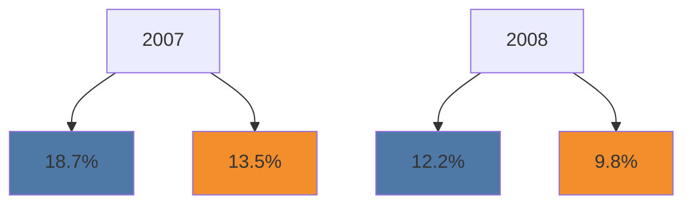
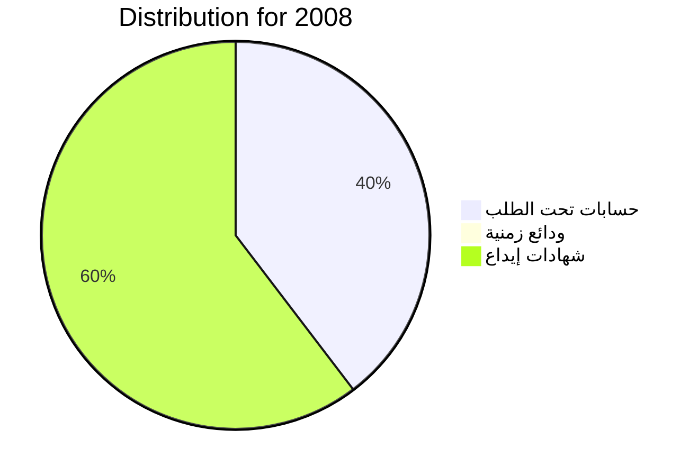
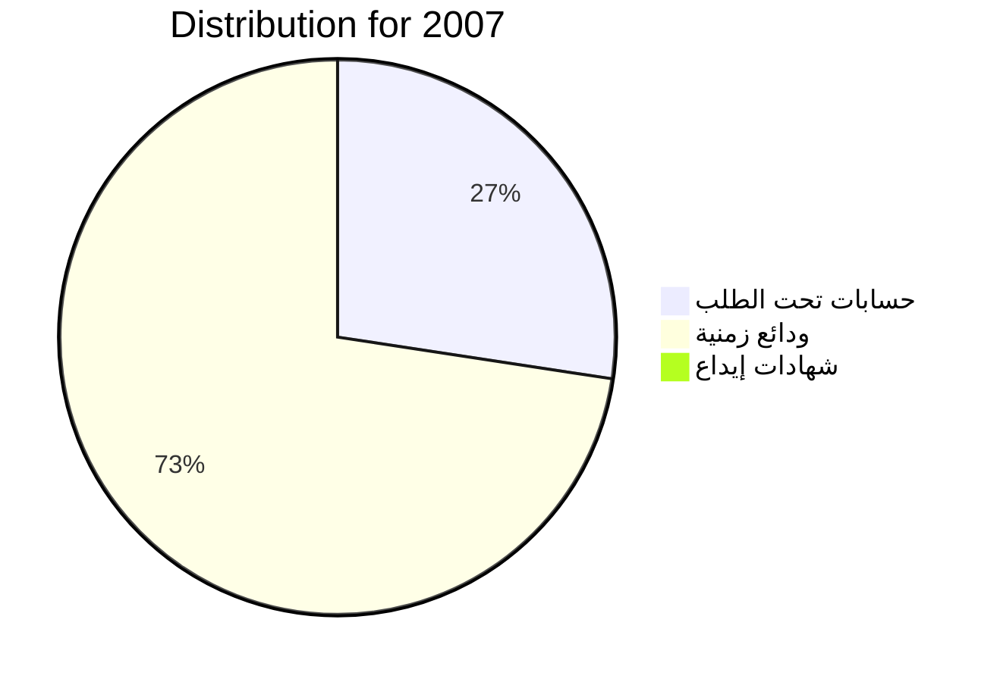
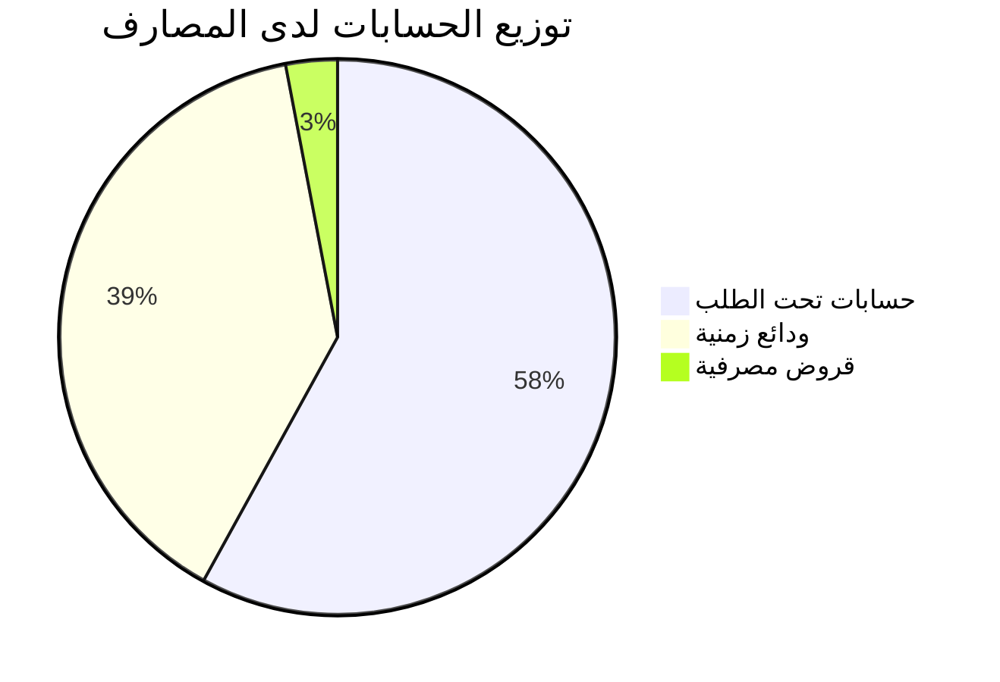
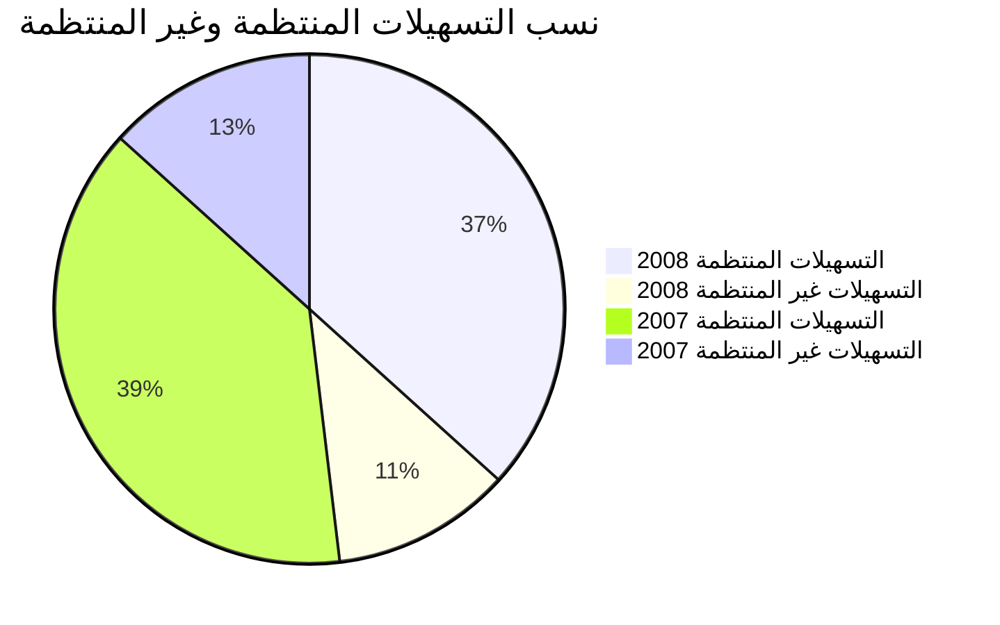
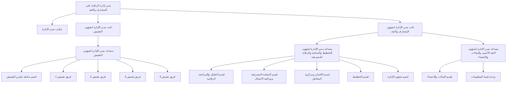

[A circular emblem with the Libyan flag colors and crescent moon]

مصرف ليبيا المركزي
إدارة الرقابة على المصارف والنقد

التقرير السنوي لإدارة الرقابة
على المصارف والنقد
1376 و.ر (2008 مسيحي)

مؤشرات السلامة المالية والاستقرار
في القطاع المصرفي الليبي

[Translation of the Arabic text:]

Central Bank of Libya
Department of Banking and Monetary Supervision

Annual Report of the Department of Banking and Monetary Supervision
1376 (2008 AD)

Indicators of Financial Safety and Stability
in the Libyan Banking Sector
---
حقوق الطبع و النشر محفوظة © 2009.

صدر هذا التقرير عن مصرف ليبيا المركزي، ويسمح الاقتباس من هذا التقرير، والرجوع إليه، شريطة ذكر المصدر.

توجه جميع المراسلات المتعلقة بهذا التقرير إلى مدير إدارة الرقابة على المصارف والنقد بمصرف ليبيا المركزي، على العنوان التالي:

ص. ب 1103
طرابلس - ليبيا
بريد مصور ( فاكس ) 214831642(218)++
بريد إلكتروني: supervision@cbl.gov.ly
الموقع إلكتروني: www.CBL.GOV.LY
---
التقرير السنوى لإدارة الرقابة على المصارف والنقد

1377 و.ر (2008 مسيحى)

((مؤشرات السلامة المالية والاستقرار فى القطاع المصرفى الليبى))
---
# فهــرس المحتويات

| الصفحة | العنــــــــوان |
|--------|----------------|
| 1 | تقــــــــديم |
| 3 | مقدمـــــــة |

## الفصل الأول
### هيكل القطاع المصرفي الليبي

| الصفحة | العنــــــــوان |
|--------|----------------|
| 5 | تمهيــــــــد |
| 6 | 1. المصارف التجارية |
| 6 | أ) تطور هيكل المصارف الليبية |
| 7 | ب) توزيع فروع ووكالات المصارف |
| 8 | 2. المصارف الأخرى |
| 8 | أ) المصرف الليبي الخارجي |
| 8 | ب) المصارف المتخصصة |
| 8 | ج) مكاتب تمثيل المصارف الأجنبية |

## الفصل الثاني
### الوضع المالي للقطاع المصرفي الليبي

| الصفحة | العنــــــــوان |
|--------|----------------|
| 9 | تمهيــــــــد |
| 9 | 1. تطور المركز المالي المجمع للمصارف التجارية |
| 11 | أ) مصادر أموال المصارف التجارية |
| 11 | • الخصوم الإيداعية |
| 12 | • الأموال الخاصة |
| 13 | ب) استخدامات أموال المصارف التجارية |
| 13 | • الجانب التمويلي |
| 13 | • الاستثمارات |
| 14 | ج) حسابات خارج الميزانية |
| 17 | 2. تـــرتيب المصــــارف |

التقرير السنوي لإدارة الرقابة على المصارف والنقد 2008 مسيحي
---
| الصفحة | العنــــــــوان |
|---------|-----------------|
| 17 | أ) الترتيب حسب الأصول داخل الميزانية |
| 17 | ب) ترتيب المصارف حسب الأصول التي تديرها |
| 17 | • حسب مجموعات المصارف |
| 17 | • حسب طبيعة الأصول |
| 18 | ج) ترتيب المصارف حسب الأموال الخاصة |
| 19 | 3.مؤشر تركز القطاع المصرفي Herfindahl – Hirschman index |

## الفصل الثالث
### رسملة القطاع المصرفي

| الصفحة | العنــــــــوان |
|---------|-----------------|
| 21 | تمهيــــــد |
| 21 | أ) النسب المتعلقة بالأموال الخاصة |
| 22 | • نسبة الأموال الخاصة إلى الأصول |
| 22 | • نسبة الخصوم الإيداعية إلى الأموال الخاصة |
| 23 | ب) نسبة الملاءة |

## الفصل الرابع
### نوعية أصول القطاع المصرفي

| الصفحة | العنــــــــوان |
|---------|-----------------|
| 26 | تمهيــــــد |
| 26 | 1.توزيع أصول القطاع المصرفي |
| 27 | 2.الأصول المتداولة |
| 27 | أ) التوظيفات والحسابات لدى مصرف ليبيا المركزي |
| 29 | ب) التوظيفات والحسابات لدى المصارف |
| 32 | 3.القروض والتسهيلات والسلفيات |
| 34 | أ) التسهيلات المباشرة |
| 34 | • توزيع التسهيلات المباشرة حسب القطاع |
| 35 | • جودة الأصول |
| 37 | • المخصصات مقابل الديون غير المنتظمة |

التقرير السنوي لإدارة الرقابة على المصارف والنقد 2008 مسيحي
---
| الصفحة | العنــــــــوان |
|---------|-------------------|
| 38 | ب)التسهيلات غير المباشرة |
| 40 | ج)هيكل المحفظة الائتمانية |
| 41 | د) التركز الائتماني |

## الفصل الخامس
### ربحية القطاع المصرفي

| الصفحة | العنــــــــوان |
|---------|-------------------|
| 43 | تمهيــــــد |
| 43 | 1. قائمة الدخل الملخصة المقارنة |
| 44 | 2. هيكل الإيرادات والمصروفات |
| 44 | أ) الدخل من الفوائد |
| 45 | ب) الدخل من غير الفوائد |
| 45 | • الإيرادات من غير الفوائد |
| 47 | • المصروفات من غير الفوائد |
| 47 | • نسب الربحية |
| 51 | 3.الكفاءة |

## الفصل السادس
### سيولة القطاع المصرفي

| الصفحة | العنــــــــوان |
|---------|-------------------|
| 52 | تمهيــــــد |
| 52 | 1.تحليل ودائع العملاء لدى القطاع المصرفي |
| 52 | أ) نمو الودائع حسب طبيعة الجهات المودعة |
| 53 | ب) نمو الودائع حسب أنواعها |
| 55 | 2.نسبة السيولة لدى القطاع المصرفي |
| 55 | أ) نسبة السيولة مقابل الالتزامات المباشرة |
| 56 | ب) نسبة السيولة مقابل الالتزامات المباشرة وغير المباشرة |
| 58 | ج) المؤشرات الاحترازية الرقابية (الاحتياطي الإلزامي والسيولة القانونية) |
| 60 | • المصارف التي عجزت عن الاحتفاظ بالاحتياطي الإلزامي المطلوب خلال سنة 2008م |

التقرير السنوي لإدارة الرقابة على المصارف والنقد 2008 مسيحي
---
| الصفحة | العنــــــــوان |
|---------|-----------------|
|         | الفصل السابع |
|         | الإطار العام للرقابة المصرفية في ليبيا، وجهود تطويرها |
|         | خلال الفترة 2002-2008 مسيحي |
| 61      | تمهيــــــــد |
| 62      | أولاً: أوجه الرقابة المصرفية وأساليبها |
| 62      | أ) أوجه الرقابة |
| 62      | 1. الرقابة الوقائية |
| 62      | 2. رقابة الأداء |
| 62      | 3. الرقابة التصحيحية |
| 63      | ب) أساليب الرقابة |
| 63      | 1. الرقابة الميدانية |
| 63      | 2. الرقابة المكتبية |
| 63      | ثانياً: جهود تطوير الرقابة المصرفية |
| 63      | أ) إصدار تعليمات ومعايير رقابية ( Regulations ) |
| 65      | ب) تطبيق إجراءات الرقابة المصرفية |
|         | الفصل الثامن |
|         | تطور التشريعات والإجراءات الرقابية |
| 66      | أولاً:- سلطة الإشراف والرقابة على القطاع المصرفي الليبي |
| 66      | ثانياً:- قانون المصارف الجديد |
|         | الملاحــق |
|         | ملحق رقم(1) |
| 74      | تطور هيكل القطاع المصرفي الليبي خلال الفترة 2005م- 2008م |
|         | ملحق رقم(2) |
| 76      | أهم القرارات المتخذة تنفيذاً للتشريعات الرقابية، والرقابة المصرفية، خلال سنة 2008م |

التقرير السنوي لإدارة الرقابة على المصارف والنقد 2008 مسيحي
---
| الصفحة | العنــــــــوان |
|---------|-----------------|
| 77 | ملحق رقم(3)<br>تطور المركز المالي المجمع للمصارف التجارية العامي 2007-2008م |
| 79 | ملحق رقم(4)<br>ترتيب المصارف حسب مجموع أصولها داخل الميزانية ................ |
| 80 | ملحق رقم(5)<br>ترتيب المصارف حسب إجمالي الأصول داخل وخارج الميزانية ......... |
| 81 | ملحق رقم(6)<br>ترتيب المصارف التجارية حسب مجموع أموالها الخاصة .............. |
| 82 | ملحق رقم(7)<br>قائمة الدخل المجمعة للمصارف التجارية خلال عامي 2007-2008م ... |
| 83 | ملحق رقم(8)<br>توزيع الفروع والوكالات المصرفية حسب مناطق الجماهيرية .......... |
| 84 | ملحق رقم(9)<br>تطور ميزانية المصرف الليبي الخارجي خلال عامي 2007 م- 2008م |
| 85 | ملحق رقم(10)<br>أهم البنود المالية بميزانيات المصارف المتخصصة خلال العام 2007م |
| 86 | ملحق رقم(11)<br>أهم البنود المالية بميزانيات المصارف المتخصصة خلال العام 2008م |
| 87 | ملحق رقم(12)<br>مكاتب تمثيل المصارف الأجنبية المرخص لها للعمل في ليبيا .............. |
| 88 | ملحق رقم(13)<br>المكاتب الهندسية وبيوت الخبرة المتخصصة في تقييم الأصول والعقارات<br>المسجلة لدى مصرف ليبيا المركزي .................................... |
| 89 | ملحق رقم(14)<br>مكاتب المحاسبة والمراجعة القانونية المسجلة لدى مصرف ليبيا المركزي |
| 93 | ملحق رقم(15)<br>بيان بأسعار الفائدة المدينة والدائنة .................................... |

التقرير السنوي لإدارة الرقابة على المصارف والنقد 2008 مسيحي
---
| الصفحة | العنــــــــوان |
|---------|-----------------|
|         | ملحق رقم (16) |
|         | المنشورات الصادرة عن إدارة الرقابة على المصارف والنقد من سنة 2005م إلى سنة 2008م |
| 95      | .................................................. |
|         | الجداول |
| 5       | المصارف العاملة في ليبيا خلال العام 2008م ........................... |
| 23      | تطور ملاءة رأس المال المصارف التجارية .............................. |
|         | نسبة الفائض في الاحتياطي الإلزامي والسيولة للمصارف التجارية خــلال |
| 58      | ............................................................. عام2008م |
|         | فــائض الاحتيــاطي الإلزامــي والســيولة المطلوبــة حســب المصــارف |
| 59      | ....................................................... في31/12/2008م |
| 60      | ................ المصارف التي عجزت عن الاحتفاظ بالاحتياطي الإلزامي |
|         | الأشكال البيانية |
|         | الشكل رقم (1) |
| 7       | ....................... توزيع الفروع والوكالات المصرفية حسب المناطق |
|         | الشكل رقم (2) |
|         | تطور أصول المصارف التجارية داخل وخارج الميزانية خلال سنتي |
| 9       | .................................. على أساس ربع سنوي 2007-2008م |
|         | الشكل رقم (3) |
|         | تطور أصول المصارف التجارية داخل وخارج الميزانية خلال عامي |
| 10      | ....................................... على أساس سنوي 2007-2008م |
|         | الشكل رقم (4) |
| 10      | ..................... توزيع الزيادة في مصادر الأموال خلال سنة 2008م |
|         | الشكل رقم (5) |
| 11      | ....... توزيع الزيادة في استخدامات الأموال خلال عامي 2007-2008م |
|         | الشكل رقم (6) |
|         | تطور الخصوم الإيداعية للمصارف التجارية خلال عامي 2007- 2008 |
| 11      | .................................................. على أساس ربع سنوي |

التقرير السنوي لإدارة الرقابة على المصارف والنقد 2008 مسيحي
---
| الصفحة | العنــــــــوان |
|---------|-----------------|
| 12 | الشكل رقم (7)<br>تطور الخصوم الإيداعية للمصارف التجارية خلال عامي 2007-2008م<br>على أساس سنوي |
| 14 | الشكل رقم (8)<br>تطور استخدامات الأموال خلال عامي 2007-2008م |
| 14 | الشكل رقم (9)<br>تطور الحسابات خارج الميزانية خلال عامي 2007-2008م على أساس<br>سنوي |
| 15 | الشكل رقم (10)<br>تطور الحسابات خارج الميزانية خلال عامي 2007-2008م على أساس<br>ربع سنوي |
| 16 | الشكل رقم (11)<br>تطور نسبة الحسابات خارج الميزانية إلى الحسابات داخل الميزانية |
| 16 | الشكل رقم (12)<br>تطور نسبة الأصول خارج الميزانية إلى الأصول داخل الميزانية |
| 18 | الشكل رقم (13)<br>توزيع المصارف التجارية حسب ملكية المصارف |
| 19 | الشكل رقم (14)<br>تركز القطاع المصرفي الليبي |
| 21 | الشكل رقم (15)<br>نسبة الأموال الخاصة إلى الأصول على أساس ربع سنوي |
| 22 | الشكل رقم (16)<br>تطور نسبة الأموال الخاصة إلى الأصول خــلال عامــي 2007-2008م<br>على أساس سنوي |
| 23 | الشكل رقم (17)<br>ملاءة رؤوس أموال المصارف التجارية المعلنة والمصرح بها على أســاس<br>سنوي |

التقرير السنوي لإدارة الرقابة على المصارف والنقد 2008 مسيحي
---
| الصفحة | العنــــــــوان |
|---------|-----------------|
| 24 | الشكل رقم (18) <br> توزيع المصارف التجارية حسب ملاءة رؤوس أموالها |
| | الشكل رقم (19) <br> تطور ملاءة رؤوس أموال المصارف التجارية خلال عامــي 2007-2008 |
| 25 | على أساس ربع سنوي |
| | الشكل رقم (20) |
| 26 | توزيع أصول المصارف التجارية |
| | الشكل رقم (21) |
| 28 | توزيع التوظيفات لدى مصرف ليبيا المركزي على أساس ربع سنوي |
| | الشكل رقم (22) |
| 28 | توزيع التوظيفات والحسابات لدى مصرف ليبيا المركزي على أساس سنوي |
| | الشكل رقم (23) |
| | توزيع الحسابات لدى المصارف حسب طبيعة الحسابات على أســـاس ربــع |
| 29 | سنوي |
| | الشكل رقم (24) |
| | توزيع الحسابات لدى المصارف حسب طبيعة الحســـابات علـــى أســـاس |
| 30 | سنوي |
| | الشكل رقم (25) |
| | توزيع الحسابات لدى المصارف حسب طبيعة المصارف على أساس ربع |
| 31 | سنوي |
| | الشكل رقم (26) |
| | توزيع الحسابات لدى المصارف حسب طبيعة المصـــارف علـــى أســـاس |
| 31 | سنوي |
| | الشكل رقم (27) |
| | تطور إجمالي التسهيلات المُباشرة وغير المباشرة على أساس سنوي |
| 32 | |
| | الشكل رقم (28) |
| | تطـــور التسهيـــلات المُباشـــرة وغيـــر المباشـــرة علـــى أســـاس ربـــع |
| 33 | سنوي |

التقرير السنوي لإدارة الرقابة على المصارف والنقد 2008 مسيحي
---
| الصفحة | العنــــــــوان |
|---------|-----------------|
| 33 | الشكل رقم (29)<br>نسبة التسهيلات غير المباشرة إلى التسهيلات المباشرة |
| 34 | الشكل رقم (30)<br>نسبة التسهيلات المباشرة إلى الخصوم الإيداعية |
| 35 | الشكل رقم (31)<br>نمو التسهيلات المباشرة وتوزيعها حسب القطاعات |
| 35 | الشكل رقم (32)<br>تطور الديون المنتظمة وغير المنتظمة |
| 36 | الشكل رقم (33)<br>نسب التسهيلات المنتظمة وغير المنتظمة |
| 37 | الشكل رقم (34)<br>تطور نسبة صافي التسهيلات غير المنتظمة إلى الأموال الخاصة |
| 38 | الشكل رقم (35)<br>تطور نسبة المخصصات مقابل التسهيلات غير المنتظمة |
| 38 | الشكل رقم (36)<br>تطور التسهيلات غير المباشرة |
| 39 | الشكل رقم (37)<br>نسب توزيع التسهيلات غير المباشرة |
| 40 | الشكل رقم (38)<br>تطور نسب التأمينات غير النقدية مقابل التسهيلات غير المباشرة |
| 40 | الشكل رقم (39)<br>توزيع المحفظة الائتمانية |
| 42 | الشكل رقم (40)<br>نسبة الأموال الخاصة إلى القروض والتسهيلات داخل وخارج الميزانية |
| 43 | الشكل رقم (41)<br>ربحية المصارف من الفوائد وغير الفوائد |
| 44 | الشكل رقم (42)<br>النمو في أنواع الإيرادات من الفوائد |

التقرير السنوي لإدارة الرقابة على المصارف والنقد 2008 مسيحي
---
| الصفحة | العنــــــوان |
|---------|-------------|
| 45 | الشكل رقم (43)<br>توزيع الدخل من الفوائد |
| 46 | الشكل رقم (44)<br>تطور الإيرادات من غير الفوائد |
| 46 | الشكل رقم (45)<br>توزيع الإيرادات من غير الفوائد |
| 47 | الشكل رقم (46)<br>توزيع المصروفات من غير الفوائد |
| 48 | الشكل رقم (47)<br>نسبة العائد ( قبل الضريبة ) إلى متوسط الأصول |
| 48 | الشكل رقم (48)<br>نسبة العائد ( قبل الضريبة ) إلى متوسط حقوق المساهمين |
| 49 | الشكل رقم (49)<br>تطور نسبة المصروفات إلى الإيرادات |
| 49 | الشكل رقم (50)<br>معدلات الربحية من الفوائد |
| 50 | الشكل رقم (51)<br>تطور نسبة الإيرادات من غير الفوائد إلى متوسط الأصول |
| 50 | الشكل رقم (52)<br>تطور نسبة المصروفات من غير الفوائد إلى متوسط الأصول |
| 51 | الشكل رقم (53)<br>نسبة المصروفات إلى الإيرادات |
| 52 | الشكل رقم (54)<br>نسبة نمو ودائع القطاعين العام والخاص خلال عامي 2007-2008م |
| 53 | الشكل رقم (55)<br>توزيع ودائع المصارف التجارية حسب القطاع |
| 54 | الشكل رقم (56)<br>تطور ودائع المصارف التجارية حسب نوع الودائع |

التقرير السنوي لإدارة الرقابة على المصارف والنقد 2008 مسيحي
---
| الصفحة | العنــــوان |
|---------|------------|
| 54 | الشكل رقم (57)<br>توزيع ودائع المصارف التجارية حسب نوع الودائع |
| 55 | الشكل رقم (58)<br>تطور صافي الأموال السائلة والالتزامات المباشرة |
| 56 | الشكل رقم (59)<br>تطور نسبة السيولة مقابل الالتزامات المباشرة |
| 57 | الشكل رقم (60)<br>تطور الأموال السائلة والالتزامات المباشرة وغير المباشرة |
| 57 | الشكل رقم (61)<br>تطور نسب السيولة مقابل الالتزامات المباشرة وغير المباشرة |
| 61 | الشكل رقم (62)<br>الهيكل التنظيمي لإدارة الرقابة على المصارف والنقد |

التقرير السنوي لإدارة الرقابة على المصارف والنقد 2008 مسيحي
---
# تقديم

يتولى مصرف ليبيا المركزي عملية تطوير القطاع المصرفي الليبي ، في إطار السياسات الرامية إلى إعادة هيكلة الاقتصاد الليبي ، وبناء قطاع مصرفي رائد ، قادر على التعامل مع المتغيرات والمعايير الدولية ، على النحو الذي يؤدي إلى الاستخدام الأفضل للموارد الاقتصادية.

وفي إطار اضطلاع مصرف ليبيا المركزي بمهامه في الرقابة والإشراف على القطاع المصرفي ، التي حددها القانون رقم (1) لسنة 1373 ر. (2005م) بشأن المصارف، شرع المصرف في تنفيذ خطته الإستراتيجية الشاملة، الرامية إلى النهوض بالقطاع المصرفي الليبي في مختلف المجالات، ورسم السياسة النقدية، الهادفة إلى تحقيق الاستقرار الاقتصادي والمالي ، واتخاذ الإجراءات اللازمة لوضعها موضع التنفيذ، فضلاً عن ممارسة المصرف دوره في الإشراف على القطاع المصرفي ، بما يواكب التطورات والمستجدات في مجال الرقابة المصرفية ، على الصعيدين المحلي والدولي ، وبما يساهم في تعزيز وترسيخ دعائم الاستقرار النقدي ، ويدعم متانة الأوضاع المالية للقطاع المصرفي الليبي .

وإدراكا من مصرف ليبيا المركزي لأهمية بناء قطاع مصرفي ، يتصف بالسلامة المالية ، ويكون قادراً على تجاوز آثار الأزمة المالية العالمية ، وتفادي تداعياتها على المؤسسات المصرفية ، عمل المصرف على تعزيز دور الرقابة المصرفية ، وحشد الإمكانيات اللازمة والمالية الدولية ، لممارستها .

وفي هذا الإطار ، يسرنا أن نُقدم التقرير السنوي الأول ، الذي تصدره إدارة الرقابة على المصارف والنقد ، بمصرف ليبيا المركزي ، والذي يسلط الضوء على أوضاع المصارف الليبية ، ويُبين مؤشرات السلامة المالية والاستقرار في القطاع المصرفي الليبي . ويعكس معدلات أداء المصارف ، ويبرز أهم مؤشراتها ، في خطوة للتعريف بهذا القطاع ، وبيان الجهود المبذولة في مراقبته والإشراف عليه ، ويلخص ملامح التطور الذي شهدته البيانات المالية للمصارف ومؤشراتها الاحترازية ، وما يتمتع به القطاع المصرفي من سيولة وربحية وملاءة ، خلال الفترة التي يغطيها التقرير ( 2007-2008م ) .

كما يستعرض هذا التقرير التشريعات المستحدثة في مجال تنظيم القطاع المصرفي ، وما صدر عن مصرف ليبيا المركزي من قرارات ومنشورات وتعليمات في الخصوص ، اضطلاعا بدوره الإشرافي والرقابي على عمل المصارف في الجماهيرية العظمى ، ومواكبة للتطور الحاصل على

1 التقرير السنوي لإدارة الرقابة على المصارف والنقد 2008 مسيحي
---
صعيد أنشطة المصارف التجارية وعملياتها ، وتماشياً مع التطور في المعايير الدولية ، وأفضل الممارسات المطبقة ، وفي مقدمتها معايير لجنة بازل للرقابة المصرفية .

وأنتهز هذه المناسبة لأحيي العاملين بإدارة الرقابة على المصارف والنقد ، وأشكرهم على جهودهم المبذولة في سبيل الارتقاء بمهامهم ، تحقيقاً لأهداف مصرف ليبيا المركزي وأغراضه ، وأخص بالشكر الفريق الذي تولى إعداد هذا التقرير ، وأنجز هذا العمل المتميز ، متمنياً لهم جميعاً دوام التوفيق والتقدم .

والله ولي التوفيق

فرحات عمر بن قدارة

المحــــافظ

التقرير السنوي لإدارة الرقابة على المصارف والنقد 2008 مسيحي | 2
---
# مقدمة

تعمل المصارف المركزية ، وسلطات الإشراف والرقابة على المصارف والمؤسسات المالية ، في مختلف دول العالم، على تخفيض حجم المخاطر التي يتعرض لها العمل المصرفي، المرتبطة عادة بطبيعة مصادر واستخدامات الأموال التي تديرها المصارف، فضلاً عن المخاطر المتعلقة بإدارة العمل المصرفي وبيئته، بالإضافة إلى المتغيرات الدولية ، وما ينجم عنها من آثار ، تتجاوز في كثير من الأحيان حدود الدولة الواحدة .

ويمارس مصرف ليبيا المركزي دوره في الإشراف والرقابة على القطاع المصرفي الليبي ، من خلال إدارة الرقابة على المصارف والنقد ، تنفيذاً لأحكام القانون رقم (1) لسنة 1373 و. (2005م) بشأن المصارف. وقد شهدت جهود الرقابة المصرفية في ليبيا تطوراً ملحوظاً منذ صدور هذا القانون، حيث شملت عدد المصارف، وهياكل رؤوس أموالها؛ فقد أصدر مصرف ليبيا المركزي عدداً من القرارات، استهدف من خلالها تنظيم مختلف نشاطات المصارف، وضمان سلامتها، وتوافقها مع المعايير التي تحكم العمل المصرفي، وتحفظ أموال المودعين وحقوق المساهمين.

ويعكس التقرير السنوي الأول لإدارة الرقابة على المصارف والنقد ( 2008 مسيحي ) أوضاع القطاع المصرفي الليبي، وتطور هيكله، والبيانات المجمعة للمصارف، ومؤشرات ملاءة رأس المال والسلامة المالية، بالمصارف التجارية العاملة في ليبيا. كما يستعرض المؤشرات الاحترازية للرقابة، الجاري إعمالها على المصارف الخاضعة لإشراف مصرف ليبيا المركزي ورقابته.

ويقع هذا التقرير في ثمانية فصول، بالإضافة إلى ستة عشر ملحقاً إحصائياً ، حيث يتناول الفصل الأول من التقرير هيكل القطاع المصرفي الليبي، ويعرض الفصل الثاني، الوضع المالي للقطاع المصرفي وأهم التطورات التي طرأت على المركز المالي المجمع للمصارف وترتيب المصارف، ومؤشر التركز في القطاع المصرفي. ويبحث الفصل الثالث سيولة القطاع المصرفي والنسب المتعلقة بالأموال الخاصة وملاءة رؤوس أموال المصارف. ويستعرض الفصل الرابع نوعية أصول القطاع المصرفي ، وهيكل المحفظة الائتمانية وما يعرف بالمخاطر الكبيرة .

ويتعلق الفصل الخامس من التقرير، بربحية القطاع المصرفي من خلال قائمة الدخل الملخصة المقارنة للقطاع ومؤشر الكفاءة به. أما الفصل السادس فهو مخصص لاستعراض سيولة القطاع المصرفي، ويتناول الفصل السابع الإطار العام للرقابة المصرفية، والمؤشرات الاحترازية الرقابية وكيفية متابعتها. وجهود تطوير الرقابة على المصارف في ليبيا خلال الفترة 2002-2008 مسيحي، والأساليب المطبقة في ذلك. ويستعرض الفصل الثامن أهم التشريعات الرقابية وفقاً لأحكام قانون المصارف والرقابة والإشراف على المصارف واللوائح والقرارات الصادرة بمقتضاه.

التقرير السنوي لإدارة الرقابة على المصارف والنقد 2008 مسيحي 3
---
ويأتي هذا التقرير السنوي الأول ، في إطار تحليل أوضاع المصارف في الجماهيرية وتقييمها،
للوقوف على مدى توافقها مع معايير وأساليب عمل الصناعة المصرفية، ومدى التزامها بالتشريعات النافذة،
وآفاق تبني وتطبيق المعايير الجديدة لملاءة رأس المال وفقاً لبازل (2)، وسعياً إلى تعزيز الثقة في القطاع
المصرفي الليبي، بصفة خاصة، والقطاع المالي على وجه العموم.

وبالنسبة للمصارف التجارية، فإن هذا التقرير، فضلاً عن كونه يعكس مؤشرات السلامة المالية
والاستقرار بالقطاع المصرفي، بصفة عامة، يعتبر مكملاً للتقارير الرقابية السنوية التي تعدها إدارة الرقابة
على المصارف والنقد، عن كل مصرف من المصارف العاملة، وتنصب على تحليل المراكز المالية لهذه
المصارف وفقاً لأسلوب تحليل ( CAMELS ) وتنتهي إلى وضع ملاحظات ومطالب تحدد لكل مصرف على
حدة ، وتتم إحالة هذه التقارير إلى المصارف للرد على الملاحظات الواردة بها، ووضع إستراتيجية وبرنامج
عمل لتصحيح أوضاع المصرف، وبما يكفل امتثاله لكافة الضوابط والتعليمات الصادرة من مصرف ليبيا
المركزي والتشريعات النافذة، وتوفير نظم داخلية لتقدير ملاءة رأسماله، التي تؤسس على تقييم المخاطر
التي يعمل في ظلها.

نأمل أن يساهم هذا التقرير في تسليط الضوء على مؤشرات السلامة المالية والاستقرار بالقطاع
المصرفي الليبي والتعريف بها، وأن يعزز الثقة في القطاع المصرفي، ويساعد في رسم الاستراتيجيات
والتوجهات التي يعمل مصرف ليبيا المركزي على تنفيذها، من أجل النهوض بالقطاع المصرفي الليبي ،
وضمان سلامته والرفع من قدراته التنافسية، وكفالة التزامه بمعايير الرقابة المصرفية، وفقاً لمقررات لجنة
بازل، وأفضل الممارسات دولياً.

والله الموفق لما فيه الخير

د. محمد عبدالجليل أبوسنينة
مدير إدارة الرقابة على المصارف والنقد

التقرير السنوي لإدارة الرقابة على المصارف والنقد 2008 مسيحي | 4
---
# الفصل الأول
## هيكل القطاع المصرفي في ليبيا

### تمهيد:

يتكون القطاع المصرفي في ليبيا من مصرف ليبيا المركزي، الذي يمثل السلطة النقدية إلى الإضافة بالمصارف التجارية العامة، وعدد من المصارف، والمسؤول عن الإشراف والرقابة على المصارف، وعدد من المصارف التجارية الخاصة ومصارف ذات ملكية مختلطة، ومصارف متخصصة، والمصرف الليبي الخارجي، فضلاً عن عدد من المصارف التجارية التي يساهم في رؤوس أموالها.

يوضح الجدول رقم (1) عدد المصارف ومكاتب تمثيل للمصارف الأجنبية وعدد من مكاتب شريك أجنبي، والبالغ عددها (21) مصرفاً بما في ذلك المصرف الليبي الخارجي وعدد (22) مكتب تمثيل مصارف.

### الجدول رقم (1)
#### المصارف العاملة في ليبيا ( م 2008 )

| ملاحظات | العدد | طبيعة المصرف |
|----------|------|---------------|
|          | 2    | مصرف تجاري عام |
|          | 9    | مصرف تجاري خاص |
|          | 2    | مصرف تجاري مختلط |
|          | 2    | مصرف تجاري خاص مع شريك استراتيجي أجنبي |
| المصرف الليبي القطري لم يباشر نشاطه | 2    | * مصارف تساهم فيها مصارف ومؤسسات مالية أجنبية |
| المصرف الليبي الخارجي | 1    | مصارف ليبية ( أوفشور ) |
|          | 4    | مصارف متخصصة |
|          | 22   | مكاتب تمثيل المصارف الأجنبية |

(*) مصرف الخليج الليبي الأول والمصرف الليبي القطري

التقرير السنوي لإدارة الرقابة على المصارف والنقد 2008 مسيحي

5
---
ويوضح الملحق رقم(1) كيفية تطور هيكلة المصارف التجارية العاملة في الجماهيرية منذ عـام 2005م، حيث كان عددها (57) مصرفاً إلى أن أصبح عددها(16) مصرفاً في نهاية سنة 2008م.

## 1 - المصارف التجارية

### أ- تطور هيكل المصارف الليبية:-

شهد عدد المصارف التجارية وهيكل رأسمالها تطوراً كبير خـلال العقـد الأول من هذا القرن، حيث صدر القانون رقم (1) لسـنة 1373 و.ر 2005 ف بشـأن المصـارف الذي ألغى القانون رقم (1) لسنة 1993م بشـأن المصارف والنقد والائتمان، مما أحدث تطوراً نوعياً في عدد المصارف التجاريـة وفـي هيكل رؤوس أموالها، وزاد عدد المصارف التجاريـة الخاصـة التـي تعمـل كشركات مساهمة ليبية بجانب مجموعة المصارف التجاريـة العامـة. وكـان لصدور القانون رقم (1) لسنة 2005 ف بشأن المصارف، تأثير كبيـر علـى رؤوس أموال المصارف، حيث اشترطت المادة (67) منـه، أن لا يقـل رأس المال المدفوع لأي مصرف تجاري عن مبلغ عشرة ملايين دينار، وبالتالي صار الحد الأدنى لرأس المال المكتتب فيه لأي مصـرف مبلـغ (33.33) مليـون دينار.

كما أجاز القانون لمصرف ليبيا المركزي الإذن بتأسيس مصارف بـرأس مال أجنبي، والإذن للمصارف الأجنبية بالمساهمة في مصارف محلية، أو فتـح فروع أو مكاتب تمثيل لها داخل الجماهيرية وفقاً للشـروط والأوضـاع التـي يحددها مصرف ليبيا المركزي، وقد أدى ذلك إلى إعادة هيكلة القطاع المصرفي في ليبيا، الذي كان يتكون، بشكل أساسي، من مصارف مملوكة من القطاع العام ومصارف أهلية ذات رأسمال محدود.

وقد تمثلت أهم هذه التطورات في الآتي :-

1. تحويـل عدد(6) مصارف أهلية إلى مصارف تجارية خاصـة (مصـرف بنغازي الأهلي- مصرف طرابلس الأهلي- مصرف حي الأندلس الأهلي- مصرف النقاط الخمس الأهلي - مصرف العجيلات الأهلي- مصرف سهل جفارة الأهلي) تعمل وفق متطلبات القانون رقـم (1) لسـنة 2005

2. دمج عدد(40) مصرفاً أهلياً فـي المؤسسـة المصرفية الأهلية، وأصبحت هذه المصارف فروعاً لها.

3. بيع حصص في مصارف تجارية إلى شركاء إستراتيجيين أجانب.

| صدور القانون رقم (1) لسنة 1373 و.ر (2005) ف بشأن المصارف |
|-----------------------------------------------------------|

| زيـــادة الحــد الأدنى مـن رأس المـال المدفـوع للمصــرف التجـاري إلـى 10.0 مليــون دينار. |
|----------------------------------------------------------------------------------|

| إعادة هيكلة المصارف الأهلية |
|----------------------------|

| إعادة هيكلة المصارف التجارية |
|-----------------------------|

التقرير السنوي لإدارة الرقابة على المصارف والنقد 2008 مسيحي 6
---
3- دمج بعض المصارف العامة.

4- الإذن للمصارف التجارية الخاصة بإدخال شركاء استراتيجيين أجانب
لتأسيس مصارف جديدة ذات ملكية مشتركة مع جهات ليبية.

ب - توزيع فروع ووكالات المصارف:-

بلغ عدد فروع ووكالات المصارف العاملة بالجماهيرية العظمى (455)
فرعا ووكالة ويبين الشكل البياني التالي توزيع فروع ووكالات المصارف
بحسب المناطق الجغرافية في الجماهيرية، حيث يلاحظ تركز الفروع والوكالات
المصرفية في المنطقة الغربية بنسبة (55%) وفي المنطقة الشرقية بنسبة
.(27%)

الشكل رقم (1)
توزيع الفروع والوكالات المصرفية حسب المناطق الجغرافية

| المنطقة | النسبة |
|---------|--------|
| الغربية ج | 55% |
| الشرقية ج | 27% |
| الجنوبية ج | 9% |
| الوسطى ج | 9% |

تتركز معظم
فروع
ووكالات
المصارف
التجارية في
المنطقة
الغربية من
الجماهيرية.

أما فيما يتعلق بتوزيع عدد الفروع والوكالات حسب المصارف العاملة
بالجماهيرية، فيلاحظ أن مصرف الجمهورية له أكبر عدد من الفروع تصل
نسبتها إلى 34% من إجمالي عدد الفروع والوكالات بالقطاع المصرفي، يليه

التقرير السنوي لإدارة الرقابة على المصارف والنقد 2008 مسيحي 7
---
مصرف الوحدة بنسبة 16%. والملحق رقم(8) يبين توزيع الفروع والوكـــالات
حسب المصارف.

## 2- المصارف الأخرى

### أ- المصرف الليبي الخارجي:

أسس المصرف الليبي الخارجي بموجب القانون رقم (18) لسنة 1972م ويمارس هذا المصرف
نشاطه أصلاً كمصرف offshore يقدم خدماته للمؤسسات والشركات ويعتبر من المصـــارف التــي
تركز على خدمات الجملة (wholesale bank)، وللمصرف الليبي الخارجي عدد مـــن المساهمـــات
المنتشرة في مختلف دول العالم حيث يبلغ رأس مال المصـــرف حتـــى 2008/12/31 م 1.0 مليـــار
دولار، والملحق رقم(9) يبيّن تطور ميزانية المصرف الليبي الخارجي خلال عامي 2007 م-2008م.
وقد شهد نشاط المصرف الليبي الخارجي تطوراً ملحوظاً في السنوات الأخيرة، حيـــث صـــار
يتطلع لتقديم بعض الخدمات للشركات المحلية والأجنبية العاملة داخل الجماهيرية، ويسعى لتبني وتنفيذ
إستراتيجية جديدة للنهوض بالمصرف.

### ب - المصارف المتخصصة :-

يوجد في الجماهيرية العظمى أربعة مصارف متخصصة (المصرف الزراعي- مصرف التنمية
- مصرف الادخار العقاري- المصرف الريفي)، تتولى تمويل المشروعات الصناعية والتنموية،
والمشروعات الزراعية، والاستثمار العقاري والإسكان، بالإضافة إلى القروض التي يمنحها المصرف
الريفي لتمويل النشاطات الفردية والأسرية المحدودة. ويبين الملحقين رقم(10) و(11) تطور ميزانيات
المصارف المتخصصة خلال العامين 2007 م- 2008 م.

### ج- مكاتب تمثيل المصارف الأجنبية:-

أصدر مصرف ليبيا المركزي القرار رقم ( 2005/42) بشأن تنظيم آلية تأسيس مكاتب تمثيــل
المصارف الأجنبية ووضع الشروط والضوابط المنظمة لنشاطاتها، ويوجــد بالجماهيريــة العظمــى
عدد(22) مكتب تمثيل للمصارف الأجنبية، تفاصيلها على النحو المبين بالملحق رقــم (12) مــن هــذا
التقرير.

8 التقرير السنوي لإدارة الرقابة على المصارف والنقد 2008 مسيحي
---
# الفصل الثاني
## الوضع المالي للقطاع المصرفي الليبي

### تمهيد:

يستعرض هذا الفصل البيانات المالية، والمعلومات ذات العلاقة بالمخاطر المرتبطة بالنشاط المصرفي وفقاً للبيانات الواردة من المصارف التجارية، خلال عام 2008م، بالمقارنة ببيانات عام 2007م.

### 1. تطور المركز المالي المجمع للمصارف التجارية:-

تمكّن القطاع المصرفي من تنمية حجم الأصول (داخل وخارج الميزانية) التي يديرها خلال عامي 2007-2008م، فقد ارتفع حجم الأصول في الربع الأول من سنة 2008م، إلى 40.6 مليار دينار، وبنسبة زيادة تقدر بـ 56% وبالمقارنة بالربع الأول من سنة 2007م، حيث بلغ حجم الأصول 26.0 مليار دينار، وبمقارنة حجم الأصول في الربع الأخير من عام 2007م بحجم الأصول في الربع الأخير من عام 2008م، نجد أنها زادت من 38.1 مليار دينار، إلى 71.4 مليار دينار، وبنسبة نمو تقدر بـ 87%، وبلغ مجموع أصول القطاع المصرفي (داخل الميزانية) 48.3 مليار دينار، وبارتفاع قدره 19.1 مليار دينار في 2008/12/31م مقابل 29.2 مليار دينار في 2007/12/31م، وبنسبة نمو بلغت 65%، وذلك على النحو المبين بالشكل رقم (2).

الشكل رقم (2)

| الربع | 2007 |  | 2008 |  |
|-------|------|-----|------|-----|
|       | القيمة | نسبة النمو | القيمة | نسبة النمو |
| الربع الأول | 26.0 | 7.6% | 40.6 | 6.5% |
| الربع الثاني | 28.0 | 15.7% | 56.1 | 38.1% |
| الربع الثالث | 32.4 | 17.5% | 59.8 | 6.5% |
| الربع الرابع | 38.1 | - | 71.4 | 19.3% |

التقرير السنوي لإدارة الرقابة على المصارف والنقد 2008 مسيحي

9
---
(الشكل رقم 3)
تطور أصول المصارف التجارية داخل وخارج الميزانية
خلال سنتي 2007م- 2008م

المبالغ بملايين الدنانير

| 2007 | 2008 |
|-------|-------|
| أصول داخل الميزانية: 29,209.0 | أصول داخل الميزانية: 48,347.0 |
| أصول خارج الميزانية: 8,952.0 | أصول خارج الميزانية: 23,098.0 |

وكان العامل الرئيسي وراء هذا النمو هو التحسن الذي طرأ على مصادر أموال المصارف،
حيث تمت الخصوم الإيداعية للمصارف التجارية بنسبة 68.9%.

ويستعرض الشكل البياني رقم (4) والشكل البياني رقم (5) كيفية توزيع الزيادة في مصادر
أموال المصارف التجارية واستخداماتها، والبالغة 19.1 مليار دينار، على مجمل الحسابات خلال عام
2008م.

(الشكل رقم 4)
توزيع الزيادة في مصادر الأموال خلال سنة 2008م

| القطاع | النسبة |
|--------|--------|
| ودائع القطاع العام | 39% |
| ودائع القطاع الخاص | 29% |
| التأمينات النقدية | 19% |
| خصوم أخرى | 10% |
| الأموال الخاصة | 3% |

التقرير السنوي لإدارة الرقابة على المصارف والنقد 2008 مسيحي 10
---
# الشكل رقم (5)
## توزيع الزيادة في استخدامات الأموال خلال سنة 2008م

| القطاع | النسبة |
|--------|--------|
| مصرف ليبيا | 76% |
| مصارف خارجية | 5% |
| التسهيلات | 13% |
| أصول أخرى | 6% |

## أ- مصادر أموال المصارف التجارية:-

### • الخصوم الإيداعية:-

ارتفعت الخصوم الإيداعية للمصارف التجارية من 19.1 مليار دينار، خلال الربع الأول من سنة 2007 م إلى 26.8 مليار دينار، خلال الربع الرابع من نفس السنة، واستمرت الخصوم الإيداعية في النمو خلال سنة 2008 م، حيث زادت من 26.8 مليار دينار في الربع الأول من سنة 2008 م، لتصل إلى أعلى قيمة لها في نهاية الربع الثالث من عام 2008 م، حيث بلغت 47.5 مليار دينار، تم أصبحت 45.2 مليار دينار، في الربع الأخير من عام 2008 م، بنسبة نمو تقدر بـ 68.6% بالمقارنة بالربع الأخير من عام 2007م.

# الشكل رقم (6)
## تطور الخصوم الإيداعية للمصارف التجارية خلال سنتي 2007 م - 2008 م

| الربع | 2007 |  | 2008 |  |
|-------|------|-----|------|-----|
|       | القيمة | نسبة النمو | القيمة | نسبة النمو |
| الربع الأول | 19.1 | - | 26.8 | - |
| الربع الثاني | 20.1 | - | 37.3 | - |
| الربع الثالث | 22.9 | - | 47.5 | - |
| الربع الرابع | 26.8 | - | 45.2 | 0.5 |

التقرير السنوي لإدارة الرقابة على المصارف والنقد 2008 مسيحي 11
---
وقد تركز هذا النمو في البنود التالية:-

- ودائع القطاع العام التي نمت بنسبة 65%، ويرجع ذلك إلى قيام مصرف ليبيا المركزي بإقفال حسابات الجهات العامة لديه، مما ساهم في ارتفاع حسابات القطاع العام لدى المصارف التجارية ، وكان أهم ارتفاع قد شهده الربع الثالث خلال سنة 2008 م.

- ودائع القطاع الخاص التي نمت بنسبة 65% أيضاً خلال العامين 2007 م- 2008 م.

- نمو التأمينات النقدية بنسبة 126%، نتيجة الارتفاع الكبير في حسابات خارج الميزانية وعلى النحو الذي سيتم الإشارة إليه فيما بعد.

## الشكل رقم (7)
### تطور أهم بنود الخصوم والإيداعات للمصارف التجارية خلال سنتي 2007 م- 2008 م

| البيان بملايين الدنانير | ودائع القطاع العام | ودائع القطاع الخاص | التأمينات النقدية |
|-------------------------|---------------------|---------------------|-------------------|
| 2007                    | 11,561.0            | 8,480.3             | 2,923.5           |
| 2008                    | 19,027.5            | 14,003.6            | 6,613.7           |

• الأموال الخاصة:-

ارتفعت أموال المصارف التجارية الخاصة من 1.3 مليار دينار في 2007م إلى 1.8 مليار دينار في عام 2008 م، وبنسبة ارتفاع قدرها 37%، وكان ذلك نتيجة لتحقيق المصارف التجارية لأرباح نتج عنها زيادة الاحتياطيات القانونية وغير المخصصة.

التقرير السنوي لإدارة الرقابة على المصارف والنقد 2008 مسيحي 12
---
## ب - استخدامات أموال المصارف التجارية:-

لازالت المصارف الليبية تعتمد في استخدام أصولها، بشكل أساسي، على مصرف ليبيا المركزي، حيث شكلت الأصول المستثمرة لديه حوالي 67.8% من مجموع أصولها، وفيما يلي أهم الأصول التي سجلت ارتفاعاً مهماً خلال العامين 2007 م - 2008 م:-

### • الجانب التمويلي ( القروض والتسهيلات )

تطور الجانب التمويلي في أصول المصارف التجارية، حيث ارتفعت القروض والتسهيلات الممنوحة من 8.1 مليار دينار سنة 2007م إلى 10.5 مليار دينار سنة 2008م، وبنسبة نمو بلغت 29.6%، وقد تركز هذا الارتفاع في القروض والتسهيلات الممنوحة للقطاع الخاص.

### • الاستثمارات

تطورت استثمارات أصول القطاع المصرفي من 21.6 مليار دينار في 2007 م إلى 38.2 مليار دينار في 2008 م، بنسبة نمو بلغت 77%، وقد تركزت هذه الاستثمارات بمجملها في الأصول السائلة وذلك على النحو التالي:-

- تمثلت أهم استثمارات المصارف في الودائع والتوظيفات لدى مصرف ليبيا المركزي، التي نمت من 18.1 مليار دينار في 2007م إلى 32.8 مليار دينار في 2008 م، أي بنسبة نمو قدرها 81%، حيث كانت هذه الاستثمارات في السابق في شكل ودائع زمنية، وفي سنة 2007م استحدثت شهادات الإيداع كإحدى أدوات الاستثمار الأساسية، وأصبحت معظم التوظيفات لدى مصرف ليبيا المركزي، خلال عام 2008م، على شكل شهادات إيداع.

- احتلت الودائع لدى المصارف بالخارج الترتيب الثاني من حيث الأهمية النسبية في استثمارات المصارف حيث ارتفعت من 2.4 مليار دينار في 2007م إلى 3.7 مليار دينار في 2008 م، وبنسبة نمو قدرها 52%.

> قرار مجلس إدارة مصرف ليبيا المركزي لسنة (67) مسيحي 2007 بالإذن لمصرف ليبيا المركزي بإصدار شهادات إيداع.

مسيحي 2008 التقرير السنوي لإدارة الرقابة على المصارف والنقد 13
---
(8) الشكل رقم
تطور استخدامات الأموال خلال سنتي 2007م - 2008م

المبالغ بملايين الدنانير

| القروض والتسهيلات للمؤسسات والأفراد | حسابات المصارف | الحسابات لدى مصرف ليبيا المركزي |
|--------------------------------------|-----------------|----------------------------------|
| 10,520.0                             | 4,192.0         | 32,788.0                         |
| 8,124.3                              | 2,659.0         | 18,148.0                         |

■ 2007 ■ 2008

ج- حسابات خارج الميزانية:-

ارتفعــت الحسابات خارج الميزانية للمصارف التجارية بشكل ملحوظ من مبلــغ 8.9 مليــار دينار، سنة 2007 م إلى 23.1 مليار دينار في 2008 م، وبنسبة ارتفاع قدرها 158%، وقــد تركــز هذا الارتفاع في الاعتمادات المستندية المفتوحة التي نمت بنسبة 146% وفي خطابات الضمان التــي نمت بنسبة 259%. ويوضح الشكل رقم (9) التطور في رصيد الحسابات خارج الميزانية .

(9) الشكل رقم
تطور الحسابات خارج الميزانية

المبالغ بملايين الدنانير

| الاعتمادات المستندية | خطابات الضمان |      |
|----------------------|----------------|------|
| 14,484.0            | 8,053.0        | 2008 |
| 5,886.0             | 2,241.0        | 2007 |

التقرير السنوي لإدارة الرقابة على المصارف والنقد 2008 مسيحي 14
---
أظهرت الاعتمادات المستندية، وخطابات الضمان المفتوحة لدى المصارف التجارية وتيرة نمو متصاعدة خلال عامي 2007م- 2008م، حيث زادت الاعتمادات المستندية بنسبة 182% في المتوسط، خلال الربعين الأول والثاني من عام 2008م، بالمقارنة بالربعين الأول والثاني من عام 2007م، وزادت خطابات الضمان بنسبة 183%.

في المتوسط خلال الربعين الأول والثاني من عام 2008م، بالمقارنة بالربع الأول والثاني من عام 2007م.

في حين زادت الاعتمادات المستندية خلال النصف الثاني من عام 2008م، بنسبة 154% في المتوسط بالمقارنة بالنصف الثاني من عام2007م، وعلى نفس النحو فقد زادت خطابات الضمان خلال النصف الثاني من عام 2008 م بنسبة 310% في المتوسط بالمقارنة بالنصف الثاني من عام 2007م، وتظهر المؤشرات المبينة في الشكل رقم(10) نمو الاعتمادات المستندية بنسبة 148% في الربع الأخير من عام 2008م، بالمقارنة بالربع الأخير من عام 2007 م، ويعكس هذا النمو لجو معظم الجهات إلى تنفيذ الميزانيات المخصصة لها بانتهاء السنة المالية، لاعتبارات مرتبطة بتواريخ إقرار الميزانية العامة للدولة وتنفيذها.

## الشكل (10)
### تطور الحسابات خارج الميزانية خلال سنتي 2007 م 2008 م

| الربع | الربع الأول | الربع الثاني | الربع الثالث | الربع الرابع |
|-------|-------------|---------------|---------------|--------------|
| 2007  |             |               |               |              |
| خطابات ضمان | 1.3 | 1.5 | 1.4 | 2.2 |
| اعتمادات مستندية | 2.8 | 3.6 | 4.8 | 5.8 |
| 2008  |             |               |               |              |
| خطابات ضمان | 3.1 | 4.9 | 6.4 | 8.0 |
| اعتمادات مستندية | 7.6 | 10.5 | 12.5 | 14.4 |

التقرير السنوي لإدارة الرقابة على المصارف والنقد 2008 مسيحي 15
---
(الشكل رقم (11
تطور نسبة الحسابات خارج الميزانية إلى الحسابات داخل الميزانية

| الربع | 2007 |  |  |  | 2008 |  |  |  |
|-------|------|------|------|------|------|------|------|------|
| الربع | الأول | الثاني | الثالث | الرابع | الأول | الثاني | الثالث | الرابع |
| النسبة | 22.8% | 26.1% | 28.8% | 30.6% | 39.4% | 40.6% | 39.0% | 47.7% |

نسبة الأصول خارج الميزانية
إلى الأصول داخل الميزانية

ونتيجة الزيادة المشار إليها أعلاه، فقد ارتفعت نسبة الأصول خارج الميزانية إلى الأصول داخل الميزانية على مستوى القطاع المصرفي من 30.6% سنة 2007م، إلى 47.7% سنة 2008م، وذلك كما هو موضح بالشكل رقم(12). وقد كانت وتيرة الزيادة في نسبة الأصول خارج الميزانية إلى الأصول داخل الميزانية على نحو منتظم خلال عامي 2007م و2008م، كما هو موضح بالشكل رقم (11).

(الشكل البياني رقم (12
تطور نسبة الأصول خارج الميزانية إلى الأصول داخل الميزانية

| السنة | النسبة |
|-------|--------|
| 2007  | 30.6%  |
| 2008  | 47.7%  |

الحسابات
النظامية تحتاج
إلى اهتمام
وانتباه كافة
المصارف
التجارية العاملة
في ليبيا

التقرير السنوي لإدارة الرقابة على المصارف والنقد 2008 مسيحي 16
---
## 2. ترتيب المصارف:

### أ- الترتيب بحسب الأصول داخل الميزانية:

تم ترتيب المصارف التجارية العاملة بالقطاع المصرفي الليبي خلال السنة 2008م حسب مجموع أصولها داخل الميزانية، وقد جاء مصرف الجمهورية في المرتبة الأولى حيث بلغت أصوله 19.9 مليار دينار، مستحوذاً على ما نسبته 41.3% من إجمالي أصول القطاع المصرفي الليبي التي بلغت 48.3 مليار دينار، كما جاء مصرف الصحاري في المرتبة الثانية بإجمالي أصول قدرها 11.3 مليار دينار وبنسبة 23.5 % من إجمالي أصول القطاع، ثم المصرف التجاري الوطني في المرتبة الثالثة، حيث أستحوذ على 14.6%، ومصرف الوحدة في المرتبة الرابعة بنسبة 10.2%، أما باقي المصارف فقد تراوحت نسبة أصولها مابين أقل من 1% و 3.8% من مجمل أصول القطاع المصرفي.

ويوضح الملحق رقم (4) ترتيب المصارف بحسب الأصول داخل الميزانية.

### ب- ترتيب المصارف حسب الأصول التي تديرها:

#### • حسب مجموعات المصارف

يمكن توزيع المصارف إلى ثلاث مجموعات حسب حجم الأصول التي تديرها:

• المجموعة الأولى: المصارف التي تزيد أصول كل منها عن 10% من مجموع أصول القطاع المصرفي، وتتألف هذه المجموعة من أربعة مصارف هي مصرف الجمهورية/مصرف الصحاري/المصرف التجاري الوطني/مصرف الوحدة.

• المجموعة الثانية: المصارف التي تمثل أصول كل منها نسبة تتراوح بين 1% و10% من مجموع أصول القطاع المصرفي، وتتألف هذه المجموعة من أربعة مصارف وهي مصرف التجارة والتنمية/ المؤسسة المصرفية الأهلية/ مصرف الواحة /مصرف الأمان للتجارة والاستثمار.

• المجموعة الثالثة: المصارف التي تقل أصول كل منها عن 1% من مجموع القطاع المصرفي، وتضم هذه المجموعة بقية المصارف الأخرى.

```
تركزت أصول
القطاع المصرفي
سنة 2008 لدى
مصرف الجمهورية
نتيجة دمجه مع
مصرف الأمة
حيث استحوذ على
ما نسبته 43.3%
من أصول القطاع
المصرفي.
```

```
استمرار تركز
أصول القطاع
المصرفي لدى
الأربعة المصارف
الكبيرة حيث
استحوذت على ما
نسبته 90% من
مجمل أصول
القطاع المصرفي.
```

التقرير السنوي لإدارة الرقابة على المصارف والنقد 2008 مسيحي | 17
---
• حسب طبيعة الأصول

يلاحظ تركز أصول القطاع المصرفي لدى المصارف التي يمتلك فيها القطاع العام أكثر من 50% من رؤوس أموالها والبالغ عددها ثلاثة مصارف، حيث استحوذت على ما نسبته 56% من إجمالي أصول القطاع المصرفي، في حين أن المصارف المملوكة بشكل مشترك مع مصارف أجنبية، والبالغ عددها (3) مصارف، استحوذت على ما نسبته 35% من إجمالي أصول القطاع المصرفي.

أما باقي المصارف الأخرى وعددها (10) مصارف والمملوكة ملكية خاصة، فقد استحوذت على ما قيمته 9% فقط من إجمالي أصول القطاع.

الشكل رقم (13)
توزيع أصول المصارف التجارية حسب ملكية المصارف

```
| نوع المصارف | النسبة |
|-------------|--------|
| مصارف عامة | 56% |
| مصارف مشتركة مع شريك أجنبي | 35% |
| مصارف خاصة | 9% |
```

ج- ترتيب المصارف حسب الأموال الخاصة

بلغت الأموال الخاصة للمصارف التجارية 1.8 مليار دينار في 2008/12/31 م، مقابل 1.3 مليار دينار في 2007/12/31 م، ويلاحظ وجود أربعة مصارف وهي ( مصرف السرايا / مصرف التجاري العربي/ مصرف المتوسط / مصرف المتحد)، يقل رأس المال المدفوع لكل منها عن مبلغ 33 مليون دينار، الذي يمثل الحد الأدنى لرأس المال كما حدده القانون رقم (1) لسنة 2005 م، بشأن المصارف،وذلك خلال عام 2008م.

وقد أعطى مجلس إدارة مصرف ليبيا المركزي مهلة للمصارف تنتهي في 2008/12/31م، لتسوية أوضاعها وفقاً للقانون، إما برفع رؤوس أموالها أو الاندماج مع أحد المصارف، ولم تتمكن ثلاثة مصارف (مصرف السرايا -

قرار مجلس
إدارة مصرف
ليبيا المركزي
رقم (67) لسنة
2007 م.

18 التقرير السنوي لإدارة الرقابة على المصارف والنقد 2008 مسيحي
---
مصرف التجاري العربي - مصرف المتوسط) من تسوية أوضاع رأس مالهــا
في التاريخ المحدد لذلك، بينما تمكن المصرف المتحد من تسوية أوضاعه.

وتجدر الإشارة إلى أن هناك تحسناً ملحوظ قد طرأ على الأموال الخاصة للمصارف التجارية مع
بداية عام 2009 م، ويتمثل فيما يلي:-

• رفع رأس مال مصرف الجمهورية من 200.0 مليون دينار إلى 1.0 مليار دينار ونتيجـة لـذلك
أصبح مصرف الجمهورية المصرف الأول من حيث حجم الأموال الخاصة، بما ينسجم مع ترتيبه
الأول من ناحية حجم أصوله داخل الميزانية.

• رفع رأس مال المصــرف التجاري الوطني من 100.0 مليون دينار إلى 500.0 مليون دينــار،
مما يؤدي إلى تحسن ترتيبه بين المصارف ليصبح الثاني من حيث حجم أمواله الخاصـة وبيـن
الملحق رقم (6) ترتيب المصارف بحسب مجموع أموالها الخاصة.

### 3. مؤشر تركز القطاع المصرفي Herfindahl – Hirschman index:

يستخدم مؤشر تركز القطاع المصرفي (H-index) لقياس مدى تركز أصول القطاع المصرفي
لدى مصارف معينة، ويتم إحتسابه بأخذ الجذر التربيعي لحصة كل مصرف من إجمالي أصول القطاع
المصرفي، ثم تجمع القيم التربيعية وكلما زاد المؤشر، ازداد التركز في القطاع المصرفي.

(الشكل 14)
تركز القطاع المصرفي الليبي

| السنة | درجة التركز |
|-------|-------------|
| 2007  | 0.2401      |
| 2008  | 0.2586      |

19 التقرير السنوي لإدارة الرقابة على المصارف والنقد 2008 مسيحي
---
ويتم تحليل نتائج المؤشر على النحو التالي:-

• أقل من 0.1 يشير إلى وجود تركز قليل في القطاع المصرفي.
• مابين 0.1 و 0.18 يشير إلى وجود تركز معتدل في القطاع المصرفي.
• أكثر من 0.18 يشير إلى وجود تركز مرتفع في القطاع المصرفي.

ويلاحظ من الشكل البياني رقم (14) ارتفاع مؤشر (H-index) للمصارف التجارية في ليبيا من 0.2401 في عام 2007م إلى 0.2586 في عام 2008م، وقد زادت درجة التركز في القطاع المصرفي فيما بين عامي2007م- 2008م، وذلك لسيطرة المصارف التجارية الأربعة الكبرى على القطاع، حيث استحوذت على مانسبته 90% من أصول المصارف التجارية.

| يتصف القطاع المصرفي الليبي بالتركز الشديد خلال عامي 2007/2008م |
|------------------------------------------------------------------|

التقرير السنوي لإدارة الرقابة على المصارف والنقد 2008 مسيحي 20
---
# الفصل الثالث
## رسملة القطاع المصرفي

### تمهيد:

يعتبر رأس مال المصرف الركيزة الأساسية لامتصاص أي خسائر في حالة حدوثها، ونظراً لأهميته، فقد تم وضع تعليمات بخصوص نسبة كفاية رأس المال تطبق على مستوى القطاع المصرفي، تم من خلالها إلزام المصارف بالاحتفاظ برأس مال كافٍ يتناسب مع طبيعة وحجم المخاطر الناتجة عن الأنشطة التي تقوم بها.

### أ- النسب المتعلقة بالأموال الخاصة:

انخفضت نسبة الأموال الخاصة للمصارف مقابل الأصول من 4.6% في 2007 إلى 3.8% في سنة 2008، وذلك لأن النمو في إجمالي الأصول كان أكبر بكثير من النمو في الأموال الخاصة.

يلاحظ أن النمو الكبير في أصول المصارف التجارية والذي بلغت نسبته 66% فيما بين عامي 2007 و2008م، وكان نتيجة لارتفاع الخصوم الإيداعية التي نمت بنسبة 69%، في حين كان الارتفاع في الأموال الخاصة للقطاع المصرفي نسبته 37% فقط، ولم يكن هذا الارتفاع موازياً للارتفاع الكبير في الأصول والخصوم الإيداعية، وذلك على النحو المبين بالشكل رقم (15).

#### الشكل رقم (15)
##### نسبة الأموال الخاصة إلى الأصول

| الربع | 2007 | 2008 |
|-------|------|------|
| الأول | 4.9% | 4.4% |
| الثاني | 4.7% | 3.5% |
| الثالث | 4.6% | 3.0% |
| الرابع | 4.5% | 3.8% |

التقرير السنوي لإدارة الرقابة على المصارف والنقد 2008 مسيحي
---
• نسبة الأموال الخاصة إلى الأصول:-

انخفضت نسبة الأموال الخاصة إلى أصول القطاع المصرفي في الربع الأول من سنة 2008م،
مقارنة بالربع الأخير من سنة 2007م من 4.5% إلى 4.4%، ومقارنة بالربع الأول من سنة 2007م
والذي بلغت فيه هذه النسبة 4.9%، واستمر هذا الانخفاض في الربع الثاني والثالث من سنة 2008م،
حيث بلغت هذه النسبة 3.5%، 3% على التوالي وكان السبب الرئيسي لهذا الانخفاض الزيادة في
أصول القطاع المصرفي وبنسبة اكبر من الزيادة في الأموال الخاصة، إلا أن هذه النسبة شهدت تحسناً
في الربع الأخير من سنة 2008 م، حيث بلغت 3.8% نتيجة للانخفاض الذي طرأ على أصول القطاع
المصرفي.

الشكل رقم (16)

نسبة الاموال الخاصة الى الاصول

| 2007 | 2008 |
|-------|-------|
| 4.6%  | 3.8%  |

نسبة الأموال الخاصة إلى الأصول

• نسبة الخصوم الإيداعية إلى الأموال الخاصة :

ارتفعت نسبة خصوم المصارف الإيداعية إلى أموالها الخاصة من 20 ضعف سنة 2007 م
إلى 24.6 ضعف سنة 2008 م، أي أنها اقتربت من 30 ضعف التي تمثل الحد الأقصى المسموح به
وفقاً لقرار مجلس إدارة مصرف ليبيا المركزي رقم (45) لسنة 2008م.

أن ذلك يتطلب من بعض المصارف دعم أموالها الخاصة حتى يمكنها التوسع في استقطاب
ودائع جديدة دون التجاوز على الحدود القصوى المحددة بمنشورات مصرف ليبيا المركزي، وفي هذا
السياق فإن نسب المديونية لدى القطاع المصرفي ستتحسن بشكل كبير مع بداية عام 2009 م، نظراً
للزيادات الملحوظة التي حصلت على رأس مال مصرفي الجمهورية والتجاري الوطني، وعلى النحو
الذي تمت الإشارة إليه فيما سبق.

التقرير السنوي لإدارة الرقابة على المصارف والنقد 2008 مسيحي 22
---
ب- نسبة الملاءة :-

قام القسم المختص بإدارة الرقابة على المصارف والنقد بمراجعة الملاءة المصرح بها من قبل المصارف التجارية، وأجرى التعديلات اللازمة عليها، وذلك فيما يتعلق بالأموال الخاصة المعتمدة لاحتساب الملاءة ومطابقة الأصول المرجحة مع المراكز المالية المصرح عنها من قبل المصارف، وكانت ملاءة رؤوس أموال المصارف التجارية وفقا لمتطلبات بازل(1) دون أخذ في الاعتبار لمخاطر السوق، على النحو التالي .

> يلزم مصرف ليبيا المركزي المصارف التجارية بالاحتفاظ بالحد الأدنى لملاءة رأس المال وفقا لبازل (1).

| جدول رقم (2) |
| --- |
| يوضح تطور ملاءة رأس المال للمصارف التجارية |

| الملاءة المعدلة 2008م | الملاءة المصرح بها 2008م | الملاءة المعدلة 2007م | الملاءة المصرح بها 2007م | البيان |
|---------------------|------------------------|---------------------|------------------------|-------|
| 1,839.0 | 1,839.0 | 1,338.3 | 1,338.3 | رأس المال الأساسي |
| 1,782.0 | 2,124.1 | 1,474.8 | 1,511.1 | رأس المال الكلي |
| 18,183.6 | 17,390.0 | 10,922.9 | 8,070.1 | مجموع الأصول داخل وخارج الميزانية المرجحة بأوزان المخاطر |
| %9.8 | %12.2 | %13.1 | %18.7 | نسبة ملاءة رأس المال الكلي |

الشكل رقم (17)
ملاءة رؤوس أموال المصارف التجارية المعدلة والمصرح بها



التقرير السنوي لإدارة الرقابة على المصارف والنقد 2008 مسيحي 23
---
ومن خلال الاطلاع على الشكل البياني رقم(18)، يلاحظ أن نسبة كبيرة من المصارف الليبية لديها نسب رسملة قوية، حيث فاقت ملاءتها 18% ومعظم هذه المصارف صغيرة الحجم.

كما يوجد مصارف سجلت نسب ملاءة مقبولة تراوحت بين 8% و18%، أما المصارف التي تقل ملاءتها عن 8% خلال العام 2008، فكانت مصرف الجمهورية والمصرف التجاري الوطني، وقد ارتفعت ملاءة المصرفين إلى نسب جيدة بعد الزيادة التي حصلت على رأس مالهما في بداية سنة 2009م.

وبالتالي فإن ملاءة القطاع المصرفي في ليبيا، والتي سجلت معدل قريب للحدود الدنيا في عام 2008م، سترتفع بشكل ملحوظ مع بداية عام 2009م، نتيجة زيادات رأس المال المشار إليها أعلاه.

## الشكل (18)
### توزيع المصارف التجارية حسب ملاءة رؤوس أموالها

| ملاءة رأس المال | عدد المصارف |
|-----------------|-------------|
| 18% أكبر من     | 9           |
| 12% أكبر من     | 2           |
| 8% أكبر من      | 2           |
| 8% أقل من       | 1           |

وقد انخفضت نسبة رأس المال الكلي إلى الأصول المرجحة بالمخاطر المعدلة في الربع الأول من سنة 2008م، مقارنة بالربع الرابع من سنة 2007م، من 13.5% إلى 11.7%، ومقارنة بالربع الأول من سنة 2007م، حيث كانت فيه هذه النسبة 12.2%، واستمر هذا الانخفاض لتصل هذه النسبة إلى أقل من الحدود الدنيا في الربع الثالث من سنة 2008م، وعلى النحو المبين بالشكل رقم (19)، والسبب الرئيسي لهذا الانخفاض هو الزيادة في الأصول المرجحة بالمخاطر دون أي زيادة في الأموال الخاصة مما دفع بمصرف ليبيا المركزي لمطالبة بعض المصارف إلى زيادة

التقرير السنوي لإدارة الرقابة على المصارف والنقد 2008 مسيحي

24
---
أموالها الخاصة (مصرفي الصحاري والوحدة)، إلا أن نسبة رأس المال الكلي إلى الأصول المرجحة بالمخاطر تحسنت في الربع الأخير من سنة 2008 م، لتصل إلى 9.4% نتيجة الزيادة في الأموال الخاصة لبعض المصارف.

(الشكل رقم 19)
تطور ملاءة رؤوس أموال المصارف التجارية خلال سنتي 2007 م - 2008 م
على أساس ربع سنوي

| الربع | 2007 | 2008 |
|-------|------|------|
| الربع الأول | 12.2% | 13.5% |
| الربع الثاني | 12.4% | 10.9% |
| الربع الثالث | 13.1% | 7.7% |
| الربع الرابع | 13.5% | 9.4% |

نسبة رأس المال الكلي إلى مجموع الأصول المرجحة بالمخاطر

التقرير السنوي لإدارة الرقابة على المصارف والنقد 2008 مسيحي 25
---
# الفصل الرابع
## نوعية أصول القطاع المصرفي

### تمهيد:

تعكس نوعية الأصول التي تحتفظ بها المصارف، مدى اهتمام هذه المصارف بالمخاطر، وميول واتجاهات إدارات المصارف في تقييمها لمخاطر التي تديرها. وتتأثر مواقف المصارف وتفضيلاتها بأوضاع السوق ومناخ الاستثمار الذي تعمل فيه.

### 1 توزيع أصول القطاع المصرفي:

وصل إجمالي توظيفات أموال المصارف لدى مصرف ليبيا المركزي إلى حوالي 70% من إجمالي أصولها.

تركزت أصول القطاع المصرفي في توظيفات لدى مصرف ليبيا المركزي، حيث ارتفعت نسبة توظيفات المصارف المحلية لدى مصرف ليبيا المركزي من 62.1% من إجمالي الأصول في 2007م إلى 67.9 % في 2008م، وفي المقابل انخفضت التوظيفات في القروض والتسهيلات من 21.9% من إجمالي الأصول في سنة 2007م إلى 17.5% في سنة 2008م، وذلك على النحو المبين بالشكل رقم (20).

#### الشكل رقم (20)
##### توزيع أصول المصارف التجارية

| النوع | 2007 | 2008 |
|-------|------|------|
| النقدية والصكوك في المقاصة | 2.5% | 2.3% |
| مصرف ليبيا المركزي | 62.1% | 67.9% |
| المصارف | 9.4% | 8.7% |
| صافي القروض والتسهيلات | 21.9% | 17.5% |
| صافي الأصول الثابتة | 1.2% | 1.0% |
| الأصول الأخرى | 2.9% | 2.6% |

التقرير السنوي لإدارة الرقابة على المصارف والنقد 2008 مسيحي 26
---
## 2 - الأصول المتداولة:-

### أ - التوظيفات والحسابات لدى مصرف ليبيا المركزي:-

بالرغم من التطور الكبير على صعيد هيكلة المصارف، إلا أن تنوع الأدوات والخيارات الاستثمارية لهذه المصارف لازال محدوداً، ونتيجة لذلك استمرت الأصول المتداولة تحتل الجزء الأكبر من مجموع أصول القطاع المصرفي، حيث بلغت نسبتها إلى مجموع الأصول حوالي 79% وهي متركزة بشكل رئيسي لدى مصرف ليبيا المركزي.

ومن أبرز سمات عام 2008 م على صعيد أدوات التوظيف لدى مصرف ليبيا المركزي البدء بإصدار شهادات الإيداع تنفيذاً لقرار مجلس إدارة مصرف ليبيا المركزي كبديل للودائع الزمنية التي تحتفظ بها المصارف لدى مصرف ليبيا المركزي، رقم (67) لسنة 2007م، وقد شكلت شهادات الإيداع ما نسبته 60% من مجموع حسابات وودائع المصارف لدى مصرف ليبيا المركزي.

وقد تطورت توظيفات المصارف لدى مصرف ليبيا المركزي، على النحو المبين بالشكل البياني رقم (21) الذي يبين أنه ببداية الربع الثاني من عام 2008 م، صارت شهادات الإيداع تشكل 23.8% من إجمالي هذه التوظيفات، في حين انخفضت الودائع الزمنية إلى ما نسبته 44.8% بعد أن كانت تمثل 71.5% من إجمالي التوظيفات لدى مصرف ليبيا المركزي، بينما حافظت المصارف على حوالي 32% في المتوسط من أموالها في شكل ودائع تحت الطلب لدى مصرف ليبيا المركزي، ويبين الملحق رقم(3) بشكل تفصيلي بنية توظيفات القطاع المصرفي لدى مصرف ليبيا المركزي خلال سنتي 2007 م - 2008 م.

```
باشر مصرف
ليبيا المركزي في
إصدار شهادات
إيداع للمصارف
التجارية كأداة
لإدارة السيولة في
الاقتصاد.
```

27 التقرير السنوي لإدارة الرقابة على المصارف والنقد 2008 مسيحي
---
(21) رقم الشكل
توزيع التوظيفات لدى مصرف ليبيا المركزي على أساس ربع سنوي

| Quarter | الودائع تحت الطلب | الودائع الزمنية | شهادات الإيداع |
|---------|-------------------|-----------------|----------------|
| 2007 Q1 | 30.5% | 69.5% | 0.0% |
| 2007 Q2 | 30.4% | 69.6% | 0.0% |
| 2007 Q3 | 29.2% | 70.8% | 0.0% |
| 2007 Q4 | 27.4% | 72.6% | 0.0% |
| 2008 Q1 | 28.5% | 71.5% | 0.0% |
| 2008 Q2 | 31.4% | 44.8% | 23.8% |
| 2008 Q3 | 36.5% | 31.1% | 32.4% |
| 2008 Q4 | 39.6% | 0.1% | 60.3% |

(22) رقم الشكل
توزيع التوظيفات و الحسابات لدى مصرف ليبيا المركزي





التقرير السنوي لإدارة الرقابة على المصارف والنقد 2008 مسيحي 28
---
ب التوظيفات والحسابات لدى المصارف:-

شكلت الودائع تحت الطلب البند الرئيسي في توظيفات المصارف لدى المصارف الأخرى، خلال عام 2007م، حيث بلغت نسبتها 57% من إجمالي توظيفات المصارف، بينما توزعت توظيفات المصارف لدى المصارف الأخرى خلال عام 2008 م، فيما بين ودائع تحت الطلب وودائع زمنية لدى المصارف بالخارج ولدى المصرف الليبي الخارجي .

ويلاحظ بصفة عامة، محدودية السوق بين المصارف، حيث لا تتعدى المعاملات التي تجرى بين المصارف ما يتطلبه تغطية مقاصة الصكوك فيما بينها.

ويبين الشكل رقم(23) تطور توزيع الحسابات لدى المصارف حسب طبيعة هذه الحسابات خلال عامي 2007 م - 2008 م.

الشكل (23)
توزيع الحسابات لدى المصارف حسب طبيعة الحسابات
على أساس ربع سنوي

| الربع | ودائع تحت الطلب | الودائع الزمنية | القروض المصرفية |
|-------|------------------|------------------|-------------------|
| الربع الأول 2007 | 50.9% | 46.0% | 3.2% |
| الربع الثاني 2007 | 53.7% | 43.1% | 3.2% |
| الربع الثالث 2007 | 64.3% | 32.7% | 3.0% |
| الربع الرابع 2007 | 58.6% | 38.6% | 2.8% |
| الربع الأول 2008 | 59.0% | 40.1% | 0.9% |
| الربع الثاني 2008 | 59.9% | 38.5% | 1.6% |
| الربع الثالث 2008 | 64.1% | 35.1% | 0.7% |
| الربع الرابع 2008 | 47.9% | 51.4% | 0.8% |

التقرير السنوي لإدارة الرقابة على المصارف والنقد 2008 مسيحي 29
---
# الشكل رقم (24)

## توزيع الحسابات لدى المصارف بحسب طبيعة الحسابات



المصارف الليبية
لا تحتفظ
باستثمارات مالية
في الخارج ولا
تتعامل في
الأوراق المالية
المهيكلة.

2008

2007

كما يظهر توزيع حسابات القطاع المصرفي حسب المصارف (الشكل
البياني رقم 25) ضعف تعامل المصارف الليبية فيما بينها في مجال الاقتراض،

نظم مصرف ليبيا
المركزي حدود
المخاطر التي
تتعرض لها
المصارف في
معاملاتها مع
المصارف
بالخارج.

وتركيزها على التعامل مع المصارف بالخارج وقد يكون أحد أسباب ذلك هو
الالتزامات التي تواجهها المصارف لأغراض تغطية الاعتمادات المستندية
المفتوحة من قبل هذه المصارف، و يلاحظ أن الحسابات لدى المصارف
الخارجية وإن كانت تشكل نسبة مهمة من مجموع الحسابات لدى مجمل
المصارف خلال العام 2008 م، إلا أنها سجلت انخفاضاً خلال عام 2008م،
بالمقارنة بعام 2007م، وقد يكون ذلك عائد إلى صدور قرار مجلس إدارة
مصرف ليبيا المركزي رقم (46) لسنة 2008م، بشأن حدود التركز الائتماني
والمعايير التي تحكمه، والذي حدد سقف التوظيفات لدى المراسلين بالخارج
بضعفي الأموال الخاصة لأي مصرف، ويلاحظ انخفاض توظيفات المصارف
لدى المصارف بالخارج من 82.6% خلال الربع الثالث من عام 2008م، إلى
72.1% من عام2008م، وذلك على النحو المبين بالشكل رقم (25).

التقرير السنوي لإدارة الرقابة على المصارف والنقد 2008 مسيحي 30
---
الشكل البياني رقم (25)
الحسابات لدى المصارف بحسب طبيعة المصرف
على أساس ربع سنوي

| Quarter | المصارف المحلية | المصرف الليبي الخارجي | المصارف الخارجية |
|---------|-----------------|----------------------|-------------------|
| 2007 الربع الأول | 13.7% | 12.4% | 73.9% |
| 2007 الربع الثاني | 13.8% | 10.7% | 75.5% |
| 2007 الربع الثالث | 13.6% | 11.5% | 75.0% |
| 2007 الربع الرابع | 14.4% | 9.0% | 76.5% |
| 2008 الربع الأول | 11.7% | 8.8% | 79.5% |
| 2008 الربع الثاني | 14.7% | 14.0% | 71.2% |
| 2008 الربع الثالث | 10.3% | 7.2% | 82.6% |
| 2008 الربع الرابع | 15.7% | 12.1% | 72.1% |

الشكل رقم (26)
توزيع الحسابات لدى المصارف بحسب طبيعة المصرف

| نوع المصرف | 2007 | 2008 |
|------------|------|------|
| المصارف المحلية | 15.7% | 12.1% |
| المصرف الليبي الخارجي | 14.5% | 9.0% |
| المصارف الخارجية | 72.2% | 76.5% |

التقرير السنوي لإدارة الرقابة على المصارف والنقد 2008 مسيحي

31
---
# 3 القروض والتسهيلات والسلفيات:-

تشكل التمويلات المباشرة وغير المباشرة لجميع القطاعات ثاني أهم مجالات توظيف أموال المصارف حيث ارتفعت التسهيلات الممنوحة (المباشرة وغير المباشرة) من 16.2 مليار دينار في سنة 2007م إلى 33 مليار دينار في سنة 2008م، وبنسبة نمو بلغت 103% وذلك على النحو المبين في الشكل رقم (27):-

> صارت المصارف التجارية تمول معظم عمليات التجارة الخارجية في ليبيا.

> تساهم المصارف في تمويل العمليات الخارجية لمختلف الشركات التي تقوم بتنفيذ مشروعات البنية التحتية.

## الشكل رقم (27)
### تطور إجمالي التسهيلات المباشرة وغير المباشرة
(مليون دينار)

| السنة | التسهيلات غير المباشرة | التسهيلات المباشرة | الإجمالي |
|-------|-------------------------|---------------------|----------|
| 2007  | 8,127.0                 | 8,124.0             | 16,251.0 |
| 2008  | 22,538.0                | 10,520.0            | 33,058.0 |

وقد تطورت تمويلات المصارف، على أسس ربع سنوية، على النحو التالي:-

- نمو التسهيلات غير المباشرة بشكل كبير، حيث ارتفعت من 4.2 مليار دينار خلال الربع الأول من عام 2007م إلى 8.1 مليار دينار بنهاية الربع الأخير من نفس السنة، واستمرت التسهيلات غير المباشرة في النمو حيث زادت من 10.8 مليار دينار، خلال الربع الأول من عام 2008م، إلى 22.5 مليار دينار خلال الربع الأخير من عام 2008م، وبنسبة نمو بلغت 108%، وذلك على النحو المبين بالشكل رقم (28).

- ارتفاع التسهيلات المباشرة من 8.1 مليار دينار، خلال الربع الرابع من عام 2007م إلى 10.5 مليار دينار في الربع الأخير من عام 2008 م، وبنسبة نمو بلغت 29.6%.

التقرير السنوي لإدارة الرقابة على المصارف والنقد 2008 مسيحي 32
---

## الشكل رقم (28)
### تطور التسهيلات المباشرة وغير المباشرة خلال سنتي 2007-2008م
#### على أساس ربع سنوي
##### المبالغ بملايين الدنانير

| الربع | الأول 2007 | الثاني 2007 | الثالث 2007 | الرابع 2007 | الأول 2008 | الثاني 2008 | الثالث 2008 | الرابع 2008 |
|-------|------------|-------------|-------------|-------------|------------|-------------|-------------|-------------|
| التسهيلات المباشرة | 7,208.6 | 7,543.2 | 7,604.4 | 8,124.3 | 8,637.3 | 9,354.2 | 9,841.4 | 10,520.1 |
| التسهيلات غير المباشرة | 4,253.9 | 5,164.7 | 6,635.7 | 8,127.0 | 10,827.7 | 15,485.1 | 18,917.5 | 22,538.1 |

ويبين الشكل رقم(29) التطور في هيكل إجمالي التسهيلات، حيث ارتفعت نسبة التسهيلات غير المباشرة إلى التسهيلات المباشرة من 100% في سنة 2007م إلى نسبة 214% في سنة 2008م.

## الشكل رقم (29)
### نسبة التسهيلات غير المباشرة إلى التسهيلات المباشرة

| السنة | النسبة |
|-------|--------|
| 2008  | 214%   |
| 2007  | 100%   |

المصارف أكثر قدرة على إدارة المخاطر المرتبطة بالتسهيلات غير المباشرة.

التقرير السنوي لإدارة الرقابة على المصارف والنقد 2008 مسيحي

33
---
أ- التسهيلات المباشرة:-

يوضح الشكل رقم (30)، أن نسبة التسهيلات المباشرة إلى الخصوم الإيداعية تراجعت من 30% في سنة 2007م إلى 23% في نهاية سنة 2008م، وتوجد فرصة سانحة أمام المصارف للتوسع في منح الائتمان لمواكبة التطور الذي يشهده الاقتصاد الوطني.

الشكل رقم (30)
نسبة التسهيلات المباشرة إلى الخصوم الإيداعية

| 2007 | 2008 |
|-------|-------|
| 30%   | 23%   |

• توزيع التسهيلات المباشرة حسب القطاع:-

تشكل التسهيلات المباشرة الممنوحة للقطاع الخاص النسبة الأهم في إجمالي التسهيلات الممنوحة من قبل القطاع المصرفي، وذلك على النحو التالي:-

• ارتفعت التسهيلات والقروض الممنوحة للقطاع الخاص من 5.7 مليار دينار في سنة 2007م إلى 8.3 مليار دينار في سنة 2008 م، وبنسبة نمو بلغت 44.3% .

• انخفضت التسهيلات المباشرة الممنوحة للقطاع العام من 2.3 مليار دينار في سنة 2007م إلى 2.1 مليار دينار في سنة 2008 م، وبنسبة بلغت 6.9%، وذلك نتيجة لسداد جزء مهم من ديون الشركات والمؤسسات العامة خلال الفترة.

استحوذ القطاع الخاص على معظم التسهيلات التي منحتها المصارف التجارية خلال عام 2008.

التقرير السنوي لإدارة الرقابة على المصارف والنقد 2008 مسيحي

34
---
# الشكل (31)
## نمو التسهيلات المباشرة وتوزيعها حسب القطاعات
المبالغ بملايين الدنانير

| قطاع عام | قطاع خاص | السنة |
|----------|----------|-------|
| 2350.6   | 5774.0   | 2007  |
| 2189.0   | 8331.2   | 2008  |

## جودة الأصول

تلتزم المصارف بالمعايير الجديدة لتصنيف الديون وتكوين المخصصات الصادرة عن مصرف ليبيا المركزي ابتداءً من عام 2007م.

ارتفعت التسهيلات المنتظمة في إجمالي محفظة القروض والتسهيلات خلال عام 2008م، بنسبة 35.6% بالمقارنة بعام 2007 م، وزادت التسهيلات غير المنتظمة خلال عام 2008م بنسبة 10.6% مقارنة بالعام 2007 م.

ويوضح الشكل البياني رقم (32) تطور التسهيلات والقروض المنتظمة وغير المنتظمة خلال عامي 2007م-2008م.

# الشكل رقم (32)
## تطور الديون المنتظمة وغير المنتظمة خلال عامي 2007-2008م
المبالغ بملايين الدنانير

| مجموع الديون المنتظمة | مجموع الديون الغير منتظمة | السنة |
|------------------------|---------------------------|-------|
| 5925.0                 | 2144.0                    | 2007  |
| 8037.0                 | 2372.0                    | 2008  |

التقرير السنوي لإدارة الرقابة على المصارف والنقد 2008 مسيحي

35
---
وقد انعكس تطبيق المعايير الجديدة لتصنيف الديون على نوعية التسهيلات
في القطاع المصرفي، حيث يمكن ملاحظة ما يلي :-

| ارتفاع الديون غير المنتظمة خلال عام 2008 بنسبة 11% مقارنة بعام 2007م. |
|-------------------------------------------------------------------|

• ارتفاع نسبة التسهيلات المنتظمة إلى إجمالي التسهيلات من 73.4% في سنة 2007 م، إلى 77.2% سنة 2008م، وذلك مقابل انخفاض نسبة التسهيلات غير المنتظمة من 26.6% سنة 2007م، إلى 22.8% سنة 2008م .

الشكل رقم (33)
نسب التسهيلات المنتظمة وغير المنتظمة

| تدني المخاطر التي تواجه المصارف في منح الائتمان نتيجة لتطبيق المعايير الجديدة لتصنيف الديون. |
|-----------------------------------------------------------------------------------------|



• انخفاض نسبة صافي التسهيلات غير المنتظمة إلى الأموال الخاصة من 30.7% سنة 2007م، إلى 16.8% سنة 2008م.

التقرير السنوي لإدارة الرقابة على المصارف والنقد 2008 مسيحي 36
---
# الشكل رقم (34)
## تطور نسبة صافي التسهيلات غير المنتظمة إلى الأموال الخاصة

| 2007 | 2008 |
|-------|-------|
| 30.7% | 16.8% |

وبالرغم من تحسن نسبة التسهيلات غير المنتظمة إلى مجموع التسهيلات خلال عام 2008م، بالمقارنة مع العام السابق إلا أن نسبة التسهيلات غير المنتظمة لازالت الأهم وتستوجب المتابعة من قبل المصارف وتحسين سياساتها وممارستها الائتمانية بما يخفف من الخسائر المرتبطة بالمخاطر الائتمانية.

### المخصصات مقابل الديون غير المنتظمة:-

بلغت نسبة المخصصات المكونة إلى التسهيلات غير المنتظمة خلال سنة 2007م 65.2%، واستمرت هذه النسبة في الارتفاع خلال عام 2008م لتبلغ 71.0%، مما يشير إلى أن المصارف قامت بالتحوط بشكل كاف مقابل الخسائر المتوقعة جراء هذه التسهيلات، وبالتالي فإن ذلك يحد من تأثير أي تردي إضافي في نوعية هذه التسهيلات على ربحية القطاع المصرفي.

> القطاع المصرفي الليبي يحتفظ بمخصصات كافية في مواجهة الديون غير المنتظمة.

التقرير السنوي لإدارة الرقابة على المصارف والنقد 2008 مسيحي

37
---
# الشكل رقم (35)
## تطور نسبة المخصصات مقابل التسهيلات غير المنتظمة

| 2008 | 2007 |
|------|------|
| 71.0% | 65.2% |

## ب - التسهيلات غير المباشرة:-

تتكون التسهيلات غير المباشرة، التي تمنحها المصارف، من خطابات الضمان التي تصدرها المصارف والتغطيات النقدية التي توفرها المصارف مقابل الاعتمادات المستندية التي تقوم بفتحها، وقد تطورت التسهيلات غير المباشرة كما هو مبين بالشكل رقم (36) وذلك على النحو التالي:-

- ارتفاع الاعتمادات المستندية من حوالي 5.9 مليار دينار في سنة 2007م، إلى حوالي 14.5 مليار دينار في سنة 2008م، وبنسبة نمو بلغت 146.1%.
- ارتفاع خطابات الضمان من حوالي 2.2 مليار في سنة 2007م إلى حوالي 8 مليار دينار في سنة 2008م، وبنسبة نمو بلغت 259.3%.

# الشكل رقم (36)
## تطور التسهيلات غير المباشرة

المبالغ بملايين الدنانير

| نوع التسهيل | 2007م | 2008م |
|-------------|-------|-------|
| خطابات الضمان | 2,241.0 | 8,053.0 |
| إعتمادات مستندية | 5,886.0 | 14,484.0 |

التقرير السنوي لإدارة الرقابة على المصارف والنقد 2008 مسيحي

38
---
وقد أدى الارتفاع الكبير في خطابات الضمان إلى زيادة نسبة هذا النوع
من الائتمان في إجمالي التسهيلات غير المباشرة، من 27.6% في عام 2007م
إلى 35.7% في عام 2008م وذلك على النحو المبين بالشكل رقم(37).

الشكل رقم (37)
نسب توزيع التسهيلات غير المباشرة

| 2008 | 2007 |
|-------|------|
| 64.3% | 27.6% | خطابات ضمان |
| 72.4% | 35.7% | اعتمادات مستندية |

وتعتبر التأمينات النقدية التي تحتفظ بها المصارف مقابل الاعتمادات
المستندية مقبولة، حيث تجاوزت الحد الأدنى المقدر بنسبة 15% حسب منشور
إدارة الرقابة على المصارف والنقد رقم (2006/14) في حين كان التأمين
النقدي مقابل خطابات الضمان منخفضاً في عام 2007م، وقد انخفض بشكل
أكبر خلال عام 2008م، ليبلغ 5% فقط، بالنظر إلى نمو خطابات الضمان بنسبة
وصلت إلى 259% ضمن بند التسهيلات غير مباشرة (التسهيلات خارج
الميزانية)، غير أن معظم خطابات الضمان الصادرة كانت لأغراض ضمان
حسن التنفيذ، وضمان الدفعة المقدمة الصادرة بناءً على طلب شركات أجنبية.
وتحتفظ المصارف في مقابلها بخطابات ضمان خارجية بكامل القيمة.

تقضي التعليمات
الصادرة عن
مصرف ليبيا
المركزي بتقديم
خطاب ضمان
خارجي مقابل
حصول الشركات
الأجنبية المسجلة
في ليبيا على
خطابات ضمان
أو تسهيلات
مباشرة.

التقرير السنوي لإدارة الرقابة على المصارف والنقد 2008 مسيحي 39
---
# الشكل رقم (38)
## تطور نسب التأمينات النقدية مقابل التسهيلات غير المباشرة

| السنة | التأمينات النقدية مقابل اعتمادات مستندية | التأمينات النقدية مقابل خطابات الضمان |
|-------|------------------------------------------|---------------------------------------|
| 2007  | 45.2%                                    | 11.0%                                 |
| 2008  | 42.6%                                    | 5.3%                                  |

## ج- هيكل المحفظة الائتمانية:-

يوضح الشكل رقم(39) توزيع المحفظة الائتمانية للقطاع المصرفي كما في 31/12/2008م، ومقارنة بهيكل المحفظة في31/12/2007 م، ويلاحظ ما يلي:-

- انخفاض نسبة السحب على المكشوف من إجمالي المحفظة الائتمانية من نسبة 25% في سنة 2007م إلى 17% سنة 2008م.

- ارتفاع نسب التسهيلات غير المباشرة (الاعتمادات المستندية المفتوحة وخطابات الضمان) إلى إجمالي المحفظة الائتمانية من نسبة 39% في عام 2007 م، إلى 60% خلال العام 2008م.

# الشكل رقم (39)
## توزيع المحفظة الائتمانية 2007-2008 م

| النوع                | 2007 | 2008 |
|----------------------|------|------|
| سحب على المكشوف     | 25%  | 17%  |
| خطابات الضمان       | 15%  | 29%  |
| الاعتمادات المستندية | 24%  | 31%  |
| قروض تجارية         | 12%  | 9%   |
| قروض عقارية         | 10%  | 5%   |
| سلف اجتماعية        | 14%  | 9%   |

التقرير السنوي لإدارة الرقابة على المصارف والنقد 2008 مسيحي

40
---
وبمقارنة هيكل المحفظة الائتمانية في نهاية سنة 2008م، بالحدود القصوى المحددة لمختلف أنواع الائتمان، وفقاً لقرار مجلس إدارة مصرف ليبيا المركزي رقم(45) لسنة 2008 م، يلاحظ تجاوز المصارف للنسب المحددة في مجال السحب على المكشوف وفي الاعتمادات المستندية وخطابات الضمان، مما يستدعي العمل على معالجة هذا الأمر، أما عن طريق تخفيض التسهيلات المتجاوزة أو زيادة التأمينات النقدية مقابلها، غير إن معظم هذه الالتزامات كانت قد ترتبت قبل صدور المعايير الجديدة التي قررها مصرف ليبيا المركزي.

| قرار مجلس إدارة مصرف ليبيا المركزي رقم (45) لسنة (2008م) بشأن هياكل المراكز المالية للمصارف ومحافظها الائتمانية. |
|---|

د- التركز الائتماني:-

حددت التعليمات الصادرة عن مصرف ليبيا المركزي، الحدود القصوى للتركز الائتماني، الذي يسمح به للمصارف، في كل نوع من أنواع التوظيف لأموال المصارف، بحيث لا تتجاوز التسهيلات الائتمانية الممنوحة للشخص الطبيعي الواحد أو الاعتباري الواحد، أو المجموعة المترابطة من الأشخاص، نسبة 20% من الأموال الخاصة الصافية للمصرف، سواء كانت هذه التسهيلات مباشرة (داخل الميزانية) أو غير مباشرة (خارج الميزانية)، كما يجب أن يكون مجموع التسهيلات الائتمانية الممنوحة للأشخاص الطبيعيين أو الأشخاص الاعتباديين، أو مجموعة مترابطة من الأشخاص، اللذين يبلغ دين كل واحد، أو مجموعة مترابطة منهم 10% وأكثر من قيمة الأموال الخاصة الصافية للمصرف، بما لا يتجاوز 800% من قيمة هذه الأموال، وإذا زادت التسهيلات والقروض فوق هذه النسبة فإن ذلك يستوجب زيادة رأس المال المدفوع للمصرف أو الحصول على ضمانات نقدية إضافية، وعلى النحو الذي يكفل إزالة التجاوز.

| قرار مجلس إدارة مصرف ليبيا المركزي رقم (46) لسنة (2008م). |
|---|

| المادة (4) من قرار مجلس إدارة مصرف ليبيا المركزي رقم (46) لسنة 2008 م. |
|---|

التقرير السنوي لإدارة الرقابة على المصارف والنقد 2008 مسيحي 41
---
الشكل رقم (40)

نسبة الأموال الخاصة إلى القروض والتسهيلات داخل وخارج الميزانية

| شهر 12 | شهر 11 | شهر 10 | شهر 9 | شهر 8 | شهر 7 | شهر 6 |
|---------|---------|---------|--------|--------|--------|--------|
| 5.7%    | 6.7%    | 6.1%    | 6.4%   | 6.4%   | 7.4%   | 5.6%   |

يبين الشكل(40) نسبة الأموال الخاصة إلى القروض والتسهيلات داخل وخارج الميزانية خلال النصف الثاني من عام2008م، حيث بلغت هذه النسبة في الشهر الأخير من النصف الثاني 5.7%، و يلاحظ أن هذه النسبة قريبة جداً من النسبة المحققة في نهاية النصف الأول من العام 2008 م، في حين شهدت الأشهر الأولى من النصف الثاني 2008م تذبذب في هذه النسبة ارتفاعاً وانخفاضاً ناتج عن التغير في التسهيلات خارج الميزانية.

التقرير السنوي لإدارة الرقابة على المصارف والنقد 2008 مسيحي 42
---
# الفصل الخامس

## ربحية القطاع المصرفي

### تمهيد:

أعدت قائمة الدخل المجمعة للقطاع المصرفي لعام 2008م، بناء على البيانات المرفقة بالمركز المالي للمصارف في 31/12/2008م، ولذلك لم يتم إدراج مخصص الضرائب وصافي الدخل بعد الضرائب.

### 1- قائمة الدخل الملخصة المقارنة:

ارتفعت ربحية المصارف بشكل كبير خلال عام 2008م، حيث بلغ صافي الدخل (قبل الضريبة) حوالي 733.7 مليون دينار، مقابل مبلغ 335.9 مليون دينار، بنسبة نمو قدرها 118.4%.

وقد كان العامل الرئيسي وراء ارتفاع ربحية المصارف عام 2008م، هو الدخل من الفوائد (صافي إيرادات الفوائد) الذي ارتفع بنسبة 74% خلال عام 2008م، بينما ساهم صافي الإيرادات من غير الفوائد بشكل ثانوي في نمو ربحية المصارف خلال عام 2008م، على النحو المبين بالشكل رقم (41).

> يتضمن أداء القطاع المصرفي في ليبيا بالربحية خلال العام 2008م.

الشكل (41) ربحية المصارف من الفوائد وغير الفوائد

| السنة | صافي إيرادات الفوائد بعد تنزيل مخصصات الديون المشكوك فيها | صافي الإيرادات (المصروفات) من غير الفوائد |
|-------|----------------------------------------------------------|---------------------------------------------|
| 2007  | 371.2                                                     | -35.2                                        |
| 2008  | 646.3                                                     | 87.3                                         |

التقرير السنوي لإدارة الرقابة على المصارف والنقد 2008 مسيحي 43
---
## 2- هيكل الإيرادات والمصروفات:

### أ - الدخل من الفوائد:

يبين الشكل البياني رقم (42) ارتفاع معظم بنود إيرادات الفوائد، وبالأخص إيرادات الفوائد على التوظيفات لدى مصرف ليبيا المركزي، ويعود ذلك إلى كبر حجم هذه التوظيفات (أولاً) وارتفاع العائد على شهادات الإيداع في سنة 2008م (ثانياً) الذي كان أعلى من معدل الفائدة الذي كان مطبق على الودائع الزمنية في سنة 2007 م.

> شهادات الإيداع الصادرة عن مصرف ليبيا المركزي تشكل مصدراً مهماً للدخل في المصارف.

### الشكل رقم (42)
### النمو في أنواع الإيرادات من الفوائد
المبالغ بملايين الدنانير

| النوع | 2007 | 2008 |
|-------|------|------|
| الودائع وشهادات الإيداع لدى مصرف ليبيا المركزي | 172.0 | 300.0 |
| الودائع لدى المصارف | 70.0 | 98.0 |
| القروض والتسليفات والسلف | 208.0 | 340.0 |
| أخرى | 67.0 | 148.0 |

وبالرغم من أن مجمل بنود إيرادات الفوائد شهدت زيادات خلال عام 2008م، فإن هيكل إيرادات الفوائد لم يختلف بشكل جوهري في عام 2008م، عن عام 2007م، حيث يظهر الشكل البياني رقم(43)، أن الفوائد المقبوضة على الحسابات والودائع لدى مصرف ليبيا المركزي كانت ومازالت تشكل ثلث إيرادات الفوائد الإجمالية، في حين أن الفوائد على التسهيلات شكلت حوالي 40% من مجمل إيرادات الفوائد.

> الدخل من العمليات المصرفية الرئيسية (منح الائتمان) يشكل المصدر الرئيسي لأرباح المصارف.

التقرير السنوي لإدارة الرقابة على المصارف والنقد 2008 مسيحي 44
---
(الشكل (43
توزيع الدخل من الفوائد

| 2008 |  |
|-------|--|
| الودائع وشهادات الإيداع - لدى مصرف ليبيا المركزي | 34% |
| الودائع لدى المصارف - | 14% |
| القروض والتسليفات والسلف - | 40% |
| أخرى - | 17% |

| 2007 |  |
|-------|--|
| الودائع وشهادات الإيداع - لدى مصرف ليبيا المركزي | 33% |
| الودائع لدى المصارف - | 11% |
| القروض والتسليفات والسلف - | 38% |
| أخرى - | 13% |

ب -الدخل من غير الفوائد-

• الإيرادات من غير الفوائد:-

ارتفعت الإيرادات من غير الفوائد لدى المصارف فيما بين عامي 2007م-2008م بنسبة 132.2%، ومن أهم أسباب هذا الارتفاع ما يلي:-

1- ارتفاع العمولات المقبوضة بنسبة 79.7%، نتيجة النمو الكبير في التسهيلات خارج الميزانية.

2- ارتفاع العوائد الأخرى بنسبة 268 %، وهو ناتج بشكل رئيسي عن قيام بعض المصارف بتحقيق جزء من نتائج إعادة تقييم أسعار الصرف عبر ترحيله من حسابات الخصوم إلى حساب الدخل وذلك بهدف تغطية المخصصات المكونة لدى المصارف مقابل الديون المشكوك فيها والمخصصات العامة ويوضح الشكل رقم (44) تطور إيرادات المصارف من غير الفوائد.

```
نتج إعادة تقييم
العملات
الأجنبية لدى
المصارف
يرحل إلى
حساب الأرباح
والخسائر
تطبيقا لمعايير
المحاسبة
الدولية.
```

التقرير السنوي لإدارة الرقابة على المصارف والنقد 2008 مسيحي 45
---
# الشكل رقم (44)
## تطور الإيرادات من غير الفوائد

| العمولات المقبوضة | إيرادات بيع عملة أجنبية نقدية وفرق العملة | صافي أرباح إعادة تقييم العملات الأجنبية | عوائد أخرى |
|-------------------|------------------------------------------|------------------------------------------|------------|
| 58                | 83                                       | 0                                        | 260        |
| 120               | 216                                      | 19                                       | 70         |

■ 2007 ■ 2008

ونتيجة الارتفاع في العوائد الأخرى والمتمثلة في إيرادات بيع عملات أجنبية، وأرباح إعادة تقييم عملات أجنبية، وإيرادات أخرى فقد ارتفعت حصتها في مجمل إيرادات غير الفوائد من 28% في عام 2007م، إلى 45% في 2008م، وانخفضت بالمقابل حصة العمولات المقبوضة في مجمل إيرادات غير الفوائد، وعلى النحو المبين بالشكل رقم (45).

# الشكل رقم (45)
## توزيع الإيرادات من غير الفوائد

| العام | العمولات المقبوضة | إيرادات بيع عملة أجنبية نقدية وفرق العملة | صافي أرباح إعادة تقييم العملات الأجنبية | عوائد أخرى |
|-------|-------------------|------------------------------------------|------------------------------------------|------------|
| 2007  | 48%               | 14%                                      | 4%                                       | 24%        |
| 2008  | 37%               | 0%                                       | 28%                                      | 45%        |

التقرير السنوي لإدارة الرقابة على المصارف والنقد 2008 مسيحي 46
---
# المصروفات من غير الفوائد:-

سجلت المصروفات من غير الفوائد، لدى القطاع المصرفي، ارتفاعاً بنسبة 72.9% خلال عام 2008م، وقد كان أهم هذه المصروفات متمثلاً في مصروفات الموظفين والمصروفات الأخرى والمخصصات.

يبين الشكل رقم(46) توزيع مصروفات غير الفوائد خلال عامي 2007م-2008م، حيث يلاحظ ارتفاع حصة المصروفات الأخرى في مجمل مصروفات غير الفوائد من 21.1% في 2007م، إلى 26.6% في 2008م.

## الشكل ( 46 )
### توزيع المصروفات من غير الفوائد

| نوع المصروفات | 2007 | 2008 |
|---------------|------|------|
| مصروفات الموظفين | 41.4% | 36.8% |
| مصروفات إدارية وعمومية | 20.9% | 26.5% |
| مخصصات عامة ومخصص الديون المشكوك فيها | 13.4% | 24.3% |
| مصروفات أخرى | 24.3% | 25.6% |

# نسب الربحية:-

ارتفعت نسب ربحية القطاع المصرفي بشكل كبير خلال سنة 2008م، حيث سجلت نسبة صافي الدخل (قبل الضريبة) إلى متوسط الأصول ارتفاعاً من 1.1% في سنة 2007 إلى 2% في سنة 2008م، كما ارتفعت نسبة صافي الدخل (قبل الضريبة) إلى حقوق المساهمين من 25.1% في عام 2007م إلى 39.9% في عام 2008م، وذلك على النحو المبين بالشكلين رقم (47) و(48).

وقد انعكس ذلك في إحداث تحسناً ملحوظاً في نسبة المصروفات إلى الإيرادات.

> الاستثمار في المصارف يمثل أهم مجالات الاستثمار في الاقتصاد الليبي.

التقرير السنوي لإدارة الرقابة على المصارف والنقد 2008 مسيحي 47
---
الشكل رقم (47)
نسبة العائد (قبل الضريبة) إلى متوسط الأصول

| السنة | النسبة |
|-------|--------|
| 2007  | 1.1%   |
| 2008  | 2%     |

الشكل رقم (48)
نسبة العائد (قبل الضريبة) إلى متوسط حقوق المساهمين

| السنة | النسبة |
|-------|--------|
| 2008  | 40%    |
| 2007  | 25.1%  |

التقرير السنوي لإدارة الرقابة على المصارف والنقد 2008 مسيحي 48
---
# الشكل رقم (49)
## تطور نسبة المصروفات إلى الإيرادات

| 2007 | 2008 |
|------|------|
| 56.3% | 50.0% |

كان الدخل من الفوائد المصدر الأساسي لارتفاع نسب الربحية، حيث سجلت نسبة صافي الدخل
من الفوائد إلى متوسط الأصول ارتفاعاً من 1.5% في سنة 2007 م إلى 2.1% فـــي ســـنة 2008م،
وعلى النحو المبين في الشكل رقم (50).

ومن المرجح أن يعود ذلك إلى ارتفاع معدلات الفوائد على شهادات الإيـــداع الموظفـــة لـــدى
مصرف ليبيا المركزي، كما تم ذكره سابقاً.

# الشكل رقم (50)
## معدلات الربحية من الفوائد

| المؤشر | 2007 | 2008 |
|--------|------|------|
| نسبة صافي الدخل من الفوائد إلى متوسط الأصول | 1.5% | 2.1% |
| نسبة مصروفات الفوائد إلى الخصوم المترتب عليها فوائد | 0.3% | 0.5% |
| نسبة إيرادات الفوائد إلى الأصول المنتجة للفوائد | 1.8% | 2.6% |

التقرير السنوي لإدارة الرقابة على المصارف والنقد 2008 مسيحي 49
---
الشكل رقم (51)
تطور نسبة الإيرادات من غير الفوائد إلى متوسط الأصول

| السنة | نسبة العمولات المقبوضة إلى متوسط الأصول | نسبة الإيرادات الأخرى من غير الفوائد إلى متوسط الأصول | المجموع |
|-------|----------------------------------------|---------------------------------------------------|--------|
| 2008  | 0.6%                                   | 1.0%                                              | 1.6%   |
| 2007  | 0.4%                                   | 0.4%                                              | 0.8%   |

الشكل رقم (52)
تطور نسبة المصروفات من غير الفوائد إلى متوسط الأصول

| السنة | نسبة المصروفات من غير الفوائد إلى متوسط الأصول |
|-------|----------------------------------------------|
| 2007  | 1.0%                                         |
| 2008  | 1.3%                                         |

التقرير السنوي لإدارة الرقابة على المصارف والنقد 2008 مسيحي 50
---
### 3- الكفاءة:

انخفضت نسبة المصروفات إلى الإيرادات من 45.6% سنة 2007م، إلى 42.4 في نهاية سنة 2008م، وذلك نتيجة نمو التوظيفات المنتجة للفوائد المتمثلة في الزيادة في الإيرادات من شهادات الإيداع والإيرادات من غير الفوائد والمتمثلة في العمولات المقبوضة، وإيرادات بيع العملات الأجنبية و العوائد الأخرى، ويبين الشكل رقم(53) تطور مؤشر كفاءة أداء القطاع المصرفي.

> القطاع
> المصرفي
> الليبي يتميز
> بالكفاءة.

#### الشكل رقم (53)
##### نسبة المصروفات إلى الإيرادات

| السنة | نسبة المصروفات إلى الإيرادات |
|-------|------------------------------|
| 2007  | 45.6%                        |
| 2008  | 42.4%                        |

التقرير السنوي لإدارة الرقابة على المصارف والنقد 2008 مسيحي 51
---
# الفصل السادس

## سيولة القطاع المصرفي

### تمهيد:

متابعة يجري حيث ،القطاع في السيولة بأوضاع خاصاً اهتماماً المركزي ليبيا مصرف يولي
مطالبة المصارف أن إلا سيولة بفائض المصرفي القطاع تميز من وبالرغم .أسبوعياً المصارف سيولة
والدفع ،التعاقدية بالتزاماتها للوفاء المصارف استعداد يكفل وبما ومطلوباتها موجوداتها بين بالموائمة
.للمودعين الطلب عند

### 1 - تحليل ودائع العملاء لدى القطاع المصرفي:

#### أ- نمو الودائع حسب طبيعة الجهات المودعة:

القطاع ودائع ساهمت وقد ،%65 حوالي التجارية المصارف لدى العملاء ودائع نمو معدل بلغ
براقتلا (54) مقر ينايبلا مسرلا حضوي ثيح ،ومنلا اذه يف براقتم وحن ىلع ،صاخلا عاطقلاو ماعلا
.م2008 و 2007 يماع لالخ ماعلا عاطقلا عئادوو صاخلا عاطقلا عئادو نم لك ومن بسن يف

#### الشكل رقم (54)
#### نسبة نمو ودائع القطاع العام والخاص خلال سنتي 2007 - 2008م

المبالغ بملايين الدنانير

| قطاع خاص | قطاع عام |
|-----------|----------|
| 14,003    | 19,027   |
| 8,480     | 11,560   |

| نسبة النمو | 2007 | 2008 | نسبة النمو |
|------------|------|------|------------|
| %65.1      |      |      | %64.6      |

التقرير السنوي لإدارة الرقابة على المصارف والنقد 2008 مسيحي 52
---
كما يلاحظ استمرار اعتماد المصارف التجارية على ودائع القطاع العام التي شكلت حوالي 58% من مجموع ودائعه على النحو المبين بالشكل (55) في حين شكلت ودائع القطاع الخاص نسبة 42% من مجموع الودائع.

> ودائع القطاع العام تمثل المصدر الرئيسي لموارد المصارف خلال عامي 2007-2008م.

الشكل رقم (55)
توزيع ودائع المصارف التجارية حسب القطاع

| 2007 | 2008 |
|-------|-------|
| قطاع عام 57.7% | قطاع عام 57.6% |
| قطاع خاص 42.3% | قطاع خاص 42.4% |

ب- نمو الودائع بحسب أنواعها:-

تشكل الودائع تحت الطلب ما نسبته 86% من مجموع ودائع الزبائن لدى المصارف التجارية، وقد نمت هذه الودائع بنسبة 70% كما هو موضح بالشكل البياني رقم(55) خلال الفترة 2007م-2008م، بينما ارتفعت الودائع الزمنية بنسبة 47.4% خلال نفس الفترة.

> الودائع تحت الطلب تشكل النسبة الأهم في هيكل ودائع المصارف التجارية.

التقرير السنوي لإدارة الرقابة على المصارف والنقد 2008 مسيحي 53
---
الشكل رقم (56)

تطور ودائع المصارف التجارية حسب نوع الودائع

المبالغ بملايين الدنانير

| نوع الوديعة | 2007 | 2008 |
|-------------|------|------|
| ودائع ادخار | 649.0 | 689.0 |
| ودائع زمنية | 2,586.0 | 3,812.0 |
| ودائع تحت الطلب | 16,806.0 | 28,530.0 |

ويوضح الشكل البياني رقم (57) توزيع الودائع لدى المصارف حسب نوع الودائع.

الشكل البياني رقم (57)

توزيع ودائع المصارف التجارية حسب نوع الودائع

| نوع الوديعة | 2007 | 2008 |
|-------------|------|------|
| تحت الطلب | 86.4% | 83.9% |
| زمنية | 12.9% | 11.5% |
| توفير | 3.2% | 2.1% |

التقرير السنوي لإدارة الرقابة على المصارف والنقد 2008 مسيحي

54
---
## 2- نسبة السيولة لدى القطاع المصرفي:-

بلغت نسبة الأصول السائلة من أجمالي أصول القطاع المصرفي حوالي 79% خلال عام 2008م، ومعظم هذه السيولة موظفة لدى مصرف ليبيا المركزي، ولم يؤثر وضع السيولة لدى القطاع المصرفي، بشكل كبير، على ربحيته، نظراً للأسباب التالية:-

* أن جزء كبير من التوظيفات لدى مصرف ليبيا المركزي كان في شكل شهادات إيداع منتجة للفائدة بمعدل 2.25% خلال عام 2008م.
* إن تكلفة مصادر أموال القطاع المصرفي تعتبر قليلة نسبياً نظراً لاعتماد المصارف بشكل رئيسي على الودائع تحت الطلب التي لا تدفع عنها المصارف أية فوائد.

### أ- نسبة السيولة مقابل الالتزامات المباشرة (داخل الميزانية):-

نلاحظ في تحليل السيولة ارتفاع الالتزامات المباشرة (داخل الميزانية) من 20.8 مليار دينار، لسنة 2007م، إلى 34.3 مليار دينار، لسنة 2008م، أي بارتفاع قدره 13.5 مليار دينار، وبنسبة 64.9%، وقد تم توظيف حوالي 89% من هذه المصادر في أصول سائلة حيث ارتفعت من 14.9 مليار دينار، إلى 26.8 مليار دينار، أي بمبلغ قدره 11.9 مليار دينار، وبنسبة 79.9% وذلك على النحو المبين بالشكل رقم (58).

### الشكل رقم (58)
#### تطور صافي الأموال السائلة والالتزامات المباشرة

| السنة | صافي الأموال السائلة | مجموع الالتزامات المباشرة |
|-------|----------------------|---------------------------|
| 2007  | 14.9                 | 20.8                      |
| 2008  | 26.8                 | 34.3                      |

لا يتوقع مواجهة مشكلة سيولة بالقطاع المصرفي على المدى القصير والمتوسط.

التقرير السنوي لإدارة الرقابة على المصارف والنقد 2008 مسيحي
---
ونتيجة لذلك ارتفعت سيولة المصارف في مواجهة التزاماتها المباشرة (داخل الميزانية) من حوالي 71.6% في سنة 2007 إلى حوالي 78.2 % في سنة 2008 م، مما يؤكد على توفر السيولة بشكل كبير لدى القطاع المصرفي.

الشكل رقم (59)
تطور نسبة السيولة مقابل الالتزامات المباشرة

| السنة | النسبة |
|-------|--------|
| 2007  | 71.60% |
| 2008  | 78.20% |

ب- نسبة السيولة مقابل الالتزامات المباشرة وغير المباشرة:-

تقدر نسبة السيولة مقابل مجمل التزامات المصارف (المباشرة وغير المباشرة) بحوالي 47.2% في سنة 2008م، في حين بلغت هذه النسبة سنة 2007 م، حوالي 51.5%، ويرجع ذلك للارتفاع الكبير في حسابات خارج الميزانية. وتعتبر هذه النسبة بمثابة اختبار ضغط للسيولة، وهي تشير إلى أن السيولة ما تزال جيدة، حيث تسجل معدلات عالية حتى في حال تم احتساب مجمل الالتزامات غير المباشرة دون أي ترجيح، ويعني ذلك كفاية مصادر السيولة بالمقارنة بالاحتياجات الحالية والمستقبلية.

التقرير السنوي لإدارة الرقابة على المصارف والنقد 2008 مسيحي 56
---
الشكل رقم (60)
تطور الأموال السائلة والالتزامات المباشرة وغير المباشرة

المبالغ بملايين الدنانير

| السنة | الالتزامات المباشرة وغير مباشرة | صافي الاموال السائلة |
|-------|----------------------------------|----------------------|
| 2007  | 28.9                             | 14.9                 |
| 2008  | 56.8                             | 26.8                 |

الشكل رقم (61)
تطور نسبة السيولة مقابل الالتزامات المباشرة وغير مباشرة

| السنة | النسبة المئوية |
|-------|----------------|
| 2007  | 51.5%          |
| 2008  | 47.2%          |

التقرير السنوي لإدارة الرقابة على المصارف والنقد 2008 مسيحي 57
---
ج- المؤشرات الاحترازية الرقابية (الاحتياطي الإلزامي والسيولة القانونية) خلال عام2008م:-

مطلوب من جميع المصارف التجارية أن تحتفظ لدى مصرف ليبيا المركزي بأرصدة، بدون فوائد، مقابل خصومها الإيداعية، تقدر بنسبة 20% من الخصوم الإيداعية، كما يطلب من جميع المصارف أن تحتفظ بأصول سائلة تقدر بنسبة 25% من إجمالي أصولها السائلة الخاضعة لهذه النسبة، بما في ذلك الاحتياطيات الإلزامية لدى مصرف ليبيا المركزي. وقد التزمت المصارف بالاحتفاظ بالاحتياطيات المطلوبة والسيولة المقررة خلال معظم أيام السنة، ويوضح الجدول رقم(3) نسبة فائض الاحتياطي الإلزامي ونسبة فائض السيولة لدى المصارف التجارية خلال العام 2008م.

### جدول رقم(3)
### نسبة الفائض في الاحتياطي الإلزامي والسيولة للمصارف التجارية خلال عام2008م

| نسبة فائض السيولة (%) | نسبة فائض الاحتياطي (%) | الشهر |
|------------------------|-------------------------|-------|
| 40.25 | 5.8 | 2008/01/31 م |
| 40.29 | 10.9 | 2008/02/28 م |
| 40.2 | 8.6 | 2008/03/31 م |
| 47.7 | 2.3 | 2008/04/30 م |
| 44.6 | 0.8 | 2008/05/31 م |
| 50.5 | 5.8 | 2008/06/30 م |
| 55.8 | 6.3 | 2008/07/30 م |
| 57.9 | 10.0 | 2008/08/31 م |
| 50.2 | 3.8 | 2008/09/30 م |
| 49.3 | 4.5 | 2008/10/30 م |
| 47.7 | 10.0 | 2008/11/30 م |
| 49.4 | 7.4 | 2008/12/31 م |

التقرير السنوي لإدارة الرقابة على المصارف والنقد 2008 مسيحي 58
---
ويوضح الجدول رقم (4) نسب الفائض في الاحتياطي الإلزامي والسيولة، حسب المصارف كما هي في 31/12/2008م.

جدول رقم (4)

فائض الاحتياطي الإلزامي والسيولة المطلوبة حسب المصارف في31/12/2008 م

| المصرف | نسبة الفائض أو العجز في الاحتياطي (%) | نسبة الفائض أو العجز في السيولة (%) |
|---------|----------------------------------|--------------------------------|
| الجمهورية | 6.3 | 46.6 |
| التجاري الوطني | 11.1 | 43.2 |
| الوحدة | 5.1 | 47.5 |
| الصحاري | 6.7 | 59.5 |
| التجارة والتنمية | 1.9 | 46.0 |
| المؤسسة المصرفية الأهلية | 2.2 | 29.6 |
| الإجماع العربي | 16.4 | 14.4 |
| الأمان للتجارة | 20.5 | 27.7 |
| الوفاء | 30.4 | 71.0 |
| الواحة | 27.9 | 62.0 |
| المتوسط | 32.0 | 29.1 |
| التجاري العربي | 25.5 | 75.1 |
| السرايا (طرابلس) | 21.4 | 36.4 |
| المتحد | 17.9 | 51.6 |
| الخليج الأول الليبي * | 232.5 | 2,115.8 |

*باشر مصرف الخليج الأول الليبي نشاطه في أواخر الربع الأخير من عام 2008م.

التقرير السنوي لإدارة الرقابة على المصارف والنقد 2008 مسيحي 59
---
• المصارف التي عجزت عن الاحتفاظ بالاحتياطي الإلزامي المطلوب خلال سنة 2008 م:-

تنفيذاً لأحكام المادة (59) من القانون رقم (1) لسنة 1373و.ر (2005م) بشأن المصارف يقوم
مصرف ليبيا المركزي بفرض غرامة جزائية على المصارف التي تخفق في الاحتفاظ بالاحتياطي
الإلزامي المقرر قانوناً، حسب عدد أيام العجز، حيث تجري متابعة أرصدة المصارف لدى مصرف
ليبيا المركزي يومياً، للتأكد من احتفاظها بالاحتياطيات الإلزامية المقررة. والجدول رقم (5) يبين
المصارف التي عجزت عن الاحتفاظ بالاحتياطي الإلزامي، وعدد أيام العجز والإجراءات المتخذة
حيالها خلال عام 2008 م.

## جدول رقم (5)
### المصارف التي عجزت عن الاحتفاظ بالاحتياطي الإلزامي

| المصرف | عدد أيام العجز | عدد فترات العجز | ملاحظات |
|---------|----------------|------------------|----------|
| الجمهورية | 20 | 3 | تم توقيع غرامة جزائية |
| التجاري الوطني | 8 | 1 | تم توقيع غرامة جزائية |
| الوحدة | 20 | 3 | تم توقيع غرامة جزائية |
| الصحارى | 1 | 1 | تم توقيع غرامة جزائية |
| التجارة والتنمية | 11 | 2 | تم توقيع غرامة جزائية |
| المؤسسة المصرفية الأهلية | 3 | 1 | تم توقيع غرامة جزائية |
| الواحة | 14 | 2 | تم توقيع غرامة جزائية |
| الإجماع العربي | - | - | رسالة تأخير عن أسبوع 08/7/15 |
| مزرق الأهلي | 14 | 3 | تم توقيع غرامة جزائية |
| وادي الحياة | 137 | 6 | تم توقيع غرامة جزائية |

التقرير السنوي لإدارة الرقابة على المصارف والنقد 2008 مسيحي 60
---
# الفصل السابع
## الإطار العام للرقابة المصرفية في ليبيا، وجهود تطويرها
### خلال الفترة 2002-2008 مسيحي

-:تمهيد

أعطى مصرف ليبيا المركزي اهتماماً خاصاً لتطوير جهود الرقابة المصرفية بشقيها، المكتبية والميدانية للوقوف على التغيرات التي تطرأ على أوضاع المصارف، وأي تدهور في الأوضاع المالية للمصارف في وقت مبكر، والتأكد من أن المصارف تعمل في ظل الالتزام بقرارات السياسة النقدية، وعلى النحو الذي يكون فيه الأخذ في الاعتبار متطلبات الأوضاع الاقتصادية في البلاد، والائتمانية، التي تأخذ في الاعتبار متطلبات الأوضاع الاقتصادية في البلاد، وبما يكفل منح الائتمان وفقا لقواعد وأسس ائتمانية سليمة ومخاطر مدروسة جيداً، وبما يكفل السلامة المالية للقطاع المصرفي في ليبيا.

وقد تم تطوير وتحديث إدارة الرقابة على المصارف والنقد، لتمكينها من القيام بمهامها، حيث يجري العمل بها من خلال سبعة أقسام قائمة بذاتها، تغطي مهام الرقابة المكتبية والميدانية وفقا للهيكل التنظيمي الحالي المعتمد للإدارة، وعلى النحو المبين بالشكل رقم (62).

### الشكل رقم (62)
#### الهيكل التنظيمي لإدارة الرقابة على المصارف والنقد



التقرير السنوي لإدارة الرقابة على المصارف والنقد 2008 مسيحي 61
---
# أولاً: أوجه الرقابة المصرفية وأساليبها:-

تتخذ الرقابة المصرفية التي يمارسها مصرف ليبيا المركزي الأوجه التالية:-

## أ. أوجه الرقابة:-

### 1. الرقابة الوقائية:-

وتهدف إلى الحد من المخاطر التي تتعرض لها المصارف وتخفيضها إلى أدنى مستوى ممكن، وفي هذا الإطار يتم إتباع الوسائل التالية، لإعمال الرقابة الوقائية ذات العلاقة بالآتي:

- الحد الأدنى لكفاية رأس المال (نسبة الملاءة).
- المحافظة على نسبة سيولة كافية لدى المصارف.
- وضع نظام للحدود القصوى لمخاطر التركزات الائتمانية.
- لمدين واحد.
- لمجموعة مترابطة من المدينين.
- نسبة التسهيلات إلى الأموال الخاصة.

### 2. رقابة الأداء:-

يستخدم مصرف ليبيا المركزي في رقابته على أداء المصارف الوسائل التالية:

- المعلومات والبيانات والإحصائيات والتقارير الشهرية، والفصلية، ونصف السنوية التي تقوم المصارف بتقديمها إلى إدارة الرقابة على المصارف والنقد.
- متابعة هذه التقارير والمعلومات من خلال الاجتماعات التقابلية، والمراسلات والاتصالات التي تجرى مع المصارف لاستيضاح بعض الأمور والبيانات.

### 3. الرقابة التصحيحية:-

تهدف هذه الرقابة إلى تبيان الخلل أو الانحراف الموجود بين ما تحقق فعلياً لدى المصارف وبين ما هو مقدر له في الميزانيات التقديرية والسياسات الموضوعة لديهم.

ويمارس مصرف ليبيا المركزي هذا الدور من خلال مطالبته لجميع المصارف بالالتزام بإعداد ميزانيات تقديرية للمصروفات والإيرادات، والاستثمار، ومتابعتها دورياً من قبل مجالس إدارات المصارف.

| الرسالة الدورية رقم | تاريخ الصدور |
|---------------------|---------------|
| (2009/33)          | 2009/2/22     |

التقرير السنوي لإدارة الرقابة على المصارف والنقد 2008 مسيحي 62
---
## ب- أساليب الرقابة:-

يتبع مصرف ليبيا المركزي الأساليب التالية في الإشراف والرقابة على المصارف:-

### 1- الرقابة الميدانية:

وتتمثل هذه الرقابة في قيام فرق تفتيش تابعة لمصرف ليبيا المركزي بفحص دفاتر وحسابات المصارف للتحقق من الآتي:-

• التزام المصرف بالضوابط الموضوعة.
• توفر نظام فعال للرقابة الداخلية بالمصرف.
• أن عمليات المصرف في مجال منح الائتمان، قبول الودائع، الاستثمارات، التعامل بالنقد الأجنبي، فتح الاعتمادات المستندية، إصدار الضمانات ....... إلخ، تسير وفقاً للقواعد والتشريعات المنظمة للعمل المصرفي.

| يقوم مصرف ليبيا المركزي بالتفتيش على المصارف ميدانياً بواسطة عدد من فرق التفتيش التابعة له. |
|---|

### 2- الرقابة المكتبية:-

وهي القيام بمراجعة البيانات المالية للمصارف وتحليلها، واستخلاص النسب والمؤشرات التي تعكس الوضع المالي للمصرف والمخاطر التي يمكن أن تواجهها المصارف، وبما يكفل اكتشاف الخطر قبل وقوعه وما يعرف بأسلوب الإنذار المبكر.

| تلتزم جميع المصارف بتقديم بيان بالمركز المالي للمصرف في نهاية كل شهر. |
|---|

## ثانياً: جهود تطوير الرقابة المصرفية:-

انصبت جهود التطوير خلال الفترة 2002م-2008م على النواحي التالية:-

### أ- إصدار تعليمات ومعايير رقابية أو ما يعرف بـ (Regulations):-

خلال الفترة 2002-2008م، تم التركيز على تطوير التعليمات ووضع السياسات المنفذة لإشراف ورقابة مصرف (Regulations) اللازمة ليبيا المركزي على القطاع المصرفي، ولسد الفجوة القائمة في هذه التعليمات، وقد تمثلت هذه الجهود في الآتي:-

1- تعديل وتوحيد سعر صرف الدينار الليبي.
2- إلغاء الإجراءات المرتبطة بالرقابة على النقد ومنح المصارف صلاحيات أوسع في تنفيذ مختلف العمليات المصرفية المحلية والخارجية.
3- وضع ضوابط تنظم عمليات الإسناد الخارجي بالمصارف (Outsourcing).

التقرير السنوي لإدارة الرقابة على المصارف والنقد 2008 مسيحي 63
---
4. وضع ضوابط وشروط منح تراخيص تأسيس مكاتب تمثيل المصارف الأجنبية في ليبيا.

5. وضع شروط تنظيم قيد مكاتب المحاسبة و المراجعة القانونية و المكاتب المختصة بتقييم الأصول لدي المصارف بالسجل المعد لهذا الغرض لمصرف ليبيا المركزي.

6. وضع ضوابط محددة لإدارة النقد الأجنبي في إطار تحرير حساب العمليات الجارية بالميزان التجاري.

7. إصدار تعليمات ملزمة للمصارف لاستحداث وحدات إدارية جديدة، مثل إدارة المخاطر، ووحدة الامتثال، ووحدة مكافحة غسل الأموال، وتعزيز دور إدارة المراجعة وتأكيد استقلاليتها.

8. تحرير أسعار الفائدة الدائنة والمدينة.

9. مراجعة إجراءات السياسة النقدية وتعديل معظم أدوات تنفيذ السياسة النقدية وفقاً لأوضاع وحالة الائتمان في الاقتصاد الليبي.

10. استحداث أداة جديدة لإدارة السيولة تمثلت في إصدار شهادات إيداع مصرف ليبيا المركزي.

11. تطوير معايير تصنيف الديون وتكوين المخصصات اللازمة في مواجهة الديون غير المنتظمة وفقا لمتطلبات لجنة بازل.

12. تطوير معايير تنظيم التخفيضات من الديون غير المنتظمة عند تكوين المخصصات اللازمة أخذاً في الاعتبار الضمانات المقدمة في مقابل هذه الديون.

13. تطوير معايير وتعليمات لإدارة المخاطر بالمصارف التجارية.

14. تطوير معايير تنظم حدود التركزات الائتمانية واستثمار المصارف لمواردها المتاحة.

15. تطوير معايير لإدارة مراكز العملات الأجنبية.

16. تطوير معايير وتعليمات تنظيم تأسيس الفروع المصرفية والتوسع في تقديم الخدمات المصرفية.

17. استحداث وتطوير استمارة المركز المالي لمصرف تجاري ونماذج للقوائم المالية التي تقدم لأغراض رقابية وللنشر.

18. تطوير دليل للتفتيش الميداني يعتمد على أسلوب تحليل (CAMELS) وفقا لأحدث المعايير الدولية.

19. تأسيس مكتب للمعلومات الائتمانية ، وإيجاد إطار منظم لمركزية المخاطر.

التقرير السنوي لإدارة الرقابة على المصارف والنقد 2008 مسيحي 64
---
## ب- تطبيق إجراءات الرقابة المصرفية (Supervision) :-

في إثناء فترة تطوير التعليمات الرقابية، تم تطبيق الرقابة المصرفية، بشقيها المكتبية والميدانية، وفقا لما هو متعارف عليه، كما تم مواكبة جميع المشاكل التي تعرض لها القطاع المصرفي في ليبيا خلال الفترة، والتي تمت معالجتها من قبل مصرف ليبيا المركزي من خلال إدارة الرقابة على المصارف والنقد، بشكل كفؤ وفعال، ومن أهم المشاكل التي تم التعامل معها ما يلي: -

| يطبق سعر صرف رسمي واحد في جميع المعاملات التي تجريها المصارف وفقا لنشرة العملات الأجنبية التي تصدر عن مصرف ليبيا المركزي. |
|---|

1. ضمان استقرار سوق النقد الأجنبي، والقضاء على السوق الموازية، وإدارة النقد الأجنبي في الاقتصاد الليبي على النحو الذي ضمن استقرار السوق والقضاء على التشوهات التي كان يعمل في ظلها.

2. معالجة أوضاع المصارف الأهلية التي كانت تواجه صعوبات جمة، وتتصف بتدني قاعدة رأس المال ومواجهتها لمخاطر تشغيلية كبيرة، حيث تمكن مصرف ليبيا المركزي من إعادة هيكلة هذه المصارف ودمجها في المؤسسة المصرفية الأهلية.

3. معالجة أوضاع المصارف التجارية الخاصة القائمة وقت صدور القانون رقم (1) لسنة 1373و.ر (2005 م.) بشأن المصارف ووضع الضوابط اللازمة لتسوية أوضاع رؤوس أموالها وفقا لمتطلبات القانون.

| تسديد الديون المترتبة على شركات القطاع العام لدى القطاع المصرفي. |
|---|

4. معالجة ديون القطاع العام المتعثرة وديون القطاع الخاص المزحوف عليه عام 1978م لدى المصارف التجارية، بهدف تنظيف مراكز المصارف المالية ومحافظ الائتمان بها.

5. معالجة مشكلة المقاصة الصفرية واتخاذ الإجراءات الإدارية والقانونية المناسبة حيالها.

6. متابعة المصارف التجارية الخاصة فيما يتعلق بالتعامل في النقد الأجنبي والعمليات المرتبطة به في الداخل والخارج، واتخاذ الإجراءات المناسبة حيال ما تكشف من ملاحظات.

| صدرت ضوابط تنظم مشاركة المصارف الأجنبية في رؤوس أموال المصارف التجارية الخاصة بحيث لا تتجاوز نسبة المشاركة 49% من رأس المال. |
|---|

7. مراجعة هيكل رأس المال في بعض المصارف التجارية الخاصة، وتبني سياسات لإعادة هيكلتها، والإذن لهذه المصارف بالبحث عن شريك استراتيجي أجنبي، وفقا لأهداف وشروط محددة.

التقرير السنوي لإدارة الرقابة على المصارف والنقد 2008 مسيحي 65
---
# الفصل الثامن
## تطور التشريعات الرقابية المصرفية

### أولاً: سلطة الأشراف والرقابة على القطاع المصرفي الليبي:-

يختص مصرف ليبيا المركزي بمراقبة الهيئات المصرفية والإشراف عليها، بما يكفل سلامة مركزها المالي، ومراقبة كفاءة أدائها، والمحافظة على حقوق المودعين بها والمتعاملين معها.

ومن أهم المسؤوليات المسندة لإدارة الرقابة على المصارف والنقد، التأكد من توفر الإطار القانوني المناسب لممارسة الرقابة المصرفية في ليبيا، وعلى النحو الذي يواكب تطور القطاع المصرفي، وأفضل الممارسات المتبعة في هذا الخصوص.

وعلى هذا الأساس، تعمل إدارة الرقابة على المصارف والنقد، منذ صدور القانون رقم (1) لسنة 1373 و.ر (2005ف) بشأن المصارف، على وضع إطار تنفيذي لمختلف الأحكام الواردة بالقانون، التي تناولت وظيفة مصرف ليبيا المركزي في الإشراف والرقابة على المصارف. فضلاً عن تبني تطبيق المعايير الرقابية الصادرة عن لجنة بازل للرقابة المصرفية، وفقاً لأوضاع القطاع المصرفي في ليبيا والتطورات التي يشهدها.

### ثانياً: قانون المصارف الجديد:-
#### - القانون رقم (1) لسنة 1373 و.ر (2005 ف) بشأن المصارف:-

صدور القانون (1) 1373 و.ر (2005ف) بشأن المصارف في 12 آيار 1373/2005 مسيحي. وقد حل هذا القانون محل القانون رقم (1) لسنة 1993 إفرنجي بشأن المصارف والنقد والائتمان. وكانت أهم ملامح القانون الجديد، ما يلي:-

- التأكيد على طبيعة مصرف ليبيا المركزي كمؤسسة مستقلة.
- إخضاع كافة المصارف العاملة في ليبيا لإشراف ورقابة مصرف ليبيا المركزي.

| الفقرة (3) من المادة من (5) من القانون رقم (1) لسنة 1373 ر.و (2005) بشأن المصارف. |
|----------------------------------------------------------------------------------|

| يصدر مجلس إدارة مصرف ليبيا المركزي القرارات والتعليمات المنظمة للأشراف والرقابة على المصارف في ليبيا. |
|---------------------------------------------------------------------------------------------------|

| من (1) رقم المادة من القانون رقم (1) لسنة 1373 ر.و (2005) بشأن المصارف. |
|------------------------------------------------------------------------|

التقرير السنوي لإدارة الرقابة على المصارف والنقد 2008 مسيحي 66
---
• يتولى مجلس إدارة مصرف ليبيا المركزي وضع المعايير والضوابط الرقابية التي تكفل سلامة المراكز المالية للمصارف وحسن أدائها لأعمالها، وإصدار القرارات اللازمة لتنفيذها، وتقييم الجهود التي تبذلها بشأن الرقابة على الائتمان الذي تقدمه المصارف، ومتابعة تطبيق معايير الجودة الائتمانية والسلامة المالية.

• يختص مجلس إدارة مصرف ليبيا المركزي بمنح الإذن بتأسيس المصارف التجارية والمتخصصة ومصارف التمويل والاستثمار وغيرها، ووضع الضوابط المنظمة لممارسة أنشطتها ونماذج عقود تأسيسها ونظمها الأساسية. وقد تضمنت أحكام القانون جملة من التوجهات الجديدة، التي تصب في اتجاه تعزيز القاعدة الرأسمالية للمصارف، وإحكام الرقابة عليها، وتنظيم نشاطاتها، والدفع بالقطاع المصرفي الليبي وانفتاحه على الصناعة المصرفية الدولية، وتبني وتطبيق معايير المحاسبة والمراجعة الدولية ومعايير التقارير الدولية.

```
الفقرة (16) من
المادة رقم (5) من
القانون رقم (1)
لسنة 1373 و.ر
(2005) بشأن
المصارف.
```

## المادة (67)

### الفقرة (أولاً):

• "يشترط في المصارف التجارية أن تتخذ شكل شركة مساهمة ليبية، لا يقل رأسمالها المدفوع عن عشرة ملايين دينار، موزعة على أسهم، لا تزيد قيمة الواحد منها على عشرة دنانير، يساهم فيه الأشخاص الطبيعيون والاعتباريون العامة والخاصة، وفقاً للقواعد والشروط التي يصدر بتحديدها قرار من مجلس إدارة مصرف ليبيا المركزي.

```
رفع الحد
الأدنى لرأس
مال المصرف
المكتتب فيه
إلى 33.33
مليون دينار.
```

### ثانياً: الفقرة

• "يجوز لمصرف ليبيا المركزي أن يأذن بتأسيس مصارف برأس مال أجنبي، كما يجوز له أن يأذن للمصارف الأجنبية بالمساهمة في مصارف محلية، أو تفتح فروع أو مكاتب تمثيل لها داخل الجماهيرية العظمى، وذلك وفقاً للشروط والأوضاع التي يقررها مجلس إدارة مصرف ليبيا المركزي، على أن يتمتع المركز الرئيسي لفرع المصرف الأجنبي بجنسية محددة، ويخضع لرقابة سلطة نقدية في الدولة التي يقع فيها مركزه الرئيسي، وألا يقل رأس المال المخصص لنشاط الفرع في الجماهيرية العظمى عن خمسين مليون دولار أمريكي.

```
فتح الباب
أمام
المصارف
الأجنبية.
```

التقرير السنوي لإدارة الرقابة على المصارف والنقد 2008 مسيحي 67
---

# المادة (68):

أولاً: يدار المصرف التجاري بمجلس إدارة، يتكون من خمسة أعضاء
على الأقل، أو سبعة أعضاء على الأكثر، يصدر بتعيينهم وتحديد معاملتهم
قرار من الجمعية العمومية للمصرف. ويختار مجلس الإدارة رئيساً
له من بين أعضائه. ويحدد النظام الأساسي للمصرف مدة عضوية رئيس
وأعضاء مجلس الإدارة.

| الجمعية العمومية للمصرف تعين أعضاء مجلس الإدارة وتحدد معاملتهم المالية |
|-----------------------------------------------------------------------|

ثانياً: يكون للمصرف مدير عام، يعينه مجلس الإدارة، بناء على اقتراح
رئيسه أو اثنين من أعضائه.

ثالثاً: يشترط في رئيس وأعضاء مجلس الإدارة والمدير العام أن يكونوا
متمتعين بحقوقهم المدنية والسياسية، ويحملون مؤهلات جامعية، ولهم خبرة
كافية، وألا يكون أي منهم عضوا بمجلس إدارة مصرف محلي آخر، وإلا
يكون ممن تم توقيفهم عن العمل وفقا لنص المادة (6/119) من هذا
القانون.

# المادة (69)

أولاً : يجب إخطار محافظ مصرف ليبيا المركزي بترشيحات أعضاء
مجلس الإدارة، والمدير العام للمصرف، وجميع البيانات المتعلقة بهم، وذلك
قبل أسبوع على الأقل من التاريخ المحدد للاجتماع المقرر لاتخاذ قرار
التعيين، وللمحافظ الاعتراض على الترشيح، خلال شهر من تاريخ استلامه
الإخطار.

| يعتمد محافظ مصرف ليبيا المركزي تعيين أعضاء مجالس إدارات المصارف والمدراء العامون بها. |
|----------------------------------------------------------------------------------------|

# المادة (81)

على كل مصرف أن تكون له إدارة مراجعة داخلية، تكون تبعيتها لمجلس
إدارة المصرف مباشرة، ويعين مديرها، بناء على اقتراح من رئيسه أو
اثنين من أعضائه، ويتولى المجلس تحديد اختصاصات هذه الإدارة، على
أن يكون من بينها:-

| إدارة المراجعة الداخلية لها اختصاصات محددة وتتبع مجلس الإدارة قانونا. |
|----------------------------------------------------------------------|

• مراجعة وتدقيق الأعمال اليومية للمصرف.

• إعداد تقرير دوري ، ربع سنوي، عن أعمالها، تقدم إلى مجلس
إدارة المصرف.

• التنسيق بين إدارة المصرف والمراجعين الخارجيين.

68 التقرير السنوي لإدارة الرقابة على المصارف والنقد 2008 مسيحي
---
المادة (82)

يُعد مصرف ليبيا المركزي، بالتنسيق مع الجهات ذات العلاقة، سجلاً لمكاتب المراجعة، القادرة على مراجعة وفحص حسابات المصارف، وسجلاً آخر لمكاتب وبيوت الخبرة، القادرة على تقويم الأصول العقارية وغيرها مما يُقدّم ضماناً لتمويل القروض والتسهيلات التي تمنحها، ويضع مصرف ليبيا المركزي قواعد وشروط وإجراءات القيد في السجلين.

المادة (83)

"أولاً: على كل مصرف أن يعهد بفحص حساباته سنوياً إلى مراجعين قانونيين تختارهما الجمعية العمومية للمصرف من بين المقيدين في السجل المنصوص عليه في المادة (82) من القانون.

ثانياً: على المراجعين المنصوص عليهم في الفقرة السابقة القيام، كل على حده، بما يلي:-

• إعداد تقرير عن القوائم المالية السنوية للمصرف متضمناً الوسائل التي تم إتباعها للتحقق من وجود الأصول، وطرق تقويمها، وكيفية تقدير التعهدات القائمة، ومدى مطابقة العمليات التي قام كل منهما بمراجعتها، لأحكام القانون.

• إعداد تقرير نصف سنوي عن متابعة الأداء المالي و الإداري للمصرف ومدى مطابقة للمعايير المصرفية المحلية والدولية.

• إرسال نسخة من التقريرين، المشار إليهما في البندين السابقين، إلى مصرف ليبيا المركزي، خلال المدة التي يحددها المحافظ.

ثالثاً: على كل مصرف أن يعهد إلى أحد مكاتب أو بيوت الخبرة بتقويم الأصول العقارية وغيرها مما يقدم له ضماناً للتمويل والقروض والتسهيلات التي يمنحها، ويشترط أن يكون من بين المقيدين في السجل المنصوص عليه في المادة (82).

رابعاً: على كل مصرف أن ينشئ، ضمن تنظيمه الإداري، وحدة إدارية، تسمى " وحدة الامتثال " تتبع مجلس الإدارة مباشرة وتختص بما يلي:-

[يحتفظ مصرف ليبيا المركزي بسجل لمكاتب المحاسبة والمراجعة القانونية ومكاتب وبيوت الخبرة المختصة بتقييم الأصول.]

[يتولى مراجعة الحسابات الختامية لكل مصرف مراجعين قانونيين.]

[تبني المعايير المصرفية الدولية.]

[المراجع الخارجي مسؤول عن تقييم ومتابعة الأداء المالي والإداري للمصرف.]

[ترسل التقارير إلى مصرف ليبيا المركزي في موعد أقصاه شهر بعد انتهاء السنة المالية.]

[وحدة الامتثال لها مهام واختصاصات محددة قانوناً.]

التقرير السنوي لإدارة الرقابة على المصارف والنقد 2008 مسيحي 69
---
• متابعة التعليمات الرقابية الصادرة عن مصرف ليبيا المركزي، والتأكد من
مدى التزام إدارات المصرف وفروعه بها.

• متابعة مدى امتثال المصرف والتزامه بالمعايير التي تحكم العمل
المصرفي اليومي ومن أهمها:-
• ملاءة رأس المال.
• الاحتفاظ بالاحتياطيات الإلزامية.
• الاحتفاظ بالسيولة المقررة قانونا.
• معايير الرقابة المصرفية الدولية.
• أي مهام أخرى يكلفها بها مجلس إدارة المصرف.
• إعداد تقرير دوري عن إعمالها، يقدم لمجلس الإدارة.

## (84) المادة

على كل مصرف أن يعرض طيلة السنة وفي مكان ظاهر بمقره الرئيسي
وجميع فروعه، نسخة من آخر قوائم مالية روجعت له، وعليه نشرها في
إحدى الصحف المحلية، وفي مدونة الإجراءات.

| تغطي الأولوية لتكوين المخصصات وكفاية رأس المال قبل توزيع الأرباح على المساهمين. |
|----------------------------------------------------------------------------------|

## (85) المادة

ثانيا: لمحافظ مصرف ليبيا المركزي أن يصدر خلال شهر من تاريخ
استلامه القوائم المالية، والتقرير المنصوص عليه في البند (4) من الفقرة
(أولا) من هذه المادة، قرارا بعدم اعتماد الأرباح المقترح توزيعها على
المساهمين، إذا تبين وجود نقص في المخصصات، أو انخفاض في معيار
كفاية رأس المال عن الحد الأدنى المقرر، أو أي تحفظ ورد في تقرير
مراجعي الحسابات، يكون له تأثير على الأرباح القابلة للتوزيع.

| الفوائد المدفوعة على أرصدة التوفير معفاة من الضرائب والرسوم كافة. |
|-------------------------------------------------------------------|

## (93) المادة

لا قيد على حرية المودعين في التصرف في أرصدة حساباتهم لدى
المصارف الخاضعة لأحكام هذا القانون، وفقا للشروط المتفق عليها عند
فتح تلك الحسابات ولا يجوز المساس بالأرصدة المذكورة أو التنفيذ عليها

| الحسابات المصرفية سرية ولا يجوز الاطلاع عليها إلا من قبل الغير بإذن من صاحبها أو من جهة قضائية مختصة. |
|-----------------------------------------------------------------------------------------------------------|

التقرير السنوي لإدارة الرقابة على المصارف والنقد 2008 مسيحي 70
---
إلا بمقتضى حجز قضائي أو إداري، وتعفى الفوائد المدفوعة على أرصدة
التوفير من الضرائب والرسوم كافة.

## المادة (94)

على المصارف الاحتفاظ بسرية حسابات زبائنها وأرصدتها وكافة عملياتهم
المصرفية، ولا يجوز أن تسمح بالاطلاع عليها أو كشف أو إعطاء بيانات
عنها للغير، إلا بإذن كتابي من صاحب الحساب أو من جهة قضائية
مختصة.

## المادة (95)

يحظر على رؤساء وأعضاء مجالس الإدارة ومديري المصارف والعاملين
بها إعطاء أو كشف أي معلومات أو بيانات عن زبائن المصارف أو
حساباتهم أو أرصدتهم أو تمكين الغير من الاطلاع عليها في غير الحالات
المرخص بها بمقتضى أحكام هذا القانون. ويسري هذا الحظر على كل من
يطلع، بحكم مهنته أو وظيفته أو عمله، بطريقة مباشرة أو غير مباشرة،
على البيانات والمعلومات المشار إليها.

## المادة (96)

لا تخل أحكام المادتين السابقتين (94 و 95) بما يلي:-

1. الواجبات المنوط أداؤها قانونا بمراجعي حسابات المصارف،
   والاختصاصات المخولة قانونا لمصرف ليبيا المركزي.

2. التزام المصرف بإصدار شهادة بأسباب رفض الصك، بناءً على
   طلب صاحب الحق.

3. حق المصرف في الكشف عن كل أو بعض البيانات الخاصة
   بمعاملات الديون اللازمة لإثبات حقه في نزاع قضائي ينشأ بينه
   وبين زبونه بشأن هذه المعاملات.

4. الإجراءات التي تتخذ في شأن الصكوك الراجعة، ومكافحة غسل
   الأموال وتمويل الإرهاب.

## المادة (97)

| تلتزم المصارف |
|----------------|
| بالإفصاح لمصرف |
| ليبيا المركزي |
| لاتخاذ أي |
| إجراءات تتعلق |
| بمكافحة غسل |
| الأموال |
| وتمويل |
| الإرهاب. |

71 التقرير السنوي لإدارة الرقابة على المصارف والنقد 2008 مسيحي
---
| التوقيعات الإلكترونية مقبولة قانوناً، كما يعتد بالسجلات والوسائط الإلكترونية للمعاملات المصرفية. |
|---|
| 1 تسري على المصارف أحكام القانونين المدني والتجاري، وذلك بالقدر الذي لا يتعارض مع أحكام هذا القانون. |
| 2 يعتد بالمستندات والتوقيعات الإلكترونية، التي تتم في إطار المعاملات المصرفية وما يتصل بها من معاملات أخرى، وتكون لها الحجية في إثبات ما تتضمنه من بيانات. |

3 تعتبر مخرجات الحاسوب، المتعلقة بالمعاملات المصرفية، وفقا للمنصوص عليه في الفقرة السابقة بمثابة الدفاتر القانونية المنصوص عليها في القانون التجاري والقوانين المكملة له. وللمصارف أن تحتفظ، للمدة المقررة في القانون، بنسخ مصغرة على أقراص صلبة أو مرنة أو مضغوطة، أو على غير ذلك من الأدوات التقنية الحديثة في مجال حفظ البيانات أو المعلومات، بدلاً من أصول الدفاتر والسجلات والكشوفات والوثائق والمراسلات والبرقيات والإشعارات، وغيرها من الأوراق المتصلة بأعمالها، وتكون لهذه النسخ المصغرة حجية الأصل في الإثبات.

72 التقرير السنوي لإدارة الرقابة على المصارف والنقد 2008 مسيحي
---
# الملاحق

73 التقرير السنوي لإدارة الرقابة على المصارف والنقد 2008 مسيحي
---
الملحق رقم (1)

تطور هيكل القطاع المصرفي الليبي خلال الفترة 2005 - 2008 م

| السنة | المصارف العامة | المصارف الخاصة | المصارف المساهم فيها شريك أجنبي | مصارف أهلية | المجموع |
|-------|----------------|-----------------|----------------------------------|--------------|---------|
| عدد المصارف في نهاية سنة 2005م | 5 | 4 | 0 | 48 | 57 |

التطورات سنة 2006 مسيحي :-

- اندماج عدد (21) مصرف أهلي بالمؤسسة المصرفية الأهلية.
- تحول مصرف بنغازي الأهلي إلى مصرف باسم مصرف المتوسط، خاص تجاري.
- إعادة هيكلة المؤسسة المصرفية الأهلية لتصبح مصرف تجاري يمتلك مصرف ليبيا المركزي أكثر من 50% من رأس ماله.

| السنة | المصارف العامة | المصارف الخاصة | المصارف المساهم فيها شريك أجنبي | مصارف أهلية | المجموع |
|-------|----------------|-----------------|----------------------------------|--------------|---------|
| عدد المصارف في نهاية سنة 2006م | 6 | 5 | 0 | 26 | 37 |

التطورات سنة 2007 مسيحي :-

- اندماج مصرفي الأمة والجمهورية تحت اسم مصرف (الجمهورية).
- اندماج (3) مصارف أهلية: النقاط الخمس، سهل الحزازة، العجيلات تحت اسم المصرف المتحد للتجارة والاستثمار، مصرف تجاري خاص.
- تحول مصرف طرابلس الأهلي إلى مصرف تجاري خاص تحت مسمى مصرف السراي للتجارة والاستثمار.
- تحول مصرف حي الأندلس الأهلي إلى مصرف تجاري خاص تحت مسمى المصرف التجاري العربي.

التقرير السنوي لإدارة الرقابة على المصارف والنقد 2008 مسيحي 74
---
..... يتبع الملحق (1)

| السنة | المصارف العامة | المصارف الخاصة | المصارف المساهم فيها شريك أجنبي | مصارف أهلية | المجموع |
|-------|----------------|-----------------|----------------------------------|--------------|---------|
| اندماج (18) مصرف أهلي في المؤسسة المصرفية الأهلية. |  |  |  | (18) | (18) |
| افتتاح مصرف تجاري جديد تحت مسمى مصرف الواحة . | 1 |  |  |  | 1 |
| بيع حصص في مصارف مملوكة من القطاع العام إلى شركاء استراتيجيين أجانب : مجموعة (بي إن بي باريبا ، فرنسا ) 19% من مصرف الصحاري. البنك العربي ( الأردن ) 19% من مصرف الوحدة. | (2) |  | 2 |  |  |
| عدد المصارف في نهاية سنة 2007م | 3 | 9 | 2 | 3 | 17 |
| التطورات سنة 2008 مسيحي :-* |  |  |  |  |  |
| اندماج مصرفي وادي الحياة ومزدة الأهليين بالمؤسسة المصرفية الأهلية، وصار فرعين تابعين لها. |  |  |  | (2) | (2) |
| افتتاح مصرف الخليج الليبي الأول، شركة مساهمة ليبية (يساهم فيه مصرف الخليج بنسبة 50% وصندوق الإنماء الاقتصادي والاجتماعي بنسبة 50%). |  | 1 | 1 |  | 1 |
| عدد المصارف في نهاية سنة 2008م | 3 | 9 | 3 | 1 | 16 |

* الإذن بتأسيس المصرف الليبي القطري شركة مساهمة ليبية يساهم فيه المصرف الليبي الخارجي بنسبة 50%.

التقرير السنوي لإدارة الرقابة على المصارف والنقد 2008 مسيحي 75
---
# الملحق رقم (2)

## أهم القرارات المتخذة تنفيذاً للتشريعات الرقابية، والرقابة المصرفية

### خلال سنة 2008م

| الموضوع | تاريخ القرار | رقم القرار |
|---------|-------------|------------|
| بشأن وقف بعض موظفي المصارف التجارية عن العمل وإحالتهم إلى التحقيق. | 2008/2/26م | قرار المحافظ رقم (12) لسنة 2008 |
| إعادة موظف موقوف عن العمل للعمل بإدارة الحسابات بأحد المصارف التجارية. | 2008/3/6م | قرار نائب المحافظ رقم (18) لسنة 2008 |
| بشأن اتخاذ إجراءات حيال عمليات مصرفية مشبوهة. | 2008/7/4م | قرار نائب المحافظ رقم (39) لسنة 2008 |
| بشأن وقف موظفين بأحد المصارف التجارية عن العمل وإحالتهم إلى التحقيق. | 2008/7/14م | قرار نائب المحافظ رقم (40) لسنة 2008 |
| بإضافة أشخاص وتشاركيات إلى القرار رقم (39) لسنة 2008 م باتخاذ إجراءات حيال عمليات مصرفية مشبوهة. | 2008/7/17م | قرار نائب المحافظ رقم (44) لسنة 2008 |
| بشأن اتخاذ إجراءات حيال عمليات مصرفية مشبوهة. | 2008/8/10م | قرار المحافظ رقم (109) لسنة 2008 |
| بشأن باتخاذ إجراءات حيال عمليات مصرفية مشبوهة. | 2008/8/18م | قرار نائب المحافظ رقم (53) لسنة 2008 |
| بشأن وقف مدير عام مصرف وبعض موظفيه عن العمل وإحالتهم على التحقيق. | م 2008/10/7 | قرار المحافظ رقم (143) لسنة 2008 |
| بشأن اتخاذ إجراءات حيال المخالفات الواقعة في أحد المصارف التجارية، ومنعه من ممارسة بعض العمليات ومنعه من منح الائتمان. | 2008/10/7م | قرار المحافظ رقم (144) لسنة 2008 |
| بشأن شطب قيد مكتبين للمحاسبة والمراجعة القانونية من سجل المراجعين القانونيين بمصرف ليبيا المركزي. | 2008/10/7م | قرار المحافظ رقم (145) لسنة 2008 |

التقرير السنوي لإدارة الرقابة على المصارف والنقد 2008 مسيحي 76
---
الملحق رقم (3)
تطور المركز المالي المجمع للمصارف التجارية خلال سنتي 2007م-2008م
المبالغ بملايين الدنانير

| نسبة النمو (%) | 2008/12/31م | 2007/12/31م | الأصول |
|----------------|-------------|-------------|--------|
| 4 | 419.6 | 403.0 | نقدية بالخزينة |
| 117 | 700.0 | 322.1 | صكوك المقاصة |
| 81 | 32,788.8 | 18,148.4 | الحسابات لدى مصرف ليبيا المركزي |
| 57 | 4,163.6 | 2,659.4 | الحسابات والودائع لدى المصارف |
| 52 | 179.3 | 118.2 | الاستثمارات |
| -58 | 32.0 | 76.6 | القروض والتسهيلات للمصارف |
| 32 | 8,458.1 | 6,391.5 | صافي القروض والتسهيلات للمؤسسات والأفراد |
| 29 | 10,520.1 | 8,124.3 | إجمالي القروض والتسهيلات للمؤسسات والأفراد |
| 21 | -1,684.3 | -1,397.0 | ينزل: مخصصات الديون المشكوك فيها |
| 12 | -377.6 | -335.7 | ينزل: الفوائد المجنبة |
| 43 | 502.1 | 351.0 | صافي الأصول الثابتة |
| 46 | 1,075.7 | 739.3 | الأصول الأخرى |
| 65 | 48,319.3 | 29,209.5 | مجموع الأصول |

الخصوم وحقوق المساهمين

| نسبة النمو (%) | 2008/12/31م | 2007/12/31م | البند |
|----------------|-------------|-------------|------|
| -14 | 1,622.7 | 1,880.9 | ودائع وحسابات المصارف |
| 5 | 109.3 | 104.5 | القروض والتسهيلات من المصارف |
| 65 | 33,031.1 | 20,041.3 | ودائع وحسابات الزبائن |
| 126 | 6,613.6 | 2,923.5 | تأمينات نقدية |
| 52 | 1,236.7 | 812.9 | أوامر الدفع |
| 100 | 526.4 | 263.2 | مخصصات عامة |
| 154 | 2,640.6 | 1,038.4 | متنوعات وخصوم أخرى |
| 69 | 45,780.4 | 27,064.7 | مجموع الخصوم |

التقرير السنوي لإدارة الرقابة على المصارف والنقد 2008 مسيحي 77
---
يتبع الملحق (3)....

| نسبة النمو | 2008/12/31 | 2007/12/31 | حقوق المساهمين |
|------------|------------|------------|-----------------|
| 37         | 1,838.9    | 1,338.3    | الأموال الخاصة |
| 33         | 474.9      | 358.0      | أرباح العام |
| -76        | 96.4       | 402.8      | فروقات تقييم أسعار الصرف |
| 181        | 128.6      | 45.7       | الأرباح القابلة للتوزيع |
| 65         | 48,319.3   | 29,209.5   | مجموع الخصوم وحقوق المساهمين |
| 158        | 23,098.2   | 8,952.9    | حسابات خارج الميزانية |
| 259        | 8,053.4    | 2,241.3    | خطابات الضمان |
| 146        | 14,484.7   | 5,886.2    | خطابات الاعتمادات المستندية |
| -32        | 560.1      | 825.4      | أخرى |

التقرير السنوي لإدارة الرقابة على المصارف والنقد 2008 مسيحي 78
---
# الملحق رقم (4)

## ترتيب المصارف حسب مجموع أصولها داخل الميزانية
### خلال سنتي 2007م-2008م

المبالغ بملايين الدنانير

| النسبة من إجمالي أصول القطاع (%) (م2007) | المصرف | النسبة من إجمالي أصول القطاع (%) (م2008) | مجموع الأصول داخل الميزانية (م2008) | المصرف |
|------------------------------------------|--------|------------------------------------------|-------------------------------------|--------|
| 37.7 | الجمهورية * | 41.4 | 19,991.5 | الجمهورية |
| 24 | الصحاري | 23.5 | 11,371.8 | الصحاري |
| 15.1 | التجاري الوطني | 14.6 | 7,059.0 | التجاري الوطني |
| 12.1 | الوحدة | 10.2 | 4,911.7 | الوحدة |
| 4.7 | التجارة والتنمية | 3.8 | 1,817.8 | التجارة والتنمية |
| 2.2 | المؤسسة المصرفية الأهلية | 1.8 | 863.3 | المؤسسة المصرفية الأهلية |
| 1.1 | الأمان | 1.3 | 606.5 | الواحة |
| 0.7 | الإجماع العربي | 1.0 | 472.8 | الأمان |
| 0.7 | الواحة | 0.7 | 321.4 | الإجماع العربي |
| 0.5 | المتوسط | 0.6 | 267.3 | الخليج الأول الليبي |
| 0.3 | المتحد | 0.4 | 179.3 | الوفاء |
| 0.3 | السرايا | 0.3 | 159.9 | المتحد |
| 0.3 | التجاري العربي | 0.2 | 99.4 | المتوسط |
| 0.2 | الوفاء | 0.2 | 89.4 | السرايا |
| 0.1 | سوف الجين الأهلي ** | 0.2 | 86.1 | التجاري العربي |
|  |  | 0.0 | 21.9 | سوف الجين الأهلي ** |

ملاحظة / (*) تم جمع أصول مصرف الأمة مع أصول مصرف الجمهورية خلال عام 2007م، عند احتساب
ترتيب مصرف الجمهورية خلال عام 2007م، نظراً لدمج المصرفين خلال عام 2008م، عند
حساب نسبة مجموع أصول مصرف الجمهورية إلى مجموع القطاع المصرفي.

(**) تم دمج سوف الجين الأهلي في المؤسسة المصرفية الأهلية خلال عام 2009م.

التقرير السنوي لإدارة الرقابة على المصارف والنقد 2008 مسيحي 79
---
(الملحق رقم (5

ترتيب المصارف حسب إجمالي الأصول داخل وخارج الميزانية

المبالغ بملايين الدنانير

| النسبة من إجمالي أصول القطاع المصرفي (%) (2007) | المصرف | النسبة من إجمالي أصول القطاع المصرفي (%) (2008) | مجموع الأصول داخل وخارج الميزانية 2008 | المصرف |
|--------------------------------------------------|--------|--------------------------------------------------|------------------------------------------|--------|
| 37.2 | الجمهورية | 39.1 | 27,892.1 | الجمهورية |
| 25.2 | الصحاري | 27.1 | 19,341.1 | الصحاري |
| 14.0 | التجاري الوطني | 16.3 | 11,644.8 | التجاري الوطني |
| 11.5 | الوحدة | 8.4 | 6,030.6 | الوحدة |
| 4.6 | التجارة والتنمية | 3.1 | 2,195.9 | التجارة والتنمية |
| 2.6 | المؤسسة المصرفية الأهلية | 1.3 | 955.9 | المؤسسة المصرفية الأهلية |
| 1.5 | الأمان | 1.3 | 925.6 | الواحة |
| 1.0 | الواحة | 1.0 | 724.6 | الأمان |
| 0.7 | الإجماع العربي | 0.9 | 626.7 | الإجماع العربي |
| 0.5 | المتحد | 0.4 | 270.7 | الخليج الأول الليبي |
| 0.3 | المتوسط | 0.3 | 208.6 | الوفاء |
| 0.3 | السرايا | 0.3 | 180.2 | المتوسط |
| 0.3 | التجاري العربي | 0.3 | 182.9 | المتحد |
| 0.2 | الوفاء | 0.2 | 108.2 | السرايا |
| 0.1 | سوف الجين الأهلي* | 0.1 | 103.4 | التجاري العربي |
|  |  | 0.04 | 26.4 | سوف الجين الأهلي* |

(*) تم دمج مصرف سوف الجين الأهلي في المؤسسة المصرفية الأهلية خلال عام 2009م.

التقرير السنوي لإدارة الرقابة على المصارف والنقد 2008 مسيحي 80
---
# الملحق رقم (6)

## ترتيب المصارف التجارية حسب مجموع أموالها الخاصة

المبالغ بملايين الدنانير

| سنة 2007 مسيحي |  |  | سنة 2008 مسيحي |  |  |
|-----------------|--------|-------------|-----------------|--------|-------------|
| النسبة من الأموال الخاصة للقطاع المصرفي (%) | الأموال الخاصة | المصرف | النسبة من الأموال الخاصة للقطاع المصرفي (%) | الأموال الخاصة | المصرف |
| 26.2 | 350.8 | الصحاري | 19.8 | 363.4 | الصحاري |
| 22.6 | 303.1 | الجمهورية | 18.5 | 341.1 | الجمهورية |
| 16.1 | 215.6 | الوحدة | 14.1 | 260.0 | الخليج الأول الليبي |
| 9.4 | 126.1 | التجاري الوطني | 11.7 | 215.6 | الوحدة |
| 6.9 | 92.3 | المؤسسة المصرفية الأهلية | 8.2 | 149.9 | التجاري الوطني |
| 4.7 | 62.5 | التجارة والتنمية | 6.5 | 120.1 | المؤسسة المصرفية الأهلية |
| 4.6 | 61.1 | الواحة | 6.4 | 118.0 | الواحة |
| 2.3 | 30.8 | الأمان | 4.1 | 75.1 | التجارة والتنمية |
| 1.7 | 23.1 | الإجماع العربي | 2.4 | 43.4 | الوفاء |
| 1.1 | 15.2 | الوفاء | 2.0 | 36.8 | الإجماع العربي |
| 1.1 | 14.6 | التجاري العربي | 1.9 | 34.1 | الأمان |
| 1.0 | 13.4 | المتحد | 1.4 | 25.3 | المتحد |
| 1.0 | 13.2 | المتوسط | 1.1 | 20.6 | السرايا |
| 1.0 | 13.1 | السرايا | 0.8 | 15.3 | التجاري العربي |
| 0.3 | 4.1 | سوف الجين الأهلي* | 0.8 | 15.3 | المتوسط |
|  |  |  | 0.3 | 4.9 | سوف الجين الأهلي* |

(*) تم دمج مصرف سوف الجين الأهلي في المؤسسة المصرفية الأهلية خلال عام 2009م.

التقرير السنوي لإدارة الرقابة على المصارف والنقد 2008 مسيحي 81
---
# الملحق رقم (7)

## قائمة الدخل المجمعة للمصارف التجارية

### خلال عامي 2007-2008 م

المبالغ بملايين الدنانير

| نسبة النمو (%) | 2008م | 2007 م | البيان |
|----------------|-------|--------|-------|
| 71.1 | 887.8 | 519.0 | الإيرادات من الفوائد |
| 99.4 | 129.8 | 65.1 | مصروفات الفوائد |
| 67.0 | 758.0 | 453.8 | صافي إيرادات الفوائد |
| 35.0 | 111.6 | 82.7 | مخصص الديون المشكوك فيها |
| 74.1 | 646.4 | 371.1 | صافي إيرادات الفوائد بعد تنزيل مخصصات الديون المشكوك فيها |
| 132.2 | 580.4 | 250.0 | الإيرادات من غير الفوائد |
| 72.9 | 493.1 | 285.2 | المصروفات من غير الفوائد |
| (347.5) | 87.3 | (35.3) | صافي الإيرادات (المصروفات) من غير الفوائد |
| 118.4 | 733.7 | 335.9 | صافي الدخل قبل الضريبة |
| | | 190.9 | مخصص الضرائب |
| | | 145.0 | صافي الدخل بعد الضريبة |

التقرير السنوي لإدارة الرقابة على المصارف والنقد 2008 مسيحي 82
---
# الملحق رقم (8)

## توزيع فروع ووكالات المصارف التجارية حسب المناطق بالجماهيرية العظمى

| المصرف | المنطقة الغربية | المنطقة الشرقية | المنطقة الجنوبية | المنطقة الوسطى | المجموع |
|---------|-----------------|------------------|-------------------|----------------|---------|
|         | وكالة | فرع | وكالة | فرع | وكالة | فرع | وكالة | فرع | وكالات | فروع | الإجمالي |
| الجمهورية | 26 | 61 | 8 | 22 | 1 | 17 | 2 | 16 | 37 | 116 | 153 |
| الوحدة | 1 | 35 | 0 | 33 | 0 | 5 | 0 | 1 | 1 | 74 | 75 |
| التجاري الوطني | 0 | 25 | 0 | 15 | 0 | 7 | 0 | 5 | 0 | 52 | 52 |
| الصحاري | 6 | 18 | 2 | 14 | 0 | 4 | 0 | 4 | 8 | 40 | 48 |
| المؤسسة المصرفية | 3 | 20 | 0 | 8 | 3 | 6 | 2 | 4 | 8 | 38 | 46 |
| التجارة والتنمية | 8 | 5 | 3 | 11 | 0 | 0 | 0 | 1 | 11 | 17 | 28 |
| الأمان | 14 | 1 | 4 | 0 | 0 | 0 | 4 | 0 | 22 | 1 | 23 |
| المتحد | 6 | 4 | 0 | 0 | 0 | 0 | 0 | 0 | 6 | 4 | 10 |
| الإجماع العربي | 2 | 2 | 3 | 1 | 0 | 0 | 0 | 0 | 5 | 3 | 8 |
| السراي | 1 | 2 | 0 | 0 | 0 | 0 | 0 | 0 | 1 | 2 | 3 |
| الواحة | 1 | 1 | 0 | 0 | 0 | 0 | 0 | 0 | 1 | 1 | 2 |
| المتوسط | 0 | 2 | 0 | 0 | 0 | 0 | 0 | 0 | 0 | 2 | 2 |
| التجاري العربي | 1 | 1 | 0 | 0 | 0 | 0 | 0 | 0 | 1 | 1 | 2 |
| الوفاء | 1 | 0 | 0 | 0 | 0 | 0 | 0 | 0 | 1 | 0 | 1 |
| الخليج الأول الليبي | 0 | 1 | 0 | 0 | 0 | 0 | 0 | 0 | 0 | 1 | 1 |
| المجموع | 70 | 179 | 20 | 104 | 4 | 39 | 8 | 31 | 102 | 351 | 455 |

التقرير السنوي لإدارة الرقابة على المصارف والنقد 2008 مسيحي

83
---
# الملحق رقم (9)

تطور ميزانية المصرف الليبي الخارجي خلال عامي 2007م - 2008م (*)

المبالغ بملايين الدنانير

| الخصوم |  |  | الأصول |  |  |
|---------|---------|----------------|---------|---------|----------------|
| 2008 | 2007 | البيان | 2008 | 2007 | البيان |
| 18,293.1 | 19,454.3 | الودائع | 15,683.5 | 16,214.0 | نقدية وأرصدة لدى المصارف |
| 217.9 | 224.7 | أرصدة دائنة وخصوم أخرى | 2,079.0 | 2,894.6 | صافي القروض والتسهيلات |
| 276.5 | 399.0 | المخصصات | 2,809.6 | 2,770.0 | الاستثمارات والمساهمات |
| 1,888.1 | 1,920.3 | رأس المال والاحتياطيات | 88.5 | 1,16.4 | أرصدة مدينة وأصول أخرى |
|  |  |  | 15.0 | 3.3 | الأصول الثابتة |
| 20,675.6 | 21,998.3 | مجموع الخصوم | 20,675.6 | 21,998.3 | مجموع الأصول |

(*) يعد المصرف الليبي الخارجي ميزانيته بالعملة الأجنبية ( دولار أمريكي ).

التقرير السنوي لإدارة الرقابة على المصارف والنقد 2008 مسيحي 84
---
# الملحق رقم (10)
## أهم البنود المالية بميزانيات المصارف المتخصصة خلال 2007م
المبالغ بملايين الدنانير

| 2007 |  |  |  |  |
|-------|-------|-------|-------|-------|
| المصرف الريفي | مصرف الادخار والاستثمار العقاري | مصرف التنمية | المصرف الزراعي | البيان |

### الأصول

| المصرف الريفي | مصرف الادخار والاستثمار العقاري | مصرف التنمية | المصرف الزراعي | البيان |
|---------------|----------------------------------|---------------|------------------|-------|
| 44 | 10,663.8 | 795.9 | 240.4 | نقدية وودائع لدى المصارف |
| 412.6 | 4,784.8 | 886.9 | 1,370.0 | القروض |
| 9.5 | 315.6 | 22.8 | 30.1 | مساهمات واستثمارات |
| 26.5 | 27.1 | 168.7 | 35.1 | أصول أخرى (بما فيها الأصول الثابتة) |
| 492.6 | 6,191.3 | 1,874.3 | 1,675.9 | مجموع الأصول |

### الخصوم

| المصرف الريفي | مصرف الادخار والاستثمار العقاري | مصرف التنمية | المصرف الزراعي | البيان |
|---------------|----------------------------------|---------------|------------------|-------|
| 200 | 4,655.8 | 1036.8 | 70.4 | ودائع لأجل وتأمينات |
| 188.3 | 412.3 | 152.7 | 1,150.0 | خصوم أخرى |
| 103.4 | 1,123.2 | 684.8 | 455.5 | رأس المال والاحتياطيات ومخصصات |
| 492.6 | 6,191.3 | 1,874.3 | 1,675.9 | مجموع الخصوم |

التقرير السنوي لإدارة الرقابة على المصارف والنقد 2008 مسيحي

85
---
# الملحق رقم (11)

## أهم البنود المالية بميزانيات المصارف المتخصصة خلال عام 2008م

المبالغ بملايين الدنانير

| 2008 |  |  |  |
|---|---|---|---|
| مصرف الادخار والاستثمار العقاري | مصرف التنمية | المصرف الزراعي | البيان |

### الأصول

| مصرف الادخار والاستثمار العقاري | مصرف التنمية | المصرف الزراعي | البيان |
|---|---|---|---|
| 1,309.1 | 756.9 | 64.9 | نقدية وودائع لدى المصارف |
| 5,898.7 | 960.1 | 1,475.0 | القروض |
| 520.7 | 8.2 | 35.4 | مساهمات |
| 74.6 | 258.5 | 57.4 | أصول أخرى (بما فيها الأصول الثابتة) |
| 7,803.1 | 1,983.7 | 1,632.7 | مجموع الأصول |

### الخصوم

| مصرف الادخار والاستثمار العقاري | مصرف التنمية | المصرف الزراعي | البيان |
|---|---|---|---|
| 6,133.2 | 1,140.3 | 77.9 | ودائع |
| 546.6 | 147.2 | 1,097.8 | خصوم أخرى |
| 1,123.2 | 696.3 | 457.0 | رأس المال والاحتياطيات والمخصصات |
| 7,803.1 | 1,983.7 | 1,632.7 | مجموع الخصوم |

التقرير السنوي لإدارة الرقابة على المصارف والنقد 2008 مسيحي

86
---
# الملحق رقم (12)

## مكاتب تمثيل المصارف الأجنبية المرخص لها للعمل في ليبيا

| تاريخ الافتتاح | تاريخ الموافقة | مكتب التمثيل | ت.ر |
|----------------|-----------------|--------------|-----|
| 1988/08/16 | 1988/08/16 | المؤسسة العربية المصرفية - البحرين | 1 |
| 1994/04/25 | 1994/04/25 | المصرف العربي للاستثمار والتجارة- أبوظبي | 2 |
| 1998/10/01 | 1997/06/30 | بنك الاستثمار العربي الأردني | 3 |
| 1998/09/01 | 1998/04/18 | البنك العربي البريطاني التجاري (BACB) | 4 |
| 1998/08/15 | 1998/06/18 | بنك الإسكان (الأردن) | 5 |
| 2000/06/13 | 1999/08/26 | المصرف العربي الإيطالي - يوباي | 6 |
| 2002/10/30 | 1999/12/28 | بنك قناة السويس | 7 |
| 2002/01/24 | 2000/08/27 | بنك ألمانيا | 8 |
| 2007/04/19 | 2004/10/31 | بنك قطر الوطني | 9 |
| 2005/07/21 | 2005/02/20 | بنك باواق (BAWAG) | 10 |
| 2006/04/20 | 2005/10/22 | بنك تونس العالمي | 11 |
| 2006/06/01 | 2005/10/22 | بنك بيريوس (مصر) | 12 |
| 2006/02/15 | 2005/12/12 | بنك كاليون للتمويل والاستثمار | 13 |
| لم يفتتح بعد | 2006/07/06 | المصرف العربي التونسي الليبي(BTL) | 14 |
| 2007/06/10 | 2006/09/14 | بنك HSBC | 15 |
| 2007/09/12 | 2006/09/14 | بنك تونس العربي الدولي (BIAT) | 16 |
| 2007/09/20 | 2007/03/14 | بنك سوسيتي جنرال(S . G) | 17 |
| 2008/01/01 | 2007/04/30 | مصرف فرنسبنك (لبنان) | 18 |
| 2008/05/30 | 2007/06/17 | المصرف التجاري وفا بنك (المغرب) | 19 |
| لم يفتتح بعد | 2008/05/11 | بنك أبو ظبي الوطني | 20 |
| لم يفتتح بعد | 2008/05/27 | بنك بيروت | 21 |
| لم يفتتح بعد | 2008/08/13 | كوميرز بنك | 22 |

التقرير السنوي لإدارة الرقابة على المصارف والنقد 2008 مسيحي

87
---
# الملحق رقم (13)

## المكاتب الهندسية وبيوت الخبرة المتخصصة في تقييم الأصول والعقارات
### المقيدة في سجل مصرف ليبيا المركزي

| الاسم | رقم القيد |
|-------|-----------|
| مكتب إدريس عمر البارودي | 1 |
| مكتب أبو بكر محمد النعاجي | 2 |
| مكتب جبران علي التركوني | 3 |
| مكتب مصطفى حسن زهدي | 4 |
| شركة فورتينا للاستشارات الهندسية | 5 |
| المكتب الاستشاري الهندسي للمرافق | 6 |
| مكتب دار طرابلس للاستشارات الهندسية | 7 |
| مكتب بنغازي للاستشارات الهندسية | 8 |
| مكتب أمان للاستشارات الهندسية | 9 |
| المكتب الاستشاري للهندسة المعمارية | 10 |
| مكتب العروبة للأعمال الهندسية | 11 |
| مكتب مصباح عبدالقادر ونيس | 12 |
| مكتب المعمار / مهندسون إستشاريون | 13 |
| مكتب أعوينة للاستشارات الهندسية / مثمن قانوني | 14 |
| مكتب بيت الخبرة للاستشارات الهندسية | 15 |
| مكتب سالم محمد الإسكندراني | 16 |
| مكتب هنيبال للاستشارات الهندسية | 17 |
| مكتب محمد كيشار عبدالسلام | 18 |
| شركة مجموعة المهندسين للاستشارات الهندسية | 19 |
| مكتب أفريقيا للاستشارات الهندسية | 20 |
| شركة آرم للاستشارات والخدمات الهندسية | 21 |
| مكتب الأندلس / المهدي سالم عبد الله الثابتي | 22 |
| المكتب الهندسي الليبي. | 23 |

التقرير السنوي لإدارة الرقابة على المصارف والنقد 2008 مسيحي 88
---
# الملحق رقم (14)

## مكاتب المحاسبة والمراجعة القانونية المقيدة في سجل مصرف ليبيا المركزي للمحاسبين والمراجعين القانونيين

| رقم القيد | أسم مدير المكتب |
|-----------|-----------------|
| 1 | محمد علي طرخان |
| 2 | محمد بشير البرغثي |
| 3 | علي السنوسي المنصوري |
| 4 | محمد غثوث وشركاؤه |
| 5 | عبدالسلام شتاوة وشركاؤه |
| 6 | مكتب الإمارة للمحاسبة والمراجعة |
| 7 | الدكتور الكيلاني عبدالكريم الكيلاني |
| 8 | منصور محمد عمر الجديدي |
| 9 | الطاهر صالح الطياري |
| 10 | المنتصر علي التارقي |
| 11 | ظهير عيسى الجازوي |
| 12 | أحمد سليم أبوسنينة |
| 13 | أبوبكر علي الفيتوري |
| 14 | أيوب سعيد العزابي |
| 15 | إبراهيم أبوالربيع البارودي |
| 16 | الدكتور يونس محمد أشناد |
| 17 | محمد حسين كانون |
| 18 | مصطفى أحمد عباس |
| 19 | علي ميلود أبوقصيعة |
| 20 | سمير إحميد أبوزيد |
| 21 | مسعود إحميد بالقاسم وشركاؤه |
| 22 | مفتاح المهدي القزيري وشركاؤه |
| 23 | بدر الخمسي وشركاؤه |
| 24 | عبدالناصر المهدي قداد |
| 25 | عبدالمجيد المهدي قداد |
| 26 | عبدالكريم محمد الطرابلسي |

التقرير السنوي لإدارة الرقابة على المصارف والنقد 2008 مسيحي 89
---
(14) يتبع الملحق.....

| أسم مدير المكتب | رقم القيد |
|-----------------|-----------|
| إبراهيم عبدالله البوش | 27 |
| حسين أبونوارة وشركاؤه | 28 |
| محمود قاسم بتوش | 29 |
| مصطفى البشتي محمد | 30 |
| عبدالنبي عبدالله السميطي | 31 |
| حسين الزاوي وشركاؤه | 32 |
| محمد عمر غويلة | 33 |
| مصطفى بكار محمود | 34 |
| بشير محمد الصويعي | 35 |
| مصطفى علي القرقاضي | 36 |
| صالح خليل الصلابي | 37 |
| د. محمود محي الدين بادي | 38 |
| مصطفى عامر علي موسى | 39 |
| محمود محمد الصلابي | 40 |
| ياسر محمد البرغثي | 41 |
| عمر علي عامر | 42 |
| عرفات محمد بشير الجطلاوي | 43 |
| سالم سليم المنصوري | 44 |
| البشير عصام عون الله | 45 |
| خالد محمد مفتاح العرقوبي | 46 |
| مصطفى المختار علي عمار | 47 |
| عامر محمد عبد الرحمن المشلح | 48 |
| محمود علي محمود رحال | 49 |
| مكتب الليث الإستشاري الوطني | 50 |
| د. إدريس عبدالحميد الشريف | 51 |
| د. عياد الأخي يونس وشركاؤه | 52 |
| مكتب زايد أبوبكر فنير | 53 |
| عمر خليفة المبروك المجذوب | 54 |

التقرير السنوي لإدارة الرقابة على المصارف والنقد 2008 مسيحي 90
---
.... يتبع الملحق (14)

| اسم مدير المكتب | رقم القيد |
|-----------------|-----------|
| مكتب صويدق والبوري | 55 |
| مكتب علي جابر الفيتوري | 56 |
| منصور علي الموشم | 57 |
| رمضان صالح رحومة | 58 |
| علي إحميد المحلس | 59 |
| حسين مسعود الزائدي | 60 |
| د . زهير عمرو درير | 61 |
| مختار محمد إبراهيم | 62 |
| منير عزيز | 63 |
| فيصل مختار سويدان | 64 |
| عبد الله عمر الباروني وشركاؤه | 65 |
| أدريس سعيد الجامي | 66 |
| نصر رمضان ترفاس | 67 |
| الصديق مصطفى الرايس | 68 |
| الصغير أبوزيد المحجوب | 69 |
| فوزي محمد طلوبه | 70 |
| سعيد يوسف حشاد | 71 |
| علي عبدالحميد المقصبي | 72 |
| عبدالناصر رجب النجوم | 73 |
| د. الأمين خليفة علي الطويل | 74 |
| مصطفى علي أبوحجيرة | 75 |
| أعمار علي الشتيوي | 76 |
| إبراهيم الطاهر العلام / شركة المدقق | 77 |
| محمد ونيس إبراهيم | 78 |
| عبدالواحد العريفي عمر الشارف | 79 |
| علي حسن محمد بابا | 80 |
| د. سالم محمد بن غربية | 81 |

التقرير السنوي لإدارة الرقابة على المصارف والنقد 2008 مسيحي 91
---
.... يتبع الملحق (14)

| اسم مدير المكتب | رقم القيد |
|-----------------|-----------|
| محمد عمار أحمد القزاز | 82 |
| عبد الرحمن عمران نقد | 83 |
| د. جمعة محمد الرقيبي | 84 |
| عبد المنعم علي البوسيفي | 85 |
| فرج محمد حسين عثمان | 86 |
| فاتن مصطفى الشاعري | 87 |
| عبد الحكيم عامر حسين بادي | 88 |
| محمد علي الشيباني | 89 |
| أحمد محمد غوار | 90 |

التقرير السنوي لإدارة الرقابة على المصارف والنقد 2008 مسيحي 92
---
# الملحق رقم (15)

## بيان بأسعار الفائدة المدينة والدائنة

| نسبة الفائدة الدائنة (%) | نسبة الفائدة المدينة (%) | البنــــــــــــــــــد | المــصـــــــرف |
|---------------------------|---------------------------|----------------------|------------------|
|                           | 7 - 5                     | سحب على المكشوف     | الــــواحـة      |
|                           | 6.5                       | السلف الاجتماعية    |                  |
|                           | 6 - 5                     | القروض والتسهيلات   |                  |
| 2.65 - 1                  |                           | الودائع الزمنية     |                  |
| 2.0                       |                           | التوفير             |                  |
|                           | 6.5                       | سلف اجتماعية        | المتحد للتجارة والاستثمار |
|                           | 6.0                       | سحب على المكشوف     |                  |
|                           | 4.5                       | قروض متوسطة الأجل   |                  |
|                           | 2.5                       | قروض تجارية         | الوفاء           |
|                           | 2.0                       | قروض موظفي المصرف   |                  |
|                           | 2.5                       | سحب على المكشوف     |                  |
| 1.50 - 1.25               |                           | الودائع الزمنية     |                  |
|                           | 7.5                       | سحب على المكشوف     | الخليج الأول     |
|                           | 7.0                       | القروض العقارية     |                  |
|                           | 7.0                       | سلف اجتماعية        |                  |
|                           | 7.0                       | القروض والتسهيلات   |                  |
| 1.75 - 1.5                |                           | الودائع الزمنية     |                  |
| 1.0                       |                           | التوفير             |                  |
|                           | 6.5                       | سحب على المكشوف     | الإجماع العربي   |
|                           | 6.5                       | سلف اجتماعية        |                  |
|                           | 6.5                       | القروض والتسهيلات   |                  |
| 2.0                       |                           | الودائع الزمنية     |                  |
|                           | 7.5                       | على مختلف أنواع الائتمان الممنوح | المتوسط         |
| 3.0                       |                           | الودائع الزمنية     |                  |
|                           | 6.5                       | سلف اجتماعية        | السرايا          |
|                           | 6.5                       | القروض والتسهيلات   |                  |
| 2.0                       |                           | الودائع الزمنية     |                  |
|                           | 6.5                       | سلف اجتماعية        | المؤسسة المصرفية الأهلية |
|                           | 6.0                       | القروض والتسهيلات   |                  |
|                           | 4.5                       | قروض الإسكان الريفي والزراعي |                  |
| 1.5 - 1                   |                           | الودائع الزمنية     |                  |

التقرير السنوي لإدارة الرقابة على المصارف والنقد 2008 مسيحي 93
---
.... يتبع الملحق (15)

| نسبة الفائدة الدائنة (%) | نسبة الفائدة المدينة (%) | البنــــــــــــــــد | المـــصـــــــرف |
|-------------------------|-------------------------|-------------------|-----------------|
|                         | 7 - 6                   | سحب على المكشوف   | الوحدة          |
|                         | 7 - 6                   | القروض والتسهيلات |                 |
|                         | 3 - 1.5                 | قروض عقارية للموظفين |              |
| 2 - 1                   |                         | الودائع الزمنية   |                 |
| 1.5                     |                         | التوفير           |                 |
|                         | 5.5                     | سلف اجتماعية     |                 |
|                         | 6.5 - 6                 | القروض والتسهيلات | التجارة والتنمية |
|                         | 2.1 - 1.6               | الودائع الزمنية   |                 |
|                         | 2.1 - 1.6               | التــوفــير       |                 |
|                         | 6.5 - 6                 | سحب على المكشوف   | الأمان للتجارة والاستثمار |
|                         | 6.5 - 6                 | سلف اجتماعية     |                 |
|                         | 6 - 5.5                 | القروض والتسهيلات |                 |
|                         | 6.5                     | سلف اجتماعية     | التجاري الوطني  |
|                         | 6.5                     | القروض والتسهيلات |                 |
|                         | 3.0                     | القروض العقـــــارية |              |
|                         | 6.5 - 5                 | قروض طويلة الأجل  |                 |
| 1.75 - 1.25             |                         | الودائع الزمنية   |                 |
| 1.5                     |                         | التــوفــير       |                 |
|                         | 6.0                     | سحب على المكشوف   | الصحاري        |
|                         | 6.5                     | سلف اجتماعية     |                 |
|                         | 3.0                     | القروض العقـــــارية |              |
|                         | 6 - 4                   | قروض متوسطة وطويلة الأجل |          |
| 2 - 0.75                |                         | الودائع الزمنية   |                 |
| 1.5                     |                         | حسابات التوفير    |                 |
|                         | 6.5                     | على مختلف أنواع الائتمان الممنوح | التجاري العربي |
| 1.0                     |                         | الودائع الزمنية   |                 |
| 1.0                     |                         | حسابات التوفير    |                 |
|                         | 6.5                     | سحب على المكشوف   | الجمهورية       |
|                         | 6.5                     | سلف اجتماعية     |                 |
|                         | 3.0                     | قروض عقارية      |                 |
|                         | 6 - 5                   | قروض تجارية      |                 |
|                         | 6 - 4                   | قروض مشتركة      |                 |
| %1.8 - 1                |                         | الودائع الزمنية   |                 |

التقرير السنوي لإدارة الرقابة على المصارف والنقد 2008 مسيحي                                                                  94
---
# الملحق رقم (16)

## أهم المنشورات الصادرة عن
## إدارة الرقابة على المصارف والنقد
## خلال الفترة 2005-2008م

التقرير السنوي لإدارة الرقابة على المصارف والنقد 2008 مسيحي 95
---
# المنشــــــورات الصادرة خلال عام 2005م-:

| التاريخ | الموضوع | رقم المنشور |
|---------|---------|-------------|
| 2005/1/1 | بشأن بعض الضوابط المصرفية التي تكفل الرقي بالعمل المصرفي وتفـادي ما يكتنف عمل بعض الفروع المصرفية من سلبيـات والحـد مـن بعـض الظواهر التي تسيء إلى مهنة المصارف . | 2005/1 |
| 2005/2/9 | بشأن عمليات الإسناد الخارجي ( outsourcing) | 2005/2 |
| 2005/2/12 | بشأن أسعار الخدمات المصرفية التي تتقاضاها المصارف مقابل الخدمـات التي تقدمها لزبائنها. | 2005/3 |
| 2005/3/14 | بشأن إحالة قرار مجلس إدارة مصرف ليبيا المركـزي رقـم (10) لسـنة (2005م) بخصوص الضوابط التي تحكم متطلبات رؤوس أموال المصارف وفقاً لنص المادة (67) من قانون المصارف رقم (1) لسنة 2005 التجارية | 2005/4 |
| 2005/3/15 | بشأن طلب تسوية أوضاع المصارف وفقا للقانون والتي من بينهـا إعـادة تشكيل مجالس الإدارة للمصارف التجارية والإخطار بترشيحات أعضـاء مجلس الإدارة والمدراء العامين. | 2005/5 |
| 2005/3/24 | بشأن منح صلاحيات للمصارف التجارية في فتـح الحسـابات المصـرفية للسفارات والقنصليات والإيداع بها . | 2005/6 |
| 2005/5/19 | بشأن إحالة قرار مجلس إدارة مصرف ليبيا المركـزي رقـم 1373/14 بشأن إصدار نموذجي النظام الأساسي وعقـد تأسـيس مصـرف تجـاري . (المعدل 2005/12م) . | 2005/7 |
| 2005/5/24 | بشأن إحالة قرار مجلس إدارة مصرف ليبيا المركـزي رقـم 14 بشـأن تخفيض أسعار الفائدة التي يمنحها مصرف ليبيـا المركـزي عـن ودائـع المصارف التجارية لديه. | 2005/8 |
| 2005/6/27 | بشأن الضوابط المنظمة لمنح السلف الاجتماعية للموظفين . | 2005/9 |

التقرير السنوي لإدارة الرقابة على المصارف والنقد 2008 مسيحي 96
---
| التاريخ | الموضوع | رقم المنشور |
|---------|---------|-------------|
| 2005/8/18 | بشأن تحرير أسقف أسعار الفائدة الدائنة التي تمنحها المصارف التجارية على الودائع الزمنية. | 2005/10 |
| 2005/9/17 | بشأن إعادة تصنيف كافة الحسابات المصرفية غير المقيمة وتحديد مفهوم المقيم وغير المقيم . | 2005/11 |
| 2005/9/27 | بشأن تعميم قرار مجلس إدارة مصرف ليبيا المركزي رقم (39) لسنة 2005ف الصادر بتاريخ 2005/9/11ف بتوحيد سعر الفائدة المدينة عن جميع القروض والتسهيلات الائتمانية التي تمنحها المصارف بما يعادل سعر إعادة الخصم لدى مصرف ليبيا المركزي مضافاً إليه نسبة لا تزيد عن 2.5% . | 2005/12 |
| 2005/10/13 | بشأن تعميم قرار مجلس إدارة مصرف ليبيا المركزي رقم (40) لسنة 2005ف الصادر بتاريخ 2005/9/11م بتحديد هامش المصارف التجارية مقابل بيع النقد الأجنبي إلى الجمهور في شكل نقدي بنسبة ربع في المائة (0.25) مضافاً إلى سعر الشراء من مصرف ليبيا المركزي . | 2005/13 |
| 2005/12/10 | بشأن اعتماد نموذج النظام الأساسي لمصرف تجاري . | 2005/14 |

التقرير السنوي لإدارة الرقابة على المصارف والنقد 2008 مسيحي 97
---
# المنشــــــــورات الصادرة خلال عام 2006 م :-

| التاريخ | الموضوع | رقم المنشور |
|---------|---------|-------------|
| 2006/1/23 | بشأن كتاب الأخ/أمين اللجنة الشعبية العامة للمالية رقــم (3-23-119ج) المـــؤرخ فـــي 2006/1/18 م بخصـــوص قيـــام بعـــض المصـــارف بفتـــح حسابات مصرفية للعديد من الجهات العامة دون موافقة مصرف ليبيا المركزي. | 2006/1 |
| 2006/2/5 | بشأن إيقاف الصرف من حسابات التحول . بناء على كتاب الأخ/أميـــن اللجنـــة الشعبية العامة للتخطيط. | 2006/2 |
| 2006/2/23 | بشأن إحالـــة قرار مجلس إدارة مصرف ليبيا المركـــزي رقـــــم (4) لســـــنة 1374 و.ر (2006 مسيحي) بخصوص تحديد الحالات والشروط المنظمة لإدخال وإخراج النقد الليبي من وإلى الجماهيرية. | 2006/3 |
| 2006/2/27 | بشأن العمل على الصرف من حسابات التحول بناء على خطـــاب الأخ / أميـــن اللجنـــة الشعـــــبية العامـــــة للتخطيـــــط رقـــــم (220/1/6) المـــؤرخ في 1374/1/30 و.ر | 2006/4 |
| 2006/3/9 | بشأن إحالة صورة من كتاب الأخ / أمين اللجنة الشعبية العامة للقوى العاملـة والتدريب والتشغيل ومنشوره رقم (6) والعمل على تنفيـــذ التعليمـــات الـــواردة بهما. | 2006/5 |
| 2006/3/14 | بشأن طلب إبلاغ إدارة الرقابة على المصارف والنقد بأجهزة الصراف الآلي التي يتم تركيبها لدى المصارف أو فروعها أو يتم تركيبها بأماكن أخرى خارج مبنى المصرف وذلك بنموذج إشعار يوجه إلى مصرف ليبيا المركزي . | 2006/6 |
| 2006/4/20 | بشأن زيادة هامش الربح من عمليات بيع النقد الأجنبي (البيـــع النقـــدي) إلـــى (0.5 %) نصف في المائة ، بدلا عن(0.25%) ربع في المائة الذي كان مقررا في السابق . | 2006/7 |

التقرير السنوي لإدارة الرقابة على المصارف والنقد 2008 مسيحي 98
---
| التاريخ | الموضوع | رقم المنشور |
|---------|---------|-------------|
| 2006/05/30 | بشأن استثناء القطاع الأهلي والشركات العامة من الشرطين اللذين تضمنهما المنشور رقم (2003/4) الصادر عن هذه الإدارة والشرطين هما :- <br>1 -أن لا يكون الاعتماد المستندي المفتوح قابل للتحويل من مستفيد إلــى مستفيد آخر . <br>2 -أن لا يكون الاعتماد المستندي المفتوح قابل لفتح اعتمادات أخرى على قوته. | 2006/8 |
| 2006/06/29 | بشأن ضرورة التأكد من توفر الشروط والضمانات الكافية للوفــاء بقيمة القروض والتسهيلات الائتمانية الممنوحة والفوائد المستحقة عليها وذلك وفقاً لمتطلبات القانون . | 2006/9 |
| 2006/07/04 | بشأن توجيه عناية المصارف لتحسين الخدمات المصرفية وخاصة فيما يتعلق بالاعتمادات المستندية والتحويلات المباشرة . | 2006/10 |
| 2006/07/04 | بشأن تعديل المادة الثالثة من قرار اللجنة الشعبية لمصرف ليبيا المركزي رقم ( 28 ) لسنة 2004 مسيحي ، المتعلقة بشروط منح التسهيلات الائتمانية للشركات الأجنبية. | 2006/11 |
| 2006/07/17 | بشأن تخويل المصارف التجارية بإتمام الإجراءات المتعلقة بتسوية اعتمادات التصدير وتمكين المصدرين من استعمال حصيلة صادراتهم دون الرجوع إلــى إدارة الرقابة على المصارف والنقد . | 2006/12 |
| 2006/07/26 | بشأن تنويع أساليب وطرق الدفع لتمويل الاستيراد ، وذلك عن طريق الحوالات المصرفية و الاعتمادات المستندية و المستندات برسم التحصيل . | 2006/13 |
| 2006/07/27 | بشأن تخفيض الحد الأدنى للتغطيات النقدية بالدينار الليبي اللازمة لفتح الاعتمادات المستندية ، ليصبح ( %15 ) بدلاً من ( %25 ) . | 2006/14 |
| 2006/07/27 | بشأن تعديل شروط الإعفاء من الفوائد المدينة والمحسوبة بياناً. | 2006/15 |

التقرير السنوي لإدارة الرقابة على المصارف والنقد 2008 مسيحي 99
---
| التاريخ | الموضوع | رقم المنشور |
|---------|---------|-------------|
| 2006/07/27 | بشأن تحديد أسعار العمولات التي تتقاضاها المصارف على بيع النقد الأجنبي (نقداً) ، والحوالات الخارجية، والاعتمادات المستندية، والمستندات برسم التحصيل. | 2006/16 |
| 2006/08/16 | بشأن تحديث نموذج الإحصائية السنوية الخاصة بفروع المصارف والمسمى بالمنشور رقم ( 97/2 ) الصادر في 28/01/1997 م . | 2006/17 |
| 2006/08/30 | بشأن إحالة البيان اليومي المتعلق بعمليات بيع النقد الأجنبي لمختلف الجهات والأغراض إلى إدارة الرقابة على المصارف والنقد في نهاية كل يوم عمل ، بدلاً من إحالته إلى إدارة العمليات المصرفية بمصرف ليبيا المركزي . | 2006/18 |
| 2006/10/09 | بشأن عدم فتح الحسابات للشركات المكلفة بالاستيراد تمكيناً للمصارف من استرجاع مستحقاتها وديونها . | 2006/19 |
| 2006/12/28 | بشأن رفع السقوف الائتمانية المسموح بها للمصارف التجارية والأهلية بحيث تصبح 20% من رأس مال المصرف مضافاً إليه الاحتياطي القانوني والاحتياطيات غير المخصصة. | 2006/20 |

التقرير السنوي لإدارة الرقابة على المصارف والنقد 2008 مسيحي 100
---
# المنشــــــورات الصادرة خلال عام 2007 م :-

| التاريخ | الموضوع | رقم المنشور |
|---------|---------|-------------|
| 2007/1/2 | بشأن إحالـــة قرار مجلس إدارة مصرف ليبيا المركـــزي رقـــم (45) لســـــنة 1374 و.ر (2006 مسيحي) بشأن تحديد الضوابط المنظمة للمساهمـــة فـــي رؤوس أموال المصارف التجارية . | 2007/1 |
| 2007/1/4 | بشأن إحالـــة قرار مجلس إدارة مصرف ليبيا المركـــزي رقـــم (47) لســـــنة 1374 و.ر (2006 مسيحي) بشأن أسس ومعايير تصنيف الديون والحدود الدنيـــا للمخصصات المطلوبة في مواجهتها. | 2007/2 |
| 2007/1/8 | بشأن إحالـــة قرار مجلس إدارة مصرف ليبيا المركـــزي رقـــم (50) لســـــنة 1374 و.ر (2006 مسيحي) بشأن إلغاء كافة القرارات والمنشورات الصادرة بشـــأن تحويـــلات غيـــر المقيمين ، وأن تخضع هذه التحويلات لذات الضوابط والقواعد المقـــررة فـــي شأن تحويلات المقيمين. | 2007/3 |
| 2007/1/8 | بشأن إحالـــة قرار مجلس إدارة مصرف ليبيا المركـــزي رقـــم (57) لســـــنة 1374 و.ر (2006 مسيحي) بتفويض مجالـــس إدارات المصـــارف التجاريـــة اتخاذ القرارات المتعلقة بإقفال الفروع المصرفية أو دمجها أو تحويلهـــا إلـــى وكالات مصرفية ، على أن لا يمتد التفويض إلى اتخاذ القرارات المتعلقة بفتح الفـــروع أو الوكالات المصرفية الجديدة . | 2007/4 |
| 2007/1/10 | بشأن إبلاغ المصارف بأنه يمكنهم تحديد الأسعار المناسبة للعمولات على بيـــع النقد الأجنبي ، والإعتمادات المستندية ، والمستندات برســـم التحصيـــل . وفـــي حدود الأسقف المشار إليها في المنشور رقم ( 2006/16 ) . | 2007/5 |
| 2007/1/11 | بشأن إحالة الاختصاصات الإسترشـــادية لإدارة المراجعـــة الداخليـــة، وإدارة المخاطر، ووحدة الامتثال للاستعانة بها في تحديد اختصاصات هـــذه الوحـــدات التي تأسست لدى المصارف . | 2007/6 |

التقرير السنوي لإدارة الرقابة على المصارف والنقد 2008 مسيحي 101
---
| التاريخ | الموضوع | رقم المنشور |
|---------|---------|-------------|
| 2007/1/29 | بشأن تحديد وتنظيم عملية احتفاظ المصارف التجارية بودائع بالعملة الأجنبية لدى المصارف الخارجية. | 2007/7 |
| 2007/1/31 | بشأن ضرورة التقيد بما جاء بالمنشور رقم ( 2006/1 ) القاضي بضرورة الحصول على إذن من مصرف ليبيا المركزي ، بعد موافقة أمانة المالية لغرض فتح حسابات مصرفية للوحدات الإدارية العامة بالمصارف التجارية. | 2007/8 |
| 2007/2/1 | بشأن ضرورة التزام جميع المصارف بتقديم نسخة من القوائم المالية المراجعة للمصرف، إلى إدارة الرقابة على المصارف والنقد، في متسع من الوقت وقبل الإعلان عن دعوة الجمعية العمومية للمصرف للانعقاد بفترة شهر على الأقل. | 2007/9 |
| 2007/2/21 | بشأن عدم الممانعة من إعادة تحويل المبالغ المحولة أصلاً بالعملة الأجنبية من الخارج في حالة عدم حصول الشركة الأجنبية المعنية على الموافقات اللازمة لغرض تأسيس أصول لها في الجماهيرية . | 2007/10 |
| 2007/2/27 | بشأن الاكتفاء بتقديم نسخة من عقود تنفيذ المشروع ، مصدقة من مصلحة الضرائب ، عند قيام الشركات الأجنبية بإيداع أية مبالغ بالدينار الليبي بحساباتها طرف المصارف . | 2007/11 |
| 2007/2/27 | بشأن إحالة نماذج التحقق من هوية العملاء (KYC)، ومطالبة المصارف باستعماله . | 2007/12 |
| 2007/3/14 | بشأن إبلاغ المصارف التجارية بفحوى قرار مجلس إدارة مصرف ليبيا المركزي رقم (7) لسنة 1375 و.ر (2007 م) بشأن اعتماد الاتفاقية المبرمة بين مصرف ليبيا المركزي والبنك المركزي التونسي، الخاصة بتبادل الأوراق النقدية للدينار الليبي والدينار التونسي. | 2007/13 |

التقرير السنوي لإدارة الرقابة على المصارف والنقد 2008 مسيحي 102
---
| التاريخ | الموضوع | رقم المنشور |
|---------|---------|-------------|
| 2007/3/22 | بشأن الرد على الاستفسارات الواردة من المصارف التجارية حـول كيفيـة معاملة الشركات الأجنبية المسجلة بالخارج والتي لها عقود عمل مؤقتة داخـل الجماهيرية وكذلك الشركات الأجنبية المسجلة محلياً تحت مظلة قانون تشجيع الاستثمار الأجنبي رقم ( 5 ) لسنة 1426 م . | 2007/14 |
| 2007/5/21 | بشأن تحرير أسعار الفائدة المدينة التي تتقاضاهـا المصـارف عـن السـلف والقروض والتسهيلات الائتمانية التي تمنحها للمتعاملين معها . | 2007/15 |
| 2007/6/12 | بشأن إخضاع الصكوك المصدقة التي تصل قيمتهـا أو تتجـاوز ( 10,000 ) دينار ليبي لفترة المقاصة ، وفقاً للضوابط المعمول بها في غرفـة المقاصـة بمصرف ليبيا المركزي . | 2007/16 |
| 2007/10/21 | بشأن إحالة قرار مجلس إدارة مصرف ليبيا المركزي رقم (58) لسنة 2007م، الصادر بتاريخ 2007/10/8 م، بشأن تحديد التخفيضات التي يمكن للمصارف إجراؤها من التسهيلات الائتمانية والقروض غير المنتظمـة عنـد احتسـاب المخصصات اللازمة في مواجهتها . | 2007/17 |
| 2007/10/23 | بشأن إضافة بعض الضوابط التي تحكم الاستثمار الأجنبي في المنطقة الحرة بمدينة مصراتة . | 2007/18 |

التقرير السنوي لإدارة الرقابة على المصارف والنقد 2008 مسيحي 103
---
# المنشــــــــورات الصادرة خلال عام 2008 م :-

| التاريخ | الموضوع | رقم المنشور |
|---------|---------|-------------|
| 2008/01/09 | بشأن إحالة قرار مجلس إدارة مصرف ليبيا المركزي رقم (73) لسنة 2007م برفع سقف القروض الاجتماعية بحيث تكون في حدود صافي مرتب المقترض لمدة سنتين. | 2008/1 |
| 2008/01/15 | بشأن إحالة قرار مجلس إدارة مصرف ليبيا المركزي رقم (68) لسنة 2007م بتوحيد نسبة الاحتياطي النقدي الإلزامي بحيث تكون (15%) من جميع الخصوم الإيداعية الخاضعة لهذه النسبة . | 2008/2 |
| 2008/01/16 | بشأن إحالة قرار مجلس إدارة مصرف ليبيا المركزي رقم (75) لسنة 2007م بالسماح للجهات الاعتبارية بسداد الالتزامات المترتبة على تعاملها مع الخارج ، وذلك باستعمال حوالات صادرة . | 2008/3 |
| 2008/01/21 | بشأن تحديد أسعار الفائدة المدينة على القروض والتسهيلات والسلف ، على أساس سعر الخصم لدى مصرف ليبيا المركزي مضافاً إليه هامش يمثل ما يقرر المصرف تحصيله من فائدة . | 2008/4 |
| 2008/03/09 | بشأن إبلاغ المصارف التجارية بأنه تقرر أن تقوم كافة المصارف بفتح حسابات بينية بين فروع كل مصرف وفروع كافة المصارف الأخرى الواقعة في نفس المنطقة التي لا يوجد بها غرف مقاصة لمصرف ليبيا المركزي. | 2008/5 |
| 2008/05/15 | بشأن إحالة قرار مجلس إدارة مصرف ليبيا المركزي رقم (18) لسنة 2008م بتحديد نسبة (20%) للسيولة الواجب الاحتفاظ بها من قبل المصارف التجارية. | 2008/6 |
| 2008/05/15 | بشأن إحالة قرار مجلس إدارة مصرف ليبيا المركزي رقم (20) لسنة 2008م بتحديد أسعار الفائدة على المعاملات المتعلقة بشهادات الإيداع ، التي يصدرها مصرف ليبيا المركزي. | 2008/7 |

التقرير السنوي لإدارة الرقابة على المصارف والنقد 2008 مسيحي 104
---
| التاريخ | الموضوع | رقم المنشور |
|---------|---------|-------------|
| 2008/05/22 | بشأن إحالة قرار مجلس إدارة مصرف ليبيا المركزي رقم (25) لسنة 2008م بتعديل نسبة الاحتياطي النقدي الإلزامي الذي ينبغي على المصارف التجارية الاحتفاظ به لدى مصرف ليبيا المركزي ، مقابل خصومها الإيداعية ، بحيث يكون (20 %) من إجمالي الخصوم الإيداعية الخاضعة لهذه النسبة. | 2008/8 |
| 2008/06/02 | بشأن إحالة قرار مجلس إدارة مصرف ليبيا المركزي رقم (26) لسنة 2008 م بتعديل سعر إعادة الخصم ، بحيث يكون (5 %) خمسة في المائة. | 2008/9 |
| 2008/06/19 | بشأن إحالة قرار مجلس إدارة مصرف ليبيا المركزي رقم (42) لسنة 2008م بتحديد حدود المساهمة للأشخاص الاعتبارية في المصارف التجارية ، بحيث يكون (10 %) للشخص الاعتباري الواحد. | 2008/10 |
| 2008/07/14 | بشأن إحالة قرار مجلس إدارة مصرف ليبيا المركزي رقم (45) لسنة 2008م، بشأن تحديد هياكل المراكز المالية للمصارف التجارية ومحافظها الائتمانية وفق الحدود القصوى المبينة في الجدول المرفق مع القرار. | 2008/11 |
| 2008/07/14 | بشأن إحالة قرار مجلس إدارة مصرف ليبيا المركزي رقم (46) لسنة 2008م، بشأن وضع حدود التركز الائتماني والضوابط والمعايير التي تحكمه. | 2008/12 |
| 2008/07/15 | بشأن إحالة قرار مجلس إدارة مصرف ليبيا المركزي رقم (47) لسنة 2008م، بشأن تحديد معايير إدارة مخاطر الائتمان لدى المصارف التجارية. | 2008/13 |
| 2008/07/15 | بشأن إحالة قرار مجلس إدارة مصرف ليبيا المركزي رقم (48) لسنة 2008م، بشأن شروط منح التسهيلات الائتمانية للشركات الأجنبية. | 2008/14 |
| 2008/07/15 | بشأن إلزام المصارف بالنماذج المنفذة لاحتساب حدود التركز الائتماني وفقاً للمعايير الواردة بقرار مجلس إدارة مصرف ليبيا المركزي رقم (46) لسنة 2008م . | 2008/15 |
| 2008/11/04 | بشأن إحالة قرار مجلس إدارة مصرف ليبيا المركزي رقم (68) لسنة 2008م، بشأن تعديل القرار رقم (18) لسنة 1376 و.ر (2008م) بشأن تحديد نسبة السيولة المطلوب الاحتفاظ بها بحيث لا تقل عن (25%) من مجموع الخصوم الإيداعية. | 2008/16 |

التقرير السنوي لإدارة الرقابة على المصارف والنقد 2008 مسيحي 105
---
# أهم الرسائل الدورية الصادرة خلال فترة التقرير:-

| الموضوع | التاريخ | رقم الرسالة |
|---------|--------|------------|
| بشأن تسوية أوضاع المصارف بمناسبة مرور ثلاث سنوات على صدور القانون رقم (1) لسنة 1373 و.ر (2005م) بشأن المصارف. | 2008/01/10 | 2008/3 |
| بشأن إبلاغ المصارف بمخاطبة مكاتب المراجعة التـي تـم تكليفهـا بمراجعة حسابات المصارف ومطالبتها بضرورة إرفاق تقرير تفصيلي عن كيفية احتساب المخصصات وتصنيف الديون وفقاً لأحكام المنشـور رقم ن أر/2 /2007م. | 2008/01/16 | 2008/5 |
| بشأن الطلب من المصارف موافاة إدارة الرقابة على المصارف والنقـد بالبيانات المتعلقة بأبرز المؤشرات المالية وذلك لغرض إجـراء تحليـل وتقييم المصارف من خلال هذه المؤشرات وذلك وفقاً للنموذج المرفـق مع الرسالة. | 2008/01/27 | 2008/10 |
| بشأن تحديد موعد مناقشة الميزانيات العمومية للمصارف التجاريـة و حساباتها  الختامية المعدة للعرض على الجمعيات العمومية مـع إدارة الرقابة على المصارف والنقد وذلك قبل اعتمـاد الحسـابات الختاميـة بشكل نهائي. | 2008/02/10 | 2008/15 |
| بشأن الطلب من المصارف ضرورة الالتزام والتقيد بتطبيـق المعـايير الجديدة لتصنيف الديون وتكوين المخصصات والالتزام بإحالة الكشـف شهرياً إلى    هذه الإدارة. | 2008/02/14 | 2008/19 |
| بشأن موافاة إدارة الرقابة على المصارف والنقد بالبيانات المتعلقة بكل من مدير إدارة المراجعة الداخلية ومدير إدارة المخاطر ورئيس وحـدة الامتثال وفقاً للنماذج المرفقة. | 2008/02/20 | 2008/21 |
| بشأن استعراض المفاهيم المرتبطة بتداول الصكوك والضوابط المنظمة لها. | 2008/03/13 | 2008/26 |

التقرير السنوي لإدارة الرقابة على المصارف والنقد 2008 مسيحي 106
---
| الموضوع | التاريخ | رقم الرسالة |
|-----------------------------------------------------|------------|------------|
| بشأن التأكيد على ضرورة استعمال الختم الفوري على النموذج الذي يقدم إلى مصلحة الجمارك والامتثال للتعليمات الصادرة بالخصوص. | 2008/03/23 | 2008/32 |
| بشأن دعوة المسؤولين على إدارة السيولة بالمصارف التجارية والموظفين المعنيين بالأمر لحضور ورشة العمل التي ينظمها مصرف ليبيا المركزي بتاريخ 2008/05/01م، حول موضوع شهادات الإيداع التي يعتزم مصرف ليبيا المركزي إصدارها. | 2008/04/28 | 2008/57 |
| بشأن تقرير بعض الضوابط المصرفية للحد من ظاهرة الصكوك الراجعة. | 2008/05/01 | 2008/60 |
| بشأن دعوة المسؤولين على إدارة السيولة بالمصارف التجارية والموظفين المعنيين بالأمر للحضور لورشة العمل التي يعتزم مصرف ليبيا المركزي تنظيمها بتاريخ 2008/05/11م، حول موضوع شهادات الإيداع التي يعتزم مصرف ليبيا المركزي إصدارها | 2008/05/05 | 2008/64 |
| بشأن بعض التوضيحات الاسترشادية المهمة المتعلقة بمتطلبات منح الائتمان للشركات الصغيرة والمتوسطة. | 2008/05/08 | 2008/67 |
| بشأن العمل على اتخاذ الإجراءات اللازمة لفتح وحدات خاصة لإقراض وتمويل المشروعات الصغرى والمتوسطة. | 2008/05/07 | 2008/66 |
| بشأن عزم مصرف ليبيا المركزي تنظيم ورشة عمل بالتعاون مع مصرف الصحاري حول برنامج عرض الخدمات المصرفية الإسلامية المعمول به في مجموعة بي إن بي باريبا بتاريخ 2008/06/04م. | 2008/05/29 | 2008/78 |
| بشأن التأكد على الالتزام بتعبئة نماذج التحقق من هوية العملاء (kyc) المرفقة بالمنشور رقم أ.ر.م 5 ل 2007/12 م. | 2008/06/04 | 2008/79 |

التقرير السنوي لإدارة الرقابة على المصارف والنقد 2008 مسيحي 107
---
| الموضوع | التاريخ | رقم الرسالة |
|---------|--------|------------|
| بشأن تنبيه المصارف إلى متابعة الأرصدة لدى مصرف ليبيا المركزي ومراجعة المنشورات والتعليمات الصادرة عن مصرف ليبيا المركزي وبالخصوص وبما يكفل الإلتزام بالإحتفاظ بالإحتياطي النقدي الإلزامي المطلوب قانوناً. | 2008/09/23 | 2008/26 |
| بشأن الطلب من المصارف التجارية موافاة إدارة الرقابة على المصارف والنقد بأرصدة حسابات مصارفهم لدى المراسلين بالخارج بتاريخ 2008/9/30. | 2008/10/09 | 2008/130 |
| بشأن موافاة إدارة الرقابة على المصارف والنقد بأرصدة حسابات المصارف التجارية لدى المراسلين بالخارج بشكل دوري ((أسبوعياً)) على أن تستلم البيانات كل يوم احد على تمام الساعة التاسعة صباحاً. | 2008/10/22 | 2008/137 |
| بشأن موافاة إدارة الرقابة على المصارف والنقد ببعض البيانات المالية المتعلقة بها وفق الجداول المرفقة بالرسالة والتعليمات العامة المتعلقة بكيفية تعبئة البيانات المطلوبة. | 2008/11/10 | 2008/142 |
| بشأن الطلب من المصارف التجارية ، مؤقتاً ، عدم فتح أي حسابات جديدة أو ، إيداع أية مبالغ أو قبول أية ضمانات من غير المصارف في الخارج ، أو المتعامل معها حالياً ، إلا بعد الحصول على الإذن المسبق من مصرف ليبيا المركزي ، وذلك بصفة مؤقتة لدواعي التحوط لتداعيات الأزمة المالية العالمية. | 2008/11/17 | 2008/143 |
| بشأن عزم مصرف ليبيا المركزي تنظيم ورشة عمل بالاستعانة بالخبرات الدولية تكرس لتدريب المختصين في قطاع المصارف حول تحديد الوسائل والإجراءات التي تتبادلها المصارف مع الجهات ذات العلاقة بالتجارة الخارجية لاعمال ربط المصارف مع شبكة ليبيا للتجارة الدولية وذلك يوم الاثنين الموافق 2008/11/24 م على تمام الساعة العاشرة صباحاً بمقر إدارة الرقابة على المصارف والنقد. | 2008/11/18 | 2008/144 |

التقرير السنوي لإدارة الرقابة على المصارف والنقد 2008 مسيحي 108
---
| الموضوع | التاريخ | رقم الرسالة |
|-----------------------------------------------------|------------|------------|
| بشأن الطلب من المصارف التجارية بضرورة الالتزام والتقيد بتنفيذ مـا وجه إليهم من تعليمات تضمنتها المنشورات والرسائل الدورية الصـادرة عن إدارة الرقابة على المصارف والنقد بشأن الفصل بيـن اختصاصـات مجالس الإدارة للمصارف والإدارات التنفيذية بها. | 2008/12/15 | 2008/145 |
| بشأن موافاة إدارة الرقابة على المصارف والنقد ببيان مـا فـي حـوزة أعضاء مجالس الإدارة والمدراء العامين من أسهم وحصص في المصارف والشركات التجارية المساهمة والتغيرات التي طرأت عليها خـلال الـثلاث سنوات الأخيرة وذلك وفقاً للنموذج المرفق. | 2008/11/24 | 2008/148 |
| بشأن موافاة إدارة الرقابة على المصارف والنقد ببيان شهري بأرصدة حساباتها لدى المراسلين بالخارج بدلاً من البيان الأسبوعي. | 2008/11/30 | 2008/150 |
| بشأن عزم مصرف ليبيا المركزي تنظيم ورشة عمـل بالتعـاون مـع مجموعة ( بي بي باريبا) في مجال مشـاركة المصـارف لتمويـل المشاريع، وذلك على تمام الساعة العاشرة من صـباح يـوم الثلاثـاء الموافق 2009/01/20م بقاعة الاجتماعات بمقر إدارة الرقابـة علـى المصارف والنقد. | 2008/12/24 | 2008/963 |

التقرير السنوي لإدارة الرقابة على المصارف والنقد 2008 مسيحي 109