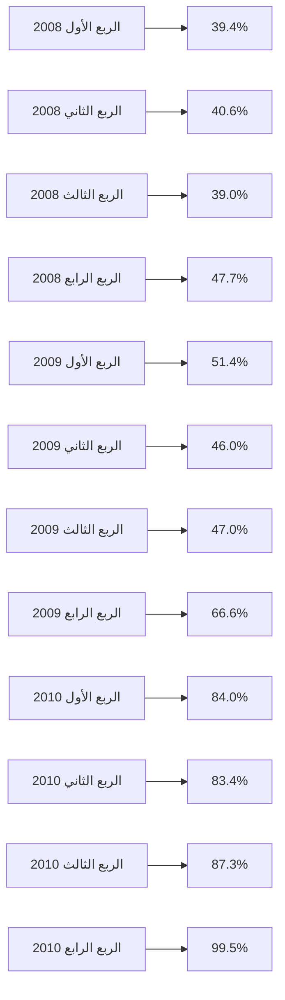
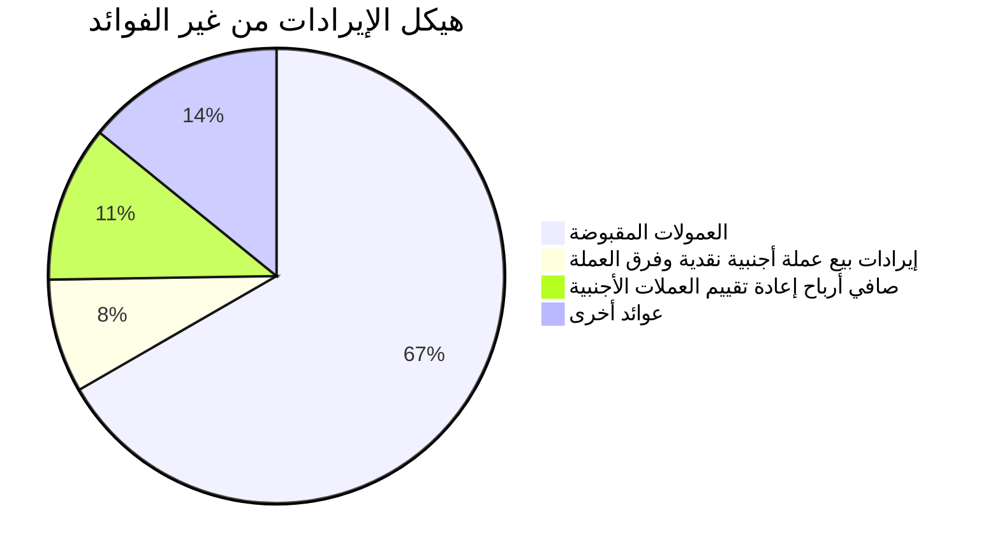

مصرف ليبيا المركزي
CENTRAL BANK OF LIBYA

التقرير السنوي لإدارة الرقابة على المصارف والنقد

[The image shows a background with various financial indicators and arrows pointing upwards, representing growth and progress in the banking sector.]

2010
2011

مؤشرات السلامة المالية والاستقرار
في القطاع المصرفي الليبي

WWW.CBL.GOV.LY
Supervision.D.Office@cbl.gov.ly
---
التقرير السنوي لإدارة الرقابة على المصارف والنقد

(2010 م - 2011 م)

((مؤشرات السلامة المالية والاستقرار في القطاع المصرفي الليبي))
---
| الصفحة | العنــــــــــوان |
|---------|-----------------|
|         | الجداول: |
| 14 | جدول رقم (1) |
|  | هيكل الملكية في الجهاز المصرفي الليبي |
| 31 | جدول رقم (2) |
|  | تطور ملاءة رأس المال المعدلة للمصارف التجارية |
| 48 | جدول رقم (3) |
|  | نسب الربحية عن السنوات 2009م - 2010م |
| 57 | جدول رقم (4) |
|  | نسبة الفائض في الاحتياطي الإلزامي والسيولة للمصارف التجارية خلال 2010م |
| 59 | جدول رقم (5) |
|  | تطور أهم مؤشرات القطاع المصرفي خلال عامي 2010م - 2011م |
| 60 | جدول رقم (6) |
|  | تطور أهم بنود الخصوم الإيداعية خلال سنتي 2010م - 2011م |
| 62 | جدول رقم (7) |
|  | تطور أهم بنود أصول القطاع المصرفي خلال سنتي 2010م – 2011م |
| 62 | جدول رقم (8) |
|  | تطور رصيد النقدية والحسابات لدى المصارف المحلية خلال سنتي 2010م – 2011م |
| 63 | جدول رقم (9) |
|  | تطور الحسابات خارج الميزانية خلال سنتي 2010م – 2011م |
| 63 | جدول رقم (10) |
|  | قائمة الدخل الملخصة المقارنة خلال سنتي 2010م – 2011م |
| 64 | جدول رقم (11) |
|  | بيان بالفوائد المقبوضة خلال سنتي 2010م – 2011م |
| 65 | جدول رقم (12) |
|  | بيان العمولات المقبوضة والإيرادات الأخرى خلال سنتي 2010م – 2011م |
| 65 | جدول رقم (13) |
|  | بيان بالفوائد المقبوضة خلال سنتي 2010م – 2011م |
| 67 | جدول رقم (14) |
|  | نسب السيولة بالمصارف التجارية خلال سنتي 2010م – 2011م |
---
حقوق الطبع و النشر محفوظة ©2011-2010.

صدر هذا التقرير عن مصرف ليبيا المركزي، ويسمح الاقتباس من هذا التقرير، والرجوع إليه، شريطة ذكر المصدر.

توجه جميع المراسلات المتعلقة بهذا التقرير إلى مدير إدارة الرقابة على المصارف والنقد بمصرف ليبيا المركزي، على العنوان التالي:

ص. ب 1103
طرابلس - ليبيا
بريد مصور ( فاكس ) 214831642(218)++
بريد إلكتروني: supervision.d.office@cbl.gov.ly
الموقع إلكتروني: www.CBL.gov.ly
---
| الصفحة | العنــــــــــوان |
|---------|-----------------|
|         | الجداول: |
| 14 | جدول رقم (1) |
|  | هيكل الملكية في الجهاز المصرفي الليبي |
| 31 | جدول رقم (2) |
|  | تطور ملاءة رأس المال المعدلة للمصارف التجارية |
| 48 | جدول رقم (3) |
|  | نسب الربحية عن السنوات 2009م - 2010م |
| 57 | جدول رقم (4) |
|  | نسبة الفائض في الاحتياطي الإلزامي والسيولة للمصارف التجارية خلال 2010م |
| 59 | جدول رقم (5) |
|  | تطور أهم مؤشرات القطاع المصرفي خلال عامي 2010م - 2011م |
| 60 | جدول رقم (6) |
|  | تطور أهم بنود الخصوم الإيداعية خلال سنتي 2010م - 2011م |
| 62 | جدول رقم (7) |
|  | تطور أهم بنود أصول القطاع المصرفي خلال سنتي 2010م – 2011م |
| 62 | جدول رقم (8) |
|  | تطور رصيد النقدية والحسابات لدى المصارف المحلية خلال سنتي 2010م – 2011م |
| 63 | جدول رقم (9) |
|  | تطور الحسابات خارج الميزانية خلال سنتي 2010م – 2011م |
| 63 | جدول رقم (10) |
|  | قائمة الدخل الملخصة المقارنة خلال سنتي 2010م – 2011م |
| 64 | جدول رقم (11) |
|  | بيان بالفوائد المقبوضة خلال سنتي 2010م – 2011م |
| 65 | جدول رقم (12) |
|  | بيان العمولات المقبوضة والإيرادات الأخرى خلال سنتي 2010م – 2011م |
| 65 | جدول رقم (13) |
|  | بيان بالفوائد المقبوضة خلال سنتي 2010م – 2011م |
| 67 | جدول رقم (14) |
|  | نسب السيولة بالمصارف التجارية خلال سنتي 2010م – 2011م |
---
# فهــــــرس المــحتويات

| الصفحة | العنــــــــــوان |
|--------|-----------------|
| 1 | تقــــــــديم |
| 3 | مقدمة |
| 5 | ملخص تنفيذي |

## الفصــــــــل الأول

### الرقابة على المصارف في ليبيا

| الصفحة | العنوان |
|--------|--------|
| 9 | تمهيــــــد |
| 9 | 1. أهداف الرقابة على المصارف |
| 11 | 2. أنماط الرقابة |
| 11 | أ). الرقابة المكتبية |
| 11 | ب). الرقابة الميدانية |

## الفصــــــــل الثاني

### هيكل القطاع المصرفي الليبي

| الصفحة | العنوان |
|--------|--------|
| 13 | تمهيــــــد |
| 13 | 1. مصرف ليبيا المركزي |
| 13 | 2. المصارف التجارية |
| 14 | أ). هيكل الملكية في الجهاز المصرفي |
| 15 | ب). تطور عدد المصارف التجارية وفروعها |
| 15 | ج). التوزيع الجغرافي لفروع ووكالات المصارف التجارية |
| 16 | د). مؤشر الكثافة المصرفية |
| 17 | ه). المصارف المتخصصة |
| 17 | و). المصارف الأخرى |
| 17 | ز). مكاتب تمثيل المصارف الأجنبية |

## الفصــــــــل الثالث

### الوضع المالي للقطاع المصرفي الليبي

| الصفحة | العنوان |
|--------|--------|
| 18 | تمهيــــــد |
| 18 | 1. تطور المركز المالي المجمع للمصارف التجارية |
---
| الصفحة | العنــــــــــوان |
|---------|-----------------|
| 21 | أ). مصادر أموال المصارف التجارية |
| 21 | • الخصوم الإيداعية |
| 22 | • الأموال الخاصة |
| 22 | ب). استخدامات أموال المصارف التجارية |
| 24 | ج). حسابات خارج الميزانية |
| 25 | 2. ترتيب المصارف |
| 25 | أ). ترتيب المصارف حسب أصول داخل ميزانية |
| 26 | ب). ترتيب المصارف حسب الأموال الخاصة |
| 26 | 3. التركز في القطاع المصرفي |
| 26 | أ). تقسيم المصارف حسب مجموع الأصول |
| 28 | ب). تقسيم المصارف حسب طبيعة ملكيتها |

## الفصــــــــــل الرابع

### رسملة القطاع المصرفي
| الصفحة | العنوان |
|--------|--------|
| 29 | تمهيد |
| 29 | 1. النسب المتعلقة بالأموال الخاصة |
| 29 | 2. الأموال الخاصة مقابل الأصول |
| 30 | 3. نسبة الخصوم الإيداعية للأموال الخاصة |
| 31 | 4. نسبة الملاءة |

## الفصــــــــــل الخامس

### نوعية أصول القطاع المصرفي
| الصفحة | العنوان |
|--------|--------|
| 33 | تمهيد |
| 33 | 1. توزيع أصول القطاع المصرفي |
| 34 | 2. الأصول المتداولة |
| 34 | أ). التوظيفات والحسابات لدى مصرف ليبيا المركزي |
| 35 | ب). التوظيفات والحسابات لدى المصارف الأخرى |
| 36 | 3. القروض و التسهيلات |
| 37 | أ). التسهيلات المباشرة |
| 38 | • توزيع التسهيلات المباشرة حسب القطاع |
| 39 | • جودة المحفظة الائتمانية |
---
| الصفحة | العنــــــــــوان |
|---------|-----------------|
| 40 | • المخصصات مقابل الديون غير المنتظمة |
| 41 | ب). التسهيلات غير المباشرة |

## الفصــــــــل السادس

### ربحية القطاع المصرفي

| الصفحة | العنوان |
|--------|--------|
| 43 | تمهيــــــــد |
| 43 | 1. قائمة الدخل الملخصة المقارنة |
| 44 | 2. هيكل الإيرادات والمصروفات |
| 44 | أ) . الإيرادات من الفوائد |
| 45 | ب). الإيرادات من غير الفوائد |
| 47 | 3. الكفاءة |
| 47 | 4. نسب الربحية |

## الفصــــــــل السابع

### سيولة القطاع المصرفي

| الصفحة | العنوان |
|--------|--------|
| 49 | تمهيــــــــد |
| 49 | 1. تحليل ودائع العملاء لدى القطاع المصرفي |
| 49 | أ). نمو الودائع حسب طبيعة الجهات المودعة |
| 51 | ب). نمو الودائع حسب أنواعها |
| 52 | ج). هيكل الودائع لدى المصارف |
| 52 | 2.نسبة السيولة لدى القطاع المصرفي |
| 53 | أ). نسبة السيولة مقابل الالتزامات المباشرة |
| 54 | ب).نسبة السيولة مقابل الالتزامات المباشرة وغير المباشرة |
| 56 | ج).المؤشرات الاحترازية الرقابية (الاحتياطي الإلزامي والسيولة القانونية) |

## الفصــــــــل الثامن

### الأوضاع المالية للمصارف التجارية خلال عام 2011م

| الصفحة | العنوان |
|--------|--------|
| 58 | تمهيــــــــد |
| 58 | 1. تأثر الأوضاع التشغيلية |
| 60 | 2. مصادر أموال القطاع المصرفي |
---
| الصفحة | العنــــــــــوان |
|---------|-----------------|
| 60 | أ).الخصوم الإيداعية |
| 60 | ب).الأموال الخاصة |
| 60 | ج).أهم بنود الخصوم الإيداعية |
| 61 | 3.استخدامات أموال القطاع المصرفي |
| 62 | 4.الحسابات خارج الميزانية |
| 63 | 5.الآثار المترتبة على قائمة الدخل بالقطاع المصرفي |
| 64 | 6. ربحية القطاع المصرفي |
| 64 | أ).الإيرادات |
| 64 | • الفوائد المقبوضة |
| 64 | • العمولات المقبوضة |
| 65 | ب).المصروفات |
| 65 | • الفوائد المدفوعة والمصروفات الإدارية والعمومية |
| 66 | 7. نسبة السيولة لدى القطاع المصرفي |
---
| الصفحة | العنــــــــــوان |
|---------|-----------------|
|         | الملاحــــــــــق |
| 69      | ملحق رقم(1): أهم المنشورات الصادرة عن مصرف ليبيا المركـــــزي خـــــلال سنتي 2010 م - 2011 م |
| 71      | ملحق رقم(2): أهم الرسائل الدورية الصادرة عن إدارة الرقابة على المصارف والنقد خلال سنتي 2010 م - 2011 م |
| 73      | ملحق رقم(3): مركز مالي ملخص وموحد ومقارن للمصارف التجارية 2009 م- 2011 م |
| 75      | ملحق رقم(4): ترتيب المصارف حسب مجموع أصولها داخل الميزانية |
| 76      | ملحق رقم(5): ترتيب المصارف حسب مجموع أصولها داخل وخارج الميزانية |
| 77      | ملحق رقم(6): ترتيب المصارف حسب مجموع أموالها الخاصة |
| 78      | ملحق رقم(7): فائض الاحتياطي الإلزامي والسيولة حسب المصارف |
| 79      | ملحق رقم(8): مكاتب تمثيل المصارف الأجنبية المرخص لها بالعمل في ليبيا |
| 81      | ملحق رقم(9): المكاتب الهندسية وبيوت الخبرة المتخصصة في تقييم الأصول والعقارات المسجلة لدى مصرف ليبيا المركزي |
| 82      | ملحق رقم(10): مكاتب المحاسبة والمراجعة القانونية المسجلة لدى مصرف ليبيا المركزي |
| 86      | ملحق رقم(11): بيان بأسعار الفائدة المدينة والدائنة كما في 31/12/2010م |
| 90      | ملحق رقم (12): بيان بأسعار الفائدة المدينة والدائنة كما في 31/12/2011م |
| 94      | ملحق رقم (13): تطور ميزانية المصرف الليبي الخارجي خلال سنتي 2009/2010 م |
---
# تقديم

يَسُر مصرف ليبيا المركزي أن يصدر التقرير السنوي للرقابة المصرفية (2010-2011) الذي تعده إدارة الرقابة على المصارف والنقد، متضمناً لمؤشرات السلامة المالية والاستقرار بالقطاع المصرفي الليبي.

ويأتي إصدار هذا التقرير للسنة الثالثة على التوالي ، بعد أن اعتمد مصرف ليبيا المركزي خطة إستراتيجية لتطوير الرقابة المصرفية خلال الفترة 2009-2011م ، يأتي في مقدمة مبادراتها تبني وسائل وأساليب الرقابة المصرفية الدولية المتوافقة مع متطلبات لجنة بازل للرقابة المصرفية ، والتي تقتضي إصدار تقارير عن السلامة المالية والاستقرار بالقطاع المصرفي.

وبفضل الجهود الحثيثة المبذولة في الرقابة والإشراف على القطاع المصرفي، فقد أظهرت المؤشرات التي تضمنها التقرير استمرار القطاع المصرفي في تحقيق مستهدفاته في الربحية والسيولة خلال عام 2010م، وفي زيادة الوعي بإدارة المخاطر، حيث تتصف المصارف الليبية بالملاءة واحتفاظها برؤوس أموال كافية لمواجهة المخاطر المرتبطة بنشاطاتها.

وقد حالت جهود الرقابة المصرفية دون تعرض القطاع المصرفي للمخاطر النظامية طوال السنوات الماضية، وبالرغم من الظروف الإستثنائية التي شهدها القطاع المصرفي خلال عام 2011م، فقد تمكن القطاع المصرفي من إجتياز مشكلة السيولة التي تعرض لها نتيجة للظروف الأمنية التي واكبت أحداث ثورة 17 فبراير المجيدة ، واستمرت المصارف في تقديم خدماتها للجمهور وفي فتح الإعتمادات المستندية لأغراض توريد السلع للسوق الليبية .

وبالرغم من التجميد الذي تعرضت له الأرصدة الليبية بالخارج، بما في ذلك أرصدة المصارف، فقد تمكنت المصارف من الوفاء بالتزاماتها الخارجية بفضل الجهود التي بذلها مصرف ليبيا المركزي خلال عام 2011م، ونتيجة لإلتزام القطاع المصرفي الليبي بقراري مجلس الأمن رقمي (1970) و (1973) بخصوص ليبيا.

1 التقرير السنوي الثالث لإدارة الرقابة على المصارف والنقد للسنتين 2010م و2011م
---
وبالرغم من التدني في مؤشرات المصارف التجارية المتعلقة بالربحية والسيولة خلال عام 2011م الأ
أن هذه المصارف تمكنت من مواجهة مخاطر الائتمان والمخاطر التشغيلية التي ترتبت عـــن الأوضـــاع
التشغيلية والأوضاع الاقتصادية التي عرفتها ليبيا خلال عام 2011م. ومن المتوقع أن تستعيد المصـــارف
معظم نشاطاتها وأن تعوض الفاقد في مدخولاتها خلال عام 2012 م ، حيث تظهر النتائج الأولية خلال عام
2012 م ، تاريخ صدور هذا التقرير ، مؤشرات إيجابية مطمئنة ، وتعتبـــر أمـــوال المودعيـــن وحقـــوق
المساهمين بمنأى عن أي مخاطر نظامية بعد أن عادت الأمور إلى أوضاعها الطبيعية وصـــارت البيئـــة
المصرفية تتصف بالاستقرار .

وإذ نقدم هذا التقرير، نتقدم بالشكر والتقدير للعاملين بإدارة الرقابة على المصارف والنقد ، على
إصدار هذا التقرير للسنة الثالثة على التوالي ، متمنياً لهم كل التوفيق والنجاح . كما نأمل أن يجد
المتابعين لأوضاع القطاع المصرفي الليبي والمهتمين بأوضاعه ما يعينهم على الإلمام بهذه الأوضاع
والوقوف على حقيقتها ، وأن يجد الجمهور والمتعاملين مع القطاع المصرفي الليبي ما يطمئنهم
ويشجعهم على إيداع مدخراتهم بالمصارف الليبية وتسخيرها في خدمة الاقتصاد الوطني .

"الصديق عمر الكبيــر"
المحافظ

2 التقرير السنوي الثالث لإدارة الرقابة على المصارف والنقد للسنتين 2010 و2011م
---
# مقدمة

تمثل الرقابة المصرفية إحدى أهم اختصاصات مصرف ليبيا المركزي، ومن مهامه المتعلقة بمراقبة الهيئات المصرفية والإشراف عليها، بما يكفل سلامة مركزها المالي ، ومراقبة كفاءة أدائها، والمحافظة على أموال المودعين وحقوق المساهمين فيها والمتعاملين معها.

ويأتي إعداد هذا التقرير تنفيذاً للمبادرات الإستراتيجية الواردة بخطة تطوير الرقابة المصرفية (2009-2011م)، ويتضمن مؤشرات السلامة المالية والاستقرار في القطاع المصرفي الليبي، ويستعرض التقرير أوضاع ومؤشرات المصارف التجارية خلال عامي 2010 و2011م.

ويقع التقرير في ثمانية فصول وخمسة ملاحق، يتناول الفصل الأول، التعريف بالرقابة على المصارف في ليبيا، ويتناول الفصل الثاني هيكل القطاع المصرفي الليبي ومكوناته، بينما يتناول الفصل الثالث المؤشرات المالية للقطاع المصرفي ، من خلال الميزانية المجمعة للمصارف، ويستعرض الفصل الرابع رسملة القطاع المصرفي وعلاقتها بملاءة رؤوس أموال المصارف، ويركز الفصل الخامس على نوعية الأصول بالقطاع المصرفي الليبي وفقاً للمعايير الصادرة عن مصرف ليبيا المركزي، بينما يتناول الفصل السادس ربحية القطاع المصرفي، ويستعرض الفصل السابع أوضاع السيولة بالمصارف التجارية، وقد خصص الفصل الثامن لاستعراض الأوضاع المالية ومؤشرات المصارف التجارية خلال عام 2011م ، باعتبارها السنة التي شهدت فيها المصارف ظروف استثنائية نتيجة للأحداث التي واكبت ثورة 17 فبراير المجيدة والظروف الأمنية التي صاحبتها.

ويلاحظ التزام التقرير باستعراض أوضاع القطاع المصرفي وتحليل مؤشراته وفقاً لنظام(CAMELS) المتبع في ترتيب المصارف وتصنيف أوضاعها.

كما يتضمن التقرير عدد من الملاحق التي تستعرض ترتيب المصارف حسب مجموع الأصول، في عام 2010م بالمقارنة بعام 2009م، ووفقاً لمجموع أموالها الخاصة. كما تستعرض الملاحق فائض الاحتياطي النقدي الإلزامي والسيولة المطلوبة، وفقاً للمعايير الصادرة عن مصرف ليبيا المركزي، كما هي في 2011/12/31م بالمقارنة بالوضع في 2010/12/31م.

3 التقرير السنوي الثالث لإدارة الرقابة على المصارف والنقد للسنتين 2010 و2011م
---
ويعتبر هذا التقرير مكملاً للتقارير السنوية التي تعد عن كل مصرف تجاري على حده ، والتي هي نتاج لتكامل الرقابة المكتبية والرقابة الميدانية التي تباشرها إدارة الرقابة على المصارف والنقد بمصرف ليبيا المركزي.

نأمل أن يساهم هذا التقرير في تسليط الضوء على مؤشرات السلامة المالية والاستقرار بالقطاع المصرفي الليبي، وأن يقدم صورة واضحة عن دور الرقابة المصرفية وانجازاتها خلال عامي 2010م و2011م، وبما يعزز الثقة في القطاع المصرفي، ويساعد في صياغة توجهات السياسة النقدية التي يعمل مصرف ليبيا المركزي على تنفيذها ، من أجل النهوض بالقطاع المصرفي الليبي وضمان سلامته، وتعزيز قدراته التنافسية ، وضمان التزامه بالمعايير الرقابية المصرفية، وفقاً لأفضل الممارسات، حيث يعول على القطاع المصرفي لعب دور مهم في مرحلة إعادة بناء وإعمار ليبيا، بعد انتصار ثورة السابع عشر من فبراير تحقيقاً لأهدافها في الرفاه الاقتصادي والتنمية.

ولا يسعني في مقدمة هذا التقرير إلا أن أتقدم بجزيل الشكر والتقدير للسيد المحافظ ونائبيه والسادة أعضاء مجلس إدارة مصرف ليبيا المركزي على دعمهم المتواصل لجهود الرقابة المصرفية ومتابعتهم لأعمالها. كما نشكر جميع موظفي إدارة الرقابة على المصارف والنقد على جدهم واجتهادهم وتفانيهم في تنفيذ المهام الموكلة إليهم، وأخص بالشكر الفريق الذي أعد مسودة هذا التقرير، على ما بذلوه من مجهودات طيبة كانت لها بالغ الأثر في إخراجه بالشكل الذي يليق به، متمنياً لهم دوام التوفيق.

والله المستعان

" محمد عبدالجليل أبودنينة "
مدير إدارة الرقابة على المصارف والنقد

4 التقرير السنوي الثالث لإدارة الرقابة على المصارف والنقد للسنتين 2010م و2011م
---
# ملخص تنفيذي
# Executive Summary

تمكن القطاع المصرفي الليبي من تجاوز الأزمة التي عصفت به نتيجة للأوضاع الأمنية غير المستقرة التي عرفتها ليبيا أثناء فترة الثورة التي شهدتها البلاد في 17 فبراير 2011م، وقد ساعد في ذلك الملاءة التي تتمتع بها المصارف التجارية، لما تحتفظ به من أموال خاصة ، واحتفاظ هذه المصارف بفوائض في السيولة وأرصدة كافية لدى مصرف ليبيا المركزي .

ورغم التقسيم الذي طرأ على إدارات المصارف ، قبل استكمال تحرير كامل التراب الليبي، والمخاطر التشغيلية التي صاحبته، إلا أن هذه المصارف تمكنت من تحقيق التكامل في عملياتها والرجوع بها إلى أوضاعها الطبيعية بأقل تكلفة ممكنة، وكان هذا الموضوع يشكل التحدي الأكبر الذي واجهته المصارف بعد انتصار الثورة .

وكان الاستقرار الذي يشهده القطاع المصرفي الليبي حالياً ، رغم الظروف التشغيلية الصعبة التي مر بها، مدفوعاً باستمرار مصرف ليبيا المركزي في ممارسة اختصاصاته الإشرافية والرقابية طوال فترة الأحداث ودون توقف ، مما ساعد في إستعادة القطاع المصرفي لنشاطه والمحافظة على حيويته.

كما كان للإجراءات والسياسات التي إتبعها مصرف ليبيا المركزي، في معالجة مشكلة السيولة النقدية، التي عرفتها البلاد ، بالغ الأثر في تجاوز الأزمة التي شهدها القطاع المصرفي، وفي تحقيق الاستقرار على مستوى الاقتصاد الوطني .

وقد تواصل النمو في حجم القطاع المصرفي في ليبيا، حيث سجلت الميزانية المجمعة للمصارف لسنة 2010م، نمواً وقدره 11% بالمقارنة بسنة 2009م، وذلك نتيجة ارتفاع ودائع العملاء من القطاع العام والقطاع الخاص بنسبة 17.3% ، بالإضافة إلى نمو الأموال الخاصة بنسبة 28% نتيجة للتوزيعات التي قامت بها المصارف ، وبالرغم من الأزمة التي تعرضت لها المصارف خلال عام 2011م، إلا أن الميزانية المجمعة للمصارف في

5 التقرير السنوي الثالث لإدارة الرقابة على المصارف والنقد للسنتين 2010 و2011م
---
31/12/2011م ، شهدت نمواً وقدره 8%، وبمعدل أقل من معدل النمو الذي طرأ على الميزانية المجمعة للمصارف في نهاية عام 2010م، ويرجع النمو الذي طرأ على الميزانية المجمعة للمصارف خلال عام 2011م، إلى الزيادة في ودائع القطاع الخاص لدى القطاع المصرفي بنسبة 23% .

كما حافظ القطاع المصرفي على نسب توزيع أصوله، حيث استحوذ مصرف ليبيا المركزي على 49% من مجمل أصول القطاع المصرفي في ليبيا، في شكل شهادات إيداع قصيرة الأجل، وبالرغم من أن المحفظة الائتمانية (التسهيلات المباشرة) لدى المصارف حققت نمواً وقدره 11% في 31/12/2010م .

وقد تراجعت نسبة النمو في التسهيلات المباشرة بشكل ملحوظ في 31/12/2011م، حيث تدنت هذه النسبة إلى 2.0% ، نتيجة للظروف التشغيلية التي عرفتها المصارف إبان الأحداث التي شهدتها ليبيا في عام 2011م، حيث توقف النشاط الائتماني للمصارف توقفاً شبه كامل نتيجة للمخاطر الكبرى المصاحبة لنشاط منح الائتمان، وللتراجع الكبير الذي شهده النشاط الاقتصادي في تلك الفترة.

وقد بلغت نسبة التسهيلات غير المنتظمة في 31/12/2010م، 21% من إجمالي التسهيلات الممنوحة، ولا زالت هذه النسبة مرتفعة بالمقارنة بالمعدلات القياسية في الدول الأخرى، غير أن المصارف تعمل دائماً على تكوين المخصصات اللازمة في مواجهة الديون غير المنتظمة، حيث بلغت نسبة تغطية المخصصات للديون غير المنتظمة التي احتفظت بها المصارف في 31/12/2010م، ما نسبته 75.2%، في إطار التعليمات الصادرة عن مصرف ليبيا المركزي بشأن تصنيف الديون وتكوين المخصصات اللازمة في مواجهتها.

وتشكل التسهيلات غير المباشرة (حسابات خارج الميزانية) نسبة مهمة في إجمالي المحفظة الائتمانية بالمصارف، حيث وصلت نسبتها في 31/12/2010م، إلى 49%.

وقد انعكست نشاطات المصارف على ربحيتها ، حيث وصلت أرباح المصارف (قبل الضرائب) في 31/12/2010م، ما مجموعه 654.3 مليون دينار ، مظهرة تراجعاً بنسبة 17.5% ، بالمقارنة بإجمالي الأرباح في 31/12/2009م، في حين انخفضت أرباح المصارف في 31/12/2011م، نتيجة للأحداث

6
التقرير السنوي الثالث لإدارة الرقابة على المصارف والنقد للسنتين 2010 و2011م
---
التي شهدها القطاع المصرفي، والنشاط الاقتصادي بشكل عام بحيث انخفضت الأرباح المجمعة للمصارف (قبل الضرائب) إلى 345.7 مليون دينار وبنسبة انخفاض وقدرها 47% متأثرة بالتدني في صافي الفوائد والعمولات المقبوضة، حيث شهدت صافي الإيرادات انخفاضاً بنسبة 9.9% في 2011/12/31 ، بالمقارنة بما كانت عليه في 2010/12/31م، بسبب انخفاض الإيرادات من الفوائد بنسبة 29.6% ، وتدني الفوائد على شهادات الإيداع التي يصدرها مصرف ليبيا المركزي.

وقد ساهم استمرار التركز في التوظيف لدى مصرف ليبيا المركزي في ارتفاع الأصول المتداولة لدى القطاع المصرفي التي بلغت نسبتها 77%، من مجمل الأصول ، في 2010/12/31م، واستمرت المصارف في المحافظة على هذه النسبة في عام 2011م، مما يؤثر سلباً في دور المصارف التجارية في الوساطة المالية التي تعتبر أحد أهم العوامل التي تؤثر في الاستقرار المالي.

ونظراً لطبيعة الودائع في القطاع المصرفي، التي تتمثل في ودائع تعود لجهات تابعة للقطاع العام في شكل ودائع تحت الطلب، فقد تعرضت المصارف خلال عام 2011م، لمخاطر السحوبات العالية مدفوعاً بالأوضاع الأمنية غير المستقرة، وهو ما تطلب من المصارف العمل على المحافظة على نسبة سيولة عالية لمواجهتها.

وبالرغم من الملاءة الجيدة للقطاع المصرفي في ليبيا، وارتفاع نسب السيولة، إلا أن مساهمة القطاع المصرفي في تمويل النشاط الاقتصادي لازالت محدودة، بالنظر إلى ما بحوزة المصارف من أصول سائلة لا زالت تعمل بعيداً عن دائرة تمويل الفرص الاستثمارية الجيدة، والتوسع في منح التسهيلات لمختلف القطاعات الاقتصادية، ويؤمل أن تلعب المصارف دوراً هاماً في إعمار وإعادة إعمار ليبيا على المدى القصير والمتوسط.

والتحدي الكبير الذي يواجه المصارف في المرحلة الحالية هو معالجة محفظة التسهيلات المتعثرة، والعمل على انتهاج سياسة ذات فعالية أكثر في توزيع الأصول مصحوبة بمعايير سليمة لإدارة مخاطر السيولة.

7 التقرير السنوي الثالث لإدارة الرقابة على المصارف والنقد للسنتين 2010 و2011م
---
وعلى صعيد التشريعات الرقابية، ذات العلاقة بالقطاع المصرفي ، فقد شهد العام 2010م،
صدور المنشور رقم (2010/9) بشأن الضوابط المنظمة لتقديم المنتجات المصرفية الإسلامية
مثل المرابحة للآمر بالشراء بما في ذلك نموذج المركز المالي للفروع المصرفية التي تمارس
هذا النشاط ودليل الحسابات الخاص بها والضوابط المنظمة لتعيين هيئات الرقابة الشرعية
بالمصارف.

كما شهدت سنة 2011م، صدور العديد من القرارات التي نظمت التعامل في النقد الأجنبي في
الظروف الاستثنائية، وتحديد أسقف للسحب بالدينار الليبي، وهي الإجراءات التي فرضتها أوضاع
السيولة بالقطاع المصرفي، والأزمة التي عرفتها المصارف في هذا المجال. كما تم تنظيم إجراءات فتح
الاعتمادات المستندية وإجراء الحوالات الخارجية، حيث ألزمت المصارف بالقرارات الصادرة عن
مجلس الأمن بشأن ليبيا ، وفي مقدمتها القرارين (1970) و(1973). وكانت هذه الإجراءات مدفوعة
بتداعيات تجميد الأموال الليبية في الخارج، بما في ذلك أموال مصرف ليبيا المركزي، التي استوجبت
العمل من خلال إدارة الأزمة، وترشيد استخدامات النقد الأجنبي وفقاً للأولويات التي حددتها الجهات
المختصة بالدولة الليبية.

وقد حرص مصرف ليبيا المركزي، في كل من بنغازي وطرابلس، على استمرارية
العمل بالقطاع المصرفي والمحافظة على تماسك المصارف التجارية والتخفيف من حدة
المخاطر التشغيلية التي تعرضت لها، وهو ما مكّن المصارف من استئناف نشاطاتها بشكل
طبيعي بعد رفع القيود التي كانت مفروضة عليها. كما تمكّن مصرف ليبيا المركزي من
القضاء على السوق الموازية للنقد الأجنبي، التي نشطت إبان الأزمة، وعالج مشكلة السيولة
بالدينار الليبي، على النحو الذي حافظ على استقرار قيمة الدينار الليبي في مواجهة العملات
الأجنبية، والمحافظة على القوة الشرائية للعملة الوطنية.

8 التقرير السنوي الثالث لإدارة الرقابة على المصارف والنقد للسنتين 2010 و2011م
---
# الفصل الأول

## الرقابة على المصارف في ليبيا

يتم تنفيذ الرقابة على المصارف في ليبيا إعمالاً لأحكام القانون رقم (1) لسنة 2005م بشأن المصارف، وفقاً لما يصدر عن مصرف ليبيا المركزي من تعليمات وضوابط منظمة للعمل المصرفي، ويجري تعميمها على كافة المصارف العاملة.

وتتكون الرقابة على أعمال المصارف في ليبيا من ثلاثة مستويات رئيسة وهي:-

1. الرقابة الداخلية (Internal control) بالمصارف التجارية، من خلال أنظمة الضبط الداخلي والرقابة الداخلية (إدارات المخاطر /الامتثال/ إدارات المراجعة الداخلية).

2. المراجعة الخارجية لحسابات المصارف (External Audit) من قبل المراجعين القانونيين، وفقاً لأحكام المادة (83) من القانون رقم (1) لسنة 2005م، بشأن المصارف.

3. رقابة مصرف ليبيا المركزي (المكتبية والميدانية) التي تنفذها إدارة الرقابة على المصارف والنقد، باعتباره السلطة النقدية في ليبيا.

بالإضافة إلى رقابة هيئة سوق الأوراق المالية بالنسبة للمصارف المدرجة بالسوق.

## أهداف الرقابة على المصارف:

الهدف الرئيسي للرقابة على المصارف هو المحافظة على سلامة القطاع المصرفي، وتحقيق الاستقرار المالي، من خلال الرقابة على إدارة المخاطر، بما يؤدي إلى حماية أموال المودعين، والحفاظ على حقوق المساهمين، وقيام المصارف بدور الوساطة المالية للمساهمة في نمو الاقتصاد الوطني. وفي إطار جهود مصرف ليبيا المركزي الرامية لتطوير القطاع المصرفي أعدت إدارة الرقابة خطة إستراتيجية للسنوات 2009-2011م، بهدف تطوير أساليب الرقابة وتعزيز وتفعيل دور مصرف ليبيا المركزي في الرقابة على المصارف العاملة في ليبيا، وبما يكفل التزام المصارف بأفضل الممارسات في العمل المصرفي.

وقد استندت الخطة الإستراتيجية لإدارة الرقابة على المصارف والنقد، على تطبيق المبادئ الأساسية للرقابة المصرفية الفعالة، وفقاً للورقة الصادرة عن لجنة بازل للرقابة المصرفية.

9 التقرير السنوي الثالث لإدارة الرقابة على المصارف والنقد للسنتين 2010م و2011م
---
لسنة 2006م وتعديلاتها، وترتكز الخطة على إحدى عشر مبادرة (Initiatives) تطويرية يمكن تلخيصها على النحو التالي:-

1. استكمال الهيكل التنظيمي لإدارة الرقابة على المصارف والنقد.

2. تطوير قاعدة بيانات واسعة ومتكاملة تتم أتمتتها، لتعزيز جهود الرقابة الميدانية والمكتبية.

3. الاعتماد على تقنية المعلومات، واستخدام الأرشفة الإلكترونية، والحد من استخدام الورق إلى أبعد الحدود.

4. مواكبة المستجدات في مجال الرقابة المصرفية، ومراجعة التعليمات السارية بهدف تطويرها.

5. ممارسة الرقابة المصرفية بشقيها المكتبي والميداني وفقاً لمعايير الـ CAMELS وتأمين التكامل والتنسيق بينهما.

6. تطبيق معايير المحاسبة الدولية والمعايير الدولية للمراجعة والإفصاح المالي.

7. وضع إطار تنفيذي لتطبيق معايير بازل 2 لكفاية رأس المال.

8. تطبيق أساليب الرقابة المصرفية المجمعة على المجموعات المصرفية.

9. بناء وتطوير الموارد البشرية اللازمة لتنفيذ الرقابة المصرفية.

10. الإدارة بالأهداف، ومعدلات الأداء.

11. التعاون مع السلطات الرقابية في الدول الأخرى.

وقد قطعت الإدارة شوطاً مهماً في تنفيذ مبادرات الإستراتيجية خلال عامي 2009-2010م، ونظراً للأحداث التي واكبت ثورة 17 فبراير المجيدة والظروف الأمنية التي شهدتها البلاد تعذر استكمال بعض مبادرات الإستراتيجية التي كانت مستهدفة خلال عام 2011م، حيث تم إرجاؤها إلى عامي 2012-2013م.

10 التقرير السنوي الثالث لإدارة الرقابة على المصارف والنقد للسنتين 2010 و2011م
---
وتستند رقابة مصرف ليبيا المركزي على المصارف التجارية، على أحدث المعايير الدولية وأفضل الممارسات في الرقابة المصرفية، الأمر الذي بدأت تظهر معه بوادر نجاح الخطة الإستراتيجية، وذلك من خلال زيادة الوعي بإدارة المخاطر المصرفية، وتصنيف الديون، وتكوين المخصصات في مواجهة الديون المتعثرة، والاهتمام بتقنية المعلومات والتدريب وإدخال منتجات مصرفية جديدة، حيث نمت المراكز المالية للمصارف، وزادت التنافسية في السوق المصرفية، فازداد الاهتمام بتطوير إدارات المخاطر، والرقابة الداخلية، ومكافحة عمليات غسل الأموال، ومهام الامتثال، وتطبيق أسس الحوكمة المؤسساتية.

## أنماط الرقابة التي يقوم بها مصرف ليبيا المركزي على المصارف:-

### 1- الرقابة المكتبية Off-site Supervision

يقوم المصرف المركزي بمراقبة ومتابعة الأوضاع المالية للمصارف من خلال التقارير الإحصائية والبيانات المرسلة من المصارف والمعلومات المالية، حيث تتم مراجعة وتحليل تلك البيانات، واحتساب أهم النسب والمؤشرات المالية، للوقوف على الوضع المالي للمصارف، ومعرفة مدى اهتمامها بإدارة المخاطر، و التزامها بالمعايير والأنظمة والتعليمات.

وفي سبيل تعزيز الرقابة المكتبية، فقد قامت إدارة الرقابة على المصارف والنقد بإعطاء موضوع تحليل ودراسة البيانات المالية أهمية كبيرة، بالإضافة إلى تطوير الإحصاءات المصرفية، ومراقبة التركزات الائتمانية والمخاطر المصرفية ومتابعة المصارف، وذلك بهدف إيجاد نظام للإنذار المبكر Early warning system.

### 2- الرقابة الميدانية On- Site Supervision

يتضمن هذا النوع من الرقابة القيام بمهام تفتيش ميدانية على المصارف ، للتأكد من التزامها بالمعايير والتشريعات المصرفية في ليبيا ومدى امتثالها للأنظمة والتعليمات الصادرة عن مصرف ليبيا المركزي، بالإضافة إلى تقييم أوضاع المصارف بشكل شامل، والتأكد من سلامة أوضاعها المالية و كفاءة إدارتها، وإتباعها معايير الحوكمة، ومدى كفاية أنظمة الضبط والمراجعة الداخلية وإدارة المخاطر، ومطابقة التقارير المالية التي تقدمها المصارف بما تحتويه السجلات والمنظومات المستخدمة لدى المصارف التجارية.

----

التقرير السنوي الثالث لإدارة الرقابة على المصارف والنقد للسنتين 2010 و2011م
---
ونتيجة تفاعل الرقابة المكتبية والميدانية وتكاملها ، تقوم إدارة الرقابة على المصارف والنقد بإعداد تقارير رقابية سنوية عن المصارف، تحلل أوضاع هذه المصارف، بناء على مؤشــرات الــ CAMELS ( رأس المال، نوعية الأصول، الإدارة، الربحية والسيولة)، ويتم إعطاء تصنيف مركب شامل لكل مصرف يتراوح ما بين (1) و (5)، بحيث يتــم تصنيــف المصــارف إلــى (1) قوي ، (2) جيد ، (3) مقبول ، (4) ضعيف ، (5) ضعيف جداً.

ويؤخذ هذا التصنيف كأساس لمطالبة المصارف باتخــاذ الإجــراءات اللازمــة لمعالجــة الملاحظات التي يتم تدوينها على هذه المصارف، ويتضمنها التقرير الرقابي السنوي المعد عــن كل منها ، وتتابع إدارة الرقابة على المصــارف والنقــد، مــدى التــزام المصــرف بمعالجــة الملاحظات، وفقاً لخطة العمل الموضوعة، وفي حال عدم تقيد المصرف بمعالجــة الملاحظــات الواردة بشأنه، يصبح المصرف معرضاً للإجراءات التي يقوم بها مصــرف ليبيــا المركــزي، المنصوص عليها بالقانون رقم (1) لسنة 2005م بشأن المصارف، وتتراوح هذه الإجراءات بين توقيع غرامات جزائية على المصرف، ومنع المصرف من القيام ببعض الأنشطة المصرفية إلى وقف المدير العام أو مجلس الإدارة وتكليف لجنة إدارة مؤقتة، وقد تصل إلي دمج المصرف في مصرف آخر أو إلغاء الترخيص الممنوح له.

وقــد حالــت هــذه الإجــراءات دون تعــرض القطــاع المصــرفي للمخاطــر النظامية (systemic risk)، أو وقوع حالات إعسار مالــي، كمــا اتســم القطــاع المصــرفي بالاستقرار، حيث لم يعرف القطاع المصرفي الليبي أية حالة إفلاس ولم يتعرض أيــة مصــرف للتصفية أو سحب الترخيص، رغم بيئة العمل غير الملائمة ومناخ الاستثمار غير المشجع فــي أغلب الأحيان.

12 التقرير السنوي الثالث لإدارة الرقابة على المصارف والنقد للسنتين 2010 و2011م
---
# الفصل الثاني
## هيكل القطاع المصرفي في ليبيا

### تمهيد:

يتكون القطاع المصرفي في ليبيا من مصرف ليبيا المركزي وعدد من المصارف التجارية، والمصارف المتخصصة والمصرف الليبي الخارجي (offshore)، وتضم المصارف التجارية مصارف خاصة، ومصارف خاصة بمشاركة شريك إستراتيجي أجنبي (مصارف مختلطة) كما يوجد بالقطاع المصرفي عدد من مكاتب تمثيل المصارف الأجنبية.

### أولاً / مصــرف ليبـــيا المركزي

يمثل مصرف ليبيا المركزي السلطة النقدية في ليبيا، ويتبوأ قمة الهرم التنظيمي للمؤسسات المصرفية فيها، وقد تأسس عام 1955م وباشر أعماله في عام 1956م، ويبلغ رأسماله نحو 500 مليون دينار، ويمارس اختصاصاته بناء على قانون المصارف رقم (1) لسنة 2005م، والذي حدد مهام المصرف في تنظيم وإصدار النقد، وتنظيم ومراقبة الائتمان والإشراف على المصارف التجارية، ومتابعتها، ورسم السياسة النقدية للدولة ومتابعة تنفيذها، كما يناط به القيام بالأعمال المصرفية للدولة، فضلاً عن إدارة احتياطيات الدولة والمحافظة على استقرار سعر الصرف.

### ثانيا / المصارف التجارية

المصارف التجارية، شركات مساهمة ليبية، تضم عدد من المصارف المملوكة للدولة والقطاع الخاص، في حين توجد مصارف تساهم في رؤوس أموالها مؤسسات مالية ومصارف أجنبية بنسب محددة.

وتقوم المصارف بممارسة الأعمال المصرفية وتقديم الخدمات المختلفة من قبول للودائع وفتح الاعتمادات المستندية والقيام بالتحويلات الداخلية أو الخارجية، وتحصيل الصكوك المصرفية، بالإضافة إلى منح التسهيلات الائتمانية لمختلف الأغراض كالقروض العقارية والتجارية والتنموية والخدمية، وإصدار الضمانات والاستثمار وأعمال الصرافة، وتقديم بعض المنتجات المصرفية المتوافقة وأحكام الشريعة الإسلامية وفيما يلي أهم خصائص الجهاز المصرفي الليبي:-

----

13

التقرير السنوي الثالث لإدارة الرقابة على المصارف والنقد للسنتين 2010م و2011م
---
أ - هيكل الملكية في الجهاز المصرفي الليبي

ساهمت جهود مصرف ليبيا المركزي في إعادة هيكلة الجهاز المصرفي، وفي خلق كيانات مصرفية كبيرة ذات ملاءة مالية تؤهلها لمواجهة تداعيات المنافسة العالمية في مجال العمل المصرفي، وقد كان من ضمن هذه الجهود دمج بعض المصارف التجارية، ورفع الحد الأدنى لرأس مال المصارف التجارية العاملة، وتنويع ملكية المصارف الليبية بحيث سمح بملكية غير الليبيين في المصارف التجارية الليبية، وفي هذا الإطار فقد تخلى مصرف ليبيا المركزي عن ملكيته في بعض المصارف التجارية، وفيما يلي بيان بهيكل الملكية في الجهاز المصرفي الليبي :-

## جدول رقم ( 1 )
### هيكل الملكية في الجهاز المصرفي الليبي

| المصرف | قطاع عام % | قطاع خاص % | شريك إستراتيجي % |
|------------------------|-----------|-------------|-------------------|
| مصرف الجمهورية | 83.0 | 17.0 | 0.0 |
| مصرف الصحاري | 59.0 | 22.0 | 19.0 |
| المصرف التجاري الوطني | 85.0 | 15.0 | 0.0 |
| مصرف الوحدة | 54.0 | 27.0 | 19.0 |
| مصرف شمال أفريقيا | 82.0 | 18.0 | 0.0 |
| مصرف التجارة والتنمية | 17.0 | 34.0 | 49.0 |
| مصرف الواحة | 90.0 | 0.0 | 0.0 |
| مصرف الأمان | 0.0 | 60.0 | 40.0 |
| مصرف المتحد | 3.0 | 57.0 | 40.0 |
| مصرف التجاري العربي | 0.0 | 100.0 | 0.0 |
| مصرف السرايا | 0.0 | 100.0 | 0.0 |
| مصرف الإجماع العربي | 0.0 | 100.0 | 0.0 |
| مصرف المتوسط | 0.0 | 100.0 | 0.0 |
| مصرف الوفاء | 0.65 | 99.3 | 0.0 |
| مصرف الخليج الأول الليبي | 50.0 | 0.0 | 50.0 |

14 التقرير السنوي الثالث لإدارة الرقابة على المصارف والنقد للسنتين 2010 و2011م
---
## ب - تطور عدد المصارف التجارية فروعها

بلغ عدد المصارف العاملة في ليبيا (21) مصرفاً وذلك حتى نهاية عام 2011م
منها (16) مصرفاً تجارياً، تمارس نشاطها من خلال (493) فرعاً ووكالة، بالإضافة
إلى المصرف الليبي الخارجي، وعدد (4) مصارف متخصصة و(22) مكتب تمثيل
لمصارف أجنبية. وواصلت المصارف التجارية سياسة زيادة عدد فروعها داخل البلاد
لتغطية أكبر قدر ممكن من المناطق، حيث بلغ عدد فروع المصارف التجارية في
نهاية عام 2011م، (330) فرعاً مصرفياً، و نحو (159) وكالة مصرفية، وقد باشرت
المصارف التجارية منذ عام 2009م، في افتتاح نوافذ وفروع مصرفية تقدم خدمات
الصيرفة الإسلامية، حيث بلغ عدد فروع المصارف التجارية التي تقدم خدمات
ومنتجات مصرفية تتوافق وأحكام الشريعة الإسلامية ما مجموعه (13) فرع مصرفي.

| وضع مصرف ليبيا المركزي ضوابط لتأسيس الفروع والوكالات المصرفية. |
|------------------------------------------------------------------|

## ج- التوزيع الجغرافي لفروع ووكالات المصارف التجارية العاملة في ليبيا

لازالت المنطقة الغربية تحظى بالعدد الأوفر من الفروع والوكالات المصرفية
العاملة، حيث بلغت نسبة عدد الفروع فيها إلى إجمالي عدد الفروع في ليبيا في نهاية
العام 2011م، ما يقارب 45.2% في حين بلغت نسبة عدد الفروع والوكالات في
المنطقة الشرقية إلى إجمالي فروع القطاع المصرفي نحو 30% وفي المنطقة الوسطى
نحو 17.4% والجنوبية بنسبة 7%، وفيما يتعلق بتوزيع هذه الفروع والوكالات، حسب
المصارف العاملة في ليبيا، فقد استحوذ مصرف الجمهورية على أكبر عدد من الفروع
بلغ مجموعها (149) فرعاً ووكالة وتصل نسبتها إلى 30% من إجمالي عدد الفروع
والوكالات، يليه مصرف الوحدة بما مجموعه (75) فرعاً ووكالة وبنسبة 15%، ثم
المصرف التجاري الوطني بنسبة 14% ومصرف الصحاري بنسبة 11% ومصرف
شمال إفريقيا بنسبة 11%، وقد استحوذت هذه المصارف الخمس (الجمهورية -
الوحدة - المصرف التجاري الوطني - الصحاري - شمال إفريقيا) على ما نسبته
82% من إجمالي عدد الفروع والوكالات العاملة في ليبيا، ويبين الشكل البياني التالي
توزيع فروع ووكالات المصارف بحسب المناطق الجغرافية في ليبيا.

15 التقرير السنوي الثالث لإدارة الرقابة على المصارف والنقد للسنتين 2010م و2011م
---
# شكل رقم (1)

توزيع فروع ووكالات المصارف بحسب المناطق الجغرافية في ليبيا.

| المنطقة | النسبة |
|---------|--------|
| المنطقة الشرقية | %30 |
| المنطقة الوسطى | %17.4 |
| المنطقة الغربية | %45.2 |
| المنطقة الجنوبية | %7 |

## مؤشر الكثافة المصرفية

إستناداً إلى مؤشرات وإحصاءات تعداد السكان لسنة 2006م، والبالغ نحو 6.597 مليون نسمة بلغ مؤشر الكثافة المصرفية في ليبيا (عدد المصارف إلى عدد السكان) نحو 0.7 (حوالي سبعة فروع مصرفية لكل مائة ألف نسمة) وهي نسبة متدنية قياساً بالكثافة المصرفية المعيارية والبالغة مصرفاً واحداً لكل عشرة آلاف نسمة، مما يدلل على محدودية انتشار المصارف حسب هذا المعيار.

$$
\text{مؤشر الكثافة المصرفية} = \frac{\text{عدد المصارف}}{\text{عدد السكان}} * 10000
$$

$$
0.7 = \frac{493}{6.597} * 10000
$$

## ثالثاً: المصارف المتخصصة

تعمل في ليبيا أربعة مصارف متخصصة (المصرف الزراعي- مصرف التنمية - مصرف الادخار والاستثمار العقاري- المصرف الريفي)، تتولى تمويل المشروعات الصغرى والمتوسطة في المجالات الصناعية والتنموية، والمشروعات الزراعية، والاستثمار العقاري والإسكان، بالإضافة إلى القروض التي يمنحها المصرف الريفي لتمويل النشاطات الفردية والأسرية لذوي الدخل المحدود.

16 التقرير السنوي الثالث لإدارة الرقابة على المصارف والنقد للسنتين 2010 و2011م
---
## رابعا / المصارف الأخرى:-

### المصرف الليبي الخارجي:-

يعمل المصرف الليبي الخارجي "كشركة مساهمة ليبية" وقد أسس بموجب القانون رقم 18 لسنة 1972م، ويمارس المصرف نشاطه كمصرف (Offshore) ويقوم بمزاولة الأعمال المالية المصرفية المختلفة بالخارج عن طريق مساهماته، كما يقوم ببعض الأعمال المصرفية بالداخل عن طريق وحدة التعامل بالدينار الليبي، ويعتبر من المصارف التي تركز على خدمات الجملة (Wholesale Bank)،

وله عدد من المساهمات المنتشرة في مختلف دول العالم، وقد بلغ رأسمال المصرف المصرح به ($ 8,700,000,000.00) دولار أمريكي مقسم إلى رأس المال المكتتب فيه بقيمة (87,000,000) مليون سهم، قيمة كل منهم ($ 100) مائة دولار أمريكي، في حين بلغ رأس المال المدفوع في إبريل سنة 2010 نحو ($ 3,000,000,000.00) دولار أمريكي مقسم إلى ثلاثين مليون سهماً إسمياً قيمة كل منهم ($ 100) مائة دولار أمريكي مملوكة بالكامل لمصرف ليبيا المركزي.

والملحق رقم (13) يبين تطور ميزانية المصرف الليبي الخارجي خلال عامي 2010-2011م.

## خامسا/ مكاتب تمثيل المصارف الأجنبية .

وصل عدد مكاتب التمثيل للمصارف الأجنبية في ليبيا (25) مكتباً بنهاية عام 2011م، وقد أصدر مصرف ليبيا المركزي، القرار رقم (2005/42) بشأن تنظيم آلية تأسيس مكاتب تمثيل المصارف الأجنبية، ووضع الشروط والضوابط المنظمة لنشاطاتها، ويبين الملحق رقم (8) من هذا التقرير، أسماء مكاتب تمثيل المصارف الأجنبية العاملة في ليبيا.

17 التقرير السنوي الثالث لإدارة الرقابة على المصارف والنقد للسنتين 2010م و2011م
---
# الفصل الثالث
## الوضع المالي للقطاع المصرفي الليبي

### تمهيد:

يستعرض هذا الفصل تطور الوضع المالي للقطاع المصرفي الليبي خلال عام 2010م، وذلك من خلال تطور الأصول والخصوم الإيداعية والأموال الخاصة للمصارف، خلال عام 2010م، بالمقارنة ببيانات عامي 2008- 2009م، كما نستعرض الأوضاع المالية للمصارف التجارية خلال عام 2011م في الفصل الثامن من هذا التقرير.

### تطور المركز المالي المجمع للمصارف التجارية :-

تواصل نمو الأصول (داخل وخارج الميزانية) التي يديرها القطاع المصرفي، حيث زادت الأصول خلال عام 2010م، بمبلغ (31,233.0 مليون دينار) وبنسبة نمو 33.3% بالمقارنة بعام 2009م.

ويعزى معظم الارتفاع في مجموع أصول القطاع المصرفي إلى تطور الأصول خارج الميزانية، وبشكل ملحوظ حيث يلاحظ من الرسم البياني رقم ( 2 ) المؤشرات التالية:-

- انخفاض نسبة الأصول داخل الميزانية من 16.5% في عام 2009م، إلى 11.3% في عام 2010م.
- ارتفاع نسبة حسابات خارج الميزانية من 62.3% في عام 2009م، إلى 66.3% في عام 2010م.

وبشكل عام لا تزال نسب النمو جيدة رغم التراجع في حجم الأصول داخل الميزانية، مقارنة بما كانت عليه في السنة السابقة(2009م).

----

18 التقرير السنوي الثالث لإدارة الرقابة على المصارف والنقد للسنتين 2010 و2011م
---
# الشكل رقم (2)

تطور أصول المصارف التجارية داخل وخارج الميزانية خلال السنوات 2008م- 2009م- 2010م على أساس ربع سنوي

المبالغ بالمليار دينار

| الربع | 2008 |  |  |  | 2009 |  |  |  | 2010 |  |  |  |
|-------|------|------|------|------|------|------|------|------|------|------|------|------|
| القيمة | 40.1 | 56.1 | 59.8 | 71.4 | 70.2 | 77.5 | 82.1 | 93.8 | 102.2 | 107.6 | 115.5 | 125.0 |
| النسبة المئوية | %6.5 | %38.1 | %6.5 | %19.3 | %1.7- | %10.4 | %5.9 | %14.3 | %9.0 | %5.3 | %7.3 | %8.2 |

# الشكل رقم (3)

تطور أصول المصارف التجارية داخل وخارج الميزانية خلال سنوات 2008م- 2009م -2010م

المبالغ بملايين الدنانير

| السنة | أصول داخل الميزانية | أصول خارج الميزانية |
|-------|---------------------|----------------------|
| 2008م | 48,347.0 | 23,098.0 |
| 2009م | 56,319.0 | 37,495.0 |
| 2010م | 62,682.0 | 62,365.0 |

التقرير السنوي الثالث لإدارة الرقابة على المصارف والنقد للسنتين 2010م و2011م
---
يلاحظ تحسن ميزانية القطاع المصرفي في سنة 2010م مقارنة بالسنة السابقة، خصوصاً على مستوى مصادر الأموال الخاصة للمصارف، حيث نمت هذه الأموال بنسبة 28%، والخصوم الإيداعية بنسبة 11% .

ويستعرض الشكلان البيانيان (4) و (5) كيفية توزيع الزيادة في مصادر أموال المصارف التجارية واستخداماتها، حيث بلغت الزيادة (5.7) مليار دينار، خلال عام 2010م.

الشكل رقم (4)
توزيع الزيادة في مصادر الأموال خلال سنة 2010م

| ودائع القطاع العام | ودائع القطاع الخاص | الأموال الخاصة |
|-------------------|---------------------|----------------|
| 54%               | 35%                 | 11%            |

الشكل رقم (5)
توزيع الزيادة في استخدامات الأموال خلال سنة 2010م

| حسابات لدى م . م | الاستثمارات | إجمالي القروض والتسهيلات | صافي الأصول الثابتة |
|------------------|-------------|--------------------------|---------------------|
| 80.4%            | 1.0%        | 18.5%                    | 0.1%                |

20 التقرير السنوي الثالث لإدارة الرقابة على المصارف والنقد للسنتين 2010م و2011م
---
أ- مصادر أموال المصارف التجارية:-

• الخصوم الإيداعية:-

استمرت الخصوم الإيداعية للمصارف في الارتفاع، وبشكل ثابت خلال عام 2010م، حيث نمت
من (51.0) مليار دينار في الربع الأول من سنة 2010م، لتصل إلى أعلى قيمة لها في نهاية الربع
الرابع من عام 2010م، حيث بلغت (57.7) مليار دينار، بنسبة نمو تقدر بـ 11% بالمقارنة بنهاية
الربع الرابع من عام 2009م، ويوضح الشكل البياني رقم ( 6 ) تطور الخصوم الإيداعية للقطاع
المصرفي خلال الفترة 2008م - 2010م .

الشكل رقم ( 6 )
تطور الخصوم الإيداعية للمصارف التجارية خلال سنوات 2008م - 2009م -2010م

| النسبة | المبالغ بمليار دينار |
|--------|----------------------|
| 0.45   | 70.0                 |
| 0.4    | 60.0                 |
| 0.35   | 50.0                 |
| 0.3    | 40.0                 |
| 0.25   | 30.0                 |
| 0.2    | 20.0                 |
| 0.15   | 10.0                 |
| 0.1    | 0.0                  |
| 0.05   |                      |
| 0      |                      |
| -0.05  |                      |
| -0.1   |                      |

| الربع | 2008م | 2009م | 2010م |
|-------|-------|-------|-------|
| الأول | 26.8  | 42.6  | 51.0  |
| الثاني | 37.3  | 48.9  | 54.1  |
| الثالث | 47.5  | 51.5  | 57.0  |
| الرابع | 45.2  | 52.1  | 57.7  |

النسب المئوية للتغير:
- 2008م: 0%، 39.2%، 27.3%، -4.8%
- 2009م: -5.8%، 14.8%، 5.3%، 1.2%
- 2010م: -2.1%، 6.1%، 5.4%، 1.2%

وقد تركز النمو في الخصوم الإيداعية في البنود التالية:-

• ودائع القطاع العام ، نمت بنسبة 18%.

• ودائع القطاع الخاص ، نمت بنسبة 17%.

• شهدت كل من التأمينات النقدية وأوامر الدفع، انخفاضاً بنسبة 4% و 16% على التوالي.

ويوضح الشكل البياني التالي تطور بعض بنود الخصوم الإيداعية بالقطاع المصرفي الليبي خلال
السنوات (2008- 2010م).

21     التقرير السنوي الثالث لإدارة الرقابة على المصارف والنقد للسنتين 2010 و2011م
---
# الشكل رقم (7)
## تطور أهم بنود الخصوم الإيداعية للمصارف التجارية خلال السنوات 2008 م- 2009 م- 2010م
### (المبالغ بملايين الدنانير)

| السنة | ودائع القطاع العام | ودائع القطاع الخاص | التأمينات النقدية |
|-------|---------------------|---------------------|-------------------|
| 2008  | 19,027.5            | 14,003.5            | 6,613.6           |
| 2009  | 23,557.5            | 15,648.6            | 7,197.3           |
| 2010  | 27,697.1            | 18,281.0            | 6,922.5           |

### • الأموال الخاصة:-

زادت الأموال الخاصة للمصارف التجارية من (2.9) مليار دينار في 2009م إلى (3.8) مليار دينار في عام 2010م، وبنسبة ارتفاع قدرها 28%، ويرجع ذلك إلى الزيادة التي طرأت على رؤوس أموال بعض المصارف، والتوزيعات التي قامت بها بعض المصارف التجارية خلال العام.

### ب - استخدامات أموال المصارف التجارية:-

لازالت المصارف الليبية تعتمد في استخدام مواردها، بشكل أساسي، على مصرف ليبيا المركزي، حيث ارتفعت نسبة الأصول المستثمرة لديه إلى إجمالي صافي الأصول بالمصارف التجارية من حوالي 67.8% عام 2008م، إلى حوالي 68.5% في عام 2009م، وقد وصلت هذه النسبة إلى 71.1% عام 2010م، ويرجع ذلك إلى الزيادة في الاستثمار في شهادات الإيداع الصادرة عن مصرف ليبيا المركزي، مما يشير إلى عدم حدوث تطور مهم في نمط واتجاهات استخدامات موارد المصارف.

> لم يحدث تطور مهم في نمط استخدام المصارف لمواردها حيث ظلت توجهها للاستثمار في مصرف ليبيا المركزي خلال عام 2010م.

التقرير السنوي الثالث لإدارة الرقابة على المصارف والنقد للسنتين 2010 و2011م 22
---
من ناحية أخرى، ارتفعت القروض والتسهيلات الممنوحة مـن (11.7) مليـار دينار سنة 2009م، إلى (13.0) مليار دينار عام 2010م، وبنسـبة نمـو بلغـت 11%، وقد تركز هذا الارتفاع في القـروض والتسـهيلات الممنوحـة للقطـاع الخـاص، ويلاحظ إن هذا النمو مستمر منذ عام 2007م وحتى العام 2010م.

وبالرغم من انخفاض معدل العائد على شهادات الإيداع لـدى مصـرف ليبيـا المركزي، استمرت المصارف التجارية في استثمار مصادر أموالها لدى مصـرف ليبيا المركزي.

ويعود ذلك إلى المخاطر المرتبطة بمناخ الاستثمار في ليبيـا وقلـة الفـرص الاستثمارية الواعدة التي تقدم للمصارف لتمويلها، من جهة، وإلى حاجة المصـارف للاستثمار في أصول سائلة بهدف الاحتفاظ بنسب سيولة مقابل الودائع التي تعتبـر بمجملها ودائع تحت الطلب، من جهة أخرى.

> عمد مصرف ليبيا المركزي إلى تخفيض الفائدة على شهادات الإيداع لديه لتحفيز المصارف على تمويل المشروعات الاستثمارية بالاقتصاد الوطني.

> تقوم المصارف التجارية بدور كبير في تمويل التجارة الخارجية وتقديم الضمانات.

## الشكل رقم (8)
### تطور استخدامات الأموال خلال السنوات 2009م-2010م
#### المبالغ بملايين الدينارات

| السنة | الحسابات لدى مصرف ليبيا المركزي | حسابات لدى المصارف | القروض والتسهيلات للمؤسسات والأفراد |
|-------|----------------------------------|---------------------|---------------------------------------|
| 2009  | 38,567                           | 4,435               | 11,779                                |
| 2010  | 43,938                           | 3,712               | 13,017                                |

23 التقرير السنوي الثالث لإدارة الرقابة على المصارف والنقد للسنتين 2010م و2011م
---
## ج- الحسابات خارج الميزانية:-

ارتفع رصيد الحسابات خارج الميزانية للمصارف التجارية بشكل ملحوظ من مبلغ (37.4) مليار دينار في 2009م، إلى (62.4) مليار دينار في 2010م، وبنسبة ارتفاع قدرها 66.3%، وقد تركز هذا الارتفاع في الاعتمادات المستندية المفتوحة التي ارتفعت بنسبة 86% وخطابات الضمان التي ارتفعت بنسبة 25%. ويوضح الشكل رقم (9) التطور في رصيد الحسابات خارج الميزانية.

### الشكل رقم ( 9 )
#### تطور الحسابات خارج الميزانية على أساس ربع سنوي خلال السنوات 2008م-2009م-2010م
##### المبالغ بملايين الدنانير

| الربع | 2008 |  |  |  | 2009 |  |  |  | 2010 |  |  |  |
|-------|------|------|------|------|------|------|------|------|------|------|------|------|
| الاعتمادات المستندية | 7.6 | 10.5 | 12.5 | 14.4 | 14.3 | 14.4 | 14.5 | 25.2 | 32.3 | 34.3 | 38.5 | 47.0 |
| خطابات الضمان | 3.1 | 4.9 | 6.4 | 8.0 | 9.0 | 9.5 | 11.0 | 11.6 | 13.5 | 13.9 | 14.5 | 14.6 |

ارتفعت نسبة الأصول خارج الميزانية إلى الأصول داخل الميزانية، على مستوى القطاع المصرفي، من 47.7% سنة 2008م ، إلى 66.6 % سنة 2009م، وقد استمرت هذه النسبة في الارتفاع إلى أن وصلت إلى 99.5% في الربع الأخير من عام 2010م، ويرجع ذلك للتوسع في نشاط فتح الاعتمادات المستندية لأغراض الاستيراد وإصدار خطابات الضمان للشركات المنفذة للمشروعات، وذلك كما هو موضح بالشكل رقم ( 10 ).

وتنطوي هذه النسبة المرتفعة للأصول خارج الميزانية على مخاطر ائتمانية تتعرض لها المصارف التجارية، مما يتطلب التحوط لها، وللحد من مدى تعرض المصارف لهذه المخاطر، فقد أصدر مصرف ليبيا المركزي خلال سنة 2010م قرار ينظم التركزات الائتمانية، حيث تم تحديد سقف للاعتمادات المستندية بحيث لا تتجاوز 3 أضعاف الأموال الخاصة، وسقف لخطابات الضمان بحيث لا تتجاوز 150% من الأموال الخاصة.

24 التقرير السنوي الثالث لإدارة الرقابة على المصارف والنقد للسنتين 2010م و2011م
---
# الشكل رقم (10)
## تطور نسبة الحسابات خارج الميزانية إلى الحسابات داخل الميزانية 2008م - 2010م

نسبة الأصول خارج الميزانية إلى الأصول داخل

## 2- ترتيب المصارف:-

### أ - الترتيب بحسب الأصول داخل الميزانية:-

تم ترتيب المصارف التجارية العاملة خلال سنة 2010م، حسب مجموع صافي أصولها داخل الميزانية، وقد جاء مصرف الجمهورية في المرتبة الأولى حيث بلغت أصوله (27.4) مليار دينار، وارتفعت نسبة استحواذه في القطاع المصرفي من 39.1% في سنة 2009م، إلى 43.7% في عام 2010م، ثم المصرف التجاري الوطني، في المرتبة الثانية، حيث زادت نسبة استحواذه على أصول القطاع المصرفي من 16.9% سنة 2009م، إلى 18.9% سنة 2010م، ومصرف الصحاري في المرتبة الثالثة، بالرغم من انخفاض نسبة استحواذه عن السنة السابقة، حيث بلغ إجمالي أصوله (9.1) مليار دينار، وبنسبة 14.6% في سنة 2010م، مقابل 23.5% سنة 2009م من إجمالي أصول القطاع المصرفي، وظل مصرف الوحدة في المرتبة الرابعة بنسبة 13.8% مقابل 13.9% سنة 2009م، أما باقي المصارف فقد تراوحت نسبة أصولها مابين أقل من 1% و 4% من مجمل أصول القطاع المصرفي، ويوضح الملحق رقــــم (3) ترتيب المصارف بحسب الأصول داخل الميزانية، كما يوضح الملحق رقم (5) ترتيب المصارف بحسب الأصول داخل وخارج الميزانية.

> تستحوذ المصارف التجارية ذات المساهمة العامة على أكثر من 62% من إجمالي أصول القطاع المصرفي داخل الميزانية.

25 التقرير السنوي الثالث لإدارة الرقابة على المصارف والنقد للسنتين 2010 و2011م
---
## ب- ترتيب المصارف حسب الأموال الخاصة

بلغت الأموال الخاصة للمصارف التجارية (3.8) مليار دينار في 2010/12/31م، مقابـــل (2.9) مليار دينار عام 2009م، و(1.8) مليار دينار في 2008/12/31م، يوضح الملحق رقــم ( 6 ) ترتيـب المصارف التجارية حسب مجموع أموالها الخاصة.

ويلاحظ وجود ثلاث مصارف تجارية خاصة وهي ( مصرف السـرايا - المصـرف التجـاري العربي- مصرف المتوسط)، التي يقل رأس المال المدفوع لكل منها عن 33.3 مليون دينـار، الـذي يمثل الحد الأدنى لرأس المال وفقاً لأحكام القانون رقم (1) لسنة 2005م، بشأن المصارف، وذلك خلال عام 2010م.

## 3-التركز في القطاع المصرفي

يتابع مصرف ليبيا المركزي مدى توزيع أصول القطاع المصرفي حسب المصارف تفاديـاً للمخاطـر النظامية ويهدف ضمان الاستقرار المالي، ويسعى إلى تقليص ملكيته في بعض المصـارف التجاريـة، التي يستحوذ على نسبة مهمة من رؤوس أموالها، و تعتبر ملكية مصرف ليبيا لـرؤوس أمـوال هـذه المصارف، ملكية تاريخية تعود للسنوات الأولى لتأسيس تلك المصارف من سبعينيات القرن الماضي.

### أ - تقسيم المصارف حسب مجموع الأصول

يمكن تقسيم المصارف التجارية إلى ثلاث مجموعات، حسب حجم الأصول التي تديرها:-

• المجموعة الأولى/ المصارف التي تزيد أصول كـل منهـا عـن 10% مـن مجمـوع أصـول القطـــاع المصرفي خلال عام2010م، وتتكون هذه المجموعة مـن أربعـة مصـارف هـي الجمهورية، التجاري الوطني، الصحاري، الوحدة .

• المجموعة الثانية/ المصارف التجارية التي تمثل أصول كل منها نسبة تتراوح بين 1% و10% من مجموع أصول القطاع المصرفي، وتتكون هذه المجموعة من ثلاثـة مصـارف وهـي التجـارة والتنمية، شمال إفريقيا، الأمان للتجارة والاستثمار.

• المجموعة الثالثة/ المصارف التي تقل أصول كل منها عن 1% من مجموع القطـاع المصـرفي، وتضم هذه المجموعة بقية المصارف الأخرى.

26 التقرير السنوي الثالث لإدارة الرقابة على المصارف والنقد للسنتين 2010 و2011م
---
# الشكل رقم (11)
## تقسيم المصارف التجارية حسب مجموع أصولها

| المجموعة | النسبة |
|----------|--------|
| المجموعة الأولى | 89.0% |
| المجموعة الثانية | 7.4% |
| المجموعة الثالثة | 3.6% |

يوضح الشكل البياني أعلاه رقم (11) إن المجموعة الأولى من المصارف والتي تتضمن المصارف التجارية الكبيرة تستحوذ على نسبة عالية من مجموع أصول القطاع المصرفي، مشيراً إلى تركز القطاع المصرفي في عدد قليل من المصارف مما يزيد من المخاطر النظامية لهذه المصارف (Systemic Risk).

ويمكن قياس التركز في أصول القطاع المصرفي من خلال احتساب مؤشر (Herfindahl – Hirschman index) عن طريق تجميع الجذور التربيعية لحصة كل مصرف من إجمالي أصول القطاع المصرفي بحيث يتم تحليل المؤشر على النحو التالي:-

# الشكل (12)
## مؤشر تركز القطاع المصرفي الليبي
### 2008م - 2010م

| السنة | المؤشر |
|-------|--------|
| 2008م | 0.2586 |
| 2009م | 0.239 |
| 2010م | 0.25 |

التقرير السنوي الثالث لإدارة الرقابة على المصارف والنقد للسنتين 2010م و2011م
---
المصارف التجارية الأربعة الكبرى هي مصارف لا يسمح حجمها بالتعرض لاحتمالات التوقف عن العمل أو الفشل.

• أقل من 0.1 يشير إلى وجود تركز قليل في القطاع المصرفي.
• مابين 0.1 و 0.18 يشير إلى وجود تركز معتدل في القطاع المصرفي.
• أكثر من 0.18 يشير الى وجود تركز مرتفع في القطاع المصرفي.

ويلاحظ من الشكل البياني رقــم ( 12) ارتفــاع مؤشــر (H-index) للقطــاع المصرفي الليبي ما بين 2008م و2010م، مما يؤكد استمرار تركز اصول القطــاع المصرفي في عدد قليل من المصارف وهي الملاحظة التي أشارت إليهــا التقاريــر السنوية السابقة التي صدرت عن إدارة الرقابة على المصارف والنقد.

ب - تقسيم المصارف حسب طبيعة ملكيتها:-

يلاحظ استمرار سيطرة المصارف المملوكة أغلبيتها من القطاع العــام علــى أصول القطاع المصرفي، حيث زادت نسبة استحواذ هذه المصارف من 58.1% عام 2009م، إلى 59.1% في عام 2010م. كما يلاحظ انخفاض نسبة استحواذ المصارف ذات المساهمة المشتركة، بين جهات محلية ومصارف أجنبية، إلى حوالــي 35.6% من مجموع أصول القطاع المصرفي، وذلك بعد أن كانت تشكل حوالــي 36.9% من مجموع أصول القطاع المصرفي في نهاية عام 2009م، كذلك يلاحــظ ارتفــاع نسبة استحواذ المصارف الخاصة من 4.9% في عام 2009م، إلى 5.3% في عــام 2010م، وهو مؤشر جيد يخفف من حدة التركزات في القطاع المصرفي الليبي.

الشكل رقم (13)
توزيع أصول المصارف التجارية حسب هيكل الملكية

| 2009م | 2010م |
|--------|--------|
| Pie chart for 2009 | Pie chart for 2010 |

مصارف ذات مساهمة عامة
مصارف مشتركة مع شريك إستراتيجي أجنبي
مصارف خاصة

التقرير السنوي الثالث لإدارة الرقابة على المصارف والنقد للسنتين 2010م و2011م
---
# الفصل الرابع
## رسملة القطاع المصرفي

### تمهيد:

شهدت الأموال الخاصة للمصارف التجارية نمواً ملحوظاً خلال عام 2010م، مما يعزز قدرة القطاع المصرفي على مواجهة المخاطر، ويشكل حماية اكبر لأموال المودعين لدى القطاع المصرفي، حيث يضع مصرف ليبيا المركزي تعليمات بخصوص نسبة كفاية رأس المال يجري تطبيقها على مستوى القطاع المصرفي، وتلتزم المصارف من خلالها بالاحتفاظ برأس مال كاف يتناسب مع طبيعة وحجم المخاطر المصاحبة للأنشطة التي تقوم بها، والجدير بالذكر أن مصرف ليبيا المركزي بصدد إصدار تعليمات جديدة للمصارف التجارية حول ملاءة رؤوس أموالها تتضمن مخاطر السوق.

| تحدد التعليمات الصادرة عن مصرف ليبيا المركزي الخصوم الإيداعية الممكن الاحتفاظ بها بنسبة 300% من الأموال الخاصة. |
|---|

### 1-النسب المتعلقة بالأموال الخاصة:

يلاحظ نمو أصول المصارف التجارية بنسبة 11% فيما بين عامي 2009م، و2010م، وقد ساعد في ذلك نمو الخصوم الإيداعية بنسبة 11%، في حين كانت الزيادة في الأموال الخاصة للقطاع المصرفي بنسبة 28% وتتيح هذه الزيادة فرصة اكبر لتنمية الخصوم الإيداعية مقابل الأموال الخاصة.

### 2-الاموال الخاصة مقابل الاصول

ارتفعت نسبة الأموال الخاصة إلى أصول القطاع المصرفي من 5.6% سنة 2009م، إلى 6% سنة 2010م، نتيجة لتحسن الأموال الخاصة بالمصارف التي ارتفعت من (2.9) مليار دينار عام 2009م إلى (3.8) مليار دينار عام 2010م، في المقابل نمت الأصول من (56.3) مليار دينار عام 2009م إلى (62.7) مليار دينار عام 2010م، وبنسبة نمو 11%.

29 التقرير السنوي الثالث لإدارة الرقابة على المصارف والنقد للسنتين 2010 و2011م
---
الشكل رقم (14)
نسبة الاموال الخاصة الى الاصول

| السنة | الربع الرابع | الربع الثالث | الربع الثاني | الربع الأول |
|-------|-------------|--------------|--------------|-------------|
| 2008  | 3.8%        | 3.0%         | 3.5%         | 4.4%        |
| 2009  | 5.6%        | 5.6%         | 5.8%         | 6.4%        |
| 2010  | 6.0%        | 5.5%         | 5.8%         | 6.0%        |

3-نسبة الخصوم الايداعية إلى الأموال الخاصة:-

انخفضت نسبة الخصوم الإيداعية للمصارف إلى أموالها الخاصة من 24.6 ضعف سنة 2008م، 17.6 ضعفاً سنة 2009م، لتصل إلى 15.2 ضعفاً عام 2010م، وبالتالي أصبحت اقل بكثير من الحد الأقصى المسموح به وفقاً لقرار مجلس إدارة مصرف ليبيا المركزي رقم (2) لسنة 2010م، والذي حدد هذه النسبة عند 30 ضعفاً، ويعود سبب انخفاض هذه النسبة للزيادة الحاصلة في الأموال الخاصة للقطاع التي نمت بنسبة 28% خلال عام 2010م، في حين نمت الخصوم الإيداعية للقطاع المصرفي بنسبة 11% فقط.

الشكل رقم (15)
نسبة الخصوم الايداعية الى الاموال الخاصة

| السنة | النسبة |
|-------|--------|
| 2008  | 24.6   |
| 2009  | 17.6   |
| 2010  | 15.2   |

30 التقرير السنوي الثالث لإدارة الرقابة على المصارف والنقد للسنتين 2010 و2011م
---
## 4- نسبة الملاءة :-

تقوم إدارة الرقابة على المصارف والنقد بمراجعة الملاءة المصرح بها من قبل المصارف التجارية،
وتجري التعديلات اللازمة عليها، وذلك فيما يتعلق بالأموال الخاصة المعتمدة لاحتساب الملاءة ومطابقة
الأصول المرجحة مع المراكز المالية المصرح بها من قبل المصارف، وكانت ملاءة رؤوس أموال
المصارف التجارية المعدلة وفقاً لمتطلبات بازل(1)، دون الأخذ في الاعتبار مخاطر السوق، على
النحو التالي.

### جدول رقم ( 2 )
### تطور ملاءة رأس المال المعدلة للمصارف التجارية
### 2008م - 2010م
المبالغ بملايين الدنانير

| البيان | 2008م | 2009م | 2010م |
|--------|-------|-------|-------|
| رأس المال الأساسي | 1,816.0 | 2,848.4 | 3,800.3 |
| رأس المال الكلي | 2,124.0 | 3,160.8 | 4,179.5 |
| مجموع الأصول داخل الميزانية و خارج الميزانية المرجحة بأوزان المخاطر | 18,183.6 | 23,435.9 | 30,328.6 |
| نسبة ملاءة رأس المال الأساسي % | 10.0 | 12.2 | 12.5 |
| نسبة ملاءة رأس المال الكلي % | 11.7 | 13.5 | 13.8 |

يوضح الجدول أعلاه نمو رأس مال المصارف الأساسي ( يمثل رأس المال المدفوع،
والاحتياطي القانوني، والاحتياطيات الغير المخصصة أو ما يعرف بالأموال الخاصة)
وهو خط الدفاع الأول للمصارف في حال تعرضها إلى مخاطر الائتمان والمخاطر النظامية
والسيولة، ولازال القطاع المصرفي يحتفظ بأموال خاصة جيدة في الوقت الحالي مقابل هذه
المخاطر.

ويرجع سبب نمو رأس المال الأساسي ( الأموال الخاصة ) إلى رفع بعض المصارف
لرؤوس أموالها المدفوعة، لغرض التوسع في أعمالها بالإضافة إلى قيام المصارف برفع
الاحتياطي القانوني وفقاً لأحكام القانون رقم (1) لسنة 2005م، بشأن المصارف.

31 التقرير السنوي الثالث لإدارة الرقابة على المصارف والنقد للسنتين 2010م و2011م
---
كما يعود نمو رأس المال الكلي (رأس المال الأساسي بالإضافة إلى المخصصات الأخرى) خلال الفترة 2009م-2010م، بنسبة 32%، إلى قيام المصارف بالرفع من المخصصات والاحتياطيات لمواجهة الائتمان والاحتياطيات الأخرى.

## الشكل رقم (16)
### تطور الملاءة المعدلة لرؤوس أموال المصارف التجارية

| السنة | نسبة ملاءة رأس المال الأساسي إلى مجموع الأصول الخطرة المرجحة بالمخاطر | نسبة ملاءة رأس المال الكلي إلى مجموع الأصول الخطرة المرجحة بالمخاطر |
|-------|------------------------------------------------------------------|----------------------------------------------------------------|
| 2008م | 10.0%                                                             | 11.7%                                                           |
| 2009م | 12.2%                                                             | 13.5%                                                           |
| 2010م | 12.5%                                                             | 13.8%                                                           |

التقرير السنوي الثالث لإدارة الرقابة على المصارف والنقد للسنتين 2010م و2011م
---
# الفصل الخامس
## نوعية أصول القطاع المصرفي

### تمهيد:

يوضح هذا الفصل تقييم الأصول التي تحتفظ بها المصارف، وتحليل الكيفية التي تدير بها المصارف خصومها الإيداعية والمخاطر التي تتعرض إليها المصارف التجارية ومدى التزامها بالتعليمات رقمي (1) و(2) لسنة 2010م، بشأن التركز الائتماني وهيكل المحفظة الائتمانية الصادران عن مصرف ليبيا المركزي، وتجدر الإشارة إلى التحسن الذي طرأ على الأصول التي تديرها المصارف التجارية.

### 1 توزيع أصول القطاع المصرفي:

استمر تركز أصول القطاع المصرفي في التوظيفات لدى مصرف ليبيا المركزي، حيث ارتفعت نسبة توظيفات المصارف التجارية لدى مصرف ليبيا المركزي، من 68.5 % في 2009م، إلى 70% وتأتي القروض والتسهيلات في الترتيب الثاني وبنسبة 17% في عام 2010م، وفي عام 2010م وفي المقابل انخفضت الحسابات والتوظيفات لدى المصارف فيما بينها من 7.8% في عام 2009م، إلى 6% في عام 2010م، وذلك على النحو المبين بالشكل رقم (17).

#### الشكل رقم (17)
##### توزيع أصول المصارف التجارية

| النوع | 2009 | 2010 |
|-------|------|------|
| النقدية والصكوك في المقاصة | 2.4% | 3.3% |
| مصرف ليبيا المركزي | 69.0% | 70.1% |
| المصارف | 7.8% | 6.0% |
| صافي القروض والتسهيلات | 17.1% | 17.0% |
| صافي الأصول الثابتة | 1.1% | 1.1% |
| الأصول الأخرى | 2% | 2% |

33 التقرير السنوي الثالث لإدارة الرقابة على المصارف والنقد للسنتين 2010 و2011م
---
## -2 الأصول المتداولة:-

بالرغم من التطور الكبير على صعيد هيكلة المصارف، إلا أن تنوع الأدوات والخيارات الاستثمارية لهذه المصارف لايزال محدوداً، ونتيجة لذلك استمرت الأصول المتداولة تحتل الجزء الأكبر من مجموع أصول القطاع المصرفي، حيث ارتفعت نسبتها إلى مجموع الأصول من حوالي 78% عام 2009م، إلى 79% عام 2010م، وهي تتركز في شهادات الإيداع لدى مصرف ليبيا المركزي.

### أ - التوظيفات والحسابات لدى مصرف ليبيا المركزي:-

تطورت توظيفات المصارف لدى مصرف ليبيا المركزي، من (38) مليار دينار عام 2009م، إلى (43) مليار دينار عام 2010م، وبنسبة نمو بلغت 18%، وشكلت شهادات الإيداع حوالي 70% من إجمالي الأرصدة لدي مصرف ليبيا المركزي، عام 2010م، ويوضح الشكل رقم (18) تطور توزيع الحسابات والتوظيفات لدى مصرف ليبيا المركزي، وبالرغم من أن توظيف الأموال لدى مصرف ليبيا المركزي، يعتبر الأقل مخاطر، لكنه لا يحقق أهداف المصارف التجارية في الربحية.

### الشكل رقم ( 18 )
توزيع التوظيفات لدى مصرف ليبيا المركزي على أساس ربع سنوي

| الربع | الودائع تحت الطلب | الودائع الزمنية | شهادات الإيداع |
|-------|-------------------|------------------|-----------------|
| الربع الأول 2009 | 32.7% | 0.1% | 67.2% |
| الربع الثاني 2009 | 31.4% | 0.1% | 68.5% |
| الربع الثالث 2009 | 30.8% | 0.1% | 69.1% |
| الربع الرابع 2009 | 66.3% | 0.1% | 33.6% |
| الربع الأول 2010 | 32.1% | 12.8% | 55.1% |
| الربع الثاني 2010 | 32.7% | 67.3% | 67.3% |
| الربع الثالث 2010 | 30.5% | 69.5% | 69.5% |
| الربع الرابع 2010 | 30.2% | 69.8% | 69.8% |

34 التقرير السنوي الثالث لإدارة الرقابة على المصارف والنقد للسنتين 2010 و2011م
---
## ب- التوظيفات والحسابات لدى المصارف:-

شكلت الودائع الزمنية البند الرئيسي في حسابات ودائع وتوظيفات المصارف لدى المصارف الأخرى، خلال عام 2010م، حيث ارتفعت نسبة الودائع الزمنية للمصارف من نسبة 45.1% عام 2009م، إلى 70.2% عام2010م، وقد نمت توظيفات المصارف لدى المصارف الخارجية، خلال عام 2010م، حيث ارتفعت نسبة توظيف المصارف لدى المصارف الخارجية من 78% عام 2009م، إلى 85% عام 2010م .

ويبين الشكل رقم ( 19 ) تطور توزيع الحسابات لدى المصارف حسب طبيعة هذه الحسابات خلال الفترة 2009م- 2010م، وذلك على أساس ربع سنوي.

### الشكل ( 19 )
#### توزيع الحسابات لدى المصارف بحسب طبيعة الحسابات
##### على أساس ربع سنوي

| الربع | ودائع تحت الطلب | الودائع الزمنية | القروض المصرفية |
|-------|------------------|------------------|-------------------|
| الربع الأول 2009 | 67.0% | 32.3% | 0.7% |
| الربع الثاني 2009 | 63.1% | 36.2% | 0.7% |
| الربع الثالث 2009 | 65.2% | 33.9% | 0.8% |
| الربع الرابع 2009 | 54.2% | 45.1% | 0.8% |
| الربع الأول 2010 | 68.4% | 30.9% | 1.0% |
| الربع الثاني 2010 | 50.3% | 48.7% | 0.9% |
| الربع الثالث 2010 | 43.1% | 56.1% | 0.9% |
| الربع الرابع 2010 | 28.8% | 70.5% | 0.7% |

كما يظهر توزيع حسابات القطاع المصرفي حسب المصارف على النحو المبين في الشكل البياني رقم(20)، ضعف تعامل المصارف الليبية فيما بينها في مجال الودائع والاقتراض، وتركيزها على التعامل مع المصارف بالخارج وقد يكون أحد أسباب ذلك هو الالتزامات التي تواجهها المصارف لأغراض تغطية الاعتمادات المستندية المفتوحة من قبلها.

> لازالت السوق بين المصارف المحلية (Interbank) محدودة وتحتاج إلى تطوير وتذليل الصعوبات التي تواجهها لدعم الاستقرار المالي

35 التقرير السنوي الثالث لإدارة الرقابة على المصارف والنقد للسنتين 2010 و2011م
---
# الشكل رقم (20)
## توزيع الحسابات بين المصارف حسب طبيعة المصرف
### على أساس ربع سنوي

| الربع الأول | الربع الثاني | الربع الثالث | الربع الرابع | الربع الأول | الربع الثاني | الربع الثالث | الربع الرابع |
|-------------|--------------|--------------|--------------|-------------|--------------|--------------|--------------|
| 2009 |  |  |  | 2010 |  |  |  |
| %4.7 | %3.7 | %6.1 | %6.7 | %7.3 | %7.9 | %5.4 | %4.5 |
| %16.7 | %12.6 | %36.1 | %15.2 | %16.3 | %16.9 | %18.1 | %10.4 |
| %78.5 | %83.6 | %57.8 | %78.2 | %76.5 | %75.2 | %76.5 | %85.0 |

المصارف الخارجية | المصرف الليبي الخارجي | المصارف المحلية

## 3-القروض والتسهيلات:-

تشكل التسهيلات المباشرة وغير المباشرة الممنوحة لجميع القطاعات ثاني أهم مجالات توظيف أموال المصارف، حيث ارتفعت من 48.7 مليار دينار، في سنة 2009م، إلى 74.6 مليار دينار، عام 2010م، وبنسبة نمو بلغت 53%، وذلك على النحو المبين في الشكل رقم (21).

# الشكل رقم (21)
## تطور إجمالي التسهيلات المباشرة وغير المباشرة 2009م - 2010م
### المبلغ بملايين الدنانير

| السنة | التسهيلات المباشرة | التسهيلات غير المباشرة | الإجمالي |
|-------|---------------------|------------------------|----------|
| 2009 | 11,779.2 | 36,930.5 | 48,709.7 |
| 2010 | 13,016.9 | 61,621.1 | 74,638.0 |

36 التقرير السنوي الثالث لإدارة الرقابة على المصارف والنقد للسنتين 2010 و2011م
---
وبالرغم من نمو التسهيلات المباشرة بنسبة 11% في عام 2010، إلا أن هـــذا النمو كان أقل بكثير من نسبة نمو التسهيلات غير المباشرة والتي بلغت 67% عـــام 2010، ونتيجة لذلك استمرت نسبة التسهيلات غـــير المباشـــرة إلـــى التسهـــلات المباشرة في الارتفاع بشكل مضطرد، حيث وصلت إلى نسبـــة 473% فـــي عـــام 2010، مقابل نسبة 314% في عام 2009م، وذلك على النحو المبين في الشـــكل رقم (22).

الشكل رقم ( 22 )
نسبة التسهيلات غير المباشرة إلى التسهيلات المباشرة

| 2009 | 2010 |
|-------|-------|
| 314%  | 473%  |

نسبة التسهيلات المباشرة على التسهيلات المباشرة

أ- التسهيلات المباشرة :-

تعتبر نسبة التسهيلات المباشرة إلى الخصوم الإيداعية بالقطـــاع المصـــرفي الليبي منخفضة نسبياً حيث كانت أقل بكثير من الحد الأقصى المسموح به بموجـــب تعليمات مصرف ليبيا المركزي، فقد بلغت هذه النسبـــة 18.4% و 22.6% خـــلال عامي 2009م - 2010م، على التوالي، وإذ يشير هذا الوضع إلى وجود فرصـــة سانحة أمام المصارف للتوسع في منح الائتمان، للمساهمة فـــي مواكبـــة التطـــور الذي يشهده الاقتصاد الوطني في ليبيا، فإنه من ناحية أخرى، يشـــير إلـــى ضعـــف دور المصارف في الوساطة المالية مما يهدد جهود تحقيق الاستقرار المالـــي فـــي الاقتصاد الوطني.

> تشكل الضوابط التـــي وضعهـــا مصـــرف ليبيـــا المركـــزي لتنظيـــم هيكـــل المحفظـــة الائتمانية قيداً علـــى قـــدرة المصـــارف فـــي منـــح الائتمـــان المباشـــر.

37        التقرير السنوي الثالث لإدارة الرقابة على المصارف والنقد للسنتين 2010 و2011م
---
الشكل رقم (23)
نسبة التسهيلات المباشرة إلى الخصوم الإيداعية

| 2010 م | 2009 م |
|---------|---------|
| 22.6%   | 18.4%   |

• توزيع التسهيلات المباشرة حسب القطاع:-

تشكل التسهيلات المباشرة الممنوحة للقطاع الخاص النسبة الأهم في أجمالي التسهيلات الممنوحة
من قبل القطاع المصرفي، بالرغم من انخفاضها خلال عام 2010م حيث بلغت هذه النسبة 73%، مقابل
77.2% في سنة 2009م.

كما شهد عام 2010م، نمواً في التسهيلات الممنوحة للقطاع العام بنسبة 34%، بنسبة أكبر من
نسبة النمو في التسهيلات الممنوحة للقطاع الخاص التي بلغت 4% فقط.

الشكل (24)
نمو التسهيلات المباشرة وتوزيعها حسب القطاعات 2009م - 2010م
المبالغ بملايين الدنانير

| القطاع | 2010م | 2009م |
|--------|-------|-------|
| قطاع خاص | 9,442.8 | 9,104.2 |
| قطاع عام | 3,574.2 | 2,674.9 |

38 التقرير السنوي الثالث لإدارة الرقابة على المصارف والنقد للسنتين 2010م و2011م
---
# جودة المحفظة الائتمانية:-

ارتفعت التسهيلات غير المنتظمة، خلال عام 2010م بنسبة 31%، في حين ارتفعت التسهيلات المنتظمة بنسبة 2%، مما يتطلب من المصارف التجارية رفع قيمة المخصصات في مواجهة الديون غير المنتظمة.

ويوضح الشكل البياني رقم (25) تطور التسهيلات والقروض المنتظمة وغير المنتظمة خلال الأعوام 2009م- 2010م .

## الشكل رقم ( 25 )
### تطور حجم الديون المنتظمة وغير المنتظمة خلال عامي -2009-2010م
#### المبالغ بملايين الدنانير

| القطاع المصرفي 2009 | القطاع المصرفي 2010 |
|----------------------|----------------------|
| مجموع الديون المنتظمة: 9,487.1 | مجموع الديون المنتظمة: 9695.8 |
| مجموع الديون الغير المنتظمة: 2,012.7 | مجموع الديون الغير المنتظمة: 2633 |

وقد انعكس النمو في نسبة التسهيلات غير المنتظمة على جودة وهيكل المحفظة الائتمانية ، بحيث انخفضت نسبة التسهيلات المنتظمة إلى إجمالي التسهيلات من 83% سنة 2009م إلى 79% عام 2010م، وذلك مقابل ارتفاع نسبة التسهيلات غير المنتظمة من 17% عام 2009م، الى 21% عام 2010م، ولا يعتبر ارتفاع نسبة التسهيلات غير المنتظمة إلى إجمالي التسهيلات، مؤشراً سلبياً، إلا أنه من ناحية أخرى، يمكن النظر إليه كمؤشر لالتزام المصارف بمعايير تصنيف الديون وتطبيق التعليمات الصادرة عن مصرف ليبيا المركزي وتصحيح تصنيف ديونها بشكل أكثر دقة، وفي كل الأحوال فإن زيادة نسبة الديون غير المنتظمة يتطلب بذل جهود لتسوية ومعالجة المشاكل والتراكمات التي أدت إلى ارتفاع هذه النسبة، وان تعمل المصارف على مضاعفة جهودها في متابعة هذه الديون، وتحصيل ما يمكن تحصيله منها، والعمل على زيادة حجم المحفظة الائتمانية ، والحد من المخاطر التي تواجه الائتمان من خلال تحسين سياسات وممارسات منح الائتمان، وترسيخ ثقافة إدارة المخاطر.

39 التقرير السنوي الثالث لإدارة الرقابة على المصارف والنقد للسنتين 2010 و2011م
---
الشكل رقم ( 26 )
نسب التسهيلات المنتظمة وغير المنتظمة

| 2010 | 2009 |
|-------|-------|
| ![Pie chart showing 83% تسهيلات منتظمة and 17% تسهيلات غير منتظمة] | ![Pie chart showing 79% تسهيلات منتظمة and 21% تسهيلات غير منتظمة] |
| تسهيلات منتظمة 83% | تسهيلات منتظمة 79% |
| تسهيلات غير منتظمة 17% | تسهيلات غير منتظمة 21% |

• المخصصات مقابل الديون غير المنتظمة:-

يلاحظ أن المصارف الليبية تلتزم بتكوين مخصصات مقابل الديون غير منتظمة وفقاً للمنشور(2/2007) الصادر عن مصرف ليبيا المركزي، إلا أن نسبة التغطية مقابل التسهيلات غير المنتظمة انخفضت بشكل ملحوظ، فقد انخفضت نسبة مخصص الديون المشكوك فيها إلى الديون غير المنتظمة من 109.4% عام 2009م، إلي 75.2% عام 2010م، وذلك نتيجة لزيادة الديون المشكوك فيها بنسبة اكبر من نسبة الزيادة في المخصصات التي قامت المصارف بتكوينها خلال عام 2010م، مما يتطلب مراعاة تكوين المخصصات اللازمة تفادياً للمخاطر الائتمانية التي قد تتعرض لها المصارف نتيجة لذلك.

الشكل رقم (27)
تطور نسبة المخصصات مقابل التسهيلات غير المنتظمة

| 2009 م | 2010 م |
|---------|---------|
| 109.4%  | 75.2%   |

ونتيجة لنمو التسهيلات غير المنتظمة، فقد ارتفعت نسبة صافي التسهيلات غير المنتظمة إلى الأموال الخاصة ، من 5.2% عام 2009م، إلى7.7 % عام 2010م، مما يشير إلى انه في حالة

40 التقرير السنوي الثالث لإدارة الرقابة على المصارف والنقد للسنتين 2010 و2011م
---
استمرار هذه النسبة في الارتفاع فقد تشكل التسهيلات غير المنتظمة مخاطر على الأموال الخاصة للقطاع المصرفي، إذا ما عجزت الدخول التي تحققها المصارف عن استيعاب كافة المخصصات المطلوب تكوينها.

الشكل رقم (28)
تطور نسبة صافي التسهيلات غير المنتظمة إلى الأموال الخاصة

| 2010 | 2009 |
|-------|-------|
| 7.7%  | -5.2% |

ب - التسهيلات الغير المباشرة :-

تتكون التسهيلات الغير المباشرة من خطابات الضمان التي تصدرها المصارف، والاعتمادات المستندية التي تقوم بفتحها، وقد تطورت التسهيلات غير المباشرة، كما هو مبين بالشكل رقم (29)، وذلك على النحو التالي:-

- ارتفاع حجم الاعتمادات المستندية من (25.0) مليار دينار، في عام 2009م، إلى (46.9) مليار دينار، عام 2010م، وبنسبة نمو بلغت 86%.

- ارتفاع حجم خطابات الضمان من حوالي (11.6) مليار دينار، في عام 2009م، إلى (14.6) مليار دينار، في عام 2010م، وبنسبة نمو بلغت 25%.

كان النمو في التسهيلات غير المباشرة مستمر منذ عام 2007م، مما يعكس نمواً في النشاط الاقتصادي في ليبيا، غير أن هذا التوسع في النشاط الاقتصادي كان مقتصراً على قطاع البنية التحتية وتحديداً في قطاع البناء والتشييد، و قطاع التجارة الخارجية.

وللحد من تعرض المصارف للمخاطر المرتبطة بالحسابات النظامية، فقد أصدر مصرف ليبيا المركزي القرار رقم(2) لسنة 2010م، حيث تم تحديد سقف للاعتمادات المستندية بحيث لا تتجاوز 150% من الأموال الخاصة، وسقف لخطابات الضمان بحيث لا تتجاوز (3) أضعاف الأموال الخاصة، لكل مصرف.

41 التقرير السنوي الثالث لإدارة الرقابة على المصارف والنقد للسنتين 2010 و2011م
---
الشكل رقم ( 29 )
تطور التسهيلات الغير المباشرة
المبالغ بملايين الدنانير

| خطابات الضمان | اعتمادات مستندية |
|----------------|-------------------|
| 14,624         | 46,997            |
| 11,683         | 25,246            |

القطاع المصرفي 2009 ■
القطاع المصرفي 2010 ■

وتعتبر التأمينات النقدية التي تحتفظ بها المصارف مقابل الاعتمادات المستندية مقبولة نسبياً، حيث تجاوزت الحد الأدنى المطلوب المحدد بنسبة 15% حسب منشور إدارة الرقابة على المصارف والنقد رقم (2006/14) ، في حين ظلت التأمينات النقدية مقابل خطابات الضمان منخفضة في عام 2010م، بالرغم من ارتفاعها بالمقارنة بالسنة السابقة (2009م) إلا أنها لا تزال منخفضة نسبياً حيث بلغت 6.7%، مظهرة تحسناً طفيفاً عن ما كانت عليه عام 2009م، ويعود ذلك إلى أن معظم خطابات الضمان الصادرة كانت لأغراض ضمان حسن التنفيذ، وضمان الدفعة المقدمة الصادرة بناء على طلب شركات أجنبية، لصالح جهات عامة محلية، وتحتفظ المصارف في مقابلها بخطابات ضمان من مصارف خارجية تغطي كامل القيمة.

الشكل رقم ( 30 )
تطور نسب التأمينات النقدية مقابل التسهيلات الغير المباشرة

| القطاع المصرفي 2010 | القطاع المصرفي 2009 |
|----------------------|----------------------|
| 6.7%                 | 5.5%                 |
| 12.6%                | 26.0%                |

■ نسبة التأمينات النقدية مقابل اعتمادات مستندية / الاعتمادات المستندية
■ نسبة التأمينات النقدية مقابل خطابات الضمان / خطابات الضمان

42 التقرير السنوي الثالث لإدارة الرقابة على المصارف والنقد للسنتين 2010 و2011م
---
# الفصل السادس
## ربحية القطاع المصرفي

### تمهيد:-

أعدت قائمة الدخل المجمعة للقطاع المصرفي لعام 2010م، بناءً على البيانات المرفقة بالمراكز المالية للمصارف في 2010/12/31م، في حين تم احتساب الأرباح لعام 2009م بناء على قائمة الدخل المعتمدة ضمن الحسابات الختامية المعتمدة من الجمعيات العمومية للمصارف التجارية.

### 1 قائمة الدخل الملخصة المقارنة :-

انخفضت ربحية المصارف خلال عام 2010م، حيث بلغ صافي الدخل (قبل الضريبة) حوالي (642.2) مليون دينار، مقابل (768.6) مليون دينار في عام 2009م، بنسبة انخفاض قدرها 16%.

وقد كان السبب الرئيسي لانخفاض ربحية المصارف عام 2010م، هو انخفاض الدخل الناتج من الفوائد(صافي إيرادات الفوائد) بنسبة 9% خلال عام 2010م؛ ومن جهة أخرى، فقد أدت الزيادة في حجم المصروفات نتيجة تكوين المخصصات مقابل الديون المشكوك فيها إلى انخفاض صافي الدخل بالقطاع المصرفي ، ويعود ذلك إلى أن أرباح عام 2010م، كانت لا تزال غير نهائية ، ولم يتم استقطاع مصروفات المخصصات بشكل كامل منها ، إضافة إلى ارتفاع المصروفات من غير الفوائد بنسبة 17%.

### الشكل رقم ( 31 )
### ربحية المصارف من الفوائد وغير الفوائد
### المبالغ بملايين الدنانير

| القطاع المصرفي 2009 | القطاع المصرفي 2010 |
|----------------------|----------------------|
| 759                  | 593                  |
| 10                   | 48                   |

القطاع المصرفي 2009:
■ صافي إيرادات الفوائد بعد تنزيل مخصصات الديون المشكوك فيها

القطاع المصرفي 2010:
■ (المصروفات) صافي إيرادات الفوائد من غير فوائد

43 التقرير السنوي الثالث لإدارة الرقابة على المصارف والنقد للسنتين 2010م و2011م
---
## 2- هيكل الإيرادات والمصروفات:-

### أ - الإيرادات من الفوائد:-

يبين الشكل البياني رقم(32) تطور بنود إيرادات الفوائد، حيث يلاحظ انخفاض إيرادات الفوائـــد على التوظيفات لدى مصرف ليبيا المركزي بنهاية عام 2010م، بالرغم من نمو حجم هذه التوظيفـــات، ونتـــج عـــن قيام مصرف ليبيا المركزي بتخفيض العائد على شهادات الإيداع في عام 2010م، وعـــن ذلك انخفاض الفوائد على شهادات الإيداع بنسبة 79% وتراجع الفوائد على شهادات الإيداع إلى المرتبة الثانية بعد الفوائد على القروض والتسهيلات من حيث الأهمية النسبية.

### الشكل رقم (32)
### النمو في أنواع الإيرادات من الفوائد
#### (مليون دينار)

| النوع | القطاع المصرفي 2009 | القطاع المصرفي 2010 |
|-------|---------------------|---------------------|
| الودائع وشهادات الإيداع لدى مصرف ليبيا المركزي | 433.2 | 417.3 |
| الودائع لدى المصارف | 22.9 | 9.7 |
| القروض والتسليفات والسلف | 275.6 | 493.7 |
| أخرى | 225.0 | 252.0 |

وبالرغم من أن مجمل بنود إيرادات الفوائد شهدت انخفاضاً خلال عـــام 2010م، إلا أن هيكـــل إيرادات الفوائد لم يختلف بشكل جوهري عن ما كان عليه عام 2009م، حيث يظهر الشـــكل البيانـــي رقم(33) أن الفوائد المقبوضة على الحسابات والودائع لدى مصرف ليبيا المركزي تشكل نسبـــة 27% من إجمالي إيرادات الفوائد، في حين أن الفوائد على التسهيلات كانت ومازالت تشكل النسبة الأكبر من الإيرادات حيث بلغت حوالي 48% من مجمل إيرادات الفوائد.

44 التقرير السنوي الثالث لإدارة الرقابة على المصارف والنقد للسنتين 2010 و2011م
---
الشكل (33)
توزيع الدخل من الفوائد

| 2010 | 2009 |
|-------|------|
| 2010 pie chart | 2009 pie chart |

| 2010 | 2009 |
|-------|------|
| %27 الودائع وشهادات الإيداع لدى مصرف ليبيا المركزي | 39% الودائع وشهادات الإيداع لدى مصرف ليبيا المركزي |
| %1 الودائع لدى المصارف | 2% الودائع لدى المصارف |
| %48 القروض والتسليفات والسلف | 38% القروض والتسليفات والسلف |
| %24 أخرى | 20% أخرى |

ب- الإيرادات من غير الفوائد:-

ارتفعت الإيرادات من غير الفوائد لدى المصارف خلال عامي 2009-2010م، بنسبة 25%،

ويرجع هذا الارتفاع إلى عوامل غير مرتبطة بأنشطة المصارف الأساسية (Core business)،

ومن أهم أسباب ارتفاع الإيرادات من غير الفوائد، عام 2010م، ارتفاع إيرادات صافي أرباح إعادة تقييم العملة الأجنبية بنسبة 835%، في حين انخفضت العوائد الأخرى بنسبة 7% بالمقارنة بعام 2009م.

ويوضح الشكل رقم (34) تطور إيرادات المصارف من غير الفوائد، حيث يتبين أن العنصر الأساسي في الإيرادات من غير الفوائد يتمثل في العمولات المقبوضة على الخدمات والمنتجات المصرفية التي شهدت تحسناً ملحوظاً في عام 2010م ، بالمقارنة بعام 2009م ، حيث ارتفعت العمولات المقبوضة بنسبة 26% ، وفقاً للمبين بالشكل البياني رقم(35) .

إن التطور الظاهر في الإيرادات من غير الفوائد لا يمثل ارتفاعاً حقيقياً كونه ناتج عن تحقيق القطاع المصرفي إيرادات استثنائية ناتجة عن إعادة تقييم للعملات الأجنبية في عام 2010م، وذلك على النحو المبين بالشكل رقم (35) .

45 التقرير السنوي الثالث لإدارة الرقابة على المصارف والنقد للسنتين 2010 و2011م
---
الشكل رقم (34)
تطور الإيرادات من غير الفوائد
المبالغ بمليون دينار

| العمولات المقبوضة | إيرادات بيع عملة أجنبية نقدية وفرق العملة | صافي أرباح إعادة تقييم العملات الأجنبية | عوائد أخرى |
|-------------------|-------------------------------------------|------------------------------------------|------------|
| 308               | 68                                        | 7                                        | 90         |
| 390               | 49                                        | 68                                       | 84         |

■ القطاع المصرفي 2009/012/31
■ القطاع المصرفي 2010/012/31

ويوضح الشكل البياني رقم (35) هيكل الإيرادات من الفوائد خلال عام 2010م، حيث تأتي العمولات المقبوضة في المرتبة الأولى بنسبة 66% من إجمالي الإيرادات من غير الفوائد والعوائد الأخرى في المرتبة الثانية بنسبة 14% بينما تأتي أرباح إعادة تقييم العملات الأجنبية في المرتبة الثالثة بنسبة 11%.

الشكل رقم (35)
هيكل الإيرادات من غير الفوائد

46 التقرير السنوي الثالث لإدارة الرقابة على المصارف والنقد للسنتين 2010 و2011م
---
### 3- الكفاءة:

انخفضت كفاءة القطاع المصرفي خلال عام 2010م، حيث يبين الشكل رقم (36) ارتفاع نسبة المصروفات إلى الإيرادات من 51% عام 2009م إلى 60% في عام 2010م، ويعود ذلك بشكل أساسي إلى الانخفاض في إيرادات المصارف نتيجة انخفاض الفوائد، وارتفاع المصروفات سواء كانت مصروفات الفوائد أو مصروفات التشغيل.

#### الشكل رقم ( 36 )
#### نسبة المصروفات إلى الإيرادات

| القطاع المصرفي 2009 | القطاع المصرفي 2010 |
|:-------------------:|:-------------------:|
| 51.0%               | 60.0%               |

### 4- نسب الربحية:-

لقد انعكس الانخفاض في إجمالي أرباح المصارف (قبل الضريبة) خلال عام 2010م، بالمقارنة بعام 2009م، في تدني كفاءة المصارف نتيجة ارتفاع نسبة المصروفات إلى الإيرادات في عام 2010م، على النحو المبين بالفقرة السابقة، مما أدى إلى تراجع نسب ربحية القطاع المصرفي خلال عام 2010م.

47 التقرير السنوي الثالث لإدارة الرقابة على المصارف والنقد للسنتين 2010 و2011م
---
ويوضح الجدول رقم (3) بعض المؤشرات المرتبطة بربحية المصارف حيث
انخفضت نسبة العائد إلى متوسط الأصول بنسبة 33%، وانخفضت نسبة العائد (قبل
الضريبة) إلى متوسط حقوق المساهمين بنسبة 46%، في حين انخفضت نسبة صافي
الدخل من العوائد إلى متوسط الأصول بنسبة 33%، فيما بين عامي
2009-2010 م.

الجدول رقم (3)
نسب الربحية عن السنوات 2009-2010م

| وفقاً للقانون رقم (7) لسنة 2010م بشأن الضرائب تم إعفاء المخصصات التي تكونها المصارف من الضرائب على الدخل. | النسبة | 2009م | 2010م |
|---|---|---|---|
| نسبة العائد (قبل الضريبة) / إلى متوسط الأصول | 1.5% | %1.0 |
| نسبة العائد (قبل الضريبة ) / إلى متوسط حقوق المساهمين | 25.9% | %14 |
| نسبة صافي الدخل من الفوائد / إلى متوسط الأصول | 1.5% | %1.0 |

ويتوقع أن يؤدي إعفاء المخصصات، التي تكونها المصارف في مقابل ديونها
غير المنتظمة، من الضرائب على الدخل إلى تحسن صافي ربحية القطاع المصرفي.

48 التقرير السنوي الثالث لإدارة الرقابة على المصارف والنقد للسنتين 2010 و2011م
---
# الفصل السابع
## سيولة القطاع المصرفي

### تمهيد

توضح نسبة السيولة القانونية حجم الأصول السائلة المتوفرة لدى المصرف منسوبة إلى التزاماته واجبة الأداء ( الخصوم الإيداعية)، وبالرغم من انخفاض نسبة سيولة القطاع المصرفي من 41.1% عام 2009م إلى 32.5% عام 2010م، إلا أنها مازالت أعلى من الحد الأدنى المطلوب الاحتفاظ به وفقاً للتعليمات الصادرة عن مصرف ليبيا المركزي ، ومن المهم من جهة أخرى، أن تكون هناك إدارة سليمة للسيولة لدى المصارف التجارية، بحيث تكون حسب سلم الاستحقاق ( Maturity Ladder ) التي تأخذ بعين الاعتبار المواءمة بين فترات استحقاق مصادر الأموال ( الخصوم الإيداعية ) واستخدامات الأموال (الأصول).

| تقدر نسبة السيولة القانونية المطلوبة وفقاً لتعليمات مصرف ليبيا المركزي بنسبة 25%. |
|----------------------------------------------------------------------------------|

## 1 - تحليل ودائع العملاء لدى القطاع المصرفي:-

### أ. نمو الودائع حسب طبيعة الجهات المودعة :-

تواصل نمو ودائع العملاء لدى المصارف التجارية خلال عام 2010م، وإن كان هذا النمو بشكل أقل بالمقارنة بعامي 2008 - 2009م، حيث سجل مجموع الودائع نمواً بنسبة 17.3% خلال عام 2010م، مقارنة بنسبة 18.7% خلال عام 2009م، ويعود سبب التراجع في نمو مجموع ودائع القطاع المصرفي إلى انخفاض النمو في ودائع القطاع العام من 23.8% في عام 2009م، إلى 17.6% في عام 2010م، ويوضح الرسم البياني رقم (37) تطور حجم ودائع القطاع العام وودائع القطاع الخاص خلال السنوات 2008- 2009م - 2010م.

49 التقرير السنوي الثالث لإدارة الرقابة على المصارف والنقد للسنتين 2010 و2011م
---
# الشكل رقم (37)
## تطور حجم ودائع القطاعين العام والخاص لدى المصارف التجارية
### خلال السنوات 2008م- 2009م - 2010م
المبالغ بملايين الدنانير

| السنة | ودائع القطاع العام | ودائع القطاع الخاص |
|-------|---------------------|---------------------|
| 2008م | 19,027.0            | 14,003.0            |
| 2009م | 23,557.0            | 15,648.0            |
| 2010م | 27,697.0            | 18,281.0            |

وبالرغم من انخفاض نسبة نمو ودائع القطاع العام إلا أن المصارف التجارية لا زالت تعتمد بشكل أساسي على ودائع القطاع العام بالمقارنة بودائع القطاع الخاص لديها، حيث شكلت هذه الودائع ما نسبته 60.2% من إجمالي ودائع القطاع المصرفي خلال عام 2010م، في حين شكلت ودائع القطاع الخاص نسبة 39.8% من مجموع الودائع، على النحو المبين بالشكل رقم ( 37 ).

ودائع القطاع العام تمثل المصدر الرئيسي لموارد المصارف خلال عامي 2009-2010

إن طبيعة ودائع القطاع العام تحتم على المصارف التجارية المحافظة على نسب سيولة عالية، ومتابعة هذه النسب نظراً للتقلبات التي تطرأ على هذه الودائع و لاسيما إن مجملها ودائع تحت الطلب، ولارتباطها بنمط الإنفاق العام واتجاهاته.

50 التقرير السنوي الثالث لإدارة الرقابة على المصارف والنقد للسنتين 2010م و2011م
---
# الشكل رقم (38)
## هيكل ودائع المصارف التجارية حسب القطاع

| 2008م | 2009م | 2010م |
|--------|--------|--------|
| Pie chart for 2008 | Pie chart for 2009 | Pie chart for 2010 |
| ودائع القطاع العام: 57.6% | ودائع القطاع العام: 60.1% | ودائع القطاع العام: 60.2% |
| ودائع القطاع الخاص: 42.4% | ودائع القطاع الخاص: 39.9% | ودائع القطاع الخاص: 39.8% |

## ب. نمو الودائع بحسب أنواعها :-

يوضح الشكل رقم (39) إن الارتفاع النسبي في ودائع القطاع المصرفي يعود إلى النمو في الودائع تحت الطلب بنسبة 18.5% خلال عامي 2009-2010، حيث شكلت هذه الودائع ما نسبته88.7% من مجموع الودائع لدى المصارف التجارية.

# الشكل رقم (39)
## تطور ودائع المصارف التجارية حسب نوع الودائع

المبالغ بملايين الدنانير

| السنة | ودائع إدخار | ودائع زمنية | ودائع تحت الطلب |
|-------|-------------|--------------|------------------|
| 2008م | 689.0 | 3,812.0 | 28,530.0 |
| 2009م | 715.0 | 4,072.0 | 34,419.0 |
| 2010م | 743.0 | 4,447.0 | 40,787.0 |

51 التقرير السنوي الثالث لإدارة الرقابة على المصارف والنقد للسنتين 2010 و2011م
---
## ج- هيكل الودائع لدى المصارف:

ويوضح الشكل البياني رقم (40) هيكل الودائع لدى المصارف حسب نوع الودائع، حيث تشكل الودائع تحت الطلب ما نسبته 88.7% من إجمالي الودائع، وتشكل الودائع الزمنية ما نسبته 9.7% من إجمالي الودائع، في حين تشكل ودائع الادخار ما نسبته 1.6% من إجمالي ودائع القطاع المصرفي، وظلت نسبة الودائع تحت الطلب تمثل حوالي 87.7% في المتوسط خلال السنوات 2008م- 2009م - 2010م.

> مازالت الودائع تحت الطلب تشكل النسبة الأهم في هيكل ودائع المصارف التجارية. وهذا ما يجبر المصارف على استخدام هذه الأموال في استخدامات قصيرة الأجل.

### الشكل رقم (40)
### هيكل ودائع المصارف التجارية حسب نوع الودائع

| 2008م | 2009م | 2010م |
|--------|--------|--------|
| 11.5% 2.1% | 10.4% 1.8% | 9.7% 1.6% |
| 86.4% | 87.8% | 88.7% |
| ودائع تحت الطلب | ودائع تحت الطلب | ودائع تحت الطلب |
| ودائع زمنية | ودائع زمنية | ودائع زمنية |
| ودائع إدخار | ودائع ادخار | ودائع إدخار |

## 2- نسبة السيولة لدى القطاع المصرفي:-

بلغت نسبة الأصول السائلة من إجمالي أصول القطاع المصرفي حوالي 77% خلال عام 2010م، وهي نسبة تؤمن للمصارف حماية كبيرة مقابل المخاطر العالية لسحوبات الودائع، ومعظم هذه السيولة موظفة لدى مصرف ليبيا المركزي، وبالرغم من السيولة العالية التي تحتفظ بها المصارف، إلا أنها لم تؤثر بشكل كبير على ربحية القطاع المصرفي، نظراً للأسباب التالية:-

> مازال القطاع المصرفي الليبي يتصف بالسيولة العالية.

52 التقرير السنوي الثالث لإدارة الرقابة على المصارف والنقد للسنتين 2010م و2011م
---
• تحقيق المصارف لهامش فوائد جيد نتيجة انخفاض تكلفة مصادر أموال المصارف حيث إن مجمل الودائع تحت الطلب بدون فوائد، بالإضافة إلى أن معظم الأصول السائلة موظفة في شكل شهادات إيداع لدى مصرف ليبيا المركزي بمعدل فائدة 1.25%.

• تحقيق المصارف لإيرادات جيدة من غير الفوائد وبالأخص العمولات، وذلك نظراً لنشاط المصارف الكبير في مجال التسهيلات غير المباشرة (اعتمادات مستندية وخطابات ضمان) وهوامش ربح بيع النقد الأجنبي.

أ - نسبة السيولة مقابل الالتزامات المباشرة (داخل الميزانية):-

ارتفعت الالتزامات المباشرة (داخل الميزانية) من (40.8) مليار دينار، لسنة 2009م، إلى (47.4) مليار دينار لسنة 2010م، أي بارتفاع قدره (6.6) مليار دينار، وبنسبة 16%، وذلك على النحو المبين بالشكل رقم (41)، كما ارتفعت الأصول السائلة لدى المصارف من (31.9) مليار دينار، إلى (35.4) مليار دينار، وبنسبة نمو بلغت 11%.

الشكل رقم (41)

تطور صافي الأموال السائلة والالتزامات المباشرة

| السنة | الالتزامات المباشرة | صافي الأموال السائلة |
|-------|---------------------|------------------------|
| 2008م | 34.3 | 26.8 |
| 2009م | 40.8 | 31.9 |
| 2010م | 47.4 | 35.4 |

53 التقرير السنوي الثالث لإدارة الرقابة على المصارف والنقد للسنتين 2010 و2011م
---
ونتيجة لذلك انخفضت نسبة سيولة المصارف في مواجهة التزاماتها المباشرة (داخل الميزانية) وبشكل بسيط من 78.1 % في سنة 2009م، إلى حوالي 74.8 % في سنة 2010م، مما يؤكد توفر السيولة بشكل كبير لدى القطاع المصرفي، ويتيح للمصارف إمكانية تمويل المزيد من استثمارات القطاعين العام والخاص.

الشكل رقم (42)
تطور نسبة السيولة مقابل الالتزامات المباشرة

| 2008م | 2009م | 2010م |
|--------|--------|--------|
| 78.2%  | 78.1%  | 74.8%  |

ب -نسبة السيولة مقابل الالتزامات المباشرة و غير المباشرة:-

تقدر نسبة السيولة مقابل مجمل التزامات المصارف (المباشرة وغير المباشرة) بحوالي 32.5% في سنة 2010م، في حين بلغت هذه النسبة سنة 2009م، حوالي 41.1 %، ويرجع ذلك للارتفاع الكبير في حسابات خارج الميزانية. وتعتبر هذه النسبة بمثابة اختبار ضغط للسيولة، وهي تشير إلى أن السيولة ما تزال جيدة ، حيث تسجل معدلات عالية حتى في حال تم احتساب مجمل الالتزامات الغير المباشرة دون أي ترجيح، ويعني ذلك كفاية مصادر السيولة بالمقارنة مع الاحتياجات الحالية والمستقبلية.

كما تطور إجمالي الالتزامات ( المباشرة و غير المباشرة ) من (77.7) مليار دينار ، إلى (109.0) مليار دينار في سنة 2010م، أي بارتفاع وقدره (31.3) مليار دينار، وذلك على النحو المبين بالشكل رقم (43).

54 التقرير السنوي الثالث لإدارة الرقابة على المصارف والنقد للسنتين 2010 و2011م
---
الشكل رقم (43)
تطور الأموال السائلة والالتزامات المباشرة و غير المباشرة

| السنة | صافي الأصول السائلة | الالتزامات المباشرة وغير المباشرة |
|-------|---------------------|-----------------------------------|
| 2008م | 26.8                | 56.8                              |
| 2009م | 31.9                | 77.7                              |
| 2010م | 35.4                | 109.0                             |

الشكل رقم (44)
تطور نسب السيولة مقابل الالتزامات المباشرة وغير المباشرة

| السنة | النسبة المئوية |
|-------|----------------|
| 2008م | 47.2%          |
| 2009م | 41.1%          |
| 2010م | 32.5%          |

التقرير السنوي الثالث لإدارة الرقابة على المصارف والنقد للسنتين 2010م و2011م 55
---
## ج- المؤشرات الاحترازية الرقابية (الاحتياطي الإلزامي والسيولة القانونية) خلال عام2010م:-

تنفيذاً لأحكام القانون رقم (1) لسنة 2005م، بشأن المصارف، تحتفظ المصارف لدى مصرف ليبيا المركزي بأرصدة، بدون فوائد ( احتياطي قانوني إلزامي)، مقابل خصومها الإيداعية، تقدر بنسبة 20%

من الخصوم الإيداعية، كما يطلب من جميع المصارف أن تحتفظ بأصول سائلة تقدر بنسبة 25% من إجمالي أصولها السائلة الخاضعة لهذه النسبة، بما في ذلك الاحتياطيات الإلزامية لدى مصرف ليبيا المركزي، وقد التزمت المصارف التجارية بالاحتفاظ بالاحتياطيات المطلوبة والسيولة المقررة خلال معظم أيام السنة، ويوضح الجدول رقم(4) نسبة فائض الاحتياطي الإلزامي ونسبة فائض السيولة لدى المصارف التجارية خلال العام 2010م.

وتتعرض المصارف التي تخفق في الاحتفاظ بالاحتياطيات الإلزامية لغرامات يفرضها مصرف ليبيا المركزي وفقاً لأحكام المادة (57) من القانون رقم (1) لسنة 2005م، بشأن المصارف، عن كل يوم تعجز فيه عن الاحتفاظ بالاحتياطي النقدي الإلزامي، ويطلب منها استكمال احتياطياتها فوراً، وقد بلغ إجمالي عدد الأيام التي أخفقت فيها المصارف عن الاحتفاظ بالاحتياطي الإلزامي ما مجموعه (31) يوماً، وبلغ عدد المصارف التي تعرضت لغرامات جزائية خلال سنة 2010م، ما مجموعه (7) أيام، غير أن فترة العجز لم تتجاوز (6) أيام متتالية لأي مصرف تجاري.

56 التقرير السنوي الثالث لإدارة الرقابة على المصارف والنقد للسنتين 2010 و2011م
---
# الجدول رقم (4)
## نسبة الفائض في الاحتياطي الإلزامي والسيولة للمصارف التجارية خلال 2010م

| نسبة فائض السيولة2010م (%) | نسبة فائض الاحتياطي 2010 م (%) | الشهر |
|----------------------------|--------------------------------|-------|
| 51.2 | 2.2 | 2010/01/31 م |
| 47.2 | 2.8 | 2010/02/28 م |
| 48.1 | 2.6 | 2010/03/31 م |
| 50.6 | 2.5 | 2010/04/29 م |
| 49.5 | 2.9 | 2010/05/31 م |
| 47.8 | 2.0 | 2010/06/30 م |
| 47.5 | 3.9 | 2010/07/29م |
| 50.6 | 2.6 | 2010/08/31 م |
| 49.5 | 2.4 | 2010/09/30 م |
| 49.4 | 2.5 | 2010/10/31 م |
| 50.9 | 2.7 | 2010/11/30م |
| 53.1 | 2.9 | 2010/12/30 م |

يوضح الملحق رقم (7) نسب الفائض في الاحتياطي الإلزامي، والسيولة حسب المصارف في 2010/12/31م.

57 التقرير السنوي الثالث لإدارة الرقابة على المصارف والنقد للسنتين 2010 و2011م
---
# الفصل الثامن
## الأوضاع المالية للمصارف التجارية خلال عام 2011م

### تمهيد:

تعتبر السنة المالية 2011م سنة استثنائية في تاريخ المصارف الليبية، مثل ما هي سنة استثنائية في تاريخ ليبيا المعاصر، حيث شهدت اندلاع ثورة السابع عشر من فبراير المباركة في كافة أرجاء ليبيا.

ونتيجة لهذه الخصوصية المتعلقة بسنة 2011م، فإن تحليل الأوضاع المالية للمصارف التجارية في هذه السنة لابد أن يتأثر بها، حيث كانت قدرة إدارات المصارف على القيام بأعمالها ونشاطاتها محدودة وتأثرت بمتغيرات تخرج عن سيطرة هذه الإدارات، ولعل أهم ما لوحظ خلال تلك السنة هو تولي لجان إدارية مؤقتة إدارة معظم هذه المصارف، بقرارات صدرت عن مصرف ليبيا المركزي.

وقد تأثرت أوضاع المصارف ومراكزها المالية بالأحداث التي شهدتها البلاد خلال ثورة 17 فبراير في عام 2011م، وفقاً للتوزيع الجغرافي لهذه المصارف وفروعها.

### 1-تأثر الأوضاع التشغيلية للمصارف التجارية:

يمكن تقسيم أنشطة المصارف المولدة للدخل إلى قسمين، الأول مرتبط بالمهام والوظائف الرئيسية للمصارف أو ما يعرف بـ(core buisness) والذي يتمحور حول منح الائتمان والضمانات وإدارة عمليات الخزينة والاستثمار، والقسم الثاني يتعلق بالخدمات الأخرى المرتبطة بالتعامل في النقد الأجنبي والعمولات المرتبطة به ...إلخ.

ويتم تقييم أوضاع المصارف ودورها في تحقيق الاستقرار المالي من خلال تحديد مدى قدرتها في القيام بدور الوساطة المالية (financial intermediation) في الاقتصاد الوطني، ومدى تحقيقها لمستهدفات الربحية والسيولة، فضلاً عن مدى قدرتها على إدارة المخاطر بأشكالها المختلفة (مخاطر الائتمان، مخاطر التشغيل، مخاطر السوق).

كما أن توفر خطط لاستمرارية الأعمال بالمصارف يؤثر إلى حد كبير في قدرتها على التقليل من المخاطر والخسائر التي قد تتعرض لها نتيجة لأي أحداث أو ظروف قد تواجهها هذه المصارف.

ولقد كان التحدي الأكبر الذي واجهته جميع المصارف العاملة في ليبيا خلال عام 2011م، هو توفير السيولة لمواجهة طلبات زبائنها ممن يديرون حسابات جارية أو ودائع لديها، في ظل الأوضاع

58 التقرير السنوي الثالث لإدارة الرقابة على المصارف والنقد للسنتين 2010 و2011م
---
الأمنية غير المستقرة التي كانت سائدة ، وظروف التشغيل التي واجهتها هذه المصارف والتي كانت في
مجملها أوضاع غير ملائمة، وقد انعكست هذه الأوضاع على مؤشرات أداء القطاع المصرفي ونتائج
نشاطه خلال عام 2011م، وكما هي في 31/12/2011م بالمقارنة بهذه النتائج والمؤشرات في
31/12/2010م وذلك على النحو المبين في الجدول التالي:-

## جدول رقم (5)
### تطور أهم مؤشرات القطاع المصرفي خلال عامي 2010-2011م
المبالغ بآلاف الدنانير

| البيــان | 31/12/2010 | 31/12/2011 | مقدار التغير بين الفترتين 2010/12 و 2011/12 | نسبة التغير |
|----------|------------|------------|----------------------------------------------|-------------|
| صافي الأصول داخل الميزانية | 62,681,532 | 67,948,781 | 5,267,249 | %8 |
| إجمالي الأصول | 125,048,671 | 133,870,600 | 8,821,929 | %7 |
| الخصوم الإيداعية | 57,719,798 | 63,104,600 | 5,384,460 | %9 |
| إجمالي القروض والتسهيلات | 13,016,914 | 12,716,859 | -300,055 | %-2 |
| ينزل: مخصصات الديون المشكوك فيها | -1,912,369 | -2,129,130 | -216,761 | %11 |
| - ينزل: الفوائد المجنبة | -427,818 | -459,966 | -32,148 | %8 |
| صافي القروض والتسهيلات | 10,676,727 | 10,127,763 | -548,964 | %-5 |
| صافي الدخل (بعد الضرائب) | 651,443 | 345,744 | - 308,699 | %-47 |
| الفوائد المقبوضة | 1,030,934 | 725,302 | -305,632 | %-30 |
| العمولات المقبوضة | 389,588 | 185,040 | -204,548 | %-53 |
| الفوائد المدفوعة | 312,767 | 174,155 | -138,612 | %-44 |
| المصروفات الإدارية والعمومية | 529,447 | 463,163 | 66,284 | %-13 |
| العائد على الأصول | %1 | %.5 | - | - |
| العائد على حقوق المساهمين | %14.3 | %7.9 | - | - |

وقد بلغت أصول القطاع المصرفي الليبي (داخل الميزانية) في 31/12/2011م، (67.9) مليار
دينار، مقابل (62.7) مليار دينار في 31/12/2010م، وبارتفاع قدره (5.2) مليار دينار، وبنسبة نمو
بلغت 8%. وكان السبب الرئيسي وراء هذه الزيادة، النمو الذي طرأ على مصادر أموال المصارف،
وفيما يلي توضيح لكيفية توزيع الزيادة في مصادر أموال القطاع المصرفي واستخدامات أمواله:-

59 التقرير السنوي الثالث لإدارة الرقابة على المصارف والنقد للسنتين 2010م و2011م
---
## -2 مصادر أموال القطاع المصرفي

### أ- الخصوم الإيداعية:-

شهدت الخصوم الإيداعية للقطاع المصرفي زيادة في نهاية سنة 2011م مقارنة بنهاية سنة 2010م،
حيث ارتفعت من (57.7) دينار، إلى (63.1) مليار دينار وبنسبة 9%، وذلك نتيجة ارتفاع ودائع
القطاع الخاص بنسبة 23%، في حين انخفضت ودائع القطاع العام بنسبة 9%.

ويرجع الانخفاض في ودائع القطاع العام إلى التأثير المباشر لأحداث تحرير البلاد، كما شهدت
ودائع وحسابات المصارف نموا بنسبة 35% أو أوامر الدفع بنسبة 60% .

### ب-الأموال الخاصة:

لم تتأثر الأموال الخاصة للقطاع المصرفي بشكل كبير حيث كانت في 2010/12/31م ، تقدر بمبلغ
( 3.8 ) مليار دينار وأصبحت (3.7) مليار دينار في 2011/12/31م بنسبة انخفاض 2% .

### • أهم بنود الخصوم الايداعية:

#### الجدول رقم (6)
#### تطور أهم بنود الخصوم الإيداعية خلال سنتي 2010 – 2011م

المبالغ بآلاف الدنانير

| البيان | 2010/12/31م | 2011/12/31م | التغير بين 2010/31-2011/31 |
|---------|-------------|-------------|----------------------------|
| | | | المبلغ | النسبة |
| الودائع تحت الطلب | 40,787,708 | 44,016,454 | 3,228,746 | 8% |
| حسابات التوفير | 743,093 | 683,865 | -59,228 | -8% |
| الودائع الزمنية | 4,447,317 | 3,081,146 | -1,366,171 | -31% |
| أوامر الدفع | 1,383,017 | 2,216,236 | 833,219 | 60% |
| إجمالي الودائع | 47,361,135 | 49,997,701 | 2,636,566 | 6% |

بلغ معدل نمو ودائع العملاء لدى القطاع المصرفي حوالي 6% خلال الفترة مــن 2010/12/31م
إلى 2011/12/31م، وقد ساهمت ودائع القطاع الخاص في هذا النمو، وبالرغم من انخفاض ودائــع
القطاع العام مقارنة بنهاية سنة 2010م، إلا أنها مازالت تعتبر مصــدر مهــم مــن مصــادر أمــوال
المصارف، أما من ناحية كيفية توزيع ودائع الزبائن لدى القطاع المصرفي يلاحظ اســتمرار اعتمــاد
القطاع المصرفي على ودائع القطاع العام التي شكلت حوالي 40% من مجموع الودائع، في حين شكلت
ودائع القطاع الخاص نسبة 36% من مجموع الودائع، ويلاحظ أن جزء مهم من الارتفاع فــي ودائــع

60 التقرير السنوي الثالث لإدارة الرقابة على المصارف والنقد للسنتين 2010م و2011م
---
الزبائن لدى القطاع المصرفي قد تركز في الودائع تحت الطلب، التي شكلت ما نسبته 86% من إجمالي الودائع.

وفي المقابل شهدت بعض أهم بنود الخصوم ارتفاعاً ملحوظاً حيث ارتفعت التأمينات النقدية من (6.9) مليار دينار، إلى (7.5) مليار دينار، وارتفعت المخصصات العامة من مبلغ (407) مليون دينار، إلى (459) مليون دينار، إضافة إلى ارتفاع المتنوعات والخصوم الأخرى من مبلغ (1.8) مليار دينار ، إلى (4.3) مليار دينار، وذلك خلال الفترة من 2010/12/31م إلى 2011/12/31م .

### 3- استخدامات أموال القطاع المصرفي :-

#### أ-تطور أهم بنود الأصول

نتيجة لأحداث ثورة 17 فبراير وما صاحب فترة التحرير من آثار على منح الائتمان ، وتدهور في النشاط الاقتصادي، فقد انخفض صافي القروض والتسهيلات الممنوحة من (10.7) مليار دينار في 2010/12/31م، إلى (10.1) مليار دينار، في 2011/12/31م وبنسبة انخفاض بلغت (5%)، وكان مجمل الانخفاض في القروض والتسهيلات الممنوحة للقطاع الخاص، ومن خلال الاطلاع على المخصصات المكونة مقابل هذه التسهيلات يلاحظ أن نسبة المخصصات المكونة لمواجهة الديون الغير منتظمة شهدت ارتفاعاً، حيث سجلت المخصصات في 2011/12/31م مبلغ (2.129) مليار دينار، مقابل (1.912) مليار دينار، في 2010/12/31م، مما يشير إلى أن المصارف قامت بالتحوط بشكل كاف للخسائر المتوقعة مقابل هذه التسهيلات.

وقد شهد الجانب الاستثماري في أصول القطاع المصرفي تطوراً ملحوظاً حيث زاد إجمالي استثمارات المصارف من (47.6) مليار دينار، في 2010/12/31م، إلى (50.6) مليار دينار، في 2011/12/31م، وكان الارتفاع الأبرز في بند الحسابات والودائع والتوظيفات لدى مصرف ليبيا المركزي، التي نمت من (43.9) مليار دينار في 2010/12/31م إلى (46.1) مليار دينار في 2011/12/31م، أي بنسبة نمو قدرها 5%، وبالرغم من انخفاض حجم الاستثمار في شهادات الإيداع لدى مصرف ليبيا المركزي من 30.6 مليار دينار إلى 27.3 مليار دينار في 2011/12/31م، وبنسبة انخفاض وقدرها 11%، إلا أنها لا زالت تشكل ما نسبته 60% من هذه الحسابات وفقاً للمبين بالجدول التالي:

61 التقرير السنوي الثالث لإدارة الرقابة على المصارف والنقد للسنتين 2010 و2011م
---
# جدول رقم (7)
## تطور أهم أصول القطاع المصرفي خلال سنتي 2010 - 2011م

المبالغ بآلاف الدنانير

| التغير بين 2010/31-2011/31 |           |              |              |                                |
|-----------------------------|-----------|--------------|--------------|--------------------------------|
| النسبة                      | المبلغ    | 2011/12/31م  | 2010/12/31م  | البيان                         |
| %5                          |           | 46,069,596   | 43,937,537   | الحسابات لدى مصرف ليبيا المركزي |
| %-11                        | -3,346,412| 27,339,659   | 30,686,071   | - منها شهادات الإيداع           |
| %98                         | 163,958   | 331,157      | 167,199      | الحسابات لدى المصارف المحلية    |
| %6                          | 195,024   | 3,351,607    | 3,156,583    | الحسابات لدى المصارف بالخارج    |
| %128                        | 497,278   | 885,138      | 387,860      | الحسابات لدى المصرف الليبي الخارجي |
| %15                         | 96,098    | 738,927      | 642,829      | استثمارات المصارف               |

من ناحية أخرى لم تشهد بعض بنود الأصول تأثراً كبيراً، مقارنة بما كانت عليه في نهاية 2010م،
حيث ارتفعت النقدية بالخزينة من مبلغ (882) مليون دينار في 2010/12/31م إلى (1.1) مليار دينار
في 2011/12/31م وبنسبة 26%، وارتفعت الحسابات لدى المصارف المحلية من (167) مليون دينار
إلى (331) مليون دينار، وبنسبة 98%، وذلك على النحو المبين بالجدول التالي:-

# جدول رقم (8)
## تطور رصيد النقدية والحسابات لدى المصارف المحلية خلال سنتي 2010 - 2011م

المبالغ بآلاف الدنانير

| التغير بين 2010/12-2011/12 |           |              |              |                             |
|-----------------------------|-----------|--------------|--------------|---------------------------|
| النسبة                      | المبلغ    | 2011/12/31م  | 2010/12/31م  | البيان                    |
| %26                         | 229,737   | 1,112,287    | 882,550      | النقدية بالخزينة          |
| %98                         | 163,958   | 331,157      | 167,199      | الحسابات لدى المصارف المحلية |

شهدت النقدية بالخزينة تدهوراً ملحوظاً، من شهر إلى آخر خلال سنة 2011م، نتيجة للسحوبات
التي تعرضت لها المصارف، في ظل الأوضاع الأمنية التي شهدتها البلاد.

### 4- الحسابات خارج الميزانية :-

ارتفع بند الحسابات خارج الميزانية للمصارف التجارية بشكل ملحوظ من مبلغ (62.4) مليار
دينار، في2010/12/31 إلى (54.271) مليار دينار في 2011/12/31م، بنسبة ارتفاع قدرها 6%،
ويمثل هذا البند 97% من إجمالي الأصول داخل وخارج الميزانية، وقد تركز هذا الارتفاع في
الاعتمادات المستندية المفتوحة التي نمت بنسبة 16%، في حين شهدت خطابات الضمان انخفاض
بنسبة 26%.

62 التقرير السنوي الثالث لإدارة الرقابة على المصارف والنقد للسنتين 2010م و2011م
---
# جدول رقم (9)
## تطور الحسابات خارج الميزانية خلال سنتي 2010 - 2011م

المبالغ بآلاف الدنانير

| حسابات خارج الميزانية | 2010/12/31 | 2011/12/31 | مقدار التغير | نسبة التغير |
|------------------------|------------|------------|--------------|-------------|
| خطابات الضمان | 14,623,609 | 10,792,262 | -3,831,347 | -26% |
| الاعتمادات المستندية | 46,997,470 | 54,303,543 | 7,306,073 | 16% |
| كمبيالات التحصيل | 440,744 | 530,316 | 89,572 | 20% |
| أخرى | 303,307 | 293,688 | -9,619 | -3% |
| إجمالي الحسابات خارج الميزانية | 62,365,129 | 65,919,808 | 3,554,679 | 6% |

### 5 الآثار المترتبة على قائمة الدخل بالقطاع المصرفي :-

من المتوقع أن تنعكس ظروف التشغيل التي شهدها القطاع المصرفي خلال سنة 2011م، سلباً على مختلف مصادر الدخل، إذ أن بيئة العمل لم تكن مواتية، وقد تعرضت المصارف لضغوطات هددت كيانها أمام تنامي طلبات العملاء في الحصول على السيولة بالدينار الليبي، فضلاً عن ما تعرضت له المصارف من تخريب وعبث بمقتنياتها، ويبين الجدول التالي ملخص أوضاع قائمة الدخل و أهم البنود التي تأثرت من جراء الأحداث، خلال عام 2011م.

# جدول رقم ( 10 )
## قائمة الدخل الملخصة المقارنة خلال سنتي 2010 - 2011م

المبالغ بآلاف الدنانير

| البيان | 2010/12/31 م | 2011/12/31م | التغير بين 2010/31 - 2011/31 | نسبة التغير |
|--------|--------------|-------------|------------------------------|-------------|
| الإيرادات من الفوائد | 1,030,934 | 725,302 | (305,632) | -30% |
| مصروفات الفوائد | 312,767 | 174,155 | (138,612) | -44% |
| صافي إيرادات الفوائد | 718,167 | 551,147 | (167,020) | -23% |
| مخصص الديون المشكوك فيها | 124,283 | 15,790 | (108,493) | -87% |
| صافي إيرادات الفوائد بعد تنزيل مخصصات الديون المشكوك فيها | 593,884 | 535,356 | (58,528) | -10% |
| الإيرادات من غير الفوائد | 589,944 | 275,168 | (314,776) | -53% |
| المصروفات من غير الفوائد | 529,447 | 463,163 | (66,284) | -13% |
| صافي الإيرادات (المصروفات) من غير الفوائد | 60,497 | -187,995 | | |
| صافي الدخل قبل الضريبة | 654,381 | 347,361 | (307,020) | -47% |
| مخصص الضرائب | 2,938 | 1,617 | (1,321) | -45% |
| صافي الدخل بعد الضريبة | 651,443 | 345,744 | (305,699) | -47% |

63 التقرير السنوي الثالث لإدارة الرقابة على المصارف والنقد للسنتين 2010 و2011م
---
## 6. ربحية القطاع المصرفي:-

انخفضت ربحية المصارف بشكل كبير في 2011/12/31م، ليبلغ صافي الدخل (قبل الضريبة) حوالي (345.7) مليون دينار، مقابل مبلغ (651.4) مليون دينار في 2010/12/31م بنسبة انخفاض قدرها 47%، وقد كان العامل الأساسي وراء انخفاض ربحية المصارف، هو الانخفاض الكبير في صافي الإيرادات من غير الفوائد، من (589.9) مليون دينار في 2010/12/31م، إلى (275.2) مليون دينار في 2011/12/31م، نتيجة لزيادة المصروفات من غير الفوائد بنسبة 13%، وانخفاض الدخل من الفوائد (صافي إيرادات الفوائد) بنسبة 23%.

### أ-الإيرادات:
• الفوائد المقبوضة

#### جدول رقم (11)
#### بيان بالفوائد المقبوضة خلال سنتي 2010 - 2011م

| البيان | 2010/12/31 | 2011/12/31 | مقدار التغير | نسبة التغير |
|---------|------------|------------|--------------|-------------|
| الفوائد على القروض والتسليفات والسلف | 493,673 | 295,687 | 197,985 | -40% |
| فوائد على شهادات الإيداع | 275,575 | 288,898 | 13,323 | 5% |
| فوائد مقبوضة أخرى | 252,026 | 131,867 | -120,159 | -48% |
| الإجمالي | 1,021,274 | 716,452 | 304,821 | -30% |

من خلال تحليل إيرادات الفوائد لدى القطاع المصرفي، يلاحظ انخفاض الإيرادات بنسبة 30% نتيجة لانخفاض إيرادات الفوائد على القروض والتسهيلات، والفوائد المقبوضة الأخرى بنسبة 40% و 48% على التوالي، وبالرغم من أن الإيرادات من الفوائد شهدت انخفاضاً، إلا أن هيكل إيرادات الفوائد لم يختلف بشكل جوهري في 2011/12/31م، عن ما كان عليه في 2010/12/31م، حيث يلاحظ أن الفوائد على القروض والسلف والفوائد على الودائع لدى مصرف ليبيا المركزي مازالت تشكل النسبة الأكبر في إيرادات الفوائد الإجمالية.

64 التقرير السنوي الثالث لإدارة الرقابة على المصارف والنقد للسنتين 2010 و2011م
---
• العمولات المقبوضة والإيرادات الأخرى

جدول رقم (12)
بيان العمولات المقبوضة والإيرادات الأخرى خلال سنتي 2010 - 2011م

المبالغ بآلاف الدنانير

| نسبة التغير | مقدار التغير | 2011/12/31 | 2010/12/31 | البيان |
|-------------|--------------|-------------|-------------|-------|
| %-55 | -109,553 | 89,370 | 198,923 | عمولات مقبوضة مقابل اعتمادات |
| %-42 | -43,414 | 60,785 | 104,199 | عمولات مقبوضة مقابل خطابات الضمان |
| %-60 | -51,581 | 34,885 | 86,466 | عمولات مقبوضة مقابل الحوالات |
| %-102 | -205,206 | 90,127 | 200,356 | عمولات أخرى |
| %-51 | 299,543 | 275,168 | 589,944 | الإجمالي |

تدنت الإيرادات من غير الفوائد لدى المصارف بشكل كبير بنسبة وصلت إلى 51%، وكان من أهم أسباب هذا التدني، انخفاض العمولات المقبوضة بالرغم من النمو الكبير في التسهيلات خارج الميزانية، وذلك نتيجة لتدهور النشاط الاقتصادي داخل البلاد خلال عام 2011م.

ب - المصروفات:

- الفوائد المدفوعة و المصروفات الإدارية والعمومية

جدول رقم (13)
بيان بالفوائد المقبوضة خلال سنتي 2010 - 2011

المبالغ بالدينار

| نسبة التغير | مقدار التغير | 2011/12/31 | 2010/12/31 | البيان |
|-------------|--------------|-------------|-------------|-------|
| %-44 | 138,612 | 174,155 | 312,767 | فوائد مدفوعة |
| %-10 | -41,680 | 394,828 | 436,508 | مصروفات إدارية وعمومية |
| %-6 | -19,220 | 307,408 | 326,628 | مرتبات وأجور | منها |
| %-31 | 25,285 | 56,437 | 81,722 | مخصص استهلاك أصول ثابتة |
| %10 | 2,825 | 30,983 | 28,158 | مصروفات أخرى |
| %-13 | -24,604 | 68,334 | 92,938 | مخصصات أخرى |
| %-24 | -204,896 | 637,317 | 842,213 | الإجمالي |

65 التقرير السنوي الثالث لإدارة الرقابة على المصارف والنقد للسنتين 2010م و2011م
---
سجلت المصروفات من غير الفوائد لدى القطاع المصرفي انخفاضاً في مصروفات الموظفين والمصروفات الأخرى، حيث يلاحظ أن التغير الأبرز كان في المصروفات الأخرى من مجمل المصروفات من غير الفوائد التي انخفضت من 22.3 مليون دينار في 2010/12/31م، إلى 12.7 مليون دينار، بنسبة 43%.

كما انخفضت نسب ربحية القطاع المصرفي بشكل كبير في 2011/12/31م، حيث سجل العائد(بعد الضريبة) إلى الأصول انخفاضاً من 0.6% في 2010/12/31م، إلى 0.4% في 2011/12/31م، وانخفضت نسبة العائد (بعد الضريبة) إلى حقوق المساهمين من 9.6% في 2010/12/31م، إلى 6.2 % في 2011/12/31م.

## 7 نسبة السيولة لدى القطاع المصرفي

يلاحظ انخفاض نسبة السيولة مقابل الالتزامات المباشرة (داخل الميزانية) من 69.9% في 2010/12/31م، إلى 65.6% في 2011/12/31م، ومن جهة أخرى، وفي حال أخذنا بعين الاعتبار التزامات المصارف غير المباشرة (الاعتمادات المستندية وخطابات الضمان) بالإضافة إلى التزاماتها المباشرة، فقد بلغت نسبة السيولة مقابل مجمل هذه الالتزامات حوالي 28.5% في 2011/12/31م، والتي بلغت 30.4%، وذلك عائد للارتفاع الكبير في حسابات خارج الميزانية، وذلك على النحو المبين بالجدول رقم (14).

66 التقرير السنوي الثالث لإدارة الرقابة على المصارف والنقد للسنتين 2010 و2011م
---
# جدول رقم (14)
## نسب السيولة بالمصارف التجارية خلال سنتي 2010 - 2011
الأرقام بالآلاف

| البند | 2010/12/31م | 2011/12/31م |
|-------|-------------|-------------|
| صافي السيولة لدى المصرف - | 33,159,718 | 32,817,005 |
| < التوظيفات لدى المصارف | 49,696,414 | 53,899,389 |
| < الودائع من المصارف | 16,536,696 | 21,082,383 |
| الخصوم الإيداعية داخل الميزانية - | 47,408,743 | 50,044,658 |
| < ودائع تحت الطلب | 40,787,708 | 44,016,454 |
| < ودائع زمنية | 4,447,317 | 3,081,146 |
| < ودائع الإدخار | 743,093 | 683,865 |
| < أوامر الدفع | 1,383,017 | 2,216,236 |
| < عمليات الاقتراض | 47,609 | 46,957 |
| التزامات خارج الميزانية - | 61,621,079 | 65,095,805 |
| < خطابات ضمان | 14,623,609 | 10,792,262 |
| < اعتمادات مستندية | 46,997,470 | 54,303,543 |
| نسبة السيولة مقابل الخصوم الإيداعية داخل الميزانية - | %69.9 | %65.6 |
| نسبة السيولة مقابل التزامات داخل وخارج الميزانية - | %30.4 | %28.5 |

67 التقرير السنوي الثالث لإدارة الرقابة على المصارف والنقد للسنتين 2010 و2011م
---
# الملاحق

68 التقرير السنوي الثالث لإدارة الرقابة على المصارف والنقد للسنتين 2010 و2011م
---
الملحق رقم (1)
أهم المنشورات الصادرة عن إدارة الرقابة على المصارف والنقد

| موضــــــوع المنشــور | رقم المنشور |
|----------------------|-------------|
| بشأن ضرورة الإشتراك في شبكة معلومات المكتب البحـــري بغرفـــة التجـــارة الدولية. | 2010/1 |
| بشأن الأندية والروابط والاتحادات المهنية ينطبق ما بشأنها ينطبق على المؤسسات الخيرية عند فتح الحسابات المصرفية . | 2010/2 |
| بشأن حدود التركز الائتماني والضوابط والمعايير التي تحكمه . | 2010/3 |
| بشأن تحديد هياكل المراكز المالية للمصارف ومحافظها الائتمانية . | 2010/4 |
| بشأن ضرورة التقيد بعدم فتح الحسابات إلا باستعمال نماذج التحقــق مــن هويــة العملاء(kyc). | 2010/5 |
| بشأن القواعد والمعايير الواجب مراعاتها قبل اتخاذ قرارات إعدام الديــون لــدى المصارف التجارية. | 2010/6 |
| بشأن وسائل الدفع المنفذة لتمويل استيراد الحبوب ومستلزمات التشغيل للأغراض الصناعية. | 2010/7 |
| بشأن تحويل المصارف لتجارية ، صلاحيات تحويل صافي أربــاح الشــركات الأجنبية العاملة تحت مظلة قانون تشجيع استثمار رؤوس الأموال الأجنبية. | 2010/8 |
| بشأن ضوابط وأسس تقديم المنتجات المصرفية البديلة الموافقة وأحكام الشريــعة الإسلامية في المصارف التجارية في ليبيا. | 2010/9 |
| بشأن النماذج المنفذة لاحتساب حدود التركز الائتماني وفقا للمعايير الواردة بقرار محافظ مصرف ليبيا المركزي رقم (2) لسنة 2010م. | 2010/10 |

69 التقرير السنوي الثالث لإدارة الرقابة على المصارف والنقد للسنتين 2010 و2011م
---
| بشأن | التاريخ |
|-----------------------------------------------------|---------|
| بشأن تعميم نماذج البيانات المالية الدورية المطلوبة من المصارف التجارية في شكلها الجديد . | 2010/11 |
| بشأن إحالة قرار مجلس إدارة مصرف ليبيا المركزي رقم 24/2010 بتعديل شرط منح التسهيلات الائتمانية للشركات الأجنبية. | 2010/12 |
| بشأن دليل الحوكمة للمصارف التجارية | 2010/13 |
| بشأن تحديد عدد رحلات مهام المدراء العاملين بالمصارف التجارية ، بالخارج . | 2011/1 |
| بشأن تحديد هياكل المراكز الائتمانية بالمصارف التجارية . | 2011/2 |
| بشأن تحويل مرتبات العاملين بعقود عمل مغتربة . | 2011/3 |
| بشأن ضرورة اتخاذ الإجراءات اللازمة للتحوط ضد المخاطر المرتبطة بالتسهيلات الائتمانية الممنوحة لرموز النظام السابق . | 2011/10 |

70 التقرير السنوي الثالث لإدارة الرقابة على المصارف والنقد للسنتين 2010 و 2011م
---
الملحق رقم (2)

أهم الرسائل الدورية الصادرة عن إدارة الرقابة على المصارف والنقد

| موضوع الرسالة | رقم الرسالة |
|---------------|------------|
| بشأن شروط منح الإذن باستخدام المصارف المتنقلة أو المصارف السيارة . | 2010/28 |
| بشأن تزويد إدارة الرقابة على المصارف والنقد ببيانات دورية حول الائتمان الممنوح في المصارف. | 2010/33 |
| بشأن ضوابط استرشادية لتنظيم أمانات سر مجالس إدارات المصارف التجارية | 2010/64 |
| بشأن تنفيذ دليل الحوكمة. | 2011/17 |
| بشأن أمن وسلامة المصارف. | 2011/45 |
| بشأن تأخر المصارف في تقديم المركز المالي الشهري. | 2011/70 |
| بشأن تحويلات فائض مبيعات شركات الطيران العالمية العاملة بليبيا. | 2011/74 |
| بشأن أوضاع الاعتمادات المستندية وخطابات الضمان. | 2011/78 |
| بشأن التقيد بنسبة العمولة مقابل فتح الاعتمادات المستندية . | 2011/83 |
| بشأن تداول فئة العملة من الإصدار الرابع والخامس. | 2011/137 |
| بشأن إيقاف التعامل مع لجنة الدفاع السابقة والجهات العسكرية. | 2011/120 |
| بشأن تحديد سقف السحب النقدي بالدينار الليبي . | 2011/127 |
| بشأن رفع سقف السحب النقدي بالدينار الليبي . | 2011/129 |
| بشأن فتح حسابات جيش التحرير الوطني . | 2011/136 |
| بشأن مباشرة المصارف نشاط فتح الاعتمادات المستندية. | 2011/146 |
| بشأن إعادة الموظفين المفصولين من أعمالهم بسبب مواقفهم الإيجابية من ثورة 17 فبراير إلى سابق عملهم. | 2011/159 |
| بشأن اتخاذ الإجراءات القانونية اللازمة التي تضمن مباشرة الموظفين لمهامهم بالجهاز الإداري للدولة وتطبيق القانون على المخالفين | 2011/173 |
| بشأن الآلية الواجب اتباعها في عملية بيع النقد الأجنبي للجمهور والتحوط ضد المخاطر المرتبطة بهذا النشاط | 2011/178 |

71 التقرير السنوي الثالث لإدارة الرقابة على المصارف والنقد للسنتين 2010 و2011م
---
| الموضوع | رقم القرار |
|---------|-----------|
| بشأن اتخاذ الإجراءات اللازمة لفتح الاعتمادات المستندية لتوريد كافة السلع الأساسية باستثناء السلع المحظورة الواردة برسالة وزارة الاقتصاد. | 2011/182 |
| بشأن تنظيم بيع النقد الأجنبي للمواطنين. | 2011/190 |
| بشأن الإذن للمصارف التجارية بالموافقة على تمكين الأفراد والجهات من السحب نقداً من حساباتهم المقومة بالنقد الأجنبي لدى المصارف. | 2011/191 |
| بشأن تنظيم حركة شراء النقد الأجنبي من مصرف ليبيا المركزي. | 2011/193 |
| بشأن الأوراق المطلوبة من اللجنة المشكلة للبت في طلبات شراء النقد الأجنبي. | 2011/194 |
| بتقرير بعض الأحكام بشأن العمل بالتاريخين الهجري والميلادي. | 2011/195 |
| بشأن طلب موافاة مصرف ليبيا المركزي بأرصدة الحسابات المصرفية الخاصة بقسم الاتصال باللجنة الشعبية العامة (سابقاً). | 2011/196 |
| بشأن ضرورة إحالة البلاغات المتعلقة بجرائم الفساد المالي والإداري بمؤسسات الدولة إلى ديوان المحاسبة. | 2011/198 |
| بشأن تحديد رسم الإشراك السنوي في صندوق ضمان أموال المودعين. | 2011/201 |
| بشأن السماح بإجراء حوالات خارجية على قوة الحسابات المقومة بالنقد الأجنبي. | 2011/202 |

72 التقرير السنوي الثالث لإدارة الرقابة على المصارف والنقد للسنتين 2010 و2011م
---
الملحق رقم (3)

مركز مالي ملخص وموحد ومقارن لأشهر 2009/12، 2010/12، 2011/12م

المبالغ بآلاف الدنانير

| الأصول | القطاع المصرفي 31/12/2009 | القطاع المصرفي 31/12/2010 | القطاع المصرفي 31/12/2011 |  |
|------|------------------------|------------------------|------------------------|--|
| نقدية بالخزينة | 594,724 | 882,550 | 1,112,287 | 1 |
| صكوك المقاصة | 758,698 | 1,164,685 | 2,149,604 | 2 |
| الحسابات لدى مصرف ليبيا المركزي | 38,567,766 | 43,937,537 | 46,069,596 | 3 |
| منها: شهادات إيداع | 25,584,286 | 30,686,071 | 27,339,659 | 4 |
| الحسابات لدى المصارف المحلية | 292,884 | 167,199 | 331,157 | 5 |
| الحسابات لدى المصرف الليبي الخارجي | 668,871 | 387,860 | 885,138 | 6 |
| الحسابات لدى المصارف الخارجية | 3,439,944 | 3,156,583 | 3,351,607 | 7 |
| الاستثمارات | 635,184 | 642,829 | 738,927 | 8 |
| القروض والتسهيلات للمصارف | 33,331 | 27,736 | 69,327 | 9 |
| صافي القروض والتسهيلات للمؤسسات والأفراد | 9,613,460 | 10,676,727 | 10,127,763 | 10 |
| إجمالي القروض والتسهيلات للمؤسسات والأفراد - | 11,779,230 | 13,016,914 | 12,716,859 | 11 |
| - المؤسسات والهيئات والشركات العامة وشبه العامة | 2,674,935 | 3,574,157 | 3,956,112 | 12 |
| - القطاع الأهلي والخاص | 8,287,740 | 8,527,148 | 8,027,973 | 13 |
| - الشركات الأجنبية | 202,508 | 261,888 | 249,678 | 14 |
| - الأخرى | 614,047 | 653,721 | 483,097 | 15 |
| - ينزل: مخصصات الديون المشكوك فيها | (1,785,507) | (1,912,369) | (2,129,130) | 16 |
| - ينزل: الفوائد المجنبة | (380,263) | (427,818) | (459,966) | 17 |
| صافي الأصول الثابتة | 625,256 | 691,750 | 653,028 | 18 |
| الأصول الأخرى | 1,088,944 | 946,076 | 2,460,348 | 19 |
| مجموع الأصول | 56,319,062 | 62,681,532 | 67,948,781 | 20 |

73 التقرير السنوي الثالث لإدارة الرقابة على المصارف والنقد للسنتين 2010 و2011م
---
| الخصوم وحقوق المساهمين | القطاع المصرفي 31/12/2009 | القطاع المصرفي 31/12/2010 | القطاع المصرفي 31/12/2011 |
|---------------------------|---------------------------|---------------------------|---------------------------|
| 21 - ودائع وحسابات المصارف | 1,472,474 | 1,601,173 | 2,166,409 |
| 22 - المصارف المحلية | 1,335,732 | 1,515,765 | 1,800,762 |
| 23 - المصرف العربي الليبي الخارجي | 0 | 0 | 69,342 |
| 24 - المصارف الخارجية | 136,742 | 85,408 | 296,304 |
| 25 - منها: حسابات مكشوفة | 135,642 | 81,754 | 290,763 |
| 26 - القروض والتسهيلات من المصارف | 104,215 | 47,609 | 46,957 |
| 27 - مصرف ليبيا المركزي | 51,852 | 0 | 0 |
| 28 - المصارف المحلية والخارجية | 52,363 | 47,609 | 46,957 |
| 29 - ودائع وحسابات القطاع العام | 23,557,524 | 27,697,094 | 25,244,013 |
| 30 - ودائع وحسابات القطاع الأهلي والخاص | 15,648,686 | 18,281,024 | 22,537,452 |
| 31 - منها: لغير المقيمين | 656,205 | 228,958 | 150,392 |
| 32 - تأمينات نقدية | 7,197,323 | 6,922,482 | 7,516,456 |
| 33 - أوامر الدفع | 1,654,859 | 1,383,017 | 2,216,236 |
| 34 - مخصصات عامة | 513,664 | 407,338 | 459,753 |
| 35 - متنوعات وخصوم أخرى | 2,471,036 | 1,787,400 | 3,376,735 |
| 36 - مجموع الخصوم | 52,619,781 | 58,127,136 | 63,564,011 |
| 37 - الأموال الخاصة | 2,964,547 | 3,791,333 | 3,707,420 |
| 38 - أرباح العام | 676,371 | 650,060 | 354,120 |
| 39 - فروقات تقييم أسعار الصرف | 49,698 | 40,629 | 40,562 |
| 40 - الأرباح القابلة للتوزيع | 8,665 | 72,374 | 282,668 |
| 41 - مجموع الخصوم وحقوق المساهمين | 56,319,062 | 62,681,532 | 67,948,781 |
| 42 - حسابات خارج الميزانية | 37,495,643 | 62,365,129 | 65,919,808 |
| 43 - خطابات الضمان | 11,683,591 | 14,623,609 | 10,792,262 |
| 44 - خطابات الاعتمادات المستندية | 25,246,915 | 46,997,470 | 54,303,543 |
| 45 - كمبيالات التحصيل | 312,812 | 440,744 | 530,316 |
| 46 - أخرى | 252,325 | 303,307 | 293,688 |

74 التقرير السنوي الثالث لإدارة الرقابة على المصارف والنقد للسنتين 2010 و 2011م
---
# الملحق رقم (4)

## ترتيب المصارف حسب مجموع أصولها داخل الميزانية
### خلال سنتي 2010-2011
المبالغ بملايين الدنانير

| المصرف | مجموع الأصول داخل الميزانية (2010) | النسبة من إجمالي أصول القطاع (2010) (%) | المصرف | إجمالي أصول القطاع (2011) | النسبة من إجمالي أصول القطاع (2011) (%) |
|---------|-----------------------------------|----------------------------------------|--------|--------------------------|----------------------------------------|
| الجمهورية | 27,407.9 | 43.73 | الجمهورية | 28,487.15 | 41.92 |
| التجاري الوطني | 11,866.7 | 18.93 | التجاري الوطني | 11,621.32 | 17.10 |
| الصحاري | 9,145.7 | 14.59 | الوحدة | 10,068.00 | 14.82 |
| الوحدة | 7,362.0 | 11.75 | الصحاري | 8,953.85 | 13.18 |
| التجارة والتنمية | 2,268.9 | 3.62 | التجارة والتنمية | 2,512.75 | 3.70 |
| شمال إفريقيا | 1,577.8 | 2.52 | شمال إفريقيا | 2,491.03 | 3.67 |
| الأمان | 799.8 | 1.28 | الأمان | 1,052.42 | 1.55 |
| الواحة | 614.3 | 0.98 | الواحة | 671.81 | 0.99 |
| الخليج الأول الليبي | 411.0 | 0.66 | الخليج الأول الليبي | 661.17 | 0.97 |
| الإجماع العربي | 355.3 | 0.57 | الإجماع العربي | 514.36 | 0.76 |
| المتحد | 339.3 | 0.54 | المتحد | 342.88 | 0.50 |
| الوفاء | 198.8 | 0.32 | الوفاء | 191.52 | 0.28 |
| المتوسط | 138.8 | 0.22 | المتوسط | 154.78 | 0.23 |
| السرايا | 107.4 | 0.17 | السرايا | 136.15 | 0.20 |
| التجاري العربي | 87.2 | 0.14 | التجاري العربي | 89.59 | 0.13 |
| المجموع | 62,681.5 | 100% | | 67,948.78 | 100% |

75 التقرير السنوي الثالث لإدارة الرقابة على المصارف والنقد للسنتين 2010م و2011م
---
# الملحق رقم ( 5 )
## ترتيب المصارف حسب إجمالي الأصول داخل وخارج الميزانية

المبالغ بملايين الدنانير

| النسبة من إجمالي أصول القطاع المصرفي (2011) (%) | مجموع الأصول داخل وخارج الميزانية 2011م | المصرف | النسبة من إجمالي أصول القطاع المصرفي (2010) (%) | مجموع الأصول داخل وخارج الميزانية 2010م | المصرف |
|------------------------------------------------|----------------------------------------|--------|------------------------------------------------|----------------------------------------|--------|
| 32.75 | 43,845.49 | التجاري الوطني | 30.62 | 38,293.3 | الجمهورية |
| 27.56 | 36,893.40 | الجمهورية | 29.60 | 37,016.5 | التجاري الوطني |
| 17.93 | 23,997.30 | الوحدة | 17.26 | 21,580.4 | الوحدة |
| 12.55 | 16,796.36 | الصحاري | 14.19 | 17,739.4 | الصحاري |
| 3.04 | 4,064.21 | شمال إفريقيا | 2.60 | 3,250.7 | شمال إفريقيا |
| 1.93 | 2,580.68 | التجارة والتنمية | 1.99 | 2,489.1 | التجارة والتنمية |
| 0.97 | 1,302.60 | الخليج الأول الليبي | 0.81 | 1,006.6 | الأمان |
| 0.96 | 1,286.65 | الأمان | 0.79 | 989.1 | الواحة |
| 0.80 | 1,072.31 | الواحة | 0.69 | 868.7 | الخليج الأول الليبي |
| 0.53 | 710.44 | الإجماع العربي | 0.41 | 517.1 | الإجماع العربي |
| 0.29 | 384.10 | المتحد | 0.35 | 442.6 | المتحد |
| 0.28 | 377.88 | المتوسط | 0.28 | 355.5 | المتوسط |
| 0.21 | 279.10 | الوفاء | 0.21 | 268.7 | الوفاء |
| 0.13 | 169.07 | السرايا | 0.09 | 117.9 | السرايا |
| 0.08 | 108.99 | التجاري العربي | 0.08 | 110.6 | التجاري العربي |
| %100 | 133,868.59 |  | %100 | 125,046.6 | المجموع |

76 التقرير السنوي الثالث لإدارة الرقابة على المصارف والنقد للسنتين 2010م و2011م
---
الملحق رقم (6)

ترتيب المصارف التجارية حسب مجموع أموالها الخاصة

المبالغ بملايين الدنانير

| سنة 2011م |  |  | سنة 2010م |  |  |
|---|---|---|---|---|---|
| النسبة من إجمالي الأموال الخاصة للقطاع المصرفي (%) | الأموال الخاصة | المصرف | النسبة من إجمالي الأموال الخاصة للقطاع المصرفي (%) | الأموال الخاصة | المصرف |
| 28.83 | 1,068.95 | الجمهورية | 31.45 | 1,192.4 | الجمهورية |
| 14.22 | 527.10 | التجاري الوطني | 13.47 | 510.5 | التجارى الوطني |
| 13.25 | 491.05 | الوحدة | 12.90 | 489.0 | الوحدة |
| 11.02 | 408.74 | الصحاري | 10.21 | 387.1 | الصحارى |
| 9.52 | 353.10 | شمال أفريقيا | 9.10 | 345.1 | شمال أفريقيا |
| 7.03 | 260.46 | الخليج الأول الليبي | 6.83 | 258.8 | الخليج الأول الليبي |
| 4.09 | 151.60 | الواحة | 4.07 | 149.2 | الواحة |
| 2.67 | 99.00 | الأمان | 2.66 | 100.9 | المتحد |
| 2.51 | 92.88 | المتحد | 2.63 | 99.6 | الأمان |
| 2.36 | 87.64 | التجارة والتنمية | 2.31 | 87.6 | التجارة والتنمية |
| 1.69 | 62.63 | الوفاء | 1.62 | 61.4 | الوفاء |
| 0.99 | 36.83 | الإجماع العربي | 0.97 | 36.8 | الإجماع العربي |
| 0.87 | 32.22 | السرايا | 0.85 | 32.0 | السرايا |
| 0.54 | 19.95 | المتوسط | 0.53 | 19.9 | المتوسط |
| 0.41 | 15.27 | التجاري العربي | 0.40 | 15.1 | التجارى العربي |
| %100 | 3,707.42 |  | %100 | 3,791.3 | المجموع |

التقرير السنوي الثالث لإدارة الرقابة على المصارف والنقد للسنتين 2010م و2011م
---
# الملحق رقم ( 7 )

## فائض الاحتياطي الإلزامي والسيولة المطلوبة حسب المصارف في 31/12/2010م و31/12/2011م

| المصرف | نسبة الفائض أو(العجز) في الاحتياطي 2010م (%) | نسبة الفائض أو ( العجز) في الاحتياطي 2011م (%) | نسبة الفائض أو (العجز) في السيولة 2010م (%) | نسبة الفائض أو (العجز) في السيولة 2011م (%) |
|---------|:----------------------------------------:|:----------------------------------------:|:-------------------------------------:|:-------------------------------------:|
| الجمهورية | 2.3 | 2.3 | 53.8 | 49.4 |
| التجاري الوطني | 2.2 | 3.9 | 51.8 | 44.4 |
| الوحدة | 3.1 | 5.0 | 54.3 | 31.6 |
| الصحاري | 2.5 | 1.3 | 48.7 | 51.9 |
| التجارة والتنمية | 1.4 | 3.1 | 48.2 | 51.2 |
| شمال إفريقيا | 12.6 | 9.7 | 52.8 | 45.3 |
| الإجماع العربي | 18.5 | 24.3 | 22.6 | 29.4 |
| الأمان للتجارة | 6.2 | 6.4 | 67.7 | 69.8 |
| الوفاء | 8.3 | 6.2 | 28.8 | 39.3 |
| الواحة | 16.4 | 4.4 | 73.1 | 66.8 |
| المتوسط | 12.8 | 22.7 | 46.4 | 59.4 |
| التجاري العربي | 6.3 | 67.5 | 67.9 | 65.8 |
| السرايا | 36.7 | 39.0 | 46.6 | 62.8 |
| المتحد | 9.0 | 4.8 | 89.1 | 81.6 |
| الخليج الأول الليبي | 12.8 | 2.7 | 213.8 | 93.2 |

التقرير السنوي الثالث لإدارة الرقابة على المصارف والنقد للسنتين 2010م و 2011م
---
# الملحق رقم (8)

## مكاتب تمثيل المصارف الأجنبية العاملة في ليبيا

| ر. م | مكتــب تمثيــل | تاريخ موافقة مصرف ليبيا | تاريخ افتتاح المكتب | رقم الهاتف |
|------|----------------|-------------------------|---------------------|------------|
| 1 | المؤسسة العربية المصرفية / البحرين | 1988/8/16 | 1988/8/16 | 021- 335 0226 |
| 2 | المصرف العربي للإستثمار والتجارة / أربيفت | 1994/4/25 | 1994/4/25 | 021- 335 0108 |
| 3 | بنك الإسكان الأردني | 1998/6/18 | 1998/8/15 | 021- 335 0610 |
| 4 | البنك التجاري العربي البريطاني ( BACB ) | 1998/4/18 | 1998/9/1 | 021- 335 1731 |
| 5 | بنك الإستثمار العربي الأردني | 1997/6/30 | 1998/10/1 | 021- 335 1746 |
| 6 | المصرف العربي الإيطالي / يوباي | 1999/8/26 | 2000/6/13 | 021- 335 0764 |
| 7 | بنك فاليتا المالطي | 2000/8/27 | 2002/1/24 | 021- 335 1661 |
| 8 | بنك قناة السويس | 1999/12/28 | 2002/10/30 | 021- 333 8043 |
| 9 | بنك باواق النمساوي ( BAWAG ) | 2005/2/20 | 2005/7/21 | 021- 335 1965 |
| 10 | بنك كاليون للتمويل والإستثمار | 2005/12/12 | 2006/2/15 | 021- 335 1304 |
| 11 | بنك تونس العالمي | 2005/10/22 | 2006/4/20 | 021- 335 1996 |
| 12 | بنك بيرايوس / مصر | 2005/10/22 | 2006/6/1 | 021- 335 1919 |
| 13 | بنك قطر الوطني | 2004/10/31 | 2007/4/19 | 021- 336 2131 |
| 14 | بنك ( HSBC ) | 2006/9/14 | 2007/6/10 | 021- 336 2062 |
| 15 | بنك تونس العربي الدولي ( BIAT ) | 2006/9/14 | 2007/9/12 | 021- 336 2165 |
| 16 | بنك سوسيتي جنرال ( S . G ) * | 2007/3/14 | 2007/9/20 | 021- 336 2172 |
| 17 | بنك ( BNP PARIBAS ) ** | 2006/14/9 | 2007/1/11 | 021- 336 2155 |
| 18 | مصرف فرنسبنك اللبناني | 2007/30/4 | 2008/1/1 | 021- 361 7304 |

التقرير السنوي الثالث لإدارة الرقابة على المصارف والنقد للسنتين 2010 و 2011م

79
---
| رقم | اسم المصرف | تاريخ الترخيص | تاريخ المباشرة | رقم الترخيص |
|-----|--------------|-----------------|-----------------|----------------|
| 19 | المصرف التجاري وفابنك المغربي | 2007/17/6 | 2008/30/5 | 021- 335 2256 |
| 20 | بنك أبوظبي الوطني | 2008/11/5 | 2009/22/2 | 021- 336 2283 |
| 21 | كوميرز بنك الألماني | 2008/13/8 | 2009/3/6 | 092- 663 1963 |
| 22 | مكتب تمثيل بنك Credit Uni | 2009/22/4 | 2010/10/6 | 021- 444 8187 |
| 23 | مكتب تمثيل بنك standard chartered | 2009/29/12 | 2010/1/10 | - |
| 24 | مجموعة البركة المصرفية (البحرين) | 2010/15/7 | 2011/31/1 | 091- 361 9064 |

* تم تجميد نشاط مكتب تمثيل بنك سوسيتي جنرال بداية من تاريخ 2009/07/01م.

** تم تجميد نشاط مكتب تمثيل بنك بي ان بي باريبا بداية من 2010/01/01م.

80 التقرير السنوي الثالث لإدارة الرقابة على المصارف والنقد للسنتين 2010م و2011م
---
الملحق رقم ( 9 )
كشف بالمكاتب الهندسية وبيوت الخبرة المختصة بتقييم الأصول والعقارات المقيدة في
سجل مصرف ليبيا المركزي

| ت | الاسم | رقم القيد في السجل | رقم الهاتف |
|---|------|-------------------|------------|
| 1 | مكتب إدريس عمر الباوندي | 2 | 091-321-1800 |
| 2 | مكتب أبوبكر محمد النعاجي | 3 | 091-213-9365 |
| 3 | مكتب جبران علي الترهوني | 4 | 092-506-4494 |
| 4 | مكتب مصطفى حسن زهدي | 5 | 091-213-7812 |
| 5 | شركة قورينا للإستشارات الهندسية | 7 | 061-909-5281 |
| 6 | المكتب الإستشاري الهندسي للمرافق | 8 | 021-444-9184 |
| 7 | مكتب دار طرابلس للأستشارات الهندسية | 10 | 091-212-4269 |
| 8 | مكتب بنغازي للإستشارات الهندسية | 11 | 061-909-2150 |
| 9 | مكتب أمان للإستشارات الهندسية | 15 | 091-321-0678 |
| 10 | المكتب الإستشاري للهندسة المعمارية | 16 | 061-909-1807 |
| 11 | مكتب العروبة للأعمال الهندسية | 17 | 081-624-770 |
| 12 | مكتب مصباح عبدالقادر ونيس | 20 | 091-312-0086 |
| 13 | مكتب المعمار / مهندسون إستشاريون | 21 | 091-312-9846 |
| 14 | مكتب بيت الخبرة للإستشارات الهندسية | 23 | 091-379-6921 |
| 15 | مكتب سالم محمد الإسكندراني | 24 | 061-909-9269 |
| 16 | مكتب هنيبال للإستشارات الهندسية | 25 | 091-326-7370 |
| 17 | مكتب محمد كيشار عبدالسلام | 27 | 091-379-5142 |
| 18 | مكتب الجسور للإستشارات الهندسية | 28 | 091-210-1032 |
| 19 | شركة مجموعة المهندسين للإستشارات الهندسية | 29 | 061-909-8252 |
| 20 | مكتب القلعة للأعمال الهندسية والإستشارات | 32 | 021-360-1372 |
| 21 | مكتب أفريقيا للإستشارات الهندسية | 33 | 092-548-0620 |
| 22 | شركة إرم للإستشارات والخدمات الهندسية | 34 | 021-728-6876 |
| 23 | مكتب الأندلس / المهدي سالم عبد الله الشائبي | 35 | 092-762-9740 |
| 24 | المكتب الهندسي الليبي | 36 | 021-340-8237 |
| 25 | شركة إئتلاف للإستشارات الهندسية | 37 | 021-490-2363 |

81 التقرير السنوي الثالث لإدارة الرقابة على المصارف والنقد للسنتين 2010م و2011م
---
# الملحق رقم ( 10 )
## كشف بمكاتب المحاسبة المقيدين في سجل
## مصرف ليبيا المركزي للمحاسبين والمراجعين القانونيين

| ت | الاسم | رقم القيد في السجل | رقم الهاتف |
|---|------|-------------------|------------|
| 1 | محمد علي طرخان | 1 | 061 - 909 - 3699 |
| 2 | محمد بشير البرغثي | 2 | 091 - 211 - 8975 |
| 3 | علي السنوسي المنصوري | 3 | 061 - 909 - 6825 |
| 4 | عبدالسلام كشادة وشركاؤه | 5 | 021 - 333 - 0941 |
| 5 | مكتب الإمارة للمحاسبة والمراجعة | 9 | 021 - 334 1902 |
| 6 | الدكتور الكيلاني عبدالكريم الكيلاني | 10 | 091 - 367 - 7266 |
| 7 | منصور محمد عمر الجعيدي | 11 | 091 - 211 - 8079 |
| 8 | الطاهر صالح الطياري | 12 | 091 - 378 - 1654 |
| 9 | المنتصر علي التارقي | 13 | 021 - 333 - 0655 |
| 10 | ظهير عيسى الجازوي | 15 | 091 - 321 - 5622 |
| 11 | أحمد سليم أبوسنينة | 17 | 091 - 317 - 9026 |
| 12 | أبوبكر علي النيهوم | 18 | 061 - 909 - 0861 |
| 13 | أيوب سعيد العزابي | 19 | 092 - 505 - 8856 |
| 14 | إبراهيم أبوالربيع الباروني | 20 | 021 - 333 - 2225 |
| 15 | الدكتور يونس محمد احشاد | 23 | 091 - 370 - 4400 |
| 16 | محمد حسين كانون | 26 | 021 - 444 - 0976 |
| 17 | مصطفى أحمد عباس | 27 | 091 - 326 - 0923 |
| 18 | علي ميلود أبوقصة | 28 | 091 - 215 - 8851 |
| 19 | سمير إمحمد أبوراوي | 29 | 091 - 212 - 4349 |
| 20 | مسعود إمحمد بلقاسم وشركاؤه | 31 | 091 - 380 - 6783 |
| 21 | مفتاح المهدي القريوي وشركاؤه | 32 | 091 - 320 - 4118 |
| 22 | بدر الحاسي وشركاؤه | 34 | 021 - 444 - 5318 |
| 23 | عبدالناصر المهدي قداد | 35 | 021 - 334 - 1911 |
| 24 | عبدالمجيد المهدي قداد | 36 | 021 - 444 - 9517 |

82 التقرير السنوي الثالث لإدارة الرقابة على المصارف والنقد للسنتين 2010 و2011م
---
| Phone Number | ID | Name | No. |
|---------------|----|------------------------------------|-----|
| 061-223-6809 | 38 | عبدالكريم محمد الطرابلسي | 25 |
| 091-214-2489 | 39 | إبراهيم عبدالله الهوش | 26 |
| 021-333-5107 | 40 | حسين أبونوارة وشركاؤه | 27 |
| 021-333-1955 | 41 | محمود قاسم تنتوش | 28 |
| 021-444-1397 | 42 | مصطفى البشتي محمد | 29 |
| 091-376-6515 | 43 | عبدالنبي عبدالله السعيطي | 30 |
| 021-333-5089 | 44 | حسين الزاوي وشركاؤه | 31 |
| 092-527-4498 | 46 | محمد عمر غويلة | 32 |
| 092-511-3469 | 49 | مصطفى بكار محمود | 33 |
| 051-628-493 | 51 | بشير محمد المحيشي | 34 |
| 091-212-2256 | 52 | مصطفى علي القراضي | 35 |
| 092-551-0814 | 56 | صالح خليل الصلابي | 36 |
| 091-214-5116 | 57 | د . محمود محي الدين بادي | 37 |
| 091-215-3255 | 59 | مصطفى عامر علي سويسي | 38 |
| 061-909-1983 | 61 | محمود محمد الصلابي | 39 |
| 091-326-2155 | 62 | ياسر محمد البرغثي | 40 |
| 021-333-5446 | 63 | عمر علي عامر | 41 |
| 091-315-8429 | 64 | عرفات محمد بشير الجغلي | 42 |
| 081-625-692 | 65 | سالم سليم المنصوري | 43 |
| 0273-620-217 | 68 | البشير عمار عون الله | 44 |
| 091-381-1202 | 69 | خالد محمد مفتاح العقربان | 45 |
| 091-310-1102 | 70 | مصطفى المختار علي عمار | 46 |
| 092-566-7238 | 71 | عامر محمد عبد الرحمن المشلفح | 47 |
| 022-634-988 | 72 | محمود علي محمود رحال | 48 |
| 021-444-4675 | 74 | مكتب البيت الإستشاري الوطني | 49 |
| 091-382-3092 | 76 | د . إدريس عبدالحميد الشريف | 50 |
| 021-444-1189 | 77 | د . عياد اللافي يونس وشركاؤه | 51 |
| 092-502-6681 | 78 | مكتب زايد أبوبكر فنير | 52 |
| 091-210-3288 | 79 | عمر خليفة المبروك المجذوب | 53 |
| 061-909-6611 | 80 | مكتب صويدق والبوري | 54 |

التقرير السنوي الثالث لإدارة الرقابة على المصارف والنقد للسنتين 2010 و2011م

83
---
| Phone Number | ID | Name | No. |
|---------------|----|------------------------------------|-----|
| 091-326-1101 | 81 | مكتب علي جابر الفيتوري | 55 |
| 091-212-6290 | 82 | منصور علي الموشم | 56 |
| 092-508-2095 | 83 | رمضان صالح رحومة | 57 |
| 091-314-4344 | 84 | علي إمحمد المحلس | 58 |
| 092-579-8136 | 85 | حسين مسعود الرفادي | 59 |
| 091-371-0196 | 87 | د . زهير عمرو دردر | 60 |
| 092-513-7246 | 89 | مختار محمد إبراهيم | 61 |
| 021-333-7248 | 91 | منير عزيز | 62 |
| 091-310-8939 | 92 | فيصل مختار سويدان | 63 |
| 021-444-4372 | 93 | عبد الله عمر المالوري وشركاؤه | 64 |
| 091-378-2072 | 94 | أدريس سعيد الحاسي | 65 |
| 091-214-9776 | 95 | نصر رمضان ترفاس | 66 |
| 091-215-2014 | 98 | الصديق مصطفى الرايس | 67 |
| 051-613-631 | 99 | الصغير أبوزيد المحجوب | 68 |
| 091-376-1422 | 101 | فوزي محمد طلوبه | 69 |
| 021-444-3881 | 102 | سعيد يوسف حشاد | 70 |
| 091-376-7864 | 103 | علي عبدالحميد المقصبي | 71 |
| 091-315-0553 | 104 | عبدالناصر رجب الحوم | 72 |
| 091-378-6989 | 105 | د . الأمين خليفة علي الطويل | 73 |
| 021-588-0668 | 106 | مصطفى علي أبوحميرة | 74 |
| 092-852-0925 | 107 | أعمار علي الشتيوي | 75 |
| 091-325-4038 | 111 | إبراهيم الطاهر العلام / شركة المدقق | 76 |
| 092-556-9939 | 113 | محمد ونيس إبراهيم | 77 |
| 091-380-5860 | 114 | عبدالواحد العريفي عمر الشارف | 78 |
| 091-220-0337 | 117 | علي حسن محمد بابا | 79 |
| 061-224-1140 | 118 | د . سالم محمد بن غربية | 80 |
| 021-333-2543 | 119 | محمد عمّار أحمد القدار | 81 |
| 091-211-1208 | 120 | عبد الرحمن عمران نفد | 82 |

84 التقرير السنوي الثالث لإدارة الرقابة على المصارف والنقد للسنتين 2010 و2011م
---
| Phone Number | ID | Name | Number |
|---------------|----|------------------------------------|--------|
| 021-444-2152 | 121 | د. جمعة محمد الرقيبي | 83 |
| 021-363-6516 | 122 | عبد المنعم علي البوسيفي | 84 |
| 091-371-6156 | 123 | فرج محمد حسن عثمان | 85 |
| 091-438-3644 | 125 | فاتن مصطفى الشاعري | 86 |
| 061-909-6401 | 128 | عبد الحكيم عامر حسين بادي | 87 |
| 091-370-0073 | 129 | محمد علي الشيباني | 88 |
| 091-370-0483 | 130 | أحمد محمد غبور | 89 |
| 092-679-1368 | 131 | خالد الصديق المقريف | 90 |
| 021-360-9830 | 132 | د. أحمد عبد الله بيت المال وشركاؤه | 91 |
| 021-719-3447 | 133 | صلاح الدين بشير التركي | 92 |
| 092-547-1088 | 134 | فتحي محمد الغرياني | 93 |
| 021-444-3625 | 135 | الصادق الفيتوري أشويد (وشركاؤه) | 94 |
| 092-688-2771 | 136 | الصادق علي التارقي | 95 |
| 092-514-7271 | 137 | عبد السلام محمد الشريف | 96 |
| 091-812-2439 | 138 | شعيب سليم شعيب | 97 |
| 092-522-4144 | 139 | شركة المجموعة المتحدة/ عبد الفتاح المدفعي | 98 |
| 091-315-2163 | 140 | عمر علي تنتوش | 99 |
| 092-729-3891 | 141 | أحمد محمد الشاعري | 100 |
| 021-363-6516 | 142 | عمر محمد الشيخ | 101 |

85 التقرير السنوي الثالث لإدارة الرقابة على المصارف والنقد للسنتين 2010 و2011م
---
الملحق رقم ( 11 )
أسعـار الفـائـدة المدينـــة والدائنـــة وفقاً لمتطلبات المنشور رقــــم(4/2008)
كما هي في 2010/12/31 مسيحي

| المصــــــــرف | اســــــــم البنــــــــــــــــــــــــد | نسبــــة الفائــدة المدينـــــــــة (%) | نسبــــة الفائــدة الدائنـــــــة (%) |
|---------------|-----------------------------------|---------------------------------------|---------------------------------------|
| الــــواحــــــــــــــــــــــــة | سحب على المكشوف | 7 - 7.5% | |
| | السلف الاجتماعية | 6.5% | |
| | القروض والتسهيلات | 6 - 7.5% | |
| | الودائع الزمنية | | 0.91% - 1.25% |
| | التوفير | | 1.0% |
| | قروض تجارية | 5.5% | |
| | قروض موظفي المصرف | 5.0% | |
| الــــوفــــــــــــــــــــــــــاء | سحب على المكشوف | 5.5% | |
| | الودائع الزمنية | | 1% - 1.25% |
| الإجمــــــاع العربــــي | سحب على المكشوف | 6.5% | |
| | الودائع الزمنية | | 2.0% |
| | قروض عقارية | 5.5 - 6% | |

86 التقرير السنوي الثالث لإدارة الرقابة على المصارف والنقد للسنتين 2010 و2011م
---
| نسبة الفائدة الدائنة | نسبة الفائدة المدينة | اسم البند | المصرف |
|-------------------|---------------------|------------|----------|
|                   | 6 - 6.5%            | سلف اجتماعية |          |
|                   | 5.5 - 6%            | قروض طويلة الأجل |          |
|                   | 6 - 6.5%            | قروض قصيرة الأجل | الأمان للتجارة والاستثمار |
|                   | 6 - 6.5%            | تسهيلات ائتمانية |          |
| 1.25 - 1.5%       |                     | الودائع الزمنية (أكثر من90يوم) |          |
| 0.75 - 1%         |                     | الودائع الزمنية (أقل من90يوم) |          |
|                   | 6.0%                | سحب على المكشوف |          |
|                   | 6.5%                | سلف اجتماعية |          |
|                   | 3.0%                | القروض العقارية | الصحاري |
|                   | 4 - 6%              | قروض متوسطة وطويلة الأجل |          |
| 0.5 - 0.75%       |                     | الودائع الزمنية |          |
| 1.5%              |                     | حسابات التوفير |          |
|                   | 5.5%                | القروض والتسهيلات |          |
|                   | 7.0%                | سحب على المكشوف | الخليج الأول الليبي |
| 0.7%              |                     | الودائع الزمنية |          |
|                   | 6.5%                | على مختلف أنواع الائتمان الممنوح | المتوسط |
|                   | 6.5%                | سلف اجتماعية |          |
|                   | 6.5%                | التسهيلات الائتمانية | السرايا للتجارة والاستثمار |
| 1.0%              |                     | الودائع الزمنية |          |
| 2.5%              |                     | حسابات التوفير |          |

التقرير السنوي الثالث لإدارة الرقابة على المصارف والنقد للسنتين 2010 و2011م
---
| نسبة الفائدة الدائنة (%) | نسبة الفائدة المدينة (%) | اسم البند | المصرف |
|------------------------|------------------------|------------|----------|
|                        | 4.5%                   | سحب على المكشوف |          |
|                        | 6.5%                   | سلف اجتماعية |          |
|                        | 5.5%                   | قروض عقارية |          |
|                        | 4.5 - 5.5%             | قروض تجارية | الجمهورية |
|                        | 1.5 - 5.5%             | قروض مشتركة |          |
| 1 - 2%                 |                        | التوفير    |          |
| 0.80 - 1%              |                        | الودائع الزمنية |          |
|                        | 4 - 5%                 | سحب على المكشوف |          |
|                        | 6 - 7%                 | قروض تجارية |          |
|                        | 6.5%                   | سلف اجتماعية |          |
|                        | 1.5%                   | قروض عقارية للموظفين | الوحدة |
|                        | 3.0%                   | قروض عقارية للمواطنين |          |
| 0.5 - 1.4%             |                        | الودائع الزمنية |          |
| 0.9%                   |                        | التوفير    |          |
|                        | 6.5%                   | سلف اجتماعية |          |
|                        | 6.5%                   | القروض والتسهيلات |          |
|                        | 6.5%                   | القروض العقارية | التجاري الوطني |
|                        | 5 - 6.5%               | قروض طويلة الأجل |          |
| 1.25 - 1.75%           |                        | الودائع الزمنية |          |
| 1.5%                   |                        | التوفير    |          |

التقرير السنوي الثالث لإدارة الرقابة على المصارف والنقد للسنتين 2010 و2011م
---
| نسبـــة الفائـــدة الدائنـــــة (%) | نسبـــة الفائـــدة المدينـــــة (%) | اســــــم البنــــــــــد | المصـــــــرف |
|---------------------------|---------------------------|-------------------|---------------|
|                           | 6.5%                      | سلف اجتماعية      |               |
|                           | 6.0%                      | سحب على المكشوف   |               |
|                           | 3.0%                      | قروض الإسكان الريفي والزراعي | شمــــــال إفريقيا |
| 1 - 1.25%                 |                           | الودائع الزمنية   |               |
| 1.5%                      |                           | التوفير          |               |
|                           | 6.5%                      | التسهيلات الائتمانية بجميع أنواعها | التجاري العربي |
| 1.0%                      |                           | حسابات التوفير   |               |
|                           | 5.5%                      | سلف اجتماعية     |               |
|                           | 6.0%                      | سحب على المكشوف  |               |
|                           | 5.0%                      | قروض تجارية متوسطة الأجل | التجـــــــارة والتنميـــة |
| 0.75 - 1.05%              |                           | الودائع الزمنية  |               |
| 0.75 - 1.05%              |                           | التــوفــير      |               |
|                           | 6.5%                      | سلف اجتماعية     | المتحـــــد للتجـــارة والاستثمـــــار |
|                           | 6.0%                      | سحب على المكشوف  |               |

التقرير السنوي الثالث لإدارة الرقابة على المصارف والنقد للسنتين 2010 و2011م
---
الملحق رقم ( 12 )
أسعـار الفـائـدة المدينـــة والدائنـــة وفقاً لمتطلبات المنشور رقــــم(4/2008)
كما هي في 2011/12/31 مسيحي

| المصــــــــــرف | اســــــــم البنــــــــــــــــــــــــد | نسبــــة الفائــدة المدينـــــــــة (%) | نسبــــة الفائــدة الدائنـــــــــة (%) |
|----------------|-----------------------------------|-----------------------------------|-----------------------------------|
| الــــواحــــــــــــــــــــــــة | سحب على المكشوف | 7.5 - 7% | |
| | السلف الاجتماعية | 6.5% | |
| | القروض والتسهيلات | 7.5 - 6% | |
| | الودائع الزمنية | | 0.91% - 1.25% |
| | التوفير | | 1.0% |
| الــــوفــــــــــــــــــــــــــاء | قروض تجارية | 5.5% | |
| | قروض موظفي المصرف | 5.0% | |
| | سحب على المكشوف | 5.5% | |
| | الودائع الزمنية | | 1% - 1.25% |
| الإجمــــــاع العربــــي | سحب على المكشوف | 6.5% | |
| | الودائع الزمنية | | 2.0% |
| الأمـــــــــــــــان للتجــــــــارة والاستثمــــــــــــــــار | قروض عقارية | 6 - 5.5% | |
| | سلف اجتماعية | 6.5 - 6% | |
| | قروض طويلة الأجل | 6 - 5.5% | |
| | قروض قصيرة الأجل | 6.5 - 6% | |
| | تسهيلات ائتمانية | 6.5 - 6% | |
| | الودائع الزمنية (أكثر من 90يوم) | | 1.25 - 1.5% |
| | الودائع الزمنية (اقل من 90يوم) | | 0.75 - 1% |

90 التقرير السنوي الثالث لإدارة الرقابة على المصارف والنقد للسنتين 2010 و2011م
---
| نسبـــة الفائـــدة الدائنـــــة (%) | نسبـــة الفائـــدة المدينـــــة (%) | اســــــــم البنــــــــــــــــــــــــد | المـصـــــــــرف |
|------------------------|------------------------|---------------------------|-----------------|
|                        | 6.0%                   | سحب على المكشوف           |                 |
|                        | 6.5%                   | سلف اجتماعية              |                 |
|                        | 3.0%                   | القروض العقـــارية         |                 |
|                        | 4 - 6%                 | قروض متوسطة وطويلة الأجل | الصحــــــــــــــــــــــــارى |
| 0.5 - 0.75%            |                        | الودائع الزمنية            |                 |
| 1.5%                   |                        | حسابات التوفير            |                 |
|                        | 5.5%                   | القروض والتسهيلات         |                 |
|                        | 7.0%                   | سحب على المكشوف           | الخليــــــج الأول الليبي |
| 0.7%                   |                        | الودائع الزمنية            |                 |
|                        | 6.5%                   | على مختلف أنواع الائتمان الممنوح | المتوســـــــــــــــــــــــط |
|                        | 6.5%                   | سلف اجتماعية              |                 |
|                        | 6.5%                   | التسهيلات الائتمانية       | السرايـــــــا للتــجـــارة والاستثمـــــــــار |
| 1.0%                   |                        | الودائع الزمنية            |                 |
| 2.5%                   |                        | حسابات التوفير            |                 |

91 التقرير السنوي الثالث لإدارة الرقابة على المصارف والنقد للسنتين 2010 و2011م
---
| نسبة الفائدة الدائنة | نسبة الفائدة المدينة | اسم البند | المصرف |
|-------------------|--------------------|-----------|--------------------|
| | %4.5 | سحب على المكشوف | |
| | %6.5 | سلف اجتماعية | |
| | %5.5 | قروض عقارية | الجمهورية |
| | %5.5 - 4.5 | قروض تجارية | |
| | %5.5 - 1.5 | قروض مشتركة | |
| %2 - 1 | | التوفير | |
| %1 - 0.80 | | الودائع الزمنية | |
| | %5 -4 | سحب على المكشوف | |
| | %7 - 6 | قروض تجارية | |
| | %6.5 | سلف اجتماعية | |
| | %1.5 | قروض عقارية للموظفين | الوحدة |
| | %3.0 | قروض عقارية للمواطنين | |
| %1.4 - 0.5 | | الودائع الزمنية | |
| %0.9 | | التوفير | |
| | %6.5 | سلف اجتماعية | |
| | %6.5 | القروض والتسهيلات | |
| | %6.5 | القروض العقارية | |
| | %6.5 - 5 | قروض طويلة الأجل | التجاري الوطني |
| %1.75 - 1.25 | | الودائع الزمنية | |
| %1.5 | | حسابات التوفير | |

92 التقرير السنوي الثالث لإدارة الرقابة على المصارف والنقد للسنتين 2010 و2011م
---
| المصــــــــرف | اســــــــم البنــــــــــــــــــــــــد | نسبــــة الفائــــدة المدينـــــــة (%) | نسبــــة الفائــــدة الدائنـــــــة (%) |
|-----------------|--------------------------------|----------------------------------|----------------------------------|
| شمــــــــال إفريقيا | سلف اجتماعية | 6.5% | |
| | سحب على المكشوف | 6.0% | |
| | قروض الإسكان الريفي والزراعي | 3.0% | |
| | الودائع الزمنية | | 1 - 1.25% |
| | التوفير | | 1.5% |
| التجاري العربي | التسهيلات الائتمانية بجميع أنواعها | 6.5% | |
| | حسابات التوفير | | 1.0% |
| التجـــــــــارة والتنميـــــة | سلف اجتماعية | 5.5% | |
| | سحب على المكشوف | 6.0% | |
| | قروض تجارية متوسطة الأجل | 5.0% | |
| | الودائع الزمنية | | 0.75 - 1.05% |
| | التــوفــير | | 0.75 - 1.05% |
| المتحـــــــد للتجـــــارة والاستثمـــــــــار | سلف اجتماعية | 6.5% | |
| | سحب على المكشوف | 6.0% | |

التقرير السنوي الثالث لإدارة الرقابة على المصارف والنقد للسنتين 2010 و2011م
---
# الملحق رقم (13)

## تطور ميزانية المصرف الليبي الخارجي خلال عامي 2009م-2010م
(المبالغ بألف الدولار الأمريكي)

| الخصوم |  |  | الأصول |  |  |
|---|---|---|---|---|---|
| 2010م | 2009م | البيان | 2010م | 2009م | البيان |
| 11,809,240.5 | 10,166,204 | الودائع | 11,640,529.6 | 9,314,911 | نقدية وأرصدة لدى المصارف |
| 53,184.5 | 22,621 | أرصدة دائنة وخصوم أخرى | 1,431,326.5 | 1,421,440.6 | صافي القروض والتسهيلات |
| 260,836.6 | 2,396,632 | المخصصات | 2,807,741.3 | 2,396,631.6 | الاستثمارات و المساهمات |
| 3,784,469.4 | 2,705,314 | حقوق المساهمين | 16,067.8 | 9,853.4 | أرصدة مدينة وأصول أخرى |
|  |  |  | 12,065.7 | 11,737.7 | الأصول الثابتة |
| 15,907,731.2 | 13,154,574.5 | مجموع الخصوم | 15,907,731.2 | 13,154,574.5 | مجموع الأصول |
| 11,065,216.6 | 7,910,655 | التزامات عرضية | 11,065,216.6 | 7,910,655 | التزامات عرضية |

94 التقرير السنوي الثالث لإدارة الرقابة على المصارف والنقد للسنتين 2010م و2011م