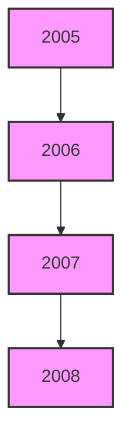
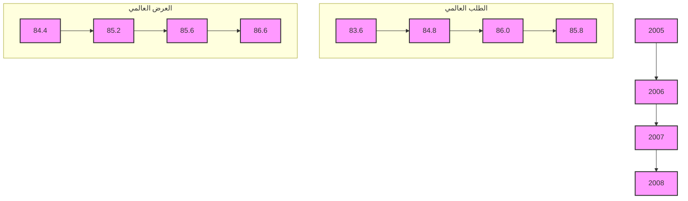
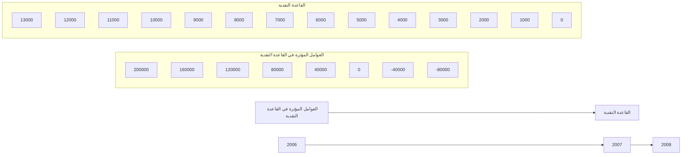
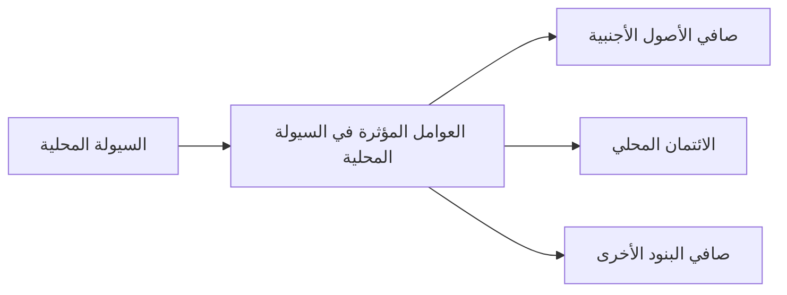

[An image of an official document cover page with the following content:]

[At the top, there is a golden emblem of an eagle with spread wings]

مصرف ليبيا المركزي

[Below the Arabic text, there is an image of a grand building with domed structures and arched windows]

التقرير السنوي الثاني والخمسون

السنة المالية

1376 وفاة الرسول / 2008 مسيحي

[Translation of the Arabic text:

Central Bank of Libya

The Fifty-Second Annual Report

Financial Year

1376 After the Prophet's Death / 2008 AD]
---
[An image of an official document cover page with the following content in Arabic and its English translation:]

[At the top, there is an emblem of a golden eagle with spread wings, holding a shield with a green center]

مصرف ليبيا المركزي
[Central Bank of Libya]

التقرير السنوي
الثاني والخمسون

[Annual Report
Fifty-Second]

السنة المالية
1376 وفاة الرسول / 2008 مسيحي

[Financial Year
1376 After the Prophet's Death / 2008 AD]
---
# التقرير السنوي لعام 2008

بسم الله الرحمن الرحيم
---
التقرير السنوي لعام 2008

السلطة والثروة والسلاح
بيد الشعب
---
التقرير السنوي لعام 2008

# مجلــــــس الإدارة

| المنصب | الاسم |
|--------|------|
| رئيساً | المحافظ | الأخ / أ. فرحات عمر بن قدارة |
| نائباً للرئيس | نائب المحافظ | الأخ / أ. محمد عبد السلام الشكري |

أعضاء:
- الأخ / عاشور خليفة تربل
- الأخ / د. بالقاسم عمر الطبولي
- الأخ / د. إدريس عبد السلام الشتيوي
- الأخ / د. بشير علي التو رقي
- الأخ / د. عمر إبراهيم حسين
---
التقرير السنوي لعام 2008

## مدراء الإدارات

| الإدارة | المدير |
|---------|--------|
| مدير إدارة الاحتياطيات | عبيد الله عبد الله الطريفي |
| مدير إدارة الإصدار | محمد البهلول أرحومة |
| مدير إدارة البحوث والإحصاء | علي رمضان شنيب |
| مدير إدارة الحسابات | عبد الناصر خليفة قنيدي |
| مدير إدارة الرقابة على المصارف والنقد | د. محمد عبد الجليل أبوسنينة |
| مدير إدارة الشؤون الإدارية والموظفين | بشير الهمالي الزنتوتي |
| مدير إدارة العمليات المصرفية | محمد شعبان صمود |
| مدير إدارة المراجعة | د. خالد علي كاجيجي |
| مدير الإدارة القانونية | د. مصطفى مصباح إبارة |
| مدير إدارة تقنية المعلومات | عبد العظيم بن صوفية |
| مدير عام معهد الدراسات المصرفية والمالية | د. عمر المبروك أبو شعالة |

## مدراء الفروع

| الفرع | المدير |
|-------|--------|
| مدير فرع بنغازي | الكيلاني منصور الزوبي |
| مدير فرع سبها | عبد السلام وادي معروف |
| مدير فرع سرت | جمعة يونس ناجي |
---
# التقرير السنوي لعام 2008

## مصرف ليبيا المركزي

### الإدارة العامة / طرابلس

+ (218) 21-3333591 / 9 : هاتف
+ (218) 21 - 4441488 : (فاكس) مصور بريد
CBLJLYLXXXX : السويفت
www.cbl.gov.ly : الموقع الإلكتروني

### الفروع

#### : فرع سبها
+ (218) 71- 627771 /3 : هاتف
+ (218) 71 - 621800 : (فاكس) مصور بريد

#### : فرع بنغازي
+ (218) 61 - 9091161 /8 : هاتف
+ (218) 61 - 9091169 : (فاكس) مصور بريد

#### : فرع سرت
+ (218) 54 - 63750 / 4 : هاتف
+ (218) 54 - 3605695 : (فاكس) مصور بريد

----

### إدارة البحوث والإحصاء
+ (218) 21- 4773901 : هاتف
+ (218) 21 - 4773903 : (فاكس) مصور بريد
ecorestat@ cbl.gov.l y : بريد إلكتروني
---
# التقرير السنوي لعام 2008

## المحتويات

14 .................................................................................................. تقديم

### الجزء الأول
### التطورات الاقتصادية العربية والدولية

18 ...................................................................... التطورات الاقتصادية الدولية : أولاً
18 ........................................................................................ نظرة عامة •
18 ..................................................................................... النمو الاقتصادي •
18 ............................................................................................... البطالة •
20 ............................................................................................... التضخم •
20 .................................................................................... المديونية الخارجية •
20 ...................................................................................... التجارة العالمية •
22 ...................................................................................... أسعار الصرف •
23 ................................................................. أسعار بعض السلع الغذائية والمعادن •
25 ............................................................................. التطورات النفطية الدولية •
26 ................................................................................... العرض -
26 .................................................................................... الطلب -
29 ................................................................................... الأسعار -
30 ...................................................................... التطورات الاقتصادية العربية : ثانياً

### الجزء الثاني
### التطورات الاقتصادية المحلية
### القطاع الحقيقي : أولاً

38 ...................................................................... الناتج المحلي الإجمالي الحقيقي •
42 ....................................................................... الناتج المحلي الإجمالي الاسمي •
45 ................................................................................ المستوى العام للأسعار •
47 ............................................................................. التطورات النفطية المحلية •
47 ............................................................. الإنتاج المحلي من النفط الخام -
---
# التقرير السنوي لعام 2008

49 - صادرات النفط الخام ..
50 - أسعار النفط الخام ..........
51 - إنتاج الغاز الطبيعي .........
52 - صادرات الغاز الطبيعي ..................................
52 - الإنتاج المحلي من المشتقات النفطية .......................
53 - الإنتاج المحلي من البتروكيماويات .........................
54 - صادرات المنتجات النفطية والبتروكيماوية ...............
54 - الاستهلاك المحلي من المشتقات النفطية ...................

## ثانياً : المالية العامة

56 • تنفيذ الميزانية العامة لعام 2008 ...................................
57 - الميزانية التسييرية ........
57 - الإيرادات ........
57 - المصروفات .....
58 - ميزانية التحول ...........
58 - توزيع الثروة ............
62 • الميزانية العامة للسنة المالية 2009 .................................

## ثالثاً : القطاع الخارجي

66 • التجارة الخارجية .................
66 - أولاً - الصادرات ...............
67 - ثانياً - الواردات .................
69 • حجم التجارة البينية بين ليبيا والدول العربية ...................
70 • ميزان المدفوعات .................
70 - الحساب الجاري ..........
70 - الحساب الرأسمالي والمالي ............................

## رابعاً : القطاع المصرفي والنقدي

73 • التطورات المصرفية ...............
73 - قرارات مجلس الإدارة لعام 2008 .........................
75 - الرقابة المصرفية ..........
---
# التقرير السنوي لعام 2008

76. معهد الدراسات المصرفية والمالية
77. نظام المدفوعات
81. التطورات النقدية •
81. القاعدة النقدية والعوامل المؤثرة فيها
83. السيولة المحلية والعوامل المؤثرة فيها
85. مقاصة الصكوك
86. سعر صرف الدينار الليبي
88. مصرف ليبيا المركزي •
88. جانب الأصول
89. جانب الخصوم
92. المصارف التجارية •
92. مصادر الأموال
94. استخدامات الأموال
99. وضع السيولة والاحتياطي النقدي الإلزامي
100. المصرف الليبي الخارجي •
104. المصارف المتخصصة •
104. مصرف التنمية
105. المصرف الزراعي
105. مصرف الادخار والاستثمار العقاري
106. المصرف الريفي

## خامساً : المؤسسات المالية غير المصرفية

107. المؤسسة الليبية للاستثمار •
109. المحفظة الاستثمارية طويلة المدى
110. الشركة الليبية للاستثمارات الخارجية
110. سوق الأوراق المالية الليبي •
112. صندوق الإنماء الاقتصادي والاجتماعي •
113. صندوق التقاعد •
114. شركات التأمين •
---
# التقرير السنوي لعام 2008

## تقديم

يسر مصرف ليبيا المركزي أن يقدم تقريره السنوي الثاني والخمسون ، متضمناً أهم التطورات الاقتصادية على الصعيد الدولي والعربي والمحلي ، فعلى الصعيد الدولي سجل الاقتصاد العالمي تراجعاً حيث انخفض معدل النمو به من 5.2% عام 2007 إلى 3.2% عام 2008 ، وذلك بسبب العديد من العوامل أهمها أزمة الرهن العقاري في الولايات المتحدة الأمريكية ، وهي الأزمة التي جعلت الاستثمارات والمضاربات في أسواق العالم تتجه إلى النفط وأسواق السلع الغذائية وخاصة الحبوب ، فكانت أزمة الغذاء وأزمة الطاقة ثم أزمة انهيار المصارف والمؤسسات المالية العالمية فأزمة شُح السيولة وتقييد الائتمان وأزمة الركود التي تطورت إلى أزمة انكماش اقتصادي . وقد صاحب هذا الانكماش الاقتصادي ، ارتفاع معدلات البطالة خلال عام 2008 في دول منطقة اليورو حيث بلغ 7.6% وفي الولايات المتحدة الأمريكية 5.8% ، وفي المملكة المتحدة واليابان إلى 5.5% وإلى 4.0% على التوالي .

أما فيما يتعلق بالمديونية الخارجية للدول النامية والأسواق الناشئة ، فقد ارتفع إجمالي الدين الخارجي بنسبة 8.3% ، ليصل في العام قيد التقرير إلى 4472.3 مليار دولار ، مقابل 4130.3 مليار دولار في عام 2007 . كما شهدت حركة التجارة العالمية في السلع والخدمات خلال عام 2008 انخفاضاً ، حيث تراجع معدل نمو التجارة العالمية في العام قيد التقرير ليصل إلى 3.3% ، مقابل 7.2% في العام السابق .

وعلى الصعيد العربي ، أظهرت التقديرات الأولية وفق المصادر الدولية ، أن معدل النمو الاقتصادي للدول العربية لعام 2008 بلغ نسبة 6.0% محافظاً على نفس مستواه المحقق عام 2007 متجاوزاً معدل نمو الاقتصاد العالمي للعام التاسع على التوالي .

أما على المستوى المحلي ، أظهرت التقديرات الأولية تحسناً ملحوظاً ، وذلك من خلال معدلات النمو المتحققة التي وصلت نسبتها إلى 6.1% ، مقارنة بنسبة 5.6% و5.9% خلال عامي 2007 و2006 على التوالي ، حيث بلغت قيمة الناتج المحلي الإجمالي بالأسعار الثابتة ( أسعار سنة 2003 ) نحو 51.7 مليار دينار ، مقابل 48.7 مليار دينار خلال عام 2007 .

14
---
# التقرير السنوي لعام 2008

وفيما يخص التطورات النقدية ، فقد شهد عرض النقود نمواً بلغت نسبته 47.8% ليصل
في نهاية عام 2008 نحو 37.2 مليار دينار ، مقابل 25.1 مليار دينار في نهاية عام
2007 ، وقد ساهمت الزيادة في عرض النقود خلال العام قيد التقرير والناجمة عن
التوسع في الإنفاق العام والائتمان المصرفي الممنوح ، وبصفة خاصة من المصارف
في ارتفاع المستوى العام للأسعار ، ليبلغ معدل التضخم 10.4% مقابل 6.2% في عام
2007 .

أما فيما يتعلق بالتطورات المالية ، فقد بلغ حجم الإنفاق الفعلي بالميزانية العامة للبابين
الأول والثاني خلال عام 2008 نحو 9722.4 مليون دينار من إجمالي المبلغ المخصص
والمعتمد البالغ 10923.5 مليون دينار ، أي بوفر فعلي قدره 1201.1 مليون دينار أو
بنسبة 11.0% ، وقد خصص للباب الأول الذي يتضمن المهايا والمرتبات وما في حكمها
مبلغ 6729.4 مليون دينار ، في حين بلغ الإنفاق الفعلي لهذا البند 6192.7 مليون دينار
بوفر قدره 536.7 مليون دينار أو بنسبة 8.0% ، وفي الباب الذي يتضمن المصروفات
التسييرية والنفقات الأخرى ، فقد خصص له مبلغ 4194.1 مليون دينار ، وقد بلغت
المصروفات الفعلية للتسيير والنفقات الأخرى نحو 3529.7 مليون دينار أي بوفر قدره
664.4 مليون دينار أو بنسبة 16.0% ، أما الباب الثالث وهو باب التحول فقد بلغت
مخصصاته من الميزانية العامة المعتمدة بموجب قانون الميزانية العامة لسنة 2008 مبلغ
33950.0 مليون دينار ، خصص منها مبلغ 3800.0 مليون دينار للمؤسسة الوطنية للنفط
، ومبلغ 1000.0 مليون دينار للجنة الشعبية العامة المؤقتة للدفاع ، ومبلغ 1000.0
مليون دينار لجهاز النهر الصناعي .

هذا وقد بلغت التعويضات المالية الصادرة حتى 31.12.2008 نحو 28903.3 مليون
دينار وهي تمثل نسبة 85.0% من إجمالي المخصصات المعتمدة بموجب القانون ، في
حين بلغت قيمة التعويضات المالية المسيلة والتي تمثل الأرصدة التي تم صرفها خلال
العام المالي 2007 نحو 1425.8 مليون دينار .

أما التعويضات التي لم يتم التعويض بتسييلها وتمثل قيمة المبالغ المتبقية من مخصصات
ميزانية عام 2007 ، فقد بلغت نحو 421.3 مليون دينار . ويبلغ الرصيد من مخصصات
التحول والذي لم يتم التعويض به حتى نهاية عام 2008 نحو 5046.8 مليون دينار . أما
باب توزيع الثروة فقد بلغت مخصصاته المعتمدة بالميزانية العامة نحو 4622.1 مليون
دينار .

وفيما يخص أداء القطاع الخارجي ، فقد حقق ميزان المدفوعات فائضاً في الميزان الكلي
بلغ 18.5 مليار دينار خلال عام 2008 ، مقابل فائضاً قدره 20.7 مليار دينار عام
2007، ويعود هذا الفائض إلى فائض الحساب الجاري البالغ 44.1 مليار دينار في

15
---
# التقرير السنوي لعام 2008

عام 2008 ، مقابل 35.8 مليار دينار عام 2007 ، وقد ساهم الفائض في الميزان الكلي
بتعزيز المدفوعات في زيادة تغطية الاحتياطيات من النقد الأجنبي للواردات الشهرية
لتصل إلى نحو 43.5 شهراً .

وعلى صعيد التطورات المصرفية ، واصل مصرف ليبيا المركزي خلال عام 2008 ،
بذل جهوده لتفعيل دور السياسة النقدية التي ينتهجها ورفع قدرة المصارف التجارية
ومساهمتها في النشاط الاقتصادي ، كما اصدر مجلس إدارة مصرف ليبيا المركزي خلال
عام 2008 العديد من القرارات ، منها قرار الشروع في إصدار شهادات مصرف ليبيا
المركزي بمعدلات فائدة 2.25% ، كما تم إنشاء شركة خدمات مالية لتحصيل الديون ،
وذلك في إطار إعادة هيكلة للمؤسسات الأهلية المصرفية المندمجة في المؤسسة الأهلية
المصرفية ومعالجة ديونها المتعثرة ، كما تم الآن بشأن إنشاء مكتب المعلومات
الائتمانية ، وتنظيم السياسة الائتمانية للمصارف التجارية ، وبيع نسبة من الأسهم المملوكة
لمصرف ليبيا المركزي في رأس مال مصرف الجمهورية والتجاري الوطني.

أما فيما يتعلق بأنشطة المؤسسات المالية غير المصرفية ، فقد تضمن التقرير جزء
خاص عن نشاط بعض المؤسسات المالية غير المصرفية والتي تلعب دوراً مهماً في
الاقتصاد الوطني ، وتمارس أنشطة استثمارية واسعة ، سواء في الداخل أو في الخارج
ومن هذه المؤسسات المالية شركات التأمين ، وصندوق التقاعد ، وصندوق الضمان
الاجتماعي والمؤسسة الليبية للاستثمار والمؤسسات التابعة لها ، كما تضمن هذا التقرير أيضاً المؤشرات المهمة في أداء سوق الأوراق
المالية الليبي .

ويتنهز مصرف ليبيا المركزي هذه الفرصة ، ليعرب عن شكره وامتنانه لكافة الإدارات
والمؤسسات والأجهزة العامة ذات العلاقة ، لتوفيرها وتزويدها له بالبيانات والإحصاءات
اللازمة التي مكنته من إعداد هذا التقرير .

والله ولي التوفيق

فرحات بن قدارة
المحافظ

16
---
التقرير السنوي لعام 2008

الجزء الأول
التطورات الاقتصادية العربية والدولية
---
# التطورات الاقتصادية الدولية                                                                  التقرير السنوي لعام 2008

## أولاً : التطورات الاقتصادية الدولية

### • نظرة عامة:

مع بداية عام 2008 ، سادت كافة دول العالم موجة من التفاؤل باستمرار النمو
الاقتصادي الذي بدأ منذ عام 2003 ، ولم تكن بداية عام 2008 تشير إلى أنه سيشهد
أسوأ أزمة مالية عرفها العالم منذ ثلاثينيات القرن الماضي ، حيث انطلقت شرارتها الأولى
في الولايات المتحدة الأمريكية بانفجار أزمة الرهن العقاري التي جعلت الاستثمارات
والمضاربات في أسواق العالم تتجه إلى النفط والسلع الأساسية وتحولت الاستثمارات
بالتدريج إلى المضاربات في أسواق النفط وأسواق السلع الغذائية ، خاصة الحبوب . فكانت
أزمة الغذاء وأزمة الطاقة حيث ارتفعت أسعار السلع الغذائية وسجلت أسعار النفط أرقاماً
قياسية عندما بلغ سعر برميل النفط 147.72 دولاراً للبرميل في منتصف شهر ناصر
(يوليو) 2008 ، ثم كانت أزمة انهيار المصارف والمؤسسات المالية العالمية ، بداية من
منتصف شهر الفاتح (سبتمبر) 2008 الذي شهد إفلاس مصرف (ليمان براذرز ) وكان
ذلك بداية سقوط الكبار تباعاً ، ثم عزفت المصارف عن إقراض بعضها البعض فكانت
أزمة شح السيولة وتقييد الائتمان ، فأزمة انهيار أسواق المال وأزمة الركود التي تطورت
إلى أزمة انكماش اقتصادي ، بدأت بوادره بارتفاع معدلات البطالة بوتيرة سريعة في
معظم دول العالم .

### • النمو الاقتصادي :

انخفض معدل نمو الاقتصاد العالمي خلال عام 2008 ، مقابل عام 2007 ليبلغ نحو
3.2% عام 2008 ، مقابل 5.2% في العام السابق ، وقد تراجعت معدلات النمو في كل
مناطق العالم لتسجل نحو 0.9% مقابل 2.7% في الدول الصناعية المتقدمة ، وقد
انخفضت معدلات النمو في الولايات المتحدة لتصل إلى 1.1% ، مقابل 2.0% كما
انخفضت في اليابان لتصل إلى 0.6% مقابل 2.4% عام 2007، أما في الدول النامية
والأسواق الناشئة فقد بلغ معدل النمو 6.1% مقابل 8.3% في حين بلغ 2.9% مقابل
5.4% في دول وسط وشرق أوروبا ، وشهدت إفريقيا ودول الشرق الأوسط نمواً بلغ
5.2% و4.2% عام 2008 مقابل 6.2% و5.7% عام 2007 على التوالي .

### • البطالة :

شهدت معدلات البطالة في الدول الصناعية عام 2008 ارتفاعا نسبيا ، حيث بلغت
5.8% ، مقابل 5.4% عام 2007 ، وارتفعت في دول منطقة اليورو من 7.5% إلى
7.6% ، كما ارتفعت في اليابان من 3.8% إلى 4.0% ، وارتفع معدل البطالة في
الولايات المتحدة الأمريكية والمملكة المتحدة من 4.6% إلى 5.8% ومن 5.4% إلى
5.5% لكل منهما على التوالي .

18
---
التطورات الاقتصادية الدولية                                                  التقرير السنوي لعام 2008

## جدول رقم (1) : معدلات النمو الحقيقي في العالم
* نسب مئوية *

| الدول مجموعة | 2007 | 2008 |
|--------------|------|------|
| العالم | 5.2 | 3.2 |
| الدول الصناعية: | 2.7 | 0.9 |
| الولايات المتحدة الأمريكية | 2.0 | 1.1 |
| دول منطقة اليورو | 2.7 | 0.9 |
| اليابان | 2.4 | -0.6 |
| دول صناعية أخرى | 4.0 | 1.2 |
| الدول النامية وأسواق ناشئة أخرى (*) : | 8.3 | 6.1 |
| أفريقيا | 6.2 | 5.2 |
| دول وسط وشرق أوروبا | 5.4 | 2.9 |
| دول الكومنولث المستقلة | 8.6 | 5.5 |
| آسيا | 10.6 | 7.7 |
| الشرق الأوسط | 6.3 | 5.9 |
| نصف الكرة الغربي (**) | 5.7 | 4.2 |

المصدر : صندوق النقد الدولي ، آفاق الاقتصاد العالمي - أبريل (نيسان) 2009 .
* الأسواق الناشئة تشمل : البرازيل ، بولندا ، تشيلي ، جنوب أفريقيا ، جمهورية التشيك ، كوريا الجنوبية .
** تشمل : المكسيك وأمريكا الوسطى ومنطقة الكاريبي وأمريكا الجنوبية .

## شكل (1) : معدلات النمو الحقيقي في العالم



| السنوات | العالم | الدول الصناعية | الدول النامية |
|---------|-------|----------------|---------------|
| 2005 | 4.5 | 2.6 | 7.1 |
| 2006 | 5.1 | 3 | 7.9 |
| 2007 | 5.2 | 2.7 | 8.3 |
| 2008 | 3.2 | 0.9 | 6.1 |

## جدول رقم (2) : معدلات البطالة في الدول الصناعية
* نسب مئوية *

| الدول مجموعة | 2007 | 2008 |
|--------------|------|------|
| الدول الصناعية | 5.4 | 5.8 |
| الولايات المتحدة الأمريكية | 4.6 | 5.8 |
| دول منطقة اليورو | 7.5 | 7.6 |
| المملكة المتحدة | 5.4 | 5.5 |
| اليابان | 3.8 | 4.0 |

المصدر : صندوق النقد الدولي ، المصدر السابق .

19
---
# التطورات الاقتصادية الدولية                                                  التقرير السنوي لعام 2008

## التضخم

ارتفع معدل التضخم خلال العام قيد التقرير في كل مناطق العالم ، ففي الدول الصناعية
بلغ 3.4% مقابل 2.2% عام 2007 وفي منطقة اليورو بلغ 3.3% مقابل 2.1% وفي
إفريقيا بلغ 10.1% ، مقابل 6.3% وفي دول وسط وشرق أوروبا بلغ 8.0% ، مقابل
6.1% ، كما ارتفع في دول الشرق الأوسط إلى 15.6% مقابل 10.5% وفي آسيا من
5.4% عام 2007 إلى 7.4% في عام 2008 .

### جدول رقم ( 3 ) : معدلات التضخم في العالم

| الدول مجموعة | 2007 | 2008 |
|--------------|------|------|
| الدول الصناعية | 2.2 | 3.4 |
| الولايات المتحدة الأمريكية | 2.9 | 3.8 |
| دول منطقة اليورو | 2.1 | 3.3 |
| اليابان | - | 1.4 |
| دول صناعية أخرى | 2.1 | 3.8 |
| الدول النامية وأسواق ناشئة أخرى: | 6.4 | 9.3 |
| إفريقيا | 6.3 | 10.1 |
| دول وسط وشرق أوروبا | 6.1 | 8.0 |
| دول الكومنولث المستقلة | 9.7 | 15.6 |
| آسيا | 5.4 | 7.4 |
| الشرق الأوسط | 10.5 | 15.6 |
| نصف الكرة الغربي | 5.4 | 7.9 |

المصدر: صندوق النقد الدولي، المصدر السابق .

## المديونية الخارجية

ارتفع إجمالي الدين الخارجي للدول النامية والأسواق الناشئة في عام 2008 بنسبة 8.3%
عن مستواه عام 2007 ، ليصل إلى 4472.3 مليار دولار ، مقابل 4130.3 مليار دولار
في عام 2007 ، أما خدمة الدين فقد ارتفعت بنحو 12.2% لتصل إلى 884.0 مليار
دولار عام 2008 ، مقابل 788.0 مليار دولار عام 2007 ، في حين انخفضت نسبة
الدين الخارجي كنسبة إلى الصادرات من 14.1% في عام 2007 إلى 12.9% عام
2008 .

## التجارة العالمية

تراجع معدل نمو التجارة العالمية خلال عام 2008 ليصل إلى 3.3% ، مقابل 7.2% في
العام السابق ، ويعزى ذلك إلى عمق الأزمة المالية العالمية وإلى ما ترتب عليها من
الركود والكساد على المستوى العالمي. مما أدى إلى تراجع معدلات نمو الصادرات
والواردات ، حيث سجل معدل نمو الصادرات انخفاضاً في مجموعة الدول الصناعية
ليصل إلى نسبة 1.8% ، مقابل 6.1% في عام 2007. كما انخفض معدل نمو الواردات
في مجموعة الدول الصناعية ليصل إلى 0.4% مقابل 4.7% ، وفي مجموعة الدول
النامية والأسواق الناشئة 10.9% مقابل 14.0% .
---
التطورات الاقتصادية الدولية                                                                                                                                          التقرير السنوي لعام 2008

جدول رقم ( 4 ) : حجم المديونية الخارجية للدول النامية والأسواق الناشئة الأخرى
" بالمليار دولار "

| 2008 | 2007 | مجموعة الدول |
|-------|-------|---------------|
| 4472.3 | 4130.3 | 1- مديونية الدول النامية والأسواق الناشئة الأخرى : |
| 268.0 | 265.8 | أفريقيا |
| 1031.4 | 889.5 | دول وسط وشرق أوروبا |
| 735.5 | 675.7 | دول الكومنولث المستقلة |
| 1128.5 | 1022.5 | آسيا |
| 430.6 | 441.5 | الشرق الأوسط |
| 878.3 | 835.4 | نصف الكرة الغربي |
| 12.9 | 14.1 | 2- خدمة الدين للدول النامية والأسواق الناشئة الأخرى: (*) |
| 5.2 | 7.0 | أفريقيا |
| 26.1 | 25.6 | دول وسط وشرق أوروبا |
| 33.9 | 33.4 | دول الكومنولث المستقلة |
| 6.3 | 6.9 | آسيا |
| 4.3 | 5.3 | الشرق الأوسط |
| 18.3 | 24.0 | نصف الكرة الغربي |

المصدر : صندوق النقد الدولي ، المصدر السابق .
(*) كنسبة من الصادرات

شكل ( 2 ) : تطور المديونية الخارجية للدول النامية والأسواق الناشئة الأخرى


| السنوات | 2005 | 2006 | 2007 | 2008 |
|---------|------|------|------|------|
| مليار دولار | 0 | 300 | 600 | 900 | 1200 | 1500 | 1800 | 2100 | 2400 | 2700 | 3000 | 3300 | 3600 | 3900 | 4200 | 4500 |

دول وسط وشرق أوروبا | دول الكومنولث المستقلة | آسيا | الشرق الأوسط | نصف الكرة الغربي | أفريقيا

21
---
التطورات الاقتصادية الدولية | التقرير السنوي لعام 2008

## جدول رقم (5) : معدلات نمو التجارة العالمية

| * نسبة مئوية * | 2008 | 2007 |                                    |
|----------------|------|------|-----------------------------------|
| 3.3            | 7.2  |      | إجمالي التجارة العالمية            |
|                |      |      | : الدول الصناعية                  |
| 1.8            | 6.1  |      | الصادرات                          |
| 0.4            | 4.7  |      | الواردات                          |
|                |      |      | : الدول النامية وأسواق ناشئة أخرى |
| 6.0            | 9.5  |      | الصادرات                          |
| 10.9           | 14.0 |      | الواردات                          |

المصدر : المصدر السابق .

### أسعار الصرف •

تراجع سعر صرف الدولار الأمريكي مقابل معظم العملات الرئيسية حيث وصل سعر
صرف الدولار مقابل اليورو عام 2008 إلى 1.410 دولاراً ، مقابل 1.372 دولاراً في
عام 2007 ، كما انخفض سعر صرف الدولار مقابل الين الياباني ليصل إلى 90.464 يناً
للدولار ، مقابل 117.6 يناً للدولار في العام السابق ، في حين ارتفع سعر صرف الدولار
مقابل الجنيه الاسترليني ليصل في العام قيد التقرير إلى 1.449 دولاراً ، مقابل 2.004
دولاراً في عام2007 .

## جدول رقم (6) : أسعار صرف بعض العملات الدولية لعام 2008

| الفرنك السويسري | الين الياباني | الجنيه الاسترليني | اليورو | الدولار الأمريكي |                    |
|------------------|---------------|-------------------|--------|-------------------|-------------------|
| 0.9479           | 0.0111        | 1.4485            | 1.4103 | -                 | الدولار الأمريكي |
| 0.6722           | 0.0078        | 1.0271            | -      | 0.7091            | اليورو           |
| 0.6544           | 0.0076        | -                 | 0.9736 | 0.6904            | الجنيه الاسترليني |
| 85.754           | -             | 131.036           | 127.580| 90.464            | الين الياباني    |
| -                | 0.0117        | 1.5281            | 1.4877 | 1.0549            | الفرنك السويسري  |

22
---
# التطورات الاقتصادية الدولية                                                  التقرير السنوي لعام 2008

## • أسعار بعض السلع الغذائية والمعادن :

شهدت أسعار معظم السلع الغذائية ارتفاعات متتالية خلال العام قيد التقرير . فقد ارتفعت
أسعار الشعير بنسبة 16.5% خلال عام 2008 لتصل إلى 200.5 دولار للطن المتري ،
مقابل 172.0 دولار للطن عام 2007 ، وارتفعت أسعار القمح بنسبة 27.8% عام
2008 لتصل إلى 326.0 دولار للطن ، مقابل 255.0 دولار للطن عام 2007 . كما
ارتفعت أسعار الأرز خلال عام 2008 بنسبة 110.9% لتصل إلى 700.2 دولار للطن
المتري ، مقابل 332.0 دولار للطن عام 2007 وانخفضت أسعار زيت الزيتون بنسبة
8.6% أي من 4561.0 دولار للطن إلى 4167.5 دولار للطن في حين ارتفعت أسعار
زيت الصويا وعباد الشمس بنسب 41.7% و151.6% لتصل إلى 1133.8 دولار للطن
و1693.7 دولار للطن عام 2008 ، مقابل 800.0 دولار للطن و 673.0 دولار للطن
عام 2007 على التوالي . ويعزى ارتفاع أسعار المواد الغذائية لعدة أسباب منها :
- التوسع في إنتاج الوقود الحيوي كمصدر بديل للطاقة وذلك على حساب الإنتاج
الغذائي.
- النمو الاقتصادي الكبير الذي شهدته بعض الدول كالصين والهند ، مما زاد من
الطلب على المواد الغذائية .
- تحول بعض التجار للمضاربة من أسواق المال إلى أسواق السلع بهدف تحقيق
أرباح أعلى .

ويلاحظ في هذا السياق انخفاض معظم أسعار السلع الغذائية في الربع الأخير من العام قيد
التقرير ، كنتيجة للأزمة المالية العالمية التي بدأت بوادرها في الظهور منذ شهر يوليو
(أغسطس) 2007 ، وامتدت لتشمل قطاعات أخرى غير القطاع المالي . أما فيما يتعلق بأسعار بعض المعادن الأساسية فقد شهدت أسعار النحاس انخفاضا بنسبة
2.3% خلال عام 2008 لتصل إلى 6963.5 دولار للطن ، مقابل 7132.0 دولار للطن
عام 2007 ، كما شهدت أسعار الألمونيوم انخفاضا خلال عام 2008 لتصل إلى 2577.9
دولار للطن مقابل 2640.0 دولار للطن عام 2007 أي بنسبة انخفاض بلغت 2.3%
فيما شهدت أسعار الذهب ارتفاعا خلال عام 2008 ، حيث بلغ المتوسط العام لأسعار
الذهب نحو 871.7 دولار للأوقية ، مقابل 695.4 دولار للأوقية عام 2007 ، وتعتبر
الأزمة المالية من أهم الأسباب التي أدت إلى ارتفاع أسعار الذهب وذلك باعتباره الملاذ
الآمن للمدخرين والمستثمرين في أثناء الأزمات .

23
---
التطورات الاقتصادية الدولية | التقرير السنوي لعام 2008

جدول رقم ( 7 ) : الأسعار العالمية لبعض السلع الغذائية والمعادن
* دولاراً للطن المتري

| معدل التغير (%) | 2008 | 2007 | البيان |
|-----------------|------|------|-------|
| | | | أولاً : السلع الغذائية : |
| 16.5 | 200.5 | 172.0 | الشعير |
| 27.8 | 326.0 | 255.0 | القمح |
| 110.9 | 700.2 | 332.0 | الأرز |
| 86- | 4167.5 | 4561.0 | زيت الزيتون |
| 41.7 | 1133.8 | 800.0 | زيت الصويا |
| 151.6 | 1693.7 | 673.0 | زيت عباد الشمس |
| 1.4 | 21.3 | 21.0 | السكر (سنت أمريكي للرطل) |
| 26.8 | 269.0 | 212.0 | الشاي (سنت أمريكي للكيلو جرام) |
| | | | ثانياً : المعادن : |
| 25.3 | 871.7 | 695.4 | الذهب ( دولاراً أمريكياً للأوقية ) |
| -2.3 | 2577.9 | 2640.0 | الألومنيوم |
| 2.3- | 6963.5 | 7132.0 | النحاس |

المصدر : صندوق النقد الدولي ، الإحصاءات المالية الدولية الشهرية .
---
# التطورات الاقتصادية الدولية

## التقرير السنوي لعام 2008

### • التطورات النفطية الدولية :

يشهد العالم اليوم أزمة مالية لم يعهدها منذ الكساد العظيم في أوائل الثلاثينيات من القرن العشرين ، وتلوح في الأفق بوادر تحولها إلى أزمة اقتصادية تطال اقتصاديات كل دول العالم كما تطال كافة القطاعات الاقتصادية ، حيث بدأ تأثير الأزمة المالية السلبي يطال الاقتصاد الأمريكي الذي يتأثر بنحو 25.0% من الاستهلاك العالمي من النفط ، فالاقتصاد الأمريكي الذي يتأثر بنحو 25.0% من الاستهلاك العالمي من النفط قد اتجه نحو الركود ، ولا يختلف الوضع كثيراً بالنسبة لاقتصاد دول منطقة اليورو أو الاقتصاد الياباني وكذلك الاقتصاد الصيني الذي يعد ثاني أكبر مستهلك للنفط ، الأمر الذي ينعكس سلباً على طلب النفط ، ومع توقع استمرار هذا الاتجاه السلبي لنمو الطلب على النفط ، فلا ريب أن ذلك ينعكس على أسعار النفط والذي بدوره ينعكس سلباً على العوائد النفطية التي تعد المحرك الرئيسي للتنمية الاقتصادية بالدول المنتجة للنفط ، لذا فأمام منظمة الأقطار المصدرة للنفط ( الأوبك ) مهمة شاقة للحفاظ على مستوى عادل لسعر برميل النفط وعلى استقرار السوق النفطية وعلى العمل لتخفيف الآثار السلبية لهذه الأزمة .

لقد حدثت تغيرات مهمة على الطلب العالمي على النفط منذ انهيار أسواق الأسهم العالمية في شهر أكتوبر ( تشرين الأول ) 2008 ، حيث إلى ذلك الحين ، كان الطلب على النفط في الدول الصناعية المتقدمة ، مثل الولايات المتحدة وأوروبا يتراجع تحت وطأة الأسعار القياسية للنفط التي شاهدتها الأسواق العالمية خلال السنتين الماضيتين ، لكن الطلب على النفط في الصين والهند وبلدان الشرق الأوسط وخصوصا المصدرة للنفط منها وغيرها من الاقتصادات النامية كان يزداد باطراد ، وفي الوقت الحاضر تعاني اقتصادات البلدان النامية هي الأخرى الانكماش الاقتصادي الحاد ، وكذلك حال النمو في الطلب على النفط ، إضافة إلى ذلك ، فإن الطلب على النفط في البلدان الصناعية المتقدمة يتراجع بنحو سريع جداً .

ونتيجة لجميع هذه العوامل ، تراجع الطلب العالمي على النفط بنحو 300 ألف برميل إلى 400 ألف برميل يومياً في العام 2008 ، وهو أول انخفاض له منذ العام 1985 ، إضافة إلى ذلك تشير معظم الدراسات إلى أن الطلب العالمي على النفط في العام 2009 من المتوقع أن ينخفض انخفاضاً حاداً ما بين 1.0 إلى 2.0 مليون برميل يومياً عن العام السابق .

وعلى الرغم من أن الدراسات تتوقع أن يشهد نمو الطلب على الطاقة عالمياً فترة ركود مؤقت بسبب الأزمة الاقتصادية وانخفاض الإقراض ، إلا أن خبراء الاقتصاد يؤكدون له وتتوقع . مع معاودة الانتعاش الاقتصادي سيعود الطلب على النفط للانتعاش مرة أخرى . ويتوقع تقرير صادر عن معهد ماكينزي العالمي أن ينمو الطلب العالمي على الطاقة بنسبة 2.3% سنوياً خلال الفترة بين العامين 2010 و 2020 أي بزيادة نقطة كاملة مقارنة بالفترة

25
---
# التطورات الاقتصادية الدولية                                                  التقرير السنوي لعام 2008

بين العامين 2006 و2010 وسوف تكون الدول النامية السبب في 90% من هذه الزيادة
مع تسارع وتيرة نمو الطلب إلى أقصى معدل في الشرق الأوسط . وستشهد الفترة وعلى
النقيض ، سيكون الطلب على النفط في الولايات المتحدة الأمريكية خلال 2020 أقل من
معدله في 2006 .
ويوضح الخبراء أنه في هذه الأثناء سوف يشهد نمو الطلب على الطاقة في اليابان ركودا
فعليا ، بينما تشهد الصين وأوروبا تزايد الطلب بمعدل 1.0% .

## العرض -

سجل العرض العالمي من النفط الخام والغاز المسال ارتفاعا طفيفا خلال عام 2008
بنسبة 1.2% ، وبمقدار 1.0 مليون برميل في اليوم ، ليبلغ في المتوسط 86.6 مليون
برميل في اليوم ، مقابل 85.6 مليون برميل في اليوم في العام 2007 . وقد ارتفع إنتاج
منظمة الأقطار المصدرة للنفط "الأوبك " من حوالي 35.5 مليون برميل في اليوم عام
2007 إلى نحو 37.1 مليون برميل في اليوم خلال العام قيد التقرير ، أما إنتاج الدول
خارج المنظمة فقد شهد انخفاضا طفيفا نسبته 1.0% من 27.8 مليون برميل في اليوم عام
2007 إلى 27.5 مليون برميل في اليوم عام 2008 . كما شهد إنتاج منظمة التعاون
الاقتصادي والتنمية انخفاضا طفيفا بلغت نسبته 2.5% من 19.8 مليون برميل في اليوم
عام 2007 إلى حوالي 19.3 مليون برميل في اليوم في العام قيد التقرير .

## الطلب -

انخفض الطلب العالمي على النفط الخام والغاز المسال بنسبة 0.2% ليبلغ في المتوسط
85.8 مليون برميل في اليوم ، مقابل 86.0 مليون برميل في اليوم عام 2007 . وقد
ارتفع طلب الصين بنسبة 5.3% خلال عام 2008 ليصل إلى 7.9 مليون برميل في
اليوم ، مقابل 7.5 مليون برميل في اليوم للعام السابق ، وارتفع طلب كل من دول الشرق
الأوسط والاتحاد السوفيتي وأمريكا اللاتينية ومجموعة الدول الآسيوية الأخرى بنسبة
7.7% و4.9% و3.6% و1.1% على التوالي ، في حين ظل طلب إفريقيا ودول أوروبا
على نفس المستوى السابق عام 2007 ، أي بنحو 3.1 مليون برميل في اليوم و0.8
مليون برميل في اليوم على التوالي .
---
التطورات الاقتصادية الدولية | التقرير السنوي لعام 2008

جدول رقم (8) : العرض العالمي للنفط الخام والغاز المسال
* مليون برميل في اليوم *

| معدل النمو | متوسط عام 2008 | 2008 |  |  |  | 2007 | المنطقة |
|------------|----------------|------|------|------|------|------|---------|
|  |  | الربع الرابع | الربع الثالث | الربع الثاني | الربع الأول |  |  |
| 2.5- | 19.3 | 19.3 | 18.8 | 19.5 | 19.7 | 19.8 | منظمة التعاون الاقتصادي والتنمية -1 |
| 2.8- | 13.9 | 13.9 | 13.6 | 14.1 | 14.2 | 14.3 | أمريكا الشمالية |
| 6.0- | 4.7 | 4.7 | 4.5 | 4.8 | 4.9 | 5.0 | أوروبا |
| 0.0 | 0.6 | 0.7 | 0.7 | 0.6 | 0.6 | 0.6 | دول المحيط الهادي |
| 1.0- | 27.5 | 27.6 | 27.4 | 27.6 | 27.6 | 27.8 | دول خارج المنظمة منها: -2 |
| 0.8- | 12.7 | 12.7 | 12.6 | 12.9 | 12.8 | 12.8 | الاتحاد السوفيتي السابق |
| 0.0 | 0.1 | 0.1 | 0.1 | 0.1 | 0.1 | 0.1 | أوروبا |
| 2.7 | 3.8 | 3.9 | 3.8 | 3.8 | 3.8 | 3.7 | الصين |
| 3.7- | 2.6 | 2.7 | 2.6 | 2.6 | 2.7 | 2.7 | دول آسيوية أخرى |
| 6.9- | 4.0 | 4.1 | 4.1 | 4.0 | 3.9 | 4.3 | أمريكا اللاتينية |
| 0.0 | 1.6 | 1.6 | 1.6 | 1.6 | 1.6 | 1.6 | الشرق الأوسط |
| 4.0 | 2.6 | 2.6 | 2.6 | 2.6 | 2.6 | 2.6 | أفريقيا |
| 4.5 | 37.1 | 36.6 | 37.4 | 37.1 | 37.2 | 35.5 | منظمة الأوبك -3 |
| 4.6 | 32.1 | 31.4 | 32.4 | 32.2 | 32.4 | 30.7 | نفط خام |
| 4.2 | 5.0 | 5.1 | 5.0 | 4.9 | 4.8 | 4.8 | غاز مسال |
| 0.0 | 2.2 | 2.3 | 2.3 | 2.2 | 2.2 | 2.2 | عائدات التكرير -4 |
| 1.2 | 86.6 | 86.2 | 86.3 | 86.8 | 87.1 | 85.6 | مجموع العرض العالمي |

المصدر: الوكالة الدولية للطاقة - تقرير سوق النفط - فبراير 2008 .
---
التطورات الاقتصادية الدولية | التقرير السنوي لعام 2008

جدول رقم (9) : الطلب العالمي على النفط الخام والغاز المسال
* مليون برميل في اليوم

| معدل النمو | متوسط عام 2008 | 2008 |  |  |  | 2007 | المنطقة |
|------------|----------------|------|------------------|------------------|------------------|------|----------|
|  |  | الربع الرابع | الربع الثالث | الربع الثاني | الربع الأول |  |  |
| -3.5 | 47.5 | 47.4 | 46.6 | 47.2 | 84.9 | 49.2 | 1. منظمة التعاون الاقتصادي والتنمية : |
| -4.7 | 24.3 | 24.2 | 23.7 | 24.5 | 24.8 | 25.5 | أمريكا الشمالية |
| -0.7 | 15.2 | 15.2 | 15.4 | 14.9 | 15.2 | 15.3 | أوروبا |
| -3.6 | 8.0 | 8.0 | 7.5 | 7.8 | 8.9 | 8.3 | دول المحيط الهادي |
| 3.5 | 38.2 | 37.9 | 38.6 | 38.5 | 37.9 | 36.9 | 2- دول خارج المنظمة منها : |
| 4.9 | 4.3 | 4.4 | 4.4 | 4.1 | 4.1 | 4.1 | الاتحاد السوفيتي السابق |
| 0.0 | 0.8 | 0.8 | 0.7 | 0.8 | 0.8 | 0.8 | أوروبا |
| 5.3 | 7.9 | 7.6 | 8.1 | 8.0 | 7.9 | 7.5 | الصين |
| 1.1 | 9.4 | 9.2 | 9.1 | 9.6 | 9.6 | 9.3 | دول آسيوية أخرى |
| 3.6 | 5.8 | 5.8 | 6.0 | 5.9 | 5.7 | 5.6 | أمريكا اللاتينية |
| 7.7 | 7.0 | 6.9 | 7.3 | 7.0 | 6.7 | 6.5 | الشرق الأوسط |
| 0.0 | 3.1 | 3.2 | 3.0 | 3.2 | 3.1 | 3.1 | أفريقيا |
| -0.2 | 85.8 | 85.3 |  | 85.7 | 86.9 | 86.0 | مجموع الطلب العالمي |

المصدر : المصدر السابق .

شكل (3) : العرض العالمي والطلب العالمي على النفط الخام والغاز المسال


---
التطورات الاقتصادية الدولية | التقرير السنوي لعام 2008

: الأسعار -

شهد عام 2008 زيادة ملحوظة في أسعار النفط الخام ، حيث ارتفعت أسعار سلة أوبك
خلال عام 2008 بنحو 25.0 دولاراً للبرميل لتصل إلى 94.1 دولاراً للبرميل ، وبذلك
تجاوزت وللسنة الخامسة على التوالي النطاق السعري المحدد من قبل منظمة الأوبك وهو
(22- 28 دولاراً للبرميل ) ومن العوامل المساهمة في ارتفاع أسعار النفط غير عوامل
قوى السوق ، تداعيات أزمة الرهن العقاري في الولايات المتحدة الأمريكية حيث أدت
هذه الأزمة إلى جعل الاستثمارات والمضاربات في أسواق العالم تتجه إلى أسواق النفط
مما أدى إلى ارتفاع سعر البرميل من النفط ليسجل رقماً قياسياً بلغ 147.27 دولاراً
للبرميل في منتصف شهر يوليو (تموز) 2008 هذا بالإضافة إلى عوامل أخرى ساهمت
في ارتفاع أسعار النفط منها الوضع الأمني المضطرب في العالم وخاصة منطقة الشرق
الأوسط حيث مصادر النفط الرئيسة .

جدول رقم (10) : متوسط أسعار النفط الخام

| سلة أوبك | السنة |
|-----------|-------|
| 69.1 | 2007 |
| | :2008 |
| 92.7 | الربع الأول |
| 117.6 | الربع الثاني |
| 113.4 | الربع الثالث |
| 52.5 | الربع الرابع |
| 94.1 | متوسط العام |

المصدر : منظمة الأقطار العربية المصدرة للنفط (أوابك) النشرة الشهرية - السنة 35 - العدد 3 - مارس (آذار) 2009 .
---
# التطورات الاقتصادية العربية                                                                                  التقرير السنوي لعام 2008

## ثانياً : التطورات الاقتصادية العربية

أظهرت التقديرات الأولية وفق المصادر الدولية ثبات معدل النمو الاقتصادي للدول العربية لعام 2008 محافظاً على نفس مستواه المحقق عام 2007 ، ومتجاوزاً معدل نمو الاقتصاد العالمي للعام التاسع على التوالي ، ليبلغ ما نسبته 6.0% ، مع ملاحظة أن العديد من الدول العربية سجل معدلات نمو أعلى من ذلك ، تراوحت ما بين 6.0% و19.8% . وعلى الرغم من أن معدل النمو في مجموعة الدول العربية يقل عن نظيره في مجموعة الدول النامية ، فمازالت المنطقة تعمل على مواجهة تداعيات الأزمة المالية العالمية الراهنة .

أما فيما يتعلق بمستويات الأسعار معبراً عنها بالرقم القياسي لأسعار المستهلك ( متوسط الفترة ) ، فقد ارتفع معدل التضخم في الدول العربية بدرجة ملحوظة ليبلغ 14.4% عام 2008 ، مقارنة بما نسبته 9.2% عام 2007 ، ساهم في ذلك قوة الطلب المحلي واختناقات العرض الحادة وخاصة في قطاعي الغذاء والعقارات في معظم الدول العربية وخاصة دول مجلس التعاون الخليجي ، وتراجع قيمة الدولار الأمريكي معظم فترات العام 2008 ، زيادة الأجور والرواتب لموظفي القطاع الحكومي ، وعدم فعالية السياسة النقدية كنتيجة طبيعية لتحرير رؤوس الأموال وإتباع سياسة سعر الصرف الثابت .

كما تحسنت أوضاع الموازنات العمومية في العديد من الدول العربية ، وتحسنت مؤشرات الدين العام الخارجي في كافة الدول العربية مع تحسن أوضاع الحساب الجاري وذلك للدول العربية المصدرة للنفط ، خاصة في موازين مدفوعات هذه الدول في معظم هذه الفترة حيث تم استخدام التحويلات العاملين بالخارج ، التي حققت مستويات مرتفعة في تعزيز مستويات الاستثمار الأجنبي المباشر الواردة بشكل رئيسي في التوافق مع تدفقات الاستثمار الأجنبي المباشر لهذه الدول بمعدل نمو بلغ 31.0% لتصل إلى الاحتياطيات الدولية من العملات الأجنبية 974.0 مليار دولار بنهاية العام 2008 مقابل 746.0 مليار دولار بنهاية العام 2007 .

وعلى صعيد الاستثمار الأجنبي المباشر ، تشير التقديرات الأولية إلى تراجع تدفقاته المتجهة إلى الدول العربية بما نسبته 14.0% لتبلغ 62.0 مليار دولار للعام 2008 مقارنة بنحو 72.0 مليار دولار في عام 2007 . ويعزى ذلك إلى تباطؤ النمو الاقتصادي في الدول المتقدمة ، كأحد المصادر الأساسية لتدفقات الاستثمار الأجنبي المباشر إلى الدول العربية بما أسهم في اضطراب الأسواق المالية الدولية والعربية في السنوات الأخيرة في ظل أجواء عدم اليقين التي تحيط بقرارات الاستثمار طويل المدى وأدى إلى تأجيل تنفيذ عدد ليس بالقليل من المشاريع في المنطقة العربية وخاصة في مجال البنية الأساسية ، كما تسببت الأزمة في تراجع الطلب العالمي على النفط والهبوط الحاد في أسعاره العالمية ومن ثم تراجعت حصيلة الصادرات في الدول العربية خلال الربع الأخير من عام 2008 .
. خلال هذه الفترة النفطية العربية

30
---
# التطورات الاقتصادية العربية                                                  التقرير السنوي لعام 2008

وعلى صعيد حركة التجارة العربية ، تشير التقديرات الأولية المتوفرة إلى استمرار
التحسن في نمو الصادرات العربية من السلع والخدمات خلال عام 2008 ، لتصل وفق
مصادر صندوق النقد الدولي إلى 1295.0 مليار دولار ، مقارنة بما قيمته 891.0 مليار
دولار ، أي بمعدل نمو بلغ 45.0% . وترجع هذه الزيادة في حصيلة الصادرات إلى
تواصل ارتفاع أسعار النفط والمعادن والغاز والسلع الأساسية ، وتحسن معايير جودة
الصادرات العربية السلعية والخدمية مما جعلها أكثر قدرة على غزو الأسواق الدولية . أما
بالنسبة للواردات ، فيتوقع أن يبلغ معدل نمو المدفوعات عن الواردات من السلع
والخدمات 31.0% لتصل إلى 843.0 مليار دولار في عام 2008 مقارنة بنحو 642.0
مليار دولار في عام 2007 ويعزى استمرار نمو هذه المدفوعات إلى عدد من العوامل
أهمها تواصل معدلات النمو الاقتصادي الإيجابية في كافة الدول العربية ، وما يصاحب
ذلك من زيادة واردات السلع الاستثمارية والوسيطة ، وكذلك ارتفاع فاتورة الواردات
النفطية إلى الدول العربية المستوردة له .

وعلى صعيد نشاط الضمان في هيئات الضمان العربية والإقليمية ، أشارت بيانات
المؤسسة العربية لضمان الاستثمار وائتمان الصادرات إلى تواصل نمو إجمالي عقود
التأمين للعام الرابع على التوالي إلى نحو 3.9 مليار دولار خلال عام 2007 (مقابل 2.9
مليار دولار لعام 2006 ) ، وتشير البيانات الأولية للعام 2008 إلى تنامي حجم عقود
التأمين المبرمة من قبل هذه الهيئات ليتجاوز ما قيمته 5.5 مليار دولار أمريكي . هذا وقد
تنامى نشاط هذه الهيئات خلال عام 2008 في مجالات التخصيم Factoring كإحدى
آليات تمويل الصادرات ، وتأمين مخاطر ما قبل الشحن ، والتأجير المالي عبر الحدود ،
وتحصيل الديون ، إضافة إلى العقود الجديدة مثل عقود التأمين على القروض المشتركة
ما بين المؤسسات .

وفيما يتعلق بنشاط الهيئات المالية العربية ودورها في الاقتصادات العربية خلال عام
2008 ، يمكن توضيح ذلك فيما يلي :
1. صندوق النقد العربي :
واصل الصندوق خلال عام 2008 نشاطه في مجالات عمله التي حددتها اتفاقية إنشائه ،
بهدف تعميق الاستقرار الاقتصادي وترسيخه وإرساء وتعزيز مقومات النمو المستدام في
الدول الأعضاء .

ففي المجال الإقراضي ، قدم الصندوق أربعة قروض جديدة خلال عام 2008 في إطار
تسهيل التصحيح الهيكلي للقطاع المالي والمصرفي ، بالإضافة إلى قرض عادي . وبلغت
القيمة الإجمالية لهذه القروض نحو 28.6 مليون دينار عربي حسابي أي ما يعادل حوالي
132.0 مليون دولار أمريكي ، مقارنة مع القروض المقدمة من الصندوق خلال عام
2007 والبالغة 20.7 مليون دينار عربي حسابي أي ما يعادل حوالي 98.0 مليون دولار
أمريكي .

31
---
# التطورات الاقتصادية العربية                                                                                   التقرير السنوي لعام 2008

وقد بلغت القروض الممنوحة في إطار تسهيل النفط ما قيمته 18.2 مليون دينار عربي
حسابي و 614.0 ألف دينار عربي حسابي على التوالي ، للمساهمة في دعم جهود التكيف
مع الآثار المترتبة على ارتفاع الأسعار العالمية للنفط .

وفي مجال النشاط الاستثماري ، أثبتت سياسات الصندوق الاستثمارية وتطبيقاتها المحافظة
نجاعتها في حماية قيمة الأموال المستثمرة وتحقيق عوائد إيجابية على المستوى الكلي لهذه
الاستثمارات خلال عام 2008 ، بالرغم من الظروف السلبية الاستثنائية الحادة التي مرت
بها الأسواق المالية .
هذا ويشمل نشاط الصندوق الاستثماري ، بالإضافة إلى توظيف موارده الذاتية ، نشاط
قبول الودائع من المصارف المركزية والمؤسسات النقدية والمالية العربية واستثمارها
والذي شهد تطورا إيجابيا كبيرا خلال العام . كما واصل الصندوق نشاطه في إدارة جزء
من أموال برنامج تمويل التجارة العربية والأموال المجمعة في الحساب الموحد للمنظمات
العربية المتخصصة وأموال صندوق تقاعد العاملين بالصندوق ، بالإضافة إلى إدارة
محافظ بالسندات لصالح الدول الأعضاء .
يعمل الصندوق على توفير المعونة الفنية للدول الأعضاء في المجالات ذات الصلة
بأنشطته مثل السياسة النقدية والمالية وسياسة سعر الصرف ، والسياسة الضريبية وإدارتها
وإعداد الإحصاءات الاقتصادية وتقديم التدريب العملي للدول الأعضاء .

وفي مجال أسواق الأوراق المالية العربية ، استمر الصندوق خلال عام 2008 في جهوده
الرامية إلى تعزيز دور أسواق الأوراق المالية العربية وتوفير المعلومات حول التطورات
فيها . وكذلك إصدار النشرة الفصلية حول نشاط هذه الأسواق .

وفي مجال التدريب ، استمر الصندوق في توسيع وتكثيف نشاط معهد السياسات
الاقتصادية لإتاحة فرص التدريب المتخصص للكوادر الفنية العاملة في الأجهزة النقدية
والمالية في الدول الأعضاء . وقام في هذا الإطار خلال عام 2008 بتنظيم عشرة دورات
تدريبية وأربع حلقات عمل ليرتفع بذلك عدد الدورات التدريبية وحلقات العمل التي نظمها
حتى نهاية عام 2008 إلى 190 دورة تدريبية وندوة وحلقة عمل ، استفاد منها 5907
متدربا من الكوادر العربية .

وفي مجال اهتمامه المتواصل بتشجيع وتنمية المبادلات التجارية بين الدول العربية ،
واصل الصندوق خلال عام 2008 علاقات التعاون الوثيقة التي تربطه ببرنامج تمويل
التجارة العربية ، واستمر خلال العام في تقديم خدماته المتخصصة للبرنامج والمتعلقة
بالشؤون القانونية والإدارية والتدقيق الداخلي بالإضافة إلى إدارة ومتابعة محافظه
الاستثمارية .

32
---
# التطورات الاقتصادية العربية                                                                                     التقرير السنوي لعام 2008

## 2. الصندوق العربي للإنماء الاقتصادي والاجتماعي:

أسهم الصندوق العربي للإنماء الاقتصادي والاجتماعي خلال ما يزيد على أربعة وثلاثين عاماً في دعم مسيرة التنمية الاقتصادية والاجتماعية في الدول الأعضاء ، وتمكن من تطوير نشاطه محققاً نمواً مضطرداً في حجم برامجه حيث زاد مجمل حجم الإقراض السنوي من 37.0 مليون دينار كويتي في بداية عمله في عام 1974 إلى حوالي 367.0 مليون دينار كويتي في عام 2008 . وزاد حجم المعونات المقدمة سنوياً في شكل منح من حوالي 200.0 ألف دينار كويتي في عام 1974 إلى حوالي 11.0 مليون دينار كويتي في عام 2008 . وبذلك تمكن الصندوق العربي من الإسهام في تلبية أولويات الدول الأعضاء في إطار الخطط والبرامج الإنمائية المعتمدة ، مع الاهتمام بشكل خاص بدعم المشاريع ذات الصبغة العربية المشتركة التي تسهم في تنمية وتقوية العمل الاقتصادي العربي ، وتحقيق أهداف الربط العربي ، وتعزيز إمكانات التبادل التجاري وانتقال الخدمات . ولقد حظيت مشاريع البنى التحتية في قطاعات النقل والاتصالات والمياه والصرف الصحي والطاقة خلال عام 2008 بأكبر قدر من مساهمات الصندوق العربي حيث بلغت ما نسبته 81.0 بالمائة من إجمالي التمويلات المخصصة للمرافق الأساسية بينما خصص نحو 19.0 بالمائة للقطاعات الإنتاجية والتي شملت بشكل أساسي قطاعي الزراعة والصناعة .

بلغ إجمالي القروض التي قدمها الصندوق منذ إنشائه وحتى نهاية العام 2008 نحو 536 قرضاً بقيمة إجمالية قدرها 6.2 مليار دينار كويتي استفادت منها 17 دولة عربية . وقد شكلت مساهمة الصندوق حوالي 27.0% من إجمالي تكاليف المشاريع التي تم تمويلها . وبلغ إجمالي تلك القروض حتى نهاية العام الحالي حوالي 4.1 مليار دينار كويتي ، وهو ما يعادل 66% من إجمالي القروض التراكمية . وقد بلغ مجموعها التراكمي حوالي 145.0 مليون دينار كويتي في شكل منح بلغ مجموعها 890 معونة حوالي 107.0 مليون دينار كويتي تشكل حوالي 74% ، وبلغت السحوبات منها حوالي دينار كويتي وقد غطت مختلف القطاعات والأنشطة فشملت الدعم المؤسسي والتدريب والدراسات إلى جانب الإسهام في تخفيف أضرار الكوارث والفيضانات .

كما واصل الصندوق العربي تقديم الدعم لمشاريع ومؤسسات القطاع الخاص من خلال النافذة التي تم إنشاؤها بقرار من مجلس محافظي الصندوق العربي ، فقد تم حتى الآن تمويل (7) مشاريع من خلال تقديم (9) قروض بلغ مجموعها حوالي 31.0 مليون دينار كويتي . كما ساهم في إنشاء أربع مؤسسات في القطاع الخاص وبلغ إجمالي المساهمات حوالي 19.0 مليون دينار كويتي . وبذلك بلغ إجمالي الالتزامات في هذا القطاع حتى الآن حوالي 50.0 مليون دينار كويتي ، وبلغ إجمالي السحوبات حوالي 44.0 مليون دينار كويتي تشكل حوالي 88.0% من الالتزامات القائمة . وينظر الصندوق الآن في عدد من المشاريع من أجل استكمال دراستها وتقييمها بغرض التوصل إلى

33
---
# التطورات الاقتصادية العربية                                                                  التقرير السنوي لعام 2008

المساهمة في تمويلها أو المشاركة في رأسمالها . ومن الجدير بالذكر أن الصندوق يتعاون
في هذا المجال مع المؤسسات الدولية والإقليمية مثل مؤسسة التنمية الدولية التابعة للبنك
الدولي ومؤسسة تمويل القطاع الخاص التابعة لمجموعة البنك الإسلامي للتنمية.

لقد واصل الصندوق العربي تنفيذ البرنامج الطارئ لدعم الشعب الفلسطيني وذلك بإقتطاع
10.0% من صافي دخله السنوي والذي بدأ منذ عام 2002 . وقد بلغ إجمالي ما تم
تخصيصه حتى الآن حوالي 62.0 مليون دينار كويتي ، وبلغ ما تم إنفاقه من تلك
المخصصات حوالي 47.0 مليون دينار كويتي تشكل 77.0% من إجمالي المخصصات .
وقد اشتمل البرنامج على الإسهام في العديد من القطاعات الاقتصادية والاجتماعية ، شملت
دعم الجامعات والمؤسسات التعليمية والجمعيات الخيرية ومؤسسات العمل المدني التي
تضطلع بدور فاعل في توفير الخدمات الصحية والتعليمية والاجتماعية للمواطنين ، وبناء
المساكن ، وتأهيل البنى الصناعية بالإضافة إلى الإسهام في تمويل مشاريع صندوق
الأقصى ذات الصلة بالاحتياجات المباشرة للمواطن الفلسطيني. وقد بلغ إجمالي مساهمات
الصندوق في إطار البرنامج الطارئ المذكور والمعونات الأخرى حتى الآن حوالي 87.0
مليون دينار كويتي .

لقد تمكن الصندوق العربي على مدى سنوات نشاطه من تطوير موارده الذاتية التي مكنته
من تطوير نشاطه ، وقد بلغ إجمالي حقوق الدول الأعضاء ، التي تشمل رأس المال
والاحتياطيات حوالي 2.5 مليار دينار كويتي في نهاية عام 2008 . وقد تم في عام
2008 ، تطبيقاً لقرار مجلس محافظي الصندوق العربي ، زيادة رأس المال من 663.0
مليون دينار كويتي إلى 2.0 مليار دينار كويتي وذلك بتحويل جزء من الاحتياطي
الإضافي إلى رأس المال .

## 3. المؤسسة العربية لضمان الاستثمار وائتمان الصادرات :

بلغت القيمة الإجمالية لعمليات الضمان المبرمة خلال عام 2008 حوالي 1.019 مليار
دولار أمريكي مقارنة بحوالي 505.2 مليون دولار امريكي عام 2007 ، أي بزيادة
نسبتها 101.8% .

- عقود الضمان :
أبرم خلال العام (60) عقداً بقيمة 829.4 مليون دولار أمريكي منها (6) عقود ضمان
الاستثمار بقيمة إجمالية بلغت حوالي 379.8 مليون دولار أمريكي ، و(54) عقداً لتأمين
ائتمان صادرات ( بالإضافة إلى 125 ملحقاً تمت بموجبها تغطية الحدود القصوى لعقود مبرمة
سابقاً ) بقيمة إجمالية بلغت حوالي 449.6 مليون دولار أمريكي .

34
---
| التطورات الاقتصادية العربية | التقرير السنوي لعام 2008 |
|-----------------------------------|-------------------------|

- إعادة التأمين :
بلغت قيمة العمليات المسندة إلى المؤسسة بموجب اتفاقيات إعادة التأمين النسبية والاختيارية حوالي 172.8 مليون دولار أمريكي ، منها حصة المؤسسة من اتفاقيات إعادة التأمين بالحصص النسبية المبرمة مع هيئات تأمين الصادرات العربية الوطنية بقيمة حوالي 37.1 مليون دولار أمريكي إضافة إلى (18) اتفاقية إعادة تأمين اختيارية بقيمة 135.7 مليون دولار أمريكي .

- العمليات المبرمة في إطار الحسابات الخاصة :
بلغت القيمة الإجمالية لهذه العمليات حوالي 17.5 مليون دولار أمريكي ، منها 4.0 مليون دولار أمريكي لضمان الصادرات و13.5 مليون دولار أمريكي لضمان الاستثمار .
هذا وقد استفاد من ضمان المؤسسة خلال العام مستثمرون ومصدرون من (12) دولة عربية جاءت في مقدمتها دولة الكويت (42.7%) فالمملكة العربية السعودية (20.7%) ، وبلغ عدد الدول المضيفة للاستثمار أو المستوردة 73 دولة ، منها 16 دولة عربية تصدرتها الجمهورية العربية السورية (18.9%) للسلع والجمهورية العربية الليبية الشعبية الاشتراكية العظمى (17.3%) وجمهورية السودان (16.0%) والمملكة العربية السعودية (4.6%) ودولة الكويت (3.1%) .

35
---
التقرير السنوي لعام 2008

الجزء الثاني
التطورات الاقتصادية المحلية
---
# التطورات الاقتصادية المحلية

## نظرة عامة:

على تشملت ملحوظة تحولات الماضية القليلة السنوات خلال الوطني الاقتصاد شهد
إعادة تستهدف الإجراءات والسياسات من جملة وتنفيذ ومراجعة اقتصادية إصلاحات
استثماري مناخ وبيئة وتوفير الأهلي، القطاع دور وتقوية ، الوطني الاقتصاد هيكلة
الاقتصاد بنية تطوير في للمساهمة والأجنبية المحلية الاستثمارات لتعزيز مناسب
وجذب الاستثمار بتشجيع المتعلقة الإجراءات من سلسلة اتخاذ تم الإطار هذا وفي .وتنويعه
الإنتاجية الاستثمارية المشاريع تنفيذ في مساهمتها يكفل بما الأجنبية الأموال رؤوس
ثقة وتعزيز الاستثماري المناخ لتشجيع المالية للأوراق سوق إنشاء تم كما .والخدمية
تطوير على العمل جاري أيضاً الخصوص هذا وفي .الوطني الاقتصاد في المستثمرين
التجارية المصارف تطوير حيث ،أمامه المنافسة مجال وفتح المصرفي الجهاز وتحديث
لتعزيز رئيسي ومصدر للمدخرات مستودع باعتبارها الوطني الاقتصاد في حيوياً مركزاً
.الاقتصادي النشاط

اقتصادات بين تنويعاً الأقل زال ما الليبي الاقتصاد أن من بالرغم أنه إلى الإشارة وتجدر
كبيرة بصورة فيه العامة الميزانية وتعتمد للنفط المنتجة البلدان بين وكذلك المنطقة بلدان
الفترة خلال العامة الإيرادات إجمالي من %92 بنحو مساهمته تقدر الذي النفط على
،والخارجية المحلية الصدمات مع التكيف على قادر الاقتصاد هذا أن إلا ،2008-2005
2008 عام في حقق وقد للاستمرار وقابلة مستقرة بمعدلات النمو تحقيق على أيضاً وقادر
غير القطاعات في الحقيقي النمو معدل بلغ حين في ،%6.1 نسبته بلغت حقيقي نمو معدل
.%7.1 النفطية

،المتوسط المدى في قلق أي تثير لا الراهن الوقت في للجماهيرية العامة المالية الحالة إن
السنوات مدى على تكوينها تم التي الكبيرة المالية المدخرات إلى أساساً ذلك ويرجع
على وآثارها بها التنبؤ وصعوبة النفط أسعار في الحادة التقلبات بسبب أنه إلا ،الماضية
لتحقيق الثروة هذه من جزء لادخار ماسة بحاجة الجماهيرية فإن ،المالية التدفقات
الأوضاع إن .الأجيال بين والعدالة ،الأجل طويلة المالية والاستدامة الاقتصادي الاستقرار
وإيجاد النفطية غير القطاعات بنمو يتعلق فيما وخاصة ،المستقبلية الاقتصادية
مع كبيرة بصورة ستعتمد ،العمل لسوق الجدد للداخلين و عنه للباحثين عمل فرص
بنجاح المتعلقة القضايا ومعالجة ،النفط ثروة وإدارة الوطني الاقتصاد هيكلة إعادة كيفية
كفاءة تحسين تم إذا ،أقل إنفاق بمعدل أفضل نمو معدلات تحقيق ويمكن .الأعمال
القطاع لنشاط داعمة بيئة إيجاد ويتم ،الاقتصاد في العمل عنصر كفاءة ورفع ،الاستثمار
استخدام خلالها من يتم المدى متوسطة شاملة إستراتيجية وضع يتطلب ما وهو ،الأهلي
.أفضل بشكل المتاحة والبشرية والمالية الاقتصادية الإمكانات كافة
---
# التطورات الاقتصادية المحلية                                                                  التقرير السنوي لعام 2008

## أولاً : القطاع الحقيقي

### • الناتج المحلي الإجمالي الحقيقي :

أظهرت البيانات الأولية المتوفرة من اللجنة الشعبية العامة للتخطيط أن الأنشطة الاقتصادية الإنتاجية والخدمية المكونة للاقتصاد الوطني خلال عام 2008 قد سجلت تحسناً ملحوظاً ، وذلك من خلال معدلات النمو المتحققة التي وصلت نسبتها إلى 6.1% ، مقارنة بنسبة 5.6% و 5.9% خلال عامي 2007 و 2006 على التوالي حيث بلغت قيمة الناتج المحلي الإجمالي بالأسعار الثابتة (أسعار 2003) نحو 51.7 مليار دينار ، مقابل 48.7 مليار دينار خلال عام 2007 .

وقد جاء نمو الناتج المحلي الإجمالي بالأسعار الثابتة محصلة لنمو القطاعات الاقتصادية غير النفطية التي نمت بنسبة 7.1% فيما حقق قطاع الصناعات الاستخراجية والأنشطة المتعلقة به نمواً نسبته 5.2%

وقد تركز النمو الحاصل في القطاعات الاقتصادية غير النفطية ، في قطاع الإنشاءات الذي نما بنسبة 21.0 % وذلك بسبب الطفرة الكبيرة التي شهدها القطاع من خلال الشروع في تنفيذ مشاريع البنية التحتية وكذلك الاستمرار في منح القروض السكنية من قبل مصرف الادخار والاستثمار العقاري والمشروعات الإسكانية والسياحية التي يقوم بها صندوق الإنماء الاقتصادي والاجتماعي ، والمشروعات الإدارية التي ينفذها جهاز تطوير المراكز الإدارية ، كما تركز أيضاً في كل من قطاع إمدادات الكهرباء والغاز والمياه ، قطاع الفنادق والمطاعم ، قطاع النقل والتخزين والمواصلات التي نمت بنسبة 10.0% ، 9.5% ، 9.0% على التوالي . ويأتي هذا الارتفاع بسبب زيادة النشاط الاقتصادي لهذه القطاعات من خلال التوسع العمراني ، ونتيجة التطور في خدمات النقل والاتصالات .

بينما حقق قطاع الصناعات التحويلية نمواً بلغ 8.5% وحقق قطاع تجارة الجملة والتجزئة والسلع الشخصية والأسرية نمواً بلغ 8.0% ، فيما تراوحت معدلات النمو لباقي القطاعات ما بين 1.0% إلى 5.2% ، مع الإشارة إلى أن قطاع الإدارة العامة والدفاع والضمان الاجتماعي الإجباري لم يحقق أي نمو خلال العام موضوع التقرير .

وفيما يتعلق بمدى مساهمة الأنشطة الاقتصادية في الناتج المحلي الإجمالي الحقيقي ، فقد استحوذت أنشطة استخراج النفط والغاز الطبيعي على النصيب الأكبر إذ شكلت ما نسبته 47.5% في حين شكلت مساهمة باقي القطاعات الاقتصادية الأخرى ما نسبته 52.5% ، حيث يلاحظ أن الأنشطة العقارية والإيجارية من إجمالي الناتج المحلي الحقيقي ، شكلت ما نسبته 9.3% من إجمالي الناتج ، وشكلت أنشطة الإدارة العامة والدفاع والضمان الاجتماعي الإجباري نسبة 8.5% ، قطاع الإنشاءات نسبة 7.2% ، قطاع النقل والتخزين والاتصالات نسبة 6.6% ، وشكل نشاط تجارة الجملة والتجزئة ، أما مساهمة نشاط الصناعة التحويلية فقد شكل نسبة 5.9%

38
---
| التطورات الاقتصادية المحلية | التقرير السنوي لعام 2008 |
|-----------------------------------|------------------------|

فيما تراوحت مساهمة باقي القطاعات في الناتج المحلي الإجمالي الحقيقي مابين 5.3%، 
0.1% إلى 3.3%.

مما سبق يتضح أن قطاعات الأنشطة العقارية والإيجارية والأنشطة التجارية ، الإدارة 
العامة والدفاع والضمان الاجتماعي الإجباري من أهم القطاعات غير النفطية التي ساهمت 
في الناتج المحلي الإجمالي الحقيقي ، أما قطاع الإنشاءات فيلاحظ أنه بدأ يأخذ أهمية 
كبيرة وذلك من خلال ارتفاع نسبة مساهمته في الناتج المحلي الإجمالي خلال السنوات 
الثلاثة الأخيرة مما يدل على التطور الذي يشهده هذا القطاع ، وفي المقابل نجد أن قطاع 
صيد الأسماك ، وقطاع أنشطة الخدمات الاجتماعية والشخصية الأخرى ظلت دون 
المستوى المطلوب حيث أن نسب مساهمتها في الناتج المحلي الإجمالي لا تزال منخفضة.
ونظراً للزيادة المتحققة في معدلات النمو الاقتصادي في الاقتصاد الوطني خلال عام 
2008 ، فقد ارتفع متوسط نصيب الفرد من الناتج المحلي الإجمالي الحقيقي من 8970 
دينار في عام 2007 إلى 9332 دينار خلال عام 2008 .

39
---
# التطورات الاقتصادية المحلية                                                  التقرير السنوي لعام 2008

## جدول رقم ( 11 ) : الناتج المحلي الإجمالي الحقيقي (بأسعار عام 2003) ، ألف دينار

| معدل النمو | *2008 | *2007 | 2006 | الأنشطة الاقتصادية |
|------------|--------|--------|------|-------------------|
| 2.0 | 1,710,160.9 | 1,676,628.3 | 1,612,142.6 | الزراعة والصيد والغابات |
| 1.0 | 39,569.8 | 39,178.0 | 37,671.1 | صيد الأسماك |
| 5.2 | 25,586,416.3 | 24,321,688.5 | 23,912,483.0 | التعدين واستغلال المحاجر |
| 8.5 | 2,754,217.0 | 2,538,448.9 | 2,358,362.0 | الصناعات التحويلية |
| 10.0 | 1,254,715.2 | 1,140,650.2 | 1,001,657.8 | إمدادات الكهرباء والغاز والمياه |
| 21.0 | 3,724,603.5 | 3,078,184.7 | 2,464,518.8 | الإنشاءات |
| 8.0 | 3,049,506.3 | 2,823,617.0 | 2,534,557.0 | تجارة الجملة والتجزئة والسلع الشخصية والأسرية |
| 9.5 | 150,275.8 | 137,238.1 | 132,130.8 | الفنادق والمطاعم |
| 9.0 | 3,411,803.8 | 3,130,095.2 | 2,786,578.2 | النقل والتخزين والاتصالات |
| 5.0 | 885,632.9 | 843,459.9 | 748,561.2 | الوساطة المالية |
| 3.1 | 4,813,336.5 | 4,668,609.6 | 4,310,812.2 | الأنشطة العقارية والإيجارية وأنشطة المشاريع التجارية |
| 0.0 | 4,373,783.2 | 4,373,783.2 | 4,288,022.7 | الإدارة العامة والدفاع والضمان الاجتماعي الإجباري |
| 2.5 | 86,418.8 | 84,311.0 | 78,667.5 | **التعليم |
| 4.0 | 137,503.3 | 132,214.7 | 123,372.9 | **الصحة والعمل الاجتماعي |
| 4.0 | 52,086.2 | 50,082.9 | 47,073.6 | أنشطة الخدمات المجتمعية والشخصية الأخرى |
| (4.0) | (342,095.3) | (328,937.7) | (304,572.0) | الخدمات المالية المحتسبة بصورة غير مباشرة |
| 6.1 | 51,687,934.2 | 48,709,252.5 | 46,132,039.5 | الناتج المحلي الإجمالي بالأسعار الحقيقية |
|  |  |  |  | : يوزع بين |
| 5.2 | 27,157,540.6 | 25,815,152.7 | 25,380,820.0 | أنشطة استخراج النفط والغاز الطبيعي ***والأنشطة المتعلقة بهما |
| 7.1 | 24,530,393.6 | 22,894,099.8 | 20,751,219.5 | الأنشطة الاقتصادية الأخرى |

المصدر : الهيئة العامة للمعلومات والتوثيق .
* ملاحظة : الأرقام بين قوسين سالبة .
* بيانات أولية .
** يشمل القطاع الأهلي فقط حيث تم إدراج خدمات التعليم والصحة التابعة للقطاع العام ضمن نشاط الإدارة العامة والدفاع .
*** تشمل المشتقات النفطية المكررة والغاز وكيماويات النفط ضمن الصناعات التحويلية .

40
---
# التطورات الاقتصادية المحلية                                                  التقرير السنوي لعام 2008

## جدول رقم ( 12 ) : هيكل الناتج المحلي الإجمالي الحقيقي
نسبة من الإجمالي ٪

| الأنشطة الاقتصادية                                        | 2006  | *2007 | *2008 |
|-----------------------------------------------------------|-------|-------|-------|
| الزراعة والصيد والغابات                                   | 3.5   | 3.4   | 3.3   |
| صيد الأسماك                                               | 0.1   | 0.1   | 0.1   |
| التعدين واستغلال المحاجر                                  | 51.8  | 49.9  | 49.5  |
| الصناعات التحويلية                                        | 5.1   | 5.2   | 5.3   |
| إمدادات الكهرباء والغاز والمياه                           | 2.2   | 2.3   | 2.4   |
| الإنشاءات                                                 | 5.3   | 6.3   | 7.2   |
| تجارة الجملة والتجزئة وإصلاح المركبات والسلع الشخصية والأسرية | 5.5   | 5.8   | 5.9   |
| المطاعم والفنادق                                          | 0.3   | 0.3   | 0.3   |
| النقل والتخزين والاتصالات                                 | 6.0   | 6.4   | 6.6   |
| الوساطة المالية                                           | 1.6   | 1.7   | 1.7   |
| الأنشطة العقارية الإيجارية وأنشطة المشاريع التجارية        | 9.3   | 9.6   | 9.3   |
| الإدارة العامة والدفاع والضمان الاجتماعي الإجباري         | 9.3   | 9.0   | 8.5   |
| التعليم**                                                 | 0.2   | 0.2   | 0.2   |
| الصحة والعمل الاجتماعي **                                 | 0.3   | 0.3   | 0.3   |
| أنشطة الخدمات المجتمعية والشخصية الأخرى                    | 0.1   | 0.1   | 0.1   |
| الخدمات المالية المحتسبة بصورة غير مباشرة                  | 0.7   | 0.7   | 0.7   |
| الناتج المحلي الإجمالي بالأسعار الحقيقية ويوزع بين :      | 100.0 | 100.0 | 100.0 |
| أنشطة استخراج النفط والغاز الطبيعي والأنشطة المتعلقة بهما*** | 55.0  | 53.0  | 52.5  |
| الأنشطة الاقتصادية الأخرى                                 | 45.0  | 47.0  | 47.5  |

المصدر : المصدر السابق .
* بيانات أولية.
** تشمل القطاع الأهلي فقط حين تظهر خدمات التعليم والصحة للقطاع العام ضمن نشاط الإدارة العامة والدفاع.
*** تشمل النشاطات النفطية المكررة والغاز وكيماويات النفط ضمن الصناعات التحويلية.

41
---
# التطورات الاقتصادية المحلية                                                  التقرير السنوي لعام 2008

## جدول رقم ( 13 ) : متوسط نصيب الفرد من الناتج المحلي الإجمالي الحقيقي

| السنوات | الناتج المحلي الإجمالي الحقيقي "مليون دينار" | عدد السكان "بالألف" | متوسط نصيب الفرد "بالدينار" |
|---------|-------------------------------------------|---------------------|---------------------------|
| 2006    | 46,132.0                                  | 5324                | 8665                      |
| 2007    | 48,709.3                                  | 5430                | 8970                      |
| 2008    | 51,687.9                                  | 5539                | 9332                      |

* تقديرات .

## الناتج المحلي الإجمالي الاسمي :

سجلت بيانات الناتج المحلي الاسمي (بالأسعار الجارية ) خلال عام 2008 نمواً بنسبة 18.4% ليصل إلى 105.7 مليار دينار مقارنة بنحو 89.3 مليار دينار خلال عام 2007.
ويعود هذا النمو إلى الزيادة المتحققة في أنشطة استخراج النفط والغاز الطبيعي والأنشطة المتعلقة بهما والتي وصلت نسبتها 19.9% لتصل إلى 74.1 مليار دينار مقابل 61.8 مليار دينار لعام 2007. فضلاً عن زيادة الأنشطة الاقتصادية الأخرى غير النفطية التي وصلت نسبتها 15.2% لتصل إلى 31.6 مليار دينار مقابل 27.4 مليار دينار لعام 2007 ، وقد تركز نمو هذه الأنشطة في قطاع الإنشاءات وقطاع إمدادات الكهرباء والغاز والمياه التي نمت بنسبة 42.8% ، و23.2% على التوالي ، كما حققت أنشطة كل من التعدين واستغلال المحاجر ، الصناعات التحويلية ، النقل والتخزين والاتصالات ، نمواً بنسبة 19.9% ، وكذلك أنشطة كل من تجارة الجملة والتجزئة والسلع على الترتيب 17.7% ، 17.7% الشخصية والأسرية ، أنشطة الخدمات المجتمعية والشخصية الأخرى، التعليم ، الصحة ، والعمل الاجتماعي ، الوساطة المالية ، التي نمت بنسبة 16.6% ،14.4% ، 12.8% ، فيما حققت باقي الأنشطة معدلات نمو تراوحت ما بين 12.3% ، 10.3% على التوالي فيما حققت باقي الأنشطة معدلات نمو تراوحت ما بين 2.5% إلى 9.7% . ويمكن إرجاع أسباب هذا النمو المتحقق إلى زيادة الإنفاق العام المتضمن الزيادات المقررة في الرواتب والأجور بالإضافة إلى الارتفاع الكبير في أسعار النفط.

وبالنظر إلى مساهمة الأنشطة الاقتصادية المكونة للاقتصاد الوطني في الناتج المحلي الإجمالي الاسمي خلال عام 2008 نجد أن أنشطة استخراج النفط والغاز الطبيعي والأنشطة المتعلقة بها قد شكلت نسبة 70.1% من إجمالي الناتج فيما شكلت باقي الأنشطة الاقتصادية الأخرى غير النفطية النسبة المتبقية البالغة 29.9% .

وقد أدى النمو المتحقق في الناتج المحلي الاسمي إلى ارتفاع متوسط نصيب الفرد من 16438 دينار خلال عام 2007 ، إلى 19088 دينار خلال عام 2008.

42
---
# التطورات الاقتصادية المحلية                                                  التقرير السنوي لعام 2008

## جدول رقم ( 14 ) : الناتج المحلي الإجمالي الاسمي
* ألف دينار *

| معدل النمو | *2008 | *2007 | 2006 | الأنشطة الاقتصادية |
|------------|-------|-------|------|-------------------|
| 6.1 | 1,971,973.6 | 1,858,949.5 | 1,603,276.0 | الزراعة والصيد والغابات |
| 5.0 | 48,651.0 | 46,316.6 | 39,788.8 | صيد الأسماك |
| 19.9 | 70,681,032.4 | 58,963,766.1 | 55,649,014.2 | التعدين واستغلال المحاجر |
| 17.7 | 4,746,640.5 | 4,032,144.5 | 3,606,895.3 | الصناعات التحويلية |
| 23.2 | 1,255,556.7 | 1,019,120.7 | 972,735.7 | إمدادات الكهرباء والغاز والمياه |
| 42.8 | 5,994,503.7 | 4,198,419.7 | 3,129,329.5 | الإنشاءات |
| 16.6 | 3,761,642.1 | 3,225,001.8 | 2,724,835.8 | تجارة الجملة والتجزئة والسلع الشخصية والأسرية |
| 9.7 | 187,883.3 | 171,309.1 | 138,513.5 | الفنادق والمطاعم |
| 17.7 | 3,884,202.2 | 3,299,526.2 | 2,724,238.7 | النقل والتخزين والاتصالات |
| 10.3 | 1,081,289.0 | 980,761.0 | 816,472.5 | الوساطة المالية |
| 9.7 | 5,723,775.8 | 5,218,851.8 | 4,643,535.2 | الأنشطة العقارية الإيجارية وأنشطة المشاريع التجارية |
| 2.5 | 6,670,679.3 | 6,507,344.9 | 4,935,140.1 | الإدارة العامة والدفاع والضمان الاجتماعي الإجباري |
| 12.8 | 111,564.9 | 98,948.9 | 84,891.7 | **التعليم |
| 12.3 | 172,654.0 | 153,716.2 | 132,376.1 | ** الصحة والعمل الاجتماعي |
| 14.4 | 79,420.8 | 69,423.8 | 61,869.7 | أنشطة الخدمات الشخصية والمجتمعية الأخرى |
| (10.3) | (643,083.2) | (583,295.4) | (532,993.4) | الخدمات المالية المحتسبة بصورة غير مباشرة |
| 18.4 | 105,728,386.1 | 89,260,305.5 | 80,729,919.5 | الناتج المحلي الإجمالي بالأسعار الجارية |
|  |  |  |  | : يتوزع بين |
| 19.9 | 74,121,919.2 | 61,834,234.1 | 58,358,113.8 | أنشطة استخراج النفط والغاز الطبيعي ***والأنشطة المتعلقة بها |
| 15.2 | 31,606,466.9 | 27,426,071.3 | 22,371,805.7 | الأنشطة الاقتصادية الأخرى |

المصدر : المصدر السابق .
ملاحظة : الأرقام بين قوسين سالبة .
* بيانات أولية .
** تشمل القطاع الأهلي فقط حيث يتم تقدير خدمات التعليم والصحة المقدمة من القطاع العام ضمن نشاط الإدارة العامة والدفاع .
*** تشمل المنتجات النفطية المكررة والبتروكيماويات والغاز الطبيعي المسال ضمن الصناعات التحويلية .

43
---
التطورات الاقتصادية المحلية | التقرير السنوي لعام 2008

جدول رقم ( 15 ) : هيكل الناتج المحلي الإجمالي الاسمي
' نسبة من الإجمالي '

| الأنشطة الاقتصادية | 2006 | *2007 | *2008 |
|----------------------|------|-------|-------|
| الزراعة والصيد والغابات | 2.0 | 2.1 | 1.9 |
| صيد الأسماك | 0.05 | 0.1 | 0.0 |
| التعدين واستغلال المحاجر | 68.9 | 66.1 | 66.9 |
| الصناعات التحويلية | 4.5 | 4.5 | 4.5 |
| إمدادات الكهرباء والغاز والمياه | 1.2 | 1.1 | 1.2 |
| الإنشاءات | 3.9 | 4.7 | 5.7 |
| تجارة الجملة والتجزئة والسلع الشخصية والأسرية | 3.4 | 3.6 | 3.6 |
| الفنادق والمطاعم | 0.2 | 0.2 | 0.2 |
| النقل والتخزين والاتصالات | 3.4 | 3.7 | 3.7 |
| الوساطة المالية | 1.0 | 1.1 | 1.0 |
| الأنشطة العقارية الإيجارية وأنشطة المشاريع التجارية | 5.8 | 5.8 | 5.4 |
| الإدارة العامة والدفاع والضمان الاجتماعي الإجباري | 6.1 | 7.3 | 6.3 |
| التعليم** | 0.1 | 0.1 | 0.1 |
| الصحة والعمل الاجتماعي** | 0.2 | 0.2 | 0.2 |
| أنشطة الخدمات المجتمعية والشخصية الأخرى | 0.1 | 0.1 | 0.1 |
| الخدمات المالية المحتسبة بصورة غير مباشرة | 0.7 | 0.7 | 0.6 |
| الناتج المحلي الإجمالي بالأسعار الجارية ويوزع بين : | 100.0 | 100.0 | 100.0 |
| أنشطة استخراج النفط والغاز الطبيعي والأنشطة المتصلة | 72.3 | 69.3 | 70.1 |
| الأنشطة الاقتصادية الأخرى | 27.7 | 30.7 | 29.9 |

المصدر : المصدر السابق .
* بيانات أولية .
** تشمل القطاع الأهلي فقط في حين تظهر خدمات التعليم والصحة المقدمة من القطاع العام ضمن نشاط الإدارة العامة والدفاع .
*** تشمل المنتجات النفطية المكررة والغاز وكيماويات النفط والمعادن ضمن الصناعات التحويلية .

جدول رقم ( 16 ) : متوسط نصيب الفرد من الناتج المحلي الإجمالي الاسمي

| السنوات | الناتج المحلي الإجمالي بالأسعار الجارية ' مليون دينار ' | عدد السكان ' بالألف ' | متوسط نصيب الفرد ' بالدينار ' |
|----------|----------------------------------------------------------|------------------------|--------------------------------|
| 2006 | 80,729.9 | 5324 | 15163 |
| 2007 | 89,260.3 | 5430 | 16438 |
| 2008 | 105,728.4 | 5539 | 19088 |

* تقديرات .

44
---
# التطورات الاقتصادية المحلية | التقرير السنوي لعام 2008

## شكل (4) : الناتج المحلي الإجمالي الحقيقي والاسمي

```
| السنوات | الناتج المحلي الإجمالي الاسمي | الناتج المحلي الإجمالي الحقيقي |
|---------|-------------------------------|--------------------------------|
| 2005    | 66450.7                       | 43561.6                        |
| 2006    | 80729.9                       | 46132.0                        |
| 2007    | 89260.3                       | 48709.3                        |
| 2008    | 105728.4                      | 51688.0                        |
```

## المستوى العام للأسعار :

أما بشأن معدلات التضخم في الاقتصاد الليبي، فتجدر الإشارة إلى أن الاقتصاد الوطني ليس بمعزل عن التطورات والأحداث الاقتصادية والمالية العالمية. وقد تأثر بما عانت منه جميع بلدان العالم خلال العامين الأخيرين من ارتفاع في معدلات التضخم بسبب ارتفاع أسعار الوقود وأسعار السلع الغذائية اللذان يشكلان نسبة كبيرة من سلة المستهلك في معظم الدول. ويعتبر التضخم المستورد ، المتمثل في الارتفاع الكبير في أسعار السلع الغذائية وبعض مستلزمات الإنتاج المستوردة ، العامل الرئيسي في ارتفاع معدل التضخم في الجماهيرية إضافة إلى بعض العوامل المحلية الأخرى خاصة ما يرتبط منها بالزيادة في معدلات الإنفاق العام والنمو السريع في الائتمان الممنوح من المصارف المتخصصة.

وتشير التقديرات بأن معدل التضخم سيتراجع بشكل ملحوظ خلال العام القادم كنتيجة مباشرة لتداعيات الأزمة المالية والاقتصادية العالمية ، والركود الاقتصادي الذي يشهده العالم وتأثيره على انخفاض أسعار السلع الأولية والغذائية في الأسواق العالمية.

وتجدر الإشارة إلى أن المستوى العام للأسعار في الجماهيرية قد واصل ارتفاعه خلال عام 2008 ليصل إلى 123.7 مقابل 112.0 خلال عام 2007 ، حيث بلغ معدل التضخم ، مقاساً بالتغير النسبي في متوسط الرقم القياسي لأسعار المستهلك 10.4% مقابل 6.2% في عام 2007.

ويعزى ارتفاع معدل التضخم خلال عام 2008 إلى جملة من العوامل الخارجية والداخلية ، وتتمثل العوامل الخارجية في الارتفاع الحاد لأسعار النفط في الأسواق العالمية أما العوامل الداخلية التي أدت إلى ارتفاع أسعار الواردات الأمر الذي أدى إلى ارتفاع معدل التضخم فتتمثل في تنامي عرض النقود بمعدلات مطردة من خلال زيادة الإنفاق العام والائتمان المصرفي الممنوح من قبل المصارف المتخصصة .

45
---
التطورات الاقتصادية المحلية | التقرير السنوي لعام 2008

وقد تركز الارتفاع الحاصل في الرقم القياسي العام لأسعار المستهلك خلال العام موضوع
التقرير في أسعار المواد الغذائية والمشروبات وأسعار سلع وخدمات متفرقة التي ارتفعت
بنسبة 19.7% و 8.7% على التوالي ، كما ارتفع الرقم القياسي لأسعار كل من السكن
ومستلزماته ، أثاث المسكن ، النقل والمواصلات ، التعليم والثقافة والتسلية بنسبة 5.5%،
3.8%، 3.5%، 3.3% على التوالي.

جدول رقم (17): الرقم القياسي لأسعار المستهلك

(100=2003)

| المعدل | 2008 | 2007 | الوزن | المجموعات الرئيسية |
|--------|------|------|-------|---------------------|
| 19.7 | 144.8 | 121.0 | 366 | المواد الغذائية والمشروبات والتبغ |
| 2.4 | 94.7 | 92.5 | 73 | الملابس والأحذية والأقمشة |
| 5.5 | 109.3 | 103.6 | 233 | السكن ومستلزماته |
| 3.8 | 92.4 | 89.0 | 59 | أثاث المسكن |
| 0.2 | 134.1 | 133.8 | 40 | الرعاية الصحية |
| 3.5 | 134.3 | 129.7 | 112 | النقل والمواصلات |
| 3.3 | 94.1 | 91.1 | 64 | التعليم والثقافة والتسلية |
| 8.7 | 120.9 | 111.2 | 53 | سلع وخدمات متفرقة |
| 123.7 | 112.0 | 1000 | الرقم القياسي العام |
| %10.4 | %6.2 | - | معدل التضخم السنوي |

المصدر : الهيئة العامة للمعلومات

شكل (5) : معدل التضخم السنوي

```
12.0
11.0                                                                            10.4
10.0
 9.0
 8.0
 7.0                                                            6.2
 6.0
 5.0
 4.0                           3.0
 3.0
 2.0          1.0                               1.4
 1.0
 0.0
             2004             2005             2006            2007             2008
```

46
---
# التطورات الاقتصادية المحلية                                                  التقرير السنوي لعام 2008

## • التطورات النفطية المحلية :

شهد الاقتصاد الليبي خلال عام 2008 العديد من التطورات الهامة فيما يخص قطاع النفط، فعلى صعيد تطوير وتحديث المصافي النفطية الوطنية من أجل الرفع من قدرتها الإنتاجية وكفاءة أدائها للمساهمة في تغطية السوق المحلي من المنتجات النفطية، قامت المؤسسة الوطنية للنفط بتوقيع اتفاقيات مع شركات عالمية متخصصة، حيث كانت الاتفاقية الأولى مع شركة شل للاستكشاف لتحديث معمل الغاز التابع لشركة سرت، والاتفاقية الثانية مع شركة ستات أويل النرويجية لغرض الرفع من قدرته الإنتاجية، وشركة تريزر أسيا العالمية وستات أويل لتأسيس شركة مشتركة تهدف إلى تطوير وتحديث مصفاة رأس لانوف. كما تم تعديل عدد من عقود واتفاقيات المقاسمة النفطية لتحسين شروط التعاقد لصالح الاقتصاد الليبي، حيث قامت المؤسسة الوطنية للنفط باتخاذ إجراءات إعادة التفاوض مع الشركات النفطية على أساس منح حصة قليلة من الإنتاج للشريك الأجنبي لا تتجاوز 10% إلى 15% يتحملها كل تكاليف الاستكشاف وكذلك دفع 50% من تكاليف التطوير، مع إتاحة الفرصة الكاملة للجانب الوطني للمشاركة في إدارة العمليات بحيث تكون أغلبية الجهاز الإداري للجانب الليبي، إلى جانب تكثيف برامج التدريب والتطوير للكوادر البشرية الليبية.

كذلك قامت بعض الشركات النفطية العالمية العاملة في الاقتصاد الليبي بتغيير أسمائها بأسماء محلية مستمدة من معالم ليبيا الجغرافية أو التاريخية أو التراثية، حيث اختارت الشركة الفرنسية (توتال) اسم (الميزان للعمليات النفطية)، في حين أطلقت شركة (ريبسول) الأسبانية على نفسها اسم (أكاكوس للعمليات النفطية) نسبة إلى جبال أكاكوس التي تقع في جنوب ليبيا، أما شركة (إيني) الإيطالية فقد اختارت اسم (مليتة) نسبة للموقع الذي تعمل فيه بحيث أصبح اسم فرعيها (مليتة للنفط) بدلاً من (إيني للنفط)، و(مليتة للغاز) بدلاً من (إيني للغاز)، وتحول اسم شركة (فيبا) ليصبح (الجوف للعمليات النفطية)، ويعود ذلك إلى زيادة نسبة مساهمة المؤسسة الوطنية للنفط في إنتاج تلك الشركات، حيث فاقت تلك النسبة حاجز 85% في بعض تلك الشركات، ولذلك كان من الأولى أن تسمى بأسماء ليبية وتتخذ رموزاً وطنية تعكس وضعها كشركات عاملة في الاقتصاد الليبي.

وفيما يلي ملخص تحليلي لأهم التطورات التي حدثت للأنشطة النفطية في الاقتصاد الليبي خلال عام 2008:

### الإنتاج المحلي من النفط الخام:

سجل إنتاج النفط الخام خلال عام 2008 تراجعاً بمقدار 10.2 مليون برميل وبنسبة انخفاض بلغت 1.6% ليصل إلى 643.6 مليون برميل، مقابل 653.8 مليون برميل خلال عام 2007، وانخفض تبعاً لذلك متوسط الإنتاج اليومي من 1.79 مليون برميل خلال عام 2007 إلى 1.76 مليون برميل خلال عام 2008، ويمكن إرجاع ذلك إلى قرار منظمة أوبك بتخفيض إنتاجها نظراً لبروز مشكلة الأزمة المالية العالمية.

47
---
# التطورات الاقتصادية المحلية                                                  التقرير السنوي لعام 2008

فإن، (18) رقم بالجدول مبين هو كما المنتجة الشركات حسب الإنتاج لتوزيع بالنسبة أما
حوالي السنوي إنتاجها بلغ حيث ، الأولى المرتبة تحتل تزال ما العربي الخليج شركة
الكمية إجمالي من %24.6 يعادل ما أي ،2008 عام خلال برميل مليون 158.1
127.0 بإنتاجها وذلك الثاني المركز على الكويت في الواحة شركة استمرت كما المنتجة،
أما ،المنتجة الكمية إجمالي من %19.7 يعادل ما أي ، 2008 عام خلال برميل مليون
للنفط ملية شركة حساب على الثالث المركز إلى صعدت فقد (برقان) أوكسيدنتال شركة
إجمالي من %17.2 يشكل ما وهو برميل مليون 110.5 بإنتاجها وذلك (للنفط نفتي)
حيث الرابع المركز إلى (للنفط نفتي) للنفط ملية شركة وتراجعت ، المنتجة الكمية
باقي أما ، برميل مليون 107 نحو أي الإنتاج إجمالي من %16.6 بنحو ساهمت
.العام نفس خلال %1.8 و %6.2 بين مساهماتها تراوحت فقد الشركات

الواردة التشغيلية الشركات في للنفط الوطنية المؤسسة مساهمة نسبة يخص فيما أما
كاملة ملكية وسرت العربي الخليج شركتي تملك المؤسسة أن فيلاحظ ،(18) رقم بالجدول
:الشركات أما ،%100.0 فيهما للمؤسسة الرأسمالية النسبة و التشغيلية النسبة بلغت حيث
فيها للمؤسسة التشغيلية النسبة بلغت فقد ،(برقان) وأوكسيدنتال (فيبا) الزور ،الروضتين
للنفط ملية شركة أما ،%50 بلغت فقد منها واحدة كل في الرأسمالية النسبة أما ،%88
النسبة بلغت فيما ،%85.5 فيها للمؤسسة التشغيلية النسبة بلغت فقد (للنفط نفتي)
،(غاز نفتي) للغاز ملية ،في أو أو في الممثلة و الشركات باقي أما ،%50 الرأسمالية
%59.2 ،%60 ،%65 فيها للمؤسسة التشغيلية النسبة بلغت فقد (كويت)فلورو ،السيرة ،الواحة
،%50 منها واحدة كل في بلغت فقد الرأسمالية النسبة أما ، التوالي على منها لكل %50 و
.%59.2 النسبة تلك فيها بلغت التي الواحة شركة عدا ما

48
---
# التطورات الاقتصادية المحلية السنوي لعام 2008

## جدول رقم (18) : توزيع إنتاج النفط الخام حسب الشركات

*مليون برميل

| الشركات المنتجة | نسبة مساهمة المؤسسة الوطنية للنفط% | 2007 |  | 2008 |  |
|-----------------|-----------------------------------|------|-----|------|-----|
|                 | تشغيلي | رأسمالي | الكمية | من % الإجمالي | الكمية | من % الإجمالي |
| الخليج العربي | 100.0 | 100.0 | 158.8 | 24.3 | 158.1 | 24.6 |
| الواحة | 59.2 | 59.2 | 127.2 | 19.5 | 127.0 | 19.7 |
| مليته للنفط (إيني) للنفط | 85.5 | 50.0 | 108.4 | 16.6 | 107.0 | 16.6 |
| أكاكوس (ريبسول) | 88.8 | 50.0 | 99.9 | 15.3 | 110.5 | 17.2 |
| فنتر شلمبرجر | - | - | 41.8 | 6.4 | 40.0 | 6.2 |
| سرت | 100.0 | 100.0 | 35.1 | 5.4 | 33.4 | 5.2 |
| الجوف (ليبيا) | 88.0 | 50.0 | 34.5 | 5.3 | 34.8 | 5.4 |
| الزويتينة | 88.0 | 50.0 | 20.2 | 3.1 | 20.9 | 3.2 |
| الشرارة (توتال) | 50.0 | 50.0 | 20.7 | 3.2 | 11.6 | 1.8 |
| مليته للغاز (إيني) | 60.0 | 50.0 | 6.9 | 1.1 | - | 0.0 |
| أو. أم. في | 65.0 | 50.0 | 0.3 | 0.05 | 0.3 | 0.0 |
| المجموع |  |  | 653.8 | 100.0 | 643.6 | 100.0 |
| متوسط الإنتاج اليومي |  |  | 1.79 |  | 1.76 |  |

المصدر : المؤسسة الوطنية للنفط .

## - صادرات النفط الخام :

أن يلاحظ (19) رقم الجدول في النفطية الصادرات كمية عن المتوفرة البيانات خلال من
،برميل مليون 525.8 بلغت حيث ،2008 عام خلال المصدرة الكميات في انخفاضا هناك
مليون 11.0 مقداره انخفاضا بذلك مسجلة ،2007 عام برميل مليون 536.8 مقابل
تخفيض بشأن أوبك منظمة اتخذته الذي القرار إلى ذلك ويعود ،%2.05 بنسبة ،برميل
. العالمية النفط أسواق على وتداعياتها العالمية المالية الأزمة مشكلة تفاقم عند إنتاجها

عام خلال المصدرة الشركات حسب النفطية الصادرات كمية بتوزيع يتعلق فيما أما
، للنفط المصدرة الشركات مجموعة تتصدر تزال ما للنفط الوطنية المؤسسة فإن ،2008
إجمالي من %70.0 يعادل ما أي ،برميل مليون 368.3 تهاصادرا كمية بلغت حيث
.المصدرة الكميات

49
---
# التطورات الاقتصادية المحلية                                                  التقرير السنوي لعام 2008

## جدول رقم (19) : توزيع صادرات النفط حسب الشركات

*مليون برميل*

| الشركات | 2007 |  | 2008 |  |
|----------|------|------|------|------|
|  | الكمية | % من الإجمالي | الكمية | % من الإجمالي |
| المؤسسة الوطنية للنفط | 359.8 | 67.0 | 368.3 | 70.0 |
| فنترشيل | 42.8 | 8.0 | 40.3 | 7.7 |
| مليته للنفط (إيني للنفط) | 23.0 | 4.3 | 14.8 | 2.8 |
| الهروج (إيني) | 0.0 | 0.0 | 0.0 | 0.0 |
| أ. و. جي . | 9.7 | 1.8 | 8.8 | 1.7 |
| السيروك (توتال) | 13.5 | 2.5 | 9.8 | 1.9 |
| أكاكوس (ريبسول) | 9.1 | 1.7 | 8.8 | 1.7 |
| سايبا | 2.1 | 0.4 | 1.8 | 0.3 |
| هسكي | 0.07 | 0.01 | 0.06 | 0.0 |
| بتروكندا | 16.9 | 3.1 | 10.5 | 2.0 |
| لازمو المغرب الكبير | 0.7 | 0.1 | 0.7 | 0.1 |
| أ. أن. أي. شمال أفريقيا | 0.7 | 0.1 | 2.7 | 0.5 |
| المؤسسة الوطنية للنفط الكورية | 0.7 | 0.1 | 2.0 | 0.4 |
| أوكسيدنتال | 7.7 | 1.4 | 5.5 | 1.0 |
| أمبرادا | 10.0 | 1.9 | 10.3 | 2.0 |
| كونوكال | 20.4 | 3.8 | 20.5 | 3.9 |
| ماراثون | 19.6 | 3.7 | 20.3 | 3.9 |
| مليته للغاز (إيني غاز) | 0.0 | 0.0 | 0.6 | 0.1 |
| المجموع | 536.8 | 100.0 | 525.8 | 100.0 |
| متوسط الصادرات اليومي | 1.471 |  | 1.440 |  |

المصدر : المصدر السابق .

## أسعار النفط الخام :

على الرغم من تعرض الاقتصاد العالمي للأزمة المالية وما أدت إليه من انخفاض في أسعار النفط الخام في السوق العالمي، إلا أن بروزها في الأشهر الأخيرة من عام 2008 لم يؤثر على متوسط أسعار النفط خلال عام 2008 الذي ارتفع مقارنة بعام 2007، حيث بلغ متوسط أسعار النفط الخام الليبي 96.4 دولاراً للبرميل ، مقابل 71.6 دولاراً للبرميل خلال عام 2007، بنسبة زيادة قدرها 34.6%، ويمكن ملاحظة ذلك من خلال البيانات الواردة بالجدول رقم (20):

50
---
التطورات الاقتصادية المحلية | التقرير السنوي لعام 2008

## جدول رقم (20) : متوسط الأسعار المحلية للنفط الخام حسب نوع الخام

* دولار لكل برميل *

| نوع الخام | 2006 | 2007 | 2008 |
|-----------|------|------|------|
| البرنت | 65.02 | 72.9 | 97.7 |
| الأورينوكو | 64.32 | 72.3 | 97.0 |
| سيريكا | 64.07 | 71.7 | 96.5 |
| السدرة | 63.72 | 71.8 | 96.3 |
| أبوظبي | 64.74 | 73.8 | 97.9 |
| السوير | 63.03 | 70.2 | 94.6 |
| عمان | 63.71 | 71.4 | 95.9 |
| دوري | 58.78 | 66.2 | 91.8 |
| الشرارة | 66.01 | 74.9 | 99.8 |
| الخرير | - | 68.3 | 93.8 |
| سهيل | - | 74.1 | 98.7 |
| المتوسط العام | 63.71 | 71.6 | 96.4 |

المصدر : المصدر السابق .

## - إنتاج الغاز الطبيعي :

شهدت الكميات المنتجة من الغاز الطبيعي ارتفاعاً خلال عام 2008، ويمكن ملاحظة ذلك
من خلال بيانات الجدول رقم (21) والذي يبين أن إنتاج الغاز الطبيعي قد ارتفع بمقدار
45.7 مليار قدم مكعب، بنسبة 4.5% ليصل إلى 1070.1 مليار قدم مكعب، مقابل
1024.4 مليار قدم مكعب خلال عام 2007، ليرتفع تبعاً لذلك متوسط الإنتاج اليومي من
2.81 مليار قدم مكعب خلال عام 2007 إلى 2.92 مليار قدم مكعب خلال عام 2008 .

### جدول رقم (21) : المتوسط اليومي والمتوسط السنوي لإنتاج الغاز الطبيعي

| السنوات | المتوسط اليومي | المتوسط السنوي (مليار قدم مكعب) |
|----------|----------------|----------------------------------|
| 2003 | 1.352 | 493.4 |
| 2004 | 1.444 | 527.1 |
| 2005 | 2.097 | 765.4 |
| 2006 | 2.598 | 948.1 |
| 2007 | 2.807 | 1024.4 |
| 2008 | 2.932 | 1070.1 |

المصدر : المصدر السابق .

51
---
# التطورات الاقتصادية المحلية                                                  التقرير السنوي لعام 2008

## - صادرات الغاز الطبيعي :

سجلت صادرات الغاز الطبيعي المسال خلال عام 2008 انخفاضاً بلغ 180.7 ألف طن ، أي ما نسبته 30.3%، لتصل إلى 414.9 ألف طن مقابل 595.6 ألف طن خلال عام 2007، لينخفض تبعاً لذلك متوسط الصادرات اليومي من 1.632 ألف طن خلال عام 2007 إلى 1.137 ألف طن خلال عام 2008 ، ويعود ذلك إلى عدم تصدير كميات من غاز النفط المسال خلال عام 2008 حسب ما ورد في بيانات المؤسسة الوطنية للنفط.

كما شهد عام 2008 زيادة في صادرات الغاز الطبيعي المائع بمقدار 596.1 مليون متر مكعب، بنسبة بلغت 6.8%، لتصل إلى 9381.1 مليون متر مكعب، مقابل 8785.0 مليون متر مكعب، ليرتفع تبعاً لذلك متوسط الصادرات اليومي من 24.068 مليون متر مكعب خلال عام 2007، إلى 25.702 مليون متر مكعب خلال عام 2008 .

ويمكن ملاحظة هذه التطورات من خلال بيانات الجدول رقم (22).

### جدول رقم (22) : المتوسط اليومي والمتوسط السنوي لصادرات الغاز الطبيعي

| السنوات | غاز طبيعي مسال (ألف طن متري) | غاز طبيعي مائع(مليون متر مكعب) |
|----------|-------------------------------|----------------------------------|
|          | المتوسط اليومي | المتوسط السنوي | المتوسط اليومي | المتوسط السنوي |
| 2007     | 1.632          | 595.6          | 24.068          | 8785.0          |
| 2008     | 1.137          | 414.9          | 25.702          | 9381.1          |

المصدر : المصدر السابق .

## الإنتاج المحلي من المشتقات النفطية :

تشير البيانات الواردة بالجدول رقم (23) بأن الإنتاج المحلي من المشتقات النفطية قد انخفض من 16299.7 ألف طن متري خلال عام 2007 إلى 15860.3 ألف طن متري خلال عام 2008، حيث بلغ مقدار الانخفاض 439.4 ألف طن متري، بنسبة انخفاض بلغت 2.7%.

ويعود هذا الانخفاض إلى تناقص الإنتاج من جميع المشتقات النفطية ما عدا الكيروسين بنوعيه الذي ازداد إنتاجه بنسبة 2.7%، أما باقي المنتجات والتي تمثلت في زيت الوقود الثقيل، زيت الغاز (ديزل)، نافثا، بنزين95 وغاز مسال فقد انخفض إنتاجها بالنسب 0.7%، 7.1%، 3.8%، 4.6%، 0.5% لكل منها على التوالي.

52
---
التطورات الاقتصادية المحلية | التقرير السنوي لعام 2008

جدول رقم (23) : الإنتاج المحلي من المشتقات النفطية

* ألف طن متري *

| المشتقات | 2006 |  | 2007 |  | 2008 |  |
|-----------|------|-----|------|-----|------|-----|
|  | الكمية | % من الإجمالي | الكمية | % من الإجمالي | الكمية | % من الإجمالي |
| زيت الوقود الثقيل | 7053.1 | 43.5 | 7004.3 | 43.0 | 6956.7 | 43.9 |
| زيت الغاز ( ديزل ) | 4103.7 | 25.3 | 4137.1 | 25.4 | 3845.1 | 24.2 |
| نافثا | 2725.3 | 16.8 | 2676.5 | 16.4 | 2574.9 | 16.2 |
| كيروسين بنوعيه | 1396.2 | 8.6 | 1470.4 | 9.0 | 1510.5 | 9.5 |
| بنزين 95 | 757.9 | 4.7 | 812.6 | 5.0 | 775.2 | 4.9 |
| غاز مسال (*) | 196.4 | 1.2 | 198.8 | 1.2 | 197.9 | 1.2 |
| الإجمالي | 16232.5 | 100.0 | 16299.7 | 100.0 | 15860.3 | 100.0 |

(*) يمثل إنتاج المصافي القائمة دون احتساب إنتاج معملي تسييل البترول والزيتونية .
المصدر : المصدر السابق .

- الإنتاج المحلي من البتروكيماويات :

حققت الكميات المنتجة محلياً من البتروكيماويات خلال عام 2008 انخفاضاً بلغ 126.4 ألف طن متري، بنسبة انخفاض قدرها 4.3%، لتصل إلى 2808.7 ألف طن متري، ويتضح من البيانات الواردة بالجدول رقم (24) أن سبب هذا الانخفاض يعود إلى الانخفاض في الكميات المنتجة من اليوريا والأمونيا، حيث بلغت نسب انخفاضها 22.9% و20.3% على التوالي.

جدول رقم (24) : الإنتاج المحلي من البتروكيماويات

* ألف طن متري *

| المنتجات | 2006 |  | 2007 |  | 2008 |  |
|-----------|------|-----|------|-----|------|-----|
|  | الكمية | % من الإجمالي | الكمية | % من الإجمالي | الكمية | % من الإجمالي |
| اليوريا | 827.3 | 29.6 | 780.6 | 26.6 | 601.6 | 21.4 |
| الميثانول | 656.9 | 23.5 | 608.5 | 20.7 | 679.9 | 24.2 |
| الأمونيا | 623.9 | 22.3 | 630.6 | 21.5 | 502.3 | 17.9 |
| الإثيلين | 319.3 | 11.4 | 288.8 | 9.8 | 324.7 | 11.6 |
| البولي إثيلين | 186.9 | 6.7 | 168.4 | 5.7 | 189.3 | 6.7 |
| الجازولين الحراري | 330.9 | 10.6 | 296.5 | 10.1 | 329.5 | 11.7 |
| زيت وقود حراري | 51.6 | 1.8 | 45.6 | 1.6 | 49.7 | 1.8 |
| خليط زيوت الكربون | 128.7 | 4.6 | 116.1 | 4.0 | 131.7 | 4.7 |
| الإجمالي | 3125.7 | 100.0 | 2935.1 | 100.0 | 2808.7 | 100.0 |

المصدر : المصدر السابق .

53
---
# التطورات الاقتصادية المحلية                                                  التقرير السنوي لعام 2008

## - صادرات المنتجات النفطية والبتروكيماوية :

بلغ إجمالي الصادرات من المنتجات النفطية والبتروكيماوية خلال عام 2008 حوالي 12693.3 ألف طن متري، شكلت منها المنتجات النفطية ما قيمته 10300.1 ألف طن متري، والبتروكيماويات ما قيمته 2393.2 ألف طن متري، أي بنسبة 81.1% و18.9% من الإجمالي على التوالي.

وعند تتبع بيانات الجدول رقم (25) يلاحظ أن إجمالي الصادرات من المنتجات النفطية قد انخفضت خلال عام 2008، مقارنة بعام 2007 بمقدار 970.8 ألف طن متري، لتصل إلى 12693.3 ألف طن متري بنسبة انخفاض بلغت 7.1% مقابل 13664.1 ألف طن متري خلال عام 2007، ويعود هذا الانخفاض إلى تناقص الصادرات من المنتجات النفطية، حيث انخفضت بمقدار 1055.3 ألف طن متري، بنسبة انخفاض قدرها 9.3%.

### جدول رقم (25) : الصادرات من المنتجات النفطية والبتروكيماوية *
ألف طن متري

| الصادرات | 2007 |  | 2008 |  |
|-----------|------|------|------|------|
|  | الكمية | % من الإجمالي | الكمية | % من الإجمالي |
| المنتجات النفطية | 11355.4 | 83.1 | 10300.1 | 81.1 |
| البتروكيماويات | 2308.7 | 16.9 | 2393.2 | 18.9 |
| المجموع | 13664.1 | 100.0 | 12693.3 | 100.0 |

المصدر : المصدر السابق .

## - الاستهلاك المحلي من المشتقات النفطية :

حقق الاستهلاك المحلي من المشتقات النفطية زيادة ملحوظة خلال عام 2008، حيث بلغ 10244.8 ألف طن متري، مقابل 8606.3 ألف طن متري خلال عام 2007، بمقدار زيادة بلغ 1638.5 ألف طن متري أي بنسبة 19.0%.

ويمكن إرجاع هذه الزيادة إلى الارتفاع الذي حصل في استهلاك جميع المشتقات النفطية عدا الكيروسين بنوعيه الذي انخفض استهلاكه بنسبة 1.9%، أما باقي المشتقات والتي تمثلت في وقود الديزل، زيت الوقود الثقيل، بنزين 95، والغاز المسال، فقد ازدادت بالنسب 24.2%، 17.7%، 17.7%، و15.5% بكل منها على التوالي، ويمكن ملاحظة ذلك من البيانات الواردة بالجدول رقم (26).

54
---
التطورات الاقتصادية المحلية | التقرير السنوي لعام 2008

جدول رقم (26) : الاستهلاك المحلي من المشتقات النفطية

* ألف طن متري *

| المشتقات | 2006 |  |  | 2007 |  |  | 2008 |  |  |
|-----------|------|--------|------|------|--------|------|------|--------|------|
|           | الكمية | % من الإجمالي | الكمية | % من الإجمالي | الكمية | % من الإجمالي |
| وقود الديزل | 3705.4 | 39.5 | 3489.0 | 40.5 | 4334.7 | 42.3 |
| زيت الوقود الثقيل | 2368.6 | 25.2 | 1934.3 | 22.5 | 2276.8 | 22.2 |
| بنزين 95 | 2450.6 | 26.1 | 2367.9 | 27.5 | 2787.7 | 27.2 |
| كيروسين بنوعيه | 567.7 | 6.0 | 549.2 | 6.4 | 538.6 | 5.3 |
| غاز مسال | 292.3 | 3.1 | 265.9 | 3.1 | 307.0 | 3.0 |
| المجموع | 9384.6 | 100.0 | 8606.5 | 100.0 | 10244.8 | 100.0 |

المصدر : المصدر السابق .

55
---

| التطورات الاقتصادية المحلية | التقرير السنوي لعام 2008 |
|---------------------------|------------------------|

## ثانياً : المالية العامة

كان عما العام الإنفاق في طفيفة زيادة تعكس التي و 2009 لعام العامة الميزانية اعتماد تم
، الأخيرة السنوات في الكبيرة بالزيادات مقارنة ،2008 عام في الفعلي العام الإنفاق عليه
بانخفاض النفطية الإيرادات في الحاد الانخفاض ربط عدم بشأن مناسب إجراء ذلك وبعد
وبرامج ،المحلي الاقتصادي النشاط على عكسية آثار من لذلك لما العام الإنفاق في مفاجئ
استثمارات عليها وترتب تنفيذها بدأ التي والمشروعات والاقتصادية الاجتماعية التنمية
. كبيرة

والإداري القانوني الإطار تحسين في المقبلة المرحلة في الاستمرار المهم من وسيكون
مناخ وتطوير الاستثمار مضاعف تقوية على يساعد بما ،للدولة العامة الميزانية ينظم الذي
وحيد كمصدر النفط على يعتمد لا أفضل اقتصادي نمو معدلات تحقيق أجل من الأعمال
. للدخل

في وتؤثر العام الإنفاق في كبيرة زيادات أي إحداث تصاحب قد التي المخاطر ولتفادي
وضع ينبغي فإنه ،أخرى ناحية من التضخم معدلات رفع في تساهم وقد ،ناحية من جودته
التحتية البنية احتياجات ضوء في المقترحة الاستثمارية المشروعات بأولويات قائمة
بالجهاز الوظائف تقليص لخطة الكامل التنفيذ على العمل مع ،للأهمية وفقا وترتيبها
.للدولة الإداري

أن ينبغي ،العامة الميزانية توحيد خلال من العامة المالية إدارة لتقوية المبذولة الجهود إن
حيث ،والمالية التخطيط من لكل العامتين النيابيتين اللجنتين دمج بعد خاصة ، تستمر
،عليها والرقابة ،العامة المصروفات ومتابعة تخطيط عملية تعزيز في الخطوة هذه ستسهم
.الإجراءات وتحديث وتبسيط

### • تنفيذ الميزانية العامة لعام 2008 :

المالية للسنة العامة الميزانية اعتماد بشأن (1) رقم القانون العام الشعب مؤتمر أصدر
: التالية الأغراض على وذلك ، دينار مليون 49,470.6 مبلغ بإنفاق أجاز و، 2008

| الباب | المبلغ (مليون دينار) |
|------|----------------------|
| الباب الأول : المرتبات وما في حكمها | 6,729.4 |
| الباب الثاني : النفقات التسييرية | 4,194.1 |
| الباب الثالث : نفقات التحول | 33,925.0 |
| الباب الرابع : توزيع الثروة | 4,622.1 |

الإيرادات من أعلاه إليها المشار النفقات تُغطى بأن الثانية مادته في القانون نص كما
: الآتي النحو على 2008 عام خلال تحصيلها المتوقع

56
---
التقرير السنوي لعام 2008                                                                                       التطورات الاقتصادية المحلية

## 1. الباب الأول والثاني:
- من الإيرادات غير النفطية    8,574.4 مليون دينار
- من الإيرادات النفطية       2,349.1 مليون دينار

## 2. الباب الثالث ( التحويل ):
- من الإيرادات النفطية      33,925.0 مليون دينار

## 3. الباب الرابع ( توزيع الثروة ):
- من الإيرادات النفطية       4,622.1 مليون دينار

-: ومن خلال متابعة تنفيذ الميزانية تبين الآتي
### أولاً - الميزانية التسييرية :
#### أ- الإيرادات :
- بلغت الإيرادات النفطية المخصصة للميزانية التسييرية عن عام 2008 نحو
2,349.1 مليون دينار ، أي تم تحصيل ما هو مقدر عن الفترة بالكامل .
- بلغت حصيلة الإيرادات غير النفطية المخصصة للميزانية التسييرية عن عام 2008
نحو 8,324.2 مليون دينار ، أي بانخفاض قدره 250.3 مليون دينار أي بنسبة
تحصيل 97.0% من المبلغ المقدر تحصيله خلال الفترة والبالغ 8,574.4 مليون
دينار ، إلا أن الانخفاض الفعلي للإيرادات بلغ 1,141.4 مليون دينار أي بنسبة
13.0% حيث تم تغطية هذا الانخفاض بالفوائض الموردة من كل من ( مصلحة
الضرائب - الشركة العامة للبريد والاتصالات السلكية واللاسلكية - فائض إيرادات
البابين الأول والثاني من الميزانية العامة لعام 2007 ) .

#### ب- المصروفات :
بلغ حجم الإنفاق الفعلي بالميزانية العامة للبابين الأول والثاني خلال عام 2008 نحو
9,722.4 مليون دينار من إجمالي المبلغ المخصص والمعتمد البالغ 10,923.5مليون
دينار ، أي بوفر قدره 1,201.1 مليون دينار أو بنسبة 11.0% . وتجدر الإشارة إلى أن
هذا الوفر دفتري ناتج عن التأخير في وصول بعض الحوالات المالية لبعض الجهات مع
ترشيد الإنفاق في معظم مخصصات الباب الثاني والتركيز على صرف ما يتعلق بالأدوية
ودعم السلع وبعض البنود الأساسية والضرورية .

### • الباب الأول - المهايا والمرتبات وما في حكمها :
بلغ الإنفاق الفعلي لهذا البند 6,192.7 مليون دينار أي بوفر قدره 536.7 مليون دينار أو
بنسبة 8.0% ، مع ملاحظة أن هذا الوفر دفتري ناتج عن تأخر بعض الجهات في صرف
مرتباتها عن الفترة وتحميلها على الشهر التالي .

57
---
# التطورات الاقتصادية المحلية                                                  التقرير السنوي لعام 2008

## • الباب الثاني - المصروفات التسييرية والنفقات الأخرى :

خصص لبند المصروفات التسييرية والنفقات الأخرى مبلغ 4,194.1 مليون دينار ، في
حين بلغت المصروفات الفعلية للتسيير والنفقات الأخرى نحو 3,529.7 مليون دينار ، أي
بوفر قدره 664.4 مليون دينار ، أي بنسبة 16.0% وهذا الوفر هو الآخر وفر دفتري ،
مع مراعاة أن هناك ترابط وترشيد للإنفاق في مصروفات الباب الثاني وفقاً للفترات
المتكررة بالخصوص على صرف مثل ، الإعانة ومنح
الطلبة ومصروفات المستشفيات والإلتزامات الخارجية .

## ثانيا - الباب الثالث ( التحول ):

1: بلغت مخصصات الباب الثالث من الميزانية العامة المعتمدة بموجب قانون الميزانية
العامة لسنة 2008 مبلغ 33,950.0 مليون دينار ، خصص منها مبلغ 3,800.0
مليون دينار للمؤسسة الوطنية للنفط ، ومبلغ 1,000.0 مليون دينار للجنة العامة
المؤقتة للدفاع ، ومبلغ 1,000.0 مليون دينار لجهاز النهر الصناعي .

2: بلغت قيمة التفويضات المالية الصادرة حتى تاريخ 2008.12.31 نحو 28,903.3
مليون دينار وهي تمثل نسبة85.0% من إجمالي المخصصات المعتمدة بموجب
القانون .

كما بلغت قيمة التفويضات المالية المسيلة نحو 1,425.8 مليون دينار ( مرحلة من
ميزانية عام 2007 ) وهي تمثل الأرصدة التي لم يتم صرفها خلال العام المالي
. 2007

أما التفويضات التي لم يتم التفويض بتسييلها فقد بلغت نحو 421.3 مليون دينار تمثل
قيمة المبالغ المتبقية من مخصصات ميزانية عام 2007 .

3: بلغ الرصيد المتبقي من مخصصات الباب الثالث ( التحول ) والذي لم يتم التفويض
به حتى نهاية عام 2008 نحو 5,046.8 مليون دينار .

## ثالثا - الباب الرابع ( توزيع الثروة ):

بلغت المخصصات المعتمدة للباب الرابع بالميزانية العامة نحو 4,622.1 مليون دينار وقد
تم تخصيص مبلغ سنوي وفقا لكتابي اللجنة الشعبية العامة رقم (2881) و(3487) لعام
2008 وقدره 178.5 مليون دينار لتسوية فروقات مرتبات أصحاب المعاشات الأساسية
ومبلغ 83.2 مليون دينار لصالح صندوق التقاعد مقابل رفع الحد الأدنى للمعاشات
التقاعدية ، ومبلغ 1,183.2 مليون دينار لصندوق الإنماء الاقتصادي والاجتماعي ومبلغ
3.5 مليون دينار لمركز الدراسات الاجتماعية مقابل برنامج المسح الاجتماعي ، وقد تم
تسييل مبلغ 1,889.0 مليون دينار للمركز الوطني للتأهيل والتطوير المهني لتسوية مرتبات
الباحثين عن العمل من فائض الملاكات .

58
---

| التطورات الاقتصادية المحلية | التقرير السنوي لعام 2008 |
|---------------------------|------------------------|

جدول رقم (27) : المخصصات المعتمدة والمصروفات الفعلية للميزانية العامة 2008
على مستوى البابين الأول والثاني

* القيمة بالمليون دينار *

| الفعلي | المعتمد | البيان |
|--------|---------|--------|
| | | أولا - الإيرادات : |
| 8,324.2 | 8,574.4 | - الإيرادات غير النفطية |
| 2,349.0 | 2,349.0 | - الإيرادات النفطية |
| 10,673.2 | 10,923.5 | إجمالي الإيرادات |
| | | ثانيا - المصروفات : |
| 6,192.7 | 6,729.4 | - المرتبات وما في حكمها |
| 3,529.7 | 4,194.1 | - المصروفات التسييرية والنفقات الأخرى |
| 9,722.4 | 10,923.5 | إجمالي المصروفات |

المصدر : اللجنة الشعبية العامة للمالية .

جدول رقم (28) : بيان بالإيرادات التسييرية عام 2008
* مليون دينار *

| الفعلي | المعتمد | البيان |
|--------|---------|--------|
| 2581.5 | 1960.0 | الضرائب على دخل الأنشطة الاقتصادية وضريبة الدمغة |
| 209.0 | 209.0 | الضرائب على مرتبات العاملين بالجهاز الإداري |
| 499.2 | 600.0 | رسوم الخدمات وضريبة الإنتاج والاستهلاك على الواردات |
| 213.1 | 250.7 | رسوم الخدمات العامة |
| 68.6 | 81.2 | الأملاك العامة |
| 481.8 | 481.8 | تمليك الوحدات الاقتصادية العامة |
| 150.0 | 150.0 | مساهمة المضمونين في تغطية نفقات الرعاية الصحية الأولية |
| 250.0 | 250.0 | توزيع أرباح مصرف ليبيا المركزي |
| 152.5 | 95.0 | الشركة العامة للبريد والاتصالات السلكية واللاسلكية |
| 2020.8 | 3000.0 | المؤسسة الليبية للاستثمار |
| 3.2 | 14.4 | خصم الدينار |
| 800.0 | 800.0 | عوائد الأموال المجنبة ما قبل 2006.12.31 ( مصرف ليبيا المركزي ) |
| 75.0 | 75.0 | إيرادات القروض الخارجية |
| 819.5 | 607.4 | فائض إيرادات البابين الأول والثاني لعام 2007 |
| 8324.2 | 8574.4 | إجمالي الإيرادات غير النفطية |
| 2349.0 | 2349.0 | الإيرادات النفطية بعد خصم مخصص الدين العام (5%) |
| 10673.2 | 10923.5 | إجمالي الإيرادات |

المصدر : اللجنة الشعبية العامة للمالية .

59
---
# التطورات الاقتصادية المحلية                                                  التقرير السنوي لعام 2008

## جدول رقم (29): المخصصات والمصروفات للبابين الأول والثاني لعام 2008

* القيمة بالمليون دينار *

| البيان | المخصصات المعتمدة | المصروفات الفعلية |
|--------|-------------------|-------------------|
| | الباب الأول | الباب الثاني | الباب الأول | الباب الثاني |
| أمانة مؤتمر الشعب العام والجهات التابعة لها | 109.1 | 89.8 | 87.7 | 85.9 |
| اللجنة الشعبية العامة والجهات التابعة لها | 39.3 | 533.1 | 24.8 | 534.2 |
| اللجنة الشعبية العامة للأمن العام والجهات التابعة لها | 1189.7 | 125.9 | 1035.1 | 123.2 |
| اللجنة الشعبية العامة للعدل والجهات التابعة لها | 147.7 | 34.8 | 135.1 | 39.4 |
| اللجنة الشعبية العامة للاتصال الخارجي والتعاون الدولي والجهات التابعة لها | 305.1 | 632.4 | 287.3 | 206.6 |
| اللجنة الشعبية العامة للمالية والجهات التابعة لها | 154.5 | 214.0 | 120.8 | 201.7 |
| اللجنة الشعبية العامة للصحة والبيئة والجهات التابعة لها | 727.3 | 314.8 | 681.2 | 277.3 |
| اللجنة الشعبية العامة للتعليم العام والجهات التابعة لها | 1696.9 | 58.3 | 1740.9 | 35.0 |
| اللجنة الشعبية العامة للتعليم العالي والجهات التابعة لها | 594.9 | 129.7 | 455.2 | 128.4 |
| اللجنة الشعبية العامة للاقتصاد والتجارة والجهات التابعة لها | 25.2 | 9.5 | 21.9 | 8.3 |
| اللجنة الشعبية العامة للتخطيط والجهات التابعة لها | 8.8 | 4.9 | 6.9 | 2.8 |
| اللجنة الشعبية العامة للمواصلات والاتصالات والنقل والجهات التابعة لها | 55.5 | 19.0 | 53.1 | 14.2 |
| اللجنة الشعبية العامة للقوى العاملة والتدريب والتشغيل والجهات التابعة لها | 265.8 | 44.7 | 241.4 | 38.7 |
| اللجنة الشعبية العامة للثقافة والإعلام والجهات التابعة لها | 55.7 | 92.5 | 47.3 | 70.1 |
| اللجنة الشعبية العامة للصناعة والمعادن والجهات التابعة لها | 13.8 | 4.0 | 11.3 | 3.5 |
| اللجنة الشعبية العامة للكهرباء والماء والغاز والجهات التابعة لها | 2.8 | 2.1 | 0.7 | 1.0 |
| اللجنة الشعبية العامة للزراعة والثروة الحيوانية والجهات التابعة لها | 155.0 | 11.0 | 91.5 | 5.2 |

60
---
التطورات الاقتصادية المحلية                                                  التقرير السنوي لعام 2008

تابع جدول رقم (29)                                                      * القيمة بالمليون دينار *

| البيان | المصروفات الفعلية |  | المخصصات المعتمدة |  |
|---|---|---|---|---|
|  | الباب الثاني | الباب الأول | الباب الثاني | الباب الأول |
| اللجنة الشعبية العامة للشؤون الاجتماعية والجهات التابعة لها | 33.7 | 109.0 | 52.9 | 110.7 |
| اللجنة الشعبية العامة للإسكان والمرافق | 6.8 | 95.1 | 105.8 | 121.0 |
| الهيئة العامة للسياحة والصناعات التقليدية والجهات التابعة لها | 4.3 | 9.3 | 5.8 | 13.5 |
| الهيئة العامة للتوثيق للدفاع | 409.2 | 937.0 | 409.2 | 937.0 |
| دعم السلع التموينية والحبوب | 800.0 | 0.0 | 800.0 | 0.0 |
| توفير الأدوية | 500.0 | 0.0 | 500.0 | 0.0 |
| الإجمالي | 3529.7 | 6192.7 | 4194.1 | 6729.4 |

تم إعداد هذا الجدول بناءً على قرار اللجنة الشعبية العامة رقم (7) لسنة 2009 بشأن إجراء بعض التعديلات بالبابين الأول والثاني بالميزانية العامة للعام 2008 وفقاً لتصنيف قانون النظام المالي للدولة وقانون الميزانية العامة.
المصدر : اللجنة الشعبية العامة للمالية .

جدول رقم (30): الموقف التنفيذي لمخصصات الباب الثالث ( التحول ) لعام 2008

* القيمة بالمليون دينار *

| البيان | المخصص المعتمد | التفويضات الصادرة | الرصيد المتبقي من المخصص المعتمد |
|---|---|---|---|
| أمانة مؤتمر الشعب العام والجهات التابعة له | 62.3 | 43.2 | 19.1 |
| اللجنة الشعبية العامة والقطاعات التابعة لها | 25687.8 | 21089.2 | 4598.6 |
| الهيئة العامة للتوثيق للدفاع | 1000.0 | 1000.0 | 0.0 |
| المؤسسة الوطنية للنفط | 3800.0 | 3800.0 | 0.0 |
| جهاز تنفيذ وإدارة مشروع النهر الصناعي العظيم وأجهزة استثمار مياهه | 1150.0 | 1143.5 | 6.5 |
| إقراض عقاري / مصرف الادخار والاستثمار العقاري | 1500.0 | 1350.0 | 150.0 |
| تصفية التزامات داخلية وخارجية | 750.0 | 477.4 | 272.6 |
| الإجمالي | 33950.0 | 28903.3 | 5046.8 |

المصدر : اللجنة الشعبية العامة للمالية .

61
---
التطورات الاقتصادية المحلية                                                  التقرير السنوي لعام 2008

جدول رقم (31): المخصصات للباب الرابع بالميزانية العامة لعام 2008 والتفويضات الصادرة
والمسيل منها

* القيمة بالمليون دينار *

| خلال المسيل | به المفوض | المخصص | البيان |
|-------------|-----------|---------|--------|
| 2008 عام | 2008 عام | المعتمد | |
| | 3204.5 | 4622.1 | مخصصات الباب الرابع |
| 178.5 | | | الهيئة العامة لصندوق الضمان الاجتماعي |
| 83.2 | | | صندوق التقاعد |
| 1889.0 | | | المركز الوطني للتأهيل والتطوير المهني |
| 118.3 | | | صندوق الإنماء الاقتصادي |
| 3.5 | | | مركز الدراسات الاجتماعية |
| 3337.4 | 3204.5 | 4622.1 | الإجمالي |

المصدر : اللجنة الشعبية العامة للمالية .

• الميزانية العامة للسنة المالية 2009 :

أصدر مؤتمر الشعب العام القانون رقم (1) لسنة 1377 و.ر ( 2009) بشأن اعتماد
الميزانية العامة للسنة المالية 1377 و.ر ( 2009 ) ، والذي أجاز إنفاق مبلغ 44.2 مليار
دينار موزع على أبواب الميزانية التالية :

| الباب | المبلغ (دينار) |
|-------|----------------|
| الباب الأول : المرتبات وما في حكمها | 8,978,470,000 |
| الباب الثاني : النفقات التسييرية | 4,778,880,000 |
| الباب الثالث : مشروعات وبرامج التنمية | 21,500,000,000 |
| الباب الرابع : نفقات أخرى | 8,915,293,000 |

وتغطى النفقات المبينة أعلاه من الإيرادات المتوقع تحصيلها خلال السنة المالية 2009
مبينة على النحو المبين بالجدول رقم (32) التالي :-

62
---
التطورات الاقتصادية المحلية                                                  التقرير السنوي لعام 2008

جدول رقم (32)

* القيمة بالدينار *

| الإجمالي | * الأرصدة المرحلة | الموارد النفطية | الموارد السيادية والمحلية | أبواب الميزانية |
|----------|-------------------|-----------------|---------------------------|------------------|
| 8,978,470,000 | - | - | 8,978,470,000 | الأول |
| 4,778,880,000 | - | 4,778,880,000 | - | الثاني |
| 21,500,000,000 | 6,182,210,000 | 15,317,790,000 | - | الثالث |
| 8,915,293,000 | 1,613,083,000 | 7,302,210,000 | - | الرابع |
| 44,172,643,000 | 7,795,293,000 | 27,398,880,000 | 8,978,470,000 | الإجمالي |

* تمثل الأرصدة النقدية المفوض بها وغير المفوض بها من مخصصات الميزانية العامة للعام 1376 و.ر (2008 مسيحي)

وتجدر الإشارة إلى أنه سيتم إيداع مبلغ (5) مليارات دينار في حساب الأموال المجنبة
بمصرف ليبيا المركزي وفقاً لأحكام المادة السادسة من القانون المشار إليه . وهذا المبلغ
هو خارج الإيرادات النفطية المخصصة للميزانية العامة ، إلا أن هذه الإيرادات تتضمن
مبلغ 800 مليون دينار لغرض سداد أقساط الدين العام في شكل التزامات قائمة على
الخزانة العامة على النحو التالي :

| المبلغ (مليون دينار) | الغرض |
|----------------------|--------|
| 305.0 | صندوق التقاعد |
| 145.0 | صندوق الجهاد |
| 100.0 | صندوق تصفية الشركات والأجهزة المنحلة |
| 150.0 | قرض النهر الصناعي (مصرف ليبيا المركزي) |
| 100.0 | الأحكام القضائية |
| 800.0 | المجموع |
---
التطورات الاقتصادية المحلية | التقرير السنوي لعام 2008

وتجدر الإشارة إلى أن الإيرادات السيادية والإيرادات المحلية المتوقعة لعام 2009
والبالغة نحو 9.0 مليارات دينار موزعة على النحو التالي :

جدول رقم (33) : الإيرادات السيادية والمحلية

| ر.م | البيان | المبلغ بالدينار |
|-----|--------|-----------------|
| 1 | الضرائب على دخل الأنشطة الاقتصادية وضريبة الدمغة • | 2,823,137,900 |
| 2 | الضرائب على مرتبات العاملين بالجهاز الإداري | 178,862,100 |
| 3 | رسوم الخدمات وضريبة الإنتاج والاستهلاك على الواردات | 1,000,000,000 |
| 4 | رسوم الخدمات العامة | 233,790,500 |
| 5 | تمليك الوحدات الاقتصادية العامة | 1,600,000,000 |
| 6 | مساهمة المضمونين في تغطية نفقات الرعاية الصحية والأدوية | 150,000,000 |
| 7 | توزيع أرباح مصرف ليبيا المركزي | 460,000,000 |
| 8 | الهيئة العامة للاتصالات | 200,000,000 |
| 9 | خصم الدينار | 9,679,500 |
| 10 | موارد القروض الخارجية | 25,000,000 |
| 11 | إيرادات مبيعات الوقود بالسوق المحلي | 1,100,000,000 |
| 12 | منح عودة الشركات النفطية | 1,200,000,000 |
| | الإجمالي | 8,978,470,000 |

• الضرائب على دخل الأنشطة الاقتصادية وضريبة الدمغة تشمل مساهمة النشاط الصناعي ..
---
التطورات الاقتصادية المحلية                                                  التقرير السنوي لعام 2008

وتنفيذاً لقانون الميزانية العامة رقم (1) لسنة 1377 ر.و أو (2009) فإنه سيتم توزيع
الإيرادات المتوقعة على الاستخدامات التالية :
جدول رقم (34)

* المبالغ بالدينار *

| الباب الرابع | الباب الثالث | الباب الثاني | الباب الأول | البيان |
|--------------|--------------|--------------|-------------|--------|
| (نفقات أخرى) | (مشروع ميزان التحول) | (نفقات التسيير) | (مرتبات وما في حكمها) | |
| - | - | 105,264,866 | 146,804,100 | أمانـة مؤتمـر الشـعب العـام والجهات التابعة له |
| - | - | 2,543,615,134 | 6,437,527,900 | اللجنة الشعبية العامة والجهـات التابعة لها |
| - | 450,000,000 | 430,000,000 | 1,050,000,000 | اللجنة العامة المؤقتة للدفاع |
| - | 500,000,000 | 850,000,000 | 1,344,138,000 | المؤسسة الوطنية للنفط |
| - | - | *850,000,000 | - | جهاز تنفيذ وإدارة مشروع النهر الصناعي العظيم وأجهزة استثمار مياهه |
| 8,915,293,000 | - | - | - | نفقات أخرى |
| - | 20,550,000,000 | - | - | مشروعات وبرامج التنمية |
| 8,915,293,000 | 21,500,000,000 | 4,778,880,000 | 8,978,470,000 | الإجمالي |

* وفقاً لأحكام القانون رقم (10) لسنة 1372 ر.و (2004).

65
---
# التطورات الاقتصادية المحلية                                                  التقرير السنوي لعام 2008

## ثالثاً : القطاع الخارجي

### • التجارة الخارجية :

أظهرت البيانات الصادرة من الهيئة العامة للمعلومات نمو حجم التجارة الخارجية الليبية
( الصادرات والواردات ) خلال عام 2007 بمعدل نمو بلغ 11.7% ليصل إلى 49.5
مليار دينار عام 2007 ، مقابل 44.3 مليار دينار عام 2006 .

ويعزى هذا الارتفاع إلى زيادة قيمة الصادرات بمقدار 4.7 مليار دينار لتصل إلى 41.0
مليار دينار ، وقد كان لارتفاع أسعار النفط الخام في الأسواق العالمية وزيادة الكمية
المصدرة منه أكبر تأثير في زيادة حجم التجارة الخارجية الليبية . وكمقياس لدرجة انفتاح
ليبيا على الاقتصاد العالمي بلغت نسبة حجم التجارة الخارجية إلى الناتج المحلي الإجمالي
حوالي 55.4% مقارنة بنسبة 54.8% لعام 2006 .

جدول رقم (35) : التجارة الخارجية لعام 2007

| 2007 | 2006 | 2005 | البند |
|-------|-------|-------|------|
| 40972.1 | 36336.3 | 31148.0 | الصادرات |
| 8501.4 | 7934.7 | 7953.5 | الواردات |
| 49473.5 | 44271.0 | 39101.5 | حجم التجارة الخارجية |
| 89260.3 | 80729.9 | 66450.7 | الناتج المحلي الإجمالي |
| 55.4 | 54.8 | 58.8 | % مؤشر الانفتاح |

المصدر : الهيئة العامة للمعلومات - إحصاءات التجارة الخارجية .

شكل (6) : التجارة الخارجية الليبية

```
50000
40000
30000
20000
10000
0
2005        2006        2007
الصادرات   الواردات   حجم التجارة الخارجية
```

شكل (7) : مؤشر الانفتاح

```
60
59  58.8
58
57
56
55                 55.4
54        54.8
53
52
    2005        2006        2007
```

وفيما يلي تحليل لأهم مؤشرات التجارة الخارجية الليبية خلال عام 2007 :

#### أولاً - الصادرات :

تشير البيانات الخاصة بالمبادلات التجارية الليبية مع العالم الخارجي إلى استمرار وتيرة
النمو لإجمالي الصادرات ( نفطية وغير نفطية ) منذ عدة سنوات ، فقد بلغت قيمة الزيادة
إجمالي الصادرات خلال عام 2007 نحو 4.7 مليار دينار أو ما نسبته 12.9% مقارنة
بزيادة مقدارها 5.2 مليار دينار أو ما نسبته 16.7% خلال عام 2007 ليصل بذلك
إجمالي الصادرات إلى نحو 41.0 مليار دينار خلال عام 2007 ، مقابل 36.3 مليار
دينار عام 2006 .

66
---
# التطورات الاقتصادية المحلية                                                  التقرير السنوي لعام 2008

وكان لارتفاع قيمة الصادرات النفطية والتي تشكل ما نسبته 96.6% من قيمة الصادرات
الأثر الكبير في هذه الزيادة ، حيث بلغت 39.6 مليار دينار عام 2007 مقابل 34.9 مليار
دينار عام 2006 ، وذلك نتيجة للارتفاع الملحوظ في أسعار النفط العالمية .

## أ- التركيب السلعي للصادرات :

إن المتتبع لإحصائيات التجارة الخارجية الليبية يلاحظ من الوهلة الأولى أن الاقتصاد
الليبي يعاني من اختلال قطاعه الخارجي بسبب عدم تنوع صادراته نتيجة هيمنة صادرات
النفط الخام على كامل الصادرات تقريباً إذ بلغت حوالي 96.6% من إجمالي قيمة
الصادرات لعام 2007 ، وبقدر ما تشير هذه البيانات إلى ارتفاع درجة التركيز السلعي
في الصادرات الليبية بالنسبة لسلعة واحدة وهي النفط ، فهي تشير بالقدر نفسه إلى
تدني نسبة مشاركة الصادرات غير النفطية في إجمالي الصادرات حيث بلغت نسبتها
3.4% من إجمالي الصادرات ، وتجدر الإشارة إلى أن هذا الوضع يجعل الاقتصاد الليبي
أكثر تأثراً بالتقلبات التي تحدث في أسواق النفط العالمية والتي تنعكس على مجمل
المتغيرات الاقتصادية والاجتماعية في ليبيا .

## ب- التوزيع الجغرافي للصادرات :

بالنظر إلى هيكل الصادرات الليبية نجد أنها كانت ولا تزال تعتمد وبشكل رئيسي على
سلعة واحدة وهي النفط الخام لذا فإنه من الطبيعي أن تتجه هذه الصادرات جغرافياً
نحو أسواق الدول الصناعية المتقدمة باعتبارها المستخدم الرئيسي للمنتجات النفطية ،
خصوصاً دول الاتحاد الأوروبي والولايات المتحدة الأمريكية حيث شكلت الصادرات
لدول الاتحاد الأوروبي ما نسبته 77.5% من إجمالي قيمة الصادرات ، ومازالت إيطاليا
تتصدر قائمة الشركاء التجاريين لليبيا ، حيث بلغت حصتها من الصادرات النفطية حوالي
41.0% ، مقابل 42.5% عام 2006 . تليها ألمانيا 11.4% ، فرنسا 6.4% ، الولايات
المتحدة الأمريكية 6.2% وأسبانيا 5.8% . فيما شكلت الصادرات إلى مجموعة الدول
الآسيوية ، ومجموعة دول شمال وسط وجنوب أمريكا ، والدول العربية ما نسبته
8.1% ، 10.7% ، 3.0% على التوالي من إجمالي الصادرات الليبية .

## ثانياً - الواردات :

سجلت قيمة الواردات السلعية ( سلع جاهزة ومواد خام ) لعام 2007 ارتفاعاً طفيفاً بلغ
نحو 566.7 مليون دينار لتصل إلى نحو 8.5 مليار دينار عام 2007 .

## أ- التركيب السلعي للواردات :

في إطار أهداف السياسة الاقتصادية العامة التي تسعى إلى زيادة معدلات النمو
الاقتصادي من خلال البرامج والخطط التنموية جاءت واردات الآلات ومعدات النقل في
مقدمة السلع استيراداً في ليبيا ، حيث احتلت المرتبة الأولى من حيث نسبتها إلى إجمالي
قيمة الواردات ، إذ شكلت ما نسبته 45.6% من إجمالي الواردات الليبية خلال عام
2007 ، أما الواردات من المصنوعات المصنفة على أساس المواد التي صنعت منها فقد
شكلت 15.9% ، في حين شكلت الواردات من المواد الغذائية والحيوانات الحية 14.3%.

67
---
# التطورات الاقتصادية المحلية                                                  التقرير السنوي لعام 2008

## ب- التوزيع الجغرافي للواردات :

تعتبر الدول الأوروبية الصناعية سوقاً تقليدية للواردات الليبية في ظل الهيكلية السلعية للواردات الليبية ، نظراً لطبيعة الصادرات والواردات الليبية ، لتجارة ليبيا الخارجية تصديراً واستيراداً في أو ، المتمثلة في صادرات مواد الوقود المعدنية والمحروقات والمواد المتصلة بها ، والمتمثلة استيراد معظم احتياجاتها من السلع المصنعة سواء كانت اللازمة لتلبية متطلبات الإفراد أو المستهلكة من السلع الوسيطة ، وسلع الاستهلاك النهائي أو لتغطية احتياجات التنمية من المعدات والآلات والمعدات ، وقد شكلت الواردات من هذه الدول في عام 2007 ما نسبته 44.2% من إجمالي الواردات الليبية ، فيما شكلت الواردات من الدول الآسيوية في نفس العام ما نسبته 11.7% ، في حين أما الواردات من الدول العربية فقد شكلت ما نسبته 32.1% ، بلغت الواردات من دول شمال ووسط وجنوب أمريكا 11.9% من إجمالي الواردات .

| السلع أقسام حسب الليبية الصادرات : (36) رقم جدول |
| --- |
| ' مليون دينار ' |

| 2007 | 2006 | |
|---|---|---|
| نسبة من الإجمالي | القيمة | نسبة من الإجمالي | القيمة | أقسام السلع |
| 0.0 | 0.1 | 0.0 | 1.0 | - مواد غذائية وحيوانات حية . |
| 0.0 | 1.4 | 0.0 | 2.5 | - مواد خام غير صالحة للأكل باستثناء الوقود . |
| 96.6 | 39589.1 | 96.0 | 34891.2 | - الوقود المعدنية والمحروقات والمواد المتصلة بها . |
| 2.9 | 1173.3 | 3.4 | 1224.0 | |
| 0.5 | 198.3 | 0.6 | 215.3 | - مواد كيماوية . |
| 0.0 | 0.1 | 0.0 | 0.3 | - مصنوعات مصنفة في الغالب على أساس المواد التي صنعت منها . |
| 0.0 | 9.8 | 0.0 | 2.0 | - آلات ومعدات نقل . |
| 100.0 | 40972.1 | 100.0 | 36336.3 | - مصنوعات متنوعة . |
| | | | | المجموع |

المصدر : المصدر السابق

| السلع أقسام حسب الليبية الواردات : (37) رقم جدول |
| --- |
| ' مليون دينار ' |

| 2007 | 2006 | |
|---|---|---|
| نسبة من الإجمالي | القيمة | نسبة من الإجمالي | القيمة | أقسام السلع |
| 14.3 | 1215.5 | 12.7 | 1008.8 | - مواد غذائية وحيوانات حية . |
| 0.4 | 37.4 | 0.7 | 55.0 | - مشروبات وتبغ . |
| 2.2 | 184.6 | 2.6 | 201.9 | - مواد خام غير صالحة للأكل باستثناء الوقود . |
| 1.1 | 92.7 | 0.9 | 69.1 | - الوقود المعدنية والمحروقات والمواد المتصلة بها . |
| 0.8 | 69.6 | 2.3 | 184.8 | |
| 9.3 | 788.4 | 6.9 | 550.5 | - زيوت وشحوم حيوانية ونباتية . |
| 15.9 | 1348.4 | 18.0 | 1430.4 | - مواد كيماوية . |
| 45.6 | 3878.4 | 49.3 | 3910.0 | - مصنوعات مصنفة في الغالب على أساس المواد التي صنعت منها . |
| 10.4 | 886.4 | 6.6 | 524.2 | - آلات ومعدات نقل . |
| 0.0 | 0.0 | 0.0 | 0.0 | - مصنوعات متنوعة . |
| 100.0 | 8501.4 | 100.0 | 7934.7 | - سلع مصنفة على أساس النوع . |
| | | | | المجموع |

المصدر : المصدر السابق .

68
---
# التطورات الاقتصادية المحلية                                                                                  التقرير السنوي لعام 2008

## • حجم التجارة البينية بين ليبيا والدول العربية :

شهدت التجارة البينية مع الدول العربية تطوراً ملحوظاً حيث بلغ حجم التجارة الخارجية 2235.0 مليون دينار عام 2007 ، مقابل 2132.0 مليون دينار عـام 2006 وبزيـادة قدرها 103.0 ملايين دينار ، أو ما نسبته 4.8%. وسجلت الصادرات 1239.6 مليـون دينار عام 2007 ، مقابل 1233.8 مليون دينار عام 2006 أي بزيادة قدرها 5.8 مليـون دينار، أما بالنسبة للواردات فقد سجلت 995.4 مليون دينار عام 2007 ، مقابـل 898.3 مليون دينار عام 2006 وبزيادة قدرها 97.1 مليون دينار أو ما نسبته 10.8% ، وتعتبر تونس الشريك التجاري الأبرز لليبيا حيث بلغ حجم التجارة بين البلـدين 976.2 مليـون دينار عام 2007 حيث شكل ما نسبته 43.7% من إجمالي التجارة البينيـة مـع البلـدان العربية، ثم تأتي مصر في المرتبة الثانية حيث بلغ حجم التجارة 757.5 مليـون دينـار وبنسبة 33.9% .

والجدول التالي يوضح حجم التجارة البينية بين ليبيا وباقي الدول العربية :

### جدول رقم (38) : التجارة البينية لليبيا مع الدول العربية
(القيمة بالألف دينار)

| الدولة | 2005 |  | 2006 |  | 2007 |  |
|---|---|---|---|---|---|---|
|  | صادرات | واردات | صادرات | واردات | صادرات | واردات |
| الأردن | 5052 | 18516 | 1139 | 21914 | 2941 | 22879 |
| الإمارات | 5 | 67564 | 203 | 49538 | 1230 | 109009 |
| البحرين | - | 37670 | - | 13512 | 2068 | 6820 |
| تونس | 615088 | 171291 | 857250 | 377346 | 817620 | 158555 |
| الجزائر | 22425 | 15206 | 4131 | 23536 | 21577 | 11062 |
| السعودية | 66 | 35000 | 16 | 50850 | - | 42686 |
| السودان | 2268 | 1180 | 2558 | 1544 | 16092 | 1934 |
| سورية | 55627 | 14559 | 48674 | 5788 | 76033 | 27734 |
| الصومال | - | 137 | - | - | - | - |
| عمان | - | 7544 | - | 6533 | 2263 | 3776 |
| قطر | - | 338 | 4872 | 553 | - | 672 |
| الكويت | - | 9 | - | 1103 | - | 382 |
| لبنان | 71166 | 3133 | 56991 | 120 | 32396 | 5876 |
| مصر | 291771 | 294601 | 169223 | 334133 | 179468 | 578020 |
| المغرب | 59645 | 21724 | 88727 | 11553 | 87793 | 25146 |
| موريتانيا | - | 56 | - | - | - | - |
| اليمن | - | 631 | - | 253 | 77 | 857 |
| المجموع | 1123113 | 689159 | 1233784 | 898276 | 1239558 | 995409 |
---
التطورات الاقتصادية المحلية | التقرير السنوي لعام 2008

## ميزان المدفوعات :

تشير البيانات الأولية المتوفرة لأغراض ميزان المدفوعات الليبي لعام 2008 إلى تحقيق فائض في الميزان الكلي بلغ 18.5 مليار دينار ، مقابل فائض قدره 20.7 مليار دينار عام 2007 . ويعود هذا الفائض الملحوظ أساساً إلى فائض الحساب الجاري والبالغ 44.1 مليار دينار في عام 2008 ، مقابل 35.8 مليار دينار عام 2007 .

### وفيما يلي تحليل موجز لأهم بنود ميزان المدفوعات لعام 2008 :

#### - الحساب الجاري :

أظهرت بيانات هذا الحساب ، المتمثل في السلع والخدمات والدخل ، والتحويلات الجارية رانيد مليار 35.8 قدره فائض مقابل ، 2008 عام في دينار مليار 44.1 بلغ فائض تحقيق مليار 50.0 البالغ ( السلع ) التجاري الميزان لفائض الفائض هذا ويرجع ، 2007 عام 76.8 إلى لتصل %29.7 بنسبة 2008 عام في الصادرات قيمة لارتفاع نتيجة ، دينار مليار دينار مليار 59.2 مقابل ، 2007 عام دينار مليار 50.0 إلى تعود الزيادة وهذه حين في ، 2008 لعام الأول النصف في وخاصة العالمية النفط أسعار في الشديد للارتفاع مقابل ، دينار مليار 26.9 لتبلغ %20.6 بنسبة 2008 عام في الواردات قيمة ارتفعت . 2007 عام دينار مليار 22.3

عجز ارتفع فقد ( جارية وتحويلات دخل ، خدمات ) المنظورة غير العمليات صافي أما عام دينار مليار 1.0 مقابل ، دينار مليار 5.9 إلى ليصل 2008 عام في الحساب هذا . 2007

#### - الحساب الرأسمالي والمالي :

سجلت حركة المعاملات المالية الخارجية خلال عام 2008 تدفقاً للخارج بلغ 26.1 مليار دينار ، مقابل تدفق للخارج بلغ 12.0 مليار دينار عام 2007 .
---
# التطورات الاقتصادية المحلية                                                  التقرير السنوي لعام 2008

## جدول رقم (39) : ميـــزان المدفوعات

*مليون دينار*

| البنود                           | 2006    | 2007    | *2008    |
|----------------------------------|---------|---------|----------|
| أولاً- الحساب الجاري :           | 35068.2 | 35845.1 | 44089.9  |
| 1. السلع والخدمات :              | 33127.0 | 33579.3 | 45332.4  |
| أ. السلع:                        | 35878.2 | 36878.4 | 49961.7  |
| - الصادرات (فوب)                 | 51552.4 | 59182.2 | 76818.0  |
| قطاع النفط والغاز                | 50268.6 | 57655.2 | 75281.8  |
| صادرات أخرى                      | 1283.8  | 1527.0  | 1536.2   |
| - الواردات (فوب)                 | -15674.2| -22303.8| -26856.3 |
| ب. الخدمات :                     | -2751.2 | -3299.1 | -4629.3  |
| دائن                             | 144.8   | 136.8   | 257.5    |
| مدين                             | -2896.0 | -3435.9 | -4886.8  |
| 2. الدخل :                       | 1506.0  | 2541.4  | 47.1     |
| دخل الاستثمار المباشر            | -2508.0 | -3150.0 | -4176.3  |
| دخل استثمارات أخرى               | 4014.0  | 5691.4  | 4223.4   |
| 3. التحويلات الجارية :           | 435.2   | -275.6  | -1289.6  |
| الحكومة العامة                   | 1602.5  | 684.8   | -93.0    |
| القطاعات الأخرى                  | -1167.3 | -960.4  | -1196.6  |
| قطاع النفط                       | -367.0  | -380.0  | -450.0   |
| أخرى ( تحويلات العاملين للخارج )  | -800.3  | -580.4  | -746.6   |
| ثانياً - الحساب الرأسمالي والمالي | -7529.0 | -12037.9| -26088.4 |
| الاستثمار المباشر                | 2007.2  | 952.8   | -2203.5  |
| استثمار الحافظة                  | -2567.0 | -1814.5 | -13595.4 |
| استثمارات أخرى                   | -6969.2 | -11176.2| -10289.5 |
| ثالثاً - الخطأ والسهو             | 1818.5  | 3074.8  | 540.3    |
| رابعاً - الميزان الكلي            | 25720.7 | 20732.4 | 18541.8  |

بنود للتذكرة :
- سعر الصرف الرسمي للدينار الليبي / الدولار الأمريكي ( متوسط الفترة ) : 1.31 | 1.26 | 1.24
- سعر الصرف الرسمي للدينار الليبي / الدولار الأمريكي ( نهاية الفترة ) : 1.28 | 1.22 | 1.25
- إجمالي الاحتياطيات الرسمية ( مليارات الدولارات ) : 76.2 | 96.9 | 115.4
- إجمالي الاحتياطيات الرسمية : بما يعادل شهور من الواردات : 36.3 | 37.3 | 43.5
- السلع والخدمات في العام التالي : 43.5 | 40.1 | 41.2
- رصيد الحساب الجاري (% من إجمالي الناتج المحلي) : 31.8 | 23.2 | 17.5
- ميزان المدفوعات الكلي (% من إجمالي الناتج المحلي) : 80.7 | 89.3 | 105.7

* بيانات أولية.
---
# التطورات الاقتصادية المحلية                                                  التقرير السنوي لعام 2008

## رابعا : القطاع المصرفي والنقدي

بالرغم من تداعيات الأزمة المالية العالمية التي شهدها العالم منذ منتصف شهر سبتمبر 2008 وما ترتب عليها من تدهور الثقة في النظام المالي العالمي، والآثار التي أصابت وظيفة الوساطة المالية، فإن التحدي الذي يواجه القطاع المالي والمصرفي في ليبيا يتمثل في ارتفاع فائض السيولة لدى المصارف التجارية وكذلك في كيفية ضخ السيولة في الاقتصاد بطريقة تضمن منح الائتمان المصرفي ، وتحسين المناخ الاستثماري.

الاقتصاد الحقيقي دون حدوث أية تداعيات أو آثار سلبية في شكل ضغوطات تضخمية. وفي هذا الصدد واصل مصرف ليبيا المركزي بذل جهوده من أجل تطوير أدوات سياسته النقدية ووسائل وأنظمة الدفع التي تمكنه من التحكم في عرض النقود وتنظيم وإدارة السيولة بصورة فعالة من ناحية، وتوفير الظروف المناسبة للمصارف التجارية والمؤسسات المالية الأخرى لتبني أفضل الممارسات الدولية في مجال التقييم الائتماني والمحاسبة بالإضافة إلى تشجيع المنافسة فيما بينها. ففي إطار تفعيل أدوات السياسة النقدية التي ينتهجها مصرف ليبيا المركزي، تم تعديل سعر إعادة الخصم أكثر من مرة ، وتحرير أسعار الفائدة الدائنة والمدينة. كما تم رفع كل من نسبة الاحتياطي النقدي الإلزامي على الودائع التي تحتفظ بها هذه المصارف، ونسبة السيولة القانونية لمواجهة عمليات السحب النقدي من قبل المتعاملين معها. وفي مجال استخدام الأدوات غير المباشرة للسياسة النقدية، خاصة لأغراض إدارة السيولة، قام مصرف ليبيا المركزي بإصدار شهادات إيداع لفائدة المصارف التجارية من خلال عروض أسبوعية بمعدل فائدة ثابت تتم مراجعته من فترة لأخرى، بالإضافة إلى توفير ما يعرف باتفاقية إعادة الشراء (الريبو) لتسهيل حاجة المصارف إلى السيولة في الوقت الذي تحتاجها، إضافة إلى تطوير نظام وطني للمدفوعات وفق أحدث التقنيات لأغراض التسويات الإجمالية الفورية وتسريع عمليات المقاصة الصكوك المصرفية واستخدام بطاقات الائتمان الإلكترونية لمختلف الأغراض. كما تم إنشاء المركز الليبي للمعلومات الائتمانية لبناء القدرات الائتمانية وتوفير قاعدة بيانات دقيقة عن المتعاملين مع المصارف في مجال منح الائتمان والحد من الديون المتعثرة، وقام المصرف بتطوير التشريعات والإجراءات الرقابية لتتلاءم مع التغيرات الجديدة، والعمل بصورة مستمرة على تطوير الرقابة المصرفية بما يتناسب ومقررات لجنة بازل (I) و (II) من خلال رفع مستوى الشفافية وتبني أفضل المعايير والممارسات الدولية من قبل هذه المصارف، مع التوسع في برامج التدريب والتأهيل المهني لرفع قدرات الموارد البشرية في مختلف مجالات العمل المصرفي.

وستواصل السياسة النقدية سعيها للحفاظ على استقرار الأسعار والاستقرار المالي، ولكي تؤتي هذه السياسة ثمارها، فإنه من المهم جدا معالجة موضوع الائتمان، وذلك بأن يكون للقطاع المالي والمصرفي سياسة ائتمانية واحدة شاملة وواضحة وإذا ما رغبت الدولة في منح أي نوع من أنواع الدعم في هذا المجال ، فإنه ينبغي أن يتم تمرير كافة أنواع الدعم الائتماني من خلال الميزانية العامة .

72
---
# التطورات الاقتصادية المحلية                                                  التقرير السنوي لعام 2008

الآثار السلبية التي قد تنجم عن استخدام فائض السيولة، طلب المصرف من المصارف التجارية
ضرورة العمل على استكمال متطلبات رأس المال وفقاً بما يتماشى مع
المعايير الدولية المطلوبة، كما تم منح صلاحيات لمجالس إدارات المصارف التجارية
في اتخاذ القرارات المتعلقة بمنح الائتمان، ووضع الآليات المناسبة للحوكمة التي يلتزم بها
أعضاء مجالس إدارة المصارف.

وحرصا على تطوير الخدمات المصرفية والرفع من مستوى أداء القطاع المصرفي
عموما، قام مصرف ليبيا المركزي بفتح المجال أمام المشاركة بين المصارف الليبية
والمصارف الأجنبية، حيث تم تأسيس مصرفين تجاريين مع كل من دولة قطر ودولة
الإمارات العربية المتحدة، ومساهمة مصرفين أجنبيين هما بي. إن. بي. باريبا والبنك
العربي في مصرفين محليين هما مصرف الصحاري ومصرف الوحدة.

ويقوم مصرف ليبيا المركزي حاليا بتنفيذ خطة لإعادة هيكلة وتحديث القطاع المصرفي
بما في ذلك المصرف المركزي نفسه واستحداث أدوات لتعزيز فعالية السياسة النقدية في
تحقيق النمو الاقتصادي واستقرار الأسعار، حيث بدأ في تنفيذ عدد من المشروعات منها:

1- نظام المدفوعات الوطني
2- تأسيس مكتب للائتمان
3- إعادة هيكلة وتوسيع قاعدة الملكية في المصارف التجارية
4- تقوية الموارد البشرية والتوسع في التدريب بالقطاع المصرفي
5- الحصول على تقييم ائتماني دولي للجماهيرية.

إن القيام بكافة هذه البرامج إلى جانب إعادة الهيكلة التدريجية للنظام المصرفي مستقبلا
الظروف المناسبة للتخصيص الكفء للائتمان وهو أمر ضروري لتحفيز نشاط القطاع
الأهلي وزيادة إمكانات وكفاءة القطاعات غير النفطية، كل ذلك بهدف تنويع النشاط
الاقتصادي وتحقيق النمو به.

## التطورات المصرفية :

يبذل مصرف ليبيا المركزي خلال العام موضوع التقرير جهودا حثيثة من أجل تفعيل دور
السياسة النقدية والمصرفية التي ينتهجها ، ورفع قدرة المصارف التجارية ومساهمتها في
النشاط الاقتصادي .

## قرارات مجلس الإدارة لعام 2008 :

أصدر مجلس إدارة مصرف ليبيا المركزي خلال عام 2008 ، مجموعة من القرارات
ذات الصلة بالقطاع المصرفي ، ومن أهم هذه القرارات ما يلي :-
- الإذن باتخاذ الإجراءات اللازمة لتنفيذ مشروع تطوير إدارة الاحتياطيات .

73
---
التطورات الاقتصادية المحلية | التقرير السنوي لعام 2008

- تكوين لجنة ، وتحديد اختصاصاتها ، وذلك بأن تتولى مراجعة الشروط المقررة لمنح المصارف التجارية تسهيلات ائتمانية للشركات الأجنبية ، والضوابط المنظمة لمنح الائتمان ، الذي يتطلب موافقة مصرف ليبيا المركزي ، ودراسة للقواعد المتعلقة بالتركز الائتماني .

- الشروع في إصدار شهادات إيداع مصرف ليبيا المركزي بمعدلات فائدة 2.25% .
- رفع نسبة الاحتياطي الإلزامي من 15% إلى 20% .
- رفع سعر إعادة الخصم من 4% إلى 5% .

- اعتماد مقترح المكتب الاستشاري ( ماكينزي) ، الوارد في الخطة الإستراتيجية التي أعدها بشأن إعادة هيكلة المؤسسة المصرفية الأهلية ، والمتعلقة بمعالجة القروض المتعثرة الممنوحة من المصارف الأهلية المندمجة في المؤسسة المصرفية الأهلية ، وتحويلها إلى شركة مستقلة لتحصيل الديون ، وتتولى متابعة هذه القروض وتحصيلها .

- الإذن بإنشاء مكتب المعلومات الائتمانية ، ويفوض المحافظ بإصدار القواعد والأحكام المنظمة لهذا المكتب .

- الإذن بتأسيس شركة خدمات مالية لتحصيل الديون .

- تنظيم السياسة الائتمانية للمصارف التجارية ، بحيث لا تتجاوز المحفظة الائتمانية على المحفظة الائتمانية هيكل يكون وأن الإيداعية الخصوم إجمالي من 70.0% نسبة النحو التالي :

| النوع | النسبة |
|-------|--------|
| السحب على المكشوف | 15% من إجمالي المحفظة الائتمانية |
| القروض التجارية | 15% من إجمالي المحفظة الائتمانية |
| القروض والاستثمارات العقارية | 15% من إجمالي المحفظة الائتمانية |
| السلف الاجتماعية | 20% من إجمالي المحفظة الائتمانية |
| الاعتمادات المستندية | 20% من إجمالي المحفظة الائتمانية |
| الضمانات | 15% من إجمالي المحفظة الائتمانية |

- تشجيع المصارف التجارية على استقطاب الودائع من الجمهور ومنحها فوائد أكبر على ودائعها لدى المصرف المركزي عن طريق إصدار شهادات إيداع مصرف ليبيا المركزي .

- تشجيع المصارف التجارية على التسجيل في سوق الأوراق المالية .

- دراسة مدى ملاءمة سياسة الصرف الأجنبي من حيث مدى ملاءمة كل من نظام الصرف وسعر الصرف الحاليين .

- العمل على دراسة هيكل القروض الممنوحة من المصارف المتخصصة تتم وفق الشروط الائتمانية التي تتبعها المصارف التجارية .

74
---
| التطورات الاقتصادية المحلية | التقرير السنوي لعام 2008 |
|-----------------------------------|-------------------------|

- تحديد معايير إدارة مخاطر الائتمان .
- تقرير بعض الأحكام في شأن بعض المصارف التجارية ، بحيث تم تحديد مهلة تنتهي
في 31.12.2008 لتسوية أوضاعها بالاندماج وفتح باب الاكتتاب في رأس المال أمام
مساهمين جدد وهذه المصارف هي :
1. مصرف المتوسط
2. مصرف السرايا للتجارة والاستثمار
3. مصرف الوفاء
4. المصرف التجاري العربي

- طرح بيع نسبة من الأسهم المملوكة لمصرف ليبيا المركزي في رأس مال مصرفي
الجمهورية والتجاري الوطني .
- تفويض المحافظ بإصدار القرارات اللازمة لمواجهة الأزمة المالية العالمية ، والحد
من مخاطرها وآثارها على الاقتصاد الليبي .
- تحديد نسبة السيولة المطلوب الاحتفاظ بها ، بأن يحتفظ كل مصرف بأصول سائلة لا
تقل عن نسبة 25% من مجموع خصومه الإيداعية .
- اعتماد المبالغ المستثمرة في مجال السندات .
- إعادة إثبات قيمة مساهمات المصرف في قوائمه المالية ، بحيث تثبت قيمة كل
مساهمة بحسب قيمة العملة المحررة بها ، وذلك مع مراعاة ما يلي :
• أن يتم التقييم في نهاية كل سنة مالية .
• أن يعالج ناتج التقييم من خلال حساب احتياطي إعادة التقييم .

- زيادة مخصص فروقات أسعار الصرف ، على أن تكون قيمته من حيث المبدأ مليار
دينار .
- تحديد ضوابط وشروط تأسيس الفروع والوكالات المصرفية .
- وضع ضوابط تنظيم مركز النقد الأجنبي المسموح الاحتفاظ به.

: الرقابة المصرفية
في إطار الرقابة المصرفية قام مصرف ليبيا المركزي بمتابعة الإشراف والرقابة على
المصارف التجارية من خلال الرقابة المكتبية والميدانية للتأكد من التزامها بمتطلبات
الاحتياطي النقدي الإلزامي ، والسيولة القانونية ، بالإضافة إلى متابعة أعمال وقرارات
مجالس الإدارة والجمعيات العمومية والمراكز المالية لمختلف المصارف التجارية .
وفي إطار الرقابة الميدانية تم تنفيذ عدد (284) مهمة تفتيشية للتأكد من التزام المصارف
بالإجراءات والضوابط التي تضمن السلامة المالية للقطاع المصرفي وتطبيقه لأفضل
الممارسات المهنية .
ويتولى مصرف ليبيا المركزي البت في طلبات المصارف التجارية المتعلقة بمنح الائتمان
الذي يتجاوز السقوف المحددة لها .

75
---
# التطورات المصرفية المحلية                                                  التقرير السنوي لعام 2008

ومن ناحية أخرى منح مصرف ليبيا المركزي خلال عـام 2008 تـرخيص لعـدد (3)
مكاتب تمثيل لمصارف أجنبية ليصل عددها إلى (22) مكتباً .

وفي إطار التقيد بالتعليمات والقرارات الصادرة عن مجلس إدارة مصرف ليبيا المركزي
وفقاً لأحكام القانون رقم (1) لسنة 2005 بشأن المصارف تم إصدار عدد (16) منشـوراً
و(159) رسالة دورية خلال السنة ، تضمنت السياسات والإجراءات المنظمة لمختلـف
أنشطة القطاع المصرفي .

## معهد الدراسات المصرفية والمالية :

إن من أهم وسائل زيادة الإنتاجية ورفع كفاءة العمل وسرعة الانجاز هو إدخال التقنيات
الحديثة واستخدامها في الحقل العملي ، ونخص بالذكر هنا استخدام التقنية الحديثة والإلمام
بمستجدات أساليب العمل المصرفي .
ومن هذا المنطلق فإن مصرف ليبيا المركزي والمصارف التجارية يبذلان جهوداً كبيرة
من اجل خلق كوادر مصرفية بالجهاز المصرفي تكون قادرة على مواكبة التطورات
الحاصلة في المجال المصرفي واستخدام التقنيات المتاحة والتي بدورها تساهم في زيادة
الإنتاجية وتقديم خدمات أفضل بأقل كلفة وجهد .
وفيما يلي عرض لما تم تنفيذه في هذا المجال من برامج خلال عام 2008 :
نظم المعهد في إطار تنفيذ خطته التدريبية المعتمدة لعام 2008 عدد (194) برنامجا
تدريبياً ، حيث شمل الدورات التخصصية والندوات والملتقيات في مجال العمل المصرفي
والبرامج المساعدة في مجال اللغة الانجليزية والحاسوب ، وشارك فيها عدد (5180)
متدرباً ، وللمعهد خطة طموحة يجري تنفيذها محلياً وخارجياً لإعداد الكوادر المؤهلة
والمدربة في مختلف أوجه العمل المصرفي الحديث ، وتطبيقات معايير العمل المصرفي
الدولي ، كذلك بدأ المعهد في تطبيق برامج الدراسات المتخصصة ، والماجستير في
الداخل والخارج وذلك من اجل النهوض بهذا القطاع والدفع به قدماً نحو مستقبل أفضل .

جدول رقم (40) : البرامج التدريبية للمعهد لعام 2008

| البرامج المنفذة | عدد الدورات | عدد المتدربين |
|-----------------|--------------|----------------|
| الدورات التخصصية | 119 | 2570 |
| الندوات | 8 | 352 |
| الملتقيات | 5 | 201 |
| دورات اللغة الانجليزية | - | 1425 |
| دورات الحاسوب | 62 | 632 |
| المجموع | 194 | 5180 |

76
---
# التطورات الاقتصادية المحلية                                                                  التقرير السنوي لعام 2008

## جدول رقم (41) : الجهات المشاركة وعدد المتدربين في البرامج المنفذة خلال عام 2008

| الجهة | الندوات | الدورات التخصصية | الملتقيات | دورات الحاسوب | دورات اللغة الإنجليزية | المجموع |
|-------|--------|-------------------|-----------|---------------|------------------------|---------|
| مصرف ليبيا المركزي | 22 | 111 | 5 | 134 | 343 | 615 |
| مصرف الجمهورية | 100 | 900 | 64 | 163 | 337 | 1564 |
| المصرف التجاري الوطني | 82 | 503 | 45 | 96 | 240 | 966 |
| مصرف الوحدة | 88 | 483 | 37 | 99 | 311 | 1018 |
| مصرف الصحاري | 26 | 301 | 28 | 44 | 128 | 527 |
| المؤسسة المصرفية الأهلية | 27 | 140 | 5 | 96 | 51 | 319 |
| المصرف الليبي الخارجي | 3 | 34 | - | - | - | 37 |
| المصرف الزراعي | 3 | 62 | 1 | - | 3 | 69 |
| مصرف الإجماع العربي | - | 9 | - | - | - | 9 |
| مصرف التنمية | - | - | 3 | - | - | 3 |
| مصرف التجارة والتنمية | - | - | - | - | 0 | 0 |
| مصرف الادخار والاستثمار العقاري | 1 | 5 | - | - | - | 6 |
| مصرف الواحة | - | 15 | - | - | - | 15 |
| شركة الصرافة | - | 3 | 1 | - | - | 4 |
| مصرف الأمان | - | - | - | - | - | - |
| مصرف الوفاء | - | - | - | - | - | - |
| مصرف التجاري العربي | - | 3 | - | - | - | 3 |
| المصرف الريفي | - | 1 | - | - | 0 | 1 |
| مصرف المتوسط | - | - | - | - | 1 | 1 |
| معهد الدراسات المصرفية | - | - | 7 | - | 7 | 14 |
| مصرف السرايا | - | - | - | - | 4 | 4 |
| جهات أخرى | - | - | - | - | - | - |
| المجموع | 352 | 2570 | 201 | 632 | 1425 | 5180 |

## نظام المدفوعات الوطني :

شهد عام 2008 الانطلاقة الفعلية لمعظم مكونات مشروع نظام المدفوعات الوطني ، وفيما يلي بيان بآخر التطورات بشأن هذه المكونات :

1. منظومة التسوية الإجمالية الآنية ( RTGS ) - نسبة الإنجاز 100% :
وتعمل هذه المنظومة على تسوية حسابات المصارف والجهات العامة لدى مصرف ليبيا المركزي إلكترونياً بشكل نهائي لا رجعة فيه قبل نهاية كل يوم عمل ، وستكون إلزامية لجميع المصارف العاملة والمؤسسات المالية .

وقد بدأ تشغيل هذا النظام فعلياً منذ شهر (إبريل) 2008 بين المصارف التالية :
- مصرف الجمهورية                 - مصرف الوحدة
- المصرف التجاري الوطني          - مصرف الصحاري
- المؤسسة المصرفية الأهلية        - مصرف الواحة
- مصرف التجارة والتنمية          - مصرف الأمان للتجارة والاستثمار

77
---
# التطورات الاقتصادية المحلية                                                  التقرير السنوي لعام 2008

2. منظومة المقاصة الآلية (ACH) - نسبة الإنجاز 100% :
وتتعلق بتصفية جميع المعاملات المالية (صغيرة القيمة - كبيرة الحجم) الناتجة من
تعاملات المصارف وزبائنها ، مثل دفع المرتبات وفواتير الخدمات وغيرها قبل ترحيله
المنظومة للتسوية الفورية لإتمام التسوية النهائية .

وقد بدأ تشغيل هذا النظام فعلياً منذ شهر أغسطس ( أغسطس ) 2008 بين المصارف
التالية :

- مصرف ليبيا المركزي                                 - مصرف الجمهورية
- مصرف الوحدة                                        - مصرف الصحاري
- المصرف التجاري الوطني                              - المؤسسة المصرفية الأهلية
-                                                    - مصرف التجارة والتنمية
-                                                    - مصرف الأمان للتجارة والاستثمار

3. منظومة معالجة الصكوك (Automated Checks Processing) :
تعمل هذه المنظومة على مقاصة الصكوك بين المصارف إلكترونياً باعتماد أسلوب المسح
الضوئي والملفات الرقمية وترحيل صافي العمليات إلى منظومة المقاصة الآلية بما يسمح
بتسوية قيم الصكوك بين المصارف بكل يسر وأمان .

وقد بدأ تشغيل هذا النظام فعلياً منذ شهر يناير (أبريل) 2008 بين المصارف التالية :

- مصرف ليبيا المركزي                                 - مصرف الجمهورية
- مصرف الوحدة                                        - المصرف التجاري الوطني
- مصرف الصحاري                                      - المؤسسة المصرفية الأهلية

وتنظم فروع المصارف تباعاً لهذا النظام حسب ما هو بينها وذلك وفقاً لخطة موضوعة
. بالخصوص

4. منظومة آلات السحب الذاتي / نقاط البيع وإدارة البطاقات
: (ATM / POS & Card Management System)
توفر هذه المنظومة بنية أساسية لنموذج السحب الذاتي الوطني ، الذي يمكن عن طريقه
الوصول لكافة حسابات الزبائن الموجودة بأي من المصارف العاملة وإنجاز عمليات
السحب النقدي للمبالغ المالية عن طريق آلات السحب الذاتي ونقاط البيع باستخدام البطاقة
الوطنية " نمو " من خلال الشبكات الوطنية بالإضافة إلى استخدام بطاقات عالمية مثل
ماستركارد وفيزا من خلال الشبكات العالمية ، وكذلك تمكين التجار وزبائنهم والشركات
من توفير الخدمات وإتمام عمليات تسديد قيمة رسوم الخدمات إلكترونياً باستخدام نقاط
البيع وإنجاز كافة العمليات المالية الإلكترونية المتعارف عليها عالمياً .

78
---
التطورات الاقتصادية المحلية | التقرير السنوي لعام 2008

بدأ استخدام بطاقة " مسبقة التفويض " "Pre- authorized debit card" وكذلك
بطاقة الدفع المسبق " Pre- paid Card " الدفع المسبق منذ شهـر الفاتـح ( سبتمبـر )
2008 بين المصارف التالية :
- مصرف الجمهورية                                  - مصرف الوحدة
- المصرف التجاري الوطني                          - المؤسسة المصرفية الأهلية

5. المنظومة المصرفية الأساسية ( Core Banking System ) :

تهدف هذه المنظومة لتطوير تقنيات وأساليب العمل بالمصارف الوطنية بمـا يؤهلهـا
للاستفادة القصوى من التقنيات الهائلة التي سيتيحها مشروع نظام المدفوعـات الوطنـي
وتعزيز القدرة على المنافسة أمام المصارف الأجنبية حيث تنفذ هذه المنظومة على جـزأين
جزء خاص بمصرف ليبيا المركزي وجزء آخر خاص بالمصارف التجارية المشاركة في
المشروع باستخدام أسلوب موفر خدمة التطبيقات ( ASP ) مع ضمان قبول مشتركين
جدد في هذه المنظومة كلما دعت الحاجة إلى ذلك .

وقد بدأ تشغيل بهذه المنظومة فعليا منذ شهر الطير ( أبريـل ) 2008 فـي المصـارف
التالية:
- مصرف ليبيا المركزي وفروعه الثلاث .
- مصرف الجمهورية ، الإدارة العامة والفرع الرئيسي ووكالتين .
- مصرف الوحدة ، الإدارة العامة وثلاث فروع .
- المصرف التجاري الوطني ، الإدارة العامة وفرع .
- المؤسسة المصرفية الأهلية ، الإدارة العامة وفرعين رئيسيين .

6. شبكة الاتصالات والربط ( Communications and Networks ) :

• تم ربط مراكز البيانات بالمنظومات في مصرف ليبيا المركـزي مـع
المصارف التجارية بوسائل الاتصالات المختلفـة مثـل الأقمـار الاصطناعيـة
والشبكة اللاسلكية والألياف البصرية بالإضافة إلى الدوائر الرقمية وغيرها مـن
وسائل الاتصال المتاحة وتزويدها ببرمجيات التشفير والحماية لتوفير بنية آمنـة
وقويـة لتناقل البيانات بين المصـارف ومراكز البيانات التجاري تنفيذها وكافـة
قنوات الخدمات المالية الإلكترونية .

• تم ربط المصارف المشاركة في المشروع :
- مصرف ليبيا المركزي                                  - مصرف الجمهورية
- مصرف الوحدة                                         - المصرف التجاري الوطني
- المؤسسة المصرفية الأهلية

وقد بلغ عدد الفروع التي تم ربطها بوسائل الاتصالات المختلفة 66 فرعا ، ويجري تباعا
ربط بقية الفروع وفقا لخطة التعميم المعتمدة .

79
---
# التطورات الاقتصادية المحلية | التقرير السنوي لعام 2008

## 7. مراكز البيانات (Data Centers):
تم إنشاء وتجهيز مركزي بيانات للمشروع، أحدهما رئيسي (Main Data Center) والآخر احتياطي (Backup Data Center) وجاري استكمال مركز الدعم الاحتياطي (Disaster Recovery Center). وستضمن هذه المراكز استمرارية العمل في جميع الأوقات مهما كانت الظروف فيما سيتيح الربط الشبكي بين مركز البيانات الرئيسي ومركز الطوارئ للتناوب فيما بينهما آليا عند الحاجة لضمان استمرار الخدمة على مدار الساعة طيلة أيام الأسبوع وعلى مدار السنة لتفادي أي أعطال قد تنشأ لأي سبب.

## التدريب:
تم تدريب وتأهيل أكبر عدد من العاملين بمصرف ليبيا المركزي والمصارف التجارية بهدف تكوين كوادر وطنية قادرة على تشغيل وإدارة كافة مكونات المشروع وهي:

- منظومة التسوية الإجمالية الفورية
- منظومة معالجة الصكوك
- منظومة السحب الذاتي / نقاط البيع والبطاقات
- المنظومة المحاسبية للمصارف
- قواعد البيانات (أوراكل)
- أنظمة تشغيل (Operating Systems) الأجهزة والمعدات (Hardware)

وما يزال التدريب مستمرا بالنسبة للمصارف التي يتم انضمامها للنظام، وكذلك تدريب التقنيين على قواعد البيانات (أوراكل) وأنظمة التشغيل.
---
# التطورات النقدية المحلية                                                                                         التقرير السنوي لعام 2008

## التطورات النقدية :

### 1. القاعدة النقدية والعوامل المؤثرة فيها :

ارتفعت القاعدة النقدية من 10498.3 مليون دينار في نهاية عام 2007 إلــى 18233.9 مليون دينار، أو ما مقداره 7735.6 مليـــون دينــار، وبنسبة 73.7%، في نهاية عام 2008. ويرجع التغير بالزيادة في القاعدة النقدية إلى التغير الذي طرأ على مكونات هذه القاعــدة وهي النقد لدى الجمهور وخزائن المصارف والودائع تحت الطلب وودائــع المصــارف لــدى مصــرف ليبيا المركزي وودائع المؤسسات العامــة لــدى مصــرف ليبيا المركزي. وبما أن أحد مكونات القاعدة النقدية هــو نقديــة المصارف لــدى المصرف المركزي، فإن زيادة هذين البندين هو انعكاس لقيمة النقد المصدر. ومن ثم فقد انعكست هذه الزيادة في زيادة نقدية المصارف أما زيادة بعــض الخصوم أو بتغير هيكل الأصول حيث ارتفعت النقدية بالمصارف مــن 370.9 مليــون دينار في سنة 2007 إلى 374.4 مليون دينار وبنسبة تغير قدرها 0.9% في سنة 2008، أمــا النقد المتداول لدى الجمهور فقد ارتفع من 4581.2 مليون دينار في سنة 2007 إلــى 5608.3 مليون دينار في سنة 2008 وبنسبة 22.4%، ويعزى ذلك إلــى التوســع فــي الائتمــان الممنــوح مــن قبــل المصــارف التجاريــة وإلى الزيادة فــي الإنفاق العام، والخصخصة.

أما ودائع المصارف التجارية لدى مصرف ليبيا المركــزي وهــي المكــون الأساســي والرئيسي للقاعدة النقدية فقد ارتفعت ودائع تحت الطلب ( رصــيد الاحتياطــي النقــدي من ( 4963.6 مليــون دينار، ورصيد حساب المقاصة ) لدى مصرف ليبيا المركزي إلى 12239.9 مليون دينار في سنة 2007 إلى سنة 2008، بنسبة زيادة 146.6%، أو ما مقداره 7276.3 مليون دينار .

وفيما يتعلق بالودائع تحت الطلب للمؤسسات العامة فانخفضت قيمة ودائع هذه المؤسسات لــدى مصرف ليبيا المركزي من 582.6 مليون دينار في سنة 2007 إلــى 11.0 مليــون دينار في سنة 2008، بنحو 571.3 مليون دينار، أو ما نسبته 98.1%، ويرجع ذلك إلى نقل العديد من حسابات المؤسسات العامة إلى المصارف التجارية.

### العوامل المؤثرة في القاعدة النقدية :

بتحليل العوامل المؤثرة في القاعدة النقدية، كان لصافي الأصول الأجنبية أثر توسعي على القاعدة النقدية بنحو 22951.8 مليون دينار، أو ما نسبته 23.3% ، في حين كــان لكــل من: صافي المستحقات على الخزانة العامة والمستحقات على المصــارف التجاريــة و المستحقات على المؤسسات العامة وصافي البنود الأخرى أثر انكماشي على هذه القاعدة، بما نسبته 11.7%، 1.3%، 31.4% و25.3% على التوالي .

81
---
# التطورات الاقتصادية المحلية                                                  التقرير السنوي لعام 2008

## جدول رقم (42) : القاعدة النقدية والعوامل المؤثرة فيها
* مليون دينار

| معدل النمو % | مقدار التغير | 2008 | 2007 | 2006 | البيان |
|-------------|--------------|------|------|------|-------|
| 73.7 | 7735.6 | 18233.9 | 10498.3 | 8158.9 | القاعدة النقدية =: |
| 20.8 | 1030.6 | 5982.7 | 4952.1 | 4134.1 | 1. العملة المصدرة للتداول: |
| 0.9 | 3.5 | 374.4 | 370.9 | 201.2 | - بخزائن المصارف |
| 22.4 | 1027.1 | 5608.3 | 4581.2 | 3932.9 | - لدى الجمهور |
| 146.6 | 7276.3 | 12239.9 | 4963.6 | 3487.3 | 2. ودائع المصارف التجارية لدى مصرف ليبيا المركزي* |
| 98.1- | 571.3- | 11.3 | 582.6 | 537.5 | 3. ودائع تحت الطلب للمؤسسات والشركات العامة |
|  |  |  |  |  | العوامل المؤثرة في القاعدة النقدية:- |
| 23.3 | 22951.8 | 121257.2 | 98305.4 | 77240.8 | 1. صافي الأصول الأجنبية |
| 17.3 | 15216.2- | (103023.3) | (87807.1) | (69081.9) | 2. صافي الأصول المحلية : |
| 11.7 | 7603.8- | (72462.2) | (64858.4) | (53247.4) | - الخزانة العامة ( صافي ) |
| 31.4- | 1000.1- | 2179.9 | 3180.0 | 2819.4 | - القطاعات الأخرى |
| 1.3- | 0.7- | 52.2 | 52.9 | 67.9 | - المصارف التجارية |
| 25.3 | 6611.6- | (32793.2) | (26181.6) | (18721.8) | - صافي البنود الأخرى |

* ودائع تحت الطلب.

## الشكل ( 7 ) : القاعدة النقدية والعوامل المؤثرة فيها



| السنوات | 2006 | 2007 | 2008 |
|---------|------|------|------|
| صافي الأصول الأجنبية | 77240.8 | 98305.4 | 121257.2 |
| صافي الأصول المحلية | -69081.9 | -87807.1 | -103023.3 |
| القاعدة النقدية | 8158.9 | 10498.3 | 18233.9 |
| ودائع المصارف التجارية لدى مصرف ليبيا المركزي | 3487.3 | 4963.6 | 12239.9 |
| العملة المصدرة للتداول | 4134.1 | 4952.1 | 5982.7 |
| ودائع تحت الطلب للمؤسسات والشركات العامة | 537.5 | 582.6 | 11.3 |

82
---
# التطورات الاقتصادية المحلية                                                  التقرير السنوي لعام 2008

## جدول رقم ( 43 ) : معدل التغير السنوي في القاعدة النقدية والعوامل المؤثرة فيها
### نسبة مئوية

| 2008 | 2007 | البيان |
|-------|-------|-------|
| 73.7 | 28.7 | -: القاعدة النقدية |
| 20.8 | 19.8 | 1. العملة المصدرة للتداول: |
| 0.9 | 84.3 | - بخزائن المصارف |
| 22.4 | 16.5 | - لدى الجمهور |
| 146.6 | 42.3 | 2. ودائع المصارف التجارية لدى مصرف ليبيا المركزي |
| 98.1- | 8.4 | 3. ودائع تحت الطلب للمؤسسات والشركات العامة |
| | | العوامل المؤثرة في القاعدة النقدية :- |
| 23.3 | 77.3 | 1.صافي الأصول الأجنبية |
| 17.3 | 27.1 | 2. صافي الأصول المحلية : |
| 11.7 | 21.8 | - الخزانة العامة ( صافي ) |
| 31.4- | 12.8 | - القطاعات الأخرى |
| 1.3- | 22.1- | - المصارف التجارية |
| 25.3 | 39.8 | - صافي البنود الأخرى |

### 2. السيولة المحلية والعوامل المؤثرة فيها :

يقصد بالسيولة المحلية ( عرض النقود بالمفهوم الواسع ع2) النقود وشبه النقود. وقد شهد عرض النقود (ع2) في نهاية عام 2008 ، ارتفاعاً بنحو 12011.9 مليون دينار ، أو ما نسبته 47.8% ليصل إلى 37151.4 مليون دينار، مقابل 25139.5 مليون دينار في نهاية عام 2007 . ويرجع هذا الارتفاع في معظمه إلى زيادة كل من الإنفاق العام والائتمان المصرفي.

وقد تركز هذا الارتفاع في زيادة عرض النقود (ع1) بنحو 8186.3 مليون دينار، أو ما نسبته 44.5% ليصل إلى 26573.3 مليون دينار، مقابل 18387.0 مليون دينار في نهاية عام 2007 ، وبالنظر إلى التغير في مكونات (ع1) يلاحظ أن الودائع تحت الطلب ارتفعت من 13805.8 مليون دينار في سنة 2007 إلى 20965.0 مليون دينار في سنة 2008، أما النقد لدى الجمهور فقد ارتفع بنسبة زيادة 51.9%، أو ما مقداره 7159.2 مليون دينار، أما شبه النقود فقد ارتفع من 4581.2 مليون دينار إلى 5608.3 مليون دينار وبنسبة تغير 22.4%، أو ما مقداره 1027.1 مليون دينار، وقد شكلت ودائع تحت الطلب 78.9% من عرض النقود.

وبنحو 3825.6 مليون زيادة شبه النقود، و21.1% للنقد المتداول خارج المصارف، (ع1) أو ما نسبته 56.7% لتصل إلى 10578.1 مليون دينار، مقابل 6752.5 مليون دينار في نهاية عام 2007 . وتجدر الإشارة إلى أن الزيادة في شبه النقود تركزت في الودائع لأجل والادخارية والتأمينات النقدية على خطابات الاعتماد والضمانات التي ازدادت بنحو 2610.6 مليون دينار.

83
---
# التطورات الاقتصادية المحلية                                                                                                                                                                                                                                                                                                                                          التقرير السنوي لعام 2008

وقد بلغ مضاعف النقود بالنسبة لـ(1ع) نحو 1.46 مرة ، في حين بلغ مضاعف
النقود(2ع) نحو 2.04 مرة .

## العوامل المؤثرة في عرض النقود :

يلاحظ أن صافي الأصول الأجنبية كان له أثر توسعي على عرض النقود . غير أن
صافي الالتزامات على الخزانة العامة وكذلك صافي الأصول الأخرى والالتزامات على
القطاعات الأخرى كان لها أثر انكماشي على عرض النقود .

جدول رقم (44) : السيولة المحلية والعوامل المؤثرة فيها

*مليون دينار*

| البيان | 2006 | 2007 | 2008 | مقدار التغير | نسبة التغير |
|---------|------|------|------|---------------|-------------|
| 1.عرض النقود (1ع): | 13724.5 | 18387.0 | 26573.3 | 8186.3 | 44.5 |
| - العملة خارج المصارف | 3932.9 | 4581.2 | 5608.3 | 1027.1 | 22.4 |
| - ودائع تحت الطلب | 9791.6 | 13805.8 | 20965.0 | 7159.2 | 51.9 |
| 2. شبه النقود : | 4218.8 | 6752.5 | 10578.1 | 3825.6 | 56.7 |
| - ودائع الادخار ولأجل | 2479.9 | 3341.8 | 4419.2 | 1077.4 | 32.2 |
| - ودائع بعملة أجنبية | 94.5 | 151.0 | 288.6 | 137.6 | 91.1 |
| - التأمين على خطابات الضمان والاعتماد | 1644.4 | 3259.7 | 5870.3 | 2610.6 | 80.1 |
| 3. السيولة المحلية (2ع) = (2+1) | 17943.3 | 25139.5 | 37151.4 | 12011.9 | 47.8 |
| العوامل المؤثرة في السيولة المحلية: |  |  |  |  |  |
| 1.صافي الأصول الأجنبية | 79433.5 | 100743.8 | 124830.3 | 24086.5 | 23.9 |
| 2.الائتمان المحلي: | (47177.8) | (58414.3) | (69328.1) | -10913.8 | 18.7 |
| أ.صافي الخزانة العامة (صافي) :( | (57048.4) | (69719.5) | (82044.3) | -12324.8 | 17.7 |
| - المصرف المركزي | (53247.4) | (64858.4) | (72462.2) | -7603.8 | 11.7 |
| - المصارف التجارية | (3801.0) | (4861.1) | (9582.1) | -4721.0- | 97.1 |
| ب.المطلوبات على القطاعات الأخرى | 9870.6 | 11305.2 | 12716.2 | 1411.0 | 12.5 |
| 3. صافي البنود الأخرى | (14312.4) | (17190.0) | (18350.8) | 1160.8 | 6.8 |

الشكل (8) : السيولة المحلية والعوامل المؤثرة فيها



| السنوات | صافي الأصول الأجنبية | الائتمان المحلي | صافي البنود الأخرى |
|---------|----------------------|------------------|---------------------|
| 2006    | 79433.5              | -47177.8         | -14312.4            |
| 2007    | 100743.8             | -58414.3         | -17190.0            |
| 2008    | 124830.3             | -69328.1         | -18350.8            |

84
---
التطورات الاقتصادية المحلية | التقرير السنوي لعام 2008

جدول رقم (45) : معدلات التغير السنوي في السيولة المحلية والعوامل المؤثرة فيها
" نسبة مئوية "

| 2008 | 2007 | البيان |
|-------|------|-------|
| 44.5 | 34.0 | 1. عرض النقود (ع): |
| 22.4 | 16.5 | - العملة خارج المصارف |
| 51.9 | 41.0 | - ودائع تحت الطلب |
| 56.7 | 60.1 | 2. شبه النقود : |
| 32.2 | 34.8 | - ودائع الادخار ولأجل |
| 91.1 | 59.8 | - ودائع بعملة أجنبية |
| 80.1 | 98.2 | -التأمين على خطابات الضمان والاعتماد |
| 47.8 | 40.1 | 3. السيولة المحلية (ع2): |
| | | العوامل المؤثرة في السيولة المحلية: |
| 23.9 | 26.8 | 1.صافي الأصول الأجنبية |
| 18.7 | 23.8 | 2.الائتمان المحلي: |
| 17.7 | 22.2 | أ-على الخزانة العامة ( صافي ) : |
| 11.7 | 21.8 | - المصرف المركزي |
| 97.1 | 27.9 | - المصارف التجارية |
| 12.5 | 14.5 | ب-على القطاعات الأخرى |
| 6.8 | 20.1 | 3.صافي البنود الأخرى |

3. مقاصة الصكوك :
ضرع يف درو وه امك ةيراجتلا فراصملا يف ةيراجلا تاباسحلا ةميق عافترا مغر
سلبارط ةصاقملا ةفرغ يف كوكصلا ددع يف اضافخنا ظحلاي هنأ لاإ ، (ع) دوقنلا
اكص فلأ 1404 ىلإ 2007 ةنس يف اكص فلأ 459 و اكص فلأ 1750 نم يزاغنبو
نم تعفترا دق كوكصلا هذه ةميق نأ لاإ ،يلاوتلا ىلع 2008 ةنس يف اكص فلأ 446 و
نويلم 36853.3 ىلإ 2007 ةنس يف رانيد نويلم 6518.9 و رانيد نويلم 36636.1
.يلاوتلا ىلع 2008 ةنس رانيد نويلم 7329.4 و رانيد

ةنس يف اكص فلأ 89 نم اهددع عفترا دقف اهبس ةصاقم ةفرغب ةراملا كوكصلا امأ
747.3 نم كوكصلا هذه ةميق تعفترا امك ، 2008 ةنس يف اكص فلأ 113 ىلإ 2007
.2008 ةنس يف رانيد نويلم 902.2 ىلإ 2007 ةنس يف رانيد نويلم

ةنس يف اكص فلأ 2298 نم اهددع ضفخنا دق ةصاقملا كوكص يلامجإ نإف هيلعو
دق كوكصلا هذهل ةيلامجإلا ةميقلا نأ لاإ ،2008 ةنس يف اكص فلأ 1963 ىلإ 2007
ةنس يف رانيد نويلم 45084.9 ىلإ 2007 ةنس يف رانيد نويلم 43902.3 نم تعفترا
يف رانيد فلأ 19.1 نم عفترا دق دحاولا كصلا طسوتم ةميق نإف كلذل ةجيتنو ،2008
تاقفصلا ةميق عافترا سكعي وهو ،2008 ماع يف رانيد فلأ 23.0 ىلإ 2007 ماع
. ةيفرصملا كوكصلا مادختسا لالخ نم ةلدابتملا

85
---
التطورات الاقتصادية المحلية                                                                                       التقرير السنوي لعام 2008

الشكل ( 9 ) : قيمة الصكوك المارة بغرف المقاصة

```
مليون دينار
50000
40000
30000
20000
10000
0
    2005        2006        2007        2008
السنوات
```

جدول رقم (46) : مقاصة الصكوك

| ' القيمة بالمليون دينار ' |        |        |        |        |        |        |        |      |
|---------------------------|--------|--------|--------|--------|--------|--------|--------|------|
| المجموع                   | سبها   | بنغازي | طرابلس | السنة  |        |        |        |      |
| القيمة                    | العدد  | القيمة | العدد  | القيمة | العدد  | القيمة | العدد  |      |
|                           | بالألف |        | بالألف |        | بالألف |        | بالألف |      |
| 38995.1                   | 2384   | 739.4  | 88     | 5308.5 | 414    | 32947.2| 1882   | 2006 |
| 43902.3                   | 2298   | 747.3  | 89     | 6518.9 | 459    | 36636.1| 1750   | 2007 |
| 45084.9                   | 1963   | 902.2  | 113    | 7329.4 | 446    | 36853.3| 1404   | 2008 |

4. سعر صرف الدينار الليبي :
كان ارتباط الدينار الليبي بوحدة حقوق السحب الخاصة أثره الإيجابي في خدمة الاقتصاد
الوطني من خلال إحداث التوازن في أسعار صرف الدينار الليبي مقابل العملات
الدولية الرئيسية وذلك بانخفاضه مقابل بعضها وارتفاعه مقابل بعضها الآخر.

لقد انخفض سعر صرف الدينار الليبي أمام الدولار الأمريكي بنسبة 2.0% في سنة
2008 مقابل نسبة ارتفاع بلغت 9.5% في سنة 2007، أي انخفض من 1.224 دينارا
لكل دولار في سنة 2007 إلى 1.249 دينارا لكل دولار في سنة 2008 ، كما انخفض
أيضا أمام الين الياباني بنسبة 28.1% في سنة 2008، مقابل نسبة ارتفاع بلغت 1.0%
في سنة 2007، أي انخفض من 1.074 دينارا لكل 100 ين في سنة 2007 ليصل إلى
1.376 دينارا لكل 100 ين في سنة 2008 .

كما واصل سعر صرف الدينار الليبي انخفاضه أمام الفرنك السويسري بنسبة 9.1% في
سنة 2008 مقابل نسبة انخفاض بلغت 2.9% في عام 2007 ، وارتفع سعر صرف
الدينار الليبي أمام اليورو بنسبة 2.1% في سنة 2008 مقابل انخفاض بنسبة 6.3% في

86
---
# التطورات الاقتصادية المحلية                                                  التقرير السنوي لعام 2008

سنة 2007 ، كما واصل ارتفاعه أمام الجنيه الاسترليني بنسبة 26.1% في سنة 2008 ،
مقابل نسبة ارتفاع بلغت 2.8% سنة 2007 ، كما هو موضح في الجدول التالي :

## جدول رقم (47): أسعار صرف الدينار الليبي مقابل أهم العملات الرئيسة
* دينار ليبي لكل وحدة *

| العملات | 2006 | 2007 | 2008 | % |
|----------|------|------|------|---|
| دولار أمريكي | 1.2850 | 1.2242 | 1.2485 | 2.0 |
| يورو | 1.6909 | 1.7986 | 1.7601 | -2.1 |
| جنيه استرليني | 2.5200 | 2.4482 | 1.8098 | -26.1 |
| فرنك سويسري | 1.0535 | 1.0844 | 1.1829 | 9.1 |
| ين ياباني (100 ين) | 1.0844 | 1.0739 | 1.3758 | 28.1 |

## الشكل (10) : أسعار صرف الدينار الليبي مقابل بعض العملات الدولية

### اليورو
```
3
2.5
2
1.5
1
0.5
0
    2005    2006    2007    2008
```

### الدولار الامريكي
```
1.4000
1.3500
1.3000
1.2500
1.2000
1.1500
    2005    2006    2007    2008
```

### الين الياباني (100 ين)
```
1.5
1.4
1.3
1.2
1.1
1
    2005    2006    2007    2008
```

### الجنيه الاسترليني
```
3
2.5
2
1.5
1
    2005    2006    2007    2008
```

87
---
# التطورات الاقتصادية المحلية                                                  التقرير السنوي لعام 2008

## مصرف ليبيا المركزي

سجلت ميزانية مصرف ليبيا المركزي في نهاية عام 2008 ارتفاعا قدره 19990.1 مليون دينار، أو ما نسبته 18.8% لتبلغ نحو 126395.0 مليون دينار، مقابل 106404.9 مليون دينار في نهاية عام 2007. وفيما يلي تحليل لأهم بنود أصول وخصوم مصرف ليبيا المركزي في نهاية عام 2008 :

### الأصول - أولا :

#### 1. أصول إصدار العملة:
سجلت أصول إصدار العملة ارتفاعا بنحو 1030.8 مليون دينار، أو ما نسبته 20.8% لتصل في نهاية عام 2008 إلى 5983.2 مليون دينار، مقابل 4952.4 مليون دينار في نهاية عام 2007، وقد تركز الارتفاع في زيادة سندات وأذونات خزانة أجنبية وأرصدة بعملات قابلة للتحويل لتشكل ما نسبته 99.0% من إجمالي أصول إصدار العملة، في حين شكل الذهب النقدي النسبة الباقية والبالغة نحو 1.0%.

#### 2. أصول العمليات المصرفية:
بلغ إجمالي أصول العمليات المصرفية في نهاية عام 2008 نحو 120411.8 مليون دينار، مقابل 101452.5 مليون دينار في نهاية عام 2007، مسجلا ارتفاعا قدره 18959.3 مليون دينار، أو ما نسبته 18.7%. وفيما يلي تحليل لأهم البنود المكونة لأصول العمليات المصرفية:

- سندات وأذونات خزانة أجنبية وأرصدة بعملات قابلة للتحويل:
بلغ رصيد سندات وأذونات خزانة أجنبية وأرصدة بعملات قابلة للتحويل لدى مصرف ليبيا المركزي في نهاية عام 2008 نحو 108556.8 مليون دينار، مقابل 91553.4 مليون دينار، أو ما نسبته 18.6%، مسجلا زيادة قدرها 17003.4 مليون دينار في نهاية عام 2007. ويعزى هذا إلى ارتفاع أسعار الصادرات النفطية خلال العام موضوع التقرير.

- المساهمات والاستثمارات:
ارتفع رصيد المساهمات والاستثمارات في نهاية عام 2008 بنحو 4916.5 مليون دينار، أو ما نسبته 249.4% ليصل إلى 6887.8 مليون دينار، مقابل 1971.3 مليون دينار في نهاية عام 2007. ويرجع هذا الارتفاع إلى زيادة المساهمات في المصارف الخارجية، وكذلك ارتفاع المساهمات لتصل إلى 6514.5 مليون دينار لتصل إلى 4912.7 مليون دينار، مقابل 373.3 مليون دينار، لتصل إلى 3.8 مليون دينار بنحو الاستثمارات المحلية في نهاية العام السابق 369.5 مليون دينار.
---
التطورات الاقتصادية المحلية | التقرير السنوي لعام 2008

- القروض والتسهيلات الممنوحة للجهات العامة:
بلغ إجمالي القروض والتسهيلات الممنوحة لبعض الجهات والمؤسسات العامة في نهاية عام 2008 نحو 2395.7 مليون دينار، مقابل 3453.3 مليون دينار في نهاية عام 2007، مظهرا انخفاضا قدره 1057.6 مليون دينار، أي ما نسبته 30.6%. وقد تركز هذا الانخفاض في رصيد القروض الممنوحة لبعض الجهات والمؤسسات العامة بنحو 664.7 مليون دينار، كذلك انخفاض التسهيلات الممنوحة لبعض الجهات والمؤسسات العامة بنحو 392.2 مليون دينار وانخفاض رصيد قروض وتسهيلات للمصارف التجارية بنحو 0.7 مليون دينار.

- الأصول الأخرى:
بلغ رصيد الأصول الأخرى في نهاية عام 2008 نحو 2571.5 مليون دينار، مقابل 4474.5 مليون دينار في نهاية عام 2007، مظهرا انخفاضا بنحو 1903.0، أو ما نسبته 42.5%.

ثانيا- الخصوم:
1. خصوم إصدار العملة:
بلغ رصيد العملة المصدرة للتداول في نهاية عام 2008 نحو 5983.2 مليون دينار، مقابل 4952.4 دينار في نهاية عام 2007، مسجلاً زيادة قدرها 1030.8 مليون دينار، أو ما نسبته 20.8%. وتجدر الإشارة إلى أن العملة المصدرة للتداول شهدت ارتفاعا ملحوظا وذلك يرجع إلى سياسة الإنفاق العام التوسعية والقروض الممنوحة ابتداءً من عام 2005، والتي ساهمت في زيادة عرض النقود في الاقتصاد المحلي، من قبل المصارف المتخصصة.

2. خصوم العمليات المصرفية:
- الودائع:
بلغ إجمالي الودائع لدى مصرف ليبيا المركزي في نهاية عام 2008 نحو 103327.7 مليون دينار، مقابل 83115.1 مليون دينار في نهاية عام 2007، مظهرا زيادة قدرها 20212.6 مليون دينار، أو ما نسبته 24.3%. وقد تركز هذا الارتفاع في زيادة ودائع الخزانة العامة بنحو 7627.4 مليون دينار، أو ما نسبته 34.3% ليصل رصيدها في نهاية عام 2008 إلى 29867.7 مليون دينار، وزيادة ودائع المؤسسات والأجهزة العامة بنحو 765.1 مليون دينار، أو ما نسبته 2.0% ليصل رصيدها في نهاية عام 2008 إلى 39885.3 مليون دينار، وارتفاع ودائع المصارف التجارية بنحو 14091.8 مليون دينار، أو ما نسبته 74.5%، معظمها شهادات إيداع لدى مصرف ليبيا المركزي.

89
---
# التطورات الاقتصادية المحلية                                                  التقرير السنوي لعام 2008

رصيدها إلى 33010.3 مليون دينار في نهاية عام 2008 ، مقابل 18918.5 مليون دينار
في نهاية عام 2007، وزيادة رصيد حسابات المصارف الخارجية بنحو 9.5 مليون دينار
ليصل إلى 25.0 مليون دينار في نهاية عام 2008. في حين انخفض رصيد كل من
شعبيات ولجان شعبية عامة وحسابات متنوعة بنحو 762.8 مليون دينار ، أو ما نسبته
83.3% و 1518.4 مليون دينار، أو ما نسبته 79.7% على التوالي، ويرجع ذلك إلى نقل
العديد من هذه الحسابات إلى المصارف التجارية.

- الخصوم الأخرى:
سجل بند الخصوم الأخرى انخفاضا قدره 2844.0 مليون دينار ، أو ما نسبته 22.0%
ليصل في نهاية عام 2008 إلى نحو 10096.0 مليون دينار، مقابل 12940.0 مليون
دينار في نهاية عام 2007.

- رأس المال والاحتياطي القانوني:
لم يطرأ أي تغيير على رأس مال مصرف ليبيا المركزي البالغ 500.0 مليون دينار،
في حين ارتفع رصيد الاحتياطي القانوني بنحو 249.3 مليون دينار، أو ما نسبته 49.9%
ليصل إلى 749.3 مليون دينار في نهاية عام 2008، والذي يمثل ما تمّ احتجازه من
صافي أرباح المصرف وفقا لنص المادة (28) من القانون رقم (1) لسنة 2005 بشأن
المصارف.

- الاحتياطيات والمخصصات الأخرى:
سجل بند الاحتياطيات والمخصصات ارتفاعا بلغ 1341.4 مليون دينار، أو ما نسبته
30.5%، ليصل إلى 5738.8 مليون دينار في نهاية عام 2008، مقابل 4397.4 مليون
دينار في نهاية عام 2007، ويعزى هذا الارتفاع في معظمه إلى ارتفاع مخصص تقلبات
الودائع نتيجة تقلبات أسعار الصرف خلال عام 2008، تنفيذا لقرار مجلس إدارة مصرف
ليبيا المركزي رقم (77) لسنة 2008، بشأن زيادة مخصص فروقات أسعار الصرف،
على أن تكون قيمته من حيث المبدأ مليار دينار.

90
---
# التطورات الاقتصادية المحلية                                                  التقرير السنوي لعام 2008

## جدول رقم (48) : أصول وخصوم مصرف ليبيا المركزي

*مليون دينار*

| نسبة التغير | مقدار التغير | 2008 | 2007 |  |
|-------------|--------------|------|------|---------------------------|
| | | | | **الأصول** |
| 20.8 | 1030.8 | 5983.2 | 4952.4 | أولاً: أصول إصدار العملة:- |
| 21.1 | 1030.8 | 5925.4 | 4894.6 | 1- سندات وأذونات خزانة أجنبية وعملات أجنبية |
| 0.0 | 0.0 | 57.8 | 57.8 | 2- ذهب نقدي |
| 18.7 | 18959.3 | 120411.8 | 101452.5 | ثانياً: أصول العمليات المصرفية:- |
| 18.6 | 17003.4 | 108556.8 | 91553.4 | 1- سندات وأذونات خزانة أجنبية وعملات أجنبية |
| 249.4 | 4916.5 | 6887.8 | 1971.3 | 2- المساهمات والاستثمارات ( محلية، أجنبية) |
| - | - | 0.0 | 0.0 | 3- الدين العام الممنوح للخزانة العامة: |
| - | - | 0.0 | 0.0 | - سندات وأذونات الخزانة العامة |
| - | - | 0.0 | 0.0 | - قروض وتسهيلات للخزانة العامة |
| 30.6- | 1057.6- | 2395.7 | 3453.3 | 4- القروض والتسهيلات الممنوحة لبعض الجهات العامة: |
| 31.1- | 1056.9- | 2343.5 | 3400.4 | - قروض وسلف وتسهيلات لمؤسسات وأجهزة عامة (محلية، أجنبية) |
| 1.3- | 0.7- | 52.2 | 52.9 | - قروض وتسهيلات لمصارف تجارية |
| 42.5- | 1903.0- | 2571.5 | 4474.5 | 5- الأصول الأخرى |
| 18.8 | 19990.1 | 126395.0 | 106404.9 | مجموع الأصول |
| | | | | **الخصوم** |
| 20.8 | 1030.8 | 5983.2 | 4952.4 | أولاً: خصوم إصدار العملة:- |
| 20.8 | 1030.6 | 5982.7 | 4952.1 | 1- عملة خارج مصرف ليبيا المركزي |
| 66.7 | 0.2 | 0.5 | 0.3 | 2- عملة لدى العمليات المصرفية |
| 18.7 | 18959.3 | 120411.8 | 101452.5 | ثانياً: خصوم العمليات المصرفية:- |
| 24.3 | 20212.6 | 103327.7 | 83115.1 | 1- الودائع :( الحسابات الجارية) |
| 34.3 | 7627.4 | 29867.7 | 22240.3 | - الخزانة العامة |
| 83.3- | 762.8- | 152.6 | 915.4 | - هيئات وأجهزة عامة |
| 2.0 | 765.1 | 39885.3 | 39120.2 | - مؤسسات وأجهزة عامة |
| 74.5 | 14091.8 | 33010.3 | 18918.5 | - المصارف المحلية (تجارية، أهلية، متخصصة) |
| 79.7- | 1518.4- | 386.8 | 1905.2 | - حسابات متنوعة |
| 61.3 | 9.5 | 25.0 | 15.5 | - حسابات مصارف خارجية |
| 22.0- | 2844.0- | 10096.0 | 12940.0 | 2- خصوم أخرى |
| 24.9 | 249.3 | 1249.3 | 1000.0 | 3- رأس المال والاحتياطيات |
| 30.5 | 1341.4 | 5738.8 | 4397.4 | 4- احتياطيات ومخصصات أخرى |
| 18.8 | 19990.1 | 126395.0 | 106404.9 | مجموع الخصوم |
---
# التطورات الاقتصادية المحلية                                                  التقرير السنوي لعام 2008

## المصارف التجارية

سجلت الميزانية المجمعة للمصارف التجارية في نهاية السنة المالية 2008، معدل نمو
%82.9، أو ما مقداره 33274.3 مليون دينار، لتصل إلى 73405.1 مليون دينار، مقابل
40130.8 مليون دينار في نهاية عام 2007 ، ويعزى ذلك إلى كفاءة إدارة المصارف
التجارية لمراكزها المالية واندماج بعض المصارف الأهلية في المؤسسة المصرفية الأهلية
وتضمينها إلى قائمة المركز المالي المجمع للمصارف التجارية.

### أولاً - مصادر الأموال:

تتمثل الموارد المالية المضافة للمصارف التجارية كل زيادة في جانب الخصوم وانخفاض
في جانب الأصول . وقد بلغت قيمة تدفقات الأموال الداخلة إلى المصارف التجارية
الناتجة من زيادة الخصوم والنقص في الأصول نحو 19504.1 مليون دينار، والجدول
رقم (49) يبين مصادر واستخدامات أموال المصارف التجارية بين عامي 2007
و2008، وفيما يلي تحليل للتدفقات النقدية وغير النقدية لمصادر أموال هذه المصارف .

### • الزيادة في الخصوم:

#### 1. رأس المال المدفوع:
بلغت قيمة الزيادة في رأس المال المدفوع 145.6 مليون دينار، ويعزى ذلك إلى اندماج
بعض المصارف الأهلية في المؤسسة المصرفية الأهلية وتضمينها إلى قائمة المركز
المالي المجمع للمصارف التجارية، ليصل إجمالي رأس مالها المدفوع إلى 1105.8 مليون
دينار، مقابل 960.2 مليون دينار في نهاية عام 2007.

#### 2. الاحتياطيات والأرباح:
يشمل هذا البند الاحتياطيات القانونية والاحتياطيات العامة والأرباح المرحلة والأرباح
القابلة للتوزيع وأرباح العام ، وترجع الزيادة في مكونات هذا البند البالغة 354.8 مليون
دينار، أو ما نسبته 50.2%، إلى ما حققته المصارف من أرباح خلال العام والأرباح
المحتجزة، ليصل إجمالي هذا البند إلى 1061.8 مليون دينار في نهاية عام التقرير.

#### 3. ودائع تحت الطلب:
شكلت الودائع تحت الطلب وأوامر الدفع البالغة نحو 30216.3 مليون دينار في نهاية عام
2008 النسبة الكبرى من إجمالي الودائع إذ بلغت نسبتها 71.2%، كما شكلت ما نسبته
60.1% من إجمالي الخصوم، بزيادة قدرها 11886.2 مليون دينار، أو ما نسبته
64.8%، وتعزى معظم الزيادة في الودائع تحت الطلب إلى زيادة ودائع الجهات
والمؤسسات العامة وودائع القطاع الأهلي بسبب التوسع في الإنفاق العام ومنح المزيد من
القروض عن طريق المصارف المتخصصة.

92
---
# التطورات الاقتصادية المحلية                                                  التقرير السنوي لعام 2008

## 4. الودائع لأجل:
بلغت نسبة الزيادة في الودائع لأجل 29.7%، أي بمقدار 1106.0 ملايين دينار لتصل
إلى 4826.3 مليون دينار في نهاية عام 2008، ويعزى ذلك إلى زيادة ودائع المؤسسات
المالية المصرفية والمؤسسات والهيئات والشركات العامة وشبه العامة المالية وغير المالية
وودائع القطاع الخاص.

## 5. ودائع الادخار:
بلغت قيمة الزيادة في ودائع الادخار 39.9 مليون دينار، أو بنسبة 6.1% لتصل إلى
689.2 مليون دينار، مقابل 649.3 مليون دينار في نهاية عام 2007.

## 6. التأمينات النقدية:
بلغت قيمة الزيادة في التأمينات النقدية 3690.2 مليون دينار، أي بنسبة 126.3% لتصل
إلى 6612.3 مليون دينار في نهاية عام 2008، بسبب التوسع في حجم الاعتمادات
المستندية المفتوحة وخطابات الضمان الصادرة الناجمة عن إلزام الموردين بالاستيراد
عن طريق فتح الاعتمادات المصرفية.

## 7. الاقتراض من المصارف:
بلغت قيمة الزيادة في بند الاقتراض من المصارف (محلية وأجنبية) 117.3 مليون دينار،
أو ما نسبته 289.6% لتصل إلى 157.8 مليون دينار، مقابل 40.5 مليون دينار في نهاية
عام 2008.

## 8. مخصصات عامة وخصوم أخرى:
بلغت قيمة الزيادة في بند مخصصات عامة وخصوم أخرى نحو 1791.3 مليون دينار،
أي بنسبة 47.5% الناتجة من محصلة الزيادة في بنود كل من مخصصات عامة بنحو
587.6 مليون دينار وخصوم أخرى بنحو 1509.7 مليون دينار وفوائد مجنبة بنحو 41.9
مليون دينار وأوراق مالية تحت التسوية بنحو 3.3 مليون دينار، وانخفاض كل من
دائنين مختلفين بنحو 21.6 مليون دينار وتغيير أسعار الصرف بنحو 306.4 مليون دينار
ومعلقات وحسابات تحت التسوية بنحو 23.2 مليون دينار.

## • النقص في الأصول:
بلغت قيمة المصادر النقدية الناتجة من الانخفاض في أصول بعض المصارف التجارية
ما أو ،دينار مليون 86.7 بقيمة انخفضت التي المصارف لدى الطلب تحت كالودائع
نسبته 42.7% نتيجة لسداد التزامات أو إعادة هيكلة الأصول، كما انخفضت قيمة
القروض الممنوحة لمشروع النهر الصناعي العظيم بقيمة 154.0 مليون دينار، أو بنسبة
47.0% نتيجة قيام المشروع بسداد هذه الالتزامات، وانخفاض القروض العقارية بنحو
119.1 مليون دينار لتصل إلى 1300.8 مليون دينار، وودائع لأجل لدى المصرف الليبي
الخارجي بنحو 13.1 مليون دينار في نهاية عام التقرير.

93
---
# التطورات الاقتصادية المحلية                                                  التقرير السنوي لعام 2008

## ثانياً- استخدامات الأموال:

إن كل انخفاض في جانب الخصوم وكل زيادة في جانب الأصول يعبر عن استخدام
للموارد المتاحة لدى المصارف التجارية. وقد انعكست التدفقات النقدية وغير النقدية
الجارية للمصارف التجارية على جانب الأصول ، حيث تم توظيف هذه الأموال في ما
يلي:

### • الزيادة في الأصول:

#### 1. نقدية بالصندوق:
بلغت قيمة النقدية بالصندوق في عام 2008 نحو 414.1 مليون دينار شكلت منها العملة
المحلية ما نسبته 90.4% أي ما يعادل 374.4 مليون دينار وشكلت العملة الأجنبية النسبة
الباقية وقدرها 9.6% أي ما يعادل 39.7 مليون دينار، مقابل 401.9 مليون دينار في
نهاية عام 2007، أي بزيادة قدرها 12.2 مليون دينار ، أو ما نسبته 3.0%. ويرجع
الارتفاع في نقدية الصندوق إلى إعادة هيكلة الأصول، بالإضافة إلى اندماج بعض
المصارف الأهلية في المؤسسة المصرفية الأهلية.

#### 2. الودائع لدى مصرف ليبيا المركزي:
تفعت أرصدة المصارف التجارية لدى مصرف ليبيا المركزي بنحو 14359.3 مليون
دينار لتصل إلى 32507.7 مليون دينار في نهاية عام 2008، مقابل 18148.4 مليون
دينار في العام السابق، ويعزى الارتفاع الذي طرأ على قيمة الودائع تحت الطلب بنحو
7998.4 مليون دينار، أي بنسبة 160.9% والودائع الزمنية بنحو 6360.9 مليون دينار،
أي بنسبة 48.3% إلى استثمار المصارف في شهادات إيداع لدى مصرف ليبيا المركزي،
حيث شكلت الودائع تحت الطلب لدى مصرف ليبيا المركزي في هيكل الأصول نسبة
25.8% والودائع لأجل لدى مصرف ليبيا المركزي التي ارتفعت نسبتها في هيكل
الأصول بنسبة 38.8% في عام 2008.

#### 3. الودائع تحت الطلب لدى المصرف الليبي الخارجي:
بلغت قيمة الزيادة في الودائع تحت الطلب للمصارف التجارية لدى المصرف الليبي
الخارجي نحو 285.2 مليون دينار، أي بنسبة 103.6%، لتصل إلى 560.6 مليون دينار
في نهاية عام 2008، مقابل 275.4 مليون دينار في نهاية عام 2007.

#### 4. الودائع لدى المصارف الخارجية:
ارتفعت ودائع المصارف التجارية لدى المصارف الأجنبية بنسبة 47.6%، بزيادة قدرها
969.2 مليون دينار لتصل إلى 3005.6 مليون دينار، مقابل 2036.4 مليون دينار في
عام 2007، ويأتي هذا الارتفاع في إطار استثمار المصارف الجزء الفائض عن متطلبات
التزاماتها بالخارج بالعملات الأجنبية سواء وظفت هذه الأموال على هيئة ودائع تحت
الطلب أو ودائع لأجل، وتُعد هذه الأموال من الأصول السائلة المربحة للمصارف التجارية.

94
---
# التطورات الاقتصادية المحلية                                                  التقرير السنوي لعام 2008

## 5. الاستثمار:

بلغت قيمة التدفقات الخارجة من المصارف التجارية لغرض الاستثمار 63.1 مليون دينار، لتصل إلى 180.8 مليون دينار، مقابل 117.7 مليون دينار في عام 2007، ويعزى ذلك إلى منح المصارف التجارية الإذن بتأسيس شركات للاستثمار العقاري من قبل مجلس إدارة مصرف ليبيا المركزي.

## 6. الائتمان المصرفي:

ارتفعت التسهيلات الائتمانية بحوالي 2353.1 مليون دينار، أو ما نسبته 28.7% في نهاية عام 2008، مقابل 1124.0 مليون دينار، أو ما نسبته 15.9% في العام السابق، لتصل إلى 10544.9 مليون دينار في نهاية عام التقرير، وشكلت ما نسبته 21.0% من إجمالي أصول المصارف التجارية.

- ارتفاع قروض الأنشطة الاقتصادية بقيمة 2052.8 مليون دينار، وبنسبة زيادة قدرها 45.2%، وشكلت ما نسبته 13.1% في هيكل الأصول لسنة 2008 لتصل إلى 6596.8 مليون دينار، وترجع الزيادة إلى منح المصارف التجارية العديد من القروض للأنشطة الاقتصادية المختلفة.

- أما فيما يتعلق بالسلف الاجتماعية فقد زادت خلال عام 2008 بنحو 573.4 مليون دينار، أو ما نسبته 30.2% لتصل إلى 2473.3 مليون دينار. ويعزى ذلك إلى رفع سقف القروض الاجتماعية التي تمنحها المصارف بشكل عام، طبقاً لقرار مجلس إدارة مصرف ليبيا المركزي رقم (73) لسنة 2007.

## 7. الأصول الثابتة والأصول الأخرى:

شهدت الأصول الثابتة للمصارف التجارية ارتفاعاً قدره 178.3 مليون دينار لتصل في نهاية عام 2008 إلى 714.4 مليون دينار، مقابل 536.1 مليون دينار في نهاية عام 2007، وارتفاع الأصول الأخرى بنحو 639.5 مليون دينار لتصل إلى 1781.7 مليون دينار في نهاية عام 2008.

### النقص في الخصوم:

بلغت التدفقات الخارجة لسداد جزء من قيمة الاقتراض من مصرف ليبيا المركزي نحو 0.8 مليون دينار لتصل إلى 52.2 مليون دينار، مقابل 53.0 مليون دينار في نهاية عام 2007.

95
---
# التطورات الاقتصادية المحلية                                                  التقرير السنوي لعام 2008

## جدول رقم (49) : أصول وخصوم المصارف التجارية *

| نسبة التغير % | مقدار التغير | 2008 | 2007 | البيان |
|---------------|--------------|------|------|-------|
| | | | | **الأصول** |
| 78.0 | 14655.2 | 33432.6 | 18777.4 | **1. الأصول السائلة:** |
| 3.0 | 12.2 | 414.1 | 401.9 | - نقدية بالصندوق |
| 2.5 | 9.0 | 374.4 | 365.4 | بالعملة المحلية |
| 8.8 | 3.2 | 39.7 | 36.5 | بالعملة الأجنبية |
| 79.1 | 14359.3 | 32507.7 | 18148.4 | - ودائع لدى مصرف ليبيا المركزي: |
| 160.9 | 7998.4 | 12969.1 | 4970.7 | ودائع تحت الطلب |
| 48.3 | 6360.9 | 19538.1 | 13177.7 | لأجل ** |
| 124.9 | 283.7 | 510.8 | 227.1 | - ودائع لدى المصارف المحلية: |
| 42.7- | 86.7- | 116.4 | 203.1 | ودائع تحت الطلب |
| 1543.3 | 370.4 | 394.4 | 24.0 | لأجل |
| 70.9 | 272.1 | 655.7 | 383.6 | **2. ودائع لدى المصرف الليبي الخارجي:** |
| 103.6 | 285.2 | 560.6 | 275.4 | ودائع تحت الطلب |
| 12.1- | 13.1- | 95.1 | 108.2 | لأجل |
| 47.6 | 969.2 | 3005.6 | 2036.4 | **3. ودائع لدى المصارف في الخارج** |
| 53.6 | 63.1 | 180.8 | 117.7 | **4. الاستثمارات** |
| 28.7 | 2353.1 | 10544.9 | 8191.3 | **5. الائتمان:** |
| 45.2 | 2052.8 | 6596.8 | 4543.5 | القروض للأنشطة الاقتصادية |
| 8.4- | 119.1- | 1300.8 | 1419.9 | القروض العقارية |
| 30.2 | 573.4 | 2473.3 | 1899.9 | السلف الاجتماعية |
| 47.0- | 154.0- | 174.0 | 328.0 | قروض الرهن العقاري للتعليم |
| 48.7 | 817.8 | 2496.1 | 1678.8 | **6. أصول ثابتة وأصول أخرى** |
| 158.1 | 14143.8 | 23089.4 | 8945.6 | **7. حسابات مقابلة** |
| 82.9 | 33274.3 | 73405.1 | 40130.8 | **مجموع الأصول** |
| | | | | **الخصوم** |
| 30.0 | 500.4 | 2167.6 | 1667.2 | **1. رأس المال والاحتياطيات:** |
| 15.2 | 145.6 | 1105.8 | 960.2 | رأس المال |
| 50.2 | 354.8 | 1061.8 | 707.0 | الاحتياطيات والأرباح غير الموزعة |
| 65.3 | 16722.3 | 42433.1 | 25621.8 | **2. الودائع:** |
| 64.8 | 11886.2 | 30216.3 | 18330.1 | ودائع تحت الطلب وأوامر الدفع |
| 29.7 | 1106.0 | 4826.3 | 3720.3 | لأجل |
| 6.1 | 39.9 | 689.2 | 649.3 | ادخار |
| 126.3 | 3690.2 | 6612.3 | 2922.1 | التأمينات النقدية |
| 94.3 | 116.5 | 240.0 | 123.5 | **3. الاقتراض من المصارف:** |
| 1.5- | 0.8- | 52.2 | 53.0 | مصرف ليبيا المركزي |
| 26.0 | 5.6 | 27.1 | 21.5 | المصارف المحلية |
| - | 0.0 | 0.0 | 0.0 | المصرف الليبي الخارجي |
| - | 0.0 | 30.0 | 30.0 | جهات أخرى |
| 587.9 | 111.7 | 130.7 | 19.0 | المصارف الأجنبية |
| 47.5 | 1791.3 | 5564.0 | 3772.7 | **4. مخصصات عامة وخصوم أخرى** |
| 158.1 | 14143.8 | 23089.4 | 8945.6 | **5. حسابات مقابلة** |
| 82.9 | 33274.3 | 73405.1 | 40130.8 | **إجمالي الخصوم** |

\* تشمل جميع المصارف التجارية العاملة في الجماهيرية .
** تشمل شهادات الإيداع .

96
---
التطورات الاقتصادية المحلية | التقرير السنوي لعام 2008

جدول رقم (50) : مصادر أموال المصارف التجارية واستخداماتها لعام 2008
* مليون دينار

| معدل التغير | قيمة التدفق |                                           |
|-------------|-------------|-------------------------------------------|
|             |             | أولاً - مصادر الأموال:                    |
|             |             | 1. الزيادة في الخصوم:                     |
| 15.2        | 145.6       | - رأس المال المدفوع                       |
| 50.2        | 354.8       | - الاحتياطيات                             |
| 64.8        | 11886.2     | - ودائع تحت الطلب وأوامر الدفع             |
| 29.7        | 1106.0      | - ودائع لأجل                               |
| 126.3       | 3690.2      | - التأمينات النقدية                       |
| 6.1         | 39.9        | - ودائع الادخار                           |
| 26.0        | 5.6         | - اقتراض من مصارف محلية                    |
| 587.9       | 111.7       | - اقتراض من المصارف الأجنبية               |
| 47.5        | 1791.3      | - مخصصات عامة وخصوم أخرى                   |
|             |             | 2. النقص في الأصول:                        |
| 42.7        | 86.7        | - ودائع تحت الطلب لدى "مصارف محلية"        |
| 12.1        | 13.1        | - ودائع لأجل لدى المصرف الليبي الخارجي     |
| 8.4         | 119.1       | - القروض العقارية                         |
| 47.0        | 154.0       | - قروض النهر الصناعي العظيم                |
|             | 19504.1     | الإجمالي                                   |
|             |             | ثانياً - استخدامات الأموال:               |
|             |             | 1. الزيادة في الأصول:                      |
| 3.0         | 12.2        | - النقدية بالصندوق لدى المصارف             |
| 160.9       | 7998.4      | - ودائع تحت الطلب لدى مصرف ليبيا المركزي   |
| 48.3        | 6360.9      | - ودائع لأجل لدى مصرف ليبيا المركزي        |
| 1543.3      | 370.4       | - ودائع لأجل لدى المصارف المحلية           |
| 103.6       | 285.2       | - ودائع تحت الطلب لدى المصرف الليبي الخارجي |
| 47.6        | 969.2       | - ودائع لدى المصارف الخارجية               |
| 53.6        | 63.1        | - الاستثمار                               |
| 45.2        | 2052.8      | - قروض للأنشطة الاقتصادية                  |
| 30.2        | 573.4       | - السلف الاجتماعية                        |
| 48.7        | 817.8       | - أصول ثابتة                              |
|             |             | 2. النقص في الخصوم:                        |
| 1.5         | 0.8         | - الاقتراض من مصرف ليبيا                   |
|             | 19504.1     | الإجمالي                                   |

97
---
التطورات الاقتصادية المحلية | التقرير السنوي لعام 2008

جدول رقم (51): الوزن النسبي لهيكل الأصول والخصوم في المصارف التجارية

| 2008 | 2007 |                                    |
|------|------|-----------------------------------|
|      |      | الأصول                             |
| 0.8  | 1.3  | النقدية بالصندوق                    |
| 64.6 | 58.2 | ودائع لدى مصرف ليبيا المركزي:        |
| 25.8 | 15.9 | - تحت الطلب                         |
| 38.8 | 42.3 | - لأجل                              |
| 2.3  | 1.9  | ودائع لدى المصارف المحلية:           |
| 1.3  | 1.5  | - تحت الطلب                         |
| 1.0  | 0.4  | - لأجل                              |
| 5.9  | 6.5  | ودائع لدى المصارف الأجنبية           |
| 0.4  | 0.4  | الاستثمارات                         |
| 21.0 | 26.3 | الائتمان:                           |
| 13.1 | 14.6 | - قروض للأنشطة الاقتصادية            |
| 2.6  | 4.6  | - القروض العقارية                   |
| 4.9  | 6.1  | - السلف الاجتماعية                  |
| 0.4  | 1.0  | - قروض النهر الصناعي العظيم          |
| 5.0  | 5.4  | أصول ثابتة أخرى                     |
|      |      | الخصوم                             |
| 2.2  | 3.1  | رأس المال                          |
| 2.1  | 2.3  | الاحتياطيات                        |
| 84.2 | 82.2 | الودائع:                           |
| 60.1 | 58.8 | - تحت الطلب                         |
| 9.6  | 11.9 | - لأجل                              |
| 1.4  | 2.1  | - ادخار                            |
| 13.1 | 9.4  | - التأمينات النقدية                 |
| 0.5  | 0.4  | الاقتراض من المصارف:                |
| 0.1  | 0.2  | - مصرف ليبيا المركزي                |
| 0.1  | 0.1  | - مصارف محلية                       |
| 0.3  | 0.1  | - مصارف أجنبية                      |
| 11.0 | 12.1 | مخصصات عامة وخصوم أخرى               |

98
---
# التطورات الاقتصادية المحلية                                                  التقرير السنوي لعام 2008

## وضع السيولة والاحتياطي النقدي الإلزامي:

على الرغم من قيام مصرف ليبيا المركزي بامتصاص أكبر قدر ممكن من السيولة
الفائضة لدى المصارف التجارية، وذلك من خلال رفع نسبة الاحتياطي الإلزامي وإصدار
شهادات الإيداع، إلا أن رصيد فائض السيولة لدى المصارف التجارية في نهاية عام
2008 ازداد بمقدار 10000.2 مليون دينار، أو ما نسبته 67.0% ليصل إلى 24915.8
مليون دينار، مقابل 14915.6 مليون دينار في نهاية عام 2007، وتحققت هذه الزيادة
نتيجة لزيادة الفرق بين رصيد الأصول السائلة الفعلية البالغ 33432.6 مليون دينار
ورصيد الأصول السائلة المطلوب قانوناً البالغ 8516.8 مليون دينار، وتجدر الإشارة إلى
أن احتفاظ المصارف التجارية بسيولة مرتفعة يعود إلى أسباب عديدة لعل من أهمها
محدودية مجالات توظيف هذه الأموال في غياب البيئة الاستثمارية المناسبة، وعدم توفر
الضمانات الكافية التي تشجع المصارف على منح المزيد من الائتمان، وعدم وجود
المنافسة الفعالة مع مؤسسات الإقراض الأخرى.

أما فيما يخص إجمالي الاحتياطي النقدي الإلزامي على الودائع فقد بلغ 8468.9 مليون
دينار، أي بزيادة قدرها 5172.5 مليون دينار، أو ما نسبته 156.9% عما كان عليه في
نهاية عام 2007، وقد بلغت الودائع الفعلية للمصارف التجارية لدى مصرف ليبيا
المركزي نحو 32507.7 مليون دينار، وبالتالي فإن فائض الاحتياطي الإلزامي بلغ نحو
24038.8 مليون دينار، مقابل 14854.5 مليون دينار في نهاية عام 2007، مسجلاً
زيادة قدرها 9184.3 مليون دينار، أو ما نسبته 61.8%.

### جدول رقم (52) : وضع السيولة والاحتياطي النقدي الإلزامي

"مليون دينار"

| البيان | 2007 | 2008 | معدل التغير |
|---------|------|------|-------------|
| الخصوم الإيداعية والاقتراض من المصارف | 25745.3 | 42584.2 | 65.4 |
| الأصول السائلة الفعلية: | 18777.4 | 33432.6 | 78.0 |
| - احتياطي الأصول السائلة(*) | 3861.8 | 8516.8 | 120.5 |
| - فائض الأصول السائلة | 14915.6 | 24915.8 | 67.0 |
| الخصوم الإيداعية الخاضعة للاحتياطي الإلزامي: | 25621.8 | 42344.1 | 65.3 |
| - الودائع تحت الطلب | 18330.1 | 30216.3 | 64.8 |
| - الودائع لأجل وودائع الادخار | 7291.7 | 12127.8 | 66.3 |
| الاحتياطي النقدي الإلزامي على الودائع(**) | 3296.4 | 8468.9 | 156.9 |
| - تحت الطلب | 2749.5 | 6043.3 | 119.8 |
| - لأجل وودائع الادخار | 546.9 | 2425.6 | 343.5 |
| ودائع لدى مصرف ليبيا المركزي | 18148.4 | 32507.7 | 79.1 |
| فائض الاحتياطي الإلزامي | 14854.5 | 24038.8 | 61.8 |

(*) نسبة احتياطي السيولة 20 % من إجمالي الخصوم الإيداعية والاقتراض من المصارف اعتباراً من 2008.
(**) تم توحيد الاحتياطي الإلزامي ليصبح 20% على جميع الودائع اعتباراً من شهر الصيف 2008.

99
---
التطورات الاقتصادية المحلية | التقرير السنوي لعام 2008

## المصرف الليبي الخارجي

إعادة على العمل يجري ، الجماهيرية في المصرفي القطاع وتطوير هيكلة إعادة إطار في
منها يتعلق ما خاصة ، المجالات مختلف في الخارجي الليبي المصرف وتحديث هيكلة
معايير وتطبيق ، والخارج الداخل في المصرف نشاط ومجالات وأغراض الملكية بشكل
. المصرف أعمال في الحوكمة أساليب وتطوير ، الدولية والمراجعة المحاسبة
إجمالي في انخفاضا سجل الخارجي الليبي المصرف أن يلاحظ ، أخرى ناحية ومن
430.8 بمقدار أي ،%1.4 بلغ 2008 عام نهاية في (المقابلة الحسابات فيها بما) الميزانية
نهاية في دينار مليون 29916.7 مقابل ، دينار مليون 29485.9 إلى لتصل دينار مليون
. 2007 عام

: الميزانية بنود لأهم تحليل يلي وفيما
: الأصول جانب - أولا
مليون 20812.2 نحو 2008 عام نهاية في الخارجي الليبي المصرف أصول إجمالي بلغ
بلغ ضخم بانخفاض ، 2007 عام نهاية في دينار مليون 21976.6 مقابل ، دينار
بنود معظم لانخفاض نتيجة وذلك %5.3 بلغت وبنسبة دينار مليون1164.4
: الأصول بنود لأهم تحليل يلي وفيما ، الأصول
: المصارف ولدى بالخزينة نقدية .1
إلى ليصل دينار مليون 2200.1 بمقدار المصارف ولدى بالخزينة نقدية رصيد ارتفع
عام نهاية في دينار مليون 278.5 مقابل ، 2008 عام نهاية في دينار مليون 2478.6
مليون 2216.0 بمقدار المصارف لدى نقدية بند في الارتفاع هذا تركز وقد . 2007
دينار مليون 250.6 مقابل ، 2008 عام نهاية في دينار مليون 2466.6 إلى ليصل دينار
مليون 15.9 بمقدار بالخزينة نقدية رصيد انخفض المقابل في ، 2007 عام نهاية في
في دينار مليون 27.9 مقابل ، 2008 عام نهاية في دينار مليون 12.0 إلى ليصل دينار
. 2007 عام نهاية

وشهادات الدولية المالية والمؤسسات المصارف لدى لأجل ودائع) الزمنية الودائع .2
: ( الإيداع
مليون 2603.9 بمقدار أي ، %16.4 نسبته بلغت انخفاضا الزمنية الودائع رصيد سجل
مليون 15919.3 مقابل ، 2008 عام نهاية في دينار مليون 13315.4 إلى ليصل دينار
المصارف لدى لأجل ودائع في الانخفاض هذا تركز وقد ، 2007 عام نهاية في دينار
إلى ليصل %15.4بنسبة ما أو ، دينار مليون 2405.3 بمقدار الدولية المالية والمؤسسات
كما ، 2007 عام نهاية في دينار مليون 15650.9 مقابل ، دينار مليون 13245.6
ليصل %74.0 نسبته ما أو ، دينار مليون 198.6 بمقدار الإيداع شهادات رصيد انخفض

100
---

| التطورات الاقتصادية المحلية | التقرير السنوي لعام 2008 |
|---------------------------|------------------------|

إلى 69.8 مليون دينار في نهاية عام 2008 مقابل 268.4 مليون دينار في نهاية عام
2007 .

3. الاستثمارات :

بلغ رصيد الاستثمارات 836.8 مليون دينار في نهاية عام 2008 ، مقابل 1349.6 مليون
دينار في نهاية عام 2007 ، منخفضا بمقدار 512.8 مليون دينار ، أو مانسبته 38.0%،
ويعزى ذلك إلى انخفاض رصيد المحفظة الاستثمارية بمقدار 479.3 مليون دينار ، و ما
نسبته 43.4% ليصل الى 648.3 مليون دينار في نهاية عام 2008 ، مقابل 1145.6
مليون دينار في نهاية عام 2007 ، كما انخفضت الاستثمارات المالية بمقدار 15.5 مليون
دينار في نهاية عام 2008 ، وبنسبة 7.6% .

4. صافي القروض والتسهيلات :

شهد رصيد صافي القروض والتسهيلات انخفاضا بمقدار 688.6 مليون دينار ، أو ما
نسبته 23.8% ليصل إلى 2203.2 مليون دينار في نهاية عام 2008 ، مقابل 2891.8
مليون دينار في نهاية عام 2007 .

5. المساهمات وأصول ثابتة وأصول أخرى :

سجل رصيد المساهمات ارتفاعا بنسبة 33.0% ، وبمقدار 458.1 مليون دينار ليصل إلى
1845.2 مليون دينار في نهاية عام 2008 ، مقابل 1387.1 مليون دينار في نهاية عام
2007 ، كما ارتفع رصيد الأصول الثابتة بمقدار 14.0 مليون دينار وفي المقابل انخفض
رصيد الأصول الأخرى بمقدار 31.3 مليون دينار في نهاية عام 2008 .

ثانيا - جانب الخصوم :

بلغ رصيد الخصوم الإجمالية في نهاية عام 2008 نحو 16948.4 مليون دينار ، مقابل
18341.5 مليون دينار في نهاية عام 2007 ، مسجلا بذلك انخفاضا قدره 1393.1
مليون دينار ، وما نسبته 7.6% ، ويعود ذلك إلى الانخفاض الكبير في رصيد الودائع
لأجل بنسبة 38.5% ، بمقدار 6108.0 مليون دينار ليصل إلى 9749.6 مليون دينار في
نهاية عام 2008 ، مقابل 15857.6 مليون دينار في نهاية عام 2007 ، وقد شكل
رصيدها ما نسبته 57.5% من إجمالي الودائع ، وفي المقابل ارتفع رصيد الودائع تحت
الطلب بمقدار 4714.9 مليون دينار ، أو ما نسبته 189.8% ليصل رصيدها إلى
7198.8 مليون دينار في نهاية عام 2008 ، مقابل 2483.9 مليون دينار في نهاية عام
2007 ، وقد شكل رصيدها النسبة المتبقية من إجمالي الودائع وهي 42.5% .

101
---
# التطورات الاقتصادية المحلية                                                  التقرير السنوي لعام 2008

سجل رصيد التأمينات النقدية ارتفاعاً قدره 153.0 مليون دينار ، أي ما نسبته 24%
ليصل إلى 791.7 مليون دينار في نهاية عام 2008 ، مقابل 638.7 مليون دينار في
نهاية عام 2007 ، في حين انخفض رصيد المخصصات بنسبة 18.0% ، وبمقدار 32.2
مليون دينار في نهاية عام 2008 ليصل رصيدها إلى 146.8 مليون دينار ، مقابل
179.0 مليون دينار في نهاية عام 2007 ، أما رصيد حسابات الاستثمار فقد انخفض
بمقدار 21.6 مليون دينار ليصل إلى 433.5 مليون دينار في نهاية عام 2008 ، مقابل
455.1 مليون دينار في نهاية عام 2007 . وكمحصلة للتغير في هذه الحسابات انخفض
رصيد مجموع التزامات المصرف بنسبة 6.9% ، أو ما مقداره 1367.6 مليون دينار
ليصل إلى 18466.2 مليون دينار في نهاية عام 2008 ، مقابل 19833.8 مليون دينار
في نهاية عام 2007 .

كما أظهر بند إجمالي حقوق المساهمين ارتفاعاً بلغت نسبته 5.2% ، وبمقدار زيادة بلغ
98.9 مليون دينار ليصل إلى 2017.4 مليون دينار في نهاية عام 2008 ، مقابل
1918.5 مليون دينار في نهاية عام 2007 ، ويعزى ذلك إلى التغيرات التي طرأت على
البنود المكونة لهذا الرصيد ، حيث ارتفع رأس مال المصرف بنحو 30.0 مليون دينار ،
وبنسبة 2.5% ويرجع الارتفاع في رأس مال المصرف إلى ارتفاع سعر صرف الدولار
مقابل الدينار ، أما احتياطيات المصرف فقد ارتفعت بنحو 151.5 مليون دينار لتصل إلى
624.9 مليون دينار في نهاية عام 2008 ، مقابل 473.4 مليون دينار في نهاية عام
2007 ، وفي المقابل انخفضت أرباح الفترة بمقدار 81.5 مليون دينار ، وبنسبة 36.4%
لتصل إلى 142.5 مليون دينار في نهاية عام 2008 ، مقابل 224.0 مليون دينار في
نهاية عام 2007 ، أما الأرباح المحتجزة فقد ارتفعت بمقدار 0.3 مليون دينار لتصل إلى
1.4 مليون دينار في نهاية عام 2008 .
---
# التطورات الاقتصادية المحلية                                                  التقرير السنوي لعام 2008

## جدول رقم (53) : أصول وخصوم المصرف الليبي الخارجي
* مليون دينار

| نسبة التغير % | مقدار التغير | 2008 | 2007 | البيان |
|---------------|--------------|------|------|-------|
| 790.0 | 2200.1 | 2478.6 | 278.5 | الأصول: 1. نقدية وأرصدة لدى المصارف : |
| 57.0 - | 15.9 - | 12.0 | 27.9 | - نقدية بالخزينة |
| 884.3 | 2216.0 | 2466.6 | 250.6 | - لدى المصارف |
| 16.4 - | 2603.9 - | 13315.4 | 15919.3 | 2. الودائع لأجل : |
| 15.4 - | 2405.3 - | 13245.6 | 15650.9 | - ودائع لأجل لدى المصارف والمؤسسات المالية الدولية |
| 74.0 - | 198.6 - | 69.8 | 268.4 | للدولة |
| 38.0 - | 512.8 - | 836.8 | 1349.6 | - شهادات الإيداع |
| 7.6 - | 15.5 - | 188.5 | 204.0 | 3. استثمارات : |
| 43.4 - | 497.3 - | 648.3 | 1145.6 | - استثمارات مالية |
| 23.8 - | 688.6 - | 2203.2 | 2891.8 | - المحفظة الاستثمارية |
| 33.0 | 458.1 | 1845.2 | 1387.1 | 4. صافي القروض والتسهيلات |
| 41.2 | 14.0 | 48.0 | 34.0 | 5. مساهمات |
| 26.9 - | 31.3 - | 85.0 | 116.3 | 6. أصول ثابتة |
|  |  |  |  | 7. أصول أخرى |
| 5.3 - | 1164.4 - | 20812.2 | 21976.6 | إجمالي الأصول |
| 9.2 | 733.6 | 8673.7 | 7940.1 | الحسابات النظامية |
| 1.4 - | 430.8 - | 29485.9 | 29916.7 | إجمالي الميزانية |
|  |  |  |  | الخصوم |
| 7.6 - | 1393.1 - | 16948.4 | 18341.5 | 1. مجموع الودائع : |
| 189.8 | 4714.9 | 7198.8 | 2483.9 | - ودائع تحت الطلب |
| 38.5 - | 6108.0 - | 9749.6 | 15857.6 | - ودائع لأجل |
| 24.0 | 153.0 | 791.7 | 638.7 | 2. تأمينات نقدية |
| 18.0 - | 32.2 - | 146.8 | 179.0 | 3. مخصصات |
| 4.7 - | 21.6 - | 433.5 | 455.1 | 4. حسابات الاستثمار |
| 33.6 - | 73.7 - | 145.8 | 219.5 | 5. الضرائب |
| 6.9 - | 1367.6 - | 18466.2 | 19833.8 | مجموع الالتزامات |
| 5.2 | 98.9 | 2017.4 | 1918.5 | 6. إجمالي حقوق المساهمين : |
| 2.5 | 30.0 | 1250.0 | 1220.0 | - رأس المال |
| 27.9 | 62.9 | 288.6 | 225.7 | - احتياطي قانوني |
| 7.9 | 9.1 | 125.0 | 115.9 | - احتياطي الطوارئ |
| 60.3 | 79.5 | 211.3 | 131.8 | - احتياطي |
| 27.3 | 0.3 | 1.4 | 1.1 | - أرباح محتجزة |
| 36.4 - | 81.5 - | 142.5 | 224.0 | - أرباح الفترة |
| 46.5 | 104.3 | 328.6 | 224.3 | 7. خصوم أخرى |
| 5.3 - | 1164.4 - | 20812.2 | 21976.6 | إجمالي الخصوم |
| 9.2 | 733.6 | 8673.7 | 7940.1 | الحسابات النظامية |
| 1.4 - | 430.8 - | 29485.9 | 29916.7 | إجمالي الميزانية |

المصدر : المصرف الليبي الخارجي .

103
---
التطورات الاقتصادية المحلية | التقرير السنوي لعام 2008

## المصارف المتخصصة

### • مصرف التنمية:

واصل مصرف التنمية منح القروض وتمويل المشاريع الإنتاجية والخدمية الكبيرة والمتوسطة ، وذلك بهدف تطوير القطاع الإنتاجي والصناعي والخدمي وتشجيع المشروعات التي تستخدم الأساليب الحديثة في التصنيع ، وتقوم باستخدام المواد الخام المحلية ، مع توسيع دائرة أنشطته لتشمل وسائل النقل والخدمات الصحية والعلاجية والبناء والتشييد والمواد الغذائية والأعلاف والقيام بدور فاعل في التنمية الاقتصادية والصناعية.

حيث بلغت القروض الممنوحة من مخصصات المصرف عدد 89 قرضاً بقيمة إجمالية بلغت 47.2 مليون دينار في حين بلغت عدد القروض الممنوحة وفق القرار (73/20) عدد 124 قرضاً بقيمة إجمالية 13.7 مليون دينار وبذلك يكون إجمالي القروض الممنوحة خلال الفترة 213 قرضاً بقيمة إجمالية قدرها 60.9 مليون دينار.

والجدول التالي يوضح القروض الممنوحة خلال الفترة موضوع التقرير موزعة حسب الأنشطة:

جدول رقم (54): عدد وقيمة القروض الممنوحة من مصرف التنمية

بالمليون دينار

| البيان | 2007 |  | 2008 |  |
|---------|------|-----|------|-----|
|         | العدد | القيمة | العدد | القيمة |
| تشييد وبناء | 48 | 129.8 | 45 | 40.8 |
| وسائل نقل | 512 | 36.8 | 103 | 11.8 |
| غذائية وأعلاف | 57 | 29.2 | 32 | 4.7 |
| خدمية | 53 | 6.9 | 14 | 1.0 |
| خشبية وورقية | 2 | 0.2 | 5 | 0.8 |
| نسيجية وجلود | 3 | 0.5 | 2 | 0.6 |
| بلاستيكية وكيماوية | 16 | 7.8 | 3 | 0.4 |
| خدمات سياحية | 12 | 1.7 | 2 | 0.3 |
| معدنية وهندسية | 28 | 6.0 | 4 | 0.3 |
| خدمات صحية وعلاجية | 6 | 3.0 | 3 | 0.2 |
| الإجمالي | 737 | 221.9 | 213 | 60.9 |

المصدر: مصرف التنمية.

ونتيجة ما تشهده الجماهيرية من تطوير في البنية التحتية ، فقد أولى المصرف اهتماماته بمنح القروض لصناعة مواد البناء والتشييد حيث بلغت القروض الممنوحة 40.8 مليون دينار أي بنسبة بلغت 67.0% من إجمالي القروض التي احتلت النسبة الكبرى في التنفيذ.

104
---
# التطورات الاقتصادية المحلية التقرير السنوي لعام 2008

## • المصرف الزراعي :

واصل المصرف تقديم القروض والتسهيلات الائتمانية ومساهمته في زيادة وتحسين الإنتاج الزراعي والحيواني للمزارعين والمربين الأفراد والشركات والتشاركيات والمشاريع الزراعية العامة ، حيث بلغت قيمة القروض الممنوحة من قبل المصرف خلال العام 2008 نحو 117.0 مليون دينار ، مقابل 216.6 مليون دينار في نهاية عام 2007 ، مظهراً بذلك انخفاضاً بلغ 99.6 مليون دينار .

وبتحليل الأهمية النسبية للقروض يتضح إن القروض متوسطة الأجل شكلت 47.9% في حين شكلت القروض طويلة الأجل ما نسبته 29.9% لتصل إلى نحو 56.0 مليون دينار . وكذلك قصيرة الأجل ما نسبته 22.2% لتصل إلى نحو 35.0 مليون دينار ، لتصل إلى نحو 26.0 مليون دينار خلال العام موضوع التقرير

جدول رقم (55) : قيمة القروض الممنوحة من المصرف الزراعي

*مليون دينار*

| السنة | قصيرة | متوسطة | طويلة | الإجمالي |
|-------|-------|--------|-------|----------|
| 2007  | 26.6  | 103.4  | 86.6  | 216.6    |
| 2008  | 26.0  | 56.0   | 35.0  | 117.0    |

المصدر : المصرف الزراعي .

## • مصرف الادخار والاستثمار العقاري :

بلغ رصيد القروض والتمويلات التي قدمها المصرف ( عقارية ، إنشائية ) حتى نهاية 2008 نحو 5847.1 مليون دينار ، مقابل 4784.8 مليون دينار في نهاية عام 2007 محققا ارتفاعا بلغ 1062.3 مليون دينار ، حيث تركز الارتفاع في القروض الإنشائية التي بلغت 1495.4 مليون دينار في نهاية عام 2008 ، مقابل 194.6 مليون دينار في نهاية عام 2007 مشكلة ما نسبته 26.0% من إجمالي القروض ، وكذلك زيادة تنفيذ المشاريع وفق برنامج الإسكان الوطني المخصص لكل شعبية حسب قرار اللجنة الشعبية العامة رقم ( 143 / 2008 ) .

جدول رقم (56) : رصيد القروض الممنوحة من مصرف الادخار والاستثمار العقاري

*مليون دينار*

| السنة | القروض العقارية | مشاريع إنشائية | المجموع |
|-------|------------------|-----------------|---------|
| 2007  | 4590.2          | 194.6           | 4784.8  |
| 2008  | 4351.7          | 1495.4          | 5847.1  |

105
---
# التطورات الاقتصادية المحلية                                                  التقرير السنوي لعام 2008

## المصرف الريفي :

بموجب قرار اللجنة الشعبية العامة رقم (12) لسنة 1370 و.ر تم إنشاء مؤسسة تمويلية عامة تحت اسم ( المصرف الريفي ) تباشر نشاطها تحت إشراف اللجنة الشعبية العامة للمالية وبرأسمال قدره (100) مليون دينار ومقره الرئيسي مدينة هون ويجوز له إنشاء فروع ومكاتب له بالجماهيرية العظمى وفقاً لما يستدعيه نشاطه .

ويعد هذا المصرف احد دعائم الاقتصاد الوطني وإضافة هامة للمؤسسات التمويلية الأخرى الهادفة إلى زيادة وتنمية الإنتاج الوطني في جميع مجالاته الإنتاجية والحرفية والخدمية وذلك من خلال تحفيز وتنشيط ذوي الدخل المحدود وتحسين أوضاعهم المعيشية .

ويهدف هذا المصرف إلى تحقيق الآتي :

- منح القروض النقدية والعينية لذوي الدخل المحدود ، أفراد ، تشاركيات في مجالات الإنتاج الزراعي ، الحيواني ، البحري ، الحرفي ، الصناعي ، الخدمي .
- تقديم المساعدة والمشورة الفنية للمشروعات الإنتاجية والحرفية بما يساعد على تحقيق أغراضها .
- تشجيع ذوي الدخل المحدود على إقامة تشاركيات في مختلف المجالات الإنتاجية والخدمية .

حيث بلغ عدد القروض الممنوحة من المصرف منذ إنشائه 110356 قرضاً بقيمة إجمالية 453.0 مليون دينار وزعت على عدد من المجالات ، منها 45828 قرضاً بقيمة 136.0 مليون دينار في المجال الحيواني بنسبة 30.0% من إجمالي القروض ، وكذلك 32045 قرض بقيمة 197.9 مليون دينار في المجال الخدمي بنسبة 43.7% من إجمالي القروض الممنوحة ، فيما وزعت باقي القروض في المجالات الحرفية ، الصناعية ، الزراعية ، البحرية ..

## جدول رقم (57) : عدد وقيمة القروض الممنوحة حتى نهاية عام 2008
" مليون دينار "

| القيمة | العدد | البيان |
|--------|-------|--------|
| 22.5 | 7480 | الزراعي |
| 136.0 | 45828 | الحيواني (مواشي ، نحل ، دواجن) |
| 4.6 | 928 | بحري |
| 28.7 | 7935 | صناعي |
| 63.3 | 16140 | حرفي |
| 197.9 | 32045 | خدمي |
| 453.0 | 110356 | المجموع |

106
---
# التطورات الاقتصادية المحلية                                                  التقرير السنوي لعام 2008

## خامساً : المؤسسات المالية غير المصرفية

تعتبر المؤسسات المالية غير المصرفية من مكونات القطاع المالي في الاقتصاد الوطني
وهي تتواجد في شكل صناديق سيادية أوكل إليها استثمار الفوائض من الإيرادات
النفطية ، وذلك بهدف تحقيق عوائد مالية تسهم في تنويع مصادر الدخل بما يحقق استقرار
الموارد المالية للمجتمع وتمارس تلك الصناديق السيادية نشاطها من خلال محافظ
وشركات استثمارية تمتلكها منها ما يمارس نشاطه في الخارج ومنها ما يسهم في تحقيق عوائد
مالية في إطار تنويع مصادر النقد الأجنبي ، وعدم الاعتماد على النفط كمصدر وحيد للنقد
الأجنبي ، ومنها ما يمارس نشاطه في الداخل في إطار دعم حركة التنمية وتحقيق جملة
من الأهداف الاجتماعية أهمها تحقيق العدالة الاجتماعية من خلال توزيع عادل للدخل
ومكافحة الفقر ودعم شبكة الأمان الاجتماعي ، ومن المؤسسات المالية المهمة التي تشكل
جزء من نشاط القطاع المالي الشركات العاملة في قطاع التأمين والتي شهد نشاطها تطوراً
ملموساً خلال السنوات القليلة الماضية ، حيث وصل عدد الشركات العاملة في قطاع
التأمين إلى سبع شركات في نهاية 2008 ، وتجدر الإشارة إلى أن معظم تلك الشركات
مملوكة للقطاع الأهلي وثلاثة منها مدرجة في سوق الأوراق المالية ، ومن المؤسسات
المالية المهمة التي يتوقع لها أن تؤدي دوراً مهماً في الاقتصاد الوطني سوق الأوراق
المالية الليبي والذي واصل نشاطه للعام الثالث منذ تأسيسه ، وقد شهد السوق تطوراً
متواضعاً في عدد الشركات المدرجة وحجم التداول بالرغم من الجهود الكبيرة التي تبذل
في نشر ثقافة الاستثمار - من خلال سوق الأوراق المالية - بين الأفراد والمؤسسات
الاقتصادية في المجتمع .

### وفيما يلي استعراض لأنشطة بعض المؤسسات المالية غير المصرفية :
#### • المؤسسة الليبية للاستثمار :
باشرت المؤسسة الليبية للاستثمار نشاطها في أواخر الربع الثاني من عام 2007 ، وقد
بلغ إجمالي أصولها في نهاية السنة المالية 2007 نحو 35.1 مليار دولار وبلغت أرباحها
خلال نفس السنة 1.6 مليار دولار وقد شهدت سنة 2008 تطوراً في إجمالي أصول
المؤسسة ونشاطها حيث بلغت في نهاية 31.12.2008 ما قيمته 64.8 مليار دولار .
وفي ما يلي بيان بالأصول والخصوم وصافي الأرباح المحققة عن السنة المالية 2008 :

107
---
التطورات الاقتصادية المحلية | التقرير السنوي لعام 2008

جدول رقم (58) : الميزانية العمومية للمؤسسة الليبية للاستثمار في 2008.12.31
' مليون دولار '

| القيمة |                                |
|--------|--------------------------------|
|        | أولا - الأصول :                |
| 35495.7| 1. الأصول المتداولة :          |
| 970.2  | - النقدية والحسابات الجارية    |
| 31881.1| - استثمارات قصيرة الأجل        |
| 2644.4 | - الأرصدة المدينة              |
| 29282.2| 2. الاستثمارات :               |
| 11991.2| - محافظ الأوراق المالية        |
| 1495.9 | - القروض                       |
| 15418.8| - المساهمات                    |
| 426.2  | - استثمارات لدى الغير          |
| 9.9    | 3. الأصول الثابتة:             |
| 1.2    | - صافي الأصول الثابتة          |
| 8.7    | - مشروعات تحت التنفيذ          |
| 64787.8| إجمالي الأصول                  |
|        | ثانيا - الخصوم :               |
| 2.8    | 1. الخصوم المتداولة :          |
| 0.7    | - حسابات دائنة أخرى            |
| 2.1    | - المخصصات                     |
| 64785.0| 2. حقوق الملكية :              |
| 49476.2| - موارد نقدية                  |
| 14729.5| - موارد عينية                  |
| 1115.5 | - التغير في القيمة العادلة     |
| 1694.7 | - أرباح الفترة                 |
| 64787.8| إجمالي الخصوم                  |

: يلي ما يلاحظ للمؤسسة المالي المركز خلال من
- بلغ إجمالي الأصول عام 2008 نحو 64.8 مليار دولار شكلت الأصول المتداولة ما
نسبته 54.7% ، في حين شكلت الاستثمارات 45.2% من إجمالي الأصول كانت
نسبة الأصول الثابتة 0.01%.
- شكلت الاستثمارات في المحافظ الاستثمارية ما نسبته 40.6% من إجمالي
الاستثمارات لعام 2008 ، في حين شكلت القروض ما نسبته 5.1% من إجمالي
الاستثمارات بينما الجزء الأكبر من هذه الاستثمارات كان في شكل مساهمات بما
نسبته 52.9% ، وقد بلغت قيمة الاستثمارات الأخرى 1.4% ، تركزت الاستثمارات

108
---
التطورات الاقتصادية المحلية | التقرير السنوي لعام 2008

حيث ، في شكل ودائع زمنية لدى المصارف الأجنبية ولدى مصرف ليبيا المركزي ،
بلغ إجمالي الإيرادات المحققة خلال العام 2008 نحو 2.7 مليار دولار ، كما بلغت
قيمة الأرباح الصافية نحو 1.7 مليار دولار تقريباً . توزعت في شكل محافظ
استثمارية متنوعة بلغت تقريباً في 31.12.2008 في حدود 11.9 مليار دولار
. توزعت على مجموعة من الاستثمارات المالية .

- المحفظة الاستثمارية طويلة المدى :
تعتبر هذه المحفظة أحد المحافظ الاستثمارية التابعة للمؤسسة الليبية للاستثمار ، هادفة إلى
استثمار الأموال وتحقيق عوائد مالية في إطار تنويع مصدر الدخل وعدم الاعتماد على
مصدر وحيد للدخل الأجنبي .
وقد بلغ إجمالي الأرباح المحققة في السنة المالية 2008 ما قيمته 63.5 مليون دولار
أمريكي مقابل 687.3 مليون دولار أمريكي عام 2007 ويعزى هذا الانخفاض الكبير في
الأرباح إلى الأزمة المالية العالمية والآثار المترتبة عليها ويتضح هذا جلياً من خلال
الجدول رقم (59) الذي يوضح توزيع استثمارات المحفظة لعامي 2007 و 2008 .

جدول رقم ( 59 ) : توزيع استثمارات المحفظة خلال عامي 2007 - 2008
* مليون دولار

| 2008 | 2007 |  |
|-------|-------|---------------------------|
| 4592.7 | 4940.9 | محافظ الأوراق المالية |
| 490.5 | 595.0 | مساهمات |
| 1077.7 | 1629.5 | قروض |
| 1551.1 | 1288.6 | حسابات تحت الطلب والودائع |
| 71.6 | 73.9 | عقارات (صافي القيمة الدفترية) |
| 404.6 | 50.5 | حسابات مدينة ودائنة أخرى |

حيث انخفضت قيمة الاستثمارات في محافظ الأوراق المالية من 4940.9 مليون دولار
أمريكي إلى 4592.7 مليون دولار محققة بذلك انخفاض بلغ 7.0% ، كما انخفضت قيمة
المساهمات من 595.0 مليون دولار أمريكي عام 2007 إلى 490.5 دولار أمريكي عام
2008 محققة بذلك انخفاضاً بلغ 17.6% . هذا وقد بلغ الانخفاض في قيمة القروض
حوالي 33.9% بينما سجل كل من حسابات تحت الطلب والحسابات المدينة والدائنة
الأخرى ارتفاعاً بلغ 20.4% ، 70.1% على التوالي .

109
---
# التطورات الاقتصادية المحلية                                                  التقرير السنوي لعام 2008

## - الشركة الليبية للاستثمارات الخارجية :

هي إحدى الشركات التابعة للمؤسسة الليبية للاستثمار وتمارس نشاطها الاستثماري في الخارج ، وقد بلغ إجمالي أصول الشركة لعام 2008 حوالي 3.6 مليار دينار ، مقابل 2.6 مليار دينار عام 2007 أي بنسبة نمو قدرها 37.4% وقد بلغ إجمالي الاستثمارات طويلة الأجل في شكل مساهمات 2.4 مليار دينار عام 2008 مقابل 1.6 مليار دينار لعام 2007 أي بنسبة نمو قدرها 51% ، كما بلغ إجمالي حقوق المساهمين 1.3 مليار دينار لعام 2008 ، مقابل 1.1 مليار دينار محققة نمو قدره 19.0% .

هذا وقد حققت الشركة إيرادات مالية قدرها 177.0 مليون دينار عام 2008 ، مقابل 132.0 مليون دينار عام 2007 أي بزيادة قدرها 34.0% ، وقد بلغ صافي الأرباح المحققة في عام 2008 حوالي 139.0 مليون دينار مقابل 110.0 ملايين دينار لعام 2007 محققا نمو قدره 28.0% ، وفيما يلي بيان بالمركز المالي للشركة الليبية للاستثمارات لعام 2008 .

### جدول رقم (60): المركز المالي للشركة الليبية للاستثمارات الخارجية :
*بالمليون دولار*

| القيمة |                                   |
|--------|-----------------------------------|
|        | الأصول:                           |
| 222.3  | مجموع الأصول المتداولة            |
| 3254.7 | مجموع الاستثمارات                 |
| 142.4  | مجموع الأصول الثابتة والأخرى      |
| 3619.4 | مجموع الأصول                      |
|        | الخصوم:                           |
| 39.3   | مجموع الخصوم قصيرة الأجل          |
| 951.0  | مجموع جاري المساهمين والقروض      |
| 746.0  | إجمالي المخصصات                   |
| 1286.1 | مجموع حقوق المساهمين              |
| 3619.4 | مجموع الخصوم                      |

المصدر : التقرير المالي للشركة الليبية للاستثمارات الخارجية .

## • سوق الأوراق المالية الليبي :

شهد عام 2008 بداية التداول الإلكتروني لسوق الأوراق المالية الليبي متزامن مع إطلاق المؤشر الافتتاحي بـ 1000 نقطة وقد وصل المؤشر لأعلى نقطة في شهر (إبريل) عند 1207.6 نقطة ثم انخفض تدريجيا ليصل إلى أدنى نقطة له في شهر الحرث (نوفمبر) عند 746.8 نقطة . ثم عاود الارتفاع من جديد ليقفل في نهاية العام عند 749.6 نقطة .

110
---
التطورات الاقتصادية المحلية                                                  التقرير السنوي لعام 2008

وفيما يلي استعراض لأهم التطورات في أداء السوق :
أولاً - الإدراج والتداول :

بلغ عدد الشركات المدرجة في نهاية عام 2008 سبع شركات ، مقابل ستة شركات عام 2007
في عام 2008 ، وقد بلغ عدد عمليات التداول داخل سوق الأوراق المالية الليبي
حدود 5264 عملية بقيمة إجمالية بلغت 427.8 مليون دينار ، مقابل 254.6 مليون دينار
مليون دينار عام 2007 ، أي بنسبة زيادة قدرها 68.0% ، وفيما يلي كشف بأسماء
الشركات المدرجة وعدد عمليات التداول وقيمتها :

جدول رقم (61) : كشف عدد عمليات التداول وقيمتها في عام 2008
' دينار '

| الجهة | قيمة التداول | كمية التداول | عدد العمليات |
|---|---|---|---|
| مصرف الصحاري | 15759977.940 | 816.645 | 1.492 |
| مصرف الوحدة | 9136396.490 | 415.506 | 1.457 |
| مصرف التجارة والتنمية | 2982912.620 | 222.195 | 713.0 |
| مصرف السراي للتجارة والاستثمار | 273191.900 | 2.710 | 118.0 |
| شركة ليبيا للتأمين | 627623.550 | 56.485 | 324.0 |
| الشركة المتحدة للتأمين | 450625.000 | 33.207 | 24.0 |
| شركة الصحاري للتأمين | 45338.100 | 2.468 | 13.0 |
| الإجمالي | 29276065.600 | 1549.216 | 4231 |

المصدر : تقرير سوق الأوراق المالية الليبي لسنة 2008 .

وتجدر الإشارة إلى أن الشركات المدرجة في سوق الأوراق المالية جميعها شركات مالية
(مصرفية وغير مصرفية) ، ويمكن ملاحظة أن حجم التداول في سوق الأوراق المالية
لايزال ضعيفاً رغم التطور الذي حققه في عام 2008 ويرجع ذلك لمحدودية عدد
الشركات المدرجة ومحدودية انتشار ثقافة الاستثمار من خلال سوق الأوراق المالية لدى
الأفراد والمؤسسات .

ثانياً - الاكتتاب :

تم خلال عام 2008 الاكتتاب في عدد 1,512,000 سهم لمصرف الوحدة بقيمة اسمية 10
دنانير للسهم الواحد وسعر الاكتتاب 16 دينار للسهم الواحد وكانت نسبة التغطية 108%،
كما تم خلال هذا العام الاكتتاب في عدد 1,750,000 سهم لشركة سوق الأوراق المالية
بقيمة اسمية 10 دنانير وسعر الاكتتاب 10 دنانير ، وقد تمت التغطية بنسبة 108% .

111
---
# التطورات الاقتصادية المحلية                                                  التقرير السنوي لعام 2008

## الجهود المبذولة لتفعيل دور سوق الأوراق المالية :

يقوم مصرف ليبيا المركزي ببذل جهود حثيثة لتفعيل دور سوق الأوراق المالية في الاقتصاد الوطني ، وذلك من خلال قيامه بدور مهم في دعم وتنشيط المؤسسات المالية الليبية . وفي هذا الإطار دعا مصرف ليبيا المركزي المصارف التجارية إلى الاجتماعي والاقتصادي الإنماء صندوق إدارة لجنة ورئيس المالية الأوراق سوق عام سوق لتفعيل المطلوبة والإجراءات الآليات لمناقشة 2008.8.18 بتاريخ عقد اجتماع بالسوق المدرجة غير التجارية المصارف تكليف تم الإطار هذا وفي ، المالية الأوراق التجاري المصرف - في وتتمثل ، الليبي المالية الأوراق سوق في أسهمها لإدراج تكليف تم كما ، - الواحة مصرف ، الأمان مصرف ، الأهلية المؤسسة ،الوطني في الاكتتاب وضمان الأسهم في بالاكتتاب - الصحاري مصرف في بالدخول التجارية المصارف به التجاري المصرف تكليف تم كما ، المالية الأوراق سوق في تعرض التي الشركات أسهم الضوابط مناقشة أيضاً تم كما ، المركزي والقيد الإيداع بوظيفة تقوم أن إمكانية بدراسة ، السوق في المطروحة الأسهم في للاستثمار التجارية المصارف تمويل لعمليات اللازمة خلال من المال رأس وسوق الاقتصادي النشاط زيادة في المساهمة على المصارف وحث دور تفعيل إطار وفي ، المجتمع في التنمية حركة في تساهم استثمارية صناديق إنشاء في للعمل وساطة شركات بإنشاء التجارية المصارف تكليف تم المالية الاوراق سوق ربط واحتياجات آليات مناقشة تم الوطني المدفوعات نظام كفاءة رفع إطار وفي ، السوق . الوطني المدفوعات نظام بمنظومة السوق

## صندوق الإنماء الاقتصادي والاجتماعي :

واصل صندوق الإنماء الاقتصادي والاجتماعي نشاطه للعام الثالث على التوالي لتحقيق التنمية الاقتصادية والاجتماعية في مختلف الأنشطة الاقتصادية ، وتعد محفظة تنمية أهم من الثروة توزيع برنامج من المستفيدين لصالح يديرها التي الثروة وتوزيع في المباشر الاستثمار خلال من الاستثماري نشاطه الصندوق ويمارس هذا ، به الاستثمار المصارف قطاع في المالي والنشاط الخدمي ، الصناعي ، العقاري ، السياحي النشاط خارجية استثمارات في المتمثل المباشر غير الاستثماري نشاطه يمارس كما ، والتأمين . المالية الأوراق من وغيرها وسندات أسهم شكل في شركات أربع طريق عن الاستثماري نشاطه يمارس الصندوق أن إلى الإشارة وتجدر يتبعها العقاري والتطوير الصناعة ، الخدمات ، السياحة مجالات في متخصصة قابضة . %51 معظمها في تتجاوز مختلفة بنسب القابضة الشركات فيها تساهم شركة 63 10.7 مقابل ، دينار مليار 11.2 حوالي 2008 عام في الصندوق أصول إجمالي بلغ وقد الصندوق استثمارات إجمالي بلغ وقد . %4.7 قدرها بزيادة أي 2007 لعام دينار مليار 2007 عام في دينار مليار 9.7 مقابل ، دينار مليارات 10.0 حدود في 2008 عام خلال . %3.0 بلغ بسيط نمو بمعدل

112
---
# التطورات الاقتصادية المحلية                                                  التقرير السنوي لعام 2008

هذا وقد بلغ إجمالي إيرادات الصندوق 729.0 مليون دينار محققاً بذلك أرباحاً بلغت
660.5 مليون دينار خلال عام 2008 مقابل 584.8 مليون دينار عام 2007 محققا نمواً
بلغ 12.9% . وفيما يلي بيان المركز المالي لصندوق الإنماء الاقتصادي والاجتماعي لعام
2008 :

## جدول رقم (62) : المركز المالي صندوق الإنماء الاقتصادي والاجتماعي لعام 2008
* بالمليون دينار

| القيمة |                                |
|--------|--------------------------------|
|        | الأصول :                       |
| 103.8  | نقدية وحسابات المصارف          |
| 9992.4 | إجمالي الاستثمارات             |
| 26.1   | صافي الأصول الثابتة            |
| 100.4  | مصاريف إيرادية مؤجلة           |
| 1024.5 | المدينون والأرصدة المدينة الأخرى |
| 11247.1 | إجمالي الأصول                  |
|        | الخصوم :                       |
| 10000.0 | موارد الصندوق                  |
| 708.7  | فائض النشاط                    |
| 0.9    | المخصصات                       |
| 538.3  | الدائنون والأرصدة الدائنة الأخرى |
| 11247.1 | إجمالي الخصوم                  |

## صندوق التقاعد •

يتركز نشاط الصندوق في تحصيل الاشتراكات الضمانية واستثمار الأموال المحصلة
وتقديم المنافع التقاعدية للمستفيدين، وقد واصل الصندوق خلال العام 2008 تحقيق نتائج
إيجابية ساهمت في تحسين وضعه المالي ورفع حجم ومستوى جودة الخدمات التي يقدمها
للمستفيدين منه، ويمكن إبراز أهم التغيرات المالية التي طرأت على الصندوق خلال عام
2008 في الآتي:

### 1. تحصيل الاشتراكات :
بلغ إجمالي الاشتراكات الضمانية المحصلة من قبل الصندوق خلال عام 2008 ما قيمته
1.4 مليار دينار ، مقابل 1.1 مليار دينار تقريبا خلال عام 2007 أي بزيادة قدرها
27.0% ، ويعزى ذلك إلى الزيادة التي طرأت على هياكل المرتبات في القطاعات
المختلفة بالإضافة إلى الزيادة في عدد المضمونين المسجلين خلال عام 2008 وزيادة
فعالية وجودة إجراءات تحصيل الاشتراكات الضمانية .

113
---
# التطورات الاقتصادية المحلية                                                  التقرير السنوي لعام 2008

## 2. المعاشات المدفوعة :

بلغ عدد الأفراد المستفيدين من المعاشات الضمانية حوالي 1.25 مليون فرد يشكلون ما نسبته 24.0% من إجمالي السكان كما بلغ عدد الأسر التي تتقاضى معاش ضماني 334,768.0 أسرة تقريباً خلال عام 2008 أي ما نسبته 35.0% من إجمالي الأسر الليبية. هذا وقد بلغت قيمة المنافع النقدية المصروفة في عام 2008 ما قيمته 1,018.0 مليار دينار ، مقابل 0.8 مليار دينار خلال عام 2007 أي بمعدل نمو قدره 27.3% ومتوسط معاش شهري نحو 221.0 دينار ، وبمقارنة إجمالي الإيرادات الفعلية المحصلة بالمصروفات خلال عام 2008 والتي بلغت 1.04 مليار دينار يتبين أن الفائض المحقق 1.1 مليار دينار أي بنسبة قدرها 52.0% . وتجدر الإشارة إلى أن العجز في إيرادات الصندوق في السنوات الماضية قد تلاشى خلال السنوات الأربع الأخيرة ليصبح الفائض بقيمة تقدر 30.0%، 35.0%، 26.0%، 52.0% على التوالي من إجمالي الإيرادات الفعلية المحصلة .

وتجدر الإشارة إلى أن هذا التنامي في الفائض المحقق خلال الأربع سنوات الأخيرة يعني الاطمئنان على قدرة الصندوق في مواجهة التزاماته نحو المضمونين وأسرهم إذا ما تم استثمار عائدات الصندوق في أوجه استثمارية تحصيل الاشتراكات الضمانية بشكل منتظم واستثمار عائدات الصندوق . تحقق عائدات جيدة .

وبالنظر إلى نسبة مساهمة الاستثمارات في العوائد من إجمالي إيرادات الصندوق يمكن القول بأنها متدنية جداً وبالتالي نرى أهمية زيادة تفعيل دور هذه الاستثمارات في تحقيق عائد أفضل ، وذلك لضمان استمرار الصندوق في أداء عمله كمظلة اجتماعية توفر دخول منتظمة للأسر الليبية التي تتقاضى معاشات ضمانية .

## الاستثمارات :

يحتفظ الصندوق بمحفظة استثمارية متنوعة الأنشطة يعمل من خلالها على توظيف فوائض الأموال المتاحة لديه، وقد بلغت إيرادات الصندوق من استثماراته والمتمثلة في عوائد فوائد الودائع المصرفية وعوائد استثمارات الشركات ومساهمات الصندوق وإيرادات أملاك الصندوق والإيرادات الأخرى نحو 22.1 مليون دينار والتي شكلت ما نسبته 61.2% من إجمالي إيرادات الصندوق .

## شركات التأمين :

شهدت صناعة التأمين في السوق الليبي تطوراً ملموساً خلال السنوات الأخيرة وتأتي هذا التطور تلبية لحاجة الاقتصاد الوطني لصناعة التأمين المتطورة لما لها من دور مهم في مساندة النشاط الاقتصادي من خلال توفير شبكة أمان جيدة للمؤسسات الاقتصادية في المجتمع ، وقد وصل عدد شركات التأمين العاملة إلى 7 شركات حتى نهاية عام 2007 .

114
---
التطورات الاقتصادية المحلية                                                                                                                       التقرير السنوي لعام 2008 م

. والجدول التالي يبين الشركات العاملة في قطاع التأمين حتى نهاية عام 2007

جدول رقم ( 63 ) : شركات التأمين العاملة في ليبيا حتى نهاية 2007

| اسم الشركة | سنة مزاولة النشاط | رقم التسجيل التجاري | رأس المال (بالمليون دينار) | عدد العاملين |
|------------|-------------------|---------------------|----------------------------|---------------|
|            |                   |                     | المكتتب فيه | المدفوع      |               |
| شركة ليبيا للتأمين | 1964 | 2768 | 50.0 | 50.0 | 1025 |
| شركة المتحدة للتأمين | 1998 | 40819 | 10.0 | 10.0 | 202 |
| شركة الإفريقية للتأمين | 2004 | 58536 | 10.0 | 5.4 | 118 |
| شركة الصحاري للتأمين | 2005 | 58969 | 15.0 | 15.0 | 63 |
| شركة الليبو للتأمين | 2005 | 61803 | 10.0 | 3.0 | 89 |
| شركة الثقة للتأمين | 2006 | 65756 | 10.0 | 3.0 | 73 |
| شركة التكافل للتأمين | 2007 | 67104 | 10.0 | 3.0 | 22 |
| الإجمالي |  |  | 115 | 89.4 | 1592 |

المصدر : هيئة الإشراف والرقابة على التأمين .

وتجدر الإشارة إلى أن القطاع الأهلي يلعب دوراً مهماً في صناعة التأمين في الاقتصاد
المحلي ، حيث أن معظم الشركات العاملة في هذا القطاع مملوكة من قبل القطاع الأهلي .
ومن خلال الجدول أعلاه يتضح أن رأس المال المكتتب فيه في قطاع التأمين قد بلغ
115.0 مليون دينار ، في حين بلغ رأس المال المدفوع في هذا القطاع 89.4 مليون دينار
. حتى نهاية 2007

أما في مجال نشاط شركات التأمين العاملة في الاقتصاد الليبي خلال الفترة 2000 -
2008 فيتضح أن هناك تطوراً في سوق التأمين من حيث حجم الأقساط من سنة إلى
أخرى في كافة فروع التأمين ، أما فيما يتعلق بالأقساط والتعويضات فقد بلغ حجم الأقساط
خلال عام 2008 نحو 275.1 مليون دينار ، مقابل 192.0 مليون دينار عام 2007 أي
بنسبة 43.3% ، في حين بلغ حجم التعويضات في عام 2008 ما قدره 110.4 مليون
دينار ، مقابل 82.9 مليون دينار عام 2007 محققة نمواً بنسبة 33.2% .

115
---
# التطورات الاقتصادية المحلية                                                  التقرير السنوي لعام 2008

والجدول التالي يبين الأقساط المباشرة والواردة والتعويضات المسددة خلال الفترة
: (2000 -2008)

جدول رقم (64) : أقساط وتعويضات شركات التأمين العاملة بالسوق الليبي

*مليون دينار*

| السنة | الأقساط | معدل النمو | التعويضات | معدل النمو |
|-------|---------|------------|------------|------------|
| 2000  | 88.4    |            | 88.6       |            |
| 2001  | 97.9    | 9.8        | 91.7       | 3.4        |
| 2002  | 146.7   | 33.3       | 90.1       | -1.8       |
| 2003  | 201.5   | 27.2       | 120.2      | 25.0       |
| 2004  | 166.1   | -21.3      | 79.2       | -51.8      |
| 2005  | 192.5   | 13.7       | 66.0       | -20.2      |
| 2006  | 195.0   | 1.3        | 72.8       | 9.5        |
| 2007  | 192.0   | -1.6       | 82.9       | 12.2       |
| 2008  | 275.1   | 43.3       | 110.4      | 23.2       |

المصدر: هيئة الإشراف والرقابة على التأمين.

وتجدر الإشارة أيضا إلى أن حركة التنمية التي يشهدها الاقتصاد الوطني ينبغي أن
تواكبها صناعة تأمين جيدة وآمنة توفر مظلة لكافة ممارسي النشاط الاقتصادي في
المجتمع من أفراد ومؤسسات وهذا الأمر يتطلب ضوابط فعالة وجدية لمراقبة المؤسسات
المالية العاملة في قطاع التأمين وتفعيل دورها في الاقتصاد الوطني من خلال مساهمتها
في البرامج الاستثمارية طويلة الأمد والعمل على إنشاء شركات لإعادة التأمين توفير
مظلة تأمينية للشركات الكبرى التي تعمل في مجال النفط والصناعات الثقيلة ووسائل النقل
الاستراتيجية وهذا بدوره سيؤدي إلى التقليل من تدفق النقد الأجنبي إلى شركات التأمين
الأجنبية التي تقوم بإعادة التأمين من خلال وسطاء محليين.

116