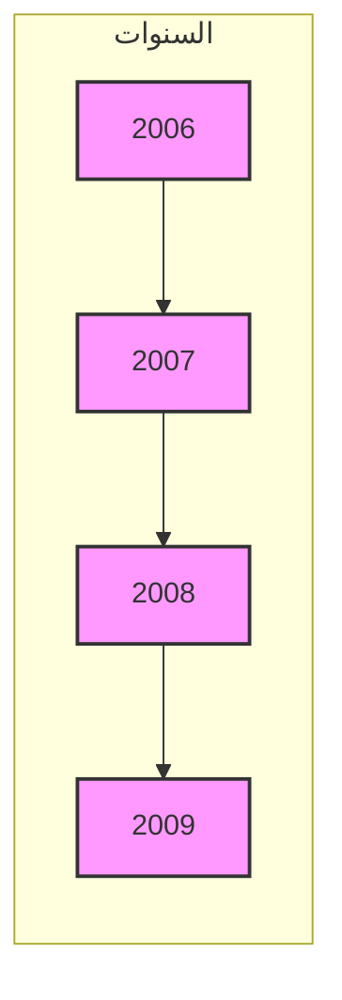
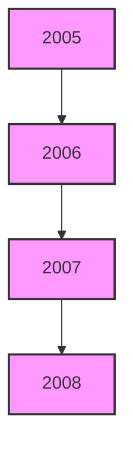
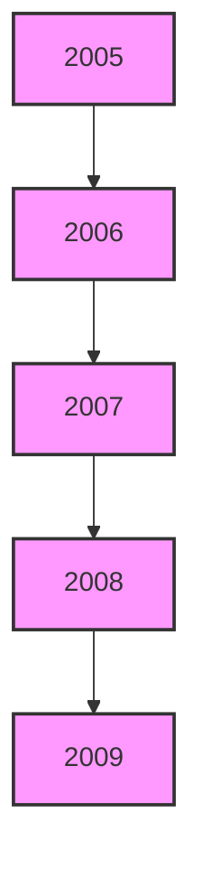
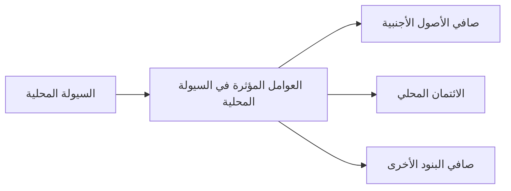

[An image of a document cover page with the following content:]

[At the top, there is a golden emblem of an eagle with spread wings]

مصرف ليبيا المركزي

[Below the Arabic text, there is an image of a grand building with domed structures and arched windows]

التقرير السنوي الثالث والخمسون

السنة المالية

1377 وفاة الرسول / 2009 مسيحي

[Translation of the Arabic text:

Central Bank of Libya

The Fifty-Third Annual Report

Financial Year

1377 After the Prophet's Death / 2009 AD]
---
[An emblem of an eagle with spread wings is displayed at the top of the document]

مصرف ليبيا المركزي

# التقرير السنوي
## الثالث والخمسون

### السنة المالية
1377 وفاة الرسول / 2009 مسيحي
---
التقرير السنوي لعام 2009

بسم الله الرحمن الرحيم
---
التقرير السنوي لعام 2009

السلطة والثروة والسلاح
بيد الشعب
---
التقرير السنوي لعام 2009

# مجلــــــس الإدارة

| المنصب | الاسم |
|--------|------|
| رئيساً | المحافظ | الأخ / أ. فرحات عمر بن قدارة |
| نائباً للرئيس | نائب المحافظ | الأخ / أ. محمد عبد السلام الشكري |

أعضاء:
- الأخ / عاشور خليفة تربل
- الأخ / د. بالقاسم عمر الطبولي
- الأخ / د. إدريس عبد السلام الشتيوي
- الأخ / د. بشير علي التو رقي
- الأخ / د. عمر إبراهيم حسين
---
# التقرير السنوي لعام 2009

## مدراء الإدارات

| المنصب | الاسم |
|--------|------|
| مدير إدارة الاحتياطيات | سامي صبحي الرايس |
| مدير إدارة الإصدار | محمد البهلول رحومة |
| مدير إدارة البحوث والإحصاء | علي رمضان شنيب |
| مدير إدارة الحسابات | عبد الناصر خليفة قنيدي |
| مدير إدارة الرقابة على المصارف والنقد | د. محمد عبد الجليل أبوسنينة |
| مدير إدارة الشؤون الإدارية والموظفين | بشير الهمالي الزنتوتي |
| مدير إدارة العمليات المصرفية | فتحي احمد الحاجي |
| مدير إدارة المراجعة | عبد الله نوري الشيباني |
| مدير الإدارة القانونية | د. مصطفى مصباح دبارة |
| مدير إدارة تقنية المعلومات | عبد العظيم بن صوفية |
| مدير عام معهد الدراسات المصرفية والمالية | د. عمر المبروك أبو شعالة |

## مدراء الفروع

| الفرع | المدير |
|-------|--------|
| مدير فرع بنغازي | الكيلاني منصور الزوبي |
| مدير فرع سبها | عبد السلام وادي معروف |
| مدير فرع سرت | جمعة يونس ناجي |
---
# التقرير السنوي لعام 2009

## مصرف ليبيا المركزي

### الإدارة العامة / طرابلس

+ (218) 21-3333591 / 9 : هاتف  
+ (218) 21 – 4441488 : (فاكس) مصور بريد  
www.cbl.gov.l y : الموقع الإلكتروني  
CBLJLYLXXXX: السويفت

### الفروع

#### : فرع سبها
+ (218) 71– 627771 /3 : هاتف  
+ (218) 71 – 621800  : (فاكس) مصور بريد

#### : فرع بنغازي
+ (218) 61 – 9091161 /8 : هاتف  
+ (218) 61 – 9091169   : (فاكس) مصور بريد

#### : فرع سرت
+ (218) 54 – 63750 / 4 : هاتف  
+ (218) 54 – 5265142 : (فاكس) مصور بريد

----

### إدارة البحوث والإحصاء

+ (218) 21 – 4773903 : (فاكس) مصور بريد  
+ (218) 21– 4773901 : هاتف  
ecorestat@ cbl.gov.l y : بريد إلكتروني
---
# التقرير السنوي لعام 2009

## المحتويات

14 ................................................................................................. تقديم

### الجزء الأول
### التطورات الاقتصادية العربية والدولية

18 ..................................................................... التطورات الاقتصادية الدولية : أولاً
18 ........................................................................................ نظرة عامة •
18 ..................................................................................... النمو الاقتصادي •
18 ............................................................................................... البطالة •
20 ............................................................................................... التضخم •
20 .................................................................................... المديونية الخارجية •
20 ...................................................................................... التجارة العالمية •
22 ............................................................. أسعار صرف العملات الدولية الرئيسية •
23 ................................................................. أسعار بعض السلع الغذائية والمعادن •
24 ............................................................................. التطورات النفطية الدولية •
24 ................................................................................... العرض -
24 .................................................................................... الطلب -
27 ................................................................................... الأسعار -
28 ..................................................................... التطورات الاقتصادية العربية : ثانياً

### الجزء الثاني
### التطورات الاقتصادية المحلية

35 ......................................................................................... نظرة عامة •

#### القطاع الحقيقي : أولاً
36 ..................................................................... الناتج المحلي الإجمالي الحقيقي •
37 ..................................................................... الناتج المحلي الإجمالي الاسمي •
42 ...................................................................................... معدل التضخم •
43 ...........................................................................العاملون بالنشاط الاقتصادي •
---
# التقرير السنوي لعام 2009

## التطورات النفطية المحلية •
45 ............................................................................ التطورات النفطية المحلية •
45 ............................................................. الإنتاج المحلي من النفط الخام -
46 ................................................................... .. صادرات النفط الخام -
47 ......................................................................... أسعار النفط الخام -
48 ....................................................................... إنتاج الغاز الطبيعي -
48 ....................................................... الإنتاج المحلي من المشتقات النفطية -
49 .......................................................... الإنتاج المحلي من البتروكيماويات -
50 ................................................ صادرات المنتجات النفطية والبتروكيماوية -
51 .................................................... الاستهلاك المحلي من المشتقات النفطية -

## ثانياً : المالية العامة

52 ................................................................ الميزانية العامة للسنة المالية 2009 •
53 ........................................................................ الميزانية التقديرية -
53 ......................................................................... الإيرادات
53 ..................................................................... المصروفات
53 ............................................................................ ميزانية التحول -
53 ............................................................................. نفقات أخرى -
54 ................................................................. الميزانية العامة للسنة المالية 2010 •

## ثالثاً : القطاع الخارجي

56 .................................................................................. ميزان المدفوعات •
56 .......................................................................... الحساب الجاري -
57 ............................................................ الحساب الرأسمالي والمالي -

## رابعاً : القطاع المصرفي والنقدي

61 ................................................................................ التطورات المصرفية •
61 ......................................................... قرارات مجلس الإدارة لعام 2009 -
62 .......................................................................... الرقابة المصرفية -
63 .......................................................... معهد الدراسات المصرفية والمالية -
64 ............................................................................. نظام المدفوعات -
67 .................................................................................... التطورات النقدية •
---
# التقرير السنوي لعام 2009

67 ............................................................................... القاعدة النقدية -
68 ....................................................... السيولة المحلية والعوامل المؤثرة فيها -
70 ........................................................................... مقاصة الصكوك -
71 ................................................................ سعر صرف الدينار الليبي -
73 ............................................................................... مصرف ليبيا المركزي •
73 ............................................................................ جانب الأصول -
74 ............................................................................ جانب الخصوم -
77 ................................................................................. المصارف التجارية •
77 ........................................................................... مصادر الأموال -
78 ........................................................................ استخدامات الأموال -
83 ................................................. وضع السيولة والاحتياطي النقدي الإلزامي -
85 ........................................................................... المصرف الليبي الخارجي •
89 ............................................................................ المصارف المتخصصة •
89 ............................................................................ مصرف التنمية -
90 ......................................................................... المصرف الزراعي -
90 ....................................................... مصرف الادخار والاستثمار العقاري -
91 .......................................................................... المصرف الريفي -

## خامساً : المؤسسات المالية غير المصرفية

92 ............................................................................ المؤسسة الليبية للاستثمار •
94 ......................................................... المحفظة الاستثمارية طويلة المدى -
95 .............................................................. محفظة ليبيا افريقيا للاستثمار -
95 ....................................................... الشركة الليبية للاستثمارات الخارجية -
96 ........................................................................... سوق الأوراق المالية الليبي •
98 .............................................................. صندوق الإنماء الاقتصادي والاجتماعي •
99 ....................................................................................... صندوق التقاعد •
100 ....................................................................................... شركات التأمين •
---
# التقرير السنوي لعام 2009

## تقديم

يسر مصرف ليبيا المركزي أن يقدم تقريره السنوي الثالث والخمسون ، متضمناً أهم التطورات الاقتصادية على الصعيد الدولي والعربي والمحلي ، فعلى الصعيد الدولي سجل الاقتصاد العالمي تراجعاً ، حيث انخفض معدل النمو به من 3.2% عام 2008 إلى -0.6% عام 2009 وهو أدنى المعدلات المسجلة منذ الحرب العالمية الثانية، وذلك بسبب تداعيات الأزمة المالية العالمية الناجمة عن أزمة الرهن العقاري في الولايات المتحدة الأمريكية ، وهي الأزمة التي أدت إلى حدوث خلل في النظام المالي العالمي، وتراجع سريع في النشاط الاقتصادي وفي التجارة الدولية، وازداد عدد المصارف التي أظهرت إفلاسها خاصة في الولايات المتحدة الأمريكية، فسببت الأزمة المالية هبوطاً حاداً في قيم الأصول في كل الاقتصادات المتقدمة والصاعدة، مما قلص ثروة الأسر، بالإضافة إلى الضغوط على الاستهلاك. وأدى ركود الطلب العالمي إلى انهيار أسعار السلع الأولية، حيث هبطت أسعار النفط بما يزيد على نسبة 50.0% عما كانت عليه في منتصف عام 2008، وانخفضت معدلات التضخم في العالم خلال عام 2009 إلى 0.1%. ونتيجة هذه الأزمة ارتفعت معدلات البطالة عالمياً حيث بلغت في دول منطقة اليورو 9.4% وفي الولايات المتحدة الأمريكية 9.3%.

وبالنظر إلى سرعة التدهور الاقتصادي وتراجع الضغوط التضخمية عمدت المصارف المركزية في الاقتصادات المتقدمة إلى اتخاذ إجراءات فعالة لخفض أسعار الفائدة وزيادة منح الائتمان . وسعياً لمكافحة الانكماش الاقتصادي قامت عدة حكومات باعتماد مجموعة مختلفة من التدابير المالية العامة بغية إعطاء دفعة للاقتصاد . وفي بلدان مجموعة العشرين وصلت الدفعة التنشيطية المستمدة من المالية العامة إلى 1.5% من إجمالي الناتج المحلي . ونتيجة هذه السياسات وتأثير انخفاض أسعار الأصول الحادة على مستوى الإيرادات، إضافة إلى تكلفة عمليات الإنقاذ في القطاع المالي ، فقد أدى كل ذلك إلى ارتفاع عجز ميزانيات بعض هذه الدول بشكل قوي .

وعلى الصعيد العربي، أظهرت المصادر الدولية ، إلى تراجع حاد في معدل النمو الاقتصادي للدول العربية لعام 2009 ليبلغ نسبة 2.0% ، مقابل 5.4% عام 2008، إلا أنه ما يزال متجاوزاً معدل نمو الاقتصاد العالمي للعام العاشر على التوالي .

أما على المستوى المحلي ، فقد ظلت البيئة الاقتصادية قوية، مدعومة بإنفاق القطاع العام والطلب المحلي المرتفع . فسجل الاقتصاد غير النفطي نمواً نسبته 5.8% ولكن

14
---
# التقرير السنوي لعام 2009

النمو في الناتج النفطي تراجع بنسبة 7.7% نتيجة إلتزام الجماهيرية بإنتاج النفط
بالحصص المتفق عليها مع منظمة الدول المصدرة للنفط .

وفيما يخص التطورات النقدية ، فقد شهد عرض النقود (ع2) نمواً بلغت نسبته
22.5% مقابل 47.3% في عام 2008 ليصل في نهاية عام 2009 إلى نحو 48.7
مليار دينار، مقابل 39.7 مليار دينار في نهاية عام 2008 ، وقد ساهم تراجع الزيادة
في عرض النقود وانخفاض أسعار السلع عالمياً في تراجع المستوى العام للأسعار ،
ليبلغ معدل التضخم 2.4% ، مقابل 10.4% في عام 2008 .

أما فيما يتعلق بالتطورات المالية، فقد كانت السياسات المالية في عام 2009 متحفظة
وتم وضع الميزانية على سعر نفط 45 دولاراً للبرميل، مقابل 60 دولار للبرميل في
سنة 2008، وبلغ حجم الإنفاق الفعلي بالميزانية العامة للبابين الأول والثاني خلال عام
2009 نحو 9.4 مليار دينار وهو يقل عن المبلغ المخصص والمعتمد بالميزانية العامة
بنحو 4.4 مليار دينار ، هذا وقد بلغت التفويضات المالية المسيلة والمنفذة مع نهاية عام
2009 نحو 19.0 مليار دينار وهي تمثل نسبة 88.4% من إجمالي المخصصات
المعتمدة.

وبالرغم من انخفاض أسعار وإنتاج النفط، فقد حققت الميزانية فائضاً يقارب 7 مليارات
دينار.

وفيما يخص أداء القطاع الخارجي ، حقق ميزان المدفوعات فائضاً في الميزان الكلي
خلال عام 2009 بلغ 6.1 مليار دينار ، مقابل فائض قدره 18.9 مليار دينار عام
2008، ويعود تراجع هذا الفائض إلى انخفاض فائض الحساب الجاري البالغ 12.6
مليار دينار في عام 2009 ، مقابل 45.1 مليار دينار عام 2008 ، وذلك بسبب تراجع
حصيلة الصادرات النفطية. وقد ساهم الفائض في الميزان الكلي بميزان المدفوعات في
زيادة الأصول الأجنبية للجماهيرية لتصل 138.7 مليار دولار مع نهاية عام 2009
مقارنة مع 129.2 مليار دولار مع نهاية عام 2008.

وعلى صعيد التطورات المصرفية ، استمر مصرف ليبيا المركزي خلال عام 2009 ،
في التركيز على تفعيل دور السياسة النقدية التي ينتهجها ورفع أداء المصارف
التجارية ومساهمتها في النشاط الاقتصادي ، كما أصدر مجلس إدارة مصرف ليبيا
المركزي خلال عام 2009 العديد من القرارات لزيادة المنافسة في القطاع المصرفي
وتقوية الرقابة عليه . وبسبب الانكماش الاقتصادي العالمي وانخفاض أسعار السلع
الأولية عالمياً والسياسة المالية المتحفظة التي اتبعتها الجماهيرية، قام مصرف ليبيا
المركزي بخفض سعر إعادة الخصم وأسعار الفائدة على شهادات الإيداع لفترة
استحقاق 91 يوماً على مرحلتين لتصل إلى 3.0% و1.25% على التوالي، وفي مجال

15
---
# التقرير السنوي لعام 2009

إعادة هيكلة المصارف التجارية أصدر مجلس إدارة مصرف ليبيا المركزي قراراً
بزيادة رأس مال كل من مصرف الجمهورية والمصرف التجاري الوطني، بالإضافة
إلى تحديد ضوابط وشروط دخول المصارف الأجنبية كشركاء استراتيجيين في
المصارف التجارية الخاصة، كما تم تأسيس مصرفين تجاريين بالمشاركة مع كل من
دولة قطر ودولة الإمارات العربية المتحدة، وقد تم استكمال تطوير هيكلة جديدة
لمصرف ليبيا المركزي والتي ستؤدي إلى تنظيمه وظيفياً ومؤسسياً وتحسين القدرات
في مجال تنفيذ السياسة النقدية والرقابة المصرفية.

أما فيما يتعلق بأنشطة المؤسسات المالية غير المصرفية، فيتضمن التقرير جزء
خاص عن نشاط بعض المؤسسات المالية غير المصرفية والتي تلعب دوراً مهماً في
الاقتصاد الوطني، وتمارس أنشطة استثمارية واسعة سواء في الداخل أو في الخارج
ومن بعض هذه المؤسسات المالية، صندوق التقاعد، المؤسسة الليبية للاستثمار
والجهات التابعة لها، صندوق الإنماء الاقتصادي والاجتماعي، كما تضمن التقرير
أيضاً المؤشرات المهمة في أداء سوق الأوراق المالية الليبي.

ويتنهز مصرف ليبيا المركزي هذه المناسبة ، ليعرب عن شكره وتقديره لكافة
الأمانات والمؤسسات والأجهزة العامة ذات العلاقة ، لتوفيرها وتزويدها للمصرف
بالبيانات والإحصاءات اللازمة التي مكنته من إعداد هذا التقرير.

والله ولي التوفيق

فرحات عمر بن قدارة
المحافظ

16
---
التقرير السنوي لعام 2009

الجزء الأول
التطورات الاقتصادية الدولية والعربية
---
# التطورات الاقتصادية الدولية : أولاً

## نظرة عامة •

لقد أظهرت الأزمة المالية العالمية الأخيرة مدى الخلل في أوضاع القطاع المالي العالمي، الذي ارتبط بتداعي قاعدته الرأسمالية وتضخم أصوله المدينة ، وعقب هذه الأزمة شهد الاقتصاد العالمي عام 2009 ، فترة غير مسبوقة من الاختلال المالي ، اقترنت بهبوط سريع في النشاط الاقتصادي وتراجع كبير في التجارة الدولية كما هما الأسوأ منذ عدة عقود ، مما أدى إلى انكماش حاد في النمو والتجارة ، وسرعان ما انتقلت نتائج الأزمة إلى الجهاز المصرفي حيث شهد عام 2009 انهيار عدد من المصارف التي أشهرت إفلاسها في الولايات المتحدة الأمريكية والتي وصل عددها إلى 140 مصرف . وأدى ركود الطلب العالمي إلى انهيار أسعار السلع الأولية فانخفض سعر برميل النفط بنحو 70% عما كان عليه في شهر يناصف (يوليو) عام 2008 ، بالمقابل شهد عام 2009 ، ارتفاع أسعار الذهب لمستويات عالية ، حيث تجاوزت أوقية الذهب حاجز 1200 دولاراً في الأسبوع الأول من شهر الكانون (ديسمبر) وكان ذلك انعكاساً لانخفاض قيمة الدولار أمام معظم العملات الرئيسة الدولية وليبحث المستثمرون عن ملاذ آمن لاستثماراتهم .

## النمو الاقتصادي •

انخفض الاقتصاد العالمي خلال عام 2009 إلى نحو 0.6%، مقابل نمو 3.2% عام 2008، وقد تراجعت معدلات النمو في الدول الصناعية بنسبة -3.2%، مقارنة مع نمو 0.9% في سنة 2008. أما في الدول النامية والأسواق الناشئة فقد تراجع معدل النمو إلى 2.4% مقابل 6.1% في سنة 2008، وانخفض النمو في دول الشرق الأوسط وشمال أفريقيا إلى 2.4% عام 2009 مقابل 5.9% عام 2008 .

## البطالة •

شهدت معدلات البطالة في الدول الصناعية عام 2009 ارتفاعا قويا ، حيث بلغت 8.0% مقابل 5.8% عام 2008 ، وارتفعت في دول منطقة اليورو من 7.6% إلى 9.4%. كما ارتفع معدل البطالة في الولايات المتحدة الأمريكية والمملكة المتحدة من 5.8% إلى 9.3% ومن 5.5% إلى 7.5% لكل منهما على التوالي .

18
---
# التطورات الاقتصادية الدولية

## جدول رقم (1) : معدلات النمو الحقيقي في العالم
*نسب مئوية*

| الدول مجموعة | 2008 | 2009 |
|--------------|------|------|
| العالم : | 3.2 | -0.6 |
| الدول الصناعية : | 0.9 | -3.2 |
| الولايات المتحدة الأمريكية | 1.1 | -2.4 |
| دول منطقة اليورو | 0.9 | -4.1 |
| اليابان | 0.6- | -5.2 |
| دول صناعية أخرى | 1.2 | -2.3 |
| الدول النامية والأسواق الناشئة الأخرى (*) : | 6.1 | 2.4 |
| أفريقيا | 5.2 |  |
| دول وسط وشرق أوروبا | 2.9 | -3.7 |
| دول الكومنولث المستقلة | 5.5 | -6.6 |
| آسيا | 7.7 | 6.6 |
| الشرق الأوسط وشمال أفريقيا | 5.9 | 2.4 |
| دول تجمع صحراء أفريقيا | 5.5 | 2.1 |
| نصف الكرة الغربي (**) | 4.2 | -1.8 |

المصدر : صندوق النقد الدولي ، آفاق الاقتصاد العالمي - (أبريل) 2009 .
* الأسواق الناشئة تشمل : البرازيل ، بولندا ، تشيلي ، جنوب أفريقيا ، جمهورية التشيك ، كوريا الجنوبية .
** تشمل : المكسيك وأمريكا الوسطى ومنطقة الكاريبي وأمريكا الجنوبية .

## شكل (1) : معدلات النمو الحقيقي في العالم



| السنوات | العالم | الدول الصناعية | الدول النامية |
|---------|-------|----------------|---------------|
| 2006    | 5     | 3              | 8             |
| 2007    | 5     | 3              | 8             |
| 2008    | 3     | 1              | 6             |
| 2009    | -1    | -3             | 2             |

## جدول رقم (2) : معدلات البطالة في الدول الصناعية
*نسب مئوية*

| الدول مجموعة | 2008 | 2009 |
|--------------|------|------|
| الدول الصناعية | 5.8 | 8.0 |
| الولايات المتحدة الأمريكية | 5.8 | 9.3 |
| دول منطقة اليورو | 7.6 | 9.4 |
| المملكة المتحدة | 5.5 | 7.5 |
| اليابان | 4.0 | 5.1 |

المصدر : صندوق النقد الدولي ، المصدر السابق .

19
---
# التطورات الاقتصادية الدولية

## التقرير السنوي لعام 2009

### • التضخم:

انخفض معدل التضخم خلال 2009 في جميع مناطق العالم، ففي الدول الصناعية بلغ 0.1% مقابل 3.4% عام 2008، وفي الدول النامية والأسواق الناشئة انخفض إلى 5.2% مقارنة مع 9.3% في سنة 2008.

جدول رقم ( 3 ) : معدلات التضخم في العالم

| الدول مجموعة | 2008 | 2009 |
|--------------|------|------|
| الدول الصناعية: | 3.4 | 0.1 |
| الولايات المتحدة الأمريكية | 3.8 | 0.3- |
| دول منطقة اليورو | 3.3 | 0.3 |
| اليابان | 1.4 | 1.4- |
| دول صناعية أخرى | 3.8 | 1.5 |
| الدول النامية وأسواق ناشئة أخرى: | 9.3 | 5.2 |
| أفريقيا | 10.1 | 2 |
| دول وسط وشرق أوروبا | 8.0 | 4.7 |
| دول الكومنولث المستقلة | 15.6 | 11.2 |
| آسيا | 7.4 | 3.1 |
| الشرق الأوسط وشمال أفريقيا | 15.6 | 6.6 |
| نصف الكرة الغربي | 7.9 | 6.0 |

المصدر: صندوق النقد الدولي، المصدر السابق.

### • المديونية الخارجية:

ارتفع إجمالي الدين الخارجي للدول النامية والأسواق الناشئة في عام 2009 بنسبة 7.5% عن مستواه عام 2008 ، ليصل إلى 4805.5 مليار دولار مقابل 4472.3 مليار دولار في عام 2008 . أما خدمة الدين فقد انخفضت بنحو 1.4% لتصل إلى 1398.6 مليار دولار عام 2009 مقابل 1417.8 مليار دولار عام 2008 ،وارتفعت خدمة الدين الخارجي كنسبة إلى الصادرات من 12.9% في عام 2008 إلى 26.1% عام 2009.

### • التجارة العالمية:

انخفض معدل نمو التجارة العالمية خلال عام 2009 بنحو 10.7% مقابل نمو 3.3% عام 2008 ، ويعزى ذلك إلى عمق الأزمة المالية العالمية وإلى ما ترتب عليها من ركود على المستوى العالمي ، مما أدى إلى تراجع معدلات نمو الصادرات والواردات، حيث انخفضت الصادرات في مجموعة الدول الصناعية بنحو 11.5% مقابل معدل نمو 1.8% في عام 2008. كما انخفضت الواردات للمجموعة بنسبة 12.0% مقابل نمو 0.4% في عام 2008، وفي مجموعة الدول النامية والأسواق الناشئة كان انخفاض الصادرات والواردات لعام 2009 نحو 8.2% و8.4% على التوالي.
---
التطورات الاقتصادية الدولية                                                                                                                                          التقرير السنوي لعام 2009

جدول رقم ( 4 ) : حجم المديونية الخارجية للدول النامية والأسواق الناشئة الأخرى
* بالمليار دولار

| 2009 | 2008 | مجموعة الدول |
|-------|------|---------------|
| 4805.5 | 4472.3 | 1- مديونية الدول النامية والأسواق الناشئة الأخرى : |
| | 268.0 | أفريقيا |
| 1107.7 | 1031.4 | دول وسط وشرق أوروبا |
| 703.8 | 735.5 | دول الكومنولث المستقلة |
| 1171.0 | 1128.5 | آسيا |
| 680.6 | 430.6 | الشرق الأوسط وشمال أفريقيا |
| 214.6 | 206.3 | دول تجمع الصحراء الأفريقية |
| 927.9 | 878.3 | نصف الكرة الغربي |
| 26.1 | 12.9 | 2- خدمة الدين للدول النامية والأسواق الناشئة الأخرى: (*) |
| | 5.2 | أفريقيا |
| 69.4 | 26.1 | دول وسط وشرق أوروبا |
| 46.9 | 33.9 | دول الكومنولث المستقلة |
| 11.4 | 6.3 | آسيا |
| 14.5 | 4.3 | الشرق الأوسط |
| 15.0 | 12.8 | دول تجمع الصحراء الأفريقية |
| 39.4 | 18.3 | نصف الكرة الغربي |

المصدر : صندوق النقد الدولي ، المصدر السابق .
(*) كنسبة من الصادرات .

شكل ( 2 ) : تطور المديونية الخارجية للدول النامية والأسواق الناشئة الأخرى



| السنوات | 2005 | 2006 | 2007 | 2008 |
|---------|------|------|------|------|
| دول وسط وشرق أوروبا | | | | |
| دول الكومنولث المستقلة | | | | |
| نصف الكرة الغربي | | | | |
| الشرق الأوسط وشمال أفريقيا | | | | |
| آسيا | | | | |
| أفريقيا | | | | |

21
---
التطورات الاقتصادية الدولية                                                                                    التقرير السنوي لعام 2009

جدول رقم ( 5 ) : معدلات نمو التجارة العالمية
* نسب مئوية *

| 2009 | 2008 |                                    |
|-------|------|-----------------------------------|
| -10.7 | 3.3  | إجمالي التجارة العالمية            |
|       |      | : الدول الصناعية                  |
| -11.7 | 1.8  | الصادرات                          |
| -12.0 | 0.4  | الواردات                          |
|       |      | الدول النامية وأسواق ناشئة أخرى : |
| -8.2  | 6.0  | الصادرات                          |
| -8.4  | 10.9 | الواردات                          |

المصدر : المصدر السابق .

• أسعار صرف العملات الدولية الرئيسية :

تراجع سعر صرف الدولار الأمريكي مقابل معظم العملات الرئيسية حيث وصل مقابل
اليورو عام 2009 إلى 1.4326 دولاراً مقابل 1.4100 دولاراً في عام 2008 . كما
ارتفع سعر صرف الدولار مقابل الين الياباني ليصل إلى 92.099 يناً للدولار مقابل
90.464 يناً للدولار في العام السابق . وانخفض سعر صرف الدولار مقابل الجنيه
الإسترليني ليصل في العام قيد التقرير إلى 1.584 دولاراً مقابل 1.449 دولاراً في
عام2008 .

جدول رقم (6) : أسعار صرف بعض العملات الدولية لعام 2009

| الفرنك السويسري | الين الياباني | الجنيه الإسترليني | اليورو | الدولار الأمريكي |                   |
|------------------|---------------|-------------------|--------|-------------------|-------------------|
| 0.9619           | 0.0109        | 1.5843            | 1.4326 | -                 | الدولار الأمريكي |
| 0.6714           | 0.0076        | 1.1059            | -      | 0.698             | اليورو            |
| 0.6071           | 0.0069        | -                 | 0.9043 | 0.6312            | الجنيه الإسترليني |
| 88.5905          | -             | 145.914           | 131.943| 92.099            | الين الياباني     |
| -                | 0.0113        | 1.6471            | 1.4894 | 1.0396            | الفرنك السويسري   |

22
---
# التطورات الاقتصادية الدولية

## التقرير السنوي لعام 2009

### أسعار بعض السلع الغذائية والمعادن :

شهدت أسعار معظم السلع الغذائية ارتفاعات متتالية حتى الربع الأخير من عام 2008 عندما أدى ركود الطلب العالمي إلى انهيار أسعار السلع الأولية. ويعزى ارتفاع أسعار المواد الغذائية خلال فترة 2007 حتى بداية الربع الأخير من عام 2008 لعدة أسباب منها :

- التوسع في إنتاج الوقود الحيوي كمصدر بديل للطاقة وذلك على حساب الإنتاج الغذائي.
- النمو الاقتصادي الذي شهدته بعض الدول كالصين والهند ، مما زاد من الطلب على المواد الغذائية.
- تحول بعض التجار للمضاربة من أسواق المال إلى أسواق السلع بهدف تحقيق أرباح أعلى.

وفي عام 2009 أدى الركود الاقتصادي إلى انهيار السلع الأولية ففي الاقتصادات المتقدمة انخفض التضخم الكلي من 3.4% في عام 2008 إلى معدل منخفض غير مسبوق، وفي الاقتصادات الصاعدة والنامية انخفض التضخم إلى 5.2% من 9.2% في عام 2008.

جدول رقم ( 7 ) : الأسعار العالمية لبعض السلع الغذائية والمعادن
* دولاراً للطن المتري

| البيان | 2007 | 2008 | معدل التغير (%) |
|--------|------|------|-----------------|
| أولاً : السلع الغذائية : |
| الشعير | 172.0 | 200.5 | 16.5 |
| القمح | 255.0 | 326.0 | 27.8 |
| الأرز | 332.0 | 700.2 | 110.9 |
| زيت الزيتون | 4561.0 | 4167.5 | -8.6 |
| زيت الصويا | 800.0 | 1133.8 | 41.7 |
| زيت عباد الشمس | 673.0 | 1693.7 | 151.6 |
| السكر (سنت أمريكي للرطل) | 21.0 | 21.3 | 1.4 |
| الشاي (سنت أمريكي للكيلوغرام) | 212.0 | 269.0 | 26.8 |
| ثانياً : المعادن : |
| الذهب ( دولاراً أمريكياً للأوقية ) | 695.4 | 871.7 | 25.3 |
| الألومنيوم | 2640.0 | 2577.9 | -2.3 |
| النحاس | 7132.0 | 6963.5 | -2.3 |

المصدر : صندوق النقد الدولي ، الإحصاءات المالية الدولية الشهرية .

23
---
# التطورات الاقتصادية الدولية                                                  التقرير السنوي لعام 2009

## • التطورات النفطية الدولية :

ملاحظة يمكن و، المالية بالأزمة المتأثرين اكبر من العالمية النفطية الأسواق كانت لقد
دولارا/ 140 من واضح بشكل هبطت التي الخام النفط أسعار تحركات خلال من ذلك
الأول الربع خلال للبرميل دولارا/ 40 إلى وصلت أن إلى 2008 يوليو شهر في للبرميل
لولا ضررا اكثر ستكون النتائج وكانت .%250 قدره انخفاض محققة ،2009 عام من
.الإنتاج بكميات التحكم في ( أوبك )للنفط المصدرة الأقطار منظمة أعضاء تدخل

### العرض :

انخفاضا 2009 عام خلال الطبيعي والغاز الخام النفط من العالمي العرض سجل
مليون 84.7 المتوسط في ليبلغ ،اليوم في برميل مليون 1.7 بمقدار أو %1.96 بنسبة
السبب وكان . 2008 العام في اليوم في برميل مليون 86.4 مقابل اليوم في برميل
الإنتاج بخفض الأوبك منظمة قرار هو العالمي العرض انخفاض وراء الرئيس
. العالمية الاقتصادية الأزمة من تأثرت التي النفطية السوق قوى موازنة لمحاولة
في برميل مليون 35.6 من (الأوبك) للنفط المصدرة الأقطار منظمة إنتاج وانخفض
قدره انخفاض بمعدل اليوم في برميل مليون 33.4 حوالي إلى 2008 عام اليوم
قبل من الإنتاج في الانخفاض لهذا الكلي التأثير عدم وراء الأسباب بين ومن ،%6.18
خارج العالميين الخام النفط منتجي قبل من النفط إنتاج معدلات زيادة هو المنظمة
،كازاخستان ،روسيا) السابق السوفيتي الاتحاد دول وبالأخص الأوبك منظمة
إلى 2008 عام خلال اليوم في برميل مليون 12.8 من إنتاجها ارتفع التي (أذربيجان
كان كما . (%3.9) قدره نمو بمعدل 2009 عام في اليوم في برميل مليون 13.3
جراء المكسيك دولة وبالأخص الشمالية أمريكا دول قبل من الإنتاج في زيادة هناك
أدى بدوره الذي المكسيك خليج في العميقة المياه في الخام النفط إنتاج عملية تطوير
إلى 2008 عام في اليوم في برميل مليون 13.9 من المنطقة في الإنتاج ارتفاع إلى
إلى التطورات هذه مجمل أدت .2009 عام خلال اليوم في برميل مليون 14.2
خلال اليوم في برميل مليون 51.4 إلى المنظمة خارج الدول إنتاج إجمالي وصول
قدره نمو معدل محققا 2008 خلال اليوم في برميل مليون 50.7 مقابل 2009 عام
.%1.38

### الطلب :

84.9 إلى ليصل %1.5 بنسبة المسال والغاز الخام النفط على العالمي الطلب انخفض
عام خلال اليوم في برميل مليون 86.2 مقابل 2009 عام في اليوم في برميل مليون
الرئيسي المكون هو والتنمية الاقتصادي التعاون منظمة طلب انخفاض وكان .2008
عام في برميل مليون 45.5 اليومي الطلب متوسط بلغ حيث العالمي الطلب لانخفاض

24
---
التقرير السنوي لعام 2009                                                                                             التطورات الاقتصادية الدولية

2009 مقابل 47.6 مليون برميل في اليوم خلال عام 2008، محققاً معدل انخفاض
قدره %4.4 بكمية انخفاض قدرها 2.1 مليون برميل، وما يقارب مليون برميل من
كمية الانخفاض تعود إلى انخفاض الطلب على النفط في الولايات المتحدة الأمريكية
التي شهد اقتصادها ركوداً خلال عام 2009.

كان السبب الرئيسي وراء امتصاص تأثير انخفاض الطلب النفطي في بلدان منظمة
التعاون الاقتصادي والتنمية هو ارتفاع الطلب من بعض البلدان، خاصة بلدان جنوب
شرق آسيا التي زاد طلبها على النفط بنحو 0.8 مليون برميل منها 0.6 مليون برميل
في اليوم كان من نصيب الصين ثاني أكبر مستهلك للنفط، حيث زاد طلب الصين
بمعدل نمو قدره 7.6% عن السنة السابقة وارتفع من 7.9 مليون برميل في اليوم عام
2008 إلى 8.5 مليون برميل في اليوم خلال عام 2009.

جدول رقم ( 8 ) : العرض العالمي للنفط الخام والغاز المسال

| المنطقة | 2008 | 2009 | متوسط | معدل |
|---------|------|------|--------|------|
|         |      | الربع الأول | الربع الثاني | الربع الثالث | الربع الرابع | عام 2009 | النمو |
| منظمة التعاون الاقتصادي والتنمية: | 19.3 | 19.7 | 19.0 | 19.1 | 19.6 | 19.3 | 0.0 |
| أمريكا الشمالية | 13.9 | 14.2 | 13.9 | 14.2 | 14.4 | 14.2 | 2.16 |
| أوروبا | 4.8 | 4.9 | 4.5 | 4.2 | 4.5 | 4.5 | -6.25 |
| دول المحيط الهادي | 0.6 | 0.7 | 0.6 | 0.7 | 0.7 | 0.7 | 16.66 |
| دول خارج المنظمة منها : | 28.8 | 29.0 | 29.3 | 29.5 | 29.7 | 29.3 | 1.73 |
| الاتحاد السوفيتي السابق | 12.8 | 13.0 | 13.2 | 13.4 | 13.6 | 13.3 | 3.9 |
| أوروبا الشرقية | 0.1 | 0.1 | 0.1 | 0.1 | 0.1 | 0.1 | 0.0 |
| الصين | 3.8 | 3.7 | 3.8 | 3.8 | 3.8 | 3.8 | 0.0 |
| دول آسيوية أخرى | 3.7 | 3.6 | 3.6 | 3.6 | 3.6 | 3.6 | -2.7 |
| أمريكا اللاتينية | 4.1 | 4.3 | 4.3 | 4.3 | 4.4 | 4.3 | 4.87 |
| الشرق الأوسط | 1.6 | 1.7 | 1.7 | 1.7 | 1.7 | 1.7 | 6.25 |
| إفريقيا | 2.6 | 2.5 | 2.5 | 2.5 | 2.5 | 2.5 | -3.84 |
| منظمة الأوبك -3 | 35.6 | 33.1 | 33.0 | 33.5 | 33.8 | 33.4 | -6.18 |
| نفط خام | 31.2 | 28.5 | 28.6 | 28.8 | 29.0 | 28.7 | -8.0 |
| غاز مسال | 4.4 | 4.6 | 4.5 | 4.7 | 4.8 | 4.7 | 6.81 |
| عائدات التكرير -4 | 2.2 | 2.3 | 2.3 | 2.3 | 2.3 | 2.3 | 4.54 |
| مجموع العرض العالمي | 86.4 | 84.5 | 83.9 | 84.8 | 85.8 | 84.7 | -1.96 |

Source: Oil Market Report, March2009.

25
---
التطورات الاقتصادية الدولية                                                                                         التقرير السنوي لعام 2009

جدول رقم (9) : الطلب العالمي على النفط الخام والغاز المسال
' مليون برميل في اليوم '

| معدل النمو | متوسط عام 2009 | 2009 |  |  |  | 2008 | المنطقة |
|------------|----------------|------|------|------|------|------|---------|
|            |                | الربع الرابع | الربع الثالث | الربع الثاني | الربع الأول |      |         |
| -4.4       | 45.5           | 46.0 | 45.0 | 44.4 | 46.6 | 47.6 | 1. منظمة التعاون الاقتصادي والتنمية : |
| -3.7       | 23.3           | 23.5 | 23.2 | 22.9 | 23.5 | 24.2 | أمريكا الشمالية |
| -5.2       | 14.5           | 14.5 | 14.5 | 14.2 | 14.9 | 15.3 | أوروبا |
| -4.9       | 7.7            | 8.0  | 7.3  | 7.3  | 8.1  | 8.1  | دول المحيط الهادي |
| 1.8        | 39.4           | 39.9 | 40.3 | 39.7 | 37.9 | 38.7 | 2- دول خارج المنظمة منها : |
| -7.1       | 3.9            | 3.9  | 4.0  | 3.8  | 3.9  | 4.2  | الاتحاد السوفيتي السابق |
| 0.0        | 0.7            | 0.7  | 0.7  | 0.7  | 0.7  | 0.7  | أوروبا |
| 7.6        | 8.5            | 8.9  | 8.8  | 8.6  | 7.7  | 7.9  | الصين |
| 2.0        | 9.9            | 10.0 | 9.7  | 10.1 | 9.9  | 9.7  | دول آسيوية أخرى |
| 1.7        | 6.0            | 6.1  | 6.1  | 5.9  | 5.7  | 5.9  | أمريكا اللاتينية |
| 1.4        | 7.2            | 7.1  | 7.8  | 7.3  | 6.7  | 7.1  | الشرق الأوسط |
| 0.0        | 3.2            | 3.2  | 3.2  | 3.2  | 3.2  | 3.2  | إفريقيا |
| -1.5       | 84.9           | 85.9 | 85.3 | 84.1 | 84.5 | 86.2 | مجموع الطلب العالمي |

المصدر : المصدر السابق .

شكل (3) : العرض العالمي والطلب العالمي على النفط الخام والغاز المسال



| السنوات | الطلب العالمي | العرض العالمي |
|---------|---------------|---------------|
| 2005    | 83.7          | 84.4          |
| 2006    | 84.8          | 85.2          |
| 2007    | 86.0          | 85.6          |
| 2008    | 86.2          | 86.4          |
| 2009    | 85.9          | 85.8          |

26
---
التطورات الاقتصادية الدولية                                                  التقرير السنوي لعام 2009

: الأسعار -

شهد عام 2009 انخفاضاً ملحوظاً في أسعار النفط الخام، حيث انخفضت أسعار سلة
أوبك بنحو 33.2 دولاراً للبرميل لتصل إلى 60.9 دولاراً للبرميل محققة بذلك معدل
انخفاض قدره 54.5% ، إلا أنه منذ الربع الثاني لعام 2009 اتجهت الأسعار إلى
الارتفاع نتيجة للتوقعات العالمية بانتعاش الاقتصاد العالمي خلال عام 2010، كما
تعتبر سياسة منظمة الأقطار المصدرة للنفط (الأوبك) بتخفيض الإنتاج ذات تأثير
واضح على اتخاذ أسعار النفط الخام الاتجاه التصاعدي، خصوصاً أن المنظمة تمتلك
حصة 40% من العرض العالمي للنفط وتشير جميع التوقعات الدولية إلى استمرار
ارتفاع أسعار النفط الخام نتيجة استمرار زيادة الطلب على النفط من قبل دول جنوب
شرق آسيا وعزم منظمة أوبك إبقاء مستويات إنتاج أعضائها في الفترة المقبلة.

جدول رقم (10) : متوسط أسعار النفط الخام
دولار/للبرميل

| السنة | سلة أوبك |
|-------|-----------|
| 2008 |           |
| الربع الأول | 92.7 |
| الربع الثاني | 117.6 |
| الربع الثالث | 113.4 |
| الربع الرابع | 52.5 |
| متوسط العام | 94.1 |
| 2009: |           |
| الربع الأول | 42.9 |
| الربع الثاني | 58.5 |
| الربع الثالث | 67.7 |
| الربع الرابع | 74.3 |
| متوسط العام | 60.9 |

المصدر: منظمة الأقطار العربية المصدرة للنفط (أوابك) النشرة الشهرية - السنة 36- العدد 2 - فبراير (شباط) 2010 .

27
---
التقرير السنوي لعام 2009                                                                         التطورات الاقتصادية العربية

## ثانياً : التطورات الاقتصادية العربية

أدت تداعيات الأزمة المالية والاقتصادية العالمية منذ بدايتها في عام 2007 إلى تأثيرات سلبية على المنطقة العربية خلال عام 2009 . فعلى صعيد المؤشرات الاقتصادية ، أظهرت التقديرات الأولية تراجعاً حاداً في معدل النمو الاقتصادي للدول العربية مجتمعة ليصل إلى 2.0% مقارنة بنحو 5.4% للعام 2008 وقد جاء هذا النمو المتواضع رغم نمو العديد من الدول العربية بمعدلات مرتفعة نسبياً ، تراوحت ما بين 4.0% و11.5% ، وتسجيل البعض الآخر معدلات نمو سالبة تراوحت ما بين 0.2% و1.6% . وعلى الرغم من أن معدل النمو في مجموعة الدول العربية يقل عن نظيره في مجموعة الدول النامية ، إلا أنه يتجاوز معدل النمو العالمي للعام العاشر على التوالي . ومن المتوقع استعادة النشاط الاقتصادي في المنطقة عافيته خلال العام 2010 ليصل إلى 4.0% عاكساً معدلات نمو إيجابية ومرتفعة نسبياً في كافة دول المنطقة .

أما فيما يتعلق بمستويات الأسعار معبراً عنها بالرقم القياسي لأسعار المستهلك ، فقد تراجع معدل التضخم في الدول العربية ليبلغ 8.3% عام 2009 ، مقارنة بمعدل بلغ 15.0% عام 2008 ، وساهم في ذلك انكماش الطلب المحلي وخاصة في قطاع العقارات في معظم الدول العربية، وتحديداً دول مجلس التعاون الخليجي، من جهة ، وتراجع الأسعار العالمية للسلع الأولية والأساسية والمحاصيل الزراعية والمعادن بدرجة ملحوظة مقارنة بأسعار عام 2008 .

وبهدف تحفيز الطلب المحلي وتخفيف التأثير السلبي للأزمة ، اتجهت العديد من الدول العربية لتبني سياسات مالية و / أو نقدية توسعية مما أسفر عن تدهور أوضاع الموازنات العمومية ، ويصعب على بعض الدول العربية . الاستمرار في معظم الدول العربية في انتهاج نفس السياسات لنقص الموارد المالية وارتفاع مستويات الدين العام .

ومن ناحية أخرى ساهم تراجع أسعار المواد الأولية وعلى رأسها النفط ، في تدهور ملحوظ في الحسابات الجارية لموازين مدفوعات بعض الدول العربية المصدرة للنفط وتحول فائض الحسابات الجارية إلى عجز لدى بعض الدول. ونظراً لارتفاع التدفقات الرأسمالية إلى الخارج وتراجع تدفقات الاستثمار الأجنبي المباشر الواردة إلى الدول العربية، والتزام معظم الدول بإتباعها نظام سعر الصرف الثابت ، تراجع معدل نمو الاحتياطيات الدولية لتقتصر على 4.5% فقط لتصل إلى 975.0 مليار دولار بنهاية عام 2009 مقابل 933.0 مليار دولار بنهاية العام 2008 .

28
---
# التطورات الاقتصادية العربية                                                                                 التقرير السنوي لعام 2009

وعلى صعيد الاستثمار الأجنبي المباشر ، تشير التقديرات المتاحة إلى تراجع تدفقاته
إلى الدول العربية بما نسبته 30.0% لتبلغ 67.0 مليار دولار للعام 2009 مقارنة
بنحو 96.0 مليار دولار في عام 2008 . ويعزى ذلك إلى الركود والانكماش الحاد
في النشاط الاقتصادي في الدول المتقدمة، وعدم استقرار الأسواق المالية العربية،
وتواصل تأجيل عدد من المشاريع الجديدة في المنطقة العربية وتعثر تنفيذ البعض
الآخر، كما أدى انخفاض الإيرادات النفطية إلى تراجع التدفقات الاستثمارية العربية
البينية في صورة عمليات اندماج وتملك عبر الحدود .

وعلى صعيد حركة التجارة العربية، أظهرت تقديرات صندوق النقد الدولي حدوث
تراجع ملحوظ في نمو الصادرات العربية من السلع والخدمات خلال عام 2009
لتصل إلى 883.0 مليار دولار مقارنة بما قيمته 1219.0 مليار دولار ، أي بمعدل
نمو سلبي بلغ 27.6% . ويعزى هذا الانخفاض إلى تأثير انخفاض مستويات الطلب
العالمي على معظم الصادرات العربية ومن ثم تراجع أسعار السلع وبالأخص النفط
والغاز . أما بالنسبة للواردات من السلع والخدمات فقد تراجعت بمعدل 6.3% لتصل
إلى 813.0 مليار دولار في عام 2009 مقارنة بنحو 868.0 مليار دولار في عام
2008 . ويعزى ذلك الى تواصل تباطؤ معدلات النمو للاقتصاد العالمي في المنطقة
العربية .

وفيما يتعلق بنشاط الهيئات المالية العربية ودورها في الاقتصادات العربية خلال عام
2009 ، يمكن توضيح ذلك فيما يلي :
## 1. صندوق النقد العربي :

حرص الصندوق خلال عام 2009 على تطوير نشاطه في مجالات عمله التي حددتها
اتفاقية إنشائه ، بهدف تعميق الاستقرار الاقتصادي وترسيخه وإرساء وتعزيز مقومات
النمو المستدام في الدول الأعضاء والاستجابة لاحتياجاتها في ضوء تداعيات الأزمة
المالية العالمية على اقتصاداتها .

ففي المجال الإقراضي ، قدم الصندوق خمسة قروض جديدة خلال عام 2009 في
إطار تسهيل التصحيح الهيكلي للقطاع المالي والمصرفي ، بالإضافة إلى قرض تلقائي
وآخر تعويضي بلغت قيمتهما معاً 29.5 مليون دينار عربي حسابي أي ما يعادل
140.0 مليون دولار . وبذلك بلغت القيمة الإجمالية للقروض التي قدمها الصندوق
خلال عام 2009 نحو 98.5 مليون دينار عربي حسابي أي ما يعادل 470.0 مليون
دولار ، مقابل 132.0 مليون دولار في عام 2008 .

وفي مجال النشاط الاستثماري ، ساهمت سياسات الصندوق الاستثمارية وتطبيقاتها في
حماية رأس المال المستثمر وتحقيق عوائد إيجابية على المستوى الكلي لهذه

29
---
# التطورات الاقتصادية العربية                                                                               التقرير السنوي لعام 2009

الاستثمارات خلال عام 2009 ، بالرغم من الظروف السلبية والصعبة التي مرت بها
الأسواق المالية .

هذا ويشمل نشاط الصندوق الاستثماري ، بالإضافة إلى توظيف موارده الذاتية ، نشاط
قبول الودائع من المصارف المركزية والمؤسسات النقدية والمالية العربية واستثماراتها
والذي شهد تطوراً إيجابياً خلال العام . كما واصل الصندوق نشاطه في إدارة أموال
برنامج تمويل التجارة العربية والأموال المجمعة في الحساب الموحد للمنظمات العربية
المتخصصة وأموال صندوق تقاعد العاملين بالصندوق ، بالإضافة إلى إدارة محافظ
بالسندات لصالح الدول الأعضاء .

ومن ناحية أخرى يعمل الصندوق على توفير المعونة الفنية لدوله الأعضاء في
المجالات ذات الصلة بأنشطته مثل السياسة النقدية والمالية وسياسة سعر الصرف ،
وإصلاح مالية الحكومة وإعداد الإحصاءات الاقتصادية وتقديم التدريب العملي للدول
الأعضاء .

وفي مجال أسواق الأوراق المالية العربية ، واصل الصندوق خلال عام 2009 جهوده
الرامية إلى تعزيز دور أسواق الأوراق المالية العربية وتوفير المعلومات حول
التطورات فيها ، ويقوم بنشر البيانات اليومية على موقعه في شبكة المعلومات الدولية
وكذلك إصدار النشرة الفصلية حول نشاط هذه الأسواق .

وفي مجال التدريب ، استمر الصندوق في توسيع وتكثيف نشاط معهد السياسات
الاقتصادية لإتاحة فرص التدريب المتخصص للكوادر الفنية العاملة في الأجهزة النقدية
والمالية في الدول الأعضاء . وقام في هذا الإطار خلال عام 2009 بتنظيم عشرة
دورات تدريبية وأربع حلقات عمل ليرتفع بذلك عدد الدورات التدريبية وحلقات العمل
التي نظمها حتى نهاية عام 2009 إلى 203 دورة تدريبية وندوة وحلقة عمل ، استفاد
منها 6519 متدرباً من الكوادر العربية .

وفي مجال اهتمامه المتواصل بتشجيع وتنمية المبادلات التجارية بين الدول العربية ،
واصل الصندوق خلال عام 2009 علاقات التعاون الوثيقة التي تربطه ببرنامج تمويل
التجارة العربية ، واستمر خلال العام في تقديم خدماته المتخصصة للبرنامج والمتعلقة
بالشؤون القانونية والإدارية والتدقيق الداخلي بالإضافة إلى إدارة ومتابعة محافظه
الاستثمارية .

30
---
التطورات الاقتصادية العربية                                                                            التقرير السنوي لعام 2009

## 2. الصندوق العربي للإنماء الاقتصادي والاجتماعي:

تابع الصندوق العربي خلال عام 2009 نشاطه الإنمائي ودعمه للمشاريع التي تحظى بأولوية عالية في خطط وبرامج التنمية الاقتصادية والاجتماعية في الدول العربية، وواصل الاهتمام في برنامجه الإقراضي خلال هذا العام بتمويل مشاريع البنية الأساسية بهدف توفير الخدمات الضرورية وزيادة طاقاتها الإنتاجية وتخفيض العجز القائم في الدول العربية، وتهيئة المناخ المناسب لتشجيع الاستثمارات الجديدة وتطوير المشاريع القائمة في الدول العربية. كما استمر الصندوق العربي في تقديم المعونات الفنية والقومية بهدف توفير الدعم المؤسسي والتدريب وتطوير المهارات، وإعداد الدراسات العامة والبحوث، وعقد المؤتمرات والندوات، بالإضافة إلى الإسهام في تمويل البرامج الطارئة في بعض الدول العربية.

وقد وصل عدد القروض التي قدمها الصندوق العربي خلال عام 2009 إلى 18 قرضاً بقيمة إجمالية قدرها 334.1 مليون دينار كويتي، أي ما يعادل 1.2 مليار دولار أمريكي، استفادت منها 11 دولة عربية، أسهمت في تمويل 16 مشروعاً للقطاع العام، منها 6 مشاريع سبق أن أسهم الصندوق العربي في تمويلها، و 10 مشاريع جديدة إضافة إلى مشروعين للقطاع الخاص. قدرت التكاليف الإجمالية للمشاريع الممولة خلال العام بنحو 6.9 مليار دولار، وبلغت نسبة قيمة القروض المقدمة إلى إجمالي التكاليف حوالي 17.2%. وكان نصيب مشاريع الطاقة والكهرباء حوالي 58.4% من إجمالي القروض المقدمة خلال العام، تليها مشاريع النقل التي خصص لها 31.1% ومشاريع الزراعة والري والتنمية الريفية 4.5% والصناعة والتعدين 3.9% والمياه والصرف الصحي 2.1%.

ومن ناحية أخرى وصل المجموع التراكمي للقروض التي قدمها الصندوق العربي، منذ بدء عملياته عام 1974 وحتى نهاية عام 2009 إلى 554 قرضاً قيمتها الإجمالية حوالي 25.0 مليار دولار، أسهمت في تمويل 471 مشروعاً في 17 دولة عربية. وقد احتلت مشاريع البنية الأساسية المرتبة الأولى في قائمة المشاريع الممولة خلال الفترة المشار إليها، وغطت نحو 27.9% من التكلفة الإجمالية للمشاريع الممولة. إذ بلغ نصيبها حوالي 68.1% من إجمالي القروض، تليها مشاريع القطاعات الإنتاجية بنسبة حوالي 21.7% ومشاريع قطاعات الخدمات الاجتماعية بنسبة 7.8% والقطاعات الأخرى بنسبة 2.4%. وبلغ إجمالي المسحوبات من تلك القروض حوالي 15.5 مليار دولار أي حوالي 78.2% من صافي القروض النافذة.

بدأ الصندوق العربي الإسهام في تمويل مشروعات القطاع الخاص منذ عام 2001. وقد بلغ العدد التراكمي للقروض المقدمة إلى القطاع الخاص 11 قرضاً بقيمة إجمالية 155.0 مليون دولار، غطت حوالي 15.3% من إجمالي تكاليف المشاريع الممولة.

31
---
التطورات الاقتصادية العربية                                                                            التقرير السنوي لعام 2009

بمبلغ ، الخاص للقطاع تابعة شركات 5 مال رأس في العربي الصندوق ساهم كما
مجلس توصيات تنفيذ بمتابعة 2009 عام خلال وقام دولار مليون 80.0 قدره إجمالي
مليار بمبلغ الصندوق لدى خاص حساب إنشاء بخصوص العربي الصندوق محافظي
للقطاع العائدة والصغيرة المتوسطة المشاريع ودعم تمويل إلى يهدف أمريكي دولار
عقدت التي الاقتصادية العربية القمة لقرار تنفيذاً وذلك ، العربية الدول في الخاص
. 2009 (يناير) الثاني كانون شهر الكويت في بدولة

قيمتها بلغت ، وقطرية قومية معونة 28 العام خلال العربي الصندوق قدم كما
حوالي الإجمالية قيمتها قومية معونة 14 منها ، دولار مليون 27.0 حوالي الإجمالية
والتدريب المؤسسي الدعم لأنشطة %87.7 حوالي منها خصص دولار مليون 6.8
، فيها العاملين ومهارات قدرات وتحسين الأعضاء الدول مؤسسات أداء كفاءة لتطوير
. والمؤتمرات الندوات من عدد عقد تمويل في للإسهام قدمت %12.3 وحوالي

خصص ، دولار مليون 19.5 حوالي إجمالية بقيمة معونة 14 القطرية المعونات بلغت
4.1 وحوالي ، والتدريب المؤسسي الدعم لأنشطة دولار مليون 5.2 حوالي منها
، والبحوث العامة والدراسات المشاريع وإعداد الجدوى لدراسات دولار مليون
جزء لتغطية إطار في طارئة برامج تنفيذ لتعزيز دولار مليون 10.2 حوالي وخصص
وقد ، الإسرائيلي العدوان جراء من غزة بقطاع حل الذي الدمار إزالة تكاليف من
هذا خلال المقدمة القطرية المعونات إجمالي من %52.3 حوالي المعونة هذه شكلت
. العام

، الفلسطيني الشعب لدعم العاجل البرنامج تمويل في الإسهام العربي الصندوق وواصل
محافظي مجلس قبل من المقرر الفلسطيني للشعب السنوي الدعم إطار في يتم الذي
دولار مليون 35.0 العام خلال الصندوق وقدم ، 2001 عام منذ العربي الصندوق
مساهمات مجموع بلغ وبذلك ، البرنامج هذا من السابعة المرحلة تمويل في للإسهام
مليون 250.0 حوالي الفلسطيني الشعب لدعم العاجل البرنامج تمويل في الصندوق
. 2009 - 2001 الفترة خلال دولار

نهاية وحتى نشاطه بداية منذ العربي الصندوق قدمها التي للمعونات التراكمي العدد بلغ
منها دولار مليون 536.0 حوالي إجمالية بقيمة معونة 918 مجموعه ما 2009 العام
قطرية معونة 479و دولار مليون 168.0 حوالي إجمالية بقيمة قومية معونة 439
هذه قيمة صافي من السحوبات نسبة وبلغت دولار مليون 368.0 حوالي إجمالية بقيمة
. %80.1 حوالي المعونات

32
---
التطورات الاقتصادية العربية                                                                                التقرير السنوي لعام 2009

### 3. المؤسسة العربية لضمان الاستثمار وائتمان الصادرات :

بلغت القيمة الإجمالية لعمليات الضمان المبرمة خلال عام 2009 حوالي 700.8 مليار دولار أمريكي مقارنة بحوالي 1019.0 مليون دولار أمريكي عام 2007 ، أي بانخفاض نسبته 31.2% .

#### - عقود الضمان :
أبرم خلال العام (53) عقداً بقيمة 532.5 مليون دولار أمريكي منها (2) عقدان لضمان الاستثمار بقيمة إجمالية بلغت حوالي 73.8 مليون دولار أمريكي، و(54) عقداً لتأمين ائتمان صادرات (بالإضافة إلى 125 ملحقا زيدت بموجبها الحدود القصوى لعقود مبرمة سابقا) بقيمة إجمالية بلغت حوالي 458.7 مليون دولار أمريكي.

#### - إعادة التأمين :
بلغت قيمة العمليات المسندة إلى المؤسسة بموجب اتفاقيات إعادة التأمين النسبية والاختيارية حوالي 130.8 مليون دولار أمريكي ، منها حصة المؤسسة من اتفاقيات إعادة التأمين بالحصص النسبية المبرمة مع هيئات تأمين الصادرات العربية الوطنية بقيمة حوالي 34.1 مليون دولار أمريكي إضافة إلى (28) اتفاقية إعادة تأمين اختيارية بقيمة 87.7 مليون دولار أمريكي .

#### - العمليات المبرمة في إطار الحسابات الخاصة :
بلغت القيمة الإجمالية لهذه العمليات حوالي 37.5 مليون دولار أمريكي ، منها 23.6 مليون دولار أمريكي لضمان الصادرات و5.7 مليون دولار أمريكي لضمان الاستثمار.

هذا وقد استفاد من ضمان المؤسسة خلال العام مستثمرون ومصدرون من (12) دولة عربية جاءت في مقدمتها السعودية (39.1%) الكويت (19.2%) والجمهورية التونسية (15.6%) ، وبلغ عدد الدول المضيفة للاستثمار أو المستوردة للسلع 78 دولة ، منها 17 دولة عربية تصدرتها جمهورية السودان (15.3%) والإمارات العربية المتحدة (8.3%) ودولة الكويت (6.8%) والمملكة العربية السعودية (6.8%) والأردن (5.9%) .

33
---
التقرير السنوي لعام 2009

الجزء الثاني
التطورات الاقتصادية المحلية
---
# التطورات الاقتصادية المحلية

## نظرة عامة:

شهد الاقتصاد الوطني خلال السنوات القليلة الماضية تحولات ملحوظة اشتملت على إصلاحات اقتصادية ومراجعة وتنفيذ جملة من السياسات والإجراءات التي تستهدف إعادة هيكلة الاقتصاد وتقوية دور القطاع الأهلي، وتوفير بيئة ومناخ استثماري مناسب لتعزيز الاستثمارات المحلية والأجنبية للمساهمة في تطوير بنية الاقتصاد وتنويعه. وفي هذا الإطار تم اتخاذ سلسلة من الإجراءات المتعلقة بتشجيع الاستثمار وجذب رؤوس الأموال الأجنبية بما يكفل مساهمتها في تنفيذ المشاريع الاستثمارية الإنتاجية والخدمية. كما تم إنشاء سوق للأوراق المالية لتشجيع المناخ الاستثماري. وفي هذا الخصوص أيضاً جاري العمل على تطوير وتحديث الجهاز المصرفي وفتح مجال المنافسة أمامه، حيث تقوم المصارف التجارية بدور الوسيط المالي في الاقتصاد الوطني باعتبارها مستودع للمدخرات ومصدر رئيسي لتمويل النشاط الاقتصادي.

وتجدر الإشارة إلى أنه بالرغم من أن الاقتصاد الليبي ما يزال الأقل تنوعاً بين اقتصادات بلدان المنطقة وكذلك بين البلدان المنتجة للنفط، وتعتمد الميزانية العامة فيه بصورة كبيرة على النفط الذي تقدر مساهمته بنحو 90% من إجمالي الإيرادات العامة، إلا أن هذا الاقتصاد قادر على التكيف مع الصدمات الخارجية، وقد حقق في عام 2009 معدل نمو حقيقي في القطاعات غير النفطية بلغت نسبته 5.8%.

إن الحالة المالية العامة الجماهيرية في الوقت الراهن لا تثير أي قلق في المدى المتوسط، ويرجع ذلك أساساً إلى المدخرات المالية الكبيرة التي تم تكوينها على مدى السنوات الماضية، إلا أنه وبسبب التقلبات الحادة في أسعار النفط وصعوبة التنبؤ بها، فإن الجماهيرية بحاجة ماسة لادخار جزء من هذه الثروة لتحقيق الاستقرار الاقتصادي والاستدامة المالية طويلة الأجل، والعدالة بين الأجيال. إن الأوضاع الاقتصادية المستقبلية، وخاصة فيما يتعلق بإحداث النمو بالقطاعات غير النفطية وإيجاد فرص عمل للباحثين عنه، وكذلك الداخلين الجدد لسوق العمل، ستعتمد بصورة كبيرة على كيفية إعادة هيكلة الاقتصاد الوطني وإدارة ثروة النفط.

ويمكن تحقيق معدلات نمو أفضل بمعدل إنفاق أقل، إذا تم تحسين جودة الإنفاق ورفع كفاءة الاستثمار، وزيادة كفاءة عنصر العمل في الاقتصاد، ويتم إيجاد بيئة عمل داعمة لنشاط القطاع الأهلي، وهو ما يتطلب وضع إستراتيجية شاملة متوسطة المدى يتم من خلالها استخدام كافة الإمكانات الاقتصادية والمالية والبشرية المتاحة بشكل أفضل.
---
# التطورات الاقتصادية المحلية                                                                  التقرير السنوي لعام 2009

## أولاً : القطاع الحقيقي

### • الناتج المحلي الإجمالي الحقيقي :

أظهرت البيانات الأولية المتوفرة من اللجنة الشعبية العامة للتخطيط والمالية أن الأنشطة الاقتصادية الإنتاجية والخدمية المكونة للاقتصاد الوطني سجلت خلال عام 2009 تراجعاً في معدلات النمو المحققة حيث وصلت نسبتها إلى -0.7% ، مقارنة بنسبة 5.6% و6.1% خلال عامي 2007 و2008 على التوالي حيث بلغت قيمة الناتج المحلي الإجمالي بالأسعار الثابتة (أسعار 2003) نحو 49.9 مليار دينار ، مقابل 50.2 مليار دينار خلال عام 2008 .

ويعود تراجع معدلات النمو الحقيقي على مستوى الاقتصاد الكلي في العام 2009، مقارنة بما كانت عليه في السنوات الماضية إلى انخفاض معدل النمو في نشاط استخراج النفط والغاز الطبيعي بنحو -7.7%، هذا الانخفاض الذي نتج بسبب التزام الجماهيرية بقرارات منظمة الأوبك لخفض الإنتاج للحد من تدهور أسعار النفط.

أما القطاعات الاقتصادية غير النفطية فقد سجلت نمواً بلغ نحو 5.8% ، وقد تركز هذا النمو في قطاع التعدين والمحاجر الذي نما بنسبة 10% وقطاع الإنشاءات الذي نما بنسبة 9% وذلك نتيجة الاستمرار في تنفيذ مشاريع البنية التحتية وكذلك الاستمرار في منح القروض السكنية من قبل مصرف الادخار والاستثمار العقاري، والمشروعات الإدارية التي ينفذها جهاز تنمية وتطوير المراكز الإدارية ، كما تركز أيضاً في كل من قطاع أنشطة الخدمات المجتمعية والشخصية الأخرى، قطاع الأنشطة العقارية والإيجارية وأنشطة المشاريع التجارية التي نمت بنسبة 8.5% ، 7.5% على التوالي بينما حقق قطاع إمدادات الكهرباء والغاز والمياه ، قطاع الفنادق والمطاعم نمواً بلغت نسبته 7% ويأتي هذا الارتفاع نتيجة للتوسع في خدمات النقل والاتصالات ، ومن جهة أخرى حقق قطاع النقل والتخزين والاتصالات نتيجة للتطور في خدمات النقل والمواصلات الوسائط المالية نمواً بلغ 6.5% وكذلك نما قطاع تجارة الجملة والتجزئة وإصلاح المركبات والسلع الشخصية والأسرية بنفس النسبة فيما تراوحت معدلات النمو لباقي القطاعات مابين 2.0% و6.0%

فيما يتعلق بمدى مساهمة الأنشطة الاقتصادية في الناتج المحلي الإجمالي الحقيقي ، فقد شكلت مساهمة أنشطة استخراج النفط الخام والغاز الطبيعي ما نسبته 45.1% من إجمالي الناتج المحلي الحقيقي، في حين شكلت باقي القطاعات الاقتصادية الأخرى النصيب الأكبر أي ما نسبته 54.9%، ويلاحظ أن الأنشطة العقارية والإيجارية والأنشطة التجارية شكلت ما نسبته 10.9% من إجمالي الناتج، وشكلت أنشطة الإدارة العامة والدفاع والضمان الاجتماعي الإجباري نسبة 9.0%، في حين شكل قطاع

36
---
# التطورات الاقتصادية المحلية                                                                                    التقرير السنوي لعام 2009

الإنشاءات، وقطاع النقل والتخزين والاتصالات نسبة 7.3%، وشكل نشاط تجارة
الجملة والتجزئة وإصلاح المركبات والسلع الشخصية نسبة 6.5% . أما مساهمة
في الصناعة التحويلية فقد شكلت 5.2%، فيما تراوحت مساهمة باقي القطاعات
الناتج المحلي الإجمالي الحقيقي مابين 0.1% و3.6%.

مما سبق يتضح أن قطاعات الأنشطة العقارية والإيجارية والأنشطة التجارية، الإدارة
العامة والدفاع والضمان الاجتماعي الإجباري من أهم القطاعات غير النفطية التي
ساهمت في الناتج المحلي الإجمالي الحقيقي، واستمر ارتفاع نسبة مساهمة قطاع
الإنشاءات في الناتج المحلي الحقيقي نتيجة للتطور الذي شهده القطاع في السنوات
الأخيرة، أما قطاع النقل والتخزين والاتصالات فيلاحظ أنه بدأ يأخذ أهمية كبيرة وذلك
من خلال ارتفاع نسبة مساهمته في الناتج المحلي الإجمالي، مما يدل على التطور
الذي يشهده هذا القطاع، مع ملاحظة أن بعض القطاعات ظلت دون المستوى المطلوب
حيث شكلت قطاعات أنشطة الخدمات المجتمعية والشخصية الأخرى، قطاع التعليم
نسب منخفضة في مساهمتها في الناتج المحلي الإجمالي.

ونظراً لتراجع معدلات النمو في الاقتصاد الوطني خلال عام 2009 ، فقد انخفض
متوسط نصيب الفرد من الناتج المحلي الإجمالي الحقيقي من 9068 دينار في عام
2008 إلى 8898 دينار خلال عام 2009 .

## الناتج المحلي الإجمالي الاسمي :

سجلت بيانات الناتج المحلي الاسمي خلال عام 2009 انخفاضاً بلغت نسبته -26.0%
ليصل إلى 86.3 مليار دينار مقارنة بنحو 116.6 خلال عام 2008. ويعود هذا
التراجع إلى الانخفاض الملحوظ في أسعار وإنتاج النفط الخام والغاز الطبيعي مما أدى
إلى انخفاض في النشاط الاقتصادي لهذا القطاع بنسبة -42.0% ليصل إلى 47.1
مليار دينار مقابل 81.1 مليار دينار لعام 2008.

أما عن إلى مساهمة الأنشطة الاقتصادية المكونة للاقتصاد الوطني في الناتج المحلي
الإجمالي الاسمي خلال عام 2009 فقد شكلت أنشطة استخراج النفط الخام والغاز
الطبيعي نسبة 54.6 % من إجمالي الناتج فيما شكلت باقي الأنشطة الاقتصادية
الأخرى غير النفطية النسبة المتبقية 45.4 % .

وقد أدى تراجع معدلات النمو المتحقق في الناتج المحلي الاسمي إلى انخفاض متوسط
نصيب الفرد من 21058 دينار خلال عام 2008 ، إلى 15400 دينار خلال عام
2009.
---

# التقرير السنوي لعام 2009

## التطورات الاقتصادية المحلية

### جدول رقم ( 11 ) : الناتج المحلي الإجمالي الحقيقي (بأسعار عام 2003) ، "ألف دينار"

| معدل النمو | *2009 | *2008 | *2007 | النشاط الاقتصادي |
|------------|-------|-------|-------|-------------------|
| 2.5 | 1,800,950 | 1,757,025 | 1,715,806 | الزراعة والصيد والحراجة وصيد الأسماك |
| -7.7 | 22,487,696 | 24,362,712 | 24,473,867 | استخراج النفط الخام والغاز الطبيعي |
| 10.0 | 169,516 | 154,106 | 134,228 | التعدين والمحاجر |
| 3.5 | 2,584,731 | 2,496,563 | 2,538,449 | الصناعات التحويلية |
| 7.0 | 1,342,545 | 1,254,715 | 1,140,650 | إمدادات الكهرباء والغاز والمياه |
| 9.0 | 3,638,614 | 3,338,178 | 2,980,516 | الإنشاءات |
| 6.5 | 3,247,724 | 3,049,506 | 2,823,617 | تجارة الجملة والتجزئة وإصلاح المركبات والسلع الشخصية والأسرية |
| 7.0 | 160,795 | 150,276 | 137,238 | الفنادق والمطاعم |
| 7.0 | 3,650,630 | 3,411,804 | 3,130,095 | النقل والتخزين والاتصالات |
| 6.5 | 961,165 | 902,502 | 843,460 | الوساطة المالية |
| 7.5 | 5,420,256 | 5,042,098 | 4,668,610 | الأنشطة العقارية والإيجارية وأنشطة المشاريع التجارية |
| 2.0 | 4,465,720 | 4,378,157 | 4,373,783 | الإدارة العامة والدفاع والضمان الاجتماعي الإجباري |
| 5.0 | 91,182 | 86,840 | 84,311 | **التعليم |
| 6.0 | 147,155 | 138,825 | 132,215 | **الصحة والعمل الاجتماعي |
| 8.5 | 58,687 | 54,090 | 50,083 | أنشطة الخدمات المجتمعية والشخصية الأخرى |
| 7.0 | 373,081 | 348,674 | 328,938 | الخدمات المنزلية الشخصية بصورة غير مباشرة |
| -0.7 | 49,854,286 | 50,228,724 | 48,897,991 | الناتج المحلي الإجمالي بالأسعار الأساسية ويوزع بين: |
| -7.7 | 22,487,696 | 24,362,712 | 24,473,867 | أنشطة استخراج النفط والغاز الطبيعي والأنشطة المتعلقة |
| 5.8 | 27,366,590 | 25,866,012 | 24,424,124 | الأنشطة الاقتصادية الأخرى |

المصدر : الهيئة العامة للمعلومات والتوثيق.
* بيانات أولية.
** تمثل القطاع الأهلي فقط في حين تظهر خدمات التعليم والصحة المقدمة من القطاع العام ضمن نشاط الإدارة العامة والدفاع.
*** تمثل الخدمات المالية المحتسبة بصورة غير مباشرة والرسوم الجمركية وصافي الضرائب غير المباشرة على المنتجات.

38
---
التطورات الاقتصادية المحلية | التقرير السنوي لعام 2009

## جدول رقم ( 12 ) : هيكل الناتج المحلي الإجمالي الحقيقي
* نسبة من الإجمالي *

| النشاط الاقتصادي | *2007 | *2008 | *2009 |
|-------------------|-------|-------|-------|
| الزراعة والصيد والحراجة وصيد الأسماك | 3.5 | 3.5 | 3.6 |
| استخراج النفط الخام والغاز الطبيعي | 50.1 | 48.5 | 45.1 |
| التعدين والمحاجر | 0.3 | 0.3 | 0.3 |
| الصناعات التحويلية | 5.2 | 5.0 | 5.2 |
| إمدادات الكهرباء والغاز والمياه | 2.3 | 2.5 | 2.7 |
| الإنشاءات | 6.1 | 6.6 | 7.3 |
| تجارة الجملة والتجزئة وإصلاح المركبات والسلع الشخصية والأسرية | 5.8 | 6.1 | 6.5 |
| الفنادق والمطاعم | 0.3 | 0.3 | 0.3 |
| النقل والتخزين والاتصالات | 6.4 | 6.8 | 7.3 |
| الوساطة المالية | 1.7 | 1.8 | 1.9 |
| الأنشطة العقارية والإيجارية وأنشطة المشاريع التجارية | 9.5 | 10.0 | 10.9 |
| الإدارة العامة والدفاع والضمان الاجتماعي الإجباري | 8.9 | 8.7 | 9.0 |
| التعليم** | 0.2 | 0.2 | 0.2 |
| الصحة والعمل الاجتماعي** | 0.3 | 0.3 | 0.3 |
| أنشطة الخدمات المجتمعية والشخصية الأخرى | 0.1 | 0.1 | 0.1 |
| الخدمات المالية المحتسبة بصورة غير مباشرة | 0.7 | 0.7 | 0.7 |
| الناتج المحلي الإجمالي بالأسعار الأساسية ويوزع بين : | 100.0 | 100.0 | 100.0 |
| أنشطة استخراج النفط والغاز الطبيعي والأنشطة المتعلقة بهما *** | 50.1 | 48.5 | 45.1 |
| الأنشطة الاقتصادية الأخرى | 49.9 | 51.5 | 54.9 |

المصدر : المصدر السابق .
* بيانات أولية .
** تشمل القطاع الأهلي فقط في حين تظهر خدمات التعليم والصحة المقدمة من القطاع العام ضمن نشاط الإدارة العامة والدفاع .
*** تشمل المنتجات النفطية المكررة والبتروكيماويات والصناعات المصاحبة ضمن الصناعات التحويلية .

## جدول رقم ( 13 ) : متوسط نصيب الفرد من الناتج المحلي الإجمالي الحقيقي

| السنوات | الناتج المحلي الإجمالي الحقيقي * مليون دينار | عدد السكان * بالألف | متوسط نصيب الفرد * بالدينار |
|----------|-------------------------------------------|---------------------|---------------------------|
| 2007 | 48,897,991 | 5430 | 9005 |
| 2008 | 50,228,724 | 5539 | 9068 |
| 2009 | 49,854,286 | 5603 | 8898 |

* تقديرات .

39
---
التطورات الاقتصادية المحلية | التقرير السنوي لعام 2009

جدول رقم ( 14 ) : الناتج المحلي الإجمالي الاسمي

*ألف دينار*

| معدل النمو | *2009 | *2008 | *2007 | النشاط الاقتصادي |
|------------|-------|-------|-------|-------------------|
| 6.0 | 2,382,700 | 2,247,873 | 1,905,266 | الزراعة والصيد والحراجة وصيد الأسماك |
| -42.0 | 47,087,053 | 81,149,831 | 62,282,573.0 | استخراج النفط الخام والغاز الطبيعي |
| 13.0 | 144,102 | 127,524 | 114,462.0 | التعدين والمحاجر |
| 11.4 | 5,447,633 | 4,888,771 | 4,032,145.0 | الصناعات التحويلية |
| 10.8 | 1,334,615 | 1,204,527 | 1,019,121.0 | إمدادات الكهرباء والغاز والمياه |
| 26.4 | 7,577,498 | 5,994,504 | 4,198,420.0 | الإنشاءات |
| 8.8 | 4,092,667 | 3,761,642 | 3,225,002.0 | تجارة الجملة والتجزئة وإصلاح المركبات والسلع الشخصية والأسرية |
| 9.3 | 205,356 | 187,883 | 171,309.0 | الفنادق والمطاعم |
| 6.2 | 4,125,827 | 3,884,202 | 3,299,526.0 | النقل والتخزين والاتصالات |
| 9.3 | 1,181,849 | 1,081,289 | 980,761.0 | الوساطة المالية |
| 7.5 | 6,154,776 | 5,723,776 | 5,218,852.0 | الأنشطة العقارية والإيجارية وأنشطة المشاريع التجارية |
| 3.0 | 6,870,800 | 6,670,679 | 6,507,345.0 | الإدارة العامة والدفاع والضمان الاجتماعي الإجباري |
| 9.3 | 133,844 | 122,445 | 98,949.0 | **التعليم |
| 5.9 | 164,698 | 155,484 | 153,716.0 | **الصحة والعمل الاجتماعي |
| 10.6 | 91,026 | 82,270 | 69,424.0 | أنشطة الخدمات المجتمعية والشخصية الأخرى |
| 9.7 | 705,512 | 643,083 | 583,295.0 | الخدمات المالية الشخصية بصورة غير مباشرة |
| -26.0 | 86,288,931 | 116,639,617 | 92,693,574.0 | الناتج المحلي الإجمالي بالأسعار الأساسية = مجموع |
| -42.0 | 47,087,053 | 81,149,831 | 62,282,573 | الأنشطة *** أنشطة استخراج النفط والغاز الطبيعي |
| 10.5 | 39,201,878 | 35,489,785 | 30,411,001 | الأنشطة الاقتصادية الأخرى |

المصدر : المصدر السابق .
* بيانات أولية .
** تشمل القطاع الأهلي فقط حيث تم تقدير خدمات التعليم والصحة المقدمة من القطاع العام ضمن نشاط الإدارة العامة والدفاع .
*** تشمل المنتجات النفطية المكررة والبتروكيماويات والصناعات المعدنية ضمن الصناعات التحويلية .

40
---
التطورات الاقتصادية المحلية                                                                                      التقرير السنوي لعام 2009

جدول رقم ( 15 ) : هيكل الناتج المحلي الإجمالي الاسمي
' نسبة من الإجمالي '

| النشاط الاقتصادي                                                    | *2007 | *2008 | *2009 |
|---------------------------------------------------------------------|-------|-------|-------|
| الزراعة والصيد والحراجة وصيد الأسماك                                | 2.1   | 1.9   | 2.8   |
| استخراج النفط والغاز الطبيعي                                        | 67.2  | 69.6  | 54.6  |
| التعدين والمحاجر                                                    | 0.1   | 0.1   | 0.2   |
| الصناعات التحويلية                                                  | 4.3   | 4.2   | 6.3   |
| إمدادات الكهرباء والغاز والمياه                                     | 1.1   | 1.0   | 1.5   |
| الإنشاءات                                                           | 4.5   | 5.1   | 8.8   |
| تجارة الجملة والتجزئة وإصلاح المركبات والسلع الشخصية والأسرية        | 3.5   | 3.2   | 4.7   |
| الفنادق والمطاعم                                                    | 0.2   | 0.2   | 0.2   |
| النقل والتخزين والاتصالات                                           | 3.6   | 3.3   | 4.8   |
| الوساطة المالية                                                     | 1.1   | 0.9   | 1.4   |
| الأنشطة العقارية والإيجارية وأنشطة المشاريع التجارية                | 5.6   | 4.9   | 7.1   |
| الإدارة العامة والدفاع والضمان الاجتماعي الإجباري                   | 7.0   | 5.7   | 8.0   |
| التعليم **                                                          | 0.1   | 0.1   | 0.2   |
| الصحة والعمل الاجتماعي**                                            | 0.2   | 0.1   | 0.2   |
| أنشطة الخدمات المجتمعية والشخصية الأخرى                             | 0.1   | 0.1   | 0.1   |
| الخدمات المنزلية الشخصية بصورة غير مباشرة                           | 0.6   | 0.6   | 0.8   |
| الناتج المحلي الإجمالي بالأسعار الأساسية ويوزع بين :                | 100.0 | 100.0 | 100.0 |
| أنشطة استخراج النفط والغاز الطبيعي والأنشطة المتعلقة بها***         | 67.2  | 69.6  | 54.6  |
| الأنشطة الاقتصادية الأخرى                                           | 32.8  | 30.4  | 45.4  |

المصدر : المصدر السابق .
* بيانات أولية .
** تشمل القطاع الأهلي فقط حيث تظهر خدمات التعليم والصحة المقدمة من القطاع العام ضمن نشاط الإدارة العامة والدفاع .
*** تشمل المنتجات النفطية المكررة والغاز وكيماويات والنقل المتصلة ضمن الصناعات التحويلية .

جدول رقم ( 16 ) : متوسط نصيب الفرد من الناتج المحلي الإجمالي الاسمي

| السنوات | الناتج المحلي الإجمالي بالأسعار الجارية " مليون دينار " | عدد السكان * " بالألف " | متوسط نصيب الفرد " بالدينار " |
|----------|----------------------------------------------------------|-------------------------|-------------------------------|
| 2007     | 92,693,574.0                                              | 5430                    | 17071                         |
| 2008     | 116,639,617                                               | 5539                    | 21058                         |
| 2009     | 86,288,931                                                | 5603                    | 15400                         |

* تقديرات .

41
---
# التطورات الاقتصادية المحلية                                                                                     التقرير السنوي لعام 2009

## شكل (4) : الناتج المحلي الإجمالي الحقيقي والاسمي

| السنوات | الناتج المحلي الإجمالي الاسمي | الناتج المحلي الإجمالي الحقيقي |
|---------|-------------------------------|--------------------------------|
| 2007    | 92,693,574                    | 48,897,991                     |
| 2008    | 116,639,617                   | 50,228,724                     |
| 2009    | 86,288,931                    | 49,854,286                     |

## معدل التضخم :

بلغ معدل التضخم وفقاً لمؤشر الرقم القياسي العام لأسعار المستهلك خلال عام 2009 2.4%، وسجل معدل التضخم لمجموعة التعليم والثقافة والتسلية 6.3% خلال عام 2009، نتيجة الطلب المتزايد على هذه السلع، بلغت زيادة الأسعار لمجموعة المواد الغذائية والمشروبات 3.1%، وهذه النسبة أقل مما كانت عليه في سنة 2008 وهذا يعكس انخفاض الأسعار الأولية في الربع الأخير من سنة 2009. أما مجموعة السكن ومستلزماته فقد بلغ معدل التضخم بها 0.3%، في حين انخفض معدل التضخم لمجموعة العناية الصحية بنسبة 0.1%. وعلى الرغم من ارتفاع الرقم القياسي العام لأسعار المستهلك، إلا أن معدل التضخم انخفض بنفس الفترة من العام السابق بنسبة 10.4%، ويعزى ذلك إلى مجموعة من الأسباب أهمها مساهمة مصرف ليبيا المركزي في انخفاض معدل التضخم من خلال سياسته المتعلقة بإصدار شهادات الإيداع التي تم من خلالها تم امتصاص اكبر قدر من السيولة من القطاع المصرفي، كذلك انخفاض أسعار السلع الأولية وتكلفة الإنتاج في الأسواق العالمية، نظرا لانخفاض أسعار النفط الخام، وارتفاع سعر صرف الدينار الليبي مقابل اليورو باعتباره منطقة اليورو المصدر الرئيسي للواردات الليبية، خلال عام 2009 ميلادي.

42
---
# التطورات الاقتصادية المحلية                                                  التقرير السنوي لعام 2009

## جدول رقم (17): الرقم القياسي لأسعار المستهلك

(100=2003)

| المعدل | 2009 | 2008 | الوزن | المجموعات الرئيسية |
|--------|------|------|-------|-------------------|
| 3.1 | 149.3 | 144.8 | 366 | المواد الغذائية والمشروبات والتبغ |
| 3.6 | 98.1 | 94.7 | 73 | الملابس والأحذية |
| 0.3 | 109.6 | 109.3 | 233 | السكن ومستلزماته |
| 4.7 | 96.7 | 92.4 | 59 | أثاث المسكن |
| 0.1- | 134.0 | 134.1 | 40 | العناية الصحية |
| 2.2 | 137.3 | 134.3 | 112 | النقل والمواصلات |
| 6.3 | 100.0 | 94.1 | 64 | التعليم والثقافة والتسلية |
| 2.2 | 123.5 | 120.9 | 53 | سلع وخدمات متفرقة |
| | 126.7 | 123.7 | 1000 | الرقم القياسي العام |
| | 2.4 | %10.4 | - | معدل التضخم السنوي |

المصدر : الهيئة العامة للمعلومات

## شكل (5) : معدل التضخم السنوي

```
12.0
11.0                                                 10.4
10.0
 9.0
 8.0
 7.0                                    6.2
 6.0
 5.0
 4.0            3.0
 3.0                                                               2.4
 2.0    1.0                  1.4
 1.0
 0.0
        2004    2005         2006        2007         2008         2009

                                    السنوات
```

## العاملون بالنشاط الاقتصادي:

تشير البيانات المتاحة عن توزيع حجم الاستخدام حسب الأنشطة الاقتصادية خلال عام 2009 أن عدد العاملين بالنشاط الاقتصادي الذي بلغ نحو 1477.8 ألف عامل ، مقابل 1426.2 ألف عامل خلال عام 2008، بارتفاع قدره 51.6 ألف عامل أي ما نسبته 3.6% . وبتوزيع العاملين حسب الأنشطة الاقتصادية يلاحظ أن قطاع التعليم استحوذ على النصيب الأكبر من إجمالي حجم الاستخدام، إذ شكل حوالي 31.1%، يليه قطاع

43
---
التطورات الاقتصادية المحلية                                                   التقرير السنوي لعام 2009

الإدارة العامة والدفاع والضمان الاجتماعي بنسبة 27.6%، ثم قطاع تجارة الجملة
والتجزئة والخدمات المتصلة بنسبة 7.0%، فيما شكلت باقي القطاعات نسب مختلفة
تراوحت ما بين 5.1% لقطاع الصحة والعمل الاجتماعي و0.1% لقطاع خدمات أفراد
الخدمة المنزلية الخاصة بالأسر .

جدول رقم (18): توزيع حجم الاستخدام حسب الأنشطة الاقتصادية خلال الفترة 2007-2008

| أقسام النشاط الاقتصادي | 2007 |  | 2008 |  | 2009 |  |
|-------------------------|------|--|------|--|------|--|
|  | عدد العاملين | الأهمية النسبية | عدد العاملين | الأهمية النسبية | عدد العاملين | الأهمية النسبية |
| الزراعة والصيد واستغلال الغابات | 38785 | 2.8 | 71308 | 5.0 | 74321 | 5.0 |
| صيد الأسماك | 2011 | 0.1 | 2710 | 0.19 | 3426 | 0.2 |
| التعدين واستغلال المحاجر | 30466 | 2.2 | 35654 | 2.5 | 41490 | 2.8 |
| الصناعات التحويلية | 66166 | 4.8 | 65603 | 4.6 | 65200 | 4.4 |
| الكهرباء والغاز والمياه | 37105 | 2.7 | 44211 | 3.1 | 50342 | 3.4 |
| التشييد والبناء | 34708 | 2.5 | 34941 | 2.5 | 36262 | 2.4 |
| تجارة الجملة والتجزئة والخدمات المتصلة بها | 77983 | 5.7 | 86996 | 6.1 | 102836 | 7.0 |
| خدمات المطاعم والفنادق والمقاهي | 6198 | 0.5 | 6418 | 0.5 | 6786 | 0.5 |
| النقل والتخزين والمواصلات | 65808 | 4.8 | 66031 | 4.6 | 66026 | 4.5 |
| الوساطة المالية | 25315 | 1.8 | 29664 | 2.1 | 34557 | 2.3 |
| الأنشطة العقارية | 15371 | 1.1 | 18540 | 1.3 | 22545 | 1.5 |
| الإدارة العامة والدفاع والضمان الاجتماعي | 401597 | 29.2 | 397898 | 27.9 | 408180 | 27.6 |
| التعليم | 462364 | 33.6 | 456371 | 32.0 | 459745 | 31.1 |
| الصحة والعمل الاجتماعي | 79636 | 5.8 | 77013 | 5.4 | 75443 | 5.1 |
| خدمات المجتمع والخدمات الاجتماعية والشخصية | 17630 | 1.3 | 22819 | 1.6 | 26789 | 1.8 |
| خدمات أفراد الخدمة المنزلية الخاصة بالأسر | 7272 | 0.5 | 4278 | 0.3 | 916 | 0.1 |
| أنشطة غير مبينة وأنشطة المنظمات الدولية والسفارات | 7933 | 0.6 | 5705 | 0.3 | 2907 | 0.2 |
| المجموع | 1376349 | 100.0 | 1426159 | 100.0 | 1477771 | 100.0 |

المصدر : الهيئة العامة للمعلومات.

44
---
# التطورات الاقتصادية المحلية                                                  التقرير السنوي لعام 2009

## • التطورات النفطية المحلية :

بلغت استثمارات المؤسسة الوطنية للنفط في مجالات مختلفة في القطاع النفطي 1176.0 مليون دينار ليبي بهدف تطوير الحقول المكتشفة والحفر التطويري، وكذلك لإنتاج واستغلال الغاز الطبيعي، التي كان من بينها توقيع اتفاقية ائتلاف مع شركة ستار الإماراتية وذلك لتأسيس شركة مشتركة تهدف إلى تطوير وتحديث مصفاة رأس لانوف، وتم تأسيس شركة مشتركة تحت اسم الشركة الليبية الإماراتية لتكرير النفط، وباشرت الشركة الجديدة العمل في تشغيل المصفاة في شهر الربيع (مارس) 2009.

## - الإنتاج المحلي من النفط الخام:

سجل إنتاج النفط الخام خلال عام 2009 تراجعاً بمقدار 51.1 مليون برميل وبنسبة انخفاض نسبته 8.0% ليصل إلى 592.5 مليون برميل ، مقابل 643.6 مليون برميل خلال عام 2008، وانخفض تبعاً لذلك متوسط الإنتاج اليومي من 1.76 مليون برميل خلال عام 2008 إلى 1.62 مليون برميل خلال عام 2009، ويعزى ذلك إلى قرار منظمة أوبك بتخفيض إنتاج أعضائها.

أما بالنسبة لتوزيع الإنتاج حسب الشركات المنتجة كما هو مبين بالجدول رقم (19) ، فإن شركة الخليج العربي ما تزال تحتل المرتبة الأولى ، حيث بلغ إنتاجها السنوي حوالي 146.6 مليون برميل خلال عام 2009 ، أي ما يعادل 24.7% من إجمالي الكمية المنتجة، وحافظت شركة الواحة على المركز الثاني وذلك بإنتاجها 121.1 مليون برميل، أي ما يعادل 20.4% من إجمالي الكمية المنتجة، أما شركة أكاكوس فقد احتلت المركز الثالث بإنتاجها 101.2 مليون برميل، وهو ما يشكل 17.1% من إجمالي الكمية المنتجة ، تليها شركة مليته للنفط (ليبيا للنفط) في المركز الرابع بنحو 94.9 مليون برميل، منها 78.8 مليون برميل في المنطقة البحرية و16.1 مليون برميل في المنطقة اليابسة، أي نحو 16.0% من إجمالي الإنتاج . أما باقي الشركات فقد تراوحت مساهماتها ما بين 6.2% و1.8% .

وفيما يخص نسبة مساهمة المؤسسة الوطنية للنفط في الشركات التشغيلية الواردة بالجدول رقم (19)، فيلاحظ أن المؤسسة تملك بالكامل شركتي الخليج العربي وشركة سرت حيث بلغت النسبة التشغيلية الرأسمالية للمؤسسة فيهما 100.0%.

45
---
التطورات الاقتصادية المحلية                                                  التقرير السنوي لعام 2009

جدول رقم (19) : توزيع إنتاج النفط الخام حسب الشركات

" مليون برميل "

| الشركات المنتجة | نسبة مساهمة المؤسسة الوطنية للنفط% |  | 2008 |  | 2009 |  |
|-----------------|-----------------------------------|--|------|--|------|--|
|                 | تشغيلي | رأسمالي | الكمية | من % الإجمالي | الكمية | من % الإجمالي |
| الخليج العربي | 100.0 | 100.0 | 158.1 | 24.6 | 146.6 | 24.7 |
| الواحة | 59.2 | 59.2 | 127.0 | 19.7 | 121.1 | 20.4 |
| أكاكوس (ريبسول) | 88.8 | 50.0 | 110.5 | 17.2 | 101.2 | 17.1 |
| مليته للنفط (إيني) | 85.5 | 50.0 | 107.0 | 16.6 | 94.9 | 16.0 |
| فنتر سهال | - | - | 40.0 | 6.2 | 31.8 | 5.3 |
| سرت | 100.0 | 100.0 | 33.4 | 5.2 | 31.4 | 5.3 |
| الجوف (بي) | 88.0 | 50.0 | 34.8 | 5.4 | 27.3 | 4.6 |
| الزويتينة | 88.0 | 50.0 | 20.9 | 3.2 | 19.6 | 3.3 |
| المبروك (توتال) | 50.0 | 50.0 | 11.6 | 1.8 | 18.2 | 3.1 |
| أو . أم . في | 65.0 | 50.0 | 0.3 | 0.0 | 0.25 | 0.0 |
| المجموع | | | 643.6 | 100.0 | 592.4 | 100.0 |
| متوسط الإنتاج اليومي | | | 1.76 | | 1.62 | |

المصدر : المؤسسة الوطنية للنفط .

: صادرات النفط الخام -
كما هو مبين في الجدول رقم (20)، يلاحظ أن هناك انخفاضاً في الكميات المصدرة
خلال عام 2009، حيث بلغت 478.2 مليون برميل، مقابل 525.8 مليون برميل عام
2008، مسجلة بذلك انخفاضاً مقداره 47.6 مليون برميل أي بنسبة 9.05%.
أما فيما يتعلق بتوزيع كمية الصادرات النفطية حسب الشركات المصدرة للنفط ،
فإن المؤسسة الوطنية للنفط ما تزال تتصدر قائمة الشركات المصدرة خلال عام 2009،
حيث بلغت كمية صادراتها 362.8 مليون برميل، أي ما يعادل 75.8% من إجمالي
الكميات المصدرة.

46
---
التطورات الاقتصادية المحلية                                                                                       التقرير السنوي لعام 2009

جدول رقم (20) : توزيع صادرات النفط حسب الشركات
* مليون برميل *

| الشركات | 2008 |  | 2009 |  |
|---|---|---|---|---|
|  | الكمية | % من الإجمالي | الكمية | % من الإجمالي |
| المؤسسة الوطنية للنفط | 368.3 | 70.0 | 362.8 | 75.8 |
| فينترشال | 40.3 | 7.7 | 32.7 | 6.8 |
| مليتة للنفط (إيني للنفط) | 14.8 | 2.8 | 5.3 | 1.1 |
| الواحة (إيني) | 0.0 | 0.0 | 0.0 | 0.0 |
| أو. أم. في | 8.8 | 1.7 | 4.4 | 0.9 |
| الهروج (توتال) | 9.8 | 1.9 | 8.9 | 1.9 |
| أكاكوس (ريبسول) | 8.8 | 1.7 | 4.5 | 0.9 |
| سيبسا | 1.8 | 0.3 | 1.7 | 0.4 |
| هيس | 0.06 | 0.0 | 0.05 | 0.0 |
| بتروكندا | 10.5 | 2.0 | 2.9 | 0.6 |
| لازمو المغرب الكبير | 0.7 | 0.1 | 0.0 | 0.0 |
| أو. أن. جي. سي شمال أفريقيا | 2.7 | 0.5 | 2.0 | 0.4 |
| المؤسسة الوطنية للنفط الكورية | 2.0 | 0.4 | 1.0 | 0.2 |
| أوكسيدنتال | 5.5 | 1.0 | 2.2 | 0.5 |
| إنديرا | 10.3 | 2.0 | 9.8 | 2.1 |
| كونوكو | 20.5 | 3.9 | 0.0 | 0.0 |
| ماراثون | 20.3 | 3.9 | 20.1 | 4.2 |
| مليتة للغاز (إيني غاز) | 0.6 | 0.1 | 0.0 | 0.0 |
| كونوكوفيليبس | 0.0 | 0.0 | 19.8 | 4.1 |
| المجموع | 525.8 | 100.0 | 478.2 | 100.0 |
| متوسط الصادرات اليومي | 1.44 |  | 1.31 |  |

المصدر : المصدر السابق .

- أسعار النفط الخام :

انخفض متوسط أسعار النفط الليبي خلال عام 2009 إلى 61.4 دولاراً للبرميل، مقابل
96.4 دولاراً للبرميل خلال عام 2008، بنسبة انخفاض قدرها 36.3%، الجدول رقم
:(21)

47
---
التطورات الاقتصادية المحلية                                                                                    التقرير السنوي لعام 2009

## جدول رقم (21) : متوسط الأسعار المحلية للنفط الخام حسب نوع الخام
* دولار لكل برميل

| نوع الخام | 2007 | 2008 | 2009 |
|-----------|------|------|------|
| البحرين | 72.9 | 97.7 | 60.57 |
| الزبيرية | 72.3 | 97.0 | 61.75 |
| سيريكا | 71.7 | 96.5 | 59.56 |
| السدرة | 71.8 | 96.3 | 60.13 |
| أبو الطفل | 73.8 | 97.9 | 60.88 |
| السرير | 70.2 | 94.6 | 60.03 |
| مسلة | - | 95.9 | 54.71 |
| أمنة | 71.4 | - | 60.44 |
| البوري | 66.2 | 91.8 | 59.30 |
| الشرارة | 74.9 | 99.8 | 62.69 |
| الجرف | 68.3 | 93.8 | 62.80 |
| مليتة | 74.1 | 98.7 | 62.59 |
| المتوسط العام | 71.6 | 96.4 | 61.44 |

المصدر : المصدر السابق .

### - إنتاج الغاز الطبيعي :
شهد إنتاج الغاز الطبيعي انخفاضاً خلال عام 2009، بمقدار 34.6 مليار قدم مكعب،
بنسبة 3.2% ليصل إلى 1035.5 مليار قدم مكعب، مقابل 1070.1 مليار قدم مكعب
خلال عام 2008، وتبعاً لذلك انخفض متوسط الإنتاج اليومي من 2.93 مليار قدم
مكعب خلال عام 2008 إلى 2.83 مليار قدم مكعب خلال عام 2009.

## جدول رقم (22) : المتوسط اليومي والمتوسط السنوي لإنتاج الغاز الطبيعي

| السنوات | المتوسط اليومي | المتوسط السنوي (مليار قدم مكعب) |
|----------|----------------|----------------------------------|
| 2004 | 1.444 | 527.1 |
| 2005 | 2.097 | 765.4 |
| 2006 | 2.598 | 948.1 |
| 2007 | 2.807 | 1024.4 |
| 2008 | 2.932 | 1070.1 |
| 2009 | 2.837 | 1035.5 |

المصدر : المصدر السابق .

### - الإنتاج المحلي من المشتقات النفطية :
شهد عام 2009 ارتفاعاً في الإنتاج المحلي من المشتقات النفطية قدرها 340.6 ألف
طن متري، أي بنسبة 2.1%، وذلك من 15.9 مليون طن متري خلال عام 2008 إلى
16.2 مليون طن متري خلال عام 2009 .

48
---
# التطورات الاقتصادية المحلية                                                                                     التقرير السنوي لعام 2009

ويتضح من الجدول أدناه أنه بالرغم من انخفاض إنتاج بعض المشتقات النفطية ( زيت الوقود الثقيل، نافثا، وبنزين 95)، إلا أن إجمالي الإنتاج اتجه نحو الارتفاع، ويعود ذلك إلى زيادة إنتاج كل من الكيروسين بنوعيه، زيت الغاز (ديزل)، والغاز المسال التي ازداد إنتاجها بنسبة 24.2% و8.6% و2.8% لكل منها على التوالي.

## جدول رقم (23) : الإنتاج المحلي من المشتقات النفطية
* ألف طن متري *

| المشتقات | 2007 |  | 2008 |  | 2009 |  |
|-----------|------|-----|------|-----|------|-----|
|           | الكمية | % من الإجمالي | الكمية | % من الإجمالي | الكمية | % من الإجمالي |
| زيت الوقود الثقيل | 7004.3 | 43.0 | 6956.7 | 43.9 | 6719.3 | 41.5 |
| زيت الغاز ( ديزل ) | 4137.1 | 25.4 | 3845.1 | 24.2 | 4177.5 | 25.8 |
| نافثا | 2676.5 | 16.4 | 2574.9 | 16.2 | 2473.5 | 15.3 |
| كيروسين بنوعيه | 1470.4 | 9.0 | 1510.5 | 9.5 | 1876.1 | 11.6 |
| بنزين 95 | 812.6 | 5.0 | 775.2 | 4.9 | 751.0 | 4.6 |
| غاز مسال | 198.8 | 1.2 | (*)197.9 | 1.2 | 203.5 | 1.2 |
| الإجمالي | 16299.7 | 100.0 | 15860.3 | 100.0 | 16200.9 | 100.0 |

(*) يمثل إنتاج المصافي القائمة دون احتساب إنتاج معملي تسييل الزيت والبوتاجاز .
المصدر : المصدر السابق .

## - الإنتاج المحلي من البتروكيماويات :

اتجه الإنتاج المحلي للبتروكيماويات خلال عام 2009 إلى الارتفاع محققاً زيادة في الإنتاج قدرها 178 ألف طن متري ، بنسبة ارتفاع قدرها 6.3%، ليصل إلى 2986.7 ألف طن متري، مقابل 2808.7 ألف طن خلال عام 2008 ، ويتضح من البيانات الواردة بالجدول رقم (24) أن سبب الارتفاع يعود إلى عودة ارتفاع الكميات المنتجة من اليوريا والأمونيا بعد ما شهدت انخفاضاً في عام 2008 مقارنة بعام 2007 ، حيث بلغت نسب ارتفاع إنتاجهما في عام 2009 مقارنة بعام 2008: 29.3% و27.1% على التوالي.

49
---
التقرير السنوي لعام 2009                                                                                     التطورات الاقتصادية المحلية

جدول رقم (24) : الإنتاج المحلي من البقع وكيماويات
* ألف طن متري

| المنتجات | 2007 |  |  | 2008 |  |  | 2009 |  |  |
|-----------|------|--------|--------|------|--------|--------|------|--------|--------|
|  | الكمية | % من الإجمالي | الكمية | % من الإجمالي | الكمية | % من الإجمالي |
| البورد | 780.6 | 26.6 | 601.6 | 21.4 | 777.8 | 26.0 |
| الجازولين | 608.5 | 20.7 | 679.9 | 24.2 | 654.5 | 21.9 |
| الإيثانول | 630.6 | 21.5 | 502.3 | 17.9 | 638.3 | 21.4 |
| الإيثلين | 288.8 | 9.8 | 324.7 | 11.6 | 289.3 | 9.7 |
| البروبلين | 168.4 | 5.7 | 189.3 | 6.7 | 169.6 | 5.7 |
| الجازولين الحراري | 296.5 | 10.1 | 329.5 | 11.7 | 297.5 | 9.9 |
| زيت وقود حراري | 45.6 | 1.6 | 49.7 | 1.8 | 35.6 | 1.2 |
| خليط رعاعي الكربون | 116.1 | 4.0 | 131.7 | 4.7 | 124.1 | 4.2 |
| المجموع | 2935.1 | 100.0 | 2808.7 | 100.0 | 2986.7 | 100.0 |

المصدر : المصدر السابق .

- صادرات المنتجات النفطية والبتروكيماوية :

بلغ إجمالي الصادرات من المنتجات النفطية والبتروكيماوية خلال عام 2009 حوالي
12.7 مليون طن متري، شكلت منها المنتجات النفطية ما قيمته 5.4 مليون طن متري،
أي بنسبة 78.3%، فيما شكلت البتروكيماويات ما قيمته 1.5 مليون طن متري، أي
بنسبة 21.7% من الإجمالي.
وقد أظهرت بيانات الجدول رقم (25) أن إجمالي الصادرات من المنتجات النفطية
والبتروكيماوية قد انخفضت خلال عام 2009، مقارنة بعام 2008 بمقدار 5.8 مليون
طن متري بنسبة انخفاض بلغت 45.6%، ويعود هذا الانخفاض إلى إلى ارتفاع
مستوى المخزون العالمي من المقطرات، وزيادة كمية الديزل المصدر من روسيا
وملاءمتها للمواصفات الأوروبية.

جدول رقم (25) : الصادرات من المنتجات النفطية والبتروكيماوية
* ألف طن متري

| الصادرات | 2007 |  |  | 2008 |  |  | 2009 |  |  |
|-----------|------|--------|--------|------|--------|--------|------|--------|--------|
|  | الكمية | % من الإجمالي | الكمية | % من الإجمالي | الكمية | % من الإجمالي |
| المنتجات النفطية | 11355.4 | 83.1 | 10300.1 | 81.1 | 5387.0 | 78.3 |
| البتروكيماويات | 2308.7 | 16.9 | 2393.2 | 18.9 | 1492.0 | 21.7 |
| المجموع | 13664.1 | 100.0 | 12693.3 | 100.0 | 6879.0 | 100.0 |

المصدر : المصدر السابق .

50
---
التقرير السنوي لعام 2009                                                                                    التطورات الاقتصادية المحلية

- الاستهلاك المحلي من المشتقات النفطية :
تواصل خلال عام 2009 الارتفاع في الاستهلاك المحلي من المشتقات النفطية ، حيث بلغ 11.5 ألف طن متري، مقابل 10.2 مليون طن متري خلال 2008، بمقدار زيادة بلغ 1.3 مليون طن متري، أي بنسبة 12.6%. استهلاك جميع المشتقات النفطية.

جدول رقم (26) : الاستهلاك المحلي من المشتقات النفطية

* ألف طن متري *

| المشتقات | 2007 |  | 2008 |  | 2009 |  |
|-----------|------|-----|------|-----|------|-----|
|  | الكمية | من % الإجمالي | الكمية | من % الإجمالي | الكمية | من % الإجمالي |
| وقود الديزل | 3489.0 | 40.5 | 4334.7 | 42.3 | 5058.8 | 43.9 |
| زيت الوقود الثقيل | 1934.3 | 22.5 | 2276.8 | 22.2 | 2652.6 | 23.0 |
| بنزين 95 | 2367.9 | 27.5 | 2787.7 | 27.2 | 2906.9 | 25.2 |
| كيروسين بنوعيه | 549.2 | 6.4 | 538.6 | 5.3 | 588.0 | 5.1 |
| غاز مسال | 265.9 | 3.1 | 307.0 | 3.0 | 326.2 | 2.8 |
| المجموع | 8606.5 | 100.0 | 10244.8 | 100.0 | 11532.5 | 100.0 |

المصدر : المصدر السابق .

51
---
## ثانيا : المالية العامة

تم اعتماد الميزانية العامة لعام 2009 وهي تعكس زيادة طفيفة في مخصصات الإنفاق العام مقارنة بالزيادات الكبيرة في عام 2008، عما كان عليه الإنفاق العام الفعلي في السنوات الأخيرة، ويعود ذلك إلى إجراء مناسب بشأن عدم ربط الانخفاض الحاد في الإيرادات النفطية بانخفاض مفاجئ في الإنفاق العام لما لذلك من آثار عكسية على النشاط الاقتصادي المحلي، وبرامج التنمية الاقتصادية والاجتماعية والمشروعات التي بدأ تنفيذها وترتبت عليها التزامات كبيرة.

وتجدر الإشارة إلى أهمية الاستمرار في المرحلة المقبلة في تحسين الإطار القانوني والإداري الذي ينظم الميزانية العامة للدولة، بما يساعد على تقوية مضاعف الاستثمار وتوفير مناخ الأعمال من أجل تحقيق معدلات نمو اقتصادي أفضل لا يعتمد على النفط كمصدر وحيد للدخل.

### الميزانية العامة للسنة المالية 2009 :

أصدر مؤتمر الشعب العام القانون رقم (1) لسنة 1377 و.ر (2009) بشأن اعتماد الميزانية العامة للسنة المالية 1377 و.ر (2009)، والذي أجاز إنفاق مبلغ 44.2 مليار دينار موزع على أبواب الميزانية التالية:

| الباب | المخصصات | القيمة (بالدينار) |
|-------|-----------|-------------------|
| الباب الأول | المرتبات وما في حكمها | 8,978,470,000 |
| الباب الثاني | النفقات التسييرية | 4,778,880,000 |
| الباب الثالث | مشروعات وبرامج التنمية | 21,500,000,000 |
| الباب الرابع | نفقات أخرى | 8,915,293,000 |

كما نص القانون في مادته الثانية بأن تغطى النفقات المشار إليها أعلاه من الإيرادات المتوقع تحصيلها خلال عام 2009 على النحو الآتي:

1. الباب الأول والثاني:
   - من الإيرادات غير النفطية   8,978.5 مليون دينار
   - من الإيرادات النفطية      4,778.9 مليون دينار

2. الباب الثالث (التحول):
   - من الإيرادات النفطية     15,317.8 مليون دينار
   - من الأرصدة المرحلة من العام السابق  6,182.2 مليون دينار

3. الباب الرابع ( نفقات أخرى ):
   - من الإيرادات النفطية      7,302.2 مليون دينار
   - من الأرصدة المرحلة من العام السابق  1,613.1 مليون دينار

52
---
# التطورات الاقتصادية المحلية                                                  التقرير السنوي لعام 2009

## أولاً - الميزانية التسييرية:
### أ- الإيرادات:
- بلغت الإيرادات النفطية المخصصة للباب الثاني للميزانية التسييرية لعام 2009 نحو 4,778.9 مليون دينار، وقد تمّ تحصيل المبلغ المخصص بالكامل.
- بلغت حصيلة الإيرادات غير النفطية (الموارد السيادية والمحلية) الفعلية للميزانية التسييرية لعام 2009 نحو 6,436.6 مليون دينار، أي بعجز قدره 2,541.9 مليون دينار.

### ب- المصروفات:
بلغ حجم الإنفاق بالميزانية العامة للبابين الأول والثاني خلال عام 2009 نحو 9,273.4 مليون دينار، بعجز قدره 4,483.9 مليون دينار.

### الباب الأول - المهايا والمرتبات وما في حكمها:
بلغت المصروفات الفعلية لبند المهايا والمرتبات وما في حكمها 6,215.6 مليون دينار، أي بعجز قدره 2,762.8 مليون دينار أو بنسبة 31%.

### الباب الثاني - المصروفات التسييرية:
بلغت المصروفات الفعلية لبند المصروفات التسييرية والنفقات الأخرى 3,057.8 مليون دينار، أي بعجز قدره 1,721.1 مليون دينار أو بنسبة 36%.

## ثانياً - الباب الثالث (التحول):
1. بلغت مخصصات الباب الثالث من الميزانية العامة المعتمدة بموجب قانون 21,500.0 مليون دينار، خصص منها مبلغ 500.0 مليون دينار للمؤسسة الوطنية للنفط، ومبلغ 585.6 مليون دينار للجنة العامة المؤقتة للدفاع.
2. بلغت قيمة التفويضات المالية الصادرة حتى تاريخ 2009.12.31 نحو 21,025.9 مليون دينار وهي تمثل نسبة 98.0% من إجمالي المخصصات المعتمدة بموجب القانون. كما بلغت قيمة التفويضات المالية المسيلة الفعلية نحو 18,983.9 مليون دينار.

## ثالثاً - الباب الرابع (نفقات أخرى):
بلغت المخصصات المعتمدة للباب الرابع بالميزانية العامة نحو 8,915.3 مليون دينار، بلغت المصروفات الفعلية 6,440.5 مليون دينار، أي بعجز قدره 2,474.8 في حين تمّ تخصيص مبلغ وقدره 1,613.0 مليون دينار، بنسبة 28.0%، وقد تمّ تخصيص مبلغ 3,302.3 مليون دينار لدعم السلع لمرتبات غير المتمكنين بالملاك الوظيفي.

53
---
# التطورات الاقتصادية المحلية                                                  التقرير السنوي لعام 2009

والخدمات، ومبلغ 3,500.0 مليون دينار لصندوق الإنماء الاقتصادي والاجتماعي
لتكوين محافظ استثمارية لمحدودي الدخل، ومبلغ 500.0 مليون دينار نفقات أبناء
الرعاية الاجتماعية والمعاشات الأساسية التقاعدية لمن لم تشملهم المحافظ.

## الميزانية العامة للسنة المالية 2010:

أصدر مؤتمر الشعب العام القانون رقم (2) لسنة 1378 و.ر (2010) بشأن اعتماد
الميزانية العامة للسنة المالية 1378 و.ر (2010)، والذي أجاز إنفاق مبلغ 57.5 مليار
دينار موزع على أبواب الميزانية التالية:

| الباب | الوصف | المبلغ (دينار) |
|-------|-------|----------------|
| الباب الأول | المرتبات وما في حكمها | 8,562,566,840 |
| الباب الثاني | النفقات التسييرية | 3,197,709,120 |
| الباب الثالث | مشروعات وبرامج التنمية | 29,347,844,800 |
| الباب الرابع | نفقات موازنة الأسعار | 8,622,086,120 |
| الباب الخامس | اللجنة العامة المؤقتة للدفاع والمؤسسة الوطنية للنفط والنهر الصناعي العظيم واستثماراته | 7,780,000,000 |

وتغطى نفقات عام 2010 المبينة أعلاه من الإيرادات المتوقع تحصيلها خلال السنة
المالية (2010 مسيحي) على النحو المبين بالجدول رقم (27) التالي

## جدول رقم (27)

| أبواب الميزانية | الموارد السيادية والمحلية | الموارد النفطية | الإجمالي |
|-----------------|---------------------------|-----------------|----------|
| الأول | 6,823,187,580 | 1,739,379,260 | 8,562,566,840 |
| الثاني | - | 3,197,709,120 | 3,197,709,120 |
| الثالث | - | 29,347,884,800 | 29,347,884,800 |
| الرابع | - | 8,622,086,120 | 8,622,086,120 |
| الخامس | - | 7,780,000,000 | 7,780,000,000 |
| الإجمالي | 6,823,187,580 | 50,687,059,300 | 57,510,246,880 |

54
---
# التطورات الاقتصادية المحلية                                                  التقرير السنوي لعام 2009

وتجدر الإشارة إلى أن المادة الثالثة من القانون نصت على أنه سيتم تحديد أقساط الدين
العام استثناءً من أحكام القانون رقم (15) لسنة 1986 مسيحي بشأن الدين العام بمبلغ
وقدره (2,667,734,700) ملياران وستمائة وسبعة وستون مليون وسبعمائة وأربعة
وثلاثون ألفا وسبعمائة دينار من الإيرادات النفطية، وفقاً للتوزيع المحدد بالجدول
المبين فيما يلي، وذلك لسداد الالتزامات القائمة على الخزانة العامة.

| الصندوق | المبلغ (مليون دينار) |
|---------|----------------------:|
| صندوق التقاعد | 500,000,000 |
| صندوق الجهاد | 150,000,000 |
| صندوق تصفية الشركات والأجهزة المنحلة | 202,000,000 |
| قرض النهر الصناعي (مصرف ليبيا المركزي) | 150,000,000 |
| التزامات الخزانة العامة (يوزع وفق التشريعات النافذة بقرارات من اللجنة الشعبية العامة) | 1,665,734,700 |
| **الإجمالي** | **2,667,734,700** |

وتجدر الإشارة إلى أن الإيرادات السيادية والإيرادات المحلية المتوقعة لعام 2010
والبالغة نحو 6.8 مليار دينار موزعة على النحو التالي:

## جدول رقم (28) : الإيرادات السيادية والمحلية

| ر.م | البيان | المبلغ بالدينار |
|-----|--------|----------------:|
| 1 | الضرائب على دخل الأنشطة الاقتصادية وضريبة الدمغة * | 2,823,137,900 |
| 2 | الضرائب على مرتبات العاملين بالجهاز الإداري | 232,353,030 |
| 3 | رسوم الخدمات وضريبة الإنتاج والاستهلاك على الواردات | 1,200,000,000 |
| 4 | رسوم الخدمات العامة | 339,584,450 |
| 5 | تمليك الوحدات الاقتصادية العامة | 653,112,200 |
| 6 | مساهمة المضمونين في تغطية نفقات الرعاية الصحية والأدوية | 150,000,000 |
| 7 | توزيع أرباح مصرف ليبيا المركزي | 500,000,000 |
| 8 | الهيئة العامة للاتصالات | 200,000,000 |
| 9 | موارد القروض الخارجية | 5,000,000 |
| 10 | منح عودة الشركات النفطية | 720,000,000 |
| | **الإجمالي** | **6,823,187,580** |

* الضرائب على دخل الأنشطة الاقتصادية وضريبة الدمغة تشمل مساهمة النشاط الصناعي.

55
---

التقرير السنوي لعام 2009                                                    التطورات الاقتصادية المحلية

### ثالثاً : القطاع الخارجي

#### • ميزان المدفوعات :

تأثر الوضع العام لميزان مدفوعات الجماهيرية العظمى لعام 2009 بانخفاض قيمة
الإيرادات النفطية خلال العام نتيجة للتدني الملحوظ في أسعار النفط العالمية عما
كانت عليه خلال عام 2008. فقد أدى انخفاض قيمة الصادرات النفطية إلى انخفاض
فائض الميزان التجاري للجماهيرية العظمى بمقدار 30.2 مليار دينار ليبلغ 19.0
مليار دينار عام 2009 مقابل 49.2 مليار دينار عام 2008 الأمر الذي أدى إلى
انخفاض الفائض في الحساب الجاري بمقدار 32.5 مليار دينار ليبلغ 12.6 مليار دينار عام
2009 مقابل 45.1 مليار دينار عام 2008، والذي كان له الأثر الواضح في انخفاض
قيمة فائض الميزان الكلي لميزان المدفوعات من 18.9 مليار دينار عام 2008 إلى
6.1 مليار دينار عام 2009.

##### -: وفيما يلي تحليل موجز لأهم بنود ميزان المدفوعات لعام 2009 مسحي :-
##### الحساب الجاري :

أظهر الحساب الجاري أهم التدفقات التي نشأت عن المعاملات المتعلقة بالسلع
والخدمات وحساب الدخل والتحويلات الجارية بين الجماهيرية العظمى والعالم
الخارجي خلال عام 2009، ويرجع انخفاض الفائض في الحساب الجاري لانخفاض
فائض الميزان التجاري (السلع) نتيجة انخفاض قيمة الصادرات السلعية إلى 46.6
مليار دينار في عام 2009 وخاصة قيمة الصادرات النفطية التي تراجعت من نحو
74.2 مليار دينار في عام 2008 إلى 44.9 مليار دينار في عام 2009 أي بنسبة
انخفاض قدرها 39.5% مقابل 76.0 مليار دينار عام 2008. في حين بلغت قيمة
الواردات السلعية 27.6 مليار دينار عام 2009 مقابل 26.8 مليار دينار عام 2008 .
أما صافي العمليات غير المنظورة ( خدمات ، دخل وتحويلات جارية ) فقد أظهر
عجزاً بلغ 6.4 مليار دينار عام 2009 مقابل 4.0 مليار دينار عام 2008، ويعزى
الارتفاع في عجز هذا الحساب إلى ارتفاع العجز في حساب الخدمات بنسبة 17.0%
ليصل إلى 5.5 مليار دينار عام 2009 مقابل 4.7 مليار دينار عام 2008 ، وإلى
العجز في حساب التحويلات الجارية البالغ 2 مليار دينار عام 2009، مقابل 1.3 مليار
دينار عام 2008 ، في حين إنخفض فائض حساب الدخل ليبلغ 1.1 مليار دينار عام
2009، مقابل 1.9 مليار دينار عام 2008.

56
---
التقرير السنوي لعام 2009                                                                التطورات الاقتصادية المحلية

## الحساب الرأسمالي والمالي :-

أسفرت حركة المعاملات الرأسمالية والمالية للجماهيرية العظمى مع العالم الخارجي
في عام 2009 المتمثلة في التحويلات الرأسمالية ، وحيازة الأصول غير المنتجة غير
المالية، وصافي حركة الاستثمارات المباشرة سواء إلى الداخل أو إلى الخارج، والتغير
في وضع المحافظ الاستثمارية، وصافي حركة الاستثمارات الأخرى المتمثلة في
الائتمانات التجارية والقروض الطويلة والقصيرة الأجل والعملة والودائع لدى السلطات
النقدية أو المصارف التجارية أو الحكومة العامة أو القطاعات الأخرى تدفقاً للخارج
بلغ 7.2 مليار دينار عام 2009 مقابل 22.1 مليار دينار عام 2008 .

57
---
# التطورات الاقتصادية المحلية                                                  التقرير السنوي لعام 2009

## جدول رقم (29) : ميـــزان المدفوعات

*مليون دينار*

| البنود | 2007 | 2008 | 2009* |
|--------|------|------|-------|
| أولا- الحساب الجاري : | 39140.2 | 45133.1 | 12628.1 |
| 1. السلع والخدمات : | 37578.7 | 44479.5 | 13478.8 |
| أ. السلع : | 40809.6 | 49151.8 | 19007.4 |
| - الصادرات (فوب) | 63181.0 | 75959.2 | 46630.3 |
| قطاع النفط والغاز | 61705.8 | 74182.1 | 44931.9 |
| صادرات أخرى | 1475.2 | 1777.1 | 1698.4 |
| - الواردات (فوب) | -22371.4- | -26807.4- | -27622.9- |
| ب. الخدمات : | -3230.9- | -4672.3- | -5528.6- |
| دائن | 247.4 | 272.5 | 823.6 |
| مدين | -3478.3- | -4944.8- | -6352.2- |
| 2. الدخل : | 1837.6 | 1938.2 | 1120.4 |
| دخل الاستثمار المباشر | -3644.4- | -2946.8- | -1394.6- |
| دخل استثمارات أخرى | 5482.0 | 4885.0 | 2515.0 |
| 3. التحويلات الجارية : | -276.1- | -1284.6- | -1971.1- |
| الحكومة العامة | -686.1 | -93.6- | -264.1- |
| القطاعات الأخرى | -962.2- | -1191.0- | -1707.0- |
| قطاع النفط | -381.2- | -432.3- | -627.0- |
| أخرى ( تحويلات العاملين للخارج ) | -581.0- | -758.7- | -1080.0- |
| ثانيا - الحساب الرأسمالي والمالي | -12352.6- | -22135.6- | -7235.9- |
| الاستثمار المباشر | 646.9 | 2801.8- | 1894.0 |
| استثمار الحافظة | -1816.7- | -13542.2- | -2160.9- |
| استثمارات أخرى | -11182.8- | -5791.6- | -6969.0- |
| ثالثا - الخطأ والسهو | -3206.7- | -4115.3- | 742.6 |
| رابعا - الميزان الكلي | 23580.9 | 18882.2 | 6134.8 |
| للتذكرة : | | | |
| سعر الصرف الرسمي للدينار الليبي / الدولار الأمريكي ( متوسط الفترة ) | 1.26 | 1.24 | 1.25 |
| سعر الصرف الرسمي للدينار الليبي / الدولار الأمريكي ( في نهاية الفترة ) | 1.22 | 1.25 | 1.24 |
| إجمالي الاحتياطيات الرسمية (مليارات الدولارات) | 94.8 | 115.6 | 124.0 |
| إجمالي الاحتياطيات الرسمية ، بما يعادل شهور من واردات | 35.1 | 39.9 | 42.8 |
| السلع والخدمات في العام التالي | | | |
| رصيد الحساب الجاري (كنسبة من إجمالي الناتج المحلي) | 43.8 | 38.7 | 14.6 |
| ميزان المدفوعات الكلي (% من إجمالي الناتج المحلي) | 26.3 | 16.2 | 7.1 |
| إجمالي الناتج المحلي الاسمي (مليارات الدينارات) | 89.3 | 116.6 | 86.3 |

* بيانات أولية.

58
---
# التطورات الاقتصادية المحلية                                                  التقرير السنوي لعام 2009

## رابعا : القطاع المصرفي والنقدي

بالرغم من تدهور الثقة في النظام المالي العالمي، والشلل الذي أصاب وظيفة الوساطة المالية، فإن التحدي الذي يواجه القطاع المالي نتيجة النقص الشديد في السيولة، والمصرفي في الجماهيرية يتمثل في ارتفاع فائض السيولة لدى المصارف التجارية، وكذلك في كيفية تحسين مناخ الأعمال، ومنح الائتمان المصرفي بطريقة تضمن عدم حدوث أية تداعيات أو آثار سلبية على الاقتصاد الحقيقي. وفي هذا الصدد يقوم مصرف ليبيا المركزي لتطوير أدوات ضغوطات تضخمية. وسائل وأنظمة الدفع التي تمكنه من التحكم في الكتلة النقدية وتنظيم سياسته النقدية ووسائل وأنظمة الدفع التي تمكنه من التحكم في الكتلة النقدية وتنظيم سياسته النقدية وإدارة السيولة، وتوفير الفرص الاستثمارية للمصارف التجارية، بالإضافة إلى تشجيع تبني أفضل الممارسات الدولية في مجال التقييم الائتماني و المحاسبة والتقارير المالية.

ففي مجال استخدام أدوات السياسة النقدية، تم تعديل سعر إعادة الخصم أكثر من مرة، وتحرير أسعار الفائدة الدائنة والمدينة. وفي مجال استخدام الأدوات غير المباشرة للسياسة النقدية، خاصة لأغراض إدارة السيولة، قام مصرف ليبيا المركزي بإصدار شهادات إيداع بآجلي استحقاق 91 يوما و 28 يوما لصالح المصارف التجارية من خلال عروض أسبوعية بمعدل فائدة ثابت تتم مراجعته من فترة لأخرى، بالإضافة إلى العمل باتفاقية إعادة الشراء (الريبو) لتسهيل حاجة المصارف إلى السيولة في الوقت الذي تحتاجه، إضافة إلى تطوير نظام وطني للمدفوعات لأغراض التسويات الإجمالية الفورية وتسريع عمليات مقاصة الصكوك المصرفية واستخدام بطاقات الائتمان الإلكترونية لمختلف الأغراض.

ولبناء القدرات الائتمانية وتوفير قاعدة بيانات دقيقة عن المتعاملين مع المصارف في مجال منح الائتمان والحد من الديون المتعثرة تم تأسيس المركز الليبي للمعلومات الائتمانية، وقام المصرف بتطوير التشريعات والإجراءات الرقابية لتتلاءم مع التغيرات الجديدة، والعمل بصورة مستمرة على تطوير الرقابة المصرفية بما يتناسب ومقررات لجنة بازل (I) و (II) من خلال رفع مستوى الشفافية وتبني أفضل المعايير والممارسات الدولية من قبل المصارف التجارية، مع التوسع في برامج التدريب والتأهيل المهني لرفع قدرات الموارد البشرية في مختلف مجالات العمل المصرفي.

وتهدف السياسة النقدية التي ينتهجها مصرف ليبيا المركزي إلى المحافظة على استقرار الأسعار والاستقرار المالي، ولكي تؤتي هذه السياسة ثمارها، فإنه ينبغي معالجة موضوع الائتمان المقدم من المصارف المتخصصة، وذلك بأن يكون للقطاع المالي والمصرفي سياسة ائتمانية واحدة شاملة وواضحة، وإذا ارتأت الدولة منح أي نوع من أنواع الدعم في هذا المجال، فإنه ينبغي أن يتم إدراج كافة أنواع الدعم من خلال الميزانية العامة.

59
---
# التطورات الاقتصادية المحلية                                                  التقرير السنوي لعام 2009

ولزيادة المرونة ودعم الثقة في النظام المالي والمصرفي بالجماهيرية، ولتفادي الآثار السلبية التي قد تنجم عن استخدام فائض السيولة، طلب المصرف من المصارف التجارية ضرورة العمل على استكمال متطلبات رأس المال لرفع ملاءة رأس مالها بما يتماشى مع المعايير الدولية المطلوبة، كما تم منح صلاحيات واسعة لمجلس إدارة المصارف في اتخاذ القرارات المتعلقة بمنح الائتمان، ووضع الآليات المناسبة للحوكمة التي يلتزم بها أعضاء مجالس إدارة المصارف.

وفي إطار تطوير الخدمات المصرفية والرفع من مستوى أداء القطاع المصرفي عموما، قام مصرف ليبيا المركزي بفتح المجال أمام المشاركة بين المصارف الليبية ومصارف أجنبية، حيث تم تأسيس مصرفين تجاريين مع كل من دولة قطر ودولة الإمارات العربية المتحدة، ومساهمة مصرفين أجنبيين هما بي. إن. بي. باريبا والبنك العربي في مصرفين محليين هما مصرف الصحاري ومصرف الوحدة.

ويقوم مصرف ليبيا المركزي بتنفيذ خطة لإعادة هيكلة وتحديث القطاع المصرفي بما في ذلك المصرف المركزي نفسه واستحداث أدوات لتعزيز فعالية السياسة النقدية في تحقيق النمو الاقتصادي واستقرار الأسعار، حيث تم الانتهاء من تنفيذ عدد من المشروعات وجاري استكمال بعضها الآخر منها:

1. نظام المدفوعات الوطني
2. تأسيس مكتب للائتمان
3. إعادة هيكلة وتوسيع قاعدة الملكية في المصارف التجارية
4. تقوية الموارد البشرية والتوسع في التدريب بالقطاع المصرفي
5. الحصول على تقييم ائتماني دولي للجماهيرية

إن القيام بكافة هذه البرامج إلى جانب إعادة الهيكلة التدريجية للنظام المصرفي ستخلق الظروف المناسبة للتخصيص الأمثل للائتمان الذي يعد ضروريا لتحفيز نشاط القطاع الأهلي ورفع أداء القطاعات غير النفطية، كل ذلك بهدف تنويع النشاط الاقتصادي وتحقيق النمو به.
---
# التطورات الاقتصادية المحلية                                                  التقرير السنوي لعام 2009

## التطورات المصرفية:

يبذل مصرف ليبيا المركزي جهوداً حثيثة من أجل تفعيل دور السياسة النقدية والمصرفية التي ينتهجها، ورفع قدرة المصارف التجارية ومساهمتها في النشاط الاقتصادي.

## قرارات مجلس الإدارة لعام 2009:

أصدر مجلس إدارة مصرف ليبيا المركزي خلال عام 2009، مجموعة من القرارات ذات الصلة بالقطاع المصرفي، ومن أهم هذه القرارات ما يلي:-

- الإذن لمحفظة ليبيا أفريقيا للاستثمار بزيادة نسبة مساهمتها في رأس مال مصرف الواحة.
- تفويض الأخ/محافظ مصرف ليبيا المركزي بالبت في طلبات المصارف التجارية بشأن فتح فروع لها.
- سحب الإصدارين الرابع والخامس من العملة المصدرة للتداول.
- دمج مصرف سوف الجين الأهلي في المؤسسة المصرفية الأهلية واعتباره أحد فروعها.
- اعتماد وإصدار اللائحة الداخلية للجنة الوطنية لمكافحة غسل الأموال.
- الموافقة على مساهمة مصرف ليبيا المركزي في رأس مال الصندوق الليبي للاستثمار المحلي.
- الموافقة على مشروع النظام الأساسي لصندوق أموال المودعين.
- تم تحديد ضوابط وشروط وإجراءات دخول المصارف الأجنبية كشركاء استراتيجيين في المصارف التجارية الخاصة، وقد حدد القرار نسبة لا تزيد على 49.0% للشريك الأجنبي.
- قام مصرف ليبيا المركزي بخفض سعر إعادة الخصم من 4.0% ليصبح 3.0%.
- تم تعديل أسعار الفائدة على المعاملات المتعلقة بشهادات الإيداع على النحو التالي:
  * شهادات إيداع لأجل استحقاق، مدته (91) واحد وتسعون يوماً بسعر فائدة 1.25%.
  * معاملات إعادة الشراء خلال مدة معينة بسعر فائدة 2.00%.
  * معاملات إعادة الشراء (خلال يوم واحد أو مدة معينة) التي لا تسدد في التاريخ المحدد لإعادة الشراء، بسعر فائدة 2.75%.
- تم إضافة استحقاق جديد لشهادات الإيداع وذلك لمدة (28) يوماً بسعر فائدة 1.05%، وتحديد سعر فائدة على معاملات إعادة الشراء لهذه الشهادات قدره 1.80%.

61
---
# التطورات الاقتصادية المحلية                                                  التقرير السنوي لعام 2009

- تم إنشاء نافذة إيداع لليلة واحدة بسعر فائدة 0.25%.
- تفويض لجنة السياسة النقدية في اتخاذ القرارات المتعلقة بالمسائل الداخلة في نطاق اختصاصاتها.
- أصدر مجلس إدارة مصرف ليبيا المركزي قرار بزيادة رأس مال مصرفي الجمهورية والمصرف التجاري الوطني وذلك على النحو التالي:
  * زيادة رأس مال مصرف الجمهورية ليصل إلى مليار دينار في شهر النوار 2009 مسيحي.
  * زيادة رأس مال المصرف التجاري الوطني ليصل إلى 500 مليون دينار في شهر العام 2009 مسيحي.
- تفويض المحافظ بإصدار القرارات المنظمة لهياكل المراكز المالية للمصارف، وحدود التركز الائتماني.
- تفويض المحافظ بإصدار القرارات المتعلقة بتكوين لجنة السياسة النقدية بالمصرف.

## الرقابة المصرفية:

في إطار الرقابة المصرفية لعام 2009 قام مصرف ليبيا المركزي بمتابعة الإشراف والرقابة على المصارف التجارية من خلال الرقابة المكتبية والميدانية للتأكد من التزامها بمتطلبات الاحتياطي النقدي الإلزامي والسيولة القانونية وإعداد التقارير اللازمة لذلك، بالإضافة إلى متابعة أعمال وقرارات مجالس الإدارات والجمعيات العمومية والمراكز المالية لمختلف المصارف التجارية. وذلك على النحو التالي:

### أولاً - الرقابة المكتبية:

حيث تم مراجعة وتحليل المراكز المالية الشهرية للمصارف التجارية التي بلغت خلال الفترة نحو (180) مركزاً مالياً، ومراجعة محاضر اجتماعات مجالس إدارات المصارف التجاري والمصرف الليبي الخارجي والقرارات المنبثقة عنها وإعداد ما يلزم من ملاحظات حيالها ، وإبلاغ المصارف بها في حينه، وقد بلغ عدد محاضر الاجتماعات التي تم مراجعتها خلال عام 2009 نحو (119) محضراً، كذلك متابعة أوضاع السيولة للمصارف التجارية وأوضاع الاحتياطيات الإلزامية واستعراض أوضاع الاحتفاظ بنسبة السيولة في المصارف التي تحقق في الاحتفاظ بها، وإعداد التقارير اللازمة، وتنبيه المصارف على الامتثال وحثها على الالتزام قانوناً المقررة وفقاً لأحكام القانون رقم (1) لسنة 2005 مسيحي، ومتابعة أوضاع القروض ، والمنشورات الصادرة بالخصوص ، وإعداد الإحصائيات المجمعة والتسهيلات الائتمانية الممنوحة لمختلف الأغراض الخاصة بها.

62
---
# التطورات الاقتصادية المحلية                                                  التقرير السنوي لعام 2009

## ثانياً - الرقابة الميدانية :

تقوم فرق التفتيش التابعة لإدارة الرقابة على المصارف والنقد وأقسام التفتيش بفروع
مصرف ليبيا المركزي في بنغازي ، سبها ، وسرت، بفحص ومراجعة أعمال الفروع
والوكالات المصرفية والإدارات العامة والتفتيش عليها من واقع المستندات والدفاتر
والسجلات الموجودة لديها.
وقد تم تنفيذ عدد (167) مهمة تفتيشية للتأكد من التزام المصارف بالإجراءات
والضوابط التي تضمن السلامة المالية للقطاع المصرفي وتطبيقه لأفضل الممارسات
المهنية .

ويتولى مصرف ليبيا المركزي البت في طلبات المصارف التجارية المتعلقة بمنح
الائتمان التي تتجاوز السقوف المحددة لها .

ومن ناحية أخرى منح مصرف ليبيا المركزي خلال عام 2009 تراخيص لعدد (7)
مكاتب تمثيل لمصارف أجنبية ليصل عددها إلى (29) مكتباً.

وفي إطار التقيد بالتعليمات والقرارات الصادرة عن مجلس إدارة مصرف ليبيا
المركزي وفقاً لأحكام القانون رقم (1) لسنة 2005 بشأن المصارف تم إصدار عدد
(13) منشوراً و(192) رسالة دورية خلال السنة، تضمنت السياسات والإجراءات
المنظمة لمختلف أنشطة القطاع المصرفي.

## معهد الدراسات المصرفية والمالية :

تحظى خطط وبرامج التدريب والتأهيل بأهمية كبيرة لكافة القطاعات والمؤسسات
العاملة في الاقتصاد الوطني، لما لها من مردود كبير على كفاءة ومهارة عنصر العمل في
الإنتاجية واستيعابه لكافة أساليب الإنتاج المتطورة مما يؤدي ذلك إلى تحقيق معدلات
نمو والمحافظة على استمرارها، جاء قرار محافظ مصرف ليبيا المركزي رقم
(122) لعام 2006 القاضي بإنشاء معهد للدراسات المصرفية والمالية.

ومن هذا المنطلق فإن مصرف ليبيا المركزي والمصارف التجارية يبذلان جهوداً
كبيرة من أجل خلق كوادر مصرفية بالجهاز المصرفي تكون قادرة على مواكبة
التطورات الحاصلة في المجال المصرفي واستخدام التقنيات المتاحة والتي بدورها
تساهم في زيادة الإنتاجية وتقديم خدمات أفضل بأقل كلفة وجهد، وذلك من خلال
مجموعة الأعمال التي يقوم المعهد بتنفيذها من بينها:-

- تنفيذ الدورات والبرامج التدريبية والدراسية في مجالات الأنشطة المصرفية
والمالية الاقتصادية.
- عقد الندوات وحلقات النقاش والمؤتمرات ذات العلاقة بالعمل المصرفي والمالي
على الصعيدين المحلي والدولي.
- إجراء الدراسات والبحوث وتقديم النصح والمشورة العلمية والفنية التي تساعد
على اتخاذ القرارات السليمة.
- إصدار النشرات والتقارير المتعلقة بالعلوم المالية والمصرفية.

63
---
التطورات الاقتصادية المحلية | التقرير السنوي لعام 2009

وفيما يلي عرض لما تم تنفيذه في هذا المجال من برامج خلال عام 2009:

نظم المعهد في إطار تنفيذ خططه التدريبية المعتمدة لعام 2009 عدد (202) برنامجا تدريبيا، حيث شملت الدورات التخصصية والندوات والملتقيات في مجال العمل المصرفي والبرامج المساعدة في مجال اللغة الإنجليزية والحاسوب، وشارك فيها عدد (4379) متدربا، وللمعهد خطة طموحة يجري تنفيذها محليا وخارجيا لإعداد الكوادر المؤهلة والمدربة في مختلف أوجه العمل المصرفي الحديث، وتطبيقات معايير العمل المصرفي الدولي، وكذلك بدأ المعهد في تطبيق برامج الدراسات التخصصية والمساهمين في الداخل والخارج وذلك من أجل النهوض بهذا القطاع والدفع به قدما نحو مستقبل أفضل.

جدول رقم (30) : البرامج التدريبية للمعهد لعام 2009

| البرامج المنفذة | عدد الدورات | عدد المتدربين |
|-----------------|-------------|----------------|
| الدورات التخصصية | 105 | 2748 |
| الندوات والملتقيات | 12 | 225 |
| دورات اللغة الإنجليزية | 69 | 1247 |
| دورات الحاسوب | 16 | 156 |
| المجموع | 202 | 4379 |

نظام المدفوعات الوطني :

أولا: فيما يتعلق بالأعمال المتعلقة بالبنية التحتية ومراكز البيانات:
- الانتهاء بالكامل من تجهيز مركز البيانات سرت بمنظومات الأمن والحماية.
- الانتهاء بالكامل من تركيب وتهيئة الأجهزة والمعدات الخاصة بالمنظومة المصرفية داخل الشبكة المحلية بمركز البيانات سرت، كذلك المعدات الخاصة بالشبكة المحلية ASP الموحدة بمركز البيانات سرت.
- مركز البيانات ومنظومتي الكهرباء والتكييف المركزي الخاصة بالمركز (سبها).
- التشغيل الكامل والفعلي للمنظومة المصرفية الموحدة للمصارف التجارية ومصرف ليبيا المركزي من خلال مركز البيانات الاحتياطي في حالة وقوع مشكلة بمركز البيانات الرئيسي.
- التعاقد مع الشركات الموردة والمنفذة لمكونات مشروع نظام المدفوعات الوطني لتقديم الدعم الفني بمختلف أنواعه للمنظومات على مستوى التطبيقات.

ثانيا: فيما يتعلق بأعمال المنظومة المصرفية الموحدة (Flexcube) لمصرف ليبيا المركزي والتي تخص تطبيق المرحلة الثانية:
1. تم العمل الفعلي على جزئية الأسهم والسندات الأوراق المالية (Securities) على البيئة الفعلية اعتبارا من 2009/06/01 ف.
2. تم العمل الفعلي على جزئية نظام إدارة ومتابعة الوثائق إلكترونيا /الاعتمادات (Document management system & workflow-lcs) على البيئة الفعلية بتاريخ 2009/07/02 .

64
---
التطورات الاقتصادية المحلية | التقرير السنوي لعام 2009

3. تم العمل الفعلي على جزئية الأصول الثابتة (Fixed Assets) اعتبارا من تاريخ 29/12/2009م، حيث وصلت نسبة الإنجاز في تطبيق المرحلة الثانية من المنظومة حوالي 80% من العمل.

ثالثا: فيما يتعلق بأعمال منظومة التسويات الإجمالية الفورية (RTGS):- 
تم إضافة عدد (3) مصارف كمشاركين بمنظومة التسوية الإجمالية الفورية خلال سنة 2009 ف وهي :
1. مصرف الخليج الأول بتاريخ 2009-05-18.
2. المصرف الزراعي بتاريخ 2009-12-23.
3. مصرف الادخار بتاريخ 2009-05-18.
وبهذا يكون العدد الكلي للمصارف المشاركة في المنظومة بنهاية عام 2009 عدد (13) مصرفا.

رابعا: فيما يتعلق بأعمال منظومة معالجة الصكوك آليا "ACP":
(أ) تم إضافة عدد (2) مصارف كمشاركين بمنظومة معالجة الصكوك آليا خلال سنة 2009 سيجيء وهما :
1- مصرف الواحة خلال شهر (ابريل) /2009 .
2- مصرف الأمان خلال شهر (يونيو) /2009.

(ب) تم إضافة عدد "104 فرعا ووكالة من مختلف المصارف المشاركة بالمنظومة خلال سنة 2009 سيجيء وهي كالآتي:

جدول رقم (31) : عدد فروع المصارف العاملة بمنظومة (ACP)

| المصرف | عدد الفروع | الفروع المنجزة | نسبة الإنجاز |
|---------|------------|-----------------|---------------|
| ليبيا المركزي | 4 | 4 | 100% |
| الجمهورية | 154 | 29 | 19% |
| الوحدة | 75 | 27 | 36% |
| التجاري | 52 | 10 | 19% |
| الصحاري | 48 | 10 | 21% |
| التنمية الأهلية | 45 | 6 | 13% |
| الأمان | 22 | 17 | 77% |
| الواحة | 3 | 1 | 33% |

وبهذا يكون العدد الكلي للمصارف المشاركة في المنظومة إلى تاريخه عدد (9) مصارف و عدد (201) فرعا .

خامسا : فيما يتعلق بأعمال منظومة غرفة المقاصة الآلية (ACH) :
تم إضافة عدد (4) مصارف كمشاركين بمنظومة غرفة المقاصة الآلية خلال سنة 2009 سيجيء وهي كالآتي :-

65
---
# التطورات الاقتصادية المحلية                                                  التقرير السنوي لعام 2009

- مصرف الواحة بتاريخ 2009-01-27 .
- مصرف الأمان بتاريخ 2009-03-31.
- مصرف التجارة والتنمية بتاريخ 2009-04-09.
- مصرف الخليج الأول الليبي بتاريخ 2009-03-23.

وبهذا يكون العدد الكلي للمصارف المشاركة في المنظومة (11) مصرفا.

## سادسا : فيما يتعلق بأعمال المنظومة المصرفية الموحدة(Flexcube) للمصارف التجارية:

(أ) تم تطبيق المنظومة المصرفية الموحدة في عدد (66) فرعا مصرفيا على النحو التالي:-

- مصرف الوحدة : تطبيق المنظومة المصرفية في عدد (7) فروع
- مصرف شمال أفريقيا : تطبيق المنظومة المصرفية في عدد (7) فروع،
  تطبيق آلية التخاطب مع نظام السويفت
- مصرف الجمهورية : تطبيق المنظومة المصرفية في عدد (36) ستة وثلاثون
  فرعا، تطبيق آلية التخاطب مع نظام السويفت
- المصرف التجاري الوطني : تطبيق المنظومة المصرفية في عدد (16) ستة
  عشر فرعا.

(ب) فيما يخص تطبيق المرحلة الثانية من المنظومة المصرفية الموحدة :
- تطبيق آلية انسياب الاعتمادات (LC-workflow)
- تطبيق منظومة الأصول الثابتة. (Fixed Assets)

(ج) تطبيق آلية التخاطب مع الموزع الوطني للتعامل .

## التدريب:

تم تدريب وتأهيل اكبر عدد من العاملين بمصرف ليبيا المركزي والمصارف التجارية
بهدف تكوين كوادر وطنية قادرة على تشغيل وإدارة كافة مكونات المشروع وتركز
التدريب على المنظومات المختلفة المكونة للمشروع وهي :

- منظومة التسوية الإجمالية الفورية .
- منظومة معالجة الصكوك .
- منظومة السحب الذاتي / نقاط البيع والبطاقات .
- المنظومة المحاسبية للمصارف .
- قواعد البيانات أوراكل .
- أنظمة تشغيل ( Operating Systems) الأجهزة والمعدات (Hardware )

وما يزال التدريب مستمرا بالنسبة للمصارف التي يتم تضمينها للنظام ، وكذلك
تدريب التقنيين على قواعد البيانات ( أوراكل ) وأنظمة التشغيل .

66
---
# التطورات النقدية المحلية                                                                                       التقرير السنوي لعام 2009

## التطورات النقدية :
### 1. القاعدة النقدية :

ارتفعت القاعدة النقدية من 18881.6 مليون دينار في نهاية عام 2008 إلى 23022.8 مليون 4141.2 هـقداره مـا أو ،%21.9 وبنسبة 2009 عام نهاية في دينار مليون
دينار، ويرجع التغير بالزيادة في القاعدة النقدية إلى التغير الذي طرأ على مكونات هذه
القاعدة وهي النقد لدى الجمهور وبخزائن المصارف والودائع تحت الطلـب وودائـع
المصارف التجارية لدى مصرف ليبيا المركزي وودائـع المؤسـسات العامـة لـدى
مصرف ليبيا المركزي. وبما أن أحد مكونات القاعدة النقدية هـي نقديـة بحـتة لـدى
المصارف ولدى الجمهور، فإن زيادة هذين البندين هو انعكاس لقيمة النقد المصدر من
قبل مصرف ليبيا المركزي، ومن ثم فقد انعكست هـذه الزيـادة فـي زيـادة نقديـة
المصارف، أما بزيادة بعض الخصوم أو بتغير هيكل الأصول، حيث ارتفعت النقديـة
بالمصارف من 374.4 مليون دينار في سنة 2008 إلى 512.0 مليون دينار وبنسبة
تغير قدرها 36.8% في سنة 2009 . أما النقد المتداول لدى الجمهور فقد ارتفع مـن
5608.3 مليون دينار في سنة 2008 إلى 6962.9 مليون دينـار فـي سـنة 2009
وبنسبة 24.2%، ويعزى ذلك إلى ضخ السيولة نتيجة الإنفاق العام، وإلى الزيادة فـي
الائتمان الممنوح من قبل المصارف التجارية والمتخصصة.

أما ودائع المصارف التجارية لدى مصرف ليبيا المركزي وهـي المكـون الأساسـي
والرئيس للقاعدة النقدية، فقد ارتفعت (ودائع تحت الطلب ورصيد الاحتياطي النقـدي
الإلزامي) لدى مصرف ليبيا المركزي، ورصيد حساب المقاصة) من 12239.9 مليون
دينار في سنة 2008 إلى 12670.0 مليون دينار في سنة 2009، بنسبة زيادة %3.5،
أو ما مقداره 430.1 مليون دينار.

وفيما يتعلق بودائع المؤسسات العامة، فقد ارتفعت قيمة ودائع هذه المؤسـسات لـدى
مصرف ليبيا المركزي من 659.0 مليون دينار في سنة 2008 إلى 2877.9 مليـون
دينار في سنة 2009، أي بنحو 2218.9 مليون دينار، أو ما نسبته %336.7.

### جدول رقم (32) : القاعدة النقدية

| البيان | 2007 | 2008 | 2009 | مقدار التغير | معدل التغير% |
|---------|------|------|------|---------------|---------------|
| القاعدة النقدية :- | 10973.1 | 18881.6 | 23022.8 | 4141.2 | 21.9 |
| 1. العملة المصدرة للتداول: | 4952.1 | 5982.7 | 7474.9 | 1492.2 | 24.9 |
| - بخزائن المصارف | 370.9 | 374.4 | 512.0 | 137.6 | 36.8 |
| - لدى الجمهور | 4581.2 | 5608.3 | 6962.9 | 1354.6 | 24.2 |
| 2. ودائع المصارف التجارية لدى مصرف ليبيا المركزي* | 4963.6 | 12239.9 | 12670.0 | 430.1 | 3.5 |
| 3. ودائـع تحـت الطلب للمؤسسات والشركات العامة | 1071.4 | 659.0 | 2877.9 | 2218.9 | 336.7 |

* ودائع تحت الطلب.

67
---
# التطورات الاقتصادية المحلية                                                  التقرير السنوي لعام 2009

## الشكل (6) : القاعدة النقدية

```
القاعدة النقدية
13000                               12239.9              12670
12000
11000
10000
 9000
 8000                                              7474.9
 7000                        5982.7
 6000      4952.1
 5000              4963.6
 4000                                                        2877.9
 3000
 2000                 1071.4
 1000                                     659
    0
           2007                 2008                2009
                               السنوات
النقد في التداول     ودائع المصارف التجارية     ودائع تحت الطلب للمؤسسات والشركات العامة
```

### جدول رقم (33) : معدل التغير السنوي في القاعدة النقدية

| نسبة مئوية |      |                                              |
|------------|------|----------------------------------------------|
| 2009       | 2008 | البيان                                       |
| 21.9       | 71.9 | القاعدة النقدية :                            |
| 24.9       | 20.8 | 1. العملة المصدرة للتداول:                   |
| 36.8       | 0.9  | - بخزائن المصارف                             |
| 24.2       | 22.4 | - لدى الجمهور                                |
| 3.5        | 146.6| 2. ودائع المصارف التجارية لدى مصرف ليبيا المركزي |
| 336.7      | 38.5-| 3. ودائع تحت الطلب للمؤسسات والشركات العامة  |

### 2. السيولة المحلية والعوامل المؤثرة فيها :

يقصد بالسيولة المحلية، النقود وشبه النقود (عرض النقود بالمفهوم الواسع ج2). وقــد شهد عرض النقود (ج2) في نهاية عام 2009، ارتفاعاً بنحو 8923.2 مليون دينــار، أو ما نسبته 22.5% ليصل إلى 48667.7 مليون دينار، مقابل 39744.5 مليون دينار في نهاية عام 2008. ويرجع هذا الارتفاع في معظمه إلى زيادة كل من الإنفاق العام والائتمان المصرفي.

وقد تركز هذا الارتفاع في زيادة عرض النقود (ج1) بنحو 6261.2 مليون دينــار، أو ما نسبته 18.2% ليصل إلى 40675.8 مليون دينار، مقابل 34414.6 مليون دينار في نهاية عام 2008، وبالنظر إلى التغير في مكونات (ج1) يلاحــظ أن الودائــع تحــت الطلب ارتفعت من 28806.3 مليون دينار في سنة 2008 إلــى 33712.9 مليــون دينار في سنة 2009، بنسبة زيادة 17.0% أو ما مقداره 4906.6 مليون دينار، أمــا النقد لدى الجمهور فقد ارتفع من 5608.3 مليون دينار إلى 6962.9 مليــون دينــار وبنسبة تغير 24.2%، أو ما مقداره 1354.6 مليون دينار، وقد شكلت ودائــع تحــت

68
---
# التطورات الاقتصادية المحلية                                                  التقرير السنوي لعام 2009

أما ،فالمصارف خارج المتداول للنقد %17.1و (1ع) النقود عرض من %82.9 الطلب
ليصل %49.9 نسبته ما أو ،دينار مليون 2662.0 بنحو ازداد فقد النقود شبه رصيد
. 2008 عام نهاية في دينار مليون 5329.9 مقابل ،دينار مليون 7991.9 إلى

مضاعف بلغ حين في ،مرة 1.767 نحو (1ع)إلى بالنسبة النقود مضاعف بلغ وقد
.مرة 1.773 بلغت فقد النقود دوران سرعة أما ،مرة 2.114 نحو (2ع)دالنقو

## :النقود عرض في المؤثرة العوامل

أن غير .النقود عرض على توسعي أثر له كان الأجنبية الأصول صافي أن يلاحظ
النقود صافي وكذلك العامة الخزانة على الائتمان صافي) المحلية الأصول صافي
.النقود عرض على انكماشي أثر لها كان (الأخرى

فيها المؤثرة والعوامل المحلية السيولة : (34) رقم جدول

| البيان | 2007 | 2008 | 2009 | مقدار التغير | نسبة التغير% |
|---------|------|------|------|---------------|---------------|
| 1.عرض النقود (1ع): | 22837.5 | 34414.6 | 40675.8 | 6261.2 | 18.2 |
| - العملة خارج المصارف | 4581.2 | 5608.3 | 6962.9 | 1354.6 | 24.2 |
| - ودائع تحت الطلب | 18256.3 | 28806.3 | 33712.9 | 4906.6 | 17.0 |
| 2. شبه النقود : | 4144.6 | 5329.9 | 7991.9 | 2662.0 | 49.9 |
| - ودائع الادخار ولأجل | 3993.6 | 5041.3 | 7575.0 | 2533.7 | 50.3 |
| - ودائع بعملة أجنبية | 151.0 | 288.6 | 416.9 | 128.3 | 44.5 |
| 3.السيولة المحلية (2ع) = (2+1) | 26982.1 | 39744.5 | 48667.7 | 8923.2 | 22.5 |
| العوامل المؤثرة في السيولة المحلية: |  |  |  |  |  |
| 1.صافي الأصول الأجنبية | 100743.8 | 124830.3 | 132310.8 | 7480.5 | 6.0 |
| 2.الائتمان المحلي : | 58414.3- | 69328.1- | 65459.5- | 3868.6 | -5.6 |
| أ. الخزانة العامة (صافي) : | 67834.4- | 80767.1- | 78370.2- | 2396.9 | -3.0 |
| - المصرف المركزي | 62973.3- | 71185.0- | 68173.1- | 3011.9 | -4.2 |
| - المصارف التجارية | 4861.1- | 9582.1- | 10197.1- | -615.0 | 6.4 |
| ب.المطلوبات على القطاعات الأخرى | 9420.1 | 11439.0 | 12910.7 | 1471.7 | 12.9 |
| 3.صافي البنود الأخرى | 15347.4- | 15757.7- | 18183.6- | -2425.9 | 15.4 |

الشكل (7) : السيولة المحلية والعوامل المؤثرة فيها



| السنوات | 2007 | 2008 | 2009 |
|---------|------|------|------|
| عملة خارج المصارف | 5000 | 7500 | 10000 |
| ودائع تحت الطلب | 15000 | 20000 | 25000 |
| شبه النقود | 7500 | 12500 | 15000 |
---
# التطورات الاقتصادية المحلية                                                  التقرير السنوي لعام 2009

## جدول رقم (35) : معدلات التغير السنوي في السيولة المحلية والعوامل المؤثرة فيها
*نسب مئوية*

| 2009 | 2008 | البيان |
|------|------|-------|
| 18.2 | 50.7 | 1. عرض النقود (ع2): |
| 24.2 | 22.4 | - العملة خارج المصارف |
| 17.0 | 57.8 | - ودائع تحت الطلب |
| 49.9 | 28.6 | 2. شبه النقود : |
| 50.3 | 26.2 | - ودائع الادخار ولأجل |
| 44.5 | 91.1 | - ودائع بعملة أجنبية |
| 22.5 | 47.3 | 3. السيولة المحلية (ع2) |
| 22.5 | 47.3 | العوامل المؤثرة في السيولة المحلية: |
| 6.0 | 23.9 | 1. صافي الأصول الأجنبية |
| -1.7 | 18.7 | 2. الائتمان المحلي: |
| -3.0 | 19.1 | أ. على الخزانة العامة ( صافي ) |
| -4.2 | 13.0 | - المصرف المركزي |
| 6.4 | 97.1 | - المصارف التجارية |
| 12.9 | 21.4 | ب. على القطاعات الأخرى |
| 15.4 | 2.7 | 3. صافي البنود الأخرى |

### 3. مقاصة الصكوك :

فـــي دراو هـــو كـــما التجارية المصارف في الجارية الحسابات أرصدة ارتفاع رغم
المقاصة فتعرف الصادرة الصكوك عدد في انخفاضا يلاحظ أنه إلا ،(1ع) النقود عرض
كذلـــك ،2009 ســـنة في صكا ألف 1762 إلى 2008 سنة في صكا ألف 1963 من
مليار 41.5 إلى 2008 سنة في ر دينار مليار 45.1 من الصكوك هذه قيمة انخفضت
.2009 سنة في دينار

عـــام فـــي دينـــار 22967 مـــن ارتفعت الواحد الصك متوسط قيمة فإن لذلك ونتيجة
الصفقـــات قيمـــة ارتفـــاع يعكس وهو ،2009 عام في دينار 23549 مقابل ،2008
. المصرفية الصكوك استخدام خلال من تتم التي المتبادلة

#### جدول رقم (36) : مقاصة الصكوك
' القيمة بالمليون دينار '

| المجموع | سبها | بنغازي | طرابلس | السنة |
|---------|------|--------|---------|-------|
| العدد | العدد | العدد | العدد |  |
| القيمة | القيمة | القيمة | القيمة |  |
| بالألف | بالألف | بالألف | بالألف |  |
| 38995.1 | 739.4 | 5308.5 | 32947.2 | 2006 |
| 2384 | 88 | 414 | 1882 |  |
| 43902.3 | 747.3 | 6518.9 | 36636.1 | 2007 |
| 2298 | 89 | 459 | 1750 |  |
| 45084.9 | 902.2 | 7329.4 | 36853.3 | 2008 |
| 1963 | 113 | 446 | 1404 |  |
| 41493.5 | 703.7 | 7703.7 | 33086.1 | 2009 |
| 1762 | 72 | 430 | 1260 |  |

70
---
# التطورات الاقتصادية المحلية                                                  التقرير السنوي لعام 2009

## 4. سعر صرف الدينار الليبي:

كان ارتباط الدينار الليبي بوحدة حقوق السحب الخاصة أثره الإيجابي في إحداث التوازن المطلوب في أسعار صرف الدينار الليبي مقابل العملات الدولية الرئيسية، وذلك بسبب انخفاضه مقابل بعضها وارتفاعه مقابل بعضها الآخر، ولم يكن لتطورات أسعار صرف الدينار الليبي خلال عام 2009 تأثير يذكر على المستوى العام للأسعار بأسعار السلع والخدمات المستوردة خاصة من الشركاء التجاريين الرئيسيين للجماهيرية وهما منطقة اليورو والصين.

لقد ارتفع سعر صرف الدينار الليبي أمام الدولار الأمريكي بنسبة 0.9% في سنة 2009، مقابل نسبة انخفاض بلغت 2.0% في سنة 2008، أي ارتفع من 1.2485 دينارا لكل دولار في سنة 2008 إلى 1.2376 دينارا لكل دولار في سنة 2009، كما ارتفع أيضا أمام الين الياباني بنسبة 2.3% في سنة 2009، مقابل 28.1% في سنة 2008، أي ارتفع من 1.3758 دينارا لكل 100 ين في سنة 2008 ليصل إلى 1.3438 دينارا لكل 100 ين في سنة 2009، وانخفض سعر صرف الدينار الليبي أمام اليورو بنسبة 0.7% في سنة 2009، مقابل ارتفاع بنسبة 2.1% في سنة 2008، وانخفض أمام الجنيه الإسترليني بنسبة 8.4% في سنة 2009، مقابل نسبة ارتفاع 26.1% سنة 2008، كما واصل سعر صرف الدينار الليبي انخفاضه أمام الفرنك السويسري بنسبة 0.6% في سنة 2009، مقابل 9.1% في عام 2008 كما هو موضح في الجدول التالي:

### جدول رقم (37): أسعار صرف الدينار الليبي مقابل أهم العملات الرئيسية

| العملات | 2007 | 2008 | 2009 | % |
|----------|------|------|------|---|
| دولار أمريكي | 1.2242 | 1.2485 | 1.2376 | -0.9 |
| يورو | 1.7986 | 1.7601 | 1.7730 | 0.7 |
| جنيه إسترليني | 2.4482 | 1.8098 | 1.9611 | 8.4 |
| فرنك سويسري | 1.0844 | 1.1829 | 1.1905 | 0.6 |
| ين ياباني (100 ين) | 1.0739 | 1.3758 | 1.3438 | -2.3 |

* دينار ليبي لكل وحدة
---
التطورات الاقتصادية المحلية | التقرير السنوي لعام 2009

الشكل (8): أسعار صرف الدينار الليبي مقابل بعض العملات الدولية

| اليورو | الدولار الأمريكي |
|--------|------------------|
| Euro Chart | USD Chart |

| اليورو | الدولار الأمريكي |
|--------|------------------|
| 2005: ~1.7<br>2006: ~1.8<br>2007: ~1.0<br>2008: ~1.9<br>2009: ~2.0 | 2005: ~1.35<br>2006: ~1.31<br>2007: ~1.23<br>2008: ~1.25<br>2009: ~1.24 |

| الين الياباني (100 ين) | الجنيه الاسترليني |
|-------------------------|-------------------|
| Yen Chart | GBP Chart |

| الين الياباني (100 ين) | الجنيه الاسترليني |
|-------------------------|-------------------|
| 2005: ~1.15<br>2006: ~1.08<br>2007: ~1.05<br>2008: ~1.38<br>2009: ~1.35 | 2005: ~2.4<br>2006: ~2.5<br>2007: ~1.9<br>2008: ~1.8<br>2009: ~2.0 |
---
# التطورات الاقتصادية المحلية                                                  التقرير السنوي لعام 2009

## مصرف ليبيا المركزي

سجلت ميزانية مصرف ليبيا المركزي في نهاية عام 2009 ارتفاعاً قدره 9885.6 مليون دينار، أو ما نسبته 8.0% لتبلغ نحو 136280.6 مليون دينار، مقابل 126395.0 مليون دينار في نهاية عام 2008 وفيما يلي تحليل لأهم بنود أصول وخصوم مصرف ليبيا المركزي في نهاية عام 2009 :

### الأصول - أولاً :
#### 1. أصول إصدار العملة:
سجلت أصول إصدار العملة ارتفاعاً بنحو 1492.9 مليون دينار، أو ما نسبته 25.0% لتصل في نهاية عام 2009 إلى 7476.1 مليون دينار، مقابل 5983.2 مليون دينار في نهاية عام 2008، وقد تركز الارتفاع في زيادة سبائك ذهبية وسندات وأذونات خزانة أجنبية وأرصدة بعملات قابلة للتحويل لتشكل ما نسبته 100.0% من إجمالي أصول إصدار العملة.

#### 2. أصول العمليات المصرفية:
بلغ إجمالي أصول العمليات المصرفية في نهاية عام 2009 نحو 128804.5 مليون دينار، مسجلاً ارتفاعاً قدره 8392.7 مليون دينار، أو ما نسبته 7.0% وفيما يلي تحليل لأهم البنود المكونة لأصول العمليات المصرفية:

- سندات وأذونات خزانة أجنبية وأرصدة بعملات قابلة للتحويل:
بلغ رصيد سندات وأذونات خزانة أجنبية وأرصدة بعملات قابلة للتحويل لدى مصرف ليبيا المركزي في نهاية عام 2009 نحو 115.7 مليار دينار، مقابل 108.6 مليار دينار في نهاية عام 2008، مسجلاً زيادة قدرها 7169.1 مليون دينار، أو ما نسبته 7.0%.

- للمساهمات والاستثمارات المحلية :
ارتفع رصيد المساهمات والاستثمارات المحلية في نهاية عام 2009 بنحو 2659.1 مليون دينار، أو ما نسبته 712.0% ليصل إلى 3032.5 مليون دينار، مقابل 373.3 مليون دينار في نهاية عام 2008.

- للمساهمات والاستثمارات الخارجية :
ارتفع رصيد المساهمات والاستثمارات الخارجية في نهاية عام 2009 بنحو 185.7 مليون دينار، أو ما نسبته 3.0% ليصل إلى 6700.2 مليون دينار، مقابل 6514.5 مليون دينار في نهاية عام 2008.

73
---

# التطورات الاقتصادية المحلية                                                  التقرير السنوي لعام 2009

## - القروض والتسهيلات الممنوحة للجهات العامة:
بلغ إجمالي القروض والتسهيلات الممنوحة لبعض الجهات والمؤسسات العامة في نهاية عام 2009 نحو 1020.9 مليون دينار، مقابل 2395.7 مليون دينار في نهاية عام 2008، مظهرا انخفاضا قدره 1374.8 مليون دينار، أي ما نسبته 57.4%.

## - الأصول الأخرى:
بلغ رصيد الأصول الأخرى في نهاية عام 2009 نحو 2325.1 مليون دينار، مقابل 2571.5 مليون دينار في نهاية عام 2008، مظهرا انخفاضا بنحو 246.4، أو ما نسبته 9.6% ويرجع السبب في انخفاض بند أصول أخرى إلى دخول نظام المقاصة الإلكترونية بين المصارف التجارية ومصرف ليبيا المركزي.

## ثانيا- الخصوم:
### 1. خصوم إصدار العملة:
بلغ رصيد العملة المصدرة للتداول في نهاية عام 2009 نحو 7476.1 مليون دينار، مقابل 5983.2 دينار في نهاية عام 2008، مسجلا زيادة قدرها 1492.9 مليون دينار، أو ما نسبته 25.0%. وتجدر الإشارة إلى أن العملة المصدرة للتداول شهدت ارتفاعا ملحوظا ابتداءً من عام 2005، وذلك يرجع إلى سياسة الإنفاق العام التوسعية والقروض الممنوحة من قبل المصارف المتخصصة، والتي ساهمت في زيادة عرض النقود في الاقتصاد المحلي.

### 2. خصوم العمليات المصرفية:
#### - الودائع:
بلغ إجمالي الودائع لدى مصرف ليبيا المركزي في نهاية عام 2009 نحو 108079.2 مليون دينار، مقابل 103327.7 مليون دينار في نهاية عام 2008، مظهرا زيادة طفيفة قدرها 4751.5 مليون دينار، أو ما نسبته 4.6%. وقد تركز هذا الارتفاع في زيادة ودائع المؤسسات والأجهزة العامة بنحو 1258.2 مليون دينار، أو ما نسبته 3.0% ليصل رصيدها في نهاية عام 2009 إلى 41143.5 مليون دينار، وارتفاع ودائع المصارف التجارية بنحو 8095.7 مليون دينار، أو ما نسبته 25.0% ليصل إلى 41106.0 مليون دينار مقابل 33010.3 مليون دينار في نهاية عام 2009. رصيدها في نهاية عام 2008، معظمها شهادات إيداع لدى مصرف ليبيا المركزي، وزيادة رصيد حسابات المصارف الخارجية بنحو 93.1 مليون دينار ليصل إلى 118.1 مليون دينار وزيادة في رصيد حسابات متنوعة بنحو 112.1 مليون دينار في نهاية عام 2009. في حين انخفض رصيد . دينار أو ما نسبته 29.0% ليصل إلى 498.0 مليون دينار

74
---
التطورات الاقتصادية المحلية | التقرير السنوي لعام 2009

هتبسن ام وأ رانيد نويلم 4786.8 ةماع ةيبعش ناجلو تايبعشو ةماعلا ةنازخلا نم لك
. يلاوتلا ىلع %14.0 هتبسن ام وأ رانيد نويلم 21.0 و %16.0

:ىرخألا موصخلا -
%15.0 هتبسن ام وأ ،رانيد نويلم 1505.9 هردق اضافخنا ىرخألا موصخلا دنب لجس
نويلم 10096.0 لباقم ،رانيد نويلم 11601.9 وحن ىلإ 2009 ماع ةياهن يف لصيل
.2008 ماع ةياهن يف رانيد

:ماعلا يطايتحالاو لاملا سأر -
،رانيد نويلم 500.0 غلابلا يزكرملا ايبيل فرصم لام سأر ىلع رييغت يأ أرطي مل
%21.3 هتبسن ام وأ ،رانيد نويلم 159.8 وحنب ماعلا يطايتحالا ديصر عفترا نيح يف
نم هزاجتحا مت ام لثمي يذلاو ،2009 ماع ةياهن يف رانيد نويلم 909.1 ىلإ لصيل
نأشب 2005 ةنسل (1) مقر نوناقلا نم (28) ةداملا بجومب فرصملا حابرأ يفاص
.فراصملا

:ىرخألا تاصصخملاو تايطايتحالا -
ام وأ ،رانيد نويلم 1975.6 غلب اعافترا تاصصخملاو تايطايتحالا دنب لجس
لباقم ،2009 ماع ةياهن يف رانيد نويلم 7714.3 ىلإ لصيل ،%34.0 هتبسن
ىلإ همظعم يف عافترالا اذه ىزعيو ،2008 ماع ةياهن يف رانيد نويلم 5738.8
.2009 ماع لالخ فرصلا راعسأ تابلقت ةجيتن عئادولا تابلقت صصخم عافترا

75
---
# التطورات الاقتصادية المحلية                                                                        التقرير السنوي لعام 2009

## جدول رقم ( 38 ) : أصول وخصوم مصرف ليبيا المركزي

*مليون دينار*

| نسبة التغير | مقدار التغير | 2009 | 2008 |  |
|-------------|--------------|------|------|------------------|
|             |              |      |      | **الأصول** |
| 25.0 | 1492.9 | 7476.1 | 5983.2 | أولاً: أصول إصدار العملة:- |
| 25.2 | 1492.9 | 7418.3 | 5925.4 | 1- سندات وأذونات خزانة أجنبية وعملات أجنبية |
| 0.0 | 0.0 | 57.8 | 57.8 | 2- ذهب نقدي |
| 7.0 | 8392.7 | 128804.5 | 120411.8 | ثانياً: أصول العمليات المصرفية:- |
| 6.6 | 7169.1 | 115725.9 | 108556.8 | 1- سندات وأذونات خزانة أجنبية وعملات أجنبية |
| 41.3 | 2844.9 | 9732.7 | 6887.8 | 2- المساهمات والاستثمارات ( محلية، أجنبية ) |
| 0.0 | 0.0 | 0.0 | 0.0 | 3- الدين العام الممنوح للخزانة العامة: |
| 0.0 | 0.0 | 0.0 | 0.0 | - سندات وأذونات الخزانة العامة |
| 0.0 | 0.0 | 0.0 | 0.0 | - قروض وتسهيلات للخزانة العامة |
| -57.4 | -1374.8- | 1020.9 | 2395.7 | 4- القروض والتسهيلات الممنوحة لغرض الجهات العامة: |
| -58.7- | -1374.5- | 969.0 | 2343.5 | - قروض وسلف وتسهيلات لمؤسسات وأجهزة عامة (محلية، أجنبية) |
| 0.6- | 0.3- | 51.9 | 52.2 | - قروض تسهيلات لمصارف تجارية |
| 9.6- | 246.4- | 2325.1 | 2571.5 | 5- الأصول الأخرى |
| 7.8 | 9885.6 | 136280.6 | 126395.0 | مجموع الأصول |
|             |              |      |      | **الخصوم** |
| 25.0 | 1492.9 | 7476.1 | 5983.2 | أولاً: خصوم إصدار العملة:- |
| 25.0 | 1492.9 | 7475.6 | 5982.7 | 1- عملة خارج مصرف ليبيا المركزي |
| 1.4 | 0.7 | 1.2 | 0.5 | 2- عملة لدى العمليات المصرفية |
| 7.0 | 8392.7 | 128804.5 | 120411.8 | ثانياً: خصوم العمليات المصرفية:- |
| 4.6 | 4751.5 | 108079.2 | 103327.7 | 1- الودائع :( الحسابات الجارية) |
| 16.0- | 4786.8- | 25080.9 | 29867.7 | - الخزانة العامة |
| 13.7- | 20.9- | 131.7 | 152.6 | - هيئات وأجهزة عامة |
| 3.2 | 1258.2 | 41143.5 | 39885.3 | - مؤسسات وهيئات عامة |
| 24.5 | 8095.7 | 41106.0 | 33010.3 | - المصارف المحلية (تجارية، أهلية، متخصصة) |
| 29.0 | 112.2 | 499.0 | 386.8 | - حسابات متنوعة |
| 372.4 | 93.1 | 118.1 | 25.0 | - حسابات مصارف خارجية |
| 15.0 | 1505.9 | 11601.9 | 10096.0 | 2- خصوم أخرى |
| 12.8 | 159.8 | 1409.1 | 1249.3 | 3- رأس المال والاحتياطي العام |
| 34.4 | 1975.5 | 7714.3 | 5738.8 | 4- احتياطيات ومخصصات أخرى |
| 7.8 | 9885.6 | 136280.6 | 126395.0 | مجموع الخصوم |
---
# التطورات الاقتصادية المحلية                                                  التقرير السنوي لعام 2009

## المصارف التجارية

سجلت الميزانية المجمعة للمصارف التجارية في نهاية السنة المالية 2009، معدل نمو 31.1%، أو ما مقداره 22858.0 مليون دينار، لتصل إلى 96263.2 مليون دينار، مقابل 73405.2 مليون دينار في نهاية عام 2008، ويعزى ذلك إلى كفاءة إدارة المصارف التجارية لمراكزها المالية ودخول مصارف أجنبية جديدة وتضمينها إلى قائمة المركز المالي المجمع للمصارف التجارية.

### أولاً - مصادر الأموال:
تمثل الموارد المالية المضافة للمصارف التجارية كل زيادة في جانب الخصوم وانخفاض في جانب الأصول، وقد بلغت قيمة التدفقات للأموال الداخلة إلى المصارف التجارية الناتجة من زيادة الخصوم والنقص في الأصول نحو 9245.2 مليون دينار، والجدول رقم (40) يبين مصادر واستخدامات أموال المصارف التجارية في نهاية عام 2009، وفيما يلي تحليل للتدفقات النقدية وغير النقدية لمصادر أموال هذه المصارف:

### • الزيادة في الخصوم:-
#### 1. رأس المال المدفوع:-
بلغت قيمة الزيادة في رأس المال المدفوع 1501.4 مليون دينار، أو ما نسبته 133.9% ويعزى ذلك زيادة رأس مال مصرفي الجمهورية والمصرف التجاري الوطني، الأول ليبلغ مليار دينار في شهر الفوار 2009 ، والثاني ليبلغ 500 مليون دينار في شهر الماء 2009 مسيحي على التوالي، ليصل إجمالي رأس مالها المدفوع إلى 2623.0 مليون دينار، مقابل 1121.6 مليون دينار في نهاية عام 2008.

#### 2. ودائع تحت الطلب:
شكلت الودائع تحت الطلب وأوامر الدفع البالغة نحو 35857.9 مليون دينار في نهاية عام 2009 النسبة الكبرى من إجمالي الودائع إذ بلغت نسبتها 73.7%، كما شكلت ما نسبته 61.0% من إجمالي الخصوم، بزيادة قدرها 6062.4 مليون دينار، أو ما نسبته 20.3%.

#### 3. الودائع لأجل:
بلغت نسبة الزيادة في الودائع لأجل 10.6%، أي بمقدار 468.8 مليون دينار لتصل إلى 4902.8 مليون دينار في نهاية عام 2009، ويعزى ذلك إلى زيادة ودائع المؤسسات المالية المصرفية والمؤسسات والهيئات والشركات العامة وشبه العامة وودائع القطاع الخاص والمالية وغير المالية.

77
---
التطورات الاقتصادية المحلية | التقرير السنوي لعام 2009

## 4. ودائع الادخار:
بلغت قيمة الزيادة في ودائع الادخار 25.8 مليون دينار، أو بنسبة 3.7% لتصل إلى 715.0 مليون دينار، مقابل 689.2 مليون دينار في نهاية عام 2008.

## 5. التأمينات النقدية:
بلغت الزيادة في التأمينات النقدية 585.0 مليون دينار، أي بنسبة 8.8% لتصل إلى 7197.3 مليون دينار في نهاية عام 2009، بسبب التوسع في حجم الاعتمادات المستندية المفتوحة وخطابات الضمان المصدرة الناجمة عن ضرورة الموردين بالاستيراد عن طريق فتح الاعتمادات المصرفية.

## • النقص في الأصول:
انخفضت قيمة القروض الممنوحة لمشروع النهر الصناعي العظيم بما نسبته 100.0% وانخفاض القروض العقارية بنحو 22.0 نتيجة قيام المشروع بسداد هذه الالتزامات، وودائع لأجل لدى المصرف الليبي الخارجي بنحو 90.8 مليون دينار في نهاية العام قيد التقرير، أو ما نسبته 1.7% لتصل إلى 1278.8 مليون دينار.

## ثانياً- استخدامات الأموال:
بعد الانخفاض في جانب الخصوم والزيادة في جانب الأصول عن استخدام الموارد المتاحة لدى المصارف التجارية، وقد انعكست التدفقات النقدية وغير النقدية الخارجة في توظيف هذه الأموال في ما يلي:

## • الزيادة في الأصول:
### 1. نقدية بالصندوق:
بلغت قيمة النقدية بالصندوق في عام 2009 نحو 594.7 مليون دينار، شكلت منها العملة المحلية ما نسبته 86.1% أي ما يعادل 512.0 مليون دينار، وشكلت العملة الأجنبية النسبة الباقية وقدرها 13.9%، أي ما يعادل 82.7 مليون دينار، مقابل 414.1 مليون دينار في نهاية عام 2008، أي بزيادة قدرها 180.6 مليون دينار، أو ما نسبته 43.6%، ويرجع الارتفاع في نقدية الصندوق إلى إعادة هيكلة الأصول.

### 2. الودائع لأجل لدى مصرف ليبيا المركزي:
ارتفعت أرصدة الودائع الزمنية لدى مصرف ليبيا المركزي بنحو 6080.7 مليون دينار، أي بنسبة 31.1% ويرجع ذلك إلى استثمار أموال المصارف في شهادات إيداع لدى مصرف ليبيا المركزي بنحو 25619.3 مليون دينار، والتي شكلت نسبة 66.4% من إجمالي الأصول و43.6% من إجمالي الودائع في نهاية عام 2009.
---

# التطورات الاقتصادية المحلية                                                  التقرير السنوي لعام 2009

## 3. الودائع تحت الطلب لدى المصرف الليبي الخارجي:
بلغت قيمة الزيادة في الودائع تحت الطلب للمصارف التجارية لدى المصرف الليبي
الخارجي نحو 103.9 مليون دينار، أي بنسبة 18.5%، لتصل إلى 664.5 مليون
دينار في نهاية عام 2009، مقابل 560.6 مليون دينار في نهاية عام 2008.

## 4. الودائع لدى المصارف الخارجية:
ارتفعت ودائع المصارف التجارية لدى المصارف الأجنبية بنسبة 14.5%، بزيادة
قدرها 434.4 مليون دينار لتصل إلى 3440.0 مليون دينار، مقابل 3005.6 مليون
دينار في نهاية عام 2008، ويأتي هذا الارتفاع في إطار استثمار المصارف الجزء
الفائض عن مقابلة التزاماتها بالخارج بالعملات الأجنبية سواء وظفت هذه الأموال على
هيئة ودائع تحت الطلب أو ودائع لأجل، وتعد هذه الأموال من الأصول السائلة المربحة
للمصارف التجارية.

## 5. الاستثمار:
بلغت قيمة التدفقات الخارجة من المصارف التجارية لغرض الاستثمار 454.4 مليون
دينار، لتصل إلى 635.2 مليون دينار، مقابل 180.8 مليون دينار في نهاية عام
2008، ويعزى ذلك إلى منح المصارف التجارية الإذن بتأسيس شركات للاستثمار
العقاري.

## 6. الائتمان المصرفي:
ارتفعت التسهيلات الائتمانية بحوالي 1267.8 مليون دينار، أو ما نسبته 12.0% في
نهاية عام 2009، لتصل إلى 11812.7 مليون دينار في نهاية العام موضوع التقرير،
مقابل 10544.9 مليون دينار في نهاية العام السابق، شكلت ما نسبته 20.1% من
إجمالي أصول المصارف التجارية، في حين شكل الائتمان الممنوح من المصارف
التجارية في نهاية عام 2009 ما نسبته 30.1% من إجمالي الناتج المحلي الإسمي
غير النفطي، وهي نسبة متدنية، تؤكد ارتفاع السيولة في الاقتصاد وتراجع دور الوساطة
المالية للمصارف.

- ارتفاع قروض الأنشطة الاقتصادية بقيمة 745.0 مليون دينار، وبنسبة زيادة قدرها
11.3%، شكلت ما نسبته 12.5% في هيكل الأصول لسنة 2009 لتصل إلى
7341.8 مليون دينار، وترجع الزيادة إلى منح المصارف التجارية العديد من
القروض للأنشطة الاقتصادية المختلفة.

- أما فيما يتعلق بالسلف الاجتماعية فقد ازدادت خلال عام 2009 بنحو 718.8
مليون دينار، أو ما نسبته 29.1% لتصل إلى 3192.1 مليون دينار. ويعزى ذلك
إلى رفع سقف القروض الاجتماعية التي تمنحها المصارف بشكل عام، طبقاً لقرار
مجلس إدارة مصرف ليبيا المركزي رقم (73) لسنة 2008.

79
---
التطورات الاقتصادية المحلية | التقرير السنوي لعام 2009

## 7. الأصول الثابتة والأصول الأخرى:

شهدت الأصول الثابتة للمصارف التجارية ارتفاعاً قدره 183.4 مليون دينار لتصل في نهاية عام 2009 إلى 897.8 مليون دينار، مقابل 714.4 مليون دينار في نهاية عام 2008 وارتفاع الأصول الأخرى بنحو 76.9 مليون دينار لتصل إلى 1858.7 مليون دينار في نهاية عام 2009.

### النقص في الخصوم:

- الاحتياطيات والأرباح غير الموزعة، وقد بلغ الانخفاض بها 27.7 مليون دينار، أو ما نسبته 2.6%، ويرجع ذلك إلى انخفاض الاحتياطيات القانونية والاحتياطيات غير المخصصة بنحو 68.9 مليون دينار، في حين ارتفعت الأرباح المرحلة والأرباح القابلة للتوزيع وأرباح العام بنحو 41.2 مليون دينار، أو ما نسبته 6.3%، ليصل إجمالي هذا البند إلى 1034.1 مليون دينار في نهاية العام قيد التقرير.

- بلغت قيمة الانخفاض في بند مخصصات عامة وخصوم أخرى نحو 163.7 مليون دينار، أي بنسبة 2.6% الناتجة من محصلة الانخفاض في بند خصوم أخرى بنحو 257.0 مليون دينار وارتفاع رصيد مخصصات عامة بنحو 93.4 مليون دينار ليصل إلى 6197.7 مليون دينار في نهاية عام 2009، مقابل 6361.4 مليون دينار في نهاية العام السابق.

80
---

# التطورات الاقتصادية المحلية                                                  التقرير السنوي لعام 2009

## جدول رقم (39) : أصول وخصوم المصارف التجارية *

* مليون دينار

| نسبة التغير | مقدار التغير | 2009 | 2008 | البيان |
|-------------|--------------|------|------|--------|
| 18.0 | 6021.7 | 39454.3 | 33432.6 | الأصول: .1 الأصول السائلة: |
| 43.6 | 180.6 | 594.7 | 414.1 | - نقدية بالصندوق: |
| 36.8 | 137.6 | 512.0 | 374.4 | بالعملة المحلية |
| 108.3 | 43.0 | 82.7 | 39.7 | بالعملة الأجنبية |
| 18.6 | 6060.1 | 38567.8 | 32507.7 | - ودائع لدى مصرف ليبيا المركزي: |
| 0.2- | 20.6- | 12948.5 | 12969.1 | ودائع تحت الطلب |
| 31.1 | 6080.7 | 25619.3 | 19538.6 | شهادات إيداع مصرف ليبيا المركزي |
| 42.9- | 219.0- | 291.8 | 510.8 | - ودائع لدى المصارف المحلية: |
| 64.8 | 75.4 | 191.8 | 116.4 | ودائع تحت الطلب |
| 74.6- | 294.4- | 100.0 | 394.4 | لأجل |
| 2.0 | 13.1 | 668.8 | 655.7 | 2. ودائع لدى المصرف الليبي الخارجي: |
| 18.5 | 103.9 | 664.5 | 560.6 | ودائع تحت الطلب |
| 95.5- | 90.8- | 4.3 | 95.1 | لأجل |
| 14.5 | 434.4 | 3440.0 | 3005.6 | 3. ودائع لدى المصارف في الخارج |
| 251.3 | 454.4 | 635.2 | 180.8 | 4. الاستثمارات: |
| 12.0 | 1267.8 | 11812.7 | 10544.9 | 5. الائتمان: |
| 11.3 | 745.0 | 7341.8 | 6596.8 | قروض للأنشطة الاقتصادية |
| 1.7- | 22.0- | 1278.8 | 1300.8 | القروض العقارية |
| 29.1 | 718.8 | 3192.1 | 2473.3 | السلف الاجتماعية |
| 100.0- | 174.0- | 0.0 | 174.0 | قروض النهر الصناعي العظيم |
| 10.4 | 260.4 | 2756.5 | 2496.1 | 6. أصول ثابتة وأصول أخرى |
| 62.4 | 14406.2 | 37495.6 | 23089.4 | 7. حسابات مقابلة |
| 31.1 | 22858.0 | 96263.1 | 73405.1 | مجموع الأصول |
| | | | | الخصوم |
| 67.5 | 1473.7 | 3657.1 | 2183.4 | 1. رأس المال والاحتياطيات: |
| 133.9 | 1501.3 | 2623.0 | 1121.7 | رأس المال |
| 2.6- | 27.7- | 1034.1 | 1061.7 | الاحتياطيات والأرباح غير الموزعة |
| 17.2 | 7142.0 | 48673.0 | 41531.0 | 2. الودائع: |
| 20.3 | 6062.4 | 35857.9 | 29795.5 | ودائع تحت الطلب وأوامر الدفع |
| 10.6 | 468.8 | 4902.8 | 4434.0 | لأجل |
| 3.7 | 25.8 | 715.0 | 689.2 | ادخار |
| 8.8 | 585.0 | 7197.3 | 6612.3 | التأمينات النقدية |
| 0.1- | 0.2- | 239.8 | 240.0 | 3. الاقتراض من المصارف: |
| 0.6- | 0.3- | 31.9 | 32.2 | مصرف ليبيا المركزي |
| 17.3- | 4.7- | 22.4 | 27.1 | مصارف محلية |
| 0.0 | 0.0 | 30.0 | 30.0 | جهات أخرى |
| 3.7 | 4.8 | 135.5 | 130.7 | المصارف الأجنبية |
| 2.6- | 163.7- | 6197.7 | 6361.4 | 4. مخصصات عامة وخصوم أخرى |
| 62.4 | 14406.2 | 37495.6 | 23089.4 | 5. حسابات مقابلة |
| 31.1 | 22858.0 | 96263.2 | 73405.2 | إجمالي الخصوم |

* تشمل جميع المصارف التجارية العاملة في الجماهيرية .

81
---
التطورات الاقتصادية المحلية | التقرير السنوي لعام 2009

جدول رقم (40) : مصادر أموال المصارف التجارية واستخداماتها لعام 2009
*مليون دينار

| معدل التغير | قيمة التدفق |                                                |
|-------------|-------------|------------------------------------------------|
|             |             | أولا - مصادر الأموال:                           |
|             |             | 1. الزيادة في الخصوم:                           |
| 133.9       | 1501.4      | - رأس المال المدفوع                             |
| 20.3        | 6062.4      | - ودائع تحت الطلب                               |
| 10.6        | 468.8       | - ودائع لأجل                                    |
| 3.7         | 25.8        | - التأمينات النقدية                             |
| 8.8         | 585.0       | - ودائع الادخار                                 |
|             |             | 2. النقص في الأصول:                             |
| 0.2         | 20.6        | - ودائع تحت الطلب لدى " مصرف ليبيا المركزي "    |
| 74.6        | 294.4       | - ودائع تحت الطلب لدى " مصارف محلية "           |
| 95.5        | 90.8        | - ودائع لأجل لدى المصرف الليبي الخارجي          |
| 1.7         | 22.0        | - القروض العقارية                               |
| 100.0       | 174.0       | - قروض النهر الصناعي العظيم                     |
|             | 9245.2      | الإجمالي                                        |
|             |             | ثانيا - استخدامات الأموال:                      |
|             |             | 1. الزيادة في الأصول:                           |
| 43.6        | 180.6       | - النقدية بالصندوق لدى المصارف                  |
| 31.1        | 6080.7      | - شهادات إيداع مصرف ليبيا المركزي               |
| 64.8        | 75.4        | - ودائع تحت الطلب لدى المصارف المحلية           |
| 18.5        | 103.9       | - ودائع تحت الطلب لدى المصرف الليبي الخارجي     |
| 14.5        | 434.4       | - ودائع لدى المصارف الخارجية                    |
| 251.3       | 745.0       | - الاستثمار                                     |
| 11.3        | 454.4       | - قروض للأنشطة الاقتصادية                       |
| 29.1        | 718.8       | - القروض الاجتماعية                             |
| 10.4        | 260.4       | - أصول ثابتة                                    |
|             |             | 2. النقص في الخصوم:                             |
| 2.6         | 27.7        | - الاحتياطيات                                   |
| 0.1         | 0.2         | - الاقتراض من المصارف                           |
| 2.6         | 163.7       | - مخصصات عامة وخصوم أخرى                        |
|             | 9245.2      | الإجمالي                                        |

82
---
# التطورات الاقتصادية المحلية                                                  التقرير السنوي لعام 2009

## جدول رقم (41): الوزن النسبي لهيكل الأصول والخصوم في المصارف التجارية

| 2009 | 2008 |                                    |
|------|------|-----------------------------------|
|      |      | الأصول                             |
| 1.0  | 0.8  | النقدية بالصندوق                    |
| 65.6 | 64.6 | ودائع لدى مصرف ليبيا المركزي:        |
| 22.0 | 25.8 | - تحت الطلب                         |
| 43.6 | 38.8 | - شهادات إيداع مصرف ليبيا المركزي    |
| 0.5  | 1.0  | ودائع لدى المصارف المحلية:           |
| 0.3  | 0.2  | - تحت الطلب                         |
| 0.2  | 0.8  | - لأجل                              |
| 1.1  | 1.3  | ودائع لدى المصرف الليبي الخارجي      |
| 5.9  | 6.0  | ودائع لدى المصارف الأجنبية           |
| 1.1  | 0.4  | الاستثمارات                         |
| 20.1 | 21.0 | الائتمان:                           |
| 12.5 | 13.1 | - قروض للأنشطة الاقتصادية            |
| 2.2  | 2.6  | - القروض العقارية                   |
| 5.4  | 4.9  | - السلف الاجتماعية                  |
| 0.0  | 0.3  | - قروض النهر الصناعي العظيم          |
| 4.7  | 5.0  | أصول ثابتة أخرى                     |
|      |      | الخصوم                             |
| 4.5  | 2.2  | رأس المال                           |
| 1.8  | 2.1  | الاحتياطيات                         |
| 82.8 | 82.5 | الودائع:                            |
| 61.0 | 59.2 | - تحت الطلب                         |
| 8.3  | 8.8  | - لأجل                              |
| 1.2  | 1.4  | - ادخار                             |
| 12.2 | 13.1 | - التأمينات النقدية                 |
| 0.4  | 0.5  | الاقتراض من المصارف:                |
| 0.1  | 0.1  | - مصرف ليبيا المركزي                |
| 0.0  | 0.1  | - مصارف محلية                       |
| 0.2  | 0.3  | - مصارف أجنبية                      |
| 10.5 | 12.6 | مخصصات عامة وخصوم أخرى               |

## وضع السيولة والاحتياطي النقدي الإلزامي:

بلغ رصيد فائض السيولة لدى المصارف التجارية في نهاية عام 2009 نحو 27226.1 مليون دينار، مقابل 25078.4 مليون دينار في نهاية عام 2008 أي بزيادة قدرها 2147.7 مليون دينار وما نسبته 8.6%. وتحققت هذه الزيادة نتيجة لزيادة الفرق بين رصيد الأصول السائلة الفعلية البالغ 39454.3 مليون دينار ورصيد

83
---
# التطورات الاقتصادية المحلية                                                  التقرير السنوي لعام 2009

أن إلى الإشارة وتجدر ،دينار مليون 12228.2 البالغ قانوناً المطلوب السائلة الأصول
أهمها من لعل عديدة لأسباب إلى تعود مرتفعة بسيولة التجارية المصارف احتفاظ
توفر عدم ،المناسبة الاستثمارية البيئة غياب في الأموال هذه توظيف مجالات محدودية
وجود وعدم الائتمان من المزيد منح على المصارف تشجع التي الكافية الضمانات
.الأخرى الإقراض مؤسسات مع العادلة المنافسة

مليون 9734.6 بلغ فقد الودائع على الإلزامي النقدي الاحتياطي إجمالي يخص فيما أما
في عليه كان عما %17.2 نسبته ما أو ،دينار مليون 1428.4 قدرها بزيادة أي ،دينار
ليبيا مصرف لدى التجارية للمصارف الفعلية الودائع بلغت وقد ،2008 عام نهاية
بلغ الإلزامي الاحتياطي فائض فإن وبالتالي ،دينار مليون 38567.8 نحو المركزي
،2008 عام نهاية في دينار مليون 24201.0 مقابل ،دينار مليون 28833.2 نحو
.19.1 نسبته ما أو ،دينار مليون 4632.2 قدرها زيادة مسجلاً

الإلزامي النقدي والاحتياطي السيولة وضع : (42) رقم جدول

"دينار مليون"

| معدل التغير | مقدار التغير | 2009 | 2008 | البيان |
|-------------|---------------|------|------|-------|
| 17.1 | 7141.8 | 48912.8 | 41771.0 | الخصوم من المصارف الإيداعية والاقتراض: |
| 18.0 | 6021.7 | 39454.3 | 33432.6 | الأصول السائلة: |
| 46.4 | 3874.0 | 12228.2 | 8354.2 | - احتياطي الأصول السائلة(*) |
| 8.6 | 2147.7 | 27226.1 | 25078.4 | - فائض الأصول السائلة |
| 17.2 | 7142.0 | 48673.0 | 41531.0 | الخصوم الإيداعية الخاضعة للاحتياطي الإلزامي: |
| 20.3 | 6062.4 | 35857.9 | 29795.5 | - الودائع تحت الطلب وأوامر الدفع |
| 9.2 | 1079.6 | 12815.1 | 11735.5 | - الودائع لأجل وودائع الادخار(**) |
| 17.2 | 1428.4 | 9734.6 | 8306.2 | الاحتياطي النقدي الإلزامي على الودائع(***) |
| 18.6 | 6060.6 | 38567.8 | 32507.2 | ودائع لدى مصرف ليبيا المركزي |
| 19.1 | 4632.2 | 28833.2 | 24201.0 | فائض الاحتياطي الإلزامي |

.2009 من اعتباراً المصارف من والاقتراض الإيداعية الخصوم إجمالي من % 25.0 السيولة احتياطي نسبة (*)
.النقدية التأمينات تشمل (**)
.2008 الصيف شهر من اعتباراً الودائع جميع على %20 ليصبح الإلزامي الاحتياطي توحيد تم (***)
---
# التطورات الاقتصادية المحلية                                                                              التقرير السنوي لعام 2009

## المصرف الليبي الخارجي

في إطار إعادة هيكلة وتطوير القطاع المصرفي في الجماهيرية ، يجري العمل على
إعادة هيكلة وتحديث المصرف الليبي الخارجي في مختلف مجالات نشاط المصرف
في الداخل والخارج ، وتطبيق معايير المحاسبة والمراجعة الدولية ، وتطوير أساليب
الحوكمة في أعمال المصرف .

ومن ناحية أخرى ، يلاحظ أن المصرف الليبي الخارجي سجل انخفاضا في إجمالي
الميزانية (بما فيها الحسابات المقابلة) في نهاية عام 2009 بلغ 7.0%، أي بمقدار
1980.8 مليون دينار لتصل إلى 26218.7 مليون دينار ، مقابل 28199.5 مليون
دينار في نهاية عام 2008 .

### وفيما يلي تحليل لأهم بنود الميزانية :
#### أولا - جانب الأصول :
بلغ إجمالي أصول المصرف الليبي الخارجي في نهاية عام 2009 نحو 16275.9
مليون دينار ، مقابل 20674.0 مليون دينار في نهاية عام2008 ، بمقدار انخفاض بلغ
4398.1 مليون دينـــار وبنسبة بلغت 21.3% وذلك نتيجة لانخفــاض معظم بنود
الأصــول ، وبصورة خاصة في جانب الودائع تحت الطلب والودائع لأجل لدى
المصارف ، وفيما يلي تحليل لأهم بنود الأصول :

1. نقدية بالخزينة ولدى المصارف :
انخفض رصيد نقدية بالخزينة ولدى المصارف بمقدار 2119.6 مليون دينار ليصل
إلى 264.4 مليون دينار في نهاية عام 2009 ، مقابل 2384.0 مليون دينار في نهاية
عام 2008 . وقد تركز هذا الانخفاض في بند نقدية لدى المصارف بمقدار 2125.9
مليون دينار ليصل إلى 246.1 مليون دينار في نهاية عام 2009 ، مقابل 2372.0
مليون دينار في نهاية عام 2008 ، في المقابل ارتفع رصيد نقدية بالخزينة بمقدار 6.3
مليون دينار ليصل إلى 18.3 مليون دينار في نهاية عام 2009 ، مقابل 12.0 مليون
دينار في نهاية عام 2008 .

2. الودائع الزمنية (ودائع لأجل لدى المصارف والمؤسسات المالية الدولية وشهادات
الإيداع ) :
سجل رصيد الودائع الزمنية انخفاضا بلغت نسبته 15.3% ، أي بمقدار 2039.2
مليون دينار ليصل إلى 11259.1 مليون دينار في نهاية عام 2009 ، مقابل
13298.3 مليون دينار في نهاية عام 2008 ، وقد تركز هذا الانخفاض في ودائع
لأجل لدى المصارف والمؤسسات المالية الدولية بمقدار2001.4 مليون دينار ، أو ما

85
---
# التطورات الاقتصادية المحلية                                                  التقرير السنوي لعام 2009

في دينار مليون 13228.6 مقابل ، دينار مليون 11227.2 إلى ليصل %15.1نسبته
أو ، دينار مليون 37.8 بمقدار الإيداع شهادات رصيد انخفض كما ، 2008 عام نهاية
69.7 مقابل 2009 عام نهاية في دينار مليون 31.9 إلى ليصل %54.2 نسبته ما
. 2008 عام نهاية في دينار مليون

### 3. الاستثمارات :
828.8 مقابل ، 2009 عام نهاية في دينار مليون 749.1 الاستثمارات رصيد بلغ
نسبته ما أو ، دينار مليون 79.7 بمقدار منخفضاً ، 2008 عام نهاية في دينار مليون
مليون 110.6 بمقدار الاستثمارية المحفظة رصيد انخفاض إلى ذلك ويعزى ، %9.6
، 2009 عام نهاية في دينار مليون 531.2 إلى ليصل %17.2 نسبته ما و ، دينار
المالية الاستثمارات انخفضت كما ، 2008 عام نهاية في دينار مليون 641.8مقابل
. %16.5 وبنسبة ، 2009 عام نهاية في دينار مليون 30.9 بمقدار

### 4. صافي القروض والتسهيلات :
ما أو ، دينار مليون 349.5 بمقدار انخفاضا والتسهيلات القروض صافي رصيد شهد
مقابل ، 2009 عام نهاية في دينار مليون 1729.3 إلى ليصل %16.8 نسبته
. 2008 عام نهاية في دينار مليون 2078.8

### 5. المساهمات وأصول ثابتة وأصول أخرى :
ليصل دينار مليون 266.2 وبمقدار ، %13.7 بنسبة ارتفاعا المساهمات رصيد سجل
في دينار مليون 1948.0 مقابل ، 2009 عام نهاية في دينار مليون 2214.2 إلى
مليون 47.6 قيمة في عليه هو كما الثابتة الأصول رصيد وبقي ، 2008 عام نهاية
الأخرى الأصول رصيد انخفض المقابل وفي ، تغير دون 2009 عام نهاية في دينار
. 2009 عام نهاية في دينار مليون 76.3 بمقدار

## ثانياً - جانب الخصوم :
، دينار مليون 11951.5 نحو 2009 عام نهاية في الإيداعية الخصوم رصيد بلغ
قدره انخفاضاً بذلك مسجلاً ، 2008 عام نهاية في دينار مليون 17063.1 مقابل
رصيد في الانخفاض إلى ذلك ويعود ، %30.0 نسبته ما و ، دينار مليون 5111.6
إلى ليصل دينار مليون 2372.9 بمقدار ، %32.4 بنسبة الطلب تحت الودائع
نهاية في دينار مليون 7326.2 مقابل ، 2009 عام نهاية في دينار مليون 4953.3
انخفض كما ، الودائع إجمالي من %41.4 نسبته ما رصيدها شكل وقد ، 2008 عام
ليصل %28.1 نسبته ما أو ، دينار مليون 2738.7 بمقدار لأجل الودائع رصيد
مليون 9736.9 مقابل ، 2009 عام نهاية في دينار مليون 6998.2 إلى رصيدها

86
---
# التطورات الاقتصادية المحلية                                                                               التقرير السنوي لعام 2009

دينار في نهاية عام 2008 ، وقد شكل رصيدها النسبة المتبقية من إجمالي الودائع
وهي 58.6% .

سجل رصيد التأمينات النقدية انخفاضا قدره 167.2 مليون دينار، أو ما نسبته
21.1% ليصل إلى 623.4 مليون دينار في نهاية عام 2009 ، مقابل 790.6 مليون
دينار في نهاية عام 2008 ، وفي المقابل ارتفع رصيد المخصصات بنسبة 49.2% ،
وبمقدار 64.9 مليون دينار في نهاية عام 2009 ليصل رصيدها إلى 196.9 مليون
دينار ، مقابل 132.0 مليون دينار في نهاية عام 2008 ، أما رصيد حسابات
الاستثمار فقد انخفض بشكل كبير بمقدار 436.8 مليون دينار ليصل إلى 1.0 مليون
دينار في نهاية عام 2009 ، مقابل 437.8 مليون دينار في نهاية عام 2008 .
وكمحصلة للتغير في هذه الحسابات انخفض رصيد مجموع التزامات المصرف بنسبة
30.5% ، أو ما مقداره 5669.0 مليون دينار ليصل إلى 12898.9 مليون دينار في
نهاية عام 2009 ، مقابل 18567.9 مليون دينار في نهاية عام 2008 .

كما أظهر بند إجمالي حقوق المساهمين ارتفاعا بلغت نسبته 66.1% ، وبمقدار زيادة
بلغ 1332.6 مليون دينار ليصل إلى 3347.8 مليون دينار في نهاية عام 2009 ،
مقابل 2015.2 مليون دينار في نهاية عام 2008 ، ويعزى ذلك إلى التغيرات التي
طرأت على البنود المكونة لهذا الرصيد ، حيث ارتفع رأس مال المصرف بنحو
1225.8 مليون دينار، وبنسبة 98.2% ويرجع الارتفاع في رأس مال المصرف إلى
زيادة رأس مال المصرف ، أما احتياطيات المصرف فقد ارتفعت بنحو 84.1 مليون
دينار لتصل إلى 708.3 مليون دينار في نهاية عام 2009 ، مقابل 624.2 مليون
دينار في نهاية عام 2008 ، كما ارتفعت أرباح الفترة بمقدار 23.5 مليون دينار ،
وبنسبة 16.6% لتصل إلى 164.7 مليون دينار في نهاية عام 2009 ، مقابل 141.2
مليون دينار في نهاية عام 2008 ، وفي المقابل انخفضت الأرباح المحتجزة بمقدار
0.8 مليون دينار لتصل إلى 0.6 مليون دينار في نهاية عام 2009 .

87
---
# التطورات الاقتصادية المحلية                                                  التقرير السنوي لعام 2009

## جدول رقم (43) : أصول وخصوم المصرف الليبي الخارجي

* مليون دينار

| نسبة التغير % | مقدار التغير | 2009 | 2008 | البيان |
|---------------|--------------|------|------|-------|
| | | | | الأصول |
| 88.9- | 2119.6- | 264.4 | 2384.0 | 1. نقدية بالخزينة ولدى المصارف : |
| 52.5 | 6.3 | 18.3 | 12.0 | - نقدية بالخزينة |
| 89.6- | 2125.9- | 246.1 | 2372.0 | - لدى المصارف |
| 15.3- | 2039.2- | 11259.1 | 13298.3 | 2. الودائع الزمنية : |
| 15.1- | 2001.4- | 11227.2 | 13228.6 | - ودائع لأجل لدى المصارف والمؤسسات المالية الدولية |
| | | | | |
| 54.2- | 37.8- | 31.9 | 69.7 | شهادات الإيداع |
| 9.6- | 79.7- | 749.1 | 828.8 | 3. استثمارات : |
| 16.5 | 30.9 | 217.9 | 187.0 | - استثمارات مالية |
| 17.2- | 110.6- | 531.2 | 641.8 | - المحفظة الاستثمارية |
| 16.8- | 349.5- | 1729.3 | 2078.8 | 4. صافي القروض والتسهيلات |
| 13.7 | 266.2 | 2214.2 | 1948.0 | 5. مساهمات |
| 0.0 | 0.0 | 47.6 | 47.6 | 6. أصول ثابتة |
| 86.2- | 76.3- | 12.2 | 88.5 | 7. أصول أخرى |
| 21.3- | 4398.1- | 16275.9 | 20674.0 | إجمالي الأصول |
| 32.1 | 2417.3 | 9942.8 | 7525.5 | الحسابات النظامية |
| 7.0- | 1980.8- | 26218.7 | 28199.5 | إجمالي الميزانية |
| | | | | الخصوم |
| 30.0- | 5111.6- | 11951.5 | 17063.1 | 1. مجموع الودائع : |
| 32.4- | 2372.9- | 4953.3 | 7326.2 | - ودائع تحت الطلب |
| 28.1- | 2738.7- | 6998.2 | 9736.9 | - ودائع لأجل |
| 21.1- | 167.2- | 623.4 | 790.6 | 2. تأمينات نقدية |
| 49.2 | 64.9 | 196.9 | 132.0 | 3. مخصصات |
| 99.8- | 436.8- | 1.0 | 437.8 | 4. حسابات الاستثمار |
| 12.7- | 18.3- | 126.1 | 144.4 | 5. الضرائب |
| 30.5- | 5669.0- | 12898.9 | 18567.9 | مجموع الالتزامات |
| 66.1 | 1332.6 | 3347.8 | 2015.2 | 6. إجمالي حقوق المساهمين : |
| 98.2 | 1225.8 | 2474.2 | 1248.4 | - رأس المال |
| 11.2 | 32.2 | 320.5 | 288.3 | - احتياطي قانوني |
| 4.0 | 5.0 | 129.9 | 124.9 | - احتياطي الطوارئ |
| 22.2 | 46.9 | 257.9 | 211.0 | - احتياطي |
| 57.1- | 0.8- | 0.6 | 1.4 | - أرباح محتجزة |
| 16.6 | 23.5 | 164.7 | 141.2 | - أرباح الفترة |
| 67.9- | 61.7- | 29.2 | 90.9 | 7. خصوم أخرى |
| 21.3- | 4398.1- | 16275.9 | 20674.0 | إجمالي الخصوم |
| 32.1 | 2417.3 | 9942.8 | 7525.5 | الحسابات النظامية |
| 7.0- | 1980.8- | 26218.7 | 28199.5 | إجمالي الميزانية |

المصدر : المصرف الليبي الخارجي .

88
---
# التطورات الاقتصادية المحلية                                                  التقرير السنوي لعام 2009

## المصارف المتخصصة

### • مصرف التنمية :

واصل مصرف التنمية منح القروض وتمويل المشاريع الإنتاجية والخدمية الكبيرة والمتوسطة، وذلك بهدف تطوير القطاع الإنتاجي والصناعي والخدمي وتشجيع المشروعات التي تستخدم الأساليب الحديثة في التصنيع، ويقوم باستخدام المواد الخام المتوفرة محليا، مع توسيع دائرة أنشطته لتشمل وسائل النقل والخدمات الصحية والعلاجية والمواد الغذائية والأعلاف والقيام بدور فاعل في التنمية الاقتصادية والصناعية، حيث تميز نشاط المصرف خلال عام 2009 بالتركيز على تمويل المشروعات الخاصة بنشاط البناء والتشييد لمواكبة النهضة العمرانية التي تشهدها البلاد.

حيث بلغ عدد القروض الممنوحة 131 قرضا بقيمة 65.8 مليون دينار أي بنسبة بلغت 75.8% من إجمالي القروض التي احتلت النسبة الكبرى. كذلك الاهتمام بالمشروعات الإنتاجية والخدمية والتي تساهم في الدفع بعجلة التنفيذ في الاقتصاد الوطني وتوفير فرص عمل للخريجين الجدد وفتح آفاق جديدة أمامهم، حيث بلغ عدد القروض الإنتاجية والخدمية الممنوحة 177 قرضا بقيمة 21.0 مليون دينار شكلت ما نسبته 24.2% من إجمالي القروض.

وبذلك يكون إجمالي القروض الممنوحة خلال الفترة 308 قرضا بقيمة إجمالية قدرها 86.8 مليون دينار، بارتفاع قدره 25.9 مليون دينار، أو ما نسبته 42.5% في عام 2009.

والجدول التالي يوضح القروض الممنوحة خلال الفترة موضوع التقرير موزعة حسب الأنشطة:

| نوع القروض | العدد 2008 | القيمة 2008 | العدد 2009 | القيمة 2009 |
|------------|------------|-------------|------------|-------------|
| بناء وتشييد | 45 | 40.8 | 131 | 65.8 |
| وسائل نقل | 103 | 11.8 | 61 | 5.0 |
| غذائية وأعلاف | 32 | 4.7 | 23 | 6.0 |
| خدمية | 14 | 1.0 | 48 | 5.3 |
| خشبية وورقية | 5 | 0.8 | 7 | 1.4 |
| نسيجية وجلود | 2 | 0.6 | - | - |
| بلاستيكية وكيماوية | 3 | 0.4 | 9 | 1.2 |
| خدمات سياحية | 2 | 0.3 | 1 | 0.1 |
| معدنية وهندسية | 4 | 0.3 | 21 | 1.3 |
| خدمات صحية وعلاجية | 3 | 0.2 | 7 | 0.7 |
| الإجمالي | 213 | 60.9 | 308 | 86.8 |

المصدر : مصرف التنمية .

89
---
# التطورات الاقتصادية المحلية                                                  التقرير السنوي لعام 2009

## المصرف الزراعي :

واصل المصرف الزراعي تقديم القروض والتسهيلات الائتمانية ومساهمته في زيادة وتحسين وتنمية الإنتاج الزراعي والحيواني للمزارعين والمربيين الأفراد والشركات والتشاركيات والمشاريع الزراعية العامة، حيث بلغت قيمة القروض الممنوحة من قبل المصرف خلال العام 2009 نحو 32.6 مليون دينار، مقابل 117 مليون دينار في نهاية عام 2008، مظهراً بذلك انخفاضاً بلغ 84.4 مليون دينار.

وبتحليل الأهمية النسبية للقروض يتضح أن القروض قصيرة الأجل شكلت ما نسبته 89.9% من إجمالي القروض الممنوحة من المصرف الزراعي لتصل إلى نحو 29.3 مليون دينار والقروض متوسطة الأجل شكلت ما نسبته 8.3% من إجمالي القروض حين شكلت الممنوحة من المصرف الزراعي لتصل إلى نحو 2.7 مليون دينار. في المصرف القروض طويلة الأجل ما نسبته 1.8% من إجمالي القروض الممنوحة من الزراعي لتصل إلى نحو 0.6 مليون دينار، خلال العام موضوع التقرير.

| جدول رقم (45) : قيمة القروض الممنوحة من المصرف الزراعي |
| بالمليون دينار |
| السنة | قصيرة | متوسطة | طويلة | الإجمالي |
|-------|--------|---------|--------|----------|
| 2008  | 26.0   | 56.0    | 35.0   | 117.0    |
| 2009  | 29.3   | 2.7     | 0.6    | 32.6     |

المصدر : المصرف الزراعي .

## مصرف الادخار والاستثمار العقاري :

بلغ رصيد القروض والتمويلات التي قدمها المصرف ( عقارية، إنشائية ) حتى نهاية 2009 نحو 6825.9 مليون دينار، مقابل 5745.4 مليون دينار في نهاية عام 2008، محققاً ارتفاعاً بلغ 1080.5 مليون دينار، حيث تركز الارتفاع في القروض الإنشائية التي بلغت 1930.1 مليون دينار في نهاية عام 2009، مقابل 1495.4 مليون دينار في نهاية عام2008، مشكلة ما نسبته 28.3% من إجمالي القروض، وكذلك زيادة تنفيذ المشاريع وفق برنامج الإسكان الوطني المخصص لكل شعبية حسب قرار اللجنة الشعبية العامة رقم (143 / 2008).

90
---
التقرير السنوي لعام 2009       التطورات الاقتصادية المحلية

جدول رقم (46) : رصيد القروض الممنوحة من مصرف الادخار والاستثمار العقاري

دينار مليون *

| المجموع | مشاريع إنشائية | القروض العقارية | السنة |
|---------|----------------|-----------------|-------|
| 5745.4  | 1495.4         | 4250.0          | 2008  |
| 6825.9  | 1930.1         | 4895.8          | 2009  |

• المصرف الريفي :

واصل المصرف الريفي تحفيز ذوي الدخل المحدود والباحثين عن عمل من خريجي المعاهد المتوسطة والعليا والمهنية والحرفية لمزاولة أنشطة اقتصادية إنتاجية وخدمية حيث بلغ عدد القروض الممنوحة منذ إنشائه 127499 قرضاً بقيمة إجمالية 519.5 مليون دينار، منها 38398 قرض بقيمة 228.8 مليون دينار وزعت على عدد من المجالات، كذلك، وبنسبة 44.0% من إجمالي قيمة القروض الممنوحة في المجال الخدمي، وبنسبة 28.4% من القروض في المجال الحيواني بقيمة 147.7 مليون دينار لـ 49565 قرضاً، وفي المجال الحرفي 20093 قرضاً بقيمة 77.2 مليون دينار، وإجمالي قيمة القروض، فيما وزعت باقي القروض بنسبة 14.9% من إجمالي قيمة القروض الممنوحة، في المجالات الصناعية والزراعية والبحرية على التوالي 6.8%، 4.9% و1.0%.

جدول رقم (47) : عدد وقيمة القروض الممنوحة حتى نهاية عام 2009
دينار مليون *

| القيمة | العدد   | البيان                    |
|--------|---------|---------------------------|
| 228.8  | 38398   | خدمي                      |
| 147.7  | 49565   | الحيواني (مواشي، نحل، دواجن) |
| 77.2   | 20093   | حرفي                      |
| 35.4   | 9975    | صناعي                     |
| 25.2   | 8365    | زراعي                     |
| 5.2    | 1103    | بحري                      |
| 519.5  | 127499  | المجموع                   |
---
# التطورات الاقتصادية المحلية                                                                          التقرير السنوي لعام 2009

## خامساً : المؤسسات المالية غير المصرفية

تعتبر المؤسسات المالية غير المصرفية من مكونات القطاع المالي في الاقتصاد الوطني وتتواجد بعضها في شكل صناديق سيادية أوكل إليها استثمار الفوائض من الإيرادات النفطية ، وذلك بهدف تحقيق عوائد مالية تسهم في تنويع مصادر الدخل خلال من نشاطها تمارس تلك الصناديق ما يحقق استقرار الموارد المالية للمجتمع، ومنها ما يمارس نشاطه في الخارج ليساهم في محافظ وشركات استثمارية تمتلكها ، وعدم الاعتماد على النفط تحقيق عوائد مالية في إطار تنويع مصادر النقد الأجنبي ، ومنها ما يمارس نشاطه في الداخل في إطار دعم حركة كمصدر وحيد للنقد الأجنبي ، التنمية وتحقيق جملة من الأهداف الاجتماعية أهمها تحقيق العدالة الاجتماعية من خلال توزيع عادل للدخل ومكافحة الفقر ودعم شبكة الأمان الاجتماعي ، ومن المؤسسات المالية المهمة التي تشكل جزء من نشاط القطاع المالي الشركات العاملة في قطاع التأمين والتي شهد نشاطها تطوراً ملموساً خلال السنوات القليلة الماضية ، حيث تجدر ، 2009 نهاية في شركات تسع إلى التأمين قطاع في العاملة الشركات عدد الإشارة إلى أن معظم تلك الشركات مملوكة للقطاع الأهلي وثلاثة منها مدرجة في سوق الأوراق المالية ، ومن المؤسسات المالية المهمة التي يتوقع لها أن تؤدي دوراً مهما في الاقتصاد الوطني سوق الأوراق المالية الليبي والذي واصل نشاطه للعام الرابع منذ تأسيسه ، وقد شهد السوق تطوراً متواضعاً في عدد الشركات المدرجة وحجم التداول بالرغم من الجهود الكبيرة التي تبذل في نشر ثقافة الاستثمار ، من خلال سوق الأوراق المالية، بين الأفراد أو المؤسسات الاقتصادية في المجتمع .

### وفيما يلي استعراض لأنشطة بعض المؤسسات المالية غير المصرفية :

#### • المؤسسة الليبية للاستثمار :

رغم الأزمة المالية التي عصفت بالأسواق المالية العالمية وأدت إلى مناخ استثماري غير ملائم استمرت تداعيات إلى عام 2009 خاصة في البلدان الغربية التي كانت تشكل دائماً ملاذاً استثمارياً آمناً، فقد كان الأداء المالي للمؤسسة الليبية للاستثمار جيدا خلال العام 2009، ويمكن إيجاز التطورات التي شهدتها أصول وخصوم المؤسسة في ما يلي:

- سجلت أصول المؤسسة في العام 2009 نموا بلغ 4.2% لتصل في نهاية العام 2009 إلى 63.8 مليار دولار، مقابل 61.2 مليار دولار في العام 2008.
- شهد هيكل أصول المؤسسة إعادة توزيع بين الأصول المتداولة والاستثمارات، حيث انخفض الوزن النسبي لبند الأصول المتداولة ليصبح 50% من مجموع الأصول مقابل وزن نسبي بحوالي 54% في العام 2008، وذلك يترجم هذا البند ارتفع الوزن النسبي بينما ،2009 عام في 3.3% بحوالي

92
---
التطورات الاقتصادية المحلية                                                                              التقرير السنوي لعام 2009

- الاستثمارات من 46% في العام 2008 إلى حوالي 50% في العام 2009،
  وذلك بزيادة في هذا البند بحوالي 14% في عام 2009.

- ظل الوزن النسبي للبنود الأخرى مستقر نسبيا، رغم تباين الاتجاهات في
  مكوناتها، فقد زادت الأصول الثابتة بحوالي 260% خلال عام 2009 لتصل
  إلى حوالي 36 مليون دولار ، مقابل 10 مليون دولار في عام 2008،
  وترجع هذه الزيادة بالدرجة الأولى إلى زيادة بند مشروعات تحت التنفيذ.

- سجل رصيد الخصوم المتداولة في عام 2009 زيادة كبيرة، نتيجة زيادة بند
  حسابات دائنة أخرى، وتعزى هذه الزيادة أساسا إلى انخفاض رصيد البند في
  عام 2008.

جدول رقم (48) : الميزانية العمومية للمؤسسة الليبية للاستثمار في 2008.12.31
مليون دولار

| 2009 | 2008 |  |
|-------|-------|---------------------------|
| 31,688.0 | 32,779.1 | أولا - الأصول: |
| 619.0 | 898.0 | 1. الأصول المتداولة: |
| 30,865.0 | 31,881.1 | - النقدية والحسابات الجارية |
| 204.0 | | - استثمارات قصيرة الأجل |
| 32,081.0 | 28,152.0 | الأرصدة المدينة |
| 12,797.0 | 10,811.0 | 2. الاستثمارات: |
| 1,260.0 | 1,496.0 | - محافظ الأوراق المالية |
| 16,979.0 | 15,419.0 | - القروض |
| 1,045.0 | 426.0 | - المساهمات |
| 36.0 | 10.0 | - استثمارات لدى الغير |
| 1.0 | 1.2 | 3. الأصول الثابتة: |
| 35.0 | 8.8 | - صافي الأصول الثابتة |
| 204.0 | 278.0 | - مشروعات تحت التنفيذ |
| 63,805.0 | 61,219.1 | 4. أصول أخرى |
| | | مجموع الأصول |
| 551.8 | 5.2 | ثانيا - الخصوم: |
| 2.8 | 1.2 | 1. الخصوم المتداولة: |
| 2.1 | 2.1 | - حسابات دائنة |
| 546.9 | 1.9 | - المخصصات |
| 63,253.2 | 61,213.8 | - حسابات دائنة أخرى |
| 62,170.4 | 60,634.8 | 2. حقوق الملكية: |
| 533.0 | 579.0 | - موارد نقدية |
| 549.8 | - | - أرباح الفترة |
| 63,805.0 | 61,219.0 | الأرباح المجمعة |
| | | مجموع الخصوم |

93
---
# المحفظة الاستثمارية طويلة المدى:

رغم الظروف الاستثمارية غير المواتية التي سادت الأسواق العالمية خلال عام 2008 وامتدت تأثيراتها إلى العام 2009، فقد تمكنت المحفظة الاستثمارية طويلة المدى من تحقيق أرباح خلال عام 2009 بقيمة 406.4 مليون دولار مقابل 63.5 مليون دولار في عام 2008، كما حققت المحفظة نموا في أصولها خلال عام 2009 بلغ 6.7%.

وقد تغير هيكل أصول المحفظة بصورة ملحوظة عما كان عليه في عام 2008، فقد أصبح بند محافظ الأوراق المالية يشكل 68.3% من إجمالي أصول المحفظة مقارنة بنحو 58.4% في عام 2008، محققا بذلك نموا خلال العام بلغ حوالي 24.8%، في الوقت الذي ظل فيه الوزن النسبي لبند المساهمات مستقرا إلى حد ما، حيث أصبح يمثل 6.8% في عام 2009 مقارنة بحوالي 6.2% في عام 2008، محققا بذلك نموا بلغ 16.2%، بينما تراجع بندي القروض والحسابات المدينة الأخرى خلال عام 2009 بحوالي 54.2%، و46.6% على التوالي، وبذلك تراجع الوزن النسبي لبند القروض في هيكل الميزانية بصورة ملحوظة ليصبح حوالي 5.9%، مقابل 13.7% في عام 2008، وفي نفس الوقت تراجع بند حسابات تحت الطلب والودائع بحوالي 4.3% في عام 2009، في الوقت الذي ظل فيه وزنه النسبي قياسا بعام 2008 مستقرا في حدود 17.7% من مجموع الأصول. ويمكن أن يعزى هذا التغير في الهيكلية، إلى جانب التغير في المناخ الاستثماري في نهاية عام 2009 مقارنة بما كانت عليه في نهاية الفترة السابقة وتحسن أداء الأدوات الاستثمارية.

## جدول رقم (49) : توزيع استثمارات المحفظة خلال عامي 2008 - 2009
*مليون دولار*

| 2008 | 2009 |  |
|-------|-------|---------------------------|
| 4592.7 | 5730.5 | محافظ الأوراق المالية |
| 490.5 | 569.8 | مساهمات |
| 1077.7 | 493.6 | قروض |
| 1551.1 | 1484.8 | حسابات تحت الطلب |
| 71.6 | 69.5 | عقارات (صافي القيمة الدفترية) |
| 76.6 | 40.9 | حسابات مدينة أخرى |
| 7860.2 | 8389.1 | مجموع الأصول |
---
# التطورات الاقتصادية المحلية                                                  التقرير السنوي لعام 2009

## - محفظة ليبيا أفريقيا للاستثمار :

تشير البيانات الأولية للمركز المالي لمحفظة ليبيا أفريقيا للاستثمار إلى أن المحفظة حققت نموا في مجموع أصولها خلال عام 2009 بلغ 1.8%، وقد تركز هذا النمو في بند ممتلكات ومعدات ومشروعات تحت التنفيذ الذي نما بحوالي 911% ليصل إلى 475.2 مليون دولار في نهاية عام 2009، مقابل 47.0 مليون دولار في نهاية عام 2008، وكذلك بند حسابات مدينة الذي حقق نموا بلغ حوالي 100.5% ليصل إلى 355.8 مليون دولار في نهاية عام 2009، مقابل 177.5 مليون دولار في نهاية عام 2008، كما حقق بند الاستثمارات نموا بلغ 10.% ليصل في نهاية فترة التقرير حوالي 2884.1 مليون دولار مقارنة بحوالي 2620.4 مليون دولار في نهاية عام 2008.

وفي نفس الوقت تراجعت البنود " نقدية ومصارف " و " ودائع لأجل" و "قروض" بحوالي 58.3%، 85.3% و7.9% على التوالي مقارنة بما كانت عليه في نهاية عام 2008. وقد حققت المحفظة خلال عام 2009 أرباحا بلغت حوالي 2.2 مليون دولار، مقارنة بحوالي 57.3 مليون دولار في عام 2008.

### جدول رقم ( 50 ) : توزيع استثمارات المحفظة خلال عامي 2008 - 2009
* مليون دولار

| 2009 | 2008 |  |
|-------|------|------------------|
| 10.1 | 24.2 | نقدية ومصارف |
| 119.6 | 812.8 | ودائع لأجل |
| 2884.1 | 2620.4 | استثمارات |
| 683.1 | 741.6 | قروض |
| 1350.2 | 1350.2 | محافظ استثمارية |
| 355.8 | 177.5 | حسابات مدينة |
| 475.2 | 47.0 | ممتلكات ومعدات ومشروعات تحت التنفيذ |
| 5878.1 | 5773.7 | مجموع الأصول |

## - الشركة الليبية للاستثمارات الخارجية :

أظهر المركز المالي للشركة الليبية للاستثمارات الخارجية كما في 31/12/2009 بأن الشركة حققت خلال عام 2009 نموا في مجموع أصولها بنحو 21.5%، وقد تركز هذا النمو أساسا في بند الاستثمارات الذي يشمل المشروعات الاستثمارية تحت التنفيذ والاستثمارات لصالح المؤسسة الليبية للاستثمار، حيث حقق هذا البند نموا بنحو 34.2% مقارنة بمستواه في نهاية العام 2008، في الوقت الذي تراجعت فيه البنود

95
---
التطورات الاقتصادية المحلية                                                                           التقرير السنوي لعام 2009

الأخرى، حيث تراجعت الأصول المتداولة بنحو 24.3%، وتراجع بند الأصول الثابتة
وأصول أخرى بنحو 9.5%.
وقد قابل نمو الاستثمارات نمو بند خصوم أخرى متنوعة في جانب الخصوم بحوالي
77.7%، ونمو حقوق الملكية بنحو 1.6% في الوقت الذي تراجعت فيه بنود الخصوم
الأخرى، وفيما يلي ملخص المركز المالي للشركة الليبية للاستثمارات الخارجية كما
في 31/12/2009.

جدول رقم (51): المركز المالي للشركة الليبية للاستثمارات الخارجية
*بالمليون دولار*

| 2009 | 2008 |  |
|-------|------|------------------|
| 314.2 | 414.8 | الأصول |
| 3,333.1 | 2,484.3 | الأصول المتداولة |
| 365.5 | 403.8 | الاستثمارات |
| 4012.8 | 3302.9 | الأصول الثابتة وأصول أخرى |
|  |  | مجموع الأصول |
| 31.4 | 45.7 | الخصوم |
| 1568.6 | 882.9 | الخصوم قصيرة الأجل |
| 4.0 | 4.2 | خصوم أخرى متنوعة |
| 2,408.8 | 2370.1 | مخصصات متنوعة |
| 4012.8 | 3302.9 | حقوق الملكية |
|  |  | مجموع الخصوم |

المصدر : التقرير المالي للشركة الليبية للاستثمارات الخارجية.

## سوق الأوراق المالية الليبي :

شهد سوق الأوراق المالية تطور في نشاطه وذلك من خلال زيادة عدد الشركات
المدرجة في السوق وحجم التداول وزيادة عمليات الاكتتاب في الشركات المدرجة
بالسوق ويمكن تلخيص أهم التطورات خلال عام 2009 في الآتي:-

### أولاً - الإدراج والتداول :

بلغ عدد الشركات المدرجة بجدول السوق الرئيسي في نهاية عام 2009 عشر
شركات، مقابل سبع شركات في نهاية عام 2008 وقد بلغ إجمالي عمليات التداول
بسوق الأوراق المالية خلال عام 2009 نحو 65.5 مليون دينار أي بنسبة زيادة قدرها
53.0%، نفذت على عدد 6.2 مليون سهم من خلال 5.9 ألف عملية تداول، مقابل
إجمالي عمليات تداول بقيمة 42.8 مليون دينار خلال عام 2008 نفذت من خلال 5.3
ألف عملية تداول، وفيما يلي كشف بأسماء الشركات المدرجة وعدد عمليات التداول
وقيمتها وعدد الأسهم المتداولة:
---
# التطورات الاقتصادية المحلية                                                  التقرير السنوي لعام 2009

## جدول رقم (52) : كشف عدد عمليات التداول وقيمتها للشركات المدرجة في سوق الأوراق المالية الليبي في عام 2009

| الجهة | قيمة التداول | كمية التداول (عدد الأسهم بالآلاف) | عدد العمليات | * مليون دينار |
|-------|-------------|----------------------------------|--------------|----------------|
| مصرف الجمهورية | 22.4 | 2239 | 671 |  |
| مصرف الصحاري | 12.5 | 871 | 946 |  |
| مصرف الوحدة | 9.7 | 572 | 1318 |  |
| مصرف التجارة والتنمية | 5.7 | 465 | 939 |  |
| مصرف السراي للتجارة والاستثمار | 0.06 | 8 | 77 |  |
| شركة ليبيا للتأمين | 4.9 | 483 | 506 |  |
| الشركة المتحدة للتأمين | 4.1 | 211 | 65 |  |
| شركة الصحاري للتأمين | 0.3 | 20 | 14 |  |
| سوق الأوراق المالية | 5.8 | 622 | 1361 |  |
| الشركة الأهلية للأسمنت | 0.04 | 3 | 15 |  |
| الإجمالي | 65.5 | 5494 | 5912 |  |

المصدر: تقرير سوق الأوراق المالية الليبي لسنة 2009.

وتجدر الإشارة إلى أن الشركات المدرجة في سوق الأوراق المالية تندرج تحت أربع قطاعات رئيسية وهي قطاع المصارف بعدد خمس مصارف، قطاع التأمين بعدد ثلاث شركات، قطاع الصناعة بعدد شركة واحدة، ورغم قطاع الاستثمار بعدد شركة واحدة، إلا أن نشاط السوق لازال محدودا وذلك بسبب قلة عدد الشركات المدرجة في السوق والانتشار المحدود لثقافة الاستثمار من خلال سوق الأوراق المالية .

### ثانيا - الاكتتاب :

تم خلال عام 2009 الاكتتاب في عدد 2,928,350 سهم من أسهم الشركة الأهلية للأسمنت للبيع بسعر 20 دينار للسهم وهي تعادل 15% من حصة صندوق الإنماء الاقتصادي والاجتماعي، وقد تم بيع عدد 96368 سهم بقيمة إجمالية بلغت 1,927,360 دينار، كما تم طرح عدد 3 مليون سهم من أسهم مصرف الجمهورية للاكتتاب بسعر 10 دينار للسهم الواحد وقد تم تغطية الاكتتاب بنسبة 183.1% .

97
---
# التطورات الاقتصادية المحلية                                                  التقرير السنوي لعام 2009

## صندوق الإنماء الاقتصادي والاجتماعي:

يبين الجدول رقم (53) المركز المالي لصندوق الإنماء الاقتصادي والاجتماعي كما في 31.12.2009، وكما يلاحظ فقد أظهرت الحسابات الختامية لعام 2009 مقارنة بعام 2008 نمو أصول الصندوق بنحو 21.8%، ويأتي هذا النمو نتيجة النمو القوي في البنود التالية: "نقدية وحسابات مصرفية" و "مدينين وأرصدة مدينة أخرى" و "صافي الأصول الثابتة" و "إجمالي الاستثمارات". وقد تركزت موجودات الصندوق في هذا التاريخ في بند "إجمالي الاستثمارات" والذي شكل حوالي 83.6% من إجمالي الأصول، ويتكون هذا البند من بنود الاستثمارات والمحافظ الاستثمارية المختلفة التي يحتفظ بها ويديرها الصندوق. أما في جانب الخصوم فقد قابل نمو الأصول نمو بعض الخصوم وتراجع البعض الآخر، حيث نما بند "موارد الصندوق" خلال العام 2009 بنحو 31.8%، في حين تراجعت باقي البنود الأخرى بنسب متفاوتة، فقد تراجع بند "فائض النشاط" والذي يمثل الأرباح المحتجزة بنحو 92.3%، وتراجع بند "دائنين وأرصدة دائنة أخرى" بنحو 12.9%.

### جدول رقم (53) : المركز المالي لصندوق الإنماء الاقتصادي والاجتماعي لعام 2008
(بالمليون دينار)

| | 2008 | 2009 |
|---|---:|---:|
| **الأصول:** | | |
| نقدية وحسابات مصرفية | 103.8 | 547.6 |
| إجمالي الاستثمارات | 9992.6 | 11461.4 |
| صافي الأصول الثابتة | 26.4 | 33.3 |
| مصاريف إيرادية مؤجلة | 100.6 | 100.4 |
| مدينين وأرصدة مدينة أخرى | 1024.5 | 1560.6 |
| إجمالي الأصول | 11247.9 | 13703.3 |
| **الخصوم** | | |
| موارد الصندوق | 10000 | 13179 |
| فائض النشاط | 708.7 | 54.8 |
| المخصصات | 0.9 | 0.8 |
| دائنين وأرصدة دائنة أخرى | 538.3 | 468.7 |
| إجمالي الخصوم | 11247.9 | 13703.3 |

98
---
# التطورات الاقتصادية المحلية                                                  التقرير السنوي لعام 2009

## صندوق التقاعد:

يتركز نشاط الصندوق في تحصيل الاشتراكات الضمانية واستثمار الأموال المحصلة وتقديم المنافع التقاعدية للمستفيدين، وقد واصل الصندوق خلال العام 2009 تحقيق نتائج إيجابية ساهمت في تحسين وضعه المالي ورفع حجم ومستوى جودة الخدمات التي يقدمها للمستفيدين منه، ويمكن إبراز أهم التغيرات المالية التي طرأت على الصندوق خلال عام 2009 في الآتي:

### أولاً: المصروفات:

بلغت المصروفات الفعلية لسنة 2009 ما قيمته 1180.4 مليون دينار. مقابل 1018.0 مليون دينار في عام 2008 أي بنسبة زيادة 16.0% أما المصروفات المقدرة بالميزانية الضمانية لعام 2009 فقد بلغت نحو 1395.9 مليون دينار.

ويرجع سبب الزيادة في المصروفات عن سنة 2008 إلى زيادة في عدد المعاشات التقاعدية والعسكرية المربوطة ومكافآتها، وإلى صرف مكافآت العمل الإضافي والزيادة في المصروفات الإدارية العمومية وتسوية ديون بعض السنوات السابقة ومنها مصروفات الكهرباء.

### ثانياً- الإيرادات:

بلغ إجمالي الاشتراكات الضمانية المحصلة من قبل الصندوق خلال عام 2009 ما قيمته تقريبا 1.58 مليار دينار، مقابل 1.35 مليار دينار تقريبا خلال عام 2008 أي بزيادة قدرها 17.0%، ويعزى ذلك إلى الزيادة التي طرأت على هياكل المرتبات في القطاعات المختلفة بالإضافة إلى الزيادة في عدد المضمونين المسجلين خلال عام 2009 وزيادة فعالية وجودة إجراءات تحصيل الاشتراكات الضمانية.

### عوائد استثمار وتشغيل أموال وأصول صندوق التقاعد:

لصندوق التقاعد محفظة استثمارية تقوم شركة الضمان للاستثمارات بإدارتها وفقا لاتفاق إدارة وتشغيل أموال وأصول الصندوق، هذا إلى جانب شركة الخدمات الضمانية الطبية والشركة الوطنية للصيانة والتجهيز.

وفيما يلي مقارنة لعوائد الاستثمار والإيرادات الأخرى مع المستهدف تحصيله.

99
---
# التطورات الاقتصادية المحلية                                                  التقرير السنوي لعام 2009

## جدول رقم (54) : مقارنة إيرادات الاستثمارات المتوقعة لسنة 2009

| البيان | الميزانية التقديرية | المحصل حسب تقرير نشاط الشركة | المحصل فعليا | نسبة التحصيل |
|--------|---------------------|------------------------------|--------------|--------------|
| عائد استثمار ودائع الصندوق | 25.2 | 0.0 | 4.9 | %20 |
| عائد استثمار الشركات المملوكة للصندوق | 62.0 | 9.0 | 6.3 | %10 |
| إيرادات أخرى | 0.2 | 0.0 | 0.0 |  |
| الإجمالي | 87.4 | 9.0 | 11.5 | %18 |

المصدر : صندوق التقاعد .

## • شركات التأمين :

شهدت صناعة التأمين في السوق الليبي تطوراً ملموساً خلال السنوات الأخيرة ويأتي ذلك تمشياً مع احتياجات النمو والتطور في الأنشطة الاقتصادية وقد بلغ عدد الشركات العاملة في قطاع التأمين خلال عام 2009 عدد 9 شركات مقابل 7 شركات في عام 2008 ، وقد دخلت شركات التأمين في مجال التأمين الصحي الذي لم يكن من ضمن أنشطتها في السنوات الماضية والذي يتوقع أن تكون له سوق مهمة خلال السنوات القادمة، والجدول التالي يبين الشركات العاملة في قطاع التأمين حتى نهاية عام 2009.

## جدول رقم ( 55 ) : شركات التأمين العاملة في ليبيا حتى نهاية 2009

| اسم الشركة | سنة مزاولة النشاط | رقم السجل التجاري | رأس المال (بالمليون دينار) | عدد العاملين |
|------------|-------------------|-------------------|----------------------------|---------------|
|            |                   |                   | المكتتب فيه | المدفوع     |               |
| شركة ليبيا للتأمين | 1964 | 2768 | 50.0 | 50.0 | 1025 |
| شركة المتحدة للتأمين | 1998 | 40819 | 10.0 | 10.0 | 202 |
| شركة الأفريقية للتأمين | 2004 | 58536 | 10.0 | 5.4 | 118 |
| شركة الصحاري للتأمين | 2005 | 58969 | 15.0 | 15.0 | 63 |
| شركة الليبو للتأمين | 2005 | 61803 | 10.0 | 3.0 | 89 |
| شركة الثقة للتأمين | 2006 | 65756 | 10.0 | 3.0 | 73 |
| شركة التكافل للتأمين | 2007 | 67104 | 10.0 | 3.0 | 22 |
| شركة القافلة للتأمين | 2009 | 12060 | 20.0 | 10.0 | 74 |
| شركة التأمين الصحي | 2009 | 11210 | 100.0 | 36.9 | 71 |
| الإجمالي |  |  | 235.0 | 136.3 | 1592 |

المصدر : هيئة الإشراف والرقابة على التأمين .

100
---
# التطورات الاقتصادية المحلية                                                  التقرير السنوي لعام 2009

وقد بلغ إجمالي حجم أقساط التأمين خلال عام 2009 ما مقداره 372.2 مليون دينار ،
مقابل 275.1 مليون دينار في عام 2008 أي بزيادة قدرها (35.2%) ، في حين بلغ
حجم التعويضات في عام 2009 ما مقداره 27.7 مليون دينار مقابل 110.4 مليون
دينار في عام 2009 أي بزيادة مقدارها (15.6%) .
والجدول التالي يبين تطور أقساط التأمين والتعويضات المسددة خلال الفترة من 2003
- 2009 :

جدول رقم (56) : أقساط وتعويضات شركات التأمين العاملة بالسوق الليبي

*بالمليون دينار*

| السنة | الأقساط | معدل النمو | التعويضات | معدل النمو |
|--------|---------|------------|-------------|------------|
| 2000   | 88.4    |            | 88.6        |            |
| 2001   | 97.9    | 9.8        | 91.7        | 3.4        |
| 2002   | 146.7   | 33.3       | 90.1        | -1.8       |
| 2003   | 201.5   | 27.2       | 120.2       | 25.0       |
| 2004   | 166.1   | -21.3      | 79.2        | -51.8      |
| 2005   | 192.5   | 13.7       | 66.0        | -20.2      |
| 2006   | 195.0   | 1.3        | 72.8        | 9.5        |
| 2007   | 192.0   | -1.6       | 82.9        | 12.2       |
| 2008   | 275.1   | 43.3       | 110.4       | 23.2       |
| 2009   | 372.2   | 35.2       | 127.7       | 15.6       |

المصدر: هيئة الإشراف والرقابة على التأمين.

يلاحظ من الجدول أعلاه حدوث تطور مهم في نشاط شركات التأمين في الجماهيرية ،
إلا أن الشركات العاملة في قطاع التأمين هي شركات صغيرة ومتوسطة الحجم قد لا
تتمكن من توفير خدمات التأمين للمشروعات الكبرى في مجالات الصناعة
والمواصلات والنفط والتي غالبا ما يتم التأمين على موجوداتها ونشاطها لدى شركات
تأمين عالمية في الخارج، الأمر الذي يدعو إلى التفكير في إنشاء شركات تأمين كبرى
قادرة على تلبية خدمات التأمين للأنشطة الاقتصادية الكبيرة، وقد يكون ذلك من خلال
الدخول في شراكة إستراتيجية مع شركات عالمية عملاقة لتطوير صناعة التأمين في
الجماهيرية لتواكب متطلبات التطور في الأنشطة الاقتصادية، وتلبي الطلب المتزايد
على خدمات التأمين وتحد من التنامي المتزايد في الطلب على النقد الأجنبي لتسديد
أقساط التأمين لدى شركات التأمين في الخارج .

101