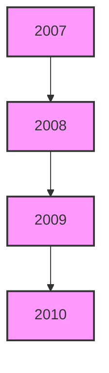
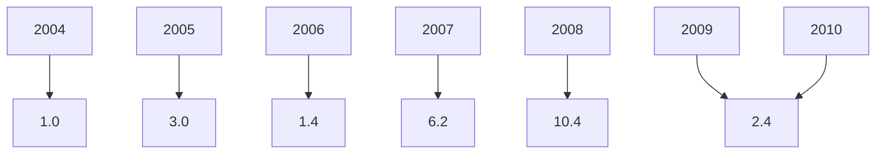

مصرف ليبيا المركزي

[An image of a grand building with domed roofs and arched windows, likely the Central Bank of Libya]

التقرير السنوي الرابع والخمسون

السنة المالية 2010
---
التقرير السنوي لعام 2010

بسم الله الرحمن الرحيم
---
التقرير السنوي لعام 2010

# مجلــــس الإدارة

| المنصب | الصفة | الاسم |
|--------|-------|------|
| رئيساً | المحافظ | الأخ / أ. فرحات عمر بن قدارة |
| نائباً للرئيس | نائب المحافظ | الأخ / أ. محمد عبد السلام الشكري |
| أعضاء | | الأخ / عاشور خليفة تربل |
| | | الأخ / د. بلقاسم عمر الطبولي |
| | | الأخ / د. إدريس عبد السلام الشتيوي |
| | | الأخ / د. بشير علي الشويرف |
| | | الأخ / د. عمر إبراهيم حسين |
---
التقرير السنوي لعام 2010

## مدراء الإدارات

| الإدارة | المدير |
|---------|--------|
| مدير إدارة الاحتياطيات | طارق قاسم شرتلة |
| مدير إدارة الإصدار | محمد البهلول رحومة |
| مدير إدارة البحوث والإحصاء | د. علي رمضان شنيب |
| مدير إدارة تقنية المعلومات | عبد العظيم بن صوفية |
| مدير إدارة الحسابات | عبد الناصر خليفة قنيدي |
| مدير إدارة الرقابة على المصارف والنقد | د. محمد عبد الجليل أبوسنينة |
| مدير إدارة الشؤون الإدارية والموظفين | بشير الهمالي الزنتوتي |
| مدير إدارة العمليات المصرفية | فتحي احمدي الحاجي |
| مدير إدارة المراجعة | عبد الله نوري الشيباني |
| مدير الإدارة القانونية | د. علي عبد الرحمن ضوي |

## مدراء الفروع

| الفرع | المدير |
|-------|--------|
| مدير فرع بنغازي | الكيلاني منصور الزوبي |
| مدير فرع سبها | عبد السلام وادي معروف |
| مدير فرع سرت | امحمد صالح أبو غالية |
---
التقرير السنوي لعام 2010

# مصرف ليبيا المركزي

## الإدارة العامة / طرابلس

+ (218) 21-3333591 / 9 : هاتف
+ (218) 21 – 4441488 : بريد مصور (فاكس)
CBLJLYLXXXX: السويفت
www.cbl.gov.ly : الموقع الإلكتروني

## الفروع

| فرع بنغازي | فرع سبها |
|------------|----------|
| هاتف : 8/ 9091161 – 61 (218) + | هاتف : 3/ 627771 –71 (218) + |
| بريد مصور (فاكس) : 9091169 – 61 (218) + | بريد مصور (فاكس) : 621800 – 71 (218) + |

### فرع سرت
+ (218) 54 – 63750 / 4 : هاتف
+ (218) 54 - 5265142 : بريد مصور (فاكس)

----

## إدارة البحوث والإحصاء
+ (218) 21– 4773901 : هاتف
+ (218) 21 – 4773903 : بريد مصور (فاكس)
ecorestat@ cbl.gov.ly : بريد إلكتروني
---
التقرير السنوي لعام 2010

# المحتويات

14 ................................................................................................... تقديم

## الجزء الأول
### التطورات الاقتصادية العربية والدولية

18 ...................................................................... أولاً: التطورات الاقتصادية الدولية
18 ........................................................................................ • نظرة عامة
20 ..................................................................................... • النمو الاقتصادي
21 ............................................................................................... • البطالة
21 ............................................................................................... • التضخم
22 .................................................................................... • المديونية الخارجية
23 ...................................................................................... • التجارة العالمية
24 ............................................................. • أسعار صرف العملات الدولية الرئيسية
25 ........................................................................... • أسعار سلع التجارة العالمية
26 ............................................................................. • التطورات النفطية الدولية
26 ................................................................................... - العرض
26 .................................................................................... - الطلب
28 ................................................................................... - الأسعار
31 ...................................................................... ثانياً: التطورات الاقتصادية العربية

## الجزء الثاني
### التطورات الاقتصادية المحلية

40 .......................................................................................... • نظرة عامة

#### أولاً : القطاع الحقيقي

41 ...................................................................... • الناتج المحلي الإجمالي الحقيقي
42 ....................................................................... • الناتج المحلي الإجمالي الاسمي
47 ....................................................................................... • معدل التضخم
48 ........................................................................... • العاملون بالنشاط الاقتصادي
---
# التقرير السنوي لعام 2010

## التطورات النفطية المحلية •
50 ...........................................................................
- الإنتاج المحلي من النفط الخام ............................................................ 50
- صادرات النفط الخام .. .................................................................. 51
- أسعار النفط الخام ........................................................................ 53
- إنتاج الغاز الطبيعي ....................................................................... 53
- الإنتاج المحلي من المشتقات النفطية ...................................................... 54
- الإنتاج المحلي من البتروكيماويات ......................................................... 54
- صادرات المنتجات النفطية والبتروكيماوية ................................................. 55
- الاستهلاك المحلي من المشتقات النفطية ................................................... 56

## ثانياً : المالية العامة
• قانون الميزانية العامة للسنة المالية2010 .............................................................. 57
- تنفيذ الميزانية العامة للسنة المالية 2010 .................................................... 58
الإيرادات ......................................................................... 58
المصروفات ..................................................................... 59

## ثالثاً : القطاع الخارجي
• ميزان المدفوعات .................................................................................. 61
- الحساب الجاري .......................................................................... 61
- الحساب الرأسمالي والمالي ............................................................ 62

## رابعاً : القطاع المصرفي والنقدي
• التطورات المصرفية ................................................................................. 65
- قرارات مجلس الإدارة لعام 2010 ......................................................... 65
- الرقابة المصرفية .......................................................................... 66
- التدريب المصرفي ........................................................................ 67
- نظام المدفوعات ............................................................................ 69
• التطورات النقدية .................................................................................... 72
- القاعدة النقدية .............................................................................. 72
- السيولة المحلية والعوامل المؤثرة فيها ...................................................... 73
---
التقرير السنوي لعام 2010

75 ................................................................. سعر صرف الدينار الليبي -
76 .......................................................................... مقاصة الصكوك -
77 ............................................................................... مصرف ليبيا المركزي •
77 ............................................................................ جانب الأصول -
78 ............................................................................ جانب الخصوم -
81 .................................................................................. المصارف التجارية •
81 ........................................................................... مصادر الأموال -
82 ........................................................................ استخدامات الأموال -
86 ................................................. وضع السيولة والاحتياطي النقدي الإلزامي -
88 ............................................................................ المصرف الليبي الخارجي •
92 ............................................................................ المصارف المتخصصة •
92 ............................................................................ مصرف التنمية -
93 ........................................................................ المصرف الزراعي -
93 ....................................................... مصرف الادخار والاستثمار العقاري -
94 ........................................................................... المصرف الريفي -

خامساً : المؤسسات المالية غير المصرفية
95 ............................................................................ المؤسسة الليبية للاستثمار •
97 ......................................................... المحفظة الاستثمارية طويلة المدى -
98 ............................................................. محفظة ليبيا أفريقيا للاستثمار -
98 ....................................................... الشركة الليبية للاستثمارات الخارجية -
99 ........................................................................... سوق الأوراق المالية الليبي •
101 .............................................................. صندوق الإنماء الاقتصادي والاجتماعي •
102 ...................................................................................... صندوق التقاعد •
103 ...................................................................................... شركات التأمين •
---
# التقرير السنوي لعام 2010

## تقديم

يسر مصرف ليبيا المركزي أن يقدم تقريره السنوي الرابع والخمسون، متضمناً أهم التطورات الاقتصادية على الصعيد الدولي والعربي والمحلي، فعلى الصعيد الدولي سجل الاقتصاد العالمي انتعاشاً ملحوظاً، حيث ارتفع معدل النمو به من -0.5% عام 2009 إلى 5.0% عام 2010، وذلك بسبب استعادة النمو في الدول المتقدمة والدول النامية على حد سواء والتي استخدمت سياسات مالية ونقدية فعالة إلى حد كبير، وبالرغم من ذلك فإن حالة عدم اليقين ظلت هي السائدة خلال عام 2010، ومن ناحية أخرى فقد أدى انتعاش الطلب العالمي إلى ارتفاع أسعار السلع الأولية، حيث ارتفعت أسعار النفط بما يزيد على نسبة 50.0% عما كانت عليه في عام 2009، وارتفعت معدلات التضخم في الدول الصناعية إلى 1.6%. ونتيجة لتداعيات الأزمة الاقتصادية العالمية فقد ارتفعت معدلات البطالة عالمياً خلال عام 2010 حيث بلغت في دول منطقة اليورو 9.4% وفي الولايات المتحدة الأمريكية 9.6%.

وبالنظر إلى هشاشة الوضع الاقتصادي استمرت المصارف المركزية في الاقتصادات المتقدمة في الإبقاء على أسعار الفائدة منخفضة وإتباع سياسات متحفظة.

وعلى الصعيد العربي، أظهرت المصادر الدولية، حدوث تحسن في معدل النمو الاقتصادي للدول العربية لعام 2010 ليبلغ نسبة 4.2%، مقابل 2.3% عام 2009، ويتناول التقرير دور المؤسسات المالية العربية في تحقيق التنمية والنمو الاقتصادي للدول العربية.

أما على المستوى المحلي ، فقد ظلت البيئة الاقتصادية قوية، مدعومة بإنفاق القطاع العام والطلب المحلي المرتفع، وقد أظهرت التقديرات أن معدل النمو في الناتج المحلي الإجمالي لعام 2010 قد بلغ نحو 3.0%، مقابل -0.7% في عام 2009، إلا أنه لعدم توفر بيانات تفصيلية عن مكونات هذا الناتج نذكر بأن الاقتصاد غير النفطي قد سجل نمواً نسبته 5.8% خلال عام 2009 ولكن النمو في الناتج النفطي تراجع بنسبة 7.7% نتيجة التزام ليبيا بإنتاج النفط بالحصص المتفق عليها مع منظمة الدول المصدرة للنفط.

وفيما يخص التطورات النقدية ، فقد شهد عرض النقود (ع2) نمواً بلغت نسبته 22.5% مقابل 11.2% في عام 2009 ليصل في نهاية عام 2010 إلى نحو 46.4 مليار دينار، مقابل 44.2 مليار دينار في نهاية عام 2009 ، وقد ساهم تراجع الزيادة

14
---
# التقرير السنوي لعام 2010

في عرض النقود والارتفاع المحدد في أسعار السلع المستوردة في ثبات المستوى العام للأسعار، أو معدل التضخم عند 2.4%.

أما فيما يتعلق بالتطورات المالية، فقد كانت السياسات المالية في عام 2009 متحفظة حيث يتم وضع الميزانية على سعر نفط 65 دولاراً للبرميل، مقابل 45 دولاراً للبرميل في سنة 2009، وبلغ حجم الإنفاق الفعلي بالميزانية العامة للبابين الأول والثاني خلال عام 2010 نحو 42.4 مليار دينار وهو تقريباً في حدود المبلغ المخصص والمعتمد بالميزانية العامة.

وبالرغم من ارتفاع أسعار وإنتاج النفط خلال عام 2010 مقارنة بما كانت عليه في عام 2009، إلا أن الميزانية العامة حققت فائضاً بلغ نحو 2.4 مليار دينار وهو يقل عن الفائض المحقق عام 2009 البالغ نحو 7.0 مليار دينار.

وفيما يخص أداء القطاع الخارجي، حقق ميزان المدفوعات فائضاً في الميزان الكلي خلال عام 2010 بلغ 5.7 مليار دينار، مقابل فائض قدره 6.5 مليار دينار عام 2009، ويعود تراجع هذا الفائض بالرغم من ارتفاع فائض الحساب الجاري البالغ 19.9 مليار دينار في عام 2010 ، مقابل 11.7 مليار دينار عام 2009 ، وذلك بسبب زيادة حصيلة الصادرات النفطية، وذلك بسبب ازدياد العجز في الحساب الرأسمالي والمالي من 4.4 مليار دينار في عام 2009 إلى 11.5 مليار دينار في 2010. وقد ساهم الفائض في الميزان الكلي بميزان المدفوعات في زيادة الأصول الأجنبية للجماهيرية لتصل 138.7 مليار دولار مقارنة مع 129.2 مليار دولار مع نهاية عام 2008.

وعلى صعيد التطورات المصرفية، استمر مصرف ليبيا المركزي خلال عام 2010 ، في التركيز على تفعيل دور السياسة النقدية التي ينتهجها ورفع أداء المصارف التجارية ومساهمتها في النشاط الاقتصادي ، كما أصدر مجلس إدارة مصرف ليبيا المركزي خلال عام 2010 العديد من القرارات لزيادة المنافسة في القطاع المصرفي وتقويته الرقابة عليه . وبسبب حالة عدم اليقين وعدم الاستقرار في الأوضاع الاقتصادية العالمية والسياسة المالية المتحفظة التي تتبعها ليبيا، قام مصرف ليبيا المركزي بالإبقاء على سعر إعادة الخصم وأسعار الفائدة على شهادات الإيداع لفترة استحقاق 91 يوماً و28 يوماً عند 3.0% و1.0% و0.85% لكل منها، وفي مجال إعادة هيكلة مصرف ليبيا المركزي أصدر مجلس إدارة المصرف قراراً باعتماد الهيكل التنظيمي للمصرف، كما أصدر المجلس مجموعة من القرارات التي تتعلق بتطوير وتحديث القطاع المصرفي ودخول مصارف أجنبية كشريك استراتيجي في بعض المصارف المحلية، بالإضافة إلى وضع قواعد تنظيم عمليات الصرافة، واعتماد دليل الحوكمة بالقطاع المصرفي.

15
---
التقرير السنوي لعام 2010

أما فيما يتعلق بأنشطة المؤسسات المالية غير المصرفية، فيتضمن التقرير جزءً
خاصاً عن نشاط بعض المؤسسات المالية غير المصرفية والتي تلعب دوراً مهماً في
الاقتصاد الوطني، وتمارس أنشطة استثمارية واسعة، سواء في الداخل أو في الخارج.
ومن بعض هذه المؤسسات المالية، صندوق التقاعد، المؤسسة الليبية للاستثمار
والجهات التابعة لها، صندوق الإنماء الاقتصادي والاجتماعي، كما تضمن التقرير
أيضاً المؤشرات المهمة في أداء سوق الأوراق المالية الليبي.

ويتقدم مصرف ليبيا المركزي بهذه المناسبة ، ليعرب عن شكره وتقديره لكافة
الأمانات والمؤسسات والأجهزة العامة ذات العلاقة ، لتوفيرها وتزويدها للمصرف
بالبيانات والإحصاءات اللازمة التي مكنته من إعداد هذا التقرير.

والله ولي التوفيق

مصرف ليبيا المركزي

16
---
التقرير السنوي لعام 2010

الجزء الأول
التطورات الاقتصادية الدولية والعربية
---
# التطورات الاقتصادية الدولية

## أولاً : التطورات الاقتصادية الدولية

### نظرة عامة

بدأ الاقتصاد العالمي خلال عام 2010 التعافي من فترة الكساد الناجمة عن التأثيرات السلبية للأزمة المالية والاقتصادية العالمية ، حيث شهد نمواً ملحوظاً، وفق التقديرات الأولية المتوفرة عن مصادر صندوق النقد الدولي في شهر أبريل (نيسان) 2011 ، بلغ 5.0% مقارنة بمعدل نمو سالب بلغ 0.5% عام 2010. ويعزى هذا التحسن إلى استعادة النمو في مجموعة الدول المتقدمة ، ولكن بمعدلات بطيئة ليسجل بالمتوسط معدل نمو بواقع 3.0% مقارنة بمعدل نمو سالب بلغ 3.4% عام 2009. كما استطاعت مجموعة الدول النامية والصاعدة تجاوز الأزمة العالمية بسبب انتهاجها لسياسات اقتصادية سليمة، حيث كانت لديها القدرة على استخدام السياسة المالية والنقدية بفاعلية لتخفيف الآثار السلبية للتحولات المفاجئة في التجارة العالمية ، والأسعار والتدفقات المالية الدولية. وبذلك قفزت معدلات النمو في المجموعة التي تضم بقية الاقتصادات الناشئة والدول النامية خلال عام 2010 لتسجل بالمتوسط معدل نمو بلغ 7.3% مقابل 2.7% عام 2009، كمحصلة لتحقيق العديد من دول المجموعة معدلات نمو إيجابية ومرتفعة نسبياً نتيجة لبقاء الطلب المحلي عند مستويات مرتفعة على أساس الدخل الحقيقي وتنامي الاستثمار الخاص والعام، إضافة إلى توقع انتعاش صادرات تلك الدول نتيجة إعادة توجيه التبادل التجاري الدولي نحو الدول الآسيوية سريعة النمو. وبناء على استعادة الاقتصاد العالمي لمعدلات النمو الإيجابية خلال عام 2010، يقدر أن ترتفع قيمة الناتج الإجمالي العالمي بالأسعار الجارية إلى نحو 63.0 تريليون دولار أمريكي، مقابل 57.8 تريليون دولار أمريكي عن عام 2009 .

أما فيما يتعلق بمستويات الأسعار معبراً عنها بالرقم القياسي لأسعار المستهلك (متوسط الفترة)، فقد ارتفعت في مجموعة الدول المتقدمة لتعكس على ارتفاع معدل التضخم، ولكن بدرجة محدودة، إلى 1.6% عام 2010 مقابل 0.1% عام 2009، كما ارتفع أيضاً في المجموعة التي تضم بقية الدول الناشئة والدول النامية ليسجل 6.2% مقارنة بنحو 5.2% عام 2009، وهو ما يرجع بصفة أساسية إلى تباطؤ معدلات النمو الاقتصادي العالمي مع بقاء معدلات البطالة مرتفعة في ظل زيادة الطاقات الإنتاجية غير المستغلة، علاوة على الارتفاع المحدود في أسعار معظم السلع الغذائية والمحاصيل الزراعية خلال عام 2010.

وفيما يتعلق بأسعار النفط الخام (وفق المتوسط الحسابي للأسعار الفورية لخامات برنت ودبي وغرب تكساس) فقد شهدت ارتفاعاً ملحوظاً بلغ معدله 27.3% عام 2010

18
---
# التطورات الاقتصادية الدولية                                                  التقرير السنوي لعام 2010

مقابل معدل نمو سلبي بلغ 36.3% عام 2009. وسجل المتوسط السنوي للسعر
الفوري لخامات أوبك خلال عام 2010 حوالي 77.5 دولار أمريكي للبرميل،
مقارنة بـ 61.8 دولار أمريكي للبرميل عام 2009. ومن المتوقع أن تشهد أسعار
النفط ارتفاعاً ملحوظاً خلال العام 2011. ويرجع ذلك بصفة أساسية لارتفاع الطلب
العالمي على النفط لاستعادة الاقتصاد العالمي عافيته وخروجه من مرحلة الركود التي
شهدتها معظم اقتصادات العالم نتيجة للأزمة العالمية، كما يرجع إلى الأحداث التي
تشهدها المنطقة العربية.

وفي ضوء المؤشرات الأولية، يلاحظ أن أداء الاقتصاد العالمي لا يزال يعاني من
أجواء عدم اليقين في نظامه المالي بما يمثل نقطة الضعف الرئيسية في مسيرة التعافي
الاقتصادي. وأظهرت الاضطرابات التي لحقت مؤخراً بأسواق الديون السيادية في
دول الاتحاد الأوروبي أن وضع الميزانيات السيادية والمصرفية أصبح أكثر هشاشة
جراء الأزمة. لكن الموقف المالي تحسن بعد ذلك بفضل التحركات القوية التي بادر
بها صانعو السياسات، والذي ساعدت على استقرار أسواق التمويل والحد من المخاطر
المفاجئة.

وعلى الرغم من ظهور بوادر الانتعاش، إلا أنه يظل هشاً، ويتطلب من معظم الدول
المتقدمة وبعض الدول النامية اتخاذ إجراءات تصحيحية لتحقيق التوازن الداخلي
والخارجي، منها تقوية الميزانية العمومية للقطاع المالي، وتثبيت الدين العام أو تخفيضه
ومعالجة الخلل في القطاع المالي. كما خلفت الأزمة تأثيراً واضحاً على مؤشرات
الاقتصاد الكلي في مجموعة الدول النامية، حيث ارتفعت معدلات البطالة بصورة
ملحوظة في الدول ذات قطاعات التصنيع الأكثر تطوراً، كما تدهورت أرصدة المالية
العامة، ولا سيما في الدول ذات الدخل المتوسط والدول المصدرة للنفط. كما أن زيادة
الصادرات لم تصل بعد إلى مستويات ما قبل الأزمة، إضافة إلى تواصل تراجع حجم
الائتمان المتاح بسبب ضغط الإنفاق الحكومي في تلك الدول.

19
---
# التطورات الاقتصادية الدولية

## النمو الاقتصادي:

تحسن أداء الاقتصاد العالمي خلال عام 2010، حيث وصل به النمو إلى نحو 5.0%، مقابل نمو سالب -0.5% عام 2009، وقد تحسنت معدلات النمو في الدول الصناعية لتصل إلى 3.0%، مقارنة مع نمو سالب -3.4% في سنة 2009. أما في الدول النامية والأسواق الناشئة فقد ارتفع معدل النمو إلى 7.3% مقابل 2.7% في سنة 2009، كما ارتفع النمو في دول الشرق الأوسط وشمال أفريقيا إلى 3.8% عام 2010 مقابل 1.8% عام 2009.

### جدول رقم (1): معدلات النمو الحقيقي في العالم
"نسب مئوية"

| الدول مجموعة | 2009 | 2010 |
|--------------|------|------|
| العالم: | -0.5 | 5.0 |
| الدول الصناعية: | -3.4 | 3.0 |
| الولايات المتحدة الأمريكية | -2.6 | 2.8 |
| دول منطقة اليورو | -4.1 | 1.7 |
| اليابان | -6.3 | 3.9 |
| دول صناعية أخرى | -2.3 | 4.3 |
| الدول النامية وأسواق ناشئة أخرى: (*) | 2.7 | 7.3 |
| دول وسط وشرق أوروبا | -3.6 | 4.2 |
| دول الكومنولث المستقلة | -6.4 | 4.6 |
| آسيا | 7.2 | 9.5 |
| الشرق الأوسط وشمال أفريقيا | 1.8 | 3.8 |
| أمريكا اللاتينية والكاريبي | -1.7 | 6.1 |
| أفريقيا جنوب الصحراء | 2.8 | 5.0 |

المصدر: صندوق النقد الدولي، آفاق الاقتصاد العالمي – أبريل (نيسان) 2009.
* الأسواق الناشئة تشمل: البرازيل، روسيا، الهند، الصين، جنوب أفريقيا، جمهورية التشيك، كوريا الجنوبية، المكسيك.

### شكل (1): معدلات النمو الحقيقي في العالم



| السنوات | العالم | الدول الصناعية | الدول النامية |
|---------|-------|----------------|---------------|
| 2007    | 5     | 2.5            | 8             |
| 2008    | 3     | 0.5            | 6             |
| 2009    | -0.5  | -3.5           | 2.5           |
| 2010    | 5     | 3              | 7             |

20
---
# التطورات الاقتصادية الدولية                                                  التقرير السنوي لعام 2010

## البطالة •

شهدت معدلات البطالة في الدول الصناعية عام 2010 زيادة ملحوظة حيث بلغت 8.3% مقابل 8.0% عام 2009، وارتفعت في دول منطقة اليورو من 9.4% إلى 10.0%. كما ارتفع معدل البطالة في الولايات المتحدة الأمريكية من 9.3% في عام 2009 إلى 9.6% في عام 2010، وفي المملكة المتحدة من 7.5% إلى 7.8%. أما معدل البطالة في اليابان فقد ظل على ما هو عليه عند 5.1%.

### جدول رقم (2) : معدلات البطالة في الدول الصناعية
"نسبة مئوية"

| الدول مجموعة | 2009 | 2010 |
|--------------|------|------|
| الدول الصناعية | 8.0 | 8.3 |
| الولايات المتحدة الأمريكية | 9.3 | 9.6 |
| دول منطقة اليورو | 9.4 | 10.0 |
| المملكة المتحدة | 7.5 | 7.8 |
| اليابان | 5.1 | 5.1 |

المصدر: صندوق النقد الدولي، المصدر السابق.

## التضخم •

بعد أن دفعت الأوضاع الاقتصادية العالمية المقرونة بتراجع أسعار النفط الخام والمواد الأساسية بالضغوط التضخمية إلى التراجع في عام 2009، فإن معظم الدول شهدت ارتفاعا نسبيا في معدلات التضخم وذلك بسبب انتعاش الطلب العالمي من ناحية ومعاودة أسعار النفط الارتفاع في عام 2010 لتصل إلى 1.6% للدول المتقدمة و6.2% للدول النامية والناشئة مقارنة مع 0.1% و5.2% على التوالي خلال عام 2009.

### جدول رقم (3) : معدلات التضخم في العالم
"نسبة مئوية"

| الدول مجموعة | 2009 | 2010 |
|--------------|------|------|
| الدول الصناعية: | 0.1 | 1.6 |
| الولايات المتحدة الأمريكية | 0.3- | 1.6 |
| دول منطقة اليورو | 0.3 | 1.6 |
| اليابان | 1.4- | 0.7- |
| الدول النامية وأسواق ناشئة أخرى: | 5.2 | 6.2 |
| دول وسط وشرق أوروبا | 4.7 | 5.3 |
| دول الكومنولث المستقلة | 11.2 | 7.2 |
| آسيا | 3.1 | 6.0 |
| الشرق الأوسط وشمال أفريقيا | 6.5 | 6.9 |
| أمريكا اللاتينية والكاريبي | 6.0 | 6.0 |
| أفريقيا جنوب الصحراء | 10.5 | 7.5 |

المصدر: صندوق النقد الدولي، المصدر السابق.

21
---
التطورات الاقتصادية الدولية                                                                                         التقرير السنوي لعام 2010

• المديونية الخارجية :
ارتفع إجمالي الدين الخارجي للدول النامية والأسواق الناشئة في عام 2010 بنسبة
7.6% عن مستواه عام 2009 ، ليصل إلى 5254.0 مليار دولار مقابل 4881.3
مليار دولار في عام 2009. أما خدمة الدين فقد ارتفعت بنحو 0.3% لتصل إلى
1792.2 مليار دولار عام 2010 مقابل 1737.6 مليار دولار عام 2009، وانخفضت
خدمة الدين الخارجي للدول النامية والأسواق الناشئة كنسبة إلى الصادرات من
32.0% في عام 2009 إلى 25.7% عام 2010، كما انخفضت خدمة الدين الخارجي
لهذه الدول كنسبة إلى الناتج المحلي الإجمالي من 27.0% في عام 2009 إلى 24.6%
في عام 2010.

جدول رقم ( 4 ) : حجم المديونية الخارجية للدول النامية والأسواق الناشئة الأخرى
" بالمليار دولار "

| 2010 | 2009 | مجموعة الدول |
|-------|------|---------------|
| 5254.0 | 4881.3 | 1- مديونية الدول النامية والأسواق الناشئة الأخرى : |
| 1155.2 | 1113.3 | دول وسط وشرق أوروبا |
| 756.4 | 739.5 | دول الكومنولث المستقلة |
| 1346.2 | 1218.2 | آسيا |
| 753.1 | 717.1 | الشرق الأوسط وشمال إفريقيا |
| 1024.0 | 875.7 | أمريكا اللاتينية والكاريبي |
| 218.9 | 217.4 | إفريقيا جنوب الصحراء |
| 1742.2 | 1737.6 | 2- خدمة الدين للدول النامية والأسواق الناشئة الأخرى: (*) |
| 382.2 | 399.4 | دول وسط وشرق أوروبا |
| 284.8 | 252.4 | دول الكومنولث المستقلة |
| 545.4 | 530.5 | آسيا |
| 206.7 | 189.5 | الشرق الأوسط |
| 300.2 | 311.3 | أمريكا اللاتينية والكاريبي |
| 58.9 | 54.5 | إفريقيا جنوب الصحراء |

المصدر : صندوق النقد الدولي ، المصدر السابق .
(*) كنسبة من الصادرات .

22
---
التطورات الاقتصادية الدولية | التقرير السنوي لعام 2010

شكل (2) : تطور المديونية الخارجية للدول النامية والأسواق الناشئة الأخرى

```
| السنوات | 2007 | 2008 | 2009 | 2010 |
|---------|------|------|------|------|
| دول وسط وشرق أوروبا | | | | |
| دول الكومنولث المستقلة | | | | |
| الشرق الأوسط وأفريقيا | | | | |
| آسيا | | | | |
| أمريكا | | | | |
```

• التجارة العالمية :

ارتفع معدل نمو التجارة العالمية بصورة كبيرة خلال عام 2010 بنحو 12.4% مقابل
نمو سالب 10.9% عام 2009 ، ويعزى ذلك إلى عمق الأزمة المالية العالمية وما
ترتب عليها من انتعاش على المستوى العالمي، مما أدى إلى زيادة معدلات نمو
الصادرات والواردات، حيث ارتفعت الصادرات في مجموعة الدول الصناعية بنحو
12.0% مقابل معدل نمو سالب -12.2% في عام 2009. كما ارتفعت الواردات
للمجموعة بنسبة 11.2% مقابل -12.6% في عام 2009، وفي مجموعة الدول النامية
والأسواق الناشئة بلغ معدل نمو الصادرات والواردات لعام 2010 نحو 14.2%
و13.5% على التوالي مقابل معدل نمو سالب للصادرات والواردات خلال عام 2009
بلغت -7.5% و-8.3% على الترتيب .

أما على صعيد الحسابات الجارية في موازين مدفوعات الدول حول العالم، فقد شهد
عام 2010 استمرار تحقق فوائض في الحسابات الجارية في موازين مدفوعات
الصين، واليابان، وروسيا والدول الصناعية الجديدة، والدول المصدرة للنفط، على
حساب تواصل بل وتفاقم العجز في بعض الدول المصدرة للنفط، في أعقاب الأزمة،
مثل كندا واتساعه في الولايات المتحدة الأمريكية والمملكة المتحدة وتحسنه لدى معظم
الدول الأوروبية واستراليا.

23
---
التطورات الاقتصادية الدولية                                                                                   التقرير السنوي لعام 2010

## جدول رقم ( 5 ) : معدلات نمو التجارة العالمية
" نسب مئوية "

| 2010 | 2009 |                                               |
|------|------|-----------------------------------------------|
| 12.4 | 10.9- | إجمالي التجارة العالمية                        |
|      |      | الدول الصناعية :                               |
| 12.0 | 12.2- | الصادرات                                      |
| 11.2 | 12.6- | الواردات                                      |
|      |      | الدول النامية وأسواق ناشئة أخرى :               |
| 14.5 | 7.5-  | الصادرات                                      |
| 13.5 | 8.3-  | الواردات                                      |

المصدر : المصدر السابق .

### أسعار صرف العملات الدولية الرئيسية :

ارتفع سعر صرف الدولار الأمريكي خلال عام 2010 في المتوسط مقابل معظم
العملات الرئيسة، حيث وصل مقابل اليورو إلى 1.327 دولاراً مقابل 1.393 دولاراً
في عام 2009. كما ارتفع سعر صرف الدولار مقابل الجنيه الإسترليني ليصل إلى
1.546 دولاراً لكل جنيه مقابل 1.564 دولاراً لكل جنيه في العام السابق .
وانخفض سعر صرف الدولار مقابل الين الياباني ليصل في العام قيد التقرير إلى
87.8 يناً لكل دولار مقابل 93.6 يناً لكل دولار في عام2009 .

## جدول رقم (6) : أسعار صرف بعض العملات الدولية لعام 2010

| الفرنك السويسري | الين الياباني | الجنيه الإسترليني | اليورو | الدولار الأمريكي |                   |
|------------------|---------------|-------------------|--------|-------------------|-------------------|
| 0.9588           | 0.0114        | 1.546             | 1.327  | -                 | الدولار الأمريكي |
| 0.7225           | 0.0076        | 1.1651            | -      | 0.7536            | اليورو            |
| 0.6201           | 0.0074        | -                 | 0.8583 | 0.6468            | الجنيه الإسترليني |
| 84.180           | -             | 135.745           | 116.507| 87.8              | الين الياباني     |
| -                | 0.0119        | 1.6125            | 1.3840 | 1.043             | الفرنك السويسري   |

أما فيما يتعلق بسلة العملات المكونة لوحدة حقوق السحب الخاصة فإن الجدول التالي
يبين أوزان العملات المكونة لوحدة السحب الخاصة في نهاية عام 2010 ونهاية عام
2009 وكذلك الأوزان المعمول بها اعتباراً من 01.01.2011.

24
---
# التطورات الاقتصادية الدولية                                                  التقرير السنوي لعام 2010

## جدول رقم (7) : أوزان وأسعار صرف العملات المكونة لسلة حقوق السحب الخاصة

| العملة | أوزان العملات المكونة لوحدة حقوق السحب الخاصة | سعر وحدة حقوق السحب الخاصة مقابل العملات المكونة لها |
|--------|-------------------------------------------|---------------------------------------------------|
|        | 2011.01.01 | 2010.12.31 | 2009.12.31 | 2010.12.31 | 2009.12.31 |
| الدولار الأمريكي | %40.31 | %40.85 | %42.70 | 1.547 | 1.568 |
| اليورو | %37.66 | %35.47 | %36.58 | 1.156 | 1.089 |
| الجنيه الاسترليني | %9.33 | %9.06 | %11.12 | 0.996 | 0.968 |
| الين الياباني | %12.70 | %14.62 | %9.60 | 125.850 | 144.886 |
|        | %100.00 | %100.00 | %100.00 |  |  |

المصدر : صندوق النقد العربي، التقرير السنوي 2010.

### أسعار السلع التجارة العالمية :

شهدت أسعار معظم السلع الغذائية زيادات ملحوظة خلال عام 2010 حيث أدى
انتعاش الطلب العالمي إلى ارتفاع أسعار السلع الأولية، وخاصة السلع الغذائية والنفط،
ويعزى ارتفاع أسعار هذه السلع لعدة أسباب منها :
- التوسع في إنتاج الوقود الحيوي كمصدر بديل للطاقة وذلك على حساب
الإنتاج الغذائي
- النمو الاقتصادي الذي شهدته معظم دول العالم وخاصة الصين والهند بعد
خروجها من الأزمة العالمية، مما زاد من الطلب على المواد الغذائية والنفط.

كما ساهم الانتعاش الاقتصادي عام 2010 في ارتفاع المستوى العام للأسعار ففي
الاقتصادات المتقدمة ارتفع التضخم الكلي من 0.1% في عام 2009 إلى 1.6% في
عام 2010، وفي الاقتصادات النامية والأسواق الناشئة ارتفع التضخم إلى 6.2% في
عام 2010 مقابل 5.2% في عام 2009 .

## جدول رقم ( 8 ) : التغير السنوي في الأسعار العالمية لبعض السلع
" بالدولار "

| البيان | 2008 | 2009 | 2010 |
|--------|------|------|------|
| السلع المصنعة | %6.6 | -6.3% | %3.0 |
| النفط | %36.4 | -36.3% | %27.9 |
| السلع الأولية غير النفطية | %7.5 | -15.8% | %26.3 |
| سلع غذائية | %23.4 | -14.7% | %11.4 |
| مشروبات | %23.3 | %1.6 | %14.1 |
| مواد زراعية خام | -0.8% | -17.0% | %33.2 |
| معادن | -7.8% | -19.7% | %48.1 |

المصدر : صندوق النقد الدولي ، آفاق الاقتصاد العالمي ، (ابريل) 2011 .

25
---
# التطورات الاقتصادية الدولية                                                                              التقرير السنوي لعام 2010

## التطورات النفطية الدولية :

شهدت الأسواق النفطية العالمية خلال عام 2010 انتعاشاً ملحوظاً بعد التأثيرات التي
صاحبت الأزمة المالية العالمية، ويمكن ملاحظة ذلك من خلال متوسط تحركات
أسعار النفط الخام التي ارتفعت بشكل واضح من 60.9 دولار/برميل خلال 2009
إلى 77.5 دولار/برميل خلال عام 2010، محققة زيادة قدرها 27.3%.

### العرض -

سجل العرض العالمي من النفط الخام والغاز المسال خلال عام 2010 زيادة بنسبة
2.4% أو بمقدار 2.0 مليون برميل في اليوم، ليبلغ في المتوسط 86.2 مليون برميل
في اليوم مقابل 84.2 مليون برميل في اليوم في عام 2009 . وكان السبب الرئيس
وراء زيادة العرض العالمي هو قرار منظمة الأوبك بتثبيت الإنتاج لمحاولة موازنة
قوى السوق النفطية التي تأثرت من الأزمة الاقتصادية العالمية، في الوقت الذي شهد
فيه الاقتصاد العالمي نمواً متواضعا في الدول الصناعية ونمواً أفضل للدول النامية
والأسواق الناشئة وبصفة خاصة بدول شرق آسيا. وارتفع إنتاج منظمة الأقطار المصدرة
للنفط (الأوبك) من 33.0 مليون برميل في اليوم عام 2009 إلى حوالي 34.0 مليون
برميل في اليوم بمعدل زيادة قدره 3.0%، كما شهدت معدلات إنتاج النفط من قبل
منتجي النفط الخام العالميين خارج منظمة الأوبك زيادة متفاوتة حيث ارتفع إنتاج دول
الاتحاد السوفيتي السابق (روسيا، كازاخستان، أذربيجان) من 13.0 مليون برميل في
اليوم خلال عام 2009 إلى 13.3 مليون برميل في اليوم في عام 2010 بمعدل نمو
قدره 2.3%. كما كان هنالك زيادة في الإنتاج من قبل دول أمريكا الشمالية وبالأخص
دولة المكسيك جراء تطوير عملية إنتاج النفط الخام في المياه العميقة في خليج
المكسيك الذي بدوره أدى إلى ارتفاع الإنتاج في المنطقة من 14.4 مليون برميل في
اليوم في عام 2009 إلى 14.9 مليون برميل في اليوم خلال عام 2010، وقد أدت
مجمل هذه التطورات إلى وصول إجمالي إنتاج الدول خارج المنظمة إلى 50.1
مليون برميل في اليوم خلال عام 2010 مقابل 49.2 مليون برميل في اليوم خلال
2009 محققاً معدل نمو قدره 1.8%.

### الطلب -

ارتفع الطلب العالمي على النفط الخام والغاز المسال بنسبة 2.4% ليصل إلى 86.6
مليون برميل في اليوم في عام 2010 مقابل 84.6 مليون برميل في اليوم خلال عام
2009. وكان نمو الطلب في دول خارج منظمة التعاون الاقتصادي والتنمية هو
المكون الرئيسي لارتفاع الطلب العالمي حيث بلغ متوسط الطلب اليومي 40.5 مليون
برميل في عام 2010 مقابل 39.1 مليون برميل في اليوم خلال عام 2009، محققاً
معدل زيادة قدره 3.6% وزيادة كمية قدرها 1.4 مليون برميل، وما يقارب 0.7

26
---
التطورات الاقتصادية الدولية                                                                                 التقرير السنوي لعام 2010

برميل من كمية الزيادة يعود إلى زيادة الطلب على النفط في الصين التي شهد
اقتصادها انتعاشاً خلال عام 2010، كما سجل الطلب العالمي على النفط ارتفاعاً في
بعض البلدان، خاصة بلدان الاتحاد السوفييتي السابق التي زاد طلبها على النفط بنحو
0.1 مليون برميل في اليوم أما الدول النامية كأكبر مستهلك للنفط، حيث زاد طلبها
بمعدل نمو قدره 2.3% عن السنة السابقة وارتفع من 26.1 مليون برميل في اليوم
عام 2009 إلى 26.7 مليون برميل في اليوم خلال عام 2010.

جدول رقم ( 9) : العرض العالمي للنفط الخام والغاز المسال
" مليون برميل في اليوم "

| المنطقة | 2009 | 2010 |||||  معدل النمو |
|---|---|---|---|---|---|---|---|
||| الربع الأول | الربع الثاني | الربع الثالث | الربع الرابع | 2010 ||
| 1- منظمة التعاون الاقتصادي والتنمية: | 19.7 | 20.0 | 19.9 | 19.5 | 20.3 | 19.9 | 1.0 |
| أمريكا الشمالية | 14.4 | 14.7 | 14.9 | 14.9 | 15.3 | 14.9 | 3.5 |
| أوروبا الغربية | 4.7 | 4.7 | 4.4 | 4.0 | 4.4 | 4.4 | -6.4 |
| دول المحيط الهادي | 0.6 | 0.6 | 0.6 | 0.6 | 0.6 | 0.6 | 0.0 |
| 2-دول خارج المنظمة منها : | 29.5 | 30.0 | 30.1 | 30.3 | 30.4 | 30.2 | 2.4 |
| الاتحاد السوفيتي السابق | 13.0 | 13.2 | 13.2 | 13.2 | 13.3 | 13.2 | 1.5 |
| أوروبا الشرقية | 0.1 | 0.1 | 0.1 | 0.1 | 0.1 | 0.1 | 0.0 |
| الصين | 3.9 | 4.0 | 4.1 | 4.2 | 4.2 | 4.1 | 5.1 |
| الدول النامية | 12.5 | 12.7 | 12.7 | 12.8 | 12.8 | 12.8 | 2.4 |
| 3- منظمة أوبك: | 33.0 | 33.8 | 33.9 | 34.0 | 34.3 | 34.0 | 3.0 |
| نفط خام | 28.7 | 29.2 | 29.1 | 29.2 | 29.3 | 29.2 | 1.7 |
| غاز مسال | 4.3 | 4.6 | 4.8 | 4.8 | 5.0 | 4.8 | 11.6 |
| 4- عائدات التكرير | 2.0 | 2.1 | 2.1 | 2.1 | 2.1 | 2.1 | 0.0 |
| مجموع العرض العالمي | 84.2 | 85.9 | 86.0 | 85.9 | 87.1 | 86.2 | 2.4 |

المصدر : منظمة الأقطار المصدرة للنفط (أوابك) التقرير الشهري لسوق النفط – العدد (أبريل) 2011.

جدول رقم (10) : الطلب العالمي على النفط الخام والغاز المسال
" مليون برميل في اليوم "

| المنطقة | 2009 | 2010 |||||  معدل النمو |
|---|---|---|---|---|---|---|---|
||| الربع الأول | الربع الثاني | الربع الثالث | الربع الرابع | 2010 ||
| 1. منظمة التعاون الاقتصادي والتنمية : | 45.5 | 45.8 | 45.2 | 46.6 | 46.7 | 46.1 | 1.3 |
| أمريكا الشمالية | 23.3 | 23.5 | 23.8 | 24.2 | 24.0 | 23.9 | 2.6 |
| أوروبا الغربية | 14.5 | 14.2 | 14.1 | 14.8 | 14.7 | 14.4 | -0.7 |
| دول المحيط الهادي | 7.7 | 8.2 | 7.3 | 7.6 | 8.0 | 7.8 | 1.3 |
| 2- دول خارج المنظمة منها : | 39.1 | 39.4 | 40.2 | 41.0 | 41.2 | 40.5 | 3.6 |
| الاتحاد السوفيتي السابق | 4.0 | 4.0 | 3.8 | 4.2 | 4.3 | 4.1 | 2.5 |
| أوروبا الأخرى | 0.7 | 0.7 | 0.6 | 0.7 | 0.8 | 0.7 | 0.0 |
| الصين | 8.3 | 8.4 | 9.1 | 9.2 | 9.1 | 9.0 | 8.4 |
| الدول النامية | 26.1 | 26.3 | 26.7 | 26.9 | 27.0 | 26.7 | 2.3 |
| مجموع الطلب العالمي | 84.6 | 85.2 | 85.4 | 87.6 | 87.9 | 86.6 | 2.4 |

المصدر : المصدر السابق .

27
---
# التطورات الاقتصادية الدولية                                                                                        التقرير السنوي لعام 2010

## شكل (3) : العرض العالمي والطلب العالمي على النفط الخام والغاز المسال

| السنوات | 2006 | 2007 | 2008 | 2009 | 2010 |
|---------|------|------|------|------|------|
| الطلب العالمي | 84.8 | 86.0 | 85.8 | 84.6 | 86.6 |
| العرض العالمي | 85.2 | 85.6 | 86.6 | 84.2 | 86.2 |

المصدر : المصدر السابق.

### الأسعار:

شهد عام 2010 زيادة ملحوظة في أسعار النفط الخام، حيث ارتفعت أسعار سلة أوبك
بنحو 16.6 دولاراً للبرميل لتصل إلى 77.5 دولاراً للبرميل محققة بذلك معدل زيادة
قدره 27.3%، إلا انه خلال الربع الرابع لعام 2010 اتجهت الأسعار إلى الارتفاع
الملحوظ و السريع نتيجة للتوقعات العالمية بانتعاش الاقتصاد العالمي خلال عام 2010
لتصل في المتوسط إلى 83.8 دولاراً للبرميل، كما تعتبر سياسة منظمة الأقطار
المصدرة للنفط (الأوبك) تثبيت الإنتاج ذات تأثير واضح على اتخاذ أسعار النفط الخام
الاتجاه التصاعدي، خصوصا أن المنظمة تملك حصة نحو 40% من العرض العالمي
للنفط. وتشير جميع التوقعات الدولية إلى استمرار ارتفاع أسعار النفط الخام نتيجة
استمرار زيادة الطلب على النفط من قبل دول جنوب شرق آسيا من جهة، وإلى
الأحداث التي تشهدها منطقة الشرق الأوسط وشمال إفريقيا من جهة أخرى، علاوة
على اعتزام منظمة أوبك إبقاء مستويات إنتاج أعضائها في الفترة المقبلة على ما هي
عليه.

### جدول رقم (11) : متوسط أسعار النفط الخام لسلة أوبك
"دولار للبرميل"

| 2009 | 2010 |
|-------|-------|
| الربع الأول 42.9 | الربع الأول 75.4 |
| الربع الثاني 58.5 | الربع الثاني 76.6 |
| الربع الثالث 67.7 | الربع الثالث 73.8 |
| الربع الرابع 74.3 | الربع الرابع 83.8 |
| متوسط العام 60.9 | متوسط العام 77.5 |

المصدر : منظمة الأقطار العربية المصدرة للنفط (أوابك) النشرة الشهرية – المجلد 37- العدد 4 – ابريل (مارس) 2011 .

28
---
# التطورات الاقتصادية الدولية                                                  التقرير السنوي لعام 2010

## - متوسط الأسعار الفورية للمنتجات النفطية في الأسواق المختلفة

شهدت الأسعار الفورية للمنتجات النفطية في الأسواق المختلفة خلال عام 2010 زيادة
ملحوظة مقارنة بما كانت عليه في عام 2009، إلا أنها ظلت دون المستوى الذي بلغته
في عام 2008، وقد وصل متوسط أسعار الغازولين الممتاز في الأسواق إلى 87.5
دولارا للبرميل، مقابل 66.1 دولارا للبرميل في عام 2009 أي بنسبة زيادة قدرها
32.4% ، وارتفع متوسط أسعار زيت الغاز من 70.9 دولارا للبرميل في عام 2009
إلى 89.7 دولارا للبرميل في عام 2010، أي بنسبة 26.5%. أما متوسط أسعار زيت
الوقود فقد بلغ في عام 2010 نحو 72.2 دولارا للبرميل مقابل 56.1 دولارا للبرميل
في عام 2009 أي بنسبة زيادة قدرها 28.7%.

ونتناول فيما يلي تطور الأسعار الفورية للمنتجات النفطية في الأسواق المختلفة كل
على حدة:

### أ. الخليج الأمريكي:

شهد متوسط الأسعار الفورية لكل من الغازولين وزيت الغاز وزيت الوقود ارتفاعا في
مستواه خلال عام 2010، حيث ارتفع متوسط أسعار الغازولين بنحو 18.5 دولارا
للبرميل أي بنسبة 25.5% لتصل إلى 91.5 دولارا للبرميل، وأسعار زيت الغاز
بحوالي 20.9 دولارا للبرميل أي بنسبة 31.1% لتبلغ 88.1 دولارا للبرميل، كما
ارتفعت أسعار زيت الوقود بحوالي 14.2 دولارا للبرميل أي بنسبة 24.6% لتبلغ
71.8 دولارا للبرميل .

### ب. سوق روتردام :

شهد متوسط الأسعار الفورية للمنتجات الثلاثة ارتفاعا في مستواه خلال عام 2010،
حيث ارتفعت أسعار الغازولين بحوالي 24.4 دولارا للبرميل أي بنسبة 37.2% لتبلغ
90.6 دولارا للبرميل، وأسعار زيت الغاز بنحو 20.9 دولارا للبرميل أي بنسبة
30.1% لتصل إلى 90.4 دولارا للبرميل، بينما ارتفعت أسعار زيت الوقود بنحو
18.0 دولارا للبرميل أي بنسبة 33.1% لتبلغ 72.3 دولارا للبرميل .

### ج. سوق حوض البحر المتوسط :

شهد متوسط الأسعار الفورية لكل من الغازولين وزيت الغاز وزيت الوقود ارتفاعا في
مستواه خلال عام 2010، حيث ارتفعت أسعار الغازولين بنحو 23.6 دولارا للبرميل
أي بنسبة 41.5% لتصل إلى 80.4 دولارا للبرميل، وأسعار زيت الغاز بحوالي 12.9
دولارا للبرميل أي بنسبة 16.9% لتبلغ 89.4 دولارا للبرميل، كما ارتفعت أسعار
زيت الوقود بحوالي 16.0 دولارا للبرميل أي بنسبة 28.8% لتبلغ 71.5 دولارا
للبرميل.

29
---
التطورات الاقتصادية الدولية                                                                                         التقرير السنوي لعام 2010

د. سوق سنغافورة :

شهدت متوسطات الأسعار الفورية للمنتجات الثلاثة ارتفاعاً في مستوياتها خلال عام 2010،
حيث ارتفعت أسعار الغازولين بحوالي 19.0 دولاراً للبرميل أي بنسبة 27.4% لتبلغ
88.3 دولاراً للبرميل، وأسعار زيت الغاز بنحو 20.4 دولاراً للبرميل أي بنسبة
28.9% لتصل إلى 90.9 دولاراً للبرميل، بينما ارتفعت أسعار زيت الوقود بنحو
16.2 دولاراً للبرميل أي بنسبة 28.3% لتبلغ 73.4 دولاراً للبرميل .
ويوضح الجدول التالي المتوسط الشهري للأسعار الفورية للمنتجات النفطية في
الأسواق المختلفة للفترة 2008 – 2010.

جدول رقم ( 12 ) : المتوسط الشهري للأسعار الفورية للمنتجات النفطية في الأسواق المختلفة
2008 - 2010

" بالدولار "

| زيت الوقود**1.0) | زيت الغاز* | الغازولين الممتاز | السوق | |
| (كبريت | (50.ب.م.) | | | |
| 76.0 | 123.7 | 102.6 | سنغافورة | متوسط عام |
| 78.9 | 125.3 | 98.3 | روتردام | 2008 |
| 77.5 | 125.3 | 111.5 | البحر المتوسط | |
| 74.3 | 121.3 | 110.2 | الخليج الأمريكي | |
| 76.7 | 123.9 | 105.6 | المتوسط العام | |
| 57.2 | 70.5 | 69.3 | سنغافورة | متوسط عام |
| 54.3 | 69.5 | 65.6 | روتردام | 2009 |
| 55.5 | 76.5 | 56.8 | البحر المتوسط | |
| 57.6 | 67.2 | 72.9 | الخليج الأمريكي | |
| 56.1 | 70.9 | 66.1 | المتوسط العام | |
| 73.4 | 90.9 | 88.3 | سنغافورة | |
| 72.3 | 90.4 | 90.0 | روتردام | متوسط عام |
| 71.5 | 89.4 | 80.4 | البحر المتوسط | 2010 |
| 71.8 | 88.1 | 91.5 | الخليج الأمريكي | |
| 72.2 | 89.7 | 87.5 | المتوسط العام | |

* زيت الغاز في السوق الأمريكي على 0.05% كبريت .
** زيت الوقود في سوق سنغافورة على 2.0% كبريت.
المصدر: المصدر السابق .

30
---
# التطورات الاقتصادية العربية                                                                     التقرير السنوي لعام 2010

## ثانياً : التطورات الاقتصادية العربية

في ظل تحسن أداء الاقتصاد العالمي، تحسنت آفاق أداء اقتصادات المنطقة العربية
بتقديرات النمو تبدو معدلاتها مشجعة بوجه عام، حيث تكاد لا تستثني أي دولة عربية من
النمو فعلى صعيد المؤشرات الاقتصادية، عكست التقديرات الأولية وفق المصادر
الدولية انتعاشا قويا في معدل النمو الاقتصادي للدول العربية مجتمعة للعام 2010 ليبلغ
4.2% مقارنة بنحو 2.3% للعام 2009، كمحصلة لنمو 4 دول بمعدلات مرتفعة
نسبيا، تراوحت ما بين 8% - 16%، وتسجيل البعض الآخر معدلات نمو حول 5%،
وباقي الدول معدلات تقل عن 4%. ولأول مرة منذ عشرة سنوات، يقل معدل النمو في
مجموعة الدول العربية عن نظيره العالمي والمحقق لمجموعة الدول النامية معا .

أما فيما يتعلق بمستويات الأسعار معبرا عنها بالرقم القياسي لأسعار المستهلك (متوسط
الفترة)، فقد تراجع معدل التضخم في الدول العربية بدرجة محدودة ليبلغ 7.1% عام
2010، مقارنة بمعدل بلغ 7.5% عام 2009، وساهم في ذلك تباطؤ معدلات انتعاش
الطلب المحلي والطلب على الائتمان وذلك على الرغم من ارتفاع الأسعار العالمية
للسلع الأولية والأساسية والمحاصيل الزراعية والمعادن بدرجة ملحوظة مقارنة بأسعار
عام 2009، ونمو الواردات بمعدلات أقل من نظيرتها للصادرات من جهة أخرى.
وبهدف تحفيز مستويات الطلب المحلي وتنشيط نمو الائتمان الموجه للقطاع الخاص،
في ظل التحسن المتوقع في معدلات النمو، تخطط معظم دول المنطقة في الانسحاب
من مرحلة التنشيط المالي الاستثنائي بحلول عام 2011، ومواصلة تطبيق السياسة
النقدية التوسعية لبعض الوقت، غير أن بعض الدول وخاصة الدول العربية المستوردة
للنفط، قد تلجأ، في وقت مبكر عن الدول الأخرى، إلى انتهاج سياسات اقتصادية أكثر
تشددا نتيجة لظهور بوادر للضغوط التضخمية أو لعدم توفر موارد مالية إضافية و/أو
لارتفاع مستويات الدين المحلي والأجنبي.

ومن المتوقع أن يساهم انتعاش أسعار المواد الأولية وعلى رأسها النفط من جهة
وانسحاب معظم الدول العربية من تطبيق حزمة السياسات المالية التنشيطية من جهة
أخرى في تحسن ملحوظ في فائض وعجز الحسابات الجارية من موازين مدفوعات
بعض الدول العربية المصدرة للنفط وتلك المستوردة له على التوالي وبقاء عجز
الحسابات الجارية عند نفس مستواه تقريبا في البعض الآخر. وساهم تراجع التدفقات
الرأسمالية إلى الخارج وتحسن تدفقات الاستثمار الأجنبي المباشر الواردة إلى الدول
العربية في تراكم الاحتياطيات الدولية بالعملات الأجنبية بمعدل نمو بلغ 5.3% لتصل
إلى 958 مليار دولار بنهاية عام 2010 مقابل 910 مليار دولار بنهاية العام 2009،
وذلك بسبب تحسن أسعار النفط .

31
---
# التطورات الاقتصادية العربية                                                  التقرير السنوي لعام 2010

وعلى صعيد حركة التجارة العربية، يتوقع ارتفاعاً ملحوظاً في نمو الصادرات العربية
من السلع والخدمات خلال عام 2010، لتصل حسب التقديرات الأولية المتوفرة من
مصادر صندوق النقد الدولي إلى 1002 مليار دولار، مقارنة بما قيمته 853 مليار
دولار، أي بمعدل نمو بلغ 17.5% . ويعزى هذا الارتفاع في حصيلة الصادرات
العربية إلى تأثير ارتفاع أسعار النفط والمعادن والغاز والسلع الأساسية. أما بالنسبة
للواردات من السلع والخدمات، فيتوقع ارتفاعاً أيضاً ولكن بمعدل نمو أقل من نظيره
للصادرات بلغ 10.7% لتصل إلى 869 مليار دولار في عام 2010 مقارنة بنحو
785 مليار دولار في عام 2009. ويعزى ارتفاع الصادرات والواردات معاً
الواردات إلى عدد من العوامل المشتركة، أهمها انتعاش معدلات النمو للاقتصاد
العالمي والمنطقة العربية، وما يصاحب ذلك من ارتفاع الطلب على واردات السلع
الاستثمارية والوسيطة، وكذلك تراجع تكلفة التمويل في ضوء إتاحة المزيد من الائتمان
المصرفي للمصدر والمستورد على السواء.

وفيما يتعلق بنشاط الهيئات المالية العربية ودورها في الاقتصادات العربية خلال عام
2010، يمكن توضيح ذلك فيما يلي:

## 1. صندوق النقد العربي :

يقوم الصندوق في إطار التزامه بالعمل على تحقيق أهداف اتفاقية إنشائه وتطوير
وتوسيع نشاطاته المختلفة وفق مقتضيات الاحتياجات المتغيرة للدول الأعضاء بما
يتلاءم ومتطلبات التنمية المحلية فيها والتطورات في البيئة الاقتصادية الدولية. وفي هذا
السياق ، فقد كثف الصندوق مشاوراته مع دوله الأعضاء خلال عام 2010 بهدف
مساندتها في مواجهة التحديات المستجدة قصيرة الأجل الناجمة عن تداعيات الأزمة
المالية العالمية على اقتصاداتها ، فضلا عن التحديات القائمة متوسطة وطويلة الأجل
المتمثلة في تحقيق النمو المستدام وخلق فرص العمل المنتج وتخفيف حدة الفقر. وفي
ظل هذا التوجه، قام الصندوق خلال عام 2010 بمنح أربعة قروض جديدة بقيمة
إجمالية بلغت نحو نصف مليار دولار أمريكي، وتمثل أعلى مستوى سنوي للإقراض
منذ اثنين وعشرين عاماً . وشملت القروض الممنوحة خلال العام المذكور قرضين
ضمن إطار تسهيل التصحيح الهيكلي بلغت قيمتها الإجمالية نحو 293 مليون دولار ،
وقرضاً تعويضياً بقيمة 44 مليون دولار ، بالإضافة إلى قرض ممتد بلغت قيمته 194
مليون دولار وبذلك يصل إجمالي القروض القائمة إلى نحو 1.6 مليار دولار.

وفي مجال النشاط الاستثماري يعمل الصندوق على حماية رأس المال المستثمر
وتحقيق عوائد ايجابية على المستوى الكلي للاستثمارات، بالرغم من الظروف الصعبة
التي مرت بها الأسواق المالية ، كما شمل نشاط الصندوق الاستثماري، بالإضافة إلى
توظيف موارده الذاتية ، على نشاط قبول الودائع من المصارف المركزية ومؤسسات
النقد والمالية العربية وتوظيفاتها حيث حافظ الصندوق على مستوى أرصدة عالية لهذا
النشاط ليعكس استمرار ثقة الدول الأعضاء في الصندوق وقد بلغ رصيد هذه الودائع

32
---
# التطورات الاقتصادية العربية                                                  التقرير السنوي لعام 2010

في نهاية عام 2010 نحو 8.8 مليار دولار. بالإضافة إلى ذلك واصل الصندوق
نشاطه في إدارة أموال برنامج تمويل التجارة العربية، والأموال المجمعة في الحساب
الموحد للمنظمات العربية المتخصصة وأموال صندوق تقاعد العاملين بالصندوق،
بالإضافة إلى إدارة محافظ بالسندات لصالح الدول الأعضاء .

وفي مجال المعونة الفنية، واصل الصندوق خلال عام 2010 تقديم العون الفني اللازم
للمصارف المركزية العربية من خلال المبادرات المشتركة بالتعاون مع المؤسسات
الدولية ذات الصلة ومنها مبادرة تطوير نظم الاستعلام الائتماني وتبادل المخاطر،
ومبادرة تطوير أسواق السندات في الدول العربية. هذا بالإضافة إلى تنظيم ورشات
العمل والمؤتمرات لمناقشة مختلف القضايا النقدية والمصرفية المستجدة .

وفي مجال أسواق الأوراق المالية العربية، استمر الصندوق خلال عام 2010 في
جهوده الهادفة إلى توفير المعلومات حول أسواق الأوراق المالية العربية بهدف
المساهمة في تعزيز دورها في الاقتصاد. وقد واصل الصندوق نشر البيانات اليومية
المتعلقة بالأسواق المالية العربية على موقعه في شبكة الانترنت والتي تشمل المؤشر
المركب للصندوق الذي يقيس أداء هذه الأسواق مجتمعة. وفي هذا الإطار، وصل عدد
الأسواق المشاركة في قاعدة بياناته إلى 16 سوقاً، ويجري العمل على استكمال
الإجراءات اللازمة لانضمام سوق الأوراق المالية الليبي إلى قاعدة بيانات أسواق
الأوراق المالية العربية لدى الصندوق .

وفي مجال التدريب، وصل عدد الأنشطة التي نظمها الصندوق من دورات مشتركة مع
صندوق النقد والبنك الدوليين وحلقات العمل مع صندوق النقد الدولي ومنظمة التجارة
العالمية والندوات المتخصصة منذ بداية نشاط التدريب إلى 220 دورة وحلقة عمل
وندوة. منها 17 دورة تدريبية خلال عام 2010 استفاد منها 532 متدرباً ليصل
إجمالي عدد المتدربين منذ إنشاء معهد السياسات الاقتصادية التابع للصندوق إلى
6754 متدرباً .

ومن جهة أخرى، وفي مجال اهتمامه المتواصل بتشجيع وتنمية المبادلات التجارية بين
الدول العربية، واصل الصندوق خلال عام 2010 علاقات التعاون الوثيقة التي تربطه
ببرنامج تمويل التجارة العربية، واستمر خلال العام في تقديم خدماته المتخصصة
للبرنامج والمتعلقة بالشؤون القانونية والإدارية والتدقيق الداخلي، بالإضافة إلى إدارة
ومتابعة محافظه الاستثمارية.

33
---
التطورات الاقتصادية العربية                                                                    التقرير السنوي لعام 2010

جدول رقم (13): المركز المالي الموحد لصندوق النقد العربي كما هو في 2010.12.31

"بالألف دينار عربي حسابي"

| البند | 2009 | 2010 |
|-------|------|------|
| **الموجودات:** |  |  |
| ودائع لأجل لدى المصارف وحسابات جارية تحت الطلب | 1,706,966 | 1,555,947 |
| المحفظة الاستثمارية المالية | 882,405 | 1,059,124 |
| ودائع لدى المصارف المركزية للدول الأعضاء | 5,336 | 5,336 |
| خطوط الائتمان | 108,886 | 114,905 |
| قروض للدول الأعضاء | 318,273 | 356,614 |
| حسابات مدينة وموجودات أخرى | 21,021 | 23,336 |
| إجمالي الموجودات | 3,042,887 | 3,115,262 |
| **حقوق المساهمين والمطلوبات** |  |  |
| **حقوق المساهمين** |  |  |
| رأس المال المصرح والمكتتب به | 600,000 | 600,000 |
| رأس المال المدفوع | 596,040 | 596,040 |
| الاحتياطيات | 330,415 | 362,081 |
| إجمالي حقوق المساهمين | 926,455 | 958,121 |
| حقوق المساهمين الآخرين في المؤسسات التابعة | 73,588 | 75,855 |
| **المطلوبات** |  |  |
| ودائع من المؤسسات النقدية والمالية العربية | 1,949,294 | 1,976,786 |
| حسابات دائنة ومطلوبات أخرى | 93,550 | 104,500 |
| إجمالي المطلوبات | 2,042,844 | 2,081,286 |
| إجمالي حقوق المساهمين والمطلوبات | 3,042,887 | 3,115,262 |

الدينار العربي الحسابي = 3 وحدات حقوق سحب خاصة، أو ما يعادل 4.6 دولار أمريكي.
المصدر: صندوق النقد العربي، أبوظبي، التقرير السنوي لعام 2010.

## 2. الصندوق العربي للإنماء الاقتصادي والاجتماعي:

واصل الصندوق العربي خلال عام 2010 اهتمامه بدعم المشاريع التي تحظى بأولوية في خطط وبرامج التنمية في الدول العربية، والتي من شأنها تعزيز جهود التنمية الاقتصادية والاجتماعية. وقد ركز البرنامج الإقراضي للصندوق العربي خلال هذا العام بصفة أساسية على تطوير وتنمية مشاريع الطاقة والكهرباء والنقل والاتصالات والمياه والصرف الصحي، بهدف تحسين أوضاع البنى الأساسية والخدمات، كما أولى اهتماماً بالمشاريع الإنتاجية في قطاعات الصناعة والزراعة والتنمية الريفية، وذلك

34
---
# التطورات الاقتصادية العربية                                                  التقرير السنوي لعام 2010

تمشياً مع زيادة اهتمام الدول الأعضاء بتحسين أداء هذه القطاعات وتخفيف حدة
الاختناقات فيها .

وقد بلغ عدد القروض التي قدمها الصندوق العربي للقطاع العام خلال العام 13 قرضاً
بقيمة إجمالية مقدارها 1250 مليون دولار، استفادت منها 7 دول عربية أسهمت في
تمويل 13 مشروعاً، منها 4 مشاريع سبق أن أسهم الصندوق العربي في تمويلها، و9
مشاريع جديدة قدرت التكاليف الإجمالية لهذه المشاريع بحوالي 6.3 مليار دولار،
وبلغت نسبة مساهمة القروض المقدمة إلى إجمالي تكلفة تلك المشاريع حوالي
20.2%، وحظيت مشاريع الطاقة والكهرباء بالمركز الأول في قائمة المشاريع
المعتمدة خلال العام إذ بلغت نسبة القروض المقدمة لها حوالي 39.4% من إجمالي
القروض المقدمة، تليها مشاريع النقل والاتصالات 37.5%، ثم الصناعة والتعدين
9.6%، ومشاريع المياه والصرف الصحي 8.3%، والزراعة والتنمية الريفية 3.3%
والقطاعات الأخرى 1.9%.

وتنفيذاً لقرار مجلس محافظي الصندوق العربي رقم (4) لسنة 2009 بالموافقة على
إنشاء الحساب الخاص لتمويل المشاريع الصغيرة والمتوسطة لدى الصندوق العربي،
ساهم الصندوق العربي في رأس مال ذلك الحساب بمبلغ 100 مليون دولار أمريكي.

ومن ناحية أخرى بلغ المجموع التراكمي للقروض التي قدمها الصندوق العربي
للقطاعين العام والخاص، منذ بدء عملياته عام 1974 وحتى نهاية العام 568 قرضاً
بلغت قيمتها الإجمالية حوالي 24.5 مليار دولار، أسهمت في تمويل 480 مشروعاً في
14 دولة عربية، وغطت نحو 26.2% من التكلفة الإجمالية للمشاريع الممولة. وقد
حظيت مشاريع البنية الأساسية بالمرتبة الأولى في قائمة المشاريع الممولة خلال تلك
الفترة، إذ بلغ نصيبها حوالي 69.0% من إجمالي القروض تليها مشاريع القطاعات
الإنتاجية بنسبة حوالي 21.3%، ومشاريع الخدمات الاجتماعية بنسبة حوالي
7.4%، والقطاعات الأخرى بنسبة حوالي 2.3%، ومن بين إجمالي قروض الصندوق
العربي بلغ العدد التراكمي للقروض المقدمة إلى القطاع الخاص منذ عام 2001 نحو
12 قرضاً بقيمة إجمالية حوالي 170.0 مليون دولار، غطت حوالي 16.2% من
إجمالي تكاليف المشاريع الممولة . كما ساهم الصندوق العربي في رأس مال خمس
شركات تابعة للقطاع الخاص، بمبلغ إجمالي قدره حوالي 83.0 مليون دولار، وبلغ
إجمالي قيمة السحوبات من القروض المقدمة للقطاعين العام والخاص حتى نهاية العام
حوالي 16.2 مليار دولار أي حوالي 79.1% من صافي القروض النافذة.

وقد استفادت ليبيا من المجموع التراكمي للقروض بعدد 8 قروض بقيمة 500.0 مليون
دولار سحب منها ما قيمته 466.5 مليون دولار، وقد خصص معظم هذه القروض
لقطاع الطاقة والكهرباء أي نحو 446.5 ملايين دولار، في حين خصص الباقي لكل
من قطاع الصناعة والتعدين وقطاع الاتصالات.

35
---
# التطورات الاقتصادية العربية                                                  التقرير السنوي لعام 2010

وقدم الصندوق العربي 28 معونة قطرية وقومية خلال عام 2010، بلغت قيمتها الإجمالية حوالي 34.0 مليون دولار منها 14 معونة قطرية بقيمة إجمالية حوالي 19.5 مليون دولار، خصص 44.9% منها لأنشطة الدعم المؤسسي والتدريب، وحوالي 3.7% لدراسات الجدوى وإعداد المشاريع والندوات والمؤتمرات، وبلغ عدد المعونات القومية التي قدمها الصندوق العربي خلال هذا العام 14 معونة قومية قيمتها الإجمالية حوالي 14.5 مليون دولار، خصص حوالي 46.4% منها لأنشطة الدعم المؤسسي والتدريب لتطوير كفاءة أداء مؤسسات الدول الأعضاء وتحسين قدرات ومهارات العاملين فيها، وحوالي 39.3% للدراسات العامة والبحوث وحوالي 12.2% قدمت للإسهام في تمويل دراسات الجدوى وإعداد المشاريع، وحوالي 2.1% لعقد الندوات والمؤتمرات .

وبلغ العدد التراكمي للمعونات التي قدمها الصندوق العربي منذ بداية نشاطه وحتى نهاية العام 946 معونة بقيمة إجمالية حوالي 570.0 مليون دولار، منها 493 معونة قطرية بقيمة إجمالية حوالي 388.0 مليون دولار و 453 معونة قومية بقيمة إجمالية حوالي 183.0 مليون دولار ، وبلغت نسبة المسحوبات من صافي قيمة هذه المعونات حوالي 79.8% .

## جدول رقم (14): أهم البيانات المالية عن الصندوق العربي كما في 31.12.2010

"مليون دينار كويتي"

| القيمة | البيان |
|--------|-------|
| 2000.0 | رأس المال |
| 2669.7 | مجموع الموارد |
| | الأقساط : .... |
| 14 | عدد اتفاقيات القروض الموقعة خلال العام |
| 360.5 | إجمالي قيمة اتفاقيات القروض الموقعة خلال العام |
| 568 | العدد الإجمالي للقروض |
| 6879.1 | الإجمالي التراكمي للقروض الموقعة |
| 4637.0 | الإجمالي التراكمي للمسحوبات من القروض |
| 2217.2 | الإجمالي التراكمي للأقساط المسددة |
| 2419.8 | إجمالي الدين القائم |
| | المعونات: |
| 946 | العدد الإجمالي للمعونات |
| 162.5 | الإجمالي التراكمي للمعونات المعتمدة |
| 122.2 | إجمالي متراكم المسحوبات من المعونات |

دينار كويتي واحد = 3.557 دولار أمريكي.
المصدر: الصندوق العربي للإنماء الاقتصادي والاجتماعي، الكويت، التقرير السنوي لعام 2010.

36
---
# التطورات الاقتصادية العربية                                                                                التقرير السنوي لعام 2010

### 3. المؤسسة العربية لضمان الاستثمار وائتمان الصادرات :

بلغت القيمة الإجمالية لعمليات الضمان المبرمة خلال عام 2010 حوالي 1197.4 
مليون دولار أمريكي مقارنة بحوالي 700.8 مليون دولار أمريكي عام 2009 ، أي 
بزيادة نسبتها 70.8% .

#### - عقود الضمان :
أبرم خلال العام (53) عقداً بقيمة 1066.6 مليون دولار أمريكي منها (12) عقداً 
لضمان الاستثمار بقيمة إجمالية بلغت حوالي 429.3 مليون دولار أمريكي، و(67) 
عقداً لتأمين ائتمان صادرات بقيمة 637.3 مليون دولار (بالإضافة إلى 107 ملاحق 
زيدت بموجبها الحدود القصوى لعقود مبرمة سابقاً).

#### - إعادة التأمين :
بلغت قيمة العمليات المسندة إلى المؤسسة بموجب اتفاقيات إعادة التأمين النسبية 
والاختيارية حوالي 130.8 مليون دولار أمريكي ، منها حصة المؤسسة من اتفاقيات 
إعادة التأمين بالحصص النسبية المبرمة مع هيئات تأمين الصادرات العربية الوطنية 
بقيمة حوالي 48.2 مليون دولار أمريكي، إضافة إلى (24) اتفاقية إعادة تأمين 
اختيارية ( بالإضافة إلى ملحقين زيدت بموجبهما الحدود القصوى لعقود مبرمة سابقاً ) 
بقيمة 82.6 مليون دولار أمريكي .

#### - العمليات المبرمة في إطار الحسابات الخاصة :
بلغت القيمة الإجمالية لهذه العمليات حوالي 146.5 مليون دولار امريكي، منها 23.6 
مليون دولار أمريكي لضمان الصادرات و5.7 مليون دولار أمريكي لضمان 
الاستثمار.

هذا وقد استفاد من ضمان المؤسسة خلال العام مستثمرون ومصدرون من (11) دولة 
عربية جاءت في مقدمتها الكويت (37.5%) والسعودية (34.1%) والجمهورية التونسية 
 .(7.1%)

وبلغ عدد الدول المضيفة للاستثمار أو المستوردة للسلع 52 دولة، منها 16 دولة 
عربية تصدرتها جمهورية السودان (26.6%) وليبيا (9.0%)، وسوريا (8.7%) 
والإمارات العربية المتحدة (7.7%) .

### 4.الهيئة العربية للاستثمار والإنماء الزراعي:

في إطار المهام والوظائف المسندة للهيئة العربية للاستثمار والإنماء الزراعي، بلغ 
عدد الشركات والمؤسسات القائمة التي تساهم فيها الهيئة (25) شركة، في حين بلغ 
عدد الشركات والمشروعات الاستثمارية قيد الدراسة والتقويم نحو (8) شركات و(36) 
مشروعاً، موزعة على (12) دولة عربية. وقد بلغت مساهمات الهيئة في إجمالي

37
---
# التطورات الاقتصادية العربية                                                  التقرير السنوي لعام 2010

رؤوس أموال هذه الشركات (القائمة وقيد التنفيذ) نحو 361 مليون دولار أمريكي، أي
ما يعادل 101% من رأس المال الهيئة المدفوع.

ومن ناحية أخرى قدرت قيمة الاستثمارات بالشركات التي تساهم فيها الهيئة
وشركائها من القطاعين العام والخاص، بنحو 2.32 مليار دولار أمريكي، ساهمت فيها
الهيئة بنسبة 15% والقطاع العام بنسبة 55% والخاص بنسبة 30%، هذا بخلاف
المشروعات التي أشرفت الهيئة على تنفيذها.

أما فيما يتعلق بالجهود الرامية إلى تطوير وإصلاح أوضاع الشركات القائمة وإخضاع
بعض شركات الهيئة إلى دراسات فنية تحليلية من قبل لجان الملاءة المالية التي شكلت
لهذا الغرض، فقد أسفرت تلك الجهود عن إصلاح أوضاع الشركات وتحويلها لشركات
رابحة وزيادة قدرتها على سداد التزامات قروض الهيئة المترتبة عليها. وفي مجال
إجمالي القروض المباشرة التي قدمتها الهيئة لعدد من شركاتها لتمويل برامج التأهيل
والتحديث والتوسعة لزيادة طاقاتها الإنتاجية وتمويل احتياجاتها التشغيلية المتزايدة فقد
بلغ بنهاية عام 2010 نحو 226.6 مليون دولار، إضافة إلى تقديم ضمانات قروض
لعدد من الشركات بنحو 69 مليون دولار. فضلا عن القروض التشغيلية التي بلغت
نحو 14 مليون دولار وذلك بغرض تمويل مدخلاتها من الإنتاج لاستغلال طاقاتها
الإنتاجية المتاحة. وقد بلغ إجمالي المحافظ المالية للهيئة خلال عام 2010 نحو 310.9
مليون دولار، وقد بلغ السحب من المحافظ الاستثمارية خلال العام نحو 34.1 مليون
دولار لمقابلة التدفقات النقدية للهيئة.

وفيما يتعلق بنتائج الحسابات الختامية للعام 2010، حققت الهيئة أرباحا صافية بلغت
بنهاية العام نحو 15.5 مليون دولار، وبلغ مجموع حقوق المساهمين نحو 568 مليون
دولار، تعادل 159% من رأس المال المدفوع، وذلك بالرغم من توزيع أرباح بنحو
99% من رأس المال المدفوع. فيما بلغ إجمالي الإنفاق خلال العام 2010 نحو 17.8
مليون دولار مقابل 20.6 مليون دولار للعام 2009. أما موجودات الهيئة فقد بلغت في
نهاية عام 2010 نحو 736.2مليون دولار مقابل 718.8 مليون دولار للعام السابق.

38
---
التقرير السنوي لعام 2010

الجزء الثاني
التطورات الاقتصادية المحلية
---
# التطورات الاقتصادية المحلية

## نظرة عامة:

شهد الاقتصاد الوطني خلال السنوات القليلة الماضية تحولات ملحوظة اشتملت على تنفيذ جملة من السياسات والإجراءات التي تستهدف إصلاحات اقتصادية ومراجعة وتقوية دور القطاع الأهلي، وتوفير بيئة ومناخ استثماري لتعزيز الاستثمار في المساهمة في تطوير بنية الاقتصاد والتنمية المحلية والأجنبية. وفي هذا الإطار تم اتخاذ سلسلة من الإجراءات المتعلقة بتشجيع الاستثمار وتنويعه، وجذب رؤوس الأموال الأجنبية بما يكفل مساهمتها في تنفيذ المشاريع الاستثمارية الإنتاجية والخدمية. كما تم إنشاء سوق للأوراق المالية لتشجيع المناخ الاستثماري وتعزيز ثقة المستثمرين في الاقتصاد الوطني. وفي هذا الخصوص أيضاً جاري العمل على تطوير وتحديث الجهاز المصرفي وفتح مجال المنافسة أمامه، حيث تقوم المصارف التجارية بدور الوسيط المالي في الاقتصاد الوطني باعتبارها مستودع للمدخرات ومصدر رئيسي لتمويل النشاط الاقتصادي.

وتجدر الإشارة إلى أنه بالرغم من أن الاقتصاد الليبي ما يزال الأقل تنوعاً بين اقتصادات بلدان المنطقة وكذلك بين البلدان المنتجة للنفط، وتعتمد الميزانية العامة فيه بصورة كبيرة على النفط الذي تقدر مساهمته بنحو 90.6% من إجمالي الإيرادات العامة خلال عام 2010، إلا أن هذا الاقتصاد قادر على التكيف مع الصدمات الخارجية، وقد حقق في عام 2010 معدل نمو حقيقي في القطاعات غير النفطية بلغت نسبته 4.5%.

إن الحالة المالية العامة لليبيا في الوقت الراهن لا تثير أي قلق في المدى المتوسط، ويرجع ذلك أساساً إلى المدخرات المالية الكبيرة التي تم تكوينها على مدى السنوات الماضية، إلا أنه وبسبب التقلبات الحادة في أسعار النفط وصعوبة التنبؤ بها وتأثيرها على التدفقات المالية، فإن ليبيا بحاجة ماسة لادخار جزء من هذه الثروة لتحقيق الاستقرار الاقتصادي والاستدامة المالية طويلة الأجل، والعدالة بين الأجيال. إن الأوضاع الاقتصادية المستقبلية، وخاصة فيما يتعلق بإحداث النمو بالقطاعات غير النفطية وإيجاد فرص عمل للباحثين عنه، وكذلك الداخلين الجدد لسوق العمل، ستعتمد بصورة كبيرة على كيفية إعادة هيكلة الاقتصاد الوطني وإدارة ثروة النفط، ومعالجة القضايا المتعلقة بمناخ الأعمال. ويمكن تحقيق معدلات نمو أفضل بمعدل إنفاق أقل، إذا تم تحسين جودة الإنفاق ورفع كفاءة الاستثمار، وزيادة كفاءة عناصر العمل في الاقتصاد، وتم إيجاد بيئة عمل داعمة لنشاط القطاع الأهلي، وهو ما يتطلب وضع إستراتيجية شاملة متوسطة المدى يتم من خلالها استخدام كافة الإمكانات الاقتصادية والمالية والبشرية المتاحة بشكل أفضل.
---
# التطورات الاقتصادية المحلية                                                  التقرير السنوي لعام 2010

## أولاً : القطاع الحقيقي

### • الناتج المحلي الإجمالي الحقيقي:

أظهرت البيانات الأولية المتوفرة عن الناتج المحلي الإجمالي الحقيقي أن معدل النمو به قد بلغ خلال عام 2010 نحو 3.0%، مقارنة بنسبة -0.7% خلال عام 2009، وقد بلغت قيمة الناتج المحلي الإجمالي بالأسعار الثابتة (أسعار 2003) نحو 51.3 مليار دينار، مقابل 49.9 مليار دينار خلال عام 2009، حيث زادت قيمة الناتج المحلي النفطي من 22.5 مليار دينار في عام 2009 إلى حوالي 22.7 مليار دينار في عام 2010، وبمعدل نمو حقيقي بلغت نسبته 1.2%، كما ارتفع الناتج المحلي غير النفطي من 27.4 مليار دينار إلى حوالي 28.6 مليار دينار في عام 2010 وبمعدل نمو حقيقي بلغ 4.5%.

ونظراً لعدم توفر بيانات تفصيلية عن النشاط الاقتصادي لعام 2010 سنقوم باستعراض البيانات المتوفرة عن سنة 2009 التي كانت قد سجلت معدلات نمو منخفضة على مستوى الاقتصاد الكلي، ويعود تراجع معدلات النمو الحقيقي في العام 2009، إلى انخفاض معدل النمو في نشاط استخراج النفط والغاز الطبيعي بنحو -7.7%، هذا الانخفاض الذي كان نتيجة طبيعية لتراجع الكميات المنتجة من النفط الخام بسبب التزام ليبيا بقرارات منظمة الأوبك بتخفيض الإنتاج للحد من تدهور أسعار النفط.

أما القطاعات الاقتصادية غير النفطية فقد سجلت نمواً بلغ نحو 5.8% ، وقد تركز هذا النمو في قطاع التعدين والمحاجر الذي نما بنسبة 10% وقطاع الإنشاءات الذي نما بنسبة 9% وذلك نتيجة الاستمرار في تنفيذ مشاريع البنية التحتية وكذلك الاستمرار في منح القروض السكنية من قبل مصرف الادخار والاستثمار العقاري، والمشروعات الإدارية التي ينفذها جهاز تنمية وتطوير المراكز الإدارية ، كما تركز أيضاً في كل من قطاع أنشطة الخدمات المجتمعية والشخصية الأخرى، قطاع الأنشطة العقارية والإيجارية وأنشطة المشاريع التجارية التي نمت بنسبة 8.5% ، 7.5% على التوالي بينما حقق قطاع إمدادات الكهرباء والغاز والمياه ، قطاع الفنادق والمطاعم ، قطاع النقل والتخزين والاتصالات نسبة نمو بلغت 7% ويأتي هذا الارتفاع نتيجة للتوسع العمراني ونتيجة للتطور في خدمات النقل والاتصالات . ومن جهة أخرى حقق قطاع الوساطة المالية نمواً بلغ 6.5% وكذلك نما قطاع تجارة الجملة والتجزئة وإصلاح المركبات والسلع الشخصية والأسرية بنفس النسبة فيما تراوحت معدلات النمو لباقي القطاعات مابين 2.0% و6.0%

41
---
# التطورات الاقتصادية المحلية                                                                             التقرير السنوي لعام 2010

فيما يتعلق بمدى مساهمة الأنشطة الاقتصادية في الناتج المحلي الإجمالي الحقيقي،
فقد شكلت مساهمة أنشطة استخراج النفط الخام والغاز الطبيعي ما نسبته 45.1% من
إجمالي الناتج المحلي الحقيقي، في حين شكلت باقي القطاعات الاقتصادية الأخرى
النصيب الأكبر أي ما نسبته 54.9%، ويلاحظ أن الأنشطة العقارية والإيجارية
والأنشطة التجارية شكلت ما نسبته 10.9% من إجمالي الناتج، وشكلت أنشطة الإدارة
العامة والدفاع والضمان الاجتماعي الإجباري نسبة 9.0%، في حين شكل قطاع
الإنشاءات، وقطاع النقل والتخزين والاتصالات نسبة 7.3% ، وشكل نشاط تجارة
الجملة والتجزئة وإصلاح المركبات والسلع الشخصية نسبة 6.5% . أما مساهمة
نشاط الصناعة التحويلية فقد شكلت 5.2%، فيما تراوحت مساهمة باقي القطاعات في
الناتج المحلي الإجمالي الحقيقي مابين 0.1% و3.6%.

مما سبق يتضح أن قطاعات الأنشطة العقارية والإيجارية والأنشطة التجارية ، الإدارة
العامة والدفاع والضمان الاجتماعي الإجباري من أهم القطاعات غير النفطية التي
ساهمت في الناتج المحلي الإجمالي الحقيقي، واستمر ارتفاع نسبة مساهمة قطاع
الإنشاءات في الناتج المحلي الإجمالي نتيجة للتطور الذي شهده القطاع في السنوات
الأخيرة، أما قطاع النقل والتخزين والاتصالات فيلاحظ أنه بدأ يأخذ أهمية كبيرة وذلك
من خلال ارتفاع نسبة مساهمته في الناتج المحلي الإجمالي، مما يدل على التطور
الذي يشهده هذا القطاع، مع ملاحظة أن بعض القطاعات ظلت دون المستوى المطلوب
حيث شكلت قطاعات أنشطة الخدمات المجتمعية والشخصية الأخرى، قطاع التعليم
نسب منخفضة في مساهمتها في الناتج المحلي الإجمالي.

ونظراً لزيادة معدلات النمو في الاقتصاد الوطني خلال عام 2010، فقد ارتفع متوسط
نصيب الفرد من الناتج المحلي الإجمالي الحقيقي من 8340 دينار في عام 2009 إلى
8417 دينار خلال عام 2010 .

## الناتج المحلي الإجمالي الاسمي :

سجلت بيانات الناتج المحلي الاسمي خلال عام 2010 ارتفاعاً بلغت نسبته 16.6%
ليصل إلى 100.6 مليار دينار مقارنة بنحو 86.3 خلال عام 2009. ويعود هذا النمو
إلى الارتفاع الملحوظ في أسعار وإنتاج النفط الخام والغاز الطبيعي، حيث زادت قيمة
الناتج المحلي النفطي من 47.1 مليار دينار في عام 2009 إلى حوالي 59.3 مليار
دينار في عام 2010 وبمعدل نمو بلغ 25.9%، كما ارتفع الناتج المحلي غير النفطي
من 39.2 مليار دينار في عام 2009 إلى حوالي 41.3 مليار دينار عام 2010،
وبمعدل نمو بلغت نسبته 5.4%.

42
---
التطورات الاقتصادية المحلية                                                                                               التقرير السنوي لعام 2010

وقد أدى ارتفاع معدلات النمو المتحقق في الناتج المحلي الاسمي إلى زيادة متوسط
نصيب الفرد من 14434 دينار خلال عام 2009، إلى 16492 دينار خلال عام
2010.

جدول رقم ( 15 ) : الناتج المحلي الإجمالي الحقيقي (بأسعار عام 2003)                                                                       " ألف دينار "

| معدل النمو | *2009 | *2008 | *2007 | النشاط الاقتصادي |
|------------|--------|--------|--------|-------------------|
| 2.5 | 1,800,950 | 1,757,025 | 1,715,806 | الزراعة والصيد والحراجة وصيد الأسماك |
| -7.7 | 22,487,696 | 24,362,712 | 24,473,867 | استخراج النفط الخام والغاز الطبيعي |
| 10.0 | 169,516 | 154,106 | 134,228 | التعدين والمحاجر |
| 3.5 | 2,584,731 | 2,496,563 | 2,538,449 | الصناعات التحويلية |
| 7.0 | 1,342,545 | 1,254,715 | 1,140,650 | إمدادات الكهرباء والغاز والمياه |
| 9.0 | 3,638,614 | 3,338,178 | 2,980,516 | الإنشاءات |
| 6.5 | 3,247,724 | 3,049,506 | 2,823,617 | تجارة الجملة والتجزئة وإصلاح المركبات والسلع الشخصية والأسرية |
| 7.0 | 160,795 | 150,276 | 137,238 | الفنادق والمطاعم |
| 7.0 | 3,650,630 | 3,411,804 | 3,130,095 | النقل والتخزين والاتصالات |
| 6.5 | 961,165 | 902,502 | 843,460 | الوساطة المالية |
| 7.5 | 5,420,256 | 5,042,098 | 4,668,610 | الأنشطة العقارية والإيجارية وأنشطة المشاريع التجارية |
| 2.0 | 4,465,720 | 4,378,157 | 4,373,783 | الإدارة العامة والدفاع والضمان الاجتماعي الإجباري |
| 5.0 | 91,182 | 86,840 | 84,311 | التعليم** |
| 6.0 | 147,155 | 138,825 | 132,215 | الصحة والعمل الاجتماعي** |
| 8.5 | 58,687 | 54,090 | 50,083 | أنشطة الخدمات المجتمعية والشخصية الأخرى |
| 7.0 | 373,081 | 348,674 | 328,938 | الخدمات المنزلية الشخصية بصورة غير مباشرة |
| -0.7 | 49,854,286 | 50,228,724 | 48,897,991 | الناتج المحلي الإجمالي بالأسعار الأساسية ويوزع بين: |
| -7.7 | 22,487,696 | 24,362,712 | 24,473,867 | أنشطة استخراج النفط والغاز الطبيعي والأنشطة المتعلقة بها*** |
| 5.8 | 27,366,590 | 25,866,012 | 24,424,124 | الأنشطة الاقتصادية الأخرى |

المصدر : الهيئة العامة للتخطيط والتنمية .
* بيانات أولية .
** تشمل القطاع الأهلي فقط في حين تظهر خدمات التعليم والصحة المقدمة من القطاع العام ضمن نشاط الإدارة العامة والدفاع .
*** تشمل المنتجات النفطية المكررة والبتروكيماويات والصناعات المتعلقة ضمن الصناعات التحويلية .

43
---
# التطورات الاقتصادية المحلية

## التقرير السنوي لعام 2010

### جدول رقم ( 16 ) : هيكل الناتج المحلي الإجمالي الحقيقي

"نسبة من الإجمالي"

| النشاط الاقتصادي | *2007 | *2008 | *2009 |
|-------------------|-------|-------|-------|
| الزراعة والصيد والحراجة وصيد الأسماك | 3.5 | 3.5 | 3.6 |
| استخراج النفط الخام والغاز الطبيعي | 50.1 | 48.5 | 45.1 |
| التعدين والمحاجر | 0.3 | 0.3 | 0.3 |
| الصناعات التحويلية | 5.2 | 5.0 | 5.2 |
| إمدادات الكهرباء والغاز والمياه | 2.3 | 2.5 | 2.7 |
| الإنشاءات | 6.1 | 6.6 | 7.3 |
| تجارة الجملة والتجزئة وإصلاح المركبات والسلع الشخصية والأسرية | 5.8 | 6.1 | 6.5 |
| الفنادق والمطاعم | 0.3 | 0.3 | 0.3 |
| النقل والتخزين والاتصالات | 6.4 | 6.8 | 7.3 |
| الوساطة المالية | 1.7 | 1.8 | 1.9 |
| الأنشطة العقارية والإيجارية وأنشطة المشاريع التجارية | 9.5 | 10.0 | 10.9 |
| الإدارة العامة والدفاع والضمان الاجتماعي الإجباري | 8.9 | 8.7 | 9.0 |
| التعليم** | 0.2 | 0.2 | 0.2 |
| الصحة والعمل الاجتماعي** | 0.3 | 0.3 | 0.3 |
| أنشطة الخدمات المجتمعية والشخصية الأخرى | 0.1 | 0.1 | 0.1 |
| الخدمات المالية المحتسبة بصورة غير مباشرة | 0.7 | 0.7 | 0.7 |
| الناتج المحلي الإجمالي بالأسعار الأساسية ويوزع بين : | 100.0 | 100.0 | 100.0 |
| أنشطة استخراج النفط والغاز الطبيعي والأنشطة المتعلقة بهما *** | 50.1 | 48.5 | 45.1 |
| الأنشطة الاقتصادية الأخرى | 49.9 | 51.5 | 54.9 |

المصدر : المصدر السابق .
* بيانات أولية .
** تشمل القطاع الأهلي فقط في حين تظهر خدمات التعليم والصحة المقدمة من القطاع العام ضمن نشاط الإدارة العامة والدفاع .
*** تشمل المنتجات النفطية المكررة وزيوت وشحومات التزليق ضمن الصناعات التحويلية .

### جدول رقم ( 17 ) : متوسط نصيب الفرد من الناتج المحلي الإجمالي الحقيقي

| السنوات | الناتج المحلي الإجمالي الحقيقي "مليون دينار" | عدد السكان* "بالألف" | متوسط نصيب الفرد "بالدينار" |
|----------|------------------------------------------------|----------------------|----------------------------|
| 2008 | 50,228,724 | 5858 | 8574 |
| 2009 | 49,854,286 | 5978 | 8340 |
| 2010 | 51,346500 | 6100 | 8417 |

* تقديرات .

44
---
# التطورات الاقتصادية المحلية                                                                  التقرير السنوي لعام 2010

## جدول رقم ( 18 ) : الناتج المحلي الإجمالي الاسمي

"ألف دينار"

| معدل النمو | *2009 | *2008 | *2007 | النشاط الاقتصادي |
|------------|-------|-------|-------|-------------------|
| 6.0 | 2,382,700 | 2,247,873 | 1,905,266 | الزراعة والصيد والحراجة وصيد الأسماك |
| -42.0 | 47,087,053 | 81,149,831 | 62,282,573.0 | استخراج النفط الخام والغاز الطبيعي |
| 13.0 | 144,102 | 127,524 | 114,462.0 | التعدين والمحاجر |
| 11.4 | 5,447,633 | 4,888,771 | 4,032,145.0 | الصناعات التحويلية |
| 10.8 | 1,334,615 | 1,204,527 | 1,019,121.0 | إمدادات الكهرباء والغاز والماء |
| 26.4 | 7,577,498 | 5,994,504 | 4,198,420.0 | الإنشاءات |
| 8.8 | 4,092,667 | 3,761,642 | 3,225,002.0 | تجارة الجملة والتجزئة وإصلاح المركبات والسلع الشخصية والأسرية |
| 9.3 | 205,356 | 187,883 | 171,309.0 | الفنادق والمطاعم |
| 6.2 | 4,125,827 | 3,884,202 | 3,299,526.0 | النقل والتخزين والاتصالات |
| 9.3 | 1,181,849 | 1,081,289 | 980,761.0 | الوساطة المالية |
| 7.5 | 6,154,776 | 5,723,776 | 5,218,852.0 | الأنشطة العقارية والإيجارية وأنشطة المشاريع التجارية |
| 3.0 | 6,870,800 | 6,670,679 | 6,507,345.0 | الإدارة العامة والدفاع والضمان الاجتماعي الإجباري |
| 9.3 | 133,844 | 122,445 | 98,949.0 | التعليم** |
| 5.9 | 164,698 | 155,484 | 153,716.0 | الصحة والعمل الاجتماعي** |
| 10.6 | 91,026 | 82,270 | 69,424.0 | أنشطة الخدمات المجتمعية والشخصية الأخرى |
| 9.7 | 705,512 | 643,083 | 583,295.0 | الخدمات المالية المحتسبة بصورة غير مباشرة |
| -26.0 | 86,288,931 | 116,639,617 | 92,693,574.0 | الناتج المحلي الإجمالي بالأسعار الأساسية ويوزع بين: |
| -42.0 | 47,087,053 | 81,149,831 | 62,282,573 | أنشطة استخراج النفط والغاز الطبيعي*** والأنشطة المتعلقة بها |
| 10.5 | 39,201,878 | 35,489,785 | 30,411,001 | الأنشطة الاقتصادية الأخرى |

المصدر : المصدر السابق .
* بيانات أولية .
** يشمل القطاع الأهلي فقط في حين تظهر خدمات التعليم والصحة المقدمة من القطاع العام ضمن نشاط الإدارة العامة والدفاع .
*** تشمل المنتجات النفطية المكررة والغاز وكيماويات النفثا المصنفة ضمن الصناعات التحويلية .

45
---
## جدول رقم ( 19 ) : هيكل الناتج المحلي الإجمالي الاسمي
" نسبة من الإجمالي "

| النشاط الاقتصادي | 2007* | 2008* | 2009* |
|-------------------|-------|-------|-------|
| الزراعة والصيد والحراجة وصيد الأسماك | 2.1 | 1.9 | 2.8 |
| استخراج النفط الخام والغاز الطبيعي | 67.2 | 69.6 | 54.6 |
| التعدين والمحاجر | 0.1 | 0.1 | 0.2 |
| الصناعات التحويلية | 4.3 | 4.2 | 6.3 |
| إمدادات الكهرباء والغاز والمياه | 1.1 | 1.0 | 1.5 |
| الإنشاءات | 4.5 | 5.1 | 8.8 |
| تجارة الجملة والتجزئة وإصلاح المركبات والسلع الشخصية والأسرية | 3.5 | 3.2 | 4.7 |
| الفنادق والمطاعم | 0.2 | 0.2 | 0.2 |
| النقل والتخزين والاتصالات | 3.6 | 3.3 | 4.8 |
| الوساطة المالية | 1.1 | 0.9 | 1.4 |
| الأنشطة العقارية والإيجارية وأنشطة المشاريع التجارية | 5.6 | 4.9 | 7.1 |
| الإدارة العامة والدفاع والضمان الاجتماعي الإجباري | 7.0 | 5.7 | 8.0 |
| التعليم ** | 0.1 | 0.1 | 0.2 |
| الصحة والعمل الاجتماعي** | 0.2 | 0.1 | 0.2 |
| أنشطة الخدمات المجتمعية والشخصية الأخرى | 0.1 | 0.1 | 0.1 |
| الخدمات المنزلية المحتسبة بصورة غير مباشرة | 0.6 | 0.6 | 0.8 |
| الناتج المحلي الإجمالي بالأسعار الأساسية ويتوزع بين : | 100.0 | 100.0 | 100.0 |
| أنشطة استخراج النفط والغاز الطبيعي والأنشطة المتعلقة بهما*** | 67.2 | 69.6 | 54.6 |
| الأنشطة الاقتصادية الأخرى | 32.8 | 30.4 | 45.4 |

المصدر : المصدر السابق .
* بيانات أولية .
** تشمل القطاع الأهلي فقط في حين تظهر خدمات التعليم والصحة للقطاع العام ضمن نشاط الإدارة العامة والدفاع .
*** تشمل المنتجات النفطية المكررة والغاز وكيماويات النفط والغاز المسيلة ضمن الصناعات التحويلية .

## جدول رقم ( 20 ) : متوسط نصيب الفرد من الناتج المحلي الإجمالي الاسمي

| السنوات | الناتج المحلي الإجمالي بالأسعار الجارية "مليون دينار" | عدد السكان* "بالألف" | متوسط نصيب الفرد "بالدينار" |
|----------|---------------------------------------------------|----------------------|---------------------------|
| 2008 | 116,639,617 | 5858 | 19911 |
| 2009 | 86,288,931 | 5978 | 14434 |
| 2010 | 100,600,000 | 6100 | 16492 |

* تقديرات .

46
---
# التطورات الاقتصادية المحلية                                                                                              التقرير السنوي لعام 2010

## شكل (4) : الناتج المحلي الإجمالي الحقيقي والاسمي

| السنوات | الناتج المحلي الإجمالي الاسمي | الناتج المحلي الإجمالي الحقيقي |
|---------|-------------------------------|--------------------------------|
| 2007    | 92,693,574                    | 48,897,991                     |
| 2008    | 116,639,617                   | 50,228,724                     |
| 2009    | 86,288,931                    | 49,854,286                     |
| 2010    | 100,600,000                   | 51,346,500                     |

## معدل التضخم :

بلغ معدل التضخم وفقاً لمؤشر الرقم القياسي العام لأسعار المستهلك خلال عام 2010 %2.4، وسجل معدل التضخم لمجموعة الملابس والأقمشة والأحذية نسبة 8.9% خلال عام 2010، وارتفاع مجموعة التعليم والثقافة والتسلية بنسبة 5.3%، ومجموعة المواد الغذائية والمشروبات والتبغ بنسبة 2.8%، وفي مجموعة أثاث المسكن الذي ازداد بنسبة 3.0%، كما ارتفعت مجموعة السكن ومستلزماته بنسبة 0.1% خلال عام 2010، في حين انخفض معدل التضخم لمجموعة النقل والمواصلات بنسبة 0.4%، أما مجموعة العناية الصحية فقد ظلت عند مستواها في العام السابق. وعلى الرغم من ارتفاع مؤشر الرقم القياسي العام المطلق لأسعار المستهلك، إلا أن معدل التضخم ظل على حاله مقارنة بنفس الفترة من العام السابق، ويعزى ذلك إلى مجموعة من الأسباب أهمها مساهمة مصرف ليبيا المركزي في انخفاض معدل التضخم من خلال سياسته المتعلقة بإصدار شهادات الإيداع التي تم من خلالها امتصاص اكبر قدر من السيولة من القطاع المصرفي، كذلك انخفاض أسعار السلع الأولية وتكلفة الإنتاج في الأسواق العالمية، وارتفاع سعر صرف الدينار الليبي مقابل اليورو خلال عام 2010 مسببي، باعتبار منطقة اليورو المصدر الرئيسي للواردات الليبية.

47
---
# التطورات الاقتصادية المحلية                                                                                     التقرير السنوي لعام 2010

## جدول رقم (21): الرقم القياسي لأسعار المستهلك
(100=2003)

| المعدل | 2010 | 2009 | الوزن | المجموعات الرئيسية |
|--------|------|------|-------|-------------------|
| 2.8 | 153.5 | 149.3 | 366 | المواد الغذائية والمشروبات والتبغ |
| 8.9 | 106.8 | 98.1 | 73 | الملابس والأحذية |
| 0.1 | 109.7 | 109.6 | 233 | السكن ومستلزماته |
| 3.0 | 99.6 | 96.7 | 59 | أثاث المسكن |
| 0.0 | 134.0 | 134.0 | 40 | العناية الصحية |
| -0.4 | 136.7 | 137.3 | 112 | النقل والمواصلات |
| 5.3 | 105.3 | 100.0 | 64 | التعليم والثقافة والتسلية |
| 7.1 | 132.3 | 123.5 | 53 | سلع وخدمات متنوعة |
| | 129.8 | 126.7 | 1000 | الرقم القياسي العام |
| | 2.4 | 2.4 | - | معدل التضخم السنوي |

المصدر : الهيئة العامة للمعلومات

### شكل (5) : معدل التضخم السنوي



## العاملون بالنشاط الاقتصادي :

بالنظر إلى عدم توفر بيانات عن العاملين بالنشاط الاقتصادي خلال عام 2010، فإن
البيانات المتاحة عن توزيع حجم الاستخدام حسب الأنشطة الاقتصادية خلال عام
2009 أظهرت أن عدد العاملين بهذه الأنشطة بلغ نحو 1477.8 ألف عامل، مقابل
1426.2 ألف عامل خلال عام 2008، بارتفاع قدره 51.6 ألف عامل أي ما نسبته
3.6%. وبتوزيع العاملين حسب الأنشطة الاقتصادية يلاحظ أن قطاع التعليم استحوذ
على النصيب الأكبر من إجمالي حجم الاستخدام، إذ شكل حوالي 31.1%، يليه قطاع

48
---
التطورات الاقتصادية المحلية | التقرير السنوي لعام 2010

الإدارة العامة والدفاع والضمان الاجتماعي بنسبة 27.6%، ثم قطاع تجارة الجملة
والتجزئة والخدمات المتصلة بنسبة 7.0%، فيما شكلت باقي القطاعات نسب متفاوتة
تراوحت ما بين 5.1% لقطاع الصحة والعمل الاجتماعي و0.1% لقطاع خدمات أفراد
الخدمة المنزلية الخاصة بالأسر .

جدول رقم (22): توزيع حجم الاستخدام حسب الأنشطة الاقتصادية خلال الفترة 2007-2008

| أقسام النشاط الاقتصادي | 2008 |  | 2009 |  |
|--------------------------|------|--------|------|--------|
|  | عدد العاملين | الأهمية النسبية | عدد العاملين | الأهمية النسبية |
| الزراعة والصيد واستغلال الغابات | 71308 | 5.0 | 74321 | 5.0 |
| صيد الأسماك | 2710 | 0.19 | 3426 | 0.2 |
| التعدين واستغلال المحاجر | 35654 | 2.5 | 41490 | 2.8 |
| الصناعات التحويلية | 65603 | 4.6 | 65200 | 4.4 |
| الكهرباء والغاز والمياه | 44211 | 3.1 | 50342 | 3.4 |
| التشييد والبناء | 34941 | 2.5 | 36262 | 2.4 |
| تجارة الجملة والتجزئة والخدمات المتصلة بها | 86996 | 6.1 | 102836 | 7.0 |
| خدمات المطاعم والمقاهي والفنادق | 6418 | 0.5 | 6786 | 0.5 |
| النقل والتخزين والمواصلات | 66031 | 4.6 | 66026 | 4.5 |
| الوساطة المالية | 29664 | 2.1 | 34557 | 2.3 |
| أنشطة العقارات | 18540 | 1.3 | 22545 | 1.5 |
| الإدارة العامة والدفاع والضمان الاجتماعي | 397898 | 27.9 | 408180 | 27.6 |
| التعليم | 456371 | 32.0 | 459745 | 31.1 |
| الصحة والعمل الاجتماعي | 77013 | 5.4 | 75443 | 5.1 |
| خدمات المجتمع والخدمات الاجتماعية والشخصية | 22819 | 1.6 | 26789 | 1.8 |
| خدمات أفراد الخدمة المنزلية الخاصة بالأسر | 4278 | 0.3 | 916 | 0.1 |
| أنشطة غير مبينة وأنشطة المنظمات الدولية والسفارات | 5705 | 0.3 | 2907 | 0.2 |
| المجموع | 1426159 | 100.0 | 1477771 | 100.0 |

المصدر : الهيئة العامة للمعلومات.

49
---
# التطورات النفطية المحلية

شهد عام 2010 تطورات نوعية في صناعة النفط المحلية، حيث نمت صادرات المواد الخام تماشياً مع تطورات نمو الاقتصاد العالمي وارتفاع القدرة الإنتاجية للبلاد، وشهد العام أيضاً ستة اكتشافات نفطية جديدة واكتشاف غازي جديد. وقد توزعت هذه الاكتشافات على حقول نفطية مختلفة وعن طريق شركات متعددة لليبيا أو الشركاء الأجانب للمؤسسة الوطنية للنفط ليصل احتياطي ليبيا إلى 46.4 بليون برميل من النفط الخام و 54.68 تريليون قدم مكعب من الغاز الطبيعي.

وقد قامت المؤسسة الوطنية للنفط باستثمارات في مجالات مختلفة في القطاع النفطي بلغت 2198.4 مليون دينار ليبي، كما ساهمت الشركات الأجنبية بمبلغ قدره 217.6 مليون دولار أمريكي استخدمت في تطوير الحقول المكتشفة والحفر التطويري وكذلك في إنتاج واستغلال الغاز الطبيعي، وقد تركزت أغلب مفاوضات المؤسسة مع الشركات الأجنبية خلال عام 2010 في تطوير المصافي النفطية القائمة في ليبيا وإقامة صناعات نفطية معتمدة على النفط والغاز.

## الإنتاج المحلي من النفط الخام:

سجل إنتاج النفط الخام خلال عام 2010 ارتفاعا بمقدار 23.7 مليون برميل، أي بنسبة ارتفاع بلغت 4.0% ليصل إلى 616.2 مليون برميل، مقابل 592.5 مليون برميل خلال عام 2009، وارتفع تبعا لذلك متوسط الإنتاج اليومي من 1.62 مليون برميل خلال عام 2009 إلى 1.69 مليون برميل خلال عام 2010 لتصل إلى طاقة إنتاجية ممكنة قدرها 1.8 مليون برميل يومي¹.

أما بالنسبة لتوزيع الإنتاج حسب الشركات المنتجة كما هو بالجدول رقم (23) الذي يبين أن الزيادة في إجمالي الإنتاج لم تكن بشكل متساو، حيث لا تزال شركة الخليج العربي تحتل المرتبة الأولى، وقد بلغ إنتاجها السنوي حوالي 147.3 مليون برميل، أي ما يعادل 23.9% من إجمالي الكمية المنتجة، كما استمرت شركة الواحة في المحافظة على المركز الثاني وذلك بإنتاجها 124.6 مليون برميل، أي ما يعادل 20.2% من إجمالي الكمية المنتجة، أما شركة أكاكوس (ريبسول) فقد احتلت المركز الثالث بإنتاجها 117.1 مليون برميل وهو ما يشكل 19.0% من إجمالي الكمية المنتجة، تليها شركة مليته للنفط (إيني للنفط) في المركز الرابع حيث ساهمت بنحو 16.6% من إجمالي الإنتاج أي نحو 102.2 مليون برميل منها 86.9 مليون.

¹ تقاس الطاقة الإنتاجية الممكنة عملياً بأنها ذلك القدر من الإنتاج الذي يمكن توفيره خلال 30 يوم وتستمر هذه الكمية المنتجة لمدة تزيد على 90 يوماً.
---
التقرير السنوي لعام 2010                                                               التطورات الاقتصادية المحلية

باقي أما ، المغمورة المنطقة في برميل مليون 15.2و اليابسة المنطقة في برميل
.العام نفس خلال %3.4و %5.2 بين مساهماتها تراوحت فقد الشركات

فيلاحظ ،التشغيلية الشركات في للنفط الوطنية المؤسسة مساهمة نسبة يخص فيما أما
النسبة بلغت حيث كاملة ملكية وسرت العربي الخليج شركتي تملك المؤسسة أن
،الزويتينة :الشركات أما ،%100.0 فيهما للمؤسسة الرأسمالية والنسبة التشغيلية
،%88 فيها للمؤسسة التشغيلية النسبة بلغت فقد ،(ريبسول) وأكاكوس (ليبيا) والبروج
التشغيلية النسبة وبلغت ،%50 بلغت فقد منها واحدة كل في الرأسمالية النسبة أما
فيها الرأسمالية النسبة بلغت فيما ،%85.5 (للنفط ليبيا) للنفط مليته شركة في للمؤسسة
الجوفة (الواحة) للغاز مليته في أما ،المشتركة الشركات باقي أما ،%50
%59.2 ،%60 ،%65 فيها للمؤسسة التشغيلية النسبة بلغت فقد ،(توتال)والبريقة
منها واحدة كل في الرأسمالية النسبة بلغت حين في ، التوالي على منها لكل %50و
.%59.2 النسبة تلك فيها بلغت التي الواحة شركة عدا ما ،%50

جدول رقم (23) : توزيع إنتاج النفط الخام حسب الشركات ونسبة مساهمة المؤسسة الوطنية
للنفط فيها

" مليون برميل "

| الشركات المنتجة | نسبة مساهمة المؤسسة %للنفط الوطنية | 2009 | 2010 |
|-------------------|----------------------------------------|------|------|
|                   | تشغيلي | رأسمالي | الكمية | من % الإجمالي | الكمية | من % الإجمالي |
| الخليج العربي    | 100.0   | 100.0    | 146.6  | 24.7          | 147.3  | 23.9          |
| الواحة           | 59.2    | 59.2     | 121.1  | 20.4          | 124.6  | 20.2          |
| مليته للنفط (ليبيا للنفط) | 85.5    | 50.0     | 94.9   | 16.0          | 102.2  | 16.6          |
| أكاكوس (ريبسول)  | 88.0    | 50.0     | 101.2  | 17.1          | 117.1  | 19.0          |
| فنترشيل           | 51.0    | -        | 31.8   | 5.3           | 26.0   | 4.2           |
| سرت              | 100.0   | 100.0    | 31.4   | 5.3           | 31.7   | 5.2           |
| البروج (ليبيا)   | 88.0    | 50.0     | 27.3   | 4.6           | 24.8   | 4.0           |
| الزويتينة        | 88.0    | 50.0     | 19.6   | 3.3           | 20.9   | 3.4           |
| البريقة (توتال)  | 50.0    | 50.0     | 18.2   | 3.1           | 21.0   | 3.4           |
| أو. إم. في.      | 65.0    | 50.0     | 0.25   | 0.0           | 0.4    | 0.1           |
| المجموع          |         |          | 592.4  | 100.0         | 616.2  | 100.0         |
| متوسط الإنتاج اليومي |    |          | 1.62   |               | 1.69   |               |

المصدر : المؤسسة الوطنية للنفط .

51
---
التطورات الاقتصادية المحلية                                                                                   التقرير السنوي لعام 2010

## - صادرات النفط الخام :

من خلال البيانات المتوفرة عن الصادرات النفطية، يلاحظ أن الكميات المصدرة من النفط شهدت ارتفاعاً طفيفاً خلال عام 2010، حيث بلغت 491.1 مليون برميل، مقابل 478.2 مليون برميل في عام 2009، مسجلة بذلك ارتفاع قدره 12.9 مليون برميل، أي بنسبة نمو %2.7.

أما فيما يتعلق بتوزيع كمية الصادرات النفطية حسب الشركات خلال عام 2010، فإن المؤسسة الوطنية للنفط لا تزال تتصدر مجموعة الشركات المصدرة للنفط، حيث بلغت كمية صادراتها 384.3 مليون برميل، أي ما يعادل 78.3% من إجمالي الكميات المصدرة، ويلاحظ أيضا من خلال الجدول بأن المؤسسة حلت مكان العديد من الشركات الأجنبية التي كانت لها حصة في تصدير النفط الليبي.

جدول رقم (24) : توزيع صادرات النفط حسب الشركات
" مليون برميل "

| الشركات | 2009 |  | 2010 |  |
|---|---|---|---|---|
|  | الكمية | % من الإجمالي | الكمية | % من الإجمالي |
| المؤسسة الوطنية للنفط | 362.8 | 75.8 | 384.3 | 78.3 |
| فينترسهال | 32.7 | 6.8 | 26.4 | 5.4 |
| أجيب (إيني للنفط) | 5.3 | 1.1 | 4.3 | 0.9 |
| الواحة (فيبا) | 0.0 | 0.0 | 0.0 | 0.0 |
| أ . و . م . في | 4.4 | 0.9 | 4.3 | 0.9 |
| الميروك (توتال) | 8.9 | 1.9 | 8.7 | 1.8 |
| كونوكو (ريبسول) | 4.5 | 0.9 | 5.0 | 1.0 |
| ساحا | 1.7 | 0.4 | 1.3 | 0.3 |
| هسكي | 0.05 | 0.0 | 0.1 | 0.0 |
| بتروكندا | 2.9 | 0.6 | 3.9 | 0.8 |
| زيوم الغرب الكبير | 0.0 | 0.0 | 0.0 | 0.0 |
| أ. أن. أي شمال أفريقيا | 2.0 | 0.4 | 1.2 | 0.2 |
| مؤسسة النفط الكورية | 1.0 | 0.2 | 0.6 | 0.1 |
| أوكسيدنتال | 2.2 | 0.5 | 1.8 | 0.4 |
| أميرادا | 9.8 | 2.1 | 9.8 | 2.0 |
| كوينتيك | 0.0 | 0.0 | 0.0 | 0.0 |
| ماراثون | 20.1 | 4.2 | 19.8 | 4.0 |
| المجموع | 478.2 | 100.0 | 491.1 | 100.0 |
| متوسط الصادرات اليومي | 1.31 |  | 1.34 |  |

المصدر : المصدر السابق .

52
---
# التطورات الاقتصادية المحلية                                                  التقرير السنوي لعام 2010

## - أسعار النفط الخام :

ارتفع متوسط أسعار النفط الليبي خلال عام 2010 ليصل إلى 79.5 دولاراً للبرميل،
متأثراً بالتطورات العالمية ليحقق نسبة ارتفاع قدرها 29.3%، ويمكن ملاحظة ذلك من
خلال البيانات الواردة بالجدول التالي :

جدول رقم (25) : متوسط الأسعار الليبي النفط حسب نوع الخام
" دولار لكل برميل "

| نوع الخـام | 2007 | 2008 | 2009 | 2010 |
|------------|------|------|------|------|
| البريقة    | 72.9 | 97.7 | 60.57 | 79.13 |
| الزويتينة  | 72.3 | 97.0 | 61.75 | 79.62 |
| سيرتيكا    | 71.7 | 96.5 | 59.56 | 79.37 |
| السدرة     | 71.8 | 96.3 | 60.13 | 78.28 |
| أبوالطفل   | 73.8 | 97.9 | 60.88 | 79.97 |
| السرير     | 70.2 | 94.6 | 60.03 | 78.60 |
| مسلة       | -    | -    | 54.71 | 79.70 |
| أمنة       | 71.4 | 95.9 | 60.44 | 79.34 |
| البوري     | 66.2 | 91.8 | 59.30 | 77.33 |
| الشرارة    | 74.9 | 99.8 | 62.69 | 81.20 |
| الجرف      | 68.3 | 93.8 | 62.80 | 78.13 |
| مليتة      | 74.1 | 98.7 | 62.59 | 79.80 |
| المتوسط العام | 71.6 | 96.4 | 61.44 | 79.46 |

المصدر : المصدر السابق .

## - إنتاج الغاز الطبيعي :

ارتفع إنتاج الغاز الطبيعي الليبي خلال عام 2010، بمقدار 43.3 مليار قدم مكعب،
أي بنسبة 4.2% عما كان عليه في عام 2009 ليصل إلى 1078.8 مليار قدم مكعب،
مقابل 1035.5 مليار قدم مكعب خلال عام 2009، وتبعاً لذلك ارتفع متوسط الإنتاج
اليومي من نحو 2.8 مليار قدم مكعب خلال عام 2009 إلى 3.0 مليار قدم مكعب
خلال عام 2010 .

جدول رقم (26) : متوسط إنتاج الغاز الطبيعي
(الإنتاج (مليار قدم مكعب))

| السنوات | المتوسط اليومي | المتوسط السنوي |
|----------|----------------|-----------------|
| 2004     | 1.444          | 527.1           |
| 2005     | 2.097          | 765.4           |
| 2006     | 2.598          | 948.1           |
| 2007     | 2.807          | 1024.4          |
| 2008     | 2.932          | 1070.1          |
| 2009     | 2.837          | 1035.5          |
| 2010     | 2.956          | 1078.8          |

المصدر : المصدر السابق .

53
---
التطورات الاقتصادية المحلية | التقرير السنوي لعام 2010

## - الإنتاج المحلي من المشتقات النفطية:

شهد عام 2010 ارتفاعاً في الإنتاج المحلي من المشتقات النفطية من 16200.9 ألف
طن متري خلال عام 2009 إلى 16424.1 ألف طن متري خلال عام 2010،
مسجلاً ارتفاعاً في الإنتاج قدره 223.2 ألف طن متري، بنسبة ارتفاع بلغت 1.4%.
وبالرغم من انخفاض إنتاج بعض المشتقات النفطية ( الكيروسين، الغاز المسال،
وبنزين 95)، إلا أن إجمالي الإنتاج قد ارتفع، ويعود ذلك إلى زيادة إنتاج زيت الوقود
الثقيل، زيت الغاز (ديزل)، اللذين ازداد إنتاجهما بنسبة 5.7%، 2.4% لكل منهما على
التوالي.

### جدول رقم (27) : الإنتاج المحلي من المشتقات النفطية
" ألف طن متري "

| المشتقات | 2008 |  | 2009 |  | 2010 |  |
|-----------|------|--|------|--|------|--|
|  | الكمية | % من الإجمالي | الكمية | % من الإجمالي | الكمية | % من الإجمالي |
| زيت الوقود الثقيل | 6956.7 | 43.9 | 6719.3 | 41.5 | 7102.5 | 43.2 |
| زيت الغاز ( ديزل ) | 3845.1 | 24.2 | 4177.5 | 25.8 | 4277.6 | 26.0 |
| نافثا | 2574.9 | 16.2 | 2473.5 | 15.3 | 2457.3 | 15.0 |
| كيروسين بأنواعه | 1510.5 | 9.5 | 1876.1 | 11.6 | 1810.9 | 11.0 |
| بنزين 95 | 775.2 | 4.9 | 751.0 | 4.6 | 585.4 | 3.6 |
| غاز مسال | 197.9 | 1.2 | 203.5 | 1.2 | 190.5 | 1.2 |
| الإجمالي | 15860.3 | 100.0 | 16200.9 | 100.0 | 16424.1 | 100.0 |

المصدر : المصدر السابق .

## - الانتاج المحلي من البتروكيماويات :

اتجه الإنتاج المحلي للبتروكيماويات خلال عام 2010 إلى الانخفاض بنحو 279.5
ألف طن متري ، أي بنسبة انخفاض قدرها 9.4%، ليصل إلى 2707.3 ألف طن
متري، مقابل 2986.7 ألف طن خلال عام 2009 ، ويعود سبب هذا الانخفاض إلى
انخفاض جل المنتجات البتروكيماوية ماعدا إنتاج اليوريا الذي ارتفع إنتاجه خلال عام
2010 بنسبة 9.8% مقارنة بعام 2009، الأمر الذي أدى إلى الحد من الانخفاض في
إجمالي إنتاج البتروكيماويات .

54
---
التطورات الاقتصادية المحلية | التقرير السنوي لعام 2010

## جدول رقم (28) : الإنتاج المحلي من النفط وكيماويات
" ألف طن متري "

| المنتجات | 2008 |  | 2009 |  | 2010 |  |
|----------|------|-----|------|-----|------|-----|
|          | الكمية | % من الإجمالي | الكمية | % من الإجمالي | الكمية | % من الإجمالي |
| اليوريا | 601.6 | 21.4 | 777.8 | 26.0 | 854.7 | 31.6 |
| الميثانول | 679.9 | 24.2 | 654.5 | 21.9 | 614.0 | 22.7 |
| الأمونيا | 502.3 | 17.9 | 638.3 | 21.4 | 571.9 | 21.1 |
| الإيثلين | 324.7 | 11.6 | 289.3 | 9.7 | 124.2 | 4.6 |
| البروبلين | 189.3 | 6.7 | 169.6 | 5.7 | 158.6 | 5.9 |
| الجازولين الحراري | 329.5 | 11.7 | 297.5 | 9.9 | 275.5 | 10.2 |
| زيت وقود حراري | 49.7 | 1.8 | 35.6 | 1.2 | - | - |
| خليط زيتي عالي الكربون | 131.7 | 4.7 | 124.1 | 4.2 | 108.3 | 4.0 |
| الإجمالي | 2808.7 | 100.0 | 2986.7 | 100.0 | 2707.2 | 100.0 |

المصدر : المصدر السابق .

### صادرات المنتجات النفطية والبتروكيماوية :
بلغ إجمالي الصادرات من المنتجات النفطية والبتروكيماوية خلال عام 2010 حوالي
22.4 مليون طن متري، شكلت منها المنتجات النفطية ما قيمته 200.0 مليون طن
متري، أي بنسبة 89.5%، فيما شكلت البتروكيماويات ما قيمته 2.4 مليون طن
متري، أي بنسبة 10.5% من الإجمالي.

ويلاحظ أن إجمالي الصادرات من المنتجات النفطية والبتروكيماوية شهدت قفزة نوعية
خلال عام 2010، مقارنة بعام 2009 بنحو 9.7 مليون طن متري بنسبة ارتفاع بلغت
77.2%، ويعود هذا الارتفاع إلى تزايد الصادرات من المنتجات النفطية، خاصة من
الديزل وزيت الوقود الثقيل، حيث زادت صادرات الأول خمسة أضعاف وتضاعفت
صادرات الثاني.

## جدول رقم (29) : الصادرات من المنتجات النفطية والبتروكيماوية
" ألف طن متري "

| الصادرات | 2009 |  | 2010 |  |
|-----------|------|-----|------|-----|
|           | الكمية | % من الإجمالي | الكمية | % من الإجمالي |
| المنتجات النفطية | 10095.6 | 79.9 | 20022.7 | 89.5 |
| البتروكيماويات | 2531.5 | 20.1 | 2357.4 | 10.5 |
| المجموع | 12627.1 | 100.0 | 22380.1 | 100.0 |

المصدر : المصدر السابق .
---
# التطورات الاقتصادية المحلية                                                  التقرير السنوي لعام 2010

## - الاستهلاك المحلي من المشتقات النفطية :

تواصل خلال عام 2010 الارتفاع في الاستهلاك المحلي من المشتقات النفطية، حيث
بلغ 12.0 مليون طن متري، مقابل 11.5 مليون طن متري خلال 2009، أي بزيادة
قدرها 437.4 ألف طن متري، أو بنسبة 3.8%.

ويمكن إرجاع هذه الزيادة إلى الارتفاع الذي طرأ على استهلاك جميع المشتقات
النفطية (ماعدا بنزين الطائرات والكيروسين بنوعيه) مقارنة بمعدلات الاستهلاك في
عام 2009 والتي تمثلت في وقود الغاز المسال، بنزين95، وقود الديزل، زيت الوقود
الثقيل والزيوت والشحوم، فقد ازدادت بالنسب 1.5%، 4.7%، 3.2%، 4.3%
و3329% لكل منها على التوالي.

### جدول رقم (30) : الاستهلاك المحلي من المشتقات النفطية
" ألف طن متري "

| المشتقات | 2009 |  | 2010 |  |
|-----------|------|-----|------|-----|
|  | الكمية | % من الإجمالي | الكمية | % من الإجمالي |
| الغاز المسال | 326.2 | 2.8 | 331.1 | 2.7 |
| بنزين 95 | 2906.8 | 25.2 | 3043.0 | 25.4 |
| كيروسين بنوعيه | 587.2 | 5.1 | 550.5 | 4.6 |
| وقود الديزل | 5058.7 | 43.8 | 5220.3 | 43.6 |
| زيت الوقود الثقيل | 2652.5 | 22.9 | 2767.4 | 23.1 |
| بنزين طيران | 1.3 | 0.01 | 1.2 | 0.01 |
| الزيوت والشحوم | 1.7 | 0.01 | 58.3 | 0.48 |
| المجموع | 11534.4 | 100.0 | 11971.8 | 100.0 |

المصدر : شركة البترول الوطنية .

56
---
## ثانيا : المالية العامة

تم اعتماد الميزانية العامة لعام 2010 وهي تعكس زيادة ملحوظة في مخصصات
الإنفاق العام عما كان عليه الإنفاق العام الفعلي في عام 2009، ويعود ذلك إلى الزيادة
التي طرأت على أسعار النفط، وطالما ارتبط الإنفاق العام بالتطورات التي تحدث في
أسعار النفط بالزيادة أو الانخفاض وتأثير ذلك على النشاط الاقتصادي المحلي، وبرامج
التنمية الاقتصادية والاجتماعية والمشروعات التي يتم تنفيذها. وقد كانت هناك دعوات
متكررة إلى ضرورة إنشاء صندوق للادخار والاستقرار الاقتصادي والمالي يساهم في
إحداث التوازن في معدلات الإنفاق العام السنوي واستقرارها وعدم تعرضها إلى
التذبذب الكبير بين سنة وأخرى.
وتجدر الإشارة إلى أهمية الاستمرار في المرحلة المقبلة في تحسين الإطار القانوني
والإداري الذي ينظم الميزانية العامة للدولة، بما يساعد على تقوية مضاعف الاستثمار
وتوفير مناخ الأعمال من أجل تحقيق معدلات نمو اقتصادي أفضل لا يعتمد على النفط
كمصدر وحيد للدخل .

### قانون الميزانية العامة للسنة المالية 2010:

أصدر مؤتمر الشعب العام القانون رقم (2) لسنة 1378 و.ر (2010) بشأن اعتماد
الميزانية العامة للسنة المالية 1378 و.ر (2010)، والذي أجاز إنفاق مبلغ 57.5 مليار
دينار موزع على أبواب الميزانية التالية:

| الباب | المخصصات | القيمة (بالدينار) |
|-------|------------|-------------------|
| الباب الأول | المرتبات وما في حكمها | 8,562,566,840 |
| الباب الثاني | النفقات التسييرية | 3,197,709,120 |
| الباب الثالث | مشروعات وبرامج التنمية | 29,347,844,800 |
| الباب الرابع | نفقات موازنة الأسعار | 8,622,086,120 |
| الباب الخامس | اللجنة العامة المؤقتة للدفاع والمؤسسة الوطنية للنفط والنهر الصناعي العظيم واستثمارات مياهه | 7,780,000,000 |

وتغطى نفقات عام 2010 المبينة أعلاه من الإيرادات المتوقع تحصيلها خلال السنة
المالية (2010) على النحو المبين بالجدول التالي :

57
---
التطورات الاقتصادية المحلية | التقرير السنوي لعام 2010

جدول رقم (31): الإيرادات المتوقع تحصيلها عام 2010
" القيمة بالدينار "

| أبواب الميزانية | الموارد السيادية والمحلية | الموارد النفطية | الإجمالي |
|-----------------|---------------------------|-----------------|----------|
| الأول | 6,823,187,580 | 1,739,379,260 | 8,562,566,840 |
| الثاني | - | 3,197,709,120 | 3,197,709,120 |
| الثالث | - | 29,347,884,800 | 29,347,884,800 |
| الرابع | - | 8,622,086,120 | 8,622,086,120 |
| الخامس | - | 7,780,000,000 | 7,780,000,000 |
| الإجمالي | 6,823,187,580 | 50,686,959,300 | 57,510,146,800 |

وقد نصت المادة الثالثة من القانون على تحديد أقساط الدين العام باستثناء من أحكام القانون رقم (15) لسنة 1986 بشأن الدين العام بمبلغ وقدره مليارين وستمائة وسبعة وستون مليون وسبعمائة وأربعة وثلاثون ألفا وسبعمائة دينار (2,667,734,700) وفقا للتوزيع المحدد بالجدول المبين فيما يلي، من الإيرادات النفطية، وذلك لسداد الالتزامات القائمة على الخزانة العامة.

| الغرض | المبلغ (بالدينار) |
|--------|-------------------|
| صندوق التقاعد | 500,000,000 |
| صندوق الجهاد | 150,000,000 |
| صندوق تصفية الشركات والأجهزة المنحلة | 202,000,000 |
| قرض النهر الصناعي (مصرف ليبيا المركزي) | 150,000,000 |
| التزامات الخزانة العامة (موزع وفق التشريعات النافذة بقرارات من اللجنة الشعبية العامة) | 1,665,734,700 |
| الإجمالي | 2,667,734,700 |

### تنفيذ الميزانية العامة للسنة المالية 2010 :
#### أ- الإيرادات :

بلغت الإيرادات النفطية المحققة عن السنة المالية 2010 مبلغ تجاوز 53.0 مليار دينار وبفائض قدره 2.4 مليار دينار تم تحويله إلى حساب الأموال المحلية .

كما بلغت حصيلة الموارد السيادية والمحلية خلال عام 2010 نحو 5.8 مليار دينار، أي بانخفاض تجاوز المليار دينار، أو ما نسبته 84.9% من المبلغ المقدر تحصيله خلال الفترة والبالغ نحو 6.8 مليار دينار.

58
---
التطورات الاقتصادية المحلية | التقرير السنوي لعام 2010

## ب- المصروفات:

### الباب الأول - المرتبات وما في حكمها:
بلغت قيمة المرتبات وما في حكمها المعدلة بالميزانية العامة خلال عام 2010 مبلغ وقدره 9,190.7 مليون دينار، في حين بلغت جملة المبالغ المفوض بها والمسيلة مبلغ وقدره 9,182.7 مليون دينار، بوفر قدره 8.0 ملايين دينار.

### الباب الثاني - النفقات التسييرية:
بلغت المخصصات المعدلة للنفقات التسييرية بالميزانية العامة مبلغ وقدره 3,285.6 مليون دينار، في حين بلغت جملة المبالغ المفوض بها والمسيلة مبلغ وقدره 3,271.0 مليون دينار، أي بوفر وقدره 14.6 مليون دينار خلال عام 2010.

### الباب الثالث - مخصصات مشروعات وبرامج التنمية:
بلغت المخصصات المعدلة للباب الثالث من الميزانية العامة خلال العام 2010 مبلغ وقدره 28,531.8 مليون دينار، وقد تم التفويض بمبلغ وقدره 22,636.2 مليون دينار، في حين تم تسييل مبلغ وقدره 1,093.3 مليون دينار مباشرة من مصرف ليبيا المركزي لسداد قيمة الاعتمادات المستندية المفتوحة في المصارف التجارية خلال شهر الكانون للعام 2010، وسيتم تسوية هذا المبلغ مع بداية العام 2011، وبذلك يصل إجمالي المبالغ المخصومة من الباب الثالث خلال فترة التقرير مبلغ وقدره 23,729.4 مليون دينار، أي ما نسبته 83.2% من إجمالي المخصص المعدل لهذا الباب.

### الباب الرابع - مخصصات صندوق موازنة الأسعار:
بلغت المخصصات المعدلة للباب الرابع من الميزانية العامة مبلغ وقدره 8,222.1 مليون دينار، وقد تم تسييل مبلغ 8,019.7 مليون دينار، حيث بلغت نسبة ما تم تسييله 97.5% من المخصص.

### الباب الخامس - مخصصات اللجنة العامة المؤقتة للدفاع والمؤسسة الوطنية للنفط وأجهزة استثمار مياهه:
بلغت المخصصات المعدلة للباب الخامس من الميزانية العامة مبلغ وقدره 8,280.0 مليون دينار، وقد تم تسييل مبلغ 7,628.4 مليون دينار، أي بنسبة 92.1% من المخصصات خلال عام 2010.

59
---

التطورات الاقتصادية المحلية | التقرير السنوي لعام 2010

## جدول رقم (32) : موقف متابعة إيرادات الميزانية العامة للسنة المالية 2010
"القيمة بالدينار"

| الفرق قيمة | المبالغ المدورة خلال العام | المبلغ المعتمد | البيان |
|------------|---------------------------|----------------|-------|
| | | | أ. الإيرادات (السيادية والمحلية): |
| 808,062,822- | 2,015,075,078 | 2,823,137,900 | 1.الضرائب على دخل الأنشطة الاقتصادية وضريبة المبيعات |
| 0.0 | 232,353,030 | 232,353,030 | 2.الضرائب على مرتبات العاملين بالجهاز الإداري |
| 193,948,489 | 1,393,948,489 | 1,200,000,000 | 3.رسوم الخدمات وضريبة الإنتاج والاستهلاك على الواردات |
| 0.0 | 339,584,540 | 339,584,450 | 4.رسوم الخدمات العامة |
| 653,112,200- | 0.0 | 653,112,200 | 5.كشف الوحدات الاقتصادية العامة |
| 0.0 | 150,000,000 | 150,000,000 | 6.مساهمة الصندوق في تغطية نفقات الرعاية الصحية الأولية |
| 0.0 | 500,000,000 | 500,000,000 | 7.توزيع أرباح مصرف ليبيا المركزي |
| 178,400,000- | 21,600,000 | 200,000,000 | 8.الهيئة العامة للاتصالات |
| 0.0 | 5,000,000 | 5,000,000 | 9.إيرادات القروض الخارجية |
| 412,547,431 | 1,132547,431 | 720,000,000 | 10.منح عودة الشركات النفطية |
| 1,033,079,102- | 5,790,108,478 | 6,823,187,580 | إجمالي الإيرادات غير النفطية |
| 2,358,277,928 | 53,045,237,228 | 50,686,959,300 | ب. صافي الإيرادات النفطية بعد خصم الدين العام * |
| 1,325,198,826 | 58,835,345,706 | 57,510,146,880 | إجمالي الإيرادات |

* تم تحويل فائض الإيرادات النفطية إلى حساب الجيب والبالغة 1,873.1 مليون دولار

## جدول رقم (33) : موقف متابعة استخدامات الميزانية العامة للسنة المالية 2010
"القيمة بالدينار"

| نسبة التفويضات إلى المصروف (%) التخصيصات | الرصيد المتبقي | التفويضات الصادرة | المعتمد المعدل للعام المالي 2010 | |
|-------------------------------------------|---------------|-------------------|----------------------------------|---|
| 99.91 | 8,080,679 | 9,182,569,381 | 9,190,650,060 | الباب الأول (المرتبات وما في حكمها) |
| 99.55 | 14,654,218 | 3,270,971,682 | 3,285,625,900 | الباب الثاني (النفقات التسييرية) |
| 83.17 | 4,802,347,184 | 23,729,437,616 | 28,531,784,800 | الباب الثالث (مشروعات وبرامج التنمية)* |
| 97.54 | 202,398,770 | 8,019,687,350 | 8,222,086,120 | الباب الرابع (الدعم وموازنة الأسعار) |
| 92.13 | 651,615,364 | 7,628,384,636 | 8,280,000,000 | الباب الخامس (الميزانيات الخاصة) |
| 90.1 | 5,679,096,215 | 51,831,050,665 | 57,510,146,880 | إجمالي المصروفات |

* المبالغ المسحوبة من مصرف ليبيا المركزي لتسوية الاعتمادات المستندية خلال شهر (أكتوبر)ديسمبر للعام 2010 الباب الثالث والبالغة 1,093.3 مليون دينار لم تصدر بشأنها تفويضات مالية على أن يتم تسويتها مع بداية العام 2011 .

60
---
# التطورات الاقتصادية المحلية                                                  التقرير السنوي لعام 2010

## ثالثاً : القطاع الخارجي

### • ميزان المدفوعات :

تشير البيانات الأولية لميزان المدفوعات الليبي لعام 2010 إلى تأثر الوضع العام للميزان بارتفاع قيمة الإيرادات النفطية خلال العام نتيجة للارتفاع الملحوظ في أسعار النفط العالمية عما كانت عليه خلال عام 2009. فقد أدى ارتفاع قيمة الصادرات النفطية إلى ارتفاع فائض الميزان التجاري الليبي بمقدار 11.0 مليار دينار، ليبلغ 29.8 مليار دينار عام 2010 مقابل 18.8 مليار دينار عام 2009، الأمر الذي أدى إلى ارتفاع الفائض في الحساب الجاري بمقدار 8.2 مليار دينار ليبلغ 19.9 مليار دينار عام 2010 ، في حين بلغ الفائض الكلي لميزان المدفوعات لعام 2010 نحو 5.7 مليار دينار مقابل 6.5 مليار دينار عام 2009.

### وفيما يلي تحليل موجز لاهم بنود ميزان المدفوعات لعام 2010 مبحسب :

#### الحساب الجاري :

أظهر البيانات الأولية للحساب الجاري أهم التدفقات التي نشأت عن المعاملات المتعلقة بالسلع والخدمات وحساب الدخل والتحويلات الجارية مع العالم الخارجي خلال عام 2010، ويرجع زيادة الفائض في الحساب الجاري لارتفاع فائض الميزان التجاري نتيجة لارتفاع القيمة المقدرة للصادرات السلعية من 46.3 مليار دينار في عام 2009 إلى 61.7 مليار دينار في عام 2010، وذلك بسبب زيادة قيمة الصادرات النفطية التي ارتفعت من نحو 44.6 مليار دينار في عام 2009 إلى 59.9 مليار دينار في عام 2010، أي بنسبة ارتفاع قدرها 34.3%، في حين بلغت القيمة المقدرة للواردات السلعية 31.9 مليار دينار عام 2010 مقابل 27.5 مليار دينار عام 2009.

أما صافي العمليات غير المنظورة ( خدمات ، دخل ، تحويلات جارية ) فقد أظهر عجزاً بلغ 9.9 مليار دينار عام 2010 مقابل 7.1 مليار دينار عام 2009، ويعزى هذا العجز إلى ارتفاع العجز في حساب الخدمات بنسبة 29.3% ليصل إلى 7.5 مليار دينار عام 2010 مقابل 5.8 مليار دينار عام 2009، وإلى العجز في حساب التحويلات الجارية البالغ 2.3 مليار دينار عام 2010، مقابل 2.0 مليار دينار عام 2009، في حين بلغ العجز في حساب الدخل 37.0 مليون دينار عام 2010.

61
---
| التطورات الاقتصادية المحلية | التقرير السنوي لعام 2010 |
|----------------------------------|-------------------------|

# الحساب الرأسمالي والمالي :

أسفرت حركة المعاملات الرأسمالية والمالية مع العالم الخارجي في عام 2010 عن زيادة التدفقات المالية إلى الخارج وذلك من 4.4 مليار دينار في عام 2009 إلى 11.5 مليار دينار في عام 2010، وتتمثل هذه التدفقات في التحويلات الرأسمالية ، وحيازة الأصول غير المنتجة غير المالية، وصافي حركة الاستثمارات المباشرة سواء إلى الداخل أو إلى الخارج، والتغير في وضع المحافظ الاستثمارية، وصافي حركة الاستثمارات الأخرى المتمثلة في الائتمانات التجارية والقروض الطويلة والقصيرة الأجل والعملة والودائع لدى السلطات النقدية أو المصارف التجارية أو الحكومة العامة أو القطاعات الأخرى.

62
---
# التطورات الاقتصادية المحلية                                                  التقرير السنوي لعام 2010

## جدول رقم (34) : ميـــزان المدفوعات
"مليون دينار"

| البنود | 2008 | *2009 | *2010 |
|--------|------|-------|-------|
| أولاً- الحساب الجاري : | 45983.0 | 11724.0 | 19927.0 |
| 1. السلع والخدمات : | 46409.0 | 12968.0 | 22267.0 |
| أ. السلع: | 51089.0 | 18816.0 | 29777.0 |
| - الصادرات (فوب) | 77027.0 | 46319.0 | 61658.0 |
| قطاع النفط والغاز | 75243.0 | 44626.0 | 59850.0 |
| صادرات أخرى | 1784.0 | 1693.0 | 1808.0 |
| - الواردات (فوب) | -25938.0 | -27503.0 | -31881.0 |
| ب. الخدمات : | -4680.0 | -5848.0 | -7510.0 |
| دائن | 284.0 | 481.0 | 485.0 |
| مدين | -4964.0 | -6329.0 | -7995.0 |
| 2. الدخل : | 863.0 | 721.0 | -37.0 |
| دخل الاستثمار المباشر | -4041.0 | -1785.0 | -2206.0 |
| دخل استثمارات أخرى | 4904.0 | 2506.0 | 2169.0 |
| 3. التحويلات الجارية : | 1289.0 | -1965.0 | -2303.0 |
| الحكومة العامة | -94.0 | -264.0 | -276.0 |
| القطاعات الأخرى | 1195.0 | -1701.0 | -2027.0 |
| قطاع النفط | -434.0 | -625.0 | -756.0 |
| أخرى ( تحويلات العاملين للخارج ) | -761.0 | -1076.0 | -1271.0 |
| ثانياً - الحساب الرأسمالي والمالي | -23905.0 | -4448.0 | -11474.0 |
| الاستثمار المباشر | -3358.0 | -2680.0 | -1182.0 |
| استثمار الحافظة | -13515.0 | -4190.0 | -8064.0 |
| استثمارات أخرى | -7032.0 | -2938.0 | -2228.0 |
| ثالثاً - الخطأ والسهو | -2428.0 | -823.0 | -2760.0 |
| رابعاً - الميزان الكلي | 19650.0 | 6453.0 | 5693.0 |

| بنود للتذكرة : |  |  |  |
|---------------|------|------|------|
| سعر الصرف الرسمي للدينار الليبي / الدولار الأمريكي ( متوسط الفترة ) | 1.24 | 1.25 | 1.26 |
| سعر الصرف الرسمي للدينار الليبي / الدولار الأمريكي ( في نهاية الفترة ) | 1.25 | 1.24 | 1.25 |
| إجمالي الاحتياطيات الرسمية (مليارات الدولارات) | 115.3 | 122.5 | 128.2 |
| إجمالي الاحتياطيات الرسمية بما يعادل شهور من واردات السلع والخدمات | 41.3 | 37.1 | 38.8 |
| في العام التالي |  |  |  |
| رصيد الحساب الجاري (كنسبة من إجمالي الناتج المحلي ) | 39.5 | 13.6 | 19.8 |
| ميزان المدفوعات الكلي ( كنسبة من إجمالي الناتج المحلي ) | 16.9 | 7.5 | 5.7 |
| إجمالي الناتج المحلي الاسمي (مليارات الدينارات) | 116.6 | 86.3 | 100.6 |

* بيانات أولية.

63
---
# التطورات الاقتصادية المحلية                                                  التقرير السنوي لعام 2010

## رابعاً : القطاع المصرفي والنقدي

بالرغم من التعافي التدريجي الذي يشهده النظام المالي العالمي، بعد الشلل الذي أصابه
في أواخر عام 2008 نتيجة النقص الشديد في السيولة، فإن التحدي الذي يواجه القطاع
المالي والمصرفي الليبي يتمثل في ارتفاع فائض السيولة لدى المصــارف التجارية،
وكيفية تحسين مناخ الأعمال، بما يكفل جودة الائتمان المصرفي الممنوح ويضمن ضخ
السيولة في الاقتصاد الحقيقي دون حدوث أية تداعيات أو آثار سلبية قد تؤدي إلى
ضغوطات تضخمية. وفي هذا الإطار يعمل مصرف ليبيا المركزي على تطوير أدوات
سياسته النقدية ووسائل وأنظمة الدفع التي تمكنه من التحكم في الكتلة النقدية وتنظيم
وإدارة السيولة، وتوفير فرص استثمارية مناسبة للمصارف التجارية، بالإضافة إلى
تبني أفضل الممارسات الدولية في مجال التقييم الائتماني و المحاسبة والتقارير المالية.

تهدف السياسة النقدية التي ينتهجها مصرف ليبيا المركزي إلى المحافظة على استقرار
الأسعار والاستقرار المالي، إلا أن ذلك بحاجة إلى إقرار سياسة اقتصادية شاملة وشفافة،
وأن يتم إدراج كافة أنواع الدعم الائتماني من خلال الميزانية العامة.

وفي مجال استخدام أدوات السياسة النقدية، تم تعديل سعر إعادة الخصم عدة مرات،
وتحرير أسعار الفائدة الدائنة والمدينة. كما شرع المصرف في استخدام الأدوات غير
المباشرة للسياسة النقدية، لأغراض إدارة السيولة، حيث قام بإصدار شهادات إيداع
بآجال استحقاق 91 يوماً و 28 يوماً لصالح المصارف التجارية من خلال عروض
أسبوعية بمعدل فائدة ثابت يتم مراجعته من فترة لأخرى، وتم إنشاء نافذة للإيداع لليلة
واحدة، والعمل باتفاقية إعادة الشراء (الريبو) وذلك لتسهيل حاجة المصارف إلى
السيولة في الوقت الذي تحتاجها إضافة إلى تطوير النظام الوطني للمدفوعات لغرض
إنجاز التسويات الإجمالية الفورية وتسريع عمليات مقاصة الصكوك المصرفية
واستخدام بطاقات الائتمان الإلكترونية لمختلف الأغراض.

وبناء القدرات الرقابية، قام المصرف بتطوير التشريعات والإجراءات الرقابية لتتلاءم
مع التغيرات الجديدة، والعمل بصورة مستمرة على تطوير الرقابة المصرفية بما
يتوافق مع مقررات لجنة بازل (I) و (II) من أجل رفع مستوى الشفافية وتبني أفضل
الممارسات الدولية من قبل المصارف التجارية، والتوسع في برامج التدريب
والتأهيل العلمي والمهني لرفع القدرات البحثية وكفاءة الموارد البشرية في مختلف
مجالات العمل المصرفي.

وزيادة المرونة ودعم الثقة في النظام المالي والمصرفي الليبي، وتفادي الآثار السلبية
التي قد تنجم عن استخدام فائض السيولة، طلب المصرف من المصارف التجارية
ضرورة العمل على استكمال متطلبات رأس المال لرفع ملاءة رأس مالها بما يتماشى

64
---
# التطورات النقدية المحلية                                                  التقرير السنوي لعام 2010

مع المعايير الدولية المطلوبة، كما تم منح صلاحيات واسعة لمجالس إدارة المصارف
التجارية في اتخاذ القرارات المتعلقة بمنح الائتمان، ووضع الآليات المناسبة للحوكمة
التي يلتزم بها أعضاء مجالس إدارة والإدارة التنفيذية للمصارف.

وفي إطار تطوير الخدمات المصرفية والرفع من مستوى أداء القطاع المصرفي
عموما، قام مصرف ليبيا المركزي بفتح المجال أمام الشراكة الإستراتيجية بين
المصارف الليبية والمصارف الأجنبية، وقد شملت هذه الشراكة حتى الآن مصرف
الصحاري، مصرف الوحدة، مصرف الأمان، كما تم تأسيس مصرفين تجاريين مع كل
من دولة قطر ودولة الإمارات العربية المتحدة.

ويقوم مصرف ليبيا المركزي بتنفيذ خطة لتطوير وتحديث القطاع المصرفي بما في
ذلك المصرف المركزي نفسه واستحداث أدوات جديدة لتفعيل دور السياسة النقدية في
تحقيق النمو الاقتصادي واستقرار الأسعار، حيث تم الانتهاء من تنفيذ عدد من
المشروعات وجاري استكمال بعضها الآخر منها: نظام المدفوعات الوطني، تأسيس
مكتب للائتمان، تأسيس صندوق ضمان أموال المودعين، إعادة هيكلة المصارف
التجارية وتوسيع قاعدة الملكية بها، رفع كفاءة الموارد البشرية.

## التطورات المصرفية

واصل مصرف ليبيا المركزي جهوده الحثيثة من أجل رفع أداء القطاع المصرفي
وتحسين مستوى خدماته، وزيادة مساهمته في النشاط الاقتصادي وتحقيق النمو به،
وذلك من خلال تطوير وتفعيل دور السياسة النقدية والمصرفية التي ينتهجها
المصرف.

### 1- قرارات مجلس الإدارة لعام 2010
أصدر مجلس إدارة مصرف ليبيا المركزي خلال عام 2010، مجموعة من القرارات
المتعلقة بالقطاع المصرفي، ومن أهم هذه القرارات ما يلي:-

- اعتماد الهيكل التنظيمي لمصرف ليبيا المركزي.
- تشكيل لجنة الأداء المصرفي وتحديد اختصاصاتها.
- إدخال بعض المصارف الأجنبية كشركاء استراتيجيين في عدد من المصارف
التجارية الليبية.
- اعتماد القواعد والمعايير الواجب اتخاذها قبل اتخاذ قرارات إعدام الديون لدى
المصارف التجارية.
- اعتماد شروط قيد مكاتب المحاسبة والمراجعة القانونية والضوابط المنظمة لها .
- الإذن لبعض المصارف الأجنبية بفتح مكاتب تمثيل لها في ليبيا.
- اعتماد القواعد المنظمة لأعمال الصرافة في ليبيا.

65
---
# التطورات المصرفية المحلية                                                  التقرير السنوي لعام 2010

- إعتماد دليل الحوكمة بالقطاع المصرفي.
- تعديل قرار مجلس الإدارة بشأن شروط منح تسهيلات إئتمانية للشركات الأجنبية.
- الموافقة على الخطة الإستراتيجية لتطوير المصرف الليبي الخارجي وتحديثه.
- وزيادة احتياجاته الرأسمالية.
- الإذن لمصرف يوني كريدت الإيطالي بتأسيس مصرف تجاري في ليبيا.
- الإذن لمصرف قطر الإسلامي بتأسيس مصرف محلي في ليبيا.
- اعتماد قرارات الجمعيات العمومية الاعتيادية وغير الاعتيادية لبعض المصارف
التجارية.
- زيادة رأسمال الشركة الليبية للخدمات المالية المساهمة والإذن لمصرف ليبيا
المركزي بالمساهمة في هذه الزيادة.
- اتخاذ إجراءات حيال مخالفات واقعة في بعض المصارف التجارية، وتطبيق
غرامات مالية على بعض المصارف التي لم تقم بالإيفاء بمتطلبات
الاحتياطي النقدي الإلزامي.

## 2- الرقابة المصرفية

في إطار الرقابة المصرفية لعام 2010 قام مصرف ليبيا المركزي بمتابعة الإشراف
والرقابة على المصارف التجارية من خلال الرقابة المكتبية والميدانية للتأكد من
التزامها بمتطلبات الاحتياطي النقدي الإلزامي والسيولة القانونية وإعداد التقارير
اللازمة لذلك، بالإضافة إلى متابعة أعمال وقرارات مجالس الإدارات والجمعيات
العمومية والمراكز المالية لمختلف المصارف التجارية. وذلك على النحو التالي :

### - الرقابة المكتبية:

تمت مراجعة وتحليل المراكز المالية الشهرية للمصارف التجارية التي بلغت خلال
الفترة نحو (180) مركزاً مالياً، ومراجعة محاضر اجتماعات مجالس إدارات
المصارف التجارية والمصرف الليبي الخارجي والقرارات المنبثقة عنها وإعداد ما
يلزم من ملاحظات حولها ، وإبلاغ المصارف بها في حينه، وقد وصل عدد محاضر
الاجتماعات التي تم مراجعتها خلال عام 2010 إلى 91 محضراً، كذلك متابعة
واستعراض أوضاع الاحتياطيات الإلزامية وأوضاع السيولة للمصارف التجارية
وإعداد التقارير اللازمة، وتنبيه ومخالفة المصارف التي تعجز عن الاحتفاظ بنسبة
السيولة المقررة قانوناً وحثها على الامتثال لأحكام القانون رقم (1) لسنة 2005
مصرفي بشأن المصارف والمنشورات الصادرة بالخصوص، كما تتولى إدارة الرقابة
على المصارف والنقد متابعة أوضاع الخصوم الإيداعية والقروض والتسهيلات
الائتمانية والاعتمادات المفتوحة والمسددة، وبيع وتحويل النقد الأجنبي لمختلف
الأغراض وإعداد الإحصائيات المجمعة لها .

### - الرقابة الميدانية :

66
---
# التطورات التنظيمية المحلية                                                  التقرير السنوي لعام 2010

تتولى فرق التفتيش التابعة لإدارة الرقابة على المصارف والنقد وأقسام التفتيش بفروع
مصرف ليبيا المركزي في بنغازي، سبها وسرت، بفحص ومراجعة أعمال الإدارات
العامة والفروع والوكالات المصرفية والتفتيش عليها من واقع المستندات والدفاتر
والسجلات الموجودة لديها.

وقد تم خلال عام 2010 تنفيذ عدد (317) مهمة تفتيشية للتأكد من التزام المصارف
بالإجراءات والضوابط التي تضمن السلامة المالية للقطاع المصرفي وتطبيقه لأفضل
الممارسات المهنية.

ويتولى مصرف ليبيا المركزي البت في طلبات المصارف التجارية المتعلقة بفتح
الفروع والوكالات الجديدة، وكذلك بالطلبات المتعلقة بمنح الائتمان التي تتجاوز
السقوف المحددة لها.

ومن ناحية أخرى منح مصرف ليبيا المركزي خلال عام 2010 تراخيص لعدد (3)
مكاتب تمثيل لمصارف أجنبية ليصل عددها إلى (32) مكتباً.

وفي إطار التقيد بالتعليمات والقرارات الصادرة عن مجلس إدارة مصرف ليبيا
المركزي وفقاً لأحكام القانون رقم (1) لسنة 2005 بشأن المصارف تم إصدار عدد
(14) منشوراً و(267) رسالة دورية خلال السنة، تضمنت السياسات والإجراءات
المنظمة لمختلف أنشطة القطاع المصرفي.

## 3- التدريب المصرفي:
### - مصرف ليبيا المركزي:

#### • في مجال التدريب المحلي : وصل عدد الفرص التدريبية المنفذة بالداخل خلال عام
2010 إلى 589 فرصة تدريبية موزعة كالتالي: 375 فرصة تدريبية بمعهد
الدراسات المصرفية والمالية و141 فرصة لدى جهات محلية أخرى، و14 فرصة
تدريب عملي داخل إدارة المصرف و54 فرصة تدريبية في مجال سويفت.
أما عن توزيع الفرص التدريبية حسب مجالاتها، فقد حظيت اللغة الإنجليزية
بالنصيب الأكبر إذ 148 فرصة تدريبية، تليها الأعمال المصرفية 112 فرصة،
و100 فرصة في مجال الحاسوب، كما شملت 66 فرصة تدريبية في مجال الأعمال
المحاسبية و53 فرصة في المجالات الإدارية، وهناك عدد من الفرص التدريبية
الموزعة بين مجالات أخرى متعددة.

#### • في مجال التدريب بالخارج : وصل عدد الفرص التدريبية المنفذة بالخارج خلال عام
2010 إلى 282 فرصة تدريبية موزعة كالتالي : 215 فرصة تدريبية في دورات
تخصصية، والتحق 27 عنصراً بالمشاركة في ندوات وحلقات دراسية و24 عنصراً
بدورات مجانية خاصة بالمؤسسات المالية الدولية والمصارف المراسلة، كما التحق

67
---
# التطورات التدريبية المحلية                                                  التقرير السنوي لعام 2010

عدد 11 عنصراً بمجالات دراسية للحصول على دبلوم مهني في مجال العمل المصرفي.

أما عن توزيع الفرص التدريبية حسب المجالات، فقد استأثرت الأعمال المصرفية بالنسبة الكبرى ليصل عددها إلى 108 فرصة ، تليها المجالات الإدارية 75 فرصة، والمجالات المحاسبية 41 فرصة ، ومجال الحاسوب 27 فرصة وتوزعت باقي الفرص على مجالات متعددة أخرى .

## المصارف التجارية:

جاء قرار محافظ مصرف ليبيا المركزي رقم (122) لعام 2006 القاضي بإنشاء معهد للدراسات المصرفية والمالية للتأكيد على أهمية خطط وبرامج التدريب والتأهيل بالقطاع المصرفي في الداخل والخارج، وذلك لما لها من دور كبير في رفع كفاءة ومهارة العنصر البشري، بما يؤدي إلى خلق كوادر مصرفية قادرة على مواكبة التطورات والمستجدات في المجال المصرفي واستخدام التقنيات الحديثة لتقديم خدمات مصرفية أفضل بأقل كلفة وجهد. ويقوم معهد الدراسات المصرفية والمالية بتنفيذ مجموعة من البرامج التدريبية والدراسية، وعقد الندوات وحلقات النقاش والمؤتمرات، فضلا عن إصدار النشرات والتقارير المتعلقة بالعلوم ذات العلاقة بالعمل المصرفي، المالية والمصرفية.

وفيما يلي عرض لما تم تنفيذه في هذه المجالات خلال عام 2010:

حقق المعهد خلال عام 2010 تطوراً ملحوظاً في عدد المشاركين وعدد الدورات ليبلغ عدد المشاركين نحو 5003 متدرباً، مقابل 4379 متدربا عام 2009، مسجلاً بذلك زيادة بلغت 624 متدرباً وما نسبته 14.2%. كما بلغ عدد الدورات التي نفذها المعهد خلال العام موضوع التقرير نحو 305 دورة مقابل 202 دورة خلال عام 2009، لتبلغ الزيادة نحو 103 دورة وما نسبتها 51.0%.

وقام المعهد بتنفيذ برامج تدريبية ودراسية في الخارج، حيث تم إيفاد عدد 27 موظفاً من مختلف مؤسسات القطاع المصرفي في الداخل والخارج للدراسة في العلوم المصرفية والمالية والاقتصادية، وفي مجال اللغة الإنجليزية بالخارج تم إيفاد 12 موظفاً. ويعود التطور الملحوظ في النشاط التدريبي العام سواء من حيث عدد المشاركين أو من حيث عدد الدورات، إلى الخطط والاستراتيجيات التي تستهدف إشراك اكبر عدد من العاملين بالمصارف للاستفادة من البرامج التدريبية الهادفة إلى تطوير كافة القطاعات على مستوى الاقتصاد الوطني .

والجدول التالي يوضح إجمالي عدد المشاركين في البرامج التدريبية حسب المصارف خلال عامي 2009 و2010.

68
---

# التطورات النقدية والمالية | التقرير السنوي لعام 2010

## جدول رقم (35) : إجمالي عدد المشاركين في البرامج التدريبية حسب المصارف خلال عامي 2009 و2010

| المصرف | 2009 | 2010 | نسبة التغير % |
|---------|------|------|---------------|
| مصرف ليبيا المركزي | 419 | 375 | -10.5 |
| مصرف الجمهورية | 1561 | 1825 | 16.9 |
| المصرف التجاري الوطني | 697 | 955 | 37.0 |
| مصرف الوحدة | 763 | 712 | -6.7 |
| مصرف الصحاري | 492 | 658 | 33.7 |
| مصرف شمال أفريقيا | 280 | 199 | -28.9 |
| المصارف والجهات الأخرى | 167 | 279 | 67.0 |
| الإجمالي | 4379 | 5003 | 14.2 |

## جدول رقم (36): البرامج التدريبية المنفذة خلال عامي 2009 و 2010

| البرامج المنفذة | 2009 | % من الإجمالي | 2010 | % من الإجمالي |
|-----------------|------|----------------|------|----------------|
| الدورات التخصصية | 105 | 52 | 190 | 62.3 |
| الندوات والملتقيات | 12 | 5.9 | 12 | 3.9 |
| دورات اللغة الإنجليزية | 69 | 34.2 | 71 | 23.3 |
| دورات الحاسوب | 16 | 7.9 | 32 | 10.5 |
| المجموع | 202 | 100.0 | 305 | 100.0 |

## 4- نظام المدفوعات الوطني :

### (أ) فيما يتعلق بالأعمال المتعلقة بالبنية التحتية ومراكز البيانات:

- تم بنجاح إجراء عملية التشغيل الفعلي للمنظومة المصرفية الرئيسية لمصرف ليبيا المركزي من خلال مركز البيانات الاحتياطي بعد إجراء عملية التبديل مع مركز البيانات الرئيس وذلك ليوم كامل للوقوف على مدى جاهزية وفاعلية الأجهزة والمعدات والاتصالات في حالة وقوع مشاكل بمركز البيانات الرئيس.

- تم إنجاز ما نسبته 90% من توريد وتركيب محطة تحويل كهربائية مع لوحتي توزيع فرعية لمصرف ليبيا المركزي.

- تم إنجاز ما نسبته 85% من تطوير وتحديث منظومات الأمن والحماية، منظومة التحكم في الدخول ومنظومة المراقبة الأمنية واستشعار الحرارة ومكافحة الحريق والإنذار المبكر للسطو بمركزي البيانات الرئيسي والاحتياطي بطرابلس.

### (ب) فيما يتعلق بأعمال المنظومة المصرفية الموحدة (Flex cube) لمصرف ليبيا المركزي:

تم تطبيق المنظومة المصرفية الموحدة في عدد 85 فرعا مصرفيا ، شملت كل من مصرف الوحدة، مصرف شمال إفريقيا، مصرف الجمهورية، المصرف التجاري الوطني.

69
---
التطورات المصرفية المحلية | التقرير السنوي لعام 2010

(ج) فيما يتعلق بأعمال منظومة التسويات الإجمالية الفورية (RTGS):- 
تم إضافة عدد (3) مصارف لمنظومة التسوية الإجمالية الفورية خلال سنة 2010 وهي:
1. المصرف الزراعي بتاريخ 2010-01-03.
2. مصرف الادخار والاستثمار العقاري بتاريخ 2010-03-14.
3. شركة الصرافة للخدمات المالية بتاريخ 2010-04-11.
وبذلك يصل عدد المصارف المشاركة في المنظومة بنهاية عام 2010 إلى (16) مصرفاً.

(د) فيما يتعلق بأعمال منظومة معالجة الصكوك آلياً "ACP":
تم إضافة مصرف التجارة والتنمية كمشارك بمنظومة معالجة الصكوك آلياً خلال عام 2010، كما تم إضافة عدد 142 فرعاً ووكالة من مختلف المصارف المشاركة بالمنظومة وهي كالآتي:

| جدول رقم (37): فروع المصارف المضافة بمنظومة (ACP) |
|--------------------------------------------------|
| المصرف | عدد الفروع المضافة |
|--------|-------------------|
| الجمهورية | 49 |
| الوحدة | 14 |
| التجاري الوطني | 16 |
| الصحاري | 13 |
| شمال أفريقيا | 17 |
| الأمان | 4 |
| الواحة | 2 |
| التجارة والتنمية | 27 |

وبهذا يصل عدد المصارف المشاركة في المنظومة إلى (9) مصارف و (246) فرعاً.

(هـ) فيما يتعلق بأعمال منظومة غرفة المقاصة الآلية (ACH):
تم إضافة عدد (2) مصرفين كمشاركين بمنظومة غرفة المقاصة الآلية خلال عام 2010 وهما كالآتي:
- مصرف الادخار والاستثمار العقاري بتاريخ 2010.08.01.
- شركة الصرافة والخدمات المالية بتاريخ 2010.04.11.
وبهذا يكون العدد الإجمالي للمصارف المشاركة في المنظومة (16) مصرفاً.

70
---
التطورات النقدية المحلية                                                  التقرير السنوي لعام 2010

(و) فيما يتعلق بأعمال منظومة آلات السحب الذاتي ونقاط البيع:
بلغ عدد آلات السحب الذاتي العاملة بالمصارف التجارية في إطار عمل هذه
المنظومة 139 آلة، في حين بلغ عدد البطاقات المصدرة 91463 بطاقة، منها 80
بطاقة منتهية الصلاحية. ومن ناحية أخرى بلغ عدد الحركات على موزع المصرف
495904 حركة، وبلغ عدد الحركات على الموزع الوطني 29716 حركة.

71
---
# التطورات النقدية

## 1. القاعدة النقدية :

شهدت القاعدة النقدية خلال عام 2010 زيادة نسبتها 10.5%، أو ما مقداره 2141.4 مليون دينار، أي من 20462.8 مليون دينار في نهاية عام 2009 إلى 22604.2 مليون دينار في نهاية عام 2010، وترجع هذه الزيادة إلى التغير الذي طرأ على جميع مكونات القاعدة النقدية، وهي: النقد لدى الجمهور، النقد بخزائن المصارف، الودائع تحت الطلب، ودائع المصارف التجارية لدى مصرف ليبيا المركزي، ودائع المؤسسات العامة لدى مصرف ليبيا المركزي. وبما أن أحد مكونات القاعدة النقدية هي نقدية فإن الزيادة في هذين البندين هو انعكاس لقيمة النقد بخزائن المصارف ولدى الجمهور، والتي ازدادت بنسبة 13.1%، وقد انعكست هذه الزيادة في زيادة النقدية بخزائن المصارف بنسبة 65.4%، أي من 512.0 مليون دينار في نهاية عام 2009 إلى 847.1 مليون دينار في نهاية عام 2010. أما النقد المتداول لدى الجمهور فقد ازداد من 6962.9 مليون دينار في نهاية عام 2009 إلى 7609.0 مليون دينار في نهاية عام 2010 أي بنسبة 9.3%، ويعزى ذلك إلى السيولة التي يضخها الاقتصاد من خلال الإنفاق العام، والزيادة في الائتمان الممنوح من قبل المصارف التجارية والمتخصصة.

أما الودائع تحت الطلب للمصارف التجارية لدى مصرف ليبيا المركزي وهي المكون الأساسي للقاعدة النقدية (رصيد الاحتياطي النقدي الإلزامي لدى مصرف ليبيا المركزي، ورصيد حساب المقاصة)، فقد ارتفعت من 12670.0 مليون دينار في عام 2009 إلى 13228.4 مليون دينار في عام 2010، بنسبة زيادة 4.4%، أو ما مقداره 558.4 مليون دينار.

أما فيما يتعلق بودائع المؤسسات العامة لدى مصرف ليبيا المركزي، فقد ارتفعت قيمة هذه الودائع من 317.9 مليون دينار في عام 2009 إلى 919.7 مليون دينار في عام 2010، أي بنحو 601.8 مليون دينار، أو ما نسبته 189.3%.

## جدول رقم (38) : القاعدة النقدية

| البيان | 2008 | 2009 | 2010 | مقدار التغير | معدل التغير % |
|---|---|---|---|---|---|
| القاعدة النقدية :- | 18881.6 | 20462.8 | 22604.2 | 2141.4 | 10.5 |
| 1. النقدية المصدرة للتداول: | 5982.7 | 7474.9 | 8456.1 | 981.2 | 13.1 |
| - بخزائن المصارف | 374.4 | 512.0 | 847.1 | 335.1 | 65.4 |
| - لدى الجمهور | 5608.3 | 6962.9 | 7609.0 | 646.1 | 9.3 |
| 2. ودائع المصارف التجارية لدى مصرف ليبيا المركزي* | 12239.9 | 12670.0 | 13228.4 | 558.4 | 4.4 |
| 3. ودائع المؤسسات والشركات العامة | 659.0 | 317.9 | 919.7 | 601.8 | 189.3 |

* ودائع تحت الطلب.

72
---
# التطورات النقدية المحلية                                                  التقرير السنوي لعام 2010

## الشكل (6) : القاعدة النقدية

| القاعدة النقدية |
|-----------------|

```
14000                                                 13228.4
13000                  12670.0
12000     12239.9
11000
10000
 9000                                            8456.1
 8000                 7474.9
 7000     5982.7
 6000
 5000
 4000
 3000
 2000                659.0                                   919.7
 1000                              317.9
    0
           2008                   2009                   2010

                               السنوات
ودائع تحت الطلب لدى المؤسسات المالية الأخرى   صافي الأرصدة الأجنبية   النقد المتداول
```

## 2. عرض النقود والعوامل المؤثرة فيه :

شهد عرض النقود بالمفهوم الواسع (ع2) أو ما يعرف بالسيولة المحلية في نهاية عام 2010، ارتفاعاً بنحو 2189.4 مليون دينار، أو ما نسبته 5.0% ليصل إلى 46350.7 مليون دينار، مقابل 44161.3 مليون دينار في نهاية عام 2009. وترجع هذه الزيادة في معظمها إلى زيادة كل من الإنفاق العام والائتمان المصرفي.

وقد تركزت الزيادة بالكامل في عرض النقود (ع1) الذي ازداد بنحو 3151.8 مليون دينار، أو ما نسبته 8.3% ليصل في نهاية عام 2010 إلى 41321.2 مليون دينار، مقابل 38169.4 مليون دينار في نهاية عام 2009، وبالنظر إلى التغير في مكونات (ع1) يلاحظ أن النقد لدى الجمهور قد ارتفع من 6962.9 مليون دينار إلى 7609.0 مليون دينار وبنمو مقداره 646.1 مليون دينار أي بنسبة 9.3%، بينما ودائع تحت الطلب قد ارتفعت من 31206.5 مليون دينار في عام 2009 إلى 33712.2 مليون دينار في عام 2010، أي بزيادة 8.0%، وبنمو مقداره 2505.7 مليون دينار، وقد شكلت ودائع تحت الطلب ما نسبته 81.6% من عرض النقود (ع1) بينما شكل النقد المتداول 18.4%. أما رصيد شبه النقد فقد انخفض بنحو 962.4 مليون دينار، أو ما نسبته 16.1% ليصل إلى 5029.5 مليون دينار، مقابل 5991.9 مليون دينار في نهاية عام 2009.

وقد بلغ مضاعف النقود بالنسبة (ع1) نحو 1.83 مرة، في حين بلغ مضاعف النقود (ع2) نحو 2.05 مرة.

73
---
# التطورات النقدية المحلية                                                  التقرير السنوي لعام 2010

## العوامل المؤثرة في عرض النقود:

يلاحظ أن كل من صافي الأصول الأجنبية والذي نما بنسبة 4.2% والائتمان المحلي
الذي نما هو الآخر بنسبة 10.5% خلال عام 2010 كانا لهما أثر توسعي على عرض
النقود، في حين كان لصافي البنود الأخرى أثر انكماشي على عرض النقود.

### جدول رقم (39) : عرض النقود والعوامل المؤثرة فيه

"مليون دينار"

| البيان | 2008 | 2009 | 2010 | مقدار التغير | نسبة التغير% |
|--------|------|------|------|---------------|--------------|
| 1. عرض النقود (1ع): | 34414.6 | 38169.4 | 41321.2 | 3151.8 | 8.3 |
| - العملة خارج المصارف | 5608.3 | 6962.9 | 7609.0 | 646.1 | 9.3 |
| - ودائع تحت الطلب | 28806.3 | 31206.5 | 33712.2 | 2505.7 | 8.0 |
| 2. شبه النقود : | 5329.9 | 5991.9 | 5029.9 | -962.4 | -16.1 |
| - ودائع الادخار ولأجل | 5041.3 | 5573.0 | 4246.4 | -1326.6 | -23.8 |
| - ودائع بعملة أجنبية | 288.6 | 418.9 | 783.1 | 364.2 | 86.9 |
| 3. السيولة المحلية (2ع) = (1+2) | 39744.5 | 44161.3 | 46350.7 | 2189.4 | 5.0 |
| العوامل المؤثرة في السيولة المحلية: |  |  |  |  |  |
| 1.صافي الأصول الأجنبية | 124830.3 | 132310.8 | 137921.0 | 5610.2 | 4.2 |
| 2.الائتمان المحلي: | -69328.1 | -68009.5 | -75141.2 | -7131.7 | 10.5 |
| أ. الخزانة العامة (صافي): | -80767.1 | -80930.2 | -89906.4 | -8976.2 | 11.1 |
| - المصرف المركزي | -71185.0 | -70733.1 | -70707.3 | 25.8 | -0.04 |
| - المصارف التجارية | -9582.1 | -10197.1 | -19199.1 | -9002.0 | 88.3 |
| ب.المطلوبات على القطاعات الأخرى | 11439.0 | 12920.7 | 14765.2 | 1844.5 | 14.3 |
| 3. صافي البنود الأخرى | -15757.7 | -20140.0 | -16429.1 | 3710.9 | -18.4 |

### الشكل (7) : عرض النقود والعوامل المؤثرة فيه

[Two charts are shown side by side. The left chart is titled "العوامل المؤثرة في السيولة المحلية" and the right chart is titled "السيولة المحلية". Both charts show bar graphs with data for years 2008, 2009, and 2010.]

74
---
# التطورات النقدية المحلية                                                  التقرير السنوي لعام 2010

### 3. سعر صرف الدينار الليبي :

انخفض سعر صرف الدينار الليبي مقابل الدولار الأمريكي بنسبة 1.4% في عام 2010، وذلك من 1.2376 ديناراً لكل دولار في عام 2009 إلى 1.2560 ديناراً لكل دولار في عام 2010، مقابل نسبة ارتفاع بلغت 0.9% في عام 2009، كما انخفض أمام الين الياباني بنسبة 10.4% في عام 2010، أي من 1.3438 ديناراً لكل 100 ين في عام 2009 إلى 1.4829 ديناراً لكل 100 ين في عام 2010، مقابل ارتفاع نسبته 2.3% في عام 2009، وارتفع سعر صرف الدينار الليبي مقابل اليورو بنسبة 5.6% في عام 2010، ليصل إلى 1.6741 دينار لكل يورو مقابل 1.7730 دينار لكل يورو في عام 2009، وانخفض بشكل طفيف مقابل الجنيه الإسترليني في عام 2010، أي بنسبة 0.3%، ليصل إلى 1.9672 دينار لكل جنيه، كما انخفض سعر صرف الدينار الليبي مقابل الفرنك السويسري بنسبة 4.7% في عام 2010، ليصل إلى 1.2464 ديناراً لكل فرنك.

والجدول أدناه يوضح تطور أسعار صرف الدينار الليبي مقابل بعض العملات الدولية الرئيسية.

وتجدر الإشارة إلى أنه لم يكن لتطورات أسعار صرف الدينار الليبي خلال عام 2010 تأثير يذكر على المستوى العام للأسعار الذي ظل عند نفس معدله في العام السابق وهو 2.4% والذي تأثر بأسعار السلع والخدمات المستوردة خاصة من الشركاء التجاريين الرئيسيين وهما منطقة اليورو والصين.

#### جدول رقم (40): أسعار صرف الدينار الليبي مقابل أهم العملات الرئيسية
" دينار ليبي لكل وحدة "

| العملات | 2008 | 2009 | 2010 | % |
|---------|------|------|------|---|
| دولار أمريكي | 1.2485 | 1.2376 | 1.2560 | 1.4 |
| يورو | 1.7601 | 1.7730 | 1.6741 | -5.6 |
| جنيه إسترليني | 1.8098 | 1.9611 | 1.9672 | 0.3 |
| فرنك سويسري | 1.1829 | 1.1905 | 1.2464 | 4.7 |
| ين ياباني ( 100 ين ) | 1.3758 | 1.3438 | 1.4829 | 10.4 |

75
---
# التطورات النقدية المحلية                                                                                       التقرير السنوي لعام 2010

## الشكل (8): أسعار صرف الدينار الليبي مقابل بعض العملات الدولية

| مقابل اليورو | مقابل الدولار الأمريكي |
|--------------|------------------------|
| ![Chart showing Euro exchange rate from 2006 to 2010] | ![Chart showing US Dollar exchange rate from 2006 to 2010] |

| مقابل الين الياباني (100 ين) | مقابل الجنيه الإسترليني |
|------------------------------|--------------------------|
| ![Chart showing Japanese Yen exchange rate from 2006 to 2010] | ![Chart showing British Pound exchange rate from 2006 to 2010] |

### 4. مقاصة الصكوك:

بالرغم من ارتفاع أرصدة الحسابات الجارية في المصارف التجارية كما هو وارد في
عرض النقود (1ع)، فإنه يلاحظ بأن هناك انخفاضا كبيرا في عدد الصكوك المارة
بغرف المقاصة من 1762 ألف صك في عام 2009 إلى 1322 ألف صك في عام
2010، كما انخفضت قيمة هذه الصكوك من 41.5 مليار دينار في عام 2009 إلى
25.6 مليار دينار فقط في عام 2010. ويعزى هذا الانخفاض الملحوظ إلى استخدام
منظومات نظام المدفوعات الوطني في عمليات المقاصة.

ونتيجة لما تقدم، فإن قيمة متوسط الصك الواحد انخفضت من 23549.1 دينار في عام
2009، إلى 18194.8 دينار في عام 2010، وهو ما يعكس انخفاض قيمة الصفقات
المتبادلة التي تتم من خلال استخدام الصكوك المصرفية.

#### جدول رقم (41) : مقاصة الصكوك

| السنة | طرابلس | بنغازي | سبها | المجموع |
|-------|--------|--------|------|---------|
| | العدد بالألف | القيمة | العدد بالألف | القيمة | العدد بالألف | القيمة | العدد بالألف | القيمة |
|-------|---------------|-------|---------------|-------|---------------|-------|---------------|-------|
| 2007 | 1750 | 36636.1 | 459 | 6518.9 | 89 | 747.3 | 2298 | 43902.3 |
| 2008 | 1404 | 36853.3 | 446 | 7329.4 | 113 | 902.2 | 1963 | 45084.9 |
| 2009 | 1260 | 33086.1 | 430 | 7703.7 | 72 | 703.7 | 1762 | 41493.5 |
| 2010 | 973 | 20363 | 287 | 4652.2 | 62 | 555.7 | 1322 | 25571.5 |

*مجموع بنغازي حتى 2010.9.30 .

76
---
# التطورات النقدية المحلية                                                  التقرير السنوي لعام 2010

## مصرف ليبيا المركزي

أظهر إجمالي المركز المالي لمصرف ليبيا المركزي في نهاية عام 2010 (عدا الحسابات النظامية) زيادة قدرها 8464.2 مليون دينار، أو ما نسبته 6.2% ليبلغ نحو 144.7 مليار دينار، مقابل 136.3 مليار دينار في نهاية عام 2009. وفيما يلي تحليل لأهم بنود أصول وخصوم المركز المالي للمصرف.

### أولاً - الأصول :

#### 1. أصول إصدار العملة:
سجلت أصول إصدار العملة ارتفاعاً نحو 981.3 مليون دينار، أو ما نسبته 13.1% لتصل في نهاية عام 2010 إلى 8457.4 مليون دينار، مقابل 7476.1 مليون دينار في نهاية عام 2009، وقد تركز الارتفاع في زيادة سبائك ذهبية وسندات وأذونات خزانة أجنبية وأرصدة بعملات قابلة للتحويل لتشكل ما نسبته 100.0% من إجمالي أصول إصدار العملة.

#### 2. أصول العمليات المصرفية:
بلغ إجمالي أصول العمليات المصرفية في نهاية عام 2010 نحو 136.3 مليار دينار، مقابل 128.8 مليار دينار في نهاية عام 2009، مسجلاً ارتفاعاً قدره 7482.9 مليون دينار، أو ما نسبته 5.8%. وفيما يلي تحليل لأهم البنود المكونة لأصول العمليات المصرفية:

- سندات وأذونات خزانة أجنبية وأرصدة بعملات قابلة للتحويل:
بلغ رصيد سندات وأذونات خزانة أجنبية وأرصدة بعملات قابلة للتحويل لدى مصرف ليبيا المركزي في نهاية عام 2010 نحو 119.7 مليار دينار، مقابل نحو 115.7 مليار دينار في نهاية عام 2009، مسجلاً زيادة قدرها 4.0 مليارات دينار، أو ما نسبته 3.5%.

- المساهمات والاستثمارات المحلية :
ارتفع رصيد المساهمات والاستثمارات المحلية في نهاية عام 2010 بنحو 50.5 مليون دينار، أو ما نسبته 1.7% ليصل إلى 3083.0 مليون دينار، مقابل 3032.5 مليون دينار في نهاية عام 2009.

- المساهمات والاستثمارات الخارجية :
ارتفع رصيد المساهمات والاستثمارات الخارجية في نهاية عام 2010 بنحو 3363.2 مليون دينار، أو ما نسبته 50.2% ليصل إلى 10063.4 مليون دينار، مقابل 6700.2 مليون دينار في نهاية عام 2009.

77
---
# التطورات النقدية المحلية                                                  التقرير السنوي لعام 2010

- القروض والتسهيلات الممنوحة للجهات العامة:
انخفض إجمالي القروض والتسهيلات الممنوحة لبعض الجهات والمؤسسات العامة في
نهاية عام 2010 ليصل إلى 623.7 مليون دينار، مقابل نحو 1020.9 مليون دينار في
عام 2009، مظهرا انخفاضا قدره 397.2 مليون دينار، أي ما نسبته 38.9%.

- الأصول الأخرى:
بلغ رصيد الأصول الأخرى في نهاية عام 2010 نحو 2804.6 مليون دينار، مقابل
2322.7 مليون دينار في نهاية عام 2009، مظهرا زيادة بنحو 481.9 مليون دينار،
أو ما نسبته 20.7%. ويرجع السبب في ارتفاع بند أصول أخرى إلى ارتفاع إيرادات
القطاع المصرفي المقيدة بحسابات أمانة مالية بالمصرف.

## ثانيا- الخصوم:
### 1. خصوم إصدار العملة:
بلغ رصيد العملة المصدرة للتداول في نهاية عام 2010 نحو 8457.4 مليون دينار،
مقابل 7476.1 دينار في نهاية عام 2009، مسجلا زيادة قدرها 981.3 مليون دينار،
أو ما نسبته 13.1%. وتجدر الإشارة إلى أن العملة المصدرة للتداول شهدت ارتفاعا
ملحوظا ابتداء من عام 2005، ويعود ذلك إلى سياسة الإنفاق العام التوسعية والقروض
الممنوحة من قبل المصارف المتخصصة، والتي ساهمت في زيادة عرض النقود في
الاقتصاد المحلي.

### 2. خصوم العمليات المصرفية:
- الودائع:
بلغ إجمالي الخصوم الإيداعية لدى مصرف ليبيا المركزي في نهاية عام 2010 نحو
115.0 مليار دينار، مقابل 108.1 مليون دينار في نهاية عام 2009، مظهرا زيادة
قدرها 6938.7 مليون دينار، أو ما نسبته 6.4%، وقد تركز هذا الارتفاع في زيادة
رصيد حساب الخزانة العامة ليصل إلى 37.3 مليار دينار مقابل 25.1 مليار دينار في
عام 2009، كما ارتفع رصيد ودائع المصارف التجارية والمصارف المتخصصة
بنحو 14.0 مليار دينار، أو ما نسبته 34.1% ليصل رصيدها في نهاية عام 2010 إلى
نحو 55.1 مليار دينار مقابل 41.1 مليار دينار في نهاية عام 2009، معظمها في شكل
شهادات إيداع لدى مصرف ليبيا المركزي، وطرأت زيادة في رصيد حسابات متنوعة
بنحو 241.5 مليون دينار، أو ما نسبته 48.4% ليصل إلى 740.5 مليون دينار ،
وبلغت الزيادة في رصيد حسابات المصارف الخارجية نحو 205.0 مليون دينار
ليصل إلى 323.1 مليون دينار في نهاية عام 2010 . أما رصيد حسابات معاشات
ولجان شعبية عامة فقد ارتفع من 131.7 مليون دينار في عام 2009 إلى 248.5

78
---
# التطورات النقدية المحلية                                                  التقرير السنوي لعام 2010

مليون دينار في عام 2010 أي بزيادة نسبتها 88.7% . وشهد حساب المؤسسات
والأجهزة العامة انخفاضا ملحوظا في نهاية عام 2010 ليصل إلى 21.3 مليار دينار
مقابل 41.1 مليار دينار في عام 2009، أي بانخفاض نسبته 48.2%. ويعزى ذلك
إلى نقل حسابات بعض المؤسسات العامة من مصرف ليبيا المركزي إلى المصارف
التجارية.

## رأس المال والاحتياطي العام:
لم يطرأ أي تغير على رأس مال مصرف ليبيا المركزي البالغ 500.0 مليون دينار،
كما لم يطرأ أي تغيير على رصيد الاحتياطي العام البالغ 909.1 مليون دينار في نهاية
عام 2010، ويمثل هذا الرصيد ما تم احتجازه من صافي أرباح المصرف بموجب
المادة (28) من القانون رقم (1) لسنة 2005 بشأن المصارف.

## الاحتياطيات والمخصصات الأخرى:
سجل بند الاحتياطيات والمخصصات انخفاضا بلغ 2022.3 مليون دينار، أو ما نسبته
26.2%، ليصل إلى 5692.0 مليون دينار في نهاية عام 2010، مقابل 7714.3
مليون دينار في نهاية عام 2009، ويعزى هذا إلى انخفاض كل من مخصص تقلبات
أسعار الصرف وبعض المخصصات الأخرى خلال عام 2010.

## الخصوم الأخرى:
سجل بند الخصوم الأخرى زيادة قدرها 2566.4 مليون دينار، أو ما نسبته 22.1%
ليصل إلى نحو 14168.3 مليون دينار، مقابل 11601.9 مليون
دينار في نهاية عام 2009.

79
---
التطورات النقدية المحلية | التقرير السنوي لعام 2010

جدول رقم (42) : أصول وخصوم مصرف ليبيا المركزي

* مليون دينار *

| نسبة التغير | مقدار التغير | 2010 | 2009 |  |
|------------|--------------|------|------|---------------------------|
| | | | | الأصول |
| 13.1 | 981.3 | 8457.4 | 7476.1 | أولاً: أصول إصدار العملة:- |
| 13.2 | 981.3 | 8399.6 | 7418.3 | 1- سندات وأذونات خزانة أجنبية وعملات أجنبية |
| 0.0 | 0.0 | 57.8 | 57.8 | 2- ذهب نقدي |
| 5.8 | 7482.9 | 136287.4 | 128804.5 | ثانياً: أصول العمليات المصرفية:- |
| 3.4 | 3986.8 | 119712.7 | 115725.9 | 1- سندات وأذونات خزانة أجنبية وعملات أجنبية |
| 1.7 | 50.5 | 3083.0 | 3032.5 | 2- المساهمات والاستثمارات محلية |
| 50.2 | 3363.2 | 10063.4 | 6700.2 | 3- المساهمات والاستثمارات أجنبية |
| 0.0 | 0.0 | 0.0 | 0.0 | 4- الدين العام الممنوح للخزانة العامة: |
| 0.0 | 0.0 | 0.0 | 0.0 | * سندات وأذونات الخزانة العامة |
| 0.0 | 0.0 | 0.0 | 0.0 | * قروض وتسهيلات للخزانة العامة |
| -38.9 | -397.2 | 623.7 | 1020.9 | 5- القروض والتسهيلات الممنوحة لبعض الجهات العامة: |
| -35.6 | -345.4 | 623.6 | 969.0 | - قروض وسلف وتسهيلات لمؤسسات وأجهزة عامة (سلفة أجور) |
| -99.8 | -51.8 | 0.1 | 51.9 | - قروض وتسهيلات لمصارف تجارية |
| 20.8 | 479.5 | 2804.6 | 2325.1 | 6- الأصول الأخرى |
| 6.2 | 8464.2 | 144744.8 | 136280.6 | مجموع الأصول |
| | | | | الخصوم |
| 13.1 | 981.3 | 8457.4 | 7476.1 | أولاً: خصوم إصدار العملة:- |
| 13.1 | 981.3 | 8457.4 | 7476.1 | 1- عملة خارج مصرف ليبيا المركزي |
| 5.8 | 7482.9 | 136287.4 | 128804.5 | ثانياً: خصوم العمليات المصرفية:- |
| 6.4 | 6938.8 | 115018.0 | 108079.2 | 1- الودائع ( الحسابات الجارية ): |
| 48.8 | 12229.7 | 37310.6 | 25080.9 | - الخزانة العامة |
| 88.7 | 116.8 | 248.5 | 131.7 | - شعبيات ولجان شعبية عامة |
| -48.2 | -19842.8 | 21300.7 | 41143.5 | - مؤسسات وأجهزة عامة |
| 34.0 | 13988.6 | 55094.6 | 41106.0 | - المصارف المحلية (جاري، مقاصة) |
| 48.4 | 241.5 | 740.5 | 499.0 | - حسابات متنوعة |
| 173.6 | 205.0 | 323.1 | 118.1 | - حسابات مصارف خارجية |
| 0.0 | 0.0 | 1409.1 | 1409.1 | 2- رأس المال والاحتياطي العام |
| -26.2 | -2022.3 | 5692.0 | 7714.3 | 3- احتياطيات ومخصصات أخرى |
| 22.1 | 2566.4 | 14168.3 | 11601.9 | 4- الخصوم الأخرى |
| 6.2 | 8464.2 | 144744.8 | 136280.6 | مجموع الخصوم |

80
---
# التطورات النقدية والمصرفية                                                  التقرير السنوي لعام 2010

## المصارف التجارية

أظهر المركز المالي المجمع للمصارف التجارية (باستثناء الحسابات المقابلة) في نهاية السنة المالية 2010، معدل نمو 11.2%، أو ما مقداره 6584.8 مليون دينار، ليصل إلى 65.4 مليار دينار، مقابل 58.8 مليار دينار في نهاية عام 2009.

أما الحسابات المقابلة والتي تتكون في معظمها من اعتمادات وخطابات ضمان محلية وخارجية فقد شهدت في نهاية عام 2010 زيادة بمقدار 24.9 مليار دينار أو بنسبة 66.3% عما كانت عليه في نهاية عام 2009، لتصل إلى 62.3 مليار دينار.

### أولاً - مصادر الأموال:

تمثل الموارد المالية المضافة للمصارف التجارية كل زيادة في جانب الخصوم وانخفاض في جانب الأصول. وقد بلغت قيمة تدفقات الأموال الداخلة إلى المصارف التجارية الناتجة من زيادة الخصوم والنقص في الأصول نحو 8782.7 مليون دينار،
وفيما يلي تحليل لمصادر أموال هذه المصارف:

#### • الزيادة في الخصوم:

##### 1. رأس المال المدفوع:
بلغت قيمة الزيادة في رأس المال المدفوع 707.8 مليون دينار، أو ما نسبته 27.0%.
ويعزى ذلك إلى زيادة رأس مال كل من مصرف شمال إفريقيا، مصرف الأمان،
مصرف الوفاء، المصرف المتحد ومصرف السراي.

##### 2. الاحتياطي والأرباح:
يشمل هذا البند الاحتياطيات القانونية والاحتياطيات العامة والأرباح المرحلة والأرباح
القابلة للتوزيع وأرباح العام، وترجع الزيادة في مكونات هذا البند البالغة 152.9 مليون
دينار، أو ما نسبته 14.8% إلى ما حققته المصارف من أرباح خلال العام والأرباح
المحتجزة، ليصل إجمالي هذا البند إلى 1187.0 مليون دينار في نهاية عام 2010.

##### 3. ودائع تحت الطلب:
شكلت الودائع تحت الطلب وأوامر الدفع البالغة نحو 42338.0 مليون دينار في نهاية
عام 2010 النسبة الكبرى من إجمالي الودائع إذ بلغت 73.7%، كما شكلت ما نسبته
64.8% من إجمالي الخصوم، بزيادة قدرها 6480.1 مليون دينار، أو ما نسبته
18.1%.

##### 4. الودائع لأجل:
بلغت نسبة الزيادة في الودائع لأجل 8.3%، أي بمقدار 406.6 مليون دينار لتصل إلى
5309.4 مليون دينار في نهاية عام 2010، ويعزى ذلك إلى زيادة ودائع المؤسسات

81
---
| التطورات النقدية المحلية | التقرير السنوي لعام 2010 |
|---------------------------|------------------------|

المالية المصرفية والمؤسسات والهيئات والشركات العامة وشبه العامة المالية وغير
المالية وودائع القطاع الخاص.

5. ودائع الادخار:
بلغت قيمة الزيادة في ودائع الادخار 28.1 مليون دينار، أو بنسبة 3.9% لتصل إلى
743.1 مليون دينار، مقابل 715.0 مليون دينار في نهاية عام 2009.

• النقص في الأصول:
انخفضت الودائع تحت الطلب للمصارف التجارية لدى المصرف الليبي الخارجي بما
نسبته 78.3% لتصل إلى 144.0 مليون دينار في نهاية 2010، مقابل 664.5 مليون
دينار في نهاية 2009، كما انخفضت ودائعها لدى المصارف بالخارج بنحو 283.4
مليون دينار، وانخفضت كذلك الودائع لأجل للمصارف التجارية لدى المصارف
المحلية بنحو 100 مليون دينار والقروض العقارية بنحو 31.4 مليون دينار ونقدية
بالصندوق بالعملة الأجنبية بنحو 47.2 مليون دينار.

ثانياً- استخدامات الأموال:
يعبر النقص في جانب الخصوم والزيادة في جانب الأصول عن استخدام الموارد
المتاحة لدى المصارف التجارية، وذلك على النحو التالي:

• النقص في الخصوم:
انخفضت قيمة التأمينات النقدية بنحو 274.8 مليون دينار، أو مانسبته 3.8% لتصل إلى
6922.5 مليون دينار في نهاية عام 2010، كذلك انخفض بند الاقتراض من
المصارف بنحو 110.4 مليون دينار، أو ما نسبته 46.0%، ليصل إلى 129.9 مليون
دينار في نهاية عام 2010، مقابل 239.8 مليون دينار في نهاية عام 2009، كما
انخفضت المخصصات العامة والخصوم الأخرى بنحو 805.5 مليون دينار بنسبة
13.0% لتصل إلى 5392.2 مليون دينار في نهاية عام 2010.

• الزيادة في الأصول:
1. نقدية بالصندوق ( عملة محلية):
بلغت قيمة النقدية بالصندوق (عملة محلية) في نهاية عام 2010 نحو 847.1 مليون
دينار، مقابل 512.0 مليون دينار في نهاية عام 2009، أي بزيادة قدرها 335.1
مليون دينار، أو ما نسبته 65.4% مشكلة ما نسبته 96.0% من إجمالي النقدية
بالصندوق.

82
---

التطورات النقدية والمصرفية | التقرير السنوي لعام 2010

## 2. الودائع لدى مصرف ليبيا المركزي:
ارتفعت الودائع لدى مصرف ليبيا المركزي بنحو 5369.7 مليون دينار، أي بنسبة 13.9%، ويرجع ذلك إلى استثمار أموال المصارف في شهادات إيداع لدى مصرف ليبيا المركزي بنحو 30686.0 مليون دينار، والتي شكلت نسبة 69.8% من إجمالي الودائع و47.0% من إجمالي الأصول في نهاية عام 2010.

## 3. الودائع لأجل لدى المصرف الليبي الخارجي:
بلغت قيمة الزيادة في الودائع لأجل للمصارف التجارية لدى المصرف الليبي الخارجي نحو 239.5 مليون دينار، لتصل إلى 243.8 مليون دينار في نهاية عام 2010، مقابل 4.3 مليون دينار فقط في نهاية عام 2009.

## 4. الاستثمار:
بلغت قيمة التدفقات النقدية الخارجة من المصرف التجارية لغرض الاستثمار خلال عام 2010 نحو 7.6 مليون دينار، ليصل رصيدها إلى 642.8 مليون دينار، مقابل 635.2 مليون دينار في نهاية عام 2009.

## 5. الائتمان المصرفي:
ارتفعت التسهيلات الائتمانية بنحو 1231.9 مليون دينار، أو ما نسبته 10.4% في نهاية عام 2010 لتصل إلى 13044.6 مليون دينار في نهاية العام موضوع التقرير، مقابل 11812.7 مليون دينار في نهاية العام السابق، حيث شكلت ما نسبته 20.0% من إجمالي أصول المصارف التجارية، في حين شكل الائتمان الممنوح من المصارف ما نسبته 45.6% من إجمالي الناتج المحلي الحقيقي في نهاية عام 2010 وهي نسبة متدنية، تؤكد ارتفاع السيولة في الاقتصاد وتراجع دور الوساطة المالية للمصارف.

- ارتفاع قروض الأنشطة الاقتصادية بقيمة 684.8 مليون دينار، وبنسبة زيادة قدرها 9.3%، شكلت ما نسبته 12.4% في هيكل الأصول لسنة 2010 لتصل إلى 8086.8 مليون دينار، وترجع الزيادة إلى منح المصارف التجارية العديد من القروض للأنشطة الاقتصادية المختلفة.

- أما فيما يتعلق بالسلف الاجتماعية فقد ازدادت خلال عام 2010 بنحو 578.5 مليون دينار، أو ما نسبته 18.1% لتصل إلى 3770.6 مليون دينار.

## 6. الأصول الثابتة والأصول الأخرى:
شهدت الأصول الثابتة للمصارف التجارية ارتفاعاً قدره 120.6 مليون دينار لتصل في نهاية عام 2010 إلى 1018.4 مليون دينار، مقابل 897.8 مليون دينار في نهاية عام 2009، كما ارتفعت الأصول الأخرى بنحو 256.2 مليون دينار لتصل إلى 2114.9 مليون دينار في نهاية عام 2010.

83
---
# التطورات النقدية والمالية                                                  التقرير السنوي لعام 2010

## جدول رقم (43) : أصول وخصوم المصارف التجارية
" مليون دينار "

| نسبة التغير | مقدار التغير | 2010 | 2009 | البيان |
|-------------|--------------|------|------|-------|
| | | | | الأصول |
| 14.0 | 5533.0 | 44987.3 | 39454.3 | 1. الأصول السائلة: |
| 48.4 | 287.9 | 882.6 | 594.7 | - نقدية بالصندوق: |
| 65.4 | 335.1 | 847.1 | 512.0 | بالعملة المحلية |
| -57.1 | -47.2 | 35.5 | 82.7 | بالعملة الأجنبية |
| 13.9 | 5369.7 | 43937.5 | 38567.8 | - ودائع لدى مصرف ليبيا المركزي: |
| 2.3 | 303.0 | 13251.5 | 12948.5 | ودائع تحت الطلب |
| 19.8 | 5066.7 | 306868.0 | 25619.3 | شهادات إيداع مصرف ليبيا المركزي |
| -42.7 | -124.6 | 167.2 | 291.8 | - ودائع لدى المصارف المحلية: |
| -12.8 | -24.6 | 167.2 | 191.8 | ودائع تحت الطلب |
| -100.0 | -100.0 | 0.0 | 100.0 | لأجل |
| -42.0 | -281.0 | 387.8 | 668.8 | 2. ودائع لدى المصرف الليبي الخارجي: |
| -78.3 | -520.5 | 144.0 | 664.5 | ودائع تحت الطلب |
| 5569.8 | 239.5 | 243.8 | 4.3 | لأجل |
| -8.2 | -283.4 | 3156.6 | 3440.0 | 3. ودائع لدى المصارف في الخارج |
| 1.2 | 7.6 | 642.8 | 635.2 | 4. الاستثمارات |
| 10.4 | 1231.9 | 13044.6 | 11812.7 | 5. الائتمان: |
| 9.3 | 684.8 | 8086.8 | 7402.0 | قروض للأنشطة الاقتصادية |
| -2.6 | -31.4 | 1187.2 | 1218.6 | القروض العقارية |
| 18.1 | 578.5 | 3770.6 | 3192.1 | السلف الاجتماعية |
| 13.7 | 376.8 | 3133.3 | 2756.5 | 6. أصول ثابتة وأصول أخرى |
| | 6584.9 | 65352.4 | 58767.5 | مجموع الأصول |
| 66.3 | 24869.5 | 62365.1 | 37495.6 | 7. حسابات مقابلة |
| 32.7 | 31454.4 | 127717.5 | 96263.1 | إجمالي الأصول |
| | | | | الخصوم |
| 23.5 | 860.7 | 4517.8 | 3657.1 | 1. رأس المال والاحتياطيات: |
| 27.0 | 707.8 | 3330.8 | 2623.0 | رأس المال |
| 14.8 | 152.9 | 1187.0 | 1034.1 | الاحتياطيات والأرباح غير الموزعة |
| 13.6 | 6640.0 | 55313.0 | 48673.0 | 2. الودائع: |
| 18.1 | 6480.1 | 42338.0 | 35857.9 | ودائع تحت الطلب وأوامر الدفع |
| 8.3 | 406.6 | 5309.4 | 4902.8 | لأجل |
| 3.9 | 28.1 | 743.1 | 715.0 | ادخار |
| -3.8 | -274.8 | 6922.5 | 7197.3 | التأمينات النقدية |
| -46.0 | -110.4 | 129.4 | 239.8 | 3. الاقتراض من المصارف: |
| -100.0 | -51.9 | 0.0 | 51.9 | مصرف ليبيا المركزي |
| -21.4 | -4.8 | 17.6 | 22.4 | مصارف محلية |
| 0.0 | 0.0 | 30.0 | 30.0 | جهات أخرى |
| -39.6 | -53.7 | 81.8 | 135.5 | المصارف الأجنبية |
| -13.0 | -805.5 | 5392.2 | 6197.6 | 4. مخصصات عامة وخصوم أخرى |
| 11.2 | 6584.9 | 65352.4 | 58767.5 | مجموع الخصوم |
| 66.3 | 24869.5 | 62365.1 | 37495.6 | 5. حسابات مقابلة |
| 32.7 | 31454.4 | 127717.5 | 96263.1 | إجمالي الخصوم |

84
---
التطورات النقدية المحلية                                                  التقرير السنوي لعام 2010

جدول رقم (44) : مصادر أموال المصارف التجارية واستخداماتها لعام 2010
"مليون دينار"

| معدل التغير % | قيمة التدفق |                                                                |
|---------------|-------------|----------------------------------------------------------------|
|               |             | أولا - مصادر الأموال:                                           |
|               |             | 1. الزيادة في الخصوم:                                           |
| 27.0          | 707.8       | - رأس المال المدفوع                                             |
| 14.8          | 152.9       | - الاحتياطيات                                                   |
| 18.1          | 6480.1      | - ودائع تحت الطلب                                               |
| 8.3           | 406.6       | - ودائع لأجل                                                    |
| 3.9           | 28.1        | - ودائع الادخار                                                 |
|               |             | 2. النقص في الأصول:                                             |
| 57.1          | 47.2        | - نقدية بالصندوق لدى المصارف (عملة أجنبية)                      |
| 12.8          | 24.6        | - ودائع تحت الطلب لدى "مصارف محلية"                             |
| 100.0         | 100.0       | - ودائع لأجل لدى "مصارف محلية"                                  |
| 78.3          | 520.5       | - ودائع تحت الطلب لدى "المصرف الليبي الخارجي"                   |
| 8.2           | 283.4       | - ودائع لدى المصارف بالخارج                                     |
| 2.6           | 31.4        | القروض العقارية                                                 |
|               | 8782.7      |                                                                |
|               |             | ثانيا - استخدامات الأموال:                                      |
|               |             | 1. الزيادة في الأصول:                                           |
| 65.4          | 335.1       | - النقدية بالصندوق لدى المصارف (عملة محلية)                     |
| 13.9          | 5369.7      | - ودائع لدى مصرف ليبيا المركزي                                  |
| 5569.8        | 239.5       | - ودائع لأجل لدى المصرف الليبي الخارجي                          |
| 1.2           | 7.6         | - الاستثمار                                                     |
| 9.3           | 684.8       | - قروض للأنشطة الاقتصادية                                       |
| 18.1          | 578.5       | - القروض الاجتماعية                                             |
| 13.7          | 376.8       | أصول ثابتة                                                      |
|               |             | 2. النقص في الخصوم:                                             |
| 3.8           | 274.8       | - التأمينات النقدية                                             |
| 46.0          | 110.4       | - الاقتراض من المصارف                                           |
| 39.6          | 805.5       | مخصصات عامة وخصوم أخرى                                          |
|               | 8782.7      | الإجمالي                                                        |

85
---
التطورات النقدية والمصرفية | التقرير السنوي لعام 2010

جدول رقم (45): الوزن النسبي لهيكل الأصول والخصوم في المصارف التجارية

| 2010 | 2009 |                                           |
|------|------|-------------------------------------------|
| 1.4  | 1.0  | الأصول                                    |
| 67.2 | 65.6 | النقدية بالصندوق                          |
| 20.2 | 22.0 | ودائع لدى مصرف ليبيا المركزي:              |
| 47.0 | 43.6 | - تحت الطلب                                |
| 0.3  | 0.5  | - شهادات إيداع مصرف ليبيا المركزي          |
| 0.3  | 0.3  | ودائع لدى المصارف المحلية:                 |
| 0.0  | 0.2  | - تحت الطلب                                |
| 0.6  | 1.1  | - لأجل                                     |
| 4.8  | 5.9  | ودائع لدى المصرف الليبي الخارجي            |
| 1.0  | 1.1  | ودائع لدى المصارف الأجنبية                 |
| 20.0 | 20.1 | الاستثمارات                               |
| 12.3 | 12.5 | الائتمان:                                 |
| 1.8  | 2.2  | - قروض للأنشطة الاقتصادية                  |
| 5.8  | 5.4  | - القروض العقارية                          |
| 4.8  | 4.7  | - السلف الاجتماعية                         |
|      |      | أصول ثابتة أخرى                            |
| 5.1  | 4.5  | الخصوم                                    |
| 1.8  | 1.8  | رأس المال                                 |
| 84.6 | 82.8 | الاحتياطيات                               |
| 64.8 | 61.0 | الودائع:                                  |
| 8.1  | 8.3  | - تحت الطلب                                |
| 1.1  | 1.2  | - لأجل                                     |
| 10.6 | 12.2 | - ادخار                                    |
| 0.2  | 0.4  | - التأمينات النقدية                        |
| 0.0  | 0.1  | الاقتراض من المصارف:                      |
| 0.0  | 0.0  | مصرف ليبيا المركزي                         |
| 0.1  | 0.2  | - مصارف محلية                              |
| 8.2  | 10.5 | - مصارف أجنبية                             |
|      |      | مخصصات عامة وخصوم أخرى                     |

وضع السيولة والاحتياطي النقدي الإلزامي:

بلغ رصيد فائض السيولة لدى المصارف التجارية في نهاية عام 2010 نحو 31126.7 مليون دينار، مقابل 27226.1 مليون دينار في نهاية عام 2009 أي بزيادة قدرها 3900.6 مليون دينار وما نسبته 14.3%. وتحققت هذه الزيادة نتيجة لزيادة رصيد الأصول السائلة الفعلية البالغ 44987.3 مليون دينار والفرق بين رصيد الأصول السائلة المطلوب قانوناً البالغ 13860.6 مليون دينار، وتجدر الإشارة إلى أن

86
---
# التطورات النقدية المحلية                                                  التقرير السنوي لعام 2010

احتفاظ المصارف التجارية بسيولة مرتفعة تعود إلى أسباب عديدة لعل من أهمها
محدودية مجالات توظيف هذه الأموال في غياب البيئة الاستثمارية المناسبة، عدم توفر
الضمانات الكافية التي تشجع المصارف على منح المزيد من الائتمان، عدم وجود
المنافسة العادلة مع مؤسسات الإقراض الأخرى، الزيادة في معدلات الإنفاق العام،
التوسع في النشاط الاقتصادي وخاصة التجاري فيه.

أما فيما يخص إجمالي الاحتياطي النقدي الإلزامي على الودائع فقد بلغ 11062.6
مليون دينار، أي زيادة قدرها 1328.0 مليون دينار، أو ما نسبته 13.6% عما كان
عليه في نهاية عام 2009، وقد بلغت الودائع الفعلية للمصارف التجارية لدى مصرف
ليبيا المركزي نحو 43937.5 مليون دينار، وبالتالي فإن فائض الاحتياطي النقدي
الإلزامي بلغ نحو 32874.9 مليون دينار، مقابل 28833.2 مليون دينار في نهاية عام
2009، مسجلاً زيادة قدرها 4041.7 مليون دينار، أو ما نسبته 14.0.

## جدول رقم (46) : وضع السيولة والاحتياطي النقدي الإلزامي

"مليون دينار"

| البيان | 2009 | 2010 | مقدار التغير | معدل التغير |
|---------|------|------|---------------|-------------|
| الخصوم الإيداعية والاقتراض من المصارف | 48912.8 | 55442.4 | 6529.6 | 13.3 |
| الأصول السائلة المقابلة: | 39454.3 | 44987.3 | 5533.0 | 14.0 |
| - احتياطي الأصول السائلة(*) | 12228.2 | 13860.6 | 1632.4 | 13.3 |
| - فائض الأصول السائلة | 27226.1 | 31126.7 | 3900.6 | 14.3 |
| الخصوم الإيداعية الخاضعة للاحتياطي الإلزامي: | 48673.0 | 55313.0 | 6640.0 | 13.6 |
| - الودائع تحت الطلب وأوامر الدفع | 35857.9 | 42338.0 | 6480.1 | 18.1 |
| - الودائع لأجل وودائع الادخار(**) | 12815.1 | 12975.0 | 159.5 | 1.2 |
| الاحتياطي النقدي الإلزامي على الودائع(***) | 9734.6 | 11062.6 | 1328.0 | 13.6 |
| ودائع لدى مصرف ليبيا المركزي | 38567.8 | 43937.5 | 5369.7 | 13.9 |
| فائض الاحتياطي الإلزامي | 28833.2 | 32874.9 | 4041.7 | 14.0 |

(*) نسبة احتياطي السيولة 25.0 % من إجمالي الخصوم الإيداعية والاقتراض من المصارف اعتباراً من 2009.
(**) تشمل التأمينات النقدية.
(***) تم توحيد الاحتياطي الإلزامي ليصبح 20% على جميع الودائع اعتباراً من شهر النصف 2008.

87
---
# التطورات النقدية المحلية                                                  التقرير السنوي لعام 2010

## المصرف الليبي الخارجي

أظهر المركز المالي للمصرف الليبي الخارجي (بما في ذلك الحسابات النظامية) ارتفاعاً في نهاية عام 2010 بلغ 28.6%، أي بمقدار 7497.6 مليون دينار ليصل إلى 33716.3 مليون دينار، مقابل 26218.7 مليون دينار في نهاية عام 2009.

### وفيما يلي تحليل لأهم بنود المركز المالي :
#### أولاً - جانب الأصول :

بلغ إجمالي أصول المصرف الليبي الخارجي ( عدا الحسابات النظامية) في نهاية عام 2010 نحو 19884.8 مليون دينار، مقابل 16275.9 مليون دينار في نهاية عام2009، أي بزيادة قدرها 3608.9 مليون دينار وبنسبة بلغت 22.2% وذلك نتيجة ارتفاع معظم بنود الأصول، وخاصة في جانب الودائع تحت الطلب والودائع لأجل لدى المصارف ، وفيما يلي تحليل لأهم بنود الأصول :

1. نقدية بالخزينة ولدى المصارف :
ارتفع رصيد نقدية بالخزينة ولدى المصارف بمقدار 143.6 مليون دينار ليصل إلى 408.0 ملايين دينار في نهاية عام 2010، مقابل 264.4 مليون دينار في نهاية عام 2009، وقد تركز هذا الارتفاع في بند نقدية لدى المصارف بزيادة قدرها 138.7 مليون دينار ليصل إلى 384.8 مليون دينار في نهاية عام 2010، مقابل 246.1 مليون دينار في نهاية عام 2009 ، في المقابل ارتفع رصيد نقدية بالخزينة بمقدار 4.9 مليون دينار ليصل إلى 23.2 مليون دينار في نهاية عام 2010 ، مقابل 18.3 مليون دينار في نهاية عام 2009 .

2. الودائع الزمنية :
سجل رصيد الودائع الزمنية ارتفاعا بلغت نسبته 25.6%، أي بمقدار 2883.5 مليون دينار ليصل إلى 14142.6 مليون دينار في نهاية عام 2010، مقابل 11259.1 مليون دينار في نهاية عام 2009 ، وقد تركز هذا الارتفاع في ودائع لأجل لدى المصارف والمؤسسات المالية الدولية بمقدار 2878.5 مليون دينار، أو ما نسبته 25.6% ليصل إلى 14105.7 مليون دينار ، مقابل 11227.2 مليون دينار في نهاية عام 2009، كما ارتفع رصيد شهادات الإيداع بمقدار 5.0 مليون دينار، أو ما نسبته 15.7% ليصل إلى 36.9 مليون دينار في نهاية عام 2010 مقابل 31.9 مليون دينار في نهاية عام 2009 .

88
---
# التطورات النقدية المحلية                                                  التقرير السنوي لعام 2010

### 3. الاستثمارات :
بلغ رصيد الاستثمارات 744.9 مليون دينار في نهاية عام 2010، مقابل 749.1
مليون دينار في نهاية عام 2009، منخفضاً بمقدار 4.2 مليون دينار، أو ما نسبته
0.6%، ويعزى ذلك إلى انخفاض رصيد الاستثمارات المالية بمقدار 4.1 مليون
دينار، وما نسبته 1.9% ليصل إلى 213.8 مليون دينار في نهاية عام 2010، مقابل
217.9 مليون دينار في نهاية عام 2009.

### 4. صافي القروض والتسهيلات :
شهد رصيد صافي القروض والتسهيلات ارتفاعاً بمقدار 59.8 مليون دينار، أو ما
نسبته 3.5% ليصل إلى 1789.1 مليون دينار في نهاية عام 2010، مقابل 1729.3
مليون دينار في نهاية عام 2009 .

### 5. المساهمات وأصول ثابتة وأصول أخرى :
سجل رصيد المساهمات ارتفاعاً بنسبة 23.3% ، وبمقدار 516.6 مليون دينار ليصل
إلى 2730.8 مليون دينار في نهاية عام 2010، مقابل 2214.2 مليون دينار في نهاية
عام 2009، أما رصيد الأصول الثابتة فقد انخفض بقيمة 1.7 مليون دينار في نهاية
عام 2010، وفي المقابل ارتفع رصيد الأصول الأخرى بمقدار 7.9 مليون دينار في
نهاية عام 2010.

### ثانياً - جانب الخصوم :
بلغ رصيد الخصوم الإيداعية في نهاية عام 2010 نحو 13771.6 مليون دينار، مقابل
11951.5 مليون دينار في نهاية عام 2009، مسجلاً بذلك ارتفاعاً قدره 1820.1
مليون دينار، وما نسبته 15.2%، ويعود ذلك إلى الارتفاع في رصيد الودائع تحت
الطلب بنسبة 26.6%، أو بمقدار 1318.0 مليون دينار ليصل إلى 6271.3 مليون
دينار في نهاية عام 2010 ، مقابل 4953.3 مليون دينار في نهاية عام 2009 ، وقد
شكل رصيدها ما نسبته 45.5% من إجمالي الودائع، كما ارتفع رصيد الودائع لأجل
بمقدار 502.1 مليون دينار، أو ما نسبته 7.2% ليصل إلى 7500.3 مليون دينار في
نهاية عام 2010، مقابل 6998.2 مليون دينار في نهاية عام 2009، وقد شكل
رصيدها النسبة المتبقية من إجمالي الودائع وهي 54.5%.

سجل رصيد التأمينات النقدية ارتفاعاً قدره 366.6 مليون دينار، أو ما نسبته 58.8%
ليصل إلى 990.0 مليون دينار في نهاية عام 2010، مقابل 623.4 مليون دينار في
نهاية عام 2009، وفي المقابل ارتفع رصيد المخصصات بنسبة 25.5%، أو بمقدار
50.2 مليون دينار في نهاية عام 2010 ليصل إلى 247.1 مليون دينار ، مقابل
196.9 مليون دينار في نهاية عام 2009، وكمحصلة للتغير في هذه الحسابات ارتفع

89
---
# التطورات النقدية المحلية                                                  التقرير السنوي لعام 2010

رصيد مجموع التزامات المصرف بنسبة 17.0%، أو ما مقداره 2188.7 مليون دينار
ليصل إلى 15087.6 مليون دينار في نهاية عام 2010، مقابل 12898.9 مليون
دينار في نهاية عام 2009 .

كما أظهر بند إجمالي حقوق المساهمين ارتفاعا بلغت نسبته 41.3%، أو بمقدار زيادة
بلغ 1382.7 مليون دينار ليصل إلى 4730.5 مليون دينار في نهاية عام 2010،
مقابل 3347.8 مليون دينار في نهاية عام 2009، ويعزى ذلك إلى التغيرات التي
طرأت على البنود المكونة لهذا البند، حيث ارتفع رأس مال المصرف بنحو 1275.8
مليون دينار، أو بنسبة 51.6% ويرجع ذلك إلى زيادة رأس مال المصرف ، أما
احتياطيات المصرف فقد ارتفعت بنحو 113.2 مليون دينار لتصل إلى 821.5 مليون
دينار في نهاية عام 2010، مقابل 708.3 مليون دينار في نهاية عام 2009، كما
انخفضت أرباح الفترة بمقدار 6.5 مليون دينار ، وبنسبة 3.9% لتصل إلى 158.2
مليون دينار في نهاية عام 2010، مقابل 164.7 مليون دينار في نهاية عام 2009،
وفي المقابل ارتفعت الأرباح المحتجزة بمقدار 0.2 مليون دينار لتصل إلى 0.8 مليون
دينار في نهاية عام 2010 .

90
---
| التطورات الاقتصادية المحلية | التقرير السنوي لعام 2010 |
|----------------------------------|-------------------------|

جدول رقم (47) : أصول وخصوم المصرف الليبي الخارجي
" مليون دينار "

| البيان | 2009 | 2010 | مقدار التغير | نسبة التغير % |
|--------|------|------|--------------|---------------|
| الأصول |
| 1. نقدية بالخزينة ولدى المصارف : | 264.4 | 408.0 | 143.6 | 54.3 |
| - نقدية بالخزينة | 18.3 | 23.2 | 4.9 | 26.8 |
| - لدى المصارف | 246.1 | 384.8 | 138.7 | 56.4 |
| 2. الودائع الزمنية : | 11259.1 | 14142.6 | 2883.5 | 25.6 |
| ودائع لأجل لدى المصارف والمؤسسات | 11227.2 | 14105.7 | 2878.5 | 25.6 |
| المالية الدولية |
| شهادات الإيداع | 31.9 | 36.9 | 5.0 | 15.7 |
| 3. استثمارات : | 749.1 | 744.9 | -4.2 | -0.6 |
| - استثمارات مالية | 217.9 | 213.8 | -4.1 | -1.9 |
| - المحفظة الاستثمارية | 531.2 | 531.1 | -0.1 | 0.0 |
| 4. صافي القروض والتسهيلات | 1729.3 | 1789.1 | 59.8 | 3.5 |
| 5. مساهمات | 2214.2 | 2730.8 | 516.6 | 23.3 |
| 6. أصول ثابتة | 47.6 | 49.3 | 1.7 | 3.6 |
| 7. أصول أخرى | 12.2 | 20.1 | 7.9 | 64.8 |
| إجمالي الأصول | 16275.9 | 19884.8 | 3608.9 | 22.2 |
| الحسابات النظامية | 9942.8 | 13831.5 | 3888.7 | 39.1 |
| إجمالي الميزانية | 26218.7 | 33716.3 | 7497.6 | 28.6 |
| الخصوم |
| 1. مجموع الودائع : | 11951.5 | 13771.6 | 1820.1 | 15.2 |
| - ودائع تحت الطلب | 4953.3 | 6271.3 | 1318.0 | 26.6 |
| - ودائع لأجل | 6998.2 | 7500.3 | 502.1 | 7.2 |
| 2. تأمينات نقدية | 623.4 | 990.0 | 366.6 | 58.8 |
| 3. مخصصات | 196.9 | 247.1 | 50.2 | 25.5 |
| 4. حسابات الاستثمار | 1.0 | 0.0 | -1.0 | -100.0 |
| 5. الضرائب | 126.1 | 78.9 | -47.2 | -37.4 |
| مجموع الالتزامات | 12898.9 | 15087.6 | 2188.7 | 17.0 |
| 6. إجمالي حقوق المساهمين : | 3347.8 | 4730.5 | 1382.7 | 41.3 |
| - رأس المال | 2474.2 | 3750.0 | 1275.8 | 51.6 |
| - احتياطي قانوني | 320.5 | 365.3 | 44.8 | 14.0 |
| - احتياطي الطوارئ | 129.9 | 146.2 | 16.3 | 12.5 |
| - احتياطي | 257.9 | 310.0 | 52.1 | 20.2 |
| - أرباح محتجزة | 0.6 | 0.8 | 0.2 | 33.3 |
| - أرباح الفترة | 164.7 | 158.2 | -6.5 | -3.9 |
| 7. خصوم أخرى | 29.2 | 66.7 | 37.5 | 128.4 |
| إجمالي الخصوم | 16275.9 | 19884.8 | 3608.9 | 22.2 |
| الحسابات النظامية | 9942.8 | 13831.5 | 3888.7 | 39.1 |
| إجمالي الميزانية | 26218.7 | 33716.3 | 7497.6 | 28.6 |

المصدر : المصرف الليبي الخارجي .

91
---
# المصارف المتخصصة

## • مصرف التنمية:

يقوم مصرف التنمية بمنح القروض وتمويل المشاريع الإنتاجية والخدمية الكبيرة والمتوسطة، وذلك بهدف تطوير القطاع الإنتاجي والخدمي وتشجيع المشروعات التي تستخدم الأساليب الحديثة في التصنيع، خاصة تلك التي تقوم باستخدام المواد الخام المتوفرة محليا، وقد تم توسيع دائرة أنشطة المصرف لتشمل: وسائل النقل، الخدمات الصحية والعلاجية، المواد الغذائية والأعلاف، والقيام بدور فاعل في التنمية الاقتصادية، حيث تميز نشاط المصرف خلال عام 2010 بالتركيز على تمويل المشروعات الخاصة بنشاط البناء والتشييد لمواكبة النهضة العمرانية التي تشهدها البلاد، حيث بلغ عدد القروض 123 قرضا بقيمة 59.0 مليون دينار أي بنسبة بلغت 65.8% من إجمالي القروض الممنوحة، كما أولى المصرف الاهتمام بالمشروعات الإنتاجية والخدمية والتي تساهم في توفير فرص عمل للخريجين الجدد وفتح آفاق جديدة أمامهم، حيث بلغ عدد القروض الإنتاجية والخدمية الممنوحة 135 قرضا بقيمة 30.6 مليون دينار شكلت ما نسبته 34.2% من إجمالي القروض.

وبذلك يكون إجمالي القروض الممنوحة خلال الفترة 258 قرضا بقيمة إجمالية قدرها 89.6 مليون دينار، بارتفاع قدره 2.8 مليون دينار، أو ما نسبته 3.2% في عام 2010.

والجدول التالي يوضح القروض الممنوحة خلال الفترة موضوع التقرير موزعة حسب الأنشطة:

| نوع القروض | العدد 2009 | القيمة 2009 | العدد 2010 | القيمة 2010 |
|------------|------------|-------------|------------|-------------|
| بناء وتشييد | 131 | 65.8 | 123 | 59.0 |
| وسائل نقل | 61 | 5.0 | 47 | 17.3 |
| غذائية وأعلاف | 23 | 6.0 | 21 | 4.5 |
| خدمية | 48 | 5.3 | 30 | 1.8 |
| خشبية وورقية | 7 | 1.4 | 5 | 0.8 |
| نسيجية وجلود | - | - | 4 | 1.2 |
| بلاستيكية وكيماوية | 9 | 1.2 | 8 | 1.4 |
| خدمات سياحية | 1 | 0.1 | 3 | 0.3 |
| معدنية وهندسية | 21 | 1.3 | 15 | 0.8 |
| خدمات صحية وعلاجية | 7 | 0.7 | 2 | 2.5 |
| الإجمالي | 308 | 86.8 | 258 | 89.6 |

المصدر: مصرف التنمية.

92
---
# التطورات النقدية والمصرفية                                                  التقرير السنوي لعام 2010

## • المصرف الزراعي :

واصل المصرف الزراعي تقديم القروض والتسهيلات الائتمانية ومساهمته في زيادة وتحسين وتنمية الإنتاج الزراعي والحيواني للمزارعين والمربين الأفراد والشركات والتشاركيات والمشاريع الزراعية العامة، حيث بلغت قيمة القروض الممنوحة من قبل المصرف خلال العام 2010 نحو 34.0 مليون دينار، مقابل 32.6 مليون دينار في نهاية عام 2009، مظهراً بذلك ارتفاعاً قدره 1.4 مليون دينار.

وبتحليل الأهمية النسبية للقروض يتضح إن القروض قصيرة الأجل شكلت ما نسبته 67.9% من إجمالي القروض الممنوحة من المصرف الزراعي، لتصل إلى نحو 23.1 مليون دينار، والقروض متوسطة الأجل شكلت ما نسبته 30.0% من إجمالي القروض حيث شكلت نحو 10.2 مليون دينار، لتصل إلى نحو المصرف الزراعي، في حين شكلت القروض طويلة الأجل ما نسبته 2.1% من إجمالي القروض الممنوحة من المصرف الزراعي، لتصل إلى نحو 0.7 مليون دينار.

جدول رقم (49) : قيمة القروض الممنوحة من المصرف الزراعي
"مليون دينار"

| السنة | قصيرة | متوسطة | طويلة | الإجمالي |
|-------|-------|---------|-------|----------|
| 2009  | 29.3  | 2.7     | 0.6   | 32.6     |
| 2010  | 23.1  | 10.2    | 0.7   | 34.0     |

المصدر : المصرف الزراعي .

## • مصرف الادخار والاستثمار العقاري :

بلغ رصيد القروض والتمويلات التي قدمها المصرف ( عقارية، إنشائية ) حتى نهاية عام 2010 نحو 7403.3 مليون دينار، مقابل 6825.9 مليون دينار في نهاية عام2009، أي بارتفاع قدره 577.4 مليون دينار، وبما نسبته 8.5%.

وقد بلغ رصيد القروض العقارية نحو 5195.7 مليون دينار في نهاية عام 2010 مشكلة ما نسبته 70.2% من إجمالي القروض، في حين شكلت القروض الإنشائية ما نسبته 29.8% من إجمالي القروض، مقابل 4895.8 مليون دينار في نهاية عام 2009، مشكلة ما نسبته 71.7% من إجمالي القروض لتصل إلى 220.6 مليون دينار.

جدول رقم (50) : رصيد القروض الممنوحة من مصرف الادخار والاستثمار العقاري
" مليون دينار "

| السنة | القروض العقارية | مشاريع إنشائية | المجموع |
|-------|------------------|-----------------|---------|
| 2009  | 4895.8           | 1930.1          | 6825.9  |
| 2010  | 5195.7           | 2207.6          | 7403.3  |

93
---
التطورات الاقتصادية المحلية                                                  التقرير السنوي لعام 2010

• المصرف الريفي :

واصل المصرف الريفي تحفيز ذوي الدخل المحدود والباحثين عن عمل من خريجي
المعاهد المتوسطة والعليا والمهنية لمزاولة أنشطة اقتصادية إنتاجية وخدمية
بمنحهم قروضا صغيرة بشروط ميسرة بهدف رفع مستواهم المعيشي، حيث بلغ عدد
القروض الممنوحة من المصرف منذ إنشائه 181,896 قرضا بقيمة إجمالية 706.2
مليون دينار وزعت على عدد من المجالات، منها 54,247 قرض بقيمة 293.2
مليون دينار في المجال الخدمي وبنسبة 41.5% من إجمالي قيمة القروض الممنوحة،
وكذلك 64,666 قرضا بقيمة 197.1 مليون دينار في المجال الحيواني، بنسبة 27.9%
من إجمالي قيمة القروض، و31673 قرضا بقيمة 114.4 مليون دينار في المجال
الحرفي، بنسبة 16.2% من إجمالي قيمة القروض الممنوحة، فيما وزعت باقي
القروض بنسبة 8.4%، 5.1% و0.9% على المجالات الصناعية، الزراعية والبحرية
على التوالي.

جدول رقم (51) : عدد وقيمة القروض الممنوحة حتى نهاية عام 2010
"مليون دينار"

| القيمة | العدد | البيان |
|--------|-------|--------|
| 293.2 | 54,247 | خدمي |
| 197.1 | 64,666 | الحيواني (مواشي، نحل، دواجن) |
| 114.4 | 31,673 | حرفي |
| 59.0 | 17,617 | صناعي |
| 36.0 | 12,197 | زراعي |
| 6.5 | 1496 | بحري |
| 706.2 | 181896 | المجموع |

94
---
# التطورات الاقتصادية المحلية                                                  التقرير السنوي لعام 2010

## خامساً : المؤسسات المالية غير المصرفية

تعتبر المؤسسات المالية غير المصرفية أحد مكونات القطاع المالي في الاقتصاد
الوطني وتتواجد بعضها في شكل صناديق سيادية أوكل إليها استثمار الفائض من
الإيرادات النفطية ، وذلك بهدف تحقيق عوائد مالية تسهم في تنويع مصادر الدخل
بما يحقق استقرار الموارد المالية للمجتمع، وتمارس تلك الصناديق نشاطها من خلال
محافظ وشركات استثمارية تمتلكها ، منها ما يمارس نشاطه في الخارج ليساهم في
تحقيق عوائد مالية في إطار تنويع مصادر النقد الأجنبي ، وعدم الاعتماد على النفط
كمصدر وحيد للنقد الأجنبي ، ومنها ما يمارس نشاطه في الداخل في إطار دعم حركة
التنمية وتحقيق جملة من الأهداف الاجتماعية لعل من أهمها توزيع عادل للدخل
ومكافحة الفقر ودعم شبكة الأمان الاجتماعي ، ومن المؤسسات المالية المهمة التي
تشكل جزء من نشاط القطاع المالي الشركات العاملة في قطاع التأمين والتي شهد
نشاطها تطوراً ملموساً خلال السنوات القليلة الماضية ، حيث وصل عدد الشركات
العاملة في قطاع التأمين إلى تسع شركات في نهاية 2010 ، وتجدر الإشارة إلى أن
معظم تلك الشركات مملوكة للقطاع الأهلي وثلاثة منها مدرجة في سوق الأوراق
المالية ، ومن المؤسسات المالية المهمة التي يتوقع لها أن تؤدي دوراً مهماً في
الاقتصاد الوطني سوق الأوراق المالية الليبي والذي واصل نشاطه للعام الخامس منذ
تأسيسه ، ويشهد السوق تطوراً تدريجياً في عدد الشركات المدرجة وحجم التداول
بالرغم من الجهود الكبيرة التي تبذل في نشر ثقافة الاستثمار ، من خلال سوق الأوراق
المالية، بين الأفراد والمؤسسات الاقتصادية في المجتمع .

### وفيما يلي استعراض لأنشطة بعض المؤسسات المالية غير المصرفية :
#### • المؤسسة الليبية للاستثمار :
ظل الأداء المالي للمؤسسة الليبية للاستثمار متواضعاً خلال العام 2010، ويمكن إيجاز
التطورات التي شهدتها أصول وخصوم المؤسسة في ما يلي:
- سجلت أصول المؤسسة في عام 2010 نمواً بلغ 0.3% لتصل في نهاية عام
2010 إلى 65.3 مليار دولار، مقابل 65.1 مليار دولار في عام 2009.
- شهد هيكل أصول المؤسسة إعادة توزيع بين الأصول المتداولة والاستثمارات،
حيث انخفض الوزن النسبي لبند الأصول المتداولة ليصبح 51.5% من
مجموع الأصول مقابل وزن نسبي أكبر قدره 64.9% في عام 2009، لتصل
هذه الأصول إلى نحو 33.6 مليار دولار في نهاية عام 2010، مقابل 42.2
مليار دولار في نهاية عام 2009. وذلك بتراجع هذا البند بحوالي 13.0% في
عام 2010، بينما ارتفع الوزن النسبي لبند القروض والاستثمارات بأنواعها
من 34.9% في عام 2009 إلى حوالي 47.4% في عــام 2010، وذلك

95
---
# التطورات الاقتصادية المحلية                                                  التقرير السنوي لعام 2010

بزيادة في هذا البند بحوالي 12.5% في عام 2010، ليصل مجموعه إلى
30.9 مليار دولار.

- ازداد الوزن النسبي للبنود الأخرى، رغم تباين الاتجاهات في مكوناتها، فقد
زادت الأصول الثابتة بحوالي 1172.0% خلال عام 2010 لتصل إلى حوالي
417.1 مليون دولار ، مقابل 35.6 مليون دولار في عام 2009، وترجع هذه
الزيادة بالدرجة الأولى إلى زيادة بند مشروعات تحت التنفيذ.

- سجل رصيد الخصوم المتداولة في عام 2010 انخفاضا كبيرا، نتيجة
لانخفاض بند أرصدة دائنة من 617.1 مليون دولار إلى 4.9 مليون دولار
فقط في عام 2010.

- ازدادت حقوق المساهمة خلال عام 2010 بنسبة 1.2% لتصل إلى 65.2
مليار دولار.

جدول رقم (52) : المركز المالي للمؤسسة الليبية للاستثمار في 2010.12.31
" مليون دولار "

| 2010 | 2009 |  |
|-------|-------|---------------------------|
| 55,153 | 389,005 | النقدية والحسابات الجارية |
| 19,639,630 | 31,159,419 | استثمارات قصيرة الأجل |
| 12,277,177 | 9,005,217 | موجودات مالية متاحة للبيع |
| 1,643,245 | 1,655,804 | موجودات محتفظ بها لتاريخ الاستحقاق |
| 3,319,694 | 1,414,332 | محفظة القروض والتسهيلات الائتمانية |
| 1,875,599 | 2,059,214 | استثمارات مالية بالقيمة العادلة من خلال بيان الدخل |
| 24,587,835 | 18,177,523 | استثمارات في شركات تابعة وحليفة |
| 1,144,375 | 1,045,102 | استثمارات لدى الغير |
| 417,076 | 35,596 | موجودات ثابتة ومشروعات تحت التنفيذ |
| 286,644 | 108,880 | موجودات أخرى |
| 65,246,428 | 65,060,092 | مجموع الموجودات |
|  |  | حقوق المساهمين |
| 65,265,080 | 65,265,080 | الموارد |
| 184,410 | 160,790 | التغير في القيمة العادلة |
| 1,370,482 | 964,692 | الأرباح المجمعة |
| (2,456,172) | (2,456,172) | مجمع الأرباح الموزعة |
| 877,749 | 508,633 | أرباح الفترة |
| 65,241,548 | 64,443,023 | مجموع الموارد |
| 4,880 | 617,069 | أرصدة دائنة |
| 65,246,428 | 65,060,092 | مجموع المطلوبات وحقوق المساهمين |

96
---
# التطورات الاقتصادية المحلية                                                  التقرير السنوي لعام 2010

## - المحفظة الاستثمارية طويلة المدى :

رغم الظروف الاستثمارية غير المواتية التي سادت الأسواق العالمية خلال عام 2008 وامتدت تأثيراتها إلى العام 2009، فقد تمكنت المحفظة الاستثمارية طويلة المدى من تحقيق أرباح خلال عام 2009 بقيمة 406.4 مليون دولار مقابل 63.5 مليون دولار في عام 2008، كما حققت المحفظة نموا في أصولها خلال عام 2009 بلغ 6.7%.

وقد تغير هيكل أصول المحفظة بصورة ملحوظة عما كان عليه في عام 2008، فقد أصبح بند محافظ الأوراق المالية يشكل 68.3% من إجمالي أصول المحفظة مقارنة بنحو 58.4% في عام 2008، محققا بذلك نموا خلال العام بلغ حوالي 24.8%، في الوقت الذي ظل فيه الوزن النسبي لبند المساهمات مستقرا إلى حد ما، حيث أصبح يمثل 6.8% في عام 2009 مقارنة بحوالي 6.2% في عام 2008، محققا بذلك نموا بنسبة 16.2%، بينما تراجع بندي القروض والحسابات المدينة الأخرى خلال عام 2009 بحوالي 54.2%، و46.6% على التوالي، وذلك بتراجع الوزن النسبي لبند القروض في هيكل الميزانية بصورة ملحوظة ليصبح حوالي 5.9%، مقابل 13.7% في عام 2008، وفي نفس الوقت تراجع بند حسابات تحت الطلب والودائع بحوالي 4.3% في عام 2009، في الوقت الذي ظل فيه وزنه النسبي قياسا بعام 2008 مستقرا في حدود 17.7% من مجموع الأصول. ويمكن أن يعزى هذا التغيير في الهيكلية، إلى جانب استراتيجية الإدارة، إلى التغير في المناخ الاستثماري في نهاية عام 2009 مقارنة بما كانت عليه في نهاية الفترة السابقة وتحسن أداء الأدوات الاستثمارية.

### جدول رقم (53) : توزيع استثمارات المحفظة خلال عامي 2008 - 2009
"مليون دولار"

| 2009 | 2008 |                           |
|-------|------|---------------------------|
| 5730.5 | 4592.7 | محافظ الأوراق المالية      |
| 569.8 | 490.5 | مساهمات                   |
| 493.6 | 1077.7 | قروض                     |
| 1484.8 | 1551.1 | حسابات تحت الطلب          |
| 69.5 | 71.6 | عقارات (صافي القيمة الدفترية) |
| 40.9 | 76.6 | حسابات مدينة أخرى          |
| 8389.1 | 7860.2 | مجموع الأصول              |

97
---
# التطورات الاقتصادية المحلية                                                  التقرير السنوي لعام 2010

## - محفظة ليبيا أفريقيا للاستثمار :

تشير البيانات الأولية للمركز المالي لمحفظة ليبيا أفريقيا للاستثمار إلى أن المحفظة حققت نموا في مجموع أصولها خلال عام 2009 بلغ 1.8%، وقد تركز هذا النمو في بند ممتلكات ومعدات ومشروعات تحت التنفيذ الذي نما بحوالي 911% ليصل إلى 475.2 مليون دولار في نهاية عام 2009، مقابل 47.0 مليون دولار في نهاية عام 2008، وكذلك بند حسابات مدينة الذي حقق نموا بلغ حوالي 100.5% ليصل إلى 355.8 مليون دولار في نهاية عام 2009، مقابل 177.5 مليون دولار في نهاية عام 2008، كما حقق بند الاستثمارات نموا بلغ 10.0% ليصل في نهاية فترة التقرير حوالي 2884.1 مليون دولار مقارنة بحوالي 2620.4 مليون دولار في نهاية عام 2008. وفي نفس الوقت تراجعت البنود " نقدية ومصارف" و " ودائع لأجل" و "قروض" بحوالي 58.3%، 85.3% و 7.9% على التوالي مقارنة بما كانت عليه في نهاية عام 2008. وقد حققت المحفظة خلال عام 2009 أرباحا بلغت حوالي 2.2 مليون دولار، مقارنة بحوالي 57.3 مليون دولار في عام 2008.

### جدول رقم ( 54 ) : توزيع استثمارات المحفظة خلال عامي 2008 - 2009
* مليون دولار *

| | 2008 | 2009 |
|---|---:|---:|
| نقدية ومصارف | 24.2 | 10.1 |
| ودائع لأجل | 812.8 | 119.6 |
| استثمارات | 2620.4 | 2884.1 |
| قروض | 741.6 | 683.1 |
| محافظ استثمارية | 1350.2 | 1350.2 |
| حسابات مدينة | 177.5 | 355.8 |
| ممتلكات ومعدات ومشروعات تحت التنفيذ | 47.0 | 475.2 |
| مجموع الأصول | 5773.7 | 5878.1 |

## - الشركة الليبية للاستثمارات الخارجية :

أظهر المركز المالي للشركة الليبية للاستثمارات الخارجية كما في 2009/12/31 بأن الشركة حققت خلال عام 2009 نموا في مجموع أصولها بنحو 21.5%، وقد تركز هذا النمو أساسا في بند الاستثمارات الذي يشمل المشروعات الاستثمارية تحت التنفيذ والاستثمارات لصالح المؤسسة الليبية للاستثمار، حيث حقق هذا البند نموا بنحو 34.2% مقارنة بمستواه في نهاية العام 2008، في الوقت الذي تراجعت فيه البنود

98
---
# التطورات الاقتصادية المحلية                                                  التقرير السنوي لعام 2010

الأخرى، حيث تراجعت الأصول المتداولة بنحو 24.3%، وتراجع بند الأصول الثابتة
وأصول أخرى بنحو 9.5%.

وقد قابل نمو الاستثمارات نمو بند خصوم أخرى متنوعة في جانب الخصوم بحوالي
77.7%، ونمو حقوق الملكية بنحو 1.6% في الوقت الذي تراجعت فيه بنود الخصوم
الأخرى، وفيما يلي ملخص المركز المالي للشركة الليبية للاستثمارات الخارجية كما
في 2009/12/31.

جدول رقم (55): المركز المالي للشركة الليبية للاستثمارات الخارجية
"مليون دولار"

| 2008 | 2009 |                           |
|-------|------|---------------------------|
|       |      | الأصول:                   |
| 414.8 | 314.2| الأصول المتداولة          |
| 2,484.3 | 3,333.1 | الاستثمارات            |
| 403.8 | 365.5| الأصول الثابتة وأصول أخرى |
| 3302.9 | 4012.8 | مجموع الأصول            |
|       |      | الخصوم:                   |
| 45.7 | 31.4 | الخصوم قصيرة الأجل        |
| 882.9 | 1568.6 | خصوم أخرى متنوعة        |
| 4.2 | 4.0 | مخصصات متنوعة             |
| 2370.1 | 2,408.8 | حقوق الملكية            |
| 3302.9 | 4012.8 | مجموع الخصوم            |

المصدر : التقرير المالي للشركة الليبية للاستثمارات الخارجية .

## سوق الأوراق المالية الليبي :

شهد سوق الأوراق المالية تطوراً في نشاطه وذلك من خلال زيادة عدد الشركات
المدرجة في السوق وحجم التداول وزيادة عمليات الاكتتاب في الشركات المدرجة
بالسوق ويمكن تلخيص أهم التطورات خلال عام 2009 في الآتي :ـ

### أولاً ـ الإدراج والتداول :

بلغ عدد الشركات المدرجة بجدول السوق الرئيسي في نهاية عام 2009 عشر
شركات، مقابل سبع شركات في نهاية عام 2008 وقد بلغ إجمالي عمليات التداول
بسوق الأوراق المالية خلال عام 2009 نحو 65.5 مليون دينار أي بنسبة زيادة قدرها
53.0%، نفذت على عدد 6.2 مليون سهم من خلال 5.9 ألف عملية تداول، مقابل
إجمالي عمليات تداول بقيمة 42.8 مليون دينار خلال عام 2008 نفذت من خلال 5.3
ألف عملية تداول، وفيما يلي كشف بأسماء الشركات المدرجة وعدد عمليات التداول
وقيمتها وعدد الأسهم المتداولة:

99
---
# التطورات الاقتصادية المحلية                                                                                 التقرير السنوي لعام 2010

جدول رقم (56) : كشف عدد عمليات التداول وقيمتها للشركات المدرجة في سوق الأوراق
المالية الليبي في عام 2009
" مليون دينار "

| الجهة | قيمة التداول | كمية التداول (عدد الأسهم بالآلاف) | عدد العمليات |
|-------|--------------|-----------------------------------|---------------|
| مصرف الجمهورية | 22.4 | 2239 | 671 |
| مصرف الصحاري | 12.5 | 871 | 946 |
| مصرف الوحدة | 9.7 | 572 | 1318 |
| مصرف التجارة والتنمية | 5.7 | 465 | 939 |
| مصرف السراي للتجارة والاستثمار | 0.06 | 8 | 77 |
| شركة ليبيا للتأمين | 4.9 | 483 | 506 |
| الشركة المتحدة للتأمين | 4.1 | 211 | 65 |
| شركة الصحاري للتأمين | 0.3 | 20 | 14 |
| سوق الأوراق المالية | 5.8 | 622 | 1361 |
| الشركة الأهلية للأسمنت | 0.04 | 3 | 15 |
| الإجمالي | 65.5 | 549 | 5912 |

المصدر: تقرير سوق الأوراق المالية الليبي لسنة 2009.

وتجدر الإشارة إلى أن الشركات المدرجة في سوق الأوراق المالية تندرج تحت أربع
قطاعات رئيسية وهي قطاع المصارف بعدد خمس مصارف، قطاع التأمين بعدد ثلاث
شركات، قطاع الاستثمار بعدد شركة واحدة، قطاع الصناعة بعدد شركة واحدة، ورغم
التطور الذي شهده حجم التداول في سوق الأوراق المالية، إلا أن نشاط السوق لازال
محدودا وذلك بسبب قلة عدد الشركات المدرجة في السوق والانتشار المحدود لثقافة
الاستثمار من خلال سوق الأوراق المالية .

## ثانيا - الاكتتاب :

تم خلال عام 2009 الاكتتاب في عدد 2,928,350 سهم من أسهم الشركة الأهلية
للأسمنت للبيع بسعر 20 دينار للسهم وهي تعادل 15% من حصة صندوق الإنماء
الاقتصادي والاجتماعي، وقد تم بيع عدد 96368 سهم بقيمة إجمالية بلغت
1,927,360 دينار، كما تم طرح عدد 3 مليون سهم من أسهم مصرف الجمهورية
للاكتتاب بسعر 10 دينار للسهم الواحد وقد تم تغطية الاكتتاب بنسبة 183.1% .

100
---
# التطورات الاقتصادية المحلية                                                  التقرير السنوي لعام 2010

## صندوق الإنماء الاقتصادي والاجتماعي :

يبين الجدول رقم (57) المركز المالي لصندوق الإنماء الاقتصادي والاجتماعي كما في 2009.12.31، وكما يلاحظ فقد أظهرت الحسابات الختامية لعام 2009 مقارنة بعام 2008 نمو أصول الصندوق بنحو 21.8%، ويأتي هذا النمو نتيجة النمو القوي في التالية: "نقدية وحسابات مصرفية" و "مدينين وأرصدة مدينة أخرى" و "صافي الأصول" و "إجمالي الاستثمارات". وقد تركزت موجودات الصندوق في هذا التاريخ في بند "إجمالي الاستثمارات" والذي شكل حوالي 83.6% من إجمالي الأصول، ويكون هذا البند من تنوع الاستثمارات والمحافظ المختلفة التي يحتفظ بها ويديرها الصندوق. أما في جانب الخصوم فقد قابل نمو الأصول نمو بعض الخصوم وتراجع البعض الآخر، حيث نما بند "موارد الصندوق" خلال العام 2009 سيحقق حوالي 31.8%، في حين تراجعت باقي البنود الأخرى بنسب متفاوتة، فقد تراجع بند "فائض النشاط" والذي يمثل الأرباح المحتجزة بحوالي 92.3%، وتراجع بند "دائنين وأرصدة دائنة أخرى" بحوالي 12.9%.

### جدول رقم (57) : المركز المالي لصندوق الإنماء الاقتصادي والاجتماعي لعام 2009 "بالمليون دينار"

| الأصول:                   | 2008    | 2009    |
|---------------------------|---------|---------|
| نقدية وحسابات مصرفية      | 103.8   | 547.6   |
| إجمالي الاستثمارات        | 9992.6  | 11461.4 |
| صافي الأصول الثابتة       | 26.4    | 33.3    |
| مصاريف إيرادية مؤجلة      | 100.6   | 100.4   |
| مدينين وأرصدة مدينة أخرى  | 1024.5  | 1560.6  |
| إجمالي الأصول             | 11247.9 | 13703.3 |

| الخصوم:                   | 2008    | 2009    |
|---------------------------|---------|---------|
| موارد الصندوق            | 10000   | 13179   |
| فائض النشاط              | 708.7   | 54.8    |
| المخصصات                 | 0.9     | 0.8     |
| دائنون وأرصدة دائنة أخرى | 538.3   | 468.7   |
| إجمالي الخصوم             | 11247.9 | 13703.3 |

101
---
# التطورات الاقتصادية المحلية                                                  التقرير السنوي لعام 2010

## صندوق التقاعد:

يتركز نشاط الصندوق في تحصيل الاشتراكات الضمانية واستثمار الأموال المحصلة وتقديم المنافع التقاعدية للمستفيدين، وقد واصل الصندوق خلال العام 2010 تحقيق نتائج إيجابية ساهمت في تحسين وضعه المالي ورفع حجم ومستوى جودة الخدمات التي يقدمها للمستفيدين منه، ويمكن إبراز أهم التغيرات المالية التي طرأت على الصندوق خلال عام 2010 في الآتي:

### أولاً: المصروفات -:

بلغت المصروفات الفعلية لسنة 2010 ما قيمته 1282.3 مليون دينار. مقابل 1180.4 مليون دينار في عام 2009 أي بنسبة زيادة 8.6%.

ويرجع سبب الزيادة في المصروفات في عام 2010 إلى زيادة في عدد المعاشات التقاعدية والعسكرية المربوطة ومكافآتها، وإلى صرف مكافآت العمل الإضافي والزيادة في المصروفات الإدارية العمومية وتسوية ديون بعض السنوات السابقة.

### ثانياً- الإيرادات -:

بلغ إجمالي الاشتراكات الضمانية المحصلة من قبل الصندوق خلال عام 2010 ما قيمته تقريبا 1.78 مليار دينار ، مقابل 1.53 مليار دينار تقريبا خلال عام 2009 أي بزيادة قدرها 12.6% ، ويعزى ذلك إلى الزيادة التي طرأت على هياكل المرتبات في القطاعات المختلفة بالإضافة إلى الزيادة في عدد المضمونين المسجلين خلال عام 2010 وزيادة فعالية وجودة إجراءات تحصيل الاشتراكات الضمانية .

### عوائد استثمار وتشغيل أموال وأصول صندوق التقاعد-:

لصندوق التقاعد محفظة استثمارية تقوم شركة الضمان للاستثمارات بإدارتها وفقا لاتفاق إدارة وتشغيل أموال وأصول الصندوق ، هذا إلى جانب شركة الخدمات الضمانية الطبية والشركة الوطنية للصيانة والتجهيز.

وقد بلغت العوائد المحصلة من استثمار وتشغيل أموال الصندوق خلال عام 2010 نحو 14.1 مليون دينار مقابل نحو 11.5 مليون دينار في عام 2009 أي بزيادة نسبتها 22.6%.

#### جدول رقم (58) : مقارنة إيرادات الاستثمارات المتوقعة لسنة 2009

| البيان | الميزانية التقديرية | المحصل حسب تقرير نشاط الشركة | المحصل فعليا | نسبة التحصيل |
|---------|---------------------|--------------------------------|--------------|--------------|
| عائد استثمار ودائع الصندوق | 25.2 | 0.0 | 4.9 | 20% |
| عائد استثمار الشركات المملوكة للصندوق | 62.0 | 9.0 | 6.3 | 10% |
| إيرادات أخرى | 0.2 | 0.0 | 0.0 |  |
| الإجمالي | 87.4 | 9.0 | 11.5 | 18% |

المصدر : صندوق التقاعد .

102
---
# التطورات الاقتصادية المحلية                                                  التقرير السنوي لعام 2010

## شركات التأمين :

شهدت صناعة التأمين في السوق الليبي تطوراً ملموساً خلال السنوات الأخيرة ويأتي
ذلك تمشياً مع احتياجات النمو والتطور في الأنشطة الاقتصادية وقد بلغ عدد الشركات
العاملة في قطاع التأمين خلال عام 2009 عدد 9 شركات مقابل 7 شركات في عام
2008 ، وقد دخلت شركات التأمين في مجال التأمين الصحي الذي لم يكن من ضمن
أنشطتها في السنوات الماضية والذي يتوقع أن يكون له سوق مهمة خلال السنوات
القادمة، والجدول التالي يبين الشركات العاملة في قطاع التأمين حتى نهاية عام
2009.

| جدول رقم ( 59) : شركات التأمين العاملة في ليبيا حتى نهاية 2010 |
|---|---|---|---|---|---|
| اسم الشركة | تاريخ مزاولة النشاط | رقم السجل التجاري | رأس المال (بالمليون دينار) | عدد العاملين |
| | | | المكتتب فيه | المدفوع | |
| شركة ليبيا للتأمين | 1964 | 2768 | 50.0 | 50.0 | 1025 |
| شركة المتحدة للتأمين | 1998 | 40819 | 10.0 | 10.0 | 202 |
| شركة الأفريقية للتأمين | 2004 | 58536 | 10.0 | 5.4 | 118 |
| شركة الصحاري للتأمين | 2005 | 58969 | 15.0 | 15.0 | 63 |
| شركة الليبو للتأمين | 2005 | 61803 | 10.0 | 3.0 | 89 |
| شركة الثقة للتأمين | 2006 | 65756 | 10.0 | 3.0 | 73 |
| شركة التكافل للتأمين | 2007 | 67104 | 10.0 | 3.0 | 22 |
| شركة القافلة للتأمين | 2009 | 12060 | 20.0 | 10.0 | 74 |
| شركة التأمين الصحي | 2009 | 11210 | 100.0 | 36.9 | 71 |
| الإجمالي | | | 235.0 | 136.3 | 1592 |

المصدر : هيئة الإشراف والرقابة على التأمين .

وقد بلغ إجمالي حجم أقساط التأمين خلال عام 2009 ما مقداره 372.2 مليون دينار ،
مقابل 275.1 مليون دينار في عام 2008 أي بزيادة قدرها (35.2%) ، في حين بلغ
حجم التعويضات في عام 2009 ما مقداره 27.7 مليون دينار مقابل 110.4 مليون
دينار في عام 2009 أي بزيادة مقدارها (15.6%) .
والجدول التالي يبين تطور أقساط التأمين والتعويضات المسددة خلال الفترة من 2003
- 2009 :

103
---
التطورات الاقتصادية المحلية | التقرير السنوي لعام 2010

جدول رقم (60) : أقساط وتعويضات شركات التأمين العاملة بالسوق الليبي
"بالمليون دينار"

| السنة | الأقساط | معدل النمو | التعويضات | معدل النمو |
|-------|---------|------------|-------------|------------|
| 2000  | 88.4    |            | 88.6        |            |
| 2001  | 97.9    | 9.8        | 91.7        | 3.4        |
| 2002  | 146.7   | 33.3       | 90.1        | -1.8       |
| 2003  | 201.5   | 27.2       | 120.2       | 25.0       |
| 2004  | 166.1   | -21.3      | 79.2        | -51.8      |
| 2005  | 192.5   | 13.7       | 66.0        | -20.2      |
| 2006  | 195.0   | 1.3        | 72.8        | 9.5        |
| 2007  | 192.0   | -1.6       | 82.9        | 12.2       |
| 2008  | 275.1   | 43.3       | 110.4       | 23.2       |
| 2009  | 372.2   | 35.2       | 127.7       | 15.6       |

المصدر: هيئة الإشراف والرقابة على التأمين.

يلاحظ من الجدول أعلاه حدوث تطور مهم في نشاط شركات التأمين في ليبيا، إلا أن
الشركات العاملة في قطاع التأمين هي شركات صغيرة ومتوسطة الحجم قد لا تتمكن
من توفير خدمات التأمين للمشروعات الكبرى في مجالات الصناعة والمواصلات
والنفط والتي غالبا ما يتم التأمين على موجوداتها ونشاطها لدى شركات تأمين عالمية
في الخارج، الأمر الذي يدعو إلى التفكير في إنشاء شركات تأمين كبرى قادرة على
تلبية خدمات التأمين للأنشطة الاقتصادية الكبيرة، وقد يكون ذلك من خلال الدخول
في شراكة استراتيجية مع شركات عالمية عملاقة لتطوير صناعة التأمين في ليبيا لتواكب
متطلبات التطور في الأنشطة الاقتصادية، وتلبي الطلب المتزايد على خدمات التأمين
وتحد من التنامي المتزايد في الطلب على النقد الأجنبي لتسديد أقساط التأمين لدى
شركات التأمين في الخارج.

104